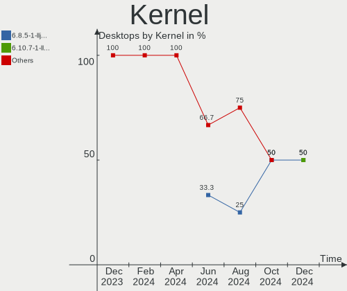
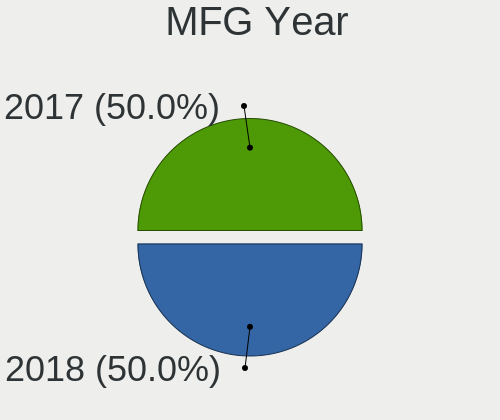
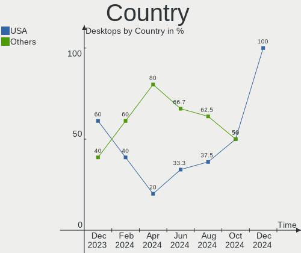
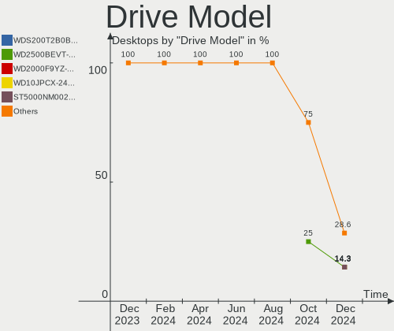
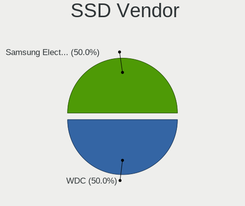
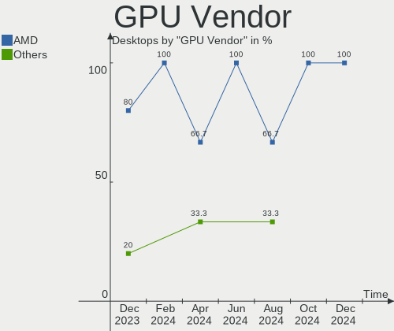
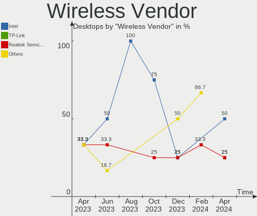
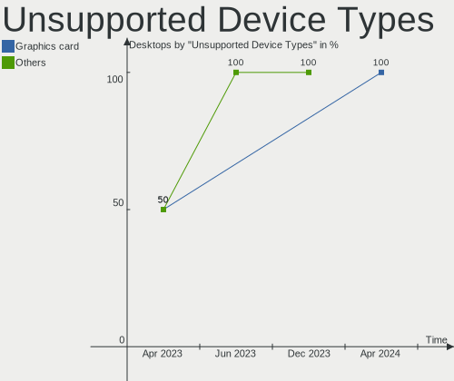

SteamOS - Hardware Trends (Desktops)
------------------------------------

A project to identify most popular hardware characteristics and track their change
over time based on data collected by Linux users at https://Linux-Hardware.org.

Anyone can contribute to this report by the [hw-probe](https://github.com/linuxhw/hw-probe) tool:

    sudo -E hw-probe -all -upload

This report is for one last month. Overall report since the beginning of time: [TestDays](https://github.com/linuxhw/TestDays)

Period: Apr, 2024.

Contents
--------

* [ System ](#system)
  - [ OS                       ](#os)
  - [ OS Family                ](#os-family)
  - [ Kernel                   ](#kernel)
  - [ Kernel Family            ](#kernel-family)
  - [ Kernel Major Ver.        ](#kernel-major-ver)
  - [ Arch                     ](#arch)
  - [ DE                       ](#de)
  - [ Display Server           ](#display-server)
  - [ Display Manager          ](#display-manager)
  - [ OS Lang                  ](#os-lang)
  - [ Boot Mode                ](#boot-mode)
  - [ Filesystem               ](#filesystem)
  - [ Part. scheme             ](#part-scheme)
  - [ Dual Boot with Linux/BSD ](#dual-boot-with-linuxbsd)
  - [ Dual Boot (Win)          ](#dual-boot-win)

* [ Board ](#board)
  - [ Vendor                   ](#vendor)
  - [ Model                    ](#model)
  - [ Model Family             ](#model-family)
  - [ MFG Year                 ](#mfg-year)
  - [ Form Factor              ](#form-factor)
  - [ Secure Boot              ](#secure-boot)
  - [ Coreboot                 ](#coreboot)
  - [ RAM Size                 ](#ram-size)
  - [ RAM Used                 ](#ram-used)
  - [ Total Drives             ](#total-drives)
  - [ Has CD-ROM               ](#has-cd-rom)
  - [ Has Ethernet             ](#has-ethernet)
  - [ Has WiFi                 ](#has-wifi)
  - [ Has Bluetooth            ](#has-bluetooth)

* [ Location ](#location)
  - [ Country                  ](#country)
  - [ City                     ](#city)

* [ Drives ](#drives)
  - [ Drive Vendor             ](#drive-vendor)
  - [ Drive Model              ](#drive-model)
  - [ HDD Vendor               ](#hdd-vendor)
  - [ SSD Vendor               ](#ssd-vendor)
  - [ Drive Kind               ](#drive-kind)
  - [ Drive Connector          ](#drive-connector)
  - [ Drive Size               ](#drive-size)
  - [ Space Total              ](#space-total)
  - [ Space Used               ](#space-used)
  - [ Malfunc. Drives          ](#malfunc-drives)
  - [ Malfunc. Drive Vendor    ](#malfunc-drive-vendor)
  - [ Malfunc. HDD Vendor      ](#malfunc-hdd-vendor)
  - [ Malfunc. Drive Kind      ](#malfunc-drive-kind)
  - [ Failed Drives            ](#failed-drives)
  - [ Failed Drive Vendor      ](#failed-drive-vendor)
  - [ Drive Status             ](#drive-status)

* [ Storage controller ](#storage-controller)
  - [ Storage Vendor           ](#storage-vendor)
  - [ Storage Model            ](#storage-model)
  - [ Storage Kind             ](#storage-kind)

* [ Processor ](#processor)
  - [ CPU Vendor               ](#cpu-vendor)
  - [ CPU Model                ](#cpu-model)
  - [ CPU Model Family         ](#cpu-model-family)
  - [ CPU Cores                ](#cpu-cores)
  - [ CPU Sockets              ](#cpu-sockets)
  - [ CPU Threads              ](#cpu-threads)
  - [ CPU Op-Modes             ](#cpu-op-modes)
  - [ CPU Microcode            ](#cpu-microcode)
  - [ CPU Microarch            ](#cpu-microarch)

* [ Graphics ](#graphics)
  - [ GPU Vendor               ](#gpu-vendor)
  - [ GPU Model                ](#gpu-model)
  - [ GPU Combo                ](#gpu-combo)
  - [ GPU Driver               ](#gpu-driver)
  - [ GPU Memory               ](#gpu-memory)

* [ Monitor ](#monitor)
  - [ Monitor Vendor           ](#monitor-vendor)
  - [ Monitor Model            ](#monitor-model)
  - [ Monitor Resolution       ](#monitor-resolution)
  - [ Monitor Diagonal         ](#monitor-diagonal)
  - [ Monitor Width            ](#monitor-width)
  - [ Aspect Ratio             ](#aspect-ratio)
  - [ Monitor Area             ](#monitor-area)
  - [ Pixel Density            ](#pixel-density)
  - [ Multiple Monitors        ](#multiple-monitors)

* [ Network ](#network)
  - [ Net Controller Vendor    ](#net-controller-vendor)
  - [ Net Controller Model     ](#net-controller-model)
  - [ Wireless Vendor          ](#wireless-vendor)
  - [ Wireless Model           ](#wireless-model)
  - [ Ethernet Vendor          ](#ethernet-vendor)
  - [ Ethernet Model           ](#ethernet-model)
  - [ Net Controller Kind      ](#net-controller-kind)
  - [ Used Controller          ](#used-controller)
  - [ NICs                     ](#nics)
  - [ IPv6                     ](#ipv6)

* [ Bluetooth ](#bluetooth)
  - [ Bluetooth Vendor         ](#bluetooth-vendor)
  - [ Bluetooth Model          ](#bluetooth-model)

* [ Sound ](#sound)
  - [ Sound Vendor             ](#sound-vendor)
  - [ Sound Model              ](#sound-model)

* [ Memory ](#memory)
  - [ Memory Vendor            ](#memory-vendor)
  - [ Memory Model             ](#memory-model)
  - [ Memory Kind              ](#memory-kind)
  - [ Memory Form Factor       ](#memory-form-factor)
  - [ Memory Size              ](#memory-size)
  - [ Memory Speed             ](#memory-speed)

* [ Printers & scanners ](#printers--scanners)
  - [ Printer Vendor           ](#printer-vendor)
  - [ Printer Model            ](#printer-model)
  - [ Scanner Vendor           ](#scanner-vendor)
  - [ Scanner Model            ](#scanner-model)

* [ Camera ](#camera)
  - [ Camera Vendor            ](#camera-vendor)
  - [ Camera Model             ](#camera-model)

* [ Security ](#security)
  - [ Fingerprint Vendor       ](#fingerprint-vendor)
  - [ Fingerprint Model        ](#fingerprint-model)
  - [ Chipcard Vendor          ](#chipcard-vendor)
  - [ Chipcard Model           ](#chipcard-model)

* [ Unsupported ](#unsupported)
  - [ Unsupported Devices      ](#unsupported-devices)
  - [ Unsupported Device Types ](#unsupported-device-types)

System
------

OS
--

Installed operating systems

| Name                          | Desktops | Percent |
|-------------------------------|----------|---------|
| SteamOS 3.5.17                | 1        | 20%     |
| SteamOS 1.1.7_prerc-hotfix    | 1        | 20%     |
| SteamOS 1.1.6-prefinal_fixups | 1        | 20%     |
| SteamOS 1.1.4                 | 1        | 20%     |
| SteamOS 1.01-dev_nv           | 1        | 20%     |

OS Family
---------

OS without a version

| Name    | Desktops | Percent |
|---------|----------|---------|
| SteamOS | 5        | 100%    |

Kernel
------

Version of the Linux kernel

| Version                                           | Desktops | Percent |
|---------------------------------------------------|----------|---------|
| 6.7.4-holoiso-beta_lljy-kernel-lljy-g76a2d2abfbba | 2        | 40%     |
| 6.3.7-zen1-1-zen                                  | 2        | 40%     |
| 6.1.52-valve16-1-neptune-61                       | 1        | 20%     |

Kernel Family
-------------

Linux kernel without a distro release

| Version | Desktops | Percent |
|---------|----------|---------|
| 6.7.4   | 2        | 40%     |
| 6.3.7   | 2        | 40%     |
| 6.1.52  | 1        | 20%     |

Kernel Major Ver.
-----------------

Linux kernel major version

| Version | Desktops | Percent |
|---------|----------|---------|
| 6.7     | 2        | 40%     |
| 6.3     | 2        | 40%     |
| 6.1     | 1        | 20%     |

Arch
----

OS architecture (x86_64, i586, etc.)

| Name   | Desktops | Percent |
|--------|----------|---------|
| x86_64 | 5        | 100%    |

DE
--

Desktop Environment

| Name | Desktops | Percent |
|------|----------|---------|
| KDE5 | 5        | 100%    |

Display Server
--------------

X11 or Wayland

| Name | Desktops | Percent |
|------|----------|---------|
| X11  | 5        | 100%    |

Display Manager
---------------

SDDM, LightDM, etc.

| Name    | Desktops | Percent |
|---------|----------|---------|
| Unknown | 5        | 100%    |

OS Lang
-------

Language

| Lang  | Desktops | Percent |
|-------|----------|---------|
| C     | 3        | 60%     |
| pt_BR | 1        | 20%     |
| en_US | 1        | 20%     |

Boot Mode
---------

EFI or BIOS

| Mode | Desktops | Percent |
|------|----------|---------|
| BIOS | 5        | 100%    |

Filesystem
----------

Type of filesystem

| Type  | Desktops | Percent |
|-------|----------|---------|
| Btrfs | 5        | 100%    |

Part. scheme
------------

Scheme of partitioning

| Type    | Desktops | Percent |
|---------|----------|---------|
| Unknown | 5        | 100%    |

Dual Boot with Linux/BSD
------------------------

Hosting more than one Linux/BSD

| Dual boot | Desktops | Percent |
|-----------|----------|---------|
| No        | 5        | 100%    |

Dual Boot (Win)
---------------

Hosting Linux and Windows

| Dual boot | Desktops | Percent |
|-----------|----------|---------|
| No        | 5        | 100%    |

Board
-----

Vendor
------

Motherboard manufacturer

| Name                | Desktops | Percent |
|---------------------|----------|---------|
| ASUSTek Computer    | 2        | 40%     |
| ASRock              | 2        | 40%     |
| Gigabyte Technology | 1        | 20%     |

Model
-----

Motherboard model

| Name                              | Desktops | Percent |
|-----------------------------------|----------|---------|
| Gigabyte B450M GAMING             | 1        | 20%     |
| ASUS ROG CROSSHAIR VIII DARK HERO | 1        | 20%     |
| ASUS PRIME A320M-K                | 1        | 20%     |
| ASRock B450 Gaming-ITX/ac         | 1        | 20%     |
| ASRock A0000001                   | 1        | 20%     |

Model Family
------------

Motherboard model prefix

| Name            | Desktops | Percent |
|-----------------|----------|---------|
| Gigabyte B450M  | 1        | 20%     |
| ASUS ROG        | 1        | 20%     |
| ASUS PRIME      | 1        | 20%     |
| ASRock B450     | 1        | 20%     |
| ASRock A0000001 | 1        | 20%     |

MFG Year
--------

Motherboard manufacture year

| Year | Desktops | Percent |
|------|----------|---------|
| 2018 | 2        | 40%     |
| 2023 | 1        | 20%     |
| 2022 | 1        | 20%     |
| 2017 | 1        | 20%     |

Form Factor
-----------

Physical design of the computer

| Name    | Desktops | Percent |
|---------|----------|---------|
| Desktop | 5        | 100%    |

Secure Boot
-----------

Enabled or disabled

| State    | Desktops | Percent |
|----------|----------|---------|
| Disabled | 5        | 100%    |

Coreboot
--------

Have coreboot on board

| Used | Desktops | Percent |
|------|----------|---------|
| No   | 5        | 100%    |

RAM Size
--------

Total RAM memory

| Size in GB  | Desktops | Percent |
|-------------|----------|---------|
| 16.01-24.0  | 3        | 60%     |
| 64.01-256.0 | 1        | 20%     |
| 8.01-16.0   | 1        | 20%     |

RAM Used
--------

Used RAM memory

| Used GB  | Desktops | Percent |
|----------|----------|---------|
| 4.01-8.0 | 4        | 80%     |
| 3.01-4.0 | 1        | 20%     |

Total Drives
------------

Number of drives on board

| Drives | Desktops | Percent |
|--------|----------|---------|
| 1      | 3        | 60%     |
| 3      | 2        | 40%     |

Has CD-ROM
----------

Has CD-ROM on board

| Presented | Desktops | Percent |
|-----------|----------|---------|
| No        | 5        | 100%    |

Has Ethernet
------------

Has Ethernet on board

| Presented | Desktops | Percent |
|-----------|----------|---------|
| Yes       | 5        | 100%    |

Has WiFi
--------

Has WiFi module

| Presented | Desktops | Percent |
|-----------|----------|---------|
| Yes       | 3        | 60%     |
| No        | 2        | 40%     |

Has Bluetooth
-------------

Has Bluetooth module

| Presented | Desktops | Percent |
|-----------|----------|---------|
| Yes       | 3        | 60%     |
| No        | 2        | 40%     |

Location
--------

Country
-------

Geographic location (country)

| Country   | Desktops | Percent |
|-----------|----------|---------|
| USA       | 1        | 20%     |
| Indonesia | 1        | 20%     |
| Germany   | 1        | 20%     |
| Brazil    | 1        | 20%     |
| Austria   | 1        | 20%     |

City
----

Geographic location (city)

| City                  | Desktops | Percent |
|-----------------------|----------|---------|
| Sundern               | 1        | 20%     |
| Santa Rosa            | 1        | 20%     |
| Santa Barbara d'Oeste | 1        | 20%     |
| Sankt Pölten         | 1        | 20%     |
| Pekanbaru             | 1        | 20%     |

Drives
------

Drive Vendor
------------

Hard drive vendors

| Vendor                    | Desktops | Drives | Percent |
|---------------------------|----------|--------|---------|
| WDC                       | 1        | 2      | 14.29%  |
| Silicon Motion            | 1        | 1      | 14.29%  |
| Seagate                   | 1        | 1      | 14.29%  |
| Sandisk                   | 1        | 2      | 14.29%  |
| Samsung Electronics       | 1        | 1      | 14.29%  |
| Patriot                   | 1        | 1      | 14.29%  |
| Micron/Crucial Technology | 1        | 1      | 14.29%  |

Drive Model
-----------

Hard drive models

| Model                                                 | Desktops | Percent |
|-------------------------------------------------------|----------|---------|
| WDC WD5000AAKX-08U6AA0 500GB                          | 1        | 12.5%   |
| WDC WD2500BEKT-75PVMT0 250GB                          | 1        | 12.5%   |
| Silicon Motion SM2263EN/SM2263XT SSD Controller 256GB | 1        | 12.5%   |
| Seagate ST3500414CS 500GB                             | 1        | 12.5%   |
| Sandisk Western Digital SN560E 1TB                    | 1        | 12.5%   |
| Samsung MZVLQ512HBLU-00BH1 512GB                      | 1        | 12.5%   |
| Patriot P210 2048GB SSD                               | 1        | 12.5%   |
| Micron/Crucial P2 NVMe PCIe SSD 4TB                   | 1        | 12.5%   |

HDD Vendor
----------

Hard disk drive vendors

| Vendor  | Desktops | Drives | Percent |
|---------|----------|--------|---------|
| WDC     | 1        | 2      | 50%     |
| Seagate | 1        | 1      | 50%     |

SSD Vendor
----------

Solid state drive vendors

| Vendor  | Desktops | Drives | Percent |
|---------|----------|--------|---------|
| Patriot | 1        | 1      | 100%    |

Drive Kind
----------

HDD or SSD

| Kind | Desktops | Drives | Percent |
|------|----------|--------|---------|
| NVMe | 3        | 5      | 60%     |
| SSD  | 1        | 1      | 20%     |
| HDD  | 1        | 3      | 20%     |

Drive Connector
---------------

SATA, SAS, NVMe, etc.

| Type | Desktops | Drives | Percent |
|------|----------|--------|---------|
| NVMe | 3        | 5      | 60%     |
| SATA | 2        | 4      | 40%     |

Drive Size
----------

Size of hard drive

| Size in TB | Desktops | Drives | Percent |
|------------|----------|--------|---------|
| 1.01-2.0   | 1        | 1      | 50%     |
| 0.01-0.5   | 1        | 3      | 50%     |

Space Total
-----------

Amount of disk space available on the file system

| Size in GB | Desktops | Percent |
|------------|----------|---------|
| 501-1000   | 2        | 40%     |
| 251-500    | 1        | 20%     |
| 101-250    | 1        | 20%     |
| 1001-2000  | 1        | 20%     |

Space Used
----------

Amount of used disk space

| Used GB | Desktops | Percent |
|---------|----------|---------|
| 101-250 | 3        | 60%     |
| 21-50   | 2        | 40%     |

Malfunc. Drives
---------------

Drive models with a malfunction

Zero info for selected period =(

Malfunc. Drive Vendor
---------------------

Vendors of faulty drives

Zero info for selected period =(

Malfunc. HDD Vendor
-------------------

Vendors of faulty HDD drives

Zero info for selected period =(

Malfunc. Drive Kind
-------------------

Kinds of faulty drives

Zero info for selected period =(

Failed Drives
-------------

Failed drive models

Zero info for selected period =(

Failed Drive Vendor
-------------------

Failed drive vendors

Zero info for selected period =(

Drive Status
------------

Number of failed and malfunc. drives

| Status   | Desktops | Drives | Percent |
|----------|----------|--------|---------|
| Detected | 5        | 9      | 100%    |

Storage controller
------------------

Storage Vendor
--------------

Storage controller vendors

| Vendor                    | Desktops | Percent |
|---------------------------|----------|---------|
| AMD                       | 4        | 50%     |
| Silicon Motion            | 1        | 12.5%   |
| SanDisk                   | 1        | 12.5%   |
| Samsung Electronics       | 1        | 12.5%   |
| Micron/Crucial Technology | 1        | 12.5%   |

Storage Model
-------------

Storage controller models

| Model                                                                | Desktops | Percent |
|----------------------------------------------------------------------|----------|---------|
| AMD FCH SATA Controller [AHCI mode]                                  | 2        | 20%     |
| AMD 400 Series Chipset SATA Controller                               | 2        | 20%     |
| Silicon Motion SM2263EN/SM2263XT (DRAM-less) NVMe SSD Controllers    | 1        | 10%     |
| SanDisk WD Green SN350 240GB (DRAM-less) / SN560E NVMe SSD           | 1        | 10%     |
| Samsung NVMe SSD Controller 980 (DRAM-less)                          | 1        | 10%     |
| Micron/Crucial P2 [Nick P2] / P3 / P3 Plus NVMe PCIe SSD (DRAM-less) | 1        | 10%     |
| AMD RS690 PCI to PCI Bridge (PCI Express Port 2)                     | 1        | 10%     |
| AMD FCH SATA Controller D                                            | 1        | 10%     |

Storage Kind
------------

Kind of storage controller (IDE, SATA, NVMe, SAS, ...)

| Kind | Desktops | Percent |
|------|----------|---------|
| NVMe | 3        | 42.86%  |
| SATA | 3        | 42.86%  |
| RAID | 1        | 14.29%  |

Processor
---------

CPU Vendor
----------

Processor vendors

| Vendor | Desktops | Percent |
|--------|----------|---------|
| AMD    | 5        | 100%    |

CPU Model
---------

Processor models

| Model                                  | Desktops | Percent |
|----------------------------------------|----------|---------|
| AMD Ryzen 9 5950X 16-Core Processor    | 1        | 20%     |
| AMD Ryzen 7 5700X 8-Core Processor     | 1        | 20%     |
| AMD Ryzen 7 3800X 8-Core Processor     | 1        | 20%     |
| AMD Ryzen 7 2700X Eight-Core Processor | 1        | 20%     |
| AMD Ryzen 5 4600G with Radeon Graphics | 1        | 20%     |

CPU Model Family
----------------

Processor model prefix

| Model       | Desktops | Percent |
|-------------|----------|---------|
| AMD Ryzen 7 | 3        | 60%     |
| AMD Ryzen 9 | 1        | 20%     |
| AMD Ryzen 5 | 1        | 20%     |

CPU Cores
---------

Number of processor cores

| Number | Desktops | Percent |
|--------|----------|---------|
| 8      | 3        | 60%     |
| 16     | 1        | 20%     |
| 6      | 1        | 20%     |

CPU Sockets
-----------

Number of sockets

| Number | Desktops | Percent |
|--------|----------|---------|
| 1      | 5        | 100%    |

CPU Threads
-----------

Threads per core (Hyper-Threading)

| Number | Desktops | Percent |
|--------|----------|---------|
| 2      | 5        | 100%    |

CPU Op-Modes
------------

CPU Operation Modes (32-bit, 64-bit)

| Op mode        | Desktops | Percent |
|----------------|----------|---------|
| 32-bit, 64-bit | 5        | 100%    |

CPU Microcode
-------------

Microcode number

| Number  | Desktops | Percent |
|---------|----------|---------|
| Unknown | 5        | 100%    |

CPU Microarch
-------------

Microarchitecture

| Name  | Desktops | Percent |
|-------|----------|---------|
| Zen 3 | 2        | 40%     |
| Zen 2 | 2        | 40%     |
| Zen+  | 1        | 20%     |

Graphics
--------

GPU Vendor
----------

Vendors of graphics cards

| Vendor | Desktops | Percent |
|--------|----------|---------|
| AMD    | 4        | 66.67%  |
| Nvidia | 2        | 33.33%  |

GPU Model
---------

Graphics card models

| Model                                                         | Desktops | Percent |
|---------------------------------------------------------------|----------|---------|
| Nvidia TU116 [GeForce GTX 1650]                               | 1        | 16.67%  |
| Nvidia AD107 [GeForce RTX 4060]                               | 1        | 16.67%  |
| AMD Renoir [Radeon RX Vega 6 (Ryzen 4000/5000 Mobile Series)] | 1        | 16.67%  |
| AMD Navi 23 [Radeon RX 6650 XT / 6700S / 6800S]               | 1        | 16.67%  |
| AMD Navi 10 [Radeon RX 5600 OEM/5600 XT / 5700/5700 XT]       | 1        | 16.67%  |
| AMD Ellesmere [Radeon RX 470/480/570/570X/580/580X/590]       | 1        | 16.67%  |

GPU Combo
---------

Combinations of graphics cards

| Name         | Desktops | Percent |
|--------------|----------|---------|
| 1 x AMD      | 2        | 40%     |
| 2 x AMD      | 1        | 20%     |
| 1 x Nvidia   | 1        | 20%     |
| AMD + Nvidia | 1        | 20%     |

GPU Driver
----------

Free vs proprietary

| Driver      | Desktops | Percent |
|-------------|----------|---------|
| Free        | 4        | 80%     |
| Proprietary | 1        | 20%     |

GPU Memory
----------

Total video memory

| Size in GB | Desktops | Percent |
|------------|----------|---------|
| Unknown    | 4        | 80%     |
| 3.01-4.0   | 1        | 20%     |

Monitor
-------

Monitor Vendor
--------------

Monitor vendors

| Vendor    | Desktops | Percent |
|-----------|----------|---------|
| ViewSonic | 1        | 20%     |
| Valve     | 1        | 20%     |
| MStar     | 1        | 20%     |
| AOC       | 1        | 20%     |
| Acer      | 1        | 20%     |

Monitor Model
-------------

Monitor models

| Model                                                      | Desktops | Percent |
|------------------------------------------------------------|----------|---------|
| ViewSonic VX3276-FHD VSCE735 1920x1080 698x393mm 31.5-inch | 1        | 20%     |
| Valve Index HMD VLV91A8 2880x1600                          | 1        | 20%     |
| MStar TV MST0030 1920x1080 708x398mm 32.0-inch             | 1        | 20%     |
| AOC Q32G2WG3 AOC3202 2560x1440 697x392mm 31.5-inch         | 1        | 20%     |
| Acer CB242Y ACR0708 1920x1080 527x296mm 23.8-inch          | 1        | 20%     |

Monitor Resolution
------------------

Monitor screen resolution

| Resolution      | Desktops | Percent |
|-----------------|----------|---------|
| 3840x2160 (4K)  | 2        | 40%     |
| 1920x1080 (FHD) | 2        | 40%     |
| Unknown         | 1        | 20%     |

Monitor Diagonal
----------------

Diagonal size in inches

| Inches  | Desktops | Percent |
|---------|----------|---------|
| 31      | 2        | 40%     |
| 52      | 1        | 20%     |
| 24      | 1        | 20%     |
| Unknown | 1        | 20%     |

Monitor Width
-------------

Physical width

| Width in mm | Desktops | Percent |
|-------------|----------|---------|
| 601-700     | 2        | 40%     |
| 501-600     | 1        | 20%     |
| 1001-1500   | 1        | 20%     |
| Unknown     | 1        | 20%     |

Aspect Ratio
------------

Proportional relationship between the width and the height

| Ratio   | Desktops | Percent |
|---------|----------|---------|
| 16/9    | 4        | 80%     |
| Unknown | 1        | 20%     |

Monitor Area
------------

Area in inch²

| Area in inch² | Desktops | Percent |
|----------------|----------|---------|
| 351-500        | 2        | 40%     |
| More than 1000 | 1        | 20%     |
| 201-250        | 1        | 20%     |
| Unknown        | 1        | 20%     |

Pixel Density
-------------

Pixels per inch

| Density | Desktops | Percent |
|---------|----------|---------|
| 51-100  | 3        | 60%     |
| 1-50    | 1        | 20%     |
| Unknown | 1        | 20%     |

Multiple Monitors
-----------------

Total monitors connected

| Total | Desktops | Percent |
|-------|----------|---------|
| 1     | 4        | 80%     |
| 2     | 1        | 20%     |

Network
-------

Net Controller Vendor
---------------------

Controller vendors

| Vendor                | Desktops | Percent |
|-----------------------|----------|---------|
| Realtek Semiconductor | 4        | 57.14%  |
| Intel                 | 2        | 28.57%  |
| TP-Link               | 1        | 14.29%  |

Net Controller Model
--------------------

Controller models

| Model                                                                  | Desktops | Percent |
|------------------------------------------------------------------------|----------|---------|
| Realtek RTL8111/8168/8211/8411 PCI Express Gigabit Ethernet Controller | 3        | 30%     |
| Intel I211 Gigabit Network Connection                                  | 2        | 20%     |
| TP-Link TL-WN722N v2/v3 [Realtek RTL8188EUS]                           | 1        | 10%     |
| Realtek RTL8188EUS 802.11n Wireless Network Adapter                    | 1        | 10%     |
| Realtek RTL8125 2.5GbE Controller                                      | 1        | 10%     |
| Intel Wi-Fi 6 AX200                                                    | 1        | 10%     |
| Intel Dual Band Wireless-AC 3168NGW [Stone Peak]                       | 1        | 10%     |

Wireless Vendor
---------------

Wireless vendors

| Vendor                | Desktops | Percent |
|-----------------------|----------|---------|
| Intel                 | 2        | 50%     |
| TP-Link               | 1        | 25%     |
| Realtek Semiconductor | 1        | 25%     |

Wireless Model
--------------

Wireless models

| Model                                               | Desktops | Percent |
|-----------------------------------------------------|----------|---------|
| TP-Link TL-WN722N v2/v3 [Realtek RTL8188EUS]        | 1        | 25%     |
| Realtek RTL8188EUS 802.11n Wireless Network Adapter | 1        | 25%     |
| Intel Wi-Fi 6 AX200                                 | 1        | 25%     |
| Intel Dual Band Wireless-AC 3168NGW [Stone Peak]    | 1        | 25%     |

Ethernet Vendor
---------------

Ethernet vendors

| Vendor                | Desktops | Percent |
|-----------------------|----------|---------|
| Realtek Semiconductor | 4        | 66.67%  |
| Intel                 | 2        | 33.33%  |

Ethernet Model
--------------

Ethernet models

| Model                                                                  | Desktops | Percent |
|------------------------------------------------------------------------|----------|---------|
| Realtek RTL8111/8168/8211/8411 PCI Express Gigabit Ethernet Controller | 3        | 50%     |
| Intel I211 Gigabit Network Connection                                  | 2        | 33.33%  |
| Realtek RTL8125 2.5GbE Controller                                      | 1        | 16.67%  |

Net Controller Kind
-------------------

Ethernet, WiFi or modem

| Kind     | Desktops | Percent |
|----------|----------|---------|
| Ethernet | 5        | 62.5%   |
| WiFi     | 3        | 37.5%   |

Used Controller
---------------

Currently used network controller

| Kind     | Desktops | Percent |
|----------|----------|---------|
| Ethernet | 4        | 80%     |
| WiFi     | 1        | 20%     |

NICs
----

Total network controllers on board

| Total | Desktops | Percent |
|-------|----------|---------|
| 2     | 2        | 40%     |
| 1     | 2        | 40%     |
| 3     | 1        | 20%     |

IPv6
----

IPv6 vs IPv4

| Used | Desktops | Percent |
|------|----------|---------|
| No   | 4        | 80%     |
| Yes  | 1        | 20%     |

Bluetooth
---------

Bluetooth Vendor
----------------

Controller vendors

| Vendor                  | Desktops | Percent |
|-------------------------|----------|---------|
| Intel                   | 2        | 66.67%  |
| Cambridge Silicon Radio | 1        | 33.33%  |

Bluetooth Model
---------------

Controller models

| Model                                               | Desktops | Percent |
|-----------------------------------------------------|----------|---------|
| Intel Wireless-AC 3168 Bluetooth                    | 1        | 33.33%  |
| Intel AX200 Bluetooth                               | 1        | 33.33%  |
| Cambridge Silicon Radio Bluetooth Dongle (HCI mode) | 1        | 33.33%  |

Sound
-----

Sound Vendor
------------

Sound card vendors

| Vendor              | Desktops | Percent |
|---------------------|----------|---------|
| AMD                 | 5        | 50%     |
| Nvidia              | 2        | 20%     |
| Valve Software      | 1        | 10%     |
| Kingston Technology | 1        | 10%     |
| Hewlett-Packard     | 1        | 10%     |

Sound Model
-----------

Sound card models

| Model                                                      | Desktops | Percent |
|------------------------------------------------------------|----------|---------|
| AMD Starship/Matisse HD Audio Controller                   | 3        | 21.43%  |
| Valve Software Valve VR Radio & HMD Mic                    | 1        | 7.14%   |
| Nvidia TU116 High Definition Audio Controller              | 1        | 7.14%   |
| Nvidia Audio device                                        | 1        | 7.14%   |
| Kingston Technology HyperX Cloud Flight Wireless Headset   | 1        | 7.14%   |
| Hewlett-Packard HyperX Virtual Surround Sound              | 1        | 7.14%   |
| AMD Renoir Radeon High Definition Audio Controller         | 1        | 7.14%   |
| AMD Navi 21/23 HDMI/DP Audio Controller                    | 1        | 7.14%   |
| AMD Navi 10 HDMI Audio                                     | 1        | 7.14%   |
| AMD Family 17h/19h HD Audio Controller                     | 1        | 7.14%   |
| AMD Family 17h (Models 00h-0fh) HD Audio Controller        | 1        | 7.14%   |
| AMD Ellesmere HDMI Audio [Radeon RX 470/480 / 570/580/590] | 1        | 7.14%   |

Memory
------

Memory Vendor
-------------

Memory module vendors

Zero info for selected period =(

Memory Model
------------

Memory module models

Zero info for selected period =(

Memory Kind
-----------

Memory module kinds

Zero info for selected period =(

Memory Form Factor
------------------

Physical design of the memory module

Zero info for selected period =(

Memory Size
-----------

Memory module size

Zero info for selected period =(

Memory Speed
------------

Memory module speed

Zero info for selected period =(

Printers & scanners
-------------------

Printer Vendor
--------------

Printer device vendors

Zero info for selected period =(

Printer Model
-------------

Printer device models

Zero info for selected period =(

Scanner Vendor
--------------

Scanner device vendors

Zero info for selected period =(

Scanner Model
-------------

Scanner device models

Zero info for selected period =(

Camera
------

Camera Vendor
-------------

Camera device vendors

| Vendor         | Desktops | Percent |
|----------------|----------|---------|
| Valve Software | 1        | 100%    |

Camera Model
------------

Camera device models

| Model                    | Desktops | Percent |
|--------------------------|----------|---------|
| Valve Software 3D Camera | 1        | 100%    |

Security
--------

Fingerprint Vendor
------------------

Fingerprint sensor vendors

Zero info for selected period =(

Fingerprint Model
-----------------

Fingerprint sensor models

Zero info for selected period =(

Chipcard Vendor
---------------

Chipcard module vendors

Zero info for selected period =(

Chipcard Model
--------------

Chipcard module models

Zero info for selected period =(

Unsupported
-----------

Unsupported Devices
-------------------

Total unsupported devices on board

| Total | Desktops | Percent |
|-------|----------|---------|
| 0     | 4        | 80%     |
| 1     | 1        | 20%     |

Unsupported Device Types
------------------------

Types of unsupported devices

| Type          | Desktops | Percent |
|---------------|----------|---------|
| Graphics card | 1        | 100%    |

