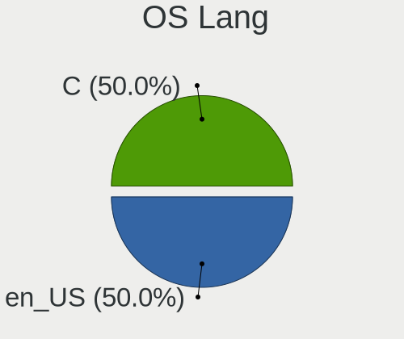
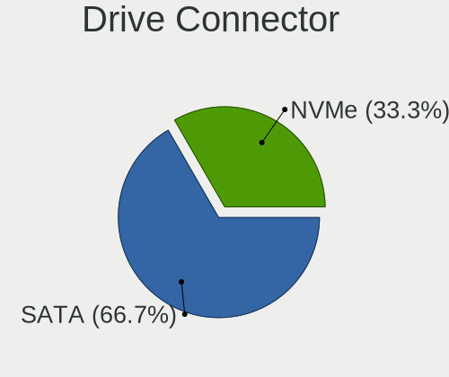
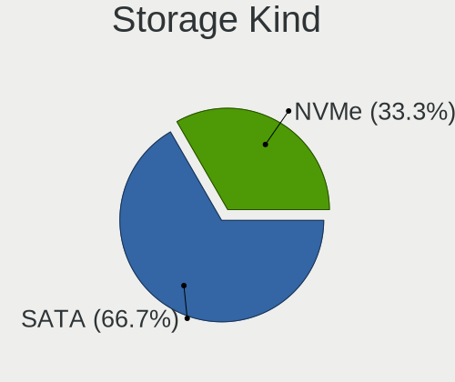
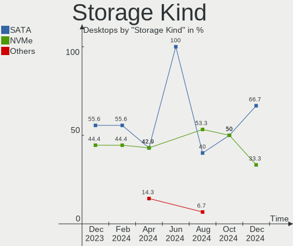
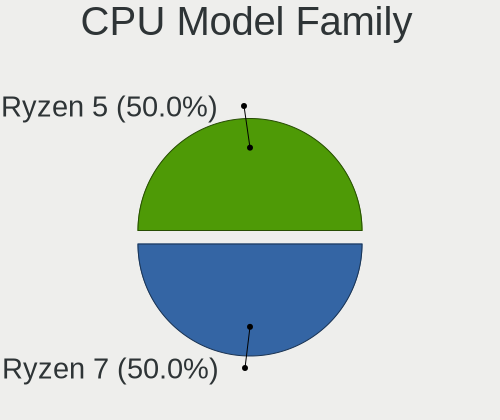

SteamOS - Hardware Trends (Desktops)
------------------------------------

A project to identify most popular hardware characteristics and track their change
over time based on data collected by Linux users at https://Linux-Hardware.org.

Anyone can contribute to this report by the [hw-probe](https://github.com/linuxhw/hw-probe) tool:

    sudo -E hw-probe -all -upload

This report is for one last month. Overall report since the beginning of time: [TestCoverage](https://github.com/linuxhw/TestCoverage)

Period: Sep, 2022.

Contents
--------

* [ System ](#system)
  - [ OS                       ](#os)
  - [ OS Family                ](#os-family)
  - [ Kernel                   ](#kernel)
  - [ Kernel Family            ](#kernel-family)
  - [ Kernel Major Ver.        ](#kernel-major-ver)
  - [ Arch                     ](#arch)
  - [ DE                       ](#de)
  - [ Display Server           ](#display-server)
  - [ Display Manager          ](#display-manager)
  - [ OS Lang                  ](#os-lang)
  - [ Boot Mode                ](#boot-mode)
  - [ Filesystem               ](#filesystem)
  - [ Part. scheme             ](#part-scheme)
  - [ Dual Boot with Linux/BSD ](#dual-boot-with-linuxbsd)
  - [ Dual Boot (Win)          ](#dual-boot-win)

* [ Board ](#board)
  - [ Vendor                   ](#vendor)
  - [ Model                    ](#model)
  - [ Model Family             ](#model-family)
  - [ MFG Year                 ](#mfg-year)
  - [ Form Factor              ](#form-factor)
  - [ Secure Boot              ](#secure-boot)
  - [ Coreboot                 ](#coreboot)
  - [ RAM Size                 ](#ram-size)
  - [ RAM Used                 ](#ram-used)
  - [ Total Drives             ](#total-drives)
  - [ Has CD-ROM               ](#has-cd-rom)
  - [ Has Ethernet             ](#has-ethernet)
  - [ Has WiFi                 ](#has-wifi)
  - [ Has Bluetooth            ](#has-bluetooth)

* [ Location ](#location)
  - [ Country                  ](#country)
  - [ City                     ](#city)

* [ Drives ](#drives)
  - [ Drive Vendor             ](#drive-vendor)
  - [ Drive Model              ](#drive-model)
  - [ HDD Vendor               ](#hdd-vendor)
  - [ SSD Vendor               ](#ssd-vendor)
  - [ Drive Kind               ](#drive-kind)
  - [ Drive Connector          ](#drive-connector)
  - [ Drive Size               ](#drive-size)
  - [ Space Total              ](#space-total)
  - [ Space Used               ](#space-used)
  - [ Malfunc. Drives          ](#malfunc-drives)
  - [ Malfunc. Drive Vendor    ](#malfunc-drive-vendor)
  - [ Malfunc. HDD Vendor      ](#malfunc-hdd-vendor)
  - [ Malfunc. Drive Kind      ](#malfunc-drive-kind)
  - [ Failed Drives            ](#failed-drives)
  - [ Failed Drive Vendor      ](#failed-drive-vendor)
  - [ Drive Status             ](#drive-status)

* [ Storage controller ](#storage-controller)
  - [ Storage Vendor           ](#storage-vendor)
  - [ Storage Model            ](#storage-model)
  - [ Storage Kind             ](#storage-kind)

* [ Processor ](#processor)
  - [ CPU Vendor               ](#cpu-vendor)
  - [ CPU Model                ](#cpu-model)
  - [ CPU Model Family         ](#cpu-model-family)
  - [ CPU Cores                ](#cpu-cores)
  - [ CPU Sockets              ](#cpu-sockets)
  - [ CPU Threads              ](#cpu-threads)
  - [ CPU Op-Modes             ](#cpu-op-modes)
  - [ CPU Microcode            ](#cpu-microcode)
  - [ CPU Microarch            ](#cpu-microarch)

* [ Graphics ](#graphics)
  - [ GPU Vendor               ](#gpu-vendor)
  - [ GPU Model                ](#gpu-model)
  - [ GPU Combo                ](#gpu-combo)
  - [ GPU Driver               ](#gpu-driver)
  - [ GPU Memory               ](#gpu-memory)

* [ Monitor ](#monitor)
  - [ Monitor Vendor           ](#monitor-vendor)
  - [ Monitor Model            ](#monitor-model)
  - [ Monitor Resolution       ](#monitor-resolution)
  - [ Monitor Diagonal         ](#monitor-diagonal)
  - [ Monitor Width            ](#monitor-width)
  - [ Aspect Ratio             ](#aspect-ratio)
  - [ Monitor Area             ](#monitor-area)
  - [ Pixel Density            ](#pixel-density)
  - [ Multiple Monitors        ](#multiple-monitors)

* [ Network ](#network)
  - [ Net Controller Vendor    ](#net-controller-vendor)
  - [ Net Controller Model     ](#net-controller-model)
  - [ Wireless Vendor          ](#wireless-vendor)
  - [ Wireless Model           ](#wireless-model)
  - [ Ethernet Vendor          ](#ethernet-vendor)
  - [ Ethernet Model           ](#ethernet-model)
  - [ Net Controller Kind      ](#net-controller-kind)
  - [ Used Controller          ](#used-controller)
  - [ NICs                     ](#nics)
  - [ IPv6                     ](#ipv6)

* [ Bluetooth ](#bluetooth)
  - [ Bluetooth Vendor         ](#bluetooth-vendor)
  - [ Bluetooth Model          ](#bluetooth-model)

* [ Sound ](#sound)
  - [ Sound Vendor             ](#sound-vendor)
  - [ Sound Model              ](#sound-model)

* [ Memory ](#memory)
  - [ Memory Vendor            ](#memory-vendor)
  - [ Memory Model             ](#memory-model)
  - [ Memory Kind              ](#memory-kind)
  - [ Memory Form Factor       ](#memory-form-factor)
  - [ Memory Size              ](#memory-size)
  - [ Memory Speed             ](#memory-speed)

* [ Printers & scanners ](#printers--scanners)
  - [ Printer Vendor           ](#printer-vendor)
  - [ Printer Model            ](#printer-model)
  - [ Scanner Vendor           ](#scanner-vendor)
  - [ Scanner Model            ](#scanner-model)

* [ Camera ](#camera)
  - [ Camera Vendor            ](#camera-vendor)
  - [ Camera Model             ](#camera-model)

* [ Security ](#security)
  - [ Fingerprint Vendor       ](#fingerprint-vendor)
  - [ Fingerprint Model        ](#fingerprint-model)
  - [ Chipcard Vendor          ](#chipcard-vendor)
  - [ Chipcard Model           ](#chipcard-model)

* [ Unsupported ](#unsupported)
  - [ Unsupported Devices      ](#unsupported-devices)
  - [ Unsupported Device Types ](#unsupported-device-types)

System
------

OS
--

Installed operating systems

| Name        | Desktops | Percent |
|-------------|----------|---------|
| SteamOS 3.3 | 9        | 100%    |

OS Family
---------

OS without a version

| Name    | Desktops | Percent |
|---------|----------|---------|
| SteamOS | 9        | 100%    |

Kernel
------

Version of the Linux kernel

| Version                                      | Desktops | Percent |
|----------------------------------------------|----------|---------|
| 5.13.0-valve24-1-neptune-02226-g5b8545e4c5a1 | 8        | 88.89%  |
| 5.18.1-arch1_testHoloISO_20220606.1811       | 1        | 11.11%  |

Kernel Family
-------------

Linux kernel without a distro release

| Version | Desktops | Percent |
|---------|----------|---------|
| 5.13.0  | 8        | 88.89%  |
| 5.18.1  | 1        | 11.11%  |

Kernel Major Ver.
-----------------

Linux kernel major version

| Version | Desktops | Percent |
|---------|----------|---------|
| 5.13    | 8        | 88.89%  |
| 5.18    | 1        | 11.11%  |

Arch
----

OS architecture (x86_64, i586, etc.)

| Name   | Desktops | Percent |
|--------|----------|---------|
| x86_64 | 9        | 100%    |

DE
--

Desktop Environment

| Name | Desktops | Percent |
|------|----------|---------|
| KDE5 | 9        | 100%    |

Display Server
--------------

X11 or Wayland

| Name | Desktops | Percent |
|------|----------|---------|
| X11  | 9        | 100%    |

Display Manager
---------------

SDDM, LightDM, etc.

| Name    | Desktops | Percent |
|---------|----------|---------|
| Unknown | 9        | 100%    |

OS Lang
-------

Language

| Lang  | Desktops | Percent |
|-------|----------|---------|
| en_US | 9        | 100%    |

Boot Mode
---------

EFI or BIOS

| Mode | Desktops | Percent |
|------|----------|---------|
| BIOS | 9        | 100%    |

Filesystem
----------

Type of filesystem

| Type  | Desktops | Percent |
|-------|----------|---------|
| Btrfs | 9        | 100%    |

Part. scheme
------------

Scheme of partitioning

| Type    | Desktops | Percent |
|---------|----------|---------|
| Unknown | 9        | 100%    |

Dual Boot with Linux/BSD
------------------------

Hosting more than one Linux/BSD

| Dual boot | Desktops | Percent |
|-----------|----------|---------|
| No        | 9        | 100%    |

Dual Boot (Win)
---------------

Hosting Linux and Windows

| Dual boot | Desktops | Percent |
|-----------|----------|---------|
| No        | 9        | 100%    |

Board
-----

Vendor
------

Motherboard manufacturer

| Name                | Desktops | Percent |
|---------------------|----------|---------|
| MSI                 | 3        | 33.33%  |
| ASUSTek Computer    | 3        | 33.33%  |
| Gigabyte Technology | 1        | 11.11%  |
| Dell                | 1        | 11.11%  |
| ASRock              | 1        | 11.11%  |

Model
-----

Motherboard model

| Name                               | Desktops | Percent |
|------------------------------------|----------|---------|
| MSI MS-7B79                        | 1        | 11.11%  |
| MSI MS-7B09                        | 1        | 11.11%  |
| MSI MS-7693                        | 1        | 11.11%  |
| Gigabyte B450 AORUS M              | 1        | 11.11%  |
| Dell Precision Tower 5810          | 1        | 11.11%  |
| ASUS PRIME A320M-K                 | 1        | 11.11%  |
| ASUS CROSSHAIR VI HERO             | 1        | 11.11%  |
| ASUS All Series                    | 1        | 11.11%  |
| ASRock X570 Phantom Gaming-ITX/TB3 | 1        | 11.11%  |

Model Family
------------

Motherboard model prefix

| Name           | Desktops | Percent |
|----------------|----------|---------|
| MSI MS-7B79    | 1        | 11.11%  |
| MSI MS-7B09    | 1        | 11.11%  |
| MSI MS-7693    | 1        | 11.11%  |
| Gigabyte B450  | 1        | 11.11%  |
| Dell Precision | 1        | 11.11%  |
| ASUS PRIME     | 1        | 11.11%  |
| ASUS CROSSHAIR | 1        | 11.11%  |
| ASUS All       | 1        | 11.11%  |
| ASRock X570    | 1        | 11.11%  |

MFG Year
--------

Motherboard manufacture year

| Year | Desktops | Percent |
|------|----------|---------|
| 2018 | 2        | 22.22%  |
| 2017 | 2        | 22.22%  |
| 2022 | 1        | 11.11%  |
| 2021 | 1        | 11.11%  |
| 2016 | 1        | 11.11%  |
| 2013 | 1        | 11.11%  |
| 2012 | 1        | 11.11%  |

Form Factor
-----------

Physical design of the computer

| Name    | Desktops | Percent |
|---------|----------|---------|
| Desktop | 9        | 100%    |

Secure Boot
-----------

Enabled or disabled

| State    | Desktops | Percent |
|----------|----------|---------|
| Disabled | 9        | 100%    |

Coreboot
--------

Have coreboot on board

| Used | Desktops | Percent |
|------|----------|---------|
| No   | 9        | 100%    |

RAM Size
--------

Total RAM memory

| Size in GB | Desktops | Percent |
|------------|----------|---------|
| 16.01-24.0 | 5        | 55.56%  |
| 32.01-64.0 | 3        | 33.33%  |
| 8.01-16.0  | 1        | 11.11%  |

RAM Used
--------

Used RAM memory

| Used GB  | Desktops | Percent |
|----------|----------|---------|
| 2.01-3.0 | 7        | 77.78%  |
| 4.01-8.0 | 1        | 11.11%  |
| 1.01-2.0 | 1        | 11.11%  |

Total Drives
------------

Number of drives on board

| Drives | Desktops | Percent |
|--------|----------|---------|
| 5      | 2        | 22.22%  |
| 3      | 2        | 22.22%  |
| 1      | 2        | 22.22%  |
| 6      | 1        | 11.11%  |
| 4      | 1        | 11.11%  |
| 2      | 1        | 11.11%  |

Has CD-ROM
----------

Has CD-ROM on board

| Presented | Desktops | Percent |
|-----------|----------|---------|
| No        | 7        | 77.78%  |
| Yes       | 2        | 22.22%  |

Has Ethernet
------------

Has Ethernet on board

| Presented | Desktops | Percent |
|-----------|----------|---------|
| Yes       | 9        | 100%    |

Has WiFi
--------

Has WiFi module

| Presented | Desktops | Percent |
|-----------|----------|---------|
| No        | 5        | 55.56%  |
| Yes       | 4        | 44.44%  |

Has Bluetooth
-------------

Has Bluetooth module

| Presented | Desktops | Percent |
|-----------|----------|---------|
| No        | 7        | 77.78%  |
| Yes       | 2        | 22.22%  |

Location
--------

Country
-------

Geographic location (country)

| Country | Desktops | Percent |
|---------|----------|---------|
| USA     | 4        | 44.44%  |
| UK      | 2        | 22.22%  |
| Romania | 1        | 11.11%  |
| Latvia  | 1        | 11.11%  |
| France  | 1        | 11.11%  |

City
----

Geographic location (city)

| City                 | Desktops | Percent |
|----------------------|----------|---------|
| Targoviste           | 1        | 11.11%  |
| South Holland        | 1        | 11.11%  |
| Riga                 | 1        | 11.11%  |
| Peoria               | 1        | 11.11%  |
| Newcastle-under-Lyme | 1        | 11.11%  |
| Moyeuvre-Grande      | 1        | 11.11%  |
| Milford              | 1        | 11.11%  |
| Loveland             | 1        | 11.11%  |
| Bexleyheath          | 1        | 11.11%  |

Drives
------

Drive Vendor
------------

Hard drive vendors

| Vendor              | Desktops | Drives | Percent |
|---------------------|----------|--------|---------|
| Seagate             | 4        | 4      | 16%     |
| Samsung Electronics | 4        | 6      | 16%     |
| Kingston            | 3        | 3      | 12%     |
| A-DATA Technology   | 3        | 3      | 12%     |
| Crucial             | 2        | 2      | 8%      |
| WDC                 | 1        | 1      | 4%      |
| Unknown             | 1        | 1      | 4%      |
| SPCC                | 1        | 1      | 4%      |
| SanDisk             | 1        | 3      | 4%      |
| Phison Electronics  | 1        | 1      | 4%      |
| Phison              | 1        | 1      | 4%      |
| Mushkin             | 1        | 1      | 4%      |
| China               | 1        | 2      | 4%      |
| Apple               | 1        | 1      | 4%      |

Drive Model
-----------

Hard drive models

| Model                                               | Desktops | Percent |
|-----------------------------------------------------|----------|---------|
| A-DATA SU630 240GB SSD                              | 2        | 6.9%    |
| WDC WDBNCE5000PNC 500GB SSD                         | 1        | 3.45%   |
| Unknown NVMe SSD Drive 512GB                        | 1        | 3.45%   |
| SPCC Solid State Disk 1024GB                        | 1        | 3.45%   |
| Seagate ST3750640NS 752GB                           | 1        | 3.45%   |
| Seagate ST1000LM035-1RK172 1TB                      | 1        | 3.45%   |
| Seagate ST1000DX001-1CM162 1TB                      | 1        | 3.45%   |
| Seagate NVMe SSD Drive 2TB                          | 1        | 3.45%   |
| SanDisk Ultra II 960GB SSD                          | 1        | 3.45%   |
| SanDisk SDSSDHII240G 240GB                          | 1        | 3.45%   |
| SanDisk NVMe SSD Drive 500GB                        | 1        | 3.45%   |
| Samsung SSD 970 EVO Plus 1TB                        | 1        | 3.45%   |
| Samsung SSD 870 QVO 2TB                             | 1        | 3.45%   |
| Samsung SSD 870 QVO 1TB                             | 1        | 3.45%   |
| Samsung SSD 850 EVO 500GB                           | 1        | 3.45%   |
| Samsung SSD 840 PRO Series 256GB                    | 1        | 3.45%   |
| Samsung NVMe SSD Controller SM961/PM961/SM963 256GB | 1        | 3.45%   |
| Phison NVMe SSD Drive 512GB                         | 1        | 3.45%   |
| Phison Force MP300 480GB                            | 1        | 3.45%   |
| Mushkin MKNSSDS2960GB                               | 1        | 3.45%   |
| Kingston SHSS37A240G 240GB SSD                      | 1        | 3.45%   |
| Kingston SH103S3120G 120GB SSD                      | 1        | 3.45%   |
| Kingston NVMe SSD Drive 500GB                       | 1        | 3.45%   |
| Crucial CT500MX500SSD1 500GB                        | 1        | 3.45%   |
| Crucial CT250MX500SSD1 250GB                        | 1        | 3.45%   |
| China SATA SSD 240GB                                | 1        | 3.45%   |
| Apple HDD HTS541010A9E662 1TB                       | 1        | 3.45%   |
| A-DATA SU650 240GB SSD                              | 1        | 3.45%   |

HDD Vendor
----------

Hard disk drive vendors

| Vendor  | Desktops | Drives | Percent |
|---------|----------|--------|---------|
| Seagate | 3        | 3      | 75%     |
| Apple   | 1        | 1      | 25%     |

SSD Vendor
----------

Solid state drive vendors

| Vendor              | Desktops | Drives | Percent |
|---------------------|----------|--------|---------|
| Samsung Electronics | 4        | 5      | 25%     |
| A-DATA Technology   | 3        | 3      | 18.75%  |
| Kingston            | 2        | 2      | 12.5%   |
| Crucial             | 2        | 2      | 12.5%   |
| WDC                 | 1        | 1      | 6.25%   |
| SPCC                | 1        | 1      | 6.25%   |
| SanDisk             | 1        | 2      | 6.25%   |
| Mushkin             | 1        | 1      | 6.25%   |
| China               | 1        | 2      | 6.25%   |

Drive Kind
----------

HDD or SSD

| Kind | Desktops | Drives | Percent |
|------|----------|--------|---------|
| SSD  | 9        | 19     | 47.37%  |
| NVMe | 6        | 7      | 31.58%  |
| HDD  | 4        | 4      | 21.05%  |

Drive Connector
---------------

SATA, SAS, NVMe, etc.

| Type | Desktops | Drives | Percent |
|------|----------|--------|---------|
| SATA | 9        | 22     | 56.25%  |
| NVMe | 6        | 7      | 37.5%   |
| SAS  | 1        | 1      | 6.25%   |

Drive Size
----------

Size of hard drive

| Size in TB | Desktops | Drives | Percent |
|------------|----------|--------|---------|
| 0.01-0.5   | 7        | 13     | 50%     |
| 0.51-1.0   | 6        | 8      | 42.86%  |
| 1.01-2.0   | 1        | 2      | 7.14%   |

Space Total
-----------

Amount of disk space available on the file system

| Size in GB | Desktops | Percent |
|------------|----------|---------|
| 251-500    | 3        | 33.33%  |
| 101-250    | 3        | 33.33%  |
| 1001-2000  | 2        | 22.22%  |
| 2001-3000  | 1        | 11.11%  |

Space Used
----------

Amount of used disk space

| Used GB  | Desktops | Percent |
|----------|----------|---------|
| 1-20     | 5        | 55.56%  |
| 21-50    | 1        | 11.11%  |
| 101-250  | 1        | 11.11%  |
| 501-1000 | 1        | 11.11%  |
| 51-100   | 1        | 11.11%  |

Malfunc. Drives
---------------

Drive models with a malfunction

Zero info for selected period =(

Malfunc. Drive Vendor
---------------------

Vendors of faulty drives

Zero info for selected period =(

Malfunc. HDD Vendor
-------------------

Vendors of faulty HDD drives

Zero info for selected period =(

Malfunc. Drive Kind
-------------------

Kinds of faulty drives

Zero info for selected period =(

Failed Drives
-------------

Failed drive models

Zero info for selected period =(

Failed Drive Vendor
-------------------

Failed drive vendors

Zero info for selected period =(

Drive Status
------------

Number of failed and malfunc. drives

| Status   | Desktops | Drives | Percent |
|----------|----------|--------|---------|
| Detected | 9        | 30     | 100%    |

Storage controller
------------------

Storage Vendor
--------------

Storage controller vendors

| Vendor                      | Desktops | Percent |
|-----------------------------|----------|---------|
| AMD                         | 7        | 43.75%  |
| Phison Electronics          | 2        | 12.5%   |
| Intel                       | 2        | 12.5%   |
| Unknown                     | 1        | 6.25%   |
| Seagate Technology          | 1        | 6.25%   |
| SanDisk                     | 1        | 6.25%   |
| Samsung Electronics         | 1        | 6.25%   |
| Kingston Technology Company | 1        | 6.25%   |

Storage Model
-------------

Storage controller models

| Model                                                                          | Desktops | Percent |
|--------------------------------------------------------------------------------|----------|---------|
| AMD FCH SATA Controller [AHCI mode]                                            | 5        | 23.81%  |
| AMD 400 Series Chipset SATA Controller                                         | 2        | 9.52%   |
| Unknown Non-Volatile memory controller                                         | 1        | 4.76%   |
| Seagate FireCuda 510 SSD                                                       | 1        | 4.76%   |
| SanDisk WD PC SN810 / Black SN850 NVMe SSD                                     | 1        | 4.76%   |
| Samsung NVMe SSD Controller SM961/PM961/SM963                                  | 1        | 4.76%   |
| Phison NVMe Storage Controller                                                 | 1        | 4.76%   |
| Phison E12 NVMe Controller                                                     | 1        | 4.76%   |
| Kingston Company Company Non-Volatile memory controller                        | 1        | 4.76%   |
| Intel C610/X99 series chipset sSATA Controller [AHCI mode]                     | 1        | 4.76%   |
| Intel C610/X99 series chipset 6-Port SATA Controller [AHCI mode]               | 1        | 4.76%   |
| Intel 8 Series/C220 Series Chipset Family 6-port SATA Controller 1 [AHCI mode] | 1        | 4.76%   |
| AMD X399 Series Chipset SATA Controller                                        | 1        | 4.76%   |
| AMD X370 Series Chipset SATA Controller                                        | 1        | 4.76%   |
| AMD SB7x0/SB8x0/SB9x0 SATA Controller [AHCI mode]                              | 1        | 4.76%   |
| AMD FCH SATA Controller D                                                      | 1        | 4.76%   |

Storage Kind
------------

Kind of storage controller (IDE, SATA, NVMe, SAS, ...)

| Kind | Desktops | Percent |
|------|----------|---------|
| SATA | 9        | 60%     |
| NVMe | 6        | 40%     |

Processor
---------

CPU Vendor
----------

Processor vendors

| Vendor | Desktops | Percent |
|--------|----------|---------|
| AMD    | 7        | 77.78%  |
| Intel  | 2        | 22.22%  |

CPU Model
---------

Processor models

| Model                                          | Desktops | Percent |
|------------------------------------------------|----------|---------|
| Intel Xeon CPU E5-2630 v3 @ 2.40GHz            | 1        | 11.11%  |
| Intel Core i5-4440 CPU @ 3.10GHz               | 1        | 11.11%  |
| AMD Ryzen Threadripper 1950X 16-Core Processor | 1        | 11.11%  |
| AMD Ryzen 9 3900X 12-Core Processor            | 1        | 11.11%  |
| AMD Ryzen 5 5600G with Radeon Graphics         | 1        | 11.11%  |
| AMD Ryzen 5 3600X 6-Core Processor             | 1        | 11.11%  |
| AMD Ryzen 5 2600 Six-Core Processor            | 1        | 11.11%  |
| AMD FX-8370 Eight-Core Processor               | 1        | 11.11%  |
| AMD Athlon 3000G with Radeon Vega Graphics     | 1        | 11.11%  |

CPU Model Family
----------------

Processor model prefix

| Model                  | Desktops | Percent |
|------------------------|----------|---------|
| AMD Ryzen 5            | 3        | 33.33%  |
| Intel Xeon             | 1        | 11.11%  |
| Intel Core i5          | 1        | 11.11%  |
| AMD Ryzen Threadripper | 1        | 11.11%  |
| AMD Ryzen 9            | 1        | 11.11%  |
| AMD FX                 | 1        | 11.11%  |
| AMD Athlon             | 1        | 11.11%  |

CPU Cores
---------

Number of processor cores

| Number | Desktops | Percent |
|--------|----------|---------|
| 6      | 3        | 33.33%  |
| 8      | 2        | 22.22%  |
| 4      | 2        | 22.22%  |
| 12     | 1        | 11.11%  |
| 2      | 1        | 11.11%  |

CPU Sockets
-----------

Number of sockets

| Number | Desktops | Percent |
|--------|----------|---------|
| 1      | 9        | 100%    |

CPU Threads
-----------

Threads per core (Hyper-Threading)

| Number | Desktops | Percent |
|--------|----------|---------|
| 2      | 8        | 88.89%  |
| 1      | 1        | 11.11%  |

CPU Op-Modes
------------

CPU Operation Modes (32-bit, 64-bit)

| Op mode        | Desktops | Percent |
|----------------|----------|---------|
| 32-bit, 64-bit | 9        | 100%    |

CPU Microcode
-------------

Microcode number

| Number  | Desktops | Percent |
|---------|----------|---------|
| Unknown | 9        | 100%    |

CPU Microarch
-------------

Microarchitecture

| Name       | Desktops | Percent |
|------------|----------|---------|
| Zen+       | 2        | 22.22%  |
| Zen 2      | 2        | 22.22%  |
| Haswell    | 2        | 22.22%  |
| Zen 3      | 1        | 11.11%  |
| Zen        | 1        | 11.11%  |
| Piledriver | 1        | 11.11%  |

Graphics
--------

GPU Vendor
----------

Vendors of graphics cards

| Vendor | Desktops | Percent |
|--------|----------|---------|
| AMD    | 6        | 66.67%  |
| Nvidia | 3        | 33.33%  |

GPU Model
---------

Graphics card models

| Model                                                                | Desktops | Percent |
|----------------------------------------------------------------------|----------|---------|
| AMD Navi 22 [Radeon RX 6700/6700 XT/6750 XT / 6800M]                 | 2        | 22.22%  |
| Nvidia GP104 [GeForce GTX 1070]                                      | 1        | 11.11%  |
| Nvidia GA104 [GeForce RTX 3070]                                      | 1        | 11.11%  |
| Nvidia GA102 [GeForce RTX 3090]                                      | 1        | 11.11%  |
| AMD Picasso/Raven 2 [Radeon Vega Series / Radeon Vega Mobile Series] | 1        | 11.11%  |
| AMD Navi 14 [Radeon RX 5500/5500M / Pro 5500M]                       | 1        | 11.11%  |
| AMD Navi 10 [Radeon RX 5600 OEM/5600 XT / 5700/5700 XT]              | 1        | 11.11%  |
| AMD Ellesmere [Radeon RX 470/480/570/570X/580/580X/590]              | 1        | 11.11%  |

GPU Combo
---------

Combinations of graphics cards

| Name       | Desktops | Percent |
|------------|----------|---------|
| 1 x AMD    | 6        | 66.67%  |
| 1 x Nvidia | 3        | 33.33%  |

GPU Driver
----------

Free vs proprietary

| Driver      | Desktops | Percent |
|-------------|----------|---------|
| Free        | 6        | 66.67%  |
| Proprietary | 3        | 33.33%  |

GPU Memory
----------

Total video memory

| Size in GB | Desktops | Percent |
|------------|----------|---------|
| Unknown    | 6        | 66.67%  |
| 7.01-8.0   | 2        | 22.22%  |
| 16.01-24.0 | 1        | 11.11%  |

Monitor
-------

Monitor Vendor
--------------

Monitor vendors

| Vendor               | Desktops | Percent |
|----------------------|----------|---------|
| Ancor Communications | 2        | 22.22%  |
| Wacom                | 1        | 11.11%  |
| Toshiba              | 1        | 11.11%  |
| Pixio                | 1        | 11.11%  |
| MSI                  | 1        | 11.11%  |
| Goldstar             | 1        | 11.11%  |
| BenQ                 | 1        | 11.11%  |
| ASUSTek Computer     | 1        | 11.11%  |

Monitor Model
-------------

Monitor models

| Model                                                                 | Desktops | Percent |
|-----------------------------------------------------------------------|----------|---------|
| Wacom CintiqPro24P WAC1063 3840x2160 522x293mm 23.6-inch              | 1        | 10%     |
| Toshiba TV TSB010E 1920x1080 1014x573mm 45.9-inch                     | 1        | 10%     |
| Pixio XRGB27WQ WAM2700 2560x1440 530x280mm 23.6-inch                  | 1        | 10%     |
| MSI MAG272C MSI3CA5 1920x1080 598x336mm 27.0-inch                     | 1        | 10%     |
| Goldstar ULTRAWIDE GSM5AFB 2560x1080 798x334mm 34.1-inch              | 1        | 10%     |
| Goldstar 27GN7 GSM5B8D 1920x1080 600x303mm 26.5-inch                  | 1        | 10%     |
| BenQ LCD Monitor BNQ78CA 1920x1080 600x340mm 27.2-inch                | 1        | 10%     |
| ASUSTek Computer VP248 AUS24CB 1920x1080 531x299mm 24.0-inch          | 1        | 10%     |
| Ancor Communications VE249 ACI2495 1920x1080 531x299mm 24.0-inch      | 1        | 10%     |
| Ancor Communications ROG PG279Q ACI27EC 2560x1440 598x336mm 27.0-inch | 1        | 10%     |

Monitor Resolution
------------------

Monitor screen resolution

| Resolution      | Desktops | Percent |
|-----------------|----------|---------|
| 1920x1080 (FHD) | 6        | 60%     |
| 3840x2160 (4K)  | 2        | 20%     |
| 2560x1440 (QHD) | 1        | 10%     |
| 2560x1080       | 1        | 10%     |

Monitor Diagonal
----------------

Diagonal size in inches

| Inches | Desktops | Percent |
|--------|----------|---------|
| 27     | 5        | 50%     |
| 24     | 3        | 30%     |
| 46     | 1        | 10%     |
| 34     | 1        | 10%     |

Monitor Width
-------------

Physical width

| Width in mm | Desktops | Percent |
|-------------|----------|---------|
| 501-600     | 6        | 66.67%  |
| 701-800     | 1        | 11.11%  |
| 601-700     | 1        | 11.11%  |
| 1001-1500   | 1        | 11.11%  |

Aspect Ratio
------------

Proportional relationship between the width and the height

| Ratio | Desktops | Percent |
|-------|----------|---------|
| 16/9  | 8        | 88.89%  |
| 21/9  | 1        | 11.11%  |

Monitor Area
------------

Area in inch²

| Area in inch² | Desktops | Percent |
|----------------|----------|---------|
| 301-350        | 5        | 50%     |
| 201-250        | 3        | 30%     |
| 351-500        | 1        | 10%     |
| 501-1000       | 1        | 10%     |

Pixel Density
-------------

Pixels per inch

| Density | Desktops | Percent |
|---------|----------|---------|
| 51-100  | 5        | 55.56%  |
| 101-120 | 2        | 22.22%  |
| 1-50    | 1        | 11.11%  |
| 161-240 | 1        | 11.11%  |

Multiple Monitors
-----------------

Total monitors connected

| Total | Desktops | Percent |
|-------|----------|---------|
| 1     | 7        | 77.78%  |
| 2     | 2        | 22.22%  |

Network
-------

Net Controller Vendor
---------------------

Controller vendors

| Vendor                | Desktops | Percent |
|-----------------------|----------|---------|
| Realtek Semiconductor | 6        | 50%     |
| Intel                 | 4        | 33.33%  |
| Microsoft             | 1        | 8.33%   |
| Broadcom              | 1        | 8.33%   |

Net Controller Model
--------------------

Controller models

| Model                                                             | Desktops | Percent |
|-------------------------------------------------------------------|----------|---------|
| Realtek RTL8111/8168/8411 PCI Express Gigabit Ethernet Controller | 5        | 35.71%  |
| Intel I211 Gigabit Network Connection                             | 3        | 21.43%  |
| Intel Wi-Fi 6 AX200                                               | 2        | 14.29%  |
| Realtek RTL8152 Fast Ethernet Adapter                             | 1        | 7.14%   |
| Microsoft XBOX ACC                                                | 1        | 7.14%   |
| Intel Ethernet Connection I217-LM                                 | 1        | 7.14%   |
| Broadcom Network controller                                       | 1        | 7.14%   |

Wireless Vendor
---------------

Wireless vendors

| Vendor    | Desktops | Percent |
|-----------|----------|---------|
| Intel     | 2        | 50%     |
| Microsoft | 1        | 25%     |
| Broadcom  | 1        | 25%     |

Wireless Model
--------------

Wireless models

| Model                       | Desktops | Percent |
|-----------------------------|----------|---------|
| Intel Wi-Fi 6 AX200         | 2        | 50%     |
| Microsoft XBOX ACC          | 1        | 25%     |
| Broadcom Network controller | 1        | 25%     |

Ethernet Vendor
---------------

Ethernet vendors

| Vendor                | Desktops | Percent |
|-----------------------|----------|---------|
| Realtek Semiconductor | 6        | 60%     |
| Intel                 | 4        | 40%     |

Ethernet Model
--------------

Ethernet models

| Model                                                             | Desktops | Percent |
|-------------------------------------------------------------------|----------|---------|
| Realtek RTL8111/8168/8411 PCI Express Gigabit Ethernet Controller | 5        | 50%     |
| Intel I211 Gigabit Network Connection                             | 3        | 30%     |
| Realtek RTL8152 Fast Ethernet Adapter                             | 1        | 10%     |
| Intel Ethernet Connection I217-LM                                 | 1        | 10%     |

Net Controller Kind
-------------------

Ethernet, WiFi or modem

| Kind     | Desktops | Percent |
|----------|----------|---------|
| Ethernet | 9        | 69.23%  |
| WiFi     | 4        | 30.77%  |

Used Controller
---------------

Currently used network controller

| Kind     | Desktops | Percent |
|----------|----------|---------|
| Ethernet | 7        | 70%     |
| WiFi     | 3        | 30%     |

NICs
----

Total network controllers on board

| Total | Desktops | Percent |
|-------|----------|---------|
| 1     | 6        | 66.67%  |
| 2     | 3        | 33.33%  |

IPv6
----

IPv6 vs IPv4

| Used | Desktops | Percent |
|------|----------|---------|
| No   | 6        | 66.67%  |
| Yes  | 3        | 33.33%  |

Bluetooth
---------

Bluetooth Vendor
----------------

Controller vendors

| Vendor           | Desktops | Percent |
|------------------|----------|---------|
| Intel            | 1        | 50%     |
| ASUSTek Computer | 1        | 50%     |

Bluetooth Model
---------------

Controller models

| Model                              | Desktops | Percent |
|------------------------------------|----------|---------|
| Intel AX200 Bluetooth              | 1        | 50%     |
| ASUS Broadcom BCM20702A0 Bluetooth | 1        | 50%     |

Sound
-----

Sound Vendor
------------

Sound card vendors

| Vendor                | Desktops | Percent |
|-----------------------|----------|---------|
| AMD                   | 9        | 52.94%  |
| Nvidia                | 3        | 17.65%  |
| Logitech              | 2        | 11.76%  |
| Intel                 | 2        | 11.76%  |
| Realtek Semiconductor | 1        | 5.88%   |

Sound Model
-----------

Sound card models

| Model                                                               | Desktops | Percent |
|---------------------------------------------------------------------|----------|---------|
| AMD Starship/Matisse HD Audio Controller                            | 2        | 9.09%   |
| AMD Navi 21/23 HDMI/DP Audio Controller                             | 2        | 9.09%   |
| AMD Navi 10 HDMI Audio                                              | 2        | 9.09%   |
| AMD Family 17h/19h HD Audio Controller                              | 2        | 9.09%   |
| AMD Family 17h (Models 00h-0fh) HD Audio Controller                 | 2        | 9.09%   |
| Realtek Semiconductor USB Audio                                     | 1        | 4.55%   |
| Nvidia GP104 High Definition Audio Controller                       | 1        | 4.55%   |
| Nvidia GA104 High Definition Audio Controller                       | 1        | 4.55%   |
| Nvidia GA102 High Definition Audio Controller                       | 1        | 4.55%   |
| Logitech G733 Gaming Headset                                        | 1        | 4.55%   |
| Logitech G430 Surround Sound Gaming Headset                         | 1        | 4.55%   |
| Intel C610/X99 series chipset HD Audio Controller                   | 1        | 4.55%   |
| Intel 8 Series/C220 Series Chipset High Definition Audio Controller | 1        | 4.55%   |
| AMD SBx00 Azalia (Intel HDA)                                        | 1        | 4.55%   |
| AMD Renoir Radeon High Definition Audio Controller                  | 1        | 4.55%   |
| AMD Raven/Raven2/Fenghuang HDMI/DP Audio Controller                 | 1        | 4.55%   |
| AMD Ellesmere HDMI Audio [Radeon RX 470/480 / 570/580/590]          | 1        | 4.55%   |

Memory
------

Memory Vendor
-------------

Memory module vendors

Zero info for selected period =(

Memory Model
------------

Memory module models

Zero info for selected period =(

Memory Kind
-----------

Memory module kinds

Zero info for selected period =(

Memory Form Factor
------------------

Physical design of the memory module

Zero info for selected period =(

Memory Size
-----------

Memory module size

Zero info for selected period =(

Memory Speed
------------

Memory module speed

Zero info for selected period =(

Printers & scanners
-------------------

Printer Vendor
--------------

Printer device vendors

Zero info for selected period =(

Printer Model
-------------

Printer device models

Zero info for selected period =(

Scanner Vendor
--------------

Scanner device vendors

Zero info for selected period =(

Scanner Model
-------------

Scanner device models

Zero info for selected period =(

Camera
------

Camera Vendor
-------------

Camera device vendors

| Vendor   | Desktops | Percent |
|----------|----------|---------|
| Logitech | 1        | 100%    |

Camera Model
------------

Camera device models

| Model                   | Desktops | Percent |
|-------------------------|----------|---------|
| Logitech HD Webcam C525 | 1        | 100%    |

Security
--------

Fingerprint Vendor
------------------

Fingerprint sensor vendors

Zero info for selected period =(

Fingerprint Model
-----------------

Fingerprint sensor models

Zero info for selected period =(

Chipcard Vendor
---------------

Chipcard module vendors

Zero info for selected period =(

Chipcard Model
--------------

Chipcard module models

Zero info for selected period =(

Unsupported
-----------

Unsupported Devices
-------------------

Total unsupported devices on board

| Total | Desktops | Percent |
|-------|----------|---------|
| 0     | 8        | 88.89%  |
| 1     | 1        | 11.11%  |

Unsupported Device Types
------------------------

Types of unsupported devices

| Type             | Desktops | Percent |
|------------------|----------|---------|
| Unassigned class | 1        | 100%    |

