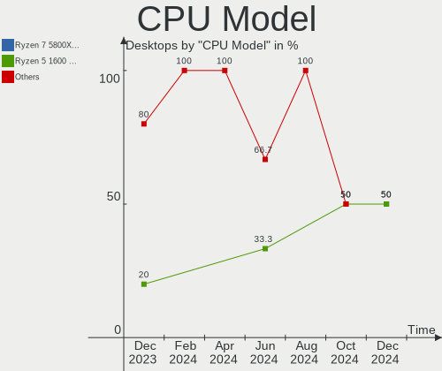
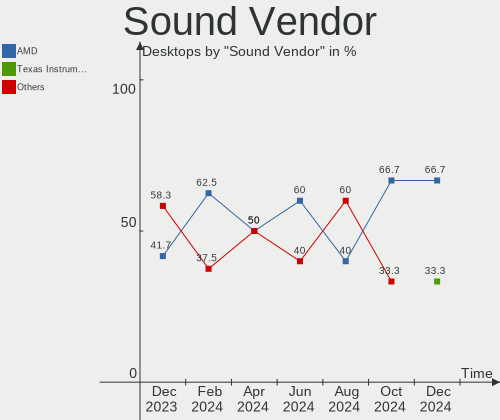

SteamOS - Hardware Trends (Desktops)
------------------------------------

A project to identify most popular hardware characteristics and track their change
over time based on data collected by Linux users at https://Linux-Hardware.org.

Anyone can contribute to this report by the [hw-probe](https://github.com/linuxhw/hw-probe) tool:

    sudo -E hw-probe -all -upload

This report is for one last month. Overall report since the beginning of time: [TestDays](https://github.com/linuxhw/TestDays)

Period: Feb, 2023.

Contents
--------

* [ System ](#system)
  - [ OS                       ](#os)
  - [ OS Family                ](#os-family)
  - [ Kernel                   ](#kernel)
  - [ Kernel Family            ](#kernel-family)
  - [ Kernel Major Ver.        ](#kernel-major-ver)
  - [ Arch                     ](#arch)
  - [ DE                       ](#de)
  - [ Display Server           ](#display-server)
  - [ Display Manager          ](#display-manager)
  - [ OS Lang                  ](#os-lang)
  - [ Boot Mode                ](#boot-mode)
  - [ Filesystem               ](#filesystem)
  - [ Part. scheme             ](#part-scheme)
  - [ Dual Boot with Linux/BSD ](#dual-boot-with-linuxbsd)
  - [ Dual Boot (Win)          ](#dual-boot-win)

* [ Board ](#board)
  - [ Vendor                   ](#vendor)
  - [ Model                    ](#model)
  - [ Model Family             ](#model-family)
  - [ MFG Year                 ](#mfg-year)
  - [ Form Factor              ](#form-factor)
  - [ Secure Boot              ](#secure-boot)
  - [ Coreboot                 ](#coreboot)
  - [ RAM Size                 ](#ram-size)
  - [ RAM Used                 ](#ram-used)
  - [ Total Drives             ](#total-drives)
  - [ Has CD-ROM               ](#has-cd-rom)
  - [ Has Ethernet             ](#has-ethernet)
  - [ Has WiFi                 ](#has-wifi)
  - [ Has Bluetooth            ](#has-bluetooth)

* [ Location ](#location)
  - [ Country                  ](#country)
  - [ City                     ](#city)

* [ Drives ](#drives)
  - [ Drive Vendor             ](#drive-vendor)
  - [ Drive Model              ](#drive-model)
  - [ HDD Vendor               ](#hdd-vendor)
  - [ SSD Vendor               ](#ssd-vendor)
  - [ Drive Kind               ](#drive-kind)
  - [ Drive Connector          ](#drive-connector)
  - [ Drive Size               ](#drive-size)
  - [ Space Total              ](#space-total)
  - [ Space Used               ](#space-used)
  - [ Malfunc. Drives          ](#malfunc-drives)
  - [ Malfunc. Drive Vendor    ](#malfunc-drive-vendor)
  - [ Malfunc. HDD Vendor      ](#malfunc-hdd-vendor)
  - [ Malfunc. Drive Kind      ](#malfunc-drive-kind)
  - [ Failed Drives            ](#failed-drives)
  - [ Failed Drive Vendor      ](#failed-drive-vendor)
  - [ Drive Status             ](#drive-status)

* [ Storage controller ](#storage-controller)
  - [ Storage Vendor           ](#storage-vendor)
  - [ Storage Model            ](#storage-model)
  - [ Storage Kind             ](#storage-kind)

* [ Processor ](#processor)
  - [ CPU Vendor               ](#cpu-vendor)
  - [ CPU Model                ](#cpu-model)
  - [ CPU Model Family         ](#cpu-model-family)
  - [ CPU Cores                ](#cpu-cores)
  - [ CPU Sockets              ](#cpu-sockets)
  - [ CPU Threads              ](#cpu-threads)
  - [ CPU Op-Modes             ](#cpu-op-modes)
  - [ CPU Microcode            ](#cpu-microcode)
  - [ CPU Microarch            ](#cpu-microarch)

* [ Graphics ](#graphics)
  - [ GPU Vendor               ](#gpu-vendor)
  - [ GPU Model                ](#gpu-model)
  - [ GPU Combo                ](#gpu-combo)
  - [ GPU Driver               ](#gpu-driver)
  - [ GPU Memory               ](#gpu-memory)

* [ Monitor ](#monitor)
  - [ Monitor Vendor           ](#monitor-vendor)
  - [ Monitor Model            ](#monitor-model)
  - [ Monitor Resolution       ](#monitor-resolution)
  - [ Monitor Diagonal         ](#monitor-diagonal)
  - [ Monitor Width            ](#monitor-width)
  - [ Aspect Ratio             ](#aspect-ratio)
  - [ Monitor Area             ](#monitor-area)
  - [ Pixel Density            ](#pixel-density)
  - [ Multiple Monitors        ](#multiple-monitors)

* [ Network ](#network)
  - [ Net Controller Vendor    ](#net-controller-vendor)
  - [ Net Controller Model     ](#net-controller-model)
  - [ Wireless Vendor          ](#wireless-vendor)
  - [ Wireless Model           ](#wireless-model)
  - [ Ethernet Vendor          ](#ethernet-vendor)
  - [ Ethernet Model           ](#ethernet-model)
  - [ Net Controller Kind      ](#net-controller-kind)
  - [ Used Controller          ](#used-controller)
  - [ NICs                     ](#nics)
  - [ IPv6                     ](#ipv6)

* [ Bluetooth ](#bluetooth)
  - [ Bluetooth Vendor         ](#bluetooth-vendor)
  - [ Bluetooth Model          ](#bluetooth-model)

* [ Sound ](#sound)
  - [ Sound Vendor             ](#sound-vendor)
  - [ Sound Model              ](#sound-model)

* [ Memory ](#memory)
  - [ Memory Vendor            ](#memory-vendor)
  - [ Memory Model             ](#memory-model)
  - [ Memory Kind              ](#memory-kind)
  - [ Memory Form Factor       ](#memory-form-factor)
  - [ Memory Size              ](#memory-size)
  - [ Memory Speed             ](#memory-speed)

* [ Printers & scanners ](#printers--scanners)
  - [ Printer Vendor           ](#printer-vendor)
  - [ Printer Model            ](#printer-model)
  - [ Scanner Vendor           ](#scanner-vendor)
  - [ Scanner Model            ](#scanner-model)

* [ Camera ](#camera)
  - [ Camera Vendor            ](#camera-vendor)
  - [ Camera Model             ](#camera-model)

* [ Security ](#security)
  - [ Fingerprint Vendor       ](#fingerprint-vendor)
  - [ Fingerprint Model        ](#fingerprint-model)
  - [ Chipcard Vendor          ](#chipcard-vendor)
  - [ Chipcard Model           ](#chipcard-model)

* [ Unsupported ](#unsupported)
  - [ Unsupported Devices      ](#unsupported-devices)
  - [ Unsupported Device Types ](#unsupported-device-types)

System
------

OS
--

Installed operating systems

| Name        | Desktops | Percent |
|-------------|----------|---------|
| SteamOS 3.4 | 11       | 91.67%  |
| SteamOS     | 1        | 8.33%   |

OS Family
---------

OS without a version

| Name    | Desktops | Percent |
|---------|----------|---------|
| SteamOS | 12       | 100%    |

Kernel
------

Version of the Linux kernel

| Version                                      | Desktops | Percent |
|----------------------------------------------|----------|---------|
| 5.13.0-valve21.3-1-neptune                   | 9        | 75%     |
| 5.18.1-arch1_testHoloISO_20220606.1811       | 1        | 8.33%   |
| 5.13.0-valve36-1-neptune                     | 1        | 8.33%   |
| 5.13.0-valve21-1-steamos-02209-g2a5bdc1102a0 | 1        | 8.33%   |

Kernel Family
-------------

Linux kernel without a distro release

| Version | Desktops | Percent |
|---------|----------|---------|
| 5.13.0  | 11       | 91.67%  |
| 5.18.1  | 1        | 8.33%   |

Kernel Major Ver.
-----------------

Linux kernel major version

| Version | Desktops | Percent |
|---------|----------|---------|
| 5.13    | 11       | 91.67%  |
| 5.18    | 1        | 8.33%   |

Arch
----

OS architecture (x86_64, i586, etc.)

| Name   | Desktops | Percent |
|--------|----------|---------|
| x86_64 | 12       | 100%    |

DE
--

Desktop Environment

| Name | Desktops | Percent |
|------|----------|---------|
| KDE5 | 12       | 100%    |

Display Server
--------------

X11 or Wayland

| Name | Desktops | Percent |
|------|----------|---------|
| X11  | 12       | 100%    |

Display Manager
---------------

SDDM, LightDM, etc.

| Name    | Desktops | Percent |
|---------|----------|---------|
| Unknown | 12       | 100%    |

OS Lang
-------

Language

| Lang  | Desktops | Percent |
|-------|----------|---------|
| en_US | 12       | 100%    |

Boot Mode
---------

EFI or BIOS

| Mode | Desktops | Percent |
|------|----------|---------|
| BIOS | 12       | 100%    |

Filesystem
----------

Type of filesystem

| Type  | Desktops | Percent |
|-------|----------|---------|
| Btrfs | 11       | 91.67%  |
| Tmpfs | 1        | 8.33%   |

Part. scheme
------------

Scheme of partitioning

| Type    | Desktops | Percent |
|---------|----------|---------|
| Unknown | 12       | 100%    |

Dual Boot with Linux/BSD
------------------------

Hosting more than one Linux/BSD

| Dual boot | Desktops | Percent |
|-----------|----------|---------|
| No        | 12       | 100%    |

Dual Boot (Win)
---------------

Hosting Linux and Windows

| Dual boot | Desktops | Percent |
|-----------|----------|---------|
| No        | 12       | 100%    |

Board
-----

Vendor
------

Motherboard manufacturer

| Name                                 | Desktops | Percent |
|--------------------------------------|----------|---------|
| ASRock                               | 3        | 25%     |
| Gigabyte Technology                  | 2        | 16.67%  |
| ASUSTek Computer                     | 2        | 16.67%  |
| Shenzhen Meigao Electronic Equipment | 1        | 8.33%   |
| MSI                                  | 1        | 8.33%   |
| Hewlett-Packard                      | 1        | 8.33%   |
| Dell                                 | 1        | 8.33%   |
| Biostar                              | 1        | 8.33%   |

Model
-----

Motherboard model

| Name                                       | Desktops | Percent |
|--------------------------------------------|----------|---------|
| Shenzhen Meigao Electronic Equipment UM690 | 1        | 8.33%   |
| MSI MS-7B89                                | 1        | 8.33%   |
| HP ProDesk 600 G4 MT                       | 1        | 8.33%   |
| Gigabyte B85M-D3H                          | 1        | 8.33%   |
| Gigabyte B450 AORUS M                      | 1        | 8.33%   |
| Dell OptiPlex 9010                         | 1        | 8.33%   |
| Biostar A320MH                             | 1        | 8.33%   |
| ASUS PRIME B250M-PLUS/BR                   | 1        | 8.33%   |
| ASUS CROSSHAIR VI HERO                     | 1        | 8.33%   |
| ASRock B760M-ITX/D4 WiFi                   | 1        | 8.33%   |
| ASRock B560 Pro4                           | 1        | 8.33%   |
| ASRock B550 Phantom Gaming-ITX/ax          | 1        | 8.33%   |

Model Family
------------

Motherboard model prefix

| Name                                       | Desktops | Percent |
|--------------------------------------------|----------|---------|
| Shenzhen Meigao Electronic Equipment UM690 | 1        | 8.33%   |
| MSI MS-7B89                                | 1        | 8.33%   |
| HP ProDesk                                 | 1        | 8.33%   |
| Gigabyte B85M-D3H                          | 1        | 8.33%   |
| Gigabyte B450                              | 1        | 8.33%   |
| Dell OptiPlex                              | 1        | 8.33%   |
| Biostar A320MH                             | 1        | 8.33%   |
| ASUS PRIME                                 | 1        | 8.33%   |
| ASUS CROSSHAIR                             | 1        | 8.33%   |
| ASRock B760M-ITX                           | 1        | 8.33%   |
| ASRock B560                                | 1        | 8.33%   |
| ASRock B550                                | 1        | 8.33%   |

MFG Year
--------

Motherboard manufacture year

| Year | Desktops | Percent |
|------|----------|---------|
| 2022 | 3        | 25%     |
| 2021 | 2        | 16.67%  |
| 2018 | 2        | 16.67%  |
| 2013 | 2        | 16.67%  |
| 2020 | 1        | 8.33%   |
| 2019 | 1        | 8.33%   |
| 2017 | 1        | 8.33%   |

Form Factor
-----------

Physical design of the computer

| Name    | Desktops | Percent |
|---------|----------|---------|
| Desktop | 12       | 100%    |

Secure Boot
-----------

Enabled or disabled

| State    | Desktops | Percent |
|----------|----------|---------|
| Disabled | 12       | 100%    |

Coreboot
--------

Have coreboot on board

| Used | Desktops | Percent |
|------|----------|---------|
| No   | 12       | 100%    |

RAM Size
--------

Total RAM memory

| Size in GB | Desktops | Percent |
|------------|----------|---------|
| 32.01-64.0 | 4        | 33.33%  |
| 8.01-16.0  | 4        | 33.33%  |
| 16.01-24.0 | 3        | 25%     |
| 4.01-8.0   | 1        | 8.33%   |

RAM Used
--------

Used RAM memory

| Used GB  | Desktops | Percent |
|----------|----------|---------|
| 2.01-3.0 | 7        | 58.33%  |
| 4.01-8.0 | 2        | 16.67%  |
| 3.01-4.0 | 2        | 16.67%  |
| 1.01-2.0 | 1        | 8.33%   |

Total Drives
------------

Number of drives on board

| Drives | Desktops | Percent |
|--------|----------|---------|
| 1      | 6        | 50%     |
| 3      | 2        | 16.67%  |
| 2      | 2        | 16.67%  |
| 5      | 1        | 8.33%   |
| 4      | 1        | 8.33%   |

Has CD-ROM
----------

Has CD-ROM on board

| Presented | Desktops | Percent |
|-----------|----------|---------|
| No        | 10       | 83.33%  |
| Yes       | 2        | 16.67%  |

Has Ethernet
------------

Has Ethernet on board

| Presented | Desktops | Percent |
|-----------|----------|---------|
| Yes       | 12       | 100%    |

Has WiFi
--------

Has WiFi module

| Presented | Desktops | Percent |
|-----------|----------|---------|
| Yes       | 11       | 91.67%  |
| No        | 1        | 8.33%   |

Has Bluetooth
-------------

Has Bluetooth module

| Presented | Desktops | Percent |
|-----------|----------|---------|
| Yes       | 6        | 50%     |
| No        | 6        | 50%     |

Location
--------

Country
-------

Geographic location (country)

| Country     | Desktops | Percent |
|-------------|----------|---------|
| USA         | 4        | 33.33%  |
| Philippines | 1        | 8.33%   |
| Malaysia    | 1        | 8.33%   |
| Latvia      | 1        | 8.33%   |
| Ireland     | 1        | 8.33%   |
| Canada      | 1        | 8.33%   |
| Brazil      | 1        | 8.33%   |
| Australia   | 1        | 8.33%   |
| Argentina   | 1        | 8.33%   |

City
----

Geographic location (city)

| City          | Desktops | Percent |
|---------------|----------|---------|
| Sydney        | 1        | 8.33%   |
| Scotts Valley | 1        | 8.33%   |
| Riga          | 1        | 8.33%   |
| Portland      | 1        | 8.33%   |
| North York    | 1        | 8.33%   |
| Mercedes      | 1        | 8.33%   |
| Limerick      | 1        | 8.33%   |
| Kuala Lumpur  | 1        | 8.33%   |
| Caloocan City | 1        | 8.33%   |
| Brasília     | 1        | 8.33%   |
| Bangor        | 1        | 8.33%   |
| Aurora        | 1        | 8.33%   |

Drives
------

Drive Vendor
------------

Hard drive vendors

| Vendor                      | Desktops | Drives | Percent |
|-----------------------------|----------|--------|---------|
| Seagate                     | 6        | 7      | 28.57%  |
| Toshiba                     | 2        | 2      | 9.52%   |
| SanDisk                     | 2        | 2      | 9.52%   |
| Samsung Electronics         | 2        | 5      | 9.52%   |
| Kingston                    | 2        | 2      | 9.52%   |
| SPCC                        | 1        | 1      | 4.76%   |
| Realtek Semiconductor       | 1        | 1      | 4.76%   |
| Ramsta                      | 1        | 1      | 4.76%   |
| Phison Electronics          | 1        | 1      | 4.76%   |
| Micron/Crucial Technology   | 1        | 1      | 4.76%   |
| Kingston Technology Company | 1        | 1      | 4.76%   |
| KingFast                    | 1        | 1      | 4.76%   |

Drive Model
-----------

Hard drive models

| Model                                               | Desktops | Percent |
|-----------------------------------------------------|----------|---------|
| Toshiba MQ04ABF100 1TB                              | 1        | 4.17%   |
| Toshiba DT01ACA100 1TB                              | 1        | 4.17%   |
| SPCC Solid State Disk 1024GB                        | 1        | 4.17%   |
| Seagate ST8000DM004-2CX188 8TB                      | 1        | 4.17%   |
| Seagate ST500LM030-2E717D 500GB                     | 1        | 4.17%   |
| Seagate ST4000VX007-2DT166 4TB                      | 1        | 4.17%   |
| Seagate ST3500414CS 500GB                           | 1        | 4.17%   |
| Seagate ST3000DM001-1ER166 3TB                      | 1        | 4.17%   |
| Seagate ST2000DM006-2DM164 2TB                      | 1        | 4.17%   |
| Seagate ST1000VM002-1CT162 1TB                      | 1        | 4.17%   |
| Sandisk WD_BLACK SN770 1TB                          | 1        | 4.17%   |
| SanDisk SD8SBAT128G1122 128GB SSD                   | 1        | 4.17%   |
| Samsung SSD 870 QVO 2TB                             | 1        | 4.17%   |
| Samsung SSD 870 QVO 1TB                             | 1        | 4.17%   |
| Samsung NVMe SSD Controller SM961/PM961/SM963 512GB | 1        | 4.17%   |
| Samsung HM161GI 160GB                               | 1        | 4.17%   |
| Realtek ADATA FALCON 256GB                          | 1        | 4.17%   |
| Ramsta SSD S800 120GB                               | 1        | 4.17%   |
| Phison Corsair MP600 PRO NH 2TB                     | 1        | 4.17%   |
| Micron/Crucial CT1000P1SSD8 1TB                     | 1        | 4.17%   |
| Kingston Company OM8PGP4512Q-A0 512GB               | 1        | 4.17%   |
| Kingston SV300S37A120G 120GB SSD                    | 1        | 4.17%   |
| Kingston SA400S37120G 120GB SSD                     | 1        | 4.17%   |
| KingFast 1024GB                                     | 1        | 4.17%   |

HDD Vendor
----------

Hard disk drive vendors

| Vendor              | Desktops | Drives | Percent |
|---------------------|----------|--------|---------|
| Seagate             | 6        | 7      | 66.67%  |
| Toshiba             | 2        | 2      | 22.22%  |
| Samsung Electronics | 1        | 1      | 11.11%  |

SSD Vendor
----------

Solid state drive vendors

| Vendor              | Desktops | Drives | Percent |
|---------------------|----------|--------|---------|
| Kingston            | 2        | 2      | 33.33%  |
| SPCC                | 1        | 1      | 16.67%  |
| SanDisk             | 1        | 1      | 16.67%  |
| Samsung Electronics | 1        | 3      | 16.67%  |
| Ramsta              | 1        | 1      | 16.67%  |

Drive Kind
----------

HDD or SSD

| Kind    | Desktops | Drives | Percent |
|---------|----------|--------|---------|
| HDD     | 7        | 10     | 36.84%  |
| NVMe    | 6        | 6      | 31.58%  |
| SSD     | 5        | 8      | 26.32%  |
| Unknown | 1        | 1      | 5.26%   |

Drive Connector
---------------

SATA, SAS, NVMe, etc.

| Type | Desktops | Drives | Percent |
|------|----------|--------|---------|
| SATA | 9        | 19     | 60%     |
| NVMe | 6        | 6      | 40%     |

Drive Size
----------

Size of hard drive

| Size in TB | Desktops | Drives | Percent |
|------------|----------|--------|---------|
| 0.01-0.5   | 5        | 7      | 35.71%  |
| 0.51-1.0   | 4        | 4      | 28.57%  |
| 1.01-2.0   | 2        | 4      | 14.29%  |
| 3.01-4.0   | 1        | 1      | 7.14%   |
| 2.01-3.0   | 1        | 1      | 7.14%   |
| 4.01-10.0  | 1        | 1      | 7.14%   |

Space Total
-----------

Amount of disk space available on the file system

| Size in GB     | Desktops | Percent |
|----------------|----------|---------|
| 1001-2000      | 3        | 25%     |
| 501-1000       | 3        | 25%     |
| 251-500        | 2        | 16.67%  |
| 101-250        | 2        | 16.67%  |
| More than 3000 | 1        | 8.33%   |
| Unknown        | 1        | 8.33%   |

Space Used
----------

Amount of used disk space

| Used GB  | Desktops | Percent |
|----------|----------|---------|
| 51-100   | 4        | 33.33%  |
| 251-500  | 2        | 16.67%  |
| 101-250  | 2        | 16.67%  |
| 21-50    | 1        | 8.33%   |
| 1-20     | 1        | 8.33%   |
| 501-1000 | 1        | 8.33%   |
| Unknown  | 1        | 8.33%   |

Malfunc. Drives
---------------

Drive models with a malfunction

Zero info for selected period =(

Malfunc. Drive Vendor
---------------------

Vendors of faulty drives

Zero info for selected period =(

Malfunc. HDD Vendor
-------------------

Vendors of faulty HDD drives

Zero info for selected period =(

Malfunc. Drive Kind
-------------------

Kinds of faulty drives

Zero info for selected period =(

Failed Drives
-------------

Failed drive models

Zero info for selected period =(

Failed Drive Vendor
-------------------

Failed drive vendors

Zero info for selected period =(

Drive Status
------------

Number of failed and malfunc. drives

| Status   | Desktops | Drives | Percent |
|----------|----------|--------|---------|
| Detected | 12       | 25     | 100%    |

Storage controller
------------------

Storage Vendor
--------------

Storage controller vendors

| Vendor                      | Desktops | Percent |
|-----------------------------|----------|---------|
| Intel                       | 6        | 35.29%  |
| AMD                         | 5        | 29.41%  |
| SanDisk                     | 1        | 5.88%   |
| Samsung Electronics         | 1        | 5.88%   |
| Realtek Semiconductor       | 1        | 5.88%   |
| Phison Electronics          | 1        | 5.88%   |
| Micron/Crucial Technology   | 1        | 5.88%   |
| Kingston Technology Company | 1        | 5.88%   |

Storage Model
-------------

Storage controller models

| Model                                                                          | Desktops | Percent |
|--------------------------------------------------------------------------------|----------|---------|
| AMD FCH SATA Controller [AHCI mode]                                            | 4        | 19.05%  |
| AMD 400 Series Chipset SATA Controller                                         | 2        | 9.52%   |
| SanDisk Non-Volatile memory controller                                         | 1        | 4.76%   |
| Samsung NVMe SSD Controller SM961/PM961/SM963                                  | 1        | 4.76%   |
| Realtek Realtek Non-Volatile memory controller                                 | 1        | 4.76%   |
| Phison E18 PCIe4 NVMe Controller                                               | 1        | 4.76%   |
| Micron/Crucial NVMe Controller                                                 | 1        | 4.76%   |
| Kingston Company Company Non-Volatile memory controller                        | 1        | 4.76%   |
| Intel SATA Controller [RAID mode]                                              | 1        | 4.76%   |
| Intel SATA controller                                                          | 1        | 4.76%   |
| Intel Cannon Lake PCH SATA AHCI Controller                                     | 1        | 4.76%   |
| Intel 8 Series/C220 Series Chipset Family 6-port SATA Controller 1 [AHCI mode] | 1        | 4.76%   |
| Intel 500 Series Chipset Family SATA AHCI Controller                           | 1        | 4.76%   |
| Intel 200 Series PCH SATA controller [AHCI mode]                               | 1        | 4.76%   |
| AMD X370 Series Chipset SATA Controller                                        | 1        | 4.76%   |
| AMD FCH SATA Controller D                                                      | 1        | 4.76%   |
| AMD 500 Series Chipset SATA Controller                                         | 1        | 4.76%   |

Storage Kind
------------

Kind of storage controller (IDE, SATA, NVMe, SAS, ...)

| Kind | Desktops | Percent |
|------|----------|---------|
| SATA | 10       | 58.82%  |
| NVMe | 6        | 35.29%  |
| RAID | 1        | 5.88%   |

Processor
---------

CPU Vendor
----------

Processor vendors

| Vendor | Desktops | Percent |
|--------|----------|---------|
| Intel  | 6        | 50%     |
| AMD    | 6        | 50%     |

CPU Model
---------

Processor models

| Model                                   | Desktops | Percent |
|-----------------------------------------|----------|---------|
| Intel Core i7-8700 CPU @ 3.20GHz        | 1        | 8.33%   |
| Intel Core i7-3770 CPU @ 3.40GHz        | 1        | 8.33%   |
| Intel Core i5-4590 CPU @ 3.30GHz        | 1        | 8.33%   |
| Intel Core i3-7100 CPU @ 3.90GHz        | 1        | 8.33%   |
| Intel 12th Gen Core i7-12700F           | 1        | 8.33%   |
| Intel 11th Gen Core i5-11600K @ 3.90GHz | 1        | 8.33%   |
| AMD Ryzen 9 6900HX with Radeon Graphics | 1        | 8.33%   |
| AMD Ryzen 9 3900X 12-Core Processor     | 1        | 8.33%   |
| AMD Ryzen 5 5600G with Radeon Graphics  | 1        | 8.33%   |
| AMD Ryzen 5 2600 Six-Core Processor     | 1        | 8.33%   |
| AMD Ryzen 5 1600 Six-Core Processor     | 1        | 8.33%   |
| AMD Ryzen 5 1400 Quad-Core Processor    | 1        | 8.33%   |

CPU Model Family
----------------

Processor model prefix

| Model         | Desktops | Percent |
|---------------|----------|---------|
| AMD Ryzen 5   | 4        | 33.33%  |
| Other         | 2        | 16.67%  |
| Intel Core i7 | 2        | 16.67%  |
| AMD Ryzen 9   | 2        | 16.67%  |
| Intel Core i5 | 1        | 8.33%   |
| Intel Core i3 | 1        | 8.33%   |

CPU Cores
---------

Number of processor cores

| Number | Desktops | Percent |
|--------|----------|---------|
| 6      | 5        | 41.67%  |
| 4      | 3        | 25%     |
| 12     | 2        | 16.67%  |
| 8      | 1        | 8.33%   |
| 2      | 1        | 8.33%   |

CPU Sockets
-----------

Number of sockets

| Number | Desktops | Percent |
|--------|----------|---------|
| 1      | 12       | 100%    |

CPU Threads
-----------

Threads per core (Hyper-Threading)

| Number | Desktops | Percent |
|--------|----------|---------|
| 2      | 11       | 91.67%  |
| 1      | 1        | 8.33%   |

CPU Op-Modes
------------

CPU Operation Modes (32-bit, 64-bit)

| Op mode        | Desktops | Percent |
|----------------|----------|---------|
| 32-bit, 64-bit | 12       | 100%    |

CPU Microcode
-------------

Microcode number

| Number  | Desktops | Percent |
|---------|----------|---------|
| Unknown | 12       | 100%    |

CPU Microarch
-------------

Microarchitecture

| Name      | Desktops | Percent |
|-----------|----------|---------|
| Unknown   | 3        | 25%     |
| Zen+      | 2        | 16.67%  |
| KabyLake  | 2        | 16.67%  |
| Zen 3     | 1        | 8.33%   |
| Zen 2     | 1        | 8.33%   |
| Zen       | 1        | 8.33%   |
| IvyBridge | 1        | 8.33%   |
| Haswell   | 1        | 8.33%   |

Graphics
--------

GPU Vendor
----------

Vendors of graphics cards

| Vendor | Desktops | Percent |
|--------|----------|---------|
| AMD    | 9        | 64.29%  |
| Intel  | 3        | 21.43%  |
| Nvidia | 2        | 14.29%  |

GPU Model
---------

Graphics card models

| Model                                                                       | Desktops | Percent |
|-----------------------------------------------------------------------------|----------|---------|
| AMD Ellesmere [Radeon RX 470/480/570/570X/580/580X/590]                     | 4        | 28.57%  |
| Nvidia GM204 [GeForce GTX 970]                                              | 1        | 7.14%   |
| Nvidia GA102 [GeForce RTX 3090]                                             | 1        | 7.14%   |
| Intel Xeon E3-1200 v3/4th Gen Core Processor Integrated Graphics Controller | 1        | 7.14%   |
| Intel IvyBridge GT2 [HD Graphics 4000]                                      | 1        | 7.14%   |
| Intel CoffeeLake-S GT2 [UHD Graphics 630]                                   | 1        | 7.14%   |
| AMD Vega 10 XL/XT [Radeon RX Vega 56/64]                                    | 1        | 7.14%   |
| AMD Rembrandt [Radeon 680M]                                                 | 1        | 7.14%   |
| AMD Navi 24 [Radeon RX 6400/6500 XT/6500M]                                  | 1        | 7.14%   |
| AMD Navi 22 [Radeon RX 6700/6700 XT/6750 XT / 6800M/6850M XT]               | 1        | 7.14%   |
| AMD Navi 10 [Radeon RX 5600 OEM/5600 XT / 5700/5700 XT]                     | 1        | 7.14%   |

GPU Combo
---------

Combinations of graphics cards

| Name           | Desktops | Percent |
|----------------|----------|---------|
| 1 x AMD        | 8        | 66.67%  |
| 1 x Nvidia     | 1        | 8.33%   |
| Intel + Nvidia | 1        | 8.33%   |
| Intel + AMD    | 1        | 8.33%   |
| 1 x Intel      | 1        | 8.33%   |

GPU Driver
----------

Free vs proprietary

| Driver      | Desktops | Percent |
|-------------|----------|---------|
| Free        | 10       | 83.33%  |
| Proprietary | 2        | 16.67%  |

GPU Memory
----------

Total video memory

| Size in GB | Desktops | Percent |
|------------|----------|---------|
| Unknown    | 10       | 83.33%  |
| 3.01-4.0   | 1        | 8.33%   |
| 16.01-24.0 | 1        | 8.33%   |

Monitor
-------

Monitor Vendor
--------------

Monitor vendors

| Vendor               | Desktops | Percent |
|----------------------|----------|---------|
| Goldstar             | 4        | 33.33%  |
| Acer                 | 2        | 16.67%  |
| WIT                  | 1        | 8.33%   |
| Valve                | 1        | 8.33%   |
| Samsung Electronics  | 1        | 8.33%   |
| Roku                 | 1        | 8.33%   |
| AOC                  | 1        | 8.33%   |
| Ancor Communications | 1        | 8.33%   |

Monitor Model
-------------

Monitor models

| Model                                                                 | Desktops | Percent |
|-----------------------------------------------------------------------|----------|---------|
| Goldstar FULL HD GSM5B55 1920x1080 480x270mm 21.7-inch                | 2        | 16.67%  |
| WIT HDMI WIT0267 1920x1080 531x299mm 24.0-inch                        | 1        | 8.33%   |
| Valve LCD Monitor VLV91A8                                             | 1        | 8.33%   |
| Samsung Electronics C32R50x SAM7000 1920x1080 698x393mm 31.5-inch     | 1        | 8.33%   |
| Roku 100012590 RKU0B01 1920x1080 698x392mm 31.5-inch                  | 1        | 8.33%   |
| Goldstar ULTRAGEAR GSM5BB2 1920x1080 527x296mm 23.8-inch              | 1        | 8.33%   |
| Goldstar HDR WFHD GSM7714 2560x1080 798x334mm 34.1-inch               | 1        | 8.33%   |
| AOC 2795E AOC2795 1920x1080 598x336mm 27.0-inch                       | 1        | 8.33%   |
| Ancor Communications ROG PG279Q ACI27EC 2560x1440 598x336mm 27.0-inch | 1        | 8.33%   |
| Acer V233H ACR00C8 1920x1080 510x287mm 23.0-inch                      | 1        | 8.33%   |
| Acer ET322QK C ACR06E3 3840x2160 698x393mm 31.5-inch                  | 1        | 8.33%   |

Monitor Resolution
------------------

Monitor screen resolution

| Resolution      | Desktops | Percent |
|-----------------|----------|---------|
| 1920x1080 (FHD) | 6        | 50%     |
| 3840x2160 (4K)  | 3        | 25%     |
| 2560x1440 (QHD) | 1        | 8.33%   |
| 2560x1080       | 1        | 8.33%   |
| Unknown         | 1        | 8.33%   |

Monitor Diagonal
----------------

Diagonal size in inches

| Inches  | Desktops | Percent |
|---------|----------|---------|
| 31      | 3        | 25%     |
| 27      | 2        | 16.67%  |
| 23      | 2        | 16.67%  |
| 21      | 2        | 16.67%  |
| 34      | 1        | 8.33%   |
| 24      | 1        | 8.33%   |
| Unknown | 1        | 8.33%   |

Monitor Width
-------------

Physical width

| Width in mm | Desktops | Percent |
|-------------|----------|---------|
| 501-600     | 5        | 41.67%  |
| 601-700     | 3        | 25%     |
| 401-500     | 2        | 16.67%  |
| 701-800     | 1        | 8.33%   |
| Unknown     | 1        | 8.33%   |

Aspect Ratio
------------

Proportional relationship between the width and the height

| Ratio   | Desktops | Percent |
|---------|----------|---------|
| 16/9    | 10       | 83.33%  |
| 21/9    | 1        | 8.33%   |
| Unknown | 1        | 8.33%   |

Monitor Area
------------

Area in inch²

| Area in inch² | Desktops | Percent |
|----------------|----------|---------|
| 201-250        | 5        | 41.67%  |
| 351-500        | 4        | 33.33%  |
| 301-350        | 2        | 16.67%  |
| Unknown        | 1        | 8.33%   |

Pixel Density
-------------

Pixels per inch

| Density | Desktops | Percent |
|---------|----------|---------|
| 51-100  | 7        | 58.33%  |
| 101-120 | 3        | 25%     |
| 121-160 | 1        | 8.33%   |
| Unknown | 1        | 8.33%   |

Multiple Monitors
-----------------

Total monitors connected

| Total | Desktops | Percent |
|-------|----------|---------|
| 1     | 11       | 91.67%  |
| 2     | 1        | 8.33%   |

Network
-------

Net Controller Vendor
---------------------

Controller vendors

| Vendor                | Desktops | Percent |
|-----------------------|----------|---------|
| Intel                 | 9        | 40.91%  |
| Realtek Semiconductor | 6        | 27.27%  |
| TP-Link               | 2        | 9.09%   |
| Broadcom              | 2        | 9.09%   |
| Ralink Technology     | 1        | 4.55%   |
| Microsoft             | 1        | 4.55%   |
| MediaTek              | 1        | 4.55%   |

Net Controller Model
--------------------

Controller models

| Model                                                             | Desktops | Percent |
|-------------------------------------------------------------------|----------|---------|
| Realtek RTL8111/8168/8411 PCI Express Gigabit Ethernet Controller | 5        | 20.83%  |
| Intel Ethernet Controller I225-V                                  | 2        | 8.33%   |
| TP-Link Archer T3U [Realtek RTL8812BU]                            | 1        | 4.17%   |
| TP-Link 802.11ac WLAN Adapter                                     | 1        | 4.17%   |
| Realtek RTL8812AU 802.11a/b/g/n/ac 2T2R DB WLAN Adapter           | 1        | 4.17%   |
| Realtek RTL8188FTV 802.11b/g/n 1T1R 2.4G WLAN Adapter             | 1        | 4.17%   |
| Ralink MT7601U Wireless Adapter                                   | 1        | 4.17%   |
| Microsoft Wireless XBox Controller Dongle                         | 1        | 4.17%   |
| MediaTek MT7921K (RZ608) Wi-Fi 6E 80MHz                           | 1        | 4.17%   |
| Intel WLAN controller                                             | 1        | 4.17%   |
| Intel Wireless 8260                                               | 1        | 4.17%   |
| Intel Wi-Fi 6 AX200                                               | 1        | 4.17%   |
| Intel I211 Gigabit Network Connection                             | 1        | 4.17%   |
| Intel Ethernet Connection (7) I219-LM                             | 1        | 4.17%   |
| Intel Ethernet Connection (2) I219-V                              | 1        | 4.17%   |
| Intel Ethernet Connection (14) I219-V                             | 1        | 4.17%   |
| Intel 82579LM Gigabit Network Connection (Lewisville)             | 1        | 4.17%   |
| Broadcom Network controller                                       | 1        | 4.17%   |
| Broadcom BCM4360 802.11ac Wireless Network Adapter                | 1        | 4.17%   |

Wireless Vendor
---------------

Wireless vendors

| Vendor                | Desktops | Percent |
|-----------------------|----------|---------|
| Intel                 | 3        | 25%     |
| TP-Link               | 2        | 16.67%  |
| Realtek Semiconductor | 2        | 16.67%  |
| Broadcom              | 2        | 16.67%  |
| Ralink Technology     | 1        | 8.33%   |
| Microsoft             | 1        | 8.33%   |
| MediaTek              | 1        | 8.33%   |

Wireless Model
--------------

Wireless models

| Model                                                   | Desktops | Percent |
|---------------------------------------------------------|----------|---------|
| TP-Link Archer T3U [Realtek RTL8812BU]                  | 1        | 8.33%   |
| TP-Link 802.11ac WLAN Adapter                           | 1        | 8.33%   |
| Realtek RTL8812AU 802.11a/b/g/n/ac 2T2R DB WLAN Adapter | 1        | 8.33%   |
| Realtek RTL8188FTV 802.11b/g/n 1T1R 2.4G WLAN Adapter   | 1        | 8.33%   |
| Ralink MT7601U Wireless Adapter                         | 1        | 8.33%   |
| Microsoft Wireless XBox Controller Dongle               | 1        | 8.33%   |
| MediaTek MT7921K (RZ608) Wi-Fi 6E 80MHz                 | 1        | 8.33%   |
| Intel WLAN controller                                   | 1        | 8.33%   |
| Intel Wireless 8260                                     | 1        | 8.33%   |
| Intel Wi-Fi 6 AX200                                     | 1        | 8.33%   |
| Broadcom Network controller                             | 1        | 8.33%   |
| Broadcom BCM4360 802.11ac Wireless Network Adapter      | 1        | 8.33%   |

Ethernet Vendor
---------------

Ethernet vendors

| Vendor                | Desktops | Percent |
|-----------------------|----------|---------|
| Intel                 | 7        | 58.33%  |
| Realtek Semiconductor | 5        | 41.67%  |

Ethernet Model
--------------

Ethernet models

| Model                                                             | Desktops | Percent |
|-------------------------------------------------------------------|----------|---------|
| Realtek RTL8111/8168/8411 PCI Express Gigabit Ethernet Controller | 5        | 41.67%  |
| Intel Ethernet Controller I225-V                                  | 2        | 16.67%  |
| Intel I211 Gigabit Network Connection                             | 1        | 8.33%   |
| Intel Ethernet Connection (7) I219-LM                             | 1        | 8.33%   |
| Intel Ethernet Connection (2) I219-V                              | 1        | 8.33%   |
| Intel Ethernet Connection (14) I219-V                             | 1        | 8.33%   |
| Intel 82579LM Gigabit Network Connection (Lewisville)             | 1        | 8.33%   |

Net Controller Kind
-------------------

Ethernet, WiFi or modem

| Kind     | Desktops | Percent |
|----------|----------|---------|
| Ethernet | 12       | 52.17%  |
| WiFi     | 11       | 47.83%  |

Used Controller
---------------

Currently used network controller

| Kind     | Desktops | Percent |
|----------|----------|---------|
| Ethernet | 7        | 63.64%  |
| WiFi     | 4        | 36.36%  |

NICs
----

Total network controllers on board

| Total | Desktops | Percent |
|-------|----------|---------|
| 2     | 6        | 50%     |
| 1     | 6        | 50%     |

IPv6
----

IPv6 vs IPv4

| Used | Desktops | Percent |
|------|----------|---------|
| No   | 10       | 83.33%  |
| Yes  | 2        | 16.67%  |

Bluetooth
---------

Bluetooth Vendor
----------------

Controller vendors

| Vendor                  | Desktops | Percent |
|-------------------------|----------|---------|
| Intel                   | 3        | 50%     |
| Cambridge Silicon Radio | 2        | 33.33%  |
| MediaTek                | 1        | 16.67%  |

Bluetooth Model
---------------

Controller models

| Model                                               | Desktops | Percent |
|-----------------------------------------------------|----------|---------|
| Cambridge Silicon Radio Bluetooth Dongle (HCI mode) | 2        | 33.33%  |
| MediaTek Wireless_Device                            | 1        | 16.67%  |
| Intel Bluetooth wireless interface                  | 1        | 16.67%  |
| Intel Bluetooth Device                              | 1        | 16.67%  |
| Intel AX200 Bluetooth                               | 1        | 16.67%  |

Sound
-----

Sound Vendor
------------

Sound card vendors

| Vendor         | Desktops | Percent |
|----------------|----------|---------|
| AMD            | 10       | 50%     |
| Intel          | 6        | 30%     |
| Nvidia         | 2        | 10%     |
| Valve Software | 1        | 5%      |
| Logitech       | 1        | 5%      |

Sound Model
-----------

Sound card models

| Model                                                               | Desktops | Percent |
|---------------------------------------------------------------------|----------|---------|
| AMD Ellesmere HDMI Audio [Radeon RX 470/480 / 570/580/590]          | 4        | 14.81%  |
| AMD Family 17h (Models 00h-0fh) HD Audio Controller                 | 3        | 11.11%  |
| AMD Navi 21/23 HDMI/DP Audio Controller                             | 2        | 7.41%   |
| AMD Family 17h/19h HD Audio Controller                              | 2        | 7.41%   |
| Valve Software Valve VR Radio & HMD Mic                             | 1        | 3.7%    |
| Nvidia GM204 High Definition Audio Controller                       | 1        | 3.7%    |
| Nvidia GA102 High Definition Audio Controller                       | 1        | 3.7%    |
| Logitech G433 Gaming Headset                                        | 1        | 3.7%    |
| Intel Xeon E3-1200 v3/4th Gen Core Processor HD Audio Controller    | 1        | 3.7%    |
| Intel Tiger Lake-H HD Audio Controller                              | 1        | 3.7%    |
| Intel Cannon Lake PCH cAVS                                          | 1        | 3.7%    |
| Intel Audio device                                                  | 1        | 3.7%    |
| Intel 8 Series/C220 Series Chipset High Definition Audio Controller | 1        | 3.7%    |
| Intel 7 Series/C216 Chipset Family High Definition Audio Controller | 1        | 3.7%    |
| Intel 200 Series PCH HD Audio                                       | 1        | 3.7%    |
| AMD Vega 10 HDMI Audio [Radeon Vega 56/64]                          | 1        | 3.7%    |
| AMD Starship/Matisse HD Audio Controller                            | 1        | 3.7%    |
| AMD Renoir Radeon High Definition Audio Controller                  | 1        | 3.7%    |
| AMD Rembrandt Radeon High Definition Audio Controller               | 1        | 3.7%    |
| AMD Navi 10 HDMI Audio                                              | 1        | 3.7%    |

Memory
------

Memory Vendor
-------------

Memory module vendors

Zero info for selected period =(

Memory Model
------------

Memory module models

Zero info for selected period =(

Memory Kind
-----------

Memory module kinds

Zero info for selected period =(

Memory Form Factor
------------------

Physical design of the memory module

Zero info for selected period =(

Memory Size
-----------

Memory module size

Zero info for selected period =(

Memory Speed
------------

Memory module speed

Zero info for selected period =(

Printers & scanners
-------------------

Printer Vendor
--------------

Printer device vendors

Zero info for selected period =(

Printer Model
-------------

Printer device models

Zero info for selected period =(

Scanner Vendor
--------------

Scanner device vendors

Zero info for selected period =(

Scanner Model
-------------

Scanner device models

Zero info for selected period =(

Camera
------

Camera Vendor
-------------

Camera device vendors

| Vendor         | Desktops | Percent |
|----------------|----------|---------|
| Valve Software | 1        | 50%     |
| Logitech       | 1        | 50%     |

Camera Model
------------

Camera device models

| Model                    | Desktops | Percent |
|--------------------------|----------|---------|
| Valve Software 3D Camera | 1        | 50%     |
| Logitech HD Webcam C525  | 1        | 50%     |

Security
--------

Fingerprint Vendor
------------------

Fingerprint sensor vendors

Zero info for selected period =(

Fingerprint Model
-----------------

Fingerprint sensor models

Zero info for selected period =(

Chipcard Vendor
---------------

Chipcard module vendors

Zero info for selected period =(

Chipcard Model
--------------

Chipcard module models

Zero info for selected period =(

Unsupported
-----------

Unsupported Devices
-------------------

Total unsupported devices on board

| Total | Desktops | Percent |
|-------|----------|---------|
| 0     | 6        | 50%     |
| 1     | 4        | 33.33%  |
| 2     | 2        | 16.67%  |

Unsupported Device Types
------------------------

Types of unsupported devices

| Type                     | Desktops | Percent |
|--------------------------|----------|---------|
| Net/wireless             | 5        | 62.5%   |
| Net/ethernet             | 1        | 12.5%   |
| Multimedia controller    | 1        | 12.5%   |
| Communication controller | 1        | 12.5%   |

