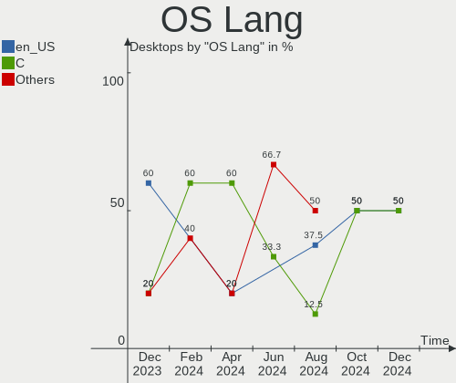
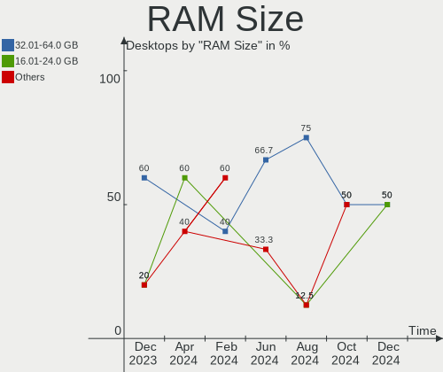
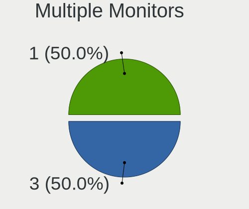
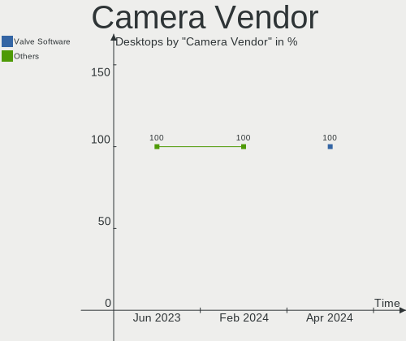
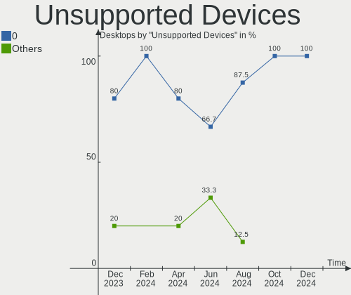

SteamOS - Hardware Trends (Desktops)
------------------------------------

A project to identify most popular hardware characteristics and track their change
over time based on data collected by Linux users at https://Linux-Hardware.org.

Anyone can contribute to this report by the [hw-probe](https://github.com/linuxhw/hw-probe) tool:

    sudo -E hw-probe -all -upload

This report is for one last month. Overall report since the beginning of time: [TestCoverage](https://github.com/linuxhw/TestCoverage)

Period: Oct, 2022.

Contents
--------

* [ System ](#system)
  - [ OS                       ](#os)
  - [ OS Family                ](#os-family)
  - [ Kernel                   ](#kernel)
  - [ Kernel Family            ](#kernel-family)
  - [ Kernel Major Ver.        ](#kernel-major-ver)
  - [ Arch                     ](#arch)
  - [ DE                       ](#de)
  - [ Display Server           ](#display-server)
  - [ Display Manager          ](#display-manager)
  - [ OS Lang                  ](#os-lang)
  - [ Boot Mode                ](#boot-mode)
  - [ Filesystem               ](#filesystem)
  - [ Part. scheme             ](#part-scheme)
  - [ Dual Boot with Linux/BSD ](#dual-boot-with-linuxbsd)
  - [ Dual Boot (Win)          ](#dual-boot-win)

* [ Board ](#board)
  - [ Vendor                   ](#vendor)
  - [ Model                    ](#model)
  - [ Model Family             ](#model-family)
  - [ MFG Year                 ](#mfg-year)
  - [ Form Factor              ](#form-factor)
  - [ Secure Boot              ](#secure-boot)
  - [ Coreboot                 ](#coreboot)
  - [ RAM Size                 ](#ram-size)
  - [ RAM Used                 ](#ram-used)
  - [ Total Drives             ](#total-drives)
  - [ Has CD-ROM               ](#has-cd-rom)
  - [ Has Ethernet             ](#has-ethernet)
  - [ Has WiFi                 ](#has-wifi)
  - [ Has Bluetooth            ](#has-bluetooth)

* [ Location ](#location)
  - [ Country                  ](#country)
  - [ City                     ](#city)

* [ Drives ](#drives)
  - [ Drive Vendor             ](#drive-vendor)
  - [ Drive Model              ](#drive-model)
  - [ HDD Vendor               ](#hdd-vendor)
  - [ SSD Vendor               ](#ssd-vendor)
  - [ Drive Kind               ](#drive-kind)
  - [ Drive Connector          ](#drive-connector)
  - [ Drive Size               ](#drive-size)
  - [ Space Total              ](#space-total)
  - [ Space Used               ](#space-used)
  - [ Malfunc. Drives          ](#malfunc-drives)
  - [ Malfunc. Drive Vendor    ](#malfunc-drive-vendor)
  - [ Malfunc. HDD Vendor      ](#malfunc-hdd-vendor)
  - [ Malfunc. Drive Kind      ](#malfunc-drive-kind)
  - [ Failed Drives            ](#failed-drives)
  - [ Failed Drive Vendor      ](#failed-drive-vendor)
  - [ Drive Status             ](#drive-status)

* [ Storage controller ](#storage-controller)
  - [ Storage Vendor           ](#storage-vendor)
  - [ Storage Model            ](#storage-model)
  - [ Storage Kind             ](#storage-kind)

* [ Processor ](#processor)
  - [ CPU Vendor               ](#cpu-vendor)
  - [ CPU Model                ](#cpu-model)
  - [ CPU Model Family         ](#cpu-model-family)
  - [ CPU Cores                ](#cpu-cores)
  - [ CPU Sockets              ](#cpu-sockets)
  - [ CPU Threads              ](#cpu-threads)
  - [ CPU Op-Modes             ](#cpu-op-modes)
  - [ CPU Microcode            ](#cpu-microcode)
  - [ CPU Microarch            ](#cpu-microarch)

* [ Graphics ](#graphics)
  - [ GPU Vendor               ](#gpu-vendor)
  - [ GPU Model                ](#gpu-model)
  - [ GPU Combo                ](#gpu-combo)
  - [ GPU Driver               ](#gpu-driver)
  - [ GPU Memory               ](#gpu-memory)

* [ Monitor ](#monitor)
  - [ Monitor Vendor           ](#monitor-vendor)
  - [ Monitor Model            ](#monitor-model)
  - [ Monitor Resolution       ](#monitor-resolution)
  - [ Monitor Diagonal         ](#monitor-diagonal)
  - [ Monitor Width            ](#monitor-width)
  - [ Aspect Ratio             ](#aspect-ratio)
  - [ Monitor Area             ](#monitor-area)
  - [ Pixel Density            ](#pixel-density)
  - [ Multiple Monitors        ](#multiple-monitors)

* [ Network ](#network)
  - [ Net Controller Vendor    ](#net-controller-vendor)
  - [ Net Controller Model     ](#net-controller-model)
  - [ Wireless Vendor          ](#wireless-vendor)
  - [ Wireless Model           ](#wireless-model)
  - [ Ethernet Vendor          ](#ethernet-vendor)
  - [ Ethernet Model           ](#ethernet-model)
  - [ Net Controller Kind      ](#net-controller-kind)
  - [ Used Controller          ](#used-controller)
  - [ NICs                     ](#nics)
  - [ IPv6                     ](#ipv6)

* [ Bluetooth ](#bluetooth)
  - [ Bluetooth Vendor         ](#bluetooth-vendor)
  - [ Bluetooth Model          ](#bluetooth-model)

* [ Sound ](#sound)
  - [ Sound Vendor             ](#sound-vendor)
  - [ Sound Model              ](#sound-model)

* [ Memory ](#memory)
  - [ Memory Vendor            ](#memory-vendor)
  - [ Memory Model             ](#memory-model)
  - [ Memory Kind              ](#memory-kind)
  - [ Memory Form Factor       ](#memory-form-factor)
  - [ Memory Size              ](#memory-size)
  - [ Memory Speed             ](#memory-speed)

* [ Printers & scanners ](#printers--scanners)
  - [ Printer Vendor           ](#printer-vendor)
  - [ Printer Model            ](#printer-model)
  - [ Scanner Vendor           ](#scanner-vendor)
  - [ Scanner Model            ](#scanner-model)

* [ Camera ](#camera)
  - [ Camera Vendor            ](#camera-vendor)
  - [ Camera Model             ](#camera-model)

* [ Security ](#security)
  - [ Fingerprint Vendor       ](#fingerprint-vendor)
  - [ Fingerprint Model        ](#fingerprint-model)
  - [ Chipcard Vendor          ](#chipcard-vendor)
  - [ Chipcard Model           ](#chipcard-model)

* [ Unsupported ](#unsupported)
  - [ Unsupported Devices      ](#unsupported-devices)
  - [ Unsupported Device Types ](#unsupported-device-types)

System
------

OS
--

Installed operating systems

| Name            | Desktops | Percent |
|-----------------|----------|---------|
| SteamOS 3.3     | 4        | 57.14%  |
| SteamOS Rolling | 1        | 14.29%  |
| SteamOS 3.4     | 1        | 14.29%  |
| SteamOS         | 1        | 14.29%  |

OS Family
---------

OS without a version

| Name    | Desktops | Percent |
|---------|----------|---------|
| SteamOS | 7        | 100%    |

Kernel
------

Version of the Linux kernel

| Version                                      | Desktops | Percent |
|----------------------------------------------|----------|---------|
| 5.13.0-valve24-1-neptune-02226-g5b8545e4c5a1 | 3        | 42.86%  |
| 5.18.1-arch1_testHoloISO_20220606.1811       | 2        | 28.57%  |
| 5.15.60-1-lts                                | 1        | 14.29%  |
| 5.13.0-valve24-1-neptune                     | 1        | 14.29%  |

Kernel Family
-------------

Linux kernel without a distro release

| Version | Desktops | Percent |
|---------|----------|---------|
| 5.13.0  | 4        | 57.14%  |
| 5.18.1  | 2        | 28.57%  |
| 5.15.60 | 1        | 14.29%  |

Kernel Major Ver.
-----------------

Linux kernel major version

| Version | Desktops | Percent |
|---------|----------|---------|
| 5.13    | 4        | 57.14%  |
| 5.18    | 2        | 28.57%  |
| 5.15    | 1        | 14.29%  |

Arch
----

OS architecture (x86_64, i586, etc.)

| Name   | Desktops | Percent |
|--------|----------|---------|
| x86_64 | 7        | 100%    |

DE
--

Desktop Environment

| Name | Desktops | Percent |
|------|----------|---------|
| KDE5 | 7        | 100%    |

Display Server
--------------

X11 or Wayland

| Name | Desktops | Percent |
|------|----------|---------|
| X11  | 7        | 100%    |

Display Manager
---------------

SDDM, LightDM, etc.

| Name    | Desktops | Percent |
|---------|----------|---------|
| Unknown | 7        | 100%    |

OS Lang
-------

Language

| Lang  | Desktops | Percent |
|-------|----------|---------|
| en_US | 6        | 85.71%  |
| fr_FR | 1        | 14.29%  |

Boot Mode
---------

EFI or BIOS

| Mode | Desktops | Percent |
|------|----------|---------|
| BIOS | 7        | 100%    |

Filesystem
----------

Type of filesystem

| Type  | Desktops | Percent |
|-------|----------|---------|
| Btrfs | 7        | 100%    |

Part. scheme
------------

Scheme of partitioning

| Type    | Desktops | Percent |
|---------|----------|---------|
| Unknown | 6        | 85.71%  |
| GPT     | 1        | 14.29%  |

Dual Boot with Linux/BSD
------------------------

Hosting more than one Linux/BSD

| Dual boot | Desktops | Percent |
|-----------|----------|---------|
| No        | 7        | 100%    |

Dual Boot (Win)
---------------

Hosting Linux and Windows

| Dual boot | Desktops | Percent |
|-----------|----------|---------|
| No        | 7        | 100%    |

Board
-----

Vendor
------

Motherboard manufacturer

| Name                | Desktops | Percent |
|---------------------|----------|---------|
| Gigabyte Technology | 2        | 28.57%  |
| ASUSTek Computer    | 2        | 28.57%  |
| Hewlett-Packard     | 1        | 14.29%  |
| ASRock              | 1        | 14.29%  |
| Apple               | 1        | 14.29%  |

Model
-----

Motherboard model

| Name                                | Desktops | Percent |
|-------------------------------------|----------|---------|
| HP Pavilion Gaming Desktop 690-00xx | 1        | 14.29%  |
| Gigabyte B550 GAMING X V2           | 1        | 14.29%  |
| Gigabyte B450M DS3H                 | 1        | 14.29%  |
| ASUS ROG STRIX B550-F GAMING        | 1        | 14.29%  |
| ASUS CROSSHAIR VI HERO              | 1        | 14.29%  |
| ASRock X570 Phantom Gaming-ITX/TB3  | 1        | 14.29%  |
| Apple MacPro7,1                     | 1        | 14.29%  |

Model Family
------------

Motherboard model prefix

| Name           | Desktops | Percent |
|----------------|----------|---------|
| HP Pavilion    | 1        | 14.29%  |
| Gigabyte B550  | 1        | 14.29%  |
| Gigabyte B450M | 1        | 14.29%  |
| ASUS ROG       | 1        | 14.29%  |
| ASUS CROSSHAIR | 1        | 14.29%  |
| ASRock X570    | 1        | 14.29%  |
| Apple MacPro7  | 1        | 14.29%  |

MFG Year
--------

Motherboard manufacture year

| Year | Desktops | Percent |
|------|----------|---------|
| 2021 | 2        | 28.57%  |
| 2020 | 2        | 28.57%  |
| 2018 | 2        | 28.57%  |
| 2022 | 1        | 14.29%  |

Form Factor
-----------

Physical design of the computer

| Name    | Desktops | Percent |
|---------|----------|---------|
| Desktop | 7        | 100%    |

Secure Boot
-----------

Enabled or disabled

| State    | Desktops | Percent |
|----------|----------|---------|
| Disabled | 7        | 100%    |

Coreboot
--------

Have coreboot on board

| Used | Desktops | Percent |
|------|----------|---------|
| No   | 7        | 100%    |

RAM Size
--------

Total RAM memory

| Size in GB  | Desktops | Percent |
|-------------|----------|---------|
| 16.01-24.0  | 4        | 57.14%  |
| 32.01-64.0  | 1        | 14.29%  |
| 24.01-32.0  | 1        | 14.29%  |
| 64.01-256.0 | 1        | 14.29%  |

RAM Used
--------

Used RAM memory

| Used GB  | Desktops | Percent |
|----------|----------|---------|
| 4.01-8.0 | 3        | 42.86%  |
| 2.01-3.0 | 3        | 42.86%  |
| 3.01-4.0 | 1        | 14.29%  |

Total Drives
------------

Number of drives on board

| Drives | Desktops | Percent |
|--------|----------|---------|
| 2      | 2        | 28.57%  |
| 11     | 1        | 14.29%  |
| 5      | 1        | 14.29%  |
| 4      | 1        | 14.29%  |
| 3      | 1        | 14.29%  |
| 1      | 1        | 14.29%  |

Has CD-ROM
----------

Has CD-ROM on board

| Presented | Desktops | Percent |
|-----------|----------|---------|
| No        | 5        | 71.43%  |
| Yes       | 2        | 28.57%  |

Has Ethernet
------------

Has Ethernet on board

| Presented | Desktops | Percent |
|-----------|----------|---------|
| Yes       | 7        | 100%    |

Has WiFi
--------

Has WiFi module

| Presented | Desktops | Percent |
|-----------|----------|---------|
| Yes       | 5        | 71.43%  |
| No        | 2        | 28.57%  |

Has Bluetooth
-------------

Has Bluetooth module

| Presented | Desktops | Percent |
|-----------|----------|---------|
| No        | 4        | 57.14%  |
| Yes       | 3        | 42.86%  |

Location
--------

Country
-------

Geographic location (country)

| Country | Desktops | Percent |
|---------|----------|---------|
| USA     | 4        | 57.14%  |
| UK      | 1        | 14.29%  |
| Latvia  | 1        | 14.29%  |
| France  | 1        | 14.29%  |

City
----

Geographic location (city)

| City          | Desktops | Percent |
|---------------|----------|---------|
| South Holland | 1        | 14.29%  |
| Riga          | 1        | 14.29%  |
| Norwich       | 1        | 14.29%  |
| Memphis       | 1        | 14.29%  |
| Elk Grove     | 1        | 14.29%  |
| Aubervilliers | 1        | 14.29%  |
| Albuquerque   | 1        | 14.29%  |

Drives
------

Drive Vendor
------------

Hard drive vendors

| Vendor              | Desktops | Drives | Percent |
|---------------------|----------|--------|---------|
| Seagate             | 3        | 4      | 15%     |
| PNY                 | 3        | 3      | 15%     |
| Toshiba             | 2        | 2      | 10%     |
| SanDisk             | 2        | 2      | 10%     |
| Samsung Electronics | 2        | 5      | 10%     |
| Phison Electronics  | 2        | 3      | 10%     |
| Apple               | 2        | 2      | 10%     |
| WDC                 | 1        | 3      | 5%      |
| SPCC                | 1        | 1      | 5%      |
| A-DATA Technology   | 1        | 1      | 5%      |
| Unknown             | 1        | 2      | 5%      |

Drive Model
-----------

Hard drive models

| Model                                               | Desktops | Percent |
|-----------------------------------------------------|----------|---------|
| PNY CS900 120GB SSD                                 | 2        | 8%      |
| WDC WDBNCE2500PNC 250GB SSD                         | 1        | 4%      |
| WDC WD10EURX-63FH1Y0 1TB                            | 1        | 4%      |
| WDC WD10EADS-00M2B0 1TB                             | 1        | 4%      |
| Toshiba MK1059GSM 1TB                               | 1        | 4%      |
| Toshiba DT01ACA100 1TB                              | 1        | 4%      |
| SPCC Solid State Disk 1024GB                        | 1        | 4%      |
| Seagate ST4000DX001-1CE168 4TB                      | 1        | 4%      |
| Seagate ST1000LM014-1EJ164 1TB                      | 1        | 4%      |
| Seagate BUP Portable 4TB                            | 1        | 4%      |
| Seagate BUP BL 5TB                                  | 1        | 4%      |
| SanDisk SD7SN6S-256G-1006 256GB SSD                 | 1        | 4%      |
| SanDisk Extreme SSD 500GB                           | 1        | 4%      |
| Samsung SSD 970 EVO Plus 1TB                        | 1        | 4%      |
| Samsung SSD 870 QVO 2TB                             | 1        | 4%      |
| Samsung SSD 870 QVO 1TB                             | 1        | 4%      |
| Samsung NVMe SSD Controller SM961/PM961/SM963 250GB | 1        | 4%      |
| PNY CS900 500GB SSD                                 | 1        | 4%      |
| Phison Force MP300 480GB                            | 1        | 4%      |
| Phison E12 NVMe Controller 2TB                      | 1        | 4%      |
| Apple HDD HTS541010A9E662 1TB                       | 1        | 4%      |
| Apple ANS2 NVMe Controller 500GB                    | 1        | 4%      |
| A-DATA SE900G 1024GB SSD                            | 1        | 4%      |
| Unknown                                             | 1        | 4%      |

HDD Vendor
----------

Hard disk drive vendors

| Vendor  | Desktops | Drives | Percent |
|---------|----------|--------|---------|
| Seagate | 3        | 4      | 42.86%  |
| Toshiba | 2        | 2      | 28.57%  |
| WDC     | 1        | 2      | 14.29%  |
| Apple   | 1        | 1      | 14.29%  |

SSD Vendor
----------

Solid state drive vendors

| Vendor              | Desktops | Drives | Percent |
|---------------------|----------|--------|---------|
| PNY                 | 3        | 3      | 30%     |
| SanDisk             | 2        | 2      | 20%     |
| Samsung Electronics | 2        | 4      | 20%     |
| WDC                 | 1        | 1      | 10%     |
| SPCC                | 1        | 1      | 10%     |
| A-DATA Technology   | 1        | 1      | 10%     |

Drive Kind
----------

HDD or SSD

| Kind    | Desktops | Drives | Percent |
|---------|----------|--------|---------|
| SSD     | 6        | 12     | 37.5%   |
| HDD     | 5        | 9      | 31.25%  |
| NVMe    | 4        | 5      | 25%     |
| Unknown | 1        | 2      | 6.25%   |

Drive Connector
---------------

SATA, SAS, NVMe, etc.

| Type | Desktops | Drives | Percent |
|------|----------|--------|---------|
| SATA | 6        | 16     | 46.15%  |
| NVMe | 4        | 5      | 30.77%  |
| SAS  | 3        | 7      | 23.08%  |

Drive Size
----------

Size of hard drive

| Size in TB | Desktops | Drives | Percent |
|------------|----------|--------|---------|
| 0.51-1.0   | 5        | 8      | 38.46%  |
| 0.01-0.5   | 3        | 6      | 23.08%  |
| 3.01-4.0   | 2        | 2      | 15.38%  |
| 1.01-2.0   | 2        | 4      | 15.38%  |
| 4.01-10.0  | 1        | 1      | 7.69%   |

Space Total
-----------

Amount of disk space available on the file system

| Size in GB     | Desktops | Percent |
|----------------|----------|---------|
| More than 3000 | 2        | 28.57%  |
| 251-500        | 1        | 14.29%  |
| 2001-3000      | 1        | 14.29%  |
| 101-250        | 1        | 14.29%  |
| 1001-2000      | 1        | 14.29%  |
| 501-1000       | 1        | 14.29%  |

Space Used
----------

Amount of used disk space

| Used GB        | Desktops | Percent |
|----------------|----------|---------|
| 101-250        | 2        | 28.57%  |
| 51-100         | 2        | 28.57%  |
| More than 3000 | 1        | 14.29%  |
| 21-50          | 1        | 14.29%  |
| 1001-2000      | 1        | 14.29%  |

Malfunc. Drives
---------------

Drive models with a malfunction

Zero info for selected period =(

Malfunc. Drive Vendor
---------------------

Vendors of faulty drives

Zero info for selected period =(

Malfunc. HDD Vendor
-------------------

Vendors of faulty HDD drives

Zero info for selected period =(

Malfunc. Drive Kind
-------------------

Kinds of faulty drives

Zero info for selected period =(

Failed Drives
-------------

Failed drive models

Zero info for selected period =(

Failed Drive Vendor
-------------------

Failed drive vendors

Zero info for selected period =(

Drive Status
------------

Number of failed and malfunc. drives

| Status   | Desktops | Drives | Percent |
|----------|----------|--------|---------|
| Detected | 7        | 28     | 100%    |

Storage controller
------------------

Storage Vendor
--------------

Storage controller vendors

| Vendor              | Desktops | Percent |
|---------------------|----------|---------|
| AMD                 | 6        | 54.55%  |
| Phison Electronics  | 2        | 18.18%  |
| Samsung Electronics | 1        | 9.09%   |
| Intel               | 1        | 9.09%   |
| Apple               | 1        | 9.09%   |

Storage Model
-------------

Storage controller models

| Model                                                        | Desktops | Percent |
|--------------------------------------------------------------|----------|---------|
| AMD FCH SATA Controller [AHCI mode]                          | 4        | 28.57%  |
| AMD 500 Series Chipset SATA Controller                       | 2        | 14.29%  |
| Samsung NVMe SSD Controller SM961/PM961/SM963                | 1        | 7.14%   |
| Phison NVMe Storage Controller                               | 1        | 7.14%   |
| Phison E12 NVMe Controller                                   | 1        | 7.14%   |
| Intel C620 Series Chipset Family SATA Controller [AHCI mode] | 1        | 7.14%   |
| Apple ANS2 NVMe Controller                                   | 1        | 7.14%   |
| AMD X370 Series Chipset SATA Controller                      | 1        | 7.14%   |
| AMD 400 Series Chipset SATA Controller                       | 1        | 7.14%   |
| AMD 300 Series Chipset SATA Controller                       | 1        | 7.14%   |

Storage Kind
------------

Kind of storage controller (IDE, SATA, NVMe, SAS, ...)

| Kind | Desktops | Percent |
|------|----------|---------|
| SATA | 7        | 63.64%  |
| NVMe | 4        | 36.36%  |

Processor
---------

CPU Vendor
----------

Processor vendors

| Vendor | Desktops | Percent |
|--------|----------|---------|
| AMD    | 6        | 85.71%  |
| Intel  | 1        | 14.29%  |

CPU Model
---------

Processor models

| Model                                  | Desktops | Percent |
|----------------------------------------|----------|---------|
| AMD Ryzen 5 5600G with Radeon Graphics | 2        | 28.57%  |
| Intel Xeon W-3223 CPU @ 3.50GHz        | 1        | 14.29%  |
| AMD Ryzen 9 3900X 12-Core Processor    | 1        | 14.29%  |
| AMD Ryzen 7 1700 Eight-Core Processor  | 1        | 14.29%  |
| AMD Ryzen 5 5600X 6-Core Processor     | 1        | 14.29%  |
| AMD Ryzen 5 3600 6-Core Processor      | 1        | 14.29%  |

CPU Model Family
----------------

Processor model prefix

| Model       | Desktops | Percent |
|-------------|----------|---------|
| AMD Ryzen 5 | 4        | 57.14%  |
| Intel Xeon  | 1        | 14.29%  |
| AMD Ryzen 9 | 1        | 14.29%  |
| AMD Ryzen 7 | 1        | 14.29%  |

CPU Cores
---------

Number of processor cores

| Number | Desktops | Percent |
|--------|----------|---------|
| 6      | 4        | 57.14%  |
| 8      | 2        | 28.57%  |
| 12     | 1        | 14.29%  |

CPU Sockets
-----------

Number of sockets

| Number | Desktops | Percent |
|--------|----------|---------|
| 1      | 7        | 100%    |

CPU Threads
-----------

Threads per core (Hyper-Threading)

| Number | Desktops | Percent |
|--------|----------|---------|
| 2      | 7        | 100%    |

CPU Op-Modes
------------

CPU Operation Modes (32-bit, 64-bit)

| Op mode        | Desktops | Percent |
|----------------|----------|---------|
| 32-bit, 64-bit | 7        | 100%    |

CPU Microcode
-------------

Microcode number

| Number  | Desktops | Percent |
|---------|----------|---------|
| Unknown | 7        | 100%    |

CPU Microarch
-------------

Microarchitecture

| Name    | Desktops | Percent |
|---------|----------|---------|
| Zen 3   | 3        | 42.86%  |
| Zen 2   | 2        | 28.57%  |
| Zen     | 1        | 14.29%  |
| Skylake | 1        | 14.29%  |

Graphics
--------

GPU Vendor
----------

Vendors of graphics cards

| Vendor | Desktops | Percent |
|--------|----------|---------|
| AMD    | 6        | 75%     |
| Nvidia | 2        | 25%     |

GPU Model
---------

Graphics card models

| Model                                                      | Desktops | Percent |
|------------------------------------------------------------|----------|---------|
| Nvidia GA106 [GeForce RTX 3060 Lite Hash Rate]             | 1        | 12.5%   |
| Nvidia GA102 [GeForce RTX 3090]                            | 1        | 12.5%   |
| AMD Navi 23 [Radeon RX 6600/6600 XT/6600M]                 | 1        | 12.5%   |
| AMD Navi 22 [Radeon RX 6700/6700 XT/6750 XT / 6800M]       | 1        | 12.5%   |
| AMD Navi 21 Pro-XTA [Radeon Pro W6900X]                    | 1        | 12.5%   |
| AMD Lexa PRO [Radeon 540/540X/550/550X / RX 540X/550/550X] | 1        | 12.5%   |
| AMD Ellesmere [Radeon RX 470/480/570/570X/580/580X/590]    | 1        | 12.5%   |
| AMD Cezanne                                                | 1        | 12.5%   |

GPU Combo
---------

Combinations of graphics cards

| Name         | Desktops | Percent |
|--------------|----------|---------|
| 1 x AMD      | 5        | 71.43%  |
| 1 x Nvidia   | 1        | 14.29%  |
| AMD + Nvidia | 1        | 14.29%  |

GPU Driver
----------

Free vs proprietary

| Driver      | Desktops | Percent |
|-------------|----------|---------|
| Free        | 5        | 71.43%  |
| Proprietary | 2        | 28.57%  |

GPU Memory
----------

Total video memory

| Size in GB | Desktops | Percent |
|------------|----------|---------|
| Unknown    | 5        | 71.43%  |
| 16.01-24.0 | 1        | 14.29%  |
| 8.01-16.0  | 1        | 14.29%  |

Monitor
-------

Monitor Vendor
--------------

Monitor vendors

| Vendor               | Desktops | Percent |
|----------------------|----------|---------|
| Samsung Electronics  | 2        | 28.57%  |
| Goldstar             | 2        | 28.57%  |
| Sun                  | 1        | 14.29%  |
| Sony                 | 1        | 14.29%  |
| Ancor Communications | 1        | 14.29%  |

Monitor Model
-------------

Monitor models

| Model                                                                 | Desktops | Percent |
|-----------------------------------------------------------------------|----------|---------|
| Sun SCEI MONITOR SCE0301 1920x1080 522x294mm 23.6-inch                | 1        | 12.5%   |
| Sony TV *00 SNY8204 3840x2160 1218x685mm 55.0-inch                    | 1        | 12.5%   |
| Samsung Electronics S24F350 SAM0D20 1920x1080 521x293mm 23.5-inch     | 1        | 12.5%   |
| Samsung Electronics LCD Monitor SAM7017 3840x2160 950x540mm 43.0-inch | 1        | 12.5%   |
| Goldstar ULTRAWIDE GSM5AFB 2560x1080 798x334mm 34.1-inch              | 1        | 12.5%   |
| Goldstar 27MP35 GSM5A5B 1920x1080 598x337mm 27.0-inch                 | 1        | 12.5%   |
| Goldstar 27GN7 GSM5B8D 1920x1080 600x303mm 26.5-inch                  | 1        | 12.5%   |
| Ancor Communications ROG PG279Q ACI27EC 2560x1440 598x336mm 27.0-inch | 1        | 12.5%   |

Monitor Resolution
------------------

Monitor screen resolution

| Resolution      | Desktops | Percent |
|-----------------|----------|---------|
| 1920x1080 (FHD) | 4        | 50%     |
| 3840x2160 (4K)  | 2        | 25%     |
| 2560x1440 (QHD) | 1        | 12.5%   |
| 2560x1080       | 1        | 12.5%   |

Monitor Diagonal
----------------

Diagonal size in inches

| Inches | Desktops | Percent |
|--------|----------|---------|
| 27     | 3        | 37.5%   |
| 84     | 1        | 12.5%   |
| 65     | 1        | 12.5%   |
| 57     | 1        | 12.5%   |
| 34     | 1        | 12.5%   |
| 23     | 1        | 12.5%   |

Monitor Width
-------------

Physical width

| Width in mm | Desktops | Percent |
|-------------|----------|---------|
| 501-600     | 3        | 37.5%   |
| 1001-1500   | 2        | 25%     |
| 701-800     | 1        | 12.5%   |
| 601-700     | 1        | 12.5%   |
| 1501-2000   | 1        | 12.5%   |

Aspect Ratio
------------

Proportional relationship between the width and the height

| Ratio | Desktops | Percent |
|-------|----------|---------|
| 16/9  | 7        | 87.5%   |
| 21/9  | 1        | 12.5%   |

Monitor Area
------------

Area in inch²

| Area in inch² | Desktops | Percent |
|----------------|----------|---------|
| More than 1000 | 3        | 37.5%   |
| 301-350        | 3        | 37.5%   |
| 351-500        | 1        | 12.5%   |
| 201-250        | 1        | 12.5%   |

Pixel Density
-------------

Pixels per inch

| Density | Desktops | Percent |
|---------|----------|---------|
| 51-100  | 5        | 71.43%  |
| 1-50    | 1        | 14.29%  |
| 101-120 | 1        | 14.29%  |

Multiple Monitors
-----------------

Total monitors connected

| Total | Desktops | Percent |
|-------|----------|---------|
| 1     | 6        | 85.71%  |
| 2     | 1        | 14.29%  |

Network
-------

Net Controller Vendor
---------------------

Controller vendors

| Vendor                | Desktops | Percent |
|-----------------------|----------|---------|
| Realtek Semiconductor | 4        | 30.77%  |
| Intel                 | 3        | 23.08%  |
| Microsoft             | 2        | 15.38%  |
| Broadcom              | 2        | 15.38%  |
| Aquantia              | 1        | 7.69%   |
| Apple                 | 1        | 7.69%   |

Net Controller Model
--------------------

Controller models

| Model                                                             | Desktops | Percent |
|-------------------------------------------------------------------|----------|---------|
| Realtek RTL8111/8168/8411 PCI Express Gigabit Ethernet Controller | 3        | 20%     |
| Microsoft XBOX ACC                                                | 2        | 13.33%  |
| Intel I211 Gigabit Network Connection                             | 2        | 13.33%  |
| Realtek RTL8821CE 802.11ac PCIe Wireless Network Adapter          | 1        | 6.67%   |
| Realtek RTL8153 Gigabit Ethernet Adapter                          | 1        | 6.67%   |
| Intel Wi-Fi 6 AX200                                               | 1        | 6.67%   |
| Intel Ethernet Controller I225-V                                  | 1        | 6.67%   |
| Broadcom Network controller                                       | 1        | 6.67%   |
| Broadcom BCM4364 802.11ac Wireless Network Adapter                | 1        | 6.67%   |
| Aquantia AQC107 NBase-T/IEEE 802.3bz Ethernet Controller [AQtion] | 1        | 6.67%   |
| Apple USB-Serial (0001)                                           | 1        | 6.67%   |

Wireless Vendor
---------------

Wireless vendors

| Vendor                | Desktops | Percent |
|-----------------------|----------|---------|
| Microsoft             | 2        | 33.33%  |
| Broadcom              | 2        | 33.33%  |
| Realtek Semiconductor | 1        | 16.67%  |
| Intel                 | 1        | 16.67%  |

Wireless Model
--------------

Wireless models

| Model                                                    | Desktops | Percent |
|----------------------------------------------------------|----------|---------|
| Microsoft XBOX ACC                                       | 2        | 33.33%  |
| Realtek RTL8821CE 802.11ac PCIe Wireless Network Adapter | 1        | 16.67%  |
| Intel Wi-Fi 6 AX200                                      | 1        | 16.67%  |
| Broadcom Network controller                              | 1        | 16.67%  |
| Broadcom BCM4364 802.11ac Wireless Network Adapter       | 1        | 16.67%  |

Ethernet Vendor
---------------

Ethernet vendors

| Vendor                | Desktops | Percent |
|-----------------------|----------|---------|
| Realtek Semiconductor | 4        | 50%     |
| Intel                 | 3        | 37.5%   |
| Aquantia              | 1        | 12.5%   |

Ethernet Model
--------------

Ethernet models

| Model                                                             | Desktops | Percent |
|-------------------------------------------------------------------|----------|---------|
| Realtek RTL8111/8168/8411 PCI Express Gigabit Ethernet Controller | 3        | 37.5%   |
| Intel I211 Gigabit Network Connection                             | 2        | 25%     |
| Realtek RTL8153 Gigabit Ethernet Adapter                          | 1        | 12.5%   |
| Intel Ethernet Controller I225-V                                  | 1        | 12.5%   |
| Aquantia AQC107 NBase-T/IEEE 802.3bz Ethernet Controller [AQtion] | 1        | 12.5%   |

Net Controller Kind
-------------------

Ethernet, WiFi or modem

| Kind     | Desktops | Percent |
|----------|----------|---------|
| Ethernet | 7        | 53.85%  |
| WiFi     | 5        | 38.46%  |
| Modem    | 1        | 7.69%   |

Used Controller
---------------

Currently used network controller

| Kind     | Desktops | Percent |
|----------|----------|---------|
| Ethernet | 5        | 71.43%  |
| WiFi     | 2        | 28.57%  |

NICs
----

Total network controllers on board

| Total | Desktops | Percent |
|-------|----------|---------|
| 2     | 3        | 42.86%  |
| 1     | 3        | 42.86%  |
| 3     | 1        | 14.29%  |

IPv6
----

IPv6 vs IPv4

| Used | Desktops | Percent |
|------|----------|---------|
| Yes  | 4        | 57.14%  |
| No   | 3        | 42.86%  |

Bluetooth
---------

Bluetooth Vendor
----------------

Controller vendors

| Vendor                | Desktops | Percent |
|-----------------------|----------|---------|
| Realtek Semiconductor | 1        | 33.33%  |
| Intel                 | 1        | 33.33%  |
| Broadcom              | 1        | 33.33%  |

Bluetooth Model
---------------

Controller models

| Model                             | Desktops | Percent |
|-----------------------------------|----------|---------|
| Realtek  Bluetooth 4.2 Adapter    | 1        | 33.33%  |
| Intel AX200 Bluetooth             | 1        | 33.33%  |
| Broadcom BCM20702A0 Bluetooth 4.0 | 1        | 33.33%  |

Sound
-----

Sound Vendor
------------

Sound card vendors

| Vendor                      | Desktops | Percent |
|-----------------------------|----------|---------|
| AMD                         | 7        | 58.33%  |
| Nvidia                      | 2        | 16.67%  |
| Sony                        | 1        | 8.33%   |
| FiiO Electronics Technology | 1        | 8.33%   |
| Apple                       | 1        | 8.33%   |

Sound Model
-----------

Sound card models

| Model                                                        | Desktops | Percent |
|--------------------------------------------------------------|----------|---------|
| AMD Starship/Matisse HD Audio Controller                     | 3        | 16.67%  |
| AMD Navi 21/23 HDMI/DP Audio Controller                      | 3        | 16.67%  |
| AMD Renoir Radeon High Definition Audio Controller           | 2        | 11.11%  |
| AMD Family 17h/19h HD Audio Controller                       | 2        | 11.11%  |
| Sony DualSense wireless controller (PS5)                     | 1        | 5.56%   |
| Nvidia GA106 High Definition Audio Controller                | 1        | 5.56%   |
| Nvidia GA102 High Definition Audio Controller                | 1        | 5.56%   |
| FiiO Electronics Technology Q3                               | 1        | 5.56%   |
| Apple Audio Device                                           | 1        | 5.56%   |
| AMD Family 17h (Models 00h-0fh) HD Audio Controller          | 1        | 5.56%   |
| AMD Ellesmere HDMI Audio [Radeon RX 470/480 / 570/580/590]   | 1        | 5.56%   |
| AMD Baffin HDMI/DP Audio [Radeon RX 550 640SP / RX 560/560X] | 1        | 5.56%   |

Memory
------

Memory Vendor
-------------

Memory module vendors

Zero info for selected period =(

Memory Model
------------

Memory module models

Zero info for selected period =(

Memory Kind
-----------

Memory module kinds

Zero info for selected period =(

Memory Form Factor
------------------

Physical design of the memory module

Zero info for selected period =(

Memory Size
-----------

Memory module size

Zero info for selected period =(

Memory Speed
------------

Memory module speed

Zero info for selected period =(

Printers & scanners
-------------------

Printer Vendor
--------------

Printer device vendors

Zero info for selected period =(

Printer Model
-------------

Printer device models

Zero info for selected period =(

Scanner Vendor
--------------

Scanner device vendors

Zero info for selected period =(

Scanner Model
-------------

Scanner device models

Zero info for selected period =(

Camera
------

Camera Vendor
-------------

Camera device vendors

| Vendor   | Desktops | Percent |
|----------|----------|---------|
| Logitech | 2        | 100%    |

Camera Model
------------

Camera device models

| Model                   | Desktops | Percent |
|-------------------------|----------|---------|
| Logitech Webcam C930e   | 1        | 50%     |
| Logitech HD Webcam C525 | 1        | 50%     |

Security
--------

Fingerprint Vendor
------------------

Fingerprint sensor vendors

| Vendor                | Desktops | Percent |
|-----------------------|----------|---------|
| Elan Microelectronics | 1        | 100%    |

Fingerprint Model
-----------------

Fingerprint sensor models

| Model                                       | Desktops | Percent |
|---------------------------------------------|----------|---------|
| Elan fingerprint sensor [FeinTech FPS00200] | 1        | 100%    |

Chipcard Vendor
---------------

Chipcard module vendors

Zero info for selected period =(

Chipcard Model
--------------

Chipcard module models

Zero info for selected period =(

Unsupported
-----------

Unsupported Devices
-------------------

Total unsupported devices on board

| Total | Desktops | Percent |
|-------|----------|---------|
| 0     | 4        | 57.14%  |
| 1     | 2        | 28.57%  |
| 4     | 1        | 14.29%  |

Unsupported Device Types
------------------------

Types of unsupported devices

| Type               | Desktops | Percent |
|--------------------|----------|---------|
| Net/wireless       | 2        | 40%     |
| Unassigned class   | 1        | 20%     |
| Sound              | 1        | 20%     |
| Fingerprint reader | 1        | 20%     |

