SteamOS - Hardware Trends (Desktops)
------------------------------------

A project to identify most popular hardware characteristics and track their change
over time based on data collected by Linux users at https://Linux-Hardware.org.

Anyone can contribute to this report by the [hw-probe](https://github.com/linuxhw/hw-probe) tool:

    sudo -E hw-probe -all -upload

This report is for one last month. Overall report since the beginning of time: [TestDays](https://github.com/linuxhw/TestDays)

Period: Jan, 2024.

Contents
--------

* [ System ](#system)
  - [ OS                       ](#os)
  - [ OS Family                ](#os-family)
  - [ Kernel                   ](#kernel)
  - [ Kernel Family            ](#kernel-family)
  - [ Kernel Major Ver.        ](#kernel-major-ver)
  - [ Arch                     ](#arch)
  - [ DE                       ](#de)
  - [ Display Server           ](#display-server)
  - [ Display Manager          ](#display-manager)
  - [ OS Lang                  ](#os-lang)
  - [ Boot Mode                ](#boot-mode)
  - [ Filesystem               ](#filesystem)
  - [ Part. scheme             ](#part-scheme)
  - [ Dual Boot with Linux/BSD ](#dual-boot-with-linuxbsd)
  - [ Dual Boot (Win)          ](#dual-boot-win)

* [ Board ](#board)
  - [ Vendor                   ](#vendor)
  - [ Model                    ](#model)
  - [ Model Family             ](#model-family)
  - [ MFG Year                 ](#mfg-year)
  - [ Form Factor              ](#form-factor)
  - [ Secure Boot              ](#secure-boot)
  - [ Coreboot                 ](#coreboot)
  - [ RAM Size                 ](#ram-size)
  - [ RAM Used                 ](#ram-used)
  - [ Total Drives             ](#total-drives)
  - [ Has CD-ROM               ](#has-cd-rom)
  - [ Has Ethernet             ](#has-ethernet)
  - [ Has WiFi                 ](#has-wifi)
  - [ Has Bluetooth            ](#has-bluetooth)

* [ Location ](#location)
  - [ Country                  ](#country)
  - [ City                     ](#city)

* [ Drives ](#drives)
  - [ Drive Vendor             ](#drive-vendor)
  - [ Drive Model              ](#drive-model)
  - [ HDD Vendor               ](#hdd-vendor)
  - [ SSD Vendor               ](#ssd-vendor)
  - [ Drive Kind               ](#drive-kind)
  - [ Drive Connector          ](#drive-connector)
  - [ Drive Size               ](#drive-size)
  - [ Space Total              ](#space-total)
  - [ Space Used               ](#space-used)
  - [ Malfunc. Drives          ](#malfunc-drives)
  - [ Malfunc. Drive Vendor    ](#malfunc-drive-vendor)
  - [ Malfunc. HDD Vendor      ](#malfunc-hdd-vendor)
  - [ Malfunc. Drive Kind      ](#malfunc-drive-kind)
  - [ Failed Drives            ](#failed-drives)
  - [ Failed Drive Vendor      ](#failed-drive-vendor)
  - [ Drive Status             ](#drive-status)

* [ Storage controller ](#storage-controller)
  - [ Storage Vendor           ](#storage-vendor)
  - [ Storage Model            ](#storage-model)
  - [ Storage Kind             ](#storage-kind)

* [ Processor ](#processor)
  - [ CPU Vendor               ](#cpu-vendor)
  - [ CPU Model                ](#cpu-model)
  - [ CPU Model Family         ](#cpu-model-family)
  - [ CPU Cores                ](#cpu-cores)
  - [ CPU Sockets              ](#cpu-sockets)
  - [ CPU Threads              ](#cpu-threads)
  - [ CPU Op-Modes             ](#cpu-op-modes)
  - [ CPU Microcode            ](#cpu-microcode)
  - [ CPU Microarch            ](#cpu-microarch)

* [ Graphics ](#graphics)
  - [ GPU Vendor               ](#gpu-vendor)
  - [ GPU Model                ](#gpu-model)
  - [ GPU Combo                ](#gpu-combo)
  - [ GPU Driver               ](#gpu-driver)
  - [ GPU Memory               ](#gpu-memory)

* [ Monitor ](#monitor)
  - [ Monitor Vendor           ](#monitor-vendor)
  - [ Monitor Model            ](#monitor-model)
  - [ Monitor Resolution       ](#monitor-resolution)
  - [ Monitor Diagonal         ](#monitor-diagonal)
  - [ Monitor Width            ](#monitor-width)
  - [ Aspect Ratio             ](#aspect-ratio)
  - [ Monitor Area             ](#monitor-area)
  - [ Pixel Density            ](#pixel-density)
  - [ Multiple Monitors        ](#multiple-monitors)

* [ Network ](#network)
  - [ Net Controller Vendor    ](#net-controller-vendor)
  - [ Net Controller Model     ](#net-controller-model)
  - [ Wireless Vendor          ](#wireless-vendor)
  - [ Wireless Model           ](#wireless-model)
  - [ Ethernet Vendor          ](#ethernet-vendor)
  - [ Ethernet Model           ](#ethernet-model)
  - [ Net Controller Kind      ](#net-controller-kind)
  - [ Used Controller          ](#used-controller)
  - [ NICs                     ](#nics)
  - [ IPv6                     ](#ipv6)

* [ Bluetooth ](#bluetooth)
  - [ Bluetooth Vendor         ](#bluetooth-vendor)
  - [ Bluetooth Model          ](#bluetooth-model)

* [ Sound ](#sound)
  - [ Sound Vendor             ](#sound-vendor)
  - [ Sound Model              ](#sound-model)

* [ Memory ](#memory)
  - [ Memory Vendor            ](#memory-vendor)
  - [ Memory Model             ](#memory-model)
  - [ Memory Kind              ](#memory-kind)
  - [ Memory Form Factor       ](#memory-form-factor)
  - [ Memory Size              ](#memory-size)
  - [ Memory Speed             ](#memory-speed)

* [ Printers & scanners ](#printers--scanners)
  - [ Printer Vendor           ](#printer-vendor)
  - [ Printer Model            ](#printer-model)
  - [ Scanner Vendor           ](#scanner-vendor)
  - [ Scanner Model            ](#scanner-model)

* [ Camera ](#camera)
  - [ Camera Vendor            ](#camera-vendor)
  - [ Camera Model             ](#camera-model)

* [ Security ](#security)
  - [ Fingerprint Vendor       ](#fingerprint-vendor)
  - [ Fingerprint Model        ](#fingerprint-model)
  - [ Chipcard Vendor          ](#chipcard-vendor)
  - [ Chipcard Model           ](#chipcard-model)

* [ Unsupported ](#unsupported)
  - [ Unsupported Devices      ](#unsupported-devices)
  - [ Unsupported Device Types ](#unsupported-device-types)

System
------

OS
--

Installed operating systems

| Name                | Desktops | Percent |
|---------------------|----------|---------|
| SteamOS 4           | 4        | 57.14%  |
| SteamOS 3.5.7       | 1        | 14.29%  |
| SteamOS 1.1.2       | 1        | 14.29%  |
| SteamOS 1.01-dev_nv | 1        | 14.29%  |

OS Family
---------

OS without a version

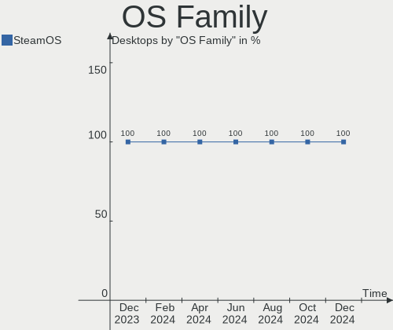

| Name    | Desktops | Percent |
|---------|----------|---------|
| SteamOS | 7        | 100%    |

Kernel
------

Version of the Linux kernel

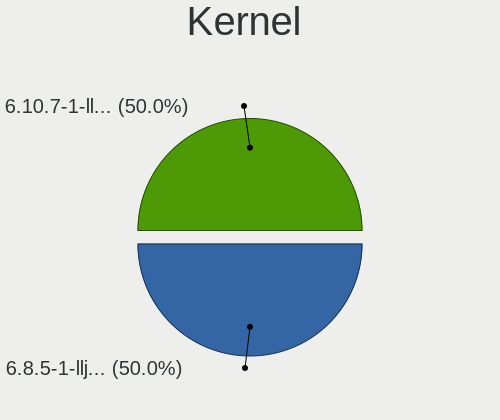

| Version                    | Desktops | Percent |
|----------------------------|----------|---------|
| 6.3.7-zen1-1-zen           | 4        | 57.14%  |
| 6.4.12-zen1-1-zen          | 2        | 28.57%  |
| 6.1.52-valve9-1-neptune-61 | 1        | 14.29%  |

Kernel Family
-------------

Linux kernel without a distro release

| Version | Desktops | Percent |
|---------|----------|---------|
| 6.3.7   | 4        | 57.14%  |
| 6.4.12  | 2        | 28.57%  |
| 6.1.52  | 1        | 14.29%  |

Kernel Major Ver.
-----------------

Linux kernel major version

| Version | Desktops | Percent |
|---------|----------|---------|
| 6.3     | 4        | 57.14%  |
| 6.4     | 2        | 28.57%  |
| 6.1     | 1        | 14.29%  |

Arch
----

OS architecture (x86_64, i586, etc.)

| Name   | Desktops | Percent |
|--------|----------|---------|
| x86_64 | 7        | 100%    |

DE
--

Desktop Environment

| Name | Desktops | Percent |
|------|----------|---------|
| KDE5 | 7        | 100%    |

Display Server
--------------

X11 or Wayland

| Name | Desktops | Percent |
|------|----------|---------|
| X11  | 7        | 100%    |

Display Manager
---------------

SDDM, LightDM, etc.

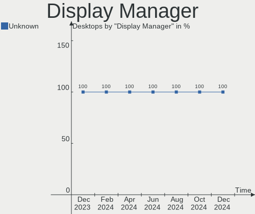

| Name    | Desktops | Percent |
|---------|----------|---------|
| Unknown | 7        | 100%    |

OS Lang
-------

Language

| Lang  | Desktops | Percent |
|-------|----------|---------|
| en_US | 5        | 71.43%  |
| pt_BR | 1        | 14.29%  |
| C     | 1        | 14.29%  |

Boot Mode
---------

EFI or BIOS

| Mode | Desktops | Percent |
|------|----------|---------|
| BIOS | 7        | 100%    |

Filesystem
----------

Type of filesystem

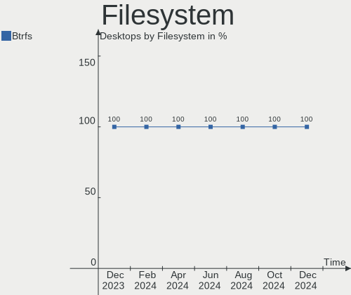

| Type  | Desktops | Percent |
|-------|----------|---------|
| Btrfs | 7        | 100%    |

Part. scheme
------------

Scheme of partitioning

| Type    | Desktops | Percent |
|---------|----------|---------|
| Unknown | 7        | 100%    |

Dual Boot with Linux/BSD
------------------------

Hosting more than one Linux/BSD

| Dual boot | Desktops | Percent |
|-----------|----------|---------|
| No        | 7        | 100%    |

Dual Boot (Win)
---------------

Hosting Linux and Windows

| Dual boot | Desktops | Percent |
|-----------|----------|---------|
| No        | 7        | 100%    |

Board
-----

Vendor
------

Motherboard manufacturer

| Name             | Desktops | Percent |
|------------------|----------|---------|
| MSI              | 3        | 42.86%  |
| ASUSTek Computer | 2        | 28.57%  |
| QIYIDA           | 1        | 14.29%  |
| ASRock           | 1        | 14.29%  |

Model
-----

Motherboard model

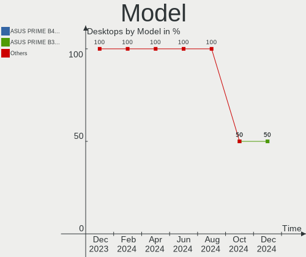

| Name                      | Desktops | Percent |
|---------------------------|----------|---------|
| QIYIDA ED4 V1.1           | 1        | 14.29%  |
| MSI MS-7C95               | 1        | 14.29%  |
| MSI MS-7C02               | 1        | 14.29%  |
| MSI MS-7B33               | 1        | 14.29%  |
| ASUS SABERTOOTH Z170 S    | 1        | 14.29%  |
| ASUS PRIME A320M-K        | 1        | 14.29%  |
| ASRock B450 Gaming-ITX/ac | 1        | 14.29%  |

Model Family
------------

Motherboard model prefix

| Name            | Desktops | Percent |
|-----------------|----------|---------|
| QIYIDA ED4      | 1        | 14.29%  |
| MSI MS-7C95     | 1        | 14.29%  |
| MSI MS-7C02     | 1        | 14.29%  |
| MSI MS-7B33     | 1        | 14.29%  |
| ASUS SABERTOOTH | 1        | 14.29%  |
| ASUS PRIME      | 1        | 14.29%  |
| ASRock B450     | 1        | 14.29%  |

MFG Year
--------

Motherboard manufacture year

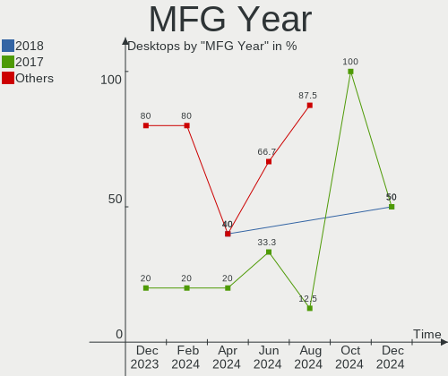

| Year | Desktops | Percent |
|------|----------|---------|
| 2020 | 2        | 28.57%  |
| 2018 | 2        | 28.57%  |
| 2023 | 1        | 14.29%  |
| 2017 | 1        | 14.29%  |
| 2016 | 1        | 14.29%  |

Form Factor
-----------

Physical design of the computer

| Name    | Desktops | Percent |
|---------|----------|---------|
| Desktop | 7        | 100%    |

Secure Boot
-----------

Enabled or disabled

| State    | Desktops | Percent |
|----------|----------|---------|
| Disabled | 7        | 100%    |

Coreboot
--------

Have coreboot on board

| Used | Desktops | Percent |
|------|----------|---------|
| No   | 7        | 100%    |

RAM Size
--------

Total RAM memory

| Size in GB | Desktops | Percent |
|------------|----------|---------|
| 16.01-24.0 | 3        | 42.86%  |
| 32.01-64.0 | 2        | 28.57%  |
| 8.01-16.0  | 2        | 28.57%  |

RAM Used
--------

Used RAM memory

| Used GB  | Desktops | Percent |
|----------|----------|---------|
| 3.01-4.0 | 3        | 42.86%  |
| 4.01-8.0 | 2        | 28.57%  |
| 2.01-3.0 | 2        | 28.57%  |

Total Drives
------------

Number of drives on board

| Drives | Desktops | Percent |
|--------|----------|---------|
| 3      | 3        | 42.86%  |
| 2      | 2        | 28.57%  |
| 1      | 2        | 28.57%  |

Has CD-ROM
----------

Has CD-ROM on board

| Presented | Desktops | Percent |
|-----------|----------|---------|
| No        | 6        | 85.71%  |
| Yes       | 1        | 14.29%  |

Has Ethernet
------------

Has Ethernet on board

| Presented | Desktops | Percent |
|-----------|----------|---------|
| Yes       | 7        | 100%    |

Has WiFi
--------

Has WiFi module

| Presented | Desktops | Percent |
|-----------|----------|---------|
| Yes       | 4        | 57.14%  |
| No        | 3        | 42.86%  |

Has Bluetooth
-------------

Has Bluetooth module

| Presented | Desktops | Percent |
|-----------|----------|---------|
| Yes       | 5        | 71.43%  |
| No        | 2        | 28.57%  |

Location
--------

Country
-------

Geographic location (country)

| Country      | Desktops | Percent |
|--------------|----------|---------|
| USA          | 3        | 42.86%  |
| South Africa | 2        | 28.57%  |
| Germany      | 1        | 14.29%  |
| Brazil       | 1        | 14.29%  |

City
----

Geographic location (city)

| City         | Desktops | Percent |
|--------------|----------|---------|
| Woodway      | 1        | 14.29%  |
| St Louis     | 1        | 14.29%  |
| Spartanburg  | 1        | 14.29%  |
| Kaufbeuren   | 1        | 14.29%  |
| Johannesburg | 1        | 14.29%  |
| Centurion    | 1        | 14.29%  |
| Ananindeua   | 1        | 14.29%  |

Drives
------

Drive Vendor
------------

Hard drive vendors

| Vendor              | Desktops | Drives | Percent |
|---------------------|----------|--------|---------|
| Seagate             | 3        | 3      | 23.08%  |
| WDC                 | 2        | 4      | 15.38%  |
| Samsung Electronics | 2        | 2      | 15.38%  |
| Silicon Motion      | 1        | 1      | 7.69%   |
| Sandisk             | 1        | 1      | 7.69%   |
| Phison Electronics  | 1        | 1      | 7.69%   |
| Kingston            | 1        | 1      | 7.69%   |
| Crucial             | 1        | 1      | 7.69%   |
| A-DATA Technology   | 1        | 1      | 7.69%   |

Drive Model
-----------

Hard drive models

| Model                                                 | Desktops | Percent |
|-------------------------------------------------------|----------|---------|
| WDC WDS120G1G0A-00SS50 120GB SSD                      | 1        | 6.67%   |
| WDC WD5000AZRX-00A8LB0 500GB                          | 1        | 6.67%   |
| WDC WD10EZEX-08WN4A0 1TB                              | 1        | 6.67%   |
| WDC WD10EZEX-00WN4A0 1TB                              | 1        | 6.67%   |
| Silicon Motion SM2263EN/SM2263XT SSD Controller 128GB | 1        | 6.67%   |
| Seagate ST3500413AS 500GB                             | 1        | 6.67%   |
| Seagate ST1000DM003-9YN162 1TB                        | 1        | 6.67%   |
| Seagate BUP BK 5TB                                    | 1        | 6.67%   |
| Sandisk WD Blue SN570 1TB                             | 1        | 6.67%   |
| Samsung PSSD T7 1TB                                   | 1        | 6.67%   |
| Samsung HM321HI 320GB                                 | 1        | 6.67%   |
| Phison PS5013 E13 NVMe Controller 256GB               | 1        | 6.67%   |
| Kingston SV300S37A240G 240GB SSD                      | 1        | 6.67%   |
| Crucial CT1000BX500SSD1 1TB                           | 1        | 6.67%   |
| A-DATA SU635 240GB SSD                                | 1        | 6.67%   |

HDD Vendor
----------

Hard disk drive vendors

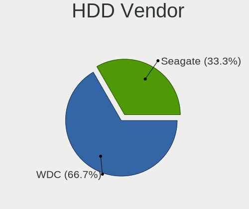

| Vendor              | Desktops | Drives | Percent |
|---------------------|----------|--------|---------|
| Seagate             | 3        | 3      | 50%     |
| WDC                 | 2        | 3      | 33.33%  |
| Samsung Electronics | 1        | 1      | 16.67%  |

SSD Vendor
----------

Solid state drive vendors

| Vendor              | Desktops | Drives | Percent |
|---------------------|----------|--------|---------|
| WDC                 | 1        | 1      | 20%     |
| Samsung Electronics | 1        | 1      | 20%     |
| Kingston            | 1        | 1      | 20%     |
| Crucial             | 1        | 1      | 20%     |
| A-DATA Technology   | 1        | 1      | 20%     |

Drive Kind
----------

HDD or SSD

| Kind | Desktops | Drives | Percent |
|------|----------|--------|---------|
| SSD  | 4        | 5      | 36.36%  |
| HDD  | 4        | 7      | 36.36%  |
| NVMe | 3        | 3      | 27.27%  |

Drive Connector
---------------

SATA, SAS, NVMe, etc.

| Type | Desktops | Drives | Percent |
|------|----------|--------|---------|
| SATA | 6        | 10     | 54.55%  |
| NVMe | 3        | 3      | 27.27%  |
| SAS  | 2        | 2      | 18.18%  |

Drive Size
----------

Size of hard drive

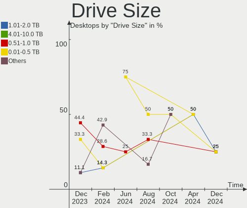

| Size in TB | Desktops | Drives | Percent |
|------------|----------|--------|---------|
| 0.01-0.5   | 5        | 6      | 50%     |
| 0.51-1.0   | 4        | 5      | 40%     |
| 4.01-10.0  | 1        | 1      | 10%     |

Space Total
-----------

Amount of disk space available on the file system

| Size in GB | Desktops | Percent |
|------------|----------|---------|
| 501-1000   | 4        | 57.14%  |
| 101-250    | 2        | 28.57%  |
| 251-500    | 1        | 14.29%  |

Space Used
----------

Amount of used disk space

| Used GB  | Desktops | Percent |
|----------|----------|---------|
| 21-50    | 3        | 42.86%  |
| 251-500  | 1        | 14.29%  |
| 101-250  | 1        | 14.29%  |
| 1-20     | 1        | 14.29%  |
| 501-1000 | 1        | 14.29%  |

Malfunc. Drives
---------------

Drive models with a malfunction

Zero info for selected period =(

Malfunc. Drive Vendor
---------------------

Vendors of faulty drives

Zero info for selected period =(

Malfunc. HDD Vendor
-------------------

Vendors of faulty HDD drives

Zero info for selected period =(

Malfunc. Drive Kind
-------------------

Kinds of faulty drives

Zero info for selected period =(

Failed Drives
-------------

Failed drive models

Zero info for selected period =(

Failed Drive Vendor
-------------------

Failed drive vendors

Zero info for selected period =(

Drive Status
------------

Number of failed and malfunc. drives

| Status   | Desktops | Drives | Percent |
|----------|----------|--------|---------|
| Detected | 7        | 15     | 100%    |

Storage controller
------------------

Storage Vendor
--------------

Storage controller vendors

| Vendor             | Desktops | Percent |
|--------------------|----------|---------|
| AMD                | 4        | 40%     |
| Intel              | 3        | 30%     |
| Silicon Motion     | 1        | 10%     |
| SanDisk            | 1        | 10%     |
| Phison Electronics | 1        | 10%     |

Storage Model
-------------

Storage controller models

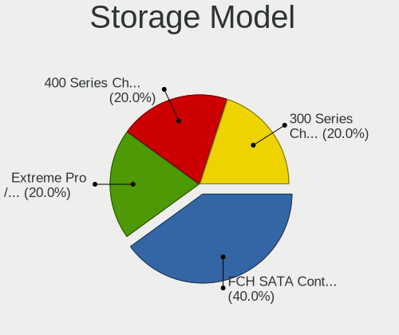

| Model                                                                          | Desktops | Percent |
|--------------------------------------------------------------------------------|----------|---------|
| AMD FCH SATA Controller [AHCI mode]                                            | 3        | 23.08%  |
| AMD 400 Series Chipset SATA Controller                                         | 2        | 15.38%  |
| Silicon Motion SM2263EN/SM2263XT (DRAM-less) NVMe SSD Controllers              | 1        | 7.69%   |
| SanDisk Ultra 3D / WD Blue SN570 NVMe SSD (DRAM-less)                          | 1        | 7.69%   |
| Phison PS5013-E13 PCIe3 NVMe Controller (DRAM-less)                            | 1        | 7.69%   |
| Intel Q170/Q150/B150/H170/H110/Z170/CM236 Chipset SATA Controller [AHCI Mode]  | 1        | 7.69%   |
| Intel Cannon Lake PCH SATA AHCI Controller                                     | 1        | 7.69%   |
| Intel 8 Series/C220 Series Chipset Family 6-port SATA Controller 1 [AHCI mode] | 1        | 7.69%   |
| AMD FCH SATA Controller D                                                      | 1        | 7.69%   |
| AMD 500 Series Chipset SATA Controller                                         | 1        | 7.69%   |

Storage Kind
------------

Kind of storage controller (IDE, SATA, NVMe, SAS, ...)

| Kind | Desktops | Percent |
|------|----------|---------|
| SATA | 7        | 70%     |
| NVMe | 3        | 30%     |

Processor
---------

CPU Vendor
----------

Processor vendors

| Vendor | Desktops | Percent |
|--------|----------|---------|
| AMD    | 4        | 57.14%  |
| Intel  | 3        | 42.86%  |

CPU Model
---------

Processor models

| Model                                       | Desktops | Percent |
|---------------------------------------------|----------|---------|
| Intel Xeon CPU E5-2670 v3 @ 2.30GHz         | 1        | 14.29%  |
| Intel Core i7-6700K CPU @ 4.00GHz           | 1        | 14.29%  |
| Intel Core i5-9400F CPU @ 2.90GHz           | 1        | 14.29%  |
| AMD Ryzen 5 5600X 6-Core Processor          | 1        | 14.29%  |
| AMD Ryzen 5 5600G with Radeon Graphics      | 1        | 14.29%  |
| AMD Ryzen 5 1600 Six-Core Processor         | 1        | 14.29%  |
| AMD Ryzen 3 2200G with Radeon Vega Graphics | 1        | 14.29%  |

CPU Model Family
----------------

Processor model prefix

| Model         | Desktops | Percent |
|---------------|----------|---------|
| AMD Ryzen 5   | 3        | 42.86%  |
| Intel Xeon    | 1        | 14.29%  |
| Intel Core i7 | 1        | 14.29%  |
| Intel Core i5 | 1        | 14.29%  |
| AMD Ryzen 3   | 1        | 14.29%  |

CPU Cores
---------

Number of processor cores

| Number | Desktops | Percent |
|--------|----------|---------|
| 6      | 4        | 57.14%  |
| 4      | 2        | 28.57%  |
| 12     | 1        | 14.29%  |

CPU Sockets
-----------

Number of sockets

| Number | Desktops | Percent |
|--------|----------|---------|
| 1      | 7        | 100%    |

CPU Threads
-----------

Threads per core (Hyper-Threading)

| Number | Desktops | Percent |
|--------|----------|---------|
| 2      | 5        | 71.43%  |
| 1      | 2        | 28.57%  |

CPU Op-Modes
------------

CPU Operation Modes (32-bit, 64-bit)

| Op mode        | Desktops | Percent |
|----------------|----------|---------|
| 32-bit, 64-bit | 7        | 100%    |

CPU Microcode
-------------

Microcode number

| Number  | Desktops | Percent |
|---------|----------|---------|
| Unknown | 7        | 100%    |

CPU Microarch
-------------

Microarchitecture

| Name     | Desktops | Percent |
|----------|----------|---------|
| Zen 3    | 2        | 28.57%  |
| Zen+     | 1        | 14.29%  |
| Zen      | 1        | 14.29%  |
| Skylake  | 1        | 14.29%  |
| KabyLake | 1        | 14.29%  |
| Haswell  | 1        | 14.29%  |

Graphics
--------

GPU Vendor
----------

Vendors of graphics cards

| Vendor | Desktops | Percent |
|--------|----------|---------|
| AMD    | 6        | 85.71%  |
| Nvidia | 1        | 14.29%  |

GPU Model
---------

Graphics card models

| Model                                                        | Desktops | Percent |
|--------------------------------------------------------------|----------|---------|
| AMD Ellesmere [Radeon RX 470/480/570/570X/580/580X/590]      | 3        | 37.5%   |
| Nvidia GP104 [GeForce GTX 1080]                              | 1        | 12.5%   |
| AMD Polaris 20 XL [Radeon RX 580 2048SP]                     | 1        | 12.5%   |
| AMD Navi 32 [Radeon RX 7700 XT / 7800 XT]                    | 1        | 12.5%   |
| AMD Navi 24 [Radeon RX 6400/6500 XT/6500M]                   | 1        | 12.5%   |
| AMD Cezanne [Radeon Vega Series / Radeon Vega Mobile Series] | 1        | 12.5%   |

GPU Combo
---------

Combinations of graphics cards

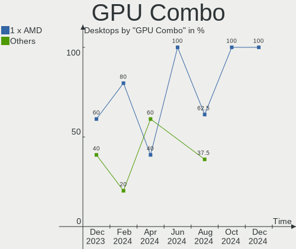

| Name       | Desktops | Percent |
|------------|----------|---------|
| 1 x AMD    | 5        | 71.43%  |
| 2 x AMD    | 1        | 14.29%  |
| 1 x Nvidia | 1        | 14.29%  |

GPU Driver
----------

Free vs proprietary

| Driver | Desktops | Percent |
|--------|----------|---------|
| Free   | 7        | 100%    |

GPU Memory
----------

Total video memory

| Size in GB | Desktops | Percent |
|------------|----------|---------|
| Unknown    | 7        | 100%    |

Monitor
-------

Monitor Vendor
--------------

Monitor vendors

| Vendor              | Desktops | Percent |
|---------------------|----------|---------|
| Sceptre Tech        | 1        | 14.29%  |
| Samsung Electronics | 1        | 14.29%  |
| RTK                 | 1        | 14.29%  |
| Philips             | 1        | 14.29%  |
| Hitachi             | 1        | 14.29%  |
| AOC                 | 1        | 14.29%  |
| Acer                | 1        | 14.29%  |

Monitor Model
-------------

Monitor models

| Model                                                                   | Desktops | Percent |
|-------------------------------------------------------------------------|----------|---------|
| Sceptre Tech Sceptre C35 SPT0DB7 3440x1440 819x346mm 35.0-inch          | 1        | 14.29%  |
| Samsung Electronics LCD Monitor SAM7017 3840x2160 1872x1053mm 84.6-inch | 1        | 14.29%  |
| RTK '' RTK1920 1920x1080 344x195mm 15.6-inch                            | 1        | 14.29%  |
| Philips FTV PHL01EA 1920x1080 1440x810mm 65.0-inch                      | 1        | 14.29%  |
| Hitachi HDMI HEC0029 1920x1080 580x330mm 26.3-inch                      | 1        | 14.29%  |
| AOC 2369M AOC2369 1920x1080 509x286mm 23.0-inch                         | 1        | 14.29%  |
| Acer G257HL ACR0415 1920x1080 553x309mm 24.9-inch                       | 1        | 14.29%  |

Monitor Resolution
------------------

Monitor screen resolution

| Resolution      | Desktops | Percent |
|-----------------|----------|---------|
| 1920x1080 (FHD) | 5        | 71.43%  |
| 3840x2160 (4K)  | 1        | 14.29%  |
| 3440x1440       | 1        | 14.29%  |

Monitor Diagonal
----------------

Diagonal size in inches

| Inches | Desktops | Percent |
|--------|----------|---------|
| 84     | 1        | 14.29%  |
| 65     | 1        | 14.29%  |
| 52     | 1        | 14.29%  |
| 35     | 1        | 14.29%  |
| 31     | 1        | 14.29%  |
| 24     | 1        | 14.29%  |
| 23     | 1        | 14.29%  |

Monitor Width
-------------

Physical width

| Width in mm | Desktops | Percent |
|-------------|----------|---------|
| 501-600     | 2        | 28.57%  |
| 1001-1500   | 2        | 28.57%  |
| 801-900     | 1        | 14.29%  |
| 601-700     | 1        | 14.29%  |
| 1501-2000   | 1        | 14.29%  |

Aspect Ratio
------------

Proportional relationship between the width and the height

| Ratio | Desktops | Percent |
|-------|----------|---------|
| 16/9  | 6        | 85.71%  |
| 21/9  | 1        | 14.29%  |

Monitor Area
------------

Area in inch²

| Area in inch² | Desktops | Percent |
|----------------|----------|---------|
| More than 1000 | 3        | 42.86%  |
| 351-500        | 2        | 28.57%  |
| 251-300        | 1        | 14.29%  |
| 201-250        | 1        | 14.29%  |

Pixel Density
-------------

Pixels per inch

| Density | Desktops | Percent |
|---------|----------|---------|
| 51-100  | 4        | 57.14%  |
| 1-50    | 2        | 28.57%  |
| 101-120 | 1        | 14.29%  |

Multiple Monitors
-----------------

Total monitors connected

| Total | Desktops | Percent |
|-------|----------|---------|
| 1     | 7        | 100%    |

Network
-------

Net Controller Vendor
---------------------

Controller vendors

| Vendor                | Desktops | Percent |
|-----------------------|----------|---------|
| Realtek Semiconductor | 5        | 50%     |
| Intel                 | 2        | 20%     |
| TP-Link               | 1        | 10%     |
| MediaTek              | 1        | 10%     |
| Broadcom              | 1        | 10%     |

Net Controller Model
--------------------

Controller models

| Model                                                                  | Desktops | Percent |
|------------------------------------------------------------------------|----------|---------|
| Realtek RTL8111/8168/8211/8411 PCI Express Gigabit Ethernet Controller | 5        | 41.67%  |
| TP-Link Archer T3U [Realtek RTL8812BU]                                 | 1        | 8.33%   |
| Realtek RTL8188EUS 802.11n Wireless Network Adapter                    | 1        | 8.33%   |
| MediaTek MT7921K (RZ608) Wi-Fi 6E 80MHz                                | 1        | 8.33%   |
| Intel I211 Gigabit Network Connection                                  | 1        | 8.33%   |
| Intel Ethernet Connection (2) I219-V                                   | 1        | 8.33%   |
| Intel Dual Band Wireless-AC 3168NGW [Stone Peak]                       | 1        | 8.33%   |
| Broadcom BCM4360 802.11ac Dual Band Wireless Network Adapter           | 1        | 8.33%   |

Wireless Vendor
---------------

Wireless vendors

| Vendor                | Desktops | Percent |
|-----------------------|----------|---------|
| TP-Link               | 1        | 20%     |
| Realtek Semiconductor | 1        | 20%     |
| MediaTek              | 1        | 20%     |
| Intel                 | 1        | 20%     |
| Broadcom              | 1        | 20%     |

Wireless Model
--------------

Wireless models

| Model                                                        | Desktops | Percent |
|--------------------------------------------------------------|----------|---------|
| TP-Link Archer T3U [Realtek RTL8812BU]                       | 1        | 20%     |
| Realtek RTL8188EUS 802.11n Wireless Network Adapter          | 1        | 20%     |
| MediaTek MT7921K (RZ608) Wi-Fi 6E 80MHz                      | 1        | 20%     |
| Intel Dual Band Wireless-AC 3168NGW [Stone Peak]             | 1        | 20%     |
| Broadcom BCM4360 802.11ac Dual Band Wireless Network Adapter | 1        | 20%     |

Ethernet Vendor
---------------

Ethernet vendors

| Vendor                | Desktops | Percent |
|-----------------------|----------|---------|
| Realtek Semiconductor | 5        | 71.43%  |
| Intel                 | 2        | 28.57%  |

Ethernet Model
--------------

Ethernet models

| Model                                                                  | Desktops | Percent |
|------------------------------------------------------------------------|----------|---------|
| Realtek RTL8111/8168/8211/8411 PCI Express Gigabit Ethernet Controller | 5        | 71.43%  |
| Intel I211 Gigabit Network Connection                                  | 1        | 14.29%  |
| Intel Ethernet Connection (2) I219-V                                   | 1        | 14.29%  |

Net Controller Kind
-------------------

Ethernet, WiFi or modem

| Kind     | Desktops | Percent |
|----------|----------|---------|
| Ethernet | 7        | 63.64%  |
| WiFi     | 4        | 36.36%  |

Used Controller
---------------

Currently used network controller

| Kind     | Desktops | Percent |
|----------|----------|---------|
| Ethernet | 6        | 85.71%  |
| WiFi     | 1        | 14.29%  |

NICs
----

Total network controllers on board

| Total | Desktops | Percent |
|-------|----------|---------|
| 1     | 4        | 57.14%  |
| 2     | 3        | 42.86%  |

IPv6
----

IPv6 vs IPv4

| Used | Desktops | Percent |
|------|----------|---------|
| No   | 5        | 71.43%  |
| Yes  | 2        | 28.57%  |

Bluetooth
---------

Bluetooth Vendor
----------------

Controller vendors

| Vendor                  | Desktops | Percent |
|-------------------------|----------|---------|
| Cambridge Silicon Radio | 2        | 40%     |
| TP-Link                 | 1        | 20%     |
| MediaTek                | 1        | 20%     |
| Intel                   | 1        | 20%     |

Bluetooth Model
---------------

Controller models

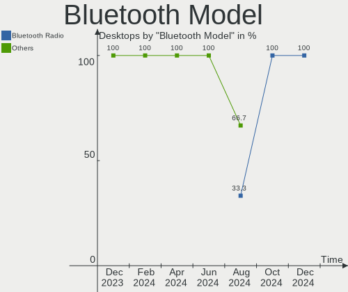

| Model                                               | Desktops | Percent |
|-----------------------------------------------------|----------|---------|
| Cambridge Silicon Radio Bluetooth Dongle (HCI mode) | 2        | 40%     |
| TP-Link UB500 Adapter                               | 1        | 20%     |
| MediaTek Wireless_Device                            | 1        | 20%     |
| Intel Wireless-AC 3168 Bluetooth                    | 1        | 20%     |

Sound
-----

Sound Vendor
------------

Sound card vendors

| Vendor             | Desktops | Percent |
|--------------------|----------|---------|
| AMD                | 7        | 53.85%  |
| Intel              | 3        | 23.08%  |
| Nvidia             | 1        | 7.69%   |
| Medeli Electronics | 1        | 7.69%   |
| JMTek              | 1        | 7.69%   |

Sound Model
-----------

Sound card models

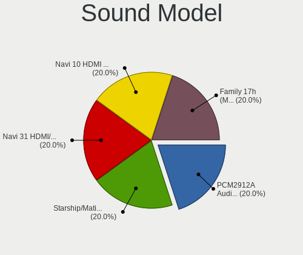

| Model                                                               | Desktops | Percent |
|---------------------------------------------------------------------|----------|---------|
| AMD Ellesmere HDMI Audio [Radeon RX 470/480 / 570/580/590]          | 4        | 23.53%  |
| AMD Family 17h/19h HD Audio Controller                              | 2        | 11.76%  |
| Nvidia GP104 High Definition Audio Controller                       | 1        | 5.88%   |
| Medeli Electronics JOUNIVO JV906                                    | 1        | 5.88%   |
| JMTek USB PnP Audio Device                                          | 1        | 5.88%   |
| Intel Cannon Lake PCH cAVS                                          | 1        | 5.88%   |
| Intel 8 Series/C220 Series Chipset High Definition Audio Controller | 1        | 5.88%   |
| Intel 100 Series/C230 Series Chipset Family HD Audio Controller     | 1        | 5.88%   |
| AMD Starship/Matisse HD Audio Controller                            | 1        | 5.88%   |
| AMD Renoir Radeon High Definition Audio Controller                  | 1        | 5.88%   |
| AMD Navi 31 HDMI/DP Audio                                           | 1        | 5.88%   |
| AMD Navi 21/23 HDMI/DP Audio Controller                             | 1        | 5.88%   |
| AMD Family 17h (Models 00h-0fh) HD Audio Controller                 | 1        | 5.88%   |

Memory
------

Memory Vendor
-------------

Memory module vendors

Zero info for selected period =(

Memory Model
------------

Memory module models

Zero info for selected period =(

Memory Kind
-----------

Memory module kinds

Zero info for selected period =(

Memory Form Factor
------------------

Physical design of the memory module

Zero info for selected period =(

Memory Size
-----------

Memory module size

Zero info for selected period =(

Memory Speed
------------

Memory module speed

Zero info for selected period =(

Printers & scanners
-------------------

Printer Vendor
--------------

Printer device vendors

Zero info for selected period =(

Printer Model
-------------

Printer device models

Zero info for selected period =(

Scanner Vendor
--------------

Scanner device vendors

Zero info for selected period =(

Scanner Model
-------------

Scanner device models

Zero info for selected period =(

Camera
------

Camera Vendor
-------------

Camera device vendors

Zero info for selected period =(

Camera Model
------------

Camera device models

Zero info for selected period =(

Security
--------

Fingerprint Vendor
------------------

Fingerprint sensor vendors

Zero info for selected period =(

Fingerprint Model
-----------------

Fingerprint sensor models

Zero info for selected period =(

Chipcard Vendor
---------------

Chipcard module vendors

Zero info for selected period =(

Chipcard Model
--------------

Chipcard module models

Zero info for selected period =(

Unsupported
-----------

Unsupported Devices
-------------------

Total unsupported devices on board

| Total | Desktops | Percent |
|-------|----------|---------|
| 0     | 4        | 57.14%  |
| 1     | 3        | 42.86%  |

Unsupported Device Types
------------------------

Types of unsupported devices

| Type          | Desktops | Percent |
|---------------|----------|---------|
| Net/wireless  | 1        | 33.33%  |
| Graphics card | 1        | 33.33%  |
| Bluetooth     | 1        | 33.33%  |

