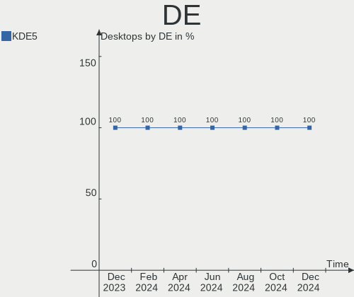
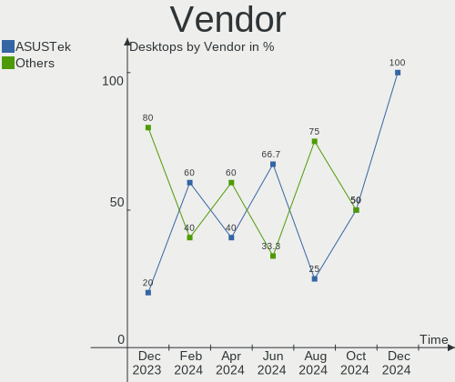
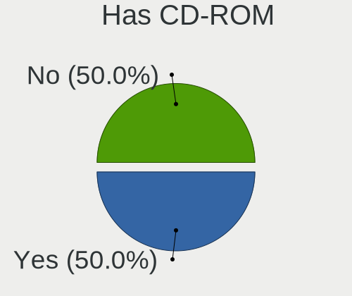
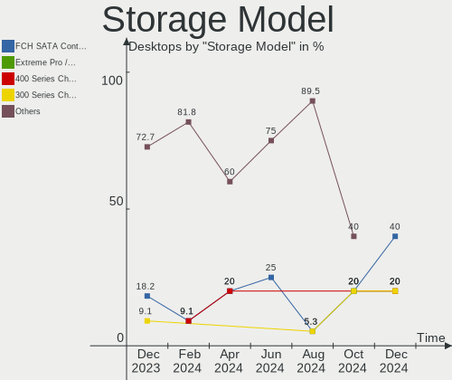
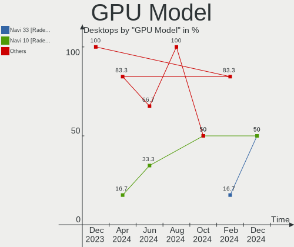
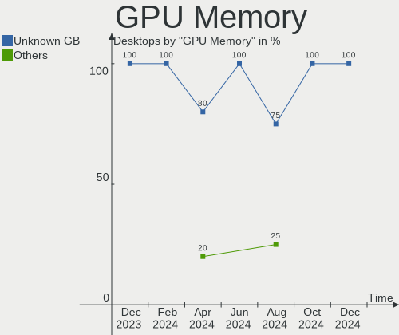
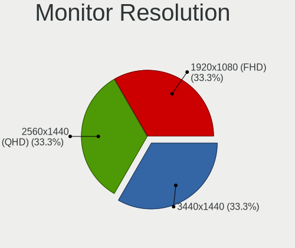
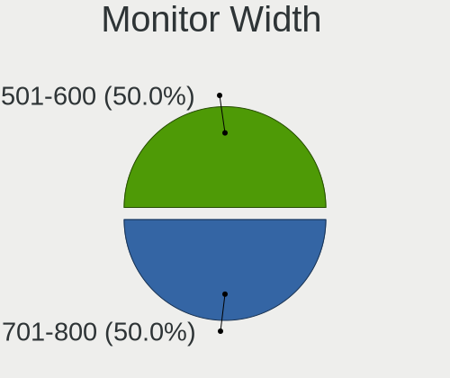
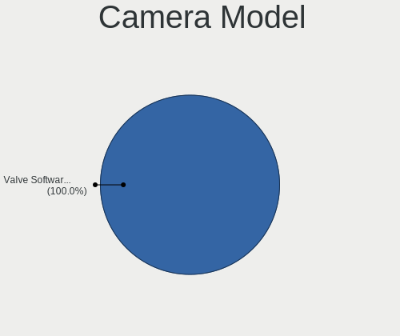

SteamOS - Hardware Trends (Desktops)
------------------------------------

A project to identify most popular hardware characteristics and track their change
over time based on data collected by Linux users at https://Linux-Hardware.org.

Anyone can contribute to this report by the [hw-probe](https://github.com/linuxhw/hw-probe) tool:

    sudo -E hw-probe -all -upload

This report is for one last month. Overall report since the beginning of time: [TestCoverage](https://github.com/linuxhw/TestCoverage)

Period: Jul, 2022.

Contents
--------

* [ System ](#system)
  - [ OS                       ](#os)
  - [ OS Family                ](#os-family)
  - [ Kernel                   ](#kernel)
  - [ Kernel Family            ](#kernel-family)
  - [ Kernel Major Ver.        ](#kernel-major-ver)
  - [ Arch                     ](#arch)
  - [ DE                       ](#de)
  - [ Display Server           ](#display-server)
  - [ Display Manager          ](#display-manager)
  - [ OS Lang                  ](#os-lang)
  - [ Boot Mode                ](#boot-mode)
  - [ Filesystem               ](#filesystem)
  - [ Part. scheme             ](#part-scheme)
  - [ Dual Boot with Linux/BSD ](#dual-boot-with-linuxbsd)
  - [ Dual Boot (Win)          ](#dual-boot-win)

* [ Board ](#board)
  - [ Vendor                   ](#vendor)
  - [ Model                    ](#model)
  - [ Model Family             ](#model-family)
  - [ MFG Year                 ](#mfg-year)
  - [ Form Factor              ](#form-factor)
  - [ Secure Boot              ](#secure-boot)
  - [ Coreboot                 ](#coreboot)
  - [ RAM Size                 ](#ram-size)
  - [ RAM Used                 ](#ram-used)
  - [ Total Drives             ](#total-drives)
  - [ Has CD-ROM               ](#has-cd-rom)
  - [ Has Ethernet             ](#has-ethernet)
  - [ Has WiFi                 ](#has-wifi)
  - [ Has Bluetooth            ](#has-bluetooth)

* [ Location ](#location)
  - [ Country                  ](#country)
  - [ City                     ](#city)

* [ Drives ](#drives)
  - [ Drive Vendor             ](#drive-vendor)
  - [ Drive Model              ](#drive-model)
  - [ HDD Vendor               ](#hdd-vendor)
  - [ SSD Vendor               ](#ssd-vendor)
  - [ Drive Kind               ](#drive-kind)
  - [ Drive Connector          ](#drive-connector)
  - [ Drive Size               ](#drive-size)
  - [ Space Total              ](#space-total)
  - [ Space Used               ](#space-used)
  - [ Malfunc. Drives          ](#malfunc-drives)
  - [ Malfunc. Drive Vendor    ](#malfunc-drive-vendor)
  - [ Malfunc. HDD Vendor      ](#malfunc-hdd-vendor)
  - [ Malfunc. Drive Kind      ](#malfunc-drive-kind)
  - [ Failed Drives            ](#failed-drives)
  - [ Failed Drive Vendor      ](#failed-drive-vendor)
  - [ Drive Status             ](#drive-status)

* [ Storage controller ](#storage-controller)
  - [ Storage Vendor           ](#storage-vendor)
  - [ Storage Model            ](#storage-model)
  - [ Storage Kind             ](#storage-kind)

* [ Processor ](#processor)
  - [ CPU Vendor               ](#cpu-vendor)
  - [ CPU Model                ](#cpu-model)
  - [ CPU Model Family         ](#cpu-model-family)
  - [ CPU Cores                ](#cpu-cores)
  - [ CPU Sockets              ](#cpu-sockets)
  - [ CPU Threads              ](#cpu-threads)
  - [ CPU Op-Modes             ](#cpu-op-modes)
  - [ CPU Microcode            ](#cpu-microcode)
  - [ CPU Microarch            ](#cpu-microarch)

* [ Graphics ](#graphics)
  - [ GPU Vendor               ](#gpu-vendor)
  - [ GPU Model                ](#gpu-model)
  - [ GPU Combo                ](#gpu-combo)
  - [ GPU Driver               ](#gpu-driver)
  - [ GPU Memory               ](#gpu-memory)

* [ Monitor ](#monitor)
  - [ Monitor Vendor           ](#monitor-vendor)
  - [ Monitor Model            ](#monitor-model)
  - [ Monitor Resolution       ](#monitor-resolution)
  - [ Monitor Diagonal         ](#monitor-diagonal)
  - [ Monitor Width            ](#monitor-width)
  - [ Aspect Ratio             ](#aspect-ratio)
  - [ Monitor Area             ](#monitor-area)
  - [ Pixel Density            ](#pixel-density)
  - [ Multiple Monitors        ](#multiple-monitors)

* [ Network ](#network)
  - [ Net Controller Vendor    ](#net-controller-vendor)
  - [ Net Controller Model     ](#net-controller-model)
  - [ Wireless Vendor          ](#wireless-vendor)
  - [ Wireless Model           ](#wireless-model)
  - [ Ethernet Vendor          ](#ethernet-vendor)
  - [ Ethernet Model           ](#ethernet-model)
  - [ Net Controller Kind      ](#net-controller-kind)
  - [ Used Controller          ](#used-controller)
  - [ NICs                     ](#nics)
  - [ IPv6                     ](#ipv6)

* [ Bluetooth ](#bluetooth)
  - [ Bluetooth Vendor         ](#bluetooth-vendor)
  - [ Bluetooth Model          ](#bluetooth-model)

* [ Sound ](#sound)
  - [ Sound Vendor             ](#sound-vendor)
  - [ Sound Model              ](#sound-model)

* [ Memory ](#memory)
  - [ Memory Vendor            ](#memory-vendor)
  - [ Memory Model             ](#memory-model)
  - [ Memory Kind              ](#memory-kind)
  - [ Memory Form Factor       ](#memory-form-factor)
  - [ Memory Size              ](#memory-size)
  - [ Memory Speed             ](#memory-speed)

* [ Printers & scanners ](#printers--scanners)
  - [ Printer Vendor           ](#printer-vendor)
  - [ Printer Model            ](#printer-model)
  - [ Scanner Vendor           ](#scanner-vendor)
  - [ Scanner Model            ](#scanner-model)

* [ Camera ](#camera)
  - [ Camera Vendor            ](#camera-vendor)
  - [ Camera Model             ](#camera-model)

* [ Security ](#security)
  - [ Fingerprint Vendor       ](#fingerprint-vendor)
  - [ Fingerprint Model        ](#fingerprint-model)
  - [ Chipcard Vendor          ](#chipcard-vendor)
  - [ Chipcard Model           ](#chipcard-model)

* [ Unsupported ](#unsupported)
  - [ Unsupported Devices      ](#unsupported-devices)
  - [ Unsupported Device Types ](#unsupported-device-types)

System
------

OS
--

Installed operating systems

| Name                         | Desktops | Percent |
|------------------------------|----------|---------|
| SteamOS 3.3                  | 3        | 50%     |
| SteamOS 3.2 (steamdeck-main) | 3        | 50%     |

OS Family
---------

OS without a version

| Name    | Desktops | Percent |
|---------|----------|---------|
| SteamOS | 6        | 100%    |

Kernel
------

Version of the Linux kernel

| Version                                            | Desktops | Percent |
|----------------------------------------------------|----------|---------|
| 5.13.0-valve22-1-neptune-02213-gb68995364335       | 2        | 33.33%  |
| 5.13.0-valve10.1-2-neptune-dri-02144-g7fffaf925dfb | 2        | 33.33%  |
| 5.18.1-arch1_testHoloISO_20220606.1811             | 1        | 16.67%  |
| 5.13.0-valve21-2-neptune-02209-g2a5bdc1102a0       | 1        | 16.67%  |

Kernel Family
-------------

Linux kernel without a distro release

| Version | Desktops | Percent |
|---------|----------|---------|
| 5.13.0  | 5        | 83.33%  |
| 5.18.1  | 1        | 16.67%  |

Kernel Major Ver.
-----------------

Linux kernel major version

| Version | Desktops | Percent |
|---------|----------|---------|
| 5.13    | 5        | 83.33%  |
| 5.18    | 1        | 16.67%  |

Arch
----

OS architecture (x86_64, i586, etc.)

| Name   | Desktops | Percent |
|--------|----------|---------|
| x86_64 | 6        | 100%    |

DE
--

Desktop Environment

| Name | Desktops | Percent |
|------|----------|---------|
| KDE5 | 6        | 100%    |

Display Server
--------------

X11 or Wayland

| Name | Desktops | Percent |
|------|----------|---------|
| X11  | 6        | 100%    |

Display Manager
---------------

SDDM, LightDM, etc.

| Name    | Desktops | Percent |
|---------|----------|---------|
| Unknown | 6        | 100%    |

OS Lang
-------

Language

| Lang  | Desktops | Percent |
|-------|----------|---------|
| en_US | 4        | 66.67%  |
| pt_PT | 1        | 16.67%  |
| en_GB | 1        | 16.67%  |

Boot Mode
---------

EFI or BIOS

| Mode | Desktops | Percent |
|------|----------|---------|
| BIOS | 6        | 100%    |

Filesystem
----------

Type of filesystem

| Type  | Desktops | Percent |
|-------|----------|---------|
| Btrfs | 6        | 100%    |

Part. scheme
------------

Scheme of partitioning

| Type    | Desktops | Percent |
|---------|----------|---------|
| Unknown | 6        | 100%    |

Dual Boot with Linux/BSD
------------------------

Hosting more than one Linux/BSD

| Dual boot | Desktops | Percent |
|-----------|----------|---------|
| No        | 6        | 100%    |

Dual Boot (Win)
---------------

Hosting Linux and Windows

| Dual boot | Desktops | Percent |
|-----------|----------|---------|
| No        | 6        | 100%    |

Board
-----

Vendor
------

Motherboard manufacturer

| Name                | Desktops | Percent |
|---------------------|----------|---------|
| Gigabyte Technology | 3        | 50%     |
| ASRock              | 2        | 33.33%  |
| ASUSTek Computer    | 1        | 16.67%  |

Model
-----

Motherboard model

| Name                           | Desktops | Percent |
|--------------------------------|----------|---------|
| Gigabyte X570 I AORUS PRO WIFI | 1        | 16.67%  |
| Gigabyte H170N-WIFI            | 1        | 16.67%  |
| Gigabyte B550 GAMING X V2      | 1        | 16.67%  |
| ASUS EX-A320M-GAMING           | 1        | 16.67%  |
| ASRock B450M-HDV R4.0          | 1        | 16.67%  |
| ASRock A520M-ITX/ac            | 1        | 16.67%  |

Model Family
------------

Motherboard model prefix

| Name                 | Desktops | Percent |
|----------------------|----------|---------|
| Gigabyte X570        | 1        | 16.67%  |
| Gigabyte H170N-WIFI  | 1        | 16.67%  |
| Gigabyte B550        | 1        | 16.67%  |
| ASUS EX-A320M-GAMING | 1        | 16.67%  |
| ASRock B450M-HDV     | 1        | 16.67%  |
| ASRock A520M-ITX     | 1        | 16.67%  |

MFG Year
--------

Motherboard manufacture year

| Year | Desktops | Percent |
|------|----------|---------|
| 2018 | 3        | 50%     |
| 2020 | 2        | 33.33%  |
| 2019 | 1        | 16.67%  |

Form Factor
-----------

Physical design of the computer

| Name    | Desktops | Percent |
|---------|----------|---------|
| Desktop | 6        | 100%    |

Secure Boot
-----------

Enabled or disabled

| State    | Desktops | Percent |
|----------|----------|---------|
| Disabled | 6        | 100%    |

Coreboot
--------

Have coreboot on board

| Used | Desktops | Percent |
|------|----------|---------|
| No   | 6        | 100%    |

RAM Size
--------

Total RAM memory

| Size in GB | Desktops | Percent |
|------------|----------|---------|
| 16.01-24.0 | 4        | 66.67%  |
| 32.01-64.0 | 2        | 33.33%  |

RAM Used
--------

Used RAM memory

| Used GB  | Desktops | Percent |
|----------|----------|---------|
| 2.01-3.0 | 3        | 50%     |
| 4.01-8.0 | 1        | 16.67%  |
| 3.01-4.0 | 1        | 16.67%  |
| 1.01-2.0 | 1        | 16.67%  |

Total Drives
------------

Number of drives on board

| Drives | Desktops | Percent |
|--------|----------|---------|
| 3      | 3        | 50%     |
| 2      | 2        | 33.33%  |
| 1      | 1        | 16.67%  |

Has CD-ROM
----------

Has CD-ROM on board

| Presented | Desktops | Percent |
|-----------|----------|---------|
| No        | 6        | 100%    |

Has Ethernet
------------

Has Ethernet on board

| Presented | Desktops | Percent |
|-----------|----------|---------|
| Yes       | 6        | 100%    |

Has WiFi
--------

Has WiFi module

| Presented | Desktops | Percent |
|-----------|----------|---------|
| Yes       | 4        | 66.67%  |
| No        | 2        | 33.33%  |

Has Bluetooth
-------------

Has Bluetooth module

| Presented | Desktops | Percent |
|-----------|----------|---------|
| Yes       | 5        | 83.33%  |
| No        | 1        | 16.67%  |

Location
--------

Country
-------

Geographic location (country)

| Country   | Desktops | Percent |
|-----------|----------|---------|
| UK        | 2        | 33.33%  |
| Australia | 2        | 33.33%  |
| Portugal  | 1        | 16.67%  |
| Hong Kong | 1        | 16.67%  |

City
----

Geographic location (city)

| City       | Desktops | Percent |
|------------|----------|---------|
| Walsall    | 1        | 16.67%  |
| Norwich    | 1        | 16.67%  |
| Noble Park | 1        | 16.67%  |
| Mascot     | 1        | 16.67%  |
| Lisbon     | 1        | 16.67%  |
| Central    | 1        | 16.67%  |

Drives
------

Drive Vendor
------------

Hard drive vendors

| Vendor                    | Desktops | Drives | Percent |
|---------------------------|----------|--------|---------|
| Seagate                   | 3        | 4      | 23.08%  |
| Crucial                   | 2        | 2      | 15.38%  |
| Toshiba                   | 1        | 1      | 7.69%   |
| Samsung Electronics       | 1        | 1      | 7.69%   |
| Realtek Semiconductor     | 1        | 1      | 7.69%   |
| PNY                       | 1        | 1      | 7.69%   |
| Micron/Crucial Technology | 1        | 1      | 7.69%   |
| Kingston                  | 1        | 1      | 7.69%   |
| GALAX                     | 1        | 1      | 7.69%   |
| China                     | 1        | 1      | 7.69%   |

Drive Model
-----------

Hard drive models

| Model                             | Desktops | Percent |
|-----------------------------------|----------|---------|
| Toshiba DT01ACA200 2TB            | 1        | 7.14%   |
| Seagate ST9320325AS 320GB         | 1        | 7.14%   |
| Seagate ST6000DM003-2CY186 6TB    | 1        | 7.14%   |
| Seagate ST4000DX001-1CE168 4TB    | 1        | 7.14%   |
| Seagate ST1000LM014-1EJ164 1TB    | 1        | 7.14%   |
| Samsung SSD 840 Series 120GB      | 1        | 7.14%   |
| Realtek NVMe SSD Drive 256GB      | 1        | 7.14%   |
| PNY CS900 120GB SSD               | 1        | 7.14%   |
| Micron/Crucial NVMe SSD Drive 2TB | 1        | 7.14%   |
| Kingston SA400M8120G 120GB SSD    | 1        | 7.14%   |
| GALAX TA1D0120N 120GB             | 1        | 7.14%   |
| Crucial CT525MX300SSD1 528GB      | 1        | 7.14%   |
| Crucial CT1000BX500SSD1 1TB       | 1        | 7.14%   |
| China SSD 120GB                   | 1        | 7.14%   |

HDD Vendor
----------

Hard disk drive vendors

| Vendor  | Desktops | Drives | Percent |
|---------|----------|--------|---------|
| Seagate | 3        | 4      | 75%     |
| Toshiba | 1        | 1      | 25%     |

SSD Vendor
----------

Solid state drive vendors

| Vendor              | Desktops | Drives | Percent |
|---------------------|----------|--------|---------|
| Crucial             | 2        | 2      | 33.33%  |
| Samsung Electronics | 1        | 1      | 16.67%  |
| PNY                 | 1        | 1      | 16.67%  |
| Kingston            | 1        | 1      | 16.67%  |
| China               | 1        | 1      | 16.67%  |

Drive Kind
----------

HDD or SSD

| Kind    | Desktops | Drives | Percent |
|---------|----------|--------|---------|
| SSD     | 5        | 6      | 41.67%  |
| HDD     | 4        | 5      | 33.33%  |
| NVMe    | 2        | 2      | 16.67%  |
| Unknown | 1        | 1      | 8.33%   |

Drive Connector
---------------

SATA, SAS, NVMe, etc.

| Type | Desktops | Drives | Percent |
|------|----------|--------|---------|
| SATA | 5        | 12     | 71.43%  |
| NVMe | 2        | 2      | 28.57%  |

Drive Size
----------

Size of hard drive

| Size in TB | Desktops | Drives | Percent |
|------------|----------|--------|---------|
| 0.01-0.5   | 5        | 5      | 45.45%  |
| 0.51-1.0   | 3        | 3      | 27.27%  |
| 3.01-4.0   | 1        | 1      | 9.09%   |
| 1.01-2.0   | 1        | 1      | 9.09%   |
| 4.01-10.0  | 1        | 1      | 9.09%   |

Space Total
-----------

Amount of disk space available on the file system

| Size in GB     | Desktops | Percent |
|----------------|----------|---------|
| More than 3000 | 2        | 33.33%  |
| 101-250        | 2        | 33.33%  |
| 251-500        | 1        | 16.67%  |
| 1001-2000      | 1        | 16.67%  |

Space Used
----------

Amount of used disk space

| Used GB   | Desktops | Percent |
|-----------|----------|---------|
| 1-20      | 3        | 50%     |
| 21-50     | 2        | 33.33%  |
| 2001-3000 | 1        | 16.67%  |

Malfunc. Drives
---------------

Drive models with a malfunction

Zero info for selected period =(

Malfunc. Drive Vendor
---------------------

Vendors of faulty drives

Zero info for selected period =(

Malfunc. HDD Vendor
-------------------

Vendors of faulty HDD drives

Zero info for selected period =(

Malfunc. Drive Kind
-------------------

Kinds of faulty drives

Zero info for selected period =(

Failed Drives
-------------

Failed drive models

Zero info for selected period =(

Failed Drive Vendor
-------------------

Failed drive vendors

Zero info for selected period =(

Drive Status
------------

Number of failed and malfunc. drives

| Status   | Desktops | Drives | Percent |
|----------|----------|--------|---------|
| Detected | 6        | 14     | 100%    |

Storage controller
------------------

Storage Vendor
--------------

Storage controller vendors

| Vendor                    | Desktops | Percent |
|---------------------------|----------|---------|
| AMD                       | 5        | 62.5%   |
| Realtek Semiconductor     | 1        | 12.5%   |
| Micron/Crucial Technology | 1        | 12.5%   |
| Intel                     | 1        | 12.5%   |

Storage Model
-------------

Storage controller models

| Model                                                                         | Desktops | Percent |
|-------------------------------------------------------------------------------|----------|---------|
| AMD FCH SATA Controller [AHCI mode]                                           | 4        | 36.36%  |
| AMD 500 Series Chipset SATA Controller                                        | 2        | 18.18%  |
| Realtek RTS5763DL NVMe SSD Controller                                         | 1        | 9.09%   |
| Micron/Crucial P2 NVMe PCIe SSD                                               | 1        | 9.09%   |
| Intel Q170/Q150/B150/H170/H110/Z170/CM236 Chipset SATA Controller [AHCI Mode] | 1        | 9.09%   |
| AMD FCH SATA Controller D                                                     | 1        | 9.09%   |
| AMD 400 Series Chipset SATA Controller                                        | 1        | 9.09%   |

Storage Kind
------------

Kind of storage controller (IDE, SATA, NVMe, SAS, ...)

| Kind | Desktops | Percent |
|------|----------|---------|
| SATA | 6        | 75%     |
| NVMe | 2        | 25%     |

Processor
---------

CPU Vendor
----------

Processor vendors

| Vendor | Desktops | Percent |
|--------|----------|---------|
| AMD    | 5        | 83.33%  |
| Intel  | 1        | 16.67%  |

CPU Model
---------

Processor models

| Model                                | Desktops | Percent |
|--------------------------------------|----------|---------|
| Intel Core i5-6600 CPU @ 3.30GHz     | 1        | 16.67%  |
| AMD Ryzen 7 3700X 8-Core Processor   | 1        | 16.67%  |
| AMD Ryzen 5 5600X 6-Core Processor   | 1        | 16.67%  |
| AMD Ryzen 5 3600X 6-Core Processor   | 1        | 16.67%  |
| AMD Ryzen 5 2600X Six-Core Processor | 1        | 16.67%  |
| AMD Ryzen 5 1600 Six-Core Processor  | 1        | 16.67%  |

CPU Model Family
----------------

Processor model prefix

| Model         | Desktops | Percent |
|---------------|----------|---------|
| AMD Ryzen 5   | 4        | 66.67%  |
| Intel Core i5 | 1        | 16.67%  |
| AMD Ryzen 7   | 1        | 16.67%  |

CPU Cores
---------

Number of processor cores

| Number | Desktops | Percent |
|--------|----------|---------|
| 6      | 4        | 66.67%  |
| 8      | 1        | 16.67%  |
| 4      | 1        | 16.67%  |

CPU Sockets
-----------

Number of sockets

| Number | Desktops | Percent |
|--------|----------|---------|
| 1      | 6        | 100%    |

CPU Threads
-----------

Threads per core (Hyper-Threading)

| Number | Desktops | Percent |
|--------|----------|---------|
| 2      | 5        | 83.33%  |
| 1      | 1        | 16.67%  |

CPU Op-Modes
------------

CPU Operation Modes (32-bit, 64-bit)

| Op mode        | Desktops | Percent |
|----------------|----------|---------|
| 32-bit, 64-bit | 6        | 100%    |

CPU Microcode
-------------

Microcode number

| Number  | Desktops | Percent |
|---------|----------|---------|
| Unknown | 6        | 100%    |

CPU Microarch
-------------

Microarchitecture

| Name    | Desktops | Percent |
|---------|----------|---------|
| Zen+    | 2        | 33.33%  |
| Zen 2   | 2        | 33.33%  |
| Zen 3   | 1        | 16.67%  |
| Skylake | 1        | 16.67%  |

Graphics
--------

GPU Vendor
----------

Vendors of graphics cards

| Vendor | Desktops | Percent |
|--------|----------|---------|
| Nvidia | 3        | 50%     |
| AMD    | 3        | 50%     |

GPU Model
---------

Graphics card models

| Model                                                   | Desktops | Percent |
|---------------------------------------------------------|----------|---------|
| AMD Navi 23 [Radeon RX 6600/6600 XT/6600M]              | 2        | 33.33%  |
| Nvidia TU117 [GeForce GTX 1650]                         | 1        | 16.67%  |
| Nvidia TU116 [GeForce GTX 1660 SUPER]                   | 1        | 16.67%  |
| Nvidia GM204 [GeForce GTX 970]                          | 1        | 16.67%  |
| AMD Ellesmere [Radeon RX 470/480/570/570X/580/580X/590] | 1        | 16.67%  |

GPU Combo
---------

Combinations of graphics cards

| Name       | Desktops | Percent |
|------------|----------|---------|
| 1 x Nvidia | 3        | 50%     |
| 1 x AMD    | 3        | 50%     |

GPU Driver
----------

Free vs proprietary

| Driver      | Desktops | Percent |
|-------------|----------|---------|
| Proprietary | 3        | 50%     |
| Free        | 3        | 50%     |

GPU Memory
----------

Total video memory

| Size in GB | Desktops | Percent |
|------------|----------|---------|
| Unknown    | 3        | 50%     |
| 3.01-4.0   | 2        | 33.33%  |
| 5.01-6.0   | 1        | 16.67%  |

Monitor
-------

Monitor Vendor
--------------

Monitor vendors

| Vendor              | Desktops | Percent |
|---------------------|----------|---------|
| Sony                | 2        | 40%     |
| ViewSonic           | 1        | 20%     |
| Samsung Electronics | 1        | 20%     |
| Dell                | 1        | 20%     |

Monitor Model
-------------

Monitor models

| Model                                                                 | Desktops | Percent |
|-----------------------------------------------------------------------|----------|---------|
| ViewSonic VX3276-QHD VSCE635 2560x1440 698x393mm 31.5-inch            | 1        | 20%     |
| Sony TV SNYEE01 1920x1080                                             | 1        | 20%     |
| Sony TV *00 SNY8204 3840x2160 1218x685mm 55.0-inch                    | 1        | 20%     |
| Samsung Electronics LCD Monitor SAM0A7D 1920x1080 890x500mm 40.2-inch | 1        | 20%     |
| Dell E2420H DELF11B 1920x1080 527x296mm 23.8-inch                     | 1        | 20%     |

Monitor Resolution
------------------

Monitor screen resolution

| Resolution      | Desktops | Percent |
|-----------------|----------|---------|
| 1920x1080 (FHD) | 3        | 60%     |
| 3840x2160 (4K)  | 1        | 20%     |
| 2560x1440 (QHD) | 1        | 20%     |

Monitor Diagonal
----------------

Diagonal size in inches

| Inches | Desktops | Percent |
|--------|----------|---------|
| 72     | 1        | 20%     |
| 65     | 1        | 20%     |
| 48     | 1        | 20%     |
| 31     | 1        | 20%     |
| 23     | 1        | 20%     |

Monitor Width
-------------

Physical width

| Width in mm | Desktops | Percent |
|-------------|----------|---------|
| 1001-1500   | 2        | 40%     |
| 601-700     | 1        | 20%     |
| 501-600     | 1        | 20%     |
| 1501-2000   | 1        | 20%     |

Aspect Ratio
------------

Proportional relationship between the width and the height

| Ratio | Desktops | Percent |
|-------|----------|---------|
| 16/9  | 5        | 100%    |

Monitor Area
------------

Area in inch²

| Area in inch² | Desktops | Percent |
|----------------|----------|---------|
| More than 1000 | 3        | 60%     |
| 351-500        | 1        | 20%     |
| 201-250        | 1        | 20%     |

Pixel Density
-------------

Pixels per inch

| Density | Desktops | Percent |
|---------|----------|---------|
| 51-100  | 3        | 60%     |
| 1-50    | 2        | 40%     |

Multiple Monitors
-----------------

Total monitors connected

| Total | Desktops | Percent |
|-------|----------|---------|
| 1     | 6        | 100%    |

Network
-------

Net Controller Vendor
---------------------

Controller vendors

| Vendor                | Desktops | Percent |
|-----------------------|----------|---------|
| Realtek Semiconductor | 4        | 57.14%  |
| Intel                 | 3        | 42.86%  |

Net Controller Model
--------------------

Controller models

| Model                                                             | Desktops | Percent |
|-------------------------------------------------------------------|----------|---------|
| Realtek RTL8111/8168/8411 PCI Express Gigabit Ethernet Controller | 4        | 36.36%  |
| Intel I211 Gigabit Network Connection                             | 2        | 18.18%  |
| Realtek RTL88x2bu [AC1200 Techkey]                                | 1        | 9.09%   |
| Intel Wireless 8260                                               | 1        | 9.09%   |
| Intel Wi-Fi 6 AX200                                               | 1        | 9.09%   |
| Intel Ethernet Connection (2) I219-V                              | 1        | 9.09%   |
| Intel Dual Band Wireless-AC 3168NGW [Stone Peak]                  | 1        | 9.09%   |

Wireless Vendor
---------------

Wireless vendors

| Vendor                | Desktops | Percent |
|-----------------------|----------|---------|
| Intel                 | 3        | 75%     |
| Realtek Semiconductor | 1        | 25%     |

Wireless Model
--------------

Wireless models

| Model                                            | Desktops | Percent |
|--------------------------------------------------|----------|---------|
| Realtek RTL88x2bu [AC1200 Techkey]               | 1        | 25%     |
| Intel Wireless 8260                              | 1        | 25%     |
| Intel Wi-Fi 6 AX200                              | 1        | 25%     |
| Intel Dual Band Wireless-AC 3168NGW [Stone Peak] | 1        | 25%     |

Ethernet Vendor
---------------

Ethernet vendors

| Vendor                | Desktops | Percent |
|-----------------------|----------|---------|
| Realtek Semiconductor | 4        | 66.67%  |
| Intel                 | 2        | 33.33%  |

Ethernet Model
--------------

Ethernet models

| Model                                                             | Desktops | Percent |
|-------------------------------------------------------------------|----------|---------|
| Realtek RTL8111/8168/8411 PCI Express Gigabit Ethernet Controller | 4        | 57.14%  |
| Intel I211 Gigabit Network Connection                             | 2        | 28.57%  |
| Intel Ethernet Connection (2) I219-V                              | 1        | 14.29%  |

Net Controller Kind
-------------------

Ethernet, WiFi or modem

| Kind     | Desktops | Percent |
|----------|----------|---------|
| Ethernet | 6        | 60%     |
| WiFi     | 4        | 40%     |

Used Controller
---------------

Currently used network controller

| Kind     | Desktops | Percent |
|----------|----------|---------|
| Ethernet | 5        | 83.33%  |
| WiFi     | 1        | 16.67%  |

NICs
----

Total network controllers on board

| Total | Desktops | Percent |
|-------|----------|---------|
| 1     | 3        | 50%     |
| 2     | 2        | 33.33%  |
| 3     | 1        | 16.67%  |

IPv6
----

IPv6 vs IPv4

| Used | Desktops | Percent |
|------|----------|---------|
| Yes  | 3        | 50%     |
| No   | 3        | 50%     |

Bluetooth
---------

Bluetooth Vendor
----------------

Controller vendors

| Vendor                  | Desktops | Percent |
|-------------------------|----------|---------|
| Intel                   | 3        | 60%     |
| Cambridge Silicon Radio | 1        | 20%     |
| Broadcom                | 1        | 20%     |

Bluetooth Model
---------------

Controller models

| Model                                               | Desktops | Percent |
|-----------------------------------------------------|----------|---------|
| Intel Wireless-AC 3168 Bluetooth                    | 1        | 20%     |
| Intel Bluetooth wireless interface                  | 1        | 20%     |
| Intel AX200 Bluetooth                               | 1        | 20%     |
| Cambridge Silicon Radio Bluetooth Dongle (HCI mode) | 1        | 20%     |
| Broadcom BCM20702A0 Bluetooth 4.0                   | 1        | 20%     |

Sound
-----

Sound Vendor
------------

Sound card vendors

| Vendor | Desktops | Percent |
|--------|----------|---------|
| AMD    | 5        | 55.56%  |
| Nvidia | 3        | 33.33%  |
| Intel  | 1        | 11.11%  |

Sound Model
-----------

Sound card models

| Model                                                           | Desktops | Percent |
|-----------------------------------------------------------------|----------|---------|
| AMD Starship/Matisse HD Audio Controller                        | 3        | 25%     |
| AMD Navi 21/23 HDMI/DP Audio Controller                         | 2        | 16.67%  |
| AMD Family 17h (Models 00h-0fh) HD Audio Controller             | 2        | 16.67%  |
| Nvidia TU116 High Definition Audio Controller                   | 1        | 8.33%   |
| Nvidia TU107 GeForce GTX 1650 High Definition Audio Controller  | 1        | 8.33%   |
| Nvidia GM204 High Definition Audio Controller                   | 1        | 8.33%   |
| Intel 100 Series/C230 Series Chipset Family HD Audio Controller | 1        | 8.33%   |
| AMD Ellesmere HDMI Audio [Radeon RX 470/480 / 570/580/590]      | 1        | 8.33%   |

Memory
------

Memory Vendor
-------------

Memory module vendors

Zero info for selected period =(

Memory Model
------------

Memory module models

Zero info for selected period =(

Memory Kind
-----------

Memory module kinds

Zero info for selected period =(

Memory Form Factor
------------------

Physical design of the memory module

Zero info for selected period =(

Memory Size
-----------

Memory module size

Zero info for selected period =(

Memory Speed
------------

Memory module speed

Zero info for selected period =(

Printers & scanners
-------------------

Printer Vendor
--------------

Printer device vendors

Zero info for selected period =(

Printer Model
-------------

Printer device models

Zero info for selected period =(

Scanner Vendor
--------------

Scanner device vendors

Zero info for selected period =(

Scanner Model
-------------

Scanner device models

Zero info for selected period =(

Camera
------

Camera Vendor
-------------

Camera device vendors

| Vendor | Desktops | Percent |
|--------|----------|---------|
| Apple  | 1        | 100%    |

Camera Model
------------

Camera device models

| Model                     | Desktops | Percent |
|---------------------------|----------|---------|
| Apple iPhone 5/5C/5S/6/SE | 1        | 100%    |

Security
--------

Fingerprint Vendor
------------------

Fingerprint sensor vendors

Zero info for selected period =(

Fingerprint Model
-----------------

Fingerprint sensor models

Zero info for selected period =(

Chipcard Vendor
---------------

Chipcard module vendors

Zero info for selected period =(

Chipcard Model
--------------

Chipcard module models

Zero info for selected period =(

Unsupported
-----------

Unsupported Devices
-------------------

Total unsupported devices on board

| Total | Desktops | Percent |
|-------|----------|---------|
| 0     | 5        | 83.33%  |
| 1     | 1        | 16.67%  |

Unsupported Device Types
------------------------

Types of unsupported devices

| Type         | Desktops | Percent |
|--------------|----------|---------|
| Net/wireless | 1        | 100%    |

