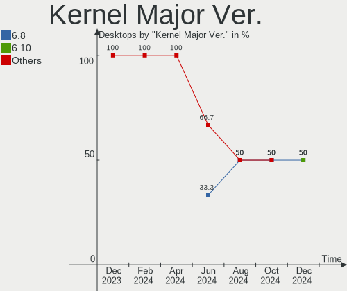
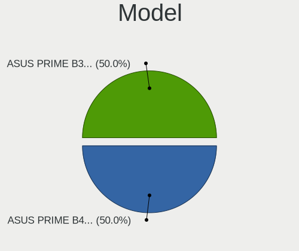
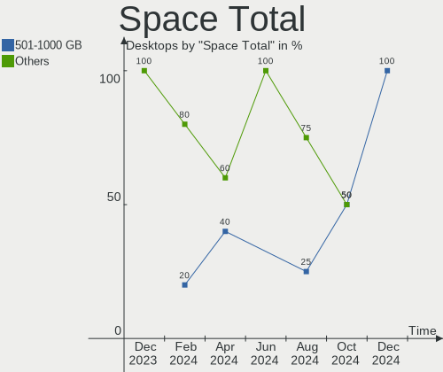
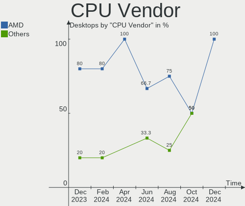
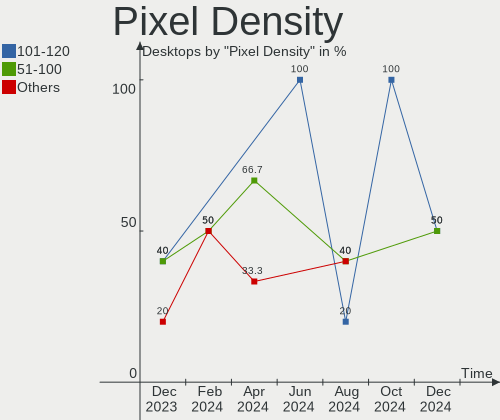
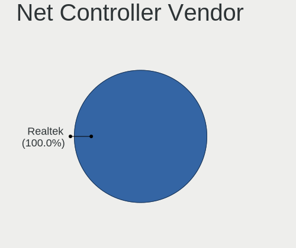
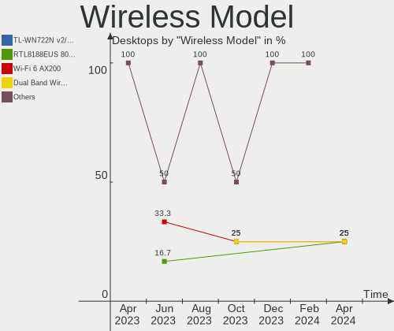
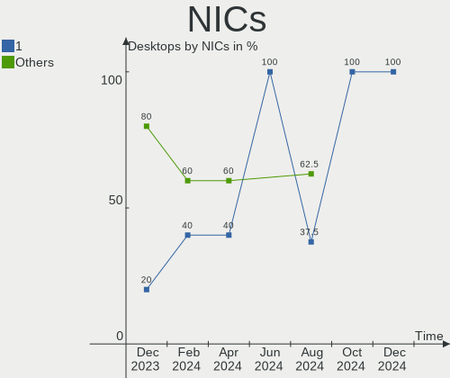
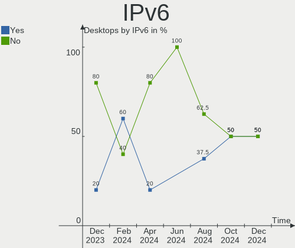

SteamOS - Hardware Trends (Desktops)
------------------------------------

A project to identify most popular hardware characteristics and track their change
over time based on data collected by Linux users at https://Linux-Hardware.org.

Anyone can contribute to this report by the [hw-probe](https://github.com/linuxhw/hw-probe) tool:

    sudo -E hw-probe -all -upload

This report is for one last month. Overall report since the beginning of time: [TestDays](https://github.com/linuxhw/TestDays)

Period: Mar, 2023.

Contents
--------

* [ System ](#system)
  - [ OS                       ](#os)
  - [ OS Family                ](#os-family)
  - [ Kernel                   ](#kernel)
  - [ Kernel Family            ](#kernel-family)
  - [ Kernel Major Ver.        ](#kernel-major-ver)
  - [ Arch                     ](#arch)
  - [ DE                       ](#de)
  - [ Display Server           ](#display-server)
  - [ Display Manager          ](#display-manager)
  - [ OS Lang                  ](#os-lang)
  - [ Boot Mode                ](#boot-mode)
  - [ Filesystem               ](#filesystem)
  - [ Part. scheme             ](#part-scheme)
  - [ Dual Boot with Linux/BSD ](#dual-boot-with-linuxbsd)
  - [ Dual Boot (Win)          ](#dual-boot-win)

* [ Board ](#board)
  - [ Vendor                   ](#vendor)
  - [ Model                    ](#model)
  - [ Model Family             ](#model-family)
  - [ MFG Year                 ](#mfg-year)
  - [ Form Factor              ](#form-factor)
  - [ Secure Boot              ](#secure-boot)
  - [ Coreboot                 ](#coreboot)
  - [ RAM Size                 ](#ram-size)
  - [ RAM Used                 ](#ram-used)
  - [ Total Drives             ](#total-drives)
  - [ Has CD-ROM               ](#has-cd-rom)
  - [ Has Ethernet             ](#has-ethernet)
  - [ Has WiFi                 ](#has-wifi)
  - [ Has Bluetooth            ](#has-bluetooth)

* [ Location ](#location)
  - [ Country                  ](#country)
  - [ City                     ](#city)

* [ Drives ](#drives)
  - [ Drive Vendor             ](#drive-vendor)
  - [ Drive Model              ](#drive-model)
  - [ HDD Vendor               ](#hdd-vendor)
  - [ SSD Vendor               ](#ssd-vendor)
  - [ Drive Kind               ](#drive-kind)
  - [ Drive Connector          ](#drive-connector)
  - [ Drive Size               ](#drive-size)
  - [ Space Total              ](#space-total)
  - [ Space Used               ](#space-used)
  - [ Malfunc. Drives          ](#malfunc-drives)
  - [ Malfunc. Drive Vendor    ](#malfunc-drive-vendor)
  - [ Malfunc. HDD Vendor      ](#malfunc-hdd-vendor)
  - [ Malfunc. Drive Kind      ](#malfunc-drive-kind)
  - [ Failed Drives            ](#failed-drives)
  - [ Failed Drive Vendor      ](#failed-drive-vendor)
  - [ Drive Status             ](#drive-status)

* [ Storage controller ](#storage-controller)
  - [ Storage Vendor           ](#storage-vendor)
  - [ Storage Model            ](#storage-model)
  - [ Storage Kind             ](#storage-kind)

* [ Processor ](#processor)
  - [ CPU Vendor               ](#cpu-vendor)
  - [ CPU Model                ](#cpu-model)
  - [ CPU Model Family         ](#cpu-model-family)
  - [ CPU Cores                ](#cpu-cores)
  - [ CPU Sockets              ](#cpu-sockets)
  - [ CPU Threads              ](#cpu-threads)
  - [ CPU Op-Modes             ](#cpu-op-modes)
  - [ CPU Microcode            ](#cpu-microcode)
  - [ CPU Microarch            ](#cpu-microarch)

* [ Graphics ](#graphics)
  - [ GPU Vendor               ](#gpu-vendor)
  - [ GPU Model                ](#gpu-model)
  - [ GPU Combo                ](#gpu-combo)
  - [ GPU Driver               ](#gpu-driver)
  - [ GPU Memory               ](#gpu-memory)

* [ Monitor ](#monitor)
  - [ Monitor Vendor           ](#monitor-vendor)
  - [ Monitor Model            ](#monitor-model)
  - [ Monitor Resolution       ](#monitor-resolution)
  - [ Monitor Diagonal         ](#monitor-diagonal)
  - [ Monitor Width            ](#monitor-width)
  - [ Aspect Ratio             ](#aspect-ratio)
  - [ Monitor Area             ](#monitor-area)
  - [ Pixel Density            ](#pixel-density)
  - [ Multiple Monitors        ](#multiple-monitors)

* [ Network ](#network)
  - [ Net Controller Vendor    ](#net-controller-vendor)
  - [ Net Controller Model     ](#net-controller-model)
  - [ Wireless Vendor          ](#wireless-vendor)
  - [ Wireless Model           ](#wireless-model)
  - [ Ethernet Vendor          ](#ethernet-vendor)
  - [ Ethernet Model           ](#ethernet-model)
  - [ Net Controller Kind      ](#net-controller-kind)
  - [ Used Controller          ](#used-controller)
  - [ NICs                     ](#nics)
  - [ IPv6                     ](#ipv6)

* [ Bluetooth ](#bluetooth)
  - [ Bluetooth Vendor         ](#bluetooth-vendor)
  - [ Bluetooth Model          ](#bluetooth-model)

* [ Sound ](#sound)
  - [ Sound Vendor             ](#sound-vendor)
  - [ Sound Model              ](#sound-model)

* [ Memory ](#memory)
  - [ Memory Vendor            ](#memory-vendor)
  - [ Memory Model             ](#memory-model)
  - [ Memory Kind              ](#memory-kind)
  - [ Memory Form Factor       ](#memory-form-factor)
  - [ Memory Size              ](#memory-size)
  - [ Memory Speed             ](#memory-speed)

* [ Printers & scanners ](#printers--scanners)
  - [ Printer Vendor           ](#printer-vendor)
  - [ Printer Model            ](#printer-model)
  - [ Scanner Vendor           ](#scanner-vendor)
  - [ Scanner Model            ](#scanner-model)

* [ Camera ](#camera)
  - [ Camera Vendor            ](#camera-vendor)
  - [ Camera Model             ](#camera-model)

* [ Security ](#security)
  - [ Fingerprint Vendor       ](#fingerprint-vendor)
  - [ Fingerprint Model        ](#fingerprint-model)
  - [ Chipcard Vendor          ](#chipcard-vendor)
  - [ Chipcard Model           ](#chipcard-model)

* [ Unsupported ](#unsupported)
  - [ Unsupported Devices      ](#unsupported-devices)
  - [ Unsupported Device Types ](#unsupported-device-types)

System
------

OS
--

Installed operating systems

| Name        | Desktops | Percent |
|-------------|----------|---------|
| SteamOS 3.4 | 12       | 92.31%  |
| SteamOS 4   | 1        | 7.69%   |

OS Family
---------

OS without a version

| Name    | Desktops | Percent |
|---------|----------|---------|
| SteamOS | 13       | 100%    |

Kernel
------

Version of the Linux kernel

| Version                                | Desktops | Percent |
|----------------------------------------|----------|---------|
| 5.13.0-valve21.3-1-neptune             | 10       | 76.92%  |
| 6.1.12-valve2-1-neptune-61             | 1        | 7.69%   |
| 5.18.1-arch1_testHoloISO_20220606.1811 | 1        | 7.69%   |
| 5.13.0-valve36-1-neptune               | 1        | 7.69%   |

Kernel Family
-------------

Linux kernel without a distro release

| Version | Desktops | Percent |
|---------|----------|---------|
| 5.13.0  | 11       | 84.62%  |
| 6.1.12  | 1        | 7.69%   |
| 5.18.1  | 1        | 7.69%   |

Kernel Major Ver.
-----------------

Linux kernel major version

| Version | Desktops | Percent |
|---------|----------|---------|
| 5.13    | 11       | 84.62%  |
| 6.1     | 1        | 7.69%   |
| 5.18    | 1        | 7.69%   |

Arch
----

OS architecture (x86_64, i586, etc.)

| Name   | Desktops | Percent |
|--------|----------|---------|
| x86_64 | 13       | 100%    |

DE
--

Desktop Environment

| Name | Desktops | Percent |
|------|----------|---------|
| KDE5 | 13       | 100%    |

Display Server
--------------

X11 or Wayland

| Name | Desktops | Percent |
|------|----------|---------|
| X11  | 13       | 100%    |

Display Manager
---------------

SDDM, LightDM, etc.

| Name    | Desktops | Percent |
|---------|----------|---------|
| Unknown | 13       | 100%    |

OS Lang
-------

Language

| Lang  | Desktops | Percent |
|-------|----------|---------|
| en_US | 12       | 92.31%  |
| pt_BR | 1        | 7.69%   |

Boot Mode
---------

EFI or BIOS

| Mode | Desktops | Percent |
|------|----------|---------|
| BIOS | 13       | 100%    |

Filesystem
----------

Type of filesystem

| Type  | Desktops | Percent |
|-------|----------|---------|
| Btrfs | 12       | 92.31%  |
| Tmpfs | 1        | 7.69%   |

Part. scheme
------------

Scheme of partitioning

| Type    | Desktops | Percent |
|---------|----------|---------|
| Unknown | 13       | 100%    |

Dual Boot with Linux/BSD
------------------------

Hosting more than one Linux/BSD

| Dual boot | Desktops | Percent |
|-----------|----------|---------|
| No        | 13       | 100%    |

Dual Boot (Win)
---------------

Hosting Linux and Windows

| Dual boot | Desktops | Percent |
|-----------|----------|---------|
| No        | 13       | 100%    |

Board
-----

Vendor
------

Motherboard manufacturer

| Name                | Desktops | Percent |
|---------------------|----------|---------|
| Gigabyte Technology | 4        | 30.77%  |
| ASUSTek Computer    | 4        | 30.77%  |
| Hewlett-Packard     | 2        | 15.38%  |
| MSI                 | 1        | 7.69%   |
| ASRock              | 1        | 7.69%   |
| Acer                | 1        | 7.69%   |

Model
-----

Motherboard model

| Name                                      | Desktops | Percent |
|-------------------------------------------|----------|---------|
| MSI MS-7D73                               | 1        | 7.69%   |
| HP Victus by 15L Gaming Desktop TG02-0xxx | 1        | 7.69%   |
| HP EliteDesk 705 G4 DM 65W (TAA)          | 1        | 7.69%   |
| Gigabyte F2A68HM-H                        | 1        | 7.69%   |
| Gigabyte B550 GAMING X V2                 | 1        | 7.69%   |
| Gigabyte B450 AORUS M                     | 1        | 7.69%   |
| Gigabyte AX370-Gaming                     | 1        | 7.69%   |
| ASUS PRIME Z270M-PLUS                     | 1        | 7.69%   |
| ASUS PRIME H610M-K D4                     | 1        | 7.69%   |
| ASUS PRIME A320I-K                        | 1        | 7.69%   |
| ASUS All Series                           | 1        | 7.69%   |
| ASRock X300M-STX                          | 1        | 7.69%   |
| Acer Nitro N50-610                        | 1        | 7.69%   |

Model Family
------------

Motherboard model prefix

| Name                  | Desktops | Percent |
|-----------------------|----------|---------|
| ASUS PRIME            | 3        | 23.08%  |
| MSI MS-7D73           | 1        | 7.69%   |
| HP Victus             | 1        | 7.69%   |
| HP EliteDesk          | 1        | 7.69%   |
| Gigabyte F2A68HM-H    | 1        | 7.69%   |
| Gigabyte B550         | 1        | 7.69%   |
| Gigabyte B450         | 1        | 7.69%   |
| Gigabyte AX370-Gaming | 1        | 7.69%   |
| ASUS All              | 1        | 7.69%   |
| ASRock X300M-STX      | 1        | 7.69%   |
| Acer Nitro            | 1        | 7.69%   |

MFG Year
--------

Motherboard manufacture year

| Year | Desktops | Percent |
|------|----------|---------|
| 2020 | 3        | 23.08%  |
| 2022 | 2        | 15.38%  |
| 2019 | 2        | 15.38%  |
| 2021 | 1        | 7.69%   |
| 2018 | 1        | 7.69%   |
| 2017 | 1        | 7.69%   |
| 2016 | 1        | 7.69%   |
| 2015 | 1        | 7.69%   |
| 2014 | 1        | 7.69%   |

Form Factor
-----------

Physical design of the computer

| Name    | Desktops | Percent |
|---------|----------|---------|
| Desktop | 13       | 100%    |

Secure Boot
-----------

Enabled or disabled

| State    | Desktops | Percent |
|----------|----------|---------|
| Disabled | 13       | 100%    |

Coreboot
--------

Have coreboot on board

| Used | Desktops | Percent |
|------|----------|---------|
| No   | 13       | 100%    |

RAM Size
--------

Total RAM memory

| Size in GB | Desktops | Percent |
|------------|----------|---------|
| 16.01-24.0 | 6        | 46.15%  |
| 32.01-64.0 | 3        | 23.08%  |
| 8.01-16.0  | 2        | 15.38%  |
| 4.01-8.0   | 1        | 7.69%   |
| 24.01-32.0 | 1        | 7.69%   |

RAM Used
--------

Used RAM memory

| Used GB  | Desktops | Percent |
|----------|----------|---------|
| 2.01-3.0 | 8        | 61.54%  |
| 3.01-4.0 | 4        | 30.77%  |
| 4.01-8.0 | 1        | 7.69%   |

Total Drives
------------

Number of drives on board

| Drives | Desktops | Percent |
|--------|----------|---------|
| 3      | 4        | 30.77%  |
| 1      | 4        | 30.77%  |
| 2      | 3        | 23.08%  |
| 4      | 2        | 15.38%  |

Has CD-ROM
----------

Has CD-ROM on board

| Presented | Desktops | Percent |
|-----------|----------|---------|
| No        | 13       | 100%    |

Has Ethernet
------------

Has Ethernet on board

| Presented | Desktops | Percent |
|-----------|----------|---------|
| Yes       | 13       | 100%    |

Has WiFi
--------

Has WiFi module

| Presented | Desktops | Percent |
|-----------|----------|---------|
| Yes       | 9        | 69.23%  |
| No        | 4        | 30.77%  |

Has Bluetooth
-------------

Has Bluetooth module

| Presented | Desktops | Percent |
|-----------|----------|---------|
| Yes       | 10       | 76.92%  |
| No        | 3        | 23.08%  |

Location
--------

Country
-------

Geographic location (country)

| Country  | Desktops | Percent |
|----------|----------|---------|
| USA      | 6        | 46.15%  |
| UK       | 1        | 7.69%   |
| Thailand | 1        | 7.69%   |
| Poland   | 1        | 7.69%   |
| Italy    | 1        | 7.69%   |
| Ireland  | 1        | 7.69%   |
| Iceland  | 1        | 7.69%   |
| Brazil   | 1        | 7.69%   |

City
----

Geographic location (city)

| City            | Desktops | Percent |
|-----------------|----------|---------|
| West Bloomfield | 1        | 7.69%   |
| Verona          | 1        | 7.69%   |
| Reykjavik       | 1        | 7.69%   |
| Raszkow         | 1        | 7.69%   |
| Osasco          | 1        | 7.69%   |
| Newport         | 1        | 7.69%   |
| Moscow          | 1        | 7.69%   |
| Khon Kaen       | 1        | 7.69%   |
| Hinckley        | 1        | 7.69%   |
| Eau Claire      | 1        | 7.69%   |
| Dublin          | 1        | 7.69%   |
| Columbus        | 1        | 7.69%   |
| Bullhead City   | 1        | 7.69%   |

Drives
------

Drive Vendor
------------

Hard drive vendors

| Vendor                      | Desktops | Drives | Percent |
|-----------------------------|----------|--------|---------|
| WDC                         | 4        | 5      | 14.29%  |
| Crucial                     | 4        | 4      | 14.29%  |
| Seagate                     | 3        | 3      | 10.71%  |
| Kingston                    | 3        | 3      | 10.71%  |
| Toshiba                     | 2        | 2      | 7.14%   |
| Sandisk                     | 2        | 2      | 7.14%   |
| Samsung Electronics         | 2        | 3      | 7.14%   |
| Unknown                     | 2        | 2      | 7.14%   |
| T-FORCE                     | 1        | 1      | 3.57%   |
| Silicon Motion              | 1        | 1      | 3.57%   |
| Realtek                     | 1        | 1      | 3.57%   |
| MAXIO Technology (Hangzhou) | 1        | 1      | 3.57%   |
| Intel                       | 1        | 1      | 3.57%   |
| Hitachi                     | 1        | 1      | 3.57%   |

Drive Model
-----------

Hard drive models

| Model                                                  | Desktops | Percent |
|--------------------------------------------------------|----------|---------|
| Seagate ST500DM002-1BD142 500GB                        | 2        | 6.9%    |
| Samsung SSD 980 1TB                                    | 2        | 6.9%    |
| Unknown                                                | 2        | 6.9%    |
| WDC WDS100T2B0A-00SM50 1TB SSD                         | 1        | 3.45%   |
| WDC WD30EZRX-00DC0B0 3TB                               | 1        | 3.45%   |
| WDC WD15EARS-00MVWB0 1TB                               | 1        | 3.45%   |
| WDC WD10EZEX-00WN4A0 1TB                               | 1        | 3.45%   |
| Toshiba XG6 NVMe SSD Controller 512GB                  | 1        | 3.45%   |
| Toshiba MQ01ABD032 320GB                               | 1        | 3.45%   |
| T-FORCE 1TB                                            | 1        | 3.45%   |
| Silicon Motion SM2263EN/SM2263XT SSD Controller 1024GB | 1        | 3.45%   |
| Seagate ST2000LX001-1RG174 2TB                         | 1        | 3.45%   |
| Sandisk WD Blue SN500 / PC SN520 NVMe SSD 512GB        | 1        | 3.45%   |
| SanDisk SD8SB8U256G1122 256GB SSD                      | 1        | 3.45%   |
| Samsung SSD 840 EVO 500GB                              | 1        | 3.45%   |
| Realtek RTL9210B-CG 512GB                              | 1        | 3.45%   |
| MAXIO (Hangzhou) NVMe SSD Controller MAP1202 256GB     | 1        | 3.45%   |
| Kingston SV300S37A120G 120GB SSD                       | 1        | 3.45%   |
| Kingston SNV2S500G 500GB                               | 1        | 3.45%   |
| Kingston SA400S37120G 120GB SSD                        | 1        | 3.45%   |
| Intel SSDPEKNU512GZH 512GB                             | 1        | 3.45%   |
| Hitachi HUA723020ALA641 2TB                            | 1        | 3.45%   |
| Crucial CT500MX500SSD4 500GB                           | 1        | 3.45%   |
| Crucial CT500MX500SSD1 500GB                           | 1        | 3.45%   |
| Crucial CT250MX500SSD1 250GB                           | 1        | 3.45%   |
| Crucial CT1000MX500SSD4 1TB                            | 1        | 3.45%   |

HDD Vendor
----------

Hard disk drive vendors

| Vendor  | Desktops | Drives | Percent |
|---------|----------|--------|---------|
| WDC     | 3        | 4      | 37.5%   |
| Seagate | 3        | 3      | 37.5%   |
| Toshiba | 1        | 1      | 12.5%   |
| Hitachi | 1        | 1      | 12.5%   |

SSD Vendor
----------

Solid state drive vendors

| Vendor              | Desktops | Drives | Percent |
|---------------------|----------|--------|---------|
| Crucial             | 4        | 4      | 44.44%  |
| Kingston            | 2        | 2      | 22.22%  |
| WDC                 | 1        | 1      | 11.11%  |
| SanDisk             | 1        | 1      | 11.11%  |
| Samsung Electronics | 1        | 1      | 11.11%  |

Drive Kind
----------

HDD or SSD

| Kind    | Desktops | Drives | Percent |
|---------|----------|--------|---------|
| NVMe    | 8        | 9      | 36.36%  |
| SSD     | 7        | 9      | 31.82%  |
| HDD     | 5        | 9      | 22.73%  |
| Unknown | 2        | 3      | 9.09%   |

Drive Connector
---------------

SATA, SAS, NVMe, etc.

| Type | Desktops | Drives | Percent |
|------|----------|--------|---------|
| SATA | 10       | 21     | 52.63%  |
| NVMe | 8        | 8      | 42.11%  |
| SAS  | 1        | 1      | 5.26%   |

Drive Size
----------

Size of hard drive

| Size in TB | Desktops | Drives | Percent |
|------------|----------|--------|---------|
| 0.01-0.5   | 7        | 10     | 50%     |
| 0.51-1.0   | 4        | 4      | 28.57%  |
| 1.01-2.0   | 2        | 2      | 14.29%  |
| 2.01-3.0   | 1        | 2      | 7.14%   |

Space Total
-----------

Amount of disk space available on the file system

| Size in GB     | Desktops | Percent |
|----------------|----------|---------|
| 251-500        | 6        | 46.15%  |
| 501-1000       | 4        | 30.77%  |
| More than 3000 | 1        | 7.69%   |
| 101-250        | 1        | 7.69%   |
| 51-100         | 1        | 7.69%   |

Space Used
----------

Amount of used disk space

| Used GB        | Desktops | Percent |
|----------------|----------|---------|
| 1-20           | 4        | 30.77%  |
| 101-250        | 3        | 23.08%  |
| 21-50          | 2        | 15.38%  |
| More than 3000 | 1        | 7.69%   |
| 251-500        | 1        | 7.69%   |
| 501-1000       | 1        | 7.69%   |
| 51-100         | 1        | 7.69%   |

Malfunc. Drives
---------------

Drive models with a malfunction

Zero info for selected period =(

Malfunc. Drive Vendor
---------------------

Vendors of faulty drives

Zero info for selected period =(

Malfunc. HDD Vendor
-------------------

Vendors of faulty HDD drives

Zero info for selected period =(

Malfunc. Drive Kind
-------------------

Kinds of faulty drives

Zero info for selected period =(

Failed Drives
-------------

Failed drive models

Zero info for selected period =(

Failed Drive Vendor
-------------------

Failed drive vendors

Zero info for selected period =(

Drive Status
------------

Number of failed and malfunc. drives

| Status   | Desktops | Drives | Percent |
|----------|----------|--------|---------|
| Detected | 13       | 30     | 100%    |

Storage controller
------------------

Storage Vendor
--------------

Storage controller vendors

| Vendor                       | Desktops | Percent |
|------------------------------|----------|---------|
| AMD                          | 8        | 40%     |
| Intel                        | 5        | 25%     |
| Samsung Electronics          | 2        | 10%     |
| Toshiba America Info Systems | 1        | 5%      |
| Silicon Motion               | 1        | 5%      |
| SanDisk                      | 1        | 5%      |
| MAXIO Technology (Hangzhou)  | 1        | 5%      |
| Kingston Technology Company  | 1        | 5%      |

Storage Model
-------------

Storage controller models

| Model                                                                          | Desktops | Percent |
|--------------------------------------------------------------------------------|----------|---------|
| AMD FCH SATA Controller [AHCI mode]                                            | 6        | 22.22%  |
| Samsung NVMe SSD Controller 980                                                | 2        | 7.41%   |
| AMD 400 Series Chipset SATA Controller                                         | 2        | 7.41%   |
| Toshiba America Info Systems XG6 NVMe SSD Controller                           | 1        | 3.7%    |
| Silicon Motion SM2263EN/SM2263XT SSD Controller                                | 1        | 3.7%    |
| SanDisk WD Blue SN500 / PC SN520 NVMe SSD                                      | 1        | 3.7%    |
| MAXIO (Hangzhou) NVMe SSD Controller MAP1202                                   | 1        | 3.7%    |
| Kingston Company Company Non-Volatile memory controller                        | 1        | 3.7%    |
| Intel Volume Management Device NVMe RAID Controller                            | 1        | 3.7%    |
| Intel Non-Volatile memory controller                                           | 1        | 3.7%    |
| Intel Comet Lake SATA AHCI Controller                                          | 1        | 3.7%    |
| Intel Alder Lake-S PCH SATA Controller [AHCI Mode]                             | 1        | 3.7%    |
| Intel 8 Series/C220 Series Chipset Family 6-port SATA Controller 1 [AHCI mode] | 1        | 3.7%    |
| Intel 200 Series PCH SATA controller [AHCI mode]                               | 1        | 3.7%    |
| AMD X370 Series Chipset SATA Controller                                        | 1        | 3.7%    |
| AMD FCH SATA Controller [IDE mode]                                             | 1        | 3.7%    |
| AMD FCH SATA Controller D                                                      | 1        | 3.7%    |
| AMD FCH IDE Controller                                                         | 1        | 3.7%    |
| AMD 500 Series Chipset SATA Controller                                         | 1        | 3.7%    |
| AMD 300 Series Chipset SATA Controller                                         | 1        | 3.7%    |

Storage Kind
------------

Kind of storage controller (IDE, SATA, NVMe, SAS, ...)

| Kind | Desktops | Percent |
|------|----------|---------|
| SATA | 12       | 54.55%  |
| NVMe | 8        | 36.36%  |
| RAID | 1        | 4.55%   |
| IDE  | 1        | 4.55%   |

Processor
---------

CPU Vendor
----------

Processor vendors

| Vendor | Desktops | Percent |
|--------|----------|---------|
| AMD    | 9        | 69.23%  |
| Intel  | 4        | 30.77%  |

CPU Model
---------

Processor models

| Model                                           | Desktops | Percent |
|-------------------------------------------------|----------|---------|
| AMD Ryzen 5 5600G with Radeon Graphics          | 2        | 15.38%  |
| Intel Core i7-7700K CPU @ 4.20GHz               | 1        | 7.69%   |
| Intel Core i7-4770K CPU @ 3.50GHz               | 1        | 7.69%   |
| Intel Core i5-10400F CPU @ 2.90GHz              | 1        | 7.69%   |
| Intel 12th Gen Core i3-12100F                   | 1        | 7.69%   |
| AMD Ryzen 7 2700X Eight-Core Processor          | 1        | 7.69%   |
| AMD Ryzen 7 1700 Eight-Core Processor           | 1        | 7.69%   |
| AMD Ryzen 5 PRO 2400G with Radeon Vega Graphics | 1        | 7.69%   |
| AMD Ryzen 5 7600X 6-Core Processor              | 1        | 7.69%   |
| AMD Ryzen 5 3600 6-Core Processor               | 1        | 7.69%   |
| AMD Ryzen 5 2600X Six-Core Processor            | 1        | 7.69%   |
| AMD Athlon X4 860K Quad Core Processor          | 1        | 7.69%   |

CPU Model Family
----------------

Processor model prefix

| Model           | Desktops | Percent |
|-----------------|----------|---------|
| AMD Ryzen 5     | 5        | 38.46%  |
| Intel Core i7   | 2        | 15.38%  |
| AMD Ryzen 7     | 2        | 15.38%  |
| Other           | 1        | 7.69%   |
| Intel Core i5   | 1        | 7.69%   |
| AMD Ryzen 5 PRO | 1        | 7.69%   |
| AMD Athlon X4   | 1        | 7.69%   |

CPU Cores
---------

Number of processor cores

| Number | Desktops | Percent |
|--------|----------|---------|
| 6      | 6        | 46.15%  |
| 4      | 4        | 30.77%  |
| 8      | 2        | 15.38%  |
| 2      | 1        | 7.69%   |

CPU Sockets
-----------

Number of sockets

| Number | Desktops | Percent |
|--------|----------|---------|
| 1      | 13       | 100%    |

CPU Threads
-----------

Threads per core (Hyper-Threading)

| Number | Desktops | Percent |
|--------|----------|---------|
| 2      | 13       | 100%    |

CPU Op-Modes
------------

CPU Operation Modes (32-bit, 64-bit)

| Op mode        | Desktops | Percent |
|----------------|----------|---------|
| 32-bit, 64-bit | 13       | 100%    |

CPU Microcode
-------------

Microcode number

| Number  | Desktops | Percent |
|---------|----------|---------|
| Unknown | 13       | 100%    |

CPU Microarch
-------------

Microarchitecture

| Name        | Desktops | Percent |
|-------------|----------|---------|
| Zen+        | 2        | 15.38%  |
| Zen 3       | 2        | 15.38%  |
| Zen         | 2        | 15.38%  |
| Unknown     | 2        | 15.38%  |
| Zen 2       | 1        | 7.69%   |
| Steamroller | 1        | 7.69%   |
| KabyLake    | 1        | 7.69%   |
| Haswell     | 1        | 7.69%   |
| CometLake   | 1        | 7.69%   |

Graphics
--------

GPU Vendor
----------

Vendors of graphics cards

| Vendor | Desktops | Percent |
|--------|----------|---------|
| AMD    | 10       | 76.92%  |
| Nvidia | 3        | 23.08%  |

GPU Model
---------

Graphics card models

| Model                                                            | Desktops | Percent |
|------------------------------------------------------------------|----------|---------|
| AMD Ellesmere [Radeon RX 470/480/570/570X/580/580X/590]          | 3        | 20%     |
| AMD Navi 22 [Radeon RX 6700/6700 XT/6750 XT / 6800M/6850M XT]    | 2        | 13.33%  |
| AMD Cezanne [Radeon Vega Series / Radeon Vega Mobile Series]     | 2        | 13.33%  |
| Nvidia TU117 [GeForce GTX 1650]                                  | 1        | 6.67%   |
| Nvidia GP104 [GeForce GTX 1070]                                  | 1        | 6.67%   |
| Nvidia GA104 [GeForce RTX 3060 Ti Lite Hash Rate]                | 1        | 6.67%   |
| AMD Raven Ridge [Radeon Vega Series / Radeon Vega Mobile Series] | 1        | 6.67%   |
| AMD Raphael                                                      | 1        | 6.67%   |
| AMD Polaris 20 XL [Radeon RX 580 2048SP]                         | 1        | 6.67%   |
| AMD Navi 24 [Radeon RX 6400/6500 XT/6500M]                       | 1        | 6.67%   |
| AMD Navi 14 [Radeon RX 5500/5500M / Pro 5500M]                   | 1        | 6.67%   |

GPU Combo
---------

Combinations of graphics cards

| Name       | Desktops | Percent |
|------------|----------|---------|
| 1 x AMD    | 8        | 61.54%  |
| 1 x Nvidia | 3        | 23.08%  |
| 2 x AMD    | 2        | 15.38%  |

GPU Driver
----------

Free vs proprietary

| Driver      | Desktops | Percent |
|-------------|----------|---------|
| Free        | 11       | 84.62%  |
| Proprietary | 2        | 15.38%  |

GPU Memory
----------

Total video memory

| Size in GB | Desktops | Percent |
|------------|----------|---------|
| Unknown    | 11       | 84.62%  |
| 7.01-8.0   | 1        | 7.69%   |
| 3.01-4.0   | 1        | 7.69%   |

Monitor
-------

Monitor Vendor
--------------

Monitor vendors

| Vendor              | Desktops | Percent |
|---------------------|----------|---------|
| Hewlett-Packard     | 3        | 27.27%  |
| Goldstar            | 2        | 18.18%  |
| Sony                | 1        | 9.09%   |
| Samsung Electronics | 1        | 9.09%   |
| MSI                 | 1        | 9.09%   |
| Insignia            | 1        | 9.09%   |
| Huion               | 1        | 9.09%   |
| AOpen               | 1        | 9.09%   |

Monitor Model
-------------

Monitor models

| Model                                                                   | Desktops | Percent |
|-------------------------------------------------------------------------|----------|---------|
| Sony TV *00 SNY3F05 3840x2160 1085x610mm 49.0-inch                      | 1        | 9.09%   |
| Samsung Electronics LCD Monitor SAM7218 3840x2160 1872x1053mm 84.6-inch | 1        | 9.09%   |
| MSI G32C4 MSI3DA6 1920x1080 698x393mm 31.5-inch                         | 1        | 9.09%   |
| Insignia 48DR420NA16 BBY3253 1920x1080 1054x591mm 47.6-inch             | 1        | 9.09%   |
| Huion GT-133 HAT1330 1920x1080 294x165mm 13.3-inch                      | 1        | 9.09%   |
| Hewlett-Packard Z27n HWP3219 2560x1440 597x336mm 27.0-inch              | 1        | 9.09%   |
| Hewlett-Packard LE2202x HWP2966 1920x1080 476x268mm 21.5-inch           | 1        | 9.09%   |
| Hewlett-Packard LA2405x HWP301F 1920x1200 518x324mm 24.1-inch           | 1        | 9.09%   |
| Goldstar TV SSCR2 GSM8080 3840x2160                                     | 1        | 9.09%   |
| Goldstar 24GL600F GSM5B73 1920x1080 531x298mm 24.0-inch                 | 1        | 9.09%   |
| AOpen 27HC5R AOP08E5 1920x1080 597x336mm 27.0-inch                      | 1        | 9.09%   |

Monitor Resolution
------------------

Monitor screen resolution

| Resolution        | Desktops | Percent |
|-------------------|----------|---------|
| 1920x1080 (FHD)   | 5        | 50%     |
| 3840x2160 (4K)    | 3        | 30%     |
| 2560x1440 (QHD)   | 1        | 10%     |
| 1920x1200 (WUXGA) | 1        | 10%     |

Monitor Diagonal
----------------

Diagonal size in inches

| Inches | Desktops | Percent |
|--------|----------|---------|
| 27     | 2        | 18.18%  |
| 24     | 2        | 18.18%  |
| 84     | 1        | 9.09%   |
| 75     | 1        | 9.09%   |
| 72     | 1        | 9.09%   |
| 47     | 1        | 9.09%   |
| 31     | 1        | 9.09%   |
| 21     | 1        | 9.09%   |
| 15     | 1        | 9.09%   |

Monitor Width
-------------

Physical width

| Width in mm | Desktops | Percent |
|-------------|----------|---------|
| 501-600     | 4        | 36.36%  |
| 1501-2000   | 3        | 27.27%  |
| 601-700     | 1        | 9.09%   |
| 401-500     | 1        | 9.09%   |
| 301-350     | 1        | 9.09%   |
| 1001-1500   | 1        | 9.09%   |

Aspect Ratio
------------

Proportional relationship between the width and the height

| Ratio | Desktops | Percent |
|-------|----------|---------|
| 16/9  | 9        | 90%     |
| 16/10 | 1        | 10%     |

Monitor Area
------------

Area in inch²

| Area in inch² | Desktops | Percent |
|----------------|----------|---------|
| More than 1000 | 3        | 27.27%  |
| 301-350        | 2        | 18.18%  |
| 351-500        | 1        | 9.09%   |
| 251-300        | 1        | 9.09%   |
| 201-250        | 1        | 9.09%   |
| 151-200        | 1        | 9.09%   |
| 501-1000       | 1        | 9.09%   |
| 91-100         | 1        | 9.09%   |

Pixel Density
-------------

Pixels per inch

| Density | Desktops | Percent |
|---------|----------|---------|
| 51-100  | 7        | 63.64%  |
| 101-120 | 2        | 18.18%  |
| 1-50    | 1        | 9.09%   |
| 121-160 | 1        | 9.09%   |

Multiple Monitors
-----------------

Total monitors connected

| Total | Desktops | Percent |
|-------|----------|---------|
| 1     | 12       | 92.31%  |
| 2     | 1        | 7.69%   |

Network
-------

Net Controller Vendor
---------------------

Controller vendors

| Vendor                | Desktops | Percent |
|-----------------------|----------|---------|
| Realtek Semiconductor | 11       | 50%     |
| Intel                 | 6        | 27.27%  |
| TP-Link               | 1        | 4.55%   |
| Samsung Electronics   | 1        | 4.55%   |
| MediaTek              | 1        | 4.55%   |
| Broadcom              | 1        | 4.55%   |
| ASUSTek Computer      | 1        | 4.55%   |

Net Controller Model
--------------------

Controller models

| Model                                                             | Desktops | Percent |
|-------------------------------------------------------------------|----------|---------|
| Realtek RTL8111/8168/8411 PCI Express Gigabit Ethernet Controller | 10       | 41.67%  |
| TP-Link Archer T2U PLUS [RTL8821AU]                               | 1        | 4.17%   |
| Samsung Galaxy series, misc. (tethering mode)                     | 1        | 4.17%   |
| Realtek RTL8822CE 802.11ac PCIe Wireless Network Adapter          | 1        | 4.17%   |
| Realtek RTL8192EE PCIe Wireless Network Adapter                   | 1        | 4.17%   |
| Realtek RTL8125 2.5GbE Controller                                 | 1        | 4.17%   |
| MediaTek MT7922 802.11ax PCI Express Wireless Network Adapter     | 1        | 4.17%   |
| Intel Wireless 8260                                               | 1        | 4.17%   |
| Intel Wireless 7265                                               | 1        | 4.17%   |
| Intel Wi-Fi 6 AX200                                               | 1        | 4.17%   |
| Intel Ethernet Connection I217-V                                  | 1        | 4.17%   |
| Intel Ethernet Connection (2) I219-V                              | 1        | 4.17%   |
| Intel Comet Lake PCH CNVi WiFi                                    | 1        | 4.17%   |
| Broadcom BCM4352 802.11ac Wireless Network Adapter                | 1        | 4.17%   |
| ASUS 802.11ac NIC                                                 | 1        | 4.17%   |

Wireless Vendor
---------------

Wireless vendors

| Vendor                | Desktops | Percent |
|-----------------------|----------|---------|
| Intel                 | 4        | 40%     |
| Realtek Semiconductor | 2        | 20%     |
| TP-Link               | 1        | 10%     |
| MediaTek              | 1        | 10%     |
| Broadcom              | 1        | 10%     |
| ASUSTek Computer      | 1        | 10%     |

Wireless Model
--------------

Wireless models

| Model                                                         | Desktops | Percent |
|---------------------------------------------------------------|----------|---------|
| TP-Link Archer T2U PLUS [RTL8821AU]                           | 1        | 10%     |
| Realtek RTL8822CE 802.11ac PCIe Wireless Network Adapter      | 1        | 10%     |
| Realtek RTL8192EE PCIe Wireless Network Adapter               | 1        | 10%     |
| MediaTek MT7922 802.11ax PCI Express Wireless Network Adapter | 1        | 10%     |
| Intel Wireless 8260                                           | 1        | 10%     |
| Intel Wireless 7265                                           | 1        | 10%     |
| Intel Wi-Fi 6 AX200                                           | 1        | 10%     |
| Intel Comet Lake PCH CNVi WiFi                                | 1        | 10%     |
| Broadcom BCM4352 802.11ac Wireless Network Adapter            | 1        | 10%     |
| ASUS 802.11ac NIC                                             | 1        | 10%     |

Ethernet Vendor
---------------

Ethernet vendors

| Vendor                | Desktops | Percent |
|-----------------------|----------|---------|
| Realtek Semiconductor | 11       | 78.57%  |
| Intel                 | 2        | 14.29%  |
| Samsung Electronics   | 1        | 7.14%   |

Ethernet Model
--------------

Ethernet models

| Model                                                             | Desktops | Percent |
|-------------------------------------------------------------------|----------|---------|
| Realtek RTL8111/8168/8411 PCI Express Gigabit Ethernet Controller | 10       | 71.43%  |
| Samsung Galaxy series, misc. (tethering mode)                     | 1        | 7.14%   |
| Realtek RTL8125 2.5GbE Controller                                 | 1        | 7.14%   |
| Intel Ethernet Connection I217-V                                  | 1        | 7.14%   |
| Intel Ethernet Connection (2) I219-V                              | 1        | 7.14%   |

Net Controller Kind
-------------------

Ethernet, WiFi or modem

| Kind     | Desktops | Percent |
|----------|----------|---------|
| Ethernet | 13       | 59.09%  |
| WiFi     | 9        | 40.91%  |

Used Controller
---------------

Currently used network controller

| Kind     | Desktops | Percent |
|----------|----------|---------|
| Ethernet | 10       | 71.43%  |
| WiFi     | 4        | 28.57%  |

NICs
----

Total network controllers on board

| Total | Desktops | Percent |
|-------|----------|---------|
| 2     | 6        | 46.15%  |
| 1     | 6        | 46.15%  |
| 3     | 1        | 7.69%   |

IPv6
----

IPv6 vs IPv4

| Used | Desktops | Percent |
|------|----------|---------|
| No   | 8        | 61.54%  |
| Yes  | 5        | 38.46%  |

Bluetooth
---------

Bluetooth Vendor
----------------

Controller vendors

| Vendor                  | Desktops | Percent |
|-------------------------|----------|---------|
| Intel                   | 4        | 33.33%  |
| Cambridge Silicon Radio | 3        | 25%     |
| ASUSTek Computer        | 2        | 16.67%  |
| Realtek Semiconductor   | 1        | 8.33%   |
| Realtek                 | 1        | 8.33%   |
| MediaTek                | 1        | 8.33%   |

Bluetooth Model
---------------

Controller models

| Model                                               | Desktops | Percent |
|-----------------------------------------------------|----------|---------|
| Cambridge Silicon Radio Bluetooth Dongle (HCI mode) | 3        | 25%     |
| Intel Bluetooth wireless interface                  | 2        | 16.67%  |
| Realtek Bluetooth Radio                             | 1        | 8.33%   |
| Realtek Bluetooth Radio                             | 1        | 8.33%   |
| MediaTek Wireless_Device                            | 1        | 8.33%   |
| Intel AX201 Bluetooth                               | 1        | 8.33%   |
| Intel AX200 Bluetooth                               | 1        | 8.33%   |
| ASUS Broadcom BCM20702A0 Bluetooth                  | 1        | 8.33%   |
| ASUS BCM20702A0                                     | 1        | 8.33%   |

Sound
-----

Sound Vendor
------------

Sound card vendors

| Vendor                   | Desktops | Percent |
|--------------------------|----------|---------|
| AMD                      | 10       | 47.62%  |
| Intel                    | 5        | 23.81%  |
| Nvidia                   | 3        | 14.29%  |
| SteelSeries ApS          | 1        | 4.76%   |
| Micro Star International | 1        | 4.76%   |
| Medeli Electronics       | 1        | 4.76%   |

Sound Model
-----------

Sound card models

| Model                                                               | Desktops | Percent |
|---------------------------------------------------------------------|----------|---------|
| AMD Family 17h/19h HD Audio Controller                              | 4        | 12.5%   |
| AMD Ellesmere HDMI Audio [Radeon RX 470/480 / 570/580/590]          | 4        | 12.5%   |
| AMD Navi 21/23 HDMI/DP Audio Controller                             | 3        | 9.38%   |
| AMD Family 17h (Models 00h-0fh) HD Audio Controller                 | 3        | 9.38%   |
| AMD Renoir Radeon High Definition Audio Controller                  | 2        | 6.25%   |
| SteelSeries ApS SteelSeries SC2 USB Headset                         | 1        | 3.13%   |
| Nvidia TU107 GeForce GTX 1650 High Definition Audio Controller      | 1        | 3.13%   |
| Nvidia GP104 High Definition Audio Controller                       | 1        | 3.13%   |
| Nvidia GA104 High Definition Audio Controller                       | 1        | 3.13%   |
| Micro Star International USB Audio                                  | 1        | 3.13%   |
| Medeli Electronics JOUNIVO JV906                                    | 1        | 3.13%   |
| Intel USB PnP Sound Device                                          | 1        | 3.13%   |
| Intel Comet Lake PCH cAVS                                           | 1        | 3.13%   |
| Intel Alder Lake-S HD Audio Controller                              | 1        | 3.13%   |
| Intel 8 Series/C220 Series Chipset High Definition Audio Controller | 1        | 3.13%   |
| Intel 200 Series PCH HD Audio                                       | 1        | 3.13%   |
| AMD Starship/Matisse HD Audio Controller                            | 1        | 3.13%   |
| AMD Rembrandt Radeon High Definition Audio Controller               | 1        | 3.13%   |
| AMD Raven/Raven2/Fenghuang HDMI/DP Audio Controller                 | 1        | 3.13%   |
| AMD Navi 10 HDMI Audio                                              | 1        | 3.13%   |
| AMD FCH Azalia Controller                                           | 1        | 3.13%   |

Memory
------

Memory Vendor
-------------

Memory module vendors

Zero info for selected period =(

Memory Model
------------

Memory module models

Zero info for selected period =(

Memory Kind
-----------

Memory module kinds

Zero info for selected period =(

Memory Form Factor
------------------

Physical design of the memory module

Zero info for selected period =(

Memory Size
-----------

Memory module size

Zero info for selected period =(

Memory Speed
------------

Memory module speed

Zero info for selected period =(

Printers & scanners
-------------------

Printer Vendor
--------------

Printer device vendors

Zero info for selected period =(

Printer Model
-------------

Printer device models

Zero info for selected period =(

Scanner Vendor
--------------

Scanner device vendors

Zero info for selected period =(

Scanner Model
-------------

Scanner device models

Zero info for selected period =(

Camera
------

Camera Vendor
-------------

Camera device vendors

Zero info for selected period =(

Camera Model
------------

Camera device models

Zero info for selected period =(

Security
--------

Fingerprint Vendor
------------------

Fingerprint sensor vendors

Zero info for selected period =(

Fingerprint Model
-----------------

Fingerprint sensor models

Zero info for selected period =(

Chipcard Vendor
---------------

Chipcard module vendors

Zero info for selected period =(

Chipcard Model
--------------

Chipcard module models

Zero info for selected period =(

Unsupported
-----------

Unsupported Devices
-------------------

Total unsupported devices on board

| Total | Desktops | Percent |
|-------|----------|---------|
| 0     | 10       | 76.92%  |
| 1     | 2        | 15.38%  |
| 2     | 1        | 7.69%   |

Unsupported Device Types
------------------------

Types of unsupported devices

| Type          | Desktops | Percent |
|---------------|----------|---------|
| Net/wireless  | 3        | 75%     |
| Graphics card | 1        | 25%     |

