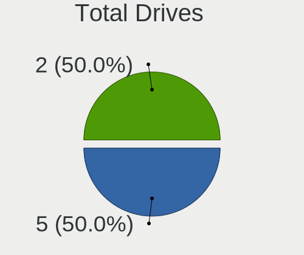
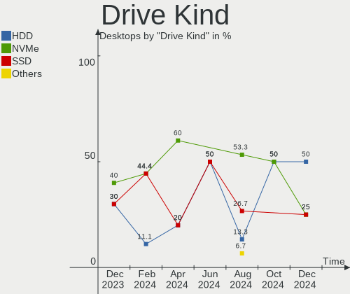
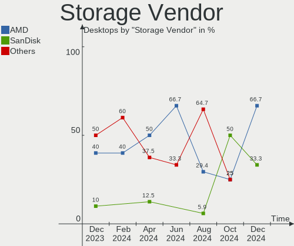
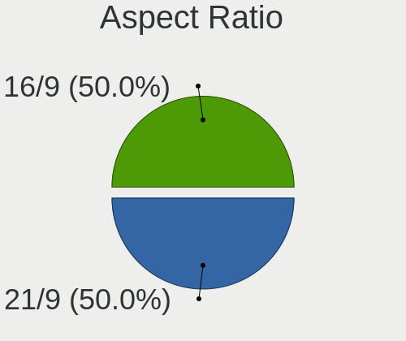
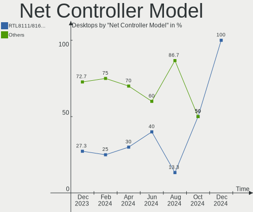
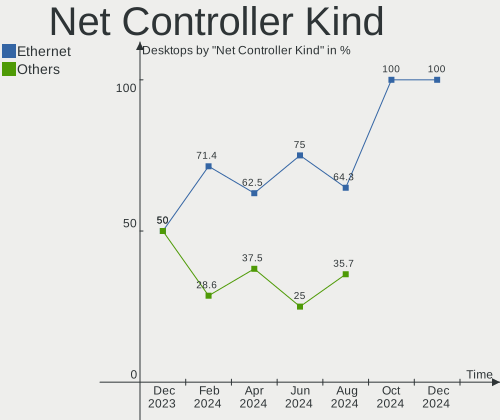

SteamOS - Hardware Trends (Desktops)
------------------------------------

A project to identify most popular hardware characteristics and track their change
over time based on data collected by Linux users at https://Linux-Hardware.org.

Anyone can contribute to this report by the [hw-probe](https://github.com/linuxhw/hw-probe) tool:

    sudo -E hw-probe -all -upload

This report is for one last month. Overall report since the beginning of time: [TestCoverage](https://github.com/linuxhw/TestCoverage)

Period: Nov, 2022.

Contents
--------

* [ System ](#system)
  - [ OS                       ](#os)
  - [ OS Family                ](#os-family)
  - [ Kernel                   ](#kernel)
  - [ Kernel Family            ](#kernel-family)
  - [ Kernel Major Ver.        ](#kernel-major-ver)
  - [ Arch                     ](#arch)
  - [ DE                       ](#de)
  - [ Display Server           ](#display-server)
  - [ Display Manager          ](#display-manager)
  - [ OS Lang                  ](#os-lang)
  - [ Boot Mode                ](#boot-mode)
  - [ Filesystem               ](#filesystem)
  - [ Part. scheme             ](#part-scheme)
  - [ Dual Boot with Linux/BSD ](#dual-boot-with-linuxbsd)
  - [ Dual Boot (Win)          ](#dual-boot-win)

* [ Board ](#board)
  - [ Vendor                   ](#vendor)
  - [ Model                    ](#model)
  - [ Model Family             ](#model-family)
  - [ MFG Year                 ](#mfg-year)
  - [ Form Factor              ](#form-factor)
  - [ Secure Boot              ](#secure-boot)
  - [ Coreboot                 ](#coreboot)
  - [ RAM Size                 ](#ram-size)
  - [ RAM Used                 ](#ram-used)
  - [ Total Drives             ](#total-drives)
  - [ Has CD-ROM               ](#has-cd-rom)
  - [ Has Ethernet             ](#has-ethernet)
  - [ Has WiFi                 ](#has-wifi)
  - [ Has Bluetooth            ](#has-bluetooth)

* [ Location ](#location)
  - [ Country                  ](#country)
  - [ City                     ](#city)

* [ Drives ](#drives)
  - [ Drive Vendor             ](#drive-vendor)
  - [ Drive Model              ](#drive-model)
  - [ HDD Vendor               ](#hdd-vendor)
  - [ SSD Vendor               ](#ssd-vendor)
  - [ Drive Kind               ](#drive-kind)
  - [ Drive Connector          ](#drive-connector)
  - [ Drive Size               ](#drive-size)
  - [ Space Total              ](#space-total)
  - [ Space Used               ](#space-used)
  - [ Malfunc. Drives          ](#malfunc-drives)
  - [ Malfunc. Drive Vendor    ](#malfunc-drive-vendor)
  - [ Malfunc. HDD Vendor      ](#malfunc-hdd-vendor)
  - [ Malfunc. Drive Kind      ](#malfunc-drive-kind)
  - [ Failed Drives            ](#failed-drives)
  - [ Failed Drive Vendor      ](#failed-drive-vendor)
  - [ Drive Status             ](#drive-status)

* [ Storage controller ](#storage-controller)
  - [ Storage Vendor           ](#storage-vendor)
  - [ Storage Model            ](#storage-model)
  - [ Storage Kind             ](#storage-kind)

* [ Processor ](#processor)
  - [ CPU Vendor               ](#cpu-vendor)
  - [ CPU Model                ](#cpu-model)
  - [ CPU Model Family         ](#cpu-model-family)
  - [ CPU Cores                ](#cpu-cores)
  - [ CPU Sockets              ](#cpu-sockets)
  - [ CPU Threads              ](#cpu-threads)
  - [ CPU Op-Modes             ](#cpu-op-modes)
  - [ CPU Microcode            ](#cpu-microcode)
  - [ CPU Microarch            ](#cpu-microarch)

* [ Graphics ](#graphics)
  - [ GPU Vendor               ](#gpu-vendor)
  - [ GPU Model                ](#gpu-model)
  - [ GPU Combo                ](#gpu-combo)
  - [ GPU Driver               ](#gpu-driver)
  - [ GPU Memory               ](#gpu-memory)

* [ Monitor ](#monitor)
  - [ Monitor Vendor           ](#monitor-vendor)
  - [ Monitor Model            ](#monitor-model)
  - [ Monitor Resolution       ](#monitor-resolution)
  - [ Monitor Diagonal         ](#monitor-diagonal)
  - [ Monitor Width            ](#monitor-width)
  - [ Aspect Ratio             ](#aspect-ratio)
  - [ Monitor Area             ](#monitor-area)
  - [ Pixel Density            ](#pixel-density)
  - [ Multiple Monitors        ](#multiple-monitors)

* [ Network ](#network)
  - [ Net Controller Vendor    ](#net-controller-vendor)
  - [ Net Controller Model     ](#net-controller-model)
  - [ Wireless Vendor          ](#wireless-vendor)
  - [ Wireless Model           ](#wireless-model)
  - [ Ethernet Vendor          ](#ethernet-vendor)
  - [ Ethernet Model           ](#ethernet-model)
  - [ Net Controller Kind      ](#net-controller-kind)
  - [ Used Controller          ](#used-controller)
  - [ NICs                     ](#nics)
  - [ IPv6                     ](#ipv6)

* [ Bluetooth ](#bluetooth)
  - [ Bluetooth Vendor         ](#bluetooth-vendor)
  - [ Bluetooth Model          ](#bluetooth-model)

* [ Sound ](#sound)
  - [ Sound Vendor             ](#sound-vendor)
  - [ Sound Model              ](#sound-model)

* [ Memory ](#memory)
  - [ Memory Vendor            ](#memory-vendor)
  - [ Memory Model             ](#memory-model)
  - [ Memory Kind              ](#memory-kind)
  - [ Memory Form Factor       ](#memory-form-factor)
  - [ Memory Size              ](#memory-size)
  - [ Memory Speed             ](#memory-speed)

* [ Printers & scanners ](#printers--scanners)
  - [ Printer Vendor           ](#printer-vendor)
  - [ Printer Model            ](#printer-model)
  - [ Scanner Vendor           ](#scanner-vendor)
  - [ Scanner Model            ](#scanner-model)

* [ Camera ](#camera)
  - [ Camera Vendor            ](#camera-vendor)
  - [ Camera Model             ](#camera-model)

* [ Security ](#security)
  - [ Fingerprint Vendor       ](#fingerprint-vendor)
  - [ Fingerprint Model        ](#fingerprint-model)
  - [ Chipcard Vendor          ](#chipcard-vendor)
  - [ Chipcard Model           ](#chipcard-model)

* [ Unsupported ](#unsupported)
  - [ Unsupported Devices      ](#unsupported-devices)
  - [ Unsupported Device Types ](#unsupported-device-types)

System
------

OS
--

Installed operating systems

| Name            | Desktops | Percent |
|-----------------|----------|---------|
| SteamOS 3.4     | 8        | 88.89%  |
| SteamOS Rolling | 1        | 11.11%  |

OS Family
---------

OS without a version

| Name    | Desktops | Percent |
|---------|----------|---------|
| SteamOS | 9        | 100%    |

Kernel
------

Version of the Linux kernel

| Version                                      | Desktops | Percent |
|----------------------------------------------|----------|---------|
| 5.13.0-valve21.3-1-neptune                   | 6        | 66.67%  |
| 5.18.1-arch1_testHoloISO_20220606.1811       | 2        | 22.22%  |
| 5.13.0-valve24-1-neptune-02226-g5b8545e4c5a1 | 1        | 11.11%  |

Kernel Family
-------------

Linux kernel without a distro release

| Version | Desktops | Percent |
|---------|----------|---------|
| 5.13.0  | 7        | 77.78%  |
| 5.18.1  | 2        | 22.22%  |

Kernel Major Ver.
-----------------

Linux kernel major version

| Version | Desktops | Percent |
|---------|----------|---------|
| 5.13    | 7        | 77.78%  |
| 5.18    | 2        | 22.22%  |

Arch
----

OS architecture (x86_64, i586, etc.)

| Name   | Desktops | Percent |
|--------|----------|---------|
| x86_64 | 9        | 100%    |

DE
--

Desktop Environment

| Name | Desktops | Percent |
|------|----------|---------|
| KDE5 | 9        | 100%    |

Display Server
--------------

X11 or Wayland

| Name | Desktops | Percent |
|------|----------|---------|
| X11  | 9        | 100%    |

Display Manager
---------------

SDDM, LightDM, etc.

| Name    | Desktops | Percent |
|---------|----------|---------|
| Unknown | 9        | 100%    |

OS Lang
-------

Language

| Lang  | Desktops | Percent |
|-------|----------|---------|
| en_US | 8        | 88.89%  |
| de_AT | 1        | 11.11%  |

Boot Mode
---------

EFI or BIOS

| Mode | Desktops | Percent |
|------|----------|---------|
| BIOS | 9        | 100%    |

Filesystem
----------

Type of filesystem

| Type  | Desktops | Percent |
|-------|----------|---------|
| Btrfs | 9        | 100%    |

Part. scheme
------------

Scheme of partitioning

| Type    | Desktops | Percent |
|---------|----------|---------|
| Unknown | 8        | 88.89%  |
| GPT     | 1        | 11.11%  |

Dual Boot with Linux/BSD
------------------------

Hosting more than one Linux/BSD

| Dual boot | Desktops | Percent |
|-----------|----------|---------|
| No        | 9        | 100%    |

Dual Boot (Win)
---------------

Hosting Linux and Windows

| Dual boot | Desktops | Percent |
|-----------|----------|---------|
| No        | 9        | 100%    |

Board
-----

Vendor
------

Motherboard manufacturer

| Name                | Desktops | Percent |
|---------------------|----------|---------|
| Gigabyte Technology | 3        | 33.33%  |
| MSI                 | 2        | 22.22%  |
| ASUSTek Computer    | 2        | 22.22%  |
| Hewlett-Packard     | 1        | 11.11%  |
| ASRock              | 1        | 11.11%  |

Model
-----

Motherboard model

| Name                               | Desktops | Percent |
|------------------------------------|----------|---------|
| MSI MS-7A33                        | 1        | 11.11%  |
| MSI MS-7693                        | 1        | 11.11%  |
| HP ProDesk 405 G4 Desktop Mini     | 1        | 11.11%  |
| Gigabyte B450M DS3H V2             | 1        | 11.11%  |
| Gigabyte B450 AORUS M              | 1        | 11.11%  |
| Gigabyte 970A-DS3P FX              | 1        | 11.11%  |
| ASUS Z170 PRO GAMING               | 1        | 11.11%  |
| ASUS PRIME X570-PRO                | 1        | 11.11%  |
| ASRock X570 Phantom Gaming-ITX/TB3 | 1        | 11.11%  |

Model Family
------------

Motherboard model prefix

| Name               | Desktops | Percent |
|--------------------|----------|---------|
| MSI MS-7A33        | 1        | 11.11%  |
| MSI MS-7693        | 1        | 11.11%  |
| HP ProDesk         | 1        | 11.11%  |
| Gigabyte B450M     | 1        | 11.11%  |
| Gigabyte B450      | 1        | 11.11%  |
| Gigabyte 970A-DS3P | 1        | 11.11%  |
| ASUS Z170          | 1        | 11.11%  |
| ASUS PRIME         | 1        | 11.11%  |
| ASRock X570        | 1        | 11.11%  |

MFG Year
--------

Motherboard manufacture year

| Year | Desktops | Percent |
|------|----------|---------|
| 2019 | 2        | 22.22%  |
| 2017 | 2        | 22.22%  |
| 2022 | 1        | 11.11%  |
| 2020 | 1        | 11.11%  |
| 2018 | 1        | 11.11%  |
| 2015 | 1        | 11.11%  |
| 2012 | 1        | 11.11%  |

Form Factor
-----------

Physical design of the computer

| Name    | Desktops | Percent |
|---------|----------|---------|
| Desktop | 9        | 100%    |

Secure Boot
-----------

Enabled or disabled

| State    | Desktops | Percent |
|----------|----------|---------|
| Disabled | 9        | 100%    |

Coreboot
--------

Have coreboot on board

| Used | Desktops | Percent |
|------|----------|---------|
| No   | 9        | 100%    |

RAM Size
--------

Total RAM memory

| Size in GB | Desktops | Percent |
|------------|----------|---------|
| 16.01-24.0 | 5        | 55.56%  |
| 8.01-16.0  | 2        | 22.22%  |
| 32.01-64.0 | 1        | 11.11%  |
| 24.01-32.0 | 1        | 11.11%  |

RAM Used
--------

Used RAM memory

| Used GB  | Desktops | Percent |
|----------|----------|---------|
| 4.01-8.0 | 3        | 33.33%  |
| 2.01-3.0 | 3        | 33.33%  |
| 3.01-4.0 | 2        | 22.22%  |
| 1.01-2.0 | 1        | 11.11%  |

Total Drives
------------

Number of drives on board

| Drives | Desktops | Percent |
|--------|----------|---------|
| 2      | 3        | 33.33%  |
| 1      | 3        | 33.33%  |
| 3      | 2        | 22.22%  |
| 5      | 1        | 11.11%  |

Has CD-ROM
----------

Has CD-ROM on board

| Presented | Desktops | Percent |
|-----------|----------|---------|
| No        | 8        | 88.89%  |
| Yes       | 1        | 11.11%  |

Has Ethernet
------------

Has Ethernet on board

| Presented | Desktops | Percent |
|-----------|----------|---------|
| Yes       | 9        | 100%    |

Has WiFi
--------

Has WiFi module

| Presented | Desktops | Percent |
|-----------|----------|---------|
| Yes       | 6        | 66.67%  |
| No        | 3        | 33.33%  |

Has Bluetooth
-------------

Has Bluetooth module

| Presented | Desktops | Percent |
|-----------|----------|---------|
| No        | 5        | 55.56%  |
| Yes       | 4        | 44.44%  |

Location
--------

Country
-------

Geographic location (country)

| Country | Desktops | Percent |
|---------|----------|---------|
| USA     | 5        | 55.56%  |
| UK      | 2        | 22.22%  |
| Brazil  | 1        | 11.11%  |
| Austria | 1        | 11.11%  |

City
----

Geographic location (city)

| City                   | Desktops | Percent |
|------------------------|----------|---------|
| South Holland          | 1        | 11.11%  |
| Sao Paulo              | 1        | 11.11%  |
| Salford                | 1        | 11.11%  |
| Puchberg am Schneeberg | 1        | 11.11%  |
| Oklahoma City          | 1        | 11.11%  |
| Loveland               | 1        | 11.11%  |
| Johnstone              | 1        | 11.11%  |
| Davison                | 1        | 11.11%  |
| Camano                 | 1        | 11.11%  |

Drives
------

Drive Vendor
------------

Hard drive vendors

| Vendor              | Desktops | Drives | Percent |
|---------------------|----------|--------|---------|
| Crucial             | 4        | 4      | 22.22%  |
| SanDisk             | 2        | 2      | 11.11%  |
| Kingston            | 2        | 2      | 11.11%  |
| WDC                 | 1        | 1      | 5.56%   |
| SK hynix            | 1        | 1      | 5.56%   |
| Seagate             | 1        | 1      | 5.56%   |
| Samsung Electronics | 1        | 1      | 5.56%   |
| Phison Electronics  | 1        | 1      | 5.56%   |
| Phison              | 1        | 1      | 5.56%   |
| Intel               | 1        | 1      | 5.56%   |
| China               | 1        | 2      | 5.56%   |
| Apple               | 1        | 1      | 5.56%   |
| ADATA Technology    | 1        | 2      | 5.56%   |

Drive Model
-----------

Hard drive models

| Model                                                             | Desktops | Percent |
|-------------------------------------------------------------------|----------|---------|
| WDC WD10EZEX-08WN4A0 1TB                                          | 1        | 5.56%   |
| SK hynix BC511 512GB                                              | 1        | 5.56%   |
| Seagate ST500LM021-1KJ152 500GB                                   | 1        | 5.56%   |
| Sandisk WD Blue SN570 1TB                                         | 1        | 5.56%   |
| SanDisk SDSSDA240G 240GB                                          | 1        | 5.56%   |
| Samsung SSD 970 EVO Plus 1TB                                      | 1        | 5.56%   |
| Phison NVMe SSD Drive 512GB                                       | 1        | 5.56%   |
| Phison Force MP300 120GB                                          | 1        | 5.56%   |
| Kingston SNVS1000G 1TB                                            | 1        | 5.56%   |
| Kingston SH103S3120G 120GB SSD                                    | 1        | 5.56%   |
| Intel SSDSC2CW120A3 120GB                                         | 1        | 5.56%   |
| Crucial CT480BX500SSD1 480GB                                      | 1        | 5.56%   |
| Crucial CT250MX500SSD1 250GB                                      | 1        | 5.56%   |
| Crucial CT1000MX500SSD1 1TB                                       | 1        | 5.56%   |
| Crucial CT1000BX500SSD1 1TB                                       | 1        | 5.56%   |
| China SATA SSD 240GB                                              | 1        | 5.56%   |
| Apple HDD HTS541010A9E662 1TB                                     | 1        | 5.56%   |
| ADATA XPG SX8200 Pro PCIe Gen3x4 M.2 2280 Solid State Drive 512GB | 1        | 5.56%   |

HDD Vendor
----------

Hard disk drive vendors

| Vendor  | Desktops | Drives | Percent |
|---------|----------|--------|---------|
| WDC     | 1        | 1      | 33.33%  |
| Seagate | 1        | 1      | 33.33%  |
| Apple   | 1        | 1      | 33.33%  |

SSD Vendor
----------

Solid state drive vendors

| Vendor              | Desktops | Drives | Percent |
|---------------------|----------|--------|---------|
| Crucial             | 4        | 4      | 44.44%  |
| SanDisk             | 1        | 1      | 11.11%  |
| Samsung Electronics | 1        | 1      | 11.11%  |
| Kingston            | 1        | 1      | 11.11%  |
| Intel               | 1        | 1      | 11.11%  |
| China               | 1        | 2      | 11.11%  |

Drive Kind
----------

HDD or SSD

| Kind | Desktops | Drives | Percent |
|------|----------|--------|---------|
| NVMe | 6        | 7      | 40%     |
| SSD  | 6        | 10     | 40%     |
| HDD  | 3        | 3      | 20%     |

Drive Connector
---------------

SATA, SAS, NVMe, etc.

| Type | Desktops | Drives | Percent |
|------|----------|--------|---------|
| SATA | 7        | 12     | 50%     |
| NVMe | 6        | 7      | 42.86%  |
| SAS  | 1        | 1      | 7.14%   |

Drive Size
----------

Size of hard drive

| Size in TB | Desktops | Drives | Percent |
|------------|----------|--------|---------|
| 0.51-1.0   | 4        | 5      | 50%     |
| 0.01-0.5   | 4        | 8      | 50%     |

Space Total
-----------

Amount of disk space available on the file system

| Size in GB     | Desktops | Percent |
|----------------|----------|---------|
| 101-250        | 5        | 55.56%  |
| 501-1000       | 3        | 33.33%  |
| More than 3000 | 1        | 11.11%  |

Space Used
----------

Amount of used disk space

| Used GB        | Desktops | Percent |
|----------------|----------|---------|
| 1-20           | 4        | 44.44%  |
| 51-100         | 3        | 33.33%  |
| More than 3000 | 1        | 11.11%  |
| 21-50          | 1        | 11.11%  |

Malfunc. Drives
---------------

Drive models with a malfunction

Zero info for selected period =(

Malfunc. Drive Vendor
---------------------

Vendors of faulty drives

Zero info for selected period =(

Malfunc. HDD Vendor
-------------------

Vendors of faulty HDD drives

Zero info for selected period =(

Malfunc. Drive Kind
-------------------

Kinds of faulty drives

Zero info for selected period =(

Failed Drives
-------------

Failed drive models

Zero info for selected period =(

Failed Drive Vendor
-------------------

Failed drive vendors

Zero info for selected period =(

Drive Status
------------

Number of failed and malfunc. drives

| Status   | Desktops | Drives | Percent |
|----------|----------|--------|---------|
| Detected | 9        | 20     | 100%    |

Storage controller
------------------

Storage Vendor
--------------

Storage controller vendors

| Vendor                      | Desktops | Percent |
|-----------------------------|----------|---------|
| AMD                         | 8        | 53.33%  |
| Phison Electronics          | 2        | 13.33%  |
| SK hynix                    | 1        | 6.67%   |
| SanDisk                     | 1        | 6.67%   |
| Kingston Technology Company | 1        | 6.67%   |
| Intel                       | 1        | 6.67%   |
| ADATA Technology            | 1        | 6.67%   |

Storage Model
-------------

Storage controller models

| Model                                                                         | Desktops | Percent |
|-------------------------------------------------------------------------------|----------|---------|
| AMD FCH SATA Controller [AHCI mode]                                           | 4        | 23.53%  |
| AMD SB7x0/SB8x0/SB9x0 SATA Controller [AHCI mode]                             | 2        | 11.76%  |
| AMD 400 Series Chipset SATA Controller                                        | 2        | 11.76%  |
| SK hynix BC511                                                                | 1        | 5.88%   |
| SanDisk WD Blue SN570 NVMe SSD                                                | 1        | 5.88%   |
| Phison NVMe Storage Controller                                                | 1        | 5.88%   |
| Phison E12 NVMe Controller                                                    | 1        | 5.88%   |
| Kingston Company SNVS2000G [NV1 NVMe PCIe SSD 2TB]                            | 1        | 5.88%   |
| Intel Q170/Q150/B150/H170/H110/Z170/CM236 Chipset SATA Controller [AHCI Mode] | 1        | 5.88%   |
| AMD X370 Series Chipset SATA Controller                                       | 1        | 5.88%   |
| AMD 300 Series Chipset SATA Controller                                        | 1        | 5.88%   |
| ADATA XPG SX8200 Pro PCIe Gen3x4 M.2 2280 Solid State Drive                   | 1        | 5.88%   |

Storage Kind
------------

Kind of storage controller (IDE, SATA, NVMe, SAS, ...)

| Kind | Desktops | Percent |
|------|----------|---------|
| SATA | 9        | 60%     |
| NVMe | 6        | 40%     |

Processor
---------

CPU Vendor
----------

Processor vendors

| Vendor | Desktops | Percent |
|--------|----------|---------|
| AMD    | 8        | 88.89%  |
| Intel  | 1        | 11.11%  |

CPU Model
---------

Processor models

| Model                                          | Desktops | Percent |
|------------------------------------------------|----------|---------|
| Intel Core i7-6700K CPU @ 4.00GHz              | 1        | 11.11%  |
| AMD Ryzen 9 3900XT 12-Core Processor           | 1        | 11.11%  |
| AMD Ryzen 7 3700X 8-Core Processor             | 1        | 11.11%  |
| AMD Ryzen 5 PRO 2400GE w/ Radeon Vega Graphics | 1        | 11.11%  |
| AMD Ryzen 5 5600G with Radeon Graphics         | 1        | 11.11%  |
| AMD Ryzen 5 3400G with Radeon Vega Graphics    | 1        | 11.11%  |
| AMD Ryzen 5 2600 Six-Core Processor            | 1        | 11.11%  |
| AMD FX-8370 Eight-Core Processor               | 1        | 11.11%  |
| AMD FX-6300 Six-Core Processor                 | 1        | 11.11%  |

CPU Model Family
----------------

Processor model prefix

| Model           | Desktops | Percent |
|-----------------|----------|---------|
| AMD Ryzen 5     | 3        | 33.33%  |
| AMD FX          | 2        | 22.22%  |
| Intel Core i7   | 1        | 11.11%  |
| AMD Ryzen 9     | 1        | 11.11%  |
| AMD Ryzen 7     | 1        | 11.11%  |
| AMD Ryzen 5 PRO | 1        | 11.11%  |

CPU Cores
---------

Number of processor cores

| Number | Desktops | Percent |
|--------|----------|---------|
| 4      | 4        | 44.44%  |
| 6      | 2        | 22.22%  |
| 12     | 1        | 11.11%  |
| 8      | 1        | 11.11%  |
| 3      | 1        | 11.11%  |

CPU Sockets
-----------

Number of sockets

| Number | Desktops | Percent |
|--------|----------|---------|
| 1      | 9        | 100%    |

CPU Threads
-----------

Threads per core (Hyper-Threading)

| Number | Desktops | Percent |
|--------|----------|---------|
| 2      | 8        | 88.89%  |
| 1      | 1        | 11.11%  |

CPU Op-Modes
------------

CPU Operation Modes (32-bit, 64-bit)

| Op mode        | Desktops | Percent |
|----------------|----------|---------|
| 32-bit, 64-bit | 9        | 100%    |

CPU Microcode
-------------

Microcode number

| Number  | Desktops | Percent |
|---------|----------|---------|
| Unknown | 9        | 100%    |

CPU Microarch
-------------

Microarchitecture

| Name       | Desktops | Percent |
|------------|----------|---------|
| Zen+       | 2        | 22.22%  |
| Zen 2      | 2        | 22.22%  |
| Piledriver | 2        | 22.22%  |
| Zen 3      | 1        | 11.11%  |
| Zen        | 1        | 11.11%  |
| Skylake    | 1        | 11.11%  |

Graphics
--------

GPU Vendor
----------

Vendors of graphics cards

| Vendor | Desktops | Percent |
|--------|----------|---------|
| Nvidia | 5        | 45.45%  |
| AMD    | 5        | 45.45%  |
| Intel  | 1        | 9.09%   |

GPU Model
---------

Graphics card models

| Model                                                                | Desktops | Percent |
|----------------------------------------------------------------------|----------|---------|
| Nvidia TU106 [GeForce RTX 2060 SUPER]                                | 1        | 9.09%   |
| Nvidia TU104 [GeForce RTX 2080 Rev. A]                               | 1        | 9.09%   |
| Nvidia GP108 [GeForce GT 1030]                                       | 1        | 9.09%   |
| Nvidia GP104 [GeForce GTX 1070]                                      | 1        | 9.09%   |
| Nvidia GA104 [GeForce RTX 3070 Ti]                                   | 1        | 9.09%   |
| Intel HD Graphics 530                                                | 1        | 9.09%   |
| AMD Vega 10 XL/XT [Radeon RX Vega 56/64]                             | 1        | 9.09%   |
| AMD Raven Ridge [Radeon Vega Series / Radeon Vega Mobile Series]     | 1        | 9.09%   |
| AMD Picasso/Raven 2 [Radeon Vega Series / Radeon Vega Mobile Series] | 1        | 9.09%   |
| AMD Navi 22 [Radeon RX 6700/6700 XT/6750 XT / 6800M]                 | 1        | 9.09%   |
| AMD Baffin [Radeon RX 460/560D / Pro 450/455/460/555/555X/560/560X]  | 1        | 9.09%   |

GPU Combo
---------

Combinations of graphics cards

| Name           | Desktops | Percent |
|----------------|----------|---------|
| 1 x AMD        | 4        | 44.44%  |
| 1 x Nvidia     | 3        | 33.33%  |
| Intel + Nvidia | 1        | 11.11%  |
| AMD + Nvidia   | 1        | 11.11%  |

GPU Driver
----------

Free vs proprietary

| Driver      | Desktops | Percent |
|-------------|----------|---------|
| Free        | 5        | 55.56%  |
| Proprietary | 4        | 44.44%  |

GPU Memory
----------

Total video memory

| Size in GB | Desktops | Percent |
|------------|----------|---------|
| Unknown    | 6        | 66.67%  |
| 7.01-8.0   | 3        | 33.33%  |

Monitor
-------

Monitor Vendor
--------------

Monitor vendors

| Vendor               | Desktops | Percent |
|----------------------|----------|---------|
| AOC                  | 3        | 37.5%   |
| ViewSonic            | 1        | 12.5%   |
| HJW                  | 1        | 12.5%   |
| Hitachi              | 1        | 12.5%   |
| Goldstar             | 1        | 12.5%   |
| Ancor Communications | 1        | 12.5%   |

Monitor Model
-------------

Monitor models

| Model                                                            | Desktops | Percent |
|------------------------------------------------------------------|----------|---------|
| ViewSonic VX2718-2KPC VSCB73A 2560x1440 598x336mm 27.0-inch      | 1        | 11.11%  |
| HJW MACROSILICON HJW1836 1680x1050 530x290mm 23.8-inch           | 1        | 11.11%  |
| Hitachi HISENSE HEC0030 3840x2160 1872x1053mm 84.6-inch          | 1        | 11.11%  |
| Goldstar ULTRAWIDE GSM5AFB 2560x1080 798x334mm 34.1-inch         | 1        | 11.11%  |
| Goldstar 27GN7 GSM5B8D 1920x1080 600x303mm 26.5-inch             | 1        | 11.11%  |
| AOC Q32G1WG4 AOC3201 2560x1440 697x393mm 31.5-inch               | 1        | 11.11%  |
| AOC 931Wx AOC1931 1680x1050 440x325mm 21.5-inch                  | 1        | 11.11%  |
| AOC 24P1X AOC2401 1920x1200 518x324mm 24.1-inch                  | 1        | 11.11%  |
| Ancor Communications VE249 ACI2495 1920x1080 531x299mm 24.0-inch | 1        | 11.11%  |

Monitor Resolution
------------------

Monitor screen resolution

| Resolution         | Desktops | Percent |
|--------------------|----------|---------|
| 3840x2160 (4K)     | 2        | 22.22%  |
| 2560x1440 (QHD)    | 2        | 22.22%  |
| 1920x1080 (FHD)    | 2        | 22.22%  |
| 2560x1080          | 1        | 11.11%  |
| 1680x1050 (WSXGA+) | 1        | 11.11%  |
| 1400x1050          | 1        | 11.11%  |

Monitor Diagonal
----------------

Diagonal size in inches

| Inches | Desktops | Percent |
|--------|----------|---------|
| 27     | 2        | 22.22%  |
| 24     | 2        | 22.22%  |
| 84     | 1        | 11.11%  |
| 34     | 1        | 11.11%  |
| 32     | 1        | 11.11%  |
| 31     | 1        | 11.11%  |
| 23     | 1        | 11.11%  |

Monitor Width
-------------

Physical width

| Width in mm | Desktops | Percent |
|-------------|----------|---------|
| 501-600     | 4        | 44.44%  |
| 701-800     | 2        | 22.22%  |
| 601-700     | 2        | 22.22%  |
| 1501-2000   | 1        | 11.11%  |

Aspect Ratio
------------

Proportional relationship between the width and the height

| Ratio | Desktops | Percent |
|-------|----------|---------|
| 16/9  | 7        | 77.78%  |
| 21/9  | 1        | 11.11%  |
| 16/10 | 1        | 11.11%  |

Monitor Area
------------

Area in inch²

| Area in inch² | Desktops | Percent |
|----------------|----------|---------|
| 351-500        | 3        | 33.33%  |
| 301-350        | 2        | 22.22%  |
| 201-250        | 2        | 22.22%  |
| More than 1000 | 1        | 11.11%  |
| 251-300        | 1        | 11.11%  |

Pixel Density
-------------

Pixels per inch

| Density | Desktops | Percent |
|---------|----------|---------|
| 51-100  | 7        | 87.5%   |
| 101-120 | 1        | 12.5%   |

Multiple Monitors
-----------------

Total monitors connected

| Total | Desktops | Percent |
|-------|----------|---------|
| 1     | 8        | 88.89%  |
| 2     | 1        | 11.11%  |

Network
-------

Net Controller Vendor
---------------------

Controller vendors

| Vendor                | Desktops | Percent |
|-----------------------|----------|---------|
| Realtek Semiconductor | 6        | 42.86%  |
| Intel                 | 4        | 28.57%  |
| TP-Link               | 2        | 14.29%  |
| Ralink Technology     | 1        | 7.14%   |
| OPPO Electronics      | 1        | 7.14%   |

Net Controller Model
--------------------

Controller models

| Model                                                                                         | Desktops | Percent |
|-----------------------------------------------------------------------------------------------|----------|---------|
| Realtek RTL8111/8168/8411 PCI Express Gigabit Ethernet Controller                             | 6        | 35.29%  |
| Intel I211 Gigabit Network Connection                                                         | 2        | 11.76%  |
| TP-Link Archer T9UH v1 [Realtek RTL8814AU]                                                    | 1        | 5.88%   |
| TP-Link 802.11ac WLAN Adapter                                                                 | 1        | 5.88%   |
| Realtek RTL88x2bu [AC1200 Techkey]                                                            | 1        | 5.88%   |
| Realtek Realtek 8812AU/8821AU 802.11ac WLAN Adapter [USB Wireless Dual-Band Adapter 2.4/5Ghz] | 1        | 5.88%   |
| Ralink RT5372 Wireless Adapter                                                                | 1        | 5.88%   |
| OPPO SDM665-IDP _SN:18689828                                                                  | 1        | 5.88%   |
| Intel Wi-Fi 6 AX210/AX211/AX411 160MHz                                                        | 1        | 5.88%   |
| Intel Wi-Fi 6 AX200                                                                           | 1        | 5.88%   |
| Intel Ethernet Connection (2) I219-V                                                          | 1        | 5.88%   |

Wireless Vendor
---------------

Wireless vendors

| Vendor                | Desktops | Percent |
|-----------------------|----------|---------|
| TP-Link               | 2        | 28.57%  |
| Realtek Semiconductor | 2        | 28.57%  |
| Intel                 | 2        | 28.57%  |
| Ralink Technology     | 1        | 14.29%  |

Wireless Model
--------------

Wireless models

| Model                                                                                         | Desktops | Percent |
|-----------------------------------------------------------------------------------------------|----------|---------|
| TP-Link Archer T9UH v1 [Realtek RTL8814AU]                                                    | 1        | 14.29%  |
| TP-Link 802.11ac WLAN Adapter                                                                 | 1        | 14.29%  |
| Realtek RTL88x2bu [AC1200 Techkey]                                                            | 1        | 14.29%  |
| Realtek Realtek 8812AU/8821AU 802.11ac WLAN Adapter [USB Wireless Dual-Band Adapter 2.4/5Ghz] | 1        | 14.29%  |
| Ralink RT5372 Wireless Adapter                                                                | 1        | 14.29%  |
| Intel Wi-Fi 6 AX210/AX211/AX411 160MHz                                                        | 1        | 14.29%  |
| Intel Wi-Fi 6 AX200                                                                           | 1        | 14.29%  |

Ethernet Vendor
---------------

Ethernet vendors

| Vendor                | Desktops | Percent |
|-----------------------|----------|---------|
| Realtek Semiconductor | 6        | 60%     |
| Intel                 | 3        | 30%     |
| OPPO Electronics      | 1        | 10%     |

Ethernet Model
--------------

Ethernet models

| Model                                                             | Desktops | Percent |
|-------------------------------------------------------------------|----------|---------|
| Realtek RTL8111/8168/8411 PCI Express Gigabit Ethernet Controller | 6        | 60%     |
| Intel I211 Gigabit Network Connection                             | 2        | 20%     |
| OPPO SDM665-IDP _SN:18689828                                      | 1        | 10%     |
| Intel Ethernet Connection (2) I219-V                              | 1        | 10%     |

Net Controller Kind
-------------------

Ethernet, WiFi or modem

| Kind     | Desktops | Percent |
|----------|----------|---------|
| Ethernet | 9        | 60%     |
| WiFi     | 6        | 40%     |

Used Controller
---------------

Currently used network controller

| Kind     | Desktops | Percent |
|----------|----------|---------|
| Ethernet | 8        | 72.73%  |
| WiFi     | 3        | 27.27%  |

NICs
----

Total network controllers on board

| Total | Desktops | Percent |
|-------|----------|---------|
| 1     | 7        | 77.78%  |
| 2     | 2        | 22.22%  |

IPv6
----

IPv6 vs IPv4

| Used | Desktops | Percent |
|------|----------|---------|
| No   | 7        | 77.78%  |
| Yes  | 2        | 22.22%  |

Bluetooth
---------

Bluetooth Vendor
----------------

Controller vendors

| Vendor                | Desktops | Percent |
|-----------------------|----------|---------|
| Intel                 | 2        | 50%     |
| Realtek Semiconductor | 1        | 25%     |
| ASUSTek Computer      | 1        | 25%     |

Bluetooth Model
---------------

Controller models

| Model                              | Desktops | Percent |
|------------------------------------|----------|---------|
| Realtek Bluetooth Radio            | 1        | 25%     |
| Intel AX210 Bluetooth              | 1        | 25%     |
| Intel AX200 Bluetooth              | 1        | 25%     |
| ASUS Broadcom BCM20702A0 Bluetooth | 1        | 25%     |

Sound
-----

Sound Vendor
------------

Sound card vendors

| Vendor                      | Desktops | Percent |
|-----------------------------|----------|---------|
| AMD                         | 8        | 44.44%  |
| Nvidia                      | 5        | 27.78%  |
| Logitech                    | 2        | 11.11%  |
| Valve Software              | 1        | 5.56%   |
| Intel                       | 1        | 5.56%   |
| FiiO Electronics Technology | 1        | 5.56%   |

Sound Model
-----------

Sound card models

| Model                                                           | Desktops | Percent |
|-----------------------------------------------------------------|----------|---------|
| AMD Family 17h/19h HD Audio Controller                          | 3        | 12.5%   |
| AMD Starship/Matisse HD Audio Controller                        | 2        | 8.33%   |
| AMD SBx00 Azalia (Intel HDA)                                    | 2        | 8.33%   |
| AMD Raven/Raven2/Fenghuang HDMI/DP Audio Controller             | 2        | 8.33%   |
| Valve Software Valve VR Radio & HMD Mic                         | 1        | 4.17%   |
| Nvidia TU106 High Definition Audio Controller                   | 1        | 4.17%   |
| Nvidia TU104 HD Audio Controller                                | 1        | 4.17%   |
| Nvidia GP108 High Definition Audio Controller                   | 1        | 4.17%   |
| Nvidia GP104 High Definition Audio Controller                   | 1        | 4.17%   |
| Nvidia GA104 High Definition Audio Controller                   | 1        | 4.17%   |
| Logitech PRO X Wireless Gaming Headset                          | 1        | 4.17%   |
| Logitech G430 Surround Sound Gaming Headset                     | 1        | 4.17%   |
| Intel 100 Series/C230 Series Chipset Family HD Audio Controller | 1        | 4.17%   |
| FiiO Electronics Technology K3                                  | 1        | 4.17%   |
| AMD Vega 10 HDMI Audio [Radeon Vega 56/64]                      | 1        | 4.17%   |
| AMD Renoir Radeon High Definition Audio Controller              | 1        | 4.17%   |
| AMD Navi 21/23 HDMI/DP Audio Controller                         | 1        | 4.17%   |
| AMD Family 17h (Models 00h-0fh) HD Audio Controller             | 1        | 4.17%   |
| AMD Baffin HDMI/DP Audio [Radeon RX 550 640SP / RX 560/560X]    | 1        | 4.17%   |

Memory
------

Memory Vendor
-------------

Memory module vendors

Zero info for selected period =(

Memory Model
------------

Memory module models

Zero info for selected period =(

Memory Kind
-----------

Memory module kinds

Zero info for selected period =(

Memory Form Factor
------------------

Physical design of the memory module

Zero info for selected period =(

Memory Size
-----------

Memory module size

Zero info for selected period =(

Memory Speed
------------

Memory module speed

Zero info for selected period =(

Printers & scanners
-------------------

Printer Vendor
--------------

Printer device vendors

Zero info for selected period =(

Printer Model
-------------

Printer device models

Zero info for selected period =(

Scanner Vendor
--------------

Scanner device vendors

Zero info for selected period =(

Scanner Model
-------------

Scanner device models

Zero info for selected period =(

Camera
------

Camera Vendor
-------------

Camera device vendors

| Vendor              | Desktops | Percent |
|---------------------|----------|---------|
| Valve Software      | 1        | 33.33%  |
| Tobii Technology AB | 1        | 33.33%  |
| Microdia            | 1        | 33.33%  |

Camera Model
------------

Camera device models

| Model                     | Desktops | Percent |
|---------------------------|----------|---------|
| Valve Software 3D Camera  | 1        | 33.33%  |
| Tobii AB EyeChip          | 1        | 33.33%  |
| Microdia Webcam Vitade AF | 1        | 33.33%  |

Security
--------

Fingerprint Vendor
------------------

Fingerprint sensor vendors

Zero info for selected period =(

Fingerprint Model
-----------------

Fingerprint sensor models

Zero info for selected period =(

Chipcard Vendor
---------------

Chipcard module vendors

Zero info for selected period =(

Chipcard Model
--------------

Chipcard module models

Zero info for selected period =(

Unsupported
-----------

Unsupported Devices
-------------------

Total unsupported devices on board

| Total | Desktops | Percent |
|-------|----------|---------|
| 0     | 5        | 55.56%  |
| 2     | 2        | 22.22%  |
| 1     | 2        | 22.22%  |

Unsupported Device Types
------------------------

Types of unsupported devices

| Type                  | Desktops | Percent |
|-----------------------|----------|---------|
| Net/wireless          | 3        | 60%     |
| Multimedia controller | 1        | 20%     |
| Graphics card         | 1        | 20%     |

