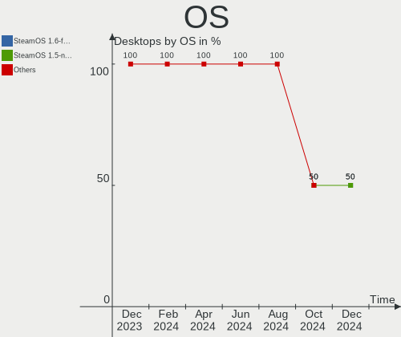
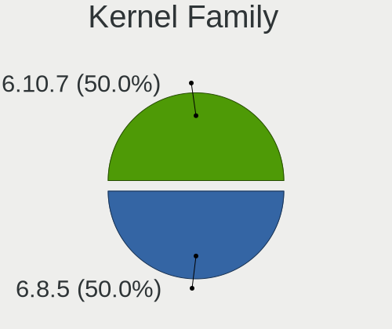
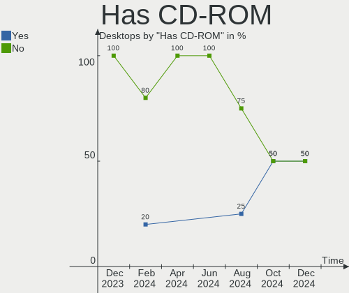
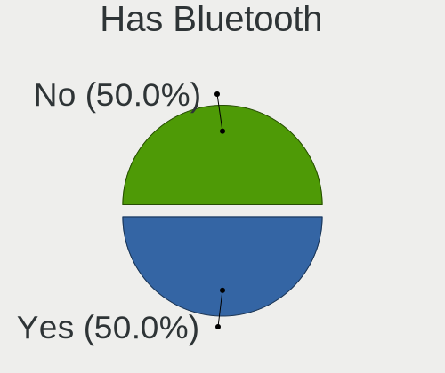
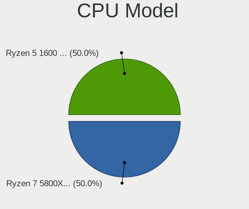
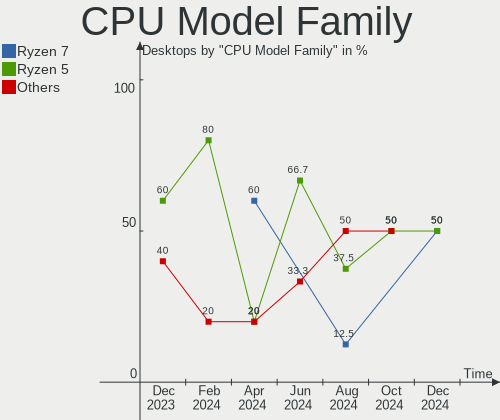
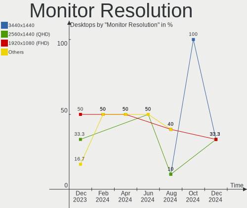
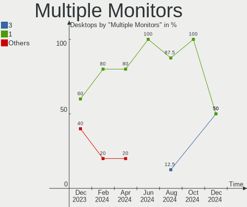
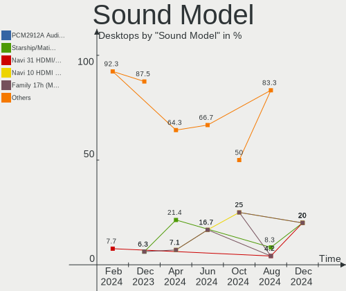

SteamOS - Hardware Trends (Desktops)
------------------------------------

A project to identify most popular hardware characteristics and track their change
over time based on data collected by Linux users at https://Linux-Hardware.org.

Anyone can contribute to this report by the [hw-probe](https://github.com/linuxhw/hw-probe) tool:

    sudo -E hw-probe -all -upload

This report is for one last month. Overall report since the beginning of time: [TestDays](https://github.com/linuxhw/TestDays)

Period: Dec, 2023.

Contents
--------

* [ System ](#system)
  - [ OS                       ](#os)
  - [ OS Family                ](#os-family)
  - [ Kernel                   ](#kernel)
  - [ Kernel Family            ](#kernel-family)
  - [ Kernel Major Ver.        ](#kernel-major-ver)
  - [ Arch                     ](#arch)
  - [ DE                       ](#de)
  - [ Display Server           ](#display-server)
  - [ Display Manager          ](#display-manager)
  - [ OS Lang                  ](#os-lang)
  - [ Boot Mode                ](#boot-mode)
  - [ Filesystem               ](#filesystem)
  - [ Part. scheme             ](#part-scheme)
  - [ Dual Boot with Linux/BSD ](#dual-boot-with-linuxbsd)
  - [ Dual Boot (Win)          ](#dual-boot-win)

* [ Board ](#board)
  - [ Vendor                   ](#vendor)
  - [ Model                    ](#model)
  - [ Model Family             ](#model-family)
  - [ MFG Year                 ](#mfg-year)
  - [ Form Factor              ](#form-factor)
  - [ Secure Boot              ](#secure-boot)
  - [ Coreboot                 ](#coreboot)
  - [ RAM Size                 ](#ram-size)
  - [ RAM Used                 ](#ram-used)
  - [ Total Drives             ](#total-drives)
  - [ Has CD-ROM               ](#has-cd-rom)
  - [ Has Ethernet             ](#has-ethernet)
  - [ Has WiFi                 ](#has-wifi)
  - [ Has Bluetooth            ](#has-bluetooth)

* [ Location ](#location)
  - [ Country                  ](#country)
  - [ City                     ](#city)

* [ Drives ](#drives)
  - [ Drive Vendor             ](#drive-vendor)
  - [ Drive Model              ](#drive-model)
  - [ HDD Vendor               ](#hdd-vendor)
  - [ SSD Vendor               ](#ssd-vendor)
  - [ Drive Kind               ](#drive-kind)
  - [ Drive Connector          ](#drive-connector)
  - [ Drive Size               ](#drive-size)
  - [ Space Total              ](#space-total)
  - [ Space Used               ](#space-used)
  - [ Malfunc. Drives          ](#malfunc-drives)
  - [ Malfunc. Drive Vendor    ](#malfunc-drive-vendor)
  - [ Malfunc. HDD Vendor      ](#malfunc-hdd-vendor)
  - [ Malfunc. Drive Kind      ](#malfunc-drive-kind)
  - [ Failed Drives            ](#failed-drives)
  - [ Failed Drive Vendor      ](#failed-drive-vendor)
  - [ Drive Status             ](#drive-status)

* [ Storage controller ](#storage-controller)
  - [ Storage Vendor           ](#storage-vendor)
  - [ Storage Model            ](#storage-model)
  - [ Storage Kind             ](#storage-kind)

* [ Processor ](#processor)
  - [ CPU Vendor               ](#cpu-vendor)
  - [ CPU Model                ](#cpu-model)
  - [ CPU Model Family         ](#cpu-model-family)
  - [ CPU Cores                ](#cpu-cores)
  - [ CPU Sockets              ](#cpu-sockets)
  - [ CPU Threads              ](#cpu-threads)
  - [ CPU Op-Modes             ](#cpu-op-modes)
  - [ CPU Microcode            ](#cpu-microcode)
  - [ CPU Microarch            ](#cpu-microarch)

* [ Graphics ](#graphics)
  - [ GPU Vendor               ](#gpu-vendor)
  - [ GPU Model                ](#gpu-model)
  - [ GPU Combo                ](#gpu-combo)
  - [ GPU Driver               ](#gpu-driver)
  - [ GPU Memory               ](#gpu-memory)

* [ Monitor ](#monitor)
  - [ Monitor Vendor           ](#monitor-vendor)
  - [ Monitor Model            ](#monitor-model)
  - [ Monitor Resolution       ](#monitor-resolution)
  - [ Monitor Diagonal         ](#monitor-diagonal)
  - [ Monitor Width            ](#monitor-width)
  - [ Aspect Ratio             ](#aspect-ratio)
  - [ Monitor Area             ](#monitor-area)
  - [ Pixel Density            ](#pixel-density)
  - [ Multiple Monitors        ](#multiple-monitors)

* [ Network ](#network)
  - [ Net Controller Vendor    ](#net-controller-vendor)
  - [ Net Controller Model     ](#net-controller-model)
  - [ Wireless Vendor          ](#wireless-vendor)
  - [ Wireless Model           ](#wireless-model)
  - [ Ethernet Vendor          ](#ethernet-vendor)
  - [ Ethernet Model           ](#ethernet-model)
  - [ Net Controller Kind      ](#net-controller-kind)
  - [ Used Controller          ](#used-controller)
  - [ NICs                     ](#nics)
  - [ IPv6                     ](#ipv6)

* [ Bluetooth ](#bluetooth)
  - [ Bluetooth Vendor         ](#bluetooth-vendor)
  - [ Bluetooth Model          ](#bluetooth-model)

* [ Sound ](#sound)
  - [ Sound Vendor             ](#sound-vendor)
  - [ Sound Model              ](#sound-model)

* [ Memory ](#memory)
  - [ Memory Vendor            ](#memory-vendor)
  - [ Memory Model             ](#memory-model)
  - [ Memory Kind              ](#memory-kind)
  - [ Memory Form Factor       ](#memory-form-factor)
  - [ Memory Size              ](#memory-size)
  - [ Memory Speed             ](#memory-speed)

* [ Printers & scanners ](#printers--scanners)
  - [ Printer Vendor           ](#printer-vendor)
  - [ Printer Model            ](#printer-model)
  - [ Scanner Vendor           ](#scanner-vendor)
  - [ Scanner Model            ](#scanner-model)

* [ Camera ](#camera)
  - [ Camera Vendor            ](#camera-vendor)
  - [ Camera Model             ](#camera-model)

* [ Security ](#security)
  - [ Fingerprint Vendor       ](#fingerprint-vendor)
  - [ Fingerprint Model        ](#fingerprint-model)
  - [ Chipcard Vendor          ](#chipcard-vendor)
  - [ Chipcard Model           ](#chipcard-model)

* [ Unsupported ](#unsupported)
  - [ Unsupported Devices      ](#unsupported-devices)
  - [ Unsupported Device Types ](#unsupported-device-types)

System
------

OS
--

Installed operating systems

| Name          | Desktops | Percent |
|---------------|----------|---------|
| SteamOS 4     | 2        | 50%     |
| SteamOS 3.5.7 | 2        | 50%     |

OS Family
---------

OS without a version

| Name    | Desktops | Percent |
|---------|----------|---------|
| SteamOS | 4        | 100%    |

Kernel
------

Version of the Linux kernel

| Version                    | Desktops | Percent |
|----------------------------|----------|---------|
| 6.3.7-zen1-1-zen           | 2        | 50%     |
| 6.1.52-valve9-1-neptune-61 | 2        | 50%     |

Kernel Family
-------------

Linux kernel without a distro release

| Version | Desktops | Percent |
|---------|----------|---------|
| 6.3.7   | 2        | 50%     |
| 6.1.52  | 2        | 50%     |

Kernel Major Ver.
-----------------

Linux kernel major version

| Version | Desktops | Percent |
|---------|----------|---------|
| 6.3     | 2        | 50%     |
| 6.1     | 2        | 50%     |

Arch
----

OS architecture (x86_64, i586, etc.)

| Name   | Desktops | Percent |
|--------|----------|---------|
| x86_64 | 4        | 100%    |

DE
--

Desktop Environment

| Name | Desktops | Percent |
|------|----------|---------|
| KDE5 | 4        | 100%    |

Display Server
--------------

X11 or Wayland

| Name | Desktops | Percent |
|------|----------|---------|
| X11  | 4        | 100%    |

Display Manager
---------------

SDDM, LightDM, etc.

| Name    | Desktops | Percent |
|---------|----------|---------|
| Unknown | 4        | 100%    |

OS Lang
-------

Language

| Lang  | Desktops | Percent |
|-------|----------|---------|
| en_US | 3        | 75%     |
| pl_PL | 1        | 25%     |

Boot Mode
---------

EFI or BIOS

| Mode | Desktops | Percent |
|------|----------|---------|
| BIOS | 4        | 100%    |

Filesystem
----------

Type of filesystem

| Type  | Desktops | Percent |
|-------|----------|---------|
| Btrfs | 4        | 100%    |

Part. scheme
------------

Scheme of partitioning

| Type    | Desktops | Percent |
|---------|----------|---------|
| Unknown | 4        | 100%    |

Dual Boot with Linux/BSD
------------------------

Hosting more than one Linux/BSD

| Dual boot | Desktops | Percent |
|-----------|----------|---------|
| No        | 4        | 100%    |

Dual Boot (Win)
---------------

Hosting Linux and Windows

| Dual boot | Desktops | Percent |
|-----------|----------|---------|
| No        | 4        | 100%    |

Board
-----

Vendor
------

Motherboard manufacturer

| Name                | Desktops | Percent |
|---------------------|----------|---------|
| MSI                 | 1        | 25%     |
| Gigabyte Technology | 1        | 25%     |
| ASUSTek Computer    | 1        | 25%     |
| ASRock              | 1        | 25%     |

Model
-----

Motherboard model

| Name                   | Desktops | Percent |
|------------------------|----------|---------|
| MSI MS-7C91            | 1        | 25%     |
| Gigabyte B560M DS3H V2 | 1        | 25%     |
| ASUS M5A99FX PRO R2.0  | 1        | 25%     |
| ASRock AB350M-HDV      | 1        | 25%     |

Model Family
------------

Motherboard model prefix

| Name              | Desktops | Percent |
|-------------------|----------|---------|
| MSI MS-7C91       | 1        | 25%     |
| Gigabyte B560M    | 1        | 25%     |
| ASUS M5A99FX      | 1        | 25%     |
| ASRock AB350M-HDV | 1        | 25%     |

MFG Year
--------

Motherboard manufacture year

| Year | Desktops | Percent |
|------|----------|---------|
| 2022 | 1        | 25%     |
| 2021 | 1        | 25%     |
| 2017 | 1        | 25%     |
| 2012 | 1        | 25%     |

Form Factor
-----------

Physical design of the computer

| Name    | Desktops | Percent |
|---------|----------|---------|
| Desktop | 4        | 100%    |

Secure Boot
-----------

Enabled or disabled

| State    | Desktops | Percent |
|----------|----------|---------|
| Disabled | 4        | 100%    |

Coreboot
--------

Have coreboot on board

| Used | Desktops | Percent |
|------|----------|---------|
| No   | 4        | 100%    |

RAM Size
--------

Total RAM memory

| Size in GB | Desktops | Percent |
|------------|----------|---------|
| 32.01-64.0 | 2        | 50%     |
| 16.01-24.0 | 1        | 25%     |
| 8.01-16.0  | 1        | 25%     |

RAM Used
--------

Used RAM memory

| Used GB   | Desktops | Percent |
|-----------|----------|---------|
| 4.01-8.0  | 1        | 25%     |
| 3.01-4.0  | 1        | 25%     |
| 2.01-3.0  | 1        | 25%     |
| 8.01-16.0 | 1        | 25%     |

Total Drives
------------

Number of drives on board

| Drives | Desktops | Percent |
|--------|----------|---------|
| 2      | 3        | 75%     |
| 5      | 1        | 25%     |

Has CD-ROM
----------

Has CD-ROM on board

| Presented | Desktops | Percent |
|-----------|----------|---------|
| No        | 4        | 100%    |

Has Ethernet
------------

Has Ethernet on board

| Presented | Desktops | Percent |
|-----------|----------|---------|
| Yes       | 4        | 100%    |

Has WiFi
--------

Has WiFi module

| Presented | Desktops | Percent |
|-----------|----------|---------|
| Yes       | 4        | 100%    |

Has Bluetooth
-------------

Has Bluetooth module

| Presented | Desktops | Percent |
|-----------|----------|---------|
| Yes       | 3        | 75%     |
| No        | 1        | 25%     |

Location
--------

Country
-------

Geographic location (country)

| Country | Desktops | Percent |
|---------|----------|---------|
| USA     | 2        | 50%     |
| Russia  | 1        | 25%     |
| Poland  | 1        | 25%     |

City
----

Geographic location (city)

| City         | Desktops | Percent |
|--------------|----------|---------|
| Tyumen       | 1        | 25%     |
| Portsmouth   | 1        | 25%     |
| Edwardsville | 1        | 25%     |
| Białogard   | 1        | 25%     |

Drives
------

Drive Vendor
------------

Hard drive vendors

| Vendor              | Desktops | Drives | Percent |
|---------------------|----------|--------|---------|
| Seagate             | 3        | 3      | 27.27%  |
| WDC                 | 2        | 2      | 18.18%  |
| Samsung Electronics | 2        | 2      | 18.18%  |
| Sandisk             | 1        | 1      | 9.09%   |
| Patriot             | 1        | 1      | 9.09%   |
| Intel               | 1        | 1      | 9.09%   |
| Apacer              | 1        | 1      | 9.09%   |

Drive Model
-----------

Hard drive models

| Model                                         | Desktops | Percent |
|-----------------------------------------------|----------|---------|
| WDC WD20EZRZ-00Z5HB0 2TB                      | 1        | 9.09%   |
| WDC WD1600HLFS-75G6U1 160GB                   | 1        | 9.09%   |
| Seagate ST3500320AS 500GB                     | 1        | 9.09%   |
| Seagate ST1000LM024 HN-M101MBB 1TB            | 1        | 9.09%   |
| Seagate ST1000DM010-2DM162 1TB                | 1        | 9.09%   |
| Sandisk WD Blue SN550 NVMe SSD 1TB            | 1        | 9.09%   |
| Samsung SSD 980 1TB                           | 1        | 9.09%   |
| Samsung SSD 870 EVO 1TB                       | 1        | 9.09%   |
| Patriot Burst Elite 240GB SSD                 | 1        | 9.09%   |
| Intel SSD Pro 7600p/760p/E 6100p Series 256GB | 1        | 9.09%   |
| Apacer AS350 512GB SSD                        | 1        | 9.09%   |

HDD Vendor
----------

Hard disk drive vendors

| Vendor  | Desktops | Drives | Percent |
|---------|----------|--------|---------|
| Seagate | 3        | 3      | 60%     |
| WDC     | 2        | 2      | 40%     |

SSD Vendor
----------

Solid state drive vendors

| Vendor              | Desktops | Drives | Percent |
|---------------------|----------|--------|---------|
| Samsung Electronics | 1        | 1      | 33.33%  |
| Patriot             | 1        | 1      | 33.33%  |
| Apacer              | 1        | 1      | 33.33%  |

Drive Kind
----------

HDD or SSD

| Kind | Desktops | Drives | Percent |
|------|----------|--------|---------|
| NVMe | 3        | 3      | 37.5%   |
| HDD  | 3        | 5      | 37.5%   |
| SSD  | 2        | 3      | 25%     |

Drive Connector
---------------

SATA, SAS, NVMe, etc.

| Type | Desktops | Drives | Percent |
|------|----------|--------|---------|
| SATA | 4        | 8      | 57.14%  |
| NVMe | 3        | 3      | 42.86%  |

Drive Size
----------

Size of hard drive

| Size in TB | Desktops | Drives | Percent |
|------------|----------|--------|---------|
| 0.51-1.0   | 3        | 4      | 42.86%  |
| 0.01-0.5   | 3        | 3      | 42.86%  |
| 1.01-2.0   | 1        | 1      | 14.29%  |

Space Total
-----------

Amount of disk space available on the file system

| Size in GB     | Desktops | Percent |
|----------------|----------|---------|
| More than 3000 | 1        | 25%     |
| 251-500        | 1        | 25%     |
| 101-250        | 1        | 25%     |
| 1-20           | 1        | 25%     |

Space Used
----------

Amount of used disk space

| Used GB   | Desktops | Percent |
|-----------|----------|---------|
| 1-20      | 2        | 50%     |
| 21-50     | 1        | 25%     |
| 1001-2000 | 1        | 25%     |

Malfunc. Drives
---------------

Drive models with a malfunction

Zero info for selected period =(

Malfunc. Drive Vendor
---------------------

Vendors of faulty drives

Zero info for selected period =(

Malfunc. HDD Vendor
-------------------

Vendors of faulty HDD drives

Zero info for selected period =(

Malfunc. Drive Kind
-------------------

Kinds of faulty drives

Zero info for selected period =(

Failed Drives
-------------

Failed drive models

Zero info for selected period =(

Failed Drive Vendor
-------------------

Failed drive vendors

Zero info for selected period =(

Drive Status
------------

Number of failed and malfunc. drives

| Status   | Desktops | Drives | Percent |
|----------|----------|--------|---------|
| Detected | 4        | 11     | 100%    |

Storage controller
------------------

Storage Vendor
--------------

Storage controller vendors

| Vendor              | Desktops | Percent |
|---------------------|----------|---------|
| AMD                 | 3        | 37.5%   |
| Intel               | 2        | 25%     |
| SanDisk             | 1        | 12.5%   |
| Samsung Electronics | 1        | 12.5%   |
| ASMedia Technology  | 1        | 12.5%   |

Storage Model
-------------

Storage controller models

| Model                                                | Desktops | Percent |
|------------------------------------------------------|----------|---------|
| SanDisk Ultra 3D / WD Blue SN550 NVMe SSD            | 1        | 11.11%  |
| Samsung NVMe SSD Controller 980 (DRAM-less)          | 1        | 11.11%  |
| Intel SSD DC P4101/Pro 7600p/760p/E 6100p Series     | 1        | 11.11%  |
| Intel 500 Series Chipset Family SATA AHCI Controller | 1        | 11.11%  |
| ASMedia ASM1062 Serial ATA Controller                | 1        | 11.11%  |
| AMD SB7x0/SB8x0/SB9x0 SATA Controller [AHCI mode]    | 1        | 11.11%  |
| AMD FCH SATA Controller [AHCI mode]                  | 1        | 11.11%  |
| AMD 500 Series Chipset SATA Controller               | 1        | 11.11%  |
| AMD 300 Series Chipset SATA Controller               | 1        | 11.11%  |

Storage Kind
------------

Kind of storage controller (IDE, SATA, NVMe, SAS, ...)

| Kind | Desktops | Percent |
|------|----------|---------|
| SATA | 4        | 57.14%  |
| NVMe | 3        | 42.86%  |

Processor
---------

CPU Vendor
----------

Processor vendors

| Vendor | Desktops | Percent |
|--------|----------|---------|
| AMD    | 3        | 75%     |
| Intel  | 1        | 25%     |

CPU Model
---------

Processor models

| Model                               | Desktops | Percent |
|-------------------------------------|----------|---------|
| Intel Core i5-10600KF CPU @ 4.10GHz | 1        | 25%     |
| AMD Ryzen 5 5600X 6-Core Processor  | 1        | 25%     |
| AMD Ryzen 5 1600 Six-Core Processor | 1        | 25%     |
| AMD FX-6300 Six-Core Processor      | 1        | 25%     |

CPU Model Family
----------------

Processor model prefix

| Model         | Desktops | Percent |
|---------------|----------|---------|
| AMD Ryzen 5   | 2        | 50%     |
| Intel Core i5 | 1        | 25%     |
| AMD FX        | 1        | 25%     |

CPU Cores
---------

Number of processor cores

| Number | Desktops | Percent |
|--------|----------|---------|
| 6      | 3        | 75%     |
| 3      | 1        | 25%     |

CPU Sockets
-----------

Number of sockets

| Number | Desktops | Percent |
|--------|----------|---------|
| 1      | 4        | 100%    |

CPU Threads
-----------

Threads per core (Hyper-Threading)

| Number | Desktops | Percent |
|--------|----------|---------|
| 2      | 4        | 100%    |

CPU Op-Modes
------------

CPU Operation Modes (32-bit, 64-bit)

| Op mode        | Desktops | Percent |
|----------------|----------|---------|
| 32-bit, 64-bit | 4        | 100%    |

CPU Microcode
-------------

Microcode number

| Number  | Desktops | Percent |
|---------|----------|---------|
| Unknown | 4        | 100%    |

CPU Microarch
-------------

Microarchitecture

| Name       | Desktops | Percent |
|------------|----------|---------|
| Zen+       | 1        | 25%     |
| Zen 3      | 1        | 25%     |
| Piledriver | 1        | 25%     |
| CometLake  | 1        | 25%     |

Graphics
--------

GPU Vendor
----------

Vendors of graphics cards

| Vendor | Desktops | Percent |
|--------|----------|---------|
| AMD    | 3        | 75%     |
| Nvidia | 1        | 25%     |

GPU Model
---------

Graphics card models

| Model                                                         | Desktops | Percent |
|---------------------------------------------------------------|----------|---------|
| Nvidia GM206 [GeForce GTX 960]                                | 1        | 25%     |
| AMD Navi 22 [Radeon RX 6700/6700 XT/6750 XT / 6800M/6850M XT] | 1        | 25%     |
| AMD Navi 21 [Radeon RX 6800/6800 XT / 6900 XT]                | 1        | 25%     |
| AMD Ellesmere [Radeon RX 470/480/570/570X/580/580X/590]       | 1        | 25%     |

GPU Combo
---------

Combinations of graphics cards

| Name       | Desktops | Percent |
|------------|----------|---------|
| 1 x AMD    | 3        | 75%     |
| 1 x Nvidia | 1        | 25%     |

GPU Driver
----------

Free vs proprietary

| Driver | Desktops | Percent |
|--------|----------|---------|
| Free   | 4        | 100%    |

GPU Memory
----------

Total video memory

| Size in GB | Desktops | Percent |
|------------|----------|---------|
| Unknown    | 4        | 100%    |

Monitor
-------

Monitor Vendor
--------------

Monitor vendors

| Vendor              | Desktops | Percent |
|---------------------|----------|---------|
| Goldstar            | 2        | 40%     |
| Samsung Electronics | 1        | 20%     |
| AOC                 | 1        | 20%     |
| Acer                | 1        | 20%     |

Monitor Model
-------------

Monitor models

| Model                                                    | Desktops | Percent |
|----------------------------------------------------------|----------|---------|
| Samsung Electronics LCD Monitor SAM04FD 1280x720         | 1        | 20%     |
| Goldstar ULTRAGEAR GSM5C1E 1920x1080 700x390mm 31.5-inch | 1        | 20%     |
| Goldstar MP59G GSM5B35 1920x1080 480x270mm 21.7-inch     | 1        | 20%     |
| AOC Q32G3WG3R3 AOCB305 2560x1440 697x392mm 31.5-inch     | 1        | 20%     |
| Acer G257HU ACR0416 2560x1440 552x311mm 24.9-inch        | 1        | 20%     |

Monitor Resolution
------------------

Monitor screen resolution

| Resolution      | Desktops | Percent |
|-----------------|----------|---------|
| 1920x1080 (FHD) | 3        | 60%     |
| 2560x1440 (QHD) | 2        | 40%     |

Monitor Diagonal
----------------

Diagonal size in inches

| Inches | Desktops | Percent |
|--------|----------|---------|
| 31     | 2        | 40%     |
| 27     | 1        | 20%     |
| 24     | 1        | 20%     |
| 19     | 1        | 20%     |

Monitor Width
-------------

Physical width

| Width in mm | Desktops | Percent |
|-------------|----------|---------|
| 601-700     | 2        | 40%     |
| 501-600     | 2        | 40%     |
| 351-400     | 1        | 20%     |

Aspect Ratio
------------

Proportional relationship between the width and the height

| Ratio | Desktops | Percent |
|-------|----------|---------|
| 16/9  | 2        | 66.67%  |
| 5/4   | 1        | 33.33%  |

Monitor Area
------------

Area in inch²

| Area in inch² | Desktops | Percent |
|----------------|----------|---------|
| 351-500        | 2        | 40%     |
| 301-350        | 1        | 20%     |
| 251-300        | 1        | 20%     |
| 151-200        | 1        | 20%     |

Pixel Density
-------------

Pixels per inch

| Density | Desktops | Percent |
|---------|----------|---------|
| 101-120 | 2        | 50%     |
| 51-100  | 2        | 50%     |

Multiple Monitors
-----------------

Total monitors connected

| Total | Desktops | Percent |
|-------|----------|---------|
| 2     | 2        | 50%     |
| 1     | 2        | 50%     |

Network
-------

Net Controller Vendor
---------------------

Controller vendors

| Vendor                | Desktops | Percent |
|-----------------------|----------|---------|
| Realtek Semiconductor | 4        | 57.14%  |
| Qualcomm Atheros      | 1        | 14.29%  |
| MediaTek              | 1        | 14.29%  |
| Intel                 | 1        | 14.29%  |

Net Controller Model
--------------------

Controller models

| Model                                                             | Desktops | Percent |
|-------------------------------------------------------------------|----------|---------|
| Realtek RTL8111/8168/8411 PCI Express Gigabit Ethernet Controller | 3        | 33.33%  |
| Realtek RTL8188CUS 802.11n WLAN Adapter                           | 1        | 11.11%  |
| Realtek RTL8125 2.5GbE Controller                                 | 1        | 11.11%  |
| Realtek 802.11ac NIC                                              | 1        | 11.11%  |
| Qualcomm Atheros AR922X Wireless Network Adapter                  | 1        | 11.11%  |
| MediaTek MT7921K (RZ608) Wi-Fi 6E 80MHz                           | 1        | 11.11%  |
| Intel Wireless 7265                                               | 1        | 11.11%  |

Wireless Vendor
---------------

Wireless vendors

| Vendor                | Desktops | Percent |
|-----------------------|----------|---------|
| Realtek Semiconductor | 1        | 25%     |
| Qualcomm Atheros      | 1        | 25%     |
| MediaTek              | 1        | 25%     |
| Intel                 | 1        | 25%     |

Wireless Model
--------------

Wireless models

| Model                                            | Desktops | Percent |
|--------------------------------------------------|----------|---------|
| Realtek RTL8188CUS 802.11n WLAN Adapter          | 1        | 20%     |
| Realtek 802.11ac NIC                             | 1        | 20%     |
| Qualcomm Atheros AR922X Wireless Network Adapter | 1        | 20%     |
| MediaTek MT7921K (RZ608) Wi-Fi 6E 80MHz          | 1        | 20%     |
| Intel Wireless 7265                              | 1        | 20%     |

Ethernet Vendor
---------------

Ethernet vendors

| Vendor                | Desktops | Percent |
|-----------------------|----------|---------|
| Realtek Semiconductor | 4        | 100%    |

Ethernet Model
--------------

Ethernet models

| Model                                                             | Desktops | Percent |
|-------------------------------------------------------------------|----------|---------|
| Realtek RTL8111/8168/8411 PCI Express Gigabit Ethernet Controller | 3        | 75%     |
| Realtek RTL8125 2.5GbE Controller                                 | 1        | 25%     |

Net Controller Kind
-------------------

Ethernet, WiFi or modem

| Kind     | Desktops | Percent |
|----------|----------|---------|
| WiFi     | 4        | 50%     |
| Ethernet | 4        | 50%     |

Used Controller
---------------

Currently used network controller

| Kind     | Desktops | Percent |
|----------|----------|---------|
| Ethernet | 3        | 75%     |
| WiFi     | 1        | 25%     |

NICs
----

Total network controllers on board

| Total | Desktops | Percent |
|-------|----------|---------|
| 2     | 3        | 75%     |
| 1     | 1        | 25%     |

IPv6
----

IPv6 vs IPv4

| Used | Desktops | Percent |
|------|----------|---------|
| No   | 3        | 75%     |
| Yes  | 1        | 25%     |

Bluetooth
---------

Bluetooth Vendor
----------------

Controller vendors

| Vendor                  | Desktops | Percent |
|-------------------------|----------|---------|
| MediaTek                | 1        | 33.33%  |
| Intel                   | 1        | 33.33%  |
| Cambridge Silicon Radio | 1        | 33.33%  |

Bluetooth Model
---------------

Controller models

| Model                                               | Desktops | Percent |
|-----------------------------------------------------|----------|---------|
| MediaTek Wireless_Device                            | 1        | 33.33%  |
| Intel Bluetooth wireless interface                  | 1        | 33.33%  |
| Cambridge Silicon Radio Bluetooth Dongle (HCI mode) | 1        | 33.33%  |

Sound
-----

Sound Vendor
------------

Sound card vendors

| Vendor              | Desktops | Percent |
|---------------------|----------|---------|
| AMD                 | 4        | 40%     |
| Sony                | 1        | 10%     |
| Razer USA           | 1        | 10%     |
| Nvidia              | 1        | 10%     |
| Kingston Technology | 1        | 10%     |
| Intel               | 1        | 10%     |
| Corsair             | 1        | 10%     |

Sound Model
-----------

Sound card models

| Model                                                      | Desktops | Percent |
|------------------------------------------------------------|----------|---------|
| AMD Navi 21/23 HDMI/DP Audio Controller                    | 2        | 16.67%  |
| Sony DualShock 4 [CUH-ZCT2x]                               | 1        | 8.33%   |
| Razer USA RZ19-0229 Gaming Microphone                      | 1        | 8.33%   |
| Nvidia GM206 High Definition Audio Controller              | 1        | 8.33%   |
| Kingston Technology HyperX Cloud Stinger Core Wireless DTS | 1        | 8.33%   |
| Intel Smart Sound Technology (SST) Audio Controller        | 1        | 8.33%   |
| Corsair Corsair VOID Surround USB Sound Adapter            | 1        | 8.33%   |
| AMD Starship/Matisse HD Audio Controller                   | 1        | 8.33%   |
| AMD SBx00 Azalia (Intel HDA)                               | 1        | 8.33%   |
| AMD Family 17h (Models 00h-0fh) HD Audio Controller        | 1        | 8.33%   |
| AMD Ellesmere HDMI Audio [Radeon RX 470/480 / 570/580/590] | 1        | 8.33%   |

Memory
------

Memory Vendor
-------------

Memory module vendors

Zero info for selected period =(

Memory Model
------------

Memory module models

Zero info for selected period =(

Memory Kind
-----------

Memory module kinds

Zero info for selected period =(

Memory Form Factor
------------------

Physical design of the memory module

Zero info for selected period =(

Memory Size
-----------

Memory module size

Zero info for selected period =(

Memory Speed
------------

Memory module speed

Zero info for selected period =(

Printers & scanners
-------------------

Printer Vendor
--------------

Printer device vendors

Zero info for selected period =(

Printer Model
-------------

Printer device models

Zero info for selected period =(

Scanner Vendor
--------------

Scanner device vendors

Zero info for selected period =(

Scanner Model
-------------

Scanner device models

Zero info for selected period =(

Camera
------

Camera Vendor
-------------

Camera device vendors

Zero info for selected period =(

Camera Model
------------

Camera device models

Zero info for selected period =(

Security
--------

Fingerprint Vendor
------------------

Fingerprint sensor vendors

Zero info for selected period =(

Fingerprint Model
-----------------

Fingerprint sensor models

Zero info for selected period =(

Chipcard Vendor
---------------

Chipcard module vendors

Zero info for selected period =(

Chipcard Model
--------------

Chipcard module models

Zero info for selected period =(

Unsupported
-----------

Unsupported Devices
-------------------

Total unsupported devices on board

| Total | Desktops | Percent |
|-------|----------|---------|
| 0     | 3        | 75%     |
| 1     | 1        | 25%     |

Unsupported Device Types
------------------------

Types of unsupported devices

| Type         | Desktops | Percent |
|--------------|----------|---------|
| Net/wireless | 1        | 100%    |

