SteamOS - Hardware Trends (Notebooks)
-------------------------------------

A project to identify most popular hardware characteristics and track their change
over time based on data collected by Linux users at https://Linux-Hardware.org.

Anyone can contribute to this report by the [hw-probe](https://github.com/linuxhw/hw-probe) tool:

    sudo -E hw-probe -all -upload

This report is for one last month. Overall report since the beginning of time: [TestDays](https://github.com/linuxhw/TestDays)

Period: Dec, 2025.

Contents
--------

* [ System ](#system)
  - [ OS                       ](#os)
  - [ OS Family                ](#os-family)
  - [ Kernel                   ](#kernel)
  - [ Kernel Family            ](#kernel-family)
  - [ Kernel Major Ver.        ](#kernel-major-ver)
  - [ Arch                     ](#arch)
  - [ DE                       ](#de)
  - [ Display Server           ](#display-server)
  - [ Display Manager          ](#display-manager)
  - [ OS Lang                  ](#os-lang)
  - [ Boot Mode                ](#boot-mode)
  - [ Filesystem               ](#filesystem)
  - [ Part. scheme             ](#part-scheme)
  - [ Dual Boot with Linux/BSD ](#dual-boot-with-linuxbsd)
  - [ Dual Boot (Win)          ](#dual-boot-win)

* [ Board ](#board)
  - [ Vendor                   ](#vendor)
  - [ Model                    ](#model)
  - [ Model Family             ](#model-family)
  - [ MFG Year                 ](#mfg-year)
  - [ Form Factor              ](#form-factor)
  - [ Secure Boot              ](#secure-boot)
  - [ Coreboot                 ](#coreboot)
  - [ RAM Size                 ](#ram-size)
  - [ RAM Used                 ](#ram-used)
  - [ Total Drives             ](#total-drives)
  - [ Has CD-ROM               ](#has-cd-rom)
  - [ Has Ethernet             ](#has-ethernet)
  - [ Has WiFi                 ](#has-wifi)
  - [ Has Bluetooth            ](#has-bluetooth)

* [ Location ](#location)
  - [ Country                  ](#country)
  - [ City                     ](#city)

* [ Drives ](#drives)
  - [ Drive Vendor             ](#drive-vendor)
  - [ Drive Model              ](#drive-model)
  - [ HDD Vendor               ](#hdd-vendor)
  - [ SSD Vendor               ](#ssd-vendor)
  - [ Drive Kind               ](#drive-kind)
  - [ Drive Connector          ](#drive-connector)
  - [ Drive Size               ](#drive-size)
  - [ Space Total              ](#space-total)
  - [ Space Used               ](#space-used)
  - [ Malfunc. Drives          ](#malfunc-drives)
  - [ Malfunc. Drive Vendor    ](#malfunc-drive-vendor)
  - [ Malfunc. HDD Vendor      ](#malfunc-hdd-vendor)
  - [ Malfunc. Drive Kind      ](#malfunc-drive-kind)
  - [ Failed Drives            ](#failed-drives)
  - [ Failed Drive Vendor      ](#failed-drive-vendor)
  - [ Drive Status             ](#drive-status)

* [ Storage controller ](#storage-controller)
  - [ Storage Vendor           ](#storage-vendor)
  - [ Storage Model            ](#storage-model)
  - [ Storage Kind             ](#storage-kind)

* [ Processor ](#processor)
  - [ CPU Vendor               ](#cpu-vendor)
  - [ CPU Model                ](#cpu-model)
  - [ CPU Model Family         ](#cpu-model-family)
  - [ CPU Cores                ](#cpu-cores)
  - [ CPU Sockets              ](#cpu-sockets)
  - [ CPU Threads              ](#cpu-threads)
  - [ CPU Op-Modes             ](#cpu-op-modes)
  - [ CPU Microcode            ](#cpu-microcode)
  - [ CPU Microarch            ](#cpu-microarch)

* [ Graphics ](#graphics)
  - [ GPU Vendor               ](#gpu-vendor)
  - [ GPU Model                ](#gpu-model)
  - [ GPU Combo                ](#gpu-combo)
  - [ GPU Driver               ](#gpu-driver)
  - [ GPU Memory               ](#gpu-memory)

* [ Monitor ](#monitor)
  - [ Monitor Vendor           ](#monitor-vendor)
  - [ Monitor Model            ](#monitor-model)
  - [ Monitor Resolution       ](#monitor-resolution)
  - [ Monitor Diagonal         ](#monitor-diagonal)
  - [ Monitor Width            ](#monitor-width)
  - [ Aspect Ratio             ](#aspect-ratio)
  - [ Monitor Area             ](#monitor-area)
  - [ Pixel Density            ](#pixel-density)
  - [ Multiple Monitors        ](#multiple-monitors)

* [ Network ](#network)
  - [ Net Controller Vendor    ](#net-controller-vendor)
  - [ Net Controller Model     ](#net-controller-model)
  - [ Wireless Vendor          ](#wireless-vendor)
  - [ Wireless Model           ](#wireless-model)
  - [ Ethernet Vendor          ](#ethernet-vendor)
  - [ Ethernet Model           ](#ethernet-model)
  - [ Net Controller Kind      ](#net-controller-kind)
  - [ Used Controller          ](#used-controller)
  - [ NICs                     ](#nics)
  - [ IPv6                     ](#ipv6)

* [ Bluetooth ](#bluetooth)
  - [ Bluetooth Vendor         ](#bluetooth-vendor)
  - [ Bluetooth Model          ](#bluetooth-model)

* [ Sound ](#sound)
  - [ Sound Vendor             ](#sound-vendor)
  - [ Sound Model              ](#sound-model)

* [ Memory ](#memory)
  - [ Memory Vendor            ](#memory-vendor)
  - [ Memory Model             ](#memory-model)
  - [ Memory Kind              ](#memory-kind)
  - [ Memory Form Factor       ](#memory-form-factor)
  - [ Memory Size              ](#memory-size)
  - [ Memory Speed             ](#memory-speed)

* [ Printers & scanners ](#printers--scanners)
  - [ Printer Vendor           ](#printer-vendor)
  - [ Printer Model            ](#printer-model)
  - [ Scanner Vendor           ](#scanner-vendor)
  - [ Scanner Model            ](#scanner-model)

* [ Camera ](#camera)
  - [ Camera Vendor            ](#camera-vendor)
  - [ Camera Model             ](#camera-model)

* [ Security ](#security)
  - [ Fingerprint Vendor       ](#fingerprint-vendor)
  - [ Fingerprint Model        ](#fingerprint-model)
  - [ Chipcard Vendor          ](#chipcard-vendor)
  - [ Chipcard Model           ](#chipcard-model)

* [ Unsupported ](#unsupported)
  - [ Unsupported Devices      ](#unsupported-devices)
  - [ Unsupported Device Types ](#unsupported-device-types)

System
------

OS
--

Installed operating systems

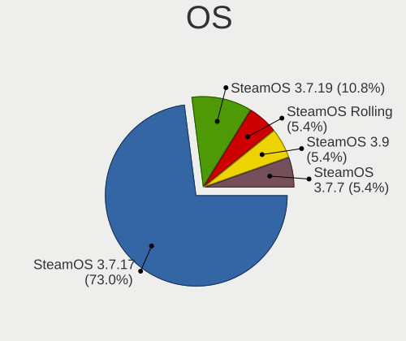

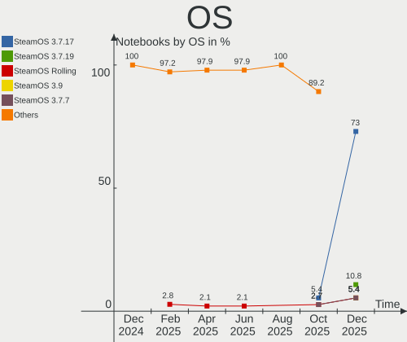

| Name            | Notebooks | Percent |
|-----------------|-----------|---------|
| SteamOS 3.7.17  | 27        | 72.97%  |
| SteamOS 3.7.19  | 4         | 10.81%  |
| SteamOS Rolling | 2         | 5.41%   |
| SteamOS 3.9     | 2         | 5.41%   |
| SteamOS 3.7.7   | 2         | 5.41%   |

OS Family
---------

OS without a version

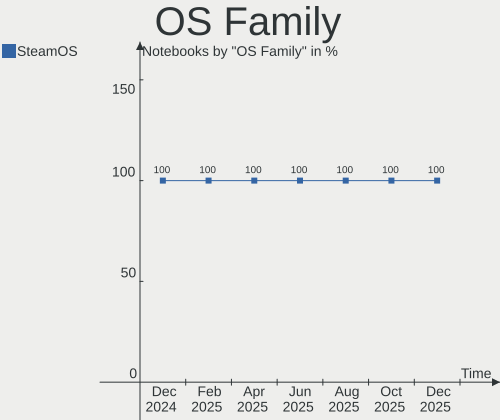

| Name    | Notebooks | Percent |
|---------|-----------|---------|
| SteamOS | 37        | 100%    |

Kernel
------

Version of the Linux kernel

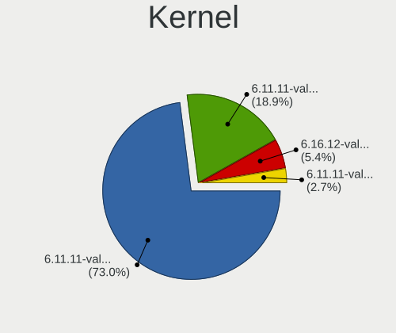

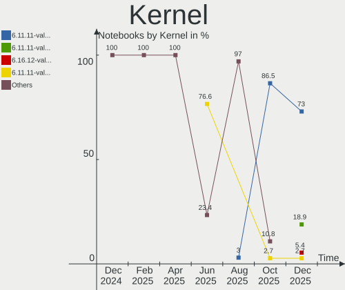

| Version                                     | Notebooks | Percent |
|---------------------------------------------|-----------|---------|
| 6.11.11-valve24-2-neptune-611-gfd0dd251480d | 27        | 72.97%  |
| 6.11.11-valve26-1-neptune-611-gb3afa9aa9ae7 | 7         | 18.92%  |
| 6.16.12-valve5-1-neptune-616-ga9fcc52b276a  | 2         | 5.41%   |
| 6.11.11-valve14-1-neptune-611-g96885212a919 | 1         | 2.7%    |

Kernel Family
-------------

Linux kernel without a distro release

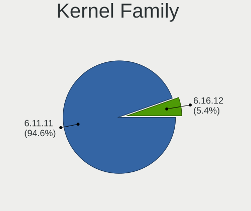

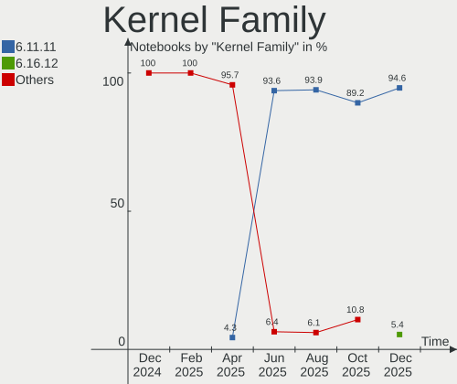

| Version | Notebooks | Percent |
|---------|-----------|---------|
| 6.11.11 | 35        | 94.59%  |
| 6.16.12 | 2         | 5.41%   |

Kernel Major Ver.
-----------------

Linux kernel major version

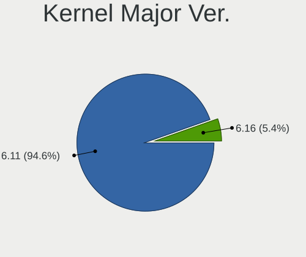

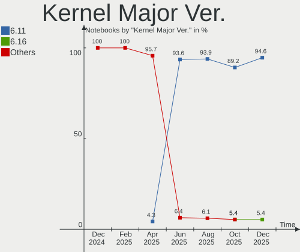

| Version | Notebooks | Percent |
|---------|-----------|---------|
| 6.11    | 35        | 94.59%  |
| 6.16    | 2         | 5.41%   |

Arch
----

OS architecture (x86_64, i586, etc.)

| Name   | Notebooks | Percent |
|--------|-----------|---------|
| x86_64 | 37        | 100%    |

DE
--

Desktop Environment

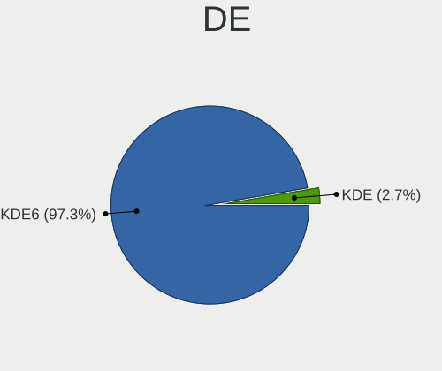

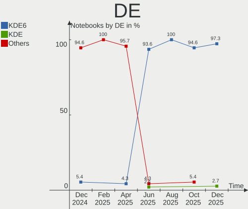

| Name | Notebooks | Percent |
|------|-----------|---------|
| KDE6 | 36        | 97.3%   |
| KDE  | 1         | 2.7%    |

Display Server
--------------

X11 or Wayland

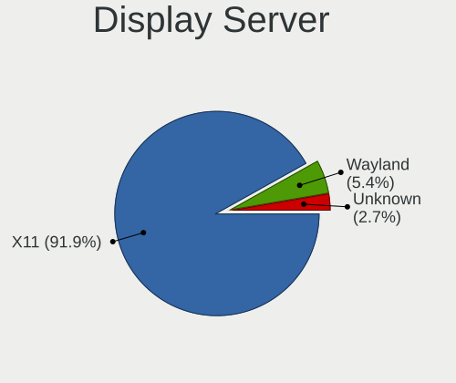

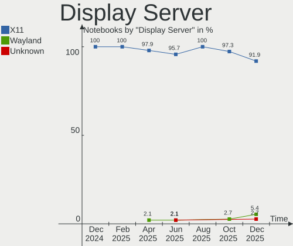

| Name    | Notebooks | Percent |
|---------|-----------|---------|
| X11     | 34        | 91.89%  |
| Wayland | 2         | 5.41%   |
| Unknown | 1         | 2.7%    |

Display Manager
---------------

SDDM, LightDM, etc.

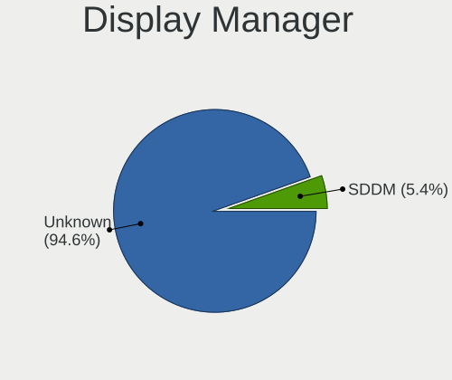

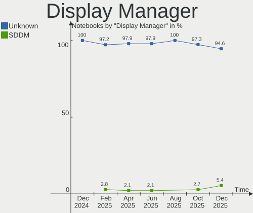

| Name    | Notebooks | Percent |
|---------|-----------|---------|
| Unknown | 35        | 94.59%  |
| SDDM    | 2         | 5.41%   |

OS Lang
-------

Language

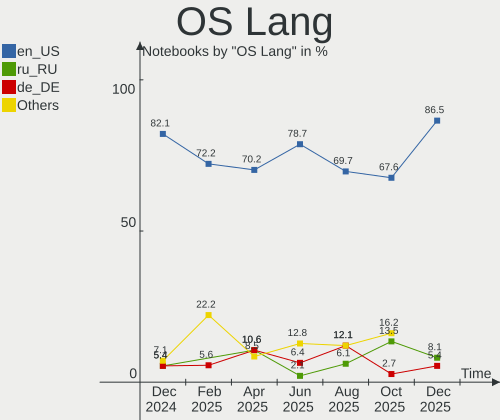

| Lang  | Notebooks | Percent |
|-------|-----------|---------|
| en_US | 32        | 86.49%  |
| ru_RU | 3         | 8.11%   |
| de_DE | 2         | 5.41%   |

Boot Mode
---------

EFI or BIOS

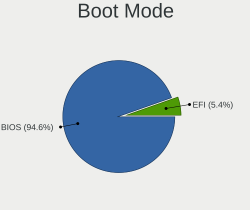

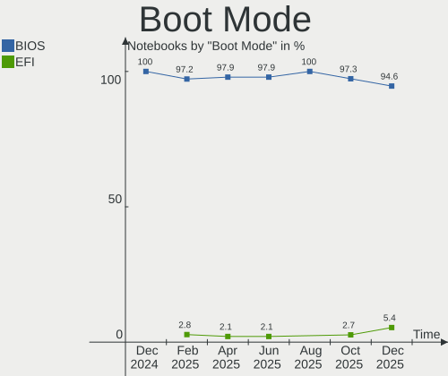

| Mode | Notebooks | Percent |
|------|-----------|---------|
| BIOS | 35        | 94.59%  |
| EFI  | 2         | 5.41%   |

Filesystem
----------

Type of filesystem

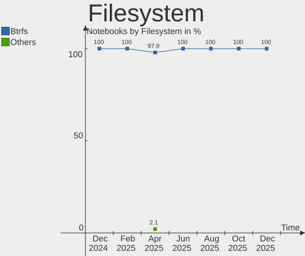

| Type  | Notebooks | Percent |
|-------|-----------|---------|
| Btrfs | 37        | 100%    |

Part. scheme
------------

Scheme of partitioning

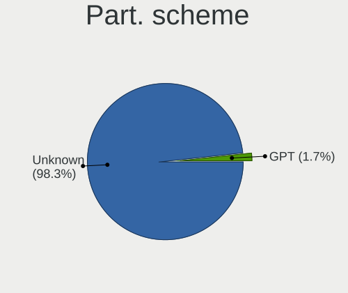

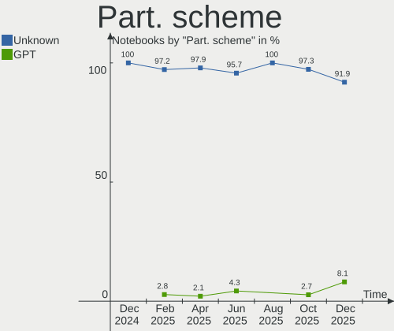

| Type    | Notebooks | Percent |
|---------|-----------|---------|
| Unknown | 34        | 91.89%  |
| GPT     | 3         | 8.11%   |

Dual Boot with Linux/BSD
------------------------

Hosting more than one Linux/BSD

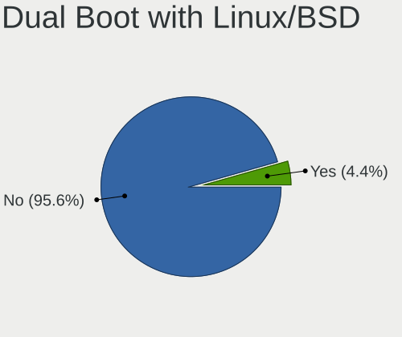

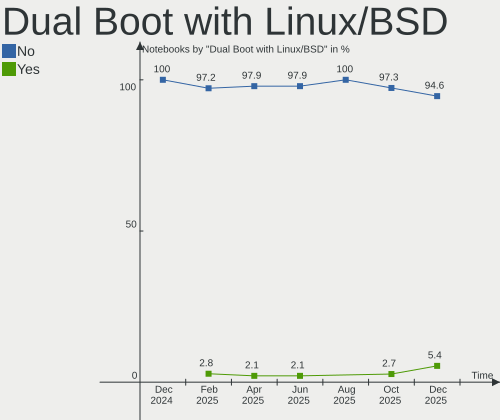

| Dual boot | Notebooks | Percent |
|-----------|-----------|---------|
| No        | 35        | 94.59%  |
| Yes       | 2         | 5.41%   |

Dual Boot (Win)
---------------

Hosting Linux and Windows

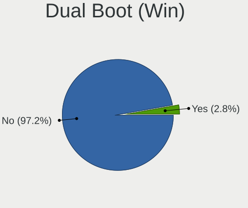

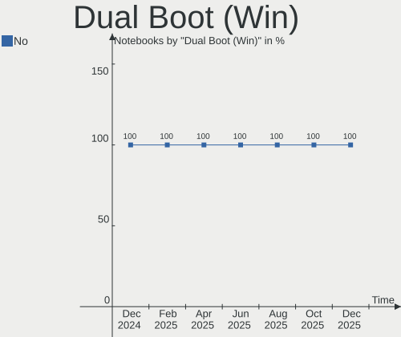

| Dual boot | Notebooks | Percent |
|-----------|-----------|---------|
| No        | 37        | 100%    |

Board
-----

Vendor
------

Motherboard manufacturer

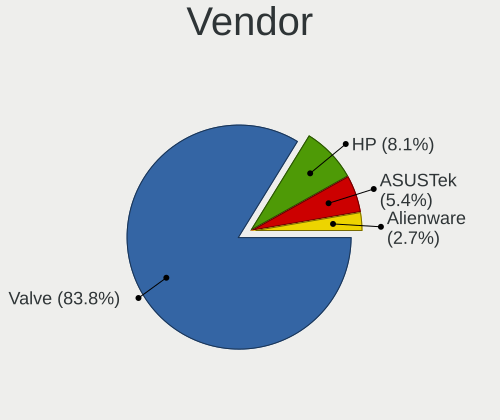

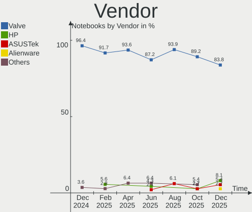

| Name             | Notebooks | Percent |
|------------------|-----------|---------|
| Valve            | 31        | 83.78%  |
| Hewlett-Packard  | 3         | 8.11%   |
| ASUSTek Computer | 2         | 5.41%   |
| Alienware        | 1         | 2.7%    |

Model
-----

Motherboard model

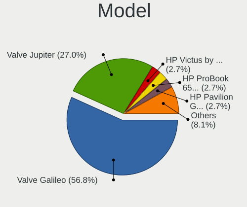

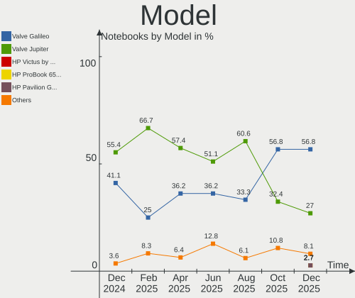

| Name                                     | Notebooks | Percent |
|------------------------------------------|-----------|---------|
| Valve Galileo                            | 21        | 56.76%  |
| Valve Jupiter                            | 10        | 27.03%  |
| HP Victus by Gaming Laptop 15-fb0xxx     | 1         | 2.7%    |
| HP ProBook 650 G2                        | 1         | 2.7%    |
| HP Pavilion Gaming Laptop                | 1         | 2.7%    |
| ASUS ASUS TUF Gaming A15 FA506IH_FA506IH | 1         | 2.7%    |
| Alienware m17 R5 AMD                     | 1         | 2.7%    |
| Unknown                                  | 1         | 2.7%    |

Model Family
------------

Motherboard model prefix

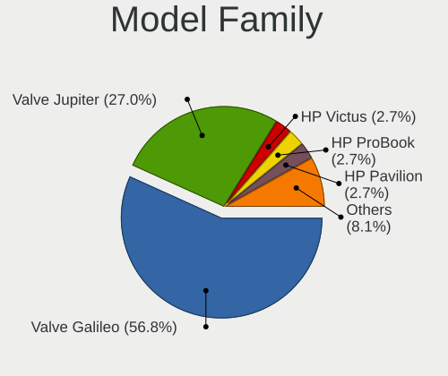

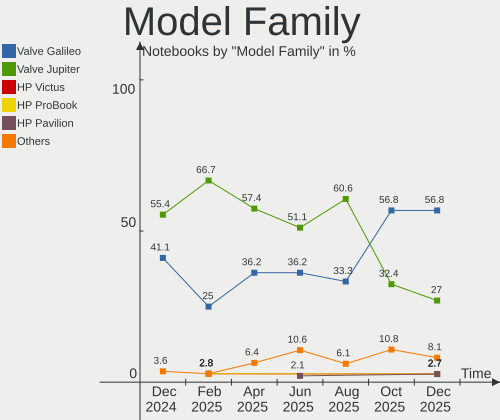

| Name          | Notebooks | Percent |
|---------------|-----------|---------|
| Valve Galileo | 21        | 56.76%  |
| Valve Jupiter | 10        | 27.03%  |
| HP Victus     | 1         | 2.7%    |
| HP ProBook    | 1         | 2.7%    |
| HP Pavilion   | 1         | 2.7%    |
| ASUS ASUS     | 1         | 2.7%    |
| Alienware m17 | 1         | 2.7%    |
| Unknown       | 1         | 2.7%    |

MFG Year
--------

Motherboard manufacture year

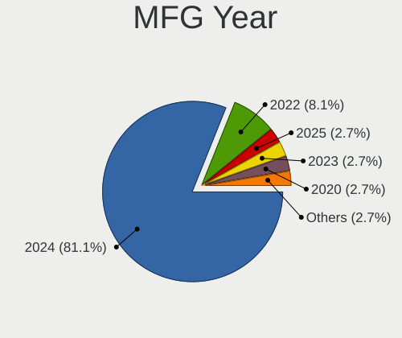

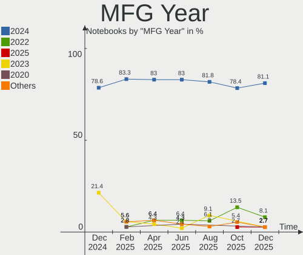

| Year | Notebooks | Percent |
|------|-----------|---------|
| 2024 | 30        | 81.08%  |
| 2022 | 3         | 8.11%   |
| 2025 | 1         | 2.7%    |
| 2023 | 1         | 2.7%    |
| 2020 | 1         | 2.7%    |
| 2016 | 1         | 2.7%    |

Form Factor
-----------

Physical design of the computer

| Name     | Notebooks | Percent |
|----------|-----------|---------|
| Notebook | 37        | 100%    |

Secure Boot
-----------

Enabled or disabled

| State    | Notebooks | Percent |
|----------|-----------|---------|
| Disabled | 37        | 100%    |

Coreboot
--------

Have coreboot on board

| Used | Notebooks | Percent |
|------|-----------|---------|
| No   | 37        | 100%    |

RAM Size
--------

Total RAM memory

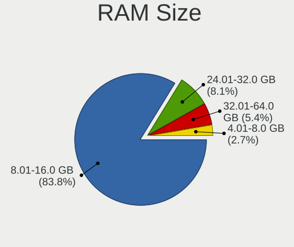

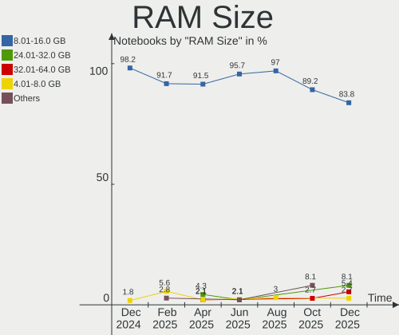

| Size in GB | Notebooks | Percent |
|------------|-----------|---------|
| 8.01-16.0  | 31        | 83.78%  |
| 24.01-32.0 | 3         | 8.11%   |
| 32.01-64.0 | 2         | 5.41%   |
| 4.01-8.0   | 1         | 2.7%    |

RAM Used
--------

Used RAM memory

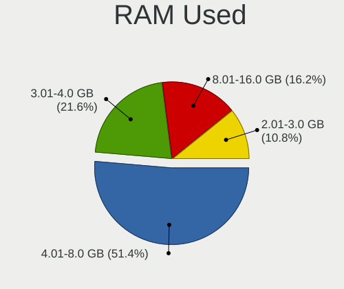

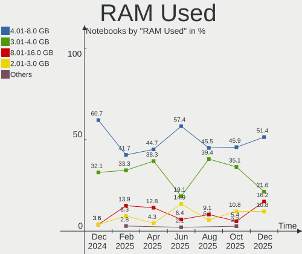

| Used GB   | Notebooks | Percent |
|-----------|-----------|---------|
| 4.01-8.0  | 19        | 51.35%  |
| 3.01-4.0  | 8         | 21.62%  |
| 8.01-16.0 | 6         | 16.22%  |
| 2.01-3.0  | 4         | 10.81%  |

Total Drives
------------

Number of drives on board

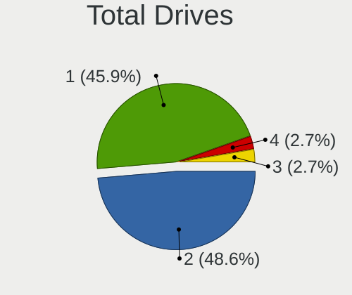

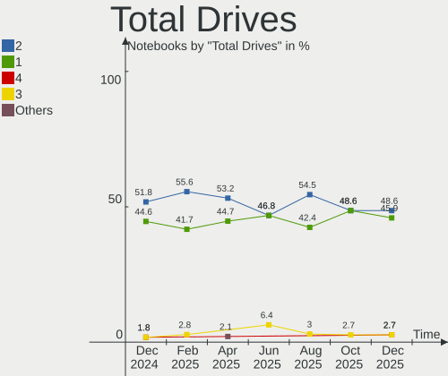

| Drives | Notebooks | Percent |
|--------|-----------|---------|
| 2      | 18        | 48.65%  |
| 1      | 17        | 45.95%  |
| 4      | 1         | 2.7%    |
| 3      | 1         | 2.7%    |

Has CD-ROM
----------

Has CD-ROM on board

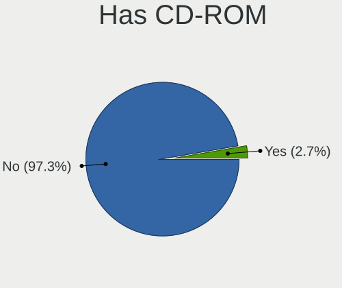

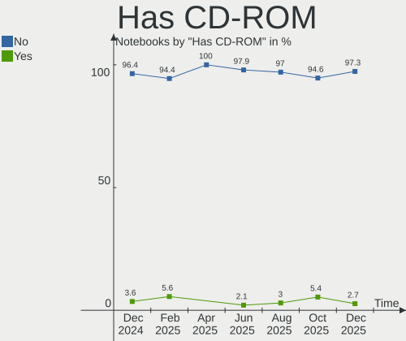

| Presented | Notebooks | Percent |
|-----------|-----------|---------|
| No        | 36        | 97.3%   |
| Yes       | 1         | 2.7%    |

Has Ethernet
------------

Has Ethernet on board

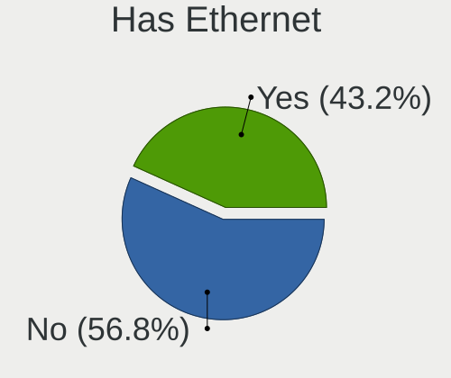

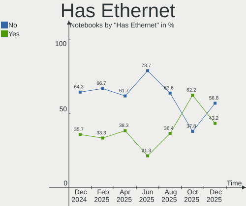

| Presented | Notebooks | Percent |
|-----------|-----------|---------|
| No        | 21        | 56.76%  |
| Yes       | 16        | 43.24%  |

Has WiFi
--------

Has WiFi module

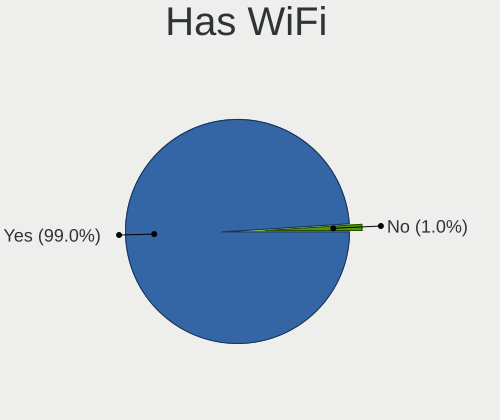

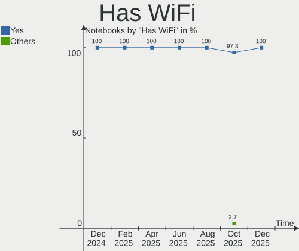

| Presented | Notebooks | Percent |
|-----------|-----------|---------|
| Yes       | 37        | 100%    |

Has Bluetooth
-------------

Has Bluetooth module

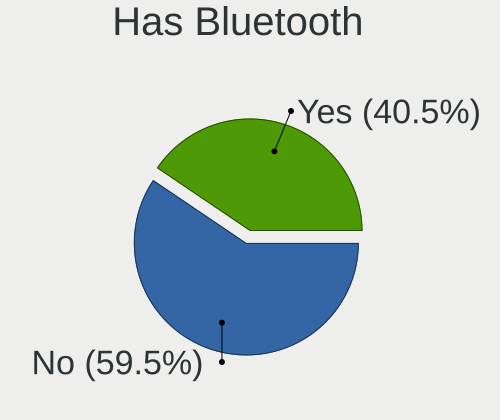

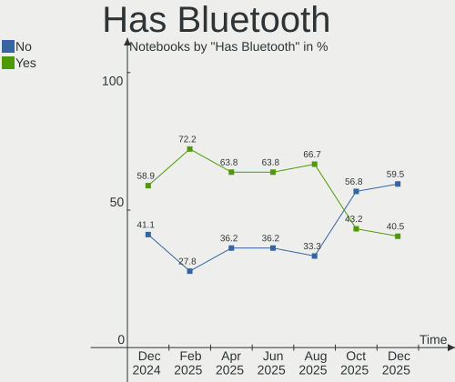

| Presented | Notebooks | Percent |
|-----------|-----------|---------|
| No        | 22        | 59.46%  |
| Yes       | 15        | 40.54%  |

Location
--------

Country
-------

Geographic location (country)

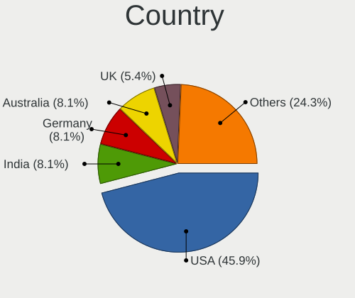

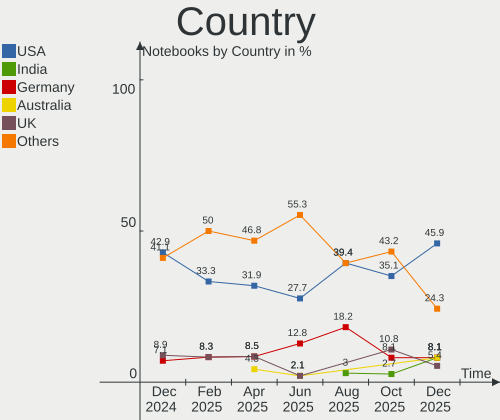

| Country     | Notebooks | Percent |
|-------------|-----------|---------|
| USA         | 17        | 45.95%  |
| India       | 3         | 8.11%   |
| Germany     | 3         | 8.11%   |
| Australia   | 3         | 8.11%   |
| UK          | 2         | 5.41%   |
| Canada      | 2         | 5.41%   |
| Vietnam     | 1         | 2.7%    |
| UAE         | 1         | 2.7%    |
| Switzerland | 1         | 2.7%    |
| Russia      | 1         | 2.7%    |
| Poland      | 1         | 2.7%    |
| Mexico      | 1         | 2.7%    |
| Finland     | 1         | 2.7%    |

City
----

Geographic location (city)

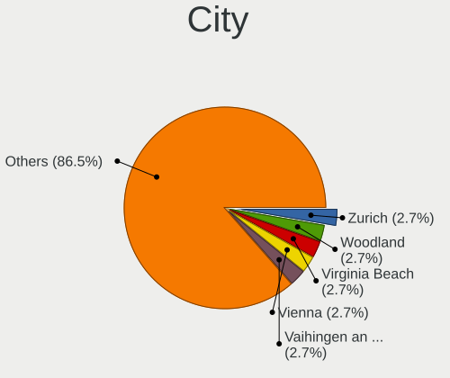

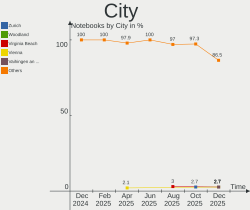

| City                     | Notebooks | Percent |
|--------------------------|-----------|---------|
| Zurich                   | 1         | 2.7%    |
| Woodland                 | 1         | 2.7%    |
| Virginia Beach           | 1         | 2.7%    |
| Vienna                   | 1         | 2.7%    |
| Vaihingen an der Enz     | 1         | 2.7%    |
| Tra Vinh                 | 1         | 2.7%    |
| Tlajomulco de Zuniga     | 1         | 2.7%    |
| Sydney                   | 1         | 2.7%    |
| Stafford                 | 1         | 2.7%    |
| Shawnee                  | 1         | 2.7%    |
| Rochester                | 1         | 2.7%    |
| Reading                  | 1         | 2.7%    |
| Pune                     | 1         | 2.7%    |
| Prince George            | 1         | 2.7%    |
| Phoenix                  | 1         | 2.7%    |
| Petropavlovsk-Kamchatsky | 1         | 2.7%    |
| Pegnitz                  | 1         | 2.7%    |
| Oshawa                   | 1         | 2.7%    |
| Novi                     | 1         | 2.7%    |
| New Concord              | 1         | 2.7%    |
| Naperville               | 1         | 2.7%    |
| Muskego                  | 1         | 2.7%    |
| Merrick                  | 1         | 2.7%    |
| Melbourne                | 1         | 2.7%    |
| Lilienthal               | 1         | 2.7%    |
| Las Vegas                | 1         | 2.7%    |
| Krakow                   | 1         | 2.7%    |
| Jabalpur                 | 1         | 2.7%    |
| Hyderabad                | 1         | 2.7%    |
| Hickory                  | 1         | 2.7%    |
| Helsinki                 | 1         | 2.7%    |
| Hattiesburg              | 1         | 2.7%    |
| Dubai                    | 1         | 2.7%    |
| Chicago                  | 1         | 2.7%    |
| Brisbane                 | 1         | 2.7%    |
| Atlanta                  | 1         | 2.7%    |
| Allentown                | 1         | 2.7%    |

Drives
------

Drive Vendor
------------

Hard drive vendors

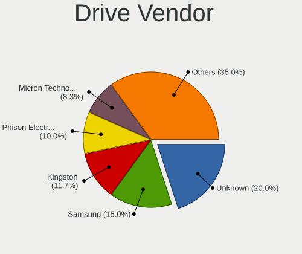

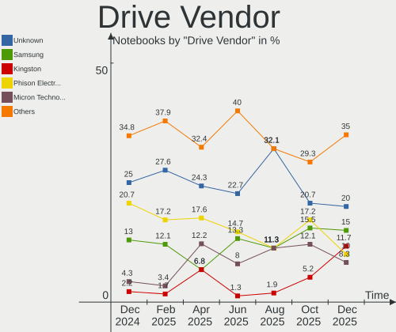

| Vendor                      | Notebooks | Drives | Percent |
|-----------------------------|-----------|--------|---------|
| Unknown                     | 12        | 12     | 20%     |
| Samsung Electronics         | 9         | 9      | 15%     |
| Kingston                    | 7         | 7      | 11.67%  |
| Phison Electronics          | 6         | 6      | 10%     |
| Micron Technology           | 5         | 5      | 8.33%   |
| Kingston Technology Company | 5         | 5      | 8.33%   |
| Unknown                     | 5         | 5      | 8.33%   |
| SK hynix                    | 2         | 2      | 3.33%   |
| JMicron Technology          | 2         | 2      | 3.33%   |
| Seagate                     | 1         | 1      | 1.67%   |
| Sandisk                     | 1         | 1      | 1.67%   |
| Phison                      | 1         | 1      | 1.67%   |
| Micron/Crucial Technology   | 1         | 1      | 1.67%   |
| KIOXIA                      | 1         | 1      | 1.67%   |
| Intenso                     | 1         | 1      | 1.67%   |
| External                    | 1         | 1      | 1.67%   |

Drive Model
-----------

Hard drive models

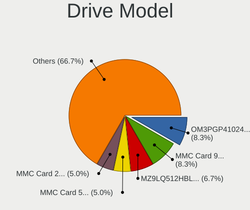

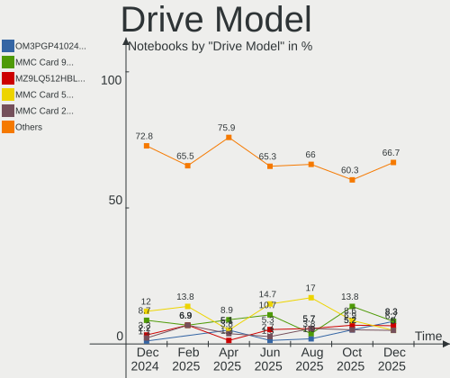

| Model                                       | Notebooks | Percent |
|---------------------------------------------|-----------|---------|
| Kingston OM3PGP41024P-A0 1TB                | 5         | 8.33%   |
| Unknown                                     | 5         | 8.33%   |
| Samsung MZ9LQ512HBLU-00BVL 512GB            | 4         | 6.67%   |
| Unknown MMC Card  512GB                     | 3         | 5%      |
| Unknown MMC Card  256GB                     | 3         | 5%      |
| Unknown MMC Card  128GB                     | 3         | 5%      |
| Kingston Company OM3PDP3 NVMe SSD 256GB     | 3         | 5%      |
| Phison PS5013 E13 NVMe Controller 500GB     | 2         | 3.33%   |
| Micron 2500_MTFDKBK512QGN 512GB             | 2         | 3.33%   |
| Kingston OM3PGP4512Q-A0 512GB               | 2         | 3.33%   |
| JMicron Tech 250GB                          | 2         | 3.33%   |
| Unknown MMC Card  8GB                       | 1         | 1.67%   |
| Unknown MMC Card  3GB                       | 1         | 1.67%   |
| Unknown MMC Card  1TB                       | 1         | 1.67%   |
| SK hynix PC801 NVMe 1TB                     | 1         | 1.67%   |
| SK hynix BC711 NVMe 512GB                   | 1         | 1.67%   |
| Seagate BUP Slim BK 2TB                     | 1         | 1.67%   |
| Sandisk WD PC SN740 SDDPTQE-2T00 2TB        | 1         | 1.67%   |
| Samsung SSD 860 EVO 250GB                   | 1         | 1.67%   |
| Samsung SSD 850 EVO 500GB                   | 1         | 1.67%   |
| Samsung PM991a NVMe 512GB                   | 1         | 1.67%   |
| Samsung MZ9L41T0HBLB-00AVL 1024GB           | 1         | 1.67%   |
| Samsung BM9C1 512GB                         | 1         | 1.67%   |
| Phison Sabrent Rocket Q4 2TB                | 1         | 1.67%   |
| Phison Sabrent SB-2130-1TB                  | 1         | 1.67%   |
| Phison PCIe SSD 500GB                       | 1         | 1.67%   |
| Phison ESMP001TKB5C3-E19TS 1024GB           | 1         | 1.67%   |
| Phison Corsair MP600 ELITE 2TB              | 1         | 1.67%   |
| Micron/Crucial CT2000P310SSD2 2TB           | 1         | 1.67%   |
| Micron MTFDKBA512QGN-1BN1AABHA 512GB        | 1         | 1.67%   |
| Micron 2500_MTFDKBK1T0QGN 1024GB            | 1         | 1.67%   |
| Micron 2400_MTFDKBK1T0QFM 1024GB            | 1         | 1.67%   |
| KIOXIA KBG50ZNS1T02 1024GB                  | 1         | 1.67%   |
| Kingston Company U-SNS8154P3 NVMe SSD 256GB | 1         | 1.67%   |
| Kingston Company OM3SGP4512K2-A00 512GB     | 1         | 1.67%   |
| Intenso USB 3.0 device 1TB                  | 1         | 1.67%   |
| External USB3.0 250GB                       | 1         | 1.67%   |

HDD Vendor
----------

Hard disk drive vendors

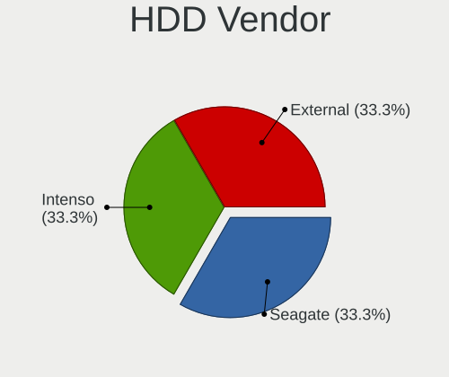

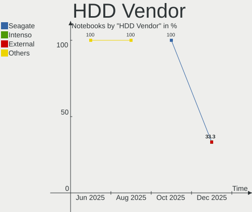

| Vendor   | Notebooks | Drives | Percent |
|----------|-----------|--------|---------|
| Seagate  | 1         | 1      | 33.33%  |
| Intenso  | 1         | 1      | 33.33%  |
| External | 1         | 1      | 33.33%  |

SSD Vendor
----------

Solid state drive vendors

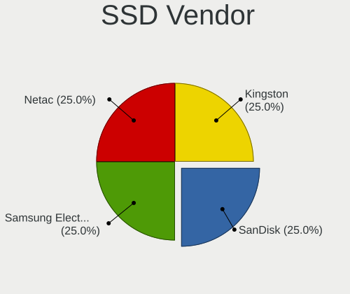

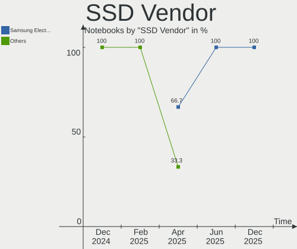

| Vendor              | Notebooks | Drives | Percent |
|---------------------|-----------|--------|---------|
| Samsung Electronics | 2         | 2      | 100%    |

Drive Kind
----------

HDD or SSD

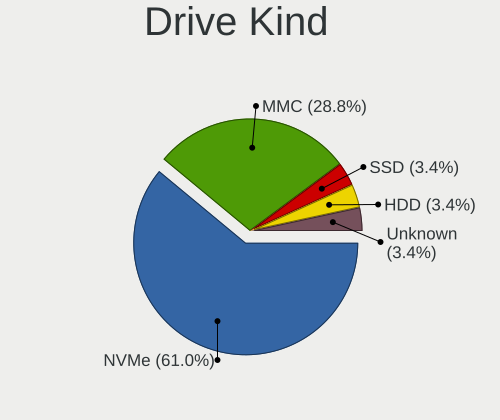

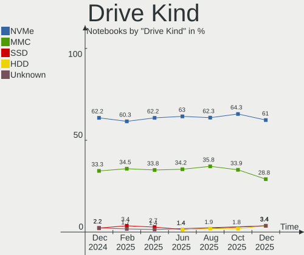

| Kind    | Notebooks | Drives | Percent |
|---------|-----------|--------|---------|
| NVMe    | 36        | 36     | 61.02%  |
| MMC     | 17        | 17     | 28.81%  |
| SSD     | 2         | 2      | 3.39%   |
| HDD     | 2         | 3      | 3.39%   |
| Unknown | 2         | 2      | 3.39%   |

Drive Connector
---------------

SATA, SAS, NVMe, etc.

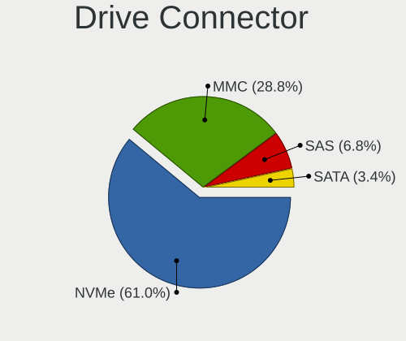

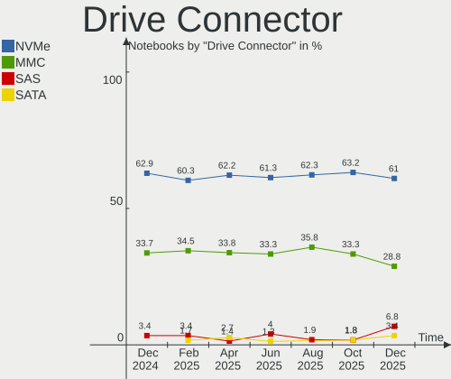

| Type | Notebooks | Drives | Percent |
|------|-----------|--------|---------|
| NVMe | 36        | 36     | 61.02%  |
| MMC  | 17        | 17     | 28.81%  |
| SAS  | 4         | 5      | 6.78%   |
| SATA | 2         | 2      | 3.39%   |

Drive Size
----------

Size of hard drive

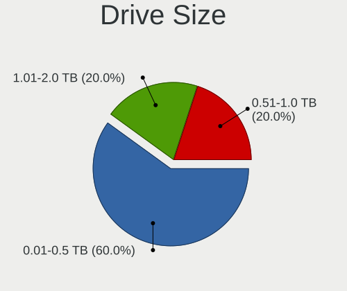

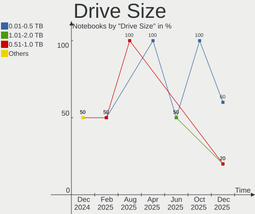

| Size in TB | Notebooks | Drives | Percent |
|------------|-----------|--------|---------|
| 0.01-0.5   | 3         | 3      | 60%     |
| 1.01-2.0   | 1         | 1      | 20%     |
| 0.51-1.0   | 1         | 1      | 20%     |

Space Total
-----------

Amount of disk space available on the file system

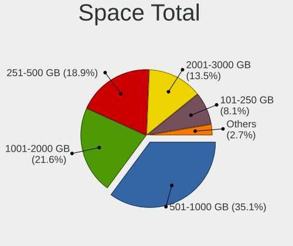

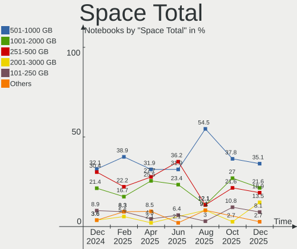

| Size in GB | Notebooks | Percent |
|------------|-----------|---------|
| 501-1000   | 13        | 35.14%  |
| 1001-2000  | 8         | 21.62%  |
| 251-500    | 7         | 18.92%  |
| 2001-3000  | 5         | 13.51%  |
| 101-250    | 3         | 8.11%   |
| 51-100     | 1         | 2.7%    |

Space Used
----------

Amount of used disk space

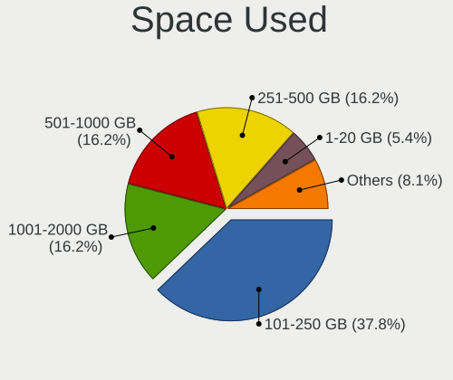

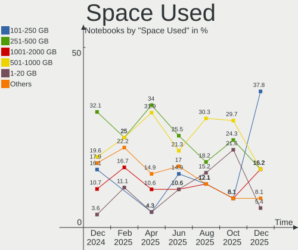

| Used GB   | Notebooks | Percent |
|-----------|-----------|---------|
| 101-250   | 14        | 37.84%  |
| 251-500   | 6         | 16.22%  |
| 1001-2000 | 6         | 16.22%  |
| 501-1000  | 6         | 16.22%  |
| 1-20      | 2         | 5.41%   |
| 21-50     | 1         | 2.7%    |
| 2001-3000 | 1         | 2.7%    |
| 51-100    | 1         | 2.7%    |

Malfunc. Drives
---------------

Drive models with a malfunction

Zero info for selected period =(

Malfunc. Drive Vendor
---------------------

Vendors of faulty drives

Zero info for selected period =(

Malfunc. HDD Vendor
-------------------

Vendors of faulty HDD drives

Zero info for selected period =(

Malfunc. Drive Kind
-------------------

Kinds of faulty drives

Zero info for selected period =(

Failed Drives
-------------

Failed drive models

Zero info for selected period =(

Failed Drive Vendor
-------------------

Failed drive vendors

Zero info for selected period =(

Drive Status
------------

Number of failed and malfunc. drives

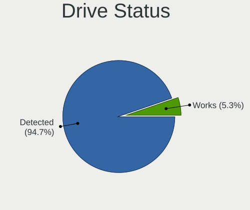

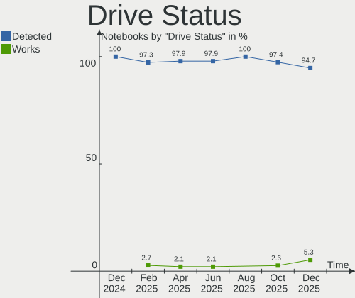

| Status   | Notebooks | Drives | Percent |
|----------|-----------|--------|---------|
| Detected | 36        | 58     | 94.74%  |
| Works    | 2         | 2      | 5.26%   |

Storage controller
------------------

Storage Vendor
--------------

Storage controller vendors

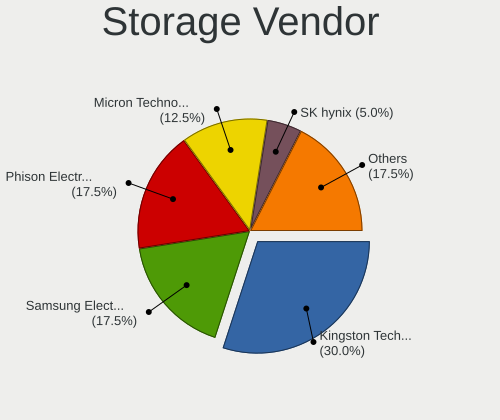

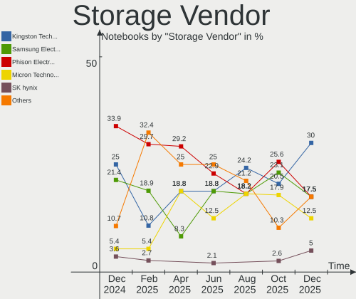

| Vendor                      | Notebooks | Percent |
|-----------------------------|-----------|---------|
| Kingston Technology Company | 12        | 30%     |
| Samsung Electronics         | 7         | 17.5%   |
| Phison Electronics          | 7         | 17.5%   |
| Micron Technology           | 5         | 12.5%   |
| SK hynix                    | 2         | 5%      |
| Intel                       | 2         | 5%      |
| AMD                         | 2         | 5%      |
| Sandisk                     | 1         | 2.5%    |
| Micron/Crucial Technology   | 1         | 2.5%    |
| KIOXIA                      | 1         | 2.5%    |

Storage Model
-------------

Storage controller models

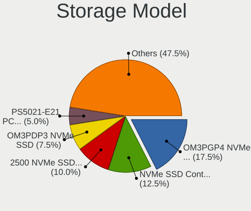

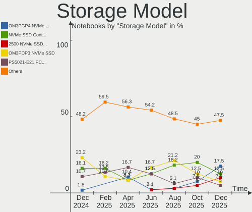

| Model                                                   | Notebooks | Percent |
|---------------------------------------------------------|-----------|---------|
| Kingston Company OM3PGP4 NVMe SSD (DRAM-less)           | 7         | 17.5%   |
| Samsung NVMe SSD Controller 980 (DRAM-less)             | 5         | 12.5%   |
| Micron 2500 NVMe SSD (DRAM-less)                        | 4         | 10%     |
| Kingston Company OM3PDP3 NVMe SSD                       | 3         | 7.5%    |
| Phison PS5021-E21 PCIe4 NVMe Controller (DRAM-less)     | 2         | 5%      |
| Phison PS5019-E19 PCIe4 NVMe Controller (DRAM-less)     | 2         | 5%      |
| Phison PS5013-E13 PCIe3 NVMe Controller (DRAM-less)     | 2         | 5%      |
| SK hynix Platinum P41/PC801 NVMe Solid State Drive      | 1         | 2.5%    |
| SK hynix Gold P31/BC711/PC711 NVMe Solid State Drive    | 1         | 2.5%    |
| Sandisk PC SN740 NVMe SSD (DRAM-less)                   | 1         | 2.5%    |
| Samsung NVMe SSD Controller PM9B1 (DRAM-less)           | 1         | 2.5%    |
| Samsung BM9C1 QLC NVME SSD (DRAM-less)                  | 1         | 2.5%    |
| Phison PS5027-E27T PCIe4 NVMe Controller (DRAM-less)    | 1         | 2.5%    |
| Micron/Crucial P310 NVMe PCIe SSD (DRAM-less)           | 1         | 2.5%    |
| Micron 2400 NVMe SSD (DRAM-less)                        | 1         | 2.5%    |
| KIOXIA NVMe SSD Controller BG5 (DRAM-less)              | 1         | 2.5%    |
| Kingston Company Company Non-Volatile memory controller | 1         | 2.5%    |
| Kingston Company A1000/U-SNS8154P3 x2 NVMe SSD [E8]     | 1         | 2.5%    |
| Intel Sunrise Point-LP SATA Controller [AHCI mode]      | 1         | 2.5%    |
| Intel 82801 Mobile SATA Controller [RAID mode]          | 1         | 2.5%    |
| AMD FCH SATA Controller [AHCI mode]                     | 1         | 2.5%    |
| AMD 600 Series Chipset SATA Controller                  | 1         | 2.5%    |

Storage Kind
------------

Kind of storage controller (IDE, SATA, NVMe, SAS, ...)

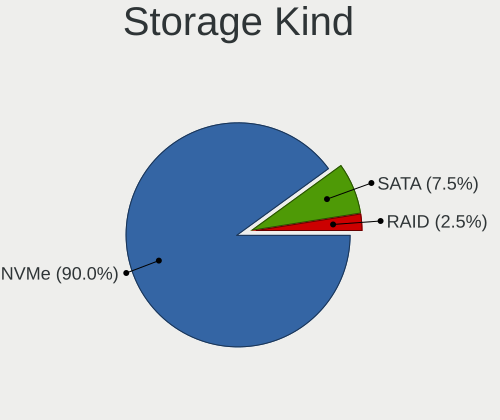

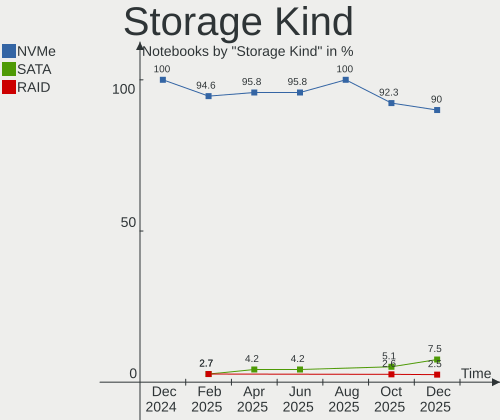

| Kind | Notebooks | Percent |
|------|-----------|---------|
| NVMe | 36        | 90%     |
| SATA | 3         | 7.5%    |
| RAID | 1         | 2.5%    |

Processor
---------

CPU Vendor
----------

Processor vendors

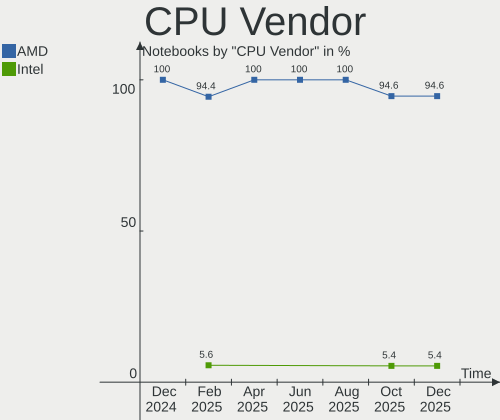

| Vendor | Notebooks | Percent |
|--------|-----------|---------|
| AMD    | 35        | 94.59%  |
| Intel  | 2         | 5.41%   |

CPU Model
---------

Processor models

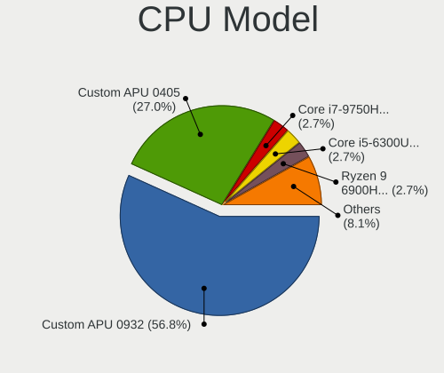

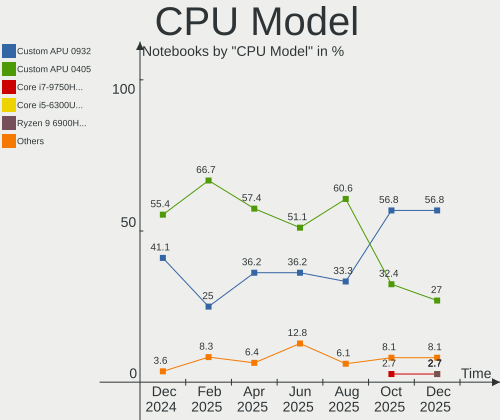

| Model                                   | Notebooks | Percent |
|-----------------------------------------|-----------|---------|
| AMD Custom APU 0932                     | 21        | 56.76%  |
| AMD Custom APU 0405                     | 10        | 27.03%  |
| Intel Core i7-9750H CPU @ 2.60GHz       | 1         | 2.7%    |
| Intel Core i5-6300U CPU @ 2.40GHz       | 1         | 2.7%    |
| AMD Ryzen 9 6900HX with Radeon Graphics | 1         | 2.7%    |
| AMD Ryzen 5 9600X 6-Core Processor      | 1         | 2.7%    |
| AMD Ryzen 5 5600H with Radeon Graphics  | 1         | 2.7%    |
| AMD Ryzen 5 4600H with Radeon Graphics  | 1         | 2.7%    |

CPU Model Family
----------------

Processor model prefix

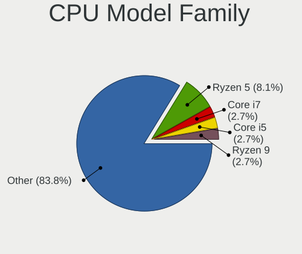

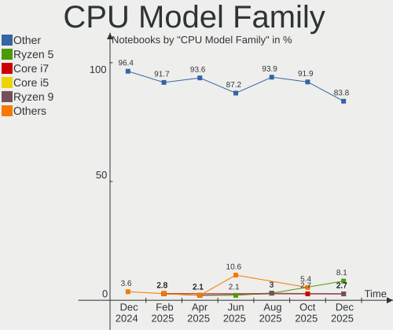

| Model         | Notebooks | Percent |
|---------------|-----------|---------|
| Other         | 31        | 83.78%  |
| AMD Ryzen 5   | 3         | 8.11%   |
| Intel Core i7 | 1         | 2.7%    |
| Intel Core i5 | 1         | 2.7%    |
| AMD Ryzen 9   | 1         | 2.7%    |

CPU Cores
---------

Number of processor cores

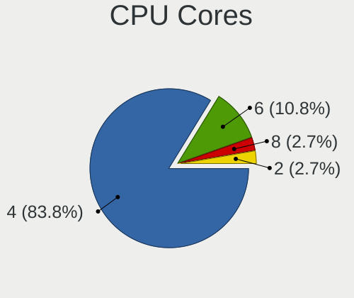

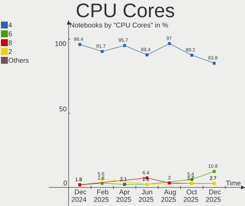

| Number | Notebooks | Percent |
|--------|-----------|---------|
| 4      | 31        | 83.78%  |
| 6      | 4         | 10.81%  |
| 8      | 1         | 2.7%    |
| 2      | 1         | 2.7%    |

CPU Sockets
-----------

Number of sockets

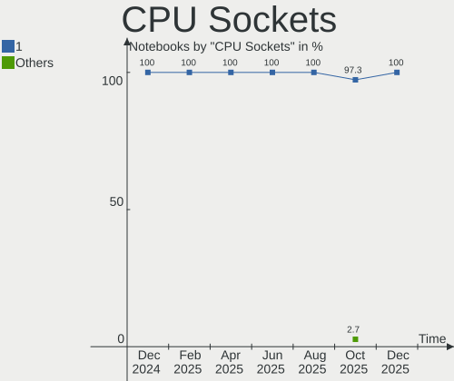

| Number | Notebooks | Percent |
|--------|-----------|---------|
| 1      | 37        | 100%    |

CPU Threads
-----------

Threads per core (Hyper-Threading)

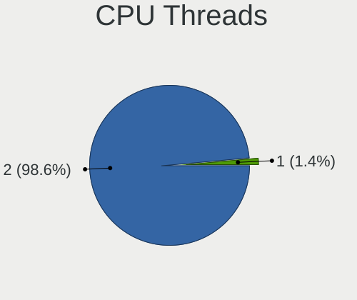

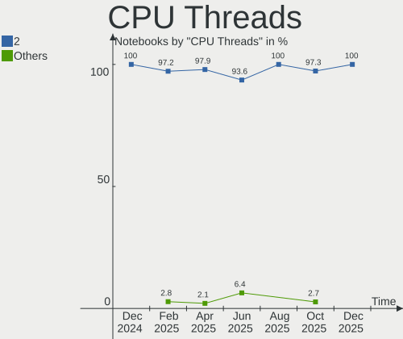

| Number | Notebooks | Percent |
|--------|-----------|---------|
| 2      | 37        | 100%    |

CPU Op-Modes
------------

CPU Operation Modes (32-bit, 64-bit)

| Op mode        | Notebooks | Percent |
|----------------|-----------|---------|
| 32-bit, 64-bit | 37        | 100%    |

CPU Microcode
-------------

Microcode number

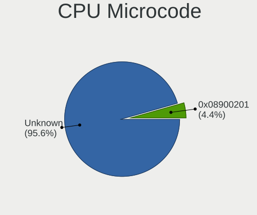

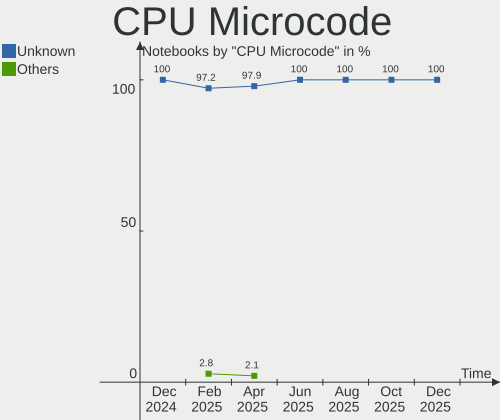

| Number  | Notebooks | Percent |
|---------|-----------|---------|
| Unknown | 37        | 100%    |

CPU Microarch
-------------

Microarchitecture

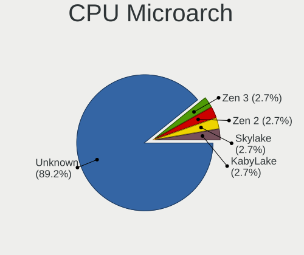

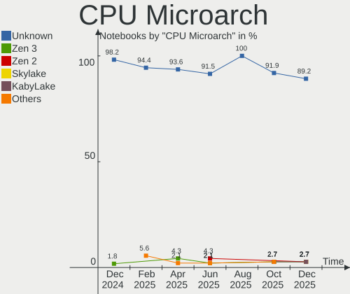

| Name     | Notebooks | Percent |
|----------|-----------|---------|
| Unknown  | 33        | 89.19%  |
| Zen 3    | 1         | 2.7%    |
| Zen 2    | 1         | 2.7%    |
| Skylake  | 1         | 2.7%    |
| KabyLake | 1         | 2.7%    |

Graphics
--------

GPU Vendor
----------

Vendors of graphics cards

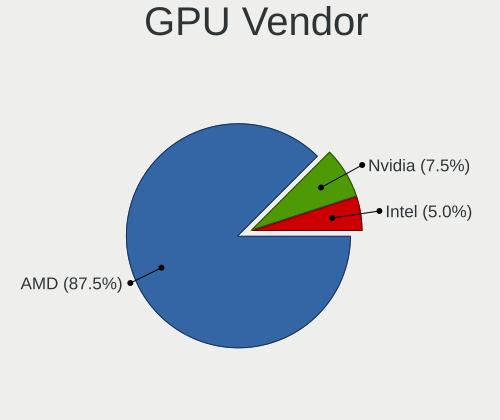

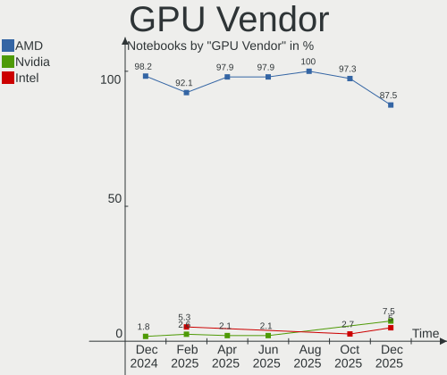

| Vendor | Notebooks | Percent |
|--------|-----------|---------|
| AMD    | 35        | 87.5%   |
| Nvidia | 3         | 7.5%    |
| Intel  | 2         | 5%      |

GPU Model
---------

Graphics card models

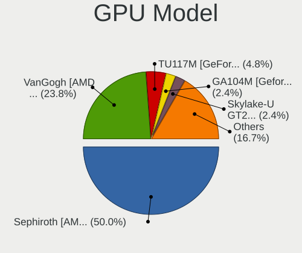

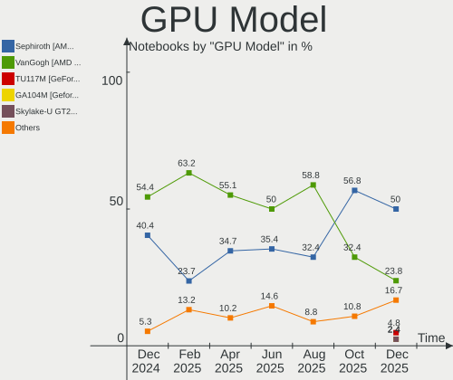

| Model                                                                 | Notebooks | Percent |
|-----------------------------------------------------------------------|-----------|---------|
| AMD Sephiroth [AMD Custom GPU 0405]                                   | 21        | 50%     |
| AMD VanGogh [AMD Custom GPU 0405]                                     | 10        | 23.81%  |
| Nvidia TU117M [GeForce GTX 1650 Mobile / Max-Q]                       | 2         | 4.76%   |
| Nvidia GA104M [Geforce RTX 3070 Ti Laptop GPU]                        | 1         | 2.38%   |
| Intel Skylake-U GT2 [HD Graphics 520]                                 | 1         | 2.38%   |
| Intel CoffeeLake-H GT2 [UHD Graphics 630]                             | 1         | 2.38%   |
| AMD Renoir [Radeon Vega Series / Radeon Vega Mobile Series]           | 1         | 2.38%   |
| AMD Rembrandt [Radeon 680M]                                           | 1         | 2.38%   |
| AMD Navi 33 [Radeon RX 7600/7600 XT/7600M XT/7600S/7700S / PRO W7600] | 1         | 2.38%   |
| AMD Navi 24 [Radeon RX 6400/6500 XT/6500M]                            | 1         | 2.38%   |
| AMD Granite Ridge [Radeon Graphics]                                   | 1         | 2.38%   |
| AMD Cezanne [Radeon Vega Series / Radeon Vega Mobile Series]          | 1         | 2.38%   |

GPU Combo
---------

Combinations of graphics cards

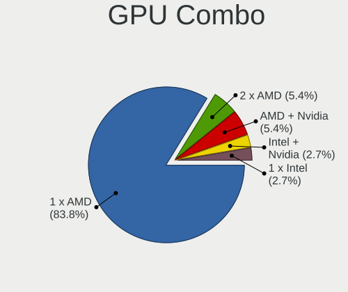

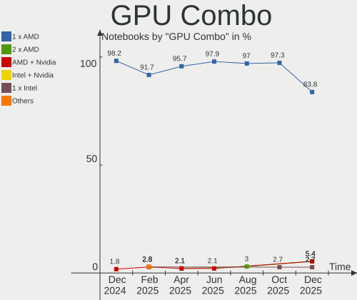

| Name           | Notebooks | Percent |
|----------------|-----------|---------|
| 1 x AMD        | 31        | 83.78%  |
| 2 x AMD        | 2         | 5.41%   |
| AMD + Nvidia   | 2         | 5.41%   |
| Intel + Nvidia | 1         | 2.7%    |
| 1 x Intel      | 1         | 2.7%    |

GPU Driver
----------

Free vs proprietary

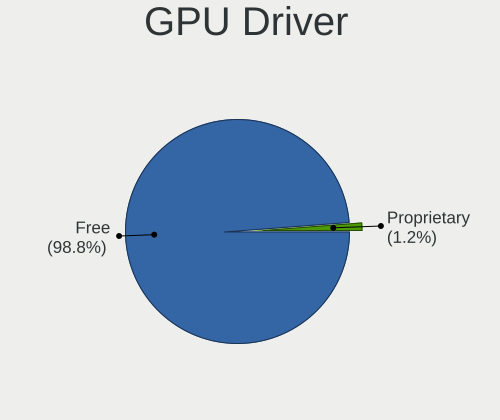

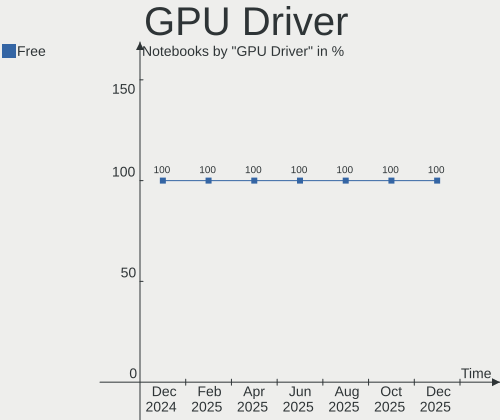

| Driver | Notebooks | Percent |
|--------|-----------|---------|
| Free   | 37        | 100%    |

GPU Memory
----------

Total video memory

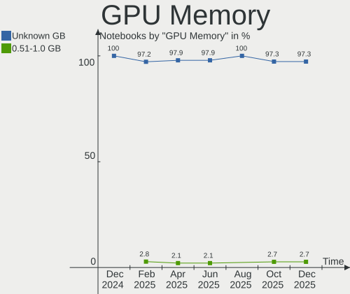

| Size in GB | Notebooks | Percent |
|------------|-----------|---------|
| Unknown    | 36        | 97.3%   |
| 0.51-1.0   | 1         | 2.7%    |

Monitor
-------

Monitor Vendor
--------------

Monitor vendors

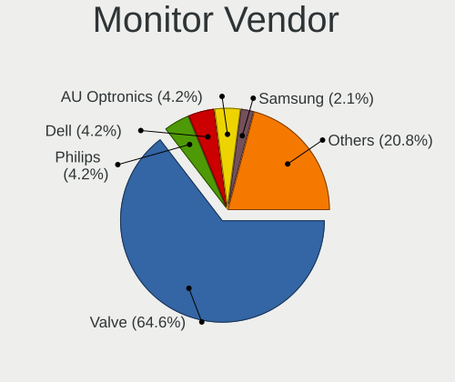

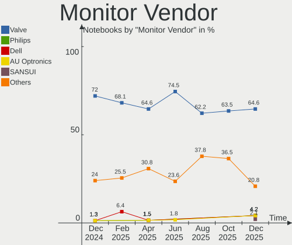

| Vendor              | Notebooks | Percent |
|---------------------|-----------|---------|
| Valve               | 31        | 64.58%  |
| Philips             | 2         | 4.17%   |
| Dell                | 2         | 4.17%   |
| AU Optronics        | 2         | 4.17%   |
| SANSUI              | 1         | 2.08%   |
| Samsung Electronics | 1         | 2.08%   |
| PANDA               | 1         | 2.08%   |
| NEC Computers       | 1         | 2.08%   |
| MSI                 | 1         | 2.08%   |
| HUAWEI              | 1         | 2.08%   |
| Hewlett-Packard     | 1         | 2.08%   |
| Chimei Innolux      | 1         | 2.08%   |
| BOE                 | 1         | 2.08%   |
| BenQ                | 1         | 2.08%   |
| AOpen               | 1         | 2.08%   |

Monitor Model
-------------

Monitor models

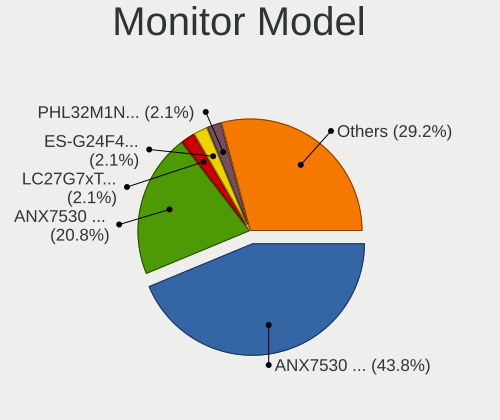

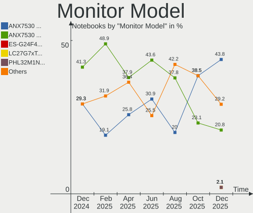

| Model                                                              | Notebooks | Percent |
|--------------------------------------------------------------------|-----------|---------|
| Valve ANX7530 U VLV3003 800x1280 100x160mm 7.4-inch                | 21        | 43.75%  |
| Valve ANX7530 U VLV3001 800x1280 100x150mm 7.1-inch                | 10        | 20.83%  |
| SANSUI ES-G24F4M XEC2380 1920x1080 409x230mm 18.5-inch             | 1         | 2.08%   |
| Samsung Electronics LC27G7xT SAM105E 2560x1440 597x336mm 27.0-inch | 1         | 2.08%   |
| Philips PHL32M1N5800A PHLC277 3840x2160 697x392mm 31.5-inch        | 1         | 2.08%   |
| Philips FTV PHL04C3 1920x1080 1440x810mm 65.0-inch                 | 1         | 2.08%   |
| PANDA LCD Monitor NCP004D 1920x1080 344x194mm 15.5-inch            | 1         | 2.08%   |
| NEC Computers EA234WMi NEC6921 1920x1080 509x286mm 23.0-inch       | 1         | 2.08%   |
| MSI G32C4X MSI4DA6 1920x1080 698x393mm 31.5-inch                   | 1         | 2.08%   |
| HUAWEI SSN-24 HWV6E4E 1920x1080 527x296mm 23.8-inch                | 1         | 2.08%   |
| Hewlett-Packard Z38c HPN3411 3840x1600 880x367mm 37.5-inch         | 1         | 2.08%   |
| Dell S2721D DELA19A 2560x1440 597x336mm 27.0-inch                  | 1         | 2.08%   |
| Dell P2012H DEL4078 1600x900 443x249mm 20.0-inch                   | 1         | 2.08%   |
| Chimei Innolux LCD Monitor CMN1778 1920x1080 381x214mm 17.2-inch   | 1         | 2.08%   |
| BOE LCD Monitor BOE094A 1920x1080 344x194mm 15.5-inch              | 1         | 2.08%   |
| BenQ BL2706HT BNQ8029 1920x1080 598x336mm 27.0-inch                | 1         | 2.08%   |
| AU Optronics LCD Monitor AUO5799 1920x1080 344x194mm 15.5-inch     | 1         | 2.08%   |
| AU Optronics LCD Monitor AUO35ED 1920x1080 344x193mm 15.5-inch     | 1         | 2.08%   |
| AOpen 27HC5R V AOP091C 1920x1080 597x336mm 27.0-inch               | 1         | 2.08%   |

Monitor Resolution
------------------

Monitor screen resolution

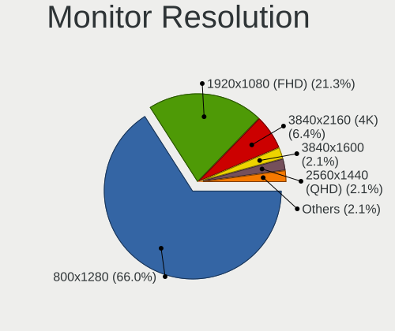

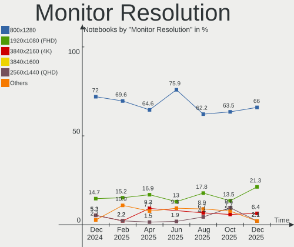

| Resolution      | Notebooks | Percent |
|-----------------|-----------|---------|
| 800x1280        | 31        | 65.96%  |
| 1920x1080 (FHD) | 10        | 21.28%  |
| 3840x2160 (4K)  | 3         | 6.38%   |
| 3840x1600       | 1         | 2.13%   |
| 2560x1440 (QHD) | 1         | 2.13%   |
| 1600x900 (HD+)  | 1         | 2.13%   |

Monitor Diagonal
----------------

Diagonal size in inches

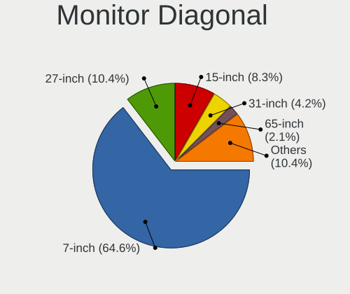

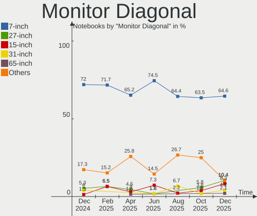

| Inches | Notebooks | Percent |
|--------|-----------|---------|
| 7      | 31        | 64.58%  |
| 27     | 5         | 10.42%  |
| 15     | 4         | 8.33%   |
| 31     | 2         | 4.17%   |
| 65     | 1         | 2.08%   |
| 37     | 1         | 2.08%   |
| 24     | 1         | 2.08%   |
| 23     | 1         | 2.08%   |
| 20     | 1         | 2.08%   |
| 17     | 1         | 2.08%   |

Monitor Width
-------------

Physical width

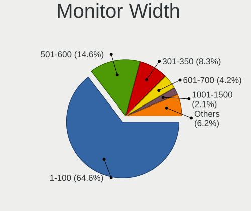

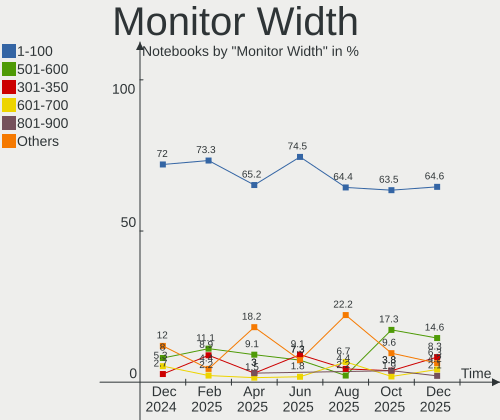

| Width in mm | Notebooks | Percent |
|-------------|-----------|---------|
| 1-100       | 31        | 64.58%  |
| 501-600     | 7         | 14.58%  |
| 301-350     | 4         | 8.33%   |
| 601-700     | 2         | 4.17%   |
| 801-900     | 1         | 2.08%   |
| 401-500     | 1         | 2.08%   |
| 351-400     | 1         | 2.08%   |
| 1001-1500   | 1         | 2.08%   |

Aspect Ratio
------------

Proportional relationship between the width and the height

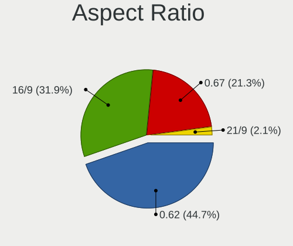

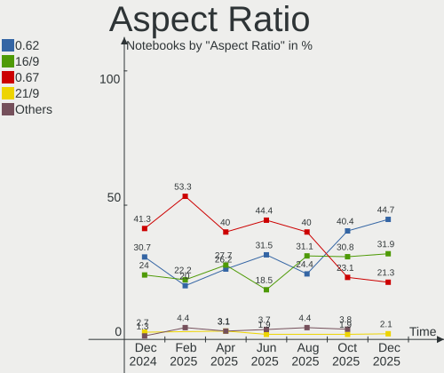

| Ratio | Notebooks | Percent |
|-------|-----------|---------|
| 0.62  | 21        | 44.68%  |
| 16/9  | 15        | 31.91%  |
| 0.67  | 10        | 21.28%  |
| 21/9  | 1         | 2.13%   |

Monitor Area
------------

Area in inch²

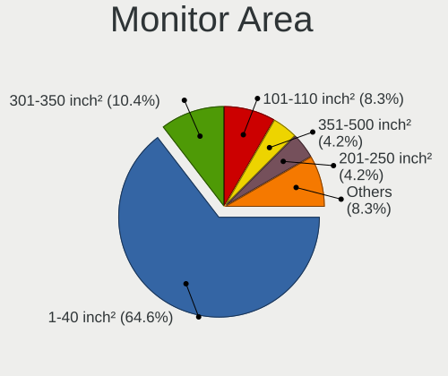

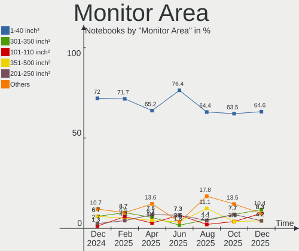

| Area in inch² | Notebooks | Percent |
|----------------|-----------|---------|
| 1-40           | 31        | 64.58%  |
| 301-350        | 5         | 10.42%  |
| 101-110        | 4         | 8.33%   |
| 351-500        | 2         | 4.17%   |
| 201-250        | 2         | 4.17%   |
| More than 1000 | 1         | 2.08%   |
| 151-200        | 1         | 2.08%   |
| 121-130        | 1         | 2.08%   |
| 501-1000       | 1         | 2.08%   |

Pixel Density
-------------

Pixels per inch

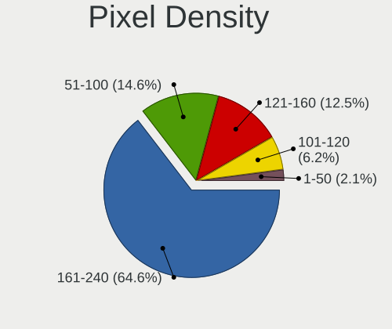

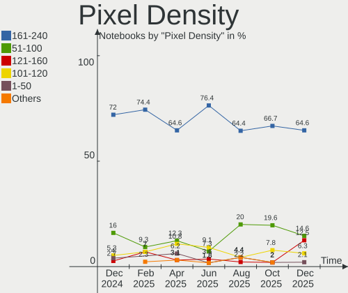

| Density | Notebooks | Percent |
|---------|-----------|---------|
| 161-240 | 31        | 64.58%  |
| 51-100  | 7         | 14.58%  |
| 121-160 | 6         | 12.5%   |
| 101-120 | 3         | 6.25%   |
| 1-50    | 1         | 2.08%   |

Multiple Monitors
-----------------

Total monitors connected

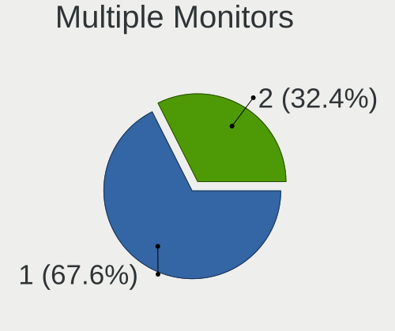

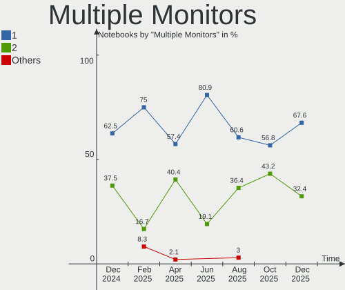

| Total | Notebooks | Percent |
|-------|-----------|---------|
| 1     | 25        | 67.57%  |
| 2     | 12        | 32.43%  |

Network
-------

Net Controller Vendor
---------------------

Controller vendors

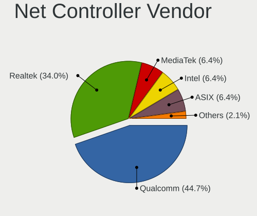

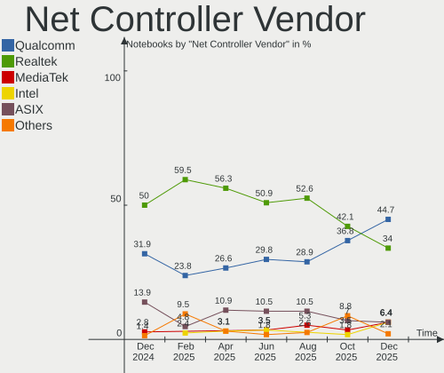

| Vendor                | Notebooks | Percent |
|-----------------------|-----------|---------|
| Qualcomm              | 21        | 44.68%  |
| Realtek Semiconductor | 16        | 34.04%  |
| MediaTek              | 3         | 6.38%   |
| Intel                 | 3         | 6.38%   |
| ASIX Electronics      | 3         | 6.38%   |
| DisplayLink           | 1         | 2.13%   |

Net Controller Model
--------------------

Controller models

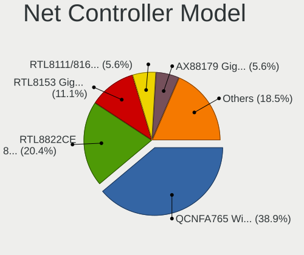

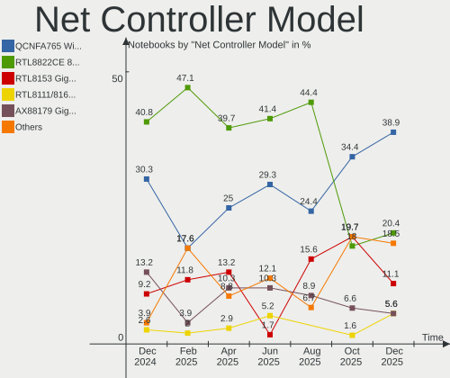

| Model                                                                  | Notebooks | Percent |
|------------------------------------------------------------------------|-----------|---------|
| Qualcomm QCNFA765 Wireless Network Adapter                             | 21        | 38.89%  |
| Realtek RTL8822CE 802.11ac PCIe Wireless Network Adapter               | 11        | 20.37%  |
| Realtek RTL8153 Gigabit Ethernet Adapter                               | 6         | 11.11%  |
| Realtek RTL8111/8168/8211/8411 PCI Express Gigabit Ethernet Controller | 3         | 5.56%   |
| ASIX AX88179 Gigabit Ethernet                                          | 3         | 5.56%   |
| MediaTek MT7921 802.11ax PCIe Wireless Network Adapter [Filogic 330]   | 2         | 3.7%    |
| Realtek RTL8152 Fast Ethernet Adapter                                  | 1         | 1.85%   |
| Realtek RTL8125 2.5GbE Controller                                      | 1         | 1.85%   |
| MediaTek MT7922 802.11ax PCI Express Wireless Network Adapter          | 1         | 1.85%   |
| Intel Wireless 8260                                                    | 1         | 1.85%   |
| Intel Ethernet Controller I226-V                                       | 1         | 1.85%   |
| Intel Ethernet Connection I219-LM                                      | 1         | 1.85%   |
| Intel Cannon Lake PCH CNVi WiFi                                        | 1         | 1.85%   |
| DisplayLink Plugable UD-3900Z                                          | 1         | 1.85%   |

Wireless Vendor
---------------

Wireless vendors

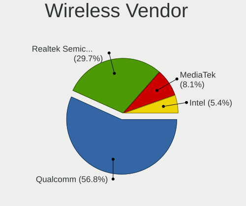

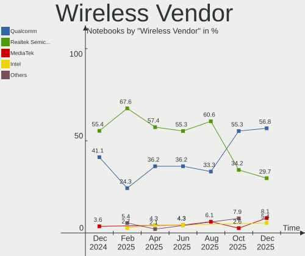

| Vendor                | Notebooks | Percent |
|-----------------------|-----------|---------|
| Qualcomm              | 21        | 56.76%  |
| Realtek Semiconductor | 11        | 29.73%  |
| MediaTek              | 3         | 8.11%   |
| Intel                 | 2         | 5.41%   |

Wireless Model
--------------

Wireless models

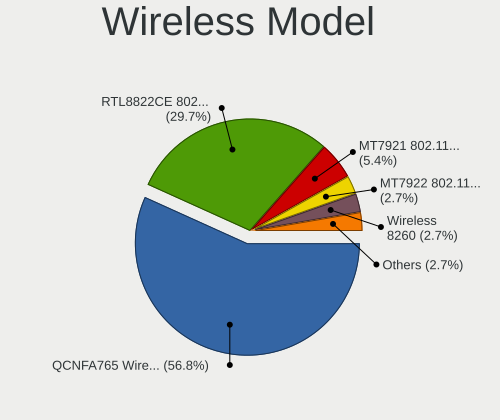

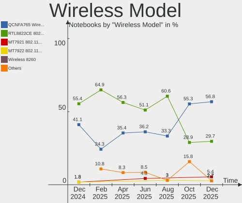

| Model                                                                | Notebooks | Percent |
|----------------------------------------------------------------------|-----------|---------|
| Qualcomm QCNFA765 Wireless Network Adapter                           | 21        | 56.76%  |
| Realtek RTL8822CE 802.11ac PCIe Wireless Network Adapter             | 11        | 29.73%  |
| MediaTek MT7921 802.11ax PCIe Wireless Network Adapter [Filogic 330] | 2         | 5.41%   |
| MediaTek MT7922 802.11ax PCI Express Wireless Network Adapter        | 1         | 2.7%    |
| Intel Wireless 8260                                                  | 1         | 2.7%    |
| Intel Cannon Lake PCH CNVi WiFi                                      | 1         | 2.7%    |

Ethernet Vendor
---------------

Ethernet vendors

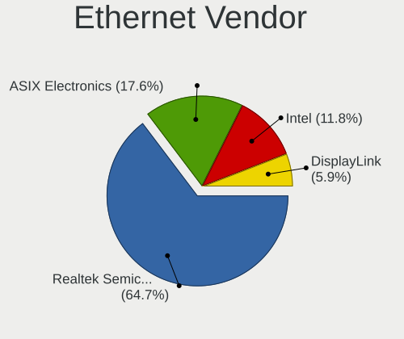

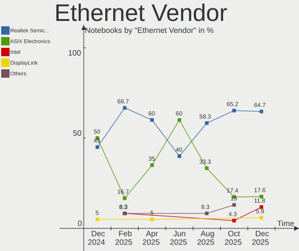

| Vendor                | Notebooks | Percent |
|-----------------------|-----------|---------|
| Realtek Semiconductor | 11        | 64.71%  |
| ASIX Electronics      | 3         | 17.65%  |
| Intel                 | 2         | 11.76%  |
| DisplayLink           | 1         | 5.88%   |

Ethernet Model
--------------

Ethernet models

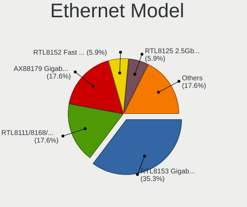

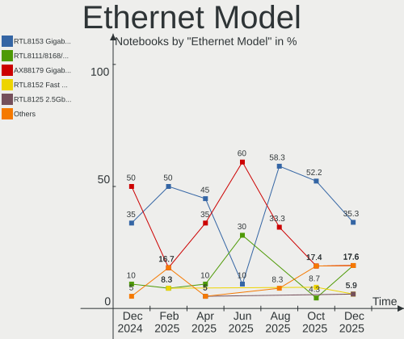

| Model                                                                  | Notebooks | Percent |
|------------------------------------------------------------------------|-----------|---------|
| Realtek RTL8153 Gigabit Ethernet Adapter                               | 6         | 35.29%  |
| Realtek RTL8111/8168/8211/8411 PCI Express Gigabit Ethernet Controller | 3         | 17.65%  |
| ASIX AX88179 Gigabit Ethernet                                          | 3         | 17.65%  |
| Realtek RTL8152 Fast Ethernet Adapter                                  | 1         | 5.88%   |
| Realtek RTL8125 2.5GbE Controller                                      | 1         | 5.88%   |
| Intel Ethernet Controller I226-V                                       | 1         | 5.88%   |
| Intel Ethernet Connection I219-LM                                      | 1         | 5.88%   |
| DisplayLink Plugable UD-3900Z                                          | 1         | 5.88%   |

Net Controller Kind
-------------------

Ethernet, WiFi or modem

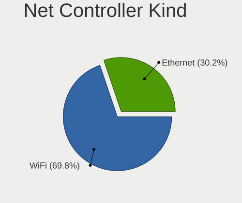

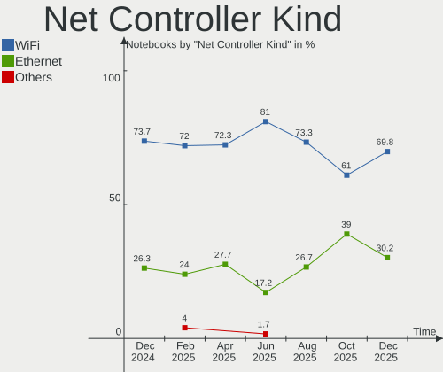

| Kind     | Notebooks | Percent |
|----------|-----------|---------|
| WiFi     | 37        | 69.81%  |
| Ethernet | 16        | 30.19%  |

Used Controller
---------------

Currently used network controller

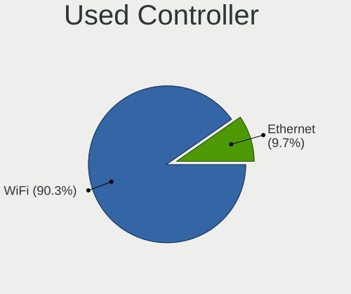

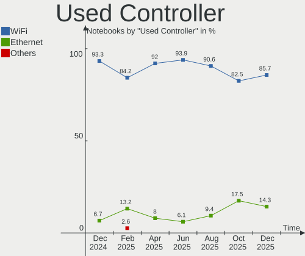

| Kind     | Notebooks | Percent |
|----------|-----------|---------|
| WiFi     | 36        | 85.71%  |
| Ethernet | 6         | 14.29%  |

NICs
----

Total network controllers on board

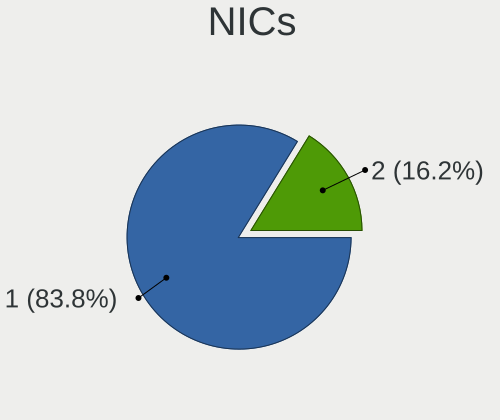

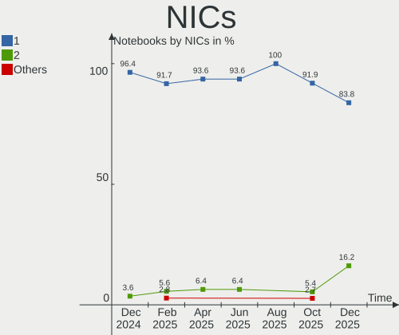

| Total | Notebooks | Percent |
|-------|-----------|---------|
| 1     | 31        | 83.78%  |
| 2     | 6         | 16.22%  |

IPv6
----

IPv6 vs IPv4

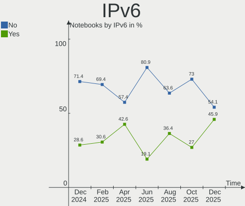

| Used | Notebooks | Percent |
|------|-----------|---------|
| No   | 20        | 54.05%  |
| Yes  | 17        | 45.95%  |

Bluetooth
---------

Bluetooth Vendor
----------------

Controller vendors

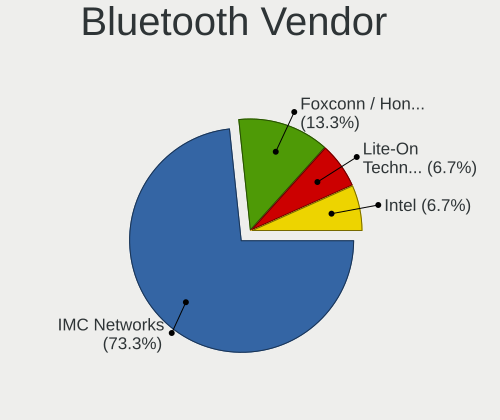

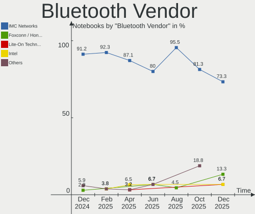

| Vendor             | Notebooks | Percent |
|--------------------|-----------|---------|
| IMC Networks       | 11        | 73.33%  |
| Foxconn / Hon Hai  | 2         | 13.33%  |
| Lite-On Technology | 1         | 6.67%   |
| Intel              | 1         | 6.67%   |

Bluetooth Model
---------------

Controller models

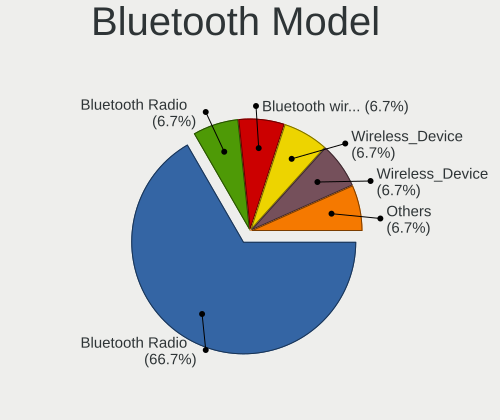

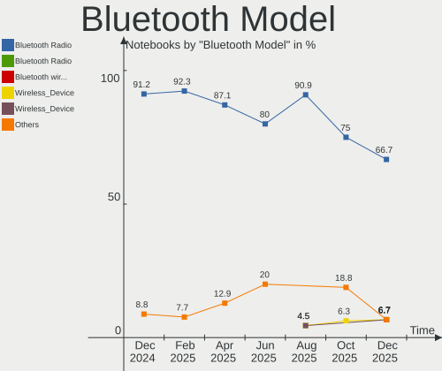

| Model                                       | Notebooks | Percent |
|---------------------------------------------|-----------|---------|
| IMC Networks Bluetooth Radio                | 10        | 66.67%  |
| Lite-On Bluetooth Radio                     | 1         | 6.67%   |
| Intel Bluetooth wireless interface          | 1         | 6.67%   |
| IMC Networks Wireless_Device                | 1         | 6.67%   |
| Foxconn / Hon Hai Wireless_Device           | 1         | 6.67%   |
| Foxconn / Hon Hai MediaTek MT7921 Bluetooth | 1         | 6.67%   |

Sound
-----

Sound Vendor
------------

Sound card vendors

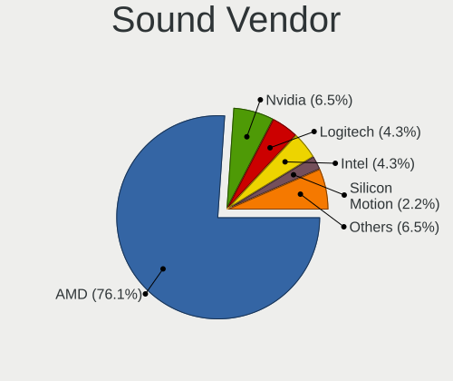

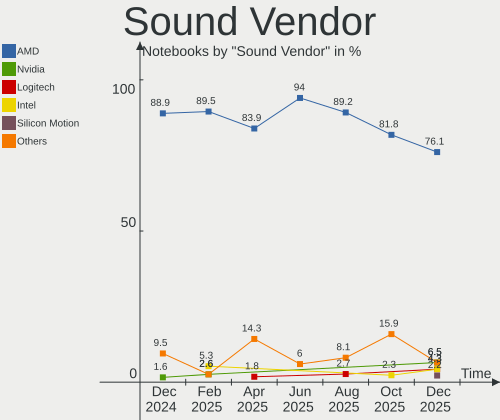

| Vendor                | Notebooks | Percent |
|-----------------------|-----------|---------|
| AMD                   | 35        | 76.09%  |
| Nvidia                | 3         | 6.52%   |
| Logitech              | 2         | 4.35%   |
| Intel                 | 2         | 4.35%   |
| Silicon Motion        | 1         | 2.17%   |
| Realtek Semiconductor | 1         | 2.17%   |
| Hewlett-Packard       | 1         | 2.17%   |
| ASUSTek Computer      | 1         | 2.17%   |

Sound Model
-----------

Sound card models

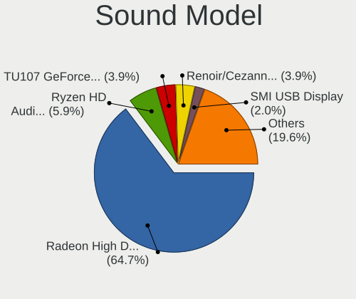

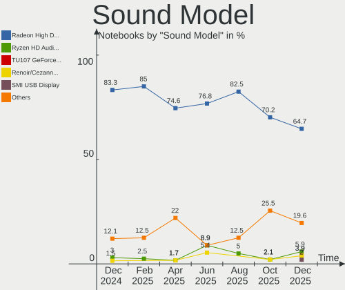

| Model                                                          | Notebooks | Percent |
|----------------------------------------------------------------|-----------|---------|
| AMD Radeon High Definition Audio Controller                    | 33        | 64.71%  |
| AMD Ryzen HD Audio Controller                                  | 3         | 5.88%   |
| Nvidia TU107 GeForce GTX 1650 High Definition Audio Controller | 2         | 3.92%   |
| AMD Renoir/Cezanne HDMI/DP Audio Controller                    | 2         | 3.92%   |
| Silicon Motion SMI USB Display                                 | 1         | 1.96%   |
| Realtek Semiconductor USB Audio                                | 1         | 1.96%   |
| Nvidia GA104 High Definition Audio Controller                  | 1         | 1.96%   |
| Logitech USB Headset                                           | 1         | 1.96%   |
| Logitech G733 Gaming Headset                                   | 1         | 1.96%   |
| Intel Sunrise Point-LP HD Audio                                | 1         | 1.96%   |
| Intel Cannon Lake PCH cAVS                                     | 1         | 1.96%   |
| Hewlett-Packard USB Audio                                      | 1         | 1.96%   |
| ASUSTek Computer USB Audio                                     | 1         | 1.96%   |
| AMD Navi 31 HDMI/DP Audio                                      | 1         | 1.96%   |
| AMD Navi 21/23 HDMI/DP Audio Controller                        | 1         | 1.96%   |

Memory
------

Memory Vendor
-------------

Memory module vendors

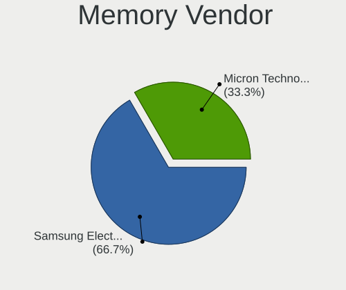

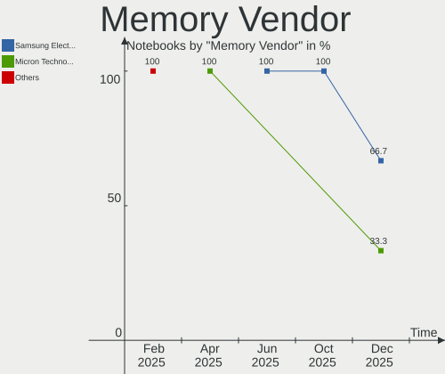

| Vendor              | Notebooks | Percent |
|---------------------|-----------|---------|
| Samsung Electronics | 2         | 66.67%  |
| Micron Technology   | 1         | 33.33%  |

Memory Model
------------

Memory module models

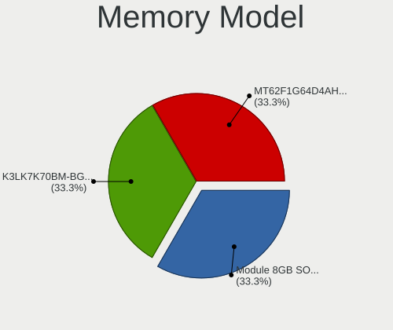

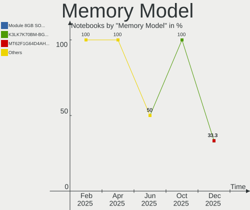

| Model                                                      | Notebooks | Percent |
|------------------------------------------------------------|-----------|---------|
| Samsung RAM Module 8GB SODIMM DDR4 2133MT/s                | 1         | 33.33%  |
| Samsung RAM K3LK7K70BM-BGCP000 4GiB SODIMM LPDDR5 4266MT/s | 1         | 33.33%  |
| Micron RAM MT62F1G64D4AH-023 WT 4GB SODIMM LPDDR5 4266MT/s | 1         | 33.33%  |

Memory Kind
-----------

Memory module kinds

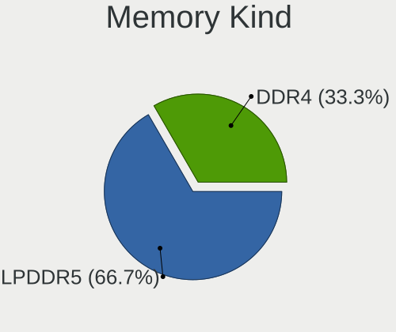

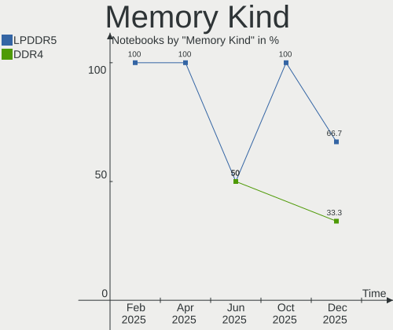

| Kind   | Notebooks | Percent |
|--------|-----------|---------|
| LPDDR5 | 2         | 66.67%  |
| DDR4   | 1         | 33.33%  |

Memory Form Factor
------------------

Physical design of the memory module

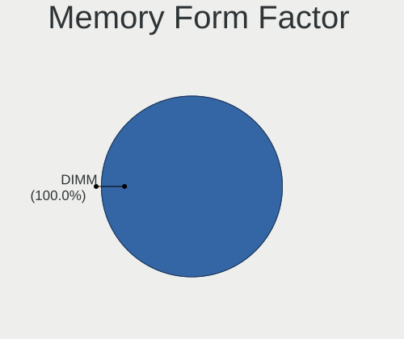

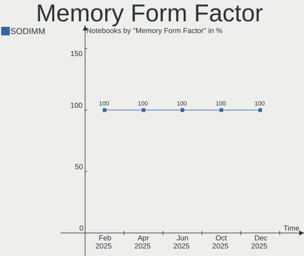

| Name   | Notebooks | Percent |
|--------|-----------|---------|
| SODIMM | 3         | 100%    |

Memory Size
-----------

Memory module size

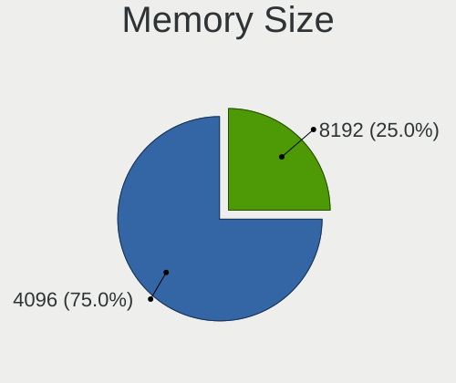

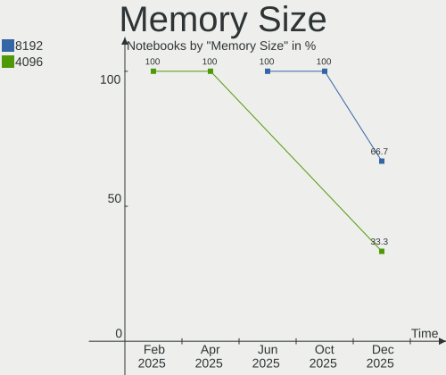

| Size | Notebooks | Percent |
|------|-----------|---------|
| 8192 | 2         | 66.67%  |
| 4096 | 1         | 33.33%  |

Memory Speed
------------

Memory module speed

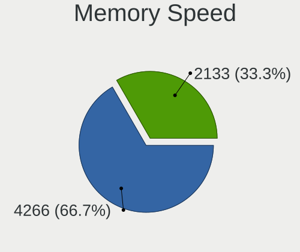

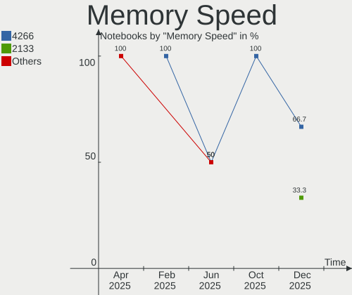

| Speed | Notebooks | Percent |
|-------|-----------|---------|
| 4266  | 2         | 66.67%  |
| 2133  | 1         | 33.33%  |

Printers & scanners
-------------------

Printer Vendor
--------------

Printer device vendors

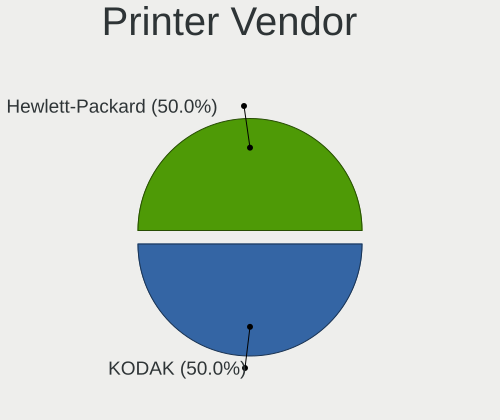

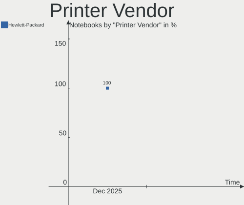

| Vendor          | Notebooks | Percent |
|-----------------|-----------|---------|
| Hewlett-Packard | 1         | 100%    |

Printer Model
-------------

Printer device models

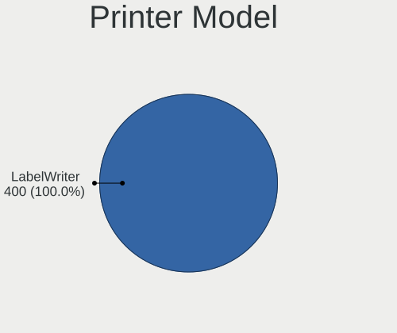

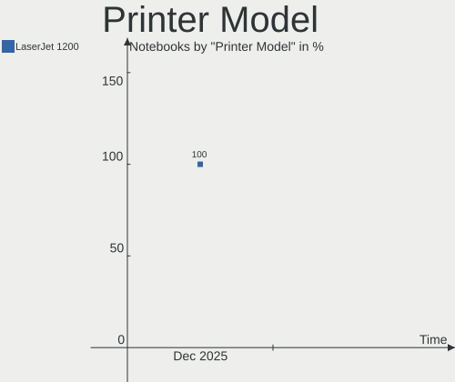

| Model            | Notebooks | Percent |
|------------------|-----------|---------|
| HP LaserJet 1200 | 1         | 100%    |

Scanner Vendor
--------------

Scanner device vendors

Zero info for selected period =(

Scanner Model
-------------

Scanner device models

Zero info for selected period =(

Camera
------

Camera Vendor
-------------

Camera device vendors

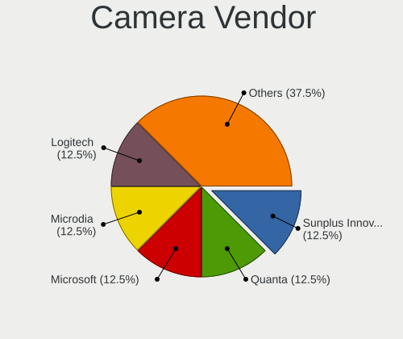

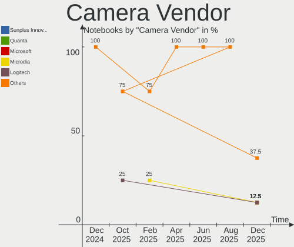

| Vendor                                 | Notebooks | Percent |
|----------------------------------------|-----------|---------|
| Sunplus Innovation Technology          | 1         | 12.5%   |
| Quanta                                 | 1         | 12.5%   |
| Microsoft                              | 1         | 12.5%   |
| Microdia                               | 1         | 12.5%   |
| Logitech                               | 1         | 12.5%   |
| IMC Networks                           | 1         | 12.5%   |
| Chicony Electronics                    | 1         | 12.5%   |
| Cheng Uei Precision Industry (Foxlink) | 1         | 12.5%   |

Camera Model
------------

Camera device models

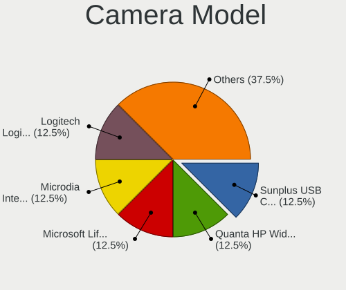

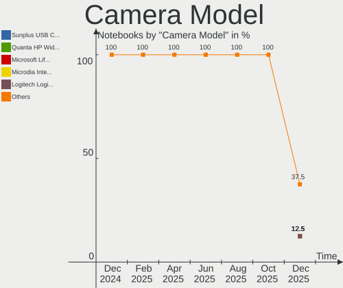

| Model                                               | Notebooks | Percent |
|-----------------------------------------------------|-----------|---------|
| Sunplus USB Camera                                  | 1         | 12.5%   |
| Quanta HP Wide Vision HD Camera                     | 1         | 12.5%   |
| Microsoft LifeCam Cinema                            | 1         | 12.5%   |
| Microdia Integrated_Webcam_HD                       | 1         | 12.5%   |
| Logitech Logitech Webcam C925e                      | 1         | 12.5%   |
| IMC Networks USB2.0 HD UVC WebCam                   | 1         | 12.5%   |
| Chicony HP Wide Vision HD Camera                    | 1         | 12.5%   |
| Cheng Uei Precision Industry (Foxlink) HP HD Camera | 1         | 12.5%   |

Security
--------

Fingerprint Vendor
------------------

Fingerprint sensor vendors

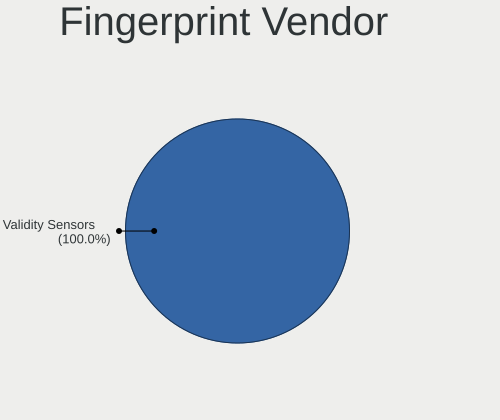

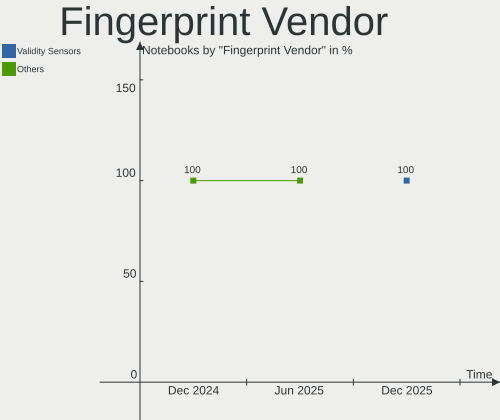

| Vendor           | Notebooks | Percent |
|------------------|-----------|---------|
| Validity Sensors | 1         | 100%    |

Fingerprint Model
-----------------

Fingerprint sensor models

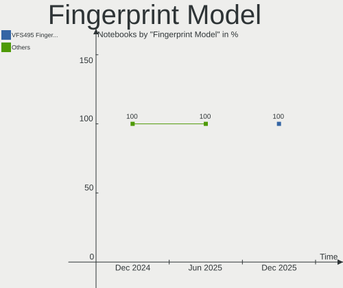

| Model                                      | Notebooks | Percent |
|--------------------------------------------|-----------|---------|
| Validity Sensors VFS495 Fingerprint Reader | 1         | 100%    |

Chipcard Vendor
---------------

Chipcard module vendors

Zero info for selected period =(

Chipcard Model
--------------

Chipcard module models

Zero info for selected period =(

Unsupported
-----------

Unsupported Devices
-------------------

Total unsupported devices on board

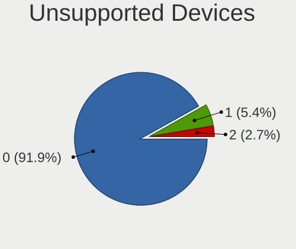

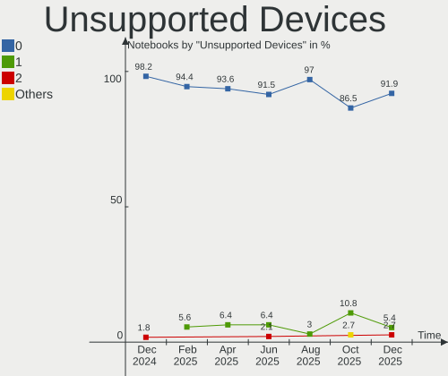

| Total | Notebooks | Percent |
|-------|-----------|---------|
| 0     | 34        | 91.89%  |
| 1     | 2         | 5.41%   |
| 2     | 1         | 2.7%    |

Unsupported Device Types
------------------------

Types of unsupported devices

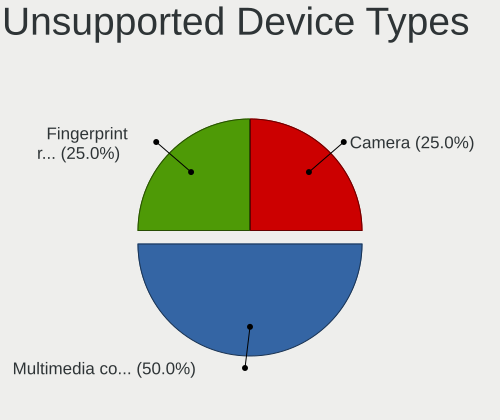

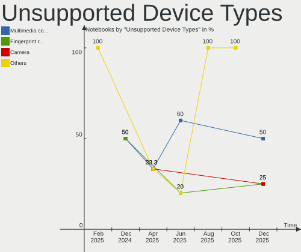

| Type                  | Notebooks | Percent |
|-----------------------|-----------|---------|
| Multimedia controller | 2         | 50%     |
| Fingerprint reader    | 1         | 25%     |
| Camera                | 1         | 25%     |

