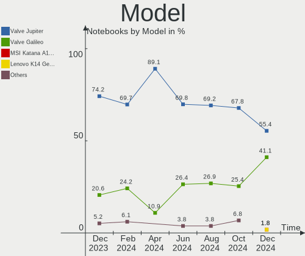
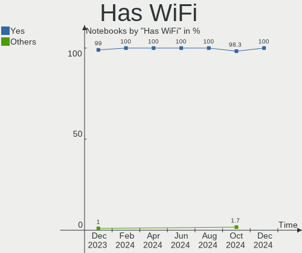
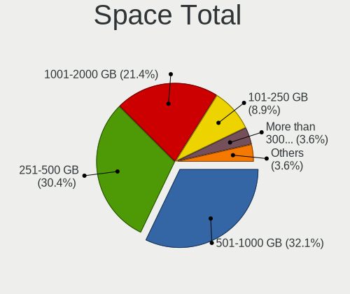
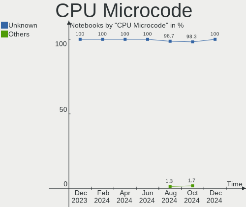
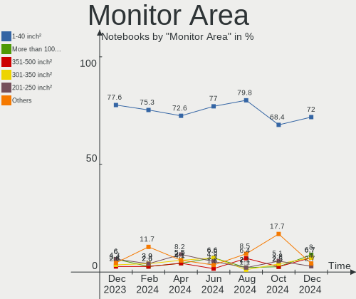
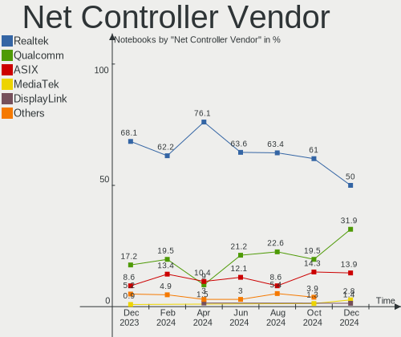
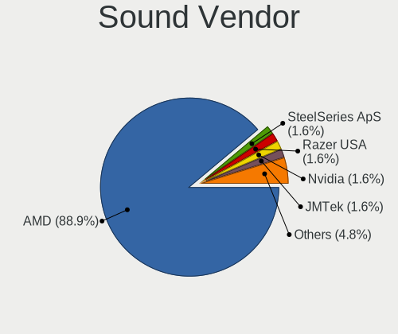
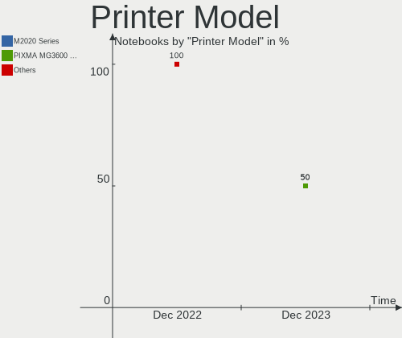

SteamOS - Hardware Trends (Notebooks)
-------------------------------------

A project to identify most popular hardware characteristics and track their change
over time based on data collected by Linux users at https://Linux-Hardware.org.

Anyone can contribute to this report by the [hw-probe](https://github.com/linuxhw/hw-probe) tool:

    sudo -E hw-probe -all -upload

This report is for one last month. Overall report since the beginning of time: [TestDays](https://github.com/linuxhw/TestDays)

Period: Nov, 2023.

Contents
--------

* [ System ](#system)
  - [ OS                       ](#os)
  - [ OS Family                ](#os-family)
  - [ Kernel                   ](#kernel)
  - [ Kernel Family            ](#kernel-family)
  - [ Kernel Major Ver.        ](#kernel-major-ver)
  - [ Arch                     ](#arch)
  - [ DE                       ](#de)
  - [ Display Server           ](#display-server)
  - [ Display Manager          ](#display-manager)
  - [ OS Lang                  ](#os-lang)
  - [ Boot Mode                ](#boot-mode)
  - [ Filesystem               ](#filesystem)
  - [ Part. scheme             ](#part-scheme)
  - [ Dual Boot with Linux/BSD ](#dual-boot-with-linuxbsd)
  - [ Dual Boot (Win)          ](#dual-boot-win)

* [ Board ](#board)
  - [ Vendor                   ](#vendor)
  - [ Model                    ](#model)
  - [ Model Family             ](#model-family)
  - [ MFG Year                 ](#mfg-year)
  - [ Form Factor              ](#form-factor)
  - [ Secure Boot              ](#secure-boot)
  - [ Coreboot                 ](#coreboot)
  - [ RAM Size                 ](#ram-size)
  - [ RAM Used                 ](#ram-used)
  - [ Total Drives             ](#total-drives)
  - [ Has CD-ROM               ](#has-cd-rom)
  - [ Has Ethernet             ](#has-ethernet)
  - [ Has WiFi                 ](#has-wifi)
  - [ Has Bluetooth            ](#has-bluetooth)

* [ Location ](#location)
  - [ Country                  ](#country)
  - [ City                     ](#city)

* [ Drives ](#drives)
  - [ Drive Vendor             ](#drive-vendor)
  - [ Drive Model              ](#drive-model)
  - [ HDD Vendor               ](#hdd-vendor)
  - [ SSD Vendor               ](#ssd-vendor)
  - [ Drive Kind               ](#drive-kind)
  - [ Drive Connector          ](#drive-connector)
  - [ Drive Size               ](#drive-size)
  - [ Space Total              ](#space-total)
  - [ Space Used               ](#space-used)
  - [ Malfunc. Drives          ](#malfunc-drives)
  - [ Malfunc. Drive Vendor    ](#malfunc-drive-vendor)
  - [ Malfunc. HDD Vendor      ](#malfunc-hdd-vendor)
  - [ Malfunc. Drive Kind      ](#malfunc-drive-kind)
  - [ Failed Drives            ](#failed-drives)
  - [ Failed Drive Vendor      ](#failed-drive-vendor)
  - [ Drive Status             ](#drive-status)

* [ Storage controller ](#storage-controller)
  - [ Storage Vendor           ](#storage-vendor)
  - [ Storage Model            ](#storage-model)
  - [ Storage Kind             ](#storage-kind)

* [ Processor ](#processor)
  - [ CPU Vendor               ](#cpu-vendor)
  - [ CPU Model                ](#cpu-model)
  - [ CPU Model Family         ](#cpu-model-family)
  - [ CPU Cores                ](#cpu-cores)
  - [ CPU Sockets              ](#cpu-sockets)
  - [ CPU Threads              ](#cpu-threads)
  - [ CPU Op-Modes             ](#cpu-op-modes)
  - [ CPU Microcode            ](#cpu-microcode)
  - [ CPU Microarch            ](#cpu-microarch)

* [ Graphics ](#graphics)
  - [ GPU Vendor               ](#gpu-vendor)
  - [ GPU Model                ](#gpu-model)
  - [ GPU Combo                ](#gpu-combo)
  - [ GPU Driver               ](#gpu-driver)
  - [ GPU Memory               ](#gpu-memory)

* [ Monitor ](#monitor)
  - [ Monitor Vendor           ](#monitor-vendor)
  - [ Monitor Model            ](#monitor-model)
  - [ Monitor Resolution       ](#monitor-resolution)
  - [ Monitor Diagonal         ](#monitor-diagonal)
  - [ Monitor Width            ](#monitor-width)
  - [ Aspect Ratio             ](#aspect-ratio)
  - [ Monitor Area             ](#monitor-area)
  - [ Pixel Density            ](#pixel-density)
  - [ Multiple Monitors        ](#multiple-monitors)

* [ Network ](#network)
  - [ Net Controller Vendor    ](#net-controller-vendor)
  - [ Net Controller Model     ](#net-controller-model)
  - [ Wireless Vendor          ](#wireless-vendor)
  - [ Wireless Model           ](#wireless-model)
  - [ Ethernet Vendor          ](#ethernet-vendor)
  - [ Ethernet Model           ](#ethernet-model)
  - [ Net Controller Kind      ](#net-controller-kind)
  - [ Used Controller          ](#used-controller)
  - [ NICs                     ](#nics)
  - [ IPv6                     ](#ipv6)

* [ Bluetooth ](#bluetooth)
  - [ Bluetooth Vendor         ](#bluetooth-vendor)
  - [ Bluetooth Model          ](#bluetooth-model)

* [ Sound ](#sound)
  - [ Sound Vendor             ](#sound-vendor)
  - [ Sound Model              ](#sound-model)

* [ Memory ](#memory)
  - [ Memory Vendor            ](#memory-vendor)
  - [ Memory Model             ](#memory-model)
  - [ Memory Kind              ](#memory-kind)
  - [ Memory Form Factor       ](#memory-form-factor)
  - [ Memory Size              ](#memory-size)
  - [ Memory Speed             ](#memory-speed)

* [ Printers & scanners ](#printers--scanners)
  - [ Printer Vendor           ](#printer-vendor)
  - [ Printer Model            ](#printer-model)
  - [ Scanner Vendor           ](#scanner-vendor)
  - [ Scanner Model            ](#scanner-model)

* [ Camera ](#camera)
  - [ Camera Vendor            ](#camera-vendor)
  - [ Camera Model             ](#camera-model)

* [ Security ](#security)
  - [ Fingerprint Vendor       ](#fingerprint-vendor)
  - [ Fingerprint Model        ](#fingerprint-model)
  - [ Chipcard Vendor          ](#chipcard-vendor)
  - [ Chipcard Model           ](#chipcard-model)

* [ Unsupported ](#unsupported)
  - [ Unsupported Devices      ](#unsupported-devices)
  - [ Unsupported Device Types ](#unsupported-device-types)

System
------

OS
--

Installed operating systems

| Name           | Notebooks | Percent |
|----------------|-----------|---------|
| SteamOS 3.4.11 | 24        | 27.59%  |
| SteamOS 3.5.7  | 23        | 26.44%  |
| SteamOS 3.5.5  | 22        | 25.29%  |
| SteamOS 3.6    | 5         | 5.75%   |
| SteamOS 3.5.6  | 3         | 3.45%   |
| SteamOS 3.5.1  | 3         | 3.45%   |
| SteamOS 3.4.8  | 3         | 3.45%   |
| SteamOS 3.5.3  | 2         | 2.3%    |
| SteamOS 4      | 1         | 1.15%   |
| SteamOS 3.1    | 1         | 1.15%   |

OS Family
---------

OS without a version

| Name    | Notebooks | Percent |
|---------|-----------|---------|
| SteamOS | 87        | 100%    |

Kernel
------

Version of the Linux kernel

| Version                                        | Notebooks | Percent |
|------------------------------------------------|-----------|---------|
| 6.1.52-valve7-1-neptune-61                     | 25        | 28.74%  |
| 5.13.0-valve37-1-neptune                       | 24        | 27.59%  |
| 6.1.52-valve9-1-neptune-61                     | 23        | 26.44%  |
| 6.1.52-valve3-1-neptune-61                     | 3         | 3.45%   |
| 6.1.52-valve2-1-neptune-61                     | 3         | 3.45%   |
| 5.13.0-valve36-1-neptune                       | 3         | 3.45%   |
| 6.1.52-valve6-1-neptune-61                     | 2         | 2.3%    |
| 6.1.52-valve5-1-neptune-61                     | 2         | 2.3%    |
| 6.3.7-zen1-1-zen                               | 1         | 1.15%   |
| 5.13.0-valve10.3-1-neptune-02176-g5fe416c4acd8 | 1         | 1.15%   |

Kernel Family
-------------

Linux kernel without a distro release

| Version | Notebooks | Percent |
|---------|-----------|---------|
| 6.1.52  | 58        | 66.67%  |
| 5.13.0  | 28        | 32.18%  |
| 6.3.7   | 1         | 1.15%   |

Kernel Major Ver.
-----------------

Linux kernel major version

| Version | Notebooks | Percent |
|---------|-----------|---------|
| 6.1     | 58        | 66.67%  |
| 5.13    | 28        | 32.18%  |
| 6.3     | 1         | 1.15%   |

Arch
----

OS architecture (x86_64, i586, etc.)

| Name   | Notebooks | Percent |
|--------|-----------|---------|
| x86_64 | 87        | 100%    |

DE
--

Desktop Environment

| Name      | Notebooks | Percent |
|-----------|-----------|---------|
| KDE5      | 86        | 98.85%  |
| gamescope | 1         | 1.15%   |

Display Server
--------------

X11 or Wayland

| Name | Notebooks | Percent |
|------|-----------|---------|
| X11  | 87        | 100%    |

Display Manager
---------------

SDDM, LightDM, etc.

| Name    | Notebooks | Percent |
|---------|-----------|---------|
| Unknown | 87        | 100%    |

OS Lang
-------

Language

| Lang  | Notebooks | Percent |
|-------|-----------|---------|
| en_US | 73        | 83.91%  |
| ru_RU | 4         | 4.6%    |
| de_DE | 4         | 4.6%    |
| es_ES | 2         | 2.3%    |
| zh_CN | 1         | 1.15%   |
| pt_BR | 1         | 1.15%   |
| hu_HU | 1         | 1.15%   |
| en_GB | 1         | 1.15%   |

Boot Mode
---------

EFI or BIOS

| Mode | Notebooks | Percent |
|------|-----------|---------|
| BIOS | 87        | 100%    |

Filesystem
----------

Type of filesystem

| Type  | Notebooks | Percent |
|-------|-----------|---------|
| Btrfs | 86        | 98.85%  |
| Tmpfs | 1         | 1.15%   |

Part. scheme
------------

Scheme of partitioning

| Type    | Notebooks | Percent |
|---------|-----------|---------|
| Unknown | 87        | 100%    |

Dual Boot with Linux/BSD
------------------------

Hosting more than one Linux/BSD

| Dual boot | Notebooks | Percent |
|-----------|-----------|---------|
| No        | 87        | 100%    |

Dual Boot (Win)
---------------

Hosting Linux and Windows

| Dual boot | Notebooks | Percent |
|-----------|-----------|---------|
| No        | 87        | 100%    |

Board
-----

Vendor
------

Motherboard manufacturer

| Name                | Notebooks | Percent |
|---------------------|-----------|---------|
| Valve               | 85        | 97.7%   |
| Gigabyte Technology | 1         | 1.15%   |
| Dell                | 1         | 1.15%   |

Model
-----

Motherboard model

| Name                 | Notebooks | Percent |
|----------------------|-----------|---------|
| Valve Jupiter        | 81        | 93.1%   |
| Valve Galileo        | 4         | 4.6%    |
| Gigabyte B650M DS3H  | 1         | 1.15%   |
| Dell Precision M4800 | 1         | 1.15%   |

Model Family
------------

Motherboard model prefix

| Name           | Notebooks | Percent |
|----------------|-----------|---------|
| Valve Jupiter  | 81        | 93.1%   |
| Valve Galileo  | 4         | 4.6%    |
| Gigabyte B650M | 1         | 1.15%   |
| Dell Precision | 1         | 1.15%   |

MFG Year
--------

Motherboard manufacture year

| Year | Notebooks | Percent |
|------|-----------|---------|
| 2023 | 81        | 93.1%   |
| 2022 | 5         | 5.75%   |
| 2013 | 1         | 1.15%   |

Form Factor
-----------

Physical design of the computer

| Name     | Notebooks | Percent |
|----------|-----------|---------|
| Notebook | 87        | 100%    |

Secure Boot
-----------

Enabled or disabled

| State    | Notebooks | Percent |
|----------|-----------|---------|
| Disabled | 87        | 100%    |

Coreboot
--------

Have coreboot on board

| Used | Notebooks | Percent |
|------|-----------|---------|
| No   | 87        | 100%    |

RAM Size
--------

Total RAM memory

| Size in GB | Notebooks | Percent |
|------------|-----------|---------|
| 8.01-16.0  | 85        | 97.7%   |
| 24.01-32.0 | 2         | 2.3%    |

RAM Used
--------

Used RAM memory

| Used GB   | Notebooks | Percent |
|-----------|-----------|---------|
| 3.01-4.0  | 38        | 43.68%  |
| 4.01-8.0  | 33        | 37.93%  |
| 2.01-3.0  | 13        | 14.94%  |
| 1.01-2.0  | 2         | 2.3%    |
| 8.01-16.0 | 1         | 1.15%   |

Total Drives
------------

Number of drives on board

| Drives | Notebooks | Percent |
|--------|-----------|---------|
| 2      | 54        | 62.07%  |
| 1      | 31        | 35.63%  |
| 3      | 2         | 2.3%    |

Has CD-ROM
----------

Has CD-ROM on board

| Presented | Notebooks | Percent |
|-----------|-----------|---------|
| No        | 85        | 97.7%   |
| Yes       | 2         | 2.3%    |

Has Ethernet
------------

Has Ethernet on board

| Presented | Notebooks | Percent |
|-----------|-----------|---------|
| No        | 54        | 62.07%  |
| Yes       | 33        | 37.93%  |

Has WiFi
--------

Has WiFi module

| Presented | Notebooks | Percent |
|-----------|-----------|---------|
| Yes       | 85        | 97.7%   |
| No        | 2         | 2.3%    |

Has Bluetooth
-------------

Has Bluetooth module

| Presented | Notebooks | Percent |
|-----------|-----------|---------|
| Yes       | 79        | 90.8%   |
| No        | 8         | 9.2%    |

Location
--------

Country
-------

Geographic location (country)

| Country      | Notebooks | Percent |
|--------------|-----------|---------|
| USA          | 32        | 36.78%  |
| Germany      | 9         | 10.34%  |
| UK           | 8         | 9.2%    |
| Russia       | 6         | 6.9%    |
| Canada       | 4         | 4.6%    |
| Poland       | 3         | 3.45%   |
| France       | 3         | 3.45%   |
| Hungary      | 2         | 2.3%    |
| Brazil       | 2         | 2.3%    |
| Switzerland  | 1         | 1.15%   |
| Sweden       | 1         | 1.15%   |
| Spain        | 1         | 1.15%   |
| Singapore    | 1         | 1.15%   |
| Saudi Arabia | 1         | 1.15%   |
| Romania      | 1         | 1.15%   |
| Portugal     | 1         | 1.15%   |
| Paraguay     | 1         | 1.15%   |
| Netherlands  | 1         | 1.15%   |
| Mexico       | 1         | 1.15%   |
| Ireland      | 1         | 1.15%   |
| Indonesia    | 1         | 1.15%   |
| Denmark      | 1         | 1.15%   |
| China        | 1         | 1.15%   |
| Chile        | 1         | 1.15%   |
| Bulgaria     | 1         | 1.15%   |
| Belarus      | 1         | 1.15%   |
| Australia    | 1         | 1.15%   |

City
----

Geographic location (city)

| City            | Notebooks | Percent |
|-----------------|-----------|---------|
| St Petersburg   | 3         | 3.45%   |
| Toronto         | 2         | 2.3%    |
| San Diego       | 2         | 2.3%    |
| Zurich          | 1         | 1.15%   |
| Zerbst          | 1         | 1.15%   |
| Wroclaw         | 1         | 1.15%   |
| Woking          | 1         | 1.15%   |
| Winnipeg        | 1         | 1.15%   |
| Wilhelmshaven   | 1         | 1.15%   |
| Vladivostok     | 1         | 1.15%   |
| Vitry-sur-Seine | 1         | 1.15%   |
| Viroflay        | 1         | 1.15%   |
| Vancouver       | 1         | 1.15%   |
| Torremolinos    | 1         | 1.15%   |
| The Bronx       | 1         | 1.15%   |
| Teublitz        | 1         | 1.15%   |
| Sydney          | 1         | 1.15%   |
| Sopron          | 1         | 1.15%   |
| Sofia           | 1         | 1.15%   |
| Singapore       | 1         | 1.15%   |
| Sao Paulo       | 1         | 1.15%   |
| Santiago        | 1         | 1.15%   |
| Rueil-Malmaison | 1         | 1.15%   |
| Porto           | 1         | 1.15%   |
| Portage         | 1         | 1.15%   |
| Phoenix         | 1         | 1.15%   |
| Pensacola       | 1         | 1.15%   |
| Oviedo          | 1         | 1.15%   |
| Orlando         | 1         | 1.15%   |
| Oklahoma City   | 1         | 1.15%   |
| Ocsa            | 1         | 1.15%   |
| Novorossiysk    | 1         | 1.15%   |
| Neuruppin       | 1         | 1.15%   |
| Muncie          | 1         | 1.15%   |
| Moscow          | 1         | 1.15%   |
| Montreal        | 1         | 1.15%   |
| Minsk           | 1         | 1.15%   |
| Manchester      | 1         | 1.15%   |
| Los Angeles     | 1         | 1.15%   |
| London          | 1         | 1.15%   |

Drives
------

Drive Vendor
------------

Hard drive vendors

| Vendor                      | Notebooks | Drives | Percent |
|-----------------------------|-----------|--------|---------|
| Unknown                     | 44        | 46     | 30.99%  |
| Phison Electronics          | 32        | 32     | 22.54%  |
| O2 Micro                    | 15        | 15     | 10.56%  |
| Samsung Electronics         | 11        | 12     | 7.75%   |
| Kingston Technology Company | 11        | 11     | 7.75%   |
| Unknown                     | 11        | 11     | 7.75%   |
| SanDisk                     | 8         | 8      | 5.63%   |
| Micron Technology           | 4         | 4      | 2.82%   |
| SK hynix                    | 3         | 3      | 2.11%   |
| Silicon Motion              | 1         | 1      | 0.7%    |
| Kingston                    | 1         | 1      | 0.7%    |
| ASMT                        | 1         | 1      | 0.7%    |

Drive Model
-----------

Hard drive models

| Model                                                 | Notebooks | Percent |
|-------------------------------------------------------|-----------|---------|
| Phison PS5013 E13 NVMe Controller 512GB               | 27        | 18.62%  |
| Unknown MMC Card  512GB                               | 20        | 13.79%  |
| O2 Micro E2M2 64GB                                    | 15        | 10.34%  |
| Unknown MMC Card  256GB                               | 12        | 8.28%   |
| Kingston Company OM3PDP3 NVMe SSD 256GB               | 11        | 7.59%   |
| Unknown                                               | 11        | 7.59%   |
| Samsung MZ9LQ256HBJD-00BVL 256GB                      | 7         | 4.83%   |
| Unknown MMC Card  64GB                                | 3         | 2.07%   |
| Sandisk WD PC SN740 SDDPTQD-1T00 1TB                  | 3         | 2.07%   |
| Samsung MZ9LQ512HBLU-00BVL 512GB                      | 3         | 2.07%   |
| Unknown NVMe SSD Drive 1024GB                         | 2         | 1.38%   |
| Unknown MMC Card  32GB                                | 2         | 1.38%   |
| SK hynix BC711 NVMe 256GB                             | 2         | 1.38%   |
| Phison Corsair MP600 MINI 1TB                         | 2         | 1.38%   |
| Micron 2400_MTFDKBK1T0QFM 1024GB                      | 2         | 1.38%   |
| Unknown MMC Card  7GB                                 | 1         | 0.69%   |
| Unknown MMC Card  536GB                               | 1         | 0.69%   |
| Unknown MMC Card  393GB                               | 1         | 0.69%   |
| Unknown MMC Card  248GB                               | 1         | 0.69%   |
| Unknown MMC Card  1TB                                 | 1         | 0.69%   |
| Unknown MMC Card  196GB                               | 1         | 0.69%   |
| Unknown MMC Card  128GB                               | 1         | 0.69%   |
| SK hynix BC711 NVMe 512GB                             | 1         | 0.69%   |
| Silicon Motion SM2263EN/SM2263XT SSD Controller 256GB | 1         | 0.69%   |
| Sandisk WDC PC SN530 SDBPTPZ-1T00 1024GB              | 1         | 0.69%   |
| Sandisk WD PC SN740 SDDPTQE-2T00 2TB                  | 1         | 0.69%   |
| Sandisk WD CH SN560 SDCPTPD-1T00-1024 930GB           | 1         | 0.69%   |
| Sandisk WD Black SN850 1024GB                         | 1         | 0.69%   |
| SanDisk Extreme SSD 500GB                             | 1         | 0.69%   |
| Samsung PSSD T7 2TB                                   | 1         | 0.69%   |
| Samsung MZ9LQ1T0HBLB-00B00 1024GB                     | 1         | 0.69%   |
| Phison Sabrent SB-2130-1TB                            | 1         | 0.69%   |
| Phison PCIe SSD 4TB                                   | 1         | 0.69%   |
| Phison ESMP001TKB5C3-E19TS 1024GB                     | 1         | 0.69%   |
| Micron 2400_MTFDKBK512QFM 512GB                       | 1         | 0.69%   |
| Micron 2400_MTFDKBK2T0QFM 2TB                         | 1         | 0.69%   |
| Kingston SA400S37240G 240GB SSD                       | 1         | 0.69%   |
| ASMT ASM1156-PM 2TB                                   | 1         | 0.69%   |

HDD Vendor
----------

Hard disk drive vendors

| Vendor | Notebooks | Drives | Percent |
|--------|-----------|--------|---------|
| ASMT   | 1         | 1      | 100%    |

SSD Vendor
----------

Solid state drive vendors

| Vendor              | Notebooks | Drives | Percent |
|---------------------|-----------|--------|---------|
| SanDisk             | 1         | 1      | 33.33%  |
| Samsung Electronics | 1         | 1      | 33.33%  |
| Kingston            | 1         | 1      | 33.33%  |

Drive Kind
----------

HDD or SSD

| Kind | Notebooks | Drives | Percent |
|------|-----------|--------|---------|
| NVMe | 86        | 86     | 59.31%  |
| MMC  | 55        | 55     | 37.93%  |
| SSD  | 3         | 3      | 2.07%   |
| HDD  | 1         | 1      | 0.69%   |

Drive Connector
---------------

SATA, SAS, NVMe, etc.

| Type | Notebooks | Drives | Percent |
|------|-----------|--------|---------|
| NVMe | 86        | 86     | 59.31%  |
| MMC  | 55        | 55     | 37.93%  |
| SAS  | 3         | 3      | 2.07%   |
| SATA | 1         | 1      | 0.69%   |

Drive Size
----------

Size of hard drive

| Size in TB | Notebooks | Drives | Percent |
|------------|-----------|--------|---------|
| 1.01-2.0   | 2         | 2      | 50%     |
| 0.01-0.5   | 2         | 2      | 50%     |

Space Total
-----------

Amount of disk space available on the file system

| Size in GB     | Notebooks | Percent |
|----------------|-----------|---------|
| 501-1000       | 29        | 33.33%  |
| 251-500        | 19        | 21.84%  |
| 101-250        | 19        | 21.84%  |
| 1001-2000      | 10        | 11.49%  |
| 51-100         | 8         | 9.2%    |
| More than 3000 | 1         | 1.15%   |
| Unknown        | 1         | 1.15%   |

Space Used
----------

Amount of used disk space

| Used GB   | Notebooks | Percent |
|-----------|-----------|---------|
| 101-250   | 26        | 29.89%  |
| 251-500   | 15        | 17.24%  |
| 501-1000  | 14        | 16.09%  |
| 1-20      | 10        | 11.49%  |
| 21-50     | 8         | 9.2%    |
| 51-100    | 7         | 8.05%   |
| 1001-2000 | 6         | 6.9%    |
| Unknown   | 1         | 1.15%   |

Malfunc. Drives
---------------

Drive models with a malfunction

Zero info for selected period =(

Malfunc. Drive Vendor
---------------------

Vendors of faulty drives

Zero info for selected period =(

Malfunc. HDD Vendor
-------------------

Vendors of faulty HDD drives

Zero info for selected period =(

Malfunc. Drive Kind
-------------------

Kinds of faulty drives

Zero info for selected period =(

Failed Drives
-------------

Failed drive models

Zero info for selected period =(

Failed Drive Vendor
-------------------

Failed drive vendors

Zero info for selected period =(

Drive Status
------------

Number of failed and malfunc. drives

| Status   | Notebooks | Drives | Percent |
|----------|-----------|--------|---------|
| Detected | 87        | 145    | 100%    |

Storage controller
------------------

Storage Vendor
--------------

Storage controller vendors

| Vendor                      | Notebooks | Percent |
|-----------------------------|-----------|---------|
| Phison Electronics          | 32        | 36.36%  |
| O2 Micro                    | 15        | 17.05%  |
| Samsung Electronics         | 11        | 12.5%   |
| Kingston Technology Company | 11        | 12.5%   |
| Sandisk                     | 7         | 7.95%   |
| Micron Technology           | 4         | 4.55%   |
| SK hynix                    | 3         | 3.41%   |
| INNOGRIT                    | 2         | 2.27%   |
| Silicon Motion              | 1         | 1.14%   |
| Intel                       | 1         | 1.14%   |
| AMD                         | 1         | 1.14%   |

Storage Model
-------------

Storage controller models

| Model                                                             | Notebooks | Percent |
|-------------------------------------------------------------------|-----------|---------|
| Phison PS5013-E13 PCIe3 NVMe Controller (DRAM-less)               | 27        | 30.68%  |
| O2 Micro FORESEE E2M2 NVMe SSD                                    | 15        | 17.05%  |
| Samsung NVMe SSD Controller 980 (DRAM-less)                       | 11        | 12.5%   |
| Kingston Company OM3PDP3 NVMe SSD                                 | 11        | 12.5%   |
| Sandisk PC SN740 NVMe SSD (DRAM-less)                             | 4         | 4.55%   |
| Phison PS5021-E21 PCIe4 NVMe Controller (DRAM-less)               | 4         | 4.55%   |
| Micron 2400 NVMe SSD (DRAM-less)                                  | 4         | 4.55%   |
| SK hynix Gold P31/BC711/PC711 NVMe Solid State Drive              | 3         | 3.41%   |
| INNOGRIT NVMe SSD Controller IG5220 (DRAM-less)                   | 2         | 2.27%   |
| Silicon Motion SM2263EN/SM2263XT (DRAM-less) NVMe SSD Controllers | 1         | 1.14%   |
| SanDisk WD PC SN810 / Black SN850 NVMe SSD                        | 1         | 1.14%   |
| Sandisk WD CH SN560 NVMe SSD                                      | 1         | 1.14%   |
| SanDisk IX SN530 NVMe SSD (DRAM-less)                             | 1         | 1.14%   |
| Phison PS5019-E19 PCIe4 NVMe Controller (DRAM-less)               | 1         | 1.14%   |
| Intel 82801 Mobile SATA Controller [RAID mode]                    | 1         | 1.14%   |
| AMD FCH SATA Controller [AHCI mode]                               | 1         | 1.14%   |

Storage Kind
------------

Kind of storage controller (IDE, SATA, NVMe, SAS, ...)

| Kind | Notebooks | Percent |
|------|-----------|---------|
| NVMe | 86        | 97.73%  |
| RAID | 1         | 1.14%   |
| SATA | 1         | 1.14%   |

Processor
---------

CPU Vendor
----------

Processor vendors

| Vendor | Notebooks | Percent |
|--------|-----------|---------|
| AMD    | 86        | 98.85%  |
| Intel  | 1         | 1.15%   |

CPU Model
---------

Processor models

| Model                               | Notebooks | Percent |
|-------------------------------------|-----------|---------|
| AMD Custom APU 0405                 | 85        | 97.7%   |
| Intel Core i7-4800MQ CPU @ 2.70GHz  | 1         | 1.15%   |
| AMD Ryzen 9 7900X 12-Core Processor | 1         | 1.15%   |

CPU Model Family
----------------

Processor model prefix

| Model         | Notebooks | Percent |
|---------------|-----------|---------|
| Other         | 85        | 97.7%   |
| Intel Core i7 | 1         | 1.15%   |
| AMD Ryzen 9   | 1         | 1.15%   |

CPU Cores
---------

Number of processor cores

| Number | Notebooks | Percent |
|--------|-----------|---------|
| 4      | 86        | 98.85%  |
| 12     | 1         | 1.15%   |

CPU Sockets
-----------

Number of sockets

| Number | Notebooks | Percent |
|--------|-----------|---------|
| 1      | 87        | 100%    |

CPU Threads
-----------

Threads per core (Hyper-Threading)

| Number | Notebooks | Percent |
|--------|-----------|---------|
| 2      | 87        | 100%    |

CPU Op-Modes
------------

CPU Operation Modes (32-bit, 64-bit)

| Op mode        | Notebooks | Percent |
|----------------|-----------|---------|
| 32-bit, 64-bit | 87        | 100%    |

CPU Microcode
-------------

Microcode number

| Number  | Notebooks | Percent |
|---------|-----------|---------|
| Unknown | 87        | 100%    |

CPU Microarch
-------------

Microarchitecture

| Name    | Notebooks | Percent |
|---------|-----------|---------|
| Unknown | 86        | 98.85%  |
| Haswell | 1         | 1.15%   |

Graphics
--------

GPU Vendor
----------

Vendors of graphics cards

| Vendor | Notebooks | Percent |
|--------|-----------|---------|
| AMD    | 86        | 97.73%  |
| Nvidia | 1         | 1.14%   |
| Intel  | 1         | 1.14%   |

GPU Model
---------

Graphics card models

| Model                                                       | Notebooks | Percent |
|-------------------------------------------------------------|-----------|---------|
| AMD VanGogh [AMD Custom GPU 0405]                           | 81        | 91.01%  |
| AMD VGA compatible controller                               | 4         | 4.49%   |
| Nvidia GK107GLM [Quadro K1100M]                             | 1         | 1.12%   |
| Intel 4th Gen Core Processor Integrated Graphics Controller | 1         | 1.12%   |
| AMD Raphael                                                 | 1         | 1.12%   |
| AMD Navi 31 [Radeon RX 7900 XT/7900 XTX]                    | 1         | 1.12%   |

GPU Combo
---------

Combinations of graphics cards

| Name           | Notebooks | Percent |
|----------------|-----------|---------|
| 1 x AMD        | 85        | 97.7%   |
| 2 x AMD        | 1         | 1.15%   |
| Intel + Nvidia | 1         | 1.15%   |

GPU Driver
----------

Free vs proprietary

| Driver | Notebooks | Percent |
|--------|-----------|---------|
| Free   | 87        | 100%    |

GPU Memory
----------

Total video memory

| Size in GB | Notebooks | Percent |
|------------|-----------|---------|
| Unknown    | 87        | 100%    |

Monitor
-------

Monitor Vendor
--------------

Monitor vendors

| Vendor              | Notebooks | Percent |
|---------------------|-----------|---------|
| Valve               | 83        | 78.3%   |
| Hewlett-Packard     | 4         | 3.77%   |
| Samsung Electronics | 2         | 1.89%   |
| RGT                 | 2         | 1.89%   |
| Goldstar            | 2         | 1.89%   |
| Dell                | 2         | 1.89%   |
| AOC                 | 2         | 1.89%   |
| Vestel Elektronik   | 1         | 0.94%   |
| Unknown (XXX)       | 1         | 0.94%   |
| Panasonic           | 1         | 0.94%   |
| Lenovo              | 1         | 0.94%   |
| GreenWood           | 1         | 0.94%   |
| GAN                 | 1         | 0.94%   |
| CHR                 | 1         | 0.94%   |
| AU Optronics        | 1         | 0.94%   |
| Acer                | 1         | 0.94%   |

Monitor Model
-------------

Monitor models

| Model                                                                   | Notebooks | Percent |
|-------------------------------------------------------------------------|-----------|---------|
| Valve ANX7530 U VLV3001 800x1280 100x150mm 7.1-inch                     | 79        | 74.53%  |
| Valve ANX7530 U VLV3004 800x1280 100x160mm 7.4-inch                     | 3         | 2.83%   |
| Vestel Elektronik 32W_LCD_TV VES3700 1920x1080 706x398mm 31.9-inch      | 1         | 0.94%   |
| Valve ANX7530 U VLV3003 800x1280 100x160mm 7.4-inch                     | 1         | 0.94%   |
| Unknown (XXX) Beyond TV XXX2851 3840x2160 1209x680mm 54.6-inch          | 1         | 0.94%   |
| Samsung Electronics LCD Monitor SAM7017 3840x2160 1872x1053mm 84.6-inch | 1         | 0.94%   |
| Samsung Electronics LCD Monitor SAM0C44 3840x2160 890x500mm 40.2-inch   | 1         | 0.94%   |
| RGT LCD Monitor RGT5211 1920x1080 519x324mm 24.1-inch                   | 1         | 0.94%   |
| RGT LCD Monitor RGT1352 1920x1080 480x270mm 21.7-inch                   | 1         | 0.94%   |
| Panasonic PanasonicTV0 MEIA0C2 1920x1080 698x392mm 31.5-inch            | 1         | 0.94%   |
| Lenovo LEN G34w-10 LEN66A1 3440x1440 800x330mm 34.1-inch                | 1         | 0.94%   |
| Hewlett-Packard V273a HPN3449 1920x1080 598x336mm 27.0-inch             | 1         | 0.94%   |
| Hewlett-Packard M24f FHD HPN3706 1920x1080 527x296mm 23.8-inch          | 1         | 0.94%   |
| Hewlett-Packard E243 HPN3469 1920x1080 527x296mm 23.8-inch              | 1         | 0.94%   |
| Hewlett-Packard 27es HWP3326 1920x1080 598x336mm 27.0-inch              | 1         | 0.94%   |
| GreenWood ARZOPA GWD0156 1920x1080 350x190mm 15.7-inch                  | 1         | 0.94%   |
| Goldstar LG TV SSCR2 GSMC0C8 3840x2160                                  | 1         | 0.94%   |
| Goldstar FULL HD GSM5BDF 1920x1080 480x270mm 21.7-inch                  | 1         | 0.94%   |
| GAN PD1560 GAN1560 1920x1080 531x299mm 24.0-inch                        | 1         | 0.94%   |
| Dell U2722D DEL422F 2560x1440 597x336mm 27.0-inch                       | 1         | 0.94%   |
| Dell S2340M DELD05A 1920x1080 509x286mm 23.0-inch                       | 1         | 0.94%   |
| CHR CH7217 CHR7038 1920x1080                                            | 1         | 0.94%   |
| AU Optronics LCD Monitor AUO21ED 1920x1080 344x194mm 15.5-inch          | 1         | 0.94%   |
| AOC 2270W AOC2270 1920x1080 477x268mm 21.5-inch                         | 1         | 0.94%   |
| AOC 2070W AOC2070 1600x900 430x240mm 19.4-inch                          | 1         | 0.94%   |
| Acer K242HL ACR03E3 1920x1080 531x299mm 24.0-inch                       | 1         | 0.94%   |

Monitor Resolution
------------------

Monitor screen resolution

| Resolution      | Notebooks | Percent |
|-----------------|-----------|---------|
| 800x1280        | 83        | 78.3%   |
| 1920x1080 (FHD) | 15        | 14.15%  |
| 3840x2160 (4K)  | 5         | 4.72%   |
| 3440x1440       | 1         | 0.94%   |
| 2560x1440 (QHD) | 1         | 0.94%   |
| 1600x900 (HD+)  | 1         | 0.94%   |

Monitor Diagonal
----------------

Diagonal size in inches

| Inches  | Notebooks | Percent |
|---------|-----------|---------|
| 7       | 83        | 78.3%   |
| 24      | 5         | 4.72%   |
| 84      | 3         | 2.83%   |
| 27      | 3         | 2.83%   |
| 21      | 3         | 2.83%   |
| 15      | 2         | 1.89%   |
| 72      | 1         | 0.94%   |
| 54      | 1         | 0.94%   |
| 34      | 1         | 0.94%   |
| 31      | 1         | 0.94%   |
| 23      | 1         | 0.94%   |
| 19      | 1         | 0.94%   |
| Unknown | 1         | 0.94%   |

Monitor Width
-------------

Physical width

| Width in mm | Notebooks | Percent |
|-------------|-----------|---------|
| 1-100       | 83        | 78.3%   |
| 501-600     | 9         | 8.49%   |
| 401-500     | 4         | 3.77%   |
| 1501-2000   | 4         | 3.77%   |
| 301-350     | 2         | 1.89%   |
| 701-800     | 1         | 0.94%   |
| 601-700     | 1         | 0.94%   |
| 1001-1500   | 1         | 0.94%   |
| Unknown     | 1         | 0.94%   |

Aspect Ratio
------------

Proportional relationship between the width and the height

| Ratio | Notebooks | Percent |
|-------|-----------|---------|
| 0.67  | 79        | 74.53%  |
| 16/9  | 21        | 19.81%  |
| 0.62  | 4         | 3.77%   |
| 21/9  | 1         | 0.94%   |
| 16/10 | 1         | 0.94%   |

Monitor Area
------------

Area in inch²

| Area in inch² | Notebooks | Percent |
|----------------|-----------|---------|
| 1-40           | 83        | 78.3%   |
| 201-250        | 6         | 5.66%   |
| More than 1000 | 5         | 4.72%   |
| 301-350        | 3         | 2.83%   |
| 351-500        | 2         | 1.89%   |
| 251-300        | 2         | 1.89%   |
| 151-200        | 2         | 1.89%   |
| 101-110        | 2         | 1.89%   |
| Unknown        | 1         | 0.94%   |

Pixel Density
-------------

Pixels per inch

| Density | Notebooks | Percent |
|---------|-----------|---------|
| 161-240 | 83        | 79.05%  |
| 51-100  | 14        | 13.33%  |
| 101-120 | 5         | 4.76%   |
| 121-160 | 2         | 1.9%    |
| Unknown | 1         | 0.95%   |

Multiple Monitors
-----------------

Total monitors connected

| Total | Notebooks | Percent |
|-------|-----------|---------|
| 1     | 66        | 75.86%  |
| 2     | 20        | 22.99%  |
| 3     | 1         | 1.15%   |

Network
-------

Net Controller Vendor
---------------------

Controller vendors

| Vendor                | Notebooks | Percent |
|-----------------------|-----------|---------|
| Realtek Semiconductor | 81        | 77.88%  |
| ASIX Electronics      | 17        | 16.35%  |
| Qualcomm              | 4         | 3.85%   |
| Intel                 | 1         | 0.96%   |
| Broadcom Limited      | 1         | 0.96%   |

Net Controller Model
--------------------

Controller models

| Model                                                                | Notebooks | Percent |
|----------------------------------------------------------------------|-----------|---------|
| Realtek RTL8822CE 802.11ac PCIe Wireless Network Adapter             | 80        | 67.8%   |
| ASIX AX88179 Gigabit Ethernet                                        | 17        | 14.41%  |
| Realtek RTL8153 Gigabit Ethernet Adapter                             | 10        | 8.47%   |
| Realtek RTL8152 Fast Ethernet Adapter                                | 4         | 3.39%   |
| Qualcomm QCNFA765 Wireless Network Adapter                           | 4         | 3.39%   |
| Realtek RTL8125 2.5GbE Controller                                    | 1         | 0.85%   |
| Intel Ethernet Connection I217-LM                                    | 1         | 0.85%   |
| Broadcom Limited BCM4352 802.11ac Dual Band Wireless Network Adapter | 1         | 0.85%   |

Wireless Vendor
---------------

Wireless vendors

| Vendor                | Notebooks | Percent |
|-----------------------|-----------|---------|
| Realtek Semiconductor | 80        | 94.12%  |
| Qualcomm              | 4         | 4.71%   |
| Broadcom Limited      | 1         | 1.18%   |

Wireless Model
--------------

Wireless models

| Model                                                                | Notebooks | Percent |
|----------------------------------------------------------------------|-----------|---------|
| Realtek RTL8822CE 802.11ac PCIe Wireless Network Adapter             | 80        | 94.12%  |
| Qualcomm QCNFA765 Wireless Network Adapter                           | 4         | 4.71%   |
| Broadcom Limited BCM4352 802.11ac Dual Band Wireless Network Adapter | 1         | 1.18%   |

Ethernet Vendor
---------------

Ethernet vendors

| Vendor                | Notebooks | Percent |
|-----------------------|-----------|---------|
| ASIX Electronics      | 17        | 51.52%  |
| Realtek Semiconductor | 15        | 45.45%  |
| Intel                 | 1         | 3.03%   |

Ethernet Model
--------------

Ethernet models

| Model                                    | Notebooks | Percent |
|------------------------------------------|-----------|---------|
| ASIX AX88179 Gigabit Ethernet            | 17        | 51.52%  |
| Realtek RTL8153 Gigabit Ethernet Adapter | 10        | 30.3%   |
| Realtek RTL8152 Fast Ethernet Adapter    | 4         | 12.12%  |
| Realtek RTL8125 2.5GbE Controller        | 1         | 3.03%   |
| Intel Ethernet Connection I217-LM        | 1         | 3.03%   |

Net Controller Kind
-------------------

Ethernet, WiFi or modem

| Kind     | Notebooks | Percent |
|----------|-----------|---------|
| WiFi     | 85        | 72.03%  |
| Ethernet | 33        | 27.97%  |

Used Controller
---------------

Currently used network controller

| Kind     | Notebooks | Percent |
|----------|-----------|---------|
| WiFi     | 82        | 95.35%  |
| Ethernet | 4         | 4.65%   |

NICs
----

Total network controllers on board

| Total | Notebooks | Percent |
|-------|-----------|---------|
| 1     | 85        | 97.7%   |
| 2     | 1         | 1.15%   |
| 0     | 1         | 1.15%   |

IPv6
----

IPv6 vs IPv4

| Used | Notebooks | Percent |
|------|-----------|---------|
| No   | 50        | 57.47%  |
| Yes  | 37        | 42.53%  |

Bluetooth
---------

Bluetooth Vendor
----------------

Controller vendors

| Vendor       | Notebooks | Percent |
|--------------|-----------|---------|
| IMC Networks | 78        | 97.5%   |
| Realtek      | 1         | 1.25%   |
| Dell         | 1         | 1.25%   |

Bluetooth Model
---------------

Controller models

| Model                              | Notebooks | Percent |
|------------------------------------|-----------|---------|
| IMC Networks Bluetooth Radio       | 78        | 97.5%   |
| Realtek Bluetooth Radio            | 1         | 1.25%   |
| Dell Broadcom BCM20702A0 Bluetooth | 1         | 1.25%   |

Sound
-----

Sound Vendor
------------

Sound card vendors

| Vendor                 | Notebooks | Percent |
|------------------------|-----------|---------|
| AMD                    | 86        | 94.51%  |
| Sony                   | 1         | 1.1%    |
| Razer USA              | 1         | 1.1%    |
| Nvidia                 | 1         | 1.1%    |
| Intel                  | 1         | 1.1%    |
| Generalplus Technology | 1         | 1.1%    |

Sound Model
-----------

Sound card models

| Model                                                               | Notebooks | Percent |
|---------------------------------------------------------------------|-----------|---------|
| AMD Rembrandt Radeon High Definition Audio Controller               | 86        | 91.49%  |
| Sony DualSense Edge Wireless Controller                             | 1         | 1.06%   |
| Razer USA Razer USB Sound Card                                      | 1         | 1.06%   |
| Nvidia GK107 HDMI Audio Controller                                  | 1         | 1.06%   |
| Intel Xeon E3-1200 v3/4th Gen Core Processor HD Audio Controller    | 1         | 1.06%   |
| Intel 8 Series/C220 Series Chipset High Definition Audio Controller | 1         | 1.06%   |
| Generalplus Technology USB Audio Device                             | 1         | 1.06%   |
| AMD Navi 31 HDMI/DP Audio                                           | 1         | 1.06%   |
| AMD Family 17h/19h HD Audio Controller                              | 1         | 1.06%   |

Memory
------

Memory Vendor
-------------

Memory module vendors

Zero info for selected period =(

Memory Model
------------

Memory module models

Zero info for selected period =(

Memory Kind
-----------

Memory module kinds

Zero info for selected period =(

Memory Form Factor
------------------

Physical design of the memory module

Zero info for selected period =(

Memory Size
-----------

Memory module size

Zero info for selected period =(

Memory Speed
------------

Memory module speed

Zero info for selected period =(

Printers & scanners
-------------------

Printer Vendor
--------------

Printer device vendors

| Vendor          | Notebooks | Percent |
|-----------------|-----------|---------|
| KODAK           | 1         | 50%     |
| Hewlett-Packard | 1         | 50%     |

Printer Model
-------------

Printer device models

| Model                  | Notebooks | Percent |
|------------------------|-----------|---------|
| KODAK ESP 5 AiO        | 1         | 50%     |
| HP DeskJet 2700 series | 1         | 50%     |

Scanner Vendor
--------------

Scanner device vendors

Zero info for selected period =(

Scanner Model
-------------

Scanner device models

Zero info for selected period =(

Camera
------

Camera Vendor
-------------

Camera device vendors

| Vendor    | Notebooks | Percent |
|-----------|-----------|---------|
| Microsoft | 1         | 25%     |
| Microdia  | 1         | 25%     |
| Logitech  | 1         | 25%     |
| Apple     | 1         | 25%     |

Camera Model
------------

Camera device models

| Model                              | Notebooks | Percent |
|------------------------------------|-----------|---------|
| Microsoft LifeCam HD-3000          | 1         | 25%     |
| Microdia Integrated Webcam         | 1         | 25%     |
| Logitech HD Webcam C910            | 1         | 25%     |
| Apple iPhone 5/5C/5S/6/SE/7/8/X/XR | 1         | 25%     |

Security
--------

Fingerprint Vendor
------------------

Fingerprint sensor vendors

Zero info for selected period =(

Fingerprint Model
-----------------

Fingerprint sensor models

Zero info for selected period =(

Chipcard Vendor
---------------

Chipcard module vendors

| Vendor   | Notebooks | Percent |
|----------|-----------|---------|
| Broadcom | 1         | 100%    |

Chipcard Model
--------------

Chipcard module models

| Model                                          | Notebooks | Percent |
|------------------------------------------------|-----------|---------|
| Broadcom BCM5880 Secure Applications Processor | 1         | 100%    |

Unsupported
-----------

Unsupported Devices
-------------------

Total unsupported devices on board

| Total | Notebooks | Percent |
|-------|-----------|---------|
| 0     | 85        | 97.7%   |
| 1     | 2         | 2.3%    |

Unsupported Device Types
------------------------

Types of unsupported devices

| Type     | Notebooks | Percent |
|----------|-----------|---------|
| Chipcard | 1         | 50%     |
| Camera   | 1         | 50%     |

