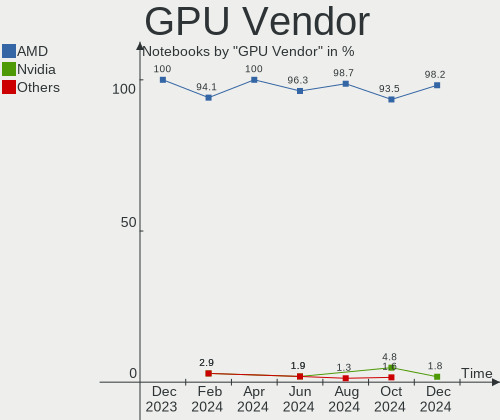
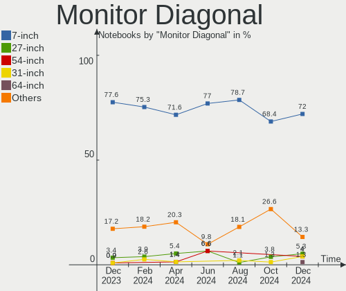
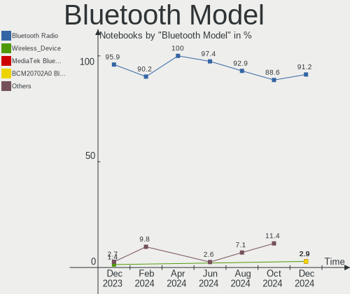

SteamOS - Hardware Trends (Notebooks)
-------------------------------------

A project to identify most popular hardware characteristics and track their change
over time based on data collected by Linux users at https://Linux-Hardware.org.

Anyone can contribute to this report by the [hw-probe](https://github.com/linuxhw/hw-probe) tool:

    sudo -E hw-probe -all -upload

This report is for one last month. Overall report since the beginning of time: [TestDays](https://github.com/linuxhw/TestDays)

Period: Jun, 2023.

Contents
--------

* [ System ](#system)
  - [ OS                       ](#os)
  - [ OS Family                ](#os-family)
  - [ Kernel                   ](#kernel)
  - [ Kernel Family            ](#kernel-family)
  - [ Kernel Major Ver.        ](#kernel-major-ver)
  - [ Arch                     ](#arch)
  - [ DE                       ](#de)
  - [ Display Server           ](#display-server)
  - [ Display Manager          ](#display-manager)
  - [ OS Lang                  ](#os-lang)
  - [ Boot Mode                ](#boot-mode)
  - [ Filesystem               ](#filesystem)
  - [ Part. scheme             ](#part-scheme)
  - [ Dual Boot with Linux/BSD ](#dual-boot-with-linuxbsd)
  - [ Dual Boot (Win)          ](#dual-boot-win)

* [ Board ](#board)
  - [ Vendor                   ](#vendor)
  - [ Model                    ](#model)
  - [ Model Family             ](#model-family)
  - [ MFG Year                 ](#mfg-year)
  - [ Form Factor              ](#form-factor)
  - [ Secure Boot              ](#secure-boot)
  - [ Coreboot                 ](#coreboot)
  - [ RAM Size                 ](#ram-size)
  - [ RAM Used                 ](#ram-used)
  - [ Total Drives             ](#total-drives)
  - [ Has CD-ROM               ](#has-cd-rom)
  - [ Has Ethernet             ](#has-ethernet)
  - [ Has WiFi                 ](#has-wifi)
  - [ Has Bluetooth            ](#has-bluetooth)

* [ Location ](#location)
  - [ Country                  ](#country)
  - [ City                     ](#city)

* [ Drives ](#drives)
  - [ Drive Vendor             ](#drive-vendor)
  - [ Drive Model              ](#drive-model)
  - [ HDD Vendor               ](#hdd-vendor)
  - [ SSD Vendor               ](#ssd-vendor)
  - [ Drive Kind               ](#drive-kind)
  - [ Drive Connector          ](#drive-connector)
  - [ Drive Size               ](#drive-size)
  - [ Space Total              ](#space-total)
  - [ Space Used               ](#space-used)
  - [ Malfunc. Drives          ](#malfunc-drives)
  - [ Malfunc. Drive Vendor    ](#malfunc-drive-vendor)
  - [ Malfunc. HDD Vendor      ](#malfunc-hdd-vendor)
  - [ Malfunc. Drive Kind      ](#malfunc-drive-kind)
  - [ Failed Drives            ](#failed-drives)
  - [ Failed Drive Vendor      ](#failed-drive-vendor)
  - [ Drive Status             ](#drive-status)

* [ Storage controller ](#storage-controller)
  - [ Storage Vendor           ](#storage-vendor)
  - [ Storage Model            ](#storage-model)
  - [ Storage Kind             ](#storage-kind)

* [ Processor ](#processor)
  - [ CPU Vendor               ](#cpu-vendor)
  - [ CPU Model                ](#cpu-model)
  - [ CPU Model Family         ](#cpu-model-family)
  - [ CPU Cores                ](#cpu-cores)
  - [ CPU Sockets              ](#cpu-sockets)
  - [ CPU Threads              ](#cpu-threads)
  - [ CPU Op-Modes             ](#cpu-op-modes)
  - [ CPU Microcode            ](#cpu-microcode)
  - [ CPU Microarch            ](#cpu-microarch)

* [ Graphics ](#graphics)
  - [ GPU Vendor               ](#gpu-vendor)
  - [ GPU Model                ](#gpu-model)
  - [ GPU Combo                ](#gpu-combo)
  - [ GPU Driver               ](#gpu-driver)
  - [ GPU Memory               ](#gpu-memory)

* [ Monitor ](#monitor)
  - [ Monitor Vendor           ](#monitor-vendor)
  - [ Monitor Model            ](#monitor-model)
  - [ Monitor Resolution       ](#monitor-resolution)
  - [ Monitor Diagonal         ](#monitor-diagonal)
  - [ Monitor Width            ](#monitor-width)
  - [ Aspect Ratio             ](#aspect-ratio)
  - [ Monitor Area             ](#monitor-area)
  - [ Pixel Density            ](#pixel-density)
  - [ Multiple Monitors        ](#multiple-monitors)

* [ Network ](#network)
  - [ Net Controller Vendor    ](#net-controller-vendor)
  - [ Net Controller Model     ](#net-controller-model)
  - [ Wireless Vendor          ](#wireless-vendor)
  - [ Wireless Model           ](#wireless-model)
  - [ Ethernet Vendor          ](#ethernet-vendor)
  - [ Ethernet Model           ](#ethernet-model)
  - [ Net Controller Kind      ](#net-controller-kind)
  - [ Used Controller          ](#used-controller)
  - [ NICs                     ](#nics)
  - [ IPv6                     ](#ipv6)

* [ Bluetooth ](#bluetooth)
  - [ Bluetooth Vendor         ](#bluetooth-vendor)
  - [ Bluetooth Model          ](#bluetooth-model)

* [ Sound ](#sound)
  - [ Sound Vendor             ](#sound-vendor)
  - [ Sound Model              ](#sound-model)

* [ Memory ](#memory)
  - [ Memory Vendor            ](#memory-vendor)
  - [ Memory Model             ](#memory-model)
  - [ Memory Kind              ](#memory-kind)
  - [ Memory Form Factor       ](#memory-form-factor)
  - [ Memory Size              ](#memory-size)
  - [ Memory Speed             ](#memory-speed)

* [ Printers & scanners ](#printers--scanners)
  - [ Printer Vendor           ](#printer-vendor)
  - [ Printer Model            ](#printer-model)
  - [ Scanner Vendor           ](#scanner-vendor)
  - [ Scanner Model            ](#scanner-model)

* [ Camera ](#camera)
  - [ Camera Vendor            ](#camera-vendor)
  - [ Camera Model             ](#camera-model)

* [ Security ](#security)
  - [ Fingerprint Vendor       ](#fingerprint-vendor)
  - [ Fingerprint Model        ](#fingerprint-model)
  - [ Chipcard Vendor          ](#chipcard-vendor)
  - [ Chipcard Model           ](#chipcard-model)

* [ Unsupported ](#unsupported)
  - [ Unsupported Devices      ](#unsupported-devices)
  - [ Unsupported Device Types ](#unsupported-device-types)

System
------

OS
--

Installed operating systems

| Name            | Notebooks | Percent |
|-----------------|-----------|---------|
| SteamOS 3.4.8   | 51        | 71.83%  |
| SteamOS 3.4.6   | 7         | 9.86%   |
| SteamOS Rolling | 3         | 4.23%   |
| SteamOS 3.4     | 3         | 4.23%   |
| SteamOS 3.5     | 2         | 2.82%   |
| SteamOS         | 2         | 2.82%   |
| SteamOS 4       | 1         | 1.41%   |
| SteamOS 3.4.9   | 1         | 1.41%   |
| SteamOS 3.4.4   | 1         | 1.41%   |

OS Family
---------

OS without a version

| Name    | Notebooks | Percent |
|---------|-----------|---------|
| SteamOS | 71        | 100%    |

Kernel
------

Version of the Linux kernel

| Version                                | Notebooks | Percent |
|----------------------------------------|-----------|---------|
| 5.13.0-valve36-1-neptune               | 61        | 85.92%  |
| 6.1.21-valve1-3-neptune-61             | 3         | 4.23%   |
| 5.13.0-valve21.3-1-neptune             | 3         | 4.23%   |
| 6.3.9-zen1-1-zen                       | 1         | 1.41%   |
| 6.1.21-valve1-1-neptune-61             | 1         | 1.41%   |
| 5.18.1-arch1_testHoloISO_20220606.1811 | 1         | 1.41%   |
| 5.15.93-1-lts                          | 1         | 1.41%   |

Kernel Family
-------------

Linux kernel without a distro release

| Version | Notebooks | Percent |
|---------|-----------|---------|
| 5.13.0  | 64        | 90.14%  |
| 6.1.21  | 4         | 5.63%   |
| 6.3.9   | 1         | 1.41%   |
| 5.18.1  | 1         | 1.41%   |
| 5.15.93 | 1         | 1.41%   |

Kernel Major Ver.
-----------------

Linux kernel major version

| Version | Notebooks | Percent |
|---------|-----------|---------|
| 5.13    | 64        | 90.14%  |
| 6.1     | 4         | 5.63%   |
| 6.3     | 1         | 1.41%   |
| 5.18    | 1         | 1.41%   |
| 5.15    | 1         | 1.41%   |

Arch
----

OS architecture (x86_64, i586, etc.)

| Name   | Notebooks | Percent |
|--------|-----------|---------|
| x86_64 | 71        | 100%    |

DE
--

Desktop Environment

| Name    | Notebooks | Percent |
|---------|-----------|---------|
| KDE5    | 70        | 98.59%  |
| Unknown | 1         | 1.41%   |

Display Server
--------------

X11 or Wayland

| Name | Notebooks | Percent |
|------|-----------|---------|
| X11  | 70        | 98.59%  |
| Tty  | 1         | 1.41%   |

Display Manager
---------------

SDDM, LightDM, etc.

| Name    | Notebooks | Percent |
|---------|-----------|---------|
| Unknown | 68        | 95.77%  |
| SDDM    | 3         | 4.23%   |

OS Lang
-------

Language

| Lang  | Notebooks | Percent |
|-------|-----------|---------|
| en_US | 62        | 87.32%  |
| zh_CN | 3         | 4.23%   |
| ru_UA | 2         | 2.82%   |
| ru_RU | 1         | 1.41%   |
| es_ES | 1         | 1.41%   |
| en_DE | 1         | 1.41%   |
| de_DE | 1         | 1.41%   |

Boot Mode
---------

EFI or BIOS

| Mode | Notebooks | Percent |
|------|-----------|---------|
| BIOS | 67        | 94.37%  |
| EFI  | 4         | 5.63%   |

Filesystem
----------

Type of filesystem

| Type  | Notebooks | Percent |
|-------|-----------|---------|
| Btrfs | 70        | 98.59%  |
| Tmpfs | 1         | 1.41%   |

Part. scheme
------------

Scheme of partitioning

| Type    | Notebooks | Percent |
|---------|-----------|---------|
| Unknown | 67        | 94.37%  |
| GPT     | 4         | 5.63%   |

Dual Boot with Linux/BSD
------------------------

Hosting more than one Linux/BSD

| Dual boot | Notebooks | Percent |
|-----------|-----------|---------|
| No        | 68        | 95.77%  |
| Yes       | 3         | 4.23%   |

Dual Boot (Win)
---------------

Hosting Linux and Windows

| Dual boot | Notebooks | Percent |
|-----------|-----------|---------|
| No        | 69        | 97.18%  |
| Yes       | 2         | 2.82%   |

Board
-----

Vendor
------

Motherboard manufacturer

| Name             | Notebooks | Percent |
|------------------|-----------|---------|
| Valve            | 63        | 88.73%  |
| Dell             | 3         | 4.23%   |
| GPD              | 2         | 2.82%   |
| Sony             | 1         | 1.41%   |
| Lenovo           | 1         | 1.41%   |
| ASUSTek Computer | 1         | 1.41%   |

Model
-----

Motherboard model

| Name                               | Notebooks | Percent |
|------------------------------------|-----------|---------|
| Valve Jupiter                      | 63        | 88.73%  |
| Sony VGN-Z520N                     | 1         | 1.41%   |
| Lenovo Yoga Slim 7 Pro 14ACH5 82MS | 1         | 1.41%   |
| GPD G1619-04                       | 1         | 1.41%   |
| GPD G1619-01                       | 1         | 1.41%   |
| Dell Venue 11 Pro 7140             | 1         | 1.41%   |
| Dell Precision 5520                | 1         | 1.41%   |
| Dell Inspiron 5535                 | 1         | 1.41%   |
| ASUS S400CA                        | 1         | 1.41%   |

Model Family
------------

Motherboard model prefix

| Name           | Notebooks | Percent |
|----------------|-----------|---------|
| Valve Jupiter  | 63        | 88.73%  |
| Sony VGN-Z520N | 1         | 1.41%   |
| Lenovo Yoga    | 1         | 1.41%   |
| GPD G1619-04   | 1         | 1.41%   |
| GPD G1619-01   | 1         | 1.41%   |
| Dell Venue     | 1         | 1.41%   |
| Dell Precision | 1         | 1.41%   |
| Dell Inspiron  | 1         | 1.41%   |
| ASUS S400CA    | 1         | 1.41%   |

MFG Year
--------

Motherboard manufacture year

| Year | Notebooks | Percent |
|------|-----------|---------|
| 2022 | 58        | 81.69%  |
| 2023 | 6         | 8.45%   |
| 2021 | 1         | 1.41%   |
| 2020 | 1         | 1.41%   |
| 2017 | 1         | 1.41%   |
| 2014 | 1         | 1.41%   |
| 2013 | 1         | 1.41%   |
| 2012 | 1         | 1.41%   |
| 2009 | 1         | 1.41%   |

Form Factor
-----------

Physical design of the computer

| Name     | Notebooks | Percent |
|----------|-----------|---------|
| Notebook | 71        | 100%    |

Secure Boot
-----------

Enabled or disabled

| State    | Notebooks | Percent |
|----------|-----------|---------|
| Disabled | 71        | 100%    |

Coreboot
--------

Have coreboot on board

| Used | Notebooks | Percent |
|------|-----------|---------|
| No   | 71        | 100%    |

RAM Size
--------

Total RAM memory

| Size in GB | Notebooks | Percent |
|------------|-----------|---------|
| 8.01-16.0  | 64        | 90.14%  |
| 4.01-8.0   | 2         | 2.82%   |
| 16.01-24.0 | 2         | 2.82%   |
| 3.01-4.0   | 1         | 1.41%   |
| 24.01-32.0 | 1         | 1.41%   |
| 2.01-3.0   | 1         | 1.41%   |

RAM Used
--------

Used RAM memory

| Used GB   | Notebooks | Percent |
|-----------|-----------|---------|
| 3.01-4.0  | 23        | 32.39%  |
| 4.01-8.0  | 22        | 30.99%  |
| 2.01-3.0  | 22        | 30.99%  |
| 1.01-2.0  | 2         | 2.82%   |
| 8.01-16.0 | 2         | 2.82%   |

Total Drives
------------

Number of drives on board

| Drives | Notebooks | Percent |
|--------|-----------|---------|
| 2      | 49        | 69.01%  |
| 1      | 20        | 28.17%  |
| 3      | 2         | 2.82%   |

Has CD-ROM
----------

Has CD-ROM on board

| Presented | Notebooks | Percent |
|-----------|-----------|---------|
| No        | 70        | 98.59%  |
| Yes       | 1         | 1.41%   |

Has Ethernet
------------

Has Ethernet on board

| Presented | Notebooks | Percent |
|-----------|-----------|---------|
| No        | 48        | 67.61%  |
| Yes       | 23        | 32.39%  |

Has WiFi
--------

Has WiFi module

| Presented | Notebooks | Percent |
|-----------|-----------|---------|
| Yes       | 71        | 100%    |

Has Bluetooth
-------------

Has Bluetooth module

| Presented | Notebooks | Percent |
|-----------|-----------|---------|
| Yes       | 69        | 97.18%  |
| No        | 2         | 2.82%   |

Location
--------

Country
-------

Geographic location (country)

| Country      | Notebooks | Percent |
|--------------|-----------|---------|
| USA          | 25        | 35.21%  |
| UK           | 6         | 8.45%   |
| Germany      | 5         | 7.04%   |
| Spain        | 4         | 5.63%   |
| Russia       | 3         | 4.23%   |
| Poland       | 3         | 4.23%   |
| Netherlands  | 3         | 4.23%   |
| China        | 3         | 4.23%   |
| Canada       | 2         | 2.82%   |
| Austria      | 2         | 2.82%   |
| Ukraine      | 1         | 1.41%   |
| UAE          | 1         | 1.41%   |
| Thailand     | 1         | 1.41%   |
| Sweden       | 1         | 1.41%   |
| Saudi Arabia | 1         | 1.41%   |
| Philippines  | 1         | 1.41%   |
| Mexico       | 1         | 1.41%   |
| Italy        | 1         | 1.41%   |
| India        | 1         | 1.41%   |
| Hungary      | 1         | 1.41%   |
| Hong Kong    | 1         | 1.41%   |
| Georgia      | 1         | 1.41%   |
| France       | 1         | 1.41%   |
| Brazil       | 1         | 1.41%   |
| Argentina    | 1         | 1.41%   |

City
----

Geographic location (city)

| City               | Notebooks | Percent |
|--------------------|-----------|---------|
| Omaha              | 2         | 2.82%   |
| Zhukovskiy         | 1         | 1.41%   |
| Yinchuan           | 1         | 1.41%   |
| Windsor            | 1         | 1.41%   |
| Washington         | 1         | 1.41%   |
| Warsaw             | 1         | 1.41%   |
| Warendorf          | 1         | 1.41%   |
| Wanchai            | 1         | 1.41%   |
| Vostochnaya        | 1         | 1.41%   |
| Vienna             | 1         | 1.41%   |
| Torrejón de Ardoz | 1         | 1.41%   |
| Toronto            | 1         | 1.41%   |
| Tholey             | 1         | 1.41%   |
| Teddington         | 1         | 1.41%   |
| Tbilisi            | 1         | 1.41%   |
| Szczecin           | 1         | 1.41%   |
| Sherwood           | 1         | 1.41%   |
| Shenzhen           | 1         | 1.41%   |
| Seattle            | 1         | 1.41%   |
| Schwenksville      | 1         | 1.41%   |
| Sao Paulo          | 1         | 1.41%   |
| Santo Tome         | 1         | 1.41%   |
| Salzburg           | 1         | 1.41%   |
| Rockwall           | 1         | 1.41%   |
| Rochester          | 1         | 1.41%   |
| Reus               | 1         | 1.41%   |
| Rancho Cordova     | 1         | 1.41%   |
| Quezon City        | 1         | 1.41%   |
| Puebla City        | 1         | 1.41%   |
| Palma              | 1         | 1.41%   |
| Olsztyn            | 1         | 1.41%   |
| Odenton            | 1         | 1.41%   |
| Nuremberg          | 1         | 1.41%   |
| Norrtaelje         | 1         | 1.41%   |
| Nakhon Ratchasima  | 1         | 1.41%   |
| Medina             | 1         | 1.41%   |
| Massena            | 1         | 1.41%   |
| Littleton          | 1         | 1.41%   |
| Leicester          | 1         | 1.41%   |
| Landstuhl          | 1         | 1.41%   |

Drives
------

Drive Vendor
------------

Hard drive vendors

| Vendor                         | Notebooks | Drives | Percent |
|--------------------------------|-----------|--------|---------|
| Unknown                        | 41        | 41     | 33.06%  |
| Kingston Technology Company    | 18        | 18     | 14.52%  |
| Phison Electronics             | 16        | 16     | 12.9%   |
| O2 Micro                       | 13        | 13     | 10.48%  |
| Samsung Electronics            | 11        | 11     | 8.87%   |
| Unknown                        | 9         | 9      | 7.26%   |
| Silicon Motion                 | 4         | 4      | 3.23%   |
| Sandisk                        | 4         | 4      | 3.23%   |
| MAXIO Technology (Hangzhou)    | 2         | 2      | 1.61%   |
| Solid State Storage Technology | 1         | 1      | 0.81%   |
| SK hynix                       | 1         | 1      | 0.81%   |
| Seagate                        | 1         | 1      | 0.81%   |
| Realtek                        | 1         | 1      | 0.81%   |
| Netac                          | 1         | 1      | 0.81%   |
| Kingston                       | 1         | 1      | 0.81%   |

Drive Model
-----------

Hard drive models

| Model                                                 | Notebooks | Percent |
|-------------------------------------------------------|-----------|---------|
| Unknown MMC Card  512GB                               | 20        | 16.13%  |
| Kingston Company OM3PDP3 NVMe SSD 256GB               | 18        | 14.52%  |
| Phison PS5013 E13 NVMe Controller 512GB               | 13        | 10.48%  |
| O2 Micro E2M2 64GB                                    | 13        | 10.48%  |
| Unknown                                               | 9         | 7.26%   |
| Unknown MMC Card  256GB                               | 7         | 5.65%   |
| Samsung MZ9LQ256HBJD-00BVL 256GB                      | 4         | 3.23%   |
| Unknown MMC Card  32GB                                | 3         | 2.42%   |
| Unknown MMC Card  128GB                               | 3         | 2.42%   |
| Silicon Motion SM2263EN/SM2263XT SSD Controller 256GB | 3         | 2.42%   |
| Samsung MZ9LQ512HBLU-00BVL 512GB                      | 3         | 2.42%   |
| Unknown MMC Card  64GB                                | 2         | 1.61%   |
| Phison Sabrent SB-2130-1TB                            | 2         | 1.61%   |
| Unknown MMC Card  500GB                               | 1         | 0.81%   |
| Unknown MMC Card  498GB                               | 1         | 0.81%   |
| Unknown MMC Card  393GB                               | 1         | 0.81%   |
| Unknown MMC Card  249GB                               | 1         | 0.81%   |
| Unknown MMC Card  1GB                                 | 1         | 0.81%   |
| Unknown MMC Card  196GB                               | 1         | 0.81%   |
| Solid State Storage SSSTC XA1-311024 930GB            | 1         | 0.81%   |
| SK hynix BC711 NVMe 256GB                             | 1         | 0.81%   |
| Silicon Motion SM2262/SM2262EN SSD Controller 480GB   | 1         | 0.81%   |
| Seagate ST500LT012-9WS142 500GB                       | 1         | 0.81%   |
| SanDisk X110 M.2 2260 128GB SSD                       | 1         | 0.81%   |
| Sandisk WDC PC SN530 SDBPTPZ-1T00 1024GB              | 1         | 0.81%   |
| Sandisk WD PC SN740 SDDPTQE-2T00 2TB                  | 1         | 0.81%   |
| Sandisk PC SN740 NVMe WD 512GB                        | 1         | 0.81%   |
| Samsung SSD 840 EVO 120GB                             | 1         | 0.81%   |
| Samsung NVMe SSD Controller SM981/PM981/PM983 250GB   | 1         | 0.81%   |
| Samsung MZ9LQ1T0HBLB-00B00 1024GB                     | 1         | 0.81%   |
| Samsung HM641JI 640GB                                 | 1         | 0.81%   |
| Realtek RTL9210B-CG 2TB                               | 1         | 0.81%   |
| Phison Sabrent SB-2130-512 512GB                      | 1         | 0.81%   |
| Netac SSD 120GB                                       | 1         | 0.81%   |
| MAXIO (Hangzhou) NVMe SSD Controller MAP1202 512GB    | 1         | 0.81%   |
| MAXIO (Hangzhou) BIWIN CE980Y38900-1TB                | 1         | 0.81%   |
| Kingston SA400S37480G 480GB SSD                       | 1         | 0.81%   |

HDD Vendor
----------

Hard disk drive vendors

| Vendor              | Notebooks | Drives | Percent |
|---------------------|-----------|--------|---------|
| Seagate             | 1         | 1      | 50%     |
| Samsung Electronics | 1         | 1      | 50%     |

SSD Vendor
----------

Solid state drive vendors

| Vendor              | Notebooks | Drives | Percent |
|---------------------|-----------|--------|---------|
| SanDisk             | 1         | 1      | 25%     |
| Samsung Electronics | 1         | 1      | 25%     |
| Netac               | 1         | 1      | 25%     |
| Kingston            | 1         | 1      | 25%     |

Drive Kind
----------

HDD or SSD

| Kind | Notebooks | Drives | Percent |
|------|-----------|--------|---------|
| NVMe | 67        | 68     | 54.47%  |
| MMC  | 50        | 50     | 40.65%  |
| SSD  | 4         | 4      | 3.25%   |
| HDD  | 2         | 2      | 1.63%   |

Drive Connector
---------------

SATA, SAS, NVMe, etc.

| Type | Notebooks | Drives | Percent |
|------|-----------|--------|---------|
| NVMe | 67        | 67     | 54.47%  |
| MMC  | 50        | 50     | 40.65%  |
| SATA | 4         | 5      | 3.25%   |
| SAS  | 2         | 2      | 1.63%   |

Drive Size
----------

Size of hard drive

| Size in TB | Notebooks | Drives | Percent |
|------------|-----------|--------|---------|
| 0.01-0.5   | 4         | 5      | 80%     |
| 0.51-1.0   | 1         | 1      | 20%     |

Space Total
-----------

Amount of disk space available on the file system

| Size in GB | Notebooks | Percent |
|------------|-----------|---------|
| 251-500    | 32        | 45.07%  |
| 101-250    | 13        | 18.31%  |
| 501-1000   | 10        | 14.08%  |
| 51-100     | 9         | 12.68%  |
| 1001-2000  | 3         | 4.23%   |
| 2001-3000  | 2         | 2.82%   |
| 21-50      | 1         | 1.41%   |
| Unknown    | 1         | 1.41%   |

Space Used
----------

Amount of used disk space

| Used GB   | Notebooks | Percent |
|-----------|-----------|---------|
| 251-500   | 26        | 36.62%  |
| 21-50     | 11        | 15.49%  |
| 101-250   | 11        | 15.49%  |
| 1-20      | 10        | 14.08%  |
| 501-1000  | 6         | 8.45%   |
| 51-100    | 4         | 5.63%   |
| 2001-3000 | 1         | 1.41%   |
| 1001-2000 | 1         | 1.41%   |
| Unknown   | 1         | 1.41%   |

Malfunc. Drives
---------------

Drive models with a malfunction

| Model                           | Notebooks | Drives | Percent |
|---------------------------------|-----------|--------|---------|
| Seagate ST500LT012-9WS142 500GB | 1         | 1      | 100%    |

Malfunc. Drive Vendor
---------------------

Vendors of faulty drives

| Vendor  | Notebooks | Drives | Percent |
|---------|-----------|--------|---------|
| Seagate | 1         | 1      | 100%    |

Malfunc. HDD Vendor
-------------------

Vendors of faulty HDD drives

| Vendor  | Notebooks | Drives | Percent |
|---------|-----------|--------|---------|
| Seagate | 1         | 1      | 100%    |

Malfunc. Drive Kind
-------------------

Kinds of faulty drives

| Kind | Notebooks | Drives | Percent |
|------|-----------|--------|---------|
| HDD  | 1         | 1      | 100%    |

Failed Drives
-------------

Failed drive models

Zero info for selected period =(

Failed Drive Vendor
-------------------

Failed drive vendors

Zero info for selected period =(

Drive Status
------------

Number of failed and malfunc. drives

| Status   | Notebooks | Drives | Percent |
|----------|-----------|--------|---------|
| Detected | 69        | 118    | 93.24%  |
| Works    | 4         | 5      | 5.41%   |
| Malfunc  | 1         | 1      | 1.35%   |

Storage controller
------------------

Storage Vendor
--------------

Storage controller vendors

| Vendor                         | Notebooks | Percent |
|--------------------------------|-----------|---------|
| Kingston Technology Company    | 18        | 24.66%  |
| Phison Electronics             | 16        | 21.92%  |
| O2 Micro                       | 13        | 17.81%  |
| Samsung Electronics            | 9         | 12.33%  |
| Intel                          | 5         | 6.85%   |
| Silicon Motion                 | 4         | 5.48%   |
| Sandisk                        | 3         | 4.11%   |
| MAXIO Technology (Hangzhou)    | 2         | 2.74%   |
| Solid State Storage Technology | 1         | 1.37%   |
| SK hynix                       | 1         | 1.37%   |
| AMD                            | 1         | 1.37%   |

Storage Model
-------------

Storage controller models

| Model                                                                         | Notebooks | Percent |
|-------------------------------------------------------------------------------|-----------|---------|
| Kingston Company OM3PDP3 NVMe SSD                                             | 18        | 24.66%  |
| Phison PS5013 E13 NVMe Controller                                             | 13        | 17.81%  |
| O2 Micro Non-Volatile memory controller                                       | 13        | 17.81%  |
| Samsung NVMe SSD Controller 980                                               | 8         | 10.96%  |
| Silicon Motion SM2263EN/SM2263XT SSD Controller                               | 3         | 4.11%   |
| Phison PS5021-E21 PCIe4 NVMe Controller (DRAM-less)                           | 3         | 4.11%   |
| Sandisk PC SN740 NVMe SSD                                                     | 2         | 2.74%   |
| Solid State Storage Non-Volatile memory controller                            | 1         | 1.37%   |
| SK hynix Gold P31/BC711/PC711 NVMe Solid State Drive                          | 1         | 1.37%   |
| Silicon Motion SM2262/SM2262EN SSD Controller                                 | 1         | 1.37%   |
| SanDisk PC SN530 NVMe SSD (DRAM-less)                                         | 1         | 1.37%   |
| Samsung NVMe SSD Controller SM981/PM981/PM983                                 | 1         | 1.37%   |
| MAXIO (Hangzhou) NVMe SSD Controller MAP1602                                  | 1         | 1.37%   |
| MAXIO (Hangzhou) NVMe SSD Controller MAP1202                                  | 1         | 1.37%   |
| Intel Wildcat Point-LP SATA Controller [AHCI Mode]                            | 1         | 1.37%   |
| Intel Q170/Q150/B150/H170/H110/Z170/CM236 Chipset SATA Controller [AHCI Mode] | 1         | 1.37%   |
| Intel Ice Lake-LP SATA Controller [AHCI mode]                                 | 1         | 1.37%   |
| Intel 82801IBM/IEM (ICH9M/ICH9M-E) 4 port SATA Controller [AHCI mode]         | 1         | 1.37%   |
| Intel 7 Series Chipset Family 6-port SATA Controller [AHCI mode]              | 1         | 1.37%   |
| AMD FCH SATA Controller [AHCI mode]                                           | 1         | 1.37%   |

Storage Kind
------------

Kind of storage controller (IDE, SATA, NVMe, SAS, ...)

| Kind | Notebooks | Percent |
|------|-----------|---------|
| NVMe | 67        | 91.78%  |
| SATA | 6         | 8.22%   |

Processor
---------

CPU Vendor
----------

Processor vendors

| Vendor | Notebooks | Percent |
|--------|-----------|---------|
| AMD    | 66        | 92.96%  |
| Intel  | 5         | 7.04%   |

CPU Model
---------

Processor models

| Model                                     | Notebooks | Percent |
|-------------------------------------------|-----------|---------|
| AMD Custom APU 0405                       | 63        | 88.73%  |
| Intel Processor 5Y10 CPU @ 0.80GHz        | 1         | 1.41%   |
| Intel Core i7-7820HQ CPU @ 2.90GHz        | 1         | 1.41%   |
| Intel Core i5-3317U CPU @ 1.70GHz         | 1         | 1.41%   |
| Intel Core i5-1035G7 CPU @ 1.20GHz        | 1         | 1.41%   |
| Intel Core 2 Duo CPU P8400 @ 2.26GHz      | 1         | 1.41%   |
| AMD Ryzen 9 5900HX with Radeon Graphics   | 1         | 1.41%   |
| AMD Ryzen 7 7840U w/ Radeon 780M Graphics | 1         | 1.41%   |
| AMD A10-5745M APU with Radeon HD Graphics | 1         | 1.41%   |

CPU Model Family
----------------

Processor model prefix

| Model            | Notebooks | Percent |
|------------------|-----------|---------|
| Other            | 64        | 90.14%  |
| Intel Core i5    | 2         | 2.82%   |
| Intel Core i7    | 1         | 1.41%   |
| Intel Core 2 Duo | 1         | 1.41%   |
| AMD Ryzen 9      | 1         | 1.41%   |
| AMD Ryzen 7      | 1         | 1.41%   |
| AMD A10          | 1         | 1.41%   |

CPU Cores
---------

Number of processor cores

| Number | Notebooks | Percent |
|--------|-----------|---------|
| 4      | 65        | 91.55%  |
| 2      | 4         | 5.63%   |
| 8      | 2         | 2.82%   |

CPU Sockets
-----------

Number of sockets

| Number | Notebooks | Percent |
|--------|-----------|---------|
| 1      | 71        | 100%    |

CPU Threads
-----------

Threads per core (Hyper-Threading)

| Number | Notebooks | Percent |
|--------|-----------|---------|
| 2      | 69        | 97.18%  |
| 1      | 2         | 2.82%   |

CPU Op-Modes
------------

CPU Operation Modes (32-bit, 64-bit)

| Op mode        | Notebooks | Percent |
|----------------|-----------|---------|
| 32-bit, 64-bit | 71        | 100%    |

CPU Microcode
-------------

Microcode number

| Number     | Notebooks | Percent |
|------------|-----------|---------|
| Unknown    | 68        | 95.77%  |
| 0x08900201 | 2         | 2.82%   |
| 0x0a704103 | 1         | 1.41%   |

CPU Microarch
-------------

Microarchitecture

| Name       | Notebooks | Percent |
|------------|-----------|---------|
| Unknown    | 64        | 90.14%  |
| Zen 3      | 1         | 1.41%   |
| Piledriver | 1         | 1.41%   |
| Penryn     | 1         | 1.41%   |
| KabyLake   | 1         | 1.41%   |
| IvyBridge  | 1         | 1.41%   |
| IceLake    | 1         | 1.41%   |
| Broadwell  | 1         | 1.41%   |

Graphics
--------

GPU Vendor
----------

Vendors of graphics cards

| Vendor | Notebooks | Percent |
|--------|-----------|---------|
| AMD    | 66        | 90.41%  |
| Intel  | 5         | 6.85%   |
| Nvidia | 2         | 2.74%   |

GPU Model
---------

Graphics card models

| Model                                                        | Notebooks | Percent |
|--------------------------------------------------------------|-----------|---------|
| AMD VanGogh [AMD Custom GPU 0405]                            | 63        | 86.3%   |
| Nvidia GM107GLM [Quadro M1200 Mobile]                        | 1         | 1.37%   |
| Nvidia G98M [GeForce 9300M GS]                               | 1         | 1.37%   |
| Intel Mobile 4 Series Chipset Integrated Graphics Controller | 1         | 1.37%   |
| Intel Iris Plus Graphics G7                                  | 1         | 1.37%   |
| Intel HD Graphics 630                                        | 1         | 1.37%   |
| Intel HD Graphics 5300                                       | 1         | 1.37%   |
| Intel 3rd Gen Core processor Graphics Controller             | 1         | 1.37%   |
| AMD Richland [Radeon HD 8610G]                               | 1         | 1.37%   |
| AMD Phoenix1                                                 | 1         | 1.37%   |
| AMD Cezanne [Radeon Vega Series / Radeon Vega Mobile Series] | 1         | 1.37%   |

GPU Combo
---------

Combinations of graphics cards

| Name           | Notebooks | Percent |
|----------------|-----------|---------|
| 1 x AMD        | 66        | 92.96%  |
| 1 x Intel      | 3         | 4.23%   |
| Intel + Nvidia | 2         | 2.82%   |

GPU Driver
----------

Free vs proprietary

| Driver | Notebooks | Percent |
|--------|-----------|---------|
| Free   | 71        | 100%    |

GPU Memory
----------

Total video memory

| Size in GB | Notebooks | Percent |
|------------|-----------|---------|
| Unknown    | 68        | 95.77%  |
| 3.01-4.0   | 1         | 1.41%   |
| 2.01-3.0   | 1         | 1.41%   |
| 0.51-1.0   | 1         | 1.41%   |

Monitor
-------

Monitor Vendor
--------------

Monitor vendors

| Vendor               | Notebooks | Percent |
|----------------------|-----------|---------|
| Valve                | 61        | 70.11%  |
| Samsung Electronics  | 6         | 6.9%    |
| Westinghouse         | 1         | 1.15%   |
| Vizio                | 1         | 1.15%   |
| Sharp                | 1         | 1.15%   |
| Pixio                | 1         | 1.15%   |
| LG Display           | 1         | 1.15%   |
| Lenovo               | 1         | 1.15%   |
| JRY                  | 1         | 1.15%   |
| JDI                  | 1         | 1.15%   |
| INNOCN               | 1         | 1.15%   |
| HKM                  | 1         | 1.15%   |
| Goldstar             | 1         | 1.15%   |
| Flipbook             | 1         | 1.15%   |
| Dell                 | 1         | 1.15%   |
| CSO                  | 1         | 1.15%   |
| Chimei Innolux       | 1         | 1.15%   |
| BOE                  | 1         | 1.15%   |
| AOC                  | 1         | 1.15%   |
| Ancor Communications | 1         | 1.15%   |
| AGO                  | 1         | 1.15%   |
| Acer                 | 1         | 1.15%   |

Monitor Model
-------------

Monitor models

| Model                                                                 | Notebooks | Percent |
|-----------------------------------------------------------------------|-----------|---------|
| Valve ANX7530 U VLV3001 800x1280 100x150mm 7.1-inch                   | 61        | 70.11%  |
| Westinghouse WD32FE2120 WET6487 1366x768 700x390mm 31.5-inch          | 1         | 1.15%   |
| Vizio D32fM-K01 VIZ1044 1920x1080 698x392mm 31.5-inch                 | 1         | 1.15%   |
| Sharp LCD Monitor SHP1476 3840x2160 346x194mm 15.6-inch               | 1         | 1.15%   |
| Samsung Electronics T24C550 SAM0BA5 1366x768 521x293mm 23.5-inch      | 1         | 1.15%   |
| Samsung Electronics SyncMaster SAM01F9 1280x1024 376x301mm 19.0-inch  | 1         | 1.15%   |
| Samsung Electronics QBQ90S SAM7202 3840x2160 1872x1053mm 84.6-inch    | 1         | 1.15%   |
| Samsung Electronics LCD Monitor SDC4C48 1920x1080 409x230mm 18.5-inch | 1         | 1.15%   |
| Samsung Electronics LCD Monitor SAM0C3C 1366x768 609x347mm 27.6-inch  | 1         | 1.15%   |
| Samsung Electronics C27F390 SAM0D32 1920x1080 598x336mm 27.0-inch     | 1         | 1.15%   |
| Pixio G27P WAM2700 3840x2160 600x330mm 27.0-inch                      | 1         | 1.15%   |
| LG Display LCD Monitor LGD033F 1366x768 310x174mm 14.0-inch           | 1         | 1.15%   |
| Lenovo LEN P24q-20 LEN61F5 2560x1440 527x296mm 23.8-inch              | 1         | 1.15%   |
| JRY HDMI JRY3200 1920x1080 368x207mm 16.6-inch                        | 1         | 1.15%   |
| JDI GPD1001H JDI0031 2560x1600 890x500mm 40.2-inch                    | 1         | 1.15%   |
| INNOCN PU15-PRE IOC1501 3840x2160 344x194mm 15.5-inch                 | 1         | 1.15%   |
| HKM UG27 HKM2700 1920x1080 597x336mm 27.0-inch                        | 1         | 1.15%   |
| Goldstar ULTRAGEAR GSM5C02 1920x1080 600x340mm 27.2-inch              | 1         | 1.15%   |
| Flipbook NexDock YUK40F4 1920x1080 293x165mm 13.2-inch                | 1         | 1.15%   |
| Dell G2722HS DEL427F 1920x1080 597x336mm 27.0-inch                    | 1         | 1.15%   |
| CSO LCD Monitor CSO1402 2880x1800 302x188mm 14.0-inch                 | 1         | 1.15%   |
| Chimei Innolux LCD Monitor CMN15B6 1366x768 344x193mm 15.5-inch       | 1         | 1.15%   |
| BOE TV080WUM-NL0 BOE0003 800x1280 108x172mm 8.0-inch                  | 1         | 1.15%   |
| AOC 2476WM AOC2476 1920x1080 521x293mm 23.5-inch                      | 1         | 1.15%   |
| Ancor Communications ASUS VP228 ACI22C3 1920x1080 476x268mm 21.5-inch | 1         | 1.15%   |
| AGO LCD Monitor AGO0001 1920x1080 256x192mm 12.6-inch                 | 1         | 1.15%   |
| Acer V226HQL ACR032D 1920x1080 477x268mm 21.5-inch                    | 1         | 1.15%   |

Monitor Resolution
------------------

Monitor screen resolution

| Resolution       | Notebooks | Percent |
|------------------|-----------|---------|
| 800x1280         | 61        | 70.11%  |
| 1920x1080 (FHD)  | 12        | 13.79%  |
| 1366x768 (WXGA)  | 5         | 5.75%   |
| 3840x2160 (4K)   | 4         | 4.6%    |
| 2880x1800        | 1         | 1.15%   |
| 2560x1600        | 1         | 1.15%   |
| 2560x1440 (QHD)  | 1         | 1.15%   |
| 1600x2560        | 1         | 1.15%   |
| 1280x1024 (SXGA) | 1         | 1.15%   |

Monitor Diagonal
----------------

Diagonal size in inches

| Inches | Notebooks | Percent |
|--------|-----------|---------|
| 7      | 61        | 70.11%  |
| 27     | 4         | 4.6%    |
| 31     | 3         | 3.45%   |
| 15     | 3         | 3.45%   |
| 40     | 2         | 2.3%    |
| 23     | 2         | 2.3%    |
| 21     | 2         | 2.3%    |
| 14     | 2         | 2.3%    |
| 84     | 1         | 1.15%   |
| 24     | 1         | 1.15%   |
| 19     | 1         | 1.15%   |
| 18     | 1         | 1.15%   |
| 16     | 1         | 1.15%   |
| 13     | 1         | 1.15%   |
| 12     | 1         | 1.15%   |
| 8      | 1         | 1.15%   |

Monitor Width
-------------

Physical width

| Width in mm | Notebooks | Percent |
|-------------|-----------|---------|
| 1-100       | 61        | 70.11%  |
| 501-600     | 7         | 8.05%   |
| 301-350     | 5         | 5.75%   |
| 601-700     | 3         | 3.45%   |
| 401-500     | 3         | 3.45%   |
| 801-900     | 2         | 2.3%    |
| 351-400     | 2         | 2.3%    |
| 201-300     | 2         | 2.3%    |
| 1501-2000   | 1         | 1.15%   |
| 101-200     | 1         | 1.15%   |

Aspect Ratio
------------

Proportional relationship between the width and the height

| Ratio | Notebooks | Percent |
|-------|-----------|---------|
| 0.67  | 61        | 70.11%  |
| 16/9  | 22        | 25.29%  |
| 5/4   | 1         | 1.15%   |
| 4/3   | 1         | 1.15%   |
| 16/10 | 1         | 1.15%   |
| 0.63  | 1         | 1.15%   |

Monitor Area
------------

Area in inch²

| Area in inch² | Notebooks | Percent |
|----------------|-----------|---------|
| 1-40           | 62        | 71.26%  |
| 201-250        | 5         | 5.75%   |
| 301-350        | 4         | 4.6%    |
| 351-500        | 3         | 3.45%   |
| 101-110        | 3         | 3.45%   |
| 81-90          | 2         | 2.3%    |
| 71-80          | 2         | 2.3%    |
| 501-1000       | 2         | 2.3%    |
| More than 1000 | 1         | 1.15%   |
| 151-200        | 1         | 1.15%   |
| 141-150        | 1         | 1.15%   |
| 111-120        | 1         | 1.15%   |

Pixel Density
-------------

Pixels per inch

| Density       | Notebooks | Percent |
|---------------|-----------|---------|
| 161-240       | 61        | 71.76%  |
| 51-100        | 10        | 11.76%  |
| 101-120       | 6         | 7.06%   |
| More than 240 | 4         | 4.71%   |
| 1-50          | 2         | 2.35%   |
| 121-160       | 2         | 2.35%   |

Multiple Monitors
-----------------

Total monitors connected

| Total | Notebooks | Percent |
|-------|-----------|---------|
| 1     | 52        | 73.24%  |
| 2     | 18        | 25.35%  |
| 3     | 1         | 1.41%   |

Network
-------

Net Controller Vendor
---------------------

Controller vendors

| Vendor                | Notebooks | Percent |
|-----------------------|-----------|---------|
| Realtek Semiconductor | 66        | 79.52%  |
| ASIX Electronics      | 8         | 9.64%   |
| Intel                 | 5         | 6.02%   |
| Qualcomm Atheros      | 2         | 2.41%   |
| DisplayLink           | 1         | 1.2%    |
| Dell                  | 1         | 1.2%    |

Net Controller Model
--------------------

Controller models

| Model                                                             | Notebooks | Percent |
|-------------------------------------------------------------------|-----------|---------|
| Realtek RTL8822CE 802.11ac PCIe Wireless Network Adapter          | 63        | 65.63%  |
| Realtek RTL8153 Gigabit Ethernet Adapter                          | 9         | 9.38%   |
| ASIX AX88179 Gigabit Ethernet                                     | 8         | 8.33%   |
| Realtek RTL8152 Fast Ethernet Adapter                             | 2         | 2.08%   |
| Realtek RTL8852AE 802.11ax PCIe Wireless Network Adapter          | 1         | 1.04%   |
| Realtek RTL8111/8168/8411 PCI Express Gigabit Ethernet Controller | 1         | 1.04%   |
| Realtek RTL810xE PCI Express Fast Ethernet controller             | 1         | 1.04%   |
| Qualcomm Atheros QCA9565 / AR9565 Wireless Network Adapter        | 1         | 1.04%   |
| Qualcomm Atheros AR9485 Wireless Network Adapter                  | 1         | 1.04%   |
| Qualcomm Atheros AR8161 Gigabit Ethernet                          | 1         | 1.04%   |
| Intel Wireless 8265 / 8275                                        | 1         | 1.04%   |
| Intel Wireless 7265                                               | 1         | 1.04%   |
| Intel WiFi Link 5100                                              | 1         | 1.04%   |
| Intel Wi-Fi 6 AX210/AX211/AX411 160MHz                            | 1         | 1.04%   |
| Intel Wi-Fi 6 AX200                                               | 1         | 1.04%   |
| Intel 82567LM Gigabit Network Connection                          | 1         | 1.04%   |
| DisplayLink USB 3.0 Docking Station                               | 1         | 1.04%   |
| Dell DW5810e LTE WWAN                                             | 1         | 1.04%   |

Wireless Vendor
---------------

Wireless vendors

| Vendor                | Notebooks | Percent |
|-----------------------|-----------|---------|
| Realtek Semiconductor | 64        | 90.14%  |
| Intel                 | 5         | 7.04%   |
| Qualcomm Atheros      | 2         | 2.82%   |

Wireless Model
--------------

Wireless models

| Model                                                      | Notebooks | Percent |
|------------------------------------------------------------|-----------|---------|
| Realtek RTL8822CE 802.11ac PCIe Wireless Network Adapter   | 63        | 88.73%  |
| Realtek RTL8852AE 802.11ax PCIe Wireless Network Adapter   | 1         | 1.41%   |
| Qualcomm Atheros QCA9565 / AR9565 Wireless Network Adapter | 1         | 1.41%   |
| Qualcomm Atheros AR9485 Wireless Network Adapter           | 1         | 1.41%   |
| Intel Wireless 8265 / 8275                                 | 1         | 1.41%   |
| Intel Wireless 7265                                        | 1         | 1.41%   |
| Intel WiFi Link 5100                                       | 1         | 1.41%   |
| Intel Wi-Fi 6 AX210/AX211/AX411 160MHz                     | 1         | 1.41%   |
| Intel Wi-Fi 6 AX200                                        | 1         | 1.41%   |

Ethernet Vendor
---------------

Ethernet vendors

| Vendor                | Notebooks | Percent |
|-----------------------|-----------|---------|
| Realtek Semiconductor | 13        | 54.17%  |
| ASIX Electronics      | 8         | 33.33%  |
| Qualcomm Atheros      | 1         | 4.17%   |
| Intel                 | 1         | 4.17%   |
| DisplayLink           | 1         | 4.17%   |

Ethernet Model
--------------

Ethernet models

| Model                                                             | Notebooks | Percent |
|-------------------------------------------------------------------|-----------|---------|
| Realtek RTL8153 Gigabit Ethernet Adapter                          | 9         | 37.5%   |
| ASIX AX88179 Gigabit Ethernet                                     | 8         | 33.33%  |
| Realtek RTL8152 Fast Ethernet Adapter                             | 2         | 8.33%   |
| Realtek RTL8111/8168/8411 PCI Express Gigabit Ethernet Controller | 1         | 4.17%   |
| Realtek RTL810xE PCI Express Fast Ethernet controller             | 1         | 4.17%   |
| Qualcomm Atheros AR8161 Gigabit Ethernet                          | 1         | 4.17%   |
| Intel 82567LM Gigabit Network Connection                          | 1         | 4.17%   |
| DisplayLink USB 3.0 Docking Station                               | 1         | 4.17%   |

Net Controller Kind
-------------------

Ethernet, WiFi or modem

| Kind     | Notebooks | Percent |
|----------|-----------|---------|
| WiFi     | 71        | 74.74%  |
| Ethernet | 23        | 24.21%  |
| Unknown  | 1         | 1.05%   |

Used Controller
---------------

Currently used network controller

| Kind     | Notebooks | Percent |
|----------|-----------|---------|
| WiFi     | 69        | 94.52%  |
| Ethernet | 4         | 5.48%   |

NICs
----

Total network controllers on board

| Total | Notebooks | Percent |
|-------|-----------|---------|
| 1     | 67        | 94.37%  |
| 2     | 4         | 5.63%   |

IPv6
----

IPv6 vs IPv4

| Used | Notebooks | Percent |
|------|-----------|---------|
| No   | 43        | 60.56%  |
| Yes  | 28        | 39.44%  |

Bluetooth
---------

Bluetooth Vendor
----------------

Controller vendors

| Vendor                          | Notebooks | Percent |
|---------------------------------|-----------|---------|
| IMC Networks                    | 62        | 88.57%  |
| Intel                           | 4         | 5.71%   |
| Realtek Semiconductor           | 1         | 1.43%   |
| Qualcomm Atheros Communications | 1         | 1.43%   |
| Cambridge Silicon Radio         | 1         | 1.43%   |
| Alps Electric                   | 1         | 1.43%   |

Bluetooth Model
---------------

Controller models

| Model                                               | Notebooks | Percent |
|-----------------------------------------------------|-----------|---------|
| IMC Networks Bluetooth Radio                        | 62        | 88.57%  |
| Intel Bluetooth wireless interface                  | 2         | 2.86%   |
| Realtek Bluetooth Radio                             | 1         | 1.43%   |
| Qualcomm Atheros AR9462 Bluetooth                   | 1         | 1.43%   |
| Intel AX210 Bluetooth                               | 1         | 1.43%   |
| Intel AX200 Bluetooth                               | 1         | 1.43%   |
| Cambridge Silicon Radio Bluetooth Dongle (HCI mode) | 1         | 1.43%   |
| Alps Electric BCM2046 Bluetooth Device              | 1         | 1.43%   |

Sound
-----

Sound Vendor
------------

Sound card vendors

| Vendor                     | Notebooks | Percent |
|----------------------------|-----------|---------|
| AMD                        | 66        | 88%     |
| Intel                      | 5         | 6.67%   |
| Razer USA                  | 1         | 1.33%   |
| PreSonus Audio Electronics | 1         | 1.33%   |
| Plantronics                | 1         | 1.33%   |
| Logitech                   | 1         | 1.33%   |

Sound Model
-----------

Sound card models

| Model                                                               | Notebooks | Percent |
|---------------------------------------------------------------------|-----------|---------|
| AMD Rembrandt Radeon High Definition Audio Controller               | 64        | 82.05%  |
| AMD Family 17h/19h HD Audio Controller                              | 2         | 2.56%   |
| Razer USA Razer Kraken V3 Pro                                       | 1         | 1.28%   |
| PreSonus Audio Electronics AudioBox USB 96                          | 1         | 1.28%   |
| Plantronics Poly BT700                                              | 1         | 1.28%   |
| Logitech G432 Gaming Headset                                        | 1         | 1.28%   |
| Intel Ice Lake-LP Smart Sound Technology Audio Controller           | 1         | 1.28%   |
| Intel CM238 HD Audio Controller                                     | 1         | 1.28%   |
| Intel Broadwell-U Audio Controller                                  | 1         | 1.28%   |
| Intel 82801I (ICH9 Family) HD Audio Controller                      | 1         | 1.28%   |
| Intel 7 Series/C216 Chipset Family High Definition Audio Controller | 1         | 1.28%   |
| AMD Trinity HDMI Audio Controller                                   | 1         | 1.28%   |
| AMD Renoir Radeon High Definition Audio Controller                  | 1         | 1.28%   |
| AMD FCH Azalia Controller                                           | 1         | 1.28%   |

Memory
------

Memory Vendor
-------------

Memory module vendors

| Vendor              | Notebooks | Percent |
|---------------------|-----------|---------|
| Micron Technology   | 3         | 60%     |
| Samsung Electronics | 1         | 20%     |
| Kingston            | 1         | 20%     |

Memory Model
------------

Memory module models

| Model                                                      | Notebooks | Percent |
|------------------------------------------------------------|-----------|---------|
| Samsung RAM K3LK7K70BM-BGCP000 4GB SODIMM LPDDR5 4266MT/s  | 1         | 20%     |
| Micron RAM MT62F2G32D4DS-026 WT 8GB SODIMM LPDDR5 7500MT/s | 1         | 20%     |
| Micron RAM MT62F1G32D4DR-031 WT 4GB SODIMM LPDDR5 6400MT/s | 1         | 20%     |
| Micron RAM 8JTF5126 4HZ1G6D 1 4GB SODIMM DDR3 1600MT/s     | 1         | 20%     |
| Kingston RAM 9905417-054.A00G 4GB SODIMM DDR3 1600MT/s     | 1         | 20%     |

Memory Kind
-----------

Memory module kinds

| Kind   | Notebooks | Percent |
|--------|-----------|---------|
| LPDDR5 | 3         | 75%     |
| DDR3   | 1         | 25%     |

Memory Form Factor
------------------

Physical design of the memory module

| Name   | Notebooks | Percent |
|--------|-----------|---------|
| SODIMM | 4         | 100%    |

Memory Size
-----------

Memory module size

| Size | Notebooks | Percent |
|------|-----------|---------|
| 4096 | 3         | 75%     |
| 8192 | 1         | 25%     |

Memory Speed
------------

Memory module speed

| Speed | Notebooks | Percent |
|-------|-----------|---------|
| 7500  | 1         | 25%     |
| 6400  | 1         | 25%     |
| 4266  | 1         | 25%     |
| 1600  | 1         | 25%     |

Printers & scanners
-------------------

Printer Vendor
--------------

Printer device vendors

Zero info for selected period =(

Printer Model
-------------

Printer device models

Zero info for selected period =(

Scanner Vendor
--------------

Scanner device vendors

Zero info for selected period =(

Scanner Model
-------------

Scanner device models

Zero info for selected period =(

Camera
------

Camera Vendor
-------------

Camera device vendors

| Vendor                        | Notebooks | Percent |
|-------------------------------|-----------|---------|
| Microdia                      | 2         | 22.22%  |
| Tripath Technology            | 1         | 11.11%  |
| Sunplus Innovation Technology | 1         | 11.11%  |
| Ricoh                         | 1         | 11.11%  |
| Realtek Semiconductor         | 1         | 11.11%  |
| Logitech                      | 1         | 11.11%  |
| IMC Networks                  | 1         | 11.11%  |
| Alpha Imaging Technology      | 1         | 11.11%  |

Camera Model
------------

Camera device models

| Model                                     | Notebooks | Percent |
|-------------------------------------------|-----------|---------|
| Tripath USB Camera                        | 1         | 11.11%  |
| Sunplus Asus Webcam                       | 1         | 11.11%  |
| Ricoh Sony Vaio Integrated Webcam         | 1         | 11.11%  |
| Realtek Integrated_Webcam_FHD             | 1         | 11.11%  |
| Microdia Integrated_Webcam_HD             | 1         | 11.11%  |
| Microdia Dell Laptop Integrated Webcam HD | 1         | 11.11%  |
| Logitech HD Pro Webcam C920               | 1         | 11.11%  |
| IMC Networks Integrated Camera            | 1         | 11.11%  |
| Alpha Imaging Integrated_Webcam_8M        | 1         | 11.11%  |

Security
--------

Fingerprint Vendor
------------------

Fingerprint sensor vendors

| Vendor | Notebooks | Percent |
|--------|-----------|---------|
| Upek   | 1         | 100%    |

Fingerprint Model
-----------------

Fingerprint sensor models

| Model                                                  | Notebooks | Percent |
|--------------------------------------------------------|-----------|---------|
| Upek Biometric Touchchip/Touchstrip Fingerprint Sensor | 1         | 100%    |

Chipcard Vendor
---------------

Chipcard module vendors

Zero info for selected period =(

Chipcard Model
--------------

Chipcard module models

Zero info for selected period =(

Unsupported
-----------

Unsupported Devices
-------------------

Total unsupported devices on board

| Total | Notebooks | Percent |
|-------|-----------|---------|
| 0     | 68        | 95.77%  |
| 3     | 1         | 1.41%   |
| 2     | 1         | 1.41%   |
| 1     | 1         | 1.41%   |

Unsupported Device Types
------------------------

Types of unsupported devices

| Type                  | Notebooks | Percent |
|-----------------------|-----------|---------|
| Graphics card         | 2         | 33.33%  |
| Net/wireless          | 1         | 16.67%  |
| Multimedia controller | 1         | 16.67%  |
| Fingerprint reader    | 1         | 16.67%  |
| Camera                | 1         | 16.67%  |

