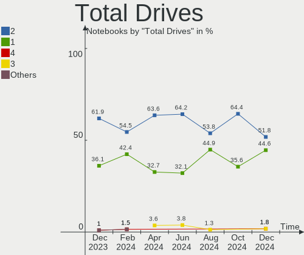
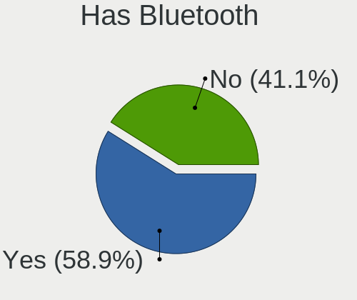
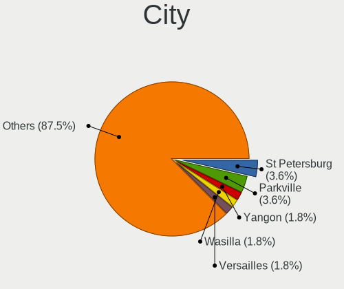
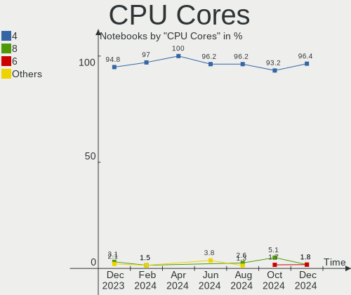
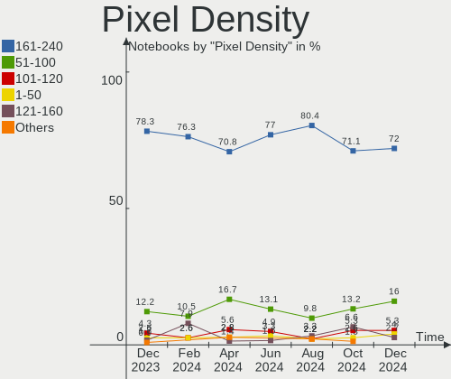
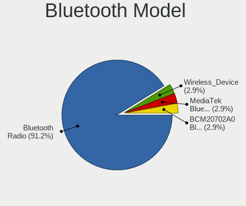
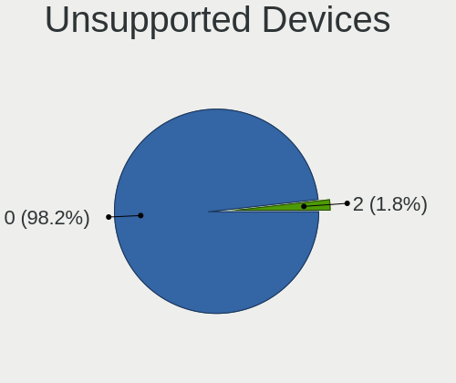

SteamOS - Hardware Trends (Notebooks)
-------------------------------------

A project to identify most popular hardware characteristics and track their change
over time based on data collected by Linux users at https://Linux-Hardware.org.

Anyone can contribute to this report by the [hw-probe](https://github.com/linuxhw/hw-probe) tool:

    sudo -E hw-probe -all -upload

This report is for one last month. Overall report since the beginning of time: [TestCoverage](https://github.com/linuxhw/TestCoverage)

Period: Oct, 2022.

Contents
--------

* [ System ](#system)
  - [ OS                       ](#os)
  - [ OS Family                ](#os-family)
  - [ Kernel                   ](#kernel)
  - [ Kernel Family            ](#kernel-family)
  - [ Kernel Major Ver.        ](#kernel-major-ver)
  - [ Arch                     ](#arch)
  - [ DE                       ](#de)
  - [ Display Server           ](#display-server)
  - [ Display Manager          ](#display-manager)
  - [ OS Lang                  ](#os-lang)
  - [ Boot Mode                ](#boot-mode)
  - [ Filesystem               ](#filesystem)
  - [ Part. scheme             ](#part-scheme)
  - [ Dual Boot with Linux/BSD ](#dual-boot-with-linuxbsd)
  - [ Dual Boot (Win)          ](#dual-boot-win)

* [ Board ](#board)
  - [ Vendor                   ](#vendor)
  - [ Model                    ](#model)
  - [ Model Family             ](#model-family)
  - [ MFG Year                 ](#mfg-year)
  - [ Form Factor              ](#form-factor)
  - [ Secure Boot              ](#secure-boot)
  - [ Coreboot                 ](#coreboot)
  - [ RAM Size                 ](#ram-size)
  - [ RAM Used                 ](#ram-used)
  - [ Total Drives             ](#total-drives)
  - [ Has CD-ROM               ](#has-cd-rom)
  - [ Has Ethernet             ](#has-ethernet)
  - [ Has WiFi                 ](#has-wifi)
  - [ Has Bluetooth            ](#has-bluetooth)

* [ Location ](#location)
  - [ Country                  ](#country)
  - [ City                     ](#city)

* [ Drives ](#drives)
  - [ Drive Vendor             ](#drive-vendor)
  - [ Drive Model              ](#drive-model)
  - [ HDD Vendor               ](#hdd-vendor)
  - [ SSD Vendor               ](#ssd-vendor)
  - [ Drive Kind               ](#drive-kind)
  - [ Drive Connector          ](#drive-connector)
  - [ Drive Size               ](#drive-size)
  - [ Space Total              ](#space-total)
  - [ Space Used               ](#space-used)
  - [ Malfunc. Drives          ](#malfunc-drives)
  - [ Malfunc. Drive Vendor    ](#malfunc-drive-vendor)
  - [ Malfunc. HDD Vendor      ](#malfunc-hdd-vendor)
  - [ Malfunc. Drive Kind      ](#malfunc-drive-kind)
  - [ Failed Drives            ](#failed-drives)
  - [ Failed Drive Vendor      ](#failed-drive-vendor)
  - [ Drive Status             ](#drive-status)

* [ Storage controller ](#storage-controller)
  - [ Storage Vendor           ](#storage-vendor)
  - [ Storage Model            ](#storage-model)
  - [ Storage Kind             ](#storage-kind)

* [ Processor ](#processor)
  - [ CPU Vendor               ](#cpu-vendor)
  - [ CPU Model                ](#cpu-model)
  - [ CPU Model Family         ](#cpu-model-family)
  - [ CPU Cores                ](#cpu-cores)
  - [ CPU Sockets              ](#cpu-sockets)
  - [ CPU Threads              ](#cpu-threads)
  - [ CPU Op-Modes             ](#cpu-op-modes)
  - [ CPU Microcode            ](#cpu-microcode)
  - [ CPU Microarch            ](#cpu-microarch)

* [ Graphics ](#graphics)
  - [ GPU Vendor               ](#gpu-vendor)
  - [ GPU Model                ](#gpu-model)
  - [ GPU Combo                ](#gpu-combo)
  - [ GPU Driver               ](#gpu-driver)
  - [ GPU Memory               ](#gpu-memory)

* [ Monitor ](#monitor)
  - [ Monitor Vendor           ](#monitor-vendor)
  - [ Monitor Model            ](#monitor-model)
  - [ Monitor Resolution       ](#monitor-resolution)
  - [ Monitor Diagonal         ](#monitor-diagonal)
  - [ Monitor Width            ](#monitor-width)
  - [ Aspect Ratio             ](#aspect-ratio)
  - [ Monitor Area             ](#monitor-area)
  - [ Pixel Density            ](#pixel-density)
  - [ Multiple Monitors        ](#multiple-monitors)

* [ Network ](#network)
  - [ Net Controller Vendor    ](#net-controller-vendor)
  - [ Net Controller Model     ](#net-controller-model)
  - [ Wireless Vendor          ](#wireless-vendor)
  - [ Wireless Model           ](#wireless-model)
  - [ Ethernet Vendor          ](#ethernet-vendor)
  - [ Ethernet Model           ](#ethernet-model)
  - [ Net Controller Kind      ](#net-controller-kind)
  - [ Used Controller          ](#used-controller)
  - [ NICs                     ](#nics)
  - [ IPv6                     ](#ipv6)

* [ Bluetooth ](#bluetooth)
  - [ Bluetooth Vendor         ](#bluetooth-vendor)
  - [ Bluetooth Model          ](#bluetooth-model)

* [ Sound ](#sound)
  - [ Sound Vendor             ](#sound-vendor)
  - [ Sound Model              ](#sound-model)

* [ Memory ](#memory)
  - [ Memory Vendor            ](#memory-vendor)
  - [ Memory Model             ](#memory-model)
  - [ Memory Kind              ](#memory-kind)
  - [ Memory Form Factor       ](#memory-form-factor)
  - [ Memory Size              ](#memory-size)
  - [ Memory Speed             ](#memory-speed)

* [ Printers & scanners ](#printers--scanners)
  - [ Printer Vendor           ](#printer-vendor)
  - [ Printer Model            ](#printer-model)
  - [ Scanner Vendor           ](#scanner-vendor)
  - [ Scanner Model            ](#scanner-model)

* [ Camera ](#camera)
  - [ Camera Vendor            ](#camera-vendor)
  - [ Camera Model             ](#camera-model)

* [ Security ](#security)
  - [ Fingerprint Vendor       ](#fingerprint-vendor)
  - [ Fingerprint Model        ](#fingerprint-model)
  - [ Chipcard Vendor          ](#chipcard-vendor)
  - [ Chipcard Model           ](#chipcard-model)

* [ Unsupported ](#unsupported)
  - [ Unsupported Devices      ](#unsupported-devices)
  - [ Unsupported Device Types ](#unsupported-device-types)

System
------

OS
--

Installed operating systems

| Name          | Notebooks | Percent |
|---------------|-----------|---------|
| SteamOS 3.3.2 | 52        | 63.41%  |
| SteamOS 3.3.1 | 17        | 20.73%  |
| SteamOS 3.3   | 6         | 7.32%   |
| SteamOS 3.4   | 4         | 4.88%   |
| SteamOS       | 2         | 2.44%   |
| SteamOS 3.2   | 1         | 1.22%   |

OS Family
---------

OS without a version

| Name    | Notebooks | Percent |
|---------|-----------|---------|
| SteamOS | 82        | 100%    |

Kernel
------

Version of the Linux kernel

| Version                                        | Notebooks | Percent |
|------------------------------------------------|-----------|---------|
| 5.13.0-valve21.3-1-neptune                     | 51        | 62.2%   |
| 5.13.0-valve21.1-1-neptune-02211-gc54cda5a36f3 | 17        | 20.73%  |
| 5.13.0-valve24-1-neptune                       | 6         | 7.32%   |
| 5.13.0-valve24-1-neptune-02226-g5b8545e4c5a1   | 4         | 4.88%   |
| 5.18.1-arch1_testHoloISO_20220606.1811         | 1         | 1.22%   |
| 5.15.54-1-lts                                  | 1         | 1.22%   |
| 5.13.0-valve21.2-1-neptune                     | 1         | 1.22%   |
| 5.13.0-valve15-1-neptune-02197-gf6ec7ad3762a   | 1         | 1.22%   |

Kernel Family
-------------

Linux kernel without a distro release

| Version | Notebooks | Percent |
|---------|-----------|---------|
| 5.13.0  | 80        | 97.56%  |
| 5.18.1  | 1         | 1.22%   |
| 5.15.54 | 1         | 1.22%   |

Kernel Major Ver.
-----------------

Linux kernel major version

| Version | Notebooks | Percent |
|---------|-----------|---------|
| 5.13    | 80        | 97.56%  |
| 5.18    | 1         | 1.22%   |
| 5.15    | 1         | 1.22%   |

Arch
----

OS architecture (x86_64, i586, etc.)

| Name   | Notebooks | Percent |
|--------|-----------|---------|
| x86_64 | 82        | 100%    |

DE
--

Desktop Environment

| Name  | Notebooks | Percent |
|-------|-----------|---------|
| KDE5  | 81        | 98.78%  |
| GNOME | 1         | 1.22%   |

Display Server
--------------

X11 or Wayland

| Name    | Notebooks | Percent |
|---------|-----------|---------|
| X11     | 81        | 98.78%  |
| Wayland | 1         | 1.22%   |

Display Manager
---------------

SDDM, LightDM, etc.

| Name    | Notebooks | Percent |
|---------|-----------|---------|
| Unknown | 82        | 100%    |

OS Lang
-------

Language

| Lang  | Notebooks | Percent |
|-------|-----------|---------|
| en_US | 69        | 84.15%  |
| fr_FR | 3         | 3.66%   |
| de_DE | 3         | 3.66%   |
| en_GB | 2         | 2.44%   |
| fr_BE | 1         | 1.22%   |
| es_ES | 1         | 1.22%   |
| en_SE | 1         | 1.22%   |
| en_HK | 1         | 1.22%   |
| en_CA | 1         | 1.22%   |

Boot Mode
---------

EFI or BIOS

| Mode | Notebooks | Percent |
|------|-----------|---------|
| BIOS | 82        | 100%    |

Filesystem
----------

Type of filesystem

| Type  | Notebooks | Percent |
|-------|-----------|---------|
| Btrfs | 82        | 100%    |

Part. scheme
------------

Scheme of partitioning

| Type    | Notebooks | Percent |
|---------|-----------|---------|
| Unknown | 82        | 100%    |

Dual Boot with Linux/BSD
------------------------

Hosting more than one Linux/BSD

| Dual boot | Notebooks | Percent |
|-----------|-----------|---------|
| No        | 82        | 100%    |

Dual Boot (Win)
---------------

Hosting Linux and Windows

| Dual boot | Notebooks | Percent |
|-----------|-----------|---------|
| No        | 82        | 100%    |

Board
-----

Vendor
------

Motherboard manufacturer

| Name    | Notebooks | Percent |
|---------|-----------|---------|
| Valve   | 75        | 91.46%  |
| Lenovo  | 2         | 2.44%   |
| MSI     | 1         | 1.22%   |
| Google  | 1         | 1.22%   |
| AZW     | 1         | 1.22%   |
| Apple   | 1         | 1.22%   |
| ADVANCE | 1         | 1.22%   |

Model
-----

Motherboard model

| Name                         | Notebooks | Percent |
|------------------------------|-----------|---------|
| Valve Jupiter                | 75        | 91.46%  |
| MSI GP66 Leopard 11UH        | 1         | 1.22%   |
| Lenovo IdeaPad 3 15ITL6 82H8 | 1         | 1.22%   |
| Lenovo IdeaPad 1 14IAU7 82QC | 1         | 1.22%   |
| Google Droid                 | 1         | 1.22%   |
| AZW MINI S                   | 1         | 1.22%   |
| Apple MacBookAir6,1          | 1         | 1.22%   |
| ADVANCE PS5077               | 1         | 1.22%   |

Model Family
------------

Motherboard model prefix

| Name              | Notebooks | Percent |
|-------------------|-----------|---------|
| Valve Jupiter     | 75        | 91.46%  |
| Lenovo IdeaPad    | 2         | 2.44%   |
| MSI GP66          | 1         | 1.22%   |
| Google Droid      | 1         | 1.22%   |
| AZW MINI          | 1         | 1.22%   |
| Apple MacBookAir6 | 1         | 1.22%   |
| ADVANCE PS5077    | 1         | 1.22%   |

MFG Year
--------

Motherboard manufacture year

| Year | Notebooks | Percent |
|------|-----------|---------|
| 2022 | 78        | 95.12%  |
| 2021 | 3         | 3.66%   |
| 2014 | 1         | 1.22%   |

Form Factor
-----------

Physical design of the computer

| Name     | Notebooks | Percent |
|----------|-----------|---------|
| Notebook | 82        | 100%    |

Secure Boot
-----------

Enabled or disabled

| State    | Notebooks | Percent |
|----------|-----------|---------|
| Disabled | 82        | 100%    |

Coreboot
--------

Have coreboot on board

| Used | Notebooks | Percent |
|------|-----------|---------|
| No   | 81        | 98.78%  |
| Yes  | 1         | 1.22%   |

RAM Size
--------

Total RAM memory

| Size in GB | Notebooks | Percent |
|------------|-----------|---------|
| 8.01-16.0  | 75        | 91.46%  |
| 4.01-8.0   | 5         | 6.1%    |
| 32.01-64.0 | 1         | 1.22%   |
| 3.01-4.0   | 1         | 1.22%   |

RAM Used
--------

Used RAM memory

| Used GB  | Notebooks | Percent |
|----------|-----------|---------|
| 2.01-3.0 | 48        | 58.54%  |
| 3.01-4.0 | 21        | 25.61%  |
| 4.01-8.0 | 8         | 9.76%   |
| 1.01-2.0 | 5         | 6.1%    |

Total Drives
------------

Number of drives on board

| Drives | Notebooks | Percent |
|--------|-----------|---------|
| 2      | 49        | 59.76%  |
| 1      | 33        | 40.24%  |

Has CD-ROM
----------

Has CD-ROM on board

| Presented | Notebooks | Percent |
|-----------|-----------|---------|
| No        | 81        | 98.78%  |
| Yes       | 1         | 1.22%   |

Has Ethernet
------------

Has Ethernet on board

| Presented | Notebooks | Percent |
|-----------|-----------|---------|
| No        | 52        | 63.41%  |
| Yes       | 30        | 36.59%  |

Has WiFi
--------

Has WiFi module

| Presented | Notebooks | Percent |
|-----------|-----------|---------|
| Yes       | 82        | 100%    |

Has Bluetooth
-------------

Has Bluetooth module

| Presented | Notebooks | Percent |
|-----------|-----------|---------|
| Yes       | 80        | 97.56%  |
| No        | 2         | 2.44%   |

Location
--------

Country
-------

Geographic location (country)

| Country   | Notebooks | Percent |
|-----------|-----------|---------|
| USA       | 35        | 42.68%  |
| UK        | 14        | 17.07%  |
| Germany   | 10        | 12.2%   |
| France    | 5         | 6.1%    |
| Canada    | 4         | 4.88%   |
| Sweden    | 2         | 2.44%   |
| Russia    | 2         | 2.44%   |
| Austria   | 2         | 2.44%   |
| Spain     | 1         | 1.22%   |
| Romania   | 1         | 1.22%   |
| Poland    | 1         | 1.22%   |
| Peru      | 1         | 1.22%   |
| Palestine | 1         | 1.22%   |
| Moldova   | 1         | 1.22%   |
| China     | 1         | 1.22%   |
| Belgium   | 1         | 1.22%   |

City
----

Geographic location (city)

| City                   | Notebooks | Percent |
|------------------------|-----------|---------|
| Yaroslavl              | 1         | 1.22%   |
| Winter Park            | 1         | 1.22%   |
| Winnipeg               | 1         | 1.22%   |
| Wigan                  | 1         | 1.22%   |
| West Covina            | 1         | 1.22%   |
| Wasungen               | 1         | 1.22%   |
| Warsaw                 | 1         | 1.22%   |
| Walled Lake            | 1         | 1.22%   |
| Villingen-Schwenningen | 1         | 1.22%   |
| Vienna                 | 1         | 1.22%   |
| Victoria               | 1         | 1.22%   |
| Vernon                 | 1         | 1.22%   |
| Valencia               | 1         | 1.22%   |
| The Bronx              | 1         | 1.22%   |
| Targu Gangulesti       | 1         | 1.22%   |
| Stuttgart              | 1         | 1.22%   |
| Spartanburg            | 1         | 1.22%   |
| Sheffield              | 1         | 1.22%   |
| Seattle                | 1         | 1.22%   |
| Salach                 | 1         | 1.22%   |
| Rietberg               | 1         | 1.22%   |
| Redon                  | 1         | 1.22%   |
| Portland               | 1         | 1.22%   |
| Poplar                 | 1         | 1.22%   |
| Philadelphia           | 1         | 1.22%   |
| Pawtucket              | 1         | 1.22%   |
| Parker                 | 1         | 1.22%   |
| Panama City            | 1         | 1.22%   |
| Palm Desert            | 1         | 1.22%   |
| Oxford                 | 1         | 1.22%   |
| Norwich                | 1         | 1.22%   |
| North Shields          | 1         | 1.22%   |
| Norman                 | 1         | 1.22%   |
| Newcastle upon Tyne    | 1         | 1.22%   |
| Newark                 | 1         | 1.22%   |
| Nantes                 | 1         | 1.22%   |
| Moscow                 | 1         | 1.22%   |
| Mississauga            | 1         | 1.22%   |
| Minneapolis            | 1         | 1.22%   |
| McKinleyville          | 1         | 1.22%   |

Drives
------

Drive Vendor
------------

Hard drive vendors

| Vendor                         | Notebooks | Drives | Percent |
|--------------------------------|-----------|--------|---------|
| Unknown                        | 44        | 44     | 33.59%  |
| Kingston Technology Company    | 26        | 26     | 19.85%  |
| Samsung Electronics            | 18        | 18     | 13.74%  |
| Phison Electronics             | 17        | 17     | 12.98%  |
| Sandisk                        | 7         | 7      | 5.34%   |
| O2 Micro                       | 4         | 4      | 3.05%   |
| Unknown                        | 4         | 4      | 3.05%   |
| Silicon Motion                 | 3         | 3      | 2.29%   |
| SK hynix                       | 2         | 2      | 1.53%   |
| Solid State Storage Technology | 1         | 1      | 0.76%   |
| Seagate                        | 1         | 1      | 0.76%   |
| NGFF                           | 1         | 1      | 0.76%   |
| Intel                          | 1         | 1      | 0.76%   |
| China                          | 1         | 1      | 0.76%   |
| Apple                          | 1         | 1      | 0.76%   |

Drive Model
-----------

Hard drive models

| Model                                                 | Notebooks | Percent |
|-------------------------------------------------------|-----------|---------|
| Kingston Company OM3PDP3 NVMe SSD 512GB               | 26        | 19.85%  |
| Phison PS5013 E13 NVMe Controller 256GB               | 17        | 12.98%  |
| Unknown MMC Card  256GB                               | 16        | 12.21%  |
| Unknown MMC Card  512GB                               | 13        | 9.92%   |
| Samsung MZ9LQ256HBJD-00BVL 256GB                      | 7         | 5.34%   |
| Unknown MMC Card  128GB                               | 6         | 4.58%   |
| Samsung MZ9LQ512HBLU-00BVL 512GB                      | 6         | 4.58%   |
| O2 Micro E2M2 64GB                                    | 4         | 3.05%   |
| Unknown                                               | 4         | 3.05%   |
| Unknown MMC Card  32GB                                | 3         | 2.29%   |
| Silicon Motion SM2263EN/SM2263XT SSD Controller 256GB | 3         | 2.29%   |
| Unknown MMC Card  64GB                                | 2         | 1.53%   |
| Sandisk WDC PC SN530 SDBPTPZ-1T00 1024GB              | 2         | 1.53%   |
| Sandisk WDC PC SN530 SDBPMPZ-256G-1101 256GB          | 2         | 1.53%   |
| Sandisk PC SN530 NVMe WDC 256GB                       | 2         | 1.53%   |
| Samsung MZVLQ1T0HALB-00000 1024GB                     | 2         | 1.53%   |
| Unknown MMC Card  500GB                               | 1         | 0.76%   |
| Unknown MMC Card  393GB                               | 1         | 0.76%   |
| Unknown MMC Card  250GB                               | 1         | 0.76%   |
| Unknown MMC Card  16GB                                | 1         | 0.76%   |
| Solid State Storage SSSTC XA1-31512 450GB             | 1         | 0.76%   |
| SK hynix BC711 NVMe 256GB                             | 1         | 0.76%   |
| SK hynix BC711 NVMe 1TB                               | 1         | 0.76%   |
| Seagate Expansion SW 8TB                              | 1         | 0.76%   |
| Sandisk WD Black SN850 1TB                            | 1         | 0.76%   |
| Samsung PM991a NVMe 512GB                             | 1         | 0.76%   |
| Samsung PM991a NVMe 256GB                             | 1         | 0.76%   |
| Samsung PM991 NVMe 512GB                              | 1         | 0.76%   |
| NGFF 2280 256GB SSD                                   | 1         | 0.76%   |
| Intel SSD 660P Series 1024GB                          | 1         | 0.76%   |
| China SATA SSD 256GB                                  | 1         | 0.76%   |
| Apple SSD TS0128F 121GB                               | 1         | 0.76%   |

HDD Vendor
----------

Hard disk drive vendors

| Vendor  | Notebooks | Drives | Percent |
|---------|-----------|--------|---------|
| Seagate | 1         | 1      | 100%    |

SSD Vendor
----------

Solid state drive vendors

| Vendor | Notebooks | Drives | Percent |
|--------|-----------|--------|---------|
| NGFF   | 1         | 1      | 33.33%  |
| China  | 1         | 1      | 33.33%  |
| Apple  | 1         | 1      | 33.33%  |

Drive Kind
----------

HDD or SSD

| Kind    | Notebooks | Drives | Percent |
|---------|-----------|--------|---------|
| NVMe    | 78        | 79     | 60.47%  |
| MMC     | 47        | 47     | 36.43%  |
| SSD     | 2         | 3      | 1.55%   |
| HDD     | 1         | 1      | 0.78%   |
| Unknown | 1         | 1      | 0.78%   |

Drive Connector
---------------

SATA, SAS, NVMe, etc.

| Type | Notebooks | Drives | Percent |
|------|-----------|--------|---------|
| NVMe | 78        | 79     | 60.47%  |
| MMC  | 47        | 47     | 36.43%  |
| SATA | 3         | 4      | 2.33%   |
| SAS  | 1         | 1      | 0.78%   |

Drive Size
----------

Size of hard drive

| Size in TB | Notebooks | Drives | Percent |
|------------|-----------|--------|---------|
| 0.01-0.5   | 2         | 3      | 66.67%  |
| 4.01-10.0  | 1         | 1      | 33.33%  |

Space Total
-----------

Amount of disk space available on the file system

| Size in GB     | Notebooks | Percent |
|----------------|-----------|---------|
| 251-500        | 46        | 56.1%   |
| 101-250        | 21        | 25.61%  |
| 501-1000       | 8         | 9.76%   |
| 51-100         | 4         | 4.88%   |
| 1001-2000      | 2         | 2.44%   |
| More than 3000 | 1         | 1.22%   |

Space Used
----------

Amount of used disk space

| Used GB  | Notebooks | Percent |
|----------|-----------|---------|
| 101-250  | 30        | 36.59%  |
| 251-500  | 22        | 26.83%  |
| 51-100   | 13        | 15.85%  |
| 21-50    | 10        | 12.2%   |
| 1-20     | 6         | 7.32%   |
| 501-1000 | 1         | 1.22%   |

Malfunc. Drives
---------------

Drive models with a malfunction

Zero info for selected period =(

Malfunc. Drive Vendor
---------------------

Vendors of faulty drives

Zero info for selected period =(

Malfunc. HDD Vendor
-------------------

Vendors of faulty HDD drives

Zero info for selected period =(

Malfunc. Drive Kind
-------------------

Kinds of faulty drives

Zero info for selected period =(

Failed Drives
-------------

Failed drive models

Zero info for selected period =(

Failed Drive Vendor
-------------------

Failed drive vendors

Zero info for selected period =(

Drive Status
------------

Number of failed and malfunc. drives

| Status   | Notebooks | Drives | Percent |
|----------|-----------|--------|---------|
| Detected | 82        | 131    | 100%    |

Storage controller
------------------

Storage Vendor
--------------

Storage controller vendors

| Vendor                         | Notebooks | Percent |
|--------------------------------|-----------|---------|
| Kingston Technology Company    | 26        | 30.95%  |
| Samsung Electronics            | 18        | 21.43%  |
| Phison Electronics             | 17        | 20.24%  |
| SanDisk                        | 7         | 8.33%   |
| Intel                          | 5         | 5.95%   |
| O2 Micro                       | 4         | 4.76%   |
| Silicon Motion                 | 3         | 3.57%   |
| SK hynix                       | 2         | 2.38%   |
| Toshiba America Info Systems   | 1         | 1.19%   |
| Solid State Storage Technology | 1         | 1.19%   |

Storage Model
-------------

Storage controller models

| Model                                                             | Notebooks | Percent |
|-------------------------------------------------------------------|-----------|---------|
| Kingston Company OM3PDP3 NVMe SSD                                 | 26        | 30.59%  |
| Samsung NVMe SSD Controller 980                                   | 18        | 21.18%  |
| Phison PS5013 E13 NVMe Controller                                 | 17        | 20%     |
| SanDisk Non-Volatile memory controller                            | 6         | 7.06%   |
| O2 Micro Non-Volatile memory controller                           | 4         | 4.71%   |
| Silicon Motion SM2263EN/SM2263XT SSD Controller                   | 3         | 3.53%   |
| SK hynix Gold P31 SSD                                             | 2         | 2.35%   |
| Toshiba America Info Systems Toshiba America Info SATA controller | 1         | 1.18%   |
| Solid State Storage Non-Volatile memory controller                | 1         | 1.18%   |
| SanDisk WD PC SN810 / Black SN850 NVMe SSD                        | 1         | 1.18%   |
| Intel Volume Management Device NVMe RAID Controller               | 1         | 1.18%   |
| Intel Tiger Lake-LP SATA Controller                               | 1         | 1.18%   |
| Intel SSD 660P Series                                             | 1         | 1.18%   |
| Intel Jasper Lake SATA AHCI Controller                            | 1         | 1.18%   |
| Intel Cannon Point-LP SATA Controller [AHCI Mode]                 | 1         | 1.18%   |
| Intel Alder Lake-P SATA AHCI Controller                           | 1         | 1.18%   |

Storage Kind
------------

Kind of storage controller (IDE, SATA, NVMe, SAS, ...)

| Kind | Notebooks | Percent |
|------|-----------|---------|
| NVMe | 78        | 92.86%  |
| SATA | 5         | 5.95%   |
| RAID | 1         | 1.19%   |

Processor
---------

CPU Vendor
----------

Processor vendors

| Vendor | Notebooks | Percent |
|--------|-----------|---------|
| AMD    | 75        | 91.46%  |
| Intel  | 7         | 8.54%   |

CPU Model
---------

Processor models

| Model                                    | Notebooks | Percent |
|------------------------------------------|-----------|---------|
| AMD Custom APU 0405                      | 75        | 91.46%  |
| Intel Pentium Silver N5030 CPU @ 1.10GHz | 1         | 1.22%   |
| Intel Core i5-8259U CPU @ 2.30GHz        | 1         | 1.22%   |
| Intel Core i5-4260U CPU @ 1.40GHz        | 1         | 1.22%   |
| Intel Celeron N5095 @ 2.00GHz            | 1         | 1.22%   |
| Intel 12th Gen Core i3-1215U             | 1         | 1.22%   |
| Intel 11th Gen Core i7-11800H @ 2.30GHz  | 1         | 1.22%   |
| Intel 11th Gen Core i3-1115G4 @ 3.00GHz  | 1         | 1.22%   |

CPU Model Family
----------------

Processor model prefix

| Model                | Notebooks | Percent |
|----------------------|-----------|---------|
| Other                | 78        | 95.12%  |
| Intel Core i5        | 2         | 2.44%   |
| Intel Pentium Silver | 1         | 1.22%   |
| Intel Celeron        | 1         | 1.22%   |

CPU Cores
---------

Number of processor cores

| Number | Notebooks | Percent |
|--------|-----------|---------|
| 4      | 78        | 95.12%  |
| 2      | 2         | 2.44%   |
| 8      | 1         | 1.22%   |
| 6      | 1         | 1.22%   |

CPU Sockets
-----------

Number of sockets

| Number | Notebooks | Percent |
|--------|-----------|---------|
| 1      | 82        | 100%    |

CPU Threads
-----------

Threads per core (Hyper-Threading)

| Number | Notebooks | Percent |
|--------|-----------|---------|
| 2      | 80        | 97.56%  |
| 1      | 2         | 2.44%   |

CPU Op-Modes
------------

CPU Operation Modes (32-bit, 64-bit)

| Op mode        | Notebooks | Percent |
|----------------|-----------|---------|
| 32-bit, 64-bit | 82        | 100%    |

CPU Microcode
-------------

Microcode number

| Number  | Notebooks | Percent |
|---------|-----------|---------|
| Unknown | 82        | 100%    |

CPU Microarch
-------------

Microarchitecture

| Name          | Notebooks | Percent |
|---------------|-----------|---------|
| Unknown       | 78        | 95.12%  |
| TigerLake     | 1         | 1.22%   |
| KabyLake      | 1         | 1.22%   |
| Haswell       | 1         | 1.22%   |
| Goldmont plus | 1         | 1.22%   |

Graphics
--------

GPU Vendor
----------

Vendors of graphics cards

| Vendor | Notebooks | Percent |
|--------|-----------|---------|
| AMD    | 75        | 91.46%  |
| Intel  | 6         | 7.32%   |
| Nvidia | 1         | 1.22%   |

GPU Model
---------

Graphics card models

| Model                                                    | Notebooks | Percent |
|----------------------------------------------------------|-----------|---------|
| AMD VanGogh [AMD Custom GPU 0405]                        | 75        | 91.46%  |
| Nvidia GA104M [GeForce RTX 3080 Mobile / Max-Q 8GB/16GB] | 1         | 1.22%   |
| Intel VGA compatible controller                          | 1         | 1.22%   |
| Intel Tiger Lake UHD Graphics                            | 1         | 1.22%   |
| Intel JasperLake [UHD Graphics]                          | 1         | 1.22%   |
| Intel Haswell-ULT Integrated Graphics Controller         | 1         | 1.22%   |
| Intel GeminiLake [UHD Graphics 605]                      | 1         | 1.22%   |
| Intel CoffeeLake-U GT3e [Iris Plus Graphics 655]         | 1         | 1.22%   |

GPU Combo
---------

Combinations of graphics cards

| Name       | Notebooks | Percent |
|------------|-----------|---------|
| 1 x AMD    | 75        | 91.46%  |
| 1 x Intel  | 5         | 6.1%    |
| Other      | 1         | 1.22%   |
| 1 x Nvidia | 1         | 1.22%   |

GPU Driver
----------

Free vs proprietary

| Driver      | Notebooks | Percent |
|-------------|-----------|---------|
| Free        | 81        | 98.78%  |
| Proprietary | 1         | 1.22%   |

GPU Memory
----------

Total video memory

| Size in GB | Notebooks | Percent |
|------------|-----------|---------|
| Unknown    | 81        | 98.78%  |
| 7.01-8.0   | 1         | 1.22%   |

Monitor
-------

Monitor Vendor
--------------

Monitor vendors

| Vendor               | Notebooks | Percent |
|----------------------|-----------|---------|
| Analogix             | 66        | 64.08%  |
| Valve                | 8         | 7.77%   |
| Samsung Electronics  | 4         | 3.88%   |
| Goldstar             | 4         | 3.88%   |
| Dell                 | 2         | 1.94%   |
| ASUSTek Computer     | 2         | 1.94%   |
| Acer                 | 2         | 1.94%   |
| Vizio                | 1         | 0.97%   |
| Sharp                | 1         | 0.97%   |
| Philips              | 1         | 0.97%   |
| PANDA                | 1         | 0.97%   |
| NEC Computers        | 1         | 0.97%   |
| Lenovo               | 1         | 0.97%   |
| InfoVision           | 1         | 0.97%   |
| Hewlett-Packard      | 1         | 0.97%   |
| GreenWood            | 1         | 0.97%   |
| Gigabyte Technology  | 1         | 0.97%   |
| Chimei Innolux       | 1         | 0.97%   |
| BOE                  | 1         | 0.97%   |
| BenQ                 | 1         | 0.97%   |
| Apple                | 1         | 0.97%   |
| Ancor Communications | 1         | 0.97%   |

Monitor Model
-------------

Monitor models

| Model                                                                  | Notebooks | Percent |
|------------------------------------------------------------------------|-----------|---------|
| Analogix ANX7530 U ANX7539 800x1280                                    | 66        | 64.08%  |
| Valve ANX7530 U VLV3001 800x1280 100x150mm 7.1-inch                    | 8         | 7.77%   |
| Vizio VA26LHDTV10T VIZ0035 1360x768 576x324mm 26.0-inch                | 1         | 0.97%   |
| Sharp LQ156M1JW03 SHP155D 1920x1080 344x194mm 15.5-inch                | 1         | 0.97%   |
| Samsung Electronics LCD Monitor SAM71B5 3840x2160 1020x570mm 46.0-inch | 1         | 0.97%   |
| Samsung Electronics LC24RG50 SAM0F90 1920x1080 532x304mm 24.1-inch     | 1         | 0.97%   |
| Samsung Electronics C49HG9x SAM0E5D 3840x1080 1196x336mm 48.9-inch     | 1         | 0.97%   |
| Samsung Electronics C27R50x SAM0F9D 1920x1080 598x336mm 27.0-inch      | 1         | 0.97%   |
| Philips FTV PHL04C3 3840x2160 1440x810mm 65.0-inch                     | 1         | 0.97%   |
| PANDA LCD Monitor NCP002D 1920x1080 344x194mm 15.5-inch                | 1         | 0.97%   |
| NEC Computers EA271Q NEC2DDC 2560x1440 596x335mm 26.9-inch             | 1         | 0.97%   |
| Lenovo LEN T2224dA LEN60EB 1920x1080 476x268mm 21.5-inch               | 1         | 0.97%   |
| InfoVision LCD Monitor IVO057D 1920x1080 309x174mm 14.0-inch           | 1         | 0.97%   |
| Hewlett-Packard E233 HPN3460 1920x1080 509x286mm 23.0-inch             | 1         | 0.97%   |
| GreenWood ARZOPA GWD1580 1920x1080 350x200mm 15.9-inch                 | 1         | 0.97%   |
| Goldstar QHD GSM778E 2560x1440 698x392mm 31.5-inch                     | 1         | 0.97%   |
| Goldstar MP59HT GSM5B44 1920x1080 480x270mm 21.7-inch                  | 1         | 0.97%   |
| Goldstar HDR WFHD GSM5B9F 2560x1080 798x334mm 34.1-inch                | 1         | 0.97%   |
| Goldstar 34GN850 GSM774A 3440x1440 800x335mm 34.1-inch                 | 1         | 0.97%   |
| Gigabyte Technology G34WQC A GBT3403 3440x1440 797x334mm 34.0-inch     | 1         | 0.97%   |
| Dell S2721HGF DEL41E8 1920x1080 600x340mm 27.2-inch                    | 1         | 0.97%   |
| Dell S2721DS DELA19D 2560x1440 597x336mm 27.0-inch                     | 1         | 0.97%   |
| Chimei Innolux LCD Monitor CMN15F5 1920x1080 344x193mm 15.5-inch       | 1         | 0.97%   |
| BOE LCD Monitor BOE08F2 1920x1080 310x174mm 14.0-inch                  | 1         | 0.97%   |
| BenQ GL2450 BNQ78A5 1920x1080 531x298mm 24.0-inch                      | 1         | 0.97%   |
| ASUSTek Computer VZ229 AUS22CC 1920x1080 476x268mm 21.5-inch           | 1         | 0.97%   |
| ASUSTek Computer VP279 AUS27DF 1920x1080 598x336mm 27.0-inch           | 1         | 0.97%   |
| Apple Color LCD APP9CF3 1366x768 260x140mm 11.6-inch                   | 1         | 0.97%   |
| Ancor Communications VS248 ACI2498 1920x1080 531x299mm 24.0-inch       | 1         | 0.97%   |
| Acer XB253Q ACR0741 1920x1080 543x302mm 24.5-inch                      | 1         | 0.97%   |
| Acer KA242Y ACR078F 1920x1080 527x296mm 23.8-inch                      | 1         | 0.97%   |

Monitor Resolution
------------------

Monitor screen resolution

| Resolution      | Notebooks | Percent |
|-----------------|-----------|---------|
| 800x1280        | 74        | 73.27%  |
| 1920x1080 (FHD) | 17        | 16.83%  |
| 2560x1440 (QHD) | 3         | 2.97%   |
| 3840x2160 (4K)  | 2         | 1.98%   |
| 3440x1440       | 2         | 1.98%   |
| 3840x1080       | 1         | 0.99%   |
| 2560x1080       | 1         | 0.99%   |
| 1366x768 (WXGA) | 1         | 0.99%   |

Monitor Diagonal
----------------

Diagonal size in inches

| Inches  | Notebooks | Percent |
|---------|-----------|---------|
| Unknown | 66        | 64.71%  |
| 7       | 8         | 7.84%   |
| 24      | 5         | 4.9%    |
| 15      | 4         | 3.92%   |
| 34      | 3         | 2.94%   |
| 27      | 3         | 2.94%   |
| 21      | 3         | 2.94%   |
| 14      | 2         | 1.96%   |
| 65      | 1         | 0.98%   |
| 49      | 1         | 0.98%   |
| 46      | 1         | 0.98%   |
| 36      | 1         | 0.98%   |
| 31      | 1         | 0.98%   |
| 26      | 1         | 0.98%   |
| 23      | 1         | 0.98%   |
| 11      | 1         | 0.98%   |

Monitor Width
-------------

Physical width

| Width in mm | Notebooks | Percent |
|-------------|-----------|---------|
| Unknown     | 66        | 64.71%  |
| 501-600     | 10        | 9.8%    |
| 1-100       | 8         | 7.84%   |
| 301-350     | 6         | 5.88%   |
| 701-800     | 4         | 3.92%   |
| 401-500     | 3         | 2.94%   |
| 1001-1500   | 3         | 2.94%   |
| 601-700     | 1         | 0.98%   |
| 201-300     | 1         | 0.98%   |

Aspect Ratio
------------

Proportional relationship between the width and the height

| Ratio | Notebooks | Percent |
|-------|-----------|---------|
| 0.62  | 66        | 65.35%  |
| 16/9  | 21        | 20.79%  |
| 0.67  | 8         | 7.92%   |
| 21/9  | 3         | 2.97%   |
| 32/9  | 1         | 0.99%   |
| 3/2   | 1         | 0.99%   |
| 16/10 | 1         | 0.99%   |

Monitor Area
------------

Area in inch²

| Area in inch² | Notebooks | Percent |
|----------------|-----------|---------|
| Unknown        | 66        | 64.71%  |
| 1-40           | 8         | 7.84%   |
| 201-250        | 6         | 5.88%   |
| 351-500        | 4         | 3.92%   |
| 301-350        | 4         | 3.92%   |
| 101-110        | 4         | 3.92%   |
| 251-300        | 3         | 2.94%   |
| 501-1000       | 3         | 2.94%   |
| 81-90          | 2         | 1.96%   |
| More than 1000 | 1         | 0.98%   |
| 51-60          | 1         | 0.98%   |

Pixel Density
-------------

Pixels per inch

| Density | Notebooks | Percent |
|---------|-----------|---------|
| Unknown | 66        | 64.71%  |
| 51-100  | 12        | 11.76%  |
| 161-240 | 8         | 7.84%   |
| 121-160 | 7         | 6.86%   |
| 101-120 | 7         | 6.86%   |
| 1-50    | 2         | 1.96%   |

Multiple Monitors
-----------------

Total monitors connected

| Total | Notebooks | Percent |
|-------|-----------|---------|
| 1     | 62        | 75.61%  |
| 2     | 19        | 23.17%  |
| 3     | 1         | 1.22%   |

Network
-------

Net Controller Vendor
---------------------

Controller vendors

| Vendor                | Notebooks | Percent |
|-----------------------|-----------|---------|
| Realtek Semiconductor | 78        | 75%     |
| ASIX Electronics      | 14        | 13.46%  |
| Intel                 | 5         | 4.81%   |
| Microsoft             | 2         | 1.92%   |
| TP-Link               | 1         | 0.96%   |
| Samsung Electronics   | 1         | 0.96%   |
| Lenovo                | 1         | 0.96%   |
| Edimax Technology     | 1         | 0.96%   |
| Broadcom Limited      | 1         | 0.96%   |

Net Controller Model
--------------------

Controller models

| Model                                                             | Notebooks | Percent |
|-------------------------------------------------------------------|-----------|---------|
| Realtek RTL8822CE 802.11ac PCIe Wireless Network Adapter          | 75        | 64.66%  |
| ASIX AX88179 Gigabit Ethernet                                     | 14        | 12.07%  |
| Realtek RTL8153 Gigabit Ethernet Adapter                          | 10        | 8.62%   |
| Realtek RTL8111/8168/8411 PCI Express Gigabit Ethernet Controller | 2         | 1.72%   |
| TP-Link 802.11ac NIC                                              | 1         | 0.86%   |
| Samsung Galaxy series, misc. (tethering mode)                     | 1         | 0.86%   |
| Realtek RTL8152 Fast Ethernet Adapter                             | 1         | 0.86%   |
| Realtek RTL8125 2.5GbE Controller                                 | 1         | 0.86%   |
| Realtek 802.11ac NIC                                              | 1         | 0.86%   |
| Microsoft XBOX ACC                                                | 1         | 0.86%   |
| Microsoft Wireless XBox Controller Dongle                         | 1         | 0.86%   |
| Lenovo USB-C Dock Ethernet                                        | 1         | 0.86%   |
| Intel Wireless 3165                                               | 1         | 0.86%   |
| Intel Wi-Fi 6 AX210/AX211/AX411 160MHz                            | 1         | 0.86%   |
| Intel Wi-Fi 6 AX201                                               | 1         | 0.86%   |
| Intel Gemini Lake PCH CNVi WiFi                                   | 1         | 0.86%   |
| Intel Alder Lake-P PCH CNVi WiFi                                  | 1         | 0.86%   |
| Edimax AC600 USB                                                  | 1         | 0.86%   |
| Broadcom Limited BCM4360 802.11ac Wireless Network Adapter        | 1         | 0.86%   |

Wireless Vendor
---------------

Wireless vendors

| Vendor                | Notebooks | Percent |
|-----------------------|-----------|---------|
| Realtek Semiconductor | 76        | 88.37%  |
| Intel                 | 5         | 5.81%   |
| Microsoft             | 2         | 2.33%   |
| TP-Link               | 1         | 1.16%   |
| Edimax Technology     | 1         | 1.16%   |
| Broadcom Limited      | 1         | 1.16%   |

Wireless Model
--------------

Wireless models

| Model                                                      | Notebooks | Percent |
|------------------------------------------------------------|-----------|---------|
| Realtek RTL8822CE 802.11ac PCIe Wireless Network Adapter   | 75        | 87.21%  |
| TP-Link 802.11ac NIC                                       | 1         | 1.16%   |
| Realtek 802.11ac NIC                                       | 1         | 1.16%   |
| Microsoft XBOX ACC                                         | 1         | 1.16%   |
| Microsoft Wireless XBox Controller Dongle                  | 1         | 1.16%   |
| Intel Wireless 3165                                        | 1         | 1.16%   |
| Intel Wi-Fi 6 AX210/AX211/AX411 160MHz                     | 1         | 1.16%   |
| Intel Wi-Fi 6 AX201                                        | 1         | 1.16%   |
| Intel Gemini Lake PCH CNVi WiFi                            | 1         | 1.16%   |
| Intel Alder Lake-P PCH CNVi WiFi                           | 1         | 1.16%   |
| Edimax AC600 USB                                           | 1         | 1.16%   |
| Broadcom Limited BCM4360 802.11ac Wireless Network Adapter | 1         | 1.16%   |

Ethernet Vendor
---------------

Ethernet vendors

| Vendor                | Notebooks | Percent |
|-----------------------|-----------|---------|
| Realtek Semiconductor | 14        | 46.67%  |
| ASIX Electronics      | 14        | 46.67%  |
| Samsung Electronics   | 1         | 3.33%   |
| Lenovo                | 1         | 3.33%   |

Ethernet Model
--------------

Ethernet models

| Model                                                             | Notebooks | Percent |
|-------------------------------------------------------------------|-----------|---------|
| ASIX AX88179 Gigabit Ethernet                                     | 14        | 46.67%  |
| Realtek RTL8153 Gigabit Ethernet Adapter                          | 10        | 33.33%  |
| Realtek RTL8111/8168/8411 PCI Express Gigabit Ethernet Controller | 2         | 6.67%   |
| Samsung Galaxy series, misc. (tethering mode)                     | 1         | 3.33%   |
| Realtek RTL8152 Fast Ethernet Adapter                             | 1         | 3.33%   |
| Realtek RTL8125 2.5GbE Controller                                 | 1         | 3.33%   |
| Lenovo USB-C Dock Ethernet                                        | 1         | 3.33%   |

Net Controller Kind
-------------------

Ethernet, WiFi or modem

| Kind     | Notebooks | Percent |
|----------|-----------|---------|
| WiFi     | 82        | 73.21%  |
| Ethernet | 30        | 26.79%  |

Used Controller
---------------

Currently used network controller

| Kind     | Notebooks | Percent |
|----------|-----------|---------|
| WiFi     | 76        | 85.39%  |
| Ethernet | 13        | 14.61%  |

NICs
----

Total network controllers on board

| Total | Notebooks | Percent |
|-------|-----------|---------|
| 1     | 80        | 97.56%  |
| 2     | 2         | 2.44%   |

IPv6
----

IPv6 vs IPv4

| Used | Notebooks | Percent |
|------|-----------|---------|
| No   | 49        | 59.76%  |
| Yes  | 33        | 40.24%  |

Bluetooth
---------

Bluetooth Vendor
----------------

Controller vendors

| Vendor       | Notebooks | Percent |
|--------------|-----------|---------|
| IMC Networks | 75        | 93.75%  |
| Intel        | 4         | 5%      |
| Apple        | 1         | 1.25%   |

Bluetooth Model
---------------

Controller models

| Model                                          | Notebooks | Percent |
|------------------------------------------------|-----------|---------|
| IMC Networks Bluetooth Radio                   | 75        | 93.75%  |
| Intel Bluetooth wireless interface             | 1         | 1.25%   |
| Intel Bluetooth 9460/9560 Jefferson Peak (JfP) | 1         | 1.25%   |
| Intel AX210 Bluetooth                          | 1         | 1.25%   |
| Intel AX201 Bluetooth                          | 1         | 1.25%   |
| Apple Bluetooth USB Host Controller            | 1         | 1.25%   |

Sound
-----

Sound Vendor
------------

Sound card vendors

| Vendor                 | Notebooks | Percent |
|------------------------|-----------|---------|
| AMD                    | 75        | 80.65%  |
| Intel                  | 7         | 7.53%   |
| Generalplus Technology | 2         | 2.15%   |
| Tenx Technology        | 1         | 1.08%   |
| Realtek Semiconductor  | 1         | 1.08%   |
| Nvidia                 | 1         | 1.08%   |
| Logitech               | 1         | 1.08%   |
| Lenovo                 | 1         | 1.08%   |
| KTMicro                | 1         | 1.08%   |
| JMTek                  | 1         | 1.08%   |
| Corsair                | 1         | 1.08%   |
| Alesis                 | 1         | 1.08%   |

Sound Model
-----------

Sound card models

| Model                                                        | Notebooks | Percent |
|--------------------------------------------------------------|-----------|---------|
| AMD Rembrandt Radeon High Definition Audio Controller        | 75        | 79.79%  |
| Generalplus Technology USB Audio Device                      | 2         | 2.13%   |
| Tenx Technology USB AUDIO                                    | 1         | 1.06%   |
| Realtek Semiconductor USB Audio                              | 1         | 1.06%   |
| Nvidia GA104 High Definition Audio Controller                | 1         | 1.06%   |
| Logitech G935 Gaming Headset                                 | 1         | 1.06%   |
| Lenovo ThinkPad USB-C Dock Gen2 USB Audio                    | 1         | 1.06%   |
| KTMicro KT USB Audio                                         | 1         | 1.06%   |
| JMTek USB PnP Audio Device                                   | 1         | 1.06%   |
| Intel Tiger Lake-LP Smart Sound Technology Audio Controller  | 1         | 1.06%   |
| Intel Tiger Lake-H HD Audio Controller                       | 1         | 1.06%   |
| Intel Jasper Lake HD Audio                                   | 1         | 1.06%   |
| Intel Haswell-ULT HD Audio Controller                        | 1         | 1.06%   |
| Intel Celeron/Pentium Silver Processor High Definition Audio | 1         | 1.06%   |
| Intel Cannon Point-LP High Definition Audio Controller       | 1         | 1.06%   |
| Intel Alder Lake PCH-P High Definition Audio Controller      | 1         | 1.06%   |
| Intel 8 Series HD Audio Controller                           | 1         | 1.06%   |
| Corsair HS45 Surround USB Sound Adapter                      | 1         | 1.06%   |
| Alesis V49                                                   | 1         | 1.06%   |

Memory
------

Memory Vendor
-------------

Memory module vendors

Zero info for selected period =(

Memory Model
------------

Memory module models

Zero info for selected period =(

Memory Kind
-----------

Memory module kinds

Zero info for selected period =(

Memory Form Factor
------------------

Physical design of the memory module

Zero info for selected period =(

Memory Size
-----------

Memory module size

Zero info for selected period =(

Memory Speed
------------

Memory module speed

Zero info for selected period =(

Printers & scanners
-------------------

Printer Vendor
--------------

Printer device vendors

Zero info for selected period =(

Printer Model
-------------

Printer device models

Zero info for selected period =(

Scanner Vendor
--------------

Scanner device vendors

Zero info for selected period =(

Scanner Model
-------------

Scanner device models

Zero info for selected period =(

Camera
------

Camera Vendor
-------------

Camera device vendors

| Vendor                | Notebooks | Percent |
|-----------------------|-----------|---------|
| Chicony Electronics   | 2         | 28.57%  |
| Acer                  | 2         | 28.57%  |
| Realtek Semiconductor | 1         | 14.29%  |
| Microdia              | 1         | 14.29%  |
| Logitech              | 1         | 14.29%  |

Camera Model
------------

Camera device models

| Model                     | Notebooks | Percent |
|---------------------------|-----------|---------|
| Realtek MTD camera        | 1         | 14.29%  |
| Microdia Webcam Vitade AF | 1         | 14.29%  |
| Logitech HD Webcam C615   | 1         | 14.29%  |
| Chicony Integrated Camera | 1         | 14.29%  |
| Chicony HD User Facing    | 1         | 14.29%  |
| Acer Integrated Camera    | 1         | 14.29%  |
| Acer HD Webcam            | 1         | 14.29%  |

Security
--------

Fingerprint Vendor
------------------

Fingerprint sensor vendors

Zero info for selected period =(

Fingerprint Model
-----------------

Fingerprint sensor models

Zero info for selected period =(

Chipcard Vendor
---------------

Chipcard module vendors

Zero info for selected period =(

Chipcard Model
--------------

Chipcard module models

Zero info for selected period =(

Unsupported
-----------

Unsupported Devices
-------------------

Total unsupported devices on board

| Total | Notebooks | Percent |
|-------|-----------|---------|
| 0     | 79        | 96.34%  |
| 2     | 2         | 2.44%   |
| 1     | 1         | 1.22%   |

Unsupported Device Types
------------------------

Types of unsupported devices

| Type                  | Notebooks | Percent |
|-----------------------|-----------|---------|
| Net/wireless          | 3         | 75%     |
| Multimedia controller | 1         | 25%     |

