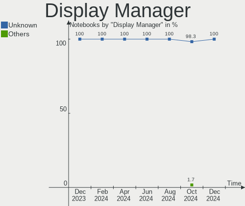
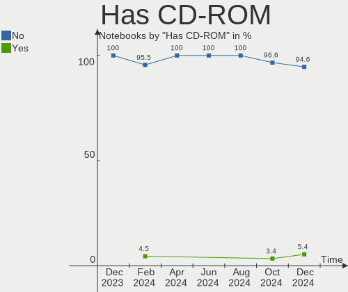
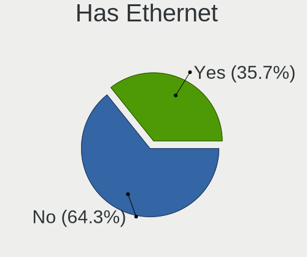
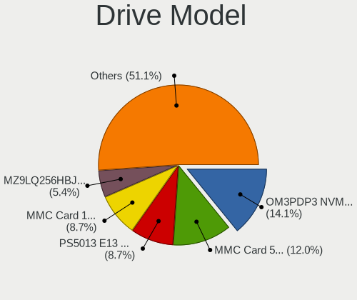
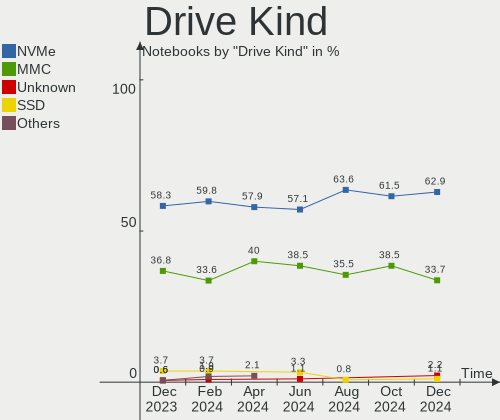
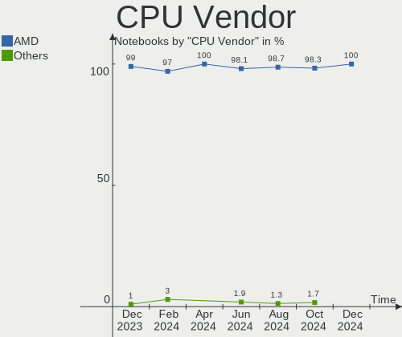
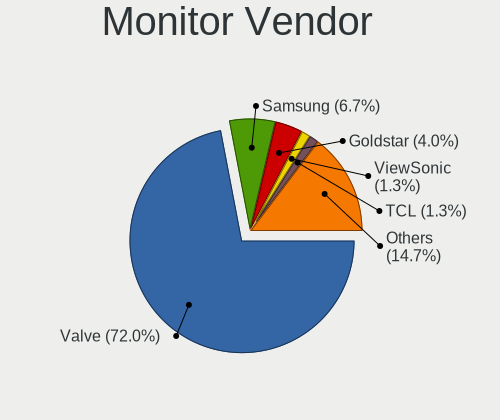
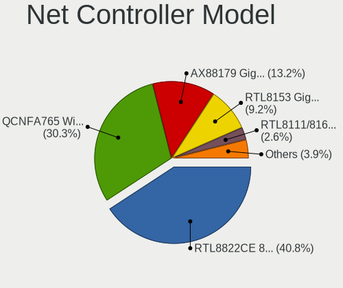
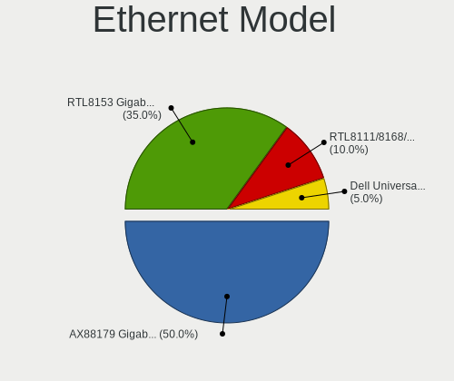

SteamOS - Hardware Trends (Notebooks)
-------------------------------------

A project to identify most popular hardware characteristics and track their change
over time based on data collected by Linux users at https://Linux-Hardware.org.

Anyone can contribute to this report by the [hw-probe](https://github.com/linuxhw/hw-probe) tool:

    sudo -E hw-probe -all -upload

This report is for one last month. Overall report since the beginning of time: [TestCoverage](https://github.com/linuxhw/TestCoverage)

Period: Jan, 2023.

Contents
--------

* [ System ](#system)
  - [ OS                       ](#os)
  - [ OS Family                ](#os-family)
  - [ Kernel                   ](#kernel)
  - [ Kernel Family            ](#kernel-family)
  - [ Kernel Major Ver.        ](#kernel-major-ver)
  - [ Arch                     ](#arch)
  - [ DE                       ](#de)
  - [ Display Server           ](#display-server)
  - [ Display Manager          ](#display-manager)
  - [ OS Lang                  ](#os-lang)
  - [ Boot Mode                ](#boot-mode)
  - [ Filesystem               ](#filesystem)
  - [ Part. scheme             ](#part-scheme)
  - [ Dual Boot with Linux/BSD ](#dual-boot-with-linuxbsd)
  - [ Dual Boot (Win)          ](#dual-boot-win)

* [ Board ](#board)
  - [ Vendor                   ](#vendor)
  - [ Model                    ](#model)
  - [ Model Family             ](#model-family)
  - [ MFG Year                 ](#mfg-year)
  - [ Form Factor              ](#form-factor)
  - [ Secure Boot              ](#secure-boot)
  - [ Coreboot                 ](#coreboot)
  - [ RAM Size                 ](#ram-size)
  - [ RAM Used                 ](#ram-used)
  - [ Total Drives             ](#total-drives)
  - [ Has CD-ROM               ](#has-cd-rom)
  - [ Has Ethernet             ](#has-ethernet)
  - [ Has WiFi                 ](#has-wifi)
  - [ Has Bluetooth            ](#has-bluetooth)

* [ Location ](#location)
  - [ Country                  ](#country)
  - [ City                     ](#city)

* [ Drives ](#drives)
  - [ Drive Vendor             ](#drive-vendor)
  - [ Drive Model              ](#drive-model)
  - [ HDD Vendor               ](#hdd-vendor)
  - [ SSD Vendor               ](#ssd-vendor)
  - [ Drive Kind               ](#drive-kind)
  - [ Drive Connector          ](#drive-connector)
  - [ Drive Size               ](#drive-size)
  - [ Space Total              ](#space-total)
  - [ Space Used               ](#space-used)
  - [ Malfunc. Drives          ](#malfunc-drives)
  - [ Malfunc. Drive Vendor    ](#malfunc-drive-vendor)
  - [ Malfunc. HDD Vendor      ](#malfunc-hdd-vendor)
  - [ Malfunc. Drive Kind      ](#malfunc-drive-kind)
  - [ Failed Drives            ](#failed-drives)
  - [ Failed Drive Vendor      ](#failed-drive-vendor)
  - [ Drive Status             ](#drive-status)

* [ Storage controller ](#storage-controller)
  - [ Storage Vendor           ](#storage-vendor)
  - [ Storage Model            ](#storage-model)
  - [ Storage Kind             ](#storage-kind)

* [ Processor ](#processor)
  - [ CPU Vendor               ](#cpu-vendor)
  - [ CPU Model                ](#cpu-model)
  - [ CPU Model Family         ](#cpu-model-family)
  - [ CPU Cores                ](#cpu-cores)
  - [ CPU Sockets              ](#cpu-sockets)
  - [ CPU Threads              ](#cpu-threads)
  - [ CPU Op-Modes             ](#cpu-op-modes)
  - [ CPU Microcode            ](#cpu-microcode)
  - [ CPU Microarch            ](#cpu-microarch)

* [ Graphics ](#graphics)
  - [ GPU Vendor               ](#gpu-vendor)
  - [ GPU Model                ](#gpu-model)
  - [ GPU Combo                ](#gpu-combo)
  - [ GPU Driver               ](#gpu-driver)
  - [ GPU Memory               ](#gpu-memory)

* [ Monitor ](#monitor)
  - [ Monitor Vendor           ](#monitor-vendor)
  - [ Monitor Model            ](#monitor-model)
  - [ Monitor Resolution       ](#monitor-resolution)
  - [ Monitor Diagonal         ](#monitor-diagonal)
  - [ Monitor Width            ](#monitor-width)
  - [ Aspect Ratio             ](#aspect-ratio)
  - [ Monitor Area             ](#monitor-area)
  - [ Pixel Density            ](#pixel-density)
  - [ Multiple Monitors        ](#multiple-monitors)

* [ Network ](#network)
  - [ Net Controller Vendor    ](#net-controller-vendor)
  - [ Net Controller Model     ](#net-controller-model)
  - [ Wireless Vendor          ](#wireless-vendor)
  - [ Wireless Model           ](#wireless-model)
  - [ Ethernet Vendor          ](#ethernet-vendor)
  - [ Ethernet Model           ](#ethernet-model)
  - [ Net Controller Kind      ](#net-controller-kind)
  - [ Used Controller          ](#used-controller)
  - [ NICs                     ](#nics)
  - [ IPv6                     ](#ipv6)

* [ Bluetooth ](#bluetooth)
  - [ Bluetooth Vendor         ](#bluetooth-vendor)
  - [ Bluetooth Model          ](#bluetooth-model)

* [ Sound ](#sound)
  - [ Sound Vendor             ](#sound-vendor)
  - [ Sound Model              ](#sound-model)

* [ Memory ](#memory)
  - [ Memory Vendor            ](#memory-vendor)
  - [ Memory Model             ](#memory-model)
  - [ Memory Kind              ](#memory-kind)
  - [ Memory Form Factor       ](#memory-form-factor)
  - [ Memory Size              ](#memory-size)
  - [ Memory Speed             ](#memory-speed)

* [ Printers & scanners ](#printers--scanners)
  - [ Printer Vendor           ](#printer-vendor)
  - [ Printer Model            ](#printer-model)
  - [ Scanner Vendor           ](#scanner-vendor)
  - [ Scanner Model            ](#scanner-model)

* [ Camera ](#camera)
  - [ Camera Vendor            ](#camera-vendor)
  - [ Camera Model             ](#camera-model)

* [ Security ](#security)
  - [ Fingerprint Vendor       ](#fingerprint-vendor)
  - [ Fingerprint Model        ](#fingerprint-model)
  - [ Chipcard Vendor          ](#chipcard-vendor)
  - [ Chipcard Model           ](#chipcard-model)

* [ Unsupported ](#unsupported)
  - [ Unsupported Devices      ](#unsupported-devices)
  - [ Unsupported Device Types ](#unsupported-device-types)

System
------

OS
--

Installed operating systems

| Name            | Notebooks | Percent |
|-----------------|-----------|---------|
| SteamOS 3.4.4   | 76        | 83.52%  |
| SteamOS 3.4.5   | 5         | 5.49%   |
| SteamOS 3.5     | 2         | 2.2%    |
| SteamOS 3.4.2   | 2         | 2.2%    |
| SteamOS 3.4     | 2         | 2.2%    |
| SteamOS Rolling | 1         | 1.1%    |
| SteamOS 3.3.3   | 1         | 1.1%    |
| SteamOS 3.3.2   | 1         | 1.1%    |
| SteamOS 3.1     | 1         | 1.1%    |

OS Family
---------

OS without a version

| Name    | Notebooks | Percent |
|---------|-----------|---------|
| SteamOS | 91        | 100%    |

Kernel
------

Version of the Linux kernel

| Version                                        | Notebooks | Percent |
|------------------------------------------------|-----------|---------|
| 5.13.0-valve36-1-neptune                       | 84        | 92.31%  |
| 5.13.0-valve37-1-neptune                       | 2         | 2.2%    |
| 5.13.0-valve21.3-1-neptune                     | 2         | 2.2%    |
| 6.1.5-zen3-xanmod1-1.1                         | 1         | 1.1%    |
| 5.18.1-arch1_testHoloISO_20220606.1811         | 1         | 1.1%    |
| 5.13.0-valve10.3-1-neptune-02176-g5fe416c4acd8 | 1         | 1.1%    |

Kernel Family
-------------

Linux kernel without a distro release

| Version | Notebooks | Percent |
|---------|-----------|---------|
| 5.13.0  | 89        | 97.8%   |
| 6.1.5   | 1         | 1.1%    |
| 5.18.1  | 1         | 1.1%    |

Kernel Major Ver.
-----------------

Linux kernel major version

| Version | Notebooks | Percent |
|---------|-----------|---------|
| 5.13    | 89        | 97.8%   |
| 6.1     | 1         | 1.1%    |
| 5.18    | 1         | 1.1%    |

Arch
----

OS architecture (x86_64, i586, etc.)

| Name   | Notebooks | Percent |
|--------|-----------|---------|
| x86_64 | 91        | 100%    |

DE
--

Desktop Environment

| Name | Notebooks | Percent |
|------|-----------|---------|
| KDE5 | 91        | 100%    |

Display Server
--------------

X11 or Wayland

| Name | Notebooks | Percent |
|------|-----------|---------|
| X11  | 90        | 98.9%   |
| Tty  | 1         | 1.1%    |

Display Manager
---------------

SDDM, LightDM, etc.

| Name    | Notebooks | Percent |
|---------|-----------|---------|
| Unknown | 90        | 98.9%   |
| SDDM    | 1         | 1.1%    |

OS Lang
-------

Language

| Lang  | Notebooks | Percent |
|-------|-----------|---------|
| en_US | 81        | 89.01%  |
| en_GB | 2         | 2.2%    |
| en_DE | 2         | 2.2%    |
| zh_CN | 1         | 1.1%    |
| ru_RU | 1         | 1.1%    |
| es_UY | 1         | 1.1%    |
| en_CA | 1         | 1.1%    |
| de_DE | 1         | 1.1%    |
| an_ES | 1         | 1.1%    |

Boot Mode
---------

EFI or BIOS

| Mode | Notebooks | Percent |
|------|-----------|---------|
| BIOS | 90        | 98.9%   |
| EFI  | 1         | 1.1%    |

Filesystem
----------

Type of filesystem

| Type  | Notebooks | Percent |
|-------|-----------|---------|
| Btrfs | 91        | 100%    |

Part. scheme
------------

Scheme of partitioning

| Type    | Notebooks | Percent |
|---------|-----------|---------|
| Unknown | 90        | 98.9%   |
| GPT     | 1         | 1.1%    |

Dual Boot with Linux/BSD
------------------------

Hosting more than one Linux/BSD

| Dual boot | Notebooks | Percent |
|-----------|-----------|---------|
| No        | 90        | 98.9%   |
| Yes       | 1         | 1.1%    |

Dual Boot (Win)
---------------

Hosting Linux and Windows

| Dual boot | Notebooks | Percent |
|-----------|-----------|---------|
| No        | 91        | 100%    |

Board
-----

Vendor
------

Motherboard manufacturer

| Name             | Notebooks | Percent |
|------------------|-----------|---------|
| Valve            | 89        | 97.8%   |
| Hewlett-Packard  | 1         | 1.1%    |
| ASUSTek Computer | 1         | 1.1%    |

Model
-----

Motherboard model

| Name                                  | Notebooks | Percent |
|---------------------------------------|-----------|---------|
| Valve Jupiter                         | 89        | 97.8%   |
| HP Laptop 15-bs0xx                    | 1         | 1.1%    |
| ASUS ROG Zephyrus G15 GA503QR_GA503QR | 1         | 1.1%    |

Model Family
------------

Motherboard model prefix

| Name          | Notebooks | Percent |
|---------------|-----------|---------|
| Valve Jupiter | 89        | 97.8%   |
| HP Laptop     | 1         | 1.1%    |
| ASUS ROG      | 1         | 1.1%    |

MFG Year
--------

Motherboard manufacture year

| Year | Notebooks | Percent |
|------|-----------|---------|
| 2022 | 89        | 97.8%   |
| 2021 | 1         | 1.1%    |
| 2017 | 1         | 1.1%    |

Form Factor
-----------

Physical design of the computer

| Name     | Notebooks | Percent |
|----------|-----------|---------|
| Notebook | 91        | 100%    |

Secure Boot
-----------

Enabled or disabled

| State    | Notebooks | Percent |
|----------|-----------|---------|
| Disabled | 91        | 100%    |

Coreboot
--------

Have coreboot on board

| Used | Notebooks | Percent |
|------|-----------|---------|
| No   | 91        | 100%    |

RAM Size
--------

Total RAM memory

| Size in GB | Notebooks | Percent |
|------------|-----------|---------|
| 8.01-16.0  | 91        | 100%    |

RAM Used
--------

Used RAM memory

| Used GB   | Notebooks | Percent |
|-----------|-----------|---------|
| 2.01-3.0  | 43        | 47.25%  |
| 3.01-4.0  | 22        | 24.18%  |
| 4.01-8.0  | 17        | 18.68%  |
| 1.01-2.0  | 8         | 8.79%   |
| 8.01-16.0 | 1         | 1.1%    |

Total Drives
------------

Number of drives on board

| Drives | Notebooks | Percent |
|--------|-----------|---------|
| 2      | 56        | 61.54%  |
| 1      | 31        | 34.07%  |
| 3      | 3         | 3.3%    |
| 4      | 1         | 1.1%    |

Has CD-ROM
----------

Has CD-ROM on board

| Presented | Notebooks | Percent |
|-----------|-----------|---------|
| No        | 90        | 98.9%   |
| Yes       | 1         | 1.1%    |

Has Ethernet
------------

Has Ethernet on board

| Presented | Notebooks | Percent |
|-----------|-----------|---------|
| No        | 54        | 59.34%  |
| Yes       | 37        | 40.66%  |

Has WiFi
--------

Has WiFi module

| Presented | Notebooks | Percent |
|-----------|-----------|---------|
| Yes       | 91        | 100%    |

Has Bluetooth
-------------

Has Bluetooth module

| Presented | Notebooks | Percent |
|-----------|-----------|---------|
| Yes       | 90        | 98.9%   |
| No        | 1         | 1.1%    |

Location
--------

Country
-------

Geographic location (country)

| Country      | Notebooks | Percent |
|--------------|-----------|---------|
| USA          | 37        | 40.66%  |
| Germany      | 10        | 10.99%  |
| UK           | 8         | 8.79%   |
| Canada       | 6         | 6.59%   |
| Russia       | 3         | 3.3%    |
| Japan        | 3         | 3.3%    |
| Sweden       | 2         | 2.2%    |
| Netherlands  | 2         | 2.2%    |
| Italy        | 2         | 2.2%    |
| France       | 2         | 2.2%    |
| China        | 2         | 2.2%    |
| Uruguay      | 1         | 1.1%    |
| UAE          | 1         | 1.1%    |
| Spain        | 1         | 1.1%    |
| South Korea  | 1         | 1.1%    |
| Saudi Arabia | 1         | 1.1%    |
| Romania      | 1         | 1.1%    |
| Mexico       | 1         | 1.1%    |
| Malaysia     | 1         | 1.1%    |
| Kuwait       | 1         | 1.1%    |
| Ireland      | 1         | 1.1%    |
| Greece       | 1         | 1.1%    |
| Finland      | 1         | 1.1%    |
| Czechia      | 1         | 1.1%    |
| Australia    | 1         | 1.1%    |

City
----

Geographic location (city)

| City           | Notebooks | Percent |
|----------------|-----------|---------|
| Tacoma         | 2         | 2.2%    |
| Saint Charles  | 2         | 2.2%    |
| New York       | 2         | 2.2%    |
| Amsterdam      | 2         | 2.2%    |
| Wyoming        | 1         | 1.1%    |
| Woodland Hills | 1         | 1.1%    |
| Wissous        | 1         | 1.1%    |
| Winter Garden  | 1         | 1.1%    |
| Willoughby     | 1         | 1.1%    |
| West Milford   | 1         | 1.1%    |
| Watford        | 1         | 1.1%    |
| Waco           | 1         | 1.1%    |
| Vancouver      | 1         | 1.1%    |
| Tollhouse      | 1         | 1.1%    |
| Tokyo          | 1         | 1.1%    |
| Sutton         | 1         | 1.1%    |
| St Petersburg  | 1         | 1.1%    |
| Seattle        | 1         | 1.1%    |
| San Antonio    | 1         | 1.1%    |
| Saarlouis      | 1         | 1.1%    |
| Rome           | 1         | 1.1%    |
| Richmond       | 1         | 1.1%    |
| Queens         | 1         | 1.1%    |
| Québec        | 1         | 1.1%    |
| Port Moody     | 1         | 1.1%    |
| Pontlliw       | 1         | 1.1%    |
| Parma          | 1         | 1.1%    |
| Ningbo         | 1         | 1.1%    |
| Neunkirchen    | 1         | 1.1%    |
| Munich         | 1         | 1.1%    |
| Moscow         | 1         | 1.1%    |
| Montevideo     | 1         | 1.1%    |
| Mohelnice      | 1         | 1.1%    |
| Mississauga    | 1         | 1.1%    |
| Miami          | 1         | 1.1%    |
| Meridian       | 1         | 1.1%    |
| Melbourne      | 1         | 1.1%    |
| Meguro-ku      | 1         | 1.1%    |
| Meath          | 1         | 1.1%    |
| Marshfield     | 1         | 1.1%    |

Drives
------

Drive Vendor
------------

Hard drive vendors

| Vendor                      | Notebooks | Drives | Percent |
|-----------------------------|-----------|--------|---------|
| Unknown                     | 48        | 49     | 30.57%  |
| Kingston Technology Company | 23        | 23     | 14.65%  |
| Phison Electronics          | 19        | 19     | 12.1%   |
| O2 Micro                    | 19        | 19     | 12.1%   |
| Samsung Electronics         | 18        | 18     | 11.46%  |
| Unknown                     | 11        | 11     | 7.01%   |
| Sandisk                     | 6         | 6      | 3.82%   |
| Silicon Motion              | 4         | 4      | 2.55%   |
| SK hynix                    | 2         | 2      | 1.27%   |
| TO Exter                    | 1         | 1      | 0.64%   |
| Seagate                     | 1         | 1      | 0.64%   |
| SABRENT                     | 1         | 1      | 0.64%   |
| ROG                         | 1         | 1      | 0.64%   |
| Maxone                      | 1         | 1      | 0.64%   |
| KIOXIA                      | 1         | 1      | 0.64%   |
| JMicron Technology          | 1         | 1      | 0.64%   |

Drive Model
-----------

Hard drive models

| Model                                                 | Notebooks | Percent |
|-------------------------------------------------------|-----------|---------|
| Kingston Company OM3PDP3 NVMe SSD 512GB               | 23        | 14.56%  |
| Unknown MMC Card  512GB                               | 20        | 12.66%  |
| O2 Micro E2M2 64GB                                    | 19        | 12.03%  |
| Phison PS5013 E13 NVMe Controller 256GB               | 18        | 11.39%  |
| Unknown                                               | 11        | 6.96%   |
| Unknown MMC Card  256GB                               | 10        | 6.33%   |
| Samsung MZ9LQ512HBLU-00BVL 512GB                      | 9         | 5.7%    |
| Unknown MMC Card  128GB                               | 7         | 4.43%   |
| Silicon Motion SM2263EN/SM2263XT SSD Controller 512GB | 4         | 2.53%   |
| Samsung MZ9LQ256HBJD-00BVL 256GB                      | 4         | 2.53%   |
| Unknown MMC Card  393GB                               | 3         | 1.9%    |
| Unknown MMC Card  249GB                               | 2         | 1.27%   |
| Sandisk WDC PC SN530 SDBPTPZ-1T00 1024GB              | 2         | 1.27%   |
| Sandisk PC SN530 NVMe WDC 512GB                       | 2         | 1.27%   |
| Samsung PSSD T7 1TB                                   | 2         | 1.27%   |
| Unknown MMC Card  498GB                               | 1         | 0.63%   |
| Unknown MMC Card  32GB                                | 1         | 0.63%   |
| Unknown MMC Card  2TB                                 | 1         | 0.63%   |
| Unknown MMC Card  260GB                               | 1         | 0.63%   |
| Unknown MMC Card  248GB                               | 1         | 0.63%   |
| Unknown MMC Card  16GB                                | 1         | 0.63%   |
| Unknown MMC Card  1072GB                              | 1         | 0.63%   |
| TO Exter nal USB 3.0 500GB                            | 1         | 0.63%   |
| SK hynix HFM001TD3JX013N 1TB                          | 1         | 0.63%   |
| SK hynix BC711 NVMe 256GB                             | 1         | 0.63%   |
| Seagate BUP Slim 2TB                                  | 1         | 0.63%   |
| Sandisk WD PC SN740 SDDPTQE-2T00 2TB                  | 1         | 0.63%   |
| Sandisk WD PC SN740 SDDPTQD-1T00 1024GB               | 1         | 0.63%   |
| Samsung SSD 860 EVO 500GB                             | 1         | 0.63%   |
| Samsung PM991a NVMe 512GB                             | 1         | 0.63%   |
| Samsung MZVLQ1T0HBLB-00B 1TB                          | 1         | 0.63%   |
| SABRENT Disk 4TB                                      | 1         | 0.63%   |
| ROG ESD-S1C 1TB                                       | 1         | 0.63%   |
| Phison Sabrent SB-2130-1TB                            | 1         | 0.63%   |
| Maxone USB 3.0 752GB                                  | 1         | 0.63%   |
| KIOXIA KBG50ZNS1T02 1024GB                            | 1         | 0.63%   |
| JMicron Tech 250GB                                    | 1         | 0.63%   |

HDD Vendor
----------

Hard disk drive vendors

| Vendor  | Notebooks | Drives | Percent |
|---------|-----------|--------|---------|
| Seagate | 1         | 1      | 33.33%  |
| SABRENT | 1         | 1      | 33.33%  |
| Maxone  | 1         | 1      | 33.33%  |

SSD Vendor
----------

Solid state drive vendors

| Vendor              | Notebooks | Drives | Percent |
|---------------------|-----------|--------|---------|
| Samsung Electronics | 3         | 3      | 75%     |
| TO Exter            | 1         | 1      | 25%     |

Drive Kind
----------

HDD or SSD

| Kind    | Notebooks | Drives | Percent |
|---------|-----------|--------|---------|
| NVMe    | 89        | 89     | 56.69%  |
| MMC     | 59        | 60     | 37.58%  |
| SSD     | 4         | 4      | 2.55%   |
| HDD     | 3         | 3      | 1.91%   |
| Unknown | 2         | 2      | 1.27%   |

Drive Connector
---------------

SATA, SAS, NVMe, etc.

| Type | Notebooks | Drives | Percent |
|------|-----------|--------|---------|
| NVMe | 89        | 89     | 57.05%  |
| MMC  | 59        | 60     | 37.82%  |
| SAS  | 7         | 8      | 4.49%   |
| SATA | 1         | 1      | 0.64%   |

Drive Size
----------

Size of hard drive

| Size in TB | Notebooks | Drives | Percent |
|------------|-----------|--------|---------|
| 0.51-1.0   | 3         | 3      | 42.86%  |
| 0.01-0.5   | 2         | 2      | 28.57%  |
| 3.01-4.0   | 1         | 1      | 14.29%  |
| 1.01-2.0   | 1         | 1      | 14.29%  |

Space Total
-----------

Amount of disk space available on the file system

| Size in GB     | Notebooks | Percent |
|----------------|-----------|---------|
| 251-500        | 41        | 45.05%  |
| 51-100         | 16        | 17.58%  |
| 101-250        | 13        | 14.29%  |
| 501-1000       | 11        | 12.09%  |
| 1001-2000      | 7         | 7.69%   |
| 2001-3000      | 2         | 2.2%    |
| More than 3000 | 1         | 1.1%    |

Space Used
----------

Amount of used disk space

| Used GB   | Notebooks | Percent |
|-----------|-----------|---------|
| 251-500   | 24        | 26.37%  |
| 21-50     | 22        | 24.18%  |
| 101-250   | 22        | 24.18%  |
| 51-100    | 7         | 7.69%   |
| 1-20      | 6         | 6.59%   |
| 501-1000  | 6         | 6.59%   |
| 1001-2000 | 3         | 3.3%    |
| 2001-3000 | 1         | 1.1%    |

Malfunc. Drives
---------------

Drive models with a malfunction

Zero info for selected period =(

Malfunc. Drive Vendor
---------------------

Vendors of faulty drives

Zero info for selected period =(

Malfunc. HDD Vendor
-------------------

Vendors of faulty HDD drives

Zero info for selected period =(

Malfunc. Drive Kind
-------------------

Kinds of faulty drives

Zero info for selected period =(

Failed Drives
-------------

Failed drive models

Zero info for selected period =(

Failed Drive Vendor
-------------------

Failed drive vendors

Zero info for selected period =(

Drive Status
------------

Number of failed and malfunc. drives

| Status   | Notebooks | Drives | Percent |
|----------|-----------|--------|---------|
| Detected | 90        | 157    | 98.9%   |
| Works    | 1         | 1      | 1.1%    |

Storage controller
------------------

Storage Vendor
--------------

Storage controller vendors

| Vendor                      | Notebooks | Percent |
|-----------------------------|-----------|---------|
| Kingston Technology Company | 23        | 25.27%  |
| Phison Electronics          | 19        | 20.88%  |
| O2 Micro                    | 19        | 20.88%  |
| Samsung Electronics         | 15        | 16.48%  |
| Sandisk                     | 6         | 6.59%   |
| Silicon Motion              | 4         | 4.4%    |
| SK hynix                    | 3         | 3.3%    |
| KIOXIA                      | 1         | 1.1%    |
| Intel                       | 1         | 1.1%    |

Storage Model
-------------

Storage controller models

| Model                                              | Notebooks | Percent |
|----------------------------------------------------|-----------|---------|
| Kingston Company OM3PDP3 NVMe SSD                  | 23        | 25.27%  |
| O2 Micro Non-Volatile memory controller            | 19        | 20.88%  |
| Phison PS5013 E13 NVMe Controller                  | 18        | 19.78%  |
| Samsung NVMe SSD Controller 980                    | 15        | 16.48%  |
| SanDisk Non-Volatile memory controller             | 6         | 6.59%   |
| Silicon Motion SM2263EN/SM2263XT SSD Controller    | 4         | 4.4%    |
| SK hynix Gold P31/PC711 NVMe Solid State Drive     | 2         | 2.2%    |
| SK hynix BC511                                     | 1         | 1.1%    |
| Phison Electronics Non-Volatile memory controller  | 1         | 1.1%    |
| KIOXIA Non-Volatile memory controller              | 1         | 1.1%    |
| Intel Sunrise Point-LP SATA Controller [AHCI mode] | 1         | 1.1%    |

Storage Kind
------------

Kind of storage controller (IDE, SATA, NVMe, SAS, ...)

| Kind | Notebooks | Percent |
|------|-----------|---------|
| NVMe | 90        | 98.9%   |
| SATA | 1         | 1.1%    |

Processor
---------

CPU Vendor
----------

Processor vendors

| Vendor | Notebooks | Percent |
|--------|-----------|---------|
| AMD    | 90        | 98.9%   |
| Intel  | 1         | 1.1%    |

CPU Model
---------

Processor models

| Model                                   | Notebooks | Percent |
|-----------------------------------------|-----------|---------|
| AMD Custom APU 0405                     | 89        | 97.8%   |
| Intel Core i3-7100U CPU @ 2.40GHz       | 1         | 1.1%    |
| AMD Ryzen 9 5900HS with Radeon Graphics | 1         | 1.1%    |

CPU Model Family
----------------

Processor model prefix

| Model         | Notebooks | Percent |
|---------------|-----------|---------|
| Other         | 89        | 97.8%   |
| Intel Core i3 | 1         | 1.1%    |
| AMD Ryzen 9   | 1         | 1.1%    |

CPU Cores
---------

Number of processor cores

| Number | Notebooks | Percent |
|--------|-----------|---------|
| 4      | 89        | 97.8%   |
| 8      | 1         | 1.1%    |
| 2      | 1         | 1.1%    |

CPU Sockets
-----------

Number of sockets

| Number | Notebooks | Percent |
|--------|-----------|---------|
| 1      | 91        | 100%    |

CPU Threads
-----------

Threads per core (Hyper-Threading)

| Number | Notebooks | Percent |
|--------|-----------|---------|
| 2      | 91        | 100%    |

CPU Op-Modes
------------

CPU Operation Modes (32-bit, 64-bit)

| Op mode        | Notebooks | Percent |
|----------------|-----------|---------|
| 32-bit, 64-bit | 91        | 100%    |

CPU Microcode
-------------

Microcode number

| Number     | Notebooks | Percent |
|------------|-----------|---------|
| Unknown    | 90        | 98.9%   |
| 0x08900201 | 1         | 1.1%    |

CPU Microarch
-------------

Microarchitecture

| Name     | Notebooks | Percent |
|----------|-----------|---------|
| Unknown  | 89        | 97.8%   |
| Zen 3    | 1         | 1.1%    |
| KabyLake | 1         | 1.1%    |

Graphics
--------

GPU Vendor
----------

Vendors of graphics cards

| Vendor | Notebooks | Percent |
|--------|-----------|---------|
| AMD    | 90        | 97.83%  |
| Nvidia | 1         | 1.09%   |
| Intel  | 1         | 1.09%   |

GPU Model
---------

Graphics card models

| Model                                                        | Notebooks | Percent |
|--------------------------------------------------------------|-----------|---------|
| AMD VanGogh [AMD Custom GPU 0405]                            | 89        | 96.74%  |
| Nvidia GA104M [GeForce RTX 3070 Mobile / Max-Q]              | 1         | 1.09%   |
| Intel HD Graphics 620                                        | 1         | 1.09%   |
| AMD Cezanne [Radeon Vega Series / Radeon Vega Mobile Series] | 1         | 1.09%   |

GPU Combo
---------

Combinations of graphics cards

| Name         | Notebooks | Percent |
|--------------|-----------|---------|
| 1 x AMD      | 89        | 97.8%   |
| 1 x Intel    | 1         | 1.1%    |
| AMD + Nvidia | 1         | 1.1%    |

GPU Driver
----------

Free vs proprietary

| Driver      | Notebooks | Percent |
|-------------|-----------|---------|
| Free        | 90        | 98.9%   |
| Proprietary | 1         | 1.1%    |

GPU Memory
----------

Total video memory

| Size in GB | Notebooks | Percent |
|------------|-----------|---------|
| Unknown    | 89        | 97.8%   |
| 7.01-8.0   | 1         | 1.1%    |
| 0.51-1.0   | 1         | 1.1%    |

Monitor
-------

Monitor Vendor
--------------

Monitor vendors

| Vendor               | Notebooks | Percent |
|----------------------|-----------|---------|
| Valve                | 85        | 75.89%  |
| Analogix             | 4         | 3.57%   |
| Acer                 | 4         | 3.57%   |
| Dell                 | 3         | 2.68%   |
| Ancor Communications | 2         | 1.79%   |
| Sony                 | 1         | 0.89%   |
| SANYO                | 1         | 0.89%   |
| Samsung Electronics  | 1         | 0.89%   |
| RTK                  | 1         | 0.89%   |
| Philips              | 1         | 0.89%   |
| MRG                  | 1         | 0.89%   |
| Mi                   | 1         | 0.89%   |
| Hewlett-Packard      | 1         | 0.89%   |
| Goldstar             | 1         | 0.89%   |
| Gigabyte Technology  | 1         | 0.89%   |
| GAOMON               | 1         | 0.89%   |
| Flipbook             | 1         | 0.89%   |
| Chimei Innolux       | 1         | 0.89%   |
| AU Optronics         | 1         | 0.89%   |

Monitor Model
-------------

Monitor models

| Model                                                                   | Notebooks | Percent |
|-------------------------------------------------------------------------|-----------|---------|
| Valve ANX7530 U VLV3001 800x1280 100x150mm 7.1-inch                     | 85        | 75.22%  |
| Analogix ANX7530 U ANX7539 800x1280                                     | 4         | 3.54%   |
| Sony TV *30 SNYC105 3840x2160 952x535mm 43.0-inch                       | 1         | 0.88%   |
| SANYO LCD SAN0B74 1360x768 570x320mm 25.7-inch                          | 1         | 0.88%   |
| Samsung Electronics LCD Monitor SAM7017 3840x2160 1872x1053mm 84.6-inch | 1         | 0.88%   |
| RTK ZZX-FHD-HDR RTKBC33 1920x1080 597x336mm 27.0-inch                   | 1         | 0.88%   |
| Philips FTV PHL04C3 1920x1080 1440x810mm 65.0-inch                      | 1         | 0.88%   |
| MRG nreal air MRG3132 1920x1080 1920x1080mm 86.7-inch                   | 1         | 0.88%   |
| Mi Redmi Monitor XMI23C4 1920x1080 527x293mm 23.7-inch                  | 1         | 0.88%   |
| Hewlett-Packard M27fw FHD HPN370F 1920x1080 597x336mm 27.0-inch         | 1         | 0.88%   |
| Hewlett-Packard M27fw FHD HPN370E 1920x1080 597x336mm 27.0-inch         | 1         | 0.88%   |
| Goldstar 34UC89G GSM7710 2560x1080 820x345mm 35.0-inch                  | 1         | 0.88%   |
| Gigabyte Technology G34WQC A GBT3403 3440x1440 797x334mm 34.0-inch      | 1         | 0.88%   |
| GAOMON PD1161 GAM1160 1920x1080 256x144mm 11.6-inch                     | 1         | 0.88%   |
| Flipbook NexDock YUK40F4 1920x1080 293x165mm 13.2-inch                  | 1         | 0.88%   |
| Dell U2414H DELA0B2 1920x1080 527x296mm 23.8-inch                       | 1         | 0.88%   |
| Dell S2440L DELA08B 1920x1080 531x299mm 24.0-inch                       | 1         | 0.88%   |
| Dell P2419H DELD0DA 1920x1080 527x296mm 23.8-inch                       | 1         | 0.88%   |
| Chimei Innolux LCD Monitor CMN152A 2560x1440 344x193mm 15.5-inch        | 1         | 0.88%   |
| AU Optronics LCD Monitor AUO10EC 1366x768 344x193mm 15.5-inch           | 1         | 0.88%   |
| Ancor Communications ASUS VS247 ACI249A 1920x1080 520x290mm 23.4-inch   | 1         | 0.88%   |
| Ancor Communications ASUS VP228 ACI22C3 1920x1080 476x268mm 21.5-inch   | 1         | 0.88%   |
| Acer XV272 S ACR0839 1920x1080 598x336mm 27.0-inch                      | 1         | 0.88%   |
| Acer R240HY ACR046F 1920x1080 527x296mm 23.8-inch                       | 1         | 0.88%   |
| Acer K242HYL ACR0475 1920x1080 527x296mm 23.8-inch                      | 1         | 0.88%   |
| Acer ED270R P ACR0804 1920x1080 609x348mm 27.6-inch                     | 1         | 0.88%   |

Monitor Resolution
------------------

Monitor screen resolution

| Resolution      | Notebooks | Percent |
|-----------------|-----------|---------|
| 800x1280        | 89        | 79.46%  |
| 1920x1080 (FHD) | 14        | 12.5%   |
| 3840x2160 (4K)  | 4         | 3.57%   |
| 3440x1440       | 1         | 0.89%   |
| 2560x1440 (QHD) | 1         | 0.89%   |
| 2560x1080       | 1         | 0.89%   |
| 1366x768 (WXGA) | 1         | 0.89%   |
| 1360x768        | 1         | 0.89%   |

Monitor Diagonal
----------------

Diagonal size in inches

| Inches  | Notebooks | Percent |
|---------|-----------|---------|
| 7       | 85        | 75.89%  |
| 24      | 5         | 4.46%   |
| 27      | 4         | 3.57%   |
| Unknown | 4         | 3.57%   |
| 23      | 2         | 1.79%   |
| 15      | 2         | 1.79%   |
| 86      | 1         | 0.89%   |
| 84      | 1         | 0.89%   |
| 65      | 1         | 0.89%   |
| 55      | 1         | 0.89%   |
| 35      | 1         | 0.89%   |
| 34      | 1         | 0.89%   |
| 25      | 1         | 0.89%   |
| 21      | 1         | 0.89%   |
| 13      | 1         | 0.89%   |
| 11      | 1         | 0.89%   |

Monitor Width
-------------

Physical width

| Width in mm | Notebooks | Percent |
|-------------|-----------|---------|
| 1-100       | 85        | 76.58%  |
| 501-600     | 10        | 9.01%   |
| Unknown     | 4         | 3.6%    |
| 301-350     | 2         | 1.8%    |
| 201-300     | 2         | 1.8%    |
| 1501-2000   | 2         | 1.8%    |
| 1001-1500   | 2         | 1.8%    |
| 801-900     | 1         | 0.9%    |
| 701-800     | 1         | 0.9%    |
| 601-700     | 1         | 0.9%    |
| 401-500     | 1         | 0.9%    |

Aspect Ratio
------------

Proportional relationship between the width and the height

| Ratio | Notebooks | Percent |
|-------|-----------|---------|
| 0.67  | 85        | 76.58%  |
| 16/9  | 20        | 18.02%  |
| 0.62  | 4         | 3.6%    |
| 21/9  | 2         | 1.8%    |

Monitor Area
------------

Area in inch²

| Area in inch² | Notebooks | Percent |
|----------------|-----------|---------|
| 1-40           | 85        | 75.89%  |
| 201-250        | 8         | 7.14%   |
| More than 1000 | 4         | 3.57%   |
| 301-350        | 4         | 3.57%   |
| Unknown        | 4         | 3.57%   |
| 351-500        | 2         | 1.79%   |
| 101-110        | 2         | 1.79%   |
| 71-80          | 1         | 0.89%   |
| 51-60          | 1         | 0.89%   |
| 251-300        | 1         | 0.89%   |

Pixel Density
-------------

Pixels per inch

| Density | Notebooks | Percent |
|---------|-----------|---------|
| 161-240 | 86        | 78.9%   |
| 51-100  | 14        | 12.84%  |
| Unknown | 4         | 3.67%   |
| 101-120 | 3         | 2.75%   |
| 1-50    | 2         | 1.83%   |

Multiple Monitors
-----------------

Total monitors connected

| Total | Notebooks | Percent |
|-------|-----------|---------|
| 1     | 66        | 72.53%  |
| 2     | 25        | 27.47%  |

Network
-------

Net Controller Vendor
---------------------

Controller vendors

| Vendor                | Notebooks | Percent |
|-----------------------|-----------|---------|
| Realtek Semiconductor | 91        | 85.05%  |
| ASIX Electronics      | 12        | 11.21%  |
| Intel                 | 2         | 1.87%   |
| Microsoft             | 1         | 0.93%   |
| ASUSTek Computer      | 1         | 0.93%   |

Net Controller Model
--------------------

Controller models

| Model                                                             | Notebooks | Percent |
|-------------------------------------------------------------------|-----------|---------|
| Realtek RTL8822CE 802.11ac PCIe Wireless Network Adapter          | 89        | 68.46%  |
| Realtek RTL8153 Gigabit Ethernet Adapter                          | 19        | 14.62%  |
| ASIX AX88179 Gigabit Ethernet                                     | 12        | 9.23%   |
| Realtek RTL8152 Fast Ethernet Adapter                             | 4         | 3.08%   |
| Realtek RTL8111/8168/8411 PCI Express Gigabit Ethernet Controller | 2         | 1.54%   |
| Microsoft Wireless XBox Controller Dongle                         | 1         | 0.77%   |
| Intel Wi-Fi 6 AX200                                               | 1         | 0.77%   |
| Intel Dual Band Wireless-AC 3168NGW [Stone Peak]                  | 1         | 0.77%   |
| ASUS USB-N14 802.11b/g/n (2x2) Wireless Adapter [Ralink RT5372]   | 1         | 0.77%   |

Wireless Vendor
---------------

Wireless vendors

| Vendor                | Notebooks | Percent |
|-----------------------|-----------|---------|
| Realtek Semiconductor | 89        | 95.7%   |
| Intel                 | 2         | 2.15%   |
| Microsoft             | 1         | 1.08%   |
| ASUSTek Computer      | 1         | 1.08%   |

Wireless Model
--------------

Wireless models

| Model                                                           | Notebooks | Percent |
|-----------------------------------------------------------------|-----------|---------|
| Realtek RTL8822CE 802.11ac PCIe Wireless Network Adapter        | 89        | 95.7%   |
| Microsoft Wireless XBox Controller Dongle                       | 1         | 1.08%   |
| Intel Wi-Fi 6 AX200                                             | 1         | 1.08%   |
| Intel Dual Band Wireless-AC 3168NGW [Stone Peak]                | 1         | 1.08%   |
| ASUS USB-N14 802.11b/g/n (2x2) Wireless Adapter [Ralink RT5372] | 1         | 1.08%   |

Ethernet Vendor
---------------

Ethernet vendors

| Vendor                | Notebooks | Percent |
|-----------------------|-----------|---------|
| Realtek Semiconductor | 25        | 67.57%  |
| ASIX Electronics      | 12        | 32.43%  |

Ethernet Model
--------------

Ethernet models

| Model                                                             | Notebooks | Percent |
|-------------------------------------------------------------------|-----------|---------|
| Realtek RTL8153 Gigabit Ethernet Adapter                          | 19        | 51.35%  |
| ASIX AX88179 Gigabit Ethernet                                     | 12        | 32.43%  |
| Realtek RTL8152 Fast Ethernet Adapter                             | 4         | 10.81%  |
| Realtek RTL8111/8168/8411 PCI Express Gigabit Ethernet Controller | 2         | 5.41%   |

Net Controller Kind
-------------------

Ethernet, WiFi or modem

| Kind     | Notebooks | Percent |
|----------|-----------|---------|
| WiFi     | 91        | 71.09%  |
| Ethernet | 37        | 28.91%  |

Used Controller
---------------

Currently used network controller

| Kind     | Notebooks | Percent |
|----------|-----------|---------|
| WiFi     | 87        | 87.88%  |
| Ethernet | 12        | 12.12%  |

NICs
----

Total network controllers on board

| Total | Notebooks | Percent |
|-------|-----------|---------|
| 1     | 89        | 97.8%   |
| 2     | 2         | 2.2%    |

IPv6
----

IPv6 vs IPv4

| Used | Notebooks | Percent |
|------|-----------|---------|
| No   | 52        | 57.14%  |
| Yes  | 39        | 42.86%  |

Bluetooth
---------

Bluetooth Vendor
----------------

Controller vendors

| Vendor       | Notebooks | Percent |
|--------------|-----------|---------|
| IMC Networks | 88        | 97.78%  |
| Intel        | 2         | 2.22%   |

Bluetooth Model
---------------

Controller models

| Model                            | Notebooks | Percent |
|----------------------------------|-----------|---------|
| IMC Networks Bluetooth Radio     | 88        | 97.78%  |
| Intel Wireless-AC 3168 Bluetooth | 1         | 1.11%   |
| Intel AX200 Bluetooth            | 1         | 1.11%   |

Sound
-----

Sound Vendor
------------

Sound card vendors

| Vendor            | Notebooks | Percent |
|-------------------|-----------|---------|
| AMD               | 90        | 89.11%  |
| Nreal             | 2         | 1.98%   |
| Logitech          | 2         | 1.98%   |
| Texas Instruments | 1         | 0.99%   |
| SteelSeries ApS   | 1         | 0.99%   |
| Sony              | 1         | 0.99%   |
| JMTek             | 1         | 0.99%   |
| Intel             | 1         | 0.99%   |
| Atrix             | 1         | 0.99%   |
| Antlion Audio     | 1         | 0.99%   |

Sound Model
-----------

Sound card models

| Model                                                 | Notebooks | Percent |
|-------------------------------------------------------|-----------|---------|
| AMD Rembrandt Radeon High Definition Audio Controller | 89        | 87.25%  |
| Nreal Air                                             | 2         | 1.96%   |
| Texas Instruments PCM2902 Audio Codec                 | 1         | 0.98%   |
| SteelSeries ApS SteelSeries Arctis 7P                 | 1         | 0.98%   |
| Sony DualShock 4 [CUH-ZCT2x]                          | 1         | 0.98%   |
| Logitech G432 Gaming Headset                          | 1         | 0.98%   |
| Logitech EasyCall Speakerphone                        | 1         | 0.98%   |
| JMTek USB PnP Audio Device                            | 1         | 0.98%   |
| Intel Sunrise Point-LP HD Audio                       | 1         | 0.98%   |
| Atrix AX1250                                          | 1         | 0.98%   |
| Antlion Audio Antlion Wireless Microphone             | 1         | 0.98%   |
| AMD Renoir Radeon High Definition Audio Controller    | 1         | 0.98%   |
| AMD Family 17h/19h HD Audio Controller                | 1         | 0.98%   |

Memory
------

Memory Vendor
-------------

Memory module vendors

| Vendor  | Notebooks | Percent |
|---------|-----------|---------|
| Unknown | 1         | 100%    |

Memory Model
------------

Memory module models

| Model   | Notebooks | Percent |
|---------|-----------|---------|
| Unknown | 1         | 100%    |

Memory Kind
-----------

Memory module kinds

| Kind   | Notebooks | Percent |
|--------|-----------|---------|
| LPDDR5 | 1         | 100%    |

Memory Form Factor
------------------

Physical design of the memory module

| Name   | Notebooks | Percent |
|--------|-----------|---------|
| SODIMM | 1         | 100%    |

Memory Size
-----------

Memory module size

| Size | Notebooks | Percent |
|------|-----------|---------|
| 4096 | 1         | 100%    |

Memory Speed
------------

Memory module speed

| Speed | Notebooks | Percent |
|-------|-----------|---------|
| 4266  | 1         | 100%    |

Printers & scanners
-------------------

Printer Vendor
--------------

Printer device vendors

| Vendor | Notebooks | Percent |
|--------|-----------|---------|
| Canon  | 1         | 100%    |

Printer Model
-------------

Printer device models

| Model                     | Notebooks | Percent |
|---------------------------|-----------|---------|
| Canon PIXMA MG2500 Series | 1         | 100%    |

Scanner Vendor
--------------

Scanner device vendors

Zero info for selected period =(

Scanner Model
-------------

Scanner device models

Zero info for selected period =(

Camera
------

Camera Vendor
-------------

Camera device vendors

| Vendor              | Notebooks | Percent |
|---------------------|-----------|---------|
| Chicony Electronics | 1         | 100%    |

Camera Model
------------

Camera device models

| Model                           | Notebooks | Percent |
|---------------------------------|-----------|---------|
| Chicony HP TrueVision HD Camera | 1         | 100%    |

Security
--------

Fingerprint Vendor
------------------

Fingerprint sensor vendors

Zero info for selected period =(

Fingerprint Model
-----------------

Fingerprint sensor models

Zero info for selected period =(

Chipcard Vendor
---------------

Chipcard module vendors

Zero info for selected period =(

Chipcard Model
--------------

Chipcard module models

Zero info for selected period =(

Unsupported
-----------

Unsupported Devices
-------------------

Total unsupported devices on board

| Total | Notebooks | Percent |
|-------|-----------|---------|
| 0     | 89        | 97.8%   |
| 1     | 2         | 2.2%    |

Unsupported Device Types
------------------------

Types of unsupported devices

| Type                  | Notebooks | Percent |
|-----------------------|-----------|---------|
| Storage/nvme          | 1         | 50%     |
| Multimedia controller | 1         | 50%     |

