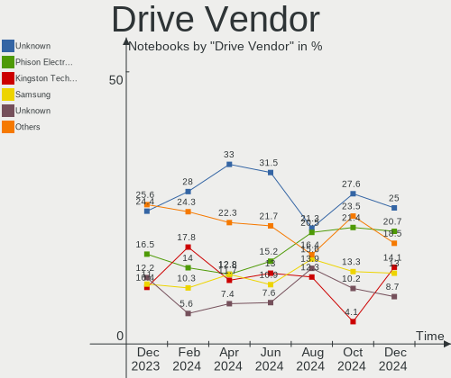
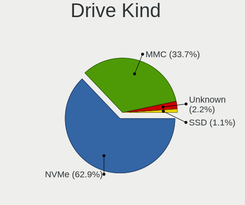
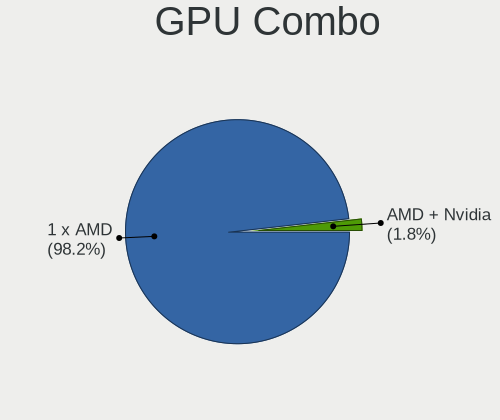
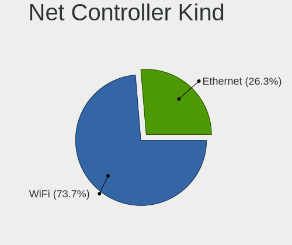
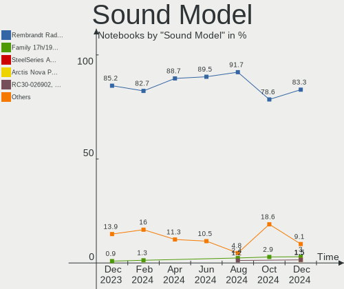

SteamOS - Hardware Trends (Notebooks)
-------------------------------------

A project to identify most popular hardware characteristics and track their change
over time based on data collected by Linux users at https://Linux-Hardware.org.

Anyone can contribute to this report by the [hw-probe](https://github.com/linuxhw/hw-probe) tool:

    sudo -E hw-probe -all -upload

This report is for one last month. Overall report since the beginning of time: [TestDays](https://github.com/linuxhw/TestDays)

Period: May, 2023.

Contents
--------

* [ System ](#system)
  - [ OS                       ](#os)
  - [ OS Family                ](#os-family)
  - [ Kernel                   ](#kernel)
  - [ Kernel Family            ](#kernel-family)
  - [ Kernel Major Ver.        ](#kernel-major-ver)
  - [ Arch                     ](#arch)
  - [ DE                       ](#de)
  - [ Display Server           ](#display-server)
  - [ Display Manager          ](#display-manager)
  - [ OS Lang                  ](#os-lang)
  - [ Boot Mode                ](#boot-mode)
  - [ Filesystem               ](#filesystem)
  - [ Part. scheme             ](#part-scheme)
  - [ Dual Boot with Linux/BSD ](#dual-boot-with-linuxbsd)
  - [ Dual Boot (Win)          ](#dual-boot-win)

* [ Board ](#board)
  - [ Vendor                   ](#vendor)
  - [ Model                    ](#model)
  - [ Model Family             ](#model-family)
  - [ MFG Year                 ](#mfg-year)
  - [ Form Factor              ](#form-factor)
  - [ Secure Boot              ](#secure-boot)
  - [ Coreboot                 ](#coreboot)
  - [ RAM Size                 ](#ram-size)
  - [ RAM Used                 ](#ram-used)
  - [ Total Drives             ](#total-drives)
  - [ Has CD-ROM               ](#has-cd-rom)
  - [ Has Ethernet             ](#has-ethernet)
  - [ Has WiFi                 ](#has-wifi)
  - [ Has Bluetooth            ](#has-bluetooth)

* [ Location ](#location)
  - [ Country                  ](#country)
  - [ City                     ](#city)

* [ Drives ](#drives)
  - [ Drive Vendor             ](#drive-vendor)
  - [ Drive Model              ](#drive-model)
  - [ HDD Vendor               ](#hdd-vendor)
  - [ SSD Vendor               ](#ssd-vendor)
  - [ Drive Kind               ](#drive-kind)
  - [ Drive Connector          ](#drive-connector)
  - [ Drive Size               ](#drive-size)
  - [ Space Total              ](#space-total)
  - [ Space Used               ](#space-used)
  - [ Malfunc. Drives          ](#malfunc-drives)
  - [ Malfunc. Drive Vendor    ](#malfunc-drive-vendor)
  - [ Malfunc. HDD Vendor      ](#malfunc-hdd-vendor)
  - [ Malfunc. Drive Kind      ](#malfunc-drive-kind)
  - [ Failed Drives            ](#failed-drives)
  - [ Failed Drive Vendor      ](#failed-drive-vendor)
  - [ Drive Status             ](#drive-status)

* [ Storage controller ](#storage-controller)
  - [ Storage Vendor           ](#storage-vendor)
  - [ Storage Model            ](#storage-model)
  - [ Storage Kind             ](#storage-kind)

* [ Processor ](#processor)
  - [ CPU Vendor               ](#cpu-vendor)
  - [ CPU Model                ](#cpu-model)
  - [ CPU Model Family         ](#cpu-model-family)
  - [ CPU Cores                ](#cpu-cores)
  - [ CPU Sockets              ](#cpu-sockets)
  - [ CPU Threads              ](#cpu-threads)
  - [ CPU Op-Modes             ](#cpu-op-modes)
  - [ CPU Microcode            ](#cpu-microcode)
  - [ CPU Microarch            ](#cpu-microarch)

* [ Graphics ](#graphics)
  - [ GPU Vendor               ](#gpu-vendor)
  - [ GPU Model                ](#gpu-model)
  - [ GPU Combo                ](#gpu-combo)
  - [ GPU Driver               ](#gpu-driver)
  - [ GPU Memory               ](#gpu-memory)

* [ Monitor ](#monitor)
  - [ Monitor Vendor           ](#monitor-vendor)
  - [ Monitor Model            ](#monitor-model)
  - [ Monitor Resolution       ](#monitor-resolution)
  - [ Monitor Diagonal         ](#monitor-diagonal)
  - [ Monitor Width            ](#monitor-width)
  - [ Aspect Ratio             ](#aspect-ratio)
  - [ Monitor Area             ](#monitor-area)
  - [ Pixel Density            ](#pixel-density)
  - [ Multiple Monitors        ](#multiple-monitors)

* [ Network ](#network)
  - [ Net Controller Vendor    ](#net-controller-vendor)
  - [ Net Controller Model     ](#net-controller-model)
  - [ Wireless Vendor          ](#wireless-vendor)
  - [ Wireless Model           ](#wireless-model)
  - [ Ethernet Vendor          ](#ethernet-vendor)
  - [ Ethernet Model           ](#ethernet-model)
  - [ Net Controller Kind      ](#net-controller-kind)
  - [ Used Controller          ](#used-controller)
  - [ NICs                     ](#nics)
  - [ IPv6                     ](#ipv6)

* [ Bluetooth ](#bluetooth)
  - [ Bluetooth Vendor         ](#bluetooth-vendor)
  - [ Bluetooth Model          ](#bluetooth-model)

* [ Sound ](#sound)
  - [ Sound Vendor             ](#sound-vendor)
  - [ Sound Model              ](#sound-model)

* [ Memory ](#memory)
  - [ Memory Vendor            ](#memory-vendor)
  - [ Memory Model             ](#memory-model)
  - [ Memory Kind              ](#memory-kind)
  - [ Memory Form Factor       ](#memory-form-factor)
  - [ Memory Size              ](#memory-size)
  - [ Memory Speed             ](#memory-speed)

* [ Printers & scanners ](#printers--scanners)
  - [ Printer Vendor           ](#printer-vendor)
  - [ Printer Model            ](#printer-model)
  - [ Scanner Vendor           ](#scanner-vendor)
  - [ Scanner Model            ](#scanner-model)

* [ Camera ](#camera)
  - [ Camera Vendor            ](#camera-vendor)
  - [ Camera Model             ](#camera-model)

* [ Security ](#security)
  - [ Fingerprint Vendor       ](#fingerprint-vendor)
  - [ Fingerprint Model        ](#fingerprint-model)
  - [ Chipcard Vendor          ](#chipcard-vendor)
  - [ Chipcard Model           ](#chipcard-model)

* [ Unsupported ](#unsupported)
  - [ Unsupported Devices      ](#unsupported-devices)
  - [ Unsupported Device Types ](#unsupported-device-types)

System
------

OS
--

Installed operating systems

| Name            | Notebooks | Percent |
|-----------------|-----------|---------|
| SteamOS 3.4.6   | 55        | 78.57%  |
| SteamOS 3.4.8   | 6         | 8.57%   |
| SteamOS 3.5     | 2         | 2.86%   |
| SteamOS 3.4.7   | 2         | 2.86%   |
| SteamOS 3.4     | 2         | 2.86%   |
| SteamOS Rolling | 1         | 1.43%   |
| SteamOS 4       | 1         | 1.43%   |
| SteamOS         | 1         | 1.43%   |

OS Family
---------

OS without a version

| Name    | Notebooks | Percent |
|---------|-----------|---------|
| SteamOS | 70        | 100%    |

Kernel
------

Version of the Linux kernel

| Version                    | Notebooks | Percent |
|----------------------------|-----------|---------|
| 5.13.0-valve36-1-neptune   | 63        | 90%     |
| 6.1.21-valve1-3-neptune-61 | 2         | 2.86%   |
| 5.13.0-valve21.3-1-neptune | 2         | 2.86%   |
| 6.1.21-valve1-2-neptune-61 | 1         | 1.43%   |
| 6.1.21-valve1-1-neptune-61 | 1         | 1.43%   |
| 5.15.93-1-lts              | 1         | 1.43%   |

Kernel Family
-------------

Linux kernel without a distro release

| Version | Notebooks | Percent |
|---------|-----------|---------|
| 5.13.0  | 65        | 92.86%  |
| 6.1.21  | 4         | 5.71%   |
| 5.15.93 | 1         | 1.43%   |

Kernel Major Ver.
-----------------

Linux kernel major version

| Version | Notebooks | Percent |
|---------|-----------|---------|
| 5.13    | 65        | 92.86%  |
| 6.1     | 4         | 5.71%   |
| 5.15    | 1         | 1.43%   |

Arch
----

OS architecture (x86_64, i586, etc.)

| Name   | Notebooks | Percent |
|--------|-----------|---------|
| x86_64 | 70        | 100%    |

DE
--

Desktop Environment

| Name | Notebooks | Percent |
|------|-----------|---------|
| KDE5 | 70        | 100%    |

Display Server
--------------

X11 or Wayland

| Name | Notebooks | Percent |
|------|-----------|---------|
| X11  | 70        | 100%    |

Display Manager
---------------

SDDM, LightDM, etc.

| Name    | Notebooks | Percent |
|---------|-----------|---------|
| Unknown | 69        | 98.57%  |
| SDDM    | 1         | 1.43%   |

OS Lang
-------

Language

| Lang  | Notebooks | Percent |
|-------|-----------|---------|
| en_US | 61        | 87.14%  |
| de_DE | 2         | 2.86%   |
| zh_CN | 1         | 1.43%   |
| ru_RU | 1         | 1.43%   |
| pt_BR | 1         | 1.43%   |
| pl_PL | 1         | 1.43%   |
| fr_FR | 1         | 1.43%   |
| en_GB | 1         | 1.43%   |
| en_DE | 1         | 1.43%   |

Boot Mode
---------

EFI or BIOS

| Mode | Notebooks | Percent |
|------|-----------|---------|
| BIOS | 69        | 98.57%  |
| EFI  | 1         | 1.43%   |

Filesystem
----------

Type of filesystem

| Type  | Notebooks | Percent |
|-------|-----------|---------|
| Btrfs | 69        | 98.57%  |
| Tmpfs | 1         | 1.43%   |

Part. scheme
------------

Scheme of partitioning

| Type    | Notebooks | Percent |
|---------|-----------|---------|
| Unknown | 69        | 98.57%  |
| GPT     | 1         | 1.43%   |

Dual Boot with Linux/BSD
------------------------

Hosting more than one Linux/BSD

| Dual boot | Notebooks | Percent |
|-----------|-----------|---------|
| No        | 70        | 100%    |

Dual Boot (Win)
---------------

Hosting Linux and Windows

| Dual boot | Notebooks | Percent |
|-----------|-----------|---------|
| No        | 69        | 98.57%  |
| Yes       | 1         | 1.43%   |

Board
-----

Vendor
------

Motherboard manufacturer

| Name            | Notebooks | Percent |
|-----------------|-----------|---------|
| Valve           | 65        | 92.86%  |
| MSI             | 1         | 1.43%   |
| Hewlett-Packard | 1         | 1.43%   |
| GPD             | 1         | 1.43%   |
| Dell            | 1         | 1.43%   |
| Biostar         | 1         | 1.43%   |

Model
-----

Motherboard model

| Name                | Notebooks | Percent |
|---------------------|-----------|---------|
| Valve Jupiter       | 65        | 92.86%  |
| MSI GF62 7RE        | 1         | 1.43%   |
| HP 15               | 1         | 1.43%   |
| GPD G1619-04        | 1         | 1.43%   |
| Dell Precision 7510 | 1         | 1.43%   |
| Biostar A320MH 2.0  | 1         | 1.43%   |

Model Family
------------

Motherboard model prefix

| Name           | Notebooks | Percent |
|----------------|-----------|---------|
| Valve Jupiter  | 65        | 92.86%  |
| MSI GF62       | 1         | 1.43%   |
| HP 15          | 1         | 1.43%   |
| GPD G1619-04   | 1         | 1.43%   |
| Dell Precision | 1         | 1.43%   |
| Biostar A320MH | 1         | 1.43%   |

MFG Year
--------

Motherboard manufacture year

| Year | Notebooks | Percent |
|------|-----------|---------|
| 2022 | 65        | 92.86%  |
| 2023 | 2         | 2.86%   |
| 2018 | 1         | 1.43%   |
| 2015 | 1         | 1.43%   |
| 2013 | 1         | 1.43%   |

Form Factor
-----------

Physical design of the computer

| Name     | Notebooks | Percent |
|----------|-----------|---------|
| Notebook | 70        | 100%    |

Secure Boot
-----------

Enabled or disabled

| State    | Notebooks | Percent |
|----------|-----------|---------|
| Disabled | 70        | 100%    |

Coreboot
--------

Have coreboot on board

| Used | Notebooks | Percent |
|------|-----------|---------|
| No   | 70        | 100%    |

RAM Size
--------

Total RAM memory

| Size in GB | Notebooks | Percent |
|------------|-----------|---------|
| 8.01-16.0  | 68        | 97.14%  |
| 32.01-64.0 | 1         | 1.43%   |
| 3.01-4.0   | 1         | 1.43%   |

RAM Used
--------

Used RAM memory

| Used GB  | Notebooks | Percent |
|----------|-----------|---------|
| 3.01-4.0 | 32        | 45.71%  |
| 2.01-3.0 | 21        | 30%     |
| 4.01-8.0 | 16        | 22.86%  |
| 0.51-1.0 | 1         | 1.43%   |

Total Drives
------------

Number of drives on board

| Drives | Notebooks | Percent |
|--------|-----------|---------|
| 2      | 43        | 61.43%  |
| 1      | 20        | 28.57%  |
| 3      | 6         | 8.57%   |
| 4      | 1         | 1.43%   |

Has CD-ROM
----------

Has CD-ROM on board

| Presented | Notebooks | Percent |
|-----------|-----------|---------|
| No        | 68        | 97.14%  |
| Yes       | 2         | 2.86%   |

Has Ethernet
------------

Has Ethernet on board

| Presented | Notebooks | Percent |
|-----------|-----------|---------|
| No        | 47        | 67.14%  |
| Yes       | 23        | 32.86%  |

Has WiFi
--------

Has WiFi module

| Presented | Notebooks | Percent |
|-----------|-----------|---------|
| Yes       | 69        | 98.57%  |
| No        | 1         | 1.43%   |

Has Bluetooth
-------------

Has Bluetooth module

| Presented | Notebooks | Percent |
|-----------|-----------|---------|
| Yes       | 68        | 97.14%  |
| No        | 2         | 2.86%   |

Location
--------

Country
-------

Geographic location (country)

| Country     | Notebooks | Percent |
|-------------|-----------|---------|
| USA         | 23        | 32.86%  |
| Germany     | 7         | 10%     |
| UK          | 5         | 7.14%   |
| Russia      | 4         | 5.71%   |
| Poland      | 3         | 4.29%   |
| Canada      | 3         | 4.29%   |
| Austria     | 3         | 4.29%   |
| Spain       | 2         | 2.86%   |
| Portugal    | 2         | 2.86%   |
| Italy       | 2         | 2.86%   |
| Brazil      | 2         | 2.86%   |
| UAE         | 1         | 1.43%   |
| Thailand    | 1         | 1.43%   |
| Switzerland | 1         | 1.43%   |
| Romania     | 1         | 1.43%   |
| Netherlands | 1         | 1.43%   |
| Kuwait      | 1         | 1.43%   |
| Israel      | 1         | 1.43%   |
| Hong Kong   | 1         | 1.43%   |
| Georgia     | 1         | 1.43%   |
| France      | 1         | 1.43%   |
| Czechia     | 1         | 1.43%   |
| Chile       | 1         | 1.43%   |
| Belgium     | 1         | 1.43%   |
| Australia   | 1         | 1.43%   |

City
----

Geographic location (city)

| City           | Notebooks | Percent |
|----------------|-----------|---------|
| Moscow         | 2         | 2.86%   |
| Littleton      | 2         | 2.86%   |
| Elk Grove      | 2         | 2.86%   |
| Berlin         | 2         | 2.86%   |
| Zephyrhills    | 1         | 1.43%   |
| Virginia Beach | 1         | 1.43%   |
| Vienna         | 1         | 1.43%   |
| Viamao         | 1         | 1.43%   |
| Varginha       | 1         | 1.43%   |
| Ufa            | 1         | 1.43%   |
| Tbilisi        | 1         | 1.43%   |
| Tampa          | 1         | 1.43%   |
| Strau          | 1         | 1.43%   |
| Somerset       | 1         | 1.43%   |
| Solihull       | 1         | 1.43%   |
| Shelbyville    | 1         | 1.43%   |
| Shefa-'Amr     | 1         | 1.43%   |
| Santiago       | 1         | 1.43%   |
| San Diego      | 1         | 1.43%   |
| Salisbury      | 1         | 1.43%   |
| Remscheid      | 1         | 1.43%   |
| Redwood City   | 1         | 1.43%   |
| Redford        | 1         | 1.43%   |
| Prague         | 1         | 1.43%   |
| Porto          | 1         | 1.43%   |
| Port Coquitlam | 1         | 1.43%   |
| Orlando        | 1         | 1.43%   |
| Nuremberg      | 1         | 1.43%   |
| Norristown     | 1         | 1.43%   |
| Nonthaburi     | 1         | 1.43%   |
| Milan          | 1         | 1.43%   |
| Melbourne      | 1         | 1.43%   |
| Marchiennes    | 1         | 1.43%   |
| Lucerne        | 1         | 1.43%   |
| London         | 1         | 1.43%   |
| Loma Linda     | 1         | 1.43%   |
| Lodz           | 1         | 1.43%   |
| Lisbon         | 1         | 1.43%   |
| Lilburn        | 1         | 1.43%   |
| Kuwait City    | 1         | 1.43%   |

Drives
------

Drive Vendor
------------

Hard drive vendors

| Vendor                      | Notebooks | Drives | Percent |
|-----------------------------|-----------|--------|---------|
| Unknown                     | 36        | 36     | 28.57%  |
| Phison Electronics          | 20        | 20     | 15.87%  |
| Samsung Electronics         | 13        | 13     | 10.32%  |
| Kingston Technology Company | 13        | 13     | 10.32%  |
| Unknown                     | 11        | 11     | 8.73%   |
| O2 Micro                    | 9         | 9      | 7.14%   |
| SK hynix                    | 5         | 5      | 3.97%   |
| Silicon Motion              | 4         | 4      | 3.17%   |
| Seagate                     | 4         | 6      | 3.17%   |
| Sandisk                     | 3         | 3      | 2.38%   |
| Realtek                     | 2         | 2      | 1.59%   |
| KIOXIA                      | 2         | 2      | 1.59%   |
| Mushkin                     | 1         | 1      | 0.79%   |
| KEEPDATA                    | 1         | 1      | 0.79%   |
| JMicron Technology          | 1         | 1      | 0.79%   |
| Biwin Storage Technology    | 1         | 1      | 0.79%   |

Drive Model
-----------

Hard drive models

| Model                                               | Notebooks | Percent |
|-----------------------------------------------------|-----------|---------|
| Phison PS5013 E13 NVMe Controller 512GB             | 18        | 14.06%  |
| Unknown MMC Card  512GB                             | 17        | 13.28%  |
| Unknown MMC Card  256GB                             | 13        | 10.16%  |
| Kingston Company OM3PDP3 NVMe SSD 256GB             | 12        | 9.38%   |
| Unknown                                             | 11        | 8.59%   |
| Samsung MZ9LQ512HBLU-00BVL 512GB                    | 9         | 7.03%   |
| O2 Micro E2M2 64GB                                  | 9         | 7.03%   |
| Silicon Motion SM2263EN/SM2263XT SSD Controller 1TB | 4         | 3.13%   |
| Unknown MMC Card  128GB                             | 3         | 2.34%   |
| Realtek RTL9210B-CG 1TB                             | 2         | 1.56%   |
| Phison Sabrent SB-2130-1TB                          | 2         | 1.56%   |
| Unknown MMC Card  64GB                              | 1         | 0.78%   |
| Unknown MMC Card  393GB                             | 1         | 0.78%   |
| Unknown MMC Card  250GB                             | 1         | 0.78%   |
| SK hynix SC308 SATA 256GB SSD                       | 1         | 0.78%   |
| SK hynix BC711 NVMe 512GB                           | 1         | 0.78%   |
| SK hynix BC711 NVMe 1TB                             | 1         | 0.78%   |
| SK hynix BC511 256GB                                | 1         | 0.78%   |
| SK hynix BC501 NVMe Solid State Drive 512GB         | 1         | 0.78%   |
| Seagate ST3500418AS 500GB                           | 1         | 0.78%   |
| Seagate ST2000DM001-1CH164 2TB                      | 1         | 0.78%   |
| Seagate ST1000DM010-2EP102 1TB                      | 1         | 0.78%   |
| Seagate Portable 2TB                                | 1         | 0.78%   |
| Seagate Expansion 1TB                               | 1         | 0.78%   |
| Seagate BUP Slim 2TB                                | 1         | 0.78%   |
| SanDisk X600 2.5 7MM SATA 256GB SSD                 | 1         | 0.78%   |
| Sandisk WD PC SN740 SDDPTQD-1T00 1024GB             | 1         | 0.78%   |
| Sandisk PC SN530 NVMe SSD 930GB                     | 1         | 0.78%   |
| Samsung Portable SSD T5 1TB                         | 1         | 0.78%   |
| Samsung MZ9LQ512HBLU-00B00 512GB                    | 1         | 0.78%   |
| Samsung MZ9LQ256HBJD-00BVL 256GB                    | 1         | 0.78%   |
| Samsung MZ9LQ1T0HBLB-00B00 1024GB                   | 1         | 0.78%   |
| Mushkin MKNSSDAT60GB-V 64GB                         | 1         | 0.78%   |
| KIOXIA KBG50ZNS1T02 NVMe 1024GB                     | 1         | 0.78%   |
| KIOXIA KBG50ZNS1T02 1024GB                          | 1         | 0.78%   |
| Kingston Company SNV2S2000G 2TB                     | 1         | 0.78%   |
| KEEPDATA SSD 120GB                                  | 1         | 0.78%   |
| JMicron Tech 250GB                                  | 1         | 0.78%   |
| Biwin Storage BIWIN CE480Y2D100-1TB                 | 1         | 0.78%   |

HDD Vendor
----------

Hard disk drive vendors

| Vendor  | Notebooks | Drives | Percent |
|---------|-----------|--------|---------|
| Seagate | 3         | 5      | 100%    |

SSD Vendor
----------

Solid state drive vendors

| Vendor              | Notebooks | Drives | Percent |
|---------------------|-----------|--------|---------|
| SK hynix            | 1         | 1      | 20%     |
| SanDisk             | 1         | 1      | 20%     |
| Samsung Electronics | 1         | 1      | 20%     |
| Mushkin             | 1         | 1      | 20%     |
| KEEPDATA            | 1         | 1      | 20%     |

Drive Kind
----------

HDD or SSD

| Kind    | Notebooks | Drives | Percent |
|---------|-----------|--------|---------|
| NVMe    | 67        | 69     | 54.47%  |
| MMC     | 47        | 47     | 38.21%  |
| SSD     | 4         | 5      | 3.25%   |
| HDD     | 3         | 5      | 2.44%   |
| Unknown | 2         | 2      | 1.63%   |

Drive Connector
---------------

SATA, SAS, NVMe, etc.

| Type | Notebooks | Drives | Percent |
|------|-----------|--------|---------|
| NVMe | 67        | 67     | 54.03%  |
| MMC  | 47        | 47     | 37.9%   |
| SAS  | 7         | 7      | 5.65%   |
| SATA | 3         | 7      | 2.42%   |

Drive Size
----------

Size of hard drive

| Size in TB | Notebooks | Drives | Percent |
|------------|-----------|--------|---------|
| 0.51-1.0   | 3         | 3      | 37.5%   |
| 0.01-0.5   | 3         | 5      | 37.5%   |
| 1.01-2.0   | 2         | 2      | 25%     |

Space Total
-----------

Amount of disk space available on the file system

| Size in GB | Notebooks | Percent |
|------------|-----------|---------|
| 251-500    | 23        | 32.86%  |
| 101-250    | 19        | 27.14%  |
| 501-1000   | 13        | 18.57%  |
| 51-100     | 9         | 12.86%  |
| 1001-2000  | 3         | 4.29%   |
| 2001-3000  | 2         | 2.86%   |
| Unknown    | 1         | 1.43%   |

Space Used
----------

Amount of used disk space

| Used GB   | Notebooks | Percent |
|-----------|-----------|---------|
| 101-250   | 24        | 34.29%  |
| 251-500   | 17        | 24.29%  |
| 21-50     | 10        | 14.29%  |
| 1-20      | 6         | 8.57%   |
| 501-1000  | 5         | 7.14%   |
| 51-100    | 5         | 7.14%   |
| 1001-2000 | 2         | 2.86%   |
| Unknown   | 1         | 1.43%   |

Malfunc. Drives
---------------

Drive models with a malfunction

Zero info for selected period =(

Malfunc. Drive Vendor
---------------------

Vendors of faulty drives

Zero info for selected period =(

Malfunc. HDD Vendor
-------------------

Vendors of faulty HDD drives

Zero info for selected period =(

Malfunc. Drive Kind
-------------------

Kinds of faulty drives

Zero info for selected period =(

Failed Drives
-------------

Failed drive models

Zero info for selected period =(

Failed Drive Vendor
-------------------

Failed drive vendors

Zero info for selected period =(

Drive Status
------------

Number of failed and malfunc. drives

| Status   | Notebooks | Drives | Percent |
|----------|-----------|--------|---------|
| Detected | 68        | 126    | 97.14%  |
| Works    | 2         | 2      | 2.86%   |

Storage controller
------------------

Storage Vendor
--------------

Storage controller vendors

| Vendor                      | Notebooks | Percent |
|-----------------------------|-----------|---------|
| Phison Electronics          | 20        | 28.17%  |
| Kingston Technology Company | 13        | 18.31%  |
| Samsung Electronics         | 12        | 16.9%   |
| O2 Micro                    | 9         | 12.68%  |
| SK hynix                    | 4         | 5.63%   |
| Silicon Motion              | 4         | 5.63%   |
| Sandisk                     | 2         | 2.82%   |
| KIOXIA                      | 2         | 2.82%   |
| Intel                       | 2         | 2.82%   |
| AMD                         | 2         | 2.82%   |
| Biwin Storage Technology    | 1         | 1.41%   |

Storage Model
-------------

Storage controller models

| Model                                                                         | Notebooks | Percent |
|-------------------------------------------------------------------------------|-----------|---------|
| Phison PS5013 E13 NVMe Controller                                             | 18        | 25%     |
| Samsung NVMe SSD Controller 980                                               | 12        | 16.67%  |
| Kingston Company OM3PDP3 NVMe SSD                                             | 12        | 16.67%  |
| O2 Micro Non-Volatile memory controller                                       | 9         | 12.5%   |
| Silicon Motion SM2263EN/SM2263XT SSD Controller                               | 4         | 5.56%   |
| SK hynix Gold P31/PC711 NVMe Solid State Drive                                | 2         | 2.78%   |
| Phison Electronics Non-Volatile memory controller                             | 2         | 2.78%   |
| KIOXIA Non-Volatile memory controller                                         | 2         | 2.78%   |
| AMD FCH SATA Controller [AHCI mode]                                           | 2         | 2.78%   |
| SK hynix BC511                                                                | 1         | 1.39%   |
| SK hynix BC501 NVMe Solid State Drive                                         | 1         | 1.39%   |
| SanDisk PC SN530 NVMe SSD                                                     | 1         | 1.39%   |
| Sandisk Non-Volatile memory controller                                        | 1         | 1.39%   |
| Kingston Company Company Non-Volatile memory controller                       | 1         | 1.39%   |
| Intel Q170/Q150/B150/H170/H110/Z170/CM236 Chipset SATA Controller [AHCI Mode] | 1         | 1.39%   |
| Intel HM170/QM170 Chipset SATA Controller [AHCI Mode]                         | 1         | 1.39%   |
| Biwin Storage Non-Volatile memory controller                                  | 1         | 1.39%   |
| AMD FCH SATA Controller D                                                     | 1         | 1.39%   |

Storage Kind
------------

Kind of storage controller (IDE, SATA, NVMe, SAS, ...)

| Kind | Notebooks | Percent |
|------|-----------|---------|
| NVMe | 67        | 94.37%  |
| SATA | 4         | 5.63%   |

Processor
---------

CPU Vendor
----------

Processor vendors

| Vendor | Notebooks | Percent |
|--------|-----------|---------|
| AMD    | 68        | 97.14%  |
| Intel  | 2         | 2.86%   |

CPU Model
---------

Processor models

| Model                                   | Notebooks | Percent |
|-----------------------------------------|-----------|---------|
| AMD Custom APU 0405                     | 65        | 92.86%  |
| Intel Core i7-7700HQ CPU @ 2.80GHz      | 1         | 1.43%   |
| Intel Core i7-6920HQ CPU @ 2.90GHz      | 1         | 1.43%   |
| AMD Ryzen 7 6800U with Radeon Graphics  | 1         | 1.43%   |
| AMD Ryzen 5 4600G with Radeon Graphics  | 1         | 1.43%   |
| AMD E1-2100 APU with Radeon HD Graphics | 1         | 1.43%   |

CPU Model Family
----------------

Processor model prefix

| Model         | Notebooks | Percent |
|---------------|-----------|---------|
| Other         | 65        | 92.86%  |
| Intel Core i7 | 2         | 2.86%   |
| AMD Ryzen 7   | 1         | 1.43%   |
| AMD Ryzen 5   | 1         | 1.43%   |
| AMD E1        | 1         | 1.43%   |

CPU Cores
---------

Number of processor cores

| Number | Notebooks | Percent |
|--------|-----------|---------|
| 4      | 67        | 95.71%  |
| 8      | 1         | 1.43%   |
| 6      | 1         | 1.43%   |
| 2      | 1         | 1.43%   |

CPU Sockets
-----------

Number of sockets

| Number | Notebooks | Percent |
|--------|-----------|---------|
| 1      | 70        | 100%    |

CPU Threads
-----------

Threads per core (Hyper-Threading)

| Number | Notebooks | Percent |
|--------|-----------|---------|
| 2      | 69        | 98.57%  |
| 1      | 1         | 1.43%   |

CPU Op-Modes
------------

CPU Operation Modes (32-bit, 64-bit)

| Op mode        | Notebooks | Percent |
|----------------|-----------|---------|
| 32-bit, 64-bit | 70        | 100%    |

CPU Microcode
-------------

Microcode number

| Number     | Notebooks | Percent |
|------------|-----------|---------|
| Unknown    | 69        | 98.57%  |
| 0x0a404102 | 1         | 1.43%   |

CPU Microarch
-------------

Microarchitecture

| Name     | Notebooks | Percent |
|----------|-----------|---------|
| Unknown  | 66        | 94.29%  |
| Zen 2    | 1         | 1.43%   |
| Skylake  | 1         | 1.43%   |
| KabyLake | 1         | 1.43%   |
| Jaguar   | 1         | 1.43%   |

Graphics
--------

GPU Vendor
----------

Vendors of graphics cards

| Vendor | Notebooks | Percent |
|--------|-----------|---------|
| AMD    | 67        | 93.06%  |
| Nvidia | 3         | 4.17%   |
| Intel  | 2         | 2.78%   |

GPU Model
---------

Graphics card models

| Model                                      | Notebooks | Percent |
|--------------------------------------------|-----------|---------|
| AMD VanGogh [AMD Custom GPU 0405]          | 65        | 90.28%  |
| Nvidia GP107M [GeForce GTX 1050 Ti Mobile] | 1         | 1.39%   |
| Nvidia GP104 [GeForce GTX 1060 6GB]        | 1         | 1.39%   |
| Nvidia GM107GLM [Quadro M2000M]            | 1         | 1.39%   |
| Intel HD Graphics 630                      | 1         | 1.39%   |
| Intel HD Graphics 530                      | 1         | 1.39%   |
| AMD Rembrandt [Radeon 680M]                | 1         | 1.39%   |
| AMD Kabini [Radeon HD 8210]                | 1         | 1.39%   |

GPU Combo
---------

Combinations of graphics cards

| Name           | Notebooks | Percent |
|----------------|-----------|---------|
| 1 x AMD        | 67        | 95.71%  |
| Intel + Nvidia | 2         | 2.86%   |
| 1 x Nvidia     | 1         | 1.43%   |

GPU Driver
----------

Free vs proprietary

| Driver      | Notebooks | Percent |
|-------------|-----------|---------|
| Free        | 69        | 98.57%  |
| Proprietary | 1         | 1.43%   |

GPU Memory
----------

Total video memory

| Size in GB | Notebooks | Percent |
|------------|-----------|---------|
| Unknown    | 68        | 97.14%  |
| 5.01-6.0   | 1         | 1.43%   |
| 2.01-3.0   | 1         | 1.43%   |

Monitor
-------

Monitor Vendor
--------------

Monitor vendors

| Vendor              | Notebooks | Percent |
|---------------------|-----------|---------|
| Valve               | 65        | 73.86%  |
| Samsung Electronics | 5         | 5.68%   |
| Dell                | 2         | 2.27%   |
| Chimei Innolux      | 2         | 2.27%   |
| Acer                | 2         | 2.27%   |
| Vizio               | 1         | 1.14%   |
| RTD                 | 1         | 1.14%   |
| Roku                | 1         | 1.14%   |
| MStar               | 1         | 1.14%   |
| MSI                 | 1         | 1.14%   |
| LG Display          | 1         | 1.14%   |
| Lenovo              | 1         | 1.14%   |
| JRY                 | 1         | 1.14%   |
| JDI                 | 1         | 1.14%   |
| Goldstar            | 1         | 1.14%   |
| Compal              | 1         | 1.14%   |
| Analogix            | 1         | 1.14%   |

Monitor Model
-------------

Monitor models

| Model                                                                   | Notebooks | Percent |
|-------------------------------------------------------------------------|-----------|---------|
| Valve ANX7530 U VLV3001 800x1280 100x150mm 7.1-inch                     | 65        | 73.03%  |
| Vizio VOJ320F1A VIZ0050 1920x1080 700x390mm 31.5-inch                   | 1         | 1.12%   |
| Samsung Electronics S34J55x SAM0F72 3440x1440 797x333mm 34.0-inch       | 1         | 1.12%   |
| Samsung Electronics S24F350 SAM0D20 1920x1080 521x293mm 23.5-inch       | 1         | 1.12%   |
| Samsung Electronics LCD Monitor SAM7282 3840x1600 950x540mm 43.0-inch   | 1         | 1.12%   |
| Samsung Electronics LCD Monitor SAM7002 3840x2160 1872x1053mm 84.6-inch | 1         | 1.12%   |
| Samsung Electronics LCD Monitor SAM0C3D 1366x768 609x347mm 27.6-inch    | 1         | 1.12%   |
| RTD Display RTD0002 2560x1600 344x215mm 16.0-inch                       | 1         | 1.12%   |
| Roku TV RKU8527 1920x1080 698x392mm 31.5-inch                           | 1         | 1.12%   |
| MStar TV MST0030 1920x1080 708x398mm 32.0-inch                          | 1         | 1.12%   |
| MSI Optix G241VC MSI1462 1920x1080 521x294mm 23.6-inch                  | 1         | 1.12%   |
| LG Display LCD Monitor LGD049B 1920x1080 344x194mm 15.5-inch            | 1         | 1.12%   |
| Lenovo LEN G34w-10 LEN66A1 3440x1440 797x334mm 34.0-inch                | 1         | 1.12%   |
| JRY HDMI JRY3200 1920x1080 368x207mm 16.6-inch                          | 1         | 1.12%   |
| JDI GPD1001H JDI0031 2560x1600 890x500mm 40.2-inch                      | 1         | 1.12%   |
| Goldstar 27GN950 GSM5B99 3840x2160 597x336mm 27.0-inch                  | 1         | 1.12%   |
| Dell U2515H DELD06E 2560x1440 553x311mm 25.0-inch                       | 1         | 1.12%   |
| Dell S2721DGF DEL41D9 2560x1440 597x336mm 27.0-inch                     | 1         | 1.12%   |
| Dell S2716DG DELA0D0 2560x1440 598x336mm 27.0-inch                      | 1         | 1.12%   |
| Compal TERRA 2446W WOR2446 1920x1080 527x296mm 23.8-inch                | 1         | 1.12%   |
| Chimei Innolux LCD Monitor CMN15D2 1920x1080 344x193mm 15.5-inch        | 1         | 1.12%   |
| Chimei Innolux LCD Monitor CMN15AB 1366x768 344x193mm 15.5-inch         | 1         | 1.12%   |
| Analogix ANX7530 U ANX7539 800x1280 60x50mm 3.1-inch                    | 1         | 1.12%   |
| Acer XZ321QU ACR0609 2560x1440 697x392mm 31.5-inch                      | 1         | 1.12%   |
| Acer S271HL ACR02CA 1920x1080 598x336mm 27.0-inch                       | 1         | 1.12%   |

Monitor Resolution
------------------

Monitor screen resolution

| Resolution      | Notebooks | Percent |
|-----------------|-----------|---------|
| 800x1280        | 65        | 74.71%  |
| 1920x1080 (FHD) | 8         | 9.2%    |
| 3840x2160 (4K)  | 3         | 3.45%   |
| 3440x1440       | 3         | 3.45%   |
| 2560x1440 (QHD) | 3         | 3.45%   |
| 2560x1600       | 2         | 2.3%    |
| 1366x768 (WXGA) | 2         | 2.3%    |
| 3840x1600       | 1         | 1.15%   |

Monitor Diagonal
----------------

Diagonal size in inches

| Inches | Notebooks | Percent |
|--------|-----------|---------|
| 7      | 65        | 73.86%  |
| 27     | 4         | 4.55%   |
| 34     | 3         | 3.41%   |
| 15     | 3         | 3.41%   |
| 31     | 2         | 2.27%   |
| 16     | 2         | 2.27%   |
| 84     | 1         | 1.14%   |
| 52     | 1         | 1.14%   |
| 47     | 1         | 1.14%   |
| 43     | 1         | 1.14%   |
| 40     | 1         | 1.14%   |
| 25     | 1         | 1.14%   |
| 24     | 1         | 1.14%   |
| 23     | 1         | 1.14%   |
| 3      | 1         | 1.14%   |

Monitor Width
-------------

Physical width

| Width in mm | Notebooks | Percent |
|-------------|-----------|---------|
| 1-100       | 65        | 74.71%  |
| 501-600     | 6         | 6.9%    |
| 301-350     | 4         | 4.6%    |
| 701-800     | 3         | 3.45%   |
| 601-700     | 3         | 3.45%   |
| 1001-1500   | 2         | 2.3%    |
| 801-900     | 1         | 1.15%   |
| 351-400     | 1         | 1.15%   |
| 1501-2000   | 1         | 1.15%   |
| 901-1000    | 1         | 1.15%   |

Aspect Ratio
------------

Proportional relationship between the width and the height

| Ratio | Notebooks | Percent |
|-------|-----------|---------|
| 0.67  | 65        | 73.86%  |
| 16/9  | 18        | 20.45%  |
| 21/9  | 3         | 3.41%   |
| 6/5   | 1         | 1.14%   |
| 16/10 | 1         | 1.14%   |

Monitor Area
------------

Area in inch²

| Area in inch² | Notebooks | Percent |
|----------------|-----------|---------|
| 1-40           | 65        | 74.71%  |
| 351-500        | 5         | 5.75%   |
| 301-350        | 4         | 4.6%    |
| 101-110        | 3         | 3.45%   |
| 501-1000       | 3         | 3.45%   |
| More than 1000 | 2         | 2.3%    |
| 201-250        | 2         | 2.3%    |
| 111-120        | 2         | 2.3%    |
| 251-300        | 1         | 1.15%   |

Pixel Density
-------------

Pixels per inch

| Density       | Notebooks | Percent |
|---------------|-----------|---------|
| 161-240       | 65        | 75.58%  |
| 51-100        | 10        | 11.63%  |
| 101-120       | 5         | 5.81%   |
| 121-160       | 3         | 3.49%   |
| 1-50          | 2         | 2.33%   |
| More than 240 | 1         | 1.16%   |

Multiple Monitors
-----------------

Total monitors connected

| Total | Notebooks | Percent |
|-------|-----------|---------|
| 1     | 51        | 72.86%  |
| 2     | 17        | 24.29%  |
| 3     | 2         | 2.86%   |

Network
-------

Net Controller Vendor
---------------------

Controller vendors

| Vendor                | Notebooks | Percent |
|-----------------------|-----------|---------|
| Realtek Semiconductor | 67        | 80.72%  |
| ASIX Electronics      | 12        | 14.46%  |
| Qualcomm Atheros      | 2         | 2.41%   |
| Intel                 | 2         | 2.41%   |

Net Controller Model
--------------------

Controller models

| Model                                                             | Notebooks | Percent |
|-------------------------------------------------------------------|-----------|---------|
| Realtek RTL8822CE 802.11ac PCIe Wireless Network Adapter          | 65        | 69.89%  |
| ASIX AX88179 Gigabit Ethernet                                     | 12        | 12.9%   |
| Realtek RTL8153 Gigabit Ethernet Adapter                          | 6         | 6.45%   |
| Realtek RTL8152 Fast Ethernet Adapter                             | 2         | 2.15%   |
| Realtek RTL8111/8168/8411 PCI Express Gigabit Ethernet Controller | 1         | 1.08%   |
| Realtek RTL810xE PCI Express Fast Ethernet controller             | 1         | 1.08%   |
| Qualcomm Atheros QCA6174 802.11ac Wireless Network Adapter        | 1         | 1.08%   |
| Qualcomm Atheros Killer E2400 Gigabit Ethernet Controller         | 1         | 1.08%   |
| Qualcomm Atheros AR9485 Wireless Network Adapter                  | 1         | 1.08%   |
| Intel Wireless 8260                                               | 1         | 1.08%   |
| Intel Wi-Fi 6 AX210/AX211/AX411 160MHz                            | 1         | 1.08%   |
| Intel Ethernet Connection (2) I219-LM                             | 1         | 1.08%   |

Wireless Vendor
---------------

Wireless vendors

| Vendor                | Notebooks | Percent |
|-----------------------|-----------|---------|
| Realtek Semiconductor | 65        | 94.2%   |
| Qualcomm Atheros      | 2         | 2.9%    |
| Intel                 | 2         | 2.9%    |

Wireless Model
--------------

Wireless models

| Model                                                      | Notebooks | Percent |
|------------------------------------------------------------|-----------|---------|
| Realtek RTL8822CE 802.11ac PCIe Wireless Network Adapter   | 65        | 94.2%   |
| Qualcomm Atheros QCA6174 802.11ac Wireless Network Adapter | 1         | 1.45%   |
| Qualcomm Atheros AR9485 Wireless Network Adapter           | 1         | 1.45%   |
| Intel Wireless 8260                                        | 1         | 1.45%   |
| Intel Wi-Fi 6 AX210/AX211/AX411 160MHz                     | 1         | 1.45%   |

Ethernet Vendor
---------------

Ethernet vendors

| Vendor                | Notebooks | Percent |
|-----------------------|-----------|---------|
| ASIX Electronics      | 12        | 50%     |
| Realtek Semiconductor | 10        | 41.67%  |
| Qualcomm Atheros      | 1         | 4.17%   |
| Intel                 | 1         | 4.17%   |

Ethernet Model
--------------

Ethernet models

| Model                                                             | Notebooks | Percent |
|-------------------------------------------------------------------|-----------|---------|
| ASIX AX88179 Gigabit Ethernet                                     | 12        | 50%     |
| Realtek RTL8153 Gigabit Ethernet Adapter                          | 6         | 25%     |
| Realtek RTL8152 Fast Ethernet Adapter                             | 2         | 8.33%   |
| Realtek RTL8111/8168/8411 PCI Express Gigabit Ethernet Controller | 1         | 4.17%   |
| Realtek RTL810xE PCI Express Fast Ethernet controller             | 1         | 4.17%   |
| Qualcomm Atheros Killer E2400 Gigabit Ethernet Controller         | 1         | 4.17%   |
| Intel Ethernet Connection (2) I219-LM                             | 1         | 4.17%   |

Net Controller Kind
-------------------

Ethernet, WiFi or modem

| Kind     | Notebooks | Percent |
|----------|-----------|---------|
| WiFi     | 69        | 75%     |
| Ethernet | 23        | 25%     |

Used Controller
---------------

Currently used network controller

| Kind     | Notebooks | Percent |
|----------|-----------|---------|
| WiFi     | 66        | 88%     |
| Ethernet | 9         | 12%     |

NICs
----

Total network controllers on board

| Total | Notebooks | Percent |
|-------|-----------|---------|
| 1     | 67        | 95.71%  |
| 2     | 3         | 4.29%   |

IPv6
----

IPv6 vs IPv4

| Used | Notebooks | Percent |
|------|-----------|---------|
| No   | 42        | 60%     |
| Yes  | 28        | 40%     |

Bluetooth
---------

Bluetooth Vendor
----------------

Controller vendors

| Vendor                          | Notebooks | Percent |
|---------------------------------|-----------|---------|
| IMC Networks                    | 65        | 95.59%  |
| Intel                           | 2         | 2.94%   |
| Qualcomm Atheros Communications | 1         | 1.47%   |

Bluetooth Model
---------------

Controller models

| Model                                  | Notebooks | Percent |
|----------------------------------------|-----------|---------|
| IMC Networks Bluetooth Radio           | 65        | 95.59%  |
| Qualcomm Atheros QCA61x4 Bluetooth 4.0 | 1         | 1.47%   |
| Intel Bluetooth wireless interface     | 1         | 1.47%   |
| Intel AX210 Bluetooth                  | 1         | 1.47%   |

Sound
-----

Sound Vendor
------------

Sound card vendors

| Vendor                     | Notebooks | Percent |
|----------------------------|-----------|---------|
| AMD                        | 68        | 83.95%  |
| Sony                       | 2         | 2.47%   |
| Nvidia                     | 2         | 2.47%   |
| Logitech                   | 2         | 2.47%   |
| Intel                      | 2         | 2.47%   |
| Generalplus Technology     | 2         | 2.47%   |
| Razer USA                  | 1         | 1.23%   |
| PreSonus Audio Electronics | 1         | 1.23%   |
| CMX Systems                | 1         | 1.23%   |

Sound Model
-----------

Sound card models

| Model                                                           | Notebooks | Percent |
|-----------------------------------------------------------------|-----------|---------|
| AMD Rembrandt Radeon High Definition Audio Controller           | 66        | 78.57%  |
| Logitech G733 Gaming Headset                                    | 2         | 2.38%   |
| Generalplus Technology USB Audio Device                         | 2         | 2.38%   |
| AMD Family 17h/19h HD Audio Controller                          | 2         | 2.38%   |
| Sony DualSense wireless controller (PS5)                        | 1         | 1.19%   |
| Sony DualSense Edge Wireless Controller                         | 1         | 1.19%   |
| Razer USA Nommo Pro                                             | 1         | 1.19%   |
| PreSonus Audio Electronics AudioBox USB 96                      | 1         | 1.19%   |
| Nvidia GP104 High Definition Audio Controller                   | 1         | 1.19%   |
| Nvidia GM107 High Definition Audio Controller [GeForce 940MX]   | 1         | 1.19%   |
| Intel CM238 HD Audio Controller                                 | 1         | 1.19%   |
| Intel 100 Series/C230 Series Chipset Family HD Audio Controller | 1         | 1.19%   |
| CMX Systems USB PnP Audio Device                                | 1         | 1.19%   |
| AMD Renoir Radeon High Definition Audio Controller              | 1         | 1.19%   |
| AMD Kabini HDMI/DP Audio                                        | 1         | 1.19%   |
| AMD FCH Azalia Controller                                       | 1         | 1.19%   |

Memory
------

Memory Vendor
-------------

Memory module vendors

| Vendor   | Notebooks | Percent |
|----------|-----------|---------|
| SK hynix | 1         | 100%    |

Memory Model
------------

Memory module models

| Model                                                    | Notebooks | Percent |
|----------------------------------------------------------|-----------|---------|
| SK hynix RAM H9JCNNNCP3MLYR-N6E 4GB DIMM LPDDR5 6400MT/s | 1         | 100%    |

Memory Kind
-----------

Memory module kinds

| Kind   | Notebooks | Percent |
|--------|-----------|---------|
| LPDDR5 | 1         | 100%    |

Memory Form Factor
------------------

Physical design of the memory module

| Name | Notebooks | Percent |
|------|-----------|---------|
| DIMM | 1         | 100%    |

Memory Size
-----------

Memory module size

| Size | Notebooks | Percent |
|------|-----------|---------|
| 4096 | 1         | 100%    |

Memory Speed
------------

Memory module speed

| Speed | Notebooks | Percent |
|-------|-----------|---------|
| 6400  | 1         | 100%    |

Printers & scanners
-------------------

Printer Vendor
--------------

Printer device vendors

Zero info for selected period =(

Printer Model
-------------

Printer device models

Zero info for selected period =(

Scanner Vendor
--------------

Scanner device vendors

Zero info for selected period =(

Scanner Model
-------------

Scanner device models

Zero info for selected period =(

Camera
------

Camera Vendor
-------------

Camera device vendors

| Vendor                        | Notebooks | Percent |
|-------------------------------|-----------|---------|
| Realtek Semiconductor         | 2         | 40%     |
| Tripath Technology            | 1         | 20%     |
| Sunplus Innovation Technology | 1         | 20%     |
| Samsung Electronics           | 1         | 20%     |

Camera Model
------------

Camera device models

| Model                                      | Notebooks | Percent |
|--------------------------------------------|-----------|---------|
| Tripath USB Camera                         | 1         | 20%     |
| Sunplus Dell E5570 integrated webcam       | 1         | 20%     |
| Samsung Galaxy series, misc. (MTP mode)    | 1         | 20%     |
| Realtek HP Truevision HD integrated webcam | 1         | 20%     |
| Realtek FULL HD WEB CAM                    | 1         | 20%     |

Security
--------

Fingerprint Vendor
------------------

Fingerprint sensor vendors

Zero info for selected period =(

Fingerprint Model
-----------------

Fingerprint sensor models

Zero info for selected period =(

Chipcard Vendor
---------------

Chipcard module vendors

| Vendor   | Notebooks | Percent |
|----------|-----------|---------|
| Broadcom | 1         | 100%    |

Chipcard Model
--------------

Chipcard module models

| Model         | Notebooks | Percent |
|---------------|-----------|---------|
| Broadcom 5880 | 1         | 100%    |

Unsupported
-----------

Unsupported Devices
-------------------

Total unsupported devices on board

| Total | Notebooks | Percent |
|-------|-----------|---------|
| 0     | 67        | 95.71%  |
| 1     | 2         | 2.86%   |
| 2     | 1         | 1.43%   |

Unsupported Device Types
------------------------

Types of unsupported devices

| Type          | Notebooks | Percent |
|---------------|-----------|---------|
| Graphics card | 2         | 50%     |
| Chipcard      | 1         | 25%     |
| Camera        | 1         | 25%     |

