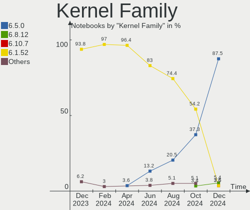
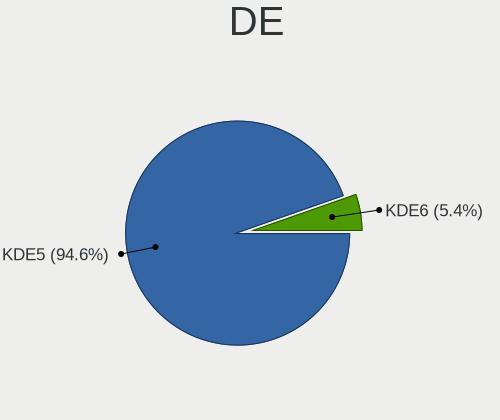
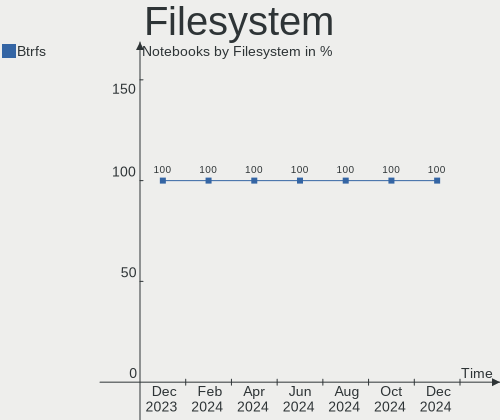
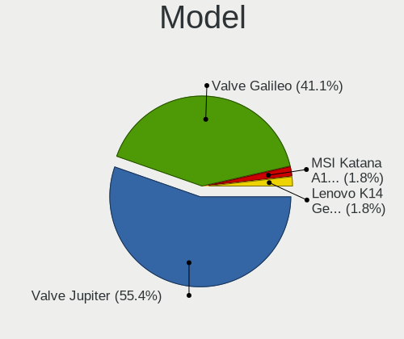
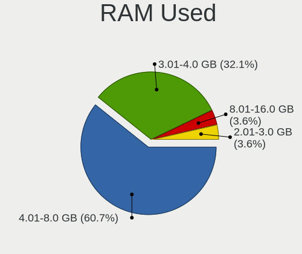
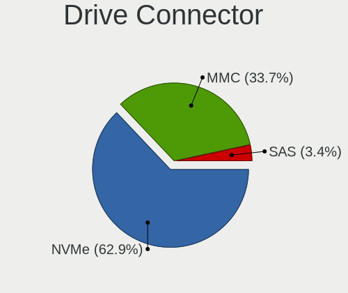
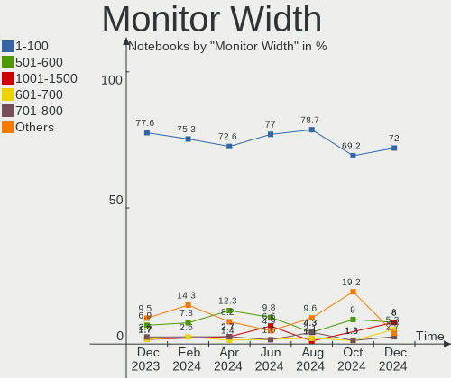
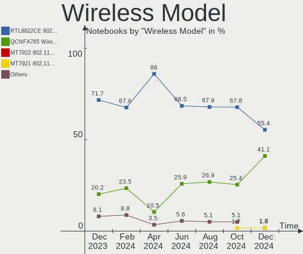
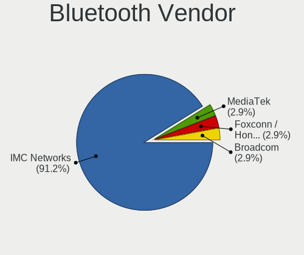
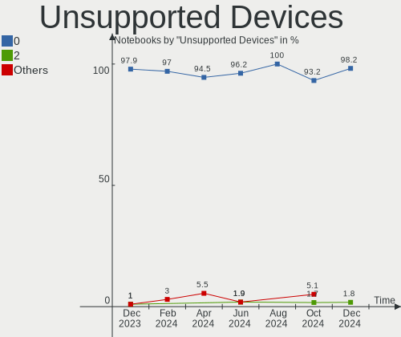

SteamOS - Hardware Trends (Notebooks)
-------------------------------------

A project to identify most popular hardware characteristics and track their change
over time based on data collected by Linux users at https://Linux-Hardware.org.

Anyone can contribute to this report by the [hw-probe](https://github.com/linuxhw/hw-probe) tool:

    sudo -E hw-probe -all -upload

This report is for one last month. Overall report since the beginning of time: [TestDays](https://github.com/linuxhw/TestDays)

Period: Dec, 2023.

Contents
--------

* [ System ](#system)
  - [ OS                       ](#os)
  - [ OS Family                ](#os-family)
  - [ Kernel                   ](#kernel)
  - [ Kernel Family            ](#kernel-family)
  - [ Kernel Major Ver.        ](#kernel-major-ver)
  - [ Arch                     ](#arch)
  - [ DE                       ](#de)
  - [ Display Server           ](#display-server)
  - [ Display Manager          ](#display-manager)
  - [ OS Lang                  ](#os-lang)
  - [ Boot Mode                ](#boot-mode)
  - [ Filesystem               ](#filesystem)
  - [ Part. scheme             ](#part-scheme)
  - [ Dual Boot with Linux/BSD ](#dual-boot-with-linuxbsd)
  - [ Dual Boot (Win)          ](#dual-boot-win)

* [ Board ](#board)
  - [ Vendor                   ](#vendor)
  - [ Model                    ](#model)
  - [ Model Family             ](#model-family)
  - [ MFG Year                 ](#mfg-year)
  - [ Form Factor              ](#form-factor)
  - [ Secure Boot              ](#secure-boot)
  - [ Coreboot                 ](#coreboot)
  - [ RAM Size                 ](#ram-size)
  - [ RAM Used                 ](#ram-used)
  - [ Total Drives             ](#total-drives)
  - [ Has CD-ROM               ](#has-cd-rom)
  - [ Has Ethernet             ](#has-ethernet)
  - [ Has WiFi                 ](#has-wifi)
  - [ Has Bluetooth            ](#has-bluetooth)

* [ Location ](#location)
  - [ Country                  ](#country)
  - [ City                     ](#city)

* [ Drives ](#drives)
  - [ Drive Vendor             ](#drive-vendor)
  - [ Drive Model              ](#drive-model)
  - [ HDD Vendor               ](#hdd-vendor)
  - [ SSD Vendor               ](#ssd-vendor)
  - [ Drive Kind               ](#drive-kind)
  - [ Drive Connector          ](#drive-connector)
  - [ Drive Size               ](#drive-size)
  - [ Space Total              ](#space-total)
  - [ Space Used               ](#space-used)
  - [ Malfunc. Drives          ](#malfunc-drives)
  - [ Malfunc. Drive Vendor    ](#malfunc-drive-vendor)
  - [ Malfunc. HDD Vendor      ](#malfunc-hdd-vendor)
  - [ Malfunc. Drive Kind      ](#malfunc-drive-kind)
  - [ Failed Drives            ](#failed-drives)
  - [ Failed Drive Vendor      ](#failed-drive-vendor)
  - [ Drive Status             ](#drive-status)

* [ Storage controller ](#storage-controller)
  - [ Storage Vendor           ](#storage-vendor)
  - [ Storage Model            ](#storage-model)
  - [ Storage Kind             ](#storage-kind)

* [ Processor ](#processor)
  - [ CPU Vendor               ](#cpu-vendor)
  - [ CPU Model                ](#cpu-model)
  - [ CPU Model Family         ](#cpu-model-family)
  - [ CPU Cores                ](#cpu-cores)
  - [ CPU Sockets              ](#cpu-sockets)
  - [ CPU Threads              ](#cpu-threads)
  - [ CPU Op-Modes             ](#cpu-op-modes)
  - [ CPU Microcode            ](#cpu-microcode)
  - [ CPU Microarch            ](#cpu-microarch)

* [ Graphics ](#graphics)
  - [ GPU Vendor               ](#gpu-vendor)
  - [ GPU Model                ](#gpu-model)
  - [ GPU Combo                ](#gpu-combo)
  - [ GPU Driver               ](#gpu-driver)
  - [ GPU Memory               ](#gpu-memory)

* [ Monitor ](#monitor)
  - [ Monitor Vendor           ](#monitor-vendor)
  - [ Monitor Model            ](#monitor-model)
  - [ Monitor Resolution       ](#monitor-resolution)
  - [ Monitor Diagonal         ](#monitor-diagonal)
  - [ Monitor Width            ](#monitor-width)
  - [ Aspect Ratio             ](#aspect-ratio)
  - [ Monitor Area             ](#monitor-area)
  - [ Pixel Density            ](#pixel-density)
  - [ Multiple Monitors        ](#multiple-monitors)

* [ Network ](#network)
  - [ Net Controller Vendor    ](#net-controller-vendor)
  - [ Net Controller Model     ](#net-controller-model)
  - [ Wireless Vendor          ](#wireless-vendor)
  - [ Wireless Model           ](#wireless-model)
  - [ Ethernet Vendor          ](#ethernet-vendor)
  - [ Ethernet Model           ](#ethernet-model)
  - [ Net Controller Kind      ](#net-controller-kind)
  - [ Used Controller          ](#used-controller)
  - [ NICs                     ](#nics)
  - [ IPv6                     ](#ipv6)

* [ Bluetooth ](#bluetooth)
  - [ Bluetooth Vendor         ](#bluetooth-vendor)
  - [ Bluetooth Model          ](#bluetooth-model)

* [ Sound ](#sound)
  - [ Sound Vendor             ](#sound-vendor)
  - [ Sound Model              ](#sound-model)

* [ Memory ](#memory)
  - [ Memory Vendor            ](#memory-vendor)
  - [ Memory Model             ](#memory-model)
  - [ Memory Kind              ](#memory-kind)
  - [ Memory Form Factor       ](#memory-form-factor)
  - [ Memory Size              ](#memory-size)
  - [ Memory Speed             ](#memory-speed)

* [ Printers & scanners ](#printers--scanners)
  - [ Printer Vendor           ](#printer-vendor)
  - [ Printer Model            ](#printer-model)
  - [ Scanner Vendor           ](#scanner-vendor)
  - [ Scanner Model            ](#scanner-model)

* [ Camera ](#camera)
  - [ Camera Vendor            ](#camera-vendor)
  - [ Camera Model             ](#camera-model)

* [ Security ](#security)
  - [ Fingerprint Vendor       ](#fingerprint-vendor)
  - [ Fingerprint Model        ](#fingerprint-model)
  - [ Chipcard Vendor          ](#chipcard-vendor)
  - [ Chipcard Model           ](#chipcard-model)

* [ Unsupported ](#unsupported)
  - [ Unsupported Devices      ](#unsupported-devices)
  - [ Unsupported Device Types ](#unsupported-device-types)

System
------

OS
--

Installed operating systems

| Name                     | Notebooks | Percent |
|--------------------------|-----------|---------|
| SteamOS 3.5.7            | 79        | 80.61%  |
| SteamOS 3.5.5            | 4         | 4.08%   |
| SteamOS 4                | 3         | 3.06%   |
| SteamOS 3.6              | 2         | 2.04%   |
| SteamOS 3.5.11           | 2         | 2.04%   |
| SteamOS 3.5.10           | 2         | 2.04%   |
| SteamOS 1.051-prerelease | 2         | 2.04%   |
| SteamOS 3.5.8            | 1         | 1.02%   |
| SteamOS 3.5.12           | 1         | 1.02%   |
| SteamOS 3.4.8            | 1         | 1.02%   |
| SteamOS 3.4.11           | 1         | 1.02%   |

OS Family
---------

OS without a version

| Name    | Notebooks | Percent |
|---------|-----------|---------|
| SteamOS | 98        | 100%    |

Kernel
------

Version of the Linux kernel

| Version                     | Notebooks | Percent |
|-----------------------------|-----------|---------|
| 6.1.52-valve9-1-neptune-61  | 78        | 79.59%  |
| 6.1.52-valve10-1-neptune-61 | 7         | 7.14%   |
| 6.1.52-valve7-1-neptune-61  | 4         | 4.08%   |
| 6.3.7-zen1-1-zen            | 3         | 3.06%   |
| 6.4.12-zen1-1-zen           | 2         | 2.04%   |
| 6.1.52-valve12-1-neptune-61 | 1         | 1.02%   |
| 6.1.52-valve11-1-neptune-61 | 1         | 1.02%   |
| 5.13.0-valve37-1-neptune    | 1         | 1.02%   |
| 5.13.0-valve36-1-neptune    | 1         | 1.02%   |

Kernel Family
-------------

Linux kernel without a distro release

| Version | Notebooks | Percent |
|---------|-----------|---------|
| 6.1.52  | 91        | 92.86%  |
| 6.3.7   | 3         | 3.06%   |
| 6.4.12  | 2         | 2.04%   |
| 5.13.0  | 2         | 2.04%   |

Kernel Major Ver.
-----------------

Linux kernel major version

| Version | Notebooks | Percent |
|---------|-----------|---------|
| 6.1     | 91        | 92.86%  |
| 6.3     | 3         | 3.06%   |
| 6.4     | 2         | 2.04%   |
| 5.13    | 2         | 2.04%   |

Arch
----

OS architecture (x86_64, i586, etc.)

| Name   | Notebooks | Percent |
|--------|-----------|---------|
| x86_64 | 98        | 100%    |

DE
--

Desktop Environment

| Name      | Notebooks | Percent |
|-----------|-----------|---------|
| KDE5      | 97        | 98.98%  |
| gamescope | 1         | 1.02%   |

Display Server
--------------

X11 or Wayland

| Name | Notebooks | Percent |
|------|-----------|---------|
| X11  | 98        | 100%    |

Display Manager
---------------

SDDM, LightDM, etc.

| Name    | Notebooks | Percent |
|---------|-----------|---------|
| Unknown | 98        | 100%    |

OS Lang
-------

Language

| Lang  | Notebooks | Percent |
|-------|-----------|---------|
| en_US | 75        | 76.53%  |
| de_DE | 6         | 6.12%   |
| ru_RU | 4         | 4.08%   |
| C     | 3         | 3.06%   |
| it_IT | 2         | 2.04%   |
| fr_FR | 2         | 2.04%   |
| cs_CZ | 2         | 2.04%   |
| zh_TW | 1         | 1.02%   |
| zh_CN | 1         | 1.02%   |
| pt_BR | 1         | 1.02%   |
| pl_PL | 1         | 1.02%   |

Boot Mode
---------

EFI or BIOS

| Mode | Notebooks | Percent |
|------|-----------|---------|
| BIOS | 98        | 100%    |

Filesystem
----------

Type of filesystem

| Type  | Notebooks | Percent |
|-------|-----------|---------|
| Btrfs | 98        | 100%    |

Part. scheme
------------

Scheme of partitioning

| Type    | Notebooks | Percent |
|---------|-----------|---------|
| Unknown | 98        | 100%    |

Dual Boot with Linux/BSD
------------------------

Hosting more than one Linux/BSD

| Dual boot | Notebooks | Percent |
|-----------|-----------|---------|
| No        | 98        | 100%    |

Dual Boot (Win)
---------------

Hosting Linux and Windows

| Dual boot | Notebooks | Percent |
|-----------|-----------|---------|
| No        | 98        | 100%    |

Board
-----

Vendor
------

Motherboard manufacturer

| Name                | Notebooks | Percent |
|---------------------|-----------|---------|
| Valve               | 92        | 93.88%  |
| ASRock              | 2         | 2.04%   |
| Hewlett-Packard     | 1         | 1.02%   |
| Gigabyte Technology | 1         | 1.02%   |
| Apple               | 1         | 1.02%   |
| Anbernic            | 1         | 1.02%   |

Model
-----

Motherboard model

| Name                               | Notebooks | Percent |
|------------------------------------|-----------|---------|
| Valve Jupiter                      | 72        | 73.47%  |
| Valve Galileo                      | 20        | 20.41%  |
| HP ProBook 455 G3                  | 1         | 1.02%   |
| Gigabyte B550I AORUS PRO AX        | 1         | 1.02%   |
| ASRock X570 Phantom Gaming-ITX/TB3 | 1         | 1.02%   |
| ASRock B550M Steel Legend          | 1         | 1.02%   |
| Apple MacBookPro15,1               | 1         | 1.02%   |
| Anbernic Win600                    | 1         | 1.02%   |

Model Family
------------

Motherboard model prefix

| Name               | Notebooks | Percent |
|--------------------|-----------|---------|
| Valve Jupiter      | 72        | 73.47%  |
| Valve Galileo      | 20        | 20.41%  |
| HP ProBook         | 1         | 1.02%   |
| Gigabyte B550I     | 1         | 1.02%   |
| ASRock X570        | 1         | 1.02%   |
| ASRock B550M       | 1         | 1.02%   |
| Apple MacBookPro15 | 1         | 1.02%   |
| Anbernic Win600    | 1         | 1.02%   |

MFG Year
--------

Motherboard manufacture year

| Year    | Notebooks | Percent |
|---------|-----------|---------|
| 2023    | 85        | 86.73%  |
| 2022    | 10        | 10.2%   |
| 2016    | 1         | 1.02%   |
| 2012    | 1         | 1.02%   |
| Unknown | 1         | 1.02%   |

Form Factor
-----------

Physical design of the computer

| Name     | Notebooks | Percent |
|----------|-----------|---------|
| Notebook | 98        | 100%    |

Secure Boot
-----------

Enabled or disabled

| State    | Notebooks | Percent |
|----------|-----------|---------|
| Disabled | 98        | 100%    |

Coreboot
--------

Have coreboot on board

| Used | Notebooks | Percent |
|------|-----------|---------|
| No   | 98        | 100%    |

RAM Size
--------

Total RAM memory

| Size in GB | Notebooks | Percent |
|------------|-----------|---------|
| 8.01-16.0  | 92        | 93.88%  |
| 32.01-64.0 | 3         | 3.06%   |
| 4.01-8.0   | 2         | 2.04%   |
| 16.01-24.0 | 1         | 1.02%   |

RAM Used
--------

Used RAM memory

| Used GB   | Notebooks | Percent |
|-----------|-----------|---------|
| 3.01-4.0  | 40        | 40.82%  |
| 4.01-8.0  | 39        | 39.8%   |
| 2.01-3.0  | 15        | 15.31%  |
| 8.01-16.0 | 3         | 3.06%   |
| 1.01-2.0  | 1         | 1.02%   |

Total Drives
------------

Number of drives on board

| Drives | Notebooks | Percent |
|--------|-----------|---------|
| 2      | 60        | 61.22%  |
| 1      | 35        | 35.71%  |
| 5      | 1         | 1.02%   |
| 4      | 1         | 1.02%   |
| 3      | 1         | 1.02%   |

Has CD-ROM
----------

Has CD-ROM on board

| Presented | Notebooks | Percent |
|-----------|-----------|---------|
| No        | 98        | 100%    |

Has Ethernet
------------

Has Ethernet on board

| Presented | Notebooks | Percent |
|-----------|-----------|---------|
| No        | 65        | 66.33%  |
| Yes       | 33        | 33.67%  |

Has WiFi
--------

Has WiFi module

| Presented | Notebooks | Percent |
|-----------|-----------|---------|
| Yes       | 97        | 98.98%  |
| No        | 1         | 1.02%   |

Has Bluetooth
-------------

Has Bluetooth module

| Presented | Notebooks | Percent |
|-----------|-----------|---------|
| Yes       | 75        | 76.53%  |
| No        | 23        | 23.47%  |

Location
--------

Country
-------

Geographic location (country)

| Country     | Notebooks | Percent |
|-------------|-----------|---------|
| USA         | 36        | 36.73%  |
| Germany     | 10        | 10.2%   |
| Russia      | 9         | 9.18%   |
| UK          | 7         | 7.14%   |
| Canada      | 6         | 6.12%   |
| Poland      | 4         | 4.08%   |
| Italy       | 3         | 3.06%   |
| Mexico      | 2         | 2.04%   |
| Israel      | 2         | 2.04%   |
| France      | 2         | 2.04%   |
| Czechia     | 2         | 2.04%   |
| Brazil      | 2         | 2.04%   |
| Taiwan      | 1         | 1.02%   |
| Switzerland | 1         | 1.02%   |
| Slovakia    | 1         | 1.02%   |
| Singapore   | 1         | 1.02%   |
| Philippines | 1         | 1.02%   |
| New Zealand | 1         | 1.02%   |
| Malaysia    | 1         | 1.02%   |
| Kazakhstan  | 1         | 1.02%   |
| Ireland     | 1         | 1.02%   |
| Hungary     | 1         | 1.02%   |
| Austria     | 1         | 1.02%   |
| Australia   | 1         | 1.02%   |
| Argentina   | 1         | 1.02%   |

City
----

Geographic location (city)

| City               | Notebooks | Percent |
|--------------------|-----------|---------|
| Moscow             | 3         | 3.06%   |
| New York           | 2         | 2.04%   |
| Manchester         | 2         | 2.04%   |
| Los Angeles        | 2         | 2.04%   |
| Flushing           | 2         | 2.04%   |
| Zerbst             | 1         | 1.02%   |
| York               | 1         | 1.02%   |
| Willimantic        | 1         | 1.02%   |
| Wiehl              | 1         | 1.02%   |
| Warsaw             | 1         | 1.02%   |
| Volgograd          | 1         | 1.02%   |
| Vladivostok        | 1         | 1.02%   |
| Vienna             | 1         | 1.02%   |
| Vancouver          | 1         | 1.02%   |
| Tuscaloosa         | 1         | 1.02%   |
| Trieste            | 1         | 1.02%   |
| Toronto            | 1         | 1.02%   |
| Tlaxcala City      | 1         | 1.02%   |
| Teufen AR          | 1         | 1.02%   |
| Tacoma             | 1         | 1.02%   |
| Surgut             | 1         | 1.02%   |
| Springfield        | 1         | 1.02%   |
| South Holland      | 1         | 1.02%   |
| South Bend         | 1         | 1.02%   |
| Singapore          | 1         | 1.02%   |
| Seattle            | 1         | 1.02%   |
| Saint-Pascal       | 1         | 1.02%   |
| Saint-Omer-Capelle | 1         | 1.02%   |
| Sacramento         | 1         | 1.02%   |
| Rožňava          | 1         | 1.02%   |
| Rosh HaAyin        | 1         | 1.02%   |
| Rockland           | 1         | 1.02%   |
| Rishon LeTsiyyon   | 1         | 1.02%   |
| Raleigh            | 1         | 1.02%   |
| Quilmes            | 1         | 1.02%   |
| Protivin           | 1         | 1.02%   |
| Prince George      | 1         | 1.02%   |
| Poznan             | 1         | 1.02%   |
| Porto Alegre       | 1         | 1.02%   |
| Portland           | 1         | 1.02%   |

Drives
------

Drive Vendor
------------

Hard drive vendors

| Vendor                      | Notebooks | Drives | Percent |
|-----------------------------|-----------|--------|---------|
| Unknown                     | 40        | 41     | 23.95%  |
| Phison Electronics          | 28        | 28     | 16.77%  |
| Unknown                     | 20        | 20     | 11.98%  |
| Samsung Electronics         | 19        | 19     | 11.38%  |
| Kingston Technology Company | 17        | 17     | 10.18%  |
| Sandisk                     | 11        | 11     | 6.59%   |
| O2 Micro                    | 9         | 9      | 5.39%   |
| Micron Technology           | 6         | 6      | 3.59%   |
| Silicon Motion              | 2         | 2      | 1.2%    |
| Phison                      | 2         | 2      | 1.2%    |
| WDC                         | 1         | 1      | 0.6%    |
| Solid State Storage         | 1         | 1      | 0.6%    |
| Seagate                     | 1         | 1      | 0.6%    |
| Realtek Semiconductor       | 1         | 1      | 0.6%    |
| Patriot                     | 1         | 1      | 0.6%    |
| Netac Mo                    | 1         | 1      | 0.6%    |
| KIOXIA                      | 1         | 1      | 0.6%    |
| Hitachi                     | 1         | 1      | 0.6%    |
| GLOWAY                      | 1         | 1      | 0.6%    |
| Crucial                     | 1         | 1      | 0.6%    |
| China                       | 1         | 1      | 0.6%    |
| ASMT                        | 1         | 1      | 0.6%    |
| Apple                       | 1         | 1      | 0.6%    |

Drive Model
-----------

Hard drive models

| Model                                                 | Notebooks | Percent |
|-------------------------------------------------------|-----------|---------|
| Unknown                                               | 20        | 11.9%   |
| Unknown MMC Card  512GB                               | 18        | 10.71%  |
| Phison PS5013 E13 NVMe Controller 512GB               | 18        | 10.71%  |
| Kingston Company OM3PDP3 NVMe SSD 512GB               | 17        | 10.12%  |
| Samsung MZ9LQ512HBLU-00BVL 512GB                      | 11        | 6.55%   |
| O2 Micro E2M2 64GB                                    | 9         | 5.36%   |
| Unknown MMC Card  256GB                               | 6         | 3.57%   |
| Unknown MMC Card  128GB                               | 5         | 2.98%   |
| Sandisk WD PC SN740 SDDPTQD-1T00 1024GB               | 4         | 2.38%   |
| Samsung MZ9LQ256HBJD-00BVL 256GB                      | 4         | 2.38%   |
| Unknown MMC Card  64GB                                | 3         | 1.79%   |
| Unknown MMC Card  32GB                                | 3         | 1.79%   |
| Sandisk WD PC SN740 SDDPTQE-2T00 2TB                  | 3         | 1.79%   |
| Phison Sabrent SB-2130-1TB                            | 3         | 1.79%   |
| Phison ESMP001TKB5C3-E19TS 1024GB                     | 3         | 1.79%   |
| Micron 2400_MTFDKBK1T0QFM 1024GB                      | 3         | 1.79%   |
| Silicon Motion SM2263EN/SM2263XT SSD Controller 500GB | 2         | 1.19%   |
| Samsung MZ9L41T0HBLB-00AVL 1024GB                     | 2         | 1.19%   |
| Phison Sabrent Rocket Q4 2TB                          | 2         | 1.19%   |
| Micron 2400_MTFDKBK512QFM 512GB                       | 2         | 1.19%   |
| WDC WDS240G2G0A-00JH30 240GB SSD                      | 1         | 0.6%    |
| Unknown NVMe SSD Drive 1024GB                         | 1         | 0.6%    |
| Unknown MMC Card  7GB                                 | 1         | 0.6%    |
| Unknown MMC Card  393GB                               | 1         | 0.6%    |
| Unknown MMC Card  30MB                                | 1         | 0.6%    |
| Unknown MMC Card  250GB                               | 1         | 0.6%    |
| Unknown MMC Card  1073GB                              | 1         | 0.6%    |
| Solid State Storage CL1-3D512-Q11 NVMe SSSTC 512GB    | 1         | 0.6%    |
| Seagate ST2000LM007-1R8174 2TB                        | 1         | 0.6%    |
| Sandisk WD_BLACK SN850X 2000GB                        | 1         | 0.6%    |
| Sandisk WD_BLACK SN770M 1TB                           | 1         | 0.6%    |
| Sandisk PC SN530 NVMe WDC 256GB                       | 1         | 0.6%    |
| SanDisk Extreme 55AE 1TB SSD                          | 1         | 0.6%    |
| Samsung SSD 870 EVO 4TB                               | 1         | 0.6%    |
| Samsung MZ9LQ1T0HBLB-00B00 1024GB                     | 1         | 0.6%    |
| Realtek GEN4 2TB                                      | 1         | 0.6%    |
| Phison TEAM TM5FF3002T 2TB                            | 1         | 0.6%    |
| Phison Force MP300 480GB                              | 1         | 0.6%    |
| Phison Corsair MP600 MINI 1TB                         | 1         | 0.6%    |
| Phison addlink M.2 PCIE G4x4 NVMe 4TB                 | 1         | 0.6%    |

HDD Vendor
----------

Hard disk drive vendors

| Vendor  | Notebooks | Drives | Percent |
|---------|-----------|--------|---------|
| Seagate | 1         | 1      | 33.33%  |
| Hitachi | 1         | 1      | 33.33%  |
| ASMT    | 1         | 1      | 33.33%  |

SSD Vendor
----------

Solid state drive vendors

| Vendor              | Notebooks | Drives | Percent |
|---------------------|-----------|--------|---------|
| WDC                 | 1         | 1      | 16.67%  |
| SanDisk             | 1         | 1      | 16.67%  |
| Samsung Electronics | 1         | 1      | 16.67%  |
| Patriot             | 1         | 1      | 16.67%  |
| Crucial             | 1         | 1      | 16.67%  |
| China               | 1         | 1      | 16.67%  |

Drive Kind
----------

HDD or SSD

| Kind    | Notebooks | Drives | Percent |
|---------|-----------|--------|---------|
| NVMe    | 96        | 97     | 58.18%  |
| MMC     | 60        | 60     | 36.36%  |
| SSD     | 5         | 6      | 3.03%   |
| HDD     | 2         | 3      | 1.21%   |
| Unknown | 2         | 2      | 1.21%   |

Drive Connector
---------------

SATA, SAS, NVMe, etc.

| Type | Notebooks | Drives | Percent |
|------|-----------|--------|---------|
| NVMe | 96        | 97     | 58.54%  |
| MMC  | 60        | 60     | 36.59%  |
| SAS  | 4         | 5      | 2.44%   |
| SATA | 4         | 6      | 2.44%   |

Drive Size
----------

Size of hard drive

| Size in TB | Notebooks | Drives | Percent |
|------------|-----------|--------|---------|
| 0.51-1.0   | 4         | 4      | 50%     |
| 0.01-0.5   | 2         | 3      | 25%     |
| 3.01-4.0   | 1         | 1      | 12.5%   |
| 1.01-2.0   | 1         | 1      | 12.5%   |

Space Total
-----------

Amount of disk space available on the file system

| Size in GB     | Notebooks | Percent |
|----------------|-----------|---------|
| 501-1000       | 34        | 34.69%  |
| 251-500        | 25        | 25.51%  |
| 1001-2000      | 23        | 23.47%  |
| 101-250        | 7         | 7.14%   |
| 2001-3000      | 4         | 4.08%   |
| 51-100         | 3         | 3.06%   |
| More than 3000 | 2         | 2.04%   |

Space Used
----------

Amount of used disk space

| Used GB        | Notebooks | Percent |
|----------------|-----------|---------|
| 251-500        | 26        | 26.53%  |
| 101-250        | 23        | 23.47%  |
| 501-1000       | 20        | 20.41%  |
| 1001-2000      | 10        | 10.2%   |
| 21-50          | 6         | 6.12%   |
| 51-100         | 6         | 6.12%   |
| 1-20           | 4         | 4.08%   |
| 2001-3000      | 2         | 2.04%   |
| More than 3000 | 1         | 1.02%   |

Malfunc. Drives
---------------

Drive models with a malfunction

Zero info for selected period =(

Malfunc. Drive Vendor
---------------------

Vendors of faulty drives

Zero info for selected period =(

Malfunc. HDD Vendor
-------------------

Vendors of faulty HDD drives

Zero info for selected period =(

Malfunc. Drive Kind
-------------------

Kinds of faulty drives

Zero info for selected period =(

Failed Drives
-------------

Failed drive models

Zero info for selected period =(

Failed Drive Vendor
-------------------

Failed drive vendors

Zero info for selected period =(

Drive Status
------------

Number of failed and malfunc. drives

| Status   | Notebooks | Drives | Percent |
|----------|-----------|--------|---------|
| Detected | 98        | 168    | 100%    |

Storage controller
------------------

Storage Vendor
--------------

Storage controller vendors

| Vendor                         | Notebooks | Percent |
|--------------------------------|-----------|---------|
| Phison Electronics             | 30        | 29.41%  |
| Samsung Electronics            | 18        | 17.65%  |
| Kingston Technology Company    | 17        | 16.67%  |
| Sandisk                        | 10        | 9.8%    |
| O2 Micro                       | 9         | 8.82%   |
| Micron Technology              | 6         | 5.88%   |
| AMD                            | 5         | 4.9%    |
| Silicon Motion                 | 2         | 1.96%   |
| Solidigm                       | 1         | 0.98%   |
| Solid State Storage Technology | 1         | 0.98%   |
| Realtek Semiconductor          | 1         | 0.98%   |
| KIOXIA                         | 1         | 0.98%   |
| Apple                          | 1         | 0.98%   |

Storage Model
-------------

Storage controller models

| Model                                                             | Notebooks | Percent |
|-------------------------------------------------------------------|-----------|---------|
| Phison PS5013-E13 PCIe3 NVMe Controller (DRAM-less)               | 18        | 17.65%  |
| Kingston Company OM3PDP3 NVMe SSD                                 | 17        | 16.67%  |
| Samsung NVMe SSD Controller 980 (DRAM-less)                       | 16        | 15.69%  |
| O2 Micro FORESEE E2M2 NVMe SSD                                    | 9         | 8.82%   |
| Phison PS5021-E21 PCIe4 NVMe Controller (DRAM-less)               | 8         | 7.84%   |
| Sandisk PC SN740 NVMe SSD (DRAM-less)                             | 7         | 6.86%   |
| Micron 2400 NVMe SSD (DRAM-less)                                  | 5         | 4.9%    |
| Phison PS5019-E19 PCIe4 NVMe Controller (DRAM-less)               | 3         | 2.94%   |
| AMD FCH SATA Controller [AHCI mode]                               | 3         | 2.94%   |
| Silicon Motion SM2263EN/SM2263XT (DRAM-less) NVMe SSD Controllers | 2         | 1.96%   |
| Samsung NVMe SSD Controller PM9B1 (DRAM-less)                     | 2         | 1.96%   |
| AMD 500 Series Chipset SATA Controller                            | 2         | 1.96%   |
| Solidigm P41 Plus NVMe SSD (DRAM-less) [Echo Harbor]              | 1         | 0.98%   |
| Solid State Storage CL1-3D256-Q11 NVMe SSD M.2                    | 1         | 0.98%   |
| Sandisk WD Black SN850X NVMe SSD                                  | 1         | 0.98%   |
| Sandisk Non-Volatile memory controller                            | 1         | 0.98%   |
| SanDisk IX SN530 NVMe SSD (DRAM-less)                             | 1         | 0.98%   |
| Realtek RTS5772DL NVMe SSD Controller (DRAM-less)                 | 1         | 0.98%   |
| Phison E8 PCIe3 NVMe Controller                                   | 1         | 0.98%   |
| Micron 2450 NVMe SSD [HendrixV] (DRAM-less)                       | 1         | 0.98%   |
| KIOXIA NVMe SSD Controller BG5 (DRAM-less)                        | 1         | 0.98%   |
| Apple ANS2 NVMe Controller                                        | 1         | 0.98%   |

Storage Kind
------------

Kind of storage controller (IDE, SATA, NVMe, SAS, ...)

| Kind | Notebooks | Percent |
|------|-----------|---------|
| NVMe | 96        | 95.05%  |
| SATA | 5         | 4.95%   |

Processor
---------

CPU Vendor
----------

Processor vendors

| Vendor | Notebooks | Percent |
|--------|-----------|---------|
| AMD    | 97        | 98.98%  |
| Intel  | 1         | 1.02%   |

CPU Model
---------

Processor models

| Model                                           | Notebooks | Percent |
|-------------------------------------------------|-----------|---------|
| AMD Custom APU 0405                             | 92        | 93.88%  |
| Intel Core i9-9880H CPU @ 2.30GHz               | 1         | 1.02%   |
| AMD Ryzen 7 5800X 8-Core Processor              | 1         | 1.02%   |
| AMD Ryzen 7 5700X 8-Core Processor              | 1         | 1.02%   |
| AMD Ryzen 5 5600G with Radeon Graphics          | 1         | 1.02%   |
| AMD Athlon Silver 3050e with Radeon Graphics    | 1         | 1.02%   |
| AMD A10-8700P Radeon R6, 10 Compute Cores 4C+6G | 1         | 1.02%   |

CPU Model Family
----------------

Processor model prefix

| Model         | Notebooks | Percent |
|---------------|-----------|---------|
| Other         | 92        | 93.88%  |
| AMD Ryzen 7   | 2         | 2.04%   |
| Intel Core i9 | 1         | 1.02%   |
| AMD Ryzen 5   | 1         | 1.02%   |
| AMD Athlon    | 1         | 1.02%   |
| AMD A10       | 1         | 1.02%   |

CPU Cores
---------

Number of processor cores

| Number | Notebooks | Percent |
|--------|-----------|---------|
| 4      | 92        | 93.88%  |
| 8      | 3         | 3.06%   |
| 2      | 2         | 2.04%   |
| 6      | 1         | 1.02%   |

CPU Sockets
-----------

Number of sockets

| Number | Notebooks | Percent |
|--------|-----------|---------|
| 1      | 98        | 100%    |

CPU Threads
-----------

Threads per core (Hyper-Threading)

| Number | Notebooks | Percent |
|--------|-----------|---------|
| 2      | 97        | 98.98%  |
| 1      | 1         | 1.02%   |

CPU Op-Modes
------------

CPU Operation Modes (32-bit, 64-bit)

| Op mode        | Notebooks | Percent |
|----------------|-----------|---------|
| 32-bit, 64-bit | 98        | 100%    |

CPU Microcode
-------------

Microcode number

| Number  | Notebooks | Percent |
|---------|-----------|---------|
| Unknown | 98        | 100%    |

CPU Microarch
-------------

Microarchitecture

| Name      | Notebooks | Percent |
|-----------|-----------|---------|
| Unknown   | 92        | 93.88%  |
| Zen 3     | 3         | 3.06%   |
| Zen       | 1         | 1.02%   |
| KabyLake  | 1         | 1.02%   |
| Excavator | 1         | 1.02%   |

Graphics
--------

GPU Vendor
----------

Vendors of graphics cards

| Vendor | Notebooks | Percent |
|--------|-----------|---------|
| AMD    | 98        | 100%    |

GPU Model
---------

Graphics card models

| Model                                                                | Notebooks | Percent |
|----------------------------------------------------------------------|-----------|---------|
| AMD VanGogh [AMD Custom GPU 0405]                                    | 72        | 72.73%  |
| AMD VGA compatible controller                                        | 20        | 20.2%   |
| AMD Navi 22 [Radeon RX 6700/6700 XT/6750 XT / 6800M/6850M XT]        | 2         | 2.02%   |
| AMD Wani [Radeon R5/R6/R7 Graphics]                                  | 1         | 1.01%   |
| AMD Picasso/Raven 2 [Radeon Vega Series / Radeon Vega Mobile Series] | 1         | 1.01%   |
| AMD Navi 31 [Radeon RX 7900 XT/7900 XTX]                             | 1         | 1.01%   |
| AMD Cezanne [Radeon Vega Series / Radeon Vega Mobile Series]         | 1         | 1.01%   |
| AMD Baffin [Radeon RX 460/560D / Pro 450/455/460/555/555X/560/560X]  | 1         | 1.01%   |

GPU Combo
---------

Combinations of graphics cards

| Name    | Notebooks | Percent |
|---------|-----------|---------|
| 1 x AMD | 97        | 98.98%  |
| 2 x AMD | 1         | 1.02%   |

GPU Driver
----------

Free vs proprietary

| Driver | Notebooks | Percent |
|--------|-----------|---------|
| Free   | 98        | 100%    |

GPU Memory
----------

Total video memory

| Size in GB | Notebooks | Percent |
|------------|-----------|---------|
| Unknown    | 98        | 100%    |

Monitor
-------

Monitor Vendor
--------------

Monitor vendors

| Vendor               | Notebooks | Percent |
|----------------------|-----------|---------|
| Valve                | 89        | 76.07%  |
| Goldstar             | 4         | 3.42%   |
| Samsung Electronics  | 3         | 2.56%   |
| Philips              | 2         | 1.71%   |
| Vizio                | 1         | 0.85%   |
| Unknown (XXX)        | 1         | 0.85%   |
| Sony                 | 1         | 0.85%   |
| SGT                  | 1         | 0.85%   |
| SBE                  | 1         | 0.85%   |
| RTK                  | 1         | 0.85%   |
| MStar                | 1         | 0.85%   |
| Hitachi              | 1         | 0.85%   |
| GreenWood            | 1         | 0.85%   |
| GDH                  | 1         | 0.85%   |
| DHD                  | 1         | 0.85%   |
| Dell                 | 1         | 0.85%   |
| Chimei Innolux       | 1         | 0.85%   |
| BenQ                 | 1         | 0.85%   |
| ASUSTek Computer     | 1         | 0.85%   |
| Apple                | 1         | 0.85%   |
| AOC                  | 1         | 0.85%   |
| Ancor Communications | 1         | 0.85%   |
| Acer                 | 1         | 0.85%   |

Monitor Model
-------------

Monitor models

| Model                                                                 | Notebooks | Percent |
|-----------------------------------------------------------------------|-----------|---------|
| Valve ANX7530 U VLV3001 800x1280 100x150mm 7.1-inch                   | 69        | 58.97%  |
| Valve ANX7530 U VLV3003 800x1280 100x160mm 7.4-inch                   | 18        | 15.38%  |
| Valve ANX7530 U VLV3004 800x1280 100x160mm 7.4-inch                   | 2         | 1.71%   |
| Vizio E24-C1 VIZ1005 1920x1080 521x293mm 23.5-inch                    | 1         | 0.85%   |
| Unknown (XXX) Beyond TV XXX2851 1920x1080 1209x680mm 54.6-inch        | 1         | 0.85%   |
| Sony TV *30 SNY7105 3840x2160 1660x934mm 75.0-inch                    | 1         | 0.85%   |
| SGT ASM-160QCC SGT161A 2560x1600 354x199mm 16.0-inch                  | 1         | 0.85%   |
| SBE 2511600 SBE2442 1920x1080 478x269mm 21.6-inch                     | 1         | 0.85%   |
| Samsung Electronics T24C550 SAM0BA5 1366x768 521x293mm 23.5-inch      | 1         | 0.85%   |
| Samsung Electronics SyncMaster SAM0202 1680x1050 474x296mm 22.0-inch  | 1         | 0.85%   |
| Samsung Electronics LCD Monitor SAM0FEE 3840x2160 950x540mm 43.0-inch | 1         | 0.85%   |
| RTK 7911D RTK2A3B 720x1280 720x1280mm 57.8-inch                       | 1         | 0.85%   |
| Philips PHL 243V7 PHLC155 1920x1080 527x296mm 23.8-inch               | 1         | 0.85%   |
| Philips FTV PHL01EA 1920x1080 1440x810mm 65.0-inch                    | 1         | 0.85%   |
| MStar TV MST0030 1920x1080 708x398mm 32.0-inch                        | 1         | 0.85%   |
| Hitachi HDMI HEC0030 1920x1080 1150x650mm 52.0-inch                   | 1         | 0.85%   |
| GreenWood ARZOPA GWD0141 1920x1080 309x174mm 14.0-inch                | 1         | 0.85%   |
| Goldstar ULTRAGEAR GSM5BB8 1920x1080 600x340mm 27.2-inch              | 1         | 0.85%   |
| Goldstar ULTRAGEAR GSM5BB2 1920x1080 527x296mm 23.8-inch              | 1         | 0.85%   |
| Goldstar TV SSCR2 GSMC0C8 3840x2160                                   | 1         | 0.85%   |
| Goldstar LG IPS FULLHD GSM5AB8 1920x1080 480x270mm 21.7-inch          | 1         | 0.85%   |
| GDH Digital TV GDH0032 1440x900 708x398mm 32.0-inch                   | 1         | 0.85%   |
| DHD DeckHD-1200p DHD3001 1200x1920 100x150mm 7.1-inch                 | 1         | 0.85%   |
| Dell U2722D DEL422F 2560x1440 597x336mm 27.0-inch                     | 1         | 0.85%   |
| Chimei Innolux LCD Monitor CMN15BE 1366x768 344x193mm 15.5-inch       | 1         | 0.85%   |
| BenQ EX2710Q BNQ7F87 2560x1440 597x336mm 27.0-inch                    | 1         | 0.85%   |
| ASUSTek Computer VG289 AUS28BA 3840x2160 621x341mm 27.9-inch          | 1         | 0.85%   |
| Apple Color LCD APPA040 2880x1800 331x207mm 15.4-inch                 | 1         | 0.85%   |
| AOC Q3279WG5B AOC3279 2560x1440 725x428mm 33.1-inch                   | 1         | 0.85%   |
| Ancor Communications ASUS VS247 ACI249A 1920x1080 521x293mm 23.5-inch | 1         | 0.85%   |
| Acer K242HL ACR03E3 1920x1080 531x299mm 24.0-inch                     | 1         | 0.85%   |

Monitor Resolution
------------------

Monitor screen resolution

| Resolution         | Notebooks | Percent |
|--------------------|-----------|---------|
| 800x1280           | 89        | 76.07%  |
| 1920x1080 (FHD)    | 10        | 8.55%   |
| 3840x2160 (4K)     | 8         | 6.84%   |
| 2560x1440 (QHD)    | 3         | 2.56%   |
| 1366x768 (WXGA)    | 3         | 2.56%   |
| 2880x1800          | 1         | 0.85%   |
| 2560x1600          | 1         | 0.85%   |
| 1680x1050 (WSXGA+) | 1         | 0.85%   |
| 1200x1920          | 1         | 0.85%   |

Monitor Diagonal
----------------

Diagonal size in inches

| Inches | Notebooks | Percent |
|--------|-----------|---------|
| 7      | 90        | 76.92%  |
| 27     | 4         | 3.42%   |
| 23     | 3         | 2.56%   |
| 84     | 2         | 1.71%   |
| 24     | 2         | 1.71%   |
| 21     | 2         | 1.71%   |
| 15     | 2         | 1.71%   |
| 75     | 1         | 0.85%   |
| 72     | 1         | 0.85%   |
| 65     | 1         | 0.85%   |
| 57     | 1         | 0.85%   |
| 54     | 1         | 0.85%   |
| 52     | 1         | 0.85%   |
| 33     | 1         | 0.85%   |
| 32     | 1         | 0.85%   |
| 31     | 1         | 0.85%   |
| 22     | 1         | 0.85%   |
| 16     | 1         | 0.85%   |
| 14     | 1         | 0.85%   |

Monitor Width
-------------

Physical width

| Width in mm | Notebooks | Percent |
|-------------|-----------|---------|
| 1-100       | 90        | 76.92%  |
| 501-600     | 8         | 6.84%   |
| 1501-2000   | 4         | 3.42%   |
| 701-800     | 3         | 2.56%   |
| 401-500     | 3         | 2.56%   |
| 301-350     | 3         | 2.56%   |
| 1001-1500   | 3         | 2.56%   |
| 601-700     | 2         | 1.71%   |
| 351-400     | 1         | 0.85%   |

Aspect Ratio
------------

Proportional relationship between the width and the height

| Ratio | Notebooks | Percent |
|-------|-----------|---------|
| 0.67  | 70        | 59.83%  |
| 16/9  | 24        | 20.51%  |
| 0.62  | 20        | 17.09%  |
| 16/10 | 2         | 1.71%   |
| 0.56  | 1         | 0.85%   |

Monitor Area
------------

Area in inch²

| Area in inch² | Notebooks | Percent |
|----------------|-----------|---------|
| 1-40           | 90        | 76.92%  |
| More than 1000 | 8         | 6.84%   |
| 201-250        | 7         | 5.98%   |
| 301-350        | 4         | 3.42%   |
| 351-500        | 3         | 2.56%   |
| 101-110        | 3         | 2.56%   |
| 81-90          | 1         | 0.85%   |
| 151-200        | 1         | 0.85%   |

Pixel Density
-------------

Pixels per inch

| Density       | Notebooks | Percent |
|---------------|-----------|---------|
| 161-240       | 90        | 77.59%  |
| 51-100        | 14        | 12.07%  |
| 101-120       | 5         | 4.31%   |
| 1-50          | 4         | 3.45%   |
| 121-160       | 2         | 1.72%   |
| More than 240 | 1         | 0.86%   |

Multiple Monitors
-----------------

Total monitors connected

| Total | Notebooks | Percent |
|-------|-----------|---------|
| 1     | 78        | 79.59%  |
| 2     | 20        | 20.41%  |

Network
-------

Net Controller Vendor
---------------------

Controller vendors

| Vendor                | Notebooks | Percent |
|-----------------------|-----------|---------|
| Realtek Semiconductor | 79        | 67.52%  |
| Qualcomm              | 20        | 17.09%  |
| ASIX Electronics      | 10        | 8.55%   |
| Intel                 | 3         | 2.56%   |
| Microsoft             | 2         | 1.71%   |
| MediaTek              | 1         | 0.85%   |
| Broadcom Limited      | 1         | 0.85%   |
| Broadcom              | 1         | 0.85%   |

Net Controller Model
--------------------

Controller models

| Model                                                             | Notebooks | Percent |
|-------------------------------------------------------------------|-----------|---------|
| Realtek RTL8822CE 802.11ac PCIe Wireless Network Adapter          | 71        | 53.38%  |
| Qualcomm QCNFA765 Wireless Network Adapter                        | 20        | 15.04%  |
| Realtek RTL8153 Gigabit Ethernet Adapter                          | 17        | 12.78%  |
| ASIX AX88179 Gigabit Ethernet                                     | 10        | 7.52%   |
| Realtek RTL8152 Fast Ethernet Adapter                             | 2         | 1.5%    |
| Realtek RTL8125 2.5GbE Controller                                 | 2         | 1.5%    |
| Microsoft Wireless XBox Controller Dongle                         | 2         | 1.5%    |
| Realtek RTL8111/8168/8411 PCI Express Gigabit Ethernet Controller | 1         | 0.75%   |
| Realtek 802.11ac NIC                                              | 1         | 0.75%   |
| MediaTek MT7921K (RZ608) Wi-Fi 6E 80MHz                           | 1         | 0.75%   |
| Intel Wireless 3165                                               | 1         | 0.75%   |
| Intel Wi-Fi 6 AX210/AX211/AX411 160MHz                            | 1         | 0.75%   |
| Intel Wi-Fi 6 AX200                                               | 1         | 0.75%   |
| Intel I211 Gigabit Network Connection                             | 1         | 0.75%   |
| Broadcom Limited BCM43228 802.11a/b/g/n                           | 1         | 0.75%   |
| Broadcom BCM4364 802.11ac Wireless Network Adapter                | 1         | 0.75%   |

Wireless Vendor
---------------

Wireless vendors

| Vendor                | Notebooks | Percent |
|-----------------------|-----------|---------|
| Realtek Semiconductor | 71        | 71.72%  |
| Qualcomm              | 20        | 20.2%   |
| Intel                 | 3         | 3.03%   |
| Microsoft             | 2         | 2.02%   |
| MediaTek              | 1         | 1.01%   |
| Broadcom Limited      | 1         | 1.01%   |
| Broadcom              | 1         | 1.01%   |

Wireless Model
--------------

Wireless models

| Model                                                    | Notebooks | Percent |
|----------------------------------------------------------|-----------|---------|
| Realtek RTL8822CE 802.11ac PCIe Wireless Network Adapter | 71        | 71%     |
| Qualcomm QCNFA765 Wireless Network Adapter               | 20        | 20%     |
| Microsoft Wireless XBox Controller Dongle                | 2         | 2%      |
| Realtek 802.11ac NIC                                     | 1         | 1%      |
| MediaTek MT7921K (RZ608) Wi-Fi 6E 80MHz                  | 1         | 1%      |
| Intel Wireless 3165                                      | 1         | 1%      |
| Intel Wi-Fi 6 AX210/AX211/AX411 160MHz                   | 1         | 1%      |
| Intel Wi-Fi 6 AX200                                      | 1         | 1%      |
| Broadcom Limited BCM43228 802.11a/b/g/n                  | 1         | 1%      |
| Broadcom BCM4364 802.11ac Wireless Network Adapter       | 1         | 1%      |

Ethernet Vendor
---------------

Ethernet vendors

| Vendor                | Notebooks | Percent |
|-----------------------|-----------|---------|
| Realtek Semiconductor | 22        | 66.67%  |
| ASIX Electronics      | 10        | 30.3%   |
| Intel                 | 1         | 3.03%   |

Ethernet Model
--------------

Ethernet models

| Model                                                             | Notebooks | Percent |
|-------------------------------------------------------------------|-----------|---------|
| Realtek RTL8153 Gigabit Ethernet Adapter                          | 17        | 51.52%  |
| ASIX AX88179 Gigabit Ethernet                                     | 10        | 30.3%   |
| Realtek RTL8152 Fast Ethernet Adapter                             | 2         | 6.06%   |
| Realtek RTL8125 2.5GbE Controller                                 | 2         | 6.06%   |
| Realtek RTL8111/8168/8411 PCI Express Gigabit Ethernet Controller | 1         | 3.03%   |
| Intel I211 Gigabit Network Connection                             | 1         | 3.03%   |

Net Controller Kind
-------------------

Ethernet, WiFi or modem

| Kind     | Notebooks | Percent |
|----------|-----------|---------|
| WiFi     | 97        | 74.62%  |
| Ethernet | 33        | 25.38%  |

Used Controller
---------------

Currently used network controller

| Kind     | Notebooks | Percent |
|----------|-----------|---------|
| WiFi     | 93        | 91.18%  |
| Ethernet | 9         | 8.82%   |

NICs
----

Total network controllers on board

| Total | Notebooks | Percent |
|-------|-----------|---------|
| 1     | 95        | 96.94%  |
| 2     | 3         | 3.06%   |

IPv6
----

IPv6 vs IPv4

| Used | Notebooks | Percent |
|------|-----------|---------|
| No   | 59        | 60.2%   |
| Yes  | 39        | 39.8%   |

Bluetooth
---------

Bluetooth Vendor
----------------

Controller vendors

| Vendor       | Notebooks | Percent |
|--------------|-----------|---------|
| IMC Networks | 71        | 94.67%  |
| Intel        | 2         | 2.67%   |
| MediaTek     | 1         | 1.33%   |
| Broadcom     | 1         | 1.33%   |

Bluetooth Model
---------------

Controller models

| Model                              | Notebooks | Percent |
|------------------------------------|-----------|---------|
| IMC Networks 802.11ac WLAN Adapter | 71        | 94.67%  |
| MediaTek Wireless_Device           | 1         | 1.33%   |
| Intel Bluetooth wireless interface | 1         | 1.33%   |
| Intel AX200 Bluetooth              | 1         | 1.33%   |
| Broadcom BCM20702A0                | 1         | 1.33%   |

Sound
-----

Sound Vendor
------------

Sound card vendors

| Vendor                | Notebooks | Percent |
|-----------------------|-----------|---------|
| AMD                   | 98        | 92.45%  |
| Sony                  | 2         | 1.89%   |
| Yamaha                | 1         | 0.94%   |
| Teenage Engineering   | 1         | 0.94%   |
| Realtek Semiconductor | 1         | 0.94%   |
| Kingston Technology   | 1         | 0.94%   |
| Intel                 | 1         | 0.94%   |
| Apple                 | 1         | 0.94%   |

Sound Model
-----------

Sound card models

| Model                                                        | Notebooks | Percent |
|--------------------------------------------------------------|-----------|---------|
| AMD Rembrandt Radeon High Definition Audio Controller        | 92        | 82.14%  |
| Sony DualSense wireless controller (PS5)                     | 2         | 1.79%   |
| AMD Starship/Matisse HD Audio Controller                     | 2         | 1.79%   |
| AMD Navi 21/23 HDMI/DP Audio Controller                      | 2         | 1.79%   |
| AMD Family 17h/19h HD Audio Controller                       | 2         | 1.79%   |
| Yamaha AG06MK2                                               | 1         | 0.89%   |
| Teenage Engineering OP-1                                     | 1         | 0.89%   |
| Realtek Semiconductor USB Audio                              | 1         | 0.89%   |
| Kingston Technology HyperX 7.1 Audio                         | 1         | 0.89%   |
| Intel USB PnP Sound Device                                   | 1         | 0.89%   |
| Apple Audio Device                                           | 1         | 0.89%   |
| AMD Renoir Radeon High Definition Audio Controller           | 1         | 0.89%   |
| AMD Raven/Raven2/Fenghuang HDMI/DP Audio Controller          | 1         | 0.89%   |
| AMD Navi 31 HDMI/DP Audio                                    | 1         | 0.89%   |
| AMD Kabini HDMI/DP Audio                                     | 1         | 0.89%   |
| AMD Family 15h (Models 60h-6fh) Audio Controller             | 1         | 0.89%   |
| AMD Baffin HDMI/DP Audio [Radeon RX 550 640SP / RX 560/560X] | 1         | 0.89%   |

Memory
------

Memory Vendor
-------------

Memory module vendors

Zero info for selected period =(

Memory Model
------------

Memory module models

Zero info for selected period =(

Memory Kind
-----------

Memory module kinds

Zero info for selected period =(

Memory Form Factor
------------------

Physical design of the memory module

Zero info for selected period =(

Memory Size
-----------

Memory module size

Zero info for selected period =(

Memory Speed
------------

Memory module speed

Zero info for selected period =(

Printers & scanners
-------------------

Printer Vendor
--------------

Printer device vendors

| Vendor              | Notebooks | Percent |
|---------------------|-----------|---------|
| Samsung Electronics | 1         | 50%     |
| Canon               | 1         | 50%     |

Printer Model
-------------

Printer device models

| Model                     | Notebooks | Percent |
|---------------------------|-----------|---------|
| Samsung M2020 Series      | 1         | 50%     |
| Canon PIXMA MG3600 Series | 1         | 50%     |

Scanner Vendor
--------------

Scanner device vendors

Zero info for selected period =(

Scanner Model
-------------

Scanner device models

Zero info for selected period =(

Camera
------

Camera Vendor
-------------

Camera device vendors

| Vendor                                 | Notebooks | Percent |
|----------------------------------------|-----------|---------|
| Microsoft                              | 1         | 33.33%  |
| Generalplus Technology                 | 1         | 33.33%  |
| Cheng Uei Precision Industry (Foxlink) | 1         | 33.33%  |

Camera Model
------------

Camera device models

| Model                                               | Notebooks | Percent |
|-----------------------------------------------------|-----------|---------|
| Microsoft LifeCam HD-3000                           | 1         | 33.33%  |
| Generalplus GENERAL WEBCAM                          | 1         | 33.33%  |
| Cheng Uei Precision Industry (Foxlink) HP HD Camera | 1         | 33.33%  |

Security
--------

Fingerprint Vendor
------------------

Fingerprint sensor vendors

Zero info for selected period =(

Fingerprint Model
-----------------

Fingerprint sensor models

Zero info for selected period =(

Chipcard Vendor
---------------

Chipcard module vendors

Zero info for selected period =(

Chipcard Model
--------------

Chipcard module models

Zero info for selected period =(

Unsupported
-----------

Unsupported Devices
-------------------

Total unsupported devices on board

| Total | Notebooks | Percent |
|-------|-----------|---------|
| 0     | 96        | 97.96%  |
| 2     | 1         | 1.02%   |
| 1     | 1         | 1.02%   |

Unsupported Device Types
------------------------

Types of unsupported devices

| Type         | Notebooks | Percent |
|--------------|-----------|---------|
| Net/wireless | 2         | 66.67%  |
| Sound        | 1         | 33.33%  |

