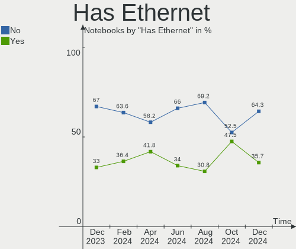
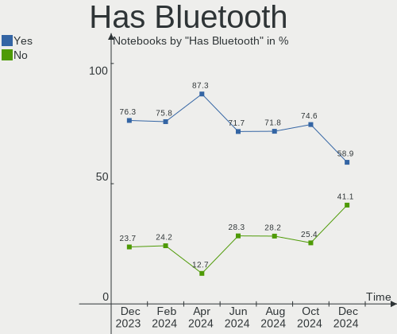
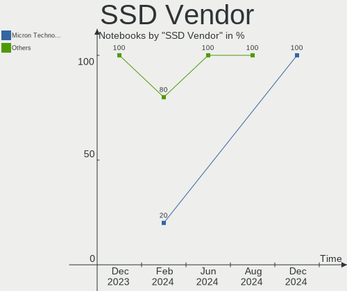
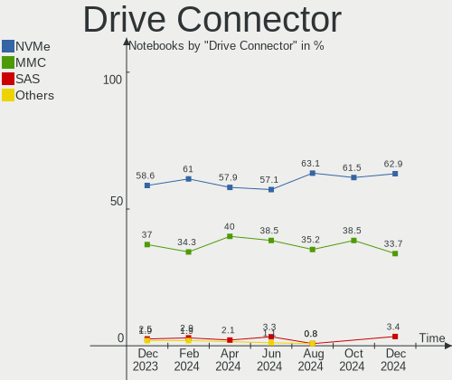
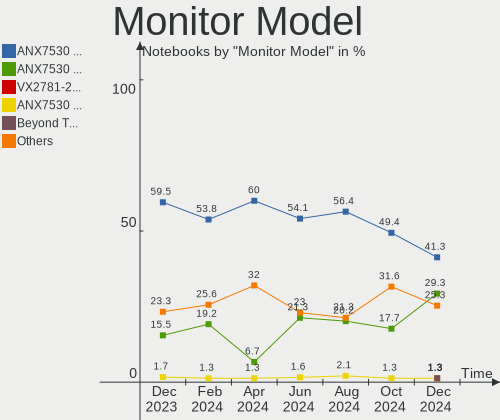
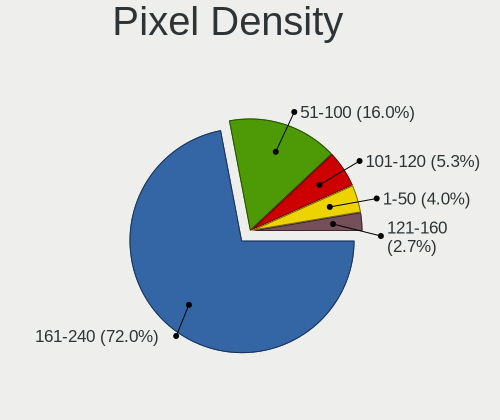
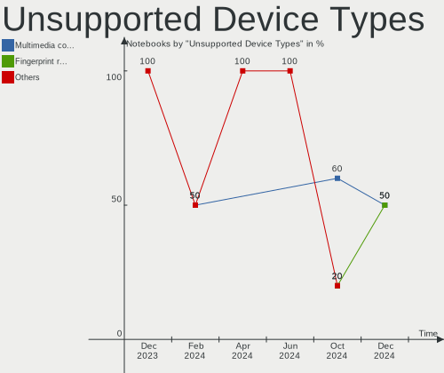

SteamOS - Hardware Trends (Notebooks)
-------------------------------------

A project to identify most popular hardware characteristics and track their change
over time based on data collected by Linux users at https://Linux-Hardware.org.

Anyone can contribute to this report by the [hw-probe](https://github.com/linuxhw/hw-probe) tool:

    sudo -E hw-probe -all -upload

This report is for one last month. Overall report since the beginning of time: [TestDays](https://github.com/linuxhw/TestDays)

Period: Dec, 2024.

Contents
--------

* [ System ](#system)
  - [ OS                       ](#os)
  - [ OS Family                ](#os-family)
  - [ Kernel                   ](#kernel)
  - [ Kernel Family            ](#kernel-family)
  - [ Kernel Major Ver.        ](#kernel-major-ver)
  - [ Arch                     ](#arch)
  - [ DE                       ](#de)
  - [ Display Server           ](#display-server)
  - [ Display Manager          ](#display-manager)
  - [ OS Lang                  ](#os-lang)
  - [ Boot Mode                ](#boot-mode)
  - [ Filesystem               ](#filesystem)
  - [ Part. scheme             ](#part-scheme)
  - [ Dual Boot with Linux/BSD ](#dual-boot-with-linuxbsd)
  - [ Dual Boot (Win)          ](#dual-boot-win)

* [ Board ](#board)
  - [ Vendor                   ](#vendor)
  - [ Model                    ](#model)
  - [ Model Family             ](#model-family)
  - [ MFG Year                 ](#mfg-year)
  - [ Form Factor              ](#form-factor)
  - [ Secure Boot              ](#secure-boot)
  - [ Coreboot                 ](#coreboot)
  - [ RAM Size                 ](#ram-size)
  - [ RAM Used                 ](#ram-used)
  - [ Total Drives             ](#total-drives)
  - [ Has CD-ROM               ](#has-cd-rom)
  - [ Has Ethernet             ](#has-ethernet)
  - [ Has WiFi                 ](#has-wifi)
  - [ Has Bluetooth            ](#has-bluetooth)

* [ Location ](#location)
  - [ Country                  ](#country)
  - [ City                     ](#city)

* [ Drives ](#drives)
  - [ Drive Vendor             ](#drive-vendor)
  - [ Drive Model              ](#drive-model)
  - [ HDD Vendor               ](#hdd-vendor)
  - [ SSD Vendor               ](#ssd-vendor)
  - [ Drive Kind               ](#drive-kind)
  - [ Drive Connector          ](#drive-connector)
  - [ Drive Size               ](#drive-size)
  - [ Space Total              ](#space-total)
  - [ Space Used               ](#space-used)
  - [ Malfunc. Drives          ](#malfunc-drives)
  - [ Malfunc. Drive Vendor    ](#malfunc-drive-vendor)
  - [ Malfunc. HDD Vendor      ](#malfunc-hdd-vendor)
  - [ Malfunc. Drive Kind      ](#malfunc-drive-kind)
  - [ Failed Drives            ](#failed-drives)
  - [ Failed Drive Vendor      ](#failed-drive-vendor)
  - [ Drive Status             ](#drive-status)

* [ Storage controller ](#storage-controller)
  - [ Storage Vendor           ](#storage-vendor)
  - [ Storage Model            ](#storage-model)
  - [ Storage Kind             ](#storage-kind)

* [ Processor ](#processor)
  - [ CPU Vendor               ](#cpu-vendor)
  - [ CPU Model                ](#cpu-model)
  - [ CPU Model Family         ](#cpu-model-family)
  - [ CPU Cores                ](#cpu-cores)
  - [ CPU Sockets              ](#cpu-sockets)
  - [ CPU Threads              ](#cpu-threads)
  - [ CPU Op-Modes             ](#cpu-op-modes)
  - [ CPU Microcode            ](#cpu-microcode)
  - [ CPU Microarch            ](#cpu-microarch)

* [ Graphics ](#graphics)
  - [ GPU Vendor               ](#gpu-vendor)
  - [ GPU Model                ](#gpu-model)
  - [ GPU Combo                ](#gpu-combo)
  - [ GPU Driver               ](#gpu-driver)
  - [ GPU Memory               ](#gpu-memory)

* [ Monitor ](#monitor)
  - [ Monitor Vendor           ](#monitor-vendor)
  - [ Monitor Model            ](#monitor-model)
  - [ Monitor Resolution       ](#monitor-resolution)
  - [ Monitor Diagonal         ](#monitor-diagonal)
  - [ Monitor Width            ](#monitor-width)
  - [ Aspect Ratio             ](#aspect-ratio)
  - [ Monitor Area             ](#monitor-area)
  - [ Pixel Density            ](#pixel-density)
  - [ Multiple Monitors        ](#multiple-monitors)

* [ Network ](#network)
  - [ Net Controller Vendor    ](#net-controller-vendor)
  - [ Net Controller Model     ](#net-controller-model)
  - [ Wireless Vendor          ](#wireless-vendor)
  - [ Wireless Model           ](#wireless-model)
  - [ Ethernet Vendor          ](#ethernet-vendor)
  - [ Ethernet Model           ](#ethernet-model)
  - [ Net Controller Kind      ](#net-controller-kind)
  - [ Used Controller          ](#used-controller)
  - [ NICs                     ](#nics)
  - [ IPv6                     ](#ipv6)

* [ Bluetooth ](#bluetooth)
  - [ Bluetooth Vendor         ](#bluetooth-vendor)
  - [ Bluetooth Model          ](#bluetooth-model)

* [ Sound ](#sound)
  - [ Sound Vendor             ](#sound-vendor)
  - [ Sound Model              ](#sound-model)

* [ Memory ](#memory)
  - [ Memory Vendor            ](#memory-vendor)
  - [ Memory Model             ](#memory-model)
  - [ Memory Kind              ](#memory-kind)
  - [ Memory Form Factor       ](#memory-form-factor)
  - [ Memory Size              ](#memory-size)
  - [ Memory Speed             ](#memory-speed)

* [ Printers & scanners ](#printers--scanners)
  - [ Printer Vendor           ](#printer-vendor)
  - [ Printer Model            ](#printer-model)
  - [ Scanner Vendor           ](#scanner-vendor)
  - [ Scanner Model            ](#scanner-model)

* [ Camera ](#camera)
  - [ Camera Vendor            ](#camera-vendor)
  - [ Camera Model             ](#camera-model)

* [ Security ](#security)
  - [ Fingerprint Vendor       ](#fingerprint-vendor)
  - [ Fingerprint Model        ](#fingerprint-model)
  - [ Chipcard Vendor          ](#chipcard-vendor)
  - [ Chipcard Model           ](#chipcard-model)

* [ Unsupported ](#unsupported)
  - [ Unsupported Devices      ](#unsupported-devices)
  - [ Unsupported Device Types ](#unsupported-device-types)

System
------

OS
--

Installed operating systems

| Name              | Notebooks | Percent |
|-------------------|-----------|---------|
| SteamOS 3.6.20    | 44        | 78.57%  |
| SteamOS 3.6.21    | 4         | 7.14%   |
| SteamOS 3.7       | 3         | 5.36%   |
| SteamOS 3.5.19    | 2         | 3.57%   |
| SteamOS 1.6-fixes | 2         | 3.57%   |
| SteamOS 3.6.9     | 1         | 1.79%   |

OS Family
---------

OS without a version

| Name    | Notebooks | Percent |
|---------|-----------|---------|
| SteamOS | 56        | 100%    |

Kernel
------

Version of the Linux kernel

| Version                                  | Notebooks | Percent |
|------------------------------------------|-----------|---------|
| 6.5.0-valve22-1-neptune-65-g9a338ed8a75e | 43        | 76.79%  |
| 6.5.0-valve23-1-neptune-65-g385b5e207ae2 | 5         | 8.93%   |
| 6.8.12-valve7-1-neptune-68-g8c3c3d4f5307 | 3         | 5.36%   |
| 6.10.7-1-lljy-g2fd7b345494a              | 2         | 3.57%   |
| 6.1.52-valve16-1-neptune-61              | 2         | 3.57%   |
| 6.5.0-valve16-2-neptune-65-gc9ad4106624e | 1         | 1.79%   |

Kernel Family
-------------

Linux kernel without a distro release

| Version | Notebooks | Percent |
|---------|-----------|---------|
| 6.5.0   | 49        | 87.5%   |
| 6.8.12  | 3         | 5.36%   |
| 6.10.7  | 2         | 3.57%   |
| 6.1.52  | 2         | 3.57%   |

Kernel Major Ver.
-----------------

Linux kernel major version

| Version | Notebooks | Percent |
|---------|-----------|---------|
| 6.5     | 49        | 87.5%   |
| 6.8     | 3         | 5.36%   |
| 6.10    | 2         | 3.57%   |
| 6.1     | 2         | 3.57%   |

Arch
----

OS architecture (x86_64, i586, etc.)

| Name   | Notebooks | Percent |
|--------|-----------|---------|
| x86_64 | 56        | 100%    |

DE
--

Desktop Environment

| Name | Notebooks | Percent |
|------|-----------|---------|
| KDE5 | 53        | 94.64%  |
| KDE6 | 3         | 5.36%   |

Display Server
--------------

X11 or Wayland

| Name | Notebooks | Percent |
|------|-----------|---------|
| X11  | 56        | 100%    |

Display Manager
---------------

SDDM, LightDM, etc.

| Name    | Notebooks | Percent |
|---------|-----------|---------|
| Unknown | 56        | 100%    |

OS Lang
-------

Language

| Lang  | Notebooks | Percent |
|-------|-----------|---------|
| en_US | 46        | 82.14%  |
| ru_RU | 3         | 5.36%   |
| de_DE | 3         | 5.36%   |
| fr_FR | 2         | 3.57%   |
| en_GB | 1         | 1.79%   |
| C     | 1         | 1.79%   |

Boot Mode
---------

EFI or BIOS

| Mode | Notebooks | Percent |
|------|-----------|---------|
| BIOS | 56        | 100%    |

Filesystem
----------

Type of filesystem

| Type  | Notebooks | Percent |
|-------|-----------|---------|
| Btrfs | 56        | 100%    |

Part. scheme
------------

Scheme of partitioning

| Type    | Notebooks | Percent |
|---------|-----------|---------|
| Unknown | 56        | 100%    |

Dual Boot with Linux/BSD
------------------------

Hosting more than one Linux/BSD

| Dual boot | Notebooks | Percent |
|-----------|-----------|---------|
| No        | 56        | 100%    |

Dual Boot (Win)
---------------

Hosting Linux and Windows

| Dual boot | Notebooks | Percent |
|-----------|-----------|---------|
| No        | 56        | 100%    |

Board
-----

Vendor
------

Motherboard manufacturer

| Name   | Notebooks | Percent |
|--------|-----------|---------|
| Valve  | 54        | 96.43%  |
| MSI    | 1         | 1.79%   |
| Lenovo | 1         | 1.79%   |

Model
-----

Motherboard model

| Name                        | Notebooks | Percent |
|-----------------------------|-----------|---------|
| Valve Jupiter               | 31        | 55.36%  |
| Valve Galileo               | 23        | 41.07%  |
| MSI Katana A15 AI B8VE      | 1         | 1.79%   |
| Lenovo K14 Gen 1 21CUS0DF00 | 1         | 1.79%   |

Model Family
------------

Motherboard model prefix

| Name          | Notebooks | Percent |
|---------------|-----------|---------|
| Valve Jupiter | 31        | 55.36%  |
| Valve Galileo | 23        | 41.07%  |
| MSI Katana    | 1         | 1.79%   |
| Lenovo K14    | 1         | 1.79%   |

MFG Year
--------

Motherboard manufacture year

| Year | Notebooks | Percent |
|------|-----------|---------|
| 2024 | 44        | 78.57%  |
| 2023 | 12        | 21.43%  |

Form Factor
-----------

Physical design of the computer

| Name     | Notebooks | Percent |
|----------|-----------|---------|
| Notebook | 56        | 100%    |

Secure Boot
-----------

Enabled or disabled

| State    | Notebooks | Percent |
|----------|-----------|---------|
| Disabled | 56        | 100%    |

Coreboot
--------

Have coreboot on board

| Used | Notebooks | Percent |
|------|-----------|---------|
| No   | 56        | 100%    |

RAM Size
--------

Total RAM memory

| Size in GB | Notebooks | Percent |
|------------|-----------|---------|
| 8.01-16.0  | 55        | 98.21%  |
| 4.01-8.0   | 1         | 1.79%   |

RAM Used
--------

Used RAM memory

| Used GB   | Notebooks | Percent |
|-----------|-----------|---------|
| 4.01-8.0  | 34        | 60.71%  |
| 3.01-4.0  | 18        | 32.14%  |
| 2.01-3.0  | 2         | 3.57%   |
| 8.01-16.0 | 2         | 3.57%   |

Total Drives
------------

Number of drives on board

| Drives | Notebooks | Percent |
|--------|-----------|---------|
| 2      | 29        | 51.79%  |
| 1      | 25        | 44.64%  |
| 4      | 1         | 1.79%   |
| 3      | 1         | 1.79%   |

Has CD-ROM
----------

Has CD-ROM on board

| Presented | Notebooks | Percent |
|-----------|-----------|---------|
| No        | 53        | 94.64%  |
| Yes       | 3         | 5.36%   |

Has Ethernet
------------

Has Ethernet on board

| Presented | Notebooks | Percent |
|-----------|-----------|---------|
| No        | 36        | 64.29%  |
| Yes       | 20        | 35.71%  |

Has WiFi
--------

Has WiFi module

| Presented | Notebooks | Percent |
|-----------|-----------|---------|
| Yes       | 56        | 100%    |

Has Bluetooth
-------------

Has Bluetooth module

| Presented | Notebooks | Percent |
|-----------|-----------|---------|
| Yes       | 33        | 58.93%  |
| No        | 23        | 41.07%  |

Location
--------

Country
-------

Geographic location (country)

| Country     | Notebooks | Percent |
|-------------|-----------|---------|
| USA         | 24        | 42.86%  |
| Russia      | 6         | 10.71%  |
| UK          | 5         | 8.93%   |
| Germany     | 4         | 7.14%   |
| France      | 4         | 7.14%   |
| Canada      | 3         | 5.36%   |
| Philippines | 2         | 3.57%   |
| Hungary     | 2         | 3.57%   |
| UAE         | 1         | 1.79%   |
| Netherlands | 1         | 1.79%   |
| Myanmar     | 1         | 1.79%   |
| Indonesia   | 1         | 1.79%   |
| Finland     | 1         | 1.79%   |
| Belarus     | 1         | 1.79%   |

City
----

Geographic location (city)

| City                  | Notebooks | Percent |
|-----------------------|-----------|---------|
| St Petersburg         | 2         | 3.57%   |
| Parkville             | 2         | 3.57%   |
| Yangon                | 1         | 1.79%   |
| Wasilla               | 1         | 1.79%   |
| Versailles            | 1         | 1.79%   |
| Twin Falls            | 1         | 1.79%   |
| Tula                  | 1         | 1.79%   |
| The Bronx             | 1         | 1.79%   |
| St. Albert            | 1         | 1.79%   |
| South Holland         | 1         | 1.79%   |
| Sotteville-lès-Rouen | 1         | 1.79%   |
| Smolensk              | 1         | 1.79%   |
| Santa Fe              | 1         | 1.79%   |
| San Bruno             | 1         | 1.79%   |
| San Bernardino        | 1         | 1.79%   |
| Reading               | 1         | 1.79%   |
| Purley                | 1         | 1.79%   |
| Polgar                | 1         | 1.79%   |
| Pittsburgh            | 1         | 1.79%   |
| Oklahoma City         | 1         | 1.79%   |
| Nijmegen              | 1         | 1.79%   |
| New Port Richey       | 1         | 1.79%   |
| Moscow                | 1         | 1.79%   |
| Minsk                 | 1         | 1.79%   |
| Manorville            | 1         | 1.79%   |
| Long Beach            | 1         | 1.79%   |
| Lobnya                | 1         | 1.79%   |
| Lisieux               | 1         | 1.79%   |
| Lima                  | 1         | 1.79%   |
| Las Vegas             | 1         | 1.79%   |
| La Wantzenau          | 1         | 1.79%   |
| Kingston              | 1         | 1.79%   |
| Hildesheim            | 1         | 1.79%   |
| Helsinki              | 1         | 1.79%   |
| Hackney               | 1         | 1.79%   |
| Frankfurt am Main     | 1         | 1.79%   |
| Edmond                | 1         | 1.79%   |
| Dubai                 | 1         | 1.79%   |
| Decatur               | 1         | 1.79%   |
| Coventry              | 1         | 1.79%   |

Drives
------

Drive Vendor
------------

Hard drive vendors

| Vendor                      | Notebooks | Drives | Percent |
|-----------------------------|-----------|--------|---------|
| Unknown                     | 23        | 23     | 25%     |
| Phison Electronics          | 19        | 19     | 20.65%  |
| Kingston Technology Company | 13        | 13     | 14.13%  |
| Samsung Electronics         | 12        | 12     | 13.04%  |
| Unknown                     | 8         | 8      | 8.7%    |
| Sandisk                     | 4         | 4      | 4.35%   |
| Micron Technology           | 4         | 4      | 4.35%   |
| SK hynix                    | 2         | 2      | 2.17%   |
| Kingston                    | 2         | 2      | 2.17%   |
| WD_BLACK                    | 1         | 1      | 1.09%   |
| Silicon Motion              | 1         | 1      | 1.09%   |
| Seagate                     | 1         | 1      | 1.09%   |
| Realtek                     | 1         | 1      | 1.09%   |
| O2 Micro                    | 1         | 1      | 1.09%   |

Drive Model
-----------

Hard drive models

| Model                                   | Notebooks | Percent |
|-----------------------------------------|-----------|---------|
| Kingston Company OM3PDP3 NVMe SSD 512GB | 13        | 14.13%  |
| Unknown MMC Card  512GB                 | 11        | 11.96%  |
| Phison PS5013 E13 NVMe Controller 512GB | 8         | 8.7%    |
| Unknown                                 | 8         | 8.7%    |
| Samsung MZ9LQ256HBJD-00BVL 256GB        | 5         | 5.43%   |
| Phison ESMP001TKB5C3-E19TS 1024GB       | 5         | 5.43%   |
| Unknown MMC Card  128GB                 | 3         | 3.26%   |
| Samsung MZ9LQ512HBLU-00BVL 512GB        | 3         | 3.26%   |
| Samsung MZ9L41T0HBLB-00AVL 1024GB       | 3         | 3.26%   |
| Phison Sabrent SB-2130-1TB              | 3         | 3.26%   |
| Unknown MMC Card  64GB                  | 2         | 2.17%   |
| Unknown MMC Card  32GB                  | 2         | 2.17%   |
| Unknown MMC Card  256GB                 | 2         | 2.17%   |
| Unknown MMC Card  1TB                   | 2         | 2.17%   |
| Sandisk WD PC SN740 SDDPTQE-2T00 2TB    | 2         | 2.17%   |
| Phison ESMP001TMN48C3-E21TS 1024GB      | 2         | 2.17%   |
| Micron 2400_MTFDKBK1T0QFM 1024GB        | 2         | 2.17%   |
| WD_BLACK SN750 SE 500GB                 | 1         | 1.09%   |
| Unknown MMC Card  248GB                 | 1         | 1.09%   |
| SK hynix BC901 NVMe 256GB               | 1         | 1.09%   |
| SK hynix BC511 512GB                    | 1         | 1.09%   |
| Silicon Motion SPCC M.2 PCIe SSD 1TB    | 1         | 1.09%   |
| Seagate Game Drive Xbox 4TB             | 1         | 1.09%   |
| Sandisk WD PC SN740 SDDPTQD-1T00 1024GB | 1         | 1.09%   |
| Sandisk PC SN740 NVMe WD 256GB          | 1         | 1.09%   |
| Samsung MZALQ128HBHQ-000L2 128GB        | 1         | 1.09%   |
| Realtek RTL9210B-CG 500GB               | 1         | 1.09%   |
| Phison ESMP512GHV7C3-E21TS 512GB        | 1         | 1.09%   |
| O2 Micro E2M2 64GB                      | 1         | 1.09%   |
| Micron CT4000X6SSD9 4TB                 | 1         | 1.09%   |
| Micron 2400_MTFDKBA512QFM 512GB         | 1         | 1.09%   |
| Kingston OM3PGP41024P-A0 1TB            | 1         | 1.09%   |
| Kingston OM3PDP3512B-A01 512GB          | 1         | 1.09%   |

HDD Vendor
----------

Hard disk drive vendors

Zero info for selected period =(

SSD Vendor
----------

Solid state drive vendors

| Vendor            | Notebooks | Drives | Percent |
|-------------------|-----------|--------|---------|
| Micron Technology | 1         | 1      | 100%    |

Drive Kind
----------

HDD or SSD

| Kind    | Notebooks | Drives | Percent |
|---------|-----------|--------|---------|
| NVMe    | 56        | 58     | 62.92%  |
| MMC     | 30        | 31     | 33.71%  |
| Unknown | 2         | 2      | 2.25%   |
| SSD     | 1         | 1      | 1.12%   |

Drive Connector
---------------

SATA, SAS, NVMe, etc.

| Type | Notebooks | Drives | Percent |
|------|-----------|--------|---------|
| NVMe | 56        | 56     | 62.92%  |
| MMC  | 30        | 31     | 33.71%  |
| SAS  | 3         | 5      | 3.37%   |

Drive Size
----------

Size of hard drive

| Size in TB | Notebooks | Drives | Percent |
|------------|-----------|--------|---------|
| 3.01-4.0   | 1         | 1      | 100%    |

Space Total
-----------

Amount of disk space available on the file system

| Size in GB     | Notebooks | Percent |
|----------------|-----------|---------|
| 501-1000       | 18        | 32.14%  |
| 251-500        | 17        | 30.36%  |
| 1001-2000      | 12        | 21.43%  |
| 101-250        | 5         | 8.93%   |
| More than 3000 | 2         | 3.57%   |
| 2001-3000      | 2         | 3.57%   |

Space Used
----------

Amount of used disk space

| Used GB   | Notebooks | Percent |
|-----------|-----------|---------|
| 251-500   | 18        | 32.14%  |
| 501-1000  | 11        | 19.64%  |
| 101-250   | 9         | 16.07%  |
| 1001-2000 | 6         | 10.71%  |
| 51-100    | 4         | 7.14%   |
| 21-50     | 3         | 5.36%   |
| 2001-3000 | 3         | 5.36%   |
| 1-20      | 2         | 3.57%   |

Malfunc. Drives
---------------

Drive models with a malfunction

Zero info for selected period =(

Malfunc. Drive Vendor
---------------------

Vendors of faulty drives

Zero info for selected period =(

Malfunc. HDD Vendor
-------------------

Vendors of faulty HDD drives

Zero info for selected period =(

Malfunc. Drive Kind
-------------------

Kinds of faulty drives

Zero info for selected period =(

Failed Drives
-------------

Failed drive models

Zero info for selected period =(

Failed Drive Vendor
-------------------

Failed drive vendors

Zero info for selected period =(

Drive Status
------------

Number of failed and malfunc. drives

| Status   | Notebooks | Drives | Percent |
|----------|-----------|--------|---------|
| Detected | 56        | 92     | 100%    |

Storage controller
------------------

Storage Vendor
--------------

Storage controller vendors

| Vendor                      | Notebooks | Percent |
|-----------------------------|-----------|---------|
| Phison Electronics          | 19        | 33.93%  |
| Kingston Technology Company | 14        | 25%     |
| Samsung Electronics         | 12        | 21.43%  |
| Sandisk                     | 4         | 7.14%   |
| Micron Technology           | 3         | 5.36%   |
| SK hynix                    | 2         | 3.57%   |
| Silicon Motion              | 1         | 1.79%   |
| O2 Micro                    | 1         | 1.79%   |

Storage Model
-------------

Storage controller models

| Model                                                   | Notebooks | Percent |
|---------------------------------------------------------|-----------|---------|
| Kingston Company OM3PDP3 NVMe SSD                       | 13        | 23.21%  |
| Samsung NVMe SSD Controller 980 (DRAM-less)             | 9         | 16.07%  |
| Phison PS5013-E13 PCIe3 NVMe Controller (DRAM-less)     | 8         | 14.29%  |
| Phison PS5021-E21 PCIe4 NVMe Controller (DRAM-less)     | 6         | 10.71%  |
| Phison PS5019-E19 PCIe4 NVMe Controller (DRAM-less)     | 5         | 8.93%   |
| Sandisk PC SN740 NVMe SSD (DRAM-less)                   | 4         | 7.14%   |
| Samsung NVMe SSD Controller PM9B1 (DRAM-less)           | 3         | 5.36%   |
| Micron 2400 NVMe SSD (DRAM-less)                        | 3         | 5.36%   |
| SK hynix BC901 NVMe Solid State Drive (DRAM-less)       | 1         | 1.79%   |
| SK hynix BC511 NVMe SSD                                 | 1         | 1.79%   |
| Silicon Motion SM2269XT (DRAM-less) NVMe SSD Controller | 1         | 1.79%   |
| O2 Micro FORESEE E2M2 NVMe SSD                          | 1         | 1.79%   |
| Kingston Company OM3PGP4 NVMe SSD                       | 1         | 1.79%   |

Storage Kind
------------

Kind of storage controller (IDE, SATA, NVMe, SAS, ...)

| Kind | Notebooks | Percent |
|------|-----------|---------|
| NVMe | 56        | 100%    |

Processor
---------

CPU Vendor
----------

Processor vendors

| Vendor | Notebooks | Percent |
|--------|-----------|---------|
| AMD    | 56        | 100%    |

CPU Model
---------

Processor models

| Model                                      | Notebooks | Percent |
|--------------------------------------------|-----------|---------|
| AMD Custom APU 0405                        | 31        | 55.36%  |
| AMD Custom APU 0932                        | 23        | 41.07%  |
| AMD Ryzen 7 8845HS w/ Radeon 780M Graphics | 1         | 1.79%   |
| AMD Ryzen 5 PRO 5650U with Radeon Graphics | 1         | 1.79%   |

CPU Model Family
----------------

Processor model prefix

| Model           | Notebooks | Percent |
|-----------------|-----------|---------|
| Other           | 54        | 96.43%  |
| AMD Ryzen 7     | 1         | 1.79%   |
| AMD Ryzen 5 PRO | 1         | 1.79%   |

CPU Cores
---------

Number of processor cores

| Number | Notebooks | Percent |
|--------|-----------|---------|
| 4      | 54        | 96.43%  |
| 8      | 1         | 1.79%   |
| 6      | 1         | 1.79%   |

CPU Sockets
-----------

Number of sockets

| Number | Notebooks | Percent |
|--------|-----------|---------|
| 1      | 56        | 100%    |

CPU Threads
-----------

Threads per core (Hyper-Threading)

| Number | Notebooks | Percent |
|--------|-----------|---------|
| 2      | 56        | 100%    |

CPU Op-Modes
------------

CPU Operation Modes (32-bit, 64-bit)

| Op mode        | Notebooks | Percent |
|----------------|-----------|---------|
| 32-bit, 64-bit | 56        | 100%    |

CPU Microcode
-------------

Microcode number

| Number  | Notebooks | Percent |
|---------|-----------|---------|
| Unknown | 56        | 100%    |

CPU Microarch
-------------

Microarchitecture

| Name    | Notebooks | Percent |
|---------|-----------|---------|
| Unknown | 55        | 98.21%  |
| Zen 3   | 1         | 1.79%   |

Graphics
--------

GPU Vendor
----------

Vendors of graphics cards

| Vendor | Notebooks | Percent |
|--------|-----------|---------|
| AMD    | 56        | 98.25%  |
| Nvidia | 1         | 1.75%   |

GPU Model
---------

Graphics card models

| Model                                                        | Notebooks | Percent |
|--------------------------------------------------------------|-----------|---------|
| AMD VanGogh [AMD Custom GPU 0405]                            | 31        | 54.39%  |
| AMD Sephiroth [AMD Custom GPU 0405]                          | 23        | 40.35%  |
| Nvidia AD107M [GeForce RTX 4050 Max-Q / Mobile]              | 1         | 1.75%   |
| AMD Phoenix3                                                 | 1         | 1.75%   |
| AMD Cezanne [Radeon Vega Series / Radeon Vega Mobile Series] | 1         | 1.75%   |

GPU Combo
---------

Combinations of graphics cards

| Name         | Notebooks | Percent |
|--------------|-----------|---------|
| 1 x AMD      | 55        | 98.21%  |
| AMD + Nvidia | 1         | 1.79%   |

GPU Driver
----------

Free vs proprietary

| Driver | Notebooks | Percent |
|--------|-----------|---------|
| Free   | 56        | 100%    |

GPU Memory
----------

Total video memory

| Size in GB | Notebooks | Percent |
|------------|-----------|---------|
| Unknown    | 56        | 100%    |

Monitor
-------

Monitor Vendor
--------------

Monitor vendors

| Vendor              | Notebooks | Percent |
|---------------------|-----------|---------|
| Valve               | 54        | 72%     |
| Samsung Electronics | 5         | 6.67%   |
| Goldstar            | 3         | 4%      |
| ViewSonic           | 1         | 1.33%   |
| TCL                 | 1         | 1.33%   |
| Sceptre Tech        | 1         | 1.33%   |
| Philips             | 1         | 1.33%   |
| MStar               | 1         | 1.33%   |
| HKC                 | 1         | 1.33%   |
| Dell                | 1         | 1.33%   |
| BOE                 | 1         | 1.33%   |
| BenQ                | 1         | 1.33%   |
| AVX                 | 1         | 1.33%   |
| AU Optronics        | 1         | 1.33%   |
| AOC                 | 1         | 1.33%   |
| Acer                | 1         | 1.33%   |

Monitor Model
-------------

Monitor models

| Model                                                                  | Notebooks | Percent |
|------------------------------------------------------------------------|-----------|---------|
| Valve ANX7530 U VLV3001 800x1280 100x150mm 7.1-inch                    | 31        | 41.33%  |
| Valve ANX7530 U VLV3003 800x1280 100x160mm 7.4-inch                    | 22        | 29.33%  |
| ViewSonic VX2781-2K-PRO VSCBB3E 2560x1440 597x336mm 27.0-inch          | 1         | 1.33%   |
| Valve ANX7530 U VLV3004 800x1280 100x160mm 7.4-inch                    | 1         | 1.33%   |
| TCL Beyond TV TCL2875 3840x2160 1210x680mm 54.6-inch                   | 1         | 1.33%   |
| Sceptre Tech Sceptre P30 SPT0BCC 2560x1080 690x291mm 29.5-inch         | 1         | 1.33%   |
| Samsung Electronics LS27AG30x SAM717A 1920x1080 597x336mm 27.0-inch    | 1         | 1.33%   |
| Samsung Electronics LCD Monitor SAM7018 3840x2160 1420x800mm 64.2-inch | 1         | 1.33%   |
| Samsung Electronics LCD Monitor SAM0C39 1920x1080 885x498mm 40.0-inch  | 1         | 1.33%   |
| Samsung Electronics LCD Monitor SAM0C26 1920x1080 1209x680mm 54.6-inch | 1         | 1.33%   |
| Samsung Electronics LC32G5xT SAM7088 2560x1440 698x393mm 31.5-inch     | 1         | 1.33%   |
| Philips PHL 275E1 PHLC20C 2560x1440 597x336mm 27.0-inch                | 1         | 1.33%   |
| MStar Demo MST0030 1920x1080 708x398mm 32.0-inch                       | 1         | 1.33%   |
| HKC 24E3 HKC2431 1920x1080 527x296mm 23.8-inch                         | 1         | 1.33%   |
| Goldstar ULTRAGEAR GSM7765 2560x1440 697x392mm 31.5-inch               | 1         | 1.33%   |
| Goldstar TV SSCR2 GSM0002 3840x2160                                    | 1         | 1.33%   |
| Goldstar FHD GSM77F2 1920x1080 698x393mm 31.5-inch                     | 1         | 1.33%   |
| Dell AW3420DW DELA148 3440x1440 798x335mm 34.1-inch                    | 1         | 1.33%   |
| BOE LCD Monitor BOE09AE 1920x1080 309x174mm 14.0-inch                  | 1         | 1.33%   |
| BenQ ZOWIE RL LCD BNQ7F50 1920x1080 598x336mm 27.0-inch                | 1         | 1.33%   |
| AVX AVT GC311 AVX0039 1920x1080                                        | 1         | 1.33%   |
| AU Optronics LCD Monitor AUOAF90 1920x1080 344x193mm 15.5-inch         | 1         | 1.33%   |
| AOC 2460G4 AOC246A 1920x1080 531x299mm 24.0-inch                       | 1         | 1.33%   |
| Acer SB220Q ACR06AB 1920x1080 476x268mm 21.5-inch                      | 1         | 1.33%   |

Monitor Resolution
------------------

Monitor screen resolution

| Resolution      | Notebooks | Percent |
|-----------------|-----------|---------|
| 800x1280        | 54        | 72%     |
| 1920x1080 (FHD) | 11        | 14.67%  |
| 3840x2160 (4K)  | 4         | 5.33%   |
| 2560x1440 (QHD) | 4         | 5.33%   |
| 3440x1440       | 1         | 1.33%   |
| 2560x1080       | 1         | 1.33%   |

Monitor Diagonal
----------------

Diagonal size in inches

| Inches | Notebooks | Percent |
|--------|-----------|---------|
| 7      | 54        | 72%     |
| 27     | 4         | 5.33%   |
| 54     | 3         | 4%      |
| 31     | 3         | 4%      |
| 64     | 1         | 1.33%   |
| 60     | 1         | 1.33%   |
| 52     | 1         | 1.33%   |
| 34     | 1         | 1.33%   |
| 32     | 1         | 1.33%   |
| 29     | 1         | 1.33%   |
| 24     | 1         | 1.33%   |
| 23     | 1         | 1.33%   |
| 21     | 1         | 1.33%   |
| 15     | 1         | 1.33%   |
| 14     | 1         | 1.33%   |

Monitor Width
-------------

Physical width

| Width in mm | Notebooks | Percent |
|-------------|-----------|---------|
| 1-100       | 54        | 72%     |
| 501-600     | 6         | 8%      |
| 1001-1500   | 6         | 8%      |
| 601-700     | 4         | 5.33%   |
| 701-800     | 2         | 2.67%   |
| 301-350     | 2         | 2.67%   |
| 401-500     | 1         | 1.33%   |

Aspect Ratio
------------

Proportional relationship between the width and the height

| Ratio | Notebooks | Percent |
|-------|-----------|---------|
| 0.67  | 31        | 41.33%  |
| 0.62  | 23        | 30.67%  |
| 16/9  | 18        | 24%     |
| 21/9  | 2         | 2.67%   |
| 16/10 | 1         | 1.33%   |

Monitor Area
------------

Area in inch²

| Area in inch² | Notebooks | Percent |
|----------------|-----------|---------|
| 1-40           | 54        | 72%     |
| More than 1000 | 6         | 8%      |
| 351-500        | 5         | 6.67%   |
| 301-350        | 5         | 6.67%   |
| 201-250        | 2         | 2.67%   |
| 81-90          | 1         | 1.33%   |
| 251-300        | 1         | 1.33%   |
| 101-110        | 1         | 1.33%   |

Pixel Density
-------------

Pixels per inch

| Density | Notebooks | Percent |
|---------|-----------|---------|
| 161-240 | 54        | 72%     |
| 51-100  | 12        | 16%     |
| 101-120 | 4         | 5.33%   |
| 1-50    | 3         | 4%      |
| 121-160 | 2         | 2.67%   |

Multiple Monitors
-----------------

Total monitors connected

| Total | Notebooks | Percent |
|-------|-----------|---------|
| 1     | 35        | 62.5%   |
| 2     | 21        | 37.5%   |

Network
-------

Net Controller Vendor
---------------------

Controller vendors

| Vendor                | Notebooks | Percent |
|-----------------------|-----------|---------|
| Realtek Semiconductor | 36        | 50%     |
| Qualcomm              | 23        | 31.94%  |
| ASIX Electronics      | 10        | 13.89%  |
| MediaTek              | 2         | 2.78%   |
| DisplayLink           | 1         | 1.39%   |

Net Controller Model
--------------------

Controller models

| Model                                                                  | Notebooks | Percent |
|------------------------------------------------------------------------|-----------|---------|
| Realtek RTL8822CE 802.11ac PCIe Wireless Network Adapter               | 31        | 40.79%  |
| Qualcomm QCNFA765 Wireless Network Adapter                             | 23        | 30.26%  |
| ASIX AX88179 Gigabit Ethernet                                          | 10        | 13.16%  |
| Realtek RTL8153 Gigabit Ethernet Adapter                               | 7         | 9.21%   |
| Realtek RTL8111/8168/8211/8411 PCI Express Gigabit Ethernet Controller | 2         | 2.63%   |
| MediaTek MT7922 802.11ax PCI Express Wireless Network Adapter          | 1         | 1.32%   |
| MediaTek MT7921 802.11ax PCI Express Wireless Network Adapter          | 1         | 1.32%   |
| DisplayLink Dell Universal Hybrid Video Dock                           | 1         | 1.32%   |

Wireless Vendor
---------------

Wireless vendors

| Vendor                | Notebooks | Percent |
|-----------------------|-----------|---------|
| Realtek Semiconductor | 31        | 55.36%  |
| Qualcomm              | 23        | 41.07%  |
| MediaTek              | 2         | 3.57%   |

Wireless Model
--------------

Wireless models

| Model                                                         | Notebooks | Percent |
|---------------------------------------------------------------|-----------|---------|
| Realtek RTL8822CE 802.11ac PCIe Wireless Network Adapter      | 31        | 55.36%  |
| Qualcomm QCNFA765 Wireless Network Adapter                    | 23        | 41.07%  |
| MediaTek MT7922 802.11ax PCI Express Wireless Network Adapter | 1         | 1.79%   |
| MediaTek MT7921 802.11ax PCI Express Wireless Network Adapter | 1         | 1.79%   |

Ethernet Vendor
---------------

Ethernet vendors

| Vendor                | Notebooks | Percent |
|-----------------------|-----------|---------|
| ASIX Electronics      | 10        | 50%     |
| Realtek Semiconductor | 9         | 45%     |
| DisplayLink           | 1         | 5%      |

Ethernet Model
--------------

Ethernet models

| Model                                                                  | Notebooks | Percent |
|------------------------------------------------------------------------|-----------|---------|
| ASIX AX88179 Gigabit Ethernet                                          | 10        | 50%     |
| Realtek RTL8153 Gigabit Ethernet Adapter                               | 7         | 35%     |
| Realtek RTL8111/8168/8211/8411 PCI Express Gigabit Ethernet Controller | 2         | 10%     |
| DisplayLink Dell Universal Hybrid Video Dock                           | 1         | 5%      |

Net Controller Kind
-------------------

Ethernet, WiFi or modem

| Kind     | Notebooks | Percent |
|----------|-----------|---------|
| WiFi     | 56        | 73.68%  |
| Ethernet | 20        | 26.32%  |

Used Controller
---------------

Currently used network controller

| Kind     | Notebooks | Percent |
|----------|-----------|---------|
| WiFi     | 56        | 93.33%  |
| Ethernet | 4         | 6.67%   |

NICs
----

Total network controllers on board

| Total | Notebooks | Percent |
|-------|-----------|---------|
| 1     | 54        | 96.43%  |
| 2     | 2         | 3.57%   |

IPv6
----

IPv6 vs IPv4

| Used | Notebooks | Percent |
|------|-----------|---------|
| No   | 40        | 71.43%  |
| Yes  | 16        | 28.57%  |

Bluetooth
---------

Bluetooth Vendor
----------------

Controller vendors

| Vendor            | Notebooks | Percent |
|-------------------|-----------|---------|
| IMC Networks      | 31        | 91.18%  |
| MediaTek          | 1         | 2.94%   |
| Foxconn / Hon Hai | 1         | 2.94%   |
| Broadcom          | 1         | 2.94%   |

Bluetooth Model
---------------

Controller models

| Model                                        | Notebooks | Percent |
|----------------------------------------------|-----------|---------|
| IMC Networks Bluetooth Radio                 | 31        | 91.18%  |
| MediaTek Wireless_Device                     | 1         | 2.94%   |
| Foxconn / Hon Hai MediaTek Bluetooth Adapter | 1         | 2.94%   |
| Broadcom BCM20702A0 Bluetooth 4.0            | 1         | 2.94%   |

Sound
-----

Sound Vendor
------------

Sound card vendors

| Vendor                  | Notebooks | Percent |
|-------------------------|-----------|---------|
| AMD                     | 56        | 88.89%  |
| SteelSeries ApS         | 1         | 1.59%   |
| Razer USA               | 1         | 1.59%   |
| Nvidia                  | 1         | 1.59%   |
| JMTek                   | 1         | 1.59%   |
| Generalplus Technology  | 1         | 1.59%   |
| C-Media Electronics     | 1         | 1.59%   |
| BEHRINGER International | 1         | 1.59%   |

Sound Model
-----------

Sound card models

| Model                                                                      | Notebooks | Percent |
|----------------------------------------------------------------------------|-----------|---------|
| AMD Rembrandt Radeon High Definition Audio Controller                      | 55        | 83.33%  |
| AMD Family 17h/19h/1ah HD Audio Controller                                 | 2         | 3.03%   |
| SteelSeries ApS SteelSeries Arena 7                                        | 1         | 1.52%   |
| SteelSeries ApS Arctis Nova Pro Wireless                                   | 1         | 1.52%   |
| Razer USA RC30-026902, Gaming Headset [Nari Essential, Wireless, Receiver] | 1         | 1.52%   |
| Nvidia AD107 High Definition Audio Controller                              | 1         | 1.52%   |
| JMTek USB PnP Audio Device                                                 | 1         | 1.52%   |
| Generalplus Technology USB Audio Device                                    | 1         | 1.52%   |
| C-Media Electronics Blue Snowball                                          | 1         | 1.52%   |
| BEHRINGER International UMC1820                                            | 1         | 1.52%   |
| AMD Renoir Radeon High Definition Audio Controller                         | 1         | 1.52%   |

Memory
------

Memory Vendor
-------------

Memory module vendors

Zero info for selected period =(

Memory Model
------------

Memory module models

Zero info for selected period =(

Memory Kind
-----------

Memory module kinds

Zero info for selected period =(

Memory Form Factor
------------------

Physical design of the memory module

Zero info for selected period =(

Memory Size
-----------

Memory module size

Zero info for selected period =(

Memory Speed
------------

Memory module speed

Zero info for selected period =(

Printers & scanners
-------------------

Printer Vendor
--------------

Printer device vendors

Zero info for selected period =(

Printer Model
-------------

Printer device models

Zero info for selected period =(

Scanner Vendor
--------------

Scanner device vendors

Zero info for selected period =(

Scanner Model
-------------

Scanner device models

Zero info for selected period =(

Camera
------

Camera Vendor
-------------

Camera device vendors

| Vendor                      | Notebooks | Percent |
|-----------------------------|-----------|---------|
| Syntek                      | 1         | 20%     |
| SunplusIT                   | 1         | 20%     |
| Samsung Electronics         | 1         | 20%     |
| Luxvisions Innotech Limited | 1         | 20%     |
| Jieli Technology            | 1         | 20%     |

Camera Model
------------

Camera device models

| Model                                         | Notebooks | Percent |
|-----------------------------------------------|-----------|---------|
| Syntek Integrated Camera                      | 1         | 20%     |
| SunplusIT Depstech webcam                     | 1         | 20%     |
| Samsung Galaxy series, misc. (MTP mode)       | 1         | 20%     |
| Luxvisions Innotech Limited Integrated Camera | 1         | 20%     |
| Jieli USB PHY 2.0                             | 1         | 20%     |

Security
--------

Fingerprint Vendor
------------------

Fingerprint sensor vendors

| Vendor                     | Notebooks | Percent |
|----------------------------|-----------|---------|
| Shenzhen Goodix Technology | 1         | 100%    |

Fingerprint Model
-----------------

Fingerprint sensor models

| Model                               | Notebooks | Percent |
|-------------------------------------|-----------|---------|
| Shenzhen Goodix  FingerPrint Device | 1         | 100%    |

Chipcard Vendor
---------------

Chipcard module vendors

Zero info for selected period =(

Chipcard Model
--------------

Chipcard module models

Zero info for selected period =(

Unsupported
-----------

Unsupported Devices
-------------------

Total unsupported devices on board

| Total | Notebooks | Percent |
|-------|-----------|---------|
| 0     | 55        | 98.21%  |
| 2     | 1         | 1.79%   |

Unsupported Device Types
------------------------

Types of unsupported devices

| Type                  | Notebooks | Percent |
|-----------------------|-----------|---------|
| Multimedia controller | 1         | 50%     |
| Fingerprint reader    | 1         | 50%     |

