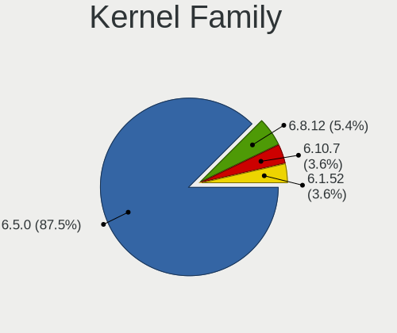
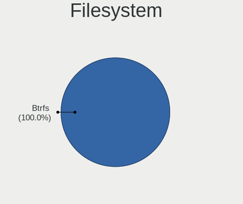
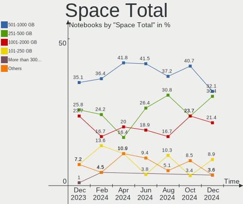
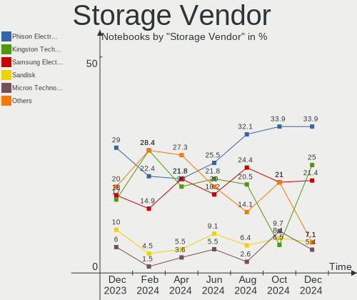
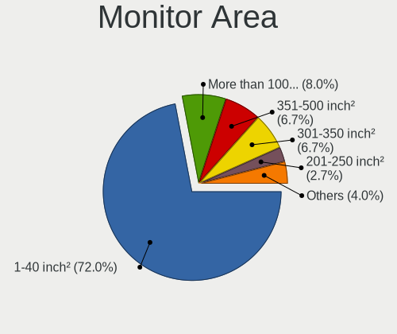
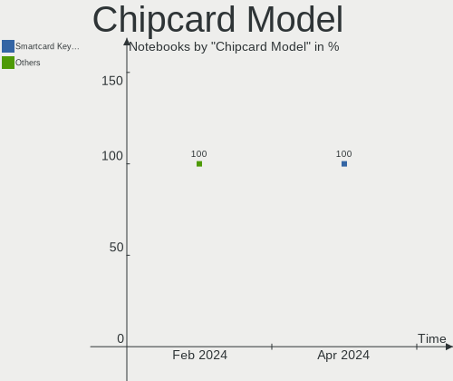

SteamOS - Hardware Trends (Notebooks)
-------------------------------------

A project to identify most popular hardware characteristics and track their change
over time based on data collected by Linux users at https://Linux-Hardware.org.

Anyone can contribute to this report by the [hw-probe](https://github.com/linuxhw/hw-probe) tool:

    sudo -E hw-probe -all -upload

This report is for one last month. Overall report since the beginning of time: [TestDays](https://github.com/linuxhw/TestDays)

Period: Mar, 2023.

Contents
--------

* [ System ](#system)
  - [ OS                       ](#os)
  - [ OS Family                ](#os-family)
  - [ Kernel                   ](#kernel)
  - [ Kernel Family            ](#kernel-family)
  - [ Kernel Major Ver.        ](#kernel-major-ver)
  - [ Arch                     ](#arch)
  - [ DE                       ](#de)
  - [ Display Server           ](#display-server)
  - [ Display Manager          ](#display-manager)
  - [ OS Lang                  ](#os-lang)
  - [ Boot Mode                ](#boot-mode)
  - [ Filesystem               ](#filesystem)
  - [ Part. scheme             ](#part-scheme)
  - [ Dual Boot with Linux/BSD ](#dual-boot-with-linuxbsd)
  - [ Dual Boot (Win)          ](#dual-boot-win)

* [ Board ](#board)
  - [ Vendor                   ](#vendor)
  - [ Model                    ](#model)
  - [ Model Family             ](#model-family)
  - [ MFG Year                 ](#mfg-year)
  - [ Form Factor              ](#form-factor)
  - [ Secure Boot              ](#secure-boot)
  - [ Coreboot                 ](#coreboot)
  - [ RAM Size                 ](#ram-size)
  - [ RAM Used                 ](#ram-used)
  - [ Total Drives             ](#total-drives)
  - [ Has CD-ROM               ](#has-cd-rom)
  - [ Has Ethernet             ](#has-ethernet)
  - [ Has WiFi                 ](#has-wifi)
  - [ Has Bluetooth            ](#has-bluetooth)

* [ Location ](#location)
  - [ Country                  ](#country)
  - [ City                     ](#city)

* [ Drives ](#drives)
  - [ Drive Vendor             ](#drive-vendor)
  - [ Drive Model              ](#drive-model)
  - [ HDD Vendor               ](#hdd-vendor)
  - [ SSD Vendor               ](#ssd-vendor)
  - [ Drive Kind               ](#drive-kind)
  - [ Drive Connector          ](#drive-connector)
  - [ Drive Size               ](#drive-size)
  - [ Space Total              ](#space-total)
  - [ Space Used               ](#space-used)
  - [ Malfunc. Drives          ](#malfunc-drives)
  - [ Malfunc. Drive Vendor    ](#malfunc-drive-vendor)
  - [ Malfunc. HDD Vendor      ](#malfunc-hdd-vendor)
  - [ Malfunc. Drive Kind      ](#malfunc-drive-kind)
  - [ Failed Drives            ](#failed-drives)
  - [ Failed Drive Vendor      ](#failed-drive-vendor)
  - [ Drive Status             ](#drive-status)

* [ Storage controller ](#storage-controller)
  - [ Storage Vendor           ](#storage-vendor)
  - [ Storage Model            ](#storage-model)
  - [ Storage Kind             ](#storage-kind)

* [ Processor ](#processor)
  - [ CPU Vendor               ](#cpu-vendor)
  - [ CPU Model                ](#cpu-model)
  - [ CPU Model Family         ](#cpu-model-family)
  - [ CPU Cores                ](#cpu-cores)
  - [ CPU Sockets              ](#cpu-sockets)
  - [ CPU Threads              ](#cpu-threads)
  - [ CPU Op-Modes             ](#cpu-op-modes)
  - [ CPU Microcode            ](#cpu-microcode)
  - [ CPU Microarch            ](#cpu-microarch)

* [ Graphics ](#graphics)
  - [ GPU Vendor               ](#gpu-vendor)
  - [ GPU Model                ](#gpu-model)
  - [ GPU Combo                ](#gpu-combo)
  - [ GPU Driver               ](#gpu-driver)
  - [ GPU Memory               ](#gpu-memory)

* [ Monitor ](#monitor)
  - [ Monitor Vendor           ](#monitor-vendor)
  - [ Monitor Model            ](#monitor-model)
  - [ Monitor Resolution       ](#monitor-resolution)
  - [ Monitor Diagonal         ](#monitor-diagonal)
  - [ Monitor Width            ](#monitor-width)
  - [ Aspect Ratio             ](#aspect-ratio)
  - [ Monitor Area             ](#monitor-area)
  - [ Pixel Density            ](#pixel-density)
  - [ Multiple Monitors        ](#multiple-monitors)

* [ Network ](#network)
  - [ Net Controller Vendor    ](#net-controller-vendor)
  - [ Net Controller Model     ](#net-controller-model)
  - [ Wireless Vendor          ](#wireless-vendor)
  - [ Wireless Model           ](#wireless-model)
  - [ Ethernet Vendor          ](#ethernet-vendor)
  - [ Ethernet Model           ](#ethernet-model)
  - [ Net Controller Kind      ](#net-controller-kind)
  - [ Used Controller          ](#used-controller)
  - [ NICs                     ](#nics)
  - [ IPv6                     ](#ipv6)

* [ Bluetooth ](#bluetooth)
  - [ Bluetooth Vendor         ](#bluetooth-vendor)
  - [ Bluetooth Model          ](#bluetooth-model)

* [ Sound ](#sound)
  - [ Sound Vendor             ](#sound-vendor)
  - [ Sound Model              ](#sound-model)

* [ Memory ](#memory)
  - [ Memory Vendor            ](#memory-vendor)
  - [ Memory Model             ](#memory-model)
  - [ Memory Kind              ](#memory-kind)
  - [ Memory Form Factor       ](#memory-form-factor)
  - [ Memory Size              ](#memory-size)
  - [ Memory Speed             ](#memory-speed)

* [ Printers & scanners ](#printers--scanners)
  - [ Printer Vendor           ](#printer-vendor)
  - [ Printer Model            ](#printer-model)
  - [ Scanner Vendor           ](#scanner-vendor)
  - [ Scanner Model            ](#scanner-model)

* [ Camera ](#camera)
  - [ Camera Vendor            ](#camera-vendor)
  - [ Camera Model             ](#camera-model)

* [ Security ](#security)
  - [ Fingerprint Vendor       ](#fingerprint-vendor)
  - [ Fingerprint Model        ](#fingerprint-model)
  - [ Chipcard Vendor          ](#chipcard-vendor)
  - [ Chipcard Model           ](#chipcard-model)

* [ Unsupported ](#unsupported)
  - [ Unsupported Devices      ](#unsupported-devices)
  - [ Unsupported Device Types ](#unsupported-device-types)

System
------

OS
--

Installed operating systems

| Name          | Notebooks | Percent |
|---------------|-----------|---------|
| SteamOS 3.4.6 | 41        | 54.67%  |
| SteamOS 3.4.4 | 30        | 40%     |
| SteamOS 3.5   | 2         | 2.67%   |
| SteamOS 4     | 1         | 1.33%   |
| SteamOS       | 1         | 1.33%   |

OS Family
---------

OS without a version

| Name    | Notebooks | Percent |
|---------|-----------|---------|
| SteamOS | 75        | 100%    |

Kernel
------

Version of the Linux kernel

| Version                                      | Notebooks | Percent |
|----------------------------------------------|-----------|---------|
| 5.13.0-valve36-1-neptune                     | 71        | 94.67%  |
| 6.1.12-valve2-1-neptune-61                   | 3         | 4%      |
| 5.13.0-valve21-1-steamos-02209-g2a5bdc1102a0 | 1         | 1.33%   |

Kernel Family
-------------

Linux kernel without a distro release

| Version | Notebooks | Percent |
|---------|-----------|---------|
| 5.13.0  | 72        | 96%     |
| 6.1.12  | 3         | 4%      |

Kernel Major Ver.
-----------------

Linux kernel major version

| Version | Notebooks | Percent |
|---------|-----------|---------|
| 5.13    | 72        | 96%     |
| 6.1     | 3         | 4%      |

Arch
----

OS architecture (x86_64, i586, etc.)

| Name   | Notebooks | Percent |
|--------|-----------|---------|
| x86_64 | 75        | 100%    |

DE
--

Desktop Environment

| Name | Notebooks | Percent |
|------|-----------|---------|
| KDE5 | 75        | 100%    |

Display Server
--------------

X11 or Wayland

| Name | Notebooks | Percent |
|------|-----------|---------|
| X11  | 75        | 100%    |

Display Manager
---------------

SDDM, LightDM, etc.

| Name    | Notebooks | Percent |
|---------|-----------|---------|
| Unknown | 75        | 100%    |

OS Lang
-------

Language

| Lang  | Notebooks | Percent |
|-------|-----------|---------|
| en_US | 63        | 84%     |
| de_DE | 3         | 4%      |
| en_DE | 2         | 2.67%   |
| ru_RU | 1         | 1.33%   |
| ko_KR | 1         | 1.33%   |
| it_IT | 1         | 1.33%   |
| es_ES | 1         | 1.33%   |
| en_GB | 1         | 1.33%   |
| en_AU | 1         | 1.33%   |
| an_ES | 1         | 1.33%   |

Boot Mode
---------

EFI or BIOS

| Mode | Notebooks | Percent |
|------|-----------|---------|
| BIOS | 75        | 100%    |

Filesystem
----------

Type of filesystem

| Type  | Notebooks | Percent |
|-------|-----------|---------|
| Btrfs | 75        | 100%    |

Part. scheme
------------

Scheme of partitioning

| Type    | Notebooks | Percent |
|---------|-----------|---------|
| Unknown | 75        | 100%    |

Dual Boot with Linux/BSD
------------------------

Hosting more than one Linux/BSD

| Dual boot | Notebooks | Percent |
|-----------|-----------|---------|
| No        | 75        | 100%    |

Dual Boot (Win)
---------------

Hosting Linux and Windows

| Dual boot | Notebooks | Percent |
|-----------|-----------|---------|
| No        | 75        | 100%    |

Board
-----

Vendor
------

Motherboard manufacturer

| Name             | Notebooks | Percent |
|------------------|-----------|---------|
| Valve            | 73        | 97.33%  |
| Hewlett-Packard  | 1         | 1.33%   |
| ASUSTek Computer | 1         | 1.33%   |

Model
-----

Motherboard model

| Name               | Notebooks | Percent |
|--------------------|-----------|---------|
| Valve Jupiter      | 73        | 97.33%  |
| HP Laptop 15-bs0xx | 1         | 1.33%   |
| ASUS GL552JX       | 1         | 1.33%   |

Model Family
------------

Motherboard model prefix

| Name          | Notebooks | Percent |
|---------------|-----------|---------|
| Valve Jupiter | 73        | 97.33%  |
| HP Laptop     | 1         | 1.33%   |
| ASUS GL552JX  | 1         | 1.33%   |

MFG Year
--------

Motherboard manufacture year

| Year | Notebooks | Percent |
|------|-----------|---------|
| 2022 | 73        | 97.33%  |
| 2017 | 1         | 1.33%   |
| 2015 | 1         | 1.33%   |

Form Factor
-----------

Physical design of the computer

| Name     | Notebooks | Percent |
|----------|-----------|---------|
| Notebook | 75        | 100%    |

Secure Boot
-----------

Enabled or disabled

| State    | Notebooks | Percent |
|----------|-----------|---------|
| Disabled | 75        | 100%    |

Coreboot
--------

Have coreboot on board

| Used | Notebooks | Percent |
|------|-----------|---------|
| No   | 75        | 100%    |

RAM Size
--------

Total RAM memory

| Size in GB | Notebooks | Percent |
|------------|-----------|---------|
| 8.01-16.0  | 74        | 98.67%  |
| 3.01-4.0   | 1         | 1.33%   |

RAM Used
--------

Used RAM memory

| Used GB   | Notebooks | Percent |
|-----------|-----------|---------|
| 2.01-3.0  | 31        | 41.33%  |
| 4.01-8.0  | 24        | 32%     |
| 3.01-4.0  | 18        | 24%     |
| 1.01-2.0  | 1         | 1.33%   |
| 8.01-16.0 | 1         | 1.33%   |

Total Drives
------------

Number of drives on board

| Drives | Notebooks | Percent |
|--------|-----------|---------|
| 2      | 51        | 68%     |
| 1      | 18        | 24%     |
| 3      | 6         | 8%      |

Has CD-ROM
----------

Has CD-ROM on board

| Presented | Notebooks | Percent |
|-----------|-----------|---------|
| No        | 74        | 98.67%  |
| Yes       | 1         | 1.33%   |

Has Ethernet
------------

Has Ethernet on board

| Presented | Notebooks | Percent |
|-----------|-----------|---------|
| No        | 45        | 60%     |
| Yes       | 30        | 40%     |

Has WiFi
--------

Has WiFi module

| Presented | Notebooks | Percent |
|-----------|-----------|---------|
| Yes       | 75        | 100%    |

Has Bluetooth
-------------

Has Bluetooth module

| Presented | Notebooks | Percent |
|-----------|-----------|---------|
| Yes       | 74        | 98.67%  |
| No        | 1         | 1.33%   |

Location
--------

Country
-------

Geographic location (country)

| Country     | Notebooks | Percent |
|-------------|-----------|---------|
| USA         | 23        | 30.67%  |
| UK          | 9         | 12%     |
| Germany     | 7         | 9.33%   |
| Spain       | 3         | 4%      |
| Russia      | 3         | 4%      |
| Italy       | 3         | 4%      |
| Taiwan      | 2         | 2.67%   |
| Poland      | 2         | 2.67%   |
| New Zealand | 2         | 2.67%   |
| Netherlands | 2         | 2.67%   |
| France      | 2         | 2.67%   |
| Canada      | 2         | 2.67%   |
| Austria     | 2         | 2.67%   |
| Australia   | 2         | 2.67%   |
| Ukraine     | 1         | 1.33%   |
| Switzerland | 1         | 1.33%   |
| South Korea | 1         | 1.33%   |
| Slovakia    | 1         | 1.33%   |
| Romania     | 1         | 1.33%   |
| Indonesia   | 1         | 1.33%   |
| Hungary     | 1         | 1.33%   |
| Finland     | 1         | 1.33%   |
| Ecuador     | 1         | 1.33%   |
| Bulgaria    | 1         | 1.33%   |
| Brazil      | 1         | 1.33%   |

City
----

Geographic location (city)

| City                | Notebooks | Percent |
|---------------------|-----------|---------|
| Vienna              | 2         | 2.67%   |
| Taipei              | 2         | 2.67%   |
| Frankfurt am Main   | 2         | 2.67%   |
| Auckland            | 2         | 2.67%   |
| Amsterdam           | 2         | 2.67%   |
| Wroclaw             | 1         | 1.33%   |
| Watford             | 1         | 1.33%   |
| Wappingers Falls    | 1         | 1.33%   |
| Victoria            | 1         | 1.33%   |
| Trinidad            | 1         | 1.33%   |
| Tatabánya          | 1         | 1.33%   |
| Suwon               | 1         | 1.33%   |
| St Helens           | 1         | 1.33%   |
| Schweinfurt         | 1         | 1.33%   |
| Rubtsovsk           | 1         | 1.33%   |
| Rousse              | 1         | 1.33%   |
| Rio Grande          | 1         | 1.33%   |
| Riells i Viabrea    | 1         | 1.33%   |
| Richmond            | 1         | 1.33%   |
| Portland            | 1         | 1.33%   |
| Philadelphia        | 1         | 1.33%   |
| Nuremberg           | 1         | 1.33%   |
| Nottingham          | 1         | 1.33%   |
| Norristown          | 1         | 1.33%   |
| Newcastle upon Tyne | 1         | 1.33%   |
| Munich              | 1         | 1.33%   |
| Montreal            | 1         | 1.33%   |
| Mazeres             | 1         | 1.33%   |
| Makassar            | 1         | 1.33%   |
| Madrid              | 1         | 1.33%   |
| Lucerne             | 1         | 1.33%   |
| Lafayette           | 1         | 1.33%   |
| Kstovo              | 1         | 1.33%   |
| Kittanning          | 1         | 1.33%   |
| Kissimmee           | 1         | 1.33%   |
| Khust               | 1         | 1.33%   |
| Khabarovsk          | 1         | 1.33%   |
| Katowice            | 1         | 1.33%   |
| Johnston            | 1         | 1.33%   |
| Jesolo              | 1         | 1.33%   |

Drives
------

Drive Vendor
------------

Hard drive vendors

| Vendor                      | Notebooks | Drives | Percent |
|-----------------------------|-----------|--------|---------|
| Unknown                     | 45        | 45     | 32.14%  |
| Phison Electronics          | 22        | 22     | 15.71%  |
| Kingston Technology Company | 18        | 18     | 12.86%  |
| Samsung Electronics         | 15        | 15     | 10.71%  |
| Unknown                     | 12        | 12     | 8.57%   |
| O2 Micro                    | 8         | 8      | 5.71%   |
| Sandisk                     | 4         | 4      | 2.86%   |
| SK hynix                    | 3         | 3      | 2.14%   |
| Seagate                     | 3         | 3      | 2.14%   |
| Silicon Motion              | 2         | 2      | 1.43%   |
| KIOXIA                      | 2         | 2      | 1.43%   |
| WDC                         | 1         | 1      | 0.71%   |
| Verbatim                    | 1         | 1      | 0.71%   |
| Toshiba                     | 1         | 1      | 0.71%   |
| Realtek                     | 1         | 1      | 0.71%   |
| Netac                       | 1         | 1      | 0.71%   |
| HGST                        | 1         | 1      | 0.71%   |

Drive Model
-----------

Hard drive models

| Model                                                  | Notebooks | Percent |
|--------------------------------------------------------|-----------|---------|
| Unknown MMC Card  512GB                                | 21        | 15%     |
| Phison PS5013 E13 NVMe Controller 256GB                | 20        | 14.29%  |
| Kingston Company OM3PDP3 NVMe SSD 256GB                | 17        | 12.14%  |
| Unknown MMC Card  256GB                                | 12        | 8.57%   |
| Unknown                                                | 12        | 8.57%   |
| Samsung MZ9LQ512HBLU-00BVL 512GB                       | 10        | 7.14%   |
| O2 Micro E2M2 64GB                                     | 8         | 5.71%   |
| Unknown MMC Card  128GB                                | 5         | 3.57%   |
| Unknown MMC Card  64GB                                 | 3         | 2.14%   |
| Unknown MMC Card  393GB                                | 2         | 1.43%   |
| Silicon Motion SM2263EN/SM2263XT SSD Controller 1024GB | 2         | 1.43%   |
| Sandisk WD PC SN740 SDDPTQD-1T00 1024GB                | 2         | 1.43%   |
| Samsung MZ9LQ256HBJD-00BVL 256GB                       | 2         | 1.43%   |
| Phison Sabrent SB-2130-1TB                             | 2         | 1.43%   |
| WDC WDS500G2B0B-00YS70 500GB SSD                       | 1         | 0.71%   |
| Verbatim MySSD Drive 512GB                             | 1         | 0.71%   |
| Unknown MMC Card  249GB                                | 1         | 0.71%   |
| Unknown MMC Card  16GB                                 | 1         | 0.71%   |
| Toshiba MQ01ABF050 500GB                               | 1         | 0.71%   |
| SK hynix BC711 NVMe 512GB                              | 1         | 0.71%   |
| SK hynix BC711 NVMe 256GB                              | 1         | 0.71%   |
| SK hynix BC711 NVMe 1TB                                | 1         | 0.71%   |
| Seagate Expansion+ 2TB                                 | 1         | 0.71%   |
| Seagate Desktop 8TB                                    | 1         | 0.71%   |
| Seagate BUP Slim SL 1TB                                | 1         | 0.71%   |
| Sandisk WD PC SN740 SDDPTQE-2T00 2TB                   | 1         | 0.71%   |
| Sandisk PC SN740 NVMe WD 512GB                         | 1         | 0.71%   |
| Samsung PSSD T7 Shield 1TB                             | 1         | 0.71%   |
| Samsung PM991a NVMe 256GB                              | 1         | 0.71%   |
| Samsung PM991 NVMe 512GB                               | 1         | 0.71%   |
| Realtek RTL9210B-CG 512GB                              | 1         | 0.71%   |
| Netac NVMe SSD Drive 512GB                             | 1         | 0.71%   |
| KIOXIA KBG50ZNS512G 512GB                              | 1         | 0.71%   |
| KIOXIA KBG40ZNS512G NVMe TOSHIBA 512GB                 | 1         | 0.71%   |
| Kingston Company SNV2S1000G 1TB                        | 1         | 0.71%   |
| HGST HTS721010A9E630 1TB                               | 1         | 0.71%   |

HDD Vendor
----------

Hard disk drive vendors

| Vendor  | Notebooks | Drives | Percent |
|---------|-----------|--------|---------|
| Seagate | 3         | 3      | 60%     |
| Toshiba | 1         | 1      | 20%     |
| HGST    | 1         | 1      | 20%     |

SSD Vendor
----------

Solid state drive vendors

| Vendor              | Notebooks | Drives | Percent |
|---------------------|-----------|--------|---------|
| WDC                 | 1         | 1      | 33.33%  |
| Verbatim            | 1         | 1      | 33.33%  |
| Samsung Electronics | 1         | 1      | 33.33%  |

Drive Kind
----------

HDD or SSD

| Kind | Notebooks | Drives | Percent |
|------|-----------|--------|---------|
| NVMe | 73        | 75     | 53.28%  |
| MMC  | 57        | 57     | 41.61%  |
| HDD  | 4         | 5      | 2.92%   |
| SSD  | 3         | 3      | 2.19%   |

Drive Connector
---------------

SATA, SAS, NVMe, etc.

| Type | Notebooks | Drives | Percent |
|------|-----------|--------|---------|
| NVMe | 73        | 74     | 52.9%   |
| MMC  | 57        | 57     | 41.3%   |
| SAS  | 6         | 6      | 4.35%   |
| SATA | 2         | 3      | 1.45%   |

Drive Size
----------

Size of hard drive

| Size in TB | Notebooks | Drives | Percent |
|------------|-----------|--------|---------|
| 0.51-1.0   | 3         | 4      | 42.86%  |
| 0.01-0.5   | 2         | 2      | 28.57%  |
| 1.01-2.0   | 1         | 1      | 14.29%  |
| 4.01-10.0  | 1         | 1      | 14.29%  |

Space Total
-----------

Amount of disk space available on the file system

| Size in GB     | Notebooks | Percent |
|----------------|-----------|---------|
| 251-500        | 39        | 52%     |
| 101-250        | 14        | 18.67%  |
| 501-1000       | 9         | 12%     |
| 51-100         | 8         | 10.67%  |
| More than 3000 | 3         | 4%      |
| 1001-2000      | 2         | 2.67%   |

Space Used
----------

Amount of used disk space

| Used GB   | Notebooks | Percent |
|-----------|-----------|---------|
| 251-500   | 28        | 37.33%  |
| 101-250   | 19        | 25.33%  |
| 21-50     | 10        | 13.33%  |
| 501-1000  | 6         | 8%      |
| 51-100    | 6         | 8%      |
| 1-20      | 5         | 6.67%   |
| 1001-2000 | 1         | 1.33%   |

Malfunc. Drives
---------------

Drive models with a malfunction

Zero info for selected period =(

Malfunc. Drive Vendor
---------------------

Vendors of faulty drives

Zero info for selected period =(

Malfunc. HDD Vendor
-------------------

Vendors of faulty HDD drives

Zero info for selected period =(

Malfunc. Drive Kind
-------------------

Kinds of faulty drives

Zero info for selected period =(

Failed Drives
-------------

Failed drive models

Zero info for selected period =(

Failed Drive Vendor
-------------------

Failed drive vendors

Zero info for selected period =(

Drive Status
------------

Number of failed and malfunc. drives

| Status   | Notebooks | Drives | Percent |
|----------|-----------|--------|---------|
| Detected | 75        | 140    | 100%    |

Storage controller
------------------

Storage Vendor
--------------

Storage controller vendors

| Vendor                      | Notebooks | Percent |
|-----------------------------|-----------|---------|
| Phison Electronics          | 22        | 28.95%  |
| Kingston Technology Company | 18        | 23.68%  |
| Samsung Electronics         | 14        | 18.42%  |
| O2 Micro                    | 8         | 10.53%  |
| Sandisk                     | 4         | 5.26%   |
| SK hynix                    | 3         | 3.95%   |
| Silicon Motion              | 2         | 2.63%   |
| KIOXIA                      | 2         | 2.63%   |
| Intel                       | 2         | 2.63%   |
| Netac Technology            | 1         | 1.32%   |

Storage Model
-------------

Storage controller models

| Model                                                                            | Notebooks | Percent |
|----------------------------------------------------------------------------------|-----------|---------|
| Phison PS5013 E13 NVMe Controller                                                | 20        | 26.32%  |
| Kingston Company OM3PDP3 NVMe SSD                                                | 17        | 22.37%  |
| Samsung NVMe SSD Controller 980                                                  | 14        | 18.42%  |
| O2 Micro Non-Volatile memory controller                                          | 8         | 10.53%  |
| Sandisk Non-Volatile memory controller                                           | 4         | 5.26%   |
| SK hynix Gold P31/PC711 NVMe Solid State Drive                                   | 3         | 3.95%   |
| Silicon Motion SM2263EN/SM2263XT SSD Controller                                  | 2         | 2.63%   |
| Phison Electronics Non-Volatile memory controller                                | 2         | 2.63%   |
| Netac Non-Volatile memory controller                                             | 1         | 1.32%   |
| KIOXIA NVMe SSD Controller BG4                                                   | 1         | 1.32%   |
| KIOXIA Non-Volatile memory controller                                            | 1         | 1.32%   |
| Kingston Company Company Non-Volatile memory controller                          | 1         | 1.32%   |
| Intel Atom/Celeron/Pentium Processor x5-E8000/J3xxx/N3xxx Series SATA Controller | 1         | 1.32%   |
| Intel 8 Series/C220 Series Chipset Family 6-port SATA Controller 1 [AHCI mode]   | 1         | 1.32%   |

Storage Kind
------------

Kind of storage controller (IDE, SATA, NVMe, SAS, ...)

| Kind | Notebooks | Percent |
|------|-----------|---------|
| NVMe | 73        | 97.33%  |
| SATA | 2         | 2.67%   |

Processor
---------

CPU Vendor
----------

Processor vendors

| Vendor | Notebooks | Percent |
|--------|-----------|---------|
| AMD    | 73        | 97.33%  |
| Intel  | 2         | 2.67%   |

CPU Model
---------

Processor models

| Model                              | Notebooks | Percent |
|------------------------------------|-----------|---------|
| AMD Custom APU 0405                | 73        | 97.33%  |
| Intel Core i7-4720HQ CPU @ 2.60GHz | 1         | 1.33%   |
| Intel Celeron CPU N3060 @ 1.60GHz  | 1         | 1.33%   |

CPU Model Family
----------------

Processor model prefix

| Model         | Notebooks | Percent |
|---------------|-----------|---------|
| Other         | 73        | 97.33%  |
| Intel Core i7 | 1         | 1.33%   |
| Intel Celeron | 1         | 1.33%   |

CPU Cores
---------

Number of processor cores

| Number | Notebooks | Percent |
|--------|-----------|---------|
| 4      | 73        | 97.33%  |
| 2      | 2         | 2.67%   |

CPU Sockets
-----------

Number of sockets

| Number | Notebooks | Percent |
|--------|-----------|---------|
| 1      | 75        | 100%    |

CPU Threads
-----------

Threads per core (Hyper-Threading)

| Number | Notebooks | Percent |
|--------|-----------|---------|
| 2      | 74        | 98.67%  |
| 1      | 1         | 1.33%   |

CPU Op-Modes
------------

CPU Operation Modes (32-bit, 64-bit)

| Op mode        | Notebooks | Percent |
|----------------|-----------|---------|
| 32-bit, 64-bit | 75        | 100%    |

CPU Microcode
-------------

Microcode number

| Number  | Notebooks | Percent |
|---------|-----------|---------|
| Unknown | 75        | 100%    |

CPU Microarch
-------------

Microarchitecture

| Name       | Notebooks | Percent |
|------------|-----------|---------|
| Unknown    | 73        | 97.33%  |
| Silvermont | 1         | 1.33%   |
| Haswell    | 1         | 1.33%   |

Graphics
--------

GPU Vendor
----------

Vendors of graphics cards

| Vendor | Notebooks | Percent |
|--------|-----------|---------|
| AMD    | 73        | 96.05%  |
| Intel  | 2         | 2.63%   |
| Nvidia | 1         | 1.32%   |

GPU Model
---------

Graphics card models

| Model                                                                                    | Notebooks | Percent |
|------------------------------------------------------------------------------------------|-----------|---------|
| AMD VanGogh [AMD Custom GPU 0405]                                                        | 73        | 96.05%  |
| Nvidia GM107M [GeForce GTX 950M]                                                         | 1         | 1.32%   |
| Intel Atom/Celeron/Pentium Processor x5-E8000/J3xxx/N3xxx Integrated Graphics Controller | 1         | 1.32%   |
| Intel 4th Gen Core Processor Integrated Graphics Controller                              | 1         | 1.32%   |

GPU Combo
---------

Combinations of graphics cards

| Name           | Notebooks | Percent |
|----------------|-----------|---------|
| 1 x AMD        | 73        | 97.33%  |
| Intel + Nvidia | 1         | 1.33%   |
| 1 x Intel      | 1         | 1.33%   |

GPU Driver
----------

Free vs proprietary

| Driver | Notebooks | Percent |
|--------|-----------|---------|
| Free   | 75        | 100%    |

GPU Memory
----------

Total video memory

| Size in GB | Notebooks | Percent |
|------------|-----------|---------|
| Unknown    | 75        | 100%    |

Monitor
-------

Monitor Vendor
--------------

Monitor vendors

| Vendor              | Notebooks | Percent |
|---------------------|-----------|---------|
| Valve               | 73        | 75.26%  |
| Goldstar            | 5         | 5.15%   |
| Samsung Electronics | 3         | 3.09%   |
| Philips             | 3         | 3.09%   |
| Dell                | 3         | 3.09%   |
| AOC                 | 2         | 2.06%   |
| ViewSonic           | 1         | 1.03%   |
| Unknown             | 1         | 1.03%   |
| Sony                | 1         | 1.03%   |
| BOE                 | 1         | 1.03%   |
| BenQ                | 1         | 1.03%   |
| Apple               | 1         | 1.03%   |
| Aosiman             | 1         | 1.03%   |
| Acer                | 1         | 1.03%   |

Monitor Model
-------------

Monitor models

| Model                                                                 | Notebooks | Percent |
|-----------------------------------------------------------------------|-----------|---------|
| Valve ANX7530 U VLV3001 800x1280 100x150mm 7.1-inch                   | 73        | 75.26%  |
| ViewSonic VX2239 SERIES VSC5225 1920x1080 480x270mm 21.7-inch         | 1         | 1.03%   |
| Unknown SMART TV 0563 1920x1080 1209x680mm 54.6-inch                  | 1         | 1.03%   |
| Sony TV *02 SNYC403 1920x1080 1439x809mm 65.0-inch                    | 1         | 1.03%   |
| Samsung Electronics U32J59x SAM0F33 3840x2160 697x392mm 31.5-inch     | 1         | 1.03%   |
| Samsung Electronics LCD Monitor SDC324C 1920x1080 344x194mm 15.5-inch | 1         | 1.03%   |
| Samsung Electronics LC27RG50 SAM1009 1920x1080 532x304mm 24.1-inch    | 1         | 1.03%   |
| Philips PHL 436M6VBP PHLC179 3840x2160 941x529mm 42.5-inch            | 1         | 1.03%   |
| Philips PHL 221V8 PHLC211 1920x1080 477x268mm 21.5-inch               | 1         | 1.03%   |
| Philips FTV PHL04C3 3840x2160 1440x810mm 65.0-inch                    | 1         | 1.03%   |
| Goldstar Ultra HD GSM5B08 3840x2160 600x340mm 27.2-inch               | 1         | 1.03%   |
| Goldstar MP59G GSM5B34 1920x1080 480x270mm 21.7-inch                  | 1         | 1.03%   |
| Goldstar HDR 4K GSM7706 3840x2160 600x340mm 27.2-inch                 | 1         | 1.03%   |
| Goldstar FULL HD GSM5B55 1920x1080 480x270mm 21.7-inch                | 1         | 1.03%   |
| Goldstar 2D FHD TV GSM59C6 1920x1080 509x286mm 23.0-inch              | 1         | 1.03%   |
| Dell U2410 DELF016 1920x1200 518x324mm 24.1-inch                      | 1         | 1.03%   |
| Dell P2418HT DEL4114 1920x1080 527x296mm 23.8-inch                    | 1         | 1.03%   |
| Dell AW2518H DELA0F5 1920x1080 544x303mm 24.5-inch                    | 1         | 1.03%   |
| BOE LCD Monitor BOE06A5 1366x768 344x194mm 15.5-inch                  | 1         | 1.03%   |
| BenQ GW2780 BNQ78E6 1920x1080 598x336mm 27.0-inch                     | 1         | 1.03%   |
| Apple LED Cinema APP9226 2560x1440 597x336mm 27.0-inch                | 1         | 1.03%   |
| Aosiman ASM-160QCC ASM1600 2560x1600 360x190mm 16.0-inch              | 1         | 1.03%   |
| AOC Q3279WG5B AOC3279 2560x1440 725x428mm 33.1-inch                   | 1         | 1.03%   |
| AOC 2470W AOC2470 1920x1080 521x293mm 23.5-inch                       | 1         | 1.03%   |
| Acer KB272HL H ACR08AB 1920x1080 597x336mm 27.0-inch                  | 1         | 1.03%   |

Monitor Resolution
------------------

Monitor screen resolution

| Resolution        | Notebooks | Percent |
|-------------------|-----------|---------|
| 800x1280          | 73        | 76.04%  |
| 1920x1080 (FHD)   | 12        | 12.5%   |
| 3840x2160 (4K)    | 6         | 6.25%   |
| 2560x1440 (QHD)   | 2         | 2.08%   |
| 2560x1600         | 1         | 1.04%   |
| 1920x1200 (WUXGA) | 1         | 1.04%   |
| 1366x768 (WXGA)   | 1         | 1.04%   |

Monitor Diagonal
----------------

Diagonal size in inches

| Inches | Notebooks | Percent |
|--------|-----------|---------|
| 7      | 73        | 75.26%  |
| 27     | 5         | 5.15%   |
| 24     | 4         | 4.12%   |
| 21     | 4         | 4.12%   |
| 65     | 2         | 2.06%   |
| 23     | 2         | 2.06%   |
| 15     | 2         | 2.06%   |
| 54     | 1         | 1.03%   |
| 42     | 1         | 1.03%   |
| 33     | 1         | 1.03%   |
| 31     | 1         | 1.03%   |
| 16     | 1         | 1.03%   |

Monitor Width
-------------

Physical width

| Width in mm | Notebooks | Percent |
|-------------|-----------|---------|
| 1-100       | 73        | 75.26%  |
| 501-600     | 11        | 11.34%  |
| 401-500     | 4         | 4.12%   |
| 1001-1500   | 3         | 3.09%   |
| 301-350     | 2         | 2.06%   |
| 701-800     | 1         | 1.03%   |
| 601-700     | 1         | 1.03%   |
| 351-400     | 1         | 1.03%   |
| 901-1000    | 1         | 1.03%   |

Aspect Ratio
------------

Proportional relationship between the width and the height

| Ratio | Notebooks | Percent |
|-------|-----------|---------|
| 0.67  | 73        | 76.04%  |
| 16/9  | 22        | 22.92%  |
| 16/10 | 1         | 1.04%   |

Monitor Area
------------

Area in inch²

| Area in inch² | Notebooks | Percent |
|----------------|-----------|---------|
| 1-40           | 73        | 75.26%  |
| 201-250        | 7         | 7.22%   |
| 301-350        | 5         | 5.15%   |
| More than 1000 | 3         | 3.09%   |
| 251-300        | 3         | 3.09%   |
| 101-110        | 3         | 3.09%   |
| 351-500        | 2         | 2.06%   |
| 501-1000       | 1         | 1.03%   |

Pixel Density
-------------

Pixels per inch

| Density | Notebooks | Percent |
|---------|-----------|---------|
| 161-240 | 73        | 77.66%  |
| 51-100  | 9         | 9.57%   |
| 101-120 | 7         | 7.45%   |
| 1-50    | 3         | 3.19%   |
| 121-160 | 2         | 2.13%   |

Multiple Monitors
-----------------

Total monitors connected

| Total | Notebooks | Percent |
|-------|-----------|---------|
| 1     | 52        | 69.33%  |
| 2     | 23        | 30.67%  |

Network
-------

Net Controller Vendor
---------------------

Controller vendors

| Vendor                | Notebooks | Percent |
|-----------------------|-----------|---------|
| Realtek Semiconductor | 75        | 81.52%  |
| ASIX Electronics      | 13        | 14.13%  |
| Qualcomm Atheros      | 1         | 1.09%   |
| Lenovo                | 1         | 1.09%   |
| Intel                 | 1         | 1.09%   |
| Edimax Technology     | 1         | 1.09%   |

Net Controller Model
--------------------

Controller models

| Model                                                             | Notebooks | Percent |
|-------------------------------------------------------------------|-----------|---------|
| Realtek RTL8822CE 802.11ac PCIe Wireless Network Adapter          | 73        | 68.87%  |
| Realtek RTL8153 Gigabit Ethernet Adapter                          | 13        | 12.26%  |
| ASIX AX88179 Gigabit Ethernet                                     | 13        | 12.26%  |
| Realtek RTL8111/8168/8411 PCI Express Gigabit Ethernet Controller | 2         | 1.89%   |
| Realtek RTL8152 Fast Ethernet Adapter                             | 1         | 0.94%   |
| Qualcomm Atheros QCA9565 / AR9565 Wireless Network Adapter        | 1         | 0.94%   |
| Lenovo ThinkPad TBT 3 Dock                                        | 1         | 0.94%   |
| Intel Dual Band Wireless-AC 3168NGW [Stone Peak]                  | 1         | 0.94%   |
| Edimax EW-7822ULC 802.11ac Wireless Adapter [Realtek RTL8812AU]   | 1         | 0.94%   |

Wireless Vendor
---------------

Wireless vendors

| Vendor                | Notebooks | Percent |
|-----------------------|-----------|---------|
| Realtek Semiconductor | 73        | 96.05%  |
| Qualcomm Atheros      | 1         | 1.32%   |
| Intel                 | 1         | 1.32%   |
| Edimax Technology     | 1         | 1.32%   |

Wireless Model
--------------

Wireless models

| Model                                                           | Notebooks | Percent |
|-----------------------------------------------------------------|-----------|---------|
| Realtek RTL8822CE 802.11ac PCIe Wireless Network Adapter        | 73        | 96.05%  |
| Qualcomm Atheros QCA9565 / AR9565 Wireless Network Adapter      | 1         | 1.32%   |
| Intel Dual Band Wireless-AC 3168NGW [Stone Peak]                | 1         | 1.32%   |
| Edimax EW-7822ULC 802.11ac Wireless Adapter [Realtek RTL8812AU] | 1         | 1.32%   |

Ethernet Vendor
---------------

Ethernet vendors

| Vendor                | Notebooks | Percent |
|-----------------------|-----------|---------|
| Realtek Semiconductor | 16        | 53.33%  |
| ASIX Electronics      | 13        | 43.33%  |
| Lenovo                | 1         | 3.33%   |

Ethernet Model
--------------

Ethernet models

| Model                                                             | Notebooks | Percent |
|-------------------------------------------------------------------|-----------|---------|
| Realtek RTL8153 Gigabit Ethernet Adapter                          | 13        | 43.33%  |
| ASIX AX88179 Gigabit Ethernet                                     | 13        | 43.33%  |
| Realtek RTL8111/8168/8411 PCI Express Gigabit Ethernet Controller | 2         | 6.67%   |
| Realtek RTL8152 Fast Ethernet Adapter                             | 1         | 3.33%   |
| Lenovo ThinkPad TBT 3 Dock                                        | 1         | 3.33%   |

Net Controller Kind
-------------------

Ethernet, WiFi or modem

| Kind     | Notebooks | Percent |
|----------|-----------|---------|
| WiFi     | 75        | 71.43%  |
| Ethernet | 30        | 28.57%  |

Used Controller
---------------

Currently used network controller

| Kind     | Notebooks | Percent |
|----------|-----------|---------|
| WiFi     | 70        | 80.46%  |
| Ethernet | 17        | 19.54%  |

NICs
----

Total network controllers on board

| Total | Notebooks | Percent |
|-------|-----------|---------|
| 1     | 73        | 97.33%  |
| 2     | 2         | 2.67%   |

IPv6
----

IPv6 vs IPv4

| Used | Notebooks | Percent |
|------|-----------|---------|
| Yes  | 38        | 50.67%  |
| No   | 37        | 49.33%  |

Bluetooth
---------

Bluetooth Vendor
----------------

Controller vendors

| Vendor       | Notebooks | Percent |
|--------------|-----------|---------|
| IMC Networks | 73        | 98.65%  |
| Intel        | 1         | 1.35%   |

Bluetooth Model
---------------

Controller models

| Model                            | Notebooks | Percent |
|----------------------------------|-----------|---------|
| IMC Networks Bluetooth Radio     | 73        | 98.65%  |
| Intel Wireless-AC 3168 Bluetooth | 1         | 1.35%   |

Sound
-----

Sound Vendor
------------

Sound card vendors

| Vendor                  | Notebooks | Percent |
|-------------------------|-----------|---------|
| AMD                     | 73        | 85.88%  |
| Logitech                | 2         | 2.35%   |
| Intel                   | 2         | 2.35%   |
| Sony                    | 1         | 1.18%   |
| Lenovo                  | 1         | 1.18%   |
| Kingston Technology     | 1         | 1.18%   |
| Cambridge Silicon Radio | 1         | 1.18%   |
| C-Media Electronics     | 1         | 1.18%   |
| Bose                    | 1         | 1.18%   |
| BEHRINGER International | 1         | 1.18%   |
| Apple                   | 1         | 1.18%   |

Sound Model
-----------

Sound card models

| Model                                                                                             | Notebooks | Percent |
|---------------------------------------------------------------------------------------------------|-----------|---------|
| AMD Rembrandt Radeon High Definition Audio Controller                                             | 73        | 84.88%  |
| Sony DualShock 4 [CUH-ZCT2x]                                                                      | 1         | 1.16%   |
| Logitech Logitech G PRO X Gaming Headset                                                          | 1         | 1.16%   |
| Logitech G435 Wireless Gaming Headset                                                             | 1         | 1.16%   |
| Lenovo ThinkPad Thunderbolt 3 Dock USB Audio                                                      | 1         | 1.16%   |
| Kingston Technology HyperX SoloCast                                                               | 1         | 1.16%   |
| Intel Xeon E3-1200 v3/4th Gen Core Processor HD Audio Controller                                  | 1         | 1.16%   |
| Intel Atom/Celeron/Pentium Processor x5-E8000/J3xxx/N3xxx Series High Definition Audio Controller | 1         | 1.16%   |
| Intel 8 Series/C220 Series Chipset High Definition Audio Controller                               | 1         | 1.16%   |
| Cambridge Silicon Radio Qudelix-5K USB DAC/MIC 48KHz                                              | 1         | 1.16%   |
| C-Media Electronics Audio Adapter (Unitek Y-247A)                                                 | 1         | 1.16%   |
| Bose USB Audio                                                                                    | 1         | 1.16%   |
| BEHRINGER International UMC1820                                                                   | 1         | 1.16%   |
| Apple Audio in LED Cinema Display                                                                 | 1         | 1.16%   |

Memory
------

Memory Vendor
-------------

Memory module vendors

Zero info for selected period =(

Memory Model
------------

Memory module models

Zero info for selected period =(

Memory Kind
-----------

Memory module kinds

Zero info for selected period =(

Memory Form Factor
------------------

Physical design of the memory module

Zero info for selected period =(

Memory Size
-----------

Memory module size

Zero info for selected period =(

Memory Speed
------------

Memory module speed

Zero info for selected period =(

Printers & scanners
-------------------

Printer Vendor
--------------

Printer device vendors

Zero info for selected period =(

Printer Model
-------------

Printer device models

Zero info for selected period =(

Scanner Vendor
--------------

Scanner device vendors

Zero info for selected period =(

Scanner Model
-------------

Scanner device models

Zero info for selected period =(

Camera
------

Camera Vendor
-------------

Camera device vendors

| Vendor              | Notebooks | Percent |
|---------------------|-----------|---------|
| Chicony Electronics | 2         | 33.33%  |
| Microdia            | 1         | 16.67%  |
| Logitech            | 1         | 16.67%  |
| Google              | 1         | 16.67%  |
| Apple               | 1         | 16.67%  |

Camera Model
------------

Camera device models

| Model                                   | Notebooks | Percent |
|-----------------------------------------|-----------|---------|
| Microdia Webcam Vitade AF               | 1         | 16.67%  |
| Logitech HD Webcam C615                 | 1         | 16.67%  |
| Google Nexus/Pixel Device (MTP + debug) | 1         | 16.67%  |
| Chicony USB2.0 HD UVC WebCam            | 1         | 16.67%  |
| Chicony HP Webcam                       | 1         | 16.67%  |
| Apple iSight in LED Cinema Display      | 1         | 16.67%  |

Security
--------

Fingerprint Vendor
------------------

Fingerprint sensor vendors

Zero info for selected period =(

Fingerprint Model
-----------------

Fingerprint sensor models

Zero info for selected period =(

Chipcard Vendor
---------------

Chipcard module vendors

| Vendor                | Notebooks | Percent |
|-----------------------|-----------|---------|
| Realtek Semiconductor | 1         | 100%    |

Chipcard Model
--------------

Chipcard module models

| Model                                             | Notebooks | Percent |
|---------------------------------------------------|-----------|---------|
| Realtek Semiconductor Smart Card Reader Interface | 1         | 100%    |

Unsupported
-----------

Unsupported Devices
-------------------

Total unsupported devices on board

| Total | Notebooks | Percent |
|-------|-----------|---------|
| 0     | 73        | 97.33%  |
| 2     | 1         | 1.33%   |
| 1     | 1         | 1.33%   |

Unsupported Device Types
------------------------

Types of unsupported devices

| Type          | Notebooks | Percent |
|---------------|-----------|---------|
| Graphics card | 2         | 50%     |
| Net/wireless  | 1         | 25%     |
| Camera        | 1         | 25%     |

