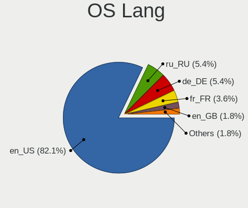
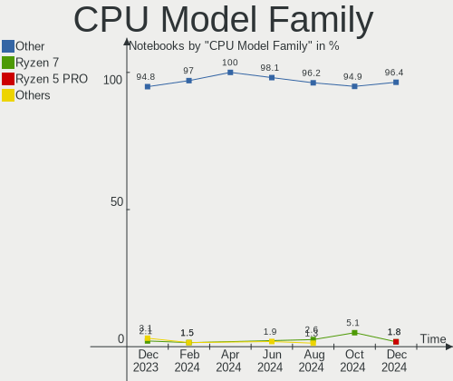
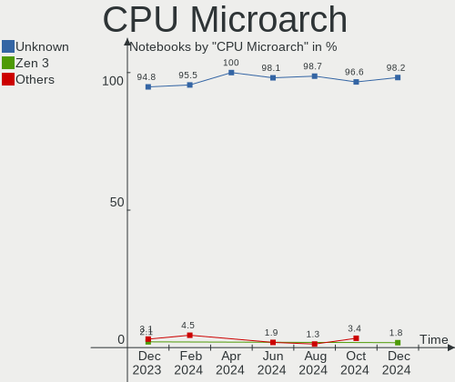
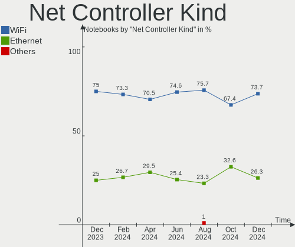
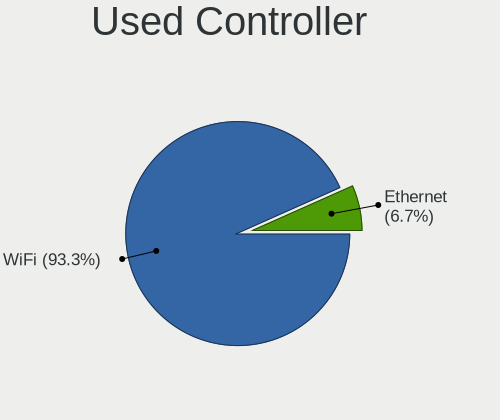

SteamOS - Hardware Trends (Notebooks)
-------------------------------------

A project to identify most popular hardware characteristics and track their change
over time based on data collected by Linux users at https://Linux-Hardware.org.

Anyone can contribute to this report by the [hw-probe](https://github.com/linuxhw/hw-probe) tool:

    sudo -E hw-probe -all -upload

This report is for one last month. Overall report since the beginning of time: [TestDays](https://github.com/linuxhw/TestDays)

Period: Feb, 2023.

Contents
--------

* [ System ](#system)
  - [ OS                       ](#os)
  - [ OS Family                ](#os-family)
  - [ Kernel                   ](#kernel)
  - [ Kernel Family            ](#kernel-family)
  - [ Kernel Major Ver.        ](#kernel-major-ver)
  - [ Arch                     ](#arch)
  - [ DE                       ](#de)
  - [ Display Server           ](#display-server)
  - [ Display Manager          ](#display-manager)
  - [ OS Lang                  ](#os-lang)
  - [ Boot Mode                ](#boot-mode)
  - [ Filesystem               ](#filesystem)
  - [ Part. scheme             ](#part-scheme)
  - [ Dual Boot with Linux/BSD ](#dual-boot-with-linuxbsd)
  - [ Dual Boot (Win)          ](#dual-boot-win)

* [ Board ](#board)
  - [ Vendor                   ](#vendor)
  - [ Model                    ](#model)
  - [ Model Family             ](#model-family)
  - [ MFG Year                 ](#mfg-year)
  - [ Form Factor              ](#form-factor)
  - [ Secure Boot              ](#secure-boot)
  - [ Coreboot                 ](#coreboot)
  - [ RAM Size                 ](#ram-size)
  - [ RAM Used                 ](#ram-used)
  - [ Total Drives             ](#total-drives)
  - [ Has CD-ROM               ](#has-cd-rom)
  - [ Has Ethernet             ](#has-ethernet)
  - [ Has WiFi                 ](#has-wifi)
  - [ Has Bluetooth            ](#has-bluetooth)

* [ Location ](#location)
  - [ Country                  ](#country)
  - [ City                     ](#city)

* [ Drives ](#drives)
  - [ Drive Vendor             ](#drive-vendor)
  - [ Drive Model              ](#drive-model)
  - [ HDD Vendor               ](#hdd-vendor)
  - [ SSD Vendor               ](#ssd-vendor)
  - [ Drive Kind               ](#drive-kind)
  - [ Drive Connector          ](#drive-connector)
  - [ Drive Size               ](#drive-size)
  - [ Space Total              ](#space-total)
  - [ Space Used               ](#space-used)
  - [ Malfunc. Drives          ](#malfunc-drives)
  - [ Malfunc. Drive Vendor    ](#malfunc-drive-vendor)
  - [ Malfunc. HDD Vendor      ](#malfunc-hdd-vendor)
  - [ Malfunc. Drive Kind      ](#malfunc-drive-kind)
  - [ Failed Drives            ](#failed-drives)
  - [ Failed Drive Vendor      ](#failed-drive-vendor)
  - [ Drive Status             ](#drive-status)

* [ Storage controller ](#storage-controller)
  - [ Storage Vendor           ](#storage-vendor)
  - [ Storage Model            ](#storage-model)
  - [ Storage Kind             ](#storage-kind)

* [ Processor ](#processor)
  - [ CPU Vendor               ](#cpu-vendor)
  - [ CPU Model                ](#cpu-model)
  - [ CPU Model Family         ](#cpu-model-family)
  - [ CPU Cores                ](#cpu-cores)
  - [ CPU Sockets              ](#cpu-sockets)
  - [ CPU Threads              ](#cpu-threads)
  - [ CPU Op-Modes             ](#cpu-op-modes)
  - [ CPU Microcode            ](#cpu-microcode)
  - [ CPU Microarch            ](#cpu-microarch)

* [ Graphics ](#graphics)
  - [ GPU Vendor               ](#gpu-vendor)
  - [ GPU Model                ](#gpu-model)
  - [ GPU Combo                ](#gpu-combo)
  - [ GPU Driver               ](#gpu-driver)
  - [ GPU Memory               ](#gpu-memory)

* [ Monitor ](#monitor)
  - [ Monitor Vendor           ](#monitor-vendor)
  - [ Monitor Model            ](#monitor-model)
  - [ Monitor Resolution       ](#monitor-resolution)
  - [ Monitor Diagonal         ](#monitor-diagonal)
  - [ Monitor Width            ](#monitor-width)
  - [ Aspect Ratio             ](#aspect-ratio)
  - [ Monitor Area             ](#monitor-area)
  - [ Pixel Density            ](#pixel-density)
  - [ Multiple Monitors        ](#multiple-monitors)

* [ Network ](#network)
  - [ Net Controller Vendor    ](#net-controller-vendor)
  - [ Net Controller Model     ](#net-controller-model)
  - [ Wireless Vendor          ](#wireless-vendor)
  - [ Wireless Model           ](#wireless-model)
  - [ Ethernet Vendor          ](#ethernet-vendor)
  - [ Ethernet Model           ](#ethernet-model)
  - [ Net Controller Kind      ](#net-controller-kind)
  - [ Used Controller          ](#used-controller)
  - [ NICs                     ](#nics)
  - [ IPv6                     ](#ipv6)

* [ Bluetooth ](#bluetooth)
  - [ Bluetooth Vendor         ](#bluetooth-vendor)
  - [ Bluetooth Model          ](#bluetooth-model)

* [ Sound ](#sound)
  - [ Sound Vendor             ](#sound-vendor)
  - [ Sound Model              ](#sound-model)

* [ Memory ](#memory)
  - [ Memory Vendor            ](#memory-vendor)
  - [ Memory Model             ](#memory-model)
  - [ Memory Kind              ](#memory-kind)
  - [ Memory Form Factor       ](#memory-form-factor)
  - [ Memory Size              ](#memory-size)
  - [ Memory Speed             ](#memory-speed)

* [ Printers & scanners ](#printers--scanners)
  - [ Printer Vendor           ](#printer-vendor)
  - [ Printer Model            ](#printer-model)
  - [ Scanner Vendor           ](#scanner-vendor)
  - [ Scanner Model            ](#scanner-model)

* [ Camera ](#camera)
  - [ Camera Vendor            ](#camera-vendor)
  - [ Camera Model             ](#camera-model)

* [ Security ](#security)
  - [ Fingerprint Vendor       ](#fingerprint-vendor)
  - [ Fingerprint Model        ](#fingerprint-model)
  - [ Chipcard Vendor          ](#chipcard-vendor)
  - [ Chipcard Model           ](#chipcard-model)

* [ Unsupported ](#unsupported)
  - [ Unsupported Devices      ](#unsupported-devices)
  - [ Unsupported Device Types ](#unsupported-device-types)

System
------

OS
--

Installed operating systems

| Name          | Notebooks | Percent |
|---------------|-----------|---------|
| SteamOS 3.4.4 | 68        | 85%     |
| SteamOS 3.4   | 4         | 5%      |
| SteamOS 3.5   | 3         | 3.75%   |
| SteamOS 3.4.5 | 3         | 3.75%   |
| SteamOS 3.1   | 1         | 1.25%   |
| SteamOS       | 1         | 1.25%   |

OS Family
---------

OS without a version

| Name    | Notebooks | Percent |
|---------|-----------|---------|
| SteamOS | 80        | 100%    |

Kernel
------

Version of the Linux kernel

| Version                                        | Notebooks | Percent |
|------------------------------------------------|-----------|---------|
| 5.13.0-valve36-1-neptune                       | 71        | 88.75%  |
| 5.13.0-valve21.3-1-neptune                     | 4         | 5%      |
| 6.1.9-valve2-1-neptune-61                      | 2         | 2.5%    |
| 5.15.79-1-lts                                  | 1         | 1.25%   |
| 5.13.0-valve37-1-neptune                       | 1         | 1.25%   |
| 5.13.0-valve10.3-1-neptune-02176-g5fe416c4acd8 | 1         | 1.25%   |

Kernel Family
-------------

Linux kernel without a distro release

| Version | Notebooks | Percent |
|---------|-----------|---------|
| 5.13.0  | 77        | 96.25%  |
| 6.1.9   | 2         | 2.5%    |
| 5.15.79 | 1         | 1.25%   |

Kernel Major Ver.
-----------------

Linux kernel major version

| Version | Notebooks | Percent |
|---------|-----------|---------|
| 5.13    | 77        | 96.25%  |
| 6.1     | 2         | 2.5%    |
| 5.15    | 1         | 1.25%   |

Arch
----

OS architecture (x86_64, i586, etc.)

| Name   | Notebooks | Percent |
|--------|-----------|---------|
| x86_64 | 80        | 100%    |

DE
--

Desktop Environment

| Name | Notebooks | Percent |
|------|-----------|---------|
| KDE5 | 80        | 100%    |

Display Server
--------------

X11 or Wayland

| Name | Notebooks | Percent |
|------|-----------|---------|
| X11  | 80        | 100%    |

Display Manager
---------------

SDDM, LightDM, etc.

| Name    | Notebooks | Percent |
|---------|-----------|---------|
| Unknown | 80        | 100%    |

OS Lang
-------

Language

| Lang   | Notebooks | Percent |
|--------|-----------|---------|
| en_US  | 74        | 92.5%   |
| ru_RU  | 1         | 1.25%   |
| ksh_DE | 1         | 1.25%   |
| fr_FR  | 1         | 1.25%   |
| es_MX  | 1         | 1.25%   |
| de_DE  | 1         | 1.25%   |
| C      | 1         | 1.25%   |

Boot Mode
---------

EFI or BIOS

| Mode | Notebooks | Percent |
|------|-----------|---------|
| BIOS | 80        | 100%    |

Filesystem
----------

Type of filesystem

| Type  | Notebooks | Percent |
|-------|-----------|---------|
| Btrfs | 80        | 100%    |

Part. scheme
------------

Scheme of partitioning

| Type    | Notebooks | Percent |
|---------|-----------|---------|
| Unknown | 80        | 100%    |

Dual Boot with Linux/BSD
------------------------

Hosting more than one Linux/BSD

| Dual boot | Notebooks | Percent |
|-----------|-----------|---------|
| No        | 80        | 100%    |

Dual Boot (Win)
---------------

Hosting Linux and Windows

| Dual boot | Notebooks | Percent |
|-----------|-----------|---------|
| No        | 80        | 100%    |

Board
-----

Vendor
------

Motherboard manufacturer

| Name             | Notebooks | Percent |
|------------------|-----------|---------|
| Valve            | 74        | 92.5%   |
| ASUSTek Computer | 3         | 3.75%   |
| Hewlett-Packard  | 2         | 2.5%    |
| Dell             | 1         | 1.25%   |

Model
-----

Motherboard model

| Name                                   | Notebooks | Percent |
|----------------------------------------|-----------|---------|
| Valve Jupiter                          | 74        | 92.5%   |
| HP Pavilion Laptop 15-eh1xxx           | 1         | 1.25%   |
| HP Laptop 15s-eq2xxx                   | 1         | 1.25%   |
| Dell Inspiron 3542                     | 1         | 1.25%   |
| ASUS TUF Gaming FX505DT_FX505DT        | 1         | 1.25%   |
| ASUS N56VB                             | 1         | 1.25%   |
| ASUS ASUS TUF Dash F15 FX516PC_FX516PC | 1         | 1.25%   |

Model Family
------------

Motherboard model prefix

| Name          | Notebooks | Percent |
|---------------|-----------|---------|
| Valve Jupiter | 74        | 92.5%   |
| HP Pavilion   | 1         | 1.25%   |
| HP Laptop     | 1         | 1.25%   |
| Dell Inspiron | 1         | 1.25%   |
| ASUS TUF      | 1         | 1.25%   |
| ASUS N56VB    | 1         | 1.25%   |
| ASUS ASUS     | 1         | 1.25%   |

MFG Year
--------

Motherboard manufacture year

| Year | Notebooks | Percent |
|------|-----------|---------|
| 2022 | 74        | 92.5%   |
| 2021 | 3         | 3.75%   |
| 2019 | 1         | 1.25%   |
| 2014 | 1         | 1.25%   |
| 2013 | 1         | 1.25%   |

Form Factor
-----------

Physical design of the computer

| Name     | Notebooks | Percent |
|----------|-----------|---------|
| Notebook | 80        | 100%    |

Secure Boot
-----------

Enabled or disabled

| State    | Notebooks | Percent |
|----------|-----------|---------|
| Disabled | 80        | 100%    |

Coreboot
--------

Have coreboot on board

| Used | Notebooks | Percent |
|------|-----------|---------|
| No   | 80        | 100%    |

RAM Size
--------

Total RAM memory

| Size in GB | Notebooks | Percent |
|------------|-----------|---------|
| 8.01-16.0  | 77        | 96.25%  |
| 4.01-8.0   | 1         | 1.25%   |
| 32.01-64.0 | 1         | 1.25%   |
| 3.01-4.0   | 1         | 1.25%   |

RAM Used
--------

Used RAM memory

| Used GB   | Notebooks | Percent |
|-----------|-----------|---------|
| 2.01-3.0  | 36        | 45%     |
| 3.01-4.0  | 26        | 32.5%   |
| 4.01-8.0  | 10        | 12.5%   |
| 1.01-2.0  | 5         | 6.25%   |
| 8.01-16.0 | 3         | 3.75%   |

Total Drives
------------

Number of drives on board

| Drives | Notebooks | Percent |
|--------|-----------|---------|
| 2      | 53        | 66.25%  |
| 1      | 24        | 30%     |
| 3      | 2         | 2.5%    |
| 4      | 1         | 1.25%   |

Has CD-ROM
----------

Has CD-ROM on board

| Presented | Notebooks | Percent |
|-----------|-----------|---------|
| No        | 77        | 96.25%  |
| Yes       | 3         | 3.75%   |

Has Ethernet
------------

Has Ethernet on board

| Presented | Notebooks | Percent |
|-----------|-----------|---------|
| No        | 55        | 68.75%  |
| Yes       | 25        | 31.25%  |

Has WiFi
--------

Has WiFi module

| Presented | Notebooks | Percent |
|-----------|-----------|---------|
| Yes       | 80        | 100%    |

Has Bluetooth
-------------

Has Bluetooth module

| Presented | Notebooks | Percent |
|-----------|-----------|---------|
| Yes       | 80        | 100%    |

Location
--------

Country
-------

Geographic location (country)

| Country     | Notebooks | Percent |
|-------------|-----------|---------|
| USA         | 29        | 36.25%  |
| Germany     | 11        | 13.75%  |
| Russia      | 5         | 6.25%   |
| Poland      | 4         | 5%      |
| UK          | 3         | 3.75%   |
| Netherlands | 3         | 3.75%   |
| Taiwan      | 2         | 2.5%    |
| Spain       | 2         | 2.5%    |
| Mexico      | 2         | 2.5%    |
| Ireland     | 2         | 2.5%    |
| Canada      | 2         | 2.5%    |
| Belgium     | 2         | 2.5%    |
| Ukraine     | 1         | 1.25%   |
| Turkey      | 1         | 1.25%   |
| Puerto Rico | 1         | 1.25%   |
| Philippines | 1         | 1.25%   |
| Italy       | 1         | 1.25%   |
| France      | 1         | 1.25%   |
| Finland     | 1         | 1.25%   |
| Croatia     | 1         | 1.25%   |
| China       | 1         | 1.25%   |
| Chile       | 1         | 1.25%   |
| Bulgaria    | 1         | 1.25%   |
| Austria     | 1         | 1.25%   |
| Australia   | 1         | 1.25%   |

City
----

Geographic location (city)

| City                 | Notebooks | Percent |
|----------------------|-----------|---------|
| Berlin               | 2         | 2.5%    |
| Yukon                | 1         | 1.25%   |
| Xizhi District       | 1         | 1.25%   |
| Wuhan                | 1         | 1.25%   |
| Wexford              | 1         | 1.25%   |
| Ukhta                | 1         | 1.25%   |
| Tualatin             | 1         | 1.25%   |
| Tremblay-en-France   | 1         | 1.25%   |
| Torquay              | 1         | 1.25%   |
| Talavera de la Reina | 1         | 1.25%   |
| Sydney               | 1         | 1.25%   |
| Stewartstown         | 1         | 1.25%   |
| Sint-Truiden         | 1         | 1.25%   |
| Siegburg             | 1         | 1.25%   |
| Seattle              | 1         | 1.25%   |
| Santiago             | 1         | 1.25%   |
| San Antonio          | 1         | 1.25%   |
| Salzgitter           | 1         | 1.25%   |
| Saint Charles        | 1         | 1.25%   |
| Saint Augustine      | 1         | 1.25%   |
| Saarlouis            | 1         | 1.25%   |
| Rousse               | 1         | 1.25%   |
| Redmond              | 1         | 1.25%   |
| Raleigh              | 1         | 1.25%   |
| Poznan               | 1         | 1.25%   |
| Portage              | 1         | 1.25%   |
| Philadelphia         | 1         | 1.25%   |
| Pfungstadt           | 1         | 1.25%   |
| Orland Park          | 1         | 1.25%   |
| New Taipei           | 1         | 1.25%   |
| Neuotting            | 1         | 1.25%   |
| Nampa                | 1         | 1.25%   |
| Myrtle Beach         | 1         | 1.25%   |
| Moscow               | 1         | 1.25%   |
| Montreal             | 1         | 1.25%   |
| Mielec               | 1         | 1.25%   |
| Memphis              | 1         | 1.25%   |
| Meath                | 1         | 1.25%   |
| Manila               | 1         | 1.25%   |
| Madrid               | 1         | 1.25%   |

Drives
------

Drive Vendor
------------

Hard drive vendors

| Vendor                      | Notebooks | Drives | Percent |
|-----------------------------|-----------|--------|---------|
| Unknown                     | 38        | 38     | 27.14%  |
| Kingston Technology Company | 21        | 21     | 15%     |
| Samsung Electronics         | 17        | 17     | 12.14%  |
| O2 Micro                    | 14        | 14     | 10%     |
| Unknown                     | 13        | 13     | 9.29%   |
| Phison Electronics          | 11        | 11     | 7.86%   |
| SK hynix                    | 4         | 4      | 2.86%   |
| Seagate                     | 4         | 4      | 2.86%   |
| Sandisk                     | 4         | 4      | 2.86%   |
| KIOXIA                      | 3         | 3      | 2.14%   |
| Silicon Motion              | 2         | 2      | 1.43%   |
| Intel                       | 2         | 2      | 1.43%   |
| Toshiba                     | 1         | 1      | 0.71%   |
| TCSUNBOW                    | 1         | 1      | 0.71%   |
| Micron Technology           | 1         | 1      | 0.71%   |
| Kingston                    | 1         | 1      | 0.71%   |
| JMicron Technology          | 1         | 1      | 0.71%   |
| Crucial                     | 1         | 1      | 0.71%   |
| A-DATA Technology           | 1         | 1      | 0.71%   |

Drive Model
-----------

Hard drive models

| Model                                                 | Notebooks | Percent |
|-------------------------------------------------------|-----------|---------|
| Kingston Company OM3PDP3 NVMe SSD 512GB               | 21        | 15%     |
| Unknown MMC Card  512GB                               | 17        | 12.14%  |
| O2 Micro E2M2 64GB                                    | 14        | 10%     |
| Unknown                                               | 13        | 9.29%   |
| Samsung MZ9LQ512HBLU-00BVL 512GB                      | 10        | 7.14%   |
| Phison PS5013 E13 NVMe Controller 500GB               | 10        | 7.14%   |
| Unknown MMC Card  256GB                               | 7         | 5%      |
| Unknown MMC Card  128GB                               | 7         | 5%      |
| Samsung MZ9LQ256HBJD-00BVL 256GB                      | 6         | 4.29%   |
| Unknown MMC Card  393GB                               | 2         | 1.43%   |
| SK hynix BC511 512GB                                  | 2         | 1.43%   |
| Silicon Motion SM2263EN/SM2263XT SSD Controller 512GB | 2         | 1.43%   |
| Sandisk WD PC SN740 SDDPTQD-1T00 1024GB               | 2         | 1.43%   |
| Unknown SD/MMC/MS PRO 16GB                            | 1         | 0.71%   |
| Unknown MMC Card  64GB                                | 1         | 0.71%   |
| Unknown MMC Card  4GB                                 | 1         | 0.71%   |
| Unknown MMC Card  32GB                                | 1         | 0.71%   |
| Unknown MMC Card  196GB                               | 1         | 0.71%   |
| Toshiba MQ01ABD100 1TB                                | 1         | 0.71%   |
| TCSUNBOW X3 240GB                                     | 1         | 0.71%   |
| SK hynix HFM512GD3GX013N 512GB                        | 1         | 0.71%   |
| SK hynix BC711 NVMe 512GB                             | 1         | 0.71%   |
| Seagate ST500LT012-1DG142 500GB                       | 1         | 0.71%   |
| Seagate Portable 4TB                                  | 1         | 0.71%   |
| Seagate Expansion SW 4TB                              | 1         | 0.71%   |
| Seagate Expansion 1TB                                 | 1         | 0.71%   |
| Sandisk WDC PC SN530 SDBPTPZ-1T00 1024GB              | 1         | 0.71%   |
| Sandisk WD Black SN850 500GB                          | 1         | 0.71%   |
| Samsung PM991 NVMe 512GB                              | 1         | 0.71%   |
| Phison Sabrent SB-2130-1TB                            | 1         | 0.71%   |
| Micron 2200V_MTFDHBA512TCK 512GB                      | 1         | 0.71%   |
| KIOXIA KBG50ZNS1T02 1024GB                            | 1         | 0.71%   |
| KIOXIA KBG40ZNV256G 256GB                             | 1         | 0.71%   |
| KIOXIA KBG40ZNS512G NVMe 512GB                        | 1         | 0.71%   |
| Kingston SA400S37960G 960GB SSD                       | 1         | 0.71%   |
| JMicron Generic 200GB                                 | 1         | 0.71%   |
| Intel SSDPEKNU512GZ 512GB                             | 1         | 0.71%   |
| Intel SSD 660P Series 1024GB                          | 1         | 0.71%   |
| Crucial CT480BX500SSD1 480GB                          | 1         | 0.71%   |
| A-DATA HC660 2TB SSD                                  | 1         | 0.71%   |

HDD Vendor
----------

Hard disk drive vendors

| Vendor             | Notebooks | Drives | Percent |
|--------------------|-----------|--------|---------|
| Seagate            | 3         | 3      | 50%     |
| Unknown            | 1         | 1      | 16.67%  |
| Toshiba            | 1         | 1      | 16.67%  |
| JMicron Technology | 1         | 1      | 16.67%  |

SSD Vendor
----------

Solid state drive vendors

| Vendor            | Notebooks | Drives | Percent |
|-------------------|-----------|--------|---------|
| Kingston          | 1         | 1      | 33.33%  |
| Crucial           | 1         | 1      | 33.33%  |
| A-DATA Technology | 1         | 1      | 33.33%  |

Drive Kind
----------

HDD or SSD

| Kind    | Notebooks | Drives | Percent |
|---------|-----------|--------|---------|
| NVMe    | 78        | 79     | 56.12%  |
| MMC     | 50        | 50     | 35.97%  |
| HDD     | 6         | 6      | 4.32%   |
| SSD     | 3         | 3      | 2.16%   |
| Unknown | 2         | 2      | 1.44%   |

Drive Connector
---------------

SATA, SAS, NVMe, etc.

| Type | Notebooks | Drives | Percent |
|------|-----------|--------|---------|
| NVMe | 78        | 79     | 56.52%  |
| MMC  | 50        | 50     | 36.23%  |
| SAS  | 7         | 8      | 5.07%   |
| SATA | 3         | 3      | 2.17%   |

Drive Size
----------

Size of hard drive

| Size in TB | Notebooks | Drives | Percent |
|------------|-----------|--------|---------|
| 0.01-0.5   | 4         | 4      | 44.44%  |
| 0.51-1.0   | 3         | 3      | 33.33%  |
| 3.01-4.0   | 1         | 1      | 11.11%  |
| 1.01-2.0   | 1         | 1      | 11.11%  |

Space Total
-----------

Amount of disk space available on the file system

| Size in GB     | Notebooks | Percent |
|----------------|-----------|---------|
| 251-500        | 40        | 50%     |
| 101-250        | 13        | 16.25%  |
| 51-100         | 11        | 13.75%  |
| 501-1000       | 10        | 12.5%   |
| More than 3000 | 3         | 3.75%   |
| 1001-2000      | 3         | 3.75%   |

Space Used
----------

Amount of used disk space

| Used GB   | Notebooks | Percent |
|-----------|-----------|---------|
| 101-250   | 25        | 31.25%  |
| 251-500   | 21        | 26.25%  |
| 21-50     | 17        | 21.25%  |
| 501-1000  | 6         | 7.5%    |
| 51-100    | 6         | 7.5%    |
| 1-20      | 4         | 5%      |
| 1001-2000 | 1         | 1.25%   |

Malfunc. Drives
---------------

Drive models with a malfunction

Zero info for selected period =(

Malfunc. Drive Vendor
---------------------

Vendors of faulty drives

Zero info for selected period =(

Malfunc. HDD Vendor
-------------------

Vendors of faulty HDD drives

Zero info for selected period =(

Malfunc. Drive Kind
-------------------

Kinds of faulty drives

Zero info for selected period =(

Failed Drives
-------------

Failed drive models

Zero info for selected period =(

Failed Drive Vendor
-------------------

Failed drive vendors

Zero info for selected period =(

Drive Status
------------

Number of failed and malfunc. drives

| Status   | Notebooks | Drives | Percent |
|----------|-----------|--------|---------|
| Detected | 80        | 140    | 100%    |

Storage controller
------------------

Storage Vendor
--------------

Storage controller vendors

| Vendor                      | Notebooks | Percent |
|-----------------------------|-----------|---------|
| Kingston Technology Company | 21        | 25.61%  |
| Samsung Electronics         | 17        | 20.73%  |
| O2 Micro                    | 14        | 17.07%  |
| Phison Electronics          | 11        | 13.41%  |
| SK hynix                    | 4         | 4.88%   |
| SanDisk                     | 4         | 4.88%   |
| Intel                       | 4         | 4.88%   |
| KIOXIA                      | 3         | 3.66%   |
| Silicon Motion              | 2         | 2.44%   |
| Micron Technology           | 1         | 1.22%   |
| AMD                         | 1         | 1.22%   |

Storage Model
-------------

Storage controller models

| Model                                                            | Notebooks | Percent |
|------------------------------------------------------------------|-----------|---------|
| Kingston Company OM3PDP3 NVMe SSD                                | 21        | 25.3%   |
| Samsung NVMe SSD Controller 980                                  | 17        | 20.48%  |
| O2 Micro Non-Volatile memory controller                          | 14        | 16.87%  |
| Phison PS5013 E13 NVMe Controller                                | 10        | 12.05%  |
| Sandisk Non-Volatile memory controller                           | 3         | 3.61%   |
| SK hynix Gold P31/PC711 NVMe Solid State Drive                   | 2         | 2.41%   |
| SK hynix BC511                                                   | 2         | 2.41%   |
| Silicon Motion SM2263EN/SM2263XT SSD Controller                  | 2         | 2.41%   |
| KIOXIA NVMe SSD Controller BG4                                   | 2         | 2.41%   |
| SanDisk WD PC SN810 / Black SN850 NVMe SSD                       | 1         | 1.2%    |
| Phison Electronics Non-Volatile memory controller                | 1         | 1.2%    |
| Micron Non-Volatile memory controller                            | 1         | 1.2%    |
| KIOXIA Non-Volatile memory controller                            | 1         | 1.2%    |
| Intel Volume Management Device NVMe RAID Controller              | 1         | 1.2%    |
| Intel SSD 660P Series                                            | 1         | 1.2%    |
| Intel Non-Volatile memory controller                             | 1         | 1.2%    |
| Intel 8 Series SATA Controller 1 [AHCI mode]                     | 1         | 1.2%    |
| Intel 7 Series Chipset Family 6-port SATA Controller [AHCI mode] | 1         | 1.2%    |
| AMD FCH SATA Controller [AHCI mode]                              | 1         | 1.2%    |

Storage Kind
------------

Kind of storage controller (IDE, SATA, NVMe, SAS, ...)

| Kind | Notebooks | Percent |
|------|-----------|---------|
| NVMe | 78        | 95.12%  |
| SATA | 3         | 3.66%   |
| RAID | 1         | 1.22%   |

Processor
---------

CPU Vendor
----------

Processor vendors

| Vendor | Notebooks | Percent |
|--------|-----------|---------|
| AMD    | 77        | 96.25%  |
| Intel  | 3         | 3.75%   |

CPU Model
---------

Processor models

| Model                                         | Notebooks | Percent |
|-----------------------------------------------|-----------|---------|
| AMD Custom APU 0405                           | 74        | 92.5%   |
| Intel Core i5-3230M CPU @ 2.60GHz             | 1         | 1.25%   |
| Intel Core i3-4030U CPU @ 1.90GHz             | 1         | 1.25%   |
| Intel 11th Gen Core i5-11300H @ 3.10GHz       | 1         | 1.25%   |
| AMD Ryzen 7 5700U with Radeon Graphics        | 1         | 1.25%   |
| AMD Ryzen 5 3550H with Radeon Vega Mobile Gfx | 1         | 1.25%   |
| AMD Ryzen 3 5300U with Radeon Graphics        | 1         | 1.25%   |

CPU Model Family
----------------

Processor model prefix

| Model         | Notebooks | Percent |
|---------------|-----------|---------|
| Other         | 75        | 93.75%  |
| Intel Core i5 | 1         | 1.25%   |
| Intel Core i3 | 1         | 1.25%   |
| AMD Ryzen 7   | 1         | 1.25%   |
| AMD Ryzen 5   | 1         | 1.25%   |
| AMD Ryzen 3   | 1         | 1.25%   |

CPU Cores
---------

Number of processor cores

| Number | Notebooks | Percent |
|--------|-----------|---------|
| 4      | 77        | 96.25%  |
| 2      | 2         | 2.5%    |
| 8      | 1         | 1.25%   |

CPU Sockets
-----------

Number of sockets

| Number | Notebooks | Percent |
|--------|-----------|---------|
| 1      | 80        | 100%    |

CPU Threads
-----------

Threads per core (Hyper-Threading)

| Number | Notebooks | Percent |
|--------|-----------|---------|
| 2      | 79        | 98.75%  |
| 1      | 1         | 1.25%   |

CPU Op-Modes
------------

CPU Operation Modes (32-bit, 64-bit)

| Op mode        | Notebooks | Percent |
|----------------|-----------|---------|
| 32-bit, 64-bit | 80        | 100%    |

CPU Microcode
-------------

Microcode number

| Number  | Notebooks | Percent |
|---------|-----------|---------|
| Unknown | 80        | 100%    |

CPU Microarch
-------------

Microarchitecture

| Name      | Notebooks | Percent |
|-----------|-----------|---------|
| Unknown   | 76        | 95%     |
| Zen+      | 1         | 1.25%   |
| TigerLake | 1         | 1.25%   |
| IvyBridge | 1         | 1.25%   |
| Haswell   | 1         | 1.25%   |

Graphics
--------

GPU Vendor
----------

Vendors of graphics cards

| Vendor | Notebooks | Percent |
|--------|-----------|---------|
| AMD    | 77        | 92.77%  |
| Nvidia | 3         | 3.61%   |
| Intel  | 3         | 3.61%   |

GPU Model
---------

Graphics card models

| Model                                                                | Notebooks | Percent |
|----------------------------------------------------------------------|-----------|---------|
| AMD VanGogh [AMD Custom GPU 0405]                                    | 74        | 89.16%  |
| AMD Lucienne                                                         | 2         | 2.41%   |
| Nvidia TU117M [GeForce GTX 1650 Mobile / Max-Q]                      | 1         | 1.2%    |
| Nvidia GK107M [GeForce GT 740M]                                      | 1         | 1.2%    |
| Nvidia GA107M [GeForce RTX 3050 Mobile]                              | 1         | 1.2%    |
| Intel TigerLake-LP GT2 [Iris Xe Graphics]                            | 1         | 1.2%    |
| Intel Haswell-ULT Integrated Graphics Controller                     | 1         | 1.2%    |
| Intel 3rd Gen Core processor Graphics Controller                     | 1         | 1.2%    |
| AMD Picasso/Raven 2 [Radeon Vega Series / Radeon Vega Mobile Series] | 1         | 1.2%    |

GPU Combo
---------

Combinations of graphics cards

| Name           | Notebooks | Percent |
|----------------|-----------|---------|
| 1 x AMD        | 76        | 95%     |
| Intel + Nvidia | 2         | 2.5%    |
| 1 x Intel      | 1         | 1.25%   |
| AMD + Nvidia   | 1         | 1.25%   |

GPU Driver
----------

Free vs proprietary

| Driver      | Notebooks | Percent |
|-------------|-----------|---------|
| Free        | 79        | 98.75%  |
| Proprietary | 1         | 1.25%   |

GPU Memory
----------

Total video memory

| Size in GB | Notebooks | Percent |
|------------|-----------|---------|
| Unknown    | 80        | 100%    |

Monitor
-------

Monitor Vendor
--------------

Monitor vendors

| Vendor               | Notebooks | Percent |
|----------------------|-----------|---------|
| Valve                | 73        | 71.57%  |
| AOC                  | 4         | 3.92%   |
| Samsung Electronics  | 3         | 2.94%   |
| MSI                  | 2         | 1.96%   |
| LG Display           | 2         | 1.96%   |
| Lenovo               | 2         | 1.96%   |
| AU Optronics         | 2         | 1.96%   |
| Ancor Communications | 2         | 1.96%   |
| VKK                  | 1         | 0.98%   |
| Toshiba              | 1         | 0.98%   |
| Philips              | 1         | 0.98%   |
| PANDA                | 1         | 0.98%   |
| ONN                  | 1         | 0.98%   |
| Hitachi              | 1         | 0.98%   |
| Hewlett-Packard      | 1         | 0.98%   |
| Goldstar             | 1         | 0.98%   |
| Dell                 | 1         | 0.98%   |
| Chimei Innolux       | 1         | 0.98%   |
| Analogix             | 1         | 0.98%   |
| Acer                 | 1         | 0.98%   |

Monitor Model
-------------

Monitor models

| Model                                                                   | Notebooks | Percent |
|-------------------------------------------------------------------------|-----------|---------|
| Valve ANX7530 U VLV3001 800x1280 100x150mm 7.1-inch                     | 73        | 71.57%  |
| VKK VK1160 VKK1160 1920x1080 256x144mm 11.6-inch                        | 1         | 0.98%   |
| Toshiba TV TSB2017 3840x2160                                            | 1         | 0.98%   |
| Samsung Electronics S27H85x SAM0E0F 2560x1440 597x336mm 27.0-inch       | 1         | 0.98%   |
| Samsung Electronics S24F350 SAM0D20 1920x1080 521x293mm 23.5-inch       | 1         | 0.98%   |
| Samsung Electronics LCD Monitor SAM065E 1920x1080                       | 1         | 0.98%   |
| Philips PHL 346P1C PHL093F 3440x1440 797x334mm 34.0-inch                | 1         | 0.98%   |
| PANDA LCD Monitor NCP004D 1920x1080 344x194mm 15.5-inch                 | 1         | 0.98%   |
| ONN 100002487 ONN0101 1920x1080 517x323mm 24.0-inch                     | 1         | 0.98%   |
| MSI MAG341CQ MSI1462 3440x1440 797x334mm 34.0-inch                      | 1         | 0.98%   |
| MSI MAG301CR2 MSI3CB4 2560x1080 690x291mm 29.5-inch                     | 1         | 0.98%   |
| LG Display LCD Monitor LGD0456 1366x768 344x194mm 15.5-inch             | 1         | 0.98%   |
| LG Display LCD Monitor LGD02D9 1920x1080 344x194mm 15.5-inch            | 1         | 0.98%   |
| Lenovo LEN P24h-20 LEN61F4 2560x1440 527x296mm 23.8-inch                | 1         | 0.98%   |
| Lenovo C24-25 LEN66B0 1920x1080 527x296mm 23.8-inch                     | 1         | 0.98%   |
| Hitachi HISENSE HEC002F 3840x2160 1095x616mm 49.5-inch                  | 1         | 0.98%   |
| Hewlett-Packard M27fw FHD HPN370F 1920x1080 597x336mm 27.0-inch         | 1         | 0.98%   |
| Goldstar M228WA GSM563D 1680x1050 434x270mm 20.1-inch                   | 1         | 0.98%   |
| Dell S2715H DEL40BB 1920x1080 598x336mm 27.0-inch                       | 1         | 0.98%   |
| Chimei Innolux LCD Monitor CMN153B 1920x1080 344x193mm 15.5-inch        | 1         | 0.98%   |
| AU Optronics LCD Monitor AUOD0ED 1920x1080 344x193mm 15.5-inch          | 1         | 0.98%   |
| AU Optronics LCD Monitor AUOB78F 1920x1080 344x194mm 15.5-inch          | 1         | 0.98%   |
| AOC AG352QG2 AOC3520 2560x1080 820x346mm 35.0-inch                      | 1         | 0.98%   |
| AOC 27G2G4 AOC2702 1920x1080 598x336mm 27.0-inch                        | 1         | 0.98%   |
| AOC 27G2G3 AOC2704 1920x1080 598x336mm 27.0-inch                        | 1         | 0.98%   |
| AOC 2476WM AOC2476 1920x1080 521x293mm 23.5-inch                        | 1         | 0.98%   |
| Ancor Communications ROG PG279Q ACI27EC 2560x1440 598x336mm 27.0-inch   | 1         | 0.98%   |
| Ancor Communications ASUS VG278HV ACI2726 1920x1080 598x336mm 27.0-inch | 1         | 0.98%   |
| Analogix ANX7530 U ANX7539 800x1280                                     | 1         | 0.98%   |
| Acer SB241Y A ACR09BE 1920x1080 527x296mm 23.8-inch                     | 1         | 0.98%   |

Monitor Resolution
------------------

Monitor screen resolution

| Resolution         | Notebooks | Percent |
|--------------------|-----------|---------|
| 800x1280           | 74        | 72.55%  |
| 1920x1080 (FHD)    | 15        | 14.71%  |
| 3840x2160 (4K)     | 4         | 3.92%   |
| 2560x1440 (QHD)    | 3         | 2.94%   |
| 3440x1440          | 2         | 1.96%   |
| 2560x1080          | 2         | 1.96%   |
| 1680x1050 (WSXGA+) | 1         | 0.98%   |
| 1366x768 (WXGA)    | 1         | 0.98%   |

Monitor Diagonal
----------------

Diagonal size in inches

| Inches  | Notebooks | Percent |
|---------|-----------|---------|
| 7       | 73        | 71.57%  |
| 27      | 7         | 6.86%   |
| 15      | 6         | 5.88%   |
| 23      | 5         | 4.9%    |
| 34      | 2         | 1.96%   |
| 84      | 1         | 0.98%   |
| 72      | 1         | 0.98%   |
| 35      | 1         | 0.98%   |
| 31      | 1         | 0.98%   |
| 29      | 1         | 0.98%   |
| 22      | 1         | 0.98%   |
| 19      | 1         | 0.98%   |
| 11      | 1         | 0.98%   |
| Unknown | 1         | 0.98%   |

Monitor Width
-------------

Physical width

| Width in mm | Notebooks | Percent |
|-------------|-----------|---------|
| 1-100       | 73        | 71.57%  |
| 501-600     | 12        | 11.76%  |
| 301-350     | 6         | 5.88%   |
| 701-800     | 2         | 1.96%   |
| 601-700     | 2         | 1.96%   |
| 401-500     | 2         | 1.96%   |
| 1501-2000   | 2         | 1.96%   |
| 801-900     | 1         | 0.98%   |
| 201-300     | 1         | 0.98%   |
| Unknown     | 1         | 0.98%   |

Aspect Ratio
------------

Proportional relationship between the width and the height

| Ratio | Notebooks | Percent |
|-------|-----------|---------|
| 0.67  | 73        | 71.57%  |
| 16/9  | 22        | 21.57%  |
| 21/9  | 4         | 3.92%   |
| 16/10 | 2         | 1.96%   |
| 0.62  | 1         | 0.98%   |

Monitor Area
------------

Area in inch²

| Area in inch² | Notebooks | Percent |
|----------------|-----------|---------|
| 1-40           | 73        | 71.57%  |
| 301-350        | 8         | 7.84%   |
| 201-250        | 6         | 5.88%   |
| 101-110        | 6         | 5.88%   |
| 351-500        | 4         | 3.92%   |
| More than 1000 | 2         | 1.96%   |
| 51-60          | 1         | 0.98%   |
| 151-200        | 1         | 0.98%   |
| Unknown        | 1         | 0.98%   |

Pixel Density
-------------

Pixels per inch

| Density | Notebooks | Percent |
|---------|-----------|---------|
| 161-240 | 73        | 73%     |
| 51-100  | 15        | 15%     |
| 121-160 | 6         | 6%      |
| 101-120 | 5         | 5%      |
| Unknown | 1         | 1%      |

Multiple Monitors
-----------------

Total monitors connected

| Total | Notebooks | Percent |
|-------|-----------|---------|
| 1     | 58        | 72.5%   |
| 2     | 21        | 26.25%  |
| 3     | 1         | 1.25%   |

Network
-------

Net Controller Vendor
---------------------

Controller vendors

| Vendor                | Notebooks | Percent |
|-----------------------|-----------|---------|
| Realtek Semiconductor | 79        | 81.44%  |
| ASIX Electronics      | 11        | 11.34%  |
| Qualcomm Atheros      | 2         | 2.06%   |
| Intel                 | 2         | 2.06%   |
| Ralink Technology     | 1         | 1.03%   |
| Microsoft             | 1         | 1.03%   |
| Google                | 1         | 1.03%   |

Net Controller Model
--------------------

Controller models

| Model                                                             | Notebooks | Percent |
|-------------------------------------------------------------------|-----------|---------|
| Realtek RTL8822CE 802.11ac PCIe Wireless Network Adapter          | 75        | 69.44%  |
| ASIX AX88179 Gigabit Ethernet                                     | 11        | 10.19%  |
| Realtek RTL8153 Gigabit Ethernet Adapter                          | 8         | 7.41%   |
| Realtek RTL8152 Fast Ethernet Adapter                             | 2         | 1.85%   |
| Realtek RTL8852AE 802.11ax PCIe Wireless Network Adapter          | 1         | 0.93%   |
| Realtek RTL8821CE 802.11ac PCIe Wireless Network Adapter          | 1         | 0.93%   |
| Realtek RTL8111/8168/8411 PCI Express Gigabit Ethernet Controller | 1         | 0.93%   |
| Realtek RTL810xE PCI Express Fast Ethernet controller             | 1         | 0.93%   |
| Realtek Realtek Ethernet controller                               | 1         | 0.93%   |
| Ralink RT2870/RT3070 Wireless Adapter                             | 1         | 0.93%   |
| Qualcomm Atheros QCA9565 / AR9565 Wireless Network Adapter        | 1         | 0.93%   |
| Qualcomm Atheros AR8161 Gigabit Ethernet                          | 1         | 0.93%   |
| Microsoft Wireless XBox Controller Dongle                         | 1         | 0.93%   |
| Intel Wi-Fi 6 AX201                                               | 1         | 0.93%   |
| Intel Centrino Wireless-N 2230                                    | 1         | 0.93%   |
| Google Pixel 6                                                    | 1         | 0.93%   |

Wireless Vendor
---------------

Wireless vendors

| Vendor                | Notebooks | Percent |
|-----------------------|-----------|---------|
| Realtek Semiconductor | 77        | 93.9%   |
| Intel                 | 2         | 2.44%   |
| Ralink Technology     | 1         | 1.22%   |
| Qualcomm Atheros      | 1         | 1.22%   |
| Microsoft             | 1         | 1.22%   |

Wireless Model
--------------

Wireless models

| Model                                                      | Notebooks | Percent |
|------------------------------------------------------------|-----------|---------|
| Realtek RTL8822CE 802.11ac PCIe Wireless Network Adapter   | 75        | 91.46%  |
| Realtek RTL8852AE 802.11ax PCIe Wireless Network Adapter   | 1         | 1.22%   |
| Realtek RTL8821CE 802.11ac PCIe Wireless Network Adapter   | 1         | 1.22%   |
| Ralink RT2870/RT3070 Wireless Adapter                      | 1         | 1.22%   |
| Qualcomm Atheros QCA9565 / AR9565 Wireless Network Adapter | 1         | 1.22%   |
| Microsoft Wireless XBox Controller Dongle                  | 1         | 1.22%   |
| Intel Wi-Fi 6 AX201                                        | 1         | 1.22%   |
| Intel Centrino Wireless-N 2230                             | 1         | 1.22%   |

Ethernet Vendor
---------------

Ethernet vendors

| Vendor                | Notebooks | Percent |
|-----------------------|-----------|---------|
| Realtek Semiconductor | 13        | 50%     |
| ASIX Electronics      | 11        | 42.31%  |
| Qualcomm Atheros      | 1         | 3.85%   |
| Google                | 1         | 3.85%   |

Ethernet Model
--------------

Ethernet models

| Model                                                             | Notebooks | Percent |
|-------------------------------------------------------------------|-----------|---------|
| ASIX AX88179 Gigabit Ethernet                                     | 11        | 42.31%  |
| Realtek RTL8153 Gigabit Ethernet Adapter                          | 8         | 30.77%  |
| Realtek RTL8152 Fast Ethernet Adapter                             | 2         | 7.69%   |
| Realtek RTL8111/8168/8411 PCI Express Gigabit Ethernet Controller | 1         | 3.85%   |
| Realtek RTL810xE PCI Express Fast Ethernet controller             | 1         | 3.85%   |
| Realtek Realtek Ethernet controller                               | 1         | 3.85%   |
| Qualcomm Atheros AR8161 Gigabit Ethernet                          | 1         | 3.85%   |
| Google Pixel 6                                                    | 1         | 3.85%   |

Net Controller Kind
-------------------

Ethernet, WiFi or modem

| Kind     | Notebooks | Percent |
|----------|-----------|---------|
| WiFi     | 80        | 76.19%  |
| Ethernet | 25        | 23.81%  |

Used Controller
---------------

Currently used network controller

| Kind     | Notebooks | Percent |
|----------|-----------|---------|
| WiFi     | 76        | 91.57%  |
| Ethernet | 7         | 8.43%   |

NICs
----

Total network controllers on board

| Total | Notebooks | Percent |
|-------|-----------|---------|
| 1     | 76        | 95%     |
| 2     | 4         | 5%      |

IPv6
----

IPv6 vs IPv4

| Used | Notebooks | Percent |
|------|-----------|---------|
| No   | 53        | 66.25%  |
| Yes  | 27        | 33.75%  |

Bluetooth
---------

Bluetooth Vendor
----------------

Controller vendors

| Vendor                          | Notebooks | Percent |
|---------------------------------|-----------|---------|
| IMC Networks                    | 75        | 93.75%  |
| Realtek Semiconductor           | 2         | 2.5%    |
| Intel                           | 2         | 2.5%    |
| Qualcomm Atheros Communications | 1         | 1.25%   |

Bluetooth Model
---------------

Controller models

| Model                                         | Notebooks | Percent |
|-----------------------------------------------|-----------|---------|
| IMC Networks Bluetooth Radio                  | 75        | 93.75%  |
| Realtek Bluetooth Radio                       | 2         | 2.5%    |
| Qualcomm Atheros AR9462 Bluetooth             | 1         | 1.25%   |
| Intel Centrino Bluetooth Wireless Transceiver | 1         | 1.25%   |
| Intel AX201 Bluetooth                         | 1         | 1.25%   |

Sound
-----

Sound Vendor
------------

Sound card vendors

| Vendor                 | Notebooks | Percent |
|------------------------|-----------|---------|
| AMD                    | 77        | 85.56%  |
| Nvidia                 | 3         | 3.33%   |
| Intel                  | 3         | 3.33%   |
| Kingston Technology    | 2         | 2.22%   |
| Focusrite-Novation     | 2         | 2.22%   |
| Razer USA              | 1         | 1.11%   |
| Generalplus Technology | 1         | 1.11%   |
| C-Media Electronics    | 1         | 1.11%   |

Sound Model
-----------

Sound card models

| Model                                                                      | Notebooks | Percent |
|----------------------------------------------------------------------------|-----------|---------|
| AMD Rembrandt Radeon High Definition Audio Controller                      | 74        | 79.57%  |
| AMD Family 17h/19h HD Audio Controller                                     | 3         | 3.23%   |
| Kingston Technology HyperX 7.1 Audio                                       | 2         | 2.15%   |
| AMD Renoir Radeon High Definition Audio Controller                         | 2         | 2.15%   |
| Razer USA RC30-026902, Gaming Headset [Nari Essential, Wireless, Receiver] | 1         | 1.08%   |
| Nvidia TU107 GeForce GTX 1650 High Definition Audio Controller             | 1         | 1.08%   |
| Nvidia GK107 HDMI Audio Controller                                         | 1         | 1.08%   |
| Nvidia Audio device                                                        | 1         | 1.08%   |
| Intel Tiger Lake-LP Smart Sound Technology Audio Controller                | 1         | 1.08%   |
| Intel Haswell-ULT HD Audio Controller                                      | 1         | 1.08%   |
| Intel 8 Series HD Audio Controller                                         | 1         | 1.08%   |
| Intel 7 Series/C216 Chipset Family High Definition Audio Controller        | 1         | 1.08%   |
| Generalplus Technology USB Audio Device                                    | 1         | 1.08%   |
| Focusrite-Novation Scarlett Solo (3rd Gen.)                                | 1         | 1.08%   |
| Focusrite-Novation LaunchKey Mini MK3                                      | 1         | 1.08%   |
| C-Media Electronics Audio Adapter (Unitek Y-247A)                          | 1         | 1.08%   |

Memory
------

Memory Vendor
-------------

Memory module vendors

Zero info for selected period =(

Memory Model
------------

Memory module models

Zero info for selected period =(

Memory Kind
-----------

Memory module kinds

Zero info for selected period =(

Memory Form Factor
------------------

Physical design of the memory module

Zero info for selected period =(

Memory Size
-----------

Memory module size

Zero info for selected period =(

Memory Speed
------------

Memory module speed

Zero info for selected period =(

Printers & scanners
-------------------

Printer Vendor
--------------

Printer device vendors

Zero info for selected period =(

Printer Model
-------------

Printer device models

Zero info for selected period =(

Scanner Vendor
--------------

Scanner device vendors

Zero info for selected period =(

Scanner Model
-------------

Scanner device models

Zero info for selected period =(

Camera
------

Camera Vendor
-------------

Camera device vendors

| Vendor                                 | Notebooks | Percent |
|----------------------------------------|-----------|---------|
| Sunplus Innovation Technology          | 1         | 20%     |
| Microdia                               | 1         | 20%     |
| IMC Networks                           | 1         | 20%     |
| Chicony Electronics                    | 1         | 20%     |
| Cheng Uei Precision Industry (Foxlink) | 1         | 20%     |

Camera Model
------------

Camera device models

| Model                                                           | Notebooks | Percent |
|-----------------------------------------------------------------|-----------|---------|
| Sunplus Asus Webcam                                             | 1         | 20%     |
| Microdia Integrated_Webcam_HD                                   | 1         | 20%     |
| IMC Networks USB2.0 HD UVC WebCam                               | 1         | 20%     |
| Chicony HP TrueVision HD Camera                                 | 1         | 20%     |
| Cheng Uei Precision Industry (Foxlink) HP Wide Vision HD Camera | 1         | 20%     |

Security
--------

Fingerprint Vendor
------------------

Fingerprint sensor vendors

Zero info for selected period =(

Fingerprint Model
-----------------

Fingerprint sensor models

Zero info for selected period =(

Chipcard Vendor
---------------

Chipcard module vendors

Zero info for selected period =(

Chipcard Model
--------------

Chipcard module models

Zero info for selected period =(

Unsupported
-----------

Unsupported Devices
-------------------

Total unsupported devices on board

| Total | Notebooks | Percent |
|-------|-----------|---------|
| 0     | 77        | 96.25%  |
| 1     | 2         | 2.5%    |
| 2     | 1         | 1.25%   |

Unsupported Device Types
------------------------

Types of unsupported devices

| Type          | Notebooks | Percent |
|---------------|-----------|---------|
| Graphics card | 2         | 50%     |
| Net/wireless  | 1         | 25%     |
| Net/ethernet  | 1         | 25%     |

