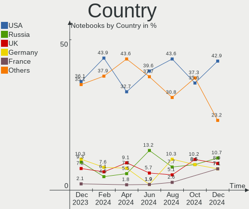
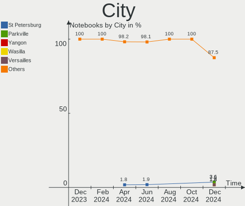
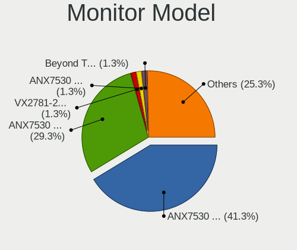
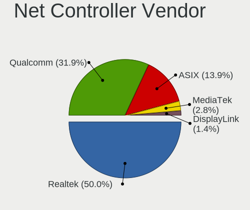

SteamOS - Hardware Trends (Notebooks)
-------------------------------------

A project to identify most popular hardware characteristics and track their change
over time based on data collected by Linux users at https://Linux-Hardware.org.

Anyone can contribute to this report by the [hw-probe](https://github.com/linuxhw/hw-probe) tool:

    sudo -E hw-probe -all -upload

This report is for one last month. Overall report since the beginning of time: [TestCoverage](https://github.com/linuxhw/TestCoverage)

Period: Jun, 2022.

Contents
--------

* [ System ](#system)
  - [ OS                       ](#os)
  - [ OS Family                ](#os-family)
  - [ Kernel                   ](#kernel)
  - [ Kernel Family            ](#kernel-family)
  - [ Kernel Major Ver.        ](#kernel-major-ver)
  - [ Arch                     ](#arch)
  - [ DE                       ](#de)
  - [ Display Server           ](#display-server)
  - [ Display Manager          ](#display-manager)
  - [ OS Lang                  ](#os-lang)
  - [ Boot Mode                ](#boot-mode)
  - [ Filesystem               ](#filesystem)
  - [ Part. scheme             ](#part-scheme)
  - [ Dual Boot with Linux/BSD ](#dual-boot-with-linuxbsd)
  - [ Dual Boot (Win)          ](#dual-boot-win)

* [ Board ](#board)
  - [ Vendor                   ](#vendor)
  - [ Model                    ](#model)
  - [ Model Family             ](#model-family)
  - [ MFG Year                 ](#mfg-year)
  - [ Form Factor              ](#form-factor)
  - [ Secure Boot              ](#secure-boot)
  - [ Coreboot                 ](#coreboot)
  - [ RAM Size                 ](#ram-size)
  - [ RAM Used                 ](#ram-used)
  - [ Total Drives             ](#total-drives)
  - [ Has CD-ROM               ](#has-cd-rom)
  - [ Has Ethernet             ](#has-ethernet)
  - [ Has WiFi                 ](#has-wifi)
  - [ Has Bluetooth            ](#has-bluetooth)

* [ Location ](#location)
  - [ Country                  ](#country)
  - [ City                     ](#city)

* [ Drives ](#drives)
  - [ Drive Vendor             ](#drive-vendor)
  - [ Drive Model              ](#drive-model)
  - [ HDD Vendor               ](#hdd-vendor)
  - [ SSD Vendor               ](#ssd-vendor)
  - [ Drive Kind               ](#drive-kind)
  - [ Drive Connector          ](#drive-connector)
  - [ Drive Size               ](#drive-size)
  - [ Space Total              ](#space-total)
  - [ Space Used               ](#space-used)
  - [ Malfunc. Drives          ](#malfunc-drives)
  - [ Malfunc. Drive Vendor    ](#malfunc-drive-vendor)
  - [ Malfunc. HDD Vendor      ](#malfunc-hdd-vendor)
  - [ Malfunc. Drive Kind      ](#malfunc-drive-kind)
  - [ Failed Drives            ](#failed-drives)
  - [ Failed Drive Vendor      ](#failed-drive-vendor)
  - [ Drive Status             ](#drive-status)

* [ Storage controller ](#storage-controller)
  - [ Storage Vendor           ](#storage-vendor)
  - [ Storage Model            ](#storage-model)
  - [ Storage Kind             ](#storage-kind)

* [ Processor ](#processor)
  - [ CPU Vendor               ](#cpu-vendor)
  - [ CPU Model                ](#cpu-model)
  - [ CPU Model Family         ](#cpu-model-family)
  - [ CPU Cores                ](#cpu-cores)
  - [ CPU Sockets              ](#cpu-sockets)
  - [ CPU Threads              ](#cpu-threads)
  - [ CPU Op-Modes             ](#cpu-op-modes)
  - [ CPU Microcode            ](#cpu-microcode)
  - [ CPU Microarch            ](#cpu-microarch)

* [ Graphics ](#graphics)
  - [ GPU Vendor               ](#gpu-vendor)
  - [ GPU Model                ](#gpu-model)
  - [ GPU Combo                ](#gpu-combo)
  - [ GPU Driver               ](#gpu-driver)
  - [ GPU Memory               ](#gpu-memory)

* [ Monitor ](#monitor)
  - [ Monitor Vendor           ](#monitor-vendor)
  - [ Monitor Model            ](#monitor-model)
  - [ Monitor Resolution       ](#monitor-resolution)
  - [ Monitor Diagonal         ](#monitor-diagonal)
  - [ Monitor Width            ](#monitor-width)
  - [ Aspect Ratio             ](#aspect-ratio)
  - [ Monitor Area             ](#monitor-area)
  - [ Pixel Density            ](#pixel-density)
  - [ Multiple Monitors        ](#multiple-monitors)

* [ Network ](#network)
  - [ Net Controller Vendor    ](#net-controller-vendor)
  - [ Net Controller Model     ](#net-controller-model)
  - [ Wireless Vendor          ](#wireless-vendor)
  - [ Wireless Model           ](#wireless-model)
  - [ Ethernet Vendor          ](#ethernet-vendor)
  - [ Ethernet Model           ](#ethernet-model)
  - [ Net Controller Kind      ](#net-controller-kind)
  - [ Used Controller          ](#used-controller)
  - [ NICs                     ](#nics)
  - [ IPv6                     ](#ipv6)

* [ Bluetooth ](#bluetooth)
  - [ Bluetooth Vendor         ](#bluetooth-vendor)
  - [ Bluetooth Model          ](#bluetooth-model)

* [ Sound ](#sound)
  - [ Sound Vendor             ](#sound-vendor)
  - [ Sound Model              ](#sound-model)

* [ Memory ](#memory)
  - [ Memory Vendor            ](#memory-vendor)
  - [ Memory Model             ](#memory-model)
  - [ Memory Kind              ](#memory-kind)
  - [ Memory Form Factor       ](#memory-form-factor)
  - [ Memory Size              ](#memory-size)
  - [ Memory Speed             ](#memory-speed)

* [ Printers & scanners ](#printers--scanners)
  - [ Printer Vendor           ](#printer-vendor)
  - [ Printer Model            ](#printer-model)
  - [ Scanner Vendor           ](#scanner-vendor)
  - [ Scanner Model            ](#scanner-model)

* [ Camera ](#camera)
  - [ Camera Vendor            ](#camera-vendor)
  - [ Camera Model             ](#camera-model)

* [ Security ](#security)
  - [ Fingerprint Vendor       ](#fingerprint-vendor)
  - [ Fingerprint Model        ](#fingerprint-model)
  - [ Chipcard Vendor          ](#chipcard-vendor)
  - [ Chipcard Model           ](#chipcard-model)

* [ Unsupported ](#unsupported)
  - [ Unsupported Devices      ](#unsupported-devices)
  - [ Unsupported Device Types ](#unsupported-device-types)

System
------

OS
--

Installed operating systems

| Name                         | Notebooks | Percent |
|------------------------------|-----------|---------|
| SteamOS 3.2                  | 21        | 84%     |
| SteamOS 3.2 (steamdeck-main) | 2         | 8%      |
| SteamOS 3.4                  | 1         | 4%      |
| SteamOS 3.1                  | 1         | 4%      |

OS Family
---------

OS without a version

| Name    | Notebooks | Percent |
|---------|-----------|---------|
| SteamOS | 25        | 100%    |

Kernel
------

Version of the Linux kernel

| Version                                            | Notebooks | Percent |
|----------------------------------------------------|-----------|---------|
| 5.13.0-valve15-1-neptune-02197-gf6ec7ad3762a       | 21        | 84%     |
| 5.13.0-valve10.1-2-neptune-dri-02144-g7fffaf925dfb | 2         | 8%      |
| 5.13.0-valve20-1-neptune-02207-gbd986a7e1c7f       | 1         | 4%      |
| 5.13.0-valve10.3-1-neptune-02176-g5fe416c4acd8     | 1         | 4%      |

Kernel Family
-------------

Linux kernel without a distro release

| Version | Notebooks | Percent |
|---------|-----------|---------|
| 5.13.0  | 25        | 100%    |

Kernel Major Ver.
-----------------

Linux kernel major version

| Version | Notebooks | Percent |
|---------|-----------|---------|
| 5.13    | 25        | 100%    |

Arch
----

OS architecture (x86_64, i586, etc.)

| Name   | Notebooks | Percent |
|--------|-----------|---------|
| x86_64 | 25        | 100%    |

DE
--

Desktop Environment

| Name | Notebooks | Percent |
|------|-----------|---------|
| KDE5 | 25        | 100%    |

Display Server
--------------

X11 or Wayland

| Name | Notebooks | Percent |
|------|-----------|---------|
| X11  | 25        | 100%    |

Display Manager
---------------

SDDM, LightDM, etc.

| Name    | Notebooks | Percent |
|---------|-----------|---------|
| Unknown | 25        | 100%    |

OS Lang
-------

Language

| Lang  | Notebooks | Percent |
|-------|-----------|---------|
| en_US | 21        | 84%     |
| fr_FR | 1         | 4%      |
| es_ES | 1         | 4%      |
| en_GB | 1         | 4%      |
| en_DE | 1         | 4%      |

Boot Mode
---------

EFI or BIOS

| Mode | Notebooks | Percent |
|------|-----------|---------|
| BIOS | 25        | 100%    |

Filesystem
----------

Type of filesystem

| Type  | Notebooks | Percent |
|-------|-----------|---------|
| Btrfs | 25        | 100%    |

Part. scheme
------------

Scheme of partitioning

| Type    | Notebooks | Percent |
|---------|-----------|---------|
| Unknown | 25        | 100%    |

Dual Boot with Linux/BSD
------------------------

Hosting more than one Linux/BSD

| Dual boot | Notebooks | Percent |
|-----------|-----------|---------|
| No        | 25        | 100%    |

Dual Boot (Win)
---------------

Hosting Linux and Windows

| Dual boot | Notebooks | Percent |
|-----------|-----------|---------|
| No        | 25        | 100%    |

Board
-----

Vendor
------

Motherboard manufacturer

| Name            | Notebooks | Percent |
|-----------------|-----------|---------|
| Valve           | 23        | 92%     |
| Hewlett-Packard | 1         | 4%      |
| Dell            | 1         | 4%      |

Model
-----

Motherboard model

| Name                                | Notebooks | Percent |
|-------------------------------------|-----------|---------|
| Valve Jupiter                       | 23        | 92%     |
| HP Pavilion Gaming Laptop 15-ec2xxx | 1         | 4%      |
| Dell G15 5510                       | 1         | 4%      |

Model Family
------------

Motherboard model prefix

| Name          | Notebooks | Percent |
|---------------|-----------|---------|
| Valve Jupiter | 23        | 92%     |
| HP Pavilion   | 1         | 4%      |
| Dell G15      | 1         | 4%      |

MFG Year
--------

Motherboard manufacture year

| Year | Notebooks | Percent |
|------|-----------|---------|
| 2022 | 23        | 92%     |
| 2021 | 2         | 8%      |

Form Factor
-----------

Physical design of the computer

| Name     | Notebooks | Percent |
|----------|-----------|---------|
| Notebook | 25        | 100%    |

Secure Boot
-----------

Enabled or disabled

| State    | Notebooks | Percent |
|----------|-----------|---------|
| Disabled | 25        | 100%    |

Coreboot
--------

Have coreboot on board

| Used | Notebooks | Percent |
|------|-----------|---------|
| No   | 25        | 100%    |

RAM Size
--------

Total RAM memory

| Size in GB | Notebooks | Percent |
|------------|-----------|---------|
| 8.01-16.0  | 23        | 92%     |
| 4.01-8.0   | 1         | 4%      |
| 16.01-24.0 | 1         | 4%      |

RAM Used
--------

Used RAM memory

| Used GB  | Notebooks | Percent |
|----------|-----------|---------|
| 2.01-3.0 | 13        | 52%     |
| 4.01-8.0 | 7         | 28%     |
| 3.01-4.0 | 5         | 20%     |

Total Drives
------------

Number of drives on board

| Drives | Notebooks | Percent |
|--------|-----------|---------|
| 1      | 13        | 52%     |
| 2      | 11        | 44%     |
| 4      | 1         | 4%      |

Has CD-ROM
----------

Has CD-ROM on board

| Presented | Notebooks | Percent |
|-----------|-----------|---------|
| No        | 25        | 100%    |

Has Ethernet
------------

Has Ethernet on board

| Presented | Notebooks | Percent |
|-----------|-----------|---------|
| No        | 16        | 64%     |
| Yes       | 9         | 36%     |

Has WiFi
--------

Has WiFi module

| Presented | Notebooks | Percent |
|-----------|-----------|---------|
| Yes       | 25        | 100%    |

Has Bluetooth
-------------

Has Bluetooth module

| Presented | Notebooks | Percent |
|-----------|-----------|---------|
| Yes       | 25        | 100%    |

Location
--------

Country
-------

Geographic location (country)

| Country  | Notebooks | Percent |
|----------|-----------|---------|
| USA      | 15        | 60%     |
| Germany  | 3         | 12%     |
| UK       | 1         | 4%      |
| Spain    | 1         | 4%      |
| Slovakia | 1         | 4%      |
| Greece   | 1         | 4%      |
| France   | 1         | 4%      |
| Czechia  | 1         | 4%      |
| Austria  | 1         | 4%      |

City
----

Geographic location (city)

| City             | Notebooks | Percent |
|------------------|-----------|---------|
| Colorado Springs | 2         | 8%      |
| Washington       | 1         | 4%      |
| Thessaloniki     | 1         | 4%      |
| Temecula         | 1         | 4%      |
| San Diego        | 1         | 4%      |
| Phoenix          | 1         | 4%      |
| Palatine         | 1         | 4%      |
| Odenton          | 1         | 4%      |
| Oakham           | 1         | 4%      |
| Nashville        | 1         | 4%      |
| Maplewood        | 1         | 4%      |
| Knoxville        | 1         | 4%      |
| Klagenfurt       | 1         | 4%      |
| Kansas City      | 1         | 4%      |
| Iserlohn         | 1         | 4%      |
| Goochland        | 1         | 4%      |
| Fort Myers       | 1         | 4%      |
| Eaubonne         | 1         | 4%      |
| Brno             | 1         | 4%      |
| Breitscheid      | 1         | 4%      |
| Bratislava       | 1         | 4%      |
| Bothell          | 1         | 4%      |
| Barakaldo        | 1         | 4%      |
| Aalen            | 1         | 4%      |

Drives
------

Drive Vendor
------------

Hard drive vendors

| Vendor              | Notebooks | Drives | Percent |
|---------------------|-----------|--------|---------|
| Kingston            | 16        | 16     | 42.11%  |
| Unknown             | 7         | 7      | 18.42%  |
| Unknown             | 5         | 5      | 13.16%  |
| O2 Micro            | 3         | 3      | 7.89%   |
| SK hynix            | 1         | 1      | 2.63%   |
| Silicon Motion      | 1         | 1      | 2.63%   |
| SanDisk             | 1         | 1      | 2.63%   |
| Samsung Electronics | 1         | 1      | 2.63%   |
| Phison              | 1         | 1      | 2.63%   |
| External            | 1         | 2      | 2.63%   |
| ADATA Technology    | 1         | 1      | 2.63%   |

Drive Model
-----------

Hard drive models

| Model                               | Notebooks | Percent |
|-------------------------------------|-----------|---------|
| Kingston NVMe SSD Drive 512GB       | 10        | 26.32%  |
| Kingston NVMe SSD Drive 256GB       | 6         | 15.79%  |
| Unknown                             | 5         | 13.16%  |
| Unknown MMC Card  512GB             | 4         | 10.53%  |
| O2 Micro NVMe SSD Drive 64GB        | 3         | 7.89%   |
| Unknown MMC Card  64GB              | 1         | 2.63%   |
| Unknown MMC Card  256GB             | 1         | 2.63%   |
| Unknown MMC Card  128GB             | 1         | 2.63%   |
| SK hynix NVMe SSD Drive 256GB       | 1         | 2.63%   |
| Silicon Motion NVMe SSD Drive 256GB | 1         | 2.63%   |
| SanDisk NVMe SSD Drive 512GB        | 1         | 2.63%   |
| Samsung NVMe SSD Drive 1024GB       | 1         | 2.63%   |
| Phison NVMe SSD Drive 512GB         | 1         | 2.63%   |
| External USB3.0 120GB               | 1         | 2.63%   |
| ADATA NVMe SSD Drive 512GB          | 1         | 2.63%   |

HDD Vendor
----------

Hard disk drive vendors

Zero info for selected period =(

SSD Vendor
----------

Solid state drive vendors

Zero info for selected period =(

Drive Kind
----------

HDD or SSD

| Kind | Notebooks | Drives | Percent |
|------|-----------|--------|---------|
| NVMe | 25        | 27     | 67.57%  |
| MMC  | 12        | 12     | 32.43%  |

Drive Connector
---------------

SATA, SAS, NVMe, etc.

| Type | Notebooks | Drives | Percent |
|------|-----------|--------|---------|
| NVMe | 25        | 25     | 65.79%  |
| MMC  | 12        | 12     | 31.58%  |
| SAS  | 1         | 2      | 2.63%   |

Drive Size
----------

Size of hard drive

Zero info for selected period =(

Space Total
-----------

Amount of disk space available on the file system

| Size in GB | Notebooks | Percent |
|------------|-----------|---------|
| 251-500    | 14        | 56%     |
| 101-250    | 7         | 28%     |
| 51-100     | 2         | 8%      |
| 1001-2000  | 1         | 4%      |
| 501-1000   | 1         | 4%      |

Space Used
----------

Amount of used disk space

| Used GB  | Notebooks | Percent |
|----------|-----------|---------|
| 101-250  | 12        | 48%     |
| 251-500  | 5         | 20%     |
| 21-50    | 3         | 12%     |
| 501-1000 | 2         | 8%      |
| 51-100   | 2         | 8%      |
| 1-20     | 1         | 4%      |

Malfunc. Drives
---------------

Drive models with a malfunction

Zero info for selected period =(

Malfunc. Drive Vendor
---------------------

Vendors of faulty drives

Zero info for selected period =(

Malfunc. HDD Vendor
-------------------

Vendors of faulty HDD drives

Zero info for selected period =(

Malfunc. Drive Kind
-------------------

Kinds of faulty drives

Zero info for selected period =(

Failed Drives
-------------

Failed drive models

Zero info for selected period =(

Failed Drive Vendor
-------------------

Failed drive vendors

Zero info for selected period =(

Drive Status
------------

Number of failed and malfunc. drives

| Status   | Notebooks | Drives | Percent |
|----------|-----------|--------|---------|
| Detected | 25        | 39     | 100%    |

Storage controller
------------------

Storage Vendor
--------------

Storage controller vendors

| Vendor                      | Notebooks | Percent |
|-----------------------------|-----------|---------|
| Kingston Technology Company | 16        | 61.54%  |
| O2 Micro                    | 3         | 11.54%  |
| SK hynix                    | 1         | 3.85%   |
| Silicon Motion              | 1         | 3.85%   |
| SanDisk                     | 1         | 3.85%   |
| Samsung Electronics         | 1         | 3.85%   |
| Phison Electronics          | 1         | 3.85%   |
| AMD                         | 1         | 3.85%   |
| ADATA Technology            | 1         | 3.85%   |

Storage Model
-------------

Storage controller models

| Model                                                   | Notebooks | Percent |
|---------------------------------------------------------|-----------|---------|
| Kingston Company OM3PDP3 NVMe SSD                       | 15        | 57.69%  |
| O2 Micro Non-Volatile memory controller                 | 3         | 11.54%  |
| SK hynix Gold P31 SSD                                   | 1         | 3.85%   |
| Silicon Motion SM2263EN/SM2263XT SSD Controller         | 1         | 3.85%   |
| SanDisk Non-Volatile memory controller                  | 1         | 3.85%   |
| Samsung NVMe SSD Controller 980                         | 1         | 3.85%   |
| Phison PS5013 E13 NVMe Controller                       | 1         | 3.85%   |
| Kingston Company Company Non-Volatile memory controller | 1         | 3.85%   |
| AMD FCH SATA Controller [AHCI mode]                     | 1         | 3.85%   |
| ADATA Non-Volatile memory controller                    | 1         | 3.85%   |

Storage Kind
------------

Kind of storage controller (IDE, SATA, NVMe, SAS, ...)

| Kind | Notebooks | Percent |
|------|-----------|---------|
| NVMe | 25        | 96.15%  |
| SATA | 1         | 3.85%   |

Processor
---------

CPU Vendor
----------

Processor vendors

| Vendor | Notebooks | Percent |
|--------|-----------|---------|
| AMD    | 24        | 96%     |
| Intel  | 1         | 4%      |

CPU Model
---------

Processor models

| Model                                  | Notebooks | Percent |
|----------------------------------------|-----------|---------|
| AMD Custom APU 0405                    | 23        | 92%     |
| Intel Core i7-10870H CPU @ 2.20GHz     | 1         | 4%      |
| AMD Ryzen 5 5600H with Radeon Graphics | 1         | 4%      |

CPU Model Family
----------------

Processor model prefix

| Model         | Notebooks | Percent |
|---------------|-----------|---------|
| Other         | 23        | 92%     |
| Intel Core i7 | 1         | 4%      |
| AMD Ryzen 5   | 1         | 4%      |

CPU Cores
---------

Number of processor cores

| Number | Notebooks | Percent |
|--------|-----------|---------|
| 4      | 23        | 92%     |
| 8      | 1         | 4%      |
| 6      | 1         | 4%      |

CPU Sockets
-----------

Number of sockets

| Number | Notebooks | Percent |
|--------|-----------|---------|
| 1      | 25        | 100%    |

CPU Threads
-----------

Threads per core (Hyper-Threading)

| Number | Notebooks | Percent |
|--------|-----------|---------|
| 2      | 25        | 100%    |

CPU Op-Modes
------------

CPU Operation Modes (32-bit, 64-bit)

| Op mode        | Notebooks | Percent |
|----------------|-----------|---------|
| 32-bit, 64-bit | 25        | 100%    |

CPU Microcode
-------------

Microcode number

| Number  | Notebooks | Percent |
|---------|-----------|---------|
| Unknown | 25        | 100%    |

CPU Microarch
-------------

Microarchitecture

| Name      | Notebooks | Percent |
|-----------|-----------|---------|
| Unknown   | 23        | 92%     |
| Zen 3     | 1         | 4%      |
| CometLake | 1         | 4%      |

Graphics
--------

GPU Vendor
----------

Vendors of graphics cards

| Vendor | Notebooks | Percent |
|--------|-----------|---------|
| AMD    | 24        | 88.89%  |
| Nvidia | 2         | 7.41%   |
| Intel  | 1         | 3.7%    |

GPU Model
---------

Graphics card models

| Model                                           | Notebooks | Percent |
|-------------------------------------------------|-----------|---------|
| AMD VanGogh [AMD Custom GPU 0405]               | 23        | 85.19%  |
| Nvidia TU117M                                   | 1         | 3.7%    |
| Nvidia GA106M [GeForce RTX 3060 Mobile / Max-Q] | 1         | 3.7%    |
| Intel CometLake-H GT2 [UHD Graphics]            | 1         | 3.7%    |
| AMD Cezanne                                     | 1         | 3.7%    |

GPU Combo
---------

Combinations of graphics cards

| Name           | Notebooks | Percent |
|----------------|-----------|---------|
| 1 x AMD        | 23        | 92%     |
| Intel + Nvidia | 1         | 4%      |
| AMD + Nvidia   | 1         | 4%      |

GPU Driver
----------

Free vs proprietary

| Driver      | Notebooks | Percent |
|-------------|-----------|---------|
| Free        | 23        | 92%     |
| Proprietary | 2         | 8%      |

GPU Memory
----------

Total video memory

| Size in GB | Notebooks | Percent |
|------------|-----------|---------|
| Unknown    | 25        | 100%    |

Monitor
-------

Monitor Vendor
--------------

Monitor vendors

| Vendor              | Notebooks | Percent |
|---------------------|-----------|---------|
| ANX                 | 23        | 67.65%  |
| Goldstar            | 2         | 5.88%   |
| ZSC                 | 1         | 2.94%   |
| YTH                 | 1         | 2.94%   |
| TCL                 | 1         | 2.94%   |
| Samsung Electronics | 1         | 2.94%   |
| Microsoft           | 1         | 2.94%   |
| Hewlett-Packard     | 1         | 2.94%   |
| BOE                 | 1         | 2.94%   |
| AU Optronics        | 1         | 2.94%   |
| AOC                 | 1         | 2.94%   |

Monitor Model
-------------

Monitor models

| Model                                                             | Notebooks | Percent |
|-------------------------------------------------------------------|-----------|---------|
| ANX ANX7530 U ANX7539 800x1280                                    | 23        | 67.65%  |
| ZSC FHD HDR ZSCBC32 1920x1080 344x195mm 15.6-inch                 | 1         | 2.94%   |
| YTH HS133PC YTH1330 1920x1080 255x220mm 13.3-inch                 | 1         | 2.94%   |
| TCL SMART TV TCL6586 3840x2160 1209x680mm 54.6-inch               | 1         | 2.94%   |
| Samsung Electronics S27HG5x SAM0E10 2560x1440 598x336mm 27.0-inch | 1         | 2.94%   |
| Microsoft Xbox One MSH0001 1920x1080 1210x680mm 54.6-inch         | 1         | 2.94%   |
| Hewlett-Packard 25x HPN357F 1920x1080 544x303mm 24.5-inch         | 1         | 2.94%   |
| Goldstar LG ULTRAGEAR GSM775B 1920x1080 700x390mm 31.5-inch       | 1         | 2.94%   |
| Goldstar LG TV SSCR2 GSMC0C8 3840x2160                            | 1         | 2.94%   |
| BOE LCD Monitor BOE094D 1920x1080 344x194mm 15.5-inch             | 1         | 2.94%   |
| AU Optronics LCD Monitor AUOED8F 1920x1080 344x193mm 15.5-inch    | 1         | 2.94%   |
| AOC AG352UCG6 AOC3525 3440x1440 819x346mm 35.0-inch               | 1         | 2.94%   |

Monitor Resolution
------------------

Monitor screen resolution

| Resolution      | Notebooks | Percent |
|-----------------|-----------|---------|
| 800x1280        | 23        | 67.65%  |
| 1920x1080 (FHD) | 7         | 20.59%  |
| 3840x2160 (4K)  | 2         | 5.88%   |
| 3440x1440       | 1         | 2.94%   |
| 2560x1440 (QHD) | 1         | 2.94%   |

Monitor Diagonal
----------------

Diagonal size in inches

| Inches  | Notebooks | Percent |
|---------|-----------|---------|
| Unknown | 23        | 69.7%   |
| 15      | 3         | 9.09%   |
| 72      | 1         | 3.03%   |
| 54      | 1         | 3.03%   |
| 35      | 1         | 3.03%   |
| 31      | 1         | 3.03%   |
| 27      | 1         | 3.03%   |
| 24      | 1         | 3.03%   |
| 13      | 1         | 3.03%   |

Monitor Width
-------------

Physical width

| Width in mm | Notebooks | Percent |
|-------------|-----------|---------|
| Unknown     | 23        | 69.7%   |
| 301-350     | 3         | 9.09%   |
| 501-600     | 2         | 6.06%   |
| 801-900     | 1         | 3.03%   |
| 601-700     | 1         | 3.03%   |
| 201-300     | 1         | 3.03%   |
| 1501-2000   | 1         | 3.03%   |
| 1001-1500   | 1         | 3.03%   |

Aspect Ratio
------------

Proportional relationship between the width and the height

| Ratio | Notebooks | Percent |
|-------|-----------|---------|
| 0.62  | 23        | 71.88%  |
| 16/9  | 8         | 25%     |
| 21/9  | 1         | 3.13%   |

Monitor Area
------------

Area in inch²

| Area in inch² | Notebooks | Percent |
|----------------|-----------|---------|
| Unknown        | 23        | 69.7%   |
| 101-110        | 3         | 9.09%   |
| More than 1000 | 2         | 6.06%   |
| 351-500        | 2         | 6.06%   |
| 71-80          | 1         | 3.03%   |
| 301-350        | 1         | 3.03%   |
| 251-300        | 1         | 3.03%   |

Pixel Density
-------------

Pixels per inch

| Density | Notebooks | Percent |
|---------|-----------|---------|
| Unknown | 23        | 67.65%  |
| 51-100  | 4         | 11.76%  |
| 121-160 | 3         | 8.82%   |
| 101-120 | 2         | 5.88%   |
| 1-50    | 1         | 2.94%   |
| 161-240 | 1         | 2.94%   |

Multiple Monitors
-----------------

Total monitors connected

| Total | Notebooks | Percent |
|-------|-----------|---------|
| 1     | 17        | 68%     |
| 2     | 7         | 28%     |
| 3     | 1         | 4%      |

Network
-------

Net Controller Vendor
---------------------

Controller vendors

| Vendor                | Notebooks | Percent |
|-----------------------|-----------|---------|
| Realtek Semiconductor | 25        | 83.33%  |
| ASIX Electronics      | 4         | 13.33%  |
| Intel                 | 1         | 3.33%   |

Net Controller Model
--------------------

Controller models

| Model                                                             | Notebooks | Percent |
|-------------------------------------------------------------------|-----------|---------|
| Realtek RTL8822CE 802.11ac PCIe Wireless Network Adapter          | 23        | 65.71%  |
| Realtek RTL8153 Gigabit Ethernet Adapter                          | 4         | 11.43%  |
| ASIX AX88179 Gigabit Ethernet                                     | 4         | 11.43%  |
| Realtek RTL8852AE 802.11ax PCIe Wireless Network Adapter          | 1         | 2.86%   |
| Realtek RTL8111/8168/8411 PCI Express Gigabit Ethernet Controller | 1         | 2.86%   |
| Realtek Killer E2600 Gigabit Ethernet Controller                  | 1         | 2.86%   |
| Intel Comet Lake PCH CNVi WiFi                                    | 1         | 2.86%   |

Wireless Vendor
---------------

Wireless vendors

| Vendor                | Notebooks | Percent |
|-----------------------|-----------|---------|
| Realtek Semiconductor | 24        | 96%     |
| Intel                 | 1         | 4%      |

Wireless Model
--------------

Wireless models

| Model                                                    | Notebooks | Percent |
|----------------------------------------------------------|-----------|---------|
| Realtek RTL8822CE 802.11ac PCIe Wireless Network Adapter | 23        | 92%     |
| Realtek RTL8852AE 802.11ax PCIe Wireless Network Adapter | 1         | 4%      |
| Intel Comet Lake PCH CNVi WiFi                           | 1         | 4%      |

Ethernet Vendor
---------------

Ethernet vendors

| Vendor                | Notebooks | Percent |
|-----------------------|-----------|---------|
| Realtek Semiconductor | 5         | 55.56%  |
| ASIX Electronics      | 4         | 44.44%  |

Ethernet Model
--------------

Ethernet models

| Model                                                             | Notebooks | Percent |
|-------------------------------------------------------------------|-----------|---------|
| Realtek RTL8153 Gigabit Ethernet Adapter                          | 4         | 40%     |
| ASIX AX88179 Gigabit Ethernet                                     | 4         | 40%     |
| Realtek RTL8111/8168/8411 PCI Express Gigabit Ethernet Controller | 1         | 10%     |
| Realtek Killer E2600 Gigabit Ethernet Controller                  | 1         | 10%     |

Net Controller Kind
-------------------

Ethernet, WiFi or modem

| Kind     | Notebooks | Percent |
|----------|-----------|---------|
| WiFi     | 25        | 73.53%  |
| Ethernet | 9         | 26.47%  |

Used Controller
---------------

Currently used network controller

| Kind     | Notebooks | Percent |
|----------|-----------|---------|
| WiFi     | 22        | 81.48%  |
| Ethernet | 5         | 18.52%  |

NICs
----

Total network controllers on board

| Total | Notebooks | Percent |
|-------|-----------|---------|
| 1     | 23        | 92%     |
| 2     | 2         | 8%      |

IPv6
----

IPv6 vs IPv4

| Used | Notebooks | Percent |
|------|-----------|---------|
| No   | 17        | 68%     |
| Yes  | 8         | 32%     |

Bluetooth
---------

Bluetooth Vendor
----------------

Controller vendors

| Vendor                | Notebooks | Percent |
|-----------------------|-----------|---------|
| IMC Networks          | 23        | 92%     |
| Realtek Semiconductor | 1         | 4%      |
| Intel                 | 1         | 4%      |

Bluetooth Model
---------------

Controller models

| Model                        | Notebooks | Percent |
|------------------------------|-----------|---------|
| IMC Networks Bluetooth Radio | 23        | 92%     |
| Realtek Bluetooth Radio      | 1         | 4%      |
| Intel Bluetooth Device       | 1         | 4%      |

Sound
-----

Sound Vendor
------------

Sound card vendors

| Vendor | Notebooks | Percent |
|--------|-----------|---------|
| AMD    | 24        | 88.89%  |
| Nvidia | 2         | 7.41%   |
| Intel  | 1         | 3.7%    |

Sound Model
-----------

Sound card models

| Model                                                          | Notebooks | Percent |
|----------------------------------------------------------------|-----------|---------|
| AMD Rembrandt Radeon High Definition Audio Controller          | 23        | 85.19%  |
| Nvidia TU107 GeForce GTX 1650 High Definition Audio Controller | 1         | 3.7%    |
| Nvidia Audio device                                            | 1         | 3.7%    |
| Intel Comet Lake PCH cAVS                                      | 1         | 3.7%    |
| AMD Family 17h/19h HD Audio Controller                         | 1         | 3.7%    |

Memory
------

Memory Vendor
-------------

Memory module vendors

Zero info for selected period =(

Memory Model
------------

Memory module models

Zero info for selected period =(

Memory Kind
-----------

Memory module kinds

Zero info for selected period =(

Memory Form Factor
------------------

Physical design of the memory module

Zero info for selected period =(

Memory Size
-----------

Memory module size

Zero info for selected period =(

Memory Speed
------------

Memory module speed

Zero info for selected period =(

Printers & scanners
-------------------

Printer Vendor
--------------

Printer device vendors

Zero info for selected period =(

Printer Model
-------------

Printer device models

Zero info for selected period =(

Scanner Vendor
--------------

Scanner device vendors

Zero info for selected period =(

Scanner Model
-------------

Scanner device models

Zero info for selected period =(

Camera
------

Camera Vendor
-------------

Camera device vendors

| Vendor                      | Notebooks | Percent |
|-----------------------------|-----------|---------|
| Realtek Semiconductor       | 2         | 66.67%  |
| Luxvisions Innotech Limited | 1         | 33.33%  |

Camera Model
------------

Camera device models

| Model                                               | Notebooks | Percent |
|-----------------------------------------------------|-----------|---------|
| Realtek WEB CAMERA M9 Pro                           | 1         | 33.33%  |
| Realtek Integrated_Webcam_HD                        | 1         | 33.33%  |
| Luxvisions Innotech Limited HP TrueVision HD Camera | 1         | 33.33%  |

Security
--------

Fingerprint Vendor
------------------

Fingerprint sensor vendors

Zero info for selected period =(

Fingerprint Model
-----------------

Fingerprint sensor models

Zero info for selected period =(

Chipcard Vendor
---------------

Chipcard module vendors

Zero info for selected period =(

Chipcard Model
--------------

Chipcard module models

Zero info for selected period =(

Unsupported
-----------

Unsupported Devices
-------------------

Total unsupported devices on board

| Total | Notebooks | Percent |
|-------|-----------|---------|
| 0     | 24        | 96%     |
| 2     | 1         | 4%      |

Unsupported Device Types
------------------------

Types of unsupported devices

| Type                  | Notebooks | Percent |
|-----------------------|-----------|---------|
| Net/wireless          | 1         | 50%     |
| Multimedia controller | 1         | 50%     |

