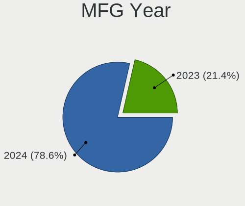
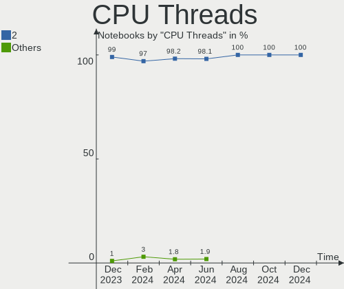
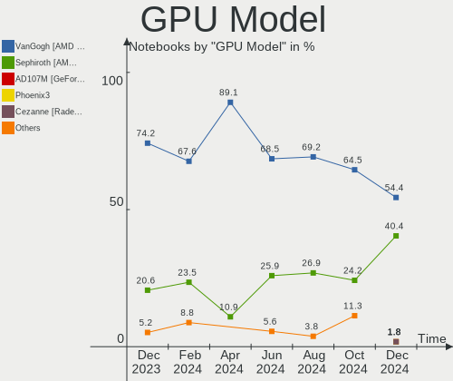
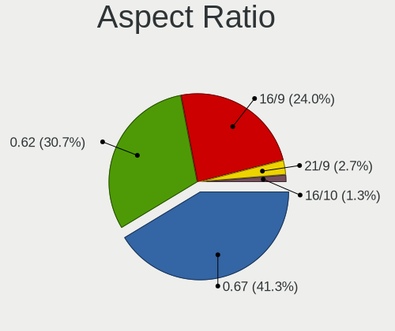
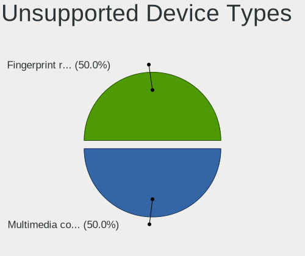

SteamOS - Hardware Trends (Notebooks)
-------------------------------------

A project to identify most popular hardware characteristics and track their change
over time based on data collected by Linux users at https://Linux-Hardware.org.

Anyone can contribute to this report by the [hw-probe](https://github.com/linuxhw/hw-probe) tool:

    sudo -E hw-probe -all -upload

This report is for one last month. Overall report since the beginning of time: [TestDays](https://github.com/linuxhw/TestDays)

Period: Apr, 2023.

Contents
--------

* [ System ](#system)
  - [ OS                       ](#os)
  - [ OS Family                ](#os-family)
  - [ Kernel                   ](#kernel)
  - [ Kernel Family            ](#kernel-family)
  - [ Kernel Major Ver.        ](#kernel-major-ver)
  - [ Arch                     ](#arch)
  - [ DE                       ](#de)
  - [ Display Server           ](#display-server)
  - [ Display Manager          ](#display-manager)
  - [ OS Lang                  ](#os-lang)
  - [ Boot Mode                ](#boot-mode)
  - [ Filesystem               ](#filesystem)
  - [ Part. scheme             ](#part-scheme)
  - [ Dual Boot with Linux/BSD ](#dual-boot-with-linuxbsd)
  - [ Dual Boot (Win)          ](#dual-boot-win)

* [ Board ](#board)
  - [ Vendor                   ](#vendor)
  - [ Model                    ](#model)
  - [ Model Family             ](#model-family)
  - [ MFG Year                 ](#mfg-year)
  - [ Form Factor              ](#form-factor)
  - [ Secure Boot              ](#secure-boot)
  - [ Coreboot                 ](#coreboot)
  - [ RAM Size                 ](#ram-size)
  - [ RAM Used                 ](#ram-used)
  - [ Total Drives             ](#total-drives)
  - [ Has CD-ROM               ](#has-cd-rom)
  - [ Has Ethernet             ](#has-ethernet)
  - [ Has WiFi                 ](#has-wifi)
  - [ Has Bluetooth            ](#has-bluetooth)

* [ Location ](#location)
  - [ Country                  ](#country)
  - [ City                     ](#city)

* [ Drives ](#drives)
  - [ Drive Vendor             ](#drive-vendor)
  - [ Drive Model              ](#drive-model)
  - [ HDD Vendor               ](#hdd-vendor)
  - [ SSD Vendor               ](#ssd-vendor)
  - [ Drive Kind               ](#drive-kind)
  - [ Drive Connector          ](#drive-connector)
  - [ Drive Size               ](#drive-size)
  - [ Space Total              ](#space-total)
  - [ Space Used               ](#space-used)
  - [ Malfunc. Drives          ](#malfunc-drives)
  - [ Malfunc. Drive Vendor    ](#malfunc-drive-vendor)
  - [ Malfunc. HDD Vendor      ](#malfunc-hdd-vendor)
  - [ Malfunc. Drive Kind      ](#malfunc-drive-kind)
  - [ Failed Drives            ](#failed-drives)
  - [ Failed Drive Vendor      ](#failed-drive-vendor)
  - [ Drive Status             ](#drive-status)

* [ Storage controller ](#storage-controller)
  - [ Storage Vendor           ](#storage-vendor)
  - [ Storage Model            ](#storage-model)
  - [ Storage Kind             ](#storage-kind)

* [ Processor ](#processor)
  - [ CPU Vendor               ](#cpu-vendor)
  - [ CPU Model                ](#cpu-model)
  - [ CPU Model Family         ](#cpu-model-family)
  - [ CPU Cores                ](#cpu-cores)
  - [ CPU Sockets              ](#cpu-sockets)
  - [ CPU Threads              ](#cpu-threads)
  - [ CPU Op-Modes             ](#cpu-op-modes)
  - [ CPU Microcode            ](#cpu-microcode)
  - [ CPU Microarch            ](#cpu-microarch)

* [ Graphics ](#graphics)
  - [ GPU Vendor               ](#gpu-vendor)
  - [ GPU Model                ](#gpu-model)
  - [ GPU Combo                ](#gpu-combo)
  - [ GPU Driver               ](#gpu-driver)
  - [ GPU Memory               ](#gpu-memory)

* [ Monitor ](#monitor)
  - [ Monitor Vendor           ](#monitor-vendor)
  - [ Monitor Model            ](#monitor-model)
  - [ Monitor Resolution       ](#monitor-resolution)
  - [ Monitor Diagonal         ](#monitor-diagonal)
  - [ Monitor Width            ](#monitor-width)
  - [ Aspect Ratio             ](#aspect-ratio)
  - [ Monitor Area             ](#monitor-area)
  - [ Pixel Density            ](#pixel-density)
  - [ Multiple Monitors        ](#multiple-monitors)

* [ Network ](#network)
  - [ Net Controller Vendor    ](#net-controller-vendor)
  - [ Net Controller Model     ](#net-controller-model)
  - [ Wireless Vendor          ](#wireless-vendor)
  - [ Wireless Model           ](#wireless-model)
  - [ Ethernet Vendor          ](#ethernet-vendor)
  - [ Ethernet Model           ](#ethernet-model)
  - [ Net Controller Kind      ](#net-controller-kind)
  - [ Used Controller          ](#used-controller)
  - [ NICs                     ](#nics)
  - [ IPv6                     ](#ipv6)

* [ Bluetooth ](#bluetooth)
  - [ Bluetooth Vendor         ](#bluetooth-vendor)
  - [ Bluetooth Model          ](#bluetooth-model)

* [ Sound ](#sound)
  - [ Sound Vendor             ](#sound-vendor)
  - [ Sound Model              ](#sound-model)

* [ Memory ](#memory)
  - [ Memory Vendor            ](#memory-vendor)
  - [ Memory Model             ](#memory-model)
  - [ Memory Kind              ](#memory-kind)
  - [ Memory Form Factor       ](#memory-form-factor)
  - [ Memory Size              ](#memory-size)
  - [ Memory Speed             ](#memory-speed)

* [ Printers & scanners ](#printers--scanners)
  - [ Printer Vendor           ](#printer-vendor)
  - [ Printer Model            ](#printer-model)
  - [ Scanner Vendor           ](#scanner-vendor)
  - [ Scanner Model            ](#scanner-model)

* [ Camera ](#camera)
  - [ Camera Vendor            ](#camera-vendor)
  - [ Camera Model             ](#camera-model)

* [ Security ](#security)
  - [ Fingerprint Vendor       ](#fingerprint-vendor)
  - [ Fingerprint Model        ](#fingerprint-model)
  - [ Chipcard Vendor          ](#chipcard-vendor)
  - [ Chipcard Model           ](#chipcard-model)

* [ Unsupported ](#unsupported)
  - [ Unsupported Devices      ](#unsupported-devices)
  - [ Unsupported Device Types ](#unsupported-device-types)

System
------

OS
--

Installed operating systems

| Name          | Notebooks | Percent |
|---------------|-----------|---------|
| SteamOS 3.4.6 | 57        | 91.94%  |
| SteamOS 3.5   | 2         | 3.23%   |
| SteamOS 3.4   | 2         | 3.23%   |
| SteamOS       | 1         | 1.61%   |

OS Family
---------

OS without a version

| Name    | Notebooks | Percent |
|---------|-----------|---------|
| SteamOS | 62        | 100%    |

Kernel
------

Version of the Linux kernel

| Version                                | Notebooks | Percent |
|----------------------------------------|-----------|---------|
| 5.13.0-valve36-1-neptune               | 57        | 91.94%  |
| 6.1.21-valve1-2-neptune-61             | 1         | 1.61%   |
| 6.1.21-valve1-1-neptune-61             | 1         | 1.61%   |
| 5.18.1-arch1_testHoloISO_20220606.1811 | 1         | 1.61%   |
| 5.15.93-1-lts                          | 1         | 1.61%   |
| 5.13.0-valve37-1-neptune               | 1         | 1.61%   |

Kernel Family
-------------

Linux kernel without a distro release

| Version | Notebooks | Percent |
|---------|-----------|---------|
| 5.13.0  | 58        | 93.55%  |
| 6.1.21  | 2         | 3.23%   |
| 5.18.1  | 1         | 1.61%   |
| 5.15.93 | 1         | 1.61%   |

Kernel Major Ver.
-----------------

Linux kernel major version

| Version | Notebooks | Percent |
|---------|-----------|---------|
| 5.13    | 58        | 93.55%  |
| 6.1     | 2         | 3.23%   |
| 5.18    | 1         | 1.61%   |
| 5.15    | 1         | 1.61%   |

Arch
----

OS architecture (x86_64, i586, etc.)

| Name   | Notebooks | Percent |
|--------|-----------|---------|
| x86_64 | 62        | 100%    |

DE
--

Desktop Environment

| Name      | Notebooks | Percent |
|-----------|-----------|---------|
| KDE5      | 59        | 95.16%  |
| Unknown   | 2         | 3.23%   |
| gamescope | 1         | 1.61%   |

Display Server
--------------

X11 or Wayland

| Name | Notebooks | Percent |
|------|-----------|---------|
| X11  | 62        | 100%    |

Display Manager
---------------

SDDM, LightDM, etc.

| Name    | Notebooks | Percent |
|---------|-----------|---------|
| Unknown | 62        | 100%    |

OS Lang
-------

Language

| Lang  | Notebooks | Percent |
|-------|-----------|---------|
| en_US | 56        | 90.32%  |
| de_DE | 2         | 3.23%   |
| pl_PL | 1         | 1.61%   |
| es_ES | 1         | 1.61%   |
| ba_RU | 1         | 1.61%   |
| an_ES | 1         | 1.61%   |

Boot Mode
---------

EFI or BIOS

| Mode | Notebooks | Percent |
|------|-----------|---------|
| BIOS | 60        | 96.77%  |
| EFI  | 2         | 3.23%   |

Filesystem
----------

Type of filesystem

| Type  | Notebooks | Percent |
|-------|-----------|---------|
| Btrfs | 62        | 100%    |

Part. scheme
------------

Scheme of partitioning

| Type    | Notebooks | Percent |
|---------|-----------|---------|
| Unknown | 60        | 96.77%  |
| GPT     | 2         | 3.23%   |

Dual Boot with Linux/BSD
------------------------

Hosting more than one Linux/BSD

| Dual boot | Notebooks | Percent |
|-----------|-----------|---------|
| No        | 60        | 96.77%  |
| Yes       | 2         | 3.23%   |

Dual Boot (Win)
---------------

Hosting Linux and Windows

| Dual boot | Notebooks | Percent |
|-----------|-----------|---------|
| No        | 62        | 100%    |

Board
-----

Vendor
------

Motherboard manufacturer

| Name             | Notebooks | Percent |
|------------------|-----------|---------|
| Valve            | 59        | 95.16%  |
| Lenovo           | 1         | 1.61%   |
| Dell             | 1         | 1.61%   |
| ASUSTek Computer | 1         | 1.61%   |

Model
-----

Motherboard model

| Name                          | Notebooks | Percent |
|-------------------------------|-----------|---------|
| Valve Jupiter                 | 59        | 95.16%  |
| Lenovo Legion 5 17IMH05H 81Y8 | 1         | 1.61%   |
| Dell Venue 11 Pro 7130 vPro   | 1         | 1.61%   |
| ASUS ZenBook UX435EG_UX435EG  | 1         | 1.61%   |

Model Family
------------

Motherboard model prefix

| Name          | Notebooks | Percent |
|---------------|-----------|---------|
| Valve Jupiter | 59        | 95.16%  |
| Lenovo Legion | 1         | 1.61%   |
| Dell Venue    | 1         | 1.61%   |
| ASUS ZenBook  | 1         | 1.61%   |

MFG Year
--------

Motherboard manufacture year

| Year | Notebooks | Percent |
|------|-----------|---------|
| 2022 | 55        | 88.71%  |
| 2023 | 4         | 6.45%   |
| 2021 | 1         | 1.61%   |
| 2020 | 1         | 1.61%   |
| 2015 | 1         | 1.61%   |

Form Factor
-----------

Physical design of the computer

| Name     | Notebooks | Percent |
|----------|-----------|---------|
| Notebook | 62        | 100%    |

Secure Boot
-----------

Enabled or disabled

| State    | Notebooks | Percent |
|----------|-----------|---------|
| Disabled | 62        | 100%    |

Coreboot
--------

Have coreboot on board

| Used | Notebooks | Percent |
|------|-----------|---------|
| No   | 62        | 100%    |

RAM Size
--------

Total RAM memory

| Size in GB | Notebooks | Percent |
|------------|-----------|---------|
| 8.01-16.0  | 59        | 95.16%  |
| 16.01-24.0 | 2         | 3.23%   |
| 3.01-4.0   | 1         | 1.61%   |

RAM Used
--------

Used RAM memory

| Used GB   | Notebooks | Percent |
|-----------|-----------|---------|
| 2.01-3.0  | 26        | 41.94%  |
| 3.01-4.0  | 20        | 32.26%  |
| 4.01-8.0  | 12        | 19.35%  |
| 1.01-2.0  | 2         | 3.23%   |
| 8.01-16.0 | 2         | 3.23%   |

Total Drives
------------

Number of drives on board

| Drives | Notebooks | Percent |
|--------|-----------|---------|
| 2      | 38        | 61.29%  |
| 1      | 24        | 38.71%  |

Has CD-ROM
----------

Has CD-ROM on board

| Presented | Notebooks | Percent |
|-----------|-----------|---------|
| No        | 61        | 98.39%  |
| Yes       | 1         | 1.61%   |

Has Ethernet
------------

Has Ethernet on board

| Presented | Notebooks | Percent |
|-----------|-----------|---------|
| No        | 42        | 67.74%  |
| Yes       | 20        | 32.26%  |

Has WiFi
--------

Has WiFi module

| Presented | Notebooks | Percent |
|-----------|-----------|---------|
| Yes       | 62        | 100%    |

Has Bluetooth
-------------

Has Bluetooth module

| Presented | Notebooks | Percent |
|-----------|-----------|---------|
| Yes       | 62        | 100%    |

Location
--------

Country
-------

Geographic location (country)

| Country      | Notebooks | Percent |
|--------------|-----------|---------|
| USA          | 22        | 35.48%  |
| Germany      | 6         | 9.68%   |
| France       | 4         | 6.45%   |
| Spain        | 3         | 4.84%   |
| Austria      | 3         | 4.84%   |
| UK           | 2         | 3.23%   |
| Taiwan       | 2         | 3.23%   |
| Russia       | 2         | 3.23%   |
| Poland       | 2         | 3.23%   |
| India        | 2         | 3.23%   |
| UAE          | 1         | 1.61%   |
| Turkey       | 1         | 1.61%   |
| Switzerland  | 1         | 1.61%   |
| Saudi Arabia | 1         | 1.61%   |
| Philippines  | 1         | 1.61%   |
| Netherlands  | 1         | 1.61%   |
| Mexico       | 1         | 1.61%   |
| Israel       | 1         | 1.61%   |
| Indonesia    | 1         | 1.61%   |
| Czechia      | 1         | 1.61%   |
| Canada       | 1         | 1.61%   |
| Bulgaria     | 1         | 1.61%   |
| Brazil       | 1         | 1.61%   |
| Australia    | 1         | 1.61%   |

City
----

Geographic location (city)

| City                   | Notebooks | Percent |
|------------------------|-----------|---------|
| Taipei                 | 2         | 3.23%   |
| Moscow                 | 2         | 3.23%   |
| Zaragoza               | 1         | 1.61%   |
| Wausau                 | 1         | 1.61%   |
| Warsaw                 | 1         | 1.61%   |
| Virginia Beach         | 1         | 1.61%   |
| Vienna                 | 1         | 1.61%   |
| Valencia               | 1         | 1.61%   |
| Urvillers              | 1         | 1.61%   |
| Sydney                 | 1         | 1.61%   |
| Star City              | 1         | 1.61%   |
| Somerset               | 1         | 1.61%   |
| Saint Albans           | 1         | 1.61%   |
| Rousse                 | 1         | 1.61%   |
| Rosedale               | 1         | 1.61%   |
| Rancho Santa Margarita | 1         | 1.61%   |
| Quezon City            | 1         | 1.61%   |
| Quedlinburg            | 1         | 1.61%   |
| Puebla City            | 1         | 1.61%   |
| Prague                 | 1         | 1.61%   |
| Oignies                | 1         | 1.61%   |
| Nova Iguaçu           | 1         | 1.61%   |
| Noida                  | 1         | 1.61%   |
| Netanya                | 1         | 1.61%   |
| Minneapolis            | 1         | 1.61%   |
| Medina                 | 1         | 1.61%   |
| Marseille              | 1         | 1.61%   |
| Makassar               | 1         | 1.61%   |
| Madrid                 | 1         | 1.61%   |
| Lynnwood               | 1         | 1.61%   |
| Lübeck                | 1         | 1.61%   |
| Loganville             | 1         | 1.61%   |
| Livingston             | 1         | 1.61%   |
| Liberty Lake           | 1         | 1.61%   |
| Lausen                 | 1         | 1.61%   |
| Lakeland               | 1         | 1.61%   |
| Klagenfurt             | 1         | 1.61%   |
| Kissimmee              | 1         | 1.61%   |
| Istres                 | 1         | 1.61%   |
| Hanover                | 1         | 1.61%   |

Drives
------

Drive Vendor
------------

Hard drive vendors

| Vendor                      | Notebooks | Drives | Percent |
|-----------------------------|-----------|--------|---------|
| Unknown                     | 28        | 28     | 28%     |
| Samsung Electronics         | 15        | 15     | 15%     |
| Phison Electronics          | 12        | 12     | 12%     |
| Kingston Technology Company | 12        | 12     | 12%     |
| O2 Micro                    | 9         | 9      | 9%      |
| Unknown                     | 9         | 9      | 9%      |
| Sandisk                     | 5         | 5      | 5%      |
| Silicon Motion              | 4         | 4      | 4%      |
| KIOXIA                      | 3         | 3      | 3%      |
| SK hynix                    | 1         | 1      | 1%      |
| Kingchuxing                 | 1         | 2      | 1%      |
| Intel                       | 1         | 1      | 1%      |

Drive Model
-----------

Hard drive models

| Model                                                  | Notebooks | Percent |
|--------------------------------------------------------|-----------|---------|
| Unknown MMC Card  512GB                                | 16        | 15.84%  |
| Phison PS5013 E13 NVMe Controller 500GB                | 11        | 10.89%  |
| Kingston Company OM3PDP3 NVMe SSD 512GB                | 11        | 10.89%  |
| O2 Micro E2M2 64GB                                     | 9         | 8.91%   |
| Unknown                                                | 9         | 8.91%   |
| Samsung MZ9LQ256HBJD-00BVL 256GB                       | 8         | 7.92%   |
| Unknown MMC Card  256GB                                | 5         | 4.95%   |
| Silicon Motion SM2263EN/SM2263XT SSD Controller 1024GB | 4         | 3.96%   |
| Samsung MZ9LQ512HBLU-00BVL 512GB                       | 4         | 3.96%   |
| Unknown MMC Card  128GB                                | 3         | 2.97%   |
| Sandisk WD PC SN740 SDDPTQD-1T00 1024GB                | 3         | 2.97%   |
| Unknown MMC Card  393GB                                | 2         | 1.98%   |
| Unknown MMC Card  64GB                                 | 1         | 0.99%   |
| Unknown MMC Card  498GB                                | 1         | 0.99%   |
| SK hynix BC711 NVMe 512GB                              | 1         | 0.99%   |
| Sandisk WDC PC SN530 SDBPTPZ-1T00 1TB                  | 1         | 0.99%   |
| Sandisk WD Black SN750 / PC SN730 NVMe SSD 512GB       | 1         | 0.99%   |
| Samsung SSD 870 EVO 4TB                                | 1         | 0.99%   |
| Samsung PM991a NVMe 512GB                              | 1         | 0.99%   |
| Samsung MZ9LQ1T0HBLB-00B00 1024GB                      | 1         | 0.99%   |
| Phison Sabrent SB-2130-1TB                             | 1         | 0.99%   |
| KIOXIA KBG50ZNS512G 512GB                              | 1         | 0.99%   |
| KIOXIA KBG50ZNS1T02 NVMe 1024GB                        | 1         | 0.99%   |
| KIOXIA KBG50ZNS1T02 1024GB                             | 1         | 0.99%   |
| Kingston Company SNV2S2000G 2TB                        | 1         | 0.99%   |
| Kingchuxing SSD 256GB                                  | 1         | 0.99%   |
| Kingchuxing 256GB                                      | 1         | 0.99%   |
| Intel SSD 660P Series 512GB                            | 1         | 0.99%   |

HDD Vendor
----------

Hard disk drive vendors

Zero info for selected period =(

SSD Vendor
----------

Solid state drive vendors

| Vendor              | Notebooks | Drives | Percent |
|---------------------|-----------|--------|---------|
| Samsung Electronics | 1         | 1      | 50%     |
| Kingchuxing         | 1         | 1      | 50%     |

Drive Kind
----------

HDD or SSD

| Kind    | Notebooks | Drives | Percent |
|---------|-----------|--------|---------|
| NVMe    | 61        | 61     | 60.4%   |
| MMC     | 37        | 37     | 36.63%  |
| SSD     | 2         | 2      | 1.98%   |
| Unknown | 1         | 1      | 0.99%   |

Drive Connector
---------------

SATA, SAS, NVMe, etc.

| Type | Notebooks | Drives | Percent |
|------|-----------|--------|---------|
| NVMe | 61        | 61     | 61%     |
| MMC  | 37        | 37     | 37%     |
| SATA | 2         | 3      | 2%      |

Drive Size
----------

Size of hard drive

| Size in TB | Notebooks | Drives | Percent |
|------------|-----------|--------|---------|
| 3.01-4.0   | 1         | 1      | 50%     |
| 0.01-0.5   | 1         | 1      | 50%     |

Space Total
-----------

Amount of disk space available on the file system

| Size in GB     | Notebooks | Percent |
|----------------|-----------|---------|
| 101-250        | 21        | 33.87%  |
| 251-500        | 19        | 30.65%  |
| 501-1000       | 10        | 16.13%  |
| 51-100         | 8         | 12.9%   |
| More than 3000 | 2         | 3.23%   |
| 1001-2000      | 2         | 3.23%   |

Space Used
----------

Amount of used disk space

| Used GB   | Notebooks | Percent |
|-----------|-----------|---------|
| 251-500   | 18        | 29.03%  |
| 101-250   | 17        | 27.42%  |
| 51-100    | 9         | 14.52%  |
| 21-50     | 8         | 12.9%   |
| 501-1000  | 6         | 9.68%   |
| 1-20      | 2         | 3.23%   |
| 2001-3000 | 1         | 1.61%   |
| 1001-2000 | 1         | 1.61%   |

Malfunc. Drives
---------------

Drive models with a malfunction

Zero info for selected period =(

Malfunc. Drive Vendor
---------------------

Vendors of faulty drives

Zero info for selected period =(

Malfunc. HDD Vendor
-------------------

Vendors of faulty HDD drives

Zero info for selected period =(

Malfunc. Drive Kind
-------------------

Kinds of faulty drives

Zero info for selected period =(

Failed Drives
-------------

Failed drive models

Zero info for selected period =(

Failed Drive Vendor
-------------------

Failed drive vendors

Zero info for selected period =(

Drive Status
------------

Number of failed and malfunc. drives

| Status   | Notebooks | Drives | Percent |
|----------|-----------|--------|---------|
| Detected | 62        | 98     | 95.38%  |
| Works    | 3         | 3      | 4.62%   |

Storage controller
------------------

Storage Vendor
--------------

Storage controller vendors

| Vendor                      | Notebooks | Percent |
|-----------------------------|-----------|---------|
| Samsung Electronics         | 14        | 22.22%  |
| Phison Electronics          | 12        | 19.05%  |
| Kingston Technology Company | 12        | 19.05%  |
| O2 Micro                    | 9         | 14.29%  |
| SanDisk                     | 5         | 7.94%   |
| Silicon Motion              | 4         | 6.35%   |
| KIOXIA                      | 3         | 4.76%   |
| Intel                       | 3         | 4.76%   |
| SK hynix                    | 1         | 1.59%   |

Storage Model
-------------

Storage controller models

| Model                                                   | Notebooks | Percent |
|---------------------------------------------------------|-----------|---------|
| Samsung NVMe SSD Controller 980                         | 14        | 21.88%  |
| Phison PS5013 E13 NVMe Controller                       | 11        | 17.19%  |
| Kingston Company OM3PDP3 NVMe SSD                       | 11        | 17.19%  |
| O2 Micro Non-Volatile memory controller                 | 9         | 14.06%  |
| Silicon Motion SM2263EN/SM2263XT SSD Controller         | 4         | 6.25%   |
| Sandisk Non-Volatile memory controller                  | 4         | 6.25%   |
| KIOXIA Non-Volatile memory controller                   | 3         | 4.69%   |
| SK hynix Gold P31/PC711 NVMe Solid State Drive          | 1         | 1.56%   |
| SanDisk WD Black SN750 / PC SN730 NVMe SSD              | 1         | 1.56%   |
| Phison Electronics Non-Volatile memory controller       | 1         | 1.56%   |
| Kingston Company Company Non-Volatile memory controller | 1         | 1.56%   |
| Intel Volume Management Device NVMe RAID Controller     | 1         | 1.56%   |
| Intel SSD 660P Series                                   | 1         | 1.56%   |
| Intel 8 Series SATA Controller 1 [AHCI mode]            | 1         | 1.56%   |
| Intel 400 Series Chipset Family SATA AHCI Controller    | 1         | 1.56%   |

Storage Kind
------------

Kind of storage controller (IDE, SATA, NVMe, SAS, ...)

| Kind | Notebooks | Percent |
|------|-----------|---------|
| NVMe | 61        | 95.31%  |
| SATA | 2         | 3.13%   |
| RAID | 1         | 1.56%   |

Processor
---------

CPU Vendor
----------

Processor vendors

| Vendor | Notebooks | Percent |
|--------|-----------|---------|
| AMD    | 59        | 95.16%  |
| Intel  | 3         | 4.84%   |

CPU Model
---------

Processor models

| Model                                   | Notebooks | Percent |
|-----------------------------------------|-----------|---------|
| AMD Custom APU 0405                     | 59        | 95.16%  |
| Intel Core i7-10750H CPU @ 2.60GHz      | 1         | 1.61%   |
| Intel Core i5-4300Y CPU @ 1.60GHz       | 1         | 1.61%   |
| Intel 11th Gen Core i7-1165G7 @ 2.80GHz | 1         | 1.61%   |

CPU Model Family
----------------

Processor model prefix

| Model         | Notebooks | Percent |
|---------------|-----------|---------|
| Other         | 60        | 96.77%  |
| Intel Core i7 | 1         | 1.61%   |
| Intel Core i5 | 1         | 1.61%   |

CPU Cores
---------

Number of processor cores

| Number | Notebooks | Percent |
|--------|-----------|---------|
| 4      | 60        | 96.77%  |
| 6      | 1         | 1.61%   |
| 2      | 1         | 1.61%   |

CPU Sockets
-----------

Number of sockets

| Number | Notebooks | Percent |
|--------|-----------|---------|
| 1      | 62        | 100%    |

CPU Threads
-----------

Threads per core (Hyper-Threading)

| Number | Notebooks | Percent |
|--------|-----------|---------|
| 2      | 62        | 100%    |

CPU Op-Modes
------------

CPU Operation Modes (32-bit, 64-bit)

| Op mode        | Notebooks | Percent |
|----------------|-----------|---------|
| 32-bit, 64-bit | 62        | 100%    |

CPU Microcode
-------------

Microcode number

| Number     | Notebooks | Percent |
|------------|-----------|---------|
| Unknown    | 59        | 95.16%  |
| 0x08900201 | 2         | 3.23%   |
| 0x40651    | 1         | 1.61%   |

CPU Microarch
-------------

Microarchitecture

| Name      | Notebooks | Percent |
|-----------|-----------|---------|
| Unknown   | 59        | 95.16%  |
| TigerLake | 1         | 1.61%   |
| Haswell   | 1         | 1.61%   |
| CometLake | 1         | 1.61%   |

Graphics
--------

GPU Vendor
----------

Vendors of graphics cards

| Vendor | Notebooks | Percent |
|--------|-----------|---------|
| AMD    | 59        | 92.19%  |
| Intel  | 3         | 4.69%   |
| Nvidia | 2         | 3.13%   |

GPU Model
---------

Graphics card models

| Model                                                          | Notebooks | Percent |
|----------------------------------------------------------------|-----------|---------|
| AMD VanGogh [AMD Custom GPU 0405]                              | 59        | 92.19%  |
| Nvidia TU117M [GeForce MX450]                                  | 1         | 1.56%   |
| Nvidia TU106M [GeForce RTX 2060 Mobile]                        | 1         | 1.56%   |
| Intel TigerLake-LP GT2 [Iris Xe Graphics]                      | 1         | 1.56%   |
| Intel Haswell-ULT Integrated Graphics Controller [HD Graphics] | 1         | 1.56%   |
| Intel CometLake-H GT2 [UHD Graphics]                           | 1         | 1.56%   |

GPU Combo
---------

Combinations of graphics cards

| Name           | Notebooks | Percent |
|----------------|-----------|---------|
| 1 x AMD        | 59        | 95.16%  |
| Intel + Nvidia | 2         | 3.23%   |
| 1 x Intel      | 1         | 1.61%   |

GPU Driver
----------

Free vs proprietary

| Driver | Notebooks | Percent |
|--------|-----------|---------|
| Free   | 62        | 100%    |

GPU Memory
----------

Total video memory

| Size in GB | Notebooks | Percent |
|------------|-----------|---------|
| Unknown    | 60        | 96.77%  |
| 3.01-4.0   | 2         | 3.23%   |

Monitor
-------

Monitor Vendor
--------------

Monitor vendors

| Vendor              | Notebooks | Percent |
|---------------------|-----------|---------|
| Valve               | 58        | 75.32%  |
| Samsung Electronics | 3         | 3.9%    |
| Sceptre Tech        | 2         | 2.6%    |
| Philips             | 2         | 2.6%    |
| Dell                | 2         | 2.6%    |
| Toshiba             | 1         | 1.3%    |
| Sony                | 1         | 1.3%    |
| RTD                 | 1         | 1.3%    |
| Panasonic           | 1         | 1.3%    |
| Goldstar            | 1         | 1.3%    |
| BOE                 | 1         | 1.3%    |
| AU Optronics        | 1         | 1.3%    |
| ASUSTek Computer    | 1         | 1.3%    |
| AOC                 | 1         | 1.3%    |
| Acer                | 1         | 1.3%    |

Monitor Model
-------------

Monitor models

| Model                                                                 | Notebooks | Percent |
|-----------------------------------------------------------------------|-----------|---------|
| Valve ANX7530 U VLV3001 800x1280 100x150mm 7.1-inch                   | 58        | 75.32%  |
| Toshiba ScreenXpert TSB8888 1080x2160                                 | 1         | 1.3%    |
| Sony TV *02 SNY9403 1920x1080 1218x685mm 55.0-inch                    | 1         | 1.3%    |
| Sceptre Tech Sceptre Z27 SPT6B0B 3840x2160 597x336mm 27.0-inch        | 1         | 1.3%    |
| Sceptre Tech Sceptre T24 SPT09AB 1920x1080 520x320mm 24.0-inch        | 1         | 1.3%    |
| Samsung Electronics LCD Monitor SDC4C48 1920x1080 344x194mm 15.5-inch | 1         | 1.3%    |
| Samsung Electronics C49RG9x SAM0F99 3840x1080 1193x336mm 48.8-inch    | 1         | 1.3%    |
| Samsung Electronics C27R500 SAM0F9D 1920x1080 598x336mm 27.0-inch     | 1         | 1.3%    |
| RTD Display RTD0002 2560x1600 344x215mm 16.0-inch                     | 1         | 1.3%    |
| Philips PHL 193V5 PHLC0CD 1366x768 410x230mm 18.5-inch                | 1         | 1.3%    |
| Philips FTV PHL04C3 1920x1080 1440x810mm 65.0-inch                    | 1         | 1.3%    |
| Panasonic TV MEIA0A6 1920x1080 698x392mm 31.5-inch                    | 1         | 1.3%    |
| Goldstar FULL HD GSM5B55 1920x1080 480x270mm 21.7-inch                | 1         | 1.3%    |
| Dell U2410 DELF016 1920x1200 518x324mm 24.1-inch                      | 1         | 1.3%    |
| Dell S2721HGF DEL41E8 1920x1080 600x340mm 27.2-inch                   | 1         | 1.3%    |
| BOE LCD Monitor BOE0976 1920x1080 309x174mm 14.0-inch                 | 1         | 1.3%    |
| AU Optronics LCD Monitor AUO439D 1920x1080 382x215mm 17.3-inch        | 1         | 1.3%    |
| ASUSTek Computer MB16AMT AUS1661 1920x1080 344x194mm 15.5-inch        | 1         | 1.3%    |
| AOC 24P2W1DG5 AOC2402 1920x1080 527x296mm 23.8-inch                   | 1         | 1.3%    |
| Acer GN246HL ACR02FA 1920x1080 531x299mm 24.0-inch                    | 1         | 1.3%    |

Monitor Resolution
------------------

Monitor screen resolution

| Resolution        | Notebooks | Percent |
|-------------------|-----------|---------|
| 800x1280          | 58        | 76.32%  |
| 1920x1080 (FHD)   | 10        | 13.16%  |
| 3840x2160 (4K)    | 3         | 3.95%   |
| 3840x1080         | 1         | 1.32%   |
| 2560x1600         | 1         | 1.32%   |
| 1920x1200 (WUXGA) | 1         | 1.32%   |
| 1366x768 (WXGA)   | 1         | 1.32%   |
| 1280x1024 (SXGA)  | 1         | 1.32%   |

Monitor Diagonal
----------------

Diagonal size in inches

| Inches | Notebooks | Percent |
|--------|-----------|---------|
| 7      | 58        | 76.32%  |
| 27     | 2         | 2.63%   |
| 24     | 2         | 2.63%   |
| 18     | 2         | 2.63%   |
| 65     | 1         | 1.32%   |
| 55     | 1         | 1.32%   |
| 48     | 1         | 1.32%   |
| 32     | 1         | 1.32%   |
| 31     | 1         | 1.32%   |
| 26     | 1         | 1.32%   |
| 23     | 1         | 1.32%   |
| 21     | 1         | 1.32%   |
| 17     | 1         | 1.32%   |
| 16     | 1         | 1.32%   |
| 15     | 1         | 1.32%   |
| 14     | 1         | 1.32%   |

Monitor Width
-------------

Physical width

| Width in mm | Notebooks | Percent |
|-------------|-----------|---------|
| 1-100       | 58        | 76.32%  |
| 501-600     | 5         | 6.58%   |
| 401-500     | 3         | 3.95%   |
| 301-350     | 3         | 3.95%   |
| 1001-1500   | 3         | 3.95%   |
| 601-700     | 2         | 2.63%   |
| 701-800     | 1         | 1.32%   |
| 351-400     | 1         | 1.32%   |

Aspect Ratio
------------

Proportional relationship between the width and the height

| Ratio | Notebooks | Percent |
|-------|-----------|---------|
| 0.67  | 58        | 76.32%  |
| 16/9  | 13        | 17.11%  |
| 16/10 | 2         | 2.63%   |
| 4/3   | 1         | 1.32%   |
| 32/9  | 1         | 1.32%   |
| 2.12  | 1         | 1.32%   |

Monitor Area
------------

Area in inch²

| Area in inch² | Notebooks | Percent |
|----------------|-----------|---------|
| 1-40           | 58        | 76.32%  |
| 201-250        | 3         | 3.95%   |
| More than 1000 | 2         | 2.63%   |
| 351-500        | 2         | 2.63%   |
| 301-350        | 2         | 2.63%   |
| 251-300        | 2         | 2.63%   |
| 141-150        | 2         | 2.63%   |
| 81-90          | 1         | 1.32%   |
| 121-130        | 1         | 1.32%   |
| 111-120        | 1         | 1.32%   |
| 101-110        | 1         | 1.32%   |
| 501-1000       | 1         | 1.32%   |

Pixel Density
-------------

Pixels per inch

| Density | Notebooks | Percent |
|---------|-----------|---------|
| 161-240 | 58        | 78.38%  |
| 51-100  | 9         | 12.16%  |
| 121-160 | 3         | 4.05%   |
| 1-50    | 2         | 2.7%    |
| 101-120 | 2         | 2.7%    |

Multiple Monitors
-----------------

Total monitors connected

| Total | Notebooks | Percent |
|-------|-----------|---------|
| 1     | 48        | 77.42%  |
| 2     | 13        | 20.97%  |
| 3     | 1         | 1.61%   |

Network
-------

Net Controller Vendor
---------------------

Controller vendors

| Vendor                | Notebooks | Percent |
|-----------------------|-----------|---------|
| Realtek Semiconductor | 61        | 83.56%  |
| ASIX Electronics      | 8         | 10.96%  |
| Intel                 | 3         | 4.11%   |
| Raspberry Pi          | 1         | 1.37%   |

Net Controller Model
--------------------

Controller models

| Model                                                             | Notebooks | Percent |
|-------------------------------------------------------------------|-----------|---------|
| Realtek RTL8822CE 802.11ac PCIe Wireless Network Adapter          | 59        | 71.08%  |
| Realtek RTL8153 Gigabit Ethernet Adapter                          | 11        | 13.25%  |
| ASIX AX88179 Gigabit Ethernet                                     | 7         | 8.43%   |
| Realtek RTL8111/8168/8411 PCI Express Gigabit Ethernet Controller | 1         | 1.2%    |
| Raspberry Pi Pico                                                 | 1         | 1.2%    |
| Intel Wireless 7265                                               | 1         | 1.2%    |
| Intel Wi-Fi 6 AX201                                               | 1         | 1.2%    |
| Intel Comet Lake PCH CNVi WiFi                                    | 1         | 1.2%    |
| ASIX AX88772B                                                     | 1         | 1.2%    |

Wireless Vendor
---------------

Wireless vendors

| Vendor                | Notebooks | Percent |
|-----------------------|-----------|---------|
| Realtek Semiconductor | 59        | 95.16%  |
| Intel                 | 3         | 4.84%   |

Wireless Model
--------------

Wireless models

| Model                                                    | Notebooks | Percent |
|----------------------------------------------------------|-----------|---------|
| Realtek RTL8822CE 802.11ac PCIe Wireless Network Adapter | 59        | 95.16%  |
| Intel Wireless 7265                                      | 1         | 1.61%   |
| Intel Wi-Fi 6 AX201                                      | 1         | 1.61%   |
| Intel Comet Lake PCH CNVi WiFi                           | 1         | 1.61%   |

Ethernet Vendor
---------------

Ethernet vendors

| Vendor                | Notebooks | Percent |
|-----------------------|-----------|---------|
| Realtek Semiconductor | 12        | 60%     |
| ASIX Electronics      | 8         | 40%     |

Ethernet Model
--------------

Ethernet models

| Model                                                             | Notebooks | Percent |
|-------------------------------------------------------------------|-----------|---------|
| Realtek RTL8153 Gigabit Ethernet Adapter                          | 11        | 55%     |
| ASIX AX88179 Gigabit Ethernet                                     | 7         | 35%     |
| Realtek RTL8111/8168/8411 PCI Express Gigabit Ethernet Controller | 1         | 5%      |
| ASIX AX88772B                                                     | 1         | 5%      |

Net Controller Kind
-------------------

Ethernet, WiFi or modem

| Kind     | Notebooks | Percent |
|----------|-----------|---------|
| WiFi     | 62        | 74.7%   |
| Ethernet | 20        | 24.1%   |
| Modem    | 1         | 1.2%    |

Used Controller
---------------

Currently used network controller

| Kind     | Notebooks | Percent |
|----------|-----------|---------|
| WiFi     | 59        | 89.39%  |
| Ethernet | 7         | 10.61%  |

NICs
----

Total network controllers on board

| Total | Notebooks | Percent |
|-------|-----------|---------|
| 1     | 61        | 98.39%  |
| 2     | 1         | 1.61%   |

IPv6
----

IPv6 vs IPv4

| Used | Notebooks | Percent |
|------|-----------|---------|
| No   | 38        | 61.29%  |
| Yes  | 24        | 38.71%  |

Bluetooth
---------

Bluetooth Vendor
----------------

Controller vendors

| Vendor       | Notebooks | Percent |
|--------------|-----------|---------|
| IMC Networks | 59        | 95.16%  |
| Intel        | 3         | 4.84%   |

Bluetooth Model
---------------

Controller models

| Model                              | Notebooks | Percent |
|------------------------------------|-----------|---------|
| IMC Networks Bluetooth Radio       | 59        | 95.16%  |
| Intel AX201 Bluetooth              | 2         | 3.23%   |
| Intel Bluetooth wireless interface | 1         | 1.61%   |

Sound
-----

Sound Vendor
------------

Sound card vendors

| Vendor                   | Notebooks | Percent |
|--------------------------|-----------|---------|
| AMD                      | 59        | 81.94%  |
| Intel                    | 3         | 4.17%   |
| Generalplus Technology   | 2         | 2.78%   |
| C-Media Electronics      | 2         | 2.78%   |
| Sony                     | 1         | 1.39%   |
| Silicon Motion           | 1         | 1.39%   |
| Nvidia                   | 1         | 1.39%   |
| Nordic Semiconductor ASA | 1         | 1.39%   |
| Logitech                 | 1         | 1.39%   |
| Hewlett-Packard          | 1         | 1.39%   |

Sound Model
-----------

Sound card models

| Model                                                       | Notebooks | Percent |
|-------------------------------------------------------------|-----------|---------|
| AMD Rembrandt Radeon High Definition Audio Controller       | 59        | 80.82%  |
| Generalplus Technology USB Audio Device                     | 2         | 2.74%   |
| Sony DualSense wireless controller (PS5)                    | 1         | 1.37%   |
| Silicon Motion SMI USB Display                              | 1         | 1.37%   |
| Nvidia TU106 High Definition Audio Controller               | 1         | 1.37%   |
| Nordic Semiconductor ASA USB Composite Device               | 1         | 1.37%   |
| Logitech G935 Gaming Headset                                | 1         | 1.37%   |
| Intel Tiger Lake-LP Smart Sound Technology Audio Controller | 1         | 1.37%   |
| Intel Haswell-ULT HD Audio Controller                       | 1         | 1.37%   |
| Intel Comet Lake PCH cAVS                                   | 1         | 1.37%   |
| Intel 8 Series HD Audio Controller                          | 1         | 1.37%   |
| Hewlett-Packard USB Audio                                   | 1         | 1.37%   |
| C-Media Electronics YOWU-SELKIRK-3G                         | 1         | 1.37%   |
| C-Media Electronics USB Audio Device                        | 1         | 1.37%   |

Memory
------

Memory Vendor
-------------

Memory module vendors

| Vendor              | Notebooks | Percent |
|---------------------|-----------|---------|
| Micron Technology   | 2         | 66.67%  |
| Samsung Electronics | 1         | 33.33%  |

Memory Model
------------

Memory module models

| Model                                                      | Notebooks | Percent |
|------------------------------------------------------------|-----------|---------|
| Samsung RAM K3LK7K70BM-BGCP000 4GB SODIMM LPDDR5 4266MT/s  | 1         | 33.33%  |
| Micron RAM MT62F1G32D4DR-031 WT 4GB SODIMM LPDDR5 6400MT/s | 1         | 33.33%  |
| Micron RAM Module 2GB SODIMM DDR3 1600MT/s                 | 1         | 33.33%  |

Memory Kind
-----------

Memory module kinds

| Kind   | Notebooks | Percent |
|--------|-----------|---------|
| LPDDR5 | 2         | 66.67%  |
| DDR3   | 1         | 33.33%  |

Memory Form Factor
------------------

Physical design of the memory module

| Name   | Notebooks | Percent |
|--------|-----------|---------|
| SODIMM | 3         | 100%    |

Memory Size
-----------

Memory module size

| Size | Notebooks | Percent |
|------|-----------|---------|
| 4096 | 2         | 66.67%  |
| 2048 | 1         | 33.33%  |

Memory Speed
------------

Memory module speed

| Speed | Notebooks | Percent |
|-------|-----------|---------|
| 6400  | 1         | 33.33%  |
| 4266  | 1         | 33.33%  |
| 1600  | 1         | 33.33%  |

Printers & scanners
-------------------

Printer Vendor
--------------

Printer device vendors

Zero info for selected period =(

Printer Model
-------------

Printer device models

Zero info for selected period =(

Scanner Vendor
--------------

Scanner device vendors

Zero info for selected period =(

Scanner Model
-------------

Scanner device models

Zero info for selected period =(

Camera
------

Camera Vendor
-------------

Camera device vendors

| Vendor                   | Notebooks | Percent |
|--------------------------|-----------|---------|
| Realtek Semiconductor    | 3         | 42.86%  |
| Razer USA                | 1         | 14.29%  |
| IMC Networks             | 1         | 14.29%  |
| Chicony Electronics      | 1         | 14.29%  |
| Alpha Imaging Technology | 1         | 14.29%  |

Camera Model
------------

Camera device models

| Model                              | Notebooks | Percent |
|------------------------------------|-----------|---------|
| Realtek Integrated Webcam          | 1         | 14.29%  |
| Realtek Full HD webcam             | 1         | 14.29%  |
| Realtek FULL HD WEB CAM            | 1         | 14.29%  |
| Razer USA Razer Kiyo X             | 1         | 14.29%  |
| IMC Networks USB2.0 HD UVC WebCam  | 1         | 14.29%  |
| Chicony Integrated Camera          | 1         | 14.29%  |
| Alpha Imaging Integrated_Webcam_8M | 1         | 14.29%  |

Security
--------

Fingerprint Vendor
------------------

Fingerprint sensor vendors

Zero info for selected period =(

Fingerprint Model
-----------------

Fingerprint sensor models

Zero info for selected period =(

Chipcard Vendor
---------------

Chipcard module vendors

Zero info for selected period =(

Chipcard Model
--------------

Chipcard module models

Zero info for selected period =(

Unsupported
-----------

Unsupported Devices
-------------------

Total unsupported devices on board

| Total | Notebooks | Percent |
|-------|-----------|---------|
| 0     | 61        | 98.39%  |
| 1     | 1         | 1.61%   |

Unsupported Device Types
------------------------

Types of unsupported devices

| Type          | Notebooks | Percent |
|---------------|-----------|---------|
| Graphics card | 1         | 100%    |

