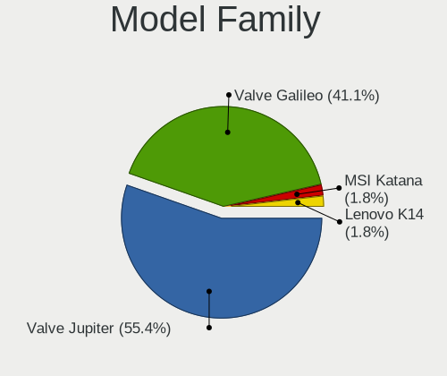
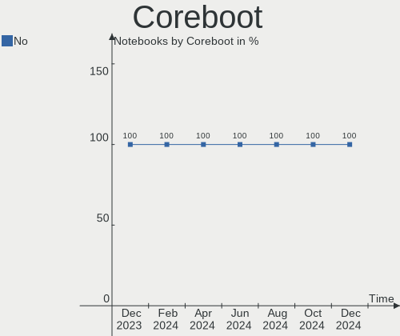
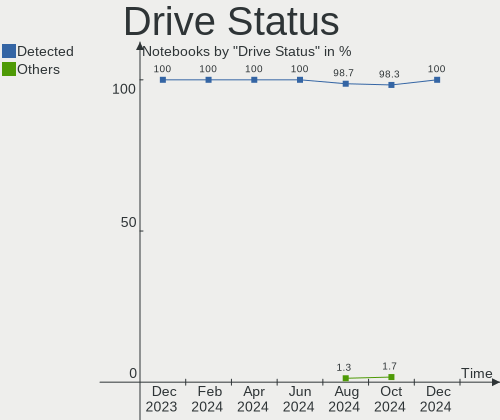
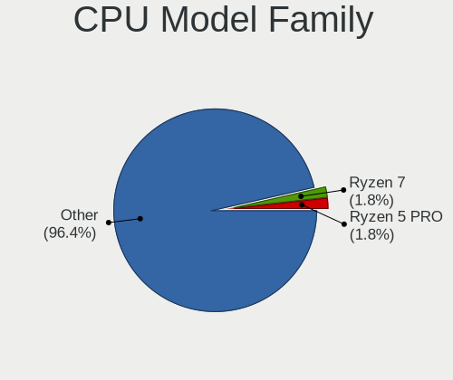
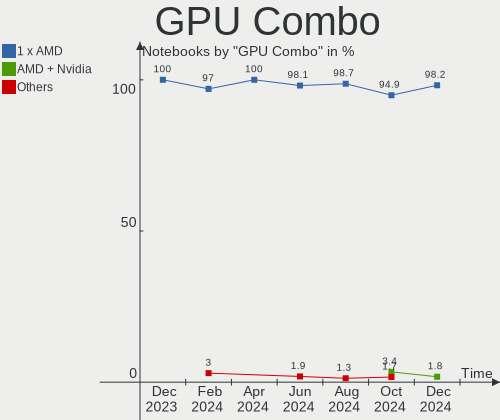
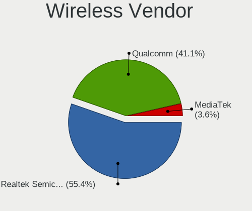
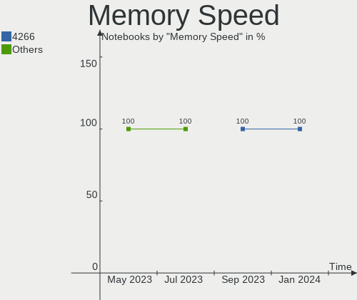

SteamOS - Hardware Trends (Notebooks)
-------------------------------------

A project to identify most popular hardware characteristics and track their change
over time based on data collected by Linux users at https://Linux-Hardware.org.

Anyone can contribute to this report by the [hw-probe](https://github.com/linuxhw/hw-probe) tool:

    sudo -E hw-probe -all -upload

This report is for one last month. Overall report since the beginning of time: [TestDays](https://github.com/linuxhw/TestDays)

Period: Sep, 2023.

Contents
--------

* [ System ](#system)
  - [ OS                       ](#os)
  - [ OS Family                ](#os-family)
  - [ Kernel                   ](#kernel)
  - [ Kernel Family            ](#kernel-family)
  - [ Kernel Major Ver.        ](#kernel-major-ver)
  - [ Arch                     ](#arch)
  - [ DE                       ](#de)
  - [ Display Server           ](#display-server)
  - [ Display Manager          ](#display-manager)
  - [ OS Lang                  ](#os-lang)
  - [ Boot Mode                ](#boot-mode)
  - [ Filesystem               ](#filesystem)
  - [ Part. scheme             ](#part-scheme)
  - [ Dual Boot with Linux/BSD ](#dual-boot-with-linuxbsd)
  - [ Dual Boot (Win)          ](#dual-boot-win)

* [ Board ](#board)
  - [ Vendor                   ](#vendor)
  - [ Model                    ](#model)
  - [ Model Family             ](#model-family)
  - [ MFG Year                 ](#mfg-year)
  - [ Form Factor              ](#form-factor)
  - [ Secure Boot              ](#secure-boot)
  - [ Coreboot                 ](#coreboot)
  - [ RAM Size                 ](#ram-size)
  - [ RAM Used                 ](#ram-used)
  - [ Total Drives             ](#total-drives)
  - [ Has CD-ROM               ](#has-cd-rom)
  - [ Has Ethernet             ](#has-ethernet)
  - [ Has WiFi                 ](#has-wifi)
  - [ Has Bluetooth            ](#has-bluetooth)

* [ Location ](#location)
  - [ Country                  ](#country)
  - [ City                     ](#city)

* [ Drives ](#drives)
  - [ Drive Vendor             ](#drive-vendor)
  - [ Drive Model              ](#drive-model)
  - [ HDD Vendor               ](#hdd-vendor)
  - [ SSD Vendor               ](#ssd-vendor)
  - [ Drive Kind               ](#drive-kind)
  - [ Drive Connector          ](#drive-connector)
  - [ Drive Size               ](#drive-size)
  - [ Space Total              ](#space-total)
  - [ Space Used               ](#space-used)
  - [ Malfunc. Drives          ](#malfunc-drives)
  - [ Malfunc. Drive Vendor    ](#malfunc-drive-vendor)
  - [ Malfunc. HDD Vendor      ](#malfunc-hdd-vendor)
  - [ Malfunc. Drive Kind      ](#malfunc-drive-kind)
  - [ Failed Drives            ](#failed-drives)
  - [ Failed Drive Vendor      ](#failed-drive-vendor)
  - [ Drive Status             ](#drive-status)

* [ Storage controller ](#storage-controller)
  - [ Storage Vendor           ](#storage-vendor)
  - [ Storage Model            ](#storage-model)
  - [ Storage Kind             ](#storage-kind)

* [ Processor ](#processor)
  - [ CPU Vendor               ](#cpu-vendor)
  - [ CPU Model                ](#cpu-model)
  - [ CPU Model Family         ](#cpu-model-family)
  - [ CPU Cores                ](#cpu-cores)
  - [ CPU Sockets              ](#cpu-sockets)
  - [ CPU Threads              ](#cpu-threads)
  - [ CPU Op-Modes             ](#cpu-op-modes)
  - [ CPU Microcode            ](#cpu-microcode)
  - [ CPU Microarch            ](#cpu-microarch)

* [ Graphics ](#graphics)
  - [ GPU Vendor               ](#gpu-vendor)
  - [ GPU Model                ](#gpu-model)
  - [ GPU Combo                ](#gpu-combo)
  - [ GPU Driver               ](#gpu-driver)
  - [ GPU Memory               ](#gpu-memory)

* [ Monitor ](#monitor)
  - [ Monitor Vendor           ](#monitor-vendor)
  - [ Monitor Model            ](#monitor-model)
  - [ Monitor Resolution       ](#monitor-resolution)
  - [ Monitor Diagonal         ](#monitor-diagonal)
  - [ Monitor Width            ](#monitor-width)
  - [ Aspect Ratio             ](#aspect-ratio)
  - [ Monitor Area             ](#monitor-area)
  - [ Pixel Density            ](#pixel-density)
  - [ Multiple Monitors        ](#multiple-monitors)

* [ Network ](#network)
  - [ Net Controller Vendor    ](#net-controller-vendor)
  - [ Net Controller Model     ](#net-controller-model)
  - [ Wireless Vendor          ](#wireless-vendor)
  - [ Wireless Model           ](#wireless-model)
  - [ Ethernet Vendor          ](#ethernet-vendor)
  - [ Ethernet Model           ](#ethernet-model)
  - [ Net Controller Kind      ](#net-controller-kind)
  - [ Used Controller          ](#used-controller)
  - [ NICs                     ](#nics)
  - [ IPv6                     ](#ipv6)

* [ Bluetooth ](#bluetooth)
  - [ Bluetooth Vendor         ](#bluetooth-vendor)
  - [ Bluetooth Model          ](#bluetooth-model)

* [ Sound ](#sound)
  - [ Sound Vendor             ](#sound-vendor)
  - [ Sound Model              ](#sound-model)

* [ Memory ](#memory)
  - [ Memory Vendor            ](#memory-vendor)
  - [ Memory Model             ](#memory-model)
  - [ Memory Kind              ](#memory-kind)
  - [ Memory Form Factor       ](#memory-form-factor)
  - [ Memory Size              ](#memory-size)
  - [ Memory Speed             ](#memory-speed)

* [ Printers & scanners ](#printers--scanners)
  - [ Printer Vendor           ](#printer-vendor)
  - [ Printer Model            ](#printer-model)
  - [ Scanner Vendor           ](#scanner-vendor)
  - [ Scanner Model            ](#scanner-model)

* [ Camera ](#camera)
  - [ Camera Vendor            ](#camera-vendor)
  - [ Camera Model             ](#camera-model)

* [ Security ](#security)
  - [ Fingerprint Vendor       ](#fingerprint-vendor)
  - [ Fingerprint Model        ](#fingerprint-model)
  - [ Chipcard Vendor          ](#chipcard-vendor)
  - [ Chipcard Model           ](#chipcard-model)

* [ Unsupported ](#unsupported)
  - [ Unsupported Devices      ](#unsupported-devices)
  - [ Unsupported Device Types ](#unsupported-device-types)

System
------

OS
--

Installed operating systems

| Name            | Notebooks | Percent |
|-----------------|-----------|---------|
| SteamOS 3.4.10  | 50        | 73.53%  |
| SteamOS 3.5     | 6         | 8.82%   |
| SteamOS 3.4.8   | 4         | 5.88%   |
| SteamOS Rolling | 3         | 4.41%   |
| SteamOS 4       | 2         | 2.94%   |
| SteamOS 3.6     | 2         | 2.94%   |
| SteamOS 3.4.6   | 1         | 1.47%   |

OS Family
---------

OS without a version

| Name    | Notebooks | Percent |
|---------|-----------|---------|
| SteamOS | 68        | 100%    |

Kernel
------

Version of the Linux kernel

| Version                    | Notebooks | Percent |
|----------------------------|-----------|---------|
| 5.13.0-valve37-1-neptune   | 51        | 75%     |
| 6.1.52-valve2-1-neptune-61 | 6         | 8.82%   |
| 5.13.0-valve36-1-neptune   | 5         | 7.35%   |
| 6.1.43-valve1-1-neptune-61 | 4         | 5.88%   |
| 6.4.12-zen1-1-zen          | 1         | 1.47%   |
| 6.3.7-zen1-1-zen           | 1         | 1.47%   |

Kernel Family
-------------

Linux kernel without a distro release

| Version | Notebooks | Percent |
|---------|-----------|---------|
| 5.13.0  | 56        | 82.35%  |
| 6.1.52  | 6         | 8.82%   |
| 6.1.43  | 4         | 5.88%   |
| 6.4.12  | 1         | 1.47%   |
| 6.3.7   | 1         | 1.47%   |

Kernel Major Ver.
-----------------

Linux kernel major version

| Version | Notebooks | Percent |
|---------|-----------|---------|
| 5.13    | 56        | 82.35%  |
| 6.1     | 10        | 14.71%  |
| 6.4     | 1         | 1.47%   |
| 6.3     | 1         | 1.47%   |

Arch
----

OS architecture (x86_64, i586, etc.)

| Name   | Notebooks | Percent |
|--------|-----------|---------|
| x86_64 | 68        | 100%    |

DE
--

Desktop Environment

| Name      | Notebooks | Percent |
|-----------|-----------|---------|
| KDE5      | 67        | 98.53%  |
| gamescope | 1         | 1.47%   |

Display Server
--------------

X11 or Wayland

| Name | Notebooks | Percent |
|------|-----------|---------|
| X11  | 68        | 100%    |

Display Manager
---------------

SDDM, LightDM, etc.

| Name    | Notebooks | Percent |
|---------|-----------|---------|
| Unknown | 65        | 95.59%  |
| SDDM    | 3         | 4.41%   |

OS Lang
-------

Language

| Lang  | Notebooks | Percent |
|-------|-----------|---------|
| en_US | 62        | 91.18%  |
| es_ES | 2         | 2.94%   |
| de_DE | 2         | 2.94%   |
| ru_RU | 1         | 1.47%   |
| pl_PL | 1         | 1.47%   |

Boot Mode
---------

EFI or BIOS

| Mode | Notebooks | Percent |
|------|-----------|---------|
| BIOS | 65        | 95.59%  |
| EFI  | 3         | 4.41%   |

Filesystem
----------

Type of filesystem

| Type  | Notebooks | Percent |
|-------|-----------|---------|
| Btrfs | 68        | 100%    |

Part. scheme
------------

Scheme of partitioning

| Type    | Notebooks | Percent |
|---------|-----------|---------|
| Unknown | 65        | 95.59%  |
| GPT     | 3         | 4.41%   |

Dual Boot with Linux/BSD
------------------------

Hosting more than one Linux/BSD

| Dual boot | Notebooks | Percent |
|-----------|-----------|---------|
| No        | 65        | 95.59%  |
| Yes       | 3         | 4.41%   |

Dual Boot (Win)
---------------

Hosting Linux and Windows

| Dual boot | Notebooks | Percent |
|-----------|-----------|---------|
| No        | 68        | 100%    |

Board
-----

Vendor
------

Motherboard manufacturer

| Name            | Notebooks | Percent |
|-----------------|-----------|---------|
| Valve           | 66        | 97.06%  |
| MSI             | 1         | 1.47%   |
| Hewlett-Packard | 1         | 1.47%   |

Model
-----

Motherboard model

| Name               | Notebooks | Percent |
|--------------------|-----------|---------|
| Valve Jupiter      | 66        | 97.06%  |
| MSI MS-7995        | 1         | 1.47%   |
| HP Laptop 15-bw0xx | 1         | 1.47%   |

Model Family
------------

Motherboard model prefix

| Name          | Notebooks | Percent |
|---------------|-----------|---------|
| Valve Jupiter | 66        | 97.06%  |
| MSI MS-7995   | 1         | 1.47%   |
| HP Laptop     | 1         | 1.47%   |

MFG Year
--------

Motherboard manufacture year

| Year | Notebooks | Percent |
|------|-----------|---------|
| 2022 | 56        | 82.35%  |
| 2023 | 10        | 14.71%  |
| 2017 | 2         | 2.94%   |

Form Factor
-----------

Physical design of the computer

| Name     | Notebooks | Percent |
|----------|-----------|---------|
| Notebook | 68        | 100%    |

Secure Boot
-----------

Enabled or disabled

| State    | Notebooks | Percent |
|----------|-----------|---------|
| Disabled | 68        | 100%    |

Coreboot
--------

Have coreboot on board

| Used | Notebooks | Percent |
|------|-----------|---------|
| No   | 68        | 100%    |

RAM Size
--------

Total RAM memory

| Size in GB | Notebooks | Percent |
|------------|-----------|---------|
| 8.01-16.0  | 66        | 97.06%  |
| 3.01-4.0   | 1         | 1.47%   |
| 16.01-24.0 | 1         | 1.47%   |

RAM Used
--------

Used RAM memory

| Used GB   | Notebooks | Percent |
|-----------|-----------|---------|
| 4.01-8.0  | 24        | 35.29%  |
| 3.01-4.0  | 23        | 33.82%  |
| 2.01-3.0  | 18        | 26.47%  |
| 8.01-16.0 | 3         | 4.41%   |

Total Drives
------------

Number of drives on board

| Drives | Notebooks | Percent |
|--------|-----------|---------|
| 2      | 53        | 77.94%  |
| 1      | 15        | 22.06%  |

Has CD-ROM
----------

Has CD-ROM on board

| Presented | Notebooks | Percent |
|-----------|-----------|---------|
| No        | 67        | 98.53%  |
| Yes       | 1         | 1.47%   |

Has Ethernet
------------

Has Ethernet on board

| Presented | Notebooks | Percent |
|-----------|-----------|---------|
| No        | 45        | 66.18%  |
| Yes       | 23        | 33.82%  |

Has WiFi
--------

Has WiFi module

| Presented | Notebooks | Percent |
|-----------|-----------|---------|
| Yes       | 68        | 100%    |

Has Bluetooth
-------------

Has Bluetooth module

| Presented | Notebooks | Percent |
|-----------|-----------|---------|
| Yes       | 66        | 97.06%  |
| No        | 2         | 2.94%   |

Location
--------

Country
-------

Geographic location (country)

| Country     | Notebooks | Percent |
|-------------|-----------|---------|
| USA         | 22        | 32.35%  |
| Germany     | 11        | 16.18%  |
| UK          | 6         | 8.82%   |
| Russia      | 5         | 7.35%   |
| Brazil      | 3         | 4.41%   |
| Spain       | 2         | 2.94%   |
| Canada      | 2         | 2.94%   |
| Austria     | 2         | 2.94%   |
| Ukraine     | 1         | 1.47%   |
| Sweden      | 1         | 1.47%   |
| Puerto Rico | 1         | 1.47%   |
| Poland      | 1         | 1.47%   |
| Philippines | 1         | 1.47%   |
| Netherlands | 1         | 1.47%   |
| Morocco     | 1         | 1.47%   |
| Mexico      | 1         | 1.47%   |
| Italy       | 1         | 1.47%   |
| Israel      | 1         | 1.47%   |
| Iraq        | 1         | 1.47%   |
| France      | 1         | 1.47%   |
| Ecuador     | 1         | 1.47%   |
| Denmark     | 1         | 1.47%   |
| Australia   | 1         | 1.47%   |

City
----

Geographic location (city)

| City                      | Notebooks | Percent |
|---------------------------|-----------|---------|
| Vienna                    | 2         | 2.94%   |
| Seattle                   | 2         | 2.94%   |
| Moscow                    | 2         | 2.94%   |
| Madrid                    | 2         | 2.94%   |
| Berlin                    | 2         | 2.94%   |
| Zapopan                   | 1         | 1.47%   |
| West Malling              | 1         | 1.47%   |
| Warsaw                    | 1         | 1.47%   |
| Wappingers Falls          | 1         | 1.47%   |
| Voronezh                  | 1         | 1.47%   |
| Voorhout                  | 1         | 1.47%   |
| Villeparisis              | 1         | 1.47%   |
| Valby                     | 1         | 1.47%   |
| Thetford                  | 1         | 1.47%   |
| Tel Aviv                  | 1         | 1.47%   |
| Sydney                    | 1         | 1.47%   |
| St Petersburg             | 1         | 1.47%   |
| Sao Paulo                 | 1         | 1.47%   |
| San Sebastiano al Vesuvio | 1         | 1.47%   |
| San Juan                  | 1         | 1.47%   |
| Sacramento                | 1         | 1.47%   |
| Ribeirao Preto            | 1         | 1.47%   |
| Reading                   | 1         | 1.47%   |
| Petrozavodsk              | 1         | 1.47%   |
| Munich                    | 1         | 1.47%   |
| Louisville                | 1         | 1.47%   |
| Los Angeles               | 1         | 1.47%   |
| Lincoln                   | 1         | 1.47%   |
| Leicester                 | 1         | 1.47%   |
| Lebanon                   | 1         | 1.47%   |
| Lawrenceville             | 1         | 1.47%   |
| Las Pinas                 | 1         | 1.47%   |
| La Concordia Numero Uno   | 1         | 1.47%   |
| Kyiv                      | 1         | 1.47%   |
| Kingsport                 | 1         | 1.47%   |
| Kingsland                 | 1         | 1.47%   |
| Ironwood                  | 1         | 1.47%   |
| Ipswich                   | 1         | 1.47%   |
| Hickory                   | 1         | 1.47%   |
| Hausham                   | 1         | 1.47%   |

Drives
------

Drive Vendor
------------

Hard drive vendors

| Vendor                      | Notebooks | Drives | Percent |
|-----------------------------|-----------|--------|---------|
| Unknown                     | 42        | 43     | 34.43%  |
| Phison Electronics          | 18        | 18     | 14.75%  |
| Samsung Electronics         | 15        | 15     | 12.3%   |
| Kingston Technology Company | 13        | 13     | 10.66%  |
| O2 Micro                    | 12        | 12     | 9.84%   |
| Unknown                     | 7         | 7      | 5.74%   |
| KIOXIA                      | 4         | 4      | 3.28%   |
| Silicon Motion              | 2         | 2      | 1.64%   |
| Sandisk                     | 2         | 2      | 1.64%   |
| Toshiba                     | 1         | 1      | 0.82%   |
| SPCC                        | 1         | 1      | 0.82%   |
| Realtek                     | 1         | 1      | 0.82%   |
| MAXIO Technology (Hangzhou) | 1         | 1      | 0.82%   |
| JMicron Technology          | 1         | 1      | 0.82%   |
| Intenso                     | 1         | 1      | 0.82%   |
| Biwin Storage Technology    | 1         | 1      | 0.82%   |

Drive Model
-----------

Hard drive models

| Model                                                 | Notebooks | Percent |
|-------------------------------------------------------|-----------|---------|
| Unknown MMC Card  512GB                               | 19        | 15.45%  |
| Kingston Company OM3PDP3 NVMe SSD 512GB               | 13        | 10.57%  |
| Phison PS5013 E13 NVMe Controller 512GB               | 12        | 9.76%   |
| O2 Micro E2M2 64GB                                    | 12        | 9.76%   |
| Unknown MMC Card  256GB                               | 9         | 7.32%   |
| Samsung MZ9LQ512HBLU-00BVL 512GB                      | 8         | 6.5%    |
| Unknown                                               | 7         | 5.69%   |
| Unknown MMC Card  128GB                               | 4         | 3.25%   |
| Samsung MZ9LQ256HBJD-00BVL 256GB                      | 4         | 3.25%   |
| Unknown MMC Card  32GB                                | 3         | 2.44%   |
| Unknown MMC Card  64GB                                | 2         | 1.63%   |
| Silicon Motion SM2263EN/SM2263XT SSD Controller 512GB | 2         | 1.63%   |
| Sandisk WD PC SN740 SDDPTQD-1T00 1024GB               | 2         | 1.63%   |
| Phison Sabrent SB-2130-1TB                            | 2         | 1.63%   |
| KIOXIA KBG40ZNS512G NVMe 512GB                        | 2         | 1.63%   |
| Unknown MMC Card  498GB                               | 1         | 0.81%   |
| Unknown MMC Card  393GB                               | 1         | 0.81%   |
| Unknown MMC Card  197GB                               | 1         | 0.81%   |
| Unknown MMC Card  196GB                               | 1         | 0.81%   |
| Unknown MMC Card  16GB                                | 1         | 0.81%   |
| Unknown MMC Card  1048GB                              | 1         | 0.81%   |
| Toshiba MQ01ABD050 500GB                              | 1         | 0.81%   |
| SPCC Solid State Disk 512GB                           | 1         | 0.81%   |
| Samsung PM991a NVMe 512GB                             | 1         | 0.81%   |
| Samsung PM991a NVMe 256GB                             | 1         | 0.81%   |
| Samsung PM991 NVMe 512GB                              | 1         | 0.81%   |
| Realtek RTL9210B-CG 2TB                               | 1         | 0.81%   |
| Phison TEAM TM5FF3002T 2TB                            | 1         | 0.81%   |
| Phison TEAM TM5FF3001T 1TB                            | 1         | 0.81%   |
| Phison E12 NVMe Controller 2TB                        | 1         | 0.81%   |
| Phison Corsair MP600 MINI 1TB                         | 1         | 0.81%   |
| MAXIO (Hangzhou) NVMe SSD Controller MAP1202 512GB    | 1         | 0.81%   |
| KIOXIA KBG50ZNS512G 512GB                             | 1         | 0.81%   |
| KIOXIA KBG50ZNS1T02 1024GB                            | 1         | 0.81%   |
| JMicron Tech 250GB                                    | 1         | 0.81%   |
| Intenso SCSI 1TB                                      | 1         | 0.81%   |
| Biwin Storage CNF30T5D100-512G                        | 1         | 0.81%   |

HDD Vendor
----------

Hard disk drive vendors

| Vendor  | Notebooks | Drives | Percent |
|---------|-----------|--------|---------|
| Toshiba | 1         | 1      | 100%    |

SSD Vendor
----------

Solid state drive vendors

| Vendor | Notebooks | Drives | Percent |
|--------|-----------|--------|---------|
| SPCC   | 1         | 1      | 100%    |

Drive Kind
----------

HDD or SSD

| Kind    | Notebooks | Drives | Percent |
|---------|-----------|--------|---------|
| NVMe    | 67        | 69     | 55.83%  |
| MMC     | 49        | 50     | 40.83%  |
| Unknown | 2         | 2      | 1.67%   |
| SSD     | 1         | 1      | 0.83%   |
| HDD     | 1         | 1      | 0.83%   |

Drive Connector
---------------

SATA, SAS, NVMe, etc.

| Type | Notebooks | Drives | Percent |
|------|-----------|--------|---------|
| NVMe | 67        | 68     | 55.37%  |
| MMC  | 49        | 50     | 40.5%   |
| SAS  | 3         | 3      | 2.48%   |
| SATA | 2         | 2      | 1.65%   |

Drive Size
----------

Size of hard drive

| Size in TB | Notebooks | Drives | Percent |
|------------|-----------|--------|---------|
| 0.51-1.0   | 1         | 1      | 50%     |
| 0.01-0.5   | 1         | 1      | 50%     |

Space Total
-----------

Amount of disk space available on the file system

| Size in GB | Notebooks | Percent |
|------------|-----------|---------|
| 251-500    | 34        | 50%     |
| 501-1000   | 12        | 17.65%  |
| 51-100     | 12        | 17.65%  |
| 101-250    | 8         | 11.76%  |
| 2001-3000  | 1         | 1.47%   |
| 1001-2000  | 1         | 1.47%   |

Space Used
----------

Amount of used disk space

| Used GB   | Notebooks | Percent |
|-----------|-----------|---------|
| 251-500   | 20        | 29.41%  |
| 101-250   | 15        | 22.06%  |
| 21-50     | 13        | 19.12%  |
| 501-1000  | 7         | 10.29%  |
| 51-100    | 7         | 10.29%  |
| 1-20      | 4         | 5.88%   |
| 1001-2000 | 2         | 2.94%   |

Malfunc. Drives
---------------

Drive models with a malfunction

Zero info for selected period =(

Malfunc. Drive Vendor
---------------------

Vendors of faulty drives

Zero info for selected period =(

Malfunc. HDD Vendor
-------------------

Vendors of faulty HDD drives

Zero info for selected period =(

Malfunc. Drive Kind
-------------------

Kinds of faulty drives

Zero info for selected period =(

Failed Drives
-------------

Failed drive models

Zero info for selected period =(

Failed Drive Vendor
-------------------

Failed drive vendors

Zero info for selected period =(

Drive Status
------------

Number of failed and malfunc. drives

| Status   | Notebooks | Drives | Percent |
|----------|-----------|--------|---------|
| Detected | 68        | 120    | 95.77%  |
| Works    | 3         | 3      | 4.23%   |

Storage controller
------------------

Storage Vendor
--------------

Storage controller vendors

| Vendor                      | Notebooks | Percent |
|-----------------------------|-----------|---------|
| Phison Electronics          | 18        | 25.71%  |
| Samsung Electronics         | 15        | 21.43%  |
| Kingston Technology Company | 13        | 18.57%  |
| O2 Micro                    | 12        | 17.14%  |
| KIOXIA                      | 4         | 5.71%   |
| Silicon Motion              | 2         | 2.86%   |
| Sandisk                     | 2         | 2.86%   |
| MAXIO Technology (Hangzhou) | 1         | 1.43%   |
| Intel                       | 1         | 1.43%   |
| Biwin Storage Technology    | 1         | 1.43%   |
| AMD                         | 1         | 1.43%   |

Storage Model
-------------

Storage controller models

| Model                                                                         | Notebooks | Percent |
|-------------------------------------------------------------------------------|-----------|---------|
| Samsung NVMe SSD Controller 980                                               | 15        | 21.43%  |
| Kingston Company OM3PDP3 NVMe SSD                                             | 13        | 18.57%  |
| Phison PS5013 E13 NVMe Controller                                             | 12        | 17.14%  |
| O2 Micro FORESEE E2M2 NVMe SSD                                                | 12        | 17.14%  |
| Phison PS5021-E21 PCIe4 NVMe Controller (DRAM-less)                           | 5         | 7.14%   |
| Silicon Motion SM2263EN/SM2263XT (DRAM-less) NVMe SSD Controllers             | 2         | 2.86%   |
| Sandisk PC SN740 NVMe SSD (DRAM-less)                                         | 2         | 2.86%   |
| KIOXIA NVMe SSD Controller BG5 (DRAM-less)                                    | 2         | 2.86%   |
| KIOXIA NVMe SSD Controller BG4 (DRAM-less)                                    | 2         | 2.86%   |
| Phison E12 NVMe Controller                                                    | 1         | 1.43%   |
| MAXIO (Hangzhou) NVMe SSD Controller MAP1202                                  | 1         | 1.43%   |
| Intel Q170/Q150/B150/H170/H110/Z170/CM236 Chipset SATA Controller [AHCI Mode] | 1         | 1.43%   |
| Biwin Storage Non-Volatile memory controller                                  | 1         | 1.43%   |
| AMD FCH SATA Controller [AHCI mode]                                           | 1         | 1.43%   |

Storage Kind
------------

Kind of storage controller (IDE, SATA, NVMe, SAS, ...)

| Kind | Notebooks | Percent |
|------|-----------|---------|
| NVMe | 67        | 97.1%   |
| SATA | 2         | 2.9%    |

Processor
---------

CPU Vendor
----------

Processor vendors

| Vendor | Notebooks | Percent |
|--------|-----------|---------|
| AMD    | 67        | 98.53%  |
| Intel  | 1         | 1.47%   |

CPU Model
---------

Processor models

| Model                                        | Notebooks | Percent |
|----------------------------------------------|-----------|---------|
| AMD Custom APU 0405                          | 66        | 97.06%  |
| Intel Core i3-6100 CPU @ 3.70GHz             | 1         | 1.47%   |
| AMD A6-9220 RADEON R4, 5 COMPUTE CORES 2C+3G | 1         | 1.47%   |

CPU Model Family
----------------

Processor model prefix

| Model         | Notebooks | Percent |
|---------------|-----------|---------|
| Other         | 66        | 97.06%  |
| Intel Core i3 | 1         | 1.47%   |
| AMD A6        | 1         | 1.47%   |

CPU Cores
---------

Number of processor cores

| Number | Notebooks | Percent |
|--------|-----------|---------|
| 4      | 66        | 97.06%  |
| 2      | 2         | 2.94%   |

CPU Sockets
-----------

Number of sockets

| Number | Notebooks | Percent |
|--------|-----------|---------|
| 1      | 68        | 100%    |

CPU Threads
-----------

Threads per core (Hyper-Threading)

| Number | Notebooks | Percent |
|--------|-----------|---------|
| 2      | 67        | 98.53%  |
| 1      | 1         | 1.47%   |

CPU Op-Modes
------------

CPU Operation Modes (32-bit, 64-bit)

| Op mode        | Notebooks | Percent |
|----------------|-----------|---------|
| 32-bit, 64-bit | 68        | 100%    |

CPU Microcode
-------------

Microcode number

| Number     | Notebooks | Percent |
|------------|-----------|---------|
| Unknown    | 65        | 95.59%  |
| 0x08900201 | 3         | 4.41%   |

CPU Microarch
-------------

Microarchitecture

| Name      | Notebooks | Percent |
|-----------|-----------|---------|
| Unknown   | 66        | 97.06%  |
| Skylake   | 1         | 1.47%   |
| Excavator | 1         | 1.47%   |

Graphics
--------

GPU Vendor
----------

Vendors of graphics cards

| Vendor | Notebooks | Percent |
|--------|-----------|---------|
| AMD    | 68        | 100%    |

GPU Model
---------

Graphics card models

| Model                                          | Notebooks | Percent |
|------------------------------------------------|-----------|---------|
| AMD VanGogh [AMD Custom GPU 0405]              | 66        | 97.06%  |
| AMD Stoney [Radeon R2/R3/R4/R5 Graphics]       | 1         | 1.47%   |
| AMD Navi 14 [Radeon RX 5500/5500M / Pro 5500M] | 1         | 1.47%   |

GPU Combo
---------

Combinations of graphics cards

| Name    | Notebooks | Percent |
|---------|-----------|---------|
| 1 x AMD | 68        | 100%    |

GPU Driver
----------

Free vs proprietary

| Driver | Notebooks | Percent |
|--------|-----------|---------|
| Free   | 68        | 100%    |

GPU Memory
----------

Total video memory

| Size in GB | Notebooks | Percent |
|------------|-----------|---------|
| Unknown    | 65        | 95.59%  |
| 0.51-1.0   | 2         | 2.94%   |
| 3.01-4.0   | 1         | 1.47%   |

Monitor
-------

Monitor Vendor
--------------

Monitor vendors

| Vendor               | Notebooks | Percent |
|----------------------|-----------|---------|
| Valve                | 66        | 75.86%  |
| Samsung Electronics  | 7         | 8.05%   |
| Lenovo               | 2         | 2.3%    |
| Goldstar             | 2         | 2.3%    |
| Dell                 | 2         | 2.3%    |
| Unknown (AAA)        | 1         | 1.15%   |
| Sony                 | 1         | 1.15%   |
| MSI                  | 1         | 1.15%   |
| HannStar             | 1         | 1.15%   |
| Chimei Innolux       | 1         | 1.15%   |
| BenQ                 | 1         | 1.15%   |
| AOC                  | 1         | 1.15%   |
| Ancor Communications | 1         | 1.15%   |

Monitor Model
-------------

Monitor models

| Model                                                                   | Notebooks | Percent |
|-------------------------------------------------------------------------|-----------|---------|
| Valve ANX7530 U VLV3001 800x1280 100x150mm 7.1-inch                     | 66        | 75.86%  |
| Unknown (AAA) HDMI AAA3201 1920x1080 698x392mm 31.5-inch                | 1         | 1.15%   |
| Sony TV SNYEB01 1360x768                                                | 1         | 1.15%   |
| Samsung Electronics SyncMaster SAM05CD 1920x1080                        | 1         | 1.15%   |
| Samsung Electronics S23B550 SAM091A 1920x1080 510x287mm 23.0-inch       | 1         | 1.15%   |
| Samsung Electronics LCD Monitor SAM0FEF 3840x2160 1872x1053mm 84.6-inch | 1         | 1.15%   |
| Samsung Electronics LCD Monitor SAM0F14 3840x2160 1872x1053mm 84.6-inch | 1         | 1.15%   |
| Samsung Electronics LCD Monitor SAM0DFA 3840x2160 1210x680mm 54.6-inch  | 1         | 1.15%   |
| Samsung Electronics LCD Monitor SAM0C3C 1360x768 700x390mm 31.5-inch    | 1         | 1.15%   |
| Samsung Electronics C24F390 SAM0D2C 1920x1080 521x293mm 23.5-inch       | 1         | 1.15%   |
| MSI G2412 MSI9BA4 1920x1080 527x296mm 23.8-inch                         | 1         | 1.15%   |
| Lenovo LEN P27u-10 LEN61B0 3840x2160 597x336mm 27.0-inch                | 1         | 1.15%   |
| Lenovo LEN P24q-20 LEN61F5 2560x1440 527x296mm 23.8-inch                | 1         | 1.15%   |
| HannStar HSG1076 HSP0020 1920x1080 698x392mm 31.5-inch                  | 1         | 1.15%   |
| Goldstar ULTRAGEAR GSM5BB2 1920x1080 527x296mm 23.8-inch                | 1         | 1.15%   |
| Goldstar 27GN7 GSM5B8D 1920x1080 600x303mm 26.5-inch                    | 1         | 1.15%   |
| Dell S2409W DELA039 1920x1080 531x298mm 24.0-inch                       | 1         | 1.15%   |
| Dell P2418HT DEL4113 1920x1080 527x296mm 23.8-inch                      | 1         | 1.15%   |
| Chimei Innolux LCD Monitor CMN15DB 1366x768 344x193mm 15.5-inch         | 1         | 1.15%   |
| BenQ GL2480 BNQ78ED 1920x1080 531x298mm 24.0-inch                       | 1         | 1.15%   |
| AOC 2476W AOC2476 1920x1080 521x293mm 23.5-inch                         | 1         | 1.15%   |
| Ancor Communications ASUS VK278 ACI27F7 1920x1080 598x336mm 27.0-inch   | 1         | 1.15%   |

Monitor Resolution
------------------

Monitor screen resolution

| Resolution      | Notebooks | Percent |
|-----------------|-----------|---------|
| 800x1280        | 66        | 76.74%  |
| 1920x1080 (FHD) | 12        | 13.95%  |
| 3840x2160 (4K)  | 4         | 4.65%   |
| 1366x768 (WXGA) | 2         | 2.33%   |
| 2560x1440 (QHD) | 1         | 1.16%   |
| 1360x768        | 1         | 1.16%   |

Monitor Diagonal
----------------

Diagonal size in inches

| Inches  | Notebooks | Percent |
|---------|-----------|---------|
| 7       | 66        | 75.86%  |
| 27      | 4         | 4.6%    |
| 24      | 4         | 4.6%    |
| 23      | 4         | 4.6%    |
| 84      | 3         | 3.45%   |
| 31      | 3         | 3.45%   |
| 72      | 1         | 1.15%   |
| 15      | 1         | 1.15%   |
| Unknown | 1         | 1.15%   |

Monitor Width
-------------

Physical width

| Width in mm | Notebooks | Percent |
|-------------|-----------|---------|
| 1-100       | 66        | 75.86%  |
| 501-600     | 11        | 12.64%  |
| 601-700     | 4         | 4.6%    |
| 1501-2000   | 4         | 4.6%    |
| 301-350     | 1         | 1.15%   |
| Unknown     | 1         | 1.15%   |

Aspect Ratio
------------

Proportional relationship between the width and the height

| Ratio | Notebooks | Percent |
|-------|-----------|---------|
| 0.67  | 66        | 77.65%  |
| 16/9  | 19        | 22.35%  |

Monitor Area
------------

Area in inch²

| Area in inch² | Notebooks | Percent |
|----------------|-----------|---------|
| 1-40           | 66        | 75.86%  |
| 201-250        | 8         | 9.2%    |
| More than 1000 | 4         | 4.6%    |
| 301-350        | 4         | 4.6%    |
| 351-500        | 3         | 3.45%   |
| 101-110        | 1         | 1.15%   |
| Unknown        | 1         | 1.15%   |

Pixel Density
-------------

Pixels per inch

| Density | Notebooks | Percent |
|---------|-----------|---------|
| 161-240 | 66        | 78.57%  |
| 51-100  | 13        | 15.48%  |
| 1-50    | 2         | 2.38%   |
| 121-160 | 1         | 1.19%   |
| 101-120 | 1         | 1.19%   |
| Unknown | 1         | 1.19%   |

Multiple Monitors
-----------------

Total monitors connected

| Total | Notebooks | Percent |
|-------|-----------|---------|
| 1     | 51        | 75%     |
| 2     | 15        | 22.06%  |
| 3     | 2         | 2.94%   |

Network
-------

Net Controller Vendor
---------------------

Controller vendors

| Vendor                | Notebooks | Percent |
|-----------------------|-----------|---------|
| Realtek Semiconductor | 68        | 83.95%  |
| ASIX Electronics      | 10        | 12.35%  |
| ZyXEL Communications  | 1         | 1.23%   |
| Intel                 | 1         | 1.23%   |
| DisplayLink           | 1         | 1.23%   |

Net Controller Model
--------------------

Controller models

| Model                                                             | Notebooks | Percent |
|-------------------------------------------------------------------|-----------|---------|
| Realtek RTL8822CE 802.11ac PCIe Wireless Network Adapter          | 66        | 70.97%  |
| ASIX AX88179 Gigabit Ethernet                                     | 10        | 10.75%  |
| Realtek RTL8153 Gigabit Ethernet Adapter                          | 9         | 9.68%   |
| Realtek RTL8111/8168/8411 PCI Express Gigabit Ethernet Controller | 2         | 2.15%   |
| ZyXEL 802.11ax WLAN Adapter                                       | 1         | 1.08%   |
| Realtek RTL8812AU 802.11a/b/g/n/ac 2T2R DB WLAN Adapter           | 1         | 1.08%   |
| Realtek RTL8723DE Wireless Network Adapter                        | 1         | 1.08%   |
| Realtek RTL8152 Fast Ethernet Adapter                             | 1         | 1.08%   |
| Intel Wireless 8260                                               | 1         | 1.08%   |
| DisplayLink Dell Universal Dock D6000                             | 1         | 1.08%   |

Wireless Vendor
---------------

Wireless vendors

| Vendor                | Notebooks | Percent |
|-----------------------|-----------|---------|
| Realtek Semiconductor | 67        | 97.1%   |
| ZyXEL Communications  | 1         | 1.45%   |
| Intel                 | 1         | 1.45%   |

Wireless Model
--------------

Wireless models

| Model                                                    | Notebooks | Percent |
|----------------------------------------------------------|-----------|---------|
| Realtek RTL8822CE 802.11ac PCIe Wireless Network Adapter | 66        | 94.29%  |
| ZyXEL 802.11ax WLAN Adapter                              | 1         | 1.43%   |
| Realtek RTL8812AU 802.11a/b/g/n/ac 2T2R DB WLAN Adapter  | 1         | 1.43%   |
| Realtek RTL8723DE Wireless Network Adapter               | 1         | 1.43%   |
| Intel Wireless 8260                                      | 1         | 1.43%   |

Ethernet Vendor
---------------

Ethernet vendors

| Vendor                | Notebooks | Percent |
|-----------------------|-----------|---------|
| Realtek Semiconductor | 12        | 52.17%  |
| ASIX Electronics      | 10        | 43.48%  |
| DisplayLink           | 1         | 4.35%   |

Ethernet Model
--------------

Ethernet models

| Model                                                             | Notebooks | Percent |
|-------------------------------------------------------------------|-----------|---------|
| ASIX AX88179 Gigabit Ethernet                                     | 10        | 43.48%  |
| Realtek RTL8153 Gigabit Ethernet Adapter                          | 9         | 39.13%  |
| Realtek RTL8111/8168/8411 PCI Express Gigabit Ethernet Controller | 2         | 8.7%    |
| Realtek RTL8152 Fast Ethernet Adapter                             | 1         | 4.35%   |
| DisplayLink Dell Universal Dock D6000                             | 1         | 4.35%   |

Net Controller Kind
-------------------

Ethernet, WiFi or modem

| Kind     | Notebooks | Percent |
|----------|-----------|---------|
| WiFi     | 68        | 74.73%  |
| Ethernet | 23        | 25.27%  |

Used Controller
---------------

Currently used network controller

| Kind     | Notebooks | Percent |
|----------|-----------|---------|
| WiFi     | 63        | 86.3%   |
| Ethernet | 10        | 13.7%   |

NICs
----

Total network controllers on board

| Total | Notebooks | Percent |
|-------|-----------|---------|
| 1     | 66        | 97.06%  |
| 2     | 2         | 2.94%   |

IPv6
----

IPv6 vs IPv4

| Used | Notebooks | Percent |
|------|-----------|---------|
| No   | 35        | 51.47%  |
| Yes  | 33        | 48.53%  |

Bluetooth
---------

Bluetooth Vendor
----------------

Controller vendors

| Vendor                | Notebooks | Percent |
|-----------------------|-----------|---------|
| IMC Networks          | 64        | 96.97%  |
| Realtek Semiconductor | 1         | 1.52%   |
| Intel                 | 1         | 1.52%   |

Bluetooth Model
---------------

Controller models

| Model                              | Notebooks | Percent |
|------------------------------------|-----------|---------|
| IMC Networks Bluetooth Radio       | 64        | 96.97%  |
| Realtek  Bluetooth 4.2 Adapter     | 1         | 1.52%   |
| Intel Bluetooth wireless interface | 1         | 1.52%   |

Sound
-----

Sound Vendor
------------

Sound card vendors

| Vendor              | Notebooks | Percent |
|---------------------|-----------|---------|
| AMD                 | 68        | 89.47%  |
| Logitech            | 3         | 3.95%   |
| Kingston Technology | 1         | 1.32%   |
| Intel               | 1         | 1.32%   |
| Hewlett-Packard     | 1         | 1.32%   |
| GN Netcom           | 1         | 1.32%   |
| BR23                | 1         | 1.32%   |

Sound Model
-----------

Sound card models

| Model                                                           | Notebooks | Percent |
|-----------------------------------------------------------------|-----------|---------|
| AMD Rembrandt Radeon High Definition Audio Controller           | 66        | 85.71%  |
| Logitech G733 Gaming Headset                                    | 1         | 1.3%    |
| Logitech G432 Gaming Headset                                    | 1         | 1.3%    |
| Logitech Blue Microphones                                       | 1         | 1.3%    |
| Kingston Technology HyperX 7.1 Audio                            | 1         | 1.3%    |
| Intel 100 Series/C230 Series Chipset Family HD Audio Controller | 1         | 1.3%    |
| Hewlett-Packard HyperX QuadCast S                               | 1         | 1.3%    |
| GN Netcom Jabra Evolve2 40                                      | 1         | 1.3%    |
| BR23 USB Composite Device                                       | 1         | 1.3%    |
| AMD Navi 10 HDMI Audio                                          | 1         | 1.3%    |
| AMD High Definition Audio Controller                            | 1         | 1.3%    |
| AMD Family 15h (Models 60h-6fh) Audio Controller                | 1         | 1.3%    |

Memory
------

Memory Vendor
-------------

Memory module vendors

| Vendor              | Notebooks | Percent |
|---------------------|-----------|---------|
| Samsung Electronics | 3         | 100%    |

Memory Model
------------

Memory module models

| Model                                                     | Notebooks | Percent |
|-----------------------------------------------------------|-----------|---------|
| Samsung RAM K3LK7K70BM-BGCP000 4GB SODIMM LPDDR5 4266MT/s | 3         | 100%    |

Memory Kind
-----------

Memory module kinds

| Kind   | Notebooks | Percent |
|--------|-----------|---------|
| LPDDR5 | 3         | 100%    |

Memory Form Factor
------------------

Physical design of the memory module

| Name   | Notebooks | Percent |
|--------|-----------|---------|
| SODIMM | 3         | 100%    |

Memory Size
-----------

Memory module size

| Size | Notebooks | Percent |
|------|-----------|---------|
| 4096 | 3         | 100%    |

Memory Speed
------------

Memory module speed

| Speed | Notebooks | Percent |
|-------|-----------|---------|
| 4266  | 3         | 100%    |

Printers & scanners
-------------------

Printer Vendor
--------------

Printer device vendors

Zero info for selected period =(

Printer Model
-------------

Printer device models

Zero info for selected period =(

Scanner Vendor
--------------

Scanner device vendors

Zero info for selected period =(

Scanner Model
-------------

Scanner device models

Zero info for selected period =(

Camera
------

Camera Vendor
-------------

Camera device vendors

| Vendor                                 | Notebooks | Percent |
|----------------------------------------|-----------|---------|
| Logitech                               | 1         | 50%     |
| Cheng Uei Precision Industry (Foxlink) | 1         | 50%     |

Camera Model
------------

Camera device models

| Model                                                          | Notebooks | Percent |
|----------------------------------------------------------------|-----------|---------|
| Logitech HD Pro Webcam C920                                    | 1         | 50%     |
| Cheng Uei Precision Industry (Foxlink) HP TrueVision HD Camera | 1         | 50%     |

Security
--------

Fingerprint Vendor
------------------

Fingerprint sensor vendors

Zero info for selected period =(

Fingerprint Model
-----------------

Fingerprint sensor models

Zero info for selected period =(

Chipcard Vendor
---------------

Chipcard module vendors

Zero info for selected period =(

Chipcard Model
--------------

Chipcard module models

Zero info for selected period =(

Unsupported
-----------

Unsupported Devices
-------------------

Total unsupported devices on board

| Total | Notebooks | Percent |
|-------|-----------|---------|
| 0     | 66        | 97.06%  |
| 1     | 2         | 2.94%   |

Unsupported Device Types
------------------------

Types of unsupported devices

| Type         | Notebooks | Percent |
|--------------|-----------|---------|
| Net/wireless | 2         | 100%    |

