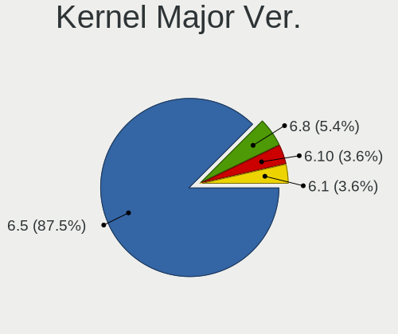
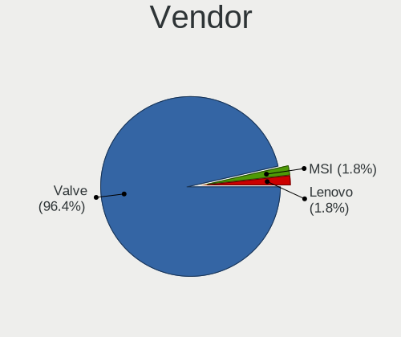
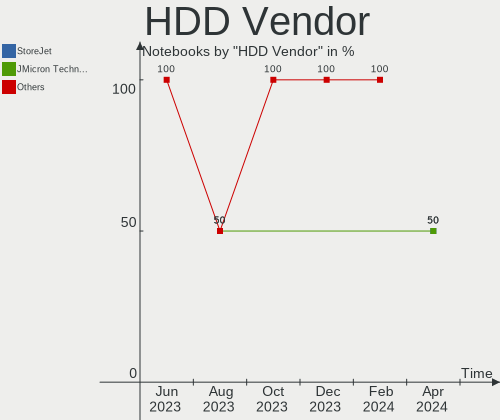
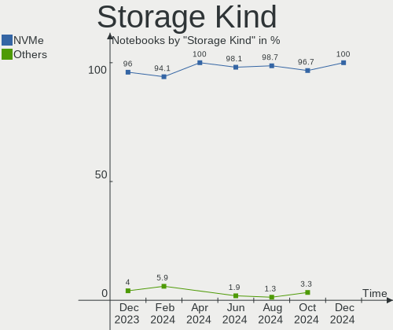
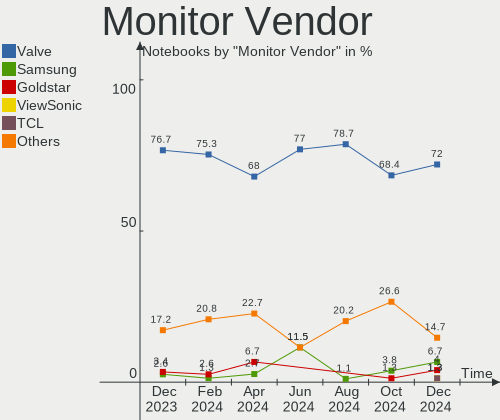

SteamOS - Hardware Trends (Notebooks)
-------------------------------------

A project to identify most popular hardware characteristics and track their change
over time based on data collected by Linux users at https://Linux-Hardware.org.

Anyone can contribute to this report by the [hw-probe](https://github.com/linuxhw/hw-probe) tool:

    sudo -E hw-probe -all -upload

This report is for one last month. Overall report since the beginning of time: [TestDays](https://github.com/linuxhw/TestDays)

Period: Apr, 2024.

Contents
--------

* [ System ](#system)
  - [ OS                       ](#os)
  - [ OS Family                ](#os-family)
  - [ Kernel                   ](#kernel)
  - [ Kernel Family            ](#kernel-family)
  - [ Kernel Major Ver.        ](#kernel-major-ver)
  - [ Arch                     ](#arch)
  - [ DE                       ](#de)
  - [ Display Server           ](#display-server)
  - [ Display Manager          ](#display-manager)
  - [ OS Lang                  ](#os-lang)
  - [ Boot Mode                ](#boot-mode)
  - [ Filesystem               ](#filesystem)
  - [ Part. scheme             ](#part-scheme)
  - [ Dual Boot with Linux/BSD ](#dual-boot-with-linuxbsd)
  - [ Dual Boot (Win)          ](#dual-boot-win)

* [ Board ](#board)
  - [ Vendor                   ](#vendor)
  - [ Model                    ](#model)
  - [ Model Family             ](#model-family)
  - [ MFG Year                 ](#mfg-year)
  - [ Form Factor              ](#form-factor)
  - [ Secure Boot              ](#secure-boot)
  - [ Coreboot                 ](#coreboot)
  - [ RAM Size                 ](#ram-size)
  - [ RAM Used                 ](#ram-used)
  - [ Total Drives             ](#total-drives)
  - [ Has CD-ROM               ](#has-cd-rom)
  - [ Has Ethernet             ](#has-ethernet)
  - [ Has WiFi                 ](#has-wifi)
  - [ Has Bluetooth            ](#has-bluetooth)

* [ Location ](#location)
  - [ Country                  ](#country)
  - [ City                     ](#city)

* [ Drives ](#drives)
  - [ Drive Vendor             ](#drive-vendor)
  - [ Drive Model              ](#drive-model)
  - [ HDD Vendor               ](#hdd-vendor)
  - [ SSD Vendor               ](#ssd-vendor)
  - [ Drive Kind               ](#drive-kind)
  - [ Drive Connector          ](#drive-connector)
  - [ Drive Size               ](#drive-size)
  - [ Space Total              ](#space-total)
  - [ Space Used               ](#space-used)
  - [ Malfunc. Drives          ](#malfunc-drives)
  - [ Malfunc. Drive Vendor    ](#malfunc-drive-vendor)
  - [ Malfunc. HDD Vendor      ](#malfunc-hdd-vendor)
  - [ Malfunc. Drive Kind      ](#malfunc-drive-kind)
  - [ Failed Drives            ](#failed-drives)
  - [ Failed Drive Vendor      ](#failed-drive-vendor)
  - [ Drive Status             ](#drive-status)

* [ Storage controller ](#storage-controller)
  - [ Storage Vendor           ](#storage-vendor)
  - [ Storage Model            ](#storage-model)
  - [ Storage Kind             ](#storage-kind)

* [ Processor ](#processor)
  - [ CPU Vendor               ](#cpu-vendor)
  - [ CPU Model                ](#cpu-model)
  - [ CPU Model Family         ](#cpu-model-family)
  - [ CPU Cores                ](#cpu-cores)
  - [ CPU Sockets              ](#cpu-sockets)
  - [ CPU Threads              ](#cpu-threads)
  - [ CPU Op-Modes             ](#cpu-op-modes)
  - [ CPU Microcode            ](#cpu-microcode)
  - [ CPU Microarch            ](#cpu-microarch)

* [ Graphics ](#graphics)
  - [ GPU Vendor               ](#gpu-vendor)
  - [ GPU Model                ](#gpu-model)
  - [ GPU Combo                ](#gpu-combo)
  - [ GPU Driver               ](#gpu-driver)
  - [ GPU Memory               ](#gpu-memory)

* [ Monitor ](#monitor)
  - [ Monitor Vendor           ](#monitor-vendor)
  - [ Monitor Model            ](#monitor-model)
  - [ Monitor Resolution       ](#monitor-resolution)
  - [ Monitor Diagonal         ](#monitor-diagonal)
  - [ Monitor Width            ](#monitor-width)
  - [ Aspect Ratio             ](#aspect-ratio)
  - [ Monitor Area             ](#monitor-area)
  - [ Pixel Density            ](#pixel-density)
  - [ Multiple Monitors        ](#multiple-monitors)

* [ Network ](#network)
  - [ Net Controller Vendor    ](#net-controller-vendor)
  - [ Net Controller Model     ](#net-controller-model)
  - [ Wireless Vendor          ](#wireless-vendor)
  - [ Wireless Model           ](#wireless-model)
  - [ Ethernet Vendor          ](#ethernet-vendor)
  - [ Ethernet Model           ](#ethernet-model)
  - [ Net Controller Kind      ](#net-controller-kind)
  - [ Used Controller          ](#used-controller)
  - [ NICs                     ](#nics)
  - [ IPv6                     ](#ipv6)

* [ Bluetooth ](#bluetooth)
  - [ Bluetooth Vendor         ](#bluetooth-vendor)
  - [ Bluetooth Model          ](#bluetooth-model)

* [ Sound ](#sound)
  - [ Sound Vendor             ](#sound-vendor)
  - [ Sound Model              ](#sound-model)

* [ Memory ](#memory)
  - [ Memory Vendor            ](#memory-vendor)
  - [ Memory Model             ](#memory-model)
  - [ Memory Kind              ](#memory-kind)
  - [ Memory Form Factor       ](#memory-form-factor)
  - [ Memory Size              ](#memory-size)
  - [ Memory Speed             ](#memory-speed)

* [ Printers & scanners ](#printers--scanners)
  - [ Printer Vendor           ](#printer-vendor)
  - [ Printer Model            ](#printer-model)
  - [ Scanner Vendor           ](#scanner-vendor)
  - [ Scanner Model            ](#scanner-model)

* [ Camera ](#camera)
  - [ Camera Vendor            ](#camera-vendor)
  - [ Camera Model             ](#camera-model)

* [ Security ](#security)
  - [ Fingerprint Vendor       ](#fingerprint-vendor)
  - [ Fingerprint Model        ](#fingerprint-model)
  - [ Chipcard Vendor          ](#chipcard-vendor)
  - [ Chipcard Model           ](#chipcard-model)

* [ Unsupported ](#unsupported)
  - [ Unsupported Devices      ](#unsupported-devices)
  - [ Unsupported Device Types ](#unsupported-device-types)

System
------

OS
--

Installed operating systems

| Name           | Notebooks | Percent |
|----------------|-----------|---------|
| SteamOS 3.5.17 | 41        | 74.55%  |
| SteamOS 3.5.19 | 7         | 12.73%  |
| SteamOS 3.6    | 5         | 9.09%   |
| SteamOS 3.7    | 1         | 1.82%   |
| SteamOS 3.5.7  | 1         | 1.82%   |

OS Family
---------

OS without a version

| Name    | Notebooks | Percent |
|---------|-----------|---------|
| SteamOS | 55        | 100%    |

Kernel
------

Version of the Linux kernel

| Version                                 | Notebooks | Percent |
|-----------------------------------------|-----------|---------|
| 6.1.52-valve16-1-neptune-61             | 48        | 87.27%  |
| 6.1.52-valve19-1-neptune-61             | 4         | 7.27%   |
| 6.5.0-valve3-1-neptune-65-gf73fe24f1b3a | 1         | 1.82%   |
| 6.5.0-valve1-3-neptune-65-g3b047419df39 | 1         | 1.82%   |
| 6.1.52-valve9-1-neptune-61              | 1         | 1.82%   |

Kernel Family
-------------

Linux kernel without a distro release

| Version | Notebooks | Percent |
|---------|-----------|---------|
| 6.1.52  | 53        | 96.36%  |
| 6.5.0   | 2         | 3.64%   |

Kernel Major Ver.
-----------------

Linux kernel major version

| Version | Notebooks | Percent |
|---------|-----------|---------|
| 6.1     | 53        | 96.36%  |
| 6.5     | 2         | 3.64%   |

Arch
----

OS architecture (x86_64, i586, etc.)

| Name   | Notebooks | Percent |
|--------|-----------|---------|
| x86_64 | 55        | 100%    |

DE
--

Desktop Environment

| Name      | Notebooks | Percent |
|-----------|-----------|---------|
| KDE5      | 54        | 98.18%  |
| gamescope | 1         | 1.82%   |

Display Server
--------------

X11 or Wayland

| Name    | Notebooks | Percent |
|---------|-----------|---------|
| X11     | 54        | 98.18%  |
| Wayland | 1         | 1.82%   |

Display Manager
---------------

SDDM, LightDM, etc.

| Name    | Notebooks | Percent |
|---------|-----------|---------|
| Unknown | 55        | 100%    |

OS Lang
-------

Language

| Lang  | Notebooks | Percent |
|-------|-----------|---------|
| en_US | 43        | 78.18%  |
| ru_RU | 3         | 5.45%   |
| pt_BR | 2         | 3.64%   |
| en_GB | 2         | 3.64%   |
| pl    | 1         | 1.82%   |
| it_IT | 1         | 1.82%   |
| es_ES | 1         | 1.82%   |
| en_DE | 1         | 1.82%   |
| de_DE | 1         | 1.82%   |

Boot Mode
---------

EFI or BIOS

| Mode | Notebooks | Percent |
|------|-----------|---------|
| BIOS | 55        | 100%    |

Filesystem
----------

Type of filesystem

| Type  | Notebooks | Percent |
|-------|-----------|---------|
| Btrfs | 55        | 100%    |

Part. scheme
------------

Scheme of partitioning

| Type    | Notebooks | Percent |
|---------|-----------|---------|
| Unknown | 55        | 100%    |

Dual Boot with Linux/BSD
------------------------

Hosting more than one Linux/BSD

| Dual boot | Notebooks | Percent |
|-----------|-----------|---------|
| No        | 55        | 100%    |

Dual Boot (Win)
---------------

Hosting Linux and Windows

| Dual boot | Notebooks | Percent |
|-----------|-----------|---------|
| No        | 55        | 100%    |

Board
-----

Vendor
------

Motherboard manufacturer

| Name  | Notebooks | Percent |
|-------|-----------|---------|
| Valve | 55        | 100%    |

Model
-----

Motherboard model

| Name          | Notebooks | Percent |
|---------------|-----------|---------|
| Valve Jupiter | 49        | 89.09%  |
| Valve Galileo | 6         | 10.91%  |

Model Family
------------

Motherboard model prefix

| Name          | Notebooks | Percent |
|---------------|-----------|---------|
| Valve Jupiter | 49        | 89.09%  |
| Valve Galileo | 6         | 10.91%  |

MFG Year
--------

Motherboard manufacture year

| Year    | Notebooks | Percent |
|---------|-----------|---------|
| 2023    | 51        | 92.73%  |
| 2022    | 2         | 3.64%   |
| 2024    | 1         | 1.82%   |
| Unknown | 1         | 1.82%   |

Form Factor
-----------

Physical design of the computer

| Name     | Notebooks | Percent |
|----------|-----------|---------|
| Notebook | 55        | 100%    |

Secure Boot
-----------

Enabled or disabled

| State    | Notebooks | Percent |
|----------|-----------|---------|
| Disabled | 55        | 100%    |

Coreboot
--------

Have coreboot on board

| Used | Notebooks | Percent |
|------|-----------|---------|
| No   | 55        | 100%    |

RAM Size
--------

Total RAM memory

| Size in GB | Notebooks | Percent |
|------------|-----------|---------|
| 8.01-16.0  | 55        | 100%    |

RAM Used
--------

Used RAM memory

| Used GB   | Notebooks | Percent |
|-----------|-----------|---------|
| 4.01-8.0  | 26        | 47.27%  |
| 3.01-4.0  | 19        | 34.55%  |
| 2.01-3.0  | 7         | 12.73%  |
| 8.01-16.0 | 3         | 5.45%   |

Total Drives
------------

Number of drives on board

| Drives | Notebooks | Percent |
|--------|-----------|---------|
| 2      | 35        | 63.64%  |
| 1      | 18        | 32.73%  |
| 3      | 2         | 3.64%   |

Has CD-ROM
----------

Has CD-ROM on board

| Presented | Notebooks | Percent |
|-----------|-----------|---------|
| No        | 55        | 100%    |

Has Ethernet
------------

Has Ethernet on board

| Presented | Notebooks | Percent |
|-----------|-----------|---------|
| No        | 32        | 58.18%  |
| Yes       | 23        | 41.82%  |

Has WiFi
--------

Has WiFi module

| Presented | Notebooks | Percent |
|-----------|-----------|---------|
| Yes       | 55        | 100%    |

Has Bluetooth
-------------

Has Bluetooth module

| Presented | Notebooks | Percent |
|-----------|-----------|---------|
| Yes       | 48        | 87.27%  |
| No        | 7         | 12.73%  |

Location
--------

Country
-------

Geographic location (country)

| Country      | Notebooks | Percent |
|--------------|-----------|---------|
| USA          | 18        | 32.73%  |
| UK           | 5         | 9.09%   |
| Germany      | 4         | 7.27%   |
| Russia       | 3         | 5.45%   |
| Netherlands  | 3         | 5.45%   |
| Brazil       | 3         | 5.45%   |
| Mexico       | 2         | 3.64%   |
| Australia    | 2         | 3.64%   |
| UAE          | 1         | 1.82%   |
| Slovakia     | 1         | 1.82%   |
| Singapore    | 1         | 1.82%   |
| Saudi Arabia | 1         | 1.82%   |
| Poland       | 1         | 1.82%   |
| Kuwait       | 1         | 1.82%   |
| Italy        | 1         | 1.82%   |
| Israel       | 1         | 1.82%   |
| Ireland      | 1         | 1.82%   |
| India        | 1         | 1.82%   |
| Georgia      | 1         | 1.82%   |
| France       | 1         | 1.82%   |
| Finland      | 1         | 1.82%   |
| Canada       | 1         | 1.82%   |
| Bolivia      | 1         | 1.82%   |

City
----

Geographic location (city)

| City               | Notebooks | Percent |
|--------------------|-----------|---------|
| The Hague          | 2         | 3.64%   |
| Los Angeles        | 2         | 3.64%   |
| Flushing           | 2         | 3.64%   |
| Brisbane           | 2         | 3.64%   |
| Vyazniki           | 1         | 1.82%   |
| Turku              | 1         | 1.82%   |
| Tower Hamlets      | 1         | 1.82%   |
| Toulouse           | 1         | 1.82%   |
| Tbilisi            | 1         | 1.82%   |
| Suzano             | 1         | 1.82%   |
| St Petersburg      | 1         | 1.82%   |
| Southampton        | 1         | 1.82%   |
| Singapore          | 1         | 1.82%   |
| Saskatoon          | 1         | 1.82%   |
| Russellville       | 1         | 1.82%   |
| Rocky Mount        | 1         | 1.82%   |
| Rochester          | 1         | 1.82%   |
| Rishon LeTsiyyon   | 1         | 1.82%   |
| Ribeirao das Neves | 1         | 1.82%   |
| Prešov            | 1         | 1.82%   |
| Poznan             | 1         | 1.82%   |
| Portsmouth         | 1         | 1.82%   |
| Philadelphia       | 1         | 1.82%   |
| Munich             | 1         | 1.82%   |
| Moscow             | 1         | 1.82%   |
| Monahans           | 1         | 1.82%   |
| Makkah             | 1         | 1.82%   |
| Las Vegas          | 1         | 1.82%   |
| La Paz             | 1         | 1.82%   |
| Kuwait City        | 1         | 1.82%   |
| Kirkland           | 1         | 1.82%   |
| Jaipur             | 1         | 1.82%   |
| Itapevi            | 1         | 1.82%   |
| Hohen Neuendorf    | 1         | 1.82%   |
| Goodmayes          | 1         | 1.82%   |
| Gateshead          | 1         | 1.82%   |
| Fiano Romano       | 1         | 1.82%   |
| Eugene             | 1         | 1.82%   |
| Essen              | 1         | 1.82%   |
| Eschborn           | 1         | 1.82%   |

Drives
------

Drive Vendor
------------

Hard drive vendors

| Vendor                      | Notebooks | Drives | Percent |
|-----------------------------|-----------|--------|---------|
| Unknown                     | 31        | 32     | 32.98%  |
| Samsung Electronics         | 12        | 12     | 12.77%  |
| Phison Electronics          | 12        | 12     | 12.77%  |
| Kingston Technology Company | 11        | 11     | 11.7%   |
| O2 Micro                    | 9         | 9      | 9.57%   |
| Unknown                     | 7         | 7      | 7.45%   |
| Sandisk                     | 3         | 3      | 3.19%   |
| Micron Technology           | 2         | 2      | 2.13%   |
| StoreJet                    | 1         | 1      | 1.06%   |
| SK hynix                    | 1         | 1      | 1.06%   |
| Silicon Motion              | 1         | 1      | 1.06%   |
| MAXIO Technology (Hangzhou) | 1         | 1      | 1.06%   |
| JMicron Technology          | 1         | 1      | 1.06%   |
| Biwin Storage Technology    | 1         | 1      | 1.06%   |
| A-DATA Technology           | 1         | 1      | 1.06%   |

Drive Model
-----------

Hard drive models

| Model                                                 | Notebooks | Percent |
|-------------------------------------------------------|-----------|---------|
| Unknown MMC Card  512GB                               | 16        | 16.84%  |
| Kingston Company OM3PDP3 NVMe SSD 512GB               | 11        | 11.58%  |
| O2 Micro E2M2 64GB                                    | 9         | 9.47%   |
| Unknown                                               | 7         | 7.37%   |
| Unknown MMC Card  256GB                               | 6         | 6.32%   |
| Unknown MMC Card  128GB                               | 6         | 6.32%   |
| Samsung MZ9LQ512HBLU-00BVL 512GB                      | 5         | 5.26%   |
| Samsung MZ9LQ256HBJD-00BVL 256GB                      | 4         | 4.21%   |
| Phison PS5013 E13 NVMe Controller 512GB               | 4         | 4.21%   |
| Samsung MZ9L41T0HBLB-00AVL 1024GB                     | 2         | 2.11%   |
| Phison Sabrent SB-2130-512 512GB                      | 2         | 2.11%   |
| Phison Sabrent SB-2130-1TB                            | 2         | 2.11%   |
| Unknown NVMe SSD Drive 1024GB                         | 1         | 1.05%   |
| Unknown MMC Card  997GB                               | 1         | 1.05%   |
| Unknown MMC Card  64GB                                | 1         | 1.05%   |
| Unknown MMC Card  2TB                                 | 1         | 1.05%   |
| StoreJet Disk 2TB                                     | 1         | 1.05%   |
| SK hynix BC711 NVMe 512GB                             | 1         | 1.05%   |
| Silicon Motion SM2263EN/SM2263XT SSD Controller 256GB | 1         | 1.05%   |
| Sandisk WDC PC SN530 SDBPTPZ-1T00 1024GB              | 1         | 1.05%   |
| Sandisk WD PC SN740 SDDPTQE-2T00 2TB                  | 1         | 1.05%   |
| Sandisk WD PC SN740 SDDPTQD-1T00 1024GB               | 1         | 1.05%   |
| Samsung PM991 NVMe 256GB                              | 1         | 1.05%   |
| Phison PCIe SSD 2TB                                   | 1         | 1.05%   |
| Phison ESMP001TKB5C3-E19TS 1024GB                     | 1         | 1.05%   |
| Phison Corsair MP600 MINI 1TB                         | 1         | 1.05%   |
| Phison addlink M.2 PCIE G4x4 NVMe 2TB                 | 1         | 1.05%   |
| Micron 2400_MTFDKBK2T0QFM 2TB                         | 1         | 1.05%   |
| Micron 2400_MTFDKBK1T0QFM 1024GB                      | 1         | 1.05%   |
| MAXIO (Hangzhou) NVMe SSD Controller MAP1202 256GB    | 1         | 1.05%   |
| JMicron Generic 320GB                                 | 1         | 1.05%   |
| Biwin Storage CNF30T5D100-512G                        | 1         | 1.05%   |
| A-DATA IM2P33F3A NVMe 256GB                           | 1         | 1.05%   |

HDD Vendor
----------

Hard disk drive vendors

| Vendor             | Notebooks | Drives | Percent |
|--------------------|-----------|--------|---------|
| StoreJet           | 1         | 1      | 50%     |
| JMicron Technology | 1         | 1      | 50%     |

SSD Vendor
----------

Solid state drive vendors

Zero info for selected period =(

Drive Kind
----------

HDD or SSD

| Kind | Notebooks | Drives | Percent |
|------|-----------|--------|---------|
| NVMe | 55        | 55     | 57.89%  |
| MMC  | 38        | 38     | 40%     |
| HDD  | 2         | 2      | 2.11%   |

Drive Connector
---------------

SATA, SAS, NVMe, etc.

| Type | Notebooks | Drives | Percent |
|------|-----------|--------|---------|
| NVMe | 55        | 55     | 57.89%  |
| MMC  | 38        | 38     | 40%     |
| SAS  | 2         | 2      | 2.11%   |

Drive Size
----------

Size of hard drive

| Size in TB | Notebooks | Drives | Percent |
|------------|-----------|--------|---------|
| 1.01-2.0   | 1         | 1      | 50%     |
| 0.01-0.5   | 1         | 1      | 50%     |

Space Total
-----------

Amount of disk space available on the file system

| Size in GB | Notebooks | Percent |
|------------|-----------|---------|
| 501-1000   | 23        | 41.82%  |
| 1001-2000  | 11        | 20%     |
| 251-500    | 9         | 16.36%  |
| 101-250    | 6         | 10.91%  |
| 2001-3000  | 3         | 5.45%   |
| 51-100     | 3         | 5.45%   |

Space Used
----------

Amount of used disk space

| Used GB   | Notebooks | Percent |
|-----------|-----------|---------|
| 501-1000  | 19        | 34.55%  |
| 251-500   | 12        | 21.82%  |
| 101-250   | 12        | 21.82%  |
| 21-50     | 6         | 10.91%  |
| 1001-2000 | 4         | 7.27%   |
| 1-20      | 1         | 1.82%   |
| 51-100    | 1         | 1.82%   |

Malfunc. Drives
---------------

Drive models with a malfunction

Zero info for selected period =(

Malfunc. Drive Vendor
---------------------

Vendors of faulty drives

Zero info for selected period =(

Malfunc. HDD Vendor
-------------------

Vendors of faulty HDD drives

Zero info for selected period =(

Malfunc. Drive Kind
-------------------

Kinds of faulty drives

Zero info for selected period =(

Failed Drives
-------------

Failed drive models

Zero info for selected period =(

Failed Drive Vendor
-------------------

Failed drive vendors

Zero info for selected period =(

Drive Status
------------

Number of failed and malfunc. drives

| Status   | Notebooks | Drives | Percent |
|----------|-----------|--------|---------|
| Detected | 55        | 95     | 100%    |

Storage controller
------------------

Storage Vendor
--------------

Storage controller vendors

| Vendor                      | Notebooks | Percent |
|-----------------------------|-----------|---------|
| Samsung Electronics         | 12        | 21.82%  |
| Phison Electronics          | 12        | 21.82%  |
| Kingston Technology Company | 11        | 20%     |
| O2 Micro                    | 9         | 16.36%  |
| SanDisk                     | 3         | 5.45%   |
| Micron Technology           | 2         | 3.64%   |
| SK hynix                    | 1         | 1.82%   |
| Silicon Motion              | 1         | 1.82%   |
| MAXIO Technology (Hangzhou) | 1         | 1.82%   |
| INNOGRIT                    | 1         | 1.82%   |
| Biwin Storage Technology    | 1         | 1.82%   |
| ADATA Technology            | 1         | 1.82%   |

Storage Model
-------------

Storage controller models

| Model                                                             | Notebooks | Percent |
|-------------------------------------------------------------------|-----------|---------|
| Kingston Company OM3PDP3 NVMe SSD                                 | 11        | 20%     |
| Samsung NVMe SSD Controller 980 (DRAM-less)                       | 10        | 18.18%  |
| O2 Micro FORESEE E2M2 NVMe SSD                                    | 9         | 16.36%  |
| Phison PS5021-E21 PCIe4 NVMe Controller (DRAM-less)               | 6         | 10.91%  |
| Phison PS5013-E13 PCIe3 NVMe Controller (DRAM-less)               | 4         | 7.27%   |
| Sandisk PC SN740 NVMe SSD (DRAM-less)                             | 2         | 3.64%   |
| Samsung NVMe SSD Controller PM9B1 (DRAM-less)                     | 2         | 3.64%   |
| Phison PS5019-E19 PCIe4 NVMe Controller (DRAM-less)               | 2         | 3.64%   |
| Micron 2400 NVMe SSD (DRAM-less)                                  | 2         | 3.64%   |
| SK hynix Gold P31/BC711/PC711 NVMe Solid State Drive              | 1         | 1.82%   |
| Silicon Motion SM2263EN/SM2263XT (DRAM-less) NVMe SSD Controllers | 1         | 1.82%   |
| SanDisk IX SN530 NVMe SSD (DRAM-less)                             | 1         | 1.82%   |
| MAXIO (Hangzhou) NVMe SSD Controller MAP1202 (DRAM-less)          | 1         | 1.82%   |
| INNOGRIT NVMe SSD Controller IG5220 (DRAM-less)                   | 1         | 1.82%   |
| Biwin Storage KingSpec NX series NVMe SSD (DRAM-less)             | 1         | 1.82%   |
| ADATA IM2P33F3 NVMe SSD (DRAM-less)                               | 1         | 1.82%   |

Storage Kind
------------

Kind of storage controller (IDE, SATA, NVMe, SAS, ...)

| Kind | Notebooks | Percent |
|------|-----------|---------|
| NVMe | 55        | 100%    |

Processor
---------

CPU Vendor
----------

Processor vendors

| Vendor | Notebooks | Percent |
|--------|-----------|---------|
| AMD    | 55        | 100%    |

CPU Model
---------

Processor models

| Model               | Notebooks | Percent |
|---------------------|-----------|---------|
| AMD Custom APU 0405 | 49        | 89.09%  |
| AMD Custom APU 0932 | 6         | 10.91%  |

CPU Model Family
----------------

Processor model prefix

| Model | Notebooks | Percent |
|-------|-----------|---------|
| Other | 55        | 100%    |

CPU Cores
---------

Number of processor cores

| Number | Notebooks | Percent |
|--------|-----------|---------|
| 4      | 55        | 100%    |

CPU Sockets
-----------

Number of sockets

| Number | Notebooks | Percent |
|--------|-----------|---------|
| 1      | 55        | 100%    |

CPU Threads
-----------

Threads per core (Hyper-Threading)

| Number | Notebooks | Percent |
|--------|-----------|---------|
| 2      | 54        | 98.18%  |
| 1      | 1         | 1.82%   |

CPU Op-Modes
------------

CPU Operation Modes (32-bit, 64-bit)

| Op mode        | Notebooks | Percent |
|----------------|-----------|---------|
| 32-bit, 64-bit | 55        | 100%    |

CPU Microcode
-------------

Microcode number

| Number  | Notebooks | Percent |
|---------|-----------|---------|
| Unknown | 55        | 100%    |

CPU Microarch
-------------

Microarchitecture

| Name    | Notebooks | Percent |
|---------|-----------|---------|
| Unknown | 55        | 100%    |

Graphics
--------

GPU Vendor
----------

Vendors of graphics cards

| Vendor | Notebooks | Percent |
|--------|-----------|---------|
| AMD    | 55        | 100%    |

GPU Model
---------

Graphics card models

| Model                               | Notebooks | Percent |
|-------------------------------------|-----------|---------|
| AMD VanGogh [AMD Custom GPU 0405]   | 49        | 89.09%  |
| AMD Sephiroth [AMD Custom GPU 0405] | 6         | 10.91%  |

GPU Combo
---------

Combinations of graphics cards

| Name    | Notebooks | Percent |
|---------|-----------|---------|
| 1 x AMD | 55        | 100%    |

GPU Driver
----------

Free vs proprietary

| Driver | Notebooks | Percent |
|--------|-----------|---------|
| Free   | 55        | 100%    |

GPU Memory
----------

Total video memory

| Size in GB | Notebooks | Percent |
|------------|-----------|---------|
| Unknown    | 55        | 100%    |

Monitor
-------

Monitor Vendor
--------------

Monitor vendors

| Vendor              | Notebooks | Percent |
|---------------------|-----------|---------|
| Valve               | 51        | 67.11%  |
| Goldstar            | 5         | 6.58%   |
| Dell                | 3         | 3.95%   |
| Acer                | 3         | 3.95%   |
| Samsung Electronics | 2         | 2.63%   |
| DHD                 | 2         | 2.63%   |
| Vizio               | 1         | 1.32%   |
| Vestel Elektronik   | 1         | 1.32%   |
| Pixio               | 1         | 1.32%   |
| Panasonic           | 1         | 1.32%   |
| INNOCN              | 1         | 1.32%   |
| GreenWood           | 1         | 1.32%   |
| Fujitsu Siemens     | 1         | 1.32%   |
| CHR                 | 1         | 1.32%   |
| BenQ                | 1         | 1.32%   |
| ASUSTek Computer    | 1         | 1.32%   |

Monitor Model
-------------

Monitor models

| Model                                                                   | Notebooks | Percent |
|-------------------------------------------------------------------------|-----------|---------|
| Valve ANX7530 U VLV3001 800x1280 100x150mm 7.1-inch                     | 45        | 59.21%  |
| Valve ANX7530 U VLV3003 800x1280 100x160mm 7.4-inch                     | 5         | 6.58%   |
| DHD DeckHD-1200p DHD4001 1200x1920 100x150mm 7.1-inch                   | 2         | 2.63%   |
| Vizio M550NV VIZ0063 1920x1080 1210x680mm 54.6-inch                     | 1         | 1.32%   |
| Vestel Elektronik 22W_LCD_TV VES3700 1920x540                           | 1         | 1.32%   |
| Valve ANX7530 U VLV3004 800x1280 100x160mm 7.4-inch                     | 1         | 1.32%   |
| Samsung Electronics LCD Monitor SAM734C 3840x2160 1872x1053mm 84.6-inch | 1         | 1.32%   |
| Samsung Electronics C24F390 SAM0D2C 1920x1080 521x293mm 23.5-inch       | 1         | 1.32%   |
| Pixio 0E-22VGHDMI2 WAM2150 1920x1080 480x260mm 21.5-inch                | 1         | 1.32%   |
| Panasonic TV MEIA296 1920x1080 698x392mm 31.5-inch                      | 1         | 1.32%   |
| INNOCN 28D1U IOCFFFF 3840x2160 621x341mm 27.9-inch                      | 1         | 1.32%   |
| GreenWood ARZOPA GWD1161 1920x1080 355x200mm 16.0-inch                  | 1         | 1.32%   |
| Goldstar ULTRAWIDE GSM7770 2560x1080 798x334mm 34.1-inch                | 1         | 1.32%   |
| Goldstar ULTRAWIDE GSM76F9 2560x1080 531x298mm 24.0-inch                | 1         | 1.32%   |
| Goldstar L206W GSM5669 1680x1050 434x270mm 20.1-inch                    | 1         | 1.32%   |
| Goldstar FULL HD GSM5BDE 1920x1080 480x270mm 21.7-inch                  | 1         | 1.32%   |
| Goldstar E2250 GSM578D 1920x1080 477x268mm 21.5-inch                    | 1         | 1.32%   |
| Fujitsu Siemens P23T-6 LED FUS0819 1920x1080 509x286mm 23.0-inch        | 1         | 1.32%   |
| Dell P2419H DELD0DA 1920x1080 527x296mm 23.8-inch                       | 1         | 1.32%   |
| Dell P2412H DELA07D 1920x1080 530x300mm 24.0-inch                       | 1         | 1.32%   |
| Dell E2724HS DELD168 1920x1080 596x335mm 26.9-inch                      | 1         | 1.32%   |
| CHR Wise Luck CHRBD1B 1920x1080 880x500mm 39.8-inch                     | 1         | 1.32%   |
| BenQ GW2760HS BNQ78CA 1920x1080 598x336mm 27.0-inch                     | 1         | 1.32%   |
| ASUSTek Computer PA278CGV AUS27ED 2560x1440 597x336mm 27.0-inch         | 1         | 1.32%   |
| Acer XZ321QU ACR0609 2560x1440 697x392mm 31.5-inch                      | 1         | 1.32%   |
| Acer X223W ACR000D 1680x1050 474x296mm 22.0-inch                        | 1         | 1.32%   |
| Acer VG272U V ACR083D 2560x1440 597x336mm 27.0-inch                     | 1         | 1.32%   |

Monitor Resolution
------------------

Monitor screen resolution

| Resolution         | Notebooks | Percent |
|--------------------|-----------|---------|
| 800x1280           | 51        | 68.92%  |
| 1920x1080 (FHD)    | 12        | 16.22%  |
| 3840x2160 (4K)     | 3         | 4.05%   |
| 2560x1440 (QHD)    | 3         | 4.05%   |
| 2560x1080          | 2         | 2.7%    |
| 1200x1920          | 2         | 2.7%    |
| 1680x1050 (WSXGA+) | 1         | 1.35%   |

Monitor Diagonal
----------------

Diagonal size in inches

| Inches | Notebooks | Percent |
|--------|-----------|---------|
| 7      | 53        | 70.67%  |
| 27     | 4         | 5.33%   |
| 23     | 3         | 4%      |
| 84     | 2         | 2.67%   |
| 34     | 2         | 2.67%   |
| 24     | 2         | 2.67%   |
| 21     | 2         | 2.67%   |
| 54     | 1         | 1.33%   |
| 39     | 1         | 1.33%   |
| 31     | 1         | 1.33%   |
| 26     | 1         | 1.33%   |
| 22     | 1         | 1.33%   |
| 20     | 1         | 1.33%   |
| 16     | 1         | 1.33%   |

Monitor Width
-------------

Physical width

| Width in mm | Notebooks | Percent |
|-------------|-----------|---------|
| 1-100       | 53        | 71.62%  |
| 501-600     | 9         | 12.16%  |
| 401-500     | 3         | 4.05%   |
| 701-800     | 2         | 2.7%    |
| 601-700     | 2         | 2.7%    |
| 1501-2000   | 2         | 2.7%    |
| 801-900     | 1         | 1.35%   |
| 351-400     | 1         | 1.35%   |
| 1001-1500   | 1         | 1.35%   |

Aspect Ratio
------------

Proportional relationship between the width and the height

| Ratio | Notebooks | Percent |
|-------|-----------|---------|
| 0.67  | 47        | 63.51%  |
| 16/9  | 18        | 24.32%  |
| 0.62  | 6         | 8.11%   |
| 21/9  | 2         | 2.7%    |
| 16/10 | 1         | 1.35%   |

Monitor Area
------------

Area in inch²

| Area in inch² | Notebooks | Percent |
|----------------|-----------|---------|
| 1-40           | 53        | 71.62%  |
| 201-250        | 6         | 8.11%   |
| 301-350        | 5         | 6.76%   |
| More than 1000 | 3         | 4.05%   |
| 351-500        | 3         | 4.05%   |
| 151-200        | 2         | 2.7%    |
| 111-120        | 1         | 1.35%   |
| 501-1000       | 1         | 1.35%   |

Pixel Density
-------------

Pixels per inch

| Density       | Notebooks | Percent |
|---------------|-----------|---------|
| 161-240       | 51        | 69.86%  |
| 51-100        | 13        | 17.81%  |
| 101-120       | 4         | 5.48%   |
| More than 240 | 2         | 2.74%   |
| 121-160       | 2         | 2.74%   |
| 1-50          | 1         | 1.37%   |

Multiple Monitors
-----------------

Total monitors connected

| Total | Notebooks | Percent |
|-------|-----------|---------|
| 1     | 37        | 67.27%  |
| 2     | 17        | 30.91%  |
| 4     | 1         | 1.82%   |

Network
-------

Net Controller Vendor
---------------------

Controller vendors

| Vendor                | Notebooks | Percent |
|-----------------------|-----------|---------|
| Realtek Semiconductor | 51        | 76.12%  |
| ASIX Electronics      | 7         | 10.45%  |
| Qualcomm              | 6         | 8.96%   |
| TP-Link               | 1         | 1.49%   |
| Lenovo                | 1         | 1.49%   |
| DisplayLink           | 1         | 1.49%   |

Net Controller Model
--------------------

Controller models

| Model                                                    | Notebooks | Percent |
|----------------------------------------------------------|-----------|---------|
| Realtek RTL8822CE 802.11ac PCIe Wireless Network Adapter | 49        | 61.25%  |
| Realtek RTL8153 Gigabit Ethernet Adapter                 | 14        | 17.5%   |
| ASIX AX88179 Gigabit Ethernet                            | 7         | 8.75%   |
| Qualcomm QCNFA765 Wireless Network Adapter               | 6         | 7.5%    |
| TP-Link Archer T9UH v1 [Realtek RTL8814AU]               | 1         | 1.25%   |
| Realtek RTL8814AU 802.11a/b/g/n/ac Wireless Adapter      | 1         | 1.25%   |
| Lenovo USB-C Dock Ethernet                               | 1         | 1.25%   |
| DisplayLink Targus USB3.0 DV2K Dock w Power              | 1         | 1.25%   |

Wireless Vendor
---------------

Wireless vendors

| Vendor                | Notebooks | Percent |
|-----------------------|-----------|---------|
| Realtek Semiconductor | 49        | 87.5%   |
| Qualcomm              | 6         | 10.71%  |
| TP-Link               | 1         | 1.79%   |

Wireless Model
--------------

Wireless models

| Model                                                    | Notebooks | Percent |
|----------------------------------------------------------|-----------|---------|
| Realtek RTL8822CE 802.11ac PCIe Wireless Network Adapter | 49        | 85.96%  |
| Qualcomm QCNFA765 Wireless Network Adapter               | 6         | 10.53%  |
| TP-Link Archer T9UH v1 [Realtek RTL8814AU]               | 1         | 1.75%   |
| Realtek RTL8814AU 802.11a/b/g/n/ac Wireless Adapter      | 1         | 1.75%   |

Ethernet Vendor
---------------

Ethernet vendors

| Vendor                | Notebooks | Percent |
|-----------------------|-----------|---------|
| Realtek Semiconductor | 14        | 60.87%  |
| ASIX Electronics      | 7         | 30.43%  |
| Lenovo                | 1         | 4.35%   |
| DisplayLink           | 1         | 4.35%   |

Ethernet Model
--------------

Ethernet models

| Model                                       | Notebooks | Percent |
|---------------------------------------------|-----------|---------|
| Realtek RTL8153 Gigabit Ethernet Adapter    | 14        | 60.87%  |
| ASIX AX88179 Gigabit Ethernet               | 7         | 30.43%  |
| Lenovo USB-C Dock Ethernet                  | 1         | 4.35%   |
| DisplayLink Targus USB3.0 DV2K Dock w Power | 1         | 4.35%   |

Net Controller Kind
-------------------

Ethernet, WiFi or modem

| Kind     | Notebooks | Percent |
|----------|-----------|---------|
| WiFi     | 55        | 70.51%  |
| Ethernet | 23        | 29.49%  |

Used Controller
---------------

Currently used network controller

| Kind     | Notebooks | Percent |
|----------|-----------|---------|
| WiFi     | 54        | 90%     |
| Ethernet | 6         | 10%     |

NICs
----

Total network controllers on board

| Total | Notebooks | Percent |
|-------|-----------|---------|
| 1     | 55        | 100%    |

IPv6
----

IPv6 vs IPv4

| Used | Notebooks | Percent |
|------|-----------|---------|
| No   | 30        | 54.55%  |
| Yes  | 25        | 45.45%  |

Bluetooth
---------

Bluetooth Vendor
----------------

Controller vendors

| Vendor       | Notebooks | Percent |
|--------------|-----------|---------|
| IMC Networks | 48        | 100%    |

Bluetooth Model
---------------

Controller models

| Model                        | Notebooks | Percent |
|------------------------------|-----------|---------|
| IMC Networks Bluetooth Radio | 48        | 100%    |

Sound
-----

Sound Vendor
------------

Sound card vendors

| Vendor              | Notebooks | Percent |
|---------------------|-----------|---------|
| AMD                 | 55        | 88.71%  |
| Razer USA           | 2         | 3.23%   |
| Native Instruments  | 1         | 1.61%   |
| Lenovo              | 1         | 1.61%   |
| Corsair             | 1         | 1.61%   |
| C-Media Electronics | 1         | 1.61%   |
| Blue Microphones    | 1         | 1.61%   |

Sound Model
-----------

Sound card models

| Model                                                 | Notebooks | Percent |
|-------------------------------------------------------|-----------|---------|
| AMD Rembrandt Radeon High Definition Audio Controller | 55        | 88.71%  |
| Razer USA Razer Seiren Mini                           | 1         | 1.61%   |
| Razer USA Nommo Pro                                   | 1         | 1.61%   |
| Native Instruments KONTROL S88 MK3                    | 1         | 1.61%   |
| Lenovo ThinkPad USB-C Dock Gen2 USB Audio             | 1         | 1.61%   |
| Corsair VOID ELITE Wireless Gaming Dongle             | 1         | 1.61%   |
| C-Media Electronics CM108 Audio Controller            | 1         | 1.61%   |
| Blue Microphones Yeti Stereo Microphone               | 1         | 1.61%   |

Memory
------

Memory Vendor
-------------

Memory module vendors

Zero info for selected period =(

Memory Model
------------

Memory module models

Zero info for selected period =(

Memory Kind
-----------

Memory module kinds

Zero info for selected period =(

Memory Form Factor
------------------

Physical design of the memory module

Zero info for selected period =(

Memory Size
-----------

Memory module size

Zero info for selected period =(

Memory Speed
------------

Memory module speed

Zero info for selected period =(

Printers & scanners
-------------------

Printer Vendor
--------------

Printer device vendors

Zero info for selected period =(

Printer Model
-------------

Printer device models

Zero info for selected period =(

Scanner Vendor
--------------

Scanner device vendors

Zero info for selected period =(

Scanner Model
-------------

Scanner device models

Zero info for selected period =(

Camera
------

Camera Vendor
-------------

Camera device vendors

| Vendor   | Notebooks | Percent |
|----------|-----------|---------|
| Microdia | 2         | 66.67%  |
| Logitech | 1         | 33.33%  |

Camera Model
------------

Camera device models

| Model                     | Notebooks | Percent |
|---------------------------|-----------|---------|
| Microdia Webcam Vitade AF | 1         | 33.33%  |
| Microdia USB 2.0 Camera   | 1         | 33.33%  |
| Logitech Webcam C270      | 1         | 33.33%  |

Security
--------

Fingerprint Vendor
------------------

Fingerprint sensor vendors

Zero info for selected period =(

Fingerprint Model
-----------------

Fingerprint sensor models

Zero info for selected period =(

Chipcard Vendor
---------------

Chipcard module vendors

| Vendor | Notebooks | Percent |
|--------|-----------|---------|
| Lenovo | 1         | 100%    |

Chipcard Model
--------------

Chipcard module models

| Model                     | Notebooks | Percent |
|---------------------------|-----------|---------|
| Lenovo Smartcard Keyboard | 1         | 100%    |

Unsupported
-----------

Unsupported Devices
-------------------

Total unsupported devices on board

| Total | Notebooks | Percent |
|-------|-----------|---------|
| 0     | 52        | 94.55%  |
| 1     | 3         | 5.45%   |

Unsupported Device Types
------------------------

Types of unsupported devices

| Type         | Notebooks | Percent |
|--------------|-----------|---------|
| Net/wireless | 2         | 66.67%  |
| Card reader  | 1         | 33.33%  |

