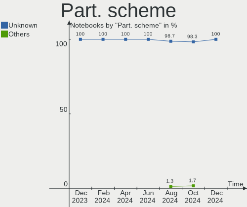
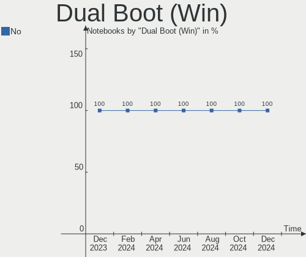
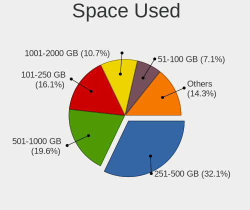
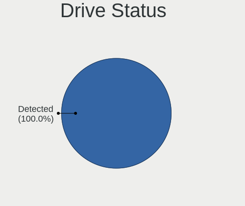
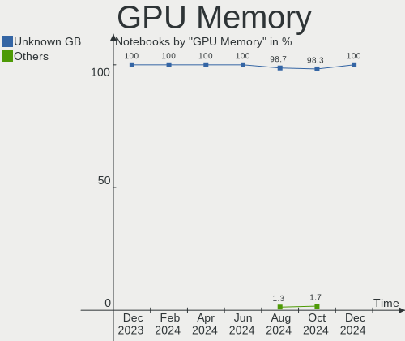
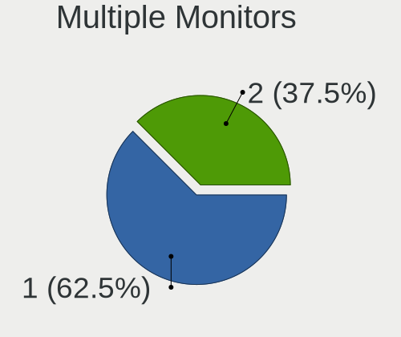
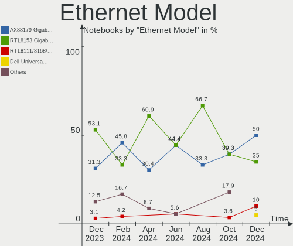
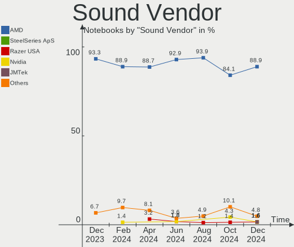
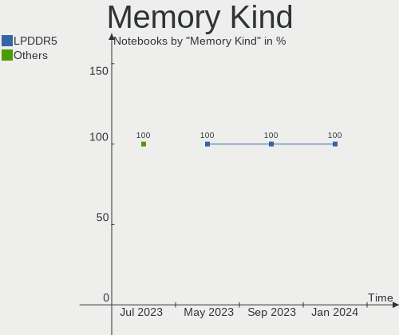
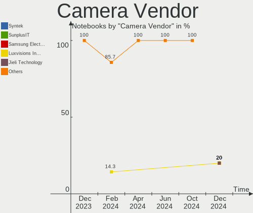

SteamOS - Hardware Trends (Notebooks)
-------------------------------------

A project to identify most popular hardware characteristics and track their change
over time based on data collected by Linux users at https://Linux-Hardware.org.

Anyone can contribute to this report by the [hw-probe](https://github.com/linuxhw/hw-probe) tool:

    sudo -E hw-probe -all -upload

This report is for one last month. Overall report since the beginning of time: [TestCoverage](https://github.com/linuxhw/TestCoverage)

Period: Aug, 2022.

Contents
--------

* [ System ](#system)
  - [ OS                       ](#os)
  - [ OS Family                ](#os-family)
  - [ Kernel                   ](#kernel)
  - [ Kernel Family            ](#kernel-family)
  - [ Kernel Major Ver.        ](#kernel-major-ver)
  - [ Arch                     ](#arch)
  - [ DE                       ](#de)
  - [ Display Server           ](#display-server)
  - [ Display Manager          ](#display-manager)
  - [ OS Lang                  ](#os-lang)
  - [ Boot Mode                ](#boot-mode)
  - [ Filesystem               ](#filesystem)
  - [ Part. scheme             ](#part-scheme)
  - [ Dual Boot with Linux/BSD ](#dual-boot-with-linuxbsd)
  - [ Dual Boot (Win)          ](#dual-boot-win)

* [ Board ](#board)
  - [ Vendor                   ](#vendor)
  - [ Model                    ](#model)
  - [ Model Family             ](#model-family)
  - [ MFG Year                 ](#mfg-year)
  - [ Form Factor              ](#form-factor)
  - [ Secure Boot              ](#secure-boot)
  - [ Coreboot                 ](#coreboot)
  - [ RAM Size                 ](#ram-size)
  - [ RAM Used                 ](#ram-used)
  - [ Total Drives             ](#total-drives)
  - [ Has CD-ROM               ](#has-cd-rom)
  - [ Has Ethernet             ](#has-ethernet)
  - [ Has WiFi                 ](#has-wifi)
  - [ Has Bluetooth            ](#has-bluetooth)

* [ Location ](#location)
  - [ Country                  ](#country)
  - [ City                     ](#city)

* [ Drives ](#drives)
  - [ Drive Vendor             ](#drive-vendor)
  - [ Drive Model              ](#drive-model)
  - [ HDD Vendor               ](#hdd-vendor)
  - [ SSD Vendor               ](#ssd-vendor)
  - [ Drive Kind               ](#drive-kind)
  - [ Drive Connector          ](#drive-connector)
  - [ Drive Size               ](#drive-size)
  - [ Space Total              ](#space-total)
  - [ Space Used               ](#space-used)
  - [ Malfunc. Drives          ](#malfunc-drives)
  - [ Malfunc. Drive Vendor    ](#malfunc-drive-vendor)
  - [ Malfunc. HDD Vendor      ](#malfunc-hdd-vendor)
  - [ Malfunc. Drive Kind      ](#malfunc-drive-kind)
  - [ Failed Drives            ](#failed-drives)
  - [ Failed Drive Vendor      ](#failed-drive-vendor)
  - [ Drive Status             ](#drive-status)

* [ Storage controller ](#storage-controller)
  - [ Storage Vendor           ](#storage-vendor)
  - [ Storage Model            ](#storage-model)
  - [ Storage Kind             ](#storage-kind)

* [ Processor ](#processor)
  - [ CPU Vendor               ](#cpu-vendor)
  - [ CPU Model                ](#cpu-model)
  - [ CPU Model Family         ](#cpu-model-family)
  - [ CPU Cores                ](#cpu-cores)
  - [ CPU Sockets              ](#cpu-sockets)
  - [ CPU Threads              ](#cpu-threads)
  - [ CPU Op-Modes             ](#cpu-op-modes)
  - [ CPU Microcode            ](#cpu-microcode)
  - [ CPU Microarch            ](#cpu-microarch)

* [ Graphics ](#graphics)
  - [ GPU Vendor               ](#gpu-vendor)
  - [ GPU Model                ](#gpu-model)
  - [ GPU Combo                ](#gpu-combo)
  - [ GPU Driver               ](#gpu-driver)
  - [ GPU Memory               ](#gpu-memory)

* [ Monitor ](#monitor)
  - [ Monitor Vendor           ](#monitor-vendor)
  - [ Monitor Model            ](#monitor-model)
  - [ Monitor Resolution       ](#monitor-resolution)
  - [ Monitor Diagonal         ](#monitor-diagonal)
  - [ Monitor Width            ](#monitor-width)
  - [ Aspect Ratio             ](#aspect-ratio)
  - [ Monitor Area             ](#monitor-area)
  - [ Pixel Density            ](#pixel-density)
  - [ Multiple Monitors        ](#multiple-monitors)

* [ Network ](#network)
  - [ Net Controller Vendor    ](#net-controller-vendor)
  - [ Net Controller Model     ](#net-controller-model)
  - [ Wireless Vendor          ](#wireless-vendor)
  - [ Wireless Model           ](#wireless-model)
  - [ Ethernet Vendor          ](#ethernet-vendor)
  - [ Ethernet Model           ](#ethernet-model)
  - [ Net Controller Kind      ](#net-controller-kind)
  - [ Used Controller          ](#used-controller)
  - [ NICs                     ](#nics)
  - [ IPv6                     ](#ipv6)

* [ Bluetooth ](#bluetooth)
  - [ Bluetooth Vendor         ](#bluetooth-vendor)
  - [ Bluetooth Model          ](#bluetooth-model)

* [ Sound ](#sound)
  - [ Sound Vendor             ](#sound-vendor)
  - [ Sound Model              ](#sound-model)

* [ Memory ](#memory)
  - [ Memory Vendor            ](#memory-vendor)
  - [ Memory Model             ](#memory-model)
  - [ Memory Kind              ](#memory-kind)
  - [ Memory Form Factor       ](#memory-form-factor)
  - [ Memory Size              ](#memory-size)
  - [ Memory Speed             ](#memory-speed)

* [ Printers & scanners ](#printers--scanners)
  - [ Printer Vendor           ](#printer-vendor)
  - [ Printer Model            ](#printer-model)
  - [ Scanner Vendor           ](#scanner-vendor)
  - [ Scanner Model            ](#scanner-model)

* [ Camera ](#camera)
  - [ Camera Vendor            ](#camera-vendor)
  - [ Camera Model             ](#camera-model)

* [ Security ](#security)
  - [ Fingerprint Vendor       ](#fingerprint-vendor)
  - [ Fingerprint Model        ](#fingerprint-model)
  - [ Chipcard Vendor          ](#chipcard-vendor)
  - [ Chipcard Model           ](#chipcard-model)

* [ Unsupported ](#unsupported)
  - [ Unsupported Devices      ](#unsupported-devices)
  - [ Unsupported Device Types ](#unsupported-device-types)

System
------

OS
--

Installed operating systems

| Name            | Notebooks | Percent |
|-----------------|-----------|---------|
| SteamOS 3.3     | 37        | 55.22%  |
| SteamOS 3.3.1   | 26        | 38.81%  |
| SteamOS 3.2     | 2         | 2.99%   |
| SteamOS Rolling | 1         | 1.49%   |
| SteamOS 3.1     | 1         | 1.49%   |

OS Family
---------

OS without a version

| Name    | Notebooks | Percent |
|---------|-----------|---------|
| SteamOS | 67        | 100%    |

Kernel
------

Version of the Linux kernel

| Version                                        | Notebooks | Percent |
|------------------------------------------------|-----------|---------|
| 5.13.0-valve21-1-neptune-02209-g2a5bdc1102a0   | 32        | 47.76%  |
| 5.13.0-valve21.1-1-neptune-02211-gc54cda5a36f3 | 26        | 38.81%  |
| 5.13.0-valve24-1-neptune-02226-g5b8545e4c5a1   | 4         | 5.97%   |
| 5.13.0-valve22-1-neptune-02213-gb68995364335   | 2         | 2.99%   |
| 5.13.0-valve15-1-neptune-02197-gf6ec7ad3762a   | 2         | 2.99%   |
| 5.13.0-valve10.3-1-neptune-02176-g5fe416c4acd8 | 1         | 1.49%   |

Kernel Family
-------------

Linux kernel without a distro release

| Version | Notebooks | Percent |
|---------|-----------|---------|
| 5.13.0  | 67        | 100%    |

Kernel Major Ver.
-----------------

Linux kernel major version

| Version | Notebooks | Percent |
|---------|-----------|---------|
| 5.13    | 67        | 100%    |

Arch
----

OS architecture (x86_64, i586, etc.)

| Name   | Notebooks | Percent |
|--------|-----------|---------|
| x86_64 | 67        | 100%    |

DE
--

Desktop Environment

| Name      | Notebooks | Percent |
|-----------|-----------|---------|
| KDE5      | 65        | 97.01%  |
| gamescope | 2         | 2.99%   |

Display Server
--------------

X11 or Wayland

| Name    | Notebooks | Percent |
|---------|-----------|---------|
| X11     | 65        | 97.01%  |
| Wayland | 2         | 2.99%   |

Display Manager
---------------

SDDM, LightDM, etc.

| Name    | Notebooks | Percent |
|---------|-----------|---------|
| Unknown | 66        | 98.51%  |
| SDDM    | 1         | 1.49%   |

OS Lang
-------

Language

| Lang  | Notebooks | Percent |
|-------|-----------|---------|
| en_US | 62        | 92.54%  |
| de_DE | 2         | 2.99%   |
| zh_CN | 1         | 1.49%   |
| et_EE | 1         | 1.49%   |
| en_GB | 1         | 1.49%   |

Boot Mode
---------

EFI or BIOS

| Mode | Notebooks | Percent |
|------|-----------|---------|
| BIOS | 66        | 98.51%  |
| EFI  | 1         | 1.49%   |

Filesystem
----------

Type of filesystem

| Type  | Notebooks | Percent |
|-------|-----------|---------|
| Btrfs | 66        | 98.51%  |
| Ext4  | 1         | 1.49%   |

Part. scheme
------------

Scheme of partitioning

| Type    | Notebooks | Percent |
|---------|-----------|---------|
| Unknown | 66        | 98.51%  |
| GPT     | 1         | 1.49%   |

Dual Boot with Linux/BSD
------------------------

Hosting more than one Linux/BSD

| Dual boot | Notebooks | Percent |
|-----------|-----------|---------|
| No        | 66        | 98.51%  |
| Yes       | 1         | 1.49%   |

Dual Boot (Win)
---------------

Hosting Linux and Windows

| Dual boot | Notebooks | Percent |
|-----------|-----------|---------|
| No        | 67        | 100%    |

Board
-----

Vendor
------

Motherboard manufacturer

| Name            | Notebooks | Percent |
|-----------------|-----------|---------|
| Valve           | 61        | 91.04%  |
| Lenovo          | 2         | 2.99%   |
| Dell            | 2         | 2.99%   |
| Hewlett-Packard | 1         | 1.49%   |
| AMI             | 1         | 1.49%   |

Model
-----

Motherboard model

| Name                                | Notebooks | Percent |
|-------------------------------------|-----------|---------|
| Valve Jupiter                       | 61        | 91.04%  |
| Lenovo Legion Y740-15IRHg 81UH      | 1         | 1.49%   |
| Lenovo IdeaPad Gaming 3 15ACH6 82K2 | 1         | 1.49%   |
| HP Laptop 14z-fq0000                | 1         | 1.49%   |
| Dell XPS 13 9360                    | 1         | 1.49%   |
| Dell Precision 7720                 | 1         | 1.49%   |
| Unknown                             | 1         | 1.49%   |

Model Family
------------

Motherboard model prefix

| Name           | Notebooks | Percent |
|----------------|-----------|---------|
| Valve Jupiter  | 61        | 91.04%  |
| Lenovo Legion  | 1         | 1.49%   |
| Lenovo IdeaPad | 1         | 1.49%   |
| HP Laptop      | 1         | 1.49%   |
| Dell XPS       | 1         | 1.49%   |
| Dell Precision | 1         | 1.49%   |
| Unknown        | 1         | 1.49%   |

MFG Year
--------

Motherboard manufacture year

| Year | Notebooks | Percent |
|------|-----------|---------|
| 2022 | 61        | 91.04%  |
| 2017 | 2         | 2.99%   |
| 2021 | 1         | 1.49%   |
| 2020 | 1         | 1.49%   |
| 2019 | 1         | 1.49%   |
| 2016 | 1         | 1.49%   |

Form Factor
-----------

Physical design of the computer

| Name     | Notebooks | Percent |
|----------|-----------|---------|
| Notebook | 67        | 100%    |

Secure Boot
-----------

Enabled or disabled

| State    | Notebooks | Percent |
|----------|-----------|---------|
| Disabled | 67        | 100%    |

Coreboot
--------

Have coreboot on board

| Used | Notebooks | Percent |
|------|-----------|---------|
| No   | 67        | 100%    |

RAM Size
--------

Total RAM memory

| Size in GB | Notebooks | Percent |
|------------|-----------|---------|
| 8.01-16.0  | 62        | 92.54%  |
| 16.01-24.0 | 2         | 2.99%   |
| 4.01-8.0   | 1         | 1.49%   |
| 3.01-4.0   | 1         | 1.49%   |
| 24.01-32.0 | 1         | 1.49%   |

RAM Used
--------

Used RAM memory

| Used GB  | Notebooks | Percent |
|----------|-----------|---------|
| 2.01-3.0 | 28        | 41.79%  |
| 3.01-4.0 | 19        | 28.36%  |
| 1.01-2.0 | 11        | 16.42%  |
| 4.01-8.0 | 9         | 13.43%  |

Total Drives
------------

Number of drives on board

| Drives | Notebooks | Percent |
|--------|-----------|---------|
| 2      | 41        | 61.19%  |
| 1      | 23        | 34.33%  |
| 3      | 3         | 4.48%   |

Has CD-ROM
----------

Has CD-ROM on board

| Presented | Notebooks | Percent |
|-----------|-----------|---------|
| No        | 66        | 98.51%  |
| Yes       | 1         | 1.49%   |

Has Ethernet
------------

Has Ethernet on board

| Presented | Notebooks | Percent |
|-----------|-----------|---------|
| No        | 48        | 71.64%  |
| Yes       | 19        | 28.36%  |

Has WiFi
--------

Has WiFi module

| Presented | Notebooks | Percent |
|-----------|-----------|---------|
| Yes       | 67        | 100%    |

Has Bluetooth
-------------

Has Bluetooth module

| Presented | Notebooks | Percent |
|-----------|-----------|---------|
| Yes       | 66        | 98.51%  |
| No        | 1         | 1.49%   |

Location
--------

Country
-------

Geographic location (country)

| Country   | Notebooks | Percent |
|-----------|-----------|---------|
| USA       | 39        | 58.21%  |
| UK        | 7         | 10.45%  |
| Canada    | 6         | 8.96%   |
| Germany   | 4         | 5.97%   |
| Poland    | 2         | 2.99%   |
| Sweden    | 1         | 1.49%   |
| Spain     | 1         | 1.49%   |
| Russia    | 1         | 1.49%   |
| Oman      | 1         | 1.49%   |
| Italy     | 1         | 1.49%   |
| Guatemala | 1         | 1.49%   |
| Estonia   | 1         | 1.49%   |
| Czechia   | 1         | 1.49%   |
| China     | 1         | 1.49%   |

City
----

Geographic location (city)

| City               | Notebooks | Percent |
|--------------------|-----------|---------|
| Brooklyn           | 2         | 2.99%   |
| Bristol            | 2         | 2.99%   |
| Yekaterinburg      | 1         | 1.49%   |
| Wausau             | 1         | 1.49%   |
| Vechelde           | 1         | 1.49%   |
| Ulm                | 1         | 1.49%   |
| Toronto            | 1         | 1.49%   |
| Thief River Falls  | 1         | 1.49%   |
| Sylmar             | 1         | 1.49%   |
| Sunnyvale          | 1         | 1.49%   |
| Stuttgart          | 1         | 1.49%   |
| Seattle            | 1         | 1.49%   |
| Santa Clara        | 1         | 1.49%   |
| San Antonio        | 1         | 1.49%   |
| Rockville          | 1         | 1.49%   |
| Ringwood           | 1         | 1.49%   |
| Québec            | 1         | 1.49%   |
| Przezmierowo       | 1         | 1.49%   |
| Prague             | 1         | 1.49%   |
| Poznan             | 1         | 1.49%   |
| Philadelphia       | 1         | 1.49%   |
| Pärnu             | 1         | 1.49%   |
| Park City          | 1         | 1.49%   |
| Ottawa             | 1         | 1.49%   |
| North Shields      | 1         | 1.49%   |
| New Orleans        | 1         | 1.49%   |
| Muscat             | 1         | 1.49%   |
| Moore              | 1         | 1.49%   |
| Mixco              | 1         | 1.49%   |
| Milton Keynes      | 1         | 1.49%   |
| Milan              | 1         | 1.49%   |
| Middleboro         | 1         | 1.49%   |
| Manchester         | 1         | 1.49%   |
| Louisville         | 1         | 1.49%   |
| Los Angeles        | 1         | 1.49%   |
| Lloydminster       | 1         | 1.49%   |
| Leganés           | 1         | 1.49%   |
| Jeffersonville     | 1         | 1.49%   |
| Jefferson City     | 1         | 1.49%   |
| Jacksonville Beach | 1         | 1.49%   |
| Jacksonville       | 1         | 1.49%   |
| Hartford City      | 1         | 1.49%   |
| Haltom City        | 1         | 1.49%   |
| Grass Valley       | 1         | 1.49%   |
| Gothenburg         | 1         | 1.49%   |
| Gainesville        | 1         | 1.49%   |
| Fremont            | 1         | 1.49%   |
| Fort St. John      | 1         | 1.49%   |
| Fayette            | 1         | 1.49%   |
| Dinslaken          | 1         | 1.49%   |
| Denver             | 1         | 1.49%   |
| Dayton             | 1         | 1.49%   |
| Daqing             | 1         | 1.49%   |
| Crosby             | 1         | 1.49%   |
| Columbus           | 1         | 1.49%   |
| Cheadle            | 1         | 1.49%   |
| Cedar Lake         | 1         | 1.49%   |
| Casa Grande        | 1         | 1.49%   |
| Canton             | 1         | 1.49%   |
| Cambridge          | 1         | 1.49%   |

Drives
------

Drive Vendor
------------

Hard drive vendors

| Vendor                      | Notebooks | Drives | Percent |
|-----------------------------|-----------|--------|---------|
| Unknown                     | 35        | 35     | 30.43%  |
| Phison                      | 28        | 28     | 24.35%  |
| Kingston                    | 22        | 22     | 19.13%  |
| Unknown                     | 10        | 10     | 8.7%    |
| Silicon Motion              | 4         | 4      | 3.48%   |
| Samsung Electronics         | 4         | 4      | 3.48%   |
| O2 Micro                    | 3         | 3      | 2.61%   |
| SK hynix                    | 2         | 2      | 1.74%   |
| SanDisk                     | 2         | 2      | 1.74%   |
| Yangtze Memory Technologies | 1         | 1      | 0.87%   |
| TrekStor                    | 1         | 1      | 0.87%   |
| Toshiba                     | 1         | 1      | 0.87%   |
| SSK                         | 1         | 1      | 0.87%   |
| Micron Technology           | 1         | 1      | 0.87%   |

Drive Model
-----------

Hard drive models

| Model                                   | Notebooks | Percent |
|-----------------------------------------|-----------|---------|
| Phison NVMe SSD Drive 512GB             | 22        | 19.13%  |
| Unknown MMC Card  512GB                 | 13        | 11.3%   |
| Kingston NVMe SSD Drive 256GB           | 12        | 10.43%  |
| Kingston NVMe SSD Drive 512GB           | 10        | 8.7%    |
| Unknown                                 | 10        | 8.7%    |
| Unknown MMC Card  128GB                 | 8         | 6.96%   |
| Phison NVMe SSD Drive 256GB             | 5         | 4.35%   |
| Unknown MMC Card  256GB                 | 4         | 3.48%   |
| Silicon Motion NVMe SSD Drive 512GB     | 4         | 3.48%   |
| Unknown MMC Card  32GB                  | 3         | 2.61%   |
| O2 Micro NVMe SSD Drive 64GB            | 3         | 2.61%   |
| Unknown MMC Card  64GB                  | 2         | 1.74%   |
| Unknown MMC Card  393GB                 | 2         | 1.74%   |
| Samsung SM963 2.5" NVMe PCIe SSD 1024GB | 2         | 1.74%   |
| Yangtze Memory NVMe SSD Drive 1024GB    | 1         | 0.87%   |
| Unknown SK256  256GB                    | 1         | 0.87%   |
| Unknown MMC Card  250GB                 | 1         | 0.87%   |
| Unknown MMC Card  16GB                  | 1         | 0.87%   |
| TrekStor DS picco SSD 128GB             | 1         | 0.87%   |
| Toshiba NVMe SSD Drive 512GB            | 1         | 0.87%   |
| SSK Disk 256GB                          | 1         | 0.87%   |
| SK hynix NVMe SSD Drive 512GB           | 1         | 0.87%   |
| SK hynix NVMe SSD Drive 1024GB          | 1         | 0.87%   |
| SanDisk NVMe SSD Drive 1TB              | 1         | 0.87%   |
| Sandisk Microsoft Xbox Series X 930GB   | 1         | 0.87%   |
| Samsung SM963 2.5" NVMe PCIe SSD 128GB  | 1         | 0.87%   |
| Samsung PSSD T7 1TB                     | 1         | 0.87%   |
| Phison ESMP512GKB4C3-E13TS 512GB        | 1         | 0.87%   |
| Micron NVMe SSD Drive 512GB             | 1         | 0.87%   |

HDD Vendor
----------

Hard disk drive vendors

Zero info for selected period =(

SSD Vendor
----------

Solid state drive vendors

| Vendor              | Notebooks | Drives | Percent |
|---------------------|-----------|--------|---------|
| TrekStor            | 1         | 1      | 50%     |
| Samsung Electronics | 1         | 1      | 50%     |

Drive Kind
----------

HDD or SSD

| Kind    | Notebooks | Drives | Percent |
|---------|-----------|--------|---------|
| NVMe    | 66        | 67     | 57.89%  |
| MMC     | 45        | 45     | 39.47%  |
| SSD     | 2         | 2      | 1.75%   |
| Unknown | 1         | 1      | 0.88%   |

Drive Connector
---------------

SATA, SAS, NVMe, etc.

| Type | Notebooks | Drives | Percent |
|------|-----------|--------|---------|
| NVMe | 66        | 67     | 57.89%  |
| MMC  | 45        | 45     | 39.47%  |
| SAS  | 3         | 3      | 2.63%   |

Drive Size
----------

Size of hard drive

| Size in TB | Notebooks | Drives | Percent |
|------------|-----------|--------|---------|
| 0.51-1.0   | 1         | 1      | 50%     |
| 0.01-0.5   | 1         | 1      | 50%     |

Space Total
-----------

Amount of disk space available on the file system

| Size in GB | Notebooks | Percent |
|------------|-----------|---------|
| 251-500    | 35        | 52.24%  |
| 101-250    | 17        | 25.37%  |
| 501-1000   | 11        | 16.42%  |
| 51-100     | 4         | 5.97%   |

Space Used
----------

Amount of used disk space

| Used GB  | Notebooks | Percent |
|----------|-----------|---------|
| 101-250  | 27        | 40.3%   |
| 251-500  | 21        | 31.34%  |
| 21-50    | 7         | 10.45%  |
| 51-100   | 6         | 8.96%   |
| 1-20     | 5         | 7.46%   |
| 501-1000 | 1         | 1.49%   |

Malfunc. Drives
---------------

Drive models with a malfunction

Zero info for selected period =(

Malfunc. Drive Vendor
---------------------

Vendors of faulty drives

Zero info for selected period =(

Malfunc. HDD Vendor
-------------------

Vendors of faulty HDD drives

Zero info for selected period =(

Malfunc. Drive Kind
-------------------

Kinds of faulty drives

Zero info for selected period =(

Failed Drives
-------------

Failed drive models

Zero info for selected period =(

Failed Drive Vendor
-------------------

Failed drive vendors

Zero info for selected period =(

Drive Status
------------

Number of failed and malfunc. drives

| Status   | Notebooks | Drives | Percent |
|----------|-----------|--------|---------|
| Detected | 67        | 114    | 98.53%  |
| Works    | 1         | 1      | 1.47%   |

Storage controller
------------------

Storage Vendor
--------------

Storage controller vendors

| Vendor                       | Notebooks | Percent |
|------------------------------|-----------|---------|
| Phison Electronics           | 28        | 40.58%  |
| Kingston Technology Company  | 22        | 31.88%  |
| Silicon Motion               | 4         | 5.8%    |
| Samsung Electronics          | 3         | 4.35%   |
| O2 Micro                     | 3         | 4.35%   |
| SK hynix                     | 2         | 2.9%    |
| SanDisk                      | 2         | 2.9%    |
| Intel                        | 2         | 2.9%    |
| Yangtze Memory Technologies  | 1         | 1.45%   |
| Toshiba America Info Systems | 1         | 1.45%   |
| Micron Technology            | 1         | 1.45%   |

Storage Model
-------------

Storage controller models

| Model                                                                         | Notebooks | Percent |
|-------------------------------------------------------------------------------|-----------|---------|
| Phison PS5013 E13 NVMe Controller                                             | 28        | 40.58%  |
| Kingston Company OM3PDP3 NVMe SSD                                             | 22        | 31.88%  |
| Silicon Motion SM2263EN/SM2263XT SSD Controller                               | 4         | 5.8%    |
| O2 Micro Non-Volatile memory controller                                       | 3         | 4.35%   |
| SK hynix Gold P31 SSD                                                         | 2         | 2.9%    |
| Yangtze Memory Non-Volatile memory controller                                 | 1         | 1.45%   |
| Toshiba America Info Systems XG4 NVMe SSD Controller                          | 1         | 1.45%   |
| SanDisk WD PC SN810 / Black SN850 NVMe SSD                                    | 1         | 1.45%   |
| SanDisk PC SN530 NVMe SSD                                                     | 1         | 1.45%   |
| Samsung NVMe SSD Controller SM981/PM981/PM983                                 | 1         | 1.45%   |
| Samsung NVMe SSD Controller SM961/PM961/SM963                                 | 1         | 1.45%   |
| Samsung NVMe SSD Controller 980                                               | 1         | 1.45%   |
| Micron Non-Volatile memory controller                                         | 1         | 1.45%   |
| Intel Q170/Q150/B150/H170/H110/Z170/CM236 Chipset SATA Controller [AHCI Mode] | 1         | 1.45%   |
| Intel Cannon Lake Mobile PCH SATA AHCI Controller                             | 1         | 1.45%   |

Storage Kind
------------

Kind of storage controller (IDE, SATA, NVMe, SAS, ...)

| Kind | Notebooks | Percent |
|------|-----------|---------|
| NVMe | 66        | 97.06%  |
| SATA | 2         | 2.94%   |

Processor
---------

CPU Vendor
----------

Processor vendors

| Vendor | Notebooks | Percent |
|--------|-----------|---------|
| AMD    | 63        | 94.03%  |
| Intel  | 4         | 5.97%   |

CPU Model
---------

Processor models

| Model                                  | Notebooks | Percent |
|----------------------------------------|-----------|---------|
| AMD Custom APU 0405                    | 61        | 91.04%  |
| Intel Xeon CPU E3-1575M v5 @ 3.00GHz   | 1         | 1.49%   |
| Intel Core i7-9750H CPU @ 2.60GHz      | 1         | 1.49%   |
| Intel Core i7-7560U CPU @ 2.40GHz      | 1         | 1.49%   |
| Intel Atom x7-Z8750 CPU @ 1.60GHz      | 1         | 1.49%   |
| AMD Ryzen 5 5600H with Radeon Graphics | 1         | 1.49%   |
| AMD Ryzen 5 4500U with Radeon Graphics | 1         | 1.49%   |

CPU Model Family
----------------

Processor model prefix

| Model         | Notebooks | Percent |
|---------------|-----------|---------|
| Other         | 61        | 91.04%  |
| Intel Core i7 | 2         | 2.99%   |
| AMD Ryzen 5   | 2         | 2.99%   |
| Intel Xeon    | 1         | 1.49%   |
| Intel Atom    | 1         | 1.49%   |

CPU Cores
---------

Number of processor cores

| Number | Notebooks | Percent |
|--------|-----------|---------|
| 4      | 63        | 94.03%  |
| 6      | 3         | 4.48%   |
| 2      | 1         | 1.49%   |

CPU Sockets
-----------

Number of sockets

| Number | Notebooks | Percent |
|--------|-----------|---------|
| 1      | 67        | 100%    |

CPU Threads
-----------

Threads per core (Hyper-Threading)

| Number | Notebooks | Percent |
|--------|-----------|---------|
| 2      | 64        | 95.52%  |
| 1      | 3         | 4.48%   |

CPU Op-Modes
------------

CPU Operation Modes (32-bit, 64-bit)

| Op mode        | Notebooks | Percent |
|----------------|-----------|---------|
| 32-bit, 64-bit | 67        | 100%    |

CPU Microcode
-------------

Microcode number

| Number     | Notebooks | Percent |
|------------|-----------|---------|
| Unknown    | 66        | 98.51%  |
| 0x08900201 | 1         | 1.49%   |

CPU Microarch
-------------

Microarchitecture

| Name       | Notebooks | Percent |
|------------|-----------|---------|
| Unknown    | 61        | 91.04%  |
| KabyLake   | 2         | 2.99%   |
| Zen 3      | 1         | 1.49%   |
| Zen 2      | 1         | 1.49%   |
| Skylake    | 1         | 1.49%   |
| Silvermont | 1         | 1.49%   |

Graphics
--------

GPU Vendor
----------

Vendors of graphics cards

| Vendor | Notebooks | Percent |
|--------|-----------|---------|
| AMD    | 63        | 92.65%  |
| Nvidia | 3         | 4.41%   |
| Intel  | 2         | 2.94%   |

GPU Model
---------

Graphics card models

| Model                                                                                    | Notebooks | Percent |
|------------------------------------------------------------------------------------------|-----------|---------|
| AMD VanGogh [AMD Custom GPU 0405]                                                        | 61        | 89.71%  |
| Nvidia TU106BM [GeForce RTX 2060 Mobile]                                                 | 1         | 1.47%   |
| Nvidia GP104GLM [Quadro P4000 Mobile]                                                    | 1         | 1.47%   |
| Nvidia GA107M [GeForce RTX 3050 Mobile]                                                  | 1         | 1.47%   |
| Intel Iris Plus Graphics 640                                                             | 1         | 1.47%   |
| Intel Atom/Celeron/Pentium Processor x5-E8000/J3xxx/N3xxx Integrated Graphics Controller | 1         | 1.47%   |
| AMD Renoir                                                                               | 1         | 1.47%   |
| AMD Cezanne                                                                              | 1         | 1.47%   |

GPU Combo
---------

Combinations of graphics cards

| Name         | Notebooks | Percent |
|--------------|-----------|---------|
| 1 x AMD      | 62        | 92.54%  |
| 1 x Nvidia   | 2         | 2.99%   |
| 1 x Intel    | 2         | 2.99%   |
| AMD + Nvidia | 1         | 1.49%   |

GPU Driver
----------

Free vs proprietary

| Driver      | Notebooks | Percent |
|-------------|-----------|---------|
| Free        | 64        | 95.52%  |
| Proprietary | 3         | 4.48%   |

GPU Memory
----------

Total video memory

| Size in GB | Notebooks | Percent |
|------------|-----------|---------|
| Unknown    | 64        | 95.52%  |
| 7.01-8.0   | 1         | 1.49%   |
| 5.01-6.0   | 1         | 1.49%   |
| 0.51-1.0   | 1         | 1.49%   |

Monitor
-------

Monitor Vendor
--------------

Monitor vendors

| Vendor               | Notebooks | Percent |
|----------------------|-----------|---------|
| ANX                  | 58        | 74.36%  |
| Goldstar             | 3         | 3.85%   |
| Ancor Communications | 3         | 3.85%   |
| Samsung Electronics  | 2         | 2.56%   |
| BOE                  | 2         | 2.56%   |
| ASUSTek Computer     | 2         | 2.56%   |
| Valve                | 1         | 1.28%   |
| Sony                 | 1         | 1.28%   |
| Sharp                | 1         | 1.28%   |
| Pixio                | 1         | 1.28%   |
| Microsoft            | 1         | 1.28%   |
| Huion                | 1         | 1.28%   |
| Chimei Innolux       | 1         | 1.28%   |
| AU Optronics         | 1         | 1.28%   |

Monitor Model
-------------

Monitor models

| Model                                                                   | Notebooks | Percent |
|-------------------------------------------------------------------------|-----------|---------|
| ANX ANX7530 U ANX7539 800x1280                                          | 58        | 74.36%  |
| Valve ANX7530 U VLV3001 800x1280 100x150mm 7.1-inch                     | 1         | 1.28%   |
| Sony TV *00 SNY7A04 3840x2160 1218x685mm 55.0-inch                      | 1         | 1.28%   |
| Sharp LCD Monitor SHP144A 3200x1800 294x165mm 13.3-inch                 | 1         | 1.28%   |
| Samsung Electronics S24B300 SAM08CC 1920x1080 521x293mm 23.5-inch       | 1         | 1.28%   |
| Samsung Electronics C49HG9x SAM0E5D 2560x1080 1196x336mm 48.9-inch      | 1         | 1.28%   |
| Pixio PX277P PNS0277 2560x1440 620x370mm 28.4-inch                      | 1         | 1.28%   |
| Microsoft Xbox One MSH0001 1920x1080 1430x800mm 64.5-inch               | 1         | 1.28%   |
| Huion GT221 HAT2150 1920x1080 476x267mm 21.5-inch                       | 1         | 1.28%   |
| Goldstar ULTRAWIDE GSM76F9 2560x1080 531x298mm 24.0-inch                | 1         | 1.28%   |
| Goldstar ULTRAGEAR GSM774A 3440x1440 800x335mm 34.1-inch                | 1         | 1.28%   |
| Goldstar 27MU67 GSM5B00 3840x2160 600x340mm 27.2-inch                   | 1         | 1.28%   |
| Chimei Innolux LCD Monitor CMN1738 1920x1080 381x214mm 17.2-inch        | 1         | 1.28%   |
| BOE LCD Monitor BOE094E 1366x768 309x174mm 14.0-inch                    | 1         | 1.28%   |
| BOE LCD Monitor BOE083B 1920x1080 344x193mm 15.5-inch                   | 1         | 1.28%   |
| AU Optronics LCD Monitor AUO21ED 1920x1080 344x193mm 15.5-inch          | 1         | 1.28%   |
| ASUSTek Computer PG43U AUS43A1 3840x2160 941x529mm 42.5-inch            | 1         | 1.28%   |
| ASUSTek Computer PA248QV AUS2487 1920x1200 520x320mm 24.0-inch          | 1         | 1.28%   |
| Ancor Communications MX279 ACI27C3 1920x1080 598x336mm 27.0-inch        | 1         | 1.28%   |
| Ancor Communications ASUS VH242H ACI24F3 1920x1080 521x293mm 23.5-inch  | 1         | 1.28%   |
| Ancor Communications ASUS VG278HE ACI27E3 1920x1080 598x336mm 27.0-inch | 1         | 1.28%   |

Monitor Resolution
------------------

Monitor screen resolution

| Resolution        | Notebooks | Percent |
|-------------------|-----------|---------|
| 800x1280          | 59        | 75.64%  |
| 1920x1080 (FHD)   | 9         | 11.54%  |
| 3840x2160 (4K)    | 3         | 3.85%   |
| 3840x1080         | 1         | 1.28%   |
| 3440x1440         | 1         | 1.28%   |
| 3200x1800 (QHD+)  | 1         | 1.28%   |
| 2560x1440 (QHD)   | 1         | 1.28%   |
| 2560x1080         | 1         | 1.28%   |
| 1920x1200 (WUXGA) | 1         | 1.28%   |
| 1366x768 (WXGA)   | 1         | 1.28%   |

Monitor Diagonal
----------------

Diagonal size in inches

| Inches  | Notebooks | Percent |
|---------|-----------|---------|
| Unknown | 58        | 74.36%  |
| 27      | 3         | 3.85%   |
| 34      | 2         | 2.56%   |
| 23      | 2         | 2.56%   |
| 15      | 2         | 2.56%   |
| 64      | 1         | 1.28%   |
| 55      | 1         | 1.28%   |
| 49      | 1         | 1.28%   |
| 42      | 1         | 1.28%   |
| 28      | 1         | 1.28%   |
| 24      | 1         | 1.28%   |
| 21      | 1         | 1.28%   |
| 17      | 1         | 1.28%   |
| 14      | 1         | 1.28%   |
| 13      | 1         | 1.28%   |
| 7       | 1         | 1.28%   |

Monitor Width
-------------

Physical width

| Width in mm | Notebooks | Percent |
|-------------|-----------|---------|
| Unknown     | 58        | 74.36%  |
| 501-600     | 6         | 7.69%   |
| 301-350     | 3         | 3.85%   |
| 1001-1500   | 3         | 3.85%   |
| 701-800     | 2         | 2.56%   |
| 601-700     | 1         | 1.28%   |
| 401-500     | 1         | 1.28%   |
| 351-400     | 1         | 1.28%   |
| 201-300     | 1         | 1.28%   |
| 901-1000    | 1         | 1.28%   |
| 1-100       | 1         | 1.28%   |

Aspect Ratio
------------

Proportional relationship between the width and the height

| Ratio | Notebooks | Percent |
|-------|-----------|---------|
| 0.62  | 58        | 74.36%  |
| 16/9  | 15        | 19.23%  |
| 21/9  | 2         | 2.56%   |
| 32/9  | 1         | 1.28%   |
| 16/10 | 1         | 1.28%   |
| 0.67  | 1         | 1.28%   |

Monitor Area
------------

Area in inch²

| Area in inch² | Notebooks | Percent |
|----------------|-----------|---------|
| Unknown        | 58        | 74.36%  |
| 351-500        | 3         | 3.85%   |
| 301-350        | 3         | 3.85%   |
| More than 1000 | 2         | 2.56%   |
| 201-250        | 2         | 2.56%   |
| 101-110        | 2         | 2.56%   |
| 501-1000       | 2         | 2.56%   |
| 81-90          | 1         | 1.28%   |
| 71-80          | 1         | 1.28%   |
| 1-40           | 1         | 1.28%   |
| 251-300        | 1         | 1.28%   |
| 151-200        | 1         | 1.28%   |
| 121-130        | 1         | 1.28%   |

Pixel Density
-------------

Pixels per inch

| Density       | Notebooks | Percent |
|---------------|-----------|---------|
| Unknown       | 58        | 74.36%  |
| 51-100        | 8         | 10.26%  |
| 101-120       | 5         | 6.41%   |
| 121-160       | 3         | 3.85%   |
| 161-240       | 2         | 2.56%   |
| More than 240 | 1         | 1.28%   |
| 1-50          | 1         | 1.28%   |

Multiple Monitors
-----------------

Total monitors connected

| Total | Notebooks | Percent |
|-------|-----------|---------|
| 1     | 57        | 85.07%  |
| 2     | 9         | 13.43%  |
| 3     | 1         | 1.49%   |

Network
-------

Net Controller Vendor
---------------------

Controller vendors

| Vendor                | Notebooks | Percent |
|-----------------------|-----------|---------|
| Realtek Semiconductor | 63        | 77.78%  |
| ASIX Electronics      | 8         | 9.88%   |
| Intel                 | 3         | 3.7%    |
| Qualcomm Atheros      | 1         | 1.23%   |
| MediaTek              | 1         | 1.23%   |
| Lenovo                | 1         | 1.23%   |
| Google                | 1         | 1.23%   |
| DisplayLink           | 1         | 1.23%   |
| Dell                  | 1         | 1.23%   |
| Broadcom              | 1         | 1.23%   |

Net Controller Model
--------------------

Controller models

| Model                                                             | Notebooks | Percent |
|-------------------------------------------------------------------|-----------|---------|
| Realtek RTL8822CE 802.11ac PCIe Wireless Network Adapter          | 61        | 69.32%  |
| ASIX AX88179 Gigabit Ethernet                                     | 8         | 9.09%   |
| Realtek RTL8153 Gigabit Ethernet Adapter                          | 6         | 6.82%   |
| Realtek RTL8111/8168/8411 PCI Express Gigabit Ethernet Controller | 2         | 2.27%   |
| Intel Wi-Fi 6 AX200                                               | 2         | 2.27%   |
| Qualcomm Atheros QCA6174 802.11ac Wireless Network Adapter        | 1         | 1.14%   |
| MediaTek MT7921 802.11ax PCI Express Wireless Network Adapter     | 1         | 1.14%   |
| Lenovo ThinkPad Lan                                               | 1         | 1.14%   |
| Intel Ethernet Connection (5) I219-LM                             | 1         | 1.14%   |
| Intel Cannon Lake PCH CNVi WiFi                                   | 1         | 1.14%   |
| Google Pixel 6                                                    | 1         | 1.14%   |
| DisplayLink Dell Universal Dock D6000                             | 1         | 1.14%   |
| Dell DW5811e Snapdragon™ X7 LTE                              | 1         | 1.14%   |
| Broadcom BCM4356 802.11ac Wireless Network Adapter                | 1         | 1.14%   |

Wireless Vendor
---------------

Wireless vendors

| Vendor                | Notebooks | Percent |
|-----------------------|-----------|---------|
| Realtek Semiconductor | 61        | 89.71%  |
| Intel                 | 3         | 4.41%   |
| Qualcomm Atheros      | 1         | 1.47%   |
| MediaTek              | 1         | 1.47%   |
| Dell                  | 1         | 1.47%   |
| Broadcom              | 1         | 1.47%   |

Wireless Model
--------------

Wireless models

| Model                                                         | Notebooks | Percent |
|---------------------------------------------------------------|-----------|---------|
| Realtek RTL8822CE 802.11ac PCIe Wireless Network Adapter      | 61        | 89.71%  |
| Intel Wi-Fi 6 AX200                                           | 2         | 2.94%   |
| Qualcomm Atheros QCA6174 802.11ac Wireless Network Adapter    | 1         | 1.47%   |
| MediaTek MT7921 802.11ax PCI Express Wireless Network Adapter | 1         | 1.47%   |
| Intel Cannon Lake PCH CNVi WiFi                               | 1         | 1.47%   |
| Dell DW5811e Snapdragon™ X7 LTE                          | 1         | 1.47%   |
| Broadcom BCM4356 802.11ac Wireless Network Adapter            | 1         | 1.47%   |

Ethernet Vendor
---------------

Ethernet vendors

| Vendor                | Notebooks | Percent |
|-----------------------|-----------|---------|
| Realtek Semiconductor | 8         | 40%     |
| ASIX Electronics      | 8         | 40%     |
| Lenovo                | 1         | 5%      |
| Intel                 | 1         | 5%      |
| Google                | 1         | 5%      |
| DisplayLink           | 1         | 5%      |

Ethernet Model
--------------

Ethernet models

| Model                                                             | Notebooks | Percent |
|-------------------------------------------------------------------|-----------|---------|
| ASIX AX88179 Gigabit Ethernet                                     | 8         | 40%     |
| Realtek RTL8153 Gigabit Ethernet Adapter                          | 6         | 30%     |
| Realtek RTL8111/8168/8411 PCI Express Gigabit Ethernet Controller | 2         | 10%     |
| Lenovo ThinkPad Lan                                               | 1         | 5%      |
| Intel Ethernet Connection (5) I219-LM                             | 1         | 5%      |
| Google Pixel 6                                                    | 1         | 5%      |
| DisplayLink Dell Universal Dock D6000                             | 1         | 5%      |

Net Controller Kind
-------------------

Ethernet, WiFi or modem

| Kind     | Notebooks | Percent |
|----------|-----------|---------|
| WiFi     | 67        | 77.91%  |
| Ethernet | 19        | 22.09%  |

Used Controller
---------------

Currently used network controller

| Kind     | Notebooks | Percent |
|----------|-----------|---------|
| WiFi     | 64        | 86.49%  |
| Ethernet | 10        | 13.51%  |

NICs
----

Total network controllers on board

| Total | Notebooks | Percent |
|-------|-----------|---------|
| 1     | 64        | 95.52%  |
| 2     | 3         | 4.48%   |

IPv6
----

IPv6 vs IPv4

| Used | Notebooks | Percent |
|------|-----------|---------|
| No   | 44        | 65.67%  |
| Yes  | 23        | 34.33%  |

Bluetooth
---------

Bluetooth Vendor
----------------

Controller vendors

| Vendor                          | Notebooks | Percent |
|---------------------------------|-----------|---------|
| IMC Networks                    | 61        | 92.42%  |
| Intel                           | 3         | 4.55%   |
| Qualcomm Atheros Communications | 1         | 1.52%   |
| Foxconn / Hon Hai               | 1         | 1.52%   |

Bluetooth Model
---------------

Controller models

| Model                                          | Notebooks | Percent |
|------------------------------------------------|-----------|---------|
| IMC Networks Bluetooth Radio                   | 61        | 92.42%  |
| Intel AX200 Bluetooth                          | 2         | 3.03%   |
| Qualcomm Atheros  Bluetooth Device             | 1         | 1.52%   |
| Intel Bluetooth 9460/9560 Jefferson Peak (JfP) | 1         | 1.52%   |
| Foxconn / Hon Hai Wireless_Device              | 1         | 1.52%   |

Sound
-----

Sound Vendor
------------

Sound card vendors

| Vendor    | Notebooks | Percent |
|-----------|-----------|---------|
| AMD       | 63        | 90%     |
| Intel     | 3         | 4.29%   |
| Nvidia    | 2         | 2.86%   |
| Logitech  | 1         | 1.43%   |
| GN Netcom | 1         | 1.43%   |

Sound Model
-----------

Sound card models

| Model                                                 | Notebooks | Percent |
|-------------------------------------------------------|-----------|---------|
| AMD Rembrandt Radeon High Definition Audio Controller | 61        | 84.72%  |
| AMD Renoir Radeon High Definition Audio Controller    | 2         | 2.78%   |
| AMD Family 17h/19h HD Audio Controller                | 2         | 2.78%   |
| Nvidia TU106 High Definition Audio Controller         | 1         | 1.39%   |
| Nvidia GP104 High Definition Audio Controller         | 1         | 1.39%   |
| Logitech G432 Gaming Headset                          | 1         | 1.39%   |
| Intel Sunrise Point-LP HD Audio                       | 1         | 1.39%   |
| Intel CM238 HD Audio Controller                       | 1         | 1.39%   |
| Intel Cannon Lake PCH cAVS                            | 1         | 1.39%   |
| GN Netcom Jabra Link 370                              | 1         | 1.39%   |

Memory
------

Memory Vendor
-------------

Memory module vendors

| Vendor  | Notebooks | Percent |
|---------|-----------|---------|
| Unknown | 1         | 100%    |

Memory Model
------------

Memory module models

| Model   | Notebooks | Percent |
|---------|-----------|---------|
| Unknown | 1         | 100%    |

Memory Kind
-----------

Memory module kinds

| Kind   | Notebooks | Percent |
|--------|-----------|---------|
| LPDDR5 | 1         | 100%    |

Memory Form Factor
------------------

Physical design of the memory module

| Name   | Notebooks | Percent |
|--------|-----------|---------|
| SODIMM | 1         | 100%    |

Memory Size
-----------

Memory module size

| Size | Notebooks | Percent |
|------|-----------|---------|
| 4096 | 1         | 100%    |

Memory Speed
------------

Memory module speed

| Speed | Notebooks | Percent |
|-------|-----------|---------|
| 4266  | 1         | 100%    |

Printers & scanners
-------------------

Printer Vendor
--------------

Printer device vendors

Zero info for selected period =(

Printer Model
-------------

Printer device models

Zero info for selected period =(

Scanner Vendor
--------------

Scanner device vendors

Zero info for selected period =(

Scanner Model
-------------

Scanner device models

Zero info for selected period =(

Camera
------

Camera Vendor
-------------

Camera device vendors

| Vendor              | Notebooks | Percent |
|---------------------|-----------|---------|
| Chicony Electronics | 2         | 40%     |
| SunplusIT           | 1         | 20%     |
| Microdia            | 1         | 20%     |
| Acer                | 1         | 20%     |

Camera Model
------------

Camera device models

| Model                                   | Notebooks | Percent |
|-----------------------------------------|-----------|---------|
| SunplusIT CODi A05020 Webcam            | 1         | 20%     |
| Microdia Integrated Webcam HD           | 1         | 20%     |
| Chicony Integrated Camera (1280x720@30) | 1         | 20%     |
| Chicony HP TrueVision HD Camera         | 1         | 20%     |
| Acer Integrated Camera                  | 1         | 20%     |

Security
--------

Fingerprint Vendor
------------------

Fingerprint sensor vendors

Zero info for selected period =(

Fingerprint Model
-----------------

Fingerprint sensor models

Zero info for selected period =(

Chipcard Vendor
---------------

Chipcard module vendors

| Vendor           | Notebooks | Percent |
|------------------|-----------|---------|
| SCM Microsystems | 1         | 100%    |

Chipcard Model
--------------

Chipcard module models

| Model                                     | Notebooks | Percent |
|-------------------------------------------|-----------|---------|
| SCM Microsystems SCR3500 A Contact Reader | 1         | 100%    |

Unsupported
-----------

Unsupported Devices
-------------------

Total unsupported devices on board

| Total | Notebooks | Percent |
|-------|-----------|---------|
| 0     | 65        | 97.01%  |
| 2     | 1         | 1.49%   |
| 1     | 1         | 1.49%   |

Unsupported Device Types
------------------------

Types of unsupported devices

| Type                  | Notebooks | Percent |
|-----------------------|-----------|---------|
| Net/wireless          | 1         | 33.33%  |
| Multimedia controller | 1         | 33.33%  |
| Chipcard              | 1         | 33.33%  |

