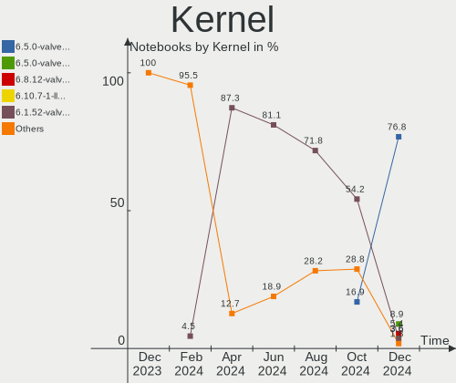
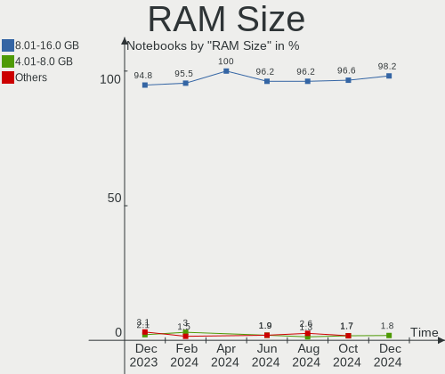
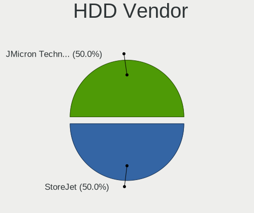
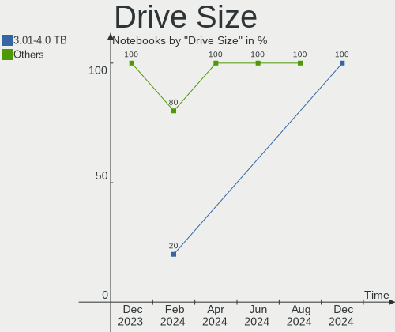
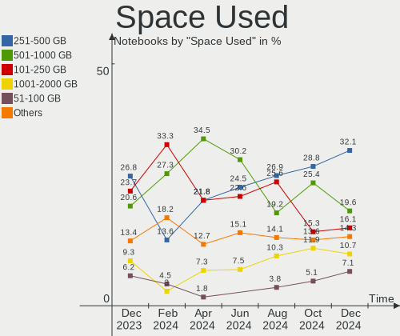
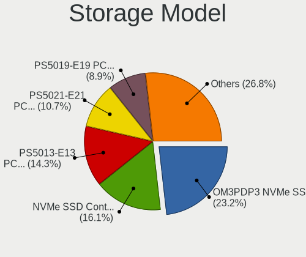
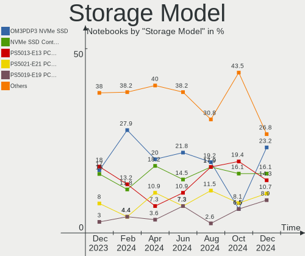
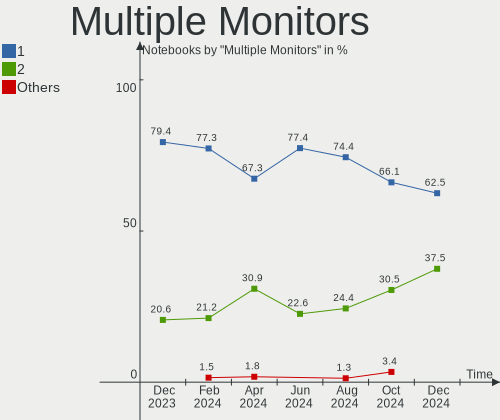
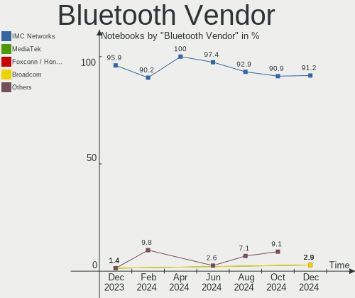

SteamOS - Hardware Trends (Notebooks)
-------------------------------------

A project to identify most popular hardware characteristics and track their change
over time based on data collected by Linux users at https://Linux-Hardware.org.

Anyone can contribute to this report by the [hw-probe](https://github.com/linuxhw/hw-probe) tool:

    sudo -E hw-probe -all -upload

This report is for one last month. Overall report since the beginning of time: [TestDays](https://github.com/linuxhw/TestDays)

Period: Aug, 2023.

Contents
--------

* [ System ](#system)
  - [ OS                       ](#os)
  - [ OS Family                ](#os-family)
  - [ Kernel                   ](#kernel)
  - [ Kernel Family            ](#kernel-family)
  - [ Kernel Major Ver.        ](#kernel-major-ver)
  - [ Arch                     ](#arch)
  - [ DE                       ](#de)
  - [ Display Server           ](#display-server)
  - [ Display Manager          ](#display-manager)
  - [ OS Lang                  ](#os-lang)
  - [ Boot Mode                ](#boot-mode)
  - [ Filesystem               ](#filesystem)
  - [ Part. scheme             ](#part-scheme)
  - [ Dual Boot with Linux/BSD ](#dual-boot-with-linuxbsd)
  - [ Dual Boot (Win)          ](#dual-boot-win)

* [ Board ](#board)
  - [ Vendor                   ](#vendor)
  - [ Model                    ](#model)
  - [ Model Family             ](#model-family)
  - [ MFG Year                 ](#mfg-year)
  - [ Form Factor              ](#form-factor)
  - [ Secure Boot              ](#secure-boot)
  - [ Coreboot                 ](#coreboot)
  - [ RAM Size                 ](#ram-size)
  - [ RAM Used                 ](#ram-used)
  - [ Total Drives             ](#total-drives)
  - [ Has CD-ROM               ](#has-cd-rom)
  - [ Has Ethernet             ](#has-ethernet)
  - [ Has WiFi                 ](#has-wifi)
  - [ Has Bluetooth            ](#has-bluetooth)

* [ Location ](#location)
  - [ Country                  ](#country)
  - [ City                     ](#city)

* [ Drives ](#drives)
  - [ Drive Vendor             ](#drive-vendor)
  - [ Drive Model              ](#drive-model)
  - [ HDD Vendor               ](#hdd-vendor)
  - [ SSD Vendor               ](#ssd-vendor)
  - [ Drive Kind               ](#drive-kind)
  - [ Drive Connector          ](#drive-connector)
  - [ Drive Size               ](#drive-size)
  - [ Space Total              ](#space-total)
  - [ Space Used               ](#space-used)
  - [ Malfunc. Drives          ](#malfunc-drives)
  - [ Malfunc. Drive Vendor    ](#malfunc-drive-vendor)
  - [ Malfunc. HDD Vendor      ](#malfunc-hdd-vendor)
  - [ Malfunc. Drive Kind      ](#malfunc-drive-kind)
  - [ Failed Drives            ](#failed-drives)
  - [ Failed Drive Vendor      ](#failed-drive-vendor)
  - [ Drive Status             ](#drive-status)

* [ Storage controller ](#storage-controller)
  - [ Storage Vendor           ](#storage-vendor)
  - [ Storage Model            ](#storage-model)
  - [ Storage Kind             ](#storage-kind)

* [ Processor ](#processor)
  - [ CPU Vendor               ](#cpu-vendor)
  - [ CPU Model                ](#cpu-model)
  - [ CPU Model Family         ](#cpu-model-family)
  - [ CPU Cores                ](#cpu-cores)
  - [ CPU Sockets              ](#cpu-sockets)
  - [ CPU Threads              ](#cpu-threads)
  - [ CPU Op-Modes             ](#cpu-op-modes)
  - [ CPU Microcode            ](#cpu-microcode)
  - [ CPU Microarch            ](#cpu-microarch)

* [ Graphics ](#graphics)
  - [ GPU Vendor               ](#gpu-vendor)
  - [ GPU Model                ](#gpu-model)
  - [ GPU Combo                ](#gpu-combo)
  - [ GPU Driver               ](#gpu-driver)
  - [ GPU Memory               ](#gpu-memory)

* [ Monitor ](#monitor)
  - [ Monitor Vendor           ](#monitor-vendor)
  - [ Monitor Model            ](#monitor-model)
  - [ Monitor Resolution       ](#monitor-resolution)
  - [ Monitor Diagonal         ](#monitor-diagonal)
  - [ Monitor Width            ](#monitor-width)
  - [ Aspect Ratio             ](#aspect-ratio)
  - [ Monitor Area             ](#monitor-area)
  - [ Pixel Density            ](#pixel-density)
  - [ Multiple Monitors        ](#multiple-monitors)

* [ Network ](#network)
  - [ Net Controller Vendor    ](#net-controller-vendor)
  - [ Net Controller Model     ](#net-controller-model)
  - [ Wireless Vendor          ](#wireless-vendor)
  - [ Wireless Model           ](#wireless-model)
  - [ Ethernet Vendor          ](#ethernet-vendor)
  - [ Ethernet Model           ](#ethernet-model)
  - [ Net Controller Kind      ](#net-controller-kind)
  - [ Used Controller          ](#used-controller)
  - [ NICs                     ](#nics)
  - [ IPv6                     ](#ipv6)

* [ Bluetooth ](#bluetooth)
  - [ Bluetooth Vendor         ](#bluetooth-vendor)
  - [ Bluetooth Model          ](#bluetooth-model)

* [ Sound ](#sound)
  - [ Sound Vendor             ](#sound-vendor)
  - [ Sound Model              ](#sound-model)

* [ Memory ](#memory)
  - [ Memory Vendor            ](#memory-vendor)
  - [ Memory Model             ](#memory-model)
  - [ Memory Kind              ](#memory-kind)
  - [ Memory Form Factor       ](#memory-form-factor)
  - [ Memory Size              ](#memory-size)
  - [ Memory Speed             ](#memory-speed)

* [ Printers & scanners ](#printers--scanners)
  - [ Printer Vendor           ](#printer-vendor)
  - [ Printer Model            ](#printer-model)
  - [ Scanner Vendor           ](#scanner-vendor)
  - [ Scanner Model            ](#scanner-model)

* [ Camera ](#camera)
  - [ Camera Vendor            ](#camera-vendor)
  - [ Camera Model             ](#camera-model)

* [ Security ](#security)
  - [ Fingerprint Vendor       ](#fingerprint-vendor)
  - [ Fingerprint Model        ](#fingerprint-model)
  - [ Chipcard Vendor          ](#chipcard-vendor)
  - [ Chipcard Model           ](#chipcard-model)

* [ Unsupported ](#unsupported)
  - [ Unsupported Devices      ](#unsupported-devices)
  - [ Unsupported Device Types ](#unsupported-device-types)

System
------

OS
--

Installed operating systems

| Name          | Notebooks | Percent |
|---------------|-----------|---------|
| SteamOS 3.4.8 | 44        | 78.57%  |
| SteamOS 3.5   | 4         | 7.14%   |
| SteamOS 4     | 3         | 5.36%   |
| SteamOS 3.4.9 | 2         | 3.57%   |
| SteamOS 3.4.6 | 2         | 3.57%   |
| SteamOS 3.1   | 1         | 1.79%   |

OS Family
---------

OS without a version

| Name    | Notebooks | Percent |
|---------|-----------|---------|
| SteamOS | 56        | 100%    |

Kernel
------

Version of the Linux kernel

| Version                                        | Notebooks | Percent |
|------------------------------------------------|-----------|---------|
| 5.13.0-valve36-1-neptune                       | 46        | 82.14%  |
| 6.1.43-valve1-1-neptune-61                     | 3         | 5.36%   |
| 6.3.7-zen1-1-zen                               | 2         | 3.57%   |
| 5.13.0-valve37-1-neptune                       | 2         | 3.57%   |
| 6.4.12-zen1-1-zen                              | 1         | 1.79%   |
| 6.1.39-valve1-1-neptune-61                     | 1         | 1.79%   |
| 5.13.0-valve10.3-1-neptune-02176-g5fe416c4acd8 | 1         | 1.79%   |

Kernel Family
-------------

Linux kernel without a distro release

| Version | Notebooks | Percent |
|---------|-----------|---------|
| 5.13.0  | 49        | 87.5%   |
| 6.1.43  | 3         | 5.36%   |
| 6.3.7   | 2         | 3.57%   |
| 6.4.12  | 1         | 1.79%   |
| 6.1.39  | 1         | 1.79%   |

Kernel Major Ver.
-----------------

Linux kernel major version

| Version | Notebooks | Percent |
|---------|-----------|---------|
| 5.13    | 49        | 87.5%   |
| 6.1     | 4         | 7.14%   |
| 6.3     | 2         | 3.57%   |
| 6.4     | 1         | 1.79%   |

Arch
----

OS architecture (x86_64, i586, etc.)

| Name   | Notebooks | Percent |
|--------|-----------|---------|
| x86_64 | 56        | 100%    |

DE
--

Desktop Environment

| Name | Notebooks | Percent |
|------|-----------|---------|
| KDE5 | 56        | 100%    |

Display Server
--------------

X11 or Wayland

| Name | Notebooks | Percent |
|------|-----------|---------|
| X11  | 56        | 100%    |

Display Manager
---------------

SDDM, LightDM, etc.

| Name    | Notebooks | Percent |
|---------|-----------|---------|
| Unknown | 56        | 100%    |

OS Lang
-------

Language

| Lang  | Notebooks | Percent |
|-------|-----------|---------|
| en_US | 50        | 89.29%  |
| ru_RU | 1         | 1.79%   |
| ko_KR | 1         | 1.79%   |
| es_MX | 1         | 1.79%   |
| en_DK | 1         | 1.79%   |
| de_DE | 1         | 1.79%   |
| C     | 1         | 1.79%   |

Boot Mode
---------

EFI or BIOS

| Mode | Notebooks | Percent |
|------|-----------|---------|
| BIOS | 56        | 100%    |

Filesystem
----------

Type of filesystem

| Type  | Notebooks | Percent |
|-------|-----------|---------|
| Btrfs | 55        | 98.21%  |
| Tmpfs | 1         | 1.79%   |

Part. scheme
------------

Scheme of partitioning

| Type    | Notebooks | Percent |
|---------|-----------|---------|
| Unknown | 56        | 100%    |

Dual Boot with Linux/BSD
------------------------

Hosting more than one Linux/BSD

| Dual boot | Notebooks | Percent |
|-----------|-----------|---------|
| No        | 56        | 100%    |

Dual Boot (Win)
---------------

Hosting Linux and Windows

| Dual boot | Notebooks | Percent |
|-----------|-----------|---------|
| No        | 56        | 100%    |

Board
-----

Vendor
------

Motherboard manufacturer

| Name        | Notebooks | Percent |
|-------------|-----------|---------|
| Valve       | 52        | 92.86%  |
| ONE-NETBOOK | 1         | 1.79%   |
| ASRock      | 1         | 1.79%   |
| Apple       | 1         | 1.79%   |
| Anbernic    | 1         | 1.79%   |

Model
-----

Motherboard model

| Name                                | Notebooks | Percent |
|-------------------------------------|-----------|---------|
| Valve Jupiter                       | 52        | 92.86%  |
| ONE-NETBOOK ONEXPLAYER 2 PRO ARP23P | 1         | 1.79%   |
| ASRock X570 Phantom Gaming-ITX/TB3  | 1         | 1.79%   |
| Apple MacBookPro9,2                 | 1         | 1.79%   |
| Anbernic Win600                     | 1         | 1.79%   |

Model Family
------------

Motherboard model prefix

| Name                   | Notebooks | Percent |
|------------------------|-----------|---------|
| Valve Jupiter          | 52        | 92.86%  |
| ONE-NETBOOK ONEXPLAYER | 1         | 1.79%   |
| ASRock X570            | 1         | 1.79%   |
| Apple MacBookPro9      | 1         | 1.79%   |
| Anbernic Win600        | 1         | 1.79%   |

MFG Year
--------

Motherboard manufacture year

| Year | Notebooks | Percent |
|------|-----------|---------|
| 2022 | 48        | 85.71%  |
| 2023 | 7         | 12.5%   |
| 2012 | 1         | 1.79%   |

Form Factor
-----------

Physical design of the computer

| Name     | Notebooks | Percent |
|----------|-----------|---------|
| Notebook | 56        | 100%    |

Secure Boot
-----------

Enabled or disabled

| State    | Notebooks | Percent |
|----------|-----------|---------|
| Disabled | 56        | 100%    |

Coreboot
--------

Have coreboot on board

| Used | Notebooks | Percent |
|------|-----------|---------|
| No   | 56        | 100%    |

RAM Size
--------

Total RAM memory

| Size in GB | Notebooks | Percent |
|------------|-----------|---------|
| 8.01-16.0  | 53        | 94.64%  |
| 16.01-24.0 | 2         | 3.57%   |
| 24.01-32.0 | 1         | 1.79%   |

RAM Used
--------

Used RAM memory

| Used GB   | Notebooks | Percent |
|-----------|-----------|---------|
| 4.01-8.0  | 23        | 41.07%  |
| 3.01-4.0  | 20        | 35.71%  |
| 2.01-3.0  | 11        | 19.64%  |
| 8.01-16.0 | 2         | 3.57%   |

Total Drives
------------

Number of drives on board

| Drives | Notebooks | Percent |
|--------|-----------|---------|
| 2      | 32        | 57.14%  |
| 1      | 21        | 37.5%   |
| 3      | 2         | 3.57%   |
| 4      | 1         | 1.79%   |

Has CD-ROM
----------

Has CD-ROM on board

| Presented | Notebooks | Percent |
|-----------|-----------|---------|
| No        | 55        | 98.21%  |
| Yes       | 1         | 1.79%   |

Has Ethernet
------------

Has Ethernet on board

| Presented | Notebooks | Percent |
|-----------|-----------|---------|
| No        | 37        | 66.07%  |
| Yes       | 19        | 33.93%  |

Has WiFi
--------

Has WiFi module

| Presented | Notebooks | Percent |
|-----------|-----------|---------|
| Yes       | 56        | 100%    |

Has Bluetooth
-------------

Has Bluetooth module

| Presented | Notebooks | Percent |
|-----------|-----------|---------|
| Yes       | 56        | 100%    |

Location
--------

Country
-------

Geographic location (country)

| Country     | Notebooks | Percent |
|-------------|-----------|---------|
| USA         | 26        | 46.43%  |
| Germany     | 5         | 8.93%   |
| UK          | 4         | 7.14%   |
| Spain       | 3         | 5.36%   |
| Russia      | 2         | 3.57%   |
| Poland      | 2         | 3.57%   |
| Philippines | 2         | 3.57%   |
| Netherlands | 2         | 3.57%   |
| Vietnam     | 1         | 1.79%   |
| South Korea | 1         | 1.79%   |
| Mexico      | 1         | 1.79%   |
| Iceland     | 1         | 1.79%   |
| Hungary     | 1         | 1.79%   |
| Finland     | 1         | 1.79%   |
| Denmark     | 1         | 1.79%   |
| Czechia     | 1         | 1.79%   |
| Canada      | 1         | 1.79%   |
| Belgium     | 1         | 1.79%   |

City
----

Geographic location (city)

| City              | Notebooks | Percent |
|-------------------|-----------|---------|
| Moscow            | 2         | 3.57%   |
| Madrid            | 2         | 3.57%   |
| Zevenhoven        | 1         | 1.79%   |
| Washington        | 1         | 1.79%   |
| Warsaw            | 1         | 1.79%   |
| Warendorf         | 1         | 1.79%   |
| Thai Nguyen       | 1         | 1.79%   |
| Szigetszentmiklos | 1         | 1.79%   |
| St. Ingbert       | 1         | 1.79%   |
| St Louis          | 1         | 1.79%   |
| Spotsylvania      | 1         | 1.79%   |
| South Holland     | 1         | 1.79%   |
| Shawnee           | 1         | 1.79%   |
| Sewell            | 1         | 1.79%   |
| Seattle           | 1         | 1.79%   |
| Santee            | 1         | 1.79%   |
| San Antonio       | 1         | 1.79%   |
| Raleigh           | 1         | 1.79%   |
| Prague            | 1         | 1.79%   |
| Phoenix           | 1         | 1.79%   |
| Paranaque City    | 1         | 1.79%   |
| Orono             | 1         | 1.79%   |
| Offenbach         | 1         | 1.79%   |
| North Charleston  | 1         | 1.79%   |
| New Port Richey   | 1         | 1.79%   |
| Monterrey         | 1         | 1.79%   |
| McDonough         | 1         | 1.79%   |
| Manila            | 1         | 1.79%   |
| Lodz              | 1         | 1.79%   |
| Las Vegas         | 1         | 1.79%   |
| la Vall d'Uixo    | 1         | 1.79%   |
| Kyle              | 1         | 1.79%   |
| Kelowna           | 1         | 1.79%   |
| Jeonju            | 1         | 1.79%   |
| Immingham         | 1         | 1.79%   |
| Helsinki          | 1         | 1.79%   |
| Hamburg           | 1         | 1.79%   |
| Hafnarfjordur     | 1         | 1.79%   |
| Goldsboro         | 1         | 1.79%   |
| Flushing          | 1         | 1.79%   |

Drives
------

Drive Vendor
------------

Hard drive vendors

| Vendor                      | Notebooks | Drives | Percent |
|-----------------------------|-----------|--------|---------|
| Unknown                     | 26        | 26     | 27.37%  |
| Kingston Technology Company | 12        | 12     | 12.63%  |
| Samsung Electronics         | 11        | 11     | 11.58%  |
| Phison Electronics          | 11        | 11     | 11.58%  |
| O2 Micro                    | 9         | 9      | 9.47%   |
| Unknown                     | 7         | 7      | 7.37%   |
| Sandisk                     | 6         | 6      | 6.32%   |
| SK hynix                    | 2         | 2      | 2.11%   |
| JMicron Technology          | 2         | 2      | 2.11%   |
| Verbatim                    | 1         | 1      | 1.05%   |
| Silicon Motion              | 1         | 1      | 1.05%   |
| Patriot                     | 1         | 1      | 1.05%   |
| Micron Technology           | 1         | 1      | 1.05%   |
| MAXIO Technology (Hangzhou) | 1         | 1      | 1.05%   |
| GLOWAY                      | 1         | 1      | 1.05%   |
| CT1000P3                    | 1         | 1      | 1.05%   |
| Crucial                     | 1         | 1      | 1.05%   |
| Apple                       | 1         | 1      | 1.05%   |

Drive Model
-----------

Hard drive models

| Model                                                 | Notebooks | Percent |
|-------------------------------------------------------|-----------|---------|
| Kingston Company OM3PDP3 NVMe SSD 256GB               | 12        | 12.63%  |
| Unknown MMC Card  512GB                               | 11        | 11.58%  |
| O2 Micro E2M2 64GB                                    | 9         | 9.47%   |
| Unknown MMC Card  256GB                               | 8         | 8.42%   |
| Phison PS5013 E13 NVMe Controller 512GB               | 7         | 7.37%   |
| Unknown                                               | 7         | 7.37%   |
| Unknown MMC Card  128GB                               | 5         | 5.26%   |
| Samsung MZ9LQ512HBLU-00BVL 512GB                      | 5         | 5.26%   |
| Sandisk WD PC SN740 SDDPTQD-1T00 1024GB               | 4         | 4.21%   |
| Samsung MZ9LQ256HBJD-00BVL 256GB                      | 4         | 4.21%   |
| SK hynix BC511 512GB                                  | 2         | 2.11%   |
| Phison Sabrent SB-2130-1TB                            | 2         | 2.11%   |
| Verbatim MySSD Drive 512GB                            | 1         | 1.05%   |
| Unknown MMC Card  64GB                                | 1         | 1.05%   |
| Unknown MMC Card  32GB                                | 1         | 1.05%   |
| Silicon Motion SM2263EN/SM2263XT SSD Controller 256GB | 1         | 1.05%   |
| Sandisk WDC PC SN530 SDBPTPZ-1T00 1024GB              | 1         | 1.05%   |
| Sandisk WD PC SN740 SDDPTQE-2T00 2TB                  | 1         | 1.05%   |
| Samsung PM991a NVMe 512GB                             | 1         | 1.05%   |
| Samsung PM991 NVMe 512GB                              | 1         | 1.05%   |
| Phison Sabrent SB-2130-512 512GB                      | 1         | 1.05%   |
| Phison Force MP300 480GB                              | 1         | 1.05%   |
| Patriot Blaze 480GB SSD                               | 1         | 1.05%   |
| Micron 2400_MTFDKBK2T0QFM 2TB                         | 1         | 1.05%   |
| MAXIO (Hangzhou) ONEXPLAYER Q3 2TB                    | 1         | 1.05%   |
| JMicron Tech 250GB                                    | 1         | 1.05%   |
| JMicron Generic 1TB                                   | 1         | 1.05%   |
| GLOWAY YCT256GS3-M.2 42 256GB                         | 1         | 1.05%   |
| CT1000P3 SSD8 1TB                                     | 1         | 1.05%   |
| Crucial CT525MX300SSD1 528GB                          | 1         | 1.05%   |
| Apple HDD HTS541010A9E662 1TB                         | 1         | 1.05%   |

HDD Vendor
----------

Hard disk drive vendors

| Vendor | Notebooks | Drives | Percent |
|--------|-----------|--------|---------|
| Apple  | 1         | 1      | 100%    |

SSD Vendor
----------

Solid state drive vendors

| Vendor             | Notebooks | Drives | Percent |
|--------------------|-----------|--------|---------|
| Verbatim           | 1         | 1      | 20%     |
| Patriot            | 1         | 1      | 20%     |
| JMicron Technology | 1         | 1      | 20%     |
| CT1000P3           | 1         | 1      | 20%     |
| Crucial            | 1         | 1      | 20%     |

Drive Kind
----------

HDD or SSD

| Kind    | Notebooks | Drives | Percent |
|---------|-----------|--------|---------|
| NVMe    | 54        | 54     | 57.45%  |
| MMC     | 33        | 33     | 35.11%  |
| SSD     | 4         | 5      | 4.26%   |
| Unknown | 2         | 2      | 2.13%   |
| HDD     | 1         | 1      | 1.06%   |

Drive Connector
---------------

SATA, SAS, NVMe, etc.

| Type | Notebooks | Drives | Percent |
|------|-----------|--------|---------|
| NVMe | 54        | 54     | 58.06%  |
| MMC  | 33        | 33     | 35.48%  |
| SAS  | 3         | 4      | 3.23%   |
| SATA | 3         | 4      | 3.23%   |

Drive Size
----------

Size of hard drive

| Size in TB | Notebooks | Drives | Percent |
|------------|-----------|--------|---------|
| 0.51-1.0   | 3         | 5      | 75%     |
| 0.01-0.5   | 1         | 1      | 25%     |

Space Total
-----------

Amount of disk space available on the file system

| Size in GB | Notebooks | Percent |
|------------|-----------|---------|
| 251-500    | 23        | 41.07%  |
| 101-250    | 11        | 19.64%  |
| 501-1000   | 10        | 17.86%  |
| 51-100     | 7         | 12.5%   |
| 1001-2000  | 3         | 5.36%   |
| 2001-3000  | 2         | 3.57%   |

Space Used
----------

Amount of used disk space

| Used GB   | Notebooks | Percent |
|-----------|-----------|---------|
| 101-250   | 19        | 33.93%  |
| 251-500   | 13        | 23.21%  |
| 21-50     | 9         | 16.07%  |
| 501-1000  | 7         | 12.5%   |
| 1-20      | 5         | 8.93%   |
| 51-100    | 2         | 3.57%   |
| 1001-2000 | 1         | 1.79%   |

Malfunc. Drives
---------------

Drive models with a malfunction

Zero info for selected period =(

Malfunc. Drive Vendor
---------------------

Vendors of faulty drives

Zero info for selected period =(

Malfunc. HDD Vendor
-------------------

Vendors of faulty HDD drives

Zero info for selected period =(

Malfunc. Drive Kind
-------------------

Kinds of faulty drives

Zero info for selected period =(

Failed Drives
-------------

Failed drive models

Zero info for selected period =(

Failed Drive Vendor
-------------------

Failed drive vendors

Zero info for selected period =(

Drive Status
------------

Number of failed and malfunc. drives

| Status   | Notebooks | Drives | Percent |
|----------|-----------|--------|---------|
| Detected | 56        | 95     | 100%    |

Storage controller
------------------

Storage Vendor
--------------

Storage controller vendors

| Vendor                      | Notebooks | Percent |
|-----------------------------|-----------|---------|
| Kingston Technology Company | 12        | 21.05%  |
| Samsung Electronics         | 11        | 19.3%   |
| Phison Electronics          | 11        | 19.3%   |
| O2 Micro                    | 9         | 15.79%  |
| SanDisk                     | 6         | 10.53%  |
| SK hynix                    | 2         | 3.51%   |
| AMD                         | 2         | 3.51%   |
| Silicon Motion              | 1         | 1.75%   |
| Micron Technology           | 1         | 1.75%   |
| MAXIO Technology (Hangzhou) | 1         | 1.75%   |
| Intel                       | 1         | 1.75%   |

Storage Model
-------------

Storage controller models

| Model                                                             | Notebooks | Percent |
|-------------------------------------------------------------------|-----------|---------|
| Kingston Company OM3PDP3 NVMe SSD                                 | 12        | 21.05%  |
| Samsung NVMe SSD Controller 980                                   | 11        | 19.3%   |
| O2 Micro FORESEE E2M2 NVMe SSD                                    | 9         | 15.79%  |
| Phison PS5013 E13 NVMe Controller                                 | 7         | 12.28%  |
| Sandisk PC SN740 NVMe SSD (DRAM-less)                             | 5         | 8.77%   |
| Phison PS5021-E21 PCIe4 NVMe Controller (DRAM-less)               | 3         | 5.26%   |
| SK hynix BC511 NVMe SSD                                           | 2         | 3.51%   |
| AMD FCH SATA Controller [AHCI mode]                               | 2         | 3.51%   |
| Silicon Motion SM2263EN/SM2263XT (DRAM-less) NVMe SSD Controllers | 1         | 1.75%   |
| SanDisk IX SN530 NVMe SSD (DRAM-less)                             | 1         | 1.75%   |
| Phison E8 PCIe3 NVMe Controller                                   | 1         | 1.75%   |
| Micron 2400 NVMe SSD (DRAM-less)                                  | 1         | 1.75%   |
| MAXIO (Hangzhou) NVMe SSD Controller MAP1602                      | 1         | 1.75%   |
| Intel 7 Series Chipset Family 6-port SATA Controller [AHCI mode]  | 1         | 1.75%   |

Storage Kind
------------

Kind of storage controller (IDE, SATA, NVMe, SAS, ...)

| Kind | Notebooks | Percent |
|------|-----------|---------|
| NVMe | 54        | 94.74%  |
| SATA | 3         | 5.26%   |

Processor
---------

CPU Vendor
----------

Processor vendors

| Vendor | Notebooks | Percent |
|--------|-----------|---------|
| AMD    | 55        | 98.21%  |
| Intel  | 1         | 1.79%   |

CPU Model
---------

Processor models

| Model                                     | Notebooks | Percent |
|-------------------------------------------|-----------|---------|
| AMD Custom APU 0405                       | 52        | 92.86%  |
| Intel Core i5-3210M CPU @ 2.50GHz         | 1         | 1.79%   |
| AMD Ryzen 7 7840U w/ Radeon 780M Graphics | 1         | 1.79%   |
| AMD Ryzen 5 5600G with Radeon Graphics    | 1         | 1.79%   |
| AMD 3020e with Radeon Graphics            | 1         | 1.79%   |

CPU Model Family
----------------

Processor model prefix

| Model         | Notebooks | Percent |
|---------------|-----------|---------|
| Other         | 53        | 94.64%  |
| Intel Core i5 | 1         | 1.79%   |
| AMD Ryzen 7   | 1         | 1.79%   |
| AMD Ryzen 5   | 1         | 1.79%   |

CPU Cores
---------

Number of processor cores

| Number | Notebooks | Percent |
|--------|-----------|---------|
| 4      | 52        | 92.86%  |
| 2      | 2         | 3.57%   |
| 8      | 1         | 1.79%   |
| 6      | 1         | 1.79%   |

CPU Sockets
-----------

Number of sockets

| Number | Notebooks | Percent |
|--------|-----------|---------|
| 1      | 56        | 100%    |

CPU Threads
-----------

Threads per core (Hyper-Threading)

| Number | Notebooks | Percent |
|--------|-----------|---------|
| 2      | 55        | 98.21%  |
| 1      | 1         | 1.79%   |

CPU Op-Modes
------------

CPU Operation Modes (32-bit, 64-bit)

| Op mode        | Notebooks | Percent |
|----------------|-----------|---------|
| 32-bit, 64-bit | 56        | 100%    |

CPU Microcode
-------------

Microcode number

| Number  | Notebooks | Percent |
|---------|-----------|---------|
| Unknown | 56        | 100%    |

CPU Microarch
-------------

Microarchitecture

| Name      | Notebooks | Percent |
|-----------|-----------|---------|
| Unknown   | 53        | 94.64%  |
| Zen 3     | 1         | 1.79%   |
| Zen       | 1         | 1.79%   |
| IvyBridge | 1         | 1.79%   |

Graphics
--------

GPU Vendor
----------

Vendors of graphics cards

| Vendor | Notebooks | Percent |
|--------|-----------|---------|
| AMD    | 55        | 98.21%  |
| Intel  | 1         | 1.79%   |

GPU Model
---------

Graphics card models

| Model                                                                | Notebooks | Percent |
|----------------------------------------------------------------------|-----------|---------|
| AMD VanGogh [AMD Custom GPU 0405]                                    | 52        | 92.86%  |
| Intel 3rd Gen Core processor Graphics Controller                     | 1         | 1.79%   |
| AMD Picasso/Raven 2 [Radeon Vega Series / Radeon Vega Mobile Series] | 1         | 1.79%   |
| AMD Phoenix1                                                         | 1         | 1.79%   |
| AMD Navi 22 [Radeon RX 6700/6700 XT/6750 XT / 6800M/6850M XT]        | 1         | 1.79%   |

GPU Combo
---------

Combinations of graphics cards

| Name      | Notebooks | Percent |
|-----------|-----------|---------|
| 1 x AMD   | 55        | 98.21%  |
| 1 x Intel | 1         | 1.79%   |

GPU Driver
----------

Free vs proprietary

| Driver | Notebooks | Percent |
|--------|-----------|---------|
| Free   | 56        | 100%    |

GPU Memory
----------

Total video memory

| Size in GB | Notebooks | Percent |
|------------|-----------|---------|
| Unknown    | 56        | 100%    |

Monitor
-------

Monitor Vendor
--------------

Monitor vendors

| Vendor              | Notebooks | Percent |
|---------------------|-----------|---------|
| Valve               | 52        | 72.22%  |
| Goldstar            | 4         | 5.56%   |
| Samsung Electronics | 3         | 4.17%   |
| Hewlett-Packard     | 2         | 2.78%   |
| BenQ                | 2         | 2.78%   |
| Vizio               | 1         | 1.39%   |
| STD                 | 1         | 1.39%   |
| Sony                | 1         | 1.39%   |
| RTK                 | 1         | 1.39%   |
| Gigabyte Technology | 1         | 1.39%   |
| BOE                 | 1         | 1.39%   |
| Apple               | 1         | 1.39%   |
| AOC                 | 1         | 1.39%   |
| Acer                | 1         | 1.39%   |

Monitor Model
-------------

Monitor models

| Model                                                                 | Notebooks | Percent |
|-----------------------------------------------------------------------|-----------|---------|
| Valve ANX7530 U VLV3001 800x1280 100x150mm 7.1-inch                   | 52        | 71.23%  |
| Vizio D32h-J09 VIZ1046 1366x768 521x293mm 23.5-inch                   | 1         | 1.37%   |
| STD LCD Monitor STD0001 1920x1080                                     | 1         | 1.37%   |
| Sony TV *30 SNYA405 3840x2160 1218x685mm 55.0-inch                    | 1         | 1.37%   |
| Samsung Electronics LCD Monitor SAM7109 1920x800 1210x680mm 54.6-inch | 1         | 1.37%   |
| Samsung Electronics LCD Monitor SAM0DF6 3840x2160 890x500mm 40.2-inch | 1         | 1.37%   |
| Samsung Electronics C27F390 SAM0D32 1920x1080 598x336mm 27.0-inch     | 1         | 1.37%   |
| RTK FHD HDR RTK2A3B 1920x1080 344x195mm 15.6-inch                     | 1         | 1.37%   |
| Hewlett-Packard Z27n G2 HPN3489 2560x1440 597x336mm 27.0-inch         | 1         | 1.37%   |
| Hewlett-Packard HC240 HPN3403 1920x1200 518x324mm 24.1-inch           | 1         | 1.37%   |
| Goldstar ULTRAGEAR GSM7765 2560x1440 697x392mm 31.5-inch              | 1         | 1.37%   |
| Goldstar ULTRAGEAR GSM5BB2 1920x1080 527x296mm 23.8-inch              | 1         | 1.37%   |
| Goldstar TV SSCR2 GSMC0C0 3840x2160                                   | 1         | 1.37%   |
| Goldstar FULL HD GSM5B55 1920x1080 480x270mm 21.7-inch                | 1         | 1.37%   |
| Goldstar 27GN7 GSM5B8E 1920x1080 600x303mm 26.5-inch                  | 1         | 1.37%   |
| Gigabyte Technology G27Q GBT2709 2560x1440 598x336mm 27.0-inch        | 1         | 1.37%   |
| BOE FLQ8423-24L0 BOE1003 1600x2560 113x181mm 8.4-inch                 | 1         | 1.37%   |
| BenQ XL2411Z BNQ7F32 1920x1080 531x298mm 24.0-inch                    | 1         | 1.37%   |
| BenQ EL2870U BNQ7949 3840x2160 621x341mm 27.9-inch                    | 1         | 1.37%   |
| Apple LCD Monitor APP9CC3 1280x800 286x179mm 13.3-inch                | 1         | 1.37%   |
| AOC 2270W AOC2270 1920x1080 477x268mm 21.5-inch                       | 1         | 1.37%   |
| Acer VG270 ACR0674 1920x1080 598x336mm 27.0-inch                      | 1         | 1.37%   |

Monitor Resolution
------------------

Monitor screen resolution

| Resolution      | Notebooks | Percent |
|-----------------|-----------|---------|
| 800x1280        | 52        | 71.23%  |
| 3840x2160 (4K)  | 7         | 9.59%   |
| 1920x1080 (FHD) | 7         | 9.59%   |
| 2560x1440 (QHD) | 3         | 4.11%   |
| 1920x800        | 1         | 1.37%   |
| 1600x2560       | 1         | 1.37%   |
| 1366x768 (WXGA) | 1         | 1.37%   |
| 1280x800 (WXGA) | 1         | 1.37%   |

Monitor Diagonal
----------------

Diagonal size in inches

| Inches | Notebooks | Percent |
|--------|-----------|---------|
| 7      | 52        | 71.23%  |
| 27     | 4         | 5.48%   |
| 23     | 3         | 4.11%   |
| 24     | 2         | 2.74%   |
| 21     | 2         | 2.74%   |
| 84     | 1         | 1.37%   |
| 72     | 1         | 1.37%   |
| 57     | 1         | 1.37%   |
| 55     | 1         | 1.37%   |
| 54     | 1         | 1.37%   |
| 40     | 1         | 1.37%   |
| 36     | 1         | 1.37%   |
| 31     | 1         | 1.37%   |
| 13     | 1         | 1.37%   |
| 8      | 1         | 1.37%   |

Monitor Width
-------------

Physical width

| Width in mm | Notebooks | Percent |
|-------------|-----------|---------|
| 1-100       | 52        | 72.22%  |
| 501-600     | 8         | 11.11%  |
| 701-800     | 2         | 2.78%   |
| 401-500     | 2         | 2.78%   |
| 1501-2000   | 2         | 2.78%   |
| 1001-1500   | 2         | 2.78%   |
| 801-900     | 1         | 1.39%   |
| 601-700     | 1         | 1.39%   |
| 201-300     | 1         | 1.39%   |
| 101-200     | 1         | 1.39%   |

Aspect Ratio
------------

Proportional relationship between the width and the height

| Ratio | Notebooks | Percent |
|-------|-----------|---------|
| 0.67  | 52        | 72.22%  |
| 16/9  | 16        | 22.22%  |
| 16/10 | 2         | 2.78%   |
| 0.62  | 1         | 1.39%   |
| 0.56  | 1         | 1.39%   |

Monitor Area
------------

Area in inch²

| Area in inch² | Notebooks | Percent |
|----------------|-----------|---------|
| 1-40           | 53        | 72.6%   |
| More than 1000 | 5         | 6.85%   |
| 201-250        | 5         | 6.85%   |
| 301-350        | 4         | 5.48%   |
| 501-1000       | 2         | 2.74%   |
| 81-90          | 1         | 1.37%   |
| 351-500        | 1         | 1.37%   |
| 251-300        | 1         | 1.37%   |
| 151-200        | 1         | 1.37%   |

Pixel Density
-------------

Pixels per inch

| Density       | Notebooks | Percent |
|---------------|-----------|---------|
| 161-240       | 52        | 72.22%  |
| 51-100        | 11        | 15.28%  |
| 101-120       | 5         | 6.94%   |
| 1-50          | 2         | 2.78%   |
| More than 240 | 1         | 1.39%   |
| 121-160       | 1         | 1.39%   |

Multiple Monitors
-----------------

Total monitors connected

| Total | Notebooks | Percent |
|-------|-----------|---------|
| 1     | 37        | 66.07%  |
| 2     | 19        | 33.93%  |

Network
-------

Net Controller Vendor
---------------------

Controller vendors

| Vendor                | Notebooks | Percent |
|-----------------------|-----------|---------|
| Realtek Semiconductor | 52        | 81.25%  |
| ASIX Electronics      | 7         | 10.94%  |
| Intel                 | 3         | 4.69%   |
| Microsoft             | 1         | 1.56%   |
| Broadcom              | 1         | 1.56%   |

Net Controller Model
--------------------

Controller models

| Model                                                    | Notebooks | Percent |
|----------------------------------------------------------|-----------|---------|
| Realtek RTL8822CE 802.11ac PCIe Wireless Network Adapter | 52        | 67.53%  |
| Realtek RTL8153 Gigabit Ethernet Adapter                 | 10        | 12.99%  |
| ASIX AX88179 Gigabit Ethernet                            | 7         | 9.09%   |
| Realtek RTL88x2bu [AC1200 Techkey]                       | 1         | 1.3%    |
| Microsoft Wireless XBox Controller Dongle                | 1         | 1.3%    |
| Intel Wireless 3165                                      | 1         | 1.3%    |
| Intel Wi-Fi 6 AX210/AX211/AX411 160MHz                   | 1         | 1.3%    |
| Intel Wi-Fi 6 AX200                                      | 1         | 1.3%    |
| Intel I211 Gigabit Network Connection                    | 1         | 1.3%    |
| Broadcom NetXtreme BCM57765 Gigabit Ethernet PCIe        | 1         | 1.3%    |
| Broadcom BCM4331 802.11a/b/g/n                           | 1         | 1.3%    |

Wireless Vendor
---------------

Wireless vendors

| Vendor                | Notebooks | Percent |
|-----------------------|-----------|---------|
| Realtek Semiconductor | 52        | 91.23%  |
| Intel                 | 3         | 5.26%   |
| Microsoft             | 1         | 1.75%   |
| Broadcom              | 1         | 1.75%   |

Wireless Model
--------------

Wireless models

| Model                                                    | Notebooks | Percent |
|----------------------------------------------------------|-----------|---------|
| Realtek RTL8822CE 802.11ac PCIe Wireless Network Adapter | 52        | 89.66%  |
| Realtek RTL88x2bu [AC1200 Techkey]                       | 1         | 1.72%   |
| Microsoft Wireless XBox Controller Dongle                | 1         | 1.72%   |
| Intel Wireless 3165                                      | 1         | 1.72%   |
| Intel Wi-Fi 6 AX210/AX211/AX411 160MHz                   | 1         | 1.72%   |
| Intel Wi-Fi 6 AX200                                      | 1         | 1.72%   |
| Broadcom BCM4331 802.11a/b/g/n                           | 1         | 1.72%   |

Ethernet Vendor
---------------

Ethernet vendors

| Vendor                | Notebooks | Percent |
|-----------------------|-----------|---------|
| Realtek Semiconductor | 10        | 52.63%  |
| ASIX Electronics      | 7         | 36.84%  |
| Intel                 | 1         | 5.26%   |
| Broadcom              | 1         | 5.26%   |

Ethernet Model
--------------

Ethernet models

| Model                                             | Notebooks | Percent |
|---------------------------------------------------|-----------|---------|
| Realtek RTL8153 Gigabit Ethernet Adapter          | 10        | 52.63%  |
| ASIX AX88179 Gigabit Ethernet                     | 7         | 36.84%  |
| Intel I211 Gigabit Network Connection             | 1         | 5.26%   |
| Broadcom NetXtreme BCM57765 Gigabit Ethernet PCIe | 1         | 5.26%   |

Net Controller Kind
-------------------

Ethernet, WiFi or modem

| Kind     | Notebooks | Percent |
|----------|-----------|---------|
| WiFi     | 56        | 74.67%  |
| Ethernet | 19        | 25.33%  |

Used Controller
---------------

Currently used network controller

| Kind     | Notebooks | Percent |
|----------|-----------|---------|
| WiFi     | 54        | 94.74%  |
| Ethernet | 3         | 5.26%   |

NICs
----

Total network controllers on board

| Total | Notebooks | Percent |
|-------|-----------|---------|
| 1     | 54        | 96.43%  |
| 2     | 2         | 3.57%   |

IPv6
----

IPv6 vs IPv4

| Used | Notebooks | Percent |
|------|-----------|---------|
| No   | 36        | 64.29%  |
| Yes  | 20        | 35.71%  |

Bluetooth
---------

Bluetooth Vendor
----------------

Controller vendors

| Vendor       | Notebooks | Percent |
|--------------|-----------|---------|
| IMC Networks | 52        | 92.86%  |
| Intel        | 3         | 5.36%   |
| Apple        | 1         | 1.79%   |

Bluetooth Model
---------------

Controller models

| Model                               | Notebooks | Percent |
|-------------------------------------|-----------|---------|
| IMC Networks Bluetooth Radio        | 52        | 92.86%  |
| Intel Bluetooth wireless interface  | 1         | 1.79%   |
| Intel AX210 Bluetooth               | 1         | 1.79%   |
| Intel AX200 Bluetooth               | 1         | 1.79%   |
| Apple Bluetooth USB Host Controller | 1         | 1.79%   |

Sound
-----

Sound Vendor
------------

Sound card vendors

| Vendor                      | Notebooks | Percent |
|-----------------------------|-----------|---------|
| AMD                         | 55        | 80.88%  |
| Realtek Semiconductor       | 4         | 5.88%   |
| Hewlett-Packard             | 2         | 2.94%   |
| SteelSeries ApS             | 1         | 1.47%   |
| Sony                        | 1         | 1.47%   |
| Plantronics                 | 1         | 1.47%   |
| Nreal                       | 1         | 1.47%   |
| Logitech                    | 1         | 1.47%   |
| Intel                       | 1         | 1.47%   |
| FiiO Electronics Technology | 1         | 1.47%   |

Sound Model
-----------

Sound card models

| Model                                                               | Notebooks | Percent |
|---------------------------------------------------------------------|-----------|---------|
| AMD Rembrandt Radeon High Definition Audio Controller               | 53        | 73.61%  |
| Realtek Semiconductor USB Audio                                     | 4         | 5.56%   |
| AMD Family 17h/19h HD Audio Controller                              | 3         | 4.17%   |
| SteelSeries ApS SteelSeries Arctis 7                                | 1         | 1.39%   |
| Sony DualSense Wireless Controller                                  | 1         | 1.39%   |
| Plantronics Poly Blackwire 3320 Series                              | 1         | 1.39%   |
| Nreal Air                                                           | 1         | 1.39%   |
| Logitech Blue Microphones                                           | 1         | 1.39%   |
| Intel 7 Series/C216 Chipset Family High Definition Audio Controller | 1         | 1.39%   |
| Hewlett-Packard USB Audio                                           | 1         | 1.39%   |
| Hewlett-Packard HyperX SoloCast                                     | 1         | 1.39%   |
| FiiO Electronics Technology K3                                      | 1         | 1.39%   |
| AMD Renoir Radeon High Definition Audio Controller                  | 1         | 1.39%   |
| AMD Raven/Raven2/Fenghuang HDMI/DP Audio Controller                 | 1         | 1.39%   |
| AMD Navi 21/23 HDMI/DP Audio Controller                             | 1         | 1.39%   |

Memory
------

Memory Vendor
-------------

Memory module vendors

Zero info for selected period =(

Memory Model
------------

Memory module models

Zero info for selected period =(

Memory Kind
-----------

Memory module kinds

Zero info for selected period =(

Memory Form Factor
------------------

Physical design of the memory module

Zero info for selected period =(

Memory Size
-----------

Memory module size

Zero info for selected period =(

Memory Speed
------------

Memory module speed

Zero info for selected period =(

Printers & scanners
-------------------

Printer Vendor
--------------

Printer device vendors

Zero info for selected period =(

Printer Model
-------------

Printer device models

Zero info for selected period =(

Scanner Vendor
--------------

Scanner device vendors

Zero info for selected period =(

Scanner Model
-------------

Scanner device models

Zero info for selected period =(

Camera
------

Camera Vendor
-------------

Camera device vendors

| Vendor              | Notebooks | Percent |
|---------------------|-----------|---------|
| Samsung Electronics | 1         | 33.33%  |
| Logitech            | 1         | 33.33%  |
| Apple               | 1         | 33.33%  |

Camera Model
------------

Camera device models

| Model                                   | Notebooks | Percent |
|-----------------------------------------|-----------|---------|
| Samsung Galaxy series, misc. (MTP mode) | 1         | 33.33%  |
| Logitech HD Webcam C525                 | 1         | 33.33%  |
| Apple FaceTime HD Camera                | 1         | 33.33%  |

Security
--------

Fingerprint Vendor
------------------

Fingerprint sensor vendors

Zero info for selected period =(

Fingerprint Model
-----------------

Fingerprint sensor models

Zero info for selected period =(

Chipcard Vendor
---------------

Chipcard module vendors

Zero info for selected period =(

Chipcard Model
--------------

Chipcard module models

Zero info for selected period =(

Unsupported
-----------

Unsupported Devices
-------------------

Total unsupported devices on board

| Total | Notebooks | Percent |
|-------|-----------|---------|
| 0     | 55        | 98.21%  |
| 1     | 1         | 1.79%   |

Unsupported Device Types
------------------------

Types of unsupported devices

| Type         | Notebooks | Percent |
|--------------|-----------|---------|
| Net/wireless | 1         | 100%    |

