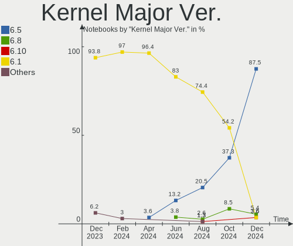
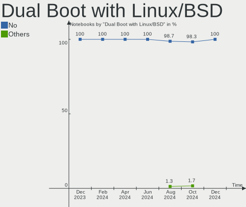
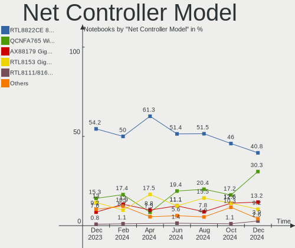
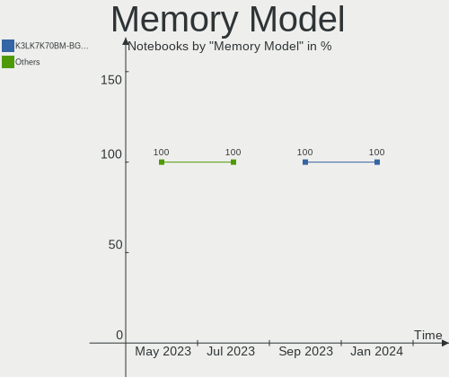
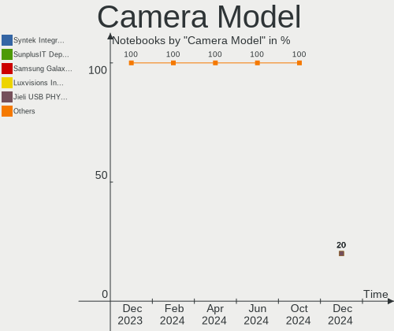

SteamOS - Hardware Trends (Notebooks)
-------------------------------------

A project to identify most popular hardware characteristics and track their change
over time based on data collected by Linux users at https://Linux-Hardware.org.

Anyone can contribute to this report by the [hw-probe](https://github.com/linuxhw/hw-probe) tool:

    sudo -E hw-probe -all -upload

This report is for one last month. Overall report since the beginning of time: [TestCoverage](https://github.com/linuxhw/TestCoverage)

Period: Sep, 2022.

Contents
--------

* [ System ](#system)
  - [ OS                       ](#os)
  - [ OS Family                ](#os-family)
  - [ Kernel                   ](#kernel)
  - [ Kernel Family            ](#kernel-family)
  - [ Kernel Major Ver.        ](#kernel-major-ver)
  - [ Arch                     ](#arch)
  - [ DE                       ](#de)
  - [ Display Server           ](#display-server)
  - [ Display Manager          ](#display-manager)
  - [ OS Lang                  ](#os-lang)
  - [ Boot Mode                ](#boot-mode)
  - [ Filesystem               ](#filesystem)
  - [ Part. scheme             ](#part-scheme)
  - [ Dual Boot with Linux/BSD ](#dual-boot-with-linuxbsd)
  - [ Dual Boot (Win)          ](#dual-boot-win)

* [ Board ](#board)
  - [ Vendor                   ](#vendor)
  - [ Model                    ](#model)
  - [ Model Family             ](#model-family)
  - [ MFG Year                 ](#mfg-year)
  - [ Form Factor              ](#form-factor)
  - [ Secure Boot              ](#secure-boot)
  - [ Coreboot                 ](#coreboot)
  - [ RAM Size                 ](#ram-size)
  - [ RAM Used                 ](#ram-used)
  - [ Total Drives             ](#total-drives)
  - [ Has CD-ROM               ](#has-cd-rom)
  - [ Has Ethernet             ](#has-ethernet)
  - [ Has WiFi                 ](#has-wifi)
  - [ Has Bluetooth            ](#has-bluetooth)

* [ Location ](#location)
  - [ Country                  ](#country)
  - [ City                     ](#city)

* [ Drives ](#drives)
  - [ Drive Vendor             ](#drive-vendor)
  - [ Drive Model              ](#drive-model)
  - [ HDD Vendor               ](#hdd-vendor)
  - [ SSD Vendor               ](#ssd-vendor)
  - [ Drive Kind               ](#drive-kind)
  - [ Drive Connector          ](#drive-connector)
  - [ Drive Size               ](#drive-size)
  - [ Space Total              ](#space-total)
  - [ Space Used               ](#space-used)
  - [ Malfunc. Drives          ](#malfunc-drives)
  - [ Malfunc. Drive Vendor    ](#malfunc-drive-vendor)
  - [ Malfunc. HDD Vendor      ](#malfunc-hdd-vendor)
  - [ Malfunc. Drive Kind      ](#malfunc-drive-kind)
  - [ Failed Drives            ](#failed-drives)
  - [ Failed Drive Vendor      ](#failed-drive-vendor)
  - [ Drive Status             ](#drive-status)

* [ Storage controller ](#storage-controller)
  - [ Storage Vendor           ](#storage-vendor)
  - [ Storage Model            ](#storage-model)
  - [ Storage Kind             ](#storage-kind)

* [ Processor ](#processor)
  - [ CPU Vendor               ](#cpu-vendor)
  - [ CPU Model                ](#cpu-model)
  - [ CPU Model Family         ](#cpu-model-family)
  - [ CPU Cores                ](#cpu-cores)
  - [ CPU Sockets              ](#cpu-sockets)
  - [ CPU Threads              ](#cpu-threads)
  - [ CPU Op-Modes             ](#cpu-op-modes)
  - [ CPU Microcode            ](#cpu-microcode)
  - [ CPU Microarch            ](#cpu-microarch)

* [ Graphics ](#graphics)
  - [ GPU Vendor               ](#gpu-vendor)
  - [ GPU Model                ](#gpu-model)
  - [ GPU Combo                ](#gpu-combo)
  - [ GPU Driver               ](#gpu-driver)
  - [ GPU Memory               ](#gpu-memory)

* [ Monitor ](#monitor)
  - [ Monitor Vendor           ](#monitor-vendor)
  - [ Monitor Model            ](#monitor-model)
  - [ Monitor Resolution       ](#monitor-resolution)
  - [ Monitor Diagonal         ](#monitor-diagonal)
  - [ Monitor Width            ](#monitor-width)
  - [ Aspect Ratio             ](#aspect-ratio)
  - [ Monitor Area             ](#monitor-area)
  - [ Pixel Density            ](#pixel-density)
  - [ Multiple Monitors        ](#multiple-monitors)

* [ Network ](#network)
  - [ Net Controller Vendor    ](#net-controller-vendor)
  - [ Net Controller Model     ](#net-controller-model)
  - [ Wireless Vendor          ](#wireless-vendor)
  - [ Wireless Model           ](#wireless-model)
  - [ Ethernet Vendor          ](#ethernet-vendor)
  - [ Ethernet Model           ](#ethernet-model)
  - [ Net Controller Kind      ](#net-controller-kind)
  - [ Used Controller          ](#used-controller)
  - [ NICs                     ](#nics)
  - [ IPv6                     ](#ipv6)

* [ Bluetooth ](#bluetooth)
  - [ Bluetooth Vendor         ](#bluetooth-vendor)
  - [ Bluetooth Model          ](#bluetooth-model)

* [ Sound ](#sound)
  - [ Sound Vendor             ](#sound-vendor)
  - [ Sound Model              ](#sound-model)

* [ Memory ](#memory)
  - [ Memory Vendor            ](#memory-vendor)
  - [ Memory Model             ](#memory-model)
  - [ Memory Kind              ](#memory-kind)
  - [ Memory Form Factor       ](#memory-form-factor)
  - [ Memory Size              ](#memory-size)
  - [ Memory Speed             ](#memory-speed)

* [ Printers & scanners ](#printers--scanners)
  - [ Printer Vendor           ](#printer-vendor)
  - [ Printer Model            ](#printer-model)
  - [ Scanner Vendor           ](#scanner-vendor)
  - [ Scanner Model            ](#scanner-model)

* [ Camera ](#camera)
  - [ Camera Vendor            ](#camera-vendor)
  - [ Camera Model             ](#camera-model)

* [ Security ](#security)
  - [ Fingerprint Vendor       ](#fingerprint-vendor)
  - [ Fingerprint Model        ](#fingerprint-model)
  - [ Chipcard Vendor          ](#chipcard-vendor)
  - [ Chipcard Model           ](#chipcard-model)

* [ Unsupported ](#unsupported)
  - [ Unsupported Devices      ](#unsupported-devices)
  - [ Unsupported Device Types ](#unsupported-device-types)

System
------

OS
--

Installed operating systems

| Name            | Notebooks | Percent |
|-----------------|-----------|---------|
| SteamOS 3.3.1   | 63        | 79.75%  |
| SteamOS 3.4     | 6         | 7.59%   |
| SteamOS 3.3.2   | 5         | 6.33%   |
| SteamOS Rolling | 3         | 3.8%    |
| SteamOS 3.3     | 1         | 1.27%   |
| SteamOS         | 1         | 1.27%   |

OS Family
---------

OS without a version

| Name    | Notebooks | Percent |
|---------|-----------|---------|
| SteamOS | 79        | 100%    |

Kernel
------

Version of the Linux kernel

| Version                                        | Notebooks | Percent |
|------------------------------------------------|-----------|---------|
| 5.13.0-valve21.1-1-neptune-02211-gc54cda5a36f3 | 66        | 83.54%  |
| 5.13.0-valve24-1-neptune-02226-g5b8545e4c5a1   | 7         | 8.86%   |
| 5.13.0-valve21.2-1-neptune                     | 5         | 6.33%   |
| 5.15.54-1-lts                                  | 1         | 1.27%   |

Kernel Family
-------------

Linux kernel without a distro release

| Version | Notebooks | Percent |
|---------|-----------|---------|
| 5.13.0  | 78        | 98.73%  |
| 5.15.54 | 1         | 1.27%   |

Kernel Major Ver.
-----------------

Linux kernel major version

| Version | Notebooks | Percent |
|---------|-----------|---------|
| 5.13    | 78        | 98.73%  |
| 5.15    | 1         | 1.27%   |

Arch
----

OS architecture (x86_64, i586, etc.)

| Name   | Notebooks | Percent |
|--------|-----------|---------|
| x86_64 | 79        | 100%    |

DE
--

Desktop Environment

| Name | Notebooks | Percent |
|------|-----------|---------|
| KDE5 | 79        | 100%    |

Display Server
--------------

X11 or Wayland

| Name | Notebooks | Percent |
|------|-----------|---------|
| X11  | 79        | 100%    |

Display Manager
---------------

SDDM, LightDM, etc.

| Name    | Notebooks | Percent |
|---------|-----------|---------|
| Unknown | 76        | 96.2%   |
| SDDM    | 3         | 3.8%    |

OS Lang
-------

Language

| Lang  | Notebooks | Percent |
|-------|-----------|---------|
| en_US | 63        | 79.75%  |
| de_DE | 3         | 3.8%    |
| en_DE | 2         | 2.53%   |
| zh_CN | 1         | 1.27%   |
| sk_SK | 1         | 1.27%   |
| pl_PL | 1         | 1.27%   |
| nl_NL | 1         | 1.27%   |
| fr_FR | 1         | 1.27%   |
| es_ES | 1         | 1.27%   |
| en_NL | 1         | 1.27%   |
| en_GB | 1         | 1.27%   |
| en_CA | 1         | 1.27%   |
| ba_RU | 1         | 1.27%   |
| an_ES | 1         | 1.27%   |

Boot Mode
---------

EFI or BIOS

| Mode | Notebooks | Percent |
|------|-----------|---------|
| BIOS | 76        | 96.2%   |
| EFI  | 3         | 3.8%    |

Filesystem
----------

Type of filesystem

| Type  | Notebooks | Percent |
|-------|-----------|---------|
| Btrfs | 79        | 100%    |

Part. scheme
------------

Scheme of partitioning

| Type    | Notebooks | Percent |
|---------|-----------|---------|
| Unknown | 76        | 96.2%   |
| GPT     | 3         | 3.8%    |

Dual Boot with Linux/BSD
------------------------

Hosting more than one Linux/BSD

| Dual boot | Notebooks | Percent |
|-----------|-----------|---------|
| No        | 76        | 96.2%   |
| Yes       | 3         | 3.8%    |

Dual Boot (Win)
---------------

Hosting Linux and Windows

| Dual boot | Notebooks | Percent |
|-----------|-----------|---------|
| No        | 79        | 100%    |

Board
-----

Vendor
------

Motherboard manufacturer

| Name             | Notebooks | Percent |
|------------------|-----------|---------|
| Valve            | 77        | 97.47%  |
| GPD              | 1         | 1.27%   |
| ASUSTek Computer | 1         | 1.27%   |

Model
-----

Motherboard model

| Name                                   | Notebooks | Percent |
|----------------------------------------|-----------|---------|
| Valve Jupiter                          | 77        | 97.47%  |
| GPD G1619-04                           | 1         | 1.27%   |
| ASUS ROG Zephyrus S17 GX703HSD_GX703HS | 1         | 1.27%   |

Model Family
------------

Motherboard model prefix

| Name          | Notebooks | Percent |
|---------------|-----------|---------|
| Valve Jupiter | 77        | 97.47%  |
| GPD G1619-04  | 1         | 1.27%   |
| ASUS ROG      | 1         | 1.27%   |

MFG Year
--------

Motherboard manufacture year

| Year | Notebooks | Percent |
|------|-----------|---------|
| 2022 | 78        | 98.73%  |
| 2021 | 1         | 1.27%   |

Form Factor
-----------

Physical design of the computer

| Name     | Notebooks | Percent |
|----------|-----------|---------|
| Notebook | 79        | 100%    |

Secure Boot
-----------

Enabled or disabled

| State    | Notebooks | Percent |
|----------|-----------|---------|
| Disabled | 79        | 100%    |

Coreboot
--------

Have coreboot on board

| Used | Notebooks | Percent |
|------|-----------|---------|
| No   | 79        | 100%    |

RAM Size
--------

Total RAM memory

| Size in GB | Notebooks | Percent |
|------------|-----------|---------|
| 8.01-16.0  | 77        | 97.47%  |
| 32.01-64.0 | 1         | 1.27%   |
| 24.01-32.0 | 1         | 1.27%   |

RAM Used
--------

Used RAM memory

| Used GB  | Notebooks | Percent |
|----------|-----------|---------|
| 2.01-3.0 | 40        | 50.63%  |
| 3.01-4.0 | 17        | 21.52%  |
| 1.01-2.0 | 12        | 15.19%  |
| 4.01-8.0 | 10        | 12.66%  |

Total Drives
------------

Number of drives on board

| Drives | Notebooks | Percent |
|--------|-----------|---------|
| 2      | 48        | 60.76%  |
| 1      | 28        | 35.44%  |
| 3      | 3         | 3.8%    |

Has CD-ROM
----------

Has CD-ROM on board

| Presented | Notebooks | Percent |
|-----------|-----------|---------|
| No        | 78        | 98.73%  |
| Yes       | 1         | 1.27%   |

Has Ethernet
------------

Has Ethernet on board

| Presented | Notebooks | Percent |
|-----------|-----------|---------|
| No        | 61        | 77.22%  |
| Yes       | 18        | 22.78%  |

Has WiFi
--------

Has WiFi module

| Presented | Notebooks | Percent |
|-----------|-----------|---------|
| Yes       | 79        | 100%    |

Has Bluetooth
-------------

Has Bluetooth module

| Presented | Notebooks | Percent |
|-----------|-----------|---------|
| Yes       | 78        | 98.73%  |
| No        | 1         | 1.27%   |

Location
--------

Country
-------

Geographic location (country)

| Country     | Notebooks | Percent |
|-------------|-----------|---------|
| USA         | 34        | 43.04%  |
| Germany     | 9         | 11.39%  |
| Canada      | 9         | 11.39%  |
| UK          | 7         | 8.86%   |
| Spain       | 3         | 3.8%    |
| Poland      | 3         | 3.8%    |
| Netherlands | 3         | 3.8%    |
| France      | 2         | 2.53%   |
| Sweden      | 1         | 1.27%   |
| Slovakia    | 1         | 1.27%   |
| Romania     | 1         | 1.27%   |
| Italy       | 1         | 1.27%   |
| Finland     | 1         | 1.27%   |
| Denmark     | 1         | 1.27%   |
| Czechia     | 1         | 1.27%   |
| Cyprus      | 1         | 1.27%   |
| Austria     | 1         | 1.27%   |

City
----

Geographic location (city)

| City                       | Notebooks | Percent |
|----------------------------|-----------|---------|
| Austin                     | 3         | 3.8%    |
| York                       | 1         | 1.27%   |
| Weaverville                | 1         | 1.27%   |
| Wasungen                   | 1         | 1.27%   |
| Washington                 | 1         | 1.27%   |
| Warren                     | 1         | 1.27%   |
| Waalre                     | 1         | 1.27%   |
| Victoria                   | 1         | 1.27%   |
| Stouffville                | 1         | 1.27%   |
| Stockholm                  | 1         | 1.27%   |
| Sobrance                   | 1         | 1.27%   |
| Santa Clara                | 1         | 1.27%   |
| San Bartolomé de Tirajana | 1         | 1.27%   |
| Regina                     | 1         | 1.27%   |
| Radomsko                   | 1         | 1.27%   |
| Radolfzell                 | 1         | 1.27%   |
| Queens                     | 1         | 1.27%   |
| Prague                     | 1         | 1.27%   |
| Poznan                     | 1         | 1.27%   |
| Portland                   | 1         | 1.27%   |
| Phoenix                    | 1         | 1.27%   |
| Philadelphia               | 1         | 1.27%   |
| Pensacola                  | 1         | 1.27%   |
| Ottery St Mary             | 1         | 1.27%   |
| Oldham                     | 1         | 1.27%   |
| Oklahoma City              | 1         | 1.27%   |
| Odense                     | 1         | 1.27%   |
| Oakland                    | 1         | 1.27%   |
| North Bay                  | 1         | 1.27%   |
| Nicosia                    | 1         | 1.27%   |
| Newcastle upon Tyne        | 1         | 1.27%   |
| New Westminster            | 1         | 1.27%   |
| New London                 | 1         | 1.27%   |
| Murfreesboro               | 1         | 1.27%   |
| Mountlake Terrace          | 1         | 1.27%   |
| Montreal                   | 1         | 1.27%   |
| Mississauga                | 1         | 1.27%   |
| Milan                      | 1         | 1.27%   |
| Miami                      | 1         | 1.27%   |
| Melbourne                  | 1         | 1.27%   |

Drives
------

Drive Vendor
------------

Hard drive vendors

| Vendor                         | Notebooks | Drives | Percent |
|--------------------------------|-----------|--------|---------|
| Unknown                        | 45        | 46     | 33.83%  |
| Kingston                       | 24        | 24     | 18.05%  |
| Phison                         | 16        | 18     | 12.03%  |
| Phison Electronics             | 10        | 10     | 7.52%   |
| Kingston Technology Company    | 9         | 9      | 6.77%   |
| Silicon Motion                 | 6         | 6      | 4.51%   |
| Samsung Electronics            | 6         | 6      | 4.51%   |
| O2 Micro                       | 6         | 7      | 4.51%   |
| Unknown                        | 5         | 5      | 3.76%   |
| SK hynix                       | 2         | 3      | 1.5%    |
| Solid State Storage Technology | 1         | 1      | 0.75%   |
| Realtek                        | 1         | 1      | 0.75%   |
| Inateck                        | 1         | 1      | 0.75%   |
| Biwin Storage Technology       | 1         | 1      | 0.75%   |

Drive Model
-----------

Hard drive models

| Model                                                  | Notebooks | Percent |
|--------------------------------------------------------|-----------|---------|
| Unknown MMC Card  512GB                                | 20        | 14.49%  |
| Phison NVMe SSD Drive 512GB                            | 13        | 9.42%   |
| Kingston NVMe SSD Drive 512GB                          | 13        | 9.42%   |
| Phison PS5013 E13 NVMe Controller 512GB                | 10        | 7.25%   |
| Unknown MMC Card  128GB                                | 9         | 6.52%   |
| Kingston Company OM3PDP3 NVMe SSD 512GB                | 9         | 6.52%   |
| Kingston NVMe SSD Drive 256GB                          | 9         | 6.52%   |
| Unknown MMC Card  256GB                                | 7         | 5.07%   |
| Unknown                                                | 5         | 3.62%   |
| O2 Micro E2M2 64GB                                     | 4         | 2.9%    |
| Unknown MMC Card  393GB                                | 3         | 2.17%   |
| Silicon Motion NVMe SSD Drive 512GB                    | 3         | 2.17%   |
| O2 Micro NVMe SSD Drive 64GB                           | 3         | 2.17%   |
| Silicon Motion SM2263EN/SM2263XT SSD Controller 1024GB | 2         | 1.45%   |
| Samsung MZ9LQ512HBLU-00BVL 512GB                       | 2         | 1.45%   |
| Samsung MZ9LQ256HBJD-00BVL 256GB                       | 2         | 1.45%   |
| Phison NVMe SSD Drive 256GB                            | 2         | 1.45%   |
| Kingston OM3PDP3512B-A01 512GB                         | 2         | 1.45%   |
| Unknown MMC Card  500GB                                | 1         | 0.72%   |
| Unknown MMC Card  32GB                                 | 1         | 0.72%   |
| Unknown MMC Card  196GB                                | 1         | 0.72%   |
| Unknown MMC Card  16GB                                 | 1         | 0.72%   |
| Unknown MMC Card  1073GB                               | 1         | 0.72%   |
| Unknown GF8S5  513GB                                   | 1         | 0.72%   |
| Unknown ED2S5  128GB                                   | 1         | 0.72%   |
| Solid State Storage NVMe SSD Drive 930GB               | 1         | 0.72%   |
| SK hynix NVMe SSD Drive 256GB                          | 1         | 0.72%   |
| SK hynix NVMe SSD Drive 1024GB                         | 1         | 0.72%   |
| SK hynix BC711 NVMe 1TB                                | 1         | 0.72%   |
| Silicon Motion NVMe SSD Drive 256GB                    | 1         | 0.72%   |
| Samsung NVMe SSD Drive 512GB                           | 1         | 0.72%   |
| Samsung NVMe SSD Drive 2TB                             | 1         | 0.72%   |
| Realtek RTL9210 NVME 256GB                             | 1         | 0.72%   |
| Phison NVMe SSD Drive 8TB                              | 1         | 0.72%   |
| Phison NVMe SSD Drive 7TB                              | 1         | 0.72%   |
| Phison ESMP512GKB4C3-E13TS 512GB                       | 1         | 0.72%   |
| Inateck RTL9210 1TB                                    | 1         | 0.72%   |
| Biwin Storage BIWIN SSD 1024GB                         | 1         | 0.72%   |

HDD Vendor
----------

Hard disk drive vendors

Zero info for selected period =(

SSD Vendor
----------

Solid state drive vendors

Zero info for selected period =(

Drive Kind
----------

HDD or SSD

| Kind | Notebooks | Drives | Percent |
|------|-----------|--------|---------|
| NVMe | 79        | 87     | 61.24%  |
| MMC  | 50        | 51     | 38.76%  |

Drive Connector
---------------

SATA, SAS, NVMe, etc.

| Type | Notebooks | Drives | Percent |
|------|-----------|--------|---------|
| NVMe | 79        | 85     | 60.31%  |
| MMC  | 50        | 51     | 38.17%  |
| SAS  | 2         | 2      | 1.53%   |

Drive Size
----------

Size of hard drive

Zero info for selected period =(

Space Total
-----------

Amount of disk space available on the file system

| Size in GB     | Notebooks | Percent |
|----------------|-----------|---------|
| 251-500        | 46        | 58.23%  |
| 101-250        | 20        | 25.32%  |
| 51-100         | 6         | 7.59%   |
| 501-1000       | 4         | 5.06%   |
| 1001-2000      | 2         | 2.53%   |
| More than 3000 | 1         | 1.27%   |

Space Used
----------

Amount of used disk space

| Used GB   | Notebooks | Percent |
|-----------|-----------|---------|
| 251-500   | 29        | 36.71%  |
| 101-250   | 29        | 36.71%  |
| 21-50     | 10        | 12.66%  |
| 1-20      | 7         | 8.86%   |
| 51-100    | 3         | 3.8%    |
| 1001-2000 | 1         | 1.27%   |

Malfunc. Drives
---------------

Drive models with a malfunction

Zero info for selected period =(

Malfunc. Drive Vendor
---------------------

Vendors of faulty drives

Zero info for selected period =(

Malfunc. HDD Vendor
-------------------

Vendors of faulty HDD drives

Zero info for selected period =(

Malfunc. Drive Kind
-------------------

Kinds of faulty drives

Zero info for selected period =(

Failed Drives
-------------

Failed drive models

Zero info for selected period =(

Failed Drive Vendor
-------------------

Failed drive vendors

Zero info for selected period =(

Drive Status
------------

Number of failed and malfunc. drives

| Status   | Notebooks | Drives | Percent |
|----------|-----------|--------|---------|
| Detected | 78        | 135    | 96.3%   |
| Works    | 3         | 3      | 3.7%    |

Storage controller
------------------

Storage Vendor
--------------

Storage controller vendors

| Vendor                         | Notebooks | Percent |
|--------------------------------|-----------|---------|
| Kingston Technology Company    | 33        | 40.74%  |
| Phison Electronics             | 25        | 30.86%  |
| Silicon Motion                 | 6         | 7.41%   |
| Samsung Electronics            | 6         | 7.41%   |
| O2 Micro                       | 6         | 7.41%   |
| SK hynix                       | 2         | 2.47%   |
| Solid State Storage Technology | 1         | 1.23%   |
| Intel                          | 1         | 1.23%   |
| Biwin Storage Technology       | 1         | 1.23%   |

Storage Model
-------------

Storage controller models

| Model                                               | Notebooks | Percent |
|-----------------------------------------------------|-----------|---------|
| Kingston Company OM3PDP3 NVMe SSD                   | 33        | 40.74%  |
| Phison PS5013 E13 NVMe Controller                   | 24        | 29.63%  |
| Silicon Motion SM2263EN/SM2263XT SSD Controller     | 6         | 7.41%   |
| O2 Micro Non-Volatile memory controller             | 6         | 7.41%   |
| Samsung NVMe SSD Controller 980                     | 5         | 6.17%   |
| SK hynix Gold P31 SSD                               | 2         | 2.47%   |
| Solid State Storage Non-Volatile memory controller  | 1         | 1.23%   |
| Samsung NVMe SSD Controller PM9A1/PM9A3/980PRO      | 1         | 1.23%   |
| Phison E12 NVMe Controller                          | 1         | 1.23%   |
| Intel Volume Management Device NVMe RAID Controller | 1         | 1.23%   |
| Biwin Storage Non-Volatile memory controller        | 1         | 1.23%   |

Storage Kind
------------

Kind of storage controller (IDE, SATA, NVMe, SAS, ...)

| Kind | Notebooks | Percent |
|------|-----------|---------|
| NVMe | 79        | 98.75%  |
| RAID | 1         | 1.25%   |

Processor
---------

CPU Vendor
----------

Processor vendors

| Vendor | Notebooks | Percent |
|--------|-----------|---------|
| AMD    | 78        | 98.73%  |
| Intel  | 1         | 1.27%   |

CPU Model
---------

Processor models

| Model                                   | Notebooks | Percent |
|-----------------------------------------|-----------|---------|
| AMD Custom APU 0405                     | 77        | 97.47%  |
| Intel 11th Gen Core i9-11900H @ 2.50GHz | 1         | 1.27%   |
| AMD Ryzen 7 6800U with Radeon Graphics  | 1         | 1.27%   |

CPU Model Family
----------------

Processor model prefix

| Model       | Notebooks | Percent |
|-------------|-----------|---------|
| Other       | 78        | 98.73%  |
| AMD Ryzen 7 | 1         | 1.27%   |

CPU Cores
---------

Number of processor cores

| Number | Notebooks | Percent |
|--------|-----------|---------|
| 4      | 77        | 97.47%  |
| 8      | 2         | 2.53%   |

CPU Sockets
-----------

Number of sockets

| Number | Notebooks | Percent |
|--------|-----------|---------|
| 1      | 79        | 100%    |

CPU Threads
-----------

Threads per core (Hyper-Threading)

| Number | Notebooks | Percent |
|--------|-----------|---------|
| 2      | 79        | 100%    |

CPU Op-Modes
------------

CPU Operation Modes (32-bit, 64-bit)

| Op mode        | Notebooks | Percent |
|----------------|-----------|---------|
| 32-bit, 64-bit | 79        | 100%    |

CPU Microcode
-------------

Microcode number

| Number     | Notebooks | Percent |
|------------|-----------|---------|
| Unknown    | 76        | 96.2%   |
| 0x08900201 | 3         | 3.8%    |

CPU Microarch
-------------

Microarchitecture

| Name    | Notebooks | Percent |
|---------|-----------|---------|
| Unknown | 79        | 100%    |

Graphics
--------

GPU Vendor
----------

Vendors of graphics cards

| Vendor | Notebooks | Percent |
|--------|-----------|---------|
| AMD    | 78        | 97.5%   |
| Nvidia | 1         | 1.25%   |
| Intel  | 1         | 1.25%   |

GPU Model
---------

Graphics card models

| Model                                                    | Notebooks | Percent |
|----------------------------------------------------------|-----------|---------|
| AMD VanGogh [AMD Custom GPU 0405]                        | 77        | 96.25%  |
| Nvidia GA104M [GeForce RTX 3080 Mobile / Max-Q 8GB/16GB] | 1         | 1.25%   |
| Intel TigerLake-H GT1 [UHD Graphics]                     | 1         | 1.25%   |
| AMD Rembrandt [Radeon 680M]                              | 1         | 1.25%   |

GPU Combo
---------

Combinations of graphics cards

| Name           | Notebooks | Percent |
|----------------|-----------|---------|
| 1 x AMD        | 78        | 98.73%  |
| Intel + Nvidia | 1         | 1.27%   |

GPU Driver
----------

Free vs proprietary

| Driver | Notebooks | Percent |
|--------|-----------|---------|
| Free   | 79        | 100%    |

GPU Memory
----------

Total video memory

| Size in GB | Notebooks | Percent |
|------------|-----------|---------|
| Unknown    | 76        | 96.2%   |
| 0.51-1.0   | 2         | 2.53%   |
| 1.01-2.0   | 1         | 1.27%   |

Monitor
-------

Monitor Vendor
--------------

Monitor vendors

| Vendor              | Notebooks | Percent |
|---------------------|-----------|---------|
| ANX                 | 56        | 56.57%  |
| Analogix            | 16        | 16.16%  |
| Valve               | 7         | 7.07%   |
| Goldstar            | 4         | 4.04%   |
| Vizio               | 2         | 2.02%   |
| Samsung Electronics | 2         | 2.02%   |
| AOC                 | 2         | 2.02%   |
| RTK                 | 1         | 1.01%   |
| MSI                 | 1         | 1.01%   |
| JDI                 | 1         | 1.01%   |
| Hewlett-Packard     | 1         | 1.01%   |
| GreenWood           | 1         | 1.01%   |
| GBR                 | 1         | 1.01%   |
| Dell                | 1         | 1.01%   |
| CMS                 | 1         | 1.01%   |
| BOE                 | 1         | 1.01%   |
| Acer                | 1         | 1.01%   |

Monitor Model
-------------

Monitor models

| Model                                                              | Notebooks | Percent |
|--------------------------------------------------------------------|-----------|---------|
| ANX ANX7530 U ANX7539 800x1280                                     | 56        | 56.57%  |
| Analogix ANX7530 U ANX7539 800x1280                                | 16        | 16.16%  |
| Valve ANX7530 U VLV3001 800x1280 100x150mm 7.1-inch                | 7         | 7.07%   |
| Goldstar TV SSCR2 GSMC0C8 3840x2160                                | 2         | 2.02%   |
| Vizio M58Q7-J01 VIZ1039 3840x2160 1212x682mm 54.8-inch             | 1         | 1.01%   |
| Vizio E500i-B1 VIZ1004 1920x1080 1095x616mm 49.5-inch              | 1         | 1.01%   |
| Samsung Electronics S34J55x SAM0F71 3440x1440 797x333mm 34.0-inch  | 1         | 1.01%   |
| Samsung Electronics S27A750D SAM0798 1920x1080 598x336mm 27.0-inch | 1         | 1.01%   |
| RTK UHD HDR RTK1B1A 3840x2160 609x355mm 27.8-inch                  | 1         | 1.01%   |
| MSI MPG341CQR MSI3DA0 3440x1440 797x334mm 34.0-inch                | 1         | 1.01%   |
| JDI GPD1001H JDI0031 2560x1600 890x500mm 40.2-inch                 | 1         | 1.01%   |
| Hewlett-Packard S230tm HWP3115 1920x1080 509x286mm 23.0-inch       | 1         | 1.01%   |
| GreenWood ARZOPA GWD1581 1920x1080 350x200mm 15.9-inch             | 1         | 1.01%   |
| Goldstar ULTRAWIDE GSM59F1 2560x1080 673x284mm 28.8-inch           | 1         | 1.01%   |
| Goldstar HDR WFHD GSM7715 2560x1080 798x334mm 34.1-inch            | 1         | 1.01%   |
| GBR ARZOPA GBR0156 1920x1080 345x194mm 15.6-inch                   | 1         | 1.01%   |
| Dell P2219H DELA114 1920x1080 476x267mm 21.5-inch                  | 1         | 1.01%   |
| CMS Cosmos CMS0030 3840x2160 800x450mm 36.1-inch                   | 1         | 1.01%   |
| BOE LCD Monitor BOE099D 2560x1440 381x214mm 17.2-inch              | 1         | 1.01%   |
| AOC LCD Monitor AOC1649 1366x768 340x190mm 15.3-inch               | 1         | 1.01%   |
| AOC G2490W1G4 AOC2490 1920x1080 527x296mm 23.8-inch                | 1         | 1.01%   |
| Acer X34 ACR0450 3440x1440 798x335mm 34.1-inch                     | 1         | 1.01%   |

Monitor Resolution
------------------

Monitor screen resolution

| Resolution      | Notebooks | Percent |
|-----------------|-----------|---------|
| 800x1280        | 77        | 79.38%  |
| 1920x1080 (FHD) | 7         | 7.22%   |
| 3840x2160 (4K)  | 5         | 5.15%   |
| 3440x1440       | 3         | 3.09%   |
| 2560x1080       | 2         | 2.06%   |
| 2560x1600       | 1         | 1.03%   |
| 2560x1440 (QHD) | 1         | 1.03%   |
| 1366x768 (WXGA) | 1         | 1.03%   |

Monitor Diagonal
----------------

Diagonal size in inches

| Inches  | Notebooks | Percent |
|---------|-----------|---------|
| Unknown | 70        | 72.16%  |
| 7       | 7         | 7.22%   |
| 34      | 5         | 5.15%   |
| 15      | 3         | 3.09%   |
| 72      | 2         | 2.06%   |
| 27      | 2         | 2.06%   |
| 23      | 2         | 2.06%   |
| 69      | 1         | 1.03%   |
| 49      | 1         | 1.03%   |
| 40      | 1         | 1.03%   |
| 36      | 1         | 1.03%   |
| 21      | 1         | 1.03%   |
| 17      | 1         | 1.03%   |

Monitor Width
-------------

Physical width

| Width in mm | Notebooks | Percent |
|-------------|-----------|---------|
| Unknown     | 70        | 72.16%  |
| 1-100       | 7         | 7.22%   |
| 701-800     | 6         | 6.19%   |
| 501-600     | 3         | 3.09%   |
| 301-350     | 3         | 3.09%   |
| 1501-2000   | 3         | 3.09%   |
| 801-900     | 1         | 1.03%   |
| 601-700     | 1         | 1.03%   |
| 401-500     | 1         | 1.03%   |
| 351-400     | 1         | 1.03%   |
| 1001-1500   | 1         | 1.03%   |

Aspect Ratio
------------

Proportional relationship between the width and the height

| Ratio | Notebooks | Percent |
|-------|-----------|---------|
| 0.62  | 70        | 72.16%  |
| 16/9  | 15        | 15.46%  |
| 0.67  | 7         | 7.22%   |
| 21/9  | 5         | 5.15%   |

Monitor Area
------------

Area in inch²

| Area in inch² | Notebooks | Percent |
|----------------|-----------|---------|
| Unknown        | 70        | 72.16%  |
| 1-40           | 7         | 7.22%   |
| 351-500        | 5         | 5.15%   |
| More than 1000 | 4         | 4.12%   |
| 201-250        | 3         | 3.09%   |
| 301-350        | 2         | 2.06%   |
| 101-110        | 2         | 2.06%   |
| 501-1000       | 2         | 2.06%   |
| 121-130        | 1         | 1.03%   |
| 91-100         | 1         | 1.03%   |

Pixel Density
-------------

Pixels per inch

| Density | Notebooks | Percent |
|---------|-----------|---------|
| Unknown | 70        | 72.16%  |
| 51-100  | 9         | 9.28%   |
| 161-240 | 8         | 8.25%   |
| 101-120 | 5         | 5.15%   |
| 121-160 | 4         | 4.12%   |
| 1-50    | 1         | 1.03%   |

Multiple Monitors
-----------------

Total monitors connected

| Total | Notebooks | Percent |
|-------|-----------|---------|
| 1     | 61        | 77.22%  |
| 2     | 18        | 22.78%  |

Network
-------

Net Controller Vendor
---------------------

Controller vendors

| Vendor                | Notebooks | Percent |
|-----------------------|-----------|---------|
| Realtek Semiconductor | 78        | 84.78%  |
| ASIX Electronics      | 10        | 10.87%  |
| TP-Link               | 1         | 1.09%   |
| MediaTek              | 1         | 1.09%   |
| Intel                 | 1         | 1.09%   |
| DisplayLink           | 1         | 1.09%   |

Net Controller Model
--------------------

Controller models

| Model                                                             | Notebooks | Percent |
|-------------------------------------------------------------------|-----------|---------|
| Realtek RTL8822CE 802.11ac PCIe Wireless Network Adapter          | 77        | 78.57%  |
| ASIX AX88179 Gigabit Ethernet                                     | 10        | 10.2%   |
| Realtek RTL8153 Gigabit Ethernet Adapter                          | 5         | 5.1%    |
| TP-Link TL-WN823N v2/v3 [Realtek RTL8192EU]                       | 1         | 1.02%   |
| Realtek RTL8152 Fast Ethernet Adapter                             | 1         | 1.02%   |
| Realtek RTL8111/8168/8411 PCI Express Gigabit Ethernet Controller | 1         | 1.02%   |
| MediaTek MT7921 802.11ax PCI Express Wireless Network Adapter     | 1         | 1.02%   |
| Intel Wi-Fi 6 AX210/AX211/AX411 160MHz                            | 1         | 1.02%   |
| DisplayLink Dell Universal Dock D6000                             | 1         | 1.02%   |

Wireless Vendor
---------------

Wireless vendors

| Vendor                | Notebooks | Percent |
|-----------------------|-----------|---------|
| Realtek Semiconductor | 77        | 96.25%  |
| TP-Link               | 1         | 1.25%   |
| MediaTek              | 1         | 1.25%   |
| Intel                 | 1         | 1.25%   |

Wireless Model
--------------

Wireless models

| Model                                                         | Notebooks | Percent |
|---------------------------------------------------------------|-----------|---------|
| Realtek RTL8822CE 802.11ac PCIe Wireless Network Adapter      | 77        | 96.25%  |
| TP-Link TL-WN823N v2/v3 [Realtek RTL8192EU]                   | 1         | 1.25%   |
| MediaTek MT7921 802.11ax PCI Express Wireless Network Adapter | 1         | 1.25%   |
| Intel Wi-Fi 6 AX210/AX211/AX411 160MHz                        | 1         | 1.25%   |

Ethernet Vendor
---------------

Ethernet vendors

| Vendor                | Notebooks | Percent |
|-----------------------|-----------|---------|
| ASIX Electronics      | 10        | 55.56%  |
| Realtek Semiconductor | 7         | 38.89%  |
| DisplayLink           | 1         | 5.56%   |

Ethernet Model
--------------

Ethernet models

| Model                                                             | Notebooks | Percent |
|-------------------------------------------------------------------|-----------|---------|
| ASIX AX88179 Gigabit Ethernet                                     | 10        | 55.56%  |
| Realtek RTL8153 Gigabit Ethernet Adapter                          | 5         | 27.78%  |
| Realtek RTL8152 Fast Ethernet Adapter                             | 1         | 5.56%   |
| Realtek RTL8111/8168/8411 PCI Express Gigabit Ethernet Controller | 1         | 5.56%   |
| DisplayLink Dell Universal Dock D6000                             | 1         | 5.56%   |

Net Controller Kind
-------------------

Ethernet, WiFi or modem

| Kind     | Notebooks | Percent |
|----------|-----------|---------|
| WiFi     | 79        | 81.44%  |
| Ethernet | 18        | 18.56%  |

Used Controller
---------------

Currently used network controller

| Kind     | Notebooks | Percent |
|----------|-----------|---------|
| WiFi     | 78        | 93.98%  |
| Ethernet | 5         | 6.02%   |

NICs
----

Total network controllers on board

| Total | Notebooks | Percent |
|-------|-----------|---------|
| 1     | 78        | 98.73%  |
| 2     | 1         | 1.27%   |

IPv6
----

IPv6 vs IPv4

| Used | Notebooks | Percent |
|------|-----------|---------|
| No   | 55        | 69.62%  |
| Yes  | 24        | 30.38%  |

Bluetooth
---------

Bluetooth Vendor
----------------

Controller vendors

| Vendor       | Notebooks | Percent |
|--------------|-----------|---------|
| IMC Networks | 77        | 98.72%  |
| Intel        | 1         | 1.28%   |

Bluetooth Model
---------------

Controller models

| Model                              | Notebooks | Percent |
|------------------------------------|-----------|---------|
| IMC Networks 802.11ac WLAN Adapter | 77        | 98.72%  |
| Intel AX210 Bluetooth              | 1         | 1.28%   |

Sound
-----

Sound Vendor
------------

Sound card vendors

| Vendor                | Notebooks | Percent |
|-----------------------|-----------|---------|
| AMD                   | 78        | 93.98%  |
| Realtek Semiconductor | 1         | 1.2%    |
| Nvidia                | 1         | 1.2%    |
| JMTek                 | 1         | 1.2%    |
| Intel                 | 1         | 1.2%    |
| C-Media Electronics   | 1         | 1.2%    |

Sound Model
-----------

Sound card models

| Model                                                 | Notebooks | Percent |
|-------------------------------------------------------|-----------|---------|
| AMD Rembrandt Radeon High Definition Audio Controller | 78        | 92.86%  |
| Realtek Semiconductor USB Audio                       | 1         | 1.19%   |
| Nvidia GA104 High Definition Audio Controller         | 1         | 1.19%   |
| JMTek USB PnP Audio Device(EEPROM)                    | 1         | 1.19%   |
| Intel Tiger Lake-H HD Audio Controller                | 1         | 1.19%   |
| C-Media Electronics USB MICROPHONE                    | 1         | 1.19%   |
| AMD Family 17h/19h HD Audio Controller                | 1         | 1.19%   |

Memory
------

Memory Vendor
-------------

Memory module vendors

| Vendor  | Notebooks | Percent |
|---------|-----------|---------|
| Unknown | 3         | 100%    |

Memory Model
------------

Memory module models

| Model   | Notebooks | Percent |
|---------|-----------|---------|
| Unknown | 3         | 100%    |

Memory Kind
-----------

Memory module kinds

| Kind   | Notebooks | Percent |
|--------|-----------|---------|
| LPDDR5 | 3         | 100%    |

Memory Form Factor
------------------

Physical design of the memory module

| Name   | Notebooks | Percent |
|--------|-----------|---------|
| SODIMM | 3         | 100%    |

Memory Size
-----------

Memory module size

| Size | Notebooks | Percent |
|------|-----------|---------|
| 4096 | 3         | 100%    |

Memory Speed
------------

Memory module speed

| Speed | Notebooks | Percent |
|-------|-----------|---------|
| 4266  | 3         | 100%    |

Printers & scanners
-------------------

Printer Vendor
--------------

Printer device vendors

Zero info for selected period =(

Printer Model
-------------

Printer device models

Zero info for selected period =(

Scanner Vendor
--------------

Scanner device vendors

Zero info for selected period =(

Scanner Model
-------------

Scanner device models

Zero info for selected period =(

Camera
------

Camera Vendor
-------------

Camera device vendors

| Vendor                 | Notebooks | Percent |
|------------------------|-----------|---------|
| Tripath Technology     | 1         | 20%     |
| Samsung Electronics    | 1         | 20%     |
| Logitech               | 1         | 20%     |
| IMC Networks           | 1         | 20%     |
| AVerMedia Technologies | 1         | 20%     |

Camera Model
------------

Camera device models

| Model                             | Notebooks | Percent |
|-----------------------------------|-----------|---------|
| Tripath USB Camera                | 1         | 20%     |
| Samsung Galaxy A5 (MTP)           | 1         | 20%     |
| Logitech HD Pro Webcam C920       | 1         | 20%     |
| IMC Networks USB2.0 HD UVC WebCam | 1         | 20%     |
| AVerMedia Live Streamer CAM 313   | 1         | 20%     |

Security
--------

Fingerprint Vendor
------------------

Fingerprint sensor vendors

Zero info for selected period =(

Fingerprint Model
-----------------

Fingerprint sensor models

Zero info for selected period =(

Chipcard Vendor
---------------

Chipcard module vendors

Zero info for selected period =(

Chipcard Model
--------------

Chipcard module models

Zero info for selected period =(

Unsupported
-----------

Unsupported Devices
-------------------

Total unsupported devices on board

| Total | Notebooks | Percent |
|-------|-----------|---------|
| 0     | 77        | 97.47%  |
| 1     | 2         | 2.53%   |

Unsupported Device Types
------------------------

Types of unsupported devices

| Type                  | Notebooks | Percent |
|-----------------------|-----------|---------|
| Multimedia controller | 1         | 50%     |
| Graphics card         | 1         | 50%     |

