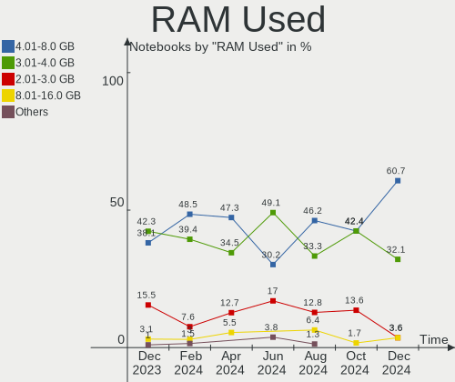
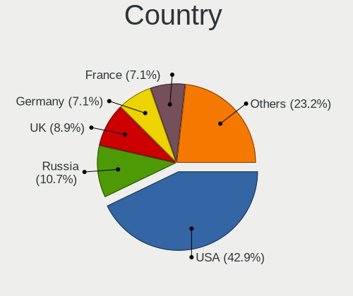
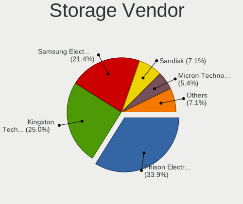
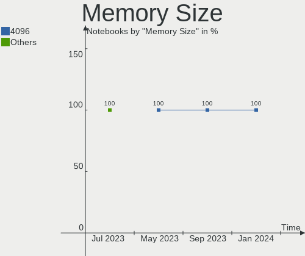

SteamOS - Hardware Trends (Notebooks)
-------------------------------------

A project to identify most popular hardware characteristics and track their change
over time based on data collected by Linux users at https://Linux-Hardware.org.

Anyone can contribute to this report by the [hw-probe](https://github.com/linuxhw/hw-probe) tool:

    sudo -E hw-probe -all -upload

This report is for one last month. Overall report since the beginning of time: [TestCoverage](https://github.com/linuxhw/TestCoverage)

Period: Nov, 2022.

Contents
--------

* [ System ](#system)
  - [ OS                       ](#os)
  - [ OS Family                ](#os-family)
  - [ Kernel                   ](#kernel)
  - [ Kernel Family            ](#kernel-family)
  - [ Kernel Major Ver.        ](#kernel-major-ver)
  - [ Arch                     ](#arch)
  - [ DE                       ](#de)
  - [ Display Server           ](#display-server)
  - [ Display Manager          ](#display-manager)
  - [ OS Lang                  ](#os-lang)
  - [ Boot Mode                ](#boot-mode)
  - [ Filesystem               ](#filesystem)
  - [ Part. scheme             ](#part-scheme)
  - [ Dual Boot with Linux/BSD ](#dual-boot-with-linuxbsd)
  - [ Dual Boot (Win)          ](#dual-boot-win)

* [ Board ](#board)
  - [ Vendor                   ](#vendor)
  - [ Model                    ](#model)
  - [ Model Family             ](#model-family)
  - [ MFG Year                 ](#mfg-year)
  - [ Form Factor              ](#form-factor)
  - [ Secure Boot              ](#secure-boot)
  - [ Coreboot                 ](#coreboot)
  - [ RAM Size                 ](#ram-size)
  - [ RAM Used                 ](#ram-used)
  - [ Total Drives             ](#total-drives)
  - [ Has CD-ROM               ](#has-cd-rom)
  - [ Has Ethernet             ](#has-ethernet)
  - [ Has WiFi                 ](#has-wifi)
  - [ Has Bluetooth            ](#has-bluetooth)

* [ Location ](#location)
  - [ Country                  ](#country)
  - [ City                     ](#city)

* [ Drives ](#drives)
  - [ Drive Vendor             ](#drive-vendor)
  - [ Drive Model              ](#drive-model)
  - [ HDD Vendor               ](#hdd-vendor)
  - [ SSD Vendor               ](#ssd-vendor)
  - [ Drive Kind               ](#drive-kind)
  - [ Drive Connector          ](#drive-connector)
  - [ Drive Size               ](#drive-size)
  - [ Space Total              ](#space-total)
  - [ Space Used               ](#space-used)
  - [ Malfunc. Drives          ](#malfunc-drives)
  - [ Malfunc. Drive Vendor    ](#malfunc-drive-vendor)
  - [ Malfunc. HDD Vendor      ](#malfunc-hdd-vendor)
  - [ Malfunc. Drive Kind      ](#malfunc-drive-kind)
  - [ Failed Drives            ](#failed-drives)
  - [ Failed Drive Vendor      ](#failed-drive-vendor)
  - [ Drive Status             ](#drive-status)

* [ Storage controller ](#storage-controller)
  - [ Storage Vendor           ](#storage-vendor)
  - [ Storage Model            ](#storage-model)
  - [ Storage Kind             ](#storage-kind)

* [ Processor ](#processor)
  - [ CPU Vendor               ](#cpu-vendor)
  - [ CPU Model                ](#cpu-model)
  - [ CPU Model Family         ](#cpu-model-family)
  - [ CPU Cores                ](#cpu-cores)
  - [ CPU Sockets              ](#cpu-sockets)
  - [ CPU Threads              ](#cpu-threads)
  - [ CPU Op-Modes             ](#cpu-op-modes)
  - [ CPU Microcode            ](#cpu-microcode)
  - [ CPU Microarch            ](#cpu-microarch)

* [ Graphics ](#graphics)
  - [ GPU Vendor               ](#gpu-vendor)
  - [ GPU Model                ](#gpu-model)
  - [ GPU Combo                ](#gpu-combo)
  - [ GPU Driver               ](#gpu-driver)
  - [ GPU Memory               ](#gpu-memory)

* [ Monitor ](#monitor)
  - [ Monitor Vendor           ](#monitor-vendor)
  - [ Monitor Model            ](#monitor-model)
  - [ Monitor Resolution       ](#monitor-resolution)
  - [ Monitor Diagonal         ](#monitor-diagonal)
  - [ Monitor Width            ](#monitor-width)
  - [ Aspect Ratio             ](#aspect-ratio)
  - [ Monitor Area             ](#monitor-area)
  - [ Pixel Density            ](#pixel-density)
  - [ Multiple Monitors        ](#multiple-monitors)

* [ Network ](#network)
  - [ Net Controller Vendor    ](#net-controller-vendor)
  - [ Net Controller Model     ](#net-controller-model)
  - [ Wireless Vendor          ](#wireless-vendor)
  - [ Wireless Model           ](#wireless-model)
  - [ Ethernet Vendor          ](#ethernet-vendor)
  - [ Ethernet Model           ](#ethernet-model)
  - [ Net Controller Kind      ](#net-controller-kind)
  - [ Used Controller          ](#used-controller)
  - [ NICs                     ](#nics)
  - [ IPv6                     ](#ipv6)

* [ Bluetooth ](#bluetooth)
  - [ Bluetooth Vendor         ](#bluetooth-vendor)
  - [ Bluetooth Model          ](#bluetooth-model)

* [ Sound ](#sound)
  - [ Sound Vendor             ](#sound-vendor)
  - [ Sound Model              ](#sound-model)

* [ Memory ](#memory)
  - [ Memory Vendor            ](#memory-vendor)
  - [ Memory Model             ](#memory-model)
  - [ Memory Kind              ](#memory-kind)
  - [ Memory Form Factor       ](#memory-form-factor)
  - [ Memory Size              ](#memory-size)
  - [ Memory Speed             ](#memory-speed)

* [ Printers & scanners ](#printers--scanners)
  - [ Printer Vendor           ](#printer-vendor)
  - [ Printer Model            ](#printer-model)
  - [ Scanner Vendor           ](#scanner-vendor)
  - [ Scanner Model            ](#scanner-model)

* [ Camera ](#camera)
  - [ Camera Vendor            ](#camera-vendor)
  - [ Camera Model             ](#camera-model)

* [ Security ](#security)
  - [ Fingerprint Vendor       ](#fingerprint-vendor)
  - [ Fingerprint Model        ](#fingerprint-model)
  - [ Chipcard Vendor          ](#chipcard-vendor)
  - [ Chipcard Model           ](#chipcard-model)

* [ Unsupported ](#unsupported)
  - [ Unsupported Devices      ](#unsupported-devices)
  - [ Unsupported Device Types ](#unsupported-device-types)

System
------

OS
--

Installed operating systems

| Name          | Notebooks | Percent |
|---------------|-----------|---------|
| SteamOS 3.3.2 | 37        | 63.79%  |
| SteamOS 3.4   | 14        | 24.14%  |
| SteamOS 3.3.1 | 3         | 5.17%   |
| SteamOS 3.5   | 2         | 3.45%   |
| SteamOS 3.1   | 1         | 1.72%   |
| SteamOS       | 1         | 1.72%   |

OS Family
---------

OS without a version

| Name    | Notebooks | Percent |
|---------|-----------|---------|
| SteamOS | 58        | 100%    |

Kernel
------

Version of the Linux kernel

| Version                                        | Notebooks | Percent |
|------------------------------------------------|-----------|---------|
| 5.13.0-valve21.3-1-neptune                     | 41        | 70.69%  |
| 5.13.0-valve31-1-neptune                       | 11        | 18.97%  |
| 5.13.0-valve21.1-1-neptune-02211-gc54cda5a36f3 | 3         | 5.17%   |
| 6.0.7-zen3-xanmod1-1                           | 1         | 1.72%   |
| 5.15.79-1-lts                                  | 1         | 1.72%   |
| 5.13.0-valve10.3-1-neptune-02176-g5fe416c4acd8 | 1         | 1.72%   |

Kernel Family
-------------

Linux kernel without a distro release

| Version | Notebooks | Percent |
|---------|-----------|---------|
| 5.13.0  | 56        | 96.55%  |
| 6.0.7   | 1         | 1.72%   |
| 5.15.79 | 1         | 1.72%   |

Kernel Major Ver.
-----------------

Linux kernel major version

| Version | Notebooks | Percent |
|---------|-----------|---------|
| 5.13    | 56        | 96.55%  |
| 6.0     | 1         | 1.72%   |
| 5.15    | 1         | 1.72%   |

Arch
----

OS architecture (x86_64, i586, etc.)

| Name   | Notebooks | Percent |
|--------|-----------|---------|
| x86_64 | 58        | 100%    |

DE
--

Desktop Environment

| Name    | Notebooks | Percent |
|---------|-----------|---------|
| KDE5    | 57        | 98.28%  |
| Unknown | 1         | 1.72%   |

Display Server
--------------

X11 or Wayland

| Name    | Notebooks | Percent |
|---------|-----------|---------|
| X11     | 57        | 98.28%  |
| Unknown | 1         | 1.72%   |

Display Manager
---------------

SDDM, LightDM, etc.

| Name    | Notebooks | Percent |
|---------|-----------|---------|
| Unknown | 58        | 100%    |

OS Lang
-------

Language

| Lang         | Notebooks | Percent |
|--------------|-----------|---------|
| en_US        | 45        | 77.59%  |
| en_GB        | 2         | 3.45%   |
| en_DE        | 2         | 3.45%   |
| an_ES        | 2         | 3.45%   |
| zh_CN        | 1         | 1.72%   |
| ru_RU        | 1         | 1.72%   |
| hr_HR        | 1         | 1.72%   |
| fr_FR        | 1         | 1.72%   |
| en_NL        | 1         | 1.72%   |
| en_GB.UTF-12 | 1         | 1.72%   |
| de_DE        | 1         | 1.72%   |

Boot Mode
---------

EFI or BIOS

| Mode | Notebooks | Percent |
|------|-----------|---------|
| BIOS | 57        | 98.28%  |
| EFI  | 1         | 1.72%   |

Filesystem
----------

Type of filesystem

| Type  | Notebooks | Percent |
|-------|-----------|---------|
| Btrfs | 58        | 100%    |

Part. scheme
------------

Scheme of partitioning

| Type    | Notebooks | Percent |
|---------|-----------|---------|
| Unknown | 57        | 98.28%  |
| GPT     | 1         | 1.72%   |

Dual Boot with Linux/BSD
------------------------

Hosting more than one Linux/BSD

| Dual boot | Notebooks | Percent |
|-----------|-----------|---------|
| No        | 58        | 100%    |

Dual Boot (Win)
---------------

Hosting Linux and Windows

| Dual boot | Notebooks | Percent |
|-----------|-----------|---------|
| No        | 58        | 100%    |

Board
-----

Vendor
------

Motherboard manufacturer

| Name             | Notebooks | Percent |
|------------------|-----------|---------|
| Valve            | 52        | 89.66%  |
| GPD              | 2         | 3.45%   |
| Apple            | 2         | 3.45%   |
| Hewlett-Packard  | 1         | 1.72%   |
| ASUSTek Computer | 1         | 1.72%   |

Model
-----

Motherboard model

| Name                                  | Notebooks | Percent |
|---------------------------------------|-----------|---------|
| Valve Jupiter                         | 52        | 89.66%  |
| GPD G1619-04                          | 2         | 3.45%   |
| HP Pavilion 17                        | 1         | 1.72%   |
| ASUS ROG Zephyrus G15 GA503QR_GA503QR | 1         | 1.72%   |
| Apple MacBookPro8,1                   | 1         | 1.72%   |
| Apple MacBookAir6,2                   | 1         | 1.72%   |

Model Family
------------

Motherboard model prefix

| Name              | Notebooks | Percent |
|-------------------|-----------|---------|
| Valve Jupiter     | 52        | 89.66%  |
| GPD G1619-04      | 2         | 3.45%   |
| HP Pavilion       | 1         | 1.72%   |
| ASUS ROG          | 1         | 1.72%   |
| Apple MacBookPro8 | 1         | 1.72%   |
| Apple MacBookAir6 | 1         | 1.72%   |

MFG Year
--------

Motherboard manufacture year

| Year | Notebooks | Percent |
|------|-----------|---------|
| 2022 | 54        | 93.1%   |
| 2013 | 2         | 3.45%   |
| 2021 | 1         | 1.72%   |
| 2011 | 1         | 1.72%   |

Form Factor
-----------

Physical design of the computer

| Name     | Notebooks | Percent |
|----------|-----------|---------|
| Notebook | 58        | 100%    |

Secure Boot
-----------

Enabled or disabled

| State    | Notebooks | Percent |
|----------|-----------|---------|
| Disabled | 58        | 100%    |

Coreboot
--------

Have coreboot on board

| Used | Notebooks | Percent |
|------|-----------|---------|
| No   | 58        | 100%    |

RAM Size
--------

Total RAM memory

| Size in GB | Notebooks | Percent |
|------------|-----------|---------|
| 8.01-16.0  | 55        | 94.83%  |
| 4.01-8.0   | 1         | 1.72%   |
| 3.01-4.0   | 1         | 1.72%   |
| 24.01-32.0 | 1         | 1.72%   |

RAM Used
--------

Used RAM memory

| Used GB   | Notebooks | Percent |
|-----------|-----------|---------|
| 2.01-3.0  | 30        | 51.72%  |
| 3.01-4.0  | 11        | 18.97%  |
| 4.01-8.0  | 8         | 13.79%  |
| 1.01-2.0  | 8         | 13.79%  |
| 8.01-16.0 | 1         | 1.72%   |

Total Drives
------------

Number of drives on board

| Drives | Notebooks | Percent |
|--------|-----------|---------|
| 2      | 46        | 79.31%  |
| 1      | 11        | 18.97%  |
| 0      | 1         | 1.72%   |

Has CD-ROM
----------

Has CD-ROM on board

| Presented | Notebooks | Percent |
|-----------|-----------|---------|
| No        | 56        | 96.55%  |
| Yes       | 2         | 3.45%   |

Has Ethernet
------------

Has Ethernet on board

| Presented | Notebooks | Percent |
|-----------|-----------|---------|
| No        | 39        | 67.24%  |
| Yes       | 19        | 32.76%  |

Has WiFi
--------

Has WiFi module

| Presented | Notebooks | Percent |
|-----------|-----------|---------|
| Yes       | 58        | 100%    |

Has Bluetooth
-------------

Has Bluetooth module

| Presented | Notebooks | Percent |
|-----------|-----------|---------|
| Yes       | 57        | 98.28%  |
| No        | 1         | 1.72%   |

Location
--------

Country
-------

Geographic location (country)

| Country     | Notebooks | Percent |
|-------------|-----------|---------|
| USA         | 21        | 36.21%  |
| UK          | 7         | 12.07%  |
| Netherlands | 5         | 8.62%   |
| Germany     | 5         | 8.62%   |
| Spain       | 4         | 6.9%    |
| Romania     | 2         | 3.45%   |
| Poland      | 2         | 3.45%   |
| Russia      | 1         | 1.72%   |
| Moldova     | 1         | 1.72%   |
| Mexico      | 1         | 1.72%   |
| Ireland     | 1         | 1.72%   |
| Indonesia   | 1         | 1.72%   |
| Hungary     | 1         | 1.72%   |
| Hong Kong   | 1         | 1.72%   |
| France      | 1         | 1.72%   |
| Estonia     | 1         | 1.72%   |
| China       | 1         | 1.72%   |
| Austria     | 1         | 1.72%   |
| Australia   | 1         | 1.72%   |

City
----

Geographic location (city)

| City                 | Notebooks | Percent |
|----------------------|-----------|---------|
| Valencia             | 2         | 3.45%   |
| Nottingham           | 2         | 3.45%   |
| Madrid               | 2         | 3.45%   |
| Winston-Salem        | 1         | 1.72%   |
| Wijdewormer          | 1         | 1.72%   |
| Virginia             | 1         | 1.72%   |
| Tvardița            | 1         | 1.72%   |
| Tijuana              | 1         | 1.72%   |
| Tallinn              | 1         | 1.72%   |
| Sydney               | 1         | 1.72%   |
| Streatham            | 1         | 1.72%   |
| Stafford             | 1         | 1.72%   |
| Slidell              | 1         | 1.72%   |
| Sint Pancras         | 1         | 1.72%   |
| Schwenksville        | 1         | 1.72%   |
| Royal Leamington Spa | 1         | 1.72%   |
| Rotterdam            | 1         | 1.72%   |
| Queens               | 1         | 1.72%   |
| Puyallup             | 1         | 1.72%   |
| Paris                | 1         | 1.72%   |
| Oxford               | 1         | 1.72%   |
| Ogden                | 1         | 1.72%   |
| Norfolk              | 1         | 1.72%   |
| Newcastle upon Tyne  | 1         | 1.72%   |
| Moscow               | 1         | 1.72%   |
| Melrose              | 1         | 1.72%   |
| Maplewood            | 1         | 1.72%   |
| London               | 1         | 1.72%   |
| Lodz                 | 1         | 1.72%   |
| Leipzig              | 1         | 1.72%   |
| Lehi                 | 1         | 1.72%   |
| Kowloon              | 1         | 1.72%   |
| Jakarta              | 1         | 1.72%   |
| Ione                 | 1         | 1.72%   |
| Homewood             | 1         | 1.72%   |
| Gerolstein           | 1         | 1.72%   |
| Geretsried           | 1         | 1.72%   |
| Forney               | 1         | 1.72%   |
| Floresti             | 1         | 1.72%   |
| El Cajon             | 1         | 1.72%   |

Drives
------

Drive Vendor
------------

Hard drive vendors

| Vendor                         | Notebooks | Drives | Percent |
|--------------------------------|-----------|--------|---------|
| Unknown                        | 32        | 32     | 31.07%  |
| Kingston Technology Company    | 15        | 15     | 14.56%  |
| Phison Electronics             | 14        | 14     | 13.59%  |
| Unknown                        | 13        | 13     | 12.62%  |
| O2 Micro                       | 8         | 8      | 7.77%   |
| Samsung Electronics            | 6         | 6      | 5.83%   |
| SK hynix                       | 5         | 5      | 4.85%   |
| Sandisk                        | 5         | 6      | 4.85%   |
| KIOXIA                         | 2         | 2      | 1.94%   |
| Solid State Storage Technology | 1         | 1      | 0.97%   |
| KingSpec                       | 1         | 1      | 0.97%   |
| Apple                          | 1         | 1      | 0.97%   |

Drive Model
-----------

Hard drive models

| Model                                      | Notebooks | Percent |
|--------------------------------------------|-----------|---------|
| Unknown MMC Card  512GB                    | 15        | 14.42%  |
| Kingston Company OM3PDP3 NVMe SSD 256GB    | 15        | 14.42%  |
| Phison PS5013 E13 NVMe Controller 256GB    | 14        | 13.46%  |
| Unknown                                    | 13        | 12.5%   |
| O2 Micro E2M2 64GB                         | 8         | 7.69%   |
| Unknown MMC Card  256GB                    | 7         | 6.73%   |
| Unknown MMC Card  128GB                    | 3         | 2.88%   |
| Samsung MZ9LQ256HBJD-00BVL 256GB           | 3         | 2.88%   |
| Unknown MMC Card  500GB                    | 2         | 1.92%   |
| Unknown MMC Card  393GB                    | 2         | 1.92%   |
| SK hynix BC711 NVMe 256GB                  | 2         | 1.92%   |
| Sandisk PC SN530 NVMe WDC 256GB            | 2         | 1.92%   |
| Unknown MMC Card  997GB                    | 1         | 0.96%   |
| Unknown MMC Card  536GB                    | 1         | 0.96%   |
| Unknown MMC Card  498GB                    | 1         | 0.96%   |
| Solid State Storage SSSTC XA1-311024 930GB | 1         | 0.96%   |
| SK hynix SKHynix_HFM001TD3HX015N 1024GB    | 1         | 0.96%   |
| SK hynix HFM001TD3JX013N 1024GB            | 1         | 0.96%   |
| SK hynix BC711 NVMe 512GB                  | 1         | 0.96%   |
| Sandisk WD_BLACK SN770 2TB                 | 1         | 0.96%   |
| Sandisk WDC PC SN530 SDBPTPZ-1T00 1024GB   | 1         | 0.96%   |
| Sandisk WD PC SN740 SDDPTQE-2T00 2TB       | 1         | 0.96%   |
| Sandisk WD Blue SN550 NVMe SSD 1TB         | 1         | 0.96%   |
| Samsung SSD 850 EVO 250GB                  | 1         | 0.96%   |
| Samsung MZ9LQ512HBLU-00BVL 512GB           | 1         | 0.96%   |
| Samsung MZ9LQ512HBLU-00B 512GB             | 1         | 0.96%   |
| KIOXIA KBG40ZNS512G NVMe 512GB             | 1         | 0.96%   |
| KIOXIA KBG40ZNS256G NVMe 256GB             | 1         | 0.96%   |
| KingSpec P3-128 128GB SSD                  | 1         | 0.96%   |
| Apple SSD SD0128F 121GB                    | 1         | 0.96%   |

HDD Vendor
----------

Hard disk drive vendors

Zero info for selected period =(

SSD Vendor
----------

Solid state drive vendors

| Vendor              | Notebooks | Drives | Percent |
|---------------------|-----------|--------|---------|
| Samsung Electronics | 1         | 1      | 33.33%  |
| KingSpec            | 1         | 1      | 33.33%  |
| Apple               | 1         | 1      | 33.33%  |

Drive Kind
----------

HDD or SSD

| Kind | Notebooks | Drives | Percent |
|------|-----------|--------|---------|
| NVMe | 54        | 56     | 53.47%  |
| MMC  | 44        | 45     | 43.56%  |
| SSD  | 3         | 3      | 2.97%   |

Drive Connector
---------------

SATA, SAS, NVMe, etc.

| Type | Notebooks | Drives | Percent |
|------|-----------|--------|---------|
| NVMe | 54        | 56     | 53.47%  |
| MMC  | 44        | 45     | 43.56%  |
| SATA | 3         | 3      | 2.97%   |

Drive Size
----------

Size of hard drive

| Size in TB | Notebooks | Drives | Percent |
|------------|-----------|--------|---------|
| 0.01-0.5   | 3         | 3      | 100%    |

Space Total
-----------

Amount of disk space available on the file system

| Size in GB | Notebooks | Percent |
|------------|-----------|---------|
| 251-500    | 20        | 34.48%  |
| 101-250    | 18        | 31.03%  |
| 51-100     | 8         | 13.79%  |
| 501-1000   | 7         | 12.07%  |
| 1001-2000  | 5         | 8.62%   |

Space Used
----------

Amount of used disk space

| Used GB   | Notebooks | Percent |
|-----------|-----------|---------|
| 101-250   | 19        | 32.76%  |
| 251-500   | 12        | 20.69%  |
| 21-50     | 8         | 13.79%  |
| 501-1000  | 7         | 12.07%  |
| 1-20      | 5         | 8.62%   |
| 51-100    | 4         | 6.9%    |
| 1001-2000 | 3         | 5.17%   |

Malfunc. Drives
---------------

Drive models with a malfunction

Zero info for selected period =(

Malfunc. Drive Vendor
---------------------

Vendors of faulty drives

Zero info for selected period =(

Malfunc. HDD Vendor
-------------------

Vendors of faulty HDD drives

Zero info for selected period =(

Malfunc. Drive Kind
-------------------

Kinds of faulty drives

Zero info for selected period =(

Failed Drives
-------------

Failed drive models

Zero info for selected period =(

Failed Drive Vendor
-------------------

Failed drive vendors

Zero info for selected period =(

Drive Status
------------

Number of failed and malfunc. drives

| Status   | Notebooks | Drives | Percent |
|----------|-----------|--------|---------|
| Detected | 57        | 103    | 98.28%  |
| Works    | 1         | 1      | 1.72%   |

Storage controller
------------------

Storage Vendor
--------------

Storage controller vendors

| Vendor                         | Notebooks | Percent |
|--------------------------------|-----------|---------|
| Kingston Technology Company    | 15        | 25.42%  |
| Phison Electronics             | 14        | 23.73%  |
| O2 Micro                       | 8         | 13.56%  |
| Samsung Electronics            | 6         | 10.17%  |
| SK hynix                       | 5         | 8.47%   |
| SanDisk                        | 5         | 8.47%   |
| KIOXIA                         | 2         | 3.39%   |
| Solid State Storage Technology | 1         | 1.69%   |
| Marvell Technology Group       | 1         | 1.69%   |
| Intel                          | 1         | 1.69%   |
| AMD                            | 1         | 1.69%   |

Storage Model
-------------

Storage controller models

| Model                                                                        | Notebooks | Percent |
|------------------------------------------------------------------------------|-----------|---------|
| Kingston Company OM3PDP3 NVMe SSD                                            | 15        | 25.42%  |
| Phison PS5013 E13 NVMe Controller                                            | 14        | 23.73%  |
| O2 Micro Non-Volatile memory controller                                      | 8         | 13.56%  |
| Samsung NVMe SSD Controller 980                                              | 6         | 10.17%  |
| SK hynix Gold P31/PC711 NVMe Solid State Drive                               | 5         | 8.47%   |
| Sandisk Non-Volatile memory controller                                       | 4         | 6.78%   |
| KIOXIA NVMe SSD Controller BG4                                               | 2         | 3.39%   |
| Solid State Storage Non-Volatile memory controller                           | 1         | 1.69%   |
| SanDisk WD Blue SN550 NVMe SSD                                               | 1         | 1.69%   |
| Marvell Group 88SS9183 PCIe SSD Controller                                   | 1         | 1.69%   |
| Intel 6 Series/C200 Series Chipset Family 6 port Mobile SATA AHCI Controller | 1         | 1.69%   |
| AMD FCH SATA Controller [AHCI mode]                                          | 1         | 1.69%   |

Storage Kind
------------

Kind of storage controller (IDE, SATA, NVMe, SAS, ...)

| Kind | Notebooks | Percent |
|------|-----------|---------|
| NVMe | 55        | 94.83%  |
| SATA | 3         | 5.17%   |

Processor
---------

CPU Vendor
----------

Processor vendors

| Vendor | Notebooks | Percent |
|--------|-----------|---------|
| AMD    | 56        | 96.55%  |
| Intel  | 2         | 3.45%   |

CPU Model
---------

Processor models

| Model                                     | Notebooks | Percent |
|-------------------------------------------|-----------|---------|
| AMD Custom APU 0405                       | 52        | 89.66%  |
| AMD Ryzen 7 6800U with Radeon Graphics    | 2         | 3.45%   |
| Intel Core i5-4260U CPU @ 1.40GHz         | 1         | 1.72%   |
| Intel Core i5-2435M CPU @ 2.40GHz         | 1         | 1.72%   |
| AMD Ryzen 9 5900HS with Radeon Graphics   | 1         | 1.72%   |
| AMD A10-5750M APU with Radeon HD Graphics | 1         | 1.72%   |

CPU Model Family
----------------

Processor model prefix

| Model         | Notebooks | Percent |
|---------------|-----------|---------|
| Other         | 52        | 89.66%  |
| Intel Core i5 | 2         | 3.45%   |
| AMD Ryzen 7   | 2         | 3.45%   |
| AMD Ryzen 9   | 1         | 1.72%   |
| AMD A10       | 1         | 1.72%   |

CPU Cores
---------

Number of processor cores

| Number | Notebooks | Percent |
|--------|-----------|---------|
| 4      | 52        | 89.66%  |
| 8      | 3         | 5.17%   |
| 2      | 3         | 5.17%   |

CPU Sockets
-----------

Number of sockets

| Number | Notebooks | Percent |
|--------|-----------|---------|
| 1      | 58        | 100%    |

CPU Threads
-----------

Threads per core (Hyper-Threading)

| Number | Notebooks | Percent |
|--------|-----------|---------|
| 2      | 58        | 100%    |

CPU Op-Modes
------------

CPU Operation Modes (32-bit, 64-bit)

| Op mode        | Notebooks | Percent |
|----------------|-----------|---------|
| 32-bit, 64-bit | 58        | 100%    |

CPU Microcode
-------------

Microcode number

| Number     | Notebooks | Percent |
|------------|-----------|---------|
| Unknown    | 57        | 98.28%  |
| 0x0a50000c | 1         | 1.72%   |

CPU Microarch
-------------

Microarchitecture

| Name        | Notebooks | Percent |
|-------------|-----------|---------|
| Unknown     | 54        | 93.1%   |
| Zen 3       | 1         | 1.72%   |
| SandyBridge | 1         | 1.72%   |
| Piledriver  | 1         | 1.72%   |
| Haswell     | 1         | 1.72%   |

Graphics
--------

GPU Vendor
----------

Vendors of graphics cards

| Vendor | Notebooks | Percent |
|--------|-----------|---------|
| AMD    | 56        | 94.92%  |
| Intel  | 2         | 3.39%   |
| Nvidia | 1         | 1.69%   |

GPU Model
---------

Graphics card models

| Model                                                                     | Notebooks | Percent |
|---------------------------------------------------------------------------|-----------|---------|
| AMD VanGogh [AMD Custom GPU 0405]                                         | 52        | 88.14%  |
| AMD Rembrandt [Radeon 680M]                                               | 2         | 3.39%   |
| Nvidia GA104M [GeForce RTX 3070 Mobile / Max-Q]                           | 1         | 1.69%   |
| Intel Haswell-ULT Integrated Graphics Controller                          | 1         | 1.69%   |
| Intel 2nd Generation Core Processor Family Integrated Graphics Controller | 1         | 1.69%   |
| AMD Richland [Radeon HD 8650G]                                            | 1         | 1.69%   |
| AMD Cezanne [Radeon Vega Series / Radeon Vega Mobile Series]              | 1         | 1.69%   |

GPU Combo
---------

Combinations of graphics cards

| Name         | Notebooks | Percent |
|--------------|-----------|---------|
| 1 x AMD      | 55        | 94.83%  |
| 1 x Intel    | 2         | 3.45%   |
| AMD + Nvidia | 1         | 1.72%   |

GPU Driver
----------

Free vs proprietary

| Driver      | Notebooks | Percent |
|-------------|-----------|---------|
| Free        | 57        | 98.28%  |
| Proprietary | 1         | 1.72%   |

GPU Memory
----------

Total video memory

| Size in GB | Notebooks | Percent |
|------------|-----------|---------|
| Unknown    | 57        | 98.28%  |
| 0.01-0.5   | 1         | 1.72%   |

Monitor
-------

Monitor Vendor
--------------

Monitor vendors

| Vendor              | Notebooks | Percent |
|---------------------|-----------|---------|
| Analogix            | 39        | 53.42%  |
| Valve               | 14        | 19.18%  |
| Goldstar            | 3         | 4.11%   |
| JDI                 | 2         | 2.74%   |
| Apple               | 2         | 2.74%   |
| Vizio               | 1         | 1.37%   |
| ViewSonic           | 1         | 1.37%   |
| SANYO               | 1         | 1.37%   |
| Samsung Electronics | 1         | 1.37%   |
| RTK                 | 1         | 1.37%   |
| NRL                 | 1         | 1.37%   |
| INNOCN              | 1         | 1.37%   |
| Gateway             | 1         | 1.37%   |
| Dell                | 1         | 1.37%   |
| Chimei Innolux      | 1         | 1.37%   |
| BenQ                | 1         | 1.37%   |
| AU Optronics        | 1         | 1.37%   |
| ASUSTek Computer    | 1         | 1.37%   |

Monitor Model
-------------

Monitor models

| Model                                                                 | Notebooks | Percent |
|-----------------------------------------------------------------------|-----------|---------|
| Analogix ANX7530 U ANX7539 800x1280                                   | 39        | 53.42%  |
| Valve ANX7530 U VLV3001 800x1280 100x150mm 7.1-inch                   | 14        | 19.18%  |
| JDI GPD1001H JDI0031 2560x1600 890x500mm 40.2-inch                    | 2         | 2.74%   |
| Vizio E50-C1 VIZ1004 1920x1080 1095x616mm 49.5-inch                   | 1         | 1.37%   |
| ViewSonic VX2858Sml VSCD02F 1920x1080 621x341mm 27.9-inch             | 1         | 1.37%   |
| SANYO LCD SAN0B75 1280x720                                            | 1         | 1.37%   |
| Samsung Electronics LCD Monitor SAM7103 3840x2160 700x390mm 31.5-inch | 1         | 1.37%   |
| RTK FHD RTK2A3B 1920x1080 597x336mm 27.0-inch                         | 1         | 1.37%   |
| NRL nreal air NRL3132 1920x1080 1920x1080mm 86.7-inch                 | 1         | 1.37%   |
| INNOCN 15A1F IOC1560 1920x1080 344x193mm 15.5-inch                    | 1         | 1.37%   |
| Goldstar HDR WFHD GSM7714 2560x1080 798x334mm 34.1-inch               | 1         | 1.37%   |
| Goldstar 38GN950 GSM7753 3840x1600 879x366mm 37.5-inch                | 1         | 1.37%   |
| Goldstar 22M45 GSM5A36 1920x1080 480x270mm 21.7-inch                  | 1         | 1.37%   |
| Gateway GTW KX2303 GTW037D 1920x1080 509x286mm 23.0-inch              | 1         | 1.37%   |
| Dell U2719DC DEL417E 2560x1440 597x336mm 27.0-inch                    | 1         | 1.37%   |
| Chimei Innolux LCD Monitor CMN152A 2560x1440 344x193mm 15.5-inch      | 1         | 1.37%   |
| BenQ RL2755 BNQ7F41 1920x1080 598x336mm 27.0-inch                     | 1         | 1.37%   |
| AU Optronics LCD Monitor AUO159E 1600x900 382x214mm 17.2-inch         | 1         | 1.37%   |
| ASUSTek Computer ROG PG278QR AUS27B2 2560x1440 598x336mm 27.0-inch    | 1         | 1.37%   |
| Apple Color LCD APP9CDF 1440x900 286x179mm 13.3-inch                  | 1         | 1.37%   |
| Apple Color LCD APP9CC7 1280x800 286x179mm 13.3-inch                  | 1         | 1.37%   |

Monitor Resolution
------------------

Monitor screen resolution

| Resolution       | Notebooks | Percent |
|------------------|-----------|---------|
| 800x1280         | 52        | 72.22%  |
| 1920x1080 (FHD)  | 7         | 9.72%   |
| 2560x1440 (QHD)  | 3         | 4.17%   |
| 3840x2160 (4K)   | 2         | 2.78%   |
| 2560x1600        | 2         | 2.78%   |
| 3840x1600        | 1         | 1.39%   |
| 2560x1080        | 1         | 1.39%   |
| 1920x540         | 1         | 1.39%   |
| 1600x900 (HD+)   | 1         | 1.39%   |
| 1440x900 (WXGA+) | 1         | 1.39%   |
| 1280x800 (WXGA)  | 1         | 1.39%   |

Monitor Diagonal
----------------

Diagonal size in inches

| Inches  | Notebooks | Percent |
|---------|-----------|---------|
| Unknown | 40        | 54.79%  |
| 7       | 14        | 19.18%  |
| 27      | 4         | 5.48%   |
| 40      | 2         | 2.74%   |
| 15      | 2         | 2.74%   |
| 13      | 2         | 2.74%   |
| 86      | 1         | 1.37%   |
| 49      | 1         | 1.37%   |
| 46      | 1         | 1.37%   |
| 43      | 1         | 1.37%   |
| 37      | 1         | 1.37%   |
| 34      | 1         | 1.37%   |
| 23      | 1         | 1.37%   |
| 21      | 1         | 1.37%   |
| 17      | 1         | 1.37%   |

Monitor Width
-------------

Physical width

| Width in mm | Notebooks | Percent |
|-------------|-----------|---------|
| Unknown     | 40        | 54.79%  |
| 1-100       | 14        | 19.18%  |
| 501-600     | 4         | 5.48%   |
| 801-900     | 3         | 4.11%   |
| 301-350     | 2         | 2.74%   |
| 201-300     | 2         | 2.74%   |
| 1001-1500   | 2         | 2.74%   |
| 701-800     | 1         | 1.37%   |
| 601-700     | 1         | 1.37%   |
| 401-500     | 1         | 1.37%   |
| 351-400     | 1         | 1.37%   |
| 1501-2000   | 1         | 1.37%   |
| 901-1000    | 1         | 1.37%   |

Aspect Ratio
------------

Proportional relationship between the width and the height

| Ratio | Notebooks | Percent |
|-------|-----------|---------|
| 0.62  | 39        | 53.42%  |
| 16/9  | 15        | 20.55%  |
| 0.67  | 14        | 19.18%  |
| 21/9  | 2         | 2.74%   |
| 16/10 | 2         | 2.74%   |
| 32/9  | 1         | 1.37%   |

Monitor Area
------------

Area in inch²

| Area in inch² | Notebooks | Percent |
|----------------|-----------|---------|
| Unknown        | 40        | 54.79%  |
| 1-40           | 14        | 19.18%  |
| 301-350        | 4         | 5.48%   |
| 501-1000       | 4         | 5.48%   |
| More than 1000 | 2         | 2.74%   |
| 351-500        | 2         | 2.74%   |
| 201-250        | 2         | 2.74%   |
| 101-110        | 2         | 2.74%   |
| 81-90          | 1         | 1.37%   |
| 71-80          | 1         | 1.37%   |
| 121-130        | 1         | 1.37%   |

Pixel Density
-------------

Pixels per inch

| Density | Notebooks | Percent |
|---------|-----------|---------|
| Unknown | 40        | 54.79%  |
| 161-240 | 15        | 20.55%  |
| 101-120 | 7         | 9.59%   |
| 51-100  | 6         | 8.22%   |
| 1-50    | 3         | 4.11%   |
| 121-160 | 2         | 2.74%   |

Multiple Monitors
-----------------

Total monitors connected

| Total | Notebooks | Percent |
|-------|-----------|---------|
| 1     | 43        | 74.14%  |
| 2     | 15        | 25.86%  |

Network
-------

Net Controller Vendor
---------------------

Controller vendors

| Vendor                | Notebooks | Percent |
|-----------------------|-----------|---------|
| Realtek Semiconductor | 54        | 76.06%  |
| ASIX Electronics      | 10        | 14.08%  |
| Intel                 | 4         | 5.63%   |
| Ralink Technology     | 1         | 1.41%   |
| Broadcom Limited      | 1         | 1.41%   |
| Broadcom              | 1         | 1.41%   |

Net Controller Model
--------------------

Controller models

| Model                                                             | Notebooks | Percent |
|-------------------------------------------------------------------|-----------|---------|
| Realtek RTL8822CE 802.11ac PCIe Wireless Network Adapter          | 52        | 67.53%  |
| ASIX AX88179 Gigabit Ethernet                                     | 10        | 12.99%  |
| Realtek RTL8153 Gigabit Ethernet Adapter                          | 5         | 6.49%   |
| Intel Wi-Fi 6 AX210/AX211/AX411 160MHz                            | 2         | 2.6%    |
| Realtek RTL8111/8168/8411 PCI Express Gigabit Ethernet Controller | 1         | 1.3%    |
| Realtek RTL810xE PCI Express Fast Ethernet controller             | 1         | 1.3%    |
| Ralink RT2870/RT3070 Wireless Adapter                             | 1         | 1.3%    |
| Intel WiFi Link 5100                                              | 1         | 1.3%    |
| Intel Wi-Fi 6 AX200                                               | 1         | 1.3%    |
| Broadcom NetXtreme BCM57765 Gigabit Ethernet PCIe                 | 1         | 1.3%    |
| Broadcom Limited BCM4360 802.11ac Wireless Network Adapter        | 1         | 1.3%    |
| Broadcom BCM4331 802.11a/b/g/n                                    | 1         | 1.3%    |

Wireless Vendor
---------------

Wireless vendors

| Vendor                | Notebooks | Percent |
|-----------------------|-----------|---------|
| Realtek Semiconductor | 52        | 88.14%  |
| Intel                 | 4         | 6.78%   |
| Ralink Technology     | 1         | 1.69%   |
| Broadcom Limited      | 1         | 1.69%   |
| Broadcom              | 1         | 1.69%   |

Wireless Model
--------------

Wireless models

| Model                                                      | Notebooks | Percent |
|------------------------------------------------------------|-----------|---------|
| Realtek RTL8822CE 802.11ac PCIe Wireless Network Adapter   | 52        | 88.14%  |
| Intel Wi-Fi 6 AX210/AX211/AX411 160MHz                     | 2         | 3.39%   |
| Ralink RT2870/RT3070 Wireless Adapter                      | 1         | 1.69%   |
| Intel WiFi Link 5100                                       | 1         | 1.69%   |
| Intel Wi-Fi 6 AX200                                        | 1         | 1.69%   |
| Broadcom Limited BCM4360 802.11ac Wireless Network Adapter | 1         | 1.69%   |
| Broadcom BCM4331 802.11a/b/g/n                             | 1         | 1.69%   |

Ethernet Vendor
---------------

Ethernet vendors

| Vendor                | Notebooks | Percent |
|-----------------------|-----------|---------|
| ASIX Electronics      | 10        | 55.56%  |
| Realtek Semiconductor | 7         | 38.89%  |
| Broadcom              | 1         | 5.56%   |

Ethernet Model
--------------

Ethernet models

| Model                                                             | Notebooks | Percent |
|-------------------------------------------------------------------|-----------|---------|
| ASIX AX88179 Gigabit Ethernet                                     | 10        | 55.56%  |
| Realtek RTL8153 Gigabit Ethernet Adapter                          | 5         | 27.78%  |
| Realtek RTL8111/8168/8411 PCI Express Gigabit Ethernet Controller | 1         | 5.56%   |
| Realtek RTL810xE PCI Express Fast Ethernet controller             | 1         | 5.56%   |
| Broadcom NetXtreme BCM57765 Gigabit Ethernet PCIe                 | 1         | 5.56%   |

Net Controller Kind
-------------------

Ethernet, WiFi or modem

| Kind     | Notebooks | Percent |
|----------|-----------|---------|
| WiFi     | 58        | 76.32%  |
| Ethernet | 18        | 23.68%  |

Used Controller
---------------

Currently used network controller

| Kind     | Notebooks | Percent |
|----------|-----------|---------|
| WiFi     | 56        | 90.32%  |
| Ethernet | 6         | 9.68%   |

NICs
----

Total network controllers on board

| Total | Notebooks | Percent |
|-------|-----------|---------|
| 1     | 55        | 94.83%  |
| 2     | 3         | 5.17%   |

IPv6
----

IPv6 vs IPv4

| Used | Notebooks | Percent |
|------|-----------|---------|
| No   | 37        | 63.79%  |
| Yes  | 21        | 36.21%  |

Bluetooth
---------

Bluetooth Vendor
----------------

Controller vendors

| Vendor                | Notebooks | Percent |
|-----------------------|-----------|---------|
| IMC Networks          | 52        | 89.66%  |
| Intel                 | 3         | 5.17%   |
| Apple                 | 2         | 3.45%   |
| Realtek Semiconductor | 1         | 1.72%   |

Bluetooth Model
---------------

Controller models

| Model                               | Notebooks | Percent |
|-------------------------------------|-----------|---------|
| IMC Networks Bluetooth Radio        | 52        | 89.66%  |
| Intel AX210 Bluetooth               | 2         | 3.45%   |
| Realtek Bluetooth 5.1 Radio         | 1         | 1.72%   |
| Intel AX200 Bluetooth               | 1         | 1.72%   |
| Apple Bluetooth USB Host Controller | 1         | 1.72%   |
| Apple Bluetooth Host Controller     | 1         | 1.72%   |

Sound
-----

Sound Vendor
------------

Sound card vendors

| Vendor  | Notebooks | Percent |
|---------|-----------|---------|
| AMD     | 56        | 93.33%  |
| Intel   | 2         | 3.33%   |
| Nreal   | 1         | 1.67%   |
| Corsair | 1         | 1.67%   |

Sound Model
-----------

Sound card models

| Model                                                                      | Notebooks | Percent |
|----------------------------------------------------------------------------|-----------|---------|
| AMD Rembrandt Radeon High Definition Audio Controller                      | 54        | 83.08%  |
| AMD Family 17h/19h HD Audio Controller                                     | 3         | 4.62%   |
| Nreal Air                                                                  | 1         | 1.54%   |
| Intel Haswell-ULT HD Audio Controller                                      | 1         | 1.54%   |
| Intel 8 Series HD Audio Controller                                         | 1         | 1.54%   |
| Intel 6 Series/C200 Series Chipset Family High Definition Audio Controller | 1         | 1.54%   |
| Corsair HS70 Pro Wireless Gaming Headset                                   | 1         | 1.54%   |
| AMD Trinity HDMI Audio Controller                                          | 1         | 1.54%   |
| AMD Renoir Radeon High Definition Audio Controller                         | 1         | 1.54%   |
| AMD FCH Azalia Controller                                                  | 1         | 1.54%   |

Memory
------

Memory Vendor
-------------

Memory module vendors

| Vendor              | Notebooks | Percent |
|---------------------|-----------|---------|
| Samsung Electronics | 1         | 50%     |
| Micron Technology   | 1         | 50%     |

Memory Model
------------

Memory module models

| Model                                                 | Notebooks | Percent |
|-------------------------------------------------------|-----------|---------|
| Samsung RAM M471A1G44AB0-CWE 8GB SODIMM DDR4 3200MT/s | 1         | 50%     |
| Micron RAM 4ATF1G64HZ-3G2E1 8GB SODIMM DDR4 3200MT/s  | 1         | 50%     |

Memory Kind
-----------

Memory module kinds

| Kind | Notebooks | Percent |
|------|-----------|---------|
| DDR4 | 1         | 100%    |

Memory Form Factor
------------------

Physical design of the memory module

| Name   | Notebooks | Percent |
|--------|-----------|---------|
| SODIMM | 1         | 100%    |

Memory Size
-----------

Memory module size

| Size | Notebooks | Percent |
|------|-----------|---------|
| 8192 | 1         | 100%    |

Memory Speed
------------

Memory module speed

| Speed | Notebooks | Percent |
|-------|-----------|---------|
| 3200  | 1         | 100%    |

Printers & scanners
-------------------

Printer Vendor
--------------

Printer device vendors

Zero info for selected period =(

Printer Model
-------------

Printer device models

Zero info for selected period =(

Scanner Vendor
--------------

Scanner device vendors

Zero info for selected period =(

Scanner Model
-------------

Scanner device models

Zero info for selected period =(

Camera
------

Camera Vendor
-------------

Camera device vendors

| Vendor                                 | Notebooks | Percent |
|----------------------------------------|-----------|---------|
| Apple                                  | 3         | 50%     |
| Tripath Technology                     | 2         | 33.33%  |
| Cheng Uei Precision Industry (Foxlink) | 1         | 16.67%  |

Camera Model
------------

Camera device models

| Model                                                                         | Notebooks | Percent |
|-------------------------------------------------------------------------------|-----------|---------|
| Tripath USB Camera                                                            | 2         | 33.33%  |
| Apple iPhone 5/5C/5S/6/SE                                                     | 2         | 33.33%  |
| Cheng Uei Precision Industry (Foxlink) SunplusIT INC. HP Truevision HD Webcam | 1         | 16.67%  |
| Apple FaceTime HD Camera                                                      | 1         | 16.67%  |

Security
--------

Fingerprint Vendor
------------------

Fingerprint sensor vendors

Zero info for selected period =(

Fingerprint Model
-----------------

Fingerprint sensor models

Zero info for selected period =(

Chipcard Vendor
---------------

Chipcard module vendors

Zero info for selected period =(

Chipcard Model
--------------

Chipcard module models

Zero info for selected period =(

Unsupported
-----------

Unsupported Devices
-------------------

Total unsupported devices on board

| Total | Notebooks | Percent |
|-------|-----------|---------|
| 0     | 53        | 91.38%  |
| 1     | 5         | 8.62%   |

Unsupported Device Types
------------------------

Types of unsupported devices

| Type                  | Notebooks | Percent |
|-----------------------|-----------|---------|
| Multimedia controller | 4         | 80%     |
| Storage/nvme          | 1         | 20%     |

