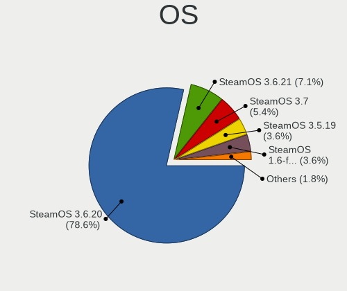
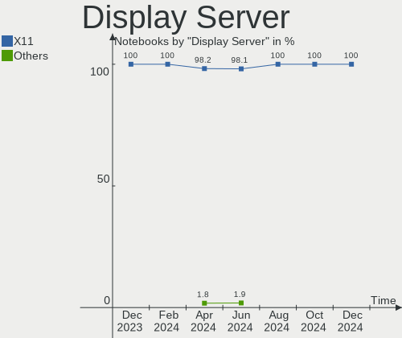
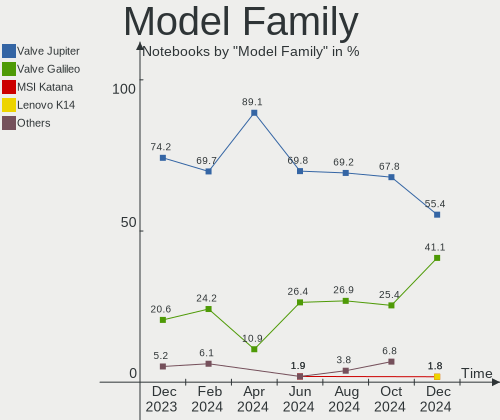
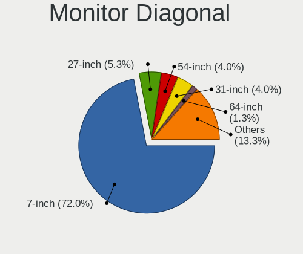
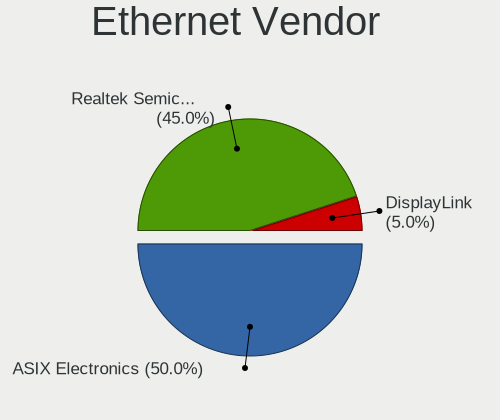

SteamOS - Hardware Trends (Notebooks)
-------------------------------------

A project to identify most popular hardware characteristics and track their change
over time based on data collected by Linux users at https://Linux-Hardware.org.

Anyone can contribute to this report by the [hw-probe](https://github.com/linuxhw/hw-probe) tool:

    sudo -E hw-probe -all -upload

This report is for one last month. Overall report since the beginning of time: [TestDays](https://github.com/linuxhw/TestDays)

Period: Oct, 2023.

Contents
--------

* [ System ](#system)
  - [ OS                       ](#os)
  - [ OS Family                ](#os-family)
  - [ Kernel                   ](#kernel)
  - [ Kernel Family            ](#kernel-family)
  - [ Kernel Major Ver.        ](#kernel-major-ver)
  - [ Arch                     ](#arch)
  - [ DE                       ](#de)
  - [ Display Server           ](#display-server)
  - [ Display Manager          ](#display-manager)
  - [ OS Lang                  ](#os-lang)
  - [ Boot Mode                ](#boot-mode)
  - [ Filesystem               ](#filesystem)
  - [ Part. scheme             ](#part-scheme)
  - [ Dual Boot with Linux/BSD ](#dual-boot-with-linuxbsd)
  - [ Dual Boot (Win)          ](#dual-boot-win)

* [ Board ](#board)
  - [ Vendor                   ](#vendor)
  - [ Model                    ](#model)
  - [ Model Family             ](#model-family)
  - [ MFG Year                 ](#mfg-year)
  - [ Form Factor              ](#form-factor)
  - [ Secure Boot              ](#secure-boot)
  - [ Coreboot                 ](#coreboot)
  - [ RAM Size                 ](#ram-size)
  - [ RAM Used                 ](#ram-used)
  - [ Total Drives             ](#total-drives)
  - [ Has CD-ROM               ](#has-cd-rom)
  - [ Has Ethernet             ](#has-ethernet)
  - [ Has WiFi                 ](#has-wifi)
  - [ Has Bluetooth            ](#has-bluetooth)

* [ Location ](#location)
  - [ Country                  ](#country)
  - [ City                     ](#city)

* [ Drives ](#drives)
  - [ Drive Vendor             ](#drive-vendor)
  - [ Drive Model              ](#drive-model)
  - [ HDD Vendor               ](#hdd-vendor)
  - [ SSD Vendor               ](#ssd-vendor)
  - [ Drive Kind               ](#drive-kind)
  - [ Drive Connector          ](#drive-connector)
  - [ Drive Size               ](#drive-size)
  - [ Space Total              ](#space-total)
  - [ Space Used               ](#space-used)
  - [ Malfunc. Drives          ](#malfunc-drives)
  - [ Malfunc. Drive Vendor    ](#malfunc-drive-vendor)
  - [ Malfunc. HDD Vendor      ](#malfunc-hdd-vendor)
  - [ Malfunc. Drive Kind      ](#malfunc-drive-kind)
  - [ Failed Drives            ](#failed-drives)
  - [ Failed Drive Vendor      ](#failed-drive-vendor)
  - [ Drive Status             ](#drive-status)

* [ Storage controller ](#storage-controller)
  - [ Storage Vendor           ](#storage-vendor)
  - [ Storage Model            ](#storage-model)
  - [ Storage Kind             ](#storage-kind)

* [ Processor ](#processor)
  - [ CPU Vendor               ](#cpu-vendor)
  - [ CPU Model                ](#cpu-model)
  - [ CPU Model Family         ](#cpu-model-family)
  - [ CPU Cores                ](#cpu-cores)
  - [ CPU Sockets              ](#cpu-sockets)
  - [ CPU Threads              ](#cpu-threads)
  - [ CPU Op-Modes             ](#cpu-op-modes)
  - [ CPU Microcode            ](#cpu-microcode)
  - [ CPU Microarch            ](#cpu-microarch)

* [ Graphics ](#graphics)
  - [ GPU Vendor               ](#gpu-vendor)
  - [ GPU Model                ](#gpu-model)
  - [ GPU Combo                ](#gpu-combo)
  - [ GPU Driver               ](#gpu-driver)
  - [ GPU Memory               ](#gpu-memory)

* [ Monitor ](#monitor)
  - [ Monitor Vendor           ](#monitor-vendor)
  - [ Monitor Model            ](#monitor-model)
  - [ Monitor Resolution       ](#monitor-resolution)
  - [ Monitor Diagonal         ](#monitor-diagonal)
  - [ Monitor Width            ](#monitor-width)
  - [ Aspect Ratio             ](#aspect-ratio)
  - [ Monitor Area             ](#monitor-area)
  - [ Pixel Density            ](#pixel-density)
  - [ Multiple Monitors        ](#multiple-monitors)

* [ Network ](#network)
  - [ Net Controller Vendor    ](#net-controller-vendor)
  - [ Net Controller Model     ](#net-controller-model)
  - [ Wireless Vendor          ](#wireless-vendor)
  - [ Wireless Model           ](#wireless-model)
  - [ Ethernet Vendor          ](#ethernet-vendor)
  - [ Ethernet Model           ](#ethernet-model)
  - [ Net Controller Kind      ](#net-controller-kind)
  - [ Used Controller          ](#used-controller)
  - [ NICs                     ](#nics)
  - [ IPv6                     ](#ipv6)

* [ Bluetooth ](#bluetooth)
  - [ Bluetooth Vendor         ](#bluetooth-vendor)
  - [ Bluetooth Model          ](#bluetooth-model)

* [ Sound ](#sound)
  - [ Sound Vendor             ](#sound-vendor)
  - [ Sound Model              ](#sound-model)

* [ Memory ](#memory)
  - [ Memory Vendor            ](#memory-vendor)
  - [ Memory Model             ](#memory-model)
  - [ Memory Kind              ](#memory-kind)
  - [ Memory Form Factor       ](#memory-form-factor)
  - [ Memory Size              ](#memory-size)
  - [ Memory Speed             ](#memory-speed)

* [ Printers & scanners ](#printers--scanners)
  - [ Printer Vendor           ](#printer-vendor)
  - [ Printer Model            ](#printer-model)
  - [ Scanner Vendor           ](#scanner-vendor)
  - [ Scanner Model            ](#scanner-model)

* [ Camera ](#camera)
  - [ Camera Vendor            ](#camera-vendor)
  - [ Camera Model             ](#camera-model)

* [ Security ](#security)
  - [ Fingerprint Vendor       ](#fingerprint-vendor)
  - [ Fingerprint Model        ](#fingerprint-model)
  - [ Chipcard Vendor          ](#chipcard-vendor)
  - [ Chipcard Model           ](#chipcard-model)

* [ Unsupported ](#unsupported)
  - [ Unsupported Devices      ](#unsupported-devices)
  - [ Unsupported Device Types ](#unsupported-device-types)

System
------

OS
--

Installed operating systems

| Name            | Notebooks | Percent |
|-----------------|-----------|---------|
| SteamOS 3.4.11  | 32        | 43.84%  |
| SteamOS 3.4.10  | 14        | 19.18%  |
| SteamOS 3.5.1   | 10        | 13.7%   |
| SteamOS 3.5     | 6         | 8.22%   |
| SteamOS 4       | 4         | 5.48%   |
| SteamOS 3.6     | 3         | 4.11%   |
| SteamOS Rolling | 1         | 1.37%   |
| SteamOS 3.4.8   | 1         | 1.37%   |
| SteamOS 3.4.6   | 1         | 1.37%   |
| SteamOS 3.4.4   | 1         | 1.37%   |

OS Family
---------

OS without a version

| Name    | Notebooks | Percent |
|---------|-----------|---------|
| SteamOS | 73        | 100%    |

Kernel
------

Version of the Linux kernel

| Version                    | Notebooks | Percent |
|----------------------------|-----------|---------|
| 5.13.0-valve37-1-neptune   | 46        | 63.01%  |
| 6.1.52-valve3-1-neptune-61 | 10        | 13.7%   |
| 6.1.52-valve2-1-neptune-61 | 10        | 13.7%   |
| 6.3.7-zen1-1-zen           | 3         | 4.11%   |
| 5.13.0-valve36-1-neptune   | 3         | 4.11%   |
| 6.4.12-zen1-1-zen          | 1         | 1.37%   |

Kernel Family
-------------

Linux kernel without a distro release

| Version | Notebooks | Percent |
|---------|-----------|---------|
| 5.13.0  | 49        | 67.12%  |
| 6.1.52  | 20        | 27.4%   |
| 6.3.7   | 3         | 4.11%   |
| 6.4.12  | 1         | 1.37%   |

Kernel Major Ver.
-----------------

Linux kernel major version

| Version | Notebooks | Percent |
|---------|-----------|---------|
| 5.13    | 49        | 67.12%  |
| 6.1     | 20        | 27.4%   |
| 6.3     | 3         | 4.11%   |
| 6.4     | 1         | 1.37%   |

Arch
----

OS architecture (x86_64, i586, etc.)

| Name   | Notebooks | Percent |
|--------|-----------|---------|
| x86_64 | 73        | 100%    |

DE
--

Desktop Environment

| Name | Notebooks | Percent |
|------|-----------|---------|
| KDE5 | 73        | 100%    |

Display Server
--------------

X11 or Wayland

| Name | Notebooks | Percent |
|------|-----------|---------|
| X11  | 73        | 100%    |

Display Manager
---------------

SDDM, LightDM, etc.

| Name    | Notebooks | Percent |
|---------|-----------|---------|
| Unknown | 72        | 98.63%  |
| SDDM    | 1         | 1.37%   |

OS Lang
-------

Language

| Lang  | Notebooks | Percent |
|-------|-----------|---------|
| en_US | 64        | 87.67%  |
| ru_RU | 2         | 2.74%   |
| en_GB | 2         | 2.74%   |
| de_DE | 2         | 2.74%   |
| fr_FR | 1         | 1.37%   |
| en_IE | 1         | 1.37%   |
| C     | 1         | 1.37%   |

Boot Mode
---------

EFI or BIOS

| Mode | Notebooks | Percent |
|------|-----------|---------|
| BIOS | 72        | 98.63%  |
| EFI  | 1         | 1.37%   |

Filesystem
----------

Type of filesystem

| Type  | Notebooks | Percent |
|-------|-----------|---------|
| Btrfs | 73        | 100%    |

Part. scheme
------------

Scheme of partitioning

| Type    | Notebooks | Percent |
|---------|-----------|---------|
| Unknown | 72        | 98.63%  |
| GPT     | 1         | 1.37%   |

Dual Boot with Linux/BSD
------------------------

Hosting more than one Linux/BSD

| Dual boot | Notebooks | Percent |
|-----------|-----------|---------|
| No        | 72        | 98.63%  |
| Yes       | 1         | 1.37%   |

Dual Boot (Win)
---------------

Hosting Linux and Windows

| Dual boot | Notebooks | Percent |
|-----------|-----------|---------|
| No        | 73        | 100%    |

Board
-----

Vendor
------

Motherboard manufacturer

| Name            | Notebooks | Percent |
|-----------------|-----------|---------|
| Valve           | 69        | 94.52%  |
| Hewlett-Packard | 2         | 2.74%   |
| Acer            | 2         | 2.74%   |

Model
-----

Motherboard model

| Name                                | Notebooks | Percent |
|-------------------------------------|-----------|---------|
| Valve Jupiter                       | 69        | 94.52%  |
| HP Victus by Gaming Laptop 16-s0xxx | 1         | 1.37%   |
| HP Pavilion Laptop 15-eh0xxx        | 1         | 1.37%   |
| Acer Swift SFA16-41                 | 1         | 1.37%   |
| Acer Nitro AN515-56                 | 1         | 1.37%   |

Model Family
------------

Motherboard model prefix

| Name          | Notebooks | Percent |
|---------------|-----------|---------|
| Valve Jupiter | 69        | 94.52%  |
| HP Victus     | 1         | 1.37%   |
| HP Pavilion   | 1         | 1.37%   |
| Acer Swift    | 1         | 1.37%   |
| Acer Nitro    | 1         | 1.37%   |

MFG Year
--------

Motherboard manufacture year

| Year | Notebooks | Percent |
|------|-----------|---------|
| 2023 | 45        | 61.64%  |
| 2022 | 26        | 35.62%  |
| 2021 | 1         | 1.37%   |
| 2020 | 1         | 1.37%   |

Form Factor
-----------

Physical design of the computer

| Name     | Notebooks | Percent |
|----------|-----------|---------|
| Notebook | 73        | 100%    |

Secure Boot
-----------

Enabled or disabled

| State    | Notebooks | Percent |
|----------|-----------|---------|
| Disabled | 73        | 100%    |

Coreboot
--------

Have coreboot on board

| Used | Notebooks | Percent |
|------|-----------|---------|
| No   | 73        | 100%    |

RAM Size
--------

Total RAM memory

| Size in GB | Notebooks | Percent |
|------------|-----------|---------|
| 8.01-16.0  | 71        | 97.26%  |
| 4.01-8.0   | 1         | 1.37%   |
| 16.01-24.0 | 1         | 1.37%   |

RAM Used
--------

Used RAM memory

| Used GB   | Notebooks | Percent |
|-----------|-----------|---------|
| 4.01-8.0  | 34        | 46.58%  |
| 3.01-4.0  | 19        | 26.03%  |
| 2.01-3.0  | 15        | 20.55%  |
| 8.01-16.0 | 5         | 6.85%   |

Total Drives
------------

Number of drives on board

| Drives | Notebooks | Percent |
|--------|-----------|---------|
| 2      | 48        | 65.75%  |
| 1      | 23        | 31.51%  |
| 3      | 2         | 2.74%   |

Has CD-ROM
----------

Has CD-ROM on board

| Presented | Notebooks | Percent |
|-----------|-----------|---------|
| No        | 72        | 98.63%  |
| Yes       | 1         | 1.37%   |

Has Ethernet
------------

Has Ethernet on board

| Presented | Notebooks | Percent |
|-----------|-----------|---------|
| No        | 55        | 75.34%  |
| Yes       | 18        | 24.66%  |

Has WiFi
--------

Has WiFi module

| Presented | Notebooks | Percent |
|-----------|-----------|---------|
| Yes       | 73        | 100%    |

Has Bluetooth
-------------

Has Bluetooth module

| Presented | Notebooks | Percent |
|-----------|-----------|---------|
| Yes       | 73        | 100%    |

Location
--------

Country
-------

Geographic location (country)

| Country     | Notebooks | Percent |
|-------------|-----------|---------|
| USA         | 31        | 42.47%  |
| Russia      | 8         | 10.96%  |
| Germany     | 7         | 9.59%   |
| UK          | 5         | 6.85%   |
| Canada      | 3         | 4.11%   |
| Spain       | 2         | 2.74%   |
| Philippines | 2         | 2.74%   |
| France      | 2         | 2.74%   |
| Brazil      | 2         | 2.74%   |
| Australia   | 2         | 2.74%   |
| Tunisia     | 1         | 1.37%   |
| Poland      | 1         | 1.37%   |
| Israel      | 1         | 1.37%   |
| Indonesia   | 1         | 1.37%   |
| Iceland     | 1         | 1.37%   |
| Hungary     | 1         | 1.37%   |
| Hong Kong   | 1         | 1.37%   |
| Denmark     | 1         | 1.37%   |
| Argentina   | 1         | 1.37%   |

City
----

Geographic location (city)

| City               | Notebooks | Percent |
|--------------------|-----------|---------|
| Moscow             | 4         | 5.48%   |
| Rostov-on-Don      | 2         | 2.74%   |
| Austin             | 2         | 2.74%   |
| Yuma               | 1         | 1.37%   |
| Wyoming            | 1         | 1.37%   |
| Wiesau             | 1         | 1.37%   |
| Vitória           | 1         | 1.37%   |
| Valencia           | 1         | 1.37%   |
| Tunis              | 1         | 1.37%   |
| Toronto            | 1         | 1.37%   |
| Tel Aviv           | 1         | 1.37%   |
| Sydney             | 1         | 1.37%   |
| St Louis           | 1         | 1.37%   |
| Sparks             | 1         | 1.37%   |
| South Tangerang    | 1         | 1.37%   |
| Somerset           | 1         | 1.37%   |
| Salt Lake City     | 1         | 1.37%   |
| Rochdale           | 1         | 1.37%   |
| Ringe              | 1         | 1.37%   |
| Reykjavik          | 1         | 1.37%   |
| Rangely            | 1         | 1.37%   |
| Perkiomenville     | 1         | 1.37%   |
| Pasadena           | 1         | 1.37%   |
| Paris              | 1         | 1.37%   |
| Pampow             | 1         | 1.37%   |
| Nuremberg          | 1         | 1.37%   |
| Novosibirsk        | 1         | 1.37%   |
| North Versailles   | 1         | 1.37%   |
| Nashville          | 1         | 1.37%   |
| Munich             | 1         | 1.37%   |
| Mollet del Vallès | 1         | 1.37%   |
| Melbourne          | 1         | 1.37%   |
| Makati City        | 1         | 1.37%   |
| London             | 1         | 1.37%   |
| Leetonia           | 1         | 1.37%   |
| Las Vegas          | 1         | 1.37%   |
| Langhorne          | 1         | 1.37%   |
| Krasnodar          | 1         | 1.37%   |
| Kenmore            | 1         | 1.37%   |
| Kelowna            | 1         | 1.37%   |

Drives
------

Drive Vendor
------------

Hard drive vendors

| Vendor                      | Notebooks | Drives | Percent |
|-----------------------------|-----------|--------|---------|
| Unknown                     | 40        | 40     | 31.75%  |
| Kingston Technology Company | 18        | 18     | 14.29%  |
| Samsung Electronics         | 14        | 14     | 11.11%  |
| Phison Electronics          | 14        | 14     | 11.11%  |
| Sandisk                     | 10        | 10     | 7.94%   |
| Unknown                     | 9         | 9      | 7.14%   |
| O2 Micro                    | 6         | 6      | 4.76%   |
| Micron Technology           | 4         | 4      | 3.17%   |
| Silicon Motion              | 3         | 3      | 2.38%   |
| WDC WDB                     | 1         | 1      | 0.79%   |
| WDC                         | 1         | 1      | 0.79%   |
| SK hynix                    | 1         | 1      | 0.79%   |
| Micron/Crucial Technology   | 1         | 1      | 0.79%   |
| MAXIO Technology (Hangzhou) | 1         | 1      | 0.79%   |
| KIOXIA                      | 1         | 1      | 0.79%   |
| JMicron Technology          | 1         | 1      | 0.79%   |
| A-DATA Technology           | 1         | 1      | 0.79%   |

Drive Model
-----------

Hard drive models

| Model                                                 | Notebooks | Percent |
|-------------------------------------------------------|-----------|---------|
| Unknown MMC Card  512GB                               | 20        | 15.87%  |
| Kingston Company OM3PDP3 NVMe SSD 512GB               | 18        | 14.29%  |
| Unknown MMC Card  256GB                               | 11        | 8.73%   |
| Phison PS5013 E13 NVMe Controller 256GB               | 11        | 8.73%   |
| Unknown                                               | 9         | 7.14%   |
| O2 Micro E2M2 64GB                                    | 6         | 4.76%   |
| Samsung MZ9LQ512HBLU-00BVL 512GB                      | 4         | 3.17%   |
| Unknown MMC Card  128GB                               | 3         | 2.38%   |
| Sandisk WDC PC SN530 SDBPTPZ-1T00 1024GB              | 3         | 2.38%   |
| Samsung MZ9LQ256HBJD-00BVL 256GB                      | 3         | 2.38%   |
| Silicon Motion SPCC M.2 PCIe SSD 1TB                  | 2         | 1.59%   |
| Sandisk WD PC SN740 SDDPTQE-2T00 2TB                  | 2         | 1.59%   |
| Sandisk WD PC SN740 SDDPTQD-1T00 1024GB               | 2         | 1.59%   |
| Samsung PM991a NVMe 512GB                             | 2         | 1.59%   |
| Samsung MZ9LQ512HBLU-00B00 512GB                      | 2         | 1.59%   |
| Phison Sabrent SB-2130-1TB                            | 2         | 1.59%   |
| Micron 2400_MTFDKBK2T0QFM 2TB                         | 2         | 1.59%   |
| WDC WDB NCE5000PNC 500GB SSD                          | 1         | 0.79%   |
| WDC WD10 0EMAZ-00WJTA0 10TB                           | 1         | 0.79%   |
| Unknown MMC Card  997GB                               | 1         | 0.79%   |
| Unknown MMC Card  64GB                                | 1         | 0.79%   |
| Unknown MMC Card  393GB                               | 1         | 0.79%   |
| Unknown MMC Card  32GB                                | 1         | 0.79%   |
| Unknown MMC Card  249GB                               | 1         | 0.79%   |
| Unknown MMC Card  16GB                                | 1         | 0.79%   |
| SK hynix BC711 NVMe 256GB                             | 1         | 0.79%   |
| Silicon Motion SM2263EN/SM2263XT SSD Controller 256GB | 1         | 0.79%   |
| Sandisk WD CH SN560 SDCPTPD-1T00-1024 930GB           | 1         | 0.79%   |
| Sandisk WD Blue SN550 NVMe SSD 1TB                    | 1         | 0.79%   |
| Sandisk PC SN530 NVMe SSD 450GB                       | 1         | 0.79%   |
| Samsung SSD 990 PRO 2TB                               | 1         | 0.79%   |
| Samsung PM991 NVMe 256GB                              | 1         | 0.79%   |
| Samsung MZ9LQ1T0HBLB-00B00 1024GB                     | 1         | 0.79%   |
| Phison Corsair MP600 MINI 1TB                         | 1         | 0.79%   |
| Micron/Crucial CT2000P5PSSD8 2TB                      | 1         | 0.79%   |
| Micron 2400_MTFDKBK1T0QFM 1024GB                      | 1         | 0.79%   |
| Micron 2400_MTFDKBA1T0QFM 1024GB                      | 1         | 0.79%   |
| MAXIO (Hangzhou) NVMe SSD Controller MAP1202 250GB    | 1         | 0.79%   |
| KIOXIA KBG50ZNS256G NVMe 256GB                        | 1         | 0.79%   |
| JMicron PCIe 512GB                                    | 1         | 0.79%   |

HDD Vendor
----------

Hard disk drive vendors

| Vendor | Notebooks | Drives | Percent |
|--------|-----------|--------|---------|
| WDC    | 1         | 1      | 100%    |

SSD Vendor
----------

Solid state drive vendors

| Vendor            | Notebooks | Drives | Percent |
|-------------------|-----------|--------|---------|
| WDC WDB           | 1         | 1      | 50%     |
| A-DATA Technology | 1         | 1      | 50%     |

Drive Kind
----------

HDD or SSD

| Kind    | Notebooks | Drives | Percent |
|---------|-----------|--------|---------|
| NVMe    | 73        | 73     | 57.94%  |
| MMC     | 49        | 49     | 38.89%  |
| SSD     | 2         | 2      | 1.59%   |
| HDD     | 1         | 1      | 0.79%   |
| Unknown | 1         | 1      | 0.79%   |

Drive Connector
---------------

SATA, SAS, NVMe, etc.

| Type | Notebooks | Drives | Percent |
|------|-----------|--------|---------|
| NVMe | 73        | 73     | 58.4%   |
| MMC  | 49        | 49     | 39.2%   |
| SAS  | 3         | 4      | 2.4%    |

Drive Size
----------

Size of hard drive

| Size in TB | Notebooks | Drives | Percent |
|------------|-----------|--------|---------|
| 1.01-2.0   | 1         | 1      | 33.33%  |
| 4.01-10.0  | 1         | 1      | 33.33%  |
| 0.01-0.5   | 1         | 1      | 33.33%  |

Space Total
-----------

Amount of disk space available on the file system

| Size in GB     | Notebooks | Percent |
|----------------|-----------|---------|
| 251-500        | 24        | 32.88%  |
| 501-1000       | 17        | 23.29%  |
| 101-250        | 15        | 20.55%  |
| 1001-2000      | 9         | 12.33%  |
| 51-100         | 6         | 8.22%   |
| More than 3000 | 1         | 1.37%   |
| 2001-3000      | 1         | 1.37%   |

Space Used
----------

Amount of used disk space

| Used GB        | Notebooks | Percent |
|----------------|-----------|---------|
| 251-500        | 19        | 26.03%  |
| 101-250        | 17        | 23.29%  |
| 501-1000       | 11        | 15.07%  |
| 21-50          | 10        | 13.7%   |
| 1-20           | 7         | 9.59%   |
| 1001-2000      | 6         | 8.22%   |
| 51-100         | 2         | 2.74%   |
| More than 3000 | 1         | 1.37%   |

Malfunc. Drives
---------------

Drive models with a malfunction

Zero info for selected period =(

Malfunc. Drive Vendor
---------------------

Vendors of faulty drives

Zero info for selected period =(

Malfunc. HDD Vendor
-------------------

Vendors of faulty HDD drives

Zero info for selected period =(

Malfunc. Drive Kind
-------------------

Kinds of faulty drives

Zero info for selected period =(

Failed Drives
-------------

Failed drive models

Zero info for selected period =(

Failed Drive Vendor
-------------------

Failed drive vendors

Zero info for selected period =(

Drive Status
------------

Number of failed and malfunc. drives

| Status   | Notebooks | Drives | Percent |
|----------|-----------|--------|---------|
| Detected | 73        | 125    | 98.65%  |
| Works    | 1         | 1      | 1.35%   |

Storage controller
------------------

Storage Vendor
--------------

Storage controller vendors

| Vendor                      | Notebooks | Percent |
|-----------------------------|-----------|---------|
| Kingston Technology Company | 18        | 24.32%  |
| Samsung Electronics         | 14        | 18.92%  |
| Phison Electronics          | 14        | 18.92%  |
| Sandisk                     | 10        | 13.51%  |
| O2 Micro                    | 6         | 8.11%   |
| Micron Technology           | 4         | 5.41%   |
| Silicon Motion              | 3         | 4.05%   |
| SK hynix                    | 1         | 1.35%   |
| Micron/Crucial Technology   | 1         | 1.35%   |
| MAXIO Technology (Hangzhou) | 1         | 1.35%   |
| KIOXIA                      | 1         | 1.35%   |
| Intel                       | 1         | 1.35%   |

Storage Model
-------------

Storage controller models

| Model                                                             | Notebooks | Percent |
|-------------------------------------------------------------------|-----------|---------|
| Kingston Company OM3PDP3 NVMe SSD                                 | 18        | 24%     |
| Samsung NVMe SSD Controller 980 (DRAM-less)                       | 13        | 17.33%  |
| Phison PS5013-E13 PCIe3 NVMe Controller (DRAM-less)               | 11        | 14.67%  |
| O2 Micro FORESEE E2M2 NVMe SSD                                    | 6         | 8%      |
| Sandisk PC SN740 NVMe SSD (DRAM-less)                             | 4         | 5.33%   |
| Micron 2400 NVMe SSD (DRAM-less)                                  | 4         | 5.33%   |
| SanDisk IX SN530 NVMe SSD (DRAM-less)                             | 3         | 4%      |
| Phison PS5021-E21 PCIe4 NVMe Controller (DRAM-less)               | 3         | 4%      |
| Silicon Motion SM2269XT (DRAM-less) NVMe SSD Controller           | 2         | 2.67%   |
| SK hynix Gold P31/BC711/PC711 NVMe Solid State Drive              | 1         | 1.33%   |
| Silicon Motion SM2263EN/SM2263XT (DRAM-less) NVMe SSD Controllers | 1         | 1.33%   |
| Sandisk WD CH SN560 NVMe SSD                                      | 1         | 1.33%   |
| SanDisk Ultra 3D / WD Blue SN550 NVMe SSD                         | 1         | 1.33%   |
| SanDisk PC SN530 NVMe SSD                                         | 1         | 1.33%   |
| Samsung NVMe SSD Controller S4LV008[Pascal]                       | 1         | 1.33%   |
| Micron/Crucial P5 Plus NVMe PCIe SSD                              | 1         | 1.33%   |
| MAXIO (Hangzhou) NVMe SSD Controller MAP1202                      | 1         | 1.33%   |
| KIOXIA NVMe SSD Controller BG5 (DRAM-less)                        | 1         | 1.33%   |
| Intel Volume Management Device NVMe RAID Controller               | 1         | 1.33%   |
| Intel Tiger Lake-LP SATA Controller                               | 1         | 1.33%   |

Storage Kind
------------

Kind of storage controller (IDE, SATA, NVMe, SAS, ...)

| Kind | Notebooks | Percent |
|------|-----------|---------|
| NVMe | 73        | 97.33%  |
| RAID | 1         | 1.33%   |
| SATA | 1         | 1.33%   |

Processor
---------

CPU Vendor
----------

Processor vendors

| Vendor | Notebooks | Percent |
|--------|-----------|---------|
| AMD    | 72        | 98.63%  |
| Intel  | 1         | 1.37%   |

CPU Model
---------

Processor models

| Model                                      | Notebooks | Percent |
|--------------------------------------------|-----------|---------|
| AMD Custom APU 0405                        | 69        | 94.52%  |
| Intel 11th Gen Core i5-11300H @ 3.10GHz    | 1         | 1.37%   |
| AMD Ryzen 7 7840HS w/ Radeon 780M Graphics | 1         | 1.37%   |
| AMD Ryzen 7 6800U with Radeon Graphics     | 1         | 1.37%   |
| AMD Ryzen 5 4500U with Radeon Graphics     | 1         | 1.37%   |

CPU Model Family
----------------

Processor model prefix

| Model       | Notebooks | Percent |
|-------------|-----------|---------|
| Other       | 70        | 95.89%  |
| AMD Ryzen 7 | 2         | 2.74%   |
| AMD Ryzen 5 | 1         | 1.37%   |

CPU Cores
---------

Number of processor cores

| Number | Notebooks | Percent |
|--------|-----------|---------|
| 4      | 70        | 95.89%  |
| 8      | 2         | 2.74%   |
| 6      | 1         | 1.37%   |

CPU Sockets
-----------

Number of sockets

| Number | Notebooks | Percent |
|--------|-----------|---------|
| 1      | 73        | 100%    |

CPU Threads
-----------

Threads per core (Hyper-Threading)

| Number | Notebooks | Percent |
|--------|-----------|---------|
| 2      | 72        | 98.63%  |
| 1      | 1         | 1.37%   |

CPU Op-Modes
------------

CPU Operation Modes (32-bit, 64-bit)

| Op mode        | Notebooks | Percent |
|----------------|-----------|---------|
| 32-bit, 64-bit | 73        | 100%    |

CPU Microcode
-------------

Microcode number

| Number     | Notebooks | Percent |
|------------|-----------|---------|
| Unknown    | 72        | 98.63%  |
| 0x08900201 | 1         | 1.37%   |

CPU Microarch
-------------

Microarchitecture

| Name      | Notebooks | Percent |
|-----------|-----------|---------|
| Unknown   | 71        | 97.26%  |
| Zen 2     | 1         | 1.37%   |
| TigerLake | 1         | 1.37%   |

Graphics
--------

GPU Vendor
----------

Vendors of graphics cards

| Vendor | Notebooks | Percent |
|--------|-----------|---------|
| AMD    | 72        | 96%     |
| Nvidia | 2         | 2.67%   |
| Intel  | 1         | 1.33%   |

GPU Model
---------

Graphics card models

| Model                                                         | Notebooks | Percent |
|---------------------------------------------------------------|-----------|---------|
| AMD VanGogh [AMD Custom GPU 0405]                             | 69        | 92%     |
| Nvidia TU117M [GeForce GTX 1650 Mobile / Max-Q]               | 1         | 1.33%   |
| Nvidia AD106M [GeForce RTX 4070 Max-Q / Mobile]               | 1         | 1.33%   |
| Intel TigerLake-LP GT2 [Iris Xe Graphics]                     | 1         | 1.33%   |
| AMD Renoir [Radeon RX Vega 6 (Ryzen 4000/5000 Mobile Series)] | 1         | 1.33%   |
| AMD Rembrandt [Radeon 680M]                                   | 1         | 1.33%   |
| AMD Phoenix1                                                  | 1         | 1.33%   |

GPU Combo
---------

Combinations of graphics cards

| Name           | Notebooks | Percent |
|----------------|-----------|---------|
| 1 x AMD        | 71        | 97.26%  |
| Intel + Nvidia | 1         | 1.37%   |
| AMD + Nvidia   | 1         | 1.37%   |

GPU Driver
----------

Free vs proprietary

| Driver | Notebooks | Percent |
|--------|-----------|---------|
| Free   | 73        | 100%    |

GPU Memory
----------

Total video memory

| Size in GB | Notebooks | Percent |
|------------|-----------|---------|
| Unknown    | 72        | 98.63%  |
| 0.51-1.0   | 1         | 1.37%   |

Monitor
-------

Monitor Vendor
--------------

Monitor vendors

| Vendor              | Notebooks | Percent |
|---------------------|-----------|---------|
| Valve               | 69        | 73.4%   |
| Goldstar            | 3         | 3.19%   |
| Samsung Electronics | 2         | 2.13%   |
| Lenovo              | 2         | 2.13%   |
| ASUSTek Computer    | 2         | 2.13%   |
| ViewSonic           | 1         | 1.06%   |
| Toshiba             | 1         | 1.06%   |
| Seiki               | 1         | 1.06%   |
| Sceptre Tech        | 1         | 1.06%   |
| RTK                 | 1         | 1.06%   |
| Philips             | 1         | 1.06%   |
| ONN                 | 1         | 1.06%   |
| LTM                 | 1         | 1.06%   |
| LG Display          | 1         | 1.06%   |
| INNOCN              | 1         | 1.06%   |
| HannStar            | 1         | 1.06%   |
| Element             | 1         | 1.06%   |
| Dell                | 1         | 1.06%   |
| BOE                 | 1         | 1.06%   |
| AU Optronics        | 1         | 1.06%   |
| Acer                | 1         | 1.06%   |

Monitor Model
-------------

Monitor models

| Model                                                                   | Notebooks | Percent |
|-------------------------------------------------------------------------|-----------|---------|
| Valve ANX7530 U VLV3001 800x1280 100x150mm 7.1-inch                     | 69        | 72.63%  |
| ViewSonic VX2250 SERIES VSCCB25 1920x1080 477x268mm 21.5-inch           | 1         | 1.05%   |
| Toshiba TV TSB0032 3840x2160                                            | 1         | 1.05%   |
| Seiki SM28UTR SEK2862 3840x2160 708x398mm 32.0-inch                     | 1         | 1.05%   |
| Sceptre Tech Sceptre Z27 SPT0AB4 3840x2160 575x323mm 26.0-inch          | 1         | 1.05%   |
| Samsung Electronics T24B350 SAM0940 1920x1080 521x293mm 23.5-inch       | 1         | 1.05%   |
| Samsung Electronics LCD Monitor SDC416B 3840x2400 344x215mm 16.0-inch   | 1         | 1.05%   |
| Samsung Electronics LCD Monitor SAM0D3B 3840x2160 1872x1053mm 84.6-inch | 1         | 1.05%   |
| RTK TYPE C RTKBC32 2560x1600 347x215mm 16.1-inch                        | 1         | 1.05%   |
| Philips PHL 243V7 PHLC155 1920x1080 530x300mm 24.0-inch                 | 1         | 1.05%   |
| ONN 100002487 ONN0101 1920x1080 517x323mm 24.0-inch                     | 1         | 1.05%   |
| LTM LCD LTM2C02 1920x1080 886x498mm 40.0-inch                           | 1         | 1.05%   |
| LG Display LCD Monitor LGD062F 1920x1080 344x194mm 15.5-inch            | 1         | 1.05%   |
| Lenovo Q27q-10 LEN65F4 2560x1440 597x336mm 27.0-inch                    | 1         | 1.05%   |
| Lenovo LEN P27h-10 LEN61AF 2560x1440 597x336mm 27.0-inch                | 1         | 1.05%   |
| INNOCN PU15-PRE IOC1501 3840x2160 344x194mm 15.5-inch                   | 1         | 1.05%   |
| HannStar HL161ABB HSD61C7 1366x768 344x193mm 15.5-inch                  | 1         | 1.05%   |
| Goldstar ULTRAGEAR GSM5BB2 1920x1080 527x296mm 23.8-inch                | 1         | 1.05%   |
| Goldstar LG TV SSCR2 GSMC0C8 3840x2160                                  | 1         | 1.05%   |
| Goldstar 32inch FHD GSM76F5 1920x1080 698x392mm 31.5-inch               | 1         | 1.05%   |
| Element ELEFW195 ELE3553 1920x1080 708x398mm 32.0-inch                  | 1         | 1.05%   |
| Dell U2722D DEL422F 2560x1440 597x336mm 27.0-inch                       | 1         | 1.05%   |
| BOE LCD Monitor BOE0B9F 1920x1080 355x200mm 16.0-inch                   | 1         | 1.05%   |
| AU Optronics LCD Monitor AUOAF90 1920x1080 344x193mm 15.5-inch          | 1         | 1.05%   |
| ASUSTek Computer VG32V AUS32A3 2560x1440 697x393mm 31.5-inch            | 1         | 1.05%   |
| ASUSTek Computer ROG PG258Q AUS25B1 1920x1080 544x303mm 24.5-inch       | 1         | 1.05%   |
| Acer XF270H B ACR064D 1920x1080 598x336mm 27.0-inch                     | 1         | 1.05%   |

Monitor Resolution
------------------

Monitor screen resolution

| Resolution      | Notebooks | Percent |
|-----------------|-----------|---------|
| 800x1280        | 69        | 72.63%  |
| 1920x1080 (FHD) | 13        | 13.68%  |
| 3840x2160 (4K)  | 6         | 6.32%   |
| 2560x1440 (QHD) | 4         | 4.21%   |
| 3840x2400       | 1         | 1.05%   |
| 2560x1600       | 1         | 1.05%   |
| 1366x768 (WXGA) | 1         | 1.05%   |

Monitor Diagonal
----------------

Diagonal size in inches

| Inches  | Notebooks | Percent |
|---------|-----------|---------|
| 7       | 69        | 72.63%  |
| 27      | 6         | 6.32%   |
| 15      | 4         | 4.21%   |
| 31      | 3         | 3.16%   |
| 32      | 2         | 2.11%   |
| 24      | 2         | 2.11%   |
| 23      | 2         | 2.11%   |
| 16      | 2         | 2.11%   |
| 84      | 1         | 1.05%   |
| 72      | 1         | 1.05%   |
| 40      | 1         | 1.05%   |
| 21      | 1         | 1.05%   |
| Unknown | 1         | 1.05%   |

Monitor Width
-------------

Physical width

| Width in mm | Notebooks | Percent |
|-------------|-----------|---------|
| 1-100       | 69        | 73.4%   |
| 501-600     | 9         | 9.57%   |
| 301-350     | 5         | 5.32%   |
| 601-700     | 3         | 3.19%   |
| 701-800     | 2         | 2.13%   |
| 1501-2000   | 2         | 2.13%   |
| 801-900     | 1         | 1.06%   |
| 401-500     | 1         | 1.06%   |
| 351-400     | 1         | 1.06%   |
| Unknown     | 1         | 1.06%   |

Aspect Ratio
------------

Proportional relationship between the width and the height

| Ratio | Notebooks | Percent |
|-------|-----------|---------|
| 0.67  | 69        | 74.19%  |
| 16/9  | 23        | 24.73%  |
| 16/10 | 1         | 1.08%   |

Monitor Area
------------

Area in inch²

| Area in inch² | Notebooks | Percent |
|----------------|-----------|---------|
| 1-40           | 69        | 72.63%  |
| 301-350        | 6         | 6.32%   |
| 351-500        | 5         | 5.26%   |
| 101-110        | 5         | 5.26%   |
| 201-250        | 4         | 4.21%   |
| More than 1000 | 2         | 2.11%   |
| 251-300        | 1         | 1.05%   |
| 111-120        | 1         | 1.05%   |
| 501-1000       | 1         | 1.05%   |
| Unknown        | 1         | 1.05%   |

Pixel Density
-------------

Pixels per inch

| Density       | Notebooks | Percent |
|---------------|-----------|---------|
| 161-240       | 69        | 73.4%   |
| 51-100        | 13        | 13.83%  |
| 101-120       | 5         | 5.32%   |
| 121-160       | 4         | 4.26%   |
| More than 240 | 2         | 2.13%   |
| Unknown       | 1         | 1.06%   |

Multiple Monitors
-----------------

Total monitors connected

| Total | Notebooks | Percent |
|-------|-----------|---------|
| 1     | 52        | 71.23%  |
| 2     | 20        | 27.4%   |
| 3     | 1         | 1.37%   |

Network
-------

Net Controller Vendor
---------------------

Controller vendors

| Vendor                | Notebooks | Percent |
|-----------------------|-----------|---------|
| Realtek Semiconductor | 71        | 81.61%  |
| ASIX Electronics      | 9         | 10.34%  |
| MediaTek              | 3         | 3.45%   |
| Intel                 | 2         | 2.3%    |
| Lenovo                | 1         | 1.15%   |
| DisplayLink           | 1         | 1.15%   |

Net Controller Model
--------------------

Controller models

| Model                                                             | Notebooks | Percent |
|-------------------------------------------------------------------|-----------|---------|
| Realtek RTL8822CE 802.11ac PCIe Wireless Network Adapter          | 69        | 74.19%  |
| ASIX AX88179 Gigabit Ethernet                                     | 9         | 9.68%   |
| Realtek RTL8153 Gigabit Ethernet Adapter                          | 4         | 4.3%    |
| Realtek RTL8152 Fast Ethernet Adapter                             | 2         | 2.15%   |
| Realtek RTL8111/8168/8411 PCI Express Gigabit Ethernet Controller | 1         | 1.08%   |
| Realtek Killer E2600 Gigabit Ethernet Controller                  | 1         | 1.08%   |
| MediaTek MT7922 802.11ax PCI Express Wireless Network Adapter     | 1         | 1.08%   |
| MediaTek MT7921 802.11ax PCI Express Wireless Network Adapter     | 1         | 1.08%   |
| MediaTek MT7612U 802.11a/b/g/n/ac Wireless Adapter                | 1         | 1.08%   |
| Lenovo USB-C Dock Ethernet                                        | 1         | 1.08%   |
| Intel Wi-Fi 6 AX201                                               | 1         | 1.08%   |
| Intel Wi-Fi 6 AX200                                               | 1         | 1.08%   |
| DisplayLink Plugable UD-3900                                      | 1         | 1.08%   |

Wireless Vendor
---------------

Wireless vendors

| Vendor                | Notebooks | Percent |
|-----------------------|-----------|---------|
| Realtek Semiconductor | 69        | 93.24%  |
| MediaTek              | 3         | 4.05%   |
| Intel                 | 2         | 2.7%    |

Wireless Model
--------------

Wireless models

| Model                                                         | Notebooks | Percent |
|---------------------------------------------------------------|-----------|---------|
| Realtek RTL8822CE 802.11ac PCIe Wireless Network Adapter      | 69        | 93.24%  |
| MediaTek MT7922 802.11ax PCI Express Wireless Network Adapter | 1         | 1.35%   |
| MediaTek MT7921 802.11ax PCI Express Wireless Network Adapter | 1         | 1.35%   |
| MediaTek MT7612U 802.11a/b/g/n/ac Wireless Adapter            | 1         | 1.35%   |
| Intel Wi-Fi 6 AX201                                           | 1         | 1.35%   |
| Intel Wi-Fi 6 AX200                                           | 1         | 1.35%   |

Ethernet Vendor
---------------

Ethernet vendors

| Vendor                | Notebooks | Percent |
|-----------------------|-----------|---------|
| ASIX Electronics      | 9         | 47.37%  |
| Realtek Semiconductor | 8         | 42.11%  |
| Lenovo                | 1         | 5.26%   |
| DisplayLink           | 1         | 5.26%   |

Ethernet Model
--------------

Ethernet models

| Model                                                             | Notebooks | Percent |
|-------------------------------------------------------------------|-----------|---------|
| ASIX AX88179 Gigabit Ethernet                                     | 9         | 47.37%  |
| Realtek RTL8153 Gigabit Ethernet Adapter                          | 4         | 21.05%  |
| Realtek RTL8152 Fast Ethernet Adapter                             | 2         | 10.53%  |
| Realtek RTL8111/8168/8411 PCI Express Gigabit Ethernet Controller | 1         | 5.26%   |
| Realtek Killer E2600 Gigabit Ethernet Controller                  | 1         | 5.26%   |
| Lenovo USB-C Dock Ethernet                                        | 1         | 5.26%   |
| DisplayLink Plugable UD-3900                                      | 1         | 5.26%   |

Net Controller Kind
-------------------

Ethernet, WiFi or modem

| Kind     | Notebooks | Percent |
|----------|-----------|---------|
| WiFi     | 73        | 80.22%  |
| Ethernet | 18        | 19.78%  |

Used Controller
---------------

Currently used network controller

| Kind     | Notebooks | Percent |
|----------|-----------|---------|
| WiFi     | 71        | 98.61%  |
| Ethernet | 1         | 1.39%   |

NICs
----

Total network controllers on board

| Total | Notebooks | Percent |
|-------|-----------|---------|
| 1     | 71        | 97.26%  |
| 2     | 2         | 2.74%   |

IPv6
----

IPv6 vs IPv4

| Used | Notebooks | Percent |
|------|-----------|---------|
| No   | 42        | 57.53%  |
| Yes  | 31        | 42.47%  |

Bluetooth
---------

Bluetooth Vendor
----------------

Controller vendors

| Vendor            | Notebooks | Percent |
|-------------------|-----------|---------|
| IMC Networks      | 70        | 95.89%  |
| Intel             | 2         | 2.74%   |
| Foxconn / Hon Hai | 1         | 1.37%   |

Bluetooth Model
---------------

Controller models

| Model                             | Notebooks | Percent |
|-----------------------------------|-----------|---------|
| IMC Networks Bluetooth Radio      | 69        | 94.52%  |
| Intel AX201 Bluetooth             | 1         | 1.37%   |
| Intel AX200 Bluetooth             | 1         | 1.37%   |
| IMC Networks Wireless_Device      | 1         | 1.37%   |
| Foxconn / Hon Hai Wireless_Device | 1         | 1.37%   |

Sound
-----

Sound Vendor
------------

Sound card vendors

| Vendor         | Notebooks | Percent |
|----------------|-----------|---------|
| AMD            | 72        | 90%     |
| Nvidia         | 2         | 2.5%    |
| MVSILICON.INC. | 1         | 1.25%   |
| Logitech       | 1         | 1.25%   |
| Lenovo         | 1         | 1.25%   |
| Intel          | 1         | 1.25%   |
| Corsair        | 1         | 1.25%   |
| Astro Gaming   | 1         | 1.25%   |

Sound Model
-----------

Sound card models

| Model                                                          | Notebooks | Percent |
|----------------------------------------------------------------|-----------|---------|
| AMD Rembrandt Radeon High Definition Audio Controller          | 71        | 85.54%  |
| AMD Family 17h/19h HD Audio Controller                         | 3         | 3.61%   |
| Nvidia TU107 GeForce GTX 1650 High Definition Audio Controller | 1         | 1.2%    |
| Nvidia Audio device                                            | 1         | 1.2%    |
| MVSILICON.INC. MV USB AUDIO                                    | 1         | 1.2%    |
| Logitech Zone 900 Receiver                                     | 1         | 1.2%    |
| Lenovo ThinkPad USB-C Dock Gen2 USB Audio                      | 1         | 1.2%    |
| Intel Tiger Lake-LP Smart Sound Technology Audio Controller    | 1         | 1.2%    |
| Corsair VOID PRO Wireless Gaming Headset                       | 1         | 1.2%    |
| Astro Gaming A50                                               | 1         | 1.2%    |
| AMD Renoir Radeon High Definition Audio Controller             | 1         | 1.2%    |

Memory
------

Memory Vendor
-------------

Memory module vendors

| Vendor              | Notebooks | Percent |
|---------------------|-----------|---------|
| Samsung Electronics | 1         | 100%    |

Memory Model
------------

Memory module models

| Model                                                     | Notebooks | Percent |
|-----------------------------------------------------------|-----------|---------|
| Samsung RAM K3LK7K70BM-BGCP000 4GB SODIMM LPDDR5 4266MT/s | 1         | 100%    |

Memory Kind
-----------

Memory module kinds

| Kind   | Notebooks | Percent |
|--------|-----------|---------|
| LPDDR5 | 1         | 100%    |

Memory Form Factor
------------------

Physical design of the memory module

| Name   | Notebooks | Percent |
|--------|-----------|---------|
| SODIMM | 1         | 100%    |

Memory Size
-----------

Memory module size

| Size | Notebooks | Percent |
|------|-----------|---------|
| 4096 | 1         | 100%    |

Memory Speed
------------

Memory module speed

| Speed | Notebooks | Percent |
|-------|-----------|---------|
| 4266  | 1         | 100%    |

Printers & scanners
-------------------

Printer Vendor
--------------

Printer device vendors

Zero info for selected period =(

Printer Model
-------------

Printer device models

Zero info for selected period =(

Scanner Vendor
--------------

Scanner device vendors

Zero info for selected period =(

Scanner Model
-------------

Scanner device models

Zero info for selected period =(

Camera
------

Camera Vendor
-------------

Camera device vendors

| Vendor                                 | Notebooks | Percent |
|----------------------------------------|-----------|---------|
| Samsung Electronics                    | 1         | 20%     |
| Quanta                                 | 1         | 20%     |
| Luxvisions Innotech Limited            | 1         | 20%     |
| Chicony Electronics                    | 1         | 20%     |
| Cheng Uei Precision Industry (Foxlink) | 1         | 20%     |

Camera Model
------------

Camera device models

| Model                                                           | Notebooks | Percent |
|-----------------------------------------------------------------|-----------|---------|
| Samsung Galaxy series, misc. (MTP mode)                         | 1         | 20%     |
| Quanta Acer FHD User Facing                                     | 1         | 20%     |
| Luxvisions Innotech Limited HP True Vision FHD Camera           | 1         | 20%     |
| Chicony HD User Facing                                          | 1         | 20%     |
| Cheng Uei Precision Industry (Foxlink) HP Wide Vision HD Camera | 1         | 20%     |

Security
--------

Fingerprint Vendor
------------------

Fingerprint sensor vendors

Zero info for selected period =(

Fingerprint Model
-----------------

Fingerprint sensor models

Zero info for selected period =(

Chipcard Vendor
---------------

Chipcard module vendors

Zero info for selected period =(

Chipcard Model
--------------

Chipcard module models

Zero info for selected period =(

Unsupported
-----------

Unsupported Devices
-------------------

Total unsupported devices on board

| Total | Notebooks | Percent |
|-------|-----------|---------|
| 0     | 71        | 97.26%  |
| 1     | 2         | 2.74%   |

Unsupported Device Types
------------------------

Types of unsupported devices

| Type          | Notebooks | Percent |
|---------------|-----------|---------|
| Graphics card | 1         | 50%     |
| Card reader   | 1         | 50%     |

