SteamOS - Hardware Trends
-------------------------

A project to identify most popular hardware characteristics and track their change
over time based on data collected by Linux users at https://Linux-Hardware.org.

Anyone can contribute to this report by the [hw-probe](https://github.com/linuxhw/hw-probe) tool:

    sudo -E hw-probe -all -upload

This is a report for all computer types. See also reports for [desktops](/Dist/SteamOS/Desktop/README.md) and [notebooks](/Dist/SteamOS/Notebook/README.md).

This report is for one last month. Overall report since the beginning of time: [TestCoverage](https://github.com/linuxhw/TestCoverage)

Period: Jan, 2023.

Contents
--------

* [ System ](#system)
  - [ OS                       ](#os)
  - [ OS Family                ](#os-family)
  - [ Kernel                   ](#kernel)
  - [ Kernel Family            ](#kernel-family)
  - [ Kernel Major Ver.        ](#kernel-major-ver)
  - [ Arch                     ](#arch)
  - [ DE                       ](#de)
  - [ Display Server           ](#display-server)
  - [ Display Manager          ](#display-manager)
  - [ OS Lang                  ](#os-lang)
  - [ Boot Mode                ](#boot-mode)
  - [ Filesystem               ](#filesystem)
  - [ Part. scheme             ](#part-scheme)
  - [ Dual Boot with Linux/BSD ](#dual-boot-with-linuxbsd)
  - [ Dual Boot (Win)          ](#dual-boot-win)

* [ Board ](#board)
  - [ Vendor                   ](#vendor)
  - [ Model                    ](#model)
  - [ Model Family             ](#model-family)
  - [ MFG Year                 ](#mfg-year)
  - [ Form Factor              ](#form-factor)
  - [ Secure Boot              ](#secure-boot)
  - [ Coreboot                 ](#coreboot)
  - [ RAM Size                 ](#ram-size)
  - [ RAM Used                 ](#ram-used)
  - [ Total Drives             ](#total-drives)
  - [ Has CD-ROM               ](#has-cd-rom)
  - [ Has Ethernet             ](#has-ethernet)
  - [ Has WiFi                 ](#has-wifi)
  - [ Has Bluetooth            ](#has-bluetooth)

* [ Location ](#location)
  - [ Country                  ](#country)
  - [ City                     ](#city)

* [ Drives ](#drives)
  - [ Drive Vendor             ](#drive-vendor)
  - [ Drive Model              ](#drive-model)
  - [ HDD Vendor               ](#hdd-vendor)
  - [ SSD Vendor               ](#ssd-vendor)
  - [ Drive Kind               ](#drive-kind)
  - [ Drive Connector          ](#drive-connector)
  - [ Drive Size               ](#drive-size)
  - [ Space Total              ](#space-total)
  - [ Space Used               ](#space-used)
  - [ Malfunc. Drives          ](#malfunc-drives)
  - [ Malfunc. Drive Vendor    ](#malfunc-drive-vendor)
  - [ Malfunc. HDD Vendor      ](#malfunc-hdd-vendor)
  - [ Malfunc. Drive Kind      ](#malfunc-drive-kind)
  - [ Failed Drives            ](#failed-drives)
  - [ Failed Drive Vendor      ](#failed-drive-vendor)
  - [ Drive Status             ](#drive-status)

* [ Storage controller ](#storage-controller)
  - [ Storage Vendor           ](#storage-vendor)
  - [ Storage Model            ](#storage-model)
  - [ Storage Kind             ](#storage-kind)

* [ Processor ](#processor)
  - [ CPU Vendor               ](#cpu-vendor)
  - [ CPU Model                ](#cpu-model)
  - [ CPU Model Family         ](#cpu-model-family)
  - [ CPU Cores                ](#cpu-cores)
  - [ CPU Sockets              ](#cpu-sockets)
  - [ CPU Threads              ](#cpu-threads)
  - [ CPU Op-Modes             ](#cpu-op-modes)
  - [ CPU Microcode            ](#cpu-microcode)
  - [ CPU Microarch            ](#cpu-microarch)

* [ Graphics ](#graphics)
  - [ GPU Vendor               ](#gpu-vendor)
  - [ GPU Model                ](#gpu-model)
  - [ GPU Combo                ](#gpu-combo)
  - [ GPU Driver               ](#gpu-driver)
  - [ GPU Memory               ](#gpu-memory)

* [ Monitor ](#monitor)
  - [ Monitor Vendor           ](#monitor-vendor)
  - [ Monitor Model            ](#monitor-model)
  - [ Monitor Resolution       ](#monitor-resolution)
  - [ Monitor Diagonal         ](#monitor-diagonal)
  - [ Monitor Width            ](#monitor-width)
  - [ Aspect Ratio             ](#aspect-ratio)
  - [ Monitor Area             ](#monitor-area)
  - [ Pixel Density            ](#pixel-density)
  - [ Multiple Monitors        ](#multiple-monitors)

* [ Network ](#network)
  - [ Net Controller Vendor    ](#net-controller-vendor)
  - [ Net Controller Model     ](#net-controller-model)
  - [ Wireless Vendor          ](#wireless-vendor)
  - [ Wireless Model           ](#wireless-model)
  - [ Ethernet Vendor          ](#ethernet-vendor)
  - [ Ethernet Model           ](#ethernet-model)
  - [ Net Controller Kind      ](#net-controller-kind)
  - [ Used Controller          ](#used-controller)
  - [ NICs                     ](#nics)
  - [ IPv6                     ](#ipv6)

* [ Bluetooth ](#bluetooth)
  - [ Bluetooth Vendor         ](#bluetooth-vendor)
  - [ Bluetooth Model          ](#bluetooth-model)

* [ Sound ](#sound)
  - [ Sound Vendor             ](#sound-vendor)
  - [ Sound Model              ](#sound-model)

* [ Memory ](#memory)
  - [ Memory Vendor            ](#memory-vendor)
  - [ Memory Model             ](#memory-model)
  - [ Memory Kind              ](#memory-kind)
  - [ Memory Form Factor       ](#memory-form-factor)
  - [ Memory Size              ](#memory-size)
  - [ Memory Speed             ](#memory-speed)

* [ Printers & scanners ](#printers--scanners)
  - [ Printer Vendor           ](#printer-vendor)
  - [ Printer Model            ](#printer-model)
  - [ Scanner Vendor           ](#scanner-vendor)
  - [ Scanner Model            ](#scanner-model)

* [ Camera ](#camera)
  - [ Camera Vendor            ](#camera-vendor)
  - [ Camera Model             ](#camera-model)

* [ Security ](#security)
  - [ Fingerprint Vendor       ](#fingerprint-vendor)
  - [ Fingerprint Model        ](#fingerprint-model)
  - [ Chipcard Vendor          ](#chipcard-vendor)
  - [ Chipcard Model           ](#chipcard-model)

* [ Unsupported ](#unsupported)
  - [ Unsupported Devices      ](#unsupported-devices)
  - [ Unsupported Device Types ](#unsupported-device-types)

System
------

OS
--

Installed operating systems

| Name            | Computers | Percent |
|-----------------|-----------|---------|
| SteamOS 3.4.4   | 76        | 75.25%  |
| SteamOS 3.4     | 10        | 9.9%    |
| SteamOS 3.4.5   | 5         | 4.95%   |
| SteamOS 3.5     | 2         | 1.98%   |
| SteamOS 3.4.2   | 2         | 1.98%   |
| SteamOS Rolling | 1         | 0.99%   |
| SteamOS 4       | 1         | 0.99%   |
| SteamOS 3.3.3   | 1         | 0.99%   |
| SteamOS 3.3.2   | 1         | 0.99%   |
| SteamOS 3.1     | 1         | 0.99%   |
| SteamOS         | 1         | 0.99%   |

OS Family
---------

OS without a version

| Name    | Computers | Percent |
|---------|-----------|---------|
| SteamOS | 101       | 100%    |

Kernel
------

Version of the Linux kernel

| Version                                        | Computers | Percent |
|------------------------------------------------|-----------|---------|
| 5.13.0-valve36-1-neptune                       | 86        | 85.15%  |
| 5.13.0-valve21.3-1-neptune                     | 5         | 4.95%   |
| 5.18.1-arch1_testHoloISO_20220606.1811         | 3         | 2.97%   |
| 6.0.9-valve1-2-neptune                         | 2         | 1.98%   |
| 5.13.0-valve37-1-neptune                       | 2         | 1.98%   |
| 6.1.5-zen3-xanmod1-1.1                         | 1         | 0.99%   |
| 5.13.0-valve21-1-steamos-02209-g2a5bdc1102a0   | 1         | 0.99%   |
| 5.13.0-valve10.3-1-neptune-02176-g5fe416c4acd8 | 1         | 0.99%   |

Kernel Family
-------------

Linux kernel without a distro release

| Version | Computers | Percent |
|---------|-----------|---------|
| 5.13.0  | 95        | 94.06%  |
| 5.18.1  | 3         | 2.97%   |
| 6.0.9   | 2         | 1.98%   |
| 6.1.5   | 1         | 0.99%   |

Kernel Major Ver.
-----------------

Linux kernel major version

| Version | Computers | Percent |
|---------|-----------|---------|
| 5.13    | 95        | 94.06%  |
| 5.18    | 3         | 2.97%   |
| 6.0     | 2         | 1.98%   |
| 6.1     | 1         | 0.99%   |

Arch
----

OS architecture (x86_64, i586, etc.)

| Name   | Computers | Percent |
|--------|-----------|---------|
| x86_64 | 101       | 100%    |

DE
--

Desktop Environment

| Name | Computers | Percent |
|------|-----------|---------|
| KDE5 | 101       | 100%    |

Display Server
--------------

X11 or Wayland

| Name | Computers | Percent |
|------|-----------|---------|
| X11  | 100       | 99.01%  |
| Tty  | 1         | 0.99%   |

Display Manager
---------------

SDDM, LightDM, etc.

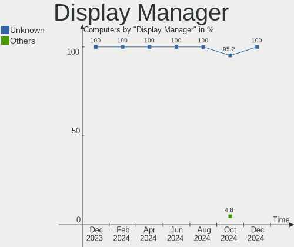

| Name    | Computers | Percent |
|---------|-----------|---------|
| Unknown | 100       | 99.01%  |
| SDDM    | 1         | 0.99%   |

OS Lang
-------

Language

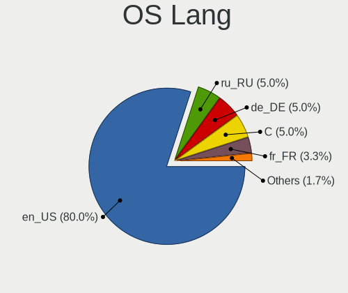

| Lang  | Computers | Percent |
|-------|-----------|---------|
| en_US | 91        | 90.1%   |
| en_GB | 2         | 1.98%   |
| en_DE | 2         | 1.98%   |
| zh_CN | 1         | 0.99%   |
| ru_RU | 1         | 0.99%   |
| es_UY | 1         | 0.99%   |
| en_CA | 1         | 0.99%   |
| de_DE | 1         | 0.99%   |
| an_ES | 1         | 0.99%   |

Boot Mode
---------

EFI or BIOS

| Mode | Computers | Percent |
|------|-----------|---------|
| BIOS | 100       | 99.01%  |
| EFI  | 1         | 0.99%   |

Filesystem
----------

Type of filesystem

| Type  | Computers | Percent |
|-------|-----------|---------|
| Btrfs | 100       | 99.01%  |
| Tmpfs | 1         | 0.99%   |

Part. scheme
------------

Scheme of partitioning

| Type    | Computers | Percent |
|---------|-----------|---------|
| Unknown | 100       | 99.01%  |
| GPT     | 1         | 0.99%   |

Dual Boot with Linux/BSD
------------------------

Hosting more than one Linux/BSD

| Dual boot | Computers | Percent |
|-----------|-----------|---------|
| No        | 100       | 99.01%  |
| Yes       | 1         | 0.99%   |

Dual Boot (Win)
---------------

Hosting Linux and Windows

| Dual boot | Computers | Percent |
|-----------|-----------|---------|
| No        | 101       | 100%    |

Board
-----

Vendor
------

Motherboard manufacturer

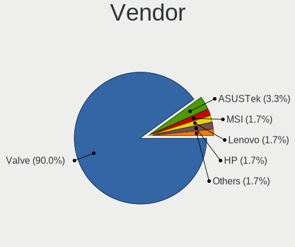

| Name                | Computers | Percent |
|---------------------|-----------|---------|
| Valve               | 89        | 88.12%  |
| MSI                 | 2         | 1.98%   |
| Hewlett-Packard     | 2         | 1.98%   |
| Gigabyte Technology | 2         | 1.98%   |
| Dell                | 2         | 1.98%   |
| ASUSTek Computer    | 2         | 1.98%   |
| Microsoft           | 1         | 0.99%   |
| Acer                | 1         | 0.99%   |

Model
-----

Motherboard model

| Name                                     | Computers | Percent |
|------------------------------------------|-----------|---------|
| Valve Jupiter                            | 89        | 88.12%  |
| MSI MS-7C37                              | 1         | 0.99%   |
| MSI MS-7817                              | 1         | 0.99%   |
| Microsoft Surface Book                   | 1         | 0.99%   |
| HP Pavilion Gaming Desktop TG01-2xxx     | 1         | 0.99%   |
| HP Laptop 15-bs0xx                       | 1         | 0.99%   |
| Gigabyte B550M DS3H                      | 1         | 0.99%   |
| Gigabyte B450 AORUS M                    | 1         | 0.99%   |
| Dell Wyse 5070 Extended Thin Client      | 1         | 0.99%   |
| Dell OptiPlex 990                        | 1         | 0.99%   |
| ASUS VivoBook_ASUSLaptop TP420UA_TM420UA | 1         | 0.99%   |
| ASUS ROG Zephyrus G15 GA503QR_GA503QR    | 1         | 0.99%   |
| Acer Aspire C24-960                      | 1         | 0.99%   |

Model Family
------------

Motherboard model prefix

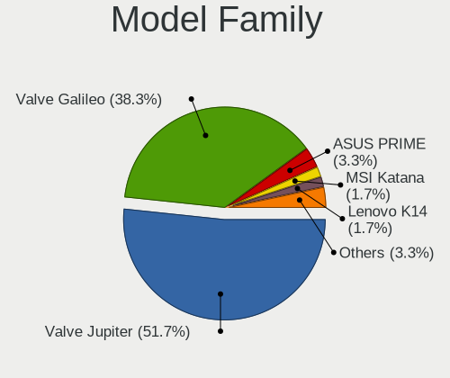

| Name              | Computers | Percent |
|-------------------|-----------|---------|
| Valve Jupiter     | 89        | 88.12%  |
| MSI MS-7C37       | 1         | 0.99%   |
| MSI MS-7817       | 1         | 0.99%   |
| Microsoft Surface | 1         | 0.99%   |
| HP Pavilion       | 1         | 0.99%   |
| HP Laptop         | 1         | 0.99%   |
| Gigabyte B550M    | 1         | 0.99%   |
| Gigabyte B450     | 1         | 0.99%   |
| Dell Wyse         | 1         | 0.99%   |
| Dell OptiPlex     | 1         | 0.99%   |
| ASUS VivoBook     | 1         | 0.99%   |
| ASUS ROG          | 1         | 0.99%   |
| Acer Aspire       | 1         | 0.99%   |

MFG Year
--------

Motherboard manufacture year

| Year | Computers | Percent |
|------|-----------|---------|
| 2022 | 90        | 89.11%  |
| 2021 | 4         | 3.96%   |
| 2019 | 2         | 1.98%   |
| 2020 | 1         | 0.99%   |
| 2018 | 1         | 0.99%   |
| 2017 | 1         | 0.99%   |
| 2013 | 1         | 0.99%   |
| 2011 | 1         | 0.99%   |

Form Factor
-----------

Physical design of the computer

| Name        | Computers | Percent |
|-------------|-----------|---------|
| Notebook    | 91        | 90.1%   |
| Desktop     | 6         | 5.94%   |
| Tablet      | 1         | 0.99%   |
| Convertible | 1         | 0.99%   |
| Mini pc     | 1         | 0.99%   |
| All in one  | 1         | 0.99%   |

Secure Boot
-----------

Enabled or disabled

| State    | Computers | Percent |
|----------|-----------|---------|
| Disabled | 101       | 100%    |

Coreboot
--------

Have coreboot on board

| Used | Computers | Percent |
|------|-----------|---------|
| No   | 101       | 100%    |

RAM Size
--------

Total RAM memory

| Size in GB | Computers | Percent |
|------------|-----------|---------|
| 8.01-16.0  | 94        | 93.07%  |
| 4.01-8.0   | 3         | 2.97%   |
| 16.01-24.0 | 3         | 2.97%   |
| 32.01-64.0 | 1         | 0.99%   |

RAM Used
--------

Used RAM memory

| Used GB   | Computers | Percent |
|-----------|-----------|---------|
| 2.01-3.0  | 45        | 44.55%  |
| 3.01-4.0  | 26        | 25.74%  |
| 4.01-8.0  | 18        | 17.82%  |
| 1.01-2.0  | 9         | 8.91%   |
| 8.01-16.0 | 3         | 2.97%   |

Total Drives
------------

Number of drives on board

| Drives | Computers | Percent |
|--------|-----------|---------|
| 2      | 60        | 59.41%  |
| 1      | 36        | 35.64%  |
| 3      | 3         | 2.97%   |
| 4      | 2         | 1.98%   |

Has CD-ROM
----------

Has CD-ROM on board

| Presented | Computers | Percent |
|-----------|-----------|---------|
| No        | 99        | 98.02%  |
| Yes       | 2         | 1.98%   |

Has Ethernet
------------

Has Ethernet on board

| Presented | Computers | Percent |
|-----------|-----------|---------|
| No        | 56        | 55.45%  |
| Yes       | 45        | 44.55%  |

Has WiFi
--------

Has WiFi module

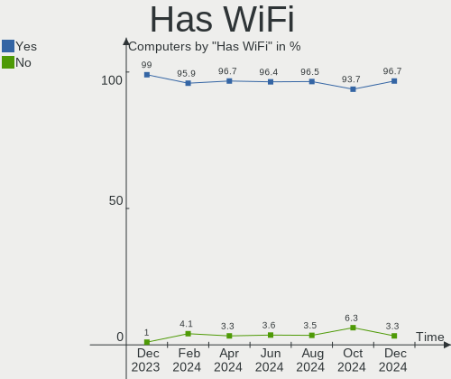

| Presented | Computers | Percent |
|-----------|-----------|---------|
| Yes       | 98        | 97.03%  |
| No        | 3         | 2.97%   |

Has Bluetooth
-------------

Has Bluetooth module

| Presented | Computers | Percent |
|-----------|-----------|---------|
| Yes       | 96        | 95.05%  |
| No        | 5         | 4.95%   |

Location
--------

Country
-------

Geographic location (country)

| Country      | Computers | Percent |
|--------------|-----------|---------|
| USA          | 43        | 42.57%  |
| Germany      | 10        | 9.9%    |
| UK           | 8         | 7.92%   |
| Canada       | 7         | 6.93%   |
| Russia       | 3         | 2.97%   |
| Japan        | 3         | 2.97%   |
| Sweden       | 2         | 1.98%   |
| Netherlands  | 2         | 1.98%   |
| Italy        | 2         | 1.98%   |
| France       | 2         | 1.98%   |
| China        | 2         | 1.98%   |
| Australia    | 2         | 1.98%   |
| Uruguay      | 1         | 0.99%   |
| UAE          | 1         | 0.99%   |
| Spain        | 1         | 0.99%   |
| South Korea  | 1         | 0.99%   |
| South Africa | 1         | 0.99%   |
| Saudi Arabia | 1         | 0.99%   |
| Romania      | 1         | 0.99%   |
| Mexico       | 1         | 0.99%   |
| Malaysia     | 1         | 0.99%   |
| Kuwait       | 1         | 0.99%   |
| Ireland      | 1         | 0.99%   |
| Greece       | 1         | 0.99%   |
| Finland      | 1         | 0.99%   |
| Czechia      | 1         | 0.99%   |
| Brazil       | 1         | 0.99%   |

City
----

Geographic location (city)

| City           | Computers | Percent |
|----------------|-----------|---------|
| Tacoma         | 2         | 1.98%   |
| Saint Charles  | 2         | 1.98%   |
| New York       | 2         | 1.98%   |
| Amsterdam      | 2         | 1.98%   |
| Wyoming        | 1         | 0.99%   |
| Woodland Hills | 1         | 0.99%   |
| Wissous        | 1         | 0.99%   |
| Winter Garden  | 1         | 0.99%   |
| Willoughby     | 1         | 0.99%   |
| West Milford   | 1         | 0.99%   |
| Watford        | 1         | 0.99%   |
| Waco           | 1         | 0.99%   |
| Vancouver      | 1         | 0.99%   |
| Tollhouse      | 1         | 0.99%   |
| Tokyo          | 1         | 0.99%   |
| Sydney         | 1         | 0.99%   |
| Sutton         | 1         | 0.99%   |
| St Petersburg  | 1         | 0.99%   |
| Siloam Springs | 1         | 0.99%   |
| Seattle        | 1         | 0.99%   |
| Sao Paulo      | 1         | 0.99%   |
| San Antonio    | 1         | 0.99%   |
| Saarlouis      | 1         | 0.99%   |
| Rome           | 1         | 0.99%   |
| Richmond       | 1         | 0.99%   |
| Queens         | 1         | 0.99%   |
| Québec        | 1         | 0.99%   |
| Port Moody     | 1         | 0.99%   |
| Pontlliw       | 1         | 0.99%   |
| Parma          | 1         | 0.99%   |
| Ottawa         | 1         | 0.99%   |
| Ningbo         | 1         | 0.99%   |
| Neunkirchen    | 1         | 0.99%   |
| Munich         | 1         | 0.99%   |
| Moscow         | 1         | 0.99%   |
| Montevideo     | 1         | 0.99%   |
| Mohelnice      | 1         | 0.99%   |
| Mississauga    | 1         | 0.99%   |
| Miami          | 1         | 0.99%   |
| Meridian       | 1         | 0.99%   |

Drives
------

Drive Vendor
------------

Hard drive vendors

| Vendor                      | Computers | Drives | Percent |
|-----------------------------|-----------|--------|---------|
| Unknown                     | 49        | 50     | 28.49%  |
| Kingston Technology Company | 23        | 23     | 13.37%  |
| Phison Electronics          | 20        | 21     | 11.63%  |
| Samsung Electronics         | 19        | 19     | 11.05%  |
| O2 Micro                    | 19        | 19     | 11.05%  |
| Unknown                     | 11        | 11     | 6.4%    |
| Sandisk                     | 6         | 6      | 3.49%   |
| Silicon Motion              | 4         | 4      | 2.33%   |
| Kingston                    | 3         | 3      | 1.74%   |
| SK hynix                    | 2         | 2      | 1.16%   |
| Seagate                     | 2         | 3      | 1.16%   |
| WDC                         | 1         | 1      | 0.58%   |
| Toshiba                     | 1         | 1      | 0.58%   |
| TO Exter                    | 1         | 1      | 0.58%   |
| Team                        | 1         | 1      | 0.58%   |
| T-FORCE                     | 1         | 1      | 0.58%   |
| SABRENT                     | 1         | 1      | 0.58%   |
| ROG                         | 1         | 1      | 0.58%   |
| Micron/Crucial Technology   | 1         | 1      | 0.58%   |
| Maxone                      | 1         | 1      | 0.58%   |
| KIOXIA                      | 1         | 1      | 0.58%   |
| JMicron Technology          | 1         | 1      | 0.58%   |
| Crucial                     | 1         | 1      | 0.58%   |
| ADATA Technology            | 1         | 1      | 0.58%   |
| A-DATA Technology           | 1         | 1      | 0.58%   |

Drive Model
-----------

Hard drive models

| Model                                                 | Computers | Percent |
|-------------------------------------------------------|-----------|---------|
| Kingston Company OM3PDP3 NVMe SSD 512GB               | 23        | 13.14%  |
| Unknown MMC Card  512GB                               | 20        | 11.43%  |
| O2 Micro E2M2 64GB                                    | 19        | 10.86%  |
| Phison PS5013 E13 NVMe Controller 256GB               | 18        | 10.29%  |
| Unknown                                               | 11        | 6.29%   |
| Unknown MMC Card  256GB                               | 10        | 5.71%   |
| Samsung MZ9LQ512HBLU-00BVL 512GB                      | 9         | 5.14%   |
| Unknown MMC Card  128GB                               | 7         | 4%      |
| Silicon Motion SM2263EN/SM2263XT SSD Controller 512GB | 4         | 2.29%   |
| Samsung MZ9LQ256HBJD-00BVL 256GB                      | 4         | 2.29%   |
| Unknown MMC Card  393GB                               | 3         | 1.71%   |
| Unknown MMC Card  249GB                               | 2         | 1.14%   |
| Unknown MMC Card  16GB                                | 2         | 1.14%   |
| Sandisk WDC PC SN530 SDBPTPZ-1T00 1024GB              | 2         | 1.14%   |
| Sandisk PC SN530 NVMe WDC 512GB                       | 2         | 1.14%   |
| Samsung PSSD T7 1TB                                   | 2         | 1.14%   |
| WDC WD2500AAKX-753CA1 250GB                           | 1         | 0.57%   |
| Unknown MMC Card  498GB                               | 1         | 0.57%   |
| Unknown MMC Card  32GB                                | 1         | 0.57%   |
| Unknown MMC Card  2TB                                 | 1         | 0.57%   |
| Unknown MMC Card  260GB                               | 1         | 0.57%   |
| Unknown MMC Card  248GB                               | 1         | 0.57%   |
| Unknown MMC Card  1072GB                              | 1         | 0.57%   |
| Toshiba NVMe Controller 512GB                         | 1         | 0.57%   |
| TO Exter nal USB 3.0 500GB                            | 1         | 0.57%   |
| Team TM8PS7512G 512GB SSD                             | 1         | 0.57%   |
| T-FORCE 1TB                                           | 1         | 0.57%   |
| SK hynix HFM001TD3JX013N 1TB                          | 1         | 0.57%   |
| SK hynix BC711 NVMe 256GB                             | 1         | 0.57%   |
| Seagate ST6000NM0024-1HT17Z 6TB                       | 1         | 0.57%   |
| Seagate ST3000DM008-2DM166 3TB                        | 1         | 0.57%   |
| Seagate BUP Slim 2TB                                  | 1         | 0.57%   |
| Sandisk WD PC SN740 SDDPTQE-2T00 2TB                  | 1         | 0.57%   |
| Sandisk WD PC SN740 SDDPTQD-1T00 1024GB               | 1         | 0.57%   |
| Samsung SSD 860 EVO 500GB                             | 1         | 0.57%   |
| Samsung PM991a NVMe 512GB                             | 1         | 0.57%   |
| Samsung NVMe SSD Controller SM981/PM981/PM983 500GB   | 1         | 0.57%   |
| Samsung MZVLQ1T0HBLB-00B 1TB                          | 1         | 0.57%   |
| SABRENT Disk 4TB                                      | 1         | 0.57%   |
| ROG ESD-S1C 1TB                                       | 1         | 0.57%   |

HDD Vendor
----------

Hard disk drive vendors

| Vendor  | Computers | Drives | Percent |
|---------|-----------|--------|---------|
| Seagate | 2         | 3      | 40%     |
| WDC     | 1         | 1      | 20%     |
| SABRENT | 1         | 1      | 20%     |
| Maxone  | 1         | 1      | 20%     |

SSD Vendor
----------

Solid state drive vendors

| Vendor              | Computers | Drives | Percent |
|---------------------|-----------|--------|---------|
| Samsung Electronics | 3         | 3      | 33.33%  |
| Kingston            | 2         | 2      | 22.22%  |
| TO Exter            | 1         | 1      | 11.11%  |
| Team                | 1         | 1      | 11.11%  |
| Crucial             | 1         | 1      | 11.11%  |
| A-DATA Technology   | 1         | 1      | 11.11%  |

Drive Kind
----------

HDD or SSD

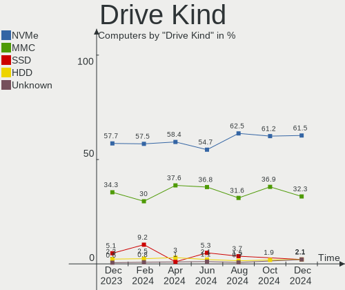

| Kind    | Computers | Drives | Percent |
|---------|-----------|--------|---------|
| NVMe    | 95        | 96     | 55.23%  |
| MMC     | 60        | 61     | 34.88%  |
| SSD     | 9         | 9      | 5.23%   |
| HDD     | 5         | 6      | 2.91%   |
| Unknown | 3         | 3      | 1.74%   |

Drive Connector
---------------

SATA, SAS, NVMe, etc.

| Type | Computers | Drives | Percent |
|------|-----------|--------|---------|
| NVMe | 95        | 96     | 55.88%  |
| MMC  | 60        | 61     | 35.29%  |
| SAS  | 8         | 9      | 4.71%   |
| SATA | 7         | 9      | 4.12%   |

Drive Size
----------

Size of hard drive

| Size in TB | Computers | Drives | Percent |
|------------|-----------|--------|---------|
| 0.01-0.5   | 6         | 6      | 40%     |
| 0.51-1.0   | 5         | 5      | 33.33%  |
| 3.01-4.0   | 1         | 1      | 6.67%   |
| 2.01-3.0   | 1         | 1      | 6.67%   |
| 1.01-2.0   | 1         | 1      | 6.67%   |
| 4.01-10.0  | 1         | 1      | 6.67%   |

Space Total
-----------

Amount of disk space available on the file system

| Size in GB     | Computers | Percent |
|----------------|-----------|---------|
| 251-500        | 42        | 41.58%  |
| 101-250        | 17        | 16.83%  |
| 51-100         | 16        | 15.84%  |
| 501-1000       | 15        | 14.85%  |
| 1001-2000      | 7         | 6.93%   |
| More than 3000 | 2         | 1.98%   |
| 2001-3000      | 2         | 1.98%   |

Space Used
----------

Amount of used disk space

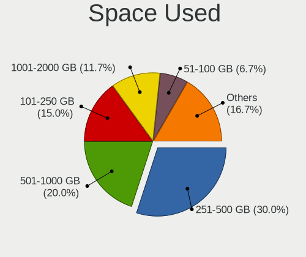

| Used GB        | Computers | Percent |
|----------------|-----------|---------|
| 251-500        | 25        | 24.75%  |
| 101-250        | 24        | 23.76%  |
| 21-50          | 23        | 22.77%  |
| 1-20           | 10        | 9.9%    |
| 51-100         | 8         | 7.92%   |
| 501-1000       | 6         | 5.94%   |
| 1001-2000      | 3         | 2.97%   |
| More than 3000 | 1         | 0.99%   |
| 2001-3000      | 1         | 0.99%   |

Malfunc. Drives
---------------

Drive models with a malfunction

Zero info for selected period =(

Malfunc. Drive Vendor
---------------------

Vendors of faulty drives

Zero info for selected period =(

Malfunc. HDD Vendor
-------------------

Vendors of faulty HDD drives

Zero info for selected period =(

Malfunc. Drive Kind
-------------------

Kinds of faulty drives

Zero info for selected period =(

Failed Drives
-------------

Failed drive models

Zero info for selected period =(

Failed Drive Vendor
-------------------

Failed drive vendors

Zero info for selected period =(

Drive Status
------------

Number of failed and malfunc. drives

| Status   | Computers | Drives | Percent |
|----------|-----------|--------|---------|
| Detected | 100       | 174    | 99.01%  |
| Works    | 1         | 1      | 0.99%   |

Storage controller
------------------

Storage Vendor
--------------

Storage controller vendors

| Vendor                       | Computers | Percent |
|------------------------------|-----------|---------|
| Kingston Technology Company  | 24        | 22.64%  |
| Phison Electronics           | 20        | 18.87%  |
| O2 Micro                     | 19        | 17.92%  |
| Samsung Electronics          | 16        | 15.09%  |
| SanDisk                      | 6         | 5.66%   |
| Intel                        | 5         | 4.72%   |
| Silicon Motion               | 4         | 3.77%   |
| AMD                          | 4         | 3.77%   |
| SK hynix                     | 3         | 2.83%   |
| Toshiba America Info Systems | 1         | 0.94%   |
| Micron/Crucial Technology    | 1         | 0.94%   |
| KIOXIA                       | 1         | 0.94%   |
| ASMedia Technology           | 1         | 0.94%   |
| ADATA Technology             | 1         | 0.94%   |

Storage Model
-------------

Storage controller models

| Model                                                                          | Computers | Percent |
|--------------------------------------------------------------------------------|-----------|---------|
| Kingston Company OM3PDP3 NVMe SSD                                              | 23        | 21.1%   |
| O2 Micro Non-Volatile memory controller                                        | 19        | 17.43%  |
| Phison PS5013 E13 NVMe Controller                                              | 18        | 16.51%  |
| Samsung NVMe SSD Controller 980                                                | 15        | 13.76%  |
| SanDisk Non-Volatile memory controller                                         | 6         | 5.5%    |
| Silicon Motion SM2263EN/SM2263XT SSD Controller                                | 4         | 3.67%   |
| AMD FCH SATA Controller [AHCI mode]                                            | 3         | 2.75%   |
| SK hynix Gold P31/PC711 NVMe Solid State Drive                                 | 2         | 1.83%   |
| AMD 400 Series Chipset SATA Controller                                         | 2         | 1.83%   |
| Toshiba America Info Systems NVMe Controller                                   | 1         | 0.92%   |
| SK hynix BC511                                                                 | 1         | 0.92%   |
| Samsung NVMe SSD Controller SM981/PM981/PM983                                  | 1         | 0.92%   |
| Phison Electronics Non-Volatile memory controller                              | 1         | 0.92%   |
| Phison E16 PCIe4 NVMe Controller                                               | 1         | 0.92%   |
| Phison E12 NVMe Controller                                                     | 1         | 0.92%   |
| Micron/Crucial NVMe Controller                                                 | 1         | 0.92%   |
| KIOXIA Non-Volatile memory controller                                          | 1         | 0.92%   |
| Kingston Company SNVS2000G [NV1 NVMe PCIe SSD 2TB]                             | 1         | 0.92%   |
| Intel Sunrise Point-LP SATA Controller [AHCI mode]                             | 1         | 0.92%   |
| Intel SATA Controller [RAID mode]                                              | 1         | 0.92%   |
| Intel Comet Lake SATA AHCI Controller                                          | 1         | 0.92%   |
| Intel Celeron/Pentium Silver Processor SATA Controller                         | 1         | 0.92%   |
| Intel 8 Series/C220 Series Chipset Family 6-port SATA Controller 1 [AHCI mode] | 1         | 0.92%   |
| ASMedia ASM1062 Serial ATA Controller                                          | 1         | 0.92%   |
| AMD 500 Series Chipset SATA Controller                                         | 1         | 0.92%   |
| ADATA A Non-Volatile memory controller                                         | 1         | 0.92%   |

Storage Kind
------------

Kind of storage controller (IDE, SATA, NVMe, SAS, ...)

| Kind | Computers | Percent |
|------|-----------|---------|
| NVMe | 96        | 91.43%  |
| SATA | 8         | 7.62%   |
| RAID | 1         | 0.95%   |

Processor
---------

CPU Vendor
----------

Processor vendors

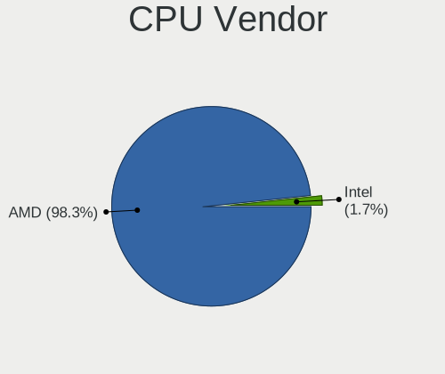

| Vendor | Computers | Percent |
|--------|-----------|---------|
| AMD    | 95        | 94.06%  |
| Intel  | 6         | 5.94%   |

CPU Model
---------

Processor models

| Model                                       | Computers | Percent |
|---------------------------------------------|-----------|---------|
| AMD Custom APU 0405                         | 89        | 88.12%  |
| Intel Pentium Silver J5005 CPU @ 1.50GHz    | 1         | 0.99%   |
| Intel Core i7-6600U CPU @ 2.60GHz           | 1         | 0.99%   |
| Intel Core i5-4570 CPU @ 3.20GHz            | 1         | 0.99%   |
| Intel Core i5-2400 CPU @ 3.10GHz            | 1         | 0.99%   |
| Intel Core i3-7100U CPU @ 2.40GHz           | 1         | 0.99%   |
| Intel Core i3-10110U CPU @ 2.10GHz          | 1         | 0.99%   |
| AMD Ryzen 9 5900X 12-Core Processor         | 1         | 0.99%   |
| AMD Ryzen 9 5900HS with Radeon Graphics     | 1         | 0.99%   |
| AMD Ryzen 5 5600X 6-Core Processor          | 1         | 0.99%   |
| AMD Ryzen 5 5600G with Radeon Graphics      | 1         | 0.99%   |
| AMD Ryzen 5 5500U with Radeon Graphics      | 1         | 0.99%   |
| AMD Ryzen 5 3400G with Radeon Vega Graphics | 1         | 0.99%   |

CPU Model Family
----------------

Processor model prefix

| Model                | Computers | Percent |
|----------------------|-----------|---------|
| Other                | 89        | 88.12%  |
| AMD Ryzen 5          | 4         | 3.96%   |
| Intel Core i5        | 2         | 1.98%   |
| Intel Core i3        | 2         | 1.98%   |
| AMD Ryzen 9          | 2         | 1.98%   |
| Intel Pentium Silver | 1         | 0.99%   |
| Intel Core i7        | 1         | 0.99%   |

CPU Cores
---------

Number of processor cores

| Number | Computers | Percent |
|--------|-----------|---------|
| 4      | 93        | 92.08%  |
| 6      | 3         | 2.97%   |
| 2      | 3         | 2.97%   |
| 12     | 1         | 0.99%   |
| 8      | 1         | 0.99%   |

CPU Sockets
-----------

Number of sockets

| Number | Computers | Percent |
|--------|-----------|---------|
| 1      | 101       | 100%    |

CPU Threads
-----------

Threads per core (Hyper-Threading)

| Number | Computers | Percent |
|--------|-----------|---------|
| 2      | 98        | 97.03%  |
| 1      | 3         | 2.97%   |

CPU Op-Modes
------------

CPU Operation Modes (32-bit, 64-bit)

| Op mode        | Computers | Percent |
|----------------|-----------|---------|
| 32-bit, 64-bit | 101       | 100%    |

CPU Microcode
-------------

Microcode number

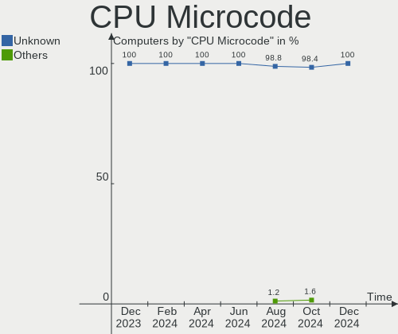

| Number     | Computers | Percent |
|------------|-----------|---------|
| Unknown    | 100       | 99.01%  |
| 0x08900201 | 1         | 0.99%   |

CPU Microarch
-------------

Microarchitecture

| Name          | Computers | Percent |
|---------------|-----------|---------|
| Unknown       | 90        | 89.11%  |
| Zen 3         | 4         | 3.96%   |
| KabyLake      | 2         | 1.98%   |
| Zen+          | 1         | 0.99%   |
| Skylake       | 1         | 0.99%   |
| SandyBridge   | 1         | 0.99%   |
| Haswell       | 1         | 0.99%   |
| Goldmont plus | 1         | 0.99%   |

Graphics
--------

GPU Vendor
----------

Vendors of graphics cards

| Vendor | Computers | Percent |
|--------|-----------|---------|
| AMD    | 98        | 94.23%  |
| Intel  | 5         | 4.81%   |
| Nvidia | 1         | 0.96%   |

GPU Model
---------

Graphics card models

| Model                                                                       | Computers | Percent |
|-----------------------------------------------------------------------------|-----------|---------|
| AMD VanGogh [AMD Custom GPU 0405]                                           | 89        | 84.76%  |
| AMD Cezanne [Radeon Vega Series / Radeon Vega Mobile Series]                | 2         | 1.9%    |
| Nvidia GA104M [GeForce RTX 3070 Mobile / Max-Q]                             | 1         | 0.95%   |
| Intel Xeon E3-1200 v3/4th Gen Core Processor Integrated Graphics Controller | 1         | 0.95%   |
| Intel Skylake GT2 [HD Graphics 520]                                         | 1         | 0.95%   |
| Intel HD Graphics 620                                                       | 1         | 0.95%   |
| Intel GeminiLake [UHD Graphics 605]                                         | 1         | 0.95%   |
| Intel CometLake-U GT2 [UHD Graphics]                                        | 1         | 0.95%   |
| AMD Picasso/Raven 2 [Radeon Vega Series / Radeon Vega Mobile Series]        | 1         | 0.95%   |
| AMD Oland XT [Radeon HD 8670 / R5 340X OEM / R7 250/350/350X OEM]           | 1         | 0.95%   |
| AMD Navi 22 [Radeon RX 6700/6700 XT/6750 XT / 6800M]                        | 1         | 0.95%   |
| AMD Navi 21 [Radeon RX 6800/6800 XT / 6900 XT]                              | 1         | 0.95%   |
| AMD Navi 14 [Radeon RX 5500/5500M / Pro 5500M]                              | 1         | 0.95%   |
| AMD Lucienne                                                                | 1         | 0.95%   |
| AMD Lexa PRO [Radeon 540/540X/550/550X / RX 540X/550/550X]                  | 1         | 0.95%   |
| AMD Baffin [Radeon RX 550 640SP / RX 560/560X]                              | 1         | 0.95%   |

GPU Combo
---------

Combinations of graphics cards

| Name         | Computers | Percent |
|--------------|-----------|---------|
| 1 x AMD      | 95        | 94.06%  |
| 1 x Intel    | 3         | 2.97%   |
| 2 x AMD      | 1         | 0.99%   |
| Intel + AMD  | 1         | 0.99%   |
| AMD + Nvidia | 1         | 0.99%   |

GPU Driver
----------

Free vs proprietary

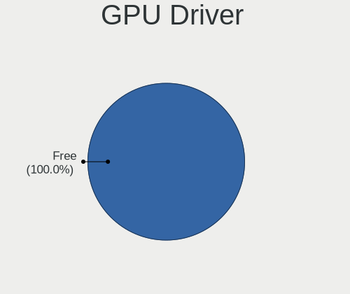

| Driver      | Computers | Percent |
|-------------|-----------|---------|
| Free        | 100       | 99.01%  |
| Proprietary | 1         | 0.99%   |

GPU Memory
----------

Total video memory

| Size in GB | Computers | Percent |
|------------|-----------|---------|
| Unknown    | 99        | 98.02%  |
| 7.01-8.0   | 1         | 0.99%   |
| 0.51-1.0   | 1         | 0.99%   |

Monitor
-------

Monitor Vendor
--------------

Monitor vendors

| Vendor               | Computers | Percent |
|----------------------|-----------|---------|
| Valve                | 85        | 69.11%  |
| Acer                 | 6         | 4.88%   |
| Analogix             | 4         | 3.25%   |
| Dell                 | 3         | 2.44%   |
| Samsung Electronics  | 2         | 1.63%   |
| Hewlett-Packard      | 2         | 1.63%   |
| Goldstar             | 2         | 1.63%   |
| Chimei Innolux       | 2         | 1.63%   |
| AOC                  | 2         | 1.63%   |
| Ancor Communications | 2         | 1.63%   |
| Toshiba              | 1         | 0.81%   |
| Sony                 | 1         | 0.81%   |
| SANYO                | 1         | 0.81%   |
| RTK                  | 1         | 0.81%   |
| Pixio                | 1         | 0.81%   |
| Philips              | 1         | 0.81%   |
| Panasonic            | 1         | 0.81%   |
| MRG                  | 1         | 0.81%   |
| Mi                   | 1         | 0.81%   |
| Gigabyte Technology  | 1         | 0.81%   |
| GAOMON               | 1         | 0.81%   |
| Flipbook             | 1         | 0.81%   |
| AU Optronics         | 1         | 0.81%   |

Monitor Model
-------------

Monitor models

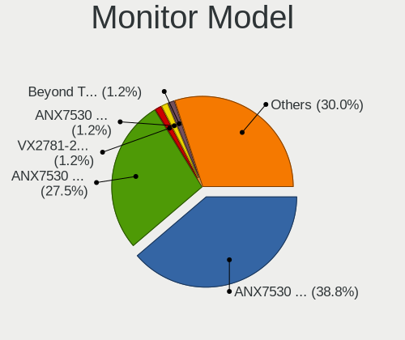

| Model                                                                   | Computers | Percent |
|-------------------------------------------------------------------------|-----------|---------|
| Valve ANX7530 U VLV3001 800x1280 100x150mm 7.1-inch                     | 85        | 67.46%  |
| Analogix ANX7530 U ANX7539 800x1280                                     | 4         | 3.17%   |
| Toshiba TV TSB0206 1920x1080 1600x1000mm 74.3-inch                      | 1         | 0.79%   |
| Sony TV *30 SNYC105 3840x2160 952x535mm 43.0-inch                       | 1         | 0.79%   |
| SANYO LCD SAN0B74 1360x768 570x320mm 25.7-inch                          | 1         | 0.79%   |
| Samsung Electronics LCD Monitor SAM7017 3840x2160 1872x1053mm 84.6-inch | 1         | 0.79%   |
| Samsung Electronics LCD Monitor SAM0D47 1920x1080 885x498mm 40.0-inch   | 1         | 0.79%   |
| RTK ZZX-FHD-HDR RTKBC33 1920x1080 597x336mm 27.0-inch                   | 1         | 0.79%   |
| Pixio PX275h WAM2700 2560x1440 600x330mm 27.0-inch                      | 1         | 0.79%   |
| Philips FTV PHL04C3 1920x1080 1440x810mm 65.0-inch                      | 1         | 0.79%   |
| Panasonic VVX14P048M00 MEI96A2 3000x2000 285x190mm 13.5-inch            | 1         | 0.79%   |
| MRG nreal air MRG3132 1920x1080 1920x1080mm 86.7-inch                   | 1         | 0.79%   |
| Mi Redmi Monitor XMI23C4 1920x1080 527x293mm 23.7-inch                  | 1         | 0.79%   |
| Hewlett-Packard ZR2440w HWP2954 1920x1200 518x324mm 24.1-inch           | 1         | 0.79%   |
| Hewlett-Packard M27fw FHD HPN370F 1920x1080 597x336mm 27.0-inch         | 1         | 0.79%   |
| Hewlett-Packard M27fw FHD HPN370E 1920x1080 597x336mm 27.0-inch         | 1         | 0.79%   |
| Goldstar 34UC89G GSM7710 2560x1080 820x345mm 35.0-inch                  | 1         | 0.79%   |
| Goldstar 23MP55 GSM5A23 1920x1080 510x290mm 23.1-inch                   | 1         | 0.79%   |
| Gigabyte Technology G34WQC A GBT3403 3440x1440 797x334mm 34.0-inch      | 1         | 0.79%   |
| GAOMON PD1161 GAM1160 1920x1080 256x144mm 11.6-inch                     | 1         | 0.79%   |
| Flipbook NexDock YUK40F4 1920x1080 293x165mm 13.2-inch                  | 1         | 0.79%   |
| Dell U2414H DELA0B2 1920x1080 527x296mm 23.8-inch                       | 1         | 0.79%   |
| Dell S2440L DELA08B 1920x1080 531x299mm 24.0-inch                       | 1         | 0.79%   |
| Dell P2419H DELD0DA 1920x1080 527x296mm 23.8-inch                       | 1         | 0.79%   |
| Chimei Innolux LCD Monitor CMN152A 2560x1440 344x193mm 15.5-inch        | 1         | 0.79%   |
| Chimei Innolux LCD Monitor CMN14D4 1920x1080 309x173mm 13.9-inch        | 1         | 0.79%   |
| AU Optronics LCD Monitor AUO10EC 1366x768 344x193mm 15.5-inch           | 1         | 0.79%   |
| AOC U32E2WG6 AOC3202 3840x2160 697x392mm 31.5-inch                      | 1         | 0.79%   |
| AOC 931Wx AOC1931 1680x1050 440x325mm 21.5-inch                         | 1         | 0.79%   |
| AOC 24B1W1G5 AOC2401 1920x1080 527x296mm 23.8-inch                      | 1         | 0.79%   |
| Ancor Communications ASUS VS247 ACI249A 1920x1080 520x290mm 23.4-inch   | 1         | 0.79%   |
| Ancor Communications ASUS VP228 ACI22C3 1920x1080 476x268mm 21.5-inch   | 1         | 0.79%   |
| Acer XV272 S ACR0839 1920x1080 598x336mm 27.0-inch                      | 1         | 0.79%   |
| Acer SA240Y ACR057F 1920x1080 527x296mm 23.8-inch                       | 1         | 0.79%   |
| Acer R240HY ACR046F 1920x1080 527x296mm 23.8-inch                       | 1         | 0.79%   |
| Acer LCD Monitor ACR40B0 1920x1080 527x296mm 23.8-inch                  | 1         | 0.79%   |
| Acer K242HYL ACR0475 1920x1080 527x296mm 23.8-inch                      | 1         | 0.79%   |
| Acer ER320HQ ACR0495 1920x1080 698x393mm 31.5-inch                      | 1         | 0.79%   |
| Acer ED270R P ACR0804 1920x1080 609x348mm 27.6-inch                     | 1         | 0.79%   |

Monitor Resolution
------------------

Monitor screen resolution

| Resolution         | Computers | Percent |
|--------------------|-----------|---------|
| 800x1280           | 89        | 72.36%  |
| 1920x1080 (FHD)    | 20        | 16.26%  |
| 3840x2160 (4K)     | 7         | 5.69%   |
| 2560x1440 (QHD)    | 2         | 1.63%   |
| 3440x1440          | 1         | 0.81%   |
| 2560x1080          | 1         | 0.81%   |
| 1680x1050 (WSXGA+) | 1         | 0.81%   |
| 1366x768 (WXGA)    | 1         | 0.81%   |
| 1360x768           | 1         | 0.81%   |

Monitor Diagonal
----------------

Diagonal size in inches

| Inches  | Computers | Percent |
|---------|-----------|---------|
| 7       | 85        | 68%     |
| 24      | 8         | 6.4%    |
| 27      | 5         | 4%      |
| 23      | 4         | 3.2%    |
| Unknown | 4         | 3.2%    |
| 31      | 2         | 1.6%    |
| 15      | 2         | 1.6%    |
| 13      | 2         | 1.6%    |
| 86      | 1         | 0.8%    |
| 84      | 1         | 0.8%    |
| 74      | 1         | 0.8%    |
| 65      | 1         | 0.8%    |
| 55      | 1         | 0.8%    |
| 40      | 1         | 0.8%    |
| 35      | 1         | 0.8%    |
| 34      | 1         | 0.8%    |
| 32      | 1         | 0.8%    |
| 25      | 1         | 0.8%    |
| 21      | 1         | 0.8%    |
| 17      | 1         | 0.8%    |
| 11      | 1         | 0.8%    |

Monitor Width
-------------

Physical width

| Width in mm | Computers | Percent |
|-------------|-----------|---------|
| 1-100       | 85        | 69.11%  |
| 501-600     | 15        | 12.2%   |
| Unknown     | 4         | 3.25%   |
| 601-700     | 3         | 2.44%   |
| 301-350     | 3         | 2.44%   |
| 1501-2000   | 3         | 2.44%   |
| 801-900     | 2         | 1.63%   |
| 701-800     | 2         | 1.63%   |
| 201-300     | 2         | 1.63%   |
| 1001-1500   | 2         | 1.63%   |
| 401-500     | 1         | 0.81%   |
| 351-400     | 1         | 0.81%   |

Aspect Ratio
------------

Proportional relationship between the width and the height

| Ratio | Computers | Percent |
|-------|-----------|---------|
| 0.67  | 85        | 69.67%  |
| 16/9  | 28        | 22.95%  |
| 0.62  | 4         | 3.28%   |
| 16/10 | 3         | 2.46%   |
| 21/9  | 2         | 1.64%   |

Monitor Area
------------

Area in inch²

| Area in inch² | Computers | Percent |
|----------------|-----------|---------|
| 1-40           | 85        | 68.55%  |
| 201-250        | 10        | 8.06%   |
| More than 1000 | 5         | 4.03%   |
| 351-500        | 5         | 4.03%   |
| 301-350        | 5         | 4.03%   |
| Unknown        | 4         | 3.23%   |
| 251-300        | 3         | 2.42%   |
| 101-110        | 2         | 1.61%   |
| 81-90          | 1         | 0.81%   |
| 71-80          | 1         | 0.81%   |
| 51-60          | 1         | 0.81%   |
| 121-130        | 1         | 0.81%   |
| 501-1000       | 1         | 0.81%   |

Pixel Density
-------------

Pixels per inch

| Density       | Computers | Percent |
|---------------|-----------|---------|
| 161-240       | 86        | 71.67%  |
| 51-100        | 21        | 17.5%   |
| 101-120       | 4         | 3.33%   |
| Unknown       | 4         | 3.33%   |
| 1-50          | 3         | 2.5%    |
| More than 240 | 1         | 0.83%   |
| 121-160       | 1         | 0.83%   |

Multiple Monitors
-----------------

Total monitors connected

| Total | Computers | Percent |
|-------|-----------|---------|
| 1     | 73        | 72.28%  |
| 2     | 28        | 27.72%  |

Network
-------

Net Controller Vendor
---------------------

Controller vendors

| Vendor                   | Computers | Percent |
|--------------------------|-----------|---------|
| Realtek Semiconductor    | 99        | 82.5%   |
| ASIX Electronics         | 12        | 10%     |
| Intel                    | 6         | 5%      |
| Microsoft                | 1         | 0.83%   |
| Marvell Technology Group | 1         | 0.83%   |
| ASUSTek Computer         | 1         | 0.83%   |

Net Controller Model
--------------------

Controller models

| Model                                                             | Computers | Percent |
|-------------------------------------------------------------------|-----------|---------|
| Realtek RTL8822CE 802.11ac PCIe Wireless Network Adapter          | 90        | 62.07%  |
| Realtek RTL8153 Gigabit Ethernet Adapter                          | 19        | 13.1%   |
| ASIX AX88179 Gigabit Ethernet                                     | 12        | 8.28%   |
| Realtek RTL8111/8168/8411 PCI Express Gigabit Ethernet Controller | 9         | 6.21%   |
| Realtek RTL8152 Fast Ethernet Adapter                             | 4         | 2.76%   |
| Intel Wi-Fi 6 AX210/AX211/AX411 160MHz                            | 2         | 1.38%   |
| Intel Dual Band Wireless-AC 3168NGW [Stone Peak]                  | 2         | 1.38%   |
| Realtek RTL8821CE 802.11ac PCIe Wireless Network Adapter          | 1         | 0.69%   |
| Realtek RTL8811AU 802.11a/b/g/n/ac WLAN Adapter                   | 1         | 0.69%   |
| Microsoft Wireless XBox Controller Dongle                         | 1         | 0.69%   |
| Marvell Group 88W8897 [AVASTAR] 802.11ac Wireless                 | 1         | 0.69%   |
| Intel Wi-Fi 6 AX200                                               | 1         | 0.69%   |
| Intel 82579LM Gigabit Network Connection (Lewisville)             | 1         | 0.69%   |
| ASUS USB-N14 802.11b/g/n (2x2) Wireless Adapter [Ralink RT5372]   | 1         | 0.69%   |

Wireless Vendor
---------------

Wireless vendors

| Vendor                   | Computers | Percent |
|--------------------------|-----------|---------|
| Realtek Semiconductor    | 92        | 92%     |
| Intel                    | 5         | 5%      |
| Microsoft                | 1         | 1%      |
| Marvell Technology Group | 1         | 1%      |
| ASUSTek Computer         | 1         | 1%      |

Wireless Model
--------------

Wireless models

| Model                                                           | Computers | Percent |
|-----------------------------------------------------------------|-----------|---------|
| Realtek RTL8822CE 802.11ac PCIe Wireless Network Adapter        | 90        | 90%     |
| Intel Wi-Fi 6 AX210/AX211/AX411 160MHz                          | 2         | 2%      |
| Intel Dual Band Wireless-AC 3168NGW [Stone Peak]                | 2         | 2%      |
| Realtek RTL8821CE 802.11ac PCIe Wireless Network Adapter        | 1         | 1%      |
| Realtek RTL8811AU 802.11a/b/g/n/ac WLAN Adapter                 | 1         | 1%      |
| Microsoft Wireless XBox Controller Dongle                       | 1         | 1%      |
| Marvell Group 88W8897 [AVASTAR] 802.11ac Wireless               | 1         | 1%      |
| Intel Wi-Fi 6 AX200                                             | 1         | 1%      |
| ASUS USB-N14 802.11b/g/n (2x2) Wireless Adapter [Ralink RT5372] | 1         | 1%      |

Ethernet Vendor
---------------

Ethernet vendors

| Vendor                | Computers | Percent |
|-----------------------|-----------|---------|
| Realtek Semiconductor | 32        | 71.11%  |
| ASIX Electronics      | 12        | 26.67%  |
| Intel                 | 1         | 2.22%   |

Ethernet Model
--------------

Ethernet models

| Model                                                             | Computers | Percent |
|-------------------------------------------------------------------|-----------|---------|
| Realtek RTL8153 Gigabit Ethernet Adapter                          | 19        | 42.22%  |
| ASIX AX88179 Gigabit Ethernet                                     | 12        | 26.67%  |
| Realtek RTL8111/8168/8411 PCI Express Gigabit Ethernet Controller | 9         | 20%     |
| Realtek RTL8152 Fast Ethernet Adapter                             | 4         | 8.89%   |
| Intel 82579LM Gigabit Network Connection (Lewisville)             | 1         | 2.22%   |

Net Controller Kind
-------------------

Ethernet, WiFi or modem

| Kind     | Computers | Percent |
|----------|-----------|---------|
| WiFi     | 98        | 68.53%  |
| Ethernet | 45        | 31.47%  |

Used Controller
---------------

Currently used network controller

| Kind     | Computers | Percent |
|----------|-----------|---------|
| WiFi     | 92        | 84.4%   |
| Ethernet | 17        | 15.6%   |

NICs
----

Total network controllers on board

| Total | Computers | Percent |
|-------|-----------|---------|
| 1     | 95        | 94.06%  |
| 2     | 6         | 5.94%   |

IPv6
----

IPv6 vs IPv4

| Used | Computers | Percent |
|------|-----------|---------|
| No   | 59        | 58.42%  |
| Yes  | 42        | 41.58%  |

Bluetooth
---------

Bluetooth Vendor
----------------

Controller vendors

| Vendor                  | Computers | Percent |
|-------------------------|-----------|---------|
| IMC Networks            | 88        | 91.67%  |
| Intel                   | 4         | 4.17%   |
| Realtek Semiconductor   | 1         | 1.04%   |
| Marvell Semiconductor   | 1         | 1.04%   |
| Lite-On Technology      | 1         | 1.04%   |
| Cambridge Silicon Radio | 1         | 1.04%   |

Bluetooth Model
---------------

Controller models

| Model                                               | Computers | Percent |
|-----------------------------------------------------|-----------|---------|
| IMC Networks Bluetooth Radio                        | 88        | 91.67%  |
| Intel Wireless-AC 3168 Bluetooth                    | 2         | 2.08%   |
| Realtek Bluetooth Radio                             | 1         | 1.04%   |
| Marvell Bluetooth and Wireless LAN Composite        | 1         | 1.04%   |
| Lite-On Bluetooth Radio                             | 1         | 1.04%   |
| Intel AX210 Bluetooth                               | 1         | 1.04%   |
| Intel AX200 Bluetooth                               | 1         | 1.04%   |
| Cambridge Silicon Radio Bluetooth Dongle (HCI mode) | 1         | 1.04%   |

Sound
-----

Sound Vendor
------------

Sound card vendors

| Vendor              | Computers | Percent |
|---------------------|-----------|---------|
| AMD                 | 98        | 84.48%  |
| Intel               | 6         | 5.17%   |
| Nreal               | 2         | 1.72%   |
| Logitech            | 2         | 1.72%   |
| Texas Instruments   | 1         | 0.86%   |
| SteelSeries ApS     | 1         | 0.86%   |
| Sony                | 1         | 0.86%   |
| Medeli Electronics  | 1         | 0.86%   |
| JMTek               | 1         | 0.86%   |
| C-Media Electronics | 1         | 0.86%   |
| Atrix               | 1         | 0.86%   |
| Antlion Audio       | 1         | 0.86%   |

Sound Model
-----------

Sound card models

| Model                                                                      | Computers | Percent |
|----------------------------------------------------------------------------|-----------|---------|
| AMD Rembrandt Radeon High Definition Audio Controller                      | 89        | 72.36%  |
| AMD Family 17h/19h HD Audio Controller                                     | 4         | 3.25%   |
| AMD Renoir Radeon High Definition Audio Controller                         | 3         | 2.44%   |
| Nreal Air                                                                  | 2         | 1.63%   |
| Intel Sunrise Point-LP HD Audio                                            | 2         | 1.63%   |
| AMD Starship/Matisse HD Audio Controller                                   | 2         | 1.63%   |
| AMD Navi 21/23 HDMI/DP Audio Controller                                    | 2         | 1.63%   |
| AMD Baffin HDMI/DP Audio [Radeon RX 550 640SP / RX 560/560X]               | 2         | 1.63%   |
| Texas Instruments PCM2902 Audio Codec                                      | 1         | 0.81%   |
| SteelSeries ApS SteelSeries Arctis 7P                                      | 1         | 0.81%   |
| Sony DualShock 4 [CUH-ZCT2x]                                               | 1         | 0.81%   |
| Medeli Electronics AudioPro X5 Microphone                                  | 1         | 0.81%   |
| Logitech G432 Gaming Headset                                               | 1         | 0.81%   |
| Logitech EasyCall Speakerphone                                             | 1         | 0.81%   |
| JMTek USB PnP Audio Device                                                 | 1         | 0.81%   |
| Intel Comet Lake PCH-LP cAVS                                               | 1         | 0.81%   |
| Intel Celeron/Pentium Silver Processor High Definition Audio               | 1         | 0.81%   |
| Intel 8 Series/C220 Series Chipset High Definition Audio Controller        | 1         | 0.81%   |
| Intel 6 Series/C200 Series Chipset Family High Definition Audio Controller | 1         | 0.81%   |
| C-Media Electronics USB Audio Device                                       | 1         | 0.81%   |
| Atrix AX1250                                                               | 1         | 0.81%   |
| Antlion Audio Antlion Wireless Microphone                                  | 1         | 0.81%   |
| AMD Raven/Raven2/Fenghuang HDMI/DP Audio Controller                        | 1         | 0.81%   |
| AMD Oland/Hainan/Cape Verde/Pitcairn HDMI Audio [Radeon HD 7000 Series]    | 1         | 0.81%   |
| AMD Navi 10 HDMI Audio                                                     | 1         | 0.81%   |

Memory
------

Memory Vendor
-------------

Memory module vendors

| Vendor  | Computers | Percent |
|---------|-----------|---------|
| Unknown | 1         | 100%    |

Memory Model
------------

Memory module models

| Model   | Computers | Percent |
|---------|-----------|---------|
| Unknown | 1         | 100%    |

Memory Kind
-----------

Memory module kinds

| Kind   | Computers | Percent |
|--------|-----------|---------|
| LPDDR5 | 1         | 100%    |

Memory Form Factor
------------------

Physical design of the memory module

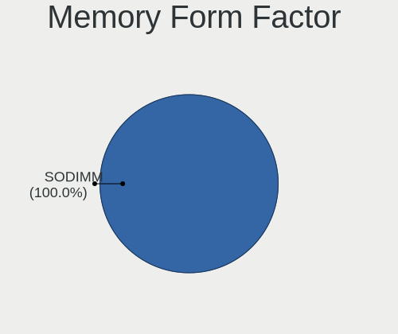

| Name   | Computers | Percent |
|--------|-----------|---------|
| SODIMM | 1         | 100%    |

Memory Size
-----------

Memory module size

| Size | Computers | Percent |
|------|-----------|---------|
| 4096 | 1         | 100%    |

Memory Speed
------------

Memory module speed

| Speed | Computers | Percent |
|-------|-----------|---------|
| 4266  | 1         | 100%    |

Printers & scanners
-------------------

Printer Vendor
--------------

Printer device vendors

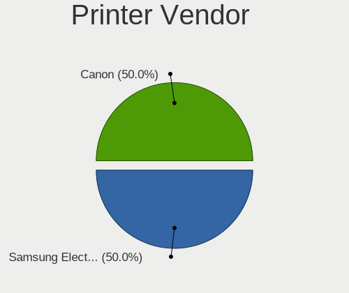

| Vendor | Computers | Percent |
|--------|-----------|---------|
| Canon  | 1         | 100%    |

Printer Model
-------------

Printer device models

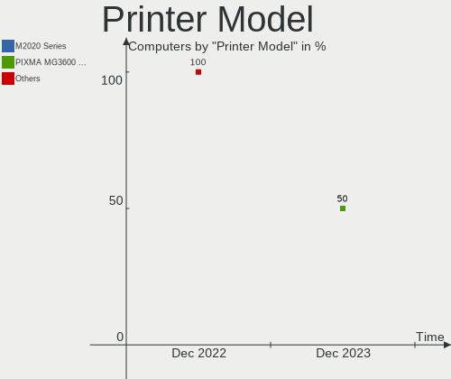

| Model                     | Computers | Percent |
|---------------------------|-----------|---------|
| Canon PIXMA MG2500 Series | 1         | 100%    |

Scanner Vendor
--------------

Scanner device vendors

Zero info for selected period =(

Scanner Model
-------------

Scanner device models

Zero info for selected period =(

Camera
------

Camera Vendor
-------------

Camera device vendors

| Vendor              | Computers | Percent |
|---------------------|-----------|---------|
| Microdia            | 1         | 33.33%  |
| IMC Networks        | 1         | 33.33%  |
| Chicony Electronics | 1         | 33.33%  |

Camera Model
------------

Camera device models

| Model                             | Computers | Percent |
|-----------------------------------|-----------|---------|
| Microdia USB 2.0 Camera           | 1         | 33.33%  |
| IMC Networks USB2.0 HD UVC WebCam | 1         | 33.33%  |
| Chicony HP TrueVision HD Camera   | 1         | 33.33%  |

Security
--------

Fingerprint Vendor
------------------

Fingerprint sensor vendors

| Vendor                | Computers | Percent |
|-----------------------|-----------|---------|
| Elan Microelectronics | 1         | 100%    |

Fingerprint Model
-----------------

Fingerprint sensor models

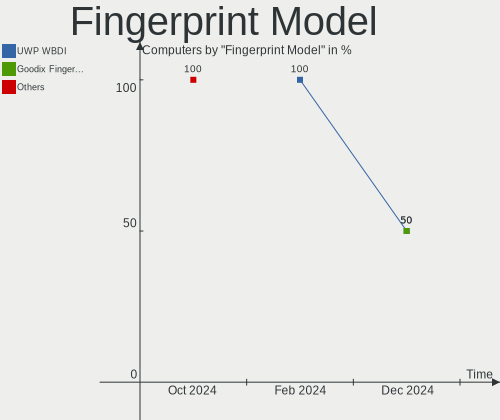

| Model                 | Computers | Percent |
|-----------------------|-----------|---------|
| Elan ELAN:Fingerprint | 1         | 100%    |

Chipcard Vendor
---------------

Chipcard module vendors

Zero info for selected period =(

Chipcard Model
--------------

Chipcard module models

Zero info for selected period =(

Unsupported
-----------

Unsupported Devices
-------------------

Total unsupported devices on board

| Total | Computers | Percent |
|-------|-----------|---------|
| 0     | 97        | 96.04%  |
| 1     | 4         | 3.96%   |

Unsupported Device Types
------------------------

Types of unsupported devices

| Type                  | Computers | Percent |
|-----------------------|-----------|---------|
| Storage/nvme          | 1         | 25%     |
| Net/wireless          | 1         | 25%     |
| Multimedia controller | 1         | 25%     |
| Fingerprint reader    | 1         | 25%     |

