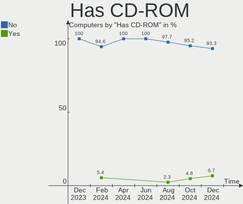
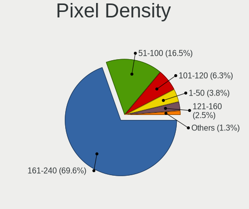
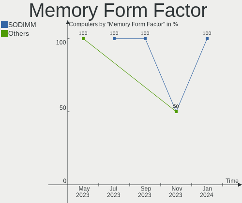
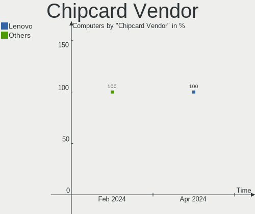
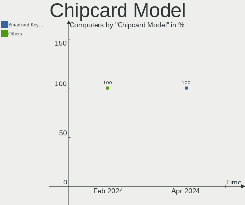

SteamOS - Hardware Trends
-------------------------

A project to identify most popular hardware characteristics and track their change
over time based on data collected by Linux users at https://Linux-Hardware.org.

Anyone can contribute to this report by the [hw-probe](https://github.com/linuxhw/hw-probe) tool:

    sudo -E hw-probe -all -upload

This is a report for all computer types. See also reports for [desktops](/Dist/SteamOS/Desktop/README.md) and [notebooks](/Dist/SteamOS/Notebook/README.md).

This report is for one last month. Overall report since the beginning of time: [TestDays](https://github.com/linuxhw/TestDays)

Period: May, 2023.

Contents
--------

* [ System ](#system)
  - [ OS                       ](#os)
  - [ OS Family                ](#os-family)
  - [ Kernel                   ](#kernel)
  - [ Kernel Family            ](#kernel-family)
  - [ Kernel Major Ver.        ](#kernel-major-ver)
  - [ Arch                     ](#arch)
  - [ DE                       ](#de)
  - [ Display Server           ](#display-server)
  - [ Display Manager          ](#display-manager)
  - [ OS Lang                  ](#os-lang)
  - [ Boot Mode                ](#boot-mode)
  - [ Filesystem               ](#filesystem)
  - [ Part. scheme             ](#part-scheme)
  - [ Dual Boot with Linux/BSD ](#dual-boot-with-linuxbsd)
  - [ Dual Boot (Win)          ](#dual-boot-win)

* [ Board ](#board)
  - [ Vendor                   ](#vendor)
  - [ Model                    ](#model)
  - [ Model Family             ](#model-family)
  - [ MFG Year                 ](#mfg-year)
  - [ Form Factor              ](#form-factor)
  - [ Secure Boot              ](#secure-boot)
  - [ Coreboot                 ](#coreboot)
  - [ RAM Size                 ](#ram-size)
  - [ RAM Used                 ](#ram-used)
  - [ Total Drives             ](#total-drives)
  - [ Has CD-ROM               ](#has-cd-rom)
  - [ Has Ethernet             ](#has-ethernet)
  - [ Has WiFi                 ](#has-wifi)
  - [ Has Bluetooth            ](#has-bluetooth)

* [ Location ](#location)
  - [ Country                  ](#country)
  - [ City                     ](#city)

* [ Drives ](#drives)
  - [ Drive Vendor             ](#drive-vendor)
  - [ Drive Model              ](#drive-model)
  - [ HDD Vendor               ](#hdd-vendor)
  - [ SSD Vendor               ](#ssd-vendor)
  - [ Drive Kind               ](#drive-kind)
  - [ Drive Connector          ](#drive-connector)
  - [ Drive Size               ](#drive-size)
  - [ Space Total              ](#space-total)
  - [ Space Used               ](#space-used)
  - [ Malfunc. Drives          ](#malfunc-drives)
  - [ Malfunc. Drive Vendor    ](#malfunc-drive-vendor)
  - [ Malfunc. HDD Vendor      ](#malfunc-hdd-vendor)
  - [ Malfunc. Drive Kind      ](#malfunc-drive-kind)
  - [ Failed Drives            ](#failed-drives)
  - [ Failed Drive Vendor      ](#failed-drive-vendor)
  - [ Drive Status             ](#drive-status)

* [ Storage controller ](#storage-controller)
  - [ Storage Vendor           ](#storage-vendor)
  - [ Storage Model            ](#storage-model)
  - [ Storage Kind             ](#storage-kind)

* [ Processor ](#processor)
  - [ CPU Vendor               ](#cpu-vendor)
  - [ CPU Model                ](#cpu-model)
  - [ CPU Model Family         ](#cpu-model-family)
  - [ CPU Cores                ](#cpu-cores)
  - [ CPU Sockets              ](#cpu-sockets)
  - [ CPU Threads              ](#cpu-threads)
  - [ CPU Op-Modes             ](#cpu-op-modes)
  - [ CPU Microcode            ](#cpu-microcode)
  - [ CPU Microarch            ](#cpu-microarch)

* [ Graphics ](#graphics)
  - [ GPU Vendor               ](#gpu-vendor)
  - [ GPU Model                ](#gpu-model)
  - [ GPU Combo                ](#gpu-combo)
  - [ GPU Driver               ](#gpu-driver)
  - [ GPU Memory               ](#gpu-memory)

* [ Monitor ](#monitor)
  - [ Monitor Vendor           ](#monitor-vendor)
  - [ Monitor Model            ](#monitor-model)
  - [ Monitor Resolution       ](#monitor-resolution)
  - [ Monitor Diagonal         ](#monitor-diagonal)
  - [ Monitor Width            ](#monitor-width)
  - [ Aspect Ratio             ](#aspect-ratio)
  - [ Monitor Area             ](#monitor-area)
  - [ Pixel Density            ](#pixel-density)
  - [ Multiple Monitors        ](#multiple-monitors)

* [ Network ](#network)
  - [ Net Controller Vendor    ](#net-controller-vendor)
  - [ Net Controller Model     ](#net-controller-model)
  - [ Wireless Vendor          ](#wireless-vendor)
  - [ Wireless Model           ](#wireless-model)
  - [ Ethernet Vendor          ](#ethernet-vendor)
  - [ Ethernet Model           ](#ethernet-model)
  - [ Net Controller Kind      ](#net-controller-kind)
  - [ Used Controller          ](#used-controller)
  - [ NICs                     ](#nics)
  - [ IPv6                     ](#ipv6)

* [ Bluetooth ](#bluetooth)
  - [ Bluetooth Vendor         ](#bluetooth-vendor)
  - [ Bluetooth Model          ](#bluetooth-model)

* [ Sound ](#sound)
  - [ Sound Vendor             ](#sound-vendor)
  - [ Sound Model              ](#sound-model)

* [ Memory ](#memory)
  - [ Memory Vendor            ](#memory-vendor)
  - [ Memory Model             ](#memory-model)
  - [ Memory Kind              ](#memory-kind)
  - [ Memory Form Factor       ](#memory-form-factor)
  - [ Memory Size              ](#memory-size)
  - [ Memory Speed             ](#memory-speed)

* [ Printers & scanners ](#printers--scanners)
  - [ Printer Vendor           ](#printer-vendor)
  - [ Printer Model            ](#printer-model)
  - [ Scanner Vendor           ](#scanner-vendor)
  - [ Scanner Model            ](#scanner-model)

* [ Camera ](#camera)
  - [ Camera Vendor            ](#camera-vendor)
  - [ Camera Model             ](#camera-model)

* [ Security ](#security)
  - [ Fingerprint Vendor       ](#fingerprint-vendor)
  - [ Fingerprint Model        ](#fingerprint-model)
  - [ Chipcard Vendor          ](#chipcard-vendor)
  - [ Chipcard Model           ](#chipcard-model)

* [ Unsupported ](#unsupported)
  - [ Unsupported Devices      ](#unsupported-devices)
  - [ Unsupported Device Types ](#unsupported-device-types)

System
------

OS
--

Installed operating systems

| Name            | Computers | Percent |
|-----------------|-----------|---------|
| SteamOS 3.4.6   | 55        | 75.34%  |
| SteamOS 3.4.8   | 6         | 8.22%   |
| SteamOS 3.4     | 3         | 4.11%   |
| SteamOS 4       | 2         | 2.74%   |
| SteamOS 3.5     | 2         | 2.74%   |
| SteamOS 3.4.7   | 2         | 2.74%   |
| SteamOS         | 2         | 2.74%   |
| SteamOS Rolling | 1         | 1.37%   |

OS Family
---------

OS without a version

| Name    | Computers | Percent |
|---------|-----------|---------|
| SteamOS | 73        | 100%    |

Kernel
------

Version of the Linux kernel

| Version                                      | Computers | Percent |
|----------------------------------------------|-----------|---------|
| 5.13.0-valve36-1-neptune                     | 63        | 86.3%   |
| 5.13.0-valve21.3-1-neptune                   | 3         | 4.11%   |
| 6.1.21-valve1-3-neptune-61                   | 2         | 2.74%   |
| 6.1.21-valve1-1-neptune-61                   | 2         | 2.74%   |
| 6.1.21-valve1-2-neptune-61                   | 1         | 1.37%   |
| 5.15.93-1-lts                                | 1         | 1.37%   |
| 5.13.0-valve21-1-steamos-02209-g2a5bdc1102a0 | 1         | 1.37%   |

Kernel Family
-------------

Linux kernel without a distro release

| Version | Computers | Percent |
|---------|-----------|---------|
| 5.13.0  | 67        | 91.78%  |
| 6.1.21  | 5         | 6.85%   |
| 5.15.93 | 1         | 1.37%   |

Kernel Major Ver.
-----------------

Linux kernel major version

| Version | Computers | Percent |
|---------|-----------|---------|
| 5.13    | 67        | 91.78%  |
| 6.1     | 5         | 6.85%   |
| 5.15    | 1         | 1.37%   |

Arch
----

OS architecture (x86_64, i586, etc.)

| Name   | Computers | Percent |
|--------|-----------|---------|
| x86_64 | 73        | 100%    |

DE
--

Desktop Environment

| Name | Computers | Percent |
|------|-----------|---------|
| KDE5 | 73        | 100%    |

Display Server
--------------

X11 or Wayland

| Name | Computers | Percent |
|------|-----------|---------|
| X11  | 73        | 100%    |

Display Manager
---------------

SDDM, LightDM, etc.

| Name    | Computers | Percent |
|---------|-----------|---------|
| Unknown | 72        | 98.63%  |
| SDDM    | 1         | 1.37%   |

OS Lang
-------

Language

| Lang  | Computers | Percent |
|-------|-----------|---------|
| en_US | 64        | 87.67%  |
| de_DE | 2         | 2.74%   |
| zh_CN | 1         | 1.37%   |
| ru_RU | 1         | 1.37%   |
| pt_BR | 1         | 1.37%   |
| pl_PL | 1         | 1.37%   |
| fr_FR | 1         | 1.37%   |
| en_GB | 1         | 1.37%   |
| en_DE | 1         | 1.37%   |

Boot Mode
---------

EFI or BIOS

| Mode | Computers | Percent |
|------|-----------|---------|
| BIOS | 72        | 98.63%  |
| EFI  | 1         | 1.37%   |

Filesystem
----------

Type of filesystem

| Type  | Computers | Percent |
|-------|-----------|---------|
| Btrfs | 72        | 98.63%  |
| Tmpfs | 1         | 1.37%   |

Part. scheme
------------

Scheme of partitioning

| Type    | Computers | Percent |
|---------|-----------|---------|
| Unknown | 72        | 98.63%  |
| GPT     | 1         | 1.37%   |

Dual Boot with Linux/BSD
------------------------

Hosting more than one Linux/BSD

| Dual boot | Computers | Percent |
|-----------|-----------|---------|
| No        | 73        | 100%    |

Dual Boot (Win)
---------------

Hosting Linux and Windows

| Dual boot | Computers | Percent |
|-----------|-----------|---------|
| No        | 72        | 98.63%  |
| Yes       | 1         | 1.37%   |

Board
-----

Vendor
------

Motherboard manufacturer

| Name                | Computers | Percent |
|---------------------|-----------|---------|
| Valve               | 65        | 89.04%  |
| Dell                | 2         | 2.74%   |
| MSI                 | 1         | 1.37%   |
| Hewlett-Packard     | 1         | 1.37%   |
| GPD                 | 1         | 1.37%   |
| Gigabyte Technology | 1         | 1.37%   |
| Biostar             | 1         | 1.37%   |
| ASUSTek Computer    | 1         | 1.37%   |

Model
-----

Motherboard model

| Name                   | Computers | Percent |
|------------------------|-----------|---------|
| Valve Jupiter          | 65        | 89.04%  |
| MSI GF62 7RE           | 1         | 1.37%   |
| HP 15                  | 1         | 1.37%   |
| GPD G1619-04           | 1         | 1.37%   |
| Gigabyte B560M DS3H V2 | 1         | 1.37%   |
| Dell Precision 7510    | 1         | 1.37%   |
| Dell OptiPlex 790      | 1         | 1.37%   |
| Biostar A320MH 2.0     | 1         | 1.37%   |
| ASUS All Series        | 1         | 1.37%   |

Model Family
------------

Motherboard model prefix

| Name           | Computers | Percent |
|----------------|-----------|---------|
| Valve Jupiter  | 65        | 89.04%  |
| MSI GF62       | 1         | 1.37%   |
| HP 15          | 1         | 1.37%   |
| GPD G1619-04   | 1         | 1.37%   |
| Gigabyte B560M | 1         | 1.37%   |
| Dell Precision | 1         | 1.37%   |
| Dell OptiPlex  | 1         | 1.37%   |
| Biostar A320MH | 1         | 1.37%   |
| ASUS All       | 1         | 1.37%   |

MFG Year
--------

Motherboard manufacture year

| Year | Computers | Percent |
|------|-----------|---------|
| 2022 | 65        | 89.04%  |
| 2023 | 2         | 2.74%   |
| 2021 | 1         | 1.37%   |
| 2018 | 1         | 1.37%   |
| 2015 | 1         | 1.37%   |
| 2014 | 1         | 1.37%   |
| 2013 | 1         | 1.37%   |
| 2011 | 1         | 1.37%   |

Form Factor
-----------

Physical design of the computer

| Name     | Computers | Percent |
|----------|-----------|---------|
| Notebook | 70        | 95.89%  |
| Desktop  | 3         | 4.11%   |

Secure Boot
-----------

Enabled or disabled

| State    | Computers | Percent |
|----------|-----------|---------|
| Disabled | 73        | 100%    |

Coreboot
--------

Have coreboot on board

| Used | Computers | Percent |
|------|-----------|---------|
| No   | 73        | 100%    |

RAM Size
--------

Total RAM memory

| Size in GB | Computers | Percent |
|------------|-----------|---------|
| 8.01-16.0  | 69        | 94.52%  |
| 32.01-64.0 | 3         | 4.11%   |
| 3.01-4.0   | 1         | 1.37%   |

RAM Used
--------

Used RAM memory

| Used GB  | Computers | Percent |
|----------|-----------|---------|
| 3.01-4.0 | 33        | 45.21%  |
| 2.01-3.0 | 22        | 30.14%  |
| 4.01-8.0 | 17        | 23.29%  |
| 0.51-1.0 | 1         | 1.37%   |

Total Drives
------------

Number of drives on board

| Drives | Computers | Percent |
|--------|-----------|---------|
| 2      | 45        | 61.64%  |
| 1      | 20        | 27.4%   |
| 3      | 7         | 9.59%   |
| 4      | 1         | 1.37%   |

Has CD-ROM
----------

Has CD-ROM on board

| Presented | Computers | Percent |
|-----------|-----------|---------|
| No        | 71        | 97.26%  |
| Yes       | 2         | 2.74%   |

Has Ethernet
------------

Has Ethernet on board

| Presented | Computers | Percent |
|-----------|-----------|---------|
| No        | 47        | 64.38%  |
| Yes       | 26        | 35.62%  |

Has WiFi
--------

Has WiFi module

| Presented | Computers | Percent |
|-----------|-----------|---------|
| Yes       | 70        | 95.89%  |
| No        | 3         | 4.11%   |

Has Bluetooth
-------------

Has Bluetooth module

| Presented | Computers | Percent |
|-----------|-----------|---------|
| Yes       | 69        | 94.52%  |
| No        | 4         | 5.48%   |

Location
--------

Country
-------

Geographic location (country)

| Country     | Computers | Percent |
|-------------|-----------|---------|
| USA         | 25        | 34.25%  |
| Germany     | 7         | 9.59%   |
| UK          | 5         | 6.85%   |
| Russia      | 4         | 5.48%   |
| Poland      | 3         | 4.11%   |
| Canada      | 3         | 4.11%   |
| Austria     | 3         | 4.11%   |
| Spain       | 2         | 2.74%   |
| Portugal    | 2         | 2.74%   |
| Italy       | 2         | 2.74%   |
| Brazil      | 2         | 2.74%   |
| UAE         | 1         | 1.37%   |
| Thailand    | 1         | 1.37%   |
| Switzerland | 1         | 1.37%   |
| Romania     | 1         | 1.37%   |
| Netherlands | 1         | 1.37%   |
| Kuwait      | 1         | 1.37%   |
| Israel      | 1         | 1.37%   |
| Hong Kong   | 1         | 1.37%   |
| Georgia     | 1         | 1.37%   |
| France      | 1         | 1.37%   |
| El Salvador | 1         | 1.37%   |
| Czechia     | 1         | 1.37%   |
| Chile       | 1         | 1.37%   |
| Belgium     | 1         | 1.37%   |
| Australia   | 1         | 1.37%   |

City
----

Geographic location (city)

| City           | Computers | Percent |
|----------------|-----------|---------|
| Moscow         | 2         | 2.74%   |
| Littleton      | 2         | 2.74%   |
| Elk Grove      | 2         | 2.74%   |
| Berlin         | 2         | 2.74%   |
| Zephyrhills    | 1         | 1.37%   |
| Virginia Beach | 1         | 1.37%   |
| Ville Platte   | 1         | 1.37%   |
| Vienna         | 1         | 1.37%   |
| Viamao         | 1         | 1.37%   |
| Varginha       | 1         | 1.37%   |
| Ufa            | 1         | 1.37%   |
| Tbilisi        | 1         | 1.37%   |
| Tampa          | 1         | 1.37%   |
| Strau          | 1         | 1.37%   |
| Somerset       | 1         | 1.37%   |
| Solihull       | 1         | 1.37%   |
| Shelbyville    | 1         | 1.37%   |
| Shefa-'Amr     | 1         | 1.37%   |
| Santiago       | 1         | 1.37%   |
| San Salvador   | 1         | 1.37%   |
| San Diego      | 1         | 1.37%   |
| Salisbury      | 1         | 1.37%   |
| Remscheid      | 1         | 1.37%   |
| Redwood City   | 1         | 1.37%   |
| Redford        | 1         | 1.37%   |
| Prague         | 1         | 1.37%   |
| Porto          | 1         | 1.37%   |
| Port Coquitlam | 1         | 1.37%   |
| Orlando        | 1         | 1.37%   |
| Nuremberg      | 1         | 1.37%   |
| Norristown     | 1         | 1.37%   |
| Nonthaburi     | 1         | 1.37%   |
| Milan          | 1         | 1.37%   |
| Melbourne      | 1         | 1.37%   |
| Marchiennes    | 1         | 1.37%   |
| Lucerne        | 1         | 1.37%   |
| London         | 1         | 1.37%   |
| Loma Linda     | 1         | 1.37%   |
| Lodz           | 1         | 1.37%   |
| Lisbon         | 1         | 1.37%   |

Drives
------

Drive Vendor
------------

Hard drive vendors

| Vendor                      | Computers | Drives | Percent |
|-----------------------------|-----------|--------|---------|
| Unknown                     | 36        | 36     | 27.48%  |
| Phison Electronics          | 21        | 21     | 16.03%  |
| Samsung Electronics         | 15        | 16     | 11.45%  |
| Kingston Technology Company | 13        | 13     | 9.92%   |
| Unknown                     | 11        | 11     | 8.4%    |
| O2 Micro                    | 9         | 9      | 6.87%   |
| SK hynix                    | 5         | 5      | 3.82%   |
| Silicon Motion              | 4         | 4      | 3.05%   |
| Seagate                     | 4         | 6      | 3.05%   |
| Sandisk                     | 3         | 3      | 2.29%   |
| Realtek                     | 2         | 2      | 1.53%   |
| KIOXIA                      | 2         | 2      | 1.53%   |
| WDC                         | 1         | 2      | 0.76%   |
| Toshiba                     | 1         | 1      | 0.76%   |
| Mushkin                     | 1         | 1      | 0.76%   |
| KEEPDATA                    | 1         | 1      | 0.76%   |
| JMicron Technology          | 1         | 1      | 0.76%   |
| Biwin Storage Technology    | 1         | 1      | 0.76%   |

Drive Model
-----------

Hard drive models

| Model                                               | Computers | Percent |
|-----------------------------------------------------|-----------|---------|
| Phison PS5013 E13 NVMe Controller 512GB             | 18        | 13.33%  |
| Unknown MMC Card  512GB                             | 17        | 12.59%  |
| Unknown MMC Card  256GB                             | 13        | 9.63%   |
| Kingston Company OM3PDP3 NVMe SSD 256GB             | 12        | 8.89%   |
| Unknown                                             | 11        | 8.15%   |
| Samsung MZ9LQ512HBLU-00BVL 512GB                    | 9         | 6.67%   |
| O2 Micro E2M2 64GB                                  | 9         | 6.67%   |
| Silicon Motion SM2263EN/SM2263XT SSD Controller 1TB | 4         | 2.96%   |
| Unknown MMC Card  128GB                             | 3         | 2.22%   |
| Realtek RTL9210B-CG 1TB                             | 2         | 1.48%   |
| Phison Sabrent SB-2130-1TB                          | 2         | 1.48%   |
| WDC WD1600BEVT-60ZCT1 160GB                         | 1         | 0.74%   |
| WDC WD10JPVX-22JC3T0 1TB                            | 1         | 0.74%   |
| Unknown MMC Card  64GB                              | 1         | 0.74%   |
| Unknown MMC Card  393GB                             | 1         | 0.74%   |
| Unknown MMC Card  250GB                             | 1         | 0.74%   |
| Toshiba MK5061GSYN 500GB                            | 1         | 0.74%   |
| SK hynix SC308 SATA 256GB SSD                       | 1         | 0.74%   |
| SK hynix BC711 NVMe 512GB                           | 1         | 0.74%   |
| SK hynix BC711 NVMe 1TB                             | 1         | 0.74%   |
| SK hynix BC511 256GB                                | 1         | 0.74%   |
| SK hynix BC501 NVMe Solid State Drive 512GB         | 1         | 0.74%   |
| Seagate ST3500418AS 500GB                           | 1         | 0.74%   |
| Seagate ST2000DM001-1CH164 2TB                      | 1         | 0.74%   |
| Seagate ST1000DM010-2EP102 1TB                      | 1         | 0.74%   |
| Seagate Portable 2TB                                | 1         | 0.74%   |
| Seagate Expansion 1TB                               | 1         | 0.74%   |
| Seagate BUP Slim 2TB                                | 1         | 0.74%   |
| SanDisk X600 2.5 7MM SATA 256GB SSD                 | 1         | 0.74%   |
| Sandisk WD PC SN740 SDDPTQD-1T00 1024GB             | 1         | 0.74%   |
| Sandisk PC SN530 NVMe SSD 930GB                     | 1         | 0.74%   |
| Samsung SSD 870 EVO 1TB                             | 1         | 0.74%   |
| Samsung SSD 860 EVO 250GB                           | 1         | 0.74%   |
| Samsung Portable SSD T5 1TB                         | 1         | 0.74%   |
| Samsung NVMe SSD Controller SM981/PM981/PM983 256GB | 1         | 0.74%   |
| Samsung MZ9LQ512HBLU-00B00 512GB                    | 1         | 0.74%   |
| Samsung MZ9LQ256HBJD-00BVL 256GB                    | 1         | 0.74%   |
| Samsung MZ9LQ1T0HBLB-00B00 1024GB                   | 1         | 0.74%   |
| Phison PNY CS2140 1TB SSD                           | 1         | 0.74%   |
| Mushkin MKNSSDAT60GB-V 64GB                         | 1         | 0.74%   |

HDD Vendor
----------

Hard disk drive vendors

| Vendor  | Computers | Drives | Percent |
|---------|-----------|--------|---------|
| Seagate | 3         | 5      | 60%     |
| WDC     | 1         | 2      | 20%     |
| Toshiba | 1         | 1      | 20%     |

SSD Vendor
----------

Solid state drive vendors

| Vendor              | Computers | Drives | Percent |
|---------------------|-----------|--------|---------|
| Samsung Electronics | 3         | 3      | 42.86%  |
| SK hynix            | 1         | 1      | 14.29%  |
| SanDisk             | 1         | 1      | 14.29%  |
| Mushkin             | 1         | 1      | 14.29%  |
| KEEPDATA            | 1         | 1      | 14.29%  |

Drive Kind
----------

HDD or SSD

| Kind    | Computers | Drives | Percent |
|---------|-----------|--------|---------|
| NVMe    | 69        | 71     | 53.91%  |
| MMC     | 47        | 47     | 36.72%  |
| SSD     | 6         | 7      | 4.69%   |
| HDD     | 4         | 8      | 3.13%   |
| Unknown | 2         | 2      | 1.56%   |

Drive Connector
---------------

SATA, SAS, NVMe, etc.

| Type | Computers | Drives | Percent |
|------|-----------|--------|---------|
| NVMe | 69        | 69     | 53.49%  |
| MMC  | 47        | 47     | 36.43%  |
| SAS  | 7         | 7      | 5.43%   |
| SATA | 6         | 12     | 4.65%   |

Drive Size
----------

Size of hard drive

| Size in TB | Computers | Drives | Percent |
|------------|-----------|--------|---------|
| 0.51-1.0   | 5         | 5      | 41.67%  |
| 0.01-0.5   | 5         | 8      | 41.67%  |
| 1.01-2.0   | 2         | 2      | 16.67%  |

Space Total
-----------

Amount of disk space available on the file system

| Size in GB | Computers | Percent |
|------------|-----------|---------|
| 251-500    | 23        | 31.51%  |
| 101-250    | 20        | 27.4%   |
| 501-1000   | 14        | 19.18%  |
| 51-100     | 9         | 12.33%  |
| 1001-2000  | 4         | 5.48%   |
| 2001-3000  | 2         | 2.74%   |
| Unknown    | 1         | 1.37%   |

Space Used
----------

Amount of used disk space

| Used GB   | Computers | Percent |
|-----------|-----------|---------|
| 101-250   | 25        | 34.25%  |
| 251-500   | 17        | 23.29%  |
| 21-50     | 10        | 13.7%   |
| 1-20      | 6         | 8.22%   |
| 501-1000  | 6         | 8.22%   |
| 51-100    | 6         | 8.22%   |
| 1001-2000 | 2         | 2.74%   |
| Unknown   | 1         | 1.37%   |

Malfunc. Drives
---------------

Drive models with a malfunction

Zero info for selected period =(

Malfunc. Drive Vendor
---------------------

Vendors of faulty drives

Zero info for selected period =(

Malfunc. HDD Vendor
-------------------

Vendors of faulty HDD drives

Zero info for selected period =(

Malfunc. Drive Kind
-------------------

Kinds of faulty drives

Zero info for selected period =(

Failed Drives
-------------

Failed drive models

Zero info for selected period =(

Failed Drive Vendor
-------------------

Failed drive vendors

Zero info for selected period =(

Drive Status
------------

Number of failed and malfunc. drives

| Status   | Computers | Drives | Percent |
|----------|-----------|--------|---------|
| Detected | 71        | 133    | 97.26%  |
| Works    | 2         | 2      | 2.74%   |

Storage controller
------------------

Storage Vendor
--------------

Storage controller vendors

| Vendor                      | Computers | Percent |
|-----------------------------|-----------|---------|
| Phison Electronics          | 21        | 27.27%  |
| Samsung Electronics         | 13        | 16.88%  |
| Kingston Technology Company | 13        | 16.88%  |
| O2 Micro                    | 9         | 11.69%  |
| Intel                       | 5         | 6.49%   |
| SK hynix                    | 4         | 5.19%   |
| Silicon Motion              | 4         | 5.19%   |
| SanDisk                     | 2         | 2.6%    |
| KIOXIA                      | 2         | 2.6%    |
| AMD                         | 2         | 2.6%    |
| Biwin Storage Technology    | 1         | 1.3%    |
| ASMedia Technology          | 1         | 1.3%    |

Storage Model
-------------

Storage controller models

| Model                                                                         | Computers | Percent |
|-------------------------------------------------------------------------------|-----------|---------|
| Phison PS5013 E13 NVMe Controller                                             | 18        | 23.08%  |
| Samsung NVMe SSD Controller 980                                               | 12        | 15.38%  |
| Kingston Company OM3PDP3 NVMe SSD                                             | 12        | 15.38%  |
| O2 Micro Non-Volatile memory controller                                       | 9         | 11.54%  |
| Silicon Motion SM2263EN/SM2263XT SSD Controller                               | 4         | 5.13%   |
| Phison Electronics Non-Volatile memory controller                             | 3         | 3.85%   |
| SK hynix Gold P31/PC711 NVMe Solid State Drive                                | 2         | 2.56%   |
| KIOXIA Non-Volatile memory controller                                         | 2         | 2.56%   |
| AMD FCH SATA Controller [AHCI mode]                                           | 2         | 2.56%   |
| SK hynix BC511                                                                | 1         | 1.28%   |
| SK hynix BC501 NVMe Solid State Drive                                         | 1         | 1.28%   |
| SanDisk PC SN530 NVMe SSD                                                     | 1         | 1.28%   |
| Sandisk Non-Volatile memory controller                                        | 1         | 1.28%   |
| Samsung NVMe SSD Controller SM981/PM981/PM983                                 | 1         | 1.28%   |
| Kingston Company Company Non-Volatile memory controller                       | 1         | 1.28%   |
| Intel SATA Controller [RAID mode]                                             | 1         | 1.28%   |
| Intel Q170/Q150/B150/H170/H110/Z170/CM236 Chipset SATA Controller [AHCI Mode] | 1         | 1.28%   |
| Intel HM170/QM170 Chipset SATA Controller [AHCI Mode]                         | 1         | 1.28%   |
| Intel 6 Series/C200 Series Chipset Family 6 port Desktop SATA AHCI Controller | 1         | 1.28%   |
| Intel 500 Series Chipset Family SATA AHCI Controller                          | 1         | 1.28%   |
| Biwin Storage Non-Volatile memory controller                                  | 1         | 1.28%   |
| ASMedia ASM1062 Serial ATA Controller                                         | 1         | 1.28%   |
| AMD FCH SATA Controller D                                                     | 1         | 1.28%   |

Storage Kind
------------

Kind of storage controller (IDE, SATA, NVMe, SAS, ...)

| Kind | Computers | Percent |
|------|-----------|---------|
| NVMe | 69        | 89.61%  |
| SATA | 7         | 9.09%   |
| RAID | 1         | 1.3%    |

Processor
---------

CPU Vendor
----------

Processor vendors

| Vendor | Computers | Percent |
|--------|-----------|---------|
| AMD    | 68        | 93.15%  |
| Intel  | 5         | 6.85%   |

CPU Model
---------

Processor models

| Model                                   | Computers | Percent |
|-----------------------------------------|-----------|---------|
| AMD Custom APU 0405                     | 65        | 89.04%  |
| Intel Xeon CPU E31220 @ 3.10GHz         | 1         | 1.37%   |
| Intel Core i7-7700HQ CPU @ 2.80GHz      | 1         | 1.37%   |
| Intel Core i7-6920HQ CPU @ 2.90GHz      | 1         | 1.37%   |
| Intel Core i7-4790K CPU @ 4.00GHz       | 1         | 1.37%   |
| Intel Core i5-10600KF CPU @ 4.10GHz     | 1         | 1.37%   |
| AMD Ryzen 7 6800U with Radeon Graphics  | 1         | 1.37%   |
| AMD Ryzen 5 4600G with Radeon Graphics  | 1         | 1.37%   |
| AMD E1-2100 APU with Radeon HD Graphics | 1         | 1.37%   |

CPU Model Family
----------------

Processor model prefix

| Model         | Computers | Percent |
|---------------|-----------|---------|
| Other         | 65        | 89.04%  |
| Intel Core i7 | 3         | 4.11%   |
| Intel Xeon    | 1         | 1.37%   |
| Intel Core i5 | 1         | 1.37%   |
| AMD Ryzen 7   | 1         | 1.37%   |
| AMD Ryzen 5   | 1         | 1.37%   |
| AMD E1        | 1         | 1.37%   |

CPU Cores
---------

Number of processor cores

| Number | Computers | Percent |
|--------|-----------|---------|
| 4      | 69        | 94.52%  |
| 6      | 2         | 2.74%   |
| 8      | 1         | 1.37%   |
| 2      | 1         | 1.37%   |

CPU Sockets
-----------

Number of sockets

| Number | Computers | Percent |
|--------|-----------|---------|
| 1      | 73        | 100%    |

CPU Threads
-----------

Threads per core (Hyper-Threading)

| Number | Computers | Percent |
|--------|-----------|---------|
| 2      | 71        | 97.26%  |
| 1      | 2         | 2.74%   |

CPU Op-Modes
------------

CPU Operation Modes (32-bit, 64-bit)

| Op mode        | Computers | Percent |
|----------------|-----------|---------|
| 32-bit, 64-bit | 73        | 100%    |

CPU Microcode
-------------

Microcode number

| Number     | Computers | Percent |
|------------|-----------|---------|
| Unknown    | 72        | 98.63%  |
| 0x0a404102 | 1         | 1.37%   |

CPU Microarch
-------------

Microarchitecture

| Name        | Computers | Percent |
|-------------|-----------|---------|
| Unknown     | 66        | 90.41%  |
| Zen 2       | 1         | 1.37%   |
| Skylake     | 1         | 1.37%   |
| SandyBridge | 1         | 1.37%   |
| KabyLake    | 1         | 1.37%   |
| Jaguar      | 1         | 1.37%   |
| Haswell     | 1         | 1.37%   |
| CometLake   | 1         | 1.37%   |

Graphics
--------

GPU Vendor
----------

Vendors of graphics cards

| Vendor | Computers | Percent |
|--------|-----------|---------|
| AMD    | 70        | 93.33%  |
| Nvidia | 3         | 4%      |
| Intel  | 2         | 2.67%   |

GPU Model
---------

Graphics card models

| Model                                                                 | Computers | Percent |
|-----------------------------------------------------------------------|-----------|---------|
| AMD VanGogh [AMD Custom GPU 0405]                                     | 65        | 86.67%  |
| Nvidia GP107M [GeForce GTX 1050 Ti Mobile]                            | 1         | 1.33%   |
| Nvidia GP104 [GeForce GTX 1060 6GB]                                   | 1         | 1.33%   |
| Nvidia GM107GLM [Quadro M2000M]                                       | 1         | 1.33%   |
| Intel HD Graphics 630                                                 | 1         | 1.33%   |
| Intel HD Graphics 530                                                 | 1         | 1.33%   |
| AMD Rembrandt [Radeon 680M]                                           | 1         | 1.33%   |
| AMD Oland [Radeon HD 8570 / R5 430 OEM / R7 240/340 / Radeon 520 OEM] | 1         | 1.33%   |
| AMD Navi 22 [Radeon RX 6700/6700 XT/6750 XT / 6800M/6850M XT]         | 1         | 1.33%   |
| AMD Kabini [Radeon HD 8210]                                           | 1         | 1.33%   |
| AMD Ellesmere [Radeon RX 470/480/570/570X/580/580X/590]               | 1         | 1.33%   |

GPU Combo
---------

Combinations of graphics cards

| Name           | Computers | Percent |
|----------------|-----------|---------|
| 1 x AMD        | 70        | 95.89%  |
| Intel + Nvidia | 2         | 2.74%   |
| 1 x Nvidia     | 1         | 1.37%   |

GPU Driver
----------

Free vs proprietary

| Driver      | Computers | Percent |
|-------------|-----------|---------|
| Free        | 72        | 98.63%  |
| Proprietary | 1         | 1.37%   |

GPU Memory
----------

Total video memory

| Size in GB | Computers | Percent |
|------------|-----------|---------|
| Unknown    | 71        | 97.26%  |
| 5.01-6.0   | 1         | 1.37%   |
| 2.01-3.0   | 1         | 1.37%   |

Monitor
-------

Monitor Vendor
--------------

Monitor vendors

| Vendor              | Computers | Percent |
|---------------------|-----------|---------|
| Valve               | 65        | 70.65%  |
| Samsung Electronics | 5         | 5.43%   |
| Goldstar            | 3         | 3.26%   |
| Acer                | 3         | 3.26%   |
| Dell                | 2         | 2.17%   |
| Chimei Innolux      | 2         | 2.17%   |
| Vizio               | 1         | 1.09%   |
| Sceptre Tech        | 1         | 1.09%   |
| RTD                 | 1         | 1.09%   |
| Roku                | 1         | 1.09%   |
| MStar               | 1         | 1.09%   |
| MSI                 | 1         | 1.09%   |
| LG Display          | 1         | 1.09%   |
| Lenovo              | 1         | 1.09%   |
| JRY                 | 1         | 1.09%   |
| JDI                 | 1         | 1.09%   |
| Compal              | 1         | 1.09%   |
| Analogix            | 1         | 1.09%   |

Monitor Model
-------------

Monitor models

| Model                                                                   | Computers | Percent |
|-------------------------------------------------------------------------|-----------|---------|
| Valve ANX7530 U VLV3001 800x1280 100x150mm 7.1-inch                     | 65        | 69.89%  |
| Vizio VOJ320F1A VIZ0050 1920x1080 700x390mm 31.5-inch                   | 1         | 1.08%   |
| Sceptre Tech H50 SPT13C0 1920x1080 575x323mm 26.0-inch                  | 1         | 1.08%   |
| Samsung Electronics S34J55x SAM0F72 3440x1440 797x333mm 34.0-inch       | 1         | 1.08%   |
| Samsung Electronics S24F350 SAM0D20 1920x1080 521x293mm 23.5-inch       | 1         | 1.08%   |
| Samsung Electronics LCD Monitor SAM7282 3840x1600 950x540mm 43.0-inch   | 1         | 1.08%   |
| Samsung Electronics LCD Monitor SAM7002 3840x2160 1872x1053mm 84.6-inch | 1         | 1.08%   |
| Samsung Electronics LCD Monitor SAM0C3D 1366x768 609x347mm 27.6-inch    | 1         | 1.08%   |
| RTD Display RTD0002 2560x1600 344x215mm 16.0-inch                       | 1         | 1.08%   |
| Roku TV RKU8527 1920x1080 698x392mm 31.5-inch                           | 1         | 1.08%   |
| MStar TV MST0030 1920x1080 708x398mm 32.0-inch                          | 1         | 1.08%   |
| MSI Optix G241VC MSI1462 1920x1080 521x294mm 23.6-inch                  | 1         | 1.08%   |
| LG Display LCD Monitor LGD049B 1920x1080 344x194mm 15.5-inch            | 1         | 1.08%   |
| Lenovo LEN G34w-10 LEN66A1 3440x1440 797x334mm 34.0-inch                | 1         | 1.08%   |
| JRY HDMI JRY3200 1920x1080 368x207mm 16.6-inch                          | 1         | 1.08%   |
| JDI GPD1001H JDI0031 2560x1600 890x500mm 40.2-inch                      | 1         | 1.08%   |
| Goldstar ULTRAGEAR GSM5C1E 1920x1080 700x390mm 31.5-inch                | 1         | 1.08%   |
| Goldstar M237WA GSM5725 1920x1080 509x286mm 23.0-inch                   | 1         | 1.08%   |
| Goldstar 27GN950 GSM5B99 3840x2160 597x336mm 27.0-inch                  | 1         | 1.08%   |
| Dell U2515H DELD06E 2560x1440 553x311mm 25.0-inch                       | 1         | 1.08%   |
| Dell S2721DGF DEL41D9 2560x1440 597x336mm 27.0-inch                     | 1         | 1.08%   |
| Dell S2716DG DELA0D0 2560x1440 598x336mm 27.0-inch                      | 1         | 1.08%   |
| Compal TERRA 2446W WOR2446 1920x1080 527x296mm 23.8-inch                | 1         | 1.08%   |
| Chimei Innolux LCD Monitor CMN15D2 1920x1080 344x193mm 15.5-inch        | 1         | 1.08%   |
| Chimei Innolux LCD Monitor CMN15AB 1366x768 344x193mm 15.5-inch         | 1         | 1.08%   |
| Analogix ANX7530 U ANX7539 800x1280 60x50mm 3.1-inch                    | 1         | 1.08%   |
| Acer XZ321QU ACR0609 2560x1440 697x392mm 31.5-inch                      | 1         | 1.08%   |
| Acer S271HL ACR02CA 1920x1080 598x336mm 27.0-inch                       | 1         | 1.08%   |
| Acer G257HU ACR0416 2560x1440 552x311mm 24.9-inch                       | 1         | 1.08%   |

Monitor Resolution
------------------

Monitor screen resolution

| Resolution      | Computers | Percent |
|-----------------|-----------|---------|
| 800x1280        | 65        | 71.43%  |
| 1920x1080 (FHD) | 10        | 10.99%  |
| 3840x2160 (4K)  | 4         | 4.4%    |
| 2560x1440 (QHD) | 4         | 4.4%    |
| 3440x1440       | 3         | 3.3%    |
| 2560x1600       | 2         | 2.2%    |
| 1366x768 (WXGA) | 2         | 2.2%    |
| 3840x1600       | 1         | 1.1%    |

Monitor Diagonal
----------------

Diagonal size in inches

| Inches | Computers | Percent |
|--------|-----------|---------|
| 7      | 65        | 70.65%  |
| 27     | 4         | 4.35%   |
| 34     | 3         | 3.26%   |
| 31     | 3         | 3.26%   |
| 15     | 3         | 3.26%   |
| 24     | 2         | 2.17%   |
| 23     | 2         | 2.17%   |
| 16     | 2         | 2.17%   |
| 84     | 1         | 1.09%   |
| 52     | 1         | 1.09%   |
| 47     | 1         | 1.09%   |
| 43     | 1         | 1.09%   |
| 40     | 1         | 1.09%   |
| 26     | 1         | 1.09%   |
| 25     | 1         | 1.09%   |
| 3      | 1         | 1.09%   |

Monitor Width
-------------

Physical width

| Width in mm | Computers | Percent |
|-------------|-----------|---------|
| 1-100       | 65        | 71.43%  |
| 501-600     | 9         | 9.89%   |
| 601-700     | 4         | 4.4%    |
| 301-350     | 4         | 4.4%    |
| 701-800     | 3         | 3.3%    |
| 1001-1500   | 2         | 2.2%    |
| 801-900     | 1         | 1.1%    |
| 351-400     | 1         | 1.1%    |
| 1501-2000   | 1         | 1.1%    |
| 901-1000    | 1         | 1.1%    |

Aspect Ratio
------------

Proportional relationship between the width and the height

| Ratio | Computers | Percent |
|-------|-----------|---------|
| 0.67  | 65        | 71.43%  |
| 16/9  | 21        | 23.08%  |
| 21/9  | 3         | 3.3%    |
| 6/5   | 1         | 1.1%    |
| 16/10 | 1         | 1.1%    |

Monitor Area
------------

Area in inch²

| Area in inch² | Computers | Percent |
|----------------|-----------|---------|
| 1-40           | 65        | 71.43%  |
| 351-500        | 6         | 6.59%   |
| 301-350        | 4         | 4.4%    |
| 251-300        | 3         | 3.3%    |
| 201-250        | 3         | 3.3%    |
| 101-110        | 3         | 3.3%    |
| 501-1000       | 3         | 3.3%    |
| More than 1000 | 2         | 2.2%    |
| 111-120        | 2         | 2.2%    |

Pixel Density
-------------

Pixels per inch

| Density       | Computers | Percent |
|---------------|-----------|---------|
| 161-240       | 65        | 72.22%  |
| 51-100        | 13        | 14.44%  |
| 101-120       | 6         | 6.67%   |
| 121-160       | 3         | 3.33%   |
| 1-50          | 2         | 2.22%   |
| More than 240 | 1         | 1.11%   |

Multiple Monitors
-----------------

Total monitors connected

| Total | Computers | Percent |
|-------|-----------|---------|
| 1     | 53        | 72.6%   |
| 2     | 18        | 24.66%  |
| 3     | 2         | 2.74%   |

Network
-------

Net Controller Vendor
---------------------

Controller vendors

| Vendor                | Computers | Percent |
|-----------------------|-----------|---------|
| Realtek Semiconductor | 68        | 77.27%  |
| ASIX Electronics      | 12        | 13.64%  |
| Intel                 | 5         | 5.68%   |
| Qualcomm Atheros      | 2         | 2.27%   |
| ASUSTek Computer      | 1         | 1.14%   |

Net Controller Model
--------------------

Controller models

| Model                                                             | Computers | Percent |
|-------------------------------------------------------------------|-----------|---------|
| Realtek RTL8822CE 802.11ac PCIe Wireless Network Adapter          | 65        | 65.66%  |
| ASIX AX88179 Gigabit Ethernet                                     | 12        | 12.12%  |
| Realtek RTL8153 Gigabit Ethernet Adapter                          | 6         | 6.06%   |
| Realtek RTL8152 Fast Ethernet Adapter                             | 2         | 2.02%   |
| Realtek RTL8111/8168/8411 PCI Express Gigabit Ethernet Controller | 2         | 2.02%   |
| Realtek RTL810xE PCI Express Fast Ethernet controller             | 1         | 1.01%   |
| Qualcomm Atheros QCA6174 802.11ac Wireless Network Adapter        | 1         | 1.01%   |
| Qualcomm Atheros Killer E2400 Gigabit Ethernet Controller         | 1         | 1.01%   |
| Qualcomm Atheros AR9485 Wireless Network Adapter                  | 1         | 1.01%   |
| Intel Wireless 8260                                               | 1         | 1.01%   |
| Intel Wireless 7265                                               | 1         | 1.01%   |
| Intel Wi-Fi 6 AX210/AX211/AX411 160MHz                            | 1         | 1.01%   |
| Intel I211 Gigabit Network Connection                             | 1         | 1.01%   |
| Intel Ethernet Connection (2) I219-LM                             | 1         | 1.01%   |
| Intel Ethernet Connection (2) I218-V                              | 1         | 1.01%   |
| Intel 82579LM Gigabit Network Connection (Lewisville)             | 1         | 1.01%   |
| ASUS 802.11ac WLAN Adapter                                        | 1         | 1.01%   |

Wireless Vendor
---------------

Wireless vendors

| Vendor                | Computers | Percent |
|-----------------------|-----------|---------|
| Realtek Semiconductor | 65        | 91.55%  |
| Intel                 | 3         | 4.23%   |
| Qualcomm Atheros      | 2         | 2.82%   |
| ASUSTek Computer      | 1         | 1.41%   |

Wireless Model
--------------

Wireless models

| Model                                                      | Computers | Percent |
|------------------------------------------------------------|-----------|---------|
| Realtek RTL8822CE 802.11ac PCIe Wireless Network Adapter   | 65        | 91.55%  |
| Qualcomm Atheros QCA6174 802.11ac Wireless Network Adapter | 1         | 1.41%   |
| Qualcomm Atheros AR9485 Wireless Network Adapter           | 1         | 1.41%   |
| Intel Wireless 8260                                        | 1         | 1.41%   |
| Intel Wireless 7265                                        | 1         | 1.41%   |
| Intel Wi-Fi 6 AX210/AX211/AX411 160MHz                     | 1         | 1.41%   |
| ASUS 802.11ac WLAN Adapter                                 | 1         | 1.41%   |

Ethernet Vendor
---------------

Ethernet vendors

| Vendor                | Computers | Percent |
|-----------------------|-----------|---------|
| ASIX Electronics      | 12        | 44.44%  |
| Realtek Semiconductor | 11        | 40.74%  |
| Intel                 | 3         | 11.11%  |
| Qualcomm Atheros      | 1         | 3.7%    |

Ethernet Model
--------------

Ethernet models

| Model                                                             | Computers | Percent |
|-------------------------------------------------------------------|-----------|---------|
| ASIX AX88179 Gigabit Ethernet                                     | 12        | 42.86%  |
| Realtek RTL8153 Gigabit Ethernet Adapter                          | 6         | 21.43%  |
| Realtek RTL8152 Fast Ethernet Adapter                             | 2         | 7.14%   |
| Realtek RTL8111/8168/8411 PCI Express Gigabit Ethernet Controller | 2         | 7.14%   |
| Realtek RTL810xE PCI Express Fast Ethernet controller             | 1         | 3.57%   |
| Qualcomm Atheros Killer E2400 Gigabit Ethernet Controller         | 1         | 3.57%   |
| Intel I211 Gigabit Network Connection                             | 1         | 3.57%   |
| Intel Ethernet Connection (2) I219-LM                             | 1         | 3.57%   |
| Intel Ethernet Connection (2) I218-V                              | 1         | 3.57%   |
| Intel 82579LM Gigabit Network Connection (Lewisville)             | 1         | 3.57%   |

Net Controller Kind
-------------------

Ethernet, WiFi or modem

| Kind     | Computers | Percent |
|----------|-----------|---------|
| WiFi     | 70        | 72.92%  |
| Ethernet | 26        | 27.08%  |

Used Controller
---------------

Currently used network controller

| Kind     | Computers | Percent |
|----------|-----------|---------|
| WiFi     | 66        | 84.62%  |
| Ethernet | 12        | 15.38%  |

NICs
----

Total network controllers on board

| Total | Computers | Percent |
|-------|-----------|---------|
| 1     | 68        | 93.15%  |
| 2     | 5         | 6.85%   |

IPv6
----

IPv6 vs IPv4

| Used | Computers | Percent |
|------|-----------|---------|
| No   | 44        | 60.27%  |
| Yes  | 29        | 39.73%  |

Bluetooth
---------

Bluetooth Vendor
----------------

Controller vendors

| Vendor                          | Computers | Percent |
|---------------------------------|-----------|---------|
| IMC Networks                    | 65        | 94.2%   |
| Intel                           | 3         | 4.35%   |
| Qualcomm Atheros Communications | 1         | 1.45%   |

Bluetooth Model
---------------

Controller models

| Model                                  | Computers | Percent |
|----------------------------------------|-----------|---------|
| IMC Networks Bluetooth Radio           | 65        | 94.2%   |
| Intel Bluetooth wireless interface     | 2         | 2.9%    |
| Qualcomm Atheros QCA61x4 Bluetooth 4.0 | 1         | 1.45%   |
| Intel AX210 Bluetooth                  | 1         | 1.45%   |

Sound
-----

Sound Vendor
------------

Sound card vendors

| Vendor                     | Computers | Percent |
|----------------------------|-----------|---------|
| AMD                        | 71        | 79.78%  |
| Intel                      | 5         | 5.62%   |
| Logitech                   | 3         | 3.37%   |
| Sony                       | 2         | 2.25%   |
| Nvidia                     | 2         | 2.25%   |
| Generalplus Technology     | 2         | 2.25%   |
| Razer USA                  | 1         | 1.12%   |
| PreSonus Audio Electronics | 1         | 1.12%   |
| Kingston Technology        | 1         | 1.12%   |
| CMX Systems                | 1         | 1.12%   |

Sound Model
-----------

Sound card models

| Model                                                                      | Computers | Percent |
|----------------------------------------------------------------------------|-----------|---------|
| AMD Rembrandt Radeon High Definition Audio Controller                      | 66        | 71.74%  |
| Logitech G733 Gaming Headset                                               | 2         | 2.17%   |
| Generalplus Technology USB Audio Device                                    | 2         | 2.17%   |
| AMD Family 17h/19h HD Audio Controller                                     | 2         | 2.17%   |
| Sony DualSense wireless controller (PS5)                                   | 1         | 1.09%   |
| Sony DualSense Edge Wireless Controller                                    | 1         | 1.09%   |
| Razer USA Nommo Pro                                                        | 1         | 1.09%   |
| PreSonus Audio Electronics AudioBox USB 96                                 | 1         | 1.09%   |
| Nvidia GP104 High Definition Audio Controller                              | 1         | 1.09%   |
| Nvidia GM107 High Definition Audio Controller [GeForce 940MX]              | 1         | 1.09%   |
| Logitech Yeti Nano                                                         | 1         | 1.09%   |
| Kingston Technology HyperX Cloud Stinger Core Wireless DTS                 | 1         | 1.09%   |
| Intel Smart Sound Technology (SST) Audio Controller                        | 1         | 1.09%   |
| Intel CM238 HD Audio Controller                                            | 1         | 1.09%   |
| Intel 9 Series Chipset Family HD Audio Controller                          | 1         | 1.09%   |
| Intel 6 Series/C200 Series Chipset Family High Definition Audio Controller | 1         | 1.09%   |
| Intel 100 Series/C230 Series Chipset Family HD Audio Controller            | 1         | 1.09%   |
| CMX Systems USB PnP Audio Device                                           | 1         | 1.09%   |
| AMD Renoir Radeon High Definition Audio Controller                         | 1         | 1.09%   |
| AMD Oland/Hainan/Cape Verde/Pitcairn HDMI Audio [Radeon HD 7000 Series]    | 1         | 1.09%   |
| AMD Navi 21/23 HDMI/DP Audio Controller                                    | 1         | 1.09%   |
| AMD Kabini HDMI/DP Audio                                                   | 1         | 1.09%   |
| AMD FCH Azalia Controller                                                  | 1         | 1.09%   |
| AMD Ellesmere HDMI Audio [Radeon RX 470/480 / 570/580/590]                 | 1         | 1.09%   |

Memory
------

Memory Vendor
-------------

Memory module vendors

| Vendor   | Computers | Percent |
|----------|-----------|---------|
| SK hynix | 1         | 100%    |

Memory Model
------------

Memory module models

| Model                                                    | Computers | Percent |
|----------------------------------------------------------|-----------|---------|
| SK hynix RAM H9JCNNNCP3MLYR-N6E 4GB DIMM LPDDR5 6400MT/s | 1         | 100%    |

Memory Kind
-----------

Memory module kinds

| Kind   | Computers | Percent |
|--------|-----------|---------|
| LPDDR5 | 1         | 100%    |

Memory Form Factor
------------------

Physical design of the memory module

| Name | Computers | Percent |
|------|-----------|---------|
| DIMM | 1         | 100%    |

Memory Size
-----------

Memory module size

| Size | Computers | Percent |
|------|-----------|---------|
| 4096 | 1         | 100%    |

Memory Speed
------------

Memory module speed

| Speed | Computers | Percent |
|-------|-----------|---------|
| 6400  | 1         | 100%    |

Printers & scanners
-------------------

Printer Vendor
--------------

Printer device vendors

Zero info for selected period =(

Printer Model
-------------

Printer device models

Zero info for selected period =(

Scanner Vendor
--------------

Scanner device vendors

Zero info for selected period =(

Scanner Model
-------------

Scanner device models

Zero info for selected period =(

Camera
------

Camera Vendor
-------------

Camera device vendors

| Vendor                        | Computers | Percent |
|-------------------------------|-----------|---------|
| Realtek Semiconductor         | 2         | 40%     |
| Tripath Technology            | 1         | 20%     |
| Sunplus Innovation Technology | 1         | 20%     |
| Samsung Electronics           | 1         | 20%     |

Camera Model
------------

Camera device models

| Model                                      | Computers | Percent |
|--------------------------------------------|-----------|---------|
| Tripath USB Camera                         | 1         | 20%     |
| Sunplus Dell E5570 integrated webcam       | 1         | 20%     |
| Samsung Galaxy series, misc. (MTP mode)    | 1         | 20%     |
| Realtek HP Truevision HD integrated webcam | 1         | 20%     |
| Realtek FULL HD WEB CAM                    | 1         | 20%     |

Security
--------

Fingerprint Vendor
------------------

Fingerprint sensor vendors

Zero info for selected period =(

Fingerprint Model
-----------------

Fingerprint sensor models

Zero info for selected period =(

Chipcard Vendor
---------------

Chipcard module vendors

| Vendor   | Computers | Percent |
|----------|-----------|---------|
| Broadcom | 1         | 100%    |

Chipcard Model
--------------

Chipcard module models

| Model         | Computers | Percent |
|---------------|-----------|---------|
| Broadcom 5880 | 1         | 100%    |

Unsupported
-----------

Unsupported Devices
-------------------

Total unsupported devices on board

| Total | Computers | Percent |
|-------|-----------|---------|
| 0     | 69        | 94.52%  |
| 1     | 3         | 4.11%   |
| 2     | 1         | 1.37%   |

Unsupported Device Types
------------------------

Types of unsupported devices

| Type          | Computers | Percent |
|---------------|-----------|---------|
| Graphics card | 2         | 40%     |
| Net/wireless  | 1         | 20%     |
| Chipcard      | 1         | 20%     |
| Camera        | 1         | 20%     |

