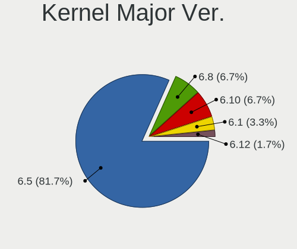
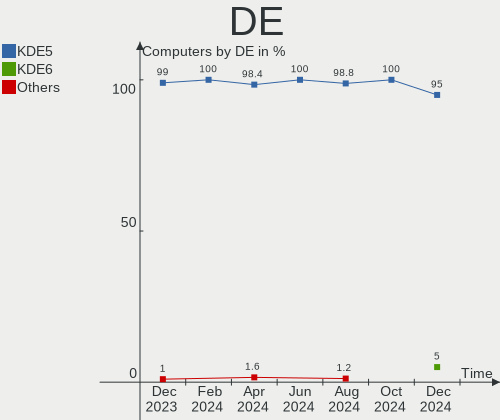
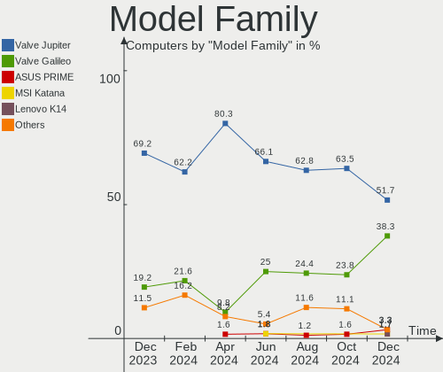
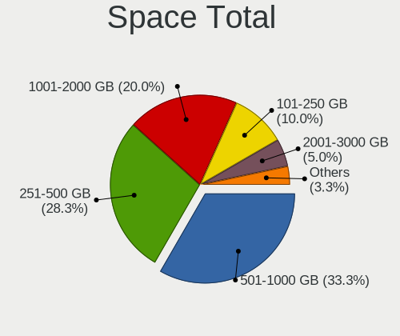
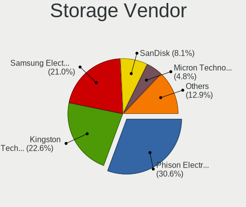
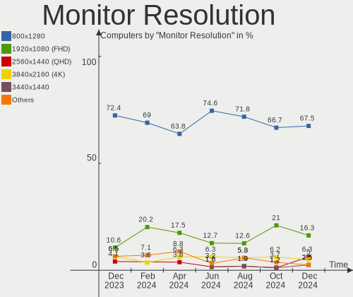
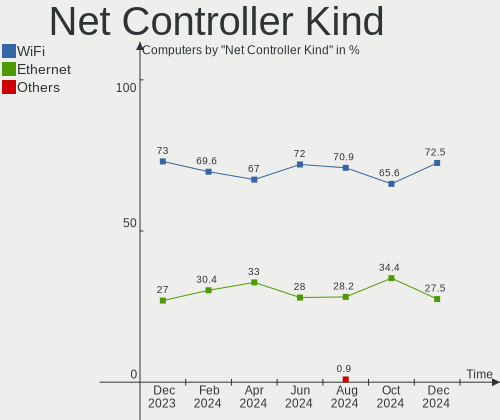
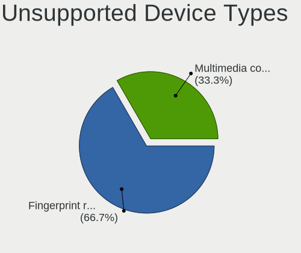

SteamOS - Hardware Trends
-------------------------

A project to identify most popular hardware characteristics and track their change
over time based on data collected by Linux users at https://Linux-Hardware.org.

Anyone can contribute to this report by the [hw-probe](https://github.com/linuxhw/hw-probe) tool:

    sudo -E hw-probe -all -upload

This is a report for all computer types. See also reports for [desktops](/Dist/SteamOS/Desktop/README.md) and [notebooks](/Dist/SteamOS/Notebook/README.md).

This report is for one last month. Overall report since the beginning of time: [TestCoverage](https://github.com/linuxhw/TestCoverage)

Period: Jun, 2022.

Contents
--------

* [ System ](#system)
  - [ OS                       ](#os)
  - [ OS Family                ](#os-family)
  - [ Kernel                   ](#kernel)
  - [ Kernel Family            ](#kernel-family)
  - [ Kernel Major Ver.        ](#kernel-major-ver)
  - [ Arch                     ](#arch)
  - [ DE                       ](#de)
  - [ Display Server           ](#display-server)
  - [ Display Manager          ](#display-manager)
  - [ OS Lang                  ](#os-lang)
  - [ Boot Mode                ](#boot-mode)
  - [ Filesystem               ](#filesystem)
  - [ Part. scheme             ](#part-scheme)
  - [ Dual Boot with Linux/BSD ](#dual-boot-with-linuxbsd)
  - [ Dual Boot (Win)          ](#dual-boot-win)

* [ Board ](#board)
  - [ Vendor                   ](#vendor)
  - [ Model                    ](#model)
  - [ Model Family             ](#model-family)
  - [ MFG Year                 ](#mfg-year)
  - [ Form Factor              ](#form-factor)
  - [ Secure Boot              ](#secure-boot)
  - [ Coreboot                 ](#coreboot)
  - [ RAM Size                 ](#ram-size)
  - [ RAM Used                 ](#ram-used)
  - [ Total Drives             ](#total-drives)
  - [ Has CD-ROM               ](#has-cd-rom)
  - [ Has Ethernet             ](#has-ethernet)
  - [ Has WiFi                 ](#has-wifi)
  - [ Has Bluetooth            ](#has-bluetooth)

* [ Location ](#location)
  - [ Country                  ](#country)
  - [ City                     ](#city)

* [ Drives ](#drives)
  - [ Drive Vendor             ](#drive-vendor)
  - [ Drive Model              ](#drive-model)
  - [ HDD Vendor               ](#hdd-vendor)
  - [ SSD Vendor               ](#ssd-vendor)
  - [ Drive Kind               ](#drive-kind)
  - [ Drive Connector          ](#drive-connector)
  - [ Drive Size               ](#drive-size)
  - [ Space Total              ](#space-total)
  - [ Space Used               ](#space-used)
  - [ Malfunc. Drives          ](#malfunc-drives)
  - [ Malfunc. Drive Vendor    ](#malfunc-drive-vendor)
  - [ Malfunc. HDD Vendor      ](#malfunc-hdd-vendor)
  - [ Malfunc. Drive Kind      ](#malfunc-drive-kind)
  - [ Failed Drives            ](#failed-drives)
  - [ Failed Drive Vendor      ](#failed-drive-vendor)
  - [ Drive Status             ](#drive-status)

* [ Storage controller ](#storage-controller)
  - [ Storage Vendor           ](#storage-vendor)
  - [ Storage Model            ](#storage-model)
  - [ Storage Kind             ](#storage-kind)

* [ Processor ](#processor)
  - [ CPU Vendor               ](#cpu-vendor)
  - [ CPU Model                ](#cpu-model)
  - [ CPU Model Family         ](#cpu-model-family)
  - [ CPU Cores                ](#cpu-cores)
  - [ CPU Sockets              ](#cpu-sockets)
  - [ CPU Threads              ](#cpu-threads)
  - [ CPU Op-Modes             ](#cpu-op-modes)
  - [ CPU Microcode            ](#cpu-microcode)
  - [ CPU Microarch            ](#cpu-microarch)

* [ Graphics ](#graphics)
  - [ GPU Vendor               ](#gpu-vendor)
  - [ GPU Model                ](#gpu-model)
  - [ GPU Combo                ](#gpu-combo)
  - [ GPU Driver               ](#gpu-driver)
  - [ GPU Memory               ](#gpu-memory)

* [ Monitor ](#monitor)
  - [ Monitor Vendor           ](#monitor-vendor)
  - [ Monitor Model            ](#monitor-model)
  - [ Monitor Resolution       ](#monitor-resolution)
  - [ Monitor Diagonal         ](#monitor-diagonal)
  - [ Monitor Width            ](#monitor-width)
  - [ Aspect Ratio             ](#aspect-ratio)
  - [ Monitor Area             ](#monitor-area)
  - [ Pixel Density            ](#pixel-density)
  - [ Multiple Monitors        ](#multiple-monitors)

* [ Network ](#network)
  - [ Net Controller Vendor    ](#net-controller-vendor)
  - [ Net Controller Model     ](#net-controller-model)
  - [ Wireless Vendor          ](#wireless-vendor)
  - [ Wireless Model           ](#wireless-model)
  - [ Ethernet Vendor          ](#ethernet-vendor)
  - [ Ethernet Model           ](#ethernet-model)
  - [ Net Controller Kind      ](#net-controller-kind)
  - [ Used Controller          ](#used-controller)
  - [ NICs                     ](#nics)
  - [ IPv6                     ](#ipv6)

* [ Bluetooth ](#bluetooth)
  - [ Bluetooth Vendor         ](#bluetooth-vendor)
  - [ Bluetooth Model          ](#bluetooth-model)

* [ Sound ](#sound)
  - [ Sound Vendor             ](#sound-vendor)
  - [ Sound Model              ](#sound-model)

* [ Memory ](#memory)
  - [ Memory Vendor            ](#memory-vendor)
  - [ Memory Model             ](#memory-model)
  - [ Memory Kind              ](#memory-kind)
  - [ Memory Form Factor       ](#memory-form-factor)
  - [ Memory Size              ](#memory-size)
  - [ Memory Speed             ](#memory-speed)

* [ Printers & scanners ](#printers--scanners)
  - [ Printer Vendor           ](#printer-vendor)
  - [ Printer Model            ](#printer-model)
  - [ Scanner Vendor           ](#scanner-vendor)
  - [ Scanner Model            ](#scanner-model)

* [ Camera ](#camera)
  - [ Camera Vendor            ](#camera-vendor)
  - [ Camera Model             ](#camera-model)

* [ Security ](#security)
  - [ Fingerprint Vendor       ](#fingerprint-vendor)
  - [ Fingerprint Model        ](#fingerprint-model)
  - [ Chipcard Vendor          ](#chipcard-vendor)
  - [ Chipcard Model           ](#chipcard-model)

* [ Unsupported ](#unsupported)
  - [ Unsupported Devices      ](#unsupported-devices)
  - [ Unsupported Device Types ](#unsupported-device-types)

System
------

OS
--

Installed operating systems

| Name                         | Computers | Percent |
|------------------------------|-----------|---------|
| SteamOS 3.2                  | 21        | 65.63%  |
| SteamOS 3.2 (steamdeck-main) | 8         | 25%     |
| SteamOS Rolling              | 1         | 3.13%   |
| SteamOS 3.4                  | 1         | 3.13%   |
| SteamOS 3.1                  | 1         | 3.13%   |

OS Family
---------

OS without a version

| Name    | Computers | Percent |
|---------|-----------|---------|
| SteamOS | 32        | 100%    |

Kernel
------

Version of the Linux kernel

| Version                                            | Computers | Percent |
|----------------------------------------------------|-----------|---------|
| 5.13.0-valve15-1-neptune-02197-gf6ec7ad3762a       | 21        | 65.63%  |
| 5.13.0-valve10.1-2-neptune-dri-02144-g7fffaf925dfb | 9         | 28.13%  |
| 5.13.0-valve20-1-neptune-02207-gbd986a7e1c7f       | 1         | 3.13%   |
| 5.13.0-valve10.3-1-neptune-02176-g5fe416c4acd8     | 1         | 3.13%   |

Kernel Family
-------------

Linux kernel without a distro release

| Version | Computers | Percent |
|---------|-----------|---------|
| 5.13.0  | 32        | 100%    |

Kernel Major Ver.
-----------------

Linux kernel major version

| Version | Computers | Percent |
|---------|-----------|---------|
| 5.13    | 32        | 100%    |

Arch
----

OS architecture (x86_64, i586, etc.)

| Name   | Computers | Percent |
|--------|-----------|---------|
| x86_64 | 32        | 100%    |

DE
--

Desktop Environment

| Name | Computers | Percent |
|------|-----------|---------|
| KDE5 | 32        | 100%    |

Display Server
--------------

X11 or Wayland

| Name | Computers | Percent |
|------|-----------|---------|
| X11  | 32        | 100%    |

Display Manager
---------------

SDDM, LightDM, etc.

| Name    | Computers | Percent |
|---------|-----------|---------|
| Unknown | 31        | 96.88%  |
| SDDM    | 1         | 3.13%   |

OS Lang
-------

Language

| Lang  | Computers | Percent |
|-------|-----------|---------|
| en_US | 26        | 81.25%  |
| fr_FR | 2         | 6.25%   |
| pt_PT | 1         | 3.13%   |
| es_ES | 1         | 3.13%   |
| en_GB | 1         | 3.13%   |
| en_DE | 1         | 3.13%   |

Boot Mode
---------

EFI or BIOS

| Mode | Computers | Percent |
|------|-----------|---------|
| BIOS | 31        | 96.88%  |
| EFI  | 1         | 3.13%   |

Filesystem
----------

Type of filesystem

| Type  | Computers | Percent |
|-------|-----------|---------|
| Btrfs | 32        | 100%    |

Part. scheme
------------

Scheme of partitioning

| Type    | Computers | Percent |
|---------|-----------|---------|
| Unknown | 31        | 96.88%  |
| GPT     | 1         | 3.13%   |

Dual Boot with Linux/BSD
------------------------

Hosting more than one Linux/BSD

| Dual boot | Computers | Percent |
|-----------|-----------|---------|
| No        | 32        | 100%    |

Dual Boot (Win)
---------------

Hosting Linux and Windows

| Dual boot | Computers | Percent |
|-----------|-----------|---------|
| No        | 31        | 96.88%  |
| Yes       | 1         | 3.13%   |

Board
-----

Vendor
------

Motherboard manufacturer

| Name             | Computers | Percent |
|------------------|-----------|---------|
| Valve            | 23        | 71.88%  |
| ASUSTek Computer | 3         | 9.38%   |
| Hewlett-Packard  | 2         | 6.25%   |
| Dell             | 1         | 3.13%   |
| AZW              | 1         | 3.13%   |
| Apple            | 1         | 3.13%   |
| Alienware        | 1         | 3.13%   |

Model
-----

Motherboard model

| Name                                | Computers | Percent |
|-------------------------------------|-----------|---------|
| Valve Jupiter                       | 23        | 71.88%  |
| HP x2 210 G2                        | 1         | 3.13%   |
| HP Pavilion Gaming Laptop 15-ec2xxx | 1         | 3.13%   |
| Dell G15 5510                       | 1         | 3.13%   |
| AZW SER                             | 1         | 3.13%   |
| ASUS ROG STRIX B550-F GAMING        | 1         | 3.13%   |
| ASUS Q524UQK                        | 1         | 3.13%   |
| ASUS H61M-K                         | 1         | 3.13%   |
| Apple Macmini7,1                    | 1         | 3.13%   |
| Alienware Aurora R8                 | 1         | 3.13%   |

Model Family
------------

Motherboard model prefix

| Name             | Computers | Percent |
|------------------|-----------|---------|
| Valve Jupiter    | 23        | 71.88%  |
| HP x2            | 1         | 3.13%   |
| HP Pavilion      | 1         | 3.13%   |
| Dell G15         | 1         | 3.13%   |
| AZW SER          | 1         | 3.13%   |
| ASUS ROG         | 1         | 3.13%   |
| ASUS Q524UQK     | 1         | 3.13%   |
| ASUS H61M-K      | 1         | 3.13%   |
| Apple Macmini7   | 1         | 3.13%   |
| Alienware Aurora | 1         | 3.13%   |

MFG Year
--------

Motherboard manufacture year

| Year | Computers | Percent |
|------|-----------|---------|
| 2022 | 24        | 75%     |
| 2021 | 2         | 6.25%   |
| 2020 | 2         | 6.25%   |
| 2016 | 2         | 6.25%   |
| 2015 | 1         | 3.13%   |
| 2013 | 1         | 3.13%   |

Form Factor
-----------

Physical design of the computer

| Name        | Computers | Percent |
|-------------|-----------|---------|
| Notebook    | 25        | 78.13%  |
| Desktop     | 3         | 9.38%   |
| Mini pc     | 2         | 6.25%   |
| Tablet      | 1         | 3.13%   |
| Convertible | 1         | 3.13%   |

Secure Boot
-----------

Enabled or disabled

| State    | Computers | Percent |
|----------|-----------|---------|
| Disabled | 32        | 100%    |

Coreboot
--------

Have coreboot on board

| Used | Computers | Percent |
|------|-----------|---------|
| No   | 32        | 100%    |

RAM Size
--------

Total RAM memory

| Size in GB | Computers | Percent |
|------------|-----------|---------|
| 8.01-16.0  | 25        | 78.13%  |
| 4.01-8.0   | 3         | 9.38%   |
| 16.01-24.0 | 2         | 6.25%   |
| 32.01-64.0 | 1         | 3.13%   |
| 3.01-4.0   | 1         | 3.13%   |

RAM Used
--------

Used RAM memory

| Used GB  | Computers | Percent |
|----------|-----------|---------|
| 2.01-3.0 | 15        | 46.88%  |
| 4.01-8.0 | 7         | 21.88%  |
| 3.01-4.0 | 7         | 21.88%  |
| 1.01-2.0 | 3         | 9.38%   |

Total Drives
------------

Number of drives on board

| Drives | Computers | Percent |
|--------|-----------|---------|
| 1      | 15        | 46.88%  |
| 2      | 13        | 40.63%  |
| 4      | 2         | 6.25%   |
| 3      | 2         | 6.25%   |

Has CD-ROM
----------

Has CD-ROM on board

| Presented | Computers | Percent |
|-----------|-----------|---------|
| No        | 31        | 96.88%  |
| Yes       | 1         | 3.13%   |

Has Ethernet
------------

Has Ethernet on board

| Presented | Computers | Percent |
|-----------|-----------|---------|
| No        | 18        | 56.25%  |
| Yes       | 14        | 43.75%  |

Has WiFi
--------

Has WiFi module

| Presented | Computers | Percent |
|-----------|-----------|---------|
| Yes       | 32        | 100%    |

Has Bluetooth
-------------

Has Bluetooth module

| Presented | Computers | Percent |
|-----------|-----------|---------|
| Yes       | 30        | 93.75%  |
| No        | 2         | 6.25%   |

Location
--------

Country
-------

Geographic location (country)

| Country  | Computers | Percent |
|----------|-----------|---------|
| USA      | 20        | 62.5%   |
| Germany  | 3         | 9.38%   |
| France   | 2         | 6.25%   |
| UK       | 1         | 3.13%   |
| Spain    | 1         | 3.13%   |
| Slovakia | 1         | 3.13%   |
| Portugal | 1         | 3.13%   |
| Greece   | 1         | 3.13%   |
| Czechia  | 1         | 3.13%   |
| Austria  | 1         | 3.13%   |

City
----

Geographic location (city)

| City             | Computers | Percent |
|------------------|-----------|---------|
| Colorado Springs | 2         | 6.25%   |
| Washington       | 1         | 3.13%   |
| Thessaloniki     | 1         | 3.13%   |
| Temecula         | 1         | 3.13%   |
| South Holland    | 1         | 3.13%   |
| San Diego        | 1         | 3.13%   |
| Portland         | 1         | 3.13%   |
| Phoenix          | 1         | 3.13%   |
| Palatine         | 1         | 3.13%   |
| Odenton          | 1         | 3.13%   |
| Oakham           | 1         | 3.13%   |
| Nashville        | 1         | 3.13%   |
| Maplewood        | 1         | 3.13%   |
| Knoxville        | 1         | 3.13%   |
| Klagenfurt       | 1         | 3.13%   |
| Kansas City      | 1         | 3.13%   |
| Ivry-sur-Seine   | 1         | 3.13%   |
| Iserlohn         | 1         | 3.13%   |
| Goochland        | 1         | 3.13%   |
| Fort Myers       | 1         | 3.13%   |
| Fenton           | 1         | 3.13%   |
| Eaubonne         | 1         | 3.13%   |
| Detroit          | 1         | 3.13%   |
| Buffalo          | 1         | 3.13%   |
| Brno             | 1         | 3.13%   |
| Breitscheid      | 1         | 3.13%   |
| Bratislava       | 1         | 3.13%   |
| Bothell          | 1         | 3.13%   |
| Belas            | 1         | 3.13%   |
| Barakaldo        | 1         | 3.13%   |
| Aalen            | 1         | 3.13%   |

Drives
------

Drive Vendor
------------

Hard drive vendors

| Vendor              | Computers | Drives | Percent |
|---------------------|-----------|--------|---------|
| Kingston            | 17        | 17     | 32.69%  |
| Unknown             | 9         | 10     | 17.31%  |
| Unknown             | 5         | 5      | 9.62%   |
| Samsung Electronics | 4         | 4      | 7.69%   |
| O2 Micro            | 3         | 3      | 5.77%   |
| SK hynix            | 2         | 2      | 3.85%   |
| Seagate             | 2         | 3      | 3.85%   |
| Phison              | 2         | 2      | 3.85%   |
| WDC                 | 1         | 1      | 1.92%   |
| Silicon Motion      | 1         | 1      | 1.92%   |
| SanDisk             | 1         | 1      | 1.92%   |
| PNY                 | 1         | 1      | 1.92%   |
| Intel               | 1         | 1      | 1.92%   |
| External            | 1         | 2      | 1.92%   |
| ASMT                | 1         | 1      | 1.92%   |
| ADATA Technology    | 1         | 1      | 1.92%   |

Drive Model
-----------

Hard drive models

| Model                               | Computers | Percent |
|-------------------------------------|-----------|---------|
| Kingston NVMe SSD Drive 512GB       | 10        | 18.52%  |
| Kingston NVMe SSD Drive 256GB       | 6         | 11.11%  |
| Unknown                             | 5         | 9.26%   |
| Unknown MMC Card  512GB             | 4         | 7.41%   |
| O2 Micro NVMe SSD Drive 64GB        | 3         | 5.56%   |
| Unknown MMC Card  64GB              | 2         | 3.7%    |
| Unknown MMC Card  128GB             | 2         | 3.7%    |
| SK hynix NVMe SSD Drive 256GB       | 2         | 3.7%    |
| WDC WD7500BPVT-80HXZT3 752GB        | 1         | 1.85%   |
| Unknown MMC Card  7GB               | 1         | 1.85%   |
| Unknown MMC Card  256GB             | 1         | 1.85%   |
| Silicon Motion NVMe SSD Drive 256GB | 1         | 1.85%   |
| Seagate ST4000DM004-2CV104 4TB      | 1         | 1.85%   |
| Seagate ST3500413AS 500GB           | 1         | 1.85%   |
| Seagate ST2000DM008-2FR102 2TB      | 1         | 1.85%   |
| SanDisk NVMe SSD Drive 512GB        | 1         | 1.85%   |
| Samsung SSD 870 QVO 2TB             | 1         | 1.85%   |
| Samsung SSD 860 EVO 500GB           | 1         | 1.85%   |
| Samsung NVMe SSD Drive 1TB          | 1         | 1.85%   |
| Samsung NVMe SSD Drive 1024GB       | 1         | 1.85%   |
| PNY CS1211 240GB SSD 754D117-820    | 1         | 1.85%   |
| Phison NVMe SSD Drive 512GB         | 1         | 1.85%   |
| Phison NVMe SSD Drive 1024GB        | 1         | 1.85%   |
| Kingston SA400S37480G 480GB SSD     | 1         | 1.85%   |
| Intel SSDPEKNW512G8 512GB           | 1         | 1.85%   |
| External USB3.0 120GB               | 1         | 1.85%   |
| ASMT ASM1156-PM 3TB                 | 1         | 1.85%   |
| ADATA NVMe SSD Drive 512GB          | 1         | 1.85%   |

HDD Vendor
----------

Hard disk drive vendors

| Vendor  | Computers | Drives | Percent |
|---------|-----------|--------|---------|
| Seagate | 2         | 3      | 50%     |
| WDC     | 1         | 1      | 25%     |
| ASMT    | 1         | 1      | 25%     |

SSD Vendor
----------

Solid state drive vendors

| Vendor              | Computers | Drives | Percent |
|---------------------|-----------|--------|---------|
| Samsung Electronics | 2         | 2      | 50%     |
| PNY                 | 1         | 1      | 25%     |
| Kingston            | 1         | 1      | 25%     |

Drive Kind
----------

HDD or SSD

| Kind | Computers | Drives | Percent |
|------|-----------|--------|---------|
| NVMe | 29        | 31     | 56.86%  |
| MMC  | 14        | 15     | 27.45%  |
| SSD  | 4         | 4      | 7.84%   |
| HDD  | 4         | 5      | 7.84%   |

Drive Connector
---------------

SATA, SAS, NVMe, etc.

| Type | Computers | Drives | Percent |
|------|-----------|--------|---------|
| NVMe | 29        | 29     | 56.86%  |
| MMC  | 14        | 15     | 27.45%  |
| SATA | 6         | 8      | 11.76%  |
| SAS  | 2         | 3      | 3.92%   |

Drive Size
----------

Size of hard drive

| Size in TB | Computers | Drives | Percent |
|------------|-----------|--------|---------|
| 0.01-0.5   | 4         | 4      | 44.44%  |
| 1.01-2.0   | 2         | 2      | 22.22%  |
| 3.01-4.0   | 1         | 1      | 11.11%  |
| 2.01-3.0   | 1         | 1      | 11.11%  |
| 0.51-1.0   | 1         | 1      | 11.11%  |

Space Total
-----------

Amount of disk space available on the file system

| Size in GB     | Computers | Percent |
|----------------|-----------|---------|
| 251-500        | 14        | 43.75%  |
| 101-250        | 8         | 25%     |
| 1001-2000      | 3         | 9.38%   |
| 501-1000       | 3         | 9.38%   |
| 51-100         | 3         | 9.38%   |
| More than 3000 | 1         | 3.13%   |

Space Used
----------

Amount of used disk space

| Used GB        | Computers | Percent |
|----------------|-----------|---------|
| 101-250        | 12        | 37.5%   |
| 251-500        | 5         | 15.63%  |
| 1-20           | 5         | 15.63%  |
| 51-100         | 4         | 12.5%   |
| 21-50          | 3         | 9.38%   |
| 501-1000       | 2         | 6.25%   |
| More than 3000 | 1         | 3.13%   |

Malfunc. Drives
---------------

Drive models with a malfunction

Zero info for selected period =(

Malfunc. Drive Vendor
---------------------

Vendors of faulty drives

Zero info for selected period =(

Malfunc. HDD Vendor
-------------------

Vendors of faulty HDD drives

Zero info for selected period =(

Malfunc. Drive Kind
-------------------

Kinds of faulty drives

Zero info for selected period =(

Failed Drives
-------------

Failed drive models

Zero info for selected period =(

Failed Drive Vendor
-------------------

Failed drive vendors

Zero info for selected period =(

Drive Status
------------

Number of failed and malfunc. drives

| Status   | Computers | Drives | Percent |
|----------|-----------|--------|---------|
| Detected | 31        | 53     | 96.88%  |
| Works    | 1         | 2      | 3.13%   |

Storage controller
------------------

Storage Vendor
--------------

Storage controller vendors

| Vendor                      | Computers | Percent |
|-----------------------------|-----------|---------|
| Kingston Technology Company | 16        | 44.44%  |
| Intel                       | 5         | 13.89%  |
| O2 Micro                    | 3         | 8.33%   |
| AMD                         | 3         | 8.33%   |
| SK hynix                    | 2         | 5.56%   |
| Samsung Electronics         | 2         | 5.56%   |
| Phison Electronics          | 2         | 5.56%   |
| Silicon Motion              | 1         | 2.78%   |
| SanDisk                     | 1         | 2.78%   |
| ADATA Technology            | 1         | 2.78%   |

Storage Model
-------------

Storage controller models

| Model                                                                         | Computers | Percent |
|-------------------------------------------------------------------------------|-----------|---------|
| Kingston Company OM3PDP3 NVMe SSD                                             | 15        | 41.67%  |
| O2 Micro Non-Volatile memory controller                                       | 3         | 8.33%   |
| AMD FCH SATA Controller [AHCI mode]                                           | 2         | 5.56%   |
| SK hynix Non-Volatile memory controller                                       | 1         | 2.78%   |
| SK hynix Gold P31 SSD                                                         | 1         | 2.78%   |
| Silicon Motion SM2263EN/SM2263XT SSD Controller                               | 1         | 2.78%   |
| SanDisk Non-Volatile memory controller                                        | 1         | 2.78%   |
| Samsung NVMe SSD Controller SM981/PM981/PM983                                 | 1         | 2.78%   |
| Samsung NVMe SSD Controller 980                                               | 1         | 2.78%   |
| Phison PS5013 E13 NVMe Controller                                             | 1         | 2.78%   |
| Phison E12 NVMe Controller                                                    | 1         | 2.78%   |
| Kingston Company Company Non-Volatile memory controller                       | 1         | 2.78%   |
| Intel Sunrise Point-LP SATA Controller [AHCI mode]                            | 1         | 2.78%   |
| Intel SSD 660P Series                                                         | 1         | 2.78%   |
| Intel 8 Series SATA Controller 1 [AHCI mode]                                  | 1         | 2.78%   |
| Intel 6 Series/C200 Series Chipset Family 6 port Desktop SATA AHCI Controller | 1         | 2.78%   |
| Intel 200 Series PCH SATA controller [AHCI mode]                              | 1         | 2.78%   |
| AMD 500 Series Chipset SATA Controller                                        | 1         | 2.78%   |
| ADATA Non-Volatile memory controller                                          | 1         | 2.78%   |

Storage Kind
------------

Kind of storage controller (IDE, SATA, NVMe, SAS, ...)

| Kind | Computers | Percent |
|------|-----------|---------|
| NVMe | 29        | 80.56%  |
| SATA | 7         | 19.44%  |

Processor
---------

CPU Vendor
----------

Processor vendors

| Vendor | Computers | Percent |
|--------|-----------|---------|
| AMD    | 26        | 81.25%  |
| Intel  | 6         | 18.75%  |

CPU Model
---------

Processor models

| Model                                  | Computers | Percent |
|----------------------------------------|-----------|---------|
| AMD Custom APU 0405                    | 23        | 71.88%  |
| Intel Core i7-7500U CPU @ 2.70GHz      | 1         | 3.13%   |
| Intel Core i7-4578U CPU @ 3.00GHz      | 1         | 3.13%   |
| Intel Core i7-10870H CPU @ 2.20GHz     | 1         | 3.13%   |
| Intel Core i5-9400 CPU @ 2.90GHz       | 1         | 3.13%   |
| Intel Core i5-2400 CPU @ 3.10GHz       | 1         | 3.13%   |
| Intel Atom x5-Z8350 CPU @ 1.44GHz      | 1         | 3.13%   |
| AMD Ryzen 9 3900X 12-Core Processor    | 1         | 3.13%   |
| AMD Ryzen 7 4800U with Radeon Graphics | 1         | 3.13%   |
| AMD Ryzen 5 5600H with Radeon Graphics | 1         | 3.13%   |

CPU Model Family
----------------

Processor model prefix

| Model         | Computers | Percent |
|---------------|-----------|---------|
| Other         | 23        | 71.88%  |
| Intel Core i7 | 3         | 9.38%   |
| Intel Core i5 | 2         | 6.25%   |
| Intel Atom    | 1         | 3.13%   |
| AMD Ryzen 9   | 1         | 3.13%   |
| AMD Ryzen 7   | 1         | 3.13%   |
| AMD Ryzen 5   | 1         | 3.13%   |

CPU Cores
---------

Number of processor cores

| Number | Computers | Percent |
|--------|-----------|---------|
| 4      | 25        | 78.13%  |
| 8      | 2         | 6.25%   |
| 6      | 2         | 6.25%   |
| 2      | 2         | 6.25%   |
| 12     | 1         | 3.13%   |

CPU Sockets
-----------

Number of sockets

| Number | Computers | Percent |
|--------|-----------|---------|
| 1      | 32        | 100%    |

CPU Threads
-----------

Threads per core (Hyper-Threading)

| Number | Computers | Percent |
|--------|-----------|---------|
| 2      | 29        | 90.63%  |
| 1      | 3         | 9.38%   |

CPU Op-Modes
------------

CPU Operation Modes (32-bit, 64-bit)

| Op mode        | Computers | Percent |
|----------------|-----------|---------|
| 32-bit, 64-bit | 32        | 100%    |

CPU Microcode
-------------

Microcode number

| Number     | Computers | Percent |
|------------|-----------|---------|
| Unknown    | 31        | 96.88%  |
| 0x08600106 | 1         | 3.13%   |

CPU Microarch
-------------

Microarchitecture

| Name        | Computers | Percent |
|-------------|-----------|---------|
| Unknown     | 23        | 71.88%  |
| Zen 2       | 2         | 6.25%   |
| KabyLake    | 2         | 6.25%   |
| Zen 3       | 1         | 3.13%   |
| Silvermont  | 1         | 3.13%   |
| SandyBridge | 1         | 3.13%   |
| Haswell     | 1         | 3.13%   |
| CometLake   | 1         | 3.13%   |

Graphics
--------

GPU Vendor
----------

Vendors of graphics cards

| Vendor | Computers | Percent |
|--------|-----------|---------|
| AMD    | 28        | 77.78%  |
| Nvidia | 4         | 11.11%  |
| Intel  | 4         | 11.11%  |

GPU Model
---------

Graphics card models

| Model                                                                                    | Computers | Percent |
|------------------------------------------------------------------------------------------|-----------|---------|
| AMD VanGogh [AMD Custom GPU 0405]                                                        | 23        | 63.89%  |
| Nvidia TU117M                                                                            | 1         | 2.78%   |
| Nvidia TU116 [GeForce GTX 1660 Ti]                                                       | 1         | 2.78%   |
| Nvidia GM107 [GeForce 940MX]                                                             | 1         | 2.78%   |
| Nvidia GA106M [GeForce RTX 3060 Mobile / Max-Q]                                          | 1         | 2.78%   |
| Intel HD Graphics 620                                                                    | 1         | 2.78%   |
| Intel CometLake-H GT2 [UHD Graphics]                                                     | 1         | 2.78%   |
| Intel CoffeeLake-S GT2 [UHD Graphics 630]                                                | 1         | 2.78%   |
| Intel Atom/Celeron/Pentium Processor x5-E8000/J3xxx/N3xxx Integrated Graphics Controller | 1         | 2.78%   |
| AMD Renoir                                                                               | 1         | 2.78%   |
| AMD Navi 22 [Radeon RX 6700/6700 XT/6750 XT / 6800M]                                     | 1         | 2.78%   |
| AMD Navi 10 [Radeon RX 5600 OEM/5600 XT / 5700/5700 XT]                                  | 1         | 2.78%   |
| AMD Cezanne                                                                              | 1         | 2.78%   |
| AMD Cape Verde PRO [Radeon HD 7750/8740 / R7 250E]                                       | 1         | 2.78%   |

GPU Combo
---------

Combinations of graphics cards

| Name           | Computers | Percent |
|----------------|-----------|---------|
| 1 x AMD        | 27        | 84.38%  |
| Intel + Nvidia | 2         | 6.25%   |
| 1 x Nvidia     | 1         | 3.13%   |
| 1 x Intel      | 1         | 3.13%   |
| AMD + Nvidia   | 1         | 3.13%   |

GPU Driver
----------

Free vs proprietary

| Driver      | Computers | Percent |
|-------------|-----------|---------|
| Free        | 28        | 87.5%   |
| Proprietary | 4         | 12.5%   |

GPU Memory
----------

Total video memory

| Size in GB | Computers | Percent |
|------------|-----------|---------|
| Unknown    | 30        | 93.75%  |
| 5.01-6.0   | 1         | 3.13%   |
| 0.01-0.5   | 1         | 3.13%   |

Monitor
-------

Monitor Vendor
--------------

Monitor vendors

| Vendor              | Computers | Percent |
|---------------------|-----------|---------|
| ANX                 | 23        | 54.76%  |
| Goldstar            | 3         | 7.14%   |
| Samsung Electronics | 2         | 4.76%   |
| BOE                 | 2         | 4.76%   |
| AU Optronics        | 2         | 4.76%   |
| ZSC                 | 1         | 2.38%   |
| YTH                 | 1         | 2.38%   |
| TCL                 | 1         | 2.38%   |
| Sceptre Tech        | 1         | 2.38%   |
| Philips             | 1         | 2.38%   |
| MSI                 | 1         | 2.38%   |
| Microsoft           | 1         | 2.38%   |
| Hewlett-Packard     | 1         | 2.38%   |
| AOC                 | 1         | 2.38%   |
| Acer                | 1         | 2.38%   |

Monitor Model
-------------

Monitor models

| Model                                                             | Computers | Percent |
|-------------------------------------------------------------------|-----------|---------|
| ANX ANX7530 U ANX7539 800x1280                                    | 23        | 53.49%  |
| ZSC FHD HDR ZSCBC32 1920x1080 344x195mm 15.6-inch                 | 1         | 2.33%   |
| YTH HS133PC YTH1330 1920x1080 255x220mm 13.3-inch                 | 1         | 2.33%   |
| TCL SMART TV TCL6586 3840x2160 1209x680mm 54.6-inch               | 1         | 2.33%   |
| Sceptre Tech E22 SPT08D5 1920x1080 409x230mm 18.5-inch            | 1         | 2.33%   |
| Samsung Electronics SMB2330 SAM0643 1920x1080 510x287mm 23.0-inch | 1         | 2.33%   |
| Samsung Electronics S27HG5x SAM0E10 2560x1440 598x336mm 27.0-inch | 1         | 2.33%   |
| Philips PHL 223V5 PHLC0CF 1920x1080 477x268mm 21.5-inch           | 1         | 2.33%   |
| MSI MPG321QRF-QD MSI3DB8 2560x1440 708x399mm 32.0-inch            | 1         | 2.33%   |
| Microsoft Xbox One MSH0001 1920x1080 1210x680mm 54.6-inch         | 1         | 2.33%   |
| Hewlett-Packard 25x HPN357F 1920x1080 544x303mm 24.5-inch         | 1         | 2.33%   |
| Goldstar ULTRAWIDE GSM5AFB 2560x1080 798x334mm 34.1-inch          | 1         | 2.33%   |
| Goldstar LG ULTRAGEAR GSM775B 1920x1080 700x390mm 31.5-inch       | 1         | 2.33%   |
| Goldstar LG TV SSCR2 GSMC0C8 3840x2160                            | 1         | 2.33%   |
| Goldstar 27GN7 GSM5B8D 1920x1080 610x360mm 27.9-inch              | 1         | 2.33%   |
| BOE LCD Monitor BOE094D 1920x1080 344x194mm 15.5-inch             | 1         | 2.33%   |
| BOE LCD Monitor BOE065F 1920x1080 344x194mm 15.5-inch             | 1         | 2.33%   |
| AU Optronics LCD Monitor AUOED8F 1920x1080 344x193mm 15.5-inch    | 1         | 2.33%   |
| AU Optronics LCD Monitor AUO18D4 1280x800 216x135mm 10.0-inch     | 1         | 2.33%   |
| AOC AG352UCG6 AOC3525 3440x1440 819x346mm 35.0-inch               | 1         | 2.33%   |
| Acer H236HL ACR0318 1920x1080 509x286mm 23.0-inch                 | 1         | 2.33%   |

Monitor Resolution
------------------

Monitor screen resolution

| Resolution      | Computers | Percent |
|-----------------|-----------|---------|
| 800x1280        | 23        | 54.76%  |
| 1920x1080 (FHD) | 12        | 28.57%  |
| 3840x2160 (4K)  | 2         | 4.76%   |
| 2560x1440 (QHD) | 2         | 4.76%   |
| 3440x1440       | 1         | 2.38%   |
| 2560x1080       | 1         | 2.38%   |
| 1280x800 (WXGA) | 1         | 2.38%   |

Monitor Diagonal
----------------

Diagonal size in inches

| Inches  | Computers | Percent |
|---------|-----------|---------|
| Unknown | 23        | 56.1%   |
| 15      | 4         | 9.76%   |
| 27      | 2         | 4.88%   |
| 23      | 2         | 4.88%   |
| 72      | 1         | 2.44%   |
| 54      | 1         | 2.44%   |
| 35      | 1         | 2.44%   |
| 34      | 1         | 2.44%   |
| 32      | 1         | 2.44%   |
| 31      | 1         | 2.44%   |
| 24      | 1         | 2.44%   |
| 21      | 1         | 2.44%   |
| 13      | 1         | 2.44%   |
| 10      | 1         | 2.44%   |

Monitor Width
-------------

Physical width

| Width in mm | Computers | Percent |
|-------------|-----------|---------|
| Unknown     | 23        | 56.1%   |
| 501-600     | 4         | 9.76%   |
| 301-350     | 4         | 9.76%   |
| 701-800     | 2         | 4.88%   |
| 601-700     | 2         | 4.88%   |
| 201-300     | 2         | 4.88%   |
| 801-900     | 1         | 2.44%   |
| 401-500     | 1         | 2.44%   |
| 1501-2000   | 1         | 2.44%   |
| 1001-1500   | 1         | 2.44%   |

Aspect Ratio
------------

Proportional relationship between the width and the height

| Ratio | Computers | Percent |
|-------|-----------|---------|
| 0.62  | 23        | 57.5%   |
| 16/9  | 14        | 35%     |
| 21/9  | 2         | 5%      |
| 16/10 | 1         | 2.5%    |

Monitor Area
------------

Area in inch²

| Area in inch² | Computers | Percent |
|----------------|-----------|---------|
| Unknown        | 23        | 56.1%   |
| 351-500        | 4         | 9.76%   |
| 101-110        | 4         | 9.76%   |
| 201-250        | 3         | 7.32%   |
| More than 1000 | 2         | 4.88%   |
| 301-350        | 2         | 4.88%   |
| 71-80          | 1         | 2.44%   |
| 41-50          | 1         | 2.44%   |
| 251-300        | 1         | 2.44%   |

Pixel Density
-------------

Pixels per inch

| Density | Computers | Percent |
|---------|-----------|---------|
| Unknown | 23        | 56.1%   |
| 51-100  | 8         | 19.51%  |
| 121-160 | 5         | 12.2%   |
| 101-120 | 3         | 7.32%   |
| 1-50    | 1         | 2.44%   |
| 161-240 | 1         | 2.44%   |

Multiple Monitors
-----------------

Total monitors connected

| Total | Computers | Percent |
|-------|-----------|---------|
| 1     | 22        | 68.75%  |
| 2     | 9         | 28.13%  |
| 3     | 1         | 3.13%   |

Network
-------

Net Controller Vendor
---------------------

Controller vendors

| Vendor                        | Computers | Percent |
|-------------------------------|-----------|---------|
| Realtek Semiconductor         | 27        | 67.5%   |
| Intel                         | 4         | 10%     |
| ASIX Electronics              | 4         | 10%     |
| Qualcomm Atheros              | 1         | 2.5%    |
| OnePlus Technology (Shenzhen) | 1         | 2.5%    |
| MediaTek                      | 1         | 2.5%    |
| Broadcom Limited              | 1         | 2.5%    |
| Broadcom                      | 1         | 2.5%    |

Net Controller Model
--------------------

Controller models

| Model                                                             | Computers | Percent |
|-------------------------------------------------------------------|-----------|---------|
| Realtek RTL8822CE 802.11ac PCIe Wireless Network Adapter          | 23        | 47.92%  |
| Realtek RTL8153 Gigabit Ethernet Adapter                          | 4         | 8.33%   |
| ASIX AX88179 Gigabit Ethernet                                     | 4         | 8.33%   |
| Realtek RTL8111/8168/8411 PCI Express Gigabit Ethernet Controller | 3         | 6.25%   |
| Realtek RTL8852AE 802.11ax PCIe Wireless Network Adapter          | 1         | 2.08%   |
| Realtek Killer E2600 Gigabit Ethernet Controller                  | 1         | 2.08%   |
| Realtek 802.11ac NIC                                              | 1         | 2.08%   |
| Qualcomm Atheros QCA9377 802.11ac Wireless Network Adapter        | 1         | 2.08%   |
| Qualcomm Atheros Killer E2500 Gigabit Ethernet Controller         | 1         | 2.08%   |
| OnePlus (Shenzhen) SM8150-MTP _SN:63F1CF71                        | 1         | 2.08%   |
| MediaTek MT7921K (RZ608) Wi-Fi 6E 80MHz                           | 1         | 2.08%   |
| Intel Wireless 8260                                               | 1         | 2.08%   |
| Intel Wireless 7265                                               | 1         | 2.08%   |
| Intel Wi-Fi 6 AX200                                               | 1         | 2.08%   |
| Intel Ethernet Controller I225-V                                  | 1         | 2.08%   |
| Intel Comet Lake PCH CNVi WiFi                                    | 1         | 2.08%   |
| Broadcom NetXtreme BCM57766 Gigabit Ethernet PCIe                 | 1         | 2.08%   |
| Broadcom Limited BCM4360 802.11ac Wireless Network Adapter        | 1         | 2.08%   |

Wireless Vendor
---------------

Wireless vendors

| Vendor                | Computers | Percent |
|-----------------------|-----------|---------|
| Realtek Semiconductor | 25        | 78.13%  |
| Intel                 | 4         | 12.5%   |
| Qualcomm Atheros      | 1         | 3.13%   |
| MediaTek              | 1         | 3.13%   |
| Broadcom Limited      | 1         | 3.13%   |

Wireless Model
--------------

Wireless models

| Model                                                      | Computers | Percent |
|------------------------------------------------------------|-----------|---------|
| Realtek RTL8822CE 802.11ac PCIe Wireless Network Adapter   | 23        | 71.88%  |
| Realtek RTL8852AE 802.11ax PCIe Wireless Network Adapter   | 1         | 3.13%   |
| Realtek 802.11ac NIC                                       | 1         | 3.13%   |
| Qualcomm Atheros QCA9377 802.11ac Wireless Network Adapter | 1         | 3.13%   |
| MediaTek MT7921K (RZ608) Wi-Fi 6E 80MHz                    | 1         | 3.13%   |
| Intel Wireless 8260                                        | 1         | 3.13%   |
| Intel Wireless 7265                                        | 1         | 3.13%   |
| Intel Wi-Fi 6 AX200                                        | 1         | 3.13%   |
| Intel Comet Lake PCH CNVi WiFi                             | 1         | 3.13%   |
| Broadcom Limited BCM4360 802.11ac Wireless Network Adapter | 1         | 3.13%   |

Ethernet Vendor
---------------

Ethernet vendors

| Vendor                        | Computers | Percent |
|-------------------------------|-----------|---------|
| Realtek Semiconductor         | 7         | 46.67%  |
| ASIX Electronics              | 4         | 26.67%  |
| Qualcomm Atheros              | 1         | 6.67%   |
| OnePlus Technology (Shenzhen) | 1         | 6.67%   |
| Intel                         | 1         | 6.67%   |
| Broadcom                      | 1         | 6.67%   |

Ethernet Model
--------------

Ethernet models

| Model                                                             | Computers | Percent |
|-------------------------------------------------------------------|-----------|---------|
| Realtek RTL8153 Gigabit Ethernet Adapter                          | 4         | 25%     |
| ASIX AX88179 Gigabit Ethernet                                     | 4         | 25%     |
| Realtek RTL8111/8168/8411 PCI Express Gigabit Ethernet Controller | 3         | 18.75%  |
| Realtek Killer E2600 Gigabit Ethernet Controller                  | 1         | 6.25%   |
| Qualcomm Atheros Killer E2500 Gigabit Ethernet Controller         | 1         | 6.25%   |
| OnePlus (Shenzhen) SM8150-MTP _SN:63F1CF71                        | 1         | 6.25%   |
| Intel Ethernet Controller I225-V                                  | 1         | 6.25%   |
| Broadcom NetXtreme BCM57766 Gigabit Ethernet PCIe                 | 1         | 6.25%   |

Net Controller Kind
-------------------

Ethernet, WiFi or modem

| Kind     | Computers | Percent |
|----------|-----------|---------|
| WiFi     | 32        | 69.57%  |
| Ethernet | 14        | 30.43%  |

Used Controller
---------------

Currently used network controller

| Kind     | Computers | Percent |
|----------|-----------|---------|
| WiFi     | 26        | 74.29%  |
| Ethernet | 9         | 25.71%  |

NICs
----

Total network controllers on board

| Total | Computers | Percent |
|-------|-----------|---------|
| 1     | 26        | 81.25%  |
| 2     | 6         | 18.75%  |

IPv6
----

IPv6 vs IPv4

| Used | Computers | Percent |
|------|-----------|---------|
| No   | 22        | 68.75%  |
| Yes  | 10        | 31.25%  |

Bluetooth
---------

Bluetooth Vendor
----------------

Controller vendors

| Vendor                          | Computers | Percent |
|---------------------------------|-----------|---------|
| IMC Networks                    | 23        | 76.67%  |
| Intel                           | 4         | 13.33%  |
| Realtek Semiconductor           | 1         | 3.33%   |
| Qualcomm Atheros Communications | 1         | 3.33%   |
| Apple                           | 1         | 3.33%   |

Bluetooth Model
---------------

Controller models

| Model                              | Computers | Percent |
|------------------------------------|-----------|---------|
| IMC Networks Bluetooth Radio       | 23        | 76.67%  |
| Intel Bluetooth wireless interface | 2         | 6.67%   |
| Realtek Bluetooth Radio            | 1         | 3.33%   |
| Qualcomm Atheros  Bluetooth Device | 1         | 3.33%   |
| Intel Bluetooth Device             | 1         | 3.33%   |
| Intel AX200 Bluetooth              | 1         | 3.33%   |
| Apple Bluetooth Host Controller    | 1         | 3.33%   |

Sound
-----

Sound Vendor
------------

Sound card vendors

| Vendor                      | Computers | Percent |
|-----------------------------|-----------|---------|
| AMD                         | 28        | 68.29%  |
| Intel                       | 5         | 12.2%   |
| Nvidia                      | 4         | 9.76%   |
| Tenx Technology             | 1         | 2.44%   |
| Logitech                    | 1         | 2.44%   |
| FiiO Electronics Technology | 1         | 2.44%   |
| C-Media Electronics         | 1         | 2.44%   |

Sound Model
-----------

Sound card models

| Model                                                                      | Computers | Percent |
|----------------------------------------------------------------------------|-----------|---------|
| AMD Rembrandt Radeon High Definition Audio Controller                      | 23        | 53.49%  |
| AMD Family 17h/19h HD Audio Controller                                     | 2         | 4.65%   |
| Tenx Technology USB AUDIO                                                  | 1         | 2.33%   |
| Nvidia TU116 High Definition Audio Controller                              | 1         | 2.33%   |
| Nvidia TU107 GeForce GTX 1650 High Definition Audio Controller             | 1         | 2.33%   |
| Nvidia GM107 High Definition Audio Controller [GeForce 940MX]              | 1         | 2.33%   |
| Nvidia Audio device                                                        | 1         | 2.33%   |
| Logitech Blue Microphones                                                  | 1         | 2.33%   |
| Intel Sunrise Point-LP HD Audio                                            | 1         | 2.33%   |
| Intel Comet Lake PCH cAVS                                                  | 1         | 2.33%   |
| Intel 8 Series HD Audio Controller                                         | 1         | 2.33%   |
| Intel 6 Series/C200 Series Chipset Family High Definition Audio Controller | 1         | 2.33%   |
| Intel 200 Series PCH HD Audio                                              | 1         | 2.33%   |
| FiiO Electronics Technology K3                                             | 1         | 2.33%   |
| C-Media Electronics Blue Snowball                                          | 1         | 2.33%   |
| AMD Starship/Matisse HD Audio Controller                                   | 1         | 2.33%   |
| AMD Renoir Radeon High Definition Audio Controller                         | 1         | 2.33%   |
| AMD Oland/Hainan/Cape Verde/Pitcairn HDMI Audio [Radeon HD 7000 Series]    | 1         | 2.33%   |
| AMD Navi 21/23 HDMI/DP Audio Controller                                    | 1         | 2.33%   |
| AMD Navi 10 HDMI Audio                                                     | 1         | 2.33%   |

Memory
------

Memory Vendor
-------------

Memory module vendors

| Vendor  | Computers | Percent |
|---------|-----------|---------|
| Crucial | 1         | 100%    |

Memory Model
------------

Memory module models

| Model                                                  | Computers | Percent |
|--------------------------------------------------------|-----------|---------|
| Crucial RAM CT8G4SFS832A.C8FR 8GB SODIMM DDR4 3200MT/s | 1         | 100%    |

Memory Kind
-----------

Memory module kinds

| Kind | Computers | Percent |
|------|-----------|---------|
| DDR4 | 1         | 100%    |

Memory Form Factor
------------------

Physical design of the memory module

| Name   | Computers | Percent |
|--------|-----------|---------|
| SODIMM | 1         | 100%    |

Memory Size
-----------

Memory module size

| Size | Computers | Percent |
|------|-----------|---------|
| 8192 | 1         | 100%    |

Memory Speed
------------

Memory module speed

| Speed | Computers | Percent |
|-------|-----------|---------|
| 3200  | 1         | 100%    |

Printers & scanners
-------------------

Printer Vendor
--------------

Printer device vendors

Zero info for selected period =(

Printer Model
-------------

Printer device models

Zero info for selected period =(

Scanner Vendor
--------------

Scanner device vendors

Zero info for selected period =(

Scanner Model
-------------

Scanner device models

Zero info for selected period =(

Camera
------

Camera Vendor
-------------

Camera device vendors

| Vendor                                 | Computers | Percent |
|----------------------------------------|-----------|---------|
| Realtek Semiconductor                  | 2         | 28.57%  |
| Sunplus Innovation Technology          | 1         | 14.29%  |
| Magic Control Technology               | 1         | 14.29%  |
| Luxvisions Innotech Limited            | 1         | 14.29%  |
| Chicony Electronics                    | 1         | 14.29%  |
| Cheng Uei Precision Industry (Foxlink) | 1         | 14.29%  |

Camera Model
------------

Camera device models

| Model                                                   | Computers | Percent |
|---------------------------------------------------------|-----------|---------|
| Sunplus USB 2.0 Camera                                  | 1         | 14.29%  |
| Realtek WEB CAMERA M9 Pro                               | 1         | 14.29%  |
| Realtek Integrated_Webcam_HD                            | 1         | 14.29%  |
| Magic Control j5 WebCam JVCU100                         | 1         | 14.29%  |
| Luxvisions Innotech Limited HP TrueVision HD Camera     | 1         | 14.29%  |
| Chicony USB2.0 HD UVC WebCam                            | 1         | 14.29%  |
| Cheng Uei Precision Industry (Foxlink) HP TrueVision HD | 1         | 14.29%  |

Security
--------

Fingerprint Vendor
------------------

Fingerprint sensor vendors

Zero info for selected period =(

Fingerprint Model
-----------------

Fingerprint sensor models

Zero info for selected period =(

Chipcard Vendor
---------------

Chipcard module vendors

Zero info for selected period =(

Chipcard Model
--------------

Chipcard module models

Zero info for selected period =(

Unsupported
-----------

Unsupported Devices
-------------------

Total unsupported devices on board

| Total | Computers | Percent |
|-------|-----------|---------|
| 0     | 28        | 87.5%   |
| 1     | 3         | 9.38%   |
| 2     | 1         | 3.13%   |

Unsupported Device Types
------------------------

Types of unsupported devices

| Type                  | Computers | Percent |
|-----------------------|-----------|---------|
| Net/wireless          | 3         | 60%     |
| Multimedia controller | 2         | 40%     |

