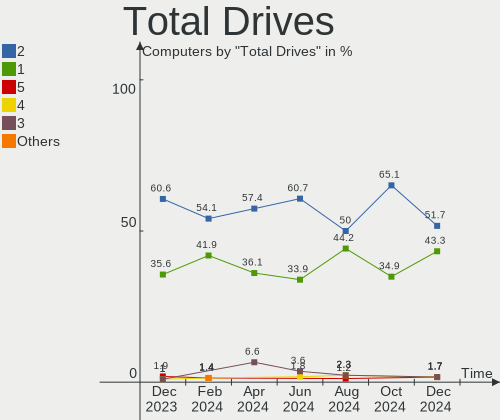
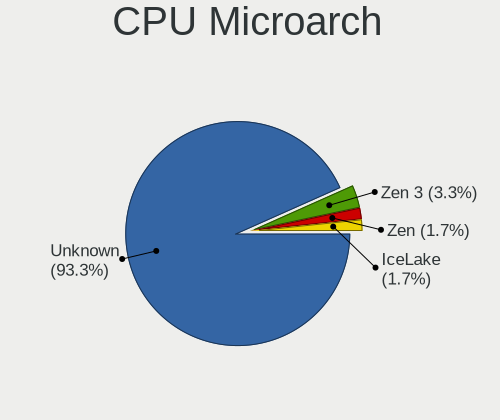
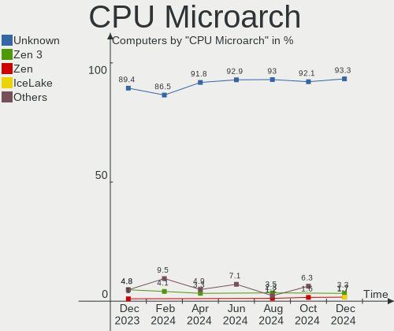
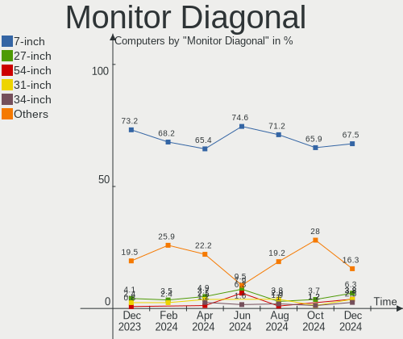
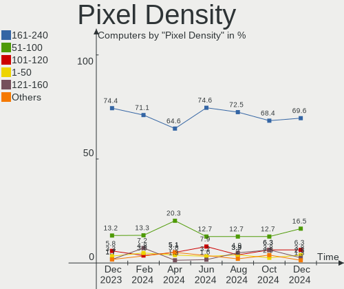
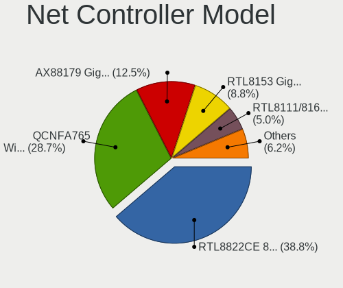
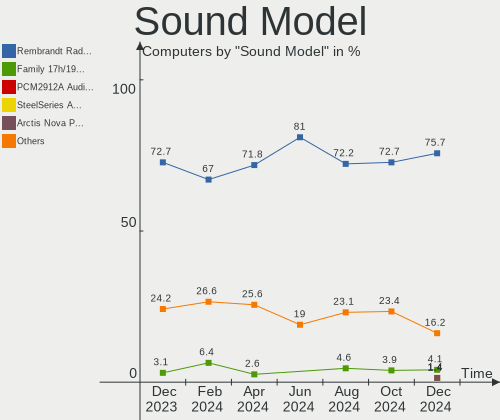
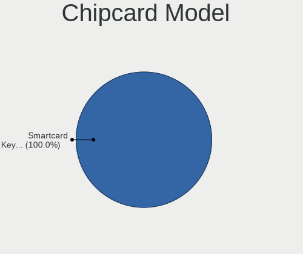

SteamOS - Hardware Trends
-------------------------

A project to identify most popular hardware characteristics and track their change
over time based on data collected by Linux users at https://Linux-Hardware.org.

Anyone can contribute to this report by the [hw-probe](https://github.com/linuxhw/hw-probe) tool:

    sudo -E hw-probe -all -upload

This is a report for all computer types. See also reports for [desktops](/Dist/SteamOS/Desktop/README.md) and [notebooks](/Dist/SteamOS/Notebook/README.md).

This report is for one last month. Overall report since the beginning of time: [TestDays](https://github.com/linuxhw/TestDays)

Period: Mar, 2023.

Contents
--------

* [ System ](#system)
  - [ OS                       ](#os)
  - [ OS Family                ](#os-family)
  - [ Kernel                   ](#kernel)
  - [ Kernel Family            ](#kernel-family)
  - [ Kernel Major Ver.        ](#kernel-major-ver)
  - [ Arch                     ](#arch)
  - [ DE                       ](#de)
  - [ Display Server           ](#display-server)
  - [ Display Manager          ](#display-manager)
  - [ OS Lang                  ](#os-lang)
  - [ Boot Mode                ](#boot-mode)
  - [ Filesystem               ](#filesystem)
  - [ Part. scheme             ](#part-scheme)
  - [ Dual Boot with Linux/BSD ](#dual-boot-with-linuxbsd)
  - [ Dual Boot (Win)          ](#dual-boot-win)

* [ Board ](#board)
  - [ Vendor                   ](#vendor)
  - [ Model                    ](#model)
  - [ Model Family             ](#model-family)
  - [ MFG Year                 ](#mfg-year)
  - [ Form Factor              ](#form-factor)
  - [ Secure Boot              ](#secure-boot)
  - [ Coreboot                 ](#coreboot)
  - [ RAM Size                 ](#ram-size)
  - [ RAM Used                 ](#ram-used)
  - [ Total Drives             ](#total-drives)
  - [ Has CD-ROM               ](#has-cd-rom)
  - [ Has Ethernet             ](#has-ethernet)
  - [ Has WiFi                 ](#has-wifi)
  - [ Has Bluetooth            ](#has-bluetooth)

* [ Location ](#location)
  - [ Country                  ](#country)
  - [ City                     ](#city)

* [ Drives ](#drives)
  - [ Drive Vendor             ](#drive-vendor)
  - [ Drive Model              ](#drive-model)
  - [ HDD Vendor               ](#hdd-vendor)
  - [ SSD Vendor               ](#ssd-vendor)
  - [ Drive Kind               ](#drive-kind)
  - [ Drive Connector          ](#drive-connector)
  - [ Drive Size               ](#drive-size)
  - [ Space Total              ](#space-total)
  - [ Space Used               ](#space-used)
  - [ Malfunc. Drives          ](#malfunc-drives)
  - [ Malfunc. Drive Vendor    ](#malfunc-drive-vendor)
  - [ Malfunc. HDD Vendor      ](#malfunc-hdd-vendor)
  - [ Malfunc. Drive Kind      ](#malfunc-drive-kind)
  - [ Failed Drives            ](#failed-drives)
  - [ Failed Drive Vendor      ](#failed-drive-vendor)
  - [ Drive Status             ](#drive-status)

* [ Storage controller ](#storage-controller)
  - [ Storage Vendor           ](#storage-vendor)
  - [ Storage Model            ](#storage-model)
  - [ Storage Kind             ](#storage-kind)

* [ Processor ](#processor)
  - [ CPU Vendor               ](#cpu-vendor)
  - [ CPU Model                ](#cpu-model)
  - [ CPU Model Family         ](#cpu-model-family)
  - [ CPU Cores                ](#cpu-cores)
  - [ CPU Sockets              ](#cpu-sockets)
  - [ CPU Threads              ](#cpu-threads)
  - [ CPU Op-Modes             ](#cpu-op-modes)
  - [ CPU Microcode            ](#cpu-microcode)
  - [ CPU Microarch            ](#cpu-microarch)

* [ Graphics ](#graphics)
  - [ GPU Vendor               ](#gpu-vendor)
  - [ GPU Model                ](#gpu-model)
  - [ GPU Combo                ](#gpu-combo)
  - [ GPU Driver               ](#gpu-driver)
  - [ GPU Memory               ](#gpu-memory)

* [ Monitor ](#monitor)
  - [ Monitor Vendor           ](#monitor-vendor)
  - [ Monitor Model            ](#monitor-model)
  - [ Monitor Resolution       ](#monitor-resolution)
  - [ Monitor Diagonal         ](#monitor-diagonal)
  - [ Monitor Width            ](#monitor-width)
  - [ Aspect Ratio             ](#aspect-ratio)
  - [ Monitor Area             ](#monitor-area)
  - [ Pixel Density            ](#pixel-density)
  - [ Multiple Monitors        ](#multiple-monitors)

* [ Network ](#network)
  - [ Net Controller Vendor    ](#net-controller-vendor)
  - [ Net Controller Model     ](#net-controller-model)
  - [ Wireless Vendor          ](#wireless-vendor)
  - [ Wireless Model           ](#wireless-model)
  - [ Ethernet Vendor          ](#ethernet-vendor)
  - [ Ethernet Model           ](#ethernet-model)
  - [ Net Controller Kind      ](#net-controller-kind)
  - [ Used Controller          ](#used-controller)
  - [ NICs                     ](#nics)
  - [ IPv6                     ](#ipv6)

* [ Bluetooth ](#bluetooth)
  - [ Bluetooth Vendor         ](#bluetooth-vendor)
  - [ Bluetooth Model          ](#bluetooth-model)

* [ Sound ](#sound)
  - [ Sound Vendor             ](#sound-vendor)
  - [ Sound Model              ](#sound-model)

* [ Memory ](#memory)
  - [ Memory Vendor            ](#memory-vendor)
  - [ Memory Model             ](#memory-model)
  - [ Memory Kind              ](#memory-kind)
  - [ Memory Form Factor       ](#memory-form-factor)
  - [ Memory Size              ](#memory-size)
  - [ Memory Speed             ](#memory-speed)

* [ Printers & scanners ](#printers--scanners)
  - [ Printer Vendor           ](#printer-vendor)
  - [ Printer Model            ](#printer-model)
  - [ Scanner Vendor           ](#scanner-vendor)
  - [ Scanner Model            ](#scanner-model)

* [ Camera ](#camera)
  - [ Camera Vendor            ](#camera-vendor)
  - [ Camera Model             ](#camera-model)

* [ Security ](#security)
  - [ Fingerprint Vendor       ](#fingerprint-vendor)
  - [ Fingerprint Model        ](#fingerprint-model)
  - [ Chipcard Vendor          ](#chipcard-vendor)
  - [ Chipcard Model           ](#chipcard-model)

* [ Unsupported ](#unsupported)
  - [ Unsupported Devices      ](#unsupported-devices)
  - [ Unsupported Device Types ](#unsupported-device-types)

System
------

OS
--

Installed operating systems

| Name          | Computers | Percent |
|---------------|-----------|---------|
| SteamOS 3.4.6 | 41        | 46.59%  |
| SteamOS 3.4.4 | 30        | 34.09%  |
| SteamOS 3.4   | 12        | 13.64%  |
| SteamOS 4     | 2         | 2.27%   |
| SteamOS 3.5   | 2         | 2.27%   |
| SteamOS       | 1         | 1.14%   |

OS Family
---------

OS without a version

| Name    | Computers | Percent |
|---------|-----------|---------|
| SteamOS | 88        | 100%    |

Kernel
------

Version of the Linux kernel

| Version                                      | Computers | Percent |
|----------------------------------------------|-----------|---------|
| 5.13.0-valve36-1-neptune                     | 72        | 81.82%  |
| 5.13.0-valve21.3-1-neptune                   | 10        | 11.36%  |
| 6.1.12-valve2-1-neptune-61                   | 4         | 4.55%   |
| 5.18.1-arch1_testHoloISO_20220606.1811       | 1         | 1.14%   |
| 5.13.0-valve21-1-steamos-02209-g2a5bdc1102a0 | 1         | 1.14%   |

Kernel Family
-------------

Linux kernel without a distro release

| Version | Computers | Percent |
|---------|-----------|---------|
| 5.13.0  | 83        | 94.32%  |
| 6.1.12  | 4         | 4.55%   |
| 5.18.1  | 1         | 1.14%   |

Kernel Major Ver.
-----------------

Linux kernel major version

| Version | Computers | Percent |
|---------|-----------|---------|
| 5.13    | 83        | 94.32%  |
| 6.1     | 4         | 4.55%   |
| 5.18    | 1         | 1.14%   |

Arch
----

OS architecture (x86_64, i586, etc.)

| Name   | Computers | Percent |
|--------|-----------|---------|
| x86_64 | 88        | 100%    |

DE
--

Desktop Environment

| Name | Computers | Percent |
|------|-----------|---------|
| KDE5 | 88        | 100%    |

Display Server
--------------

X11 or Wayland

| Name | Computers | Percent |
|------|-----------|---------|
| X11  | 88        | 100%    |

Display Manager
---------------

SDDM, LightDM, etc.

| Name    | Computers | Percent |
|---------|-----------|---------|
| Unknown | 88        | 100%    |

OS Lang
-------

Language

| Lang  | Computers | Percent |
|-------|-----------|---------|
| en_US | 75        | 85.23%  |
| de_DE | 3         | 3.41%   |
| en_DE | 2         | 2.27%   |
| ru_RU | 1         | 1.14%   |
| pt_BR | 1         | 1.14%   |
| ko_KR | 1         | 1.14%   |
| it_IT | 1         | 1.14%   |
| es_ES | 1         | 1.14%   |
| en_GB | 1         | 1.14%   |
| en_AU | 1         | 1.14%   |
| an_ES | 1         | 1.14%   |

Boot Mode
---------

EFI or BIOS

| Mode | Computers | Percent |
|------|-----------|---------|
| BIOS | 88        | 100%    |

Filesystem
----------

Type of filesystem

| Type  | Computers | Percent |
|-------|-----------|---------|
| Btrfs | 87        | 98.86%  |
| Tmpfs | 1         | 1.14%   |

Part. scheme
------------

Scheme of partitioning

| Type    | Computers | Percent |
|---------|-----------|---------|
| Unknown | 88        | 100%    |

Dual Boot with Linux/BSD
------------------------

Hosting more than one Linux/BSD

| Dual boot | Computers | Percent |
|-----------|-----------|---------|
| No        | 88        | 100%    |

Dual Boot (Win)
---------------

Hosting Linux and Windows

| Dual boot | Computers | Percent |
|-----------|-----------|---------|
| No        | 88        | 100%    |

Board
-----

Vendor
------

Motherboard manufacturer

| Name                | Computers | Percent |
|---------------------|-----------|---------|
| Valve               | 73        | 82.95%  |
| ASUSTek Computer    | 5         | 5.68%   |
| Gigabyte Technology | 4         | 4.55%   |
| Hewlett-Packard     | 3         | 3.41%   |
| MSI                 | 1         | 1.14%   |
| ASRock              | 1         | 1.14%   |
| Acer                | 1         | 1.14%   |

Model
-----

Motherboard model

| Name                                      | Computers | Percent |
|-------------------------------------------|-----------|---------|
| Valve Jupiter                             | 73        | 82.95%  |
| MSI MS-7D73                               | 1         | 1.14%   |
| HP Victus by 15L Gaming Desktop TG02-0xxx | 1         | 1.14%   |
| HP Laptop 15-bs0xx                        | 1         | 1.14%   |
| HP EliteDesk 705 G4 DM 65W (TAA)          | 1         | 1.14%   |
| Gigabyte F2A68HM-H                        | 1         | 1.14%   |
| Gigabyte B550 GAMING X V2                 | 1         | 1.14%   |
| Gigabyte B450 AORUS M                     | 1         | 1.14%   |
| Gigabyte AX370-Gaming                     | 1         | 1.14%   |
| ASUS PRIME Z270M-PLUS                     | 1         | 1.14%   |
| ASUS PRIME H610M-K D4                     | 1         | 1.14%   |
| ASUS PRIME A320I-K                        | 1         | 1.14%   |
| ASUS GL552JX                              | 1         | 1.14%   |
| ASUS All Series                           | 1         | 1.14%   |
| ASRock X300M-STX                          | 1         | 1.14%   |
| Acer Nitro N50-610                        | 1         | 1.14%   |

Model Family
------------

Motherboard model prefix

| Name                  | Computers | Percent |
|-----------------------|-----------|---------|
| Valve Jupiter         | 73        | 82.95%  |
| ASUS PRIME            | 3         | 3.41%   |
| MSI MS-7D73           | 1         | 1.14%   |
| HP Victus             | 1         | 1.14%   |
| HP Laptop             | 1         | 1.14%   |
| HP EliteDesk          | 1         | 1.14%   |
| Gigabyte F2A68HM-H    | 1         | 1.14%   |
| Gigabyte B550         | 1         | 1.14%   |
| Gigabyte B450         | 1         | 1.14%   |
| Gigabyte AX370-Gaming | 1         | 1.14%   |
| ASUS GL552JX          | 1         | 1.14%   |
| ASUS All              | 1         | 1.14%   |
| ASRock X300M-STX      | 1         | 1.14%   |
| Acer Nitro            | 1         | 1.14%   |

MFG Year
--------

Motherboard manufacture year

| Year | Computers | Percent |
|------|-----------|---------|
| 2022 | 75        | 85.23%  |
| 2020 | 3         | 3.41%   |
| 2019 | 2         | 2.27%   |
| 2017 | 2         | 2.27%   |
| 2015 | 2         | 2.27%   |
| 2021 | 1         | 1.14%   |
| 2018 | 1         | 1.14%   |
| 2016 | 1         | 1.14%   |
| 2014 | 1         | 1.14%   |

Form Factor
-----------

Physical design of the computer

| Name     | Computers | Percent |
|----------|-----------|---------|
| Notebook | 75        | 85.23%  |
| Desktop  | 13        | 14.77%  |

Secure Boot
-----------

Enabled or disabled

| State    | Computers | Percent |
|----------|-----------|---------|
| Disabled | 88        | 100%    |

Coreboot
--------

Have coreboot on board

| Used | Computers | Percent |
|------|-----------|---------|
| No   | 88        | 100%    |

RAM Size
--------

Total RAM memory

| Size in GB | Computers | Percent |
|------------|-----------|---------|
| 8.01-16.0  | 76        | 86.36%  |
| 16.01-24.0 | 6         | 6.82%   |
| 32.01-64.0 | 3         | 3.41%   |
| 4.01-8.0   | 1         | 1.14%   |
| 3.01-4.0   | 1         | 1.14%   |
| 24.01-32.0 | 1         | 1.14%   |

RAM Used
--------

Used RAM memory

| Used GB   | Computers | Percent |
|-----------|-----------|---------|
| 2.01-3.0  | 39        | 44.32%  |
| 4.01-8.0  | 25        | 28.41%  |
| 3.01-4.0  | 22        | 25%     |
| 1.01-2.0  | 1         | 1.14%   |
| 8.01-16.0 | 1         | 1.14%   |

Total Drives
------------

Number of drives on board

| Drives | Computers | Percent |
|--------|-----------|---------|
| 2      | 54        | 61.36%  |
| 1      | 22        | 25%     |
| 3      | 10        | 11.36%  |
| 4      | 2         | 2.27%   |

Has CD-ROM
----------

Has CD-ROM on board

| Presented | Computers | Percent |
|-----------|-----------|---------|
| No        | 87        | 98.86%  |
| Yes       | 1         | 1.14%   |

Has Ethernet
------------

Has Ethernet on board

| Presented | Computers | Percent |
|-----------|-----------|---------|
| No        | 45        | 51.14%  |
| Yes       | 43        | 48.86%  |

Has WiFi
--------

Has WiFi module

| Presented | Computers | Percent |
|-----------|-----------|---------|
| Yes       | 84        | 95.45%  |
| No        | 4         | 4.55%   |

Has Bluetooth
-------------

Has Bluetooth module

| Presented | Computers | Percent |
|-----------|-----------|---------|
| Yes       | 84        | 95.45%  |
| No        | 4         | 4.55%   |

Location
--------

Country
-------

Geographic location (country)

| Country     | Computers | Percent |
|-------------|-----------|---------|
| USA         | 29        | 32.95%  |
| UK          | 10        | 11.36%  |
| Germany     | 7         | 7.95%   |
| Italy       | 4         | 4.55%   |
| Spain       | 3         | 3.41%   |
| Russia      | 3         | 3.41%   |
| Poland      | 3         | 3.41%   |
| Taiwan      | 2         | 2.27%   |
| New Zealand | 2         | 2.27%   |
| Netherlands | 2         | 2.27%   |
| France      | 2         | 2.27%   |
| Canada      | 2         | 2.27%   |
| Brazil      | 2         | 2.27%   |
| Austria     | 2         | 2.27%   |
| Australia   | 2         | 2.27%   |
| Ukraine     | 1         | 1.14%   |
| Thailand    | 1         | 1.14%   |
| Switzerland | 1         | 1.14%   |
| South Korea | 1         | 1.14%   |
| Slovakia    | 1         | 1.14%   |
| Romania     | 1         | 1.14%   |
| Ireland     | 1         | 1.14%   |
| Indonesia   | 1         | 1.14%   |
| Iceland     | 1         | 1.14%   |
| Hungary     | 1         | 1.14%   |
| Finland     | 1         | 1.14%   |
| Ecuador     | 1         | 1.14%   |
| Bulgaria    | 1         | 1.14%   |

City
----

Geographic location (city)

| City                | Computers | Percent |
|---------------------|-----------|---------|
| Vienna              | 2         | 2.27%   |
| Taipei              | 2         | 2.27%   |
| Frankfurt am Main   | 2         | 2.27%   |
| Auckland            | 2         | 2.27%   |
| Amsterdam           | 2         | 2.27%   |
| Wroclaw             | 1         | 1.14%   |
| West Bloomfield     | 1         | 1.14%   |
| Watford             | 1         | 1.14%   |
| Wappingers Falls    | 1         | 1.14%   |
| Victoria            | 1         | 1.14%   |
| Verona              | 1         | 1.14%   |
| Trinidad            | 1         | 1.14%   |
| Tatabánya          | 1         | 1.14%   |
| Suwon               | 1         | 1.14%   |
| St Helens           | 1         | 1.14%   |
| Schweinfurt         | 1         | 1.14%   |
| Rubtsovsk           | 1         | 1.14%   |
| Rousse              | 1         | 1.14%   |
| Rio Grande          | 1         | 1.14%   |
| Riells i Viabrea    | 1         | 1.14%   |
| Richmond            | 1         | 1.14%   |
| Reykjavik           | 1         | 1.14%   |
| Raszkow             | 1         | 1.14%   |
| Portland            | 1         | 1.14%   |
| Philadelphia        | 1         | 1.14%   |
| Osasco              | 1         | 1.14%   |
| Nuremberg           | 1         | 1.14%   |
| Nottingham          | 1         | 1.14%   |
| Norristown          | 1         | 1.14%   |
| Newport             | 1         | 1.14%   |
| Newcastle upon Tyne | 1         | 1.14%   |
| Munich              | 1         | 1.14%   |
| Moscow              | 1         | 1.14%   |
| Montreal            | 1         | 1.14%   |
| Mazeres             | 1         | 1.14%   |
| Makassar            | 1         | 1.14%   |
| Madrid              | 1         | 1.14%   |
| Lucerne             | 1         | 1.14%   |
| Lafayette           | 1         | 1.14%   |
| Kstovo              | 1         | 1.14%   |

Drives
------

Drive Vendor
------------

Hard drive vendors

| Vendor                      | Computers | Drives | Percent |
|-----------------------------|-----------|--------|---------|
| Unknown                     | 45        | 45     | 26.79%  |
| Phison Electronics          | 22        | 22     | 13.1%   |
| Kingston Technology Company | 18        | 18     | 10.71%  |
| Samsung Electronics         | 17        | 18     | 10.12%  |
| Unknown                     | 14        | 14     | 8.33%   |
| O2 Micro                    | 8         | 8      | 4.76%   |
| Seagate                     | 6         | 6      | 3.57%   |
| Sandisk                     | 6         | 6      | 3.57%   |
| WDC                         | 5         | 6      | 2.98%   |
| Crucial                     | 4         | 4      | 2.38%   |
| Toshiba                     | 3         | 3      | 1.79%   |
| SK hynix                    | 3         | 3      | 1.79%   |
| Silicon Motion              | 3         | 3      | 1.79%   |
| Kingston                    | 3         | 3      | 1.79%   |
| Realtek                     | 2         | 2      | 1.19%   |
| KIOXIA                      | 2         | 2      | 1.19%   |
| Verbatim                    | 1         | 1      | 0.6%    |
| T-FORCE                     | 1         | 1      | 0.6%    |
| Netac                       | 1         | 1      | 0.6%    |
| MAXIO Technology (Hangzhou) | 1         | 1      | 0.6%    |
| Intel                       | 1         | 1      | 0.6%    |
| Hitachi                     | 1         | 1      | 0.6%    |
| HGST                        | 1         | 1      | 0.6%    |

Drive Model
-----------

Hard drive models

| Model                                                  | Computers | Percent |
|--------------------------------------------------------|-----------|---------|
| Unknown MMC Card  512GB                                | 21        | 12.43%  |
| Phison PS5013 E13 NVMe Controller 256GB                | 20        | 11.83%  |
| Kingston Company OM3PDP3 NVMe SSD 256GB                | 17        | 10.06%  |
| Unknown                                                | 14        | 8.28%   |
| Unknown MMC Card  256GB                                | 12        | 7.1%    |
| Samsung MZ9LQ512HBLU-00BVL 512GB                       | 10        | 5.92%   |
| O2 Micro E2M2 64GB                                     | 8         | 4.73%   |
| Unknown MMC Card  128GB                                | 5         | 2.96%   |
| Unknown MMC Card  64GB                                 | 3         | 1.78%   |
| Silicon Motion SM2263EN/SM2263XT SSD Controller 1024GB | 3         | 1.78%   |
| Unknown MMC Card  393GB                                | 2         | 1.18%   |
| Seagate ST500DM002-1BD142 500GB                        | 2         | 1.18%   |
| Sandisk WD PC SN740 SDDPTQD-1T00 1024GB                | 2         | 1.18%   |
| Samsung SSD 980 1TB                                    | 2         | 1.18%   |
| Samsung MZ9LQ256HBJD-00BVL 256GB                       | 2         | 1.18%   |
| Realtek RTL9210B-CG 512GB                              | 2         | 1.18%   |
| Phison Sabrent SB-2130-1TB                             | 2         | 1.18%   |
| WDC WDS500G2B0B-00YS70 500GB SSD                       | 1         | 0.59%   |
| WDC WDS100T2B0A-00SM50 1TB SSD                         | 1         | 0.59%   |
| WDC WD30EZRX-00DC0B0 3TB                               | 1         | 0.59%   |
| WDC WD15EARS-00MVWB0 1TB                               | 1         | 0.59%   |
| WDC WD10EZEX-00WN4A0 1TB                               | 1         | 0.59%   |
| Verbatim MySSD Drive 512GB                             | 1         | 0.59%   |
| Unknown MMC Card  249GB                                | 1         | 0.59%   |
| Unknown MMC Card  16GB                                 | 1         | 0.59%   |
| Toshiba XG6 NVMe SSD Controller 512GB                  | 1         | 0.59%   |
| Toshiba MQ01ABF050 500GB                               | 1         | 0.59%   |
| Toshiba MQ01ABD032 320GB                               | 1         | 0.59%   |
| T-FORCE 1TB                                            | 1         | 0.59%   |
| SK hynix BC711 NVMe 512GB                              | 1         | 0.59%   |
| SK hynix BC711 NVMe 256GB                              | 1         | 0.59%   |
| SK hynix BC711 NVMe 1TB                                | 1         | 0.59%   |
| Seagate ST2000LX001-1RG174 2TB                         | 1         | 0.59%   |
| Seagate Expansion+ 2TB                                 | 1         | 0.59%   |
| Seagate Desktop 8TB                                    | 1         | 0.59%   |
| Seagate BUP Slim SL 1TB                                | 1         | 0.59%   |
| Sandisk WD PC SN740 SDDPTQE-2T00 2TB                   | 1         | 0.59%   |
| Sandisk WD Blue SN500 / PC SN520 NVMe SSD 512GB        | 1         | 0.59%   |
| SanDisk SD8SB8U256G1122 256GB SSD                      | 1         | 0.59%   |
| Sandisk PC SN740 NVMe WD 512GB                         | 1         | 0.59%   |

HDD Vendor
----------

Hard disk drive vendors

| Vendor  | Computers | Drives | Percent |
|---------|-----------|--------|---------|
| Seagate | 6         | 6      | 46.15%  |
| WDC     | 3         | 4      | 23.08%  |
| Toshiba | 2         | 2      | 15.38%  |
| Hitachi | 1         | 1      | 7.69%   |
| HGST    | 1         | 1      | 7.69%   |

SSD Vendor
----------

Solid state drive vendors

| Vendor              | Computers | Drives | Percent |
|---------------------|-----------|--------|---------|
| Crucial             | 4         | 4      | 33.33%  |
| WDC                 | 2         | 2      | 16.67%  |
| Samsung Electronics | 2         | 2      | 16.67%  |
| Kingston            | 2         | 2      | 16.67%  |
| Verbatim            | 1         | 1      | 8.33%   |
| SanDisk             | 1         | 1      | 8.33%   |

Drive Kind
----------

HDD or SSD

| Kind    | Computers | Drives | Percent |
|---------|-----------|--------|---------|
| NVMe    | 81        | 84     | 50.94%  |
| MMC     | 57        | 57     | 35.85%  |
| SSD     | 10        | 12     | 6.29%   |
| HDD     | 9         | 14     | 5.66%   |
| Unknown | 2         | 3      | 1.26%   |

Drive Connector
---------------

SATA, SAS, NVMe, etc.

| Type | Computers | Drives | Percent |
|------|-----------|--------|---------|
| NVMe | 81        | 82     | 51.59%  |
| MMC  | 57        | 57     | 36.31%  |
| SATA | 12        | 24     | 7.64%   |
| SAS  | 7         | 7      | 4.46%   |

Drive Size
----------

Size of hard drive

| Size in TB | Computers | Drives | Percent |
|------------|-----------|--------|---------|
| 0.01-0.5   | 9         | 12     | 42.86%  |
| 0.51-1.0   | 7         | 8      | 33.33%  |
| 1.01-2.0   | 3         | 3      | 14.29%  |
| 2.01-3.0   | 1         | 2      | 4.76%   |
| 4.01-10.0  | 1         | 1      | 4.76%   |

Space Total
-----------

Amount of disk space available on the file system

| Size in GB     | Computers | Percent |
|----------------|-----------|---------|
| 251-500        | 45        | 51.14%  |
| 101-250        | 15        | 17.05%  |
| 501-1000       | 13        | 14.77%  |
| 51-100         | 9         | 10.23%  |
| More than 3000 | 4         | 4.55%   |
| 1001-2000      | 2         | 2.27%   |

Space Used
----------

Amount of used disk space

| Used GB        | Computers | Percent |
|----------------|-----------|---------|
| 251-500        | 29        | 32.95%  |
| 101-250        | 22        | 25%     |
| 21-50          | 12        | 13.64%  |
| 1-20           | 9         | 10.23%  |
| 501-1000       | 7         | 7.95%   |
| 51-100         | 7         | 7.95%   |
| More than 3000 | 1         | 1.14%   |
| 1001-2000      | 1         | 1.14%   |

Malfunc. Drives
---------------

Drive models with a malfunction

Zero info for selected period =(

Malfunc. Drive Vendor
---------------------

Vendors of faulty drives

Zero info for selected period =(

Malfunc. HDD Vendor
-------------------

Vendors of faulty HDD drives

Zero info for selected period =(

Malfunc. Drive Kind
-------------------

Kinds of faulty drives

Zero info for selected period =(

Failed Drives
-------------

Failed drive models

Zero info for selected period =(

Failed Drive Vendor
-------------------

Failed drive vendors

Zero info for selected period =(

Drive Status
------------

Number of failed and malfunc. drives

| Status   | Computers | Drives | Percent |
|----------|-----------|--------|---------|
| Detected | 88        | 170    | 100%    |

Storage controller
------------------

Storage Vendor
--------------

Storage controller vendors

| Vendor                       | Computers | Percent |
|------------------------------|-----------|---------|
| Phison Electronics           | 22        | 22.92%  |
| Kingston Technology Company  | 19        | 19.79%  |
| Samsung Electronics          | 16        | 16.67%  |
| O2 Micro                     | 8         | 8.33%   |
| AMD                          | 8         | 8.33%   |
| Intel                        | 7         | 7.29%   |
| Sandisk                      | 5         | 5.21%   |
| SK hynix                     | 3         | 3.13%   |
| Silicon Motion               | 3         | 3.13%   |
| KIOXIA                       | 2         | 2.08%   |
| Toshiba America Info Systems | 1         | 1.04%   |
| Netac Technology             | 1         | 1.04%   |
| MAXIO Technology (Hangzhou)  | 1         | 1.04%   |

Storage Model
-------------

Storage controller models

| Model                                                                            | Computers | Percent |
|----------------------------------------------------------------------------------|-----------|---------|
| Phison PS5013 E13 NVMe Controller                                                | 20        | 19.42%  |
| Kingston Company OM3PDP3 NVMe SSD                                                | 17        | 16.5%   |
| Samsung NVMe SSD Controller 980                                                  | 16        | 15.53%  |
| O2 Micro Non-Volatile memory controller                                          | 8         | 7.77%   |
| AMD FCH SATA Controller [AHCI mode]                                              | 6         | 5.83%   |
| Sandisk Non-Volatile memory controller                                           | 4         | 3.88%   |
| SK hynix Gold P31/PC711 NVMe Solid State Drive                                   | 3         | 2.91%   |
| Silicon Motion SM2263EN/SM2263XT SSD Controller                                  | 3         | 2.91%   |
| Phison Electronics Non-Volatile memory controller                                | 2         | 1.94%   |
| Kingston Company Company Non-Volatile memory controller                          | 2         | 1.94%   |
| Intel 8 Series/C220 Series Chipset Family 6-port SATA Controller 1 [AHCI mode]   | 2         | 1.94%   |
| AMD 400 Series Chipset SATA Controller                                           | 2         | 1.94%   |
| Toshiba America Info Systems XG6 NVMe SSD Controller                             | 1         | 0.97%   |
| SanDisk WD Blue SN500 / PC SN520 NVMe SSD                                        | 1         | 0.97%   |
| Netac Non-Volatile memory controller                                             | 1         | 0.97%   |
| MAXIO (Hangzhou) NVMe SSD Controller MAP1202                                     | 1         | 0.97%   |
| KIOXIA NVMe SSD Controller BG4                                                   | 1         | 0.97%   |
| KIOXIA Non-Volatile memory controller                                            | 1         | 0.97%   |
| Intel Volume Management Device NVMe RAID Controller                              | 1         | 0.97%   |
| Intel Non-Volatile memory controller                                             | 1         | 0.97%   |
| Intel Comet Lake SATA AHCI Controller                                            | 1         | 0.97%   |
| Intel Atom/Celeron/Pentium Processor x5-E8000/J3xxx/N3xxx Series SATA Controller | 1         | 0.97%   |
| Intel Alder Lake-S PCH SATA Controller [AHCI Mode]                               | 1         | 0.97%   |
| Intel 200 Series PCH SATA controller [AHCI mode]                                 | 1         | 0.97%   |
| AMD X370 Series Chipset SATA Controller                                          | 1         | 0.97%   |
| AMD FCH SATA Controller [IDE mode]                                               | 1         | 0.97%   |
| AMD FCH SATA Controller D                                                        | 1         | 0.97%   |
| AMD FCH IDE Controller                                                           | 1         | 0.97%   |
| AMD 500 Series Chipset SATA Controller                                           | 1         | 0.97%   |
| AMD 300 Series Chipset SATA Controller                                           | 1         | 0.97%   |

Storage Kind
------------

Kind of storage controller (IDE, SATA, NVMe, SAS, ...)

| Kind | Computers | Percent |
|------|-----------|---------|
| NVMe | 81        | 83.51%  |
| SATA | 14        | 14.43%  |
| RAID | 1         | 1.03%   |
| IDE  | 1         | 1.03%   |

Processor
---------

CPU Vendor
----------

Processor vendors

| Vendor | Computers | Percent |
|--------|-----------|---------|
| AMD    | 82        | 93.18%  |
| Intel  | 6         | 6.82%   |

CPU Model
---------

Processor models

| Model                                           | Computers | Percent |
|-------------------------------------------------|-----------|---------|
| AMD Custom APU 0405                             | 73        | 82.95%  |
| AMD Ryzen 5 5600G with Radeon Graphics          | 2         | 2.27%   |
| Intel Core i7-7700K CPU @ 4.20GHz               | 1         | 1.14%   |
| Intel Core i7-4770K CPU @ 3.50GHz               | 1         | 1.14%   |
| Intel Core i7-4720HQ CPU @ 2.60GHz              | 1         | 1.14%   |
| Intel Core i5-10400F CPU @ 2.90GHz              | 1         | 1.14%   |
| Intel Celeron CPU N3060 @ 1.60GHz               | 1         | 1.14%   |
| Intel 12th Gen Core i3-12100F                   | 1         | 1.14%   |
| AMD Ryzen 7 2700X Eight-Core Processor          | 1         | 1.14%   |
| AMD Ryzen 7 1700 Eight-Core Processor           | 1         | 1.14%   |
| AMD Ryzen 5 PRO 2400G with Radeon Vega Graphics | 1         | 1.14%   |
| AMD Ryzen 5 7600X 6-Core Processor              | 1         | 1.14%   |
| AMD Ryzen 5 3600 6-Core Processor               | 1         | 1.14%   |
| AMD Ryzen 5 2600X Six-Core Processor            | 1         | 1.14%   |
| AMD Athlon X4 860K Quad Core Processor          | 1         | 1.14%   |

CPU Model Family
----------------

Processor model prefix

| Model           | Computers | Percent |
|-----------------|-----------|---------|
| Other           | 74        | 84.09%  |
| AMD Ryzen 5     | 5         | 5.68%   |
| Intel Core i7   | 3         | 3.41%   |
| AMD Ryzen 7     | 2         | 2.27%   |
| Intel Core i5   | 1         | 1.14%   |
| Intel Celeron   | 1         | 1.14%   |
| AMD Ryzen 5 PRO | 1         | 1.14%   |
| AMD Athlon X4   | 1         | 1.14%   |

CPU Cores
---------

Number of processor cores

| Number | Computers | Percent |
|--------|-----------|---------|
| 4      | 77        | 87.5%   |
| 6      | 6         | 6.82%   |
| 2      | 3         | 3.41%   |
| 8      | 2         | 2.27%   |

CPU Sockets
-----------

Number of sockets

| Number | Computers | Percent |
|--------|-----------|---------|
| 1      | 88        | 100%    |

CPU Threads
-----------

Threads per core (Hyper-Threading)

| Number | Computers | Percent |
|--------|-----------|---------|
| 2      | 87        | 98.86%  |
| 1      | 1         | 1.14%   |

CPU Op-Modes
------------

CPU Operation Modes (32-bit, 64-bit)

| Op mode        | Computers | Percent |
|----------------|-----------|---------|
| 32-bit, 64-bit | 88        | 100%    |

CPU Microcode
-------------

Microcode number

| Number  | Computers | Percent |
|---------|-----------|---------|
| Unknown | 88        | 100%    |

CPU Microarch
-------------

Microarchitecture

| Name        | Computers | Percent |
|-------------|-----------|---------|
| Unknown     | 75        | 85.23%  |
| Zen+        | 2         | 2.27%   |
| Zen 3       | 2         | 2.27%   |
| Zen         | 2         | 2.27%   |
| Haswell     | 2         | 2.27%   |
| Zen 2       | 1         | 1.14%   |
| Steamroller | 1         | 1.14%   |
| Silvermont  | 1         | 1.14%   |
| KabyLake    | 1         | 1.14%   |
| CometLake   | 1         | 1.14%   |

Graphics
--------

GPU Vendor
----------

Vendors of graphics cards

| Vendor | Computers | Percent |
|--------|-----------|---------|
| AMD    | 83        | 93.26%  |
| Nvidia | 4         | 4.49%   |
| Intel  | 2         | 2.25%   |

GPU Model
---------

Graphics card models

| Model                                                                                    | Computers | Percent |
|------------------------------------------------------------------------------------------|-----------|---------|
| AMD VanGogh [AMD Custom GPU 0405]                                                        | 73        | 80.22%  |
| AMD Ellesmere [Radeon RX 470/480/570/570X/580/580X/590]                                  | 3         | 3.3%    |
| AMD Navi 22 [Radeon RX 6700/6700 XT/6750 XT / 6800M/6850M XT]                            | 2         | 2.2%    |
| AMD Cezanne [Radeon Vega Series / Radeon Vega Mobile Series]                             | 2         | 2.2%    |
| Nvidia TU117 [GeForce GTX 1650]                                                          | 1         | 1.1%    |
| Nvidia GP104 [GeForce GTX 1070]                                                          | 1         | 1.1%    |
| Nvidia GM107M [GeForce GTX 950M]                                                         | 1         | 1.1%    |
| Nvidia GA104 [GeForce RTX 3060 Ti Lite Hash Rate]                                        | 1         | 1.1%    |
| Intel Atom/Celeron/Pentium Processor x5-E8000/J3xxx/N3xxx Integrated Graphics Controller | 1         | 1.1%    |
| Intel 4th Gen Core Processor Integrated Graphics Controller                              | 1         | 1.1%    |
| AMD Raven Ridge [Radeon Vega Series / Radeon Vega Mobile Series]                         | 1         | 1.1%    |
| AMD Raphael                                                                              | 1         | 1.1%    |
| AMD Polaris 20 XL [Radeon RX 580 2048SP]                                                 | 1         | 1.1%    |
| AMD Navi 24 [Radeon RX 6400/6500 XT/6500M]                                               | 1         | 1.1%    |
| AMD Navi 14 [Radeon RX 5500/5500M / Pro 5500M]                                           | 1         | 1.1%    |

GPU Combo
---------

Combinations of graphics cards

| Name           | Computers | Percent |
|----------------|-----------|---------|
| 1 x AMD        | 81        | 92.05%  |
| 1 x Nvidia     | 3         | 3.41%   |
| 2 x AMD        | 2         | 2.27%   |
| Intel + Nvidia | 1         | 1.14%   |
| 1 x Intel      | 1         | 1.14%   |

GPU Driver
----------

Free vs proprietary

| Driver      | Computers | Percent |
|-------------|-----------|---------|
| Free        | 86        | 97.73%  |
| Proprietary | 2         | 2.27%   |

GPU Memory
----------

Total video memory

| Size in GB | Computers | Percent |
|------------|-----------|---------|
| Unknown    | 86        | 97.73%  |
| 7.01-8.0   | 1         | 1.14%   |
| 3.01-4.0   | 1         | 1.14%   |

Monitor
-------

Monitor Vendor
--------------

Monitor vendors

| Vendor              | Computers | Percent |
|---------------------|-----------|---------|
| Valve               | 73        | 67.59%  |
| Goldstar            | 7         | 6.48%   |
| Samsung Electronics | 4         | 3.7%    |
| Philips             | 3         | 2.78%   |
| Hewlett-Packard     | 3         | 2.78%   |
| Dell                | 3         | 2.78%   |
| Sony                | 2         | 1.85%   |
| AOC                 | 2         | 1.85%   |
| ViewSonic           | 1         | 0.93%   |
| Unknown             | 1         | 0.93%   |
| MSI                 | 1         | 0.93%   |
| Insignia            | 1         | 0.93%   |
| Huion               | 1         | 0.93%   |
| BOE                 | 1         | 0.93%   |
| BenQ                | 1         | 0.93%   |
| Apple               | 1         | 0.93%   |
| Aosiman             | 1         | 0.93%   |
| AOpen               | 1         | 0.93%   |
| Acer                | 1         | 0.93%   |

Monitor Model
-------------

Monitor models

| Model                                                                   | Computers | Percent |
|-------------------------------------------------------------------------|-----------|---------|
| Valve ANX7530 U VLV3001 800x1280 100x150mm 7.1-inch                     | 73        | 67.59%  |
| ViewSonic VX2239 SERIES VSC5225 1920x1080 480x270mm 21.7-inch           | 1         | 0.93%   |
| Unknown SMART TV 0563 1920x1080 1209x680mm 54.6-inch                    | 1         | 0.93%   |
| Sony TV *02 SNYC403 1920x1080 1439x809mm 65.0-inch                      | 1         | 0.93%   |
| Sony TV *00 SNY3F05 3840x2160 1085x610mm 49.0-inch                      | 1         | 0.93%   |
| Samsung Electronics U32J59x SAM0F33 3840x2160 697x392mm 31.5-inch       | 1         | 0.93%   |
| Samsung Electronics LCD Monitor SDC324C 1920x1080 344x194mm 15.5-inch   | 1         | 0.93%   |
| Samsung Electronics LCD Monitor SAM7218 3840x2160 1872x1053mm 84.6-inch | 1         | 0.93%   |
| Samsung Electronics LC27RG50 SAM1009 1920x1080 532x304mm 24.1-inch      | 1         | 0.93%   |
| Philips PHL 436M6VBP PHLC179 3840x2160 941x529mm 42.5-inch              | 1         | 0.93%   |
| Philips PHL 221V8 PHLC211 1920x1080 477x268mm 21.5-inch                 | 1         | 0.93%   |
| Philips FTV PHL04C3 3840x2160 1440x810mm 65.0-inch                      | 1         | 0.93%   |
| MSI G32C4 MSI3DA6 1920x1080 698x393mm 31.5-inch                         | 1         | 0.93%   |
| Insignia 48DR420NA16 BBY3253 1920x1080 1054x591mm 47.6-inch             | 1         | 0.93%   |
| Huion GT-133 HAT1330 1920x1080 294x165mm 13.3-inch                      | 1         | 0.93%   |
| Hewlett-Packard Z27n HWP3219 2560x1440 597x336mm 27.0-inch              | 1         | 0.93%   |
| Hewlett-Packard LE2202x HWP2966 1920x1080 476x268mm 21.5-inch           | 1         | 0.93%   |
| Hewlett-Packard LA2405x HWP301F 1920x1200 518x324mm 24.1-inch           | 1         | 0.93%   |
| Goldstar Ultra HD GSM5B08 3840x2160 600x340mm 27.2-inch                 | 1         | 0.93%   |
| Goldstar TV SSCR2 GSM8080 3840x2160                                     | 1         | 0.93%   |
| Goldstar MP59G GSM5B34 1920x1080 480x270mm 21.7-inch                    | 1         | 0.93%   |
| Goldstar HDR 4K GSM7706 3840x2160 600x340mm 27.2-inch                   | 1         | 0.93%   |
| Goldstar FULL HD GSM5B55 1920x1080 480x270mm 21.7-inch                  | 1         | 0.93%   |
| Goldstar 2D FHD TV GSM59C6 1920x1080 509x286mm 23.0-inch                | 1         | 0.93%   |
| Goldstar 24GL600F GSM5B73 1920x1080 531x298mm 24.0-inch                 | 1         | 0.93%   |
| Dell U2410 DELF016 1920x1200 518x324mm 24.1-inch                        | 1         | 0.93%   |
| Dell P2418HT DEL4114 1920x1080 527x296mm 23.8-inch                      | 1         | 0.93%   |
| Dell AW2518H DELA0F5 1920x1080 544x303mm 24.5-inch                      | 1         | 0.93%   |
| BOE LCD Monitor BOE06A5 1366x768 344x194mm 15.5-inch                    | 1         | 0.93%   |
| BenQ GW2780 BNQ78E6 1920x1080 598x336mm 27.0-inch                       | 1         | 0.93%   |
| Apple LED Cinema APP9226 2560x1440 597x336mm 27.0-inch                  | 1         | 0.93%   |
| Aosiman ASM-160QCC ASM1600 2560x1600 360x190mm 16.0-inch                | 1         | 0.93%   |
| AOpen 27HC5R AOP08E5 1920x1080 597x336mm 27.0-inch                      | 1         | 0.93%   |
| AOC Q3279WG5B AOC3279 2560x1440 725x428mm 33.1-inch                     | 1         | 0.93%   |
| AOC 2470W AOC2470 1920x1080 521x293mm 23.5-inch                         | 1         | 0.93%   |
| Acer KB272HL H ACR08AB 1920x1080 597x336mm 27.0-inch                    | 1         | 0.93%   |

Monitor Resolution
------------------

Monitor screen resolution

| Resolution        | Computers | Percent |
|-------------------|-----------|---------|
| 800x1280          | 73        | 68.87%  |
| 1920x1080 (FHD)   | 17        | 16.04%  |
| 3840x2160 (4K)    | 9         | 8.49%   |
| 2560x1440 (QHD)   | 3         | 2.83%   |
| 1920x1200 (WUXGA) | 2         | 1.89%   |
| 2560x1600         | 1         | 0.94%   |
| 1366x768 (WXGA)   | 1         | 0.94%   |

Monitor Diagonal
----------------

Diagonal size in inches

| Inches | Computers | Percent |
|--------|-----------|---------|
| 7      | 73        | 67.59%  |
| 27     | 7         | 6.48%   |
| 24     | 6         | 5.56%   |
| 21     | 5         | 4.63%   |
| 15     | 3         | 2.78%   |
| 65     | 2         | 1.85%   |
| 31     | 2         | 1.85%   |
| 23     | 2         | 1.85%   |
| 84     | 1         | 0.93%   |
| 75     | 1         | 0.93%   |
| 72     | 1         | 0.93%   |
| 54     | 1         | 0.93%   |
| 47     | 1         | 0.93%   |
| 42     | 1         | 0.93%   |
| 33     | 1         | 0.93%   |
| 16     | 1         | 0.93%   |

Monitor Width
-------------

Physical width

| Width in mm | Computers | Percent |
|-------------|-----------|---------|
| 1-100       | 73        | 67.59%  |
| 501-600     | 15        | 13.89%  |
| 401-500     | 5         | 4.63%   |
| 1001-1500   | 4         | 3.7%    |
| 301-350     | 3         | 2.78%   |
| 1501-2000   | 3         | 2.78%   |
| 601-700     | 2         | 1.85%   |
| 701-800     | 1         | 0.93%   |
| 351-400     | 1         | 0.93%   |
| 901-1000    | 1         | 0.93%   |

Aspect Ratio
------------

Proportional relationship between the width and the height

| Ratio | Computers | Percent |
|-------|-----------|---------|
| 0.67  | 73        | 68.87%  |
| 16/9  | 31        | 29.25%  |
| 16/10 | 2         | 1.89%   |

Monitor Area
------------

Area in inch²

| Area in inch² | Computers | Percent |
|----------------|-----------|---------|
| 1-40           | 73        | 67.59%  |
| 201-250        | 8         | 7.41%   |
| 301-350        | 7         | 6.48%   |
| More than 1000 | 6         | 5.56%   |
| 251-300        | 4         | 3.7%    |
| 351-500        | 3         | 2.78%   |
| 101-110        | 3         | 2.78%   |
| 501-1000       | 2         | 1.85%   |
| 151-200        | 1         | 0.93%   |
| 91-100         | 1         | 0.93%   |

Pixel Density
-------------

Pixels per inch

| Density | Computers | Percent |
|---------|-----------|---------|
| 161-240 | 73        | 69.52%  |
| 51-100  | 16        | 15.24%  |
| 101-120 | 9         | 8.57%   |
| 1-50    | 4         | 3.81%   |
| 121-160 | 3         | 2.86%   |

Multiple Monitors
-----------------

Total monitors connected

| Total | Computers | Percent |
|-------|-----------|---------|
| 1     | 64        | 72.73%  |
| 2     | 24        | 27.27%  |

Network
-------

Net Controller Vendor
---------------------

Controller vendors

| Vendor                | Computers | Percent |
|-----------------------|-----------|---------|
| Realtek Semiconductor | 86        | 75.44%  |
| ASIX Electronics      | 13        | 11.4%   |
| Intel                 | 7         | 6.14%   |
| TP-Link               | 1         | 0.88%   |
| Samsung Electronics   | 1         | 0.88%   |
| Qualcomm Atheros      | 1         | 0.88%   |
| MediaTek              | 1         | 0.88%   |
| Lenovo                | 1         | 0.88%   |
| Edimax Technology     | 1         | 0.88%   |
| Broadcom              | 1         | 0.88%   |
| ASUSTek Computer      | 1         | 0.88%   |

Net Controller Model
--------------------

Controller models

| Model                                                             | Computers | Percent |
|-------------------------------------------------------------------|-----------|---------|
| Realtek RTL8822CE 802.11ac PCIe Wireless Network Adapter          | 74        | 56.92%  |
| Realtek RTL8153 Gigabit Ethernet Adapter                          | 13        | 10%     |
| ASIX AX88179 Gigabit Ethernet                                     | 13        | 10%     |
| Realtek RTL8111/8168/8411 PCI Express Gigabit Ethernet Controller | 12        | 9.23%   |
| TP-Link Archer T2U PLUS [RTL8821AU]                               | 1         | 0.77%   |
| Samsung Galaxy series, misc. (tethering mode)                     | 1         | 0.77%   |
| Realtek RTL8192EE PCIe Wireless Network Adapter                   | 1         | 0.77%   |
| Realtek RTL8152 Fast Ethernet Adapter                             | 1         | 0.77%   |
| Realtek RTL8125 2.5GbE Controller                                 | 1         | 0.77%   |
| Qualcomm Atheros QCA9565 / AR9565 Wireless Network Adapter        | 1         | 0.77%   |
| MediaTek MT7922 802.11ax PCI Express Wireless Network Adapter     | 1         | 0.77%   |
| Lenovo ThinkPad TBT 3 Dock                                        | 1         | 0.77%   |
| Intel Wireless 8260                                               | 1         | 0.77%   |
| Intel Wireless 7265                                               | 1         | 0.77%   |
| Intel Wi-Fi 6 AX200                                               | 1         | 0.77%   |
| Intel Ethernet Connection I217-V                                  | 1         | 0.77%   |
| Intel Ethernet Connection (2) I219-V                              | 1         | 0.77%   |
| Intel Dual Band Wireless-AC 3168NGW [Stone Peak]                  | 1         | 0.77%   |
| Intel Comet Lake PCH CNVi WiFi                                    | 1         | 0.77%   |
| Edimax EW-7822ULC 802.11ac Wireless Adapter [Realtek RTL8812AU]   | 1         | 0.77%   |
| Broadcom BCM4352 802.11ac Wireless Network Adapter                | 1         | 0.77%   |
| ASUS 802.11ac NIC                                                 | 1         | 0.77%   |

Wireless Vendor
---------------

Wireless vendors

| Vendor                | Computers | Percent |
|-----------------------|-----------|---------|
| Realtek Semiconductor | 75        | 87.21%  |
| Intel                 | 5         | 5.81%   |
| TP-Link               | 1         | 1.16%   |
| Qualcomm Atheros      | 1         | 1.16%   |
| MediaTek              | 1         | 1.16%   |
| Edimax Technology     | 1         | 1.16%   |
| Broadcom              | 1         | 1.16%   |
| ASUSTek Computer      | 1         | 1.16%   |

Wireless Model
--------------

Wireless models

| Model                                                           | Computers | Percent |
|-----------------------------------------------------------------|-----------|---------|
| Realtek RTL8822CE 802.11ac PCIe Wireless Network Adapter        | 74        | 86.05%  |
| TP-Link Archer T2U PLUS [RTL8821AU]                             | 1         | 1.16%   |
| Realtek RTL8192EE PCIe Wireless Network Adapter                 | 1         | 1.16%   |
| Qualcomm Atheros QCA9565 / AR9565 Wireless Network Adapter      | 1         | 1.16%   |
| MediaTek MT7922 802.11ax PCI Express Wireless Network Adapter   | 1         | 1.16%   |
| Intel Wireless 8260                                             | 1         | 1.16%   |
| Intel Wireless 7265                                             | 1         | 1.16%   |
| Intel Wi-Fi 6 AX200                                             | 1         | 1.16%   |
| Intel Dual Band Wireless-AC 3168NGW [Stone Peak]                | 1         | 1.16%   |
| Intel Comet Lake PCH CNVi WiFi                                  | 1         | 1.16%   |
| Edimax EW-7822ULC 802.11ac Wireless Adapter [Realtek RTL8812AU] | 1         | 1.16%   |
| Broadcom BCM4352 802.11ac Wireless Network Adapter              | 1         | 1.16%   |
| ASUS 802.11ac NIC                                               | 1         | 1.16%   |

Ethernet Vendor
---------------

Ethernet vendors

| Vendor                | Computers | Percent |
|-----------------------|-----------|---------|
| Realtek Semiconductor | 27        | 61.36%  |
| ASIX Electronics      | 13        | 29.55%  |
| Intel                 | 2         | 4.55%   |
| Samsung Electronics   | 1         | 2.27%   |
| Lenovo                | 1         | 2.27%   |

Ethernet Model
--------------

Ethernet models

| Model                                                             | Computers | Percent |
|-------------------------------------------------------------------|-----------|---------|
| Realtek RTL8153 Gigabit Ethernet Adapter                          | 13        | 29.55%  |
| ASIX AX88179 Gigabit Ethernet                                     | 13        | 29.55%  |
| Realtek RTL8111/8168/8411 PCI Express Gigabit Ethernet Controller | 12        | 27.27%  |
| Samsung Galaxy series, misc. (tethering mode)                     | 1         | 2.27%   |
| Realtek RTL8152 Fast Ethernet Adapter                             | 1         | 2.27%   |
| Realtek RTL8125 2.5GbE Controller                                 | 1         | 2.27%   |
| Lenovo ThinkPad TBT 3 Dock                                        | 1         | 2.27%   |
| Intel Ethernet Connection I217-V                                  | 1         | 2.27%   |
| Intel Ethernet Connection (2) I219-V                              | 1         | 2.27%   |

Net Controller Kind
-------------------

Ethernet, WiFi or modem

| Kind     | Computers | Percent |
|----------|-----------|---------|
| WiFi     | 84        | 66.14%  |
| Ethernet | 43        | 33.86%  |

Used Controller
---------------

Currently used network controller

| Kind     | Computers | Percent |
|----------|-----------|---------|
| WiFi     | 74        | 73.27%  |
| Ethernet | 27        | 26.73%  |

NICs
----

Total network controllers on board

| Total | Computers | Percent |
|-------|-----------|---------|
| 1     | 79        | 89.77%  |
| 2     | 8         | 9.09%   |
| 3     | 1         | 1.14%   |

IPv6
----

IPv6 vs IPv4

| Used | Computers | Percent |
|------|-----------|---------|
| No   | 45        | 51.14%  |
| Yes  | 43        | 48.86%  |

Bluetooth
---------

Bluetooth Vendor
----------------

Controller vendors

| Vendor                  | Computers | Percent |
|-------------------------|-----------|---------|
| IMC Networks            | 73        | 84.88%  |
| Intel                   | 5         | 5.81%   |
| Cambridge Silicon Radio | 3         | 3.49%   |
| ASUSTek Computer        | 2         | 2.33%   |
| Realtek Semiconductor   | 1         | 1.16%   |
| Realtek                 | 1         | 1.16%   |
| MediaTek                | 1         | 1.16%   |

Bluetooth Model
---------------

Controller models

| Model                                               | Computers | Percent |
|-----------------------------------------------------|-----------|---------|
| IMC Networks Bluetooth Radio                        | 73        | 84.88%  |
| Cambridge Silicon Radio Bluetooth Dongle (HCI mode) | 3         | 3.49%   |
| Intel Bluetooth wireless interface                  | 2         | 2.33%   |
| Realtek Bluetooth Radio                             | 1         | 1.16%   |
| Realtek Bluetooth Radio                             | 1         | 1.16%   |
| MediaTek Wireless_Device                            | 1         | 1.16%   |
| Intel Wireless-AC 3168 Bluetooth                    | 1         | 1.16%   |
| Intel AX201 Bluetooth                               | 1         | 1.16%   |
| Intel AX200 Bluetooth                               | 1         | 1.16%   |
| ASUS Broadcom BCM20702A0 Bluetooth                  | 1         | 1.16%   |
| ASUS BCM20702A0                                     | 1         | 1.16%   |

Sound
-----

Sound Vendor
------------

Sound card vendors

| Vendor                   | Computers | Percent |
|--------------------------|-----------|---------|
| AMD                      | 83        | 78.3%   |
| Intel                    | 7         | 6.6%    |
| Nvidia                   | 3         | 2.83%   |
| Logitech                 | 2         | 1.89%   |
| SteelSeries ApS          | 1         | 0.94%   |
| Sony                     | 1         | 0.94%   |
| Micro Star International | 1         | 0.94%   |
| Medeli Electronics       | 1         | 0.94%   |
| Lenovo                   | 1         | 0.94%   |
| Kingston Technology      | 1         | 0.94%   |
| Cambridge Silicon Radio  | 1         | 0.94%   |
| C-Media Electronics      | 1         | 0.94%   |
| Bose                     | 1         | 0.94%   |
| BEHRINGER International  | 1         | 0.94%   |
| Apple                    | 1         | 0.94%   |

Sound Model
-----------

Sound card models

| Model                                                                                             | Computers | Percent |
|---------------------------------------------------------------------------------------------------|-----------|---------|
| AMD Rembrandt Radeon High Definition Audio Controller                                             | 74        | 62.71%  |
| AMD Family 17h/19h HD Audio Controller                                                            | 4         | 3.39%   |
| AMD Ellesmere HDMI Audio [Radeon RX 470/480 / 570/580/590]                                        | 4         | 3.39%   |
| AMD Navi 21/23 HDMI/DP Audio Controller                                                           | 3         | 2.54%   |
| AMD Family 17h (Models 00h-0fh) HD Audio Controller                                               | 3         | 2.54%   |
| Intel 8 Series/C220 Series Chipset High Definition Audio Controller                               | 2         | 1.69%   |
| AMD Renoir Radeon High Definition Audio Controller                                                | 2         | 1.69%   |
| SteelSeries ApS SteelSeries SC2 USB Headset                                                       | 1         | 0.85%   |
| Sony DualShock 4 [CUH-ZCT2x]                                                                      | 1         | 0.85%   |
| Nvidia TU107 GeForce GTX 1650 High Definition Audio Controller                                    | 1         | 0.85%   |
| Nvidia GP104 High Definition Audio Controller                                                     | 1         | 0.85%   |
| Nvidia GA104 High Definition Audio Controller                                                     | 1         | 0.85%   |
| Micro Star International USB Audio                                                                | 1         | 0.85%   |
| Medeli Electronics JOUNIVO JV906                                                                  | 1         | 0.85%   |
| Logitech Logitech G PRO X Gaming Headset                                                          | 1         | 0.85%   |
| Logitech G435 Wireless Gaming Headset                                                             | 1         | 0.85%   |
| Lenovo ThinkPad Thunderbolt 3 Dock USB Audio                                                      | 1         | 0.85%   |
| Kingston Technology HyperX SoloCast                                                               | 1         | 0.85%   |
| Intel Xeon E3-1200 v3/4th Gen Core Processor HD Audio Controller                                  | 1         | 0.85%   |
| Intel USB PnP Sound Device                                                                        | 1         | 0.85%   |
| Intel Comet Lake PCH cAVS                                                                         | 1         | 0.85%   |
| Intel Atom/Celeron/Pentium Processor x5-E8000/J3xxx/N3xxx Series High Definition Audio Controller | 1         | 0.85%   |
| Intel Alder Lake-S HD Audio Controller                                                            | 1         | 0.85%   |
| Intel 200 Series PCH HD Audio                                                                     | 1         | 0.85%   |
| Cambridge Silicon Radio Qudelix-5K USB DAC/MIC 48KHz                                              | 1         | 0.85%   |
| C-Media Electronics Audio Adapter (Unitek Y-247A)                                                 | 1         | 0.85%   |
| Bose USB Audio                                                                                    | 1         | 0.85%   |
| BEHRINGER International UMC1820                                                                   | 1         | 0.85%   |
| Apple Audio in LED Cinema Display                                                                 | 1         | 0.85%   |
| AMD Starship/Matisse HD Audio Controller                                                          | 1         | 0.85%   |
| AMD Raven/Raven2/Fenghuang HDMI/DP Audio Controller                                               | 1         | 0.85%   |
| AMD Navi 10 HDMI Audio                                                                            | 1         | 0.85%   |
| AMD FCH Azalia Controller                                                                         | 1         | 0.85%   |

Memory
------

Memory Vendor
-------------

Memory module vendors

Zero info for selected period =(

Memory Model
------------

Memory module models

Zero info for selected period =(

Memory Kind
-----------

Memory module kinds

Zero info for selected period =(

Memory Form Factor
------------------

Physical design of the memory module

Zero info for selected period =(

Memory Size
-----------

Memory module size

Zero info for selected period =(

Memory Speed
------------

Memory module speed

Zero info for selected period =(

Printers & scanners
-------------------

Printer Vendor
--------------

Printer device vendors

Zero info for selected period =(

Printer Model
-------------

Printer device models

Zero info for selected period =(

Scanner Vendor
--------------

Scanner device vendors

Zero info for selected period =(

Scanner Model
-------------

Scanner device models

Zero info for selected period =(

Camera
------

Camera Vendor
-------------

Camera device vendors

| Vendor              | Computers | Percent |
|---------------------|-----------|---------|
| Chicony Electronics | 2         | 33.33%  |
| Microdia            | 1         | 16.67%  |
| Logitech            | 1         | 16.67%  |
| Google              | 1         | 16.67%  |
| Apple               | 1         | 16.67%  |

Camera Model
------------

Camera device models

| Model                                   | Computers | Percent |
|-----------------------------------------|-----------|---------|
| Microdia Webcam Vitade AF               | 1         | 16.67%  |
| Logitech HD Webcam C615                 | 1         | 16.67%  |
| Google Nexus/Pixel Device (MTP + debug) | 1         | 16.67%  |
| Chicony USB2.0 HD UVC WebCam            | 1         | 16.67%  |
| Chicony HP Webcam                       | 1         | 16.67%  |
| Apple iSight in LED Cinema Display      | 1         | 16.67%  |

Security
--------

Fingerprint Vendor
------------------

Fingerprint sensor vendors

Zero info for selected period =(

Fingerprint Model
-----------------

Fingerprint sensor models

Zero info for selected period =(

Chipcard Vendor
---------------

Chipcard module vendors

| Vendor                | Computers | Percent |
|-----------------------|-----------|---------|
| Realtek Semiconductor | 1         | 100%    |

Chipcard Model
--------------

Chipcard module models

| Model                                             | Computers | Percent |
|---------------------------------------------------|-----------|---------|
| Realtek Semiconductor Smart Card Reader Interface | 1         | 100%    |

Unsupported
-----------

Unsupported Devices
-------------------

Total unsupported devices on board

| Total | Computers | Percent |
|-------|-----------|---------|
| 0     | 83        | 94.32%  |
| 1     | 3         | 3.41%   |
| 2     | 2         | 2.27%   |

Unsupported Device Types
------------------------

Types of unsupported devices

| Type          | Computers | Percent |
|---------------|-----------|---------|
| Net/wireless  | 4         | 50%     |
| Graphics card | 3         | 37.5%   |
| Camera        | 1         | 12.5%   |

