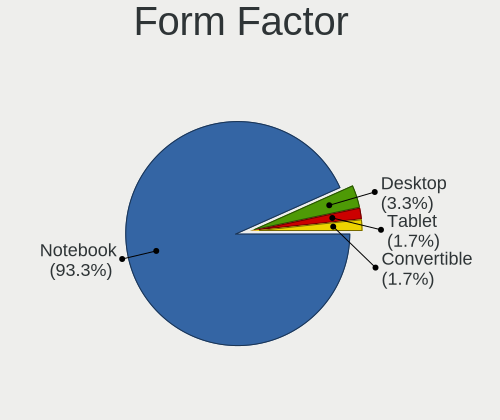
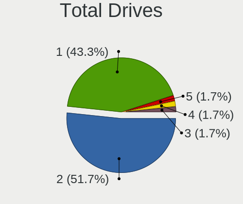
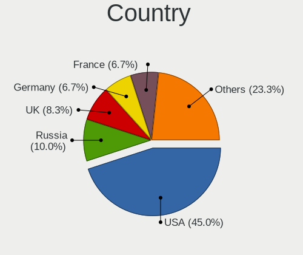
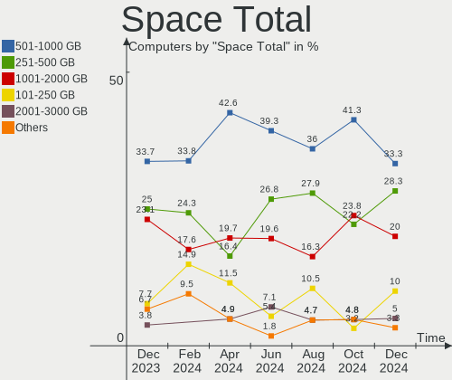
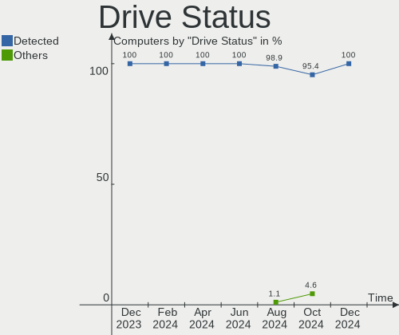

SteamOS - Hardware Trends
-------------------------

A project to identify most popular hardware characteristics and track their change
over time based on data collected by Linux users at https://Linux-Hardware.org.

Anyone can contribute to this report by the [hw-probe](https://github.com/linuxhw/hw-probe) tool:

    sudo -E hw-probe -all -upload

This is a report for all computer types. See also reports for [desktops](/Dist/SteamOS/Desktop/README.md) and [notebooks](/Dist/SteamOS/Notebook/README.md).

This report is for one last month. Overall report since the beginning of time: [TestDays](https://github.com/linuxhw/TestDays)

Period: Aug, 2023.

Contents
--------

* [ System ](#system)
  - [ OS                       ](#os)
  - [ OS Family                ](#os-family)
  - [ Kernel                   ](#kernel)
  - [ Kernel Family            ](#kernel-family)
  - [ Kernel Major Ver.        ](#kernel-major-ver)
  - [ Arch                     ](#arch)
  - [ DE                       ](#de)
  - [ Display Server           ](#display-server)
  - [ Display Manager          ](#display-manager)
  - [ OS Lang                  ](#os-lang)
  - [ Boot Mode                ](#boot-mode)
  - [ Filesystem               ](#filesystem)
  - [ Part. scheme             ](#part-scheme)
  - [ Dual Boot with Linux/BSD ](#dual-boot-with-linuxbsd)
  - [ Dual Boot (Win)          ](#dual-boot-win)

* [ Board ](#board)
  - [ Vendor                   ](#vendor)
  - [ Model                    ](#model)
  - [ Model Family             ](#model-family)
  - [ MFG Year                 ](#mfg-year)
  - [ Form Factor              ](#form-factor)
  - [ Secure Boot              ](#secure-boot)
  - [ Coreboot                 ](#coreboot)
  - [ RAM Size                 ](#ram-size)
  - [ RAM Used                 ](#ram-used)
  - [ Total Drives             ](#total-drives)
  - [ Has CD-ROM               ](#has-cd-rom)
  - [ Has Ethernet             ](#has-ethernet)
  - [ Has WiFi                 ](#has-wifi)
  - [ Has Bluetooth            ](#has-bluetooth)

* [ Location ](#location)
  - [ Country                  ](#country)
  - [ City                     ](#city)

* [ Drives ](#drives)
  - [ Drive Vendor             ](#drive-vendor)
  - [ Drive Model              ](#drive-model)
  - [ HDD Vendor               ](#hdd-vendor)
  - [ SSD Vendor               ](#ssd-vendor)
  - [ Drive Kind               ](#drive-kind)
  - [ Drive Connector          ](#drive-connector)
  - [ Drive Size               ](#drive-size)
  - [ Space Total              ](#space-total)
  - [ Space Used               ](#space-used)
  - [ Malfunc. Drives          ](#malfunc-drives)
  - [ Malfunc. Drive Vendor    ](#malfunc-drive-vendor)
  - [ Malfunc. HDD Vendor      ](#malfunc-hdd-vendor)
  - [ Malfunc. Drive Kind      ](#malfunc-drive-kind)
  - [ Failed Drives            ](#failed-drives)
  - [ Failed Drive Vendor      ](#failed-drive-vendor)
  - [ Drive Status             ](#drive-status)

* [ Storage controller ](#storage-controller)
  - [ Storage Vendor           ](#storage-vendor)
  - [ Storage Model            ](#storage-model)
  - [ Storage Kind             ](#storage-kind)

* [ Processor ](#processor)
  - [ CPU Vendor               ](#cpu-vendor)
  - [ CPU Model                ](#cpu-model)
  - [ CPU Model Family         ](#cpu-model-family)
  - [ CPU Cores                ](#cpu-cores)
  - [ CPU Sockets              ](#cpu-sockets)
  - [ CPU Threads              ](#cpu-threads)
  - [ CPU Op-Modes             ](#cpu-op-modes)
  - [ CPU Microcode            ](#cpu-microcode)
  - [ CPU Microarch            ](#cpu-microarch)

* [ Graphics ](#graphics)
  - [ GPU Vendor               ](#gpu-vendor)
  - [ GPU Model                ](#gpu-model)
  - [ GPU Combo                ](#gpu-combo)
  - [ GPU Driver               ](#gpu-driver)
  - [ GPU Memory               ](#gpu-memory)

* [ Monitor ](#monitor)
  - [ Monitor Vendor           ](#monitor-vendor)
  - [ Monitor Model            ](#monitor-model)
  - [ Monitor Resolution       ](#monitor-resolution)
  - [ Monitor Diagonal         ](#monitor-diagonal)
  - [ Monitor Width            ](#monitor-width)
  - [ Aspect Ratio             ](#aspect-ratio)
  - [ Monitor Area             ](#monitor-area)
  - [ Pixel Density            ](#pixel-density)
  - [ Multiple Monitors        ](#multiple-monitors)

* [ Network ](#network)
  - [ Net Controller Vendor    ](#net-controller-vendor)
  - [ Net Controller Model     ](#net-controller-model)
  - [ Wireless Vendor          ](#wireless-vendor)
  - [ Wireless Model           ](#wireless-model)
  - [ Ethernet Vendor          ](#ethernet-vendor)
  - [ Ethernet Model           ](#ethernet-model)
  - [ Net Controller Kind      ](#net-controller-kind)
  - [ Used Controller          ](#used-controller)
  - [ NICs                     ](#nics)
  - [ IPv6                     ](#ipv6)

* [ Bluetooth ](#bluetooth)
  - [ Bluetooth Vendor         ](#bluetooth-vendor)
  - [ Bluetooth Model          ](#bluetooth-model)

* [ Sound ](#sound)
  - [ Sound Vendor             ](#sound-vendor)
  - [ Sound Model              ](#sound-model)

* [ Memory ](#memory)
  - [ Memory Vendor            ](#memory-vendor)
  - [ Memory Model             ](#memory-model)
  - [ Memory Kind              ](#memory-kind)
  - [ Memory Form Factor       ](#memory-form-factor)
  - [ Memory Size              ](#memory-size)
  - [ Memory Speed             ](#memory-speed)

* [ Printers & scanners ](#printers--scanners)
  - [ Printer Vendor           ](#printer-vendor)
  - [ Printer Model            ](#printer-model)
  - [ Scanner Vendor           ](#scanner-vendor)
  - [ Scanner Model            ](#scanner-model)

* [ Camera ](#camera)
  - [ Camera Vendor            ](#camera-vendor)
  - [ Camera Model             ](#camera-model)

* [ Security ](#security)
  - [ Fingerprint Vendor       ](#fingerprint-vendor)
  - [ Fingerprint Model        ](#fingerprint-model)
  - [ Chipcard Vendor          ](#chipcard-vendor)
  - [ Chipcard Model           ](#chipcard-model)

* [ Unsupported ](#unsupported)
  - [ Unsupported Devices      ](#unsupported-devices)
  - [ Unsupported Device Types ](#unsupported-device-types)

System
------

OS
--

Installed operating systems

| Name          | Computers | Percent |
|---------------|-----------|---------|
| SteamOS 3.4.8 | 44        | 73.33%  |
| SteamOS 4     | 4         | 6.67%   |
| SteamOS 3.5   | 4         | 6.67%   |
| SteamOS 3.4   | 3         | 5%      |
| SteamOS 3.4.9 | 2         | 3.33%   |
| SteamOS 3.4.6 | 2         | 3.33%   |
| SteamOS 3.1   | 1         | 1.67%   |

OS Family
---------

OS without a version

| Name    | Computers | Percent |
|---------|-----------|---------|
| SteamOS | 60        | 100%    |

Kernel
------

Version of the Linux kernel

| Version                                        | Computers | Percent |
|------------------------------------------------|-----------|---------|
| 5.13.0-valve36-1-neptune                       | 46        | 76.67%  |
| 6.3.7-zen1-1-zen                               | 3         | 5%      |
| 6.1.43-valve1-1-neptune-61                     | 3         | 5%      |
| 5.13.0-valve37-1-neptune                       | 2         | 3.33%   |
| 5.13.0-valve21.3-1-neptune                     | 2         | 3.33%   |
| 6.4.12-zen1-1-zen                              | 1         | 1.67%   |
| 6.1.39-valve1-1-neptune-61                     | 1         | 1.67%   |
| 5.18.1-arch1_testHoloISO_20220606.1811         | 1         | 1.67%   |
| 5.13.0-valve10.3-1-neptune-02176-g5fe416c4acd8 | 1         | 1.67%   |

Kernel Family
-------------

Linux kernel without a distro release

| Version | Computers | Percent |
|---------|-----------|---------|
| 5.13.0  | 51        | 85%     |
| 6.3.7   | 3         | 5%      |
| 6.1.43  | 3         | 5%      |
| 6.4.12  | 1         | 1.67%   |
| 6.1.39  | 1         | 1.67%   |
| 5.18.1  | 1         | 1.67%   |

Kernel Major Ver.
-----------------

Linux kernel major version

| Version | Computers | Percent |
|---------|-----------|---------|
| 5.13    | 51        | 85%     |
| 6.1     | 4         | 6.67%   |
| 6.3     | 3         | 5%      |
| 6.4     | 1         | 1.67%   |
| 5.18    | 1         | 1.67%   |

Arch
----

OS architecture (x86_64, i586, etc.)

| Name   | Computers | Percent |
|--------|-----------|---------|
| x86_64 | 60        | 100%    |

DE
--

Desktop Environment

| Name | Computers | Percent |
|------|-----------|---------|
| KDE5 | 60        | 100%    |

Display Server
--------------

X11 or Wayland

| Name | Computers | Percent |
|------|-----------|---------|
| X11  | 60        | 100%    |

Display Manager
---------------

SDDM, LightDM, etc.

| Name    | Computers | Percent |
|---------|-----------|---------|
| Unknown | 60        | 100%    |

OS Lang
-------

Language

| Lang  | Computers | Percent |
|-------|-----------|---------|
| en_US | 54        | 90%     |
| ru_RU | 1         | 1.67%   |
| ko_KR | 1         | 1.67%   |
| es_MX | 1         | 1.67%   |
| en_DK | 1         | 1.67%   |
| de_DE | 1         | 1.67%   |
| C     | 1         | 1.67%   |

Boot Mode
---------

EFI or BIOS

| Mode | Computers | Percent |
|------|-----------|---------|
| BIOS | 60        | 100%    |

Filesystem
----------

Type of filesystem

| Type  | Computers | Percent |
|-------|-----------|---------|
| Btrfs | 59        | 98.33%  |
| Tmpfs | 1         | 1.67%   |

Part. scheme
------------

Scheme of partitioning

| Type    | Computers | Percent |
|---------|-----------|---------|
| Unknown | 60        | 100%    |

Dual Boot with Linux/BSD
------------------------

Hosting more than one Linux/BSD

| Dual boot | Computers | Percent |
|-----------|-----------|---------|
| No        | 60        | 100%    |

Dual Boot (Win)
---------------

Hosting Linux and Windows

| Dual boot | Computers | Percent |
|-----------|-----------|---------|
| No        | 60        | 100%    |

Board
-----

Vendor
------

Motherboard manufacturer

| Name                   | Computers | Percent |
|------------------------|-----------|---------|
| Valve                  | 52        | 86.67%  |
| Gigabyte Technology    | 2         | 3.33%   |
| Supermicro             | 1         | 1.67%   |
| ONE-NETBOOK TECHNOLOGY | 1         | 1.67%   |
| ONE-NETBOOK            | 1         | 1.67%   |
| ASRock                 | 1         | 1.67%   |
| Apple                  | 1         | 1.67%   |
| Anbernic               | 1         | 1.67%   |

Model
-----

Motherboard model

| Name                                | Computers | Percent |
|-------------------------------------|-----------|---------|
| Valve Jupiter                       | 52        | 86.67%  |
| Supermicro C7H170-M                 | 1         | 1.67%   |
| ONE-NETBOOK TECHNOLOGY ONE XPLAYER  | 1         | 1.67%   |
| ONE-NETBOOK ONEXPLAYER 2 PRO ARP23P | 1         | 1.67%   |
| Gigabyte B560M DS3H V2              | 1         | 1.67%   |
| Gigabyte A320M-S2H                  | 1         | 1.67%   |
| ASRock X570 Phantom Gaming-ITX/TB3  | 1         | 1.67%   |
| Apple MacBookPro9,2                 | 1         | 1.67%   |
| Anbernic Win600                     | 1         | 1.67%   |

Model Family
------------

Motherboard model prefix

| Name                       | Computers | Percent |
|----------------------------|-----------|---------|
| Valve Jupiter              | 52        | 86.67%  |
| Supermicro C7H170-M        | 1         | 1.67%   |
| ONE-NETBOOK TECHNOLOGY ONE | 1         | 1.67%   |
| ONE-NETBOOK ONEXPLAYER     | 1         | 1.67%   |
| Gigabyte B560M             | 1         | 1.67%   |
| Gigabyte A320M-S2H         | 1         | 1.67%   |
| ASRock X570                | 1         | 1.67%   |
| Apple MacBookPro9          | 1         | 1.67%   |
| Anbernic Win600            | 1         | 1.67%   |

MFG Year
--------

Motherboard manufacture year

| Year | Computers | Percent |
|------|-----------|---------|
| 2022 | 48        | 80%     |
| 2023 | 7         | 11.67%  |
| 2021 | 2         | 3.33%   |
| 2019 | 1         | 1.67%   |
| 2017 | 1         | 1.67%   |
| 2012 | 1         | 1.67%   |

Form Factor
-----------

Physical design of the computer

| Name     | Computers | Percent |
|----------|-----------|---------|
| Notebook | 56        | 93.33%  |
| Desktop  | 2         | 3.33%   |
| Tablet   | 1         | 1.67%   |
| Server   | 1         | 1.67%   |

Secure Boot
-----------

Enabled or disabled

| State    | Computers | Percent |
|----------|-----------|---------|
| Disabled | 60        | 100%    |

Coreboot
--------

Have coreboot on board

| Used | Computers | Percent |
|------|-----------|---------|
| No   | 60        | 100%    |

RAM Size
--------

Total RAM memory

| Size in GB | Computers | Percent |
|------------|-----------|---------|
| 8.01-16.0  | 55        | 91.67%  |
| 16.01-24.0 | 3         | 5%      |
| 32.01-64.0 | 1         | 1.67%   |
| 24.01-32.0 | 1         | 1.67%   |

RAM Used
--------

Used RAM memory

| Used GB   | Computers | Percent |
|-----------|-----------|---------|
| 4.01-8.0  | 26        | 43.33%  |
| 3.01-4.0  | 21        | 35%     |
| 2.01-3.0  | 11        | 18.33%  |
| 8.01-16.0 | 2         | 3.33%   |

Total Drives
------------

Number of drives on board

| Drives | Computers | Percent |
|--------|-----------|---------|
| 2      | 34        | 56.67%  |
| 1      | 22        | 36.67%  |
| 3      | 3         | 5%      |
| 4      | 1         | 1.67%   |

Has CD-ROM
----------

Has CD-ROM on board

| Presented | Computers | Percent |
|-----------|-----------|---------|
| No        | 59        | 98.33%  |
| Yes       | 1         | 1.67%   |

Has Ethernet
------------

Has Ethernet on board

| Presented | Computers | Percent |
|-----------|-----------|---------|
| No        | 38        | 63.33%  |
| Yes       | 22        | 36.67%  |

Has WiFi
--------

Has WiFi module

| Presented | Computers | Percent |
|-----------|-----------|---------|
| Yes       | 59        | 98.33%  |
| No        | 1         | 1.67%   |

Has Bluetooth
-------------

Has Bluetooth module

| Presented | Computers | Percent |
|-----------|-----------|---------|
| Yes       | 59        | 98.33%  |
| No        | 1         | 1.67%   |

Location
--------

Country
-------

Geographic location (country)

| Country     | Computers | Percent |
|-------------|-----------|---------|
| USA         | 30        | 50%     |
| Germany     | 5         | 8.33%   |
| UK          | 4         | 6.67%   |
| Spain       | 3         | 5%      |
| Russia      | 2         | 3.33%   |
| Poland      | 2         | 3.33%   |
| Philippines | 2         | 3.33%   |
| Netherlands | 2         | 3.33%   |
| Vietnam     | 1         | 1.67%   |
| South Korea | 1         | 1.67%   |
| Mexico      | 1         | 1.67%   |
| Iceland     | 1         | 1.67%   |
| Hungary     | 1         | 1.67%   |
| Finland     | 1         | 1.67%   |
| Denmark     | 1         | 1.67%   |
| Czechia     | 1         | 1.67%   |
| Canada      | 1         | 1.67%   |
| Belgium     | 1         | 1.67%   |

City
----

Geographic location (city)

| City              | Computers | Percent |
|-------------------|-----------|---------|
| Moscow            | 2         | 3.33%   |
| Madrid            | 2         | 3.33%   |
| Zevenhoven        | 1         | 1.67%   |
| Washington        | 1         | 1.67%   |
| Warsaw            | 1         | 1.67%   |
| Warendorf         | 1         | 1.67%   |
| Thai Nguyen       | 1         | 1.67%   |
| Szigetszentmiklos | 1         | 1.67%   |
| St. Ingbert       | 1         | 1.67%   |
| St Louis          | 1         | 1.67%   |
| Spotsylvania      | 1         | 1.67%   |
| South Holland     | 1         | 1.67%   |
| Shawnee           | 1         | 1.67%   |
| Sewell            | 1         | 1.67%   |
| Seattle           | 1         | 1.67%   |
| Santee            | 1         | 1.67%   |
| San Antonio       | 1         | 1.67%   |
| Raleigh           | 1         | 1.67%   |
| Purcell           | 1         | 1.67%   |
| Prague            | 1         | 1.67%   |
| Phoenix           | 1         | 1.67%   |
| Paranaque City    | 1         | 1.67%   |
| Orono             | 1         | 1.67%   |
| Orlando           | 1         | 1.67%   |
| Offenbach         | 1         | 1.67%   |
| North Charleston  | 1         | 1.67%   |
| New Port Richey   | 1         | 1.67%   |
| Monterrey         | 1         | 1.67%   |
| McDonough         | 1         | 1.67%   |
| Manila            | 1         | 1.67%   |
| Lodz              | 1         | 1.67%   |
| Las Vegas         | 1         | 1.67%   |
| la Vall d'Uixo    | 1         | 1.67%   |
| Kyle              | 1         | 1.67%   |
| Kelowna           | 1         | 1.67%   |
| Jeonju            | 1         | 1.67%   |
| Immingham         | 1         | 1.67%   |
| Helsinki          | 1         | 1.67%   |
| Hamburg           | 1         | 1.67%   |
| Hafnarfjordur     | 1         | 1.67%   |

Drives
------

Drive Vendor
------------

Hard drive vendors

| Vendor                      | Computers | Drives | Percent |
|-----------------------------|-----------|--------|---------|
| Unknown                     | 26        | 26     | 25.74%  |
| Samsung Electronics         | 13        | 15     | 12.87%  |
| Phison Electronics          | 12        | 12     | 11.88%  |
| Kingston Technology Company | 12        | 12     | 11.88%  |
| O2 Micro                    | 9         | 9      | 8.91%   |
| Unknown                     | 7         | 7      | 6.93%   |
| Sandisk                     | 6         | 6      | 5.94%   |
| SK hynix                    | 2         | 2      | 1.98%   |
| JMicron Technology          | 2         | 2      | 1.98%   |
| Verbatim                    | 1         | 1      | 0.99%   |
| Silicon Motion              | 1         | 1      | 0.99%   |
| Seagate                     | 1         | 1      | 0.99%   |
| PNY                         | 1         | 1      | 0.99%   |
| Patriot                     | 1         | 1      | 0.99%   |
| Micron Technology           | 1         | 1      | 0.99%   |
| MAXIO Technology (Hangzhou) | 1         | 1      | 0.99%   |
| Intel                       | 1         | 1      | 0.99%   |
| GLOWAY                      | 1         | 1      | 0.99%   |
| CT1000P3                    | 1         | 1      | 0.99%   |
| Crucial                     | 1         | 1      | 0.99%   |
| Apple                       | 1         | 1      | 0.99%   |

Drive Model
-----------

Hard drive models

| Model                                                 | Computers | Percent |
|-------------------------------------------------------|-----------|---------|
| Kingston Company OM3PDP3 NVMe SSD 256GB               | 12        | 11.65%  |
| Unknown MMC Card  512GB                               | 11        | 10.68%  |
| O2 Micro E2M2 64GB                                    | 9         | 8.74%   |
| Unknown MMC Card  256GB                               | 8         | 7.77%   |
| Phison PS5013 E13 NVMe Controller 512GB               | 8         | 7.77%   |
| Unknown                                               | 7         | 6.8%    |
| Unknown MMC Card  128GB                               | 5         | 4.85%   |
| Samsung MZ9LQ512HBLU-00BVL 512GB                      | 5         | 4.85%   |
| Sandisk WD PC SN740 SDDPTQD-1T00 1024GB               | 4         | 3.88%   |
| Samsung MZ9LQ256HBJD-00BVL 256GB                      | 4         | 3.88%   |
| SK hynix BC511 512GB                                  | 2         | 1.94%   |
| Phison Sabrent SB-2130-1TB                            | 2         | 1.94%   |
| Verbatim MySSD Drive 512GB                            | 1         | 0.97%   |
| Unknown MMC Card  64GB                                | 1         | 0.97%   |
| Unknown MMC Card  32GB                                | 1         | 0.97%   |
| Silicon Motion SM2263EN/SM2263XT SSD Controller 256GB | 1         | 0.97%   |
| Seagate ST500DM002-1BD142 500GB                       | 1         | 0.97%   |
| Sandisk WDC PC SN530 SDBPTPZ-1T00 1024GB              | 1         | 0.97%   |
| Sandisk WD PC SN740 SDDPTQE-2T00 2TB                  | 1         | 0.97%   |
| Samsung SSD 870 EVO 1TB                               | 1         | 0.97%   |
| Samsung SSD 860 QVO 1TB                               | 1         | 0.97%   |
| Samsung PM991a NVMe 512GB                             | 1         | 0.97%   |
| Samsung PM991 NVMe 512GB                              | 1         | 0.97%   |
| Samsung NVMe SSD Controller SM981/PM981/PM983 500GB   | 1         | 0.97%   |
| Samsung NVMe SSD Controller SM961/PM961/SM963 1024GB  | 1         | 0.97%   |
| PNY CS900 250GB SSD                                   | 1         | 0.97%   |
| Phison Sabrent SB-2130-512 512GB                      | 1         | 0.97%   |
| Phison Force MP300 480GB                              | 1         | 0.97%   |
| Patriot Blaze 480GB SSD                               | 1         | 0.97%   |
| Micron 2400_MTFDKBK2T0QFM 2TB                         | 1         | 0.97%   |
| MAXIO (Hangzhou) ONEXPLAYER Q3 2TB                    | 1         | 0.97%   |
| JMicron Tech 250GB                                    | 1         | 0.97%   |
| JMicron Generic 1TB                                   | 1         | 0.97%   |
| Intel HBRPEKNX0202AH 512GB                            | 1         | 0.97%   |
| GLOWAY YCT256GS3-M.2 42 256GB                         | 1         | 0.97%   |
| CT1000P3 SSD8 1TB                                     | 1         | 0.97%   |
| Crucial CT525MX300SSD1 528GB                          | 1         | 0.97%   |
| Apple HDD HTS541010A9E662 1TB                         | 1         | 0.97%   |

HDD Vendor
----------

Hard disk drive vendors

| Vendor  | Computers | Drives | Percent |
|---------|-----------|--------|---------|
| Seagate | 1         | 1      | 50%     |
| Apple   | 1         | 1      | 50%     |

SSD Vendor
----------

Solid state drive vendors

| Vendor              | Computers | Drives | Percent |
|---------------------|-----------|--------|---------|
| Samsung Electronics | 2         | 2      | 25%     |
| Verbatim            | 1         | 1      | 12.5%   |
| PNY                 | 1         | 1      | 12.5%   |
| Patriot             | 1         | 1      | 12.5%   |
| JMicron Technology  | 1         | 1      | 12.5%   |
| CT1000P3            | 1         | 1      | 12.5%   |
| Crucial             | 1         | 1      | 12.5%   |

Drive Kind
----------

HDD or SSD

| Kind    | Computers | Drives | Percent |
|---------|-----------|--------|---------|
| NVMe    | 58        | 58     | 56.86%  |
| MMC     | 33        | 33     | 32.35%  |
| SSD     | 7         | 8      | 6.86%   |
| HDD     | 2         | 2      | 1.96%   |
| Unknown | 2         | 2      | 1.96%   |

Drive Connector
---------------

SATA, SAS, NVMe, etc.

| Type | Computers | Drives | Percent |
|------|-----------|--------|---------|
| NVMe | 58        | 58     | 58%     |
| MMC  | 33        | 33     | 33%     |
| SATA | 6         | 8      | 6%      |
| SAS  | 3         | 4      | 3%      |

Drive Size
----------

Size of hard drive

| Size in TB | Computers | Drives | Percent |
|------------|-----------|--------|---------|
| 0.51-1.0   | 5         | 7      | 71.43%  |
| 0.01-0.5   | 2         | 3      | 28.57%  |

Space Total
-----------

Amount of disk space available on the file system

| Size in GB | Computers | Percent |
|------------|-----------|---------|
| 251-500    | 23        | 38.33%  |
| 501-1000   | 13        | 21.67%  |
| 101-250    | 11        | 18.33%  |
| 51-100     | 7         | 11.67%  |
| 1001-2000  | 4         | 6.67%   |
| 2001-3000  | 2         | 3.33%   |

Space Used
----------

Amount of used disk space

| Used GB   | Computers | Percent |
|-----------|-----------|---------|
| 101-250   | 19        | 31.67%  |
| 251-500   | 14        | 23.33%  |
| 501-1000  | 10        | 16.67%  |
| 21-50     | 9         | 15%     |
| 1-20      | 5         | 8.33%   |
| 51-100    | 2         | 3.33%   |
| 1001-2000 | 1         | 1.67%   |

Malfunc. Drives
---------------

Drive models with a malfunction

Zero info for selected period =(

Malfunc. Drive Vendor
---------------------

Vendors of faulty drives

Zero info for selected period =(

Malfunc. HDD Vendor
-------------------

Vendors of faulty HDD drives

Zero info for selected period =(

Malfunc. Drive Kind
-------------------

Kinds of faulty drives

Zero info for selected period =(

Failed Drives
-------------

Failed drive models

Zero info for selected period =(

Failed Drive Vendor
-------------------

Failed drive vendors

Zero info for selected period =(

Drive Status
------------

Number of failed and malfunc. drives

| Status   | Computers | Drives | Percent |
|----------|-----------|--------|---------|
| Detected | 60        | 103    | 100%    |

Storage controller
------------------

Storage Vendor
--------------

Storage controller vendors

| Vendor                      | Computers | Percent |
|-----------------------------|-----------|---------|
| Samsung Electronics         | 13        | 20.63%  |
| Phison Electronics          | 12        | 19.05%  |
| Kingston Technology Company | 12        | 19.05%  |
| O2 Micro                    | 9         | 14.29%  |
| Sandisk                     | 6         | 9.52%   |
| Intel                       | 3         | 4.76%   |
| AMD                         | 3         | 4.76%   |
| SK hynix                    | 2         | 3.17%   |
| Silicon Motion              | 1         | 1.59%   |
| Micron Technology           | 1         | 1.59%   |
| MAXIO Technology (Hangzhou) | 1         | 1.59%   |

Storage Model
-------------

Storage controller models

| Model                                                                         | Computers | Percent |
|-------------------------------------------------------------------------------|-----------|---------|
| Kingston Company OM3PDP3 NVMe SSD                                             | 12        | 18.46%  |
| Samsung NVMe SSD Controller 980                                               | 11        | 16.92%  |
| O2 Micro FORESEE E2M2 NVMe SSD                                                | 9         | 13.85%  |
| Phison PS5013 E13 NVMe Controller                                             | 8         | 12.31%  |
| Sandisk PC SN740 NVMe SSD (DRAM-less)                                         | 5         | 7.69%   |
| Phison PS5021-E21 PCIe4 NVMe Controller (DRAM-less)                           | 3         | 4.62%   |
| AMD FCH SATA Controller [AHCI mode]                                           | 3         | 4.62%   |
| SK hynix BC511 NVMe SSD                                                       | 2         | 3.08%   |
| Silicon Motion SM2263EN/SM2263XT (DRAM-less) NVMe SSD Controllers             | 1         | 1.54%   |
| SanDisk IX SN530 NVMe SSD (DRAM-less)                                         | 1         | 1.54%   |
| Samsung NVMe SSD Controller SM981/PM981/PM983                                 | 1         | 1.54%   |
| Samsung NVMe SSD Controller SM961/PM961/SM963                                 | 1         | 1.54%   |
| Phison E8 PCIe3 NVMe Controller                                               | 1         | 1.54%   |
| Micron 2400 NVMe SSD (DRAM-less)                                              | 1         | 1.54%   |
| MAXIO (Hangzhou) NVMe SSD Controller MAP1602                                  | 1         | 1.54%   |
| Intel Q170/Q150/B150/H170/H110/Z170/CM236 Chipset SATA Controller [AHCI Mode] | 1         | 1.54%   |
| Intel Optane NVME SSD H10 with Solid State Storage [Teton Glacier]            | 1         | 1.54%   |
| Intel 7 Series Chipset Family 6-port SATA Controller [AHCI mode]              | 1         | 1.54%   |
| Intel 500 Series Chipset Family SATA AHCI Controller                          | 1         | 1.54%   |
| AMD FCH SATA Controller D                                                     | 1         | 1.54%   |

Storage Kind
------------

Kind of storage controller (IDE, SATA, NVMe, SAS, ...)

| Kind | Computers | Percent |
|------|-----------|---------|
| NVMe | 58        | 90.63%  |
| SATA | 6         | 9.38%   |

Processor
---------

CPU Vendor
----------

Processor vendors

| Vendor | Computers | Percent |
|--------|-----------|---------|
| AMD    | 57        | 95%     |
| Intel  | 3         | 5%      |

CPU Model
---------

Processor models

| Model                                       | Computers | Percent |
|---------------------------------------------|-----------|---------|
| AMD Custom APU 0405                         | 52        | 86.67%  |
| Intel Core i5-6500 CPU @ 3.20GHz            | 1         | 1.67%   |
| Intel Core i5-3210M CPU @ 2.50GHz           | 1         | 1.67%   |
| Intel Core i5-10600KF CPU @ 4.10GHz         | 1         | 1.67%   |
| AMD Ryzen 7 7840U w/ Radeon 780M Graphics   | 1         | 1.67%   |
| AMD Ryzen 7 5700U with Radeon Graphics      | 1         | 1.67%   |
| AMD Ryzen 5 5600G with Radeon Graphics      | 1         | 1.67%   |
| AMD Ryzen 3 3200G with Radeon Vega Graphics | 1         | 1.67%   |
| AMD 3020e with Radeon Graphics              | 1         | 1.67%   |

CPU Model Family
----------------

Processor model prefix

| Model         | Computers | Percent |
|---------------|-----------|---------|
| Other         | 53        | 88.33%  |
| Intel Core i5 | 3         | 5%      |
| AMD Ryzen 7   | 2         | 3.33%   |
| AMD Ryzen 5   | 1         | 1.67%   |
| AMD Ryzen 3   | 1         | 1.67%   |

CPU Cores
---------

Number of processor cores

| Number | Computers | Percent |
|--------|-----------|---------|
| 4      | 54        | 90%     |
| 8      | 2         | 3.33%   |
| 6      | 2         | 3.33%   |
| 2      | 2         | 3.33%   |

CPU Sockets
-----------

Number of sockets

| Number | Computers | Percent |
|--------|-----------|---------|
| 1      | 60        | 100%    |

CPU Threads
-----------

Threads per core (Hyper-Threading)

| Number | Computers | Percent |
|--------|-----------|---------|
| 2      | 57        | 95%     |
| 1      | 3         | 5%      |

CPU Op-Modes
------------

CPU Operation Modes (32-bit, 64-bit)

| Op mode        | Computers | Percent |
|----------------|-----------|---------|
| 32-bit, 64-bit | 60        | 100%    |

CPU Microcode
-------------

Microcode number

| Number  | Computers | Percent |
|---------|-----------|---------|
| Unknown | 60        | 100%    |

CPU Microarch
-------------

Microarchitecture

| Name      | Computers | Percent |
|-----------|-----------|---------|
| Unknown   | 54        | 90%     |
| Zen+      | 1         | 1.67%   |
| Zen 3     | 1         | 1.67%   |
| Zen       | 1         | 1.67%   |
| Skylake   | 1         | 1.67%   |
| IvyBridge | 1         | 1.67%   |
| CometLake | 1         | 1.67%   |

Graphics
--------

GPU Vendor
----------

Vendors of graphics cards

| Vendor | Computers | Percent |
|--------|-----------|---------|
| AMD    | 59        | 98.33%  |
| Intel  | 1         | 1.67%   |

GPU Model
---------

Graphics card models

| Model                                                                | Computers | Percent |
|----------------------------------------------------------------------|-----------|---------|
| AMD VanGogh [AMD Custom GPU 0405]                                    | 52        | 86.67%  |
| AMD Navi 22 [Radeon RX 6700/6700 XT/6750 XT / 6800M/6850M XT]        | 2         | 3.33%   |
| Intel 3rd Gen Core processor Graphics Controller                     | 1         | 1.67%   |
| AMD Picasso/Raven 2 [Radeon Vega Series / Radeon Vega Mobile Series] | 1         | 1.67%   |
| AMD Phoenix1                                                         | 1         | 1.67%   |
| AMD Navi 10 [Radeon RX 5600 OEM/5600 XT / 5700/5700 XT]              | 1         | 1.67%   |
| AMD Lucienne                                                         | 1         | 1.67%   |
| AMD Ellesmere [Radeon RX 470/480/570/570X/580/580X/590]              | 1         | 1.67%   |

GPU Combo
---------

Combinations of graphics cards

| Name      | Computers | Percent |
|-----------|-----------|---------|
| 1 x AMD   | 59        | 98.33%  |
| 1 x Intel | 1         | 1.67%   |

GPU Driver
----------

Free vs proprietary

| Driver | Computers | Percent |
|--------|-----------|---------|
| Free   | 60        | 100%    |

GPU Memory
----------

Total video memory

| Size in GB | Computers | Percent |
|------------|-----------|---------|
| Unknown    | 60        | 100%    |

Monitor
-------

Monitor Vendor
--------------

Monitor vendors

| Vendor              | Computers | Percent |
|---------------------|-----------|---------|
| Valve               | 52        | 68.42%  |
| Goldstar            | 5         | 6.58%   |
| Samsung Electronics | 3         | 3.95%   |
| Hewlett-Packard     | 2         | 2.63%   |
| BenQ                | 2         | 2.63%   |
| Acer                | 2         | 2.63%   |
| Vizio               | 1         | 1.32%   |
| Unknown (XXX)       | 1         | 1.32%   |
| STD                 | 1         | 1.32%   |
| Sony                | 1         | 1.32%   |
| RTK                 | 1         | 1.32%   |
| MSF                 | 1         | 1.32%   |
| Gigabyte Technology | 1         | 1.32%   |
| BOE                 | 1         | 1.32%   |
| Apple               | 1         | 1.32%   |
| AOC                 | 1         | 1.32%   |

Monitor Model
-------------

Monitor models

| Model                                                                 | Computers | Percent |
|-----------------------------------------------------------------------|-----------|---------|
| Valve ANX7530 U VLV3001 800x1280 100x150mm 7.1-inch                   | 52        | 67.53%  |
| Vizio D32h-J09 VIZ1046 1366x768 521x293mm 23.5-inch                   | 1         | 1.3%    |
| Unknown (XXX) Beyond TV XXX2851 1920x1080 1209x680mm 54.6-inch        | 1         | 1.3%    |
| STD LCD Monitor STD0001 1920x1080                                     | 1         | 1.3%    |
| Sony TV *30 SNYA405 3840x2160 1218x685mm 55.0-inch                    | 1         | 1.3%    |
| Samsung Electronics LCD Monitor SAM7109 1920x800 1210x680mm 54.6-inch | 1         | 1.3%    |
| Samsung Electronics LCD Monitor SAM0DF6 3840x2160 890x500mm 40.2-inch | 1         | 1.3%    |
| Samsung Electronics C27F390 SAM0D32 1920x1080 598x336mm 27.0-inch     | 1         | 1.3%    |
| RTK FHD HDR RTK2A3B 1920x1080 344x195mm 15.6-inch                     | 1         | 1.3%    |
| MSF TV080WUM-NL0 MSF1003 1600x2560 113x181mm 8.4-inch                 | 1         | 1.3%    |
| Hewlett-Packard Z27n G2 HPN3489 2560x1440 597x336mm 27.0-inch         | 1         | 1.3%    |
| Hewlett-Packard HC240 HPN3403 1920x1200 518x324mm 24.1-inch           | 1         | 1.3%    |
| Goldstar ULTRAGEAR GSM7765 2560x1440 697x392mm 31.5-inch              | 1         | 1.3%    |
| Goldstar ULTRAGEAR GSM5C1E 1920x1080 700x390mm 31.5-inch              | 1         | 1.3%    |
| Goldstar ULTRAGEAR GSM5BB2 1920x1080 527x296mm 23.8-inch              | 1         | 1.3%    |
| Goldstar TV SSCR2 GSMC0C0 3840x2160                                   | 1         | 1.3%    |
| Goldstar FULL HD GSM5B55 1920x1080 480x270mm 21.7-inch                | 1         | 1.3%    |
| Goldstar 27GN7 GSM5B8E 1920x1080 600x303mm 26.5-inch                  | 1         | 1.3%    |
| Gigabyte Technology G27Q GBT2709 2560x1440 598x336mm 27.0-inch        | 1         | 1.3%    |
| BOE FLQ8423-24L0 BOE1003 1600x2560 113x181mm 8.4-inch                 | 1         | 1.3%    |
| BenQ XL2411Z BNQ7F32 1920x1080 531x298mm 24.0-inch                    | 1         | 1.3%    |
| BenQ EL2870U BNQ7949 3840x2160 621x341mm 27.9-inch                    | 1         | 1.3%    |
| Apple LCD Monitor APP9CC3 1280x800 286x179mm 13.3-inch                | 1         | 1.3%    |
| AOC 2270W AOC2270 1920x1080 477x268mm 21.5-inch                       | 1         | 1.3%    |
| Acer VG270 ACR0674 1920x1080 598x336mm 27.0-inch                      | 1         | 1.3%    |
| Acer G257HU ACR0416 2560x1440 552x311mm 24.9-inch                     | 1         | 1.3%    |

Monitor Resolution
------------------

Monitor screen resolution

| Resolution      | Computers | Percent |
|-----------------|-----------|---------|
| 800x1280        | 52        | 67.53%  |
| 3840x2160 (4K)  | 8         | 10.39%  |
| 1920x1080 (FHD) | 8         | 10.39%  |
| 2560x1440 (QHD) | 4         | 5.19%   |
| 1600x2560       | 2         | 2.6%    |
| 1920x800        | 1         | 1.3%    |
| 1366x768 (WXGA) | 1         | 1.3%    |
| 1280x800 (WXGA) | 1         | 1.3%    |

Monitor Diagonal
----------------

Diagonal size in inches

| Inches | Computers | Percent |
|--------|-----------|---------|
| 7      | 52        | 67.53%  |
| 27     | 4         | 5.19%   |
| 24     | 3         | 3.9%    |
| 23     | 3         | 3.9%    |
| 54     | 2         | 2.6%    |
| 31     | 2         | 2.6%    |
| 21     | 2         | 2.6%    |
| 8      | 2         | 2.6%    |
| 84     | 1         | 1.3%    |
| 72     | 1         | 1.3%    |
| 57     | 1         | 1.3%    |
| 55     | 1         | 1.3%    |
| 40     | 1         | 1.3%    |
| 36     | 1         | 1.3%    |
| 13     | 1         | 1.3%    |

Monitor Width
-------------

Physical width

| Width in mm | Computers | Percent |
|-------------|-----------|---------|
| 1-100       | 52        | 68.42%  |
| 501-600     | 9         | 11.84%  |
| 1001-1500   | 3         | 3.95%   |
| 701-800     | 2         | 2.63%   |
| 601-700     | 2         | 2.63%   |
| 401-500     | 2         | 2.63%   |
| 1501-2000   | 2         | 2.63%   |
| 101-200     | 2         | 2.63%   |
| 801-900     | 1         | 1.32%   |
| 201-300     | 1         | 1.32%   |

Aspect Ratio
------------

Proportional relationship between the width and the height

| Ratio | Computers | Percent |
|-------|-----------|---------|
| 0.67  | 52        | 69.33%  |
| 16/9  | 18        | 24%     |
| 16/10 | 2         | 2.67%   |
| 0.62  | 1         | 1.33%   |
| 0.58  | 1         | 1.33%   |
| 0.56  | 1         | 1.33%   |

Monitor Area
------------

Area in inch²

| Area in inch² | Computers | Percent |
|----------------|-----------|---------|
| 1-40           | 54        | 70.13%  |
| More than 1000 | 6         | 7.79%   |
| 201-250        | 5         | 6.49%   |
| 301-350        | 4         | 5.19%   |
| 351-500        | 2         | 2.6%    |
| 251-300        | 2         | 2.6%    |
| 501-1000       | 2         | 2.6%    |
| 81-90          | 1         | 1.3%    |
| 151-200        | 1         | 1.3%    |

Pixel Density
-------------

Pixels per inch

| Density       | Computers | Percent |
|---------------|-----------|---------|
| 161-240       | 53        | 69.74%  |
| 51-100        | 13        | 17.11%  |
| 101-120       | 6         | 7.89%   |
| 1-50          | 2         | 2.63%   |
| More than 240 | 1         | 1.32%   |
| 121-160       | 1         | 1.32%   |

Multiple Monitors
-----------------

Total monitors connected

| Total | Computers | Percent |
|-------|-----------|---------|
| 1     | 40        | 66.67%  |
| 2     | 20        | 33.33%  |

Network
-------

Net Controller Vendor
---------------------

Controller vendors

| Vendor                | Computers | Percent |
|-----------------------|-----------|---------|
| Realtek Semiconductor | 54        | 78.26%  |
| ASIX Electronics      | 7         | 10.14%  |
| Intel                 | 5         | 7.25%   |
| Microsoft             | 1         | 1.45%   |
| MediaTek              | 1         | 1.45%   |
| Broadcom              | 1         | 1.45%   |

Net Controller Model
--------------------

Controller models

| Model                                                             | Computers | Percent |
|-------------------------------------------------------------------|-----------|---------|
| Realtek RTL8822CE 802.11ac PCIe Wireless Network Adapter          | 52        | 62.65%  |
| Realtek RTL8153 Gigabit Ethernet Adapter                          | 10        | 12.05%  |
| ASIX AX88179 Gigabit Ethernet                                     | 7         | 8.43%   |
| Realtek RTL8111/8168/8411 PCI Express Gigabit Ethernet Controller | 2         | 2.41%   |
| Intel Wi-Fi 6 AX200                                               | 2         | 2.41%   |
| Realtek RTL88x2bu [AC1200 Techkey]                                | 1         | 1.2%    |
| Microsoft Wireless XBox Controller Dongle                         | 1         | 1.2%    |
| MediaTek MT7921K (RZ608) Wi-Fi 6E 80MHz                           | 1         | 1.2%    |
| Intel Wireless 7265                                               | 1         | 1.2%    |
| Intel Wireless 3165                                               | 1         | 1.2%    |
| Intel Wi-Fi 6 AX210/AX211/AX411 160MHz                            | 1         | 1.2%    |
| Intel I211 Gigabit Network Connection                             | 1         | 1.2%    |
| Intel Ethernet Connection (2) I219-V                              | 1         | 1.2%    |
| Broadcom NetXtreme BCM57765 Gigabit Ethernet PCIe                 | 1         | 1.2%    |
| Broadcom BCM4331 802.11a/b/g/n                                    | 1         | 1.2%    |

Wireless Vendor
---------------

Wireless vendors

| Vendor                | Computers | Percent |
|-----------------------|-----------|---------|
| Realtek Semiconductor | 52        | 86.67%  |
| Intel                 | 5         | 8.33%   |
| Microsoft             | 1         | 1.67%   |
| MediaTek              | 1         | 1.67%   |
| Broadcom              | 1         | 1.67%   |

Wireless Model
--------------

Wireless models

| Model                                                    | Computers | Percent |
|----------------------------------------------------------|-----------|---------|
| Realtek RTL8822CE 802.11ac PCIe Wireless Network Adapter | 52        | 85.25%  |
| Intel Wi-Fi 6 AX200                                      | 2         | 3.28%   |
| Realtek RTL88x2bu [AC1200 Techkey]                       | 1         | 1.64%   |
| Microsoft Wireless XBox Controller Dongle                | 1         | 1.64%   |
| MediaTek MT7921K (RZ608) Wi-Fi 6E 80MHz                  | 1         | 1.64%   |
| Intel Wireless 7265                                      | 1         | 1.64%   |
| Intel Wireless 3165                                      | 1         | 1.64%   |
| Intel Wi-Fi 6 AX210/AX211/AX411 160MHz                   | 1         | 1.64%   |
| Broadcom BCM4331 802.11a/b/g/n                           | 1         | 1.64%   |

Ethernet Vendor
---------------

Ethernet vendors

| Vendor                | Computers | Percent |
|-----------------------|-----------|---------|
| Realtek Semiconductor | 12        | 54.55%  |
| ASIX Electronics      | 7         | 31.82%  |
| Intel                 | 2         | 9.09%   |
| Broadcom              | 1         | 4.55%   |

Ethernet Model
--------------

Ethernet models

| Model                                                             | Computers | Percent |
|-------------------------------------------------------------------|-----------|---------|
| Realtek RTL8153 Gigabit Ethernet Adapter                          | 10        | 45.45%  |
| ASIX AX88179 Gigabit Ethernet                                     | 7         | 31.82%  |
| Realtek RTL8111/8168/8411 PCI Express Gigabit Ethernet Controller | 2         | 9.09%   |
| Intel I211 Gigabit Network Connection                             | 1         | 4.55%   |
| Intel Ethernet Connection (2) I219-V                              | 1         | 4.55%   |
| Broadcom NetXtreme BCM57765 Gigabit Ethernet PCIe                 | 1         | 4.55%   |

Net Controller Kind
-------------------

Ethernet, WiFi or modem

| Kind     | Computers | Percent |
|----------|-----------|---------|
| WiFi     | 59        | 72.84%  |
| Ethernet | 22        | 27.16%  |

Used Controller
---------------

Currently used network controller

| Kind     | Computers | Percent |
|----------|-----------|---------|
| WiFi     | 56        | 90.32%  |
| Ethernet | 6         | 9.68%   |

NICs
----

Total network controllers on board

| Total | Computers | Percent |
|-------|-----------|---------|
| 1     | 56        | 93.33%  |
| 2     | 4         | 6.67%   |

IPv6
----

IPv6 vs IPv4

| Used | Computers | Percent |
|------|-----------|---------|
| No   | 38        | 63.33%  |
| Yes  | 22        | 36.67%  |

Bluetooth
---------

Bluetooth Vendor
----------------

Controller vendors

| Vendor       | Computers | Percent |
|--------------|-----------|---------|
| IMC Networks | 52        | 88.14%  |
| Intel        | 5         | 8.47%   |
| MediaTek     | 1         | 1.69%   |
| Apple        | 1         | 1.69%   |

Bluetooth Model
---------------

Controller models

| Model                               | Computers | Percent |
|-------------------------------------|-----------|---------|
| IMC Networks Bluetooth Radio        | 52        | 88.14%  |
| Intel Bluetooth wireless interface  | 2         | 3.39%   |
| Intel AX200 Bluetooth               | 2         | 3.39%   |
| MediaTek Wireless_Device            | 1         | 1.69%   |
| Intel AX210 Bluetooth               | 1         | 1.69%   |
| Apple Bluetooth USB Host Controller | 1         | 1.69%   |

Sound
-----

Sound Vendor
------------

Sound card vendors

| Vendor                      | Computers | Percent |
|-----------------------------|-----------|---------|
| AMD                         | 59        | 76.62%  |
| Realtek Semiconductor       | 4         | 5.19%   |
| Intel                       | 3         | 3.9%    |
| SteelSeries ApS             | 2         | 2.6%    |
| Logitech                    | 2         | 2.6%    |
| Hewlett-Packard             | 2         | 2.6%    |
| Sony                        | 1         | 1.3%    |
| Plantronics                 | 1         | 1.3%    |
| Nreal                       | 1         | 1.3%    |
| Kingston Technology         | 1         | 1.3%    |
| FiiO Electronics Technology | 1         | 1.3%    |

Sound Model
-----------

Sound card models

| Model                                                               | Computers | Percent |
|---------------------------------------------------------------------|-----------|---------|
| AMD Rembrandt Radeon High Definition Audio Controller               | 53        | 63.86%  |
| AMD Family 17h/19h HD Audio Controller                              | 5         | 6.02%   |
| Realtek Semiconductor USB Audio                                     | 4         | 4.82%   |
| AMD Renoir Radeon High Definition Audio Controller                  | 2         | 2.41%   |
| AMD Navi 21/23 HDMI/DP Audio Controller                             | 2         | 2.41%   |
| SteelSeries ApS SteelSeries Arctis 7                                | 1         | 1.2%    |
| SteelSeries ApS Arctis Pro Wireless                                 | 1         | 1.2%    |
| Sony DualSense Wireless Controller                                  | 1         | 1.2%    |
| Plantronics Poly Blackwire 3320 Series                              | 1         | 1.2%    |
| Nreal Air                                                           | 1         | 1.2%    |
| Logitech Yeti Nano                                                  | 1         | 1.2%    |
| Logitech Blue Microphones                                           | 1         | 1.2%    |
| Kingston Technology HyperX Cloud Stinger Core Wireless DTS          | 1         | 1.2%    |
| Intel Smart Sound Technology (SST) Audio Controller                 | 1         | 1.2%    |
| Intel 7 Series/C216 Chipset Family High Definition Audio Controller | 1         | 1.2%    |
| Intel 100 Series/C230 Series Chipset Family HD Audio Controller     | 1         | 1.2%    |
| Hewlett-Packard USB Audio                                           | 1         | 1.2%    |
| Hewlett-Packard HyperX SoloCast                                     | 1         | 1.2%    |
| FiiO Electronics Technology K3                                      | 1         | 1.2%    |
| AMD Raven/Raven2/Fenghuang HDMI/DP Audio Controller                 | 1         | 1.2%    |
| AMD Navi 10 HDMI Audio                                              | 1         | 1.2%    |
| AMD Ellesmere HDMI Audio [Radeon RX 470/480 / 570/580/590]          | 1         | 1.2%    |

Memory
------

Memory Vendor
-------------

Memory module vendors

Zero info for selected period =(

Memory Model
------------

Memory module models

Zero info for selected period =(

Memory Kind
-----------

Memory module kinds

Zero info for selected period =(

Memory Form Factor
------------------

Physical design of the memory module

Zero info for selected period =(

Memory Size
-----------

Memory module size

Zero info for selected period =(

Memory Speed
------------

Memory module speed

Zero info for selected period =(

Printers & scanners
-------------------

Printer Vendor
--------------

Printer device vendors

Zero info for selected period =(

Printer Model
-------------

Printer device models

Zero info for selected period =(

Scanner Vendor
--------------

Scanner device vendors

Zero info for selected period =(

Scanner Model
-------------

Scanner device models

Zero info for selected period =(

Camera
------

Camera Vendor
-------------

Camera device vendors

| Vendor              | Computers | Percent |
|---------------------|-----------|---------|
| Samsung Electronics | 1         | 33.33%  |
| Logitech            | 1         | 33.33%  |
| Apple               | 1         | 33.33%  |

Camera Model
------------

Camera device models

| Model                                   | Computers | Percent |
|-----------------------------------------|-----------|---------|
| Samsung Galaxy series, misc. (MTP mode) | 1         | 33.33%  |
| Logitech HD Webcam C525                 | 1         | 33.33%  |
| Apple FaceTime HD Camera                | 1         | 33.33%  |

Security
--------

Fingerprint Vendor
------------------

Fingerprint sensor vendors

Zero info for selected period =(

Fingerprint Model
-----------------

Fingerprint sensor models

Zero info for selected period =(

Chipcard Vendor
---------------

Chipcard module vendors

Zero info for selected period =(

Chipcard Model
--------------

Chipcard module models

Zero info for selected period =(

Unsupported
-----------

Unsupported Devices
-------------------

Total unsupported devices on board

| Total | Computers | Percent |
|-------|-----------|---------|
| 0     | 58        | 96.67%  |
| 1     | 2         | 3.33%   |

Unsupported Device Types
------------------------

Types of unsupported devices

| Type                  | Computers | Percent |
|-----------------------|-----------|---------|
| Net/wireless          | 1         | 50%     |
| Multimedia controller | 1         | 50%     |

