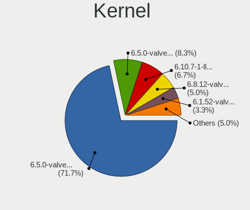
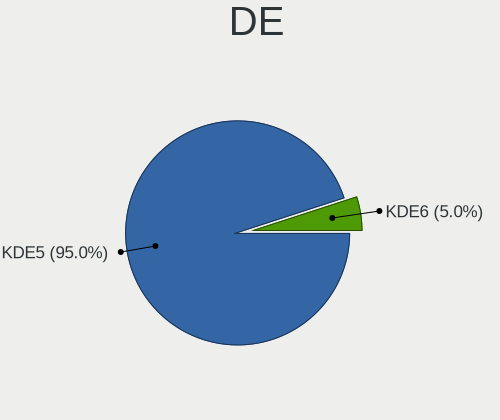
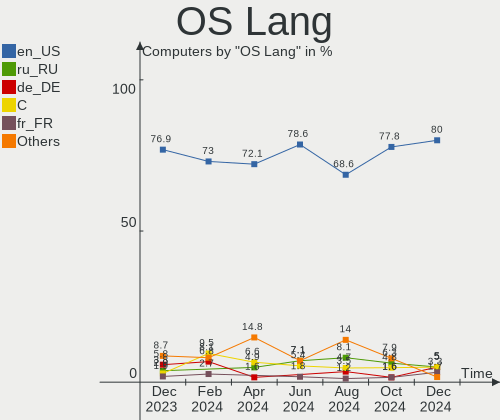
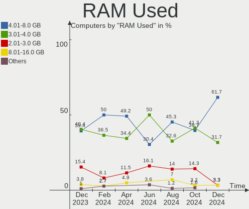
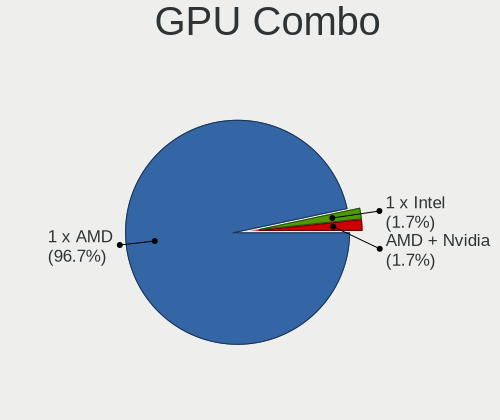
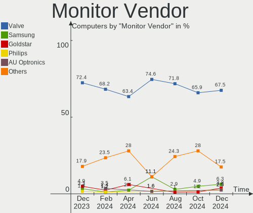
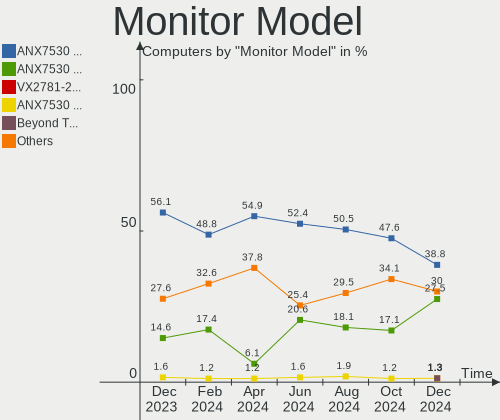

SteamOS - Hardware Trends
-------------------------

A project to identify most popular hardware characteristics and track their change
over time based on data collected by Linux users at https://Linux-Hardware.org.

Anyone can contribute to this report by the [hw-probe](https://github.com/linuxhw/hw-probe) tool:

    sudo -E hw-probe -all -upload

This is a report for all computer types. See also reports for [desktops](/Dist/SteamOS/Desktop/README.md) and [notebooks](/Dist/SteamOS/Notebook/README.md).

This report is for one last month. Overall report since the beginning of time: [TestDays](https://github.com/linuxhw/TestDays)

Period: Feb, 2023.

Contents
--------

* [ System ](#system)
  - [ OS                       ](#os)
  - [ OS Family                ](#os-family)
  - [ Kernel                   ](#kernel)
  - [ Kernel Family            ](#kernel-family)
  - [ Kernel Major Ver.        ](#kernel-major-ver)
  - [ Arch                     ](#arch)
  - [ DE                       ](#de)
  - [ Display Server           ](#display-server)
  - [ Display Manager          ](#display-manager)
  - [ OS Lang                  ](#os-lang)
  - [ Boot Mode                ](#boot-mode)
  - [ Filesystem               ](#filesystem)
  - [ Part. scheme             ](#part-scheme)
  - [ Dual Boot with Linux/BSD ](#dual-boot-with-linuxbsd)
  - [ Dual Boot (Win)          ](#dual-boot-win)

* [ Board ](#board)
  - [ Vendor                   ](#vendor)
  - [ Model                    ](#model)
  - [ Model Family             ](#model-family)
  - [ MFG Year                 ](#mfg-year)
  - [ Form Factor              ](#form-factor)
  - [ Secure Boot              ](#secure-boot)
  - [ Coreboot                 ](#coreboot)
  - [ RAM Size                 ](#ram-size)
  - [ RAM Used                 ](#ram-used)
  - [ Total Drives             ](#total-drives)
  - [ Has CD-ROM               ](#has-cd-rom)
  - [ Has Ethernet             ](#has-ethernet)
  - [ Has WiFi                 ](#has-wifi)
  - [ Has Bluetooth            ](#has-bluetooth)

* [ Location ](#location)
  - [ Country                  ](#country)
  - [ City                     ](#city)

* [ Drives ](#drives)
  - [ Drive Vendor             ](#drive-vendor)
  - [ Drive Model              ](#drive-model)
  - [ HDD Vendor               ](#hdd-vendor)
  - [ SSD Vendor               ](#ssd-vendor)
  - [ Drive Kind               ](#drive-kind)
  - [ Drive Connector          ](#drive-connector)
  - [ Drive Size               ](#drive-size)
  - [ Space Total              ](#space-total)
  - [ Space Used               ](#space-used)
  - [ Malfunc. Drives          ](#malfunc-drives)
  - [ Malfunc. Drive Vendor    ](#malfunc-drive-vendor)
  - [ Malfunc. HDD Vendor      ](#malfunc-hdd-vendor)
  - [ Malfunc. Drive Kind      ](#malfunc-drive-kind)
  - [ Failed Drives            ](#failed-drives)
  - [ Failed Drive Vendor      ](#failed-drive-vendor)
  - [ Drive Status             ](#drive-status)

* [ Storage controller ](#storage-controller)
  - [ Storage Vendor           ](#storage-vendor)
  - [ Storage Model            ](#storage-model)
  - [ Storage Kind             ](#storage-kind)

* [ Processor ](#processor)
  - [ CPU Vendor               ](#cpu-vendor)
  - [ CPU Model                ](#cpu-model)
  - [ CPU Model Family         ](#cpu-model-family)
  - [ CPU Cores                ](#cpu-cores)
  - [ CPU Sockets              ](#cpu-sockets)
  - [ CPU Threads              ](#cpu-threads)
  - [ CPU Op-Modes             ](#cpu-op-modes)
  - [ CPU Microcode            ](#cpu-microcode)
  - [ CPU Microarch            ](#cpu-microarch)

* [ Graphics ](#graphics)
  - [ GPU Vendor               ](#gpu-vendor)
  - [ GPU Model                ](#gpu-model)
  - [ GPU Combo                ](#gpu-combo)
  - [ GPU Driver               ](#gpu-driver)
  - [ GPU Memory               ](#gpu-memory)

* [ Monitor ](#monitor)
  - [ Monitor Vendor           ](#monitor-vendor)
  - [ Monitor Model            ](#monitor-model)
  - [ Monitor Resolution       ](#monitor-resolution)
  - [ Monitor Diagonal         ](#monitor-diagonal)
  - [ Monitor Width            ](#monitor-width)
  - [ Aspect Ratio             ](#aspect-ratio)
  - [ Monitor Area             ](#monitor-area)
  - [ Pixel Density            ](#pixel-density)
  - [ Multiple Monitors        ](#multiple-monitors)

* [ Network ](#network)
  - [ Net Controller Vendor    ](#net-controller-vendor)
  - [ Net Controller Model     ](#net-controller-model)
  - [ Wireless Vendor          ](#wireless-vendor)
  - [ Wireless Model           ](#wireless-model)
  - [ Ethernet Vendor          ](#ethernet-vendor)
  - [ Ethernet Model           ](#ethernet-model)
  - [ Net Controller Kind      ](#net-controller-kind)
  - [ Used Controller          ](#used-controller)
  - [ NICs                     ](#nics)
  - [ IPv6                     ](#ipv6)

* [ Bluetooth ](#bluetooth)
  - [ Bluetooth Vendor         ](#bluetooth-vendor)
  - [ Bluetooth Model          ](#bluetooth-model)

* [ Sound ](#sound)
  - [ Sound Vendor             ](#sound-vendor)
  - [ Sound Model              ](#sound-model)

* [ Memory ](#memory)
  - [ Memory Vendor            ](#memory-vendor)
  - [ Memory Model             ](#memory-model)
  - [ Memory Kind              ](#memory-kind)
  - [ Memory Form Factor       ](#memory-form-factor)
  - [ Memory Size              ](#memory-size)
  - [ Memory Speed             ](#memory-speed)

* [ Printers & scanners ](#printers--scanners)
  - [ Printer Vendor           ](#printer-vendor)
  - [ Printer Model            ](#printer-model)
  - [ Scanner Vendor           ](#scanner-vendor)
  - [ Scanner Model            ](#scanner-model)

* [ Camera ](#camera)
  - [ Camera Vendor            ](#camera-vendor)
  - [ Camera Model             ](#camera-model)

* [ Security ](#security)
  - [ Fingerprint Vendor       ](#fingerprint-vendor)
  - [ Fingerprint Model        ](#fingerprint-model)
  - [ Chipcard Vendor          ](#chipcard-vendor)
  - [ Chipcard Model           ](#chipcard-model)

* [ Unsupported ](#unsupported)
  - [ Unsupported Devices      ](#unsupported-devices)
  - [ Unsupported Device Types ](#unsupported-device-types)

System
------

OS
--

Installed operating systems

| Name          | Computers | Percent |
|---------------|-----------|---------|
| SteamOS 3.4.4 | 68        | 70.83%  |
| SteamOS 3.4   | 18        | 18.75%  |
| SteamOS 3.5   | 3         | 3.13%   |
| SteamOS 3.4.5 | 3         | 3.13%   |
| SteamOS       | 3         | 3.13%   |
| SteamOS 3.1   | 1         | 1.04%   |

OS Family
---------

OS without a version

| Name    | Computers | Percent |
|---------|-----------|---------|
| SteamOS | 96        | 100%    |

Kernel
------

Version of the Linux kernel

| Version                                        | Computers | Percent |
|------------------------------------------------|-----------|---------|
| 5.13.0-valve36-1-neptune                       | 72        | 75%     |
| 5.13.0-valve21.3-1-neptune                     | 15        | 15.63%  |
| 6.1.9-valve2-1-neptune-61                      | 2         | 2.08%   |
| 6.1.3-arch1-1-surface                          | 1         | 1.04%   |
| 6.1.1-valve1-1-neptune-61                      | 1         | 1.04%   |
| 5.18.1-arch1_testHoloISO_20220606.1811         | 1         | 1.04%   |
| 5.15.79-1-lts                                  | 1         | 1.04%   |
| 5.13.0-valve37-1-neptune                       | 1         | 1.04%   |
| 5.13.0-valve21-1-steamos-02209-g2a5bdc1102a0   | 1         | 1.04%   |
| 5.13.0-valve10.3-1-neptune-02176-g5fe416c4acd8 | 1         | 1.04%   |

Kernel Family
-------------

Linux kernel without a distro release

| Version | Computers | Percent |
|---------|-----------|---------|
| 5.13.0  | 90        | 93.75%  |
| 6.1.9   | 2         | 2.08%   |
| 6.1.3   | 1         | 1.04%   |
| 6.1.1   | 1         | 1.04%   |
| 5.18.1  | 1         | 1.04%   |
| 5.15.79 | 1         | 1.04%   |

Kernel Major Ver.
-----------------

Linux kernel major version

| Version | Computers | Percent |
|---------|-----------|---------|
| 5.13    | 90        | 93.75%  |
| 6.1     | 4         | 4.17%   |
| 5.18    | 1         | 1.04%   |
| 5.15    | 1         | 1.04%   |

Arch
----

OS architecture (x86_64, i586, etc.)

| Name   | Computers | Percent |
|--------|-----------|---------|
| x86_64 | 96        | 100%    |

DE
--

Desktop Environment

| Name | Computers | Percent |
|------|-----------|---------|
| KDE5 | 96        | 100%    |

Display Server
--------------

X11 or Wayland

| Name | Computers | Percent |
|------|-----------|---------|
| X11  | 96        | 100%    |

Display Manager
---------------

SDDM, LightDM, etc.

| Name    | Computers | Percent |
|---------|-----------|---------|
| Unknown | 96        | 100%    |

OS Lang
-------

Language

| Lang   | Computers | Percent |
|--------|-----------|---------|
| en_US  | 89        | 92.71%  |
| zh_TW  | 1         | 1.04%   |
| ru_RU  | 1         | 1.04%   |
| ksh_DE | 1         | 1.04%   |
| fr_FR  | 1         | 1.04%   |
| es_MX  | 1         | 1.04%   |
| de_DE  | 1         | 1.04%   |
| C      | 1         | 1.04%   |

Boot Mode
---------

EFI or BIOS

| Mode | Computers | Percent |
|------|-----------|---------|
| BIOS | 96        | 100%    |

Filesystem
----------

Type of filesystem

| Type  | Computers | Percent |
|-------|-----------|---------|
| Btrfs | 95        | 98.96%  |
| Tmpfs | 1         | 1.04%   |

Part. scheme
------------

Scheme of partitioning

| Type    | Computers | Percent |
|---------|-----------|---------|
| Unknown | 96        | 100%    |

Dual Boot with Linux/BSD
------------------------

Hosting more than one Linux/BSD

| Dual boot | Computers | Percent |
|-----------|-----------|---------|
| No        | 96        | 100%    |

Dual Boot (Win)
---------------

Hosting Linux and Windows

| Dual boot | Computers | Percent |
|-----------|-----------|---------|
| No        | 96        | 100%    |

Board
-----

Vendor
------

Motherboard manufacturer

| Name                                 | Computers | Percent |
|--------------------------------------|-----------|---------|
| Valve                                | 74        | 77.08%  |
| ASUSTek Computer                     | 5         | 5.21%   |
| Hewlett-Packard                      | 3         | 3.13%   |
| Dell                                 | 3         | 3.13%   |
| ASRock                               | 3         | 3.13%   |
| Gigabyte Technology                  | 2         | 2.08%   |
| Shenzhen Meigao Electronic Equipment | 1         | 1.04%   |
| MSI                                  | 1         | 1.04%   |
| Microsoft                            | 1         | 1.04%   |
| MeLE                                 | 1         | 1.04%   |
| Biostar                              | 1         | 1.04%   |
| AOKZOE                               | 1         | 1.04%   |

Model
-----

Motherboard model

| Name                                       | Computers | Percent |
|--------------------------------------------|-----------|---------|
| Valve Jupiter                              | 74        | 77.08%  |
| Shenzhen Meigao Electronic Equipment UM690 | 1         | 1.04%   |
| MSI MS-7B89                                | 1         | 1.04%   |
| Microsoft Surface Book                     | 1         | 1.04%   |
| MeLE Quieter2                              | 1         | 1.04%   |
| HP ProDesk 600 G4 MT                       | 1         | 1.04%   |
| HP Pavilion Laptop 15-eh1xxx               | 1         | 1.04%   |
| HP Laptop 15s-eq2xxx                       | 1         | 1.04%   |
| Gigabyte B85M-D3H                          | 1         | 1.04%   |
| Gigabyte B450 AORUS M                      | 1         | 1.04%   |
| Dell OptiPlex 9010                         | 1         | 1.04%   |
| Dell Inspiron 7306 2n1                     | 1         | 1.04%   |
| Dell Inspiron 3542                         | 1         | 1.04%   |
| Biostar A320MH                             | 1         | 1.04%   |
| ASUS TUF Gaming FX505DT_FX505DT            | 1         | 1.04%   |
| ASUS PRIME B250M-PLUS/BR                   | 1         | 1.04%   |
| ASUS N56VB                                 | 1         | 1.04%   |
| ASUS CROSSHAIR VI HERO                     | 1         | 1.04%   |
| ASUS ASUS TUF Dash F15 FX516PC_FX516PC     | 1         | 1.04%   |
| ASRock B760M-ITX/D4 WiFi                   | 1         | 1.04%   |
| ASRock B560 Pro4                           | 1         | 1.04%   |
| ASRock B550 Phantom Gaming-ITX/ax          | 1         | 1.04%   |
| AOKZOE A1 AR07                             | 1         | 1.04%   |

Model Family
------------

Motherboard model prefix

| Name                                       | Computers | Percent |
|--------------------------------------------|-----------|---------|
| Valve Jupiter                              | 74        | 77.08%  |
| Dell Inspiron                              | 2         | 2.08%   |
| Shenzhen Meigao Electronic Equipment UM690 | 1         | 1.04%   |
| MSI MS-7B89                                | 1         | 1.04%   |
| Microsoft Surface                          | 1         | 1.04%   |
| MeLE Quieter2                              | 1         | 1.04%   |
| HP ProDesk                                 | 1         | 1.04%   |
| HP Pavilion                                | 1         | 1.04%   |
| HP Laptop                                  | 1         | 1.04%   |
| Gigabyte B85M-D3H                          | 1         | 1.04%   |
| Gigabyte B450                              | 1         | 1.04%   |
| Dell OptiPlex                              | 1         | 1.04%   |
| Biostar A320MH                             | 1         | 1.04%   |
| ASUS TUF                                   | 1         | 1.04%   |
| ASUS PRIME                                 | 1         | 1.04%   |
| ASUS N56VB                                 | 1         | 1.04%   |
| ASUS CROSSHAIR                             | 1         | 1.04%   |
| ASUS ASUS                                  | 1         | 1.04%   |
| ASRock B760M-ITX                           | 1         | 1.04%   |
| ASRock B560                                | 1         | 1.04%   |
| ASRock B550                                | 1         | 1.04%   |
| AOKZOE A1                                  | 1         | 1.04%   |

MFG Year
--------

Motherboard manufacture year

| Year | Computers | Percent |
|------|-----------|---------|
| 2022 | 78        | 81.25%  |
| 2021 | 7         | 7.29%   |
| 2013 | 3         | 3.13%   |
| 2020 | 2         | 2.08%   |
| 2019 | 2         | 2.08%   |
| 2018 | 2         | 2.08%   |
| 2017 | 1         | 1.04%   |
| 2014 | 1         | 1.04%   |

Form Factor
-----------

Physical design of the computer

| Name        | Computers | Percent |
|-------------|-----------|---------|
| Notebook    | 80        | 83.33%  |
| Desktop     | 12        | 12.5%   |
| Tablet      | 2         | 2.08%   |
| Convertible | 1         | 1.04%   |
| Mini pc     | 1         | 1.04%   |

Secure Boot
-----------

Enabled or disabled

| State    | Computers | Percent |
|----------|-----------|---------|
| Disabled | 96        | 100%    |

Coreboot
--------

Have coreboot on board

| Used | Computers | Percent |
|------|-----------|---------|
| No   | 96        | 100%    |

RAM Size
--------

Total RAM memory

| Size in GB | Computers | Percent |
|------------|-----------|---------|
| 8.01-16.0  | 83        | 86.46%  |
| 32.01-64.0 | 5         | 5.21%   |
| 4.01-8.0   | 4         | 4.17%   |
| 16.01-24.0 | 3         | 3.13%   |
| 3.01-4.0   | 1         | 1.04%   |

RAM Used
--------

Used RAM memory

| Used GB   | Computers | Percent |
|-----------|-----------|---------|
| 2.01-3.0  | 44        | 45.83%  |
| 3.01-4.0  | 28        | 29.17%  |
| 4.01-8.0  | 13        | 13.54%  |
| 1.01-2.0  | 8         | 8.33%   |
| 8.01-16.0 | 3         | 3.13%   |

Total Drives
------------

Number of drives on board

| Drives | Computers | Percent |
|--------|-----------|---------|
| 2      | 55        | 57.29%  |
| 1      | 34        | 35.42%  |
| 3      | 4         | 4.17%   |
| 4      | 2         | 2.08%   |
| 5      | 1         | 1.04%   |

Has CD-ROM
----------

Has CD-ROM on board

| Presented | Computers | Percent |
|-----------|-----------|---------|
| No        | 91        | 94.79%  |
| Yes       | 5         | 5.21%   |

Has Ethernet
------------

Has Ethernet on board

| Presented | Computers | Percent |
|-----------|-----------|---------|
| No        | 57        | 59.38%  |
| Yes       | 39        | 40.63%  |

Has WiFi
--------

Has WiFi module

| Presented | Computers | Percent |
|-----------|-----------|---------|
| Yes       | 95        | 98.96%  |
| No        | 1         | 1.04%   |

Has Bluetooth
-------------

Has Bluetooth module

| Presented | Computers | Percent |
|-----------|-----------|---------|
| Yes       | 89        | 92.71%  |
| No        | 7         | 7.29%   |

Location
--------

Country
-------

Geographic location (country)

| Country     | Computers | Percent |
|-------------|-----------|---------|
| USA         | 36        | 37.5%   |
| Germany     | 11        | 11.46%  |
| Russia      | 5         | 5.21%   |
| Poland      | 4         | 4.17%   |
| UK          | 3         | 3.13%   |
| Netherlands | 3         | 3.13%   |
| Ireland     | 3         | 3.13%   |
| Canada      | 3         | 3.13%   |
| Taiwan      | 2         | 2.08%   |
| Spain       | 2         | 2.08%   |
| Philippines | 2         | 2.08%   |
| Mexico      | 2         | 2.08%   |
| Belgium     | 2         | 2.08%   |
| Australia   | 2         | 2.08%   |
| Ukraine     | 1         | 1.04%   |
| Turkey      | 1         | 1.04%   |
| Puerto Rico | 1         | 1.04%   |
| Malaysia    | 1         | 1.04%   |
| Latvia      | 1         | 1.04%   |
| Italy       | 1         | 1.04%   |
| Hong Kong   | 1         | 1.04%   |
| France      | 1         | 1.04%   |
| Finland     | 1         | 1.04%   |
| Croatia     | 1         | 1.04%   |
| China       | 1         | 1.04%   |
| Chile       | 1         | 1.04%   |
| Bulgaria    | 1         | 1.04%   |
| Brazil      | 1         | 1.04%   |
| Austria     | 1         | 1.04%   |
| Argentina   | 1         | 1.04%   |

City
----

Geographic location (city)

| City                 | Computers | Percent |
|----------------------|-----------|---------|
| Sydney               | 2         | 2.08%   |
| Great Falls          | 2         | 2.08%   |
| Berlin               | 2         | 2.08%   |
| Yukon                | 1         | 1.04%   |
| Xizhi District       | 1         | 1.04%   |
| Wuhan                | 1         | 1.04%   |
| Wexford              | 1         | 1.04%   |
| Ukhta                | 1         | 1.04%   |
| Tualatin             | 1         | 1.04%   |
| Tremblay-en-France   | 1         | 1.04%   |
| Torquay              | 1         | 1.04%   |
| Talavera de la Reina | 1         | 1.04%   |
| Stewartstown         | 1         | 1.04%   |
| Starkville           | 1         | 1.04%   |
| Sint-Truiden         | 1         | 1.04%   |
| Siegburg             | 1         | 1.04%   |
| Seattle              | 1         | 1.04%   |
| Scotts Valley        | 1         | 1.04%   |
| Santiago             | 1         | 1.04%   |
| San Antonio          | 1         | 1.04%   |
| Salzgitter           | 1         | 1.04%   |
| Saint Charles        | 1         | 1.04%   |
| Saint Augustine      | 1         | 1.04%   |
| Saarlouis            | 1         | 1.04%   |
| Rousse               | 1         | 1.04%   |
| Riga                 | 1         | 1.04%   |
| Redmond              | 1         | 1.04%   |
| Raleigh              | 1         | 1.04%   |
| Poznan               | 1         | 1.04%   |
| Portland             | 1         | 1.04%   |
| Portage              | 1         | 1.04%   |
| Philadelphia         | 1         | 1.04%   |
| Pfungstadt           | 1         | 1.04%   |
| Orland Park          | 1         | 1.04%   |
| North York           | 1         | 1.04%   |
| New Taipei           | 1         | 1.04%   |
| Neuotting            | 1         | 1.04%   |
| Nampa                | 1         | 1.04%   |
| Myrtle Beach         | 1         | 1.04%   |
| Moscow               | 1         | 1.04%   |

Drives
------

Drive Vendor
------------

Hard drive vendors

| Vendor                      | Computers | Drives | Percent |
|-----------------------------|-----------|--------|---------|
| Unknown                     | 39        | 39     | 23.64%  |
| Kingston Technology Company | 22        | 22     | 13.33%  |
| Samsung Electronics         | 19        | 22     | 11.52%  |
| O2 Micro                    | 14        | 14     | 8.48%   |
| Phison Electronics          | 13        | 13     | 7.88%   |
| Unknown                     | 13        | 13     | 7.88%   |
| Seagate                     | 10        | 11     | 6.06%   |
| Sandisk                     | 6         | 6      | 3.64%   |
| Toshiba                     | 4         | 4      | 2.42%   |
| SK hynix                    | 4         | 4      | 2.42%   |
| KIOXIA                      | 3         | 3      | 1.82%   |
| Kingston                    | 3         | 3      | 1.82%   |
| Silicon Motion              | 2         | 2      | 1.21%   |
| Intel                       | 2         | 2      | 1.21%   |
| TCSUNBOW                    | 1         | 1      | 0.61%   |
| SPCC                        | 1         | 1      | 0.61%   |
| Realtek Semiconductor       | 1         | 1      | 0.61%   |
| Ramsta                      | 1         | 1      | 0.61%   |
| Micron/Crucial Technology   | 1         | 1      | 0.61%   |
| Micron Technology           | 1         | 1      | 0.61%   |
| KingFast                    | 1         | 1      | 0.61%   |
| JMicron Technology          | 1         | 1      | 0.61%   |
| Crucial                     | 1         | 1      | 0.61%   |
| Biwin Storage Technology    | 1         | 1      | 0.61%   |
| A-DATA Technology           | 1         | 1      | 0.61%   |

Drive Model
-----------

Hard drive models

| Model                                                 | Computers | Percent |
|-------------------------------------------------------|-----------|---------|
| Kingston Company OM3PDP3 NVMe SSD 512GB               | 21        | 12.5%   |
| Unknown MMC Card  512GB                               | 17        | 10.12%  |
| O2 Micro E2M2 64GB                                    | 14        | 8.33%   |
| Unknown                                               | 13        | 7.74%   |
| Samsung MZ9LQ512HBLU-00BVL 512GB                      | 10        | 5.95%   |
| Phison PS5013 E13 NVMe Controller 500GB               | 10        | 5.95%   |
| Unknown MMC Card  128GB                               | 8         | 4.76%   |
| Unknown MMC Card  256GB                               | 7         | 4.17%   |
| Samsung MZ9LQ256HBJD-00BVL 256GB                      | 6         | 3.57%   |
| Unknown MMC Card  393GB                               | 2         | 1.19%   |
| SK hynix BC511 512GB                                  | 2         | 1.19%   |
| Silicon Motion SM2263EN/SM2263XT SSD Controller 512GB | 2         | 1.19%   |
| Sandisk WD PC SN740 SDDPTQD-1T00 1024GB               | 2         | 1.19%   |
| Unknown SD/MMC/MS PRO 16GB                            | 1         | 0.6%    |
| Unknown MMC Card  64GB                                | 1         | 0.6%    |
| Unknown MMC Card  4GB                                 | 1         | 0.6%    |
| Unknown MMC Card  32GB                                | 1         | 0.6%    |
| Unknown MMC Card  196GB                               | 1         | 0.6%    |
| Toshiba NVMe Controller 512GB                         | 1         | 0.6%    |
| Toshiba MQ04ABF100 1TB                                | 1         | 0.6%    |
| Toshiba MQ01ABD100 1TB                                | 1         | 0.6%    |
| Toshiba DT01ACA100 1TB                                | 1         | 0.6%    |
| TCSUNBOW X3 240GB                                     | 1         | 0.6%    |
| SPCC Solid State Disk 1024GB                          | 1         | 0.6%    |
| SK hynix HFM512GD3GX013N 512GB                        | 1         | 0.6%    |
| SK hynix BC711 NVMe 512GB                             | 1         | 0.6%    |
| Seagate ST8000DM004-2CX188 8TB                        | 1         | 0.6%    |
| Seagate ST500LT012-1DG142 500GB                       | 1         | 0.6%    |
| Seagate ST500LM030-2E717D 500GB                       | 1         | 0.6%    |
| Seagate ST4000VX007-2DT166 4TB                        | 1         | 0.6%    |
| Seagate ST3500414CS 500GB                             | 1         | 0.6%    |
| Seagate ST3000DM001-1ER166 3TB                        | 1         | 0.6%    |
| Seagate ST2000DM006-2DM164 2TB                        | 1         | 0.6%    |
| Seagate ST1000VM002-1CT162 1TB                        | 1         | 0.6%    |
| Seagate Portable 4TB                                  | 1         | 0.6%    |
| Seagate Expansion SW 4TB                              | 1         | 0.6%    |
| Seagate Expansion 1TB                                 | 1         | 0.6%    |
| Sandisk WD_BLACK SN770 1TB                            | 1         | 0.6%    |
| Sandisk WDC PC SN530 SDBPTPZ-1T00 1024GB              | 1         | 0.6%    |
| Sandisk WD Black SN850 500GB                          | 1         | 0.6%    |

HDD Vendor
----------

Hard disk drive vendors

| Vendor              | Computers | Drives | Percent |
|---------------------|-----------|--------|---------|
| Seagate             | 9         | 10     | 60%     |
| Toshiba             | 3         | 3      | 20%     |
| Unknown             | 1         | 1      | 6.67%   |
| Samsung Electronics | 1         | 1      | 6.67%   |
| JMicron Technology  | 1         | 1      | 6.67%   |

SSD Vendor
----------

Solid state drive vendors

| Vendor              | Computers | Drives | Percent |
|---------------------|-----------|--------|---------|
| Kingston            | 3         | 3      | 33.33%  |
| SPCC                | 1         | 1      | 11.11%  |
| SanDisk             | 1         | 1      | 11.11%  |
| Samsung Electronics | 1         | 3      | 11.11%  |
| Ramsta              | 1         | 1      | 11.11%  |
| Crucial             | 1         | 1      | 11.11%  |
| A-DATA Technology   | 1         | 1      | 11.11%  |

Drive Kind
----------

HDD or SSD

| Kind    | Computers | Drives | Percent |
|---------|-----------|--------|---------|
| NVMe    | 87        | 88     | 53.7%   |
| MMC     | 51        | 51     | 31.48%  |
| HDD     | 13        | 16     | 8.02%   |
| SSD     | 8         | 11     | 4.94%   |
| Unknown | 3         | 3      | 1.85%   |

Drive Connector
---------------

SATA, SAS, NVMe, etc.

| Type | Computers | Drives | Percent |
|------|-----------|--------|---------|
| NVMe | 87        | 88     | 55.41%  |
| MMC  | 51        | 51     | 32.48%  |
| SATA | 12        | 22     | 7.64%   |
| SAS  | 7         | 8      | 4.46%   |

Drive Size
----------

Size of hard drive

| Size in TB | Computers | Drives | Percent |
|------------|-----------|--------|---------|
| 0.01-0.5   | 9         | 11     | 39.13%  |
| 0.51-1.0   | 7         | 7      | 30.43%  |
| 1.01-2.0   | 3         | 5      | 13.04%  |
| 3.01-4.0   | 2         | 2      | 8.7%    |
| 2.01-3.0   | 1         | 1      | 4.35%   |
| 4.01-10.0  | 1         | 1      | 4.35%   |

Space Total
-----------

Amount of disk space available on the file system

| Size in GB     | Computers | Percent |
|----------------|-----------|---------|
| 251-500        | 42        | 43.75%  |
| 101-250        | 16        | 16.67%  |
| 501-1000       | 15        | 15.63%  |
| 51-100         | 11        | 11.46%  |
| 1001-2000      | 7         | 7.29%   |
| More than 3000 | 4         | 4.17%   |
| Unknown        | 1         | 1.04%   |

Space Used
----------

Amount of used disk space

| Used GB   | Computers | Percent |
|-----------|-----------|---------|
| 101-250   | 28        | 29.17%  |
| 251-500   | 23        | 23.96%  |
| 21-50     | 19        | 19.79%  |
| 51-100    | 10        | 10.42%  |
| 1-20      | 7         | 7.29%   |
| 501-1000  | 7         | 7.29%   |
| 1001-2000 | 1         | 1.04%   |
| Unknown   | 1         | 1.04%   |

Malfunc. Drives
---------------

Drive models with a malfunction

Zero info for selected period =(

Malfunc. Drive Vendor
---------------------

Vendors of faulty drives

Zero info for selected period =(

Malfunc. HDD Vendor
-------------------

Vendors of faulty HDD drives

Zero info for selected period =(

Malfunc. Drive Kind
-------------------

Kinds of faulty drives

Zero info for selected period =(

Failed Drives
-------------

Failed drive models

Zero info for selected period =(

Failed Drive Vendor
-------------------

Failed drive vendors

Zero info for selected period =(

Drive Status
------------

Number of failed and malfunc. drives

| Status   | Computers | Drives | Percent |
|----------|-----------|--------|---------|
| Detected | 96        | 169    | 100%    |

Storage controller
------------------

Storage Vendor
--------------

Storage controller vendors

| Vendor                       | Computers | Percent |
|------------------------------|-----------|---------|
| Kingston Technology Company  | 22        | 21.36%  |
| Samsung Electronics          | 18        | 17.48%  |
| O2 Micro                     | 14        | 13.59%  |
| Phison Electronics           | 13        | 12.62%  |
| Intel                        | 11        | 10.68%  |
| AMD                          | 6         | 5.83%   |
| Sandisk                      | 5         | 4.85%   |
| SK hynix                     | 4         | 3.88%   |
| KIOXIA                       | 3         | 2.91%   |
| Silicon Motion               | 2         | 1.94%   |
| Toshiba America Info Systems | 1         | 0.97%   |
| Realtek Semiconductor        | 1         | 0.97%   |
| Micron/Crucial Technology    | 1         | 0.97%   |
| Micron Technology            | 1         | 0.97%   |
| Biwin Storage Technology     | 1         | 0.97%   |

Storage Model
-------------

Storage controller models

| Model                                                                          | Computers | Percent |
|--------------------------------------------------------------------------------|-----------|---------|
| Kingston Company OM3PDP3 NVMe SSD                                              | 21        | 19.44%  |
| Samsung NVMe SSD Controller 980                                                | 17        | 15.74%  |
| O2 Micro Non-Volatile memory controller                                        | 14        | 12.96%  |
| Phison PS5013 E13 NVMe Controller                                              | 10        | 9.26%   |
| AMD FCH SATA Controller [AHCI mode]                                            | 5         | 4.63%   |
| SanDisk Non-Volatile memory controller                                         | 4         | 3.7%    |
| SK hynix Gold P31/PC711 NVMe Solid State Drive                                 | 2         | 1.85%   |
| SK hynix BC511                                                                 | 2         | 1.85%   |
| Silicon Motion SM2263EN/SM2263XT SSD Controller                                | 2         | 1.85%   |
| KIOXIA NVMe SSD Controller BG4                                                 | 2         | 1.85%   |
| AMD 400 Series Chipset SATA Controller                                         | 2         | 1.85%   |
| Toshiba America Info Systems NVMe Controller                                   | 1         | 0.93%   |
| SanDisk WD PC SN810 / Black SN850 NVMe SSD                                     | 1         | 0.93%   |
| Samsung NVMe SSD Controller SM961/PM961/SM963                                  | 1         | 0.93%   |
| Realtek Realtek Non-Volatile memory controller                                 | 1         | 0.93%   |
| Phison Electronics Non-Volatile memory controller                              | 1         | 0.93%   |
| Phison E18 PCIe4 NVMe Controller                                               | 1         | 0.93%   |
| Phison E12 NVMe Controller                                                     | 1         | 0.93%   |
| Micron/Crucial NVMe Controller                                                 | 1         | 0.93%   |
| Micron Non-Volatile memory controller                                          | 1         | 0.93%   |
| KIOXIA Non-Volatile memory controller                                          | 1         | 0.93%   |
| Kingston Company Company Non-Volatile memory controller                        | 1         | 0.93%   |
| Intel Volume Management Device NVMe RAID Controller                            | 1         | 0.93%   |
| Intel SSD 660P Series                                                          | 1         | 0.93%   |
| Intel SATA Controller [RAID mode]                                              | 1         | 0.93%   |
| Intel SATA controller                                                          | 1         | 0.93%   |
| Intel Non-Volatile memory controller                                           | 1         | 0.93%   |
| Intel Celeron/Pentium Silver Processor SATA Controller                         | 1         | 0.93%   |
| Intel Cannon Lake PCH SATA AHCI Controller                                     | 1         | 0.93%   |
| Intel 8 Series/C220 Series Chipset Family 6-port SATA Controller 1 [AHCI mode] | 1         | 0.93%   |
| Intel 8 Series SATA Controller 1 [AHCI mode]                                   | 1         | 0.93%   |
| Intel 7 Series Chipset Family 6-port SATA Controller [AHCI mode]               | 1         | 0.93%   |
| Intel 500 Series Chipset Family SATA AHCI Controller                           | 1         | 0.93%   |
| Intel 200 Series PCH SATA controller [AHCI mode]                               | 1         | 0.93%   |
| Biwin Storage Non-Volatile memory controller                                   | 1         | 0.93%   |
| AMD X370 Series Chipset SATA Controller                                        | 1         | 0.93%   |
| AMD FCH SATA Controller D                                                      | 1         | 0.93%   |
| AMD 500 Series Chipset SATA Controller                                         | 1         | 0.93%   |

Storage Kind
------------

Kind of storage controller (IDE, SATA, NVMe, SAS, ...)

| Kind | Computers | Percent |
|------|-----------|---------|
| NVMe | 87        | 84.47%  |
| SATA | 14        | 13.59%  |
| RAID | 2         | 1.94%   |

Processor
---------

CPU Vendor
----------

Processor vendors

| Vendor | Computers | Percent |
|--------|-----------|---------|
| AMD    | 84        | 87.5%   |
| Intel  | 12        | 12.5%   |

CPU Model
---------

Processor models

| Model                                         | Computers | Percent |
|-----------------------------------------------|-----------|---------|
| AMD Custom APU 0405                           | 74        | 77.08%  |
| Intel Core i7-8700 CPU @ 3.20GHz              | 1         | 1.04%   |
| Intel Core i7-6600U CPU @ 2.60GHz             | 1         | 1.04%   |
| Intel Core i7-3770 CPU @ 3.40GHz              | 1         | 1.04%   |
| Intel Core i5-4590 CPU @ 3.30GHz              | 1         | 1.04%   |
| Intel Core i5-3230M CPU @ 2.60GHz             | 1         | 1.04%   |
| Intel Core i3-7100 CPU @ 3.90GHz              | 1         | 1.04%   |
| Intel Core i3-4030U CPU @ 1.90GHz             | 1         | 1.04%   |
| Intel Celeron J4125 CPU @ 2.00GHz             | 1         | 1.04%   |
| Intel 12th Gen Core i7-12700F                 | 1         | 1.04%   |
| Intel 11th Gen Core i5-11600K @ 3.90GHz       | 1         | 1.04%   |
| Intel 11th Gen Core i5-1135G7 @ 2.40GHz       | 1         | 1.04%   |
| Intel 11th Gen Core i5-11300H @ 3.10GHz       | 1         | 1.04%   |
| AMD Ryzen 9 6900HX with Radeon Graphics       | 1         | 1.04%   |
| AMD Ryzen 9 3900X 12-Core Processor           | 1         | 1.04%   |
| AMD Ryzen 7 6800U with Radeon Graphics        | 1         | 1.04%   |
| AMD Ryzen 7 5700U with Radeon Graphics        | 1         | 1.04%   |
| AMD Ryzen 5 5600G with Radeon Graphics        | 1         | 1.04%   |
| AMD Ryzen 5 3550H with Radeon Vega Mobile Gfx | 1         | 1.04%   |
| AMD Ryzen 5 2600 Six-Core Processor           | 1         | 1.04%   |
| AMD Ryzen 5 1600 Six-Core Processor           | 1         | 1.04%   |
| AMD Ryzen 5 1400 Quad-Core Processor          | 1         | 1.04%   |
| AMD Ryzen 3 5300U with Radeon Graphics        | 1         | 1.04%   |

CPU Model Family
----------------

Processor model prefix

| Model         | Computers | Percent |
|---------------|-----------|---------|
| Other         | 78        | 81.25%  |
| AMD Ryzen 5   | 5         | 5.21%   |
| Intel Core i7 | 3         | 3.13%   |
| Intel Core i5 | 2         | 2.08%   |
| Intel Core i3 | 2         | 2.08%   |
| AMD Ryzen 9   | 2         | 2.08%   |
| AMD Ryzen 7   | 2         | 2.08%   |
| Intel Celeron | 1         | 1.04%   |
| AMD Ryzen 3   | 1         | 1.04%   |

CPU Cores
---------

Number of processor cores

| Number | Computers | Percent |
|--------|-----------|---------|
| 4      | 82        | 85.42%  |
| 6      | 5         | 5.21%   |
| 2      | 4         | 4.17%   |
| 8      | 3         | 3.13%   |
| 12     | 2         | 2.08%   |

CPU Sockets
-----------

Number of sockets

| Number | Computers | Percent |
|--------|-----------|---------|
| 1      | 96        | 100%    |

CPU Threads
-----------

Threads per core (Hyper-Threading)

| Number | Computers | Percent |
|--------|-----------|---------|
| 2      | 93        | 96.88%  |
| 1      | 3         | 3.13%   |

CPU Op-Modes
------------

CPU Operation Modes (32-bit, 64-bit)

| Op mode        | Computers | Percent |
|----------------|-----------|---------|
| 32-bit, 64-bit | 96        | 100%    |

CPU Microcode
-------------

Microcode number

| Number  | Computers | Percent |
|---------|-----------|---------|
| Unknown | 96        | 100%    |

CPU Microarch
-------------

Microarchitecture

| Name          | Computers | Percent |
|---------------|-----------|---------|
| Unknown       | 80        | 83.33%  |
| Zen+          | 3         | 3.13%   |
| TigerLake     | 2         | 2.08%   |
| KabyLake      | 2         | 2.08%   |
| IvyBridge     | 2         | 2.08%   |
| Haswell       | 2         | 2.08%   |
| Zen 3         | 1         | 1.04%   |
| Zen 2         | 1         | 1.04%   |
| Zen           | 1         | 1.04%   |
| Skylake       | 1         | 1.04%   |
| Goldmont plus | 1         | 1.04%   |

Graphics
--------

GPU Vendor
----------

Vendors of graphics cards

| Vendor | Computers | Percent |
|--------|-----------|---------|
| AMD    | 87        | 85.29%  |
| Intel  | 9         | 8.82%   |
| Nvidia | 6         | 5.88%   |

GPU Model
---------

Graphics card models

| Model                                                                       | Computers | Percent |
|-----------------------------------------------------------------------------|-----------|---------|
| AMD VanGogh [AMD Custom GPU 0405]                                           | 74        | 72.55%  |
| AMD Ellesmere [Radeon RX 470/480/570/570X/580/580X/590]                     | 4         | 3.92%   |
| Intel TigerLake-LP GT2 [Iris Xe Graphics]                                   | 2         | 1.96%   |
| AMD Rembrandt [Radeon 680M]                                                 | 2         | 1.96%   |
| AMD Lucienne                                                                | 2         | 1.96%   |
| Nvidia TU117M [GeForce GTX 1650 Mobile / Max-Q]                             | 1         | 0.98%   |
| Nvidia GM204 [GeForce GTX 970]                                              | 1         | 0.98%   |
| Nvidia GM107 [GeForce GTX 750 Ti]                                           | 1         | 0.98%   |
| Nvidia GK107M [GeForce GT 740M]                                             | 1         | 0.98%   |
| Nvidia GA107M [GeForce RTX 3050 Mobile]                                     | 1         | 0.98%   |
| Nvidia GA102 [GeForce RTX 3090]                                             | 1         | 0.98%   |
| Intel Xeon E3-1200 v3/4th Gen Core Processor Integrated Graphics Controller | 1         | 0.98%   |
| Intel Skylake GT2 [HD Graphics 520]                                         | 1         | 0.98%   |
| Intel IvyBridge GT2 [HD Graphics 4000]                                      | 1         | 0.98%   |
| Intel Haswell-ULT Integrated Graphics Controller                            | 1         | 0.98%   |
| Intel GeminiLake [UHD Graphics 600]                                         | 1         | 0.98%   |
| Intel CoffeeLake-S GT2 [UHD Graphics 630]                                   | 1         | 0.98%   |
| Intel 3rd Gen Core processor Graphics Controller                            | 1         | 0.98%   |
| AMD Vega 10 XL/XT [Radeon RX Vega 56/64]                                    | 1         | 0.98%   |
| AMD Picasso/Raven 2 [Radeon Vega Series / Radeon Vega Mobile Series]        | 1         | 0.98%   |
| AMD Navi 24 [Radeon RX 6400/6500 XT/6500M]                                  | 1         | 0.98%   |
| AMD Navi 22 [Radeon RX 6700/6700 XT/6750 XT / 6800M/6850M XT]               | 1         | 0.98%   |
| AMD Navi 10 [Radeon RX 5600 OEM/5600 XT / 5700/5700 XT]                     | 1         | 0.98%   |

GPU Combo
---------

Combinations of graphics cards

| Name           | Computers | Percent |
|----------------|-----------|---------|
| 1 x AMD        | 85        | 88.54%  |
| Intel + Nvidia | 4         | 4.17%   |
| 1 x Intel      | 4         | 4.17%   |
| 1 x Nvidia     | 1         | 1.04%   |
| Intel + AMD    | 1         | 1.04%   |
| AMD + Nvidia   | 1         | 1.04%   |

GPU Driver
----------

Free vs proprietary

| Driver      | Computers | Percent |
|-------------|-----------|---------|
| Free        | 93        | 96.88%  |
| Proprietary | 3         | 3.13%   |

GPU Memory
----------

Total video memory

| Size in GB | Computers | Percent |
|------------|-----------|---------|
| Unknown    | 94        | 97.92%  |
| 3.01-4.0   | 1         | 1.04%   |
| 16.01-24.0 | 1         | 1.04%   |

Monitor
-------

Monitor Vendor
--------------

Monitor vendors

| Vendor               | Computers | Percent |
|----------------------|-----------|---------|
| Valve                | 74        | 62.71%  |
| Goldstar             | 5         | 4.24%   |
| AOC                  | 5         | 4.24%   |
| Samsung Electronics  | 4         | 3.39%   |
| Ancor Communications | 3         | 2.54%   |
| Acer                 | 3         | 2.54%   |
| MSI                  | 2         | 1.69%   |
| LG Display           | 2         | 1.69%   |
| Lenovo               | 2         | 1.69%   |
| Hewlett-Packard      | 2         | 1.69%   |
| AU Optronics         | 2         | 1.69%   |
| WIT                  | 1         | 0.85%   |
| VKK                  | 1         | 0.85%   |
| Toshiba              | 1         | 0.85%   |
| RTK                  | 1         | 0.85%   |
| Roku                 | 1         | 0.85%   |
| Philips              | 1         | 0.85%   |
| PANDA                | 1         | 0.85%   |
| Panasonic            | 1         | 0.85%   |
| ONN                  | 1         | 0.85%   |
| Hitachi              | 1         | 0.85%   |
| Dell                 | 1         | 0.85%   |
| Chimei Innolux       | 1         | 0.85%   |
| BOE                  | 1         | 0.85%   |
| Analogix             | 1         | 0.85%   |

Monitor Model
-------------

Monitor models

| Model                                                                   | Computers | Percent |
|-------------------------------------------------------------------------|-----------|---------|
| Valve ANX7530 U VLV3001 800x1280 100x150mm 7.1-inch                     | 73        | 61.86%  |
| Goldstar FULL HD GSM5B55 1920x1080 480x270mm 21.7-inch                  | 2         | 1.69%   |
| Ancor Communications ROG PG279Q ACI27EC 2560x1440 598x336mm 27.0-inch   | 2         | 1.69%   |
| WIT HDMI WIT0267 1920x1080 531x299mm 24.0-inch                          | 1         | 0.85%   |
| VKK VK1160 VKK1160 1920x1080 256x144mm 11.6-inch                        | 1         | 0.85%   |
| Valve LCD Monitor VLV91A8                                               | 1         | 0.85%   |
| Toshiba TV TSB2017 3840x2160                                            | 1         | 0.85%   |
| Samsung Electronics S27H85x SAM0E0F 2560x1440 597x336mm 27.0-inch       | 1         | 0.85%   |
| Samsung Electronics S24F350 SAM0D20 1920x1080 521x293mm 23.5-inch       | 1         | 0.85%   |
| Samsung Electronics LCD Monitor SAM065E 1920x1080                       | 1         | 0.85%   |
| Samsung Electronics C32R50x SAM7000 1920x1080 698x393mm 31.5-inch       | 1         | 0.85%   |
| RTK FHD RTK2A3B 1920x1080 597x336mm 27.0-inch                           | 1         | 0.85%   |
| Roku 100012590 RKU0B01 1920x1080 698x392mm 31.5-inch                    | 1         | 0.85%   |
| Philips PHL 346P1C PHL093F 3440x1440 797x334mm 34.0-inch                | 1         | 0.85%   |
| PANDA LCD Monitor NCP004D 1920x1080 344x194mm 15.5-inch                 | 1         | 0.85%   |
| Panasonic VVX14P048M00 MEI96A2 3000x2000 285x190mm 13.5-inch            | 1         | 0.85%   |
| ONN 100002487 ONN0101 1920x1080 517x323mm 24.0-inch                     | 1         | 0.85%   |
| MSI MAG341CQ MSI1462 3440x1440 797x334mm 34.0-inch                      | 1         | 0.85%   |
| MSI MAG301CR2 MSI3CB4 2560x1080 690x291mm 29.5-inch                     | 1         | 0.85%   |
| LG Display LCD Monitor LGD0456 1366x768 344x194mm 15.5-inch             | 1         | 0.85%   |
| LG Display LCD Monitor LGD02D9 1920x1080 344x194mm 15.5-inch            | 1         | 0.85%   |
| Lenovo LEN P24h-20 LEN61F4 2560x1440 527x296mm 23.8-inch                | 1         | 0.85%   |
| Lenovo C24-25 LEN66B0 1920x1080 527x296mm 23.8-inch                     | 1         | 0.85%   |
| Hitachi HISENSE HEC002F 3840x2160 1095x616mm 49.5-inch                  | 1         | 0.85%   |
| Hewlett-Packard M27fw FHD HPN370F 1920x1080 597x336mm 27.0-inch         | 1         | 0.85%   |
| Hewlett-Packard LA2306 HWP294A 1920x1080 510x287mm 23.0-inch            | 1         | 0.85%   |
| Goldstar ULTRAGEAR GSM5BB2 1920x1080 527x296mm 23.8-inch                | 1         | 0.85%   |
| Goldstar M228WA GSM563D 1680x1050 434x270mm 20.1-inch                   | 1         | 0.85%   |
| Goldstar HDR WFHD GSM7714 2560x1080 798x334mm 34.1-inch                 | 1         | 0.85%   |
| Dell S2715H DEL40BB 1920x1080 598x336mm 27.0-inch                       | 1         | 0.85%   |
| Chimei Innolux LCD Monitor CMN153B 1920x1080 344x193mm 15.5-inch        | 1         | 0.85%   |
| BOE LCD Monitor BOE088C 1920x1080 293x165mm 13.2-inch                   | 1         | 0.85%   |
| AU Optronics LCD Monitor AUOD0ED 1920x1080 344x193mm 15.5-inch          | 1         | 0.85%   |
| AU Optronics LCD Monitor AUOB78F 1920x1080 344x194mm 15.5-inch          | 1         | 0.85%   |
| AOC AG352QG2 AOC3520 2560x1080 820x346mm 35.0-inch                      | 1         | 0.85%   |
| AOC 27G2G4 AOC2702 1920x1080 598x336mm 27.0-inch                        | 1         | 0.85%   |
| AOC 27G2G3 AOC2704 1920x1080 598x336mm 27.0-inch                        | 1         | 0.85%   |
| AOC 2795E AOC2795 1920x1080 598x336mm 27.0-inch                         | 1         | 0.85%   |
| AOC 2476WM AOC2476 1920x1080 521x293mm 23.5-inch                        | 1         | 0.85%   |
| Ancor Communications ASUS VG278HV ACI2726 1920x1080 598x336mm 27.0-inch | 1         | 0.85%   |

Monitor Resolution
------------------

Monitor screen resolution

| Resolution         | Computers | Percent |
|--------------------|-----------|---------|
| 800x1280           | 74        | 62.71%  |
| 1920x1080 (FHD)    | 23        | 19.49%  |
| 3840x2160 (4K)     | 9         | 7.63%   |
| 2560x1440 (QHD)    | 4         | 3.39%   |
| 2560x1080          | 3         | 2.54%   |
| 3440x1440          | 2         | 1.69%   |
| 1680x1050 (WSXGA+) | 1         | 0.85%   |
| 1366x768 (WXGA)    | 1         | 0.85%   |
| Unknown            | 1         | 0.85%   |

Monitor Diagonal
----------------

Diagonal size in inches

| Inches  | Computers | Percent |
|---------|-----------|---------|
| 7       | 73        | 61.86%  |
| 27      | 9         | 7.63%   |
| 23      | 8         | 6.78%   |
| 15      | 6         | 5.08%   |
| 31      | 4         | 3.39%   |
| 34      | 3         | 2.54%   |
| 21      | 2         | 1.69%   |
| Unknown | 2         | 1.69%   |
| 84      | 1         | 0.85%   |
| 72      | 1         | 0.85%   |
| 57      | 1         | 0.85%   |
| 35      | 1         | 0.85%   |
| 29      | 1         | 0.85%   |
| 24      | 1         | 0.85%   |
| 22      | 1         | 0.85%   |
| 19      | 1         | 0.85%   |
| 17      | 1         | 0.85%   |
| 13      | 1         | 0.85%   |
| 11      | 1         | 0.85%   |

Monitor Width
-------------

Physical width

| Width in mm | Computers | Percent |
|-------------|-----------|---------|
| 1-100       | 73        | 61.86%  |
| 501-600     | 18        | 15.25%  |
| 301-350     | 6         | 5.08%   |
| 601-700     | 5         | 4.24%   |
| 701-800     | 4         | 3.39%   |
| 401-500     | 4         | 3.39%   |
| 201-300     | 2         | 1.69%   |
| 1501-2000   | 2         | 1.69%   |
| Unknown     | 2         | 1.69%   |
| 801-900     | 1         | 0.85%   |
| 351-400     | 1         | 0.85%   |

Aspect Ratio
------------

Proportional relationship between the width and the height

| Ratio   | Computers | Percent |
|---------|-----------|---------|
| 0.67    | 73        | 61.86%  |
| 16/9    | 35        | 29.66%  |
| 21/9    | 5         | 4.24%   |
| 16/10   | 2         | 1.69%   |
| 0.62    | 1         | 0.85%   |
| 0.56    | 1         | 0.85%   |
| Unknown | 1         | 0.85%   |

Monitor Area
------------

Area in inch

| Area in inch | Computers | Percent |
|----------------|-----------|---------|
| 1-40           | 73        | 61.86%  |
| 201-250        | 12        | 10.17%  |
| 301-350        | 10        | 8.47%   |
| 351-500        | 8         | 6.78%   |
| 101-110        | 6         | 5.08%   |
| More than 1000 | 3         | 2.54%   |
| Unknown        | 2         | 1.69%   |
| 71-80          | 1         | 0.85%   |
| 51-60          | 1         | 0.85%   |
| 151-200        | 1         | 0.85%   |
| 121-130        | 1         | 0.85%   |

Pixel Density
-------------

Pixels per inch

| Density       | Computers | Percent |
|---------------|-----------|---------|
| 161-240       | 74        | 63.79%  |
| 51-100        | 23        | 19.83%  |
| 101-120       | 8         | 6.9%    |
| 121-160       | 7         | 6.03%   |
| Unknown       | 2         | 1.72%   |
| More than 240 | 1         | 0.86%   |
| 1-50          | 1         | 0.86%   |

Multiple Monitors
-----------------

Total monitors connected

| Total | Computers | Percent |
|-------|-----------|---------|
| 1     | 73        | 76.04%  |
| 2     | 22        | 22.92%  |
| 3     | 1         | 1.04%   |

Network
-------

Net Controller Vendor
---------------------

Controller vendors

| Vendor                   | Computers | Percent |
|--------------------------|-----------|---------|
| Realtek Semiconductor    | 86        | 69.92%  |
| Intel                    | 12        | 9.76%   |
| ASIX Electronics         | 11        | 8.94%   |
| TP-Link                  | 2         | 1.63%   |
| Ralink Technology        | 2         | 1.63%   |
| Qualcomm Atheros         | 2         | 1.63%   |
| Microsoft                | 2         | 1.63%   |
| MediaTek                 | 2         | 1.63%   |
| Broadcom                 | 2         | 1.63%   |
| Marvell Technology Group | 1         | 0.81%   |
| Google                   | 1         | 0.81%   |

Net Controller Model
--------------------

Controller models

| Model                                                             | Computers | Percent |
|-------------------------------------------------------------------|-----------|---------|
| Realtek RTL8822CE 802.11ac PCIe Wireless Network Adapter          | 75        | 54.35%  |
| ASIX AX88179 Gigabit Ethernet                                     | 11        | 7.97%   |
| Realtek RTL8153 Gigabit Ethernet Adapter                          | 8         | 5.8%    |
| Realtek RTL8111/8168/8411 PCI Express Gigabit Ethernet Controller | 7         | 5.07%   |
| Realtek RTL8821CE 802.11ac PCIe Wireless Network Adapter          | 2         | 1.45%   |
| Realtek RTL8152 Fast Ethernet Adapter                             | 2         | 1.45%   |
| Microsoft Wireless XBox Controller Dongle                         | 2         | 1.45%   |
| MediaTek MT7921K (RZ608) Wi-Fi 6E 80MHz                           | 2         | 1.45%   |
| Intel Wi-Fi 6 AX201                                               | 2         | 1.45%   |
| Intel Ethernet Controller I225-V                                  | 2         | 1.45%   |
| TP-Link Archer T3U [Realtek RTL8812BU]                            | 1         | 0.72%   |
| TP-Link 802.11ac WLAN Adapter                                     | 1         | 0.72%   |
| Realtek RTL8852AE 802.11ax PCIe Wireless Network Adapter          | 1         | 0.72%   |
| Realtek RTL8812AU 802.11a/b/g/n/ac 2T2R DB WLAN Adapter           | 1         | 0.72%   |
| Realtek RTL8188FTV 802.11b/g/n 1T1R 2.4G WLAN Adapter             | 1         | 0.72%   |
| Realtek RTL810xE PCI Express Fast Ethernet controller             | 1         | 0.72%   |
| Realtek Realtek Ethernet controller                               | 1         | 0.72%   |
| Ralink RT2870/RT3070 Wireless Adapter                             | 1         | 0.72%   |
| Ralink MT7601U Wireless Adapter                                   | 1         | 0.72%   |
| Qualcomm Atheros QCA9565 / AR9565 Wireless Network Adapter        | 1         | 0.72%   |
| Qualcomm Atheros AR8161 Gigabit Ethernet                          | 1         | 0.72%   |
| Marvell Group 88W8897 [AVASTAR] 802.11ac Wireless                 | 1         | 0.72%   |
| Intel WLAN controller                                             | 1         | 0.72%   |
| Intel Wireless 8260                                               | 1         | 0.72%   |
| Intel Wi-Fi 6 AX200                                               | 1         | 0.72%   |
| Intel I211 Gigabit Network Connection                             | 1         | 0.72%   |
| Intel I210 Gigabit Network Connection                             | 1         | 0.72%   |
| Intel Ethernet Connection (7) I219-LM                             | 1         | 0.72%   |
| Intel Ethernet Connection (2) I219-V                              | 1         | 0.72%   |
| Intel Ethernet Connection (14) I219-V                             | 1         | 0.72%   |
| Intel Centrino Wireless-N 2230                                    | 1         | 0.72%   |
| Intel 82579LM Gigabit Network Connection (Lewisville)             | 1         | 0.72%   |
| Google Pixel 6                                                    | 1         | 0.72%   |
| Broadcom Network controller                                       | 1         | 0.72%   |
| Broadcom BCM4360 802.11ac Wireless Network Adapter                | 1         | 0.72%   |

Wireless Vendor
---------------

Wireless vendors

| Vendor                   | Computers | Percent |
|--------------------------|-----------|---------|
| Realtek Semiconductor    | 80        | 81.63%  |
| Intel                    | 6         | 6.12%   |
| TP-Link                  | 2         | 2.04%   |
| Ralink Technology        | 2         | 2.04%   |
| Microsoft                | 2         | 2.04%   |
| MediaTek                 | 2         | 2.04%   |
| Broadcom                 | 2         | 2.04%   |
| Qualcomm Atheros         | 1         | 1.02%   |
| Marvell Technology Group | 1         | 1.02%   |

Wireless Model
--------------

Wireless models

| Model                                                      | Computers | Percent |
|------------------------------------------------------------|-----------|---------|
| Realtek RTL8822CE 802.11ac PCIe Wireless Network Adapter   | 75        | 76.53%  |
| Realtek RTL8821CE 802.11ac PCIe Wireless Network Adapter   | 2         | 2.04%   |
| Microsoft Wireless XBox Controller Dongle                  | 2         | 2.04%   |
| MediaTek MT7921K (RZ608) Wi-Fi 6E 80MHz                    | 2         | 2.04%   |
| Intel Wi-Fi 6 AX201                                        | 2         | 2.04%   |
| TP-Link Archer T3U [Realtek RTL8812BU]                     | 1         | 1.02%   |
| TP-Link 802.11ac WLAN Adapter                              | 1         | 1.02%   |
| Realtek RTL8852AE 802.11ax PCIe Wireless Network Adapter   | 1         | 1.02%   |
| Realtek RTL8812AU 802.11a/b/g/n/ac 2T2R DB WLAN Adapter    | 1         | 1.02%   |
| Realtek RTL8188FTV 802.11b/g/n 1T1R 2.4G WLAN Adapter      | 1         | 1.02%   |
| Ralink RT2870/RT3070 Wireless Adapter                      | 1         | 1.02%   |
| Ralink MT7601U Wireless Adapter                            | 1         | 1.02%   |
| Qualcomm Atheros QCA9565 / AR9565 Wireless Network Adapter | 1         | 1.02%   |
| Marvell Group 88W8897 [AVASTAR] 802.11ac Wireless          | 1         | 1.02%   |
| Intel WLAN controller                                      | 1         | 1.02%   |
| Intel Wireless 8260                                        | 1         | 1.02%   |
| Intel Wi-Fi 6 AX200                                        | 1         | 1.02%   |
| Intel Centrino Wireless-N 2230                             | 1         | 1.02%   |
| Broadcom Network controller                                | 1         | 1.02%   |
| Broadcom BCM4360 802.11ac Wireless Network Adapter         | 1         | 1.02%   |

Ethernet Vendor
---------------

Ethernet vendors

| Vendor                | Computers | Percent |
|-----------------------|-----------|---------|
| Realtek Semiconductor | 19        | 47.5%   |
| ASIX Electronics      | 11        | 27.5%   |
| Intel                 | 8         | 20%     |
| Qualcomm Atheros      | 1         | 2.5%    |
| Google                | 1         | 2.5%    |

Ethernet Model
--------------

Ethernet models

| Model                                                             | Computers | Percent |
|-------------------------------------------------------------------|-----------|---------|
| ASIX AX88179 Gigabit Ethernet                                     | 11        | 27.5%   |
| Realtek RTL8153 Gigabit Ethernet Adapter                          | 8         | 20%     |
| Realtek RTL8111/8168/8411 PCI Express Gigabit Ethernet Controller | 7         | 17.5%   |
| Realtek RTL8152 Fast Ethernet Adapter                             | 2         | 5%      |
| Intel Ethernet Controller I225-V                                  | 2         | 5%      |
| Realtek RTL810xE PCI Express Fast Ethernet controller             | 1         | 2.5%    |
| Realtek Realtek Ethernet controller                               | 1         | 2.5%    |
| Qualcomm Atheros AR8161 Gigabit Ethernet                          | 1         | 2.5%    |
| Intel I211 Gigabit Network Connection                             | 1         | 2.5%    |
| Intel I210 Gigabit Network Connection                             | 1         | 2.5%    |
| Intel Ethernet Connection (7) I219-LM                             | 1         | 2.5%    |
| Intel Ethernet Connection (2) I219-V                              | 1         | 2.5%    |
| Intel Ethernet Connection (14) I219-V                             | 1         | 2.5%    |
| Intel 82579LM Gigabit Network Connection (Lewisville)             | 1         | 2.5%    |
| Google Pixel 6                                                    | 1         | 2.5%    |

Net Controller Kind
-------------------

Ethernet, WiFi or modem

| Kind     | Computers | Percent |
|----------|-----------|---------|
| WiFi     | 95        | 70.9%   |
| Ethernet | 39        | 29.1%   |

Used Controller
---------------

Currently used network controller

| Kind     | Computers | Percent |
|----------|-----------|---------|
| WiFi     | 82        | 83.67%  |
| Ethernet | 16        | 16.33%  |

NICs
----

Total network controllers on board

| Total | Computers | Percent |
|-------|-----------|---------|
| 1     | 84        | 87.5%   |
| 2     | 12        | 12.5%   |

IPv6
----

IPv6 vs IPv4

| Used | Computers | Percent |
|------|-----------|---------|
| No   | 66        | 68.75%  |
| Yes  | 30        | 31.25%  |

Bluetooth
---------

Bluetooth Vendor
----------------

Controller vendors

| Vendor                          | Computers | Percent |
|---------------------------------|-----------|---------|
| IMC Networks                    | 75        | 84.27%  |
| Intel                           | 6         | 6.74%   |
| Realtek Semiconductor           | 2         | 2.25%   |
| MediaTek                        | 2         | 2.25%   |
| Cambridge Silicon Radio         | 2         | 2.25%   |
| Qualcomm Atheros Communications | 1         | 1.12%   |
| Marvell Semiconductor           | 1         | 1.12%   |

Bluetooth Model
---------------

Controller models

| Model                                               | Computers | Percent |
|-----------------------------------------------------|-----------|---------|
| IMC Networks Bluetooth Radio                        | 75        | 84.27%  |
| Realtek Bluetooth Radio                             | 2         | 2.25%   |
| MediaTek Wireless_Device                            | 2         | 2.25%   |
| Intel AX201 Bluetooth                               | 2         | 2.25%   |
| Cambridge Silicon Radio Bluetooth Dongle (HCI mode) | 2         | 2.25%   |
| Qualcomm Atheros AR9462 Bluetooth                   | 1         | 1.12%   |
| Marvell Bluetooth and Wireless LAN Composite        | 1         | 1.12%   |
| Intel Centrino Bluetooth Wireless Transceiver       | 1         | 1.12%   |
| Intel Bluetooth wireless interface                  | 1         | 1.12%   |
| Intel Bluetooth Device                              | 1         | 1.12%   |
| Intel AX200 Bluetooth                               | 1         | 1.12%   |

Sound
-----

Sound Vendor
------------

Sound card vendors

| Vendor                 | Computers | Percent |
|------------------------|-----------|---------|
| AMD                    | 88        | 76.52%  |
| Intel                  | 12        | 10.43%  |
| Nvidia                 | 6         | 5.22%   |
| Kingston Technology    | 2         | 1.74%   |
| Focusrite-Novation     | 2         | 1.74%   |
| Valve Software         | 1         | 0.87%   |
| Razer USA              | 1         | 0.87%   |
| Logitech               | 1         | 0.87%   |
| Generalplus Technology | 1         | 0.87%   |
| C-Media Electronics    | 1         | 0.87%   |

Sound Model
-----------

Sound card models

| Model                                                                      | Computers | Percent |
|----------------------------------------------------------------------------|-----------|---------|
| AMD Rembrandt Radeon High Definition Audio Controller                      | 76        | 60.32%  |
| AMD Family 17h/19h HD Audio Controller                                     | 6         | 4.76%   |
| AMD Ellesmere HDMI Audio [Radeon RX 470/480 / 570/580/590]                 | 4         | 3.17%   |
| AMD Renoir Radeon High Definition Audio Controller                         | 3         | 2.38%   |
| AMD Family 17h (Models 00h-0fh) HD Audio Controller                        | 3         | 2.38%   |
| Kingston Technology HyperX 7.1 Audio                                       | 2         | 1.59%   |
| Intel Tiger Lake-LP Smart Sound Technology Audio Controller                | 2         | 1.59%   |
| Intel 7 Series/C216 Chipset Family High Definition Audio Controller        | 2         | 1.59%   |
| AMD Navi 21/23 HDMI/DP Audio Controller                                    | 2         | 1.59%   |
| Valve Software Valve VR Radio & HMD Mic                                    | 1         | 0.79%   |
| Razer USA RC30-026902, Gaming Headset [Nari Essential, Wireless, Receiver] | 1         | 0.79%   |
| Nvidia TU107 GeForce GTX 1650 High Definition Audio Controller             | 1         | 0.79%   |
| Nvidia GM204 High Definition Audio Controller                              | 1         | 0.79%   |
| Nvidia GM107 High Definition Audio Controller [GeForce 940MX]              | 1         | 0.79%   |
| Nvidia GK107 HDMI Audio Controller                                         | 1         | 0.79%   |
| Nvidia GA102 High Definition Audio Controller                              | 1         | 0.79%   |
| Nvidia Audio device                                                        | 1         | 0.79%   |
| Logitech G433 Gaming Headset                                               | 1         | 0.79%   |
| Intel Xeon E3-1200 v3/4th Gen Core Processor HD Audio Controller           | 1         | 0.79%   |
| Intel Tiger Lake-H HD Audio Controller                                     | 1         | 0.79%   |
| Intel Sunrise Point-LP HD Audio                                            | 1         | 0.79%   |
| Intel Haswell-ULT HD Audio Controller                                      | 1         | 0.79%   |
| Intel Celeron/Pentium Silver Processor High Definition Audio               | 1         | 0.79%   |
| Intel Cannon Lake PCH cAVS                                                 | 1         | 0.79%   |
| Intel Audio device                                                         | 1         | 0.79%   |
| Intel 8 Series/C220 Series Chipset High Definition Audio Controller        | 1         | 0.79%   |
| Intel 8 Series HD Audio Controller                                         | 1         | 0.79%   |
| Intel 200 Series PCH HD Audio                                              | 1         | 0.79%   |
| Generalplus Technology USB Audio Device                                    | 1         | 0.79%   |
| Focusrite-Novation Scarlett Solo (3rd Gen.)                                | 1         | 0.79%   |
| Focusrite-Novation LaunchKey Mini MK3                                      | 1         | 0.79%   |
| C-Media Electronics Audio Adapter (Unitek Y-247A)                          | 1         | 0.79%   |
| AMD Vega 10 HDMI Audio [Radeon Vega 56/64]                                 | 1         | 0.79%   |
| AMD Starship/Matisse HD Audio Controller                                   | 1         | 0.79%   |
| AMD Navi 10 HDMI Audio                                                     | 1         | 0.79%   |

Memory
------

Memory Vendor
-------------

Memory module vendors

Zero info for selected period =(

Memory Model
------------

Memory module models

Zero info for selected period =(

Memory Kind
-----------

Memory module kinds

Zero info for selected period =(

Memory Form Factor
------------------

Physical design of the memory module

Zero info for selected period =(

Memory Size
-----------

Memory module size

Zero info for selected period =(

Memory Speed
------------

Memory module speed

Zero info for selected period =(

Printers & scanners
-------------------

Printer Vendor
--------------

Printer device vendors

Zero info for selected period =(

Printer Model
-------------

Printer device models

Zero info for selected period =(

Scanner Vendor
--------------

Scanner device vendors

Zero info for selected period =(

Scanner Model
-------------

Scanner device models

Zero info for selected period =(

Camera
------

Camera Vendor
-------------

Camera device vendors

| Vendor                                 | Computers | Percent |
|----------------------------------------|-----------|---------|
| Valve Software                         | 1         | 12.5%   |
| Sunplus Innovation Technology          | 1         | 12.5%   |
| Realtek Semiconductor                  | 1         | 12.5%   |
| Microdia                               | 1         | 12.5%   |
| Logitech                               | 1         | 12.5%   |
| IMC Networks                           | 1         | 12.5%   |
| Chicony Electronics                    | 1         | 12.5%   |
| Cheng Uei Precision Industry (Foxlink) | 1         | 12.5%   |

Camera Model
------------

Camera device models

| Model                                                           | Computers | Percent |
|-----------------------------------------------------------------|-----------|---------|
| Valve Software 3D Camera                                        | 1         | 12.5%   |
| Sunplus Asus Webcam                                             | 1         | 12.5%   |
| Realtek Integrated_Webcam_HD                                    | 1         | 12.5%   |
| Microdia Integrated_Webcam_HD                                   | 1         | 12.5%   |
| Logitech HD Webcam C525                                         | 1         | 12.5%   |
| IMC Networks USB2.0 HD UVC WebCam                               | 1         | 12.5%   |
| Chicony HP TrueVision HD Camera                                 | 1         | 12.5%   |
| Cheng Uei Precision Industry (Foxlink) HP Wide Vision HD Camera | 1         | 12.5%   |

Security
--------

Fingerprint Vendor
------------------

Fingerprint sensor vendors

Zero info for selected period =(

Fingerprint Model
-----------------

Fingerprint sensor models

Zero info for selected period =(

Chipcard Vendor
---------------

Chipcard module vendors

Zero info for selected period =(

Chipcard Model
--------------

Chipcard module models

Zero info for selected period =(

Unsupported
-----------

Unsupported Devices
-------------------

Total unsupported devices on board

| Total | Computers | Percent |
|-------|-----------|---------|
| 0     | 86        | 89.58%  |
| 1     | 7         | 7.29%   |
| 2     | 3         | 3.13%   |

Unsupported Device Types
------------------------

Types of unsupported devices

| Type                     | Computers | Percent |
|--------------------------|-----------|---------|
| Net/wireless             | 6         | 46.15%  |
| Graphics card            | 3         | 23.08%  |
| Net/ethernet             | 2         | 15.38%  |
| Multimedia controller    | 1         | 7.69%   |
| Communication controller | 1         | 7.69%   |

