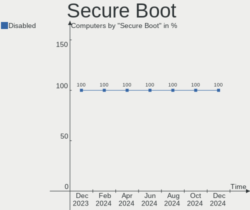
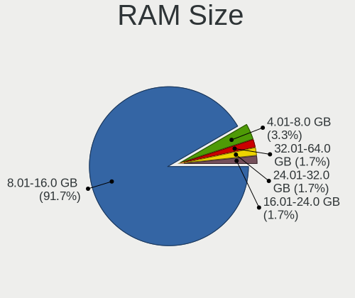
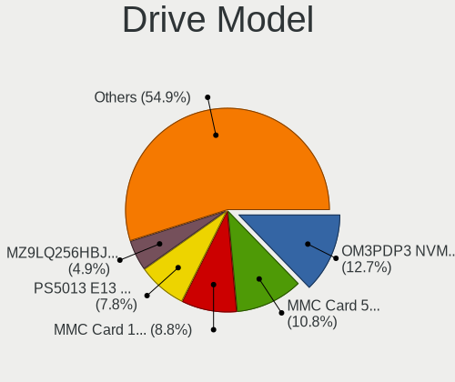
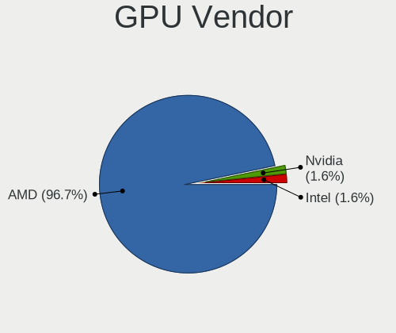
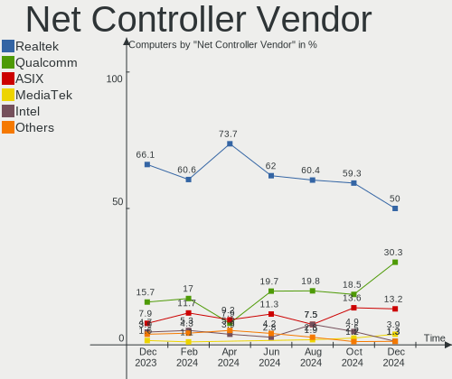
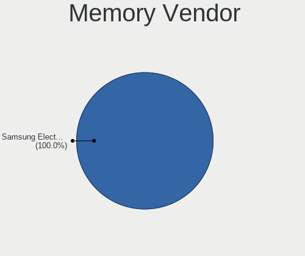
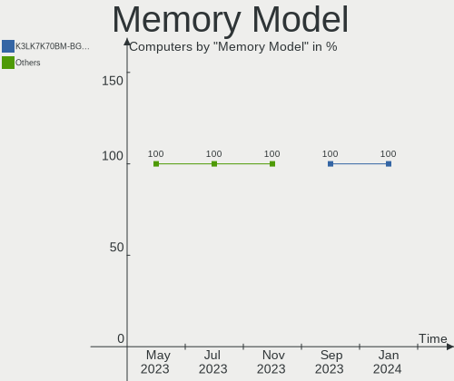
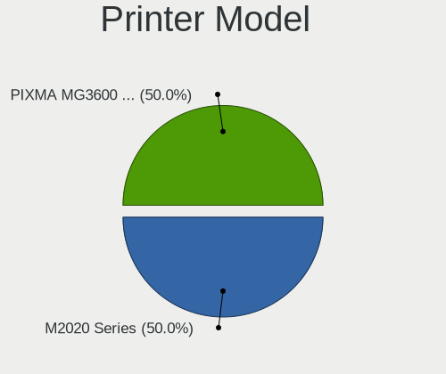
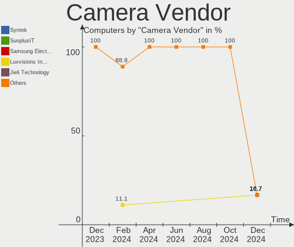

SteamOS - Hardware Trends
-------------------------

A project to identify most popular hardware characteristics and track their change
over time based on data collected by Linux users at https://Linux-Hardware.org.

Anyone can contribute to this report by the [hw-probe](https://github.com/linuxhw/hw-probe) tool:

    sudo -E hw-probe -all -upload

This is a report for all computer types. See also reports for [desktops](/Dist/SteamOS/Desktop/README.md) and [notebooks](/Dist/SteamOS/Notebook/README.md).

This report is for one last month. Overall report since the beginning of time: [TestDays](https://github.com/linuxhw/TestDays)

Period: Nov, 2023.

Contents
--------

* [ System ](#system)
  - [ OS                       ](#os)
  - [ OS Family                ](#os-family)
  - [ Kernel                   ](#kernel)
  - [ Kernel Family            ](#kernel-family)
  - [ Kernel Major Ver.        ](#kernel-major-ver)
  - [ Arch                     ](#arch)
  - [ DE                       ](#de)
  - [ Display Server           ](#display-server)
  - [ Display Manager          ](#display-manager)
  - [ OS Lang                  ](#os-lang)
  - [ Boot Mode                ](#boot-mode)
  - [ Filesystem               ](#filesystem)
  - [ Part. scheme             ](#part-scheme)
  - [ Dual Boot with Linux/BSD ](#dual-boot-with-linuxbsd)
  - [ Dual Boot (Win)          ](#dual-boot-win)

* [ Board ](#board)
  - [ Vendor                   ](#vendor)
  - [ Model                    ](#model)
  - [ Model Family             ](#model-family)
  - [ MFG Year                 ](#mfg-year)
  - [ Form Factor              ](#form-factor)
  - [ Secure Boot              ](#secure-boot)
  - [ Coreboot                 ](#coreboot)
  - [ RAM Size                 ](#ram-size)
  - [ RAM Used                 ](#ram-used)
  - [ Total Drives             ](#total-drives)
  - [ Has CD-ROM               ](#has-cd-rom)
  - [ Has Ethernet             ](#has-ethernet)
  - [ Has WiFi                 ](#has-wifi)
  - [ Has Bluetooth            ](#has-bluetooth)

* [ Location ](#location)
  - [ Country                  ](#country)
  - [ City                     ](#city)

* [ Drives ](#drives)
  - [ Drive Vendor             ](#drive-vendor)
  - [ Drive Model              ](#drive-model)
  - [ HDD Vendor               ](#hdd-vendor)
  - [ SSD Vendor               ](#ssd-vendor)
  - [ Drive Kind               ](#drive-kind)
  - [ Drive Connector          ](#drive-connector)
  - [ Drive Size               ](#drive-size)
  - [ Space Total              ](#space-total)
  - [ Space Used               ](#space-used)
  - [ Malfunc. Drives          ](#malfunc-drives)
  - [ Malfunc. Drive Vendor    ](#malfunc-drive-vendor)
  - [ Malfunc. HDD Vendor      ](#malfunc-hdd-vendor)
  - [ Malfunc. Drive Kind      ](#malfunc-drive-kind)
  - [ Failed Drives            ](#failed-drives)
  - [ Failed Drive Vendor      ](#failed-drive-vendor)
  - [ Drive Status             ](#drive-status)

* [ Storage controller ](#storage-controller)
  - [ Storage Vendor           ](#storage-vendor)
  - [ Storage Model            ](#storage-model)
  - [ Storage Kind             ](#storage-kind)

* [ Processor ](#processor)
  - [ CPU Vendor               ](#cpu-vendor)
  - [ CPU Model                ](#cpu-model)
  - [ CPU Model Family         ](#cpu-model-family)
  - [ CPU Cores                ](#cpu-cores)
  - [ CPU Sockets              ](#cpu-sockets)
  - [ CPU Threads              ](#cpu-threads)
  - [ CPU Op-Modes             ](#cpu-op-modes)
  - [ CPU Microcode            ](#cpu-microcode)
  - [ CPU Microarch            ](#cpu-microarch)

* [ Graphics ](#graphics)
  - [ GPU Vendor               ](#gpu-vendor)
  - [ GPU Model                ](#gpu-model)
  - [ GPU Combo                ](#gpu-combo)
  - [ GPU Driver               ](#gpu-driver)
  - [ GPU Memory               ](#gpu-memory)

* [ Monitor ](#monitor)
  - [ Monitor Vendor           ](#monitor-vendor)
  - [ Monitor Model            ](#monitor-model)
  - [ Monitor Resolution       ](#monitor-resolution)
  - [ Monitor Diagonal         ](#monitor-diagonal)
  - [ Monitor Width            ](#monitor-width)
  - [ Aspect Ratio             ](#aspect-ratio)
  - [ Monitor Area             ](#monitor-area)
  - [ Pixel Density            ](#pixel-density)
  - [ Multiple Monitors        ](#multiple-monitors)

* [ Network ](#network)
  - [ Net Controller Vendor    ](#net-controller-vendor)
  - [ Net Controller Model     ](#net-controller-model)
  - [ Wireless Vendor          ](#wireless-vendor)
  - [ Wireless Model           ](#wireless-model)
  - [ Ethernet Vendor          ](#ethernet-vendor)
  - [ Ethernet Model           ](#ethernet-model)
  - [ Net Controller Kind      ](#net-controller-kind)
  - [ Used Controller          ](#used-controller)
  - [ NICs                     ](#nics)
  - [ IPv6                     ](#ipv6)

* [ Bluetooth ](#bluetooth)
  - [ Bluetooth Vendor         ](#bluetooth-vendor)
  - [ Bluetooth Model          ](#bluetooth-model)

* [ Sound ](#sound)
  - [ Sound Vendor             ](#sound-vendor)
  - [ Sound Model              ](#sound-model)

* [ Memory ](#memory)
  - [ Memory Vendor            ](#memory-vendor)
  - [ Memory Model             ](#memory-model)
  - [ Memory Kind              ](#memory-kind)
  - [ Memory Form Factor       ](#memory-form-factor)
  - [ Memory Size              ](#memory-size)
  - [ Memory Speed             ](#memory-speed)

* [ Printers & scanners ](#printers--scanners)
  - [ Printer Vendor           ](#printer-vendor)
  - [ Printer Model            ](#printer-model)
  - [ Scanner Vendor           ](#scanner-vendor)
  - [ Scanner Model            ](#scanner-model)

* [ Camera ](#camera)
  - [ Camera Vendor            ](#camera-vendor)
  - [ Camera Model             ](#camera-model)

* [ Security ](#security)
  - [ Fingerprint Vendor       ](#fingerprint-vendor)
  - [ Fingerprint Model        ](#fingerprint-model)
  - [ Chipcard Vendor          ](#chipcard-vendor)
  - [ Chipcard Model           ](#chipcard-model)

* [ Unsupported ](#unsupported)
  - [ Unsupported Devices      ](#unsupported-devices)
  - [ Unsupported Device Types ](#unsupported-device-types)

System
------

OS
--

Installed operating systems

| Name            | Computers | Percent |
|-----------------|-----------|---------|
| SteamOS 3.4.11  | 24        | 25.26%  |
| SteamOS 3.5.7   | 23        | 24.21%  |
| SteamOS 3.5.5   | 22        | 23.16%  |
| SteamOS 4       | 6         | 6.32%   |
| SteamOS 3.6     | 5         | 5.26%   |
| SteamOS 3.5.6   | 3         | 3.16%   |
| SteamOS 3.5.1   | 3         | 3.16%   |
| SteamOS 3.4.8   | 3         | 3.16%   |
| SteamOS Rolling | 2         | 2.11%   |
| SteamOS 3.5.3   | 2         | 2.11%   |
| SteamOS 3.4     | 1         | 1.05%   |
| SteamOS 3.1     | 1         | 1.05%   |

OS Family
---------

OS without a version

| Name    | Computers | Percent |
|---------|-----------|---------|
| SteamOS | 95        | 100%    |

Kernel
------

Version of the Linux kernel

| Version                                        | Computers | Percent |
|------------------------------------------------|-----------|---------|
| 6.1.52-valve7-1-neptune-61                     | 25        | 26.32%  |
| 5.13.0-valve37-1-neptune                       | 24        | 25.26%  |
| 6.1.52-valve9-1-neptune-61                     | 23        | 24.21%  |
| 6.3.7-zen1-1-zen                               | 5         | 5.26%   |
| 6.4.12-zen1-1-zen                              | 3         | 3.16%   |
| 6.1.52-valve3-1-neptune-61                     | 3         | 3.16%   |
| 6.1.52-valve2-1-neptune-61                     | 3         | 3.16%   |
| 5.13.0-valve36-1-neptune                       | 3         | 3.16%   |
| 6.1.52-valve6-1-neptune-61                     | 2         | 2.11%   |
| 6.1.52-valve5-1-neptune-61                     | 2         | 2.11%   |
| 5.13.0-valve21.3-1-neptune                     | 1         | 1.05%   |
| 5.13.0-valve10.3-1-neptune-02176-g5fe416c4acd8 | 1         | 1.05%   |

Kernel Family
-------------

Linux kernel without a distro release

| Version | Computers | Percent |
|---------|-----------|---------|
| 6.1.52  | 58        | 61.05%  |
| 5.13.0  | 29        | 30.53%  |
| 6.3.7   | 5         | 5.26%   |
| 6.4.12  | 3         | 3.16%   |

Kernel Major Ver.
-----------------

Linux kernel major version

| Version | Computers | Percent |
|---------|-----------|---------|
| 6.1     | 58        | 61.05%  |
| 5.13    | 29        | 30.53%  |
| 6.3     | 5         | 5.26%   |
| 6.4     | 3         | 3.16%   |

Arch
----

OS architecture (x86_64, i586, etc.)

| Name   | Computers | Percent |
|--------|-----------|---------|
| x86_64 | 95        | 100%    |

DE
--

Desktop Environment

| Name      | Computers | Percent |
|-----------|-----------|---------|
| KDE5      | 94        | 98.95%  |
| gamescope | 1         | 1.05%   |

Display Server
--------------

X11 or Wayland

| Name | Computers | Percent |
|------|-----------|---------|
| X11  | 94        | 98.95%  |
| Tty  | 1         | 1.05%   |

Display Manager
---------------

SDDM, LightDM, etc.

| Name    | Computers | Percent |
|---------|-----------|---------|
| Unknown | 93        | 97.89%  |
| SDDM    | 2         | 2.11%   |

OS Lang
-------

Language

| Lang  | Computers | Percent |
|-------|-----------|---------|
| en_US | 80        | 84.21%  |
| ru_RU | 4         | 4.21%   |
| de_DE | 4         | 4.21%   |
| pt_BR | 2         | 2.11%   |
| es_ES | 2         | 2.11%   |
| zh_CN | 1         | 1.05%   |
| hu_HU | 1         | 1.05%   |
| en_GB | 1         | 1.05%   |

Boot Mode
---------

EFI or BIOS

| Mode | Computers | Percent |
|------|-----------|---------|
| BIOS | 93        | 97.89%  |
| EFI  | 2         | 2.11%   |

Filesystem
----------

Type of filesystem

| Type  | Computers | Percent |
|-------|-----------|---------|
| Btrfs | 94        | 98.95%  |
| Tmpfs | 1         | 1.05%   |

Part. scheme
------------

Scheme of partitioning

| Type    | Computers | Percent |
|---------|-----------|---------|
| Unknown | 93        | 97.89%  |
| GPT     | 2         | 2.11%   |

Dual Boot with Linux/BSD
------------------------

Hosting more than one Linux/BSD

| Dual boot | Computers | Percent |
|-----------|-----------|---------|
| No        | 95        | 100%    |

Dual Boot (Win)
---------------

Hosting Linux and Windows

| Dual boot | Computers | Percent |
|-----------|-----------|---------|
| No        | 95        | 100%    |

Board
-----

Vendor
------

Motherboard manufacturer

| Name                | Computers | Percent |
|---------------------|-----------|---------|
| Valve               | 85        | 89.47%  |
| Gigabyte Technology | 3         | 3.16%   |
| ASUSTek Computer    | 2         | 2.11%   |
| ASRock              | 2         | 2.11%   |
| MSI                 | 1         | 1.05%   |
| Hewlett-Packard     | 1         | 1.05%   |
| Dell                | 1         | 1.05%   |

Model
-----

Motherboard model

| Name                                      | Computers | Percent |
|-------------------------------------------|-----------|---------|
| Valve Jupiter                             | 81        | 85.26%  |
| Valve Galileo                             | 4         | 4.21%   |
| MSI MS-7A72                               | 1         | 1.05%   |
| HP Victus by 15L Gaming Desktop TG02-0xxx | 1         | 1.05%   |
| Gigabyte Z690M AORUS ELITE AX DDR4        | 1         | 1.05%   |
| Gigabyte B650M DS3H                       | 1         | 1.05%   |
| Gigabyte B450M GAMING                     | 1         | 1.05%   |
| Dell Precision M4800                      | 1         | 1.05%   |
| ASUS ROG STRIX B450-F GAMING              | 1         | 1.05%   |
| ASUS ROG Ally RC71L_RC71L                 | 1         | 1.05%   |
| ASRock B550M Pro4                         | 1         | 1.05%   |
| ASRock B450 Gaming K4                     | 1         | 1.05%   |

Model Family
------------

Motherboard model prefix

| Name           | Computers | Percent |
|----------------|-----------|---------|
| Valve Jupiter  | 81        | 85.26%  |
| Valve Galileo  | 4         | 4.21%   |
| ASUS ROG       | 2         | 2.11%   |
| MSI MS-7A72    | 1         | 1.05%   |
| HP Victus      | 1         | 1.05%   |
| Gigabyte Z690M | 1         | 1.05%   |
| Gigabyte B650M | 1         | 1.05%   |
| Gigabyte B450M | 1         | 1.05%   |
| Dell Precision | 1         | 1.05%   |
| ASRock B550M   | 1         | 1.05%   |
| ASRock B450    | 1         | 1.05%   |

MFG Year
--------

Motherboard manufacture year

| Year | Computers | Percent |
|------|-----------|---------|
| 2023 | 82        | 86.32%  |
| 2022 | 6         | 6.32%   |
| 2018 | 3         | 3.16%   |
| 2021 | 1         | 1.05%   |
| 2020 | 1         | 1.05%   |
| 2016 | 1         | 1.05%   |
| 2013 | 1         | 1.05%   |

Form Factor
-----------

Physical design of the computer

| Name     | Computers | Percent |
|----------|-----------|---------|
| Notebook | 87        | 91.58%  |
| Desktop  | 7         | 7.37%   |
| Tablet   | 1         | 1.05%   |

Secure Boot
-----------

Enabled or disabled

| State    | Computers | Percent |
|----------|-----------|---------|
| Disabled | 95        | 100%    |

Coreboot
--------

Have coreboot on board

| Used | Computers | Percent |
|------|-----------|---------|
| No   | 95        | 100%    |

RAM Size
--------

Total RAM memory

| Size in GB | Computers | Percent |
|------------|-----------|---------|
| 8.01-16.0  | 86        | 90.53%  |
| 32.01-64.0 | 3         | 3.16%   |
| 24.01-32.0 | 3         | 3.16%   |
| 16.01-24.0 | 3         | 3.16%   |

RAM Used
--------

Used RAM memory

| Used GB   | Computers | Percent |
|-----------|-----------|---------|
| 3.01-4.0  | 42        | 44.21%  |
| 4.01-8.0  | 35        | 36.84%  |
| 2.01-3.0  | 13        | 13.68%  |
| 1.01-2.0  | 3         | 3.16%   |
| 8.01-16.0 | 2         | 2.11%   |

Total Drives
------------

Number of drives on board

| Drives | Computers | Percent |
|--------|-----------|---------|
| 2      | 56        | 58.95%  |
| 1      | 33        | 34.74%  |
| 3      | 5         | 5.26%   |
| 5      | 1         | 1.05%   |

Has CD-ROM
----------

Has CD-ROM on board

| Presented | Computers | Percent |
|-----------|-----------|---------|
| No        | 92        | 96.84%  |
| Yes       | 3         | 3.16%   |

Has Ethernet
------------

Has Ethernet on board

| Presented | Computers | Percent |
|-----------|-----------|---------|
| No        | 55        | 57.89%  |
| Yes       | 40        | 42.11%  |

Has WiFi
--------

Has WiFi module

| Presented | Computers | Percent |
|-----------|-----------|---------|
| Yes       | 90        | 94.74%  |
| No        | 5         | 5.26%   |

Has Bluetooth
-------------

Has Bluetooth module

| Presented | Computers | Percent |
|-----------|-----------|---------|
| Yes       | 83        | 87.37%  |
| No        | 12        | 12.63%  |

Location
--------

Country
-------

Geographic location (country)

| Country      | Computers | Percent |
|--------------|-----------|---------|
| USA          | 35        | 36.84%  |
| Germany      | 9         | 9.47%   |
| UK           | 8         | 8.42%   |
| Russia       | 6         | 6.32%   |
| Poland       | 4         | 4.21%   |
| Canada       | 4         | 4.21%   |
| Hungary      | 3         | 3.16%   |
| France       | 3         | 3.16%   |
| Brazil       | 3         | 3.16%   |
| Italy        | 2         | 2.11%   |
| Switzerland  | 1         | 1.05%   |
| Sweden       | 1         | 1.05%   |
| Spain        | 1         | 1.05%   |
| Singapore    | 1         | 1.05%   |
| Saudi Arabia | 1         | 1.05%   |
| Romania      | 1         | 1.05%   |
| Portugal     | 1         | 1.05%   |
| Paraguay     | 1         | 1.05%   |
| Netherlands  | 1         | 1.05%   |
| Mexico       | 1         | 1.05%   |
| Ireland      | 1         | 1.05%   |
| Indonesia    | 1         | 1.05%   |
| Denmark      | 1         | 1.05%   |
| China        | 1         | 1.05%   |
| Chile        | 1         | 1.05%   |
| Bulgaria     | 1         | 1.05%   |
| Belarus      | 1         | 1.05%   |
| Australia    | 1         | 1.05%   |

City
----

Geographic location (city)

| City                | Computers | Percent |
|---------------------|-----------|---------|
| St Petersburg       | 3         | 3.16%   |
| Toronto             | 2         | 2.11%   |
| San Diego           | 2         | 2.11%   |
| Oklahoma City       | 2         | 2.11%   |
| Zurich              | 1         | 1.05%   |
| Zerbst              | 1         | 1.05%   |
| Wroclaw             | 1         | 1.05%   |
| Woking              | 1         | 1.05%   |
| Winnipeg            | 1         | 1.05%   |
| Wilhelmshaven       | 1         | 1.05%   |
| Vladivostok         | 1         | 1.05%   |
| Vitry-sur-Seine     | 1         | 1.05%   |
| Viroflay            | 1         | 1.05%   |
| Vancouver           | 1         | 1.05%   |
| Torremolinos        | 1         | 1.05%   |
| The Bronx           | 1         | 1.05%   |
| Teublitz            | 1         | 1.05%   |
| Sydney              | 1         | 1.05%   |
| Sopron              | 1         | 1.05%   |
| Sofia               | 1         | 1.05%   |
| Singapore           | 1         | 1.05%   |
| Sao Paulo           | 1         | 1.05%   |
| Santiago            | 1         | 1.05%   |
| Rueil-Malmaison     | 1         | 1.05%   |
| Porto               | 1         | 1.05%   |
| Portage             | 1         | 1.05%   |
| Phoenix             | 1         | 1.05%   |
| Pesaro              | 1         | 1.05%   |
| Pensacola           | 1         | 1.05%   |
| Oviedo              | 1         | 1.05%   |
| Orlando             | 1         | 1.05%   |
| Ocsa                | 1         | 1.05%   |
| Novorossiysk        | 1         | 1.05%   |
| Neuruppin           | 1         | 1.05%   |
| Muncie              | 1         | 1.05%   |
| Moscow              | 1         | 1.05%   |
| Montreal            | 1         | 1.05%   |
| Minsk               | 1         | 1.05%   |
| Mignano Monte Lungo | 1         | 1.05%   |
| Manchester          | 1         | 1.05%   |

Drives
------

Drive Vendor
------------

Hard drive vendors

| Vendor                      | Computers | Drives | Percent |
|-----------------------------|-----------|--------|---------|
| Unknown                     | 44        | 46     | 27.16%  |
| Phison Electronics          | 33        | 33     | 20.37%  |
| O2 Micro                    | 15        | 15     | 9.26%   |
| Samsung Electronics         | 13        | 14     | 8.02%   |
| Unknown                     | 12        | 12     | 7.41%   |
| Kingston Technology Company | 11        | 11     | 6.79%   |
| Sandisk                     | 9         | 9      | 5.56%   |
| Micron Technology           | 6         | 6      | 3.7%    |
| Kingston                    | 4         | 4      | 2.47%   |
| WDC                         | 3         | 3      | 1.85%   |
| SK hynix                    | 3         | 3      | 1.85%   |
| MAXIO Technology (Hangzhou) | 2         | 2      | 1.23%   |
| Toshiba                     | 1         | 1      | 0.62%   |
| Silicon Motion              | 1         | 1      | 0.62%   |
| Intel                       | 1         | 1      | 0.62%   |
| HUSKY                       | 1         | 1      | 0.62%   |
| General                     | 1         | 1      | 0.62%   |
| Crucial                     | 1         | 1      | 0.62%   |
| ASMT                        | 1         | 1      | 0.62%   |

Drive Model
-----------

Hard drive models

| Model                                                 | Computers | Percent |
|-------------------------------------------------------|-----------|---------|
| Phison PS5013 E13 NVMe Controller 512GB               | 27        | 16.36%  |
| Unknown MMC Card  512GB                               | 20        | 12.12%  |
| O2 Micro E2M2 64GB                                    | 15        | 9.09%   |
| Unknown MMC Card  256GB                               | 12        | 7.27%   |
| Unknown                                               | 12        | 7.27%   |
| Kingston Company OM3PDP3 NVMe SSD 256GB               | 11        | 6.67%   |
| Samsung MZ9LQ256HBJD-00BVL 256GB                      | 7         | 4.24%   |
| Unknown MMC Card  64GB                                | 3         | 1.82%   |
| Sandisk WD PC SN740 SDDPTQD-1T00 1TB                  | 3         | 1.82%   |
| Samsung MZ9LQ512HBLU-00BVL 512GB                      | 3         | 1.82%   |
| Kingston SA400S37240G 240GB SSD                       | 3         | 1.82%   |
| Unknown NVMe SSD Drive 1024GB                         | 2         | 1.21%   |
| Unknown MMC Card  32GB                                | 2         | 1.21%   |
| SK hynix BC711 NVMe 256GB                             | 2         | 1.21%   |
| Phison Corsair MP600 MINI 1TB                         | 2         | 1.21%   |
| Micron 2400_MTFDKBK512QFM 512GB                       | 2         | 1.21%   |
| Micron 2400_MTFDKBK1T0QFM 1024GB                      | 2         | 1.21%   |
| MAXIO (Hangzhou) NVMe SSD Controller MAP1202 1024GB   | 2         | 1.21%   |
| WDC WD5000AAKX-22ERMA0 500GB                          | 1         | 0.61%   |
| WDC WD10EZEX-22BN5A0 1TB                              | 1         | 0.61%   |
| WDC WD10EZEX-08WN4A0 1TB                              | 1         | 0.61%   |
| Unknown MMC Card  7GB                                 | 1         | 0.61%   |
| Unknown MMC Card  536GB                               | 1         | 0.61%   |
| Unknown MMC Card  393GB                               | 1         | 0.61%   |
| Unknown MMC Card  248GB                               | 1         | 0.61%   |
| Unknown MMC Card  1TB                                 | 1         | 0.61%   |
| Unknown MMC Card  196GB                               | 1         | 0.61%   |
| Unknown MMC Card  128GB                               | 1         | 0.61%   |
| Toshiba HDWD240 4TB                                   | 1         | 0.61%   |
| SK hynix BC711 NVMe 512GB                             | 1         | 0.61%   |
| Silicon Motion SM2263EN/SM2263XT SSD Controller 256GB | 1         | 0.61%   |
| Sandisk WDC PC SN530 SDBPTPZ-1T00 1024GB              | 1         | 0.61%   |
| Sandisk WD PC SN740 SDDPTQE-2T00 2TB                  | 1         | 0.61%   |
| Sandisk WD CH SN560 SDCPTPD-1T00-1024 930GB           | 1         | 0.61%   |
| Sandisk WD Blue SN570 500GB                           | 1         | 0.61%   |
| Sandisk WD Black SN850 1024GB                         | 1         | 0.61%   |
| SanDisk Extreme SSD 500GB                             | 1         | 0.61%   |
| Samsung SSD 850 EVO 250GB                             | 1         | 0.61%   |
| Samsung PSSD T7 2TB                                   | 1         | 0.61%   |
| Samsung MZALQ512HALU-000L1 512GB                      | 1         | 0.61%   |

HDD Vendor
----------

Hard disk drive vendors

| Vendor  | Computers | Drives | Percent |
|---------|-----------|--------|---------|
| WDC     | 3         | 3      | 60%     |
| Toshiba | 1         | 1      | 20%     |
| ASMT    | 1         | 1      | 20%     |

SSD Vendor
----------

Solid state drive vendors

| Vendor              | Computers | Drives | Percent |
|---------------------|-----------|--------|---------|
| Kingston            | 3         | 3      | 33.33%  |
| Samsung Electronics | 2         | 2      | 22.22%  |
| SanDisk             | 1         | 1      | 11.11%  |
| Micron Technology   | 1         | 1      | 11.11%  |
| HUSKY               | 1         | 1      | 11.11%  |
| Crucial             | 1         | 1      | 11.11%  |

Drive Kind
----------

HDD or SSD

| Kind    | Computers | Drives | Percent |
|---------|-----------|--------|---------|
| NVMe    | 93        | 94     | 57.06%  |
| MMC     | 56        | 56     | 34.36%  |
| SSD     | 9         | 9      | 5.52%   |
| HDD     | 4         | 5      | 2.45%   |
| Unknown | 1         | 1      | 0.61%   |

Drive Connector
---------------

SATA, SAS, NVMe, etc.

| Type | Computers | Drives | Percent |
|------|-----------|--------|---------|
| NVMe | 93        | 94     | 58.13%  |
| MMC  | 56        | 56     | 35%     |
| SATA | 7         | 11     | 4.38%   |
| SAS  | 4         | 4      | 2.5%    |

Drive Size
----------

Size of hard drive

| Size in TB | Computers | Drives | Percent |
|------------|-----------|--------|---------|
| 0.01-0.5   | 7         | 7      | 53.85%  |
| 0.51-1.0   | 3         | 4      | 23.08%  |
| 1.01-2.0   | 2         | 2      | 15.38%  |
| 3.01-4.0   | 1         | 1      | 7.69%   |

Space Total
-----------

Amount of disk space available on the file system

| Size in GB     | Computers | Percent |
|----------------|-----------|---------|
| 501-1000       | 31        | 32.63%  |
| 251-500        | 21        | 22.11%  |
| 101-250        | 21        | 22.11%  |
| 1001-2000      | 11        | 11.58%  |
| 51-100         | 8         | 8.42%   |
| More than 3000 | 1         | 1.05%   |
| 2001-3000      | 1         | 1.05%   |
| Unknown        | 1         | 1.05%   |

Space Used
----------

Amount of used disk space

| Used GB   | Computers | Percent |
|-----------|-----------|---------|
| 101-250   | 29        | 30.53%  |
| 251-500   | 15        | 15.79%  |
| 501-1000  | 15        | 15.79%  |
| 1-20      | 12        | 12.63%  |
| 21-50     | 10        | 10.53%  |
| 51-100    | 7         | 7.37%   |
| 1001-2000 | 6         | 6.32%   |
| Unknown   | 1         | 1.05%   |

Malfunc. Drives
---------------

Drive models with a malfunction

Zero info for selected period =(

Malfunc. Drive Vendor
---------------------

Vendors of faulty drives

Zero info for selected period =(

Malfunc. HDD Vendor
-------------------

Vendors of faulty HDD drives

Zero info for selected period =(

Malfunc. Drive Kind
-------------------

Kinds of faulty drives

Zero info for selected period =(

Failed Drives
-------------

Failed drive models

Zero info for selected period =(

Failed Drive Vendor
-------------------

Failed drive vendors

Zero info for selected period =(

Drive Status
------------

Number of failed and malfunc. drives

| Status   | Computers | Drives | Percent |
|----------|-----------|--------|---------|
| Detected | 94        | 163    | 97.92%  |
| Works    | 2         | 2      | 2.08%   |

Storage controller
------------------

Storage Vendor
--------------

Storage controller vendors

| Vendor                      | Computers | Percent |
|-----------------------------|-----------|---------|
| Phison Electronics          | 33        | 32.04%  |
| O2 Micro                    | 15        | 14.56%  |
| Samsung Electronics         | 12        | 11.65%  |
| Kingston Technology Company | 12        | 11.65%  |
| Sandisk                     | 8         | 7.77%   |
| AMD                         | 6         | 5.83%   |
| Micron Technology           | 5         | 4.85%   |
| SK hynix                    | 3         | 2.91%   |
| Intel                       | 3         | 2.91%   |
| MAXIO Technology (Hangzhou) | 2         | 1.94%   |
| INNOGRIT                    | 2         | 1.94%   |
| Silicon Motion              | 1         | 0.97%   |
| ASMedia Technology          | 1         | 0.97%   |

Storage Model
-------------

Storage controller models

| Model                                                             | Computers | Percent |
|-------------------------------------------------------------------|-----------|---------|
| Phison PS5013-E13 PCIe3 NVMe Controller (DRAM-less)               | 27        | 25%     |
| O2 Micro FORESEE E2M2 NVMe SSD                                    | 15        | 13.89%  |
| Samsung NVMe SSD Controller 980 (DRAM-less)                       | 12        | 11.11%  |
| Kingston Company OM3PDP3 NVMe SSD                                 | 11        | 10.19%  |
| Micron 2400 NVMe SSD (DRAM-less)                                  | 5         | 4.63%   |
| AMD FCH SATA Controller [AHCI mode]                               | 5         | 4.63%   |
| Sandisk PC SN740 NVMe SSD (DRAM-less)                             | 4         | 3.7%    |
| Phison PS5021-E21 PCIe4 NVMe Controller (DRAM-less)               | 4         | 3.7%    |
| AMD 400 Series Chipset SATA Controller                            | 4         | 3.7%    |
| SK hynix Gold P31/BC711/PC711 NVMe Solid State Drive              | 3         | 2.78%   |
| MAXIO (Hangzhou) NVMe SSD Controller MAP1202                      | 2         | 1.85%   |
| INNOGRIT NVMe SSD Controller IG5220 (DRAM-less)                   | 2         | 1.85%   |
| Silicon Motion SM2263EN/SM2263XT (DRAM-less) NVMe SSD Controllers | 1         | 0.93%   |
| SanDisk WD PC SN810 / Black SN850 NVMe SSD                        | 1         | 0.93%   |
| Sandisk WD CH SN560 NVMe SSD                                      | 1         | 0.93%   |
| SanDisk Ultra 3D / WD Blue SN570 NVMe SSD (DRAM-less)             | 1         | 0.93%   |
| SanDisk IX SN530 NVMe SSD (DRAM-less)                             | 1         | 0.93%   |
| Phison PS5019-E19 PCIe4 NVMe Controller (DRAM-less)               | 1         | 0.93%   |
| Phison E12 NVMe Controller                                        | 1         | 0.93%   |
| Kingston Company KC3000/FURY Renegade NVMe SSD E18                | 1         | 0.93%   |
| Intel SATA Controller [RAID mode]                                 | 1         | 0.93%   |
| Intel PROSet/Wireless WiFi Software extension                     | 1         | 0.93%   |
| Intel Alder Lake-S PCH SATA Controller [AHCI Mode]                | 1         | 0.93%   |
| Intel 82801 Mobile SATA Controller [RAID mode]                    | 1         | 0.93%   |
| ASMedia ASM1062 Serial ATA Controller                             | 1         | 0.93%   |
| AMD 500 Series Chipset SATA Controller                            | 1         | 0.93%   |

Storage Kind
------------

Kind of storage controller (IDE, SATA, NVMe, SAS, ...)

| Kind | Computers | Percent |
|------|-----------|---------|
| NVMe | 93        | 91.18%  |
| SATA | 8         | 7.84%   |
| RAID | 1         | 0.98%   |

Processor
---------

CPU Vendor
----------

Processor vendors

| Vendor | Computers | Percent |
|--------|-----------|---------|
| AMD    | 92        | 96.84%  |
| Intel  | 3         | 3.16%   |

CPU Model
---------

Processor models

| Model                                      | Computers | Percent |
|--------------------------------------------|-----------|---------|
| AMD Custom APU 0405                        | 85        | 89.47%  |
| AMD Ryzen 5 3600 6-Core Processor          | 2         | 2.11%   |
| Intel Core i7-7700K CPU @ 4.20GHz          | 1         | 1.05%   |
| Intel Core i7-4800MQ CPU @ 2.70GHz         | 1         | 1.05%   |
| Intel 12th Gen Core i9-12900KS             | 1         | 1.05%   |
| AMD Ryzen Z1 Extreme                       | 1         | 1.05%   |
| AMD Ryzen 9 7900X 12-Core Processor        | 1         | 1.05%   |
| AMD Ryzen 7 2700X Eight-Core Processor     | 1         | 1.05%   |
| AMD Ryzen 5 PRO 4650G with Radeon Graphics | 1         | 1.05%   |
| AMD Ryzen 5 5600G with Radeon Graphics     | 1         | 1.05%   |

CPU Model Family
----------------

Processor model prefix

| Model           | Computers | Percent |
|-----------------|-----------|---------|
| Other           | 87        | 91.58%  |
| AMD Ryzen 5     | 3         | 3.16%   |
| Intel Core i7   | 2         | 2.11%   |
| AMD Ryzen 9     | 1         | 1.05%   |
| AMD Ryzen 7     | 1         | 1.05%   |
| AMD Ryzen 5 PRO | 1         | 1.05%   |

CPU Cores
---------

Number of processor cores

| Number | Computers | Percent |
|--------|-----------|---------|
| 4      | 87        | 91.58%  |
| 6      | 4         | 4.21%   |
| 8      | 2         | 2.11%   |
| 16     | 1         | 1.05%   |
| 12     | 1         | 1.05%   |

CPU Sockets
-----------

Number of sockets

| Number | Computers | Percent |
|--------|-----------|---------|
| 1      | 95        | 100%    |

CPU Threads
-----------

Threads per core (Hyper-Threading)

| Number | Computers | Percent |
|--------|-----------|---------|
| 2      | 95        | 100%    |

CPU Op-Modes
------------

CPU Operation Modes (32-bit, 64-bit)

| Op mode        | Computers | Percent |
|----------------|-----------|---------|
| 32-bit, 64-bit | 95        | 100%    |

CPU Microcode
-------------

Microcode number

| Number     | Computers | Percent |
|------------|-----------|---------|
| Unknown    | 93        | 97.89%  |
| 0x0a704104 | 1         | 1.05%   |
| 0x08701021 | 1         | 1.05%   |

CPU Microarch
-------------

Microarchitecture

| Name     | Computers | Percent |
|----------|-----------|---------|
| Unknown  | 88        | 92.63%  |
| Zen 2    | 3         | 3.16%   |
| Zen+     | 1         | 1.05%   |
| Zen 3    | 1         | 1.05%   |
| KabyLake | 1         | 1.05%   |
| Haswell  | 1         | 1.05%   |

Graphics
--------

GPU Vendor
----------

Vendors of graphics cards

| Vendor | Computers | Percent |
|--------|-----------|---------|
| AMD    | 93        | 95.88%  |
| Nvidia | 2         | 2.06%   |
| Intel  | 2         | 2.06%   |

GPU Model
---------

Graphics card models

| Model                                                        | Computers | Percent |
|--------------------------------------------------------------|-----------|---------|
| AMD VanGogh [AMD Custom GPU 0405]                            | 81        | 81.82%  |
| AMD VGA compatible controller                                | 4         | 4.04%   |
| AMD Lexa PRO [Radeon 540/540X/550/550X / RX 540X/550/550X]   | 2         | 2.02%   |
| Nvidia GP104 [GeForce GTX 1080]                              | 1         | 1.01%   |
| Nvidia GK107GLM [Quadro K1100M]                              | 1         | 1.01%   |
| Intel AlderLake-S GT1                                        | 1         | 1.01%   |
| Intel 4th Gen Core Processor Integrated Graphics Controller  | 1         | 1.01%   |
| AMD Raphael                                                  | 1         | 1.01%   |
| AMD Phoenix1                                                 | 1         | 1.01%   |
| AMD Navi 32 [Radeon RX 7700 XT / 7800 XT]                    | 1         | 1.01%   |
| AMD Navi 31 [Radeon RX 7900 XT/7900 XTX]                     | 1         | 1.01%   |
| AMD Navi 23 [Radeon RX 6600/6600 XT/6600M]                   | 1         | 1.01%   |
| AMD Navi 21 [Radeon RX 6800/6800 XT / 6900 XT]               | 1         | 1.01%   |
| AMD Navi 10 [Radeon RX 5600 OEM/5600 XT / 5700/5700 XT]      | 1         | 1.01%   |
| AMD Cezanne [Radeon Vega Series / Radeon Vega Mobile Series] | 1         | 1.01%   |

GPU Combo
---------

Combinations of graphics cards

| Name           | Computers | Percent |
|----------------|-----------|---------|
| 1 x AMD        | 90        | 94.74%  |
| 2 x AMD        | 2         | 2.11%   |
| 1 x Nvidia     | 1         | 1.05%   |
| Intel + Nvidia | 1         | 1.05%   |
| Intel + AMD    | 1         | 1.05%   |

GPU Driver
----------

Free vs proprietary

| Driver | Computers | Percent |
|--------|-----------|---------|
| Free   | 95        | 100%    |

GPU Memory
----------

Total video memory

| Size in GB | Computers | Percent |
|------------|-----------|---------|
| Unknown    | 93        | 97.89%  |
| 3.01-4.0   | 2         | 2.11%   |

Monitor
-------

Monitor Vendor
--------------

Monitor vendors

| Vendor               | Computers | Percent |
|----------------------|-----------|---------|
| Valve                | 83        | 72.17%  |
| Hewlett-Packard      | 4         | 3.48%   |
| Samsung Electronics  | 3         | 2.61%   |
| Goldstar             | 3         | 2.61%   |
| RGT                  | 2         | 1.74%   |
| Dell                 | 2         | 1.74%   |
| AOC                  | 2         | 1.74%   |
| Ancor Communications | 2         | 1.74%   |
| Acer                 | 2         | 1.74%   |
| Vestel Elektronik    | 1         | 0.87%   |
| Unknown (XXX)        | 1         | 0.87%   |
| Toshiba              | 1         | 0.87%   |
| TMX                  | 1         | 0.87%   |
| Philips              | 1         | 0.87%   |
| Panasonic            | 1         | 0.87%   |
| Lenovo               | 1         | 0.87%   |
| GreenWood            | 1         | 0.87%   |
| GAN                  | 1         | 0.87%   |
| CHR                  | 1         | 0.87%   |
| AU Optronics         | 1         | 0.87%   |
| ASUSTek Computer     | 1         | 0.87%   |

Monitor Model
-------------

Monitor models

| Model                                                                   | Computers | Percent |
|-------------------------------------------------------------------------|-----------|---------|
| Valve ANX7530 U VLV3001 800x1280 100x150mm 7.1-inch                     | 79        | 68.7%   |
| Valve ANX7530 U VLV3004 800x1280 100x160mm 7.4-inch                     | 3         | 2.61%   |
| Vestel Elektronik 32W_LCD_TV VES3700 1920x1080 706x398mm 31.9-inch      | 1         | 0.87%   |
| Valve ANX7530 U VLV3003 800x1280 100x160mm 7.4-inch                     | 1         | 0.87%   |
| Unknown (XXX) Beyond TV XXX2851 3840x2160 1209x680mm 54.6-inch          | 1         | 0.87%   |
| Toshiba TV TSB0206 1920x1080 890x500mm 40.2-inch                        | 1         | 0.87%   |
| TMX TL070FVXS01-0 TMX0002 1920x1080 160x100mm 7.4-inch                  | 1         | 0.87%   |
| Samsung Electronics SMT24A350 SAM07AD 1920x1080 530x300mm 24.0-inch     | 1         | 0.87%   |
| Samsung Electronics LCD Monitor SAM7017 3840x2160 1872x1053mm 84.6-inch | 1         | 0.87%   |
| Samsung Electronics LCD Monitor SAM0C44 3840x2160 890x500mm 40.2-inch   | 1         | 0.87%   |
| RGT LCD Monitor RGT5211 1920x1080 519x324mm 24.1-inch                   | 1         | 0.87%   |
| RGT LCD Monitor RGT1352 1920x1080 480x270mm 21.7-inch                   | 1         | 0.87%   |
| Philips PHL 499P9 PHL092A 3840x1080 1193x336mm 48.8-inch                | 1         | 0.87%   |
| Panasonic PanasonicTV0 MEIA0C2 1920x1080 698x392mm 31.5-inch            | 1         | 0.87%   |
| Lenovo LEN G34w-10 LEN66A1 3440x1440 800x330mm 34.1-inch                | 1         | 0.87%   |
| Hewlett-Packard V273a HPN3449 1920x1080 598x336mm 27.0-inch             | 1         | 0.87%   |
| Hewlett-Packard M24f FHD HPN3706 1920x1080 527x296mm 23.8-inch          | 1         | 0.87%   |
| Hewlett-Packard E243 HPN3469 1920x1080 527x296mm 23.8-inch              | 1         | 0.87%   |
| Hewlett-Packard 27es HWP3326 1920x1080 598x336mm 27.0-inch              | 1         | 0.87%   |
| GreenWood ARZOPA GWD0156 1920x1080 350x190mm 15.7-inch                  | 1         | 0.87%   |
| Goldstar LG TV SSCR2 GSMC0C8 3840x2160                                  | 1         | 0.87%   |
| Goldstar FULL HD GSM5BDF 1920x1080 480x270mm 21.7-inch                  | 1         | 0.87%   |
| Goldstar 2D FHD TV GSM59C6 1920x1080 509x286mm 23.0-inch                | 1         | 0.87%   |
| GAN PD1560 GAN1560 1920x1080 531x299mm 24.0-inch                        | 1         | 0.87%   |
| Dell U2722D DEL422F 2560x1440 597x336mm 27.0-inch                       | 1         | 0.87%   |
| Dell S2340M DELD05A 1920x1080 509x286mm 23.0-inch                       | 1         | 0.87%   |
| CHR CH7217 CHR7038 1920x1080                                            | 1         | 0.87%   |
| AU Optronics LCD Monitor AUO21ED 1920x1080 344x194mm 15.5-inch          | 1         | 0.87%   |
| ASUSTek Computer VG248 AUS24AC 1920x1080 531x299mm 24.0-inch            | 1         | 0.87%   |
| AOC 2270W AOC2270 1920x1080 477x268mm 21.5-inch                         | 1         | 0.87%   |
| AOC 2070W AOC2070 1600x900 430x240mm 19.4-inch                          | 1         | 0.87%   |
| Ancor Communications ASUS VS247 ACI249A 1920x1080 521x293mm 23.5-inch   | 1         | 0.87%   |
| Ancor Communications ASUS MX239 ACI23C2 1920x1080 528x310mm 24.1-inch   | 1         | 0.87%   |
| Acer KA222Q H ACR0B64 1920x1080 478x260mm 21.4-inch                     | 1         | 0.87%   |
| Acer K242HL ACR03E3 1920x1080 531x299mm 24.0-inch                       | 1         | 0.87%   |

Monitor Resolution
------------------

Monitor screen resolution

| Resolution      | Computers | Percent |
|-----------------|-----------|---------|
| 800x1280        | 83        | 72.81%  |
| 1920x1080 (FHD) | 22        | 19.3%   |
| 3840x2160 (4K)  | 5         | 4.39%   |
| 3840x1080       | 1         | 0.88%   |
| 3440x1440       | 1         | 0.88%   |
| 2560x1440 (QHD) | 1         | 0.88%   |
| 1600x900 (HD+)  | 1         | 0.88%   |

Monitor Diagonal
----------------

Diagonal size in inches

| Inches  | Computers | Percent |
|---------|-----------|---------|
| 7       | 84        | 73.04%  |
| 24      | 8         | 6.96%   |
| 21      | 4         | 3.48%   |
| 84      | 3         | 2.61%   |
| 27      | 3         | 2.61%   |
| 23      | 3         | 2.61%   |
| 15      | 2         | 1.74%   |
| 74      | 1         | 0.87%   |
| 72      | 1         | 0.87%   |
| 54      | 1         | 0.87%   |
| 48      | 1         | 0.87%   |
| 34      | 1         | 0.87%   |
| 31      | 1         | 0.87%   |
| 19      | 1         | 0.87%   |
| Unknown | 1         | 0.87%   |

Monitor Width
-------------

Physical width

| Width in mm | Computers | Percent |
|-------------|-----------|---------|
| 1-100       | 83        | 72.17%  |
| 501-600     | 14        | 12.17%  |
| 401-500     | 5         | 4.35%   |
| 1501-2000   | 5         | 4.35%   |
| 301-350     | 2         | 1.74%   |
| 1001-1500   | 2         | 1.74%   |
| 701-800     | 1         | 0.87%   |
| 601-700     | 1         | 0.87%   |
| 101-200     | 1         | 0.87%   |
| Unknown     | 1         | 0.87%   |

Aspect Ratio
------------

Proportional relationship between the width and the height

| Ratio | Computers | Percent |
|-------|-----------|---------|
| 0.67  | 79        | 68.7%   |
| 16/9  | 27        | 23.48%  |
| 0.62  | 4         | 3.48%   |
| 16/10 | 3         | 2.61%   |
| 32/9  | 1         | 0.87%   |
| 21/9  | 1         | 0.87%   |

Monitor Area
------------

Area in inch²

| Area in inch² | Computers | Percent |
|----------------|-----------|---------|
| 1-40           | 84        | 73.04%  |
| 201-250        | 10        | 8.7%    |
| More than 1000 | 6         | 5.22%   |
| 301-350        | 3         | 2.61%   |
| 251-300        | 3         | 2.61%   |
| 151-200        | 3         | 2.61%   |
| 351-500        | 2         | 1.74%   |
| 101-110        | 2         | 1.74%   |
| 501-1000       | 1         | 0.87%   |
| Unknown        | 1         | 0.87%   |

Pixel Density
-------------

Pixels per inch

| Density       | Computers | Percent |
|---------------|-----------|---------|
| 161-240       | 83        | 72.81%  |
| 51-100        | 20        | 17.54%  |
| 101-120       | 6         | 5.26%   |
| 121-160       | 2         | 1.75%   |
| More than 240 | 1         | 0.88%   |
| 1-50          | 1         | 0.88%   |
| Unknown       | 1         | 0.88%   |

Multiple Monitors
-----------------

Total monitors connected

| Total | Computers | Percent |
|-------|-----------|---------|
| 1     | 73        | 76.84%  |
| 2     | 21        | 22.11%  |
| 3     | 1         | 1.05%   |

Network
-------

Net Controller Vendor
---------------------

Controller vendors

| Vendor                | Computers | Percent |
|-----------------------|-----------|---------|
| Realtek Semiconductor | 86        | 74.78%  |
| ASIX Electronics      | 17        | 14.78%  |
| Qualcomm              | 4         | 3.48%   |
| Intel                 | 4         | 3.48%   |
| Xiaomi                | 1         | 0.87%   |
| MediaTek              | 1         | 0.87%   |
| DisplayLink           | 1         | 0.87%   |
| Broadcom Limited      | 1         | 0.87%   |

Net Controller Model
--------------------

Controller models

| Model                                                                                         | Computers | Percent |
|-----------------------------------------------------------------------------------------------|-----------|---------|
| Realtek RTL8822CE 802.11ac PCIe Wireless Network Adapter                                      | 81        | 61.36%  |
| ASIX AX88179 Gigabit Ethernet                                                                 | 17        | 12.88%  |
| Realtek RTL8153 Gigabit Ethernet Adapter                                                      | 11        | 8.33%   |
| Realtek RTL8152 Fast Ethernet Adapter                                                         | 4         | 3.03%   |
| Qualcomm QCNFA765 Wireless Network Adapter                                                    | 4         | 3.03%   |
| Realtek RTL8111/8168/8411 PCI Express Gigabit Ethernet Controller                             | 3         | 2.27%   |
| Xiaomi Mi/Redmi series (RNDIS)                                                                | 1         | 0.76%   |
| Realtek RTL8125 2.5GbE Controller                                                             | 1         | 0.76%   |
| Realtek Realtek 8812AU/8821AU 802.11ac WLAN Adapter [USB Wireless Dual-Band Adapter 2.4/5Ghz] | 1         | 0.76%   |
| Realtek 802.11ac NIC                                                                          | 1         | 0.76%   |
| MediaTek MT7922 802.11ax PCI Express Wireless Network Adapter                                 | 1         | 0.76%   |
| Intel I211 Gigabit Network Connection                                                         | 1         | 0.76%   |
| Intel Ethernet Controller I225-V                                                              | 1         | 0.76%   |
| Intel Ethernet Connection I217-LM                                                             | 1         | 0.76%   |
| Intel Ethernet Connection (2) I219-V                                                          | 1         | 0.76%   |
| Intel Alder Lake-S PCH CNVi WiFi                                                              | 1         | 0.76%   |
| DisplayLink Targus USB3 DV4K DOCK w PD100W                                                    | 1         | 0.76%   |
| Broadcom Limited BCM4352 802.11ac Dual Band Wireless Network Adapter                          | 1         | 0.76%   |

Wireless Vendor
---------------

Wireless vendors

| Vendor                | Computers | Percent |
|-----------------------|-----------|---------|
| Realtek Semiconductor | 83        | 92.22%  |
| Qualcomm              | 4         | 4.44%   |
| MediaTek              | 1         | 1.11%   |
| Intel                 | 1         | 1.11%   |
| Broadcom Limited      | 1         | 1.11%   |

Wireless Model
--------------

Wireless models

| Model                                                                                         | Computers | Percent |
|-----------------------------------------------------------------------------------------------|-----------|---------|
| Realtek RTL8822CE 802.11ac PCIe Wireless Network Adapter                                      | 81        | 90%     |
| Qualcomm QCNFA765 Wireless Network Adapter                                                    | 4         | 4.44%   |
| Realtek Realtek 8812AU/8821AU 802.11ac WLAN Adapter [USB Wireless Dual-Band Adapter 2.4/5Ghz] | 1         | 1.11%   |
| Realtek 802.11ac NIC                                                                          | 1         | 1.11%   |
| MediaTek MT7922 802.11ax PCI Express Wireless Network Adapter                                 | 1         | 1.11%   |
| Intel Alder Lake-S PCH CNVi WiFi                                                              | 1         | 1.11%   |
| Broadcom Limited BCM4352 802.11ac Dual Band Wireless Network Adapter                          | 1         | 1.11%   |

Ethernet Vendor
---------------

Ethernet vendors

| Vendor                | Computers | Percent |
|-----------------------|-----------|---------|
| Realtek Semiconductor | 18        | 43.9%   |
| ASIX Electronics      | 17        | 41.46%  |
| Intel                 | 4         | 9.76%   |
| Xiaomi                | 1         | 2.44%   |
| DisplayLink           | 1         | 2.44%   |

Ethernet Model
--------------

Ethernet models

| Model                                                             | Computers | Percent |
|-------------------------------------------------------------------|-----------|---------|
| ASIX AX88179 Gigabit Ethernet                                     | 17        | 40.48%  |
| Realtek RTL8153 Gigabit Ethernet Adapter                          | 11        | 26.19%  |
| Realtek RTL8152 Fast Ethernet Adapter                             | 4         | 9.52%   |
| Realtek RTL8111/8168/8411 PCI Express Gigabit Ethernet Controller | 3         | 7.14%   |
| Xiaomi Mi/Redmi series (RNDIS)                                    | 1         | 2.38%   |
| Realtek RTL8125 2.5GbE Controller                                 | 1         | 2.38%   |
| Intel I211 Gigabit Network Connection                             | 1         | 2.38%   |
| Intel Ethernet Controller I225-V                                  | 1         | 2.38%   |
| Intel Ethernet Connection I217-LM                                 | 1         | 2.38%   |
| Intel Ethernet Connection (2) I219-V                              | 1         | 2.38%   |
| DisplayLink Targus USB3 DV4K DOCK w PD100W                        | 1         | 2.38%   |

Net Controller Kind
-------------------

Ethernet, WiFi or modem

| Kind     | Computers | Percent |
|----------|-----------|---------|
| WiFi     | 90        | 69.23%  |
| Ethernet | 40        | 30.77%  |

Used Controller
---------------

Currently used network controller

| Kind     | Computers | Percent |
|----------|-----------|---------|
| WiFi     | 84        | 90.32%  |
| Ethernet | 9         | 9.68%   |

NICs
----

Total network controllers on board

| Total | Computers | Percent |
|-------|-----------|---------|
| 1     | 92        | 96.84%  |
| 2     | 2         | 2.11%   |
| 0     | 1         | 1.05%   |

IPv6
----

IPv6 vs IPv4

| Used | Computers | Percent |
|------|-----------|---------|
| No   | 55        | 57.89%  |
| Yes  | 40        | 42.11%  |

Bluetooth
---------

Bluetooth Vendor
----------------

Controller vendors

| Vendor                  | Computers | Percent |
|-------------------------|-----------|---------|
| IMC Networks            | 78        | 92.86%  |
| Cambridge Silicon Radio | 2         | 2.38%   |
| Realtek Semiconductor   | 1         | 1.19%   |
| Realtek                 | 1         | 1.19%   |
| Intel                   | 1         | 1.19%   |
| Dell                    | 1         | 1.19%   |

Bluetooth Model
---------------

Controller models

| Model                                               | Computers | Percent |
|-----------------------------------------------------|-----------|---------|
| IMC Networks Bluetooth Radio                        | 78        | 92.86%  |
| Cambridge Silicon Radio Bluetooth Dongle (HCI mode) | 2         | 2.38%   |
| Realtek 802.11ac WLAN Adapter                       | 1         | 1.19%   |
| Realtek Bluetooth Radio                             | 1         | 1.19%   |
| Intel AX201 Bluetooth                               | 1         | 1.19%   |
| Dell Broadcom BCM20702A0 Bluetooth                  | 1         | 1.19%   |

Sound
-----

Sound Vendor
------------

Sound card vendors

| Vendor                 | Computers | Percent |
|------------------------|-----------|---------|
| AMD                    | 93        | 90.29%  |
| Intel                  | 3         | 2.91%   |
| Nvidia                 | 2         | 1.94%   |
| Sony                   | 1         | 0.97%   |
| Razer USA              | 1         | 0.97%   |
| Logitech               | 1         | 0.97%   |
| Generalplus Technology | 1         | 0.97%   |
| Focusrite-Novation     | 1         | 0.97%   |

Sound Model
-----------

Sound card models

| Model                                                               | Computers | Percent |
|---------------------------------------------------------------------|-----------|---------|
| AMD Rembrandt Radeon High Definition Audio Controller               | 87        | 76.32%  |
| AMD Family 17h/19h HD Audio Controller                              | 4         | 3.51%   |
| AMD Starship/Matisse HD Audio Controller                            | 2         | 1.75%   |
| AMD Renoir Radeon High Definition Audio Controller                  | 2         | 1.75%   |
| AMD Navi 31 HDMI/DP Audio                                           | 2         | 1.75%   |
| AMD Navi 21/23 HDMI/DP Audio Controller                             | 2         | 1.75%   |
| AMD Baffin HDMI/DP Audio [Radeon RX 550 640SP / RX 560/560X]        | 2         | 1.75%   |
| Sony DualSense Edge Wireless Controller                             | 1         | 0.88%   |
| Razer USA Razer USB Sound Card                                      | 1         | 0.88%   |
| Nvidia GP104 High Definition Audio Controller                       | 1         | 0.88%   |
| Nvidia GK107 HDMI Audio Controller                                  | 1         | 0.88%   |
| Logitech G435 Wireless Gaming Headset                               | 1         | 0.88%   |
| Intel Xeon E3-1200 v3/4th Gen Core Processor HD Audio Controller    | 1         | 0.88%   |
| Intel Alder Lake-S HD Audio Controller                              | 1         | 0.88%   |
| Intel 8 Series/C220 Series Chipset High Definition Audio Controller | 1         | 0.88%   |
| Intel 200 Series PCH HD Audio                                       | 1         | 0.88%   |
| Generalplus Technology USB Audio Device                             | 1         | 0.88%   |
| Focusrite-Novation Focusrite Scarlett 2i2                           | 1         | 0.88%   |
| AMD Navi 10 HDMI Audio                                              | 1         | 0.88%   |
| AMD Family 17h (Models 00h-0fh) HD Audio Controller                 | 1         | 0.88%   |

Memory
------

Memory Vendor
-------------

Memory module vendors

| Vendor            | Computers | Percent |
|-------------------|-----------|---------|
| Micron Technology | 1         | 50%     |
| G.Skill           | 1         | 50%     |

Memory Model
------------

Memory module models

| Model                                                      | Computers | Percent |
|------------------------------------------------------------|-----------|---------|
| Micron RAM MT62F1G32D4DR-031 WT 4GB SODIMM LPDDR5 6400MT/s | 1         | 50%     |
| G.Skill RAM F4-3200C16-8GIS 8192MB DIMM DDR4 3200MT/s      | 1         | 50%     |

Memory Kind
-----------

Memory module kinds

| Kind   | Computers | Percent |
|--------|-----------|---------|
| LPDDR5 | 1         | 50%     |
| DDR4   | 1         | 50%     |

Memory Form Factor
------------------

Physical design of the memory module

| Name   | Computers | Percent |
|--------|-----------|---------|
| SODIMM | 1         | 50%     |
| DIMM   | 1         | 50%     |

Memory Size
-----------

Memory module size

| Size | Computers | Percent |
|------|-----------|---------|
| 8192 | 1         | 50%     |
| 4096 | 1         | 50%     |

Memory Speed
------------

Memory module speed

| Speed | Computers | Percent |
|-------|-----------|---------|
| 6400  | 1         | 50%     |
| 3200  | 1         | 50%     |

Printers & scanners
-------------------

Printer Vendor
--------------

Printer device vendors

| Vendor          | Computers | Percent |
|-----------------|-----------|---------|
| KODAK           | 1         | 50%     |
| Hewlett-Packard | 1         | 50%     |

Printer Model
-------------

Printer device models

| Model                  | Computers | Percent |
|------------------------|-----------|---------|
| KODAK ESP 5 AiO        | 1         | 50%     |
| HP DeskJet 2700 series | 1         | 50%     |

Scanner Vendor
--------------

Scanner device vendors

Zero info for selected period =(

Scanner Model
-------------

Scanner device models

Zero info for selected period =(

Camera
------

Camera Vendor
-------------

Camera device vendors

| Vendor    | Computers | Percent |
|-----------|-----------|---------|
| Microsoft | 1         | 25%     |
| Microdia  | 1         | 25%     |
| Logitech  | 1         | 25%     |
| Apple     | 1         | 25%     |

Camera Model
------------

Camera device models

| Model                              | Computers | Percent |
|------------------------------------|-----------|---------|
| Microsoft LifeCam HD-3000          | 1         | 25%     |
| Microdia Integrated Webcam         | 1         | 25%     |
| Logitech HD Webcam C910            | 1         | 25%     |
| Apple iPhone 5/5C/5S/6/SE/7/8/X/XR | 1         | 25%     |

Security
--------

Fingerprint Vendor
------------------

Fingerprint sensor vendors

Zero info for selected period =(

Fingerprint Model
-----------------

Fingerprint sensor models

Zero info for selected period =(

Chipcard Vendor
---------------

Chipcard module vendors

| Vendor   | Computers | Percent |
|----------|-----------|---------|
| Broadcom | 1         | 100%    |

Chipcard Model
--------------

Chipcard module models

| Model                                          | Computers | Percent |
|------------------------------------------------|-----------|---------|
| Broadcom BCM5880 Secure Applications Processor | 1         | 100%    |

Unsupported
-----------

Unsupported Devices
-------------------

Total unsupported devices on board

| Total | Computers | Percent |
|-------|-----------|---------|
| 0     | 92        | 96.84%  |
| 1     | 3         | 3.16%   |

Unsupported Device Types
------------------------

Types of unsupported devices

| Type         | Computers | Percent |
|--------------|-----------|---------|
| Net/wireless | 1         | 33.33%  |
| Chipcard     | 1         | 33.33%  |
| Camera       | 1         | 33.33%  |

