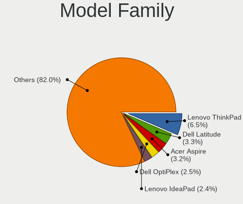
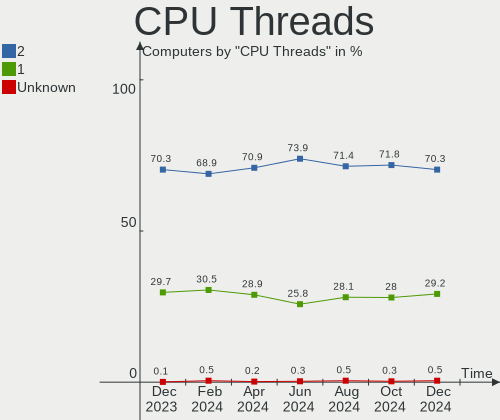
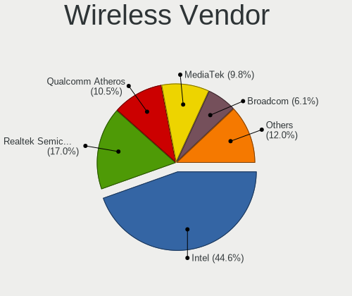
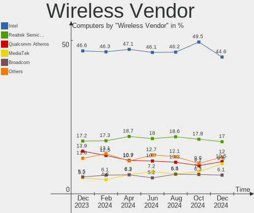
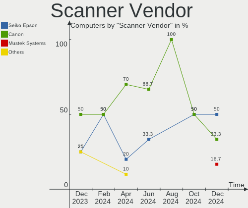

Ubuntu - Hardware Trends
------------------------

A project to identify most popular hardware characteristics and track their change
over time based on data collected by Linux users at https://Linux-Hardware.org.

Anyone can contribute to this report by the [hw-probe](https://github.com/linuxhw/hw-probe) tool:

    sudo -E hw-probe -all -upload

This is a report for all computer types. See also reports for [desktops](/Dist/Ubuntu/Desktop/README.md) and [notebooks](/Dist/Ubuntu/Notebook/README.md).

This report is for one last month. Overall report since the beginning of time: [TestDays](https://github.com/linuxhw/TestDays)

Period: Dec, 2024.

Contents
--------

* [ System ](#system)
  - [ OS                       ](#os)
  - [ OS Family                ](#os-family)
  - [ Kernel                   ](#kernel)
  - [ Kernel Family            ](#kernel-family)
  - [ Kernel Major Ver.        ](#kernel-major-ver)
  - [ Arch                     ](#arch)
  - [ DE                       ](#de)
  - [ Display Server           ](#display-server)
  - [ Display Manager          ](#display-manager)
  - [ OS Lang                  ](#os-lang)
  - [ Boot Mode                ](#boot-mode)
  - [ Filesystem               ](#filesystem)
  - [ Part. scheme             ](#part-scheme)
  - [ Dual Boot with Linux/BSD ](#dual-boot-with-linuxbsd)
  - [ Dual Boot (Win)          ](#dual-boot-win)

* [ Board ](#board)
  - [ Vendor                   ](#vendor)
  - [ Model                    ](#model)
  - [ Model Family             ](#model-family)
  - [ MFG Year                 ](#mfg-year)
  - [ Form Factor              ](#form-factor)
  - [ Secure Boot              ](#secure-boot)
  - [ Coreboot                 ](#coreboot)
  - [ RAM Size                 ](#ram-size)
  - [ RAM Used                 ](#ram-used)
  - [ Total Drives             ](#total-drives)
  - [ Has CD-ROM               ](#has-cd-rom)
  - [ Has Ethernet             ](#has-ethernet)
  - [ Has WiFi                 ](#has-wifi)
  - [ Has Bluetooth            ](#has-bluetooth)

* [ Location ](#location)
  - [ Country                  ](#country)
  - [ City                     ](#city)

* [ Drives ](#drives)
  - [ Drive Vendor             ](#drive-vendor)
  - [ Drive Model              ](#drive-model)
  - [ HDD Vendor               ](#hdd-vendor)
  - [ SSD Vendor               ](#ssd-vendor)
  - [ Drive Kind               ](#drive-kind)
  - [ Drive Connector          ](#drive-connector)
  - [ Drive Size               ](#drive-size)
  - [ Space Total              ](#space-total)
  - [ Space Used               ](#space-used)
  - [ Malfunc. Drives          ](#malfunc-drives)
  - [ Malfunc. Drive Vendor    ](#malfunc-drive-vendor)
  - [ Malfunc. HDD Vendor      ](#malfunc-hdd-vendor)
  - [ Malfunc. Drive Kind      ](#malfunc-drive-kind)
  - [ Failed Drives            ](#failed-drives)
  - [ Failed Drive Vendor      ](#failed-drive-vendor)
  - [ Drive Status             ](#drive-status)

* [ Storage controller ](#storage-controller)
  - [ Storage Vendor           ](#storage-vendor)
  - [ Storage Model            ](#storage-model)
  - [ Storage Kind             ](#storage-kind)

* [ Processor ](#processor)
  - [ CPU Vendor               ](#cpu-vendor)
  - [ CPU Model                ](#cpu-model)
  - [ CPU Model Family         ](#cpu-model-family)
  - [ CPU Cores                ](#cpu-cores)
  - [ CPU Sockets              ](#cpu-sockets)
  - [ CPU Threads              ](#cpu-threads)
  - [ CPU Op-Modes             ](#cpu-op-modes)
  - [ CPU Microcode            ](#cpu-microcode)
  - [ CPU Microarch            ](#cpu-microarch)

* [ Graphics ](#graphics)
  - [ GPU Vendor               ](#gpu-vendor)
  - [ GPU Model                ](#gpu-model)
  - [ GPU Combo                ](#gpu-combo)
  - [ GPU Driver               ](#gpu-driver)
  - [ GPU Memory               ](#gpu-memory)

* [ Monitor ](#monitor)
  - [ Monitor Vendor           ](#monitor-vendor)
  - [ Monitor Model            ](#monitor-model)
  - [ Monitor Resolution       ](#monitor-resolution)
  - [ Monitor Diagonal         ](#monitor-diagonal)
  - [ Monitor Width            ](#monitor-width)
  - [ Aspect Ratio             ](#aspect-ratio)
  - [ Monitor Area             ](#monitor-area)
  - [ Pixel Density            ](#pixel-density)
  - [ Multiple Monitors        ](#multiple-monitors)

* [ Network ](#network)
  - [ Net Controller Vendor    ](#net-controller-vendor)
  - [ Net Controller Model     ](#net-controller-model)
  - [ Wireless Vendor          ](#wireless-vendor)
  - [ Wireless Model           ](#wireless-model)
  - [ Ethernet Vendor          ](#ethernet-vendor)
  - [ Ethernet Model           ](#ethernet-model)
  - [ Net Controller Kind      ](#net-controller-kind)
  - [ Used Controller          ](#used-controller)
  - [ NICs                     ](#nics)
  - [ IPv6                     ](#ipv6)

* [ Bluetooth ](#bluetooth)
  - [ Bluetooth Vendor         ](#bluetooth-vendor)
  - [ Bluetooth Model          ](#bluetooth-model)

* [ Sound ](#sound)
  - [ Sound Vendor             ](#sound-vendor)
  - [ Sound Model              ](#sound-model)

* [ Memory ](#memory)
  - [ Memory Vendor            ](#memory-vendor)
  - [ Memory Model             ](#memory-model)
  - [ Memory Kind              ](#memory-kind)
  - [ Memory Form Factor       ](#memory-form-factor)
  - [ Memory Size              ](#memory-size)
  - [ Memory Speed             ](#memory-speed)

* [ Printers & scanners ](#printers--scanners)
  - [ Printer Vendor           ](#printer-vendor)
  - [ Printer Model            ](#printer-model)
  - [ Scanner Vendor           ](#scanner-vendor)
  - [ Scanner Model            ](#scanner-model)

* [ Camera ](#camera)
  - [ Camera Vendor            ](#camera-vendor)
  - [ Camera Model             ](#camera-model)

* [ Security ](#security)
  - [ Fingerprint Vendor       ](#fingerprint-vendor)
  - [ Fingerprint Model        ](#fingerprint-model)
  - [ Chipcard Vendor          ](#chipcard-vendor)
  - [ Chipcard Model           ](#chipcard-model)

* [ Unsupported ](#unsupported)
  - [ Unsupported Devices      ](#unsupported-devices)
  - [ Unsupported Device Types ](#unsupported-device-types)

System
------

OS
--

Installed operating systems

| Name           | Computers | Percent |
|----------------|-----------|---------|
| Ubuntu 24.04   | 605       | 61.17%  |
| Ubuntu 22.04   | 181       | 18.3%   |
| Ubuntu 24.10   | 135       | 13.65%  |
| Ubuntu 20.04   | 43        | 4.35%   |
| Ubuntu 18.04   | 14        | 1.42%   |
| Ubuntu Core 22 | 2         | 0.2%    |
| Ubuntu 24.0    | 2         | 0.2%    |
| Ubuntu 23.10   | 2         | 0.2%    |
| Ubuntu 23.04   | 2         | 0.2%    |
| Ubuntu 22.10   | 1         | 0.1%    |
| Ubuntu 21.04   | 1         | 0.1%    |
| Ubuntu 20.10   | 1         | 0.1%    |

OS Family
---------

OS without a version

| Name   | Computers | Percent |
|--------|-----------|---------|
| Ubuntu | 989       | 100%    |

Kernel
------

Version of the Linux kernel

| Version                | Computers | Percent |
|------------------------|-----------|---------|
| 6.8.0-49-generic       | 291       | 29.42%  |
| 6.8.0-51-generic       | 200       | 20.22%  |
| 6.8.0-50-generic       | 119       | 12.03%  |
| 6.11.0-13-generic      | 53        | 5.36%   |
| 6.11.0-9-generic       | 47        | 4.75%   |
| 6.8.0-41-generic       | 38        | 3.84%   |
| 5.15.0-126-generic     | 25        | 2.53%   |
| 6.8.0-48-generic       | 17        | 1.72%   |
| 6.11.0-8-generic       | 12        | 1.21%   |
| 6.11.0-12-generic      | 11        | 1.11%   |
| 5.15.0-125-generic     | 11        | 1.11%   |
| 6.8.0-45-generic       | 10        | 1.01%   |
| 6.8.0-40-generic       | 8         | 0.81%   |
| 6.8.0-47-generic       | 7         | 0.71%   |
| 5.4.0-150-generic      | 7         | 0.71%   |
| 5.15.0-127-generic     | 7         | 0.71%   |
| 6.12.3-061203-generic  | 6         | 0.61%   |
| 5.15.0-117-generic     | 5         | 0.51%   |
| 6.8.0-38-generic       | 3         | 0.3%    |
| 6.8.0-109049-tuxedo    | 3         | 0.3%    |
| 6.5.0-35-generic       | 3         | 0.3%    |
| 5.4.0-204-generic      | 3         | 0.3%    |
| 5.19.0-32-generic      | 3         | 0.3%    |
| 5.15.0-67-generic      | 3         | 0.3%    |
| 5.15.0-124-generic     | 3         | 0.3%    |
| 6.8.0-50-lowlatency    | 2         | 0.2%    |
| 6.8.0-31-generic       | 2         | 0.2%    |
| 6.6.62-current-sunxi64 | 2         | 0.2%    |
| 6.5.0-9-generic        | 2         | 0.2%    |
| 6.5.0-18-generic       | 2         | 0.2%    |
| 6.2.0-20-generic       | 2         | 0.2%    |
| 6.11.0-1009-oem        | 2         | 0.2%    |
| 6.11.0-1005-raspi      | 2         | 0.2%    |
| 5.4.0-200-generic      | 2         | 0.2%    |
| 5.15.0-73-generic      | 2         | 0.2%    |
| 5.15.0-43-generic      | 2         | 0.2%    |
| 5.15.0-130-generic     | 2         | 0.2%    |
| 4.15.0-213-generic     | 2         | 0.2%    |
| 6.9.3-surface-2        | 1         | 0.1%    |
| 6.9.3-76060903-generic | 1         | 0.1%    |

Kernel Family
-------------

Linux kernel without a distro release

| Version  | Computers | Percent |
|----------|-----------|---------|
| 6.8.0    | 703       | 71.08%  |
| 6.11.0   | 131       | 13.25%  |
| 5.15.0   | 73        | 7.38%   |
| 5.4.0    | 18        | 1.82%   |
| 6.5.0    | 11        | 1.11%   |
| 6.12.3   | 6         | 0.61%   |
| 5.19.0   | 6         | 0.61%   |
| 6.2.0    | 5         | 0.51%   |
| 4.15.0   | 4         | 0.4%    |
| 6.12.1   | 3         | 0.3%    |
| 6.9.3    | 2         | 0.2%    |
| 6.6.62   | 2         | 0.2%    |
| 6.13.0   | 2         | 0.2%    |
| 6.12.5   | 2         | 0.2%    |
| 6.12.0   | 2         | 0.2%    |
| 6.1.0    | 2         | 0.2%    |
| 5.8.0    | 2         | 0.2%    |
| 6.9.12   | 1         | 0.1%    |
| 6.9.0    | 1         | 0.1%    |
| 6.6.31   | 1         | 0.1%    |
| 6.5.11   | 1         | 0.1%    |
| 6.12.2   | 1         | 0.1%    |
| 6.11.8   | 1         | 0.1%    |
| 6.11.11  | 1         | 0.1%    |
| 6.10.10  | 1         | 0.1%    |
| 6.1.75   | 1         | 0.1%    |
| 6.0.12   | 1         | 0.1%    |
| 5.3.0    | 1         | 0.1%    |
| 5.15.137 | 1         | 0.1%    |
| 5.15.113 | 1         | 0.1%    |
| 5.13.0   | 1         | 0.1%    |
| 5.11.0   | 1         | 0.1%    |

Kernel Major Ver.
-----------------

Linux kernel major version

| Version | Computers | Percent |
|---------|-----------|---------|
| 6.8     | 703       | 71.08%  |
| 6.11    | 133       | 13.45%  |
| 5.15    | 75        | 7.58%   |
| 5.4     | 18        | 1.82%   |
| 6.12    | 14        | 1.42%   |
| 6.5     | 12        | 1.21%   |
| 5.19    | 6         | 0.61%   |
| 6.2     | 5         | 0.51%   |
| 6.9     | 4         | 0.4%    |
| 4.15    | 4         | 0.4%    |
| 6.6     | 3         | 0.3%    |
| 6.1     | 3         | 0.3%    |
| 6.13    | 2         | 0.2%    |
| 5.8     | 2         | 0.2%    |
| 6.10    | 1         | 0.1%    |
| 6.0     | 1         | 0.1%    |
| 5.3     | 1         | 0.1%    |
| 5.13    | 1         | 0.1%    |
| 5.11    | 1         | 0.1%    |

Arch
----

OS architecture (x86_64, i586, etc.)

| Name    | Computers | Percent |
|---------|-----------|---------|
| x86_64  | 974       | 98.48%  |
| aarch64 | 13        | 1.31%   |
| riscv64 | 1         | 0.1%    |
| i686    | 1         | 0.1%    |

DE
--

Desktop Environment

| Name            | Computers | Percent |
|-----------------|-----------|---------|
| GNOME           | 913       | 92.32%  |
| Unknown         | 49        | 4.95%   |
| X-Cinnamon      | 13        | 1.31%   |
| Cinnamon        | 4         | 0.4%    |
| Enlightenment   | 3         | 0.3%    |
| GNOME Classic   | 2         | 0.2%    |
| xmonad          | 1         | 0.1%    |
| i3              | 1         | 0.1%    |
| Hyprland        | 1         | 0.1%    |
| GNOME Flashback | 1         | 0.1%    |
| awesome         | 1         | 0.1%    |

Display Server
--------------

X11 or Wayland

| Name    | Computers | Percent |
|---------|-----------|---------|
| Wayland | 639       | 64.61%  |
| X11     | 295       | 29.83%  |
| Tty     | 29        | 2.93%   |
| Unknown | 25        | 2.53%   |
| Web     | 1         | 0.1%    |

Display Manager
---------------

SDDM, LightDM, etc.

| Name    | Computers | Percent |
|---------|-----------|---------|
| GDM3    | 841       | 85.04%  |
| Unknown | 100       | 10.11%  |
| GDM     | 23        | 2.33%   |
| LightDM | 18        | 1.82%   |
| SDDM    | 6         | 0.61%   |
| SLiM    | 1         | 0.1%    |

OS Lang
-------

Language

| Lang    | Computers | Percent |
|---------|-----------|---------|
| en_US   | 493       | 49.85%  |
| de_DE   | 99        | 10.01%  |
| fr_FR   | 55        | 5.56%   |
| C       | 49        | 4.95%   |
| pt_BR   | 41        | 4.15%   |
| es_ES   | 41        | 4.15%   |
| ru_RU   | 30        | 3.03%   |
| en_GB   | 26        | 2.63%   |
| it_IT   | 22        | 2.22%   |
| pl_PL   | 15        | 1.52%   |
| en_CA   | 12        | 1.21%   |
| nl_NL   | 10        | 1.01%   |
| en_IN   | 10        | 1.01%   |
| en_AU   | 9         | 0.91%   |
| hu_HU   | 6         | 0.61%   |
| Unknown | 6         | 0.61%   |
| cs_CZ   | 5         | 0.51%   |
| de_AT   | 4         | 0.4%    |
| zh_CN   | 3         | 0.3%    |
| tr_TR   | 3         | 0.3%    |
| ko_KR   | 3         | 0.3%    |
| fi_FI   | 3         | 0.3%    |
| es_MX   | 3         | 0.3%    |
| es_AR   | 3         | 0.3%    |
| en_IL   | 3         | 0.3%    |
| sv_SE   | 2         | 0.2%    |
| sk_SK   | 2         | 0.2%    |
| nb_NO   | 2         | 0.2%    |
| ja_JP   | 2         | 0.2%    |
| fr_BE   | 2         | 0.2%    |
| en_ZA   | 2         | 0.2%    |
| el_GR   | 2         | 0.2%    |
| ca_ES   | 2         | 0.2%    |
| zh_TW   | 1         | 0.1%    |
| uk_UA   | 1         | 0.1%    |
| sl_SI   | 1         | 0.1%    |
| ru_UA   | 1         | 0.1%    |
| ro_RO   | 1         | 0.1%    |
| nl_BE   | 1         | 0.1%    |
| mr_IN   | 1         | 0.1%    |

Boot Mode
---------

EFI or BIOS

| Mode | Computers | Percent |
|------|-----------|---------|
| BIOS | 622       | 62.89%  |
| EFI  | 367       | 37.11%  |

Filesystem
----------

Type of filesystem

| Type    | Computers | Percent |
|---------|-----------|---------|
| Tmpfs   | 564       | 57.03%  |
| Ext4    | 388       | 39.23%  |
| Overlay | 23        | 2.33%   |
| Btrfs   | 9         | 0.91%   |
| Zfs     | 3         | 0.3%    |
| Xfs     | 1         | 0.1%    |
| Ext3    | 1         | 0.1%    |

Part. scheme
------------

Scheme of partitioning

| Type    | Computers | Percent |
|---------|-----------|---------|
| GPT     | 842       | 85.14%  |
| MBR     | 80        | 8.09%   |
| Unknown | 67        | 6.77%   |

Dual Boot with Linux/BSD
------------------------

Hosting more than one Linux/BSD

| Dual boot | Computers | Percent |
|-----------|-----------|---------|
| No        | 856       | 86.55%  |
| Yes       | 133       | 13.45%  |

Dual Boot (Win)
---------------

Hosting Linux and Windows

| Dual boot | Computers | Percent |
|-----------|-----------|---------|
| No        | 634       | 64.11%  |
| Yes       | 355       | 35.89%  |

Board
-----

Vendor
------

Motherboard manufacturer

| Name                                 | Computers | Percent |
|--------------------------------------|-----------|---------|
| ASUSTek Computer                     | 172       | 17.39%  |
| Lenovo                               | 152       | 15.37%  |
| Hewlett-Packard                      | 137       | 13.85%  |
| Dell                                 | 136       | 13.75%  |
| MSI                                  | 58        | 5.86%   |
| Gigabyte Technology                  | 49        | 4.95%   |
| Acer                                 | 47        | 4.75%   |
| ASRock                               | 29        | 2.93%   |
| Apple                                | 25        | 2.53%   |
| Intel                                | 13        | 1.31%   |
| Unknown                              | 12        | 1.21%   |
| Samsung Electronics                  | 11        | 1.11%   |
| Supermicro                           | 10        | 1.01%   |
| HUAWEI                               | 9         | 0.91%   |
| Fujitsu                              | 7         | 0.71%   |
| Medion                               | 6         | 0.61%   |
| AZW                                  | 6         | 0.61%   |
| ASRockRack                           | 6         | 0.61%   |
| Toshiba                              | 5         | 0.51%   |
| Sony                                 | 5         | 0.51%   |
| Microsoft                            | 5         | 0.51%   |
| Shenzhen Meigao Electronic Equipment | 4         | 0.4%    |
| Notebook                             | 4         | 0.4%    |
| Biostar                              | 4         | 0.4%    |
| TUXEDO                               | 3         | 0.3%    |
| sunxi                                | 3         | 0.3%    |
| Raspberry Pi Foundation              | 3         | 0.3%    |
| Positivo Bahia - VAIO                | 3         | 0.3%    |
| HPE                                  | 3         | 0.3%    |
| HONOR                                | 3         | 0.3%    |
| Google                               | 3         | 0.3%    |
| Wortmann AG                          | 2         | 0.2%    |
| Packard Bell                         | 2         | 0.2%    |
| Maibenben                            | 2         | 0.2%    |
| MACHINIST                            | 2         | 0.2%    |
| ICL                                  | 2         | 0.2%    |
| Framework                            | 2         | 0.2%    |
| Foxconn                              | 2         | 0.2%    |
| ZOTAC                                | 1         | 0.1%    |
| Vizio                                | 1         | 0.1%    |

Model
-----

Motherboard model

| Name                                              | Computers | Percent |
|---------------------------------------------------|-----------|---------|
| Unknown                                           | 15        | 1.52%   |
| ASUS All Series                                   | 6         | 0.61%   |
| Supermicro Super Server                           | 4         | 0.4%    |
| HP Notebook                                       | 4         | 0.4%    |
| Dell OptiPlex 990                                 | 4         | 0.4%    |
| Dell OptiPlex 3050                                | 4         | 0.4%    |
| Acer Aspire A515-57                               | 4         | 0.4%    |
| MSI MS-7D75                                       | 3         | 0.3%    |
| Gigabyte B450M DS3H                               | 3         | 0.3%    |
| Dell Latitude 5420                                | 3         | 0.3%    |
| Dell Inspiron 15 3520                             | 3         | 0.3%    |
| Dell G15 5530                                     | 3         | 0.3%    |
| AZW MINI S                                        | 3         | 0.3%    |
| ASUS VivoBook_ASUSLaptop X1605VA_X1605VA          | 3         | 0.3%    |
| Acer Aspire A315-59                               | 3         | 0.3%    |
| TUXEDO Sirius 16 Gen2                             | 2         | 0.2%    |
| Supermicro X8DTU                                  | 2         | 0.2%    |
| Shenzhen Meigao Electronic Equipment Venus series | 2         | 0.2%    |
| Samsung 550XDA                                    | 2         | 0.2%    |
| MSI MS-7E51                                       | 2         | 0.2%    |
| MSI MS-7D46                                       | 2         | 0.2%    |
| MSI MS-7693                                       | 2         | 0.2%    |
| MSI MS-7673                                       | 2         | 0.2%    |
| Microsoft Surface Go 3                            | 2         | 0.2%    |
| Lenovo YB1-X91F                                   | 2         | 0.2%    |
| Lenovo V15 G4 AMN 82YU                            | 2         | 0.2%    |
| Lenovo Slim Pro 7 14ARP8 83AX                     | 2         | 0.2%    |
| Lenovo Legion Slim 5 16APH8 82Y9                  | 2         | 0.2%    |
| Lenovo IdeaPad 3 15ITL6 82H8                      | 2         | 0.2%    |
| Lenovo IdeaPad 3 15ADA05 81W1                     | 2         | 0.2%    |
| Lenovo G50-70 20351                               | 2         | 0.2%    |
| HPE ProLiant DL380 Gen10                          | 2         | 0.2%    |
| HP t520 Flexible Series TC                        | 2         | 0.2%    |
| HP Pavilion Laptop 15-eg2xxx                      | 2         | 0.2%    |
| HP Pavilion dv7                                   | 2         | 0.2%    |
| HP Pavilion dv6                                   | 2         | 0.2%    |
| HP Laptop 15-fd0xxx                               | 2         | 0.2%    |
| HP Laptop 15-db1xxx                               | 2         | 0.2%    |
| HP EliteDesk 800 G3 DM 65W                        | 2         | 0.2%    |
| HP EliteBook x360 1020 G2                         | 2         | 0.2%    |

Model Family
------------

Motherboard model prefix

| Name               | Computers | Percent |
|--------------------|-----------|---------|
| Lenovo ThinkPad    | 64        | 6.47%   |
| Dell Latitude      | 33        | 3.34%   |
| Acer Aspire        | 32        | 3.24%   |
| Dell OptiPlex      | 25        | 2.53%   |
| Lenovo IdeaPad     | 24        | 2.43%   |
| ASUS ROG           | 24        | 2.43%   |
| HP EliteBook       | 23        | 2.33%   |
| ASUS VivoBook      | 22        | 2.22%   |
| HP Pavilion        | 20        | 2.02%   |
| Dell Precision     | 20        | 2.02%   |
| Dell Inspiron      | 20        | 2.02%   |
| ASUS TUF           | 18        | 1.82%   |
| ASUS PRIME         | 16        | 1.62%   |
| HP Laptop          | 15        | 1.52%   |
| Unknown            | 15        | 1.52%   |
| ASUS ASUS          | 13        | 1.31%   |
| Dell XPS           | 12        | 1.21%   |
| Dell Vostro        | 12        | 1.21%   |
| HP ProBook         | 11        | 1.11%   |
| HP Compaq          | 9         | 0.91%   |
| HP ENVY            | 8         | 0.81%   |
| Lenovo Yoga        | 7         | 0.71%   |
| Lenovo ThinkCentre | 7         | 0.71%   |
| Lenovo ThinkBook   | 7         | 0.71%   |
| HP EliteDesk       | 7         | 0.71%   |
| ASUS Zenbook       | 6         | 0.61%   |
| ASUS All           | 6         | 0.61%   |
| Toshiba Satellite  | 5         | 0.51%   |
| Microsoft Surface  | 5         | 0.51%   |
| Lenovo Legion      | 5         | 0.51%   |
| HP ZBook           | 5         | 0.51%   |
| Supermicro Super   | 4         | 0.4%    |
| Lenovo V15         | 4         | 0.4%    |
| Lenovo IdeaPadFlex | 4         | 0.4%    |
| HP Victus          | 4         | 0.4%    |
| HP ProLiant        | 4         | 0.4%    |
| HP ProDesk         | 4         | 0.4%    |
| HP Notebook        | 4         | 0.4%    |
| Gigabyte B450M     | 4         | 0.4%    |
| Dell G15           | 4         | 0.4%    |

MFG Year
--------

Motherboard manufacture year

| Year    | Computers | Percent |
|---------|-----------|---------|
| 2023    | 114       | 11.53%  |
| 2022    | 88        | 8.9%    |
| 2021    | 85        | 8.59%   |
| 2020    | 75        | 7.58%   |
| 2024    | 73        | 7.38%   |
| 2017    | 64        | 6.47%   |
| 2019    | 63        | 6.37%   |
| 2018    | 60        | 6.07%   |
| 2011    | 58        | 5.86%   |
| 2012    | 54        | 5.46%   |
| 2013    | 52        | 5.26%   |
| 2014    | 45        | 4.55%   |
| 2010    | 36        | 3.64%   |
| 2016    | 29        | 2.93%   |
| 2015    | 28        | 2.83%   |
| 2008    | 21        | 2.12%   |
| 2009    | 19        | 1.92%   |
| 2007    | 12        | 1.21%   |
| Unknown | 9         | 0.91%   |
| 2006    | 4         | 0.4%    |

Form Factor
-----------

Physical design of the computer

| Name           | Computers | Percent |
|----------------|-----------|---------|
| Notebook       | 517       | 52.28%  |
| Desktop        | 367       | 37.11%  |
| Convertible    | 31        | 3.13%   |
| Server         | 21        | 2.12%   |
| Mini pc        | 20        | 2.02%   |
| All in one     | 13        | 1.31%   |
| Tablet         | 11        | 1.11%   |
| System on chip | 9         | 0.91%   |

Secure Boot
-----------

Enabled or disabled

| State    | Computers | Percent |
|----------|-----------|---------|
| Disabled | 914       | 92.42%  |
| Enabled  | 75        | 7.58%   |

Coreboot
--------

Have coreboot on board

| Used | Computers | Percent |
|------|-----------|---------|
| No   | 985       | 99.6%   |
| Yes  | 4         | 0.4%    |

RAM Size
--------

Total RAM memory

| Size in GB      | Computers | Percent |
|-----------------|-----------|---------|
| 8.01-16.0       | 207       | 20.93%  |
| 4.01-8.0        | 199       | 20.12%  |
| 16.01-24.0      | 189       | 19.11%  |
| 32.01-64.0      | 145       | 14.66%  |
| 3.01-4.0        | 93        | 9.4%    |
| 64.01-256.0     | 71        | 7.18%   |
| 24.01-32.0      | 60        | 6.07%   |
| 1.01-2.0        | 13        | 1.31%   |
| More than 256.0 | 5         | 0.51%   |
| 2.01-3.0        | 5         | 0.51%   |
| 0.51-1.0        | 1         | 0.1%    |
| 0.01-0.5        | 1         | 0.1%    |

RAM Used
--------

Used RAM memory

| Used GB     | Computers | Percent |
|-------------|-----------|---------|
| 2.01-3.0    | 267       | 27%     |
| 4.01-8.0    | 242       | 24.47%  |
| 3.01-4.0    | 196       | 19.82%  |
| 1.01-2.0    | 186       | 18.81%  |
| 8.01-16.0   | 57        | 5.76%   |
| 16.01-24.0  | 14        | 1.42%   |
| 0.51-1.0    | 11        | 1.11%   |
| 32.01-64.0  | 5         | 0.51%   |
| 24.01-32.0  | 4         | 0.4%    |
| 0.01-0.5    | 4         | 0.4%    |
| 64.01-256.0 | 3         | 0.3%    |

Total Drives
------------

Number of drives on board

| Drives | Computers | Percent |
|--------|-----------|---------|
| 1      | 610       | 61.68%  |
| 2      | 228       | 23.05%  |
| 3      | 65        | 6.57%   |
| 4      | 46        | 4.65%   |
| 6      | 12        | 1.21%   |
| 5      | 12        | 1.21%   |
| 0      | 9         | 0.91%   |
| 8      | 2         | 0.2%    |
| 34     | 1         | 0.1%    |
| 15     | 1         | 0.1%    |
| 14     | 1         | 0.1%    |
| 10     | 1         | 0.1%    |
| 9      | 1         | 0.1%    |

Has CD-ROM
----------

Has CD-ROM on board

| Presented | Computers | Percent |
|-----------|-----------|---------|
| No        | 731       | 73.91%  |
| Yes       | 258       | 26.09%  |

Has Ethernet
------------

Has Ethernet on board

| Presented | Computers | Percent |
|-----------|-----------|---------|
| Yes       | 814       | 82.31%  |
| No        | 175       | 17.69%  |

Has WiFi
--------

Has WiFi module

| Presented | Computers | Percent |
|-----------|-----------|---------|
| Yes       | 742       | 75.03%  |
| No        | 247       | 24.97%  |

Has Bluetooth
-------------

Has Bluetooth module

| Presented | Computers | Percent |
|-----------|-----------|---------|
| Yes       | 643       | 65.02%  |
| No        | 346       | 34.98%  |

Location
--------

Country
-------

Geographic location (country)

| Country         | Computers | Percent |
|-----------------|-----------|---------|
| USA             | 200       | 20.22%  |
| Germany         | 113       | 11.43%  |
| France          | 71        | 7.18%   |
| Brazil          | 59        | 5.97%   |
| Russia          | 50        | 5.06%   |
| India           | 32        | 3.24%   |
| Canada          | 31        | 3.13%   |
| UK              | 30        | 3.03%   |
| Italy           | 29        | 2.93%   |
| Spain           | 24        | 2.43%   |
| Poland          | 24        | 2.43%   |
| Netherlands     | 17        | 1.72%   |
| Australia       | 16        | 1.62%   |
| Belgium         | 15        | 1.52%   |
| Mexico          | 13        | 1.31%   |
| Austria         | 12        | 1.21%   |
| Switzerland     | 11        | 1.11%   |
| Turkey          | 10        | 1.01%   |
| Hungary         | 10        | 1.01%   |
| Czechia         | 9         | 0.91%   |
| Chile           | 9         | 0.91%   |
| Argentina       | 9         | 0.91%   |
| Sweden          | 8         | 0.81%   |
| Norway          | 8         | 0.81%   |
| Finland         | 8         | 0.81%   |
| Portugal        | 7         | 0.71%   |
| Indonesia       | 7         | 0.71%   |
| South Africa    | 6         | 0.61%   |
| Serbia          | 6         | 0.61%   |
| Romania         | 6         | 0.61%   |
| Israel          | 6         | 0.61%   |
| Ireland         | 6         | 0.61%   |
| Thailand        | 5         | 0.51%   |
| South Korea     | 5         | 0.51%   |
| Denmark         | 5         | 0.51%   |
| China           | 5         | 0.51%   |
| The Netherlands | 4         | 0.4%    |
| Slovakia        | 4         | 0.4%    |
| Singapore       | 4         | 0.4%    |
| Pakistan        | 4         | 0.4%    |

City
----

Geographic location (city)

| City           | Computers | Percent |
|----------------|-----------|---------|
| Moscow         | 21        | 2.12%   |
| Berlin         | 14        | 1.42%   |
| Sydney         | 9         | 0.91%   |
| Toronto        | 8         | 0.81%   |
| Brussels       | 7         | 0.71%   |
| Zurich         | 6         | 0.61%   |
| Vienna         | 6         | 0.61%   |
| Seattle        | 6         | 0.61%   |
| Santiago       | 6         | 0.61%   |
| Rio de Janeiro | 6         | 0.61%   |
| Munich         | 6         | 0.61%   |
| Los Angeles    | 6         | 0.61%   |
| Helsinki       | 6         | 0.61%   |
| Hamburg        | 6         | 0.61%   |
| Delhi          | 6         | 0.61%   |
| St Petersburg  | 5         | 0.51%   |
| Sao Paulo      | 5         | 0.51%   |
| Paris          | 5         | 0.51%   |
| Dublin         | 5         | 0.51%   |
| Warsaw         | 4         | 0.4%    |
| Singapore      | 4         | 0.4%    |
| Pune           | 4         | 0.4%    |
| Houston        | 4         | 0.4%    |
| Hanover        | 4         | 0.4%    |
| Budapest       | 4         | 0.4%    |
| Bucharest      | 4         | 0.4%    |
| Amsterdam      | 4         | 0.4%    |
| Zagreb         | 3         | 0.3%    |
| Turin          | 3         | 0.3%    |
| Tunis          | 3         | 0.3%    |
| Smyrna         | 3         | 0.3%    |
| San Diego      | 3         | 0.3%    |
| Rome           | 3         | 0.3%    |
| Prague         | 3         | 0.3%    |
| Phoenix        | 3         | 0.3%    |
| Parker         | 3         | 0.3%    |
| Novosibirsk    | 3         | 0.3%    |
| Nice           | 3         | 0.3%    |
| Mumbai         | 3         | 0.3%    |
| Montreal       | 3         | 0.3%    |

Drives
------

Drive Vendor
------------

Hard drive vendors

| Vendor                       | Computers | Drives | Percent |
|------------------------------|-----------|--------|---------|
| Samsung Electronics          | 243       | 300    | 17.15%  |
| Seagate                      | 164       | 211    | 11.57%  |
| WDC                          | 157       | 190    | 11.08%  |
| SanDisk                      | 114       | 119    | 8.05%   |
| Kingston                     | 71        | 82     | 5.01%   |
| Toshiba                      | 65        | 69     | 4.59%   |
| Micron Technology            | 55        | 56     | 3.88%   |
| Unknown                      | 47        | 58     | 3.32%   |
| Crucial                      | 45        | 47     | 3.18%   |
| SK hynix                     | 44        | 44     | 3.11%   |
| Hitachi                      | 33        | 36     | 2.33%   |
| Intel                        | 30        | 35     | 2.12%   |
| KIOXIA                       | 25        | 26     | 1.76%   |
| China                        | 22        | 22     | 1.55%   |
| A-DATA Technology            | 20        | 20     | 1.41%   |
| Phison Electronics           | 18        | 19     | 1.27%   |
| Kingston Technology Company  | 16        | 16     | 1.13%   |
| Silicon Motion               | 14        | 14     | 0.99%   |
| Micron/Crucial Technology    | 13        | 13     | 0.92%   |
| MAXIO Technology (Hangzhou)  | 11        | 12     | 0.78%   |
| Apple                        | 11        | 13     | 0.78%   |
| HGST                         | 10        | 24     | 0.71%   |
| Unknown                      | 9         | 11     | 0.64%   |
| SPCC                         | 8         | 8      | 0.56%   |
| PNY                          | 8         | 8      | 0.56%   |
| Intenso                      | 8         | 8      | 0.56%   |
| Phison                       | 7         | 8      | 0.49%   |
| Team                         | 6         | 8      | 0.42%   |
| Shenzhen Longsys Electronics | 6         | 6      | 0.42%   |
| Netac                        | 6         | 7      | 0.42%   |
| Transcend                    | 5         | 5      | 0.35%   |
| Realtek Semiconductor        | 5         | 5      | 0.35%   |
| Lexar                        | 5         | 5      | 0.35%   |
| JMicron Technology           | 5         | 6      | 0.35%   |
| GOODRAM                      | 5         | 5      | 0.35%   |
| Patriot                      | 4         | 4      | 0.28%   |
| LITEON                       | 4         | 4      | 0.28%   |
| HPE                          | 4         | 5      | 0.28%   |
| Hewlett-Packard              | 4         | 32     | 0.28%   |
| ADATA Technology             | 4         | 4      | 0.28%   |

Drive Model
-----------

Hard drive models

| Model                                                 | Computers | Percent |
|-------------------------------------------------------|-----------|---------|
| Samsung NVMe SSD Controller SM981/PM981/PM983 512GB   | 18        | 1.17%   |
| Samsung NVMe SSD Controller PM9A1/PM9A3/980PRO 512GB  | 17        | 1.11%   |
| SanDisk NVMe SSD Drive 512GB                          | 15        | 0.98%   |
| SanDisk NVMe SSD Drive 1TB                            | 14        | 0.91%   |
| Samsung SSD 850 EVO 250GB                             | 13        | 0.85%   |
| Samsung SSD 860 EVO 500GB                             | 11        | 0.72%   |
| Samsung NVMe SSD Controller SM961/PM961/SM963 256GB   | 11        | 0.72%   |
| Kingston SA400S37240G 240GB SSD                       | 11        | 0.72%   |
| Samsung SSD 980 1TB                                   | 10        | 0.65%   |
| Unknown MMC Card  64GB                                | 9         | 0.59%   |
| Seagate ST500DM002-1BD142 500GB                       | 9         | 0.59%   |
| Samsung SSD 850 EVO 500GB                             | 9         | 0.59%   |
| Kingston SNV2S500G 500GB                              | 9         | 0.59%   |
| Unknown                                               | 9         | 0.59%   |
| Silicon Motion SM2263EN/SM2263XT SSD Controller 256GB | 8         | 0.52%   |
| Seagate ST2000DM008-2FR102 2TB                        | 8         | 0.52%   |
| Seagate ST1000LM035-1RK172 1TB                        | 8         | 0.52%   |
| Kingston SA400S37480G 480GB SSD                       | 8         | 0.52%   |
| Crucial CT500MX500SSD1 500GB                          | 8         | 0.52%   |
| Toshiba MQ01ABF050 500GB                              | 7         | 0.46%   |
| Intel SSDPEKNU010TZ 1TB                               | 7         | 0.46%   |
| Intel SSD 660P Series 1024GB                          | 7         | 0.46%   |
| Unknown SD/MMC/MS PRO 128GB                           | 6         | 0.39%   |
| Toshiba MQ01ABD100 1TB                                | 6         | 0.39%   |
| Sandisk WD Black SN750 / PC SN730 NVMe SSD 512GB      | 6         | 0.39%   |
| Samsung SSD 860 EVO 1TB                               | 6         | 0.39%   |
| Samsung SSD 840 EVO 250GB                             | 6         | 0.39%   |
| Samsung MZVL4512HBLU-00BTW 512GB                      | 6         | 0.39%   |
| Micron/Crucial P2 NVMe PCIe SSD 500GB                 | 6         | 0.39%   |
| Micron 2450_MTFDKBA512TFK 512GB                       | 6         | 0.39%   |
| MAXIO (Hangzhou) NVMe SSD Controller MAP1202 512GB    | 6         | 0.39%   |
| Kingston Company SNV2S1000G 1TB                       | 6         | 0.39%   |
| Kingston SA400S37960G 960GB SSD                       | 6         | 0.39%   |
| Unknown MMC Card  32GB                                | 5         | 0.33%   |
| Toshiba DT01ACA100 1TB                                | 5         | 0.33%   |
| Seagate ST1000DM003-1CH162 1TB                        | 5         | 0.33%   |
| Sandisk WD Blue SN550 NVMe SSD 256GB                  | 5         | 0.33%   |
| Samsung SSD 990 PRO 4TB                               | 5         | 0.33%   |
| KIOXIA KXG8AZNV1T02 LA 1024GB                         | 5         | 0.33%   |
| Kingston SA400S37120G 120GB SSD                       | 5         | 0.33%   |

HDD Vendor
----------

Hard disk drive vendors

| Vendor              | Computers | Drives  | Percent |
|---------------------|-----------|---------|---------|
| Seagate             | 158       | 202     | 38.07%  |
| WDC                 | 124       | 151     | 29.88%  |
| Toshiba             | 51        | 55      | 12.29%  |
| Hitachi             | 33        | 36      | 7.95%   |
| Samsung Electronics | 11        | 12      | 2.65%   |
| HGST                | 10        | 24      | 2.41%   |
| Unknown             | 7         | 8       | 1.69%   |
| JMicron Technology  | 4         | 5       | 0.96%   |
| SABRENT             | 3         | 3       | 0.72%   |
| Hewlett-Packard     | 3         | 31      | 0.72%   |
| Apple               | 3         | 3       | 0.72%   |
| Maxtor              | 2         | 2       | 0.48%   |
| TO Exter            | 1         | 1       | 0.24%   |
| SAGE                | 1         | Unknown | 0.24%   |
| QUANTUM             | 1         | 1       | 0.24%   |
| Fujitsu             | 1         | 1       | 0.24%   |
| External            | 1         | 1       | 0.24%   |
| ASMT                | 1         | 1       | 0.24%   |

SSD Vendor
----------

Solid state drive vendors

| Vendor              | Computers | Drives | Percent |
|---------------------|-----------|--------|---------|
| Samsung Electronics | 102       | 117    | 25.56%  |
| Kingston            | 45        | 54     | 11.28%  |
| Crucial             | 37        | 38     | 9.27%   |
| SanDisk             | 30        | 31     | 7.52%   |
| WDC                 | 23        | 24     | 5.76%   |
| China               | 22        | 22     | 5.51%   |
| A-DATA Technology   | 14        | 14     | 3.51%   |
| Micron Technology   | 11        | 11     | 2.76%   |
| Toshiba             | 8         | 8      | 2.01%   |
| PNY                 | 8         | 8      | 2.01%   |
| SPCC                | 7         | 7      | 1.75%   |
| Intenso             | 7         | 7      | 1.75%   |
| Intel               | 7         | 8      | 1.75%   |
| GOODRAM             | 5         | 5      | 1.25%   |
| Patriot             | 4         | 4      | 1%      |
| Netac               | 4         | 5      | 1%      |
| LITEON              | 4         | 4      | 1%      |
| Transcend           | 3         | 3      | 0.75%   |
| Team                | 3         | 3      | 0.75%   |
| SK hynix            | 3         | 3      | 0.75%   |
| Plextor             | 3         | 3      | 0.75%   |
| KingSpec            | 3         | 3      | 0.75%   |
| HPE                 | 3         | 4      | 0.75%   |
| Apple               | 3         | 3      | 0.75%   |
| Verbatim            | 2         | 2      | 0.5%    |
| OCZ                 | 2         | 2      | 0.5%    |
| CT240BX5            | 2         | 2      | 0.5%    |
| Unknown             | 2         | 2      | 0.5%    |
| XFD10S-060GD        | 1         | 1      | 0.25%   |
| V-GeN               | 1         | 1      | 0.25%   |
| Unknown             | 1         | 1      | 0.25%   |
| TwinMOS             | 1         | 1      | 0.25%   |
| tecmiyo             | 1         | 1      | 0.25%   |
| Simm                | 1         | 1      | 0.25%   |
| Seagate             | 1         | 1      | 0.25%   |
| NT-128              | 1         | 1      | 0.25%   |
| MSI                 | 1         | 1      | 0.25%   |
| MAX                 | 1         | 1      | 0.25%   |
| LITEONIT            | 1         | 1      | 0.25%   |
| Lexar               | 1         | 1      | 0.25%   |

Drive Kind
----------

HDD or SSD

| Kind    | Computers | Drives | Percent |
|---------|-----------|--------|---------|
| NVMe    | 513       | 610    | 40.11%  |
| SSD     | 354       | 429    | 27.68%  |
| HDD     | 349       | 537    | 27.29%  |
| Unknown | 32        | 40     | 2.5%    |
| MMC     | 31        | 35     | 2.42%   |

Drive Connector
---------------

SATA, SAS, NVMe, etc.

| Type | Computers | Drives | Percent |
|------|-----------|--------|---------|
| SATA | 564       | 917    | 47.72%  |
| NVMe | 511       | 606    | 43.23%  |
| SAS  | 76        | 93     | 6.43%   |
| MMC  | 31        | 35     | 2.62%   |

Drive Size
----------

Size of hard drive

| Size in TB | Computers | Drives | Percent |
|------------|-----------|--------|---------|
| 0.01-0.5   | 379       | 483    | 50.53%  |
| 0.51-1.0   | 218       | 274    | 29.07%  |
| 1.01-2.0   | 79        | 91     | 10.53%  |
| 3.01-4.0   | 26        | 33     | 3.47%   |
| 4.01-10.0  | 26        | 48     | 3.47%   |
| 10.01-20.0 | 13        | 28     | 1.73%   |
| 2.01-3.0   | 9         | 9      | 1.2%    |

Space Total
-----------

Amount of disk space available on the file system

| Size in GB     | Computers | Percent |
|----------------|-----------|---------|
| 251-500        | 274       | 27.7%   |
| 101-250        | 229       | 23.15%  |
| 501-1000       | 199       | 20.12%  |
| 1001-2000      | 77        | 7.79%   |
| More than 3000 | 54        | 5.46%   |
| 51-100         | 48        | 4.85%   |
| 1-20           | 42        | 4.25%   |
| 2001-3000      | 32        | 3.24%   |
| 21-50          | 23        | 2.33%   |
| Unknown        | 11        | 1.11%   |

Space Used
----------

Amount of used disk space

| Used GB        | Computers | Percent |
|----------------|-----------|---------|
| 1-20           | 300       | 30.33%  |
| 21-50          | 194       | 19.62%  |
| 101-250        | 153       | 15.47%  |
| 51-100         | 120       | 12.13%  |
| 251-500        | 98        | 9.91%   |
| 501-1000       | 56        | 5.66%   |
| 1001-2000      | 29        | 2.93%   |
| More than 3000 | 21        | 2.12%   |
| Unknown        | 11        | 1.11%   |
| 2001-3000      | 7         | 0.71%   |

Malfunc. Drives
---------------

Drive models with a malfunction

| Model                                        | Computers | Drives | Percent |
|----------------------------------------------|-----------|--------|---------|
| Hitachi HTS545050B9A300 500GB                | 2         | 2      | 5.56%   |
| Hitachi HDT722516DLA380 165GB                | 2         | 2      | 5.56%   |
| XPG SPECTRIX S40G 1TB                        | 1         | 1      | 2.78%   |
| WDC WDS240G2G0A-00JH30 240GB SSD             | 1         | 1      | 2.78%   |
| WDC WD5000LPCX-00VHAT0 500GB                 | 1         | 1      | 2.78%   |
| WDC WD5000AAKX-60U6AA0 500GB                 | 1         | 1      | 2.78%   |
| WDC WD4001FAEX-00MJRA0 4TB                   | 1         | 1      | 2.78%   |
| WDC WD20EFRX-68AX9N0 2TB                     | 1         | 1      | 2.78%   |
| WDC WD10EARS-00Y5B1 1TB                      | 1         | 1      | 2.78%   |
| Transcend TS1TMTE220S 1TB                    | 1         | 1      | 2.78%   |
| Toshiba KSG60ZMV256G M.2 2280 256GB SSD      | 1         | 1      | 2.78%   |
| tecmiyo SATA SSD 120GB                       | 1         | 1      | 2.78%   |
| SK hynix HFS256G39TND-N210A 256GB SSD        | 1         | 1      | 2.78%   |
| Seagate ST9320423AS 320GB                    | 1         | 1      | 2.78%   |
| Seagate ST9250315AS 250GB                    | 1         | 1      | 2.78%   |
| Seagate ST500DM009-2F110A 500GB              | 1         | 1      | 2.78%   |
| Seagate ST500DM002-1BD142 500GB              | 1         | 1      | 2.78%   |
| Seagate ST500DM002-1BC142 500GB              | 1         | 1      | 2.78%   |
| Seagate ST1000DM003-1CH162 1TB               | 1         | 1      | 2.78%   |
| SanDisk SSD U100 24GB                        | 1         | 1      | 2.78%   |
| SanDisk SD9SN8W512G1002 512GB SSD            | 1         | 1      | 2.78%   |
| SanDisk SD8TB8U-512G-1006 512GB SSD          | 1         | 1      | 2.78%   |
| Samsung Electronics MZVLQ512HBLU-00BTW 512GB | 1         | 1      | 2.78%   |
| Kingston SNV2S500G 500GB                     | 1         | 1      | 2.78%   |
| Intel SSDSC2KB960G8 960GB                    | 1         | 2      | 2.78%   |
| Hitachi HTS547575A9E384 752GB                | 1         | 1      | 2.78%   |
| Hitachi HDP725050GLA360 500GB                | 1         | 1      | 2.78%   |
| HGST HTS721010A9E630 1TB                     | 1         | 1      | 2.78%   |
| HGST HTS545050A7E680 500GB                   | 1         | 1      | 2.78%   |
| FORESEE XP1000F512G 512GB                    | 1         | 1      | 2.78%   |
| Dogfish SSD 128GB                            | 1         | 1      | 2.78%   |
| Crucial CT525MX300SSD1 528GB                 | 1         | 1      | 2.78%   |
| Crucial CT512M550SSD3 512GB                  | 1         | 1      | 2.78%   |
| 2.5" SATA SSD 3TEB 120GB                     | 1         | 1      | 2.78%   |

Malfunc. Drive Vendor
---------------------

Vendors of faulty drives

| Vendor              | Computers | Drives | Percent |
|---------------------|-----------|--------|---------|
| WDC                 | 6         | 6      | 16.67%  |
| Seagate             | 6         | 6      | 16.67%  |
| Hitachi             | 6         | 6      | 16.67%  |
| SanDisk             | 3         | 3      | 8.33%   |
| HGST                | 2         | 2      | 5.56%   |
| Crucial             | 2         | 2      | 5.56%   |
| XPG                 | 1         | 1      | 2.78%   |
| Transcend           | 1         | 1      | 2.78%   |
| Toshiba             | 1         | 1      | 2.78%   |
| tecmiyo             | 1         | 1      | 2.78%   |
| SK hynix            | 1         | 1      | 2.78%   |
| Samsung Electronics | 1         | 1      | 2.78%   |
| Kingston            | 1         | 1      | 2.78%   |
| Intel               | 1         | 2      | 2.78%   |
| FORESEE             | 1         | 1      | 2.78%   |
| Dogfish             | 1         | 1      | 2.78%   |
| 2.5"                | 1         | 1      | 2.78%   |

Malfunc. HDD Vendor
-------------------

Vendors of faulty HDD drives

| Vendor  | Computers | Drives | Percent |
|---------|-----------|--------|---------|
| Seagate | 6         | 6      | 31.58%  |
| Hitachi | 6         | 6      | 31.58%  |
| WDC     | 5         | 5      | 26.32%  |
| HGST    | 2         | 2      | 10.53%  |

Malfunc. Drive Kind
-------------------

Kinds of faulty drives

| Kind | Computers | Drives | Percent |
|------|-----------|--------|---------|
| HDD  | 18        | 19     | 51.43%  |
| SSD  | 12        | 13     | 34.29%  |
| NVMe | 5         | 5      | 14.29%  |

Failed Drives
-------------

Failed drive models

| Model                        | Computers | Drives | Percent |
|------------------------------|-----------|--------|---------|
| WDC WD7500BPVT-22HXZT1 752GB | 1         | 1      | 100%    |

Failed Drive Vendor
-------------------

Failed drive vendors

| Vendor | Computers | Drives | Percent |
|--------|-----------|--------|---------|
| WDC    | 1         | 1      | 100%    |

Drive Status
------------

Number of failed and malfunc. drives

| Status   | Computers | Drives | Percent |
|----------|-----------|--------|---------|
| Detected | 672       | 1083   | 64.99%  |
| Works    | 327       | 530    | 31.62%  |
| Malfunc  | 34        | 37     | 3.29%   |
| Failed   | 1         | 1      | 0.1%    |

Storage controller
------------------

Storage Vendor
--------------

Storage controller vendors

| Vendor                                  | Computers | Percent |
|-----------------------------------------|-----------|---------|
| Intel                                   | 578       | 42.72%  |
| AMD                                     | 173       | 12.79%  |
| Samsung Electronics                     | 145       | 10.72%  |
| SanDisk                                 | 97        | 7.17%   |
| Micron Technology                       | 44        | 3.25%   |
| Kingston Technology Company             | 42        | 3.1%    |
| SK hynix                                | 40        | 2.96%   |
| Phison Electronics                      | 28        | 2.07%   |
| KIOXIA                                  | 23        | 1.7%    |
| ASMedia Technology                      | 23        | 1.7%    |
| Micron/Crucial Technology               | 20        | 1.48%   |
| Silicon Motion                          | 16        | 1.18%   |
| Nvidia                                  | 14        | 1.03%   |
| MAXIO Technology (Hangzhou)             | 12        | 0.89%   |
| Shenzhen Longsys Electronics            | 11        | 0.81%   |
| ADATA Technology                        | 11        | 0.81%   |
| Toshiba America Info Systems            | 8         | 0.59%   |
| Realtek Semiconductor                   | 8         | 0.59%   |
| Marvell Technology Group                | 6         | 0.44%   |
| JMicron Technology                      | 6         | 0.44%   |
| Broadcom / LSI                          | 6         | 0.44%   |
| Solidigm                                | 5         | 0.37%   |
| Apple                                   | 5         | 0.37%   |
| Solid State Storage Technology          | 4         | 0.3%    |
| Hewlett-Packard                         | 4         | 0.3%    |
| Adaptec                                 | 4         | 0.3%    |
| Yangtze Memory Technologies             | 3         | 0.22%   |
| Seagate Technology                      | 2         | 0.15%   |
| Netac Technology                        | 2         | 0.15%   |
| LSI Logic / Symbios Logic               | 2         | 0.15%   |
| Transcend                               | 1         | 0.07%   |
| Silicon Image                           | 1         | 0.07%   |
| Shenzhen Unionmemory Information System | 1         | 0.07%   |
| Ramaxel Technology(Shenzhen) Limited    | 1         | 0.07%   |
| O2 Micro                                | 1         | 0.07%   |
| Lenovo                                  | 1         | 0.07%   |
| INNOGRIT                                | 1         | 0.07%   |
| Huawei Technologies                     | 1         | 0.07%   |
| Hosin Global Electronics                | 1         | 0.07%   |
| Biwin Storage Technology                | 1         | 0.07%   |

Storage Model
-------------

Storage controller models

| Model                                                                          | Computers | Percent |
|--------------------------------------------------------------------------------|-----------|---------|
| AMD FCH SATA Controller [AHCI mode]                                            | 97        | 6.32%   |
| Intel Volume Management Device NVMe RAID Controller                            | 51        | 3.32%   |
| Samsung NVMe SSD Controller PM9A1/PM9A3/980PRO                                 | 34        | 2.21%   |
| Intel Sunrise Point-LP SATA Controller [AHCI mode]                             | 34        | 2.21%   |
| Samsung NVMe SSD Controller SM981/PM981/PM983                                  | 33        | 2.15%   |
| Intel 8 Series/C220 Series Chipset Family 6-port SATA Controller 1 [AHCI mode] | 31        | 2.02%   |
| Intel 6 Series/C200 Series Chipset Family 6 port Mobile SATA AHCI Controller   | 29        | 1.89%   |
| Intel Volume Management Device NVMe RAID Controller Intel Corporation          | 27        | 1.76%   |
| Intel 7 Series Chipset Family 6-port SATA Controller [AHCI mode]               | 27        | 1.76%   |
| Intel SATA Controller [RAID mode]                                              | 26        | 1.69%   |
| AMD 600 Series Chipset SATA Controller                                         | 26        | 1.69%   |
| Samsung NVMe SSD Controller 980 (DRAM-less)                                    | 25        | 1.63%   |
| Intel 8 Series SATA Controller 1 [AHCI mode]                                   | 23        | 1.5%    |
| SanDisk WD Black SN770 / PC SN740 256GB / PC SN560 (DRAM-less) NVMe SSD        | 22        | 1.43%   |
| AMD 400 Series Chipset SATA Controller                                         | 22        | 1.43%   |
| Intel Raptor Lake SATA AHCI Controller                                         | 20        | 1.3%    |
| Intel 200 Series PCH SATA controller [AHCI mode]                               | 20        | 1.3%    |
| AMD 500 Series Chipset SATA Controller                                         | 20        | 1.3%    |
| Intel Alder Lake-S PCH SATA Controller [AHCI Mode]                             | 19        | 1.24%   |
| Intel 82801 Mobile SATA Controller [RAID mode]                                 | 19        | 1.24%   |
| Intel 7 Series/C210 Series Chipset Family 6-port SATA Controller [AHCI mode]   | 19        | 1.24%   |
| Intel Alder Lake-P SATA AHCI Controller                                        | 18        | 1.17%   |
| ASMedia ASM1061/ASM1062 Serial ATA Controller                                  | 18        | 1.17%   |
| Intel 6 Series/C200 Series Chipset Family 6 port Desktop SATA AHCI Controller  | 17        | 1.11%   |
| Sandisk WD Black SN850X NVMe SSD                                               | 14        | 0.91%   |
| Samsung NVMe SSD Controller SM961/PM961/SM963                                  | 14        | 0.91%   |
| Samsung NVMe SSD Controller S4LV008[Pascal]                                    | 14        | 0.91%   |
| Intel Q170/Q150/B150/H170/H110/Z170/CM236 Chipset SATA Controller [AHCI Mode]  | 14        | 0.91%   |
| Intel Cannon Lake PCH SATA AHCI Controller                                     | 14        | 0.91%   |
| AMD SB7x0/SB8x0/SB9x0 IDE Controller                                           | 14        | 0.91%   |
| Samsung NVMe SSD Controller PM9B1 (DRAM-less)                                  | 13        | 0.85%   |
| Intel Tiger Lake-LP SATA Controller                                            | 13        | 0.85%   |
| Intel 5 Series/3400 Series Chipset 6 port SATA AHCI Controller                 | 13        | 0.85%   |
| Silicon Motion SM2263EN/SM2263XT (DRAM-less) NVMe SSD Controllers              | 12        | 0.78%   |
| Micron 2450 NVMe SSD [HendrixV] (DRAM-less)                                    | 12        | 0.78%   |
| Micron 2400 NVMe SSD (DRAM-less)                                               | 12        | 0.78%   |
| Intel Comet Lake SATA AHCI Controller                                          | 12        | 0.78%   |
| Samsung NVMe SSD Controller PM9C1a (DRAM-less)                                 | 11        | 0.72%   |
| AMD SB7x0/SB8x0/SB9x0 SATA Controller [IDE mode]                               | 11        | 0.72%   |
| AMD SB7x0/SB8x0/SB9x0 SATA Controller [AHCI mode]                              | 11        | 0.72%   |

Storage Kind
------------

Kind of storage controller (IDE, SATA, NVMe, SAS, ...)

| Kind | Computers | Percent |
|------|-----------|---------|
| SATA | 631       | 46.36%  |
| NVMe | 510       | 37.47%  |
| RAID | 133       | 9.77%   |
| IDE  | 74        | 5.44%   |
| SAS  | 10        | 0.73%   |
| SCSI | 3         | 0.22%   |

Processor
---------

CPU Vendor
----------

Processor vendors

| Vendor        | Computers | Percent |
|---------------|-----------|---------|
| Intel         | 707       | 71.49%  |
| AMD           | 268       | 27.1%   |
| ARM           | 10        | 1.01%   |
| Qualcomm      | 2         | 0.2%    |
| sifive,u74-mc | 1         | 0.1%    |
| Hisilicon     | 1         | 0.1%    |

CPU Model
---------

Processor models

| Model                                         | Computers | Percent |
|-----------------------------------------------|-----------|---------|
| Intel 12th Gen Core i5-1235U                  | 16        | 1.62%   |
| Intel Core Ultra 7 155H                       | 12        | 1.21%   |
| Intel 11th Gen Core i7-1165G7 @ 2.80GHz       | 12        | 1.21%   |
| Intel 11th Gen Core i5-1135G7 @ 2.40GHz       | 12        | 1.21%   |
| ARM Processor                                 | 10        | 1.01%   |
| Intel Core i7-8550U CPU @ 1.80GHz             | 9         | 0.91%   |
| Intel Core i5-2520M CPU @ 2.50GHz             | 9         | 0.91%   |
| AMD Ryzen 5 7520U with Radeon Graphics        | 9         | 0.91%   |
| Intel Core i5-8250U CPU @ 1.60GHz             | 8         | 0.81%   |
| AMD Ryzen 7 7730U with Radeon Graphics        | 8         | 0.81%   |
| Intel Core i7-2600 CPU @ 3.40GHz              | 7         | 0.71%   |
| Intel 11th Gen Core i7-11800H @ 2.30GHz       | 7         | 0.71%   |
| AMD Ryzen 7 8845HS w/ Radeon 780M Graphics    | 7         | 0.71%   |
| AMD Ryzen 7 5700U with Radeon Graphics        | 7         | 0.71%   |
| Intel Core i5-4210U CPU @ 1.70GHz             | 6         | 0.61%   |
| Intel Core i5-3470 CPU @ 3.20GHz              | 6         | 0.61%   |
| Intel Core i5-3210M CPU @ 2.50GHz             | 6         | 0.61%   |
| Intel Core i5-10210U CPU @ 1.60GHz            | 6         | 0.61%   |
| Intel 13th Gen Core i7-1355U                  | 6         | 0.61%   |
| AMD Ryzen 5 5500U with Radeon Graphics        | 6         | 0.61%   |
| Intel Core i5-8265U CPU @ 1.60GHz             | 5         | 0.51%   |
| Intel Core i5-7200U CPU @ 2.50GHz             | 5         | 0.51%   |
| Intel Celeron N4020 CPU @ 1.10GHz             | 5         | 0.51%   |
| Intel 13th Gen Core i7-1365U                  | 5         | 0.51%   |
| Intel 12th Gen Core i5-12400                  | 5         | 0.51%   |
| AMD Ryzen 9 5900X 12-Core Processor           | 5         | 0.51%   |
| AMD Ryzen 7 7840HS w/ Radeon 780M Graphics    | 5         | 0.51%   |
| AMD Ryzen 7 7735HS with Radeon Graphics       | 5         | 0.51%   |
| AMD Ryzen 7 5700G with Radeon Graphics        | 5         | 0.51%   |
| AMD Ryzen 5 5600H with Radeon Graphics        | 5         | 0.51%   |
| AMD Ryzen 5 5600G with Radeon Graphics        | 5         | 0.51%   |
| AMD Ryzen 5 3500U with Radeon Vega Mobile Gfx | 5         | 0.51%   |
| Intel Xeon CPU E5-2680 v4 @ 2.40GHz           | 4         | 0.4%    |
| Intel N100                                    | 4         | 0.4%    |
| Intel Core Ultra 9 185H                       | 4         | 0.4%    |
| Intel Core Ultra 7 165H                       | 4         | 0.4%    |
| Intel Core i7-9750H CPU @ 2.60GHz             | 4         | 0.4%    |
| Intel Core i7-6700HQ CPU @ 2.60GHz            | 4         | 0.4%    |
| Intel Core i7-6500U CPU @ 2.50GHz             | 4         | 0.4%    |
| Intel Core i7-4790 CPU @ 3.60GHz              | 4         | 0.4%    |

CPU Model Family
----------------

Processor model prefix

| Model                   | Computers | Percent |
|-------------------------|-----------|---------|
| Intel Core i5           | 184       | 18.6%   |
| Other                   | 177       | 17.9%   |
| Intel Core i7           | 143       | 14.46%  |
| AMD Ryzen 5             | 77        | 7.79%   |
| AMD Ryzen 7             | 76        | 7.68%   |
| Intel Core i3           | 49        | 4.95%   |
| Intel Xeon              | 36        | 3.64%   |
| Intel Celeron           | 34        | 3.44%   |
| AMD Ryzen 9             | 28        | 2.83%   |
| Intel Core              | 24        | 2.43%   |
| Intel Core 2 Duo        | 20        | 2.02%   |
| Intel Pentium           | 15        | 1.52%   |
| Intel Core i9           | 15        | 1.52%   |
| AMD Ryzen 5 PRO         | 10        | 1.01%   |
| AMD FX                  | 10        | 1.01%   |
| AMD Ryzen 3             | 8         | 0.81%   |
| Intel Atom              | 7         | 0.71%   |
| AMD A6                  | 5         | 0.51%   |
| Intel Xeon Gold         | 4         | 0.4%    |
| Intel Core 2 Quad       | 4         | 0.4%    |
| AMD Ryzen 7 PRO         | 4         | 0.4%    |
| AMD Phenom II X4        | 4         | 0.4%    |
| AMD Athlon 64 X2        | 4         | 0.4%    |
| AMD A4                  | 4         | 0.4%    |
| AMD A10                 | 4         | 0.4%    |
| AMD E2                  | 3         | 0.3%    |
| AMD Athlon              | 3         | 0.3%    |
| AMD A8                  | 3         | 0.3%    |
| Intel Pentium Dual      | 2         | 0.2%    |
| Intel Pentium D         | 2         | 0.2%    |
| Intel Core m3           | 2         | 0.2%    |
| AMD Ryzen Threadripper  | 2         | 0.2%    |
| AMD Ryzen 3 PRO         | 2         | 0.2%    |
| AMD GX                  | 2         | 0.2%    |
| AMD EPYC                | 2         | 0.2%    |
| AMD E1                  | 2         | 0.2%    |
| AMD Athlon II X4        | 2         | 0.2%    |
| AMD Athlon II X2        | 2         | 0.2%    |
| Intel Pentium Gold      | 1         | 0.1%    |
| Intel Pentium Dual-Core | 1         | 0.1%    |

CPU Cores
---------

Number of processor cores

| Number  | Computers | Percent |
|---------|-----------|---------|
| 4       | 287       | 29.02%  |
| 2       | 270       | 27.3%   |
| 6       | 123       | 12.44%  |
| 8       | 119       | 12.03%  |
| 10      | 49        | 4.95%   |
| 16      | 41        | 4.15%   |
| 12      | 37        | 3.74%   |
| 24      | 17        | 1.72%   |
| 14      | 15        | 1.52%   |
| 1       | 5         | 0.51%   |
| Unknown | 5         | 0.51%   |
| 20      | 4         | 0.4%    |
| 3       | 4         | 0.4%    |
| 36      | 3         | 0.3%    |
| 18      | 3         | 0.3%    |
| 32      | 2         | 0.2%    |
| 128     | 1         | 0.1%    |
| 96      | 1         | 0.1%    |
| 64      | 1         | 0.1%    |
| 48      | 1         | 0.1%    |
| 28      | 1         | 0.1%    |

CPU Sockets
-----------

Number of sockets

| Number  | Computers | Percent |
|---------|-----------|---------|
| 1       | 968       | 97.88%  |
| 2       | 15        | 1.52%   |
| Unknown | 5         | 0.51%   |
| 4       | 1         | 0.1%    |

CPU Threads
-----------

Threads per core (Hyper-Threading)

| Number  | Computers | Percent |
|---------|-----------|---------|
| 2       | 695       | 70.27%  |
| 1       | 289       | 29.22%  |
| Unknown | 5         | 0.51%   |

CPU Op-Modes
------------

CPU Operation Modes (32-bit, 64-bit)

| Op mode        | Computers | Percent |
|----------------|-----------|---------|
| 32-bit, 64-bit | 984       | 99.49%  |
| 64-bit         | 4         | 0.4%    |
| Unknown        | 1         | 0.1%    |

CPU Microcode
-------------

Microcode number

| Number     | Computers | Percent |
|------------|-----------|---------|
| Unknown    | 922       | 93.23%  |
| 0x206a7    | 5         | 0.51%   |
| 0x306a9    | 4         | 0.4%    |
| 0xb0671    | 3         | 0.3%    |
| 0x906e9    | 3         | 0.3%    |
| 0x406f1    | 3         | 0.3%    |
| 0x40651    | 3         | 0.3%    |
| 0x306c3    | 3         | 0.3%    |
| 0x20655    | 3         | 0.3%    |
| 0x906ea    | 2         | 0.2%    |
| 0x90675    | 2         | 0.2%    |
| 0x706a8    | 2         | 0.2%    |
| 0x206c2    | 2         | 0.2%    |
| 0x08600104 | 2         | 0.2%    |
| 0xf47      | 1         | 0.1%    |
| 0xb06e0    | 1         | 0.1%    |
| 0xb06a3    | 1         | 0.1%    |
| 0xb06a2    | 1         | 0.1%    |
| 0xa06a4    | 1         | 0.1%    |
| 0xa0653    | 1         | 0.1%    |
| 0x906a4    | 1         | 0.1%    |
| 0x806ec    | 1         | 0.1%    |
| 0x806ea    | 1         | 0.1%    |
| 0x806e9    | 1         | 0.1%    |
| 0x806c1    | 1         | 0.1%    |
| 0x6fd      | 1         | 0.1%    |
| 0x506ca    | 1         | 0.1%    |
| 0x50657    | 1         | 0.1%    |
| 0x406c4    | 1         | 0.1%    |
| 0x306f2    | 1         | 0.1%    |
| 0x20652    | 1         | 0.1%    |
| 0x1067a    | 1         | 0.1%    |
| 0x10677    | 1         | 0.1%    |
| 0x0b204019 | 1         | 0.1%    |
| 0x0a704101 | 1         | 0.1%    |
| 0x0a601206 | 1         | 0.1%    |
| 0x08a00008 | 1         | 0.1%    |
| 0x08608103 | 1         | 0.1%    |
| 0x08600106 | 1         | 0.1%    |
| 0x06006705 | 1         | 0.1%    |

CPU Microarch
-------------

Microarchitecture

| Name              | Computers | Percent |
|-------------------|-----------|---------|
| Unknown           | 198       | 20.02%  |
| KabyLake          | 125       | 12.64%  |
| Haswell           | 71        | 7.18%   |
| SandyBridge       | 67        | 6.77%   |
| Alderlake Hybrid  | 59        | 5.97%   |
| Zen 3             | 55        | 5.56%   |
| IvyBridge         | 54        | 5.46%   |
| Skylake           | 47        | 4.75%   |
| TigerLake         | 32        | 3.24%   |
| Zen 2             | 29        | 2.93%   |
| Zen+              | 26        | 2.63%   |
| Westmere          | 24        | 2.43%   |
| Broadwell         | 21        | 2.12%   |
| Penryn            | 19        | 1.92%   |
| Silvermont        | 15        | 1.52%   |
| Core              | 15        | 1.52%   |
| CometLake         | 14        | 1.42%   |
| Meteorlake Hybrid | 12        | 1.21%   |
| K10               | 12        | 1.21%   |
| Zen               | 11        | 1.11%   |
| Piledriver        | 10        | 1.01%   |
| Nehalem           | 10        | 1.01%   |
| Icelake           | 8         | 0.81%   |
| Goldmont plus     | 8         | 0.81%   |
| Goldmont          | 7         | 0.71%   |
| Excavator         | 7         | 0.71%   |
| Puma              | 6         | 0.61%   |
| K8 Hammer         | 4         | 0.4%    |
| Bobcat            | 4         | 0.4%    |
| Steamroller       | 3         | 0.3%    |
| Bulldozer         | 3         | 0.3%    |
| Tremont           | 2         | 0.2%    |
| NetBurst          | 2         | 0.2%    |
| K10 Llano         | 2         | 0.2%    |
| Jaguar            | 2         | 0.2%    |
| Gracemont         | 2         | 0.2%    |
| Lunarlake Hybrid  | 1         | 0.1%    |
| K8 & K10 hybrid   | 1         | 0.1%    |
| Crestmont         | 1         | 0.1%    |

Graphics
--------

GPU Vendor
----------

Vendors of graphics cards

| Vendor                     | Computers | Percent |
|----------------------------|-----------|---------|
| Intel                      | 552       | 47.02%  |
| Nvidia                     | 317       | 27%     |
| AMD                        | 279       | 23.76%  |
| Matrox Electronics Systems | 12        | 1.02%   |
| ASPEED Technology          | 12        | 1.02%   |
| Huawei Technologies        | 2         | 0.17%   |

GPU Model
---------

Graphics card models

| Model                                                                                    | Computers | Percent |
|------------------------------------------------------------------------------------------|-----------|---------|
| Intel 2nd Generation Core Processor Family Integrated Graphics Controller                | 55        | 4.57%   |
| Intel TigerLake-LP GT2 [Iris Xe Graphics]                                                | 29        | 2.41%   |
| Intel 3rd Gen Core processor Graphics Controller                                         | 26        | 2.16%   |
| AMD Cezanne [Radeon Vega Series / Radeon Vega Mobile Series]                             | 25        | 2.08%   |
| Intel Haswell-ULT Integrated Graphics Controller                                         | 24        | 2%      |
| Intel Raptor Lake-P [Iris Xe Graphics]                                                   | 20        | 1.66%   |
| Intel Meteor Lake-P [Intel Arc Graphics]                                                 | 19        | 1.58%   |
| Intel UHD Graphics 620                                                                   | 18        | 1.5%    |
| Intel HD Graphics 530                                                                    | 18        | 1.5%    |
| AMD Picasso/Raven 2 [Radeon Vega Series / Radeon Vega Mobile Series]                     | 16        | 1.33%   |
| AMD Lucienne                                                                             | 16        | 1.33%   |
| Intel HD Graphics 620                                                                    | 15        | 1.25%   |
| Intel Core Processor Integrated Graphics Controller                                      | 15        | 1.25%   |
| Intel CometLake-U GT2 [UHD Graphics]                                                     | 14        | 1.16%   |
| Intel Alder Lake-UP3 GT2 [Iris Xe Graphics]                                              | 14        | 1.16%   |
| AMD Phoenix1                                                                             | 14        | 1.16%   |
| Intel Xeon E3-1200 v3/4th Gen Core Processor Integrated Graphics Controller              | 13        | 1.08%   |
| Intel WhiskeyLake-U GT2 [UHD Graphics 620]                                               | 13        | 1.08%   |
| Intel HD Graphics 630                                                                    | 13        | 1.08%   |
| AMD Renoir [Radeon Vega Series / Radeon Vega Mobile Series]                              | 13        | 1.08%   |
| AMD Ellesmere [Radeon RX 470/480/570/570X/580/580X/590]                                  | 13        | 1.08%   |
| AMD Barcelo                                                                              | 13        | 1.08%   |
| Nvidia GP107 [GeForce GTX 1050 Ti]                                                       | 12        | 1%      |
| Intel Skylake GT2 [HD Graphics 520]                                                      | 12        | 1%      |
| Intel CoffeeLake-S GT2 [UHD Graphics 630]                                                | 12        | 1%      |
| Intel 4th Gen Core Processor Integrated Graphics Controller                              | 12        | 1%      |
| ASPEED Technology ASPEED Graphics Family                                                 | 12        | 1%      |
| AMD Raphael                                                                              | 12        | 1%      |
| AMD Phoenix3                                                                             | 12        | 1%      |
| Intel Xeon E3-1200 v2/3rd Gen Core processor Graphics Controller                         | 11        | 0.91%   |
| Intel Raptor Lake-S GT1 [UHD Graphics 770]                                               | 11        | 0.91%   |
| Intel Atom/Celeron/Pentium Processor x5-E8000/J3xxx/N3xxx Integrated Graphics Controller | 10        | 0.83%   |
| Intel Alder Lake-P GT2 [Iris Xe Graphics]                                                | 10        | 0.83%   |
| Intel TigerLake-H GT1 [UHD Graphics]                                                     | 9         | 0.75%   |
| Intel Raptor Lake-P [UHD Graphics]                                                       | 9         | 0.75%   |
| Intel CoffeeLake-H GT2 [UHD Graphics 630]                                                | 9         | 0.75%   |
| AMD Rembrandt [Radeon 680M]                                                              | 9         | 0.75%   |
| AMD Mendocino                                                                            | 9         | 0.75%   |
| AMD Granite Ridge [Radeon Graphics]                                                      | 9         | 0.75%   |
| Nvidia TU117M [GeForce GTX 1650 Mobile / Max-Q]                                          | 8         | 0.67%   |

GPU Combo
---------

Combinations of graphics cards

| Name                    | Computers | Percent |
|-------------------------|-----------|---------|
| 1 x Intel               | 397       | 40.14%  |
| 1 x AMD                 | 197       | 19.92%  |
| 1 x Nvidia              | 154       | 15.57%  |
| Intel + Nvidia          | 118       | 11.93%  |
| AMD + Nvidia            | 34        | 3.44%   |
| 2 x AMD                 | 25        | 2.53%   |
| Intel + AMD             | 21        | 2.12%   |
| Other                   | 13        | 1.31%   |
| 1 x Matrox              | 9         | 0.91%   |
| 1 x ASPEED              | 8         | 0.81%   |
| 2 x Nvidia              | 4         | 0.4%    |
| Nvidia + Matrox         | 3         | 0.3%    |
| Nvidia + ASPEED         | 3         | 0.3%    |
| 1 x Huawei Technologies | 2         | 0.2%    |
| AMD + ASPEED            | 1         | 0.1%    |

GPU Driver
----------

Free vs proprietary

| Driver      | Computers | Percent |
|-------------|-----------|---------|
| Free        | 630       | 63.7%   |
| Proprietary | 188       | 19.01%  |
| Unknown     | 171       | 17.29%  |

GPU Memory
----------

Total video memory

| Size in GB | Computers | Percent |
|------------|-----------|---------|
| Unknown    | 816       | 82.51%  |
| 0.01-0.5   | 47        | 4.75%   |
| 1.01-2.0   | 41        | 4.15%   |
| 0.51-1.0   | 23        | 2.33%   |
| 3.01-4.0   | 20        | 2.02%   |
| 7.01-8.0   | 14        | 1.42%   |
| 8.01-16.0  | 12        | 1.21%   |
| 5.01-6.0   | 9         | 0.91%   |
| 16.01-24.0 | 5         | 0.51%   |
| 2.01-3.0   | 2         | 0.2%    |

Monitor
-------

Monitor Vendor
--------------

Monitor vendors

| Vendor                  | Computers | Percent |
|-------------------------|-----------|---------|
| Samsung Electronics     | 136       | 12.88%  |
| AU Optronics            | 125       | 11.84%  |
| BOE                     | 116       | 10.98%  |
| Chimei Innolux          | 88        | 8.33%   |
| Goldstar                | 67        | 6.34%   |
| LG Display              | 64        | 6.06%   |
| Dell                    | 57        | 5.4%    |
| Hewlett-Packard         | 43        | 4.07%   |
| Acer                    | 34        | 3.22%   |
| Ancor Communications    | 25        | 2.37%   |
| Apple                   | 21        | 1.99%   |
| AOC                     | 21        | 1.99%   |
| BenQ                    | 20        | 1.89%   |
| Lenovo                  | 19        | 1.8%    |
| ASUSTek Computer        | 16        | 1.52%   |
| Philips                 | 14        | 1.33%   |
| Iiyama                  | 14        | 1.33%   |
| CSO                     | 14        | 1.33%   |
| MSI                     | 12        | 1.14%   |
| Chi Mei Optoelectronics | 11        | 1.04%   |
| Sharp                   | 10        | 0.95%   |
| InfoVision              | 10        | 0.95%   |
| PANDA                   | 9         | 0.85%   |
| ViewSonic               | 8         | 0.76%   |
| Unknown                 | 7         | 0.66%   |
| Fujitsu Siemens         | 5         | 0.47%   |
| Eizo                    | 5         | 0.47%   |
| Vestel Elektronik       | 4         | 0.38%   |
| Toshiba                 | 3         | 0.28%   |
| NEC Computers           | 3         | 0.28%   |
| Medion                  | 3         | 0.28%   |
| Insignia                | 3         | 0.28%   |
| Denver                  | 3         | 0.28%   |
| Vizio                   | 2         | 0.19%   |
| SKG                     | 2         | 0.19%   |
| MiTAC                   | 2         | 0.19%   |
| HKC                     | 2         | 0.19%   |
| Gigabyte Technology     | 2         | 0.19%   |
| EDO                     | 2         | 0.19%   |
| Unknown                 | 2         | 0.19%   |

Monitor Model
-------------

Monitor models

| Model                                                                   | Computers | Percent |
|-------------------------------------------------------------------------|-----------|---------|
| Chimei Innolux LCD Monitor CMN15F5 1920x1080 344x193mm 15.5-inch        | 7         | 0.65%   |
| Chimei Innolux LCD Monitor CMN15E7 1920x1080 344x193mm 15.5-inch        | 7         | 0.65%   |
| Unknown LCD Monitor FFFF 2288x1287 2550x2550mm 142.0-inch               | 6         | 0.56%   |
| Samsung Electronics C27F390 SAM0D32 1920x1080 600x340mm 27.2-inch       | 6         | 0.56%   |
| Goldstar FULL HD GSM5B55 1920x1080 480x270mm 21.7-inch                  | 6         | 0.56%   |
| PANDA LCD Monitor NCP005F 1920x1080 344x194mm 15.5-inch                 | 5         | 0.46%   |
| BOE LCD Monitor BOE0812 1920x1080 344x194mm 15.5-inch                   | 5         | 0.46%   |
| Vestel Elektronik 49FHD_LCD_TV VES3700 1920x1080 1280x720mm 57.8-inch   | 4         | 0.37%   |
| Samsung Electronics LCD Monitor SDC4187 1920x1200 302x189mm 14.0-inch   | 4         | 0.37%   |
| Chimei Innolux LCD Monitor CMN1618 1920x1200 344x215mm 16.0-inch        | 4         | 0.37%   |
| Chimei Innolux LCD Monitor CMN15E6 1366x768 344x193mm 15.5-inch         | 4         | 0.37%   |
| AU Optronics LCD Monitor AUO38ED 1920x1080 344x193mm 15.5-inch          | 4         | 0.37%   |
| Samsung Electronics S24F350 SAM0D20 1920x1080 521x293mm 23.5-inch       | 3         | 0.28%   |
| Samsung Electronics LU28R55 SAM1017 3840x2160 632x360mm 28.6-inch       | 3         | 0.28%   |
| Samsung Electronics LCD Monitor SEC5441 1280x800 286x179mm 13.3-inch    | 3         | 0.28%   |
| Samsung Electronics LCD Monitor SDC41A0 1920x1200 302x189mm 14.0-inch   | 3         | 0.28%   |
| Samsung Electronics LCD Monitor SDC4171 2880x1800 302x189mm 14.0-inch   | 3         | 0.28%   |
| Samsung Electronics C24F390 SAM0D2C 1920x1080 521x293mm 23.5-inch       | 3         | 0.28%   |
| LG Display LCD Monitor LGD033A 1366x768 340x190mm 15.3-inch             | 3         | 0.28%   |
| Lenovo LCD Monitor LEN40B1 1600x900 344x193mm 15.5-inch                 | 3         | 0.28%   |
| Goldstar Ultra HD GSM5B08 3840x2160 600x340mm 27.2-inch                 | 3         | 0.28%   |
| Goldstar IPS FULLHD GSM5AB8 1920x1080 480x270mm 21.7-inch               | 3         | 0.28%   |
| Goldstar HDR 4K GSM7707 3840x2160 600x340mm 27.2-inch                   | 3         | 0.28%   |
| Denver PrimetekH3CQC LHCFFFF 3840x1080 1197x337mm 49.0-inch             | 3         | 0.28%   |
| Dell P2719H DEL4185 1920x1080 598x336mm 27.0-inch                       | 3         | 0.28%   |
| Chimei Innolux LCD Monitor CMN1550 1920x1080 344x193mm 15.5-inch        | 3         | 0.28%   |
| Chimei Innolux LCD Monitor CMN1522 1920x1080 344x193mm 15.5-inch        | 3         | 0.28%   |
| Chimei Innolux LCD Monitor CMN1521 1920x1080 344x193mm 15.5-inch        | 3         | 0.28%   |
| BOE LCD Monitor BOE0A56 1920x1080 344x194mm 15.5-inch                   | 3         | 0.28%   |
| BenQ GW2480 BNQ78E7 1920x1080 527x296mm 23.8-inch                       | 3         | 0.28%   |
| AU Optronics LCD Monitor AUO403D 1920x1080 309x174mm 14.0-inch          | 3         | 0.28%   |
| Apple Color LCD APP9C9E 1280x800 286x179mm 13.3-inch                    | 3         | 0.28%   |
| ViewSonic VX2452 Series VSCDE2E 1920x1080 521x293mm 23.5-inch           | 2         | 0.19%   |
| Samsung Electronics LU28R55 SAM1016 3840x2160 632x360mm 28.6-inch       | 2         | 0.19%   |
| Samsung Electronics LCD Monitor SDC419D 2880x1800 302x189mm 14.0-inch   | 2         | 0.19%   |
| Samsung Electronics LCD Monitor SDC4193 2880x1800 302x189mm 14.0-inch   | 2         | 0.19%   |
| Samsung Electronics LCD Monitor SDC4188 2880x1800 312x195mm 14.5-inch   | 2         | 0.19%   |
| Samsung Electronics LCD Monitor SDC416C 1920x1080 344x194mm 15.5-inch   | 2         | 0.19%   |
| Samsung Electronics LCD Monitor SDC4164 3840x2400 344x215mm 16.0-inch   | 2         | 0.19%   |
| Samsung Electronics LCD Monitor SAM0FEE 3840x2160 1872x1053mm 84.6-inch | 2         | 0.19%   |

Monitor Resolution
------------------

Monitor screen resolution

| Resolution         | Computers | Percent |
|--------------------|-----------|---------|
| 1920x1080 (FHD)    | 456       | 45.33%  |
| 1366x768 (WXGA)    | 129       | 12.82%  |
| 3840x2160 (4K)     | 89        | 8.85%   |
| 1920x1200 (WUXGA)  | 58        | 5.77%   |
| 2560x1440 (QHD)    | 50        | 4.97%   |
| 1600x900 (HD+)     | 42        | 4.17%   |
| 2880x1800          | 21        | 2.09%   |
| 2560x1600          | 21        | 2.09%   |
| 1280x1024 (SXGA)   | 20        | 1.99%   |
| 1680x1050 (WSXGA+) | 15        | 1.49%   |
| 1440x900 (WXGA+)   | 15        | 1.49%   |
| 3440x1440          | 13        | 1.29%   |
| 1280x800 (WXGA)    | 11        | 1.09%   |
| 3840x2400          | 6         | 0.6%    |
| 2288x1287          | 6         | 0.6%    |
| 1360x768           | 5         | 0.5%    |
| 2880x1920          | 4         | 0.4%    |
| 2560x1080          | 4         | 0.4%    |
| 2160x1440          | 4         | 0.4%    |
| 1920x540           | 4         | 0.4%    |
| Unknown            | 4         | 0.4%    |
| 1024x768 (XGA)     | 3         | 0.3%    |
| 3840x1600          | 2         | 0.2%    |
| 3840x1080          | 2         | 0.2%    |
| 3072x1920          | 2         | 0.2%    |
| 2304x1440          | 2         | 0.2%    |
| 2256x1504          | 2         | 0.2%    |
| 1920x1280          | 2         | 0.2%    |
| 1600x1200          | 2         | 0.2%    |
| 3840x2560          | 1         | 0.1%    |
| 3456x2160          | 1         | 0.1%    |
| 3200x1800 (QHD+)   | 1         | 0.1%    |
| 3000x2000          | 1         | 0.1%    |
| 2944x1840          | 1         | 0.1%    |
| 2880x1620          | 1         | 0.1%    |
| 2736x1824          | 1         | 0.1%    |
| 2520x1680          | 1         | 0.1%    |
| 2304x1536          | 1         | 0.1%    |
| 1920x720           | 1         | 0.1%    |
| 1280x720 (HD)      | 1         | 0.1%    |

Monitor Diagonal
----------------

Diagonal size in inches

| Inches  | Computers | Percent |
|---------|-----------|---------|
| 15      | 239       | 22.61%  |
| 27      | 102       | 9.65%   |
| 14      | 93        | 8.8%    |
| 13      | 92        | 8.7%    |
| 23      | 80        | 7.57%   |
| 24      | 79        | 7.47%   |
| 21      | 52        | 4.92%   |
| 16      | 47        | 4.45%   |
| 17      | 46        | 4.35%   |
| 31      | 36        | 3.41%   |
| 19      | 22        | 2.08%   |
| 12      | 19        | 1.8%    |
| Unknown | 17        | 1.61%   |
| 18      | 15        | 1.42%   |
| 34      | 14        | 1.32%   |
| 20      | 12        | 1.14%   |
| 40      | 10        | 0.95%   |
| 84      | 9         | 0.85%   |
| 32      | 9         | 0.85%   |
| 28      | 7         | 0.66%   |
| 22      | 7         | 0.66%   |
| 142     | 6         | 0.57%   |
| 54      | 6         | 0.57%   |
| 49      | 6         | 0.57%   |
| 11      | 5         | 0.47%   |
| 42      | 4         | 0.38%   |
| 25      | 4         | 0.38%   |
| 10      | 3         | 0.28%   |
| 72      | 2         | 0.19%   |
| 65      | 2         | 0.19%   |
| 37      | 2         | 0.19%   |
| 33      | 2         | 0.19%   |
| 26      | 2         | 0.19%   |
| 86      | 1         | 0.09%   |
| 52      | 1         | 0.09%   |
| 48      | 1         | 0.09%   |
| 47      | 1         | 0.09%   |
| 35      | 1         | 0.09%   |
| 29      | 1         | 0.09%   |

Monitor Width
-------------

Physical width

| Width in mm    | Computers | Percent |
|----------------|-----------|---------|
| 301-350        | 414       | 39.73%  |
| 501-600        | 244       | 23.42%  |
| 401-500        | 95        | 9.12%   |
| 201-300        | 80        | 7.68%   |
| 351-400        | 60        | 5.76%   |
| 601-700        | 55        | 5.28%   |
| 701-800        | 25        | 2.4%    |
| 1001-1500      | 18        | 1.73%   |
| Unknown        | 17        | 1.63%   |
| 801-900        | 13        | 1.25%   |
| 1501-2000      | 11        | 1.06%   |
| More than 2000 | 6         | 0.58%   |
| 901-1000       | 4         | 0.38%   |

Aspect Ratio
------------

Proportional relationship between the width and the height

| Ratio   | Computers | Percent |
|---------|-----------|---------|
| 16/9    | 716       | 75.45%  |
| 16/10   | 146       | 15.38%  |
| 5/4     | 19        | 2%      |
| 21/9    | 19        | 2%      |
| 3/2     | 17        | 1.79%   |
| Unknown | 12        | 1.26%   |
| 4/3     | 7         | 0.74%   |
| 1.00    | 6         | 0.63%   |
| 32/9    | 4         | 0.42%   |
| 6/5     | 1         | 0.11%   |
| 2.69    | 1         | 0.11%   |
| 0.56    | 1         | 0.11%   |

Monitor Area
------------

Area in inch

| Area in inch | Computers | Percent |
|----------------|-----------|---------|
| 101-110        | 236       | 22.52%  |
| 201-250        | 168       | 16.03%  |
| 81-90          | 140       | 13.36%  |
| 301-350        | 103       | 9.83%   |
| 351-500        | 69        | 6.58%   |
| 151-200        | 53        | 5.06%   |
| 111-120        | 47        | 4.48%   |
| 71-80          | 38        | 3.63%   |
| 251-300        | 33        | 3.15%   |
| 121-130        | 33        | 3.15%   |
| More than 1000 | 30        | 2.86%   |
| 501-1000       | 21        | 2%      |
| 141-150        | 20        | 1.91%   |
| 61-70          | 17        | 1.62%   |
| Unknown        | 17        | 1.62%   |
| 91-100         | 10        | 0.95%   |
| 51-60          | 9         | 0.86%   |
| 131-140        | 4         | 0.38%   |

Pixel Density
-------------

Pixels per inch

| Density       | Computers | Percent |
|---------------|-----------|---------|
| 51-100        | 327       | 31.66%  |
| 121-160       | 288       | 27.88%  |
| 101-120       | 235       | 22.75%  |
| 161-240       | 106       | 10.26%  |
| More than 240 | 36        | 3.48%   |
| 1-50          | 23        | 2.23%   |
| Unknown       | 18        | 1.74%   |

Multiple Monitors
-----------------

Total monitors connected

| Total | Computers | Percent |
|-------|-----------|---------|
| 1     | 745       | 75.33%  |
| 2     | 166       | 16.78%  |
| 0     | 64        | 6.47%   |
| 3     | 11        | 1.11%   |
| 4     | 3         | 0.3%    |

Network
-------

Net Controller Vendor
---------------------

Controller vendors

| Vendor                                 | Computers | Percent |
|----------------------------------------|-----------|---------|
| Realtek Semiconductor                  | 511       | 35.07%  |
| Intel                                  | 493       | 33.84%  |
| Qualcomm Atheros                       | 98        | 6.73%   |
| MediaTek                               | 93        | 6.38%   |
| Broadcom                               | 75        | 5.15%   |
| Ralink Technology                      | 18        | 1.24%   |
| TP-Link                                | 17        | 1.17%   |
| Broadcom Limited                       | 14        | 0.96%   |
| Samsung Electronics                    | 10        | 0.69%   |
| Nvidia                                 | 10        | 0.69%   |
| ASIX Electronics                       | 9         | 0.62%   |
| Marvell Technology Group               | 8         | 0.55%   |
| Ralink                                 | 7         | 0.48%   |
| Qualcomm Technologies                  | 7         | 0.48%   |
| Qualcomm                               | 6         | 0.41%   |
| DisplayLink                            | 6         | 0.41%   |
| Dell                                   | 5         | 0.34%   |
| American Megatrends                    | 5         | 0.34%   |
| Xiaomi                                 | 4         | 0.27%   |
| Sierra Wireless                        | 4         | 0.27%   |
| QinHeng Electronics                    | 4         | 0.27%   |
| Hewlett-Packard                        | 4         | 0.27%   |
| Suzhou Motorcomm Electronic Technology | 3         | 0.21%   |
| IMC Networks                           | 3         | 0.21%   |
| Huawei Technologies                    | 3         | 0.21%   |
| D-Link                                 | 3         | 0.21%   |
| Aquantia                               | 3         | 0.21%   |
| U-Blox                                 | 2         | 0.14%   |
| Raspberry Pi                           | 2         | 0.14%   |
| Qualcomm Atheros Communications        | 2         | 0.14%   |
| OPPO Electronics                       | 2         | 0.14%   |
| NetGear                                | 2         | 0.14%   |
| Linksys                                | 2         | 0.14%   |
| JMicron Technology                     | 2         | 0.14%   |
| Google                                 | 2         | 0.14%   |
| Ericsson Business Mobile Networks      | 2         | 0.14%   |
| Edimax Technology                      | 2         | 0.14%   |
| D-Link System                          | 2         | 0.14%   |
| Wacom                                  | 1         | 0.07%   |
| VIA Technologies                       | 1         | 0.07%   |

Net Controller Model
--------------------

Controller models

| Model                                                                  | Computers | Percent |
|------------------------------------------------------------------------|-----------|---------|
| Realtek RTL8111/8168/8211/8411 PCI Express Gigabit Ethernet Controller | 332       | 19.3%   |
| Realtek RTL8125 2.5GbE Controller                                      | 48        | 2.79%   |
| Realtek RTL810xE PCI Express Fast Ethernet controller                  | 39        | 2.27%   |
| Intel 82579LM Gigabit Network Connection (Lewisville)                  | 34        | 1.98%   |
| MediaTek MT7922 802.11ax PCI Express Wireless Network Adapter          | 33        | 1.92%   |
| Intel Wi-Fi 6 AX201                                                    | 27        | 1.57%   |
| Intel Wi-Fi 6 AX200                                                    | 27        | 1.57%   |
| Realtek RTL8153 Gigabit Ethernet Adapter                               | 26        | 1.51%   |
| MediaTek MT7921 802.11ax PCI Express Wireless Network Adapter          | 25        | 1.45%   |
| Intel Alder Lake-P PCH CNVi WiFi                                       | 25        | 1.45%   |
| Intel Wireless 8265 / 8275                                             | 24        | 1.4%    |
| Realtek RTL8821CE 802.11ac PCIe Wireless Network Adapter               | 22        | 1.28%   |
| MediaTek Wi-Fi 6E MT7902 Wireless Network Adapter                      | 21        | 1.22%   |
| Intel Wi-Fi 6E(802.11ax) AX210/AX1675* 2x2 [Typhoon Peak]              | 20        | 1.16%   |
| Intel Raptor Lake PCH CNVi WiFi                                        | 18        | 1.05%   |
| Realtek RTL8822CE 802.11ac PCIe Wireless Network Adapter               | 17        | 0.99%   |
| Intel Wireless 7260                                                    | 17        | 0.99%   |
| Intel Raptor Lake-S PCH CNVi WiFi                                      | 17        | 0.99%   |
| Qualcomm Atheros QCA9377 802.11ac Wireless Network Adapter             | 16        | 0.93%   |
| Intel Ethernet Controller I225-V                                       | 16        | 0.93%   |
| Intel Meteor Lake PCH CNVi WiFi                                        | 15        | 0.87%   |
| Qualcomm Atheros QCA6174 802.11ac Wireless Network Adapter             | 14        | 0.81%   |
| Intel Wireless 7265                                                    | 14        | 0.81%   |
| Realtek RTL88x2bu [AC1200 Techkey]                                     | 13        | 0.76%   |
| Intel Ethernet Controller I226-V                                       | 13        | 0.76%   |
| Intel Comet Lake PCH-LP CNVi WiFi                                      | 13        | 0.76%   |
| Qualcomm Atheros QCA9565 / AR9565 Wireless Network Adapter             | 12        | 0.7%    |
| Qualcomm Atheros AR9285 Wireless Network Adapter (PCI-Express)         | 12        | 0.7%    |
| Intel I211 Gigabit Network Connection                                  | 12        | 0.7%    |
| Intel Dual Band Wireless-AC 3168NGW [Stone Peak]                       | 12        | 0.7%    |
| Intel Centrino Advanced-N 6205 [Taylor Peak]                           | 12        | 0.7%    |
| Realtek 802.11ac NIC                                                   | 11        | 0.64%   |
| Qualcomm Atheros AR9485 Wireless Network Adapter                       | 11        | 0.64%   |
| Intel Wi-Fi 7(802.11be) AX1775*/AX1790*/BE20*/BE401/BE1750* 2x2        | 11        | 0.64%   |
| Intel Ethernet Connection I217-LM                                      | 11        | 0.64%   |
| Intel Ethernet Connection (2) I219-LM                                  | 11        | 0.64%   |
| Broadcom BCM4313 802.11bgn Wireless Network Adapter                    | 11        | 0.64%   |
| Realtek RTL8723BE PCIe Wireless Network Adapter                        | 10        | 0.58%   |
| Intel Wireless 3165                                                    | 10        | 0.58%   |
| Intel Ethernet Connection (7) I219-V                                   | 10        | 0.58%   |

Wireless Vendor
---------------

Wireless vendors

| Vendor                          | Computers | Percent |
|---------------------------------|-----------|---------|
| Intel                           | 349       | 44.57%  |
| Realtek Semiconductor           | 133       | 16.99%  |
| Qualcomm Atheros                | 82        | 10.47%  |
| MediaTek                        | 77        | 9.83%   |
| Broadcom                        | 48        | 6.13%   |
| Ralink Technology               | 18        | 2.3%    |
| TP-Link                         | 17        | 2.17%   |
| Broadcom Limited                | 10        | 1.28%   |
| Ralink                          | 7         | 0.89%   |
| Qualcomm Technologies           | 6         | 0.77%   |
| Qualcomm                        | 6         | 0.77%   |
| Sierra Wireless                 | 4         | 0.51%   |
| IMC Networks                    | 3         | 0.38%   |
| Dell                            | 3         | 0.38%   |
| D-Link                          | 3         | 0.38%   |
| Qualcomm Atheros Communications | 2         | 0.26%   |
| NetGear                         | 2         | 0.26%   |
| Marvell Technology Group        | 2         | 0.26%   |
| Linksys                         | 2         | 0.26%   |
| Hewlett-Packard                 | 2         | 0.26%   |
| Edimax Technology               | 2         | 0.26%   |
| Wacom                           | 1         | 0.13%   |
| Micro Star International        | 1         | 0.13%   |
| D-Link System                   | 1         | 0.13%   |
| Belkin Components               | 1         | 0.13%   |
| ASUSTek Computer                | 1         | 0.13%   |

Wireless Model
--------------

Wireless models

| Model                                                            | Computers | Percent |
|------------------------------------------------------------------|-----------|---------|
| Intel Wi-Fi 6 AX201                                              | 27        | 3.42%   |
| Intel Wi-Fi 6 AX200                                              | 27        | 3.42%   |
| MediaTek MT7921 802.11ax PCI Express Wireless Network Adapter    | 25        | 3.17%   |
| MediaTek MT7922 802.11ax PCI Express Wireless Network Adapter    | 24        | 3.04%   |
| Intel Wireless 8265 / 8275                                       | 24        | 3.04%   |
| Intel Alder Lake-P PCH CNVi WiFi                                 | 23        | 2.92%   |
| Realtek RTL8821CE 802.11ac PCIe Wireless Network Adapter         | 22        | 2.79%   |
| MediaTek Wi-Fi 6E MT7902 Wireless Network Adapter                | 21        | 2.66%   |
| Intel Wi-Fi 6E(802.11ax) AX210/AX1675* 2x2 [Typhoon Peak]        | 20        | 2.53%   |
| Intel Raptor Lake PCH CNVi WiFi                                  | 18        | 2.28%   |
| Realtek RTL8822CE 802.11ac PCIe Wireless Network Adapter         | 17        | 2.15%   |
| Intel Wireless 7260                                              | 17        | 2.15%   |
| Intel Raptor Lake-S PCH CNVi WiFi                                | 17        | 2.15%   |
| Qualcomm Atheros QCA9377 802.11ac Wireless Network Adapter       | 16        | 2.03%   |
| Intel Meteor Lake PCH CNVi WiFi                                  | 15        | 1.9%    |
| Qualcomm Atheros QCA6174 802.11ac Wireless Network Adapter       | 14        | 1.77%   |
| Intel Wireless 7265                                              | 14        | 1.77%   |
| Realtek RTL88x2bu [AC1200 Techkey]                               | 13        | 1.65%   |
| Intel Comet Lake PCH-LP CNVi WiFi                                | 13        | 1.65%   |
| Qualcomm Atheros QCA9565 / AR9565 Wireless Network Adapter       | 12        | 1.52%   |
| Qualcomm Atheros AR9285 Wireless Network Adapter (PCI-Express)   | 12        | 1.52%   |
| Intel Dual Band Wireless-AC 3168NGW [Stone Peak]                 | 12        | 1.52%   |
| Intel Centrino Advanced-N 6205 [Taylor Peak]                     | 12        | 1.52%   |
| Realtek 802.11ac NIC                                             | 11        | 1.39%   |
| Qualcomm Atheros AR9485 Wireless Network Adapter                 | 11        | 1.39%   |
| Broadcom BCM4313 802.11bgn Wireless Network Adapter              | 11        | 1.39%   |
| Realtek RTL8723BE PCIe Wireless Network Adapter                  | 10        | 1.27%   |
| Intel Wireless 3165                                              | 10        | 1.27%   |
| Intel Cannon Lake PCH CNVi WiFi                                  | 10        | 1.27%   |
| Intel Wireless 8260                                              | 9         | 1.14%   |
| Intel Comet Lake PCH CNVi WiFi                                   | 9         | 1.14%   |
| Intel Wi-Fi 7(802.11be) AX1775*/AX1790*/BE20*/BE401/BE1750* 2x2  | 8         | 1.01%   |
| Realtek RTL8852BE PCIe 802.11ax Wireless Network Controller      | 7         | 0.89%   |
| Realtek RTL8852AE 802.11ax PCIe Wireless Network Adapter         | 7         | 0.89%   |
| Realtek RTL8822BE 802.11a/b/g/n/ac WiFi adapter                  | 7         | 0.89%   |
| Ralink MT7601U Wireless Adapter                                  | 7         | 0.89%   |
| Intel Tiger Lake PCH CNVi WiFi                                   | 7         | 0.89%   |
| TP-Link Archer T2U PLUS [RTL8821AU]                              | 6         | 0.76%   |
| Realtek RTL8188CE 802.11b/g/n WiFi Adapter                       | 6         | 0.76%   |
| Qualcomm WCN785x Wi-Fi 7(802.11be) 320MHz 2x2 [FastConnect 7800] | 6         | 0.76%   |

Ethernet Vendor
---------------

Ethernet vendors

| Vendor                                 | Computers | Percent |
|----------------------------------------|-----------|---------|
| Realtek Semiconductor                  | 458       | 52.05%  |
| Intel                                  | 269       | 30.57%  |
| Broadcom                               | 38        | 4.32%   |
| Qualcomm Atheros                       | 23        | 2.61%   |
| MediaTek                               | 13        | 1.48%   |
| Nvidia                                 | 10        | 1.14%   |
| ASIX Electronics                       | 9         | 1.02%   |
| Samsung Electronics                    | 8         | 0.91%   |
| Marvell Technology Group               | 6         | 0.68%   |
| DisplayLink                            | 6         | 0.68%   |
| Broadcom Limited                       | 5         | 0.57%   |
| American Megatrends                    | 5         | 0.57%   |
| Xiaomi                                 | 4         | 0.45%   |
| Suzhou Motorcomm Electronic Technology | 3         | 0.34%   |
| Aquantia                               | 3         | 0.34%   |
| Raspberry Pi                           | 2         | 0.23%   |
| OPPO Electronics                       | 2         | 0.23%   |
| JMicron Technology                     | 2         | 0.23%   |
| Huawei Technologies                    | 2         | 0.23%   |
| Google                                 | 2         | 0.23%   |
| VIA Technologies                       | 1         | 0.11%   |
| Solarflare Communications              | 1         | 0.11%   |
| Qualcomm Technologies                  | 1         | 0.11%   |
| QinHeng Electronics                    | 1         | 0.11%   |
| Netchip Technology                     | 1         | 0.11%   |
| Motorola PCS                           | 1         | 0.11%   |
| Mellanox Technologies                  | 1         | 0.11%   |
| Hewlett-Packard                        | 1         | 0.11%   |
| D-Link System                          | 1         | 0.11%   |
| ASRR                                   | 1         | 0.11%   |

Ethernet Model
--------------

Ethernet models

| Model                                                                  | Computers | Percent |
|------------------------------------------------------------------------|-----------|---------|
| Realtek RTL8111/8168/8211/8411 PCI Express Gigabit Ethernet Controller | 332       | 36.36%  |
| Realtek RTL8125 2.5GbE Controller                                      | 48        | 5.26%   |
| Realtek RTL810xE PCI Express Fast Ethernet controller                  | 39        | 4.27%   |
| Intel 82579LM Gigabit Network Connection (Lewisville)                  | 34        | 3.72%   |
| Realtek RTL8153 Gigabit Ethernet Adapter                               | 26        | 2.85%   |
| Intel Ethernet Controller I225-V                                       | 16        | 1.75%   |
| Intel Ethernet Controller I226-V                                       | 13        | 1.42%   |
| Intel I211 Gigabit Network Connection                                  | 12        | 1.31%   |
| Intel Ethernet Connection I217-LM                                      | 11        | 1.2%    |
| Intel Ethernet Connection (2) I219-LM                                  | 11        | 1.2%    |
| Intel Ethernet Connection (7) I219-V                                   | 10        | 1.1%    |
| Intel Ethernet Connection (2) I219-V                                   | 10        | 1.1%    |
| MediaTek MT7922 802.11ax PCI Express Wireless Network Adapter          | 9         | 0.99%   |
| ASIX AX88179 Gigabit Ethernet                                          | 9         | 0.99%   |
| Samsung Galaxy series, misc. (tethering mode)                          | 8         | 0.88%   |
| Intel I210 Gigabit Network Connection                                  | 8         | 0.88%   |
| Intel Ethernet Connection (7) I219-LM                                  | 8         | 0.88%   |
| Intel Ethernet Connection (5) I219-LM                                  | 8         | 0.88%   |
| Qualcomm Atheros AR8151 v2.0 Gigabit Ethernet                          | 7         | 0.77%   |
| Intel Ethernet Controller 10-Gigabit X540-AT2                          | 6         | 0.66%   |
| Intel Ethernet Connection I218-LM                                      | 6         | 0.66%   |
| Intel Ethernet Connection I217-V                                       | 6         | 0.66%   |
| Intel Ethernet Connection (6) I219-LM                                  | 6         | 0.66%   |
| Intel Ethernet Connection (4) I219-LM                                  | 6         | 0.66%   |
| Intel 82577LM Gigabit Network Connection                               | 6         | 0.66%   |
| Realtek RT8126 PCIe Ethernet Controller                                | 5         | 0.55%   |
| Intel I350 Gigabit Network Connection                                  | 5         | 0.55%   |
| Intel Ethernet Controller X550                                         | 5         | 0.55%   |
| Intel Ethernet Controller I219-LM                                      | 5         | 0.55%   |
| Intel Ethernet Connection (16) I219-LM                                 | 5         | 0.55%   |
| Intel Ethernet Connection (13) I219-V                                  | 5         | 0.55%   |
| Intel 82579V Gigabit Network Connection                                | 5         | 0.55%   |
| Broadcom NetXtreme BCM57765 Gigabit Ethernet PCIe                      | 5         | 0.55%   |
| Broadcom NetXtreme BCM5761 Gigabit Ethernet PCIe                       | 5         | 0.55%   |
| American Megatrends Virtual Ethernet.                                  | 5         | 0.55%   |
| Xiaomi Mi/Redmi series (RNDIS)                                         | 4         | 0.44%   |
| Realtek RTL8152 Fast Ethernet Adapter                                  | 4         | 0.44%   |
| Realtek Killer E3000 2.5GbE Controller                                 | 4         | 0.44%   |
| Qualcomm Atheros Killer E220x Gigabit Ethernet Controller              | 4         | 0.44%   |
| Nvidia MCP79 Ethernet                                                  | 4         | 0.44%   |

Net Controller Kind
-------------------

Ethernet, WiFi or modem

| Kind     | Computers | Percent |
|----------|-----------|---------|
| Ethernet | 811       | 51.66%  |
| WiFi     | 741       | 47.2%   |
| Modem    | 15        | 0.96%   |
| Unknown  | 3         | 0.19%   |

Used Controller
---------------

Currently used network controller

| Kind     | Computers | Percent |
|----------|-----------|---------|
| WiFi     | 568       | 55.91%  |
| Ethernet | 448       | 44.09%  |

NICs
----

Total network controllers on board

| Total | Computers | Percent |
|-------|-----------|---------|
| 2     | 520       | 52.58%  |
| 1     | 409       | 41.35%  |
| 3     | 23        | 2.33%   |
| 0     | 17        | 1.72%   |
| 4     | 11        | 1.11%   |
| 5     | 3         | 0.3%    |
| 6     | 2         | 0.2%    |
| 11    | 1         | 0.1%    |
| 10    | 1         | 0.1%    |
| 9     | 1         | 0.1%    |
| 8     | 1         | 0.1%    |

IPv6
----

IPv6 vs IPv4

| Used | Computers | Percent |
|------|-----------|---------|
| No   | 657       | 66.43%  |
| Yes  | 332       | 33.57%  |

Bluetooth
---------

Bluetooth Vendor
----------------

Controller vendors

| Vendor                          | Computers | Percent |
|---------------------------------|-----------|---------|
| Intel                           | 313       | 47.64%  |
| Realtek Semiconductor           | 73        | 11.11%  |
| IMC Networks                    | 58        | 8.83%   |
| Foxconn / Hon Hai               | 42        | 6.39%   |
| Qualcomm Atheros Communications | 33        | 5.02%   |
| Cambridge Silicon Radio         | 23        | 3.5%    |
| MediaTek                        | 20        | 3.04%   |
| Lite-On Technology              | 18        | 2.74%   |
| Apple                           | 18        | 2.74%   |
| Broadcom                        | 16        | 2.44%   |
| ASUSTek Computer                | 9         | 1.37%   |
| Dell                            | 5         | 0.76%   |
| Realtek                         | 4         | 0.61%   |
| Ralink                          | 4         | 0.61%   |
| Hewlett-Packard                 | 4         | 0.61%   |
| TP-Link                         | 3         | 0.46%   |
| Toshiba                         | 3         | 0.46%   |
| USI                             | 2         | 0.3%    |
| Marvell Semiconductor           | 2         | 0.3%    |
| Foxconn International           | 2         | 0.3%    |
| Dynex                           | 2         | 0.3%    |
| Unknown                         | 2         | 0.3%    |
| Chicony Electronics             | 1         | 0.15%   |

Bluetooth Model
---------------

Controller models

| Model                                               | Computers | Percent |
|-----------------------------------------------------|-----------|---------|
| Intel Bluetooth wireless interface                  | 76        | 11.55%  |
| Intel AX201 Bluetooth                               | 74        | 11.25%  |
| Intel AX211 Bluetooth                               | 54        | 8.21%   |
| Realtek Bluetooth Radio                             | 42        | 6.38%   |
| IMC Networks Wireless_Device                        | 36        | 5.47%   |
| Intel Bluetooth 9460/9560 Jefferson Peak (JfP)      | 32        | 4.86%   |
| Intel AX200 Bluetooth                               | 26        | 3.95%   |
| Cambridge Silicon Radio Bluetooth Dongle (HCI mode) | 23        | 3.5%    |
| Foxconn / Hon Hai Wireless_Device                   | 21        | 3.19%   |
| MediaTek Wireless_Device                            | 20        | 3.04%   |
| Intel AX210 Bluetooth                               | 19        | 2.89%   |
| Qualcomm Atheros  Bluetooth Device                  | 14        | 2.13%   |
| Realtek  Bluetooth 4.2 Adapter                      | 13        | 1.98%   |
| Foxconn / Hon Hai Bluetooth Device                  | 13        | 1.98%   |
| Intel Wireless-AC 3168 Bluetooth                    | 12        | 1.82%   |
| IMC Networks Bluetooth Radio                        | 12        | 1.82%   |
| Intel Bluetooth Device                              | 10        | 1.52%   |
| Qualcomm Atheros QCA61x4 Bluetooth 4.0              | 7         | 1.06%   |
| Lite-On Wireless_Device                             | 7         | 1.06%   |
| Realtek 802.11ac WLAN Adapter                       | 6         | 0.91%   |
| Intel Centrino Bluetooth Wireless Transceiver       | 6         | 0.91%   |
| IMC Networks Bluetooth Device                       | 6         | 0.91%   |
| Apple Built-in Bluetooth 2.0+EDR HCI                | 6         | 0.91%   |
| Apple Bluetooth USB Host Controller                 | 6         | 0.91%   |
| Apple Bluetooth Host Controller                     | 6         | 0.91%   |
| Foxconn / Hon Hai MediaTek Bluetooth Adapter        | 5         | 0.76%   |
| Realtek Bluetooth Radio                             | 4         | 0.61%   |
| Ralink RT3290 Bluetooth                             | 4         | 0.61%   |
| Qualcomm Atheros AR3011 Bluetooth                   | 4         | 0.61%   |
| Lite-On Bluetooth Device                            | 4         | 0.61%   |
| HP Broadcom 2070 Bluetooth Combo                    | 4         | 0.61%   |
| ASUS ASUS USB-BT500                                 | 4         | 0.61%   |
| TP-Link TP-Link Bluetooth USB Adapter               | 3         | 0.46%   |
| Realtek RTL8821A Bluetooth                          | 3         | 0.46%   |
| Realtek RTL8723B Bluetooth                          | 3         | 0.46%   |
| Qualcomm Atheros AR3012 Bluetooth 4.0               | 3         | 0.46%   |
| Lite-On Qualcomm Atheros QCA9377 Bluetooth          | 3         | 0.46%   |
| Intel Wireless-AC 9260 Bluetooth Adapter            | 3         | 0.46%   |
| Broadcom BCM20702A0 Bluetooth 4.0                   | 3         | 0.46%   |
| Broadcom BCM2070 Bluetooth 2.1 + EDR                | 3         | 0.46%   |

Sound
-----

Sound Vendor
------------

Sound card vendors

| Vendor                               | Computers | Percent |
|--------------------------------------|-----------|---------|
| Intel                                | 664       | 49.74%  |
| AMD                                  | 297       | 22.25%  |
| Nvidia                               | 245       | 18.35%  |
| C-Media Electronics                  | 18        | 1.35%   |
| Micro Star International             | 9         | 0.67%   |
| Logitech                             | 8         | 0.6%    |
| GN Netcom                            | 6         | 0.45%   |
| Creative Labs                        | 6         | 0.45%   |
| ASUSTek Computer                     | 6         | 0.45%   |
| Razer USA                            | 5         | 0.37%   |
| Texas Instruments                    | 4         | 0.3%    |
| Realtek Semiconductor                | 4         | 0.3%    |
| Kingston Technology                  | 4         | 0.3%    |
| KTMicro                              | 3         | 0.22%   |
| JMTek                                | 3         | 0.22%   |
| Jieli Technology                     | 3         | 0.22%   |
| Creative Technology                  | 3         | 0.22%   |
| Walmart                              | 2         | 0.15%   |
| Tenx Technology                      | 2         | 0.15%   |
| Plantronics                          | 2         | 0.15%   |
| Generalplus Technology               | 2         | 0.15%   |
| DSEA A/S                             | 2         | 0.15%   |
| Dell                                 | 2         | 0.15%   |
| Corsair                              | 2         | 0.15%   |
| Conexant Systems                     | 2         | 0.15%   |
| Apple                                | 2         | 0.15%   |
| Yamaha                               | 1         | 0.07%   |
| XMOS                                 | 1         | 0.07%   |
| Wyred 4 Sound                        | 1         | 0.07%   |
| Weltrend Semiconductor               | 1         | 0.07%   |
| Thesycon Systemsoftware & Consulting | 1         | 0.07%   |
| Textech International                | 1         | 0.07%   |
| TerraTec Electronic                  | 1         | 0.07%   |
| SteelSeries ApS                      | 1         | 0.07%   |
| Sony                                 | 1         | 0.07%   |
| Silicon Motion                       | 1         | 0.07%   |
| Sennheiser electronic                | 1         | 0.07%   |
| Samson Technologies                  | 1         | 0.07%   |
| ROCCAT                               | 1         | 0.07%   |
| Nordic Semiconductor ASA             | 1         | 0.07%   |

Sound Model
-----------

Sound card models

| Model                                                                      | Computers | Percent |
|----------------------------------------------------------------------------|-----------|---------|
| AMD Family 17h/19h/1ah HD Audio Controller                                 | 162       | 9.94%   |
| AMD Renoir Radeon High Definition Audio Controller                         | 66        | 4.05%   |
| AMD Rembrandt Radeon High Definition Audio Controller                      | 66        | 4.05%   |
| Intel 6 Series/C200 Series Chipset Family High Definition Audio Controller | 62        | 3.8%    |
| Intel Sunrise Point-LP HD Audio                                            | 57        | 3.5%    |
| Intel 7 Series/C216 Chipset Family High Definition Audio Controller        | 51        | 3.13%   |
| Intel Alder Lake PCH-P High Definition Audio Controller                    | 41        | 2.52%   |
| Intel 8 Series/C220 Series Chipset High Definition Audio Controller        | 35        | 2.15%   |
| Intel Tiger Lake-LP Smart Sound Technology Audio Controller                | 32        | 1.96%   |
| AMD Starship/Matisse HD Audio Controller                                   | 31        | 1.9%    |
| Intel Raptor Lake-P/U/H cAVS                                               | 29        | 1.78%   |
| Intel Raptor Lake High Definition Audio Controller                         | 28        | 1.72%   |
| Intel Cannon Lake PCH cAVS                                                 | 28        | 1.72%   |
| Intel Xeon E3-1200 v3/4th Gen Core Processor HD Audio Controller           | 27        | 1.66%   |
| Intel 5 Series/3400 Series Chipset High Definition Audio                   | 25        | 1.53%   |
| Intel 200 Series PCH HD Audio                                              | 25        | 1.53%   |
| Intel Haswell-ULT HD Audio Controller                                      | 24        | 1.47%   |
| Intel 8 Series HD Audio Controller                                         | 24        | 1.47%   |
| Intel Meteor Lake-P HD Audio Controller                                    | 23        | 1.41%   |
| Nvidia GP107GL High Definition Audio Controller                            | 22        | 1.35%   |
| AMD SBx00 Azalia (Intel HDA)                                               | 22        | 1.35%   |
| AMD Raven/Raven2/Fenghuang HDMI/DP Audio Controller                        | 20        | 1.23%   |
| Intel Alder Lake-S HD Audio Controller                                     | 19        | 1.17%   |
| AMD FCH Azalia Controller                                                  | 19        | 1.17%   |
| Intel 100 Series/C230 Series Chipset Family HD Audio Controller            | 18        | 1.1%    |
| Intel Comet Lake PCH-LP cAVS                                               | 15        | 0.92%   |
| Nvidia AD107 High Definition Audio Controller                              | 14        | 0.86%   |
| AMD Navi 31 HDMI/DP Audio                                                  | 14        | 0.86%   |
| AMD Family 17h (Models 00h-0fh) HD Audio Controller                        | 14        | 0.86%   |
| AMD Ellesmere HDMI Audio [Radeon RX 470/480 / 570/580/590]                 | 14        | 0.86%   |
| Nvidia GA106 High Definition Audio Controller                              | 13        | 0.8%    |
| Intel Tiger Lake-H HD Audio Controller                                     | 13        | 0.8%    |
| Intel Cannon Point-LP High Definition Audio Controller                     | 13        | 0.8%    |
| Intel Broadwell-U Audio Controller                                         | 13        | 0.8%    |
| Nvidia GM107 High Definition Audio Controller [GeForce 940MX]              | 12        | 0.74%   |
| Intel Wildcat Point-LP High Definition Audio Controller                    | 12        | 0.74%   |
| AMD Navi 21/23 HDMI/DP Audio Controller                                    | 12        | 0.74%   |
| Nvidia GK208 HDMI/DP Audio Controller                                      | 11        | 0.67%   |
| Nvidia GF108 High Definition Audio Controller                              | 11        | 0.67%   |
| Nvidia GA107 High Definition Audio Controller                              | 11        | 0.67%   |

Memory
------

Memory Vendor
-------------

Memory module vendors

| Vendor              | Computers | Percent |
|---------------------|-----------|---------|
| Samsung Electronics | 122       | 23.46%  |
| SK hynix            | 84        | 16.15%  |
| Micron Technology   | 69        | 13.27%  |
| Kingston            | 53        | 10.19%  |
| Crucial             | 32        | 6.15%   |
| Corsair             | 28        | 5.38%   |
| A-DATA Technology   | 21        | 4.04%   |
| Unknown             | 20        | 3.85%   |
| Unknown             | 17        | 3.27%   |
| G.Skill             | 15        | 2.88%   |
| Ramaxel Technology  | 7         | 1.35%   |
| Elpida              | 7         | 1.35%   |
| Nanya Technology    | 6         | 1.15%   |
| Unknown (ABCD)      | 5         | 0.96%   |
| Team                | 5         | 0.96%   |
| GOODRAM             | 4         | 0.77%   |
| Hewlett-Packard     | 2         | 0.38%   |
| Goldkey             | 2         | 0.38%   |
| Avant               | 2         | 0.38%   |
| Unknown (268C)      | 1         | 0.19%   |
| Unknown (0x0D0B)    | 1         | 0.19%   |
| Transcend           | 1         | 0.19%   |
| Teikon              | 1         | 0.19%   |
| Smart               | 1         | 0.19%   |
| Silicon Power       | 1         | 0.19%   |
| SHARETRONIC         | 1         | 0.19%   |
| Patriot Memory      | 1         | 0.19%   |
| Neo Forza           | 1         | 0.19%   |
| Mushkin             | 1         | 0.19%   |
| Lexar               | 1         | 0.19%   |
| KingSpec            | 1         | 0.19%   |
| Inte                | 1         | 0.19%   |
| HPE                 | 1         | 0.19%   |
| Heoriady            | 1         | 0.19%   |
| H                   | 1         | 0.19%   |
| Gold Key            | 1         | 0.19%   |
| GLOWAY              | 1         | 0.19%   |
| AMD                 | 1         | 0.19%   |

Memory Model
------------

Memory module models

| Model                                                            | Computers | Percent |
|------------------------------------------------------------------|-----------|---------|
| Unknown                                                          | 17        | 3.08%   |
| Samsung RAM M471A1G44BB0-CWE 8GB SODIMM DDR4 3200MT/s            | 7         | 1.27%   |
| SK hynix RAM HMA81GS6CJR8N-VK 8GB SODIMM DDR4 2667MT/s           | 5         | 0.91%   |
| SK hynix RAM HMAA2GS6CJR8N-XN 16GB SODIMM DDR4 3200MT/s          | 4         | 0.72%   |
| Samsung RAM M471B5173QH0-YK0 4GB SODIMM DDR3 1600MT/s            | 4         | 0.72%   |
| Samsung RAM M471B1G73QH0-YK0 8GB SODIMM DDR3 1600MT/s            | 4         | 0.72%   |
| Samsung RAM M471A5244CB0-CTD 4GB SODIMM DDR4 3266MT/s            | 4         | 0.72%   |
| Samsung RAM M471A2K43CB1-CRC 16GB SODIMM DDR4 2667MT/s           | 4         | 0.72%   |
| Samsung RAM M471A1K43EB1-CWE 8GB SODIMM DDR4 3200MT/s            | 4         | 0.72%   |
| Samsung RAM M471A1G44AB0-CWE 8GB SODIMM DDR4 3200MT/s            | 4         | 0.72%   |
| Samsung RAM K3KL9L90CM-MGCT 4GB Row Of Chips LPDDR5 7500MT/s     | 4         | 0.72%   |
| Micron RAM 8ATF1G64HZ-3G2R1 8GB SODIMM DDR4 3200MT/s             | 4         | 0.72%   |
| Micron RAM 4ATF51264HZ-2G6E1 4GB SODIMM DDR4 2667MT/s            | 4         | 0.72%   |
| Unknown RAM Module 4GB SODIMM DDR3                               | 3         | 0.54%   |
| Unknown (ABCD) RAM 123456789012345678 2GB DIMM DDR3 2400MT/s     | 3         | 0.54%   |
| SK hynix RAM HMAA1GS6CJR6N-XN 8GB Row Of Chips DDR4 3200MT/s     | 3         | 0.54%   |
| SK hynix RAM HMA851S6CJR6N-VK 4GB SODIMM DDR4 2667MT/s           | 3         | 0.54%   |
| SK hynix RAM HMA81GS6JJR8N-VK 8GB SODIMM DDR4 2667MT/s           | 3         | 0.54%   |
| Samsung RAM Module 4GB Row Of Chips LPDDR3 1867MT/s              | 3         | 0.54%   |
| Samsung RAM M471A2K43DB1-CTD 16GB SODIMM DDR4 2667MT/s           | 3         | 0.54%   |
| Samsung RAM M471A2G44BM0-CWE 16GB SODIMM DDR4 3200MT/s           | 3         | 0.54%   |
| Samsung RAM M378A1K43CB2-CTD 8GB DIMM DDR4 3266MT/s              | 3         | 0.54%   |
| Samsung RAM K3KL8L80CM-MGCT 2GB Row Of Chips LPDDR5 7500MT/s     | 3         | 0.54%   |
| Micron RAM MT62F2G32D4DS-026 WT 8GB SODIMM LPDDR5 7500MT/s       | 3         | 0.54%   |
| Micron RAM MT62F1G32D4DR-031 WT 4GB Row Of Chips LPDDR5 6400MT/s | 3         | 0.54%   |
| Micron RAM 4ATF1G64HZ-3G2F1 8GB SODIMM DDR4 3200MT/s             | 3         | 0.54%   |
| Unknown RAM Module 2GB SODIMM DDR3 1600MT/s                      | 2         | 0.36%   |
| Unknown (ABCD) RAM 123456789012345678 2GB SODIMM LPDDR3 2400MT/s | 2         | 0.36%   |
| Team RAM TEAMGROUP-UD4-3200 8GB DIMM DDR4 3800MT/s               | 2         | 0.36%   |
| SK hynix RAM Module 16GB SODIMM DDR4 3200MT/s                    | 2         | 0.36%   |
| SK hynix RAM HMT451U6BFR8C-PB 4GB DIMM DDR3 1600MT/s             | 2         | 0.36%   |
| SK hynix RAM HMT41GS6BFR8A-PB 8GB SODIMM DDR3 1600MT/s           | 2         | 0.36%   |
| SK hynix RAM HMT351U6EFR8C-PB 4GB DIMM DDR3 1600MT/s             | 2         | 0.36%   |
| SK hynix RAM HMT351S6CFR8C-PB 4GB SODIMM DDR3 1600MT/s           | 2         | 0.36%   |
| SK hynix RAM HMCG78MEBSA092N 16GB SODIMM DDR5 4800MT/s           | 2         | 0.36%   |
| SK hynix RAM HMCG66AGBSA095N 8GB SODIMM DDR5 5600MT/s            | 2         | 0.36%   |
| SK hynix RAM HMCG66AGBSA092N 8GB SODIMM DDR5 5600MT/s            | 2         | 0.36%   |
| SK hynix RAM HMAA1GS6CJR6N-XN 8GB SODIMM DDR4 3200MT/s           | 2         | 0.36%   |
| SK hynix RAM HMA851S6DJR6N-XN 4GB SODIMM DDR4 3200MT/s           | 2         | 0.36%   |
| SK hynix RAM HMA82GS6AFR8N-UH 16GB SODIMM DDR4 2667MT/s          | 2         | 0.36%   |

Memory Kind
-----------

Memory module kinds

| Kind    | Computers | Percent |
|---------|-----------|---------|
| DDR4    | 223       | 48.9%   |
| DDR3    | 86        | 18.86%  |
| DDR5    | 61        | 13.38%  |
| LPDDR5  | 47        | 10.31%  |
| LPDDR4  | 16        | 3.51%   |
| LPDDR3  | 7         | 1.54%   |
| Unknown | 6         | 1.32%   |
| DRAM    | 4         | 0.88%   |
| DDR2    | 4         | 0.88%   |
| SDRAM   | 1         | 0.22%   |
| DDR     | 1         | 0.22%   |

Memory Form Factor
------------------

Physical design of the memory module

| Name         | Computers | Percent |
|--------------|-----------|---------|
| SODIMM       | 252       | 54.78%  |
| DIMM         | 144       | 31.3%   |
| Row Of Chips | 60        | 13.04%  |
| Unknown      | 3         | 0.65%   |
| Chip         | 1         | 0.22%   |

Memory Size
-----------

Memory module size

| Size  | Computers | Percent |
|-------|-----------|---------|
| 8192  | 187       | 38.01%  |
| 16384 | 118       | 23.98%  |
| 4096  | 102       | 20.73%  |
| 32768 | 54        | 10.98%  |
| 2048  | 22        | 4.47%   |
| 1024  | 6         | 1.22%   |
| 65536 | 1         | 0.2%    |
| 49152 | 1         | 0.2%    |
| 3072  | 1         | 0.2%    |

Memory Speed
------------

Memory module speed

| Speed   | Computers | Percent |
|---------|-----------|---------|
| 3200    | 116       | 23.67%  |
| 1600    | 58        | 11.84%  |
| 2667    | 55        | 11.22%  |
| 2400    | 29        | 5.92%   |
| 5600    | 27        | 5.51%   |
| 4800    | 22        | 4.49%   |
| 1333    | 17        | 3.47%   |
| 7500    | 16        | 3.27%   |
| 6400    | 16        | 3.27%   |
| 3600    | 15        | 3.06%   |
| 2133    | 14        | 2.86%   |
| 1867    | 9         | 1.84%   |
| 7467    | 8         | 1.63%   |
| 4267    | 8         | 1.63%   |
| 1334    | 8         | 1.63%   |
| 6000    | 7         | 1.43%   |
| 3266    | 7         | 1.43%   |
| 2933    | 5         | 1.02%   |
| 5500    | 4         | 0.82%   |
| 2666    | 4         | 0.82%   |
| 1067    | 4         | 0.82%   |
| Unknown | 4         | 0.82%   |
| 8533    | 3         | 0.61%   |
| 5200    | 3         | 0.61%   |
| 3800    | 3         | 0.61%   |
| 1866    | 3         | 0.61%   |
| 667     | 3         | 0.61%   |
| 5808    | 2         | 0.41%   |
| 4266    | 2         | 0.41%   |
| 3666    | 2         | 0.41%   |
| 3466    | 2         | 0.41%   |
| 1800    | 2         | 0.41%   |
| 800     | 2         | 0.41%   |
| 12800   | 1         | 0.2%    |
| 8600    | 1         | 0.2%    |
| 5800    | 1         | 0.2%    |
| 3933    | 1         | 0.2%    |
| 3500    | 1         | 0.2%    |
| 3400    | 1         | 0.2%    |
| 2800    | 1         | 0.2%    |

Printers & scanners
-------------------

Printer Vendor
--------------

Printer device vendors

| Vendor              | Computers | Percent |
|---------------------|-----------|---------|
| Hewlett-Packard     | 7         | 36.84%  |
| Seiko Epson         | 3         | 15.79%  |
| Canon               | 3         | 15.79%  |
| Brother Industries  | 3         | 15.79%  |
| Zebra Technologies  | 1         | 5.26%   |
| Ricoh               | 1         | 5.26%   |
| QinHeng Electronics | 1         | 5.26%   |

Printer Model
-------------

Printer device models

| Model                              | Computers | Percent |
|------------------------------------|-----------|---------|
| Zebra GX420d Desktop Label Printer | 1         | 5%      |
| Seiko Epson XP-7100 Series         | 1         | 5%      |
| Seiko Epson L355 Series            | 1         | 5%      |
| Seiko Epson L3110 Series           | 1         | 5%      |
| Seiko Epson ET-2860 Series         | 1         | 5%      |
| Ricoh SP 213w                      | 1         | 5%      |
| QinHeng CH340S                     | 1         | 5%      |
| HP OfficeJet 4300                  | 1         | 5%      |
| HP LaserJet P1505n                 | 1         | 5%      |
| HP DeskJet 4530 series             | 1         | 5%      |
| HP Deskjet 3050A                   | 1         | 5%      |
| HP DeskJet 2800 series             | 1         | 5%      |
| HP DeskJet 2700 series             | 1         | 5%      |
| HP DeskJet 2620 All-in-One Printer | 1         | 5%      |
| Canon MF4410                       | 1         | 5%      |
| Canon LiDE 400                     | 1         | 5%      |
| Canon iX6500 series                | 1         | 5%      |
| Brother HL-L2340D series           | 1         | 5%      |
| Brother DCP-J1050DW                | 1         | 5%      |
| Brother DCP-1610W                  | 1         | 5%      |

Scanner Vendor
--------------

Scanner device vendors

| Vendor         | Computers | Percent |
|----------------|-----------|---------|
| Seiko Epson    | 3         | 50%     |
| Canon          | 2         | 33.33%  |
| Mustek Systems | 1         | 16.67%  |

Scanner Model
-------------

Scanner device models

| Model                                             | Computers | Percent |
|---------------------------------------------------|-----------|---------|
| Seiko Epson Perfection V37/V370                   | 1         | 16.67%  |
| Seiko Epson GT-X820 [Perfection V600 Photo]       | 1         | 16.67%  |
| Seiko Epson GT-F650 [GT-S600/Perfection V10/V100] | 1         | 16.67%  |
| Mustek Systems BearPaw 1200 CU Plus               | 1         | 16.67%  |
| Canon CanoScan LiDE 210                           | 1         | 16.67%  |
| Canon CanoScan LiDE 200                           | 1         | 16.67%  |

Camera
------

Camera Vendor
-------------

Camera device vendors

| Vendor                                 | Computers | Percent |
|----------------------------------------|-----------|---------|
| Chicony Electronics                    | 99        | 16.98%  |
| IMC Networks                           | 60        | 10.29%  |
| Microdia                               | 47        | 8.06%   |
| Quanta                                 | 41        | 7.03%   |
| Realtek Semiconductor                  | 33        | 5.66%   |
| Bison Electronics                      | 32        | 5.49%   |
| Sunplus Innovation Technology          | 29        | 4.97%   |
| Luxvisions Innotech Limited            | 27        | 4.63%   |
| Logitech                               | 22        | 3.77%   |
| Cheng Uei Precision Industry (Foxlink) | 22        | 3.77%   |
| Syntek                                 | 18        | 3.09%   |
| Apple                                  | 16        | 2.74%   |
| Suyin                                  | 14        | 2.4%    |
| Shinetech                              | 13        | 2.23%   |
| Samsung Electronics                    | 9         | 1.54%   |
| Lite-On Technology                     | 8         | 1.37%   |
| Alcor Micro                            | 8         | 1.37%   |
| Acer                                   | 8         | 1.37%   |
| Sonix Technology                       | 7         | 1.2%    |
| Silicon Motion                         | 5         | 0.86%   |
| Microsoft                              | 4         | 0.69%   |
| eMeet                                  | 4         | 0.69%   |
| Ricoh                                  | 3         | 0.51%   |
| kingcome                               | 3         | 0.51%   |
| Generalplus Technology                 | 3         | 0.51%   |
| ARC International                      | 3         | 0.51%   |
| Unknown                                | 3         | 0.51%   |
| Z-Star Microelectronics                | 2         | 0.34%   |
| SunplusIT                              | 2         | 0.34%   |
| Sunplus Technology                     | 2         | 0.34%   |
| Lenovo                                 | 2         | 0.34%   |
| Importek                               | 2         | 0.34%   |
| Cubeternet                             | 2         | 0.34%   |
| BillionPixels                          | 2         | 0.34%   |
| Anker PowerConf C200                   | 2         | 0.34%   |
| vivo                                   | 1         | 0.17%   |
| USB Camera CS                          | 1         | 0.17%   |
| TXD                                    | 1         | 0.17%   |
| Trust                                  | 1         | 0.17%   |
| SN0002                                 | 1         | 0.17%   |

Camera Model
------------

Camera device models

| Model                                                | Computers | Percent |
|------------------------------------------------------|-----------|---------|
| Chicony Integrated Camera                            | 27        | 4.62%   |
| IMC Networks USB2.0 HD UVC WebCam                    | 21        | 3.6%    |
| Microdia Integrated_Webcam_HD                        | 19        | 3.25%   |
| IMC Networks Integrated Camera                       | 17        | 2.91%   |
| Bison Integrated Camera                              | 16        | 2.74%   |
| Quanta ACER HD User Facing                           | 12        | 2.05%   |
| Syntek Integrated Camera                             | 11        | 1.88%   |
| Realtek Integrated_Webcam_HD                         | 11        | 1.88%   |
| Sunplus Integrated_Webcam_HD                         | 10        | 1.71%   |
| Samsung Galaxy series, misc. (MTP mode)              | 9         | 1.54%   |
| Shinetech USB2.0 FHD UVC WebCam                      | 8         | 1.37%   |
| Luxvisions Innotech Limited Integrated Camera        | 8         | 1.37%   |
| Chicony HP HD Camera                                 | 7         | 1.2%    |
| Logitech HD Pro Webcam C920                          | 6         | 1.03%   |
| Apple Built-in iSight                                | 6         | 1.03%   |
| Sunplus DICOTA 4K                                    | 5         | 0.86%   |
| Realtek Integrated Webcam HD                         | 5         | 0.86%   |
| Quanta HP HD Camera                                  | 5         | 0.86%   |
| Luxvisions Innotech Limited Integrated RGB Camera    | 5         | 0.86%   |
| Logitech Webcam C270                                 | 5         | 0.86%   |
| Lite-On Integrated Camera                            | 5         | 0.86%   |
| Chicony ACER HD User Facing                          | 5         | 0.86%   |
| Bison Integrated RGB Camera                          | 5         | 0.86%   |
| Apple iPhone 5/5C/5S/6/SE/7/8/X/XR                   | 5         | 0.86%   |
| ShineTech USB2.0 HD UVC WebCam                       | 4         | 0.68%   |
| Quanta HD User Facing                                | 4         | 0.68%   |
| Microdia Laptop_Integrated_Webcam_HD                 | 4         | 0.68%   |
| Luxvisions Innotech Limited HP Wide Vision HD Camera | 4         | 0.68%   |
| Luxvisions Innotech Limited HP HD Camera             | 4         | 0.68%   |
| Chicony Lenovo Integrated Camera (0.3MP)             | 4         | 0.68%   |
| Chicony HD Webcam                                    | 4         | 0.68%   |
| Chicony Chicony USB2.0 Camera                        | 4         | 0.68%   |
| Cheng Uei Precision Industry (Foxlink) HP HD Camera  | 4         | 0.68%   |
| Suyin HP Truevision HD                               | 3         | 0.51%   |
| Sonix USB2.0 HD UVC WebCam                           | 3         | 0.51%   |
| Quanta HP Wide Vision HD Camera                      | 3         | 0.51%   |
| Quanta HP Webcam                                     | 3         | 0.51%   |
| Quanta HP TrueVision HD Camera                       | 3         | 0.51%   |
| Microdia Webcam Vitade AF                            | 3         | 0.51%   |
| Microdia Integrated_Webcam_FHD                       | 3         | 0.51%   |

Security
--------

Fingerprint Vendor
------------------

Fingerprint sensor vendors

| Vendor                     | Computers | Percent |
|----------------------------|-----------|---------|
| Validity Sensors           | 35        | 35.71%  |
| Synaptics                  | 32        | 32.65%  |
| Shenzhen Goodix Technology | 17        | 17.35%  |
| Upek                       | 4         | 4.08%   |
| Elan Microelectronics      | 4         | 4.08%   |
| LighTuning Technology      | 3         | 3.06%   |
| AuthenTec                  | 2         | 2.04%   |
| STMicroelectronics         | 1         | 1.02%   |

Fingerprint Model
-----------------

Fingerprint sensor models

| Model                                                                      | Computers | Percent |
|----------------------------------------------------------------------------|-----------|---------|
| Shenzhen Goodix  Fingerprint Device                                        | 10        | 10.2%   |
| Synaptics Prometheus MIS Touch Fingerprint Reader                          | 7         | 7.14%   |
| Synaptics FS7604 Touch Fingerprint Sensor with PurePrint                   | 7         | 7.14%   |
| Validity Sensors VFS495 Fingerprint Reader                                 | 5         | 5.1%    |
| Validity Sensors VFS 5011 fingerprint sensor                               | 5         | 5.1%    |
| Shenzhen Goodix Fingerprint Reader                                         | 5         | 5.1%    |
| Validity Sensors VFS5011 Fingerprint Reader                                | 4         | 4.08%   |
| Validity Sensors Synaptics WBDI                                            | 4         | 4.08%   |
| Upek Biometric Touchchip/Touchstrip Fingerprint Sensor                     | 4         | 4.08%   |
| Synaptics UWP WBDI Device                                                  | 4         | 4.08%   |
| Synaptics Prometheus Fingerprint Reader                                    | 4         | 4.08%   |
| Validity Sensors VFS451 Fingerprint Reader                                 | 3         | 3.06%   |
| Validity Sensors VFS301 Fingerprint Reader                                 | 3         | 3.06%   |
| Validity Sensors Swipe Fingerprint Sensor                                  | 3         | 3.06%   |
| Synaptics WBDI                                                             | 3         | 3.06%   |
| Elan ELAN:ARM-M4                                                           | 3         | 3.06%   |
| Validity Sensors Synaptics VFS7552 Touch Fingerprint Sensor                | 2         | 2.04%   |
| Synaptics Metallica MOH Touch Fingerprint Reader                           | 2         | 2.04%   |
| Synaptics Fingerprint reader [HP G6]                                       | 2         | 2.04%   |
| Shenzhen Goodix FingerPrint                                                | 2         | 2.04%   |
| Validity Sensors VFS7552 Touch Fingerprint Sensor                          | 1         | 1.02%   |
| Validity Sensors VFS7500 Touch Fingerprint Sensor                          | 1         | 1.02%   |
| Validity Sensors VFS471 Fingerprint Reader                                 | 1         | 1.02%   |
| Validity Sensors VFS Fingerprint sensor                                    | 1         | 1.02%   |
| Validity Sensors Synaptics VFS7552 Touch Fingerprint Sensor with PurePrint | 1         | 1.02%   |
| Validity Sensors Fingerprint scanner                                       | 1         | 1.02%   |
| Synaptics  WBDI                                                            | 1         | 1.02%   |
| Synaptics  FS7604 Touch Fingerprint Sensor with PurePrint                  | 1         | 1.02%   |
| Synaptics Metallica MIS Touch Fingerprint Reader                           | 1         | 1.02%   |
| STMicroelectronics Fingerprint Reader                                      | 1         | 1.02%   |
| LighTuning Fingerprint Reader                                              | 1         | 1.02%   |
| LighTuning ES603 Swipe Fingerprint Sensor                                  | 1         | 1.02%   |
| LighTuning EgisTec Touch Fingerprint Sensor                                | 1         | 1.02%   |
| Elan ELAN:Fingerprint                                                      | 1         | 1.02%   |
| AuthenTec AES2501 Fingerprint Sensor                                       | 1         | 1.02%   |
| AuthenTec AES1600                                                          | 1         | 1.02%   |

Chipcard Vendor
---------------

Chipcard module vendors

| Vendor                | Computers | Percent |
|-----------------------|-----------|---------|
| Broadcom              | 27        | 54%     |
| Alcor Micro           | 10        | 20%     |
| O2 Micro              | 4         | 8%      |
| Lenovo                | 2         | 4%      |
| Upek                  | 1         | 2%      |
| NXP Semiconductors    | 1         | 2%      |
| Jing-Mold Enterprise  | 1         | 2%      |
| Gemalto (was Gemplus) | 1         | 2%      |
| CHERRY                | 1         | 2%      |
| Aladdin R.D.          | 1         | 2%      |
| Advanced Card Systems | 1         | 2%      |

Chipcard Model
--------------

Chipcard module models

| Model                                                                        | Computers | Percent |
|------------------------------------------------------------------------------|-----------|---------|
| Broadcom 58200                                                               | 14        | 28%     |
| Alcor Micro AU9540 Smartcard Reader                                          | 10        | 20%     |
| Broadcom BCM5880 Secure Applications Processor                               | 5         | 10%     |
| Broadcom 5880                                                                | 5         | 10%     |
| O2 Micro OZ776 CCID Smartcard Reader                                         | 4         | 8%      |
| Broadcom BCM5880 Secure Applications Processor with fingerprint swipe sensor | 3         | 6%      |
| Lenovo Integrated Smart Card Reader                                          | 2         | 4%      |
| Upek TouchChip Fingerprint Coprocessor (WBF advanced mode)                   | 1         | 2%      |
| NXP Semiconductors PR533                                                     | 1         | 2%      |
| Jing-Mold Enterprise HP USB Business Slim Smartcard CCID Keyboard            | 1         | 2%      |
| Gemalto (was Gemplus) GemPC Twin SmartCard Reader                            | 1         | 2%      |
| CHERRY SmartCard Reader Keyboard KC 1000 SC                                  | 1         | 2%      |
| Aladdin R.D. JaCarta                                                         | 1         | 2%      |
| Advanced Card Systems ACR122U                                                | 1         | 2%      |

Unsupported
-----------

Unsupported Devices
-------------------

Total unsupported devices on board

| Total | Computers | Percent |
|-------|-----------|---------|
| 0     | 672       | 67.95%  |
| 1     | 263       | 26.59%  |
| 2     | 37        | 3.74%   |
| 3     | 8         | 0.81%   |
| 4     | 5         | 0.51%   |
| 6     | 2         | 0.2%    |
| 8     | 1         | 0.1%    |
| 5     | 1         | 0.1%    |

Unsupported Device Types
------------------------

Types of unsupported devices

| Type                     | Computers | Percent |
|--------------------------|-----------|---------|
| Fingerprint reader       | 97        | 25.26%  |
| Graphics card            | 92        | 23.96%  |
| Net/wireless             | 48        | 12.5%   |
| Chipcard                 | 45        | 11.72%  |
| Communication controller | 21        | 5.47%   |
| Multimedia controller    | 20        | 5.21%   |
| Unassigned class         | 18        | 4.69%   |
| Camera                   | 12        | 3.13%   |
| Sound                    | 8         | 2.08%   |
| Bluetooth                | 6         | 1.56%   |
| Storage                  | 5         | 1.3%    |
| Net/ethernet             | 5         | 1.3%    |
| Network                  | 3         | 0.78%   |
| Card reader              | 2         | 0.52%   |
| Storage/raid             | 1         | 0.26%   |
| Dvb card                 | 1         | 0.26%   |

