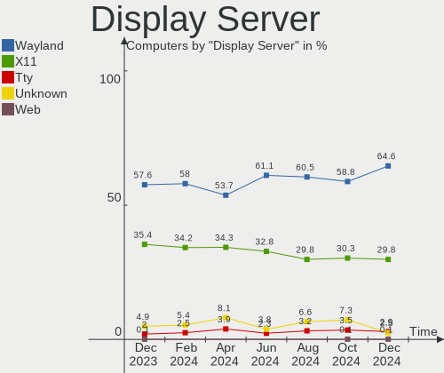
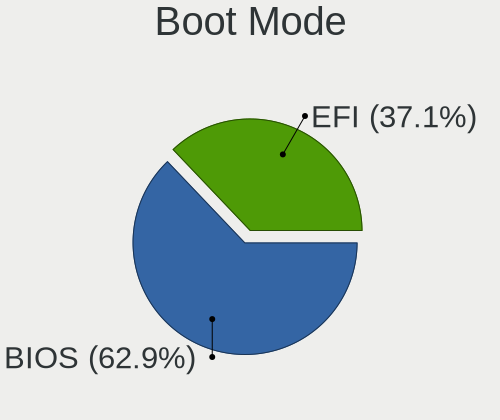
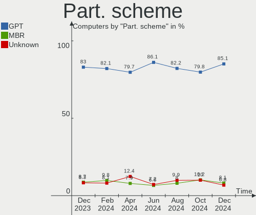
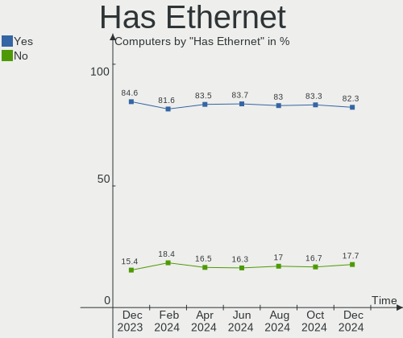
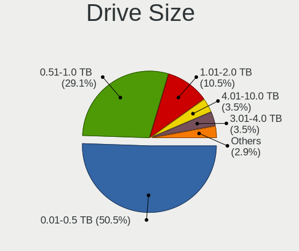
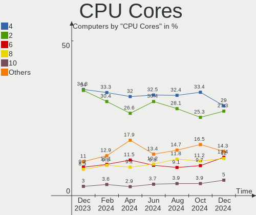

Ubuntu - Hardware Trends
------------------------

A project to identify most popular hardware characteristics and track their change
over time based on data collected by Linux users at https://Linux-Hardware.org.

Anyone can contribute to this report by the [hw-probe](https://github.com/linuxhw/hw-probe) tool:

    sudo -E hw-probe -all -upload

This is a report for all computer types. See also reports for [desktops](/Dist/Ubuntu/Desktop/README.md) and [notebooks](/Dist/Ubuntu/Notebook/README.md).

This report is for one last month. Overall report since the beginning of time: [TestDays](https://github.com/linuxhw/TestDays)

Period: Oct, 2023.

Contents
--------

* [ System ](#system)
  - [ OS                       ](#os)
  - [ OS Family                ](#os-family)
  - [ Kernel                   ](#kernel)
  - [ Kernel Family            ](#kernel-family)
  - [ Kernel Major Ver.        ](#kernel-major-ver)
  - [ Arch                     ](#arch)
  - [ DE                       ](#de)
  - [ Display Server           ](#display-server)
  - [ Display Manager          ](#display-manager)
  - [ OS Lang                  ](#os-lang)
  - [ Boot Mode                ](#boot-mode)
  - [ Filesystem               ](#filesystem)
  - [ Part. scheme             ](#part-scheme)
  - [ Dual Boot with Linux/BSD ](#dual-boot-with-linuxbsd)
  - [ Dual Boot (Win)          ](#dual-boot-win)

* [ Board ](#board)
  - [ Vendor                   ](#vendor)
  - [ Model                    ](#model)
  - [ Model Family             ](#model-family)
  - [ MFG Year                 ](#mfg-year)
  - [ Form Factor              ](#form-factor)
  - [ Secure Boot              ](#secure-boot)
  - [ Coreboot                 ](#coreboot)
  - [ RAM Size                 ](#ram-size)
  - [ RAM Used                 ](#ram-used)
  - [ Total Drives             ](#total-drives)
  - [ Has CD-ROM               ](#has-cd-rom)
  - [ Has Ethernet             ](#has-ethernet)
  - [ Has WiFi                 ](#has-wifi)
  - [ Has Bluetooth            ](#has-bluetooth)

* [ Location ](#location)
  - [ Country                  ](#country)
  - [ City                     ](#city)

* [ Drives ](#drives)
  - [ Drive Vendor             ](#drive-vendor)
  - [ Drive Model              ](#drive-model)
  - [ HDD Vendor               ](#hdd-vendor)
  - [ SSD Vendor               ](#ssd-vendor)
  - [ Drive Kind               ](#drive-kind)
  - [ Drive Connector          ](#drive-connector)
  - [ Drive Size               ](#drive-size)
  - [ Space Total              ](#space-total)
  - [ Space Used               ](#space-used)
  - [ Malfunc. Drives          ](#malfunc-drives)
  - [ Malfunc. Drive Vendor    ](#malfunc-drive-vendor)
  - [ Malfunc. HDD Vendor      ](#malfunc-hdd-vendor)
  - [ Malfunc. Drive Kind      ](#malfunc-drive-kind)
  - [ Failed Drives            ](#failed-drives)
  - [ Failed Drive Vendor      ](#failed-drive-vendor)
  - [ Drive Status             ](#drive-status)

* [ Storage controller ](#storage-controller)
  - [ Storage Vendor           ](#storage-vendor)
  - [ Storage Model            ](#storage-model)
  - [ Storage Kind             ](#storage-kind)

* [ Processor ](#processor)
  - [ CPU Vendor               ](#cpu-vendor)
  - [ CPU Model                ](#cpu-model)
  - [ CPU Model Family         ](#cpu-model-family)
  - [ CPU Cores                ](#cpu-cores)
  - [ CPU Sockets              ](#cpu-sockets)
  - [ CPU Threads              ](#cpu-threads)
  - [ CPU Op-Modes             ](#cpu-op-modes)
  - [ CPU Microcode            ](#cpu-microcode)
  - [ CPU Microarch            ](#cpu-microarch)

* [ Graphics ](#graphics)
  - [ GPU Vendor               ](#gpu-vendor)
  - [ GPU Model                ](#gpu-model)
  - [ GPU Combo                ](#gpu-combo)
  - [ GPU Driver               ](#gpu-driver)
  - [ GPU Memory               ](#gpu-memory)

* [ Monitor ](#monitor)
  - [ Monitor Vendor           ](#monitor-vendor)
  - [ Monitor Model            ](#monitor-model)
  - [ Monitor Resolution       ](#monitor-resolution)
  - [ Monitor Diagonal         ](#monitor-diagonal)
  - [ Monitor Width            ](#monitor-width)
  - [ Aspect Ratio             ](#aspect-ratio)
  - [ Monitor Area             ](#monitor-area)
  - [ Pixel Density            ](#pixel-density)
  - [ Multiple Monitors        ](#multiple-monitors)

* [ Network ](#network)
  - [ Net Controller Vendor    ](#net-controller-vendor)
  - [ Net Controller Model     ](#net-controller-model)
  - [ Wireless Vendor          ](#wireless-vendor)
  - [ Wireless Model           ](#wireless-model)
  - [ Ethernet Vendor          ](#ethernet-vendor)
  - [ Ethernet Model           ](#ethernet-model)
  - [ Net Controller Kind      ](#net-controller-kind)
  - [ Used Controller          ](#used-controller)
  - [ NICs                     ](#nics)
  - [ IPv6                     ](#ipv6)

* [ Bluetooth ](#bluetooth)
  - [ Bluetooth Vendor         ](#bluetooth-vendor)
  - [ Bluetooth Model          ](#bluetooth-model)

* [ Sound ](#sound)
  - [ Sound Vendor             ](#sound-vendor)
  - [ Sound Model              ](#sound-model)

* [ Memory ](#memory)
  - [ Memory Vendor            ](#memory-vendor)
  - [ Memory Model             ](#memory-model)
  - [ Memory Kind              ](#memory-kind)
  - [ Memory Form Factor       ](#memory-form-factor)
  - [ Memory Size              ](#memory-size)
  - [ Memory Speed             ](#memory-speed)

* [ Printers & scanners ](#printers--scanners)
  - [ Printer Vendor           ](#printer-vendor)
  - [ Printer Model            ](#printer-model)
  - [ Scanner Vendor           ](#scanner-vendor)
  - [ Scanner Model            ](#scanner-model)

* [ Camera ](#camera)
  - [ Camera Vendor            ](#camera-vendor)
  - [ Camera Model             ](#camera-model)

* [ Security ](#security)
  - [ Fingerprint Vendor       ](#fingerprint-vendor)
  - [ Fingerprint Model        ](#fingerprint-model)
  - [ Chipcard Vendor          ](#chipcard-vendor)
  - [ Chipcard Model           ](#chipcard-model)

* [ Unsupported ](#unsupported)
  - [ Unsupported Devices      ](#unsupported-devices)
  - [ Unsupported Device Types ](#unsupported-device-types)

System
------

OS
--

Installed operating systems

| Name           | Computers | Percent |
|----------------|-----------|---------|
| Ubuntu 22.04   | 918       | 65.43%  |
| Ubuntu 23.04   | 204       | 14.54%  |
| Ubuntu 23.10   | 143       | 10.19%  |
| Ubuntu 20.04   | 100       | 7.13%   |
| Ubuntu 18.04   | 19        | 1.35%   |
| Ubuntu 22.10   | 12        | 0.86%   |
| Ubuntu 20.10   | 3         | 0.21%   |
| Ubuntu Core 22 | 2         | 0.14%   |
| Ubuntu 2023.3  | 1         | 0.07%   |
| Ubuntu 16.04   | 1         | 0.07%   |

OS Family
---------

OS without a version

| Name   | Computers | Percent |
|--------|-----------|---------|
| Ubuntu | 1403      | 100%    |

Kernel
------

Version of the Linux kernel

| Version                 | Computers | Percent |
|-------------------------|-----------|---------|
| 6.2.0-34-generic        | 414       | 29.51%  |
| 6.2.0-35-generic        | 262       | 18.67%  |
| 6.2.0-33-generic        | 132       | 9.41%   |
| 6.5.0-9-generic         | 89        | 6.34%   |
| 5.15.0-86-generic       | 69        | 4.92%   |
| 5.19.0-38-generic       | 56        | 3.99%   |
| 6.2.0-26-generic        | 44        | 3.14%   |
| 6.5.0-10-generic        | 38        | 2.71%   |
| 6.2.0-36-generic        | 32        | 2.28%   |
| 5.15.0-87-generic       | 32        | 2.28%   |
| 5.15.0-84-generic       | 28        | 2%      |
| 6.2.0-20-generic        | 13        | 0.93%   |
| 6.2.0-32-generic        | 12        | 0.86%   |
| 5.19.0-46-generic       | 11        | 0.78%   |
| 6.5.0-5-generic         | 9         | 0.64%   |
| 5.4.0-150-generic       | 8         | 0.57%   |
| 5.4.0-165-generic       | 7         | 0.5%    |
| 6.2.0-31-generic        | 5         | 0.36%   |
| 5.19.0-32-generic       | 5         | 0.36%   |
| 5.15.0-67-generic       | 5         | 0.36%   |
| 5.15.0-43-generic       | 5         | 0.36%   |
| 4.15.0-213-generic      | 5         | 0.36%   |
| 5.4.0-164-generic       | 4         | 0.29%   |
| 5.4.0-163-generic       | 4         | 0.29%   |
| 5.15.0-88-generic       | 4         | 0.29%   |
| 5.15.0-25-generic       | 4         | 0.29%   |
| 6.5.5-060505-generic    | 3         | 0.21%   |
| 6.5.4-060504-generic    | 3         | 0.21%   |
| 6.5.0-7-generic         | 3         | 0.21%   |
| 5.15.0-83-generic       | 3         | 0.21%   |
| 5.15.0-76-generic       | 3         | 0.21%   |
| 5.15.0-60-generic       | 3         | 0.21%   |
| 6.6.0-060600rc5-generic | 2         | 0.14%   |
| 6.5.8-1-liquorix-amd64  | 2         | 0.14%   |
| 6.5.7-060507-generic    | 2         | 0.14%   |
| 6.2.16-060216-generic   | 2         | 0.14%   |
| 6.2.0-1014-lowlatency   | 2         | 0.14%   |
| 5.8.0-25-generic        | 2         | 0.14%   |
| 5.4.0-52-generic        | 2         | 0.14%   |
| 5.19.0-50-generic       | 2         | 0.14%   |

Kernel Family
-------------

Linux kernel without a distro release

| Version  | Computers | Percent |
|----------|-----------|---------|
| 6.2.0    | 921       | 65.65%  |
| 5.15.0   | 176       | 12.54%  |
| 6.5.0    | 140       | 9.98%   |
| 5.19.0   | 80        | 5.7%    |
| 5.4.0    | 31        | 2.21%   |
| 4.15.0   | 9         | 0.64%   |
| 6.5.5    | 5         | 0.36%   |
| 5.8.0    | 5         | 0.36%   |
| 6.6.0    | 3         | 0.21%   |
| 6.5.7    | 3         | 0.21%   |
| 6.5.4    | 3         | 0.21%   |
| 6.4.11   | 3         | 0.21%   |
| 6.2.16   | 3         | 0.21%   |
| 6.1.0    | 3         | 0.21%   |
| 6.5.8    | 2         | 0.14%   |
| 6.5.6    | 2         | 0.14%   |
| 5.17.0   | 2         | 0.14%   |
| 4.4.0    | 2         | 0.14%   |
| 6.4.3    | 1         | 0.07%   |
| 6.4.12   | 1         | 0.07%   |
| 6.3.9    | 1         | 0.07%   |
| 6.2.1    | 1         | 0.07%   |
| 6.1.26   | 1         | 0.07%   |
| 5.3.0    | 1         | 0.07%   |
| 5.14.0   | 1         | 0.07%   |
| 5.11.0   | 1         | 0.07%   |
| 5.10.110 | 1         | 0.07%   |
| 4.9.241  | 1         | 0.07%   |

Kernel Major Ver.
-----------------

Linux kernel major version

| Version | Computers | Percent |
|---------|-----------|---------|
| 6.2     | 925       | 65.93%  |
| 5.15    | 176       | 12.54%  |
| 6.5     | 155       | 11.05%  |
| 5.19    | 80        | 5.7%    |
| 5.4     | 31        | 2.21%   |
| 4.15    | 9         | 0.64%   |
| 6.4     | 5         | 0.36%   |
| 5.8     | 5         | 0.36%   |
| 6.1     | 4         | 0.29%   |
| 6.6     | 3         | 0.21%   |
| 5.17    | 2         | 0.14%   |
| 4.4     | 2         | 0.14%   |
| 6.3     | 1         | 0.07%   |
| 5.3     | 1         | 0.07%   |
| 5.14    | 1         | 0.07%   |
| 5.11    | 1         | 0.07%   |
| 5.10    | 1         | 0.07%   |
| 4.9     | 1         | 0.07%   |

Arch
----

OS architecture (x86_64, i586, etc.)

| Name    | Computers | Percent |
|---------|-----------|---------|
| x86_64  | 1394      | 99.36%  |
| aarch64 | 5         | 0.36%   |
| i686    | 4         | 0.29%   |

DE
--

Desktop Environment

| Name            | Computers | Percent |
|-----------------|-----------|---------|
| GNOME           | 1255      | 89.45%  |
| Unknown         | 119       | 8.48%   |
| X-Cinnamon      | 12        | 0.86%   |
| GNOME Flashback | 6         | 0.43%   |
| GNOME Classic   | 4         | 0.29%   |
| i3              | 3         | 0.21%   |
| Enlightenment   | 2         | 0.14%   |
| DDE             | 1         | 0.07%   |
| Cinnamon        | 1         | 0.07%   |

Display Server
--------------

X11 or Wayland

| Name    | Computers | Percent |
|---------|-----------|---------|
| Wayland | 792       | 56.45%  |
| X11     | 472       | 33.64%  |
| Unknown | 99        | 7.06%   |
| Tty     | 40        | 2.85%   |

Display Manager
---------------

SDDM, LightDM, etc.

| Name    | Computers | Percent |
|---------|-----------|---------|
| GDM3    | 1156      | 82.39%  |
| Unknown | 177       | 12.62%  |
| GDM     | 40        | 2.85%   |
| LightDM | 23        | 1.64%   |
| SDDM    | 5         | 0.36%   |
| XDM     | 1         | 0.07%   |
| SLiM    | 1         | 0.07%   |

OS Lang
-------

Language

| Lang    | Computers | Percent |
|---------|-----------|---------|
| en_US   | 587       | 41.84%  |
| de_DE   | 129       | 9.19%   |
| fr_FR   | 106       | 7.56%   |
| C       | 95        | 6.77%   |
| en_GB   | 60        | 4.28%   |
| it_IT   | 51        | 3.64%   |
| ru_RU   | 38        | 2.71%   |
| es_ES   | 38        | 2.71%   |
| pt_BR   | 33        | 2.35%   |
| en_IN   | 31        | 2.21%   |
| en_CA   | 20        | 1.43%   |
| pl_PL   | 19        | 1.35%   |
| nl_NL   | 16        | 1.14%   |
| Unknown | 14        | 1%      |
| en_AU   | 13        | 0.93%   |
| zh_CN   | 12        | 0.86%   |
| hu_HU   | 12        | 0.86%   |
| en_ZA   | 9         | 0.64%   |
| ja_JP   | 8         | 0.57%   |
| es_MX   | 8         | 0.57%   |
| zh_TW   | 6         | 0.43%   |
| tr_TR   | 6         | 0.43%   |
| sv_SE   | 5         | 0.36%   |
| fi_FI   | 5         | 0.36%   |
| es_AR   | 5         | 0.36%   |
| de_AT   | 5         | 0.36%   |
| cs_CZ   | 5         | 0.36%   |
| pt_PT   | 4         | 0.29%   |
| ko_KR   | 4         | 0.29%   |
| bg_BG   | 4         | 0.29%   |
| fr_CA   | 3         | 0.21%   |
| es_CO   | 3         | 0.21%   |
| en_NZ   | 3         | 0.21%   |
| en_NG   | 3         | 0.21%   |
| ca_ES   | 3         | 0.21%   |
| uk_UA   | 2         | 0.14%   |
| sk_SK   | 2         | 0.14%   |
| nb_NO   | 2         | 0.14%   |
| es_VE   | 2         | 0.14%   |
| es_UY   | 2         | 0.14%   |

Boot Mode
---------

EFI or BIOS

| Mode | Computers | Percent |
|------|-----------|---------|
| BIOS | 845       | 60.23%  |
| EFI  | 558       | 39.77%  |

Filesystem
----------

Type of filesystem

| Type    | Computers | Percent |
|---------|-----------|---------|
| Tmpfs   | 722       | 51.46%  |
| Ext4    | 570       | 40.63%  |
| Overlay | 88        | 6.27%   |
| Btrfs   | 9         | 0.64%   |
| Zfs     | 8         | 0.57%   |
| Xfs     | 3         | 0.21%   |
| XXXXXXX | 1         | 0.07%   |
| Ext3    | 1         | 0.07%   |
| Unknown | 1         | 0.07%   |

Part. scheme
------------

Scheme of partitioning

| Type    | Computers | Percent |
|---------|-----------|---------|
| GPT     | 1161      | 82.75%  |
| Unknown | 135       | 9.62%   |
| MBR     | 107       | 7.63%   |

Dual Boot with Linux/BSD
------------------------

Hosting more than one Linux/BSD

| Dual boot | Computers | Percent |
|-----------|-----------|---------|
| No        | 1206      | 85.96%  |
| Yes       | 197       | 14.04%  |

Dual Boot (Win)
---------------

Hosting Linux and Windows

| Dual boot | Computers | Percent |
|-----------|-----------|---------|
| No        | 907       | 64.65%  |
| Yes       | 496       | 35.35%  |

Board
-----

Vendor
------

Motherboard manufacturer

| Name                | Computers | Percent |
|---------------------|-----------|---------|
| Hewlett-Packard     | 222       | 15.82%  |
| Dell                | 205       | 14.61%  |
| Lenovo              | 193       | 13.76%  |
| ASUSTek Computer    | 182       | 12.97%  |
| Gigabyte Technology | 73        | 5.2%    |
| Acer                | 68        | 4.85%   |
| MSI                 | 58        | 4.13%   |
| Supermicro          | 39        | 2.78%   |
| ASRock              | 38        | 2.71%   |
| Apple               | 37        | 2.64%   |
| Intel               | 32        | 2.28%   |
| HUAWEI              | 27        | 1.92%   |
| Samsung Electronics | 17        | 1.21%   |
| ETegro Technologies | 16        | 1.14%   |
| Unknown             | 13        | 0.93%   |
| Toshiba             | 12        | 0.86%   |
| Fujitsu             | 11        | 0.78%   |
| AZW                 | 10        | 0.71%   |
| Google              | 8         | 0.57%   |
| Sony                | 6         | 0.43%   |
| Notebook            | 6         | 0.43%   |
| Microsoft           | 6         | 0.43%   |
| Chuwi               | 6         | 0.43%   |
| Biostar             | 6         | 0.43%   |
| Panasonic           | 5         | 0.36%   |
| Gateway             | 5         | 0.36%   |
| Positivo            | 4         | 0.29%   |
| Pegatron            | 3         | 0.21%   |
| Packard Bell        | 3         | 0.21%   |
| Medion              | 3         | 0.21%   |
| LG Electronics      | 3         | 0.21%   |
| Inventec            | 3         | 0.21%   |
| GPU Company         | 3         | 0.21%   |
| Foxconn             | 3         | 0.21%   |
| ECS                 | 3         | 0.21%   |
| AMI                 | 3         | 0.21%   |
| Alienware           | 3         | 0.21%   |
| UNOWHY              | 2         | 0.14%   |
| Trigkey             | 2         | 0.14%   |
| System76            | 2         | 0.14%   |

Model
-----

Motherboard model

| Name                             | Computers | Percent |
|----------------------------------|-----------|---------|
| ETegro Hyperion RS125 G4         | 16        | 1.14%   |
| Unknown                          | 15        | 1.07%   |
| ASUS All Series                  | 9         | 0.64%   |
| Supermicro X8DTU                 | 7         | 0.5%    |
| Supermicro SYS-6018R-TDW         | 6         | 0.43%   |
| HUAWEI NBLB-WAX9N                | 5         | 0.36%   |
| HP Notebook                      | 5         | 0.36%   |
| Supermicro X10DRi                | 4         | 0.29%   |
| Supermicro SYS-1028R-TDW         | 4         | 0.29%   |
| HP ProBook 450 G8 Notebook PC    | 4         | 0.29%   |
| Dell OptiPlex 7010               | 4         | 0.29%   |
| Dell Latitude 5480               | 4         | 0.29%   |
| AZW SEi                          | 4         | 0.29%   |
| ASUS Vivobook Go E1504FA_E1504FA | 4         | 0.29%   |
| Supermicro X9DRW                 | 3         | 0.21%   |
| Supermicro SYS-6018R-MTR         | 3         | 0.21%   |
| Supermicro Super Server          | 3         | 0.21%   |
| MSI MS-7C52                      | 3         | 0.21%   |
| Lenovo ThinkBook 15 G2 ITL 20VE  | 3         | 0.21%   |
| Lenovo IdeaPad 5 14ALC05 82LM    | 3         | 0.21%   |
| Lenovo IdeaPad 1 15AMN7 82VG     | 3         | 0.21%   |
| HUAWEI KLVL-WXXW                 | 3         | 0.21%   |
| HUAWEI BOM-WXX9                  | 3         | 0.21%   |
| HUAWEI BOHK-WAX9X                | 3         | 0.21%   |
| HP ProDesk 600 G1 SFF            | 3         | 0.21%   |
| HP ProBook 650 G1                | 3         | 0.21%   |
| HP Pavilion Laptop 14-ec0xxx     | 3         | 0.21%   |
| HP Pavilion dv6                  | 3         | 0.21%   |
| HP Pavilion 17                   | 3         | 0.21%   |
| HP EliteBook 840 G5              | 3         | 0.21%   |
| HP EliteBook 840 G3              | 3         | 0.21%   |
| HP Compaq Elite 8300 SFF         | 3         | 0.21%   |
| HP 15                            | 3         | 0.21%   |
| Dell XPS 15 9530                 | 3         | 0.21%   |
| Dell XPS 13 9370                 | 3         | 0.21%   |
| Dell OptiPlex 790                | 3         | 0.21%   |
| Dell Latitude E6420              | 3         | 0.21%   |
| Dell Inspiron 5570               | 3         | 0.21%   |
| Apple MacBookPro12,1             | 3         | 0.21%   |
| Samsung RC530/RC730              | 2         | 0.14%   |

Model Family
------------

Motherboard model prefix

| Name                     | Computers | Percent |
|--------------------------|-----------|---------|
| Lenovo ThinkPad          | 62        | 4.42%   |
| Dell Inspiron            | 48        | 3.42%   |
| Lenovo IdeaPad           | 46        | 3.28%   |
| Dell Latitude            | 45        | 3.21%   |
| Acer Aspire              | 40        | 2.85%   |
| HP Pavilion              | 33        | 2.35%   |
| Dell OptiPlex            | 32        | 2.28%   |
| HP EliteBook             | 30        | 2.14%   |
| Dell Precision           | 28        | 2%      |
| HP ProBook               | 25        | 1.78%   |
| Dell XPS                 | 23        | 1.64%   |
| Lenovo ThinkCentre       | 22        | 1.57%   |
| ASUS VivoBook            | 22        | 1.57%   |
| ASUS ROG                 | 22        | 1.57%   |
| ASUS PRIME               | 19        | 1.35%   |
| ETegro Hyperion          | 16        | 1.14%   |
| Dell Vostro              | 16        | 1.14%   |
| HP Laptop                | 15        | 1.07%   |
| Unknown                  | 15        | 1.07%   |
| HP Compaq                | 13        | 0.93%   |
| ASUS TUF                 | 12        | 0.86%   |
| Lenovo ThinkBook         | 11        | 0.78%   |
| ASUS Zenbook             | 11        | 0.78%   |
| ASUS ASUS                | 11        | 0.78%   |
| Toshiba Satellite        | 10        | 0.71%   |
| HP ProDesk               | 10        | 0.71%   |
| Lenovo Yoga              | 9         | 0.64%   |
| ASUS All                 | 9         | 0.64%   |
| Acer Swift               | 9         | 0.64%   |
| HP ZBook                 | 8         | 0.57%   |
| HP EliteDesk             | 8         | 0.57%   |
| Supermicro X8DTU         | 7         | 0.5%    |
| Lenovo Legion            | 7         | 0.5%    |
| HP ENVY                  | 7         | 0.5%    |
| HP 250                   | 7         | 0.5%    |
| Dell PowerEdge           | 7         | 0.5%    |
| Supermicro SYS-6018R-TDW | 6         | 0.43%   |
| Microsoft Surface        | 6         | 0.43%   |
| Fujitsu LIFEBOOK         | 6         | 0.43%   |
| Lenovo IdeaPadFlex       | 5         | 0.36%   |

MFG Year
--------

Motherboard manufacture year

| Year    | Computers | Percent |
|---------|-----------|---------|
| 2022    | 135       | 9.62%   |
| 2021    | 128       | 9.12%   |
| 2020    | 123       | 8.77%   |
| 2013    | 122       | 8.7%    |
| 2023    | 113       | 8.05%   |
| 2018    | 101       | 7.2%    |
| 2019    | 97        | 6.91%   |
| 2017    | 85        | 6.06%   |
| 2014    | 79        | 5.63%   |
| 2011    | 76        | 5.42%   |
| 2015    | 74        | 5.27%   |
| 2012    | 67        | 4.78%   |
| 2016    | 60        | 4.28%   |
| 2010    | 52        | 3.71%   |
| 2009    | 42        | 2.99%   |
| 2008    | 30        | 2.14%   |
| 2007    | 10        | 0.71%   |
| Unknown | 4         | 0.29%   |
| 2006    | 3         | 0.21%   |
| 2005    | 1         | 0.07%   |
| 2004    | 1         | 0.07%   |

Form Factor
-----------

Physical design of the computer

| Name           | Computers | Percent |
|----------------|-----------|---------|
| Notebook       | 748       | 53.31%  |
| Desktop        | 489       | 34.85%  |
| Server         | 55        | 3.92%   |
| Convertible    | 46        | 3.28%   |
| Mini pc        | 27        | 1.92%   |
| All in one     | 20        | 1.43%   |
| Tablet         | 13        | 0.93%   |
| System on chip | 5         | 0.36%   |

Secure Boot
-----------

Enabled or disabled

| State    | Computers | Percent |
|----------|-----------|---------|
| Disabled | 1279      | 91.16%  |
| Enabled  | 124       | 8.84%   |

Coreboot
--------

Have coreboot on board

| Used | Computers | Percent |
|------|-----------|---------|
| No   | 1394      | 99.36%  |
| Yes  | 9         | 0.64%   |

RAM Size
--------

Total RAM memory

| Size in GB      | Computers | Percent |
|-----------------|-----------|---------|
| 4.01-8.0        | 362       | 25.8%   |
| 16.01-24.0      | 329       | 23.45%  |
| 8.01-16.0       | 231       | 16.46%  |
| 3.01-4.0        | 173       | 12.33%  |
| 32.01-64.0      | 158       | 11.26%  |
| 64.01-256.0     | 74        | 5.27%   |
| 24.01-32.0      | 42        | 2.99%   |
| 1.01-2.0        | 12        | 0.86%   |
| 2.01-3.0        | 11        | 0.78%   |
| More than 256.0 | 9         | 0.64%   |
| 0.51-1.0        | 2         | 0.14%   |

RAM Used
--------

Used RAM memory

| Used GB    | Computers | Percent |
|------------|-----------|---------|
| 2.01-3.0   | 442       | 31.5%   |
| 1.01-2.0   | 371       | 26.44%  |
| 4.01-8.0   | 253       | 18.03%  |
| 3.01-4.0   | 208       | 14.83%  |
| 8.01-16.0  | 80        | 5.7%    |
| 0.51-1.0   | 21        | 1.5%    |
| 16.01-24.0 | 11        | 0.78%   |
| 0.01-0.5   | 8         | 0.57%   |
| 24.01-32.0 | 5         | 0.36%   |
| 32.01-64.0 | 4         | 0.29%   |

Total Drives
------------

Number of drives on board

| Drives | Computers | Percent |
|--------|-----------|---------|
| 1      | 886       | 63.15%  |
| 2      | 330       | 23.52%  |
| 3      | 102       | 7.27%   |
| 4      | 45        | 3.21%   |
| 5      | 10        | 0.71%   |
| 6      | 8         | 0.57%   |
| 0      | 8         | 0.57%   |
| 7      | 7         | 0.5%    |
| 9      | 3         | 0.21%   |
| 8      | 2         | 0.14%   |
| 22     | 1         | 0.07%   |
| 11     | 1         | 0.07%   |

Has CD-ROM
----------

Has CD-ROM on board

| Presented | Computers | Percent |
|-----------|-----------|---------|
| No        | 990       | 70.56%  |
| Yes       | 413       | 29.44%  |

Has Ethernet
------------

Has Ethernet on board

| Presented | Computers | Percent |
|-----------|-----------|---------|
| Yes       | 1152      | 82.11%  |
| No        | 251       | 17.89%  |

Has WiFi
--------

Has WiFi module

| Presented | Computers | Percent |
|-----------|-----------|---------|
| Yes       | 1091      | 77.76%  |
| No        | 312       | 22.24%  |

Has Bluetooth
-------------

Has Bluetooth module

| Presented | Computers | Percent |
|-----------|-----------|---------|
| Yes       | 918       | 65.43%  |
| No        | 485       | 34.57%  |

Location
--------

Country
-------

Geographic location (country)

| Country      | Computers | Percent |
|--------------|-----------|---------|
| USA          | 243       | 17.32%  |
| Germany      | 156       | 11.12%  |
| France       | 116       | 8.27%   |
| Russia       | 110       | 7.84%   |
| Italy        | 73        | 5.2%    |
| Brazil       | 56        | 3.99%   |
| UK           | 55        | 3.92%   |
| Spain        | 44        | 3.14%   |
| India        | 39        | 2.78%   |
| Canada       | 37        | 2.64%   |
| Netherlands  | 32        | 2.28%   |
| Poland       | 28        | 2%      |
| Switzerland  | 19        | 1.35%   |
| Turkey       | 16        | 1.14%   |
| Sweden       | 16        | 1.14%   |
| China        | 16        | 1.14%   |
| Mexico       | 15        | 1.07%   |
| Hungary      | 15        | 1.07%   |
| Australia    | 15        | 1.07%   |
| South Africa | 14        | 1%      |
| Romania      | 13        | 0.93%   |
| Norway       | 13        | 0.93%   |
| Austria      | 13        | 0.93%   |
| Argentina    | 11        | 0.78%   |
| Japan        | 10        | 0.71%   |
| Indonesia    | 10        | 0.71%   |
| Bulgaria     | 10        | 0.71%   |
| Taiwan       | 9         | 0.64%   |
| Finland      | 9         | 0.64%   |
| Czechia      | 9         | 0.64%   |
| Greece       | 8         | 0.57%   |
| Pakistan     | 7         | 0.5%    |
| Egypt        | 7         | 0.5%    |
| Belgium      | 7         | 0.5%    |
| Vietnam      | 6         | 0.43%   |
| South Korea  | 6         | 0.43%   |
| Slovakia     | 6         | 0.43%   |
| Portugal     | 6         | 0.43%   |
| Israel       | 6         | 0.43%   |
| Iran         | 6         | 0.43%   |

City
----

Geographic location (city)

| City             | Computers | Percent |
|------------------|-----------|---------|
| Moscow           | 70        | 4.99%   |
| Berlin           | 18        | 1.28%   |
| St Petersburg    | 14        | 1%      |
| Paris            | 12        | 0.86%   |
| Rome             | 11        | 0.78%   |
| Munich           | 10        | 0.71%   |
| Warsaw           | 8         | 0.57%   |
| Sao Paulo        | 8         | 0.57%   |
| Milan            | 8         | 0.57%   |
| Toronto          | 7         | 0.5%    |
| Montreal         | 7         | 0.5%    |
| Istanbul         | 7         | 0.5%    |
| Hamburg          | 7         | 0.5%    |
| Barcelona        | 7         | 0.5%    |
| Melbourne        | 6         | 0.43%   |
| Los Angeles      | 6         | 0.43%   |
| Johannesburg     | 6         | 0.43%   |
| Budapest         | 6         | 0.43%   |
| Vienna           | 5         | 0.36%   |
| Sofia            | 5         | 0.36%   |
| Rio de Janeiro   | 5         | 0.36%   |
| Oslo             | 5         | 0.36%   |
| New York         | 5         | 0.36%   |
| Nantes           | 5         | 0.36%   |
| London           | 5         | 0.36%   |
| Delhi            | 5         | 0.36%   |
| Chennai          | 5         | 0.36%   |
| Champs-sur-Marne | 5         | 0.36%   |
| Bucharest        | 5         | 0.36%   |
| Brussels         | 5         | 0.36%   |
| Bengaluru        | 5         | 0.36%   |
| Atlanta          | 5         | 0.36%   |
| Athens           | 5         | 0.36%   |
| Amsterdam        | 5         | 0.36%   |
| Zurich           | 4         | 0.29%   |
| Turin            | 4         | 0.29%   |
| Tehran           | 4         | 0.29%   |
| Taipei           | 4         | 0.29%   |
| New Taipei       | 4         | 0.29%   |
| Miami            | 4         | 0.29%   |

Drives
------

Drive Vendor
------------

Hard drive vendors

| Vendor                      | Computers | Drives | Percent |
|-----------------------------|-----------|--------|---------|
| Samsung Electronics         | 294       | 365    | 15.25%  |
| WDC                         | 244       | 289    | 12.66%  |
| Seagate                     | 225       | 274    | 11.67%  |
| Sandisk                     | 133       | 145    | 6.9%    |
| Toshiba                     | 94        | 100    | 4.88%   |
| SK hynix                    | 89        | 90     | 4.62%   |
| Kingston                    | 87        | 93     | 4.51%   |
| Unknown                     | 75        | 81     | 3.89%   |
| Intel                       | 63        | 85     | 3.27%   |
| Crucial                     | 62        | 69     | 3.22%   |
| Micron Technology           | 57        | 57     | 2.96%   |
| Hitachi                     | 40        | 42     | 2.07%   |
| Fujitsu                     | 27        | 45     | 1.4%    |
| HGST                        | 25        | 31     | 1.3%    |
| Phison Electronics          | 20        | 21     | 1.04%   |
| Apple                       | 20        | 23     | 1.04%   |
| A-DATA Technology           | 20        | 22     | 1.04%   |
| Micron/Crucial Technology   | 18        | 21     | 0.93%   |
| KIOXIA                      | 17        | 17     | 0.88%   |
| China                       | 17        | 18     | 0.88%   |
| SPCC                        | 16        | 18     | 0.83%   |
| PNY                         | 15        | 20     | 0.78%   |
| Kingston Technology Company | 13        | 14     | 0.67%   |
| Hewlett-Packard             | 11        | 19     | 0.57%   |
| Intenso                     | 10        | 10     | 0.52%   |
| Silicon Motion              | 9         | 9      | 0.47%   |
| Phison                      | 9         | 9      | 0.47%   |
| Netac                       | 9         | 9      | 0.47%   |
| Gigabyte Technology         | 7         | 7      | 0.36%   |
| ADATA Technology            | 7         | 8      | 0.36%   |
| Unknown                     | 7         | 7      | 0.36%   |
| Union Memory                | 6         | 6      | 0.31%   |
| MAXIO Technology (Hangzhou) | 6         | 6      | 0.31%   |
| LITEON                      | 6         | 6      | 0.31%   |
| Lexar                       | 6         | 6      | 0.31%   |
| Team                        | 5         | 5      | 0.26%   |
| LITEONIT                    | 5         | 5      | 0.26%   |
| KingSpec                    | 5         | 5      | 0.26%   |
| Fanxiang                    | 5         | 5      | 0.26%   |
| UMIS                        | 4         | 4      | 0.21%   |

Drive Model
-----------

Hard drive models

| Model                                               | Computers | Percent |
|-----------------------------------------------------|-----------|---------|
| Samsung NVMe SSD Controller SM981/PM981/PM983 1TB   | 31        | 1.5%    |
| Samsung NVMe SSD Controller PM9A1/PM9A3/980PRO 1TB  | 18        | 0.87%   |
| Unknown SD/MMC/MS PRO 16GB                          | 17        | 0.82%   |
| Unknown MMC Card  64GB                              | 16        | 0.77%   |
| Seagate ST1000LM035-1RK172 1TB                      | 15        | 0.73%   |
| Kingston SA400S37480G 480GB SSD                     | 14        | 0.68%   |
| Sandisk WD Black SN750 / PC SN730 NVMe SSD 1024GB   | 13        | 0.63%   |
| Kingston SA400S37240G 240GB SSD                     | 13        | 0.63%   |
| Seagate ST2000DM008-2FR102 2TB                      | 12        | 0.58%   |
| Micron/Crucial P2 NVMe PCIe SSD 500GB               | 11        | 0.53%   |
| Fujitsu MBE2147RC 147GB                             | 11        | 0.53%   |
| Toshiba MQ04ABF100 1TB                              | 10        | 0.48%   |
| Toshiba MQ01ABF050 500GB                            | 10        | 0.48%   |
| Seagate ST1000NM0033-9ZM173 1TB                     | 10        | 0.48%   |
| Samsung SSD 850 EVO 250GB                           | 10        | 0.48%   |
| Toshiba DT01ACA100 1TB                              | 9         | 0.44%   |
| Seagate ST500LT012-1DG142 500GB                     | 9         | 0.44%   |
| Seagate ST1000LM024 HN-M101MBB 1TB                  | 9         | 0.44%   |
| Sandisk WD Blue SN550 NVMe SSD 1TB                  | 9         | 0.44%   |
| Kingston SV300S37A120G 120GB SSD                    | 9         | 0.44%   |
| WDC WD10EZEX-08WN4A0 1TB                            | 8         | 0.39%   |
| Toshiba MQ01ABD100 1TB                              | 8         | 0.39%   |
| SPCC Solid State Disk 512GB                         | 8         | 0.39%   |
| SanDisk SSD PLUS 240GB                              | 8         | 0.39%   |
| SanDisk NVMe SSD Drive 1TB                          | 8         | 0.39%   |
| Samsung SSD 860 EVO 250GB                           | 8         | 0.39%   |
| Samsung NVMe SSD Controller SM961/PM961/SM963 121GB | 8         | 0.39%   |
| Phison PS5013 E13 NVMe Controller 256GB             | 8         | 0.39%   |
| Fujitsu MBA3147RC 147GB                             | 8         | 0.39%   |
| Crucial CT1000MX500SSD1 1TB                         | 8         | 0.39%   |
| Seagate ST500DM002-1BD142 500GB                     | 7         | 0.34%   |
| Seagate ST1000DM010-2EP102 1TB                      | 7         | 0.34%   |
| Samsung SSD 870 EVO 1TB                             | 7         | 0.34%   |
| Micron 2450_MTFDKBA512TFK 512GB                     | 7         | 0.34%   |
| Kingston Company SNV2S1000G 1TB                     | 7         | 0.34%   |
| Kingston SA400S37960G 960GB SSD                     | 7         | 0.34%   |
| Kingston SA400S37120G 120GB SSD                     | 7         | 0.34%   |
| Crucial CT500MX500SSD1 500GB                        | 7         | 0.34%   |
| Crucial CT240BX500SSD1 240GB                        | 7         | 0.34%   |
| Unknown                                             | 7         | 0.34%   |

HDD Vendor
----------

Hard disk drive vendors

| Vendor              | Computers | Drives | Percent |
|---------------------|-----------|--------|---------|
| Seagate             | 216       | 265    | 35.18%  |
| WDC                 | 186       | 213    | 30.29%  |
| Toshiba             | 68        | 74     | 11.07%  |
| Hitachi             | 40        | 42     | 6.51%   |
| Fujitsu             | 27        | 45     | 4.4%    |
| HGST                | 25        | 31     | 4.07%   |
| Samsung Electronics | 18        | 23     | 2.93%   |
| Unknown             | 17        | 17     | 2.77%   |
| Apple               | 4         | 4      | 0.65%   |
| SSK                 | 3         | 3      | 0.49%   |
| Maxtor              | 3         | 3      | 0.49%   |
| Hewlett-Packard     | 3         | 9      | 0.49%   |
| External            | 2         | 3      | 0.33%   |
| USB3.0              | 1         | 1      | 0.16%   |
| SABRENT             | 1         | 1      | 0.16%   |

SSD Vendor
----------

Solid state drive vendors

| Vendor              | Computers | Drives | Percent |
|---------------------|-----------|--------|---------|
| Samsung Electronics | 117       | 134    | 19.47%  |
| Kingston            | 68        | 72     | 11.31%  |
| SanDisk             | 51        | 55     | 8.49%   |
| Crucial             | 51        | 54     | 8.49%   |
| WDC                 | 43        | 46     | 7.15%   |
| Intel               | 22        | 42     | 3.66%   |
| SK hynix            | 20        | 20     | 3.33%   |
| China               | 16        | 17     | 2.66%   |
| SPCC                | 15        | 16     | 2.5%    |
| Micron Technology   | 15        | 15     | 2.5%    |
| A-DATA Technology   | 15        | 17     | 2.5%    |
| PNY                 | 14        | 16     | 2.33%   |
| Apple               | 13        | 13     | 2.16%   |
| Toshiba             | 9         | 9      | 1.5%    |
| Intenso             | 9         | 9      | 1.5%    |
| Hewlett-Packard     | 7         | 9      | 1.16%   |
| Netac               | 6         | 6      | 1%      |
| LITEON              | 6         | 6      | 1%      |
| Team                | 5         | 5      | 0.83%   |
| LITEONIT            | 5         | 5      | 0.83%   |
| KingSpec            | 5         | 5      | 0.83%   |
| Gigabyte Technology | 5         | 5      | 0.83%   |
| Patriot             | 4         | 4      | 0.67%   |
| Emtec               | 4         | 4      | 0.67%   |
| SABRENT             | 3         | 3      | 0.5%    |
| GOODRAM             | 3         | 4      | 0.5%    |
| Corsair             | 3         | 12     | 0.5%    |
| XrayDisk            | 2         | 2      | 0.33%   |
| Transcend           | 2         | 2      | 0.33%   |
| SSSTC               | 2         | 2      | 0.33%   |
| Rogueware           | 2         | 2      | 0.33%   |
| PHD 3.0             | 2         | 2      | 0.33%   |
| OCZ                 | 2         | 2      | 0.33%   |
| Lexar               | 2         | 2      | 0.33%   |
| Fanxiang            | 2         | 2      | 0.33%   |
| ASMT                | 2         | 2      | 0.33%   |
| ASMedia             | 2         | 2      | 0.33%   |
| Apacer              | 2         | 2      | 0.33%   |
| AirDisk             | 2         | 2      | 0.33%   |
| XSTAR               | 1         | 1      | 0.17%   |

Drive Kind
----------

HDD or SSD

| Kind    | Computers | Drives | Percent |
|---------|-----------|--------|---------|
| NVMe    | 604       | 712    | 34.26%  |
| SSD     | 532       | 672    | 30.18%  |
| HDD     | 529       | 734    | 30.01%  |
| MMC     | 53        | 58     | 3.01%   |
| Unknown | 45        | 51     | 2.55%   |

Drive Connector
---------------

SATA, SAS, NVMe, etc.

| Type | Computers | Drives | Percent |
|------|-----------|--------|---------|
| SATA | 877       | 1300   | 53.06%  |
| NVMe | 601       | 708    | 36.36%  |
| SAS  | 122       | 161    | 7.38%   |
| MMC  | 53        | 58     | 3.21%   |

Drive Size
----------

Size of hard drive

| Size in TB | Computers | Drives | Percent |
|------------|-----------|--------|---------|
| 0.01-0.5   | 632       | 812    | 56.83%  |
| 0.51-1.0   | 333       | 406    | 29.95%  |
| 1.01-2.0   | 84        | 105    | 7.55%   |
| 3.01-4.0   | 24        | 26     | 2.16%   |
| 2.01-3.0   | 22        | 36     | 1.98%   |
| 4.01-10.0  | 12        | 15     | 1.08%   |
| 10.01-20.0 | 5         | 6      | 0.45%   |

Space Total
-----------

Amount of disk space available on the file system

| Size in GB     | Computers | Percent |
|----------------|-----------|---------|
| 101-250        | 386       | 27.51%  |
| 251-500        | 351       | 25.02%  |
| 501-1000       | 229       | 16.32%  |
| 1001-2000      | 87        | 6.2%    |
| 51-100         | 87        | 6.2%    |
| Unknown        | 72        | 5.13%   |
| 1-20           | 61        | 4.35%   |
| More than 3000 | 53        | 3.78%   |
| 2001-3000      | 43        | 3.06%   |
| 21-50          | 34        | 2.42%   |

Space Used
----------

Amount of used disk space

| Used GB        | Computers | Percent |
|----------------|-----------|---------|
| 1-20           | 433       | 30.86%  |
| 21-50          | 305       | 21.74%  |
| 101-250        | 192       | 13.68%  |
| 51-100         | 160       | 11.4%   |
| 251-500        | 102       | 7.27%   |
| Unknown        | 72        | 5.13%   |
| 501-1000       | 70        | 4.99%   |
| 1001-2000      | 31        | 2.21%   |
| More than 3000 | 23        | 1.64%   |
| 2001-3000      | 15        | 1.07%   |

Malfunc. Drives
---------------

Drive models with a malfunction

| Model                                 | Computers | Drives | Percent |
|---------------------------------------|-----------|--------|---------|
| Intel SSDSC2BB800G7 800GB             | 3         | 3      | 4.48%   |
| WDC WDS240G2G0A-00JH30 240GB SSD      | 2         | 2      | 2.99%   |
| SK hynix HFS128G39TND-N210A 128GB SSD | 2         | 2      | 2.99%   |
| Seagate ST500LT012-9WS142 500GB       | 2         | 2      | 2.99%   |
| Samsung Electronics SSD 870 EVO 500GB | 2         | 2      | 2.99%   |
| WDC WDS240G2G0B-00EPW0 240GB SSD      | 1         | 1      | 1.49%   |
| WDC WD7500BPVT-80HXZT1 752GB          | 1         | 1      | 1.49%   |
| WDC WD5002ABYS-02B1B0 500GB           | 1         | 1      | 1.49%   |
| WDC WD5000LPLX-08ZNTT0 500GB          | 1         | 1      | 1.49%   |
| WDC WD5000LPCX-75VHAT0 500GB          | 1         | 1      | 1.49%   |
| WDC WD40EZRX-00SPEB0 4TB              | 1         | 1      | 1.49%   |
| WDC WD2502ABYS-18B7A0 250GB           | 1         | 1      | 1.49%   |
| WDC WD2500BEKT-60PVMT0 250GB          | 1         | 1      | 1.49%   |
| WDC WD2500AAJS-75M0A0 249GB           | 1         | 1      | 1.49%   |
| WDC WD2002FAEX-007BA0 2TB             | 1         | 1      | 1.49%   |
| WDC WD10EZEX-22MFCA0 1TB              | 1         | 1      | 1.49%   |
| WDC WD10EZEX-00WN4A0 1TB              | 1         | 1      | 1.49%   |
| WDC WD Green M.2 2280 480GB SSD       | 1         | 1      | 1.49%   |
| WDC WD Green 2.5 240GB                | 1         | 1      | 1.49%   |
| WDC WD Blue SA510 2. 1TB SSD          | 1         | 1      | 1.49%   |
| Toshiba MQ01ABF050 500GB              | 1         | 1      | 1.49%   |
| Toshiba MK0502TSKB 500GB              | 1         | 1      | 1.49%   |
| Toshiba A100 240GB SSD                | 1         | 1      | 1.49%   |
| SK hynix SC308 SATA 256GB SSD         | 1         | 1      | 1.49%   |
| SK hynix BC711 HFM512GD3JX013N 512GB  | 1         | 1      | 1.49%   |
| SK hynix BC711 HFM256GD3JX013N 256GB  | 1         | 1      | 1.49%   |
| Seagate ST500LT012-1DG142 500GB       | 1         | 1      | 1.49%   |
| Seagate ST500LM012 HN-M500MBB 500GB   | 1         | 1      | 1.49%   |
| Seagate ST500LM000-SSHD-8GB           | 1         | 1      | 1.49%   |
| Seagate ST500DM002-1BC142 500GB       | 1         | 1      | 1.49%   |
| Seagate ST4000NM0053 4TB              | 1         | 1      | 1.49%   |
| Seagate ST3750840ACE 752GB            | 1         | 1      | 1.49%   |
| Seagate ST31000528AS 1TB              | 1         | 1      | 1.49%   |
| Seagate ST2000NC001-1DY164 2TB        | 1         | 1      | 1.49%   |
| Seagate ST2000LX001-1RG174 2TB        | 1         | 1      | 1.49%   |
| Seagate ST2000DM008-2FR102 2TB        | 1         | 2      | 1.49%   |
| Seagate ST2000DL003-9VT166 2TB        | 1         | 1      | 1.49%   |
| Seagate ST14000NM0018-2H4101 14TB     | 1         | 1      | 1.49%   |
| Seagate ST1000NM0011 1TB              | 1         | 2      | 1.49%   |
| Seagate ST1000LX015-1U7172 1TB        | 1         | 1      | 1.49%   |

Malfunc. Drive Vendor
---------------------

Vendors of faulty drives

| Vendor              | Computers | Drives | Percent |
|---------------------|-----------|--------|---------|
| Seagate             | 18        | 20     | 26.87%  |
| WDC                 | 17        | 17     | 25.37%  |
| SK hynix            | 5         | 5      | 7.46%   |
| Intel               | 5         | 5      | 7.46%   |
| Toshiba             | 3         | 3      | 4.48%   |
| Samsung Electronics | 3         | 3      | 4.48%   |
| HGST                | 3         | 3      | 4.48%   |
| SanDisk             | 2         | 2      | 2.99%   |
| Corsair             | 2         | 2      | 2.99%   |
| Phison              | 1         | 1      | 1.49%   |
| Neo                 | 1         | 1      | 1.49%   |
| Micron Technology   | 1         | 1      | 1.49%   |
| LITEON              | 1         | 1      | 1.49%   |
| Kingston            | 1         | 1      | 1.49%   |
| KingFast            | 1         | 1      | 1.49%   |
| Hitachi             | 1         | 1      | 1.49%   |
| Crucial             | 1         | 1      | 1.49%   |
| Apple               | 1         | 1      | 1.49%   |

Malfunc. HDD Vendor
-------------------

Vendors of faulty HDD drives

| Vendor  | Computers | Drives | Percent |
|---------|-----------|--------|---------|
| Seagate | 18        | 20     | 50%     |
| WDC     | 11        | 11     | 30.56%  |
| HGST    | 3         | 3      | 8.33%   |
| Toshiba | 2         | 2      | 5.56%   |
| Hitachi | 1         | 1      | 2.78%   |
| Apple   | 1         | 1      | 2.78%   |

Malfunc. Drive Kind
-------------------

Kinds of faulty drives

| Kind | Computers | Drives | Percent |
|------|-----------|--------|---------|
| HDD  | 35        | 38     | 53.03%  |
| SSD  | 27        | 27     | 40.91%  |
| NVMe | 4         | 4      | 6.06%   |

Failed Drives
-------------

Failed drive models

| Model                           | Computers | Drives | Percent |
|---------------------------------|-----------|--------|---------|
| Seagate ST500LT012-1DG142 500GB | 1         | 1      | 50%     |
| Intel SSDSC2BB480G7 480GB       | 1         | 4      | 50%     |

Failed Drive Vendor
-------------------

Failed drive vendors

| Vendor  | Computers | Drives | Percent |
|---------|-----------|--------|---------|
| Seagate | 1         | 1      | 50%     |
| Intel   | 1         | 4      | 50%     |

Drive Status
------------

Number of failed and malfunc. drives

| Status   | Computers | Drives | Percent |
|----------|-----------|--------|---------|
| Detected | 876       | 1395   | 59.39%  |
| Works    | 533       | 758    | 36.14%  |
| Malfunc  | 64        | 69     | 4.34%   |
| Failed   | 2         | 5      | 0.14%   |

Storage controller
------------------

Storage Vendor
--------------

Storage controller vendors

| Vendor                         | Computers | Percent |
|--------------------------------|-----------|---------|
| Intel                          | 933       | 49.92%  |
| AMD                            | 219       | 11.72%  |
| Samsung Electronics            | 176       | 9.42%   |
| SanDisk                        | 111       | 5.94%   |
| SK hynix                       | 69        | 3.69%   |
| Micron Technology              | 42        | 2.25%   |
| Kingston Technology Company    | 33        | 1.77%   |
| Phison Electronics             | 31        | 1.66%   |
| Micron/Crucial Technology      | 31        | 1.66%   |
| LSI Logic / Symbios Logic      | 25        | 1.34%   |
| Marvell Technology Group       | 22        | 1.18%   |
| Toshiba America Info Systems   | 21        | 1.12%   |
| ASMedia Technology             | 20        | 1.07%   |
| MAXIO Technology (Hangzhou)    | 16        | 0.86%   |
| Nvidia                         | 15        | 0.8%    |
| KIOXIA                         | 14        | 0.75%   |
| JMicron Technology             | 12        | 0.64%   |
| Union Memory (Shenzhen)        | 11        | 0.59%   |
| ADATA Technology               | 11        | 0.59%   |
| Silicon Motion                 | 10        | 0.54%   |
| Shenzhen Longsys Electronics   | 7         | 0.37%   |
| Broadcom / LSI                 | 6         | 0.32%   |
| Solid State Storage Technology | 4         | 0.21%   |
| Hewlett-Packard                | 4         | 0.21%   |
| VIA Technologies               | 3         | 0.16%   |
| Solidigm                       | 3         | 0.16%   |
| Seagate Technology             | 3         | 0.16%   |
| Netac Technology               | 3         | 0.16%   |
| Apple                          | 3         | 0.16%   |
| Adaptec                        | 3         | 0.16%   |
| Lite-On Technology             | 2         | 0.11%   |
| Lenovo                         | 2         | 0.11%   |
| Biwin Storage Technology       | 2         | 0.11%   |
| Realtek Semiconductor          | 1         | 0.05%   |
| INNOGRIT                       | 1         | 0.05%   |

Storage Model
-------------

Storage controller models

| Model                                                                          | Computers | Percent |
|--------------------------------------------------------------------------------|-----------|---------|
| AMD FCH SATA Controller [AHCI mode]                                            | 156       | 7.31%   |
| Intel Volume Management Device NVMe RAID Controller                            | 76        | 3.56%   |
| Intel Sunrise Point-LP SATA Controller [AHCI mode]                             | 70        | 3.28%   |
| Intel 8 Series/C220 Series Chipset Family 6-port SATA Controller 1 [AHCI mode] | 70        | 3.28%   |
| Samsung NVMe SSD Controller SM981/PM981/PM983                                  | 58        | 2.72%   |
| Samsung NVMe SSD Controller PM9A1/PM9A3/980PRO                                 | 55        | 2.58%   |
| Samsung NVMe SSD Controller 980 (DRAM-less)                                    | 42        | 1.97%   |
| Intel 7 Series Chipset Family 6-port SATA Controller [AHCI mode]               | 39        | 1.83%   |
| Intel 6 Series/C200 Series Chipset Family 6 port Mobile SATA AHCI Controller   | 36        | 1.69%   |
| Intel 82801 Mobile SATA Controller [RAID mode]                                 | 35        | 1.64%   |
| Intel Tiger Lake-LP SATA Controller                                            | 33        | 1.55%   |
| Intel SATA Controller [RAID mode]                                              | 29        | 1.36%   |
| Intel 6 Series/C200 Series Chipset Family 6 port Desktop SATA AHCI Controller  | 28        | 1.31%   |
| SK hynix Gold P31/BC711/PC711 NVMe Solid State Drive                           | 27        | 1.27%   |
| Intel 200 Series PCH SATA controller [AHCI mode]                               | 26        | 1.22%   |
| Intel Comet Lake SATA AHCI Controller                                          | 25        | 1.17%   |
| Intel 8 Series SATA Controller 1 [AHCI mode]                                   | 25        | 1.17%   |
| Micron/Crucial P2 [Nick P2] / P3 / P3 Plus NVMe PCIe SSD (DRAM-less)           | 23        | 1.08%   |
| Intel Q170/Q150/B150/H170/H110/Z170/CM236 Chipset SATA Controller [AHCI Mode]  | 23        | 1.08%   |
| Intel C610/X99 series chipset 6-Port SATA Controller [AHCI mode]               | 23        | 1.08%   |
| Intel C602 chipset 4-Port SATA Storage Control Unit                            | 22        | 1.03%   |
| AMD 400 Series Chipset SATA Controller                                         | 22        | 1.03%   |
| SanDisk Extreme Pro / WD Black SN750 / PC SN730 / Red SN700 NVMe SSD           | 21        | 0.98%   |
| Intel Wildcat Point-LP SATA Controller [AHCI Mode]                             | 21        | 0.98%   |
| Intel C610/X99 series chipset sSATA Controller [AHCI mode]                     | 21        | 0.98%   |
| Intel Alder Lake-P SATA AHCI Controller                                        | 21        | 0.98%   |
| AMD 500 Series Chipset SATA Controller                                         | 21        | 0.98%   |
| AMD SB7x0/SB8x0/SB9x0 IDE Controller                                           | 20        | 0.94%   |
| SanDisk Ultra 3D / WD Blue SN550 NVMe SSD                                      | 19        | 0.89%   |
| Intel 7 Series/C210 Series Chipset Family 6-port SATA Controller [AHCI mode]   | 19        | 0.89%   |
| Intel SSD 670p Series [Keystone Harbor]                                        | 18        | 0.84%   |
| Intel Cannon Lake Mobile PCH SATA AHCI Controller                              | 18        | 0.84%   |
| Intel Alder Lake-S PCH SATA Controller [AHCI Mode]                             | 18        | 0.84%   |
| ASMedia ASM1062 Serial ATA Controller                                          | 18        | 0.84%   |
| Intel Cannon Lake PCH SATA AHCI Controller                                     | 17        | 0.8%    |
| Intel 82801JI (ICH10 Family) SATA AHCI Controller                              | 17        | 0.8%    |
| AMD SB7x0/SB8x0/SB9x0 SATA Controller [AHCI mode]                              | 17        | 0.8%    |
| Micron 2450 NVMe SSD [HendrixV] (DRAM-less)                                    | 16        | 0.75%   |
| Intel Celeron/Pentium Silver Processor SATA Controller                         | 16        | 0.75%   |
| Intel C600/X79 series chipset 6-Port SATA AHCI Controller                      | 15        | 0.7%    |

Storage Kind
------------

Kind of storage controller (IDE, SATA, NVMe, SAS, ...)

| Kind | Computers | Percent |
|------|-----------|---------|
| SATA | 950       | 50.26%  |
| NVMe | 598       | 31.64%  |
| RAID | 175       | 9.26%   |
| IDE  | 128       | 6.77%   |
| SAS  | 33        | 1.75%   |
| SCSI | 6         | 0.32%   |

Processor
---------

CPU Vendor
----------

Processor vendors

| Vendor       | Computers | Percent |
|--------------|-----------|---------|
| Intel        | 1085      | 77.33%  |
| AMD          | 312       | 22.24%  |
| ARM          | 5         | 0.36%   |
| CentaurHauls | 1         | 0.07%   |

CPU Model
---------

Processor models

| Model                                   | Computers | Percent |
|-----------------------------------------|-----------|---------|
| Intel 11th Gen Core i5-1135G7 @ 2.40GHz | 32        | 2.28%   |
| Intel 11th Gen Core i7-1165G7 @ 2.80GHz | 21        | 1.5%    |
| Intel Xeon CPU E5-2620 v2 @ 2.10GHz     | 18        | 1.28%   |
| Intel Core i5-7200U CPU @ 2.50GHz       | 16        | 1.14%   |
| Intel Core i5-8250U CPU @ 1.60GHz       | 15        | 1.07%   |
| AMD Ryzen 5 5500U with Radeon Graphics  | 15        | 1.07%   |
| Intel Core i5-10210U CPU @ 1.60GHz      | 14        | 1%      |
| Intel Core i5-6200U CPU @ 2.30GHz       | 13        | 0.93%   |
| AMD Ryzen 7 5800H with Radeon Graphics  | 12        | 0.86%   |
| Intel Core i7-10510U CPU @ 1.80GHz      | 11        | 0.78%   |
| AMD Ryzen 7 5700U with Radeon Graphics  | 11        | 0.78%   |
| Intel Xeon CPU E5-2620 v3 @ 2.40GHz     | 10        | 0.71%   |
| Intel Core i7-8550U CPU @ 1.80GHz       | 10        | 0.71%   |
| Intel Core i5-6300U CPU @ 2.40GHz       | 10        | 0.71%   |
| Intel Core i7-7700HQ CPU @ 2.80GHz      | 9         | 0.64%   |
| Intel Core i7-6700HQ CPU @ 2.60GHz      | 9         | 0.64%   |
| Intel 12th Gen Core i7-12700H           | 9         | 0.64%   |
| Intel 12th Gen Core i7-1255U            | 9         | 0.64%   |
| Intel 12th Gen Core i5-1235U            | 9         | 0.64%   |
| Intel N100                              | 8         | 0.57%   |
| Intel Core i7-8750H CPU @ 2.20GHz       | 8         | 0.57%   |
| Intel Core i7-3770 CPU @ 3.40GHz        | 8         | 0.57%   |
| Intel Core i5-4590 CPU @ 3.30GHz        | 8         | 0.57%   |
| Intel 11th Gen Core i7-1185G7 @ 3.00GHz | 8         | 0.57%   |
| Intel 11th Gen Core i3-1115G4 @ 3.00GHz | 8         | 0.57%   |
| AMD Ryzen 5 7520U with Radeon Graphics  | 8         | 0.57%   |
| Intel Core i7-9750H CPU @ 2.60GHz       | 7         | 0.5%    |
| Intel Core i7-8565U CPU @ 1.80GHz       | 7         | 0.5%    |
| Intel Core i5-8265U CPU @ 1.60GHz       | 7         | 0.5%    |
| Intel Core i5-5200U CPU @ 2.20GHz       | 7         | 0.5%    |
| Intel Core i5-3210M CPU @ 2.50GHz       | 7         | 0.5%    |
| Intel Core i5-2520M CPU @ 2.50GHz       | 7         | 0.5%    |
| Intel Core i3-5005U CPU @ 2.00GHz       | 7         | 0.5%    |
| Intel 13th Gen Core i9-13900H           | 7         | 0.5%    |
| Intel 12th Gen Core i7-1260P            | 7         | 0.5%    |
| Intel 12th Gen Core i5-1240P            | 7         | 0.5%    |
| Intel 11th Gen Core i7-11800H @ 2.30GHz | 7         | 0.5%    |
| AMD Ryzen 5 5625U with Radeon Graphics  | 7         | 0.5%    |
| AMD Ryzen 5 5600G with Radeon Graphics  | 7         | 0.5%    |
| Intel Xeon CPU E5-2680 v4 @ 2.40GHz     | 6         | 0.43%   |

CPU Model Family
----------------

Processor model prefix

| Model                   | Computers | Percent |
|-------------------------|-----------|---------|
| Intel Core i5           | 284       | 20.24%  |
| Other                   | 240       | 17.11%  |
| Intel Core i7           | 236       | 16.82%  |
| Intel Xeon              | 94        | 6.7%    |
| AMD Ryzen 5             | 87        | 6.2%    |
| Intel Core i3           | 78        | 5.56%   |
| AMD Ryzen 7             | 77        | 5.49%   |
| Intel Celeron           | 52        | 3.71%   |
| Intel Core 2 Duo        | 32        | 2.28%   |
| AMD Ryzen 9             | 27        | 1.92%   |
| Intel Pentium           | 22        | 1.57%   |
| AMD Ryzen 3             | 15        | 1.07%   |
| Intel Atom              | 14        | 1%      |
| AMD A6                  | 14        | 1%      |
| AMD FX                  | 11        | 0.78%   |
| Intel Core 2 Quad       | 10        | 0.71%   |
| Intel Core i9           | 9         | 0.64%   |
| AMD A10                 | 8         | 0.57%   |
| Intel Pentium Dual-Core | 7         | 0.5%    |
| AMD A4                  | 7         | 0.5%    |
| AMD Ryzen 7 PRO         | 6         | 0.43%   |
| Intel Core 2            | 4         | 0.29%   |
| AMD Phenom II X2        | 4         | 0.29%   |
| AMD E2                  | 4         | 0.29%   |
| AMD Athlon II X4        | 4         | 0.29%   |
| Intel Pentium Silver    | 3         | 0.21%   |
| AMD Ryzen 5 PRO         | 3         | 0.21%   |
| AMD PRO A10             | 3         | 0.21%   |
| AMD Phenom II X4        | 3         | 0.21%   |
| AMD GX                  | 3         | 0.21%   |
| AMD Athlon              | 3         | 0.21%   |
| AMD A8                  | 3         | 0.21%   |
| Intel Xeon Silver       | 2         | 0.14%   |
| Intel Pentium Dual      | 2         | 0.14%   |
| Intel Core m3           | 2         | 0.14%   |
| AMD Ryzen Threadripper  | 2         | 0.14%   |
| AMD Phenom II X6        | 2         | 0.14%   |
| AMD G                   | 2         | 0.14%   |
| AMD EPYC                | 2         | 0.14%   |
| AMD E                   | 2         | 0.14%   |

CPU Cores
---------

Number of processor cores

| Number  | Computers | Percent |
|---------|-----------|---------|
| 4       | 489       | 34.85%  |
| 2       | 416       | 29.65%  |
| 6       | 142       | 10.12%  |
| 8       | 136       | 9.69%   |
| 12      | 80        | 5.7%    |
| 10      | 42        | 2.99%   |
| 16      | 28        | 2%      |
| 14      | 26        | 1.85%   |
| 24      | 13        | 0.93%   |
| 1       | 10        | 0.71%   |
| 28      | 6         | 0.43%   |
| 3       | 6         | 0.43%   |
| Unknown | 3         | 0.21%   |
| 32      | 2         | 0.14%   |
| 44      | 1         | 0.07%   |
| 36      | 1         | 0.07%   |
| 20      | 1         | 0.07%   |
| 9       | 1         | 0.07%   |

CPU Sockets
-----------

Number of sockets

| Number  | Computers | Percent |
|---------|-----------|---------|
| 1       | 1325      | 94.44%  |
| 2       | 75        | 5.35%   |
| Unknown | 3         | 0.21%   |

CPU Threads
-----------

Threads per core (Hyper-Threading)

| Number  | Computers | Percent |
|---------|-----------|---------|
| 2       | 997       | 71.06%  |
| 1       | 403       | 28.72%  |
| Unknown | 3         | 0.21%   |

CPU Op-Modes
------------

CPU Operation Modes (32-bit, 64-bit)

| Op mode        | Computers | Percent |
|----------------|-----------|---------|
| 32-bit, 64-bit | 1400      | 99.79%  |
| 32-bit         | 2         | 0.14%   |
| 64-bit         | 1         | 0.07%   |

CPU Microcode
-------------

Microcode number

| Number     | Computers | Percent |
|------------|-----------|---------|
| Unknown    | 1048      | 74.7%   |
| 0x306e4    | 18        | 1.28%   |
| 0x0a50000d | 18        | 1.28%   |
| 0x406f1    | 17        | 1.21%   |
| 0x206a7    | 14        | 1%      |
| 0x0a50000c | 14        | 1%      |
| 0x08608103 | 14        | 1%      |
| 0x206c2    | 11        | 0.78%   |
| 0x08108109 | 11        | 0.78%   |
| 0x806c1    | 10        | 0.71%   |
| 0x306f2    | 10        | 0.71%   |
| 0x306c3    | 10        | 0.71%   |
| 0x906ea    | 8         | 0.57%   |
| 0x306a9    | 8         | 0.57%   |
| 0x0a601203 | 8         | 0.57%   |
| 0x1067a    | 7         | 0.5%    |
| 0x0a20120a | 6         | 0.43%   |
| 0x906a4    | 5         | 0.36%   |
| 0x806ec    | 5         | 0.36%   |
| 0x406e3    | 5         | 0.36%   |
| 0x206d7    | 5         | 0.36%   |
| 0x08701021 | 5         | 0.36%   |
| 0x06000852 | 5         | 0.36%   |
| 0x010000c8 | 5         | 0.36%   |
| 0x906e9    | 4         | 0.29%   |
| 0x406c4    | 4         | 0.29%   |
| 0x106a5    | 4         | 0.29%   |
| 0x0a404102 | 4         | 0.29%   |
| 0x08a00008 | 4         | 0.29%   |
| 0x08600106 | 4         | 0.29%   |
| 0x08600104 | 4         | 0.29%   |
| 0x906ed    | 3         | 0.21%   |
| 0x906a3    | 3         | 0.21%   |
| 0x90672    | 3         | 0.21%   |
| 0x806d1    | 3         | 0.21%   |
| 0x40651    | 3         | 0.21%   |
| 0x106e5    | 3         | 0.21%   |
| 0x08701030 | 3         | 0.21%   |
| 0x08608104 | 3         | 0.21%   |
| 0x08108102 | 3         | 0.21%   |

CPU Microarch
-------------

Microarchitecture

| Name             | Computers | Percent |
|------------------|-----------|---------|
| KabyLake         | 206       | 14.68%  |
| Unknown          | 144       | 10.26%  |
| Haswell          | 132       | 9.41%   |
| IvyBridge        | 93        | 6.63%   |
| SandyBridge      | 84        | 5.99%   |
| TigerLake        | 78        | 5.56%   |
| Skylake          | 74        | 5.27%   |
| Zen 3            | 71        | 5.06%   |
| Alderlake Hybrid | 70        | 4.99%   |
| Broadwell        | 45        | 3.21%   |
| Penryn           | 44        | 3.14%   |
| Westmere         | 40        | 2.85%   |
| Zen 2            | 37        | 2.64%   |
| Zen+             | 33        | 2.35%   |
| IceLake          | 28        | 2%      |
| Silvermont       | 27        | 1.92%   |
| CometLake        | 22        | 1.57%   |
| Nehalem          | 21        | 1.5%    |
| K10              | 20        | 1.43%   |
| Goldmont plus    | 19        | 1.35%   |
| Excavator        | 19        | 1.35%   |
| Core             | 18        | 1.28%   |
| Piledriver       | 17        | 1.21%   |
| Zen              | 16        | 1.14%   |
| Goldmont         | 7         | 0.5%    |
| Puma             | 6         | 0.43%   |
| Jaguar           | 6         | 0.43%   |
| K10 Llano        | 5         | 0.36%   |
| Bobcat           | 5         | 0.36%   |
| K8 Hammer        | 4         | 0.29%   |
| Bulldozer        | 3         | 0.21%   |
| Steamroller      | 2         | 0.14%   |
| K8 & K10 hybrid  | 2         | 0.14%   |
| Tremont          | 1         | 0.07%   |
| P6               | 1         | 0.07%   |
| NetBurst         | 1         | 0.07%   |
| Gracemont        | 1         | 0.07%   |
| Bonnell          | 1         | 0.07%   |

Graphics
--------

GPU Vendor
----------

Vendors of graphics cards

| Vendor                     | Computers | Percent |
|----------------------------|-----------|---------|
| Intel                      | 829       | 50.12%  |
| Nvidia                     | 401       | 24.24%  |
| AMD                        | 352       | 21.28%  |
| ASPEED Technology          | 42        | 2.54%   |
| Matrox Electronics Systems | 29        | 1.75%   |
| Zhaoxin                    | 1         | 0.06%   |

GPU Model
---------

Graphics card models

| Model                                                                                    | Computers | Percent |
|------------------------------------------------------------------------------------------|-----------|---------|
| Intel TigerLake-LP GT2 [Iris Xe Graphics]                                                | 68        | 4.06%   |
| Intel 2nd Generation Core Processor Family Integrated Graphics Controller                | 53        | 3.16%   |
| ASPEED Technology ASPEED Graphics Family                                                 | 42        | 2.51%   |
| Intel Xeon E3-1200 v3/4th Gen Core Processor Integrated Graphics Controller              | 40        | 2.39%   |
| Intel 3rd Gen Core processor Graphics Controller                                         | 37        | 2.21%   |
| Intel Skylake GT2 [HD Graphics 520]                                                      | 33        | 1.97%   |
| Intel UHD Graphics 620                                                                   | 32        | 1.91%   |
| Intel HD Graphics 620                                                                    | 31        | 1.85%   |
| Intel Haswell-ULT Integrated Graphics Controller                                         | 31        | 1.85%   |
| Intel CometLake-U GT2 [UHD Graphics]                                                     | 30        | 1.79%   |
| Intel Alder Lake-P GT2 [Iris Xe Graphics]                                                | 30        | 1.79%   |
| AMD Lucienne                                                                             | 28        | 1.67%   |
| Intel HD Graphics 530                                                                    | 26        | 1.55%   |
| AMD Cezanne [Radeon Vega Series / Radeon Vega Mobile Series]                             | 26        | 1.55%   |
| Intel CoffeeLake-S GT2 [UHD Graphics 630]                                                | 24        | 1.43%   |
| AMD Picasso/Raven 2 [Radeon Vega Series / Radeon Vega Mobile Series]                     | 23        | 1.37%   |
| Intel HD Graphics 630                                                                    | 21        | 1.25%   |
| Intel HD Graphics 5500                                                                   | 20        | 1.19%   |
| Intel CoffeeLake-H GT2 [UHD Graphics 630]                                                | 20        | 1.19%   |
| AMD Barcelo                                                                              | 20        | 1.19%   |
| Matrox Electronics Systems MGA G200eW WPCM450                                            | 18        | 1.07%   |
| Intel Raptor Lake-P [Iris Xe Graphics]                                                   | 18        | 1.07%   |
| Intel Core Processor Integrated Graphics Controller                                      | 18        | 1.07%   |
| Intel 4th Gen Core Processor Integrated Graphics Controller                              | 18        | 1.07%   |
| AMD Renoir [Radeon RX Vega 6 (Ryzen 4000/5000 Mobile Series)]                            | 18        | 1.07%   |
| Intel WhiskeyLake-U GT2 [UHD Graphics 620]                                               | 17        | 1.01%   |
| Intel GeminiLake [UHD Graphics 600]                                                      | 17        | 1.01%   |
| Intel Atom/Celeron/Pentium Processor x5-E8000/J3xxx/N3xxx Integrated Graphics Controller | 16        | 0.96%   |
| Intel Alder Lake-UP3 GT2 [Iris Xe Graphics]                                              | 16        | 0.96%   |
| AMD Ellesmere [Radeon RX 470/480/570/570X/580/580X/590]                                  | 15        | 0.9%    |
| Intel Xeon E3-1200 v2/3rd Gen Core processor Graphics Controller                         | 14        | 0.84%   |
| Intel TigerLake-H GT1 [UHD Graphics]                                                     | 14        | 0.84%   |
| Nvidia TU117M [GeForce GTX 1650 Mobile / Max-Q]                                          | 13        | 0.78%   |
| Nvidia GA106M [GeForce RTX 3060 Mobile / Max-Q]                                          | 13        | 0.78%   |
| AMD Stoney [Radeon R2/R3/R4/R5 Graphics]                                                 | 13        | 0.78%   |
| Intel CometLake-H GT2 [UHD Graphics]                                                     | 11        | 0.66%   |
| AMD Raphael                                                                              | 11        | 0.66%   |
| Nvidia GK208B [GeForce GT 710]                                                           | 10        | 0.6%    |
| Intel Atom Processor Z36xxx/Z37xxx Series Graphics & Display                             | 10        | 0.6%    |
| AMD Mendocino                                                                            | 10        | 0.6%    |

GPU Combo
---------

Combinations of graphics cards

| Name                    | Computers | Percent |
|-------------------------|-----------|---------|
| 1 x Intel               | 611       | 43.55%  |
| 1 x AMD                 | 273       | 19.46%  |
| 1 x Nvidia              | 186       | 13.26%  |
| Intel + Nvidia          | 173       | 12.33%  |
| 1 x ASPEED              | 40        | 2.85%   |
| AMD + Nvidia            | 33        | 2.35%   |
| Intel + AMD             | 28        | 2%      |
| 1 x Matrox              | 27        | 1.92%   |
| 2 x AMD                 | 15        | 1.07%   |
| Other                   | 9         | 0.64%   |
| 2 x Nvidia + 1 x ASPEED | 1         | 0.07%   |
| 2 x Nvidia              | 1         | 0.07%   |
| 2 x Intel               | 1         | 0.07%   |
| 1 x Zhaoxin             | 1         | 0.07%   |
| Nvidia + Matrox         | 1         | 0.07%   |
| Nvidia + ASPEED         | 1         | 0.07%   |
| Intel + 2 x Nvidia      | 1         | 0.07%   |
| AMD + Matrox            | 1         | 0.07%   |

GPU Driver
----------

Free vs proprietary

| Driver      | Computers | Percent |
|-------------|-----------|---------|
| Free        | 1047      | 74.63%  |
| Proprietary | 252       | 17.96%  |
| Unknown     | 104       | 7.41%   |

GPU Memory
----------

Total video memory

| Size in GB | Computers | Percent |
|------------|-----------|---------|
| Unknown    | 1129      | 80.47%  |
| 0.01-0.5   | 89        | 6.34%   |
| 1.01-2.0   | 63        | 4.49%   |
| 0.51-1.0   | 42        | 2.99%   |
| 3.01-4.0   | 34        | 2.42%   |
| 7.01-8.0   | 22        | 1.57%   |
| 5.01-6.0   | 14        | 1%      |
| 8.01-16.0  | 6         | 0.43%   |
| 16.01-24.0 | 4         | 0.29%   |

Monitor
-------

Monitor Vendor
--------------

Monitor vendors

| Vendor                  | Computers | Percent |
|-------------------------|-----------|---------|
| Samsung Electronics     | 186       | 12.7%   |
| AU Optronics            | 170       | 11.61%  |
| BOE                     | 150       | 10.25%  |
| Chimei Innolux          | 136       | 9.29%   |
| LG Display              | 115       | 7.86%   |
| Dell                    | 101       | 6.9%    |
| Goldstar                | 68        | 4.64%   |
| Hewlett-Packard         | 53        | 3.62%   |
| Acer                    | 43        | 2.94%   |
| Apple                   | 37        | 2.53%   |
| AOC                     | 34        | 2.32%   |
| Lenovo                  | 33        | 2.25%   |
| Ancor Communications    | 29        | 1.98%   |
| Philips                 | 28        | 1.91%   |
| BenQ                    | 28        | 1.91%   |
| Sharp                   | 26        | 1.78%   |
| PANDA                   | 20        | 1.37%   |
| ViewSonic               | 18        | 1.23%   |
| Chi Mei Optoelectronics | 16        | 1.09%   |
| ASUSTek Computer        | 12        | 0.82%   |
| InfoVision              | 11        | 0.75%   |
| Iiyama                  | 11        | 0.75%   |
| CSO                     | 9         | 0.61%   |
| Sony                    | 7         | 0.48%   |
| MSI                     | 7         | 0.48%   |
| Eizo                    | 6         | 0.41%   |
| Panasonic               | 5         | 0.34%   |
| Unknown                 | 4         | 0.27%   |
| RTK                     | 4         | 0.27%   |
| NEC Computers           | 4         | 0.27%   |
| HKC                     | 4         | 0.27%   |
| HannStar                | 4         | 0.27%   |
| Vizio                   | 3         | 0.2%    |
| TMX                     | 3         | 0.2%    |
| Sceptre Tech            | 3         | 0.2%    |
| Plain Tree Systems      | 3         | 0.2%    |
| Mi                      | 3         | 0.2%    |
| LG Philips              | 3         | 0.2%    |
| Fujitsu Siemens         | 3         | 0.2%    |
| Toshiba                 | 2         | 0.14%   |

Monitor Model
-------------

Monitor models

| Model                                                                    | Computers | Percent |
|--------------------------------------------------------------------------|-----------|---------|
| Chimei Innolux LCD Monitor CMN15E7 1920x1080 344x193mm 15.5-inch         | 8         | 0.53%   |
| Chimei Innolux LCD Monitor CMN15F5 1920x1080 344x193mm 15.5-inch         | 7         | 0.46%   |
| Goldstar FULL HD GSM5B55 1920x1080 480x270mm 21.7-inch                   | 6         | 0.4%    |
| BOE LCD Monitor BOE0877 1920x1080 309x173mm 13.9-inch                    | 6         | 0.4%    |
| BOE LCD Monitor BOE0872 1920x1080 344x194mm 15.5-inch                    | 6         | 0.4%    |
| PANDA LCD Monitor NCP004D 1920x1080 344x194mm 15.5-inch                  | 5         | 0.33%   |
| LG Display LCD Monitor LGD046F 1920x1080 345x194mm 15.6-inch             | 5         | 0.33%   |
| Dell U2412M DELA07B 1920x1200 518x324mm 24.1-inch                        | 5         | 0.33%   |
| Dell U2412M DELA07A 1920x1200 518x324mm 24.1-inch                        | 5         | 0.33%   |
| Chimei Innolux LCD Monitor CMN14C9 1920x1080 309x173mm 13.9-inch         | 5         | 0.33%   |
| BOE LCD Monitor BOE0893 2160x1440 296x197mm 14.0-inch                    | 5         | 0.33%   |
| AU Optronics LCD Monitor AUO71EC 1366x768 344x193mm 15.5-inch            | 5         | 0.33%   |
| AU Optronics LCD Monitor AUO38ED 1920x1080 344x193mm 15.5-inch           | 5         | 0.33%   |
| AOC 24B2W1G5 AOC2402 1920x1080 527x296mm 23.8-inch                       | 5         | 0.33%   |
| Samsung Electronics C27F390 SAM0D32 1920x1080 598x336mm 27.0-inch        | 4         | 0.27%   |
| LG Display LCD Monitor LGD05E5 1920x1080 344x194mm 15.5-inch             | 4         | 0.27%   |
| LG Display LCD Monitor LGD0563 1920x1080 344x194mm 15.5-inch             | 4         | 0.27%   |
| Chimei Innolux LCD Monitor CMN15E6 1366x768 344x193mm 15.5-inch          | 4         | 0.27%   |
| Chimei Innolux LCD Monitor CMN14E5 1920x1080 309x173mm 13.9-inch         | 4         | 0.27%   |
| Chimei Innolux LCD Monitor CMN14D4 1920x1080 309x173mm 13.9-inch         | 4         | 0.27%   |
| Chi Mei Optoelectronics LCD Monitor CMO15A7 1366x768 344x193mm 15.5-inch | 4         | 0.27%   |
| BOE LCD Monitor BOE084E 1920x1080 382x215mm 17.3-inch                    | 4         | 0.27%   |
| AU Optronics LCD Monitor AUO4A99 1920x1080 344x194mm 15.5-inch           | 4         | 0.27%   |
| AU Optronics LCD Monitor AUO139E 1600x900 382x214mm 17.2-inch            | 4         | 0.27%   |
| Ancor Communications VS248 ACI2498 1920x1080 531x299mm 24.0-inch         | 4         | 0.27%   |
| ViewSonic VG2439 Series VSCD22B 1920x1080 521x293mm 23.5-inch            | 3         | 0.2%    |
| Samsung Electronics S24F350 SAM0D20 1920x1080 521x293mm 23.5-inch        | 3         | 0.2%    |
| Samsung Electronics S22D300 SAM0B3B 1920x1080 480x270mm 21.7-inch        | 3         | 0.2%    |
| Samsung Electronics LCD Monitor SEC5441 1366x768 309x174mm 14.0-inch     | 3         | 0.2%    |
| Samsung Electronics LCD Monitor SEC3245 1366x768 344x194mm 15.5-inch     | 3         | 0.2%    |
| Samsung Electronics LCD Monitor SDC5441 1366x768 344x194mm 15.5-inch     | 3         | 0.2%    |
| Samsung Electronics LCD Monitor SDC4171 2880x1800 302x189mm 14.0-inch    | 3         | 0.2%    |
| Samsung Electronics LCD Monitor SDC4161 1920x1080 344x194mm 15.5-inch    | 3         | 0.2%    |
| Samsung Electronics LCD Monitor SDC414D 3456x2160 336x210mm 15.6-inch    | 3         | 0.2%    |
| LG Display LCD Monitor LGD0533 1920x1080 344x194mm 15.5-inch             | 3         | 0.2%    |
| Lenovo LCD Monitor LEN40B1 1600x900 344x194mm 15.5-inch                  | 3         | 0.2%    |
| InfoVision LCD Monitor IVO8C78 1920x1080 309x174mm 14.0-inch             | 3         | 0.2%    |
| Goldstar HDR 4K GSM7707 3840x2160 600x340mm 27.2-inch                    | 3         | 0.2%    |
| Goldstar 2D FHD TV GSM59C6 1920x1080 509x286mm 23.0-inch                 | 3         | 0.2%    |
| Dell SE2416H DELD081 1920x1080 527x296mm 23.8-inch                       | 3         | 0.2%    |

Monitor Resolution
------------------

Monitor screen resolution

| Resolution         | Computers | Percent |
|--------------------|-----------|---------|
| 1920x1080 (FHD)    | 675       | 48.77%  |
| 1366x768 (WXGA)    | 194       | 14.02%  |
| 3840x2160 (4K)     | 99        | 7.15%   |
| 2560x1440 (QHD)    | 77        | 5.56%   |
| 1920x1200 (WUXGA)  | 50        | 3.61%   |
| 1600x900 (HD+)     | 47        | 3.4%    |
| 1680x1050 (WSXGA+) | 37        | 2.67%   |
| 1280x1024 (SXGA)   | 29        | 2.1%    |
| 2560x1600          | 25        | 1.81%   |
| 1440x900 (WXGA+)   | 19        | 1.37%   |
| 2880x1800          | 15        | 1.08%   |
| 2160x1440          | 15        | 1.08%   |
| 1280x800 (WXGA)    | 14        | 1.01%   |
| 3840x2400          | 11        | 0.79%   |
| 3440x1440          | 11        | 0.79%   |
| 2560x1080          | 8         | 0.58%   |
| Unknown            | 6         | 0.43%   |
| 1024x768 (XGA)     | 5         | 0.36%   |
| 3840x1080          | 4         | 0.29%   |
| 3072x1920          | 4         | 0.29%   |
| 2736x1824          | 4         | 0.29%   |
| 1360x768           | 4         | 0.29%   |
| 3456x2160          | 3         | 0.22%   |
| 2520x1680          | 3         | 0.22%   |
| 3200x2000          | 2         | 0.14%   |
| 2288x1287          | 2         | 0.14%   |
| 2256x1504          | 2         | 0.14%   |
| 1920x1280          | 2         | 0.14%   |
| 4480x1440          | 1         | 0.07%   |
| 3840x1100          | 1         | 0.07%   |
| 3360x1080          | 1         | 0.07%   |
| 3200x1800 (QHD+)   | 1         | 0.07%   |
| 3000x2000          | 1         | 0.07%   |
| 2880x1920          | 1         | 0.07%   |
| 2880x1620          | 1         | 0.07%   |
| 2560x1024          | 1         | 0.07%   |
| 2304x1440          | 1         | 0.07%   |
| 2240x1400          | 1         | 0.07%   |
| 2048x1152          | 1         | 0.07%   |
| 1920x540           | 1         | 0.07%   |

Monitor Diagonal
----------------

Diagonal size in inches

| Inches  | Computers | Percent |
|---------|-----------|---------|
| 15      | 385       | 26.39%  |
| 14      | 134       | 9.18%   |
| 13      | 131       | 8.98%   |
| 27      | 119       | 8.16%   |
| 24      | 114       | 7.81%   |
| 23      | 99        | 6.79%   |
| 17      | 76        | 5.21%   |
| 21      | 75        | 5.14%   |
| 31      | 39        | 2.67%   |
| 16      | 32        | 2.19%   |
| Unknown | 32        | 2.19%   |
| 19      | 27        | 1.85%   |
| 22      | 26        | 1.78%   |
| 18      | 19        | 1.3%    |
| 12      | 18        | 1.23%   |
| 11      | 18        | 1.23%   |
| 34      | 16        | 1.1%    |
| 20      | 16        | 1.1%    |
| 84      | 12        | 0.82%   |
| 40      | 12        | 0.82%   |
| 26      | 8         | 0.55%   |
| 54      | 6         | 0.41%   |
| 29      | 6         | 0.41%   |
| 25      | 6         | 0.41%   |
| 72      | 4         | 0.27%   |
| 52      | 4         | 0.27%   |
| 28      | 4         | 0.27%   |
| 48      | 3         | 0.21%   |
| 32      | 3         | 0.21%   |
| 74      | 2         | 0.14%   |
| 36      | 2         | 0.14%   |
| 10      | 2         | 0.14%   |
| 142     | 1         | 0.07%   |
| 75      | 1         | 0.07%   |
| 65      | 1         | 0.07%   |
| 63      | 1         | 0.07%   |
| 60      | 1         | 0.07%   |
| 49      | 1         | 0.07%   |
| 46      | 1         | 0.07%   |
| 39      | 1         | 0.07%   |

Monitor Width
-------------

Physical width

| Width in mm    | Computers | Percent |
|----------------|-----------|---------|
| 301-350        | 609       | 42.62%  |
| 501-600        | 312       | 21.83%  |
| 401-500        | 143       | 10.01%  |
| 201-300        | 110       | 7.7%    |
| 351-400        | 86        | 6.02%   |
| 601-700        | 64        | 4.48%   |
| Unknown        | 32        | 2.24%   |
| 701-800        | 21        | 1.47%   |
| 1501-2000      | 19        | 1.33%   |
| 1001-1500      | 18        | 1.26%   |
| 801-900        | 12        | 0.84%   |
| More than 2000 | 1         | 0.07%   |
| 101-200        | 1         | 0.07%   |
| 901-1000       | 1         | 0.07%   |

Aspect Ratio
------------

Proportional relationship between the width and the height

| Ratio   | Computers | Percent |
|---------|-----------|---------|
| 16/9    | 1002      | 76.31%  |
| 16/10   | 195       | 14.85%  |
| 5/4     | 30        | 2.28%   |
| 3/2     | 29        | 2.21%   |
| Unknown | 26        | 1.98%   |
| 21/9    | 19        | 1.45%   |
| 4/3     | 6         | 0.46%   |
| 32/9    | 3         | 0.23%   |
| 3.40    | 1         | 0.08%   |
| 1.00    | 1         | 0.08%   |
| 0.62    | 1         | 0.08%   |

Monitor Area
------------

Area in inch

| Area in inch | Computers | Percent |
|----------------|-----------|---------|
| 101-110        | 381       | 26.48%  |
| 201-250        | 237       | 16.47%  |
| 81-90          | 216       | 15.01%  |
| 301-350        | 126       | 8.76%   |
| 151-200        | 66        | 4.59%   |
| 351-500        | 65        | 4.52%   |
| 121-130        | 53        | 3.68%   |
| 71-80          | 48        | 3.34%   |
| 251-300        | 48        | 3.34%   |
| More than 1000 | 34        | 2.36%   |
| 141-150        | 32        | 2.22%   |
| Unknown        | 32        | 2.22%   |
| 111-120        | 31        | 2.15%   |
| 51-60          | 19        | 1.32%   |
| 501-1000       | 19        | 1.32%   |
| 61-70          | 15        | 1.04%   |
| 131-140        | 7         | 0.49%   |
| 91-100         | 7         | 0.49%   |
| 41-50          | 2         | 0.14%   |
| 1-40           | 1         | 0.07%   |

Pixel Density
-------------

Pixels per inch

| Density       | Computers | Percent |
|---------------|-----------|---------|
| 121-160       | 448       | 31.77%  |
| 51-100        | 427       | 30.28%  |
| 101-120       | 314       | 22.27%  |
| 161-240       | 117       | 8.3%    |
| More than 240 | 50        | 3.55%   |
| Unknown       | 32        | 2.27%   |
| 1-50          | 22        | 1.56%   |

Multiple Monitors
-----------------

Total monitors connected

| Total | Computers | Percent |
|-------|-----------|---------|
| 1     | 1035      | 73.77%  |
| 2     | 192       | 13.68%  |
| 0     | 136       | 9.69%   |
| 3     | 34        | 2.42%   |
| 4     | 5         | 0.36%   |
| 5     | 1         | 0.07%   |

Network
-------

Net Controller Vendor
---------------------

Controller vendors

| Vendor                          | Computers | Percent |
|---------------------------------|-----------|---------|
| Intel                           | 762       | 37.59%  |
| Realtek Semiconductor           | 718       | 35.42%  |
| Qualcomm Atheros                | 163       | 8.04%   |
| Broadcom                        | 105       | 5.18%   |
| MediaTek                        | 61        | 3.01%   |
| Ralink Technology               | 18        | 0.89%   |
| Marvell Technology Group        | 17        | 0.84%   |
| Broadcom Limited                | 17        | 0.84%   |
| TP-Link                         | 15        | 0.74%   |
| ASIX Electronics                | 15        | 0.74%   |
| Ralink                          | 12        | 0.59%   |
| Nvidia                          | 12        | 0.59%   |
| NetGear                         | 10        | 0.49%   |
| Sierra Wireless                 | 9         | 0.44%   |
| DisplayLink                     | 7         | 0.35%   |
| Qualcomm                        | 6         | 0.3%    |
| Xiaomi                          | 5         | 0.25%   |
| Samsung Electronics             | 5         | 0.25%   |
| Microchip Technology            | 4         | 0.2%    |
| Lenovo                          | 4         | 0.2%    |
| Huawei Technologies             | 4         | 0.2%    |
| D-Link System                   | 4         | 0.2%    |
| D-Link                          | 4         | 0.2%    |
| Aquantia                        | 4         | 0.2%    |
| IMC Networks                    | 3         | 0.15%   |
| Hewlett-Packard                 | 3         | 0.15%   |
| Arduino SA                      | 3         | 0.15%   |
| Qualcomm Atheros Communications | 2         | 0.1%    |
| QinHeng Electronics             | 2         | 0.1%    |
| JMicron Technology              | 2         | 0.1%    |
| Google                          | 2         | 0.1%    |
| BUFFALO                         | 2         | 0.1%    |
| AVM                             | 2         | 0.1%    |
| ASUSTek Computer                | 2         | 0.1%    |
| ZyDAS                           | 1         | 0.05%   |
| ZTE WCDMA Technologies MSM      | 1         | 0.05%   |
| Wacom                           | 1         | 0.05%   |
| VIA Technologies                | 1         | 0.05%   |
| U-Blox                          | 1         | 0.05%   |
| Standard Microsystems           | 1         | 0.05%   |

Net Controller Model
--------------------

Controller models

| Model                                                             | Computers | Percent |
|-------------------------------------------------------------------|-----------|---------|
| Realtek RTL8111/8168/8411 PCI Express Gigabit Ethernet Controller | 453       | 18.82%  |
| Realtek RTL810xE PCI Express Fast Ethernet controller             | 69        | 2.87%   |
| Intel Wi-Fi 6 AX201                                               | 63        | 2.62%   |
| Realtek RTL8153 Gigabit Ethernet Adapter                          | 55        | 2.29%   |
| Intel Alder Lake-P PCH CNVi WiFi                                  | 50        | 2.08%   |
| Intel 82579LM Gigabit Network Connection (Lewisville)             | 44        | 1.83%   |
| Intel Wi-Fi 6 AX200                                               | 40        | 1.66%   |
| Intel I350 Gigabit Network Connection                             | 37        | 1.54%   |
| Intel Wireless 8265 / 8275                                        | 36        | 1.5%    |
| Realtek RTL8822CE 802.11ac PCIe Wireless Network Adapter          | 35        | 1.45%   |
| Realtek RTL8125 2.5GbE Controller                                 | 34        | 1.41%   |
| Realtek RTL8821CE 802.11ac PCIe Wireless Network Adapter          | 30        | 1.25%   |
| Intel Wireless 7265                                               | 29        | 1.2%    |
| Intel Comet Lake PCH-LP CNVi WiFi                                 | 29        | 1.2%    |
| Qualcomm Atheros QCA9377 802.11ac Wireless Network Adapter        | 28        | 1.16%   |
| Intel Wireless 8260                                               | 27        | 1.12%   |
| Intel Ethernet Connection I217-LM                                 | 27        | 1.12%   |
| Qualcomm Atheros QCA9565 / AR9565 Wireless Network Adapter        | 25        | 1.04%   |
| Qualcomm Atheros AR9485 Wireless Network Adapter                  | 24        | 1%      |
| Qualcomm Atheros QCA6174 802.11ac Wireless Network Adapter        | 23        | 0.96%   |
| Intel Cannon Lake PCH CNVi WiFi                                   | 23        | 0.96%   |
| Qualcomm Atheros AR9285 Wireless Network Adapter (PCI-Express)    | 22        | 0.91%   |
| Intel Wireless 7260                                               | 22        | 0.91%   |
| Intel Raptor Lake PCH CNVi WiFi                                   | 22        | 0.91%   |
| Intel Ethernet Controller I225-V                                  | 22        | 0.91%   |
| Intel Wi-Fi 6 AX210/AX211/AX411 160MHz                            | 21        | 0.87%   |
| MediaTek MT7922 802.11ax PCI Express Wireless Network Adapter     | 20        | 0.83%   |
| Intel I211 Gigabit Network Connection                             | 20        | 0.83%   |
| Intel Ethernet Connection (2) I219-V                              | 20        | 0.83%   |
| Realtek RTL8852BE PCIe 802.11ax Wireless Network Controller       | 19        | 0.79%   |
| MediaTek MT7921 802.11ax PCI Express Wireless Network Adapter     | 19        | 0.79%   |
| Intel Wireless 3165                                               | 19        | 0.79%   |
| Realtek RTL8188EUS 802.11n Wireless Network Adapter               | 18        | 0.75%   |
| Intel Dual Band Wireless-AC 3168NGW [Stone Peak]                  | 18        | 0.75%   |
| Intel Centrino Advanced-N 6205 [Taylor Peak]                      | 16        | 0.66%   |
| Intel Ethernet Connection I217-V                                  | 15        | 0.62%   |
| Intel Tiger Lake PCH CNVi WiFi                                    | 14        | 0.58%   |
| Intel I210 Gigabit Network Connection                             | 14        | 0.58%   |
| Intel Ethernet Connection I219-LM                                 | 14        | 0.58%   |
| Realtek 802.11ac NIC                                              | 13        | 0.54%   |

Wireless Vendor
---------------

Wireless vendors

| Vendor                                | Computers | Percent |
|---------------------------------------|-----------|---------|
| Intel                                 | 550       | 48.46%  |
| Realtek Semiconductor                 | 204       | 17.97%  |
| Qualcomm Atheros                      | 143       | 12.6%   |
| Broadcom                              | 65        | 5.73%   |
| MediaTek                              | 59        | 5.2%    |
| Ralink Technology                     | 18        | 1.59%   |
| TP-Link                               | 15        | 1.32%   |
| Broadcom Limited                      | 13        | 1.15%   |
| Ralink                                | 12        | 1.06%   |
| NetGear                               | 10        | 0.88%   |
| Sierra Wireless                       | 9         | 0.79%   |
| Qualcomm                              | 5         | 0.44%   |
| D-Link                                | 4         | 0.35%   |
| Marvell Technology Group              | 3         | 0.26%   |
| IMC Networks                          | 3         | 0.26%   |
| Qualcomm Atheros Communications       | 2         | 0.18%   |
| D-Link System                         | 2         | 0.18%   |
| BUFFALO                               | 2         | 0.18%   |
| AVM                                   | 2         | 0.18%   |
| ASUSTek Computer                      | 2         | 0.18%   |
| ZyDAS                                 | 1         | 0.09%   |
| Xiaomi                                | 1         | 0.09%   |
| Wacom                                 | 1         | 0.09%   |
| Microsoft                             | 1         | 0.09%   |
| Linksys                               | 1         | 0.09%   |
| Hewlett-Packard                       | 1         | 0.09%   |
| Fibocom                               | 1         | 0.09%   |
| Edimax Technology                     | 1         | 0.09%   |
| Dell                                  | 1         | 0.09%   |
| Belkin Components                     | 1         | 0.09%   |
| 802.11g Adapter [Linksys WUSB54GC v3] | 1         | 0.09%   |
| Unknown                               | 1         | 0.09%   |

Wireless Model
--------------

Wireless models

| Model                                                          | Computers | Percent |
|----------------------------------------------------------------|-----------|---------|
| Intel Wi-Fi 6 AX201                                            | 63        | 5.51%   |
| Intel Alder Lake-P PCH CNVi WiFi                               | 50        | 4.37%   |
| Intel Wi-Fi 6 AX200                                            | 40        | 3.5%    |
| Intel Wireless 8265 / 8275                                     | 36        | 3.15%   |
| Realtek RTL8822CE 802.11ac PCIe Wireless Network Adapter       | 35        | 3.06%   |
| Realtek RTL8821CE 802.11ac PCIe Wireless Network Adapter       | 30        | 2.62%   |
| Intel Wireless 7265                                            | 29        | 2.53%   |
| Intel Comet Lake PCH-LP CNVi WiFi                              | 29        | 2.53%   |
| Qualcomm Atheros QCA9377 802.11ac Wireless Network Adapter     | 28        | 2.45%   |
| Intel Wireless 8260                                            | 27        | 2.36%   |
| Qualcomm Atheros QCA9565 / AR9565 Wireless Network Adapter     | 25        | 2.19%   |
| Qualcomm Atheros AR9485 Wireless Network Adapter               | 24        | 2.1%    |
| Qualcomm Atheros QCA6174 802.11ac Wireless Network Adapter     | 23        | 2.01%   |
| Intel Cannon Lake PCH CNVi WiFi                                | 23        | 2.01%   |
| Qualcomm Atheros AR9285 Wireless Network Adapter (PCI-Express) | 22        | 1.92%   |
| Intel Wireless 7260                                            | 22        | 1.92%   |
| Intel Raptor Lake PCH CNVi WiFi                                | 22        | 1.92%   |
| Intel Wi-Fi 6 AX210/AX211/AX411 160MHz                         | 21        | 1.84%   |
| MediaTek MT7922 802.11ax PCI Express Wireless Network Adapter  | 20        | 1.75%   |
| Realtek RTL8852BE PCIe 802.11ax Wireless Network Controller    | 19        | 1.66%   |
| MediaTek MT7921 802.11ax PCI Express Wireless Network Adapter  | 19        | 1.66%   |
| Intel Wireless 3165                                            | 19        | 1.66%   |
| Realtek RTL8188EUS 802.11n Wireless Network Adapter            | 18        | 1.57%   |
| Intel Dual Band Wireless-AC 3168NGW [Stone Peak]               | 18        | 1.57%   |
| Intel Centrino Advanced-N 6205 [Taylor Peak]                   | 16        | 1.4%    |
| Intel Tiger Lake PCH CNVi WiFi                                 | 14        | 1.22%   |
| Realtek 802.11ac NIC                                           | 13        | 1.14%   |
| Realtek RTL8852AE 802.11ax PCIe Wireless Network Adapter       | 12        | 1.05%   |
| Intel Ice Lake-LP PCH CNVi WiFi                                | 12        | 1.05%   |
| Intel Cannon Point-LP CNVi [Wireless-AC]                       | 12        | 1.05%   |
| Realtek RTL8723BE PCIe Wireless Network Adapter                | 11        | 0.96%   |
| MediaTek MT7921K (RZ608) Wi-Fi 6E 80MHz                        | 11        | 0.96%   |
| Intel Comet Lake PCH CNVi WiFi                                 | 11        | 0.96%   |
| Intel Alder Lake-S PCH CNVi WiFi                               | 11        | 0.96%   |
| Broadcom BCM43142 802.11b/g/n                                  | 10        | 0.87%   |
| Broadcom BCM4313 802.11bgn Wireless Network Adapter            | 10        | 0.87%   |
| Intel Wireless-AC 9260                                         | 9         | 0.79%   |
| Intel Centrino Advanced-N 6235                                 | 9         | 0.79%   |
| Intel 700 Series Chipset Family Wi-Fi                          | 8         | 0.7%    |
| Broadcom BCM43228 802.11a/b/g/n                                | 8         | 0.7%    |

Ethernet Vendor
---------------

Ethernet vendors

| Vendor                     | Computers | Percent |
|----------------------------|-----------|---------|
| Realtek Semiconductor      | 618       | 51.07%  |
| Intel                      | 411       | 33.97%  |
| Broadcom                   | 51        | 4.21%   |
| Qualcomm Atheros           | 37        | 3.06%   |
| ASIX Electronics           | 15        | 1.24%   |
| Marvell Technology Group   | 14        | 1.16%   |
| Nvidia                     | 12        | 0.99%   |
| DisplayLink                | 7         | 0.58%   |
| Samsung Electronics        | 5         | 0.41%   |
| Xiaomi                     | 4         | 0.33%   |
| Lenovo                     | 4         | 0.33%   |
| Broadcom Limited           | 4         | 0.33%   |
| Aquantia                   | 4         | 0.33%   |
| Microchip Technology       | 3         | 0.25%   |
| Huawei Technologies        | 3         | 0.25%   |
| MediaTek                   | 2         | 0.17%   |
| JMicron Technology         | 2         | 0.17%   |
| Google                     | 2         | 0.17%   |
| D-Link System              | 2         | 0.17%   |
| ZTE WCDMA Technologies MSM | 1         | 0.08%   |
| VIA Technologies           | 1         | 0.08%   |
| Standard Microsystems      | 1         | 0.08%   |
| Qualcomm                   | 1         | 0.08%   |
| OPPO Electronics           | 1         | 0.08%   |
| Novatel Wireless           | 1         | 0.08%   |
| ICS Advent                 | 1         | 0.08%   |
| IBM                        | 1         | 0.08%   |
| Compal Electronics         | 1         | 0.08%   |
| American Megatrends        | 1         | 0.08%   |

Ethernet Model
--------------

Ethernet models

| Model                                                             | Computers | Percent |
|-------------------------------------------------------------------|-----------|---------|
| Realtek RTL8111/8168/8411 PCI Express Gigabit Ethernet Controller | 453       | 36.27%  |
| Realtek RTL810xE PCI Express Fast Ethernet controller             | 69        | 5.52%   |
| Realtek RTL8153 Gigabit Ethernet Adapter                          | 55        | 4.4%    |
| Intel 82579LM Gigabit Network Connection (Lewisville)             | 44        | 3.52%   |
| Intel I350 Gigabit Network Connection                             | 37        | 2.96%   |
| Realtek RTL8125 2.5GbE Controller                                 | 34        | 2.72%   |
| Intel Ethernet Connection I217-LM                                 | 27        | 2.16%   |
| Intel Ethernet Controller I225-V                                  | 22        | 1.76%   |
| Intel I211 Gigabit Network Connection                             | 20        | 1.6%    |
| Intel Ethernet Connection (2) I219-V                              | 20        | 1.6%    |
| Intel Ethernet Connection I217-V                                  | 15        | 1.2%    |
| Intel I210 Gigabit Network Connection                             | 14        | 1.12%   |
| Intel Ethernet Connection I219-LM                                 | 14        | 1.12%   |
| Intel Ethernet Connection (4) I219-LM                             | 13        | 1.04%   |
| Intel Ethernet Connection (7) I219-LM                             | 12        | 0.96%   |
| Intel 82579V Gigabit Network Connection                           | 11        | 0.88%   |
| Intel 82576 Gigabit Network Connection                            | 11        | 0.88%   |
| Intel Ethernet Connection (7) I219-V                              | 10        | 0.8%    |
| Intel Ethernet Connection (2) I219-LM                             | 10        | 0.8%    |
| Intel Ethernet Connection (16) I219-V                             | 10        | 0.8%    |
| ASIX AX88179 Gigabit Ethernet                                     | 10        | 0.8%    |
| Realtek Killer E2600 Gigabit Ethernet Controller                  | 8         | 0.64%   |
| Realtek RTL8152 Fast Ethernet Adapter                             | 7         | 0.56%   |
| Intel Ethernet Controller I226-V                                  | 7         | 0.56%   |
| Realtek Killer E3000 2.5GbE Controller                            | 6         | 0.48%   |
| Qualcomm Atheros Killer E220x Gigabit Ethernet Controller         | 6         | 0.48%   |
| Qualcomm Atheros AR8151 v2.0 Gigabit Ethernet                     | 6         | 0.48%   |
| Intel Ethernet Controller 10-Gigabit X540-AT2                     | 6         | 0.48%   |
| Intel Ethernet Connection (17) I219-LM                            | 6         | 0.48%   |
| Intel Ethernet Connection (13) I219-V                             | 6         | 0.48%   |
| Intel 82577LM Gigabit Network Connection                          | 6         | 0.48%   |
| Intel 82574L Gigabit Network Connection                           | 6         | 0.48%   |
| Qualcomm Atheros Killer E2500 Gigabit Ethernet Controller         | 5         | 0.4%    |
| Intel Ethernet Connection I218-LM                                 | 5         | 0.4%    |
| Intel Ethernet Connection (5) I219-LM                             | 5         | 0.4%    |
| Intel Ethernet Connection (4) I219-V                              | 5         | 0.4%    |
| Intel Ethernet Connection (3) I218-LM                             | 5         | 0.4%    |
| Intel Ethernet Connection (14) I219-V                             | 5         | 0.4%    |
| Intel Ethernet Connection (10) I219-V                             | 5         | 0.4%    |
| Broadcom NetXtreme BCM57766 Gigabit Ethernet PCIe                 | 5         | 0.4%    |

Net Controller Kind
-------------------

Ethernet, WiFi or modem

| Kind     | Computers | Percent |
|----------|-----------|---------|
| Ethernet | 1146      | 50.93%  |
| WiFi     | 1090      | 48.44%  |
| Modem    | 12        | 0.53%   |
| Unknown  | 2         | 0.09%   |

Used Controller
---------------

Currently used network controller

| Kind     | Computers | Percent |
|----------|-----------|---------|
| WiFi     | 839       | 58.96%  |
| Ethernet | 584       | 41.04%  |

NICs
----

Total network controllers on board

| Total | Computers | Percent |
|-------|-----------|---------|
| 2     | 740       | 52.74%  |
| 1     | 595       | 42.41%  |
| 3     | 31        | 2.21%   |
| 4     | 16        | 1.14%   |
| 0     | 16        | 1.14%   |
| 8     | 2         | 0.14%   |
| 11    | 1         | 0.07%   |
| 6     | 1         | 0.07%   |
| 5     | 1         | 0.07%   |

IPv6
----

IPv6 vs IPv4

| Used | Computers | Percent |
|------|-----------|---------|
| No   | 945       | 67.36%  |
| Yes  | 458       | 32.64%  |

Bluetooth
---------

Bluetooth Vendor
----------------

Controller vendors

| Vendor                          | Computers | Percent |
|---------------------------------|-----------|---------|
| Intel                           | 492       | 53.13%  |
| Realtek Semiconductor           | 99        | 10.69%  |
| Qualcomm Atheros Communications | 72        | 7.78%   |
| IMC Networks                    | 35        | 3.78%   |
| Apple                           | 34        | 3.67%   |
| Cambridge Silicon Radio         | 32        | 3.46%   |
| Foxconn / Hon Hai               | 29        | 3.13%   |
| Broadcom                        | 28        | 3.02%   |
| Lite-On Technology              | 27        | 2.92%   |
| Realtek                         | 16        | 1.73%   |
| MediaTek                        | 16        | 1.73%   |
| ASUSTek Computer                | 13        | 1.4%    |
| Toshiba                         | 5         | 0.54%   |
| Ralink                          | 5         | 0.54%   |
| Hewlett-Packard                 | 5         | 0.54%   |
| USI                             | 4         | 0.43%   |
| Dell                            | 4         | 0.43%   |
| Marvell Semiconductor           | 3         | 0.32%   |
| TP-Link                         | 2         | 0.22%   |
| Alps Electric                   | 2         | 0.22%   |
| Micro Star International        | 1         | 0.11%   |
| Askey Computer                  | 1         | 0.11%   |
| Unknown                         | 1         | 0.11%   |

Bluetooth Model
---------------

Controller models

| Model                                               | Computers | Percent |
|-----------------------------------------------------|-----------|---------|
| Intel Bluetooth wireless interface                  | 130       | 14.04%  |
| Intel AX201 Bluetooth                               | 119       | 12.85%  |
| Realtek Bluetooth Radio                             | 81        | 8.75%   |
| Intel Bluetooth Device                              | 79        | 8.53%   |
| Intel Bluetooth 9460/9560 Jefferson Peak (JfP)      | 74        | 7.99%   |
| Intel AX200 Bluetooth                               | 39        | 4.21%   |
| Cambridge Silicon Radio Bluetooth Dongle (HCI mode) | 32        | 3.46%   |
| Qualcomm Atheros  Bluetooth Device                  | 31        | 3.35%   |
| Foxconn / Hon Hai Wireless_Device                   | 20        | 2.16%   |
| Intel Wireless-AC 3168 Bluetooth                    | 18        | 1.94%   |
| Realtek Bluetooth Radio                             | 16        | 1.73%   |
| MediaTek Wireless_Device                            | 16        | 1.73%   |
| Intel AX210 Bluetooth                               | 16        | 1.73%   |
| Qualcomm Atheros AR3011 Bluetooth                   | 15        | 1.62%   |
| Apple Bluetooth Host Controller                     | 15        | 1.62%   |
| IMC Networks Wireless_Device                        | 12        | 1.3%    |
| IMC Networks Bluetooth Radio                        | 12        | 1.3%    |
| Realtek  Bluetooth 4.2 Adapter                      | 10        | 1.08%   |
| Qualcomm Atheros QCA61x4 Bluetooth 4.0              | 10        | 1.08%   |
| Qualcomm Atheros AR3012 Bluetooth 4.0               | 10        | 1.08%   |
| Intel Centrino Bluetooth Wireless Transceiver       | 9         | 0.97%   |
| Intel Wireless-AC 9260 Bluetooth Adapter            | 8         | 0.86%   |
| Lite-On Wireless_Device                             | 7         | 0.76%   |
| Lite-On Bluetooth Device                            | 7         | 0.76%   |
| Apple Built-in Bluetooth 2.0+EDR HCI                | 7         | 0.76%   |
| Apple Bluetooth USB Host Controller                 | 7         | 0.76%   |
| IMC Networks Bluetooth Device                       | 6         | 0.65%   |
| Ralink RT3290 Bluetooth                             | 5         | 0.54%   |
| Lite-On Qualcomm Atheros QCA9377 Bluetooth          | 5         | 0.54%   |
| HP Broadcom 2070 Bluetooth Combo                    | 5         | 0.54%   |
| Broadcom HP Portable Bumble Bee                     | 5         | 0.54%   |
| Broadcom BCM20702A0 Bluetooth 4.0                   | 5         | 0.54%   |
| Apple Bluetooth HCI                                 | 5         | 0.54%   |
| Realtek RTL8822BE Bluetooth 4.2 Adapter             | 4         | 0.43%   |
| Qualcomm Atheros AR9462 Bluetooth                   | 4         | 0.43%   |
| Foxconn / Hon Hai Bluetooth Device                  | 4         | 0.43%   |
| ASUS ASUS USB-BT500                                 | 4         | 0.43%   |
| USI Bluetooth Device                                | 3         | 0.32%   |
| Realtek RTL8723B Bluetooth                          | 3         | 0.32%   |
| Lite-On Bluetooth Radio                             | 3         | 0.32%   |

Sound
-----

Sound Vendor
------------

Sound card vendors

| Vendor                                       | Computers | Percent |
|----------------------------------------------|-----------|---------|
| Intel                                        | 990       | 54.19%  |
| AMD                                          | 365       | 19.98%  |
| Nvidia                                       | 303       | 16.58%  |
| C-Media Electronics                          | 23        | 1.26%   |
| Logitech                                     | 14        | 0.77%   |
| GN Netcom                                    | 11        | 0.6%    |
| ASUSTek Computer                             | 8         | 0.44%   |
| Realtek Semiconductor                        | 7         | 0.38%   |
| Micro Star International                     | 6         | 0.33%   |
| Lenovo                                       | 6         | 0.33%   |
| JMTek                                        | 6         | 0.33%   |
| Hewlett-Packard                              | 6         | 0.33%   |
| Texas Instruments                            | 5         | 0.27%   |
| Creative Technology                          | 5         | 0.27%   |
| Creative Labs                                | 5         | 0.27%   |
| Kingston Technology                          | 4         | 0.22%   |
| Corsair                                      | 4         | 0.22%   |
| Razer USA                                    | 3         | 0.16%   |
| Jieli Technology                             | 3         | 0.16%   |
| Generalplus Technology                       | 3         | 0.16%   |
| Roland                                       | 2         | 0.11%   |
| Plantronics                                  | 2         | 0.11%   |
| Native Instruments                           | 2         | 0.11%   |
| MV-SILICON                                   | 2         | 0.11%   |
| Microsoft                                    | 2         | 0.11%   |
| Huawei Technologies                          | 2         | 0.11%   |
| Focusrite-Novation                           | 2         | 0.11%   |
| DSEA A/S                                     | 2         | 0.11%   |
| Dell                                         | 2         | 0.11%   |
| Zoran Co. Personal Media Division (Nogatech) | 1         | 0.05%   |
| Zhaoxin                                      | 1         | 0.05%   |
| Yamaha                                       | 1         | 0.05%   |
| XMOS                                         | 1         | 0.05%   |
| TTGK Technology                              | 1         | 0.05%   |
| Thesycon Systemsoftware & Consulting         | 1         | 0.05%   |
| Tenx Technology                              | 1         | 0.05%   |
| SteelSeries ApS                              | 1         | 0.05%   |
| Sennheiser Communications                    | 1         | 0.05%   |
| Schiit Audio                                 | 1         | 0.05%   |
| Samson Technologies                          | 1         | 0.05%   |

Sound Model
-----------

Sound card models

| Model                                                                      | Computers | Percent |
|----------------------------------------------------------------------------|-----------|---------|
| AMD Family 17h/19h HD Audio Controller                                     | 158       | 7.19%   |
| Intel Sunrise Point-LP HD Audio                                            | 103       | 4.69%   |
| AMD Renoir Radeon High Definition Audio Controller                         | 90        | 4.09%   |
| Intel 8 Series/C220 Series Chipset High Definition Audio Controller        | 83        | 3.78%   |
| Intel Tiger Lake-LP Smart Sound Technology Audio Controller                | 78        | 3.55%   |
| Intel 6 Series/C200 Series Chipset Family High Definition Audio Controller | 77        | 3.5%    |
| Intel 7 Series/C216 Chipset Family High Definition Audio Controller        | 69        | 3.14%   |
| Intel Alder Lake PCH-P High Definition Audio Controller                    | 63        | 2.87%   |
| Intel Xeon E3-1200 v3/4th Gen Core Processor HD Audio Controller           | 58        | 2.64%   |
| Intel Cannon Lake PCH cAVS                                                 | 45        | 2.05%   |
| Intel 100 Series/C230 Series Chipset Family HD Audio Controller            | 39        | 1.77%   |
| AMD Rembrandt Radeon High Definition Audio Controller                      | 36        | 1.64%   |
| Intel Comet Lake PCH-LP cAVS                                               | 35        | 1.59%   |
| AMD Starship/Matisse HD Audio Controller                                   | 34        | 1.55%   |
| AMD SBx00 Azalia (Intel HDA)                                               | 33        | 1.5%    |
| Intel Haswell-ULT HD Audio Controller                                      | 31        | 1.41%   |
| Intel 8 Series HD Audio Controller                                         | 31        | 1.41%   |
| Intel 5 Series/3400 Series Chipset High Definition Audio                   | 29        | 1.32%   |
| AMD Raven/Raven2/Fenghuang HDMI/DP Audio Controller                        | 29        | 1.32%   |
| AMD FCH Azalia Controller                                                  | 29        | 1.32%   |
| Nvidia Audio device                                                        | 27        | 1.23%   |
| Intel Wildcat Point-LP High Definition Audio Controller                    | 27        | 1.23%   |
| Intel Broadwell-U Audio Controller                                         | 27        | 1.23%   |
| Intel 200 Series PCH HD Audio                                              | 27        | 1.23%   |
| Intel Raptor Lake-P/U/H cAVS                                               | 24        | 1.09%   |
| Nvidia GA106 High Definition Audio Controller                              | 22        | 1%      |
| Nvidia GP107GL High Definition Audio Controller                            | 21        | 0.96%   |
| Intel Alder Lake-S HD Audio Controller                                     | 20        | 0.91%   |
| AMD Ellesmere HDMI Audio [Radeon RX 470/480 / 570/580/590]                 | 20        | 0.91%   |
| Intel Celeron/Pentium Silver Processor High Definition Audio               | 19        | 0.86%   |
| AMD Family 15h (Models 60h-6fh) Audio Controller                           | 19        | 0.86%   |
| Nvidia GK208 HDMI/DP Audio Controller                                      | 18        | 0.82%   |
| Nvidia GF108 High Definition Audio Controller                              | 18        | 0.82%   |
| Intel Tiger Lake-H HD Audio Controller                                     | 18        | 0.82%   |
| Intel Cannon Point-LP High Definition Audio Controller                     | 18        | 0.82%   |
| Intel 82801JI (ICH10 Family) HD Audio Controller                           | 18        | 0.82%   |
| Intel 82801I (ICH9 Family) HD Audio Controller                             | 17        | 0.77%   |
| AMD Navi 21/23 HDMI/DP Audio Controller                                    | 17        | 0.77%   |
| AMD Kabini HDMI/DP Audio                                                   | 17        | 0.77%   |
| Nvidia TU116 High Definition Audio Controller                              | 16        | 0.73%   |

Memory
------

Memory Vendor
-------------

Memory module vendors

| Vendor                                  | Computers | Percent |
|-----------------------------------------|-----------|---------|
| Samsung Electronics                     | 214       | 25.54%  |
| SK hynix                                | 167       | 19.93%  |
| Kingston                                | 109       | 13.01%  |
| Micron Technology                       | 107       | 12.77%  |
| Crucial                                 | 40        | 4.77%   |
| Unknown                                 | 38        | 4.53%   |
| Corsair                                 | 35        | 4.18%   |
| Unknown                                 | 17        | 2.03%   |
| G.Skill                                 | 16        | 1.91%   |
| A-DATA Technology                       | 12        | 1.43%   |
| Transcend                               | 9         | 1.07%   |
| Team                                    | 9         | 1.07%   |
| Nanya Technology                        | 9         | 1.07%   |
| Elpida                                  | 9         | 1.07%   |
| Unknown (ABCD)                          | 8         | 0.95%   |
| Ramaxel Technology                      | 6         | 0.72%   |
| Hewlett-Packard                         | 3         | 0.36%   |
| Unknown (0x1636)                        | 2         | 0.24%   |
| Patriot                                 | 2         | 0.24%   |
| ChangXin Memory                         | 2         | 0.24%   |
| Apacer                                  | 2         | 0.24%   |
| Wodposit                                | 1         | 0.12%   |
| Unknown (0x0CAB)                        | 1         | 0.12%   |
| Unknown (0x0C26)                        | 1         | 0.12%   |
| Unknown (0x0BF7)                        | 1         | 0.12%   |
| Unknown (0x0B45)                        | 1         | 0.12%   |
| Unknown (0x0080)                        | 1         | 0.12%   |
| Teikon                                  | 1         | 0.12%   |
| Smart                                   | 1         | 0.12%   |
| Silicon Power Computer & Communications | 1         | 0.12%   |
| Shenzhen Longsys                        | 1         | 0.12%   |
| Sesame                                  | 1         | 0.12%   |
| Neo Forza                               | 1         | 0.12%   |
| Lenovo                                  | 1         | 0.12%   |
| KANMEIQi                                | 1         | 0.12%   |
| Goldkey                                 | 1         | 0.12%   |
| ff                                      | 1         | 0.12%   |
| Essencore                               | 1         | 0.12%   |
| D3860000                                | 1         | 0.12%   |
| Acer                                    | 1         | 0.12%   |

Memory Model
------------

Memory module models

| Model                                                            | Computers | Percent |
|------------------------------------------------------------------|-----------|---------|
| Unknown                                                          | 17        | 1.88%   |
| SK hynix RAM HMAA1GS6CJR6N-XN 8GB SODIMM DDR4 3200MT/s           | 10        | 1.11%   |
| Samsung RAM M471A1K43EB1-CWE 8GB SODIMM DDR4 3200MT/s            | 10        | 1.11%   |
| Samsung RAM M471A1G44BB0-CWE 8GB SODIMM DDR4 3200MT/s            | 8         | 0.89%   |
| Micron RAM 8ATF1G64HZ-3G2R1 8GB SODIMM DDR4 3200MT/s             | 8         | 0.89%   |
| Unknown (ABCD) RAM 123456789012345678 2GB SODIMM LPDDR4 2400MT/s | 7         | 0.78%   |
| SK hynix RAM HMA81GS6AFR8N-UH 8GB SODIMM DDR4 2667MT/s           | 7         | 0.78%   |
| Samsung RAM M471A1G44AB0-CWE 8GB SODIMM DDR4 3200MT/s            | 7         | 0.78%   |
| Transcend RAM TS512MKR72W6H 4GB DIMM DDR3 1333MT/s               | 6         | 0.66%   |
| SK hynix RAM HMT451S6BFR8A-PB 4GB SODIMM DDR3 1600MT/s           | 6         | 0.66%   |
| Samsung RAM M471A5244CB0-CWE 4GB SODIMM DDR4 3200MT/s            | 6         | 0.66%   |
| Samsung RAM M471A1K43DB1-CWE 8GB SODIMM DDR4 3200MT/s            | 6         | 0.66%   |
| Samsung RAM M471A1K43CB1-CRC 8GB SODIMM DDR4 2667MT/s            | 6         | 0.66%   |
| Micron RAM 36ASF4G72PZ-2G3B1 32GB DIMM DDR4 2400MT/s             | 6         | 0.66%   |
| Unknown RAM Module 8GB SODIMM DDR3 1600MT/s                      | 5         | 0.55%   |
| SK hynix RAM HMT41GS6AFR8A-PB 8GB SODIMM DDR3 1600MT/s           | 5         | 0.55%   |
| Samsung RAM M471B5173DB0-YK0 4GB SODIMM DDR3 1600MT/s            | 5         | 0.55%   |
| Samsung RAM M471B1G73DB0-YK0 8GB SODIMM DDR3 1600MT/s            | 5         | 0.55%   |
| Samsung RAM M393B1K70CH0-CH9 8GB DIMM DDR3 1333MT/s              | 5         | 0.55%   |
| Kingston RAM 9965442-018.B00LF 8GB DIMM DDR3 1333MT/s            | 5         | 0.55%   |
| Kingston RAM 9965439-018.A00LF 1GB DIMM 1333MT/s                 | 5         | 0.55%   |
| SK hynix RAM HMT41GS6BFR8A-PB 8192MB SODIMM DDR3 1600MT/s        | 4         | 0.44%   |
| SK hynix RAM HMA851S6DJR6N-XN 4GB Row Of Chips DDR4 3200MT/s     | 4         | 0.44%   |
| Samsung RAM U6E3S4AA-MGCR 1GB Row Of Chips LPDDR4 4267MT/s       | 4         | 0.44%   |
| Samsung RAM M471B5273CH0-CH9 4GB SODIMM DDR3 1334MT/s            | 4         | 0.44%   |
| Samsung RAM M471A5244CB0-CTD 4GB SODIMM DDR4 3266MT/s            | 4         | 0.44%   |
| Samsung RAM M471A1G44AB0-CWE 8GB Row Of Chips DDR4 3200MT/s      | 4         | 0.44%   |
| Samsung RAM M386A4G40DM1-CRC 32GB DIMM DDR4 2400MT/s             | 4         | 0.44%   |
| Micron RAM 8KTF51264HZ-1G6E1 4096MB SODIMM DDR3 1600MT/s         | 4         | 0.44%   |
| Kingston RAM 9965604-025.C00G 8GB DIMM DDR4 2133MT/s             | 4         | 0.44%   |
| Kingston RAM 9965596-004.B00G 4GB DIMM DDR4 2133MT/s             | 4         | 0.44%   |
| Kingston RAM 9965442-025.B00LF 8GB DIMM DDR3 1333MT/s            | 4         | 0.44%   |
| SK hynix RAM Module 8GB SODIMM DDR4 2400MT/s                     | 3         | 0.33%   |
| SK hynix RAM HMT151R7BFR4C-H9 4GB DIMM 1333MT/s                  | 3         | 0.33%   |
| SK hynix RAM HMCG78MEBSA095N 16GB SODIMM DDR5 4800MT/s           | 3         | 0.33%   |
| SK hynix RAM HMAA1GS6CJR6N-XN 8GB Row Of Chips DDR4 3200MT/s     | 3         | 0.33%   |
| SK hynix RAM HMA82GS6CJR8N-VK 16GB SODIMM DDR4 2667MT/s          | 3         | 0.33%   |
| SK hynix RAM HMA82GS6AFR8N-UH 16GB SODIMM DDR4 2667MT/s          | 3         | 0.33%   |
| SK hynix RAM HMA81GS6DJR8N-XN 8GB SODIMM DDR4 3200MT/s           | 3         | 0.33%   |
| SK hynix RAM H9JCNNNFA5MLYR-N6E 8GB SODIMM LPDDR5 6400MT/s       | 3         | 0.33%   |

Memory Kind
-----------

Memory module kinds

| Kind    | Computers | Percent |
|---------|-----------|---------|
| DDR4    | 360       | 49.38%  |
| DDR3    | 204       | 27.98%  |
| LPDDR4  | 45        | 6.17%   |
| DDR5    | 38        | 5.21%   |
| LPDDR5  | 30        | 4.12%   |
| Unknown | 21        | 2.88%   |
| LPDDR3  | 12        | 1.65%   |
| SDRAM   | 9         | 1.23%   |
| DDR2    | 7         | 0.96%   |
| DDR     | 2         | 0.27%   |
| DRAM    | 1         | 0.14%   |

Memory Form Factor
------------------

Physical design of the memory module

| Name            | Computers | Percent |
|-----------------|-----------|---------|
| SODIMM          | 402       | 54.99%  |
| DIMM            | 228       | 31.19%  |
| Row Of Chips    | 93        | 12.72%  |
| Unknown         | 4         | 0.55%   |
| FB-DIMM         | 2         | 0.27%   |
| RIMM            | 1         | 0.14%   |
| Proprietary Car | 1         | 0.14%   |

Memory Size
-----------

Memory module size

| Size  | Computers | Percent |
|-------|-----------|---------|
| 8192  | 323       | 41.09%  |
| 4096  | 193       | 24.55%  |
| 16384 | 143       | 18.19%  |
| 32768 | 55        | 7%      |
| 2048  | 52        | 6.62%   |
| 1024  | 17        | 2.16%   |
| 65536 | 2         | 0.25%   |
| 49152 | 1         | 0.13%   |

Memory Speed
------------

Memory module speed

| Speed   | Computers | Percent |
|---------|-----------|---------|
| 3200    | 181       | 23.48%  |
| 1600    | 130       | 16.86%  |
| 2667    | 91        | 11.8%   |
| 1333    | 63        | 8.17%   |
| 2400    | 61        | 7.91%   |
| 2133    | 42        | 5.45%   |
| 4800    | 27        | 3.5%    |
| 6400    | 25        | 3.24%   |
| 4267    | 20        | 2.59%   |
| 1867    | 15        | 1.95%   |
| 1334    | 15        | 1.95%   |
| 3600    | 10        | 1.3%    |
| 5600    | 7         | 0.91%   |
| 1066    | 7         | 0.91%   |
| 2666    | 5         | 0.65%   |
| 1067    | 5         | 0.65%   |
| 667     | 5         | 0.65%   |
| 4266    | 4         | 0.52%   |
| 4000    | 4         | 0.52%   |
| 3266    | 4         | 0.52%   |
| 800     | 4         | 0.52%   |
| 8400    | 3         | 0.39%   |
| 5500    | 3         | 0.39%   |
| 3733    | 3         | 0.39%   |
| 2134    | 3         | 0.39%   |
| Unknown | 3         | 0.39%   |
| 7467    | 2         | 0.26%   |
| 6000    | 2         | 0.26%   |
| 5808    | 2         | 0.26%   |
| 4199    | 2         | 0.26%   |
| 3534    | 2         | 0.26%   |
| 3334    | 2         | 0.26%   |
| 2933    | 2         | 0.26%   |
| 1866    | 2         | 0.26%   |
| 1800    | 2         | 0.26%   |
| 400     | 2         | 0.26%   |
| 49926   | 1         | 0.13%   |
| 7500    | 1         | 0.13%   |
| 5200    | 1         | 0.13%   |
| 3800    | 1         | 0.13%   |

Printers & scanners
-------------------

Printer Vendor
--------------

Printer device vendors

| Vendor                | Computers | Percent |
|-----------------------|-----------|---------|
| Brother Industries    | 6         | 22.22%  |
| Seiko Epson           | 5         | 18.52%  |
| Hewlett-Packard       | 5         | 18.52%  |
| Canon                 | 5         | 18.52%  |
| Samsung Electronics   | 2         | 7.41%   |
| Dymo-CoStar           | 2         | 7.41%   |
| Xerox                 | 1         | 3.7%    |
| Lexmark International | 1         | 3.7%    |

Printer Model
-------------

Printer device models

| Model                            | Computers | Percent |
|----------------------------------|-----------|---------|
| Xerox Phaser 6500N               | 1         | 3.7%    |
| Seiko Epson XP-2100 Series       | 1         | 3.7%    |
| Seiko Epson USB2.0 Printer       | 1         | 3.7%    |
| Seiko Epson L6160 Series         | 1         | 3.7%    |
| Seiko Epson ET-2710 Series       | 1         | 3.7%    |
| Seiko Epson ET-2600 Series       | 1         | 3.7%    |
| Samsung ML-2510 Series           | 1         | 3.7%    |
| Samsung ML-2250 Series           | 1         | 3.7%    |
| Lexmark International MC2425adw  | 1         | 3.7%    |
| HP OfficeJet 6950                | 1         | 3.7%    |
| HP LaserJet 1320                 | 1         | 3.7%    |
| HP DeskJet F2100 Printer series  | 1         | 3.7%    |
| HP DeskJet 3830 series           | 1         | 3.7%    |
| HP Deskjet 3050A                 | 1         | 3.7%    |
| Dymo-CoStar LabelWriter 400      | 1         | 3.7%    |
| Dymo-CoStar DYMO LabelWriter 4XL | 1         | 3.7%    |
| Canon TS3400 series              | 1         | 3.7%    |
| Canon TS3100 series              | 1         | 3.7%    |
| Canon PIXMA MG2500 Series        | 1         | 3.7%    |
| Canon MF4010 series              | 1         | 3.7%    |
| Canon LiDE 400                   | 1         | 3.7%    |
| Brother MFC-L2710DN series       | 1         | 3.7%    |
| Brother MFC-J475DW               | 1         | 3.7%    |
| Brother MFC-J4335DW              | 1         | 3.7%    |
| Brother MFC-7340                 | 1         | 3.7%    |
| Brother HL-5340 series           | 1         | 3.7%    |
| Brother HL-2240 series           | 1         | 3.7%    |

Scanner Vendor
--------------

Scanner device vendors

| Vendor          | Computers | Percent |
|-----------------|-----------|---------|
| Canon           | 3         | 60%     |
| Seiko Epson     | 1         | 20%     |
| Hewlett-Packard | 1         | 20%     |

Scanner Model
-------------

Scanner device models

| Model                                 | Computers | Percent |
|---------------------------------------|-----------|---------|
| Seiko Epson GT-F700 [Perfection V350] | 1         | 20%     |
| HP ScanJet G4050                      | 1         | 20%     |
| Canon CanoScan LiDE 70                | 1         | 20%     |
| Canon CanoScan LiDE 220               | 1         | 20%     |
| Canon CanoScan LiDE 210               | 1         | 20%     |

Camera
------

Camera Vendor
-------------

Camera device vendors

| Vendor                                 | Computers | Percent |
|----------------------------------------|-----------|---------|
| Chicony Electronics                    | 150       | 17.73%  |
| Microdia                               | 85        | 10.05%  |
| IMC Networks                           | 81        | 9.57%   |
| Realtek Semiconductor                  | 71        | 8.39%   |
| Bison Electronics                      | 51        | 6.03%   |
| Quanta                                 | 45        | 5.32%   |
| Cheng Uei Precision Industry (Foxlink) | 42        | 4.96%   |
| Sunplus Innovation Technology          | 40        | 4.73%   |
| Logitech                               | 40        | 4.73%   |
| Apple                                  | 32        | 3.78%   |
| Luxvisions Innotech Limited            | 30        | 3.55%   |
| Syntek                                 | 24        | 2.84%   |
| Lite-On Technology                     | 17        | 2.01%   |
| Acer                                   | 14        | 1.65%   |
| Suyin                                  | 13        | 1.54%   |
| Sonix Technology                       | 8         | 0.95%   |
| Silicon Motion                         | 8         | 0.95%   |
| ARC International                      | 8         | 0.95%   |
| ShineTech                              | 7         | 0.83%   |
| Microsoft                              | 6         | 0.71%   |
| Z-Star Microelectronics                | 5         | 0.59%   |
| Samsung Electronics                    | 5         | 0.59%   |
| Ricoh                                  | 5         | 0.59%   |
| SunplusIT                              | 4         | 0.47%   |
| Tripath Technology                     | 3         | 0.35%   |
| KYE Systems (Mouse Systems)            | 3         | 0.35%   |
| icSpring                               | 3         | 0.35%   |
| Generalplus Technology                 | 3         | 0.35%   |
| Shenzhen Kingcome Optoelectronic       | 2         | 0.24%   |
| Importek                               | 2         | 0.24%   |
| HD 2MP WEBCAM                          | 2         | 0.24%   |
| DigiTech                               | 2         | 0.24%   |
| Creative Technology                    | 2         | 0.24%   |
| ALi                                    | 2         | 0.24%   |
| Alcor Micro                            | 2         | 0.24%   |
| 8SSC21D67422V1SR28902JL                | 2         | 0.24%   |
| Unknown                                | 1         | 0.12%   |
| TXD                                    | 1         | 0.12%   |
| Trust                                  | 1         | 0.12%   |
| Sony Ericsson Mobile Communications AB | 1         | 0.12%   |

Camera Model
------------

Camera device models

| Model                                                           | Computers | Percent |
|-----------------------------------------------------------------|-----------|---------|
| Microdia Integrated_Webcam_HD                                   | 46        | 5.4%    |
| Realtek Integrated_Webcam_HD                                    | 33        | 3.87%   |
| Chicony Integrated Camera                                       | 33        | 3.87%   |
| IMC Networks USB2.0 HD UVC WebCam                               | 29        | 3.4%    |
| IMC Networks Integrated Camera                                  | 22        | 2.58%   |
| Syntek Integrated Camera                                        | 16        | 1.88%   |
| Chicony HP HD Camera                                            | 15        | 1.76%   |
| Bison Integrated Camera                                         | 15        | 1.76%   |
| Apple iPhone 5/5C/5S/6/SE/7/8/X                                 | 12        | 1.41%   |
| Chicony HD Webcam                                               | 11        | 1.29%   |
| Apple Built-in iSight                                           | 11        | 1.29%   |
| Sunplus Integrated_Webcam_HD                                    | 10        | 1.17%   |
| Logitech Webcam C270                                            | 10        | 1.17%   |
| Quanta HP HD Camera                                             | 9         | 1.06%   |
| Chicony HP TrueVision HD Camera                                 | 9         | 1.06%   |
| Acer Integrated Camera                                          | 9         | 1.06%   |
| Luxvisions Innotech Limited HP Wide Vision HD Camera            | 8         | 0.94%   |
| IMC Networks USB2.0 VGA UVC WebCam                              | 8         | 0.94%   |
| ARC International Camera                                        | 8         | 0.94%   |
| Sunplus MTD Camera                                              | 7         | 0.82%   |
| Quanta ACER HD User Facing                                      | 7         | 0.82%   |
| Luxvisions Innotech Limited HP HD Camera                        | 7         | 0.82%   |
| Logitech HD Pro Webcam C920                                     | 7         | 0.82%   |
| IMC Networks ov9734_azurewave_camera                            | 7         | 0.82%   |
| Chicony USB2.0 HD UVC WebCam                                    | 7         | 0.82%   |
| Bison HD Webcam                                                 | 7         | 0.82%   |
| Apple FaceTime HD Camera (Built-in)                             | 7         | 0.82%   |
| Realtek USB Camera                                              | 6         | 0.7%    |
| Quanta HD User Facing                                           | 6         | 0.7%    |
| Microdia Webcam Vitade AF                                       | 6         | 0.7%    |
| Microdia Integrated Webcam                                      | 6         | 0.7%    |
| Luxvisions Innotech Limited Integrated Camera                   | 6         | 0.7%    |
| IMC Networks HD Camera                                          | 6         | 0.7%    |
| Chicony HP Truevision HD                                        | 6         | 0.7%    |
| Cheng Uei Precision Industry (Foxlink) HP Wide Vision HD Camera | 6         | 0.7%    |
| Sunplus Full HD webcam                                          | 5         | 0.59%   |
| Sonix USB2.0 HD UVC WebCam                                      | 5         | 0.59%   |
| ShineTech USB2.0 HD UVC WebCam                                  | 5         | 0.59%   |
| Samsung Galaxy series, misc. (MTP mode)                         | 5         | 0.59%   |
| Realtek USB2.0 camera                                           | 5         | 0.59%   |

Security
--------

Fingerprint Vendor
------------------

Fingerprint sensor vendors

| Vendor                             | Computers | Percent |
|------------------------------------|-----------|---------|
| Validity Sensors                   | 46        | 29.68%  |
| Shenzhen Goodix Technology         | 44        | 28.39%  |
| Synaptics                          | 33        | 21.29%  |
| Elan Microelectronics              | 12        | 7.74%   |
| LighTuning Technology              | 6         | 3.87%   |
| Focal-systems.Corp                 | 4         | 2.58%   |
| AuthenTec                          | 4         | 2.58%   |
| Upek                               | 2         | 1.29%   |
| Realtek USB2.0 Finger Print Bridge | 2         | 1.29%   |
| STMicroelectronics                 | 1         | 0.65%   |
| FocalTech                          | 1         | 0.65%   |

Fingerprint Model
-----------------

Fingerprint sensor models

| Model                                                                      | Computers | Percent |
|----------------------------------------------------------------------------|-----------|---------|
| Shenzhen Goodix  FingerPrint Device                                        | 32        | 20.65%  |
| Validity Sensors VFS495 Fingerprint Reader                                 | 12        | 7.74%   |
| Elan ELAN:ARM-M4                                                           | 10        | 6.45%   |
| Validity Sensors VFS5011 Fingerprint Reader                                | 7         | 4.52%   |
| Shenzhen Goodix Fingerprint Reader                                         | 6         | 3.87%   |
| Shenzhen Goodix FingerPrint                                                | 6         | 3.87%   |
| Validity Sensors VFS471 Fingerprint Reader                                 | 5         | 3.23%   |
| Synaptics FS7604 Touch Fingerprint Sensor with PurePrint                   | 5         | 3.23%   |
| Validity Sensors Synaptics WBDI                                            | 4         | 2.58%   |
| Validity Sensors Synaptics VFS7552 Touch Fingerprint Sensor with PurePrint | 4         | 2.58%   |
| Validity Sensors Synaptics VFS7552 Touch Fingerprint Sensor                | 4         | 2.58%   |
| Synaptics WBDI                                                             | 4         | 2.58%   |
| Synaptics UWP WBDI Device                                                  | 4         | 2.58%   |
| Synaptics  FS7604 Touch Fingerprint Sensor with PurePrint                  | 4         | 2.58%   |
| Synaptics Prometheus MIS Touch Fingerprint Reader                          | 4         | 2.58%   |
| LighTuning EgisTec Touch Fingerprint Sensor                                | 4         | 2.58%   |
| Focal-systems.Corp FT9201Fingerprint.                                      | 4         | 2.58%   |
| Validity Sensors Swipe Fingerprint Sensor                                  | 3         | 1.94%   |
| Validity Sensors Fingerprint scanner                                       | 3         | 1.94%   |
| Synaptics Metallica MIS Touch Fingerprint Reader                           | 3         | 1.94%   |
| Validity Sensors VFS 5011 fingerprint sensor                               | 2         | 1.29%   |
| Upek Biometric Touchchip/Touchstrip Fingerprint Sensor                     | 2         | 1.29%   |
| Synaptics UWP WBDI                                                         | 2         | 1.29%   |
| Synaptics  WBDI                                                            | 2         | 1.29%   |
| Realtek USB2.0 Finger Print Bridge FocalTech Fingerprint Device            | 2         | 1.29%   |
| Elan ELAN:Fingerprint                                                      | 2         | 1.29%   |
| AuthenTec Fingerprint Sensor                                               | 2         | 1.29%   |
| Validity Sensors VFS7500 Touch Fingerprint Sensor                          | 1         | 0.65%   |
| Validity Sensors VFS451 Fingerprint Reader                                 | 1         | 0.65%   |
| Synaptics TouchPad                                                         | 1         | 0.65%   |
| Synaptics Metallica MOH Touch Fingerprint Reader                           | 1         | 0.65%   |
| Synaptics Fingerprint scanner                                              | 1         | 0.65%   |
| Synaptics Fingerprint reader [HP G6]                                       | 1         | 0.65%   |
| STMicroelectronics Fingerprint Reader                                      | 1         | 0.65%   |
| LighTuning Fingerprint Sensor                                              | 1         | 0.65%   |
| LighTuning ES603 Swipe Fingerprint Sensor                                  | 1         | 0.65%   |
| FocalTech Fingerprint Device                                               | 1         | 0.65%   |
| AuthenTec AES2810                                                          | 1         | 0.65%   |
| AuthenTec AES2550 Fingerprint Sensor                                       | 1         | 0.65%   |
| Unknown                                                                    | 1         | 0.65%   |

Chipcard Vendor
---------------

Chipcard module vendors

| Vendor                    | Computers | Percent |
|---------------------------|-----------|---------|
| Broadcom                  | 34        | 48.57%  |
| Alcor Micro               | 20        | 28.57%  |
| Upek                      | 2         | 2.86%   |
| SCM Microsystems          | 2         | 2.86%   |
| O2 Micro                  | 2         | 2.86%   |
| Lenovo                    | 2         | 2.86%   |
| Gemalto (was Gemplus)     | 2         | 2.86%   |
| Realtek Semiconductor     | 1         | 1.43%   |
| NXP Semiconductors        | 1         | 1.43%   |
| Feitian Technologies      | 1         | 1.43%   |
| Bit4id                    | 1         | 1.43%   |
| Aladdin Knowledge Systems | 1         | 1.43%   |
| Advanced Card Systems     | 1         | 1.43%   |

Chipcard Model
--------------

Chipcard module models

| Model                                                                        | Computers | Percent |
|------------------------------------------------------------------------------|-----------|---------|
| Alcor Micro AU9540 Smartcard Reader                                          | 20        | 28.57%  |
| Broadcom BCM5880 Secure Applications Processor                               | 11        | 15.71%  |
| Broadcom 5880                                                                | 10        | 14.29%  |
| Broadcom 58200                                                               | 10        | 14.29%  |
| Broadcom BCM5880 Secure Applications Processor with fingerprint swipe sensor | 3         | 4.29%   |
| Upek TouchChip Fingerprint Coprocessor (WBF advanced mode)                   | 2         | 2.86%   |
| O2 Micro OZ776 CCID Smartcard Reader                                         | 2         | 2.86%   |
| SCM Microsystems SCR333 SmartCard Reader                                     | 1         | 1.43%   |
| SCM Microsystems SCR331-LC1 / SCR3310 SmartCard Reader                       | 1         | 1.43%   |
| Realtek Semiconductor Smart Card Reader Interface                            | 1         | 1.43%   |
| NXP Semiconductors PR533                                                     | 1         | 1.43%   |
| Lenovo Smartcard Keyboard                                                    | 1         | 1.43%   |
| Lenovo Integrated Smart Card Reader                                          | 1         | 1.43%   |
| Gemalto (was Gemplus) GemPC Twin SmartCard Reader                            | 1         | 1.43%   |
| Gemalto (was Gemplus) Compact Smart Card Reader Writer                       | 1         | 1.43%   |
| Feitian Technologies FIDO CCID KB                                            | 1         | 1.43%   |
| Bit4id miniLector-s                                                          | 1         | 1.43%   |
| Aladdin Knowledge Systems Token JC                                           | 1         | 1.43%   |
| Advanced Card Systems ACR122U                                                | 1         | 1.43%   |

Unsupported
-----------

Unsupported Devices
-------------------

Total unsupported devices on board

| Total | Computers | Percent |
|-------|-----------|---------|
| 0     | 949       | 67.64%  |
| 1     | 339       | 24.16%  |
| 2     | 52        | 3.71%   |
| 4     | 31        | 2.21%   |
| 3     | 25        | 1.78%   |
| 6     | 4         | 0.29%   |
| 9     | 1         | 0.07%   |
| 7     | 1         | 0.07%   |
| 5     | 1         | 0.07%   |

Unsupported Device Types
------------------------

Types of unsupported devices

| Type                     | Computers | Percent |
|--------------------------|-----------|---------|
| Graphics card            | 164       | 26.41%  |
| Fingerprint reader       | 151       | 24.32%  |
| Chipcard                 | 64        | 10.31%  |
| Communication controller | 57        | 9.18%   |
| Net/wireless             | 43        | 6.92%   |
| Multimedia controller    | 33        | 5.31%   |
| Unassigned class         | 30        | 4.83%   |
| Camera                   | 27        | 4.35%   |
| Sound                    | 17        | 2.74%   |
| Bluetooth                | 11        | 1.77%   |
| Storage                  | 6         | 0.97%   |
| Card reader              | 6         | 0.97%   |
| Storage/raid             | 4         | 0.64%   |
| Storage/ide              | 2         | 0.32%   |
| Network                  | 2         | 0.32%   |
| Net/ethernet             | 2         | 0.32%   |
| Modem                    | 2         | 0.32%   |

