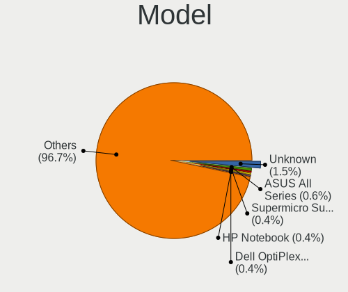
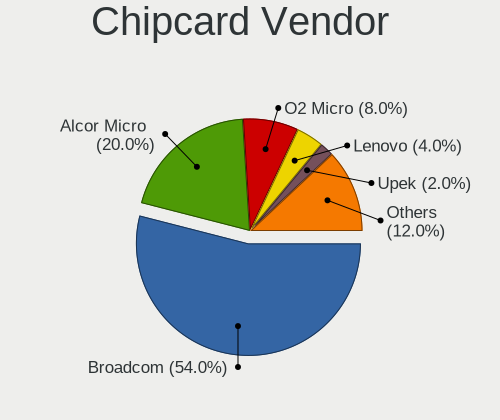

Ubuntu Hardware Trends
----------------------

A project to identify most popular hardware characteristics and track their change
over time based on data collected by Ubuntu users at https://Linux-Hardware.org.

Anyone can contribute to the study by uploading probes of their computers by
the [hw-probe](https://github.com/linuxhw/hw-probe) tool:

    sudo -E hw-probe -all -upload

This is a report for all computer types. See also reports for [desktops](/Dist/Ubuntu/Desktop/README.md) and [notebooks](/Dist/Ubuntu/Notebook/README.md).

Full-feature report is available here: https://linux-hardware.org/?view=trends

Period: Sep, 2020.

Contents
--------

- [ OS                       ](#os)
- [ OS Family                ](#os-family)
- [ Kernel                   ](#kernel)
- [ Kernel Family            ](#kernel-family)
- [ Kernel Major Ver.        ](#kernel-major-ver)
- [ Arch                     ](#arch)
- [ DE                       ](#de)
- [ Display Server           ](#display-server)
- [ Display Manager          ](#display-manager)
- [ OS Lang                  ](#os-lang)
- [ Boot Mode                ](#boot-mode)
- [ Filesystem               ](#filesystem)
- [ Part. scheme             ](#part-scheme)
- [ Dual Boot with Linux/BSD ](#dual-boot-with-linux/bsd)
- [ Dual Boot (Win)          ](#dual-boot-win)
- [ Country                  ](#country)
- [ City                     ](#city)
- [ Vendor                   ](#vendor)
- [ Model                    ](#model)
- [ Model Family             ](#model-family)
- [ MFG Year                 ](#mfg-year)
- [ Form Factor              ](#form-factor)
- [ Secure Boot              ](#secure-boot)
- [ Coreboot                 ](#coreboot)
- [ RAM Size                 ](#ram-size)
- [ RAM Used                 ](#ram-used)
- [ Has CD-ROM               ](#has-cd-rom)
- [ Total Drives             ](#total-drives)
- [ Has Ethernet             ](#has-ethernet)
- [ Drive Vendor             ](#drive-vendor)
- [ HDD Vendor               ](#hdd-vendor)
- [ SSD Vendor               ](#ssd-vendor)
- [ Drive Model              ](#drive-model)
- [ Drive Kind               ](#drive-kind)
- [ Drive Connector          ](#drive-connector)
- [ Drive Size               ](#drive-size)
- [ Space Total              ](#space-total)
- [ Space Used               ](#space-used)
- [ Malfunc. Drives          ](#malfunc-drives)
- [ Malfunc. Drive Vendor    ](#malfunc-drive-vendor)
- [ Malfunc. HDD Vendor      ](#malfunc-hdd-vendor)
- [ Malfunc. Drive Kind      ](#malfunc-drive-kind)
- [ Failed Drives            ](#failed-drives)
- [ Failed Drive Vendor      ](#failed-drive-vendor)
- [ Drive Status             ](#drive-status)
- [ Storage Vendor           ](#storage-vendor)
- [ Storage Model            ](#storage-model)
- [ Storage Kind             ](#storage-kind)
- [ CPU Vendor               ](#cpu-vendor)
- [ CPU Model                ](#cpu-model)
- [ CPU Model Family         ](#cpu-model-family)
- [ CPU Cores                ](#cpu-cores)
- [ CPU Sockets              ](#cpu-sockets)
- [ CPU Threads              ](#cpu-threads)
- [ CPU Op-Modes             ](#cpu-op-modes)
- [ CPU Microcode            ](#cpu-microcode)
- [ CPU Microarch            ](#cpu-microarch)
- [ GPU Vendor               ](#gpu-vendor)
- [ GPU Model                ](#gpu-model)
- [ GPU Combo                ](#gpu-combo)
- [ GPU Driver               ](#gpu-driver)
- [ GPU Memory               ](#gpu-memory)
- [ Monitor Vendor           ](#monitor-vendor)
- [ Monitor Model            ](#monitor-model)
- [ Monitor Resolution       ](#monitor-resolution)
- [ Monitor Diagonal         ](#monitor-diagonal)
- [ Monitor Width            ](#monitor-width)
- [ Aspect Ratio             ](#aspect-ratio)
- [ Monitor Area             ](#monitor-area)
- [ Pixel Density            ](#pixel-density)
- [ Multiple Monitors        ](#multiple-monitors)
- [ Net Controller Vendor    ](#net-controller-vendor)
- [ Net Controller Model     ](#net-controller-model)
- [ Wireless Vendor          ](#wireless-vendor)
- [ Wireless Model           ](#wireless-model)
- [ Ethernet Vendor          ](#ethernet-vendor)
- [ Ethernet Model           ](#ethernet-model)
- [ Net Controller Kind      ](#net-controller-kind)
- [ Used Controller          ](#used-controller)
- [ NICs                     ](#nics)
- [ Memory Vendor            ](#memory-vendor)
- [ Memory Model             ](#memory-model)
- [ Memory Kind              ](#memory-kind)
- [ Memory Form Factor       ](#memory-form-factor)
- [ Memory Size              ](#memory-size)
- [ Memory Speed             ](#memory-speed)
- [ Sound Vendor             ](#sound-vendor)
- [ Sound Model              ](#sound-model)
- [ Camera Vendor            ](#camera-vendor)
- [ Camera Model             ](#camera-model)
- [ Fingerprint Vendor       ](#fingerprint-vendor)
- [ Fingerprint Model        ](#fingerprint-model)
- [ Chipcard Vendor          ](#chipcard-vendor)
- [ Chipcard Model           ](#chipcard-model)
- [ Printer Vendor           ](#printer-vendor)
- [ Printer Model            ](#printer-model)
- [ Scanner Vendor           ](#scanner-vendor)
- [ Scanner Model            ](#scanner-model)
- [ Bluetooth Vendor         ](#bluetooth-vendor)
- [ Bluetooth Model          ](#bluetooth-model)
- [ Unsupported Devices      ](#unsupported-devices)
- [ Unsupported Device Types ](#unsupported-device-types)

OS
--

Installed operating systems

| Name           | Computers | Percent |
|----------------|-----------|---------|
| Ubuntu 20.04   | 1773      | 77.29%  |
| Ubuntu 18.04   | 410       | 17.87%  |
| Ubuntu 16.04   | 47        | 2.05%   |
| Ubuntu 20.10   | 26        | 1.13%   |
| Ubuntu 19.10   | 22        | 0.96%   |
| Ubuntu 14.04   | 3         | 0.13%   |
| Ubuntu         | 3         | 0.13%   |
| Ubuntu Core 18 | 2         | 0.09%   |
| Ubuntu Core 16 | 2         | 0.09%   |
| Ubuntu 19.04   | 2         | 0.09%   |
| Ubuntu 18.10   | 2         | 0.09%   |
| Ubuntu 2020    | 1         | 0.04%   |
| Ubuntu 18.04.4 | 1         | 0.04%   |

OS Family
---------

OS without a version

| Name   | Computers | Percent |
|--------|-----------|---------|
| Ubuntu | 2294      | 100%    |

Kernel
------

Version of the Linux kernel

| Version                     | Computers | Percent |
|-----------------------------|-----------|---------|
| 5.4.0-47-generic            | 677       | 29.51%  |
| 5.4.0-48-generic            | 418       | 18.22%  |
| 5.4.0-45-generic            | 404       | 17.61%  |
| 5.4.0-42-generic            | 251       | 10.94%  |
| 4.15.0-117-generic          | 57        | 2.48%   |
| 4.15.0-118-generic          | 50        | 2.18%   |
| 5.4.0-49-generic            | 36        | 1.57%   |
| 5.4.0-26-generic            | 31        | 1.35%   |
| 4.15.0-115-generic          | 23        | 1%      |
| 4.15.0-112-generic          | 19        | 0.83%   |
| 5.3.0-64-generic            | 16        | 0.7%    |
| 5.8.0-18-generic            | 14        | 0.61%   |
| 5.4.0-47-lowlatency         | 14        | 0.61%   |
| 5.4.0-48-lowlatency         | 11        | 0.48%   |
| 5.4.0-46-generic            | 11        | 0.48%   |
| 4.4.0-189-generic           | 11        | 0.48%   |
| 5.4.0-40-generic            | 10        | 0.44%   |
| 5.4.0-45-lowlatency         | 8         | 0.35%   |
| 5.0.0-23-generic            | 7         | 0.31%   |
| 4.15.0-20-generic           | 7         | 0.31%   |
| 5.8.0-050800-generic        | 6         | 0.26%   |
| 5.8.0-19-generic            | 5         | 0.22%   |
| 5.4.0-1018-raspi            | 5         | 0.22%   |
| 5.3.0-28-generic            | 5         | 0.22%   |
| 4.15.0-29-generic           | 5         | 0.22%   |
| 5.8.9-050809-generic        | 4         | 0.17%   |
| 5.8.10-050810-generic       | 4         | 0.17%   |
| 5.4.0-44-generic            | 4         | 0.17%   |
| 5.4.0-39-generic            | 4         | 0.17%   |
| 5.4.0-1019-raspi            | 4         | 0.17%   |
| 4.15.0-106-generic          | 4         | 0.17%   |
| 5.8.1-050801-generic        | 3         | 0.13%   |
| 5.7.8-windowsfx-generic     | 3         | 0.13%   |
| 5.4.0-7642-generic          | 3         | 0.13%   |
| 5.3.0-53-generic            | 3         | 0.13%   |
| 5.3.0-40-generic            | 3         | 0.13%   |
| 5.0.0-31-generic            | 3         | 0.13%   |
| 5.0.0-1068-oem-osp1         | 3         | 0.13%   |
| 4.19.104-microsoft-standard | 3         | 0.13%   |
| 4.15.0-45-generic           | 3         | 0.13%   |
| 5.8.7-050807-generic        | 2         | 0.09%   |
| 5.8.5-050805-lowlatency     | 2         | 0.09%   |
| 5.8.5-050805-generic        | 2         | 0.09%   |
| 5.8.11-050811-generic       | 2         | 0.09%   |
| 5.7.1-050701-generic        | 2         | 0.09%   |
| 5.4.65-050465-generic       | 2         | 0.09%   |
| 5.4.0-49-lowlatency         | 2         | 0.09%   |
| 5.4.0-37-generic            | 2         | 0.09%   |
| 5.4.0-31-generic            | 2         | 0.09%   |
| 5.4.0-21-generic            | 2         | 0.09%   |
| 5.3.0-62-generic            | 2         | 0.09%   |
| 5.3.0-59-generic            | 2         | 0.09%   |
| 5.3.0-51-generic            | 2         | 0.09%   |
| 5.3.0-26-generic            | 2         | 0.09%   |
| 5.0.0-37-generic            | 2         | 0.09%   |
| 5.0.0-32-generic            | 2         | 0.09%   |
| 4.4.0-190-generic           | 2         | 0.09%   |
| 4.4.0-187-generic           | 2         | 0.09%   |
| 4.15.0-116-generic          | 2         | 0.09%   |
| 4.15.0-111-generic          | 2         | 0.09%   |

Kernel Family
-------------

Linux kernel without a distro release

| Version  | Computers | Percent |
|----------|-----------|---------|
| 5.4.0    | 1909      | 83.22%  |
| 4.15.0   | 197       | 8.59%   |
| 5.3.0    | 43        | 1.87%   |
| 5.8.0    | 28        | 1.22%   |
| 5.0.0    | 19        | 0.83%   |
| 4.4.0    | 19        | 0.83%   |
| 5.9.0    | 7         | 0.31%   |
| 5.8.10   | 6         | 0.26%   |
| 5.8.9    | 4         | 0.17%   |
| 5.8.5    | 4         | 0.17%   |
| 4.18.0   | 4         | 0.17%   |
| 5.8.11   | 3         | 0.13%   |
| 5.8.1    | 3         | 0.13%   |
| 5.7.8    | 3         | 0.13%   |
| 5.6.0    | 3         | 0.13%   |
| 5.4.65   | 3         | 0.13%   |
| 4.19.104 | 3         | 0.13%   |
| 5.8.7    | 2         | 0.09%   |
| 5.7.1    | 2         | 0.09%   |
| 5.7.0    | 2         | 0.09%   |
| 5.8.8    | 1         | 0.04%   |
| 5.8.6    | 1         | 0.04%   |
| 5.8.4    | 1         | 0.04%   |
| 5.8.3    | 1         | 0.04%   |
| 5.8.2    | 1         | 0.04%   |
| 5.8.12   | 1         | 0.04%   |
| 5.7.2    | 1         | 0.04%   |
| 5.7.19   | 1         | 0.04%   |
| 5.7.17   | 1         | 0.04%   |
| 5.7.16   | 1         | 0.04%   |
| 5.7.10   | 1         | 0.04%   |
| 5.6.15   | 1         | 0.04%   |
| 5.5.5    | 1         | 0.04%   |
| 5.5.2    | 1         | 0.04%   |
| 5.5.11   | 1         | 0.04%   |
| 5.4.67   | 1         | 0.04%   |
| 5.4.66   | 1         | 0.04%   |
| 5.4.64   | 1         | 0.04%   |
| 5.4.3    | 1         | 0.04%   |
| 5.4.1    | 1         | 0.04%   |
| 5.3.18   | 1         | 0.04%   |
| 5.0.21   | 1         | 0.04%   |
| 4.9.230  | 1         | 0.04%   |
| 4.9.224  | 1         | 0.04%   |
| 4.9.140  | 1         | 0.04%   |
| 4.9.0    | 1         | 0.04%   |
| 4.4.232  | 1         | 0.04%   |
| 4.13.0   | 1         | 0.04%   |
| 4.10.0   | 1         | 0.04%   |
| 3.13.0   | 1         | 0.04%   |

Kernel Major Ver.
-----------------

Linux kernel major version

| Version | Computers | Percent |
|---------|-----------|---------|
| 5.4     | 1917      | 83.57%  |
| 4.15    | 197       | 8.59%   |
| 5.8     | 56        | 2.44%   |
| 5.3     | 44        | 1.92%   |
| 5.0     | 20        | 0.87%   |
| 4.4     | 20        | 0.87%   |
| 5.7     | 12        | 0.52%   |
| 5.9     | 7         | 0.31%   |
| 5.6     | 4         | 0.17%   |
| 4.9     | 4         | 0.17%   |
| 4.18    | 4         | 0.17%   |
| 5.5     | 3         | 0.13%   |
| 4.19    | 3         | 0.13%   |
| 4.13    | 1         | 0.04%   |
| 4.10    | 1         | 0.04%   |
| 3.13    | 1         | 0.04%   |

Arch
----

OS architecture (x86_64, i586, etc.)

| Name    | Computers | Percent |
|---------|-----------|---------|
| x86_64  | 2212      | 96.43%  |
| i686    | 67        | 2.92%   |
| aarch64 | 15        | 0.65%   |

DE
--

Desktop Environment

| Name            | Computers | Percent |
|-----------------|-----------|---------|
| GNOME           | 1604      | 69.92%  |
| XFCE            | 174       | 7.59%   |
| Unknown         | 146       | 6.36%   |
| MATE            | 77        | 3.36%   |
| Unity           | 64        | 2.79%   |
| KDE             | 64        | 2.79%   |
| KDE5            | 60        | 2.62%   |
| LXQt            | 23        | 1%      |
| Budgie          | 21        | 0.92%   |
| GNOME Flashback | 16        | 0.7%    |
| LXDE            | 13        | 0.57%   |
| X-Cinnamon      | 12        | 0.52%   |
| Cinnamon        | 11        | 0.48%   |
| i3              | 3         | 0.13%   |
| Deepin          | 3         | 0.13%   |
| KDE4            | 1         | 0.04%   |
| enlightenment   | 1         | 0.04%   |
| bspwm           | 1         | 0.04%   |

Display Server
--------------

X11 or Wayland

| Name    | Computers | Percent |
|---------|-----------|---------|
| X11     | 2118      | 92.33%  |
| Unknown | 80        | 3.49%   |
| Wayland | 73        | 3.18%   |
| Tty     | 23        | 1%      |

Display Manager
---------------

SDDM, LightDM, etc.

| Name    | Computers | Percent |
|---------|-----------|---------|
| Unknown | 1788      | 77.94%  |
| GDM     | 308       | 13.43%  |
| TDM     | 129       | 5.62%   |
| SDDM    | 62        | 2.7%    |
| LightDM | 4         | 0.17%   |
| GDM3    | 3         | 0.13%   |

OS Lang
-------

Language

| Lang    | Computers | Percent |
|---------|-----------|---------|
| en_US   | 914       | 39.84%  |
| de_DE   | 211       | 9.2%    |
| pt_BR   | 171       | 7.45%   |
| en_IN   | 103       | 4.49%   |
| en_GB   | 101       | 4.4%    |
| fr_FR   | 81        | 3.53%   |
| it_IT   | 73        | 3.18%   |
| en_CA   | 63        | 2.75%   |
| es_ES   | 53        | 2.31%   |
| ru_RU   | 51        | 2.22%   |
| C       | 45        | 1.96%   |
| pl_PL   | 38        | 1.66%   |
| en_AU   | 38        | 1.66%   |
| es_AR   | 23        | 1%      |
| es_MX   | 20        | 0.87%   |
| nl_NL   | 16        | 0.7%    |
| ja_JP   | 16        | 0.7%    |
| Unknown | 16        | 0.7%    |
| en_ZA   | 15        | 0.65%   |
| cs_CZ   | 15        | 0.65%   |
| hu_HU   | 14        | 0.61%   |
| en_PH   | 12        | 0.52%   |
| tr_TR   | 11        | 0.48%   |
| sv_SE   | 10        | 0.44%   |
| ru_UA   | 10        | 0.44%   |
| fi_FI   | 10        | 0.44%   |
| es_CO   | 10        | 0.44%   |
| pt_PT   | 9         | 0.39%   |
| de_CH   | 9         | 0.39%   |
| nl_BE   | 8         | 0.35%   |
| en_SG   | 8         | 0.35%   |
| en_NZ   | 8         | 0.35%   |
| es_CL   | 7         | 0.31%   |
| de_AT   | 7         | 0.31%   |
| ro_RO   | 6         | 0.26%   |
| en_IL   | 6         | 0.26%   |
| bg_BG   | 6         | 0.26%   |
| da_DK   | 5         | 0.22%   |
| zh_CN   | 4         | 0.17%   |
| uk_UA   | 4         | 0.17%   |
| sk_SK   | 4         | 0.17%   |
| fr_BE   | 4         | 0.17%   |
| es_EC   | 4         | 0.17%   |
| ca_ES   | 4         | 0.17%   |
| zh_TW   | 3         | 0.13%   |
| ko_KR   | 3         | 0.13%   |
| hr_HR   | 3         | 0.13%   |
| fr_CH   | 3         | 0.13%   |
| en_HK   | 3         | 0.13%   |
| el_GR   | 3         | 0.13%   |
| sr_RS   | 2         | 0.09%   |
| nb_NO   | 2         | 0.09%   |
| lv_LV   | 2         | 0.09%   |
| lt_LT   | 2         | 0.09%   |
| es_PE   | 2         | 0.09%   |
| es_GT   | 2         | 0.09%   |
| C       | 2         | 0.09%   |
| zh_HK   | 1         | 0.04%   |
| sv_FI   | 1         | 0.04%   |
| pt_BR   | 1         | 0.04%   |

Boot Mode
---------

EFI or BIOS

| Mode | Computers | Percent |
|------|-----------|---------|
| BIOS | 1216      | 53.01%  |
| EFI  | 1078      | 46.99%  |

Filesystem
----------

Type of filesystem

| Type    | Computers | Percent |
|---------|-----------|---------|
| Ext4    | 2130      | 92.85%  |
| Overlay | 71        | 3.1%    |
| Zfs     | 35        | 1.53%   |
| Btrfs   | 32        | 1.39%   |
| Xfs     | 13        | 0.57%   |
| Ext2    | 7         | 0.31%   |
| Ext3    | 4         | 0.17%   |
| Jfs     | 1         | 0.04%   |
| Unknown | 1         | 0.04%   |

Part. scheme
------------

Scheme of partitioning

| Type    | Computers | Percent |
|---------|-----------|---------|
| Unknown | 1783      | 77.72%  |
| GPT     | 370       | 16.13%  |
| MBR     | 141       | 6.15%   |

Dual Boot with Linux/BSD
------------------------

Hosting more than one Linux/BSD

| Dual boot | Computers | Percent |
|-----------|-----------|---------|
| No        | 2012      | 87.71%  |
| Yes       | 282       | 12.29%  |

Dual Boot (Win)
---------------

Hosting Linux and Windows

| Dual boot | Computers | Percent |
|-----------|-----------|---------|
| No        | 1459      | 63.6%   |
| Yes       | 835       | 36.4%   |

Country
-------

Geographic location (country)

| Country            | Computers | Percent |
|--------------------|-----------|---------|
| USA                | 419       | 18.27%  |
| Germany            | 253       | 11.03%  |
| Brazil             | 207       | 9.02%   |
| India              | 118       | 5.14%   |
| Italy              | 91        | 3.97%   |
| UK                 | 86        | 3.75%   |
| France             | 84        | 3.66%   |
| Russia             | 74        | 3.23%   |
| Spain              | 68        | 2.96%   |
| Canada             | 68        | 2.96%   |
| Netherlands        | 57        | 2.48%   |
| Poland             | 47        | 2.05%   |
| Australia          | 38        | 1.66%   |
| Argentina          | 35        | 1.53%   |
| Mexico             | 31        | 1.35%   |
| Belgium            | 28        | 1.22%   |
| Finland            | 27        | 1.18%   |
| Ukraine            | 25        | 1.09%   |
| Switzerland        | 25        | 1.09%   |
| Sweden             | 24        | 1.05%   |
| Turkey             | 23        | 1%      |
| Japan              | 21        | 0.92%   |
| Czech Republic     | 20        | 0.87%   |
| Norway             | 19        | 0.83%   |
| South Africa       | 17        | 0.74%   |
| Romania            | 17        | 0.74%   |
| Hungary            | 17        | 0.74%   |
| Austria            | 17        | 0.74%   |
| Portugal           | 14        | 0.61%   |
| Colombia           | 14        | 0.61%   |
| New Zealand        | 13        | 0.57%   |
| Indonesia          | 13        | 0.57%   |
| Greece             | 13        | 0.57%   |
| Philippines        | 12        | 0.52%   |
| Pakistan           | 12        | 0.52%   |
| Singapore          | 11        | 0.48%   |
| Slovakia           | 10        | 0.44%   |
| Serbia             | 10        | 0.44%   |
| China              | 10        | 0.44%   |
| Chile              | 10        | 0.44%   |
| Israel             | 9         | 0.39%   |
| Denmark            | 9         | 0.39%   |
| Bulgaria           | 9         | 0.39%   |
| Vietnam            | 8         | 0.35%   |
| Lithuania          | 8         | 0.35%   |
| Taiwan             | 7         | 0.31%   |
| Estonia            | 7         | 0.31%   |
| Croatia            | 7         | 0.31%   |
| Kenya              | 6         | 0.26%   |
| Iran               | 6         | 0.26%   |
| Ecuador            | 6         | 0.26%   |
| Thailand           | 5         | 0.22%   |
| Korea, Republic of | 5         | 0.22%   |
| Bangladesh         | 5         | 0.22%   |
| Slovenia           | 4         | 0.17%   |
| Puerto Rico        | 4         | 0.17%   |
| Morocco            | 4         | 0.17%   |
| Belarus            | 4         | 0.17%   |
| Algeria            | 4         | 0.17%   |
| Panama             | 3         | 0.13%   |

City
----

Geographic location (city)

| City              | Computers | Percent |
|-------------------|-----------|---------|
| São Paulo        | 34        | 1.48%   |
| Moscow            | 26        | 1.13%   |
| Berlin            | 22        | 0.96%   |
| Rio de Janeiro    | 19        | 0.83%   |
| Helsinki          | 16        | 0.7%    |
| Hamburg           | 16        | 0.7%    |
| Warsaw            | 13        | 0.57%   |
| Paris             | 13        | 0.57%   |
| Milan             | 13        | 0.57%   |
| Istanbul          | 13        | 0.57%   |
| Hyderabad         | 13        | 0.57%   |
| Bengaluru         | 13        | 0.57%   |
| Prague            | 12        | 0.52%   |
| Madrid            | 12        | 0.52%   |
| Rome              | 11        | 0.48%   |
| Vienna            | 10        | 0.44%   |
| Munich            | 10        | 0.44%   |
| St Petersburg     | 9         | 0.39%   |
| Pune              | 9         | 0.39%   |
| Itatiba           | 9         | 0.39%   |
| Frankfurt am Main | 9         | 0.39%   |
| Chicago           | 9         | 0.39%   |
| Athens            | 9         | 0.39%   |
| Toronto           | 8         | 0.35%   |
| Singapore         | 8         | 0.35%   |
| Dallas            | 8         | 0.35%   |
| Buenos Aires      | 8         | 0.35%   |
| Budapest          | 8         | 0.35%   |
| Brisbane          | 8         | 0.35%   |
| Belo Horizonte    | 8         | 0.35%   |
| Auckland          | 8         | 0.35%   |
| Tucson            | 7         | 0.31%   |
| Stuttgart         | 7         | 0.31%   |
| Montreal          | 7         | 0.31%   |
| Houston           | 7         | 0.31%   |
| Belgrade          | 7         | 0.31%   |
| Sydney            | 6         | 0.26%   |
| New York          | 6         | 0.26%   |
| Mumbai            | 6         | 0.26%   |
| Mexico City       | 6         | 0.26%   |
| Los Angeles       | 6         | 0.26%   |
| Kyiv              | 6         | 0.26%   |
| Herne             | 6         | 0.26%   |
| Düsseldorf       | 6         | 0.26%   |
| Cologne           | 6         | 0.26%   |
| Campinas          | 6         | 0.26%   |
| Bogotá           | 6         | 0.26%   |
| Barcelona         | 6         | 0.26%   |
| Amsterdam         | 6         | 0.26%   |
| Tel Aviv          | 5         | 0.22%   |
| Taipei            | 5         | 0.22%   |
| Sofia             | 5         | 0.22%   |
| San Diego         | 5         | 0.22%   |
| Pretoria          | 5         | 0.22%   |
| New Delhi         | 5         | 0.22%   |
| Nairobi           | 5         | 0.22%   |
| Melbourne         | 5         | 0.22%   |
| Lucknow           | 5         | 0.22%   |
| Kolkata           | 5         | 0.22%   |
| Denver            | 5         | 0.22%   |

Vendor
------

Motherboard manufacturer

| Name                    | Computers | Percent |
|-------------------------|-----------|---------|
| Hewlett-Packard         | 371       | 16.17%  |
| Dell                    | 350       | 15.26%  |
| ASUSTek Computer        | 336       | 14.65%  |
| Lenovo                  | 313       | 13.64%  |
| Gigabyte Technology     | 131       | 5.71%   |
| MSI                     | 129       | 5.62%   |
| Acer                    | 113       | 4.93%   |
| ASRock                  | 87        | 3.79%   |
| Intel                   | 53        | 2.31%   |
| Toshiba                 | 44        | 1.92%   |
| Apple                   | 39        | 1.7%    |
| Sony                    | 30        | 1.31%   |
| Unknown                 | 28        | 1.22%   |
| Samsung Electronics     | 26        | 1.13%   |
| Medion                  | 18        | 0.78%   |
| Fujitsu                 | 16        | 0.7%    |
| HUAWEI                  | 12        | 0.52%   |
| Foxconn                 | 12        | 0.52%   |
| ECS                     | 12        | 0.52%   |
| Raspberry Pi Foundation | 11        | 0.48%   |
| Positivo                | 10        | 0.44%   |
| Pegatron                | 10        | 0.44%   |
| Biostar                 | 10        | 0.44%   |
| Fujitsu Siemens         | 8         | 0.35%   |
| Supermicro              | 7         | 0.31%   |
| Packard Bell            | 7         | 0.31%   |
| Notebook                | 7         | 0.31%   |
| LG Electronics          | 7         | 0.31%   |
| Google                  | 7         | 0.31%   |
| Gateway                 | 6         | 0.26%   |
| System76                | 4         | 0.17%   |
| Microsoft               | 4         | 0.17%   |
| eMachines               | 4         | 0.17%   |
| AMI                     | 4         | 0.17%   |
| TUXEDO                  | 3         | 0.13%   |
| Shuttle                 | 3         | 0.13%   |
| Quanta                  | 3         | 0.13%   |
| Panasonic               | 3         | 0.13%   |
| OEM                     | 3         | 0.13%   |
| TYAN Computer           | 2         | 0.09%   |
| Microtech               | 2         | 0.09%   |
| Lanix                   | 2         | 0.09%   |
| Itautec                 | 2         | 0.09%   |
| Avell High Performance  | 2         | 0.09%   |
| AOpen                   | 2         | 0.09%   |
| ZOTAC                   | 1         | 0.04%   |
| Winnovo                 | 1         | 0.04%   |
| WeiBu                   | 1         | 0.04%   |
| TrekStor                | 1         | 0.04%   |
| Timi                    | 1         | 0.04%   |
| TEKNOSERVICE            | 1         | 0.04%   |
| Teclast                 | 1         | 0.04%   |
| Standard                | 1         | 0.04%   |
| SiS                     | 1         | 0.04%   |
| SHARP                   | 1         | 0.04%   |
| SCHNEIDER               | 1         | 0.04%   |
| Schenker                | 1         | 0.04%   |
| Radxa                   | 1         | 0.04%   |
| Penguin Computing       | 1         | 0.04%   |
| PCWare                  | 1         | 0.04%   |

Model
-----

Motherboard model

| Name                                | Computers | Percent |
|-------------------------------------|-----------|---------|
| Unknown                             | 36        | 1.57%   |
| ASUS All Series                     | 25        | 1.09%   |
| HP Notebook                         | 11        | 0.48%   |
| MSI MS-7A38                         | 9         | 0.39%   |
| MSI MS-7C37                         | 8         | 0.35%   |
| HP Pavilion g6                      | 8         | 0.35%   |
| Dell Latitude E6420                 | 7         | 0.31%   |
| ASUS TUF GAMING X570-PLUS           | 7         | 0.31%   |
| HUAWEI NBLK-WAX9X                   | 6         | 0.26%   |
| HP Pavilion g7                      | 6         | 0.26%   |
| HP Pavilion dv6                     | 6         | 0.26%   |
| HP EliteBook 8470p                  | 6         | 0.26%   |
| Dell OptiPlex 790                   | 6         | 0.26%   |
| Dell OptiPlex 780                   | 6         | 0.26%   |
| Dell OptiPlex 3010                  | 6         | 0.26%   |
| Dell Latitude E6410                 | 6         | 0.26%   |
| Acer Aspire A515-51                 | 6         | 0.26%   |
| RPi Raspberry Pi 4 Model B Rev 1.1  | 5         | 0.22%   |
| Intel HCL Desktop                   | 5         | 0.22%   |
| Intel H61                           | 5         | 0.22%   |
| HP Pavilion dv7                     | 5         | 0.22%   |
| HP Compaq Elite 8300 SFF            | 5         | 0.22%   |
| Gigabyte B450M DS3H                 | 5         | 0.22%   |
| Dell OptiPlex 7010                  | 5         | 0.22%   |
| ASRock B450M Pro4                   | 5         | 0.22%   |
| RPi Raspberry Pi 4 Model B Rev 1.4  | 4         | 0.17%   |
| MSI MS-7B79                         | 4         | 0.17%   |
| Lenovo IdeaPad 320-15IKB 80XL       | 4         | 0.17%   |
| HP ProBook 6550b                    | 4         | 0.17%   |
| HP Pavilion Notebook                | 4         | 0.17%   |
| HP Pavilion 17                      | 4         | 0.17%   |
| HP Laptop 15-db0xxx                 | 4         | 0.17%   |
| HP EliteDesk 800 G1 SFF             | 4         | 0.17%   |
| HP EliteBook 840 G3                 | 4         | 0.17%   |
| HP 255 G7 Notebook PC               | 4         | 0.17%   |
| Gigabyte X470 AORUS ULTRA GAMING    | 4         | 0.17%   |
| Dell XPS 15 9570                    | 4         | 0.17%   |
| Dell XPS 15 9560                    | 4         | 0.17%   |
| Dell XPS 15 7590                    | 4         | 0.17%   |
| Dell XPS 13 9370                    | 4         | 0.17%   |
| Dell XPS 13 9300                    | 4         | 0.17%   |
| Dell XPS 13 7390                    | 4         | 0.17%   |
| Dell Latitude E6430                 | 4         | 0.17%   |
| Dell Inspiron 5557                  | 4         | 0.17%   |
| ASUS PRIME B450M-A                  | 4         | 0.17%   |
| ASUS PRIME A320M-K                  | 4         | 0.17%   |
| ASRock N68-S                        | 4         | 0.17%   |
| Acer Nitro AN515-43                 | 4         | 0.17%   |
| Toshiba Satellite L750              | 3         | 0.13%   |
| Toshiba Satellite A505              | 3         | 0.13%   |
| MSI Prestige 15 A10SC               | 3         | 0.13%   |
| MSI MS-7A34                         | 3         | 0.13%   |
| MSI MS-7917                         | 3         | 0.13%   |
| MSI MS-7817                         | 3         | 0.13%   |
| MSI MS-7758                         | 3         | 0.13%   |
| MSI MS-7721                         | 3         | 0.13%   |
| Lenovo V330-15IKB 81AX              | 3         | 0.13%   |
| Lenovo IdeaPad Slim 1-14AST-05 81VS | 3         | 0.13%   |
| Lenovo IdeaPad 5 15ARE05 81YQ       | 3         | 0.13%   |
| Lenovo G710 20252                   | 3         | 0.13%   |

Model Family
------------

Motherboard model prefix

| Name               | Computers | Percent |
|--------------------|-----------|---------|
| Lenovo ThinkPad    | 132       | 5.75%   |
| Dell Inspiron      | 105       | 4.58%   |
| Acer Aspire        | 79        | 3.44%   |
| HP Pavilion        | 74        | 3.23%   |
| Dell Latitude      | 74        | 3.23%   |
| Lenovo IdeaPad     | 71        | 3.1%    |
| Dell OptiPlex      | 59        | 2.57%   |
| HP Compaq          | 53        | 2.31%   |
| HP EliteBook       | 46        | 2.01%   |
| Dell XPS           | 45        | 1.96%   |
| HP ProBook         | 43        | 1.87%   |
| Toshiba Satellite  | 38        | 1.66%   |
| ASUS PRIME         | 36        | 1.57%   |
| Unknown            | 36        | 1.57%   |
| HP Laptop          | 29        | 1.26%   |
| Dell Precision     | 25        | 1.09%   |
| ASUS All           | 25        | 1.09%   |
| HP ENVY            | 23        | 1%      |
| Dell Vostro        | 20        | 0.87%   |
| ASUS VivoBook      | 20        | 0.87%   |
| Lenovo ThinkCentre | 19        | 0.83%   |
| ASUS TUF           | 19        | 0.83%   |
| ASUS ROG           | 13        | 0.57%   |
| RPi Raspberry      | 11        | 0.48%   |
| HP Notebook        | 11        | 0.48%   |
| HP ZBook           | 10        | 0.44%   |
| MSI MS-7A38        | 9         | 0.39%   |
| MSI MS-7C37        | 8         | 0.35%   |
| HP ProDesk         | 8         | 0.35%   |
| HP EliteDesk       | 8         | 0.35%   |
| Dell PowerEdge     | 8         | 0.35%   |
| Acer Veriton       | 8         | 0.35%   |
| Lenovo Yoga        | 7         | 0.31%   |
| Lenovo Legion      | 7         | 0.31%   |
| Fujitsu ESPRIMO    | 7         | 0.31%   |
| ASUS M5A78L-M      | 7         | 0.31%   |
| ASRock B450M       | 7         | 0.31%   |
| Acer Swift         | 7         | 0.31%   |
| HUAWEI NBLK-WAX9X  | 6         | 0.26%   |
| Gigabyte X570      | 6         | 0.26%   |
| Gigabyte B450      | 6         | 0.26%   |
| ASUS ZenBook       | 6         | 0.26%   |
| Acer Nitro         | 6         | 0.26%   |
| Intel HCL          | 5         | 0.22%   |
| Intel H61          | 5         | 0.22%   |
| HP 255             | 5         | 0.22%   |
| Gigabyte B450M     | 5         | 0.22%   |
| Fujitsu LIFEBOOK   | 5         | 0.22%   |
| Dell Studio        | 5         | 0.22%   |
| ASUS P8H61-M       | 5         | 0.22%   |
| ASUS Maximus       | 5         | 0.22%   |
| MSI MS-7B79        | 4         | 0.17%   |
| Microsoft Surface  | 4         | 0.17%   |
| Medion Akoya       | 4         | 0.17%   |
| Lenovo ThinkBook   | 4         | 0.17%   |
| Lenovo IdeaCentre  | 4         | 0.17%   |
| HP Spectre         | 4         | 0.17%   |
| HP OMEN            | 4         | 0.17%   |
| Gigabyte X470      | 4         | 0.17%   |
| ASUS SABERTOOTH    | 4         | 0.17%   |

MFG Year
--------

Motherboard manufacture year

| Year    | Computers | Percent |
|---------|-----------|---------|
| 2020    | 381       | 16.61%  |
| 2019    | 365       | 15.91%  |
| 2018    | 222       | 9.68%   |
| 2013    | 172       | 7.5%    |
| 2011    | 151       | 6.58%   |
| 2012    | 149       | 6.5%    |
| 2010    | 133       | 5.8%    |
| 2014    | 132       | 5.75%   |
| 2015    | 124       | 5.41%   |
| 2016    | 103       | 4.49%   |
| 2017    | 102       | 4.45%   |
| 2009    | 100       | 4.36%   |
| 2008    | 68        | 2.96%   |
| 2007    | 48        | 2.09%   |
| Unknown | 19        | 0.83%   |
| 2006    | 13        | 0.57%   |
| 2005    | 9         | 0.39%   |
| 2004    | 2         | 0.09%   |
| 2003    | 1         | 0.04%   |

Form Factor
-----------

Physical design of the computer

| Name           | Computers | Percent |
|----------------|-----------|---------|
| Notebook       | 1231      | 53.66%  |
| Desktop        | 903       | 39.36%  |
| Convertible    | 49        | 2.14%   |
| All in one     | 33        | 1.44%   |
| Mini pc        | 25        | 1.09%   |
| Server         | 23        | 1%      |
| System on chip | 15        | 0.65%   |
| Tablet         | 13        | 0.57%   |
| Other          | 2         | 0.09%   |

Secure Boot
-----------

Enabled or disabled

| State    | Computers | Percent |
|----------|-----------|---------|
| Disabled | 2070      | 90.24%  |
| Enabled  | 224       | 9.76%   |

Coreboot
--------

Have coreboot on board

| Used | Computers | Percent |
|------|-----------|---------|
| No   | 2285      | 99.61%  |
| Yes  | 9         | 0.39%   |

RAM Size
--------

Total RAM memory

| Size in GB      | Computers | Percent |
|-----------------|-----------|---------|
| 3.01-4.0        | 537       | 23.41%  |
| 4.01-8.0        | 533       | 23.23%  |
| 16.01-24.0      | 400       | 17.44%  |
| 8.01-16.0       | 400       | 17.44%  |
| 32.01-64.0      | 170       | 7.41%   |
| 1.01-2.0        | 114       | 4.97%   |
| 64.01-256.0     | 53        | 2.31%   |
| 2.01-3.0        | 41        | 1.79%   |
| 24.01-32.0      | 27        | 1.18%   |
| 0.01-1.0        | 15        | 0.65%   |
| More than 256.0 | 4         | 0.17%   |

RAM Used
--------

Used RAM memory

| Used GB     | Computers | Percent |
|-------------|-----------|---------|
| 1.01-2.0    | 887       | 38.67%  |
| 2.01-3.0    | 612       | 26.68%  |
| 4.01-8.0    | 274       | 11.94%  |
| 3.01-4.0    | 257       | 11.2%   |
| 0.01-1.0    | 156       | 6.8%    |
| 8.01-16.0   | 86        | 3.75%   |
| 16.01-24.0  | 11        | 0.48%   |
| 32.01-64.0  | 5         | 0.22%   |
| 24.01-32.0  | 4         | 0.17%   |
| 64.01-256.0 | 1         | 0.04%   |
| Unknown     | 1         | 0.04%   |

Has CD-ROM
----------

Has CD-ROM on board

| Presented | Computers | Percent |
|-----------|-----------|---------|
| No        | 1268      | 55.27%  |
| Yes       | 1026      | 44.73%  |

Total Drives
------------

Number of drives on board

| Drives  | Computers | Percent |
|---------|-----------|---------|
| 1       | 1429      | 62.29%  |
| 2       | 531       | 23.15%  |
| 3       | 171       | 7.45%   |
| 4       | 69        | 3.01%   |
| 5       | 31        | 1.35%   |
| 0       | 23        | 1%      |
| 6       | 15        | 0.65%   |
| 7       | 12        | 0.52%   |
| 8       | 7         | 0.31%   |
| 10      | 3         | 0.13%   |
| 25      | 1         | 0.04%   |
| 11      | 1         | 0.04%   |
| Unknown | 1         | 0.04%   |

Has Ethernet
------------

Has Ethernet on board

| Presented | Computers | Percent |
|-----------|-----------|---------|
| Yes       | 2054      | 89.54%  |
| No        | 240       | 10.46%  |

Drive Vendor
------------

Hard drive vendors

| Vendor                    | Computers | Drives  | Percent |
|---------------------------|-----------|---------|---------|
| Seagate                   | 595       | 722     | 18.63%  |
| WDC                       | 543       | 643     | 17.01%  |
| Samsung Electronics       | 452       | 524     | 14.16%  |
| Toshiba                   | 248       | 266     | 7.77%   |
| Unknown                   | 150       | 165     | 4.7%    |
| SanDisk                   | 150       | 157     | 4.7%    |
| Kingston                  | 150       | 158     | 4.7%    |
| Hitachi                   | 142       | 161     | 4.45%   |
| Crucial                   | 86        | 93      | 2.69%   |
| Intel                     | 71        | 80      | 2.22%   |
| HGST                      | 70        | 89      | 2.19%   |
| SK Hynix                  | 67        | 68      | 2.1%    |
| A-DATA Technology         | 53        | 59      | 1.66%   |
| Micron Technology         | 34        | 49      | 1.06%   |
| Phison                    | 29        | 33      | 0.91%   |
| LITEON                    | 22        | 22      | 0.69%   |
| Fujitsu                   | 21        | 21      | 0.66%   |
| China                     | 16        | 18      | 0.5%    |
| Transcend                 | 15        | 15      | 0.47%   |
| PNY                       | 15        | 16      | 0.47%   |
| Maxtor                    | 15        | 16      | 0.47%   |
| Silicon Motion            | 14        | 15      | 0.44%   |
| HL-DT-ST                  | 14        | Unknown | 0.44%   |
| Apple                     | 12        | 12      | 0.38%   |
| OCZ                       | 11        | 11      | 0.34%   |
| Patriot                   | 10        | 10      | 0.31%   |
| SPCC                      | 9         | 9       | 0.28%   |
| LITEONIT                  | 8         | 8       | 0.25%   |
| Hewlett-Packard           | 8         | 10      | 0.25%   |
| Micron/Crucial Technology | 7         | 8       | 0.22%   |
| JMicron                   | 7         | 6       | 0.22%   |
| Intenso                   | 7         | 8       | 0.22%   |
| Realtek Semiconductor     | 6         | 6       | 0.19%   |
| Lexar                     | 6         | 6       | 0.19%   |
| GOODRAM                   | 6         | 7       | 0.19%   |
| Corsair                   | 6         | 7       | 0.19%   |
| ASMT                      | 6         | 9       | 0.19%   |
| Apacer                    | 6         | 7       | 0.19%   |
| Mushkin                   | 5         | 5       | 0.16%   |
| KingSpec                  | 5         | 6       | 0.16%   |
| KingFast                  | 5         | 5       | 0.16%   |
| Gigabyte Technology       | 5         | 5       | 0.16%   |
| Team                      | 4         | 4       | 0.13%   |
| SABRENT                   | 4         | 4       | 0.13%   |
| PLEXTOR                   | 4         | 4       | 0.13%   |
| Union Memory              | 3         | 3       | 0.09%   |
| Msft                      | 3         | 6       | 0.09%   |
| KIOXIA                    | 3         | 3       | 0.09%   |
| XPG                       | 2         | 2       | 0.06%   |
| Microtech                 | 2         | 2       | 0.06%   |
| Lite-On                   | 2         | 2       | 0.06%   |
| Leven                     | 2         | 2       | 0.06%   |
| LaCie                     | 2         | 2       | 0.06%   |
| KingDian                  | 2         | 2       | 0.06%   |
| faspeed                   | 2         | 2       | 0.06%   |
| External                  | 2         | 3       | 0.06%   |
| ExcelStor                 | 2         | 2       | 0.06%   |
| ASMT109x                  | 2         | 2       | 0.06%   |
| WDC WDS1                  | 1         | 1       | 0.03%   |
| WD MediaMax               | 1         | 1       | 0.03%   |

HDD Vendor
----------

Hard disk drive vendors

| Vendor              | Computers | Drives | Percent |
|---------------------|-----------|--------|---------|
| Seagate             | 584       | 703    | 37.29%  |
| WDC                 | 457       | 535    | 29.18%  |
| Toshiba             | 180       | 186    | 11.49%  |
| Hitachi             | 142       | 161    | 9.07%   |
| Samsung Electronics | 77        | 81     | 4.92%   |
| HGST                | 69        | 88     | 4.41%   |
| Fujitsu             | 20        | 20     | 1.28%   |
| Maxtor              | 15        | 16     | 0.96%   |
| Apple               | 6         | 6      | 0.38%   |
| Msft                | 3         | 6      | 0.19%   |
| Intenso             | 3         | 3      | 0.19%   |
| ExcelStor           | 2         | 2      | 0.13%   |
| ASMT                | 2         | 2      | 0.13%   |
| Unknown             | 1         | 1      | 0.06%   |
| MARVELL             | 1         | 1      | 0.06%   |
| KESU                | 1         | 1      | 0.06%   |
| JMicron             | 1         | 1      | 0.06%   |
| Hewlett-Packard     | 1         | 1      | 0.06%   |
| ASMT109x            | 1         | 1      | 0.06%   |

SSD Vendor
----------

Solid state drive vendors

| Vendor              | Computers | Drives | Percent |
|---------------------|-----------|--------|---------|
| Samsung Electronics | 234       | 263    | 24.12%  |
| Kingston            | 137       | 143    | 14.12%  |
| SanDisk             | 104       | 108    | 10.72%  |
| Crucial             | 85        | 92     | 8.76%   |
| WDC                 | 67        | 73     | 6.91%   |
| A-DATA Technology   | 45        | 47     | 4.64%   |
| Intel               | 34        | 37     | 3.51%   |
| Micron Technology   | 26        | 41     | 2.68%   |
| Toshiba             | 22        | 30     | 2.27%   |
| LITEON              | 20        | 20     | 2.06%   |
| China               | 16        | 18     | 1.65%   |
| SK Hynix            | 15        | 15     | 1.55%   |
| Transcend           | 14        | 14     | 1.44%   |
| PNY                 | 14        | 15     | 1.44%   |
| OCZ                 | 11        | 11     | 1.13%   |
| SPCC                | 9         | 9      | 0.93%   |
| Patriot             | 9         | 9      | 0.93%   |
| LITEONIT            | 8         | 8      | 0.82%   |
| Lexar               | 6         | 6      | 0.62%   |
| GOODRAM             | 6         | 7      | 0.62%   |
| Apacer              | 6         | 7      | 0.62%   |
| KingSpec            | 5         | 6      | 0.52%   |
| Hewlett-Packard     | 5         | 5      | 0.52%   |
| Gigabyte Technology | 5         | 5      | 0.52%   |
| Corsair             | 5         | 6      | 0.52%   |
| Apple               | 5         | 5      | 0.52%   |
| Unknown             | 4         | 5      | 0.41%   |
| Team                | 4         | 4      | 0.41%   |
| Seagate             | 4         | 4      | 0.41%   |
| SABRENT             | 4         | 4      | 0.41%   |
| PLEXTOR             | 4         | 4      | 0.41%   |
| Mushkin             | 4         | 4      | 0.41%   |
| Intenso             | 3         | 4      | 0.31%   |
| ASMT                | 3         | 3      | 0.31%   |
| Microtech           | 2         | 2      | 0.21%   |
| KingFast            | 2         | 2      | 0.21%   |
| KingDian            | 2         | 2      | 0.21%   |
| JMicron             | 2         | 2      | 0.21%   |
| WDC WDS1            | 1         | 1      | 0.1%    |
| USB30               | 1         | 1      | 0.1%    |
| Super Talent        | 1         | 1      | 0.1%    |
| SATA3               | 1         | 1      | 0.1%    |
| Phison              | 1         | 1      | 0.1%    |
| MG                  | 1         | 1      | 0.1%    |
| KLEVV               | 1         | 1      | 0.1%    |
| KINGMAX             | 1         | 1      | 0.1%    |
| INNOVATION          | 1         | 1      | 0.1%    |
| INDMEM              | 1         | 1      | 0.1%    |
| Hoodisk             | 1         | 1      | 0.1%    |
| Hikvision           | 1         | 1      | 0.1%    |
| HGST                | 1         | 1      | 0.1%    |
| Fujitsu             | 1         | 1      | 0.1%    |
| FORESEE             | 1         | 1      | 0.1%    |
| faspeed             | 1         | 1      | 0.1%    |
| Dogfish             | 1         | 1      | 0.1%    |
| AMD                 | 1         | 2      | 0.1%    |
| AEGO                | 1         | 1      | 0.1%    |

Drive Model
-----------

Hard drive models

| Model                        | Computers | Percent |
|------------------------------|-----------|---------|
| NVMe SSD Drive 512GB         | 111       | 3.21%   |
| NVMe SSD Drive 256GB         | 83        | 2.4%    |
| ST1000LM035-1RK172 1TB       | 40        | 1.16%   |
| SA400S37240G 240GB SSD       | 39        | 1.13%   |
| NVMe SSD Drive 500GB         | 38        | 1.1%    |
| MMC Card  32GB               | 35        | 1.01%   |
| SSD 860 EVO 500GB            | 32        | 0.92%   |
| ST500DM002-1BD142 500GB      | 31        | 0.9%    |
| NVMe SSD Drive 1024GB        | 27        | 0.78%   |
| ST1000DM010-2EP102 1TB       | 25        | 0.72%   |
| ST1000LM024 HN-M101MBB 1TB   | 23        | 0.66%   |
| SSD 850 EVO 250GB            | 23        | 0.66%   |
| MQ01ABD100 1TB               | 23        | 0.66%   |
| NVMe SSD Drive 1TB           | 22        | 0.64%   |
| MMC Card  64GB               | 21        | 0.61%   |
| HTS721010A9E630 1TB          | 21        | 0.61%   |
| SA400S37120G 120GB SSD       | 20        | 0.58%   |
| SA400S37480G 480GB SSD       | 18        | 0.52%   |
| MQ04ABF100 1TB               | 18        | 0.52%   |
| ST9500325AS 500GB            | 17        | 0.49%   |
| MQ01ABF050 500GB             | 17        | 0.49%   |
| ST1000DM003-1ER162 1TB       | 16        | 0.46%   |
| SSD 860 EVO 1TB              | 16        | 0.46%   |
| SSD 850 EVO 500GB            | 16        | 0.46%   |
| SD/MMC/MS PRO 128GB          | 16        | 0.46%   |
| CT500MX500SSD1 500GB         | 16        | 0.46%   |
| ST3500418AS 500GB            | 15        | 0.43%   |
| SSD 860 EVO 250GB            | 14        | 0.4%    |
| NVMe SSD Drive 250GB         | 14        | 0.4%    |
| ST1000DM003-1CH162 1TB       | 13        | 0.38%   |
| MMC Card  128GB              | 13        | 0.38%   |
| WDS240G2G0A-00JH30 240GB SSD | 12        | 0.35%   |
| ST2000LM007-1R8174 2TB       | 12        | 0.35%   |
| HDWD110 1TB                  | 12        | 0.35%   |
| DVDRAM GUE1N 3GB             | 12        | 0.35%   |
| SV300S37A120G 120GB SSD      | 11        | 0.32%   |
| ST500LT012-1DG142 500GB      | 11        | 0.32%   |
| HTS547575A9E384 752GB        | 11        | 0.32%   |
| HTS541010A9E680 1TB          | 11        | 0.32%   |
| WDS100T2B0A-00SM50 1TB SSD   | 10        | 0.29%   |
| ST2000DM008-2FR102 2TB       | 10        | 0.29%   |
| SSD PLUS 240GB               | 10        | 0.29%   |
| HTS725050A7E630 500GB        | 10        | 0.29%   |
| DT01ACA200 2TB               | 10        | 0.29%   |
| DT01ACA100 1TB               | 10        | 0.29%   |
| SV300S37A240G 240GB SSD      | 9         | 0.26%   |
| ST750LM022 HN-M750MBB 752GB  | 9         | 0.26%   |
| ST4000DM004-2CV104 4TB       | 9         | 0.26%   |
| ST2000DM001-1ER164 2TB       | 9         | 0.26%   |
| Expansion Desk 6TB           | 9         | 0.26%   |
| WD10SPZX-60Z10T0 1TB         | 8         | 0.23%   |
| WD10JPVX-22JC3T0 1TB         | 8         | 0.23%   |
| WD10EZEX-08WN4A0 1TB         | 8         | 0.23%   |
| ST500LT012-9WS142 500GB      | 8         | 0.23%   |
| ST500LM012 HN-M500MBB 500GB  | 8         | 0.23%   |
| ST3500413AS 500GB            | 8         | 0.23%   |
| ST2000DM006-2DM164 2TB       | 8         | 0.23%   |
| SSD 840 EVO 120GB            | 8         | 0.23%   |
| NVMe SSD Drive 128GB         | 8         | 0.23%   |
| MMC Card  16GB               | 8         | 0.23%   |

Drive Kind
----------

HDD or SSD

| Kind    | Computers | Drives | Percent |
|---------|-----------|--------|---------|
| HDD     | 1342      | 1815   | 46.52%  |
| SSD     | 862       | 1060   | 29.88%  |
| NVMe    | 479       | 545    | 16.6%   |
| MMC     | 101       | 114    | 3.5%    |
| Unknown | 101       | 102    | 3.5%    |

Drive Connector
---------------

SATA, SAS, NVMe, etc.

| Type | Computers | Drives | Percent |
|------|-----------|--------|---------|
| SATA | 1876      | 2817   | 72.71%  |
| NVMe | 479       | 545    | 18.57%  |
| SAS  | 124       | 160    | 4.81%   |
| MMC  | 101       | 114    | 3.91%   |

Drive Size
----------

Size of hard drive

| Size in TB | Computers | Drives | Percent |
|------------|-----------|--------|---------|
| 0.01-0.5   | 1630      | 2089   | 57.15%  |
| 0.51-1.0   | 891       | 1058   | 31.24%  |
| 1.01-2.0   | 205       | 270    | 7.19%   |
| 3.01-4.0   | 43        | 63     | 1.51%   |
| 2.01-3.0   | 43        | 60     | 1.51%   |
| 4.01-10.0  | 38        | 87     | 1.33%   |
| 10.01-20.0 | 2         | 9      | 0.07%   |

Space Total
-----------

Amount of disk space available on the file system

| Size in GB     | Computers | Percent |
|----------------|-----------|---------|
| 101-250        | 655       | 28.55%  |
| 251-500        | 571       | 24.89%  |
| 501-1000       | 356       | 15.52%  |
| 51-100         | 163       | 7.11%   |
| 1001-2000      | 156       | 6.8%    |
| 1-20           | 117       | 5.1%    |
| 21-50          | 100       | 4.36%   |
| More than 3000 | 81        | 3.53%   |
| 2001-3000      | 67        | 2.92%   |
| Unknown        | 28        | 1.22%   |

Space Used
----------

Amount of used disk space

| Used GB        | Computers | Percent |
|----------------|-----------|---------|
| 1-20           | 949       | 41.37%  |
| 21-50          | 410       | 17.87%  |
| 101-250        | 281       | 12.25%  |
| 51-100         | 254       | 11.07%  |
| 251-500        | 154       | 6.71%   |
| 501-1000       | 105       | 4.58%   |
| 1001-2000      | 63        | 2.75%   |
| More than 3000 | 30        | 1.31%   |
| Unknown        | 28        | 1.22%   |
| 2001-3000      | 20        | 0.87%   |

Malfunc. Drives
---------------

Drive models with a malfunction

| Model                        | Computers | Drives | Percent |
|------------------------------|-----------|--------|---------|
| ST500DM002-1BD142 500GB      | 6         | 6      | 4.69%   |
| ST1000LM024 HN-M101MBB 1TB   | 3         | 3      | 2.34%   |
| ST1000DM003-1CH162 1TB       | 3         | 4      | 2.34%   |
| MQ01ABD100 1TB               | 3         | 3      | 2.34%   |
| WD5000AAKX-00ERMA0 500GB     | 2         | 2      | 1.56%   |
| ST9500423AS 500GB            | 2         | 2      | 1.56%   |
| ST9500325AS 500GB            | 2         | 2      | 1.56%   |
| ST320LT007-9ZV142 320GB      | 2         | 2      | 1.56%   |
| ST1000DM003-9YN162 1TB       | 2         | 2      | 1.56%   |
| SDSSDA120G 120GB             | 2         | 2      | 1.56%   |
| HTS541010A9E680 1TB          | 2         | 2      | 1.56%   |
| CT525MX300SSD1 528GB         | 2         | 2      | 1.56%   |
| CT240M500SSD1 240GB          | 2         | 2      | 1.56%   |
| 1100_MTFDDAK512TBN 512GB SSD | 2         | 4      | 1.56%   |
| WDS240G2G0B-00EPW0 240GB SSD | 1         | 1      | 0.78%   |
| WD7500BPVT-75HXZT1 752GB     | 1         | 1      | 0.78%   |
| WD5000LPLX-00ZNTT0 500GB     | 1         | 1      | 0.78%   |
| WD5000AAKX-083CA1 500GB      | 1         | 1      | 0.78%   |
| WD5000AAKX-001CA0 500GB      | 1         | 1      | 0.78%   |
| WD5000AAKS-402AA0 500GB      | 1         | 1      | 0.78%   |
| WD5000AAKS-00UU3A0 500GB     | 1         | 1      | 0.78%   |
| WD5000AADS-56S9B1 500GB      | 1         | 1      | 0.78%   |
| WD5000AADS-00S9B0 500GB      | 1         | 1      | 0.78%   |
| WD3200BPVT-22JJ5T0 320GB     | 1         | 1      | 0.78%   |
| WD3200BEVT-22A23T0 320GB     | 1         | 1      | 0.78%   |
| WD3200BEKT-75PVMT1 320GB     | 1         | 1      | 0.78%   |
| WD3200AAKS-00L9A0 320GB      | 1         | 1      | 0.78%   |
| WD3200AAJS-56M0A0 320GB      | 1         | 1      | 0.78%   |
| WD2500YS-01SHB1 256GB        | 1         | 1      | 0.78%   |
| WD2500BEVT-80A23T0 250GB     | 1         | 1      | 0.78%   |
| WD2500AAKX-75U6AA0 250GB     | 1         | 1      | 0.78%   |
| WD2500AAKX-753CA1 250GB      | 1         | 1      | 0.78%   |
| WD2500AAJS-75M0A0 250GB      | 1         | 1      | 0.78%   |
| WD1600JS-00NCB1 160GB        | 1         | 1      | 0.78%   |
| WD10JPVX-60JC3T1 1TB         | 1         | 1      | 0.78%   |
| WD10EZEX-60WN4A1 1TB         | 1         | 1      | 0.78%   |
| WD10EARS-00MVWB0 1TB         | 1         | 1      | 0.78%   |
| SV300S37A120G 120GB SSD      | 1         | 1      | 0.78%   |
| SU800 512GB SSD              | 1         | 1      | 0.78%   |
| SU800 256GB SSD              | 1         | 1      | 0.78%   |
| SU650 120GB SSD              | 1         | 1      | 0.78%   |
| ST9750420AS 752GB            | 1         | 1      | 0.78%   |
| ST95005620AS 500GB           | 1         | 1      | 0.78%   |
| ST9320423AS 320GB            | 1         | 1      | 0.78%   |
| ST9250410AS 250GB            | 1         | 1      | 0.78%   |
| ST9250315AS 250GB            | 1         | 1      | 0.78%   |
| ST9160821AS 160GB            | 1         | 1      | 0.78%   |
| ST500LT012-9WS142 500GB      | 1         | 1      | 0.78%   |
| ST500LT012-1DG142 500GB      | 1         | 1      | 0.78%   |
| ST500LM030-2E717D 500GB      | 1         | 1      | 0.78%   |
| ST500LM021-1KJ152 500GB      | 1         | 1      | 0.78%   |
| ST500LM012 HN-M500MBB 500GB  | 1         | 1      | 0.78%   |
| ST3750525AS 752GB            | 1         | 1      | 0.78%   |
| ST3500830AS 500GB            | 1         | 1      | 0.78%   |
| ST3500630AS 500GB            | 1         | 1      | 0.78%   |
| ST3500418AS 500GB            | 1         | 1      | 0.78%   |
| ST3400620NS 400GB            | 1         | 1      | 0.78%   |
| ST3400620AS 400GB            | 1         | 1      | 0.78%   |
| ST3320820AS_Q 320GB          | 1         | 1      | 0.78%   |
| ST31500341AS 1TB             | 1         | 1      | 0.78%   |

Malfunc. Drive Vendor
---------------------

Vendors of faulty drives

| Vendor              | Computers | Drives | Percent |
|---------------------|-----------|--------|---------|
| Seagate             | 42        | 44     | 33.33%  |
| WDC                 | 25        | 25     | 19.84%  |
| Hitachi             | 11        | 11     | 8.73%   |
| Toshiba             | 7         | 7      | 5.56%   |
| Samsung Electronics | 6         | 7      | 4.76%   |
| SanDisk             | 5         | 5      | 3.97%   |
| Intel               | 5         | 5      | 3.97%   |
| Micron Technology   | 4         | 6      | 3.17%   |
| HGST                | 4         | 4      | 3.17%   |
| Crucial             | 4         | 4      | 3.17%   |
| A-DATA Technology   | 4         | 4      | 3.17%   |
| SK Hynix            | 2         | 2      | 1.59%   |
| Maxtor              | 2         | 2      | 1.59%   |
| Kingston            | 2         | 2      | 1.59%   |
| Mushkin             | 1         | 1      | 0.79%   |
| LITEON              | 1         | 1      | 0.79%   |
| ASMT                | 1         | 1      | 0.79%   |

Malfunc. HDD Vendor
-------------------

Vendors of faulty HDD drives

| Vendor              | Computers | Drives | Percent |
|---------------------|-----------|--------|---------|
| Seagate             | 42        | 44     | 44.21%  |
| WDC                 | 24        | 24     | 25.26%  |
| Hitachi             | 11        | 11     | 11.58%  |
| Toshiba             | 7         | 7      | 7.37%   |
| Samsung Electronics | 4         | 5      | 4.21%   |
| HGST                | 4         | 4      | 4.21%   |
| Maxtor              | 2         | 2      | 2.11%   |
| ASMT                | 1         | 1      | 1.05%   |

Malfunc. Drive Kind
-------------------

Kinds of faulty drives

| Kind | Computers | Drives | Percent |
|------|-----------|--------|---------|
| HDD  | 91        | 98     | 74.59%  |
| SSD  | 28        | 30     | 22.95%  |
| NVMe | 3         | 3      | 2.46%   |

Failed Drives
-------------

Failed drive models

| Model                    | Computers | Drives | Percent |
|--------------------------|-----------|--------|---------|
| WD10EAVS-00D7B1 1TB      | 1         | 1      | 50%     |
| SSDSCKGF256A5 SATA 256GB | 1         | 1      | 50%     |

Failed Drive Vendor
-------------------

Failed drive vendors

| Vendor | Computers | Drives | Percent |
|--------|-----------|--------|---------|
| WDC    | 1         | 1      | 50%     |
| Intel  | 1         | 1      | 50%     |

Drive Status
------------

Number of failed and malfunc. drives

| Status   | Computers | Drives | Percent |
|----------|-----------|--------|---------|
| Detected | 1768      | 2764   | 74.98%  |
| Works    | 466       | 739    | 19.76%  |
| Malfunc  | 122       | 131    | 5.17%   |
| Failed   | 2         | 2      | 0.08%   |

Storage Vendor
--------------

Storage controller vendors

| Vendor                           | Computers | Percent |
|----------------------------------|-----------|---------|
| Intel                            | 1609      | 59.24%  |
| AMD                              | 430       | 15.83%  |
| Samsung Electronics              | 167       | 6.15%   |
| Sandisk                          | 73        | 2.69%   |
| Nvidia                           | 59        | 2.17%   |
| ASMedia Technology               | 55        | 2.03%   |
| SK Hynix                         | 48        | 1.77%   |
| Toshiba America Info Systems     | 43        | 1.58%   |
| JMicron Technology               | 33        | 1.22%   |
| Phison Electronics               | 31        | 1.14%   |
| Marvell Technology Group         | 30        | 1.1%    |
| Silicon Motion                   | 17        | 0.63%   |
| Kingston Technology Company      | 14        | 0.52%   |
| LSI Logic / Symbios Logic        | 13        | 0.48%   |
| KIOXIA                           | 13        | 0.48%   |
| ADATA Technology                 | 13        | 0.48%   |
| Realtek Semiconductor            | 10        | 0.37%   |
| Micron Technology                | 9         | 0.33%   |
| Silicon Integrated Systems [SiS] | 8         | 0.29%   |
| VIA Technologies                 | 7         | 0.26%   |
| Micron/Crucial Technology        | 7         | 0.26%   |
| Union Memory (Shenzhen)          | 6         | 0.22%   |
| Lite-On Technology               | 4         | 0.15%   |
| Broadcom / LSI                   | 4         | 0.15%   |
| Adaptec                          | 3         | 0.11%   |
| Apple                            | 2         | 0.07%   |
| Solid State Storage Technology   | 1         | 0.04%   |
| Silicon Image                    | 1         | 0.04%   |
| Shenzhen Longsys Electronics     | 1         | 0.04%   |
| Seagate Technology               | 1         | 0.04%   |
| Promise Technology               | 1         | 0.04%   |
| Lenovo                           | 1         | 0.04%   |
| Integrated Technology Express    | 1         | 0.04%   |
| Hewlett-Packard                  | 1         | 0.04%   |

Storage Model
-------------

Storage controller models

| Model                                                                             | Computers | Percent |
|-----------------------------------------------------------------------------------|-----------|---------|
| FCH SATA Controller [AHCI mode]                                                   | 309       | 9.53%   |
| Sunrise Point-LP SATA Controller [AHCI mode]                                      | 140       | 4.32%   |
| Non-Volatile memory controller                                                    | 131       | 4.04%   |
| NVMe SSD Controller SM981/PM981/PM983                                             | 119       | 3.67%   |
| 7 Series Chipset Family 6-port SATA Controller [AHCI mode]                        | 118       | 3.64%   |
| 8 Series/C220 Series Chipset Family 6-port SATA Controller 1 [AHCI mode]          | 103       | 3.18%   |
| 82801 Mobile SATA Controller [RAID mode]                                          | 98        | 3.02%   |
| 6 Series/C200 Series Chipset Family 6 port Desktop SATA AHCI Controller           | 74        | 2.28%   |
| 6 Series/C200 Series Chipset Family 6 port Mobile SATA AHCI Controller            | 70        | 2.16%   |
| NM10/ICH7 Family SATA Controller [IDE mode]                                       | 67        | 2.07%   |
| SB7x0/SB8x0/SB9x0 IDE Controller                                                  | 66        | 2.04%   |
| 82801G (ICH7 Family) IDE Controller                                               | 60        | 1.85%   |
| 400 Series Chipset SATA Controller                                                | 59        | 1.82%   |
| SB7x0/SB8x0/SB9x0 SATA Controller [AHCI mode]                                     | 51        | 1.57%   |
| ASM1062 Serial ATA Controller                                                     | 51        | 1.57%   |
| 8 Series SATA Controller 1 [AHCI mode]                                            | 51        | 1.57%   |
| 7 Series/C210 Series Chipset Family 6-port SATA Controller [AHCI mode]            | 46        | 1.42%   |
| SB7x0/SB8x0/SB9x0 SATA Controller [IDE mode]                                      | 45        | 1.39%   |
| 82801IBM/IEM (ICH9M/ICH9M-E) 4 port SATA Controller [AHCI mode]                   | 45        | 1.39%   |
| Wildcat Point-LP SATA Controller [AHCI Mode]                                      | 43        | 1.33%   |
| SATA Controller [RAID mode]                                                       | 43        | 1.33%   |
| Cannon Lake Mobile PCH SATA AHCI Controller                                       | 42        | 1.3%    |
| 5 Series/3400 Series Chipset 4 port SATA AHCI Controller                          | 40        | 1.23%   |
| Q170/Q150/B150/H170/H110/Z170/CM236 Chipset SATA Controller [AHCI Mode]           | 39        | 1.2%    |
| 82801HM/HEM (ICH8M/ICH8M-E) IDE Controller                                        | 38        | 1.17%   |
| 200 Series PCH SATA controller [AHCI mode]                                        | 38        | 1.17%   |
| MCP61 SATA Controller                                                             | 35        | 1.08%   |
| Cannon Point-LP SATA Controller [AHCI Mode]                                       | 34        | 1.05%   |
| Cannon Lake PCH SATA AHCI Controller                                              | 33        | 1.02%   |
| 5 Series/3400 Series Chipset 6 port SATA AHCI Controller                          | 33        | 1.02%   |
| HM170/QM170 Chipset SATA Controller [AHCI Mode]                                   | 31        | 0.96%   |
| MCP61 IDE                                                                         | 30        | 0.93%   |
| Atom Processor E3800 Series SATA AHCI Controller                                  | 30        | 0.93%   |
| Comet Lake SATA AHCI Controller                                                   | 29        | 0.89%   |
| 82801HM/HEM (ICH8M/ICH8M-E) SATA Controller [AHCI mode]                           | 26        | 0.8%    |
| Toshiba America Info Non-Volatile memory controller                               | 25        | 0.77%   |
| NVMe SSD Controller SM961/PM961                                                   | 24        | 0.74%   |
| E12 NVMe Controller                                                               | 23        | 0.71%   |
| SATA controller                                                                   | 22        | 0.68%   |
| 82801I (ICH9 Family) 2 port SATA Controller [IDE mode]                            | 22        | 0.68%   |
| 6 Series/C200 Series Chipset Family Desktop SATA Controller (IDE mode, ports 0-3) | 22        | 0.68%   |
| SSD 660P Series                                                                   | 21        | 0.65%   |
| 9 Series Chipset Family SATA Controller [AHCI Mode]                               | 21        | 0.65%   |
| 6 Series/C200 Series Chipset Family Desktop SATA Controller (IDE mode, ports 4-5) | 21        | 0.65%   |
| BC501 NVMe Solid State Drive 512GB                                                | 20        | 0.62%   |
| NM10/ICH7 Family SATA Controller [AHCI mode]                                      | 19        | 0.59%   |
| JMB363 SATA/IDE Controller                                                        | 18        | 0.56%   |
| FCH SATA Controller D                                                             | 17        | 0.52%   |
| Celeron N3350/Pentium N4200/Atom E3900 Series SATA AHCI Controller                | 17        | 0.52%   |
| 300 Series Chipset SATA Controller                                                | 17        | 0.52%   |
| WD Black 2018/PC SN520 NVMe SSD                                                   | 16        | 0.49%   |
| Electronics Non-Volatile memory controller                                        | 16        | 0.49%   |
| 4 Series Chipset PT IDER Controller                                               | 15        | 0.46%   |
| C610/X99 series chipset 6-Port SATA Controller [AHCI mode]                        | 14        | 0.43%   |
| 82801IR/IO/IH (ICH9R/DO/DH) 4 port SATA Controller [IDE mode]                     | 14        | 0.43%   |
| WD Black 2018/PC SN720 NVMe SSD                                                   | 13        | 0.4%    |
| C600/X79 series chipset 6-Port SATA AHCI Controller                               | 13        | 0.4%    |
| Atom/Celeron/Pentium Processor x5-E8000/J3xxx/N3xxx Series SATA Controller        | 13        | 0.4%    |
| 5 Series/3400 Series Chipset 4 port SATA IDE Controller                           | 13        | 0.4%    |
| 5 Series/3400 Series Chipset 2 port SATA IDE Controller                           | 13        | 0.4%    |

Storage Kind
------------

Kind of storage controller (IDE, SATA, NVMe, SAS, ...)

| Kind | Computers | Percent |
|------|-----------|---------|
| SATA | 1679      | 60.61%  |
| NVMe | 478       | 17.26%  |
| IDE  | 436       | 15.74%  |
| RAID | 163       | 5.88%   |
| SCSI | 8         | 0.29%   |
| SAS  | 6         | 0.22%   |

CPU Vendor
----------

Processor vendors

| Vendor       | Computers | Percent |
|--------------|-----------|---------|
| Intel        | 1771      | 77.2%   |
| AMD          | 508       | 22.14%  |
| ARM          | 14        | 0.61%   |
| unknown (4e) | 1         | 0.04%   |

CPU Model
---------

Processor models

| Model                                         | Computers | Percent |
|-----------------------------------------------|-----------|---------|
| Intel Core i5-8250U CPU @ 1.60GHz             | 35        | 1.53%   |
| Intel Core i5-7200U CPU @ 2.50GHz             | 30        | 1.31%   |
| Intel Core i7-8565U CPU @ 1.80GHz             | 29        | 1.26%   |
| Intel Core i7-8550U CPU @ 1.80GHz             | 28        | 1.22%   |
| Intel Core i7-9750H CPU @ 2.60GHz             | 24        | 1.05%   |
| Intel Core i5-8265U CPU @ 1.60GHz             | 24        | 1.05%   |
| Intel Core i5-10210U CPU @ 1.60GHz            | 22        | 0.96%   |
| Intel Core i7-10510U CPU @ 1.80GHz            | 21        | 0.92%   |
| AMD Ryzen 5 3500U with Radeon Vega Mobile Gfx | 21        | 0.92%   |
| AMD Ryzen 5 3600 6-Core Processor             | 20        | 0.87%   |
| Intel Core i7-7500U CPU @ 2.70GHz             | 18        | 0.78%   |
| Intel Core i5-1035G1 CPU @ 1.00GHz            | 18        | 0.78%   |
| Intel Core i7-7700HQ CPU @ 2.80GHz            | 17        | 0.74%   |
| Intel Core i5-3470 CPU @ 3.20GHz              | 17        | 0.74%   |
| Intel Core i5-2400 CPU @ 3.10GHz              | 17        | 0.74%   |
| Intel Core i5-3210M CPU @ 2.50GHz             | 16        | 0.7%    |
| AMD Ryzen 7 3700X 8-Core Processor            | 16        | 0.7%    |
| Intel Core i5-3230M CPU @ 2.60GHz             | 15        | 0.65%   |
| ARM Processor                                 | 14        | 0.61%   |
| Intel Core i7-8750H CPU @ 2.20GHz             | 13        | 0.57%   |
| Intel Core i7-6700HQ CPU @ 2.60GHz            | 13        | 0.57%   |
| Intel Core i7-6500U CPU @ 2.50GHz             | 13        | 0.57%   |
| Intel Core i7-2600 CPU @ 3.40GHz              | 13        | 0.57%   |
| Intel Core i5-2520M CPU @ 2.50GHz             | 13        | 0.57%   |
| Intel Core i3-5005U CPU @ 2.00GHz             | 13        | 0.57%   |
| Intel Core 2 Duo CPU E8400 @ 3.00GHz          | 13        | 0.57%   |
| AMD Ryzen 7 4700U with Radeon Graphics        | 13        | 0.57%   |
| AMD Ryzen 5 2600 Six-Core Processor           | 13        | 0.57%   |
| Intel Core i5-6300U CPU @ 2.40GHz             | 12        | 0.52%   |
| Intel Core i5-5200U CPU @ 2.20GHz             | 12        | 0.52%   |
| Intel Core i3 CPU M 370 @ 2.40GHz             | 12        | 0.52%   |
| Intel Celeron CPU N2840 @ 2.16GHz             | 12        | 0.52%   |
| Intel Core i7-1065G7 CPU @ 1.30GHz            | 11        | 0.48%   |
| Intel Core i5-4210U CPU @ 1.70GHz             | 11        | 0.48%   |
| Intel Core i5-2430M CPU @ 2.40GHz             | 11        | 0.48%   |
| AMD Ryzen 9 3900X 12-Core Processor           | 11        | 0.48%   |
| Intel Core i7-6700K CPU @ 4.00GHz             | 10        | 0.44%   |
| Intel Core i7-4790K CPU @ 4.00GHz             | 10        | 0.44%   |
| Intel Core i5-6200U CPU @ 2.30GHz             | 10        | 0.44%   |
| Intel Core i5-4570 CPU @ 3.20GHz              | 10        | 0.44%   |
| Intel Core i5-4200U CPU @ 1.60GHz             | 10        | 0.44%   |
| Intel Core i5-3320M CPU @ 2.60GHz             | 10        | 0.44%   |
| Intel Core 2 Quad CPU Q6600 @ 2.40GHz         | 10        | 0.44%   |
| Intel Celeron CPU N3350 @ 1.10GHz             | 10        | 0.44%   |
| AMD Ryzen 5 1600 Six-Core Processor           | 10        | 0.44%   |
| Intel Core i3-3220 CPU @ 3.30GHz              | 9         | 0.39%   |
| Intel Core i3-2330M CPU @ 2.20GHz             | 9         | 0.39%   |
| Intel Core i3-2120 CPU @ 3.30GHz              | 9         | 0.39%   |
| Intel Atom CPU N450 @ 1.66GHz                 | 9         | 0.39%   |
| AMD Ryzen 7 2700X Eight-Core Processor        | 9         | 0.39%   |
| AMD FX-8350 Eight-Core Processor              | 9         | 0.39%   |
| Intel Core i7-8665U CPU @ 1.90GHz             | 8         | 0.35%   |
| Intel Core i7-6600U CPU @ 2.60GHz             | 8         | 0.35%   |
| Intel Core i7-4790 CPU @ 3.60GHz              | 8         | 0.35%   |
| Intel Core i7-3770 CPU @ 3.40GHz              | 8         | 0.35%   |
| Intel Core i7-3630QM CPU @ 2.40GHz            | 8         | 0.35%   |
| Intel Core i7-10750H CPU @ 2.60GHz            | 8         | 0.35%   |
| Intel Core i7-10710U CPU @ 1.10GHz            | 8         | 0.35%   |
| Intel Core i3-3110M CPU @ 2.40GHz             | 8         | 0.35%   |
| Intel Core i3-2100 CPU @ 3.10GHz              | 8         | 0.35%   |

CPU Model Family
----------------

Processor model prefix

| Model                   | Computers | Percent |
|-------------------------|-----------|---------|
| Intel Core i5           | 540       | 23.54%  |
| Intel Core i7           | 494       | 21.53%  |
| Intel Core i3           | 199       | 8.67%   |
| Intel Core 2 Duo        | 117       | 5.1%    |
| AMD Ryzen 5             | 103       | 4.49%   |
| Intel Celeron           | 84        | 3.66%   |
| Intel Pentium           | 66        | 2.88%   |
| AMD Ryzen 7             | 66        | 2.88%   |
| Intel Xeon              | 54        | 2.35%   |
| Intel Pentium Dual-Core | 45        | 1.96%   |
| Intel Atom              | 43        | 1.87%   |
| AMD FX                  | 40        | 1.74%   |
| Intel Core 2 Quad       | 29        | 1.26%   |
| AMD A6                  | 29        | 1.26%   |
| AMD Ryzen 3             | 26        | 1.13%   |
| AMD A10                 | 24        | 1.05%   |
| Other                   | 22        | 0.96%   |
| AMD A4                  | 21        | 0.92%   |
| Intel Pentium Dual      | 17        | 0.74%   |
| AMD A8                  | 17        | 0.74%   |
| AMD Phenom II X4        | 16        | 0.7%    |
| AMD Athlon II X2        | 16        | 0.7%    |
| Intel Core i9           | 15        | 0.65%   |
| AMD Ryzen 9             | 15        | 0.65%   |
| Intel Core 2            | 14        | 0.61%   |
| AMD Athlon II X4        | 13        | 0.57%   |
| AMD Athlon              | 12        | 0.52%   |
| Intel Pentium 4         | 10        | 0.44%   |
| AMD Athlon 64 X2        | 10        | 0.44%   |
| Intel Genuine           | 9         | 0.39%   |
| AMD E1                  | 9         | 0.39%   |
| AMD E2                  | 8         | 0.35%   |
| Intel Pentium D         | 7         | 0.31%   |
| AMD Ryzen 7 PRO         | 7         | 0.31%   |
| AMD E                   | 7         | 0.31%   |
| AMD Sempron             | 6         | 0.26%   |
| AMD Ryzen Threadripper  | 6         | 0.26%   |
| Intel Core m3           | 5         | 0.22%   |
| AMD Turion 64 X2 Mobile | 5         | 0.22%   |
| Intel Pentium Silver    | 4         | 0.17%   |
| Intel Pentium M         | 4         | 0.17%   |
| Intel Celeron M         | 4         | 0.17%   |
| AMD Ryzen 5 PRO         | 4         | 0.17%   |
| AMD Phenom II X6        | 4         | 0.17%   |
| AMD Opteron             | 4         | 0.17%   |
| AMD PRO A10             | 3         | 0.13%   |
| AMD Phenom II X3        | 3         | 0.13%   |
| AMD EPYC                | 3         | 0.13%   |
| AMD Athlon X4           | 3         | 0.13%   |
| AMD Athlon II X3        | 3         | 0.13%   |
| Intel Pentium Gold      | 2         | 0.09%   |
| Intel Core 2 Extreme    | 2         | 0.09%   |
| AMD Phenom II X2        | 2         | 0.09%   |
| AMD Athlon Dual Core    | 2         | 0.09%   |
| AMD Athlon 64           | 2         | 0.09%   |
| Intel Xeon Silver       | 1         | 0.04%   |
| Intel Xeon Gold         | 1         | 0.04%   |
| Intel Mobile Pentium 4  | 1         | 0.04%   |
| Intel Core m7           | 1         | 0.04%   |
| Intel Core m5           | 1         | 0.04%   |

CPU Cores
---------

Number of processor cores

| Number | Computers | Percent |
|--------|-----------|---------|
| 2      | 1051      | 45.82%  |
| 4      | 844       | 36.79%  |
| 6      | 176       | 7.67%   |
| 8      | 90        | 3.92%   |
| 1      | 72        | 3.14%   |
| 12     | 18        | 0.78%   |
| 3      | 17        | 0.74%   |
| 16     | 11        | 0.48%   |
| 24     | 5         | 0.22%   |
| 32     | 2         | 0.09%   |
| 10     | 2         | 0.09%   |
| 5      | 2         | 0.09%   |
| 56     | 1         | 0.04%   |
| 28     | 1         | 0.04%   |
| 20     | 1         | 0.04%   |
| 18     | 1         | 0.04%   |

CPU Sockets
-----------

Number of sockets

| Number | Computers | Percent |
|--------|-----------|---------|
| 1      | 2267      | 98.82%  |
| 2      | 26        | 1.13%   |
| 4      | 1         | 0.04%   |

CPU Threads
-----------

Threads per core (Hyper-Threading)

| Number | Computers | Percent |
|--------|-----------|---------|
| 2      | 1452      | 63.3%   |
| 1      | 842       | 36.7%   |

CPU Op-Modes
------------

CPU Operation Modes (32-bit, 64-bit)

| Op mode        | Computers | Percent |
|----------------|-----------|---------|
| 32-bit, 64-bit | 2264      | 98.69%  |
| 32-bit         | 18        | 0.78%   |
| Unknown        | 12        | 0.52%   |

CPU Microcode
-------------

Microcode number

| Number     | Computers | Percent |
|------------|-----------|---------|
| Unknown    | 271       | 11.81%  |
| 0x306a9    | 174       | 7.59%   |
| 0x206a7    | 173       | 7.54%   |
| 0x306c3    | 120       | 5.23%   |
| 0x1067a    | 107       | 4.66%   |
| 0x806ec    | 84        | 3.66%   |
| 0x806ea    | 76        | 3.31%   |
| 0x806e9    | 66        | 2.88%   |
| 0x906ea    | 62        | 2.7%    |
| 0x40651    | 53        | 2.31%   |
| 0x406e3    | 52        | 2.27%   |
| 0x20655    | 50        | 2.18%   |
| 0x906e9    | 46        | 2.01%   |
| 0x506e3    | 46        | 2.01%   |
| 0x306d4    | 43        | 1.87%   |
| 0x6fd      | 39        | 1.7%    |
| 0x30678    | 37        | 1.61%   |
| 0x706e5    | 31        | 1.35%   |
| 0x08701021 | 31        | 1.35%   |
| 0x06001119 | 30        | 1.31%   |
| 0x10676    | 29        | 1.26%   |
| 0x0800820d | 29        | 1.26%   |
| 0x010000c8 | 29        | 1.26%   |
| 0x08108109 | 26        | 1.13%   |
| 0x6fb      | 25        | 1.09%   |
| 0x20652    | 24        | 1.05%   |
| 0x806eb    | 23        | 1%      |
| 0x08108102 | 23        | 1%      |
| 0x06000852 | 23        | 1%      |
| 0x08701013 | 22        | 0.96%   |
| 0x106e5    | 18        | 0.78%   |
| 0x06006705 | 18        | 0.78%   |
| 0x106ca    | 16        | 0.7%    |
| 0x0810100b | 15        | 0.65%   |
| 0x906ed    | 14        | 0.61%   |
| 0x506c9    | 14        | 0.61%   |
| 0x406c4    | 14        | 0.61%   |
| 0x0700010f | 13        | 0.57%   |
| 0x6f6      | 12        | 0.52%   |
| 0x206d7    | 12        | 0.52%   |
| 0x010000db | 12        | 0.52%   |
| 0xa0652    | 11        | 0.48%   |
| 0x706a1    | 11        | 0.48%   |
| 0x08600103 | 11        | 0.48%   |
| 0x07030105 | 11        | 0.48%   |
| 0x03000027 | 10        | 0.44%   |
| 0xa0660    | 9         | 0.39%   |
| 0x306f2    | 9         | 0.39%   |
| 0x08001138 | 9         | 0.39%   |
| 0x0600611a | 9         | 0.39%   |
| 0x06003106 | 9         | 0.39%   |
| 0x05000119 | 9         | 0.39%   |
| 0x406c3    | 8         | 0.35%   |
| 0x106a5    | 8         | 0.35%   |
| 0x906ec    | 6         | 0.26%   |
| 0x906eb    | 6         | 0.26%   |
| 0x206c2    | 6         | 0.26%   |
| 0x106c2    | 6         | 0.26%   |
| 0x08600102 | 6         | 0.26%   |
| 0x0600063e | 6         | 0.26%   |

CPU Microarch
-------------

Microarchitecture

| Name            | Computers | Percent |
|-----------------|-----------|---------|
| Skylake         | 507       | 22.1%   |
| Core            | 228       | 9.94%   |
| Haswell         | 204       | 8.89%   |
| SandyBridge     | 199       | 8.67%   |
| IvyBridge       | 192       | 8.37%   |
| Zen+            | 91        | 3.97%   |
| Zen 2           | 90        | 3.92%   |
| Westmere        | 87        | 3.79%   |
| K10             | 68        | 2.96%   |
| Piledriver      | 66        | 2.88%   |
| KabyLake        | 66        | 2.88%   |
| Silvermont      | 65        | 2.83%   |
| Zen             | 51        | 2.22%   |
| Broadwell       | 51        | 2.22%   |
| Excavator       | 38        | 1.66%   |
| Icelake         | 33        | 1.44%   |
| Nehalem         | 28        | 1.22%   |
| K8 Hammer       | 26        | 1.13%   |
| Bonnell         | 26        | 1.13%   |
| Penryn          | 20        | 0.87%   |
| NetBurst        | 18        | 0.78%   |
| Goldmont        | 17        | 0.74%   |
| Puma            | 16        | 0.7%    |
| Jaguar          | 16        | 0.7%    |
| Unknown         | 15        | 0.65%   |
| Steamroller     | 12        | 0.52%   |
| Goldmont plus   | 12        | 0.52%   |
| Bobcat          | 12        | 0.52%   |
| P6              | 11        | 0.48%   |
| K10 Llano       | 11        | 0.48%   |
| Bulldozer       | 8         | 0.35%   |
| CometLake       | 7         | 0.31%   |
| K8 & K10 hybrid | 3         | 0.13%   |

GPU Vendor
----------

Vendors of graphics cards

| Vendor                                       | Computers | Percent |
|----------------------------------------------|-----------|---------|
| Intel                                        | 1350      | 51.08%  |
| Nvidia                                       | 704       | 26.64%  |
| AMD                                          | 552       | 20.89%  |
| Matrox Electronics Systems                   | 13        | 0.49%   |
| ASPEED Technology                            | 11        | 0.42%   |
| Silicon Integrated Systems [SiS]             | 4         | 0.15%   |
| XGI Technology (eXtreme Graphics Innovation) | 3         | 0.11%   |
| VIA Technologies                             | 2         | 0.08%   |
| Silicon Motion                               | 2         | 0.08%   |
| ATI Technologies                             | 2         | 0.08%   |

GPU Model
---------

Graphics card models

| Model                                                                              | Computers | Percent |
|------------------------------------------------------------------------------------|-----------|---------|
| 2nd Generation Core Processor Family Integrated Graphics Controller                | 142       | 5.18%   |
| 3rd Gen Core processor Graphics Controller                                         | 107       | 3.9%    |
| UHD Graphics 620                                                                   | 78        | 2.85%   |
| UHD Graphics                                                                       | 73        | 2.66%   |
| UHD Graphics 620 (Whiskey Lake)                                                    | 67        | 2.44%   |
| HD Graphics 620                                                                    | 62        | 2.26%   |
| Core Processor Integrated Graphics Controller                                      | 59        | 2.15%   |
| Haswell-ULT Integrated Graphics Controller                                         | 56        | 2.04%   |
| Picasso                                                                            | 54        | 1.97%   |
| Skylake GT2 [HD Graphics 520]                                                      | 50        | 1.82%   |
| Xeon E3-1200 v3/4th Gen Core Processor Integrated Graphics Controller              | 45        | 1.64%   |
| UHD Graphics 630 (Mobile)                                                          | 44        | 1.61%   |
| HD Graphics 5500                                                                   | 43        | 1.57%   |
| Xeon E3-1200 v2/3rd Gen Core processor Graphics Controller                         | 41        | 1.5%    |
| Atom Processor Z36xxx/Z37xxx Series Graphics & Display                             | 40        | 1.46%   |
| Mobile 4 Series Chipset Integrated Graphics Controller                             | 37        | 1.35%   |
| Ellesmere [Radeon RX 470/480/570/570X/580/580X/590]                                | 37        | 1.35%   |
| 4th Gen Core Processor Integrated Graphics Controller                              | 35        | 1.28%   |
| HD Graphics 630                                                                    | 34        | 1.24%   |
| 4 Series Chipset Integrated Graphics Controller                                    | 31        | 1.13%   |
| HD Graphics 530                                                                    | 29        | 1.06%   |
| Mobile GM965/GL960 Integrated Graphics Controller (secondary)                      | 28        | 1.02%   |
| Mobile GM965/GL960 Integrated Graphics Controller (primary)                        | 28        | 1.02%   |
| Renoir                                                                             | 25        | 0.91%   |
| Atom/Celeron/Pentium Processor x5-E8000/J3xxx/N3xxx Integrated Graphics Controller | 25        | 0.91%   |
| Stoney [Radeon R2/R3/R4/R5 Graphics]                                               | 24        | 0.88%   |
| Raven Ridge [Radeon Vega Series / Radeon Vega Mobile Series]                       | 23        | 0.84%   |
| GK208B [GeForce GT 710]                                                            | 23        | 0.84%   |
| Topaz XT [Radeon R7 M260/M265 / M340/M360 / M440/M445 / 530/535 / 620/625 Mobile]  | 21        | 0.77%   |
| Iris Plus Graphics G1 (Ice Lake)                                                   | 21        | 0.77%   |
| GP107 [GeForce GTX 1050 Ti]                                                        | 21        | 0.77%   |
| Navi 10 [Radeon RX 5600 OEM/5600 XT / 5700/5700 XT]                                | 20        | 0.73%   |
| 82G33/G31 Express Integrated Graphics Controller                                   | 18        | 0.66%   |
| TU117M [GeForce GTX 1650 Mobile / Max-Q]                                           | 17        | 0.62%   |
| GT218 [GeForce 210]                                                                | 17        | 0.62%   |
| GP106 [GeForce GTX 1060 6GB]                                                       | 16        | 0.58%   |
| Atom Processor D4xx/D5xx/N4xx/N5xx Integrated Graphics Controller                  | 16        | 0.58%   |
| Mobile 945GM/GMS/GME, 943/940GML Express Integrated Graphics Controller            | 15        | 0.55%   |
| Mobile 945GM/GMS, 943/940GML Express Integrated Graphics Controller                | 14        | 0.51%   |
| HD Graphics 500                                                                    | 14        | 0.51%   |
| GP108M [GeForce MX150]                                                             | 14        | 0.51%   |
| 82945G/GZ Integrated Graphics Controller                                           | 14        | 0.51%   |
| 4th Generation Core Processor Family Integrated Graphics Controller                | 14        | 0.51%   |
| Wani [Radeon R5/R6/R7 Graphics]                                                    | 13        | 0.47%   |
| UHD Graphics 605                                                                   | 12        | 0.44%   |
| GM204 [GeForce GTX 970]                                                            | 12        | 0.44%   |
| Cedar [Radeon HD 5000/6000/7350/8350 Series]                                       | 12        | 0.44%   |
| Iris Plus Graphics G7                                                              | 11        | 0.4%    |
| GP108M [GeForce MX250]                                                             | 11        | 0.4%    |
| GP107M [GeForce GTX 1050 Mobile]                                                   | 11        | 0.4%    |
| GP104 [GeForce GTX 1080]                                                           | 11        | 0.4%    |
| ASPEED Graphics Family                                                             | 11        | 0.4%    |
| UHD Graphics 630 (Desktop)                                                         | 10        | 0.36%   |
| TU104 [GeForce RTX 2070 SUPER]                                                     | 10        | 0.36%   |
| Sun XT [Radeon HD 8670A/8670M/8690M / R5 M330 / M430 / Radeon 520 Mobile]          | 10        | 0.36%   |
| Mullins [Radeon R4/R5 Graphics]                                                    | 10        | 0.36%   |
| Jet PRO [Radeon R5 M230 / R7 M260DX / Radeon 520 Mobile]                           | 10        | 0.36%   |
| GP106 [GeForce GTX 1060 3GB]                                                       | 10        | 0.36%   |
| GM108M [GeForce 940MX]                                                             | 10        | 0.36%   |
| Thames [Radeon HD 7500M/7600M Series]                                              | 9         | 0.33%   |

GPU Combo
---------

Combinations of graphics cards

| Name                     | Computers | Percent |
|--------------------------|-----------|---------|
| 1 x Intel                | 1006      | 43.85%  |
| 1 x AMD                  | 431       | 18.79%  |
| 1 x Nvidia               | 426       | 18.57%  |
| Intel + Nvidia           | 247       | 10.77%  |
| Intel + AMD              | 72        | 3.14%   |
| 2 x AMD                  | 37        | 1.61%   |
| Other                    | 20        | 0.87%   |
| 2 x Nvidia               | 11        | 0.48%   |
| 1 x ASPEED               | 9         | 0.39%   |
| 1 x Matrox               | 8         | 0.35%   |
| AMD + Nvidia             | 7         | 0.31%   |
| 1 x SiS                  | 4         | 0.17%   |
| Nvidia + Matrox          | 4         | 0.17%   |
| 1 x VIA                  | 2         | 0.09%   |
| 1 x Silicon Motion       | 2         | 0.09%   |
| Nvidia + ASPEED          | 2         | 0.09%   |
| 4 x Nvidia               | 1         | 0.04%   |
| 1 x XGI                  | 1         | 0.04%   |
| Nvidia + XGI             | 1         | 0.04%   |
| Intel + 5 x AMD + Nvidia | 1         | 0.04%   |
| AMD + XGI                | 1         | 0.04%   |
| AMD + Matrox             | 1         | 0.04%   |

GPU Driver
----------

Free vs proprietary

| Driver      | Computers | Percent |
|-------------|-----------|---------|
| Free        | 1766      | 76.98%  |
| Proprietary | 429       | 18.7%   |
| Unknown     | 99        | 4.32%   |

GPU Memory
----------

Total video memory

| Size in GB | Computers | Percent |
|------------|-----------|---------|
| Unknown    | 1135      | 49.48%  |
| 1.01-2.0   | 305       | 13.3%   |
| 0.01-0.5   | 278       | 12.12%  |
| 0.51-1.0   | 233       | 10.16%  |
| 3.01-4.0   | 172       | 7.5%    |
| 7.01-8.0   | 96        | 4.18%   |
| 5.01-6.0   | 50        | 2.18%   |
| 2.01-3.0   | 13        | 0.57%   |
| 8.01-16.0  | 11        | 0.48%   |
| 16.01-24.0 | 1         | 0.04%   |

Monitor Vendor
--------------

Monitor vendors

| Vendor                  | Computers | Percent |
|-------------------------|-----------|---------|
| Samsung Electronics     | 314       | 13.01%  |
| AU Optronics            | 282       | 11.69%  |
| LG Display              | 219       | 9.08%   |
| Chimei Innolux          | 208       | 8.62%   |
| BOE                     | 176       | 7.29%   |
| Dell                    | 169       | 7%      |
| Goldstar                | 101       | 4.19%   |
| Hewlett-Packard         | 95        | 3.94%   |
| Acer                    | 82        | 3.4%    |
| Ancor Communications    | 65        | 2.69%   |
| AOC                     | 63        | 2.61%   |
| Philips                 | 52        | 2.15%   |
| BenQ                    | 40        | 1.66%   |
| Sharp                   | 38        | 1.57%   |
| Chi Mei Optoelectronics | 38        | 1.57%   |
| Lenovo                  | 35        | 1.45%   |
| LG Electronics          | 32        | 1.33%   |
| Apple                   | 31        | 1.28%   |
| Unknown                 | 30        | 1.24%   |
| Iiyama                  | 20        | 0.83%   |
| ViewSonic               | 18        | 0.75%   |
| LG Philips              | 17        | 0.7%    |
| HannStar                | 17        | 0.7%    |
| Sony                    | 15        | 0.62%   |
| InfoVision              | 15        | 0.62%   |
| ASUSTek Computer        | 13        | 0.54%   |
| NEC Computers           | 10        | 0.41%   |
| Vizio                   | 9         | 0.37%   |
| Seiko/Epson             | 9         | 0.37%   |
| PANDA                   | 9         | 0.37%   |
| Medion                  | 8         | 0.33%   |
| LGD                     | 8         | 0.33%   |
| Fujitsu Siemens         | 8         | 0.33%   |
| InnoLux Display         | 7         | 0.29%   |
| Panasonic               | 6         | 0.25%   |
| Eizo                    | 6         | 0.25%   |
| Toshiba                 | 5         | 0.21%   |
| Idek Iiyama             | 5         | 0.21%   |
| CPT                     | 5         | 0.21%   |
| Vestel Elektronik       | 4         | 0.17%   |
| Sceptre Tech            | 4         | 0.17%   |
| Sanyo                   | 4         | 0.17%   |
| MStar                   | 4         | 0.17%   |
| MSI                     | 4         | 0.17%   |
| Lenovo Group Limited    | 4         | 0.17%   |
| Insignia                | 4         | 0.17%   |
| ___                     | 3         | 0.12%   |
| Quanta Display          | 3         | 0.12%   |
| HPN                     | 3         | 0.12%   |
| HKC                     | 3         | 0.12%   |
| Hitachi                 | 3         | 0.12%   |
| FUS                     | 3         | 0.12%   |
| CVT                     | 3         | 0.12%   |
| Belinea                 | 3         | 0.12%   |
| VIZ                     | 2         | 0.08%   |
| VIE                     | 2         | 0.08%   |
| Tech Concepts           | 2         | 0.08%   |
| Sceptre                 | 2         | 0.08%   |
| RTK                     | 2         | 0.08%   |
| Plain Tree Systems      | 2         | 0.08%   |

Monitor Model
-------------

Monitor models

| Model                                              | Computers | Percent |
|----------------------------------------------------|-----------|---------|
| 1708FP DEL4023 1280x1024 338x270mm 17.0-inch       | 19        | 0.77%   |
| LCD Monitor CMN15DB 1366x768 344x193mm 15.5-inch   | 17        | 0.69%   |
| LCD Monitor AUO38ED 1920x1080 340x190mm 15.3-inch  | 15        | 0.61%   |
| LCD Monitor SEC5441 1366x768 344x194mm 15.5-inch   | 14        | 0.57%   |
| LCD Monitor CMN15F5 1920x1080 344x193mm 15.5-inch  | 12        | 0.49%   |
| LCD Monitor AUO21ED 1920x1080 344x194mm 15.5-inch  | 11        | 0.45%   |
| LCD Monitor CMN14D4 1920x1080 309x173mm 13.9-inch  | 9         | 0.36%   |
| LCD Monitor AUO313C 1366x768 310x170mm 13.9-inch   | 9         | 0.36%   |
| LCD Monitor LGD033A 1366x768 340x190mm 15.3-inch   | 8         | 0.32%   |
| LCD Monitor HSD03E9 1024x600 220x129mm 10.0-inch   | 8         | 0.32%   |
| LCD Monitor 1366x768                               | 8         | 0.32%   |
| LCD Monitor LGD02DC 1366x768 344x194mm 15.5-inch   | 7         | 0.28%   |
| LCD Monitor AUO70EC 1366x768 340x190mm 15.3-inch   | 7         | 0.28%   |
| LCD Monitor AUO26EC 1366x768 344x193mm 15.5-inch   | 7         | 0.28%   |
| LCD Monitor AUO10EC 1366x768 340x190mm 15.3-inch   | 7         | 0.28%   |
| LG ULTRAWIDE GSM59F1 1920x1080 580x240mm 24.7-inch | 6         | 0.24%   |
| LCD Monitor LGD05E5 1920x1080 344x194mm 15.5-inch  | 6         | 0.24%   |
| LCD Monitor LGD0456 1366x768 344x194mm 15.5-inch   | 6         | 0.24%   |
| LCD Monitor CMN15CA 1366x768 340x190mm 15.3-inch   | 6         | 0.24%   |
| LCD Monitor CMN14C0 1920x1080 308x173mm 13.9-inch  | 6         | 0.24%   |
| LCD Monitor BOE0697 1366x768 309x173mm 13.9-inch   | 6         | 0.24%   |
| LCD Monitor AUO71EC 1366x768 340x190mm 15.3-inch   | 6         | 0.24%   |
| LCD Monitor 1920x1080                              | 6         | 0.24%   |
| LCD Monitor LEN40BA 1920x1080 344x194mm 15.5-inch  | 5         | 0.2%    |
| LCD Monitor CMO1592 1366x768 344x193mm 15.5-inch   | 5         | 0.2%    |
| LCD Monitor CMN1735 1920x1080 382x215mm 17.3-inch  | 5         | 0.2%    |
| LCD Monitor CMN15E8 1920x1080 344x193mm 15.5-inch  | 5         | 0.2%    |
| LCD Monitor CMN15E6 1366x768 344x193mm 15.5-inch   | 5         | 0.2%    |
| LCD Monitor CMN15D5 1920x1080 340x190mm 15.3-inch  | 5         | 0.2%    |
| LCD Monitor CMN14D6 1366x768 309x173mm 13.9-inch   | 5         | 0.2%    |
| LCD Monitor CMN14D5 1920x1080 309x173mm 13.9-inch  | 5         | 0.2%    |
| LCD Monitor BOE0808 1366x768 344x194mm 15.5-inch   | 5         | 0.2%    |
| LCD Monitor BOE0675 1366x768 344x194mm 15.5-inch   | 5         | 0.2%    |
| LCD Monitor AUO61ED 1920x1080 340x190mm 15.3-inch  | 5         | 0.2%    |
| LCD Monitor AUO403D 1920x1080 309x173mm 13.9-inch  | 5         | 0.2%    |
| LCD Monitor AUO22EC 1366x768 344x193mm 15.5-inch   | 5         | 0.2%    |
| LCD Monitor AUO193C 1366x768 309x173mm 13.9-inch   | 5         | 0.2%    |
| LCD Monitor AUO139E 1600x900 382x214mm 17.2-inch   | 5         | 0.2%    |
| 24f HPN3545 1920x1080 527x296mm 23.8-inch          | 5         | 0.2%    |
| 2436 AOC2436 1920x1080 521x293mm 23.5-inch         | 5         | 0.2%    |
| W1943 GSM4BAD 1024x768 410x230mm 18.5-inch         | 4         | 0.16%   |
| Ultra HD GSM5B09 3840x2160 600x340mm 27.2-inch     | 4         | 0.16%   |
| TV_MONITOR MST0030 1440x900 1150x650mm 52.0-inch   | 4         | 0.16%   |
| SE198WFP DELF003 1440x900 408x255mm 18.9-inch      | 4         | 0.16%   |
| S22F350 SAM0D1A 1920x1080 480x270mm 21.7-inch      | 4         | 0.16%   |
| PHL 223V5 PHLC0CF 1920x1080 480x270mm 21.7-inch    | 4         | 0.16%   |
| LCD Monitor SHP14CB 1920x1200 288x180mm 13.4-inch  | 4         | 0.16%   |
| LCD Monitor SHP14BA 1920x1080 344x194mm 15.5-inch  | 4         | 0.16%   |
| LCD Monitor SEC5541 1366x768 344x193mm 15.5-inch   | 4         | 0.16%   |
| LCD Monitor SEC4251 1366x768 344x194mm 15.5-inch   | 4         | 0.16%   |
| LCD Monitor LGD05F6 1920x1080 309x174mm 14.0-inch  | 4         | 0.16%   |
| LCD Monitor LGD0396 1600x900 382x215mm 17.3-inch   | 4         | 0.16%   |
| LCD Monitor LGD038E 1366x768 340x190mm 15.3-inch   | 4         | 0.16%   |
| LCD Monitor CMN15C6 1366x768 340x190mm 15.3-inch   | 4         | 0.16%   |
| LCD Monitor CMN15BF 1366x768 344x193mm 15.5-inch   | 4         | 0.16%   |
| LCD Monitor CMN14A7 1920x1080 308x173mm 13.9-inch  | 4         | 0.16%   |
| LCD Monitor CMN1490 1366x768 309x173mm 13.9-inch   | 4         | 0.16%   |
| LCD Monitor BOE07F6 1920x1080 309x174mm 14.0-inch  | 4         | 0.16%   |
| LCD Monitor BOE07C9 1920x1080 309x173mm 13.9-inch  | 4         | 0.16%   |
| LCD Monitor BOE06DF 1920x1080 309x173mm 13.9-inch  | 4         | 0.16%   |

Monitor Resolution
------------------

Monitor screen resolution

| Resolution         | Computers | Percent |
|--------------------|-----------|---------|
| 1920x1080 (FHD)    | 922       | 39.35%  |
| 1366x768 (WXGA)    | 540       | 23.05%  |
| 1600x900 (HD+)     | 123       | 5.25%   |
| 1280x1024 (SXGA)   | 99        | 4.23%   |
| 2560x1440 (QHD)    | 71        | 3.03%   |
| 1680x1050 (WSXGA+) | 71        | 3.03%   |
| 3840x2160 (4K)     | 68        | 2.9%    |
| 1280x800 (WXGA)    | 66        | 2.82%   |
| 1440x900 (WXGA+)   | 65        | 2.77%   |
| Unknown            | 54        | 2.3%    |
| 1920x1200 (WUXGA)  | 51        | 2.18%   |
| 1360x768           | 35        | 1.49%   |
| 3840x1080          | 20        | 0.85%   |
| 1024x768 (XGA)     | 19        | 0.81%   |
| 1024x600           | 19        | 0.81%   |
| 2560x1080          | 15        | 0.64%   |
| 3440x1440          | 14        | 0.6%    |
| 3200x1800 (QHD+)   | 6         | 0.26%   |
| 2560x1600          | 6         | 0.26%   |
| 1600x1200          | 6         | 0.26%   |
| 3840x1200          | 5         | 0.21%   |
| 3600x1080          | 5         | 0.21%   |
| 1920x540           | 5         | 0.21%   |
| 3200x1080          | 4         | 0.17%   |
| 2160x1440          | 4         | 0.17%   |
| 1280x720 (HD)      | 4         | 0.17%   |
| 3000x2000          | 3         | 0.13%   |
| 2880x1800          | 3         | 0.13%   |
| 2736x1824          | 3         | 0.13%   |
| 2048x1152          | 3         | 0.13%   |
| 4480x1080          | 2         | 0.09%   |
| 3360x1080          | 2         | 0.09%   |
| 3286x1080          | 2         | 0.09%   |
| 1400x1050          | 2         | 0.09%   |
| 8960x2160          | 1         | 0.04%   |
| 720x576            | 1         | 0.04%   |
| 6400x2160          | 1         | 0.04%   |
| 6400x1080          | 1         | 0.04%   |
| 5760x2160          | 1         | 0.04%   |
| 5760x1080          | 1         | 0.04%   |
| 5280x2160          | 1         | 0.04%   |
| 5280x1080          | 1         | 0.04%   |
| 4480x1440          | 1         | 0.04%   |
| 3840x2400          | 1         | 0.04%   |
| 3840x1600          | 1         | 0.04%   |
| 3840x1100          | 1         | 0.04%   |
| 3600x1200          | 1         | 0.04%   |
| 3200x1200          | 1         | 0.04%   |
| 2880x900           | 1         | 0.04%   |
| 2304x1440          | 1         | 0.04%   |
| 2160x1200          | 1         | 0.04%   |
| 1920x2160          | 1         | 0.04%   |
| 1818x1022          | 1         | 0.04%   |
| 1800x1200          | 1         | 0.04%   |
| 1680x945           | 1         | 0.04%   |
| 1600x2560          | 1         | 0.04%   |
| 1368x769           | 1         | 0.04%   |
| 1280x768           | 1         | 0.04%   |
| 1278x798           | 1         | 0.04%   |
| 1152x864           | 1         | 0.04%   |

Monitor Diagonal
----------------

Diagonal size in inches

| Inches  | Computers | Percent |
|---------|-----------|---------|
| 15      | 573       | 24.04%  |
| 13      | 251       | 10.53%  |
| Unknown | 246       | 10.32%  |
| 14      | 183       | 7.68%   |
| 17      | 159       | 6.67%   |
| 23      | 158       | 6.63%   |
| 21      | 143       | 6%      |
| 27      | 126       | 5.29%   |
| 24      | 96        | 4.03%   |
| 19      | 72        | 3.02%   |
| 18      | 72        | 3.02%   |
| 20      | 38        | 1.59%   |
| 22      | 36        | 1.51%   |
| 12      | 36        | 1.51%   |
| 10      | 30        | 1.26%   |
| 31      | 29        | 1.22%   |
| 11      | 24        | 1.01%   |
| 32      | 18        | 0.76%   |
| 72      | 13        | 0.55%   |
| 34      | 11        | 0.46%   |
| 40      | 8         | 0.34%   |
| 29      | 8         | 0.34%   |
| 46      | 6         | 0.25%   |
| 26      | 6         | 0.25%   |
| 25      | 6         | 0.25%   |
| 54      | 5         | 0.21%   |
| 16      | 5         | 0.21%   |
| 84      | 3         | 0.13%   |
| 42      | 3         | 0.13%   |
| 65      | 2         | 0.08%   |
| 48      | 2         | 0.08%   |
| 39      | 2         | 0.08%   |
| 36      | 2         | 0.08%   |
| 33      | 2         | 0.08%   |
| 28      | 2         | 0.08%   |
| 8       | 2         | 0.08%   |
| 97      | 1         | 0.04%   |
| 55      | 1         | 0.04%   |
| 52      | 1         | 0.04%   |
| 49      | 1         | 0.04%   |
| 43      | 1         | 0.04%   |
| 35      | 1         | 0.04%   |

Monitor Width
-------------

Physical width

| Width in mm    | Computers | Percent |
|----------------|-----------|---------|
| 301-350        | 965       | 40.99%  |
| 501-600        | 356       | 15.12%  |
| 401-500        | 318       | 13.51%  |
| Unknown        | 246       | 10.45%  |
| 201-300        | 183       | 7.77%   |
| 351-400        | 145       | 6.16%   |
| 601-700        | 57        | 2.42%   |
| 701-800        | 33        | 1.4%    |
| 1001-1500      | 17        | 0.72%   |
| 1501-2000      | 16        | 0.68%   |
| 801-900        | 11        | 0.47%   |
| 901-1000       | 4         | 0.17%   |
| 101-200        | 2         | 0.08%   |
| More than 2000 | 1         | 0.04%   |

Aspect Ratio
------------

Proportional relationship between the width and the height

| Ratio   | Computers | Percent |
|---------|-----------|---------|
| 16/9    | 1587      | 71.91%  |
| 16/10   | 229       | 10.38%  |
| Unknown | 229       | 10.38%  |
| 5/4     | 89        | 4.03%   |
| 4/3     | 32        | 1.45%   |
| 21/9    | 20        | 0.91%   |
| 3/2     | 14        | 0.63%   |
| 32/9    | 2         | 0.09%   |
| 1.96    | 2         | 0.09%   |
| 6/5     | 1         | 0.05%   |
| 3.40    | 1         | 0.05%   |
| 0.62    | 1         | 0.05%   |

Monitor Area
------------

Area in inch²

| Area in inch² | Computers | Percent |
|----------------|-----------|---------|
| 101-110        | 564       | 23.87%  |
| 81-90          | 343       | 14.52%  |
| 201-250        | 275       | 11.64%  |
| Unknown        | 246       | 10.41%  |
| 151-200        | 235       | 9.94%   |
| 301-350        | 134       | 5.67%   |
| 141-150        | 102       | 4.32%   |
| 121-130        | 93        | 3.94%   |
| 71-80          | 87        | 3.68%   |
| 351-500        | 63        | 2.67%   |
| 251-300        | 51        | 2.16%   |
| 61-70          | 35        | 1.48%   |
| 41-50          | 29        | 1.23%   |
| More than 1000 | 27        | 1.14%   |
| 51-60          | 26        | 1.1%    |
| 501-1000       | 23        | 0.97%   |
| 91-100         | 12        | 0.51%   |
| 131-140        | 11        | 0.47%   |
| 111-120        | 5         | 0.21%   |
| 1-40           | 2         | 0.08%   |

Pixel Density
-------------

Pixels per inch

| Density       | Computers | Percent |
|---------------|-----------|---------|
| 101-120       | 728       | 31.53%  |
| 51-100        | 655       | 28.37%  |
| 121-160       | 518       | 22.43%  |
| Unknown       | 246       | 10.65%  |
| 161-240       | 89        | 3.85%   |
| 1-50          | 38        | 1.65%   |
| More than 240 | 35        | 1.52%   |

Multiple Monitors
-----------------

Total monitors connected

| Total | Computers | Percent |
|-------|-----------|---------|
| 1     | 1843      | 80.34%  |
| 2     | 325       | 14.17%  |
| 0     | 103       | 4.49%   |
| 3     | 21        | 0.92%   |
| 4     | 2         | 0.09%   |

Net Controller Vendor
---------------------

Controller vendors

| Vendor                            | Computers | Percent |
|-----------------------------------|-----------|---------|
| Realtek Semiconductor             | 1272      | 36.59%  |
| Intel                             | 1016      | 29.23%  |
| Qualcomm Atheros                  | 441       | 12.69%  |
| Broadcom Inc. and subsidiaries    | 187       | 5.38%   |
| Broadcom Limited                  | 69        | 1.99%   |
| Marvell Technology Group          | 52        | 1.5%    |
| Nvidia                            | 51        | 1.47%   |
| Ralink Technology                 | 41        | 1.18%   |
| Ralink                            | 38        | 1.09%   |
| TP-Link                           | 27        | 0.78%   |
| Samsung Electronics               | 16        | 0.46%   |
| D-Link System                     | 16        | 0.46%   |
| JMicron Technology                | 14        | 0.4%    |
| Broadcom                          | 14        | 0.4%    |
| Qualcomm Atheros Communications   | 12        | 0.35%   |
| MediaTek                          | 12        | 0.35%   |
| NetGear                           | 10        | 0.29%   |
| Huawei Technologies               | 9         | 0.26%   |
| D-Link                            | 9         | 0.26%   |
| Ericsson Business Mobile Networks | 8         | 0.23%   |
| Dell                              | 8         | 0.23%   |
| ASIX Electronics                  | 8         | 0.23%   |
| Xiaomi                            | 7         | 0.2%    |
| Sierra Wireless                   | 7         | 0.2%    |
| Microsoft                         | 7         | 0.2%    |
| Hewlett-Packard                   | 7         | 0.2%    |
| Belkin Components                 | 7         | 0.2%    |
| FIBOCOM                           | 6         | 0.17%   |
| VIA Technologies                  | 5         | 0.14%   |
| Silicon Integrated Systems [SiS]  | 5         | 0.14%   |
| Linksys                           | 5         | 0.14%   |
| Foxconn / Hon Hai                 | 5         | 0.14%   |
| Edimax Technology                 | 5         | 0.14%   |
| DisplayLink                       | 5         | 0.14%   |
| Aquantia                          | 5         | 0.14%   |
| OPPO                              | 4         | 0.12%   |
| AVM                               | 4         | 0.12%   |
| ZyXEL Communications              | 3         | 0.09%   |
| Microchip Technology              | 3         | 0.09%   |
| Lenovo                            | 3         | 0.09%   |
| IMC Networks                      | 3         | 0.09%   |
| Gemtek                            | 3         | 0.09%   |
| ASUSTek Computer                  | 3         | 0.09%   |
| Apple                             | 3         | 0.09%   |
| AMD                               | 3         | 0.09%   |
| Wilocity                          | 2         | 0.06%   |
| Spreadtrum Communications         | 2         | 0.06%   |
| OnePlus                           | 2         | 0.06%   |
| Motorola PCS                      | 2         | 0.06%   |
| Mellanox Technologies             | 2         | 0.06%   |
| Guillemot                         | 2         | 0.06%   |
| ZyDAS                             | 1         | 0.03%   |
| ZTE WCDMA Technologies MSM        | 1         | 0.03%   |
| vivo                              | 1         | 0.03%   |
| Van Ooijen Technische Informatica | 1         | 0.03%   |
| Unknown                           | 1         | 0.03%   |
| U-Blox                            | 1         | 0.03%   |
| Toshiba                           | 1         | 0.03%   |
| T & A Mobile Phones               | 1         | 0.03%   |
| STMicroelectronics                | 1         | 0.03%   |

Net Controller Model
--------------------

Controller models

| Model                                                           | Computers | Percent |
|-----------------------------------------------------------------|-----------|---------|
| RTL8111/8168/8411 PCI Express Gigabit Ethernet Controller       | 863       | 21.35%  |
| RTL810xE PCI Express Fast Ethernet controller                   | 210       | 5.2%    |
| 82579LM Gigabit Network Connection (Lewisville)                 | 109       | 2.7%    |
| Wi-Fi 6 AX200                                                   | 72        | 1.78%   |
| QCA9377 802.11ac Wireless Network Adapter                       | 72        | 1.78%   |
| Wireless 8265 / 8275                                            | 68        | 1.68%   |
| QCA9565 / AR9565 Wireless Network Adapter                       | 57        | 1.41%   |
| QCA6174 802.11ac Wireless Network Adapter                       | 57        | 1.41%   |
| AR9485 Wireless Network Adapter                                 | 54        | 1.34%   |
| AR9285 Wireless Network Adapter (PCI-Express)                   | 54        | 1.34%   |
| I211 Gigabit Network Connection                                 | 51        | 1.26%   |
| RTL8153 Gigabit Ethernet Adapter                                | 49        | 1.21%   |
| Wireless 7260                                                   | 47        | 1.16%   |
| RTL8821CE 802.11ac PCIe Wireless Network Adapter                | 46        | 1.14%   |
| Cannon Point-LP CNVi [Wireless-AC]                              | 42        | 1.04%   |
| Wireless-AC 9560 [Jefferson Peak]                               | 41        | 1.01%   |
| Wireless 7265                                                   | 38        | 0.94%   |
| Comet Lake PCH-LP CNVi WiFi                                     | 38        | 0.94%   |
| RTL8723BE PCIe Wireless Network Adapter                         | 37        | 0.92%   |
| Ethernet Connection (2) I219-V                                  | 37        | 0.92%   |
| Centrino Advanced-N 6205 [Taylor Peak]                          | 37        | 0.92%   |
| Wireless 8260                                                   | 35        | 0.87%   |
| Wireless 3165                                                   | 32        | 0.79%   |
| RTL8822BE 802.11a/b/g/n/ac WiFi adapter                         | 31        | 0.77%   |
| BCM4313 802.11bgn Wireless Network Adapter                      | 31        | 0.77%   |
| MCP61 Ethernet                                                  | 29        | 0.72%   |
| Dual Band Wireless-AC 3168NGW [Stone Peak]                      | 28        | 0.69%   |
| Ethernet Connection I217-LM                                     | 26        | 0.64%   |
| RTL8822CE 802.11ac PCIe Wireless Network Adapter                | 25        | 0.62%   |
| RTL8188EUS 802.11n Wireless Network Adapter                     | 25        | 0.62%   |
| Wireless-AC 9260                                                | 24        | 0.59%   |
| 82579V Gigabit Network Connection                               | 23        | 0.57%   |
| Ethernet Connection (7) I219-V                                  | 22        | 0.54%   |
| BCM43142 802.11b/g/n                                            | 22        | 0.54%   |
| AR242x / AR542x Wireless Network Adapter (PCI-Express)          | 21        | 0.52%   |
| Dual Band Wireless-AC 3165 Plus Bluetooth                       | 20        | 0.49%   |
| Wireless 3160                                                   | 19        | 0.47%   |
| Killer Wi-Fi 6 AX1650i 160MHz Wireless Network Adapter (201NGW) | 19        | 0.47%   |
| Ethernet Connection (2) I218-V                                  | 19        | 0.47%   |
| RTL8188EE Wireless Network Adapter                              | 18        | 0.45%   |
| Ethernet Connection I219-LM                                     | 18        | 0.45%   |
| Ethernet Connection (4) I219-LM                                 | 18        | 0.45%   |
| RTL8188CE 802.11b/g/n WiFi Adapter                              | 17        | 0.42%   |
| RTL-8100/8101L/8139 PCI Fast Ethernet Adapter                   | 17        | 0.42%   |
| MT7601U Wireless Adapter                                        | 17        | 0.42%   |
| Ethernet Connection I218-LM                                     | 17        | 0.42%   |
| Ethernet Connection (6) I219-V                                  | 17        | 0.42%   |
| AR8151 v2.0 Gigabit Ethernet                                    | 17        | 0.42%   |
| 82577LM Gigabit Network Connection                              | 17        | 0.42%   |
| 82567LM-3 Gigabit Network Connection                            | 17        | 0.42%   |
| BCM4312 802.11b/g LP-PHY                                        | 15        | 0.37%   |
| 802.11n                                                         | 15        | 0.37%   |
| PRO/Wireless 3945ABG [Golan] Network Connection                 | 14        | 0.35%   |
| Ethernet Connection I217-V                                      | 14        | 0.35%   |
| Centrino Wireless-N 2230                                        | 14        | 0.35%   |
| Centrino Ultimate-N 6300                                        | 14        | 0.35%   |
| USB3.0 802.11ac 1200M Adapter                                   | 13        | 0.32%   |
| RTL8125 2.5GbE Controller                                       | 13        | 0.32%   |
| I210 Gigabit Network Connection                                 | 13        | 0.32%   |
| Ethernet Connection (7) I219-LM                                 | 13        | 0.32%   |

Wireless Vendor
---------------

Wireless vendors

| Vendor                            | Computers | Percent |
|-----------------------------------|-----------|---------|
| Intel                             | 697       | 39.49%  |
| Qualcomm Atheros                  | 371       | 21.02%  |
| Realtek Semiconductor             | 306       | 17.34%  |
| Broadcom Inc. and subsidiaries    | 124       | 7.03%   |
| Ralink Technology                 | 41        | 2.32%   |
| Ralink                            | 38        | 2.15%   |
| Broadcom Limited                  | 34        | 1.93%   |
| TP-Link                           | 24        | 1.36%   |
| Qualcomm Atheros Communications   | 12        | 0.68%   |
| D-Link System                     | 11        | 0.62%   |
| NetGear                           | 10        | 0.57%   |
| D-Link                            | 9         | 0.51%   |
| Sierra Wireless                   | 7         | 0.4%    |
| Microsoft                         | 7         | 0.4%    |
| Broadcom                          | 7         | 0.4%    |
| Belkin Components                 | 7         | 0.4%    |
| MediaTek                          | 6         | 0.34%   |
| FIBOCOM                           | 6         | 0.34%   |
| Dell                              | 6         | 0.34%   |
| Linksys                           | 5         | 0.28%   |
| Edimax Technology                 | 5         | 0.28%   |
| Marvell Technology Group          | 4         | 0.23%   |
| AVM                               | 4         | 0.23%   |
| IMC Networks                      | 3         | 0.17%   |
| Gemtek                            | 3         | 0.17%   |
| Ericsson Business Mobile Networks | 3         | 0.17%   |
| ASUSTek Computer                  | 3         | 0.17%   |
| ZyXEL Communications              | 2         | 0.11%   |
| Wilocity                          | 2         | 0.11%   |
| Guillemot                         | 2         | 0.11%   |
| ZyDAS                             | 1         | 0.06%   |
| Sitecom Europe                    | 1         | 0.06%   |
| Philips (or NXP)                  | 1         | 0.06%   |
| Intersil                          | 1         | 0.06%   |
| Hewlett-Packard                   | 1         | 0.06%   |
| Apple                             | 1         | 0.06%   |

Wireless Model
--------------

Wireless models

| Model                                                           | Computers | Percent |
|-----------------------------------------------------------------|-----------|---------|
| Wi-Fi 6 AX200                                                   | 72        | 4.05%   |
| QCA9377 802.11ac Wireless Network Adapter                       | 72        | 4.05%   |
| Wireless 8265 / 8275                                            | 68        | 3.82%   |
| QCA9565 / AR9565 Wireless Network Adapter                       | 57        | 3.21%   |
| QCA6174 802.11ac Wireless Network Adapter                       | 57        | 3.21%   |
| AR9485 Wireless Network Adapter                                 | 54        | 3.04%   |
| AR9285 Wireless Network Adapter (PCI-Express)                   | 54        | 3.04%   |
| Wireless 7260                                                   | 47        | 2.64%   |
| RTL8821CE 802.11ac PCIe Wireless Network Adapter                | 46        | 2.59%   |
| Cannon Point-LP CNVi [Wireless-AC]                              | 42        | 2.36%   |
| Wireless-AC 9560 [Jefferson Peak]                               | 41        | 2.31%   |
| Wireless 7265                                                   | 38        | 2.14%   |
| Comet Lake PCH-LP CNVi WiFi                                     | 38        | 2.14%   |
| RTL8723BE PCIe Wireless Network Adapter                         | 37        | 2.08%   |
| Centrino Advanced-N 6205 [Taylor Peak]                          | 37        | 2.08%   |
| Wireless 8260                                                   | 35        | 1.97%   |
| Wireless 3165                                                   | 32        | 1.8%    |
| RTL8822BE 802.11a/b/g/n/ac WiFi adapter                         | 31        | 1.74%   |
| BCM4313 802.11bgn Wireless Network Adapter                      | 31        | 1.74%   |
| Dual Band Wireless-AC 3168NGW [Stone Peak]                      | 28        | 1.57%   |
| RTL8822CE 802.11ac PCIe Wireless Network Adapter                | 25        | 1.41%   |
| RTL8188EUS 802.11n Wireless Network Adapter                     | 25        | 1.41%   |
| Wireless-AC 9260                                                | 24        | 1.35%   |
| BCM43142 802.11b/g/n                                            | 22        | 1.24%   |
| AR242x / AR542x Wireless Network Adapter (PCI-Express)          | 21        | 1.18%   |
| Dual Band Wireless-AC 3165 Plus Bluetooth                       | 20        | 1.12%   |
| Wireless 3160                                                   | 19        | 1.07%   |
| Killer Wi-Fi 6 AX1650i 160MHz Wireless Network Adapter (201NGW) | 19        | 1.07%   |
| RTL8188EE Wireless Network Adapter                              | 18        | 1.01%   |
| RTL8188CE 802.11b/g/n WiFi Adapter                              | 17        | 0.96%   |
| MT7601U Wireless Adapter                                        | 17        | 0.96%   |
| BCM4312 802.11b/g LP-PHY                                        | 15        | 0.84%   |
| 802.11n                                                         | 15        | 0.84%   |
| PRO/Wireless 3945ABG [Golan] Network Connection                 | 14        | 0.79%   |
| Centrino Wireless-N 2230                                        | 14        | 0.79%   |
| Centrino Ultimate-N 6300                                        | 14        | 0.79%   |
| USB3.0 802.11ac 1200M Adapter                                   | 13        | 0.73%   |
| BCM4331 802.11a/b/g/n                                           | 12        | 0.67%   |
| BCM43228 802.11a/b/g/n                                          | 12        | 0.67%   |
| BCM43224 802.11a/b/g/n                                          | 12        | 0.67%   |
| WiFi Link 5100                                                  | 11        | 0.62%   |
| Comet Lake PCH CNVi WiFi                                        | 11        | 0.62%   |
| BCM4352 802.11ac Wireless Network Adapter                       | 11        | 0.62%   |
| AR9462 Wireless Network Adapter                                 | 11        | 0.62%   |
| AR9287 Wireless Network Adapter (PCI-Express)                   | 11        | 0.62%   |
| RTL8188CUS 802.11n WLAN Adapter                                 | 10        | 0.56%   |
| RT5370 Wireless Adapter                                         | 10        | 0.56%   |
| RT3290 Wireless 802.11n 1T/1R PCIe                              | 10        | 0.56%   |
| RT3090 Wireless 802.11n 1T/1R PCIe                              | 10        | 0.56%   |
| Centrino Advanced-N 6235                                        | 10        | 0.56%   |
| Centrino Advanced-N 6200                                        | 10        | 0.56%   |
| AR93xx Wireless Network Adapter                                 | 10        | 0.56%   |
| RTL8821AE 802.11ac PCIe Wireless Network Adapter                | 9         | 0.51%   |
| RTL8723DE Wireless Network Adapter                              | 9         | 0.51%   |
| PRO/Wireless 4965 AG or AGN [Kedron] Network Connection         | 9         | 0.51%   |
| BCM4360 802.11ac Wireless Network Adapter                       | 9         | 0.51%   |
| AR928X Wireless Network Adapter (PCI-Express)                   | 9         | 0.51%   |
| AR9271 802.11n                                                  | 9         | 0.51%   |
| PRO/Wireless 5100 AGN [Shiloh] Network Connection               | 8         | 0.45%   |
| Centrino Wireless-N 1000 [Condor Peak]                          | 8         | 0.45%   |

Ethernet Vendor
---------------

Ethernet vendors

| Vendor                           | Computers | Percent |
|----------------------------------|-----------|---------|
| Realtek Semiconductor            | 1152      | 52.8%   |
| Intel                            | 580       | 26.58%  |
| Qualcomm Atheros                 | 107       | 4.9%    |
| Broadcom Inc. and subsidiaries   | 88        | 4.03%   |
| Nvidia                           | 51        | 2.34%   |
| Marvell Technology Group         | 48        | 2.2%    |
| Broadcom Limited                 | 35        | 1.6%    |
| Samsung Electronics              | 16        | 0.73%   |
| JMicron Technology               | 14        | 0.64%   |
| ASIX Electronics                 | 8         | 0.37%   |
| Xiaomi                           | 7         | 0.32%   |
| Broadcom                         | 7         | 0.32%   |
| MediaTek                         | 6         | 0.27%   |
| Huawei Technologies              | 6         | 0.27%   |
| VIA Technologies                 | 5         | 0.23%   |
| Silicon Integrated Systems [SiS] | 5         | 0.23%   |
| DisplayLink                      | 5         | 0.23%   |
| D-Link System                    | 5         | 0.23%   |
| Aquantia                         | 5         | 0.23%   |
| OPPO                             | 4         | 0.18%   |
| TP-Link                          | 3         | 0.14%   |
| Lenovo                           | 3         | 0.14%   |
| Spreadtrum Communications        | 2         | 0.09%   |
| OnePlus                          | 2         | 0.09%   |
| Motorola PCS                     | 2         | 0.09%   |
| Mellanox Technologies            | 2         | 0.09%   |
| Hewlett-Packard                  | 2         | 0.09%   |
| Apple                            | 2         | 0.09%   |
| ZyXEL Communications             | 1         | 0.05%   |
| ZTE WCDMA Technologies MSM       | 1         | 0.05%   |
| Qualcomm                         | 1         | 0.05%   |
| Netchip Technology               | 1         | 0.05%   |
| HTC (High Tech Computer)         | 1         | 0.05%   |
| Hangzhou Silan Microelectronics  | 1         | 0.05%   |
| Davicom Semiconductor            | 1         | 0.05%   |
| Chelsio Communications           | 1         | 0.05%   |
| American Megatrends              | 1         | 0.05%   |
| ADMtek                           | 1         | 0.05%   |

Ethernet Model
--------------

Ethernet models

| Model                                                     | Computers | Percent |
|-----------------------------------------------------------|-----------|---------|
| RTL8111/8168/8411 PCI Express Gigabit Ethernet Controller | 863       | 38.89%  |
| RTL810xE PCI Express Fast Ethernet controller             | 210       | 9.46%   |
| 82579LM Gigabit Network Connection (Lewisville)           | 109       | 4.91%   |
| I211 Gigabit Network Connection                           | 51        | 2.3%    |
| RTL8153 Gigabit Ethernet Adapter                          | 49        | 2.21%   |
| Ethernet Connection (2) I219-V                            | 37        | 1.67%   |
| MCP61 Ethernet                                            | 29        | 1.31%   |
| Ethernet Connection I217-LM                               | 26        | 1.17%   |
| 82579V Gigabit Network Connection                         | 23        | 1.04%   |
| Ethernet Connection (7) I219-V                            | 22        | 0.99%   |
| Ethernet Connection (2) I218-V                            | 19        | 0.86%   |
| Ethernet Connection I219-LM                               | 18        | 0.81%   |
| Ethernet Connection (4) I219-LM                           | 18        | 0.81%   |
| RTL-8100/8101L/8139 PCI Fast Ethernet Adapter             | 17        | 0.77%   |
| Ethernet Connection I218-LM                               | 17        | 0.77%   |
| Ethernet Connection (6) I219-V                            | 17        | 0.77%   |
| AR8151 v2.0 Gigabit Ethernet                              | 17        | 0.77%   |
| 82577LM Gigabit Network Connection                        | 17        | 0.77%   |
| 82567LM-3 Gigabit Network Connection                      | 17        | 0.77%   |
| Ethernet Connection I217-V                                | 14        | 0.63%   |
| I210 Gigabit Network Connection                           | 13        | 0.59%   |
| Ethernet Connection (7) I219-LM                           | 13        | 0.59%   |
| RTL8125 2.5GbE Controller                                 | 12        | 0.54%   |
| Galaxy series, misc. (tethering mode)                     | 12        | 0.54%   |
| Ethernet Connection (3) I218-LM                           | 12        | 0.54%   |
| Ethernet Connection (2) I219-LM                           | 12        | 0.54%   |
| 88E8040 PCI-E Fast Ethernet Controller                    | 12        | 0.54%   |
| NetXtreme BCM5764M Gigabit Ethernet PCIe                  | 11        | 0.5%    |
| NetLink BCM57780 Gigabit Ethernet PCIe                    | 11        | 0.5%    |
| Killer E220x Gigabit Ethernet Controller                  | 10        | 0.45%   |
| JMC250 PCI Express Gigabit Ethernet Controller            | 10        | 0.45%   |
| Ethernet Connection (6) I219-LM                           | 10        | 0.45%   |
| Ethernet Connection (4) I219-V                            | 10        | 0.45%   |
| AR8162 Fast Ethernet                                      | 10        | 0.45%   |
| 82566DM-2 Gigabit Network Connection                      | 10        | 0.45%   |
| NetXtreme BCM57765 Gigabit Ethernet PCIe                  | 9         | 0.41%   |
| NetLink BCM57785 Gigabit Ethernet PCIe                    | 9         | 0.41%   |
| Killer E2500 Gigabit Ethernet Controller                  | 8         | 0.36%   |
| BCM4401-B0 100Base-TX                                     | 8         | 0.36%   |
| AR8131 Gigabit Ethernet                                   | 8         | 0.36%   |
| 82574L Gigabit Network Connection                         | 8         | 0.36%   |
| 82567LM Gigabit Network Connection                        | 8         | 0.36%   |
| QCA8171 Gigabit Ethernet                                  | 7         | 0.32%   |
| NetXtreme BCM57766 Gigabit Ethernet PCIe                  | 7         | 0.32%   |
| NetXtreme BCM5761 Gigabit Ethernet PCIe                   | 7         | 0.32%   |
| NetLink BCM5787M Gigabit Ethernet PCI Express             | 7         | 0.32%   |
| Ethernet Connection (5) I219-LM                           | 7         | 0.32%   |
| AX88179 Gigabit Ethernet                                  | 7         | 0.32%   |
| Attansic L1 Gigabit Ethernet                              | 7         | 0.32%   |
| AR8161 Gigabit Ethernet                                   | 7         | 0.32%   |
| AR8132 Fast Ethernet                                      | 7         | 0.32%   |
| 82578DM Gigabit Network Connection                        | 7         | 0.32%   |
| 82576 Gigabit Network Connection                          | 7         | 0.32%   |
| RTL8169 PCI Gigabit Ethernet Controller                   | 6         | 0.27%   |
| QCA8172 Fast Ethernet                                     | 6         | 0.27%   |
| NetLink BCM5784M Gigabit Ethernet PCIe                    | 6         | 0.27%   |
| MCP77 Ethernet                                            | 6         | 0.27%   |
| I350 Gigabit Network Connection                           | 6         | 0.27%   |
| FIG-LX1                                                   | 6         | 0.27%   |
| Ethernet Connection I219-V                                | 6         | 0.27%   |

Net Controller Kind
-------------------

Ethernet, WiFi or modem

| Kind     | Computers | Percent |
|----------|-----------|---------|
| Ethernet | 2049      | 54.18%  |
| WiFi     | 1688      | 44.63%  |
| Modem    | 36        | 0.95%   |
| Unknown  | 9         | 0.24%   |

Used Controller
---------------

Currently used network controller

| Kind     | Computers | Percent |
|----------|-----------|---------|
| WiFi     | 1353      | 52.83%  |
| Ethernet | 1203      | 46.97%  |
| Unknown  | 5         | 0.2%    |

NICs
----

Total network controllers on board

| Total | Computers | Percent |
|-------|-----------|---------|
| 2     | 1269      | 55.32%  |
| 1     | 915       | 39.89%  |
| 3     | 46        | 2.01%   |
| 0     | 44        | 1.92%   |
| 4     | 14        | 0.61%   |
| 5     | 4         | 0.17%   |
| 10    | 1         | 0.04%   |
| 6     | 1         | 0.04%   |

Memory Vendor
-------------

Memory module vendors

| Vendor                     | Computers | Percent |
|----------------------------|-----------|---------|
| Samsung Electronics        | 238       | 23.31%  |
| SK Hynix                   | 180       | 17.63%  |
| Kingston                   | 132       | 12.93%  |
| Unknown                    | 107       | 10.48%  |
| Micron Technology          | 98        | 9.6%    |
| Crucial                    | 51        | 5%      |
| Corsair                    | 47        | 4.6%    |
| G.Skill                    | 33        | 3.23%   |
| A-DATA Technology          | 29        | 2.84%   |
| Ramaxel Technology         | 20        | 1.96%   |
| Elpida                     | 20        | 1.96%   |
| Nanya Technology           | 10        | 0.98%   |
| Transcend                  | 7         | 0.69%   |
| Smart                      | 6         | 0.59%   |
| Patriot                    | 6         | 0.59%   |
| Apacer                     | 6         | 0.59%   |
| Teikon                     | 4         | 0.39%   |
| Unknown (ABCD)             | 3         | 0.29%   |
| Team                       | 2         | 0.2%    |
| SMART Brazil               | 2         | 0.2%    |
| Qimonda                    | 2         | 0.2%    |
| Avant                      | 2         | 0.2%    |
| ASint Technology           | 2         | 0.2%    |
| Unknown (8ABA)             | 1         | 0.1%    |
| Unknown (8A45)             | 1         | 0.1%    |
| Unknown (09B0)             | 1         | 0.1%    |
| Unknown (00FFFFFFFFFFFFFF) | 1         | 0.1%    |
| Smart Modular              | 1         | 0.1%    |
| Sesame                     | 1         | 0.1%    |
| Reboto                     | 1         | 0.1%    |
| PNY                        | 1         | 0.1%    |
| Mushkin                    | 1         | 0.1%    |
| ISD Technology Limited     | 1         | 0.1%    |
| High Bridge                | 1         | 0.1%    |
| GOODRAM                    | 1         | 0.1%    |
| G Skill                    | 1         | 0.1%    |
| F7F7F7F7F7B90000           | 1         | 0.1%    |

Memory Model
------------

Memory module models

| Model                                                      | Computers | Percent |
|------------------------------------------------------------|-----------|---------|
| RAM M471A5244CB0-CTD 4096MB SODIMM DDR4 2667MT/s           | 18        | 1.67%   |
| RAM Module 16384MB SODIMM DDR4 2667MT/s                    | 11        | 1.02%   |
| RAM HMA81GS6AFR8N-UH 8192MB SODIMM DDR4 2667MT/s           | 11        | 1.02%   |
| RAM Module 8192MB SODIMM DDR4 2400MT/s                     | 10        | 0.93%   |
| RAM M471A5244CB0-CRC 4096MB SODIMM DDR4 2667MT/s           | 10        | 0.93%   |
| RAM M471A1K43CB1-CTD 8192MB SODIMM DDR4 2667MT/s           | 9         | 0.83%   |
| RAM Module 2048MB DIMM DDR2 800MT/s                        | 8         | 0.74%   |
| RAM M471B5173EB0-YK0 4096MB SODIMM DDR3 1600MT/s           | 8         | 0.74%   |
| RAM M471B5173DB0-YK0 4096MB SODIMM DDR3 1600MT/s           | 8         | 0.74%   |
| RAM 8ATF1G64HZ-2G6E1 8192MB SODIMM DDR4 2667MT/s           | 8         | 0.74%   |
| RAM Module 4096MB DIMM DDR3 1333MT/s                       | 7         | 0.65%   |
| RAM Module 2048MB DIMM DDR2 667MT/s                        | 7         | 0.65%   |
| RAM M471B5173QH0-YK0 4096MB SODIMM DDR3 1600MT/s           | 7         | 0.65%   |
| RAM M471A2K43CB1-CTD 16GB SODIMM DDR4 2667MT/s             | 7         | 0.65%   |
| RAM Module 8192MB DIMM DDR4 2133MT/s                       | 6         | 0.56%   |
| RAM Module 8192MB DIMM DDR3 1600MT/s                       | 6         | 0.56%   |
| RAM Module 2048MB DIMM DDR3 1333MT/s                       | 6         | 0.56%   |
| RAM M471B1G73DB0-YK0 8192MB SODIMM DDR3 1600MT/s           | 6         | 0.56%   |
| RAM M471A2K43DB1-CTD 16384MB SODIMM DDR4 2667MT/s          | 6         | 0.56%   |
| RAM M471A1K43DB1-CTD 8192MB SODIMM DDR4 2667MT/s           | 6         | 0.56%   |
| RAM M471A1K43CB1-CRC 8192MB SODIMM DDR4 2667MT/s           | 6         | 0.56%   |
| RAM HMT451S6AFR8A-PB 4096MB SODIMM DDR3 1600MT/s           | 6         | 0.56%   |
| RAM HMA851S6AFR6N-UH 4096MB SODIMM DDR4 2667MT/s           | 6         | 0.56%   |
| RAM H9CCNNNCLGALAR-NVD 8192MB Row Of Chips LPDDR3 2133MT/s | 6         | 0.56%   |
| RAM CMK32GX4M2B3200C16 16384MB DIMM DDR4 3400MT/s          | 6         | 0.56%   |
| RAM Module 4096MB SODIMM DDR3                              | 5         | 0.46%   |
| RAM Module 4096MB DIMM DDR3 1600MT/s                       | 5         | 0.46%   |
| RAM M471B5773DH0-CH9 2GB SODIMM 1600MT/s                   | 5         | 0.46%   |
| RAM HMT351S6EFR8A-PB 4096MB SODIMM DDR3 1600MT/s           | 5         | 0.46%   |
| RAM HMA81GS6JJR8N-VK 8192MB SODIMM DDR4 2667MT/s           | 5         | 0.46%   |
| RAM HMA41GS6AFR8N-TF 8192MB SODIMM DDR4 2133MT/s           | 5         | 0.46%   |
| RAM 8ATF1G64HZ-3G2J1 8192MB SODIMM DDR4 3200MT/s           | 5         | 0.46%   |
| RAM RMSA3270ME86H9F-2666 4GB SODIMM DDR4 2667MT/s          | 4         | 0.37%   |
| RAM Module 8192MB Row Of Chips LPDDR3 2133MT/s             | 4         | 0.37%   |
| RAM M471B5273DH0-CH9 4096MB SODIMM DDR3 1334MT/s           | 4         | 0.37%   |
| RAM M471B5273CH0-CH9 4096MB SODIMM DDR3 1334MT/s           | 4         | 0.37%   |
| RAM M471B1G73EB0-YK0 8192MB SODIMM DDR3 1600MT/s           | 4         | 0.37%   |
| RAM M471A2G44AM0-CTD 16384MB SODIMM DDR4 2667MT/s          | 4         | 0.37%   |
| RAM M471A1K43DB1-CWE 8192MB SODIMM DDR4 3200MT/s           | 4         | 0.37%   |
| RAM M471A1K43BB1-CRC 8192MB SODIMM DDR4 2667MT/s           | 4         | 0.37%   |
| RAM M471A1G44AB0-CWE 8192MB SODIMM DDR4 3200MT/s           | 4         | 0.37%   |
| RAM M471A1G44AB0-CTD 8192MB Row Of Chips DDR4 2667MT/s     | 4         | 0.37%   |
| RAM KHX3200C16D4/16GX 16384MB DIMM DDR4 3200MT/s           | 4         | 0.37%   |
| RAM KHX2666C16/8G 8GB DIMM DDR4 2800MT/s                   | 4         | 0.37%   |
| RAM HMT451S6BFR8A-PB 4096MB SODIMM DDR3 1600MT/s           | 4         | 0.37%   |
| RAM HMT425S6CFR6A-PB 2048MB SODIMM DDR3 1600MT/s           | 4         | 0.37%   |
| RAM HMT351S6CFR8C-PB 4GB SODIMM DDR3 1600MT/s              | 4         | 0.37%   |
| RAM HMAA1GS6CMR6N-VK 8GB SODIMM DDR4 2667MT/s              | 4         | 0.37%   |
| RAM HMA851S6AFR6N-UH 4096MB SODIMM DDR4 2400MT/s           | 4         | 0.37%   |
| RAM HMA81GS6CJR8N-VK 8192MB SODIMM DDR4 2667MT/s           | 4         | 0.37%   |
| RAM CT102464BF160B.M16 8192MB SODIMM DDR3 1600MT/s         | 4         | 0.37%   |
| RAM 4ATF51264HZ-2G6E1 4096MB SODIMM DDR4 2667MT/s          | 4         | 0.37%   |
| RAM 16ATF2G64HZ-2G6J1 16GB SODIMM DDR4 2667MT/s            | 4         | 0.37%   |
| SODIMM 2048MB SODIMM DDR2 667MT/s                          | 3         | 0.28%   |
| RAM MT52L1G32D4PG-093 8192MB Row Of Chips LPDDR3 2133MT/s  | 3         | 0.28%   |
| RAM Module 8192MB SODIMM DDR4 2667MT/s                     | 3         | 0.28%   |
| RAM Module 8192MB SODIMM DDR4 2133MT/s                     | 3         | 0.28%   |
| RAM Module 8192MB Row Of Chips LPDDR4 4267MT/s             | 3         | 0.28%   |
| RAM Module 8192MB DIMM DDR4 2400MT/s                       | 3         | 0.28%   |
| RAM Module 4096MB SODIMM DDR3 1600MT/s                     | 3         | 0.28%   |

Memory Kind
-----------

Memory module kinds

| Kind    | Computers | Percent |
|---------|-----------|---------|
| DDR4    | 417       | 48.38%  |
| DDR3    | 309       | 35.85%  |
| DDR2    | 59        | 6.84%   |
| LPDDR3  | 31        | 3.6%    |
| Unknown | 16        | 1.86%   |
| LPDDR4  | 11        | 1.28%   |
| SDRAM   | 8         | 0.93%   |
| DDR     | 6         | 0.7%    |
| DRAM    | 5         | 0.58%   |

Memory Form Factor
------------------

Physical design of the memory module

| Name         | Computers | Percent |
|--------------|-----------|---------|
| SODIMM       | 472       | 53.27%  |
| DIMM         | 351       | 39.62%  |
| Row Of Chips | 46        | 5.19%   |
| Chip         | 8         | 0.9%    |
| Unknown      | 4         | 0.45%   |
| FB-DIMM      | 3         | 0.34%   |
| RIMM         | 2         | 0.23%   |

Memory Size
-----------

Memory module size

| Size  | Computers | Percent |
|-------|-----------|---------|
| 8192  | 323       | 33.37%  |
| 4096  | 271       | 28%     |
| 2048  | 140       | 14.46%  |
| 16384 | 112       | 11.57%  |
| 1024  | 35        | 3.62%   |
| 8000  | 23        | 2.38%   |
| 16000 | 20        | 2.07%   |
| 32000 | 15        | 1.55%   |
| 4000  | 14        | 1.45%   |
| 512   | 8         | 0.83%   |
| 2000  | 6         | 0.62%   |
| 128   | 1         | 0.1%    |

Memory Speed
------------

Memory module speed

| Speed   | Computers | Percent |
|---------|-----------|---------|
| 1600    | 153       | 16.24%  |
| 2400    | 143       | 15.18%  |
| 2667    | 130       | 13.8%   |
| 1333    | 127       | 13.48%  |
| 2133    | 114       | 12.1%   |
| 3200    | 50        | 5.31%   |
| 667     | 45        | 4.78%   |
| 800     | 43        | 4.56%   |
| 1067    | 26        | 2.76%   |
| Unknown | 19        | 2.02%   |
| 1066    | 17        | 1.8%    |
| 2666    | 13        | 1.38%   |
| 533     | 10        | 1.06%   |
| 1867    | 9         | 0.96%   |
| 1866    | 8         | 0.85%   |
| 3000    | 7         | 0.74%   |
| 3600    | 5         | 0.53%   |
| 4267    | 4         | 0.42%   |
| 3733    | 4         | 0.42%   |
| 4266    | 3         | 0.32%   |
| 2933    | 2         | 0.21%   |
| 1334    | 2         | 0.21%   |
| 2800    | 1         | 0.11%   |
| 2134    | 1         | 0.11%   |
| 1800    | 1         | 0.11%   |
| 1777    | 1         | 0.11%   |
| 1331    | 1         | 0.11%   |
| 933     | 1         | 0.11%   |
| 666     | 1         | 0.11%   |
| 400     | 1         | 0.11%   |

Sound Vendor
------------

Sound card vendors

| Vendor                           | Computers | Percent |
|----------------------------------|-----------|---------|
| Intel                            | 1690      | 55.94%  |
| AMD                              | 579       | 19.17%  |
| Nvidia                           | 485       | 16.05%  |
| C-Media Electronics              | 48        | 1.59%   |
| Logitech                         | 39        | 1.29%   |
| Creative Labs                    | 31        | 1.03%   |
| JMTek                            | 9         | 0.3%    |
| VIA Technologies                 | 8         | 0.26%   |
| Silicon Integrated Systems [SiS] | 8         | 0.26%   |
| Realtek Semiconductor            | 8         | 0.26%   |
| GN Netcom                        | 8         | 0.26%   |
| Corsair                          | 8         | 0.26%   |
| Creative Technology              | 7         | 0.23%   |
| Texas Instruments                | 5         | 0.17%   |
| Lenovo                           | 4         | 0.13%   |
| Focusrite-Novation               | 4         | 0.13%   |
| XMOS                             | 3         | 0.1%    |
| SteelSeries ApS                  | 3         | 0.1%    |
| Samson Technologies              | 3         | 0.1%    |
| Razer USA                        | 3         | 0.1%    |
| Plantronics                      | 3         | 0.1%    |
| Hewlett-Packard                  | 3         | 0.1%    |
| GYROCOM C&C                      | 3         | 0.1%    |
| Blue Microphones                 | 3         | 0.1%    |
| Unknown                          | 2         | 0.07%   |
| Turtle Beach                     | 2         | 0.07%   |
| Tenx Technology                  | 2         | 0.07%   |
| Sennheiser Communications        | 2         | 0.07%   |
| Micronas                         | 2         | 0.07%   |
| Micro Star International         | 2         | 0.07%   |
| Kingston Technology              | 2         | 0.07%   |
| GuangZhou FiiO Electronics       | 2         | 0.07%   |
| Generalplus Technology           | 2         | 0.07%   |
| Cirrus Logic                     | 2         | 0.07%   |
| CalDigit                         | 2         | 0.07%   |
| Bose                             | 2         | 0.07%   |
| Asahi Kasei Microsystems         | 2         | 0.07%   |
| TEAC                             | 1         | 0.03%   |
| Syntek                           | 1         | 0.03%   |
| Sony                             | 1         | 0.03%   |
| SAVITECH                         | 1         | 0.03%   |
| PreSonus Audio Electronics       | 1         | 0.03%   |
| Panasonic (Matsushita)           | 1         | 0.03%   |
| Novra/IDC/Wegener                | 1         | 0.03%   |
| Native Instruments               | 1         | 0.03%   |
| Midiplus                         | 1         | 0.03%   |
| M-Audio                          | 1         | 0.03%   |
| Logic3                           | 1         | 0.03%   |
| Line6                            | 1         | 0.03%   |
| LG Electronics                   | 1         | 0.03%   |
| KORG                             | 1         | 0.03%   |
| KEF                              | 1         | 0.03%   |
| Holtek Semiconductor             | 1         | 0.03%   |
| Harman                           | 1         | 0.03%   |
| Formosa Industrial Computing     | 1         | 0.03%   |
| ESS Technology                   | 1         | 0.03%   |
| ESI Audiotechnik                 | 1         | 0.03%   |
| Dell                             | 1         | 0.03%   |
| Cambridge Silicon Radio          | 1         | 0.03%   |
| BEHRINGER International          | 1         | 0.03%   |

Sound Model
-----------

Sound card models

| Model                                                                                       | Computers | Percent |
|---------------------------------------------------------------------------------------------|-----------|---------|
| Sunrise Point-LP HD Audio                                                                   | 214       | 6.01%   |
| 7 Series/C216 Chipset Family High Definition Audio Controller                               | 192       | 5.4%    |
| 6 Series/C200 Series Chipset Family High Definition Audio Controller                        | 179       | 5.03%   |
| 8 Series/C220 Series Chipset High Definition Audio Controller                               | 110       | 3.09%   |
| Family 17h (Models 10h-1fh) HD Audio Controller                                             | 108       | 3.04%   |
| NM10/ICH7 Family High Definition Audio Controller                                           | 100       | 2.81%   |
| 5 Series/3400 Series Chipset High Definition Audio                                          | 97        | 2.73%   |
| SBx00 Azalia (Intel HDA)                                                                    | 92        | 2.59%   |
| Xeon E3-1200 v3/4th Gen Core Processor HD Audio Controller                                  | 90        | 2.53%   |
| FCH Azalia Controller                                                                       | 88        | 2.47%   |
| Cannon Lake PCH cAVS                                                                        | 87        | 2.45%   |
| 82801I (ICH9 Family) HD Audio Controller                                                    | 86        | 2.42%   |
| Raven/Raven2/Fenghuang HDMI/DP Audio Controller                                             | 77        | 2.16%   |
| Cannon Point-LP High Definition Audio Controller                                            | 74        | 2.08%   |
| High Definition Audio Controller                                                            | 64        | 1.8%    |
| Starship/Matisse HD Audio Controller                                                        | 62        | 1.74%   |
| 8 Series HD Audio Controller                                                                | 57        | 1.6%    |
| Haswell-ULT HD Audio Controller                                                             | 56        | 1.57%   |
| Comet Lake PCH-LP cAVS                                                                      | 56        | 1.57%   |
| 100 Series/C230 Series Chipset Family HD Audio Controller                                   | 55        | 1.55%   |
| Family 17h (Models 00h-0fh) HD Audio Controller                                             | 54        | 1.52%   |
| Wildcat Point-LP High Definition Audio Controller                                           | 46        | 1.29%   |
| Broadwell-U Audio Controller                                                                | 46        | 1.29%   |
| 82801H (ICH8 Family) HD Audio Controller                                                    | 45        | 1.26%   |
| Kabini HDMI/DP Audio                                                                        | 44        | 1.24%   |
| GP107GL High Definition Audio Controller                                                    | 43        | 1.21%   |
| 200 Series PCH HD Audio                                                                     | 41        | 1.15%   |
| Ellesmere HDMI Audio [Radeon RX 470/480 / 570/580/590]                                      | 38        | 1.07%   |
| GK208 HDMI/DP Audio Controller                                                              | 36        | 1.01%   |
| Family 15h (Models 60h-6fh) Audio Controller                                                | 36        | 1.01%   |
| MCP61 High Definition Audio                                                                 | 34        | 0.96%   |
| Smart Sound Technology Audio Controller                                                     | 33        | 0.93%   |
| Atom Processor Z36xxx/Z37xxx Series High Definition Audio Controller                        | 33        | 0.93%   |
| Oland/Hainan/Cape Verde/Pitcairn HDMI Audio [Radeon HD 7000 Series]                         | 31        | 0.87%   |
| GP106 High Definition Audio Controller                                                      | 29        | 0.82%   |
| Navi 10 HDMI Audio                                                                          | 27        | 0.76%   |
| GF108 High Definition Audio Controller                                                      | 27        | 0.76%   |
| Renoir Radeon High Definition Audio Controller                                              | 26        | 0.73%   |
| CM238 HD Audio Controller                                                                   | 26        | 0.73%   |
| GP104 High Definition Audio Controller                                                      | 25        | 0.7%    |
| TU106 High Definition Audio Controller                                                      | 24        | 0.67%   |
| GF119 HDMI Audio Controller                                                                 | 24        | 0.67%   |
| TU116 High Definition Audio Controller                                                      | 23        | 0.65%   |
| 9 Series Chipset Family HD Audio Controller                                                 | 22        | 0.62%   |
| Trinity HDMI Audio Controller                                                               | 21        | 0.59%   |
| Cedar HDMI Audio [Radeon HD 5400/6300/7300 Series]                                          | 21        | 0.59%   |
| 82801JI (ICH10 Family) HD Audio Controller                                                  | 21        | 0.59%   |
| TU107 GeForce GTX 1650 High Definition Audio Controller                                     | 20        | 0.56%   |
| Turks HDMI Audio [Radeon HD 6500/6600 / 6700M Series]                                       | 19        | 0.53%   |
| 82801JD/DO (ICH10 Family) HD Audio Controller                                               | 19        | 0.53%   |
| GK107 HDMI Audio Controller                                                                 | 18        | 0.51%   |
| USB AUDIO                                                                                   | 17        | 0.48%   |
| TU104 HD Audio Controller                                                                   | 17        | 0.48%   |
| GM204 High Definition Audio Controller                                                      | 17        | 0.48%   |
| RV710/730 HDMI Audio [Radeon HD 4000 series]                                                | 16        | 0.45%   |
| Celeron N3350/Pentium N4200/Atom E3900 Series Audio Cluster                                 | 16        | 0.45%   |
| Comet Lake PCH cAVS                                                                         | 15        | 0.42%   |
| Atom/Celeron/Pentium Processor x5-E8000/J3xxx/N3xxx Series High Definition Audio Controller | 15        | 0.42%   |
| GM107 High Definition Audio Controller [GeForce 940MX]                                      | 14        | 0.39%   |
| GK104 HDMI Audio Controller                                                                 | 14        | 0.39%   |

Camera Vendor
-------------

Camera device vendors

| Vendor                                           | Computers | Percent |
|--------------------------------------------------|-----------|---------|
| Chicony Electronics                              | 312       | 23.55%  |
| Realtek Semiconductor                            | 113       | 8.53%   |
| Microdia                                         | 104       | 7.85%   |
| IMC Networks                                     | 101       | 7.62%   |
| Acer                                             | 94        | 7.09%   |
| Sunplus Innovation Technology                    | 74        | 5.58%   |
| Logitech                                         | 63        | 4.75%   |
| Cheng Uei Precision Industry (Foxlink)           | 62        | 4.68%   |
| Lite-On Technology                               | 51        | 3.85%   |
| Suyin                                            | 48        | 3.62%   |
| Quanta                                           | 48        | 3.62%   |
| Apple                                            | 42        | 3.17%   |
| Syntek                                           | 28        | 2.11%   |
| Silicon Motion                                   | 23        | 1.74%   |
| Microsoft                                        | 20        | 1.51%   |
| Ricoh                                            | 18        | 1.36%   |
| Alcor Micro                                      | 16        | 1.21%   |
| Samsung Electronics                              | 13        | 0.98%   |
| Z-Star Microelectronics                          | 11        | 0.83%   |
| Primax Electronics                               | 8         | 0.6%    |
| Importek                                         | 8         | 0.6%    |
| Lenovo                                           | 7         | 0.53%   |
| OmniVision Technologies                          | 5         | 0.38%   |
| LG Electronics                                   | 4         | 0.3%    |
| Hewlett-Packard                                  | 4         | 0.3%    |
| Cubeternet                                       | 4         | 0.3%    |
| KYE Systems (Mouse Systems)                      | 3         | 0.23%   |
| Jieli Technology                                 | 3         | 0.23%   |
| DigiTech                                         | 3         | 0.23%   |
| Creative Technology                              | 3         | 0.23%   |
| Arkmicro Technologies                            | 3         | 0.23%   |
| ARC International                                | 3         | 0.23%   |
| Sunplus Technology                               | 2         | 0.15%   |
| MacroSilicon                                     | 2         | 0.15%   |
| Intel                                            | 2         | 0.15%   |
| Huawei Technologies                              | 2         | 0.15%   |
| Generalplus Technology                           | 2         | 0.15%   |
| GEMBIRD                                          | 2         | 0.15%   |
| Y Media                                          | 1         | 0.08%   |
| USB3.0 HD Audio Capture                          | 1         | 0.08%   |
| Trust                                            | 1         | 0.08%   |
| Sunplus IT                                       | 1         | 0.08%   |
| SHENZHEN Fullhan                                 | 1         | 0.08%   |
| Razer USA                                        | 1         | 0.08%   |
| Pixart Imaging                                   | 1         | 0.08%   |
| OmniVision Technologies, Inc.538-7725-09.10.28.1 | 1         | 0.08%   |
| Nokia Mobile Phones                              | 1         | 0.08%   |
| MACROSIL                                         | 1         | 0.08%   |
| Huddly                                           | 1         | 0.08%   |
| Google                                           | 1         | 0.08%   |
| GenesysLogic Technology                          | 1         | 0.08%   |
| eMPIA Technology                                 | 1         | 0.08%   |

Camera Model
------------

Camera device models

| Model                            | Computers | Percent |
|----------------------------------|-----------|---------|
| Integrated Camera                | 139       | 10.43%  |
| Integrated_Webcam_HD             | 134       | 10.05%  |
| HD Webcam                        | 64        | 4.8%    |
| Lenovo EasyCamera                | 53        | 3.98%   |
| HP HD Camera                     | 46        | 3.45%   |
| HP TrueVision HD                 | 42        | 3.15%   |
| EasyCamera                       | 36        | 2.7%    |
| USB2.0 HD UVC WebCam             | 32        | 2.4%    |
| HP TrueVision HD Camera          | 31        | 2.33%   |
| HP Webcam                        | 29        | 2.18%   |
| Integrated Webcam                | 26        | 1.95%   |
| USB 2.0 Camera                   | 24        | 1.8%    |
| USB2.0 VGA UVC WebCam            | 23        | 1.73%   |
| HP Wide Vision HD Camera         | 22        | 1.65%   |
| HP HD Webcam [Fixed]             | 19        | 1.43%   |
| Webcam                           | 17        | 1.28%   |
| Laptop_Integrated_Webcam_HD      | 17        | 1.28%   |
| iPhone5/5C/5S/6                  | 17        | 1.28%   |
| TOSHIBA Web Camera - HD          | 16        | 1.2%    |
| HP HD Webcam                     | 16        | 1.2%    |
| Webcam C270                      | 14        | 1.05%   |
| USB2.0 Camera                    | 14        | 1.05%   |
| HD User Facing                   | 14        | 1.05%   |
| HD Pro Webcam C920               | 14        | 1.05%   |
| VGA WebCam                       | 13        | 0.98%   |
| Galaxy series, misc. (MTP mode)  | 13        | 0.98%   |
| Integrated Camera (1280x720@30)  | 11        | 0.83%   |
| USB Camera                       | 9         | 0.68%   |
| Laptop_Integrated_Webcam_FHD     | 9         | 0.68%   |
| VGA UVC WebCam                   | 8         | 0.6%    |
| Sony Visual Communication Camera | 8         | 0.6%    |
| ov9734_azurewave_camera          | 7         | 0.53%   |
| HP Wide Vision FHD Camera        | 7         | 0.53%   |
| HP Webcam-101                    | 7         | 0.53%   |
| FaceTime HD Camera (Built-in)    | 7         | 0.53%   |
| Built-in iSight                  | 7         | 0.53%   |
| USB2.0 UVC HD Webcam             | 6         | 0.45%   |
| ThinkPad T490 Webcam             | 6         | 0.45%   |
| HD Webcam C525                   | 6         | 0.45%   |
| HD Camera                        | 6         | 0.45%   |
| Webcam C310                      | 5         | 0.38%   |
| UVC VGA Webcam                   | 5         | 0.38%   |
| Sonix USB 2.0 Camera             | 5         | 0.38%   |
| OV2640 Webcam                    | 5         | 0.38%   |
| LifeCam Cinema                   | 5         | 0.38%   |
| Lenovo Integrated Camera (0.3MP) | 5         | 0.38%   |
| FJ Camera                        | 5         | 0.38%   |
| FaceTime HD Camera               | 5         | 0.38%   |
| Camera                           | 5         | 0.38%   |
| 1.3M HD WebCam                   | 5         | 0.38%   |
| Webcam C170                      | 4         | 0.3%    |
| USB2.0 PC CAMERA                 | 4         | 0.3%    |
| USB 2.0 PC Camera                | 4         | 0.3%    |
| LifeCam HD-3000                  | 4         | 0.3%    |
| Laptop_Integrated_Webcam_E4HD    | 4         | 0.3%    |
| Integrated HP HD Webcam          | 4         | 0.3%    |
| HP Webcam [2 MP Macro]           | 4         | 0.3%    |
| Dell Integrated HD Webcam        | 4         | 0.3%    |
| CNF9055 Toshiba Webcam           | 4         | 0.3%    |
| BisonCam, NB Pro                 | 4         | 0.3%    |

Fingerprint Vendor
------------------

Fingerprint sensor vendors

| Vendor                     | Computers | Percent |
|----------------------------|-----------|---------|
| Validity Sensors           | 124       | 46.1%   |
| Synaptics                  | 62        | 23.05%  |
| Shenzhen Goodix Technology | 33        | 12.27%  |
| AuthenTec                  | 18        | 6.69%   |
| Upek                       | 13        | 4.83%   |
| LighTuning Technology      | 8         | 2.97%   |
| Elan Microelectronics      | 6         | 2.23%   |
| STMicroelectronics         | 2         | 0.74%   |
| Focal-systems.Corp         | 2         | 0.74%   |
| Microsoft                  | 1         | 0.37%   |

Fingerprint Model
-----------------

Fingerprint sensor models

| Model                                                     | Computers | Percent |
|-----------------------------------------------------------|-----------|---------|
| VFS495 Fingerprint Reader                                 | 27        | 10.04%  |
| Fingerprint Reader                                        | 21        | 7.81%   |
| Synaptics VFS7552 Touch Fingerprint Sensor with PurePrint | 17        | 6.32%   |
| Goodix Fingerprint Device                                 | 16        | 5.95%   |
| Unknown                                                   | 16        | 5.95%   |
| Prometheus MIS Touch Fingerprint Reader                   | 15        | 5.58%   |
| Synaptics WBDI                                            | 14        | 5.2%    |
| VFS491                                                    | 13        | 4.83%   |
| Biometric Touchchip/Touchstrip Fingerprint Sensor         | 13        | 4.83%   |
| VFS 5011 fingerprint sensor                               | 12        | 4.46%   |
| Metallica MIS Touch Fingerprint Reader                    | 10        | 3.72%   |
| VFS5011 Fingerprint Reader                                | 8         | 2.97%   |
| VFS471 Fingerprint Reader                                 | 8         | 2.97%   |
| VFS451 Fingerprint Reader                                 | 7         | 2.6%    |
| Synaptics VFS7552 Touch Fingerprint Sensor                | 7         | 2.6%    |
| VFS7500 Touch Fingerprint Sensor                          | 6         | 2.23%   |
| Fingerprint scanner                                       | 6         | 2.23%   |
| ELAN:Fingerprint                                          | 6         | 2.23%   |
| AES2501 Fingerprint Sensor                                | 6         | 2.23%   |
| Swipe Fingerprint Sensor                                  | 5         | 1.86%   |
| VFS301 Fingerprint Reader                                 | 4         | 1.49%   |
| EgisTec Touch Fingerprint Sensor                          | 4         | 1.49%   |
| AES1600                                                   | 4         | 1.49%   |
| VFS7552 Touch Fingerprint Sensor                          | 3         | 1.12%   |
| Metallica MOH Touch Fingerprint Reader                    | 3         | 1.12%   |
| Fingerprint Sensor                                        | 3         | 1.12%   |
| EgisTec_ES603                                             | 3         | 1.12%   |
| WBDI Device                                               | 2         | 0.74%   |
| VFS101 Fingerprint Reader                                 | 2         | 0.74%   |
| FT9201Fingerprint.                                        | 2         | 0.74%   |
| AES2810                                                   | 2         | 0.74%   |
| AES1660 Fingerprint Sensor                                | 2         | 0.74%   |
| VFS Fingerprint sensor                                    | 1         | 0.37%   |
| AES2550 Fingerprint Sensor                                | 1         | 0.37%   |

Chipcard Vendor
---------------

Chipcard module vendors

| Vendor                            | Computers | Percent |
|-----------------------------------|-----------|---------|
| Broadcom                          | 49        | 47.12%  |
| Alcor Micro                       | 29        | 27.88%  |
| Lenovo                            | 6         | 5.77%   |
| O2 Micro                          | 4         | 3.85%   |
| Upek                              | 3         | 2.88%   |
| SCM Microsystems                  | 2         | 1.92%   |
| Realtek Semiconductor             | 2         | 1.92%   |
| Gemalto (was Gemplus)             | 2         | 1.92%   |
| VASCO Data Security International | 1         | 0.96%   |
| OmniKey                           | 1         | 0.96%   |
| Kobil Systems                     | 1         | 0.96%   |
| Chicony Electronics               | 1         | 0.96%   |
| bit4id                            | 1         | 0.96%   |
| Aladdin Knowledge Systems         | 1         | 0.96%   |
| Advanced Card Systems             | 1         | 0.96%   |

Chipcard Model
--------------

Chipcard module models

| Model                                                               | Computers | Percent |
|---------------------------------------------------------------------|-----------|---------|
| AU9540 Smartcard Reader                                             | 28        | 26.92%  |
| BCM5880 Secure Applications Processor                               | 21        | 20.19%  |
| 5880                                                                | 12        | 11.54%  |
| BCM5880 Secure Applications Processor with fingerprint swipe sensor | 11        | 10.58%  |
| Integrated Smart Card Reader                                        | 6         | 5.77%   |
| 58200                                                               | 5         | 4.81%   |
| OZ776 CCID Smartcard Reader                                         | 4         | 3.85%   |
| TouchChip Fingerprint Coprocessor (WBF advanced mode)               | 3         | 2.88%   |
| Smart Card Reader Interface                                         | 2         | 1.92%   |
| GemPC Twin SmartCard Reader                                         | 2         | 1.92%   |
| Watchdata W 1981                                                    | 1         | 0.96%   |
| Token JC                                                            | 1         | 0.96%   |
| Smart Token                                                         | 1         | 0.96%   |
| SCR3340 - ExpressCard54 Smart Card Reader                           | 1         | 0.96%   |
| SCR331-LC1 / SCR3310 SmartCard Reader                               | 1         | 0.96%   |
| miniLector-EVO                                                      | 1         | 0.96%   |
| HP Skylab USB Smartcard Keyboard                                    | 1         | 0.96%   |
| Digipass 905 SmartCard Reader                                       | 1         | 0.96%   |
| CardMan 3121                                                        | 1         | 0.96%   |
| ACR122U                                                             | 1         | 0.96%   |

Printer Vendor
--------------

Printer device vendors

| Vendor              | Computers | Percent |
|---------------------|-----------|---------|
| Hewlett-Packard     | 25        | 34.25%  |
| Brother Industries  | 20        | 27.4%   |
| Canon               | 10        | 13.7%   |
| Seiko Epson         | 7         | 9.59%   |
| Samsung Electronics | 4         | 5.48%   |
| Xerox               | 2         | 2.74%   |
| Ricoh               | 2         | 2.74%   |
| Prolific Technology | 2         | 2.74%   |
| Oki Data            | 1         | 1.37%   |

Printer Model
-------------

Printer device models

| Model                           | Computers | Percent |
|---------------------------------|-----------|---------|
| Printer                         | 4         | 5.48%   |
| PL2305 Parallel Port            | 2         | 2.74%   |
| PIXMA MG2500 Series             | 2         | 2.74%   |
| LaserJet 1020                   | 2         | 2.74%   |
| L6160 Series                    | 2         | 2.74%   |
| DeskJet 3630 series             | 2         | 2.74%   |
| Deskjet 2050 J510               | 2         | 2.74%   |
| DCP-L2540DW                     | 2         | 2.74%   |
| XP-205 207 Series               | 1         | 1.37%   |
| Xerox Phaser 3117 Laser Printer | 1         | 1.37%   |
| USB Device                      | 1         | 1.37%   |
| TS5300 series                   | 1         | 1.37%   |
| SP 150SU                        | 1         | 1.37%   |
| SP 112                          | 1         | 1.37%   |
| PTUSB Printing                  | 1         | 1.37%   |
| PIXMA MX490 Series              | 1         | 1.37%   |
| PIXMA MX340                     | 1         | 1.37%   |
| PIXMA MP190                     | 1         | 1.37%   |
| Phaser 3260                     | 1         | 1.37%   |
| Phaser 3250                     | 1         | 1.37%   |
| OfficeJet Pro 8020 series       | 1         | 1.37%   |
| OfficeJet Pro 6960              | 1         | 1.37%   |
| Officejet Pro 6230              | 1         | 1.37%   |
| OfficeJet 5200 series           | 1         | 1.37%   |
| Officejet 2620 series           | 1         | 1.37%   |
| ML-2250 Series                  | 1         | 1.37%   |
| MFC-J470DW                      | 1         | 1.37%   |
| MFC-J285DW                      | 1         | 1.37%   |
| MF4010 series                   | 1         | 1.37%   |
| MF240 Series V4                 | 1         | 1.37%   |
| M267x 287x Series               | 1         | 1.37%   |
| LBP6230/6240                    | 1         | 1.37%   |
| LaserJet P2055 series           | 1         | 1.37%   |
| LaserJet P1006                  | 1         | 1.37%   |
| LaserJet M101-M106              | 1         | 1.37%   |
| LaserJet 1200                   | 1         | 1.37%   |
| L360 Series                     | 1         | 1.37%   |
| L3060 Series                    | 1         | 1.37%   |
| i560                            | 1         | 1.37%   |
| HL-L6202DW                      | 1         | 1.37%   |
| HL-L2340D series                | 1         | 1.37%   |
| HL-5470DW series                | 1         | 1.37%   |
| HL-5150D series                 | 1         | 1.37%   |
| HL-4150CDN series               | 1         | 1.37%   |
| HL-3040CN series                | 1         | 1.37%   |
| HL-2270DW Laser Printer         | 1         | 1.37%   |
| HL-1200 series                  | 1         | 1.37%   |
| EWS UPD                         | 1         | 1.37%   |
| ET-2710 Series                  | 1         | 1.37%   |
| ENVY 4500 series                | 1         | 1.37%   |
| Deskjet F4400 series            | 1         | 1.37%   |
| DeskJet F2492 All-in-One        | 1         | 1.37%   |
| DeskJet D2300                   | 1         | 1.37%   |
| DeskJet 3700 series             | 1         | 1.37%   |
| Deskjet 3520 series             | 1         | 1.37%   |
| Deskjet 3050 J610 series        | 1         | 1.37%   |
| Deskjet 2540 series             | 1         | 1.37%   |
| DeskJet 1110 series             | 1         | 1.37%   |
| DCP-L3550CDW series             | 1         | 1.37%   |
| DCP-L2520DW                     | 1         | 1.37%   |

Scanner Vendor
--------------

Scanner device vendors

| Vendor          | Computers | Percent |
|-----------------|-----------|---------|
| Canon           | 8         | 61.54%  |
| Seiko Epson     | 2         | 15.38%  |
| Hewlett-Packard | 2         | 15.38%  |
| Syscan          | 1         | 7.69%   |

Scanner Model
-------------

Scanner device models

| Model                                             | Computers | Percent |
|---------------------------------------------------|-----------|---------|
| CanoScan LiDE 210                                 | 2         | 15.38%  |
| TravelScan 460/464                                | 1         | 7.69%   |
| ScanJet 7650                                      | 1         | 7.69%   |
| ScanJet 3570c                                     | 1         | 7.69%   |
| GT-8700/GT-8700F [Perfection 1640SU/1640SU PHOTO] | 1         | 7.69%   |
| CC-570L [Stylus CX3100/CX3200]                    | 1         | 7.69%   |
| CanoScan N670U/N676U/LiDE 20                      | 1         | 7.69%   |
| CanoScan N650U/N656U                              | 1         | 7.69%   |
| CanoScan LiDE 500F                                | 1         | 7.69%   |
| CanoScan LIDE 25                                  | 1         | 7.69%   |
| CanoScan LiDE 120                                 | 1         | 7.69%   |
| CanoScan LiDE 100                                 | 1         | 7.69%   |

Bluetooth Vendor
----------------

Controller vendors

| Vendor                          | Computers | Percent |
|---------------------------------|-----------|---------|
| Intel                           | 521       | 42.95%  |
| Qualcomm Atheros Communications | 142       | 11.71%  |
| Realtek Semiconductor           | 117       | 9.65%   |
| Cambridge Silicon Radio         | 76        | 6.27%   |
| Broadcom                        | 69        | 5.69%   |
| Lite-On Technology              | 45        | 3.71%   |
| IMC Networks                    | 39        | 3.22%   |
| Apple                           | 36        | 2.97%   |
| Foxconn / Hon Hai               | 34        | 2.8%    |
| ASUSTek Computer                | 30        | 2.47%   |
| Dell                            | 23        | 1.9%    |
| Hewlett-Packard                 | 18        | 1.48%   |
| Ralink                          | 10        | 0.82%   |
| Toshiba                         | 9         | 0.74%   |
| Realtek                         | 9         | 0.74%   |
| Integrated System Solution      | 5         | 0.41%   |
| Unknown                         | 4         | 0.33%   |
| Chicony Electronics             | 4         | 0.33%   |
| Alps Electric                   | 4         | 0.33%   |
| Marvell Semiconductor           | 3         | 0.25%   |
| Ralink Technology               | 2         | 0.16%   |
| Micro Star International        | 2         | 0.16%   |
| MediaTek                        | 2         | 0.16%   |
| HTC (High Tech Computer)        | 2         | 0.16%   |
| Foxconn International           | 2         | 0.16%   |
| Belkin Components               | 2         | 0.16%   |
| Taiyo Yuden                     | 1         | 0.08%   |
| Qcom                            | 1         | 0.08%   |
| Logitech                        | 1         | 0.08%   |

Bluetooth Model
---------------

Controller models

| Model                                                             | Computers | Percent |
|-------------------------------------------------------------------|-----------|---------|
| Bluetooth Device                                                  | 558       | 46.04%  |
| Bluetooth Radio                                                   | 139       | 11.47%  |
| Qualcomm Atheros Bluetooth Device                                 | 102       | 8.42%   |
| Bluetooth Dongle (HCI mode)                                       | 76        | 6.27%   |
| Wireless-AC 3168 Bluetooth                                        | 28        | 2.31%   |
| Bluetooth USB Host Controller                                     | 25        | 2.06%   |
| BCM20702A0                                                        | 20        | 1.65%   |
| AR3011 Bluetooth                                                  | 18        | 1.49%   |
| Atheros AR3012 Bluetooth                                          | 14        | 1.16%   |
| AR3012 Bluetooth 4.0                                              | 14        | 1.16%   |
| RT3290 Bluetooth                                                  | 10        | 0.83%   |
| HP Portable SoftSailing                                           | 10        | 0.83%   |
| BCM20702 Bluetooth 4.0 [ThinkPad]                                 | 10        | 0.83%   |
| Broadcom 2070 Bluetooth Combo                                     | 9         | 0.74%   |
| Bluetooth Host Controller                                         | 9         | 0.74%   |
| Bluetooth HCI                                                     | 9         | 0.74%   |
| 802.11n WLAN Adapter                                              | 9         | 0.74%   |
| Broadcom BCM20702A0 Bluetooth                                     | 8         | 0.66%   |
| Bluetooth 2.0 Interface [Broadcom BCM2045]                        | 8         | 0.66%   |
| BCM20702A0 Bluetooth 4.0                                          | 8         | 0.66%   |
| DW375 Bluetooth Module                                            | 7         | 0.58%   |
| BCM2045B (BDC-2.1)                                                | 7         | 0.58%   |
| Built-in Bluetooth 2.0+EDR HCI                                    | 6         | 0.5%    |
| BCM43142A0                                                        | 6         | 0.5%    |
| BCM2070 Bluetooth 2.1 + EDR                                       | 6         | 0.5%    |
| Foxconn T77H114 BCM2070 [Single-Chip Bluetooth 2.1 + EDR Adapter] | 5         | 0.41%   |
| Wireless 355 Bluetooth                                            | 4         | 0.33%   |
| Qualcomm Bluetooth 4.1                                            | 4         | 0.33%   |
| RT Bluetooth Radio                                                | 3         | 0.25%   |
| BT-270 Bluetooth Adapter                                          | 3         | 0.25%   |
| BT-253 Bluetooth Adapter                                          | 3         | 0.25%   |
| BT-183 Bluetooth 2.0+EDR adapter                                  | 3         | 0.25%   |
| Bluetooth and Wireless LAN Composite Device                       | 3         | 0.25%   |
| BCM43142A0 Bluetooth Device                                       | 3         | 0.25%   |
| BCM43142A0 Bluetooth 4.0                                          | 3         | 0.25%   |
| BCM20702A0 Bluetooth                                              | 3         | 0.25%   |
| Wireless 365 Bluetooth                                            | 2         | 0.17%   |
| Wireless 360 Bluetooth                                            | 2         | 0.17%   |
| MT7630e Bluetooth Adapter                                         | 2         | 0.17%   |
| Motorola BC4 Bluetooth 3.0+HS Adapter                             | 2         | 0.17%   |
| HP Portable Bumble Bee                                            | 2         | 0.17%   |
| F8T065BF Mini Bluetooth 4.0 Adapter                               | 2         | 0.17%   |
| Broadcom BCM43142A0 Bluetooth Device                              | 2         | 0.17%   |
| Broadcom BCM20702 Single-Chip Bluetooth 4.0 + LE                  | 2         | 0.17%   |
| Bluetooth 2.1 Device                                              | 2         | 0.17%   |
| BCM920703 Bluetooth 4.1                                           | 2         | 0.17%   |
| BCM43142A0 Bluetooth module                                       | 2         | 0.17%   |
| BCM43142 Bluetooth 4.0                                            | 2         | 0.17%   |
| BCM2046 Bluetooth Device                                          | 2         | 0.17%   |
| BCM2045B (BDC-2.1) [Bluetooth Controller]                         | 2         | 0.17%   |
| Atheros AR3012 Bluetooth 4.0 Adapter                              | 2         | 0.17%   |
| AR3012 Bluetooth                                                  | 2         | 0.17%   |
| Acer Module                                                       | 2         | 0.17%   |
| UGTZ4 Bluetooth                                                   | 1         | 0.08%   |
| UGNZH                                                             | 1         | 0.08%   |
| Qualcomm Atheros Bluetooth                                        | 1         | 0.08%   |
| NB-290                                                            | 1         | 0.08%   |
| Motorola Bluetooth 2.1+EDR Device                                 | 1         | 0.08%   |
| KY-BT100 Bluetooth Adapter                                        | 1         | 0.08%   |
| Integrated Bluetooth (Taiyo Yuden)                                | 1         | 0.08%   |

Unsupported Devices
-------------------

Total unsupported devices on board

| Total | Computers | Percent |
|-------|-----------|---------|
| 0     | 1680      | 73.23%  |
| 1     | 504       | 21.97%  |
| 2     | 94        | 4.1%    |
| 4     | 9         | 0.39%   |
| 3     | 6         | 0.26%   |
| 5     | 1         | 0.04%   |

Unsupported Device Types
------------------------

Types of unsupported devices

| Type                     | Computers | Percent |
|--------------------------|-----------|---------|
| Fingerprint reader       | 266       | 36.34%  |
| Graphics card            | 155       | 21.17%  |
| Chipcard                 | 91        | 12.43%  |
| Net/wireless             | 85        | 11.61%  |
| Communication controller | 43        | 5.87%   |
| Unassigned class         | 20        | 2.73%   |
| Storage                  | 16        | 2.19%   |
| Bluetooth                | 16        | 2.19%   |
| Multimedia controller    | 12        | 1.64%   |
| Camera                   | 7         | 0.96%   |
| Modem                    | 6         | 0.82%   |
| Sound                    | 5         | 0.68%   |
| Card reader              | 4         | 0.55%   |
| Net/ethernet             | 2         | 0.27%   |
| Flash memory             | 2         | 0.27%   |
| Dvb card                 | 2         | 0.27%   |

