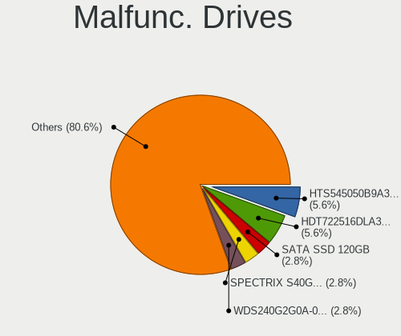
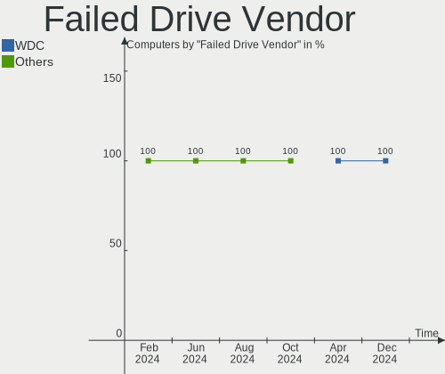
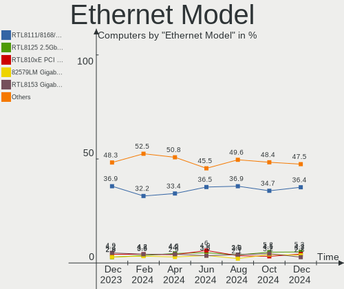
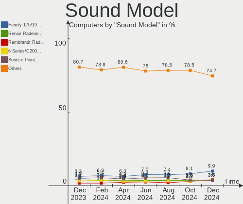
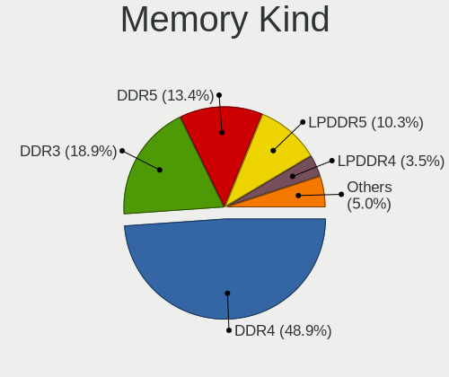

Ubuntu - Hardware Trends
------------------------

A project to identify most popular hardware characteristics and track their change
over time based on data collected by Linux users at https://Linux-Hardware.org.

Anyone can contribute to this report by the [hw-probe](https://github.com/linuxhw/hw-probe) tool:

    sudo -E hw-probe -all -upload

This is a report for all computer types. See also reports for [desktops](/Dist/Ubuntu/Desktop/README.md) and [notebooks](/Dist/Ubuntu/Notebook/README.md).

This report is for one last month. Overall report since the beginning of time: [TestDays](https://github.com/linuxhw/TestDays)

Period: May, 2023.

Contents
--------

* [ System ](#system)
  - [ OS                       ](#os)
  - [ OS Family                ](#os-family)
  - [ Kernel                   ](#kernel)
  - [ Kernel Family            ](#kernel-family)
  - [ Kernel Major Ver.        ](#kernel-major-ver)
  - [ Arch                     ](#arch)
  - [ DE                       ](#de)
  - [ Display Server           ](#display-server)
  - [ Display Manager          ](#display-manager)
  - [ OS Lang                  ](#os-lang)
  - [ Boot Mode                ](#boot-mode)
  - [ Filesystem               ](#filesystem)
  - [ Part. scheme             ](#part-scheme)
  - [ Dual Boot with Linux/BSD ](#dual-boot-with-linuxbsd)
  - [ Dual Boot (Win)          ](#dual-boot-win)

* [ Board ](#board)
  - [ Vendor                   ](#vendor)
  - [ Model                    ](#model)
  - [ Model Family             ](#model-family)
  - [ MFG Year                 ](#mfg-year)
  - [ Form Factor              ](#form-factor)
  - [ Secure Boot              ](#secure-boot)
  - [ Coreboot                 ](#coreboot)
  - [ RAM Size                 ](#ram-size)
  - [ RAM Used                 ](#ram-used)
  - [ Total Drives             ](#total-drives)
  - [ Has CD-ROM               ](#has-cd-rom)
  - [ Has Ethernet             ](#has-ethernet)
  - [ Has WiFi                 ](#has-wifi)
  - [ Has Bluetooth            ](#has-bluetooth)

* [ Location ](#location)
  - [ Country                  ](#country)
  - [ City                     ](#city)

* [ Drives ](#drives)
  - [ Drive Vendor             ](#drive-vendor)
  - [ Drive Model              ](#drive-model)
  - [ HDD Vendor               ](#hdd-vendor)
  - [ SSD Vendor               ](#ssd-vendor)
  - [ Drive Kind               ](#drive-kind)
  - [ Drive Connector          ](#drive-connector)
  - [ Drive Size               ](#drive-size)
  - [ Space Total              ](#space-total)
  - [ Space Used               ](#space-used)
  - [ Malfunc. Drives          ](#malfunc-drives)
  - [ Malfunc. Drive Vendor    ](#malfunc-drive-vendor)
  - [ Malfunc. HDD Vendor      ](#malfunc-hdd-vendor)
  - [ Malfunc. Drive Kind      ](#malfunc-drive-kind)
  - [ Failed Drives            ](#failed-drives)
  - [ Failed Drive Vendor      ](#failed-drive-vendor)
  - [ Drive Status             ](#drive-status)

* [ Storage controller ](#storage-controller)
  - [ Storage Vendor           ](#storage-vendor)
  - [ Storage Model            ](#storage-model)
  - [ Storage Kind             ](#storage-kind)

* [ Processor ](#processor)
  - [ CPU Vendor               ](#cpu-vendor)
  - [ CPU Model                ](#cpu-model)
  - [ CPU Model Family         ](#cpu-model-family)
  - [ CPU Cores                ](#cpu-cores)
  - [ CPU Sockets              ](#cpu-sockets)
  - [ CPU Threads              ](#cpu-threads)
  - [ CPU Op-Modes             ](#cpu-op-modes)
  - [ CPU Microcode            ](#cpu-microcode)
  - [ CPU Microarch            ](#cpu-microarch)

* [ Graphics ](#graphics)
  - [ GPU Vendor               ](#gpu-vendor)
  - [ GPU Model                ](#gpu-model)
  - [ GPU Combo                ](#gpu-combo)
  - [ GPU Driver               ](#gpu-driver)
  - [ GPU Memory               ](#gpu-memory)

* [ Monitor ](#monitor)
  - [ Monitor Vendor           ](#monitor-vendor)
  - [ Monitor Model            ](#monitor-model)
  - [ Monitor Resolution       ](#monitor-resolution)
  - [ Monitor Diagonal         ](#monitor-diagonal)
  - [ Monitor Width            ](#monitor-width)
  - [ Aspect Ratio             ](#aspect-ratio)
  - [ Monitor Area             ](#monitor-area)
  - [ Pixel Density            ](#pixel-density)
  - [ Multiple Monitors        ](#multiple-monitors)

* [ Network ](#network)
  - [ Net Controller Vendor    ](#net-controller-vendor)
  - [ Net Controller Model     ](#net-controller-model)
  - [ Wireless Vendor          ](#wireless-vendor)
  - [ Wireless Model           ](#wireless-model)
  - [ Ethernet Vendor          ](#ethernet-vendor)
  - [ Ethernet Model           ](#ethernet-model)
  - [ Net Controller Kind      ](#net-controller-kind)
  - [ Used Controller          ](#used-controller)
  - [ NICs                     ](#nics)
  - [ IPv6                     ](#ipv6)

* [ Bluetooth ](#bluetooth)
  - [ Bluetooth Vendor         ](#bluetooth-vendor)
  - [ Bluetooth Model          ](#bluetooth-model)

* [ Sound ](#sound)
  - [ Sound Vendor             ](#sound-vendor)
  - [ Sound Model              ](#sound-model)

* [ Memory ](#memory)
  - [ Memory Vendor            ](#memory-vendor)
  - [ Memory Model             ](#memory-model)
  - [ Memory Kind              ](#memory-kind)
  - [ Memory Form Factor       ](#memory-form-factor)
  - [ Memory Size              ](#memory-size)
  - [ Memory Speed             ](#memory-speed)

* [ Printers & scanners ](#printers--scanners)
  - [ Printer Vendor           ](#printer-vendor)
  - [ Printer Model            ](#printer-model)
  - [ Scanner Vendor           ](#scanner-vendor)
  - [ Scanner Model            ](#scanner-model)

* [ Camera ](#camera)
  - [ Camera Vendor            ](#camera-vendor)
  - [ Camera Model             ](#camera-model)

* [ Security ](#security)
  - [ Fingerprint Vendor       ](#fingerprint-vendor)
  - [ Fingerprint Model        ](#fingerprint-model)
  - [ Chipcard Vendor          ](#chipcard-vendor)
  - [ Chipcard Model           ](#chipcard-model)

* [ Unsupported ](#unsupported)
  - [ Unsupported Devices      ](#unsupported-devices)
  - [ Unsupported Device Types ](#unsupported-device-types)

System
------

OS
--

Installed operating systems

| Name           | Computers | Percent |
|----------------|-----------|---------|
| Ubuntu 22.04   | 695       | 58.7%   |
| Ubuntu 23.04   | 290       | 24.49%  |
| Ubuntu 20.04   | 123       | 10.39%  |
| Ubuntu 22.10   | 47        | 3.97%   |
| Ubuntu 18.04   | 16        | 1.35%   |
| Ubuntu 23.10   | 3         | 0.25%   |
| Ubuntu Core 22 | 2         | 0.17%   |
| Ubuntu Core 18 | 2         | 0.17%   |
| Ubuntu 21.10   | 2         | 0.17%   |
| Ubuntu 21.04   | 2         | 0.17%   |
| Ubuntu 9.5     | 1         | 0.08%   |
| Ubuntu 20.10   | 1         | 0.08%   |

OS Family
---------

OS without a version

| Name   | Computers | Percent |
|--------|-----------|---------|
| Ubuntu | 1184      | 100%    |

Kernel
------

Version of the Linux kernel

| Version                  | Computers | Percent |
|--------------------------|-----------|---------|
| 5.19.0-41-generic        | 415       | 35.05%  |
| 6.2.0-20-generic         | 267       | 22.55%  |
| 5.19.0-42-generic        | 125       | 10.56%  |
| 5.15.0-71-generic        | 83        | 7.01%   |
| 5.15.0-72-generic        | 55        | 4.65%   |
| 5.19.0-32-generic        | 34        | 2.87%   |
| 5.4.0-148-generic        | 23        | 1.94%   |
| 5.19.0-40-generic        | 15        | 1.27%   |
| 5.19.0-38-generic        | 11        | 0.93%   |
| 6.3.2-060302-generic     | 7         | 0.59%   |
| 6.3.1-060301-generic     | 7         | 0.59%   |
| 5.19.0-35-generic        | 7         | 0.59%   |
| 5.15.0-67-generic        | 7         | 0.59%   |
| 5.4.0-144-generic        | 5         | 0.42%   |
| 5.15.0-69-generic        | 5         | 0.42%   |
| 5.15.0-25-generic        | 5         | 0.42%   |
| 6.2.0-21-generic         | 4         | 0.34%   |
| 5.19.0-43-generic        | 4         | 0.34%   |
| 5.4.0-149-generic        | 3         | 0.25%   |
| 5.4.0-147-generic        | 3         | 0.25%   |
| 5.19.0-21-generic        | 3         | 0.25%   |
| 5.15.0-70-generic        | 3         | 0.25%   |
| 5.15.0-56-generic        | 3         | 0.25%   |
| 5.15.0-43-generic        | 3         | 0.25%   |
| 5.10.110-rockchip-rk3588 | 3         | 0.25%   |
| 4.15.0-211-generic       | 3         | 0.25%   |
| 6.3.3-060303-generic     | 2         | 0.17%   |
| 6.2.0-1004-raspi         | 2         | 0.17%   |
| 6.2.0-1003-lowlatency    | 2         | 0.17%   |
| 6.2.0-10005-tuxedo       | 2         | 0.17%   |
| 5.19.0-1017-raspi        | 2         | 0.17%   |
| 5.15.0-58-generic        | 2         | 0.17%   |
| 5.15.0-1037-realtime     | 2         | 0.17%   |
| 5.11.0-49-generic        | 2         | 0.17%   |
| 4.15.0-210-generic       | 2         | 0.17%   |
| 6.3.5-060305-generic     | 1         | 0.08%   |
| 6.3.4-060304-generic     | 1         | 0.08%   |
| 6.3.3-t2-jammy           | 1         | 0.08%   |
| 6.3.3-surface            | 1         | 0.08%   |
| 6.3.2-tkg-cfs            | 1         | 0.08%   |

Kernel Family
-------------

Linux kernel without a distro release

| Version  | Computers | Percent |
|----------|-----------|---------|
| 5.19.0   | 620       | 52.36%  |
| 6.2.0    | 278       | 23.48%  |
| 5.15.0   | 179       | 15.12%  |
| 5.4.0    | 39        | 3.29%   |
| 6.3.1    | 9         | 0.76%   |
| 6.3.2    | 8         | 0.68%   |
| 4.15.0   | 7         | 0.59%   |
| 6.3.3    | 4         | 0.34%   |
| 6.1.0    | 4         | 0.34%   |
| 5.13.0   | 4         | 0.34%   |
| 5.11.0   | 4         | 0.34%   |
| 5.8.0    | 3         | 0.25%   |
| 5.10.110 | 3         | 0.25%   |
| 5.17.0   | 2         | 0.17%   |
| 6.3.5    | 1         | 0.08%   |
| 6.3.4    | 1         | 0.08%   |
| 6.3.0    | 1         | 0.08%   |
| 6.2.9    | 1         | 0.08%   |
| 6.2.8    | 1         | 0.08%   |
| 6.2.6    | 1         | 0.08%   |
| 6.2.14   | 1         | 0.08%   |
| 6.2.12   | 1         | 0.08%   |
| 6.2.11   | 1         | 0.08%   |
| 6.2.10   | 1         | 0.08%   |
| 6.0.3    | 1         | 0.08%   |
| 6.0.1    | 1         | 0.08%   |
| 5.16.5   | 1         | 0.08%   |
| 5.15.93  | 1         | 0.08%   |
| 5.15.78  | 1         | 0.08%   |
| 5.15.20  | 1         | 0.08%   |
| 5.14.0   | 1         | 0.08%   |
| 5.10.104 | 1         | 0.08%   |
| 4.9.38   | 1         | 0.08%   |
| 4.4.154  | 1         | 0.08%   |

Kernel Major Ver.
-----------------

Linux kernel major version

| Version | Computers | Percent |
|---------|-----------|---------|
| 5.19    | 620       | 52.36%  |
| 6.2     | 285       | 24.07%  |
| 5.15    | 182       | 15.37%  |
| 5.4     | 39        | 3.29%   |
| 6.3     | 24        | 2.03%   |
| 4.15    | 7         | 0.59%   |
| 6.1     | 4         | 0.34%   |
| 5.13    | 4         | 0.34%   |
| 5.11    | 4         | 0.34%   |
| 5.10    | 4         | 0.34%   |
| 5.8     | 3         | 0.25%   |
| 6.0     | 2         | 0.17%   |
| 5.17    | 2         | 0.17%   |
| 5.16    | 1         | 0.08%   |
| 5.14    | 1         | 0.08%   |
| 4.9     | 1         | 0.08%   |
| 4.4     | 1         | 0.08%   |

Arch
----

OS architecture (x86_64, i586, etc.)

| Name    | Computers | Percent |
|---------|-----------|---------|
| x86_64  | 1167      | 98.56%  |
| aarch64 | 12        | 1.01%   |
| i686    | 5         | 0.42%   |

DE
--

Desktop Environment

| Name            | Computers | Percent |
|-----------------|-----------|---------|
| GNOME           | 1098      | 92.74%  |
| Unknown         | 55        | 4.65%   |
| X-Cinnamon      | 12        | 1.01%   |
| GNOME Flashback | 10        | 0.84%   |
| i3              | 2         | 0.17%   |
| GNOME Classic   | 2         | 0.17%   |
| Enlightenment   | 2         | 0.17%   |
| sway            | 1         | 0.08%   |
| mwm             | 1         | 0.08%   |
| INPT            | 1         | 0.08%   |

Display Server
--------------

X11 or Wayland

| Name    | Computers | Percent |
|---------|-----------|---------|
| Wayland | 675       | 57.01%  |
| X11     | 448       | 37.84%  |
| Tty     | 35        | 2.96%   |
| Unknown | 26        | 2.2%    |

Display Manager
---------------

SDDM, LightDM, etc.

| Name    | Computers | Percent |
|---------|-----------|---------|
| GDM3    | 979       | 82.69%  |
| Unknown | 135       | 11.4%   |
| GDM     | 42        | 3.55%   |
| LightDM | 27        | 2.28%   |
| SLiM    | 1         | 0.08%   |

OS Lang
-------

Language

| Lang    | Computers | Percent |
|---------|-----------|---------|
| en_US   | 545       | 46.03%  |
| de_DE   | 103       | 8.7%    |
| fr_FR   | 75        | 6.33%   |
| en_GB   | 48        | 4.05%   |
| en_IN   | 42        | 3.55%   |
| pt_BR   | 41        | 3.46%   |
| it_IT   | 33        | 2.79%   |
| en_CA   | 32        | 2.7%    |
| es_ES   | 27        | 2.28%   |
| ru_RU   | 24        | 2.03%   |
| C       | 20        | 1.69%   |
| Unknown | 17        | 1.44%   |
| en_AU   | 15        | 1.27%   |
| pl_PL   | 13        | 1.1%    |
| nl_NL   | 10        | 0.84%   |
| ja_JP   | 10        | 0.84%   |
| es_MX   | 10        | 0.84%   |
| sv_SE   | 9         | 0.76%   |
| en_ZA   | 8         | 0.68%   |
| de_AT   | 8         | 0.68%   |
| hu_HU   | 7         | 0.59%   |
| es_AR   | 7         | 0.59%   |
| zh_CN   | 5         | 0.42%   |
| de_CH   | 5         | 0.42%   |
| pt_PT   | 4         | 0.34%   |
| nl_BE   | 4         | 0.34%   |
| el_GR   | 4         | 0.34%   |
| tr_TR   | 3         | 0.25%   |
| ko_KR   | 3         | 0.25%   |
| fr_CA   | 3         | 0.25%   |
| en_NZ   | 3         | 0.25%   |
| cs_CZ   | 3         | 0.25%   |
| sk_SK   | 2         | 0.17%   |
| ro_RO   | 2         | 0.17%   |
| fr_CH   | 2         | 0.17%   |
| fi_FI   | 2         | 0.17%   |
| es_VE   | 2         | 0.17%   |
| es_UY   | 2         | 0.17%   |
| es_GT   | 2         | 0.17%   |
| es_CO   | 2         | 0.17%   |

Boot Mode
---------

EFI or BIOS

| Mode | Computers | Percent |
|------|-----------|---------|
| BIOS | 687       | 58.02%  |
| EFI  | 497       | 41.98%  |

Filesystem
----------

Type of filesystem

| Type    | Computers | Percent |
|---------|-----------|---------|
| Ext4    | 612       | 51.69%  |
| Tmpfs   | 510       | 43.07%  |
| Btrfs   | 29        | 2.45%   |
| Overlay | 25        | 2.11%   |
| Zfs     | 3         | 0.25%   |
| Xfs     | 3         | 0.25%   |
| Ext3    | 2         | 0.17%   |

Part. scheme
------------

Scheme of partitioning

| Type    | Computers | Percent |
|---------|-----------|---------|
| GPT     | 977       | 82.52%  |
| MBR     | 119       | 10.05%  |
| Unknown | 88        | 7.43%   |

Dual Boot with Linux/BSD
------------------------

Hosting more than one Linux/BSD

| Dual boot | Computers | Percent |
|-----------|-----------|---------|
| No        | 1048      | 88.51%  |
| Yes       | 136       | 11.49%  |

Dual Boot (Win)
---------------

Hosting Linux and Windows

| Dual boot | Computers | Percent |
|-----------|-----------|---------|
| No        | 768       | 64.86%  |
| Yes       | 416       | 35.14%  |

Board
-----

Vendor
------

Motherboard manufacturer

| Name                    | Computers | Percent |
|-------------------------|-----------|---------|
| ASUSTek Computer        | 191       | 16.13%  |
| Hewlett-Packard         | 174       | 14.7%   |
| Dell                    | 162       | 13.68%  |
| Lenovo                  | 155       | 13.09%  |
| Gigabyte Technology     | 72        | 6.08%   |
| Acer                    | 58        | 4.9%    |
| MSI                     | 55        | 4.65%   |
| Apple                   | 37        | 3.13%   |
| ASRock                  | 28        | 2.36%   |
| Intel                   | 25        | 2.11%   |
| HUAWEI                  | 22        | 1.86%   |
| Toshiba                 | 15        | 1.27%   |
| Unknown                 | 15        | 1.27%   |
| Samsung Electronics     | 10        | 0.84%   |
| Sony                    | 9         | 0.76%   |
| Medion                  | 9         | 0.76%   |
| Supermicro              | 8         | 0.68%   |
| Fujitsu                 | 8         | 0.68%   |
| Pegatron                | 7         | 0.59%   |
| AZW                     | 7         | 0.59%   |
| Biostar                 | 6         | 0.51%   |
| TUXEDO                  | 5         | 0.42%   |
| Microsoft               | 5         | 0.42%   |
| Raspberry Pi Foundation | 4         | 0.34%   |
| Packard Bell            | 4         | 0.34%   |
| Google                  | 4         | 0.34%   |
| Gateway                 | 4         | 0.34%   |
| Rockchip                | 3         | 0.25%   |
| Notebook                | 3         | 0.25%   |
| HONOR                   | 3         | 0.25%   |
| eMachines               | 3         | 0.25%   |
| Chuwi                   | 3         | 0.25%   |
| Alienware               | 3         | 0.25%   |
| ZOTAC                   | 2         | 0.17%   |
| Timi                    | 2         | 0.17%   |
| Shuttle                 | 2         | 0.17%   |
| Semp Toshiba            | 2         | 0.17%   |
| Razer                   | 2         | 0.17%   |
| Quanta                  | 2         | 0.17%   |
| PCWare                  | 2         | 0.17%   |

Model
-----

Motherboard model

| Name                              | Computers | Percent |
|-----------------------------------|-----------|---------|
| Unknown                           | 21        | 1.77%   |
| ASUS All Series                   | 7         | 0.59%   |
| HP Pavilion g6                    | 5         | 0.42%   |
| Supermicro Super Server           | 4         | 0.34%   |
| HP Notebook                       | 4         | 0.34%   |
| Dell OptiPlex 990                 | 4         | 0.34%   |
| Dell OptiPlex 9020                | 4         | 0.34%   |
| AZW SER                           | 4         | 0.34%   |
| HUAWEI KLVD-WXX9                  | 3         | 0.25%   |
| HUAWEI BOHB-WAX9                  | 3         | 0.25%   |
| HUAWEI BOD-WXX9                   | 3         | 0.25%   |
| HP ZBook Studio G3                | 3         | 0.25%   |
| HP Pavilion 15                    | 3         | 0.25%   |
| HP Laptop 15s-fq5xxx              | 3         | 0.25%   |
| HP Laptop 15-db0xxx               | 3         | 0.25%   |
| HP Laptop 14-dq2xxx               | 3         | 0.25%   |
| HP EliteDesk 800 G2 DM 35W        | 3         | 0.25%   |
| HP EliteBook 840 G3               | 3         | 0.25%   |
| Dell OptiPlex 780                 | 3         | 0.25%   |
| Dell OptiPlex 3040                | 3         | 0.25%   |
| ASUS X550CC                       | 3         | 0.25%   |
| Apple MacBookPro6,2               | 3         | 0.25%   |
| Apple iMac12,2                    | 3         | 0.25%   |
| Acer Nitro AN517-54               | 3         | 0.25%   |
| Rockchip Orange Pi 5              | 2         | 0.17%   |
| MSI Raider GE76 12UE              | 2         | 0.17%   |
| MSI MS-7721                       | 2         | 0.17%   |
| Lenovo V130-15IKB 81HN            | 2         | 0.17%   |
| Lenovo Legion 5 15ACH6H 82JU      | 2         | 0.17%   |
| Lenovo IdeaPad 5 14ALC05 82LM     | 2         | 0.17%   |
| Lenovo IdeaPad 320-15AST 80XV     | 2         | 0.17%   |
| Lenovo IdeaPad 1 15ADA7 82R1      | 2         | 0.17%   |
| Intel H61                         | 2         | 0.17%   |
| HUAWEI NBLB-WAX9N                 | 2         | 0.17%   |
| HUAWEI KLVL-WXXW                  | 2         | 0.17%   |
| HONOR BBR-WAX9                    | 2         | 0.17%   |
| HP Pavilion x360 Convertible      | 2         | 0.17%   |
| HP Pavilion Notebook              | 2         | 0.17%   |
| HP Pavilion dv6                   | 2         | 0.17%   |
| HP Pavilion Aero Laptop 13-be0xxx | 2         | 0.17%   |

Model Family
------------

Motherboard model prefix

| Name                  | Computers | Percent |
|-----------------------|-----------|---------|
| Lenovo ThinkPad       | 63        | 5.32%   |
| Dell Latitude         | 40        | 3.38%   |
| Acer Aspire           | 36        | 3.04%   |
| HP Pavilion           | 35        | 2.96%   |
| Dell OptiPlex         | 35        | 2.96%   |
| Lenovo IdeaPad        | 32        | 2.7%    |
| Dell Inspiron         | 32        | 2.7%    |
| HP EliteBook          | 27        | 2.28%   |
| ASUS PRIME            | 27        | 2.28%   |
| ASUS VivoBook         | 24        | 2.03%   |
| ASUS ROG              | 24        | 2.03%   |
| HP Laptop             | 21        | 1.77%   |
| Unknown               | 21        | 1.77%   |
| Dell Precision        | 19        | 1.6%    |
| HP ENVY               | 17        | 1.44%   |
| Toshiba Satellite     | 13        | 1.1%    |
| Dell Vostro           | 13        | 1.1%    |
| Lenovo ThinkCentre    | 12        | 1.01%   |
| Dell XPS              | 11        | 0.93%   |
| ASUS TUF              | 11        | 0.93%   |
| HP ProBook            | 10        | 0.84%   |
| HP Compaq             | 10        | 0.84%   |
| Acer Nitro            | 10        | 0.84%   |
| Lenovo Yoga           | 9         | 0.76%   |
| HP ZBook              | 9         | 0.76%   |
| Lenovo ThinkBook      | 7         | 0.59%   |
| Lenovo IdeaCentre     | 7         | 0.59%   |
| HP EliteDesk          | 7         | 0.59%   |
| ASUS All              | 7         | 0.59%   |
| ASUS Zenbook          | 6         | 0.51%   |
| Microsoft Surface     | 5         | 0.42%   |
| Lenovo Legion         | 5         | 0.42%   |
| ASUS ASUS             | 5         | 0.42%   |
| Acer Swift            | 5         | 0.42%   |
| Supermicro Super      | 4         | 0.34%   |
| RPi Raspberry         | 4         | 0.34%   |
| Packard Bell EasyNote | 4         | 0.34%   |
| MSI Katana            | 4         | 0.34%   |
| Lenovo IdeaPadFlex    | 4         | 0.34%   |
| HP Notebook           | 4         | 0.34%   |

MFG Year
--------

Motherboard manufacture year

| Year    | Computers | Percent |
|---------|-----------|---------|
| 2021    | 145       | 12.25%  |
| 2022    | 133       | 11.23%  |
| 2020    | 110       | 9.29%   |
| 2018    | 91        | 7.69%   |
| 2019    | 88        | 7.43%   |
| 2013    | 69        | 5.83%   |
| 2012    | 69        | 5.83%   |
| 2017    | 68        | 5.74%   |
| 2011    | 68        | 5.74%   |
| 2016    | 64        | 5.41%   |
| 2015    | 60        | 5.07%   |
| 2010    | 58        | 4.9%    |
| 2014    | 53        | 4.48%   |
| 2009    | 29        | 2.45%   |
| 2023    | 28        | 2.36%   |
| 2008    | 25        | 2.11%   |
| Unknown | 13        | 1.1%    |
| 2007    | 8         | 0.68%   |
| 2006    | 3         | 0.25%   |
| 2004    | 1         | 0.08%   |
| 2003    | 1         | 0.08%   |

Form Factor
-----------

Physical design of the computer

| Name           | Computers | Percent |
|----------------|-----------|---------|
| Notebook       | 625       | 52.79%  |
| Desktop        | 419       | 35.39%  |
| Convertible    | 47        | 3.97%   |
| Mini pc        | 30        | 2.53%   |
| All in one     | 18        | 1.52%   |
| Server         | 18        | 1.52%   |
| Tablet         | 15        | 1.27%   |
| System on chip | 12        | 1.01%   |

Secure Boot
-----------

Enabled or disabled

| State    | Computers | Percent |
|----------|-----------|---------|
| Disabled | 1066      | 90.03%  |
| Enabled  | 118       | 9.97%   |

Coreboot
--------

Have coreboot on board

| Used | Computers | Percent |
|------|-----------|---------|
| No   | 1178      | 99.49%  |
| Yes  | 6         | 0.51%   |

RAM Size
--------

Total RAM memory

| Size in GB      | Computers | Percent |
|-----------------|-----------|---------|
| 4.01-8.0        | 303       | 25.59%  |
| 16.01-24.0      | 259       | 21.88%  |
| 8.01-16.0       | 203       | 17.15%  |
| 3.01-4.0        | 162       | 13.68%  |
| 32.01-64.0      | 142       | 11.99%  |
| 64.01-256.0     | 47        | 3.97%   |
| 24.01-32.0      | 33        | 2.79%   |
| 1.01-2.0        | 19        | 1.6%    |
| More than 256.0 | 8         | 0.68%   |
| 2.01-3.0        | 7         | 0.59%   |
| 0.51-1.0        | 1         | 0.08%   |

RAM Used
--------

Used RAM memory

| Used GB     | Computers | Percent |
|-------------|-----------|---------|
| 2.01-3.0    | 347       | 29.31%  |
| 1.01-2.0    | 313       | 26.44%  |
| 4.01-8.0    | 230       | 19.43%  |
| 3.01-4.0    | 196       | 16.55%  |
| 8.01-16.0   | 56        | 4.73%   |
| 0.51-1.0    | 21        | 1.77%   |
| 16.01-24.0  | 9         | 0.76%   |
| 0.01-0.5    | 5         | 0.42%   |
| 24.01-32.0  | 4         | 0.34%   |
| 64.01-256.0 | 2         | 0.17%   |
| 32.01-64.0  | 1         | 0.08%   |

Total Drives
------------

Number of drives on board

| Drives | Computers | Percent |
|--------|-----------|---------|
| 1      | 761       | 64.27%  |
| 2      | 274       | 23.14%  |
| 3      | 75        | 6.33%   |
| 4      | 36        | 3.04%   |
| 5      | 13        | 1.1%    |
| 6      | 7         | 0.59%   |
| 0      | 7         | 0.59%   |
| 9      | 3         | 0.25%   |
| 7      | 3         | 0.25%   |
| 12     | 2         | 0.17%   |
| 25     | 1         | 0.08%   |
| 11     | 1         | 0.08%   |
| 8      | 1         | 0.08%   |

Has CD-ROM
----------

Has CD-ROM on board

| Presented | Computers | Percent |
|-----------|-----------|---------|
| No        | 815       | 68.83%  |
| Yes       | 369       | 31.17%  |

Has Ethernet
------------

Has Ethernet on board

| Presented | Computers | Percent |
|-----------|-----------|---------|
| Yes       | 953       | 80.49%  |
| No        | 231       | 19.51%  |

Has WiFi
--------

Has WiFi module

| Presented | Computers | Percent |
|-----------|-----------|---------|
| Yes       | 920       | 77.7%   |
| No        | 264       | 22.3%   |

Has Bluetooth
-------------

Has Bluetooth module

| Presented | Computers | Percent |
|-----------|-----------|---------|
| Yes       | 784       | 66.22%  |
| No        | 400       | 33.78%  |

Location
--------

Country
-------

Geographic location (country)

| Country      | Computers | Percent |
|--------------|-----------|---------|
| USA          | 236       | 19.93%  |
| Germany      | 120       | 10.14%  |
| France       | 85        | 7.18%   |
| Brazil       | 68        | 5.74%   |
| UK           | 50        | 4.22%   |
| India        | 49        | 4.14%   |
| Italy        | 47        | 3.97%   |
| Canada       | 43        | 3.63%   |
| Russia       | 37        | 3.13%   |
| Spain        | 28        | 2.36%   |
| Netherlands  | 25        | 2.11%   |
| Switzerland  | 21        | 1.77%   |
| Sweden       | 20        | 1.69%   |
| Australia    | 19        | 1.6%    |
| Mexico       | 16        | 1.35%   |
| Poland       | 15        | 1.27%   |
| Belgium      | 14        | 1.18%   |
| Austria      | 14        | 1.18%   |
| Turkey       | 10        | 0.84%   |
| Serbia       | 10        | 0.84%   |
| Japan        | 10        | 0.84%   |
| Greece       | 10        | 0.84%   |
| Argentina    | 10        | 0.84%   |
| South Africa | 9         | 0.76%   |
| Romania      | 9         | 0.76%   |
| Hungary      | 9         | 0.76%   |
| China        | 9         | 0.76%   |
| Portugal     | 8         | 0.68%   |
| Egypt        | 8         | 0.68%   |
| South Korea  | 7         | 0.59%   |
| Pakistan     | 7         | 0.59%   |
| Norway       | 7         | 0.59%   |
| Finland      | 7         | 0.59%   |
| Czechia      | 7         | 0.59%   |
| Taiwan       | 6         | 0.51%   |
| Indonesia    | 6         | 0.51%   |
| Denmark      | 6         | 0.51%   |
| Chile        | 6         | 0.51%   |
| Vietnam      | 5         | 0.42%   |
| Slovakia     | 5         | 0.42%   |

City
----

Geographic location (city)

| City              | Computers | Percent |
|-------------------|-----------|---------|
| Paris             | 12        | 1.01%   |
| Sao Paulo         | 10        | 0.84%   |
| Moscow            | 10        | 0.84%   |
| Vienna            | 9         | 0.76%   |
| Milan             | 9         | 0.76%   |
| Berlin            | 9         | 0.76%   |
| Madrid            | 7         | 0.59%   |
| St Petersburg     | 6         | 0.51%   |
| Mumbai            | 6         | 0.51%   |
| Cologne           | 6         | 0.51%   |
| Belgrade          | 6         | 0.51%   |
| Barcelona         | 6         | 0.51%   |
| Turin             | 5         | 0.42%   |
| San Francisco     | 5         | 0.42%   |
| Rome              | 5         | 0.42%   |
| Rio de Janeiro    | 5         | 0.42%   |
| Montreal          | 5         | 0.42%   |
| Melbourne         | 5         | 0.42%   |
| Hamburg           | 5         | 0.42%   |
| Gothenburg        | 5         | 0.42%   |
| Columbia          | 5         | 0.42%   |
| Campinas          | 5         | 0.42%   |
| Budapest          | 5         | 0.42%   |
| Brussels          | 5         | 0.42%   |
| Brisbane          | 5         | 0.42%   |
| Warsaw            | 4         | 0.34%   |
| Valencia          | 4         | 0.34%   |
| Toronto           | 4         | 0.34%   |
| San José         | 4         | 0.34%   |
| Prague            | 4         | 0.34%   |
| Nairobi           | 4         | 0.34%   |
| Montevideo        | 4         | 0.34%   |
| Los Angeles       | 4         | 0.34%   |
| Helsinki          | 4         | 0.34%   |
| Frankfurt am Main | 4         | 0.34%   |
| Florianópolis    | 4         | 0.34%   |
| Düsseldorf       | 4         | 0.34%   |
| Delhi             | 4         | 0.34%   |
| Cairo             | 4         | 0.34%   |
| Zurich            | 3         | 0.25%   |

Drives
------

Drive Vendor
------------

Hard drive vendors

| Vendor                      | Computers | Drives | Percent |
|-----------------------------|-----------|--------|---------|
| Samsung Electronics         | 286       | 341    | 17.24%  |
| WDC                         | 216       | 263    | 13.02%  |
| Seagate                     | 207       | 253    | 12.48%  |
| Sandisk                     | 98        | 105    | 5.91%   |
| Kingston                    | 87        | 90     | 5.24%   |
| Toshiba                     | 75        | 77     | 4.52%   |
| Crucial                     | 67        | 87     | 4.04%   |
| Unknown                     | 55        | 60     | 3.32%   |
| Micron Technology           | 52        | 54     | 3.13%   |
| SK hynix                    | 50        | 50     | 3.01%   |
| Intel                       | 48        | 49     | 2.89%   |
| Hitachi                     | 46        | 51     | 2.77%   |
| HGST                        | 24        | 24     | 1.45%   |
| Apple                       | 22        | 24     | 1.33%   |
| KIOXIA                      | 21        | 21     | 1.27%   |
| A-DATA Technology           | 21        | 21     | 1.27%   |
| Phison Electronics          | 20        | 21     | 1.21%   |
| China                       | 20        | 20     | 1.21%   |
| Kingston Technology Company | 17        | 17     | 1.02%   |
| Unknown                     | 16        | 16     | 0.96%   |
| SPCC                        | 10        | 15     | 0.6%    |
| Phison                      | 10        | 10     | 0.6%    |
| Micron/Crucial Technology   | 10        | 10     | 0.6%    |
| Silicon Motion              | 8         | 8      | 0.48%   |
| PNY                         | 8         | 11     | 0.48%   |
| Intenso                     | 8         | 9      | 0.48%   |
| LITEONIT                    | 7         | 7      | 0.42%   |
| Transcend                   | 6         | 6      | 0.36%   |
| Lexar                       | 6         | 6      | 0.36%   |
| UMIS                        | 5         | 5      | 0.3%    |
| SABRENT                     | 5         | 10     | 0.3%    |
| Realtek Semiconductor       | 5         | 5      | 0.3%    |
| Netac                       | 5         | 5      | 0.3%    |
| ASMT                        | 5         | 12     | 0.3%    |
| Team                        | 4         | 4      | 0.24%   |
| Patriot                     | 4         | 4      | 0.24%   |
| LITEON                      | 4         | 4      | 0.24%   |
| Apacer                      | 4         | 4      | 0.24%   |
| ADATA Technology            | 4         | 5      | 0.24%   |
| Lenovo                      | 3         | 4      | 0.18%   |

Drive Model
-----------

Hard drive models

| Model                                               | Computers | Percent |
|-----------------------------------------------------|-----------|---------|
| Samsung NVMe SSD Controller SM981/PM981/PM983 256GB | 33        | 1.85%   |
| Samsung NVMe SSD Controller PM9A1/PM9A3/980PRO 1TB  | 20        | 1.12%   |
| Seagate ST1000LM035-1RK172 1TB                      | 18        | 1.01%   |
| Kingston SA400S37480G 480GB SSD                     | 16        | 0.9%    |
| Unknown                                             | 16        | 0.9%    |
| Kingston SA400S37240G 240GB SSD                     | 15        | 0.84%   |
| Seagate ST2000DM008-2FR102 2TB                      | 13        | 0.73%   |
| Unknown MMC Card  64GB                              | 12        | 0.67%   |
| Unknown MMC Card  32GB                              | 12        | 0.67%   |
| Samsung SSD 860 EVO 500GB                           | 11        | 0.62%   |
| Seagate ST1000DM010-2EP102 1TB                      | 10        | 0.56%   |
| Sandisk WD Blue SN550 NVMe SSD 512GB                | 10        | 0.56%   |
| Samsung SSD 850 EVO 250GB                           | 10        | 0.56%   |
| Unknown MMC Card  128GB                             | 9         | 0.5%    |
| Seagate ST1000LM024 HN-M101MBB 1TB                  | 9         | 0.5%    |
| Samsung SSD 870 EVO 1TB                             | 9         | 0.5%    |
| Seagate ST4000DM004-2CV104 4TB                      | 8         | 0.45%   |
| Samsung SSD 980 1TB                                 | 8         | 0.45%   |
| Samsung SSD 870 EVO 2TB                             | 8         | 0.45%   |
| Samsung NVMe SSD Controller SM961/PM961/SM963 256GB | 8         | 0.45%   |
| HGST HTS541010A9E680 1TB                            | 8         | 0.45%   |
| Crucial CT500MX500SSD1 500GB                        | 8         | 0.45%   |
| WDC WD10EZEX-08WN4A0 1TB                            | 7         | 0.39%   |
| Toshiba MQ01ABD100 1TB                              | 7         | 0.39%   |
| Toshiba DT01ACA100 1TB                              | 7         | 0.39%   |
| Seagate ST1000DM003-1CH162 1TB                      | 7         | 0.39%   |
| Sandisk WD Black SN750 / PC SN730 NVMe SSD 256GB    | 7         | 0.39%   |
| Phison PS5013 E13 NVMe Controller 512GB             | 7         | 0.39%   |
| Phison E12 NVMe Controller 256GB                    | 7         | 0.39%   |
| Crucial CT240BX500SSD1 240GB                        | 7         | 0.39%   |
| SK hynix BC711 HFM512GD3JX013N 512GB                | 6         | 0.34%   |
| Silicon Motion SM2263EN/SM2263XT SSD Controller 1TB | 6         | 0.34%   |
| Seagate Expansion 1TB                               | 6         | 0.34%   |
| SanDisk NVMe SSD Drive 2TB                          | 6         | 0.34%   |
| Micron/Crucial P2 NVMe PCIe SSD 1TB                 | 6         | 0.34%   |
| Kingston SV300S37A120G 120GB SSD                    | 6         | 0.34%   |
| Hitachi HDS721010CLA332 1TB                         | 6         | 0.34%   |
| Crucial CT1000MX500SSD1 1TB                         | 6         | 0.34%   |
| Crucial CT1000BX500SSD1 1TB                         | 6         | 0.34%   |
| WDC WDS240G2G0A-00JH30 240GB SSD                    | 5         | 0.28%   |

HDD Vendor
----------

Hard disk drive vendors

| Vendor              | Computers | Drives | Percent |
|---------------------|-----------|--------|---------|
| Seagate             | 199       | 244    | 36.72%  |
| WDC                 | 168       | 207    | 31%     |
| Toshiba             | 52        | 54     | 9.59%   |
| Hitachi             | 45        | 50     | 8.3%    |
| Samsung Electronics | 28        | 32     | 5.17%   |
| HGST                | 24        | 24     | 4.43%   |
| Apple               | 9         | 9      | 1.66%   |
| Unknown             | 4         | 4      | 0.74%   |
| Inateck             | 2         | 2      | 0.37%   |
| Fujitsu             | 2         | 2      | 0.37%   |
| WD MediaMax         | 1         | 1      | 0.18%   |
| RSH-339             | 1         | 1      | 0.18%   |
| Lenovo              | 1         | 2      | 0.18%   |
| LaCie               | 1         | 1      | 0.18%   |
| Intenso             | 1         | 1      | 0.18%   |
| Hewlett-Packard     | 1         | 1      | 0.18%   |
| DellEMC             | 1         | 8      | 0.18%   |
| ASMT                | 1         | 1      | 0.18%   |
| ASMedia             | 1         | 1      | 0.18%   |

SSD Vendor
----------

Solid state drive vendors

| Vendor              | Computers | Drives | Percent |
|---------------------|-----------|--------|---------|
| Samsung Electronics | 114       | 137    | 22.44%  |
| Kingston            | 64        | 66     | 12.6%   |
| Crucial             | 56        | 74     | 11.02%  |
| SanDisk             | 42        | 45     | 8.27%   |
| WDC                 | 30        | 31     | 5.91%   |
| China               | 19        | 19     | 3.74%   |
| SK hynix            | 13        | 13     | 2.56%   |
| Intel               | 13        | 13     | 2.56%   |
| A-DATA Technology   | 12        | 12     | 2.36%   |
| SPCC                | 9         | 14     | 1.77%   |
| Micron Technology   | 9         | 10     | 1.77%   |
| PNY                 | 7         | 10     | 1.38%   |
| LITEONIT            | 7         | 7      | 1.38%   |
| Apple               | 6         | 6      | 1.18%   |
| Transcend           | 5         | 5      | 0.98%   |
| SABRENT             | 5         | 10     | 0.98%   |
| Intenso             | 5         | 5      | 0.98%   |
| Toshiba             | 4         | 4      | 0.79%   |
| Team                | 4         | 4      | 0.79%   |
| Patriot             | 4         | 4      | 0.79%   |
| Netac               | 4         | 4      | 0.79%   |
| LITEON              | 4         | 4      | 0.79%   |
| Lexar               | 4         | 4      | 0.79%   |
| ASMT                | 4         | 11     | 0.79%   |
| Unknown             | 4         | 4      | 0.79%   |
| KingSpec            | 3         | 3      | 0.59%   |
| JMicron Technology  | 3         | 3      | 0.59%   |
| Apacer              | 3         | 3      | 0.59%   |
| WDC WDS2            | 2         | 2      | 0.39%   |
| Phison              | 2         | 2      | 0.39%   |
| KIOXIA-EXCERIA      | 2         | 2      | 0.39%   |
| GOODRAM             | 2         | 2      | 0.39%   |
| Gigabyte Technology | 2         | 2      | 0.39%   |
| FORESEE             | 2         | 2      | 0.39%   |
| Fanxiang            | 2         | 2      | 0.39%   |
| XSTAR               | 1         | 1      | 0.2%    |
| VISIPRO             | 1         | 1      | 0.2%    |
| Verbatim            | 1         | 2      | 0.2%    |
| V7                  | 1         | 1      | 0.2%    |
| USB                 | 1         | 1      | 0.2%    |

Drive Kind
----------

HDD or SSD

| Kind    | Computers | Drives | Percent |
|---------|-----------|--------|---------|
| NVMe    | 510       | 577    | 33.75%  |
| HDD     | 463       | 645    | 30.64%  |
| SSD     | 457       | 578    | 30.24%  |
| MMC     | 56        | 60     | 3.71%   |
| Unknown | 25        | 35     | 1.65%   |

Drive Connector
---------------

SATA, SAS, NVMe, etc.

| Type | Computers | Drives | Percent |
|------|-----------|--------|---------|
| SATA | 753       | 1144   | 54.17%  |
| NVMe | 510       | 576    | 36.69%  |
| SAS  | 71        | 115    | 5.11%   |
| MMC  | 56        | 60     | 4.03%   |

Drive Size
----------

Size of hard drive

| Size in TB | Computers | Drives | Percent |
|------------|-----------|--------|---------|
| 0.01-0.5   | 508       | 625    | 52.05%  |
| 0.51-1.0   | 300       | 358    | 30.74%  |
| 1.01-2.0   | 87        | 108    | 8.91%   |
| 3.01-4.0   | 41        | 71     | 4.2%    |
| 4.01-10.0  | 17        | 25     | 1.74%   |
| 10.01-20.0 | 12        | 23     | 1.23%   |
| 2.01-3.0   | 11        | 13     | 1.13%   |

Space Total
-----------

Amount of disk space available on the file system

| Size in GB     | Computers | Percent |
|----------------|-----------|---------|
| 101-250        | 334       | 28.21%  |
| 251-500        | 331       | 27.96%  |
| 501-1000       | 188       | 15.88%  |
| 1001-2000      | 78        | 6.59%   |
| 51-100         | 68        | 5.74%   |
| More than 3000 | 60        | 5.07%   |
| 1-20           | 40        | 3.38%   |
| 21-50          | 39        | 3.29%   |
| 2001-3000      | 26        | 2.2%    |
| Unknown        | 20        | 1.69%   |

Space Used
----------

Amount of used disk space

| Used GB        | Computers | Percent |
|----------------|-----------|---------|
| 1-20           | 373       | 31.5%   |
| 21-50          | 257       | 21.71%  |
| 101-250        | 180       | 15.2%   |
| 51-100         | 150       | 12.67%  |
| 251-500        | 91        | 7.69%   |
| 501-1000       | 43        | 3.63%   |
| 1001-2000      | 26        | 2.2%    |
| More than 3000 | 25        | 2.11%   |
| Unknown        | 20        | 1.69%   |
| 2001-3000      | 19        | 1.6%    |

Malfunc. Drives
---------------

Drive models with a malfunction

| Model                                          | Computers | Drives | Percent |
|------------------------------------------------|-----------|--------|---------|
| WDC WD5000AAKX-22ERMA0 500GB                   | 2         | 2      | 3.39%   |
| SK hynix HFS256G39TND-N210A 256GB SSD          | 2         | 2      | 3.39%   |
| Seagate ST1000LM035-1RK172 1TB                 | 2         | 2      | 3.39%   |
| Samsung Electronics SSD 960 EVO 250GB          | 2         | 2      | 3.39%   |
| Hitachi HTS547564A9E384 640GB                  | 2         | 2      | 3.39%   |
| WDC WD5000HHTZ-04N21V0 500GB                   | 1         | 1      | 1.69%   |
| WDC WD5000BEKT-75KA9T0 500GB                   | 1         | 1      | 1.69%   |
| WDC WD40EFRX-68WT0N0 4TB                       | 1         | 1      | 1.69%   |
| WDC WD3200BEKT-60PVMT0 320GB                   | 1         | 1      | 1.69%   |
| WDC WD10EZRZ-00HTKB0 1TB                       | 1         | 1      | 1.69%   |
| WDC WD10EZRX-00A8LB0 1TB                       | 1         | 1      | 1.69%   |
| WDC WD10EZEX-75WN4A0 1TB                       | 1         | 1      | 1.69%   |
| WDC WD10EARS-22Y5B1 1TB                        | 1         | 1      | 1.69%   |
| WDC WD10EALX-759BA1 1TB                        | 1         | 1      | 1.69%   |
| WDC WD Green M.2 2280 240GB SSD                | 1         | 1      | 1.69%   |
| Toshiba MQ04ABF100 1TB                         | 1         | 1      | 1.69%   |
| Toshiba MQ01ACF032 320GB                       | 1         | 1      | 1.69%   |
| Toshiba DT01ACA050 500GB                       | 1         | 1      | 1.69%   |
| SK hynix SC308 SATA 512GB SSD                  | 1         | 1      | 1.69%   |
| SK hynix BC711 HFM001TD3JX013N 1TB             | 1         | 1      | 1.69%   |
| Seagate ST9160827AS 160GB                      | 1         | 1      | 1.69%   |
| Seagate ST500LT012-9WS142 500GB                | 1         | 1      | 1.69%   |
| Seagate ST500LM000-SSHD-8GB                    | 1         | 1      | 1.69%   |
| Seagate ST500DM002-1BD142 500GB                | 1         | 1      | 1.69%   |
| Seagate ST500DM002-1BC142 500GB                | 1         | 1      | 1.69%   |
| Seagate ST3500418AS 500GB                      | 1         | 2      | 1.69%   |
| Seagate ST3300822AS 304GB                      | 1         | 1      | 1.69%   |
| Seagate ST2000DM001-1E6164 2TB                 | 1         | 1      | 1.69%   |
| Seagate ST2000DM001-1CH164 2TB                 | 1         | 1      | 1.69%   |
| Seagate ST14000NM0018-2H4101 14TB              | 1         | 1      | 1.69%   |
| Seagate ST1000LX015-1U7172 1TB                 | 1         | 1      | 1.69%   |
| Seagate ST1000LM024 HN-M101MBB 1TB             | 1         | 1      | 1.69%   |
| SanDisk SSD PLUS 480GB                         | 1         | 1      | 1.69%   |
| SanDisk SSD PLUS 1000GB                        | 1         | 1      | 1.69%   |
| Samsung Electronics SSD 870 EVO 500GB          | 1         | 1      | 1.69%   |
| Samsung Electronics HM121HI 120GB              | 1         | 1      | 1.69%   |
| Patriot P210 256GB SSD                         | 1         | 1      | 1.69%   |
| Netac SSD 128GB                                | 1         | 1      | 1.69%   |
| Micron Technology MTFDDAK256MAM-1K12 256GB SSD | 1         | 1      | 1.69%   |
| Kingston SV300S37A120G 120GB SSD               | 1         | 1      | 1.69%   |

Malfunc. Drive Vendor
---------------------

Vendors of faulty drives

| Vendor              | Computers | Drives | Percent |
|---------------------|-----------|--------|---------|
| Seagate             | 14        | 15     | 24.56%  |
| WDC                 | 12        | 12     | 21.05%  |
| Hitachi             | 5         | 5      | 8.77%   |
| SK hynix            | 4         | 4      | 7.02%   |
| Samsung Electronics | 4         | 4      | 7.02%   |
| Toshiba             | 3         | 3      | 5.26%   |
| Kingston            | 3         | 4      | 5.26%   |
| HGST                | 2         | 2      | 3.51%   |
| A-DATA Technology   | 2         | 2      | 3.51%   |
| SanDisk             | 1         | 2      | 1.75%   |
| Patriot             | 1         | 1      | 1.75%   |
| Netac               | 1         | 1      | 1.75%   |
| Micron Technology   | 1         | 1      | 1.75%   |
| Intel               | 1         | 1      | 1.75%   |
| Fujitsu             | 1         | 1      | 1.75%   |
| China               | 1         | 1      | 1.75%   |
| Unknown             | 1         | 1      | 1.75%   |

Malfunc. HDD Vendor
-------------------

Vendors of faulty HDD drives

| Vendor              | Computers | Drives | Percent |
|---------------------|-----------|--------|---------|
| Seagate             | 14        | 15     | 37.84%  |
| WDC                 | 11        | 11     | 29.73%  |
| Hitachi             | 5         | 5      | 13.51%  |
| Toshiba             | 3         | 3      | 8.11%   |
| HGST                | 2         | 2      | 5.41%   |
| Samsung Electronics | 1         | 1      | 2.7%    |
| Fujitsu             | 1         | 1      | 2.7%    |

Malfunc. Drive Kind
-------------------

Kinds of faulty drives

| Kind | Computers | Drives | Percent |
|------|-----------|--------|---------|
| HDD  | 35        | 38     | 63.64%  |
| SSD  | 15        | 17     | 27.27%  |
| NVMe | 5         | 5      | 9.09%   |

Failed Drives
-------------

Failed drive models

| Model                             | Computers | Drives | Percent |
|-----------------------------------|-----------|--------|---------|
| Samsung Electronics SSD 980 500GB | 1         | 1      | 100%    |

Failed Drive Vendor
-------------------

Failed drive vendors

| Vendor              | Computers | Drives | Percent |
|---------------------|-----------|--------|---------|
| Samsung Electronics | 1         | 1      | 100%    |

Drive Status
------------

Number of failed and malfunc. drives

| Status   | Computers | Drives | Percent |
|----------|-----------|--------|---------|
| Detected | 757       | 1214   | 60.8%   |
| Works    | 434       | 620    | 34.86%  |
| Malfunc  | 53        | 60     | 4.26%   |
| Failed   | 1         | 1      | 0.08%   |

Storage controller
------------------

Storage Vendor
--------------

Storage controller vendors

| Vendor                                  | Computers | Percent |
|-----------------------------------------|-----------|---------|
| Intel                                   | 754       | 48.8%   |
| AMD                                     | 202       | 13.07%  |
| Samsung Electronics                     | 162       | 10.49%  |
| SanDisk                                 | 78        | 5.05%   |
| Micron Technology                       | 43        | 2.78%   |
| Kingston Technology Company             | 40        | 2.59%   |
| SK hynix                                | 35        | 2.27%   |
| Phison Electronics                      | 31        | 2.01%   |
| ASMedia Technology                      | 24        | 1.55%   |
| Micron/Crucial Technology               | 23        | 1.49%   |
| Toshiba America Info Systems            | 22        | 1.42%   |
| KIOXIA                                  | 20        | 1.29%   |
| ADATA Technology                        | 14        | 0.91%   |
| Nvidia                                  | 13        | 0.84%   |
| Silicon Motion                          | 11        | 0.71%   |
| Broadcom / LSI                          | 10        | 0.65%   |
| Marvell Technology Group                | 9         | 0.58%   |
| JMicron Technology                      | 7         | 0.45%   |
| Realtek Semiconductor                   | 6         | 0.39%   |
| Apple                                   | 6         | 0.39%   |
| Union Memory (Shenzhen)                 | 5         | 0.32%   |
| LSI Logic / Symbios Logic               | 4         | 0.26%   |
| Solid State Storage Technology          | 3         | 0.19%   |
| Shenzhen Longsys Electronics            | 3         | 0.19%   |
| Seagate Technology                      | 3         | 0.19%   |
| MAXIO Technology (Hangzhou)             | 3         | 0.19%   |
| Silicon Image                           | 2         | 0.13%   |
| Innodisk                                | 2         | 0.13%   |
| Adaptec                                 | 2         | 0.13%   |
| Zhaoxin                                 | 1         | 0.06%   |
| Yangtze Memory Technologies             | 1         | 0.06%   |
| VIA Technologies                        | 1         | 0.06%   |
| Shenzhen Unionmemory Information System | 1         | 0.06%   |
| Ramaxel Technology(Shenzhen) Limited    | 1         | 0.06%   |
| Lite-On Technology                      | 1         | 0.06%   |
| Lenovo                                  | 1         | 0.06%   |
| Hewlett-Packard                         | 1         | 0.06%   |

Storage Model
-------------

Storage controller models

| Model                                                                          | Computers | Percent |
|--------------------------------------------------------------------------------|-----------|---------|
| AMD FCH SATA Controller [AHCI mode]                                            | 145       | 8.29%   |
| Intel Sunrise Point-LP SATA Controller [AHCI mode]                             | 71        | 4.06%   |
| Intel Volume Management Device NVMe RAID Controller                            | 69        | 3.94%   |
| Samsung NVMe SSD Controller SM981/PM981/PM983                                  | 65        | 3.71%   |
| Intel 8 Series/C220 Series Chipset Family 6-port SATA Controller 1 [AHCI mode] | 40        | 2.29%   |
| Intel SATA Controller [RAID mode]                                              | 38        | 2.17%   |
| Samsung NVMe SSD Controller PM9A1/PM9A3/980PRO                                 | 36        | 2.06%   |
| Micron NVMe Storage Controller                                                 | 36        | 2.06%   |
| Intel 7 Series Chipset Family 6-port SATA Controller [AHCI mode]               | 36        | 2.06%   |
| Samsung NVMe SSD Controller 980                                                | 33        | 1.89%   |
| Intel Q170/Q150/B150/H170/H110/Z170/CM236 Chipset SATA Controller [AHCI Mode]  | 30        | 1.71%   |
| Intel 82801 Mobile SATA Controller [RAID mode]                                 | 29        | 1.66%   |
| Intel 6 Series/C200 Series Chipset Family 6 port Desktop SATA AHCI Controller  | 27        | 1.54%   |
| Intel Wildcat Point-LP SATA Controller [AHCI Mode]                             | 25        | 1.43%   |
| Intel 8 Series SATA Controller 1 [AHCI mode]                                   | 25        | 1.43%   |
| Intel 6 Series/C200 Series Chipset Family 6 port Mobile SATA AHCI Controller   | 25        | 1.43%   |
| AMD 400 Series Chipset SATA Controller                                         | 23        | 1.31%   |
| ASMedia ASM1062 Serial ATA Controller                                          | 22        | 1.26%   |
| Intel 500 Series Chipset Family SATA AHCI Controller                           | 21        | 1.2%    |
| SK hynix Gold P31/PC711 NVMe Solid State Drive                                 | 20        | 1.14%   |
| Intel Celeron/Pentium Silver Processor SATA Controller                         | 20        | 1.14%   |
| Kingston Company Company Non-Volatile memory controller                        | 19        | 1.09%   |
| Intel Tiger Lake-LP SATA Controller                                            | 19        | 1.09%   |
| Intel 7 Series/C210 Series Chipset Family 6-port SATA Controller [AHCI mode]   | 19        | 1.09%   |
| AMD SB7x0/SB8x0/SB9x0 IDE Controller                                           | 19        | 1.09%   |
| AMD 500 Series Chipset SATA Controller                                         | 19        | 1.09%   |
| SanDisk Non-Volatile memory controller                                         | 18        | 1.03%   |
| Intel 5 Series/3400 Series Chipset 4 port SATA AHCI Controller                 | 18        | 1.03%   |
| SanDisk WD Blue SN550 NVMe SSD                                                 | 17        | 0.97%   |
| Samsung NVMe SSD Controller SM961/PM961/SM963                                  | 17        | 0.97%   |
| Intel 200 Series PCH SATA controller [AHCI mode]                               | 17        | 0.97%   |
| Micron/Crucial P2 NVMe PCIe SSD                                                | 16        | 0.91%   |
| Intel Alder Lake-S PCH SATA Controller [AHCI Mode]                             | 16        | 0.91%   |
| SanDisk WD Black SN750 / PC SN730 NVMe SSD                                     | 15        | 0.86%   |
| Intel Comet Lake SATA AHCI Controller                                          | 15        | 0.86%   |
| Intel Cannon Lake PCH SATA AHCI Controller                                     | 15        | 0.86%   |
| AMD SB7x0/SB8x0/SB9x0 SATA Controller [AHCI mode]                              | 15        | 0.86%   |
| Phison PS5013 E13 NVMe Controller                                              | 14        | 0.8%    |
| Intel Alder Lake-P SATA AHCI Controller                                        | 14        | 0.8%    |
| Intel SSD 660P Series                                                          | 13        | 0.74%   |

Storage Kind
------------

Kind of storage controller (IDE, SATA, NVMe, SAS, ...)

| Kind | Computers | Percent |
|------|-----------|---------|
| SATA | 800       | 50.7%   |
| NVMe | 509       | 32.26%  |
| RAID | 162       | 10.27%  |
| IDE  | 100       | 6.34%   |
| SAS  | 5         | 0.32%   |
| SCSI | 2         | 0.13%   |

Processor
---------

CPU Vendor
----------

Processor vendors

| Vendor       | Computers | Percent |
|--------------|-----------|---------|
| Intel        | 904       | 76.35%  |
| AMD          | 267       | 22.55%  |
| ARM          | 12        | 1.01%   |
| CentaurHauls | 1         | 0.08%   |

CPU Model
---------

Processor models

| Model                                   | Computers | Percent |
|-----------------------------------------|-----------|---------|
| Intel 11th Gen Core i5-1135G7 @ 2.40GHz | 23        | 1.94%   |
| Intel 11th Gen Core i7-1165G7 @ 2.80GHz | 15        | 1.27%   |
| Intel Core i5-7200U CPU @ 2.50GHz       | 12        | 1.01%   |
| ARM Processor                           | 12        | 1.01%   |
| Intel Core i7-8565U CPU @ 1.80GHz       | 11        | 0.93%   |
| Intel Core i5-8250U CPU @ 1.60GHz       | 11        | 0.93%   |
| Intel Core i5-6300U CPU @ 2.40GHz       | 11        | 0.93%   |
| Intel 12th Gen Core i7-12700H           | 11        | 0.93%   |
| AMD Ryzen 5 5500U with Radeon Graphics  | 11        | 0.93%   |
| Intel Core i7-8550U CPU @ 1.80GHz       | 10        | 0.84%   |
| Intel 12th Gen Core i7-1260P            | 10        | 0.84%   |
| Intel 12th Gen Core i7-1255U            | 10        | 0.84%   |
| AMD Ryzen 7 5800H with Radeon Graphics  | 10        | 0.84%   |
| Intel Core i5-5200U CPU @ 2.20GHz       | 9         | 0.76%   |
| Intel Atom x5-Z8350 CPU @ 1.44GHz       | 9         | 0.76%   |
| Intel 12th Gen Core i5-1235U            | 9         | 0.76%   |
| AMD Ryzen 7 5700U with Radeon Graphics  | 9         | 0.76%   |
| Intel Core i5-3470 CPU @ 3.20GHz        | 8         | 0.68%   |
| Intel Celeron N4020 CPU @ 1.10GHz       | 8         | 0.68%   |
| Intel Core i7-10510U CPU @ 1.80GHz      | 7         | 0.59%   |
| Intel Core i5-4590 CPU @ 3.30GHz        | 7         | 0.59%   |
| Intel Core i5-2400 CPU @ 3.10GHz        | 7         | 0.59%   |
| AMD Ryzen 5 3600 6-Core Processor       | 7         | 0.59%   |
| Intel Core i7-8650U CPU @ 1.90GHz       | 6         | 0.51%   |
| Intel Core i7-1065G7 CPU @ 1.30GHz      | 6         | 0.51%   |
| Intel Core i5-10210U CPU @ 1.60GHz      | 6         | 0.51%   |
| Intel Core 2 Duo CPU E8400 @ 3.00GHz    | 6         | 0.51%   |
| Intel 12th Gen Core i5-1240P            | 6         | 0.51%   |
| AMD Ryzen 9 5900X 12-Core Processor     | 6         | 0.51%   |
| AMD Ryzen 5 5600H with Radeon Graphics  | 6         | 0.51%   |
| Intel Core i7-7600U CPU @ 2.80GHz       | 5         | 0.42%   |
| Intel Core i7-7500U CPU @ 2.70GHz       | 5         | 0.42%   |
| Intel Core i7-6600U CPU @ 2.60GHz       | 5         | 0.42%   |
| Intel Core i7-10750H CPU @ 2.60GHz      | 5         | 0.42%   |
| Intel Core i5-8265U CPU @ 1.60GHz       | 5         | 0.42%   |
| Intel Core i5-7300U CPU @ 2.60GHz       | 5         | 0.42%   |
| Intel Core i5-6500T CPU @ 2.50GHz       | 5         | 0.42%   |
| Intel Core i3-4030U CPU @ 1.90GHz       | 5         | 0.42%   |
| Intel Core i3-2120 CPU @ 3.30GHz        | 5         | 0.42%   |
| Intel Core i3 CPU M 370 @ 2.40GHz       | 5         | 0.42%   |

CPU Model Family
----------------

Processor model prefix

| Model                   | Computers | Percent |
|-------------------------|-----------|---------|
| Intel Core i5           | 243       | 20.52%  |
| Other                   | 197       | 16.64%  |
| Intel Core i7           | 192       | 16.22%  |
| Intel Core i3           | 93        | 7.85%   |
| AMD Ryzen 5             | 78        | 6.59%   |
| AMD Ryzen 7             | 54        | 4.56%   |
| Intel Celeron           | 51        | 4.31%   |
| Intel Core 2 Duo        | 33        | 2.79%   |
| Intel Xeon              | 31        | 2.62%   |
| Intel Pentium           | 27        | 2.28%   |
| AMD Ryzen 9             | 24        | 2.03%   |
| Intel Atom              | 14        | 1.18%   |
| AMD A6                  | 13        | 1.1%    |
| AMD FX                  | 10        | 0.84%   |
| Intel Core 2 Quad       | 9         | 0.76%   |
| AMD Athlon              | 8         | 0.68%   |
| AMD A10                 | 8         | 0.68%   |
| AMD A4                  | 7         | 0.59%   |
| Intel Pentium Dual-Core | 6         | 0.51%   |
| Intel Core i9           | 6         | 0.51%   |
| AMD Ryzen 3             | 6         | 0.51%   |
| AMD Ryzen 7 PRO         | 5         | 0.42%   |
| AMD EPYC                | 5         | 0.42%   |
| Intel Xeon Gold         | 4         | 0.34%   |
| Intel Pentium Silver    | 4         | 0.34%   |
| AMD Athlon II X4        | 4         | 0.34%   |
| AMD A8                  | 4         | 0.34%   |
| Intel Core M            | 3         | 0.25%   |
| AMD Ryzen Threadripper  | 3         | 0.25%   |
| AMD Ryzen 3 PRO         | 3         | 0.25%   |
| AMD Phenom II X4        | 3         | 0.25%   |
| AMD E2                  | 3         | 0.25%   |
| AMD Athlon X4           | 3         | 0.25%   |
| Intel Genuine           | 2         | 0.17%   |
| AMD Phenom II X2        | 2         | 0.17%   |
| AMD Phenom              | 2         | 0.17%   |
| AMD E                   | 2         | 0.17%   |
| AMD Athlon II X3        | 2         | 0.17%   |
| AMD Athlon II X2        | 2         | 0.17%   |
| AMD Athlon II           | 2         | 0.17%   |

CPU Cores
---------

Number of processor cores

| Number  | Computers | Percent |
|---------|-----------|---------|
| 4       | 418       | 35.3%   |
| 2       | 397       | 33.53%  |
| 6       | 130       | 10.98%  |
| 8       | 101       | 8.53%   |
| 12      | 39        | 3.29%   |
| 10      | 29        | 2.45%   |
| 14      | 22        | 1.86%   |
| 16      | 12        | 1.01%   |
| 1       | 9         | 0.76%   |
| 24      | 7         | 0.59%   |
| 3       | 5         | 0.42%   |
| 32      | 3         | 0.25%   |
| Unknown | 3         | 0.25%   |
| 128     | 2         | 0.17%   |
| 20      | 2         | 0.17%   |
| 104     | 1         | 0.08%   |
| 64      | 1         | 0.08%   |
| 52      | 1         | 0.08%   |
| 28      | 1         | 0.08%   |
| 18      | 1         | 0.08%   |

CPU Sockets
-----------

Number of sockets

| Number  | Computers | Percent |
|---------|-----------|---------|
| 1       | 1156      | 97.64%  |
| 2       | 25        | 2.11%   |
| Unknown | 3         | 0.25%   |

CPU Threads
-----------

Threads per core (Hyper-Threading)

| Number  | Computers | Percent |
|---------|-----------|---------|
| 2       | 808       | 68.24%  |
| 1       | 373       | 31.5%   |
| Unknown | 3         | 0.25%   |

CPU Op-Modes
------------

CPU Operation Modes (32-bit, 64-bit)

| Op mode        | Computers | Percent |
|----------------|-----------|---------|
| 32-bit, 64-bit | 1181      | 99.75%  |
| 64-bit         | 2         | 0.17%   |
| 32-bit         | 1         | 0.08%   |

CPU Microcode
-------------

Microcode number

| Number     | Computers | Percent |
|------------|-----------|---------|
| Unknown    | 709       | 59.88%  |
| 0x806c1    | 36        | 3.04%   |
| 0x306a9    | 22        | 1.86%   |
| 0x806ec    | 20        | 1.69%   |
| 0x206a7    | 20        | 1.69%   |
| 0x806ea    | 18        | 1.52%   |
| 0x906a3    | 15        | 1.27%   |
| 0x906a4    | 14        | 1.18%   |
| 0x306c3    | 14        | 1.18%   |
| 0x906ea    | 13        | 1.1%    |
| 0x406e3    | 13        | 1.1%    |
| 0x08108109 | 13        | 1.1%    |
| 0x0a50000d | 12        | 1.01%   |
| 0x0a50000c | 12        | 1.01%   |
| 0x506e3    | 11        | 0.93%   |
| 0x40651    | 11        | 0.93%   |
| 0x08608103 | 11        | 0.93%   |
| 0x906e9    | 9         | 0.76%   |
| 0x1067a    | 9         | 0.76%   |
| 0x806e9    | 8         | 0.68%   |
| 0x306d4    | 7         | 0.59%   |
| 0x0a601203 | 7         | 0.59%   |
| 0x08600106 | 7         | 0.59%   |
| 0xb0671    | 6         | 0.51%   |
| 0xa0652    | 6         | 0.51%   |
| 0x0a404102 | 6         | 0.51%   |
| 0x08701021 | 6         | 0.51%   |
| 0xa0671    | 5         | 0.42%   |
| 0x806d1    | 5         | 0.42%   |
| 0x406c4    | 5         | 0.42%   |
| 0x20655    | 5         | 0.42%   |
| 0x010000c8 | 5         | 0.42%   |
| 0x906ed    | 4         | 0.34%   |
| 0x806eb    | 4         | 0.34%   |
| 0x706e5    | 4         | 0.34%   |
| 0x706a1    | 4         | 0.34%   |
| 0x50654    | 4         | 0.34%   |
| 0x0a404101 | 4         | 0.34%   |
| 0x08701013 | 4         | 0.34%   |
| 0xa0655    | 3         | 0.25%   |

CPU Microarch
-------------

Microarchitecture

| Name             | Computers | Percent |
|------------------|-----------|---------|
| KabyLake         | 174       | 14.7%   |
| Unknown          | 115       | 9.71%   |
| Haswell          | 87        | 7.35%   |
| Skylake          | 80        | 6.76%   |
| IvyBridge        | 74        | 6.25%   |
| SandyBridge      | 69        | 5.83%   |
| TigerLake        | 63        | 5.32%   |
| Zen 3            | 53        | 4.48%   |
| Alderlake Hybrid | 53        | 4.48%   |
| Penryn           | 45        | 3.8%    |
| Zen 2            | 40        | 3.38%   |
| Westmere         | 34        | 2.87%   |
| Zen+             | 32        | 2.7%    |
| Broadwell        | 32        | 2.7%    |
| Silvermont       | 27        | 2.28%   |
| CometLake        | 27        | 2.28%   |
| Goldmont plus    | 26        | 2.2%    |
| IceLake          | 25        | 2.11%   |
| Piledriver       | 21        | 1.77%   |
| K10              | 17        | 1.44%   |
| Zen              | 14        | 1.18%   |
| Excavator        | 14        | 1.18%   |
| Core             | 11        | 0.93%   |
| Nehalem          | 9         | 0.76%   |
| K10 Llano        | 6         | 0.51%   |
| Goldmont         | 6         | 0.51%   |
| Puma             | 5         | 0.42%   |
| Bobcat           | 5         | 0.42%   |
| K8 Hammer        | 4         | 0.34%   |
| Tremont          | 3         | 0.25%   |
| K8 & K10 hybrid  | 3         | 0.25%   |
| Jaguar           | 3         | 0.25%   |
| Bulldozer        | 3         | 0.25%   |
| Steamroller      | 2         | 0.17%   |
| NetBurst         | 1         | 0.08%   |
| Bonnell          | 1         | 0.08%   |

Graphics
--------

GPU Vendor
----------

Vendors of graphics cards

| Vendor                     | Computers | Percent |
|----------------------------|-----------|---------|
| Intel                      | 714       | 50.93%  |
| Nvidia                     | 368       | 26.25%  |
| AMD                        | 302       | 21.54%  |
| ASPEED Technology          | 9         | 0.64%   |
| Matrox Electronics Systems | 7         | 0.5%    |
| Zhaoxin                    | 1         | 0.07%   |
| Silicon Motion             | 1         | 0.07%   |

GPU Model
---------

Graphics card models

| Model                                                                                    | Computers | Percent |
|------------------------------------------------------------------------------------------|-----------|---------|
| Intel TigerLake-LP GT2 [Iris Xe Graphics]                                                | 52        | 3.65%   |
| Intel 2nd Generation Core Processor Family Integrated Graphics Controller                | 52        | 3.65%   |
| Intel 3rd Gen Core processor Graphics Controller                                         | 38        | 2.67%   |
| Intel Alder Lake-P Integrated Graphics Controller                                        | 33        | 2.32%   |
| Intel UHD Graphics 620                                                                   | 32        | 2.25%   |
| Intel HD Graphics 620                                                                    | 30        | 2.11%   |
| Intel Skylake GT2 [HD Graphics 520]                                                      | 28        | 1.97%   |
| Intel Haswell-ULT Integrated Graphics Controller                                         | 26        | 1.83%   |
| AMD Cezanne [Radeon Vega Series / Radeon Vega Mobile Series]                             | 26        | 1.83%   |
| Intel HD Graphics 530                                                                    | 25        | 1.76%   |
| Intel Xeon E3-1200 v3/4th Gen Core Processor Integrated Graphics Controller              | 23        | 1.62%   |
| Intel GeminiLake [UHD Graphics 600]                                                      | 23        | 1.62%   |
| AMD Renoir                                                                               | 23        | 1.62%   |
| Intel HD Graphics 5500                                                                   | 21        | 1.48%   |
| AMD Picasso/Raven 2 [Radeon Vega Series / Radeon Vega Mobile Series]                     | 21        | 1.48%   |
| Intel WhiskeyLake-U GT2 [UHD Graphics 620]                                               | 20        | 1.41%   |
| AMD Lucienne                                                                             | 20        | 1.41%   |
| Intel CometLake-U GT2 [UHD Graphics]                                                     | 19        | 1.34%   |
| Intel Atom/Celeron/Pentium Processor x5-E8000/J3xxx/N3xxx Integrated Graphics Controller | 18        | 1.26%   |
| Intel Alder Lake-UP3 GT2 [Iris Xe Graphics]                                              | 16        | 1.12%   |
| Intel Xeon E3-1200 v2/3rd Gen Core processor Graphics Controller                         | 14        | 0.98%   |
| Intel Core Processor Integrated Graphics Controller                                      | 14        | 0.98%   |
| Intel CoffeeLake-H GT2 [UHD Graphics 630]                                                | 14        | 0.98%   |
| Nvidia TU117M [GeForce GTX 1650 Mobile / Max-Q]                                          | 13        | 0.91%   |
| Intel CoffeeLake-S GT2 [UHD Graphics 630]                                                | 13        | 0.91%   |
| Nvidia GA106M [GeForce RTX 3060 Mobile / Max-Q]                                          | 12        | 0.84%   |
| Intel CometLake-H GT2 [UHD Graphics]                                                     | 11        | 0.77%   |
| Intel 4th Gen Core Processor Integrated Graphics Controller                              | 11        | 0.77%   |
| AMD Rembrandt [Radeon 680M]                                                              | 11        | 0.77%   |
| AMD Stoney [Radeon R2/R3/R4/R5 Graphics]                                                 | 10        | 0.7%    |
| AMD Ellesmere [Radeon RX 470/480/570/570X/580/580X/590]                                  | 10        | 0.7%    |
| Nvidia GK208B [GeForce GT 710]                                                           | 9         | 0.63%   |
| Intel Tiger Lake-LP GT2 [UHD Graphics G4]                                                | 9         | 0.63%   |
| Intel HD Graphics 630                                                                    | 9         | 0.63%   |
| Intel Atom Processor Z36xxx/Z37xxx Series Graphics & Display                             | 9         | 0.63%   |
| ASPEED Technology ASPEED Graphics Family                                                 | 9         | 0.63%   |
| Nvidia GP108M [GeForce MX150]                                                            | 8         | 0.56%   |
| Nvidia GK208B [GeForce GT 730]                                                           | 8         | 0.56%   |
| Intel TigerLake-H GT1 [UHD Graphics]                                                     | 8         | 0.56%   |
| Intel Mobile 4 Series Chipset Integrated Graphics Controller                             | 8         | 0.56%   |

GPU Combo
---------

Combinations of graphics cards

| Name               | Computers | Percent |
|--------------------|-----------|---------|
| 1 x Intel          | 521       | 44%     |
| 1 x AMD            | 237       | 20.02%  |
| 1 x Nvidia         | 179       | 15.12%  |
| Intel + Nvidia     | 150       | 12.67%  |
| AMD + Nvidia       | 27        | 2.28%   |
| Intel + AMD        | 24        | 2.03%   |
| Other              | 12        | 1.01%   |
| 2 x AMD            | 12        | 1.01%   |
| 1 x Matrox         | 5         | 0.42%   |
| 1 x ASPEED         | 5         | 0.42%   |
| Nvidia + ASPEED    | 4         | 0.34%   |
| 2 x Nvidia         | 2         | 0.17%   |
| Nvidia + Matrox    | 2         | 0.17%   |
| 2 x Intel          | 1         | 0.08%   |
| 1 x Zhaoxin        | 1         | 0.08%   |
| 1 x Silicon Motion | 1         | 0.08%   |
| AMD + 2 x Nvidia   | 1         | 0.08%   |

GPU Driver
----------

Free vs proprietary

| Driver      | Computers | Percent |
|-------------|-----------|---------|
| Free        | 907       | 76.6%   |
| Proprietary | 237       | 20.02%  |
| Unknown     | 40        | 3.38%   |

GPU Memory
----------

Total video memory

| Size in GB | Computers | Percent |
|------------|-----------|---------|
| Unknown    | 943       | 79.65%  |
| 0.01-0.5   | 78        | 6.59%   |
| 1.01-2.0   | 55        | 4.65%   |
| 0.51-1.0   | 35        | 2.96%   |
| 3.01-4.0   | 30        | 2.53%   |
| 7.01-8.0   | 15        | 1.27%   |
| 8.01-16.0  | 10        | 0.84%   |
| 5.01-6.0   | 9         | 0.76%   |
| 2.01-3.0   | 4         | 0.34%   |
| 16.01-24.0 | 4         | 0.34%   |
| 24.01-32.0 | 1         | 0.08%   |

Monitor
-------

Monitor Vendor
--------------

Monitor vendors

| Vendor                  | Computers | Percent |
|-------------------------|-----------|---------|
| AU Optronics            | 154       | 12.03%  |
| Samsung Electronics     | 141       | 11.02%  |
| BOE                     | 123       | 9.61%   |
| Chimei Innolux          | 116       | 9.06%   |
| LG Display              | 92        | 7.19%   |
| Dell                    | 89        | 6.95%   |
| Goldstar                | 58        | 4.53%   |
| Hewlett-Packard         | 48        | 3.75%   |
| AOC                     | 42        | 3.28%   |
| Acer                    | 39        | 3.05%   |
| Apple                   | 34        | 2.66%   |
| Ancor Communications    | 34        | 2.66%   |
| Philips                 | 32        | 2.5%    |
| Sharp                   | 23        | 1.8%    |
| Lenovo                  | 23        | 1.8%    |
| BenQ                    | 23        | 1.8%    |
| ViewSonic               | 14        | 1.09%   |
| Sony                    | 13        | 1.02%   |
| InfoVision              | 13        | 1.02%   |
| Iiyama                  | 12        | 0.94%   |
| PANDA                   | 10        | 0.78%   |
| Chi Mei Optoelectronics | 10        | 0.78%   |
| CSO                     | 9         | 0.7%    |
| MSI                     | 8         | 0.63%   |
| ASUSTek Computer        | 8         | 0.63%   |
| Fujitsu Siemens         | 7         | 0.55%   |
| Sceptre Tech            | 5         | 0.39%   |
| NEC Computers           | 5         | 0.39%   |
| Vizio                   | 4         | 0.31%   |
| Toshiba                 | 4         | 0.31%   |
| LG Electronics          | 4         | 0.31%   |
| Unknown                 | 3         | 0.23%   |
| Panasonic               | 3         | 0.23%   |
| Medion                  | 3         | 0.23%   |
| LG Philips              | 3         | 0.23%   |
| Unknown                 | 3         | 0.23%   |
| ___                     | 2         | 0.16%   |
| Wacom                   | 2         | 0.16%   |
| Unknown (XXX)           | 2         | 0.16%   |
| TMX                     | 2         | 0.16%   |

Monitor Model
-------------

Monitor models

| Model                                                                   | Computers | Percent |
|-------------------------------------------------------------------------|-----------|---------|
| BOE LCD Monitor BOE0872 1920x1080 344x194mm 15.5-inch                   | 10        | 0.76%   |
| Chimei Innolux LCD Monitor CMN15F5 1920x1080 344x193mm 15.5-inch        | 9         | 0.69%   |
| LG Display LCD Monitor LGD02DC 1366x768 344x194mm 15.5-inch             | 8         | 0.61%   |
| Chimei Innolux LCD Monitor CMN15DB 1366x768 344x193mm 15.5-inch         | 8         | 0.61%   |
| Chimei Innolux LCD Monitor CMN14D4 1920x1080 309x173mm 13.9-inch        | 7         | 0.53%   |
| AU Optronics LCD Monitor AUO243D 1920x1080 309x173mm 13.9-inch          | 7         | 0.53%   |
| BOE LCD Monitor BOE0893 2160x1440 296x197mm 14.0-inch                   | 6         | 0.46%   |
| Samsung Electronics LCD Monitor SEC5441 1280x800 331x207mm 15.4-inch    | 5         | 0.38%   |
| Samsung Electronics C24F390 SAM0D2C 1920x1080 521x293mm 23.5-inch       | 5         | 0.38%   |
| Chimei Innolux LCD Monitor CMN15E7 1920x1080 344x193mm 15.5-inch        | 5         | 0.38%   |
| Chimei Innolux LCD Monitor CMN15AB 1366x768 344x193mm 15.5-inch         | 5         | 0.38%   |
| AU Optronics LCD Monitor AUO978F 1920x1080 382x215mm 17.3-inch          | 5         | 0.38%   |
| AU Optronics LCD Monitor AUO21ED 1920x1080 344x194mm 15.5-inch          | 5         | 0.38%   |
| AOC 27P2DG5 AOC2702 1920x1080 598x336mm 27.0-inch                       | 5         | 0.38%   |
| Samsung Electronics LCD Monitor SDC4171 2880x1800 302x189mm 14.0-inch   | 4         | 0.3%    |
| Dell P2419H DELD0DA 1920x1080 527x296mm 23.8-inch                       | 4         | 0.3%    |
| Chimei Innolux LCD Monitor CMN151E 1920x1080 344x193mm 15.5-inch        | 4         | 0.3%    |
| AOC 24B2W1G5 AOC2402 1920x1080 527x296mm 23.8-inch                      | 4         | 0.3%    |
| Ancor Communications ASUS VC239HE ACI23C4 1920x1080 509x286mm 23.0-inch | 4         | 0.3%    |
| Samsung Electronics LCD Monitor SDC4161 1920x1080 344x194mm 15.5-inch   | 3         | 0.23%   |
| Philips PHL 223V5 PHLC0CF 1920x1080 477x268mm 21.5-inch                 | 3         | 0.23%   |
| Philips FTV PHL01EA 1920x1080 1440x810mm 65.0-inch                      | 3         | 0.23%   |
| PANDA LCD Monitor NCP004D 1920x1080 344x194mm 15.5-inch                 | 3         | 0.23%   |
| LG Display LCD Monitor LGD062E 1920x1080 344x194mm 15.5-inch            | 3         | 0.23%   |
| LG Display LCD Monitor LGD060F 1920x1080 310x170mm 13.9-inch            | 3         | 0.23%   |
| LG Display LCD Monitor LGD0555 1536x1024 263x175mm 12.4-inch            | 3         | 0.23%   |
| LG Display LCD Monitor LGD02F2 1366x768 344x194mm 15.5-inch             | 3         | 0.23%   |
| InfoVision LCD Monitor IVO0535 1920x1080 294x165mm 13.3-inch            | 3         | 0.23%   |
| Goldstar Ultra HD GSM5B09 3840x2160 600x340mm 27.2-inch                 | 3         | 0.23%   |
| Goldstar HDR 4K GSM7707 3840x2160 600x340mm 27.2-inch                   | 3         | 0.23%   |
| Goldstar FULL HD GSM5B55 1920x1080 480x270mm 21.7-inch                  | 3         | 0.23%   |
| Chimei Innolux LCD Monitor CMN14D2 1920x1080 309x173mm 13.9-inch        | 3         | 0.23%   |
| Chimei Innolux LCD Monitor CMN14C4 1366x768 309x173mm 13.9-inch         | 3         | 0.23%   |
| Chimei Innolux LCD Monitor CMN14C3 1366x768 309x173mm 13.9-inch         | 3         | 0.23%   |
| Chimei Innolux LCD Monitor CMN1470 1366x768 309x174mm 14.0-inch         | 3         | 0.23%   |
| BenQ GL2450H BNQ78A7 1920x1080 531x298mm 24.0-inch                      | 3         | 0.23%   |
| BenQ EW3270U BNQ7950 3840x2160 698x393mm 31.5-inch                      | 3         | 0.23%   |
| AU Optronics LCD Monitor AUOAF90 1920x1080 344x193mm 15.5-inch          | 3         | 0.23%   |
| AU Optronics LCD Monitor AUO405C 1366x768 256x144mm 11.6-inch           | 3         | 0.23%   |
| AU Optronics LCD Monitor AUO38ED 1920x1080 344x193mm 15.5-inch          | 3         | 0.23%   |

Monitor Resolution
------------------

Monitor screen resolution

| Resolution         | Computers | Percent |
|--------------------|-----------|---------|
| 1920x1080 (FHD)    | 566       | 46.17%  |
| 1366x768 (WXGA)    | 194       | 15.82%  |
| 3840x2160 (4K)     | 72        | 5.87%   |
| 2560x1440 (QHD)    | 69        | 5.63%   |
| 1600x900 (HD+)     | 46        | 3.75%   |
| 1920x1200 (WUXGA)  | 42        | 3.43%   |
| 1280x1024 (SXGA)   | 30        | 2.45%   |
| 1680x1050 (WSXGA+) | 25        | 2.04%   |
| 1440x900 (WXGA+)   | 24        | 1.96%   |
| 2880x1800          | 18        | 1.47%   |
| 1280x800 (WXGA)    | 16        | 1.31%   |
| 2560x1600          | 15        | 1.22%   |
| 2560x1080          | 14        | 1.14%   |
| 3440x1440          | 12        | 0.98%   |
| 1360x768           | 11        | 0.9%    |
| 2160x1440          | 8         | 0.65%   |
| Unknown            | 7         | 0.57%   |
| 1024x768 (XGA)     | 6         | 0.49%   |
| 3840x2400          | 5         | 0.41%   |
| 3840x1080          | 5         | 0.41%   |
| 3840x1600          | 3         | 0.24%   |
| 2736x1824          | 3         | 0.24%   |
| 2256x1504          | 3         | 0.24%   |
| 1920x540           | 3         | 0.24%   |
| 1600x1200          | 3         | 0.24%   |
| 3200x2000          | 2         | 0.16%   |
| 3200x1800 (QHD+)   | 2         | 0.16%   |
| 3000x2000          | 2         | 0.16%   |
| 2240x1400          | 2         | 0.16%   |
| 1920x1280          | 2         | 0.16%   |
| 1280x720 (HD)      | 2         | 0.16%   |
| 9600x2160          | 1         | 0.08%   |
| 5760x1080          | 1         | 0.08%   |
| 3840x1440          | 1         | 0.08%   |
| 3240x2160          | 1         | 0.08%   |
| 3072x1920          | 1         | 0.08%   |
| 2880x1620          | 1         | 0.08%   |
| 2560x1700          | 1         | 0.08%   |
| 2520x1680          | 1         | 0.08%   |
| 2304x1440          | 1         | 0.08%   |

Monitor Diagonal
----------------

Diagonal size in inches

| Inches  | Computers | Percent |
|---------|-----------|---------|
| 15      | 305       | 23.96%  |
| 13      | 130       | 10.21%  |
| 14      | 110       | 8.64%   |
| 27      | 109       | 8.56%   |
| 24      | 85        | 6.68%   |
| 23      | 78        | 6.13%   |
| 21      | 67        | 5.26%   |
| 17      | 67        | 5.26%   |
| 31      | 40        | 3.14%   |
| Unknown | 36        | 2.83%   |
| 19      | 30        | 2.36%   |
| 18      | 26        | 2.04%   |
| 16      | 21        | 1.65%   |
| 34      | 19        | 1.49%   |
| 20      | 17        | 1.34%   |
| 22      | 16        | 1.26%   |
| 12      | 16        | 1.26%   |
| 11      | 16        | 1.26%   |
| 26      | 10        | 0.79%   |
| 72      | 9         | 0.71%   |
| 40      | 7         | 0.55%   |
| 84      | 6         | 0.47%   |
| 32      | 6         | 0.47%   |
| 25      | 5         | 0.39%   |
| 10      | 5         | 0.39%   |
| 65      | 4         | 0.31%   |
| 48      | 4         | 0.31%   |
| 54      | 3         | 0.24%   |
| 52      | 3         | 0.24%   |
| 46      | 3         | 0.24%   |
| 37      | 3         | 0.24%   |
| 60      | 2         | 0.16%   |
| 42      | 2         | 0.16%   |
| 28      | 2         | 0.16%   |
| 8       | 2         | 0.16%   |
| 58      | 1         | 0.08%   |
| 50      | 1         | 0.08%   |
| 49      | 1         | 0.08%   |
| 47      | 1         | 0.08%   |
| 43      | 1         | 0.08%   |

Monitor Width
-------------

Physical width

| Width in mm | Computers | Percent |
|-------------|-----------|---------|
| 301-350     | 486       | 38.57%  |
| 501-600     | 266       | 21.11%  |
| 401-500     | 145       | 11.51%  |
| 201-300     | 117       | 9.29%   |
| 351-400     | 78        | 6.19%   |
| 601-700     | 51        | 4.05%   |
| Unknown     | 36        | 2.86%   |
| 701-800     | 26        | 2.06%   |
| 1001-1500   | 23        | 1.83%   |
| 1501-2000   | 15        | 1.19%   |
| 801-900     | 11        | 0.87%   |
| 901-1000    | 4         | 0.32%   |
| 101-200     | 2         | 0.16%   |

Aspect Ratio
------------

Proportional relationship between the width and the height

| Ratio   | Computers | Percent |
|---------|-----------|---------|
| 16/9    | 874       | 76.13%  |
| 16/10   | 149       | 12.98%  |
| 5/4     | 30        | 2.61%   |
| 21/9    | 26        | 2.26%   |
| Unknown | 25        | 2.18%   |
| 3/2     | 23        | 2%      |
| 4/3     | 11        | 0.96%   |
| 32/9    | 5         | 0.44%   |
| 2.12    | 2         | 0.17%   |
| 0.62    | 2         | 0.17%   |
| 2.00    | 1         | 0.09%   |

Monitor Area
------------

Area in inch²

| Area in inch² | Computers | Percent |
|----------------|-----------|---------|
| 101-110        | 303       | 23.9%   |
| 201-250        | 186       | 14.67%  |
| 81-90          | 181       | 14.27%  |
| 301-350        | 113       | 8.91%   |
| 151-200        | 79        | 6.23%   |
| 351-500        | 65        | 5.13%   |
| 71-80          | 60        | 4.73%   |
| 121-130        | 47        | 3.71%   |
| 251-300        | 40        | 3.15%   |
| 141-150        | 40        | 3.15%   |
| Unknown        | 36        | 2.84%   |
| More than 1000 | 30        | 2.37%   |
| 501-1000       | 22        | 1.74%   |
| 111-120        | 18        | 1.42%   |
| 51-60          | 16        | 1.26%   |
| 61-70          | 12        | 0.95%   |
| 91-100         | 7         | 0.55%   |
| 131-140        | 6         | 0.47%   |
| 41-50          | 5         | 0.39%   |
| 1-40           | 2         | 0.16%   |

Pixel Density
-------------

Pixels per inch

| Density       | Computers | Percent |
|---------------|-----------|---------|
| 51-100        | 399       | 32.15%  |
| 121-160       | 342       | 27.56%  |
| 101-120       | 289       | 23.29%  |
| 161-240       | 114       | 9.19%   |
| Unknown       | 36        | 2.9%    |
| More than 240 | 31        | 2.5%    |
| 1-50          | 30        | 2.42%   |

Multiple Monitors
-----------------

Total monitors connected

| Total | Computers | Percent |
|-------|-----------|---------|
| 1     | 916       | 77.36%  |
| 2     | 169       | 14.27%  |
| 0     | 70        | 5.91%   |
| 3     | 25        | 2.11%   |
| 4     | 3         | 0.25%   |
| 5     | 1         | 0.08%   |

Network
-------

Net Controller Vendor
---------------------

Controller vendors

| Vendor                            | Computers | Percent |
|-----------------------------------|-----------|---------|
| Realtek Semiconductor             | 620       | 35.41%  |
| Intel                             | 611       | 34.89%  |
| Qualcomm Atheros                  | 164       | 9.37%   |
| Broadcom                          | 92        | 5.25%   |
| MediaTek                          | 44        | 2.51%   |
| TP-Link                           | 19        | 1.09%   |
| DisplayLink                       | 15        | 0.86%   |
| Marvell Technology Group          | 14        | 0.8%    |
| Broadcom Limited                  | 14        | 0.8%    |
| ASIX Electronics                  | 13        | 0.74%   |
| Xiaomi                            | 11        | 0.63%   |
| Samsung Electronics               | 11        | 0.63%   |
| Nvidia                            | 10        | 0.57%   |
| Ralink Technology                 | 9         | 0.51%   |
| Lenovo                            | 7         | 0.4%    |
| Dell                              | 6         | 0.34%   |
| D-Link                            | 6         | 0.34%   |
| Aquantia                          | 6         | 0.34%   |
| Ralink                            | 5         | 0.29%   |
| Ericsson Business Mobile Networks | 5         | 0.29%   |
| ASUSTek Computer                  | 5         | 0.29%   |
| NetGear                           | 4         | 0.23%   |
| Microsoft                         | 4         | 0.23%   |
| Sierra Wireless                   | 3         | 0.17%   |
| JMicron Technology                | 3         | 0.17%   |
| Insyde Software                   | 3         | 0.17%   |
| Huawei Technologies               | 3         | 0.17%   |
| D-Link System                     | 3         | 0.17%   |
| Qualcomm Atheros Communications   | 2         | 0.11%   |
| Qualcomm                          | 2         | 0.11%   |
| OPPO Electronics                  | 2         | 0.11%   |
| Motorola PCS                      | 2         | 0.11%   |
| Mellanox Technologies             | 2         | 0.11%   |
| IBM                               | 2         | 0.11%   |
| Hewlett-Packard                   | 2         | 0.11%   |
| Guillemot                         | 2         | 0.11%   |
| Google                            | 2         | 0.11%   |
| Edimax Technology                 | 2         | 0.11%   |
| Belkin Components                 | 2         | 0.11%   |
| Apple                             | 2         | 0.11%   |

Net Controller Model
--------------------

Controller models

| Model                                                             | Computers | Percent |
|-------------------------------------------------------------------|-----------|---------|
| Realtek RTL8111/8168/8411 PCI Express Gigabit Ethernet Controller | 386       | 18.6%   |
| Realtek RTL810xE PCI Express Fast Ethernet controller             | 55        | 2.65%   |
| Intel Wi-Fi 6 AX201                                               | 48        | 2.31%   |
| Realtek RTL8125 2.5GbE Controller                                 | 46        | 2.22%   |
| Intel Alder Lake-P PCH CNVi WiFi                                  | 45        | 2.17%   |
| Intel Wireless 8265 / 8275                                        | 41        | 1.98%   |
| Realtek RTL8153 Gigabit Ethernet Adapter                          | 39        | 1.88%   |
| Intel Wi-Fi 6 AX200                                               | 38        | 1.83%   |
| Realtek RTL8822CE 802.11ac PCIe Wireless Network Adapter          | 33        | 1.59%   |
| Intel 82579LM Gigabit Network Connection (Lewisville)             | 30        | 1.45%   |
| Qualcomm Atheros QCA9377 802.11ac Wireless Network Adapter        | 26        | 1.25%   |
| Qualcomm Atheros AR9485 Wireless Network Adapter                  | 26        | 1.25%   |
| Intel Wireless 8260                                               | 26        | 1.25%   |
| Intel I211 Gigabit Network Connection                             | 25        | 1.2%    |
| Intel Wireless 7265                                               | 24        | 1.16%   |
| Intel Wi-Fi 6 AX210/AX211/AX411 160MHz                            | 24        | 1.16%   |
| Realtek RTL8821CE 802.11ac PCIe Wireless Network Adapter          | 22        | 1.06%   |
| MediaTek MT7921 802.11ax PCI Express Wireless Network Adapter     | 21        | 1.01%   |
| Qualcomm Atheros QCA9565 / AR9565 Wireless Network Adapter        | 20        | 0.96%   |
| Intel Ethernet Connection (4) I219-LM                             | 20        | 0.96%   |
| Intel Ethernet Connection I217-LM                                 | 18        | 0.87%   |
| Qualcomm Atheros QCA6174 802.11ac Wireless Network Adapter        | 17        | 0.82%   |
| Intel Ethernet Connection I219-LM                                 | 17        | 0.82%   |
| Realtek 802.11ac NIC                                              | 16        | 0.77%   |
| Qualcomm Atheros AR9285 Wireless Network Adapter (PCI-Express)    | 16        | 0.77%   |
| Intel Comet Lake PCH-LP CNVi WiFi                                 | 16        | 0.77%   |
| Intel Cannon Lake PCH CNVi WiFi                                   | 15        | 0.72%   |
| Realtek RTL8852BE PCIe 802.11ax Wireless Network Controller       | 14        | 0.67%   |
| MediaTek MT7922 802.11ax PCI Express Wireless Network Adapter     | 14        | 0.67%   |
| Intel Wireless 7260                                               | 14        | 0.67%   |
| Intel Ethernet Controller I225-V                                  | 14        | 0.67%   |
| Intel Wireless-AC 9260                                            | 12        | 0.58%   |
| Intel Wireless 3165                                               | 12        | 0.58%   |
| Intel Ethernet Connection (2) I219-LM                             | 12        | 0.58%   |
| Intel Comet Lake PCH CNVi WiFi                                    | 12        | 0.58%   |
| Intel Cannon Point-LP CNVi [Wireless-AC]                          | 12        | 0.58%   |
| Intel Ice Lake-LP PCH CNVi WiFi                                   | 11        | 0.53%   |
| Intel Ethernet Connection (2) I219-V                              | 11        | 0.53%   |
| Intel Dual Band Wireless-AC 3168NGW [Stone Peak]                  | 11        | 0.53%   |
| ASIX AX88179 Gigabit Ethernet                                     | 11        | 0.53%   |

Wireless Vendor
---------------

Wireless vendors

| Vendor                                | Computers | Percent |
|---------------------------------------|-----------|---------|
| Intel                                 | 462       | 48.28%  |
| Realtek Semiconductor                 | 183       | 19.12%  |
| Qualcomm Atheros                      | 129       | 13.48%  |
| Broadcom                              | 58        | 6.06%   |
| MediaTek                              | 42        | 4.39%   |
| TP-Link                               | 17        | 1.78%   |
| Broadcom Limited                      | 10        | 1.04%   |
| Ralink Technology                     | 9         | 0.94%   |
| Ralink                                | 5         | 0.52%   |
| D-Link                                | 5         | 0.52%   |
| ASUSTek Computer                      | 5         | 0.52%   |
| NetGear                               | 4         | 0.42%   |
| Sierra Wireless                       | 3         | 0.31%   |
| Microsoft                             | 3         | 0.31%   |
| Qualcomm Atheros Communications       | 2         | 0.21%   |
| Qualcomm                              | 2         | 0.21%   |
| Marvell Technology Group              | 2         | 0.21%   |
| Guillemot                             | 2         | 0.21%   |
| Edimax Technology                     | 2         | 0.21%   |
| D-Link System                         | 2         | 0.21%   |
| Belkin Components                     | 2         | 0.21%   |
| ZyDAS                                 | 1         | 0.1%    |
| TRENDnet                              | 1         | 0.1%    |
| Quectel Wireless Solutions            | 1         | 0.1%    |
| Linksys                               | 1         | 0.1%    |
| Fujitsu Siemens Computers             | 1         | 0.1%    |
| Dell                                  | 1         | 0.1%    |
| AVM                                   | 1         | 0.1%    |
| 802.11g Adapter [Linksys WUSB54GC v3] | 1         | 0.1%    |

Wireless Model
--------------

Wireless models

| Model                                                          | Computers | Percent |
|----------------------------------------------------------------|-----------|---------|
| Intel Wi-Fi 6 AX201                                            | 48        | 4.94%   |
| Intel Alder Lake-P PCH CNVi WiFi                               | 45        | 4.63%   |
| Intel Wireless 8265 / 8275                                     | 41        | 4.22%   |
| Intel Wi-Fi 6 AX200                                            | 38        | 3.91%   |
| Realtek RTL8822CE 802.11ac PCIe Wireless Network Adapter       | 33        | 3.4%    |
| Qualcomm Atheros QCA9377 802.11ac Wireless Network Adapter     | 26        | 2.68%   |
| Qualcomm Atheros AR9485 Wireless Network Adapter               | 26        | 2.68%   |
| Intel Wireless 8260                                            | 26        | 2.68%   |
| Intel Wireless 7265                                            | 24        | 2.47%   |
| Intel Wi-Fi 6 AX210/AX211/AX411 160MHz                         | 24        | 2.47%   |
| Realtek RTL8821CE 802.11ac PCIe Wireless Network Adapter       | 22        | 2.27%   |
| MediaTek MT7921 802.11ax PCI Express Wireless Network Adapter  | 21        | 2.16%   |
| Qualcomm Atheros QCA9565 / AR9565 Wireless Network Adapter     | 20        | 2.06%   |
| Qualcomm Atheros QCA6174 802.11ac Wireless Network Adapter     | 17        | 1.75%   |
| Realtek 802.11ac NIC                                           | 16        | 1.65%   |
| Qualcomm Atheros AR9285 Wireless Network Adapter (PCI-Express) | 16        | 1.65%   |
| Intel Comet Lake PCH-LP CNVi WiFi                              | 16        | 1.65%   |
| Intel Cannon Lake PCH CNVi WiFi                                | 15        | 1.54%   |
| Realtek RTL8852BE PCIe 802.11ax Wireless Network Controller    | 14        | 1.44%   |
| MediaTek MT7922 802.11ax PCI Express Wireless Network Adapter  | 14        | 1.44%   |
| Intel Wireless 7260                                            | 14        | 1.44%   |
| Intel Wireless-AC 9260                                         | 12        | 1.24%   |
| Intel Wireless 3165                                            | 12        | 1.24%   |
| Intel Comet Lake PCH CNVi WiFi                                 | 12        | 1.24%   |
| Intel Cannon Point-LP CNVi [Wireless-AC]                       | 12        | 1.24%   |
| Intel Ice Lake-LP PCH CNVi WiFi                                | 11        | 1.13%   |
| Intel Dual Band Wireless-AC 3168NGW [Stone Peak]               | 11        | 1.13%   |
| Realtek RTL8723BE PCIe Wireless Network Adapter                | 10        | 1.03%   |
| Broadcom BCM43142 802.11b/g/n                                  | 10        | 1.03%   |
| Realtek RTL8852AE 802.11ax PCIe Wireless Network Adapter       | 9         | 0.93%   |
| Realtek RTL8188CE 802.11b/g/n WiFi Adapter                     | 9         | 0.93%   |
| Intel Tiger Lake PCH CNVi WiFi                                 | 9         | 0.93%   |
| Intel Alder Lake-S PCH CNVi WiFi                               | 9         | 0.93%   |
| Realtek RTL8821AE 802.11ac PCIe Wireless Network Adapter       | 8         | 0.82%   |
| Realtek RTL8188EUS 802.11n Wireless Network Adapter            | 8         | 0.82%   |
| Intel Dual Band Wireless-AC 3165 Plus Bluetooth                | 8         | 0.82%   |
| Intel Centrino Wireless-N 2230                                 | 8         | 0.82%   |
| Realtek RTL88x2bu [AC1200 Techkey]                             | 7         | 0.72%   |
| Intel Wireless 3160                                            | 7         | 0.72%   |
| Intel Gemini Lake PCH CNVi WiFi                                | 7         | 0.72%   |

Ethernet Vendor
---------------

Ethernet vendors

| Vendor                    | Computers | Percent |
|---------------------------|-----------|---------|
| Realtek Semiconductor     | 530       | 50.67%  |
| Intel                     | 299       | 28.59%  |
| Qualcomm Atheros          | 48        | 4.59%   |
| Broadcom                  | 48        | 4.59%   |
| DisplayLink               | 15        | 1.43%   |
| ASIX Electronics          | 13        | 1.24%   |
| Marvell Technology Group  | 12        | 1.15%   |
| Xiaomi                    | 11        | 1.05%   |
| Nvidia                    | 10        | 0.96%   |
| Samsung Electronics       | 8         | 0.76%   |
| Lenovo                    | 7         | 0.67%   |
| Aquantia                  | 6         | 0.57%   |
| Broadcom Limited          | 5         | 0.48%   |
| TP-Link                   | 3         | 0.29%   |
| JMicron Technology        | 3         | 0.29%   |
| Insyde Software           | 3         | 0.29%   |
| OPPO Electronics          | 2         | 0.19%   |
| Mellanox Technologies     | 2         | 0.19%   |
| MediaTek                  | 2         | 0.19%   |
| IBM                       | 2         | 0.19%   |
| Huawei Technologies       | 2         | 0.19%   |
| Google                    | 2         | 0.19%   |
| Dell                      | 2         | 0.19%   |
| Apple                     | 2         | 0.19%   |
| Vimtron Electronics       | 1         | 0.1%    |
| VIA Technologies          | 1         | 0.1%    |
| Spreadtrum Communications | 1         | 0.1%    |
| Motorola PCS              | 1         | 0.1%    |
| Microsoft                 | 1         | 0.1%    |
| Hewlett-Packard           | 1         | 0.1%    |
| D-Link System             | 1         | 0.1%    |
| D-Link                    | 1         | 0.1%    |
| American Megatrends       | 1         | 0.1%    |

Ethernet Model
--------------

Ethernet models

| Model                                                             | Computers | Percent |
|-------------------------------------------------------------------|-----------|---------|
| Realtek RTL8111/8168/8411 PCI Express Gigabit Ethernet Controller | 386       | 35.64%  |
| Realtek RTL810xE PCI Express Fast Ethernet controller             | 55        | 5.08%   |
| Realtek RTL8125 2.5GbE Controller                                 | 46        | 4.25%   |
| Realtek RTL8153 Gigabit Ethernet Adapter                          | 39        | 3.6%    |
| Intel 82579LM Gigabit Network Connection (Lewisville)             | 30        | 2.77%   |
| Intel I211 Gigabit Network Connection                             | 25        | 2.31%   |
| Intel Ethernet Connection (4) I219-LM                             | 20        | 1.85%   |
| Intel Ethernet Connection I217-LM                                 | 18        | 1.66%   |
| Intel Ethernet Connection I219-LM                                 | 17        | 1.57%   |
| Intel Ethernet Controller I225-V                                  | 14        | 1.29%   |
| Intel Ethernet Connection (2) I219-LM                             | 12        | 1.11%   |
| Intel Ethernet Connection (2) I219-V                              | 11        | 1.02%   |
| ASIX AX88179 Gigabit Ethernet                                     | 11        | 1.02%   |
| Realtek Killer E2600 Gigabit Ethernet Controller                  | 10        | 0.92%   |
| Intel Ethernet Connection (7) I219-V                              | 10        | 0.92%   |
| Broadcom NetXtreme BCM5764M Gigabit Ethernet PCIe                 | 10        | 0.92%   |
| Xiaomi Mi/Redmi series (RNDIS)                                    | 9         | 0.83%   |
| Qualcomm Atheros AR8151 v2.0 Gigabit Ethernet                     | 9         | 0.83%   |
| Intel I210 Gigabit Network Connection                             | 9         | 0.83%   |
| Samsung Galaxy series, misc. (tethering mode)                     | 8         | 0.74%   |
| Intel Ethernet Connection I217-V                                  | 8         | 0.74%   |
| Broadcom NetXtreme BCM5761 Gigabit Ethernet PCIe                  | 8         | 0.74%   |
| Qualcomm Atheros AR8131 Gigabit Ethernet                          | 6         | 0.55%   |
| Intel Ethernet Connection (4) I219-V                              | 6         | 0.55%   |
| Intel Ethernet Connection (2) I218-V                              | 6         | 0.55%   |
| Intel Ethernet Connection (17) I219-V                             | 6         | 0.55%   |
| Intel Ethernet Connection (13) I219-LM                            | 6         | 0.55%   |
| Intel 82579V Gigabit Network Connection                           | 6         | 0.55%   |
| Intel 82567LM-3 Gigabit Network Connection                        | 6         | 0.55%   |
| Broadcom NetXtreme BCM57766 Gigabit Ethernet PCIe                 | 6         | 0.55%   |
| Qualcomm Atheros Killer E220x Gigabit Ethernet Controller         | 5         | 0.46%   |
| Qualcomm Atheros AR8161 Gigabit Ethernet                          | 5         | 0.46%   |
| Intel Ethernet Connection I218-LM                                 | 5         | 0.46%   |
| Intel Ethernet Connection (5) I219-LM                             | 5         | 0.46%   |
| Broadcom NetXtreme BCM57765 Gigabit Ethernet PCIe                 | 5         | 0.46%   |
| Realtek Killer E3000 2.5GbE Controller                            | 4         | 0.37%   |
| Qualcomm Atheros QCA8171 Gigabit Ethernet                         | 4         | 0.37%   |
| Qualcomm Atheros Killer E2400 Gigabit Ethernet Controller         | 4         | 0.37%   |
| Qualcomm Atheros AR8152 v2.0 Fast Ethernet                        | 4         | 0.37%   |
| Intel I350 Gigabit Network Connection                             | 4         | 0.37%   |

Net Controller Kind
-------------------

Ethernet, WiFi or modem

| Kind     | Computers | Percent |
|----------|-----------|---------|
| Ethernet | 951       | 50.18%  |
| WiFi     | 923       | 48.71%  |
| Modem    | 18        | 0.95%   |
| Unknown  | 3         | 0.16%   |

Used Controller
---------------

Currently used network controller

| Kind     | Computers | Percent |
|----------|-----------|---------|
| WiFi     | 712       | 58.99%  |
| Ethernet | 495       | 41.01%  |

NICs
----

Total network controllers on board

| Total | Computers | Percent |
|-------|-----------|---------|
| 2     | 595       | 50.25%  |
| 1     | 526       | 44.43%  |
| 3     | 24        | 2.03%   |
| 0     | 23        | 1.94%   |
| 4     | 10        | 0.84%   |
| 5     | 4         | 0.34%   |
| 13    | 1         | 0.08%   |
| 6     | 1         | 0.08%   |

IPv6
----

IPv6 vs IPv4

| Used | Computers | Percent |
|------|-----------|---------|
| No   | 797       | 67.31%  |
| Yes  | 387       | 32.69%  |

Bluetooth
---------

Bluetooth Vendor
----------------

Controller vendors

| Vendor                          | Computers | Percent |
|---------------------------------|-----------|---------|
| Intel                           | 408       | 51.52%  |
| Realtek Semiconductor           | 86        | 10.86%  |
| Qualcomm Atheros Communications | 58        | 7.32%   |
| IMC Networks                    | 44        | 5.56%   |
| Apple                           | 32        | 4.04%   |
| Cambridge Silicon Radio         | 29        | 3.66%   |
| Foxconn / Hon Hai               | 28        | 3.54%   |
| Broadcom                        | 27        | 3.41%   |
| Lite-On Technology              | 20        | 2.53%   |
| ASUSTek Computer                | 16        | 2.02%   |
| Realtek                         | 8         | 1.01%   |
| Dell                            | 8         | 1.01%   |
| Hewlett-Packard                 | 5         | 0.63%   |
| TP-Link                         | 4         | 0.51%   |
| Toshiba                         | 3         | 0.38%   |
| MediaTek                        | 3         | 0.38%   |
| Opticis                         | 2         | 0.25%   |
| Marvell Semiconductor           | 2         | 0.25%   |
| USI                             | 1         | 0.13%   |
| Ralink                          | 1         | 0.13%   |
| ISSC                            | 1         | 0.13%   |
| Integrated System Solution      | 1         | 0.13%   |
| Fujitsu                         | 1         | 0.13%   |
| Dynex                           | 1         | 0.13%   |
| Belkin Components               | 1         | 0.13%   |
| Askey Computer                  | 1         | 0.13%   |
| Unknown                         | 1         | 0.13%   |

Bluetooth Model
---------------

Controller models

| Model                                                                               | Computers | Percent |
|-------------------------------------------------------------------------------------|-----------|---------|
| Intel Bluetooth wireless interface                                                  | 119       | 15.03%  |
| Intel AX201 Bluetooth                                                               | 94        | 11.87%  |
| Realtek Bluetooth Radio                                                             | 68        | 8.59%   |
| Intel Bluetooth 9460/9560 Jefferson Peak (JfP)                                      | 58        | 7.32%   |
| Intel Bluetooth Device                                                              | 46        | 5.81%   |
| Intel AX200 Bluetooth                                                               | 36        | 4.55%   |
| Cambridge Silicon Radio Bluetooth Dongle (HCI mode)                                 | 29        | 3.66%   |
| Qualcomm Atheros  Bluetooth Device                                                  | 25        | 3.16%   |
| Intel AX210 Bluetooth                                                               | 22        | 2.78%   |
| Apple Bluetooth Host Controller                                                     | 17        | 2.15%   |
| IMC Networks Wireless_Device                                                        | 16        | 2.02%   |
| IMC Networks Bluetooth Radio                                                        | 15        | 1.89%   |
| Intel Wireless-AC 9260 Bluetooth Adapter                                            | 12        | 1.52%   |
| Intel Wireless-AC 3168 Bluetooth                                                    | 11        | 1.39%   |
| Intel Centrino Bluetooth Wireless Transceiver                                       | 10        | 1.26%   |
| IMC Networks Bluetooth Device                                                       | 10        | 1.26%   |
| Qualcomm Atheros QCA61x4 Bluetooth 4.0                                              | 9         | 1.14%   |
| Foxconn / Hon Hai Wireless_Device                                                   | 9         | 1.14%   |
| Realtek Bluetooth Radio                                                             | 8         | 1.01%   |
| Qualcomm Atheros AR3011 Bluetooth                                                   | 8         | 1.01%   |
| Realtek  Bluetooth 4.2 Adapter                                                      | 7         | 0.88%   |
| Qualcomm Atheros AR3012 Bluetooth 4.0                                               | 7         | 0.88%   |
| Foxconn / Hon Hai MediaTek Bluetooth Adapter                                        | 6         | 0.76%   |
| Apple Built-in Bluetooth 2.0+EDR HCI                                                | 6         | 0.76%   |
| Realtek RTL8821A Bluetooth                                                          | 5         | 0.63%   |
| Lite-On Wireless_Device                                                             | 5         | 0.63%   |
| Lite-On Qualcomm Atheros QCA9377 Bluetooth                                          | 5         | 0.63%   |
| ASUS Bluetooth Radio                                                                | 5         | 0.63%   |
| ASUS ASUS USB-BT500                                                                 | 5         | 0.63%   |
| Apple Bluetooth USB Host Controller                                                 | 5         | 0.63%   |
| TP-Link UB500 Adapter                                                               | 4         | 0.51%   |
| Realtek RTL8822BE Bluetooth 4.2 Adapter                                             | 4         | 0.51%   |
| Qualcomm Atheros AR9462 Bluetooth                                                   | 4         | 0.51%   |
| Foxconn / Hon Hai Foxconn T77H114 BCM2070 [Single-Chip Bluetooth 2.1 + EDR Adapter] | 4         | 0.51%   |
| Broadcom BCM43142A0 Bluetooth Device                                                | 4         | 0.51%   |
| Broadcom BCM43142A0 Bluetooth 4.0                                                   | 4         | 0.51%   |
| Apple Bluetooth HCI                                                                 | 4         | 0.51%   |
| Qualcomm Atheros Bluetooth USB Host Controller                                      | 3         | 0.38%   |
| MediaTek Wireless_Device                                                            | 3         | 0.38%   |
| Lite-On Bluetooth Radio                                                             | 3         | 0.38%   |

Sound
-----

Sound Vendor
------------

Sound card vendors

| Vendor                                       | Computers | Percent |
|----------------------------------------------|-----------|---------|
| Intel                                        | 871       | 54.61%  |
| AMD                                          | 320       | 20.06%  |
| Nvidia                                       | 260       | 16.3%   |
| C-Media Electronics                          | 25        | 1.57%   |
| Logitech                                     | 11        | 0.69%   |
| Realtek Semiconductor                        | 6         | 0.38%   |
| Lenovo                                       | 6         | 0.38%   |
| GN Netcom                                    | 6         | 0.38%   |
| JMTek                                        | 5         | 0.31%   |
| Hewlett-Packard                              | 5         | 0.31%   |
| Generalplus Technology                       | 5         | 0.31%   |
| Razer USA                                    | 4         | 0.25%   |
| Micro Star International                     | 4         | 0.25%   |
| Corsair                                      | 4         | 0.25%   |
| Focusrite-Novation                           | 3         | 0.19%   |
| Creative Labs                                | 3         | 0.19%   |
| ASUSTek Computer                             | 3         | 0.19%   |
| Apple                                        | 3         | 0.19%   |
| Texas Instruments                            | 2         | 0.13%   |
| Plantronics                                  | 2         | 0.13%   |
| Native Instruments                           | 2         | 0.13%   |
| Microsoft                                    | 2         | 0.13%   |
| Kingston Technology                          | 2         | 0.13%   |
| Giga-Byte Technology                         | 2         | 0.13%   |
| DSEA A/S                                     | 2         | 0.13%   |
| Dell                                         | 2         | 0.13%   |
| Conexant Systems                             | 2         | 0.13%   |
| BEHRINGER International                      | 2         | 0.13%   |
| Zoran Co. Personal Media Division (Nogatech) | 1         | 0.06%   |
| Zhaoxin                                      | 1         | 0.06%   |
| Yamaha                                       | 1         | 0.06%   |
| XMOS                                         | 1         | 0.06%   |
| USB Audio                                    | 1         | 0.06%   |
| Trust International                          | 1         | 0.06%   |
| Tenx Technology                              | 1         | 0.06%   |
| SteelSeries ApS                              | 1         | 0.06%   |
| Samsung Electronics                          | 1         | 0.06%   |
| Samson Technologies                          | 1         | 0.06%   |
| PreSonus Audio Electronics                   | 1         | 0.06%   |
| Nektar                                       | 1         | 0.06%   |

Sound Model
-----------

Sound card models

| Model                                                                      | Computers | Percent |
|----------------------------------------------------------------------------|-----------|---------|
| AMD Family 17h/19h HD Audio Controller                                     | 124       | 6.53%   |
| Intel Sunrise Point-LP HD Audio                                            | 106       | 5.58%   |
| AMD Renoir Radeon High Definition Audio Controller                         | 75        | 3.95%   |
| Intel 6 Series/C200 Series Chipset Family High Definition Audio Controller | 69        | 3.64%   |
| Intel 7 Series/C216 Chipset Family High Definition Audio Controller        | 65        | 3.42%   |
| Intel Tiger Lake-LP Smart Sound Technology Audio Controller                | 63        | 3.32%   |
| Intel Alder Lake PCH-P High Definition Audio Controller                    | 60        | 3.16%   |
| Intel 8 Series/C220 Series Chipset High Definition Audio Controller        | 48        | 2.53%   |
| Intel Cannon Lake PCH cAVS                                                 | 38        | 2%      |
| Intel Xeon E3-1200 v3/4th Gen Core Processor HD Audio Controller           | 37        | 1.95%   |
| Intel 100 Series/C230 Series Chipset Family HD Audio Controller            | 36        | 1.9%    |
| Intel 5 Series/3400 Series Chipset High Definition Audio                   | 34        | 1.79%   |
| AMD FCH Azalia Controller                                                  | 33        | 1.74%   |
| AMD Starship/Matisse HD Audio Controller                                   | 32        | 1.69%   |
| Intel Broadwell-U Audio Controller                                         | 29        | 1.53%   |
| AMD SBx00 Azalia (Intel HDA)                                               | 28        | 1.48%   |
| Intel Haswell-ULT HD Audio Controller                                      | 27        | 1.42%   |
| Intel 8 Series HD Audio Controller                                         | 27        | 1.42%   |
| Intel Wildcat Point-LP High Definition Audio Controller                    | 26        | 1.37%   |
| Intel Celeron/Pentium Silver Processor High Definition Audio               | 26        | 1.37%   |
| AMD Raven/Raven2/Fenghuang HDMI/DP Audio Controller                        | 26        | 1.37%   |
| Intel Cannon Point-LP High Definition Audio Controller                     | 23        | 1.21%   |
| Nvidia GK208 HDMI/DP Audio Controller                                      | 22        | 1.16%   |
| Nvidia GA106 High Definition Audio Controller                              | 22        | 1.16%   |
| Nvidia Audio device                                                        | 21        | 1.11%   |
| Intel Tiger Lake-H HD Audio Controller                                     | 21        | 1.11%   |
| Intel 200 Series PCH HD Audio                                              | 20        | 1.05%   |
| Intel Comet Lake PCH-LP cAVS                                               | 19        | 1%      |
| AMD Oland/Hainan/Cape Verde/Pitcairn HDMI Audio [Radeon HD 7000 Series]    | 19        | 1%      |
| Nvidia TU107 GeForce GTX 1650 High Definition Audio Controller             | 18        | 0.95%   |
| Intel 82801I (ICH9 Family) HD Audio Controller                             | 18        | 0.95%   |
| AMD Family 17h (Models 00h-0fh) HD Audio Controller                        | 18        | 0.95%   |
| Intel Alder Lake-S HD Audio Controller                                     | 17        | 0.9%    |
| AMD Rembrandt Radeon High Definition Audio Controller                      | 17        | 0.9%    |
| Nvidia GA104 High Definition Audio Controller                              | 15        | 0.79%   |
| Intel Comet Lake PCH cAVS                                                  | 15        | 0.79%   |
| Intel 82801JI (ICH10 Family) HD Audio Controller                           | 15        | 0.79%   |
| Nvidia GM107 High Definition Audio Controller [GeForce 940MX]              | 14        | 0.74%   |
| AMD Navi 21/23 HDMI/DP Audio Controller                                    | 14        | 0.74%   |
| Intel Ice Lake-LP Smart Sound Technology Audio Controller                  | 13        | 0.68%   |

Memory
------

Memory Vendor
-------------

Memory module vendors

| Vendor                                  | Computers | Percent |
|-----------------------------------------|-----------|---------|
| Samsung Electronics                     | 146       | 22.88%  |
| SK hynix                                | 120       | 18.81%  |
| Micron Technology                       | 86        | 13.48%  |
| Kingston                                | 72        | 11.29%  |
| Crucial                                 | 55        | 8.62%   |
| Corsair                                 | 30        | 4.7%    |
| Unknown                                 | 28        | 4.39%   |
| G.Skill                                 | 16        | 2.51%   |
| A-DATA Technology                       | 14        | 2.19%   |
| Unknown (ABCD)                          | 12        | 1.88%   |
| Elpida                                  | 10        | 1.57%   |
| Ramaxel Technology                      | 9         | 1.41%   |
| Team                                    | 6         | 0.94%   |
| Unknown                                 | 6         | 0.94%   |
| GOODRAM                                 | 4         | 0.63%   |
| Transcend                               | 2         | 0.31%   |
| Patriot                                 | 2         | 0.31%   |
| Nanya Technology                        | 2         | 0.31%   |
| ASint Technology                        | 2         | 0.31%   |
| Unknown (AB)                            | 1         | 0.16%   |
| Unknown (89F7)                          | 1         | 0.16%   |
| Unknown (0x9801)                        | 1         | 0.16%   |
| Unknown (0x0CDC)                        | 1         | 0.16%   |
| Unifosa                                 | 1         | 0.16%   |
| Timetec                                 | 1         | 0.16%   |
| Smart                                   | 1         | 0.16%   |
| Silicon Power Computer & Communications | 1         | 0.16%   |
| Shenzhen WODPOSIT                       | 1         | 0.16%   |
| SHARETRONIC                             | 1         | 0.16%   |
| Lexar                                   | 1         | 0.16%   |
| KingSpec                                | 1         | 0.16%   |
| Innodisk                                | 1         | 0.16%   |
| DATEN                                   | 1         | 0.16%   |
| ChangXin Memory                         | 1         | 0.16%   |
| AMD                                     | 1         | 0.16%   |

Memory Model
------------

Memory module models

| Model                                                            | Computers | Percent |
|------------------------------------------------------------------|-----------|---------|
| Unknown (ABCD) RAM 123456789012345678 2GB SODIMM LPDDR4 2400MT/s | 10        | 1.49%   |
| Samsung RAM M471A5244CB0-CWE 4GB SODIMM DDR4 3200MT/s            | 9         | 1.34%   |
| SK hynix RAM HMA81GS6DJR8N-XN 8GB SODIMM DDR4 3200MT/s           | 6         | 0.89%   |
| Samsung RAM M471A1K43EB1-CWE 8GB SODIMM DDR4 3200MT/s            | 6         | 0.89%   |
| Unknown                                                          | 6         | 0.89%   |
| SK hynix RAM HMAA1GS6CJR6N-XN 8192MB SODIMM DDR4 3200MT/s        | 5         | 0.74%   |
| Samsung RAM M471B5173DB0-YK0 4GB SODIMM DDR3 1600MT/s            | 5         | 0.74%   |
| SK hynix RAM HMT451S6BFR8A-PB 4GB SODIMM DDR3 1600MT/s           | 4         | 0.6%    |
| SK hynix RAM HMA81GS6AFR8N-UH 8GB SODIMM DDR4 2667MT/s           | 4         | 0.6%    |
| Samsung RAM M471B1G73QH0-YK0 8GB SODIMM DDR3 1867MT/s            | 4         | 0.6%    |
| Samsung RAM M378A1K43CB2-CRC 8GB DIMM DDR4 3500MT/s              | 4         | 0.6%    |
| Samsung RAM K3LKBKB@BM-MGCP 2GB Row Of Chips LPDDR5 6400MT/s     | 4         | 0.6%    |
| Micron RAM 4ATF51264HZ-3G2J1 4GB SODIMM DDR4 3200MT/s            | 4         | 0.6%    |
| Micron RAM 4ATF1G64HZ-3G2E1 8GB Row Of Chips DDR4 3200MT/s       | 4         | 0.6%    |
| Corsair RAM CMK16GX4M2B3200C16 8GB DIMM DDR4 3600MT/s            | 4         | 0.6%    |
| SK hynix RAM Module 16GB SODIMM DDR4 3200MT/s                    | 3         | 0.45%   |
| SK hynix RAM HMT351S6EFR8A-PB 4GB SODIMM DDR3 1600MT/s           | 3         | 0.45%   |
| SK hynix RAM HMT351S6CFR8C-PB 4GB SODIMM DDR3 1600MT/s           | 3         | 0.45%   |
| SK hynix RAM HMCG78MEBSA095N 16GB SODIMM DDR5 4800MT/s           | 3         | 0.45%   |
| SK hynix RAM HMCG78MEBSA092N 16GB SODIMM DDR5 4800MT/s           | 3         | 0.45%   |
| SK hynix RAM HMAB2GS6AMR6N-XN 16GB SODIMM DDR4 3200MT/s          | 3         | 0.45%   |
| SK hynix RAM HMA851S6DJR6N-XN 4GB Row Of Chips DDR4 3200MT/s     | 3         | 0.45%   |
| Samsung RAM Module 16GB SODIMM DDR4 2133MT/s                     | 3         | 0.45%   |
| Samsung RAM M471B5273DH0-CH9 4GB SODIMM DDR3 1334MT/s            | 3         | 0.45%   |
| Samsung RAM M471A5244CB0-CWE 4GB Row Of Chips DDR4 3200MT/s      | 3         | 0.45%   |
| Samsung RAM M471A1K43CB1-CTD 8GB SODIMM DDR4 2667MT/s            | 3         | 0.45%   |
| Samsung RAM M471A1K43BB1-CRC 8GB SODIMM DDR4 2667MT/s            | 3         | 0.45%   |
| Samsung RAM M471A1G44BB0-CWE 8GB SODIMM DDR4 3200MT/s            | 3         | 0.45%   |
| Samsung RAM M425R1GB4BB0-CQKOL 8GB SODIMM DDR5 4800MT/s          | 3         | 0.45%   |
| Micron RAM 8KTF51264HZ-1G6E1 4GB SODIMM DDR3 1600MT/s            | 3         | 0.45%   |
| Micron RAM 8ATF1G64HZ-3G2R1 8GB SODIMM DDR4 3200MT/s             | 3         | 0.45%   |
| Micron RAM 8ATF1G64HZ-2G6E1 8GB SODIMM DDR4 2667MT/s             | 3         | 0.45%   |
| Micron RAM 4ATF1G64HZ-3G2F1 8GB SODIMM DDR4 3200MT/s             | 3         | 0.45%   |
| Micron RAM 4ATF1G64HZ-3G2E2 8GB SODIMM DDR4 3200MT/s             | 3         | 0.45%   |
| Micron RAM 4ATF1G64HZ-3G2E1 8GB SODIMM DDR4 3200MT/s             | 3         | 0.45%   |
| Kingston RAM KF3200C16D4/16GX 16GB DIMM DDR4 3200MT/s            | 3         | 0.45%   |
| A-DATA RAM DDR4 3200 8GB DIMM DDR4 3600MT/s                      | 3         | 0.45%   |
| Unknown RAM Module 4GB SODIMM DDR4 2400MT/s                      | 2         | 0.3%    |
| Unknown RAM Module 2GB Row Of Chips LPDDR4 4267MT/s              | 2         | 0.3%    |
| Unknown RAM Module 16GB DIMM DDR4 2666MT/s                       | 2         | 0.3%    |

Memory Kind
-----------

Memory module kinds

| Kind    | Computers | Percent |
|---------|-----------|---------|
| DDR4    | 317       | 56.31%  |
| DDR3    | 119       | 21.14%  |
| DDR5    | 38        | 6.75%   |
| LPDDR4  | 33        | 5.86%   |
| LPDDR3  | 19        | 3.37%   |
| LPDDR5  | 17        | 3.02%   |
| SDRAM   | 8         | 1.42%   |
| DDR2    | 8         | 1.42%   |
| Unknown | 3         | 0.53%   |
| DDR     | 1         | 0.18%   |

Memory Form Factor
------------------

Physical design of the memory module

| Name         | Computers | Percent |
|--------------|-----------|---------|
| SODIMM       | 327       | 58.5%   |
| DIMM         | 163       | 29.16%  |
| Row Of Chips | 64        | 11.45%  |
| Chip         | 4         | 0.72%   |
| Unknown      | 1         | 0.18%   |

Memory Size
-----------

Memory module size

| Size  | Computers | Percent |
|-------|-----------|---------|
| 8192  | 248       | 41.13%  |
| 16384 | 141       | 23.38%  |
| 4096  | 135       | 22.39%  |
| 2048  | 35        | 5.8%    |
| 32768 | 29        | 4.81%   |
| 1024  | 9         | 1.49%   |
| 65536 | 4         | 0.66%   |
| 1536  | 1         | 0.17%   |
| 512   | 1         | 0.17%   |

Memory Speed
------------

Memory module speed

| Speed   | Computers | Percent |
|---------|-----------|---------|
| 3200    | 159       | 25.94%  |
| 1600    | 82        | 13.38%  |
| 2667    | 68        | 11.09%  |
| 2400    | 50        | 8.16%   |
| 2133    | 36        | 5.87%   |
| 1333    | 29        | 4.73%   |
| 4800    | 27        | 4.4%    |
| 6400    | 18        | 2.94%   |
| 3600    | 15        | 2.45%   |
| 1334    | 13        | 2.12%   |
| 4267    | 12        | 1.96%   |
| 2666    | 11        | 1.79%   |
| 1867    | 8         | 1.31%   |
| 5600    | 6         | 0.98%   |
| 3733    | 5         | 0.82%   |
| 3266    | 5         | 0.82%   |
| 4266    | 4         | 0.65%   |
| 3500    | 4         | 0.65%   |
| 3000    | 4         | 0.65%   |
| 800     | 4         | 0.65%   |
| 667     | 4         | 0.65%   |
| 8400    | 3         | 0.49%   |
| 3400    | 3         | 0.49%   |
| 2933    | 3         | 0.49%   |
| 1866    | 3         | 0.49%   |
| 1067    | 3         | 0.49%   |
| Unknown | 3         | 0.49%   |
| 5200    | 2         | 0.33%   |
| 3866    | 2         | 0.33%   |
| 3534    | 2         | 0.33%   |
| 2800    | 2         | 0.33%   |
| 1066    | 2         | 0.33%   |
| 6000    | 1         | 0.16%   |
| 5808    | 1         | 0.16%   |
| 5800    | 1         | 0.16%   |
| 4199    | 1         | 0.16%   |
| 3800    | 1         | 0.16%   |
| 3666    | 1         | 0.16%   |
| 3466    | 1         | 0.16%   |
| 3151    | 1         | 0.16%   |

Printers & scanners
-------------------

Printer Vendor
--------------

Printer device vendors

| Vendor              | Computers | Percent |
|---------------------|-----------|---------|
| Hewlett-Packard     | 5         | 26.32%  |
| Samsung Electronics | 4         | 21.05%  |
| Canon               | 3         | 15.79%  |
| Seiko Epson         | 2         | 10.53%  |
| QinHeng Electronics | 2         | 10.53%  |
| STMicroelectronics  | 1         | 5.26%   |
| Fuji Xerox          | 1         | 5.26%   |
| Brother Industries  | 1         | 5.26%   |

Printer Model
-------------

Printer device models

| Model                                                     | Computers | Percent |
|-----------------------------------------------------------|-----------|---------|
| Samsung ML-216x Series Laser Printer                      | 2         | 10.53%  |
| QinHeng CH340S                                            | 2         | 10.53%  |
| STMicroelectronics LED badge -- mini LED display -- 11x44 | 1         | 5.26%   |
| Seiko Epson L220 Series                                   | 1         | 5.26%   |
| Seiko Epson ET-2820 Series                                | 1         | 5.26%   |
| Samsung SCX-3200 Series                                   | 1         | 5.26%   |
| Samsung CLX-3170 Series                                   | 1         | 5.26%   |
| HP Officejet 4500 G510n-z                                 | 1         | 5.26%   |
| HP LaserJet Pro M201dw                                    | 1         | 5.26%   |
| HP LaserJet 3015                                          | 1         | 5.26%   |
| HP ENVY 5000 series                                       | 1         | 5.26%   |
| HP DeskJet 2600 series                                    | 1         | 5.26%   |
| Fuji Xerox MultiWriter 5600C                              | 1         | 5.26%   |
| Canon TR4500 series                                       | 1         | 5.26%   |
| Canon MF3110                                              | 1         | 5.26%   |
| Canon G2010 series                                        | 1         | 5.26%   |
| Brother MFC-7340                                          | 1         | 5.26%   |

Scanner Vendor
--------------

Scanner device vendors

| Vendor             | Computers | Percent |
|--------------------|-----------|---------|
| Canon              | 5         | 55.56%  |
| Seiko Epson        | 2         | 22.22%  |
| Ultima Electronics | 1         | 11.11%  |
| Hewlett-Packard    | 1         | 11.11%  |

Scanner Model
-------------

Scanner device models

| Model                                                                                 | Computers | Percent |
|---------------------------------------------------------------------------------------|-----------|---------|
| Ultima Artec Ultima 2000 (GT6801 based)/Lifetec LT9385/ScanMagic 1200 UB Plus Scanner | 1         | 11.11%  |
| Seiko Epson GT-F700 [Perfection V350]                                                 | 1         | 11.11%  |
| Seiko Epson GT-8400UF [Perfection 1670/1670 PHOTO]                                    | 1         | 11.11%  |
| HP Scanjet G2710                                                                      | 1         | 11.11%  |
| Canon CanoScan LiDE 50/LiDE 35/LiDE 40                                                | 1         | 11.11%  |
| Canon CanoScan LIDE 25                                                                | 1         | 11.11%  |
| Canon CanoScan LiDE 220                                                               | 1         | 11.11%  |
| Canon CanoScan LiDE 110                                                               | 1         | 11.11%  |
| Canon CanoScan LiDE 100                                                               | 1         | 11.11%  |

Camera
------

Camera Vendor
-------------

Camera device vendors

| Vendor                                 | Computers | Percent |
|----------------------------------------|-----------|---------|
| Chicony Electronics                    | 116       | 15.93%  |
| IMC Networks                           | 73        | 10.03%  |
| Microdia                               | 67        | 9.2%    |
| Quanta                                 | 59        | 8.1%    |
| Realtek Semiconductor                  | 54        | 7.42%   |
| Logitech                               | 39        | 5.36%   |
| Sunplus Innovation Technology          | 33        | 4.53%   |
| Apple                                  | 31        | 4.26%   |
| Bison Electronics                      | 29        | 3.98%   |
| Luxvisions Innotech Limited            | 27        | 3.71%   |
| Cheng Uei Precision Industry (Foxlink) | 25        | 3.43%   |
| Acer                                   | 21        | 2.88%   |
| Suyin                                  | 20        | 2.75%   |
| Sonix Technology                       | 17        | 2.34%   |
| Lite-On Technology                     | 14        | 1.92%   |
| Syntek                                 | 13        | 1.79%   |
| Alcor Micro                            | 10        | 1.37%   |
| Samsung Electronics                    | 9         | 1.24%   |
| Silicon Motion                         | 7         | 0.96%   |
| Microsoft                              | 7         | 0.96%   |
| Importek                               | 6         | 0.82%   |
| Ricoh                                  | 4         | 0.55%   |
| MacroSilicon                           | 4         | 0.55%   |
| ARC International                      | 4         | 0.55%   |
| Z-Star Microelectronics                | 3         | 0.41%   |
| SunplusIT                              | 3         | 0.41%   |
| KYE Systems (Mouse Systems)            | 3         | 0.41%   |
| Generalplus Technology                 | 3         | 0.41%   |
| Y Media                                | 2         | 0.27%   |
| Pixart Imaging                         | 2         | 0.27%   |
| Lenovo                                 | 2         | 0.27%   |
| icSpring                               | 2         | 0.27%   |
| HRY                                    | 2         | 0.27%   |
| WN-5693-210726                         | 1         | 0.14%   |
| webcamvendor                           | 1         | 0.14%   |
| webcam                                 | 1         | 0.14%   |
| Trust                                  | 1         | 0.14%   |
| Razer USA                              | 1         | 0.14%   |
| Primax Electronics                     | 1         | 0.14%   |
| HD WEBCAM                              | 1         | 0.14%   |

Camera Model
------------

Camera device models

| Model                                                           | Computers | Percent |
|-----------------------------------------------------------------|-----------|---------|
| Microdia Integrated_Webcam_HD                                   | 29        | 3.92%   |
| IMC Networks Integrated Camera                                  | 22        | 2.98%   |
| Chicony Integrated Camera                                       | 22        | 2.98%   |
| Realtek Integrated_Webcam_HD                                    | 20        | 2.71%   |
| IMC Networks USB2.0 HD UVC WebCam                               | 19        | 2.57%   |
| Chicony HP HD Camera                                            | 15        | 2.03%   |
| Logitech Webcam C270                                            | 14        | 1.89%   |
| Sunplus Integrated_Webcam_HD                                    | 13        | 1.76%   |
| Bison Integrated Camera                                         | 12        | 1.62%   |
| Quanta HD User Facing                                           | 11        | 1.49%   |
| Sonix USB2.0 FHD UVC WebCam                                     | 10        | 1.35%   |
| Luxvisions Innotech Limited HP TrueVision HD Camera             | 10        | 1.35%   |
| IMC Networks HD Camera                                          | 10        | 1.35%   |
| Apple FaceTime HD Camera (Built-in)                             | 10        | 1.35%   |
| Samsung Galaxy series, misc. (MTP mode)                         | 9         | 1.22%   |
| Realtek USB Camera                                              | 9         | 1.22%   |
| Logitech HD Pro Webcam C920                                     | 9         | 1.22%   |
| Apple Built-in iSight                                           | 9         | 1.22%   |
| Acer Integrated Camera                                          | 9         | 1.22%   |
| Syntek Integrated Camera                                        | 8         | 1.08%   |
| Quanta HP TrueVision HD Camera                                  | 8         | 1.08%   |
| Quanta HP HD Camera                                             | 7         | 0.95%   |
| Quanta HD Camera                                                | 7         | 0.95%   |
| Chicony HD WebCam                                               | 7         | 0.95%   |
| Apple iPhone 5/5C/5S/6/SE/7/8/X                                 | 7         | 0.95%   |
| Suyin HP Truevision HD                                          | 6         | 0.81%   |
| Sonix USB2.0 HD UVC WebCam                                      | 6         | 0.81%   |
| Quanta ACER HD User Facing                                      | 6         | 0.81%   |
| Lite-On Integrated Camera                                       | 6         | 0.81%   |
| Chicony HP Wide Vision HD Camera                                | 6         | 0.81%   |
| Chicony HP TrueVision HD Camera                                 | 6         | 0.81%   |
| Quanta HP Wide Vision HD Camera                                 | 5         | 0.68%   |
| Luxvisions Innotech Limited Integrated Camera                   | 5         | 0.68%   |
| IMC Networks USB2.0 VGA UVC WebCam                              | 5         | 0.68%   |
| Chicony USB2.0 VGA UVC WebCam                                   | 5         | 0.68%   |
| Chicony USB2.0 Camera                                           | 5         | 0.68%   |
| Cheng Uei Precision Industry (Foxlink) HP Wide Vision HD Camera | 5         | 0.68%   |
| Acer HD Webcam                                                  | 5         | 0.68%   |
| Syntek EasyCamera                                               | 4         | 0.54%   |
| Sunplus HD WebCam                                               | 4         | 0.54%   |

Security
--------

Fingerprint Vendor
------------------

Fingerprint sensor vendors

| Vendor                             | Computers | Percent |
|------------------------------------|-----------|---------|
| Validity Sensors                   | 50        | 31.85%  |
| Synaptics                          | 42        | 26.75%  |
| Shenzhen Goodix Technology         | 32        | 20.38%  |
| Elan Microelectronics              | 16        | 10.19%  |
| Upek                               | 7         | 4.46%   |
| Realtek USB2.0 Finger Print Bridge | 5         | 3.18%   |
| Samsung Electronics                | 1         | 0.64%   |
| LighTuning Technology              | 1         | 0.64%   |
| Focal-systems.Corp                 | 1         | 0.64%   |
| DigitalPersona                     | 1         | 0.64%   |
| AuthenTec                          | 1         | 0.64%   |

Fingerprint Model
-----------------

Fingerprint sensor models

| Model                                                                      | Computers | Percent |
|----------------------------------------------------------------------------|-----------|---------|
| Shenzhen Goodix  FingerPrint Device                                        | 22        | 14.01%  |
| Validity Sensors VFS495 Fingerprint Reader                                 | 12        | 7.64%   |
| Elan ELAN:ARM-M4                                                           | 11        | 7.01%   |
| Synaptics Prometheus MIS Touch Fingerprint Reader                          | 8         | 5.1%    |
| Synaptics FS7604 Touch Fingerprint Sensor with PurePrint                   | 8         | 5.1%    |
| Validity Sensors Synaptics WBDI                                            | 7         | 4.46%   |
| Synaptics Metallica MIS Touch Fingerprint Reader                           | 7         | 4.46%   |
| Shenzhen Goodix Fingerprint Reader                                         | 7         | 4.46%   |
| Validity Sensors VFS 5011 fingerprint sensor                               | 6         | 3.82%   |
| Realtek USB2.0 Finger Print Bridge FocalTech Fingerprint Device            | 5         | 3.18%   |
| Elan ELAN:Fingerprint                                                      | 5         | 3.18%   |
| Validity Sensors VFS5011 Fingerprint Reader                                | 4         | 2.55%   |
| Validity Sensors Swipe Fingerprint Sensor                                  | 4         | 2.55%   |
| Upek Biometric Touchchip/Touchstrip Fingerprint Sensor                     | 4         | 2.55%   |
| Validity Sensors VFS491                                                    | 3         | 1.91%   |
| Validity Sensors Synaptics VFS7552 Touch Fingerprint Sensor with PurePrint | 3         | 1.91%   |
| Validity Sensors Fingerprint scanner                                       | 3         | 1.91%   |
| Upek TCS5B Fingerprint sensor                                              | 3         | 1.91%   |
| Synaptics UWP WBDI Device                                                  | 3         | 1.91%   |
| Synaptics  VFS7552 Touch Fingerprint Sensor with PurePrint                 | 3         | 1.91%   |
| Synaptics  FS7604 Touch Fingerprint Sensor with PurePrint                  | 3         | 1.91%   |
| Shenzhen Goodix FingerPrint                                                | 3         | 1.91%   |
| Validity Sensors VFS7500 Touch Fingerprint Sensor                          | 2         | 1.27%   |
| Validity Sensors VFS101 Fingerprint Reader                                 | 2         | 1.27%   |
| Validity Sensors Synaptics VFS7552 Touch Fingerprint Sensor                | 2         | 1.27%   |
| Synaptics WBDI                                                             | 2         | 1.27%   |
| Synaptics UWP WBDI                                                         | 2         | 1.27%   |
| Synaptics  WBDI                                                            | 2         | 1.27%   |
| Unknown                                                                    | 2         | 1.27%   |
| Validity Sensors VFS7552 Touch Fingerprint Sensor                          | 1         | 0.64%   |
| Validity Sensors VFS Fingerprint sensor                                    | 1         | 0.64%   |
| Synaptics WBDI Fingerprint Reader USB 086                                  | 1         | 0.64%   |
| Synaptics Metallica MOH Touch Fingerprint Reader                           | 1         | 0.64%   |
| Samsung Fingerprint Device                                                 | 1         | 0.64%   |
| LighTuning ES603 Swipe Fingerprint Sensor                                  | 1         | 0.64%   |
| Focal-systems.Corp FT9201Fingerprint.                                      | 1         | 0.64%   |
| DigitalPersona Fingerprint Reader                                          | 1         | 0.64%   |
| AuthenTec Fingerprint Sensor                                               | 1         | 0.64%   |

Chipcard Vendor
---------------

Chipcard module vendors

| Vendor                | Computers | Percent |
|-----------------------|-----------|---------|
| Broadcom              | 21        | 46.67%  |
| Alcor Micro           | 14        | 31.11%  |
| O2 Micro              | 3         | 6.67%   |
| Gemalto (was Gemplus) | 2         | 4.44%   |
| Upek                  | 1         | 2.22%   |
| Lenovo                | 1         | 2.22%   |
| Hewlett-Packard       | 1         | 2.22%   |
| Giesecke & Devrient   | 1         | 2.22%   |
| BIT4ID                | 1         | 2.22%   |

Chipcard Model
--------------

Chipcard module models

| Model                                                                        | Computers | Percent |
|------------------------------------------------------------------------------|-----------|---------|
| Alcor Micro AU9540 Smartcard Reader                                          | 14        | 31.11%  |
| Broadcom 5880                                                                | 9         | 20%     |
| Broadcom 58200                                                               | 7         | 15.56%  |
| Broadcom BCM5880 Secure Applications Processor                               | 4         | 8.89%   |
| O2 Micro OZ776 CCID Smartcard Reader                                         | 2         | 4.44%   |
| Gemalto (was Gemplus) GemPC Twin SmartCard Reader                            | 2         | 4.44%   |
| Upek TouchChip Fingerprint Coprocessor (WBF advanced mode)                   | 1         | 2.22%   |
| O2 Micro Oz776 SmartCard Reader                                              | 1         | 2.22%   |
| Lenovo Integrated Smart Card Reader                                          | 1         | 2.22%   |
| Hewlett-Packard SC Keyboard - Apollo (Liteon)                                | 1         | 2.22%   |
| Giesecke & Devrient StarSign CUT S                                           | 1         | 2.22%   |
| Broadcom BCM5880 Secure Applications Processor with fingerprint swipe sensor | 1         | 2.22%   |
| BIT4ID miniLector EVO                                                        | 1         | 2.22%   |

Unsupported
-----------

Unsupported Devices
-------------------

Total unsupported devices on board

| Total | Computers | Percent |
|-------|-----------|---------|
| 0     | 798       | 67.4%   |
| 1     | 293       | 24.75%  |
| 2     | 72        | 6.08%   |
| 3     | 14        | 1.18%   |
| 4     | 5         | 0.42%   |
| 8     | 1         | 0.08%   |
| 6     | 1         | 0.08%   |

Unsupported Device Types
------------------------

Types of unsupported devices

| Type                     | Computers | Percent |
|--------------------------|-----------|---------|
| Fingerprint reader       | 157       | 32.24%  |
| Graphics card            | 90        | 18.48%  |
| Net/wireless             | 55        | 11.29%  |
| Chipcard                 | 42        | 8.62%   |
| Camera                   | 36        | 7.39%   |
| Multimedia controller    | 29        | 5.95%   |
| Communication controller | 16        | 3.29%   |
| Sound                    | 13        | 2.67%   |
| Unassigned class         | 12        | 2.46%   |
| Bluetooth                | 11        | 2.26%   |
| Storage                  | 6         | 1.23%   |
| Net/ethernet             | 6         | 1.23%   |
| Card reader              | 6         | 1.23%   |
| Network                  | 5         | 1.03%   |
| Storage/raid             | 2         | 0.41%   |
| Flash memory             | 1         | 0.21%   |

