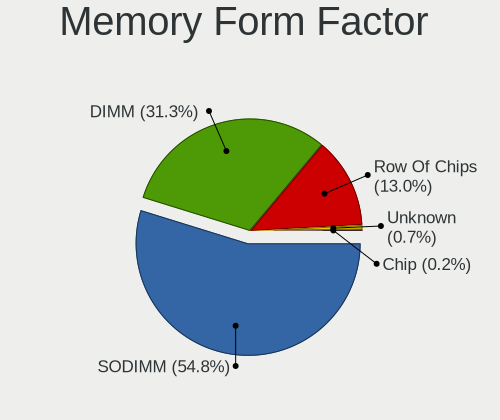

Ubuntu Hardware Trends
----------------------

A project to identify most popular hardware characteristics and track their change
over time based on data collected by Ubuntu users at https://Linux-Hardware.org.

Anyone can contribute to this report by the [hw-probe](https://github.com/linuxhw/hw-probe) tool:

    sudo -E hw-probe -all -upload

This is a report for all computer types. See also reports for [desktops](/Dist/Ubuntu/Desktop/README.md) and [notebooks](/Dist/Ubuntu/Notebook/README.md).

This report is for one last month. Overall report since the beginning of time: [TestCoverage](https://github.com/linuxhw/TestCoverage)

Period: Apr, 2022.

Contents
--------

* [ System ](#system)
  - [ OS                       ](#os)
  - [ OS Family                ](#os-family)
  - [ Kernel                   ](#kernel)
  - [ Kernel Family            ](#kernel-family)
  - [ Kernel Major Ver.        ](#kernel-major-ver)
  - [ Arch                     ](#arch)
  - [ DE                       ](#de)
  - [ Display Server           ](#display-server)
  - [ Display Manager          ](#display-manager)
  - [ OS Lang                  ](#os-lang)
  - [ Boot Mode                ](#boot-mode)
  - [ Filesystem               ](#filesystem)
  - [ Part. scheme             ](#part-scheme)
  - [ Dual Boot with Linux/BSD ](#dual-boot-with-linuxbsd)
  - [ Dual Boot (Win)          ](#dual-boot-win)

* [ Board ](#board)
  - [ Vendor                   ](#vendor)
  - [ Model                    ](#model)
  - [ Model Family             ](#model-family)
  - [ MFG Year                 ](#mfg-year)
  - [ Form Factor              ](#form-factor)
  - [ Secure Boot              ](#secure-boot)
  - [ Coreboot                 ](#coreboot)
  - [ RAM Size                 ](#ram-size)
  - [ RAM Used                 ](#ram-used)
  - [ Total Drives             ](#total-drives)
  - [ Has CD-ROM               ](#has-cd-rom)
  - [ Has Ethernet             ](#has-ethernet)
  - [ Has WiFi                 ](#has-wifi)
  - [ Has Bluetooth            ](#has-bluetooth)

* [ Location ](#location)
  - [ Country                  ](#country)
  - [ City                     ](#city)

* [ Drives ](#drives)
  - [ Drive Vendor             ](#drive-vendor)
  - [ Drive Model              ](#drive-model)
  - [ HDD Vendor               ](#hdd-vendor)
  - [ SSD Vendor               ](#ssd-vendor)
  - [ Drive Kind               ](#drive-kind)
  - [ Drive Connector          ](#drive-connector)
  - [ Drive Size               ](#drive-size)
  - [ Space Total              ](#space-total)
  - [ Space Used               ](#space-used)
  - [ Malfunc. Drives          ](#malfunc-drives)
  - [ Malfunc. Drive Vendor    ](#malfunc-drive-vendor)
  - [ Malfunc. HDD Vendor      ](#malfunc-hdd-vendor)
  - [ Malfunc. Drive Kind      ](#malfunc-drive-kind)
  - [ Failed Drives            ](#failed-drives)
  - [ Failed Drive Vendor      ](#failed-drive-vendor)
  - [ Drive Status             ](#drive-status)

* [ Storage controller ](#storage-controller)
  - [ Storage Vendor           ](#storage-vendor)
  - [ Storage Model            ](#storage-model)
  - [ Storage Kind             ](#storage-kind)

* [ Processor ](#processor)
  - [ CPU Vendor               ](#cpu-vendor)
  - [ CPU Model                ](#cpu-model)
  - [ CPU Model Family         ](#cpu-model-family)
  - [ CPU Cores                ](#cpu-cores)
  - [ CPU Sockets              ](#cpu-sockets)
  - [ CPU Threads              ](#cpu-threads)
  - [ CPU Op-Modes             ](#cpu-op-modes)
  - [ CPU Microcode            ](#cpu-microcode)
  - [ CPU Microarch            ](#cpu-microarch)

* [ Graphics ](#graphics)
  - [ GPU Vendor               ](#gpu-vendor)
  - [ GPU Model                ](#gpu-model)
  - [ GPU Combo                ](#gpu-combo)
  - [ GPU Driver               ](#gpu-driver)
  - [ GPU Memory               ](#gpu-memory)

* [ Monitor ](#monitor)
  - [ Monitor Vendor           ](#monitor-vendor)
  - [ Monitor Model            ](#monitor-model)
  - [ Monitor Resolution       ](#monitor-resolution)
  - [ Monitor Diagonal         ](#monitor-diagonal)
  - [ Monitor Width            ](#monitor-width)
  - [ Aspect Ratio             ](#aspect-ratio)
  - [ Monitor Area             ](#monitor-area)
  - [ Pixel Density            ](#pixel-density)
  - [ Multiple Monitors        ](#multiple-monitors)

* [ Network ](#network)
  - [ Net Controller Vendor    ](#net-controller-vendor)
  - [ Net Controller Model     ](#net-controller-model)
  - [ Wireless Vendor          ](#wireless-vendor)
  - [ Wireless Model           ](#wireless-model)
  - [ Ethernet Vendor          ](#ethernet-vendor)
  - [ Ethernet Model           ](#ethernet-model)
  - [ Net Controller Kind      ](#net-controller-kind)
  - [ Used Controller          ](#used-controller)
  - [ NICs                     ](#nics)
  - [ IPv6                     ](#ipv6)

* [ Bluetooth ](#bluetooth)
  - [ Bluetooth Vendor         ](#bluetooth-vendor)
  - [ Bluetooth Model          ](#bluetooth-model)

* [ Sound ](#sound)
  - [ Sound Vendor             ](#sound-vendor)
  - [ Sound Model              ](#sound-model)

* [ Memory ](#memory)
  - [ Memory Vendor            ](#memory-vendor)
  - [ Memory Model             ](#memory-model)
  - [ Memory Kind              ](#memory-kind)
  - [ Memory Form Factor       ](#memory-form-factor)
  - [ Memory Size              ](#memory-size)
  - [ Memory Speed             ](#memory-speed)

* [ Printers & scanners ](#printers--scanners)
  - [ Printer Vendor           ](#printer-vendor)
  - [ Printer Model            ](#printer-model)
  - [ Scanner Vendor           ](#scanner-vendor)
  - [ Scanner Model            ](#scanner-model)

* [ Camera ](#camera)
  - [ Camera Vendor            ](#camera-vendor)
  - [ Camera Model             ](#camera-model)

* [ Security ](#security)
  - [ Fingerprint Vendor       ](#fingerprint-vendor)
  - [ Fingerprint Model        ](#fingerprint-model)
  - [ Chipcard Vendor          ](#chipcard-vendor)
  - [ Chipcard Model           ](#chipcard-model)

* [ Unsupported ](#unsupported)
  - [ Unsupported Devices      ](#unsupported-devices)
  - [ Unsupported Device Types ](#unsupported-device-types)

System
------

OS
--

Installed operating systems

| Name           | Computers | Percent |
|----------------|-----------|---------|
| Ubuntu 20.04   | 666       | 52.24%  |
| Ubuntu 21.10   | 266       | 20.86%  |
| Ubuntu 22.04   | 264       | 20.71%  |
| Ubuntu 18.04   | 54        | 4.24%   |
| Ubuntu 21.04   | 10        | 0.78%   |
| Ubuntu 16.04   | 9         | 0.71%   |
| Ubuntu 20.10   | 2         | 0.16%   |
| Ubuntu 19.10   | 2         | 0.16%   |
| Ubuntu Core 18 | 1         | 0.08%   |
| Ubuntu 18.10   | 1         | 0.08%   |

OS Family
---------

OS without a version

| Name   | Computers | Percent |
|--------|-----------|---------|
| Ubuntu | 1275      | 100%    |

Kernel
------

Version of the Linux kernel

| Version                  | Computers | Percent |
|--------------------------|-----------|---------|
| 5.13.0-39-generic        | 444       | 34.82%  |
| 5.13.0-40-generic        | 189       | 14.82%  |
| 5.15.0-25-generic        | 132       | 10.35%  |
| 5.15.0-27-generic        | 86        | 6.75%   |
| 5.4.0-107-generic        | 68        | 5.33%   |
| 5.4.0-109-generic        | 31        | 2.43%   |
| 5.13.0-30-generic        | 31        | 2.43%   |
| 5.13.0-37-generic        | 27        | 2.12%   |
| 5.15.0-23-generic        | 25        | 1.96%   |
| 5.13.0-19-generic        | 14        | 1.1%    |
| 5.13.0-35-generic        | 12        | 0.94%   |
| 4.15.0-175-generic       | 12        | 0.94%   |
| 5.11.0-27-generic        | 9         | 0.71%   |
| 5.11.0-49-generic        | 8         | 0.63%   |
| 5.13.0-41-generic        | 6         | 0.47%   |
| 4.15.0-142-generic       | 6         | 0.47%   |
| 5.4.0-42-generic         | 5         | 0.39%   |
| 5.4.0-107-lowlatency     | 5         | 0.39%   |
| 5.13.0-27-generic        | 5         | 0.39%   |
| 5.13.0-1024-raspi        | 5         | 0.39%   |
| 5.8.0-43-generic         | 4         | 0.31%   |
| 5.4.0-72-generic         | 4         | 0.31%   |
| 5.4.0-104-generic        | 4         | 0.31%   |
| 5.17.2-051702-generic    | 4         | 0.31%   |
| 5.15.0-1005-raspi        | 4         | 0.31%   |
| 5.14.0-1032-oem          | 4         | 0.31%   |
| 5.4.0-26-generic         | 3         | 0.24%   |
| 5.4.0-105-generic        | 3         | 0.24%   |
| 5.17.4-051704-generic    | 3         | 0.24%   |
| 5.17.1-051701-generic    | 3         | 0.24%   |
| 5.14.0-1031-oem          | 3         | 0.24%   |
| 5.13.0-1022-raspi        | 3         | 0.24%   |
| 5.11.0-41-generic        | 3         | 0.24%   |
| 5.8.0-48-generic         | 2         | 0.16%   |
| 5.4.0-99-generic         | 2         | 0.16%   |
| 5.4.0-92-generic         | 2         | 0.16%   |
| 5.4.0-48-generic         | 2         | 0.16%   |
| 5.4.0-1047-fips          | 2         | 0.16%   |
| 5.3.0-51-generic         | 2         | 0.16%   |
| 5.18.0-051800rc1-generic | 2         | 0.16%   |
| 5.17.0-1003-oem          | 2         | 0.16%   |
| 5.16.11-76051611-generic | 2         | 0.16%   |
| 5.15.0-27-lowlatency     | 2         | 0.16%   |
| 5.14.0-1034-oem          | 2         | 0.16%   |
| 5.14.0-1033-oem          | 2         | 0.16%   |
| 5.14.0-1029-oem          | 2         | 0.16%   |
| 5.11.0-46-generic        | 2         | 0.16%   |
| 5.11.0-43-generic        | 2         | 0.16%   |
| 5.11.0-40-generic        | 2         | 0.16%   |
| 4.19.219-odroid-arm64    | 2         | 0.16%   |
| 4.15.0-171-generic       | 2         | 0.16%   |
| 5.9.0-arm-64             | 1         | 0.08%   |
| 5.8.0-53-generic         | 1         | 0.08%   |
| 5.8.0-50-generic         | 1         | 0.08%   |
| 5.8.0-45-generic         | 1         | 0.08%   |
| 5.8.0-44-generic         | 1         | 0.08%   |
| 5.8.0-41-generic         | 1         | 0.08%   |
| 5.8.0-38-generic         | 1         | 0.08%   |
| 5.8.0-25-generic         | 1         | 0.08%   |
| 5.6.0-050600-generic     | 1         | 0.08%   |

Kernel Family
-------------

Linux kernel without a distro release

| Version  | Computers | Percent |
|----------|-----------|---------|
| 5.13.0   | 747       | 58.59%  |
| 5.15.0   | 249       | 19.53%  |
| 5.4.0    | 143       | 11.22%  |
| 5.11.0   | 28        | 2.2%    |
| 4.15.0   | 24        | 1.88%   |
| 5.14.0   | 15        | 1.18%   |
| 5.8.0    | 13        | 1.02%   |
| 5.17.0   | 8         | 0.63%   |
| 5.3.0    | 4         | 0.31%   |
| 5.17.4   | 4         | 0.31%   |
| 5.17.2   | 4         | 0.31%   |
| 5.10.0   | 4         | 0.31%   |
| 5.17.1   | 3         | 0.24%   |
| 5.18.0   | 2         | 0.16%   |
| 5.17.3   | 2         | 0.16%   |
| 5.16.18  | 2         | 0.16%   |
| 5.16.11  | 2         | 0.16%   |
| 5.15.25  | 2         | 0.16%   |
| 4.4.0    | 2         | 0.16%   |
| 4.19.219 | 2         | 0.16%   |
| 5.9.0    | 1         | 0.08%   |
| 5.6.0    | 1         | 0.08%   |
| 5.4.15   | 1         | 0.08%   |
| 5.17.5   | 1         | 0.08%   |
| 5.16.17  | 1         | 0.08%   |
| 5.16.15  | 1         | 0.08%   |
| 5.16.10  | 1         | 0.08%   |
| 5.15.36  | 1         | 0.08%   |
| 5.15.34  | 1         | 0.08%   |
| 5.15.32  | 1         | 0.08%   |
| 5.15.29  | 1         | 0.08%   |
| 5.13.19  | 1         | 0.08%   |
| 5.10.67  | 1         | 0.08%   |
| 4.8.0    | 1         | 0.08%   |
| 4.18.0   | 1         | 0.08%   |

Kernel Major Ver.
-----------------

Linux kernel major version

| Version | Computers | Percent |
|---------|-----------|---------|
| 5.13    | 748       | 58.67%  |
| 5.15    | 255       | 20%     |
| 5.4     | 144       | 11.29%  |
| 5.11    | 28        | 2.2%    |
| 4.15    | 24        | 1.88%   |
| 5.17    | 22        | 1.73%   |
| 5.14    | 15        | 1.18%   |
| 5.8     | 13        | 1.02%   |
| 5.16    | 7         | 0.55%   |
| 5.10    | 5         | 0.39%   |
| 5.3     | 4         | 0.31%   |
| 5.18    | 2         | 0.16%   |
| 4.4     | 2         | 0.16%   |
| 4.19    | 2         | 0.16%   |
| 5.9     | 1         | 0.08%   |
| 5.6     | 1         | 0.08%   |
| 4.8     | 1         | 0.08%   |
| 4.18    | 1         | 0.08%   |

Arch
----

OS architecture (x86_64, i586, etc.)

| Name    | Computers | Percent |
|---------|-----------|---------|
| x86_64  | 1238      | 97.1%   |
| aarch64 | 20        | 1.57%   |
| i686    | 15        | 1.18%   |
| armv7l  | 2         | 0.16%   |

DE
--

Desktop Environment

| Name            | Computers | Percent |
|-----------------|-----------|---------|
| GNOME           | 1147      | 89.96%  |
| Unknown         | 70        | 5.49%   |
| Unity           | 18        | 1.41%   |
| X-Cinnamon      | 13        | 1.02%   |
| GNOME Flashback | 8         | 0.63%   |
| i3              | 6         | 0.47%   |
| Cinnamon        | 3         | 0.24%   |
| Enlightenment   | 2         | 0.16%   |
| awesome         | 2         | 0.16%   |
| xmonad          | 1         | 0.08%   |
| ubuntu          | 1         | 0.08%   |
| openbox         | 1         | 0.08%   |
| Lubuntu         | 1         | 0.08%   |
| kde             | 1         | 0.08%   |
| dwm             | 1         | 0.08%   |

Display Server
--------------

X11 or Wayland

| Name    | Computers | Percent |
|---------|-----------|---------|
| X11     | 852       | 66.82%  |
| Wayland | 361       | 28.31%  |
| Tty     | 33        | 2.59%   |
| Unknown | 29        | 2.27%   |

Display Manager
---------------

SDDM, LightDM, etc.

| Name    | Computers | Percent |
|---------|-----------|---------|
| GDM3    | 742       | 58.2%   |
| GDM     | 354       | 27.76%  |
| Unknown | 121       | 9.49%   |
| LightDM | 45        | 3.53%   |
| SDDM    | 10        | 0.78%   |
| SLiM    | 2         | 0.16%   |
| LXDM    | 1         | 0.08%   |

OS Lang
-------

Language

| Lang    | Computers | Percent |
|---------|-----------|---------|
| en_US   | 544       | 42.67%  |
| de_DE   | 136       | 10.67%  |
| fr_FR   | 80        | 6.27%   |
| pt_BR   | 54        | 4.24%   |
| en_GB   | 52        | 4.08%   |
| en_CA   | 42        | 3.29%   |
| ru_RU   | 33        | 2.59%   |
| it_IT   | 33        | 2.59%   |
| es_ES   | 28        | 2.2%    |
| en_IN   | 27        | 2.12%   |
| en_AU   | 27        | 2.12%   |
| pl_PL   | 22        | 1.73%   |
| Unknown | 20        | 1.57%   |
| cs_CZ   | 12        | 0.94%   |
| C       | 12        | 0.94%   |
| nl_NL   | 11        | 0.86%   |
| ja_JP   | 11        | 0.86%   |
| zh_CN   | 10        | 0.78%   |
| en_ZA   | 8         | 0.63%   |
| de_AT   | 8         | 0.63%   |
| tr_TR   | 6         | 0.47%   |
| pt_PT   | 6         | 0.47%   |
| sv_SE   | 5         | 0.39%   |
| hu_HU   | 5         | 0.39%   |
| fi_FI   | 5         | 0.39%   |
| es_MX   | 5         | 0.39%   |
| es_AR   | 5         | 0.39%   |
| en_IL   | 5         | 0.39%   |
| nl_BE   | 4         | 0.31%   |
| fr_CA   | 4         | 0.31%   |
| es_US   | 4         | 0.31%   |
| es_PE   | 4         | 0.31%   |
| ca_ES   | 4         | 0.31%   |
| ro_RO   | 3         | 0.24%   |
| es_UY   | 3         | 0.24%   |
| en_PH   | 3         | 0.24%   |
| en_NZ   | 3         | 0.24%   |
| en_HK   | 3         | 0.24%   |
| el_GR   | 3         | 0.24%   |
| de_CH   | 3         | 0.24%   |
| da_DK   | 3         | 0.24%   |
| sk_SK   | 2         | 0.16%   |
| hr_HR   | 2         | 0.16%   |
| es_VE   | 2         | 0.16%   |
| es_CO   | 2         | 0.16%   |
| zh_TW   | 1         | 0.08%   |
| ko_KR   | 1         | 0.08%   |
| it_CH   | 1         | 0.08%   |
| fr_BE   | 1         | 0.08%   |
| et_EE   | 1         | 0.08%   |
| es_GT   | 1         | 0.08%   |
| es_EC   | 1         | 0.08%   |
| es_DO   | 1         | 0.08%   |
| es_CL   | 1         | 0.08%   |
| de_LU   | 1         | 0.08%   |
| bg_BG   | 1         | 0.08%   |

Boot Mode
---------

EFI or BIOS

| Mode | Computers | Percent |
|------|-----------|---------|
| BIOS | 661       | 51.84%  |
| EFI  | 614       | 48.16%  |

Filesystem
----------

Type of filesystem

| Type    | Computers | Percent |
|---------|-----------|---------|
| Ext4    | 1185      | 92.94%  |
| Overlay | 42        | 3.29%   |
| Zfs     | 23        | 1.8%    |
| Btrfs   | 13        | 1.02%   |
| Xfs     | 7         | 0.55%   |
| Ext3    | 3         | 0.24%   |
| Ext2    | 2         | 0.16%   |

Part. scheme
------------

Scheme of partitioning

| Type    | Computers | Percent |
|---------|-----------|---------|
| Unknown | 747       | 58.59%  |
| GPT     | 447       | 35.06%  |
| MBR     | 81        | 6.35%   |

Dual Boot with Linux/BSD
------------------------

Hosting more than one Linux/BSD

| Dual boot | Computers | Percent |
|-----------|-----------|---------|
| No        | 1100      | 86.27%  |
| Yes       | 175       | 13.73%  |

Dual Boot (Win)
---------------

Hosting Linux and Windows

| Dual boot | Computers | Percent |
|-----------|-----------|---------|
| No        | 822       | 64.47%  |
| Yes       | 453       | 35.53%  |

Board
-----

Vendor
------

Motherboard manufacturer

| Name                    | Computers | Percent |
|-------------------------|-----------|---------|
| Dell                    | 205       | 16.08%  |
| Lenovo                  | 196       | 15.37%  |
| ASUSTek Computer        | 174       | 13.65%  |
| Hewlett-Packard         | 166       | 13.02%  |
| MSI                     | 90        | 7.06%   |
| Gigabyte Technology     | 84        | 6.59%   |
| Acer                    | 60        | 4.71%   |
| ASRock                  | 28        | 2.2%    |
| Intel                   | 21        | 1.65%   |
| Unknown                 | 18        | 1.41%   |
| Toshiba                 | 17        | 1.33%   |
| Medion                  | 17        | 1.33%   |
| Apple                   | 17        | 1.33%   |
| Raspberry Pi Foundation | 14        | 1.1%    |
| Sony                    | 12        | 0.94%   |
| Samsung Electronics     | 10        | 0.78%   |
| HUAWEI                  | 7         | 0.55%   |
| Fujitsu                 | 7         | 0.55%   |
| Alienware               | 6         | 0.47%   |
| Timi                    | 5         | 0.39%   |
| Supermicro              | 5         | 0.39%   |
| Pegatron                | 5         | 0.39%   |
| Packard Bell            | 5         | 0.39%   |
| Foxconn                 | 5         | 0.39%   |
| Chuwi                   | 5         | 0.39%   |
| Biostar                 | 5         | 0.39%   |
| Positivo                | 4         | 0.31%   |
| Notebook                | 4         | 0.31%   |
| Microsoft               | 4         | 0.31%   |
| TUXEDO                  | 3         | 0.24%   |
| PC Specialist           | 3         | 0.24%   |
| Hardkernel              | 3         | 0.24%   |
| Google                  | 3         | 0.24%   |
| Fujitsu Siemens         | 3         | 0.24%   |
| ECS                     | 3         | 0.24%   |
| AMI                     | 3         | 0.24%   |
| TrekStor                | 2         | 0.16%   |
| Teclast                 | 2         | 0.16%   |
| SANTECH                 | 2         | 0.16%   |
| Rockchip                | 2         | 0.16%   |
| LG Electronics          | 2         | 0.16%   |
| Huanan                  | 2         | 0.16%   |
| Gateway                 | 2         | 0.16%   |
| eMachines               | 2         | 0.16%   |
| BESSTAR Tech            | 2         | 0.16%   |
| Avell High Performance  | 2         | 0.16%   |
| Wortmann AG             | 1         | 0.08%   |
| TongFang                | 1         | 0.08%   |
| System76                | 1         | 0.08%   |
| sunxi                   | 1         | 0.08%   |
| SLIMBOOK                | 1         | 0.08%   |
| SiS Technology          | 1         | 0.08%   |
| Shuttle                 | 1         | 0.08%   |
| Seco                    | 1         | 0.08%   |
| Razer                   | 1         | 0.08%   |
| Proline                 | 1         | 0.08%   |
| Pepper Jobs             | 1         | 0.08%   |
| PCWare                  | 1         | 0.08%   |
| Panasonic               | 1         | 0.08%   |
| NSX                     | 1         | 0.08%   |

Model
-----

Motherboard model

| Name                                  | Computers | Percent |
|---------------------------------------|-----------|---------|
| Unknown                               | 22        | 1.73%   |
| ASUS All Series                       | 17        | 1.33%   |
| RPi Raspberry Pi                      | 11        | 0.86%   |
| Dell Latitude E6430                   | 6         | 0.47%   |
| HP EliteBook 840 G5                   | 5         | 0.39%   |
| Dell OptiPlex 7010                    | 5         | 0.39%   |
| Dell Latitude 5420                    | 5         | 0.39%   |
| HP Pavilion Notebook                  | 4         | 0.31%   |
| HP Pavilion g6                        | 4         | 0.31%   |
| HP 15                                 | 4         | 0.31%   |
| Dell XPS 13 9300                      | 4         | 0.31%   |
| Dell Latitude 7490                    | 4         | 0.31%   |
| Dell Inspiron 15-3567                 | 4         | 0.31%   |
| MSI MS-7C56                           | 3         | 0.24%   |
| MSI MS-7C37                           | 3         | 0.24%   |
| MSI MS-7C02                           | 3         | 0.24%   |
| MSI MS-7B79                           | 3         | 0.24%   |
| Lenovo ThinkBook 15 G2 ITL 20VE       | 3         | 0.24%   |
| Lenovo G50-45 80E3                    | 3         | 0.24%   |
| HUAWEI HVY-WXX9                       | 3         | 0.24%   |
| HP ZBook 15 G5                        | 3         | 0.24%   |
| HP ProBook 450 G8 Notebook PC         | 3         | 0.24%   |
| HP ENVY x360 Convertible 15-eu0xxx    | 3         | 0.24%   |
| HP EliteBook 840 G2                   | 3         | 0.24%   |
| Gigabyte B450M DS3H                   | 3         | 0.24%   |
| Dell XPS 15 7590                      | 3         | 0.24%   |
| Dell Precision 5540                   | 3         | 0.24%   |
| Dell OptiPlex 990                     | 3         | 0.24%   |
| Dell OptiPlex 390                     | 3         | 0.24%   |
| Dell OptiPlex 3050                    | 3         | 0.24%   |
| Dell OptiPlex 3020                    | 3         | 0.24%   |
| Dell Latitude E5440                   | 3         | 0.24%   |
| Dell G15 5510                         | 3         | 0.24%   |
| Toshiba Satellite C50t-B              | 2         | 0.16%   |
| Supermicro Super Server               | 2         | 0.16%   |
| SANTECH NHx0EH_EJ_EK                  | 2         | 0.16%   |
| Samsung Galaxy Book 12 LTE            | 2         | 0.16%   |
| RPi Raspberry Pi 4 Model B Rev 1.4    | 2         | 0.16%   |
| Packard Bell EasyNote TK85            | 2         | 0.16%   |
| Notebook NL40_50CU                    | 2         | 0.16%   |
| MSI MS-7D22                           | 2         | 0.16%   |
| MSI MS-7C80                           | 2         | 0.16%   |
| MSI MS-7C52                           | 2         | 0.16%   |
| MSI MS-7C35                           | 2         | 0.16%   |
| MSI MS-7B98                           | 2         | 0.16%   |
| MSI MS-7B48                           | 2         | 0.16%   |
| MSI MS-7971                           | 2         | 0.16%   |
| MSI MS-7917                           | 2         | 0.16%   |
| MSI MS-7850                           | 2         | 0.16%   |
| MSI MS-7817                           | 2         | 0.16%   |
| MSI MS-7721                           | 2         | 0.16%   |
| MSI MS-7693                           | 2         | 0.16%   |
| Microsoft Surface Pro 7               | 2         | 0.16%   |
| Lenovo Yoga Duet 7 13ITL6 82MA        | 2         | 0.16%   |
| Lenovo ThinkPad T490 20N2CTO1WW       | 2         | 0.16%   |
| Lenovo ThinkBook 14s Yoga ITL 20WE    | 2         | 0.16%   |
| Lenovo Legion Y540-15IRH 81SX         | 2         | 0.16%   |
| Lenovo IdeaPad L340-15IRH Gaming 81LK | 2         | 0.16%   |
| Lenovo IdeaPad Gaming 3 15ARH05 82EY  | 2         | 0.16%   |
| Lenovo G50-30 80G0                    | 2         | 0.16%   |

Model Family
------------

Motherboard model prefix

| Name                  | Computers | Percent |
|-----------------------|-----------|---------|
| Lenovo ThinkPad       | 79        | 6.2%    |
| Dell Latitude         | 56        | 4.39%   |
| Dell Inspiron         | 45        | 3.53%   |
| Acer Aspire           | 39        | 3.06%   |
| Lenovo IdeaPad        | 32        | 2.51%   |
| Dell OptiPlex         | 31        | 2.43%   |
| HP Pavilion           | 26        | 2.04%   |
| ASUS PRIME            | 23        | 1.8%    |
| HP EliteBook          | 22        | 1.73%   |
| Dell XPS              | 22        | 1.73%   |
| Unknown               | 22        | 1.73%   |
| Dell Precision        | 21        | 1.65%   |
| ASUS ROG              | 20        | 1.57%   |
| HP ProBook            | 17        | 1.33%   |
| ASUS All              | 17        | 1.33%   |
| Lenovo ThinkCentre    | 15        | 1.18%   |
| HP Compaq             | 15        | 1.18%   |
| Dell Vostro           | 15        | 1.18%   |
| RPi Raspberry         | 14        | 1.1%    |
| HP Laptop             | 14        | 1.1%    |
| Toshiba Satellite     | 13        | 1.02%   |
| Lenovo Yoga           | 13        | 1.02%   |
| Lenovo Legion         | 13        | 1.02%   |
| HP ENVY               | 11        | 0.86%   |
| Lenovo ThinkBook      | 10        | 0.78%   |
| ASUS VivoBook         | 9         | 0.71%   |
| HP ZBook              | 8         | 0.63%   |
| ASUS TUF              | 7         | 0.55%   |
| ASUS M5A78L-M         | 7         | 0.55%   |
| HP EliteDesk          | 6         | 0.47%   |
| HP 15                 | 6         | 0.47%   |
| Acer Swift            | 6         | 0.47%   |
| Lenovo IdeaPadFlex    | 5         | 0.39%   |
| HP 255                | 5         | 0.39%   |
| Acer Nitro            | 5         | 0.39%   |
| Microsoft Surface     | 4         | 0.31%   |
| HP Stream             | 4         | 0.31%   |
| Gigabyte B550         | 4         | 0.31%   |
| Gigabyte B450M        | 4         | 0.31%   |
| ASUS Pro              | 4         | 0.31%   |
| ASUS P8H61-M          | 4         | 0.31%   |
| ASUS ASUS             | 4         | 0.31%   |
| Acer TravelMate       | 4         | 0.31%   |
| Packard Bell EasyNote | 3         | 0.24%   |
| MSI MS-7C56           | 3         | 0.24%   |
| MSI MS-7C37           | 3         | 0.24%   |
| MSI MS-7C02           | 3         | 0.24%   |
| MSI MS-7B79           | 3         | 0.24%   |
| Lenovo ThinkStation   | 3         | 0.24%   |
| Lenovo G50-45         | 3         | 0.24%   |
| HUAWEI HVY-WXX9       | 3         | 0.24%   |
| HP ProLiant           | 3         | 0.24%   |
| Gigabyte B450         | 3         | 0.24%   |
| Dell G15              | 3         | 0.24%   |
| ASUS P9X79            | 3         | 0.24%   |
| ASRock X470           | 3         | 0.24%   |
| Alienware Aurora      | 3         | 0.24%   |
| Timi RedmiBook        | 2         | 0.16%   |
| Supermicro Super      | 2         | 0.16%   |
| SANTECH NHx0EH        | 2         | 0.16%   |

MFG Year
--------

Motherboard manufacture year

| Year    | Computers | Percent |
|---------|-----------|---------|
| 2021    | 168       | 13.18%  |
| 2020    | 162       | 12.71%  |
| 2019    | 118       | 9.25%   |
| 2018    | 98        | 7.69%   |
| 2012    | 92        | 7.22%   |
| 2013    | 86        | 6.75%   |
| 2017    | 81        | 6.35%   |
| 2014    | 75        | 5.88%   |
| 2011    | 75        | 5.88%   |
| 2015    | 63        | 4.94%   |
| 2016    | 59        | 4.63%   |
| 2010    | 56        | 4.39%   |
| 2009    | 42        | 3.29%   |
| 2008    | 29        | 2.27%   |
| Unknown | 25        | 1.96%   |
| 2007    | 20        | 1.57%   |
| 2022    | 17        | 1.33%   |
| 2006    | 5         | 0.39%   |
| 2005    | 3         | 0.24%   |
| 2004    | 1         | 0.08%   |

Form Factor
-----------

Physical design of the computer

| Name           | Computers | Percent |
|----------------|-----------|---------|
| Notebook       | 663       | 52%     |
| Desktop        | 492       | 38.59%  |
| Convertible    | 44        | 3.45%   |
| System on chip | 22        | 1.73%   |
| Mini pc        | 19        | 1.49%   |
| Tablet         | 14        | 1.1%    |
| Server         | 14        | 1.1%    |
| All in one     | 7         | 0.55%   |

Secure Boot
-----------

Enabled or disabled

| State    | Computers | Percent |
|----------|-----------|---------|
| Disabled | 1141      | 89.49%  |
| Enabled  | 134       | 10.51%  |

Coreboot
--------

Have coreboot on board

| Used | Computers | Percent |
|------|-----------|---------|
| No   | 1272      | 99.76%  |
| Yes  | 3         | 0.24%   |

RAM Size
--------

Total RAM memory

| Size in GB      | Computers | Percent |
|-----------------|-----------|---------|
| 4.01-8.0        | 311       | 24.39%  |
| 16.01-24.0      | 263       | 20.63%  |
| 8.01-16.0       | 215       | 16.86%  |
| 3.01-4.0        | 202       | 15.84%  |
| 32.01-64.0      | 142       | 11.14%  |
| 64.01-256.0     | 66        | 5.18%   |
| 1.01-2.0        | 29        | 2.27%   |
| 24.01-32.0      | 23        | 1.8%    |
| 2.01-3.0        | 18        | 1.41%   |
| 0.51-1.0        | 3         | 0.24%   |
| More than 256.0 | 2         | 0.16%   |
| 0.01-0.5        | 1         | 0.08%   |

RAM Used
--------

Used RAM memory

| Used GB     | Computers | Percent |
|-------------|-----------|---------|
| 1.01-2.0    | 400       | 31.37%  |
| 2.01-3.0    | 350       | 27.45%  |
| 4.01-8.0    | 233       | 18.27%  |
| 3.01-4.0    | 161       | 12.63%  |
| 8.01-16.0   | 76        | 5.96%   |
| 0.51-1.0    | 29        | 2.27%   |
| 16.01-24.0  | 9         | 0.71%   |
| 24.01-32.0  | 7         | 0.55%   |
| 0.01-0.5    | 7         | 0.55%   |
| 32.01-64.0  | 2         | 0.16%   |
| 64.01-256.0 | 1         | 0.08%   |

Total Drives
------------

Number of drives on board

| Drives | Computers | Percent |
|--------|-----------|---------|
| 1      | 786       | 61.65%  |
| 2      | 304       | 23.84%  |
| 3      | 79        | 6.2%    |
| 4      | 44        | 3.45%   |
| 5      | 20        | 1.57%   |
| 6      | 13        | 1.02%   |
| 0      | 11        | 0.86%   |
| 8      | 7         | 0.55%   |
| 7      | 6         | 0.47%   |
| 13     | 2         | 0.16%   |
| 45     | 1         | 0.08%   |
| 10     | 1         | 0.08%   |
| 9      | 1         | 0.08%   |

Has CD-ROM
----------

Has CD-ROM on board

| Presented | Computers | Percent |
|-----------|-----------|---------|
| No        | 834       | 65.41%  |
| Yes       | 441       | 34.59%  |

Has Ethernet
------------

Has Ethernet on board

| Presented | Computers | Percent |
|-----------|-----------|---------|
| Yes       | 1082      | 84.86%  |
| No        | 193       | 15.14%  |

Has WiFi
--------

Has WiFi module

| Presented | Computers | Percent |
|-----------|-----------|---------|
| Yes       | 955       | 74.9%   |
| No        | 320       | 25.1%   |

Has Bluetooth
-------------

Has Bluetooth module

| Presented | Computers | Percent |
|-----------|-----------|---------|
| Yes       | 765       | 60%     |
| No        | 510       | 40%     |

Location
--------

Country
-------

Geographic location (country)

| Country                | Computers | Percent |
|------------------------|-----------|---------|
| USA                    | 254       | 19.92%  |
| Germany                | 162       | 12.71%  |
| France                 | 90        | 7.06%   |
| Brazil                 | 71        | 5.57%   |
| Canada                 | 58        | 4.55%   |
| Russia                 | 53        | 4.16%   |
| Italy                  | 50        | 3.92%   |
| UK                     | 48        | 3.76%   |
| Spain                  | 35        | 2.75%   |
| Poland                 | 32        | 2.51%   |
| Australia              | 30        | 2.35%   |
| India                  | 29        | 2.27%   |
| Netherlands            | 22        | 1.73%   |
| Czechia                | 18        | 1.41%   |
| Austria                | 18        | 1.41%   |
| Japan                  | 15        | 1.18%   |
| China                  | 15        | 1.18%   |
| Turkey                 | 14        | 1.1%    |
| Sweden                 | 14        | 1.1%    |
| Switzerland            | 13        | 1.02%   |
| Mexico                 | 13        | 1.02%   |
| Belgium                | 13        | 1.02%   |
| Portugal               | 12        | 0.94%   |
| Romania                | 11        | 0.86%   |
| Finland                | 10        | 0.78%   |
| South Africa           | 9         | 0.71%   |
| Serbia                 | 8         | 0.63%   |
| Peru                   | 8         | 0.63%   |
| Hungary                | 8         | 0.63%   |
| Argentina              | 8         | 0.63%   |
| Greece                 | 7         | 0.55%   |
| South Korea            | 6         | 0.47%   |
| Denmark                | 6         | 0.47%   |
| Israel                 | 5         | 0.39%   |
| Egypt                  | 5         | 0.39%   |
| Uruguay                | 4         | 0.31%   |
| Ukraine                | 4         | 0.31%   |
| Thailand               | 4         | 0.31%   |
| Taiwan                 | 4         | 0.31%   |
| Slovakia               | 4         | 0.31%   |
| Pakistan               | 4         | 0.31%   |
| Hong Kong              | 4         | 0.31%   |
| Vietnam                | 3         | 0.24%   |
| Venezuela              | 3         | 0.24%   |
| Philippines            | 3         | 0.24%   |
| New Zealand            | 3         | 0.24%   |
| Morocco                | 3         | 0.24%   |
| Ireland                | 3         | 0.24%   |
| Indonesia              | 3         | 0.24%   |
| Cyprus                 | 3         | 0.24%   |
| Croatia                | 3         | 0.24%   |
| Colombia               | 3         | 0.24%   |
| Bosnia and Herzegovina | 3         | 0.24%   |
| Tunisia                | 2         | 0.16%   |
| Singapore              | 2         | 0.16%   |
| Réunion               | 2         | 0.16%   |
| Norway                 | 2         | 0.16%   |
| Madagascar             | 2         | 0.16%   |
| Lithuania              | 2         | 0.16%   |
| Kazakhstan             | 2         | 0.16%   |

City
----

Geographic location (city)

| City              | Computers | Percent |
|-------------------|-----------|---------|
| Moscow            | 17        | 1.33%   |
| Berlin            | 14        | 1.1%    |
| Paris             | 12        | 0.94%   |
| Warsaw            | 10        | 0.78%   |
| Sao Paulo         | 10        | 0.78%   |
| Vienna            | 9         | 0.71%   |
| Toronto           | 9         | 0.71%   |
| Milan             | 9         | 0.71%   |
| Brisbane          | 9         | 0.71%   |
| St Petersburg     | 8         | 0.63%   |
| Hudson            | 8         | 0.63%   |
| Barcelona         | 8         | 0.63%   |
| Belgrade          | 7         | 0.55%   |
| Portland          | 6         | 0.47%   |
| Munich            | 6         | 0.47%   |
| Madrid            | 6         | 0.47%   |
| Istanbul          | 6         | 0.47%   |
| Calgary           | 6         | 0.47%   |
| Sydney            | 5         | 0.39%   |
| Prague            | 5         | 0.39%   |
| Montreal          | 5         | 0.39%   |
| Melbourne         | 5         | 0.39%   |
| Helsinki          | 5         | 0.39%   |
| Arequipa          | 5         | 0.39%   |
| Amsterdam         | 5         | 0.39%   |
| San Jose          | 4         | 0.31%   |
| San Diego         | 4         | 0.31%   |
| Rome              | 4         | 0.31%   |
| Pittsburgh        | 4         | 0.31%   |
| Perth             | 4         | 0.31%   |
| Padova            | 4         | 0.31%   |
| Montevideo        | 4         | 0.31%   |
| Lisbon            | 4         | 0.31%   |
| Frankfurt am Main | 4         | 0.31%   |
| Dallas            | 4         | 0.31%   |
| Curitiba          | 4         | 0.31%   |
| Bucharest         | 4         | 0.31%   |
| Brooklyn          | 4         | 0.31%   |
| Atlanta           | 4         | 0.31%   |
| Athens            | 4         | 0.31%   |
| Wiesbaden         | 3         | 0.24%   |
| Washington        | 3         | 0.24%   |
| Vancouver         | 3         | 0.24%   |
| Ulm               | 3         | 0.24%   |
| Turin             | 3         | 0.24%   |
| Tel Aviv          | 3         | 0.24%   |
| Surrey            | 3         | 0.24%   |
| Stuttgart         | 3         | 0.24%   |
| Stockholm         | 3         | 0.24%   |
| Poznan            | 3         | 0.24%   |
| New York          | 3         | 0.24%   |
| New Delhi         | 3         | 0.24%   |
| Moses Lake        | 3         | 0.24%   |
| Minneapolis       | 3         | 0.24%   |
| Miami             | 3         | 0.24%   |
| Marseille         | 3         | 0.24%   |
| Lyon              | 3         | 0.24%   |
| Lodz              | 3         | 0.24%   |
| Lima              | 3         | 0.24%   |
| Krefeld           | 3         | 0.24%   |

Drives
------

Drive Vendor
------------

Hard drive vendors

| Vendor                      | Computers | Drives | Percent |
|-----------------------------|-----------|--------|---------|
| Samsung Electronics         | 333       | 403    | 18.63%  |
| WDC                         | 268       | 338    | 15%     |
| Seagate                     | 248       | 336    | 13.88%  |
| Toshiba                     | 109       | 128    | 6.1%    |
| Sandisk                     | 95        | 103    | 5.32%   |
| Kingston                    | 87        | 96     | 4.87%   |
| Unknown                     | 70        | 78     | 3.92%   |
| Crucial                     | 63        | 69     | 3.53%   |
| SK Hynix                    | 59        | 63     | 3.3%    |
| Intel                       | 49        | 58     | 2.74%   |
| Hitachi                     | 46        | 49     | 2.57%   |
| Micron Technology           | 34        | 36     | 1.9%    |
| KIOXIA                      | 30        | 30     | 1.68%   |
| HGST                        | 26        | 29     | 1.45%   |
| A-DATA Technology           | 24        | 27     | 1.34%   |
| Phison                      | 13        | 15     | 0.73%   |
| China                       | 13        | 13     | 0.73%   |
| Unknown                     | 13        | 13     | 0.73%   |
| OCZ                         | 12        | 14     | 0.67%   |
| MAXTOR                      | 10        | 10     | 0.56%   |
| SPCC                        | 9         | 9      | 0.5%    |
| PNY                         | 9         | 10     | 0.5%    |
| Micron/Crucial Technology   | 8         | 11     | 0.45%   |
| LITEON                      | 8         | 8      | 0.45%   |
| Transcend                   | 7         | 7      | 0.39%   |
| GOODRAM                     | 7         | 7      | 0.39%   |
| Fujitsu                     | 7         | 7      | 0.39%   |
| Apple                       | 7         | 7      | 0.39%   |
| Netac                       | 6         | 6      | 0.34%   |
| Silicon Motion              | 5         | 5      | 0.28%   |
| JMicron                     | 5         | 6      | 0.28%   |
| Hewlett-Packard             | 5         | 5      | 0.28%   |
| ASMT                        | 5         | 5      | 0.28%   |
| Apacer                      | 5         | 5      | 0.28%   |
| ADATA Technology            | 5         | 6      | 0.28%   |
| Mushkin                     | 4         | 7      | 0.22%   |
| LITEONIT                    | 4         | 4      | 0.22%   |
| Intenso                     | 4         | 5      | 0.22%   |
| YMTC                        | 3         | 3      | 0.17%   |
| XPG                         | 3         | 4      | 0.17%   |
| SABRENT                     | 3         | 3      | 0.17%   |
| Patriot                     | 3         | 3      | 0.17%   |
| Verbatim                    | 2         | 3      | 0.11%   |
| Union Memory (Shenzhen)     | 2         | 2      | 0.11%   |
| Teclast                     | 2         | 2      | 0.11%   |
| MAXIO Technology (Hangzhou) | 2         | 2      | 0.11%   |
| KIOXIA-EXCERIA              | 2         | 2      | 0.11%   |
| KingSpec                    | 2         | 2      | 0.11%   |
| Goldkey                     | 2         | 2      | 0.11%   |
| Gigabyte Technology         | 2         | 2      | 0.11%   |
| Dogfish                     | 2         | 2      | 0.11%   |
| Corsair                     | 2         | 2      | 0.11%   |
| BIWIN                       | 2         | 2      | 0.11%   |
| BHT                         | 2         | 2      | 0.11%   |
| winstar                     | 1         | 1      | 0.06%   |
| Value                       | 1         | 1      | 0.06%   |
| USB3.0                      | 1         | 1      | 0.06%   |
| UMIS                        | 1         | 1      | 0.06%   |
| TwinMOS                     | 1         | 1      | 0.06%   |
| Team                        | 1         | 1      | 0.06%   |

Drive Model
-----------

Hard drive models

| Model                              | Computers | Percent |
|------------------------------------|-----------|---------|
| Samsung SSD 860 EVO 500GB          | 24        | 1.21%   |
| Kingston SA400S37240G 240GB SSD    | 18        | 0.91%   |
| Toshiba MQ01ABD100 1TB             | 14        | 0.71%   |
| Samsung NVMe SSD Drive 512GB       | 14        | 0.71%   |
| Sandisk NVMe SSD Drive 512GB       | 13        | 0.65%   |
| Samsung SSD 850 EVO 250GB          | 13        | 0.65%   |
| Samsung NVMe SSD Drive 256GB       | 13        | 0.65%   |
| Crucial CT1000MX500SSD1 1TB        | 13        | 0.65%   |
| Unknown                            | 13        | 0.65%   |
| Samsung SSD 970 EVO Plus 1TB       | 12        | 0.6%    |
| Samsung NVMe SSD Drive 1024GB      | 12        | 0.6%    |
| Kingston SA400S37480G 480GB SSD    | 12        | 0.6%    |
| Intel NVMe SSD Drive 512GB         | 12        | 0.6%    |
| Seagate ST1000LM035-1RK172 1TB     | 11        | 0.55%   |
| Seagate ST1000LM024 HN-M101MBB 1TB | 11        | 0.55%   |
| Samsung NVMe SSD Drive 250GB       | 11        | 0.55%   |
| Samsung SSD 860 EVO 1TB            | 10        | 0.5%    |
| Samsung NVMe SSD Drive 1TB         | 10        | 0.5%    |
| Unknown MMC Card  64GB             | 9         | 0.45%   |
| Unknown MMC Card  32GB             | 9         | 0.45%   |
| Seagate ST500DM002-1BD142 500GB    | 9         | 0.45%   |
| Samsung SSD 980 PRO 1TB            | 9         | 0.45%   |
| Crucial CT500MX500SSD1 500GB       | 9         | 0.45%   |
| Crucial CT240BX500SSD1 240GB       | 9         | 0.45%   |
| Unknown SD/MMC/MS PRO 16GB         | 8         | 0.4%    |
| Seagate ST9500325AS 500GB          | 8         | 0.4%    |
| Seagate ST2000DM008-2FR102 2TB     | 8         | 0.4%    |
| Seagate ST1000DM003-1ER162 1TB     | 8         | 0.4%    |
| Samsung SSD 850 EVO 500GB          | 8         | 0.4%    |
| Toshiba MQ04ABF100 1TB             | 7         | 0.35%   |
| Toshiba MQ01ABF050 500GB           | 7         | 0.35%   |
| Seagate ST2000LM007-1R8174 2TB     | 7         | 0.35%   |
| Samsung SSD 860 EVO 250GB          | 7         | 0.35%   |
| Kingston NVMe SSD Drive 500GB      | 7         | 0.35%   |
| WDC WDS500G2B0A-00SM50 500GB SSD   | 6         | 0.3%    |
| WDC WDS240G2G0A-00JH30 240GB SSD   | 6         | 0.3%    |
| Unknown MMC Card  128GB            | 6         | 0.3%    |
| SK Hynix NVMe SSD Drive 512GB      | 6         | 0.3%    |
| Seagate ST4000DM004-2CV104 4TB     | 6         | 0.3%    |
| Seagate ST3500418AS 500GB          | 6         | 0.3%    |
| Seagate ST31000524AS 1TB           | 6         | 0.3%    |
| Seagate ST2000DM001-1ER164 2TB     | 6         | 0.3%    |
| SanDisk SSD PLUS 240GB             | 6         | 0.3%    |
| Samsung SSD 980 1TB                | 6         | 0.3%    |
| Samsung SSD 970 EVO Plus 500GB     | 6         | 0.3%    |
| Samsung NVMe SSD Drive 500GB       | 6         | 0.3%    |
| Samsung HD103SJ 1TB                | 6         | 0.3%    |
| KIOXIA NVMe SSD Drive 256GB        | 6         | 0.3%    |
| KIOXIA KBG40ZNS512G NVMe 512GB     | 6         | 0.3%    |
| Kingston SA400S37120G 120GB SSD    | 6         | 0.3%    |
| HGST HTS721010A9E630 1TB           | 6         | 0.3%    |
| WDC WD5000AAKX-60U6AA0 500GB       | 5         | 0.25%   |
| WDC WD20EZRZ-00Z5HB0 2TB           | 5         | 0.25%   |
| WDC WD20EFRX-68EUZN0 2TB           | 5         | 0.25%   |
| WDC WD20EARX-00PASB0 2TB           | 5         | 0.25%   |
| WDC WD10EZEX-08WN4A0 1TB           | 5         | 0.25%   |
| Toshiba DT01ACA100 1TB             | 5         | 0.25%   |
| Seagate ST9500420AS 500GB          | 5         | 0.25%   |
| Seagate ST500LT012-1DG142 500GB    | 5         | 0.25%   |
| Seagate ST3500413AS 500GB          | 5         | 0.25%   |

HDD Vendor
----------

Hard disk drive vendors

| Vendor              | Computers | Drives | Percent |
|---------------------|-----------|--------|---------|
| Seagate             | 243       | 329    | 36.54%  |
| WDC                 | 206       | 264    | 30.98%  |
| Toshiba             | 81        | 97     | 12.18%  |
| Hitachi             | 46        | 49     | 6.92%   |
| Samsung Electronics | 27        | 29     | 4.06%   |
| HGST                | 26        | 29     | 3.91%   |
| Unknown             | 9         | 9      | 1.35%   |
| MAXTOR              | 8         | 8      | 1.2%    |
| Fujitsu             | 7         | 7      | 1.05%   |
| ASMT                | 4         | 4      | 0.6%    |
| SABRENT             | 3         | 3      | 0.45%   |
| PHD 3.0             | 1         | 1      | 0.15%   |
| Hewlett-Packard     | 1         | 1      | 0.15%   |
| ExcelStor           | 1         | 1      | 0.15%   |
| DELLBOSS            | 1         | 1      | 0.15%   |
| Apple               | 1         | 1      | 0.15%   |

SSD Vendor
----------

Solid state drive vendors

| Vendor              | Computers | Drives | Percent |
|---------------------|-----------|--------|---------|
| Samsung Electronics | 144       | 169    | 25.9%   |
| Kingston            | 61        | 65     | 10.97%  |
| SanDisk             | 60        | 66     | 10.79%  |
| Crucial             | 57        | 63     | 10.25%  |
| WDC                 | 35        | 36     | 6.29%   |
| A-DATA Technology   | 18        | 20     | 3.24%   |
| Intel               | 14        | 14     | 2.52%   |
| SK Hynix            | 12        | 12     | 2.16%   |
| China               | 12        | 12     | 2.16%   |
| Micron Technology   | 11        | 11     | 1.98%   |
| OCZ                 | 10        | 10     | 1.8%    |
| SPCC                | 8         | 8      | 1.44%   |
| PNY                 | 8         | 9      | 1.44%   |
| LITEON              | 8         | 8      | 1.44%   |
| Transcend           | 7         | 7      | 1.26%   |
| GOODRAM             | 7         | 7      | 1.26%   |
| Netac               | 6         | 6      | 1.08%   |
| Apple               | 6         | 6      | 1.08%   |
| Toshiba             | 5         | 5      | 0.9%    |
| Apacer              | 5         | 5      | 0.9%    |
| LITEONIT            | 4         | 4      | 0.72%   |
| Phison              | 3         | 3      | 0.54%   |
| Patriot             | 3         | 3      | 0.54%   |
| Mushkin             | 3         | 6      | 0.54%   |
| Intenso             | 3         | 4      | 0.54%   |
| Hewlett-Packard     | 3         | 3      | 0.54%   |
| Unknown             | 3         | 3      | 0.54%   |
| Verbatim            | 2         | 3      | 0.36%   |
| Teclast             | 2         | 2      | 0.36%   |
| MAXTOR              | 2         | 2      | 0.36%   |
| KingSpec            | 2         | 2      | 0.36%   |
| JMicron             | 2         | 2      | 0.36%   |
| Goldkey             | 2         | 2      | 0.36%   |
| Gigabyte Technology | 2         | 2      | 0.36%   |
| Dogfish             | 2         | 2      | 0.36%   |
| BHT                 | 2         | 2      | 0.36%   |
| Value               | 1         | 1      | 0.18%   |
| USB3.0              | 1         | 1      | 0.18%   |
| TwinMOS             | 1         | 1      | 0.18%   |
| Team                | 1         | 1      | 0.18%   |
| StoreJet            | 1         | 1      | 0.18%   |
| Seagate             | 1         | 1      | 0.18%   |
| Pioneer             | 1         | 1      | 0.18%   |
| Mercury             | 1         | 1      | 0.18%   |
| LONDISK             | 1         | 2      | 0.18%   |
| Leven               | 1         | 1      | 0.18%   |
| KLEVV               | 1         | 1      | 0.18%   |
| KIOXIA-EXCERIA      | 1         | 1      | 0.18%   |
| KingDian            | 1         | 1      | 0.18%   |
| Hoodisk             | 1         | 1      | 0.18%   |
| EMTEC               | 1         | 1      | 0.18%   |
| Corsair             | 1         | 1      | 0.18%   |
| Bryt                | 1         | 1      | 0.18%   |
| BIWIN               | 1         | 1      | 0.18%   |
| Argon               | 1         | 1      | 0.18%   |
| AMD                 | 1         | 1      | 0.18%   |
| AirDisk             | 1         | 1      | 0.18%   |
| AGI                 | 1         | 1      | 0.18%   |

Drive Kind
----------

HDD or SSD

| Kind    | Computers | Drives | Percent |
|---------|-----------|--------|---------|
| HDD     | 572       | 833    | 35.01%  |
| SSD     | 492       | 607    | 30.11%  |
| NVMe    | 476       | 559    | 29.13%  |
| MMC     | 66        | 75     | 4.04%   |
| Unknown | 28        | 32     | 1.71%   |

Drive Connector
---------------

SATA, SAS, NVMe, etc.

| Type | Computers | Drives | Percent |
|------|-----------|--------|---------|
| SATA | 866       | 1362   | 58.47%  |
| NVMe | 475       | 557    | 32.07%  |
| SAS  | 74        | 112    | 5%      |
| MMC  | 66        | 75     | 4.46%   |

Drive Size
----------

Size of hard drive

| Size in TB | Computers | Drives | Percent |
|------------|-----------|--------|---------|
| 0.01-0.5   | 630       | 778    | 55.75%  |
| 0.51-1.0   | 323       | 385    | 28.58%  |
| 1.01-2.0   | 100       | 133    | 8.85%   |
| 3.01-4.0   | 33        | 62     | 2.92%   |
| 4.01-10.0  | 23        | 55     | 2.04%   |
| 2.01-3.0   | 15        | 19     | 1.33%   |
| 10.01-20.0 | 6         | 8      | 0.53%   |

Space Total
-----------

Amount of disk space available on the file system

| Size in GB     | Computers | Percent |
|----------------|-----------|---------|
| 101-250        | 374       | 29.33%  |
| 251-500        | 313       | 24.55%  |
| 501-1000       | 185       | 14.51%  |
| 1001-2000      | 80        | 6.27%   |
| More than 3000 | 72        | 5.65%   |
| 51-100         | 71        | 5.57%   |
| 1-20           | 63        | 4.94%   |
| 2001-3000      | 51        | 4%      |
| 21-50          | 39        | 3.06%   |
| Unknown        | 27        | 2.12%   |

Space Used
----------

Amount of used disk space

| Used GB        | Computers | Percent |
|----------------|-----------|---------|
| 1-20           | 444       | 34.82%  |
| 21-50          | 219       | 17.18%  |
| 101-250        | 169       | 13.25%  |
| 51-100         | 162       | 12.71%  |
| 251-500        | 103       | 8.08%   |
| 501-1000       | 60        | 4.71%   |
| 1001-2000      | 44        | 3.45%   |
| More than 3000 | 30        | 2.35%   |
| Unknown        | 27        | 2.12%   |
| 2001-3000      | 16        | 1.25%   |
| 0              | 1         | 0.08%   |

Malfunc. Drives
---------------

Drive models with a malfunction

| Model                                               | Computers | Drives | Percent |
|-----------------------------------------------------|-----------|--------|---------|
| Seagate ST9500420AS 500GB                           | 5         | 5      | 5.62%   |
| Toshiba MQ01ABD100 1TB                              | 4         | 4      | 4.49%   |
| Seagate ST1000LM024 HN-M101MBB 1TB                  | 4         | 5      | 4.49%   |
| Seagate ST9500325AS 500GB                           | 2         | 2      | 2.25%   |
| Seagate ST3500418AS 500GB                           | 2         | 2      | 2.25%   |
| Seagate ST2000DM001-1CH164 2TB                      | 2         | 2      | 2.25%   |
| Samsung Electronics HM121HI 120GB                   | 2         | 2      | 2.25%   |
| HGST HTS721010A9E630 1TB                            | 2         | 3      | 2.25%   |
| HGST HTS541010A9E680 1TB                            | 2         | 2      | 2.25%   |
| HGST HTS541010A7E630 1TB                            | 2         | 3      | 2.25%   |
| WDC WDS100T2G0A-00JH30 1TB SSD                      | 1         | 1      | 1.12%   |
| WDC WD5000BPVT-22HXZT1 500GB                        | 1         | 1      | 1.12%   |
| WDC WD5000BEVT-26A0RT0 500GB                        | 1         | 1      | 1.12%   |
| WDC WD40EZRX-00SPEB0 4TB                            | 1         | 1      | 1.12%   |
| WDC WD40EFRX-68N32N0 4TB                            | 1         | 2      | 1.12%   |
| WDC WD3200SD-01KNB0 320GB                           | 1         | 1      | 1.12%   |
| WDC WD3200BEKT-60V5T1 320GB                         | 1         | 1      | 1.12%   |
| WDC WD20EZRZ-00Z5HB0 2TB                            | 1         | 1      | 1.12%   |
| WDC WD20EFRX-68EUZN0 2TB                            | 1         | 2      | 1.12%   |
| WDC WD10EZEX-60ZF5A0 1TB                            | 1         | 1      | 1.12%   |
| WDC WD10EZEX-00BN5A0 1TB                            | 1         | 1      | 1.12%   |
| WDC WD10EARS-00Y5B1 1TB                             | 1         | 1      | 1.12%   |
| WDC WD10EALX-009BA0 1TB                             | 1         | 1      | 1.12%   |
| WDC WD10EADS-22M2B0 1TB                             | 1         | 1      | 1.12%   |
| WDC WD10EADS-00L5B1 1TB                             | 1         | 1      | 1.12%   |
| WDC WD1003FZEX-00K3CA0 1TB                          | 1         | 1      | 1.12%   |
| WDC WD1002FBYS-02A6B0 1TB                           | 1         | 1      | 1.12%   |
| Unknown MS 500GB                                    | 1         | 1      | 1.12%   |
| Toshiba MQ01ABF032 320GB                            | 1         | 1      | 1.12%   |
| Toshiba MQ01ABD075 752GB                            | 1         | 1      | 1.12%   |
| Toshiba MK5061GSYN 500GB                            | 1         | 1      | 1.12%   |
| Toshiba MK5055GSXF 500GB                            | 1         | 1      | 1.12%   |
| Toshiba HDWD130 3TB                                 | 1         | 1      | 1.12%   |
| SK Hynix HFS256G32MND-2200A 256GB SSD               | 1         | 1      | 1.12%   |
| SK Hynix HFM512GDJTNG-8310A 512GB                   | 1         | 1      | 1.12%   |
| Seagate ST8000AS0002-1NA17Z 8TB                     | 1         | 2      | 1.12%   |
| Seagate ST500LT012-9WS142 500GB                     | 1         | 1      | 1.12%   |
| Seagate ST500LM021-1KJ152 500GB                     | 1         | 1      | 1.12%   |
| Seagate ST500DM002-1BD142 500GB                     | 1         | 1      | 1.12%   |
| Seagate ST3250823AS 250GB                           | 1         | 1      | 1.12%   |
| Seagate ST32000644NS 59Y5483 59Y1807IBMV 2TB        | 1         | 1      | 1.12%   |
| Seagate ST3160815AS 160GB                           | 1         | 1      | 1.12%   |
| Seagate ST3000DM001-1ER166 3TB                      | 1         | 1      | 1.12%   |
| Seagate ST2000DM001-9YN164 2TB                      | 1         | 1      | 1.12%   |
| Seagate ST2000DM 008-2FR102 2TB                     | 1         | 1      | 1.12%   |
| Seagate ST1000LM035-1RK172 1TB                      | 1         | 1      | 1.12%   |
| Seagate ST1000DM003-1SB10C 1TB                      | 1         | 1      | 1.12%   |
| SanDisk SSD PLUS 240GB                              | 1         | 1      | 1.12%   |
| SanDisk SSD PLUS 1000GB                             | 1         | 1      | 1.12%   |
| SanDisk SDSSDHP256G 256GB                           | 1         | 1      | 1.12%   |
| Samsung Electronics SSD 840 PRO Series 256GB        | 1         | 1      | 1.12%   |
| Samsung Electronics SSD 830 Series 128GB            | 1         | 1      | 1.12%   |
| Micron Technology MTFDDAK256TBN-1AR1ZABHA 256GB SSD | 1         | 1      | 1.12%   |
| Micron Technology MTFDDAK256MAM-1K12 256GB SSD      | 1         | 1      | 1.12%   |
| MAXTOR STM3160215AS 160GB                           | 1         | 1      | 1.12%   |
| LITEONIT LMT-32L3M mSATA 32GB SSD                   | 1         | 1      | 1.12%   |
| LITEON CV3-8D512-11 SATA 512GB SSD                  | 1         | 1      | 1.12%   |
| Kingston SUV400S37240G 240GB SSD                    | 1         | 1      | 1.12%   |
| Kingston SEDC500R7680G 8TB SSD                      | 1         | 1      | 1.12%   |
| Intel SSDSC2BW480A4 480GB                           | 1         | 1      | 1.12%   |

Malfunc. Drive Vendor
---------------------

Vendors of faulty drives

| Vendor              | Computers | Drives | Percent |
|---------------------|-----------|--------|---------|
| Seagate             | 27        | 29     | 30.34%  |
| WDC                 | 17        | 19     | 19.1%   |
| Toshiba             | 9         | 9      | 10.11%  |
| HGST                | 7         | 9      | 7.87%   |
| Hitachi             | 6         | 6      | 6.74%   |
| Samsung Electronics | 4         | 4      | 4.49%   |
| SanDisk             | 3         | 3      | 3.37%   |
| SK Hynix            | 2         | 2      | 2.25%   |
| Micron Technology   | 2         | 2      | 2.25%   |
| Kingston            | 2         | 2      | 2.25%   |
| Intel               | 2         | 2      | 2.25%   |
| Unknown             | 1         | 1      | 1.12%   |
| MAXTOR              | 1         | 1      | 1.12%   |
| LITEONIT            | 1         | 1      | 1.12%   |
| LITEON              | 1         | 1      | 1.12%   |
| Fujitsu             | 1         | 1      | 1.12%   |
| Crucial             | 1         | 1      | 1.12%   |
| Corsair             | 1         | 1      | 1.12%   |
| Apacer              | 1         | 1      | 1.12%   |

Malfunc. HDD Vendor
-------------------

Vendors of faulty HDD drives

| Vendor              | Computers | Drives | Percent |
|---------------------|-----------|--------|---------|
| Seagate             | 27        | 29     | 38.57%  |
| WDC                 | 16        | 18     | 22.86%  |
| Toshiba             | 9         | 9      | 12.86%  |
| HGST                | 7         | 9      | 10%     |
| Hitachi             | 6         | 6      | 8.57%   |
| Samsung Electronics | 2         | 2      | 2.86%   |
| Unknown             | 1         | 1      | 1.43%   |
| MAXTOR              | 1         | 1      | 1.43%   |
| Fujitsu             | 1         | 1      | 1.43%   |

Malfunc. Drive Kind
-------------------

Kinds of faulty drives

| Kind | Computers | Drives | Percent |
|------|-----------|--------|---------|
| HDD  | 67        | 76     | 78.82%  |
| SSD  | 16        | 17     | 18.82%  |
| NVMe | 2         | 2      | 2.35%   |

Failed Drives
-------------

Failed drive models

| Model                    | Computers | Drives | Percent |
|--------------------------|-----------|--------|---------|
| Seagate ST31000520AS 1TB | 1         | 1      | 100%    |

Failed Drive Vendor
-------------------

Failed drive vendors

| Vendor  | Computers | Drives | Percent |
|---------|-----------|--------|---------|
| Seagate | 1         | 1      | 100%    |

Drive Status
------------

Number of failed and malfunc. drives

| Status   | Computers | Drives | Percent |
|----------|-----------|--------|---------|
| Detected | 787       | 1300   | 58.08%  |
| Works    | 485       | 710    | 35.79%  |
| Malfunc  | 82        | 95     | 6.05%   |
| Failed   | 1         | 1      | 0.07%   |

Storage controller
------------------

Storage Vendor
--------------

Storage controller vendors

| Vendor                           | Computers | Percent |
|----------------------------------|-----------|---------|
| Intel                            | 858       | 51.78%  |
| AMD                              | 221       | 13.34%  |
| Samsung Electronics              | 184       | 11.1%   |
| Sandisk                          | 67        | 4.04%   |
| SK Hynix                         | 48        | 2.9%    |
| Toshiba America Info Systems     | 30        | 1.81%   |
| Kingston Technology Company      | 28        | 1.69%   |
| ASMedia Technology               | 25        | 1.51%   |
| KIOXIA                           | 24        | 1.45%   |
| Micron Technology                | 23        | 1.39%   |
| Marvell Technology Group         | 22        | 1.33%   |
| JMicron Technology               | 18        | 1.09%   |
| Phison Electronics               | 16        | 0.97%   |
| Micron/Crucial Technology        | 14        | 0.84%   |
| Nvidia                           | 13        | 0.78%   |
| ADATA Technology                 | 13        | 0.78%   |
| Silicon Motion                   | 8         | 0.48%   |
| LSI Logic / Symbios Logic        | 7         | 0.42%   |
| Broadcom / LSI                   | 7         | 0.42%   |
| Silicon Image                    | 4         | 0.24%   |
| Yangtze Memory Technologies      | 3         | 0.18%   |
| VIA Technologies                 | 3         | 0.18%   |
| Union Memory (Shenzhen)          | 3         | 0.18%   |
| Silicon Integrated Systems [SiS] | 2         | 0.12%   |
| Seagate Technology               | 2         | 0.12%   |
| OCZ Technology Group             | 2         | 0.12%   |
| MAXIO Technology (Hangzhou)      | 2         | 0.12%   |
| Adaptec                          | 2         | 0.12%   |
| Unknown                          | 1         | 0.06%   |
| Solid State Storage Technology   | 1         | 0.06%   |
| Shenzhen Longsys Electronics     | 1         | 0.06%   |
| Realtek Semiconductor            | 1         | 0.06%   |
| Integrated Technology Express    | 1         | 0.06%   |
| Hewlett-Packard                  | 1         | 0.06%   |
| Apple                            | 1         | 0.06%   |
| Unknown                          | 1         | 0.06%   |

Storage Model
-------------

Storage controller models

| Model                                                                                   | Computers | Percent |
|-----------------------------------------------------------------------------------------|-----------|---------|
| AMD FCH SATA Controller [AHCI mode]                                                     | 154       | 8.17%   |
| Samsung NVMe SSD Controller SM981/PM981/PM983                                           | 82        | 4.35%   |
| Intel Sunrise Point-LP SATA Controller [AHCI mode]                                      | 59        | 3.13%   |
| Intel 82801 Mobile SATA Controller [RAID mode]                                          | 58        | 3.08%   |
| Intel 8 Series/C220 Series Chipset Family 6-port SATA Controller 1 [AHCI mode]          | 55        | 2.92%   |
| Samsung NVMe SSD Controller 980                                                         | 48        | 2.55%   |
| Intel Volume Management Device NVMe RAID Controller                                     | 45        | 2.39%   |
| Intel 7 Series Chipset Family 6-port SATA Controller [AHCI mode]                        | 43        | 2.28%   |
| Intel Q170/Q150/B150/H170/H110/Z170/CM236 Chipset SATA Controller [AHCI Mode]           | 34        | 1.8%    |
| Intel 6 Series/C200 Series Chipset Family 6 port Mobile SATA AHCI Controller            | 31        | 1.64%   |
| AMD 400 Series Chipset SATA Controller                                                  | 31        | 1.64%   |
| Intel Cannon Lake Mobile PCH SATA AHCI Controller                                       | 27        | 1.43%   |
| Intel 200 Series PCH SATA controller [AHCI mode]                                        | 27        | 1.43%   |
| Samsung NVMe SSD Controller PM9A1/PM9A3/980PRO                                          | 26        | 1.38%   |
| Intel 8 Series SATA Controller 1 [AHCI mode]                                            | 26        | 1.38%   |
| Intel Comet Lake SATA AHCI Controller                                                   | 25        | 1.33%   |
| Intel 6 Series/C200 Series Chipset Family 6 port Desktop SATA AHCI Controller           | 25        | 1.33%   |
| Intel 500 Series Chipset Family SATA AHCI Controller                                    | 24        | 1.27%   |
| Samsung NVMe SSD Controller SM961/PM961/SM963                                           | 23        | 1.22%   |
| SK Hynix Gold P31 SSD                                                                   | 22        | 1.17%   |
| Micron Non-Volatile memory controller                                                   | 22        | 1.17%   |
| KIOXIA Non-Volatile memory controller                                                   | 22        | 1.17%   |
| Intel SATA Controller [RAID mode]                                                       | 22        | 1.17%   |
| Intel 7 Series/C210 Series Chipset Family 6-port SATA Controller [AHCI mode]            | 22        | 1.17%   |
| Intel NM10/ICH7 Family SATA Controller [IDE mode]                                       | 21        | 1.11%   |
| Intel 6 Series/C200 Series Chipset Family Desktop SATA Controller (IDE mode, ports 4-5) | 21        | 1.11%   |
| Intel 6 Series/C200 Series Chipset Family Desktop SATA Controller (IDE mode, ports 0-3) | 21        | 1.11%   |
| ASMedia ASM1062 Serial ATA Controller                                                   | 21        | 1.11%   |
| AMD SB7x0/SB8x0/SB9x0 IDE Controller                                                    | 21        | 1.11%   |
| Sandisk WD Blue SN550 NVMe SSD                                                          | 19        | 1.01%   |
| Intel Wildcat Point-LP SATA Controller [AHCI Mode]                                      | 19        | 1.01%   |
| Intel Tiger Lake-LP SATA Controller [AHCI mode]                                         | 19        | 1.01%   |
| AMD 500 Series Chipset SATA Controller                                                  | 19        | 1.01%   |
| Toshiba America Info Systems XG6 NVMe SSD Controller                                    | 18        | 0.95%   |
| AMD SB7x0/SB8x0/SB9x0 SATA Controller [AHCI mode]                                       | 18        | 0.95%   |
| Sandisk WD Black SN750 / PC SN730 NVMe SSD                                              | 17        | 0.9%    |
| Intel Celeron/Pentium Silver Processor SATA Controller                                  | 16        | 0.85%   |
| Intel 82801IBM/IEM (ICH9M/ICH9M-E) 4 port SATA Controller [AHCI mode]                   | 16        | 0.85%   |
| Intel 82801G (ICH7 Family) IDE Controller                                               | 16        | 0.85%   |
| Intel 5 Series/3400 Series Chipset 4 port SATA AHCI Controller                          | 16        | 0.85%   |
| AMD SB7x0/SB8x0/SB9x0 SATA Controller [IDE mode]                                        | 15        | 0.8%    |
| Intel Non-Volatile memory controller                                                    | 14        | 0.74%   |
| Intel 400 Series Chipset Family SATA AHCI Controller                                    | 14        | 0.74%   |
| Intel SSD 660P Series                                                                   | 13        | 0.69%   |
| Intel 9 Series Chipset Family SATA Controller [AHCI Mode]                               | 13        | 0.69%   |
| Intel 5 Series/3400 Series Chipset 6 port SATA AHCI Controller                          | 13        | 0.69%   |
| SK Hynix Non-Volatile memory controller                                                 | 12        | 0.64%   |
| Intel HM170/QM170 Chipset SATA Controller [AHCI Mode]                                   | 11        | 0.58%   |
| Intel Celeron N3350/Pentium N4200/Atom E3900 Series SATA AHCI Controller                | 11        | 0.58%   |
| Intel Cannon Point-LP SATA Controller [AHCI Mode]                                       | 11        | 0.58%   |
| Intel Cannon Lake PCH SATA AHCI Controller                                              | 11        | 0.58%   |
| Intel Alder Lake-S PCH SATA Controller [AHCI Mode]                                      | 11        | 0.58%   |
| Sandisk Non-Volatile memory controller                                                  | 10        | 0.53%   |
| Kingston Company A2000 NVMe SSD                                                         | 10        | 0.53%   |
| Intel Atom Processor E3800 Series SATA AHCI Controller                                  | 10        | 0.53%   |
| Intel 82801JI (ICH10 Family) SATA AHCI Controller                                       | 10        | 0.53%   |
| Phison E12 NVMe Controller                                                              | 9         | 0.48%   |
| Intel 82801JI (ICH10 Family) 4 port SATA IDE Controller #1                              | 9         | 0.48%   |
| Intel 82801JI (ICH10 Family) 2 port SATA IDE Controller #2                              | 9         | 0.48%   |
| Intel 82801HM/HEM (ICH8M/ICH8M-E) IDE Controller                                        | 9         | 0.48%   |

Storage Kind
------------

Kind of storage controller (IDE, SATA, NVMe, SAS, ...)

| Kind | Computers | Percent |
|------|-----------|---------|
| SATA | 864       | 51.95%  |
| NVMe | 473       | 28.44%  |
| IDE  | 160       | 9.62%   |
| RAID | 151       | 9.08%   |
| SAS  | 9         | 0.54%   |
| SCSI | 6         | 0.36%   |

Processor
---------

CPU Vendor
----------

Processor vendors

| Vendor   | Computers | Percent |
|----------|-----------|---------|
| Intel    | 983       | 77.1%   |
| AMD      | 270       | 21.18%  |
| ARM      | 21        | 1.65%   |
| QUALCOMM | 1         | 0.08%   |

CPU Model
---------

Processor models

| Model                                         | Computers | Percent |
|-----------------------------------------------|-----------|---------|
| Intel 11th Gen Core i5-1135G7 @ 2.40GHz       | 26        | 2.04%   |
| Intel 11th Gen Core i7-1165G7 @ 2.80GHz       | 19        | 1.49%   |
| ARM Processor                                 | 19        | 1.49%   |
| Intel Core i7-10510U CPU @ 1.80GHz            | 14        | 1.1%    |
| Intel Core i5-7200U CPU @ 2.50GHz             | 14        | 1.1%    |
| Intel Core i7-8550U CPU @ 1.80GHz             | 12        | 0.94%   |
| AMD Ryzen 5 3600 6-Core Processor             | 12        | 0.94%   |
| Intel Core i7-9750H CPU @ 2.60GHz             | 11        | 0.86%   |
| Intel Core i7-1065G7 CPU @ 1.30GHz            | 11        | 0.86%   |
| Intel Core i5-8250U CPU @ 1.60GHz             | 11        | 0.86%   |
| Intel Core i5-10210U CPU @ 1.60GHz            | 11        | 0.86%   |
| AMD Ryzen 7 5700U with Radeon Graphics        | 11        | 0.86%   |
| Intel Core i7-10750H CPU @ 2.60GHz            | 10        | 0.78%   |
| Intel Core i5-6200U CPU @ 2.30GHz             | 10        | 0.78%   |
| Intel 11th Gen Core i7-1185G7 @ 3.00GHz       | 10        | 0.78%   |
| Intel 11th Gen Core i7-11800H @ 2.30GHz       | 9         | 0.71%   |
| Intel Core i7-8700K CPU @ 3.70GHz             | 8         | 0.63%   |
| Intel Core i7-8565U CPU @ 1.80GHz             | 8         | 0.63%   |
| Intel Core i5-6300U CPU @ 2.40GHz             | 8         | 0.63%   |
| Intel Core i5-4590 CPU @ 3.30GHz              | 8         | 0.63%   |
| Intel Core i5-3470 CPU @ 3.20GHz              | 8         | 0.63%   |
| Intel Core i5-3230M CPU @ 2.60GHz             | 8         | 0.63%   |
| Intel Core i3-2120 CPU @ 3.30GHz              | 8         | 0.63%   |
| AMD Ryzen 5 5500U with Radeon Graphics        | 8         | 0.63%   |
| AMD Ryzen 5 4600H with Radeon Graphics        | 8         | 0.63%   |
| AMD Ryzen 5 3500U with Radeon Vega Mobile Gfx | 8         | 0.63%   |
| Intel Core i7-3770 CPU @ 3.40GHz              | 7         | 0.55%   |
| Intel Core i5-2410M CPU @ 2.30GHz             | 7         | 0.55%   |
| Intel Core i5-2400 CPU @ 3.10GHz              | 7         | 0.55%   |
| Intel Core i7-7700HQ CPU @ 2.80GHz            | 6         | 0.47%   |
| Intel Core i7-4790K CPU @ 4.00GHz             | 6         | 0.47%   |
| Intel Core i7-4790 CPU @ 3.60GHz              | 6         | 0.47%   |
| Intel Core i5-8265U CPU @ 1.60GHz             | 6         | 0.47%   |
| Intel Core i5-6500 CPU @ 3.20GHz              | 6         | 0.47%   |
| Intel Core i5-4300U CPU @ 1.90GHz             | 6         | 0.47%   |
| Intel Core i3-3220 CPU @ 3.30GHz              | 6         | 0.47%   |
| Intel Atom x5-Z8350 CPU @ 1.44GHz             | 6         | 0.47%   |
| AMD Ryzen 7 5800X 8-Core Processor            | 6         | 0.47%   |
| AMD Ryzen 7 5800H with Radeon Graphics        | 6         | 0.47%   |
| AMD Ryzen 7 4700U with Radeon Graphics        | 6         | 0.47%   |
| AMD Ryzen 7 3700X 8-Core Processor            | 6         | 0.47%   |
| AMD FX-6300 Six-Core Processor                | 6         | 0.47%   |
| Intel Core i7-8665U CPU @ 1.90GHz             | 5         | 0.39%   |
| Intel Core i7-8650U CPU @ 1.90GHz             | 5         | 0.39%   |
| Intel Core i7-6700 CPU @ 3.40GHz              | 5         | 0.39%   |
| Intel Core i7-6600U CPU @ 2.60GHz             | 5         | 0.39%   |
| Intel Core i5-8350U CPU @ 1.70GHz             | 5         | 0.39%   |
| Intel Core i5-8259U CPU @ 2.30GHz             | 5         | 0.39%   |
| Intel Core i5-5300U CPU @ 2.30GHz             | 5         | 0.39%   |
| Intel Core i5-4570 CPU @ 3.20GHz              | 5         | 0.39%   |
| Intel Core i5-4210U CPU @ 1.70GHz             | 5         | 0.39%   |
| Intel Core i5-3320M CPU @ 2.60GHz             | 5         | 0.39%   |
| Intel Core i5-1035G1 CPU @ 1.00GHz            | 5         | 0.39%   |
| Intel Core i5-10300H CPU @ 2.50GHz            | 5         | 0.39%   |
| Intel Core i3-7100U CPU @ 2.40GHz             | 5         | 0.39%   |
| Intel Core i3-4005U CPU @ 1.70GHz             | 5         | 0.39%   |
| Intel Core i3-10110U CPU @ 2.10GHz            | 5         | 0.39%   |
| Intel Core i3 CPU M 380 @ 2.53GHz             | 5         | 0.39%   |
| AMD Ryzen 9 3900X 12-Core Processor           | 5         | 0.39%   |
| AMD Ryzen 7 4800H with Radeon Graphics        | 5         | 0.39%   |

CPU Model Family
----------------

Processor model prefix

| Model                          | Computers | Percent |
|--------------------------------|-----------|---------|
| Intel Core i5                  | 274       | 21.49%  |
| Intel Core i7                  | 256       | 20.08%  |
| Other                          | 134       | 10.51%  |
| Intel Core i3                  | 116       | 9.1%    |
| AMD Ryzen 5                    | 67        | 5.25%   |
| AMD Ryzen 7                    | 65        | 5.1%    |
| Intel Celeron                  | 47        | 3.69%   |
| Intel Xeon                     | 35        | 2.75%   |
| Intel Core 2 Duo               | 35        | 2.75%   |
| Intel Pentium                  | 29        | 2.27%   |
| AMD FX                         | 20        | 1.57%   |
| Intel Atom                     | 18        | 1.41%   |
| AMD Ryzen 9                    | 16        | 1.25%   |
| Intel Core i9                  | 13        | 1.02%   |
| Intel Pentium Dual-Core        | 12        | 0.94%   |
| Intel Core 2 Quad              | 11        | 0.86%   |
| AMD A6                         | 10        | 0.78%   |
| AMD A8                         | 9         | 0.71%   |
| AMD A10                        | 9         | 0.71%   |
| AMD Ryzen 3                    | 8         | 0.63%   |
| AMD A4                         | 8         | 0.63%   |
| Intel Pentium Dual             | 6         | 0.47%   |
| AMD Ryzen 7 PRO                | 6         | 0.47%   |
| AMD Athlon II X2               | 6         | 0.47%   |
| Intel Core 2                   | 5         | 0.39%   |
| AMD Phenom II X4               | 5         | 0.39%   |
| Intel Pentium Silver           | 4         | 0.31%   |
| Intel Genuine                  | 4         | 0.31%   |
| AMD Ryzen 5 PRO                | 4         | 0.31%   |
| Intel Pentium D                | 3         | 0.24%   |
| AMD Ryzen Threadripper         | 3         | 0.24%   |
| AMD EPYC                       | 3         | 0.24%   |
| Intel Pentium 4                | 2         | 0.16%   |
| Intel Core m3                  | 2         | 0.16%   |
| AMD Ryzen Embedded             | 2         | 0.16%   |
| AMD Phenom II X6               | 2         | 0.16%   |
| AMD E2                         | 2         | 0.16%   |
| AMD E1                         | 2         | 0.16%   |
| AMD Athlon X4                  | 2         | 0.16%   |
| AMD Athlon II X4               | 2         | 0.16%   |
| AMD Athlon II                  | 2         | 0.16%   |
| AMD Athlon 64 X2               | 2         | 0.16%   |
| AMD A12                        | 2         | 0.16%   |
| QUALCOMM AArch64               | 1         | 0.08%   |
| Intel Xeon Gold                | 1         | 0.08%   |
| Intel Core                     | 1         | 0.08%   |
| ARM Allwinner                  | 1         | 0.08%   |
| AMD Turion X2 Dual-Core Mobile | 1         | 0.08%   |
| AMD Turion 64 Mobile           | 1         | 0.08%   |
| AMD Sempron                    | 1         | 0.08%   |
| AMD Phenom II X2               | 1         | 0.08%   |
| AMD Phenom                     | 1         | 0.08%   |
| AMD GX                         | 1         | 0.08%   |
| AMD Athlon XP                  | 1         | 0.08%   |
| AMD Athlon                     | 1         | 0.08%   |

CPU Cores
---------

Number of processor cores

| Number | Computers | Percent |
|--------|-----------|---------|
| 4      | 498       | 39.06%  |
| 2      | 441       | 34.59%  |
| 6      | 135       | 10.59%  |
| 8      | 119       | 9.33%   |
| 12     | 22        | 1.73%   |
| 1      | 20        | 1.57%   |
| 10     | 11        | 0.86%   |
| 16     | 10        | 0.78%   |
| 3      | 8         | 0.63%   |
| 14     | 4         | 0.31%   |
| 24     | 3         | 0.24%   |
| 64     | 1         | 0.08%   |
| 48     | 1         | 0.08%   |
| 32     | 1         | 0.08%   |
| 20     | 1         | 0.08%   |

CPU Sockets
-----------

Number of sockets

| Number | Computers | Percent |
|--------|-----------|---------|
| 1      | 1256      | 98.51%  |
| 2      | 19        | 1.49%   |

CPU Threads
-----------

Threads per core (Hyper-Threading)

| Number | Computers | Percent |
|--------|-----------|---------|
| 2      | 895       | 70.2%   |
| 1      | 380       | 29.8%   |

CPU Op-Modes
------------

CPU Operation Modes (32-bit, 64-bit)

| Op mode        | Computers | Percent |
|----------------|-----------|---------|
| 32-bit, 64-bit | 1254      | 98.35%  |
| Unknown        | 17        | 1.33%   |
| 32-bit         | 4         | 0.31%   |

CPU Microcode
-------------

Microcode number

| Number     | Computers | Percent |
|------------|-----------|---------|
| Unknown    | 399       | 31.29%  |
| 0x306a9    | 64        | 5.02%   |
| 0x806c1    | 50        | 3.92%   |
| 0x206a7    | 49        | 3.84%   |
| 0x306c3    | 43        | 3.37%   |
| 0x806ec    | 35        | 2.75%   |
| 0x1067a    | 32        | 2.51%   |
| 0x806ea    | 30        | 2.35%   |
| 0x906ea    | 26        | 2.04%   |
| 0x806e9    | 24        | 1.88%   |
| 0x506e3    | 24        | 1.88%   |
| 0x906e9    | 23        | 1.8%    |
| 0x406e3    | 21        | 1.65%   |
| 0x20655    | 20        | 1.57%   |
| 0x40651    | 18        | 1.41%   |
| 0xa0652    | 17        | 1.33%   |
| 0x306d4    | 16        | 1.25%   |
| 0x0a50000c | 14        | 1.1%    |
| 0x06000852 | 13        | 1.02%   |
| 0x806d1    | 12        | 0.94%   |
| 0x706e5    | 11        | 0.86%   |
| 0x6fd      | 11        | 0.86%   |
| 0x08701021 | 11        | 0.86%   |
| 0x08608103 | 11        | 0.86%   |
| 0x08600106 | 11        | 0.86%   |
| 0x706a8    | 10        | 0.78%   |
| 0xa0653    | 9         | 0.71%   |
| 0x906ed    | 9         | 0.71%   |
| 0x506c9    | 9         | 0.71%   |
| 0x30678    | 9         | 0.71%   |
| 0x08108109 | 8         | 0.63%   |
| 0xa0671    | 7         | 0.55%   |
| 0xa0655    | 7         | 0.55%   |
| 0x90672    | 7         | 0.55%   |
| 0x106a5    | 7         | 0.55%   |
| 0x08600104 | 7         | 0.55%   |
| 0x806eb    | 6         | 0.47%   |
| 0x406c4    | 6         | 0.47%   |
| 0x206d7    | 6         | 0.47%   |
| 0x20652    | 6         | 0.47%   |
| 0x10676    | 6         | 0.47%   |
| 0x08701013 | 6         | 0.47%   |
| 0x0810100b | 6         | 0.47%   |
| 0x0800820d | 6         | 0.47%   |
| 0x010000c8 | 6         | 0.47%   |
| 0x906eb    | 5         | 0.39%   |
| 0x106e5    | 5         | 0.39%   |
| 0x0a201016 | 5         | 0.39%   |
| 0x08001138 | 5         | 0.39%   |
| 0x06006705 | 5         | 0.39%   |
| 0x06003106 | 5         | 0.39%   |
| 0x06001119 | 5         | 0.39%   |
| 0x03000027 | 5         | 0.39%   |
| 0x906a3    | 4         | 0.31%   |
| 0x6fb      | 4         | 0.31%   |
| 0x406c3    | 4         | 0.31%   |
| 0x306f2    | 4         | 0.31%   |
| 0x206c2    | 4         | 0.31%   |
| 0x0a50000b | 4         | 0.31%   |
| 0x0a201009 | 4         | 0.31%   |

CPU Microarch
-------------

Microarchitecture

| Name             | Computers | Percent |
|------------------|-----------|---------|
| KabyLake         | 216       | 16.94%  |
| Haswell          | 110       | 8.63%   |
| IvyBridge        | 94        | 7.37%   |
| SandyBridge      | 84        | 6.59%   |
| Skylake          | 70        | 5.49%   |
| TigerLake        | 67        | 5.25%   |
| Unknown          | 62        | 4.86%   |
| Zen 2            | 60        | 4.71%   |
| CometLake        | 53        | 4.16%   |
| Penryn           | 49        | 3.84%   |
| Zen 3            | 43        | 3.37%   |
| Westmere         | 41        | 3.22%   |
| IceLake          | 37        | 2.9%    |
| Zen+             | 30        | 2.35%   |
| Silvermont       | 28        | 2.2%    |
| Core             | 27        | 2.12%   |
| Piledriver       | 25        | 1.96%   |
| Zen              | 22        | 1.73%   |
| Broadwell        | 22        | 1.73%   |
| K10              | 20        | 1.57%   |
| Goldmont plus    | 18        | 1.41%   |
| Excavator        | 18        | 1.41%   |
| Nehalem          | 17        | 1.33%   |
| Goldmont         | 11        | 0.86%   |
| Puma             | 9         | 0.71%   |
| Alderlake Hybrid | 9         | 0.71%   |
| Steamroller      | 5         | 0.39%   |
| NetBurst         | 5         | 0.39%   |
| K10 Llano        | 5         | 0.39%   |
| Bonnell          | 5         | 0.39%   |
| K8 Hammer        | 3         | 0.24%   |
| Bulldozer        | 3         | 0.24%   |
| Jaguar           | 2         | 0.16%   |
| Bobcat           | 2         | 0.16%   |
| P6               | 1         | 0.08%   |
| K8 & K10 hybrid  | 1         | 0.08%   |
| K6               | 1         | 0.08%   |

Graphics
--------

GPU Vendor
----------

Vendors of graphics cards

| Vendor                           | Computers | Percent |
|----------------------------------|-----------|---------|
| Intel                            | 767       | 51.72%  |
| Nvidia                           | 420       | 28.32%  |
| AMD                              | 280       | 18.88%  |
| Matrox Electronics Systems       | 8         | 0.54%   |
| ASPEED Technology                | 4         | 0.27%   |
| Silicon Integrated Systems [SiS] | 2         | 0.13%   |
| ATI Technologies                 | 2         | 0.13%   |

GPU Model
---------

Graphics card models

| Model                                                                                    | Computers | Percent |
|------------------------------------------------------------------------------------------|-----------|---------|
| Intel TigerLake-LP GT2 [Iris Xe Graphics]                                                | 63        | 4.17%   |
| Intel 2nd Generation Core Processor Family Integrated Graphics Controller                | 54        | 3.58%   |
| Intel 3rd Gen Core processor Graphics Controller                                         | 44        | 2.91%   |
| Intel UHD Graphics 620                                                                   | 37        | 2.45%   |
| Intel Xeon E3-1200 v3/4th Gen Core Processor Integrated Graphics Controller              | 32        | 2.12%   |
| Intel CometLake-U GT2 [UHD Graphics]                                                     | 32        | 2.12%   |
| Intel Haswell-ULT Integrated Graphics Controller                                         | 29        | 1.92%   |
| Intel CometLake-H GT2 [UHD Graphics]                                                     | 28        | 1.85%   |
| Intel Skylake GT2 [HD Graphics 520]                                                      | 27        | 1.79%   |
| Intel Core Processor Integrated Graphics Controller                                      | 27        | 1.79%   |
| AMD Renoir                                                                               | 27        | 1.79%   |
| AMD Cezanne                                                                              | 26        | 1.72%   |
| Intel HD Graphics 620                                                                    | 25        | 1.66%   |
| Intel CoffeeLake-H GT2 [UHD Graphics 630]                                                | 23        | 1.52%   |
| Intel HD Graphics 530                                                                    | 22        | 1.46%   |
| Intel WhiskeyLake-U GT2 [UHD Graphics 620]                                               | 21        | 1.39%   |
| Intel Xeon E3-1200 v2/3rd Gen Core processor Graphics Controller                         | 20        | 1.32%   |
| Intel HD Graphics 630                                                                    | 20        | 1.32%   |
| Intel HD Graphics 5500                                                                   | 19        | 1.26%   |
| AMD Lucienne                                                                             | 19        | 1.26%   |
| AMD Ellesmere [Radeon RX 470/480/570/570X/580/580X/590]                                  | 19        | 1.26%   |
| Intel Atom/Celeron/Pentium Processor x5-E8000/J3xxx/N3xxx Integrated Graphics Controller | 17        | 1.13%   |
| AMD Picasso/Raven 2 [Radeon Vega Series / Radeon Vega Mobile Series]                     | 17        | 1.13%   |
| Intel 4th Gen Core Processor Integrated Graphics Controller                              | 15        | 0.99%   |
| Nvidia GT218 [GeForce 210]                                                               | 14        | 0.93%   |
| Nvidia GK208B [GeForce GT 710]                                                           | 14        | 0.93%   |
| Intel TigerLake-H GT1 [UHD Graphics]                                                     | 14        | 0.93%   |
| Intel GeminiLake [UHD Graphics 600]                                                      | 14        | 0.93%   |
| Intel CometLake-S GT2 [UHD Graphics 630]                                                 | 13        | 0.86%   |
| Nvidia TU117M                                                                            | 12        | 0.79%   |
| Nvidia GA106M [GeForce RTX 3060 Mobile / Max-Q]                                          | 12        | 0.79%   |
| Intel Mobile 4 Series Chipset Integrated Graphics Controller                             | 12        | 0.79%   |
| Intel 4 Series Chipset Integrated Graphics Controller                                    | 12        | 0.79%   |
| Nvidia GP106 [GeForce GTX 1060 6GB]                                                      | 11        | 0.73%   |
| Intel Iris Plus Graphics G7                                                              | 11        | 0.73%   |
| Intel Atom Processor Z36xxx/Z37xxx Series Graphics & Display                             | 11        | 0.73%   |
| AMD Raven Ridge [Radeon Vega Series / Radeon Vega Mobile Series]                         | 11        | 0.73%   |
| Nvidia GP107M [GeForce GTX 1050 Mobile]                                                  | 10        | 0.66%   |
| Intel CoffeeLake-S GT2 [UHD Graphics 630]                                                | 10        | 0.66%   |
| AMD Stoney [Radeon R2/R3/R4/R5 Graphics]                                                 | 10        | 0.66%   |
| Nvidia GP107 [GeForce GTX 1050 Ti]                                                       | 9         | 0.6%    |
| Intel Iris Plus Graphics G1 (Ice Lake)                                                   | 9         | 0.6%    |
| AMD Topaz XT [Radeon R7 M260/M265 / M340/M360 / M440/M445 / 530/535 / 620/625 Mobile]    | 9         | 0.6%    |
| AMD Cedar [Radeon HD 5000/6000/7350/8350 Series]                                         | 9         | 0.6%    |
| Nvidia GM204 [GeForce GTX 970]                                                           | 8         | 0.53%   |
| Nvidia GF117M [GeForce 610M/710M/810M/820M / GT 620M/625M/630M/720M]                     | 8         | 0.53%   |
| Intel 4th Generation Core Processor Family Integrated Graphics Controller                | 8         | 0.53%   |
| AMD Wani [Radeon R5/R6/R7 Graphics]                                                      | 8         | 0.53%   |
| Intel IvyBridge GT2 [HD Graphics 4000]                                                   | 7         | 0.46%   |
| Intel HD Graphics 510                                                                    | 7         | 0.46%   |
| Intel HD Graphics 500                                                                    | 7         | 0.46%   |
| Intel CoffeeLake-U GT3e [Iris Plus Graphics 655]                                         | 7         | 0.46%   |
| Intel AlderLake-S GT1                                                                    | 7         | 0.46%   |
| AMD RS780L [Radeon 3000]                                                                 | 7         | 0.46%   |
| Nvidia TU106M [GeForce RTX 2060 Mobile]                                                  | 6         | 0.4%    |
| Nvidia GP108M [GeForce MX250]                                                            | 6         | 0.4%    |
| Nvidia GA107M [GeForce RTX 3050 Ti Mobile]                                               | 6         | 0.4%    |
| Nvidia GA104M [GeForce RTX 3080 Mobile / Max-Q 8GB/16GB]                                 | 6         | 0.4%    |
| Intel Mobile GM965/GL960 Integrated Graphics Controller (secondary)                      | 6         | 0.4%    |
| Intel Mobile GM965/GL960 Integrated Graphics Controller (primary)                        | 6         | 0.4%    |

GPU Combo
---------

Combinations of graphics cards

| Name                     | Computers | Percent |
|--------------------------|-----------|---------|
| 1 x Intel                | 563       | 44.16%  |
| 1 x AMD                  | 223       | 17.49%  |
| 1 x Nvidia               | 221       | 17.33%  |
| Intel + Nvidia           | 165       | 12.94%  |
| Other                    | 25        | 1.96%   |
| Intel + AMD              | 23        | 1.8%    |
| AMD + Nvidia             | 21        | 1.65%   |
| 2 x AMD                  | 11        | 0.86%   |
| 2 x Nvidia               | 7         | 0.55%   |
| 1 x Matrox               | 5         | 0.39%   |
| Nvidia + Matrox          | 3         | 0.24%   |
| 1 x ASPEED               | 3         | 0.24%   |
| 1 x SiS                  | 2         | 0.16%   |
| 3 x AMD                  | 1         | 0.08%   |
| Nvidia + ASPEED          | 1         | 0.08%   |
| Intel + AMD + 1 x Nvidia | 1         | 0.08%   |

GPU Driver
----------

Free vs proprietary

| Driver      | Computers | Percent |
|-------------|-----------|---------|
| Free        | 960       | 75.29%  |
| Proprietary | 251       | 19.69%  |
| Unknown     | 64        | 5.02%   |

GPU Memory
----------

Total video memory

| Size in GB | Computers | Percent |
|------------|-----------|---------|
| Unknown    | 862       | 67.61%  |
| 0.01-0.5   | 102       | 8%      |
| 1.01-2.0   | 96        | 7.53%   |
| 0.51-1.0   | 72        | 5.65%   |
| 3.01-4.0   | 60        | 4.71%   |
| 7.01-8.0   | 41        | 3.22%   |
| 5.01-6.0   | 23        | 1.8%    |
| 8.01-16.0  | 16        | 1.25%   |
| 16.01-24.0 | 2         | 0.16%   |
| 2.01-3.0   | 1         | 0.08%   |

Monitor
-------

Monitor Vendor
--------------

Monitor vendors

| Vendor                  | Computers | Percent |
|-------------------------|-----------|---------|
| AU Optronics            | 161       | 11.28%  |
| Samsung Electronics     | 147       | 10.3%   |
| LG Display              | 126       | 8.83%   |
| BOE                     | 126       | 8.83%   |
| Dell                    | 118       | 8.27%   |
| Chimei Innolux          | 108       | 7.57%   |
| Goldstar                | 82        | 5.75%   |
| Hewlett-Packard         | 53        | 3.71%   |
| Acer                    | 48        | 3.36%   |
| AOC                     | 43        | 3.01%   |
| BenQ                    | 37        | 2.59%   |
| Ancor Communications    | 37        | 2.59%   |
| Sharp                   | 34        | 2.38%   |
| Philips                 | 24        | 1.68%   |
| Lenovo                  | 19        | 1.33%   |
| Chi Mei Optoelectronics | 17        | 1.19%   |
| PANDA                   | 16        | 1.12%   |
| Iiyama                  | 15        | 1.05%   |
| ViewSonic               | 14        | 0.98%   |
| ASUSTek Computer        | 14        | 0.98%   |
| Apple                   | 13        | 0.91%   |
| Unknown                 | 12        | 0.84%   |
| InfoVision              | 9         | 0.63%   |
| Sony                    | 8         | 0.56%   |
| LG Electronics          | 8         | 0.56%   |
| Toshiba                 | 7         | 0.49%   |
| CSO                     | 7         | 0.49%   |
| Unknown                 | 6         | 0.42%   |
| Vizio                   | 5         | 0.35%   |
| Panasonic               | 5         | 0.35%   |
| CPT                     | 5         | 0.35%   |
| HannStar                | 4         | 0.28%   |
| Fujitsu Siemens         | 4         | 0.28%   |
| NEC Computers           | 3         | 0.21%   |
| MSI                     | 3         | 0.21%   |
| LG Philips              | 3         | 0.21%   |
| Hitachi                 | 3         | 0.21%   |
| Westinghouse            | 2         | 0.14%   |
| Sceptre Tech            | 2         | 0.14%   |
| RTK                     | 2         | 0.14%   |
| Onkyo                   | 2         | 0.14%   |
| InnoLux Display         | 2         | 0.14%   |
| HUAWEI                  | 2         | 0.14%   |
| HLT                     | 2         | 0.14%   |
| HKC                     | 2         | 0.14%   |
| Gigabyte Technology     | 2         | 0.14%   |
| Eizo                    | 2         | 0.14%   |
| Compaq Computer         | 2         | 0.14%   |
| CHD                     | 2         | 0.14%   |
| Belinea                 | 2         | 0.14%   |
| ___                     | 1         | 0.07%   |
| WYT                     | 1         | 0.07%   |
| VOXICON                 | 1         | 0.07%   |
| Vestel Elektronik       | 1         | 0.07%   |
| Vestel                  | 1         | 0.07%   |
| Unknown (XXX)           | 1         | 0.07%   |
| UGD                     | 1         | 0.07%   |
| TV_                     | 1         | 0.07%   |
| TMX                     | 1         | 0.07%   |
| TIANMA XM               | 1         | 0.07%   |

Monitor Model
-------------

Monitor models

| Model                                                                     | Computers | Percent |
|---------------------------------------------------------------------------|-----------|---------|
| Chimei Innolux LCD Monitor CMN14D4 1920x1080 309x173mm 13.9-inch          | 13        | 0.89%   |
| Unknown                                                                   | 6         | 0.41%   |
| Samsung Electronics LCD Monitor SDCA029 3840x2160 344x194mm 15.5-inch     | 5         | 0.34%   |
| LG Display LCD Monitor LGD05E5 1920x1080 344x194mm 15.5-inch              | 5         | 0.34%   |
| Goldstar Ultra HD GSM5B09 3780x2160 600x340mm 27.2-inch                   | 5         | 0.34%   |
| Goldstar FULL HD GSM5B55 1920x1080 480x270mm 21.7-inch                    | 5         | 0.34%   |
| Chimei Innolux LCD Monitor CMN14C3 1366x768 309x173mm 13.9-inch           | 5         | 0.34%   |
| Ancor Communications ASUS VS247 ACI249A 1920x1080 521x293mm 23.5-inch     | 5         | 0.34%   |
| Samsung Electronics LCD Monitor SEC5441 1366x768 309x174mm 14.0-inch      | 4         | 0.27%   |
| LG Display LCD Monitor LGD033E 1366x768 309x174mm 14.0-inch               | 4         | 0.27%   |
| LG Display LCD Monitor LGD02DC 1366x768 344x194mm 15.5-inch               | 4         | 0.27%   |
| Goldstar LG HDR 4K GSM7707 3840x2160 600x340mm 27.2-inch                  | 4         | 0.27%   |
| Chi Mei Optoelectronics LCD Monitor CMO1720 1920x1080 382x215mm 17.3-inch | 4         | 0.27%   |
| BOE LCD Monitor BOE0674 1366x768 344x194mm 15.5-inch                      | 4         | 0.27%   |
| AU Optronics LCD Monitor AUO61ED 1920x1080 344x194mm 15.5-inch            | 4         | 0.27%   |
| AU Optronics LCD Monitor AUO26EC 1366x768 344x193mm 15.5-inch             | 4         | 0.27%   |
| AU Optronics LCD Monitor AUO21ED 1920x1080 344x194mm 15.5-inch            | 4         | 0.27%   |
| AU Optronics LCD Monitor AUO133D 1920x1080 309x173mm 13.9-inch            | 4         | 0.27%   |
| ASUSTek Computer VG245 AUS24A1 1920x1080 531x299mm 24.0-inch              | 4         | 0.27%   |
| Sharp LCD Monitor SHP14CB 1920x1200 288x180mm 13.4-inch                   | 3         | 0.21%   |
| Sharp LCD Monitor SHP14BA 1920x1080 344x194mm 15.5-inch                   | 3         | 0.21%   |
| Samsung Electronics U28E590 SAM0C4E 3840x2160 608x345mm 27.5-inch         | 3         | 0.21%   |
| Samsung Electronics SyncMaster SAM03E5 1680x1050 474x296mm 22.0-inch      | 3         | 0.21%   |
| Samsung Electronics S24F350 SAM0D20 1920x1080 520x290mm 23.4-inch         | 3         | 0.21%   |
| Samsung Electronics C24F390 SAM0D2C 1920x1080 521x293mm 23.5-inch         | 3         | 0.21%   |
| Philips PHL 223V5 PHLC0CF 1920x1080 477x268mm 21.5-inch                   | 3         | 0.21%   |
| LG Display LCD Monitor LGD0625 1920x1080 344x194mm 15.5-inch              | 3         | 0.21%   |
| LG Display LCD Monitor LGD0555 1536x1024 263x175mm 12.4-inch              | 3         | 0.21%   |
| LG Display LCD Monitor LGD0465 1366x768 344x194mm 15.5-inch               | 3         | 0.21%   |
| LG Display LCD Monitor LGD039F 1366x768 345x194mm 15.6-inch               | 3         | 0.21%   |
| Iiyama PLE2483H IVM6113 1920x1080 530x300mm 24.0-inch                     | 3         | 0.21%   |
| Hewlett-Packard w1907 HWP26A2 1440x900 408x255mm 18.9-inch                | 3         | 0.21%   |
| Goldstar ULTRAWIDE GSM59F1 2560x1080 677x290mm 29.0-inch                  | 3         | 0.21%   |
| Goldstar LCD Monitor GSM5AB8 1920x1080 480x270mm 21.7-inch                | 3         | 0.21%   |
| Dell U2415 DELA0BA 1920x1200 518x324mm 24.1-inch                          | 3         | 0.21%   |
| Dell U2414H DELA0B2 1920x1080 527x296mm 23.8-inch                         | 3         | 0.21%   |
| Dell U2412M DELA07A 1920x1200 518x324mm 24.1-inch                         | 3         | 0.21%   |
| Chimei Innolux LCD Monitor CMN15E7 1920x1080 344x193mm 15.5-inch          | 3         | 0.21%   |
| Chimei Innolux LCD Monitor CMN15E6 1366x768 344x193mm 15.5-inch           | 3         | 0.21%   |
| Chimei Innolux LCD Monitor CMN15E3 1920x1080 344x193mm 15.5-inch          | 3         | 0.21%   |
| Chimei Innolux LCD Monitor CMN15DB 1366x768 344x193mm 15.5-inch           | 3         | 0.21%   |
| Chimei Innolux LCD Monitor CMN1490 1366x768 309x173mm 13.9-inch           | 3         | 0.21%   |
| BOE LCD Monitor BOE091D 1920x1080 309x174mm 14.0-inch                     | 3         | 0.21%   |
| BOE LCD Monitor BOE08E8 1920x1080 344x194mm 15.5-inch                     | 3         | 0.21%   |
| BOE LCD Monitor BOE0878 1920x1080 355x200mm 16.0-inch                     | 3         | 0.21%   |
| BOE LCD Monitor BOE0700 1920x1080 344x194mm 15.5-inch                     | 3         | 0.21%   |
| BOE LCD Monitor BOE06CB 1920x1080 344x194mm 15.5-inch                     | 3         | 0.21%   |
| BOE LCD Monitor BOE06B3 1366x768 309x173mm 13.9-inch                      | 3         | 0.21%   |
| BOE LCD Monitor BOE061D 1366x768 309x173mm 13.9-inch                      | 3         | 0.21%   |
| BenQ GW2480 BNQ78E7 1920x1080 527x296mm 23.8-inch                         | 3         | 0.21%   |
| BenQ GL2780 BNQ78EC 1920x1080 600x340mm 27.2-inch                         | 3         | 0.21%   |
| AU Optronics LCD Monitor AUO8294 1920x1080 382x215mm 17.3-inch            | 3         | 0.21%   |
| AU Optronics LCD Monitor AUO683D 1920x1080 309x174mm 14.0-inch            | 3         | 0.21%   |
| AU Optronics LCD Monitor AUO403D 1920x1080 309x174mm 14.0-inch            | 3         | 0.21%   |
| AU Optronics LCD Monitor AUO38ED 1920x1080 344x193mm 15.5-inch            | 3         | 0.21%   |
| AU Optronics LCD Monitor AUO303E 1600x900 309x174mm 14.0-inch             | 3         | 0.21%   |
| AU Optronics LCD Monitor AUO119E 1600x900 382x214mm 17.2-inch             | 3         | 0.21%   |
| AOC 2460G5 AOC246A 1920x1080 531x299mm 24.0-inch                          | 3         | 0.21%   |
| Vizio M260VA VIZ0067 1360x768 575x323mm 26.0-inch                         | 2         | 0.14%   |
| ViewSonic VA2246 SERIES VSC6F2E 1920x1080 477x268mm 21.5-inch             | 2         | 0.14%   |

Monitor Resolution
------------------

Monitor screen resolution

| Resolution         | Computers | Percent |
|--------------------|-----------|---------|
| 1920x1080 (FHD)    | 623       | 46.39%  |
| 1366x768 (WXGA)    | 213       | 15.86%  |
| 3840x2160 (4K)     | 102       | 7.59%   |
| 2560x1440 (QHD)    | 65        | 4.84%   |
| 1600x900 (HD+)     | 59        | 4.39%   |
| 1280x1024 (SXGA)   | 46        | 3.43%   |
| 1920x1200 (WUXGA)  | 39        | 2.9%    |
| 1680x1050 (WSXGA+) | 36        | 2.68%   |
| 1440x900 (WXGA+)   | 32        | 2.38%   |
| 1280x800 (WXGA)    | 16        | 1.19%   |
| Unknown            | 15        | 1.12%   |
| 3440x1440          | 12        | 0.89%   |
| 1360x768           | 12        | 0.89%   |
| 2560x1080          | 10        | 0.74%   |
| 2560x1600          | 8         | 0.6%    |
| 2736x1824          | 4         | 0.3%    |
| 3840x2400          | 3         | 0.22%   |
| 3000x2000          | 3         | 0.22%   |
| 2880x1800          | 3         | 0.22%   |
| 1920x540           | 3         | 0.22%   |
| 1024x768 (XGA)     | 3         | 0.22%   |
| 800x480            | 2         | 0.15%   |
| 5760x1080          | 2         | 0.15%   |
| 3840x1080          | 2         | 0.15%   |
| 3200x1080          | 2         | 0.15%   |
| 2288x1287          | 2         | 0.15%   |
| 2160x1350          | 2         | 0.15%   |
| 2048x1152          | 2         | 0.15%   |
| 7280x1440          | 1         | 0.07%   |
| 6784x2160          | 1         | 0.07%   |
| 6400x1600          | 1         | 0.07%   |
| 4000x1440          | 1         | 0.07%   |
| 3840x1200          | 1         | 0.07%   |
| 3600x1080          | 1         | 0.07%   |
| 3520x1200          | 1         | 0.07%   |
| 3200x2000          | 1         | 0.07%   |
| 3200x1800 (QHD+)   | 1         | 0.07%   |
| 3072x1920          | 1         | 0.07%   |
| 2560x1024          | 1         | 0.07%   |
| 2390x768           | 1         | 0.07%   |
| 2256x1504          | 1         | 0.07%   |
| 2240x1400          | 1         | 0.07%   |
| 2160x1440          | 1         | 0.07%   |
| 1920x1280          | 1         | 0.07%   |
| 1600x1200          | 1         | 0.07%   |
| 1400x1050          | 1         | 0.07%   |
| 1280x960           | 1         | 0.07%   |
| 1200x1920          | 1         | 0.07%   |
| 1080x1920          | 1         | 0.07%   |
| 1024x600           | 1         | 0.07%   |

Monitor Diagonal
----------------

Diagonal size in inches

| Inches  | Computers | Percent |
|---------|-----------|---------|
| 15      | 332       | 23.51%  |
| 13      | 135       | 9.56%   |
| 27      | 119       | 8.43%   |
| 14      | 117       | 8.29%   |
| 24      | 114       | 8.07%   |
| 23      | 85        | 6.02%   |
| 17      | 85        | 6.02%   |
| 21      | 74        | 5.24%   |
| Unknown | 60        | 4.25%   |
| 19      | 47        | 3.33%   |
| 31      | 31        | 2.2%    |
| 22      | 30        | 2.12%   |
| 18      | 23        | 1.63%   |
| 34      | 21        | 1.49%   |
| 20      | 21        | 1.49%   |
| 12      | 16        | 1.13%   |
| 16      | 10        | 0.71%   |
| 11      | 10        | 0.71%   |
| 84      | 7         | 0.5%    |
| 72      | 7         | 0.5%    |
| 28      | 6         | 0.42%   |
| 54      | 5         | 0.35%   |
| 40      | 5         | 0.35%   |
| 32      | 5         | 0.35%   |
| 25      | 5         | 0.35%   |
| 26      | 4         | 0.28%   |
| 47      | 3         | 0.21%   |
| 43      | 3         | 0.21%   |
| 33      | 3         | 0.21%   |
| 10      | 3         | 0.21%   |
| 142     | 2         | 0.14%   |
| 86      | 2         | 0.14%   |
| 65      | 2         | 0.14%   |
| 60      | 2         | 0.14%   |
| 50      | 2         | 0.14%   |
| 46      | 2         | 0.14%   |
| 42      | 2         | 0.14%   |
| 29      | 2         | 0.14%   |
| 8       | 2         | 0.14%   |
| 64      | 1         | 0.07%   |
| 63      | 1         | 0.07%   |
| 57      | 1         | 0.07%   |
| 52      | 1         | 0.07%   |
| 37      | 1         | 0.07%   |
| 36      | 1         | 0.07%   |
| 6       | 1         | 0.07%   |
| 3       | 1         | 0.07%   |

Monitor Width
-------------

Physical width

| Width in mm    | Computers | Percent |
|----------------|-----------|---------|
| 301-350        | 539       | 38.78%  |
| 501-600        | 293       | 21.08%  |
| 401-500        | 168       | 12.09%  |
| 351-400        | 101       | 7.27%   |
| 201-300        | 92        | 6.62%   |
| Unknown        | 60        | 4.32%   |
| 601-700        | 54        | 3.88%   |
| 701-800        | 30        | 2.16%   |
| 1001-1500      | 20        | 1.44%   |
| 1501-2000      | 16        | 1.15%   |
| 801-900        | 6         | 0.43%   |
| 901-1000       | 5         | 0.36%   |
| 101-200        | 3         | 0.22%   |
| More than 2000 | 2         | 0.14%   |
| 1-100          | 1         | 0.07%   |

Aspect Ratio
------------

Proportional relationship between the width and the height

| Ratio   | Computers | Percent |
|---------|-----------|---------|
| 16/9    | 944       | 75.7%   |
| 16/10   | 160       | 12.83%  |
| Unknown | 51        | 4.09%   |
| 5/4     | 45        | 3.61%   |
| 21/9    | 22        | 1.76%   |
| 3/2     | 11        | 0.88%   |
| 4/3     | 8         | 0.64%   |
| 6/5     | 3         | 0.24%   |
| 1.00    | 2         | 0.16%   |
| 0.65    | 1         | 0.08%   |

Monitor Area
------------

Area in inch²

| Area in inch² | Computers | Percent |
|----------------|-----------|---------|
| 101-110        | 333       | 23.8%   |
| 201-250        | 230       | 16.44%  |
| 81-90          | 200       | 14.3%   |
| 301-350        | 123       | 8.79%   |
| 151-200        | 97        | 6.93%   |
| 351-500        | 63        | 4.5%    |
| Unknown        | 60        | 4.29%   |
| 121-130        | 58        | 4.15%   |
| 71-80          | 53        | 3.79%   |
| 251-300        | 45        | 3.22%   |
| 141-150        | 38        | 2.72%   |
| More than 1000 | 33        | 2.36%   |
| 501-1000       | 18        | 1.29%   |
| 61-70          | 13        | 0.93%   |
| 51-60          | 10        | 0.71%   |
| 131-140        | 10        | 0.71%   |
| 111-120        | 5         | 0.36%   |
| 1-40           | 4         | 0.29%   |
| 41-50          | 3         | 0.21%   |
| 91-100         | 3         | 0.21%   |

Pixel Density
-------------

Pixels per inch

| Density       | Computers | Percent |
|---------------|-----------|---------|
| 51-100        | 447       | 32.94%  |
| 121-160       | 383       | 28.22%  |
| 101-120       | 306       | 22.55%  |
| 161-240       | 81        | 5.97%   |
| Unknown       | 60        | 4.42%   |
| More than 240 | 43        | 3.17%   |
| 1-50          | 37        | 2.73%   |

Multiple Monitors
-----------------

Total monitors connected

| Total | Computers | Percent |
|-------|-----------|---------|
| 1     | 957       | 75.06%  |
| 2     | 220       | 17.25%  |
| 0     | 63        | 4.94%   |
| 3     | 31        | 2.43%   |
| 4     | 4         | 0.31%   |

Network
-------

Net Controller Vendor
---------------------

Controller vendors

| Vendor                            | Computers | Percent |
|-----------------------------------|-----------|---------|
| Intel                             | 706       | 36.91%  |
| Realtek Semiconductor             | 689       | 36.02%  |
| Qualcomm Atheros                  | 201       | 10.51%  |
| Broadcom                          | 79        | 4.13%   |
| Ralink Technology                 | 21        | 1.1%    |
| Broadcom Limited                  | 21        | 1.1%    |
| Marvell Technology Group          | 20        | 1.05%   |
| TP-Link                           | 19        | 0.99%   |
| MediaTek                          | 17        | 0.89%   |
| Ralink                            | 14        | 0.73%   |
| Nvidia                            | 10        | 0.52%   |
| ASIX Electronics                  | 8         | 0.42%   |
| Sierra Wireless                   | 6         | 0.31%   |
| Xiaomi                            | 5         | 0.26%   |
| Samsung Electronics               | 5         | 0.26%   |
| Qualcomm Atheros Communications   | 5         | 0.26%   |
| Dell                              | 5         | 0.26%   |
| D-Link                            | 5         | 0.26%   |
| ASUSTek Computer                  | 5         | 0.26%   |
| Microsoft                         | 4         | 0.21%   |
| Ericsson Business Mobile Networks | 4         | 0.21%   |
| Qualcomm                          | 3         | 0.16%   |
| NetGear                           | 3         | 0.16%   |
| Lenovo                            | 3         | 0.16%   |
| Huawei Technologies               | 3         | 0.16%   |
| Hewlett-Packard                   | 3         | 0.16%   |
| Aquantia                          | 3         | 0.16%   |
| Silicon Integrated Systems [SiS]  | 2         | 0.1%    |
| Mellanox Technologies             | 2         | 0.1%    |
| Lego Group                        | 2         | 0.1%    |
| JMicron Technology                | 2         | 0.1%    |
| IMC Networks                      | 2         | 0.1%    |
| Fibocom                           | 2         | 0.1%    |
| DisplayLink                       | 2         | 0.1%    |
| D-Link System                     | 2         | 0.1%    |
| Belkin Components                 | 2         | 0.1%    |
| Arduino SA                        | 2         | 0.1%    |
| ZyXEL Communications              | 1         | 0.05%   |
| Wilocity                          | 1         | 0.05%   |
| Wacom                             | 1         | 0.05%   |
| VIA Technologies                  | 1         | 0.05%   |
| TRENDnet                          | 1         | 0.05%   |
| Trendchip Technologies            | 1         | 0.05%   |
| Tenda                             | 1         | 0.05%   |
| SK Hynix                          | 1         | 0.05%   |
| Sigma Designs                     | 1         | 0.05%   |
| PLANEX                            | 1         | 0.05%   |
| PCTel                             | 1         | 0.05%   |
| Motorola PCS                      | 1         | 0.05%   |
| Motorola                          | 1         | 0.05%   |
| Microchip Technology              | 1         | 0.05%   |
| Linksys                           | 1         | 0.05%   |
| Kyocera                           | 1         | 0.05%   |
| Insyde Software                   | 1         | 0.05%   |
| IBM                               | 1         | 0.05%   |
| Google                            | 1         | 0.05%   |
| Gemtek                            | 1         | 0.05%   |
| Exar                              | 1         | 0.05%   |
| Davicom Semiconductor             | 1         | 0.05%   |
| Compal Electronics                | 1         | 0.05%   |

Net Controller Model
--------------------

Controller models

| Model                                                             | Computers | Percent |
|-------------------------------------------------------------------|-----------|---------|
| Realtek RTL8111/8168/8411 PCI Express Gigabit Ethernet Controller | 458       | 20.74%  |
| Realtek RTL810xE PCI Express Fast Ethernet controller             | 67        | 3.03%   |
| Intel Wi-Fi 6 AX200                                               | 59        | 2.67%   |
| Intel Wi-Fi 6 AX201                                               | 58        | 2.63%   |
| Realtek RTL8153 Gigabit Ethernet Adapter                          | 53        | 2.4%    |
| Intel 82579LM Gigabit Network Connection (Lewisville)             | 51        | 2.31%   |
| Intel Wireless 8265 / 8275                                        | 41        | 1.86%   |
| Realtek RTL8125 2.5GbE Controller                                 | 34        | 1.54%   |
| Qualcomm Atheros QCA9377 802.11ac Wireless Network Adapter        | 33        | 1.49%   |
| Intel Comet Lake PCH CNVi WiFi                                    | 32        | 1.45%   |
| Intel Wireless 3165                                               | 31        | 1.4%    |
| Qualcomm Atheros QCA9565 / AR9565 Wireless Network Adapter        | 30        | 1.36%   |
| Qualcomm Atheros QCA6174 802.11ac Wireless Network Adapter        | 28        | 1.27%   |
| Intel Wireless 7260                                               | 28        | 1.27%   |
| Intel Comet Lake PCH-LP CNVi WiFi                                 | 26        | 1.18%   |
| Intel I211 Gigabit Network Connection                             | 24        | 1.09%   |
| Intel Wireless 7265                                               | 23        | 1.04%   |
| Intel Ethernet Connection (2) I219-V                              | 23        | 1.04%   |
| Intel Wireless 8260                                               | 20        | 0.91%   |
| Qualcomm Atheros AR9285 Wireless Network Adapter (PCI-Express)    | 19        | 0.86%   |
| Intel Cannon Point-LP CNVi [Wireless-AC]                          | 19        | 0.86%   |
| Qualcomm Atheros AR9485 Wireless Network Adapter                  | 18        | 0.82%   |
| Intel Cannon Lake PCH CNVi WiFi                                   | 18        | 0.82%   |
| Realtek RTL8821CE 802.11ac PCIe Wireless Network Adapter          | 17        | 0.77%   |
| Intel Wireless-AC 9260                                            | 17        | 0.77%   |
| Realtek RTL8852AE 802.11ax PCIe Wireless Network Adapter          | 16        | 0.72%   |
| Realtek RTL8822CE 802.11ac PCIe Wireless Network Adapter          | 16        | 0.72%   |
| Intel Wi-Fi 6 AX210/AX211/AX411 160MHz                            | 16        | 0.72%   |
| Intel Ethernet Connection I217-LM                                 | 16        | 0.72%   |
| Intel Ethernet Controller I225-V                                  | 15        | 0.68%   |
| Intel Dual Band Wireless-AC 3168NGW [Stone Peak]                  | 15        | 0.68%   |
| Intel Tiger Lake PCH CNVi WiFi                                    | 14        | 0.63%   |
| Intel Ice Lake-LP PCH CNVi WiFi                                   | 14        | 0.63%   |
| Intel Centrino Advanced-N 6205 [Taylor Peak]                      | 14        | 0.63%   |
| Intel Ethernet Connection (4) I219-LM                             | 13        | 0.59%   |
| Intel 82579V Gigabit Network Connection                           | 13        | 0.59%   |
| Intel Ethernet Connection I217-V                                  | 12        | 0.54%   |
| Intel Ethernet Connection I218-LM                                 | 11        | 0.5%    |
| Realtek RTL88x2bu [AC1200 Techkey]                                | 10        | 0.45%   |
| Realtek RTL8723BE PCIe Wireless Network Adapter                   | 10        | 0.45%   |
| MEDIATEK MT7921 802.11ax PCI Express Wireless Network Adapter     | 10        | 0.45%   |
| Intel Ethernet Connection I219-LM                                 | 10        | 0.45%   |
| Broadcom BCM4313 802.11bgn Wireless Network Adapter               | 10        | 0.45%   |
| Realtek 802.11ac NIC                                              | 9         | 0.41%   |
| Ralink MT7601U Wireless Adapter                                   | 9         | 0.41%   |
| Intel Ethernet Connection (7) I219-LM                             | 9         | 0.41%   |
| Intel Ethernet Connection (6) I219-V                              | 9         | 0.41%   |
| Intel Ethernet Connection (3) I218-LM                             | 9         | 0.41%   |
| Intel Ethernet Connection (2) I219-LM                             | 9         | 0.41%   |
| Qualcomm Atheros Killer E220x Gigabit Ethernet Controller         | 8         | 0.36%   |
| Qualcomm Atheros AR8151 v2.0 Gigabit Ethernet                     | 8         | 0.36%   |
| Intel Centrino Wireless-N 1030 [Rainbow Peak]                     | 8         | 0.36%   |
| Realtek RTL8188EE Wireless Network Adapter                        | 7         | 0.32%   |
| Realtek RTL8188CE 802.11b/g/n WiFi Adapter                        | 7         | 0.32%   |
| Intel Wireless 3160                                               | 7         | 0.32%   |
| Intel Ethernet Connection (7) I219-V                              | 7         | 0.32%   |
| Intel Ethernet Connection (11) I219-LM                            | 7         | 0.32%   |
| Intel Alder Lake-S PCH CNVi WiFi                                  | 7         | 0.32%   |
| Intel 82574L Gigabit Network Connection                           | 7         | 0.32%   |
| Intel 82567LM-3 Gigabit Network Connection                        | 7         | 0.32%   |

Wireless Vendor
---------------

Wireless vendors

| Vendor                          | Computers | Percent |
|---------------------------------|-----------|---------|
| Intel                           | 523       | 52.4%   |
| Qualcomm Atheros                | 155       | 15.53%  |
| Realtek Semiconductor           | 140       | 14.03%  |
| Broadcom                        | 50        | 5.01%   |
| Ralink Technology               | 21        | 2.1%    |
| TP-Link                         | 16        | 1.6%    |
| MEDIATEK                        | 16        | 1.6%    |
| Ralink                          | 13        | 1.3%    |
| Broadcom Limited                | 13        | 1.3%    |
| Sierra Wireless                 | 6         | 0.6%    |
| Qualcomm Atheros Communications | 5         | 0.5%    |
| D-Link                          | 5         | 0.5%    |
| ASUSTek Computer                | 5         | 0.5%    |
| Dell                            | 4         | 0.4%    |
| NetGear                         | 3         | 0.3%    |
| Microsoft                       | 3         | 0.3%    |
| Marvell Technology Group        | 3         | 0.3%    |
| IMC Networks                    | 2         | 0.2%    |
| Fibocom                         | 2         | 0.2%    |
| Belkin Components               | 2         | 0.2%    |
| ZyXEL Communications            | 1         | 0.1%    |
| Wilocity                        | 1         | 0.1%    |
| Wacom                           | 1         | 0.1%    |
| TRENDnet                        | 1         | 0.1%    |
| Tenda                           | 1         | 0.1%    |
| Qualcomm                        | 1         | 0.1%    |
| PLANEX                          | 1         | 0.1%    |
| Hewlett-Packard                 | 1         | 0.1%    |
| Gemtek                          | 1         | 0.1%    |
| D-Link System                   | 1         | 0.1%    |
| Apple                           | 1         | 0.1%    |

Wireless Model
--------------

Wireless models

| Model                                                                   | Computers | Percent |
|-------------------------------------------------------------------------|-----------|---------|
| Intel Wi-Fi 6 AX200                                                     | 59        | 5.88%   |
| Intel Wi-Fi 6 AX201                                                     | 58        | 5.78%   |
| Intel Wireless 8265 / 8275                                              | 41        | 4.09%   |
| Qualcomm Atheros QCA9377 802.11ac Wireless Network Adapter              | 33        | 3.29%   |
| Intel Comet Lake PCH CNVi WiFi                                          | 32        | 3.19%   |
| Intel Wireless 3165                                                     | 31        | 3.09%   |
| Qualcomm Atheros QCA9565 / AR9565 Wireless Network Adapter              | 30        | 2.99%   |
| Qualcomm Atheros QCA6174 802.11ac Wireless Network Adapter              | 28        | 2.79%   |
| Intel Wireless 7260                                                     | 28        | 2.79%   |
| Intel Comet Lake PCH-LP CNVi WiFi                                       | 26        | 2.59%   |
| Intel Wireless 7265                                                     | 23        | 2.29%   |
| Intel Wireless 8260                                                     | 20        | 1.99%   |
| Qualcomm Atheros AR9285 Wireless Network Adapter (PCI-Express)          | 19        | 1.89%   |
| Intel Cannon Point-LP CNVi [Wireless-AC]                                | 19        | 1.89%   |
| Qualcomm Atheros AR9485 Wireless Network Adapter                        | 18        | 1.79%   |
| Intel Cannon Lake PCH CNVi WiFi                                         | 18        | 1.79%   |
| Realtek RTL8821CE 802.11ac PCIe Wireless Network Adapter                | 17        | 1.69%   |
| Intel Wireless-AC 9260                                                  | 17        | 1.69%   |
| Realtek RTL8852AE 802.11ax PCIe Wireless Network Adapter                | 16        | 1.6%    |
| Realtek RTL8822CE 802.11ac PCIe Wireless Network Adapter                | 16        | 1.6%    |
| Intel Wi-Fi 6 AX210/AX211/AX411 160MHz                                  | 16        | 1.6%    |
| Intel Dual Band Wireless-AC 3168NGW [Stone Peak]                        | 15        | 1.5%    |
| Intel Tiger Lake PCH CNVi WiFi                                          | 14        | 1.4%    |
| Intel Ice Lake-LP PCH CNVi WiFi                                         | 14        | 1.4%    |
| Intel Centrino Advanced-N 6205 [Taylor Peak]                            | 14        | 1.4%    |
| Realtek RTL88x2bu [AC1200 Techkey]                                      | 10        | 1%      |
| Realtek RTL8723BE PCIe Wireless Network Adapter                         | 10        | 1%      |
| MEDIATEK MT7921 802.11ax PCI Express Wireless Network Adapter           | 10        | 1%      |
| Broadcom BCM4313 802.11bgn Wireless Network Adapter                     | 10        | 1%      |
| Realtek 802.11ac NIC                                                    | 9         | 0.9%    |
| Ralink MT7601U Wireless Adapter                                         | 9         | 0.9%    |
| Intel Centrino Wireless-N 1030 [Rainbow Peak]                           | 8         | 0.8%    |
| Realtek RTL8188EE Wireless Network Adapter                              | 7         | 0.7%    |
| Realtek RTL8188CE 802.11b/g/n WiFi Adapter                              | 7         | 0.7%    |
| Intel Wireless 3160                                                     | 7         | 0.7%    |
| Intel Alder Lake-S PCH CNVi WiFi                                        | 7         | 0.7%    |
| Broadcom BCM43142 802.11b/g/n                                           | 7         | 0.7%    |
| Realtek RTL8188EUS 802.11n Wireless Network Adapter                     | 6         | 0.6%    |
| Qualcomm Atheros AR928X Wireless Network Adapter (PCI-Express)          | 6         | 0.6%    |
| Intel Dual Band Wireless-AC 3165 Plus Bluetooth                         | 6         | 0.6%    |
| Intel Centrino Advanced-N 6200                                          | 6         | 0.6%    |
| Broadcom Limited BCM4312 802.11b/g LP-PHY                               | 6         | 0.6%    |
| Realtek RTL8822BE 802.11a/b/g/n/ac WiFi adapter                         | 5         | 0.5%    |
| Realtek RTL8191SEvB Wireless LAN Controller                             | 5         | 0.5%    |
| Qualcomm Atheros AR9462 Wireless Network Adapter                        | 5         | 0.5%    |
| Intel Centrino Wireless-N 2230                                          | 5         | 0.5%    |
| Intel Centrino Advanced-N 6235                                          | 5         | 0.5%    |
| Realtek RTL8812AU 802.11a/b/g/n/ac 2T2R DB WLAN Adapter                 | 4         | 0.4%    |
| Realtek RTL8723DE Wireless Network Adapter                              | 4         | 0.4%    |
| Realtek RTL8192EE PCIe Wireless Network Adapter                         | 4         | 0.4%    |
| Ralink RT2870/RT3070 Wireless Adapter                                   | 4         | 0.4%    |
| Ralink RT3290 Wireless 802.11n 1T/1R PCIe                               | 4         | 0.4%    |
| Qualcomm Atheros AR9271 802.11n                                         | 4         | 0.4%    |
| Qualcomm Atheros AR9287 Wireless Network Adapter (PCI-Express)          | 4         | 0.4%    |
| Qualcomm Atheros AR5212/5213/2414 Wireless Network Adapter              | 4         | 0.4%    |
| Qualcomm Atheros AR242x / AR542x Wireless Network Adapter (PCI-Express) | 4         | 0.4%    |
| MEDIATEK RZ608 Wi-Fi 6E 80MHz                                           | 4         | 0.4%    |
| Intel WiFi Link 5100                                                    | 4         | 0.4%    |
| Intel Centrino Wireless-N 1000 [Condor Peak]                            | 4         | 0.4%    |
| Intel Centrino Ultimate-N 6300                                          | 4         | 0.4%    |

Ethernet Vendor
---------------

Ethernet vendors

| Vendor                           | Computers | Percent |
|----------------------------------|-----------|---------|
| Realtek Semiconductor            | 619       | 53.69%  |
| Intel                            | 349       | 30.27%  |
| Qualcomm Atheros                 | 58        | 5.03%   |
| Broadcom                         | 38        | 3.3%    |
| Marvell Technology Group         | 17        | 1.47%   |
| Nvidia                           | 10        | 0.87%   |
| Broadcom Limited                 | 10        | 0.87%   |
| ASIX Electronics                 | 8         | 0.69%   |
| Xiaomi                           | 5         | 0.43%   |
| Samsung Electronics              | 5         | 0.43%   |
| TP-Link                          | 3         | 0.26%   |
| Lenovo                           | 3         | 0.26%   |
| Aquantia                         | 3         | 0.26%   |
| Silicon Integrated Systems [SiS] | 2         | 0.17%   |
| Qualcomm                         | 2         | 0.17%   |
| JMicron Technology               | 2         | 0.17%   |
| Huawei Technologies              | 2         | 0.17%   |
| DisplayLink                      | 2         | 0.17%   |
| VIA Technologies                 | 1         | 0.09%   |
| Trendchip Technologies           | 1         | 0.09%   |
| SK Hynix                         | 1         | 0.09%   |
| Motorola PCS                     | 1         | 0.09%   |
| Microsoft                        | 1         | 0.09%   |
| Mellanox Technologies            | 1         | 0.09%   |
| Linksys                          | 1         | 0.09%   |
| Kyocera                          | 1         | 0.09%   |
| Insyde Software                  | 1         | 0.09%   |
| IBM                              | 1         | 0.09%   |
| Hewlett-Packard                  | 1         | 0.09%   |
| Google                           | 1         | 0.09%   |
| Davicom Semiconductor            | 1         | 0.09%   |
| D-Link System                    | 1         | 0.09%   |
| 3Com                             | 1         | 0.09%   |

Ethernet Model
--------------

Ethernet models

| Model                                                             | Computers | Percent |
|-------------------------------------------------------------------|-----------|---------|
| Realtek RTL8111/8168/8411 PCI Express Gigabit Ethernet Controller | 458       | 38.72%  |
| Realtek RTL810xE PCI Express Fast Ethernet controller             | 67        | 5.66%   |
| Realtek RTL8153 Gigabit Ethernet Adapter                          | 53        | 4.48%   |
| Intel 82579LM Gigabit Network Connection (Lewisville)             | 51        | 4.31%   |
| Realtek RTL8125 2.5GbE Controller                                 | 33        | 2.79%   |
| Intel I211 Gigabit Network Connection                             | 24        | 2.03%   |
| Intel Ethernet Connection (2) I219-V                              | 23        | 1.94%   |
| Intel Ethernet Connection I217-LM                                 | 16        | 1.35%   |
| Intel Ethernet Controller I225-V                                  | 15        | 1.27%   |
| Intel Ethernet Connection (4) I219-LM                             | 13        | 1.1%    |
| Intel 82579V Gigabit Network Connection                           | 13        | 1.1%    |
| Intel Ethernet Connection I217-V                                  | 12        | 1.01%   |
| Intel Ethernet Connection I218-LM                                 | 11        | 0.93%   |
| Intel Ethernet Connection I219-LM                                 | 10        | 0.85%   |
| Intel Ethernet Connection (7) I219-LM                             | 9         | 0.76%   |
| Intel Ethernet Connection (6) I219-V                              | 9         | 0.76%   |
| Intel Ethernet Connection (3) I218-LM                             | 9         | 0.76%   |
| Intel Ethernet Connection (2) I219-LM                             | 9         | 0.76%   |
| Qualcomm Atheros Killer E220x Gigabit Ethernet Controller         | 8         | 0.68%   |
| Qualcomm Atheros AR8151 v2.0 Gigabit Ethernet                     | 8         | 0.68%   |
| Intel Ethernet Connection (7) I219-V                              | 7         | 0.59%   |
| Intel Ethernet Connection (11) I219-LM                            | 7         | 0.59%   |
| Intel 82574L Gigabit Network Connection                           | 7         | 0.59%   |
| Intel 82567LM-3 Gigabit Network Connection                        | 7         | 0.59%   |
| Realtek Killer E2600 Gigabit Ethernet Controller                  | 6         | 0.51%   |
| Qualcomm Atheros AR8121/AR8113/AR8114 Gigabit or Fast Ethernet    | 6         | 0.51%   |
| Intel I350 Gigabit Network Connection                             | 6         | 0.51%   |
| Intel Ethernet Connection (5) I219-LM                             | 6         | 0.51%   |
| Intel Ethernet Connection (10) I219-V                             | 6         | 0.51%   |
| Broadcom NetXtreme BCM5764M Gigabit Ethernet PCIe                 | 6         | 0.51%   |
| Broadcom NetLink BCM57785 Gigabit Ethernet PCIe                   | 6         | 0.51%   |
| Xiaomi Mi/Redmi series (RNDIS)                                    | 5         | 0.42%   |
| Realtek Killer E3000 2.5GbE Controller                            | 5         | 0.42%   |
| Qualcomm Atheros QCA8171 Gigabit Ethernet                         | 5         | 0.42%   |
| Qualcomm Atheros AR8131 Gigabit Ethernet                          | 5         | 0.42%   |
| Intel I210 Gigabit Network Connection                             | 5         | 0.42%   |
| Intel Ethernet Connection (6) I219-LM                             | 5         | 0.42%   |
| Intel Ethernet Connection (14) I219-V                             | 5         | 0.42%   |
| Intel Ethernet Connection (13) I219-LM                            | 5         | 0.42%   |
| Intel 82577LM Gigabit Network Connection                          | 5         | 0.42%   |
| Intel 82566DM-2 Gigabit Network Connection                        | 5         | 0.42%   |
| Realtek Killer E2500 Gigabit Ethernet Controller                  | 4         | 0.34%   |
| Qualcomm Atheros Killer E2500 Gigabit Ethernet Controller         | 4         | 0.34%   |
| Qualcomm Atheros AR8161 Gigabit Ethernet                          | 4         | 0.34%   |
| Qualcomm Atheros AR8152 v2.0 Fast Ethernet                        | 4         | 0.34%   |
| Nvidia MCP61 Ethernet                                             | 4         | 0.34%   |
| Marvell Group 88E8056 PCI-E Gigabit Ethernet Controller           | 4         | 0.34%   |
| Intel Ethernet Connection (4) I219-V                              | 4         | 0.34%   |
| Intel Ethernet Connection (13) I219-V                             | 4         | 0.34%   |
| Intel 82576 Gigabit Network Connection                            | 4         | 0.34%   |
| ASIX AX88179 Gigabit Ethernet                                     | 4         | 0.34%   |
| Samsung Galaxy series, misc. (tethering mode)                     | 3         | 0.25%   |
| Realtek RTL-8100/8101L/8139 PCI Fast Ethernet Adapter             | 3         | 0.25%   |
| Qualcomm Atheros Killer E2400 Gigabit Ethernet Controller         | 3         | 0.25%   |
| Qualcomm Atheros AR8162 Fast Ethernet                             | 3         | 0.25%   |
| Qualcomm Atheros AR8152 v1.1 Fast Ethernet                        | 3         | 0.25%   |
| Qualcomm Atheros AR8132 Fast Ethernet                             | 3         | 0.25%   |
| Marvell Group 88E8055 PCI-E Gigabit Ethernet Controller           | 3         | 0.25%   |
| Marvell Group 88E8053 PCI-E Gigabit Ethernet Controller           | 3         | 0.25%   |
| Intel WiMAX Connection 2400m                                      | 3         | 0.25%   |

Net Controller Kind
-------------------

Ethernet, WiFi or modem

| Kind     | Computers | Percent |
|----------|-----------|---------|
| Ethernet | 1081      | 52.53%  |
| WiFi     | 956       | 46.45%  |
| Modem    | 16        | 0.78%   |
| Unknown  | 5         | 0.24%   |

Used Controller
---------------

Currently used network controller

| Kind     | Computers | Percent |
|----------|-----------|---------|
| WiFi     | 744       | 56.24%  |
| Ethernet | 578       | 43.69%  |
| Unknown  | 1         | 0.08%   |

NICs
----

Total network controllers on board

| Total | Computers | Percent |
|-------|-----------|---------|
| 2     | 676       | 53.02%  |
| 1     | 519       | 40.71%  |
| 0     | 37        | 2.9%    |
| 3     | 33        | 2.59%   |
| 4     | 5         | 0.39%   |
| 6     | 2         | 0.16%   |
| 13    | 1         | 0.08%   |
| 7     | 1         | 0.08%   |
| 5     | 1         | 0.08%   |

IPv6
----

IPv6 vs IPv4

| Used | Computers | Percent |
|------|-----------|---------|
| No   | 895       | 70.2%   |
| Yes  | 380       | 29.8%   |

Bluetooth
---------

Bluetooth Vendor
----------------

Controller vendors

| Vendor                          | Computers | Percent |
|---------------------------------|-----------|---------|
| Intel                           | 433       | 56.23%  |
| Realtek Semiconductor           | 72        | 9.35%   |
| Qualcomm Atheros Communications | 71        | 9.22%   |
| Cambridge Silicon Radio         | 35        | 4.55%   |
| Broadcom                        | 31        | 4.03%   |
| Lite-On Technology              | 21        | 2.73%   |
| Foxconn / Hon Hai               | 21        | 2.73%   |
| ASUSTek Computer                | 18        | 2.34%   |
| Apple                           | 16        | 2.08%   |
| IMC Networks                    | 13        | 1.69%   |
| Dell                            | 9         | 1.17%   |
| Toshiba                         | 4         | 0.52%   |
| Ralink                          | 4         | 0.52%   |
| MediaTek                        | 4         | 0.52%   |
| Hewlett-Packard                 | 4         | 0.52%   |
| Marvell Semiconductor           | 2         | 0.26%   |
| Logitech                        | 2         | 0.26%   |
| Integrated System Solution      | 2         | 0.26%   |
| Realtek                         | 1         | 0.13%   |
| Ralink Technology               | 1         | 0.13%   |
| Opticis                         | 1         | 0.13%   |
| Mobile Action Technology        | 1         | 0.13%   |
| Foxconn International           | 1         | 0.13%   |
| Dynex                           | 1         | 0.13%   |
| Belkin Components               | 1         | 0.13%   |
| Alps Electric                   | 1         | 0.13%   |

Bluetooth Model
---------------

Controller models

| Model                                                 | Computers | Percent |
|-------------------------------------------------------|-----------|---------|
| Intel Bluetooth wireless interface                    | 137       | 17.79%  |
| Intel Bluetooth Device                                | 123       | 15.97%  |
| Intel Bluetooth 9460/9560 Jefferson Peak (JfP)        | 57        | 7.4%    |
| Realtek Bluetooth Radio                               | 56        | 7.27%   |
| Intel AX200 Bluetooth                                 | 53        | 6.88%   |
| Qualcomm Atheros  Bluetooth Device                    | 38        | 4.94%   |
| Cambridge Silicon Radio Bluetooth Dongle (HCI mode)   | 35        | 4.55%   |
| Intel Wireless-AC 9260 Bluetooth Adapter              | 16        | 2.08%   |
| Intel AX210 Bluetooth                                 | 16        | 2.08%   |
| Intel Wireless-AC 3168 Bluetooth                      | 15        | 1.95%   |
| Lite-On Bluetooth Device                              | 14        | 1.82%   |
| Qualcomm Atheros QCA61x4 Bluetooth 4.0                | 11        | 1.43%   |
| Realtek  Bluetooth 4.2 Adapter                        | 10        | 1.3%    |
| Qualcomm Atheros AR3012 Bluetooth 4.0                 | 9         | 1.17%   |
| Intel Centrino Bluetooth Wireless Transceiver         | 8         | 1.04%   |
| Intel Centrino Advanced-N 6230 Bluetooth adapter      | 8         | 1.04%   |
| Foxconn / Hon Hai Bluetooth Device                    | 7         | 0.91%   |
| Broadcom BCM2045B (BDC-2.1)                           | 7         | 0.91%   |
| ASUS Broadcom BCM20702A0 Bluetooth                    | 7         | 0.91%   |
| Apple Bluetooth USB Host Controller                   | 6         | 0.78%   |
| Qualcomm Atheros AR3011 Bluetooth                     | 5         | 0.65%   |
| Foxconn / Hon Hai Wireless_Device                     | 5         | 0.65%   |
| Ralink RT3290 Bluetooth                               | 4         | 0.52%   |
| Qualcomm Atheros AR9462 Bluetooth                     | 4         | 0.52%   |
| MediaTek Wireless_Device                              | 4         | 0.52%   |
| Lite-On Atheros AR3012 Bluetooth                      | 4         | 0.52%   |
| Broadcom BCM20702A0 Bluetooth 4.0                     | 4         | 0.52%   |
| ASUS ASUS USB-BT500                                   | 4         | 0.52%   |
| Apple Built-in Bluetooth 2.0+EDR HCI                  | 4         | 0.52%   |
| Toshiba Bluetooth Device                              | 3         | 0.39%   |
| Realtek RTL8723B Bluetooth                            | 3         | 0.39%   |
| Qualcomm Atheros Bluetooth USB Host Controller        | 3         | 0.39%   |
| IMC Networks Wireless_Device                          | 3         | 0.39%   |
| IMC Networks Bluetooth Radio                          | 3         | 0.39%   |
| IMC Networks Bluetooth Device                         | 3         | 0.39%   |
| Foxconn / Hon Hai Bluetooth USB Host Controller       | 3         | 0.39%   |
| Dell Wireless 365 Bluetooth                           | 3         | 0.39%   |
| Dell BCM20702A0 Bluetooth Module                      | 3         | 0.39%   |
| Broadcom BCM20702 Bluetooth 4.0 [ThinkPad]            | 3         | 0.39%   |
| Apple Bluetooth Host Controller                       | 3         | 0.39%   |
| Apple Bluetooth HCI                                   | 3         | 0.39%   |
| Marvell Bluetooth and Wireless LAN Composite          | 2         | 0.26%   |
| Logitech BT Mini-Receiver (HCI mode)                  | 2         | 0.26%   |
| Lite-On Wireless_Device                               | 2         | 0.26%   |
| Integrated System Solution KY-BT100 Bluetooth Adapter | 2         | 0.26%   |
| IMC Networks Atheros AR3012 Bluetooth 4.0 Adapter     | 2         | 0.26%   |
| HP Broadcom 2070 Bluetooth Combo                      | 2         | 0.26%   |
| HP Bluetooth 2.0 Interface [Broadcom BCM2045]         | 2         | 0.26%   |
| Foxconn / Hon Hai BCM20702A0                          | 2         | 0.26%   |
| Foxconn / Hon Hai Acer Module                         | 2         | 0.26%   |
| Dell DW375 Bluetooth Module                           | 2         | 0.26%   |
| Broadcom BCM43142A0 Bluetooth Device                  | 2         | 0.26%   |
| Broadcom BCM2070 Bluetooth 2.1 + EDR                  | 2         | 0.26%   |
| ASUS Bluetooth Radio                                  | 2         | 0.26%   |
| ASUS Bluetooth Device                                 | 2         | 0.26%   |
| Toshiba Integrated Bluetooth HCI                      | 1         | 0.13%   |
| Realtek RTL8822BE Bluetooth 4.2 Adapter               | 1         | 0.13%   |
| Realtek RTL8821A Bluetooth                            | 1         | 0.13%   |
| Realtek Bluetooth 5.1 Radio                           | 1         | 0.13%   |
| Realtek Bluetooth Radio                               | 1         | 0.13%   |

Sound
-----

Sound Vendor
------------

Sound card vendors

| Vendor                           | Computers | Percent |
|----------------------------------|-----------|---------|
| Intel                            | 946       | 54%     |
| Nvidia                           | 319       | 18.21%  |
| AMD                              | 317       | 18.09%  |
| C-Media Electronics              | 21        | 1.2%    |
| GN Netcom                        | 14        | 0.8%    |
| Logitech                         | 13        | 0.74%   |
| Realtek Semiconductor            | 12        | 0.68%   |
| Texas Instruments                | 8         | 0.46%   |
| Creative Labs                    | 7         | 0.4%    |
| Corsair                          | 7         | 0.4%    |
| Plantronics                      | 6         | 0.34%   |
| JMTek                            | 5         | 0.29%   |
| Generalplus Technology           | 5         | 0.29%   |
| Focusrite-Novation               | 5         | 0.29%   |
| SteelSeries ApS                  | 4         | 0.23%   |
| Razer USA                        | 4         | 0.23%   |
| ASUSTek Computer                 | 4         | 0.23%   |
| VIA Technologies                 | 3         | 0.17%   |
| Sennheiser Communications        | 3         | 0.17%   |
| Micro Star International         | 3         | 0.17%   |
| Kingston Technology              | 3         | 0.17%   |
| Creative Technology              | 3         | 0.17%   |
| XMOS                             | 2         | 0.11%   |
| Sony                             | 2         | 0.11%   |
| Silicon Integrated Systems [SiS] | 2         | 0.11%   |
| Shure                            | 2         | 0.11%   |
| Lenovo                           | 2         | 0.11%   |
| Cambridge Silicon Radio          | 2         | 0.11%   |
| Yamaha                           | 1         | 0.06%   |
| Trident Microsystems             | 1         | 0.06%   |
| Syntek                           | 1         | 0.06%   |
| Samsung Electronics              | 1         | 0.06%   |
| RODE Microphones                 | 1         | 0.06%   |
| PreSonus Audio Electronics       | 1         | 0.06%   |
| Philips (or NXP)                 | 1         | 0.06%   |
| OLKB                             | 1         | 0.06%   |
| Microsoft                        | 1         | 0.06%   |
| Meridian                         | 1         | 0.06%   |
| M-Audio                          | 1         | 0.06%   |
| JBL                              | 1         | 0.06%   |
| Hewlett-Packard                  | 1         | 0.06%   |
| Giga-Byte Technology             | 1         | 0.06%   |
| FIFINE Microphones               | 1         | 0.06%   |
| eMPIA Technology                 | 1         | 0.06%   |
| Digidesign                       | 1         | 0.06%   |
| Dell                             | 1         | 0.06%   |
| Cooler Master                    | 1         | 0.06%   |
| Casio Computer                   | 1         | 0.06%   |
| Blue Microphones                 | 1         | 0.06%   |
| Audio-Technica                   | 1         | 0.06%   |
| Audient                          | 1         | 0.06%   |
| Astro Gaming                     | 1         | 0.06%   |
| Arturia                          | 1         | 0.06%   |
| Apple                            | 1         | 0.06%   |
| AOKEO                            | 1         | 0.06%   |
| AKAI                             | 1         | 0.06%   |

Sound Model
-----------

Sound card models

| Model                                                                             | Computers | Percent |
|-----------------------------------------------------------------------------------|-----------|---------|
| AMD Family 17h/19h HD Audio Controller                                            | 103       | 5.05%   |
| Intel Sunrise Point-LP HD Audio                                                   | 96        | 4.71%   |
| Intel 6 Series/C200 Series Chipset Family High Definition Audio Controller        | 83        | 4.07%   |
| Intel 7 Series/C216 Chipset Family High Definition Audio Controller               | 80        | 3.92%   |
| Intel Tiger Lake-LP Smart Sound Technology Audio Controller                       | 67        | 3.29%   |
| AMD Renoir Radeon High Definition Audio Controller                                | 65        | 3.19%   |
| Intel 8 Series/C220 Series Chipset High Definition Audio Controller               | 61        | 2.99%   |
| Intel Xeon E3-1200 v3/4th Gen Core Processor HD Audio Controller                  | 52        | 2.55%   |
| AMD Starship/Matisse HD Audio Controller                                          | 44        | 2.16%   |
| Intel Cannon Lake PCH cAVS                                                        | 42        | 2.06%   |
| Intel 5 Series/3400 Series Chipset High Definition Audio                          | 41        | 2.01%   |
| Intel Comet Lake PCH cAVS                                                         | 37        | 1.81%   |
| Intel 100 Series/C230 Series Chipset Family HD Audio Controller                   | 36        | 1.77%   |
| Intel Comet Lake PCH-LP cAVS                                                      | 33        | 1.62%   |
| Intel 200 Series PCH HD Audio                                                     | 33        | 1.62%   |
| AMD SBx00 Azalia (Intel HDA)                                                      | 33        | 1.62%   |
| AMD FCH Azalia Controller                                                         | 32        | 1.57%   |
| Intel 8 Series HD Audio Controller                                                | 30        | 1.47%   |
| Intel Haswell-ULT HD Audio Controller                                             | 29        | 1.42%   |
| Intel Cannon Point-LP High Definition Audio Controller                            | 28        | 1.37%   |
| AMD Raven/Raven2/Fenghuang HDMI/DP Audio Controller                               | 28        | 1.37%   |
| Nvidia Audio device                                                               | 27        | 1.32%   |
| Intel NM10/ICH7 Family High Definition Audio Controller                           | 27        | 1.32%   |
| Intel 82801I (ICH9 Family) HD Audio Controller                                    | 27        | 1.32%   |
| Nvidia GP107GL High Definition Audio Controller                                   | 26        | 1.28%   |
| Nvidia High Definition Audio Controller                                           | 24        | 1.18%   |
| Intel Tiger Lake-H HD Audio Controller                                            | 24        | 1.18%   |
| Nvidia TU107 GeForce GTX 1650 High Definition Audio Controller                    | 22        | 1.08%   |
| Nvidia TU106 High Definition Audio Controller                                     | 22        | 1.08%   |
| Intel Ice Lake-LP Smart Sound Technology Audio Controller                         | 22        | 1.08%   |
| AMD Family 17h (Models 00h-0fh) HD Audio Controller                               | 22        | 1.08%   |
| Nvidia GK208 HDMI/DP Audio Controller                                             | 20        | 0.98%   |
| Intel Wildcat Point-LP High Definition Audio Controller                           | 20        | 0.98%   |
| Intel Broadwell-U Audio Controller                                                | 20        | 0.98%   |
| AMD Ellesmere HDMI Audio [Radeon RX 470/480 / 570/580/590]                        | 20        | 0.98%   |
| AMD Kabini HDMI/DP Audio                                                          | 19        | 0.93%   |
| Nvidia GA104 High Definition Audio Controller                                     | 18        | 0.88%   |
| Intel Celeron/Pentium Silver Processor High Definition Audio                      | 18        | 0.88%   |
| Nvidia GP106 High Definition Audio Controller                                     | 17        | 0.83%   |
| Nvidia GK107 HDMI Audio Controller                                                | 16        | 0.78%   |
| AMD Family 15h (Models 60h-6fh) Audio Controller                                  | 16        | 0.78%   |
| Intel 82801JI (ICH10 Family) HD Audio Controller                                  | 15        | 0.74%   |
| Nvidia GF108 High Definition Audio Controller                                     | 14        | 0.69%   |
| Nvidia GP104 High Definition Audio Controller                                     | 13        | 0.64%   |
| Intel CM238 HD Audio Controller                                                   | 13        | 0.64%   |
| Intel 9 Series Chipset Family HD Audio Controller                                 | 13        | 0.64%   |
| Realtek Semiconductor USB Audio                                                   | 12        | 0.59%   |
| Nvidia GM204 High Definition Audio Controller                                     | 12        | 0.59%   |
| Intel Audio device                                                                | 12        | 0.59%   |
| Intel 82801H (ICH8 Family) HD Audio Controller                                    | 12        | 0.59%   |
| AMD Cedar HDMI Audio [Radeon HD 5400/6300/7300 Series]                            | 12        | 0.59%   |
| Intel C600/X79 series chipset High Definition Audio Controller                    | 11        | 0.54%   |
| Intel Celeron N3350/Pentium N4200/Atom E3900 Series Audio Cluster                 | 10        | 0.49%   |
| Intel Atom Processor Z36xxx/Z37xxx Series High Definition Audio Controller        | 10        | 0.49%   |
| AMD Navi 21/23 HDMI/DP Audio Controller                                           | 10        | 0.49%   |
| AMD High Definition Audio Controller                                              | 10        | 0.49%   |
| AMD Caicos HDMI Audio [Radeon HD 6450 / 7450/8450/8490 OEM / R5 230/235/235X OEM] | 10        | 0.49%   |
| Nvidia TU116 High Definition Audio Controller                                     | 9         | 0.44%   |
| Nvidia GM107 High Definition Audio Controller [GeForce 940MX]                     | 9         | 0.44%   |
| Intel Alder Lake-S HD Audio Controller                                            | 9         | 0.44%   |

Memory
------

Memory Vendor
-------------

Memory module vendors

| Vendor                     | Computers | Percent |
|----------------------------|-----------|---------|
| Samsung Electronics        | 158       | 20.98%  |
| SK Hynix                   | 148       | 19.65%  |
| Micron Technology          | 87        | 11.55%  |
| Kingston                   | 83        | 11.02%  |
| Corsair                    | 51        | 6.77%   |
| Unknown                    | 48        | 6.37%   |
| Crucial                    | 42        | 5.58%   |
| G.Skill                    | 30        | 3.98%   |
| Ramaxel Technology         | 16        | 2.12%   |
| A-DATA Technology          | 15        | 1.99%   |
| Unknown (ABCD)             | 8         | 1.06%   |
| Team                       | 7         | 0.93%   |
| Elpida                     | 7         | 0.93%   |
| Smart                      | 5         | 0.66%   |
| Nanya Technology           | 5         | 0.66%   |
| Transcend                  | 4         | 0.53%   |
| Unknown                    | 4         | 0.53%   |
| TIMETEC                    | 3         | 0.4%    |
| Patriot                    | 3         | 0.4%    |
| Apacer                     | 3         | 0.4%    |
| Hewlett-Packard            | 2         | 0.27%   |
| V-Color                    | 1         | 0.13%   |
| Unknown (7F7F7F94FFFFFFFF) | 1         | 0.13%   |
| Unknown (0x1007)           | 1         | 0.13%   |
| Undefined-00FE             | 1         | 0.13%   |
| Teikon                     | 1         | 0.13%   |
| Super Talent               | 1         | 0.13%   |
| Smart Modular              | 1         | 0.13%   |
| Smart Brazil               | 1         | 0.13%   |
| Silicon Power              | 1         | 0.13%   |
| SHARETRONIC                | 1         | 0.13%   |
| Qimonda                    | 1         | 0.13%   |
| PNY                        | 1         | 0.13%   |
| Neo Forza                  | 1         | 0.13%   |
| Multilaser                 | 1         | 0.13%   |
| Lexar                      | 1         | 0.13%   |
| Kingmax                    | 1         | 0.13%   |
| Hikvision                  | 1         | 0.13%   |
| GOODRAM                    | 1         | 0.13%   |
| GeIL                       | 1         | 0.13%   |
| Corsair SerNum0            | 1         | 0.13%   |
| AXIOM                      | 1         | 0.13%   |
| Avant                      | 1         | 0.13%   |
| atermiter                  | 1         | 0.13%   |
| ASint Technology           | 1         | 0.13%   |

Memory Model
------------

Memory module models

| Model                                                            | Computers | Percent |
|------------------------------------------------------------------|-----------|---------|
| SK Hynix RAM HMA81GS6AFR8N-UH 8GB SODIMM DDR4 2667MT/s           | 11        | 1.37%   |
| Samsung RAM M471A1K43DB1-CTD 8GB SODIMM DDR4 2667MT/s            | 9         | 1.12%   |
| Samsung RAM M471A1G44AB0-CWE 8192MB SODIMM DDR4 3200MT/s         | 9         | 1.12%   |
| SK Hynix RAM HMA81GS6DJR8N-XN 8GB SODIMM DDR4 3200MT/s           | 8         | 1%      |
| Samsung RAM M471A5244CB0-CTD 4096MB SODIMM DDR4 3266MT/s         | 8         | 1%      |
| Micron RAM 4ATF1G64HZ-3G2E1 8GB SODIMM DDR4 3200MT/s             | 8         | 1%      |
| SK Hynix RAM HMAA1GS6CJR6N-XN 8GB SODIMM DDR4 3200MT/s           | 7         | 0.87%   |
| Samsung RAM M471A1G44AB0-CWE 8GB Row Of Chips DDR4 3200MT/s      | 7         | 0.87%   |
| Corsair RAM CMK16GX4M2B3200C16 8GB DIMM DDR4 3600MT/s            | 7         | 0.87%   |
| Samsung RAM M471B5173QH0-YK0 4GB SODIMM DDR3 1600MT/s            | 6         | 0.75%   |
| Samsung RAM M471B5173DB0-YK0 4096MB SODIMM DDR3 1600MT/s         | 6         | 0.75%   |
| Samsung RAM M471A1K43DB1-CWE 8192MB SODIMM DDR4 3200MT/s         | 6         | 0.75%   |
| Micron RAM 4ATF1G64HZ-3G2E1 8GB Row Of Chips DDR4 3200MT/s       | 6         | 0.75%   |
| Samsung RAM M471B1G73QH0-YK0 8GB SODIMM DDR3 1600MT/s            | 5         | 0.62%   |
| Samsung RAM M471A1K43BB1-CRC 8192MB SODIMM DDR4 2667MT/s         | 5         | 0.62%   |
| Micron RAM 8ATF1G64HZ-2G6E1 8GB SODIMM DDR4 2667MT/s             | 5         | 0.62%   |
| Micron RAM 4ATF51264HZ-2G3E1 4096MB SODIMM DDR4 2667MT/s         | 5         | 0.62%   |
| G.Skill RAM F4-3200C16-8GVKB 8192MB DIMM DDR4 3200MT/s           | 5         | 0.62%   |
| Unknown RAM Module 4GB DIMM DDR3 1333MT/s                        | 4         | 0.5%    |
| Unknown (ABCD) RAM 123456789012345678 3GB SODIMM LPDDR4 2400MT/s | 4         | 0.5%    |
| Unknown (ABCD) RAM 123456789012345678 2GB DIMM LPDDR3 2400MT/s   | 4         | 0.5%    |
| SK Hynix RAM HMT351S6CFR8C-PB 4GB SODIMM DDR3 1600MT/s           | 4         | 0.5%    |
| SK Hynix RAM HMA851S6CJR6N-VK 4GB SODIMM DDR4 2667MT/s           | 4         | 0.5%    |
| SK Hynix RAM HMA82GS6JJR8N-VK 16GB SODIMM DDR4 2667MT/s          | 4         | 0.5%    |
| SK Hynix RAM HMA82GS6DJR8N-XN 16384MB SODIMM DDR4 3200MT/s       | 4         | 0.5%    |
| Samsung RAM M471B5273DH0-CH9 4096MB SODIMM DDR3 1334MT/s         | 4         | 0.5%    |
| Samsung RAM M471A5244CB0-CRC 4GB SODIMM DDR4 2667MT/s            | 4         | 0.5%    |
| Micron RAM 16KTF51264HZ-1G6M1 4096MB SODIMM DDR3 1600MT/s        | 4         | 0.5%    |
| Unknown                                                          | 4         | 0.5%    |
| Unknown RAM Module 8192MB Row Of Chips LPDDR4 4267MT/s           | 3         | 0.37%   |
| Team RAM TEAMGROUP-UD4-3200 8GB DIMM DDR4 3200MT/s               | 3         | 0.37%   |
| SK Hynix RAM HMT351S6EFR8A-PB 4096MB SODIMM DDR3 1600MT/s        | 3         | 0.37%   |
| SK Hynix RAM HMA851S6AFR6N-UH 4096MB SODIMM DDR4 2667MT/s        | 3         | 0.37%   |
| Samsung RAM M471B1G73DB0-YK0 8GB SODIMM DDR3 1600MT/s            | 3         | 0.37%   |
| Samsung RAM M471A4G43AB1-CWE 32GB SODIMM DDR4 3200MT/s           | 3         | 0.37%   |
| Samsung RAM M471A2K43DB1-CWE 16GB SODIMM DDR4 3200MT/s           | 3         | 0.37%   |
| Samsung RAM M471A1K43EB1-CWE 8GB SODIMM DDR4 3200MT/s            | 3         | 0.37%   |
| Samsung RAM M471A1K43CB1-CTD 8192MB SODIMM DDR4 2667MT/s         | 3         | 0.37%   |
| Samsung RAM M378B5173DB0-CK0 4GB DIMM DDR3 1600MT/s              | 3         | 0.37%   |
| Micron RAM 8JTF51264AZ-1G6E1 4GB DIMM DDR3 1600MT/s              | 3         | 0.37%   |
| Micron RAM 8ATF1G64HZ-3G2J1 8192MB SODIMM DDR4 3200MT/s          | 3         | 0.37%   |
| Micron RAM 4ATS1G64HZ-2G6E1 8GB SODIMM DDR4 2667MT/s             | 3         | 0.37%   |
| Micron RAM 4ATF1G64HZ-3G2E2 8GB SODIMM DDR4 3200MT/s             | 3         | 0.37%   |
| Kingston RAM KHX2666C15S4/8G 8192MB SODIMM DDR4 2667MT/s         | 3         | 0.37%   |
| G.Skill RAM F4-3200C16-16GVK 16GB DIMM DDR4 3600MT/s             | 3         | 0.37%   |
| Crucial RAM CT16G4SFD8266.C16FD1 16GB SODIMM DDR4 2667MT/s       | 3         | 0.37%   |
| Crucial RAM CB16GS2666.C8ET 16384MB SODIMM DDR4 2667MT/s         | 3         | 0.37%   |
| Corsair RAM CMK64GX4M2E3200C16 32GB DIMM DDR4 3200MT/s           | 3         | 0.37%   |
| Corsair RAM CMK32GX4M2D3600C18 16GB DIMM DDR4 3600MT/s           | 3         | 0.37%   |
| Unknown RAM Module 4GB SODIMM DDR3                               | 2         | 0.25%   |
| Unknown RAM Module 32GB SODIMM DDR4 2667MT/s                     | 2         | 0.25%   |
| Unknown RAM Module 2GB SODIMM DDR2 667MT/s                       | 2         | 0.25%   |
| Unknown RAM Module 2GB SODIMM DDR2                               | 2         | 0.25%   |
| SK Hynix RAM HMT451S6BFR8A-PB 4096MB SODIMM DDR3 1600MT/s        | 2         | 0.25%   |
| SK Hynix RAM HMT451S6AFR8A-PB 4096MB SODIMM DDR3 1600MT/s        | 2         | 0.25%   |
| SK Hynix RAM HMT425S6AFR6A-PB 2GB SODIMM DDR3 1600MT/s           | 2         | 0.25%   |
| SK Hynix RAM HMT41GS6BFR8A-PB 8192MB SODIMM DDR3 1600MT/s        | 2         | 0.25%   |
| SK Hynix RAM HMAA2GS6CJR8N-XN 16GB SODIMM DDR4 3200MT/s          | 2         | 0.25%   |
| SK Hynix RAM HMAA2GS6AJR8N-XN 16384MB SODIMM DDR4 3200MT/s       | 2         | 0.25%   |
| SK Hynix RAM HMAA1GS6CMR6N-XN 8GB Row Of Chips DDR4 3200MT/s     | 2         | 0.25%   |

Memory Kind
-----------

Memory module kinds

| Kind    | Computers | Percent |
|---------|-----------|---------|
| DDR4    | 376       | 57.94%  |
| DDR3    | 182       | 28.04%  |
| LPDDR4  | 34        | 5.24%   |
| DDR2    | 16        | 2.47%   |
| LPDDR3  | 13        | 2%      |
| Unknown | 12        | 1.85%   |
| SDRAM   | 10        | 1.54%   |
| DDR     | 4         | 0.62%   |
| DRAM    | 2         | 0.31%   |

Memory Form Factor
------------------

Physical design of the memory module

| Name         | Computers | Percent |
|--------------|-----------|---------|
| SODIMM       | 372       | 57.41%  |
| DIMM         | 214       | 33.02%  |
| Row Of Chips | 57        | 8.8%    |
| Chip         | 3         | 0.46%   |
| FB-DIMM      | 1         | 0.15%   |
| Unknown      | 1         | 0.15%   |

Memory Size
-----------

Memory module size

| Size   | Computers | Percent |
|--------|-----------|---------|
| 8192   | 293       | 41.5%   |
| 4096   | 179       | 25.35%  |
| 16384  | 127       | 17.99%  |
| 2048   | 56        | 7.93%   |
| 32768  | 39        | 5.52%   |
| 1024   | 10        | 1.42%   |
| 131072 | 1         | 0.14%   |
| 6144   | 1         | 0.14%   |

Memory Speed
------------

Memory module speed

| Speed   | Computers | Percent |
|---------|-----------|---------|
| 3200    | 147       | 21.03%  |
| 2667    | 127       | 18.17%  |
| 1600    | 120       | 17.17%  |
| 2400    | 49        | 7.01%   |
| 1333    | 44        | 6.29%   |
| 2133    | 35        | 5.01%   |
| 3600    | 25        | 3.58%   |
| 4267    | 17        | 2.43%   |
| 1334    | 17        | 2.43%   |
| 1867    | 14        | 2%      |
| Unknown | 10        | 1.43%   |
| 3466    | 9         | 1.29%   |
| 3266    | 8         | 1.14%   |
| 667     | 8         | 1.14%   |
| 2933    | 6         | 0.86%   |
| 1066    | 6         | 0.86%   |
| 800     | 6         | 0.86%   |
| 4800    | 5         | 0.72%   |
| 3000    | 5         | 0.72%   |
| 2666    | 4         | 0.57%   |
| 1866    | 4         | 0.57%   |
| 4266    | 3         | 0.43%   |
| 2800    | 3         | 0.43%   |
| 1067    | 3         | 0.43%   |
| 3733    | 2         | 0.29%   |
| 3467    | 2         | 0.29%   |
| 2465    | 2         | 0.29%   |
| 975     | 2         | 0.29%   |
| 533     | 2         | 0.29%   |
| 4200    | 1         | 0.14%   |
| 4199    | 1         | 0.14%   |
| 3866    | 1         | 0.14%   |
| 3500    | 1         | 0.14%   |
| 3400    | 1         | 0.14%   |
| 3134    | 1         | 0.14%   |
| 3100    | 1         | 0.14%   |
| 2200    | 1         | 0.14%   |
| 2048    | 1         | 0.14%   |
| 2000    | 1         | 0.14%   |
| 1800    | 1         | 0.14%   |
| 1777    | 1         | 0.14%   |
| 1639    | 1         | 0.14%   |
| 333     | 1         | 0.14%   |

Printers & scanners
-------------------

Printer Vendor
--------------

Printer device vendors

| Vendor              | Computers | Percent |
|---------------------|-----------|---------|
| Hewlett-Packard     | 18        | 48.65%  |
| Samsung Electronics | 5         | 13.51%  |
| Canon               | 5         | 13.51%  |
| Brother Industries  | 5         | 13.51%  |
| Seiko Epson         | 2         | 5.41%   |
| Ricoh               | 1         | 2.7%    |
| Dymo-CoStar         | 1         | 2.7%    |

Printer Model
-------------

Printer device models

| Model                                                 | Computers | Percent |
|-------------------------------------------------------|-----------|---------|
| Samsung ML-216x Series Laser Printer                  | 2         | 5.13%   |
| HP Deskjet 1050 J410                                  | 2         | 5.13%   |
| Seiko Epson XP-2150 Series                            | 1         | 2.56%   |
| Seiko Epson L3110 Series                              | 1         | 2.56%   |
| Samsung SCX-4300 Series                               | 1         | 2.56%   |
| Samsung CLP-325 Color Laser Printer                   | 1         | 2.56%   |
| Samsung C48x Series Color Laser Multifunction Printer | 1         | 2.56%   |
| Ricoh SP 112                                          | 1         | 2.56%   |
| HP PSC 1500 series                                    | 1         | 2.56%   |
| HP Printing Support                                   | 1         | 2.56%   |
| HP OfficeJet 8700                                     | 1         | 2.56%   |
| HP OfficeJet 3830 series                              | 1         | 2.56%   |
| HP LaserJet M14-M17                                   | 1         | 2.56%   |
| HP LaserJet 1320                                      | 1         | 2.56%   |
| HP LaserJet 1012                                      | 1         | 2.56%   |
| HP ENVY Photo 7800 series                             | 1         | 2.56%   |
| HP ENVY 6000 series                                   | 1         | 2.56%   |
| HP ENVY 4520 series                                   | 1         | 2.56%   |
| HP DeskJet F4200 series                               | 1         | 2.56%   |
| HP DeskJet 840c                                       | 1         | 2.56%   |
| HP DeskJet 5810 series                                | 1         | 2.56%   |
| HP DeskJet 3940                                       | 1         | 2.56%   |
| HP DeskJet 2700 series                                | 1         | 2.56%   |
| HP DeskJet 2620 All-in-One Printer                    | 1         | 2.56%   |
| HP Deskjet 2050 J510                                  | 1         | 2.56%   |
| Dymo-CoStar LabelWriter 400 Turbo                     | 1         | 2.56%   |
| Canon MF632C/634C                                     | 1         | 2.56%   |
| Canon MF4320-4350                                     | 1         | 2.56%   |
| Canon MF3110                                          | 1         | 2.56%   |
| Canon MF230 Series UFRII LT                           | 1         | 2.56%   |
| Canon iP7200 series                                   | 1         | 2.56%   |
| Canon iP2700 series                                   | 1         | 2.56%   |
| Brother MFC-J485DW                                    | 1         | 2.56%   |
| Brother HL-3180CDW                                    | 1         | 2.56%   |
| Brother HL-3170CDW series                             | 1         | 2.56%   |
| Brother HL-2030 Laser Printer                         | 1         | 2.56%   |
| Brother HL-1200 series                                | 1         | 2.56%   |

Scanner Vendor
--------------

Scanner device vendors

| Vendor          | Computers | Percent |
|-----------------|-----------|---------|
| Canon           | 3         | 50%     |
| Nikon           | 1         | 16.67%  |
| Mustek Systems  | 1         | 16.67%  |
| Hewlett-Packard | 1         | 16.67%  |

Scanner Model
-------------

Scanner device models

| Model                       | Computers | Percent |
|-----------------------------|-----------|---------|
| Nikon Coolscan LS 40 ED     | 1         | 16.67%  |
| Mustek Systems SNAPSCAN e22 | 1         | 16.67%  |
| HP Scanjet 300              | 1         | 16.67%  |
| Canon CanoScan LIDE 25      | 1         | 16.67%  |
| Canon CanoScan LiDE 210     | 1         | 16.67%  |
| Canon CanoScan LiDE 110     | 1         | 16.67%  |

Camera
------

Camera Vendor
-------------

Camera device vendors

| Vendor                                 | Computers | Percent |
|----------------------------------------|-----------|---------|
| Chicony Electronics                    | 166       | 21.53%  |
| Microdia                               | 87        | 11.28%  |
| Realtek Semiconductor                  | 71        | 9.21%   |
| Acer                                   | 60        | 7.78%   |
| IMC Networks                           | 54        | 7%      |
| Logitech                               | 47        | 6.1%    |
| Sunplus Innovation Technology          | 45        | 5.84%   |
| Quanta                                 | 45        | 5.84%   |
| Cheng Uei Precision Industry (Foxlink) | 30        | 3.89%   |
| Suyin                                  | 17        | 2.2%    |
| Lite-On Technology                     | 17        | 2.2%    |
| Apple                                  | 16        | 2.08%   |
| Syntek                                 | 14        | 1.82%   |
| Luxvisions Innotech Limited            | 12        | 1.56%   |
| Alcor Micro                            | 9         | 1.17%   |
| Silicon Motion                         | 7         | 0.91%   |
| Generalplus Technology                 | 7         | 0.91%   |
| Samsung Electronics                    | 6         | 0.78%   |
| Microsoft                              | 4         | 0.52%   |
| Z-Star Microelectronics                | 3         | 0.39%   |
| Sonix Technology                       | 3         | 0.39%   |
| Ricoh                                  | 3         | 0.39%   |
| MacroSilicon                           | 3         | 0.39%   |
| Importek                               | 3         | 0.39%   |
| Creative Technology                    | 3         | 0.39%   |
| Unknown                                | 2         | 0.26%   |
| Razer USA                              | 2         | 0.26%   |
| Intel                                  | 2         | 0.26%   |
| Genesys Logic                          | 2         | 0.26%   |
| GEMBIRD                                | 2         | 0.26%   |
| ARC International                      | 2         | 0.26%   |
| 8SSC20F27145V1SR19P0BEK                | 2         | 0.26%   |
| YJX                                    | 1         | 0.13%   |
| Y Media                                | 1         | 0.13%   |
| Xiongmai                               | 1         | 0.13%   |
| Xiaomi                                 | 1         | 0.13%   |
| webcam                                 | 1         | 0.13%   |
| USB Camera                             | 1         | 0.13%   |
| Tripath Technology                     | 1         | 0.13%   |
| Sunplus Technology                     | 1         | 0.13%   |
| SMI                                    | 1         | 0.13%   |
| Primax Electronics                     | 1         | 0.13%   |
| Panasonic (Matsushita)                 | 1         | 0.13%   |
| OmniVision Technologies                | 1         | 0.13%   |
| Nebraska Furniture Mart                | 1         | 0.13%   |
| Mustek Systems                         | 1         | 0.13%   |
| Lenovo                                 | 1         | 0.13%   |
| KYE Systems (Mouse Systems)            | 1         | 0.13%   |
| Hewlett-Packard                        | 1         | 0.13%   |
| HD USB Camera                          | 1         | 0.13%   |
| DMWCV0ABIG5EGN                         | 1         | 0.13%   |
| Cubeternet                             | 1         | 0.13%   |
| CQG-5693-201019                        | 1         | 0.13%   |
| Canon                                  | 1         | 0.13%   |
| Aveo Technology                        | 1         | 0.13%   |
| Asuscom Network                        | 1         | 0.13%   |
| ALi                                    | 1         | 0.13%   |

Camera Model
------------

Camera device models

| Model                                                | Computers | Percent |
|------------------------------------------------------|-----------|---------|
| Microdia Integrated_Webcam_HD                        | 43        | 5.56%   |
| Chicony Integrated Camera                            | 41        | 5.3%    |
| Realtek Integrated_Webcam_HD                         | 35        | 4.52%   |
| IMC Networks Integrated Camera                       | 25        | 3.23%   |
| Acer Integrated Camera                               | 22        | 2.84%   |
| Sunplus Integrated_Webcam_HD                         | 20        | 2.58%   |
| Chicony HD WebCam                                    | 17        | 2.2%    |
| Apple iPhone 5/5C/5S/6/SE                            | 11        | 1.42%   |
| Logitech Webcam C270                                 | 10        | 1.29%   |
| Syntek Integrated Camera                             | 9         | 1.16%   |
| Quanta HD User Facing                                | 9         | 1.16%   |
| Chicony HP Truevision HD camera                      | 9         | 1.16%   |
| Lite-On Integrated Camera                            | 8         | 1.03%   |
| Quanta HP HD Camera                                  | 7         | 0.9%    |
| Microdia Integrated Webcam                           | 7         | 0.9%    |
| Logitech HD Pro Webcam C920                          | 7         | 0.9%    |
| Cheng Uei Precision Industry (Foxlink) Webcam        | 7         | 0.9%    |
| Sunplus HD WebCam                                    | 6         | 0.78%   |
| Quanta HP TrueVision HD Camera                       | 6         | 0.78%   |
| IMC Networks USB2.0 HD UVC WebCam                    | 6         | 0.78%   |
| Chicony USB2.0 Camera                                | 6         | 0.78%   |
| Chicony ThinkPad T490 Webcam                         | 6         | 0.78%   |
| Chicony HP Wide Vision HD Camera                     | 6         | 0.78%   |
| Chicony HP HD Camera                                 | 6         | 0.78%   |
| Alcor Micro USB 2.0 Web Camera                       | 6         | 0.78%   |
| Acer Lenovo EasyCamera                               | 6         | 0.78%   |
| Acer BisonCam, NB Pro                                | 6         | 0.78%   |
| Samsung Galaxy A5 (MTP)                              | 5         | 0.65%   |
| Realtek Integrated Webcam                            | 5         | 0.65%   |
| Quanta VGA WebCam                                    | 5         | 0.65%   |
| Microdia Webcam Vitade AF                            | 5         | 0.65%   |
| Luxvisions Innotech Limited HP HD Camera             | 5         | 0.65%   |
| IMC Networks EasyCamera                              | 5         | 0.65%   |
| Generalplus GENERAL WEBCAM                           | 5         | 0.65%   |
| Chicony USB2.0 VGA UVC WebCam                        | 5         | 0.65%   |
| Chicony USB2.0 HD UVC WebCam                         | 5         | 0.65%   |
| Syntek Lenovo EasyCamera                             | 4         | 0.52%   |
| Microdia 1.3 MPixel Integrated Webcam                | 4         | 0.52%   |
| Logitech C920 PRO HD Webcam                          | 4         | 0.52%   |
| Chicony USB 2.0 Camera                               | 4         | 0.52%   |
| Chicony Lenovo Integrated Camera (0.3MP)             | 4         | 0.52%   |
| Chicony EasyCamera                                   | 4         | 0.52%   |
| Cheng Uei Precision Industry (Foxlink) HP HD Camera  | 4         | 0.52%   |
| Cheng Uei Precision Industry (Foxlink) HD Camera     | 4         | 0.52%   |
| Suyin HP Truevision HD                               | 3         | 0.39%   |
| Suyin Acer/HP Integrated Webcam [CN0314]             | 3         | 0.39%   |
| Sunplus Laptop_Integrated_Webcam_FHD                 | 3         | 0.39%   |
| Sonix USB2.0 HD UVC WebCam                           | 3         | 0.39%   |
| Realtek USB2.0 VGA UVC WebCam                        | 3         | 0.39%   |
| Realtek USB2.0 HD UVC WebCam                         | 3         | 0.39%   |
| Realtek HP Webcam                                    | 3         | 0.39%   |
| Quanta HP Wide Vision HD Camera                      | 3         | 0.39%   |
| Quanta HP Webcam                                     | 3         | 0.39%   |
| Microsoft LifeCam HD-3000                            | 3         | 0.39%   |
| Microdia Laptop_Integrated_Webcam_HD                 | 3         | 0.39%   |
| Microdia JP001                                       | 3         | 0.39%   |
| Microdia Dell Laptop Integrated Webcam HD            | 3         | 0.39%   |
| MacroSilicon USB Video                               | 3         | 0.39%   |
| Luxvisions Innotech Limited HP Wide Vision HD Camera | 3         | 0.39%   |
| Logitech HD Webcam C525                              | 3         | 0.39%   |

Security
--------

Fingerprint Vendor
------------------

Fingerprint sensor vendors

| Vendor                     | Computers | Percent |
|----------------------------|-----------|---------|
| Validity Sensors           | 40        | 27.03%  |
| Synaptics                  | 36        | 24.32%  |
| Shenzhen Goodix Technology | 36        | 24.32%  |
| Elan Microelectronics      | 13        | 8.78%   |
| LighTuning Technology      | 9         | 6.08%   |
| Upek                       | 7         | 4.73%   |
| AuthenTec                  | 5         | 3.38%   |
| STMicroelectronics         | 1         | 0.68%   |
| Samsung Electronics        | 1         | 0.68%   |

Fingerprint Model
-----------------

Fingerprint sensor models

| Model                                                                      | Computers | Percent |
|----------------------------------------------------------------------------|-----------|---------|
| Shenzhen Goodix  Fingerprint Device                                        | 19        | 12.84%  |
| Unknown                                                                    | 13        | 8.78%   |
| Synaptics Prometheus MIS Touch Fingerprint Reader                          | 12        | 8.11%   |
| Shenzhen Goodix Fingerprint Reader                                         | 11        | 7.43%   |
| Validity Sensors VFS495 Fingerprint Reader                                 | 9         | 6.08%   |
| Validity Sensors Synaptics VFS7552 Touch Fingerprint Sensor with PurePrint | 9         | 6.08%   |
| Elan ELAN:ARM-M4                                                           | 9         | 6.08%   |
| Upek Biometric Touchchip/Touchstrip Fingerprint Sensor                     | 7         | 4.73%   |
| Validity Sensors VFS7500 Touch Fingerprint Sensor                          | 6         | 4.05%   |
| Shenzhen Goodix FingerPrint                                                | 6         | 4.05%   |
| LighTuning ES603 Swipe Fingerprint Sensor                                  | 6         | 4.05%   |
| Validity Sensors Synaptics WBDI                                            | 4         | 2.7%    |
| Validity Sensors Fingerprint scanner                                       | 4         | 2.7%    |
| Elan ELAN:Fingerprint                                                      | 4         | 2.7%    |
| Validity Sensors VFS491                                                    | 3         | 2.03%   |
| Synaptics  WBDI                                                            | 3         | 2.03%   |
| Synaptics  FS7604 Touch Fingerprint Sensor with PurePrint                  | 3         | 2.03%   |
| AuthenTec Fingerprint Sensor                                               | 3         | 2.03%   |
| Validity Sensors VFS451 Fingerprint Reader                                 | 2         | 1.35%   |
| Validity Sensors VFS 5011 fingerprint sensor                               | 2         | 1.35%   |
| Synaptics WBDI Device                                                      | 2         | 1.35%   |
| LighTuning EgisTec Touch Fingerprint Sensor                                | 2         | 1.35%   |
| AuthenTec AES2810                                                          | 2         | 1.35%   |
| Validity Sensors VFS5011 Fingerprint Reader                                | 1         | 0.68%   |
| Synaptics  WBDI Fingerprint Reader - USB 052                               | 1         | 0.68%   |
| Synaptics  VFS7552 Touch Fingerprint Sensor with PurePrint                 | 1         | 0.68%   |
| Synaptics Metallica MIS Touch Fingerprint Reader                           | 1         | 0.68%   |
| STMicroelectronics Fingerprint Reader                                      | 1         | 0.68%   |
| Samsung Fingerprint Sensor Device - 730B                                   | 1         | 0.68%   |
| LighTuning Fingerprint Reader                                              | 1         | 0.68%   |

Chipcard Vendor
---------------

Chipcard module vendors

| Vendor                            | Computers | Percent |
|-----------------------------------|-----------|---------|
| Broadcom                          | 37        | 50%     |
| Alcor Micro                       | 23        | 31.08%  |
| O2 Micro                          | 5         | 6.76%   |
| Lenovo                            | 3         | 4.05%   |
| Watchdata                         | 1         | 1.35%   |
| VASCO Data Security International | 1         | 1.35%   |
| Upek                              | 1         | 1.35%   |
| Reiner SCT Kartensysteme          | 1         | 1.35%   |
| OmniKey                           | 1         | 1.35%   |
| ARDS                              | 1         | 1.35%   |

Chipcard Model
--------------

Chipcard module models

| Model                                                                        | Computers | Percent |
|------------------------------------------------------------------------------|-----------|---------|
| Alcor Micro AU9540 Smartcard Reader                                          | 23        | 31.08%  |
| Broadcom 58200                                                               | 14        | 18.92%  |
| Broadcom 5880                                                                | 10        | 13.51%  |
| Broadcom BCM5880 Secure Applications Processor                               | 8         | 10.81%  |
| O2 Micro OZ776 CCID Smartcard Reader                                         | 5         | 6.76%   |
| Broadcom BCM5880 Secure Applications Processor with fingerprint swipe sensor | 5         | 6.76%   |
| Lenovo Integrated Smart Card Reader                                          | 3         | 4.05%   |
| Watchdata USB Key                                                            | 1         | 1.35%   |
| VASCO Data Security International Digipass 905 SmartCard Reader              | 1         | 1.35%   |
| Upek TouchChip Fingerprint Coprocessor (WBF advanced mode)                   | 1         | 1.35%   |
| Reiner SCT Kartensysteme cyberJack one                                       | 1         | 1.35%   |
| OmniKey 3x21 Smart Card Reader                                               | 1         | 1.35%   |
| ARDS JaCarta                                                                 | 1         | 1.35%   |

Unsupported
-----------

Unsupported Devices
-------------------

Total unsupported devices on board

| Total | Computers | Percent |
|-------|-----------|---------|
| 0     | 908       | 71.22%  |
| 1     | 296       | 23.22%  |
| 2     | 57        | 4.47%   |
| 3     | 6         | 0.47%   |
| 8     | 2         | 0.16%   |
| 5     | 2         | 0.16%   |
| 4     | 2         | 0.16%   |
| 7     | 1         | 0.08%   |
| 6     | 1         | 0.08%   |

Unsupported Device Types
------------------------

Types of unsupported devices

| Type                     | Computers | Percent |
|--------------------------|-----------|---------|
| Fingerprint reader       | 147       | 32.03%  |
| Graphics card            | 95        | 20.7%   |
| Chipcard                 | 65        | 14.16%  |
| Net/wireless             | 47        | 10.24%  |
| Communication controller | 25        | 5.45%   |
| Multimedia controller    | 23        | 5.01%   |
| Sound                    | 12        | 2.61%   |
| Unassigned class         | 8         | 1.74%   |
| Storage                  | 7         | 1.53%   |
| Camera                   | 7         | 1.53%   |
| Bluetooth                | 7         | 1.53%   |
| Net/ethernet             | 5         | 1.09%   |
| Card reader              | 4         | 0.87%   |
| Storage/raid             | 2         | 0.44%   |
| Network                  | 2         | 0.44%   |
| Storage/ata              | 1         | 0.22%   |
| Modem                    | 1         | 0.22%   |
| Flash memory             | 1         | 0.22%   |

