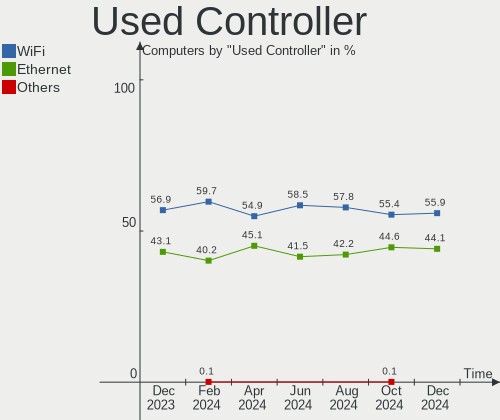
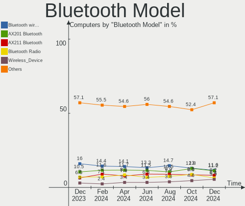
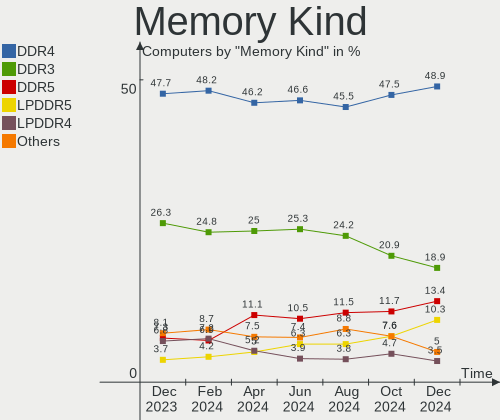
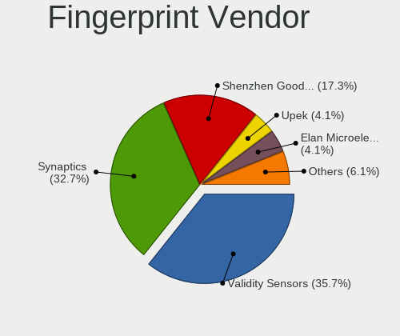

Ubuntu - Hardware Trends
------------------------

A project to identify most popular hardware characteristics and track their change
over time based on data collected by Linux users at https://Linux-Hardware.org.

Anyone can contribute to this report by the [hw-probe](https://github.com/linuxhw/hw-probe) tool:

    sudo -E hw-probe -all -upload

This is a report for all computer types. See also reports for [desktops](/Dist/Ubuntu/Desktop/README.md) and [notebooks](/Dist/Ubuntu/Notebook/README.md).

This report is for one last month. Overall report since the beginning of time: [TestDays](https://github.com/linuxhw/TestDays)

Period: Aug, 2023.

Contents
--------

* [ System ](#system)
  - [ OS                       ](#os)
  - [ OS Family                ](#os-family)
  - [ Kernel                   ](#kernel)
  - [ Kernel Family            ](#kernel-family)
  - [ Kernel Major Ver.        ](#kernel-major-ver)
  - [ Arch                     ](#arch)
  - [ DE                       ](#de)
  - [ Display Server           ](#display-server)
  - [ Display Manager          ](#display-manager)
  - [ OS Lang                  ](#os-lang)
  - [ Boot Mode                ](#boot-mode)
  - [ Filesystem               ](#filesystem)
  - [ Part. scheme             ](#part-scheme)
  - [ Dual Boot with Linux/BSD ](#dual-boot-with-linuxbsd)
  - [ Dual Boot (Win)          ](#dual-boot-win)

* [ Board ](#board)
  - [ Vendor                   ](#vendor)
  - [ Model                    ](#model)
  - [ Model Family             ](#model-family)
  - [ MFG Year                 ](#mfg-year)
  - [ Form Factor              ](#form-factor)
  - [ Secure Boot              ](#secure-boot)
  - [ Coreboot                 ](#coreboot)
  - [ RAM Size                 ](#ram-size)
  - [ RAM Used                 ](#ram-used)
  - [ Total Drives             ](#total-drives)
  - [ Has CD-ROM               ](#has-cd-rom)
  - [ Has Ethernet             ](#has-ethernet)
  - [ Has WiFi                 ](#has-wifi)
  - [ Has Bluetooth            ](#has-bluetooth)

* [ Location ](#location)
  - [ Country                  ](#country)
  - [ City                     ](#city)

* [ Drives ](#drives)
  - [ Drive Vendor             ](#drive-vendor)
  - [ Drive Model              ](#drive-model)
  - [ HDD Vendor               ](#hdd-vendor)
  - [ SSD Vendor               ](#ssd-vendor)
  - [ Drive Kind               ](#drive-kind)
  - [ Drive Connector          ](#drive-connector)
  - [ Drive Size               ](#drive-size)
  - [ Space Total              ](#space-total)
  - [ Space Used               ](#space-used)
  - [ Malfunc. Drives          ](#malfunc-drives)
  - [ Malfunc. Drive Vendor    ](#malfunc-drive-vendor)
  - [ Malfunc. HDD Vendor      ](#malfunc-hdd-vendor)
  - [ Malfunc. Drive Kind      ](#malfunc-drive-kind)
  - [ Failed Drives            ](#failed-drives)
  - [ Failed Drive Vendor      ](#failed-drive-vendor)
  - [ Drive Status             ](#drive-status)

* [ Storage controller ](#storage-controller)
  - [ Storage Vendor           ](#storage-vendor)
  - [ Storage Model            ](#storage-model)
  - [ Storage Kind             ](#storage-kind)

* [ Processor ](#processor)
  - [ CPU Vendor               ](#cpu-vendor)
  - [ CPU Model                ](#cpu-model)
  - [ CPU Model Family         ](#cpu-model-family)
  - [ CPU Cores                ](#cpu-cores)
  - [ CPU Sockets              ](#cpu-sockets)
  - [ CPU Threads              ](#cpu-threads)
  - [ CPU Op-Modes             ](#cpu-op-modes)
  - [ CPU Microcode            ](#cpu-microcode)
  - [ CPU Microarch            ](#cpu-microarch)

* [ Graphics ](#graphics)
  - [ GPU Vendor               ](#gpu-vendor)
  - [ GPU Model                ](#gpu-model)
  - [ GPU Combo                ](#gpu-combo)
  - [ GPU Driver               ](#gpu-driver)
  - [ GPU Memory               ](#gpu-memory)

* [ Monitor ](#monitor)
  - [ Monitor Vendor           ](#monitor-vendor)
  - [ Monitor Model            ](#monitor-model)
  - [ Monitor Resolution       ](#monitor-resolution)
  - [ Monitor Diagonal         ](#monitor-diagonal)
  - [ Monitor Width            ](#monitor-width)
  - [ Aspect Ratio             ](#aspect-ratio)
  - [ Monitor Area             ](#monitor-area)
  - [ Pixel Density            ](#pixel-density)
  - [ Multiple Monitors        ](#multiple-monitors)

* [ Network ](#network)
  - [ Net Controller Vendor    ](#net-controller-vendor)
  - [ Net Controller Model     ](#net-controller-model)
  - [ Wireless Vendor          ](#wireless-vendor)
  - [ Wireless Model           ](#wireless-model)
  - [ Ethernet Vendor          ](#ethernet-vendor)
  - [ Ethernet Model           ](#ethernet-model)
  - [ Net Controller Kind      ](#net-controller-kind)
  - [ Used Controller          ](#used-controller)
  - [ NICs                     ](#nics)
  - [ IPv6                     ](#ipv6)

* [ Bluetooth ](#bluetooth)
  - [ Bluetooth Vendor         ](#bluetooth-vendor)
  - [ Bluetooth Model          ](#bluetooth-model)

* [ Sound ](#sound)
  - [ Sound Vendor             ](#sound-vendor)
  - [ Sound Model              ](#sound-model)

* [ Memory ](#memory)
  - [ Memory Vendor            ](#memory-vendor)
  - [ Memory Model             ](#memory-model)
  - [ Memory Kind              ](#memory-kind)
  - [ Memory Form Factor       ](#memory-form-factor)
  - [ Memory Size              ](#memory-size)
  - [ Memory Speed             ](#memory-speed)

* [ Printers & scanners ](#printers--scanners)
  - [ Printer Vendor           ](#printer-vendor)
  - [ Printer Model            ](#printer-model)
  - [ Scanner Vendor           ](#scanner-vendor)
  - [ Scanner Model            ](#scanner-model)

* [ Camera ](#camera)
  - [ Camera Vendor            ](#camera-vendor)
  - [ Camera Model             ](#camera-model)

* [ Security ](#security)
  - [ Fingerprint Vendor       ](#fingerprint-vendor)
  - [ Fingerprint Model        ](#fingerprint-model)
  - [ Chipcard Vendor          ](#chipcard-vendor)
  - [ Chipcard Model           ](#chipcard-model)

* [ Unsupported ](#unsupported)
  - [ Unsupported Devices      ](#unsupported-devices)
  - [ Unsupported Device Types ](#unsupported-device-types)

System
------

OS
--

Installed operating systems

| Name           | Computers | Percent |
|----------------|-----------|---------|
| Ubuntu 22.04   | 810       | 65.38%  |
| Ubuntu 23.04   | 249       | 20.1%   |
| Ubuntu 20.04   | 123       | 9.93%   |
| Ubuntu 18.04   | 24        | 1.94%   |
| Ubuntu 22.10   | 22        | 1.78%   |
| Ubuntu 23.10   | 4         | 0.32%   |
| Ubuntu 21.10   | 2         | 0.16%   |
| Ubuntu 21.04   | 2         | 0.16%   |
| Ubuntu Core 22 | 1         | 0.08%   |
| Ubuntu 20.10   | 1         | 0.08%   |
| Ubuntu 16.04   | 1         | 0.08%   |

OS Family
---------

OS without a version

| Name   | Computers | Percent |
|--------|-----------|---------|
| Ubuntu | 1239      | 100%    |

Kernel
------

Version of the Linux kernel

| Version                 | Computers | Percent |
|-------------------------|-----------|---------|
| 6.2.0-26-generic        | 546       | 44.07%  |
| 6.2.0-27-generic        | 103       | 8.31%   |
| 5.19.0-50-generic       | 85        | 6.86%   |
| 5.15.0-78-generic       | 73        | 5.89%   |
| 6.2.0-31-generic        | 56        | 4.52%   |
| 5.15.0-79-generic       | 46        | 3.71%   |
| 5.19.0-46-generic       | 33        | 2.66%   |
| 5.15.0-69-generic       | 28        | 2.26%   |
| 5.19.0-32-generic       | 25        | 2.02%   |
| 6.2.0-20-generic        | 23        | 1.86%   |
| 5.15.0-76-generic       | 11        | 0.89%   |
| 5.4.0-156-generic       | 8         | 0.65%   |
| 5.4.0-150-generic       | 8         | 0.65%   |
| 6.2.0-32-generic        | 7         | 0.56%   |
| 5.15.0-82-generic       | 7         | 0.56%   |
| 5.4.0-155-generic       | 6         | 0.48%   |
| 5.19.0-45-generic       | 6         | 0.48%   |
| 4.15.0-213-generic      | 6         | 0.48%   |
| 5.19.0-43-generic       | 5         | 0.4%    |
| 5.19.0-41-generic       | 5         | 0.4%    |
| 5.19.0-38-generic       | 5         | 0.4%    |
| 6.3.0-7-generic         | 4         | 0.32%   |
| 6.4.6-060406-generic    | 3         | 0.24%   |
| 6.4.10-060410-generic   | 3         | 0.24%   |
| 6.2.0-25-generic        | 3         | 0.24%   |
| 6.0.0-1020-oem          | 3         | 0.24%   |
| 5.4.0-159-generic       | 3         | 0.24%   |
| 5.15.0-72-generic       | 3         | 0.24%   |
| 5.15.0-43-generic       | 3         | 0.24%   |
| 6.5.0-060500rc5-generic | 2         | 0.16%   |
| 6.4.9-060409-generic    | 2         | 0.16%   |
| 6.4.7-surface           | 2         | 0.16%   |
| 6.4.12-060412-generic   | 2         | 0.16%   |
| 6.4.11-060411-generic   | 2         | 0.16%   |
| 6.2.0-1009-lowlatency   | 2         | 0.16%   |
| 6.1.30-rockchip64       | 2         | 0.16%   |
| 6.0.0-1017-oem          | 2         | 0.16%   |
| 5.8.0-43-generic        | 2         | 0.16%   |
| 5.4.0-84-generic        | 2         | 0.16%   |
| 5.4.0-148-generic       | 2         | 0.16%   |

Kernel Family
-------------

Linux kernel without a distro release

| Version  | Computers | Percent |
|----------|-----------|---------|
| 6.2.0    | 747       | 60.29%  |
| 5.15.0   | 193       | 15.58%  |
| 5.19.0   | 169       | 13.64%  |
| 5.4.0    | 40        | 3.23%   |
| 4.15.0   | 11        | 0.89%   |
| 6.4.10   | 5         | 0.4%    |
| 6.3.0    | 5         | 0.4%    |
| 6.0.0    | 5         | 0.4%    |
| 5.11.0   | 5         | 0.4%    |
| 6.5.0    | 4         | 0.32%   |
| 5.8.0    | 4         | 0.32%   |
| 5.17.0   | 4         | 0.32%   |
| 5.13.0   | 4         | 0.32%   |
| 6.4.7    | 3         | 0.24%   |
| 6.4.6    | 3         | 0.24%   |
| 6.4.12   | 3         | 0.24%   |
| 6.4.11   | 3         | 0.24%   |
| 6.1.0    | 3         | 0.24%   |
| 5.14.0   | 3         | 0.24%   |
| 6.4.9    | 2         | 0.16%   |
| 6.4.8    | 2         | 0.16%   |
| 6.4.0    | 2         | 0.16%   |
| 6.1.30   | 2         | 0.16%   |
| 5.10.160 | 2         | 0.16%   |
| 6.4.3    | 1         | 0.08%   |
| 6.3.7    | 1         | 0.08%   |
| 6.3.4    | 1         | 0.08%   |
| 6.2.16   | 1         | 0.08%   |
| 6.2.12   | 1         | 0.08%   |
| 6.2.11   | 1         | 0.08%   |
| 6.2.1    | 1         | 0.08%   |
| 6.1.26   | 1         | 0.08%   |
| 6.1.10   | 1         | 0.08%   |
| 5.8.18   | 1         | 0.08%   |
| 5.15.75  | 1         | 0.08%   |
| 5.15.23  | 1         | 0.08%   |
| 5.15.108 | 1         | 0.08%   |
| 5.10.66  | 1         | 0.08%   |
| 5.10.0   | 1         | 0.08%   |

Kernel Major Ver.
-----------------

Linux kernel major version

| Version | Computers | Percent |
|---------|-----------|---------|
| 6.2     | 751       | 60.61%  |
| 5.15    | 196       | 15.82%  |
| 5.19    | 169       | 13.64%  |
| 5.4     | 40        | 3.23%   |
| 6.4     | 24        | 1.94%   |
| 4.15    | 11        | 0.89%   |
| 6.3     | 7         | 0.56%   |
| 6.1     | 7         | 0.56%   |
| 6.0     | 5         | 0.4%    |
| 5.8     | 5         | 0.4%    |
| 5.11    | 5         | 0.4%    |
| 6.5     | 4         | 0.32%   |
| 5.17    | 4         | 0.32%   |
| 5.13    | 4         | 0.32%   |
| 5.10    | 4         | 0.32%   |
| 5.14    | 3         | 0.24%   |

Arch
----

OS architecture (x86_64, i586, etc.)

| Name    | Computers | Percent |
|---------|-----------|---------|
| x86_64  | 1227      | 99.03%  |
| aarch64 | 8         | 0.65%   |
| i686    | 4         | 0.32%   |

DE
--

Desktop Environment

| Name            | Computers | Percent |
|-----------------|-----------|---------|
| GNOME           | 1133      | 91.44%  |
| Unknown         | 86        | 6.94%   |
| X-Cinnamon      | 7         | 0.56%   |
| GNOME Flashback | 4         | 0.32%   |
| GNOME Classic   | 2         | 0.16%   |
| Cinnamon        | 2         | 0.16%   |
| sway            | 1         | 0.08%   |
| mwm             | 1         | 0.08%   |
| Lubuntu         | 1         | 0.08%   |
| i3              | 1         | 0.08%   |
| enlightenment   | 1         | 0.08%   |

Display Server
--------------

X11 or Wayland

| Name    | Computers | Percent |
|---------|-----------|---------|
| Wayland | 702       | 56.66%  |
| X11     | 451       | 36.4%   |
| Unknown | 59        | 4.76%   |
| Tty     | 27        | 2.18%   |

Display Manager
---------------

SDDM, LightDM, etc.

| Name    | Computers | Percent |
|---------|-----------|---------|
| GDM3    | 1010      | 81.52%  |
| Unknown | 142       | 11.46%  |
| GDM     | 56        | 4.52%   |
| LightDM | 29        | 2.34%   |
| SLiM    | 1         | 0.08%   |
| SDDM    | 1         | 0.08%   |

OS Lang
-------

Language

| Lang    | Computers | Percent |
|---------|-----------|---------|
| en_US   | 538       | 43.42%  |
| de_DE   | 126       | 10.17%  |
| fr_FR   | 85        | 6.86%   |
| en_GB   | 54        | 4.36%   |
| C       | 51        | 4.12%   |
| pt_BR   | 40        | 3.23%   |
| en_IN   | 36        | 2.91%   |
| ru_RU   | 34        | 2.74%   |
| it_IT   | 24        | 1.94%   |
| en_AU   | 23        | 1.86%   |
| en_CA   | 22        | 1.78%   |
| es_ES   | 21        | 1.69%   |
| zh_CN   | 14        | 1.13%   |
| pl_PL   | 13        | 1.05%   |
| es_MX   | 13        | 1.05%   |
| Unknown | 11        | 0.89%   |
| nl_NL   | 10        | 0.81%   |
| hu_HU   | 8         | 0.65%   |
| es_AR   | 8         | 0.65%   |
| en_IL   | 8         | 0.65%   |
| ja_JP   | 7         | 0.56%   |
| fr_CA   | 7         | 0.56%   |
| sv_SE   | 6         | 0.48%   |
| en_HK   | 6         | 0.48%   |
| tr_TR   | 5         | 0.4%    |
| es_CO   | 5         | 0.4%    |
| pt_PT   | 4         | 0.32%   |
| ko_KR   | 4         | 0.32%   |
| en_SG   | 4         | 0.32%   |
| cs_CZ   | 4         | 0.32%   |
| fi_FI   | 3         | 0.24%   |
| en_ZA   | 3         | 0.24%   |
| en_PH   | 3         | 0.24%   |
| da_DK   | 3         | 0.24%   |
| bg_BG   | 3         | 0.24%   |
| zh_TW   | 2         | 0.16%   |
| sk_SK   | 2         | 0.16%   |
| nb_NO   | 2         | 0.16%   |
| en_NZ   | 2         | 0.16%   |
| de_CH   | 2         | 0.16%   |

Boot Mode
---------

EFI or BIOS

| Mode | Computers | Percent |
|------|-----------|---------|
| BIOS | 741       | 59.81%  |
| EFI  | 498       | 40.19%  |

Filesystem
----------

Type of filesystem

| Type    | Computers | Percent |
|---------|-----------|---------|
| Tmpfs   | 622       | 50.2%   |
| Ext4    | 535       | 43.18%  |
| Overlay | 50        | 4.04%   |
| Btrfs   | 17        | 1.37%   |
| Zfs     | 10        | 0.81%   |
| XXX4    | 2         | 0.16%   |
| Ext3    | 2         | 0.16%   |
| Xfs     | 1         | 0.08%   |

Part. scheme
------------

Scheme of partitioning

| Type    | Computers | Percent |
|---------|-----------|---------|
| GPT     | 973       | 78.53%  |
| MBR     | 141       | 11.38%  |
| Unknown | 125       | 10.09%  |

Dual Boot with Linux/BSD
------------------------

Hosting more than one Linux/BSD

| Dual boot | Computers | Percent |
|-----------|-----------|---------|
| No        | 1071      | 86.44%  |
| Yes       | 168       | 13.56%  |

Dual Boot (Win)
---------------

Hosting Linux and Windows

| Dual boot | Computers | Percent |
|-----------|-----------|---------|
| No        | 791       | 63.84%  |
| Yes       | 448       | 36.16%  |

Board
-----

Vendor
------

Motherboard manufacturer

| Name                    | Computers | Percent |
|-------------------------|-----------|---------|
| Hewlett-Packard         | 202       | 16.3%   |
| Dell                    | 199       | 16.06%  |
| ASUSTek Computer        | 175       | 14.12%  |
| Lenovo                  | 167       | 13.48%  |
| Acer                    | 69        | 5.57%   |
| Gigabyte Technology     | 48        | 3.87%   |
| MSI                     | 45        | 3.63%   |
| Apple                   | 36        | 2.91%   |
| Supermicro              | 34        | 2.74%   |
| ASRock                  | 32        | 2.58%   |
| Intel                   | 27        | 2.18%   |
| HUAWEI                  | 17        | 1.37%   |
| Fujitsu                 | 14        | 1.13%   |
| Toshiba                 | 13        | 1.05%   |
| Notebook                | 10        | 0.81%   |
| Samsung Electronics     | 9         | 0.73%   |
| Unknown                 | 9         | 0.73%   |
| Medion                  | 8         | 0.65%   |
| Sony                    | 6         | 0.48%   |
| Pegatron                | 6         | 0.48%   |
| Microsoft               | 6         | 0.48%   |
| Google                  | 6         | 0.48%   |
| Alienware               | 6         | 0.48%   |
| Timi                    | 4         | 0.32%   |
| Panasonic               | 4         | 0.32%   |
| AZW                     | 4         | 0.32%   |
| Positivo                | 3         | 0.24%   |
| Infinix                 | 3         | 0.24%   |
| Huanan                  | 3         | 0.24%   |
| Gateway                 | 3         | 0.24%   |
| Foxconn                 | 3         | 0.24%   |
| Shuttle                 | 2         | 0.16%   |
| Raspberry Pi Foundation | 2         | 0.16%   |
| Packard Bell            | 2         | 0.16%   |
| LG Electronics          | 2         | 0.16%   |
| HPE                     | 2         | 0.16%   |
| GMKtec                  | 2         | 0.16%   |
| FriendlyElec            | 2         | 0.16%   |
| ECS                     | 2         | 0.16%   |
| Chuwi                   | 2         | 0.16%   |

Model
-----

Motherboard model

| Name                                       | Computers | Percent |
|--------------------------------------------|-----------|---------|
| Supermicro Super Server                    | 11        | 0.89%   |
| Unknown                                    | 11        | 0.89%   |
| ASUS All Series                            | 9         | 0.73%   |
| HP Notebook                                | 6         | 0.48%   |
| Supermicro X8DTU                           | 4         | 0.32%   |
| HUAWEI BOD-WXX9                            | 4         | 0.32%   |
| HP EliteBook 840 G3                        | 4         | 0.32%   |
| Supermicro X9DRW                           | 3         | 0.24%   |
| Supermicro X8DTT                           | 3         | 0.24%   |
| HP ZBook 14 G2                             | 3         | 0.24%   |
| HP Pavilion Laptop 15-cc5xx                | 3         | 0.24%   |
| HP Pavilion g6                             | 3         | 0.24%   |
| HP EliteBook 840 G6                        | 3         | 0.24%   |
| Gigabyte Z390 AORUS PRO WIFI               | 3         | 0.24%   |
| Dell XPS 15 9500                           | 3         | 0.24%   |
| Dell XPS 15 7590                           | 3         | 0.24%   |
| Dell Precision Tower 7910                  | 3         | 0.24%   |
| Dell OptiPlex 990                          | 3         | 0.24%   |
| Dell OptiPlex 9020                         | 3         | 0.24%   |
| Dell OptiPlex 7050                         | 3         | 0.24%   |
| Dell OptiPlex 7010                         | 3         | 0.24%   |
| Dell Latitude E6420                        | 3         | 0.24%   |
| Dell Latitude E6330                        | 3         | 0.24%   |
| Dell Latitude 7390                         | 3         | 0.24%   |
| Dell Latitude 7310                         | 3         | 0.24%   |
| Dell Latitude 5590                         | 3         | 0.24%   |
| Dell Latitude 5420                         | 3         | 0.24%   |
| ASUS VivoBook_ASUSLaptop M1402IA_M1402IA   | 3         | 0.24%   |
| ASUS PRIME B550-PLUS                       | 3         | 0.24%   |
| ASRock B450M Pro4                          | 3         | 0.24%   |
| Apple MacBookAir7,2                        | 3         | 0.24%   |
| Acer Aspire A515-56                        | 3         | 0.24%   |
| Acer Aspire 5750G                          | 3         | 0.24%   |
| Supermicro X9SRE/X9SRE-3F/X9SRi/X9SRi-3F   | 2         | 0.16%   |
| Supermicro X7DWU                           | 2         | 0.16%   |
| MSI MS-7B86                                | 2         | 0.16%   |
| MSI Katana GF76 11UD                       | 2         | 0.16%   |
| Microsoft Surface Pro 4                    | 2         | 0.16%   |
| Microsoft Surface Pro 3                    | 2         | 0.16%   |
| Lenovo ThinkPad X1 Carbon Gen 8 20U9CTO1WW | 2         | 0.16%   |

Model Family
------------

Motherboard model prefix

| Name               | Computers | Percent |
|--------------------|-----------|---------|
| Lenovo ThinkPad    | 82        | 6.62%   |
| Dell Latitude      | 57        | 4.6%    |
| Acer Aspire        | 48        | 3.87%   |
| HP EliteBook       | 34        | 2.74%   |
| Dell Inspiron      | 32        | 2.58%   |
| ASUS ROG           | 32        | 2.58%   |
| Dell OptiPlex      | 30        | 2.42%   |
| Lenovo IdeaPad     | 29        | 2.34%   |
| HP Pavilion        | 29        | 2.34%   |
| Dell XPS           | 26        | 2.1%    |
| Dell Precision     | 26        | 2.1%    |
| ASUS PRIME         | 25        | 2.02%   |
| ASUS VivoBook      | 21        | 1.69%   |
| HP Laptop          | 15        | 1.21%   |
| HP ProBook         | 14        | 1.13%   |
| Toshiba Satellite  | 13        | 1.05%   |
| HP ENVY            | 13        | 1.05%   |
| Supermicro Super   | 11        | 0.89%   |
| HP Compaq          | 11        | 0.89%   |
| ASUS Zenbook       | 11        | 0.89%   |
| Unknown            | 11        | 0.89%   |
| HP ZBook           | 10        | 0.81%   |
| ASUS TUF           | 10        | 0.81%   |
| Lenovo Legion      | 9         | 0.73%   |
| Fujitsu ESPRIMO    | 9         | 0.73%   |
| Dell PowerEdge     | 9         | 0.73%   |
| ASUS All           | 9         | 0.73%   |
| Lenovo IdeaPadFlex | 8         | 0.65%   |
| Dell Vostro        | 8         | 0.65%   |
| Lenovo ThinkCentre | 7         | 0.56%   |
| HP ProDesk         | 7         | 0.56%   |
| HP 255             | 7         | 0.56%   |
| Microsoft Surface  | 6         | 0.48%   |
| HP Notebook        | 6         | 0.48%   |
| HP EliteDesk       | 6         | 0.48%   |
| Acer Nitro         | 6         | 0.48%   |
| MSI Katana         | 5         | 0.4%    |
| Lenovo ThinkBook   | 5         | 0.4%    |
| HP OMEN            | 5         | 0.4%    |
| ASUS M5A78L-M      | 5         | 0.4%    |

MFG Year
--------

Motherboard manufacture year

| Year    | Computers | Percent |
|---------|-----------|---------|
| 2021    | 134       | 10.82%  |
| 2020    | 129       | 10.41%  |
| 2022    | 115       | 9.28%   |
| 2018    | 97        | 7.83%   |
| 2019    | 93        | 7.51%   |
| 2012    | 82        | 6.62%   |
| 2011    | 81        | 6.54%   |
| 2013    | 70        | 5.65%   |
| 2023    | 65        | 5.25%   |
| 2015    | 65        | 5.25%   |
| 2017    | 62        | 5%      |
| 2016    | 62        | 5%      |
| 2014    | 62        | 5%      |
| 2010    | 42        | 3.39%   |
| 2008    | 29        | 2.34%   |
| 2009    | 23        | 1.86%   |
| 2007    | 16        | 1.29%   |
| Unknown | 7         | 0.56%   |
| 2006    | 4         | 0.32%   |
| 2004    | 1         | 0.08%   |

Form Factor
-----------

Physical design of the computer

| Name           | Computers | Percent |
|----------------|-----------|---------|
| Notebook       | 675       | 54.48%  |
| Desktop        | 401       | 32.36%  |
| Convertible    | 53        | 4.28%   |
| Server         | 42        | 3.39%   |
| Mini pc        | 24        | 1.94%   |
| All in one     | 24        | 1.94%   |
| Tablet         | 12        | 0.97%   |
| System on chip | 8         | 0.65%   |

Secure Boot
-----------

Enabled or disabled

| State    | Computers | Percent |
|----------|-----------|---------|
| Disabled | 1122      | 90.56%  |
| Enabled  | 117       | 9.44%   |

Coreboot
--------

Have coreboot on board

| Used | Computers | Percent |
|------|-----------|---------|
| No   | 1232      | 99.44%  |
| Yes  | 7         | 0.56%   |

RAM Size
--------

Total RAM memory

| Size in GB      | Computers | Percent |
|-----------------|-----------|---------|
| 4.01-8.0        | 297       | 23.97%  |
| 16.01-24.0      | 286       | 23.08%  |
| 8.01-16.0       | 206       | 16.63%  |
| 32.01-64.0      | 153       | 12.35%  |
| 3.01-4.0        | 150       | 12.11%  |
| 64.01-256.0     | 71        | 5.73%   |
| 24.01-32.0      | 29        | 2.34%   |
| 1.01-2.0        | 20        | 1.61%   |
| More than 256.0 | 12        | 0.97%   |
| 2.01-3.0        | 11        | 0.89%   |
| 0.51-1.0        | 2         | 0.16%   |
| 0.01-0.5        | 2         | 0.16%   |

RAM Used
--------

Used RAM memory

| Used GB    | Computers | Percent |
|------------|-----------|---------|
| 2.01-3.0   | 398       | 32.12%  |
| 1.01-2.0   | 313       | 25.26%  |
| 4.01-8.0   | 243       | 19.61%  |
| 3.01-4.0   | 168       | 13.56%  |
| 8.01-16.0  | 77        | 6.21%   |
| 0.51-1.0   | 19        | 1.53%   |
| 0.01-0.5   | 8         | 0.65%   |
| 32.01-64.0 | 5         | 0.4%    |
| 24.01-32.0 | 5         | 0.4%    |
| 16.01-24.0 | 3         | 0.24%   |

Total Drives
------------

Number of drives on board

| Drives | Computers | Percent |
|--------|-----------|---------|
| 1      | 806       | 65.05%  |
| 2      | 281       | 22.68%  |
| 3      | 70        | 5.65%   |
| 4      | 36        | 2.91%   |
| 5      | 15        | 1.21%   |
| 6      | 8         | 0.65%   |
| 7      | 7         | 0.56%   |
| 0      | 7         | 0.56%   |
| 8      | 3         | 0.24%   |
| 11     | 2         | 0.16%   |
| 40     | 1         | 0.08%   |
| 13     | 1         | 0.08%   |
| 12     | 1         | 0.08%   |
| 10     | 1         | 0.08%   |

Has CD-ROM
----------

Has CD-ROM on board

| Presented | Computers | Percent |
|-----------|-----------|---------|
| No        | 872       | 70.38%  |
| Yes       | 367       | 29.62%  |

Has Ethernet
------------

Has Ethernet on board

| Presented | Computers | Percent |
|-----------|-----------|---------|
| Yes       | 1025      | 82.73%  |
| No        | 214       | 17.27%  |

Has WiFi
--------

Has WiFi module

| Presented | Computers | Percent |
|-----------|-----------|---------|
| Yes       | 961       | 77.56%  |
| No        | 278       | 22.44%  |

Has Bluetooth
-------------

Has Bluetooth module

| Presented | Computers | Percent |
|-----------|-----------|---------|
| Yes       | 818       | 66.02%  |
| No        | 421       | 33.98%  |

Location
--------

Country
-------

Geographic location (country)

| Country      | Computers | Percent |
|--------------|-----------|---------|
| USA          | 212       | 17.11%  |
| Germany      | 143       | 11.54%  |
| France       | 98        | 7.91%   |
| Russia       | 65        | 5.25%   |
| Brazil       | 59        | 4.76%   |
| UK           | 47        | 3.79%   |
| Canada       | 46        | 3.71%   |
| India        | 45        | 3.63%   |
| Italy        | 41        | 3.31%   |
| Australia    | 28        | 2.26%   |
| Spain        | 26        | 2.1%    |
| Mexico       | 22        | 1.78%   |
| Netherlands  | 21        | 1.69%   |
| China        | 19        | 1.53%   |
| Poland       | 18        | 1.45%   |
| Switzerland  | 16        | 1.29%   |
| Argentina    | 15        | 1.21%   |
| Turkey       | 14        | 1.13%   |
| Czechia      | 14        | 1.13%   |
| Israel       | 13        | 1.05%   |
| Belgium      | 13        | 1.05%   |
| Sweden       | 12        | 0.97%   |
| Hungary      | 11        | 0.89%   |
| Finland      | 11        | 0.89%   |
| Indonesia    | 10        | 0.81%   |
| Colombia     | 10        | 0.81%   |
| Norway       | 9         | 0.73%   |
| Hong Kong    | 9         | 0.73%   |
| Portugal     | 8         | 0.65%   |
| Japan        | 8         | 0.65%   |
| Denmark      | 8         | 0.65%   |
| South Korea  | 7         | 0.56%   |
| Singapore    | 7         | 0.56%   |
| Romania      | 7         | 0.56%   |
| Iran         | 7         | 0.56%   |
| Bulgaria     | 7         | 0.56%   |
| South Africa | 6         | 0.48%   |
| Serbia       | 6         | 0.48%   |
| Saudi Arabia | 6         | 0.48%   |
| Austria      | 6         | 0.48%   |

City
----

Geographic location (city)

| City              | Computers | Percent |
|-------------------|-----------|---------|
| Moscow            | 35        | 2.82%   |
| Champs-sur-Marne  | 13        | 1.05%   |
| Toronto           | 10        | 0.81%   |
| Melbourne         | 10        | 0.81%   |
| Berlin            | 10        | 0.81%   |
| Sydney            | 9         | 0.73%   |
| Paris             | 9         | 0.73%   |
| Hamburg           | 8         | 0.65%   |
| Central           | 8         | 0.65%   |
| St Petersburg     | 7         | 0.56%   |
| Singapore         | 7         | 0.56%   |
| Sao Paulo         | 7         | 0.56%   |
| Prague            | 7         | 0.56%   |
| Montreal          | 7         | 0.56%   |
| Helsinki          | 7         | 0.56%   |
| Pune              | 6         | 0.48%   |
| New York          | 6         | 0.48%   |
| Milan             | 6         | 0.48%   |
| Madrid            | 6         | 0.48%   |
| Delhi             | 6         | 0.48%   |
| Bengaluru         | 6         | 0.48%   |
| Belo Horizonte    | 6         | 0.48%   |
| Beijing           | 6         | 0.48%   |
| Barcelona         | 6         | 0.48%   |
| Tucson            | 5         | 0.4%    |
| Tehran            | 5         | 0.4%    |
| Rome              | 5         | 0.4%    |
| Rio de Janeiro    | 5         | 0.4%    |
| Oshawa            | 5         | 0.4%    |
| Mumbai            | 5         | 0.4%    |
| Milano            | 5         | 0.4%    |
| Los Angeles       | 5         | 0.4%    |
| Frankfurt am Main | 5         | 0.4%    |
| Cologne           | 5         | 0.4%    |
| Zurich            | 4         | 0.32%   |
| Stockholm         | 4         | 0.32%   |
| Sofia             | 4         | 0.32%   |
| Perth             | 4         | 0.32%   |
| Minneapolis       | 4         | 0.32%   |
| Jakarta           | 4         | 0.32%   |

Drives
------

Drive Vendor
------------

Hard drive vendors

| Vendor                      | Computers | Drives | Percent |
|-----------------------------|-----------|--------|---------|
| Samsung Electronics         | 265       | 316    | 15.65%  |
| Seagate                     | 206       | 245    | 12.17%  |
| WDC                         | 197       | 289    | 11.64%  |
| Sandisk                     | 107       | 116    | 6.32%   |
| Kingston                    | 94        | 98     | 5.55%   |
| Toshiba                     | 88        | 90     | 5.2%    |
| SK hynix                    | 66        | 67     | 3.9%    |
| Crucial                     | 65        | 72     | 3.84%   |
| Unknown                     | 63        | 75     | 3.72%   |
| Intel                       | 60        | 75     | 3.54%   |
| Micron Technology           | 39        | 39     | 2.3%    |
| KIOXIA                      | 33        | 33     | 1.95%   |
| Hitachi                     | 32        | 36     | 1.89%   |
| A-DATA Technology           | 21        | 21     | 1.24%   |
| HGST                        | 19        | 22     | 1.12%   |
| Apple                       | 19        | 22     | 1.12%   |
| Kingston Technology Company | 16        | 16     | 0.95%   |
| Phison Electronics          | 14        | 15     | 0.83%   |
| Micron/Crucial Technology   | 14        | 14     | 0.83%   |
| PNY                         | 13        | 13     | 0.77%   |
| Silicon Motion              | 12        | 12     | 0.71%   |
| China                       | 12        | 12     | 0.71%   |
| Unknown                     | 12        | 12     | 0.71%   |
| Fujitsu                     | 10        | 20     | 0.59%   |
| Phison                      | 9         | 10     | 0.53%   |
| SPCC                        | 8         | 9      | 0.47%   |
| Netac                       | 8         | 8      | 0.47%   |
| MAXIO Technology (Hangzhou) | 8         | 9      | 0.47%   |
| LITEON                      | 8         | 8      | 0.47%   |
| Intenso                     | 8         | 11     | 0.47%   |
| ADATA Technology            | 8         | 10     | 0.47%   |
| Lexar                       | 6         | 6      | 0.35%   |
| Hewlett-Packard             | 6         | 11     | 0.35%   |
| FORESEE                     | 6         | 6      | 0.35%   |
| Team                        | 5         | 5      | 0.3%    |
| Patriot                     | 5         | 5      | 0.3%    |
| KingSpec                    | 5         | 6      | 0.3%    |
| SABRENT                     | 4         | 4      | 0.24%   |
| OCZ                         | 4         | 4      | 0.24%   |
| Maxtor                      | 4         | 5      | 0.24%   |

Drive Model
-----------

Hard drive models

| Model                                                 | Computers | Percent |
|-------------------------------------------------------|-----------|---------|
| Samsung NVMe SSD Controller SM981/PM981/PM983 500GB   | 28        | 1.54%   |
| Kingston SA400S37240G 240GB SSD                       | 23        | 1.27%   |
| Kingston SA400S37480G 480GB SSD                       | 16        | 0.88%   |
| Samsung NVMe SSD Controller PM9A1/PM9A3/980PRO 1024GB | 15        | 0.83%   |
| Micron/Crucial P2 NVMe PCIe SSD 1TB                   | 13        | 0.72%   |
| Unknown MMC Card  64GB                                | 12        | 0.66%   |
| Seagate ST2000DM008-2FR102 2TB                        | 12        | 0.66%   |
| Seagate ST1000DM010-2EP102 1TB                        | 12        | 0.66%   |
| Samsung SSD 860 EVO 500GB                             | 12        | 0.66%   |
| Unknown                                               | 12        | 0.66%   |
| Crucial CT500MX500SSD1 500GB                          | 11        | 0.61%   |
| Toshiba MQ01ABD100 1TB                                | 10        | 0.55%   |
| Seagate ST1000LM035-1RK172 1TB                        | 10        | 0.55%   |
| Sandisk WD Blue SN550 NVMe SSD 250GB                  | 10        | 0.55%   |
| Samsung SSD 870 EVO 1TB                               | 10        | 0.55%   |
| Unknown SD/MMC/MS PRO 1GB                             | 9         | 0.5%    |
| Seagate ST4000DM004-2CV104 4TB                        | 9         | 0.5%    |
| Intel SSDSC2BB150G7 150GB                             | 9         | 0.5%    |
| Unknown MMC Card  32GB                                | 8         | 0.44%   |
| Seagate ST500DM002-1BD142 500GB                       | 8         | 0.44%   |
| Sandisk WD Black SN750 / PC SN730 NVMe SSD 1024GB     | 8         | 0.44%   |
| Intel SSDPEKNU512GZ 512GB                             | 8         | 0.44%   |
| Crucial CT240BX500SSD1 240GB                          | 8         | 0.44%   |
| Toshiba XG6 NVMe SSD Controller 1024GB                | 7         | 0.39%   |
| Seagate ST2000DM001-1ER164 2TB                        | 7         | 0.39%   |
| Seagate ST1000LM024 HN-M101MBB 1TB                    | 7         | 0.39%   |
| Samsung SSD 980 PRO 1TB                               | 7         | 0.39%   |
| Samsung SSD 980 1TB                                   | 7         | 0.39%   |
| Samsung SSD 970 EVO Plus 1TB                          | 7         | 0.39%   |
| Samsung SSD 870 QVO 1TB                               | 7         | 0.39%   |
| Samsung SSD 850 EVO 250GB                             | 7         | 0.39%   |
| Crucial CT1000BX500SSD1 1TB                           | 7         | 0.39%   |
| Toshiba MQ04ABF100 1TB                                | 6         | 0.33%   |
| Silicon Motion SM2263EN/SM2263XT SSD Controller 256GB | 6         | 0.33%   |
| Seagate ST1000DM003-1SB102 1TB                        | 6         | 0.33%   |
| SanDisk NVMe SSD Drive 1TB                            | 6         | 0.33%   |
| Samsung NVMe SSD Controller SM961/PM961/SM963 1024GB  | 6         | 0.33%   |
| Micron 2450_MTFDKBA512TFK 512GB                       | 6         | 0.33%   |
| MAXIO (Hangzhou) NVMe SSD Controller MAP1202 1024GB   | 6         | 0.33%   |
| Kingston Company SNV2S1000G 1TB                       | 6         | 0.33%   |

HDD Vendor
----------

Hard disk drive vendors

| Vendor              | Computers | Drives  | Percent |
|---------------------|-----------|---------|---------|
| Seagate             | 200       | 237     | 38.02%  |
| WDC                 | 156       | 235     | 29.66%  |
| Toshiba             | 56        | 58      | 10.65%  |
| Hitachi             | 30        | 33      | 5.7%    |
| HGST                | 19        | 22      | 3.61%   |
| Samsung Electronics | 18        | 22      | 3.42%   |
| Unknown             | 11        | 11      | 2.09%   |
| Fujitsu             | 10        | 20      | 1.9%    |
| SABRENT             | 4         | 4       | 0.76%   |
| Apple               | 4         | 4       | 0.76%   |
| USB3.0              | 3         | 3       | 0.57%   |
| Maxtor              | 3         | 4       | 0.57%   |
| Hewlett-Packard     | 3         | 6       | 0.57%   |
| LaCie               | 2         | 2       | 0.38%   |
| USB                 | 1         | 1       | 0.19%   |
| SAGE                | 1         | 1       | 0.19%   |
| Intenso             | 1         | 1       | 0.19%   |
| Initio              | 1         | Unknown | 0.19%   |
| HGST HTS            | 1         | 1       | 0.19%   |
| External            | 1         | 2       | 0.19%   |
| ExcelStor           | 1         | 1       | 0.19%   |

SSD Vendor
----------

Solid state drive vendors

| Vendor              | Computers | Drives | Percent |
|---------------------|-----------|--------|---------|
| Samsung Electronics | 108       | 129    | 20.34%  |
| Kingston            | 70        | 72     | 13.18%  |
| Crucial             | 52        | 57     | 9.79%   |
| SanDisk             | 45        | 51     | 8.47%   |
| Intel               | 26        | 36     | 4.9%    |
| WDC                 | 24        | 32     | 4.52%   |
| SK hynix            | 16        | 16     | 3.01%   |
| A-DATA Technology   | 14        | 14     | 2.64%   |
| PNY                 | 12        | 12     | 2.26%   |
| China               | 12        | 12     | 2.26%   |
| Micron Technology   | 10        | 10     | 1.88%   |
| Toshiba             | 8         | 8      | 1.51%   |
| Netac               | 8         | 8      | 1.51%   |
| LITEON              | 8         | 8      | 1.51%   |
| Apple               | 8         | 8      | 1.51%   |
| Intenso             | 7         | 10     | 1.32%   |
| SPCC                | 6         | 7      | 1.13%   |
| Team                | 5         | 5      | 0.94%   |
| Patriot             | 5         | 5      | 0.94%   |
| Lexar               | 5         | 5      | 0.94%   |
| KingSpec            | 5         | 6      | 0.94%   |
| OCZ                 | 4         | 4      | 0.75%   |
| Unknown             | 4         | 4      | 0.75%   |
| Transcend           | 3         | 3      | 0.56%   |
| Seagate             | 3         | 3      | 0.56%   |
| LITEONIT            | 3         | 3      | 0.56%   |
| JMicron Technology  | 3         | 3      | 0.56%   |
| Hewlett-Packard     | 3         | 5      | 0.56%   |
| Emtec               | 3         | 3      | 0.56%   |
| Verbatim            | 2         | 3      | 0.38%   |
| PNY CS90            | 2         | 2      | 0.38%   |
| Phison              | 2         | 2      | 0.38%   |
| NGFF                | 2         | 2      | 0.38%   |
| Mushkin             | 2         | 2      | 0.38%   |
| Kingchuxing         | 2         | 2      | 0.38%   |
| GOODRAM             | 2         | 2      | 0.38%   |
| Gigabyte Technology | 2         | 2      | 0.38%   |
| FORESEE             | 2         | 2      | 0.38%   |
| Fanxiang            | 2         | 2      | 0.38%   |
| Apacer              | 2         | 2      | 0.38%   |

Drive Kind
----------

HDD or SSD

| Kind    | Computers | Drives | Percent |
|---------|-----------|--------|---------|
| NVMe    | 538       | 612    | 34.73%  |
| SSD     | 486       | 593    | 31.38%  |
| HDD     | 443       | 668    | 28.6%   |
| MMC     | 53        | 59     | 3.42%   |
| Unknown | 29        | 33     | 1.87%   |

Drive Connector
---------------

SATA, SAS, NVMe, etc.

| Type | Computers | Drives | Percent |
|------|-----------|--------|---------|
| SATA | 769       | 1202   | 53.55%  |
| NVMe | 538       | 609    | 37.47%  |
| SAS  | 76        | 95     | 5.29%   |
| MMC  | 53        | 59     | 3.69%   |

Drive Size
----------

Size of hard drive

| Size in TB | Computers | Drives | Percent |
|------------|-----------|--------|---------|
| 0.01-0.5   | 529       | 659    | 54.26%  |
| 0.51-1.0   | 296       | 355    | 30.36%  |
| 1.01-2.0   | 88        | 124    | 9.03%   |
| 3.01-4.0   | 27        | 36     | 2.77%   |
| 4.01-10.0  | 15        | 23     | 1.54%   |
| 2.01-3.0   | 14        | 20     | 1.44%   |
| 10.01-20.0 | 6         | 44     | 0.62%   |

Space Total
-----------

Amount of disk space available on the file system

| Size in GB     | Computers | Percent |
|----------------|-----------|---------|
| 101-250        | 328       | 26.47%  |
| 251-500        | 309       | 24.94%  |
| 501-1000       | 218       | 17.59%  |
| 1001-2000      | 93        | 7.51%   |
| 51-100         | 70        | 5.65%   |
| More than 3000 | 59        | 4.76%   |
| 1-20           | 47        | 3.79%   |
| Unknown        | 43        | 3.47%   |
| 21-50          | 42        | 3.39%   |
| 2001-3000      | 30        | 2.42%   |

Space Used
----------

Amount of used disk space

| Used GB        | Computers | Percent |
|----------------|-----------|---------|
| 1-20           | 369       | 29.78%  |
| 21-50          | 257       | 20.74%  |
| 101-250        | 165       | 13.32%  |
| 51-100         | 158       | 12.75%  |
| 251-500        | 116       | 9.36%   |
| 501-1000       | 67        | 5.41%   |
| Unknown        | 43        | 3.47%   |
| 1001-2000      | 30        | 2.42%   |
| 2001-3000      | 18        | 1.45%   |
| More than 3000 | 16        | 1.29%   |

Malfunc. Drives
---------------

Drive models with a malfunction

| Model                                            | Computers | Drives | Percent |
|--------------------------------------------------|-----------|--------|---------|
| Toshiba MQ01ABD100 1TB                           | 5         | 5      | 7.94%   |
| Seagate ST500NM0011 500GB                        | 2         | 3      | 3.17%   |
| Seagate ST1000LM035-1RK172 1TB                   | 2         | 2      | 3.17%   |
| WDC WD60EFRX-68L0BN1 6TB                         | 1         | 1      | 1.59%   |
| WDC WD5003AZEX-00K3CA0 500GB                     | 1         | 1      | 1.59%   |
| WDC WD3200AAJS-08L7A0 320GB                      | 1         | 1      | 1.59%   |
| WDC WD2500BUDT-63DPZY0 250GB                     | 1         | 1      | 1.59%   |
| WDC WD2500BEVT-22A23T0 208GB                     | 1         | 1      | 1.59%   |
| WDC WD2002FAEX-007BA0 2TB                        | 1         | 1      | 1.59%   |
| WDC WD1600AAJS-65WAA0 160GB                      | 1         | 1      | 1.59%   |
| WDC WD10JPVX-60JC3T0 1TB                         | 1         | 1      | 1.59%   |
| WDC WD10EZEX-21M2NA0 1TB                         | 1         | 1      | 1.59%   |
| WDC WD1003FZEX-00MK2A0 1TB                       | 1         | 1      | 1.59%   |
| WDC WD1002FAEX-00Z3A0 1TB                        | 1         | 1      | 1.59%   |
| WDC WD Green 2.5 240GB SSD                       | 1         | 1      | 1.59%   |
| Toshiba MK5059GSXP 500GB                         | 1         | 1      | 1.59%   |
| Toshiba DT01ACA050 500GB                         | 1         | 1      | 1.59%   |
| SK hynix SC308 SATA 256GB SSD                    | 1         | 1      | 1.59%   |
| SK hynix HFS512G39TND-N210A 512GB SSD            | 1         | 1      | 1.59%   |
| Seagate ST9500325AS 500GB                        | 1         | 1      | 1.59%   |
| Seagate ST500DM002-1BD142 500GB                  | 1         | 1      | 1.59%   |
| Seagate ST3640323AS 640GB                        | 1         | 1      | 1.59%   |
| Seagate ST3500514NS 500GB                        | 1         | 1      | 1.59%   |
| Seagate ST3500418AS 500GB                        | 1         | 1      | 1.59%   |
| Seagate ST320LT009-9WC142 320GB                  | 1         | 1      | 1.59%   |
| Seagate ST2000LM007-1R8174 2TB                   | 1         | 1      | 1.59%   |
| Seagate ST2000DM001-1ER164 2TB                   | 1         | 1      | 1.59%   |
| Seagate ST14000NM0018-2H4101 14TB                | 1         | 1      | 1.59%   |
| Seagate ST1000LM024 HN-M101MBB 1TB               | 1         | 1      | 1.59%   |
| Seagate ST1000DM003-1CH162 1TB                   | 1         | 1      | 1.59%   |
| SanDisk SD8TN8U-256G-1006 256GB SSD              | 1         | 1      | 1.59%   |
| SanDisk SD8SN8U-512G-1006 512GB SSD              | 1         | 1      | 1.59%   |
| SanDisk SD7SB2Q-512G-1006 512GB SSD              | 1         | 1      | 1.59%   |
| Samsung Electronics SSD PM810 2.5 7mm 256GB      | 1         | 1      | 1.59%   |
| Samsung Electronics MZVL2512HCJQ-00B00 512GB     | 1         | 1      | 1.59%   |
| Samsung Electronics MZ7TD256GMMC-00000 256GB SSD | 1         | 1      | 1.59%   |
| Samsung Electronics HN-M101MBB 1TB               | 1         | 2      | 1.59%   |
| POWER X SS1000 512GB SSD                         | 1         | 1      | 1.59%   |
| Netac SSD 120GB                                  | 1         | 1      | 1.59%   |
| Maxtor 6L160M0 160GB                             | 1         | 2      | 1.59%   |

Malfunc. Drive Vendor
---------------------

Vendors of faulty drives

| Vendor              | Computers | Drives | Percent |
|---------------------|-----------|--------|---------|
| Seagate             | 15        | 16     | 23.81%  |
| WDC                 | 12        | 12     | 19.05%  |
| Toshiba             | 7         | 7      | 11.11%  |
| Intel               | 6         | 7      | 9.52%   |
| Samsung Electronics | 4         | 5      | 6.35%   |
| Hitachi             | 4         | 4      | 6.35%   |
| SanDisk             | 3         | 3      | 4.76%   |
| HGST                | 3         | 3      | 4.76%   |
| SK hynix            | 2         | 2      | 3.17%   |
| POWER               | 1         | 1      | 1.59%   |
| Netac               | 1         | 1      | 1.59%   |
| Maxtor              | 1         | 2      | 1.59%   |
| LITEONIT            | 1         | 1      | 1.59%   |
| Kingston            | 1         | 1      | 1.59%   |
| Crucial             | 1         | 1      | 1.59%   |
| A-DATA Technology   | 1         | 1      | 1.59%   |

Malfunc. HDD Vendor
-------------------

Vendors of faulty HDD drives

| Vendor              | Computers | Drives | Percent |
|---------------------|-----------|--------|---------|
| Seagate             | 15        | 16     | 35.71%  |
| WDC                 | 11        | 11     | 26.19%  |
| Toshiba             | 7         | 7      | 16.67%  |
| Hitachi             | 4         | 4      | 9.52%   |
| HGST                | 3         | 3      | 7.14%   |
| Samsung Electronics | 1         | 2      | 2.38%   |
| Maxtor              | 1         | 2      | 2.38%   |

Malfunc. Drive Kind
-------------------

Kinds of faulty drives

| Kind | Computers | Drives | Percent |
|------|-----------|--------|---------|
| HDD  | 38        | 45     | 64.41%  |
| SSD  | 19        | 20     | 32.2%   |
| NVMe | 2         | 2      | 3.39%   |

Failed Drives
-------------

Failed drive models

Zero info for selected period =(

Failed Drive Vendor
-------------------

Failed drive vendors

Zero info for selected period =(

Drive Status
------------

Number of failed and malfunc. drives

| Status   | Computers | Drives | Percent |
|----------|-----------|--------|---------|
| Detected | 774       | 1239   | 59.77%  |
| Works    | 464       | 659    | 35.83%  |
| Malfunc  | 57        | 67     | 4.4%    |

Storage controller
------------------

Storage Vendor
--------------

Storage controller vendors

| Vendor                                  | Computers | Percent |
|-----------------------------------------|-----------|---------|
| Intel                                   | 814       | 49.39%  |
| AMD                                     | 190       | 11.53%  |
| Samsung Electronics                     | 159       | 9.65%   |
| Sandisk                                 | 84        | 5.1%    |
| SK hynix                                | 49        | 2.97%   |
| Kingston Technology Company             | 42        | 2.55%   |
| Toshiba America Info Systems            | 30        | 1.82%   |
| KIOXIA                                  | 30        | 1.82%   |
| Micron Technology                       | 29        | 1.76%   |
| Micron/Crucial Technology               | 28        | 1.7%    |
| Phison Electronics                      | 23        | 1.4%    |
| LSI Logic / Symbios Logic               | 19        | 1.15%   |
| ASMedia Technology                      | 19        | 1.15%   |
| ADATA Technology                        | 17        | 1.03%   |
| Silicon Motion                          | 16        | 0.97%   |
| Nvidia                                  | 11        | 0.67%   |
| JMicron Technology                      | 11        | 0.67%   |
| MAXIO Technology (Hangzhou)             | 10        | 0.61%   |
| Marvell Technology Group                | 9         | 0.55%   |
| Broadcom / LSI                          | 9         | 0.55%   |
| Apple                                   | 7         | 0.42%   |
| Adaptec                                 | 7         | 0.42%   |
| Shenzhen Longsys Electronics            | 6         | 0.36%   |
| Seagate Technology                      | 5         | 0.3%    |
| Hewlett-Packard                         | 5         | 0.3%    |
| Realtek Semiconductor                   | 4         | 0.24%   |
| Union Memory (Shenzhen)                 | 2         | 0.12%   |
| Solid State Storage Technology          | 2         | 0.12%   |
| Shenzhen Unionmemory Information System | 2         | 0.12%   |
| Zhaoxin                                 | 1         | 0.06%   |
| Yangtze Memory Technologies             | 1         | 0.06%   |
| Solidigm                                | 1         | 0.06%   |
| Silicon Image                           | 1         | 0.06%   |
| OCZ Technology Group                    | 1         | 0.06%   |
| Lite-On Technology                      | 1         | 0.06%   |
| INNOGRIT                                | 1         | 0.06%   |
| Broadcom                                | 1         | 0.06%   |
| Beijing Memblaze Technology             | 1         | 0.06%   |

Storage Model
-------------

Storage controller models

| Model                                                                          | Computers | Percent |
|--------------------------------------------------------------------------------|-----------|---------|
| AMD FCH SATA Controller [AHCI mode]                                            | 135       | 7.27%   |
| Intel Volume Management Device NVMe RAID Controller                            | 64        | 3.45%   |
| Intel Sunrise Point-LP SATA Controller [AHCI mode]                             | 61        | 3.28%   |
| Samsung NVMe SSD Controller SM981/PM981/PM983                                  | 58        | 3.12%   |
| Intel 7 Series Chipset Family 6-port SATA Controller [AHCI mode]               | 54        | 2.91%   |
| Samsung NVMe SSD Controller PM9A1/PM9A3/980PRO                                 | 41        | 2.21%   |
| Intel 82801 Mobile SATA Controller [RAID mode]                                 | 40        | 2.15%   |
| Intel 8 Series/C220 Series Chipset Family 6-port SATA Controller 1 [AHCI mode] | 39        | 2.1%    |
| Samsung NVMe SSD Controller 980                                                | 32        | 1.72%   |
| Intel 6 Series/C200 Series Chipset Family 6 port Mobile SATA AHCI Controller   | 32        | 1.72%   |
| Intel 6 Series/C200 Series Chipset Family 6 port Desktop SATA AHCI Controller  | 31        | 1.67%   |
| Intel SATA Controller [RAID mode]                                              | 29        | 1.56%   |
| Intel 8 Series SATA Controller 1 [AHCI mode]                                   | 28        | 1.51%   |
| Intel Q170/Q150/B150/H170/H110/Z170/CM236 Chipset SATA Controller [AHCI Mode]  | 25        | 1.35%   |
| Intel C610/X99 series chipset sSATA Controller [AHCI mode]                     | 25        | 1.35%   |
| SK hynix Gold P31/BC711/PC711 NVMe Solid State Drive                           | 24        | 1.29%   |
| Intel C610/X99 series chipset 6-Port SATA Controller [AHCI mode]               | 24        | 1.29%   |
| Intel Cannon Lake Mobile PCH SATA AHCI Controller                              | 22        | 1.18%   |
| AMD 400 Series Chipset SATA Controller                                         | 22        | 1.18%   |
| Micron/Crucial P2 [Nick P2] / P3 / P3 Plus NVMe PCIe SSD (DRAM-less)           | 21        | 1.13%   |
| Intel Wildcat Point-LP SATA Controller [AHCI Mode]                             | 21        | 1.13%   |
| Intel 200 Series PCH SATA controller [AHCI mode]                               | 20        | 1.08%   |
| Intel Tiger Lake-LP SATA Controller                                            | 19        | 1.02%   |
| Intel Cannon Lake PCH SATA AHCI Controller                                     | 19        | 1.02%   |
| AMD SB7x0/SB8x0/SB9x0 IDE Controller                                           | 19        | 1.02%   |
| AMD 500 Series Chipset SATA Controller                                         | 17        | 0.92%   |
| SanDisk WD Blue SN550 NVMe SSD                                                 | 16        | 0.86%   |
| Intel Comet Lake SATA AHCI Controller                                          | 16        | 0.86%   |
| AMD SB7x0/SB8x0/SB9x0 SATA Controller [AHCI mode]                              | 16        | 0.86%   |
| Micron 2450 NVMe SSD [HendrixV] (DRAM-less)                                    | 15        | 0.81%   |
| Kingston Company Company Non-Volatile memory controller                        | 15        | 0.81%   |
| Intel Celeron/Pentium Silver Processor SATA Controller                         | 15        | 0.81%   |
| Intel Alder Lake-P SATA AHCI Controller                                        | 15        | 0.81%   |
| Toshiba America Info Systems XG6 NVMe SSD Controller                           | 14        | 0.75%   |
| SanDisk WD Black SN750 / PC SN730 NVMe SSD                                     | 13        | 0.7%    |
| KIOXIA NVMe SSD Controller BG4 (DRAM-less)                                     | 13        | 0.7%    |
| Intel SSD 670p Series [Keystone Harbor]                                        | 13        | 0.7%    |
| Intel C600/X79 series chipset 6-Port SATA AHCI Controller                      | 13        | 0.7%    |
| Intel 7 Series/C210 Series Chipset Family 6-port SATA Controller [AHCI mode]   | 13        | 0.7%    |
| Intel 5 Series/3400 Series Chipset 6 port SATA AHCI Controller                 | 13        | 0.7%    |

Storage Kind
------------

Kind of storage controller (IDE, SATA, NVMe, SAS, ...)

| Kind | Computers | Percent |
|------|-----------|---------|
| SATA | 831       | 49.61%  |
| NVMe | 538       | 32.12%  |
| RAID | 173       | 10.33%  |
| IDE  | 103       | 6.15%   |
| SAS  | 22        | 1.31%   |
| SCSI | 8         | 0.48%   |

Processor
---------

CPU Vendor
----------

Processor vendors

| Vendor       | Computers | Percent |
|--------------|-----------|---------|
| Intel        | 970       | 78.29%  |
| AMD          | 260       | 20.98%  |
| ARM          | 8         | 0.65%   |
| CentaurHauls | 1         | 0.08%   |

CPU Model
---------

Processor models

| Model                                   | Computers | Percent |
|-----------------------------------------|-----------|---------|
| Intel 11th Gen Core i7-1165G7 @ 2.80GHz | 19        | 1.53%   |
| Intel 11th Gen Core i5-1135G7 @ 2.40GHz | 19        | 1.53%   |
| Intel Xeon CPU E5-2680 v4 @ 2.40GHz     | 14        | 1.13%   |
| Intel 12th Gen Core i7-12700H           | 13        | 1.05%   |
| AMD Ryzen 7 5800H with Radeon Graphics  | 13        | 1.05%   |
| Intel Core i5-6200U CPU @ 2.30GHz       | 12        | 0.97%   |
| Intel 11th Gen Core i3-1115G4 @ 3.00GHz | 11        | 0.89%   |
| AMD Ryzen 7 5700U with Radeon Graphics  | 11        | 0.89%   |
| Intel Core i7-9750H CPU @ 2.60GHz       | 10        | 0.81%   |
| Intel Core i7-8550U CPU @ 1.80GHz       | 10        | 0.81%   |
| Intel Core i7-10750H CPU @ 2.60GHz      | 10        | 0.81%   |
| Intel Core i5-1035G1 CPU @ 1.00GHz      | 9         | 0.73%   |
| AMD Ryzen 5 5500U with Radeon Graphics  | 9         | 0.73%   |
| Intel Core i7-6600U CPU @ 2.60GHz       | 8         | 0.65%   |
| Intel Core i7-10510U CPU @ 1.80GHz      | 8         | 0.65%   |
| Intel Core i5-3210M CPU @ 2.50GHz       | 8         | 0.65%   |
| Intel 12th Gen Core i7-1260P            | 8         | 0.65%   |
| ARM Processor                           | 8         | 0.65%   |
| AMD Ryzen 5 3600 6-Core Processor       | 8         | 0.65%   |
| Intel Core i7-10610U CPU @ 1.80GHz      | 7         | 0.56%   |
| Intel Core i5-8350U CPU @ 1.70GHz       | 7         | 0.56%   |
| Intel Core i5-8265U CPU @ 1.60GHz       | 7         | 0.56%   |
| Intel Core i5-8250U CPU @ 1.60GHz       | 7         | 0.56%   |
| Intel Core i5-7400 CPU @ 3.00GHz        | 7         | 0.56%   |
| Intel Core i5-6300U CPU @ 2.40GHz       | 7         | 0.56%   |
| Intel Core i5-5200U CPU @ 2.20GHz       | 7         | 0.56%   |
| Intel Core i5-2400 CPU @ 3.10GHz        | 7         | 0.56%   |
| AMD Ryzen 5 5600G with Radeon Graphics  | 7         | 0.56%   |
| Intel Core i7-8650U CPU @ 1.90GHz       | 6         | 0.48%   |
| Intel Core i7-4790K CPU @ 4.00GHz       | 6         | 0.48%   |
| Intel Core i7-4790 CPU @ 3.60GHz        | 6         | 0.48%   |
| Intel Core i5-7200U CPU @ 2.50GHz       | 6         | 0.48%   |
| Intel Core i5-6500 CPU @ 3.20GHz        | 6         | 0.48%   |
| Intel Core i5-4590 CPU @ 3.30GHz        | 6         | 0.48%   |
| Intel Core i5-3320M CPU @ 2.60GHz       | 6         | 0.48%   |
| Intel Core i5-2450M CPU @ 2.50GHz       | 6         | 0.48%   |
| Intel Core i5-2410M CPU @ 2.30GHz       | 6         | 0.48%   |
| Intel Core i5-10210U CPU @ 1.60GHz      | 6         | 0.48%   |
| Intel 12th Gen Core i5-1240P            | 6         | 0.48%   |
| AMD Ryzen 7 4700U with Radeon Graphics  | 6         | 0.48%   |

CPU Model Family
----------------

Processor model prefix

| Model                   | Computers | Percent |
|-------------------------|-----------|---------|
| Intel Core i5           | 268       | 21.63%  |
| Intel Core i7           | 212       | 17.11%  |
| Other                   | 192       | 15.5%   |
| Intel Xeon              | 84        | 6.78%   |
| Intel Core i3           | 71        | 5.73%   |
| AMD Ryzen 7             | 69        | 5.57%   |
| AMD Ryzen 5             | 69        | 5.57%   |
| Intel Celeron           | 54        | 4.36%   |
| Intel Core 2 Duo        | 27        | 2.18%   |
| AMD Ryzen 9             | 20        | 1.61%   |
| Intel Pentium           | 17        | 1.37%   |
| AMD Ryzen 3             | 11        | 0.89%   |
| AMD FX                  | 10        | 0.81%   |
| Intel Atom              | 9         | 0.73%   |
| Intel Core 2 Quad       | 8         | 0.65%   |
| AMD A6                  | 8         | 0.65%   |
| Intel Core i9           | 7         | 0.56%   |
| Intel Pentium Dual-Core | 6         | 0.48%   |
| AMD Ryzen 7 PRO         | 5         | 0.4%    |
| AMD Ryzen 5 PRO         | 5         | 0.4%    |
| AMD Phenom II X4        | 5         | 0.4%    |
| AMD E                   | 5         | 0.4%    |
| AMD A8                  | 5         | 0.4%    |
| AMD A4                  | 5         | 0.4%    |
| AMD A10                 | 5         | 0.4%    |
| Intel Xeon Silver       | 4         | 0.32%   |
| Intel Pentium Silver    | 4         | 0.32%   |
| Intel Pentium Dual      | 4         | 0.32%   |
| AMD E1                  | 4         | 0.32%   |
| AMD Athlon II X2        | 4         | 0.32%   |
| AMD Athlon 64 X2        | 4         | 0.32%   |
| AMD Athlon              | 4         | 0.32%   |
| Intel Pentium 4         | 3         | 0.24%   |
| Intel Core 2            | 3         | 0.24%   |
| AMD Ryzen Threadripper  | 3         | 0.24%   |
| Intel Pentium Gold      | 2         | 0.16%   |
| Intel Core m3           | 2         | 0.16%   |
| Intel Core M            | 2         | 0.16%   |
| Intel Core 2 Extreme    | 2         | 0.16%   |
| AMD Turion 64 X2 Mobile | 2         | 0.16%   |

CPU Cores
---------

Number of processor cores

| Number  | Computers | Percent |
|---------|-----------|---------|
| 4       | 416       | 33.58%  |
| 2       | 404       | 32.61%  |
| 6       | 133       | 10.73%  |
| 8       | 122       | 9.85%   |
| 12      | 45        | 3.63%   |
| 14      | 26        | 2.1%    |
| 10      | 23        | 1.86%   |
| 16      | 21        | 1.69%   |
| 28      | 14        | 1.13%   |
| 24      | 10        | 0.81%   |
| 1       | 7         | 0.56%   |
| 3       | 5         | 0.4%    |
| 20      | 4         | 0.32%   |
| Unknown | 4         | 0.32%   |
| 44      | 3         | 0.24%   |
| 36      | 1         | 0.08%   |
| 18      | 1         | 0.08%   |

CPU Sockets
-----------

Number of sockets

| Number  | Computers | Percent |
|---------|-----------|---------|
| 1       | 1175      | 94.83%  |
| 2       | 60        | 4.84%   |
| Unknown | 4         | 0.32%   |

CPU Threads
-----------

Threads per core (Hyper-Threading)

| Number  | Computers | Percent |
|---------|-----------|---------|
| 2       | 879       | 70.94%  |
| 1       | 356       | 28.73%  |
| Unknown | 4         | 0.32%   |

CPU Op-Modes
------------

CPU Operation Modes (32-bit, 64-bit)

| Op mode        | Computers | Percent |
|----------------|-----------|---------|
| 32-bit, 64-bit | 1238      | 99.92%  |
| 64-bit         | 1         | 0.08%   |

CPU Microcode
-------------

Microcode number

| Number     | Computers | Percent |
|------------|-----------|---------|
| Unknown    | 884       | 71.35%  |
| 0x406f1    | 16        | 1.29%   |
| 0x306a9    | 16        | 1.29%   |
| 0x0a50000d | 16        | 1.29%   |
| 0x306c3    | 15        | 1.21%   |
| 0x206a7    | 14        | 1.13%   |
| 0x0a50000c | 13        | 1.05%   |
| 0x806c1    | 12        | 0.97%   |
| 0x08608103 | 10        | 0.81%   |
| 0x1067a    | 9         | 0.73%   |
| 0x08600106 | 8         | 0.65%   |
| 0x906e9    | 7         | 0.56%   |
| 0x806ec    | 7         | 0.56%   |
| 0x406e3    | 7         | 0.56%   |
| 0x206c2    | 7         | 0.56%   |
| 0xb06a2    | 6         | 0.48%   |
| 0x906ea    | 6         | 0.48%   |
| 0x0a404102 | 6         | 0.48%   |
| 0xb0671    | 5         | 0.4%    |
| 0x506e3    | 5         | 0.4%    |
| 0x40651    | 5         | 0.4%    |
| 0x306f2    | 5         | 0.4%    |
| 0x306d4    | 5         | 0.4%    |
| 0x08701021 | 5         | 0.4%    |
| 0x08108109 | 5         | 0.4%    |
| 0x906ed    | 4         | 0.32%   |
| 0x906a3    | 4         | 0.32%   |
| 0x806ea    | 4         | 0.32%   |
| 0x50657    | 4         | 0.32%   |
| 0x306e4    | 4         | 0.32%   |
| 0x106a5    | 4         | 0.32%   |
| 0x0a601203 | 4         | 0.32%   |
| 0x0a20120a | 4         | 0.32%   |
| 0x08108102 | 4         | 0.32%   |
| 0x906a4    | 3         | 0.24%   |
| 0x90672    | 3         | 0.24%   |
| 0x806e9    | 3         | 0.24%   |
| 0x806d1    | 3         | 0.24%   |
| 0x706e5    | 3         | 0.24%   |
| 0x20655    | 3         | 0.24%   |

CPU Microarch
-------------

Microarchitecture

| Name             | Computers | Percent |
|------------------|-----------|---------|
| KabyLake         | 187       | 15.09%  |
| Haswell          | 105       | 8.47%   |
| Unknown          | 104       | 8.39%   |
| SandyBridge      | 92        | 7.43%   |
| IvyBridge        | 81        | 6.54%   |
| Skylake          | 79        | 6.38%   |
| TigerLake        | 68        | 5.49%   |
| Zen 3            | 64        | 5.17%   |
| Alderlake Hybrid | 54        | 4.36%   |
| Broadwell        | 49        | 3.95%   |
| Zen 2            | 41        | 3.31%   |
| Penryn           | 38        | 3.07%   |
| Westmere         | 29        | 2.34%   |
| IceLake          | 29        | 2.34%   |
| CometLake        | 24        | 1.94%   |
| Zen+             | 21        | 1.69%   |
| Silvermont       | 21        | 1.69%   |
| Core             | 20        | 1.61%   |
| Goldmont plus    | 17        | 1.37%   |
| Zen              | 16        | 1.29%   |
| Piledriver       | 13        | 1.05%   |
| K10              | 13        | 1.05%   |
| Excavator        | 12        | 0.97%   |
| Nehalem          | 11        | 0.89%   |
| Puma             | 8         | 0.65%   |
| K8 Hammer        | 7         | 0.56%   |
| Goldmont         | 7         | 0.56%   |
| Jaguar           | 6         | 0.48%   |
| Bobcat           | 6         | 0.48%   |
| Tremont          | 5         | 0.4%    |
| Steamroller      | 4         | 0.32%   |
| NetBurst         | 3         | 0.24%   |
| K10 Llano        | 2         | 0.16%   |
| Bonnell          | 2         | 0.16%   |
| Bulldozer        | 1         | 0.08%   |

Graphics
--------

GPU Vendor
----------

Vendors of graphics cards

| Vendor                     | Computers | Percent |
|----------------------------|-----------|---------|
| Intel                      | 751       | 50.44%  |
| Nvidia                     | 388       | 26.06%  |
| AMD                        | 299       | 20.08%  |
| Matrox Electronics Systems | 28        | 1.88%   |
| ASPEED Technology          | 19        | 1.28%   |
| ATI Technologies           | 2         | 0.13%   |
| Zhaoxin                    | 1         | 0.07%   |
| Silicon Motion             | 1         | 0.07%   |

GPU Model
---------

Graphics card models

| Model                                                                                    | Computers | Percent |
|------------------------------------------------------------------------------------------|-----------|---------|
| Intel 2nd Generation Core Processor Family Integrated Graphics Controller                | 62        | 4.09%   |
| Intel TigerLake-LP GT2 [Iris Xe Graphics]                                                | 55        | 3.63%   |
| Intel 3rd Gen Core processor Graphics Controller                                         | 51        | 3.36%   |
| Intel Haswell-ULT Integrated Graphics Controller                                         | 36        | 2.37%   |
| Intel Alder Lake-P Integrated Graphics Controller                                        | 35        | 2.31%   |
| Intel UHD Graphics 620                                                                   | 32        | 2.11%   |
| Intel Skylake GT2 [HD Graphics 520]                                                      | 32        | 2.11%   |
| AMD Cezanne [Radeon Vega Series / Radeon Vega Mobile Series]                             | 31        | 2.04%   |
| AMD Renoir                                                                               | 25        | 1.65%   |
| Intel CoffeeLake-H GT2 [UHD Graphics 630]                                                | 24        | 1.58%   |
| Intel Xeon E3-1200 v3/4th Gen Core Processor Integrated Graphics Controller              | 23        | 1.52%   |
| Intel HD Graphics 530                                                                    | 21        | 1.39%   |
| Intel CometLake-U GT2 [UHD Graphics]                                                     | 21        | 1.39%   |
| AMD Lucienne                                                                             | 21        | 1.39%   |
| Intel WhiskeyLake-U GT2 [UHD Graphics 620]                                               | 20        | 1.32%   |
| Intel HD Graphics 620                                                                    | 19        | 1.25%   |
| ASPEED Technology ASPEED Graphics Family                                                 | 19        | 1.25%   |
| Intel HD Graphics 5500                                                                   | 18        | 1.19%   |
| Intel Raptor Lake-P [Iris Xe Graphics]                                                   | 17        | 1.12%   |
| Intel CometLake-H GT2 [UHD Graphics]                                                     | 17        | 1.12%   |
| Intel HD Graphics 630                                                                    | 16        | 1.06%   |
| AMD Picasso/Raven 2 [Radeon Vega Series / Radeon Vega Mobile Series]                     | 16        | 1.06%   |
| AMD Barcelo                                                                              | 16        | 1.06%   |
| Nvidia GA107M [GeForce RTX 3050 Mobile]                                                  | 15        | 0.99%   |
| Intel GeminiLake [UHD Graphics 600]                                                      | 15        | 0.99%   |
| Intel Core Processor Integrated Graphics Controller                                      | 14        | 0.92%   |
| Intel CoffeeLake-S GT2 [UHD Graphics 630]                                                | 14        | 0.92%   |
| Nvidia TU117M [GeForce GTX 1650 Mobile / Max-Q]                                          | 13        | 0.86%   |
| Intel TigerLake-H GT1 [UHD Graphics]                                                     | 12        | 0.79%   |
| Intel Tiger Lake-LP GT2 [UHD Graphics G4]                                                | 12        | 0.79%   |
| Nvidia GA106M [GeForce RTX 3060 Mobile / Max-Q]                                          | 11        | 0.73%   |
| Matrox Electronics Systems MGA G200eW WPCM450                                            | 11        | 0.73%   |
| Intel Atom Processor Z36xxx/Z37xxx Series Graphics & Display                             | 11        | 0.73%   |
| Matrox Electronics Systems G200eR2                                                       | 10        | 0.66%   |
| Intel Iris Plus Graphics G1 (Ice Lake)                                                   | 10        | 0.66%   |
| Intel Atom/Celeron/Pentium Processor x5-E8000/J3xxx/N3xxx Integrated Graphics Controller | 10        | 0.66%   |
| Intel 4th Gen Core Processor Integrated Graphics Controller                              | 10        | 0.66%   |
| AMD Rembrandt [Radeon 680M]                                                              | 10        | 0.66%   |
| AMD Ellesmere [Radeon RX 470/480/570/570X/580/580X/590]                                  | 10        | 0.66%   |
| Nvidia GP107 [GeForce GTX 1050 Ti]                                                       | 9         | 0.59%   |

GPU Combo
---------

Combinations of graphics cards

| Name                    | Computers | Percent |
|-------------------------|-----------|---------|
| 1 x Intel               | 532       | 42.94%  |
| 1 x AMD                 | 222       | 17.92%  |
| Intel + Nvidia          | 174       | 14.04%  |
| 1 x Nvidia              | 172       | 13.88%  |
| Intel + AMD             | 34        | 2.74%   |
| AMD + Nvidia            | 29        | 2.34%   |
| 1 x Matrox              | 23        | 1.86%   |
| 2 x AMD                 | 14        | 1.13%   |
| 1 x ASPEED              | 13        | 1.05%   |
| Other                   | 9         | 0.73%   |
| Nvidia + ASPEED         | 5         | 0.4%    |
| Nvidia + Matrox         | 4         | 0.32%   |
| 2 x Nvidia              | 2         | 0.16%   |
| 2 x Intel               | 2         | 0.16%   |
| 2 x Nvidia + 1 x ASPEED | 1         | 0.08%   |
| 1 x Zhaoxin             | 1         | 0.08%   |
| 1 x Silicon Motion      | 1         | 0.08%   |
| AMD + Matrox            | 1         | 0.08%   |

GPU Driver
----------

Free vs proprietary

| Driver      | Computers | Percent |
|-------------|-----------|---------|
| Free        | 963       | 77.72%  |
| Proprietary | 204       | 16.46%  |
| Unknown     | 72        | 5.81%   |

GPU Memory
----------

Total video memory

| Size in GB | Computers | Percent |
|------------|-----------|---------|
| Unknown    | 993       | 80.15%  |
| 0.01-0.5   | 69        | 5.57%   |
| 1.01-2.0   | 56        | 4.52%   |
| 0.51-1.0   | 40        | 3.23%   |
| 3.01-4.0   | 39        | 3.15%   |
| 7.01-8.0   | 17        | 1.37%   |
| 5.01-6.0   | 10        | 0.81%   |
| 8.01-16.0  | 8         | 0.65%   |
| 2.01-3.0   | 5         | 0.4%    |
| 16.01-24.0 | 2         | 0.16%   |

Monitor
-------

Monitor Vendor
--------------

Monitor vendors

| Vendor                  | Computers | Percent |
|-------------------------|-----------|---------|
| AU Optronics            | 169       | 12.72%  |
| Samsung Electronics     | 161       | 12.11%  |
| BOE                     | 139       | 10.46%  |
| Chimei Innolux          | 121       | 9.1%    |
| LG Display              | 116       | 8.73%   |
| Dell                    | 82        | 6.17%   |
| Goldstar                | 59        | 4.44%   |
| Hewlett-Packard         | 51        | 3.84%   |
| Acer                    | 40        | 3.01%   |
| Sharp                   | 28        | 2.11%   |
| Apple                   | 28        | 2.11%   |
| ASUSTek Computer        | 22        | 1.66%   |
| BenQ                    | 20        | 1.5%    |
| AOC                     | 20        | 1.5%    |
| Lenovo                  | 19        | 1.43%   |
| Philips                 | 18        | 1.35%   |
| Iiyama                  | 18        | 1.35%   |
| PANDA                   | 16        | 1.2%    |
| Sony                    | 15        | 1.13%   |
| Ancor Communications    | 14        | 1.05%   |
| InfoVision              | 13        | 0.98%   |
| ViewSonic               | 12        | 0.9%    |
| Chi Mei Optoelectronics | 7         | 0.53%   |
| Sceptre Tech            | 6         | 0.45%   |
| Panasonic               | 6         | 0.45%   |
| NEC Computers           | 6         | 0.45%   |
| MSI                     | 5         | 0.38%   |
| Mi                      | 5         | 0.38%   |
| Fujitsu Siemens         | 5         | 0.38%   |
| LG Philips              | 4         | 0.3%    |
| HKC                     | 4         | 0.3%    |
| CSO                     | 4         | 0.3%    |
| Vestel Elektronik       | 3         | 0.23%   |
| Unknown                 | 3         | 0.23%   |
| TCL                     | 3         | 0.23%   |
| RTK                     | 3         | 0.23%   |
| Medion                  | 3         | 0.23%   |
| JRY                     | 3         | 0.23%   |
| Gigabyte Technology     | 3         | 0.23%   |
| Eizo                    | 3         | 0.23%   |

Monitor Model
-------------

Monitor models

| Model                                                                 | Computers | Percent |
|-----------------------------------------------------------------------|-----------|---------|
| BOE LCD Monitor BOE0872 1920x1080 344x194mm 15.5-inch                 | 8         | 0.59%   |
| Chimei Innolux LCD Monitor CMN15E7 1920x1080 344x193mm 15.5-inch      | 7         | 0.51%   |
| Chimei Innolux LCD Monitor CMN1521 1920x1080 344x193mm 15.5-inch      | 7         | 0.51%   |
| Chimei Innolux LCD Monitor CMN14D4 1920x1080 309x173mm 13.9-inch      | 7         | 0.51%   |
| Samsung Electronics LCD Monitor SDC4161 1920x1080 344x194mm 15.5-inch | 6         | 0.44%   |
| Samsung Electronics C27F390 SAM0D32 1920x1080 598x336mm 27.0-inch     | 6         | 0.44%   |
| AU Optronics LCD Monitor AUO22EC 1366x768 344x193mm 15.5-inch         | 6         | 0.44%   |
| LG Display LCD Monitor LGD02DC 1366x768 344x194mm 15.5-inch           | 5         | 0.37%   |
| Dell U2412M DELA07B 1920x1200 518x324mm 24.1-inch                     | 5         | 0.37%   |
| Chimei Innolux LCD Monitor CMN15F5 1920x1080 344x193mm 15.5-inch      | 5         | 0.37%   |
| AU Optronics LCD Monitor AUOAF90 1920x1080 344x193mm 15.5-inch        | 5         | 0.37%   |
| AU Optronics LCD Monitor AUO26EC 1366x768 344x193mm 15.5-inch         | 5         | 0.37%   |
| AU Optronics LCD Monitor AUO133D 1920x1080 309x173mm 13.9-inch        | 5         | 0.37%   |
| Samsung Electronics LCD Monitor SDC4171 2880x1800 302x189mm 14.0-inch | 4         | 0.29%   |
| PANDA LCD Monitor NCP0035 1920x1080 344x194mm 15.5-inch               | 4         | 0.29%   |
| Chimei Innolux LCD Monitor CMN151E 1920x1080 344x193mm 15.5-inch      | 4         | 0.29%   |
| BOE LCD Monitor BOE0675 1366x768 344x194mm 15.5-inch                  | 4         | 0.29%   |
| AU Optronics LCD Monitor AUO45EC 1366x768 344x193mm 15.5-inch         | 4         | 0.29%   |
| AU Optronics LCD Monitor AUO403D 1920x1080 309x173mm 13.9-inch        | 4         | 0.29%   |
| Vestel Elektronik 40W_LCD_TV VES3700 1920x540                         | 3         | 0.22%   |
| Sony TV SNY3102 1920x1080 708x398mm 32.0-inch                         | 3         | 0.22%   |
| Sharp LCD Monitor SHP14D0 3840x2400 336x210mm 15.6-inch               | 3         | 0.22%   |
| Sharp LCD Monitor SHP148D 3840x2160 344x194mm 15.5-inch               | 3         | 0.22%   |
| Samsung Electronics S24F350 SAM0D20 1920x1080 521x293mm 23.5-inch     | 3         | 0.22%   |
| Samsung Electronics LCD Monitor SEC5441 1280x800 331x207mm 15.4-inch  | 3         | 0.22%   |
| Samsung Electronics Color LCD SDCA029 2160x1440 252x168mm 11.9-inch   | 3         | 0.22%   |
| Philips PHL 243V5 PHLC0D1 1920x1080 520x290mm 23.4-inch               | 3         | 0.22%   |
| PANDA LCD Monitor NCP005F 1920x1080 344x194mm 15.5-inch               | 3         | 0.22%   |
| Panasonic TV MEIA296 3840x2160 1280x720mm 57.8-inch                   | 3         | 0.22%   |
| LG Display LCD Monitor LGD0521 1920x1080 309x174mm 14.0-inch          | 3         | 0.22%   |
| LG Display LCD Monitor LGD04A7 1920x1080 344x194mm 15.5-inch          | 3         | 0.22%   |
| LG Display LCD Monitor LGD039F 1366x768 345x194mm 15.6-inch           | 3         | 0.22%   |
| LG Display LCD Monitor LGD02E3 1366x768 344x194mm 15.5-inch           | 3         | 0.22%   |
| Hewlett-Packard E241i HWP3122 1920x1200 518x324mm 24.1-inch           | 3         | 0.22%   |
| Goldstar ULTRAWIDE GSM59F1 2560x1080 673x284mm 28.8-inch              | 3         | 0.22%   |
| Goldstar HDR 4K GSM7707 3840x2160 600x340mm 27.2-inch                 | 3         | 0.22%   |
| Goldstar HDR 4K GSM7706 3840x2160 600x340mm 27.2-inch                 | 3         | 0.22%   |
| Goldstar FULL HD GSM5B55 1920x1080 480x270mm 21.7-inch                | 3         | 0.22%   |
| Chimei Innolux LCD Monitor CMN1602 1920x1080 355x199mm 16.0-inch      | 3         | 0.22%   |
| Chimei Innolux LCD Monitor CMN15DB 1366x768 344x193mm 15.5-inch       | 3         | 0.22%   |

Monitor Resolution
------------------

Monitor screen resolution

| Resolution         | Computers | Percent |
|--------------------|-----------|---------|
| 1920x1080 (FHD)    | 613       | 48.57%  |
| 1366x768 (WXGA)    | 184       | 14.58%  |
| 3840x2160 (4K)     | 86        | 6.81%   |
| 1920x1200 (WUXGA)  | 58        | 4.6%    |
| 2560x1440 (QHD)    | 52        | 4.12%   |
| 1600x900 (HD+)     | 50        | 3.96%   |
| 1680x1050 (WSXGA+) | 26        | 2.06%   |
| 1280x1024 (SXGA)   | 26        | 2.06%   |
| 1440x900 (WXGA+)   | 25        | 1.98%   |
| 2560x1600          | 20        | 1.58%   |
| 3440x1440          | 17        | 1.35%   |
| 1280x800 (WXGA)    | 17        | 1.35%   |
| 2880x1800          | 13        | 1.03%   |
| 2560x1080          | 10        | 0.79%   |
| 3840x2400          | 8         | 0.63%   |
| 2160x1440          | 8         | 0.63%   |
| 1920x540           | 6         | 0.48%   |
| 1360x768           | 4         | 0.32%   |
| 1024x768 (XGA)     | 4         | 0.32%   |
| 3000x2000          | 3         | 0.24%   |
| 2736x1824          | 3         | 0.24%   |
| 1920x1280          | 3         | 0.24%   |
| 1600x1200          | 3         | 0.24%   |
| 3200x1800 (QHD+)   | 2         | 0.16%   |
| 2880x1620          | 2         | 0.16%   |
| 2240x1400          | 2         | 0.16%   |
| 1280x720 (HD)      | 2         | 0.16%   |
| 1024x600           | 2         | 0.16%   |
| 3840x1600          | 1         | 0.08%   |
| 3840x1100          | 1         | 0.08%   |
| 3840x1080          | 1         | 0.08%   |
| 3456x2160          | 1         | 0.08%   |
| 3240x2160          | 1         | 0.08%   |
| 3072x1920          | 1         | 0.08%   |
| 2048x1152          | 1         | 0.08%   |
| 1920x550           | 1         | 0.08%   |
| 1400x1050          | 1         | 0.08%   |
| 1366x912           | 1         | 0.08%   |
| 1200x1600          | 1         | 0.08%   |
| 1128x1504          | 1         | 0.08%   |

Monitor Diagonal
----------------

Diagonal size in inches

| Inches  | Computers | Percent |
|---------|-----------|---------|
| 15      | 353       | 26.42%  |
| 13      | 127       | 9.51%   |
| 14      | 120       | 8.98%   |
| 24      | 104       | 7.78%   |
| 23      | 102       | 7.63%   |
| 27      | 89        | 6.66%   |
| 17      | 67        | 5.01%   |
| 21      | 65        | 4.87%   |
| 31      | 30        | 2.25%   |
| 19      | 27        | 2.02%   |
| 12      | 26        | 1.95%   |
| 16      | 25        | 1.87%   |
| 34      | 21        | 1.57%   |
| 22      | 20        | 1.5%    |
| Unknown | 18        | 1.35%   |
| 20      | 17        | 1.27%   |
| 18      | 17        | 1.27%   |
| 11      | 17        | 1.27%   |
| 84      | 14        | 1.05%   |
| 40      | 12        | 0.9%    |
| 72      | 8         | 0.6%    |
| 54      | 8         | 0.6%    |
| 32      | 7         | 0.52%   |
| 28      | 6         | 0.45%   |
| 35      | 5         | 0.37%   |
| 10      | 5         | 0.37%   |
| 46      | 4         | 0.3%    |
| 42      | 3         | 0.22%   |
| 26      | 3         | 0.22%   |
| 37      | 2         | 0.15%   |
| 25      | 2         | 0.15%   |
| 75      | 1         | 0.07%   |
| 65      | 1         | 0.07%   |
| 58      | 1         | 0.07%   |
| 50      | 1         | 0.07%   |
| 49      | 1         | 0.07%   |
| 48      | 1         | 0.07%   |
| 43      | 1         | 0.07%   |
| 39      | 1         | 0.07%   |
| 36      | 1         | 0.07%   |

Monitor Width
-------------

Physical width

| Width in mm | Computers | Percent |
|-------------|-----------|---------|
| 301-350     | 555       | 42.11%  |
| 501-600     | 275       | 20.86%  |
| 401-500     | 137       | 10.39%  |
| 201-300     | 116       | 8.8%    |
| 351-400     | 74        | 5.61%   |
| 601-700     | 49        | 3.72%   |
| 701-800     | 28        | 2.12%   |
| 1501-2000   | 23        | 1.75%   |
| 801-900     | 20        | 1.52%   |
| Unknown     | 18        | 1.37%   |
| 1001-1500   | 17        | 1.29%   |
| 901-1000    | 4         | 0.3%    |
| 101-200     | 2         | 0.15%   |

Aspect Ratio
------------

Proportional relationship between the width and the height

| Ratio   | Computers | Percent |
|---------|-----------|---------|
| 16/9    | 915       | 76.31%  |
| 16/10   | 173       | 14.43%  |
| 21/9    | 29        | 2.42%   |
| 3/2     | 24        | 2%      |
| 5/4     | 22        | 1.83%   |
| Unknown | 15        | 1.25%   |
| 4/3     | 13        | 1.08%   |
| 32/9    | 3         | 0.25%   |
| 6/5     | 2         | 0.17%   |
| 3.40    | 1         | 0.08%   |
| 2.00    | 1         | 0.08%   |
| 0.75    | 1         | 0.08%   |

Monitor Area
------------

Area in inch

| Area in inch | Computers | Percent |
|----------------|-----------|---------|
| 101-110        | 353       | 26.6%   |
| 201-250        | 221       | 16.65%  |
| 81-90          | 196       | 14.77%  |
| 301-350        | 92        | 6.93%   |
| 351-500        | 67        | 5.05%   |
| 151-200        | 67        | 5.05%   |
| 71-80          | 52        | 3.92%   |
| 251-300        | 49        | 3.69%   |
| 121-130        | 44        | 3.32%   |
| More than 1000 | 35        | 2.64%   |
| 141-150        | 28        | 2.11%   |
| 501-1000       | 25        | 1.88%   |
| 61-70          | 23        | 1.73%   |
| 111-120        | 23        | 1.73%   |
| 51-60          | 18        | 1.36%   |
| Unknown        | 18        | 1.36%   |
| 131-140        | 7         | 0.53%   |
| 41-50          | 6         | 0.45%   |
| 91-100         | 2         | 0.15%   |
| 1-40           | 1         | 0.08%   |

Pixel Density
-------------

Pixels per inch

| Density       | Computers | Percent |
|---------------|-----------|---------|
| 51-100        | 412       | 31.91%  |
| 121-160       | 403       | 31.22%  |
| 101-120       | 277       | 21.46%  |
| 161-240       | 113       | 8.75%   |
| More than 240 | 43        | 3.33%   |
| 1-50          | 25        | 1.94%   |
| Unknown       | 18        | 1.39%   |

Multiple Monitors
-----------------

Total monitors connected

| Total | Computers | Percent |
|-------|-----------|---------|
| 1     | 928       | 74.9%   |
| 2     | 201       | 16.22%  |
| 0     | 85        | 6.86%   |
| 3     | 22        | 1.78%   |
| 4     | 2         | 0.16%   |
| 5     | 1         | 0.08%   |

Network
-------

Net Controller Vendor
---------------------

Controller vendors

| Vendor                            | Computers | Percent |
|-----------------------------------|-----------|---------|
| Intel                             | 691       | 38.78%  |
| Realtek Semiconductor             | 599       | 33.61%  |
| Qualcomm Atheros                  | 140       | 7.86%   |
| Broadcom                          | 105       | 5.89%   |
| MediaTek                          | 49        | 2.75%   |
| Broadcom Limited                  | 19        | 1.07%   |
| TP-Link                           | 15        | 0.84%   |
| Marvell Technology Group          | 15        | 0.84%   |
| ASIX Electronics                  | 12        | 0.67%   |
| Sierra Wireless                   | 9         | 0.51%   |
| Ralink                            | 9         | 0.51%   |
| Nvidia                            | 8         | 0.45%   |
| Microsoft                         | 8         | 0.45%   |
| Ralink Technology                 | 6         | 0.34%   |
| Qualcomm                          | 6         | 0.34%   |
| Mellanox Technologies             | 6         | 0.34%   |
| Hewlett-Packard                   | 6         | 0.34%   |
| DisplayLink                       | 6         | 0.34%   |
| Aquantia                          | 6         | 0.34%   |
| Samsung Electronics               | 5         | 0.28%   |
| Edimax Technology                 | 4         | 0.22%   |
| D-Link                            | 4         | 0.22%   |
| ZTE WCDMA Technologies MSM        | 3         | 0.17%   |
| Xiaomi                            | 3         | 0.17%   |
| Qualcomm Atheros Communications   | 3         | 0.17%   |
| JMicron Technology                | 3         | 0.17%   |
| Huawei Technologies               | 3         | 0.17%   |
| Dell                              | 3         | 0.17%   |
| ASUSTek Computer                  | 3         | 0.17%   |
| Apple                             | 3         | 0.17%   |
| U-Blox                            | 2         | 0.11%   |
| Qualcomm Technologies             | 2         | 0.11%   |
| NetGear                           | 2         | 0.11%   |
| Lenovo                            | 2         | 0.11%   |
| Ericsson Business Mobile Networks | 2         | 0.11%   |
| D-Link System                     | 2         | 0.11%   |
| vivo                              | 1         | 0.06%   |
| SEGGER                            | 1         | 0.06%   |
| OPPO Electronics                  | 1         | 0.06%   |
| OpenMoko                          | 1         | 0.06%   |

Net Controller Model
--------------------

Controller models

| Model                                                             | Computers | Percent |
|-------------------------------------------------------------------|-----------|---------|
| Realtek RTL8111/8168/8411 PCI Express Gigabit Ethernet Controller | 397       | 18.6%   |
| Realtek RTL810xE PCI Express Fast Ethernet controller             | 54        | 2.53%   |
| Intel Wi-Fi 6 AX201                                               | 51        | 2.39%   |
| Intel 82579LM Gigabit Network Connection (Lewisville)             | 51        | 2.39%   |
| Intel Wi-Fi 6 AX200                                               | 44        | 2.06%   |
| Intel Wireless 8265 / 8275                                        | 42        | 1.97%   |
| Realtek RTL8153 Gigabit Ethernet Adapter                          | 41        | 1.92%   |
| Intel Alder Lake-P PCH CNVi WiFi                                  | 40        | 1.87%   |
| Realtek RTL8822CE 802.11ac PCIe Wireless Network Adapter          | 31        | 1.45%   |
| Realtek RTL8125 2.5GbE Controller                                 | 31        | 1.45%   |
| Intel Wireless 7265                                               | 27        | 1.27%   |
| Realtek RTL8821CE 802.11ac PCIe Wireless Network Adapter          | 26        | 1.22%   |
| Qualcomm Atheros QCA9565 / AR9565 Wireless Network Adapter        | 26        | 1.22%   |
| MediaTek MT7921 802.11ax PCI Express Wireless Network Adapter     | 25        | 1.17%   |
| Intel Centrino Advanced-N 6205 [Taylor Peak]                      | 25        | 1.17%   |
| Intel Wireless 8260                                               | 24        | 1.12%   |
| Intel Ethernet Controller I225-V                                  | 22        | 1.03%   |
| Intel I211 Gigabit Network Connection                             | 21        | 0.98%   |
| Qualcomm Atheros QCA6174 802.11ac Wireless Network Adapter        | 20        | 0.94%   |
| Intel Wireless 7260                                               | 19        | 0.89%   |
| Intel Ethernet Connection I217-LM                                 | 19        | 0.89%   |
| Intel Comet Lake PCH-LP CNVi WiFi                                 | 19        | 0.89%   |
| Intel Comet Lake PCH CNVi WiFi                                    | 19        | 0.89%   |
| Intel Raptor Lake PCH CNVi WiFi                                   | 18        | 0.84%   |
| Intel Ethernet Connection (4) I219-LM                             | 18        | 0.84%   |
| Intel Dual Band Wireless-AC 3168NGW [Stone Peak]                  | 17        | 0.8%    |
| Realtek RTL8852BE PCIe 802.11ax Wireless Network Controller       | 16        | 0.75%   |
| Qualcomm Atheros AR9285 Wireless Network Adapter (PCI-Express)    | 16        | 0.75%   |
| Intel Wi-Fi 6 AX210/AX211/AX411 160MHz                            | 16        | 0.75%   |
| Intel Cannon Lake PCH CNVi WiFi                                   | 16        | 0.75%   |
| Qualcomm Atheros AR9485 Wireless Network Adapter                  | 15        | 0.7%    |
| Realtek RTL8852AE 802.11ax PCIe Wireless Network Adapter          | 14        | 0.66%   |
| Intel Ethernet Connection (2) I219-V                              | 14        | 0.66%   |
| Realtek 802.11ac NIC                                              | 13        | 0.61%   |
| Qualcomm Atheros QCA9377 802.11ac Wireless Network Adapter        | 13        | 0.61%   |
| MediaTek MT7922 802.11ax PCI Express Wireless Network Adapter     | 13        | 0.61%   |
| Intel Wireless 3165                                               | 13        | 0.61%   |
| Intel Ethernet Connection I219-LM                                 | 13        | 0.61%   |
| Intel Ethernet Connection (2) I219-LM                             | 13        | 0.61%   |
| Realtek RTL8723BE PCIe Wireless Network Adapter                   | 12        | 0.56%   |

Wireless Vendor
---------------

Wireless vendors

| Vendor                            | Computers | Percent |
|-----------------------------------|-----------|---------|
| Intel                             | 506       | 50.6%   |
| Realtek Semiconductor             | 177       | 17.7%   |
| Qualcomm Atheros                  | 114       | 11.4%   |
| Broadcom                          | 58        | 5.8%    |
| MediaTek                          | 46        | 4.6%    |
| Broadcom Limited                  | 17        | 1.7%    |
| TP-Link                           | 13        | 1.3%    |
| Sierra Wireless                   | 9         | 0.9%    |
| Ralink                            | 9         | 0.9%    |
| Microsoft                         | 7         | 0.7%    |
| Ralink Technology                 | 6         | 0.6%    |
| Qualcomm                          | 5         | 0.5%    |
| Marvell Technology Group          | 5         | 0.5%    |
| Edimax Technology                 | 4         | 0.4%    |
| D-Link                            | 4         | 0.4%    |
| Qualcomm Atheros Communications   | 3         | 0.3%    |
| Qualcomm Technologies             | 2         | 0.2%    |
| NetGear                           | 2         | 0.2%    |
| ASUSTek Computer                  | 2         | 0.2%    |
| Mercucys                          | 1         | 0.1%    |
| Linksys                           | 1         | 0.1%    |
| IMC Networks                      | 1         | 0.1%    |
| Hewlett-Packard                   | 1         | 0.1%    |
| Guillemot                         | 1         | 0.1%    |
| Ericsson Business Mobile Networks | 1         | 0.1%    |
| Dell                              | 1         | 0.1%    |
| D-Link System                     | 1         | 0.1%    |
| Belkin Components                 | 1         | 0.1%    |
| AVM                               | 1         | 0.1%    |
| AboCom Systems                    | 1         | 0.1%    |

Wireless Model
--------------

Wireless models

| Model                                                          | Computers | Percent |
|----------------------------------------------------------------|-----------|---------|
| Intel Wi-Fi 6 AX201                                            | 51        | 5.08%   |
| Intel Wi-Fi 6 AX200                                            | 44        | 4.39%   |
| Intel Wireless 8265 / 8275                                     | 42        | 4.19%   |
| Intel Alder Lake-P PCH CNVi WiFi                               | 40        | 3.99%   |
| Realtek RTL8822CE 802.11ac PCIe Wireless Network Adapter       | 31        | 3.09%   |
| Intel Wireless 7265                                            | 27        | 2.69%   |
| Realtek RTL8821CE 802.11ac PCIe Wireless Network Adapter       | 26        | 2.59%   |
| Qualcomm Atheros QCA9565 / AR9565 Wireless Network Adapter     | 26        | 2.59%   |
| MediaTek MT7921 802.11ax PCI Express Wireless Network Adapter  | 25        | 2.49%   |
| Intel Centrino Advanced-N 6205 [Taylor Peak]                   | 25        | 2.49%   |
| Intel Wireless 8260                                            | 24        | 2.39%   |
| Qualcomm Atheros QCA6174 802.11ac Wireless Network Adapter     | 20        | 1.99%   |
| Intel Wireless 7260                                            | 19        | 1.89%   |
| Intel Comet Lake PCH-LP CNVi WiFi                              | 19        | 1.89%   |
| Intel Comet Lake PCH CNVi WiFi                                 | 19        | 1.89%   |
| Intel Raptor Lake PCH CNVi WiFi                                | 18        | 1.79%   |
| Intel Dual Band Wireless-AC 3168NGW [Stone Peak]               | 17        | 1.69%   |
| Realtek RTL8852BE PCIe 802.11ax Wireless Network Controller    | 16        | 1.6%    |
| Qualcomm Atheros AR9285 Wireless Network Adapter (PCI-Express) | 16        | 1.6%    |
| Intel Wi-Fi 6 AX210/AX211/AX411 160MHz                         | 16        | 1.6%    |
| Intel Cannon Lake PCH CNVi WiFi                                | 16        | 1.6%    |
| Qualcomm Atheros AR9485 Wireless Network Adapter               | 15        | 1.5%    |
| Realtek RTL8852AE 802.11ax PCIe Wireless Network Adapter       | 14        | 1.4%    |
| Realtek 802.11ac NIC                                           | 13        | 1.3%    |
| Qualcomm Atheros QCA9377 802.11ac Wireless Network Adapter     | 13        | 1.3%    |
| MediaTek MT7922 802.11ax PCI Express Wireless Network Adapter  | 13        | 1.3%    |
| Intel Wireless 3165                                            | 13        | 1.3%    |
| Realtek RTL8723BE PCIe Wireless Network Adapter                | 12        | 1.2%    |
| Intel Ice Lake-LP PCH CNVi WiFi                                | 11        | 1.1%    |
| Intel Dual Band Wireless-AC 3165 Plus Bluetooth                | 11        | 1.1%    |
| Intel Cannon Point-LP CNVi [Wireless-AC]                       | 11        | 1.1%    |
| Qualcomm Atheros AR9462 Wireless Network Adapter               | 10        | 1%      |
| Broadcom Limited BCM4360 802.11ac Wireless Network Adapter     | 10        | 1%      |
| Intel Tiger Lake PCH CNVi WiFi                                 | 9         | 0.9%    |
| Intel Wireless-AC 9260                                         | 8         | 0.8%    |
| Intel 700 Series Chipset Family Wi-Fi                          | 8         | 0.8%    |
| Broadcom BCM43142 802.11b/g/n                                  | 8         | 0.8%    |
| Realtek RTL8188CE 802.11b/g/n WiFi Adapter                     | 7         | 0.7%    |
| Intel Wireless 3160                                            | 7         | 0.7%    |
| Intel Alder Lake-S PCH CNVi WiFi                               | 7         | 0.7%    |

Ethernet Vendor
---------------

Ethernet vendors

| Vendor                     | Computers | Percent |
|----------------------------|-----------|---------|
| Realtek Semiconductor      | 530       | 48.89%  |
| Intel                      | 372       | 34.32%  |
| Broadcom                   | 61        | 5.63%   |
| Qualcomm Atheros           | 37        | 3.41%   |
| ASIX Electronics           | 12        | 1.11%   |
| Marvell Technology Group   | 10        | 0.92%   |
| Nvidia                     | 8         | 0.74%   |
| DisplayLink                | 6         | 0.55%   |
| Aquantia                   | 6         | 0.55%   |
| Samsung Electronics        | 5         | 0.46%   |
| ZTE WCDMA Technologies MSM | 3         | 0.28%   |
| Xiaomi                     | 3         | 0.28%   |
| MediaTek                   | 3         | 0.28%   |
| JMicron Technology         | 3         | 0.28%   |
| Huawei Technologies        | 3         | 0.28%   |
| TP-Link                    | 2         | 0.18%   |
| Lenovo                     | 2         | 0.18%   |
| Hewlett-Packard            | 2         | 0.18%   |
| Broadcom Limited           | 2         | 0.18%   |
| Apple                      | 2         | 0.18%   |
| Qualcomm                   | 1         | 0.09%   |
| OPPO Electronics           | 1         | 0.09%   |
| Netchip Technology         | 1         | 0.09%   |
| Microsoft                  | 1         | 0.09%   |
| Mellanox Technologies      | 1         | 0.09%   |
| Insyde Software            | 1         | 0.09%   |
| ICS Advent                 | 1         | 0.09%   |
| Google                     | 1         | 0.09%   |
| D-Link System              | 1         | 0.09%   |
| Compal Electronics         | 1         | 0.09%   |
| Attansic Technology        | 1         | 0.09%   |
| ASUSTek Computer           | 1         | 0.09%   |

Ethernet Model
--------------

Ethernet models

| Model                                                             | Computers | Percent |
|-------------------------------------------------------------------|-----------|---------|
| Realtek RTL8111/8168/8411 PCI Express Gigabit Ethernet Controller | 397       | 35.73%  |
| Realtek RTL810xE PCI Express Fast Ethernet controller             | 54        | 4.86%   |
| Intel 82579LM Gigabit Network Connection (Lewisville)             | 51        | 4.59%   |
| Realtek RTL8153 Gigabit Ethernet Adapter                          | 41        | 3.69%   |
| Realtek RTL8125 2.5GbE Controller                                 | 31        | 2.79%   |
| Intel Ethernet Controller I225-V                                  | 22        | 1.98%   |
| Intel I211 Gigabit Network Connection                             | 21        | 1.89%   |
| Intel Ethernet Connection I217-LM                                 | 19        | 1.71%   |
| Intel Ethernet Connection (4) I219-LM                             | 18        | 1.62%   |
| Intel Ethernet Connection (2) I219-V                              | 14        | 1.26%   |
| Intel Ethernet Connection I219-LM                                 | 13        | 1.17%   |
| Intel Ethernet Connection (2) I219-LM                             | 13        | 1.17%   |
| Intel Ethernet Controller 10-Gigabit X540-AT2                     | 12        | 1.08%   |
| Broadcom NetLink BCM57785 Gigabit Ethernet PCIe                   | 12        | 1.08%   |
| Intel I350 Gigabit Network Connection                             | 11        | 0.99%   |
| Intel Ethernet Connection I218-LM                                 | 11        | 0.99%   |
| Qualcomm Atheros AR8151 v2.0 Gigabit Ethernet                     | 10        | 0.9%    |
| Intel I210 Gigabit Network Connection                             | 10        | 0.9%    |
| Intel Ethernet Connection (7) I219-V                              | 10        | 0.9%    |
| Intel 82579V Gigabit Network Connection                           | 10        | 0.9%    |
| ASIX AX88179 Gigabit Ethernet                                     | 10        | 0.9%    |
| Qualcomm Atheros Killer E220x Gigabit Ethernet Controller         | 9         | 0.81%   |
| Intel Ethernet Connection (7) I219-LM                             | 9         | 0.81%   |
| Broadcom NetXtreme BCM5720 Gigabit Ethernet PCIe                  | 8         | 0.72%   |
| Intel Ethernet Connection (6) I219-LM                             | 7         | 0.63%   |
| Intel Ethernet Connection (5) I219-LM                             | 7         | 0.63%   |
| Intel Ethernet Connection (3) I218-LM                             | 7         | 0.63%   |
| Intel Ethernet Connection (13) I219-V                             | 7         | 0.63%   |
| Intel 82577LM Gigabit Network Connection                          | 7         | 0.63%   |
| Intel 82576 Gigabit Network Connection                            | 7         | 0.63%   |
| Broadcom NetXtreme BCM57766 Gigabit Ethernet PCIe                 | 7         | 0.63%   |
| Realtek Killer E2600 Gigabit Ethernet Controller                  | 6         | 0.54%   |
| Intel Ethernet Connection I219-V                                  | 6         | 0.54%   |
| Intel 82574L Gigabit Network Connection                           | 6         | 0.54%   |
| Qualcomm Atheros Killer E2400 Gigabit Ethernet Controller         | 5         | 0.45%   |
| Intel Ethernet Connection I217-V                                  | 5         | 0.45%   |
| Intel Ethernet Connection (4) I219-V                              | 5         | 0.45%   |
| Intel Ethernet Connection (2) I218-V                              | 5         | 0.45%   |
| Intel Ethernet Connection (10) I219-LM                            | 5         | 0.45%   |
| Aquantia AQC107 NBase-T/IEEE 802.3bz Ethernet Controller [AQtion] | 5         | 0.45%   |

Net Controller Kind
-------------------

Ethernet, WiFi or modem

| Kind     | Computers | Percent |
|----------|-----------|---------|
| Ethernet | 1025      | 51.15%  |
| WiFi     | 959       | 47.85%  |
| Modem    | 11        | 0.55%   |
| Unknown  | 9         | 0.45%   |

Used Controller
---------------

Currently used network controller

| Kind     | Computers | Percent |
|----------|-----------|---------|
| WiFi     | 739       | 57.55%  |
| Ethernet | 542       | 42.21%  |
| Unknown  | 2         | 0.16%   |
| Modem    | 1         | 0.08%   |

NICs
----

Total network controllers on board

| Total | Computers | Percent |
|-------|-----------|---------|
| 2     | 666       | 53.75%  |
| 1     | 506       | 40.84%  |
| 3     | 29        | 2.34%   |
| 4     | 22        | 1.78%   |
| 0     | 13        | 1.05%   |
| 10    | 1         | 0.08%   |
| 6     | 1         | 0.08%   |
| 5     | 1         | 0.08%   |

IPv6
----

IPv6 vs IPv4

| Used | Computers | Percent |
|------|-----------|---------|
| No   | 840       | 67.8%   |
| Yes  | 399       | 32.2%   |

Bluetooth
---------

Bluetooth Vendor
----------------

Controller vendors

| Vendor                          | Computers | Percent |
|---------------------------------|-----------|---------|
| Intel                           | 436       | 52.53%  |
| Realtek Semiconductor           | 92        | 11.08%  |
| Qualcomm Atheros Communications | 49        | 5.9%    |
| Foxconn / Hon Hai               | 38        | 4.58%   |
| IMC Networks                    | 37        | 4.46%   |
| Cambridge Silicon Radio         | 36        | 4.34%   |
| Broadcom                        | 27        | 3.25%   |
| Apple                           | 27        | 3.25%   |
| Lite-On Technology              | 21        | 2.53%   |
| Realtek                         | 9         | 1.08%   |
| ASUSTek Computer                | 8         | 0.96%   |
| Toshiba                         | 7         | 0.84%   |
| MediaTek                        | 6         | 0.72%   |
| Dell                            | 6         | 0.72%   |
| Marvell Semiconductor           | 5         | 0.6%    |
| Hewlett-Packard                 | 5         | 0.6%    |
| Belkin Components               | 4         | 0.48%   |
| Ralink                          | 3         | 0.36%   |
| Alps Electric                   | 3         | 0.36%   |
| USI                             | 2         | 0.24%   |
| TP-Link                         | 2         | 0.24%   |
| Ralink Technology               | 1         | 0.12%   |
| Opticis                         | 1         | 0.12%   |
| Logitech                        | 1         | 0.12%   |
| HTC (High Tech Computer)        | 1         | 0.12%   |
| Foxconn International           | 1         | 0.12%   |
| Dynex                           | 1         | 0.12%   |
| Actions                         | 1         | 0.12%   |

Bluetooth Model
---------------

Controller models

| Model                                               | Computers | Percent |
|-----------------------------------------------------|-----------|---------|
| Intel Bluetooth wireless interface                  | 131       | 15.76%  |
| Intel AX201 Bluetooth                               | 110       | 13.24%  |
| Realtek Bluetooth Radio                             | 77        | 9.27%   |
| Intel Bluetooth Device                              | 65        | 7.82%   |
| Intel Bluetooth 9460/9560 Jefferson Peak (JfP)      | 56        | 6.74%   |
| Intel AX200 Bluetooth                               | 40        | 4.81%   |
| Cambridge Silicon Radio Bluetooth Dongle (HCI mode) | 36        | 4.33%   |
| Qualcomm Atheros  Bluetooth Device                  | 21        | 2.53%   |
| IMC Networks Wireless_Device                        | 17        | 2.05%   |
| IMC Networks Bluetooth Radio                        | 16        | 1.93%   |
| Realtek  Bluetooth 4.2 Adapter                      | 14        | 1.68%   |
| Foxconn / Hon Hai Bluetooth Device                  | 14        | 1.68%   |
| Intel AX210 Bluetooth                               | 13        | 1.56%   |
| Intel Centrino Bluetooth Wireless Transceiver       | 12        | 1.44%   |
| Apple Bluetooth USB Host Controller                 | 11        | 1.32%   |
| Foxconn / Hon Hai Wireless_Device                   | 10        | 1.2%    |
| Qualcomm Atheros QCA61x4 Bluetooth 4.0              | 8         | 0.96%   |
| Qualcomm Atheros AR3012 Bluetooth 4.0               | 8         | 0.96%   |
| Qualcomm Atheros AR3011 Bluetooth                   | 8         | 0.96%   |
| Apple Bluetooth Host Controller                     | 8         | 0.96%   |
| Lite-On Wireless_Device                             | 7         | 0.84%   |
| Intel Wireless-AC 9260 Bluetooth Adapter            | 7         | 0.84%   |
| MediaTek Wireless_Device                            | 6         | 0.72%   |
| Apple Built-in Bluetooth 2.0+EDR HCI                | 6         | 0.72%   |
| Realtek 802.11ac WLAN Adapter                       | 5         | 0.6%    |
| Lite-On Atheros AR3012 Bluetooth                    | 5         | 0.6%    |
| Realtek Bluetooth Radio                             | 4         | 0.48%   |
| Lite-On Qualcomm Atheros QCA9377 Bluetooth          | 4         | 0.48%   |
| IMC Networks Bluetooth Device                       | 4         | 0.48%   |
| Broadcom BCM20702A0 Bluetooth 4.0                   | 4         | 0.48%   |
| Broadcom BCM2045B (BDC-2.1)                         | 4         | 0.48%   |
| ASUS ASUS USB-BT500                                 | 4         | 0.48%   |
| Toshiba Bluetooth Device                            | 3         | 0.36%   |
| Toshiba BCM43142A0                                  | 3         | 0.36%   |
| Ralink RT3290 Bluetooth                             | 3         | 0.36%   |
| Qualcomm Atheros AR9462 Bluetooth                   | 3         | 0.36%   |
| Marvell Bluetooth and Wireless LAN Composite        | 3         | 0.36%   |
| Lite-On Bluetooth Device                            | 3         | 0.36%   |
| Intel Centrino Advanced-N 6230 Bluetooth adapter    | 3         | 0.36%   |
| HP Broadcom 2070 Bluetooth Combo                    | 3         | 0.36%   |

Sound
-----

Sound Vendor
------------

Sound card vendors

| Vendor                                       | Computers | Percent |
|----------------------------------------------|-----------|---------|
| Intel                                        | 903       | 54.79%  |
| AMD                                          | 302       | 18.33%  |
| Nvidia                                       | 279       | 16.93%  |
| C-Media Electronics                          | 17        | 1.03%   |
| Logitech                                     | 13        | 0.79%   |
| Realtek Semiconductor                        | 11        | 0.67%   |
| ASUSTek Computer                             | 11        | 0.67%   |
| Creative Labs                                | 10        | 0.61%   |
| Lenovo                                       | 7         | 0.42%   |
| JMTek                                        | 6         | 0.36%   |
| Hewlett-Packard                              | 6         | 0.36%   |
| Generalplus Technology                       | 6         | 0.36%   |
| Razer USA                                    | 5         | 0.3%    |
| Kingston Technology                          | 5         | 0.3%    |
| GN Netcom                                    | 5         | 0.3%    |
| Focusrite-Novation                           | 5         | 0.3%    |
| Apple                                        | 5         | 0.3%    |
| SteelSeries ApS                              | 4         | 0.24%   |
| Plantronics                                  | 3         | 0.18%   |
| Creative Technology                          | 3         | 0.18%   |
| XMOS                                         | 2         | 0.12%   |
| Texas Instruments                            | 2         | 0.12%   |
| Corsair                                      | 2         | 0.12%   |
| Zoran Co. Personal Media Division (Nogatech) | 1         | 0.06%   |
| Zhaoxin                                      | 1         | 0.06%   |
| Yamaha                                       | 1         | 0.06%   |
| Xilinx                                       | 1         | 0.06%   |
| USB Audio                                    | 1         | 0.06%   |
| Turtle Beach                                 | 1         | 0.06%   |
| Trust                                        | 1         | 0.06%   |
| Thesycon Systemsoftware & Consulting         | 1         | 0.06%   |
| TerraTec Electronic                          | 1         | 0.06%   |
| Sennheiser Communications                    | 1         | 0.06%   |
| SAVITECH                                     | 1         | 0.06%   |
| Samson Technologies                          | 1         | 0.06%   |
| ROCCAT                                       | 1         | 0.06%   |
| PreSonus Audio Electronics                   | 1         | 0.06%   |
| OPPO Electronics                             | 1         | 0.06%   |
| NanosIC                                      | 1         | 0.06%   |
| MosArt Semiconductor                         | 1         | 0.06%   |

Sound Model
-----------

Sound card models

| Model                                                                      | Computers | Percent |
|----------------------------------------------------------------------------|-----------|---------|
| AMD Family 17h/19h HD Audio Controller                                     | 135       | 6.95%   |
| Intel Sunrise Point-LP HD Audio                                            | 102       | 5.25%   |
| AMD Renoir Radeon High Definition Audio Controller                         | 84        | 4.33%   |
| Intel 7 Series/C216 Chipset Family High Definition Audio Controller        | 76        | 3.91%   |
| Intel 6 Series/C200 Series Chipset Family High Definition Audio Controller | 76        | 3.91%   |
| Intel Tiger Lake-LP Smart Sound Technology Audio Controller                | 68        | 3.5%    |
| Intel Cannon Lake PCH cAVS                                                 | 51        | 2.63%   |
| Intel Alder Lake PCH-P High Definition Audio Controller                    | 48        | 2.47%   |
| Intel 8 Series/C220 Series Chipset High Definition Audio Controller        | 47        | 2.42%   |
| Intel Xeon E3-1200 v3/4th Gen Core Processor HD Audio Controller           | 36        | 1.85%   |
| Intel Haswell-ULT HD Audio Controller                                      | 36        | 1.85%   |
| Intel 8 Series HD Audio Controller                                         | 36        | 1.85%   |
| Intel 100 Series/C230 Series Chipset Family HD Audio Controller            | 32        | 1.65%   |
| AMD Starship/Matisse HD Audio Controller                                   | 30        | 1.54%   |
| AMD SBx00 Azalia (Intel HDA)                                               | 29        | 1.49%   |
| Nvidia Audio device                                                        | 28        | 1.44%   |
| Intel Broadwell-U Audio Controller                                         | 27        | 1.39%   |
| AMD FCH Azalia Controller                                                  | 26        | 1.34%   |
| Intel 5 Series/3400 Series Chipset High Definition Audio                   | 25        | 1.29%   |
| AMD Raven/Raven2/Fenghuang HDMI/DP Audio Controller                        | 25        | 1.29%   |
| Intel Wildcat Point-LP High Definition Audio Controller                    | 24        | 1.24%   |
| Intel 200 Series PCH HD Audio                                              | 24        | 1.24%   |
| Nvidia TU107 GeForce GTX 1650 High Definition Audio Controller             | 22        | 1.13%   |
| Intel Comet Lake PCH-LP cAVS                                               | 22        | 1.13%   |
| Intel Comet Lake PCH cAVS                                                  | 22        | 1.13%   |
| Nvidia GA106 High Definition Audio Controller                              | 21        | 1.08%   |
| Intel Cannon Point-LP High Definition Audio Controller                     | 21        | 1.08%   |
| Nvidia GP107GL High Definition Audio Controller                            | 20        | 1.03%   |
| Intel Raptor Lake-P/U/H cAVS                                               | 19        | 0.98%   |
| AMD Rembrandt Radeon High Definition Audio Controller                      | 18        | 0.93%   |
| Nvidia TU116 High Definition Audio Controller                              | 17        | 0.88%   |
| Intel Tiger Lake-H HD Audio Controller                                     | 17        | 0.88%   |
| Intel Celeron/Pentium Silver Processor High Definition Audio               | 17        | 0.88%   |
| Intel C610/X99 series chipset HD Audio Controller                          | 17        | 0.88%   |
| Intel 82801I (ICH9 Family) HD Audio Controller                             | 17        | 0.88%   |
| Nvidia GK107 HDMI Audio Controller                                         | 16        | 0.82%   |
| AMD Kabini HDMI/DP Audio                                                   | 16        | 0.82%   |
| Nvidia GM107 High Definition Audio Controller [GeForce 940MX]              | 15        | 0.77%   |
| Nvidia GF108 High Definition Audio Controller                              | 15        | 0.77%   |
| Intel Ice Lake-LP Smart Sound Technology Audio Controller                  | 14        | 0.72%   |

Memory
------

Memory Vendor
-------------

Memory module vendors

| Vendor                       | Computers | Percent |
|------------------------------|-----------|---------|
| Samsung Electronics          | 192       | 26.16%  |
| SK hynix                     | 158       | 21.53%  |
| Micron Technology            | 84        | 11.44%  |
| Kingston                     | 75        | 10.22%  |
| Crucial                      | 36        | 4.9%    |
| Corsair                      | 33        | 4.5%    |
| Unknown                      | 28        | 3.81%   |
| A-DATA Technology            | 21        | 2.86%   |
| Unknown                      | 16        | 2.18%   |
| G.Skill                      | 14        | 1.91%   |
| Ramaxel Technology           | 8         | 1.09%   |
| Unknown (ABCD)               | 7         | 0.95%   |
| Team                         | 6         | 0.82%   |
| Nanya Technology             | 6         | 0.82%   |
| Elpida                       | 4         | 0.54%   |
| Avant                        | 4         | 0.54%   |
| PNY                          | 3         | 0.41%   |
| Hewlett-Packard              | 3         | 0.41%   |
| ChangXin Memory              | 3         | 0.41%   |
| Smart                        | 2         | 0.27%   |
| Patriot Memory (PDP Systems) | 2         | 0.27%   |
| Patriot                      | 2         | 0.27%   |
| KINGBANK                     | 2         | 0.27%   |
| GOODRAM                      | 2         | 0.27%   |
| ASint Technology             | 2         | 0.27%   |
| Unknown (AB)                 | 1         | 0.14%   |
| Unknown (8AD6)               | 1         | 0.14%   |
| Unknown (0x9401)             | 1         | 0.14%   |
| Unknown (0x0C26)             | 1         | 0.14%   |
| Unknown (0000000080CE)       | 1         | 0.14%   |
| Transcend                    | 1         | 0.14%   |
| Timetec                      | 1         | 0.14%   |
| Shenzhen WODPOSIT            | 1         | 0.14%   |
| PUSKILL                      | 1         | 0.14%   |
| OSCOO                        | 1         | 0.14%   |
| Lexar                        | 1         | 0.14%   |
| INNOVATION PC                | 1         | 0.14%   |
| Huanan                       | 1         | 0.14%   |
| HPE                          | 1         | 0.14%   |
| Hikvision                    | 1         | 0.14%   |

Memory Model
------------

Memory module models

| Model                                                            | Computers | Percent |
|------------------------------------------------------------------|-----------|---------|
| Unknown                                                          | 16        | 2.05%   |
| SK hynix RAM HMAA1GS6CJR6N-XN 8GB SODIMM DDR4 3200MT/s           | 11        | 1.41%   |
| SK hynix RAM HMT451S6BFR8A-PB 4GB SODIMM DDR3 1600MT/s           | 8         | 1.02%   |
| Micron RAM 8ATF1G64HZ-3G2R1 8GB SODIMM DDR4 3200MT/s             | 7         | 0.9%    |
| SK hynix RAM HMAA1GS6CJR6N-XN 8GB Row Of Chips DDR4 3200MT/s     | 6         | 0.77%   |
| Samsung RAM M471A1K43EB1-CWE 8GB SODIMM DDR4 3200MT/s            | 6         | 0.77%   |
| Samsung RAM M471A1G44AB0-CWE 8GB SODIMM DDR4 3200MT/s            | 6         | 0.77%   |
| Samsung RAM M471A5244CB0-CWE 4GB SODIMM DDR4 3200MT/s            | 5         | 0.64%   |
| Samsung RAM M425R2GA3BB0-CQKOL 16GB SODIMM DDR5 4800MT/s         | 5         | 0.64%   |
| Crucial RAM CT102464BF160B.C16 8GB SODIMM DDR3 1600MT/s          | 5         | 0.64%   |
| Unknown (ABCD) RAM 123456789012345678 2GB DIMM LPDDR4 2400MT/s   | 4         | 0.51%   |
| SK hynix RAM HMA851S6CJR6N-VK 4GB SODIMM DDR4 2667MT/s           | 4         | 0.51%   |
| SK hynix RAM HMA81GS6AFR8N-UH 8GB SODIMM DDR4 2667MT/s           | 4         | 0.51%   |
| Samsung RAM Module 8GB SODIMM DDR4 2133MT/s                      | 4         | 0.51%   |
| Samsung RAM M471B5173DB0-YK0 4GB SODIMM DDR3 1600MT/s            | 4         | 0.51%   |
| Samsung RAM M471B1G73QH0-YK0 8GB SODIMM DDR3 1867MT/s            | 4         | 0.51%   |
| Samsung RAM M471A2G43AB2-CWE 16GB SODIMM DDR4 3200MT/s           | 4         | 0.51%   |
| Samsung RAM M471A1K43CB1-CRC 8GB SODIMM DDR4 2667MT/s            | 4         | 0.51%   |
| Samsung RAM M471A1K43BB1-CRC 8GB SODIMM DDR4 2667MT/s            | 4         | 0.51%   |
| Samsung RAM M471A1G44BB0-CWE 8GB SODIMM DDR4 3200MT/s            | 4         | 0.51%   |
| Samsung RAM M393A2K40BB1-CRC 16GB DIMM DDR4 2400MT/s             | 4         | 0.51%   |
| Micron RAM Module 16GB SODIMM DDR4 3200MT/s                      | 4         | 0.51%   |
| Micron RAM 4ATF1G64HZ-3G2E1 8GB SODIMM DDR4 3200MT/s             | 4         | 0.51%   |
| Micron RAM 4ATF1G64HZ-3G2E1 8GB Row Of Chips DDR4 3200MT/s       | 4         | 0.51%   |
| Unknown (ABCD) RAM 123456789012345678 4GB SODIMM LPDDR4 2400MT/s | 3         | 0.38%   |
| SK hynix RAM Module 16GB SODIMM DDR4 2667MT/s                    | 3         | 0.38%   |
| SK hynix RAM HMT451S6AFR8A-PB 4GB SODIMM DDR3 1600MT/s           | 3         | 0.38%   |
| SK hynix RAM HMT351S6CFR8C-PB 4GB SODIMM DDR3 1600MT/s           | 3         | 0.38%   |
| SK hynix RAM HMA81GS6DJR8N-XN 8GB SODIMM DDR4 3200MT/s           | 3         | 0.38%   |
| Samsung RAM U6E3S4AA-MGCR 1GB Row Of Chips LPDDR4 4267MT/s       | 3         | 0.38%   |
| Samsung RAM M471B5173EB0-YK0 4GB SODIMM DDR3 1600MT/s            | 3         | 0.38%   |
| Samsung RAM M471B1G73EB0-YK0 8GB SODIMM DDR3 1600MT/s            | 3         | 0.38%   |
| Samsung RAM M471B1G73DB0-YK0 8GB SODIMM DDR3 1600MT/s            | 3         | 0.38%   |
| Samsung RAM M471A2K43DB1-CTD 16GB SODIMM DDR4 2667MT/s           | 3         | 0.38%   |
| Samsung RAM M471A2G43BB2-CWE 16GB SODIMM DDR4 3200MT/s           | 3         | 0.38%   |
| Samsung RAM M471A1K43CB1-CTD 8GB SODIMM DDR4 2667MT/s            | 3         | 0.38%   |
| Samsung RAM M471A1G44AB0-CWE 8GB Row Of Chips DDR4 3200MT/s      | 3         | 0.38%   |
| Samsung RAM M393B1K70CH0-CH9 8GB DIMM 1333MT/s                   | 3         | 0.38%   |
| Micron RAM 8ATF2G64HZ-3G2E2 16GB SODIMM DDR4 3200MT/s            | 3         | 0.38%   |
| Micron RAM 8ATF1G64HZ-2G6E1 8GB SODIMM DDR4 2667MT/s             | 3         | 0.38%   |

Memory Kind
-----------

Memory module kinds

| Kind         | Computers | Percent |
|--------------|-----------|---------|
| DDR4         | 340       | 53.97%  |
| DDR3         | 145       | 23.02%  |
| LPDDR4       | 34        | 5.4%    |
| DDR5         | 31        | 4.92%   |
| LPDDR3       | 22        | 3.49%   |
| LPDDR5       | 20        | 3.17%   |
| Unknown      | 14        | 2.22%   |
| SDRAM        | 9         | 1.43%   |
| DDR2         | 7         | 1.11%   |
| DRAM         | 4         | 0.63%   |
| DDR          | 3         | 0.48%   |
| DDR2 FB-DIMM | 1         | 0.16%   |

Memory Form Factor
------------------

Physical design of the memory module

| Name         | Computers | Percent |
|--------------|-----------|---------|
| SODIMM       | 341       | 54.65%  |
| DIMM         | 192       | 30.77%  |
| Row Of Chips | 75        | 12.02%  |
| Unknown      | 8         | 1.28%   |
| Chip         | 5         | 0.8%    |
| RIMM         | 3         | 0.48%   |

Memory Size
-----------

Memory module size

| Size  | Computers | Percent |
|-------|-----------|---------|
| 8192  | 284       | 42.01%  |
| 16384 | 151       | 22.34%  |
| 4096  | 132       | 19.53%  |
| 32768 | 52        | 7.69%   |
| 2048  | 36        | 5.33%   |
| 1024  | 15        | 2.22%   |
| 65536 | 3         | 0.44%   |
| 512   | 2         | 0.3%    |
| 6144  | 1         | 0.15%   |

Memory Speed
------------

Memory module speed

| Speed   | Computers | Percent |
|---------|-----------|---------|
| 3200    | 155       | 23.48%  |
| 2667    | 94        | 14.24%  |
| 1600    | 86        | 13.03%  |
| 2400    | 59        | 8.94%   |
| 2133    | 37        | 5.61%   |
| 1333    | 32        | 4.85%   |
| 4800    | 25        | 3.79%   |
| 6400    | 19        | 2.88%   |
| 4267    | 14        | 2.12%   |
| 3600    | 12        | 1.82%   |
| 1867    | 12        | 1.82%   |
| 1334    | 12        | 1.82%   |
| 3733    | 8         | 1.21%   |
| 667     | 7         | 1.06%   |
| 2666    | 6         | 0.91%   |
| 1800    | 6         | 0.91%   |
| 1067    | 6         | 0.91%   |
| 5600    | 5         | 0.76%   |
| 2933    | 5         | 0.76%   |
| 4199    | 4         | 0.61%   |
| 3000    | 4         | 0.61%   |
| 1066    | 4         | 0.61%   |
| 800     | 4         | 0.61%   |
| Unknown | 4         | 0.61%   |
| 8400    | 3         | 0.45%   |
| 4266    | 3         | 0.45%   |
| 3800    | 3         | 0.45%   |
| 3666    | 2         | 0.3%    |
| 3533    | 2         | 0.3%    |
| 3266    | 2         | 0.3%    |
| 1866    | 2         | 0.3%    |
| 1648    | 2         | 0.3%    |
| 333     | 2         | 0.3%    |
| 49926   | 1         | 0.15%   |
| 25834   | 1         | 0.15%   |
| 6800    | 1         | 0.15%   |
| 5900    | 1         | 0.15%   |
| 5500    | 1         | 0.15%   |
| 4400    | 1         | 0.15%   |
| 4000    | 1         | 0.15%   |

Printers & scanners
-------------------

Printer Vendor
--------------

Printer device vendors

| Vendor                 | Computers | Percent |
|------------------------|-----------|---------|
| Hewlett-Packard        | 9         | 36%     |
| Brother Industries     | 8         | 32%     |
| Seiko Epson            | 3         | 12%     |
| Canon                  | 2         | 8%      |
| Samsung Electronics    | 1         | 4%      |
| Pantum                 | 1         | 4%      |
| Custom Engineering SPA | 1         | 4%      |

Printer Model
-------------

Printer device models

| Model                           | Computers | Percent |
|---------------------------------|-----------|---------|
| HP DeskJet 2700 series          | 2         | 8%      |
| Seiko Epson L360 Series         | 1         | 4%      |
| Seiko Epson ET-8550 Series      | 1         | 4%      |
| Seiko Epson ET-2810 Series      | 1         | 4%      |
| Samsung C1860 Series            | 1         | 4%      |
| Pantum M6550NW series           | 1         | 4%      |
| HP Smart Tank 510 series        | 1         | 4%      |
| HP Printing Support             | 1         | 4%      |
| HP OfficeJet 5200 series        | 1         | 4%      |
| HP ENVY 6000 series             | 1         | 4%      |
| HP DeskJet 4100 series          | 1         | 4%      |
| HP DeskJet 3630 series          | 1         | 4%      |
| HP Color LaserJet Pro M453-4    | 1         | 4%      |
| Custom Engineering SPA TG2480-H | 1         | 4%      |
| Canon TS6300 series             | 1         | 4%      |
| Canon PIXMA MG3600 Series       | 1         | 4%      |
| Brother MFC-J1010DW             | 1         | 4%      |
| Brother MFC-9340CDW             | 1         | 4%      |
| Brother HL-L2340D series        | 1         | 4%      |
| Brother HL-3150CDW series       | 1         | 4%      |
| Brother DCP-L2520DW             | 1         | 4%      |
| Brother DCP-7055W               | 1         | 4%      |
| Brother DCP-7010                | 1         | 4%      |
| Brother DCP-1610W               | 1         | 4%      |

Scanner Vendor
--------------

Scanner device vendors

| Vendor | Computers | Percent |
|--------|-----------|---------|
| Canon  | 3         | 100%    |

Scanner Model
-------------

Scanner device models

| Model                                  | Computers | Percent |
|----------------------------------------|-----------|---------|
| Canon CanoScan LiDE 50/LiDE 35/LiDE 40 | 1         | 33.33%  |
| Canon CanoScan LiDE 120                | 1         | 33.33%  |
| Canon CanoScan LiDE 110                | 1         | 33.33%  |

Camera
------

Camera Vendor
-------------

Camera device vendors

| Vendor                                 | Computers | Percent |
|----------------------------------------|-----------|---------|
| Chicony Electronics                    | 153       | 20.03%  |
| Microdia                               | 75        | 9.82%   |
| IMC Networks                           | 70        | 9.16%   |
| Quanta                                 | 52        | 6.81%   |
| Realtek Semiconductor                  | 50        | 6.54%   |
| Sunplus Innovation Technology          | 46        | 6.02%   |
| Bison Electronics                      | 46        | 6.02%   |
| Cheng Uei Precision Industry (Foxlink) | 35        | 4.58%   |
| Logitech                               | 30        | 3.93%   |
| Luxvisions Innotech Limited            | 22        | 2.88%   |
| Lite-On Technology                     | 21        | 2.75%   |
| Apple                                  | 20        | 2.62%   |
| Syntek                                 | 16        | 2.09%   |
| Suyin                                  | 15        | 1.96%   |
| Sonix Technology                       | 12        | 1.57%   |
| Acer                                   | 12        | 1.57%   |
| Silicon Motion                         | 8         | 1.05%   |
| Samsung Electronics                    | 8         | 1.05%   |
| SunplusIT                              | 6         | 0.79%   |
| Microsoft                              | 6         | 0.79%   |
| Sunplus Technology                     | 4         | 0.52%   |
| ARC International                      | 4         | 0.52%   |
| Alcor Micro                            | 4         | 0.52%   |
| Shine-optics                           | 3         | 0.39%   |
| Ricoh                                  | 3         | 0.39%   |
| Primax Electronics                     | 3         | 0.39%   |
| Importek                               | 3         | 0.39%   |
| icSpring                               | 3         | 0.39%   |
| Generalplus Technology                 | 3         | 0.39%   |
| Trust                                  | 2         | 0.26%   |
| Razer USA                              | 2         | 0.26%   |
| OmniVision Technologies                | 2         | 0.26%   |
| Lenovo                                 | 2         | 0.26%   |
| Hewlett-Packard                        | 2         | 0.26%   |
| Genesys Logic                          | 2         | 0.26%   |
| Z-Star Microelectronics                | 1         | 0.13%   |
| WCM_USB                                | 1         | 0.13%   |
| USB Camera CS                          | 1         | 0.13%   |
| Shinetech                              | 1         | 0.13%   |
| Shenzhen Kingcome Optoelectronic       | 1         | 0.13%   |

Camera Model
------------

Camera device models

| Model                                               | Computers | Percent |
|-----------------------------------------------------|-----------|---------|
| Microdia Integrated_Webcam_HD                       | 34        | 4.42%   |
| Chicony Integrated Camera                           | 29        | 3.77%   |
| Realtek Integrated_Webcam_HD                        | 24        | 3.12%   |
| IMC Networks USB2.0 HD UVC WebCam                   | 23        | 2.99%   |
| IMC Networks Integrated Camera                      | 21        | 2.73%   |
| Bison Integrated Camera                             | 18        | 2.34%   |
| Chicony HP HD Camera                                | 12        | 1.56%   |
| Syntek Integrated Camera                            | 11        | 1.43%   |
| Chicony HD WebCam                                   | 11        | 1.43%   |
| Sunplus Integrated_Webcam_HD                        | 9         | 1.17%   |
| Quanta HD User Facing                               | 9         | 1.17%   |
| Quanta HP Wide Vision HD Camera                     | 8         | 1.04%   |
| Microdia Integrated_Webcam_FHD                      | 8         | 1.04%   |
| Microdia GC02M2                                     | 8         | 1.04%   |
| Chicony HP Wide Vision HD Camera                    | 8         | 1.04%   |
| Bison HD Webcam                                     | 8         | 1.04%   |
| Bison BisonCam,NB Pro                               | 8         | 1.04%   |
| Samsung Galaxy series, misc. (MTP mode)             | 7         | 0.91%   |
| Chicony TOSHIBA Web Camera - HD                     | 7         | 0.91%   |
| Apple FaceTime HD Camera (Built-in)                 | 7         | 0.91%   |
| Apple Built-in iSight                               | 7         | 0.91%   |
| Quanta ov9734_techfront_camera                      | 6         | 0.78%   |
| Quanta HP TrueVision HD Camera                      | 6         | 0.78%   |
| Quanta ACER HD User Facing                          | 6         | 0.78%   |
| Luxvisions Innotech Limited HP TrueVision HD Camera | 6         | 0.78%   |
| Logitech Webcam C270                                | 6         | 0.78%   |
| Lite-On HP HD Camera                                | 6         | 0.78%   |
| IMC Networks USB2.0 VGA UVC WebCam                  | 6         | 0.78%   |
| Chicony VGA Webcam                                  | 6         | 0.78%   |
| Cheng Uei Precision Industry (Foxlink) HP HD Camera | 6         | 0.78%   |
| Sonix USB2.0 HD UVC WebCam                          | 5         | 0.65%   |
| Realtek Integrated Webcam_HD                        | 5         | 0.65%   |
| Quanta USB2.0 HD UVC WebCam                         | 5         | 0.65%   |
| Quanta HP HD Camera                                 | 5         | 0.65%   |
| Microdia Webcam Vitade AF                           | 5         | 0.65%   |
| Microdia Integrated Webcam                          | 5         | 0.65%   |
| Luxvisions Innotech Limited HP HD Camera            | 5         | 0.65%   |
| Lite-On Integrated Camera                           | 5         | 0.65%   |
| Lite-On HP HD Webcam                                | 5         | 0.65%   |
| Chicony Integrated Camera (1280x720@30)             | 5         | 0.65%   |

Security
--------

Fingerprint Vendor
------------------

Fingerprint sensor vendors

| Vendor                             | Computers | Percent |
|------------------------------------|-----------|---------|
| Validity Sensors                   | 51        | 33.33%  |
| Synaptics                          | 46        | 30.07%  |
| Shenzhen Goodix Technology         | 31        | 20.26%  |
| Elan Microelectronics              | 7         | 4.58%   |
| AuthenTec                          | 7         | 4.58%   |
| Realtek USB2.0 Finger Print Bridge | 4         | 2.61%   |
| STMicroelectronics                 | 2         | 1.31%   |
| LighTuning Technology              | 2         | 1.31%   |
| Upek                               | 1         | 0.65%   |
| Samsung Electronics                | 1         | 0.65%   |
| GDMicroelectronics                 | 1         | 0.65%   |

Fingerprint Model
-----------------

Fingerprint sensor models

| Model                                                                      | Computers | Percent |
|----------------------------------------------------------------------------|-----------|---------|
| Shenzhen Goodix  Fingerprint Device                                        | 20        | 13.07%  |
| Validity Sensors VFS495 Fingerprint Reader                                 | 19        | 12.42%  |
| Synaptics Prometheus MIS Touch Fingerprint Reader                          | 13        | 8.5%    |
| Synaptics  FS7604 Touch Fingerprint Sensor with PurePrint                  | 7         | 4.58%   |
| Synaptics FS7604 Touch Fingerprint Sensor with PurePrint                   | 6         | 3.92%   |
| Shenzhen Goodix Fingerprint Reader                                         | 6         | 3.92%   |
| Validity Sensors VFS5011 Fingerprint Reader                                | 5         | 3.27%   |
| Validity Sensors Synaptics WBDI                                            | 5         | 3.27%   |
| Synaptics WBDI                                                             | 5         | 3.27%   |
| Shenzhen Goodix FingerPrint                                                | 5         | 3.27%   |
| Elan ELAN:ARM-M4                                                           | 5         | 3.27%   |
| Validity Sensors VFS451 Fingerprint Reader                                 | 4         | 2.61%   |
| Validity Sensors VFS 5011 fingerprint sensor                               | 4         | 2.61%   |
| Validity Sensors Synaptics VFS7552 Touch Fingerprint Sensor with PurePrint | 4         | 2.61%   |
| Synaptics UWP WBDI                                                         | 4         | 2.61%   |
| Synaptics Fingerprint reader [HP G6]                                       | 4         | 2.61%   |
| Realtek USB2.0 Finger Print Bridge FocalTech Fingerprint Device            | 4         | 2.61%   |
| Validity Sensors VFS7500 Touch Fingerprint Sensor                          | 3         | 1.96%   |
| AuthenTec AES2501 Fingerprint Sensor                                       | 3         | 1.96%   |
| Synaptics UWP WBDI Device                                                  | 2         | 1.31%   |
| STMicroelectronics Fingerprint Reader                                      | 2         | 1.31%   |
| Elan ELAN:Fingerprint                                                      | 2         | 1.31%   |
| AuthenTec AES2810                                                          | 2         | 1.31%   |
| Validity Sensors VFS7552 Touch Fingerprint Sensor                          | 1         | 0.65%   |
| Validity Sensors VFS491                                                    | 1         | 0.65%   |
| Validity Sensors VFS471 Fingerprint Reader                                 | 1         | 0.65%   |
| Validity Sensors VFS301 Fingerprint Reader                                 | 1         | 0.65%   |
| Validity Sensors Synaptics VFS7552 Touch Fingerprint Sensor                | 1         | 0.65%   |
| Validity Sensors Swipe Fingerprint Sensor                                  | 1         | 0.65%   |
| Validity Sensors Fingerprint scanner                                       | 1         | 0.65%   |
| Upek Biometric Touchchip/Touchstrip Fingerprint Sensor                     | 1         | 0.65%   |
| Synaptics WBDI Fingerprint Reader USB 086                                  | 1         | 0.65%   |
| Synaptics  WBDI                                                            | 1         | 0.65%   |
| Synaptics Metallica MOH Touch Fingerprint Reader                           | 1         | 0.65%   |
| Synaptics Metallica MIS Touch Fingerprint Reader                           | 1         | 0.65%   |
| Synaptics Fingerprint scanner                                              | 1         | 0.65%   |
| Samsung Fingerprint Sensor Device - 730B                                   | 1         | 0.65%   |
| LighTuning Fingerprint Reader                                              | 1         | 0.65%   |
| LighTuning EgisTec Touch Fingerprint Sensor                                | 1         | 0.65%   |
| GDMicroelectronics Touch Fingerprint Sensor                                | 1         | 0.65%   |

Chipcard Vendor
---------------

Chipcard module vendors

| Vendor                | Computers | Percent |
|-----------------------|-----------|---------|
| Broadcom              | 42        | 66.67%  |
| Alcor Micro           | 13        | 20.63%  |
| Upek                  | 3         | 4.76%   |
| Realtek Semiconductor | 1         | 1.59%   |
| NXP Semiconductors    | 1         | 1.59%   |
| Lenovo                | 1         | 1.59%   |
| Cherry                | 1         | 1.59%   |
| Advanced Card Systems | 1         | 1.59%   |

Chipcard Model
--------------

Chipcard module models

| Model                                                                        | Computers | Percent |
|------------------------------------------------------------------------------|-----------|---------|
| Broadcom 5880                                                                | 13        | 20.63%  |
| Alcor Micro AU9540 Smartcard Reader                                          | 13        | 20.63%  |
| Broadcom 58200                                                               | 11        | 17.46%  |
| Broadcom BCM5880 Secure Applications Processor with fingerprint swipe sensor | 9         | 14.29%  |
| Broadcom BCM5880 Secure Applications Processor                               | 9         | 14.29%  |
| Upek TouchChip Fingerprint Coprocessor (WBF advanced mode)                   | 3         | 4.76%   |
| Realtek Semiconductor Smart Card Reader Interface                            | 1         | 1.59%   |
| NXP Semiconductors PR533                                                     | 1         | 1.59%   |
| Lenovo Integrated Smart Card Reader                                          | 1         | 1.59%   |
| Cherry SmartCard Reader Keyboard KC 1000 SC                                  | 1         | 1.59%   |
| Advanced Card Systems ACR122U                                                | 1         | 1.59%   |

Unsupported
-----------

Unsupported Devices
-------------------

Total unsupported devices on board

| Total | Computers | Percent |
|-------|-----------|---------|
| 0     | 800       | 64.57%  |
| 1     | 337       | 27.2%   |
| 2     | 61        | 4.92%   |
| 3     | 19        | 1.53%   |
| 4     | 14        | 1.13%   |
| 6     | 5         | 0.4%    |
| 5     | 2         | 0.16%   |
| 10    | 1         | 0.08%   |

Unsupported Device Types
------------------------

Types of unsupported devices

| Type                     | Computers | Percent |
|--------------------------|-----------|---------|
| Fingerprint reader       | 150       | 26.27%  |
| Graphics card            | 136       | 23.82%  |
| Chipcard                 | 61        | 10.68%  |
| Net/wireless             | 46        | 8.06%   |
| Communication controller | 41        | 7.18%   |
| Unassigned class         | 40        | 7.01%   |
| Multimedia controller    | 28        | 4.9%    |
| Camera                   | 23        | 4.03%   |
| Sound                    | 12        | 2.1%    |
| Bluetooth                | 9         | 1.58%   |
| Storage                  | 6         | 1.05%   |
| Network                  | 4         | 0.7%    |
| Net/ethernet             | 4         | 0.7%    |
| Card reader              | 4         | 0.7%    |
| Storage/raid             | 3         | 0.53%   |
| Storage/nvme             | 1         | 0.18%   |
| Storage/ide              | 1         | 0.18%   |
| Firewire controller      | 1         | 0.18%   |
| Dvb card                 | 1         | 0.18%   |

