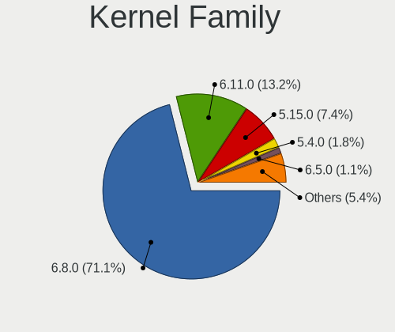
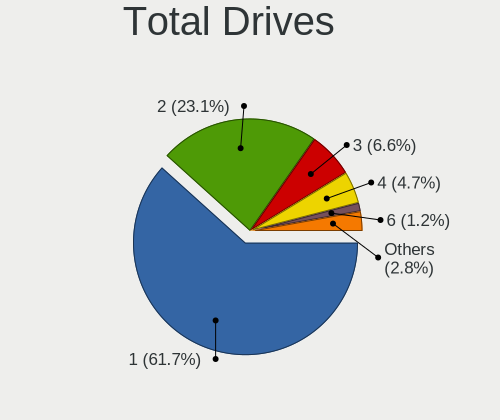
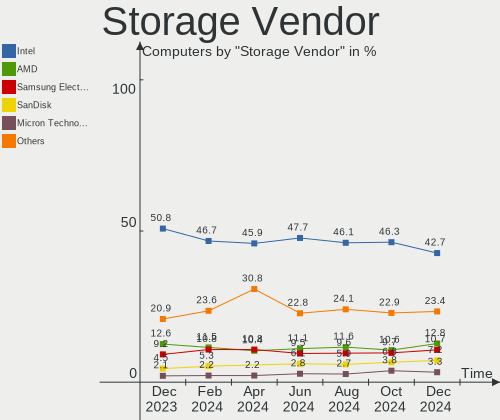
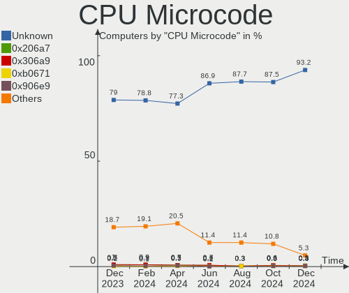
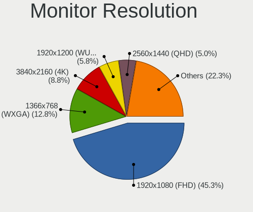

Ubuntu - Hardware Trends
------------------------

A project to identify most popular hardware characteristics and track their change
over time based on data collected by Linux users at https://Linux-Hardware.org.

Anyone can contribute to this report by the [hw-probe](https://github.com/linuxhw/hw-probe) tool:

    sudo -E hw-probe -all -upload

This is a report for all computer types. See also reports for [desktops](/Dist/Ubuntu/Desktop/README.md) and [notebooks](/Dist/Ubuntu/Notebook/README.md).

This report is for one last month. Overall report since the beginning of time: [TestDays](https://github.com/linuxhw/TestDays)

Period: Jan, 2024.

Contents
--------

* [ System ](#system)
  - [ OS                       ](#os)
  - [ OS Family                ](#os-family)
  - [ Kernel                   ](#kernel)
  - [ Kernel Family            ](#kernel-family)
  - [ Kernel Major Ver.        ](#kernel-major-ver)
  - [ Arch                     ](#arch)
  - [ DE                       ](#de)
  - [ Display Server           ](#display-server)
  - [ Display Manager          ](#display-manager)
  - [ OS Lang                  ](#os-lang)
  - [ Boot Mode                ](#boot-mode)
  - [ Filesystem               ](#filesystem)
  - [ Part. scheme             ](#part-scheme)
  - [ Dual Boot with Linux/BSD ](#dual-boot-with-linuxbsd)
  - [ Dual Boot (Win)          ](#dual-boot-win)

* [ Board ](#board)
  - [ Vendor                   ](#vendor)
  - [ Model                    ](#model)
  - [ Model Family             ](#model-family)
  - [ MFG Year                 ](#mfg-year)
  - [ Form Factor              ](#form-factor)
  - [ Secure Boot              ](#secure-boot)
  - [ Coreboot                 ](#coreboot)
  - [ RAM Size                 ](#ram-size)
  - [ RAM Used                 ](#ram-used)
  - [ Total Drives             ](#total-drives)
  - [ Has CD-ROM               ](#has-cd-rom)
  - [ Has Ethernet             ](#has-ethernet)
  - [ Has WiFi                 ](#has-wifi)
  - [ Has Bluetooth            ](#has-bluetooth)

* [ Location ](#location)
  - [ Country                  ](#country)
  - [ City                     ](#city)

* [ Drives ](#drives)
  - [ Drive Vendor             ](#drive-vendor)
  - [ Drive Model              ](#drive-model)
  - [ HDD Vendor               ](#hdd-vendor)
  - [ SSD Vendor               ](#ssd-vendor)
  - [ Drive Kind               ](#drive-kind)
  - [ Drive Connector          ](#drive-connector)
  - [ Drive Size               ](#drive-size)
  - [ Space Total              ](#space-total)
  - [ Space Used               ](#space-used)
  - [ Malfunc. Drives          ](#malfunc-drives)
  - [ Malfunc. Drive Vendor    ](#malfunc-drive-vendor)
  - [ Malfunc. HDD Vendor      ](#malfunc-hdd-vendor)
  - [ Malfunc. Drive Kind      ](#malfunc-drive-kind)
  - [ Failed Drives            ](#failed-drives)
  - [ Failed Drive Vendor      ](#failed-drive-vendor)
  - [ Drive Status             ](#drive-status)

* [ Storage controller ](#storage-controller)
  - [ Storage Vendor           ](#storage-vendor)
  - [ Storage Model            ](#storage-model)
  - [ Storage Kind             ](#storage-kind)

* [ Processor ](#processor)
  - [ CPU Vendor               ](#cpu-vendor)
  - [ CPU Model                ](#cpu-model)
  - [ CPU Model Family         ](#cpu-model-family)
  - [ CPU Cores                ](#cpu-cores)
  - [ CPU Sockets              ](#cpu-sockets)
  - [ CPU Threads              ](#cpu-threads)
  - [ CPU Op-Modes             ](#cpu-op-modes)
  - [ CPU Microcode            ](#cpu-microcode)
  - [ CPU Microarch            ](#cpu-microarch)

* [ Graphics ](#graphics)
  - [ GPU Vendor               ](#gpu-vendor)
  - [ GPU Model                ](#gpu-model)
  - [ GPU Combo                ](#gpu-combo)
  - [ GPU Driver               ](#gpu-driver)
  - [ GPU Memory               ](#gpu-memory)

* [ Monitor ](#monitor)
  - [ Monitor Vendor           ](#monitor-vendor)
  - [ Monitor Model            ](#monitor-model)
  - [ Monitor Resolution       ](#monitor-resolution)
  - [ Monitor Diagonal         ](#monitor-diagonal)
  - [ Monitor Width            ](#monitor-width)
  - [ Aspect Ratio             ](#aspect-ratio)
  - [ Monitor Area             ](#monitor-area)
  - [ Pixel Density            ](#pixel-density)
  - [ Multiple Monitors        ](#multiple-monitors)

* [ Network ](#network)
  - [ Net Controller Vendor    ](#net-controller-vendor)
  - [ Net Controller Model     ](#net-controller-model)
  - [ Wireless Vendor          ](#wireless-vendor)
  - [ Wireless Model           ](#wireless-model)
  - [ Ethernet Vendor          ](#ethernet-vendor)
  - [ Ethernet Model           ](#ethernet-model)
  - [ Net Controller Kind      ](#net-controller-kind)
  - [ Used Controller          ](#used-controller)
  - [ NICs                     ](#nics)
  - [ IPv6                     ](#ipv6)

* [ Bluetooth ](#bluetooth)
  - [ Bluetooth Vendor         ](#bluetooth-vendor)
  - [ Bluetooth Model          ](#bluetooth-model)

* [ Sound ](#sound)
  - [ Sound Vendor             ](#sound-vendor)
  - [ Sound Model              ](#sound-model)

* [ Memory ](#memory)
  - [ Memory Vendor            ](#memory-vendor)
  - [ Memory Model             ](#memory-model)
  - [ Memory Kind              ](#memory-kind)
  - [ Memory Form Factor       ](#memory-form-factor)
  - [ Memory Size              ](#memory-size)
  - [ Memory Speed             ](#memory-speed)

* [ Printers & scanners ](#printers--scanners)
  - [ Printer Vendor           ](#printer-vendor)
  - [ Printer Model            ](#printer-model)
  - [ Scanner Vendor           ](#scanner-vendor)
  - [ Scanner Model            ](#scanner-model)

* [ Camera ](#camera)
  - [ Camera Vendor            ](#camera-vendor)
  - [ Camera Model             ](#camera-model)

* [ Security ](#security)
  - [ Fingerprint Vendor       ](#fingerprint-vendor)
  - [ Fingerprint Model        ](#fingerprint-model)
  - [ Chipcard Vendor          ](#chipcard-vendor)
  - [ Chipcard Model           ](#chipcard-model)

* [ Unsupported ](#unsupported)
  - [ Unsupported Devices      ](#unsupported-devices)
  - [ Unsupported Device Types ](#unsupported-device-types)

System
------

OS
--

Installed operating systems

| Name           | Computers | Percent |
|----------------|-----------|---------|
| Ubuntu 22.04   | 825       | 67.24%  |
| Ubuntu 23.10   | 255       | 20.78%  |
| Ubuntu 20.04   | 81        | 6.6%    |
| Ubuntu 23.04   | 31        | 2.53%   |
| Ubuntu 18.04   | 12        | 0.98%   |
| Ubuntu 22.10   | 10        | 0.81%   |
| Ubuntu 24.04   | 7         | 0.57%   |
| Ubuntu Core 22 | 2         | 0.16%   |
| Ubuntu 21.10   | 2         | 0.16%   |
| Ubuntu 21.04   | 1         | 0.08%   |
| Ubuntu 19.10   | 1         | 0.08%   |

OS Family
---------

OS without a version

| Name   | Computers | Percent |
|--------|-----------|---------|
| Ubuntu | 1227      | 100%    |

Kernel
------

Version of the Linux kernel

| Version                    | Computers | Percent |
|----------------------------|-----------|---------|
| 6.5.0-14-generic           | 485       | 39.53%  |
| 6.2.0-39-generic           | 222       | 18.09%  |
| 6.5.0-15-generic           | 118       | 9.62%   |
| 5.15.0-91-generic          | 112       | 9.13%   |
| 6.2.0-26-generic           | 48        | 3.91%   |
| 5.19.0-38-generic          | 30        | 2.44%   |
| 6.5.0-9-generic            | 16        | 1.3%    |
| 5.15.0-92-generic          | 15        | 1.22%   |
| 6.2.0-37-generic           | 11        | 0.9%    |
| 5.4.0-169-generic          | 10        | 0.81%   |
| 6.5.0-17-generic           | 6         | 0.49%   |
| 5.19.0-46-generic          | 6         | 0.49%   |
| 6.6.0-14-generic           | 5         | 0.41%   |
| 6.2.0-36-generic           | 5         | 0.41%   |
| 5.15.0-88-generic          | 5         | 0.41%   |
| 6.7.0-060700-generic       | 4         | 0.33%   |
| 6.1.0-1028-oem             | 4         | 0.33%   |
| 5.15.0-89-generic          | 4         | 0.33%   |
| 5.15.0-67-generic          | 4         | 0.33%   |
| 5.15.0-25-generic          | 4         | 0.33%   |
| 6.6.9-060609-generic       | 3         | 0.24%   |
| 6.5.0-14-lowlatency        | 3         | 0.24%   |
| 6.2.0-32-generic           | 3         | 0.24%   |
| 5.4.0-150-generic          | 3         | 0.24%   |
| 5.19.0-32-generic          | 3         | 0.24%   |
| 5.19.0-21-generic          | 3         | 0.24%   |
| 4.15.0-213-generic         | 3         | 0.24%   |
| 6.7.1-060701-generic       | 2         | 0.16%   |
| 6.5.7-060507-generic       | 2         | 0.16%   |
| 6.5.0-142312122121-generic | 2         | 0.16%   |
| 6.5.0-13-generic           | 2         | 0.16%   |
| 6.2.0-27-generic           | 2         | 0.16%   |
| 6.2.0-20-generic           | 2         | 0.16%   |
| 6.1.0-1027-oem             | 2         | 0.16%   |
| 5.4.0-170-generic          | 2         | 0.16%   |
| 5.19.0-43-generic          | 2         | 0.16%   |
| 5.15.0-91-lowlatency       | 2         | 0.16%   |
| 5.15.0-75-generic          | 2         | 0.16%   |
| 5.15.0-73-fips             | 2         | 0.16%   |
| 5.15.0-43-generic          | 2         | 0.16%   |

Kernel Family
-------------

Linux kernel without a distro release

| Version  | Computers | Percent |
|----------|-----------|---------|
| 6.5.0    | 637       | 51.92%  |
| 6.2.0    | 297       | 24.21%  |
| 5.15.0   | 164       | 13.37%  |
| 5.19.0   | 47        | 3.83%   |
| 5.4.0    | 20        | 1.63%   |
| 6.1.0    | 7         | 0.57%   |
| 4.15.0   | 7         | 0.57%   |
| 5.13.0   | 6         | 0.49%   |
| 6.7.0    | 5         | 0.41%   |
| 6.6.0    | 5         | 0.41%   |
| 6.6.9    | 3         | 0.24%   |
| 6.7.1    | 2         | 0.16%   |
| 6.6.6    | 2         | 0.16%   |
| 6.6.10   | 2         | 0.16%   |
| 6.5.7    | 2         | 0.16%   |
| 5.3.0    | 2         | 0.16%   |
| 5.14.0   | 2         | 0.16%   |
| 5.11.0   | 2         | 0.16%   |
| 5.10.160 | 2         | 0.16%   |
| 6.8.0    | 1         | 0.08%   |
| 6.7.2    | 1         | 0.08%   |
| 6.6.8    | 1         | 0.08%   |
| 6.6.13   | 1         | 0.08%   |
| 6.6.11   | 1         | 0.08%   |
| 6.6.1    | 1         | 0.08%   |
| 6.4.6    | 1         | 0.08%   |
| 6.1.5    | 1         | 0.08%   |
| 5.8.0    | 1         | 0.08%   |
| 5.19.17  | 1         | 0.08%   |
| 5.15.145 | 1         | 0.08%   |
| 5.10.120 | 1         | 0.08%   |
| 4.9.140  | 1         | 0.08%   |

Kernel Major Ver.
-----------------

Linux kernel major version

| Version | Computers | Percent |
|---------|-----------|---------|
| 6.5     | 639       | 52.08%  |
| 6.2     | 297       | 24.21%  |
| 5.15    | 165       | 13.45%  |
| 5.19    | 48        | 3.91%   |
| 5.4     | 20        | 1.63%   |
| 6.6     | 16        | 1.3%    |
| 6.7     | 8         | 0.65%   |
| 6.1     | 8         | 0.65%   |
| 4.15    | 7         | 0.57%   |
| 5.13    | 6         | 0.49%   |
| 5.10    | 3         | 0.24%   |
| 5.3     | 2         | 0.16%   |
| 5.14    | 2         | 0.16%   |
| 5.11    | 2         | 0.16%   |
| 6.8     | 1         | 0.08%   |
| 6.4     | 1         | 0.08%   |
| 5.8     | 1         | 0.08%   |
| 4.9     | 1         | 0.08%   |

Arch
----

OS architecture (x86_64, i586, etc.)

| Name    | Computers | Percent |
|---------|-----------|---------|
| x86_64  | 1220      | 99.43%  |
| aarch64 | 6         | 0.49%   |
| i686    | 1         | 0.08%   |

DE
--

Desktop Environment

| Name            | Computers | Percent |
|-----------------|-----------|---------|
| GNOME           | 1113      | 90.71%  |
| Unknown         | 88        | 7.17%   |
| X-Cinnamon      | 10        | 0.81%   |
| GNOME Flashback | 4         | 0.33%   |
| Enlightenment   | 4         | 0.33%   |
| ubuntu          | 1         | 0.08%   |
| Pantheon        | 1         | 0.08%   |
| i3              | 1         | 0.08%   |
| GNUstep         | 1         | 0.08%   |
| GNOME Classic   | 1         | 0.08%   |
| DDE             | 1         | 0.08%   |
| Cinnamon        | 1         | 0.08%   |
| awesome         | 1         | 0.08%   |

Display Server
--------------

X11 or Wayland

| Name    | Computers | Percent |
|---------|-----------|---------|
| Wayland | 694       | 56.56%  |
| X11     | 420       | 34.23%  |
| Unknown | 67        | 5.46%   |
| Tty     | 46        | 3.75%   |

Display Manager
---------------

SDDM, LightDM, etc.

| Name    | Computers | Percent |
|---------|-----------|---------|
| GDM3    | 1001      | 81.58%  |
| Unknown | 162       | 13.2%   |
| GDM     | 35        | 2.85%   |
| LightDM | 17        | 1.39%   |
| SDDM    | 9         | 0.73%   |
| SLiM    | 2         | 0.16%   |
| XDM     | 1         | 0.08%   |

OS Lang
-------

Language

| Lang    | Computers | Percent |
|---------|-----------|---------|
| en_US   | 572       | 46.62%  |
| de_DE   | 123       | 10.02%  |
| fr_FR   | 77        | 6.28%   |
| en_GB   | 56        | 4.56%   |
| C       | 56        | 4.56%   |
| it_IT   | 34        | 2.77%   |
| ru_RU   | 31        | 2.53%   |
| es_ES   | 29        | 2.36%   |
| pt_BR   | 27        | 2.2%    |
| en_CA   | 25        | 2.04%   |
| en_AU   | 21        | 1.71%   |
| Unknown | 21        | 1.71%   |
| en_IN   | 19        | 1.55%   |
| pl_PL   | 13        | 1.06%   |
| nl_NL   | 10        | 0.81%   |
| zh_CN   | 8         | 0.65%   |
| fr_CA   | 7         | 0.57%   |
| hu_HU   | 6         | 0.49%   |
| de_CH   | 6         | 0.49%   |
| cs_CZ   | 6         | 0.49%   |
| es_AR   | 5         | 0.41%   |
| sv_SE   | 4         | 0.33%   |
| pt_PT   | 4         | 0.33%   |
| ja_JP   | 4         | 0.33%   |
| fi_FI   | 4         | 0.33%   |
| es_MX   | 4         | 0.33%   |
| en_ZA   | 4         | 0.33%   |
| tr_TR   | 3         | 0.24%   |
| nb_NO   | 3         | 0.24%   |
| es_CL   | 3         | 0.24%   |
| en_NZ   | 3         | 0.24%   |
| en_HK   | 3         | 0.24%   |
| zh_TW   | 2         | 0.16%   |
| sk_SK   | 2         | 0.16%   |
| fr_CH   | 2         | 0.16%   |
| fr_BE   | 2         | 0.16%   |
| et_EE   | 2         | 0.16%   |
| es_CO   | 2         | 0.16%   |
| el_GR   | 2         | 0.16%   |
| da_DK   | 2         | 0.16%   |

Boot Mode
---------

EFI or BIOS

| Mode | Computers | Percent |
|------|-----------|---------|
| BIOS | 738       | 60.15%  |
| EFI  | 489       | 39.85%  |

Filesystem
----------

Type of filesystem

| Type    | Computers | Percent |
|---------|-----------|---------|
| Tmpfs   | 625       | 50.94%  |
| Ext4    | 522       | 42.54%  |
| Overlay | 51        | 4.16%   |
| Btrfs   | 13        | 1.06%   |
| Zfs     | 12        | 0.98%   |
| Xfs     | 1         | 0.08%   |
| Ext3    | 1         | 0.08%   |
| Ext2    | 1         | 0.08%   |
| Unknown | 1         | 0.08%   |

Part. scheme
------------

Scheme of partitioning

| Type    | Computers | Percent |
|---------|-----------|---------|
| GPT     | 1004      | 81.83%  |
| Unknown | 115       | 9.37%   |
| MBR     | 108       | 8.8%    |

Dual Boot with Linux/BSD
------------------------

Hosting more than one Linux/BSD

| Dual boot | Computers | Percent |
|-----------|-----------|---------|
| No        | 1063      | 86.63%  |
| Yes       | 164       | 13.37%  |

Dual Boot (Win)
---------------

Hosting Linux and Windows

| Dual boot | Computers | Percent |
|-----------|-----------|---------|
| No        | 832       | 67.81%  |
| Yes       | 395       | 32.19%  |

Board
-----

Vendor
------

Motherboard manufacturer

| Name                                 | Computers | Percent |
|--------------------------------------|-----------|---------|
| ASUSTek Computer                     | 190       | 15.48%  |
| Dell                                 | 186       | 15.16%  |
| Hewlett-Packard                      | 168       | 13.69%  |
| Lenovo                               | 158       | 12.88%  |
| Gigabyte Technology                  | 65        | 5.3%    |
| Acer                                 | 54        | 4.4%    |
| MSI                                  | 51        | 4.16%   |
| Apple                                | 39        | 3.18%   |
| ASRock                               | 36        | 2.93%   |
| Supermicro                           | 29        | 2.36%   |
| Intel                                | 27        | 2.2%    |
| Toshiba                              | 17        | 1.39%   |
| Unknown                              | 17        | 1.39%   |
| Fujitsu                              | 16        | 1.3%    |
| Medion                               | 14        | 1.14%   |
| Samsung Electronics                  | 11        | 0.9%    |
| HUAWEI                               | 10        | 0.81%   |
| AZW                                  | 9         | 0.73%   |
| Sony                                 | 8         | 0.65%   |
| ETegro Technologies                  | 8         | 0.65%   |
| Microsoft                            | 7         | 0.57%   |
| Google                               | 7         | 0.57%   |
| Foxconn                              | 7         | 0.57%   |
| Pegatron                             | 5         | 0.41%   |
| Notebook                             | 5         | 0.41%   |
| Biostar                              | 4         | 0.33%   |
| Alienware                            | 4         | 0.33%   |
| TUXEDO                               | 3         | 0.24%   |
| Packard Bell                         | 3         | 0.24%   |
| HONOR                                | 3         | 0.24%   |
| BESSTAR Tech                         | 3         | 0.24%   |
| AMI                                  | 3         | 0.24%   |
| UNOWHY                               | 2         | 0.16%   |
| System76                             | 2         | 0.16%   |
| Shenzhen Meigao Electronic Equipment | 2         | 0.16%   |
| Panasonic                            | 2         | 0.16%   |
| MACHINIST                            | 2         | 0.16%   |
| LG Electronics                       | 2         | 0.16%   |
| Infinix                              | 2         | 0.16%   |
| Huanan                               | 2         | 0.16%   |

Model
-----

Motherboard model

| Name                              | Computers | Percent |
|-----------------------------------|-----------|---------|
| Unknown                           | 17        | 1.39%   |
| ETegro Hyperion RS125 G4          | 8         | 0.65%   |
| ASUS All Series                   | 8         | 0.65%   |
| Supermicro X8DTU                  | 5         | 0.41%   |
| Supermicro SYS-1028R-TDW          | 4         | 0.33%   |
| Supermicro AS -2124BT-HTR         | 4         | 0.33%   |
| HP Pavilion Notebook              | 4         | 0.33%   |
| HP Laptop 15-dy2xxx               | 4         | 0.33%   |
| HP EliteBook 840 G3               | 4         | 0.33%   |
| Supermicro X9DRW                  | 3         | 0.24%   |
| Lenovo IdeaPad 5 Pro 14ACN6 82L7  | 3         | 0.24%   |
| Intel Jasper Lake Client Platform | 3         | 0.24%   |
| HP Pavilion dv6                   | 3         | 0.24%   |
| HP Notebook                       | 3         | 0.24%   |
| Dell XPS 9320                     | 3         | 0.24%   |
| Dell XPS 13 9370                  | 3         | 0.24%   |
| Dell Precision Tower 3420         | 3         | 0.24%   |
| Dell OptiPlex 9020                | 3         | 0.24%   |
| Dell OptiPlex 7050                | 3         | 0.24%   |
| Dell OptiPlex 7020                | 3         | 0.24%   |
| Dell OptiPlex 7010                | 3         | 0.24%   |
| Dell Inspiron 5570                | 3         | 0.24%   |
| ASUS PRIME X470-PRO               | 3         | 0.24%   |
| Apple MacBookPro9,2               | 3         | 0.24%   |
| Apple iMac12,2                    | 3         | 0.24%   |
| Acer Nitro AN515-58               | 3         | 0.24%   |
| Toshiba Satellite C55-C           | 2         | 0.16%   |
| Supermicro X8DTT                  | 2         | 0.16%   |
| Supermicro X8DAH                  | 2         | 0.16%   |
| Supermicro SYS-6018R-MTR          | 2         | 0.16%   |
| MSI Prestige 13Evo A13M           | 2         | 0.16%   |
| MSI MS-7E06                       | 2         | 0.16%   |
| MSI MS-7C91                       | 2         | 0.16%   |
| MSI MS-7C79                       | 2         | 0.16%   |
| MSI MS-7C75                       | 2         | 0.16%   |
| MSI MS-7B89                       | 2         | 0.16%   |
| MSI MS-7996                       | 2         | 0.16%   |
| Microsoft Surface Go 3            | 2         | 0.16%   |
| Microsoft Surface Book 2          | 2         | 0.16%   |
| Medion P15648                     | 2         | 0.16%   |

Model Family
------------

Motherboard model prefix

| Name                     | Computers | Percent |
|--------------------------|-----------|---------|
| Lenovo ThinkPad          | 74        | 6.03%   |
| Dell Inspiron            | 50        | 4.07%   |
| Dell Latitude            | 46        | 3.75%   |
| Lenovo IdeaPad           | 34        | 2.77%   |
| Acer Aspire              | 34        | 2.77%   |
| ASUS ROG                 | 33        | 2.69%   |
| HP Pavilion              | 29        | 2.36%   |
| Dell Precision           | 27        | 2.2%    |
| Dell OptiPlex            | 27        | 2.2%    |
| ASUS VivoBook            | 26        | 2.12%   |
| ASUS PRIME               | 26        | 2.12%   |
| HP EliteBook             | 25        | 2.04%   |
| HP Laptop                | 21        | 1.71%   |
| Dell XPS                 | 19        | 1.55%   |
| HP ProBook               | 18        | 1.47%   |
| Unknown                  | 17        | 1.39%   |
| Toshiba Satellite        | 16        | 1.3%    |
| Lenovo ThinkCentre       | 13        | 1.06%   |
| ASUS TUF                 | 10        | 0.81%   |
| ASUS ASUS                | 10        | 0.81%   |
| Lenovo Yoga              | 9         | 0.73%   |
| HP Compaq                | 9         | 0.73%   |
| HP ENVY                  | 8         | 0.65%   |
| ETegro Hyperion          | 8         | 0.65%   |
| ASUS ZenBook             | 8         | 0.65%   |
| ASUS All                 | 8         | 0.65%   |
| Microsoft Surface        | 7         | 0.57%   |
| Lenovo Legion            | 7         | 0.57%   |
| Fujitsu LIFEBOOK         | 7         | 0.57%   |
| Fujitsu ESPRIMO          | 7         | 0.57%   |
| Dell PowerEdge           | 7         | 0.57%   |
| Acer Nitro               | 7         | 0.57%   |
| HP ZBook                 | 6         | 0.49%   |
| Supermicro X8DTU         | 5         | 0.41%   |
| Lenovo ThinkBook         | 5         | 0.41%   |
| HP EliteDesk             | 5         | 0.41%   |
| Dell Vostro              | 5         | 0.41%   |
| Acer Swift               | 5         | 0.41%   |
| Supermicro SYS-1028R-TDW | 4         | 0.33%   |
| Supermicro AS            | 4         | 0.33%   |

MFG Year
--------

Motherboard manufacture year

| Year    | Computers | Percent |
|---------|-----------|---------|
| 2021    | 128       | 10.43%  |
| 2022    | 121       | 9.86%   |
| 2023    | 108       | 8.8%    |
| 2020    | 98        | 7.99%   |
| 2018    | 97        | 7.91%   |
| 2013    | 93        | 7.58%   |
| 2016    | 79        | 6.44%   |
| 2019    | 72        | 5.87%   |
| 2014    | 66        | 5.38%   |
| 2017    | 65        | 5.3%    |
| 2012    | 64        | 5.22%   |
| 2015    | 57        | 4.65%   |
| 2010    | 50        | 4.07%   |
| 2011    | 44        | 3.59%   |
| 2009    | 35        | 2.85%   |
| 2008    | 29        | 2.36%   |
| 2007    | 10        | 0.81%   |
| 2006    | 5         | 0.41%   |
| Unknown | 5         | 0.41%   |
| 2024    | 1         | 0.08%   |

Form Factor
-----------

Physical design of the computer

| Name           | Computers | Percent |
|----------------|-----------|---------|
| Notebook       | 628       | 51.18%  |
| Desktop        | 469       | 38.22%  |
| Server         | 39        | 3.18%   |
| Convertible    | 37        | 3.02%   |
| Mini pc        | 21        | 1.71%   |
| All in one     | 19        | 1.55%   |
| Tablet         | 9         | 0.73%   |
| System on chip | 5         | 0.41%   |

Secure Boot
-----------

Enabled or disabled

| State    | Computers | Percent |
|----------|-----------|---------|
| Disabled | 1116      | 90.95%  |
| Enabled  | 111       | 9.05%   |

Coreboot
--------

Have coreboot on board

| Used | Computers | Percent |
|------|-----------|---------|
| No   | 1219      | 99.35%  |
| Yes  | 8         | 0.65%   |

RAM Size
--------

Total RAM memory

| Size in GB      | Computers | Percent |
|-----------------|-----------|---------|
| 4.01-8.0        | 294       | 23.96%  |
| 16.01-24.0      | 274       | 22.33%  |
| 8.01-16.0       | 190       | 15.48%  |
| 32.01-64.0      | 186       | 15.16%  |
| 3.01-4.0        | 135       | 11%     |
| 64.01-256.0     | 78        | 6.36%   |
| 24.01-32.0      | 36        | 2.93%   |
| More than 256.0 | 13        | 1.06%   |
| 1.01-2.0        | 11        | 0.9%    |
| 2.01-3.0        | 9         | 0.73%   |
| 0.51-1.0        | 1         | 0.08%   |

RAM Used
--------

Used RAM memory

| Used GB     | Computers | Percent |
|-------------|-----------|---------|
| 2.01-3.0    | 341       | 27.79%  |
| 1.01-2.0    | 326       | 26.57%  |
| 4.01-8.0    | 233       | 18.99%  |
| 3.01-4.0    | 213       | 17.36%  |
| 8.01-16.0   | 61        | 4.97%   |
| 0.51-1.0    | 19        | 1.55%   |
| 16.01-24.0  | 14        | 1.14%   |
| 24.01-32.0  | 7         | 0.57%   |
| 64.01-256.0 | 7         | 0.57%   |
| 0.01-0.5    | 4         | 0.33%   |
| 32.01-64.0  | 2         | 0.16%   |

Total Drives
------------

Number of drives on board

| Drives | Computers | Percent |
|--------|-----------|---------|
| 1      | 799       | 65.12%  |
| 2      | 246       | 20.05%  |
| 3      | 99        | 8.07%   |
| 4      | 31        | 2.53%   |
| 5      | 19        | 1.55%   |
| 0      | 10        | 0.81%   |
| 6      | 8         | 0.65%   |
| 8      | 5         | 0.41%   |
| 7      | 4         | 0.33%   |
| 70     | 1         | 0.08%   |
| 26     | 1         | 0.08%   |
| 25     | 1         | 0.08%   |
| 14     | 1         | 0.08%   |
| 10     | 1         | 0.08%   |
| 9      | 1         | 0.08%   |

Has CD-ROM
----------

Has CD-ROM on board

| Presented | Computers | Percent |
|-----------|-----------|---------|
| No        | 850       | 69.27%  |
| Yes       | 377       | 30.73%  |

Has Ethernet
------------

Has Ethernet on board

| Presented | Computers | Percent |
|-----------|-----------|---------|
| Yes       | 1023      | 83.37%  |
| No        | 204       | 16.63%  |

Has WiFi
--------

Has WiFi module

| Presented | Computers | Percent |
|-----------|-----------|---------|
| Yes       | 947       | 77.18%  |
| No        | 280       | 22.82%  |

Has Bluetooth
-------------

Has Bluetooth module

| Presented | Computers | Percent |
|-----------|-----------|---------|
| Yes       | 808       | 65.85%  |
| No        | 419       | 34.15%  |

Location
--------

Country
-------

Geographic location (country)

| Country         | Computers | Percent |
|-----------------|-----------|---------|
| USA             | 249       | 20.29%  |
| Germany         | 154       | 12.55%  |
| France          | 94        | 7.66%   |
| Russia          | 75        | 6.11%   |
| UK              | 52        | 4.24%   |
| Canada          | 45        | 3.67%   |
| Brazil          | 42        | 3.42%   |
| Italy           | 41        | 3.34%   |
| Spain           | 32        | 2.61%   |
| India           | 32        | 2.61%   |
| Poland          | 28        | 2.28%   |
| Australia       | 22        | 1.79%   |
| Sweden          | 19        | 1.55%   |
| Switzerland     | 18        | 1.47%   |
| Netherlands     | 17        | 1.39%   |
| Mexico          | 14        | 1.14%   |
| Hungary         | 13        | 1.06%   |
| Czechia         | 12        | 0.98%   |
| Turkey          | 11        | 0.9%    |
| Portugal        | 11        | 0.9%    |
| Finland         | 11        | 0.9%    |
| China           | 11        | 0.9%    |
| Bulgaria        | 11        | 0.9%    |
| Indonesia       | 10        | 0.81%   |
| Hong Kong       | 10        | 0.81%   |
| Vietnam         | 9         | 0.73%   |
| Norway          | 9         | 0.73%   |
| Greece          | 9         | 0.73%   |
| Colombia        | 9         | 0.73%   |
| Belgium         | 8         | 0.65%   |
| Belarus         | 7         | 0.57%   |
| Argentina       | 7         | 0.57%   |
| South Africa    | 6         | 0.49%   |
| Romania         | 6         | 0.49%   |
| Japan           | 6         | 0.49%   |
| Austria         | 6         | 0.49%   |
| Saudi Arabia    | 5         | 0.41%   |
| Denmark         | 5         | 0.41%   |
| Chile           | 5         | 0.41%   |
| The Netherlands | 4         | 0.33%   |

City
----

Geographic location (city)

| City          | Computers | Percent |
|---------------|-----------|---------|
| Moscow        | 39        | 3.18%   |
| Paris         | 15        | 1.22%   |
| Berlin        | 12        | 0.98%   |
| Hamburg       | 9         | 0.73%   |
| Central       | 9         | 0.73%   |
| Rome          | 8         | 0.65%   |
| Munich        | 8         | 0.65%   |
| Sydney        | 7         | 0.57%   |
| Raleigh       | 7         | 0.57%   |
| Montreal      | 7         | 0.57%   |
| Madrid        | 7         | 0.57%   |
| Budapest      | 7         | 0.57%   |
| Toronto       | 6         | 0.49%   |
| Milan         | 6         | 0.49%   |
| Bremen        | 6         | 0.49%   |
| Warsaw        | 5         | 0.41%   |
| St Petersburg | 5         | 0.41%   |
| Sofia         | 5         | 0.41%   |
| Lisbon        | 5         | 0.41%   |
| Leipzig       | 5         | 0.41%   |
| Istanbul      | 5         | 0.41%   |
| Hanoi         | 5         | 0.41%   |
| Dallas        | 5         | 0.41%   |
| Chemnitz      | 5         | 0.41%   |
| Bogotá       | 5         | 0.41%   |
| Athens        | 5         | 0.41%   |
| Zurich        | 4         | 0.33%   |
| Tucson        | 4         | 0.33%   |
| Stockholm     | 4         | 0.33%   |
| Singapore     | 4         | 0.33%   |
| Sao Paulo     | 4         | 0.33%   |
| Santiago      | 4         | 0.33%   |
| Prague        | 4         | 0.33%   |
| Portland      | 4         | 0.33%   |
| Oshawa        | 4         | 0.33%   |
| Montpellier   | 4         | 0.33%   |
| Melbourne     | 4         | 0.33%   |
| Helsinki      | 4         | 0.33%   |
| Denver        | 4         | 0.33%   |
| Chicago       | 4         | 0.33%   |

Drives
------

Drive Vendor
------------

Hard drive vendors

| Vendor                      | Computers | Drives | Percent |
|-----------------------------|-----------|--------|---------|
| Samsung Electronics         | 261       | 314    | 15.3%   |
| WDC                         | 182       | 247    | 10.67%  |
| Seagate                     | 180       | 253    | 10.55%  |
| SanDisk                     | 124       | 134    | 7.27%   |
| Toshiba                     | 84        | 137    | 4.92%   |
| Kingston                    | 79        | 85     | 4.63%   |
| Crucial                     | 67        | 68     | 3.93%   |
| Micron Technology           | 66        | 67     | 3.87%   |
| Unknown                     | 59        | 67     | 3.46%   |
| Intel                       | 58        | 62     | 3.4%    |
| SK hynix                    | 54        | 56     | 3.17%   |
| Hitachi                     | 36        | 66     | 2.11%   |
| HGST                        | 33        | 36     | 1.93%   |
| China                       | 29        | 30     | 1.7%    |
| KIOXIA                      | 24        | 26     | 1.41%   |
| Apple                       | 22        | 25     | 1.29%   |
| Phison Electronics          | 21        | 21     | 1.23%   |
| Kingston Technology Company | 18        | 18     | 1.06%   |
| Fujitsu                     | 18        | 19     | 1.06%   |
| Micron/Crucial Technology   | 15        | 18     | 0.88%   |
| Intenso                     | 15        | 15     | 0.88%   |
| A-DATA Technology           | 15        | 16     | 0.88%   |
| MAXIO Technology (Hangzhou) | 12        | 13     | 0.7%    |
| Unknown                     | 11        | 11     | 0.64%   |
| PNY                         | 10        | 10     | 0.59%   |
| Hewlett-Packard             | 9         | 19     | 0.53%   |
| Silicon Motion              | 8         | 8      | 0.47%   |
| SPCC                        | 7         | 7      | 0.41%   |
| XrayDisk                    | 6         | 6      | 0.35%   |
| Phison                      | 6         | 6      | 0.35%   |
| OCZ                         | 6         | 6      | 0.35%   |
| LITEON                      | 6         | 6      | 0.35%   |
| Lexar                       | 6         | 6      | 0.35%   |
| GOODRAM                     | 6         | 6      | 0.35%   |
| ADATA Technology            | 6         | 6      | 0.35%   |
| Realtek Semiconductor       | 5         | 5      | 0.29%   |
| Patriot                     | 5         | 5      | 0.29%   |
| Maxtor                      | 5         | 5      | 0.29%   |
| Transcend                   | 4         | 5      | 0.23%   |
| Team                        | 4         | 5      | 0.23%   |

Drive Model
-----------

Hard drive models

| Model                                               | Computers | Percent |
|-----------------------------------------------------|-----------|---------|
| Samsung NVMe SSD Controller SM981/PM981/PM983 1TB   | 24        | 1.3%    |
| Kingston SA400S37480G 480GB SSD                     | 19        | 1.03%   |
| Samsung SSD 860 EVO 1TB                             | 13        | 0.7%    |
| Samsung SSD 980 PRO 2TB                             | 12        | 0.65%   |
| Samsung NVMe SSD Controller SM961/PM961/SM963 256GB | 12        | 0.65%   |
| Unknown SD/MMC/MS PRO 256GB                         | 11        | 0.59%   |
| Micron/Crucial P2 NVMe PCIe SSD 1TB                 | 11        | 0.59%   |
| Intel SSDPEKNU512GZ 512GB                           | 11        | 0.59%   |
| Unknown                                             | 11        | 0.59%   |
| Unknown MMC Card  64GB                              | 10        | 0.54%   |
| Seagate ST1000LM024 HN-M101MBB 1TB                  | 10        | 0.54%   |
| Kingston SA400S37240G 240GB SSD                     | 10        | 0.54%   |
| SanDisk NVMe SSD Drive 512GB                        | 9         | 0.49%   |
| Unknown MMC Card  32GB                              | 8         | 0.43%   |
| Unknown MMC Card  128GB                             | 8         | 0.43%   |
| Samsung SSD 850 EVO 250GB                           | 8         | 0.43%   |
| Samsung NVMe SSD Controller PM9A1/PM9A3/980PRO 2TB  | 8         | 0.43%   |
| HGST HTS721010A9E630 1TB                            | 8         | 0.43%   |
| WDC WD5000AAKX-22ERMA0 500GB                        | 7         | 0.38%   |
| WDC WD10EZEX-08WN4A0 1TB                            | 7         | 0.38%   |
| Toshiba DT01ACA100 1TB                              | 7         | 0.38%   |
| Seagate ST500DM002-1BD142 500GB                     | 7         | 0.38%   |
| Seagate ST1000DM010-2EP102 1TB                      | 7         | 0.38%   |
| Samsung SSD 980 PRO 1TB                             | 7         | 0.38%   |
| Samsung SSD 970 EVO Plus 1TB                        | 7         | 0.38%   |
| Samsung SSD 870 EVO 500GB                           | 7         | 0.38%   |
| Micron 2400_MTFDKBA512QFM 512GB                     | 7         | 0.38%   |
| MAXIO (Hangzhou) NVMe SSD Controller MAP1202 512GB  | 7         | 0.38%   |
| Intel SSD 660P Series 1024GB                        | 7         | 0.38%   |
| Crucial CT500MX500SSD1 500GB                        | 7         | 0.38%   |
| Crucial CT1000MX500SSD1 1TB                         | 7         | 0.38%   |
| Toshiba MQ01ABD100 1TB                              | 6         | 0.32%   |
| Seagate ST3500418AS 500GB                           | 6         | 0.32%   |
| Seagate ST1000LM035-1RK172 1TB                      | 6         | 0.32%   |
| Seagate ST1000DM003-1ER162 1TB                      | 6         | 0.32%   |
| Sandisk WD Blue SN550 NVMe SSD 512GB                | 6         | 0.32%   |
| Sandisk WD Black SN750 / PC SN730 NVMe SSD 512GB    | 6         | 0.32%   |
| SanDisk SSD PLUS 1000GB                             | 6         | 0.32%   |
| SanDisk SDSSDA120G 120GB                            | 6         | 0.32%   |
| Samsung MZALQ512HBLU-00BL2 512GB                    | 6         | 0.32%   |

HDD Vendor
----------

Hard disk drive vendors

| Vendor              | Computers | Drives | Percent |
|---------------------|-----------|--------|---------|
| Seagate             | 174       | 240    | 33.53%  |
| WDC                 | 147       | 201    | 28.32%  |
| Toshiba             | 61        | 113    | 11.75%  |
| Hitachi             | 36        | 66     | 6.94%   |
| HGST                | 33        | 36     | 6.36%   |
| Samsung Electronics | 18        | 19     | 3.47%   |
| Fujitsu             | 18        | 19     | 3.47%   |
| Unknown             | 11        | 11     | 2.12%   |
| Maxtor              | 5         | 5      | 0.96%   |
| Apple               | 5         | 5      | 0.96%   |
| External            | 3         | 3      | 0.58%   |
| JMicron Technology  | 2         | 2      | 0.39%   |
| Hewlett-Packard     | 2         | 12     | 0.39%   |
| TO Exter            | 1         | 1      | 0.19%   |
| StoreJet            | 1         | 1      | 0.19%   |
| ExcelStor           | 1         | 1      | 0.19%   |
| ASMT                | 1         | 1      | 0.19%   |

SSD Vendor
----------

Solid state drive vendors

| Vendor              | Computers | Drives | Percent |
|---------------------|-----------|--------|---------|
| Samsung Electronics | 107       | 125    | 19.53%  |
| Kingston            | 61        | 66     | 11.13%  |
| SanDisk             | 56        | 57     | 10.22%  |
| Crucial             | 54        | 54     | 9.85%   |
| China               | 29        | 30     | 5.29%   |
| WDC                 | 28        | 30     | 5.11%   |
| Micron Technology   | 16        | 17     | 2.92%   |
| Intel               | 16        | 16     | 2.92%   |
| Apple               | 13        | 13     | 2.37%   |
| Intenso             | 11        | 11     | 2.01%   |
| A-DATA Technology   | 11        | 12     | 2.01%   |
| SK hynix            | 9         | 9      | 1.64%   |
| PNY                 | 9         | 9      | 1.64%   |
| Toshiba             | 6         | 7      | 1.09%   |
| SPCC                | 6         | 6      | 1.09%   |
| OCZ                 | 6         | 6      | 1.09%   |
| LITEON              | 6         | 6      | 1.09%   |
| Hewlett-Packard     | 6         | 6      | 1.09%   |
| GOODRAM             | 6         | 6      | 1.09%   |
| Lexar               | 5         | 5      | 0.91%   |
| Unknown             | 5         | 5      | 0.91%   |
| Patriot             | 4         | 4      | 0.73%   |
| LITEONIT            | 4         | 4      | 0.73%   |
| Transcend           | 3         | 3      | 0.55%   |
| Teclast             | 3         | 3      | 0.55%   |
| Phison              | 3         | 3      | 0.55%   |
| Netac               | 3         | 3      | 0.55%   |
| ASMedia             | 3         | 3      | 0.55%   |
| Apacer              | 3         | 3      | 0.55%   |
| XrayDisk            | 2         | 2      | 0.36%   |
| Verbatim            | 2         | 2      | 0.36%   |
| Team                | 2         | 3      | 0.36%   |
| T-FORCE             | 2         | 2      | 0.36%   |
| KIOXIA-EXCERIA      | 2         | 2      | 0.36%   |
| HUSKY               | 2         | 2      | 0.36%   |
| Gigabyte Technology | 2         | 2      | 0.36%   |
| 2.5"                | 2         | 2      | 0.36%   |
| XUM                 | 1         | 1      | 0.18%   |
| Wibtek              | 1         | 1      | 0.18%   |
| walram              | 1         | 1      | 0.18%   |

Drive Kind
----------

HDD or SSD

| Kind    | Computers | Drives | Percent |
|---------|-----------|--------|---------|
| NVMe    | 542       | 635    | 35.17%  |
| SSD     | 485       | 584    | 31.47%  |
| HDD     | 436       | 736    | 28.29%  |
| MMC     | 45        | 48     | 2.92%   |
| Unknown | 33        | 43     | 2.14%   |

Drive Connector
---------------

SATA, SAS, NVMe, etc.

| Type | Computers | Drives | Percent |
|------|-----------|--------|---------|
| SATA | 752       | 1228   | 52.66%  |
| NVMe | 542       | 633    | 37.96%  |
| SAS  | 89        | 137    | 6.23%   |
| MMC  | 45        | 48     | 3.15%   |

Drive Size
----------

Size of hard drive

| Size in TB | Computers | Drives | Percent |
|------------|-----------|--------|---------|
| 0.01-0.5   | 515       | 718    | 52.87%  |
| 0.51-1.0   | 296       | 376    | 30.39%  |
| 1.01-2.0   | 92        | 116    | 9.45%   |
| 3.01-4.0   | 32        | 41     | 3.29%   |
| 4.01-10.0  | 21        | 33     | 2.16%   |
| 2.01-3.0   | 14        | 27     | 1.44%   |
| 10.01-20.0 | 3         | 7      | 0.31%   |
| 20.01-50.0 | 1         | 2      | 0.1%    |

Space Total
-----------

Amount of disk space available on the file system

| Size in GB     | Computers | Percent |
|----------------|-----------|---------|
| 101-250        | 320       | 26.08%  |
| 251-500        | 298       | 24.29%  |
| 501-1000       | 225       | 18.34%  |
| More than 3000 | 81        | 6.6%    |
| 1001-2000      | 73        | 5.95%   |
| 1-20           | 60        | 4.89%   |
| 51-100         | 60        | 4.89%   |
| Unknown        | 55        | 4.48%   |
| 2001-3000      | 32        | 2.61%   |
| 21-50          | 23        | 1.87%   |

Space Used
----------

Amount of used disk space

| Used GB        | Computers | Percent |
|----------------|-----------|---------|
| 1-20           | 350       | 28.52%  |
| 21-50          | 277       | 22.58%  |
| 101-250        | 185       | 15.08%  |
| 51-100         | 143       | 11.65%  |
| 251-500        | 88        | 7.17%   |
| 501-1000       | 56        | 4.56%   |
| Unknown        | 55        | 4.48%   |
| 1001-2000      | 29        | 2.36%   |
| More than 3000 | 27        | 2.2%    |
| 2001-3000      | 17        | 1.39%   |

Malfunc. Drives
---------------

Drive models with a malfunction

| Model                                    | Computers | Drives | Percent |
|------------------------------------------|-----------|--------|---------|
| WDC WD5000AAKX-22ERMA0 500GB             | 2         | 2      | 3.57%   |
| Samsung Electronics SSD 870 EVO 1TB      | 2         | 3      | 3.57%   |
| WDC WD60PURZ-85ZUFY1 6TB                 | 1         | 1      | 1.79%   |
| WDC WD5000LPVX-28V0TT0 500GB             | 1         | 1      | 1.79%   |
| WDC WD5000LPVX-22V0TT0 500GB             | 1         | 1      | 1.79%   |
| WDC WD5000AVDS-63U7B1 500GB              | 1         | 2      | 1.79%   |
| WDC WD5000AAJB-00UHA0 500GB              | 1         | 1      | 1.79%   |
| WDC WD5000AACS-00G8B1 500GB              | 1         | 1      | 1.79%   |
| WDC WD40EFAX-68JH4N1 4TB                 | 1         | 1      | 1.79%   |
| WDC WD2500AAKX-75U6AA0 250GB             | 1         | 1      | 1.79%   |
| WDC WD20EZRZ-00Z5HB0 2TB                 | 1         | 1      | 1.79%   |
| WDC WD20EARX-00PASB0 2TB                 | 1         | 1      | 1.79%   |
| WDC WD1003FBYX-01Y7B0 1TB                | 1         | 1      | 1.79%   |
| walram SSD 120G                          | 1         | 1      | 1.79%   |
| USB3.0 Super Speed 500GB SSD             | 1         | 1      | 1.79%   |
| Toshiba MK3265GSX 320GB                  | 1         | 1      | 1.79%   |
| Toshiba HDWD130 3TB                      | 1         | 2      | 1.79%   |
| SK hynix SC401 SATA 512GB SSD            | 1         | 1      | 1.79%   |
| SK hynix BC711 HFM512GD3JX013N 512GB     | 1         | 1      | 1.79%   |
| SK hynix BC711 HFM256GD3JX013N 256GB     | 1         | 1      | 1.79%   |
| Silicon Motion APS-SE20 1TB              | 1         | 1      | 1.79%   |
| Seagate ST9500420AS 500GB                | 1         | 1      | 1.79%   |
| Seagate ST9500325AS 500GB                | 1         | 1      | 1.79%   |
| Seagate ST9320325AS 320GB                | 1         | 1      | 1.79%   |
| Seagate ST500LM000-1EJ162-SSHD 500GB     | 1         | 1      | 1.79%   |
| Seagate ST500DM002-1BC142 500GB          | 1         | 1      | 1.79%   |
| Seagate ST4000VN008-2DR166 4TB           | 1         | 1      | 1.79%   |
| Seagate ST3500418AS 500GB                | 1         | 1      | 1.79%   |
| Seagate ST31000528AS 1TB                 | 1         | 1      | 1.79%   |
| Seagate ST31000524AS 1TB                 | 1         | 1      | 1.79%   |
| Seagate ST3000LM024-2AN17R 3TB           | 1         | 1      | 1.79%   |
| Seagate ST2000VN000-1H3164 2TB           | 1         | 2      | 1.79%   |
| Seagate ST14000NM0018-2H4101 14TB        | 1         | 1      | 1.79%   |
| Seagate ST1000LM024 HN-M101MBB 1TB       | 1         | 1      | 1.79%   |
| SanDisk SDSSDA120G 120GB                 | 1         | 1      | 1.79%   |
| Samsung Electronics SSD 840 Series 120GB | 1         | 1      | 1.79%   |
| OCZ VERTEX3 120GB SSD                    | 1         | 1      | 1.79%   |
| OCZ AGILITY3 64GB SSD                    | 1         | 1      | 1.79%   |
| Maxtor STM3250310AS 250GB                | 1         | 1      | 1.79%   |
| Lenovo LENSE20256GMSP34MEAT2TA 256GB     | 1         | 1      | 1.79%   |

Malfunc. Drive Vendor
---------------------

Vendors of faulty drives

| Vendor              | Computers | Drives | Percent |
|---------------------|-----------|--------|---------|
| Seagate             | 13        | 14     | 24.53%  |
| WDC                 | 10        | 14     | 18.87%  |
| Hitachi             | 4         | 6      | 7.55%   |
| SK hynix            | 3         | 3      | 5.66%   |
| Samsung Electronics | 3         | 4      | 5.66%   |
| HGST                | 3         | 3      | 5.66%   |
| Toshiba             | 2         | 3      | 3.77%   |
| OCZ                 | 2         | 2      | 3.77%   |
| Kingston            | 2         | 2      | 3.77%   |
| Apple               | 2         | 2      | 3.77%   |
| walram              | 1         | 1      | 1.89%   |
| USB3.0              | 1         | 1      | 1.89%   |
| Silicon Motion      | 1         | 1      | 1.89%   |
| SanDisk             | 1         | 1      | 1.89%   |
| Maxtor              | 1         | 1      | 1.89%   |
| Lenovo              | 1         | 1      | 1.89%   |
| Intel               | 1         | 1      | 1.89%   |
| Crucial             | 1         | 1      | 1.89%   |
| China               | 1         | 1      | 1.89%   |

Malfunc. HDD Vendor
-------------------

Vendors of faulty HDD drives

| Vendor  | Computers | Drives | Percent |
|---------|-----------|--------|---------|
| Seagate | 13        | 14     | 38.24%  |
| WDC     | 10        | 14     | 29.41%  |
| Hitachi | 4         | 6      | 11.76%  |
| HGST    | 3         | 3      | 8.82%   |
| Toshiba | 2         | 3      | 5.88%   |
| Maxtor  | 1         | 1      | 2.94%   |
| Apple   | 1         | 1      | 2.94%   |

Malfunc. Drive Kind
-------------------

Kinds of faulty drives

| Kind | Computers | Drives | Percent |
|------|-----------|--------|---------|
| HDD  | 32        | 42     | 62.75%  |
| SSD  | 15        | 16     | 29.41%  |
| NVMe | 4         | 4      | 7.84%   |

Failed Drives
-------------

Failed drive models

| Model                            | Computers | Drives | Percent |
|----------------------------------|-----------|--------|---------|
| WDC WD1500HLFS-01G6U0 150GB      | 1         | 1      | 25%     |
| Toshiba THNSN5256GPUK NVMe 256GB | 1         | 1      | 25%     |
| HGST HTS721010A9E630 1TB         | 1         | 1      | 25%     |
| Apple SSD TS256C 256GB           | 1         | 1      | 25%     |

Failed Drive Vendor
-------------------

Failed drive vendors

| Vendor  | Computers | Drives | Percent |
|---------|-----------|--------|---------|
| WDC     | 1         | 1      | 25%     |
| Toshiba | 1         | 1      | 25%     |
| HGST    | 1         | 1      | 25%     |
| Apple   | 1         | 1      | 25%     |

Drive Status
------------

Number of failed and malfunc. drives

| Status   | Computers | Drives | Percent |
|----------|-----------|--------|---------|
| Detected | 774       | 1237   | 60.19%  |
| Works    | 458       | 743    | 35.61%  |
| Malfunc  | 50        | 62     | 3.89%   |
| Failed   | 4         | 4      | 0.31%   |

Storage controller
------------------

Storage Vendor
--------------

Storage controller vendors

| Vendor                         | Computers | Percent |
|--------------------------------|-----------|---------|
| Intel                          | 793       | 47.74%  |
| AMD                            | 219       | 13.18%  |
| Samsung Electronics            | 157       | 9.45%   |
| Sandisk                        | 78        | 4.7%    |
| Micron Technology              | 50        | 3.01%   |
| SK hynix                       | 44        | 2.65%   |
| Kingston Technology Company    | 34        | 2.05%   |
| Micron/Crucial Technology      | 29        | 1.75%   |
| Phison Electronics             | 28        | 1.69%   |
| KIOXIA                         | 23        | 1.38%   |
| ASMedia Technology             | 23        | 1.38%   |
| Toshiba America Info Systems   | 20        | 1.2%    |
| MAXIO Technology (Hangzhou)    | 18        | 1.08%   |
| LSI Logic / Symbios Logic      | 18        | 1.08%   |
| Marvell Technology Group       | 15        | 0.9%    |
| JMicron Technology             | 15        | 0.9%    |
| Silicon Motion                 | 11        | 0.66%   |
| Nvidia                         | 11        | 0.66%   |
| Broadcom / LSI                 | 11        | 0.66%   |
| ADATA Technology               | 8         | 0.48%   |
| Realtek Semiconductor          | 7         | 0.42%   |
| Union Memory (Shenzhen)        | 6         | 0.36%   |
| Solid State Storage Technology | 5         | 0.3%    |
| Apple                          | 5         | 0.3%    |
| Yangtze Memory Technologies    | 4         | 0.24%   |
| Shenzhen Longsys Electronics   | 4         | 0.24%   |
| Lenovo                         | 4         | 0.24%   |
| Hosin Global Electronics       | 4         | 0.24%   |
| Hewlett-Packard                | 4         | 0.24%   |
| Solidigm                       | 2         | 0.12%   |
| Silicon Image                  | 2         | 0.12%   |
| Seagate Technology             | 2         | 0.12%   |
| Lite-On Technology             | 2         | 0.12%   |
| Adaptec                        | 2         | 0.12%   |
| Transcend                      | 1         | 0.06%   |
| O2 Micro                       | 1         | 0.06%   |
| Nextorage                      | 1         | 0.06%   |

Storage Model
-------------

Storage controller models

| Model                                                                          | Computers | Percent |
|--------------------------------------------------------------------------------|-----------|---------|
| AMD FCH SATA Controller [AHCI mode]                                            | 130       | 7.05%   |
| Intel Sunrise Point-LP SATA Controller [AHCI mode]                             | 64        | 3.47%   |
| Intel Volume Management Device NVMe RAID Controller                            | 57        | 3.09%   |
| Samsung NVMe SSD Controller SM981/PM981/PM983                                  | 49        | 2.66%   |
| Intel 8 Series/C220 Series Chipset Family 6-port SATA Controller 1 [AHCI mode] | 49        | 2.66%   |
| Intel Q170/Q150/B150/H170/H110/Z170/CM236 Chipset SATA Controller [AHCI Mode]  | 41        | 2.22%   |
| Samsung NVMe SSD Controller PM9A1/PM9A3/980PRO                                 | 40        | 2.17%   |
| Intel 7 Series Chipset Family 6-port SATA Controller [AHCI mode]               | 38        | 2.06%   |
| Intel 82801 Mobile SATA Controller [RAID mode]                                 | 36        | 1.95%   |
| Samsung NVMe SSD Controller 980 (DRAM-less)                                    | 33        | 1.79%   |
| Intel 8 Series SATA Controller 1 [AHCI mode]                                   | 29        | 1.57%   |
| Intel SATA Controller [RAID mode]                                              | 27        | 1.46%   |
| AMD 500 Series Chipset SATA Controller                                         | 26        | 1.41%   |
| AMD 400 Series Chipset SATA Controller                                         | 26        | 1.41%   |
| Intel 6 Series/C200 Series Chipset Family 6 port Mobile SATA AHCI Controller   | 23        | 1.25%   |
| Micron/Crucial P2 [Nick P2] / P3 / P3 Plus NVMe PCIe SSD (DRAM-less)           | 22        | 1.19%   |
| Intel 200 Series PCH SATA controller [AHCI mode]                               | 22        | 1.19%   |
| ASMedia ASM1061/ASM1062 Serial ATA Controller                                  | 22        | 1.19%   |
| Intel SSD 670p Series [Keystone Harbor]                                        | 21        | 1.14%   |
| SanDisk WD Black SN770 / PC SN740 256GB / PC SN560 (DRAM-less) NVMe SSD        | 19        | 1.03%   |
| Intel Wildcat Point-LP SATA Controller [AHCI Mode]                             | 19        | 1.03%   |
| Intel Volume Management Device NVMe RAID Controller Intel Corporation          | 19        | 1.03%   |
| Intel C610/X99 series chipset 6-Port SATA Controller [AHCI mode]               | 19        | 1.03%   |
| Intel 7 Series/C210 Series Chipset Family 6-port SATA Controller [AHCI mode]   | 19        | 1.03%   |
| AMD SB7x0/SB8x0/SB9x0 SATA Controller [AHCI mode]                              | 19        | 1.03%   |
| SK hynix Gold P31/BC711/PC711 NVMe Solid State Drive                           | 16        | 0.87%   |
| Intel C610/X99 series chipset sSATA Controller [AHCI mode]                     | 16        | 0.87%   |
| Intel Alder Lake-S PCH SATA Controller [AHCI Mode]                             | 16        | 0.87%   |
| Intel Alder Lake-P SATA AHCI Controller                                        | 16        | 0.87%   |
| Intel 500 Series Chipset Family SATA AHCI Controller                           | 16        | 0.87%   |
| Samsung NVMe SSD Controller SM961/PM961/SM963                                  | 15        | 0.81%   |
| Intel Cannon Lake PCH SATA AHCI Controller                                     | 15        | 0.81%   |
| AMD 600 Series Chipset SATA Controller                                         | 15        | 0.81%   |
| Micron 2450 NVMe SSD [HendrixV] (DRAM-less)                                    | 14        | 0.76%   |
| Intel Tiger Lake-LP SATA Controller                                            | 14        | 0.76%   |
| Intel Raptor Lake SATA AHCI Controller                                         | 14        | 0.76%   |
| Intel Comet Lake SATA AHCI Controller                                          | 14        | 0.76%   |
| Intel 82801JI (ICH10 Family) SATA AHCI Controller                              | 14        | 0.76%   |
| AMD SB7x0/SB8x0/SB9x0 IDE Controller                                           | 14        | 0.76%   |
| Intel 5 Series/3400 Series Chipset 4 port SATA AHCI Controller                 | 13        | 0.7%    |

Storage Kind
------------

Kind of storage controller (IDE, SATA, NVMe, SAS, ...)

| Kind | Computers | Percent |
|------|-----------|---------|
| SATA | 836       | 50.57%  |
| NVMe | 542       | 32.79%  |
| RAID | 154       | 9.32%   |
| IDE  | 95        | 5.75%   |
| SAS  | 20        | 1.21%   |
| SCSI | 6         | 0.36%   |

Processor
---------

CPU Vendor
----------

Processor vendors

| Vendor  | Computers | Percent |
|---------|-----------|---------|
| Intel   | 920       | 74.98%  |
| AMD     | 301       | 24.53%  |
| ARM     | 5         | 0.41%   |
| Unknown | 1         | 0.08%   |

CPU Model
---------

Processor models

| Model                                   | Computers | Percent |
|-----------------------------------------|-----------|---------|
| Intel 11th Gen Core i5-1135G7 @ 2.40GHz | 18        | 1.47%   |
| Intel Core i7-8550U CPU @ 1.80GHz       | 13        | 1.06%   |
| Intel 11th Gen Core i7-1165G7 @ 2.80GHz | 11        | 0.9%    |
| Intel Core i5-6300U CPU @ 2.40GHz       | 10        | 0.81%   |
| Intel Xeon CPU E5-2620 v2 @ 2.10GHz     | 9         | 0.73%   |
| Intel Core i7-8650U CPU @ 1.90GHz       | 9         | 0.73%   |
| Intel Core i5-7200U CPU @ 2.50GHz       | 9         | 0.73%   |
| Intel 12th Gen Core i5-1235U            | 9         | 0.73%   |
| AMD Ryzen 5 5600H with Radeon Graphics  | 9         | 0.73%   |
| Intel Core i7-8565U CPU @ 1.80GHz       | 8         | 0.65%   |
| Intel Core i5-4300U CPU @ 1.90GHz       | 8         | 0.65%   |
| Intel 13th Gen Core i9-13900H           | 8         | 0.65%   |
| Intel 12th Gen Core i7-1260P            | 8         | 0.65%   |
| Intel Core i7-6700 CPU @ 3.40GHz        | 7         | 0.57%   |
| Intel Core i7-6500U CPU @ 2.50GHz       | 7         | 0.57%   |
| Intel Core i7-4790 CPU @ 3.60GHz        | 7         | 0.57%   |
| Intel Core i7-3770 CPU @ 3.40GHz        | 7         | 0.57%   |
| Intel Core i5-8350U CPU @ 1.70GHz       | 7         | 0.57%   |
| Intel Core i5-7300U CPU @ 2.60GHz       | 7         | 0.57%   |
| Intel Core i5-6500 CPU @ 3.20GHz        | 7         | 0.57%   |
| Intel Core i5-10210U CPU @ 1.60GHz      | 7         | 0.57%   |
| Intel 12th Gen Core i7-1255U            | 7         | 0.57%   |
| AMD Ryzen 5 5600G with Radeon Graphics  | 7         | 0.57%   |
| AMD Ryzen 5 3600 6-Core Processor       | 7         | 0.57%   |
| Intel Xeon CPU E5-2680 v4 @ 2.40GHz     | 6         | 0.49%   |
| Intel Core i5-8250U CPU @ 1.60GHz       | 6         | 0.49%   |
| Intel Core i5-6200U CPU @ 2.30GHz       | 6         | 0.49%   |
| Intel Core i5-3470 CPU @ 3.20GHz        | 6         | 0.49%   |
| Intel Core i5-3320M CPU @ 2.60GHz       | 6         | 0.49%   |
| Intel Core i5-2410M CPU @ 2.30GHz       | 6         | 0.49%   |
| Intel 12th Gen Core i5-12450H           | 6         | 0.49%   |
| AMD Ryzen 7 5800X 8-Core Processor      | 6         | 0.49%   |
| AMD Ryzen 5 5500U with Radeon Graphics  | 6         | 0.49%   |
| Intel Xeon CPU X5670 @ 2.93GHz          | 5         | 0.41%   |
| Intel Core i7-7500U CPU @ 2.70GHz       | 5         | 0.41%   |
| Intel Core i7-6700K CPU @ 4.00GHz       | 5         | 0.41%   |
| Intel Core i7-6700HQ CPU @ 2.60GHz      | 5         | 0.41%   |
| Intel Core i7-5600U CPU @ 2.60GHz       | 5         | 0.41%   |
| Intel Core i5-5300U CPU @ 2.30GHz       | 5         | 0.41%   |
| Intel Core i5-4200U CPU @ 1.60GHz       | 5         | 0.41%   |

CPU Model Family
----------------

Processor model prefix

| Model                   | Computers | Percent |
|-------------------------|-----------|---------|
| Intel Core i5           | 236       | 19.23%  |
| Intel Core i7           | 200       | 16.3%   |
| Other                   | 191       | 15.57%  |
| Intel Xeon              | 78        | 6.36%   |
| Intel Core i3           | 74        | 6.03%   |
| AMD Ryzen 5             | 71        | 5.79%   |
| AMD Ryzen 7             | 68        | 5.54%   |
| Intel Celeron           | 37        | 3.02%   |
| Intel Pentium           | 26        | 2.12%   |
| Intel Core 2 Duo        | 26        | 2.12%   |
| AMD Ryzen 3             | 24        | 1.96%   |
| AMD Ryzen 9             | 23        | 1.87%   |
| Intel Core i9           | 14        | 1.14%   |
| Intel Pentium Dual-Core | 13        | 1.06%   |
| AMD A8                  | 12        | 0.98%   |
| AMD FX                  | 10        | 0.81%   |
| AMD A4                  | 10        | 0.81%   |
| Intel Core 2 Quad       | 8         | 0.65%   |
| AMD Ryzen 7 PRO         | 8         | 0.65%   |
| Intel Atom              | 7         | 0.57%   |
| AMD Athlon II X2        | 7         | 0.57%   |
| AMD A6                  | 7         | 0.57%   |
| AMD A10                 | 7         | 0.57%   |
| Intel Pentium Silver    | 6         | 0.49%   |
| AMD EPYC                | 6         | 0.49%   |
| AMD E1                  | 5         | 0.41%   |
| AMD Phenom II X4        | 4         | 0.33%   |
| Intel Xeon Gold         | 3         | 0.24%   |
| Intel Pentium Gold      | 3         | 0.24%   |
| Intel Core 2            | 3         | 0.24%   |
| AMD Ryzen Threadripper  | 3         | 0.24%   |
| AMD Ryzen 5 PRO         | 3         | 0.24%   |
| Intel Core M            | 2         | 0.16%   |
| Intel Core              | 2         | 0.16%   |
| AMD Turion 64 X2 Mobile | 2         | 0.16%   |
| AMD Phenom II X2        | 2         | 0.16%   |
| AMD Athlon X4           | 2         | 0.16%   |
| AMD Athlon II X4        | 2         | 0.16%   |
| AMD Athlon II           | 2         | 0.16%   |
| AMD Athlon 64 X2        | 2         | 0.16%   |

CPU Cores
---------

Number of processor cores

| Number  | Computers | Percent |
|---------|-----------|---------|
| 4       | 401       | 32.68%  |
| 2       | 380       | 30.97%  |
| 8       | 128       | 10.43%  |
| 6       | 112       | 9.13%   |
| 12      | 58        | 4.73%   |
| 10      | 40        | 3.26%   |
| 14      | 29        | 2.36%   |
| 16      | 24        | 1.96%   |
| 24      | 16        | 1.3%    |
| 1       | 12        | 0.98%   |
| 64      | 5         | 0.41%   |
| 28      | 5         | 0.41%   |
| 3       | 4         | 0.33%   |
| 32      | 3         | 0.24%   |
| 20      | 3         | 0.24%   |
| 40      | 2         | 0.16%   |
| Unknown | 2         | 0.16%   |
| 56      | 1         | 0.08%   |
| 36      | 1         | 0.08%   |
| 18      | 1         | 0.08%   |

CPU Sockets
-----------

Number of sockets

| Number  | Computers | Percent |
|---------|-----------|---------|
| 1       | 1170      | 95.35%  |
| 2       | 55        | 4.48%   |
| Unknown | 2         | 0.16%   |

CPU Threads
-----------

Threads per core (Hyper-Threading)

| Number  | Computers | Percent |
|---------|-----------|---------|
| 2       | 890       | 72.53%  |
| 1       | 335       | 27.3%   |
| Unknown | 2         | 0.16%   |

CPU Op-Modes
------------

CPU Operation Modes (32-bit, 64-bit)

| Op mode        | Computers | Percent |
|----------------|-----------|---------|
| 32-bit, 64-bit | 1225      | 99.84%  |
| 64-bit         | 2         | 0.16%   |

CPU Microcode
-------------

Microcode number

| Number     | Computers | Percent |
|------------|-----------|---------|
| Unknown    | 943       | 76.85%  |
| 0x0a50000d | 15        | 1.22%   |
| 0x406f1    | 11        | 0.9%    |
| 0x306a9    | 11        | 0.9%    |
| 0x306e4    | 10        | 0.81%   |
| 0x0a404102 | 9         | 0.73%   |
| 0x806ea    | 8         | 0.65%   |
| 0x0a601203 | 8         | 0.65%   |
| 0x08108109 | 8         | 0.65%   |
| 0x306c3    | 7         | 0.57%   |
| 0x206c2    | 7         | 0.57%   |
| 0x206a7    | 7         | 0.57%   |
| 0x0a50000c | 7         | 0.57%   |
| 0x0830107a | 6         | 0.49%   |
| 0x40651    | 5         | 0.41%   |
| 0x08701021 | 5         | 0.41%   |
| 0x0800820d | 5         | 0.41%   |
| 0x906ea    | 4         | 0.33%   |
| 0x806d1    | 4         | 0.33%   |
| 0x506e3    | 4         | 0.33%   |
| 0x20655    | 4         | 0.33%   |
| 0x106a5    | 4         | 0.33%   |
| 0x0a704103 | 4         | 0.33%   |
| 0x08701030 | 4         | 0.33%   |
| 0x08608103 | 4         | 0.33%   |
| 0x08600106 | 4         | 0.33%   |
| 0x010000c8 | 4         | 0.33%   |
| 0xb06a3    | 3         | 0.24%   |
| 0xb0671    | 3         | 0.24%   |
| 0xa0655    | 3         | 0.24%   |
| 0x906ed    | 3         | 0.24%   |
| 0x90672    | 3         | 0.24%   |
| 0x1067a    | 3         | 0.24%   |
| 0x10676    | 3         | 0.24%   |
| 0x0a601206 | 3         | 0.24%   |
| 0x0a404101 | 3         | 0.24%   |
| 0x0a20120e | 3         | 0.24%   |
| 0x0a20120a | 3         | 0.24%   |
| 0x0a201016 | 3         | 0.24%   |
| 0x08a00008 | 3         | 0.24%   |

CPU Microarch
-------------

Microarchitecture

| Name              | Computers | Percent |
|-------------------|-----------|---------|
| KabyLake          | 170       | 13.85%  |
| Unknown           | 134       | 10.92%  |
| Haswell           | 105       | 8.56%   |
| Skylake           | 85        | 6.93%   |
| IvyBridge         | 80        | 6.52%   |
| Alderlake Hybrid  | 75        | 6.11%   |
| Zen 3             | 65        | 5.3%    |
| Broadwell         | 47        | 3.83%   |
| SandyBridge       | 45        | 3.67%   |
| TigerLake         | 42        | 3.42%   |
| Zen+              | 38        | 3.1%    |
| Penryn            | 37        | 3.02%   |
| Westmere          | 36        | 2.93%   |
| Zen 2             | 35        | 2.85%   |
| CometLake         | 33        | 2.69%   |
| Piledriver        | 28        | 2.28%   |
| IceLake           | 21        | 1.71%   |
| K10               | 19        | 1.55%   |
| Silvermont        | 18        | 1.47%   |
| Core              | 16        | 1.3%    |
| Nehalem           | 14        | 1.14%   |
| Goldmont plus     | 14        | 1.14%   |
| Excavator         | 13        | 1.06%   |
| Zen               | 12        | 0.98%   |
| Goldmont          | 8         | 0.65%   |
| Puma              | 7         | 0.57%   |
| Jaguar            | 7         | 0.57%   |
| K8 Hammer         | 5         | 0.41%   |
| Bobcat            | 5         | 0.41%   |
| Tremont           | 3         | 0.24%   |
| Steamroller       | 3         | 0.24%   |
| Gracemont         | 2         | 0.16%   |
| Bonnell           | 2         | 0.16%   |
| Meteorlake Hybrid | 1         | 0.08%   |
| K10 Llano         | 1         | 0.08%   |
| Bulldozer         | 1         | 0.08%   |

Graphics
--------

GPU Vendor
----------

Vendors of graphics cards

| Vendor                     | Computers | Percent |
|----------------------------|-----------|---------|
| Intel                      | 692       | 47.96%  |
| Nvidia                     | 372       | 25.78%  |
| AMD                        | 325       | 22.52%  |
| Matrox Electronics Systems | 26        | 1.8%    |
| ASPEED Technology          | 26        | 1.8%    |
| Huawei Technologies        | 2         | 0.14%   |

GPU Model
---------

Graphics card models

| Model                                                                                    | Computers | Percent |
|------------------------------------------------------------------------------------------|-----------|---------|
| Intel UHD Graphics 620                                                                   | 37        | 2.53%   |
| Intel TigerLake-LP GT2 [Iris Xe Graphics]                                                | 37        | 2.53%   |
| Intel 2nd Generation Core Processor Family Integrated Graphics Controller                | 35        | 2.39%   |
| Intel 3rd Gen Core processor Graphics Controller                                         | 34        | 2.32%   |
| Intel Raptor Lake-P [Iris Xe Graphics]                                                   | 32        | 2.19%   |
| Intel Haswell-ULT Integrated Graphics Controller                                         | 32        | 2.19%   |
| Intel Skylake GT2 [HD Graphics 520]                                                      | 29        | 1.98%   |
| Intel Xeon E3-1200 v3/4th Gen Core Processor Integrated Graphics Controller              | 28        | 1.91%   |
| Intel HD Graphics 620                                                                    | 28        | 1.91%   |
| Intel HD Graphics 530                                                                    | 28        | 1.91%   |
| AMD Picasso/Raven 2 [Radeon Vega Series / Radeon Vega Mobile Series]                     | 28        | 1.91%   |
| AMD Cezanne [Radeon Vega Series / Radeon Vega Mobile Series]                             | 27        | 1.84%   |
| ASPEED Technology ASPEED Graphics Family                                                 | 26        | 1.78%   |
| Intel Alder Lake-P GT2 [Iris Xe Graphics]                                                | 20        | 1.37%   |
| Intel HD Graphics 5500                                                                   | 18        | 1.23%   |
| Intel WhiskeyLake-U GT2 [UHD Graphics 620]                                               | 17        | 1.16%   |
| Matrox Electronics Systems MGA G200eW WPCM450                                            | 16        | 1.09%   |
| Intel CoffeeLake-S GT2 [UHD Graphics 630]                                                | 16        | 1.09%   |
| Intel 4th Gen Core Processor Integrated Graphics Controller                              | 16        | 1.09%   |
| AMD Rembrandt [Radeon 680M]                                                              | 16        | 1.09%   |
| Intel Alder Lake-UP3 GT2 [Iris Xe Graphics]                                              | 15        | 1.02%   |
| AMD Ellesmere [Radeon RX 470/480/570/570X/580/580X/590]                                  | 15        | 1.02%   |
| Intel CometLake-U GT2 [UHD Graphics]                                                     | 14        | 0.96%   |
| AMD Lucienne                                                                             | 14        | 0.96%   |
| Intel HD Graphics 630                                                                    | 13        | 0.89%   |
| Intel Core Processor Integrated Graphics Controller                                      | 13        | 0.89%   |
| Intel CoffeeLake-H GT2 [UHD Graphics 630]                                                | 13        | 0.89%   |
| Intel Atom/Celeron/Pentium Processor x5-E8000/J3xxx/N3xxx Integrated Graphics Controller | 13        | 0.89%   |
| Nvidia TU117M [GeForce GTX 1650 Mobile / Max-Q]                                          | 12        | 0.82%   |
| AMD Renoir [Radeon RX Vega 6 (Ryzen 4000/5000 Mobile Series)]                            | 12        | 0.82%   |
| AMD Raphael                                                                              | 12        | 0.82%   |
| AMD Barcelo                                                                              | 12        | 0.82%   |
| Nvidia GA107M [GeForce RTX 3050 Mobile]                                                  | 11        | 0.75%   |
| Nvidia GA106M [GeForce RTX 3060 Mobile / Max-Q]                                          | 10        | 0.68%   |
| Intel GeminiLake [UHD Graphics 600]                                                      | 10        | 0.68%   |
| Nvidia GK208B [GeForce GT 710]                                                           | 9         | 0.61%   |
| Intel Xeon E3-1200 v2/3rd Gen Core processor Graphics Controller                         | 9         | 0.61%   |
| Intel Raptor Lake-S GT1 [UHD Graphics 770]                                               | 9         | 0.61%   |
| AMD Stoney [Radeon R2/R3/R4/R5 Graphics]                                                 | 9         | 0.61%   |
| Intel TigerLake-H GT1 [UHD Graphics]                                                     | 8         | 0.55%   |

GPU Combo
---------

Combinations of graphics cards

| Name                    | Computers | Percent |
|-------------------------|-----------|---------|
| 1 x Intel               | 511       | 41.65%  |
| 1 x AMD                 | 244       | 19.89%  |
| 1 x Nvidia              | 199       | 16.22%  |
| Intel + Nvidia          | 128       | 10.43%  |
| AMD + Nvidia            | 37        | 3.02%   |
| Intel + AMD             | 30        | 2.44%   |
| 1 x Matrox              | 24        | 1.96%   |
| 1 x ASPEED              | 23        | 1.87%   |
| 2 x AMD                 | 12        | 0.98%   |
| Other                   | 8         | 0.65%   |
| Nvidia + ASPEED         | 3         | 0.24%   |
| 2 x Nvidia              | 2         | 0.16%   |
| 2 x Intel               | 2         | 0.16%   |
| Nvidia + Matrox         | 2         | 0.16%   |
| 1 x Huawei Technologies | 2         | 0.16%   |

GPU Driver
----------

Free vs proprietary

| Driver      | Computers | Percent |
|-------------|-----------|---------|
| Free        | 933       | 76.04%  |
| Proprietary | 213       | 17.36%  |
| Unknown     | 81        | 6.6%    |

GPU Memory
----------

Total video memory

| Size in GB | Computers | Percent |
|------------|-----------|---------|
| Unknown    | 981       | 79.95%  |
| 0.01-0.5   | 65        | 5.3%    |
| 1.01-2.0   | 46        | 3.75%   |
| 3.01-4.0   | 44        | 3.59%   |
| 0.51-1.0   | 35        | 2.85%   |
| 7.01-8.0   | 25        | 2.04%   |
| 5.01-6.0   | 14        | 1.14%   |
| 8.01-16.0  | 8         | 0.65%   |
| 16.01-24.0 | 5         | 0.41%   |
| 4.01-5.0   | 2         | 0.16%   |
| 2.01-3.0   | 2         | 0.16%   |

Monitor
-------

Monitor Vendor
--------------

Monitor vendors

| Vendor                  | Computers | Percent |
|-------------------------|-----------|---------|
| Samsung Electronics     | 152       | 11.67%  |
| AU Optronics            | 148       | 11.36%  |
| Chimei Innolux          | 119       | 9.13%   |
| BOE                     | 118       | 9.06%   |
| Dell                    | 94        | 7.21%   |
| LG Display              | 93        | 7.14%   |
| Goldstar                | 74        | 5.68%   |
| Hewlett-Packard         | 51        | 3.91%   |
| Acer                    | 48        | 3.68%   |
| Apple                   | 35        | 2.69%   |
| Philips                 | 31        | 2.38%   |
| BenQ                    | 26        | 2%      |
| Lenovo                  | 25        | 1.92%   |
| AOC                     | 22        | 1.69%   |
| Ancor Communications    | 22        | 1.69%   |
| Sharp                   | 21        | 1.61%   |
| Iiyama                  | 15        | 1.15%   |
| Chi Mei Optoelectronics | 13        | 1%      |
| ASUSTek Computer        | 13        | 1%      |
| Sony                    | 12        | 0.92%   |
| PANDA                   | 12        | 0.92%   |
| ViewSonic               | 11        | 0.84%   |
| Panasonic               | 8         | 0.61%   |
| MSI                     | 7         | 0.54%   |
| InfoVision              | 7         | 0.54%   |
| CSO                     | 7         | 0.54%   |
| Vizio                   | 6         | 0.46%   |
| Gigabyte Technology     | 6         | 0.46%   |
| Toshiba                 | 5         | 0.38%   |
| Sceptre Tech            | 5         | 0.38%   |
| Belinea                 | 5         | 0.38%   |
| TMX                     | 4         | 0.31%   |
| HannStar                | 4         | 0.31%   |
| Plain Tree Systems      | 3         | 0.23%   |
| HUAWEI                  | 3         | 0.23%   |
| HKC                     | 3         | 0.23%   |
| Eizo                    | 3         | 0.23%   |
| SGT                     | 2         | 0.15%   |
| RTK                     | 2         | 0.15%   |
| Pixio                   | 2         | 0.15%   |

Monitor Model
-------------

Monitor models

| Model                                                                   | Computers | Percent |
|-------------------------------------------------------------------------|-----------|---------|
| Chimei Innolux LCD Monitor CMN15F5 1920x1080 344x193mm 15.5-inch        | 9         | 0.68%   |
| Chimei Innolux LCD Monitor CMN1521 1920x1080 344x193mm 15.5-inch        | 7         | 0.53%   |
| Samsung Electronics LCD Monitor SDC4161 1920x1080 344x194mm 15.5-inch   | 6         | 0.45%   |
| Goldstar FULL HD GSM5B55 1920x1080 480x270mm 21.7-inch                  | 6         | 0.45%   |
| Goldstar IPS FULLHD GSM5AB8 1920x1080 480x270mm 21.7-inch               | 5         | 0.38%   |
| Chimei Innolux LCD Monitor CMN15E7 1920x1080 344x193mm 15.5-inch        | 5         | 0.38%   |
| AU Optronics LCD Monitor AUO133D 1920x1080 309x173mm 13.9-inch          | 5         | 0.38%   |
| AOC 27G2G8 AOC2702 1920x1080 598x336mm 27.0-inch                        | 5         | 0.38%   |
| Samsung Electronics LF24T35 SAM707D 1920x1080 528x297mm 23.9-inch       | 4         | 0.3%    |
| Samsung Electronics LCD Monitor SDC4171 2880x1800 302x189mm 14.0-inch   | 4         | 0.3%    |
| Samsung Electronics LCD Monitor SAM7016 3840x2160 1872x1053mm 84.6-inch | 4         | 0.3%    |
| Samsung Electronics C27F390 SAM0D32 1920x1080 598x336mm 27.0-inch       | 4         | 0.3%    |
| Samsung Electronics C24F390 SAM0D2C 1920x1080 521x293mm 23.5-inch       | 4         | 0.3%    |
| PANDA LCD Monitor NCP004D 1920x1080 344x194mm 15.5-inch                 | 4         | 0.3%    |
| Dell P2314H DEL409A 1920x1080 510x290mm 23.1-inch                       | 4         | 0.3%    |
| Chimei Innolux LCD Monitor CMN151E 1920x1080 344x193mm 15.5-inch        | 4         | 0.3%    |
| Chimei Innolux LCD Monitor CMN14D6 1366x768 309x173mm 13.9-inch         | 4         | 0.3%    |
| AU Optronics LCD Monitor AUO61ED 1920x1080 344x194mm 15.5-inch          | 4         | 0.3%    |
| AU Optronics LCD Monitor AUO38ED 1920x1080 344x193mm 15.5-inch          | 4         | 0.3%    |
| AU Optronics LCD Monitor AUO243D 1920x1080 309x173mm 13.9-inch          | 4         | 0.3%    |
| AU Optronics LCD Monitor AUO106C 1366x768 276x155mm 12.5-inch           | 4         | 0.3%    |
| Panasonic VVX14P048M00 MEI96A2 3000x2000 285x190mm 13.5-inch            | 3         | 0.23%   |
| LG Display LCD Monitor LGD0456 1366x768 344x194mm 15.5-inch             | 3         | 0.23%   |
| LG Display LCD Monitor LGD03AB 1366x768 344x194mm 15.5-inch             | 3         | 0.23%   |
| LG Display LCD Monitor LGD033A 1366x768 344x194mm 15.5-inch             | 3         | 0.23%   |
| Lenovo LCD Monitor LEN40BA 1920x1080 344x194mm 15.5-inch                | 3         | 0.23%   |
| Lenovo LCD Monitor LEN40B0 1366x768 345x194mm 15.6-inch                 | 3         | 0.23%   |
| Goldstar ULTRAWIDE GSM59F1 2560x1080 673x284mm 28.8-inch                | 3         | 0.23%   |
| Goldstar MONITOR GSM59C6 1920x1080 509x286mm 23.0-inch                  | 3         | 0.23%   |
| Goldstar HDR 4K GSM7707 3840x2160 600x340mm 27.2-inch                   | 3         | 0.23%   |
| Dell U2412M DELA07B 1920x1200 518x324mm 24.1-inch                       | 3         | 0.23%   |
| Dell P2419H DELD0DA 1920x1080 527x296mm 23.8-inch                       | 3         | 0.23%   |
| Chimei Innolux LCD Monitor CMN1734 1600x900 382x214mm 17.2-inch         | 3         | 0.23%   |
| Chimei Innolux LCD Monitor CMN15E8 1920x1080 344x193mm 15.5-inch        | 3         | 0.23%   |
| Chimei Innolux LCD Monitor CMN15DC 1366x768 344x193mm 15.5-inch         | 3         | 0.23%   |
| Chimei Innolux LCD Monitor CMN15C3 1920x1080 344x193mm 15.5-inch        | 3         | 0.23%   |
| BOE LCD Monitor BOE0A56 1920x1080 344x194mm 15.5-inch                   | 3         | 0.23%   |
| BOE LCD Monitor BOE0893 2160x1440 296x197mm 14.0-inch                   | 3         | 0.23%   |
| BOE LCD Monitor BOE06A5 1366x768 344x194mm 15.5-inch                    | 3         | 0.23%   |
| AU Optronics LCD Monitor AUO45EC 1366x768 340x190mm 15.3-inch           | 3         | 0.23%   |

Monitor Resolution
------------------

Monitor screen resolution

| Resolution         | Computers | Percent |
|--------------------|-----------|---------|
| 1920x1080 (FHD)    | 591       | 47.85%  |
| 1366x768 (WXGA)    | 164       | 13.28%  |
| 3840x2160 (4K)     | 100       | 8.1%    |
| 2560x1440 (QHD)    | 62        | 5.02%   |
| 1920x1200 (WUXGA)  | 49        | 3.97%   |
| 1600x900 (HD+)     | 46        | 3.72%   |
| 1280x1024 (SXGA)   | 30        | 2.43%   |
| 1680x1050 (WSXGA+) | 28        | 2.27%   |
| 1440x900 (WXGA+)   | 21        | 1.7%    |
| 3440x1440          | 18        | 1.46%   |
| 2880x1800          | 17        | 1.38%   |
| 2560x1600          | 16        | 1.3%    |
| 1280x800 (WXGA)    | 10        | 0.81%   |
| 2560x1080          | 7         | 0.57%   |
| 1360x768           | 7         | 0.57%   |
| 1024x768 (XGA)     | 7         | 0.57%   |
| 1920x1280          | 6         | 0.49%   |
| 3840x2400          | 5         | 0.4%    |
| 1920x540           | 5         | 0.4%    |
| 3840x1080          | 4         | 0.32%   |
| 2160x1440          | 4         | 0.32%   |
| 1600x1200          | 4         | 0.32%   |
| 3200x2000          | 3         | 0.24%   |
| 3200x1800 (QHD+)   | 3         | 0.24%   |
| 2240x1400          | 3         | 0.24%   |
| 1400x1050          | 3         | 0.24%   |
| Unknown            | 3         | 0.24%   |
| 2880x1620          | 2         | 0.16%   |
| 2304x1440          | 2         | 0.16%   |
| 1280x960           | 2         | 0.16%   |
| 1280x720 (HD)      | 2         | 0.16%   |
| 3520x1080          | 1         | 0.08%   |
| 3456x2160          | 1         | 0.08%   |
| 3072x1920          | 1         | 0.08%   |
| 3000x2000          | 1         | 0.08%   |
| 2880x1920          | 1         | 0.08%   |
| 2736x1824          | 1         | 0.08%   |
| 2400x1600          | 1         | 0.08%   |
| 2256x1504          | 1         | 0.08%   |
| 2048x1152          | 1         | 0.08%   |

Monitor Diagonal
----------------

Diagonal size in inches

| Inches  | Computers | Percent |
|---------|-----------|---------|
| 15      | 293       | 22.38%  |
| 27      | 138       | 10.54%  |
| 13      | 131       | 10.01%  |
| 14      | 108       | 8.25%   |
| 24      | 94        | 7.18%   |
| 23      | 94        | 7.18%   |
| 21      | 70        | 5.35%   |
| 17      | 64        | 4.89%   |
| 31      | 42        | 3.21%   |
| 19      | 30        | 2.29%   |
| 12      | 24        | 1.83%   |
| Unknown | 24        | 1.83%   |
| 34      | 22        | 1.68%   |
| 20      | 22        | 1.68%   |
| 18      | 22        | 1.68%   |
| 16      | 21        | 1.6%    |
| 22      | 19        | 1.45%   |
| 32      | 12        | 0.92%   |
| 84      | 11        | 0.84%   |
| 11      | 10        | 0.76%   |
| 54      | 8         | 0.61%   |
| 48      | 5         | 0.38%   |
| 43      | 4         | 0.31%   |
| 40      | 4         | 0.31%   |
| 26      | 4         | 0.31%   |
| 25      | 4         | 0.31%   |
| 72      | 3         | 0.23%   |
| 49      | 3         | 0.23%   |
| 36      | 3         | 0.23%   |
| 10      | 3         | 0.23%   |
| 74      | 2         | 0.15%   |
| 69      | 2         | 0.15%   |
| 46      | 2         | 0.15%   |
| 39      | 2         | 0.15%   |
| 35      | 2         | 0.15%   |
| 86      | 1         | 0.08%   |
| 65      | 1         | 0.08%   |
| 60      | 1         | 0.08%   |
| 55      | 1         | 0.08%   |
| 50      | 1         | 0.08%   |

Monitor Width
-------------

Physical width

| Width in mm | Computers | Percent |
|-------------|-----------|---------|
| 301-350     | 484       | 37.61%  |
| 501-600     | 306       | 23.78%  |
| 401-500     | 145       | 11.27%  |
| 201-300     | 110       | 8.55%   |
| 351-400     | 73        | 5.67%   |
| 601-700     | 55        | 4.27%   |
| 701-800     | 35        | 2.72%   |
| 1001-1500   | 24        | 1.86%   |
| Unknown     | 24        | 1.86%   |
| 1501-2000   | 18        | 1.4%    |
| 801-900     | 8         | 0.62%   |
| 901-1000    | 5         | 0.39%   |

Aspect Ratio
------------

Proportional relationship between the width and the height

| Ratio   | Computers | Percent |
|---------|-----------|---------|
| 16/9    | 902       | 76.7%   |
| 16/10   | 164       | 13.95%  |
| 5/4     | 28        | 2.38%   |
| 21/9    | 24        | 2.04%   |
| 3/2     | 17        | 1.45%   |
| 4/3     | 16        | 1.36%   |
| Unknown | 14        | 1.19%   |
| 32/9    | 6         | 0.51%   |
| 2.00    | 2         | 0.17%   |
| 1.96    | 1         | 0.09%   |
| 1.00    | 1         | 0.09%   |
| 0.56    | 1         | 0.09%   |

Monitor Area
------------

Area in inch²

| Area in inch² | Computers | Percent |
|----------------|-----------|---------|
| 101-110        | 294       | 22.67%  |
| 201-250        | 221       | 17.04%  |
| 81-90          | 182       | 14.03%  |
| 301-350        | 140       | 10.79%  |
| 351-500        | 77        | 5.94%   |
| 151-200        | 76        | 5.86%   |
| 71-80          | 57        | 4.39%   |
| 121-130        | 46        | 3.55%   |
| More than 1000 | 32        | 2.47%   |
| 251-300        | 31        | 2.39%   |
| 141-150        | 31        | 2.39%   |
| Unknown        | 24        | 1.85%   |
| 501-1000       | 23        | 1.77%   |
| 61-70          | 21        | 1.62%   |
| 111-120        | 19        | 1.46%   |
| 51-60          | 12        | 0.93%   |
| 91-100         | 6         | 0.46%   |
| 131-140        | 4         | 0.31%   |
| 41-50          | 1         | 0.08%   |

Pixel Density
-------------

Pixels per inch

| Density       | Computers | Percent |
|---------------|-----------|---------|
| 51-100        | 429       | 33.83%  |
| 121-160       | 347       | 27.37%  |
| 101-120       | 285       | 22.48%  |
| 161-240       | 120       | 9.46%   |
| More than 240 | 42        | 3.31%   |
| Unknown       | 24        | 1.89%   |
| 1-50          | 21        | 1.66%   |

Multiple Monitors
-----------------

Total monitors connected

| Total | Computers | Percent |
|-------|-----------|---------|
| 1     | 904       | 73.68%  |
| 2     | 191       | 15.57%  |
| 0     | 104       | 8.48%   |
| 3     | 27        | 2.2%    |
| 4     | 1         | 0.08%   |

Network
-------

Net Controller Vendor
---------------------

Controller vendors

| Vendor                            | Computers | Percent |
|-----------------------------------|-----------|---------|
| Intel                             | 652       | 36.02%  |
| Realtek Semiconductor             | 604       | 33.37%  |
| Qualcomm Atheros                  | 141       | 7.79%   |
| Broadcom                          | 91        | 5.03%   |
| MediaTek                          | 80        | 4.42%   |
| TP-Link                           | 26        | 1.44%   |
| Broadcom Limited                  | 22        | 1.22%   |
| Marvell Technology Group          | 19        | 1.05%   |
| Ralink Technology                 | 14        | 0.77%   |
| ASIX Electronics                  | 11        | 0.61%   |
| Nvidia                            | 10        | 0.55%   |
| Samsung Electronics               | 9         | 0.5%    |
| Ralink                            | 8         | 0.44%   |
| NetGear                           | 8         | 0.44%   |
| Mellanox Technologies             | 8         | 0.44%   |
| Sierra Wireless                   | 7         | 0.39%   |
| ASUSTek Computer                  | 7         | 0.39%   |
| Qualcomm Atheros Communications   | 6         | 0.33%   |
| Qualcomm                          | 6         | 0.33%   |
| Edimax Technology                 | 6         | 0.33%   |
| Google                            | 4         | 0.22%   |
| Dell                              | 4         | 0.22%   |
| Xiaomi                            | 3         | 0.17%   |
| Linksys                           | 3         | 0.17%   |
| Lenovo                            | 3         | 0.17%   |
| Hewlett-Packard                   | 3         | 0.17%   |
| Fibocom                           | 3         | 0.17%   |
| Ericsson Business Mobile Networks | 3         | 0.17%   |
| DisplayLink                       | 3         | 0.17%   |
| Aquantia                          | 3         | 0.17%   |
| ZTE WCDMA Technologies MSM        | 2         | 0.11%   |
| U-Blox                            | 2         | 0.11%   |
| Qualcomm Technologies             | 2         | 0.11%   |
| Microsoft                         | 2         | 0.11%   |
| JMicron Technology                | 2         | 0.11%   |
| IMC Networks                      | 2         | 0.11%   |
| ICS Advent                        | 2         | 0.11%   |
| D-Link                            | 2         | 0.11%   |
| CUAV                              | 2         | 0.11%   |
| Arduino SA                        | 2         | 0.11%   |

Net Controller Model
--------------------

Controller models

| Model                                                                  | Computers | Percent |
|------------------------------------------------------------------------|-----------|---------|
| Realtek RTL8111/8168/8211/8411 PCI Express Gigabit Ethernet Controller | 375       | 17.47%  |
| Realtek RTL810xE PCI Express Fast Ethernet controller                  | 62        | 2.89%   |
| Intel Wireless 8265 / 8275                                             | 50        | 2.33%   |
| Realtek RTL8153 Gigabit Ethernet Adapter                               | 44        | 2.05%   |
| Realtek RTL8125 2.5GbE Controller                                      | 43        | 2%      |
| Intel Wi-Fi 6 AX200                                                    | 40        | 1.86%   |
| Intel Alder Lake-P PCH CNVi WiFi                                       | 39        | 1.82%   |
| Intel Wireless 8260                                                    | 31        | 1.44%   |
| Realtek RTL8821CE 802.11ac PCIe Wireless Network Adapter               | 30        | 1.4%    |
| Intel Wireless 7265                                                    | 30        | 1.4%    |
| Intel Ethernet Controller I225-V                                       | 30        | 1.4%    |
| MediaTek MT7921 802.11ax PCI Express Wireless Network Adapter          | 29        | 1.35%   |
| Intel Wi-Fi 6E(802.11ax) AX210/AX1675* 2x2 [Typhoon Peak]              | 29        | 1.35%   |
| Intel Wi-Fi 6 AX201                                                    | 29        | 1.35%   |
| Intel 82579LM Gigabit Network Connection (Lewisville)                  | 29        | 1.35%   |
| Qualcomm Atheros QCA9565 / AR9565 Wireless Network Adapter             | 28        | 1.3%    |
| Intel Raptor Lake PCH CNVi WiFi                                        | 27        | 1.26%   |
| Intel I350 Gigabit Network Connection                                  | 25        | 1.16%   |
| Realtek RTL8822CE 802.11ac PCIe Wireless Network Adapter               | 23        | 1.07%   |
| Intel I211 Gigabit Network Connection                                  | 23        | 1.07%   |
| Intel Wireless 7260                                                    | 21        | 0.98%   |
| Qualcomm Atheros QCA9377 802.11ac Wireless Network Adapter             | 20        | 0.93%   |
| MediaTek MT7922 802.11ax PCI Express Wireless Network Adapter          | 20        | 0.93%   |
| Intel Ethernet Connection (4) I219-LM                                  | 20        | 0.93%   |
| Intel Ethernet Connection I217-LM                                      | 19        | 0.89%   |
| MediaTek Wi-Fi 6E MT7902 Wireless Network Adapter                      | 17        | 0.79%   |
| Intel Ethernet Connection (2) I219-V                                   | 16        | 0.75%   |
| Realtek 802.11ac NIC                                                   | 15        | 0.7%    |
| Intel Centrino Advanced-N 6205 [Taylor Peak]                           | 15        | 0.7%    |
| Broadcom BCM43142 802.11b/g/n                                          | 15        | 0.7%    |
| Qualcomm Atheros QCA6174 802.11ac Wireless Network Adapter             | 14        | 0.65%   |
| Qualcomm Atheros AR9485 Wireless Network Adapter                       | 14        | 0.65%   |
| Intel Ethernet Connection (2) I219-LM                                  | 14        | 0.65%   |
| Realtek RTL8188EUS 802.11n Wireless Network Adapter                    | 13        | 0.61%   |
| Intel Wireless 3165                                                    | 13        | 0.61%   |
| Intel Cannon Lake PCH CNVi WiFi                                        | 13        | 0.61%   |
| Intel Comet Lake PCH-LP CNVi WiFi                                      | 12        | 0.56%   |
| MediaTek MT7921K (RZ608) Wi-Fi 6E 80MHz                                | 11        | 0.51%   |
| Intel Ethernet Connection (7) I219-V                                   | 11        | 0.51%   |
| Intel 82576 Gigabit Network Connection                                 | 11        | 0.51%   |

Wireless Vendor
---------------

Wireless vendors

| Vendor                            | Computers | Percent |
|-----------------------------------|-----------|---------|
| Intel                             | 457       | 45.79%  |
| Realtek Semiconductor             | 160       | 16.03%  |
| Qualcomm Atheros                  | 115       | 11.52%  |
| MediaTek                          | 78        | 7.82%   |
| Broadcom                          | 61        | 6.11%   |
| TP-Link                           | 24        | 2.4%    |
| Broadcom Limited                  | 15        | 1.5%    |
| Ralink Technology                 | 14        | 1.4%    |
| Ralink                            | 8         | 0.8%    |
| NetGear                           | 8         | 0.8%    |
| Sierra Wireless                   | 7         | 0.7%    |
| Qualcomm Atheros Communications   | 6         | 0.6%    |
| Qualcomm                          | 6         | 0.6%    |
| Edimax Technology                 | 6         | 0.6%    |
| ASUSTek Computer                  | 6         | 0.6%    |
| Marvell Technology Group          | 4         | 0.4%    |
| Fibocom                           | 3         | 0.3%    |
| Dell                              | 3         | 0.3%    |
| Microsoft                         | 2         | 0.2%    |
| Linksys                           | 2         | 0.2%    |
| IMC Networks                      | 2         | 0.2%    |
| ZyXEL Communications              | 1         | 0.1%    |
| Z-Com                             | 1         | 0.1%    |
| Qualcomm Technologies             | 1         | 0.1%    |
| Mercucys                          | 1         | 0.1%    |
| Hewlett-Packard                   | 1         | 0.1%    |
| Gemtek                            | 1         | 0.1%    |
| Ericsson Business Mobile Networks | 1         | 0.1%    |
| Elecom                            | 1         | 0.1%    |
| D-Link System                     | 1         | 0.1%    |
| D-Link                            | 1         | 0.1%    |
| AVM                               | 1         | 0.1%    |

Wireless Model
--------------

Wireless models

| Model                                                                | Computers | Percent |
|----------------------------------------------------------------------|-----------|---------|
| Intel Wireless 8265 / 8275                                           | 50        | 4.97%   |
| Intel Wi-Fi 6 AX200                                                  | 40        | 3.98%   |
| Intel Alder Lake-P PCH CNVi WiFi                                     | 39        | 3.88%   |
| Intel Wireless 8260                                                  | 31        | 3.08%   |
| Realtek RTL8821CE 802.11ac PCIe Wireless Network Adapter             | 30        | 2.98%   |
| Intel Wireless 7265                                                  | 30        | 2.98%   |
| MediaTek MT7921 802.11ax PCI Express Wireless Network Adapter        | 29        | 2.88%   |
| Intel Wi-Fi 6E(802.11ax) AX210/AX1675* 2x2 [Typhoon Peak]            | 29        | 2.88%   |
| Intel Wi-Fi 6 AX201                                                  | 29        | 2.88%   |
| Qualcomm Atheros QCA9565 / AR9565 Wireless Network Adapter           | 28        | 2.78%   |
| Intel Raptor Lake PCH CNVi WiFi                                      | 27        | 2.68%   |
| Realtek RTL8822CE 802.11ac PCIe Wireless Network Adapter             | 23        | 2.29%   |
| Intel Wireless 7260                                                  | 21        | 2.09%   |
| Qualcomm Atheros QCA9377 802.11ac Wireless Network Adapter           | 20        | 1.99%   |
| MediaTek MT7922 802.11ax PCI Express Wireless Network Adapter        | 20        | 1.99%   |
| MediaTek Wi-Fi 6E MT7902 Wireless Network Adapter                    | 17        | 1.69%   |
| Realtek 802.11ac NIC                                                 | 15        | 1.49%   |
| Intel Centrino Advanced-N 6205 [Taylor Peak]                         | 15        | 1.49%   |
| Broadcom BCM43142 802.11b/g/n                                        | 15        | 1.49%   |
| Qualcomm Atheros QCA6174 802.11ac Wireless Network Adapter           | 14        | 1.39%   |
| Qualcomm Atheros AR9485 Wireless Network Adapter                     | 14        | 1.39%   |
| Realtek RTL8188EUS 802.11n Wireless Network Adapter                  | 13        | 1.29%   |
| Intel Wireless 3165                                                  | 13        | 1.29%   |
| Intel Cannon Lake PCH CNVi WiFi                                      | 13        | 1.29%   |
| Intel Comet Lake PCH-LP CNVi WiFi                                    | 12        | 1.19%   |
| MediaTek MT7921K (RZ608) Wi-Fi 6E 80MHz                              | 11        | 1.09%   |
| Realtek RTL88x2bu [AC1200 Techkey]                                   | 10        | 0.99%   |
| Qualcomm Atheros AR9285 Wireless Network Adapter (PCI-Express)       | 10        | 0.99%   |
| Intel Raptor Lake-S PCH CNVi WiFi                                    | 9         | 0.89%   |
| Realtek RTL8852BE PCIe 802.11ax Wireless Network Controller          | 8         | 0.8%    |
| Realtek RTL8723BE PCIe Wireless Network Adapter                      | 8         | 0.8%    |
| Qualcomm Atheros AR9462 Wireless Network Adapter                     | 8         | 0.8%    |
| Intel Dual Band Wireless-AC 3168NGW [Stone Peak]                     | 8         | 0.8%    |
| Intel Comet Lake PCH CNVi WiFi                                       | 8         | 0.8%    |
| Intel Centrino Wireless-N 2230                                       | 8         | 0.8%    |
| Broadcom Limited BCM4360 802.11ac Dual Band Wireless Network Adapter | 8         | 0.8%    |
| Qualcomm Atheros AR93xx Wireless Network Adapter                     | 7         | 0.7%    |
| Intel Tiger Lake PCH CNVi WiFi                                       | 7         | 0.7%    |
| Intel Cannon Point-LP CNVi [Wireless-AC]                             | 7         | 0.7%    |
| TP-Link 802.11ac NIC                                                 | 6         | 0.6%    |

Ethernet Vendor
---------------

Ethernet vendors

| Vendor                     | Computers | Percent |
|----------------------------|-----------|---------|
| Realtek Semiconductor      | 530       | 48.71%  |
| Intel                      | 374       | 34.38%  |
| Broadcom                   | 45        | 4.14%   |
| Qualcomm Atheros           | 42        | 3.86%   |
| Marvell Technology Group   | 15        | 1.38%   |
| ASIX Electronics           | 11        | 1.01%   |
| Nvidia                     | 10        | 0.92%   |
| Samsung Electronics        | 9         | 0.83%   |
| Broadcom Limited           | 7         | 0.64%   |
| Google                     | 4         | 0.37%   |
| Xiaomi                     | 3         | 0.28%   |
| TP-Link                    | 3         | 0.28%   |
| Lenovo                     | 3         | 0.28%   |
| DisplayLink                | 3         | 0.28%   |
| Aquantia                   | 3         | 0.28%   |
| ZTE WCDMA Technologies MSM | 2         | 0.18%   |
| Mellanox Technologies      | 2         | 0.18%   |
| MediaTek                   | 2         | 0.18%   |
| JMicron Technology         | 2         | 0.18%   |
| ICS Advent                 | 2         | 0.18%   |
| Hewlett-Packard            | 2         | 0.18%   |
| Apple                      | 2         | 0.18%   |
| American Megatrends        | 2         | 0.18%   |
| T & A Mobile Phones        | 1         | 0.09%   |
| Solarflare Communications  | 1         | 0.09%   |
| QLogic                     | 1         | 0.09%   |
| Microchip Technology       | 1         | 0.09%   |
| Linksys                    | 1         | 0.09%   |
| D-Link                     | 1         | 0.09%   |
| Chelsio Communications     | 1         | 0.09%   |
| ASUSTek Computer           | 1         | 0.09%   |
| Accton Technology          | 1         | 0.09%   |
| 3Com                       | 1         | 0.09%   |

Ethernet Model
--------------

Ethernet models

| Model                                                                  | Computers | Percent |
|------------------------------------------------------------------------|-----------|---------|
| Realtek RTL8111/8168/8211/8411 PCI Express Gigabit Ethernet Controller | 375       | 33.54%  |
| Realtek RTL810xE PCI Express Fast Ethernet controller                  | 62        | 5.55%   |
| Realtek RTL8153 Gigabit Ethernet Adapter                               | 44        | 3.94%   |
| Realtek RTL8125 2.5GbE Controller                                      | 43        | 3.85%   |
| Intel Ethernet Controller I225-V                                       | 30        | 2.68%   |
| Intel 82579LM Gigabit Network Connection (Lewisville)                  | 29        | 2.59%   |
| Intel I350 Gigabit Network Connection                                  | 25        | 2.24%   |
| Intel I211 Gigabit Network Connection                                  | 23        | 2.06%   |
| Intel Ethernet Connection (4) I219-LM                                  | 20        | 1.79%   |
| Intel Ethernet Connection I217-LM                                      | 19        | 1.7%    |
| Intel Ethernet Connection (2) I219-V                                   | 16        | 1.43%   |
| Intel Ethernet Connection (2) I219-LM                                  | 14        | 1.25%   |
| Intel Ethernet Connection (7) I219-V                                   | 11        | 0.98%   |
| Intel 82576 Gigabit Network Connection                                 | 11        | 0.98%   |
| Intel I210 Gigabit Network Connection                                  | 10        | 0.89%   |
| Intel Ethernet Connection I219-LM                                      | 10        | 0.89%   |
| Intel Ethernet Connection I218-LM                                      | 10        | 0.89%   |
| Intel Ethernet Connection (3) I218-LM                                  | 10        | 0.89%   |
| Intel Ethernet Connection I217-V                                       | 9         | 0.81%   |
| Qualcomm Atheros AR8161 Gigabit Ethernet                               | 8         | 0.72%   |
| Broadcom NetXtreme BCM57765 Gigabit Ethernet PCIe                      | 8         | 0.72%   |
| Qualcomm Atheros QCA8171 Gigabit Ethernet                              | 7         | 0.63%   |
| Qualcomm Atheros AR8151 v2.0 Gigabit Ethernet                          | 7         | 0.63%   |
| Intel Ethernet Connection I219-V                                       | 7         | 0.63%   |
| Intel Ethernet Connection (5) I219-LM                                  | 7         | 0.63%   |
| Intel Ethernet Connection (4) I219-V                                   | 7         | 0.63%   |
| Intel Ethernet Connection (16) I219-V                                  | 7         | 0.63%   |
| Broadcom NetXtreme BCM57766 Gigabit Ethernet PCIe                      | 7         | 0.63%   |
| ASIX AX88179 Gigabit Ethernet                                          | 7         | 0.63%   |
| Realtek Killer E2600 GbE Controller                                    | 6         | 0.54%   |
| Intel Ethernet Controller I226-V                                       | 6         | 0.54%   |
| Intel Ethernet Controller 10-Gigabit X540-AT2                          | 6         | 0.54%   |
| Intel 82579V Gigabit Network Connection                                | 6         | 0.54%   |
| Samsung GT-I9070 (network tethering, USB debugging enabled)            | 5         | 0.45%   |
| Intel Ethernet Connection (6) I219-LM                                  | 5         | 0.45%   |
| Intel Ethernet Connection (2) I218-V                                   | 5         | 0.45%   |
| Intel Ethernet Connection (14) I219-V                                  | 5         | 0.45%   |
| Intel Ethernet Connection (14) I219-LM                                 | 5         | 0.45%   |
| Intel Ethernet Connection (10) I219-V                                  | 5         | 0.45%   |
| Intel 82574L Gigabit Network Connection                                | 5         | 0.45%   |

Net Controller Kind
-------------------

Ethernet, WiFi or modem

| Kind     | Computers | Percent |
|----------|-----------|---------|
| Ethernet | 1020      | 51.28%  |
| WiFi     | 947       | 47.61%  |
| Modem    | 14        | 0.7%    |
| Unknown  | 8         | 0.4%    |

Used Controller
---------------

Currently used network controller

| Kind     | Computers | Percent |
|----------|-----------|---------|
| WiFi     | 728       | 57.28%  |
| Ethernet | 543       | 42.72%  |

NICs
----

Total network controllers on board

| Total | Computers | Percent |
|-------|-----------|---------|
| 2     | 643       | 52.4%   |
| 1     | 514       | 41.89%  |
| 3     | 38        | 3.1%    |
| 4     | 15        | 1.22%   |
| 0     | 12        | 0.98%   |
| 5     | 4         | 0.33%   |
| 17    | 1         | 0.08%   |

IPv6
----

IPv6 vs IPv4

| Used | Computers | Percent |
|------|-----------|---------|
| No   | 806       | 65.69%  |
| Yes  | 421       | 34.31%  |

Bluetooth
---------

Bluetooth Vendor
----------------

Controller vendors

| Vendor                          | Computers | Percent |
|---------------------------------|-----------|---------|
| Intel                           | 404       | 49.21%  |
| Realtek Semiconductor           | 81        | 9.87%   |
| IMC Networks                    | 58        | 7.06%   |
| Qualcomm Atheros Communications | 45        | 5.48%   |
| Foxconn / Hon Hai               | 38        | 4.63%   |
| Cambridge Silicon Radio         | 35        | 4.26%   |
| Broadcom                        | 34        | 4.14%   |
| Apple                           | 34        | 4.14%   |
| Lite-On Technology              | 22        | 2.68%   |
| MediaTek                        | 18        | 2.19%   |
| ASUSTek Computer                | 11        | 1.34%   |
| Toshiba                         | 6         | 0.73%   |
| Realtek                         | 5         | 0.61%   |
| TP-Link                         | 4         | 0.49%   |
| Marvell Semiconductor           | 4         | 0.49%   |
| Hewlett-Packard                 | 4         | 0.49%   |
| USI                             | 3         | 0.37%   |
| Dell                            | 3         | 0.37%   |
| Ralink                          | 2         | 0.24%   |
| Integrated System Solution      | 2         | 0.24%   |
| Ralink Technology               | 1         | 0.12%   |
| Opticis                         | 1         | 0.12%   |
| Foxconn International           | 1         | 0.12%   |
| Edimax Technology               | 1         | 0.12%   |
| Dynex                           | 1         | 0.12%   |
| Belkin Components               | 1         | 0.12%   |
| Askey Computer                  | 1         | 0.12%   |
| Alps Electric                   | 1         | 0.12%   |

Bluetooth Model
---------------

Controller models

| Model                                               | Computers | Percent |
|-----------------------------------------------------|-----------|---------|
| Intel Bluetooth wireless interface                  | 144       | 17.54%  |
| Intel AX201 Bluetooth                               | 70        | 8.53%   |
| Intel Bluetooth Device                              | 66        | 8.04%   |
| Realtek Bluetooth Radio                             | 62        | 7.55%   |
| Intel AX200 Bluetooth                               | 38        | 4.63%   |
| Intel Bluetooth 9460/9560 Jefferson Peak (JfP)      | 35        | 4.26%   |
| IMC Networks Wireless_Device                        | 35        | 4.26%   |
| Cambridge Silicon Radio Bluetooth Dongle (HCI mode) | 35        | 4.26%   |
| Intel AX210 Bluetooth                               | 28        | 3.41%   |
| Qualcomm Atheros  Bluetooth Device                  | 20        | 2.44%   |
| MediaTek Wireless_Device                            | 18        | 2.19%   |
| Realtek  Bluetooth 4.2 Adapter                      | 17        | 2.07%   |
| Foxconn / Hon Hai Wireless_Device                   | 17        | 2.07%   |
| Foxconn / Hon Hai Bluetooth Device                  | 13        | 1.58%   |
| Apple Bluetooth USB Host Controller                 | 13        | 1.58%   |
| Apple Bluetooth Host Controller                     | 13        | 1.58%   |
| IMC Networks Bluetooth Radio                        | 12        | 1.46%   |
| Intel Centrino Bluetooth Wireless Transceiver       | 10        | 1.22%   |
| Intel Wireless-AC 3168 Bluetooth                    | 8         | 0.97%   |
| IMC Networks Bluetooth Device                       | 8         | 0.97%   |
| Qualcomm Atheros AR9462 Bluetooth                   | 7         | 0.85%   |
| Qualcomm Atheros QCA61x4 Bluetooth 4.0              | 6         | 0.73%   |
| Lite-On Wireless_Device                             | 6         | 0.73%   |
| Apple Built-in Bluetooth 2.0+EDR HCI                | 6         | 0.73%   |
| Realtek Bluetooth Radio                             | 5         | 0.61%   |
| Qualcomm Atheros AR3012 Bluetooth 4.0               | 5         | 0.61%   |
| Lite-On Qualcomm Atheros QCA9377 Bluetooth          | 5         | 0.61%   |
| Lite-On Bluetooth Device                            | 5         | 0.61%   |
| Intel Wireless-AC 9260 Bluetooth Adapter            | 5         | 0.61%   |
| Broadcom HP Portable Bumble Bee                     | 5         | 0.61%   |
| Broadcom BCM2045B (BDC-2.1)                         | 5         | 0.61%   |
| ASUS Broadcom BCM20702A0 Bluetooth                  | 5         | 0.61%   |
| TP-Link UB500 Adapter                               | 4         | 0.49%   |
| Broadcom BCM20702 Bluetooth 4.0 [ThinkPad]          | 4         | 0.49%   |
| USI Bluetooth Device                                | 3         | 0.37%   |
| Toshiba BCM43142A0                                  | 3         | 0.37%   |
| Qualcomm Atheros Bluetooth USB Host Controller      | 3         | 0.37%   |
| Qualcomm Atheros AR3011 Bluetooth                   | 3         | 0.37%   |
| Marvell Bluetooth and Wireless LAN Composite        | 3         | 0.37%   |
| Lite-On Atheros AR3012 Bluetooth                    | 3         | 0.37%   |

Sound
-----

Sound Vendor
------------

Sound card vendors

| Vendor                                       | Computers | Percent |
|----------------------------------------------|-----------|---------|
| Intel                                        | 860       | 52.41%  |
| AMD                                          | 343       | 20.9%   |
| Nvidia                                       | 289       | 17.61%  |
| C-Media Electronics                          | 27        | 1.65%   |
| Logitech                                     | 18        | 1.1%    |
| ASUSTek Computer                             | 9         | 0.55%   |
| Realtek Semiconductor                        | 6         | 0.37%   |
| Micro Star International                     | 6         | 0.37%   |
| Lenovo                                       | 6         | 0.37%   |
| Generalplus Technology                       | 6         | 0.37%   |
| Kingston Technology                          | 5         | 0.3%    |
| Texas Instruments                            | 4         | 0.24%   |
| GN Netcom                                    | 4         | 0.24%   |
| Zoran Co. Personal Media Division (Nogatech) | 3         | 0.18%   |
| JMTek                                        | 3         | 0.18%   |
| Hewlett-Packard                              | 3         | 0.18%   |
| Focusrite-Novation                           | 3         | 0.18%   |
| Creative Technology                          | 3         | 0.18%   |
| Trust                                        | 2         | 0.12%   |
| Tenx Technology                              | 2         | 0.12%   |
| Silicon Motion                               | 2         | 0.12%   |
| Razer USA                                    | 2         | 0.12%   |
| Plantronics                                  | 2         | 0.12%   |
| Nordic Semiconductor ASA                     | 2         | 0.12%   |
| Jieli Technology                             | 2         | 0.12%   |
| Giga-Byte Technology                         | 2         | 0.12%   |
| Thesycon Systemsoftware & Consulting         | 1         | 0.06%   |
| STMicroelectronics                           | 1         | 0.06%   |
| Sennheiser Communications                    | 1         | 0.06%   |
| Samson Technologies                          | 1         | 0.06%   |
| RODE Microphones                             | 1         | 0.06%   |
| Native Instruments                           | 1         | 0.06%   |
| Microsoft                                    | 1         | 0.06%   |
| MediaTek                                     | 1         | 0.06%   |
| M-Audio                                      | 1         | 0.06%   |
| Lautsprecher Teufel                          | 1         | 0.06%   |
| KTMicro                                      | 1         | 0.06%   |
| JOUNIVO                                      | 1         | 0.06%   |
| Elitegroup Computer Systems (ECS)            | 1         | 0.06%   |
| EasyPass Industrial                          | 1         | 0.06%   |

Sound Model
-----------

Sound card models

| Model                                                                      | Computers | Percent |
|----------------------------------------------------------------------------|-----------|---------|
| AMD Family 17h/19h HD Audio Controller                                     | 150       | 7.56%   |
| Intel Sunrise Point-LP HD Audio                                            | 103       | 5.19%   |
| Intel 7 Series/C216 Chipset Family High Definition Audio Controller        | 66        | 3.33%   |
| AMD Renoir Radeon High Definition Audio Controller                         | 66        | 3.33%   |
| Intel 8 Series/C220 Series Chipset High Definition Audio Controller        | 55        | 2.77%   |
| Intel Alder Lake PCH-P High Definition Audio Controller                    | 52        | 2.62%   |
| Intel 100 Series/C230 Series Chipset Family HD Audio Controller            | 47        | 2.37%   |
| Intel Xeon E3-1200 v3/4th Gen Core Processor HD Audio Controller           | 46        | 2.32%   |
| Intel Tiger Lake-LP Smart Sound Technology Audio Controller                | 42        | 2.12%   |
| AMD Rembrandt Radeon High Definition Audio Controller                      | 41        | 2.07%   |
| AMD FCH Azalia Controller                                                  | 41        | 2.07%   |
| Nvidia Audio device                                                        | 39        | 1.97%   |
| Intel 6 Series/C200 Series Chipset Family High Definition Audio Controller | 37        | 1.87%   |
| Intel Raptor Lake-P/U/H cAVS                                               | 35        | 1.77%   |
| Intel Haswell-ULT HD Audio Controller                                      | 32        | 1.61%   |
| Intel 8 Series HD Audio Controller                                         | 32        | 1.61%   |
| AMD Raven/Raven2/Fenghuang HDMI/DP Audio Controller                        | 32        | 1.61%   |
| Intel Cannon Lake PCH cAVS                                                 | 31        | 1.56%   |
| Intel Broadwell-U Audio Controller                                         | 30        | 1.51%   |
| AMD Starship/Matisse HD Audio Controller                                   | 30        | 1.51%   |
| Intel Wildcat Point-LP High Definition Audio Controller                    | 29        | 1.46%   |
| Intel 5 Series/3400 Series Chipset High Definition Audio                   | 27        | 1.36%   |
| AMD SBx00 Azalia (Intel HDA)                                               | 27        | 1.36%   |
| Intel 200 Series PCH HD Audio                                              | 25        | 1.26%   |
| Intel Cannon Point-LP High Definition Audio Controller                     | 22        | 1.11%   |
| AMD Ellesmere HDMI Audio [Radeon RX 470/480 / 570/580/590]                 | 21        | 1.06%   |
| Nvidia GA106 High Definition Audio Controller                              | 19        | 0.96%   |
| Intel 82801I (ICH9 Family) HD Audio Controller                             | 19        | 0.96%   |
| Intel Raptor Lake High Definition Audio Controller                         | 18        | 0.91%   |
| Nvidia TU116 High Definition Audio Controller                              | 17        | 0.86%   |
| Intel Alder Lake-S HD Audio Controller                                     | 17        | 0.86%   |
| AMD Kabini HDMI/DP Audio                                                   | 17        | 0.86%   |
| Intel Tiger Lake-H HD Audio Controller                                     | 16        | 0.81%   |
| Intel Comet Lake PCH cAVS                                                  | 16        | 0.81%   |
| Nvidia TU107 GeForce GTX 1650 High Definition Audio Controller             | 15        | 0.76%   |
| Nvidia GM107 High Definition Audio Controller [GeForce 940MX]              | 15        | 0.76%   |
| Nvidia GF108 High Definition Audio Controller                              | 15        | 0.76%   |
| Nvidia GA102 High Definition Audio Controller                              | 15        | 0.76%   |
| Intel NM10/ICH7 Family High Definition Audio Controller                    | 15        | 0.76%   |
| Intel Comet Lake PCH-LP cAVS                                               | 15        | 0.76%   |

Memory
------

Memory Vendor
-------------

Memory module vendors

| Vendor                       | Computers | Percent |
|------------------------------|-----------|---------|
| Samsung Electronics          | 188       | 26.11%  |
| SK hynix                     | 135       | 18.75%  |
| Micron Technology            | 92        | 12.78%  |
| Kingston                     | 83        | 11.53%  |
| Corsair                      | 42        | 5.83%   |
| Unknown                      | 37        | 5.14%   |
| Crucial                      | 33        | 4.58%   |
| G.Skill                      | 18        | 2.5%    |
| Unknown                      | 16        | 2.22%   |
| A-DATA Technology            | 12        | 1.67%   |
| Ramaxel Technology           | 6         | 0.83%   |
| Patriot                      | 6         | 0.83%   |
| Elpida                       | 5         | 0.69%   |
| Unknown (ABCD)               | 4         | 0.56%   |
| Transcend                    | 4         | 0.56%   |
| Team                         | 4         | 0.56%   |
| Smart                        | 3         | 0.42%   |
| Nanya Technology             | 3         | 0.42%   |
| Unknown (0x1636)             | 2         | 0.28%   |
| Hikvision                    | 2         | 0.28%   |
| Apacer                       | 2         | 0.28%   |
| Wodposit                     | 1         | 0.14%   |
| Unknown (0x0B92)             | 1         | 0.14%   |
| Unknown (0x0B5E)             | 1         | 0.14%   |
| Unknown (0x0080)             | 1         | 0.14%   |
| Unknown (009E80B380CE)       | 1         | 0.14%   |
| Toshiba                      | 1         | 0.14%   |
| Timetec                      | 1         | 0.14%   |
| Smart Brazil                 | 1         | 0.14%   |
| Sesame                       | 1         | 0.14%   |
| PNY                          | 1         | 0.14%   |
| Patriot Memory (PDP Systems) | 1         | 0.14%   |
| Lexar Co Limited             | 1         | 0.14%   |
| Lexar                        | 1         | 0.14%   |
| KingFast                     | 1         | 0.14%   |
| Kimtigo                      | 1         | 0.14%   |
| Innodisk                     | 1         | 0.14%   |
| GOODRAM                      | 1         | 0.14%   |
| GeIL                         | 1         | 0.14%   |
| Essencore Limited            | 1         | 0.14%   |

Memory Model
------------

Memory module models

| Model                                                               | Computers | Percent |
|---------------------------------------------------------------------|-----------|---------|
| Unknown                                                             | 16        | 2.11%   |
| Samsung RAM M471A1G44BB0-CWE 8GB SODIMM DDR4 3200MT/s               | 8         | 1.05%   |
| Micron RAM 4ATF1G64HZ-3G2F1 8GB SODIMM DDR4 3200MT/s                | 7         | 0.92%   |
| SK hynix RAM HMAA1GS6CJR6N-XN 8GB SODIMM DDR4 3200MT/s              | 6         | 0.79%   |
| Samsung RAM M471A1K43EB1-CWE 8GB SODIMM DDR4 3200MT/s               | 6         | 0.79%   |
| Samsung RAM M471A1K43DB1-CWE 8GB SODIMM DDR4 3200MT/s               | 6         | 0.79%   |
| Samsung RAM M471A1G44AB0-CWE 8GB SODIMM DDR4 3200MT/s               | 6         | 0.79%   |
| SK hynix RAM HMT451S6BFR8A-PB 4GB SODIMM DDR3 1600MT/s              | 5         | 0.66%   |
| SK hynix RAM HMAA2GS6CJR8N-XN 16GB SODIMM DDR4 3200MT/s             | 5         | 0.66%   |
| SK hynix RAM Module 8GB SODIMM DDR4 2133MT/s                        | 4         | 0.53%   |
| SK hynix RAM HMA851S6DJR6N-XN 4GB SODIMM DDR4 3200MT/s              | 4         | 0.53%   |
| SK hynix RAM HMA81GS6AFR8N-UH 8GB SODIMM DDR4 2667MT/s              | 4         | 0.53%   |
| SK hynix RAM H9JCNNNFA5MLYR-N6E 4GB Row Of Chips LPDDR5 6400MT/s    | 4         | 0.53%   |
| Samsung RAM M471B1G73EB0-YK0 8GB SODIMM DDR3 1600MT/s               | 4         | 0.53%   |
| Samsung RAM M471A1K43BB1-CRC 8GB SODIMM DDR4 2667MT/s               | 4         | 0.53%   |
| Samsung RAM M425R2GA3BB0-CQKOD 16GB SODIMM DDR5 4800MT/s            | 4         | 0.53%   |
| Samsung RAM M393A2K40DB3-CWE 16GB DIMM DDR4 3200MT/s                | 4         | 0.53%   |
| Samsung RAM K4EBE304EB-EGCG 8GB Row Of Chips LPDDR3 2133MT/s        | 4         | 0.53%   |
| Micron RAM MTC8C1084S1SC48BA1 16GB SODIMM DDR5 4800MT/s             | 4         | 0.53%   |
| Micron RAM 36ASF2G72PZ-2G3B1 16GB DIMM DDR4 2400MT/s                | 4         | 0.53%   |
| Kingston RAM 9965442-025.B00LF 8GB DIMM DDR3 1333MT/s               | 4         | 0.53%   |
| Kingston RAM 9965442-018.B00LF 8GB DIMM DDR3 1333MT/s               | 4         | 0.53%   |
| Unknown (ABCD) RAM 123456789012345678 2048MB SODIMM LPDDR4 2400MT/s | 3         | 0.39%   |
| SK hynix RAM HMT451U6AFR8C-PB 4GB DIMM DDR3 1600MT/s                | 3         | 0.39%   |
| SK hynix RAM HMT451S6AFR8A-PB 4GB SODIMM DDR3 1600MT/s              | 3         | 0.39%   |
| SK hynix RAM HMT151R7BFR4C-H9 4GB DIMM DDR3 1333MT/s                | 3         | 0.39%   |
| SK hynix RAM HMA82GS6JJR8N-VK 16GB SODIMM DDR4 2667MT/s             | 3         | 0.39%   |
| SK hynix RAM HMA41GU6AFR8N-TF 8GB DIMM DDR4 2465MT/s                | 3         | 0.39%   |
| Samsung RAM M471B5273CH0-CH9 4GB SODIMM DDR3 1334MT/s               | 3         | 0.39%   |
| Samsung RAM M471B5173QH0-YK0 4096MB SODIMM DDR3 1600MT/s            | 3         | 0.39%   |
| Samsung RAM M471B1G73QH0-YK0 8GB SODIMM DDR3 1600MT/s               | 3         | 0.39%   |
| Samsung RAM M471A5244CB0-CWE 4GB SODIMM DDR4 3200MT/s               | 3         | 0.39%   |
| Samsung RAM M471A5244CB0-CWE 4GB Row Of Chips DDR4 3200MT/s         | 3         | 0.39%   |
| Samsung RAM M471A5244CB0-CTD 4096MB SODIMM DDR4 3266MT/s            | 3         | 0.39%   |
| Samsung RAM M471A2K43EB1-CWE 16GB SODIMM DDR4 3200MT/s              | 3         | 0.39%   |
| Samsung RAM M471A1K43CB1-CRC 8GB SODIMM DDR4 2667MT/s               | 3         | 0.39%   |
| Samsung RAM K3KL9L90CM-MGCT 4GB Row Of Chips LPDDR5 7467MT/s        | 3         | 0.39%   |
| Micron RAM 8ATF1G64HZ-3G2R1 8GB SODIMM DDR4 3200MT/s                | 3         | 0.39%   |
| Micron RAM 8ATF1G64HZ-3G2J1 8GB SODIMM DDR4 3200MT/s                | 3         | 0.39%   |
| Kingston RAM KHX3200C16D4/16GX 16GB DIMM DDR4 3600MT/s              | 3         | 0.39%   |

Memory Kind
-----------

Memory module kinds

| Kind    | Computers | Percent |
|---------|-----------|---------|
| DDR4    | 311       | 49.92%  |
| DDR3    | 148       | 23.76%  |
| DDR5    | 53        | 8.51%   |
| LPDDR5  | 34        | 5.46%   |
| LPDDR4  | 20        | 3.21%   |
| LPDDR3  | 19        | 3.05%   |
| Unknown | 17        | 2.73%   |
| DRAM    | 8         | 1.28%   |
| DDR2    | 8         | 1.28%   |
| SDRAM   | 4         | 0.64%   |
| DDR     | 1         | 0.16%   |

Memory Form Factor
------------------

Physical design of the memory module

| Name         | Computers | Percent |
|--------------|-----------|---------|
| SODIMM       | 322       | 51.27%  |
| DIMM         | 225       | 35.83%  |
| Row Of Chips | 73        | 11.62%  |
| Unknown      | 3         | 0.48%   |
| FB-DIMM      | 2         | 0.32%   |
| Chip         | 2         | 0.32%   |
| RIMM         | 1         | 0.16%   |

Memory Size
-----------

Memory module size

| Size  | Computers | Percent |
|-------|-----------|---------|
| 8192  | 248       | 37.24%  |
| 16384 | 183       | 27.48%  |
| 4096  | 133       | 19.97%  |
| 32768 | 47        | 7.06%   |
| 2048  | 43        | 6.46%   |
| 1024  | 9         | 1.35%   |
| 65536 | 2         | 0.3%    |
| 512   | 1         | 0.15%   |

Memory Speed
------------

Memory module speed

| Speed   | Computers | Percent |
|---------|-----------|---------|
| 3200    | 153       | 22.94%  |
| 1600    | 82        | 12.29%  |
| 2667    | 71        | 10.64%  |
| 2400    | 51        | 7.65%   |
| 1333    | 39        | 5.85%   |
| 2133    | 36        | 5.4%    |
| 4800    | 34        | 5.1%    |
| 6400    | 29        | 4.35%   |
| 3600    | 16        | 2.4%    |
| 1867    | 15        | 2.25%   |
| 1334    | 14        | 2.1%    |
| 5600    | 8         | 1.2%    |
| Unknown | 8         | 1.2%    |
| 4267    | 7         | 1.05%   |
| 1066    | 7         | 1.05%   |
| 800     | 7         | 1.05%   |
| 6000    | 6         | 0.9%    |
| 3266    | 5         | 0.75%   |
| 2933    | 5         | 0.75%   |
| 2666    | 5         | 0.75%   |
| 1866    | 5         | 0.75%   |
| 1067    | 5         | 0.75%   |
| 4266    | 4         | 0.6%    |
| 3466    | 4         | 0.6%    |
| 3000    | 4         | 0.6%    |
| 7467    | 3         | 0.45%   |
| 5200    | 3         | 0.45%   |
| 3866    | 3         | 0.45%   |
| 3733    | 3         | 0.45%   |
| 2465    | 3         | 0.45%   |
| 8400    | 2         | 0.3%    |
| 7500    | 2         | 0.3%    |
| 3800    | 2         | 0.3%    |
| 3533    | 2         | 0.3%    |
| 3500    | 2         | 0.3%    |
| 3100    | 2         | 0.3%    |
| 2733    | 2         | 0.3%    |
| 55438   | 1         | 0.15%   |
| 12800   | 1         | 0.15%   |
| 8533    | 1         | 0.15%   |

Printers & scanners
-------------------

Printer Vendor
--------------

Printer device vendors

| Vendor              | Computers | Percent |
|---------------------|-----------|---------|
| Hewlett-Packard     | 7         | 35%     |
| Canon               | 4         | 20%     |
| Samsung Electronics | 3         | 15%     |
| Seiko Epson         | 2         | 10%     |
| Brother Industries  | 2         | 10%     |
| QinHeng Electronics | 1         | 5%      |
| Dymo-CoStar         | 1         | 5%      |

Printer Model
-------------

Printer device models

| Model                                                                 | Computers | Percent |
|-----------------------------------------------------------------------|-----------|---------|
| Canon LBP6030w/6018w                                                  | 2         | 9.52%   |
| Seiko Epson XP-215 217 Series                                         | 1         | 4.76%   |
| Seiko Epson ME OFFICE 620F Series/Stylus Office BX305F/BX305FW/TX320F | 1         | 4.76%   |
| Samsung Phaser 3120                                                   | 1         | 4.76%   |
| Samsung M283x Series                                                  | 1         | 4.76%   |
| Samsung M2020 Series                                                  | 1         | 4.76%   |
| QinHeng CH340S                                                        | 1         | 4.76%   |
| HP OfficeJet Pro 8020 series                                          | 1         | 4.76%   |
| HP LaserJet P1005                                                     | 1         | 4.76%   |
| HP LaserJet 1018                                                      | 1         | 4.76%   |
| HP DeskJet 2700 series                                                | 1         | 4.76%   |
| HP Deskjet 2540 series                                                | 1         | 4.76%   |
| HP Deskjet 1050 J410                                                  | 1         | 4.76%   |
| HP Color LaserJet CP1215                                              | 1         | 4.76%   |
| Dymo-CoStar LabelWriter 400                                           | 1         | 4.76%   |
| Canon PIXMA MX470 Series                                              | 1         | 4.76%   |
| Canon iP90                                                            | 1         | 4.76%   |
| Canon CanoScan LiDE 300                                               | 1         | 4.76%   |
| Brother HL-52x0 series                                                | 1         | 4.76%   |
| Brother HL-1440 Laser Printer                                         | 1         | 4.76%   |

Scanner Vendor
--------------

Scanner device vendors

| Vendor             | Computers | Percent |
|--------------------|-----------|---------|
| Ultima Electronics | 1         | 33.33%  |
| Hewlett-Packard    | 1         | 33.33%  |
| Canon              | 1         | 33.33%  |

Scanner Model
-------------

Scanner device models

| Model                                                                                 | Computers | Percent |
|---------------------------------------------------------------------------------------|-----------|---------|
| Ultima Artec Ultima 2000 (GT6801 based)/Lifetec LT9385/ScanMagic 1200 UB Plus Scanner | 1         | 33.33%  |
| HP Scanjet N6350                                                                      | 1         | 33.33%  |
| Canon CanoScan LiDE 100                                                               | 1         | 33.33%  |

Camera
------

Camera Vendor
-------------

Camera device vendors

| Vendor                                 | Computers | Percent |
|----------------------------------------|-----------|---------|
| Chicony Electronics                    | 140       | 20.8%   |
| Microdia                               | 65        | 9.66%   |
| IMC Networks                           | 54        | 8.02%   |
| Quanta                                 | 51        | 7.58%   |
| Realtek Semiconductor                  | 45        | 6.69%   |
| Sunplus Innovation Technology          | 36        | 5.35%   |
| Bison Electronics                      | 29        | 4.31%   |
| Logitech                               | 28        | 4.16%   |
| Cheng Uei Precision Industry (Foxlink) | 28        | 4.16%   |
| Apple                                  | 23        | 3.42%   |
| Sonix Technology                       | 18        | 2.67%   |
| Syntek                                 | 17        | 2.53%   |
| Acer                                   | 16        | 2.38%   |
| Luxvisions Innotech Limited            | 13        | 1.93%   |
| Lite-On Technology                     | 13        | 1.93%   |
| Suyin                                  | 9         | 1.34%   |
| ShineTech                              | 9         | 1.34%   |
| Silicon Motion                         | 7         | 1.04%   |
| Microsoft                              | 7         | 1.04%   |
| Alcor Micro                            | 6         | 0.89%   |
| Primax Electronics                     | 4         | 0.59%   |
| Lenovo                                 | 4         | 0.59%   |
| Z-Star Microelectronics                | 3         | 0.45%   |
| Ricoh                                  | 3         | 0.45%   |
| Importek                               | 3         | 0.45%   |
| webcamvendor                           | 2         | 0.3%    |
| SunplusIT                              | 2         | 0.3%    |
| Samsung Electronics                    | 2         | 0.3%    |
| Jieli Technology                       | 2         | 0.3%    |
| Guillemot                              | 2         | 0.3%    |
| ARC International                      | 2         | 0.3%    |
| 8SSC21D67422V1SR3AV5KW1                | 2         | 0.3%    |
| Y Media                                | 1         | 0.15%   |
| ValueHD                                | 1         | 0.15%   |
| Sunplus Technology                     | 1         | 0.15%   |
| ShineOptics                            | 1         | 0.15%   |
| Shine-optics                           | 1         | 0.15%   |
| SHENZHEN AONI ELECTRONIC               | 1         | 0.15%   |
| Rayprus                                | 1         | 0.15%   |
| OmniVision Technologies                | 1         | 0.15%   |

Camera Model
------------

Camera device models

| Model                                                          | Computers | Percent |
|----------------------------------------------------------------|-----------|---------|
| Chicony Integrated Camera                                      | 34        | 4.99%   |
| Microdia Integrated_Webcam_HD                                  | 24        | 3.52%   |
| IMC Networks USB2.0 HD UVC WebCam                              | 21        | 3.08%   |
| Syntek Integrated Camera                                       | 15        | 2.2%    |
| Sunplus Integrated_Webcam_HD                                   | 15        | 2.2%    |
| Realtek Integrated_Webcam_HD                                   | 15        | 2.2%    |
| IMC Networks Integrated Camera                                 | 15        | 2.2%    |
| Bison Integrated Camera                                        | 13        | 1.91%   |
| Sonix USB2.0 HD UVC WebCam                                     | 9         | 1.32%   |
| Apple FaceTime HD Camera (Built-in)                            | 9         | 1.32%   |
| Quanta ACER HD User Facing                                     | 8         | 1.17%   |
| Realtek USB Camera                                             | 7         | 1.03%   |
| Quanta HP HD Camera                                            | 7         | 1.03%   |
| Quanta HD User Facing                                          | 7         | 1.03%   |
| Microdia USB 2.0 Camera                                        | 7         | 1.03%   |
| Microdia Laptop_Integrated_Webcam_HD                           | 7         | 1.03%   |
| Logitech Webcam C270                                           | 7         | 1.03%   |
| Chicony USB2.0 HD UVC WebCam                                   | 7         | 1.03%   |
| Chicony TOSHIBA Web Camera - HD                                | 7         | 1.03%   |
| Chicony HP HD Camera                                           | 7         | 1.03%   |
| Chicony HD WebCam                                              | 7         | 1.03%   |
| Chicony HD User Facing                                         | 7         | 1.03%   |
| Acer Integrated Camera                                         | 7         | 1.03%   |
| ShineTech USB2.0 HD UVC WebCam                                 | 6         | 0.88%   |
| Lite-On HP HD Camera                                           | 6         | 0.88%   |
| Sonix USB2.0 FHD UVC WebCam                                    | 5         | 0.73%   |
| Quanta HP Webcam                                               | 5         | 0.73%   |
| Microdia Integrated_Webcam_FHD                                 | 5         | 0.73%   |
| Microdia Integrated Webcam                                     | 5         | 0.73%   |
| IMC Networks USB2.0 VGA UVC WebCam                             | 5         | 0.73%   |
| Chicony Integrated Camera (1280x720@30)                        | 5         | 0.73%   |
| Chicony HP Truevision HD camera                                | 5         | 0.73%   |
| Cheng Uei Precision Industry (Foxlink) HP TrueVision HD Camera | 5         | 0.73%   |
| Apple Built-in iSight                                          | 5         | 0.73%   |
| Realtek HP Truevision HD                                       | 4         | 0.59%   |
| Quanta HP TrueVision HD Camera                                 | 4         | 0.59%   |
| Primax HP HD Webcam [Fixed]                                    | 4         | 0.59%   |
| Luxvisions Innotech Limited HP Wide Vision HD Camera           | 4         | 0.59%   |
| Logitech HD Pro Webcam C920                                    | 4         | 0.59%   |
| Lenovo Integrated Webcam [R5U877]                              | 4         | 0.59%   |

Security
--------

Fingerprint Vendor
------------------

Fingerprint sensor vendors

| Vendor                             | Computers | Percent |
|------------------------------------|-----------|---------|
| Validity Sensors                   | 42        | 34.15%  |
| Synaptics                          | 33        | 26.83%  |
| Shenzhen Goodix Technology         | 23        | 18.7%   |
| Elan Microelectronics              | 8         | 6.5%    |
| Realtek USB2.0 Finger Print Bridge | 5         | 4.07%   |
| LighTuning Technology              | 5         | 4.07%   |
| AuthenTec                          | 4         | 3.25%   |
| Upek                               | 2         | 1.63%   |
| DigitalPersona                     | 1         | 0.81%   |

Fingerprint Model
-----------------

Fingerprint sensor models

| Model                                                                      | Computers | Percent |
|----------------------------------------------------------------------------|-----------|---------|
| Validity Sensors VFS495 Fingerprint Reader                                 | 12        | 9.76%   |
| Shenzhen Goodix  Fingerprint Device                                        | 12        | 9.76%   |
| Shenzhen Goodix Fingerprint Reader                                         | 10        | 8.13%   |
| Validity Sensors Synaptics WBDI                                            | 7         | 5.69%   |
| Synaptics Prometheus MIS Touch Fingerprint Reader                          | 7         | 5.69%   |
| Synaptics Metallica MIS Touch Fingerprint Reader                           | 6         | 4.88%   |
| Synaptics FS7604 Touch Fingerprint Sensor with PurePrint                   | 6         | 4.88%   |
| Realtek USB2.0 Finger Print Bridge FocalTech Fingerprint Device            | 5         | 4.07%   |
| Synaptics Metallica MOH Touch Fingerprint Reader                           | 4         | 3.25%   |
| Elan ELAN:Fingerprint                                                      | 4         | 3.25%   |
| Elan ELAN:ARM-M4                                                           | 4         | 3.25%   |
| Validity Sensors VFS7500 Touch Fingerprint Sensor                          | 3         | 2.44%   |
| Validity Sensors VFS301 Fingerprint Reader                                 | 3         | 2.44%   |
| Validity Sensors VFS 5011 fingerprint sensor                               | 3         | 2.44%   |
| Validity Sensors Fingerprint scanner                                       | 3         | 2.44%   |
| Synaptics Fingerprint reader [HP G6]                                       | 3         | 2.44%   |
| LighTuning ES603 Swipe Fingerprint Sensor                                  | 3         | 2.44%   |
| Validity Sensors VFS5011 Fingerprint Reader                                | 2         | 1.63%   |
| Validity Sensors VFS491                                                    | 2         | 1.63%   |
| Validity Sensors VFS471 Fingerprint Reader                                 | 2         | 1.63%   |
| Validity Sensors Synaptics VFS7552 Touch Fingerprint Sensor with PurePrint | 2         | 1.63%   |
| Synaptics UWP WBDI                                                         | 2         | 1.63%   |
| AuthenTec Fingerprint Sensor                                               | 2         | 1.63%   |
| AuthenTec AES2501 Fingerprint Sensor                                       | 2         | 1.63%   |
| Validity Sensors VFS101 Fingerprint Reader                                 | 1         | 0.81%   |
| Validity Sensors VFS Fingerprint sensor                                    | 1         | 0.81%   |
| Validity Sensors Swipe Fingerprint Sensor                                  | 1         | 0.81%   |
| Upek TCS5B Fingerprint sensor                                              | 1         | 0.81%   |
| Upek Biometric Touchchip/Touchstrip Fingerprint Sensor                     | 1         | 0.81%   |
| Synaptics WBDI Device                                                      | 1         | 0.81%   |
| Synaptics WBDI                                                             | 1         | 0.81%   |
| Synaptics UWP WBDI Device                                                  | 1         | 0.81%   |
| Synaptics  FS7604 Touch Fingerprint Sensor with PurePrint                  | 1         | 0.81%   |
| Synaptics Fingerprint scanner                                              | 1         | 0.81%   |
| Shenzhen Goodix FingerPrint                                                | 1         | 0.81%   |
| LighTuning Fingerprint Sensor                                              | 1         | 0.81%   |
| LighTuning EgisTec Touch Fingerprint Sensor                                | 1         | 0.81%   |
| DigitalPersona Fingerprint Reader                                          | 1         | 0.81%   |

Chipcard Vendor
---------------

Chipcard module vendors

| Vendor                | Computers | Percent |
|-----------------------|-----------|---------|
| Broadcom              | 29        | 53.7%   |
| Alcor Micro           | 16        | 29.63%  |
| Gemalto (was Gemplus) | 3         | 5.56%   |
| Yubico.com            | 1         | 1.85%   |
| Upek                  | 1         | 1.85%   |
| OmniKey               | 1         | 1.85%   |
| O2 Micro              | 1         | 1.85%   |
| Cherry                | 1         | 1.85%   |
| Advanced Card Systems | 1         | 1.85%   |

Chipcard Model
--------------

Chipcard module models

| Model                                                                        | Computers | Percent |
|------------------------------------------------------------------------------|-----------|---------|
| Alcor Micro AU9540 Smartcard Reader                                          | 16        | 29.63%  |
| Broadcom 5880                                                                | 11        | 20.37%  |
| Broadcom 58200                                                               | 9         | 16.67%  |
| Broadcom BCM5880 Secure Applications Processor                               | 6         | 11.11%  |
| Gemalto (was Gemplus) GemPC Twin SmartCard Reader                            | 3         | 5.56%   |
| Broadcom BCM5880 Secure Applications Processor with fingerprint swipe sensor | 2         | 3.7%    |
| Yubico.com Yubikey 4/5 U2F+CCID                                              | 1         | 1.85%   |
| Upek TouchChip Fingerprint Coprocessor (WBF advanced mode)                   | 1         | 1.85%   |
| OmniKey 3x21 Smart Card Reader                                               | 1         | 1.85%   |
| O2 Micro Oz776 SmartCard Reader                                              | 1         | 1.85%   |
| Cherry KC 1000 SC Z                                                          | 1         | 1.85%   |
| Broadcom BCM5880 Secure Applications Processor with fingerprint touch sensor | 1         | 1.85%   |
| Advanced Card Systems ACR122U                                                | 1         | 1.85%   |

Unsupported
-----------

Unsupported Devices
-------------------

Total unsupported devices on board

| Total | Computers | Percent |
|-------|-----------|---------|
| 0     | 817       | 66.59%  |
| 1     | 339       | 27.63%  |
| 2     | 42        | 3.42%   |
| 3     | 17        | 1.39%   |
| 4     | 11        | 0.9%    |
| 5     | 1         | 0.08%   |

Unsupported Device Types
------------------------

Types of unsupported devices

| Type                     | Computers | Percent |
|--------------------------|-----------|---------|
| Graphics card            | 144       | 29.57%  |
| Fingerprint reader       | 120       | 24.64%  |
| Chipcard                 | 49        | 10.06%  |
| Net/wireless             | 42        | 8.62%   |
| Multimedia controller    | 32        | 6.57%   |
| Communication controller | 32        | 6.57%   |
| Unassigned class         | 30        | 6.16%   |
| Camera                   | 16        | 3.29%   |
| Bluetooth                | 6         | 1.23%   |
| Net/ethernet             | 5         | 1.03%   |
| Card reader              | 5         | 1.03%   |
| Sound                    | 3         | 0.62%   |
| Network                  | 2         | 0.41%   |
| Storage                  | 1         | 0.21%   |

