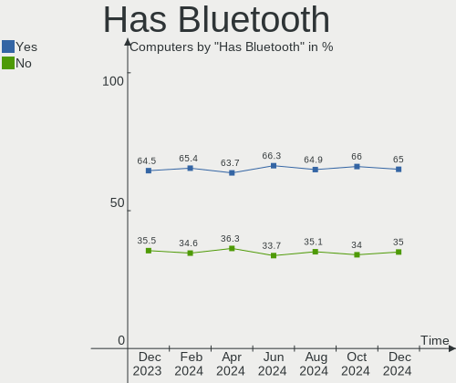
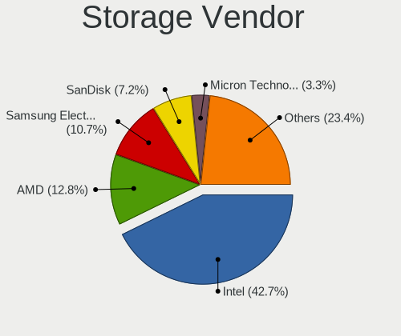
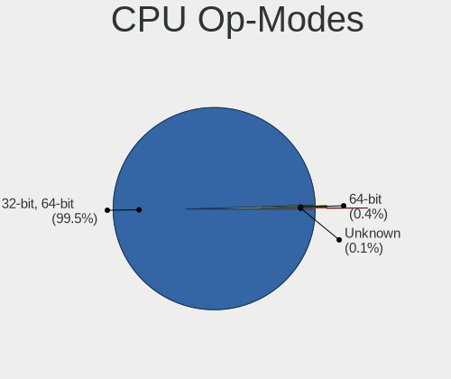
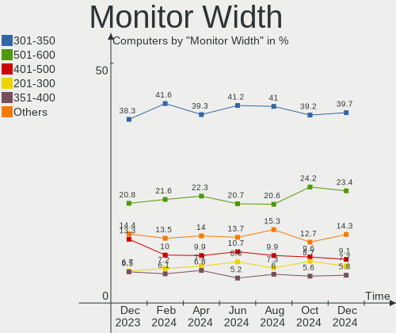

Ubuntu - Hardware Trends
------------------------

A project to identify most popular hardware characteristics and track their change
over time based on data collected by Linux users at https://Linux-Hardware.org.

Anyone can contribute to this report by the [hw-probe](https://github.com/linuxhw/hw-probe) tool:

    sudo -E hw-probe -all -upload

This is a report for all computer types. See also reports for [desktops](/Dist/Ubuntu/Desktop/README.md) and [notebooks](/Dist/Ubuntu/Notebook/README.md).

This report is for one last month. Overall report since the beginning of time: [TestDays](https://github.com/linuxhw/TestDays)

Period: Nov, 2023.

Contents
--------

* [ System ](#system)
  - [ OS                       ](#os)
  - [ OS Family                ](#os-family)
  - [ Kernel                   ](#kernel)
  - [ Kernel Family            ](#kernel-family)
  - [ Kernel Major Ver.        ](#kernel-major-ver)
  - [ Arch                     ](#arch)
  - [ DE                       ](#de)
  - [ Display Server           ](#display-server)
  - [ Display Manager          ](#display-manager)
  - [ OS Lang                  ](#os-lang)
  - [ Boot Mode                ](#boot-mode)
  - [ Filesystem               ](#filesystem)
  - [ Part. scheme             ](#part-scheme)
  - [ Dual Boot with Linux/BSD ](#dual-boot-with-linuxbsd)
  - [ Dual Boot (Win)          ](#dual-boot-win)

* [ Board ](#board)
  - [ Vendor                   ](#vendor)
  - [ Model                    ](#model)
  - [ Model Family             ](#model-family)
  - [ MFG Year                 ](#mfg-year)
  - [ Form Factor              ](#form-factor)
  - [ Secure Boot              ](#secure-boot)
  - [ Coreboot                 ](#coreboot)
  - [ RAM Size                 ](#ram-size)
  - [ RAM Used                 ](#ram-used)
  - [ Total Drives             ](#total-drives)
  - [ Has CD-ROM               ](#has-cd-rom)
  - [ Has Ethernet             ](#has-ethernet)
  - [ Has WiFi                 ](#has-wifi)
  - [ Has Bluetooth            ](#has-bluetooth)

* [ Location ](#location)
  - [ Country                  ](#country)
  - [ City                     ](#city)

* [ Drives ](#drives)
  - [ Drive Vendor             ](#drive-vendor)
  - [ Drive Model              ](#drive-model)
  - [ HDD Vendor               ](#hdd-vendor)
  - [ SSD Vendor               ](#ssd-vendor)
  - [ Drive Kind               ](#drive-kind)
  - [ Drive Connector          ](#drive-connector)
  - [ Drive Size               ](#drive-size)
  - [ Space Total              ](#space-total)
  - [ Space Used               ](#space-used)
  - [ Malfunc. Drives          ](#malfunc-drives)
  - [ Malfunc. Drive Vendor    ](#malfunc-drive-vendor)
  - [ Malfunc. HDD Vendor      ](#malfunc-hdd-vendor)
  - [ Malfunc. Drive Kind      ](#malfunc-drive-kind)
  - [ Failed Drives            ](#failed-drives)
  - [ Failed Drive Vendor      ](#failed-drive-vendor)
  - [ Drive Status             ](#drive-status)

* [ Storage controller ](#storage-controller)
  - [ Storage Vendor           ](#storage-vendor)
  - [ Storage Model            ](#storage-model)
  - [ Storage Kind             ](#storage-kind)

* [ Processor ](#processor)
  - [ CPU Vendor               ](#cpu-vendor)
  - [ CPU Model                ](#cpu-model)
  - [ CPU Model Family         ](#cpu-model-family)
  - [ CPU Cores                ](#cpu-cores)
  - [ CPU Sockets              ](#cpu-sockets)
  - [ CPU Threads              ](#cpu-threads)
  - [ CPU Op-Modes             ](#cpu-op-modes)
  - [ CPU Microcode            ](#cpu-microcode)
  - [ CPU Microarch            ](#cpu-microarch)

* [ Graphics ](#graphics)
  - [ GPU Vendor               ](#gpu-vendor)
  - [ GPU Model                ](#gpu-model)
  - [ GPU Combo                ](#gpu-combo)
  - [ GPU Driver               ](#gpu-driver)
  - [ GPU Memory               ](#gpu-memory)

* [ Monitor ](#monitor)
  - [ Monitor Vendor           ](#monitor-vendor)
  - [ Monitor Model            ](#monitor-model)
  - [ Monitor Resolution       ](#monitor-resolution)
  - [ Monitor Diagonal         ](#monitor-diagonal)
  - [ Monitor Width            ](#monitor-width)
  - [ Aspect Ratio             ](#aspect-ratio)
  - [ Monitor Area             ](#monitor-area)
  - [ Pixel Density            ](#pixel-density)
  - [ Multiple Monitors        ](#multiple-monitors)

* [ Network ](#network)
  - [ Net Controller Vendor    ](#net-controller-vendor)
  - [ Net Controller Model     ](#net-controller-model)
  - [ Wireless Vendor          ](#wireless-vendor)
  - [ Wireless Model           ](#wireless-model)
  - [ Ethernet Vendor          ](#ethernet-vendor)
  - [ Ethernet Model           ](#ethernet-model)
  - [ Net Controller Kind      ](#net-controller-kind)
  - [ Used Controller          ](#used-controller)
  - [ NICs                     ](#nics)
  - [ IPv6                     ](#ipv6)

* [ Bluetooth ](#bluetooth)
  - [ Bluetooth Vendor         ](#bluetooth-vendor)
  - [ Bluetooth Model          ](#bluetooth-model)

* [ Sound ](#sound)
  - [ Sound Vendor             ](#sound-vendor)
  - [ Sound Model              ](#sound-model)

* [ Memory ](#memory)
  - [ Memory Vendor            ](#memory-vendor)
  - [ Memory Model             ](#memory-model)
  - [ Memory Kind              ](#memory-kind)
  - [ Memory Form Factor       ](#memory-form-factor)
  - [ Memory Size              ](#memory-size)
  - [ Memory Speed             ](#memory-speed)

* [ Printers & scanners ](#printers--scanners)
  - [ Printer Vendor           ](#printer-vendor)
  - [ Printer Model            ](#printer-model)
  - [ Scanner Vendor           ](#scanner-vendor)
  - [ Scanner Model            ](#scanner-model)

* [ Camera ](#camera)
  - [ Camera Vendor            ](#camera-vendor)
  - [ Camera Model             ](#camera-model)

* [ Security ](#security)
  - [ Fingerprint Vendor       ](#fingerprint-vendor)
  - [ Fingerprint Model        ](#fingerprint-model)
  - [ Chipcard Vendor          ](#chipcard-vendor)
  - [ Chipcard Model           ](#chipcard-model)

* [ Unsupported ](#unsupported)
  - [ Unsupported Devices      ](#unsupported-devices)
  - [ Unsupported Device Types ](#unsupported-device-types)

System
------

OS
--

Installed operating systems

| Name           | Computers | Percent |
|----------------|-----------|---------|
| Ubuntu 22.04   | 852       | 64.5%   |
| Ubuntu 23.10   | 257       | 19.45%  |
| Ubuntu 20.04   | 106       | 8.02%   |
| Ubuntu 23.04   | 66        | 5%      |
| Ubuntu 18.04   | 15        | 1.14%   |
| Ubuntu 22.10   | 9         | 0.68%   |
| Ubuntu 16.04   | 7         | 0.53%   |
| Ubuntu 24.04   | 5         | 0.38%   |
| Ubuntu Core 22 | 1         | 0.08%   |
| Ubuntu 21.10   | 1         | 0.08%   |
| Ubuntu 21.04   | 1         | 0.08%   |
| Ubuntu 20.10   | 1         | 0.08%   |

OS Family
---------

OS without a version

| Name   | Computers | Percent |
|--------|-----------|---------|
| Ubuntu | 1321      | 100%    |

Kernel
------

Version of the Linux kernel

| Version                 | Computers | Percent |
|-------------------------|-----------|---------|
| 6.2.0-36-generic        | 440       | 33.31%  |
| 6.5.0-10-generic        | 163       | 12.34%  |
| 6.2.0-37-generic        | 159       | 12.04%  |
| 5.15.0-88-generic       | 88        | 6.66%   |
| 6.5.0-13-generic        | 62        | 4.69%   |
| 5.19.0-38-generic       | 62        | 4.69%   |
| 6.2.0-26-generic        | 48        | 3.63%   |
| 5.15.0-89-generic       | 43        | 3.26%   |
| 6.2.0-35-generic        | 37        | 2.8%    |
| 6.5.0-9-generic         | 18        | 1.36%   |
| 5.19.0-32-generic       | 11        | 0.83%   |
| 6.2.0-34-generic        | 8         | 0.61%   |
| 5.4.0-167-generic       | 8         | 0.61%   |
| 5.19.0-46-generic       | 8         | 0.61%   |
| 5.15.0-87-generic       | 8         | 0.61%   |
| 6.1.0-1025-oem          | 7         | 0.53%   |
| 5.4.0-166-generic       | 7         | 0.53%   |
| 5.4.0-150-generic       | 7         | 0.53%   |
| 4.15.0-142-generic      | 7         | 0.53%   |
| 6.2.0-33-generic        | 5         | 0.38%   |
| 5.15.0-86-generic       | 5         | 0.38%   |
| 6.2.0-060200-generic    | 4         | 0.3%    |
| 5.15.0-25-generic       | 4         | 0.3%    |
| 6.5.7-060507-generic    | 3         | 0.23%   |
| 6.5.0-1006-oem          | 3         | 0.23%   |
| 6.2.0-39-generic        | 3         | 0.23%   |
| 6.2.0-38-generic        | 3         | 0.23%   |
| 5.4.0-165-generic       | 3         | 0.23%   |
| 5.19.0-35-generic       | 3         | 0.23%   |
| 5.15.0-43-generic       | 3         | 0.23%   |
| 6.6.1-060601-generic    | 2         | 0.15%   |
| 6.6.0-060600rc5-generic | 2         | 0.15%   |
| 6.5.1-060501-generic    | 2         | 0.15%   |
| 6.5.0-10-lowlatency     | 2         | 0.15%   |
| 6.2.0-32-generic        | 2         | 0.15%   |
| 6.2.0-1011-nvidia       | 2         | 0.15%   |
| 5.8.0-43-generic        | 2         | 0.15%   |
| 5.4.0-84-generic        | 2         | 0.15%   |
| 5.4.0-53-generic        | 2         | 0.15%   |
| 5.15.0-58-generic       | 2         | 0.15%   |

Kernel Family
-------------

Linux kernel without a distro release

| Version  | Computers | Percent |
|----------|-----------|---------|
| 6.2.0    | 714       | 54.05%  |
| 6.5.0    | 252       | 19.08%  |
| 5.15.0   | 164       | 12.41%  |
| 5.19.0   | 90        | 6.81%   |
| 5.4.0    | 33        | 2.5%    |
| 4.15.0   | 10        | 0.76%   |
| 6.1.0    | 9         | 0.68%   |
| 6.6.0    | 7         | 0.53%   |
| 6.5.7    | 4         | 0.3%    |
| 6.6.1    | 3         | 0.23%   |
| 5.8.0    | 3         | 0.23%   |
| 5.14.0   | 3         | 0.23%   |
| 5.13.0   | 3         | 0.23%   |
| 5.11.0   | 3         | 0.23%   |
| 6.7.0    | 2         | 0.15%   |
| 6.5.1    | 2         | 0.15%   |
| 5.10.110 | 2         | 0.15%   |
| 6.6.2    | 1         | 0.08%   |
| 6.5.9    | 1         | 0.08%   |
| 6.5.5    | 1         | 0.08%   |
| 6.5.4    | 1         | 0.08%   |
| 6.5.10   | 1         | 0.08%   |
| 6.4.3    | 1         | 0.08%   |
| 6.4.16   | 1         | 0.08%   |
| 6.4.0    | 1         | 0.08%   |
| 6.1.40   | 1         | 0.08%   |
| 6.0.0    | 1         | 0.08%   |
| 5.3.8    | 1         | 0.08%   |
| 5.19.17  | 1         | 0.08%   |
| 5.15.88  | 1         | 0.08%   |
| 5.15.75  | 1         | 0.08%   |
| 5.10.160 | 1         | 0.08%   |
| 5.10.0   | 1         | 0.08%   |
| 5.0.0    | 1         | 0.08%   |

Kernel Major Ver.
-----------------

Linux kernel major version

| Version | Computers | Percent |
|---------|-----------|---------|
| 6.2     | 714       | 54.05%  |
| 6.5     | 262       | 19.83%  |
| 5.15    | 166       | 12.57%  |
| 5.19    | 91        | 6.89%   |
| 5.4     | 33        | 2.5%    |
| 6.6     | 11        | 0.83%   |
| 6.1     | 10        | 0.76%   |
| 4.15    | 10        | 0.76%   |
| 5.10    | 4         | 0.3%    |
| 6.4     | 3         | 0.23%   |
| 5.8     | 3         | 0.23%   |
| 5.14    | 3         | 0.23%   |
| 5.13    | 3         | 0.23%   |
| 5.11    | 3         | 0.23%   |
| 6.7     | 2         | 0.15%   |
| 6.0     | 1         | 0.08%   |
| 5.3     | 1         | 0.08%   |
| 5.0     | 1         | 0.08%   |

Arch
----

OS architecture (x86_64, i586, etc.)

| Name    | Computers | Percent |
|---------|-----------|---------|
| x86_64  | 1313      | 99.39%  |
| aarch64 | 6         | 0.45%   |
| i686    | 1         | 0.08%   |
| armv7l  | 1         | 0.08%   |

DE
--

Desktop Environment

| Name            | Computers | Percent |
|-----------------|-----------|---------|
| GNOME           | 1169      | 88.49%  |
| Unknown         | 123       | 9.31%   |
| X-Cinnamon      | 15        | 1.14%   |
| GNOME Flashback | 6         | 0.45%   |
| i3              | 3         | 0.23%   |
| ubuntu          | 1         | 0.08%   |
| openbox         | 1         | 0.08%   |
| GNOME Classic   | 1         | 0.08%   |
| Enlightenment   | 1         | 0.08%   |
| DDE             | 1         | 0.08%   |

Display Server
--------------

X11 or Wayland

| Name    | Computers | Percent |
|---------|-----------|---------|
| Wayland | 701       | 53.07%  |
| X11     | 496       | 37.55%  |
| Unknown | 98        | 7.42%   |
| Tty     | 26        | 1.97%   |

Display Manager
---------------

SDDM, LightDM, etc.

| Name    | Computers | Percent |
|---------|-----------|---------|
| GDM3    | 1062      | 80.39%  |
| Unknown | 173       | 13.1%   |
| GDM     | 46        | 3.48%   |
| LightDM | 32        | 2.42%   |
| SDDM    | 7         | 0.53%   |
| SLiM    | 1         | 0.08%   |

OS Lang
-------

Language

| Lang    | Computers | Percent |
|---------|-----------|---------|
| en_US   | 583       | 44.13%  |
| de_DE   | 104       | 7.87%   |
| C       | 84        | 6.36%   |
| fr_FR   | 83        | 6.28%   |
| en_GB   | 63        | 4.77%   |
| it_IT   | 58        | 4.39%   |
| es_ES   | 38        | 2.88%   |
| pt_BR   | 34        | 2.57%   |
| ru_RU   | 33        | 2.5%    |
| en_CA   | 28        | 2.12%   |
| Unknown | 22        | 1.67%   |
| pl_PL   | 21        | 1.59%   |
| en_IN   | 19        | 1.44%   |
| en_AU   | 14        | 1.06%   |
| pt_PT   | 11        | 0.83%   |
| nl_NL   | 11        | 0.83%   |
| hu_HU   | 9         | 0.68%   |
| cs_CZ   | 9         | 0.68%   |
| ja_JP   | 7         | 0.53%   |
| es_CO   | 6         | 0.45%   |
| tr_TR   | 5         | 0.38%   |
| sv_SE   | 5         | 0.38%   |
| sk_SK   | 5         | 0.38%   |
| fr_CH   | 5         | 0.38%   |
| en_ZA   | 5         | 0.38%   |
| en_HK   | 5         | 0.38%   |
| de_AT   | 5         | 0.38%   |
| es_AR   | 4         | 0.3%    |
| da_DK   | 4         | 0.3%    |
| ca_ES   | 4         | 0.3%    |
| zh_TW   | 3         | 0.23%   |
| fi_FI   | 3         | 0.23%   |
| en_NG   | 3         | 0.23%   |
| de_CH   | 3         | 0.23%   |
| zh_CN   | 2         | 0.15%   |
| ro_RO   | 2         | 0.15%   |
| es_MX   | 2         | 0.15%   |
| en_PH   | 2         | 0.15%   |
| en_IE   | 2         | 0.15%   |
| el_GR   | 2         | 0.15%   |

Boot Mode
---------

EFI or BIOS

| Mode | Computers | Percent |
|------|-----------|---------|
| BIOS | 807       | 61.09%  |
| EFI  | 514       | 38.91%  |

Filesystem
----------

Type of filesystem

| Type    | Computers | Percent |
|---------|-----------|---------|
| Tmpfs   | 685       | 51.85%  |
| Ext4    | 531       | 40.2%   |
| Overlay | 87        | 6.59%   |
| Btrfs   | 10        | 0.76%   |
| Zfs     | 3         | 0.23%   |
| Ext2    | 3         | 0.23%   |
| Xfs     | 1         | 0.08%   |
| Aufs    | 1         | 0.08%   |

Part. scheme
------------

Scheme of partitioning

| Type    | Computers | Percent |
|---------|-----------|---------|
| GPT     | 1073      | 81.23%  |
| Unknown | 130       | 9.84%   |
| MBR     | 118       | 8.93%   |

Dual Boot with Linux/BSD
------------------------

Hosting more than one Linux/BSD

| Dual boot | Computers | Percent |
|-----------|-----------|---------|
| No        | 1122      | 84.94%  |
| Yes       | 199       | 15.06%  |

Dual Boot (Win)
---------------

Hosting Linux and Windows

| Dual boot | Computers | Percent |
|-----------|-----------|---------|
| No        | 879       | 66.54%  |
| Yes       | 442       | 33.46%  |

Board
-----

Vendor
------

Motherboard manufacturer

| Name                                 | Computers | Percent |
|--------------------------------------|-----------|---------|
| Hewlett-Packard                      | 210       | 15.9%   |
| ASUSTek Computer                     | 190       | 14.38%  |
| Lenovo                               | 188       | 14.23%  |
| Dell                                 | 161       | 12.19%  |
| Gigabyte Technology                  | 63        | 4.77%   |
| Acer                                 | 60        | 4.54%   |
| MSI                                  | 57        | 4.31%   |
| Supermicro                           | 48        | 3.63%   |
| Apple                                | 37        | 2.8%    |
| ASRock                               | 30        | 2.27%   |
| Intel                                | 24        | 1.82%   |
| Toshiba                              | 21        | 1.59%   |
| Samsung Electronics                  | 20        | 1.51%   |
| HUAWEI                               | 17        | 1.29%   |
| Fujitsu                              | 12        | 0.91%   |
| Sony                                 | 10        | 0.76%   |
| Medion                               | 10        | 0.76%   |
| Unknown                              | 10        | 0.76%   |
| Google                               | 9         | 0.68%   |
| ETegro Technologies                  | 8         | 0.61%   |
| AZW                                  | 8         | 0.61%   |
| Pegatron                             | 6         | 0.45%   |
| Microsoft                            | 5         | 0.38%   |
| Timi                                 | 4         | 0.3%    |
| Framework                            | 4         | 0.3%    |
| Foxconn                              | 4         | 0.3%    |
| Biostar                              | 4         | 0.3%    |
| Shenzhen Meigao Electronic Equipment | 3         | 0.23%   |
| Raspberry Pi Foundation              | 3         | 0.23%   |
| VALE                                 | 2         | 0.15%   |
| Trigkey                              | 2         | 0.15%   |
| Star Labs                            | 2         | 0.15%   |
| Shuttle                              | 2         | 0.15%   |
| Packard Bell                         | 2         | 0.15%   |
| Notebook                             | 2         | 0.15%   |
| MACHINIST                            | 2         | 0.15%   |
| Infinix                              | 2         | 0.15%   |
| IBM                                  | 2         | 0.15%   |
| Gateway                              | 2         | 0.15%   |
| Fujitsu Siemens                      | 2         | 0.15%   |

Model
-----

Motherboard model

| Name                          | Computers | Percent |
|-------------------------------|-----------|---------|
| Supermicro X9DRW              | 15        | 1.14%   |
| ASUS All Series               | 12        | 0.91%   |
| Unknown                       | 12        | 0.91%   |
| Supermicro X8DTU              | 9         | 0.68%   |
| ETegro Hyperion RS125 G4      | 8         | 0.61%   |
| HP Notebook                   | 7         | 0.53%   |
| Supermicro SYS-6018R-TDW      | 5         | 0.38%   |
| HP ProLiant DL360 Gen9        | 5         | 0.38%   |
| HP Pavilion dv6               | 5         | 0.38%   |
| Supermicro SYS-1028R-TDW      | 4         | 0.3%    |
| Intel SKYBAY                  | 4         | 0.3%    |
| HP Pavilion Notebook          | 4         | 0.3%    |
| Dell Latitude E5430 non-vPro  | 4         | 0.3%    |
| Apple iMac12,2                | 4         | 0.3%    |
| Supermicro X10DRi             | 3         | 0.23%   |
| Supermicro Super Server       | 3         | 0.23%   |
| MSI MS-7D16                   | 3         | 0.23%   |
| MSI MS-7C91                   | 3         | 0.23%   |
| Lenovo IdeaPad 320-15ABR 80XS | 3         | 0.23%   |
| HUAWEI BOHB-WAX9              | 3         | 0.23%   |
| HP Pavilion 15                | 3         | 0.23%   |
| HP EliteBook 840 G6           | 3         | 0.23%   |
| HP EliteBook 840 G5           | 3         | 0.23%   |
| HP 15                         | 3         | 0.23%   |
| Dell OptiPlex 3020            | 3         | 0.23%   |
| Dell Latitude E6430           | 3         | 0.23%   |
| Dell Latitude 5590            | 3         | 0.23%   |
| Dell Latitude 5400            | 3         | 0.23%   |
| ASUS TUF Gaming X570-PLUS     | 3         | 0.23%   |
| VALE Notebook Classic C140    | 2         | 0.15%   |
| Trigkey S5                    | 2         | 0.15%   |
| Timi Redmi Book Pro 15 2022   | 2         | 0.15%   |
| Supermicro SYS-6018R-MTR      | 2         | 0.15%   |
| Samsung 960XFH                | 2         | 0.15%   |
| Samsung 730QFG                | 2         | 0.15%   |
| MSI MS-7C95                   | 2         | 0.15%   |
| MSI MS-7C56                   | 2         | 0.15%   |
| MSI MS-7C52                   | 2         | 0.15%   |
| MSI MS-7850                   | 2         | 0.15%   |
| MSI MS-7817                   | 2         | 0.15%   |

Model Family
------------

Motherboard model prefix

| Name                     | Computers | Percent |
|--------------------------|-----------|---------|
| Lenovo ThinkPad          | 78        | 5.9%    |
| Dell Latitude            | 50        | 3.79%   |
| HP Pavilion              | 39        | 2.95%   |
| Lenovo IdeaPad           | 34        | 2.57%   |
| Dell OptiPlex            | 33        | 2.5%    |
| Acer Aspire              | 31        | 2.35%   |
| Dell Inspiron            | 29        | 2.2%    |
| ASUS VivoBook            | 29        | 2.2%    |
| HP Laptop                | 23        | 1.74%   |
| ASUS ROG                 | 23        | 1.74%   |
| HP ProBook               | 21        | 1.59%   |
| HP EliteBook             | 21        | 1.59%   |
| Dell XPS                 | 20        | 1.51%   |
| ASUS TUF                 | 20        | 1.51%   |
| ASUS PRIME               | 19        | 1.44%   |
| Toshiba Satellite        | 18        | 1.36%   |
| Supermicro X9DRW         | 15        | 1.14%   |
| Lenovo Yoga              | 14        | 1.06%   |
| Lenovo ThinkCentre       | 14        | 1.06%   |
| HP EliteDesk             | 14        | 1.06%   |
| Lenovo Legion            | 13        | 0.98%   |
| HP Compaq                | 12        | 0.91%   |
| Dell Precision           | 12        | 0.91%   |
| ASUS All                 | 12        | 0.91%   |
| Unknown                  | 12        | 0.91%   |
| HP ZBook                 | 10        | 0.76%   |
| Supermicro X8DTU         | 9         | 0.68%   |
| Dell PowerEdge           | 9         | 0.68%   |
| HP ENVY                  | 8         | 0.61%   |
| ETegro Hyperion          | 8         | 0.61%   |
| Acer Nitro               | 8         | 0.61%   |
| HP Notebook              | 7         | 0.53%   |
| ASUS Zenbook             | 7         | 0.53%   |
| ASUS ASUS                | 7         | 0.53%   |
| Lenovo ThinkBook         | 6         | 0.45%   |
| Lenovo IdeaPadFlex       | 6         | 0.45%   |
| Fujitsu LIFEBOOK         | 6         | 0.45%   |
| Supermicro SYS-6018R-TDW | 5         | 0.38%   |
| Microsoft Surface        | 5         | 0.38%   |
| HP Spectre               | 5         | 0.38%   |

MFG Year
--------

Motherboard manufacture year

| Year    | Computers | Percent |
|---------|-----------|---------|
| 2021    | 127       | 9.61%   |
| 2022    | 126       | 9.54%   |
| 2020    | 117       | 8.86%   |
| 2023    | 114       | 8.63%   |
| 2019    | 107       | 8.1%    |
| 2018    | 94        | 7.12%   |
| 2012    | 93        | 7.04%   |
| 2013    | 89        | 6.74%   |
| 2017    | 81        | 6.13%   |
| 2014    | 60        | 4.54%   |
| 2015    | 59        | 4.47%   |
| 2011    | 59        | 4.47%   |
| 2010    | 54        | 4.09%   |
| 2016    | 53        | 4.01%   |
| 2009    | 35        | 2.65%   |
| 2008    | 31        | 2.35%   |
| 2007    | 12        | 0.91%   |
| Unknown | 8         | 0.61%   |
| 2006    | 2         | 0.15%   |

Form Factor
-----------

Physical design of the computer

| Name           | Computers | Percent |
|----------------|-----------|---------|
| Notebook       | 691       | 52.31%  |
| Desktop        | 452       | 34.22%  |
| Server         | 61        | 4.62%   |
| Convertible    | 43        | 3.26%   |
| Mini pc        | 30        | 2.27%   |
| All in one     | 24        | 1.82%   |
| Tablet         | 13        | 0.98%   |
| System on chip | 7         | 0.53%   |

Secure Boot
-----------

Enabled or disabled

| State    | Computers | Percent |
|----------|-----------|---------|
| Disabled | 1199      | 90.76%  |
| Enabled  | 122       | 9.24%   |

Coreboot
--------

Have coreboot on board

| Used | Computers | Percent |
|------|-----------|---------|
| No   | 1310      | 99.17%  |
| Yes  | 11        | 0.83%   |

RAM Size
--------

Total RAM memory

| Size in GB      | Computers | Percent |
|-----------------|-----------|---------|
| 4.01-8.0        | 294       | 22.26%  |
| 16.01-24.0      | 293       | 22.18%  |
| 8.01-16.0       | 228       | 17.26%  |
| 3.01-4.0        | 187       | 14.16%  |
| 32.01-64.0      | 184       | 13.93%  |
| 64.01-256.0     | 75        | 5.68%   |
| 24.01-32.0      | 32        | 2.42%   |
| 1.01-2.0        | 12        | 0.91%   |
| 2.01-3.0        | 8         | 0.61%   |
| More than 256.0 | 7         | 0.53%   |
| 0.01-0.5        | 1         | 0.08%   |

RAM Used
--------

Used RAM memory

| Used GB         | Computers | Percent |
|-----------------|-----------|---------|
| 2.01-3.0        | 371       | 28.08%  |
| 1.01-2.0        | 361       | 27.33%  |
| 3.01-4.0        | 240       | 18.17%  |
| 4.01-8.0        | 233       | 17.64%  |
| 8.01-16.0       | 75        | 5.68%   |
| 16.01-24.0      | 14        | 1.06%   |
| 0.51-1.0        | 14        | 1.06%   |
| 24.01-32.0      | 6         | 0.45%   |
| 0.01-0.5        | 4         | 0.3%    |
| More than 256.0 | 1         | 0.08%   |
| 32.01-64.0      | 1         | 0.08%   |
| 64.01-256.0     | 1         | 0.08%   |

Total Drives
------------

Number of drives on board

| Drives | Computers | Percent |
|--------|-----------|---------|
| 1      | 861       | 65.18%  |
| 2      | 275       | 20.82%  |
| 3      | 88        | 6.66%   |
| 4      | 37        | 2.8%    |
| 5      | 19        | 1.44%   |
| 0      | 13        | 0.98%   |
| 6      | 10        | 0.76%   |
| 7      | 7         | 0.53%   |
| 11     | 6         | 0.45%   |
| 9      | 2         | 0.15%   |
| 8      | 2         | 0.15%   |
| 12     | 1         | 0.08%   |

Has CD-ROM
----------

Has CD-ROM on board

| Presented | Computers | Percent |
|-----------|-----------|---------|
| No        | 929       | 70.33%  |
| Yes       | 392       | 29.67%  |

Has Ethernet
------------

Has Ethernet on board

| Presented | Computers | Percent |
|-----------|-----------|---------|
| Yes       | 1098      | 83.12%  |
| No        | 223       | 16.88%  |

Has WiFi
--------

Has WiFi module

| Presented | Computers | Percent |
|-----------|-----------|---------|
| Yes       | 1006      | 76.15%  |
| No        | 315       | 23.85%  |

Has Bluetooth
-------------

Has Bluetooth module

| Presented | Computers | Percent |
|-----------|-----------|---------|
| Yes       | 855       | 64.72%  |
| No        | 466       | 35.28%  |

Location
--------

Country
-------

Geographic location (country)

| Country      | Computers | Percent |
|--------------|-----------|---------|
| USA          | 229       | 17.34%  |
| Germany      | 133       | 10.07%  |
| Russia       | 119       | 9.01%   |
| Italy        | 92        | 6.96%   |
| France       | 92        | 6.96%   |
| UK           | 66        | 5%      |
| Brazil       | 55        | 4.16%   |
| Spain        | 50        | 3.79%   |
| Canada       | 40        | 3.03%   |
| Netherlands  | 31        | 2.35%   |
| India        | 28        | 2.12%   |
| Poland       | 26        | 1.97%   |
| Switzerland  | 20        | 1.51%   |
| Portugal     | 18        | 1.36%   |
| Australia    | 17        | 1.29%   |
| Czechia      | 14        | 1.06%   |
| Romania      | 13        | 0.98%   |
| Mexico       | 13        | 0.98%   |
| Hungary      | 13        | 0.98%   |
| China        | 13        | 0.98%   |
| Turkey       | 11        | 0.83%   |
| Norway       | 11        | 0.83%   |
| Colombia     | 11        | 0.83%   |
| Austria      | 11        | 0.83%   |
| Greece       | 10        | 0.76%   |
| Belgium      | 10        | 0.76%   |
| Sweden       | 9         | 0.68%   |
| Vietnam      | 8         | 0.61%   |
| Argentina    | 8         | 0.61%   |
| South Africa | 7         | 0.53%   |
| Japan        | 7         | 0.53%   |
| Hong Kong    | 7         | 0.53%   |
| Ireland      | 6         | 0.45%   |
| Finland      | 6         | 0.45%   |
| Taiwan       | 5         | 0.38%   |
| Slovakia     | 5         | 0.38%   |
| Pakistan     | 5         | 0.38%   |
| Indonesia    | 5         | 0.38%   |
| Denmark      | 5         | 0.38%   |
| UAE          | 4         | 0.3%    |

City
----

Geographic location (city)

| City              | Computers | Percent |
|-------------------|-----------|---------|
| Moscow            | 76        | 5.75%   |
| Berlin            | 24        | 1.82%   |
| Paris             | 19        | 1.44%   |
| Rome              | 12        | 0.91%   |
| Milan             | 9         | 0.68%   |
| Madrid            | 9         | 0.68%   |
| St Petersburg     | 8         | 0.61%   |
| Warsaw            | 7         | 0.53%   |
| Sao Paulo         | 7         | 0.53%   |
| Nantes            | 7         | 0.53%   |
| Central           | 7         | 0.53%   |
| Beijing           | 7         | 0.53%   |
| Toronto           | 6         | 0.45%   |
| Prague            | 6         | 0.45%   |
| Ho Chi Minh City  | 6         | 0.45%   |
| Bengaluru         | 6         | 0.45%   |
| Barcelona         | 6         | 0.45%   |
| Sydney            | 5         | 0.38%   |
| New York          | 5         | 0.38%   |
| Melbourne         | 5         | 0.38%   |
| Lisbon            | 5         | 0.38%   |
| Frankfurt am Main | 5         | 0.38%   |
| Detroit           | 5         | 0.38%   |
| Budapest          | 5         | 0.38%   |
| Amsterdam         | 5         | 0.38%   |
| Valencia          | 4         | 0.3%    |
| Turin             | 4         | 0.3%    |
| Stuttgart         | 4         | 0.3%    |
| Rochester         | 4         | 0.3%    |
| Naples            | 4         | 0.3%    |
| Milano            | 4         | 0.3%    |
| Leipzig           | 4         | 0.3%    |
| Hamburg           | 4         | 0.3%    |
| Dublin            | 4         | 0.3%    |
| Chicago           | 4         | 0.3%    |
| Chennai           | 4         | 0.3%    |
| Bogotá           | 4         | 0.3%    |
| Athens            | 4         | 0.3%    |
| Vilnius           | 3         | 0.23%   |
| Vienna            | 3         | 0.23%   |

Drives
------

Drive Vendor
------------

Hard drive vendors

| Vendor                      | Computers | Drives | Percent |
|-----------------------------|-----------|--------|---------|
| Samsung Electronics         | 305       | 370    | 17.04%  |
| WDC                         | 208       | 251    | 11.62%  |
| Seagate                     | 204       | 249    | 11.4%   |
| SanDisk                     | 103       | 108    | 5.75%   |
| Kingston                    | 87        | 91     | 4.86%   |
| Toshiba                     | 72        | 76     | 4.02%   |
| Crucial                     | 70        | 85     | 3.91%   |
| Intel                       | 69        | 93     | 3.85%   |
| SK hynix                    | 62        | 63     | 3.46%   |
| Micron Technology           | 60        | 62     | 3.35%   |
| Unknown                     | 54        | 62     | 3.02%   |
| Fujitsu                     | 43        | 74     | 2.4%    |
| HGST                        | 34        | 39     | 1.9%    |
| Hitachi                     | 31        | 42     | 1.73%   |
| Phison Electronics          | 25        | 26     | 1.4%    |
| KIOXIA                      | 22        | 22     | 1.23%   |
| A-DATA Technology           | 22        | 23     | 1.23%   |
| Apple                       | 21        | 25     | 1.17%   |
| Kingston Technology Company | 15        | 17     | 0.84%   |
| Unknown                     | 15        | 15     | 0.84%   |
| China                       | 14        | 20     | 0.78%   |
| Silicon Motion              | 12        | 12     | 0.67%   |
| Micron/Crucial Technology   | 12        | 14     | 0.67%   |
| Phison                      | 9         | 9      | 0.5%    |
| LITEON                      | 9         | 9      | 0.5%    |
| Intenso                     | 9         | 9      | 0.5%    |
| ADATA Technology            | 8         | 8      | 0.45%   |
| SPCC                        | 7         | 8      | 0.39%   |
| PNY                         | 7         | 7      | 0.39%   |
| Hewlett-Packard             | 7         | 18     | 0.39%   |
| Patriot                     | 6         | 6      | 0.34%   |
| MAXIO Technology (Hangzhou) | 6         | 7      | 0.34%   |
| GOODRAM                     | 6         | 6      | 0.34%   |
| Realtek Semiconductor       | 5         | 5      | 0.28%   |
| JMicron Technology          | 5         | 5      | 0.28%   |
| Gigabyte Technology         | 5         | 5      | 0.28%   |
| Team                        | 4         | 5      | 0.22%   |
| SABRENT                     | 4         | 4      | 0.22%   |
| OCZ                         | 4         | 4      | 0.22%   |
| Netac                       | 4         | 4      | 0.22%   |

Drive Model
-----------

Hard drive models

| Model                                                 | Computers | Percent |
|-------------------------------------------------------|-----------|---------|
| Samsung NVMe SSD Controller SM981/PM981/PM983 250GB   | 27        | 1.4%    |
| Kingston SA400S37240G 240GB SSD                       | 22        | 1.14%   |
| Fujitsu MBA3147RC 147GB                               | 20        | 1.04%   |
| Samsung SSD 860 EVO 500GB                             | 17        | 0.88%   |
| Samsung NVMe SSD Controller PM9A1/PM9A3/980PRO 2TB    | 17        | 0.88%   |
| Kingston SA400S37480G 480GB SSD                       | 16        | 0.83%   |
| Samsung SSD 870 EVO 500GB                             | 15        | 0.78%   |
| Unknown                                               | 15        | 0.78%   |
| Seagate ST1000LM035-1RK172 1TB                        | 14        | 0.73%   |
| Fujitsu MBE2147RC 147GB                               | 12        | 0.62%   |
| Seagate ST1000LM024 HN-M101MBB 1TB                    | 10        | 0.52%   |
| Samsung SSD 980 500GB                                 | 10        | 0.52%   |
| Samsung SSD 850 EVO 250GB                             | 10        | 0.52%   |
| Samsung NVMe SSD Controller SM961/PM961/SM963 256GB   | 10        | 0.52%   |
| Fujitsu MAX3147RC 147GB                               | 10        | 0.52%   |
| Crucial CT500MX500SSD1 500GB                          | 10        | 0.52%   |
| Crucial CT1000MX500SSD1 1TB                           | 10        | 0.52%   |
| Unknown MMC Card  64GB                                | 9         | 0.47%   |
| Unknown MMC Card  32GB                                | 9         | 0.47%   |
| Seagate ST500DM002-1BD142 500GB                       | 9         | 0.47%   |
| Samsung SSD 850 EVO 500GB                             | 9         | 0.47%   |
| Samsung MZALQ512HALU-000L2 512GB                      | 9         | 0.47%   |
| HGST HTS541010A9E680 1TB                              | 9         | 0.47%   |
| Crucial CT240BX500SSD1 240GB                          | 9         | 0.47%   |
| SanDisk NVMe SSD Drive 1TB                            | 8         | 0.41%   |
| Seagate ST2000DM008-2FR102 2TB                        | 7         | 0.36%   |
| Seagate ST1000DM010-2EP102 1TB                        | 7         | 0.36%   |
| SanDisk SSD PLUS 240GB                                | 7         | 0.36%   |
| Samsung SSD 980 1TB                                   | 7         | 0.36%   |
| Samsung SSD 870 EVO 1TB                               | 7         | 0.36%   |
| Phison PS5013 E13 NVMe Controller 512GB               | 7         | 0.36%   |
| Micron 3400_MTFDKBA1T0TFH 1TB                         | 7         | 0.36%   |
| Kingston Company SNV2S1000G 1TB                       | 7         | 0.36%   |
| Intel SSDPEKNU512GZ 512GB                             | 7         | 0.36%   |
| WDC WD10JPVX-22JC3T0 1TB                              | 6         | 0.31%   |
| Toshiba MQ01ABD100 1TB                                | 6         | 0.31%   |
| Toshiba DT01ACA100 1TB                                | 6         | 0.31%   |
| Silicon Motion SM2263EN/SM2263XT SSD Controller 256GB | 6         | 0.31%   |
| Seagate ST4000DM004-2CV104 4TB                        | 6         | 0.31%   |
| Seagate ST3500418AS 500GB                             | 6         | 0.31%   |

HDD Vendor
----------

Hard disk drive vendors

| Vendor              | Computers | Drives | Percent |
|---------------------|-----------|--------|---------|
| Seagate             | 198       | 243    | 35.36%  |
| WDC                 | 162       | 191    | 28.93%  |
| Toshiba             | 47        | 50     | 8.39%   |
| Fujitsu             | 43        | 74     | 7.68%   |
| HGST                | 34        | 39     | 6.07%   |
| Hitachi             | 31        | 42     | 5.54%   |
| Samsung Electronics | 13        | 15     | 2.32%   |
| Unknown             | 5         | 5      | 0.89%   |
| Apple               | 5         | 5      | 0.89%   |
| USB3.0              | 3         | 3      | 0.54%   |
| USB                 | 2         | 2      | 0.36%   |
| TO Exter            | 2         | 2      | 0.36%   |
| SABRENT             | 2         | 2      | 0.36%   |
| Maxtor              | 2         | 2      | 0.36%   |
| Hewlett-Packard     | 2         | 5      | 0.36%   |
| ExcelStor           | 2         | 2      | 0.36%   |
| ASMT                | 2         | 2      | 0.36%   |
| TDAS                | 1         | 3      | 0.18%   |
| Intenso             | 1         | 1      | 0.18%   |
| HGST HTS            | 1         | 1      | 0.18%   |
| External            | 1         | 1      | 0.18%   |
| Unknown             | 1         | 1      | 0.18%   |

SSD Vendor
----------

Solid state drive vendors

| Vendor              | Computers | Drives | Percent |
|---------------------|-----------|--------|---------|
| Samsung Electronics | 134       | 158    | 24.54%  |
| Kingston            | 64        | 67     | 11.72%  |
| Crucial             | 59        | 70     | 10.81%  |
| SanDisk             | 41        | 41     | 7.51%   |
| WDC                 | 27        | 27     | 4.95%   |
| Intel               | 24        | 43     | 4.4%    |
| A-DATA Technology   | 16        | 17     | 2.93%   |
| China               | 14        | 20     | 2.56%   |
| Micron Technology   | 13        | 13     | 2.38%   |
| SK hynix            | 10        | 10     | 1.83%   |
| Apple               | 10        | 10     | 1.83%   |
| LITEON              | 9         | 9      | 1.65%   |
| SPCC                | 7         | 8      | 1.28%   |
| PNY                 | 7         | 7      | 1.28%   |
| Intenso             | 7         | 7      | 1.28%   |
| Toshiba             | 6         | 6      | 1.1%    |
| Patriot             | 6         | 6      | 1.1%    |
| GOODRAM             | 6         | 6      | 1.1%    |
| Hewlett-Packard     | 5         | 13     | 0.92%   |
| OCZ                 | 4         | 4      | 0.73%   |
| JMicron Technology  | 4         | 4      | 0.73%   |
| Apacer              | 4         | 4      | 0.73%   |
| Unknown             | 4         | 4      | 0.73%   |
| Transcend           | 3         | 3      | 0.55%   |
| Team                | 3         | 4      | 0.55%   |
| Netac               | 3         | 3      | 0.55%   |
| Gigabyte Technology | 3         | 3      | 0.55%   |
| Fanxiang            | 3         | 3      | 0.55%   |
| Dogfish             | 3         | 3      | 0.55%   |
| Star                | 2         | 2      | 0.37%   |
| Plextor             | 2         | 2      | 0.37%   |
| LITEONIT            | 2         | 2      | 0.37%   |
| GLOWAY              | 2         | 2      | 0.37%   |
| Corsair             | 2         | 2      | 0.37%   |
| ZHITAI              | 1         | 1      | 0.18%   |
| XSTAR               | 1         | 1      | 0.18%   |
| Wodposit            | 1         | 1      | 0.18%   |
| Verbatim            | 1         | 1      | 0.18%   |
| TwinMOS             | 1         | 1      | 0.18%   |
| Timetec             | 1         | 1      | 0.18%   |

Drive Kind
----------

HDD or SSD

| Kind    | Computers | Drives | Percent |
|---------|-----------|--------|---------|
| NVMe    | 594       | 690    | 35.93%  |
| HDD     | 492       | 691    | 29.76%  |
| SSD     | 487       | 625    | 29.46%  |
| MMC     | 42        | 46     | 2.54%   |
| Unknown | 38        | 43     | 2.3%    |

Drive Connector
---------------

SATA, SAS, NVMe, etc.

| Type | Computers | Drives | Percent |
|------|-----------|--------|---------|
| SATA | 792       | 1235   | 51.56%  |
| NVMe | 591       | 685    | 38.48%  |
| SAS  | 111       | 129    | 7.23%   |
| MMC  | 42        | 46     | 2.73%   |

Drive Size
----------

Size of hard drive

| Size in TB | Computers | Drives | Percent |
|------------|-----------|--------|---------|
| 0.01-0.5   | 575       | 743    | 55.99%  |
| 0.51-1.0   | 274       | 346    | 26.68%  |
| 1.01-2.0   | 94        | 115    | 9.15%   |
| 3.01-4.0   | 38        | 54     | 3.7%    |
| 4.01-10.0  | 21        | 23     | 2.04%   |
| 2.01-3.0   | 19        | 26     | 1.85%   |
| 10.01-20.0 | 6         | 9      | 0.58%   |

Space Total
-----------

Amount of disk space available on the file system

| Size in GB     | Computers | Percent |
|----------------|-----------|---------|
| 251-500        | 359       | 27.18%  |
| 101-250        | 332       | 25.13%  |
| 501-1000       | 208       | 15.75%  |
| Unknown        | 88        | 6.66%   |
| 1001-2000      | 77        | 5.83%   |
| More than 3000 | 70        | 5.3%    |
| 1-20           | 56        | 4.24%   |
| 51-100         | 55        | 4.16%   |
| 21-50          | 40        | 3.03%   |
| 2001-3000      | 36        | 2.73%   |

Space Used
----------

Amount of used disk space

| Used GB        | Computers | Percent |
|----------------|-----------|---------|
| 1-20           | 355       | 26.87%  |
| 21-50          | 284       | 21.5%   |
| 101-250        | 192       | 14.53%  |
| 51-100         | 162       | 12.26%  |
| 251-500        | 114       | 8.63%   |
| Unknown        | 88        | 6.66%   |
| 501-1000       | 55        | 4.16%   |
| 1001-2000      | 40        | 3.03%   |
| More than 3000 | 19        | 1.44%   |
| 2001-3000      | 12        | 0.91%   |

Malfunc. Drives
---------------

Drive models with a malfunction

| Model                                | Computers | Drives | Percent |
|--------------------------------------|-----------|--------|---------|
| Intel SSDSC2BB800G7 800GB            | 3         | 3      | 4.48%   |
| WDC WD5002ABYS-02B1B0 500GB          | 2         | 3      | 2.99%   |
| WDC WD10JPVX-22JC3T0 1TB             | 2         | 2      | 2.99%   |
| Seagate ST3500418AS 500GB            | 2         | 3      | 2.99%   |
| Seagate ST1000LM035-1RK172 1TB       | 2         | 2      | 2.99%   |
| Seagate ST1000LM024 HN-M101MBB 1TB   | 2         | 2      | 2.99%   |
| Crucial CT275MX300SSD1 275GB         | 2         | 2      | 2.99%   |
| WDC WD7500BPVT-80HXZT1 752GB         | 1         | 1      | 1.49%   |
| WDC WD5000LPVX-55V0TT0 500GB         | 1         | 1      | 1.49%   |
| WDC WD5000BEVT-22A0RT0 500GB         | 1         | 1      | 1.49%   |
| WDC WD5000AAKX-08U6AA0 500GB         | 1         | 1      | 1.49%   |
| WDC WD5000AADS-00S9B0 500GB          | 1         | 1      | 1.49%   |
| WDC WD40PURZ-85TTDY0 4TB             | 1         | 1      | 1.49%   |
| WDC WD40EZRZ-00WN9B0 4TB             | 1         | 1      | 1.49%   |
| WDC WD32 00BPVT-22ZEST0 320GB        | 1         | 1      | 1.49%   |
| WDC WD2500BEVT-75ZCT2 250GB          | 1         | 1      | 1.49%   |
| WDC WD15EADS-22P8B0 1TB              | 1         | 1      | 1.49%   |
| WDC WD Green 2.5 240GB SSD           | 1         | 1      | 1.49%   |
| Unknown S050 Hard drive 500GB        | 1         | 1      | 1.49%   |
| Toshiba MQ01ABD100 1TB               | 1         | 1      | 1.49%   |
| Toshiba MK5056GSY 500GB              | 1         | 1      | 1.49%   |
| Toshiba MK1655GSX 160GB              | 1         | 1      | 1.49%   |
| Toshiba DT01ACA100 1TB               | 1         | 1      | 1.49%   |
| SK hynix SC210 mSATA 128GB SSD       | 1         | 1      | 1.49%   |
| SK hynix PC711 HFS512GDE9X073N 512GB | 1         | 1      | 1.49%   |
| SK hynix PC401 NVMe 512GB            | 1         | 1      | 1.49%   |
| SK hynix BC711 HFM512GD3JX013N 512GB | 1         | 1      | 1.49%   |
| Seagate ST750LM022 HN-M750MBB 752GB  | 1         | 1      | 1.49%   |
| Seagate ST500LM000-SSHD-8GB          | 1         | 1      | 1.49%   |
| Seagate ST500DM009-2F110A 500GB      | 1         | 1      | 1.49%   |
| Seagate ST500DM002-1BD142 500GB      | 1         | 1      | 1.49%   |
| Seagate ST500DM002-1BC142 500GB      | 1         | 1      | 1.49%   |
| Seagate ST4000VX007-2DT166 4TB       | 1         | 1      | 1.49%   |
| Seagate ST4000NM0035-1V4107 4TB      | 1         | 2      | 1.49%   |
| Seagate ST380215A 80GB               | 1         | 1      | 1.49%   |
| Seagate ST3500320AS 500GB            | 1         | 1      | 1.49%   |
| Seagate ST2000LM007-1R8174 2TB       | 1         | 1      | 1.49%   |
| Seagate ST2000DM008-2UB102 2TB       | 1         | 1      | 1.49%   |
| Seagate ST14000NM0018-2H4101 14TB    | 1         | 1      | 1.49%   |
| Seagate ST1000DM010-2EP102 1TB       | 1         | 1      | 1.49%   |

Malfunc. Drive Vendor
---------------------

Vendors of faulty drives

| Vendor              | Computers | Drives | Percent |
|---------------------|-----------|--------|---------|
| Seagate             | 19        | 21     | 28.79%  |
| WDC                 | 15        | 16     | 22.73%  |
| Intel               | 6         | 9      | 9.09%   |
| Toshiba             | 4         | 4      | 6.06%   |
| SK hynix            | 4         | 4      | 6.06%   |
| Samsung Electronics | 3         | 3      | 4.55%   |
| HGST                | 3         | 3      | 4.55%   |
| SanDisk             | 2         | 2      | 3.03%   |
| Crucial             | 2         | 2      | 3.03%   |
| Unknown             | 1         | 1      | 1.52%   |
| Micron Technology   | 1         | 1      | 1.52%   |
| Maxtor              | 1         | 1      | 1.52%   |
| Kingston            | 1         | 1      | 1.52%   |
| Hypertec            | 1         | 1      | 1.52%   |
| Apple               | 1         | 1      | 1.52%   |
| A-DATA Technology   | 1         | 1      | 1.52%   |
| Unknown             | 1         | 1      | 1.52%   |

Malfunc. HDD Vendor
-------------------

Vendors of faulty HDD drives

| Vendor  | Computers | Drives | Percent |
|---------|-----------|--------|---------|
| Seagate | 19        | 21     | 45.24%  |
| WDC     | 14        | 15     | 33.33%  |
| Toshiba | 4         | 4      | 9.52%   |
| HGST    | 3         | 3      | 7.14%   |
| Unknown | 1         | 1      | 2.38%   |
| Maxtor  | 1         | 1      | 2.38%   |

Malfunc. Drive Kind
-------------------

Kinds of faulty drives

| Kind | Computers | Drives | Percent |
|------|-----------|--------|---------|
| HDD  | 39        | 45     | 62.9%   |
| SSD  | 19        | 23     | 30.65%  |
| NVMe | 4         | 4      | 6.45%   |

Failed Drives
-------------

Failed drive models

| Model                                   | Computers | Drives | Percent |
|-----------------------------------------|-----------|--------|---------|
| SK hynix BC501 HFM256GDJTNG-8310A 256GB | 1         | 1      | 33.33%  |
| Hitachi HUS724040ALE640 4TB             | 1         | 1      | 33.33%  |
| Apple SSD TS256C 256GB                  | 1         | 1      | 33.33%  |

Failed Drive Vendor
-------------------

Failed drive vendors

| Vendor   | Computers | Drives | Percent |
|----------|-----------|--------|---------|
| SK hynix | 1         | 1      | 33.33%  |
| Hitachi  | 1         | 1      | 33.33%  |
| Apple    | 1         | 1      | 33.33%  |

Drive Status
------------

Number of failed and malfunc. drives

| Status   | Computers | Drives | Percent |
|----------|-----------|--------|---------|
| Detected | 838       | 1273   | 60.33%  |
| Works    | 486       | 747    | 34.99%  |
| Malfunc  | 62        | 72     | 4.46%   |
| Failed   | 3         | 3      | 0.22%   |

Storage controller
------------------

Storage Vendor
--------------

Storage controller vendors

| Vendor                         | Computers | Percent |
|--------------------------------|-----------|---------|
| Intel                          | 845       | 48.07%  |
| AMD                            | 208       | 11.83%  |
| Samsung Electronics            | 175       | 9.95%   |
| SanDisk                        | 94        | 5.35%   |
| SK hynix                       | 52        | 2.96%   |
| Micron Technology              | 47        | 2.67%   |
| Phison Electronics             | 39        | 2.22%   |
| Kingston Technology Company    | 38        | 2.16%   |
| LSI Logic / Symbios Logic      | 37        | 2.1%    |
| Toshiba America Info Systems   | 24        | 1.37%   |
| Micron/Crucial Technology      | 24        | 1.37%   |
| ASMedia Technology             | 21        | 1.19%   |
| KIOXIA                         | 19        | 1.08%   |
| Silicon Motion                 | 16        | 0.91%   |
| Nvidia                         | 13        | 0.74%   |
| ADATA Technology               | 13        | 0.74%   |
| MAXIO Technology (Hangzhou)    | 10        | 0.57%   |
| Adaptec                        | 10        | 0.57%   |
| Marvell Technology Group       | 9         | 0.51%   |
| Broadcom / LSI                 | 8         | 0.46%   |
| Apple                          | 7         | 0.4%    |
| Realtek Semiconductor          | 6         | 0.34%   |
| Hewlett-Packard                | 6         | 0.34%   |
| VIA Technologies               | 5         | 0.28%   |
| Union Memory (Shenzhen)        | 5         | 0.28%   |
| Shenzhen Longsys Electronics   | 5         | 0.28%   |
| JMicron Technology             | 5         | 0.28%   |
| Solid State Storage Technology | 3         | 0.17%   |
| Solidigm                       | 2         | 0.11%   |
| Silicon Image                  | 2         | 0.11%   |
| INNOGRIT                       | 2         | 0.11%   |
| Biwin Storage Technology       | 2         | 0.11%   |
| Zhaoxin                        | 1         | 0.06%   |
| ShenZhen TIGO Semiconductor    | 1         | 0.06%   |
| Netac Technology               | 1         | 0.06%   |
| Lite-On Technology             | 1         | 0.06%   |
| Lite-On IT Corp. / Plextor     | 1         | 0.06%   |
| Hosin Global Electronics       | 1         | 0.06%   |

Storage Model
-------------

Storage controller models

| Model                                                                          | Computers | Percent |
|--------------------------------------------------------------------------------|-----------|---------|
| AMD FCH SATA Controller [AHCI mode]                                            | 146       | 7.53%   |
| Samsung NVMe SSD Controller 980 (DRAM-less)                                    | 57        | 2.94%   |
| Intel Volume Management Device NVMe RAID Controller                            | 57        | 2.94%   |
| Samsung NVMe SSD Controller SM981/PM981/PM983                                  | 54        | 2.78%   |
| Intel 8 Series/C220 Series Chipset Family 6-port SATA Controller 1 [AHCI mode] | 54        | 2.78%   |
| Intel Sunrise Point-LP SATA Controller [AHCI mode]                             | 49        | 2.53%   |
| Intel 7 Series Chipset Family 6-port SATA Controller [AHCI mode]               | 49        | 2.53%   |
| Intel Q170/Q150/B150/H170/H110/Z170/CM236 Chipset SATA Controller [AHCI Mode]  | 40        | 2.06%   |
| Intel 82801 Mobile SATA Controller [RAID mode]                                 | 40        | 2.06%   |
| Samsung NVMe SSD Controller PM9A1/PM9A3/980PRO                                 | 32        | 1.65%   |
| Intel 6 Series/C200 Series Chipset Family 6 port Desktop SATA AHCI Controller  | 32        | 1.65%   |
| Intel 6 Series/C200 Series Chipset Family 6 port Mobile SATA AHCI Controller   | 29        | 1.49%   |
| Intel Comet Lake SATA AHCI Controller                                          | 27        | 1.39%   |
| AMD 500 Series Chipset SATA Controller                                         | 27        | 1.39%   |
| Intel 200 Series PCH SATA controller [AHCI mode]                               | 26        | 1.34%   |
| Intel SATA Controller [RAID mode]                                              | 24        | 1.24%   |
| Intel C610/X99 series chipset 6-Port SATA Controller [AHCI mode]               | 23        | 1.19%   |
| Intel 8 Series SATA Controller 1 [AHCI mode]                                   | 23        | 1.19%   |
| AMD SB7x0/SB8x0/SB9x0 SATA Controller [AHCI mode]                              | 22        | 1.13%   |
| SK hynix Gold P31/BC711/PC711 NVMe Solid State Drive                           | 21        | 1.08%   |
| Intel Volume Management Device NVMe RAID Controller Intel Corporation          | 20        | 1.03%   |
| Intel Tiger Lake-LP SATA Controller                                            | 20        | 1.03%   |
| Intel SSD 670p Series [Keystone Harbor]                                        | 20        | 1.03%   |
| Intel Celeron/Pentium Silver Processor SATA Controller                         | 20        | 1.03%   |
| Intel Cannon Lake PCH SATA AHCI Controller                                     | 20        | 1.03%   |
| Intel C610/X99 series chipset sSATA Controller [AHCI mode]                     | 19        | 0.98%   |
| ASMedia ASM1062 Serial ATA Controller                                          | 19        | 0.98%   |
| Intel 82801IBM/IEM (ICH9M/ICH9M-E) 4 port SATA Controller [AHCI mode]          | 18        | 0.93%   |
| SanDisk WD Black SN770 / PC SN740 256GB / PC SN560 (DRAM-less) NVMe SSD        | 17        | 0.88%   |
| Intel Alder Lake-S PCH SATA Controller [AHCI Mode]                             | 17        | 0.88%   |
| AMD 400 Series Chipset SATA Controller                                         | 17        | 0.88%   |
| Intel 7 Series/C210 Series Chipset Family 6-port SATA Controller [AHCI mode]   | 16        | 0.82%   |
| Intel 500 Series Chipset Family SATA AHCI Controller                           | 15        | 0.77%   |
| Samsung NVMe SSD Controller SM961/PM961/SM963                                  | 14        | 0.72%   |
| Micron/Crucial P2 [Nick P2] / P3 / P3 Plus NVMe PCIe SSD (DRAM-less)           | 14        | 0.72%   |
| Micron 3400 NVMe SSD [Hendrix]                                                 | 14        | 0.72%   |
| Intel C602 chipset 4-Port SATA Storage Control Unit                            | 14        | 0.72%   |
| LSI Logic / Symbios Logic MegaRAID SAS 2108 [Liberator]                        | 13        | 0.67%   |
| Intel Wildcat Point-LP SATA Controller [AHCI Mode]                             | 13        | 0.67%   |
| Intel 5 Series/3400 Series Chipset 6 port SATA AHCI Controller                 | 13        | 0.67%   |

Storage Kind
------------

Kind of storage controller (IDE, SATA, NVMe, SAS, ...)

| Kind | Computers | Percent |
|------|-----------|---------|
| SATA | 862       | 49.06%  |
| NVMe | 591       | 33.64%  |
| RAID | 184       | 10.47%  |
| IDE  | 83        | 4.72%   |
| SAS  | 24        | 1.37%   |
| SCSI | 13        | 0.74%   |

Processor
---------

CPU Vendor
----------

Processor vendors

| Vendor       | Computers | Percent |
|--------------|-----------|---------|
| Intel        | 1013      | 76.68%  |
| AMD          | 299       | 22.63%  |
| ARM          | 7         | 0.53%   |
| CentaurHauls | 2         | 0.15%   |

CPU Model
---------

Processor models

| Model                                         | Computers | Percent |
|-----------------------------------------------|-----------|---------|
| Intel 11th Gen Core i7-1165G7 @ 2.80GHz       | 17        | 1.29%   |
| Intel 11th Gen Core i5-1135G7 @ 2.40GHz       | 15        | 1.14%   |
| Intel Core i5-10210U CPU @ 1.60GHz            | 14        | 1.06%   |
| AMD Ryzen 5 5500U with Radeon Graphics        | 12        | 0.91%   |
| Intel Core i5-8250U CPU @ 1.60GHz             | 11        | 0.83%   |
| Intel Xeon CPU E5-2620 v2 @ 2.10GHz           | 10        | 0.76%   |
| Intel Core i7-8650U CPU @ 1.90GHz             | 10        | 0.76%   |
| Intel 12th Gen Core i5-1235U                  | 10        | 0.76%   |
| Intel Xeon CPU X5670 @ 2.93GHz                | 9         | 0.68%   |
| Intel Xeon CPU E5-2680 v4 @ 2.40GHz           | 9         | 0.68%   |
| Intel Core i7-2600 CPU @ 3.40GHz              | 9         | 0.68%   |
| Intel Core i7-10510U CPU @ 1.80GHz            | 9         | 0.68%   |
| Intel 12th Gen Core i7-1260P                  | 9         | 0.68%   |
| AMD Ryzen 5 5625U with Radeon Graphics        | 9         | 0.68%   |
| AMD Ryzen 5 5600G with Radeon Graphics        | 9         | 0.68%   |
| Intel Xeon CPU E5-2650 0 @ 2.00GHz            | 8         | 0.61%   |
| Intel Xeon CPU E5-2620 v3 @ 2.40GHz           | 8         | 0.61%   |
| Intel Core i7-8550U CPU @ 1.80GHz             | 8         | 0.61%   |
| Intel Core i7-4790 CPU @ 3.60GHz              | 8         | 0.61%   |
| Intel Core i5-6200U CPU @ 2.30GHz             | 8         | 0.61%   |
| Intel Core i5-3210M CPU @ 2.50GHz             | 8         | 0.61%   |
| Intel 13th Gen Core i5-1335U                  | 8         | 0.61%   |
| AMD Ryzen 7 4800H with Radeon Graphics        | 8         | 0.61%   |
| Intel N100                                    | 7         | 0.53%   |
| Intel Core i5-3230M CPU @ 2.60GHz             | 7         | 0.53%   |
| Intel Core i3-10110U CPU @ 2.10GHz            | 7         | 0.53%   |
| Intel Celeron N4020 CPU @ 1.10GHz             | 7         | 0.53%   |
| Intel 11th Gen Core i3-1115G4 @ 3.00GHz       | 7         | 0.53%   |
| AMD Ryzen 7 5800H with Radeon Graphics        | 7         | 0.53%   |
| AMD Ryzen 7 5700U with Radeon Graphics        | 7         | 0.53%   |
| AMD Ryzen 5 4500U with Radeon Graphics        | 7         | 0.53%   |
| AMD Ryzen 5 3500U with Radeon Vega Mobile Gfx | 7         | 0.53%   |
| Intel Core i7-9750H CPU @ 2.60GHz             | 6         | 0.45%   |
| Intel Core i7-6700 CPU @ 3.40GHz              | 6         | 0.45%   |
| Intel Core i7-3770 CPU @ 3.40GHz              | 6         | 0.45%   |
| Intel Core i5-8365U CPU @ 1.60GHz             | 6         | 0.45%   |
| Intel Core i5-8350U CPU @ 1.70GHz             | 6         | 0.45%   |
| Intel Core i5-8265U CPU @ 1.60GHz             | 6         | 0.45%   |
| Intel Core i5-7200U CPU @ 2.50GHz             | 6         | 0.45%   |
| Intel 13th Gen Core i7-1355U                  | 6         | 0.45%   |

CPU Model Family
----------------

Processor model prefix

| Model                   | Computers | Percent |
|-------------------------|-----------|---------|
| Intel Core i5           | 248       | 18.77%  |
| Other                   | 217       | 16.43%  |
| Intel Core i7           | 205       | 15.52%  |
| Intel Xeon              | 93        | 7.04%   |
| Intel Core i3           | 89        | 6.74%   |
| AMD Ryzen 5             | 87        | 6.59%   |
| AMD Ryzen 7             | 72        | 5.45%   |
| Intel Celeron           | 48        | 3.63%   |
| Intel Core 2 Duo        | 36        | 2.73%   |
| Intel Pentium           | 25        | 1.89%   |
| AMD Ryzen 9             | 24        | 1.82%   |
| AMD Ryzen 3             | 22        | 1.67%   |
| Intel Core i9           | 16        | 1.21%   |
| Intel Atom              | 12        | 0.91%   |
| AMD FX                  | 11        | 0.83%   |
| AMD A8                  | 9         | 0.68%   |
| AMD A6                  | 9         | 0.68%   |
| AMD A10                 | 9         | 0.68%   |
| Intel Pentium Dual-Core | 8         | 0.61%   |
| Intel Pentium Silver    | 5         | 0.38%   |
| Intel Core 2 Quad       | 5         | 0.38%   |
| AMD Ryzen 7 PRO         | 5         | 0.38%   |
| AMD Ryzen 5 PRO         | 5         | 0.38%   |
| AMD E1                  | 5         | 0.38%   |
| AMD E                   | 5         | 0.38%   |
| AMD A4                  | 4         | 0.3%    |
| Intel Genuine           | 3         | 0.23%   |
| Intel Core 2            | 3         | 0.23%   |
| AMD Phenom II X4        | 3         | 0.23%   |
| AMD E2                  | 3         | 0.23%   |
| Intel Xeon Gold         | 2         | 0.15%   |
| Intel Pentium Dual      | 2         | 0.15%   |
| Intel Core m3           | 2         | 0.15%   |
| Intel Core 2 Extreme    | 2         | 0.15%   |
| AMD Ryzen Threadripper  | 2         | 0.15%   |
| AMD Athlon II X2        | 2         | 0.15%   |
| AMD Athlon II           | 2         | 0.15%   |
| AMD A12                 | 2         | 0.15%   |
| Intel Xeon Silver       | 1         | 0.08%   |
| Intel Core m7           | 1         | 0.08%   |

CPU Cores
---------

Number of processor cores

| Number  | Computers | Percent |
|---------|-----------|---------|
| 4       | 421       | 31.87%  |
| 2       | 400       | 30.28%  |
| 8       | 131       | 9.92%   |
| 6       | 130       | 9.84%   |
| 12      | 74        | 5.6%    |
| 10      | 52        | 3.94%   |
| 16      | 39        | 2.95%   |
| 14      | 19        | 1.44%   |
| 24      | 15        | 1.14%   |
| 28      | 10        | 0.76%   |
| 1       | 10        | 0.76%   |
| 3       | 5         | 0.38%   |
| 20      | 4         | 0.3%    |
| Unknown | 3         | 0.23%   |
| 44      | 2         | 0.15%   |
| 36      | 2         | 0.15%   |
| 40      | 1         | 0.08%   |
| 32      | 1         | 0.08%   |
| 18      | 1         | 0.08%   |
| 5       | 1         | 0.08%   |

CPU Sockets
-----------

Number of sockets

| Number  | Computers | Percent |
|---------|-----------|---------|
| 1       | 1238      | 93.72%  |
| 2       | 78        | 5.9%    |
| Unknown | 3         | 0.23%   |
| 4       | 1         | 0.08%   |
| 3       | 1         | 0.08%   |

CPU Threads
-----------

Threads per core (Hyper-Threading)

| Number  | Computers | Percent |
|---------|-----------|---------|
| 2       | 935       | 70.78%  |
| 1       | 383       | 28.99%  |
| Unknown | 3         | 0.23%   |

CPU Op-Modes
------------

CPU Operation Modes (32-bit, 64-bit)

| Op mode        | Computers | Percent |
|----------------|-----------|---------|
| 32-bit, 64-bit | 1320      | 99.92%  |
| Unknown        | 1         | 0.08%   |

CPU Microcode
-------------

Microcode number

| Number     | Computers | Percent |
|------------|-----------|---------|
| Unknown    | 976       | 73.88%  |
| 0x406f1    | 18        | 1.36%   |
| 0x306a9    | 18        | 1.36%   |
| 0x0a50000d | 17        | 1.29%   |
| 0x306e4    | 15        | 1.14%   |
| 0x0a50000c | 15        | 1.14%   |
| 0x206c2    | 14        | 1.06%   |
| 0x906e9    | 10        | 0.76%   |
| 0xa0655    | 8         | 0.61%   |
| 0x806ec    | 8         | 0.61%   |
| 0x506e3    | 8         | 0.61%   |
| 0x306f2    | 8         | 0.61%   |
| 0x206d7    | 8         | 0.61%   |
| 0x08608103 | 8         | 0.61%   |
| 0x206a7    | 7         | 0.53%   |
| 0x1067a    | 7         | 0.53%   |
| 0x08600106 | 7         | 0.53%   |
| 0x08108109 | 7         | 0.53%   |
| 0x806c1    | 6         | 0.45%   |
| 0x306c3    | 6         | 0.45%   |
| 0x20655    | 6         | 0.45%   |
| 0x08608104 | 6         | 0.45%   |
| 0x806ea    | 5         | 0.38%   |
| 0x08600104 | 5         | 0.38%   |
| 0xb0671    | 4         | 0.3%    |
| 0x90672    | 4         | 0.3%    |
| 0x806e9    | 4         | 0.3%    |
| 0x0a404102 | 4         | 0.3%    |
| 0x08701021 | 4         | 0.3%    |
| 0x05000119 | 4         | 0.3%    |
| 0xb06a3    | 3         | 0.23%   |
| 0xb06a2    | 3         | 0.23%   |
| 0x906ed    | 3         | 0.23%   |
| 0x906ea    | 3         | 0.23%   |
| 0x906a4    | 3         | 0.23%   |
| 0x806d1    | 3         | 0.23%   |
| 0x0a704101 | 3         | 0.23%   |
| 0x0a404101 | 3         | 0.23%   |
| 0x08701030 | 3         | 0.23%   |
| 0x08600103 | 3         | 0.23%   |

CPU Microarch
-------------

Microarchitecture

| Name             | Computers | Percent |
|------------------|-----------|---------|
| KabyLake         | 181       | 13.7%   |
| Unknown          | 125       | 9.46%   |
| Haswell          | 106       | 8.02%   |
| IvyBridge        | 97        | 7.34%   |
| SandyBridge      | 85        | 6.43%   |
| Skylake          | 79        | 5.98%   |
| Zen 3            | 75        | 5.68%   |
| Alderlake Hybrid | 67        | 5.07%   |
| TigerLake        | 56        | 4.24%   |
| Zen 2            | 53        | 4.01%   |
| Penryn           | 44        | 3.33%   |
| Westmere         | 42        | 3.18%   |
| Broadwell        | 41        | 3.1%    |
| Zen+             | 36        | 2.73%   |
| CometLake        | 29        | 2.2%    |
| Icelake          | 23        | 1.74%   |
| Goldmont plus    | 22        | 1.67%   |
| Core             | 20        | 1.51%   |
| Silvermont       | 19        | 1.44%   |
| Piledriver       | 16        | 1.21%   |
| Excavator        | 15        | 1.14%   |
| Zen              | 13        | 0.98%   |
| K10              | 13        | 0.98%   |
| Nehalem          | 10        | 0.76%   |
| Goldmont         | 8         | 0.61%   |
| Bobcat           | 8         | 0.61%   |
| Puma             | 7         | 0.53%   |
| Jaguar           | 7         | 0.53%   |
| Steamroller      | 6         | 0.45%   |
| Tremont          | 4         | 0.3%    |
| Gracemont        | 4         | 0.3%    |
| Bonnell          | 4         | 0.3%    |
| K10 Llano        | 2         | 0.15%   |
| Bulldozer        | 2         | 0.15%   |
| K8 Hammer        | 1         | 0.08%   |
| K8 & K10 hybrid  | 1         | 0.08%   |

Graphics
--------

GPU Vendor
----------

Vendors of graphics cards

| Vendor                     | Computers | Percent |
|----------------------------|-----------|---------|
| Intel                      | 752       | 49.38%  |
| Nvidia                     | 372       | 24.43%  |
| AMD                        | 326       | 21.41%  |
| Matrox Electronics Systems | 42        | 2.76%   |
| ASPEED Technology          | 28        | 1.84%   |
| Zhaoxin                    | 2         | 0.13%   |
| Huawei Technologies        | 1         | 0.07%   |

GPU Model
---------

Graphics card models

| Model                                                                                    | Computers | Percent |
|------------------------------------------------------------------------------------------|-----------|---------|
| Intel 2nd Generation Core Processor Family Integrated Graphics Controller                | 56        | 3.62%   |
| Intel 3rd Gen Core processor Graphics Controller                                         | 52        | 3.36%   |
| Intel TigerLake-LP GT2 [Iris Xe Graphics]                                                | 47        | 3.03%   |
| Intel UHD Graphics 620                                                                   | 37        | 2.39%   |
| AMD Cezanne [Radeon Vega Series / Radeon Vega Mobile Series]                             | 34        | 2.19%   |
| Intel Raptor Lake-P [Iris Xe Graphics]                                                   | 33        | 2.13%   |
| Intel Xeon E3-1200 v3/4th Gen Core Processor Integrated Graphics Controller              | 30        | 1.94%   |
| Intel CometLake-U GT2 [UHD Graphics]                                                     | 30        | 1.94%   |
| ASPEED Technology ASPEED Graphics Family                                                 | 28        | 1.81%   |
| AMD Renoir [Radeon RX Vega 6 (Ryzen 4000/5000 Mobile Series)]                            | 28        | 1.81%   |
| Intel Haswell-ULT Integrated Graphics Controller                                         | 27        | 1.74%   |
| AMD Picasso/Raven 2 [Radeon Vega Series / Radeon Vega Mobile Series]                     | 27        | 1.74%   |
| Intel HD Graphics 530                                                                    | 26        | 1.68%   |
| Intel Alder Lake-P GT2 [Iris Xe Graphics]                                                | 24        | 1.55%   |
| Intel Skylake GT2 [HD Graphics 520]                                                      | 22        | 1.42%   |
| Intel WhiskeyLake-U GT2 [UHD Graphics 620]                                               | 21        | 1.36%   |
| AMD Lucienne                                                                             | 20        | 1.29%   |
| AMD Barcelo                                                                              | 20        | 1.29%   |
| Matrox Electronics Systems MGA G200eW WPCM450                                            | 18        | 1.16%   |
| Intel HD Graphics 630                                                                    | 17        | 1.1%    |
| Intel GeminiLake [UHD Graphics 600]                                                      | 17        | 1.1%    |
| Matrox Electronics Systems G200eR2                                                       | 16        | 1.03%   |
| Intel Mobile 4 Series Chipset Integrated Graphics Controller                             | 16        | 1.03%   |
| Intel CoffeeLake-S GT2 [UHD Graphics 630]                                                | 16        | 1.03%   |
| Nvidia TU117M [GeForce GTX 1650 Mobile / Max-Q]                                          | 14        | 0.9%    |
| Intel TigerLake-H GT1 [UHD Graphics]                                                     | 14        | 0.9%    |
| Intel HD Graphics 620                                                                    | 14        | 0.9%    |
| Intel Alder Lake-UP3 GT2 [Iris Xe Graphics]                                              | 14        | 0.9%    |
| Intel Core Processor Integrated Graphics Controller                                      | 12        | 0.77%   |
| AMD Ellesmere [Radeon RX 470/480/570/570X/580/580X/590]                                  | 12        | 0.77%   |
| Intel HD Graphics 5500                                                                   | 11        | 0.71%   |
| Intel 4th Gen Core Processor Integrated Graphics Controller                              | 11        | 0.71%   |
| Intel CoffeeLake-H GT2 [UHD Graphics 630]                                                | 10        | 0.65%   |
| Intel Atom/Celeron/Pentium Processor x5-E8000/J3xxx/N3xxx Integrated Graphics Controller | 10        | 0.65%   |
| AMD Wani [Radeon R5/R6/R7 Graphics]                                                      | 10        | 0.65%   |
| AMD Rembrandt [Radeon 680M]                                                              | 10        | 0.65%   |
| Nvidia GP107 [GeForce GTX 1050 Ti]                                                       | 9         | 0.58%   |
| Nvidia GK208B [GeForce GT 710]                                                           | 9         | 0.58%   |
| Nvidia GA106 [GeForce RTX 3060 Lite Hash Rate]                                           | 9         | 0.58%   |
| Intel Xeon E3-1200 v2/3rd Gen Core processor Graphics Controller                         | 9         | 0.58%   |

GPU Combo
---------

Combinations of graphics cards

| Name                    | Computers | Percent |
|-------------------------|-----------|---------|
| 1 x Intel               | 577       | 43.68%  |
| 1 x AMD                 | 261       | 19.76%  |
| 1 x Nvidia              | 201       | 15.22%  |
| Intel + Nvidia          | 128       | 9.69%   |
| 1 x Matrox              | 39        | 2.95%   |
| AMD + Nvidia            | 33        | 2.5%    |
| 1 x ASPEED              | 27        | 2.04%   |
| Intel + AMD             | 20        | 1.51%   |
| 2 x AMD                 | 12        | 0.91%   |
| Other                   | 10        | 0.76%   |
| 2 x Nvidia              | 4         | 0.3%    |
| 2 x Nvidia + 1 x Matrox | 2         | 0.15%   |
| 2 x Intel               | 2         | 0.15%   |
| 1 x Zhaoxin             | 2         | 0.15%   |
| Nvidia + Matrox         | 1         | 0.08%   |
| Nvidia + ASPEED         | 1         | 0.08%   |
| 1 x Huawei Technologies | 1         | 0.08%   |

GPU Driver
----------

Free vs proprietary

| Driver      | Computers | Percent |
|-------------|-----------|---------|
| Free        | 972       | 73.58%  |
| Proprietary | 239       | 18.09%  |
| Unknown     | 110       | 8.33%   |

GPU Memory
----------

Total video memory

| Size in GB | Computers | Percent |
|------------|-----------|---------|
| Unknown    | 1072      | 81.15%  |
| 0.01-0.5   | 74        | 5.6%    |
| 1.01-2.0   | 54        | 4.09%   |
| 3.01-4.0   | 39        | 2.95%   |
| 0.51-1.0   | 25        | 1.89%   |
| 8.01-16.0  | 18        | 1.36%   |
| 7.01-8.0   | 15        | 1.14%   |
| 5.01-6.0   | 10        | 0.76%   |
| 16.01-24.0 | 7         | 0.53%   |
| 2.01-3.0   | 5         | 0.38%   |
| 32.01-64.0 | 1         | 0.08%   |
| 4.01-5.0   | 1         | 0.08%   |

Monitor
-------

Monitor Vendor
--------------

Monitor vendors

| Vendor                  | Computers | Percent |
|-------------------------|-----------|---------|
| Samsung Electronics     | 161       | 11.86%  |
| AU Optronics            | 153       | 11.27%  |
| BOE                     | 150       | 11.05%  |
| Chimei Innolux          | 134       | 9.87%   |
| Dell                    | 98        | 7.22%   |
| LG Display              | 86        | 6.34%   |
| Goldstar                | 76        | 5.6%    |
| Hewlett-Packard         | 42        | 3.1%    |
| Acer                    | 34        | 2.51%   |
| Lenovo                  | 28        | 2.06%   |
| Apple                   | 28        | 2.06%   |
| Ancor Communications    | 26        | 1.92%   |
| Philips                 | 24        | 1.77%   |
| AOC                     | 24        | 1.77%   |
| Sharp                   | 23        | 1.69%   |
| Iiyama                  | 21        | 1.55%   |
| PANDA                   | 15        | 1.11%   |
| InfoVision              | 13        | 0.96%   |
| Chi Mei Optoelectronics | 13        | 0.96%   |
| BenQ                    | 13        | 0.96%   |
| ASUSTek Computer        | 12        | 0.88%   |
| ViewSonic               | 11        | 0.81%   |
| CSO                     | 10        | 0.74%   |
| Sceptre Tech            | 8         | 0.59%   |
| Sony                    | 6         | 0.44%   |
| JRY                     | 6         | 0.44%   |
| Fujitsu Siemens         | 6         | 0.44%   |
| Unknown                 | 5         | 0.37%   |
| TCT                     | 5         | 0.37%   |
| Panasonic               | 5         | 0.37%   |
| MSI                     | 5         | 0.37%   |
| Eizo                    | 5         | 0.37%   |
| Xiaomi                  | 4         | 0.29%   |
| LG Electronics          | 4         | 0.29%   |
| Unknown                 | 4         | 0.29%   |
| Vizio                   | 3         | 0.22%   |
| TMX                     | 3         | 0.22%   |
| RTK                     | 3         | 0.22%   |
| NEC Computers           | 3         | 0.22%   |
| LG Philips              | 3         | 0.22%   |

Monitor Model
-------------

Monitor models

| Model                                                                 | Computers | Percent |
|-----------------------------------------------------------------------|-----------|---------|
| Chimei Innolux LCD Monitor CMN14D4 1920x1080 309x173mm 13.9-inch      | 10        | 0.72%   |
| AU Optronics LCD Monitor AUO38ED 1920x1080 344x193mm 15.5-inch        | 10        | 0.72%   |
| Chimei Innolux LCD Monitor CMN15F5 1920x1080 344x193mm 15.5-inch      | 7         | 0.5%    |
| Chimei Innolux LCD Monitor CMN15E7 1920x1080 344x193mm 15.5-inch      | 7         | 0.5%    |
| JRY HDMI JRY1330 1920x1080 293x165mm 13.2-inch                        | 6         | 0.43%   |
| Goldstar ULTRAWIDE GSM59F1 2560x1080 798x334mm 34.1-inch              | 6         | 0.43%   |
| Goldstar FULL HD GSM5B55 1920x1080 480x270mm 21.7-inch                | 6         | 0.43%   |
| Chimei Innolux LCD Monitor CMN1521 1920x1080 344x193mm 15.5-inch      | 6         | 0.43%   |
| TCT DP1080P60 TCT0270 2560x1600 520x290mm 23.4-inch                   | 5         | 0.36%   |
| Samsung Electronics LCD Monitor SDC4161 1920x1080 344x194mm 15.5-inch | 5         | 0.36%   |
| Dell P2422H DELA1C4 1920x1080 527x296mm 23.8-inch                     | 5         | 0.36%   |
| Chimei Innolux LCD Monitor CMN15E8 1920x1080 344x193mm 15.5-inch      | 5         | 0.36%   |
| Chimei Innolux LCD Monitor CMN15E6 1366x768 344x193mm 15.5-inch       | 5         | 0.36%   |
| BOE LCD Monitor BOE0872 1920x1080 344x194mm 15.5-inch                 | 5         | 0.36%   |
| AU Optronics LCD Monitor AUO45EC 1366x768 344x193mm 15.5-inch         | 5         | 0.36%   |
| AU Optronics LCD Monitor AUO403D 1920x1080 309x174mm 14.0-inch        | 5         | 0.36%   |
| AU Optronics LCD Monitor AUO22EC 1366x768 344x193mm 15.5-inch         | 5         | 0.36%   |
| Samsung Electronics LCD Monitor SEC5441 1366x768 309x174mm 14.0-inch  | 4         | 0.29%   |
| Samsung Electronics LCD Monitor SDC4171 2880x1800 302x189mm 14.0-inch | 4         | 0.29%   |
| Samsung Electronics C27F390 SAM0D32 1920x1080 598x336mm 27.0-inch     | 4         | 0.29%   |
| LG Display LCD Monitor LGD02DC 1366x768 344x194mm 15.5-inch           | 4         | 0.29%   |
| Goldstar LG TV SSCR2 GSMC0C8 3840x2160                                | 4         | 0.29%   |
| Dell UP2716D DEL40DD 2560x1440 597x336mm 27.0-inch                    | 4         | 0.29%   |
| Dell P2719H DEL4185 1920x1080 598x336mm 27.0-inch                     | 4         | 0.29%   |
| Dell P2419H DELD0DA 1920x1080 527x296mm 23.8-inch                     | 4         | 0.29%   |
| Chimei Innolux LCD Monitor CMN15DB 1366x768 344x193mm 15.5-inch       | 4         | 0.29%   |
| Chimei Innolux LCD Monitor CMN15C5 1366x768 344x193mm 15.5-inch       | 4         | 0.29%   |
| BOE LCD Monitor BOE09CC 1920x1080 344x194mm 15.5-inch                 | 4         | 0.29%   |
| AU Optronics LCD Monitor AUO159E 1600x900 382x214mm 17.2-inch         | 4         | 0.29%   |
| AOC 24G2W1G4 AOC2402 1920x1080 527x296mm 23.8-inch                    | 4         | 0.29%   |
| Ancor Communications ASUS VS228 ACI22FD 1920x1080 480x270mm 21.7-inch | 4         | 0.29%   |
| Unknown                                                               | 4         | 0.29%   |
| Xiaomi Woieyeks-4K XMD009A 2880x1800 480x270mm 21.7-inch              | 3         | 0.22%   |
| Samsung Electronics U28E590 SAM0C4E 3840x2160 608x345mm 27.5-inch     | 3         | 0.22%   |
| Samsung Electronics S24D300 SAM0B43 1920x1080 531x299mm 24.0-inch     | 3         | 0.22%   |
| Samsung Electronics LU28R55 SAM1017 3840x2160 632x360mm 28.6-inch     | 3         | 0.22%   |
| Samsung Electronics LCD Monitor SEC504B 1600x900 382x215mm 17.3-inch  | 3         | 0.22%   |
| Samsung Electronics LCD Monitor SDC4347 1366x768 344x193mm 15.5-inch  | 3         | 0.22%   |
| PANDA LM116LF3L02 NCP000A 1920x1080 256x144mm 11.6-inch               | 3         | 0.22%   |
| Panasonic LCD Monitor MEI96A2 2880x1620 344x193mm 15.5-inch           | 3         | 0.22%   |

Monitor Resolution
------------------

Monitor screen resolution

| Resolution         | Computers | Percent |
|--------------------|-----------|---------|
| 1920x1080 (FHD)    | 596       | 46.02%  |
| 1366x768 (WXGA)    | 202       | 15.6%   |
| 3840x2160 (4K)     | 109       | 8.42%   |
| 2560x1440 (QHD)    | 69        | 5.33%   |
| 1920x1200 (WUXGA)  | 53        | 4.09%   |
| 1600x900 (HD+)     | 43        | 3.32%   |
| 1680x1050 (WSXGA+) | 26        | 2.01%   |
| 1280x1024 (SXGA)   | 25        | 1.93%   |
| 2560x1600          | 24        | 1.85%   |
| 1440x900 (WXGA+)   | 24        | 1.85%   |
| 2880x1800          | 17        | 1.31%   |
| 1280x800 (WXGA)    | 15        | 1.16%   |
| 3440x1440          | 14        | 1.08%   |
| 2560x1080          | 13        | 1%      |
| 1360x768           | 6         | 0.46%   |
| 3840x2400          | 5         | 0.39%   |
| 2256x1504          | 4         | 0.31%   |
| 1024x768 (XGA)     | 4         | 0.31%   |
| 3000x2000          | 3         | 0.23%   |
| 2160x1440          | 3         | 0.23%   |
| 1280x720 (HD)      | 3         | 0.23%   |
| Unknown            | 3         | 0.23%   |
| 3840x1600          | 2         | 0.15%   |
| 3840x1080          | 2         | 0.15%   |
| 3200x2000          | 2         | 0.15%   |
| 3200x1800 (QHD+)   | 2         | 0.15%   |
| 3072x1920          | 2         | 0.15%   |
| 2736x1824          | 2         | 0.15%   |
| 2288x1287          | 2         | 0.15%   |
| 1920x1280          | 2         | 0.15%   |
| 5120x1440          | 1         | 0.08%   |
| 3840x1100          | 1         | 0.08%   |
| 3200x1080          | 1         | 0.08%   |
| 3120x2080          | 1         | 0.08%   |
| 2880x1920          | 1         | 0.08%   |
| 2880x1620          | 1         | 0.08%   |
| 2560x1700          | 1         | 0.08%   |
| 2520x1680          | 1         | 0.08%   |
| 2304x1440          | 1         | 0.08%   |
| 2240x1400          | 1         | 0.08%   |

Monitor Diagonal
----------------

Diagonal size in inches

| Inches  | Computers | Percent |
|---------|-----------|---------|
| 15      | 347       | 25.53%  |
| 13      | 146       | 10.74%  |
| 14      | 115       | 8.46%   |
| 27      | 114       | 8.39%   |
| 24      | 106       | 7.8%    |
| 23      | 78        | 5.74%   |
| 21      | 78        | 5.74%   |
| 17      | 57        | 4.19%   |
| 31      | 37        | 2.72%   |
| 16      | 34        | 2.5%    |
| Unknown | 31        | 2.28%   |
| 19      | 30        | 2.21%   |
| 34      | 24        | 1.77%   |
| 22      | 19        | 1.4%    |
| 12      | 16        | 1.18%   |
| 11      | 15        | 1.1%    |
| 20      | 14        | 1.03%   |
| 18      | 13        | 0.96%   |
| 26      | 10        | 0.74%   |
| 32      | 9         | 0.66%   |
| 84      | 8         | 0.59%   |
| 72      | 7         | 0.52%   |
| 54      | 7         | 0.52%   |
| 40      | 7         | 0.52%   |
| 28      | 5         | 0.37%   |
| 25      | 3         | 0.22%   |
| 10      | 3         | 0.22%   |
| 142     | 2         | 0.15%   |
| 65      | 2         | 0.15%   |
| 48      | 2         | 0.15%   |
| 43      | 2         | 0.15%   |
| 42      | 2         | 0.15%   |
| 37      | 2         | 0.15%   |
| 86      | 1         | 0.07%   |
| 85      | 1         | 0.07%   |
| 74      | 1         | 0.07%   |
| 69      | 1         | 0.07%   |
| 60      | 1         | 0.07%   |
| 57      | 1         | 0.07%   |
| 52      | 1         | 0.07%   |

Monitor Width
-------------

Physical width

| Width in mm    | Computers | Percent |
|----------------|-----------|---------|
| 301-350        | 559       | 41.81%  |
| 501-600        | 281       | 21.02%  |
| 401-500        | 136       | 10.17%  |
| 201-300        | 115       | 8.6%    |
| 351-400        | 72        | 5.39%   |
| 601-700        | 55        | 4.11%   |
| 701-800        | 35        | 2.62%   |
| Unknown        | 31        | 2.32%   |
| 1501-2000      | 18        | 1.35%   |
| 1001-1500      | 18        | 1.35%   |
| 801-900        | 9         | 0.67%   |
| 901-1000       | 5         | 0.37%   |
| More than 2000 | 2         | 0.15%   |
| 101-200        | 1         | 0.07%   |

Aspect Ratio
------------

Proportional relationship between the width and the height

| Ratio   | Computers | Percent |
|---------|-----------|---------|
| 16/9    | 944       | 76.87%  |
| 16/10   | 170       | 13.84%  |
| 21/9    | 28        | 2.28%   |
| Unknown | 26        | 2.12%   |
| 5/4     | 24        | 1.95%   |
| 3/2     | 21        | 1.71%   |
| 4/3     | 8         | 0.65%   |
| 32/9    | 3         | 0.24%   |
| 1.00    | 2         | 0.16%   |
| 3.40    | 1         | 0.08%   |
| 0.56    | 1         | 0.08%   |

Monitor Area
------------

Area in inch²

| Area in inch² | Computers | Percent |
|----------------|-----------|---------|
| 101-110        | 347       | 25.72%  |
| 201-250        | 221       | 16.38%  |
| 81-90          | 194       | 14.38%  |
| 301-350        | 123       | 9.12%   |
| 351-500        | 73        | 5.41%   |
| 151-200        | 68        | 5.04%   |
| 71-80          | 66        | 4.89%   |
| 121-130        | 45        | 3.34%   |
| 251-300        | 37        | 2.74%   |
| More than 1000 | 33        | 2.45%   |
| 111-120        | 31        | 2.3%    |
| Unknown        | 31        | 2.3%    |
| 141-150        | 20        | 1.48%   |
| 501-1000       | 20        | 1.48%   |
| 51-60          | 17        | 1.26%   |
| 61-70          | 12        | 0.89%   |
| 91-100         | 6         | 0.44%   |
| 41-50          | 2         | 0.15%   |
| 131-140        | 2         | 0.15%   |
| 1-40           | 1         | 0.07%   |

Pixel Density
-------------

Pixels per inch

| Density       | Computers | Percent |
|---------------|-----------|---------|
| 51-100        | 397       | 30.1%   |
| 121-160       | 380       | 28.81%  |
| 101-120       | 311       | 23.58%  |
| 161-240       | 130       | 9.86%   |
| More than 240 | 49        | 3.71%   |
| Unknown       | 31        | 2.35%   |
| 1-50          | 21        | 1.59%   |

Multiple Monitors
-----------------

Total monitors connected

| Total | Computers | Percent |
|-------|-----------|---------|
| 1     | 986       | 74.64%  |
| 2     | 174       | 13.17%  |
| 0     | 130       | 9.84%   |
| 3     | 30        | 2.27%   |
| 4     | 1         | 0.08%   |

Network
-------

Net Controller Vendor
---------------------

Controller vendors

| Vendor                            | Computers | Percent |
|-----------------------------------|-----------|---------|
| Intel                             | 718       | 37.01%  |
| Realtek Semiconductor             | 690       | 35.57%  |
| Qualcomm Atheros                  | 145       | 7.47%   |
| Broadcom                          | 93        | 4.79%   |
| MediaTek                          | 63        | 3.25%   |
| TP-Link                           | 30        | 1.55%   |
| Broadcom Limited                  | 20        | 1.03%   |
| ASIX Electronics                  | 20        | 1.03%   |
| Marvell Technology Group          | 19        | 0.98%   |
| Ralink Technology                 | 14        | 0.72%   |
| Nvidia                            | 9         | 0.46%   |
| Ralink                            | 8         | 0.41%   |
| Xiaomi                            | 7         | 0.36%   |
| Sierra Wireless                   | 7         | 0.36%   |
| DisplayLink                       | 5         | 0.26%   |
| Dell                              | 5         | 0.26%   |
| Aquantia                          | 5         | 0.26%   |
| Samsung Electronics               | 4         | 0.21%   |
| QinHeng Electronics               | 4         | 0.21%   |
| Edimax Technology                 | 4         | 0.21%   |
| D-Link System                     | 4         | 0.21%   |
| ASUSTek Computer                  | 4         | 0.21%   |
| Qualcomm Atheros Communications   | 3         | 0.15%   |
| Qualcomm                          | 3         | 0.15%   |
| NetGear                           | 3         | 0.15%   |
| Microsoft                         | 3         | 0.15%   |
| JMicron Technology                | 3         | 0.15%   |
| Huawei Technologies               | 3         | 0.15%   |
| Google                            | 3         | 0.15%   |
| Ericsson Business Mobile Networks | 3         | 0.15%   |
| D-Link                            | 3         | 0.15%   |
| Mercucys                          | 2         | 0.1%    |
| Mellanox Technologies             | 2         | 0.1%    |
| Lenovo                            | 2         | 0.1%    |
| Holtek Semiconductor              | 2         | 0.1%    |
| Apple                             | 2         | 0.1%    |
| ZTE WCDMA Technologies MSM        | 1         | 0.05%   |
| Texas Instruments                 | 1         | 0.05%   |
| STMicroelectronics                | 1         | 0.05%   |
| Spreadtrum Communications         | 1         | 0.05%   |

Net Controller Model
--------------------

Controller models

| Model                                                             | Computers | Percent |
|-------------------------------------------------------------------|-----------|---------|
| Realtek RTL8111/8168/8411 PCI Express Gigabit Ethernet Controller | 449       | 19.57%  |
| Realtek RTL810xE PCI Express Fast Ethernet controller             | 58        | 2.53%   |
| Realtek RTL8153 Gigabit Ethernet Adapter                          | 50        | 2.18%   |
| Intel Wi-Fi 6 AX200                                               | 50        | 2.18%   |
| Realtek RTL8125 2.5GbE Controller                                 | 45        | 1.96%   |
| Intel Alder Lake-P PCH CNVi WiFi                                  | 42        | 1.83%   |
| Intel Wi-Fi 6 AX201                                               | 41        | 1.79%   |
| Intel I350 Gigabit Network Connection                             | 40        | 1.74%   |
| Intel Wireless 8265 / 8275                                        | 37        | 1.61%   |
| Intel 82579LM Gigabit Network Connection (Lewisville)             | 35        | 1.53%   |
| Realtek RTL8821CE 802.11ac PCIe Wireless Network Adapter          | 33        | 1.44%   |
| Intel Wireless 7265                                               | 29        | 1.26%   |
| Realtek RTL8822CE 802.11ac PCIe Wireless Network Adapter          | 26        | 1.13%   |
| MediaTek MT7921 802.11ax PCI Express Wireless Network Adapter     | 26        | 1.13%   |
| Intel Raptor Lake PCH CNVi WiFi                                   | 26        | 1.13%   |
| Intel Comet Lake PCH-LP CNVi WiFi                                 | 26        | 1.13%   |
| Intel I211 Gigabit Network Connection                             | 23        | 1%      |
| Qualcomm Atheros QCA9565 / AR9565 Wireless Network Adapter        | 21        | 0.92%   |
| Qualcomm Atheros AR9485 Wireless Network Adapter                  | 21        | 0.92%   |
| Intel Ethernet Controller I225-V                                  | 21        | 0.92%   |
| Realtek RTL8852BE PCIe 802.11ax Wireless Network Controller       | 20        | 0.87%   |
| Qualcomm Atheros QCA9377 802.11ac Wireless Network Adapter        | 20        | 0.87%   |
| Qualcomm Atheros AR9285 Wireless Network Adapter (PCI-Express)    | 20        | 0.87%   |
| Intel Wireless 7260                                               | 20        | 0.87%   |
| Intel Wi-Fi 6 AX210/AX211/AX411 160MHz                            | 20        | 0.87%   |
| Intel Ethernet Connection (2) I219-V                              | 20        | 0.87%   |
| Intel Ethernet Connection I217-LM                                 | 19        | 0.83%   |
| Qualcomm Atheros QCA6174 802.11ac Wireless Network Adapter        | 18        | 0.78%   |
| Intel Tiger Lake PCH CNVi WiFi                                    | 18        | 0.78%   |
| ASIX AX88179 Gigabit Ethernet                                     | 18        | 0.78%   |
| Intel Centrino Advanced-N 6205 [Taylor Peak]                      | 17        | 0.74%   |
| Intel 700 Series Chipset Family Wi-Fi                             | 17        | 0.74%   |
| Intel Comet Lake PCH CNVi WiFi                                    | 16        | 0.7%    |
| Intel Wireless 8260                                               | 15        | 0.65%   |
| Intel Ethernet Connection (4) I219-LM                             | 15        | 0.65%   |
| Realtek 802.11ac NIC                                              | 14        | 0.61%   |
| Intel I210 Gigabit Network Connection                             | 14        | 0.61%   |
| Intel Wireless 3165                                               | 13        | 0.57%   |
| Intel Ethernet Connection (2) I219-LM                             | 13        | 0.57%   |
| Intel Dual Band Wireless-AC 3165 Plus Bluetooth                   | 13        | 0.57%   |

Wireless Vendor
---------------

Wireless vendors

| Vendor                                | Computers | Percent |
|---------------------------------------|-----------|---------|
| Intel                                 | 508       | 48.06%  |
| Realtek Semiconductor                 | 188       | 17.79%  |
| Qualcomm Atheros                      | 127       | 12.02%  |
| MediaTek                              | 60        | 5.68%   |
| Broadcom                              | 56        | 5.3%    |
| TP-Link                               | 28        | 2.65%   |
| Broadcom Limited                      | 15        | 1.42%   |
| Ralink Technology                     | 14        | 1.32%   |
| Ralink                                | 8         | 0.76%   |
| Sierra Wireless                       | 7         | 0.66%   |
| Dell                                  | 5         | 0.47%   |
| Marvell Technology Group              | 4         | 0.38%   |
| Edimax Technology                     | 4         | 0.38%   |
| Qualcomm Atheros Communications       | 3         | 0.28%   |
| NetGear                               | 3         | 0.28%   |
| Microsoft                             | 3         | 0.28%   |
| D-Link System                         | 3         | 0.28%   |
| D-Link                                | 3         | 0.28%   |
| ASUSTek Computer                      | 3         | 0.28%   |
| Qualcomm                              | 2         | 0.19%   |
| Mercucys                              | 2         | 0.19%   |
| Ericsson Business Mobile Networks     | 2         | 0.19%   |
| Xiaomi                                | 1         | 0.09%   |
| Texas Instruments                     | 1         | 0.09%   |
| Logitec                               | 1         | 0.09%   |
| Linksys                               | 1         | 0.09%   |
| IMC Networks                          | 1         | 0.09%   |
| BUFFALO                               | 1         | 0.09%   |
| Belkin Components                     | 1         | 0.09%   |
| AVM                                   | 1         | 0.09%   |
| 802.11g Adapter [Linksys WUSB54GC v3] | 1         | 0.09%   |

Wireless Model
--------------

Wireless models

| Model                                                          | Computers | Percent |
|----------------------------------------------------------------|-----------|---------|
| Intel Wi-Fi 6 AX200                                            | 50        | 4.69%   |
| Intel Alder Lake-P PCH CNVi WiFi                               | 42        | 3.94%   |
| Intel Wi-Fi 6 AX201                                            | 41        | 3.85%   |
| Intel Wireless 8265 / 8275                                     | 37        | 3.47%   |
| Realtek RTL8821CE 802.11ac PCIe Wireless Network Adapter       | 33        | 3.1%    |
| Intel Wireless 7265                                            | 29        | 2.72%   |
| Realtek RTL8822CE 802.11ac PCIe Wireless Network Adapter       | 26        | 2.44%   |
| MediaTek MT7921 802.11ax PCI Express Wireless Network Adapter  | 26        | 2.44%   |
| Intel Raptor Lake PCH CNVi WiFi                                | 26        | 2.44%   |
| Intel Comet Lake PCH-LP CNVi WiFi                              | 26        | 2.44%   |
| Qualcomm Atheros QCA9565 / AR9565 Wireless Network Adapter     | 21        | 1.97%   |
| Qualcomm Atheros AR9485 Wireless Network Adapter               | 21        | 1.97%   |
| Qualcomm Atheros QCA9377 802.11ac Wireless Network Adapter     | 20        | 1.88%   |
| Qualcomm Atheros AR9285 Wireless Network Adapter (PCI-Express) | 20        | 1.88%   |
| Intel Wireless 7260                                            | 20        | 1.88%   |
| Intel Wi-Fi 6 AX210/AX211/AX411 160MHz                         | 20        | 1.88%   |
| Qualcomm Atheros QCA6174 802.11ac Wireless Network Adapter     | 18        | 1.69%   |
| Intel Tiger Lake PCH CNVi WiFi                                 | 18        | 1.69%   |
| Realtek RTL8852BE PCIe 802.11ax Wireless Network Controller    | 17        | 1.59%   |
| Intel Centrino Advanced-N 6205 [Taylor Peak]                   | 17        | 1.59%   |
| Intel 700 Series Chipset Family Wi-Fi                          | 17        | 1.59%   |
| Intel Comet Lake PCH CNVi WiFi                                 | 16        | 1.5%    |
| Intel Wireless 8260                                            | 15        | 1.41%   |
| Realtek 802.11ac NIC                                           | 14        | 1.31%   |
| Intel Wireless 3165                                            | 13        | 1.22%   |
| Intel Dual Band Wireless-AC 3165 Plus Bluetooth                | 13        | 1.22%   |
| Intel Cannon Lake PCH CNVi WiFi                                | 13        | 1.22%   |
| Realtek RTL8723BE PCIe Wireless Network Adapter                | 12        | 1.13%   |
| Intel Cannon Point-LP CNVi [Wireless-AC]                       | 12        | 1.13%   |
| MediaTek Wi-Fi 6E MT7902 Wireless Network Adapter              | 11        | 1.03%   |
| MediaTek MT7922 802.11ax PCI Express Wireless Network Adapter  | 11        | 1.03%   |
| Broadcom BCM43142 802.11b/g/n                                  | 11        | 1.03%   |
| Broadcom BCM4313 802.11bgn Wireless Network Adapter            | 11        | 1.03%   |
| Intel Dual Band Wireless-AC 3168NGW [Stone Peak]               | 10        | 0.94%   |
| Intel Ice Lake-LP PCH CNVi WiFi                                | 9         | 0.84%   |
| Realtek RTL8852AE 802.11ax PCIe Wireless Network Adapter       | 8         | 0.75%   |
| Qualcomm Atheros AR9287 Wireless Network Adapter (PCI-Express) | 8         | 0.75%   |
| MediaTek MT7921K (RZ608) Wi-Fi 6E 80MHz                        | 8         | 0.75%   |
| Realtek RTL8723DE Wireless Network Adapter                     | 7         | 0.66%   |
| Realtek RTL8188EUS 802.11n Wireless Network Adapter            | 7         | 0.66%   |

Ethernet Vendor
---------------

Ethernet vendors

| Vendor                     | Computers | Percent |
|----------------------------|-----------|---------|
| Realtek Semiconductor      | 606       | 51.84%  |
| Intel                      | 376       | 32.16%  |
| Broadcom                   | 52        | 4.45%   |
| Qualcomm Atheros           | 35        | 2.99%   |
| ASIX Electronics           | 20        | 1.71%   |
| Marvell Technology Group   | 15        | 1.28%   |
| Nvidia                     | 9         | 0.77%   |
| Xiaomi                     | 6         | 0.51%   |
| DisplayLink                | 5         | 0.43%   |
| Broadcom Limited           | 5         | 0.43%   |
| Aquantia                   | 5         | 0.43%   |
| Samsung Electronics        | 4         | 0.34%   |
| MediaTek                   | 4         | 0.34%   |
| JMicron Technology         | 3         | 0.26%   |
| Huawei Technologies        | 3         | 0.26%   |
| Google                     | 3         | 0.26%   |
| TP-Link                    | 2         | 0.17%   |
| Lenovo                     | 2         | 0.17%   |
| Apple                      | 2         | 0.17%   |
| ZTE WCDMA Technologies MSM | 1         | 0.09%   |
| Spreadtrum Communications  | 1         | 0.09%   |
| Qualcomm                   | 1         | 0.09%   |
| QNAP System                | 1         | 0.09%   |
| QinHeng Electronics        | 1         | 0.09%   |
| OPPO Electronics           | 1         | 0.09%   |
| Microchip Technology       | 1         | 0.09%   |
| Mellanox Technologies      | 1         | 0.09%   |
| ICS Advent                 | 1         | 0.09%   |
| D-Link System              | 1         | 0.09%   |
| ASUSTek Computer           | 1         | 0.09%   |
| Unknown                    | 1         | 0.09%   |

Ethernet Model
--------------

Ethernet models

| Model                                                             | Computers | Percent |
|-------------------------------------------------------------------|-----------|---------|
| Realtek RTL8111/8168/8411 PCI Express Gigabit Ethernet Controller | 449       | 37.08%  |
| Realtek RTL810xE PCI Express Fast Ethernet controller             | 58        | 4.79%   |
| Realtek RTL8153 Gigabit Ethernet Adapter                          | 50        | 4.13%   |
| Realtek RTL8125 2.5GbE Controller                                 | 45        | 3.72%   |
| Intel I350 Gigabit Network Connection                             | 40        | 3.3%    |
| Intel 82579LM Gigabit Network Connection (Lewisville)             | 35        | 2.89%   |
| Intel I211 Gigabit Network Connection                             | 23        | 1.9%    |
| Intel Ethernet Controller I225-V                                  | 21        | 1.73%   |
| Intel Ethernet Connection (2) I219-V                              | 20        | 1.65%   |
| Intel Ethernet Connection I217-LM                                 | 19        | 1.57%   |
| ASIX AX88179 Gigabit Ethernet                                     | 18        | 1.49%   |
| Intel Ethernet Connection (4) I219-LM                             | 15        | 1.24%   |
| Intel I210 Gigabit Network Connection                             | 14        | 1.16%   |
| Intel Ethernet Connection (2) I219-LM                             | 13        | 1.07%   |
| Intel 82576 Gigabit Network Connection                            | 11        | 0.91%   |
| Intel 82579V Gigabit Network Connection                           | 9         | 0.74%   |
| Broadcom NetXtreme BCM57765 Gigabit Ethernet PCIe                 | 9         | 0.74%   |
| Intel Ethernet Controller I226-V                                  | 8         | 0.66%   |
| Intel Ethernet Connection (7) I219-LM                             | 8         | 0.66%   |
| Realtek Killer E2600 Gigabit Ethernet Controller                  | 7         | 0.58%   |
| Qualcomm Atheros AR8161 Gigabit Ethernet                          | 7         | 0.58%   |
| Intel Ethernet Connection I219-LM                                 | 7         | 0.58%   |
| Intel Ethernet Connection (6) I219-LM                             | 7         | 0.58%   |
| Intel Ethernet Connection (5) I219-LM                             | 7         | 0.58%   |
| Qualcomm Atheros AR8151 v2.0 Gigabit Ethernet                     | 6         | 0.5%    |
| Intel Ethernet Connection I218-LM                                 | 6         | 0.5%    |
| Intel Ethernet Connection (7) I219-V                              | 6         | 0.5%    |
| Intel Ethernet Connection (6) I219-V                              | 6         | 0.5%    |
| Intel Ethernet Connection (17) I219-LM                            | 6         | 0.5%    |
| Intel Ethernet Connection (16) I219-V                             | 6         | 0.5%    |
| Intel Ethernet Connection (16) I219-LM                            | 6         | 0.5%    |
| Broadcom NetLink BCM57785 Gigabit Ethernet PCIe                   | 6         | 0.5%    |
| Realtek USB 10/100/1G/2.5G LAN                                    | 5         | 0.41%   |
| Realtek RTL8152 Fast Ethernet Adapter                             | 5         | 0.41%   |
| Realtek Killer E3000 2.5GbE Controller                            | 5         | 0.41%   |
| Qualcomm Atheros AR8131 Gigabit Ethernet                          | 5         | 0.41%   |
| Nvidia MCP79 Ethernet                                             | 5         | 0.41%   |
| Intel Ethernet Controller 10-Gigabit X540-AT2                     | 5         | 0.41%   |
| Intel Ethernet Connection I217-V                                  | 5         | 0.41%   |
| Intel Ethernet Connection (2) I218-V                              | 5         | 0.41%   |

Net Controller Kind
-------------------

Ethernet, WiFi or modem

| Kind     | Computers | Percent |
|----------|-----------|---------|
| Ethernet | 1097      | 51.77%  |
| WiFi     | 1006      | 47.48%  |
| Modem    | 11        | 0.52%   |
| Unknown  | 5         | 0.24%   |

Used Controller
---------------

Currently used network controller

| Kind     | Computers | Percent |
|----------|-----------|---------|
| WiFi     | 766       | 56.91%  |
| Ethernet | 580       | 43.09%  |

NICs
----

Total network controllers on board

| Total | Computers | Percent |
|-------|-----------|---------|
| 2     | 706       | 53.44%  |
| 1     | 537       | 40.65%  |
| 3     | 33        | 2.5%    |
| 0     | 21        | 1.59%   |
| 4     | 15        | 1.14%   |
| 5     | 4         | 0.3%    |
| 8     | 3         | 0.23%   |
| 10    | 1         | 0.08%   |
| 7     | 1         | 0.08%   |

IPv6
----

IPv6 vs IPv4

| Used | Computers | Percent |
|------|-----------|---------|
| No   | 923       | 69.87%  |
| Yes  | 398       | 30.13%  |

Bluetooth
---------

Bluetooth Vendor
----------------

Controller vendors

| Vendor                          | Computers | Percent |
|---------------------------------|-----------|---------|
| Intel                           | 441       | 51.28%  |
| Realtek Semiconductor           | 105       | 12.21%  |
| IMC Networks                    | 44        | 5.12%   |
| Qualcomm Atheros Communications | 39        | 4.53%   |
| Foxconn / Hon Hai               | 34        | 3.95%   |
| Apple                           | 31        | 3.6%    |
| Cambridge Silicon Radio         | 30        | 3.49%   |
| Lite-On Technology              | 25        | 2.91%   |
| Broadcom                        | 23        | 2.67%   |
| ASUSTek Computer                | 14        | 1.63%   |
| MediaTek                        | 12        | 1.4%    |
| Dell                            | 11        | 1.28%   |
| TP-Link                         | 8         | 0.93%   |
| Realtek                         | 6         | 0.7%    |
| Ralink                          | 6         | 0.7%    |
| Hewlett-Packard                 | 6         | 0.7%    |
| Toshiba                         | 5         | 0.58%   |
| Marvell Semiconductor           | 5         | 0.58%   |
| Opticis                         | 2         | 0.23%   |
| Integrated System Solution      | 2         | 0.23%   |
| Edimax Technology               | 2         | 0.23%   |
| Chicony Electronics             | 2         | 0.23%   |
| Alps Electric                   | 2         | 0.23%   |
| Smart Modular Technologies      | 1         | 0.12%   |
| Ralink Technology               | 1         | 0.12%   |
| Kensington                      | 1         | 0.12%   |
| HTC (High Tech Computer)        | 1         | 0.12%   |
| Unknown                         | 1         | 0.12%   |

Bluetooth Model
---------------

Controller models

| Model                                               | Computers | Percent |
|-----------------------------------------------------|-----------|---------|
| Intel Bluetooth wireless interface                  | 118       | 13.72%  |
| Intel AX201 Bluetooth                               | 117       | 13.6%   |
| Realtek Bluetooth Radio                             | 67        | 7.79%   |
| Intel Bluetooth Device                              | 66        | 7.67%   |
| Intel Bluetooth 9460/9560 Jefferson Peak (JfP)      | 50        | 5.81%   |
| Intel AX200 Bluetooth                               | 48        | 5.58%   |
| Cambridge Silicon Radio Bluetooth Dongle (HCI mode) | 30        | 3.49%   |
| IMC Networks Wireless_Device                        | 24        | 2.79%   |
| Intel AX210 Bluetooth                               | 18        | 2.09%   |
| Realtek  Bluetooth 4.2 Adapter                      | 16        | 1.86%   |
| Qualcomm Atheros  Bluetooth Device                  | 14        | 1.63%   |
| IMC Networks Bluetooth Radio                        | 12        | 1.4%    |
| Apple Bluetooth Host Controller                     | 12        | 1.4%    |
| Realtek 802.11ac WLAN Adapter                       | 11        | 1.28%   |
| MediaTek Wireless_Device                            | 11        | 1.28%   |
| Foxconn / Hon Hai MediaTek Bluetooth Adapter        | 11        | 1.28%   |
| Qualcomm Atheros QCA61x4 Bluetooth 4.0              | 10        | 1.16%   |
| Intel Wireless-AC 3168 Bluetooth                    | 10        | 1.16%   |
| Apple Bluetooth USB Host Controller                 | 9         | 1.05%   |
| TP-Link TP-Cdj+ UB5A Adapter                        | 8         | 0.93%   |
| Intel Centrino Bluetooth Wireless Transceiver       | 8         | 0.93%   |
| Lite-On Qualcomm Atheros QCA9377 Bluetooth          | 7         | 0.81%   |
| Lite-On Bluetooth Device                            | 7         | 0.81%   |
| Apple Built-in Bluetooth 2.0+EDR HCI                | 7         | 0.81%   |
| Ralink RT3290 Bluetooth                             | 6         | 0.7%    |
| Foxconn / Hon Hai Bluetooth Device                  | 6         | 0.7%    |
| Qualcomm Atheros AR3011 Bluetooth                   | 5         | 0.58%   |
| HP Broadcom 2070 Bluetooth Combo                    | 5         | 0.58%   |
| Realtek RTL8723B Bluetooth                          | 4         | 0.47%   |
| Realtek 802.11ac WLAN Adapter                       | 4         | 0.47%   |
| Qualcomm Atheros AR3012 Bluetooth 4.0               | 4         | 0.47%   |
| Intel Wireless-AC 9260 Bluetooth Adapter            | 4         | 0.47%   |
| IMC Networks Bluetooth Device                       | 4         | 0.47%   |
| Foxconn / Hon Hai Wireless_Device                   | 4         | 0.47%   |
| Dell BCM20702A0 Bluetooth Module                    | 4         | 0.47%   |
| Broadcom BCM43142A0 Bluetooth Device                | 4         | 0.47%   |
| ASUS Broadcom BCM20702A0 Bluetooth                  | 4         | 0.47%   |
| Realtek RTL8822BE Bluetooth 4.2 Adapter             | 3         | 0.35%   |
| Realtek Bluetooth 5.1 Radio                         | 3         | 0.35%   |
| Marvell Bluetooth and Wireless LAN Composite        | 3         | 0.35%   |

Sound
-----

Sound Vendor
------------

Sound card vendors

| Vendor                                          | Computers | Percent |
|-------------------------------------------------|-----------|---------|
| Intel                                           | 910       | 53.75%  |
| AMD                                             | 355       | 20.97%  |
| Nvidia                                          | 286       | 16.89%  |
| C-Media Electronics                             | 15        | 0.89%   |
| Realtek Semiconductor                           | 9         | 0.53%   |
| Logitech                                        | 9         | 0.53%   |
| Creative Labs                                   | 9         | 0.53%   |
| Plantronics                                     | 7         | 0.41%   |
| JMTek                                           | 6         | 0.35%   |
| ASUSTek Computer                                | 6         | 0.35%   |
| Texas Instruments                               | 5         | 0.3%    |
| Generalplus Technology                          | 5         | 0.3%    |
| Razer USA                                       | 4         | 0.24%   |
| Kingston Technology                             | 4         | 0.24%   |
| Hewlett-Packard                                 | 4         | 0.24%   |
| Apple                                           | 4         | 0.24%   |
| SteelSeries ApS                                 | 3         | 0.18%   |
| Micro Star International                        | 3         | 0.18%   |
| GN Netcom                                       | 3         | 0.18%   |
| Creative Technology                             | 3         | 0.18%   |
| Zoran Co. Personal Media Division (Nogatech)    | 2         | 0.12%   |
| Zhaoxin                                         | 2         | 0.12%   |
| OnePlus Technology (Shenzhen)                   | 2         | 0.12%   |
| KTMicro                                         | 2         | 0.12%   |
| Focusrite-Novation                              | 2         | 0.12%   |
| Corsair                                         | 2         | 0.12%   |
| BR25                                            | 2         | 0.12%   |
| ZOOM                                            | 1         | 0.06%   |
| VIA Technologies                                | 1         | 0.06%   |
| Textech International                           | 1         | 0.06%   |
| TEAC                                            | 1         | 0.06%   |
| Superlux digit                                  | 1         | 0.06%   |
| Stadium USB microphone                          | 1         | 0.06%   |
| SoundPlus Technology                            | 1         | 0.06%   |
| Sennheiser Communications                       | 1         | 0.06%   |
| PreSonus Audio Electronics                      | 1         | 0.06%   |
| Native Instruments                              | 1         | 0.06%   |
| Microsoft                                       | 1         | 0.06%   |
| MediaTek                                        | 1         | 0.06%   |
| Licensed by Sony Computer Entertainment America | 1         | 0.06%   |

Sound Model
-----------

Sound card models

| Model                                                                      | Computers | Percent |
|----------------------------------------------------------------------------|-----------|---------|
| AMD Family 17h/19h HD Audio Controller                                     | 161       | 8.03%   |
| AMD Renoir Radeon High Definition Audio Controller                         | 94        | 4.69%   |
| Intel Sunrise Point-LP HD Audio                                            | 86        | 4.29%   |
| Intel 7 Series/C216 Chipset Family High Definition Audio Controller        | 83        | 4.14%   |
| Intel 6 Series/C200 Series Chipset Family High Definition Audio Controller | 69        | 3.44%   |
| Intel 8 Series/C220 Series Chipset High Definition Audio Controller        | 60        | 2.99%   |
| Intel Tiger Lake-LP Smart Sound Technology Audio Controller                | 56        | 2.79%   |
| Intel Alder Lake PCH-P High Definition Audio Controller                    | 49        | 2.44%   |
| Intel Xeon E3-1200 v3/4th Gen Core Processor HD Audio Controller           | 42        | 2.09%   |
| Intel 100 Series/C230 Series Chipset Family HD Audio Controller            | 42        | 2.09%   |
| AMD Starship/Matisse HD Audio Controller                                   | 36        | 1.8%    |
| Intel Raptor Lake-P/U/H cAVS                                               | 35        | 1.75%   |
| Intel Comet Lake PCH-LP cAVS                                               | 33        | 1.65%   |
| AMD FCH Azalia Controller                                                  | 33        | 1.65%   |
| Intel Cannon Lake PCH cAVS                                                 | 32        | 1.6%    |
| Intel 5 Series/3400 Series Chipset High Definition Audio                   | 30        | 1.5%    |
| AMD Raven/Raven2/Fenghuang HDMI/DP Audio Controller                        | 30        | 1.5%    |
| Intel Haswell-ULT HD Audio Controller                                      | 27        | 1.35%   |
| Intel 8 Series HD Audio Controller                                         | 27        | 1.35%   |
| AMD SBx00 Azalia (Intel HDA)                                               | 27        | 1.35%   |
| Nvidia Audio device                                                        | 26        | 1.3%    |
| Intel 82801I (ICH9 Family) HD Audio Controller                             | 26        | 1.3%    |
| Intel 200 Series PCH HD Audio                                              | 26        | 1.3%    |
| AMD Kabini HDMI/DP Audio                                                   | 23        | 1.15%   |
| Nvidia GA104 High Definition Audio Controller                              | 22        | 1.1%    |
| Intel Celeron/Pentium Silver Processor High Definition Audio               | 22        | 1.1%    |
| AMD Rembrandt Radeon High Definition Audio Controller                      | 22        | 1.1%    |
| Intel Cannon Point-LP High Definition Audio Controller                     | 21        | 1.05%   |
| Intel Alder Lake-S HD Audio Controller                                     | 21        | 1.05%   |
| Nvidia GK208 HDMI/DP Audio Controller                                      | 18        | 0.9%    |
| Intel Tiger Lake-H HD Audio Controller                                     | 18        | 0.9%    |
| Nvidia TU106 High Definition Audio Controller                              | 17        | 0.85%   |
| Intel 700 Series Chipset Family Precise Touch and Stylus Port #1           | 17        | 0.85%   |
| Nvidia GA106 High Definition Audio Controller                              | 16        | 0.8%    |
| Intel Broadwell-U Audio Controller                                         | 16        | 0.8%    |
| Nvidia TU116 High Definition Audio Controller                              | 15        | 0.75%   |
| Nvidia TU107 GeForce GTX 1650 High Definition Audio Controller             | 15        | 0.75%   |
| Nvidia GP107GL High Definition Audio Controller                            | 15        | 0.75%   |
| Nvidia GM107 High Definition Audio Controller [GeForce 940MX]              | 15        | 0.75%   |
| Intel Wildcat Point-LP High Definition Audio Controller                    | 15        | 0.75%   |

Memory
------

Memory Vendor
-------------

Memory module vendors

| Vendor                             | Computers | Percent |
|------------------------------------|-----------|---------|
| Samsung Electronics                | 205       | 26.32%  |
| SK hynix                           | 133       | 17.07%  |
| Micron Technology                  | 98        | 12.58%  |
| Kingston                           | 88        | 11.3%   |
| Crucial                            | 51        | 6.55%   |
| Unknown                            | 34        | 4.36%   |
| Corsair                            | 34        | 4.36%   |
| G.Skill                            | 24        | 3.08%   |
| Unknown                            | 13        | 1.67%   |
| Team                               | 11        | 1.41%   |
| Ramaxel Technology                 | 9         | 1.16%   |
| Elpida                             | 8         | 1.03%   |
| A-DATA Technology                  | 8         | 1.03%   |
| Nanya Technology                   | 7         | 0.9%    |
| Unknown (ABCD)                     | 5         | 0.64%   |
| Hewlett-Packard                    | 5         | 0.64%   |
| Timetec                            | 4         | 0.51%   |
| Smart                              | 3         | 0.39%   |
| Lexar                              | 3         | 0.39%   |
| Transcend                          | 2         | 0.26%   |
| Teikon                             | 2         | 0.26%   |
| Patriot                            | 2         | 0.26%   |
| KLEVV                              | 2         | 0.26%   |
| Xi'an UniIC Semiconductors         | 1         | 0.13%   |
| V-GeN                              | 1         | 0.13%   |
| Unknown (AB)                       | 1         | 0.13%   |
| Unknown (0x0B45)                   | 1         | 0.13%   |
| Unknown (0x0080)                   | 1         | 0.13%   |
| Unknown (053E)                     | 1         | 0.13%   |
| Unifosa                            | 1         | 0.13%   |
| TwinMOS                            | 1         | 0.13%   |
| Tanbassh                           | 1         | 0.13%   |
| Shenzhen WODPOSIT                  | 1         | 0.13%   |
| Lenovo                             | 1         | 0.13%   |
| KingSpec                           | 1         | 0.13%   |
| KINGBANK                           | 1         | 0.13%   |
| Kimtigo Semiconductor (HK) Limited | 1         | 0.13%   |
| Kimtigo                            | 1         | 0.13%   |
| Innodisk                           | 1         | 0.13%   |
| Hoodisk                            | 1         | 0.13%   |

Memory Model
------------

Memory module models

| Model                                                            | Computers | Percent |
|------------------------------------------------------------------|-----------|---------|
| Samsung RAM M471A1G44BB0-CWE 8GB SODIMM DDR4 3200MT/s            | 16        | 1.92%   |
| Samsung RAM M471A1K43EB1-CWE 8GB SODIMM DDR4 3200MT/s            | 13        | 1.56%   |
| Unknown                                                          | 13        | 1.56%   |
| Micron RAM 4ATF1G64HZ-3G2F1 8GB SODIMM DDR4 3200MT/s             | 8         | 0.96%   |
| Samsung RAM M471A5244CB0-CRC 4096MB SODIMM DDR4 2667MT/s         | 7         | 0.84%   |
| Samsung RAM M471A1G44AB0-CWE 8GB SODIMM DDR4 3200MT/s            | 7         | 0.84%   |
| Samsung RAM M471A1G44AB0-CWE 8GB Row Of Chips DDR4 3200MT/s      | 7         | 0.84%   |
| Micron RAM 8ATF1G64HZ-3G2R1 8GB SODIMM DDR4 3200MT/s             | 7         | 0.84%   |
| Samsung RAM M471A1K43DB1-CTD 8GB SODIMM DDR4 2667MT/s            | 6         | 0.72%   |
| SK hynix RAM HMT151R7BFR4C-H9 4GB DIMM 1333MT/s                  | 5         | 0.6%    |
| Samsung RAM M471A1K43CB1-CTD 8GB SODIMM DDR4 2667MT/s            | 5         | 0.6%    |
| Kingston RAM 9965439-032.A00LF 2GB DIMM DDR3 1333MT/s            | 5         | 0.6%    |
| Kingston RAM 9965439-018.A00LF 1GB DIMM 1333MT/s                 | 5         | 0.6%    |
| Unknown (ABCD) RAM 123456789012345678 2GB SODIMM LPDDR4 2400MT/s | 4         | 0.48%   |
| SK hynix RAM HMT451S6BFR8A-PB 4GB SODIMM DDR3 1600MT/s           | 4         | 0.48%   |
| SK hynix RAM HMAA1GS6CJR6N-XN 8GB SODIMM DDR4 3200MT/s           | 4         | 0.48%   |
| SK hynix RAM HMA81GS6DJR8N-XN 8GB SODIMM DDR4 3200MT/s           | 4         | 0.48%   |
| Samsung RAM M471B5273CH0-YK0 4GB SODIMM DDR3 1600MT/s            | 4         | 0.48%   |
| Samsung RAM M471B5173QH0-YK0 4GB SODIMM DDR3 1600MT/s            | 4         | 0.48%   |
| Samsung RAM M471B5173DB0-YK0 4GB SODIMM DDR3 1600MT/s            | 4         | 0.48%   |
| Samsung RAM M471A5244CB0-CWE 4GB Row Of Chips DDR4 3200MT/s      | 4         | 0.48%   |
| Samsung RAM M471A5244CB0-CTD 4GB SODIMM DDR4 3266MT/s            | 4         | 0.48%   |
| Samsung RAM M471A1G44BB0-CWE 8GB Row Of Chips DDR4 3200MT/s      | 4         | 0.48%   |
| Samsung RAM M425R1GB4BB0-CQKOL 8GB SODIMM 4800MT/s               | 4         | 0.48%   |
| Samsung RAM M393B5170EH1-CH9 4GB DIMM 1333MT/s                   | 4         | 0.48%   |
| Micron RAM MTC4C10163S1SC48BA1 8GB SODIMM DDR5 4800MT/s          | 4         | 0.48%   |
| Micron RAM 4ATF1G64HZ-3G2E1 8GB Row Of Chips DDR4 3200MT/s       | 4         | 0.48%   |
| Micron RAM 36ASF4G72PZ-2G3B1 32GB DIMM DDR4 2400MT/s             | 4         | 0.48%   |
| Kingston RAM 9965447-024.A00LF 4GB DIMM 1333MT/s                 | 4         | 0.48%   |
| Kingston RAM 9965442-018.B00LF 8GB DIMM DDR3 1333MT/s            | 4         | 0.48%   |
| HP RAM 809081-081 16GB DIMM DDR4 2400MT/s                        | 4         | 0.48%   |
| Crucial RAM CT32G4SFD832A.M16FF 32GB SODIMM DDR4 3200MT/s        | 4         | 0.48%   |
| Corsair RAM CMK32GX4M2E3200C16 16GB DIMM DDR4 3534MT/s           | 4         | 0.48%   |
| Corsair RAM CMK16GX4M2B3200C16 8GB DIMM DDR4 3600MT/s            | 4         | 0.48%   |
| SK hynix RAM HMA851S6DJR6N-XN 4GB SODIMM DDR4 3200MT/s           | 3         | 0.36%   |
| SK hynix RAM HMA851S6AFR6N-UH 4GB SODIMM DDR4 2667MT/s           | 3         | 0.36%   |
| SK hynix RAM HMA82GS6CJR8N-VK 16GB SODIMM DDR4 2667MT/s          | 3         | 0.36%   |
| SK hynix RAM HMA81GS6AFR8N-UH 8GB SODIMM DDR4 2667MT/s           | 3         | 0.36%   |
| SK hynix RAM H9JCNNNCP3MLYR-N6E 2GB Row Of Chips LPDDR5 6400MT/s | 3         | 0.36%   |
| Samsung RAM M471B5273DH0-CH9 4GB SODIMM DDR3 1334MT/s            | 3         | 0.36%   |

Memory Kind
-----------

Memory module kinds

| Kind    | Computers | Percent |
|---------|-----------|---------|
| DDR4    | 357       | 53.05%  |
| DDR3    | 158       | 23.48%  |
| LPDDR4  | 37        | 5.5%    |
| DDR5    | 36        | 5.35%   |
| Unknown | 27        | 4.01%   |
| LPDDR5  | 22        | 3.27%   |
| LPDDR3  | 18        | 2.67%   |
| DDR2    | 11        | 1.63%   |
| SDRAM   | 4         | 0.59%   |
| DRAM    | 2         | 0.3%    |
| DDR     | 1         | 0.15%   |

Memory Form Factor
------------------

Physical design of the memory module

| Name         | Computers | Percent |
|--------------|-----------|---------|
| SODIMM       | 364       | 54.49%  |
| DIMM         | 213       | 31.89%  |
| Row Of Chips | 84        | 12.57%  |
| Chip         | 4         | 0.6%    |
| Unknown      | 3         | 0.45%   |

Memory Size
-----------

Memory module size

| Size  | Computers | Percent |
|-------|-----------|---------|
| 8192  | 277       | 38.37%  |
| 4096  | 159       | 22.02%  |
| 16384 | 149       | 20.64%  |
| 2048  | 60        | 8.31%   |
| 32768 | 57        | 7.89%   |
| 1024  | 15        | 2.08%   |
| 49152 | 2         | 0.28%   |
| 65536 | 1         | 0.14%   |
| 12288 | 1         | 0.14%   |
| 6144  | 1         | 0.14%   |

Memory Speed
------------

Memory module speed

| Speed   | Computers | Percent |
|---------|-----------|---------|
| 3200    | 177       | 25.04%  |
| 2667    | 81        | 11.46%  |
| 1600    | 77        | 10.89%  |
| 2400    | 63        | 8.91%   |
| 1333    | 57        | 8.06%   |
| 2133    | 39        | 5.52%   |
| 6400    | 22        | 3.11%   |
| 4800    | 21        | 2.97%   |
| 4267    | 20        | 2.83%   |
| 1867    | 14        | 1.98%   |
| 3600    | 12        | 1.7%    |
| 1334    | 11        | 1.56%   |
| 5600    | 10        | 1.41%   |
| 2666    | 9         | 1.27%   |
| 800     | 9         | 1.27%   |
| 1067    | 8         | 1.13%   |
| Unknown | 6         | 0.85%   |
| 4266    | 5         | 0.71%   |
| 3266    | 5         | 0.71%   |
| 3800    | 4         | 0.57%   |
| 3733    | 4         | 0.57%   |
| 3534    | 4         | 0.57%   |
| 2933    | 4         | 0.57%   |
| 6000    | 3         | 0.42%   |
| 3400    | 3         | 0.42%   |
| 1866    | 3         | 0.42%   |
| 1800    | 3         | 0.42%   |
| 975     | 3         | 0.42%   |
| 667     | 3         | 0.42%   |
| 3533    | 2         | 0.28%   |
| 2048    | 2         | 0.28%   |
| 1066    | 2         | 0.28%   |
| 55438   | 1         | 0.14%   |
| 12800   | 1         | 0.14%   |
| 8600    | 1         | 0.14%   |
| 7467    | 1         | 0.14%   |
| 5808    | 1         | 0.14%   |
| 4333    | 1         | 0.14%   |
| 4200    | 1         | 0.14%   |
| 4199    | 1         | 0.14%   |

Printers & scanners
-------------------

Printer Vendor
--------------

Printer device vendors

| Vendor              | Computers | Percent |
|---------------------|-----------|---------|
| Hewlett-Packard     | 6         | 33.33%  |
| Brother Industries  | 5         | 27.78%  |
| Canon               | 4         | 22.22%  |
| Seiko Epson         | 1         | 5.56%   |
| Samsung Electronics | 1         | 5.56%   |
| QinHeng Electronics | 1         | 5.56%   |

Printer Model
-------------

Printer device models

| Model                        | Computers | Percent |
|------------------------------|-----------|---------|
| HP ENVY 5540 series          | 2         | 11.11%  |
| Seiko Epson L3110 Series     | 1         | 5.56%   |
| Samsung CLX-3180 Series      | 1         | 5.56%   |
| QinHeng CH340S               | 1         | 5.56%   |
| HP OfficeJet 3830 series     | 1         | 5.56%   |
| HP LaserJet P2055 series     | 1         | 5.56%   |
| HP LaserJet M402dn           | 1         | 5.56%   |
| HP LaserJet 1012             | 1         | 5.56%   |
| Canon TS3400 series          | 1         | 5.56%   |
| Canon TS3300 series          | 1         | 5.56%   |
| Canon PIXMA MX920 Series     | 1         | 5.56%   |
| Canon MF230 Series UFRII LT  | 1         | 5.56%   |
| Brother MFC-L2700DW          | 1         | 5.56%   |
| Brother MFC Composite Device | 1         | 5.56%   |
| Brother HL-L5100DN series    | 1         | 5.56%   |
| Brother HL-52x0 series       | 1         | 5.56%   |
| Brother DCP-1510             | 1         | 5.56%   |

Scanner Vendor
--------------

Scanner device vendors

| Vendor          | Computers | Percent |
|-----------------|-----------|---------|
| Canon           | 2         | 50%     |
| UMAX            | 1         | 25%     |
| Hewlett-Packard | 1         | 25%     |

Scanner Model
-------------

Scanner device models

| Model                   | Computers | Percent |
|-------------------------|-----------|---------|
| UMAX Astra 2200/2200SU  | 1         | 25%     |
| HP ScanJet 7400c        | 1         | 25%     |
| Canon CanoScan LiDE 220 | 1         | 25%     |
| Canon CanoScan LiDE 120 | 1         | 25%     |

Camera
------

Camera Vendor
-------------

Camera device vendors

| Vendor                                 | Computers | Percent |
|----------------------------------------|-----------|---------|
| Chicony Electronics                    | 148       | 18.76%  |
| IMC Networks                           | 77        | 9.76%   |
| Microdia                               | 65        | 8.24%   |
| Realtek Semiconductor                  | 52        | 6.59%   |
| Quanta                                 | 51        | 6.46%   |
| Bison Electronics                      | 51        | 6.46%   |
| Sunplus Innovation Technology          | 39        | 4.94%   |
| Cheng Uei Precision Industry (Foxlink) | 32        | 4.06%   |
| Syntek                                 | 28        | 3.55%   |
| Logitech                               | 28        | 3.55%   |
| Apple                                  | 27        | 3.42%   |
| Luxvisions Innotech Limited            | 23        | 2.92%   |
| Lite-On Technology                     | 21        | 2.66%   |
| Sonix Technology                       | 13        | 1.65%   |
| Suyin                                  | 12        | 1.52%   |
| Silicon Motion                         | 10        | 1.27%   |
| Microsoft                              | 8         | 1.01%   |
| Importek                               | 8         | 1.01%   |
| Acer                                   | 8         | 1.01%   |
| SunplusIT                              | 7         | 0.89%   |
| Ricoh                                  | 7         | 0.89%   |
| Alcor Micro                            | 7         | 0.89%   |
| Z-Star Microelectronics                | 6         | 0.76%   |
| Samsung Electronics                    | 6         | 0.76%   |
| ALi                                    | 4         | 0.51%   |
| ShineTech                              | 3         | 0.38%   |
| icSpring                               | 3         | 0.38%   |
| ARC International                      | 3         | 0.38%   |
| WaveRider Communications               | 2         | 0.25%   |
| Sunplus Technology                     | 2         | 0.25%   |
| KYE Systems (Mouse Systems)            | 2         | 0.25%   |
| Hewlett-Packard                        | 2         | 0.25%   |
| HDR webcam                             | 2         | 0.25%   |
| Genesys Logic                          | 2         | 0.25%   |
| GEMBIRD                                | 2         | 0.25%   |
| BKX-210918                             | 2         | 0.25%   |
| YGTek                                  | 1         | 0.13%   |
| webcamvendor                           | 1         | 0.13%   |
| USB Camera CS                          | 1         | 0.13%   |
| Unknown (3730304233333731323245)       | 1         | 0.13%   |

Camera Model
------------

Camera device models

| Model                                                   | Computers | Percent |
|---------------------------------------------------------|-----------|---------|
| Chicony Integrated Camera                               | 41        | 5.17%   |
| Bison Integrated Camera                                 | 26        | 3.28%   |
| IMC Networks USB2.0 HD UVC WebCam                       | 25        | 3.15%   |
| Microdia Integrated_Webcam_HD                           | 22        | 2.77%   |
| Syntek Integrated Camera                                | 21        | 2.65%   |
| IMC Networks Integrated Camera                          | 21        | 2.65%   |
| Realtek Integrated_Webcam_HD                            | 18        | 2.27%   |
| Realtek USB Camera                                      | 11        | 1.39%   |
| Quanta HP HD Camera                                     | 11        | 1.39%   |
| IMC Networks HD Camera                                  | 9         | 1.13%   |
| Quanta HP TrueVision HD Camera                          | 8         | 1.01%   |
| Luxvisions Innotech Limited HP TrueVision HD Camera     | 8         | 1.01%   |
| Lite-On HP HD Camera                                    | 8         | 1.01%   |
| Chicony HD WebCam                                       | 8         | 1.01%   |
| Bison HD Webcam                                         | 8         | 1.01%   |
| Apple iPhone 5/5C/5S/6/SE/7/8/X/XR                      | 8         | 1.01%   |
| Sonix USB2.0 HD UVC WebCam                              | 7         | 0.88%   |
| Quanta ACER HD User Facing                              | 7         | 0.88%   |
| Logitech Webcam C270                                    | 7         | 0.88%   |
| Chicony TOSHIBA Web Camera - HD                         | 7         | 0.88%   |
| Chicony HP Truevision HD camera                         | 7         | 0.88%   |
| Apple FaceTime HD Camera (Built-in)                     | 7         | 0.88%   |
| Apple Built-in iSight                                   | 7         | 0.88%   |
| Sunplus Integrated_Webcam_HD                            | 6         | 0.76%   |
| Sonix USB2.0 FHD UVC WebCam                             | 6         | 0.76%   |
| Samsung Galaxy series, misc. (MTP mode)                 | 6         | 0.76%   |
| Microdia USB Camera                                     | 6         | 0.76%   |
| Logitech HD Pro Webcam C920                             | 6         | 0.76%   |
| Lite-On Integrated Camera                               | 6         | 0.76%   |
| Chicony HP Wide Vision HD Camera                        | 6         | 0.76%   |
| Chicony HP TrueVision HD                                | 6         | 0.76%   |
| Chicony HP HD Camera                                    | 6         | 0.76%   |
| Chicony HD User Facing                                  | 6         | 0.76%   |
| Cheng Uei Precision Industry (Foxlink) HP Truevision HD | 6         | 0.76%   |
| Sunplus HD WebCam                                       | 5         | 0.63%   |
| Quanta HD Webcam                                        | 5         | 0.63%   |
| Microdia Laptop_Integrated_Webcam_HD                    | 5         | 0.63%   |
| Microdia Integrated_Webcam_FHD                          | 5         | 0.63%   |
| Microdia Integrated Webcam                              | 5         | 0.63%   |
| Cheng Uei Precision Industry (Foxlink) Webcam           | 5         | 0.63%   |

Security
--------

Fingerprint Vendor
------------------

Fingerprint sensor vendors

| Vendor                             | Computers | Percent |
|------------------------------------|-----------|---------|
| Synaptics                          | 42        | 30.22%  |
| Validity Sensors                   | 35        | 25.18%  |
| Shenzhen Goodix Technology         | 27        | 19.42%  |
| Elan Microelectronics              | 16        | 11.51%  |
| Realtek USB2.0 Finger Print Bridge | 6         | 4.32%   |
| LighTuning Technology              | 4         | 2.88%   |
| Upek                               | 3         | 2.16%   |
| AuthenTec                          | 2         | 1.44%   |
| STMicroelectronics                 | 1         | 0.72%   |
| Samsung Electronics                | 1         | 0.72%   |
| HOLTEK                             | 1         | 0.72%   |
| Focal-systems.Corp                 | 1         | 0.72%   |

Fingerprint Model
-----------------

Fingerprint sensor models

| Model                                                                      | Computers | Percent |
|----------------------------------------------------------------------------|-----------|---------|
| Shenzhen Goodix  FingerPrint Device                                        | 17        | 12.23%  |
| Elan ELAN:ARM-M4                                                           | 13        | 9.35%   |
| Synaptics FS7604 Touch Fingerprint Sensor with PurePrint                   | 10        | 7.19%   |
| Validity Sensors VFS495 Fingerprint Reader                                 | 8         | 5.76%   |
| Shenzhen Goodix Fingerprint Reader                                         | 8         | 5.76%   |
| Synaptics Prometheus MIS Touch Fingerprint Reader                          | 6         | 4.32%   |
| Realtek USB2.0 Finger Print Bridge FocalTech Fingerprint Device            | 6         | 4.32%   |
| Validity Sensors Fingerprint scanner                                       | 5         | 3.6%    |
| Synaptics Metallica MIS Touch Fingerprint Reader                           | 5         | 3.6%    |
| Synaptics Fingerprint reader [HP G6]                                       | 5         | 3.6%    |
| Validity Sensors VFS 5011 fingerprint sensor                               | 4         | 2.88%   |
| Validity Sensors VFS7500 Touch Fingerprint Sensor                          | 3         | 2.16%   |
| Upek Biometric Touchchip/Touchstrip Fingerprint Sensor                     | 3         | 2.16%   |
| Synaptics WBDI                                                             | 3         | 2.16%   |
| Elan ELAN:Fingerprint                                                      | 3         | 2.16%   |
| Validity Sensors VFS491                                                    | 2         | 1.44%   |
| Validity Sensors VFS471 Fingerprint Reader                                 | 2         | 1.44%   |
| Validity Sensors VFS301 Fingerprint Reader                                 | 2         | 1.44%   |
| Validity Sensors Synaptics WBDI                                            | 2         | 1.44%   |
| Validity Sensors Swipe Fingerprint Sensor                                  | 2         | 1.44%   |
| Synaptics WBDI Fingerprint Reader USB 086                                  | 2         | 1.44%   |
| Synaptics UWP WBDI                                                         | 2         | 1.44%   |
| Synaptics  FS7604 Touch Fingerprint Sensor with PurePrint                  | 2         | 1.44%   |
| Synaptics Metallica MOH Touch Fingerprint Reader                           | 2         | 1.44%   |
| Shenzhen Goodix FingerPrint                                                | 2         | 1.44%   |
| LighTuning EgisTec Touch Fingerprint Sensor                                | 2         | 1.44%   |
| Validity Sensors VFS7552 Touch Fingerprint Sensor                          | 1         | 0.72%   |
| Validity Sensors VFS5011 Fingerprint Reader                                | 1         | 0.72%   |
| Validity Sensors VFS451 Fingerprint Reader                                 | 1         | 0.72%   |
| Validity Sensors VFS Fingerprint sensor                                    | 1         | 0.72%   |
| Validity Sensors Synaptics VFS7552 Touch Fingerprint Sensor with PurePrint | 1         | 0.72%   |
| Synaptics WBDI Fingerprint Reader USB 102                                  | 1         | 0.72%   |
| Synaptics UWP WBDI Device                                                  | 1         | 0.72%   |
| Synaptics TouchPad                                                         | 1         | 0.72%   |
| Synaptics  WBDI                                                            | 1         | 0.72%   |
| Synaptics Fingerprint scanner                                              | 1         | 0.72%   |
| STMicroelectronics Fingerprint Reader                                      | 1         | 0.72%   |
| Samsung Fingerprint Sensor Device - 730B                                   | 1         | 0.72%   |
| LighTuning Fingerprint Reader                                              | 1         | 0.72%   |
| LighTuning ES603 Swipe Fingerprint Sensor                                  | 1         | 0.72%   |

Chipcard Vendor
---------------

Chipcard module vendors

| Vendor              | Computers | Percent |
|---------------------|-----------|---------|
| Broadcom            | 24        | 52.17%  |
| Alcor Micro         | 15        | 32.61%  |
| O2 Micro            | 3         | 6.52%   |
| Upek                | 1         | 2.17%   |
| Lenovo              | 1         | 2.17%   |
| Giesecke & Devrient | 1         | 2.17%   |
| Bit4id              | 1         | 2.17%   |

Chipcard Model
--------------

Chipcard module models

| Model                                                                        | Computers | Percent |
|------------------------------------------------------------------------------|-----------|---------|
| Alcor Micro AU9540 Smartcard Reader                                          | 15        | 32.61%  |
| Broadcom 58200                                                               | 10        | 21.74%  |
| Broadcom BCM5880 Secure Applications Processor                               | 6         | 13.04%  |
| Broadcom 5880                                                                | 6         | 13.04%  |
| O2 Micro OZ776 CCID Smartcard Reader                                         | 3         | 6.52%   |
| Broadcom BCM5880 Secure Applications Processor with fingerprint swipe sensor | 2         | 4.35%   |
| Upek TouchChip Fingerprint Coprocessor (WBF advanced mode)                   | 1         | 2.17%   |
| Lenovo Integrated Smart Card Reader                                          | 1         | 2.17%   |
| Giesecke & Devrient StarSign CUT S                                           | 1         | 2.17%   |
| Bit4id miniLector-s                                                          | 1         | 2.17%   |

Unsupported
-----------

Unsupported Devices
-------------------

Total unsupported devices on board

| Total | Computers | Percent |
|-------|-----------|---------|
| 0     | 868       | 65.71%  |
| 1     | 327       | 24.75%  |
| 2     | 61        | 4.62%   |
| 3     | 33        | 2.5%    |
| 4     | 21        | 1.59%   |
| 6     | 4         | 0.3%    |
| 5     | 4         | 0.3%    |
| 7     | 2         | 0.15%   |
| 9     | 1         | 0.08%   |

Unsupported Device Types
------------------------

Types of unsupported devices

| Type                     | Computers | Percent |
|--------------------------|-----------|---------|
| Graphics card            | 171       | 27.45%  |
| Fingerprint reader       | 136       | 21.83%  |
| Communication controller | 64        | 10.27%  |
| Net/wireless             | 62        | 9.95%   |
| Chipcard                 | 43        | 6.9%    |
| Unassigned class         | 40        | 6.42%   |
| Camera                   | 27        | 4.33%   |
| Multimedia controller    | 25        | 4.01%   |
| Sound                    | 19        | 3.05%   |
| Bluetooth                | 14        | 2.25%   |
| Storage                  | 7         | 1.12%   |
| Storage/raid             | 5         | 0.8%    |
| Net/ethernet             | 4         | 0.64%   |
| Card reader              | 4         | 0.64%   |
| Network                  | 1         | 0.16%   |
| Modem                    | 1         | 0.16%   |

