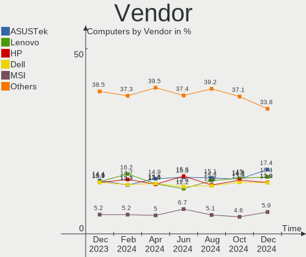
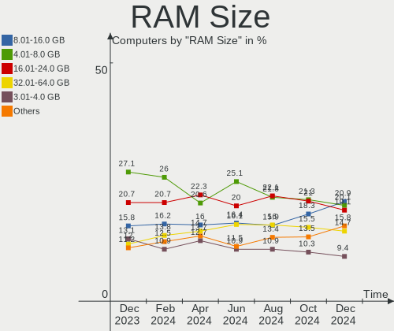
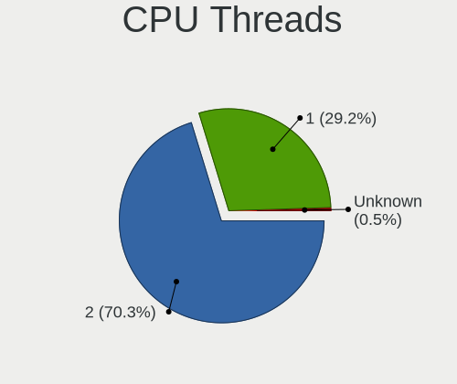
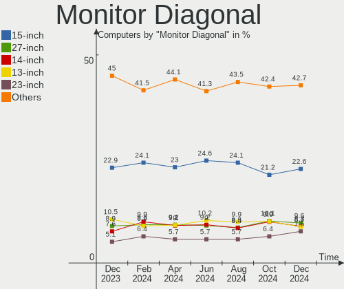

Ubuntu Hardware Trends
----------------------

A project to identify most popular hardware characteristics and track their change
over time based on data collected by Ubuntu users at https://Linux-Hardware.org.

Anyone can contribute to the study by uploading probes of their computers by
the [hw-probe](https://github.com/linuxhw/hw-probe) tool:

    sudo -E hw-probe -all -upload

This is a report for all computer types. See also reports for [desktops](/Dist/Ubuntu/Desktop/README.md) and [notebooks](/Dist/Ubuntu/Notebook/README.md).

Full-feature report is available here: https://linux-hardware.org/?view=trends

Period: Jun, 2021.

Contents
--------

- [ OS                       ](#os)
- [ OS Family                ](#os-family)
- [ Kernel                   ](#kernel)
- [ Kernel Family            ](#kernel-family)
- [ Kernel Major Ver.        ](#kernel-major-ver)
- [ Arch                     ](#arch)
- [ DE                       ](#de)
- [ Display Server           ](#display-server)
- [ Display Manager          ](#display-manager)
- [ OS Lang                  ](#os-lang)
- [ Boot Mode                ](#boot-mode)
- [ Filesystem               ](#filesystem)
- [ Part. scheme             ](#part-scheme)
- [ Dual Boot with Linux/BSD ](#dual-boot-with-linux/bsd)
- [ Dual Boot (Win)          ](#dual-boot-win)
- [ Country                  ](#country)
- [ City                     ](#city)
- [ Vendor                   ](#vendor)
- [ Model                    ](#model)
- [ Model Family             ](#model-family)
- [ MFG Year                 ](#mfg-year)
- [ Form Factor              ](#form-factor)
- [ Secure Boot              ](#secure-boot)
- [ Coreboot                 ](#coreboot)
- [ RAM Size                 ](#ram-size)
- [ RAM Used                 ](#ram-used)
- [ Has CD-ROM               ](#has-cd-rom)
- [ Total Drives             ](#total-drives)
- [ Has Ethernet             ](#has-ethernet)
- [ Has WiFi                 ](#has-wifi)
- [ Has Bluetooth            ](#has-bluetooth)
- [ Drive Vendor             ](#drive-vendor)
- [ Drive Model              ](#drive-model)
- [ HDD Vendor               ](#hdd-vendor)
- [ SSD Vendor               ](#ssd-vendor)
- [ Drive Kind               ](#drive-kind)
- [ Drive Connector          ](#drive-connector)
- [ Drive Size               ](#drive-size)
- [ Space Total              ](#space-total)
- [ Space Used               ](#space-used)
- [ Malfunc. Drives          ](#malfunc-drives)
- [ Malfunc. Drive Vendor    ](#malfunc-drive-vendor)
- [ Malfunc. HDD Vendor      ](#malfunc-hdd-vendor)
- [ Malfunc. Drive Kind      ](#malfunc-drive-kind)
- [ Failed Drives            ](#failed-drives)
- [ Failed Drive Vendor      ](#failed-drive-vendor)
- [ Drive Status             ](#drive-status)
- [ Storage Vendor           ](#storage-vendor)
- [ Storage Model            ](#storage-model)
- [ Storage Kind             ](#storage-kind)
- [ CPU Vendor               ](#cpu-vendor)
- [ CPU Model                ](#cpu-model)
- [ CPU Model Family         ](#cpu-model-family)
- [ CPU Cores                ](#cpu-cores)
- [ CPU Sockets              ](#cpu-sockets)
- [ CPU Threads              ](#cpu-threads)
- [ CPU Op-Modes             ](#cpu-op-modes)
- [ CPU Microcode            ](#cpu-microcode)
- [ CPU Microarch            ](#cpu-microarch)
- [ GPU Vendor               ](#gpu-vendor)
- [ GPU Model                ](#gpu-model)
- [ GPU Combo                ](#gpu-combo)
- [ GPU Driver               ](#gpu-driver)
- [ GPU Memory               ](#gpu-memory)
- [ Monitor Vendor           ](#monitor-vendor)
- [ Monitor Model            ](#monitor-model)
- [ Monitor Resolution       ](#monitor-resolution)
- [ Monitor Diagonal         ](#monitor-diagonal)
- [ Monitor Width            ](#monitor-width)
- [ Aspect Ratio             ](#aspect-ratio)
- [ Monitor Area             ](#monitor-area)
- [ Pixel Density            ](#pixel-density)
- [ Multiple Monitors        ](#multiple-monitors)
- [ Net Controller Vendor    ](#net-controller-vendor)
- [ Net Controller Model     ](#net-controller-model)
- [ Wireless Vendor          ](#wireless-vendor)
- [ Wireless Model           ](#wireless-model)
- [ Ethernet Vendor          ](#ethernet-vendor)
- [ Ethernet Model           ](#ethernet-model)
- [ Net Controller Kind      ](#net-controller-kind)
- [ Used Controller          ](#used-controller)
- [ NICs                     ](#nics)
- [ IPv6                     ](#ipv6)
- [ Memory Vendor            ](#memory-vendor)
- [ Memory Model             ](#memory-model)
- [ Memory Kind              ](#memory-kind)
- [ Memory Form Factor       ](#memory-form-factor)
- [ Memory Size              ](#memory-size)
- [ Memory Speed             ](#memory-speed)
- [ Sound Vendor             ](#sound-vendor)
- [ Sound Model              ](#sound-model)
- [ Camera Vendor            ](#camera-vendor)
- [ Camera Model             ](#camera-model)
- [ Fingerprint Vendor       ](#fingerprint-vendor)
- [ Fingerprint Model        ](#fingerprint-model)
- [ Chipcard Vendor          ](#chipcard-vendor)
- [ Chipcard Model           ](#chipcard-model)
- [ Printer Vendor           ](#printer-vendor)
- [ Printer Model            ](#printer-model)
- [ Scanner Vendor           ](#scanner-vendor)
- [ Scanner Model            ](#scanner-model)
- [ Bluetooth Vendor         ](#bluetooth-vendor)
- [ Bluetooth Model          ](#bluetooth-model)
- [ Unsupported Devices      ](#unsupported-devices)
- [ Unsupported Device Types ](#unsupported-device-types)

OS
--

Installed operating systems

| Name           | Computers | Percent |
|----------------|-----------|---------|
| Ubuntu 20.04   | 739       | 61.28%  |
| Ubuntu 21.04   | 264       | 21.89%  |
| Ubuntu 18.04   | 110       | 9.12%   |
| Ubuntu 20.10   | 62        | 5.14%   |
| Ubuntu 16.04   | 14        | 1.16%   |
| Ubuntu Core 16 | 3         | 0.25%   |
| Ubuntu 21.10   | 3         | 0.25%   |
| Ubuntu 19.04   | 3         | 0.25%   |
| Ubuntu         | 3         | 0.25%   |
| Ubuntu 19.10   | 2         | 0.17%   |
| Ubuntu 2020    | 1         | 0.08%   |
| Ubuntu 18.10   | 1         | 0.08%   |
| Ubuntu 10      | 1         | 0.08%   |

OS Family
---------

OS without a version

| Name   | Computers | Percent |
|--------|-----------|---------|
| Ubuntu | 1206      | 100%    |

Kernel
------

Version of the Linux kernel

| Version                  | Computers | Percent |
|--------------------------|-----------|---------|
| 5.8.0-55-generic         | 322       | 26.7%   |
| 5.11.0-18-generic        | 148       | 12.27%  |
| 5.4.0-74-generic         | 130       | 10.78%  |
| 5.8.0-53-generic         | 101       | 8.37%   |
| 5.8.0-59-generic         | 98        | 8.13%   |
| 5.8.0-43-generic         | 45        | 3.73%   |
| 5.11.0-22-generic        | 44        | 3.65%   |
| 5.4.0-73-generic         | 37        | 3.07%   |
| 5.4.0-77-generic         | 23        | 1.91%   |
| 5.11.0-17-generic        | 15        | 1.24%   |
| 5.11.0-16-generic        | 15        | 1.24%   |
| 5.4.0-42-generic         | 11        | 0.91%   |
| 5.8.0-56-generic         | 10        | 0.83%   |
| 5.8.0-50-generic         | 9         | 0.75%   |
| 5.11.0-20-generic        | 9         | 0.75%   |
| 4.15.0-144-generic       | 9         | 0.75%   |
| 5.8.0-54-generic         | 8         | 0.66%   |
| 5.4.0-72-generic         | 6         | 0.5%    |
| 5.11.0-1009-raspi        | 6         | 0.5%    |
| 5.8.0-57-generic         | 5         | 0.41%   |
| 5.11.0-23-generic        | 5         | 0.41%   |
| 5.11.0-1012-raspi        | 5         | 0.41%   |
| 4.15.0-143-generic       | 5         | 0.41%   |
| 4.15.0-142-generic       | 5         | 0.41%   |
| 5.8.0-60-generic         | 4         | 0.33%   |
| 5.8.0-48-generic         | 4         | 0.33%   |
| 5.4.0-26-generic         | 4         | 0.33%   |
| 5.12.12-051212-generic   | 4         | 0.33%   |
| 5.11.0-19-generic        | 3         | 0.25%   |
| 5.11.0-051100-generic    | 3         | 0.25%   |
| 5.10.29-amd64-desktop    | 3         | 0.25%   |
| 5.10.0-1029-oem          | 3         | 0.25%   |
| 4.15.0-112-generic       | 3         | 0.25%   |
| 5.9.0-050900-generic     | 2         | 0.17%   |
| 5.8.0-45-generic         | 2         | 0.17%   |
| 5.8.0-44-generic         | 2         | 0.17%   |
| 5.7.1-050701-generic     | 2         | 0.17%   |
| 5.4.0-75-generic         | 2         | 0.17%   |
| 5.4.0-74-lowlatency      | 2         | 0.17%   |
| 5.4.0-71-generic         | 2         | 0.17%   |
| 5.4.0-65-generic         | 2         | 0.17%   |
| 5.4.0-58-generic         | 2         | 0.17%   |
| 5.13.0-051300rc7-generic | 2         | 0.17%   |
| 5.13.0-051300rc4-generic | 2         | 0.17%   |
| 5.12.10-051210-generic   | 2         | 0.17%   |
| 5.11.0-7614-generic      | 2         | 0.17%   |
| 5.11.0-22-lowlatency     | 2         | 0.17%   |
| 5.0.0-23-generic         | 2         | 0.17%   |
| 5.0.0-13-generic         | 2         | 0.17%   |
| 4.4.0-210-generic        | 2         | 0.17%   |
| 4.18.0-15-generic        | 2         | 0.17%   |
| 4.15.0-29-generic        | 2         | 0.17%   |
| 4.15.0-147-generic       | 2         | 0.17%   |
| 4.15.0-145-generic       | 2         | 0.17%   |
| 5.9.12-050912-generic    | 1         | 0.08%   |
| 5.9.1-050901-generic     | 1         | 0.08%   |
| 5.8.17-050817-generic    | 1         | 0.08%   |
| 5.8.0-55-lowlatency      | 1         | 0.08%   |
| 5.8.0-41-generic         | 1         | 0.08%   |
| 5.8.0-40-generic         | 1         | 0.08%   |

Kernel Family
-------------

Linux kernel without a distro release

| Version | Computers | Percent |
|---------|-----------|---------|
| 5.8.0   | 617       | 51.16%  |
| 5.11.0  | 263       | 21.81%  |
| 5.4.0   | 232       | 19.24%  |
| 4.15.0  | 34        | 2.82%   |
| 5.10.0  | 7         | 0.58%   |
| 5.0.0   | 6         | 0.5%    |
| 5.3.0   | 5         | 0.41%   |
| 5.13.0  | 4         | 0.33%   |
| 5.12.12 | 4         | 0.33%   |
| 5.10.29 | 3         | 0.25%   |
| 4.4.0   | 3         | 0.25%   |
| 4.18.0  | 3         | 0.25%   |
| 5.9.0   | 2         | 0.17%   |
| 5.7.1   | 2         | 0.17%   |
| 5.6.0   | 2         | 0.17%   |
| 5.12.6  | 2         | 0.17%   |
| 5.12.10 | 2         | 0.17%   |
| 5.12.0  | 2         | 0.17%   |
| 5.9.12  | 1         | 0.08%   |
| 5.9.1   | 1         | 0.08%   |
| 5.8.17  | 1         | 0.08%   |
| 5.4.73  | 1         | 0.08%   |
| 5.12.9  | 1         | 0.08%   |
| 5.12.8  | 1         | 0.08%   |
| 5.12.2  | 1         | 0.08%   |
| 5.11.11 | 1         | 0.08%   |
| 5.10.34 | 1         | 0.08%   |
| 4.9.201 | 1         | 0.08%   |
| 4.8.0   | 1         | 0.08%   |
| 4.15.18 | 1         | 0.08%   |
| 4.13.0  | 1         | 0.08%   |

Kernel Major Ver.
-----------------

Linux kernel major version

| Version | Computers | Percent |
|---------|-----------|---------|
| 5.8     | 618       | 51.24%  |
| 5.11    | 264       | 21.89%  |
| 5.4     | 233       | 19.32%  |
| 4.15    | 35        | 2.9%    |
| 5.12    | 13        | 1.08%   |
| 5.10    | 11        | 0.91%   |
| 5.0     | 6         | 0.5%    |
| 5.3     | 5         | 0.41%   |
| 5.9     | 4         | 0.33%   |
| 5.13    | 4         | 0.33%   |
| 4.4     | 3         | 0.25%   |
| 4.18    | 3         | 0.25%   |
| 5.7     | 2         | 0.17%   |
| 5.6     | 2         | 0.17%   |
| 4.9     | 1         | 0.08%   |
| 4.8     | 1         | 0.08%   |
| 4.13    | 1         | 0.08%   |

Arch
----

OS architecture (x86_64, i586, etc.)

| Name    | Computers | Percent |
|---------|-----------|---------|
| x86_64  | 1182      | 98.01%  |
| aarch64 | 19        | 1.58%   |
| i686    | 5         | 0.41%   |

DE
--

Desktop Environment

| Name            | Computers | Percent |
|-----------------|-----------|---------|
| GNOME           | 1051      | 87.15%  |
| Unknown         | 103       | 8.54%   |
| Unity           | 24        | 1.99%   |
| X-Cinnamon      | 13        | 1.08%   |
| GNOME Flashback | 5         | 0.41%   |
| Cinnamon        | 5         | 0.41%   |
| Deepin          | 3         | 0.25%   |
| Lubuntu         | 1         | 0.08%   |
| Enlightenment   | 1         | 0.08%   |

Display Server
--------------

X11 or Wayland

| Name    | Computers | Percent |
|---------|-----------|---------|
| X11     | 955       | 79.19%  |
| Wayland | 186       | 15.42%  |
| Unknown | 50        | 4.15%   |
| Tty     | 15        | 1.24%   |

Display Manager
---------------

SDDM, LightDM, etc.

| Name    | Computers | Percent |
|---------|-----------|---------|
| Unknown | 928       | 76.95%  |
| GDM     | 255       | 21.14%  |
| TDM     | 17        | 1.41%   |
| GDM3    | 4         | 0.33%   |
| LightDM | 2         | 0.17%   |

OS Lang
-------

Language

| Lang    | Computers | Percent |
|---------|-----------|---------|
| en_US   | 496       | 41.13%  |
| de_DE   | 114       | 9.45%   |
| fr_FR   | 84        | 6.97%   |
| en_GB   | 64        | 5.31%   |
| pt_BR   | 59        | 4.89%   |
| en_IN   | 46        | 3.81%   |
| it_IT   | 28        | 2.32%   |
| es_ES   | 26        | 2.16%   |
| ru_RU   | 25        | 2.07%   |
| en_CA   | 25        | 2.07%   |
| en_AU   | 21        | 1.74%   |
| pl_PL   | 17        | 1.41%   |
| C       | 11        | 0.91%   |
| nl_NL   | 10        | 0.83%   |
| hu_HU   | 10        | 0.83%   |
| Unknown | 10        | 0.83%   |
| pt_PT   | 9         | 0.75%   |
| ja_JP   | 9         | 0.75%   |
| es_AR   | 9         | 0.75%   |
| en_ZA   | 9         | 0.75%   |
| de_AT   | 8         | 0.66%   |
| sv_SE   | 7         | 0.58%   |
| fr_BE   | 7         | 0.58%   |
| cs_CZ   | 7         | 0.58%   |
| zh_TW   | 6         | 0.5%    |
| zh_CN   | 6         | 0.5%    |
| de_CH   | 6         | 0.5%    |
| tr_TR   | 5         | 0.41%   |
| es_CL   | 5         | 0.41%   |
| en_IL   | 5         | 0.41%   |
| ro_RO   | 4         | 0.33%   |
| es_MX   | 4         | 0.33%   |
| en_NZ   | 4         | 0.33%   |
| ru_UA   | 3         | 0.25%   |
| nl_BE   | 3         | 0.25%   |
| fr_CA   | 3         | 0.25%   |
| es_VE   | 3         | 0.25%   |
| en_IE   | 3         | 0.25%   |
| en_HK   | 3         | 0.25%   |
| bg_BG   | 3         | 0.25%   |
| sl_SI   | 2         | 0.17%   |
| sk_SK   | 2         | 0.17%   |
| nb_NO   | 2         | 0.17%   |
| ko_KR   | 2         | 0.17%   |
| fi_FI   | 2         | 0.17%   |
| zh_HK   | 1         | 0.08%   |
| ur_PK   | 1         | 0.08%   |
| is_IS   | 1         | 0.08%   |
| id_ID   | 1         | 0.08%   |
| hr_HR   | 1         | 0.08%   |
| eu_ES   | 1         | 0.08%   |
| es_US   | 1         | 0.08%   |
| es_EC   | 1         | 0.08%   |
| es_DO   | 1         | 0.08%   |
| es_CU   | 1         | 0.08%   |
| es_CR   | 1         | 0.08%   |
| es_CO   | 1         | 0.08%   |
| en_PH   | 1         | 0.08%   |
| en_NG   | 1         | 0.08%   |
| el_GR   | 1         | 0.08%   |

Boot Mode
---------

EFI or BIOS

| Mode | Computers | Percent |
|------|-----------|---------|
| BIOS | 672       | 55.72%  |
| EFI  | 534       | 44.28%  |

Filesystem
----------

Type of filesystem

| Type    | Computers | Percent |
|---------|-----------|---------|
| Ext4    | 1138      | 94.36%  |
| Overlay | 34        | 2.82%   |
| Zfs     | 17        | 1.41%   |
| Btrfs   | 11        | 0.91%   |
| Xfs     | 3         | 0.25%   |
| Ext2    | 2         | 0.17%   |
| Ext3    | 1         | 0.08%   |

Part. scheme
------------

Scheme of partitioning

| Type    | Computers | Percent |
|---------|-----------|---------|
| Unknown | 915       | 75.87%  |
| GPT     | 223       | 18.49%  |
| MBR     | 68        | 5.64%   |

Dual Boot with Linux/BSD
------------------------

Hosting more than one Linux/BSD

| Dual boot | Computers | Percent |
|-----------|-----------|---------|
| No        | 1048      | 86.9%   |
| Yes       | 158       | 13.1%   |

Dual Boot (Win)
---------------

Hosting Linux and Windows

| Dual boot | Computers | Percent |
|-----------|-----------|---------|
| No        | 763       | 63.27%  |
| Yes       | 443       | 36.73%  |

Country
-------

Geographic location (country)

| Country             | Computers | Percent |
|---------------------|-----------|---------|
| USA                 | 205       | 17%     |
| Germany             | 129       | 10.7%   |
| France              | 95        | 7.88%   |
| Brazil              | 74        | 6.14%   |
| UK                  | 60        | 4.98%   |
| India               | 57        | 4.73%   |
| Italy               | 38        | 3.15%   |
| Russia              | 32        | 2.65%   |
| Canada              | 32        | 2.65%   |
| Spain               | 28        | 2.32%   |
| Australia           | 25        | 2.07%   |
| Poland              | 23        | 1.91%   |
| Netherlands         | 23        | 1.91%   |
| Belgium             | 21        | 1.74%   |
| Switzerland         | 16        | 1.33%   |
| Austria             | 16        | 1.33%   |
| Argentina           | 15        | 1.24%   |
| Turkey              | 14        | 1.16%   |
| Sweden              | 14        | 1.16%   |
| China               | 14        | 1.16%   |
| Taiwan              | 13        | 1.08%   |
| Ukraine             | 12        | 1%      |
| Romania             | 12        | 1%      |
| Portugal            | 12        | 1%      |
| Japan               | 12        | 1%      |
| Hungary             | 11        | 0.91%   |
| Czechia             | 10        | 0.83%   |
| Chile               | 10        | 0.83%   |
| Vietnam             | 9         | 0.75%   |
| South Africa        | 9         | 0.75%   |
| Mexico              | 9         | 0.75%   |
| Finland             | 9         | 0.75%   |
| Greece              | 8         | 0.66%   |
| Bulgaria            | 8         | 0.66%   |
| Israel              | 7         | 0.58%   |
| Iran                | 7         | 0.58%   |
| South Korea         | 5         | 0.41%   |
| New Zealand         | 5         | 0.41%   |
| Hong Kong           | 5         | 0.41%   |
| Colombia            | 5         | 0.41%   |
| Ireland             | 4         | 0.33%   |
| Indonesia           | 4         | 0.33%   |
| Bangladesh          | 4         | 0.33%   |
| Venezuela           | 3         | 0.25%   |
| Sri Lanka           | 3         | 0.25%   |
| Slovakia            | 3         | 0.25%   |
| Serbia              | 3         | 0.25%   |
| Saudi Arabia        | 3         | 0.25%   |
| Puerto Rico         | 3         | 0.25%   |
| Pakistan            | 3         | 0.25%   |
| Norway              | 3         | 0.25%   |
| Morocco             | 3         | 0.25%   |
| Iceland             | 3         | 0.25%   |
| Croatia             | 3         | 0.25%   |
| Trinidad and Tobago | 2         | 0.17%   |
| Slovenia            | 2         | 0.17%   |
| Philippines         | 2         | 0.17%   |
| Nigeria             | 2         | 0.17%   |
| Nepal               | 2         | 0.17%   |
| Luxembourg          | 2         | 0.17%   |

City
----

Geographic location (city)

| City           | Computers | Percent |
|----------------|-----------|---------|
| São Paulo     | 13        | 1.08%   |
| Berlin         | 12        | 1%      |
| Vienna         | 11        | 0.91%   |
| Paris          | 11        | 0.91%   |
| Warsaw         | 8         | 0.66%   |
| Sofia          | 8         | 0.66%   |
| Tehran         | 7         | 0.58%   |
| Pune           | 7         | 0.58%   |
| New Taipei     | 7         | 0.58%   |
| London         | 7         | 0.58%   |
| Sydney         | 6         | 0.5%    |
| Prague         | 6         | 0.5%    |
| Mumbai         | 6         | 0.5%    |
| Melbourne      | 6         | 0.5%    |
| Hamburg        | 6         | 0.5%    |
| Bucharest      | 6         | 0.5%    |
| Santiago       | 5         | 0.41%   |
| Munich         | 5         | 0.41%   |
| Moscow         | 5         | 0.41%   |
| Montreal       | 5         | 0.41%   |
| Hyderabad      | 5         | 0.41%   |
| Essen          | 5         | 0.41%   |
| Düsseldorf    | 5         | 0.41%   |
| Valencia       | 4         | 0.33%   |
| The Hague      | 4         | 0.33%   |
| Phoenix        | 4         | 0.33%   |
| Novosibirsk    | 4         | 0.33%   |
| Nantes         | 4         | 0.33%   |
| Manchester     | 4         | 0.33%   |
| Los Angeles    | 4         | 0.33%   |
| Lisbon         | 4         | 0.33%   |
| Kyiv           | 4         | 0.33%   |
| Johannesburg   | 4         | 0.33%   |
| Istanbul       | 4         | 0.33%   |
| Hanoi          | 4         | 0.33%   |
| Curitiba       | 4         | 0.33%   |
| Chennai        | 4         | 0.33%   |
| Cambridge      | 4         | 0.33%   |
| Bengaluru      | 4         | 0.33%   |
| Belo Horizonte | 4         | 0.33%   |
| Athens         | 4         | 0.33%   |
| Yekaterinburg  | 3         | 0.25%   |
| Wroclaw        | 3         | 0.25%   |
| Tel Aviv       | 3         | 0.25%   |
| Stockholm      | 3         | 0.25%   |
| St Petersburg  | 3         | 0.25%   |
| Shanghai       | 3         | 0.25%   |
| Seminole       | 3         | 0.25%   |
| Schenectady    | 3         | 0.25%   |
| San Diego      | 3         | 0.25%   |
| Salvador       | 3         | 0.25%   |
| Rochester      | 3         | 0.25%   |
| Minneapolis    | 3         | 0.25%   |
| Mexico City    | 3         | 0.25%   |
| Madrid         | 3         | 0.25%   |
| Landau         | 3         | 0.25%   |
| Krakow         | 3         | 0.25%   |
| Kolkata        | 3         | 0.25%   |
| Kirkland       | 3         | 0.25%   |
| Izmir          | 3         | 0.25%   |

Vendor
------

Motherboard manufacturer

| Name                    | Computers | Percent |
|-------------------------|-----------|---------|
| Dell                    | 200       | 16.58%  |
| ASUSTek Computer        | 177       | 14.68%  |
| Hewlett-Packard         | 170       | 14.1%   |
| Lenovo                  | 158       | 13.1%   |
| Gigabyte Technology     | 89        | 7.38%   |
| MSI                     | 59        | 4.89%   |
| Acer                    | 53        | 4.39%   |
| ASRock                  | 44        | 3.65%   |
| Apple                   | 27        | 2.24%   |
| Unknown                 | 26        | 2.16%   |
| Toshiba                 | 16        | 1.33%   |
| Sony                    | 16        | 1.33%   |
| Samsung Electronics     | 15        | 1.24%   |
| Intel                   | 14        | 1.16%   |
| Pegatron                | 12        | 1%      |
| Packard Bell            | 8         | 0.66%   |
| Medion                  | 8         | 0.66%   |
| Fujitsu                 | 8         | 0.66%   |
| HUAWEI                  | 6         | 0.5%    |
| ECS                     | 6         | 0.5%    |
| Timi                    | 5         | 0.41%   |
| Supermicro              | 5         | 0.41%   |
| Fujitsu Siemens         | 5         | 0.41%   |
| Alienware               | 5         | 0.41%   |
| Positivo                | 4         | 0.33%   |
| Foxconn                 | 4         | 0.33%   |
| Raspberry Pi Foundation | 3         | 0.25%   |
| Biostar                 | 3         | 0.25%   |
| PCWare                  | 2         | 0.17%   |
| PC Specialist           | 2         | 0.17%   |
| Panasonic               | 2         | 0.17%   |
| Nvidia                  | 2         | 0.17%   |
| Notebook                | 2         | 0.17%   |
| Microsoft               | 2         | 0.17%   |
| LG Electronics          | 2         | 0.17%   |
| Huanan                  | 2         | 0.17%   |
| Gateway                 | 2         | 0.17%   |
| eMachines               | 2         | 0.17%   |
| ASRockRack              | 2         | 0.17%   |
| Wiltronic               | 1         | 0.08%   |
| whyopencomputing        | 1         | 0.08%   |
| VINGA                   | 1         | 0.08%   |
| TYAN Computer           | 1         | 0.08%   |
| Thomson                 | 1         | 0.08%   |
| Terrans Force           | 1         | 0.08%   |
| Teclast                 | 1         | 0.08%   |
| System76                | 1         | 0.08%   |
| Star Labs               | 1         | 0.08%   |
| SIEMENS                 | 1         | 0.08%   |
| Shuttle                 | 1         | 0.08%   |
| Schenker                | 1         | 0.08%   |
| Positivo Bahia - VAIO   | 1         | 0.08%   |
| OEM                     | 1         | 0.08%   |
| Monster                 | 1         | 0.08%   |
| Maibenben               | 1         | 0.08%   |
| LEADER                  | 1         | 0.08%   |
| Lanix                   | 1         | 0.08%   |
| langchao                | 1         | 0.08%   |
| Jumper                  | 1         | 0.08%   |
| JINGSHA                 | 1         | 0.08%   |

Model
-----

Motherboard model

| Name                                       | Computers | Percent |
|--------------------------------------------|-----------|---------|
| Unknown                                    | 30        | 2.49%   |
| ASUS All Series                            | 13        | 1.08%   |
| HP Pavilion dv6                            | 6         | 0.5%    |
| HP Notebook                                | 6         | 0.5%    |
| ASUS PRIME A320M-K                         | 5         | 0.41%   |
| Dell XPS 15 9500                           | 4         | 0.33%   |
| Dell XPS 15 7590                           | 4         | 0.33%   |
| Dell Precision T3600                       | 4         | 0.33%   |
| Dell Inspiron 15-3567                      | 4         | 0.33%   |
| Acer Aspire ES1-512                        | 4         | 0.33%   |
| Acer Aspire A515-51G                       | 4         | 0.33%   |
| MSI MS-7C52                                | 3         | 0.25%   |
| MSI MS-7C37                                | 3         | 0.25%   |
| Lenovo IdeaPad Flex 5 14ARE05 81X2         | 3         | 0.25%   |
| HUAWEI HLYL-WXX9                           | 3         | 0.25%   |
| HP Pavilion g6                             | 3         | 0.25%   |
| HP Laptop 15s-eq1xxx                       | 3         | 0.25%   |
| HP EliteBook 840 G3                        | 3         | 0.25%   |
| Gigabyte Z77-DS3H                          | 3         | 0.25%   |
| Gigabyte X570 I AORUS PRO WIFI             | 3         | 0.25%   |
| Dell Vostro 5490                           | 3         | 0.25%   |
| Dell Latitude E6430                        | 3         | 0.25%   |
| Dell Latitude E6420                        | 3         | 0.25%   |
| Dell Latitude E6400                        | 3         | 0.25%   |
| Dell Inspiron 3505                         | 3         | 0.25%   |
| Apple iMac12,2                             | 3         | 0.25%   |
| Timi TM1703                                | 2         | 0.17%   |
| Supermicro Super Server                    | 2         | 0.17%   |
| Samsung 305E4A/305E5A/305E7A               | 2         | 0.17%   |
| Samsung 300E4A/300E5A/300E7A/3430EA/3530EA | 2         | 0.17%   |
| MSI MS-7B86                                | 2         | 0.17%   |
| MSI MS-7A38                                | 2         | 0.17%   |
| MSI MS-7758                                | 2         | 0.17%   |
| Lenovo Z50-70 20354                        | 2         | 0.17%   |
| Lenovo IdeaPad S340-14API 81NB             | 2         | 0.17%   |
| Lenovo G50-80 80L0                         | 2         | 0.17%   |
| HUAWEI NBLK-WAX9X                          | 2         | 0.17%   |
| HP ZBook 15 G5                             | 2         | 0.17%   |
| HP ProBook 4520s                           | 2         | 0.17%   |
| HP ProBook 440 G8 Notebook PC              | 2         | 0.17%   |
| HP ProBook 430 G3                          | 2         | 0.17%   |
| HP ProBook 430 G2                          | 2         | 0.17%   |
| HP Pavilion 15                             | 2         | 0.17%   |
| HP Laptop 15-bs0xx                         | 2         | 0.17%   |
| HP EliteBook Folio 9480m                   | 2         | 0.17%   |
| HP EliteBook Folio 9470m                   | 2         | 0.17%   |
| HP EliteBook 8470p                         | 2         | 0.17%   |
| HP EliteBook 8460p                         | 2         | 0.17%   |
| HP EliteBook 840 G1                        | 2         | 0.17%   |
| HP EliteBook 820 G1                        | 2         | 0.17%   |
| Gigabyte Z77X-D3H                          | 2         | 0.17%   |
| Gigabyte Z170X-Gaming 7                    | 2         | 0.17%   |
| Gigabyte H61MS                             | 2         | 0.17%   |
| Gigabyte H61M-S2PV                         | 2         | 0.17%   |
| Gigabyte GA-78LMT-USB3 6.0                 | 2         | 0.17%   |
| Gigabyte G1.Sniper 3                       | 2         | 0.17%   |
| Gigabyte B85M-DS3H-A                       | 2         | 0.17%   |
| Gigabyte B450M DS3H                        | 2         | 0.17%   |
| Gigabyte B450 AORUS ELITE                  | 2         | 0.17%   |
| Foxconn p6610f                             | 2         | 0.17%   |

Model Family
------------

Motherboard model prefix

| Name                    | Computers | Percent |
|-------------------------|-----------|---------|
| Lenovo ThinkPad         | 72        | 5.97%   |
| Dell Inspiron           | 55        | 4.56%   |
| Dell Latitude           | 44        | 3.65%   |
| Acer Aspire             | 36        | 2.99%   |
| HP EliteBook            | 31        | 2.57%   |
| HP Pavilion             | 30        | 2.49%   |
| Dell Precision          | 30        | 2.49%   |
| Unknown                 | 30        | 2.49%   |
| ASUS PRIME              | 29        | 2.4%    |
| Lenovo IdeaPad          | 27        | 2.24%   |
| HP ProBook              | 24        | 1.99%   |
| Dell XPS                | 20        | 1.66%   |
| ASUS ROG                | 20        | 1.66%   |
| Dell Vostro             | 19        | 1.58%   |
| HP Laptop               | 18        | 1.49%   |
| Dell OptiPlex           | 17        | 1.41%   |
| ASUS All                | 13        | 1.08%   |
| Toshiba Satellite       | 12        | 1%      |
| ASUS VivoBook           | 12        | 1%      |
| HP Compaq               | 11        | 0.91%   |
| Lenovo ThinkCentre      | 10        | 0.83%   |
| Lenovo Yoga             | 9         | 0.75%   |
| HP ENVY                 | 8         | 0.66%   |
| Packard Bell EasyNote   | 7         | 0.58%   |
| Gigabyte X570           | 7         | 0.58%   |
| Dell PowerEdge          | 7         | 0.58%   |
| Acer Swift              | 7         | 0.58%   |
| HP Notebook             | 6         | 0.5%    |
| ASUS TUF                | 6         | 0.5%    |
| Lenovo Legion           | 5         | 0.41%   |
| Fujitsu LIFEBOOK        | 5         | 0.41%   |
| Lenovo ThinkBook        | 4         | 0.33%   |
| HP ProDesk              | 4         | 0.33%   |
| RPi Raspberry           | 3         | 0.25%   |
| MSI MS-7C52             | 3         | 0.25%   |
| MSI MS-7C37             | 3         | 0.25%   |
| Lenovo ThinkStation     | 3         | 0.25%   |
| Lenovo IdeaCentre       | 3         | 0.25%   |
| HUAWEI HLYL-WXX9        | 3         | 0.25%   |
| HP ZBook                | 3         | 0.25%   |
| HP Spectre              | 3         | 0.25%   |
| HP ProLiant             | 3         | 0.25%   |
| Gigabyte Z77-DS3H       | 3         | 0.25%   |
| Gigabyte G1.Sniper      | 3         | 0.25%   |
| Gigabyte B450           | 3         | 0.25%   |
| Fujitsu Siemens ESPRIMO | 3         | 0.25%   |
| Dell G3                 | 3         | 0.25%   |
| ASUS P8B75-M            | 3         | 0.25%   |
| ASUS M5A97              | 3         | 0.25%   |
| Apple MacBookPro5       | 3         | 0.25%   |
| Apple iMac12            | 3         | 0.25%   |
| Acer TravelMate         | 3         | 0.25%   |
| Toshiba PORTEGE         | 2         | 0.17%   |
| Toshiba dynabook        | 2         | 0.17%   |
| Timi TM1703             | 2         | 0.17%   |
| Supermicro Super        | 2         | 0.17%   |
| Samsung 305E4A          | 2         | 0.17%   |
| Samsung 300E4A          | 2         | 0.17%   |
| MSI MS-7B86             | 2         | 0.17%   |
| MSI MS-7A38             | 2         | 0.17%   |

MFG Year
--------

Motherboard manufacture year

| Year    | Computers | Percent |
|---------|-----------|---------|
| 2020    | 207       | 17.16%  |
| 2021    | 150       | 12.44%  |
| 2019    | 122       | 10.12%  |
| 2018    | 97        | 8.04%   |
| 2013    | 81        | 6.72%   |
| 2012    | 70        | 5.8%    |
| 2010    | 65        | 5.39%   |
| 2011    | 62        | 5.14%   |
| 2017    | 60        | 4.98%   |
| 2014    | 59        | 4.89%   |
| 2009    | 55        | 4.56%   |
| 2015    | 53        | 4.39%   |
| 2016    | 48        | 3.98%   |
| 2008    | 39        | 3.23%   |
| Unknown | 19        | 1.58%   |
| 2007    | 9         | 0.75%   |
| 2006    | 7         | 0.58%   |
| 2005    | 3         | 0.25%   |

Form Factor
-----------

Physical design of the computer

| Name           | Computers | Percent |
|----------------|-----------|---------|
| Notebook       | 638       | 52.9%   |
| Desktop        | 461       | 38.23%  |
| Convertible    | 39        | 3.23%   |
| System on chip | 19        | 1.58%   |
| All in one     | 19        | 1.58%   |
| Server         | 19        | 1.58%   |
| Mini pc        | 8         | 0.66%   |
| Tablet         | 3         | 0.25%   |

Secure Boot
-----------

Enabled or disabled

| State    | Computers | Percent |
|----------|-----------|---------|
| Disabled | 1070      | 88.72%  |
| Enabled  | 136       | 11.28%  |

Coreboot
--------

Have coreboot on board

| Used | Computers | Percent |
|------|-----------|---------|
| No   | 1203      | 99.75%  |
| Yes  | 3         | 0.25%   |

RAM Size
--------

Total RAM memory

| Size in GB      | Computers | Percent |
|-----------------|-----------|---------|
| 4.01-8.0        | 309       | 25.62%  |
| 3.01-4.0        | 242       | 20.07%  |
| 16.01-24.0      | 216       | 17.91%  |
| 8.01-16.0       | 211       | 17.5%   |
| 32.01-64.0      | 108       | 8.96%   |
| 64.01-256.0     | 52        | 4.31%   |
| 1.01-2.0        | 40        | 3.32%   |
| 24.01-32.0      | 12        | 1%      |
| 2.01-3.0        | 7         | 0.58%   |
| More than 256.0 | 4         | 0.33%   |
| 0.51-1.0        | 4         | 0.33%   |
| 0.01-0.5        | 1         | 0.08%   |

RAM Used
--------

Used RAM memory

| Used GB     | Computers | Percent |
|-------------|-----------|---------|
| 1.01-2.0    | 467       | 38.72%  |
| 2.01-3.0    | 365       | 30.27%  |
| 4.01-8.0    | 151       | 12.52%  |
| 3.01-4.0    | 145       | 12.02%  |
| 8.01-16.0   | 40        | 3.32%   |
| 0.51-1.0    | 19        | 1.58%   |
| 16.01-24.0  | 7         | 0.58%   |
| 0.01-0.5    | 6         | 0.5%    |
| 32.01-64.0  | 2         | 0.17%   |
| 24.01-32.0  | 2         | 0.17%   |
| 64.01-256.0 | 2         | 0.17%   |

Has CD-ROM
----------

Has CD-ROM on board

| Presented | Computers | Percent |
|-----------|-----------|---------|
| No        | 710       | 58.87%  |
| Yes       | 496       | 41.13%  |

Total Drives
------------

Number of drives on board

| Drives | Computers | Percent |
|--------|-----------|---------|
| 1      | 744       | 61.69%  |
| 2      | 270       | 22.39%  |
| 3      | 91        | 7.55%   |
| 4      | 40        | 3.32%   |
| 5      | 21        | 1.74%   |
| 0      | 15        | 1.24%   |
| 6      | 12        | 1%      |
| 9      | 4         | 0.33%   |
| 8      | 3         | 0.25%   |
| 13     | 2         | 0.17%   |
| 7      | 2         | 0.17%   |
| 14     | 1         | 0.08%   |
| 11     | 1         | 0.08%   |

Has Ethernet
------------

Has Ethernet on board

| Presented | Computers | Percent |
|-----------|-----------|---------|
| Yes       | 1050      | 87.06%  |
| No        | 156       | 12.94%  |

Has WiFi
--------

Has WiFi module

| Presented | Computers | Percent |
|-----------|-----------|---------|
| Yes       | 896       | 74.3%   |
| No        | 310       | 25.7%   |

Has Bluetooth
-------------

Has Bluetooth module

| Presented | Computers | Percent |
|-----------|-----------|---------|
| Yes       | 691       | 57.3%   |
| No        | 515       | 42.7%   |

Drive Vendor
------------

Hard drive vendors

| Vendor                    | Computers | Drives | Percent |
|---------------------------|-----------|--------|---------|
| Seagate                   | 277       | 351    | 16.53%  |
| Samsung Electronics       | 252       | 316    | 15.04%  |
| WDC                       | 250       | 310    | 14.92%  |
| Toshiba                   | 131       | 140    | 7.82%   |
| SanDisk                   | 96        | 103    | 5.73%   |
| Unknown                   | 77        | 86     | 4.59%   |
| Kingston                  | 77        | 85     | 4.59%   |
| Crucial                   | 68        | 70     | 4.06%   |
| SK Hynix                  | 45        | 47     | 2.68%   |
| Hitachi                   | 43        | 45     | 2.57%   |
| Intel                     | 38        | 44     | 2.27%   |
| HGST                      | 37        | 40     | 2.21%   |
| Micron Technology         | 30        | 32     | 1.79%   |
| A-DATA Technology         | 20        | 22     | 1.19%   |
| KIOXIA                    | 16        | 17     | 0.95%   |
| Phison                    | 12        | 12     | 0.72%   |
| China                     | 12        | 12     | 0.72%   |
| Apple                     | 11        | 13     | 0.66%   |
| Silicon Motion            | 8         | 8      | 0.48%   |
| Maxtor                    | 8         | 8      | 0.48%   |
| Hewlett-Packard           | 8         | 9      | 0.48%   |
| Fujitsu                   | 8         | 8      | 0.48%   |
| Intenso                   | 7         | 8      | 0.42%   |
| KingSpec                  | 6         | 6      | 0.36%   |
| JMicron                   | 6         | 6      | 0.36%   |
| Union Memory (Shenzhen)   | 5         | 5      | 0.3%    |
| PNY                       | 5         | 5      | 0.3%    |
| Mushkin                   | 5         | 12     | 0.3%    |
| Micron/Crucial Technology | 5         | 5      | 0.3%    |
| LITEON                    | 5         | 5      | 0.3%    |
| Gigabyte Technology       | 5         | 5      | 0.3%    |
| ASMT                      | 5         | 6      | 0.3%    |
| XPG                       | 4         | 4      | 0.24%   |
| Union Memory              | 4         | 4      | 0.24%   |
| SPCC                      | 4         | 4      | 0.24%   |
| OCZ                       | 4         | 4      | 0.24%   |
| KIOXIA-EXCERIA            | 4         | 4      | 0.24%   |
| Corsair                   | 4         | 5      | 0.24%   |
| SABRENT                   | 3         | 3      | 0.18%   |
| Realtek Semiconductor     | 3         | 3      | 0.18%   |
| Netac                     | 3         | 3      | 0.18%   |
| External                  | 3         | 3      | 0.18%   |
| EMTEC                     | 3         | 3      | 0.18%   |
| Patriot                   | 2         | 2      | 0.12%   |
| LITEONIT                  | 2         | 2      | 0.12%   |
| KingDian                  | 2         | 2      | 0.12%   |
| Indilinx                  | 2         | 2      | 0.12%   |
| GOODRAM                   | 2         | 2      | 0.12%   |
| Colorful                  | 2         | 2      | 0.12%   |
| BHT                       | 2         | 2      | 0.12%   |
| Apacer                    | 2         | 2      | 0.12%   |
| AMD                       | 2         | 10     | 0.12%   |
| Zozt                      | 1         | 3      | 0.06%   |
| Zheino                    | 1         | 1      | 0.06%   |
| XrayDisk                  | 1         | 1      | 0.06%   |
| Western Digital           | 1         | 1      | 0.06%   |
| Verbatim                  | 1         | 1      | 0.06%   |
| USB                       | 1         | 1      | 0.06%   |
| TwinMOS                   | 1         | 1      | 0.06%   |
| TS-RDF2                   | 1         | 1      | 0.06%   |

Drive Model
-----------

Hard drive models

| Model                              | Computers | Percent |
|------------------------------------|-----------|---------|
| Kingston SA400S37240G 240GB SSD    | 21        | 1.15%   |
| Samsung SSD 860 EVO 500GB          | 19        | 1.04%   |
| Unknown MMC Card  32GB             | 18        | 0.98%   |
| Samsung NVMe SSD Drive 512GB       | 18        | 0.98%   |
| Crucial CT240BX500SSD1 240GB       | 17        | 0.93%   |
| Seagate ST1000DM010-2EP102 1TB     | 15        | 0.82%   |
| Toshiba MQ01ABD100 1TB             | 13        | 0.71%   |
| Toshiba DT01ACA100 1TB             | 13        | 0.71%   |
| Seagate ST1000LM035-1RK172 1TB     | 13        | 0.71%   |
| Sandisk NVMe SSD Drive 512GB       | 13        | 0.71%   |
| Samsung SSD 850 EVO 250GB          | 13        | 0.71%   |
| Crucial CT500MX500SSD1 500GB       | 13        | 0.71%   |
| SK Hynix NVMe SSD Drive 512GB      | 11        | 0.6%    |
| Seagate ST2000DM008-2FR102 2TB     | 11        | 0.6%    |
| Samsung SSD 860 EVO 1TB            | 11        | 0.6%    |
| Unknown MMC Card  16GB             | 10        | 0.55%   |
| Toshiba MQ04ABF100 1TB             | 10        | 0.55%   |
| Seagate ST500DM002-1BD142 500GB    | 10        | 0.55%   |
| Samsung SSD 850 EVO 500GB          | 10        | 0.55%   |
| Samsung NVMe SSD Drive 500GB       | 10        | 0.55%   |
| HGST HTS721010A9E630 1TB           | 10        | 0.55%   |
| Seagate ST1000LM024 HN-M101MBB 1TB | 9         | 0.49%   |
| Samsung SSD 860 EVO 250GB          | 9         | 0.49%   |
| Samsung NVMe SSD Drive 250GB       | 9         | 0.49%   |
| Kingston SA400S37480G 480GB SSD    | 9         | 0.49%   |
| Unknown MMC Card  64GB             | 8         | 0.44%   |
| Unknown MMC Card  128GB            | 8         | 0.44%   |
| Seagate ST500LT012-1DG142 500GB    | 8         | 0.44%   |
| Seagate ST3500418AS 500GB          | 8         | 0.44%   |
| Seagate ST2000DM001-1ER164 2TB     | 8         | 0.44%   |
| Seagate ST1000LM049-2GH172 1TB     | 8         | 0.44%   |
| Sandisk NVMe SSD Drive 500GB       | 8         | 0.44%   |
| Samsung NVMe SSD Drive 256GB       | 8         | 0.44%   |
| Samsung NVMe SSD Drive 1TB         | 8         | 0.44%   |
| Kingston SV300S37A120G 120GB SSD   | 8         | 0.44%   |
| Intel NVMe SSD Drive 512GB         | 8         | 0.44%   |
| WDC WD10EZEX-08WN4A0 1TB           | 7         | 0.38%   |
| Sandisk NVMe SSD Drive 256GB       | 7         | 0.38%   |
| Kingston SUV400S37120G 120GB SSD   | 7         | 0.38%   |
| HGST HTS545050A7E680 500GB         | 7         | 0.38%   |
| SK Hynix NVMe SSD Drive 256GB      | 6         | 0.33%   |
| Seagate ST6000DM003-2CY186 6TB     | 6         | 0.33%   |
| Seagate ST4000DM004-2CV104 4TB     | 6         | 0.33%   |
| Seagate ST31000524AS 1TB           | 6         | 0.33%   |
| Seagate ST1000DM003-1CH162 1TB     | 6         | 0.33%   |
| Seagate Expansion Desk 2TB         | 6         | 0.33%   |
| SanDisk SSD PLUS 240GB             | 6         | 0.33%   |
| Samsung SSD 970 EVO Plus 1TB       | 6         | 0.33%   |
| Kingston SUV400S37240G 240GB SSD   | 6         | 0.33%   |
| Crucial CT120BX500SSD1 120GB       | 6         | 0.33%   |
| Toshiba MQ01ACF050 500GB           | 5         | 0.27%   |
| Toshiba HDWD110 1TB                | 5         | 0.27%   |
| Toshiba DT01ACA200 2TB             | 5         | 0.27%   |
| Toshiba DT01ACA050 500GB           | 5         | 0.27%   |
| SK Hynix NVMe SSD Drive 1024GB     | 5         | 0.27%   |
| Seagate ST2000DM006-2DM164 2TB     | 5         | 0.27%   |
| Seagate ST2000DM001-1CH164 2TB     | 5         | 0.27%   |
| Seagate ST1000LM048-2E7172 1TB     | 5         | 0.27%   |
| Seagate Expansion 1TB              | 5         | 0.27%   |
| SanDisk SSD PLUS 1000GB            | 5         | 0.27%   |

HDD Vendor
----------

Hard disk drive vendors

| Vendor              | Computers | Drives | Percent |
|---------------------|-----------|--------|---------|
| Seagate             | 271       | 338    | 38.22%  |
| WDC                 | 207       | 261    | 29.2%   |
| Toshiba             | 93        | 99     | 13.12%  |
| Hitachi             | 43        | 45     | 6.06%   |
| HGST                | 37        | 40     | 5.22%   |
| Samsung Electronics | 27        | 29     | 3.81%   |
| Fujitsu             | 8         | 8      | 1.13%   |
| Maxtor              | 7         | 7      | 0.99%   |
| Apple               | 5         | 5      | 0.71%   |
| Intenso             | 2         | 2      | 0.28%   |
| Hewlett-Packard     | 2         | 2      | 0.28%   |
| USB                 | 1         | 1      | 0.14%   |
| Synology            | 1         | 4      | 0.14%   |
| Lenovo              | 1         | 1      | 0.14%   |
| LaCie               | 1         | 2      | 0.14%   |
| ASMT109x            | 1         | 1      | 0.14%   |
| ASMT                | 1         | 1      | 0.14%   |
| asmedia             | 1         | 1      | 0.14%   |

SSD Vendor
----------

Solid state drive vendors

| Vendor              | Computers | Drives | Percent |
|---------------------|-----------|--------|---------|
| Samsung Electronics | 133       | 161    | 25.78%  |
| Kingston            | 67        | 74     | 12.98%  |
| Crucial             | 63        | 65     | 12.21%  |
| SanDisk             | 56        | 59     | 10.85%  |
| WDC                 | 22        | 23     | 4.26%   |
| Micron Technology   | 16        | 18     | 3.1%    |
| A-DATA Technology   | 15        | 17     | 2.91%   |
| Toshiba             | 13        | 13     | 2.52%   |
| Intel               | 13        | 13     | 2.52%   |
| China               | 11        | 11     | 2.13%   |
| SK Hynix            | 7         | 8      | 1.36%   |
| Hewlett-Packard     | 6         | 7      | 1.16%   |
| Apple               | 6         | 6      | 1.16%   |
| PNY                 | 5         | 5      | 0.97%   |
| Mushkin             | 5         | 12     | 0.97%   |
| LITEON              | 5         | 5      | 0.97%   |
| Unknown             | 4         | 4      | 0.78%   |
| SPCC                | 4         | 4      | 0.78%   |
| OCZ                 | 4         | 4      | 0.78%   |
| KingSpec            | 4         | 4      | 0.78%   |
| SABRENT             | 3         | 3      | 0.58%   |
| KIOXIA-EXCERIA      | 3         | 3      | 0.58%   |
| Intenso             | 3         | 4      | 0.58%   |
| Gigabyte Technology | 3         | 3      | 0.58%   |
| EMTEC               | 3         | 3      | 0.58%   |
| Seagate             | 2         | 2      | 0.39%   |
| Patriot             | 2         | 2      | 0.39%   |
| Netac               | 2         | 2      | 0.39%   |
| LITEONIT            | 2         | 2      | 0.39%   |
| KingDian            | 2         | 2      | 0.39%   |
| Indilinx            | 2         | 2      | 0.39%   |
| GOODRAM             | 2         | 2      | 0.39%   |
| BHT                 | 2         | 2      | 0.39%   |
| ASMT                | 2         | 2      | 0.39%   |
| Apacer              | 2         | 2      | 0.39%   |
| Zozt                | 1         | 3      | 0.19%   |
| Zheino              | 1         | 1      | 0.19%   |
| Verbatim            | 1         | 1      | 0.19%   |
| TwinMOS             | 1         | 1      | 0.19%   |
| Transcend           | 1         | 1      | 0.19%   |
| Teclast             | 1         | 1      | 0.19%   |
| OWC                 | 1         | 3      | 0.19%   |
| OSCOO               | 1         | 1      | 0.19%   |
| OCZ-VERTEX          | 1         | 1      | 0.19%   |
| Maxtor              | 1         | 1      | 0.19%   |
| Lexar               | 1         | 1      | 0.19%   |
| KingFast            | 1         | 1      | 0.19%   |
| KING                | 1         | 1      | 0.19%   |
| GLOWAY              | 1         | 1      | 0.19%   |
| EDGE                | 1         | 1      | 0.19%   |
| Dogfish             | 1         | 1      | 0.19%   |
| CT1000P1            | 1         | 1      | 0.19%   |
| Colorful            | 1         | 1      | 0.19%   |
| Argon               | 1         | 1      | 0.19%   |
| AMD-RAID            | 1         | 1      | 0.19%   |
| AMD                 | 1         | 1      | 0.19%   |
| 1TB                 | 1         | 1      | 0.19%   |

Drive Kind
----------

HDD or SSD

| Kind    | Computers | Drives | Percent |
|---------|-----------|--------|---------|
| HDD     | 609       | 847    | 39.39%  |
| SSD     | 476       | 575    | 30.79%  |
| NVMe    | 362       | 422    | 23.42%  |
| MMC     | 65        | 71     | 4.2%    |
| Unknown | 34        | 41     | 2.2%    |

Drive Connector
---------------

SATA, SAS, NVMe, etc.

| Type | Computers | Drives | Percent |
|------|-----------|--------|---------|
| SATA | 897       | 1381   | 64.77%  |
| NVMe | 359       | 418    | 25.92%  |
| MMC  | 65        | 71     | 4.69%   |
| SAS  | 64        | 86     | 4.62%   |

Drive Size
----------

Size of hard drive

| Size in TB | Computers | Drives | Percent |
|------------|-----------|--------|---------|
| 0.01-0.5   | 632       | 782    | 55.88%  |
| 0.51-1.0   | 323       | 384    | 28.56%  |
| 1.01-2.0   | 104       | 126    | 9.2%    |
| 3.01-4.0   | 25        | 36     | 2.21%   |
| 2.01-3.0   | 25        | 32     | 2.21%   |
| 4.01-10.0  | 16        | 39     | 1.41%   |
| 10.01-20.0 | 6         | 23     | 0.53%   |

Space Total
-----------

Amount of disk space available on the file system

| Size in GB     | Computers | Percent |
|----------------|-----------|---------|
| 101-250        | 364       | 30.18%  |
| 251-500        | 307       | 25.46%  |
| 501-1000       | 181       | 15.01%  |
| 1001-2000      | 78        | 6.47%   |
| 51-100         | 64        | 5.31%   |
| More than 3000 | 61        | 5.06%   |
| 1-20           | 54        | 4.48%   |
| 21-50          | 53        | 4.39%   |
| 2001-3000      | 30        | 2.49%   |
| Unknown        | 14        | 1.16%   |

Space Used
----------

Amount of used disk space

| Used GB        | Computers | Percent |
|----------------|-----------|---------|
| 1-20           | 464       | 38.47%  |
| 21-50          | 207       | 17.16%  |
| 101-250        | 164       | 13.6%   |
| 51-100         | 158       | 13.1%   |
| 251-500        | 86        | 7.13%   |
| 501-1000       | 51        | 4.23%   |
| 1001-2000      | 30        | 2.49%   |
| More than 3000 | 22        | 1.82%   |
| Unknown        | 14        | 1.16%   |
| 2001-3000      | 10        | 0.83%   |

Malfunc. Drives
---------------

Drive models with a malfunction

| Model                                               | Computers | Drives | Percent |
|-----------------------------------------------------|-----------|--------|---------|
| Seagate ST3250410AS 250GB                           | 2         | 2      | 4%      |
| Seagate ST1000LM035-1RK172 1TB                      | 2         | 2      | 4%      |
| Seagate ST1000LM024 HN-M101MBB 1TB                  | 2         | 2      | 4%      |
| Hitachi HTS547564A9E384 640GB                       | 2         | 2      | 4%      |
| WDC WD7500AADS-00M2B0 752GB                         | 1         | 1      | 2%      |
| WDC WD5000LPVX-75V0TT0 500GB                        | 1         | 1      | 2%      |
| WDC WD5000AAKS-22A7B0 500GB                         | 1         | 1      | 2%      |
| WDC WD5000AADS-00S9B0 500GB                         | 1         | 1      | 2%      |
| WDC WD40EFRX-68WT0N0 4TB                            | 1         | 2      | 2%      |
| WDC WD3009FYPX-09AAMB0 3TB                          | 1         | 1      | 2%      |
| WDC WD20EZRZ-00Z5HB0 2TB                            | 1         | 1      | 2%      |
| WDC WD10SPZX-60Z10T0 1TB                            | 1         | 1      | 2%      |
| WDC WD10SPZX-17Z10T0 1TB                            | 1         | 1      | 2%      |
| WDC WD10JPVX-60JC3T0 1TB                            | 1         | 1      | 2%      |
| WDC WD10EZRX-00L4HB0 1TB                            | 1         | 1      | 2%      |
| WDC WD10EZEX-00BN5A0 1TB                            | 1         | 1      | 2%      |
| Toshiba MK5065GSXN 500GB                            | 1         | 1      | 2%      |
| Toshiba MK3263GSX 320GB                             | 1         | 1      | 2%      |
| SK Hynix PC401 NVMe 256GB                           | 1         | 1      | 2%      |
| SK Hynix HFS256G39TND-N210A 256GB SSD               | 1         | 1      | 2%      |
| Seagate ST9500325AS 500GB                           | 1         | 1      | 2%      |
| Seagate ST9250320AS 250GB                           | 1         | 1      | 2%      |
| Seagate ST6000DM003-2CY186 6TB                      | 1         | 1      | 2%      |
| Seagate ST500LM021-1KJ152 500GB                     | 1         | 1      | 2%      |
| Seagate ST3500418AS 500GB                           | 1         | 1      | 2%      |
| Seagate ST320LT007-9ZV142 320GB                     | 1         | 1      | 2%      |
| Seagate ST1000LM048-2E7172 1TB                      | 1         | 1      | 2%      |
| Seagate ST1000LM014-SSHD-8GB                        | 1         | 1      | 2%      |
| SanDisk SD9SN8W-256G-1006 256GB SSD                 | 1         | 1      | 2%      |
| Samsung Electronics HM320II 320GB                   | 1         | 1      | 2%      |
| Samsung Electronics HD103SJ 1TB                     | 1         | 1      | 2%      |
| Micron Technology MTFDDAK512MAY-1AE1ZABHA 512GB SSD | 1         | 1      | 2%      |
| Kingston SV300S37A120G 120GB SSD                    | 1         | 1      | 2%      |
| Kingston SUV400S37240G 240GB SSD                    | 1         | 2      | 2%      |
| Kingston SA400S37120G 120GB SSD                     | 1         | 1      | 2%      |
| Hitachi HTS545050A7E380 500GB                       | 1         | 1      | 2%      |
| Hitachi HTS545025B9A300 250GB                       | 1         | 1      | 2%      |
| Hitachi HTS543232A7A384 320GB                       | 1         | 1      | 2%      |
| Hitachi HDS721616PLA380 160GB                       | 1         | 1      | 2%      |
| HGST HTS545050A7E680 500GB                          | 1         | 1      | 2%      |
| HGST HTS541010A9E680 1TB                            | 1         | 1      | 2%      |
| Fujitsu MJA2160BH G2 160GB                          | 1         | 1      | 2%      |
| Fujitsu MHY2080BS 80GB                              | 1         | 1      | 2%      |
| Crucial CT120M500SSD1 120GB                         | 1         | 1      | 2%      |
| A-DATA Technology SX8200PNP 256GB                   | 1         | 1      | 2%      |
| A-DATA Technology SSD DP900 128GB-DL3               | 1         | 1      | 2%      |

Malfunc. Drive Vendor
---------------------

Vendors of faulty drives

| Vendor              | Computers | Drives | Percent |
|---------------------|-----------|--------|---------|
| Seagate             | 13        | 14     | 27.66%  |
| WDC                 | 10        | 13     | 21.28%  |
| Hitachi             | 6         | 6      | 12.77%  |
| Kingston            | 3         | 4      | 6.38%   |
| Toshiba             | 2         | 2      | 4.26%   |
| SK Hynix            | 2         | 2      | 4.26%   |
| Samsung Electronics | 2         | 2      | 4.26%   |
| HGST                | 2         | 2      | 4.26%   |
| Fujitsu             | 2         | 2      | 4.26%   |
| A-DATA Technology   | 2         | 2      | 4.26%   |
| SanDisk             | 1         | 1      | 2.13%   |
| Micron Technology   | 1         | 1      | 2.13%   |
| Crucial             | 1         | 1      | 2.13%   |

Malfunc. HDD Vendor
-------------------

Vendors of faulty HDD drives

| Vendor              | Computers | Drives | Percent |
|---------------------|-----------|--------|---------|
| Seagate             | 13        | 14     | 35.14%  |
| WDC                 | 10        | 13     | 27.03%  |
| Hitachi             | 6         | 6      | 16.22%  |
| Toshiba             | 2         | 2      | 5.41%   |
| Samsung Electronics | 2         | 2      | 5.41%   |
| HGST                | 2         | 2      | 5.41%   |
| Fujitsu             | 2         | 2      | 5.41%   |

Malfunc. Drive Kind
-------------------

Kinds of faulty drives

| Kind | Computers | Drives | Percent |
|------|-----------|--------|---------|
| HDD  | 36        | 41     | 78.26%  |
| SSD  | 8         | 9      | 17.39%  |
| NVMe | 2         | 2      | 4.35%   |

Failed Drives
-------------

Failed drive models

| Model                   | Computers | Drives | Percent |
|-------------------------|-----------|--------|---------|
| Mushkin MKNSSDCR120GB-7 | 1         | 1      | 100%    |

Failed Drive Vendor
-------------------

Failed drive vendors

| Vendor  | Computers | Drives | Percent |
|---------|-----------|--------|---------|
| Mushkin | 1         | 1      | 100%    |

Drive Status
------------

Number of failed and malfunc. drives

| Status   | Computers | Drives | Percent |
|----------|-----------|--------|---------|
| Detected | 902       | 1440   | 72.8%   |
| Works    | 291       | 463    | 23.49%  |
| Malfunc  | 45        | 52     | 3.63%   |
| Failed   | 1         | 1      | 0.08%   |

Storage Vendor
--------------

Storage controller vendors

| Vendor                           | Computers | Percent |
|----------------------------------|-----------|---------|
| Intel                            | 841       | 56.07%  |
| AMD                              | 198       | 13.2%   |
| Samsung Electronics              | 114       | 7.6%    |
| Sandisk                          | 65        | 4.33%   |
| SK Hynix                         | 39        | 2.6%    |
| Nvidia                           | 30        | 2%      |
| Toshiba America Info Systems     | 23        | 1.53%   |
| Marvell Technology Group         | 21        | 1.4%    |
| KIOXIA                           | 20        | 1.33%   |
| ASMedia Technology               | 19        | 1.27%   |
| Phison Electronics               | 17        | 1.13%   |
| JMicron Technology               | 16        | 1.07%   |
| Micron Technology                | 14        | 0.93%   |
| Kingston Technology Company      | 11        | 0.73%   |
| Micron/Crucial Technology        | 10        | 0.67%   |
| Union Memory (Shenzhen)          | 9         | 0.6%    |
| Silicon Motion                   | 8         | 0.53%   |
| ADATA Technology                 | 8         | 0.53%   |
| LSI Logic / Symbios Logic        | 7         | 0.47%   |
| Broadcom / LSI                   | 6         | 0.4%    |
| Realtek Semiconductor            | 4         | 0.27%   |
| Solid State Storage Technology   | 3         | 0.2%    |
| Silicon Image                    | 3         | 0.2%    |
| Integrated Technology Express    | 2         | 0.13%   |
| Hewlett-Packard                  | 2         | 0.13%   |
| Western Digital                  | 1         | 0.07%   |
| VIA Technologies                 | 1         | 0.07%   |
| Unknown                          | 1         | 0.07%   |
| Silicon Integrated Systems [SiS] | 1         | 0.07%   |
| Shenzhen Longsys Electronics     | 1         | 0.07%   |
| Seagate Technology               | 1         | 0.07%   |
| Lite-On Technology               | 1         | 0.07%   |
| Apple                            | 1         | 0.07%   |
| Advanced System Products         | 1         | 0.07%   |
| Adaptec                          | 1         | 0.07%   |

Storage Model
-------------

Storage controller models

| Model                                                                          | Computers | Percent |
|--------------------------------------------------------------------------------|-----------|---------|
| AMD FCH SATA Controller [AHCI mode]                                            | 128       | 7.26%   |
| Intel Sunrise Point-LP SATA Controller [AHCI mode]                             | 70        | 3.97%   |
| Samsung NVMe SSD Controller SM981/PM981/PM983                                  | 68        | 3.85%   |
| Intel 8 Series/C220 Series Chipset Family 6-port SATA Controller 1 [AHCI mode] | 52        | 2.95%   |
| Intel 82801 Mobile SATA Controller [RAID mode]                                 | 50        | 2.83%   |
| Intel 7 Series Chipset Family 6-port SATA Controller [AHCI mode]               | 50        | 2.83%   |
| Intel 6 Series/C200 Series Chipset Family 6 port Mobile SATA AHCI Controller   | 37        | 2.1%    |
| Intel 8 Series SATA Controller 1 [AHCI mode]                                   | 34        | 1.93%   |
| AMD SB7x0/SB8x0/SB9x0 SATA Controller [AHCI mode]                              | 32        | 1.81%   |
| AMD SB7x0/SB8x0/SB9x0 IDE Controller                                           | 32        | 1.81%   |
| Intel SATA Controller [RAID mode]                                              | 27        | 1.53%   |
| Intel 82801IBM/IEM (ICH9M/ICH9M-E) 4 port SATA Controller [AHCI mode]          | 27        | 1.53%   |
| Intel Q170/Q150/B150/H170/H110/Z170/CM236 Chipset SATA Controller [AHCI Mode]  | 26        | 1.47%   |
| Intel Comet Lake SATA AHCI Controller                                          | 26        | 1.47%   |
| AMD 400 Series Chipset SATA Controller                                         | 26        | 1.47%   |
| Intel Volume Management Device NVMe RAID Controller                            | 25        | 1.42%   |
| Intel 200 Series PCH SATA controller [AHCI mode]                               | 25        | 1.42%   |
| Sandisk WD Black SN750 / PC SN730 NVMe SSD                                     | 22        | 1.25%   |
| Intel NM10/ICH7 Family SATA Controller [IDE mode]                              | 22        | 1.25%   |
| Intel Cannon Lake PCH SATA AHCI Controller                                     | 22        | 1.25%   |
| Intel Cannon Lake Mobile PCH SATA AHCI Controller                              | 22        | 1.25%   |
| Intel 82801G (ICH7 Family) IDE Controller                                      | 21        | 1.19%   |
| Samsung NVMe Controller                                                        | 20        | 1.13%   |
| KIOXIA Non-Volatile memory controller                                          | 20        | 1.13%   |
| Intel 7 Series/C210 Series Chipset Family 6-port SATA Controller [AHCI mode]   | 20        | 1.13%   |
| Intel 6 Series/C200 Series Chipset Family 6 port Desktop SATA AHCI Controller  | 20        | 1.13%   |
| ASMedia ASM1062 Serial ATA Controller                                          | 19        | 1.08%   |
| Intel 5 Series/3400 Series Chipset 6 port SATA AHCI Controller                 | 18        | 1.02%   |
| AMD SB7x0/SB8x0/SB9x0 SATA Controller [IDE mode]                               | 18        | 1.02%   |
| Intel Cannon Point-LP SATA Controller [AHCI Mode]                              | 17        | 0.96%   |
| Sandisk WD Blue SN550 NVMe SSD                                                 | 16        | 0.91%   |
| Samsung NVMe SSD Controller SM961/PM961/SM963                                  | 16        | 0.91%   |
| Intel 5 Series/3400 Series Chipset 4 port SATA AHCI Controller                 | 16        | 0.91%   |
| Micron Non-Volatile memory controller                                          | 14        | 0.79%   |
| Intel Wildcat Point-LP SATA Controller [AHCI Mode]                             | 14        | 0.79%   |
| Intel SSD 660P Series                                                          | 14        | 0.79%   |
| Intel 500 Series Chipset Family SATA AHCI Controller                           | 14        | 0.79%   |
| Nvidia MCP61 SATA Controller                                                   | 13        | 0.74%   |
| SK Hynix BC501 NVMe Solid State Drive                                          | 12        | 0.68%   |
| Intel Celeron/Pentium Silver Processor SATA Controller                         | 12        | 0.68%   |
| Intel C600/X79 series chipset 6-Port SATA AHCI Controller                      | 12        | 0.68%   |
| Intel Atom Processor E3800 Series SATA AHCI Controller                         | 12        | 0.68%   |
| Intel 82801HM/HEM (ICH8M/ICH8M-E) IDE Controller                               | 12        | 0.68%   |
| Intel 400 Series Chipset Family SATA AHCI Controller                           | 12        | 0.68%   |
| AMD FCH SATA Controller D                                                      | 12        | 0.68%   |
| SK Hynix BC511                                                                 | 11        | 0.62%   |
| Sandisk WD Blue SN500 / PC SN520 NVMe SSD                                      | 11        | 0.62%   |
| Nvidia MCP61 IDE                                                               | 11        | 0.62%   |
| Intel 82801HM/HEM (ICH8M/ICH8M-E) SATA Controller [AHCI mode]                  | 11        | 0.62%   |
| Toshiba America Info Systems XG6 NVMe SSD Controller                           | 10        | 0.57%   |
| SK Hynix Non-Volatile memory controller                                        | 10        | 0.57%   |
| Intel 82801JI (ICH10 Family) SATA AHCI Controller                              | 10        | 0.57%   |
| JMicron JMB363 SATA/IDE Controller                                             | 9         | 0.51%   |
| Intel HM170/QM170 Chipset SATA Controller [AHCI Mode]                          | 9         | 0.51%   |
| Intel C600/X79 series chipset SATA RAID Controller                             | 9         | 0.51%   |
| AMD FCH IDE Controller                                                         | 9         | 0.51%   |
| Union Memory (Shenzhen) Non-Volatile memory controller                         | 8         | 0.45%   |
| Silicon Motion SM2263EN/SM2263XT SSD Controller                                | 8         | 0.45%   |
| Phison E12 NVMe Controller                                                     | 8         | 0.45%   |
| Intel C602 chipset 4-Port SATA Storage Control Unit                            | 8         | 0.45%   |

Storage Kind
------------

Kind of storage controller (IDE, SATA, NVMe, SAS, ...)

| Kind | Computers | Percent |
|------|-----------|---------|
| SATA | 854       | 55.03%  |
| NVMe | 360       | 23.2%   |
| IDE  | 193       | 12.44%  |
| RAID | 131       | 8.44%   |
| SAS  | 10        | 0.64%   |
| SCSI | 4         | 0.26%   |

CPU Vendor
----------

Processor vendors

| Vendor  | Computers | Percent |
|---------|-----------|---------|
| Intel   | 934       | 77.45%  |
| AMD     | 253       | 20.98%  |
| ARM     | 18        | 1.49%   |
| Unknown | 1         | 0.08%   |

CPU Model
---------

Processor models

| Model                                         | Computers | Percent |
|-----------------------------------------------|-----------|---------|
| Intel Core i5-8250U CPU @ 1.60GHz             | 23        | 1.91%   |
| Intel 11th Gen Core i7-1165G7 @ 2.80GHz       | 22        | 1.82%   |
| ARM Processor                                 | 18        | 1.49%   |
| Intel Core i7-10510U CPU @ 1.80GHz            | 16        | 1.33%   |
| Intel Core i5-8265U CPU @ 1.60GHz             | 15        | 1.24%   |
| Intel Core i5-7200U CPU @ 2.50GHz             | 14        | 1.16%   |
| Intel Core i5-10210U CPU @ 1.60GHz            | 12        | 1%      |
| Intel Core i7-9750H CPU @ 2.60GHz             | 11        | 0.91%   |
| Intel Core i7-8565U CPU @ 1.80GHz             | 10        | 0.83%   |
| Intel Core i7-8550U CPU @ 1.80GHz             | 10        | 0.83%   |
| Intel Core i7-8750H CPU @ 2.20GHz             | 9         | 0.75%   |
| Intel Core i7-7700K CPU @ 4.20GHz             | 9         | 0.75%   |
| Intel Core 2 Duo CPU E8400 @ 3.00GHz          | 9         | 0.75%   |
| AMD Ryzen 5 3600 6-Core Processor             | 9         | 0.75%   |
| Intel Core i5-8400 CPU @ 2.80GHz              | 8         | 0.66%   |
| Intel Core i5-4460 CPU @ 3.20GHz              | 8         | 0.66%   |
| Intel Core i3-1005G1 CPU @ 1.20GHz            | 8         | 0.66%   |
| AMD Ryzen 7 3700X 8-Core Processor            | 8         | 0.66%   |
| AMD Ryzen 5 3500U with Radeon Vega Mobile Gfx | 8         | 0.66%   |
| AMD FX-6300 Six-Core Processor                | 8         | 0.66%   |
| Intel Core i7-7500U CPU @ 2.70GHz             | 7         | 0.58%   |
| Intel Core i5-4200U CPU @ 1.60GHz             | 7         | 0.58%   |
| Intel Core i5-2520M CPU @ 2.50GHz             | 7         | 0.58%   |
| Intel Core i5-2410M CPU @ 2.30GHz             | 7         | 0.58%   |
| AMD Ryzen 5 4500U with Radeon Graphics        | 7         | 0.58%   |
| Intel Core i7-6500U CPU @ 2.50GHz             | 6         | 0.5%    |
| Intel Core i5-3570 CPU @ 3.40GHz              | 6         | 0.5%    |
| Intel Core i5-3320M CPU @ 2.60GHz             | 6         | 0.5%    |
| Intel Core i3-2330M CPU @ 2.20GHz             | 6         | 0.5%    |
| AMD Ryzen 7 4700U with Radeon Graphics        | 6         | 0.5%    |
| AMD Ryzen 3 3200G with Radeon Vega Graphics   | 6         | 0.5%    |
| Intel Core i7-7700HQ CPU @ 2.80GHz            | 5         | 0.41%   |
| Intel Core i7-4770 CPU @ 3.40GHz              | 5         | 0.41%   |
| Intel Core i7-4510U CPU @ 2.00GHz             | 5         | 0.41%   |
| Intel Core i7-10750H CPU @ 2.60GHz            | 5         | 0.41%   |
| Intel Core i5-6300U CPU @ 2.40GHz             | 5         | 0.41%   |
| Intel Core i5-4590 CPU @ 3.30GHz              | 5         | 0.41%   |
| Intel Core i5-4300U CPU @ 1.90GHz             | 5         | 0.41%   |
| Intel Core i5-3230M CPU @ 2.60GHz             | 5         | 0.41%   |
| Intel Core i3-4030U CPU @ 1.90GHz             | 5         | 0.41%   |
| Intel Core i3-2310M CPU @ 2.10GHz             | 5         | 0.41%   |
| Intel Core 2 Quad CPU Q6600 @ 2.40GHz         | 5         | 0.41%   |
| Intel Celeron N4000 CPU @ 1.10GHz             | 5         | 0.41%   |
| Intel Celeron CPU N2840 @ 2.16GHz             | 5         | 0.41%   |
| Intel 11th Gen Core i5-1135G7 @ 2.40GHz       | 5         | 0.41%   |
| AMD Ryzen 7 2700X Eight-Core Processor        | 5         | 0.41%   |
| AMD Ryzen 5 4600H with Radeon Graphics        | 5         | 0.41%   |
| AMD Athlon II X2 250 Processor                | 5         | 0.41%   |
| Intel Xeon CPU E5-2670 0 @ 2.60GHz            | 4         | 0.33%   |
| Intel Pentium CPU N3540 @ 2.16GHz             | 4         | 0.33%   |
| Intel Core i7-8850H CPU @ 2.60GHz             | 4         | 0.33%   |
| Intel Core i7-6700K CPU @ 4.00GHz             | 4         | 0.33%   |
| Intel Core i7-5500U CPU @ 2.40GHz             | 4         | 0.33%   |
| Intel Core i7-4790 CPU @ 3.60GHz              | 4         | 0.33%   |
| Intel Core i7-4600U CPU @ 2.10GHz             | 4         | 0.33%   |
| Intel Core i7-3770 CPU @ 3.40GHz              | 4         | 0.33%   |
| Intel Core i7-2670QM CPU @ 2.20GHz            | 4         | 0.33%   |
| Intel Core i7-2600 CPU @ 3.40GHz              | 4         | 0.33%   |
| Intel Core i7-10700K CPU @ 3.80GHz            | 4         | 0.33%   |
| Intel Core i7-1065G7 CPU @ 1.30GHz            | 4         | 0.33%   |

CPU Model Family
----------------

Processor model prefix

| Model                          | Computers | Percent |
|--------------------------------|-----------|---------|
| Intel Core i5                  | 273       | 22.64%  |
| Intel Core i7                  | 238       | 19.73%  |
| Intel Core i3                  | 100       | 8.29%   |
| Other                          | 65        | 5.39%   |
| Intel Core 2 Duo               | 65        | 5.39%   |
| Intel Xeon                     | 54        | 4.48%   |
| AMD Ryzen 5                    | 52        | 4.31%   |
| AMD Ryzen 7                    | 44        | 3.65%   |
| Intel Celeron                  | 42        | 3.48%   |
| Intel Pentium                  | 31        | 2.57%   |
| AMD FX                         | 18        | 1.49%   |
| Intel Pentium Dual-Core        | 16        | 1.33%   |
| AMD Ryzen 3                    | 16        | 1.33%   |
| Intel Core i9                  | 14        | 1.16%   |
| Intel Core 2 Quad              | 14        | 1.16%   |
| AMD A4                         | 11        | 0.91%   |
| Intel Core 2                   | 10        | 0.83%   |
| AMD Athlon II X2               | 9         | 0.75%   |
| AMD A10                        | 9         | 0.75%   |
| Intel Atom                     | 8         | 0.66%   |
| AMD Athlon 64 X2               | 8         | 0.66%   |
| AMD Ryzen 9                    | 7         | 0.58%   |
| AMD Phenom II X4               | 7         | 0.58%   |
| Intel Pentium Silver           | 6         | 0.5%    |
| AMD E1                         | 6         | 0.5%    |
| AMD A8                         | 6         | 0.5%    |
| AMD A6                         | 6         | 0.5%    |
| Intel Pentium Dual             | 5         | 0.41%   |
| AMD Phenom II X6               | 5         | 0.41%   |
| AMD Athlon                     | 5         | 0.41%   |
| AMD Ryzen 7 PRO                | 4         | 0.33%   |
| AMD Athlon II X4               | 4         | 0.33%   |
| Intel Xeon Silver              | 3         | 0.25%   |
| Intel Xeon Gold                | 3         | 0.25%   |
| Intel Genuine                  | 3         | 0.25%   |
| AMD Ryzen Threadripper         | 3         | 0.25%   |
| AMD Athlon X2                  | 3         | 0.25%   |
| Intel Pentium D                | 2         | 0.17%   |
| AMD PRO A10                    | 2         | 0.17%   |
| AMD Phenom II X2               | 2         | 0.17%   |
| AMD Phenom                     | 2         | 0.17%   |
| AMD E2                         | 2         | 0.17%   |
| AMD E                          | 2         | 0.17%   |
| AMD C-60                       | 2         | 0.17%   |
| AMD Athlon II X3               | 2         | 0.17%   |
| Intel Xeon Bronze              | 1         | 0.08%   |
| Intel Pentium Gold             | 1         | 0.08%   |
| Intel Pentium 4                | 1         | 0.08%   |
| Intel Core M                   | 1         | 0.08%   |
| Intel Core 2 Extreme           | 1         | 0.08%   |
| Intel Celeron M                | 1         | 0.08%   |
| AMD Turion X2 Dual-Core Mobile | 1         | 0.08%   |
| AMD Turion 64 X2 Mobile        | 1         | 0.08%   |
| AMD Sempron                    | 1         | 0.08%   |
| AMD Ryzen 5 PRO                | 1         | 0.08%   |
| AMD Ryzen 3 PRO                | 1         | 0.08%   |
| AMD Opteron                    | 1         | 0.08%   |
| AMD EPYC                       | 1         | 0.08%   |
| AMD Athlon X4                  | 1         | 0.08%   |
| AMD Athlon Neo                 | 1         | 0.08%   |

CPU Cores
---------

Number of processor cores

| Number | Computers | Percent |
|--------|-----------|---------|
| 2      | 483       | 40.05%  |
| 4      | 446       | 36.98%  |
| 6      | 112       | 9.29%   |
| 8      | 88        | 7.3%    |
| 1      | 22        | 1.82%   |
| 3      | 14        | 1.16%   |
| 16     | 9         | 0.75%   |
| 24     | 8         | 0.66%   |
| 10     | 8         | 0.66%   |
| 12     | 7         | 0.58%   |
| 28     | 3         | 0.25%   |
| 20     | 3         | 0.25%   |
| 52     | 1         | 0.08%   |
| 44     | 1         | 0.08%   |
| 32     | 1         | 0.08%   |

CPU Sockets
-----------

Number of sockets

| Number | Computers | Percent |
|--------|-----------|---------|
| 1      | 1177      | 97.6%   |
| 2      | 28        | 2.32%   |
| 4      | 1         | 0.08%   |

CPU Threads
-----------

Threads per core (Hyper-Threading)

| Number | Computers | Percent |
|--------|-----------|---------|
| 2      | 774       | 64.18%  |
| 1      | 432       | 35.82%  |

CPU Op-Modes
------------

CPU Operation Modes (32-bit, 64-bit)

| Op mode        | Computers | Percent |
|----------------|-----------|---------|
| 32-bit, 64-bit | 1188      | 98.51%  |
| Unknown        | 16        | 1.33%   |
| 32-bit         | 2         | 0.17%   |

CPU Microcode
-------------

Microcode number

| Number     | Computers | Percent |
|------------|-----------|---------|
| Unknown    | 286       | 23.71%  |
| 0x306a9    | 63        | 5.22%   |
| 0x206a7    | 56        | 4.64%   |
| 0x306c3    | 52        | 4.31%   |
| 0x806ec    | 42        | 3.48%   |
| 0x1067a    | 41        | 3.4%    |
| 0x906ea    | 35        | 2.9%    |
| 0x806ea    | 30        | 2.49%   |
| 0x806c1    | 29        | 2.4%    |
| 0x40651    | 29        | 2.4%    |
| 0x806e9    | 26        | 2.16%   |
| 0x906e9    | 25        | 2.07%   |
| 0x506e3    | 24        | 1.99%   |
| 0x406e3    | 22        | 1.82%   |
| 0xa0652    | 18        | 1.49%   |
| 0x20655    | 17        | 1.41%   |
| 0x08108109 | 15        | 1.24%   |
| 0xa0655    | 14        | 1.16%   |
| 0x06001119 | 14        | 1.16%   |
| 0x010000c8 | 13        | 1.08%   |
| 0x706e5    | 12        | 1%      |
| 0x306d4    | 12        | 1%      |
| 0x206d7    | 12        | 1%      |
| 0x08600106 | 12        | 1%      |
| 0x6fd      | 11        | 0.91%   |
| 0x6fb      | 11        | 0.91%   |
| 0x20652    | 11        | 0.91%   |
| 0x10676    | 11        | 0.91%   |
| 0x806eb    | 10        | 0.83%   |
| 0x30678    | 10        | 0.83%   |
| 0x08600104 | 10        | 0.83%   |
| 0x06000852 | 10        | 0.83%   |
| 0xa0653    | 9         | 0.75%   |
| 0x906ed    | 9         | 0.75%   |
| 0x706a1    | 9         | 0.75%   |
| 0x08701013 | 8         | 0.66%   |
| 0x6f6      | 7         | 0.58%   |
| 0x106e5    | 7         | 0.58%   |
| 0x0800820d | 7         | 0.58%   |
| 0x50654    | 6         | 0.5%    |
| 0x106a5    | 6         | 0.5%    |
| 0x08701021 | 6         | 0.5%    |
| 0x506c9    | 5         | 0.41%   |
| 0x406c4    | 5         | 0.41%   |
| 0x206c2    | 5         | 0.41%   |
| 0x0a201009 | 5         | 0.41%   |
| 0x08600103 | 5         | 0.41%   |
| 0x08108102 | 5         | 0.41%   |
| 0x0700010f | 5         | 0.41%   |
| 0x03000027 | 5         | 0.41%   |
| 0xa0671    | 4         | 0.33%   |
| 0x306f2    | 4         | 0.33%   |
| 0x306e4    | 4         | 0.33%   |
| 0x06006705 | 4         | 0.33%   |
| 0x010000c7 | 4         | 0.33%   |
| 0x806d1    | 3         | 0.25%   |
| 0x50657    | 3         | 0.25%   |
| 0x406f1    | 3         | 0.25%   |
| 0x406c3    | 3         | 0.25%   |
| 0x0a50000b | 3         | 0.25%   |

CPU Microarch
-------------

Microarchitecture

| Name            | Computers | Percent |
|-----------------|-----------|---------|
| KabyLake        | 226       | 18.74%  |
| Haswell         | 104       | 8.62%   |
| SandyBridge     | 96        | 7.96%   |
| IvyBridge       | 87        | 7.21%   |
| Penryn          | 74        | 6.14%   |
| Skylake         | 68        | 5.64%   |
| Zen 2           | 58        | 4.81%   |
| CometLake       | 47        | 3.9%    |
| Core            | 46        | 3.81%   |
| Westmere        | 41        | 3.4%    |
| Zen+            | 40        | 3.32%   |
| K10             | 34        | 2.82%   |
| TigerLake       | 33        | 2.74%   |
| Piledriver      | 32        | 2.65%   |
| Silvermont      | 28        | 2.32%   |
| Unknown         | 23        | 1.91%   |
| Icelake         | 22        | 1.82%   |
| Zen             | 21        | 1.74%   |
| Broadwell       | 21        | 1.74%   |
| Zen 3           | 14        | 1.16%   |
| Nehalem         | 14        | 1.16%   |
| Goldmont plus   | 12        | 1%      |
| K8 Hammer       | 11        | 0.91%   |
| Excavator       | 11        | 0.91%   |
| Jaguar          | 7         | 0.58%   |
| K10 Llano       | 6         | 0.5%    |
| Goldmont        | 6         | 0.5%    |
| K8 & K10 hybrid | 5         | 0.41%   |
| Bobcat          | 5         | 0.41%   |
| Puma            | 4         | 0.33%   |
| NetBurst        | 4         | 0.33%   |
| Steamroller     | 2         | 0.17%   |
| Bulldozer       | 2         | 0.17%   |
| P6              | 1         | 0.08%   |
| Bonnell         | 1         | 0.08%   |

GPU Vendor
----------

Vendors of graphics cards

| Vendor                                       | Computers | Percent |
|----------------------------------------------|-----------|---------|
| Intel                                        | 687       | 48.45%  |
| Nvidia                                       | 404       | 28.49%  |
| AMD                                          | 309       | 21.79%  |
| Matrox Electronics Systems                   | 10        | 0.71%   |
| ASPEED Technology                            | 6         | 0.42%   |
| XGI Technology (eXtreme Graphics Innovation) | 1         | 0.07%   |
| Silicon Integrated Systems [SiS]             | 1         | 0.07%   |

GPU Model
---------

Graphics card models

| Model                                                                                    | Computers | Percent |
|------------------------------------------------------------------------------------------|-----------|---------|
| Intel 2nd Generation Core Processor Family Integrated Graphics Controller                | 65        | 4.5%    |
| Intel 3rd Gen Core processor Graphics Controller                                         | 48        | 3.33%   |
| Intel UHD Graphics 620                                                                   | 36        | 2.49%   |
| Intel Haswell-ULT Integrated Graphics Controller                                         | 36        | 2.49%   |
| Intel CometLake-U GT2 [UHD Graphics]                                                     | 33        | 2.29%   |
| Intel CometLake-S GT2 [UHD Graphics 630]                                                 | 32        | 2.22%   |
| Intel WhiskeyLake-U GT2 [UHD Graphics 620]                                               | 31        | 2.15%   |
| Intel TigerLake-LP GT2 [Iris Xe Graphics]                                                | 31        | 2.15%   |
| AMD Renoir                                                                               | 31        | 2.15%   |
| Intel HD Graphics 620                                                                    | 29        | 2.01%   |
| AMD Picasso                                                                              | 28        | 1.94%   |
| AMD Ellesmere [Radeon RX 470/480/570/570X/580/580X/590]                                  | 27        | 1.87%   |
| Intel Core Processor Integrated Graphics Controller                                      | 26        | 1.8%    |
| Intel Skylake GT2 [HD Graphics 520]                                                      | 25        | 1.73%   |
| Intel CoffeeLake-H GT2 [UHD Graphics 630]                                                | 25        | 1.73%   |
| Intel Xeon E3-1200 v3/4th Gen Core Processor Integrated Graphics Controller              | 21        | 1.46%   |
| Intel Mobile 4 Series Chipset Integrated Graphics Controller                             | 19        | 1.32%   |
| Intel Xeon E3-1200 v2/3rd Gen Core processor Graphics Controller                         | 17        | 1.18%   |
| Intel HD Graphics 630                                                                    | 17        | 1.18%   |
| Nvidia GK208B [GeForce GT 710]                                                           | 16        | 1.11%   |
| Intel CometLake-H GT2 [UHD Graphics]                                                     | 16        | 1.11%   |
| Intel Atom Processor Z36xxx/Z37xxx Series Graphics & Display                             | 16        | 1.11%   |
| Intel HD Graphics 530                                                                    | 15        | 1.04%   |
| Intel 4 Series Chipset Integrated Graphics Controller                                    | 15        | 1.04%   |
| Intel HD Graphics 5500                                                                   | 13        | 0.9%    |
| Intel 4th Gen Core Processor Integrated Graphics Controller                              | 13        | 0.9%    |
| Intel Atom/Celeron/Pentium Processor x5-E8000/J3xxx/N3xxx Integrated Graphics Controller | 12        | 0.83%   |
| Intel Iris Plus Graphics G1 (Ice Lake)                                                   | 11        | 0.76%   |
| Nvidia TU117M [GeForce GTX 1650 Mobile / Max-Q]                                          | 8         | 0.55%   |
| Nvidia GP107M [GeForce GTX 1050 Mobile]                                                  | 8         | 0.55%   |
| AMD Raven Ridge [Radeon Vega Series / Radeon Vega Mobile Series]                         | 8         | 0.55%   |
| Nvidia GP108M [GeForce MX150]                                                            | 7         | 0.49%   |
| Nvidia GP106 [GeForce GTX 1060 6GB]                                                      | 7         | 0.49%   |
| Nvidia GP104 [GeForce GTX 1070]                                                          | 7         | 0.49%   |
| Nvidia GK208B [GeForce GT 730]                                                           | 7         | 0.49%   |
| Nvidia GF117M [GeForce 610M/710M/810M/820M / GT 620M/625M/630M/720M]                     | 7         | 0.49%   |
| Intel GeminiLake [UHD Graphics 600]                                                      | 7         | 0.49%   |
| AMD Sun XT [Radeon HD 8670A/8670M/8690M / R5 M330 / M430 / Radeon 520 Mobile]            | 7         | 0.49%   |
| AMD Seymour [Radeon HD 6400M/7400M Series]                                               | 7         | 0.49%   |
| Nvidia TU117M [GeForce MX450]                                                            | 6         | 0.42%   |
| Nvidia GP108M [GeForce MX250]                                                            | 6         | 0.42%   |
| Nvidia GM206 [GeForce GTX 960]                                                           | 6         | 0.42%   |
| Intel HD Graphics 500                                                                    | 6         | 0.42%   |
| Intel Comet Lake UHD Graphics                                                            | 6         | 0.42%   |
| ASPEED Technology ASPEED Graphics Family                                                 | 6         | 0.42%   |
| AMD Topaz XT [Radeon R7 M260/M265 / M340/M360 / M440/M445 / 530/535 / 620/625 Mobile]    | 6         | 0.42%   |
| AMD Park [Mobility Radeon HD 5430/5450/5470]                                             | 6         | 0.42%   |
| AMD Lexa PRO [Radeon 540/540X/550/550X / RX 540X/550/550X]                               | 6         | 0.42%   |
| AMD Cezanne                                                                              | 6         | 0.42%   |
| Nvidia GP107 [GeForce GTX 1050 Ti]                                                       | 5         | 0.35%   |
| Nvidia GM108M [GeForce 940MX]                                                            | 5         | 0.35%   |
| Nvidia GM107M [GeForce GTX 960M]                                                         | 5         | 0.35%   |
| Nvidia GM107 [GeForce GTX 750 Ti]                                                        | 5         | 0.35%   |
| Nvidia GA102 [GeForce RTX 3090]                                                          | 5         | 0.35%   |
| Intel Iris Plus Graphics G7                                                              | 5         | 0.35%   |
| Intel HD Graphics 510                                                                    | 5         | 0.35%   |
| Intel GeminiLake [UHD Graphics 605]                                                      | 5         | 0.35%   |
| Intel 4th Generation Core Processor Family Integrated Graphics Controller                | 5         | 0.35%   |
| AMD Wani [Radeon R5/R6/R7 Graphics]                                                      | 5         | 0.35%   |
| AMD Stoney [Radeon R2/R3/R4/R5 Graphics]                                                 | 5         | 0.35%   |

GPU Combo
---------

Combinations of graphics cards

| Name                              | Computers | Percent |
|-----------------------------------|-----------|---------|
| 1 x Intel                         | 477       | 39.55%  |
| 1 x AMD                           | 240       | 19.9%   |
| 1 x Nvidia                        | 229       | 18.99%  |
| Intel + Nvidia                    | 153       | 12.69%  |
| Intel + AMD                       | 40        | 3.32%   |
| Other                             | 20        | 1.66%   |
| AMD + Nvidia                      | 13        | 1.08%   |
| 2 x AMD                           | 12        | 1%      |
| 1 x Matrox                        | 9         | 0.75%   |
| 1 x ASPEED                        | 5         | 0.41%   |
| 2 x Nvidia                        | 3         | 0.25%   |
| 2 x Nvidia + 1 x ASPEED           | 1         | 0.08%   |
| 2 x AMD + 2 x Nvidia + 1 x Matrox | 1         | 0.08%   |
| 1 x XGI                           | 1         | 0.08%   |
| 1 x SiS                           | 1         | 0.08%   |
| Intel + AMD + 1 x Nvidia          | 1         | 0.08%   |

GPU Driver
----------

Free vs proprietary

| Driver      | Computers | Percent |
|-------------|-----------|---------|
| Free        | 931       | 77.2%   |
| Proprietary | 219       | 18.16%  |
| Unknown     | 56        | 4.64%   |

GPU Memory
----------

Total video memory

| Size in GB | Computers | Percent |
|------------|-----------|---------|
| Unknown    | 712       | 59.04%  |
| 1.01-2.0   | 144       | 11.94%  |
| 0.01-0.5   | 123       | 10.2%   |
| 0.51-1.0   | 86        | 7.13%   |
| 3.01-4.0   | 63        | 5.22%   |
| 7.01-8.0   | 36        | 2.99%   |
| 5.01-6.0   | 24        | 1.99%   |
| 2.01-3.0   | 7         | 0.58%   |
| 8.01-16.0  | 5         | 0.41%   |
| 16.01-24.0 | 4         | 0.33%   |
| 4.01-5.0   | 1         | 0.08%   |
| 0          | 1         | 0.08%   |

Monitor Vendor
--------------

Monitor vendors

| Vendor                  | Computers | Percent |
|-------------------------|-----------|---------|
| Samsung Electronics     | 167       | 12.92%  |
| AU Optronics            | 140       | 10.83%  |
| LG Display              | 131       | 10.13%  |
| Chimei Innolux          | 106       | 8.2%    |
| BOE                     | 94        | 7.27%   |
| Dell                    | 89        | 6.88%   |
| Goldstar                | 75        | 5.8%    |
| Acer                    | 47        | 3.63%   |
| Hewlett-Packard         | 46        | 3.56%   |
| BenQ                    | 32        | 2.47%   |
| Ancor Communications    | 29        | 2.24%   |
| Sharp                   | 28        | 2.17%   |
| Lenovo                  | 25        | 1.93%   |
| Apple                   | 24        | 1.86%   |
| Philips                 | 22        | 1.7%    |
| AOC                     | 19        | 1.47%   |
| Chi Mei Optoelectronics | 18        | 1.39%   |
| LG Philips              | 12        | 0.93%   |
| Iiyama                  | 12        | 0.93%   |
| Unknown                 | 11        | 0.85%   |
| ViewSonic               | 10        | 0.77%   |
| Sony                    | 10        | 0.77%   |
| PANDA                   | 8         | 0.62%   |
| ASUSTek Computer        | 8         | 0.62%   |
| Vizio                   | 7         | 0.54%   |
| LG Electronics          | 6         | 0.46%   |
| Eizo                    | 6         | 0.46%   |
| Vestel Elektronik       | 5         | 0.39%   |
| Toshiba                 | 4         | 0.31%   |
| Sceptre Tech            | 4         | 0.31%   |
| Fujitsu Siemens         | 4         | 0.31%   |
| AUS                     | 4         | 0.31%   |
| NEC Computers           | 3         | 0.23%   |
| Medion                  | 3         | 0.23%   |
| InfoVision              | 3         | 0.23%   |
| Westinghouse            | 2         | 0.15%   |
| Vestel                  | 2         | 0.15%   |
| SGT                     | 2         | 0.15%   |
| Seiko/Epson             | 2         | 0.15%   |
| Plain Tree Systems      | 2         | 0.15%   |
| Panasonic               | 2         | 0.15%   |
| Packard Bell            | 2         | 0.15%   |
| ONN                     | 2         | 0.15%   |
| MSI                     | 2         | 0.15%   |
| Insignia                | 2         | 0.15%   |
| HKC                     | 2         | 0.15%   |
| Hitachi                 | 2         | 0.15%   |
| HannStar                | 2         | 0.15%   |
| Denver                  | 2         | 0.15%   |
| Compal                  | 2         | 0.15%   |
| CHR                     | 2         | 0.15%   |
| BOE Technology Group    | 2         | 0.15%   |
| ___                     | 1         | 0.08%   |
| XVision                 | 1         | 0.08%   |
| Xerox                   | 1         | 0.08%   |
| Wacom                   | 1         | 0.08%   |
| VIZ                     | 1         | 0.08%   |
| Viotek                  | 1         | 0.08%   |
| Unknown (XXX)           | 1         | 0.08%   |
| Unknown (CEA)           | 1         | 0.08%   |

Monitor Model
-------------

Monitor models

| Model                                                                    | Computers | Percent |
|--------------------------------------------------------------------------|-----------|---------|
| Chimei Innolux LCD Monitor CMN14D4 1920x1080 309x173mm 13.9-inch         | 12        | 0.91%   |
| AU Optronics LCD Monitor AUO22EC 1366x768 344x193mm 15.5-inch            | 7         | 0.53%   |
| Sharp LCD Monitor SHP14D0 3840x2400 336x210mm 15.6-inch                  | 6         | 0.46%   |
| AU Optronics LCD Monitor AUO403D 1920x1080 309x173mm 13.9-inch           | 6         | 0.46%   |
| Vestel Elektronik 50UHD_LCD_TV VES3700 3840x2160 1872x1053mm 84.6-inch   | 5         | 0.38%   |
| Goldstar LG ULTRAWIDE GSM59F1 1920x1080 580x240mm 24.7-inch              | 5         | 0.38%   |
| Sharp LCD Monitor SHP14BA 1920x1080 344x194mm 15.5-inch                  | 4         | 0.3%    |
| LG Display LCD Monitor LGD0456 1366x768 344x194mm 15.5-inch              | 4         | 0.3%    |
| LG Display LCD Monitor LGD02DC 1366x768 344x194mm 15.5-inch              | 4         | 0.3%    |
| Lenovo LCD Monitor LEN40BA 1920x1080 344x194mm 15.5-inch                 | 4         | 0.3%    |
| Dell U2412M DELA07A 1920x1200 518x324mm 24.1-inch                        | 4         | 0.3%    |
| Dell P2419H DELD0D9 1920x1080 527x296mm 23.8-inch                        | 4         | 0.3%    |
| Chimei Innolux LCD Monitor CMN14C9 1920x1080 309x173mm 13.9-inch         | 4         | 0.3%    |
| Chimei Innolux LCD Monitor CMN1490 1366x768 309x173mm 13.9-inch          | 4         | 0.3%    |
| Chi Mei Optoelectronics LCD Monitor CMO15A7 1366x768 350x190mm 15.7-inch | 4         | 0.3%    |
| BOE LCD Monitor BOE0819 1920x1080 344x194mm 15.5-inch                    | 4         | 0.3%    |
| BOE LCD Monitor BOE06BA 1920x1080 344x193mm 15.5-inch                    | 4         | 0.3%    |
| BenQ GW2760 BNQ78C6 1920x1080 598x336mm 27.0-inch                        | 4         | 0.3%    |
| AU Optronics LCD Monitor AUO48EC 1366x768 344x193mm 15.5-inch            | 4         | 0.3%    |
| AU Optronics LCD Monitor AUO45EC 1366x768 340x190mm 15.3-inch            | 4         | 0.3%    |
| AU Optronics LCD Monitor AUO21ED 1920x1080 344x194mm 15.5-inch           | 4         | 0.3%    |
| Unknown LCD Monitor SAMSUNG 1920x1080                                    | 3         | 0.23%   |
| Samsung Electronics LCD Monitor SEC5441 1366x768 344x194mm 15.5-inch     | 3         | 0.23%   |
| LG Philips LCD Monitor LPLA103 1440x900 367x230mm 17.1-inch              | 3         | 0.23%   |
| LG Philips LCD Monitor LPLA101 1440x900 367x230mm 17.1-inch              | 3         | 0.23%   |
| LG Display LCD Monitor LGD046F 1920x1080 344x194mm 15.5-inch             | 3         | 0.23%   |
| Goldstar ULTRAWIDE GSM76F9 2560x1080 531x298mm 24.0-inch                 | 3         | 0.23%   |
| Goldstar LG FULL HD GSM5AB9 1680x1050 480x270mm 21.7-inch                | 3         | 0.23%   |
| Goldstar IPS FULLHD GSM5AB8 1920x1080 480x270mm 21.7-inch                | 3         | 0.23%   |
| Dell P2717H DEL40F5 1920x1080 598x336mm 27.0-inch                        | 3         | 0.23%   |
| Chimei Innolux LCD Monitor CMN15F5 1920x1080 344x193mm 15.5-inch         | 3         | 0.23%   |
| Chimei Innolux LCD Monitor CMN15E7 1920x1080 344x193mm 15.5-inch         | 3         | 0.23%   |
| Chimei Innolux LCD Monitor CMN15C6 1366x768 340x190mm 15.3-inch          | 3         | 0.23%   |
| Chimei Innolux LCD Monitor CMN15C5 1366x768 344x193mm 15.5-inch          | 3         | 0.23%   |
| Chimei Innolux LCD Monitor CMN1482 1600x900 309x174mm 14.0-inch          | 3         | 0.23%   |
| Chimei Innolux LCD Monitor CMN1132 1366x768 260x140mm 11.6-inch          | 3         | 0.23%   |
| BOE LCD Monitor BOE0757 1366x768 344x194mm 15.5-inch                     | 3         | 0.23%   |
| BOE LCD Monitor BOE06A4 1366x768 344x194mm 15.5-inch                     | 3         | 0.23%   |
| AU Optronics LCD Monitor AUO46EC 1366x768 344x193mm 15.5-inch            | 3         | 0.23%   |
| AU Optronics LCD Monitor AUO30ED 1920x1080 344x193mm 15.5-inch           | 3         | 0.23%   |
| AU Optronics LCD Monitor AUO183C 1366x768 309x173mm 13.9-inch            | 3         | 0.23%   |
| AU Optronics LCD Monitor AUO10EC 1366x768 340x190mm 15.3-inch            | 3         | 0.23%   |
| Ancor Communications ASUS VS247 ACI249A 1920x1080 521x293mm 23.5-inch    | 3         | 0.23%   |
| Vizio E320-B0 VIZ1007 1366x768 697x392mm 31.5-inch                       | 2         | 0.15%   |
| Sony Nvidia Defaul SNY05FA 1366x768 290x170mm 13.2-inch                  | 2         | 0.15%   |
| Sharp LCD Monitor SHP14AD 3840x2160 294x165mm 13.3-inch                  | 2         | 0.15%   |
| Sharp LCD Monitor SHP1453 1920x1080 346x194mm 15.6-inch                  | 2         | 0.15%   |
| Sceptre Tech E205W-1600 SPT080D 1600x900 477x268mm 21.5-inch             | 2         | 0.15%   |
| Samsung Electronics U28E590 SAM0C4D 3840x2160 607x345mm 27.5-inch        | 2         | 0.15%   |
| Samsung Electronics SyncMaster SAM03E8 1920x1080                         | 2         | 0.15%   |
| Samsung Electronics SyncMaster SAM03E5 1680x1050 470x300mm 22.0-inch     | 2         | 0.15%   |
| Samsung Electronics S24F350 SAM0D20 1920x1080 521x293mm 23.5-inch        | 2         | 0.15%   |
| Samsung Electronics LCD Monitor SyncMaster 1680x1050                     | 2         | 0.15%   |
| Samsung Electronics LCD Monitor SEC5541 1366x768 344x193mm 15.5-inch     | 2         | 0.15%   |
| Samsung Electronics LCD Monitor SEC544B 1600x900 382x214mm 17.2-inch     | 2         | 0.15%   |
| Samsung Electronics LCD Monitor SEC5442 1440x900 367x230mm 17.1-inch     | 2         | 0.15%   |
| Samsung Electronics LCD Monitor SEC4256 1600x900 382x215mm 17.3-inch     | 2         | 0.15%   |
| Samsung Electronics LCD Monitor SEC4249 1366x768 309x174mm 14.0-inch     | 2         | 0.15%   |
| Samsung Electronics LCD Monitor SEC4149 1366x768 292x174mm 13.4-inch     | 2         | 0.15%   |
| Samsung Electronics LCD Monitor SEC354C 1366x768 353x198mm 15.9-inch     | 2         | 0.15%   |

Monitor Resolution
------------------

Monitor screen resolution

| Resolution         | Computers | Percent |
|--------------------|-----------|---------|
| 1920x1080 (FHD)    | 563       | 45.4%   |
| 1366x768 (WXGA)    | 249       | 20.08%  |
| 3840x2160 (4K)     | 64        | 5.16%   |
| 1600x900 (HD+)     | 63        | 5.08%   |
| 1280x1024 (SXGA)   | 45        | 3.63%   |
| 1440x900 (WXGA+)   | 43        | 3.47%   |
| 2560x1440 (QHD)    | 37        | 2.98%   |
| 1680x1050 (WSXGA+) | 37        | 2.98%   |
| 1280x800 (WXGA)    | 24        | 1.94%   |
| 1920x1200 (WUXGA)  | 16        | 1.29%   |
| Unknown            | 16        | 1.29%   |
| 2560x1080          | 13        | 1.05%   |
| 1360x768           | 10        | 0.81%   |
| 3840x2400          | 6         | 0.48%   |
| 3440x1440          | 6         | 0.48%   |
| 2560x1600          | 6         | 0.48%   |
| 1024x768 (XGA)     | 6         | 0.48%   |
| 3840x1080          | 5         | 0.4%    |
| 1920x540           | 3         | 0.24%   |
| 1600x1200          | 3         | 0.24%   |
| 5120x1440          | 2         | 0.16%   |
| 3200x1800 (QHD+)   | 2         | 0.16%   |
| 2880x1800          | 2         | 0.16%   |
| 1680x945           | 2         | 0.16%   |
| 1280x720 (HD)      | 2         | 0.16%   |
| 5760x2160          | 1         | 0.08%   |
| 5760x1200          | 1         | 0.08%   |
| 4480x1080          | 1         | 0.08%   |
| 3840x1600          | 1         | 0.08%   |
| 3840x1100          | 1         | 0.08%   |
| 3640x1920          | 1         | 0.08%   |
| 3520x1080          | 1         | 0.08%   |
| 3200x900           | 1         | 0.08%   |
| 2880x1620          | 1         | 0.08%   |
| 2304x1440          | 1         | 0.08%   |
| 1826x1027          | 1         | 0.08%   |
| 1800x1200          | 1         | 0.08%   |
| 1400x1050          | 1         | 0.08%   |
| 1152x864           | 1         | 0.08%   |
| 1024x600           | 1         | 0.08%   |

Monitor Diagonal
----------------

Diagonal size in inches

| Inches  | Computers | Percent |
|---------|-----------|---------|
| 15      | 321       | 25.04%  |
| 13      | 120       | 9.36%   |
| 14      | 99        | 7.72%   |
| 23      | 98        | 7.64%   |
| Unknown | 88        | 6.86%   |
| 24      | 87        | 6.79%   |
| 17      | 76        | 5.93%   |
| 27      | 75        | 5.85%   |
| 21      | 68        | 5.3%    |
| 19      | 43        | 3.35%   |
| 18      | 30        | 2.34%   |
| 31      | 28        | 2.18%   |
| 20      | 24        | 1.87%   |
| 34      | 17        | 1.33%   |
| 12      | 17        | 1.33%   |
| 22      | 16        | 1.25%   |
| 11      | 15        | 1.17%   |
| 84      | 12        | 0.94%   |
| 40      | 8         | 0.62%   |
| 16      | 8         | 0.62%   |
| 32      | 5         | 0.39%   |
| 72      | 3         | 0.23%   |
| 42      | 3         | 0.23%   |
| 25      | 3         | 0.23%   |
| 10      | 3         | 0.23%   |
| 65      | 2         | 0.16%   |
| 49      | 2         | 0.16%   |
| 28      | 2         | 0.16%   |
| 74      | 1         | 0.08%   |
| 54      | 1         | 0.08%   |
| 50      | 1         | 0.08%   |
| 48      | 1         | 0.08%   |
| 43      | 1         | 0.08%   |
| 41      | 1         | 0.08%   |
| 37      | 1         | 0.08%   |
| 36      | 1         | 0.08%   |
| 7       | 1         | 0.08%   |

Monitor Width
-------------

Physical width

| Width in mm | Computers | Percent |
|-------------|-----------|---------|
| 301-350     | 498       | 39.24%  |
| 501-600     | 245       | 19.31%  |
| 401-500     | 155       | 12.21%  |
| 201-300     | 92        | 7.25%   |
| 351-400     | 91        | 7.17%   |
| Unknown     | 88        | 6.93%   |
| 601-700     | 39        | 3.07%   |
| 701-800     | 23        | 1.81%   |
| 1501-2000   | 16        | 1.26%   |
| 801-900     | 9         | 0.71%   |
| 1001-1500   | 7         | 0.55%   |
| 901-1000    | 5         | 0.39%   |
| 101-200     | 1         | 0.08%   |

Aspect Ratio
------------

Proportional relationship between the width and the height

| Ratio   | Computers | Percent |
|---------|-----------|---------|
| 16/9    | 881       | 75.43%  |
| 16/10   | 128       | 10.96%  |
| Unknown | 72        | 6.16%   |
| 5/4     | 38        | 3.25%   |
| 21/9    | 19        | 1.63%   |
| 4/3     | 15        | 1.28%   |
| 3/2     | 8         | 0.68%   |
| 6/5     | 4         | 0.34%   |
| 32/9    | 2         | 0.17%   |
| 3.40    | 1         | 0.09%   |

Monitor Area
------------

Area in inch²

| Area in inch² | Computers | Percent |
|----------------|-----------|---------|
| 101-110        | 322       | 25.22%  |
| 201-250        | 220       | 17.23%  |
| 81-90          | 168       | 13.16%  |
| 151-200        | 91        | 7.13%   |
| Unknown        | 88        | 6.89%   |
| 301-350        | 75        | 5.87%   |
| 351-500        | 49        | 3.84%   |
| 121-130        | 47        | 3.68%   |
| 71-80          | 44        | 3.45%   |
| 141-150        | 41        | 3.21%   |
| 251-300        | 33        | 2.58%   |
| More than 1000 | 23        | 1.8%    |
| 61-70          | 16        | 1.25%   |
| 51-60          | 16        | 1.25%   |
| 501-1000       | 15        | 1.17%   |
| 131-140        | 14        | 1.1%    |
| 91-100         | 6         | 0.47%   |
| 111-120        | 5         | 0.39%   |
| 41-50          | 3         | 0.23%   |
| 1-40           | 1         | 0.08%   |

Pixel Density
-------------

Pixels per inch

| Density       | Computers | Percent |
|---------------|-----------|---------|
| 51-100        | 424       | 34.11%  |
| 101-120       | 328       | 26.39%  |
| 121-160       | 293       | 23.57%  |
| Unknown       | 88        | 7.08%   |
| 161-240       | 62        | 4.99%   |
| More than 240 | 28        | 2.25%   |
| 1-50          | 20        | 1.61%   |

Multiple Monitors
-----------------

Total monitors connected

| Total | Computers | Percent |
|-------|-----------|---------|
| 1     | 965       | 80.02%  |
| 2     | 175       | 14.51%  |
| 0     | 47        | 3.9%    |
| 3     | 18        | 1.49%   |
| 4     | 1         | 0.08%   |

Net Controller Vendor
---------------------

Controller vendors

| Vendor                            | Computers | Percent |
|-----------------------------------|-----------|---------|
| Realtek Semiconductor             | 633       | 34.9%   |
| Intel                             | 577       | 31.81%  |
| Qualcomm Atheros                  | 229       | 12.62%  |
| Broadcom                          | 107       | 5.9%    |
| Marvell Technology Group          | 27        | 1.49%   |
| Nvidia                            | 23        | 1.27%   |
| Ralink Technology                 | 20        | 1.1%    |
| Broadcom Limited                  | 20        | 1.1%    |
| TP-Link                           | 19        | 1.05%   |
| Ralink                            | 18        | 0.99%   |
| NetGear                           | 10        | 0.55%   |
| D-Link System                     | 9         | 0.5%    |
| Samsung Electronics               | 8         | 0.44%   |
| Dell                              | 8         | 0.44%   |
| ASUSTek Computer                  | 8         | 0.44%   |
| Ericsson Business Mobile Networks | 7         | 0.39%   |
| Xiaomi                            | 6         | 0.33%   |
| Huawei Technologies               | 6         | 0.33%   |
| D-Link                            | 6         | 0.33%   |
| ASIX Electronics                  | 6         | 0.33%   |
| MEDIATEK                          | 5         | 0.28%   |
| Lenovo                            | 5         | 0.28%   |
| Aquantia                          | 5         | 0.28%   |
| Qualcomm Atheros Communications   | 4         | 0.22%   |
| Microsoft                         | 4         | 0.22%   |
| Sierra Wireless                   | 3         | 0.17%   |
| Motorola PCS                      | 3         | 0.17%   |
| Hewlett-Packard                   | 3         | 0.17%   |
| U-Blox                            | 2         | 0.11%   |
| Microchip Technology              | 2         | 0.11%   |
| Google                            | 2         | 0.11%   |
| Gemtek                            | 2         | 0.11%   |
| DisplayLink                       | 2         | 0.11%   |
| AVM                               | 2         | 0.11%   |
| ZTE WCDMA Technologies MSM        | 1         | 0.06%   |
| Vimtron Electronics               | 1         | 0.06%   |
| VIA Technologies                  | 1         | 0.06%   |
| STMicroelectronics                | 1         | 0.06%   |
| Silicon Integrated Systems [SiS]  | 1         | 0.06%   |
| SEGGER                            | 1         | 0.06%   |
| Seeed Technology                  | 1         | 0.06%   |
| Qualcomm                          | 1         | 0.06%   |
| Micro Star International          | 1         | 0.06%   |
| MCS                               | 1         | 0.06%   |
| Linksys                           | 1         | 0.06%   |
| JMicron Technology                | 1         | 0.06%   |
| IMC Networks                      | 1         | 0.06%   |
| ICS Advent                        | 1         | 0.06%   |
| IBM                               | 1         | 0.06%   |
| Edimax Technology                 | 1         | 0.06%   |
| Dresden Elektronik                | 1         | 0.06%   |
| BUFFALO                           | 1         | 0.06%   |
| Attansic Technology               | 1         | 0.06%   |
| Arduino SA                        | 1         | 0.06%   |
| American Megatrends               | 1         | 0.06%   |
| Accton Technology                 | 1         | 0.06%   |
| 3Com                              | 1         | 0.06%   |

Net Controller Model
--------------------

Controller models

| Model                                                             | Computers | Percent |
|-------------------------------------------------------------------|-----------|---------|
| Realtek RTL8111/8168/8411 PCI Express Gigabit Ethernet Controller | 448       | 21.08%  |
| Realtek RTL810xE PCI Express Fast Ethernet controller             | 75        | 3.53%   |
| Intel Wi-Fi 6 AX200                                               | 56        | 2.64%   |
| Intel 82579LM Gigabit Network Connection (Lewisville)             | 56        | 2.64%   |
| Qualcomm Atheros QCA9377 802.11ac Wireless Network Adapter        | 40        | 1.88%   |
| Qualcomm Atheros AR9485 Wireless Network Adapter                  | 34        | 1.6%    |
| Realtek RTL8153 Gigabit Ethernet Adapter                          | 29        | 1.36%   |
| Intel Comet Lake PCH-LP CNVi WiFi                                 | 29        | 1.36%   |
| Intel Wi-Fi 6 AX201                                               | 28        | 1.32%   |
| Intel Wireless 8265 / 8275                                        | 27        | 1.27%   |
| Realtek RTL8821CE 802.11ac PCIe Wireless Network Adapter          | 26        | 1.22%   |
| Qualcomm Atheros QCA9565 / AR9565 Wireless Network Adapter        | 26        | 1.22%   |
| Intel I211 Gigabit Network Connection                             | 26        | 1.22%   |
| Intel Ethernet Connection (2) I219-V                              | 26        | 1.22%   |
| Qualcomm Atheros QCA6174 802.11ac Wireless Network Adapter        | 23        | 1.08%   |
| Intel Wireless 7260                                               | 22        | 1.04%   |
| Qualcomm Atheros AR9285 Wireless Network Adapter (PCI-Express)    | 19        | 0.89%   |
| Intel Comet Lake PCH CNVi WiFi                                    | 19        | 0.89%   |
| Intel Centrino Advanced-N 6205 [Taylor Peak]                      | 19        | 0.89%   |
| Intel Cannon Point-LP CNVi [Wireless-AC]                          | 17        | 0.8%    |
| Intel Cannon Lake PCH CNVi WiFi                                   | 17        | 0.8%    |
| Realtek RTL8822CE 802.11ac PCIe Wireless Network Adapter          | 16        | 0.75%   |
| Intel Wireless 7265                                               | 15        | 0.71%   |
| Intel Ethernet Connection I217-LM                                 | 15        | 0.71%   |
| Intel Wireless 8260                                               | 14        | 0.66%   |
| Intel Wireless 3165                                               | 14        | 0.66%   |
| Realtek RTL8822BE 802.11a/b/g/n/ac WiFi adapter                   | 13        | 0.61%   |
| Intel Wireless-AC 9260                                            | 13        | 0.61%   |
| Intel Ethernet Connection I218-LM                                 | 13        | 0.61%   |
| Intel Dual Band Wireless-AC 3168NGW [Stone Peak]                  | 13        | 0.61%   |
| Broadcom BCM4313 802.11bgn Wireless Network Adapter               | 13        | 0.61%   |
| Realtek RTL8125 2.5GbE Controller                                 | 12        | 0.56%   |
| Intel I210 Gigabit Network Connection                             | 12        | 0.56%   |
| Intel Ethernet Connection (7) I219-V                              | 12        | 0.56%   |
| Qualcomm Atheros AR928X Wireless Network Adapter (PCI-Express)    | 11        | 0.52%   |
| Nvidia MCP61 Ethernet                                             | 11        | 0.52%   |
| Intel Ice Lake-LP PCH CNVi WiFi                                   | 11        | 0.52%   |
| Realtek RTL8723BE PCIe Wireless Network Adapter                   | 10        | 0.47%   |
| Intel Centrino Advanced-N 6235                                    | 10        | 0.47%   |
| Intel 82579V Gigabit Network Connection                           | 10        | 0.47%   |
| Broadcom BCM43142 802.11b/g/n                                     | 10        | 0.47%   |
| Realtek 802.11ac NIC                                              | 9         | 0.42%   |
| Intel Ethernet Connection (7) I219-LM                             | 9         | 0.42%   |
| Intel Ethernet Connection (4) I219-V                              | 9         | 0.42%   |
| Intel 82567LM Gigabit Network Connection                          | 9         | 0.42%   |
| Qualcomm Atheros AR8161 Gigabit Ethernet                          | 8         | 0.38%   |
| Intel Wireless 3160                                               | 8         | 0.38%   |
| Intel WiFi Link 5100                                              | 8         | 0.38%   |
| Intel Centrino Advanced-N 6200                                    | 8         | 0.38%   |
| Realtek RTL-8100/8101L/8139 PCI Fast Ethernet Adapter             | 7         | 0.33%   |
| Ralink MT7601U Wireless Adapter                                   | 7         | 0.33%   |
| Ralink RT3090 Wireless 802.11n 1T/1R PCIe                         | 7         | 0.33%   |
| Qualcomm Atheros Killer E220x Gigabit Ethernet Controller         | 7         | 0.33%   |
| Qualcomm Atheros AR9462 Wireless Network Adapter                  | 7         | 0.33%   |
| Qualcomm Atheros AR93xx Wireless Network Adapter                  | 7         | 0.33%   |
| Qualcomm Atheros AR9287 Wireless Network Adapter (PCI-Express)    | 7         | 0.33%   |
| Qualcomm Atheros AR8151 v2.0 Gigabit Ethernet                     | 7         | 0.33%   |
| Intel Wi-Fi 6 AX210/AX211/AX411 160MHz                            | 7         | 0.33%   |
| Intel Ethernet Connection I219-LM                                 | 7         | 0.33%   |
| Intel Centrino Ultimate-N 6300                                    | 7         | 0.33%   |

Wireless Vendor
---------------

Wireless vendors

| Vendor                            | Computers | Percent |
|-----------------------------------|-----------|---------|
| Intel                             | 412       | 44.25%  |
| Qualcomm Atheros                  | 186       | 19.98%  |
| Realtek Semiconductor             | 140       | 15.04%  |
| Broadcom                          | 66        | 7.09%   |
| Ralink Technology                 | 20        | 2.15%   |
| Ralink                            | 18        | 1.93%   |
| TP-Link                           | 17        | 1.83%   |
| Broadcom Limited                  | 11        | 1.18%   |
| NetGear                           | 10        | 1.07%   |
| D-Link System                     | 8         | 0.86%   |
| ASUSTek Computer                  | 8         | 0.86%   |
| D-Link                            | 6         | 0.64%   |
| Qualcomm Atheros Communications   | 4         | 0.43%   |
| Microsoft                         | 4         | 0.43%   |
| MEDIATEK                          | 4         | 0.43%   |
| Dell                              | 4         | 0.43%   |
| Sierra Wireless                   | 3         | 0.32%   |
| AVM                               | 2         | 0.21%   |
| Micro Star International          | 1         | 0.11%   |
| Marvell Technology Group          | 1         | 0.11%   |
| Linksys                           | 1         | 0.11%   |
| IMC Networks                      | 1         | 0.11%   |
| Gemtek                            | 1         | 0.11%   |
| Ericsson Business Mobile Networks | 1         | 0.11%   |
| Edimax Technology                 | 1         | 0.11%   |
| BUFFALO                           | 1         | 0.11%   |

Wireless Model
--------------

Wireless models

| Model                                                                   | Computers | Percent |
|-------------------------------------------------------------------------|-----------|---------|
| Intel Wi-Fi 6 AX200                                                     | 56        | 6%      |
| Qualcomm Atheros QCA9377 802.11ac Wireless Network Adapter              | 40        | 4.28%   |
| Qualcomm Atheros AR9485 Wireless Network Adapter                        | 34        | 3.64%   |
| Intel Comet Lake PCH-LP CNVi WiFi                                       | 29        | 3.1%    |
| Intel Wi-Fi 6 AX201                                                     | 28        | 3%      |
| Intel Wireless 8265 / 8275                                              | 27        | 2.89%   |
| Realtek RTL8821CE 802.11ac PCIe Wireless Network Adapter                | 26        | 2.78%   |
| Qualcomm Atheros QCA9565 / AR9565 Wireless Network Adapter              | 26        | 2.78%   |
| Qualcomm Atheros QCA6174 802.11ac Wireless Network Adapter              | 23        | 2.46%   |
| Intel Wireless 7260                                                     | 22        | 2.36%   |
| Qualcomm Atheros AR9285 Wireless Network Adapter (PCI-Express)          | 19        | 2.03%   |
| Intel Comet Lake PCH CNVi WiFi                                          | 19        | 2.03%   |
| Intel Centrino Advanced-N 6205 [Taylor Peak]                            | 19        | 2.03%   |
| Intel Cannon Point-LP CNVi [Wireless-AC]                                | 17        | 1.82%   |
| Intel Cannon Lake PCH CNVi WiFi                                         | 17        | 1.82%   |
| Realtek RTL8822CE 802.11ac PCIe Wireless Network Adapter                | 16        | 1.71%   |
| Intel Wireless 7265                                                     | 15        | 1.61%   |
| Intel Wireless 8260                                                     | 14        | 1.5%    |
| Intel Wireless 3165                                                     | 14        | 1.5%    |
| Realtek RTL8822BE 802.11a/b/g/n/ac WiFi adapter                         | 13        | 1.39%   |
| Intel Wireless-AC 9260                                                  | 13        | 1.39%   |
| Intel Dual Band Wireless-AC 3168NGW [Stone Peak]                        | 13        | 1.39%   |
| Broadcom BCM4313 802.11bgn Wireless Network Adapter                     | 13        | 1.39%   |
| Qualcomm Atheros AR928X Wireless Network Adapter (PCI-Express)          | 11        | 1.18%   |
| Intel Ice Lake-LP PCH CNVi WiFi                                         | 11        | 1.18%   |
| Realtek RTL8723BE PCIe Wireless Network Adapter                         | 10        | 1.07%   |
| Intel Centrino Advanced-N 6235                                          | 10        | 1.07%   |
| Broadcom BCM43142 802.11b/g/n                                           | 10        | 1.07%   |
| Realtek 802.11ac NIC                                                    | 9         | 0.96%   |
| Intel Wireless 3160                                                     | 8         | 0.86%   |
| Intel WiFi Link 5100                                                    | 8         | 0.86%   |
| Intel Centrino Advanced-N 6200                                          | 8         | 0.86%   |
| Ralink MT7601U Wireless Adapter                                         | 7         | 0.75%   |
| Ralink RT3090 Wireless 802.11n 1T/1R PCIe                               | 7         | 0.75%   |
| Qualcomm Atheros AR9462 Wireless Network Adapter                        | 7         | 0.75%   |
| Qualcomm Atheros AR93xx Wireless Network Adapter                        | 7         | 0.75%   |
| Qualcomm Atheros AR9287 Wireless Network Adapter (PCI-Express)          | 7         | 0.75%   |
| Intel Wi-Fi 6 AX210/AX211/AX411 160MHz                                  | 7         | 0.75%   |
| Intel Centrino Ultimate-N 6300                                          | 7         | 0.75%   |
| Realtek RTL8723DE Wireless Network Adapter                              | 6         | 0.64%   |
| Realtek RTL8188EUS 802.11n Wireless Network Adapter                     | 6         | 0.64%   |
| Qualcomm Atheros AR242x / AR542x Wireless Network Adapter (PCI-Express) | 6         | 0.64%   |
| Intel PRO/Wireless 5100 AGN [Shiloh] Network Connection                 | 6         | 0.64%   |
| Broadcom BCM43228 802.11a/b/g/n                                         | 6         | 0.64%   |
| Broadcom BCM4322 802.11a/b/g/n Wireless LAN Controller                  | 6         | 0.64%   |
| Realtek RTL8192EU 802.11b/g/n WLAN Adapter                              | 5         | 0.54%   |
| Realtek RTL8188CUS 802.11n WLAN Adapter                                 | 5         | 0.54%   |
| Ralink RT3290 Wireless 802.11n 1T/1R PCIe                               | 5         | 0.54%   |
| Intel PRO/Wireless 3945ABG [Golan] Network Connection                   | 5         | 0.54%   |
| Intel Dual Band Wireless-AC 3165 Plus Bluetooth                         | 5         | 0.54%   |
| Broadcom BCM43602 802.11ac Wireless LAN SoC                             | 5         | 0.54%   |
| Broadcom BCM43224 802.11a/b/g/n                                         | 5         | 0.54%   |
| Broadcom BCM4311 802.11b/g WLAN                                         | 5         | 0.54%   |
| TP-Link TL-WN722N v2                                                    | 4         | 0.43%   |
| Realtek RTL88x2bu [AC1200 Techkey]                                      | 4         | 0.43%   |
| Realtek RTL8192CE PCIe Wireless Network Adapter                         | 4         | 0.43%   |
| Realtek RTL8188CE 802.11b/g/n WiFi Adapter                              | 4         | 0.43%   |
| Ralink RT5370 Wireless Adapter                                          | 4         | 0.43%   |
| Qualcomm Atheros AR9271 802.11n                                         | 4         | 0.43%   |
| NetGear A6210                                                           | 4         | 0.43%   |

Ethernet Vendor
---------------

Ethernet vendors

| Vendor                           | Computers | Percent |
|----------------------------------|-----------|---------|
| Realtek Semiconductor            | 575       | 50.71%  |
| Intel                            | 322       | 28.4%   |
| Qualcomm Atheros                 | 63        | 5.56%   |
| Broadcom                         | 54        | 4.76%   |
| Marvell Technology Group         | 26        | 2.29%   |
| Nvidia                           | 23        | 2.03%   |
| Broadcom Limited                 | 9         | 0.79%   |
| Samsung Electronics              | 8         | 0.71%   |
| Xiaomi                           | 6         | 0.53%   |
| ASIX Electronics                 | 6         | 0.53%   |
| Lenovo                           | 5         | 0.44%   |
| Huawei Technologies              | 5         | 0.44%   |
| Aquantia                         | 5         | 0.44%   |
| Motorola PCS                     | 3         | 0.26%   |
| TP-Link                          | 2         | 0.18%   |
| Microchip Technology             | 2         | 0.18%   |
| Google                           | 2         | 0.18%   |
| DisplayLink                      | 2         | 0.18%   |
| ZTE WCDMA Technologies MSM       | 1         | 0.09%   |
| Vimtron Electronics              | 1         | 0.09%   |
| VIA Technologies                 | 1         | 0.09%   |
| Silicon Integrated Systems [SiS] | 1         | 0.09%   |
| Qualcomm                         | 1         | 0.09%   |
| MediaTek                         | 1         | 0.09%   |
| JMicron Technology               | 1         | 0.09%   |
| ICS Advent                       | 1         | 0.09%   |
| IBM                              | 1         | 0.09%   |
| Hewlett-Packard                  | 1         | 0.09%   |
| Gemtek                           | 1         | 0.09%   |
| D-Link System                    | 1         | 0.09%   |
| Attansic Technology              | 1         | 0.09%   |
| American Megatrends              | 1         | 0.09%   |
| Accton Technology                | 1         | 0.09%   |
| 3Com                             | 1         | 0.09%   |

Ethernet Model
--------------

Ethernet models

| Model                                                             | Computers | Percent |
|-------------------------------------------------------------------|-----------|---------|
| Realtek RTL8111/8168/8411 PCI Express Gigabit Ethernet Controller | 448       | 38.39%  |
| Realtek RTL810xE PCI Express Fast Ethernet controller             | 75        | 6.43%   |
| Intel 82579LM Gigabit Network Connection (Lewisville)             | 56        | 4.8%    |
| Realtek RTL8153 Gigabit Ethernet Adapter                          | 29        | 2.49%   |
| Intel I211 Gigabit Network Connection                             | 26        | 2.23%   |
| Intel Ethernet Connection (2) I219-V                              | 26        | 2.23%   |
| Intel Ethernet Connection I217-LM                                 | 15        | 1.29%   |
| Intel Ethernet Connection I218-LM                                 | 13        | 1.11%   |
| Realtek RTL8125 2.5GbE Controller                                 | 12        | 1.03%   |
| Intel I210 Gigabit Network Connection                             | 12        | 1.03%   |
| Intel Ethernet Connection (7) I219-V                              | 12        | 1.03%   |
| Nvidia MCP61 Ethernet                                             | 11        | 0.94%   |
| Intel 82579V Gigabit Network Connection                           | 10        | 0.86%   |
| Intel Ethernet Connection (7) I219-LM                             | 9         | 0.77%   |
| Intel Ethernet Connection (4) I219-V                              | 9         | 0.77%   |
| Intel 82567LM Gigabit Network Connection                          | 9         | 0.77%   |
| Qualcomm Atheros AR8161 Gigabit Ethernet                          | 8         | 0.69%   |
| Realtek RTL-8100/8101L/8139 PCI Fast Ethernet Adapter             | 7         | 0.6%    |
| Qualcomm Atheros Killer E220x Gigabit Ethernet Controller         | 7         | 0.6%    |
| Qualcomm Atheros AR8151 v2.0 Gigabit Ethernet                     | 7         | 0.6%    |
| Intel Ethernet Connection I219-LM                                 | 7         | 0.6%    |
| Intel 82577LM Gigabit Network Connection                          | 7         | 0.6%    |
| Intel 82567LM-3 Gigabit Network Connection                        | 7         | 0.6%    |
| Xiaomi Mi/Redmi series (RNDIS)                                    | 6         | 0.51%   |
| Qualcomm Atheros Killer E2400 Gigabit Ethernet Controller         | 6         | 0.51%   |
| Intel Ethernet Controller I225-V                                  | 6         | 0.51%   |
| Intel Ethernet Connection I217-V                                  | 6         | 0.51%   |
| Intel Ethernet Connection (11) I219-LM                            | 6         | 0.51%   |
| Broadcom NetXtreme BCM5764M Gigabit Ethernet PCIe                 | 6         | 0.51%   |
| Broadcom NetLink BCM57785 Gigabit Ethernet PCIe                   | 6         | 0.51%   |
| Qualcomm Atheros AR8162 Fast Ethernet                             | 5         | 0.43%   |
| Nvidia MCP79 Ethernet                                             | 5         | 0.43%   |
| Marvell Group 88E8057 PCI-E Gigabit Ethernet Controller           | 5         | 0.43%   |
| Intel I350 Gigabit Network Connection                             | 5         | 0.43%   |
| Intel Ethernet Connection (4) I219-LM                             | 5         | 0.43%   |
| Intel Ethernet Connection (3) I219-LM                             | 5         | 0.43%   |
| Intel Ethernet Connection (2) I219-LM                             | 5         | 0.43%   |
| Broadcom NetXtreme BCM57766 Gigabit Ethernet PCIe                 | 5         | 0.43%   |
| ASIX AX88179 Gigabit Ethernet                                     | 5         | 0.43%   |
| Samsung GT-I9070 (network tethering, USB debugging enabled)       | 4         | 0.34%   |
| Samsung Galaxy series, misc. (tethering mode)                     | 4         | 0.34%   |
| Realtek RTL8169 PCI Gigabit Ethernet Controller                   | 4         | 0.34%   |
| Qualcomm Atheros QCA8172 Fast Ethernet                            | 4         | 0.34%   |
| Qualcomm Atheros AR8152 v2.0 Fast Ethernet                        | 4         | 0.34%   |
| Qualcomm Atheros AR8131 Gigabit Ethernet                          | 4         | 0.34%   |
| Marvell Group 88E8058 PCI-E Gigabit Ethernet Controller           | 4         | 0.34%   |
| Marvell Group 88E8055 PCI-E Gigabit Ethernet Controller           | 4         | 0.34%   |
| Intel Ethernet Connection I219-V                                  | 4         | 0.34%   |
| Intel Ethernet Connection (5) I219-LM                             | 4         | 0.34%   |
| Intel Ethernet Connection (2) I218-V                              | 4         | 0.34%   |
| Intel Ethernet Connection (12) I219-V                             | 4         | 0.34%   |
| Intel Ethernet Connection (10) I219-V                             | 4         | 0.34%   |
| Intel 82566MM Gigabit Network Connection                          | 4         | 0.34%   |
| Intel 82566DM-2 Gigabit Network Connection                        | 4         | 0.34%   |
| Huawei MAR-LX3Bm                                                  | 4         | 0.34%   |
| Broadcom NetXtreme BCM57765 Gigabit Ethernet PCIe                 | 4         | 0.34%   |
| Aquantia AQC107 NBase-T/IEEE 802.3bz Ethernet Controller [AQtion] | 4         | 0.34%   |
| Qualcomm Atheros QCA8171 Gigabit Ethernet                         | 3         | 0.26%   |
| Qualcomm Atheros Killer E2500 Gigabit Ethernet Controller         | 3         | 0.26%   |
| Qualcomm Atheros AR8121/AR8113/AR8114 Gigabit or Fast Ethernet    | 3         | 0.26%   |

Net Controller Kind
-------------------

Ethernet, WiFi or modem

| Kind     | Computers | Percent |
|----------|-----------|---------|
| Ethernet | 1050      | 53.3%   |
| WiFi     | 896       | 45.48%  |
| Modem    | 21        | 1.07%   |
| Unknown  | 3         | 0.15%   |

Used Controller
---------------

Currently used network controller

| Kind     | Computers | Percent |
|----------|-----------|---------|
| WiFi     | 753       | 56.24%  |
| Ethernet | 586       | 43.76%  |

NICs
----

Total network controllers on board

| Total | Computers | Percent |
|-------|-----------|---------|
| 2     | 660       | 54.73%  |
| 1     | 476       | 39.47%  |
| 0     | 31        | 2.57%   |
| 3     | 22        | 1.82%   |
| 4     | 14        | 1.16%   |
| 6     | 2         | 0.17%   |
| 5     | 1         | 0.08%   |

IPv6
----

IPv6 vs IPv4

| Used | Computers | Percent |
|------|-----------|---------|
| No   | 831       | 68.91%  |
| Yes  | 375       | 31.09%  |

Memory Vendor
-------------

Memory module vendors

| Vendor              | Computers | Percent |
|---------------------|-----------|---------|
| Samsung Electronics | 132       | 23.04%  |
| SK Hynix            | 120       | 20.94%  |
| Micron Technology   | 64        | 11.17%  |
| Kingston            | 59        | 10.3%   |
| Unknown             | 51        | 8.9%    |
| Corsair             | 26        | 4.54%   |
| Crucial             | 23        | 4.01%   |
| G.Skill             | 18        | 3.14%   |
| A-DATA Technology   | 15        | 2.62%   |
| Ramaxel Technology  | 13        | 2.27%   |
| Smart               | 8         | 1.4%    |
| Nanya Technology    | 5         | 0.87%   |
| Elpida              | 5         | 0.87%   |
| Unknown (ABCD)      | 4         | 0.7%    |
| Team                | 4         | 0.7%    |
| Transcend           | 3         | 0.52%   |
| Qimonda             | 2         | 0.35%   |
| Patriot             | 2         | 0.35%   |
| Innodisk            | 2         | 0.35%   |
| GOODRAM             | 2         | 0.35%   |
| Avant               | 2         | 0.35%   |
| V-GeN               | 1         | 0.17%   |
| Unknown (F785)      | 1         | 0.17%   |
| Unknown (F301)      | 1         | 0.17%   |
| Silicon Power       | 1         | 0.17%   |
| Neo Forza           | 1         | 0.17%   |
| Mushkin             | 1         | 0.17%   |
| Kllisre             | 1         | 0.17%   |
| Klevv               | 1         | 0.17%   |
| Hewlett-Packard     | 1         | 0.17%   |
| Exceleram           | 1         | 0.17%   |
| CSX                 | 1         | 0.17%   |
| Apacer              | 1         | 0.17%   |
| 2E0400000000        | 1         | 0.17%   |

Memory Model
------------

Memory module models

| Model                                                               | Computers | Percent |
|---------------------------------------------------------------------|-----------|---------|
| Samsung RAM M471A5244CB0-CTD 4096MB SODIMM DDR4 2667MT/s            | 7         | 1.15%   |
| Samsung RAM M471A1G44AB0-CWE 8192MB Row Of Chips DDR4 3200MT/s      | 7         | 1.15%   |
| SK Hynix RAM HMA81GS6JJR8N-VK 8192MB SODIMM DDR4 2667MT/s           | 5         | 0.82%   |
| SK Hynix RAM HMA81GS6AFR8N-UH 8GB SODIMM DDR4 2667MT/s              | 5         | 0.82%   |
| Samsung RAM M471B5173QH0-YK0 4096MB SODIMM DDR3 1600MT/s            | 5         | 0.82%   |
| Samsung RAM M471A1K43DB1-CTD 8GB SODIMM DDR4 2667MT/s               | 5         | 0.82%   |
| Samsung RAM M471A1G44AB0-CWE 8GB SODIMM DDR4 3200MT/s               | 5         | 0.82%   |
| Unknown (ABCD) RAM 123456789012345678 1536MB SODIMM LPDDR4 2400MT/s | 4         | 0.66%   |
| SK Hynix RAM HMT41GS6BFR8A-PB 8192MB SODIMM DDR3 1600MT/s           | 4         | 0.66%   |
| SK Hynix RAM HMA851S6AFR6N-UH 4096MB SODIMM DDR4 2667MT/s           | 4         | 0.66%   |
| SK Hynix RAM HMA82GS6AFR8N-UH 16384MB SODIMM DDR4 2667MT/s          | 4         | 0.66%   |
| Samsung RAM M471A5244CB0-CRC 4096MB SODIMM DDR4 2667MT/s            | 4         | 0.66%   |
| Samsung RAM M471A1K43DB1-CWE 8GB SODIMM DDR4 3200MT/s               | 4         | 0.66%   |
| Samsung RAM M471A1K43CB1-CTD 8GB SODIMM DDR4 2667MT/s               | 4         | 0.66%   |
| Samsung RAM M471A1K43BB1-CRC 8192MB SODIMM DDR4 2667MT/s            | 4         | 0.66%   |
| Micron RAM 8ATF2G64HZ-3G2E2 16GB SODIMM DDR4 3200MT/s               | 4         | 0.66%   |
| G.Skill RAM F4-3200C16-16GVK 16384MB DIMM DDR4 3600MT/s             | 4         | 0.66%   |
| Unknown RAM Module 4GB DIMM 1066MT/s                                | 3         | 0.49%   |
| Unknown RAM Module 2GB DIMM 800MT/s                                 | 3         | 0.49%   |
| SK Hynix RAM HMA851S6CJR6N-VK 4096MB SODIMM DDR4 2667MT/s           | 3         | 0.49%   |
| SK Hynix RAM HMA82GS6JJR8N-VK 16384MB SODIMM DDR4 2667MT/s          | 3         | 0.49%   |
| SK Hynix RAM HMA82GS6DJR8N-XN 16GB SODIMM DDR4 3200MT/s             | 3         | 0.49%   |
| SK Hynix RAM HMA81GS6CJR8N-VK 8192MB SODIMM DDR4 2667MT/s           | 3         | 0.49%   |
| Samsung RAM M471B5173DB0-YK0 4096MB SODIMM DDR3 1600MT/s            | 3         | 0.49%   |
| Samsung RAM M471B1G73DB0-YK0 8192MB SODIMM DDR3 1600MT/s            | 3         | 0.49%   |
| Samsung RAM M471A5143EB0-CPB 4096MB SODIMM DDR4 2133MT/s            | 3         | 0.49%   |
| Samsung RAM M471A2K43DB1-CWE 16GB SODIMM DDR4 3200MT/s              | 3         | 0.49%   |
| Samsung RAM K4EBE304EC-EGCG 8192MB Row Of Chips LPDDR3 2133MT/s     | 3         | 0.49%   |
| Ramaxel RAM RMT3170EB68F9W1600 4GB SODIMM DDR3 1600MT/s             | 3         | 0.49%   |
| Micron RAM Module 16GB SODIMM DDR4 3200MT/s                         | 3         | 0.49%   |
| Micron RAM 4ATF51264HZ-3G2J1 4GB SODIMM DDR4 3200MT/s               | 3         | 0.49%   |
| Micron RAM 4ATF51264HZ-3G2J1 4096MB Row Of Chips DDR4 3200MT/s      | 3         | 0.49%   |
| Unknown RAM Module 4096MB DIMM 1333MT/s                             | 2         | 0.33%   |
| Unknown RAM Module 2GB SODIMM DDR2                                  | 2         | 0.33%   |
| Unknown RAM Module 2048MB SODIMM DDR2 667MT/s                       | 2         | 0.33%   |
| Unknown RAM Module 2048MB DIMM 800MT/s                              | 2         | 0.33%   |
| Unknown RAM 3000 C16 Series 8192MB DIMM DDR4 2133MT/s               | 2         | 0.33%   |
| Transcend RAM TS1GSK64W6H 8192MB SODIMM DDR3 1600MT/s               | 2         | 0.33%   |
| Smart RAM SH564568FH8NZPHSCR 2GB SODIMM DDR3 1333MT/s               | 2         | 0.33%   |
| Smart RAM SF4642G8CK8IEHLSBG 16384MB SODIMM DDR4 2667MT/s           | 2         | 0.33%   |
| SK Hynix RAM HMT451S6BFR8A-PB 4GB SODIMM DDR3 1600MT/s              | 2         | 0.33%   |
| SK Hynix RAM HMT451S6AFR8A-PB 4096MB SODIMM DDR3 1600MT/s           | 2         | 0.33%   |
| SK Hynix RAM HMT41GS6BFR8A-PB 8GB SODIMM DDR3 1600MT/s              | 2         | 0.33%   |
| SK Hynix RAM HMT351U6CFR8C-H9 4GB DIMM DDR3 1333MT/s                | 2         | 0.33%   |
| SK Hynix RAM HMT351S6EFR8A-PB 4GB SODIMM DDR3 1600MT/s              | 2         | 0.33%   |
| SK Hynix RAM HMT351S6CFR8C-PB 4096MB SODIMM DDR3 1600MT/s           | 2         | 0.33%   |
| SK Hynix RAM HMA851S6CJR6N-XN 4GB SODIMM DDR4 3200MT/s              | 2         | 0.33%   |
| SK Hynix RAM HMA851S6CJR6N-VK 4GB SODIMM DDR4 2667MT/s              | 2         | 0.33%   |
| SK Hynix RAM HMA82GS6CJR8N-VK 16GB SODIMM DDR4 2667MT/s             | 2         | 0.33%   |
| SK Hynix RAM HMA81GS6DJR8N-XN 8GB SODIMM DDR4 3200MT/s              | 2         | 0.33%   |
| SK Hynix RAM HMA81GS6CJR8N-XN 8192MB SODIMM DDR4 3200MT/s           | 2         | 0.33%   |
| SK Hynix RAM HMA41GS6AFR8N-TF 8192MB SODIMM DDR4 2133MT/s           | 2         | 0.33%   |
| Samsung RAM M471B5273DH0-CH9 4096MB SODIMM DDR3 1334MT/s            | 2         | 0.33%   |
| Samsung RAM M471A5244CB0-CWE 4GB SODIMM DDR4 3200MT/s               | 2         | 0.33%   |
| Samsung RAM M471A5244CB0-CWE 4GB Row Of Chips DDR4 3200MT/s         | 2         | 0.33%   |
| Samsung RAM M471A4G43AB1-CWE 32GB SODIMM DDR4 3200MT/s              | 2         | 0.33%   |
| Samsung RAM M471A2K43DB1-CTD 16GB SODIMM DDR4 2667MT/s              | 2         | 0.33%   |
| Samsung RAM M471A2K43CB1-CTD 16384MB SODIMM DDR4 2667MT/s           | 2         | 0.33%   |
| Samsung RAM M471A2G44AM0-CWE 16GB SODIMM DDR4 3200MT/s              | 2         | 0.33%   |
| Samsung RAM M471A2G43AB2-CWE 16384MB SODIMM DDR4 3200MT/s           | 2         | 0.33%   |

Memory Kind
-----------

Memory module kinds

| Kind    | Computers | Percent |
|---------|-----------|---------|
| DDR4    | 276       | 55.2%   |
| DDR3    | 145       | 29%     |
| DDR2    | 20        | 4%      |
| LPDDR4  | 18        | 3.6%    |
| Unknown | 17        | 3.4%    |
| SDRAM   | 11        | 2.2%    |
| LPDDR3  | 9         | 1.8%    |
| DRAM    | 2         | 0.4%    |
| DDR     | 2         | 0.4%    |

Memory Form Factor
------------------

Physical design of the memory module

| Name         | Computers | Percent |
|--------------|-----------|---------|
| SODIMM       | 291       | 58.32%  |
| DIMM         | 165       | 33.07%  |
| Row Of Chips | 38        | 7.62%   |
| RIMM         | 2         | 0.4%    |
| FB-DIMM      | 1         | 0.2%    |
| Chip         | 1         | 0.2%    |
| Unknown      | 1         | 0.2%    |

Memory Size
-----------

Memory module size

| Size  | Computers | Percent |
|-------|-----------|---------|
| 8192  | 193       | 35.54%  |
| 4096  | 154       | 28.36%  |
| 16384 | 91        | 16.76%  |
| 2048  | 67        | 12.34%  |
| 32768 | 24        | 4.42%   |
| 1024  | 11        | 2.03%   |
| 65536 | 2         | 0.37%   |
| 256   | 1         | 0.18%   |

Memory Speed
------------

Memory module speed

| Speed   | Computers | Percent |
|---------|-----------|---------|
| 2667    | 104       | 19.62%  |
| 1600    | 102       | 19.25%  |
| 3200    | 100       | 18.87%  |
| 2400    | 42        | 7.92%   |
| 2133    | 31        | 5.85%   |
| 1333    | 31        | 5.85%   |
| 800     | 14        | 2.64%   |
| 1334    | 13        | 2.45%   |
| 667     | 11        | 2.08%   |
| Unknown | 10        | 1.89%   |
| 3600    | 9         | 1.7%    |
| 4267    | 8         | 1.51%   |
| 2933    | 8         | 1.51%   |
| 1066    | 7         | 1.32%   |
| 2666    | 6         | 1.13%   |
| 1867    | 6         | 1.13%   |
| 3733    | 4         | 0.75%   |
| 3000    | 3         | 0.57%   |
| 2800    | 3         | 0.57%   |
| 4199    | 2         | 0.38%   |
| 3100    | 2         | 0.38%   |
| 2048    | 2         | 0.38%   |
| 2000    | 2         | 0.38%   |
| 1866    | 2         | 0.38%   |
| 3500    | 1         | 0.19%   |
| 3400    | 1         | 0.19%   |
| 2473    | 1         | 0.19%   |
| 2465    | 1         | 0.19%   |
| 1639    | 1         | 0.19%   |
| 1400    | 1         | 0.19%   |
| 1067    | 1         | 0.19%   |
| 266     | 1         | 0.19%   |

Sound Vendor
------------

Sound card vendors

| Vendor                                          | Computers | Percent |
|-------------------------------------------------|-----------|---------|
| Intel                                           | 893       | 55.43%  |
| AMD                                             | 315       | 19.55%  |
| Nvidia                                          | 274       | 17.01%  |
| C-Media Electronics                             | 16        | 0.99%   |
| Creative Labs                                   | 13        | 0.81%   |
| Logitech                                        | 10        | 0.62%   |
| Realtek Semiconductor                           | 7         | 0.43%   |
| Plantronics                                     | 6         | 0.37%   |
| Kingston Technology                             | 5         | 0.31%   |
| Razer USA                                       | 4         | 0.25%   |
| JMTek                                           | 4         | 0.25%   |
| Generalplus Technology                          | 4         | 0.25%   |
| Texas Instruments                               | 3         | 0.19%   |
| Tenx Technology                                 | 3         | 0.19%   |
| SteelSeries ApS                                 | 3         | 0.19%   |
| Dell                                            | 3         | 0.19%   |
| Samson Technologies                             | 2         | 0.12%   |
| Micro Star International                        | 2         | 0.12%   |
| Lenovo                                          | 2         | 0.12%   |
| GN Netcom                                       | 2         | 0.12%   |
| Focusrite-Novation                              | 2         | 0.12%   |
| Corsair                                         | 2         | 0.12%   |
| ZOOM                                            | 1         | 0.06%   |
| Yealink Network Technology                      | 1         | 0.06%   |
| Yamaha                                          | 1         | 0.06%   |
| XMOS                                            | 1         | 0.06%   |
| www.hirestech.com 2010 REV 1.4                  | 1         | 0.06%   |
| Unknown                                         | 1         | 0.06%   |
| Syntek                                          | 1         | 0.06%   |
| Silicon Integrated Systems [SiS]                | 1         | 0.06%   |
| Shure                                           | 1         | 0.06%   |
| Sennheiser Communications                       | 1         | 0.06%   |
| SAVITECH                                        | 1         | 0.06%   |
| Roland                                          | 1         | 0.06%   |
| RODE Microphones                                | 1         | 0.06%   |
| Pixart Imaging                                  | 1         | 0.06%   |
| Panasonic (Matsushita)                          | 1         | 0.06%   |
| No brand                                        | 1         | 0.06%   |
| Nam Tai E&E Products                            | 1         | 0.06%   |
| Medeli Electronics                              | 1         | 0.06%   |
| Mad Catz                                        | 1         | 0.06%   |
| M-Audio                                         | 1         | 0.06%   |
| Licensed by Sony Computer Entertainment America | 1         | 0.06%   |
| Hewlett-Packard                                 | 1         | 0.06%   |
| GYROCOM C&C                                     | 1         | 0.06%   |
| Fry's Electronics                               | 1         | 0.06%   |
| Ensoniq                                         | 1         | 0.06%   |
| Elitegroup Computer Systems (ECS)               | 1         | 0.06%   |
| Earth Computer Technologies                     | 1         | 0.06%   |
| Creative Technology                             | 1         | 0.06%   |
| Cambridge Silicon Radio                         | 1         | 0.06%   |
| BY EDIFIER                                      | 1         | 0.06%   |
| Blue Microphones                                | 1         | 0.06%   |
| BEHRINGER International                         | 1         | 0.06%   |
| ASUSTek Computer                                | 1         | 0.06%   |
| Asahi Kasei Microsystems                        | 1         | 0.06%   |
| AlfaPlus Semiconductor                          | 1         | 0.06%   |
| Alesis                                          | 1         | 0.06%   |

Sound Model
-----------

Sound card models

| Model                                                                             | Computers | Percent |
|-----------------------------------------------------------------------------------|-----------|---------|
| Intel Sunrise Point-LP HD Audio                                                   | 95        | 5.09%   |
| Intel 7 Series/C216 Chipset Family High Definition Audio Controller               | 91        | 4.88%   |
| AMD Family 17h (Models 10h-1fh) HD Audio Controller                               | 76        | 4.08%   |
| Intel 6 Series/C200 Series Chipset Family High Definition Audio Controller        | 73        | 3.91%   |
| Intel 8 Series/C220 Series Chipset High Definition Audio Controller               | 53        | 2.84%   |
| Intel Cannon Lake PCH cAVS                                                        | 52        | 2.79%   |
| AMD SBx00 Azalia (Intel HDA)                                                      | 49        | 2.63%   |
| Intel 82801I (ICH9 Family) HD Audio Controller                                    | 45        | 2.41%   |
| Intel 5 Series/3400 Series Chipset High Definition Audio                          | 42        | 2.25%   |
| Intel Xeon E3-1200 v3/4th Gen Core Processor HD Audio Controller                  | 37        | 1.98%   |
| Intel Haswell-ULT HD Audio Controller                                             | 37        | 1.98%   |
| Intel 8 Series HD Audio Controller                                                | 37        | 1.98%   |
| AMD Raven/Raven2/Fenghuang HDMI/DP Audio Controller                               | 36        | 1.93%   |
| Intel Comet Lake PCH-LP cAVS                                                      | 35        | 1.88%   |
| AMD Renoir Radeon High Definition Audio Controller                                | 35        | 1.88%   |
| AMD FCH Azalia Controller                                                         | 34        | 1.82%   |
| Intel Tiger Lake-LP Smart Sound Technology Audio Controller                       | 33        | 1.77%   |
| Intel 100 Series/C230 Series Chipset Family HD Audio Controller                   | 33        | 1.77%   |
| AMD Starship/Matisse HD Audio Controller                                          | 33        | 1.77%   |
| Intel Cannon Point-LP High Definition Audio Controller                            | 32        | 1.72%   |
| Intel NM10/ICH7 Family High Definition Audio Controller                           | 30        | 1.61%   |
| Intel 200 Series PCH HD Audio                                                     | 28        | 1.5%    |
| Nvidia GK208 HDMI/DP Audio Controller                                             | 27        | 1.45%   |
| Intel Comet Lake PCH cAVS                                                         | 27        | 1.45%   |
| AMD Ellesmere HDMI Audio [Radeon RX 470/480 / 570/580/590]                        | 27        | 1.45%   |
| Nvidia GP107GL High Definition Audio Controller                                   | 25        | 1.34%   |
| AMD Family 17h (Models 00h-0fh) HD Audio Controller                               | 21        | 1.13%   |
| Nvidia GF108 High Definition Audio Controller                                     | 19        | 1.02%   |
| Intel 82801H (ICH8 Family) HD Audio Controller                                    | 18        | 0.97%   |
| AMD Oland/Hainan/Cape Verde/Pitcairn HDMI Audio [Radeon HD 7000 Series]           | 18        | 0.97%   |
| Intel Broadwell-U Audio Controller                                                | 17        | 0.91%   |
| Intel Wildcat Point-LP High Definition Audio Controller                           | 16        | 0.86%   |
| Intel Ice Lake-LP Smart Sound Technology Audio Controller                         | 16        | 0.86%   |
| Intel 82801JI (ICH10 Family) HD Audio Controller                                  | 16        | 0.86%   |
| Nvidia GP106 High Definition Audio Controller                                     | 15        | 0.8%    |
| Nvidia GK107 HDMI Audio Controller                                                | 15        | 0.8%    |
| AMD Cedar HDMI Audio [Radeon HD 5400/6300/7300 Series]                            | 15        | 0.8%    |
| Nvidia TU116 High Definition Audio Controller                                     | 14        | 0.75%   |
| Intel Atom Processor Z36xxx/Z37xxx Series High Definition Audio Controller        | 14        | 0.75%   |
| AMD Kabini HDMI/DP Audio                                                          | 14        | 0.75%   |
| Nvidia MCP61 High Definition Audio                                                | 12        | 0.64%   |
| Nvidia GM107 High Definition Audio Controller [GeForce 940MX]                     | 12        | 0.64%   |
| Intel Celeron/Pentium Silver Processor High Definition Audio                      | 12        | 0.64%   |
| Intel C600/X79 series chipset High Definition Audio Controller                    | 12        | 0.64%   |
| Nvidia TU107 GeForce GTX 1650 High Definition Audio Controller                    | 11        | 0.59%   |
| Nvidia GP104 High Definition Audio Controller                                     | 11        | 0.59%   |
| Intel CM238 HD Audio Controller                                                   | 11        | 0.59%   |
| AMD Trinity HDMI Audio Controller                                                 | 11        | 0.59%   |
| AMD Family 15h (Models 60h-6fh) Audio Controller                                  | 11        | 0.59%   |
| Nvidia TU106 High Definition Audio Controller                                     | 10        | 0.54%   |
| Nvidia GF119 HDMI Audio Controller                                                | 10        | 0.54%   |
| Intel Audio device                                                                | 10        | 0.54%   |
| Intel Comet Lake PCH-V Smart Sound Technology Audio Controller                    | 9         | 0.48%   |
| Intel 9 Series Chipset Family HD Audio Controller                                 | 9         | 0.48%   |
| AMD Caicos HDMI Audio [Radeon HD 6450 / 7450/8450/8490 OEM / R5 230/235/235X OEM] | 9         | 0.48%   |
| Nvidia TU104 HD Audio Controller                                                  | 8         | 0.43%   |
| Nvidia GM204 High Definition Audio Controller                                     | 8         | 0.43%   |
| Nvidia GA104 High Definition Audio Controller                                     | 8         | 0.43%   |
| Nvidia GA102 High Definition Audio Controller                                     | 8         | 0.43%   |
| Intel 82801JD/DO (ICH10 Family) HD Audio Controller                               | 8         | 0.43%   |

Camera Vendor
-------------

Camera device vendors

| Vendor                                 | Computers | Percent |
|----------------------------------------|-----------|---------|
| Chicony Electronics                    | 152       | 21.47%  |
| Microdia                               | 70        | 9.89%   |
| Realtek Semiconductor                  | 68        | 9.6%    |
| IMC Networks                           | 57        | 8.05%   |
| Acer                                   | 40        | 5.65%   |
| Quanta                                 | 34        | 4.8%    |
| Sunplus Innovation Technology          | 32        | 4.52%   |
| Cheng Uei Precision Industry (Foxlink) | 31        | 4.38%   |
| Logitech                               | 30        | 4.24%   |
| Apple                                  | 27        | 3.81%   |
| Syntek                                 | 21        | 2.97%   |
| Lite-On Technology                     | 19        | 2.68%   |
| Suyin                                  | 17        | 2.4%    |
| Silicon Motion                         | 16        | 2.26%   |
| Ricoh                                  | 15        | 2.12%   |
| Alcor Micro                            | 8         | 1.13%   |
| Z-Star Microelectronics                | 5         | 0.71%   |
| Luxvisions Innotech Limited            | 5         | 0.71%   |
| Samsung Electronics                    | 4         | 0.56%   |
| Microsoft                              | 4         | 0.56%   |
| Creative Technology                    | 4         | 0.56%   |
| ARC International                      | 4         | 0.56%   |
| Intel                                  | 3         | 0.42%   |
| Hewlett-Packard                        | 3         | 0.42%   |
| Generalplus Technology                 | 3         | 0.42%   |
| Trust                                  | 2         | 0.28%   |
| Technologies                           | 2         | 0.28%   |
| Sonix Technology                       | 2         | 0.28%   |
| Primax Electronics                     | 2         | 0.28%   |
| Magic Control Technology               | 2         | 0.28%   |
| Lenovo                                 | 2         | 0.28%   |
| HD WEBCAM                              | 2         | 0.28%   |
| GEMBIRD                                | 2         | 0.28%   |
| WaveRider Communications               | 1         | 0.14%   |
| Tobii Technology AB                    | 1         | 0.14%   |
| Sunplus Technology                     | 1         | 0.14%   |
| Sunplus IT                             | 1         | 0.14%   |
| STEREOLABS                             | 1         | 0.14%   |
| Philips (or NXP)                       | 1         | 0.14%   |
| OmniVision Technologies                | 1         | 0.14%   |
| Nintendo                               | 1         | 0.14%   |
| MACROSILICON                           | 1         | 0.14%   |
| LG Electronics                         | 1         | 0.14%   |
| KYE Systems (Mouse Systems)            | 1         | 0.14%   |
| Jieli Technology                       | 1         | 0.14%   |
| Importek                               | 1         | 0.14%   |
| IDS Imaging Development Systems        | 1         | 0.14%   |
| Huawei Technologies                    | 1         | 0.14%   |
| Guillemot                              | 1         | 0.14%   |
| DJKCVA1BIDP2RA                         | 1         | 0.14%   |
| Cubeternet                             | 1         | 0.14%   |
| AVerMedia Technologies                 | 1         | 0.14%   |
| 4K USB CAMERA                          | 1         | 0.14%   |

Camera Model
------------

Camera device models

| Model                                                   | Computers | Percent |
|---------------------------------------------------------|-----------|---------|
| Realtek Integrated_Webcam_HD                            | 40        | 5.64%   |
| Microdia Integrated_Webcam_HD                           | 32        | 4.51%   |
| Chicony Integrated Camera                               | 30        | 4.23%   |
| IMC Networks Integrated Camera                          | 18        | 2.54%   |
| Acer Integrated Camera                                  | 16        | 2.26%   |
| Chicony HD WebCam                                       | 13        | 1.83%   |
| Sunplus Integrated_Webcam_HD                            | 12        | 1.69%   |
| Syntek Integrated Camera                                | 11        | 1.55%   |
| Apple FaceTime HD Camera (Built-in)                     | 10        | 1.41%   |
| Apple Built-in iSight                                   | 10        | 1.41%   |
| IMC Networks USB2.0 VGA UVC WebCam                      | 9         | 1.27%   |
| IMC Networks USB2.0 HD UVC WebCam                       | 9         | 1.27%   |
| Chicony HP HD Camera                                    | 9         | 1.27%   |
| Microdia Laptop_Integrated_Webcam_HD                    | 8         | 1.13%   |
| Chicony Integrated Camera (1280x720@30)                 | 8         | 1.13%   |
| Realtek USB2.0 HD UVC WebCam                            | 7         | 0.99%   |
| Quanta HP TrueVision HD Camera                          | 7         | 0.99%   |
| Quanta HD User Facing                                   | 7         | 0.99%   |
| Microdia Integrated Webcam                              | 7         | 0.99%   |
| Lite-On Integrated Camera                               | 7         | 0.99%   |
| Sunplus HD Webcam                                       | 6         | 0.85%   |
| Logitech HD Pro Webcam C920                             | 6         | 0.85%   |
| Chicony HP Wide Vision HD Camera                        | 6         | 0.85%   |
| Chicony HP TrueVision HD Camera                         | 6         | 0.85%   |
| Alcor Micro USB 2.0 Camera                              | 6         | 0.85%   |
| Suyin Acer/HP Integrated Webcam [CN0314]                | 5         | 0.71%   |
| IMC Networks USB2.0 UVC HD Webcam                       | 5         | 0.71%   |
| Chicony USB2.0 VGA UVC WebCam                           | 5         | 0.71%   |
| Chicony Integrated HP HD Webcam                         | 5         | 0.71%   |
| Cheng Uei Precision Industry (Foxlink) HP HD Camera     | 5         | 0.71%   |
| Acer Lenovo EasyCamera                                  | 5         | 0.71%   |
| Acer BisonCam, NB Pro                                   | 5         | 0.71%   |
| Syntek Lenovo EasyCamera                                | 4         | 0.56%   |
| Syntek EasyCamera                                       | 4         | 0.56%   |
| Samsung Galaxy A5 (MTP)                                 | 4         | 0.56%   |
| Ricoh Laptop_Integrated_Webcam_FHD                      | 4         | 0.56%   |
| Realtek Integrated Webcam                               | 4         | 0.56%   |
| Quanta HP HD Camera                                     | 4         | 0.56%   |
| Microdia USB 2.0 Camera                                 | 4         | 0.56%   |
| Microdia 1.3 MPixel Integrated Webcam                   | 4         | 0.56%   |
| Logitech Webcam C270                                    | 4         | 0.56%   |
| Logitech HD Webcam C525                                 | 4         | 0.56%   |
| Lite-On HP HD Camera                                    | 4         | 0.56%   |
| IMC Networks ov9734_azurewave_camera                    | 4         | 0.56%   |
| Chicony USB2.0 Camera                                   | 4         | 0.56%   |
| Chicony TOSHIBA Web Camera - HD                         | 4         | 0.56%   |
| Chicony Lenovo EasyCamera                               | 4         | 0.56%   |
| Cheng Uei Precision Industry (Foxlink) HP Truevision HD | 4         | 0.56%   |
| Cheng Uei Precision Industry (Foxlink) HP HD Webcam     | 4         | 0.56%   |
| ARC International Camera                                | 4         | 0.56%   |
| Acer EasyCamera                                         | 4         | 0.56%   |
| Suyin 1.3M HD WebCam                                    | 3         | 0.42%   |
| Silicon Motion WebCam SCB-1100N                         | 3         | 0.42%   |
| Silicon Motion WebCam SC-13HDL11939N                    | 3         | 0.42%   |
| Silicon Motion WebCam SC-0311139N                       | 3         | 0.42%   |
| Ricoh Sony Visual Communication Camera                  | 3         | 0.42%   |
| Ricoh Sony Vaio Integrated Webcam                       | 3         | 0.42%   |
| Realtek USB Camera                                      | 3         | 0.42%   |
| Quanta HD Webcam                                        | 3         | 0.42%   |
| Microsoft LifeCam HD-3000                               | 3         | 0.42%   |

Fingerprint Vendor
------------------

Fingerprint sensor vendors

| Vendor                     | Computers | Percent |
|----------------------------|-----------|---------|
| Validity Sensors           | 58        | 36.71%  |
| Synaptics                  | 42        | 26.58%  |
| Shenzhen Goodix Technology | 20        | 12.66%  |
| AuthenTec                  | 12        | 7.59%   |
| LighTuning Technology      | 8         | 5.06%   |
| Elan Microelectronics      | 8         | 5.06%   |
| Upek                       | 7         | 4.43%   |
| STMicroelectronics         | 2         | 1.27%   |
| DigitalPersona             | 1         | 0.63%   |

Fingerprint Model
-----------------

Fingerprint sensor models

| Model                                                                      | Computers | Percent |
|----------------------------------------------------------------------------|-----------|---------|
| Validity Sensors VFS495 Fingerprint Reader                                 | 14        | 8.86%   |
| Synaptics Prometheus MIS Touch Fingerprint Reader                          | 10        | 6.33%   |
| Synaptics Metallica MIS Touch Fingerprint Reader                           | 10        | 6.33%   |
| Unknown                                                                    | 10        | 6.33%   |
| Validity Sensors VFS491                                                    | 8         | 5.06%   |
| Shenzhen Goodix  FingerPrint Device                                        | 8         | 5.06%   |
| Upek Biometric Touchchip/Touchstrip Fingerprint Sensor                     | 7         | 4.43%   |
| Elan ELAN:Fingerprint                                                      | 7         | 4.43%   |
| Shenzhen Goodix Fingerprint Reader                                         | 6         | 3.8%    |
| Shenzhen Goodix FingerPrint                                                | 6         | 3.8%    |
| Validity Sensors VFS471 Fingerprint Reader                                 | 5         | 3.16%   |
| Validity Sensors VFS 5011 fingerprint sensor                               | 5         | 3.16%   |
| Validity Sensors Synaptics WBDI                                            | 5         | 3.16%   |
| Synaptics  WBDI                                                            | 4         | 2.53%   |
| LighTuning ES603 Swipe Fingerprint Sensor                                  | 4         | 2.53%   |
| LighTuning EgisTec Touch Fingerprint Sensor                                | 4         | 2.53%   |
| Validity Sensors VFS5011 Fingerprint Reader                                | 3         | 1.9%    |
| Validity Sensors VFS451 Fingerprint Reader                                 | 3         | 1.9%    |
| Validity Sensors Fingerprint scanner                                       | 3         | 1.9%    |
| Synaptics  FS7604 Touch Fingerprint Sensor with PurePrint                  | 3         | 1.9%    |
| AuthenTec AES2810                                                          | 3         | 1.9%    |
| AuthenTec AES2501 Fingerprint Sensor                                       | 3         | 1.9%    |
| Validity Sensors VFS301 Fingerprint Reader                                 | 2         | 1.27%   |
| Validity Sensors VFS101 Fingerprint Reader                                 | 2         | 1.27%   |
| Validity Sensors VFS Fingerprint sensor                                    | 2         | 1.27%   |
| Validity Sensors Synaptics VFS7552 Touch Fingerprint Sensor with PurePrint | 2         | 1.27%   |
| Synaptics  VFS7552 Touch Fingerprint Sensor with PurePrint                 | 2         | 1.27%   |
| Synaptics Metallica MOH Touch Fingerprint Reader                           | 2         | 1.27%   |
| STMicroelectronics Fingerprint Reader                                      | 2         | 1.27%   |
| AuthenTec Fingerprint Sensor                                               | 2         | 1.27%   |
| AuthenTec AES1660 Fingerprint Sensor                                       | 2         | 1.27%   |
| AuthenTec AES1600                                                          | 2         | 1.27%   |
| Validity Sensors VFS7552 Touch Fingerprint Sensor                          | 1         | 0.63%   |
| Validity Sensors VFS300 Fingerprint Reader                                 | 1         | 0.63%   |
| Validity Sensors Synaptics VFS7552 Touch Fingerprint Sensor                | 1         | 0.63%   |
| Validity Sensors Swipe Fingerprint Sensor                                  | 1         | 0.63%   |
| Synaptics WBDI Device                                                      | 1         | 0.63%   |
| Elan fingerprint sensor [FeinTech FPS00200]                                | 1         | 0.63%   |
| DigitalPersona Fingerprint Reader                                          | 1         | 0.63%   |

Chipcard Vendor
---------------

Chipcard module vendors

| Vendor                | Computers | Percent |
|-----------------------|-----------|---------|
| Broadcom              | 29        | 51.79%  |
| Alcor Micro           | 13        | 23.21%  |
| Lenovo                | 4         | 7.14%   |
| Gemalto (was Gemplus) | 2         | 3.57%   |
| Yubico.com            | 1         | 1.79%   |
| SCM Microsystems      | 1         | 1.79%   |
| O2 Micro              | 1         | 1.79%   |
| Giesecke & Devrient   | 1         | 1.79%   |
| Chicony Electronics   | 1         | 1.79%   |
| Cherry                | 1         | 1.79%   |
| BIT4ID                | 1         | 1.79%   |
| Advanced Card Systems | 1         | 1.79%   |

Chipcard Model
--------------

Chipcard module models

| Model                                                                        | Computers | Percent |
|------------------------------------------------------------------------------|-----------|---------|
| Alcor Micro AU9540 Smartcard Reader                                          | 13        | 23.21%  |
| Broadcom 58200                                                               | 9         | 16.07%  |
| Broadcom BCM5880 Secure Applications Processor with fingerprint swipe sensor | 8         | 14.29%  |
| Broadcom BCM5880 Secure Applications Processor                               | 7         | 12.5%   |
| Lenovo Integrated Smart Card Reader                                          | 4         | 7.14%   |
| Broadcom 5880                                                                | 4         | 7.14%   |
| Yubico.com Yubikey 4/5 U2F+CCID                                              | 1         | 1.79%   |
| SCM Microsystems SCR35xx Smart Card Reader                                   | 1         | 1.79%   |
| O2 Micro OZ776 CCID Smartcard Reader                                         | 1         | 1.79%   |
| Giesecke & Devrient StarSign CUT                                             | 1         | 1.79%   |
| Gemalto (was Gemplus) GemPC Twin SmartCard Reader                            | 1         | 1.79%   |
| Gemalto (was Gemplus) GemPC Key SmartCard Reader                             | 1         | 1.79%   |
| Chicony Electronics HP Skylab USB Smartcard Keyboard                         | 1         | 1.79%   |
| Cherry SmartCard Reader Keyboard KC 1000 SC                                  | 1         | 1.79%   |
| Broadcom BCM5880 Secure Applications Processor with fingerprint touch sensor | 1         | 1.79%   |
| BIT4ID miniLector EVO                                                        | 1         | 1.79%   |
| Advanced Card Systems ACR38 SmartCard Reader                                 | 1         | 1.79%   |

Printer Vendor
--------------

Printer device vendors

| Vendor              | Computers | Percent |
|---------------------|-----------|---------|
| Hewlett-Packard     | 16        | 47.06%  |
| Brother Industries  | 8         | 23.53%  |
| Samsung Electronics | 4         | 11.76%  |
| Canon               | 4         | 11.76%  |
| Seiko Epson         | 1         | 2.94%   |
| Kyocera             | 1         | 2.94%   |

Printer Model
-------------

Printer device models

| Model                                                 | Computers | Percent |
|-------------------------------------------------------|-----------|---------|
| HP DeskJet 2700 series                                | 2         | 5.71%   |
| Seiko Epson ET-3750 Series                            | 1         | 2.86%   |
| Samsung SCX-472x Series                               | 1         | 2.86%   |
| Samsung SCX-3400 Series                               | 1         | 2.86%   |
| Samsung M288x Series                                  | 1         | 2.86%   |
| Samsung C48x Series Color Laser Multifunction Printer | 1         | 2.86%   |
| Kyocera FS-3920DN                                     | 1         | 2.86%   |
| HP Officejet 6600                                     | 1         | 2.86%   |
| HP LaserJet Professional P1102w                       | 1         | 2.86%   |
| HP LaserJet Professional P 1102w                      | 1         | 2.86%   |
| HP LaserJet Pro M118-M119                             | 1         | 2.86%   |
| HP LaserJet P1005                                     | 1         | 2.86%   |
| HP LaserJet M14-M17                                   | 1         | 2.86%   |
| HP LaserJet M101-M106                                 | 1         | 2.86%   |
| HP LaserJet 1012                                      | 1         | 2.86%   |
| HP LaserJet 1010                                      | 1         | 2.86%   |
| HP ENVY Photo 6200 series                             | 1         | 2.86%   |
| HP Deskjet F4500 series                               | 1         | 2.86%   |
| HP DeskJet 5550                                       | 1         | 2.86%   |
| HP DeskJet 3700 series                                | 1         | 2.86%   |
| HP DeskJet 3630 series                                | 1         | 2.86%   |
| Canon TS6300 series                                   | 1         | 2.86%   |
| Canon PIXMA MX920 Series                              | 1         | 2.86%   |
| Canon PIXMA MG3600 Series                             | 1         | 2.86%   |
| Canon LBP6200                                         | 1         | 2.86%   |
| Canon iP7200 series                                   | 1         | 2.86%   |
| Brother MFC-L2710DW series                            | 1         | 2.86%   |
| Brother MFC-J485DW                                    | 1         | 2.86%   |
| Brother MFC-J480DW                                    | 1         | 2.86%   |
| Brother HL-L2395DW series                             | 1         | 2.86%   |
| Brother HL-L2350DW series                             | 1         | 2.86%   |
| Brother HL-5250DN Printer                             | 1         | 2.86%   |
| Brother HL-3170CDW series                             | 1         | 2.86%   |
| Brother DCP-L3550CDW                                  | 1         | 2.86%   |

Scanner Vendor
--------------

Scanner device vendors

| Vendor         | Computers | Percent |
|----------------|-----------|---------|
| Canon          | 5         | 83.33%  |
| Mustek Systems | 1         | 16.67%  |

Scanner Model
-------------

Scanner device models

| Model                              | Computers | Percent |
|------------------------------------|-----------|---------|
| Mustek Systems BearPaw 2448 CU Pro | 1         | 16.67%  |
| Canon CanoScan N670U/N676U/LiDE 20 | 1         | 16.67%  |
| Canon CanoScan N1240U/LiDE 30      | 1         | 16.67%  |
| Canon CanoScan LiDE 600F           | 1         | 16.67%  |
| Canon CanoScan LiDE 120            | 1         | 16.67%  |
| Canon CanoScan 4400F               | 1         | 16.67%  |

Bluetooth Vendor
----------------

Controller vendors

| Vendor                          | Computers | Percent |
|---------------------------------|-----------|---------|
| Intel                           | 328       | 47.13%  |
| Qualcomm Atheros Communications | 73        | 10.49%  |
| Realtek Semiconductor           | 68        | 9.77%   |
| Cambridge Silicon Radio         | 42        | 6.03%   |
| Broadcom                        | 26        | 3.74%   |
| Apple                           | 26        | 3.74%   |
| IMC Networks                    | 25        | 3.59%   |
| Lite-On Technology              | 21        | 3.02%   |
| Dell                            | 17        | 2.44%   |
| Foxconn / Hon Hai               | 15        | 2.16%   |
| ASUSTek Computer                | 10        | 1.44%   |
| Hewlett-Packard                 | 9         | 1.29%   |
| Realtek                         | 6         | 0.86%   |
| Toshiba                         | 5         | 0.72%   |
| Ralink                          | 5         | 0.72%   |
| Alps Electric                   | 5         | 0.72%   |
| Ralink Technology               | 3         | 0.43%   |
| Foxconn International           | 3         | 0.43%   |
| Askey Computer                  | 3         | 0.43%   |
| Integrated System Solution      | 2         | 0.29%   |
| Qcom                            | 1         | 0.14%   |
| Marvell Semiconductor           | 1         | 0.14%   |
| Dynex                           | 1         | 0.14%   |
| Belkin Components               | 1         | 0.14%   |

Bluetooth Model
---------------

Controller models

| Model                                                                               | Computers | Percent |
|-------------------------------------------------------------------------------------|-----------|---------|
| Intel Bluetooth wireless interface                                                  | 99        | 14.22%  |
| Intel Bluetooth Device                                                              | 75        | 10.78%  |
| Intel Bluetooth 9460/9560 Jefferson Peak (JfP)                                      | 54        | 7.76%   |
| Intel AX200 Bluetooth                                                               | 54        | 7.76%   |
| Realtek Bluetooth Radio                                                             | 51        | 7.33%   |
| Cambridge Silicon Radio Bluetooth Dongle (HCI mode)                                 | 42        | 6.03%   |
| Qualcomm Atheros  Bluetooth Device                                                  | 41        | 5.89%   |
| Intel Wireless-AC 9260 Bluetooth Adapter                                            | 13        | 1.87%   |
| Intel Wireless-AC 3168 Bluetooth                                                    | 13        | 1.87%   |
| Intel Centrino Bluetooth Wireless Transceiver                                       | 12        | 1.72%   |
| Realtek  Bluetooth 4.2 Adapter                                                      | 11        | 1.58%   |
| Qualcomm Atheros AR3011 Bluetooth                                                   | 9         | 1.29%   |
| IMC Networks Bluetooth Device                                                       | 9         | 1.29%   |
| Apple Bluetooth Host Controller                                                     | 9         | 1.29%   |
| Qualcomm Atheros AR3012 Bluetooth 4.0                                               | 8         | 1.15%   |
| Intel Centrino Advanced-N 6230 Bluetooth adapter                                    | 8         | 1.15%   |
| Lite-On Qualcomm Atheros QCA9377 Bluetooth                                          | 7         | 1.01%   |
| Lite-On Atheros AR3012 Bluetooth                                                    | 7         | 1.01%   |
| HP Bluetooth 2.0 Interface [Broadcom BCM2045]                                       | 7         | 1.01%   |
| Foxconn / Hon Hai Bluetooth Device                                                  | 7         | 1.01%   |
| Dell DW375 Bluetooth Module                                                         | 7         | 1.01%   |
| Realtek Bluetooth Radio                                                             | 6         | 0.86%   |
| Qualcomm Atheros QCA61x4 Bluetooth 4.0                                              | 6         | 0.86%   |
| Lite-On Bluetooth Device                                                            | 6         | 0.86%   |
| Dell BCM20702A0 Bluetooth Module                                                    | 6         | 0.86%   |
| Apple Built-in Bluetooth 2.0+EDR HCI                                                | 6         | 0.86%   |
| Apple Bluetooth USB Host Controller                                                 | 6         | 0.86%   |
| Realtek RTL8822BE Bluetooth 4.2 Adapter                                             | 5         | 0.72%   |
| Ralink RT3290 Bluetooth                                                             | 5         | 0.72%   |
| IMC Networks Bluetooth Radio                                                        | 5         | 0.72%   |
| Broadcom HP Portable SoftSailing                                                    | 5         | 0.72%   |
| ASUS Broadcom BCM20702A0 Bluetooth                                                  | 5         | 0.72%   |
| Apple Bluetooth HCI                                                                 | 5         | 0.72%   |
| Qualcomm Atheros Bluetooth USB Host Controller                                      | 4         | 0.57%   |
| Qualcomm Atheros AR9462 Bluetooth                                                   | 4         | 0.57%   |
| IMC Networks Wireless_Device                                                        | 4         | 0.57%   |
| IMC Networks Atheros AR3012 Bluetooth 4.0 Adapter                                   | 4         | 0.57%   |
| Ralink Motorola BC4 Bluetooth 3.0+HS Adapter                                        | 3         | 0.43%   |
| Foxconn International BCM43142A0 Bluetooth module                                   | 3         | 0.43%   |
| Foxconn / Hon Hai Foxconn T77H114 BCM2070 [Single-Chip Bluetooth 2.1 + EDR Adapter] | 3         | 0.43%   |
| Dell Wireless 365 Bluetooth                                                         | 3         | 0.43%   |
| Broadcom BCM43142A0 Bluetooth 4.0                                                   | 3         | 0.43%   |
| Broadcom BCM20702A0 Bluetooth 4.0                                                   | 3         | 0.43%   |
| Askey Bluetooth Device                                                              | 3         | 0.43%   |
| Alps Electric BCM2046 Bluetooth Device                                              | 3         | 0.43%   |
| Toshiba RT Bluetooth Radio                                                          | 2         | 0.29%   |
| HP Broadcom 2070 Bluetooth Combo                                                    | 2         | 0.29%   |
| Broadcom HP Portable Bumble Bee                                                     | 2         | 0.29%   |
| Broadcom BCM20702A0                                                                 | 2         | 0.29%   |
| Broadcom BCM2070 Bluetooth Device                                                   | 2         | 0.29%   |
| Broadcom BCM2045B (BDC-2.1)                                                         | 2         | 0.29%   |
| Toshiba Bluetooth USB Host Controller                                               | 1         | 0.14%   |
| Toshiba Bluetooth Device                                                            | 1         | 0.14%   |
| Toshiba Atheros AR3012 Bluetooth                                                    | 1         | 0.14%   |
| Realtek RTL8723B Bluetooth                                                          | 1         | 0.14%   |
| Qualcomm Atheros Dell Wireless 1802 Bluetooth 4.0 LE                                | 1         | 0.14%   |
| Qcom Broadcom Bluetooth USB                                                         | 1         | 0.14%   |
| Marvell Bluetooth and Wireless LAN Composite                                        | 1         | 0.14%   |
| Lite-On Bluetooth Radio                                                             | 1         | 0.14%   |
| Integrated System Solution KY-BT100 Bluetooth Adapter                               | 1         | 0.14%   |

Unsupported Devices
-------------------

Total unsupported devices on board

| Total | Computers | Percent |
|-------|-----------|---------|
| 0     | 851       | 70.56%  |
| 1     | 277       | 22.97%  |
| 2     | 64        | 5.31%   |
| 3     | 9         | 0.75%   |
| 7     | 3         | 0.25%   |
| 6     | 1         | 0.08%   |
| 4     | 1         | 0.08%   |

Unsupported Device Types
------------------------

Types of unsupported devices

| Type                     | Computers | Percent |
|--------------------------|-----------|---------|
| Fingerprint reader       | 152       | 34.62%  |
| Graphics card            | 91        | 20.73%  |
| Net/wireless             | 50        | 11.39%  |
| Chipcard                 | 50        | 11.39%  |
| Communication controller | 18        | 4.1%    |
| Multimedia controller    | 17        | 3.87%   |
| Unassigned class         | 16        | 3.64%   |
| Storage                  | 9         | 2.05%   |
| Bluetooth                | 9         | 2.05%   |
| Net/ethernet             | 7         | 1.59%   |
| Sound                    | 6         | 1.37%   |
| Camera                   | 5         | 1.14%   |
| Card reader              | 4         | 0.91%   |
| Storage/ide              | 1         | 0.23%   |
| Storage/ata              | 1         | 0.23%   |
| Network                  | 1         | 0.23%   |
| Modem                    | 1         | 0.23%   |
| Dvb card                 | 1         | 0.23%   |

