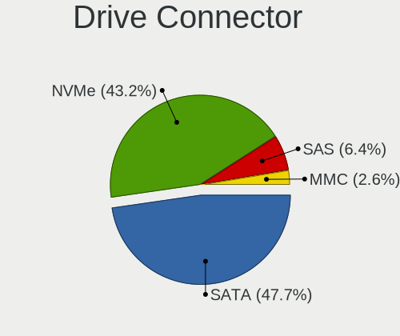
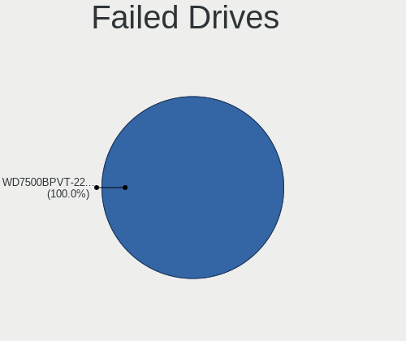
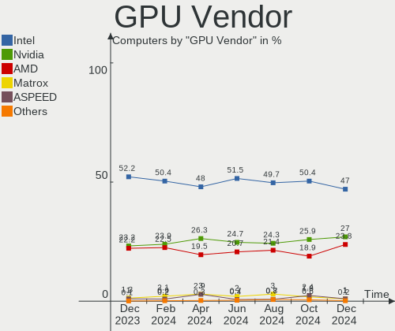
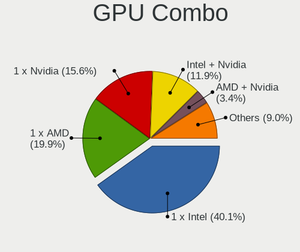
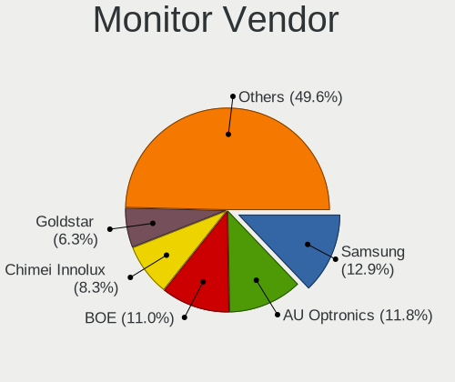
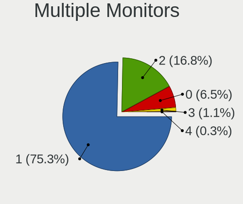

Ubuntu Hardware Trends
----------------------

A project to identify most popular hardware characteristics and track their change
over time based on data collected by Ubuntu users at https://Linux-Hardware.org.

Anyone can contribute to the study by uploading probes of their computers by
the [hw-probe](https://github.com/linuxhw/hw-probe) tool:

    sudo hw-probe -all -upload

This is a report for all computer types. See also reports for [desktops](/Dist/Ubuntu/Desktop/README.md) and [notebooks](/Dist/Ubuntu/Notebook/README.md).

Full-feature report is available here: https://linux-hardware.org/?view=trends

Period: Feb, 2020.

Contents
--------

- [ OS                       ](#os)
- [ OS Family                ](#os-family)
- [ Kernel                   ](#kernel)
- [ Kernel Family            ](#kernel-family)
- [ Kernel Major Ver.        ](#kernel-major-ver)
- [ Arch                     ](#arch)
- [ DE                       ](#de)
- [ Display Server           ](#display-server)
- [ OS Lang                  ](#os-lang)
- [ Boot Mode                ](#boot-mode)
- [ Filesystem               ](#filesystem)
- [ Dual Boot with Linux     ](#dual-boot-with-linux)
- [ Dual Boot (Win)          ](#dual-boot-win)
- [ Country                  ](#country)
- [ City                     ](#city)
- [ Vendor                   ](#vendor)
- [ Model                    ](#model)
- [ Model Family             ](#model-family)
- [ MFG Year                 ](#mfg-year)
- [ Form Factor              ](#form-factor)
- [ Secure Boot              ](#secure-boot)
- [ Coreboot                 ](#coreboot)
- [ RAM Size                 ](#ram-size)
- [ RAM Used                 ](#ram-used)
- [ Drive Vendor             ](#drive-vendor)
- [ Drive Model              ](#drive-model)
- [ Drive Kind               ](#drive-kind)
- [ Drive Connector          ](#drive-connector)
- [ Drive Size               ](#drive-size)
- [ Space Total              ](#space-total)
- [ Space Used               ](#space-used)
- [ Malfunc. Drives          ](#malfunc-drives)
- [ Malfunc. Drive Vendor    ](#malfunc-drive-vendor)
- [ Malfunc. Drive Kind      ](#malfunc-drive-kind)
- [ Failed Drives            ](#failed-drives)
- [ Failed Drive Vendor      ](#failed-drive-vendor)
- [ Drive Status             ](#drive-status)
- [ Storage Vendor           ](#storage-vendor)
- [ Storage Model            ](#storage-model)
- [ Storage Kind             ](#storage-kind)
- [ CPU Vendor               ](#cpu-vendor)
- [ CPU Model                ](#cpu-model)
- [ CPU Model Family         ](#cpu-model-family)
- [ CPU Cores                ](#cpu-cores)
- [ CPU Sockets              ](#cpu-sockets)
- [ CPU Threads              ](#cpu-threads)
- [ CPU Op-Modes             ](#cpu-op-modes)
- [ CPU Microarch            ](#cpu-microarch)
- [ CPU Microcode            ](#cpu-microcode)
- [ GPU Vendor               ](#gpu-vendor)
- [ GPU Model                ](#gpu-model)
- [ GPU Combo                ](#gpu-combo)
- [ GPU Driver               ](#gpu-driver)
- [ GPU Memory               ](#gpu-memory)
- [ Monitor Vendor           ](#monitor-vendor)
- [ Monitor Model            ](#monitor-model)
- [ Monitor Resolution       ](#monitor-resolution)
- [ Monitor Diagonal         ](#monitor-diagonal)
- [ Monitor Width            ](#monitor-width)
- [ Aspect Ratio             ](#aspect-ratio)
- [ Monitor Area             ](#monitor-area)
- [ Pixel Density            ](#pixel-density)
- [ Multiple Monitors        ](#multiple-monitors)
- [ Net Controller Vendor    ](#net-controller-vendor)
- [ Net Controller Model     ](#net-controller-model)
- [ Net Controller Kind      ](#net-controller-kind)
- [ Used Controller          ](#used-controller)
- [ NICs                     ](#nics)
- [ Unsupported Devices      ](#unsupported-devices)
- [ Unsupported Device Types ](#unsupported-device-types)

OS
--

Installed operating systems

| Name           | Computers | Percent |
|----------------|-----------|---------|
| Ubuntu 18.04   | 709       | 58.21%  |
| Ubuntu 19.10   | 391       | 32.1%   |
| Ubuntu 20.04   | 37        | 3.04%   |
| Ubuntu 16.04   | 33        | 2.71%   |
| Ubuntu 19.04   | 32        | 2.63%   |
| Ubuntu 18.10   | 6         | 0.49%   |
| Ubuntu         | 5         | 0.41%   |
| Ubuntu Core 16 | 2         | 0.16%   |
| Ubuntu 17.10   | 2         | 0.16%   |
| Ubuntu 15.04   | 1         | 0.08%   |

OS Family
---------

OS without a version

| Name   | Computers | Percent |
|--------|-----------|---------|
| Ubuntu | 1218      | 100%    |

Kernel
------

Version of the Linux kernel

| Version                 | Computers | Percent |
|-------------------------|-----------|---------|
| 5.3.0-40-generic        | 306       | 25.12%  |
| 5.3.0-28-generic        | 236       | 19.38%  |
| 5.3.0-29-generic        | 164       | 13.46%  |
| 4.15.0-76-generic       | 100       | 8.21%   |
| 4.15.0-88-generic       | 61        | 5.01%   |
| 5.3.0-18-generic        | 38        | 3.12%   |
| 5.0.0-23-generic        | 35        | 2.87%   |
| 5.3.0-26-generic        | 27        | 2.22%   |
| 5.0.0-38-generic        | 22        | 1.81%   |
| 5.4.0-14-generic        | 16        | 1.31%   |
| 5.3.0-41-generic        | 15        | 1.23%   |
| 5.0.0-37-generic        | 13        | 1.07%   |
| 4.15.0-74-generic       | 12        | 0.99%   |
| 5.4.0-12-generic        | 9         | 0.74%   |
| 5.3.0-40-lowlatency     | 7         | 0.57%   |
| 5.3.0-29-lowlatency     | 7         | 0.57%   |
| 5.0.0-13-generic        | 6         | 0.49%   |
| 4.4.0-173-generic       | 6         | 0.49%   |
| 4.18.0-25-generic       | 6         | 0.49%   |
| 5.0.0-36-generic        | 5         | 0.41%   |
| 4.15.0-29-generic       | 5         | 0.41%   |
| 5.3.0-24-generic        | 4         | 0.33%   |
| 5.0.0-31-generic        | 4         | 0.33%   |
| 4.15.0-76-lowlatency    | 4         | 0.33%   |
| 5.5.2-050502-generic    | 3         | 0.25%   |
| 4.18.0-15-generic       | 3         | 0.25%   |
| 4.15.0-89-generic       | 3         | 0.25%   |
| 4.15.0-88-lowlatency    | 3         | 0.25%   |
| 4.15.0-87-generic       | 3         | 0.25%   |
| 4.15.0-72-generic       | 3         | 0.25%   |
| 4.15.0-45-generic       | 3         | 0.25%   |
| 5.6.0-050600rc2-generic | 2         | 0.16%   |
| 5.5.5-050505-generic    | 2         | 0.16%   |
| 5.5.0-050500-generic    | 2         | 0.16%   |
| 5.4.0-13-generic        | 2         | 0.16%   |
| 5.3.0-42-generic        | 2         | 0.16%   |
| 5.3.0-41-lowlatency     | 2         | 0.16%   |
| 5.3.0-18-lowlatency     | 2         | 0.16%   |
| 5.3.0-1017-raspi2       | 2         | 0.16%   |
| 5.0.0-1037-oem-osp1     | 2         | 0.16%   |
| 4.8.0-36-generic        | 2         | 0.16%   |
| 4.4.0-171-generic       | 2         | 0.16%   |
| 4.18.0-25-lowlatency    | 2         | 0.16%   |
| 4.18.0-10-generic       | 2         | 0.16%   |
| 4.15.0-66-generic       | 2         | 0.16%   |
| 4.15.0-64-generic       | 2         | 0.16%   |
| 4.15.0-33-generic       | 2         | 0.16%   |
| 4.15.0-1067-oem         | 2         | 0.16%   |
| 4.13.0-21-generic       | 2         | 0.16%   |
| 5.5.6-050506-generic    | 1         | 0.08%   |
| 5.5.5                   | 1         | 0.08%   |
| 5.5.3-050503-generic    | 1         | 0.08%   |
| 5.5.1-050501-generic    | 1         | 0.08%   |
| 5.5.0-rc7               | 1         | 0.08%   |
| 5.4.16-xanmod9          | 1         | 0.08%   |
| 5.4.0-9-generic         | 1         | 0.08%   |
| 5.4.0-16-generic        | 1         | 0.08%   |
| 5.4.0-15-generic        | 1         | 0.08%   |
| 5.4.0-050400-generic    | 1         | 0.08%   |
| 5.3.8-050308-generic    | 1         | 0.08%   |

Kernel Family
-------------

Linux kernel without a distro release

| Version | Computers | Percent |
|---------|-----------|---------|
| 5.3.0   | 818       | 67.16%  |
| 4.15.0  | 220       | 18.06%  |
| 5.0.0   | 91        | 7.47%   |
| 5.4.0   | 31        | 2.55%   |
| 4.18.0  | 15        | 1.23%   |
| 4.4.0   | 11        | 0.9%    |
| 5.5.5   | 3         | 0.25%   |
| 5.5.2   | 3         | 0.25%   |
| 5.5.0   | 3         | 0.25%   |
| 5.6.0   | 2         | 0.16%   |
| 5.3.18  | 2         | 0.16%   |
| 4.8.0   | 2         | 0.16%   |
| 4.16.18 | 2         | 0.16%   |
| 4.13.0  | 2         | 0.16%   |
| 4.10.0  | 2         | 0.16%   |
| 5.5.6   | 1         | 0.08%   |
| 5.5.3   | 1         | 0.08%   |
| 5.5.1   | 1         | 0.08%   |
| 5.4.16  | 1         | 0.08%   |
| 5.3.8   | 1         | 0.08%   |
| 5.3.1   | 1         | 0.08%   |
| 5.2.2   | 1         | 0.08%   |
| 5.1.15  | 1         | 0.08%   |
| 4.19.81 | 1         | 0.08%   |
| 4.19.5  | 1         | 0.08%   |
| 3.19.0  | 1         | 0.08%   |

Kernel Major Ver.
-----------------

Linux kernel major version

| Version | Computers | Percent |
|---------|-----------|---------|
| 5.3     | 822       | 67.49%  |
| 4.15    | 220       | 18.06%  |
| 5.0     | 91        | 7.47%   |
| 5.4     | 32        | 2.63%   |
| 4.18    | 15        | 1.23%   |
| 5.5     | 12        | 0.99%   |
| 4.4     | 11        | 0.9%    |
| 5.6     | 2         | 0.16%   |
| 4.8     | 2         | 0.16%   |
| 4.19    | 2         | 0.16%   |
| 4.16    | 2         | 0.16%   |
| 4.13    | 2         | 0.16%   |
| 4.10    | 2         | 0.16%   |
| 5.2     | 1         | 0.08%   |
| 5.1     | 1         | 0.08%   |
| 3.19    | 1         | 0.08%   |

Arch
----

OS architecture (x86_64, i586, etc.)

| Name    | Computers | Percent |
|---------|-----------|---------|
| x86_64  | 1155      | 94.83%  |
| i686    | 57        | 4.68%   |
| aarch64 | 5         | 0.41%   |
| armv7l  | 1         | 0.08%   |

DE
--

Desktop Environment

| Name            | Computers | Percent |
|-----------------|-----------|---------|
| GNOME           | 802       | 65.85%  |
| Unknown         | 159       | 13.05%  |
| XFCE            | 79        | 6.49%   |
| Unity           | 37        | 3.04%   |
| KDE             | 35        | 2.87%   |
| MATE            | 27        | 2.22%   |
| GNOME Flashback | 13        | 1.07%   |
| Budgie          | 13        | 1.07%   |
| LXQt            | 11        | 0.9%    |
| KDE5            | 10        | 0.82%   |
| LXDE            | 7         | 0.57%   |
| GNUstep         | 6         | 0.49%   |
| X-Cinnamon      | 5         | 0.41%   |
| Cinnamon        | 4         | 0.33%   |
| Openbox         | 3         | 0.25%   |
| xubuntu         | 2         | 0.16%   |
| i3              | 2         | 0.16%   |
| Lubuntu         | 1         | 0.08%   |
| Enlightenment   | 1         | 0.08%   |
| Deepin          | 1         | 0.08%   |

Display Server
--------------

X11 or Wayland

| Name    | Computers | Percent |
|---------|-----------|---------|
| X11     | 1103      | 90.56%  |
| Unknown | 80        | 6.57%   |
| Wayland | 35        | 2.87%   |

OS Lang
-------

Language

| Lang    | Computers | Percent |
|---------|-----------|---------|
| en_US   | 458       | 37.6%   |
| de_DE   | 96        | 7.88%   |
| en_GB   | 66        | 5.42%   |
| pt_BR   | 64        | 5.25%   |
| ru_RU   | 49        | 4.02%   |
| Unknown | 46        | 3.78%   |
| it_IT   | 41        | 3.37%   |
| fr_FR   | 39        | 3.2%    |
| es_ES   | 33        | 2.71%   |
| C       | 32        | 2.63%   |
| en_CA   | 31        | 2.55%   |
| en_AU   | 31        | 2.55%   |
| en_IN   | 26        | 2.13%   |
| pl_PL   | 17        | 1.4%    |
| nl_NL   | 15        | 1.23%   |
| es_MX   | 11        | 0.9%    |
| cs_CZ   | 11        | 0.9%    |
| ru_UA   | 9         | 0.74%   |
| es_AR   | 9         | 0.74%   |
| sk_SK   | 7         | 0.57%   |
| hu_HU   | 7         | 0.57%   |
| pt_PT   | 6         | 0.49%   |
| en_ZA   | 6         | 0.49%   |
| bg_BG   | 6         | 0.49%   |
| tr_TR   | 5         | 0.41%   |
| es_CO   | 5         | 0.41%   |
| es_CL   | 5         | 0.41%   |
| uk_UA   | 4         | 0.33%   |
| sv_SE   | 4         | 0.33%   |
| nl_BE   | 4         | 0.33%   |
| ja_JP   | 4         | 0.33%   |
| es_VE   | 4         | 0.33%   |
| es_PE   | 4         | 0.33%   |
| en_IE   | 4         | 0.33%   |
| zh_TW   | 3         | 0.25%   |
| zh_CN   | 3         | 0.25%   |
| nb_NO   | 3         | 0.25%   |
| ko_KR   | 3         | 0.25%   |
| en_NZ   | 3         | 0.25%   |
| el_GR   | 3         | 0.25%   |
| de_CH   | 3         | 0.25%   |
| de_AT   | 3         | 0.25%   |
| da_DK   | 3         | 0.25%   |
| ca_ES   | 3         | 0.25%   |
| ro_RO   | 2         | 0.16%   |
| fr_CA   | 2         | 0.16%   |
| fi_FI   | 2         | 0.16%   |
| es_SV   | 2         | 0.16%   |
| es_DO   | 2         | 0.16%   |
| en_ZW   | 2         | 0.16%   |
| en_PH   | 2         | 0.16%   |
| en_IL   | 2         | 0.16%   |
| nn_NO   | 1         | 0.08%   |
| lv_LV   | 1         | 0.08%   |
| lt_LT   | 1         | 0.08%   |
| is_IS   | 1         | 0.08%   |
| hr_HR   | 1         | 0.08%   |
| he_IL   | 1         | 0.08%   |
| fr_CH   | 1         | 0.08%   |
| et_EE   | 1         | 0.08%   |

Boot Mode
---------

EFI or BIOS

| Mode | Computers | Percent |
|------|-----------|---------|
| BIOS | 686       | 56.32%  |
| EFI  | 532       | 43.68%  |

Filesystem
----------

Type of filesystem

| Type     | Computers | Percent |
|----------|-----------|---------|
| Ext4     | 1137      | 93.35%  |
| Overlay  | 42        | 3.45%   |
| Zfs      | 14        | 1.15%   |
| Btrfs    | 11        | 0.9%    |
| Xfs      | 4         | 0.33%   |
| Ext3     | 3         | 0.25%   |
| Ext2     | 3         | 0.25%   |
| Jfs      | 2         | 0.16%   |
| Reiserfs | 1         | 0.08%   |
| Aufs     | 1         | 0.08%   |

Dual Boot with Linux
--------------------

Hosting more than one Linux

| Dual boot | Computers | Percent |
|-----------|-----------|---------|
| No        | 1090      | 89.49%  |
| Yes       | 128       | 10.51%  |

Dual Boot (Win)
---------------

Hosting Linux and Windows

| Dual boot | Computers | Percent |
|-----------|-----------|---------|
| No        | 785       | 64.45%  |
| Yes       | 433       | 35.55%  |

Country
-------

Geographic location (country)

| Country            | Computers | Percent |
|--------------------|-----------|---------|
| USA                | 225       | 18.47%  |
| Germany            | 121       | 9.93%   |
| Brazil             | 84        | 6.9%    |
| UK                 | 56        | 4.6%    |
| Italy              | 53        | 4.35%   |
| Russia             | 48        | 3.94%   |
| France             | 43        | 3.53%   |
| Canada             | 43        | 3.53%   |
| Spain              | 37        | 3.04%   |
| Australia          | 35        | 2.87%   |
| Ukraine            | 31        | 2.55%   |
| India              | 30        | 2.46%   |
| Poland             | 26        | 2.13%   |
| Netherlands        | 24        | 1.97%   |
| Switzerland        | 18        | 1.48%   |
| Mexico             | 16        | 1.31%   |
| Czech Republic     | 14        | 1.15%   |
| Norway             | 12        | 0.99%   |
| Bulgaria           | 12        | 0.99%   |
| Argentina          | 12        | 0.99%   |
| Indonesia          | 11        | 0.9%    |
| Greece             | 11        | 0.9%    |
| Turkey             | 10        | 0.82%   |
| Sweden             | 10        | 0.82%   |
| Hungary            | 10        | 0.82%   |
| China              | 10        | 0.82%   |
| Finland            | 9         | 0.74%   |
| South Africa       | 8         | 0.66%   |
| Denmark            | 8         | 0.66%   |
| Belgium            | 8         | 0.66%   |
| Slovakia           | 7         | 0.57%   |
| Romania            | 7         | 0.57%   |
| Ireland            | 7         | 0.57%   |
| Austria            | 7         | 0.57%   |
| Portugal           | 6         | 0.49%   |
| Peru               | 6         | 0.49%   |
| Iran               | 6         | 0.49%   |
| Hong Kong          | 6         | 0.49%   |
| Colombia           | 6         | 0.49%   |
| Chile              | 6         | 0.49%   |
| Venezuela          | 5         | 0.41%   |
| Japan              | 5         | 0.41%   |
| Israel             | 5         | 0.41%   |
| Singapore          | 4         | 0.33%   |
| Serbia             | 4         | 0.33%   |
| New Zealand        | 4         | 0.33%   |
| Malaysia           | 4         | 0.33%   |
| Lithuania          | 4         | 0.33%   |
| Belarus            | 4         | 0.33%   |
| UAE                | 3         | 0.25%   |
| Thailand           | 3         | 0.25%   |
| Taiwan             | 3         | 0.25%   |
| Puerto Rico        | 3         | 0.25%   |
| Philippines        | 3         | 0.25%   |
| Korea, Republic of | 3         | 0.25%   |
| Estonia            | 3         | 0.25%   |
| Ecuador            | 3         | 0.25%   |
| Bangladesh         | 3         | 0.25%   |
| Tunisia            | 2         | 0.16%   |
| Sri Lanka          | 2         | 0.16%   |

City
----

Geographic location (city)

| City              | Computers | Percent |
|-------------------|-----------|---------|
| Berlin            | 14        | 1.15%   |
| Moscow            | 11        | 0.9%    |
| Kyiv              | 11        | 0.9%    |
| Toronto           | 9         | 0.74%   |
| São Paulo        | 9         | 0.74%   |
| Rome              | 9         | 0.74%   |
| Warsaw            | 8         | 0.66%   |
| Zurich            | 7         | 0.57%   |
| Sofia             | 7         | 0.57%   |
| Frankfurt am Main | 7         | 0.57%   |
| Athens            | 7         | 0.57%   |
| St Petersburg     | 6         | 0.49%   |
| Nuremberg         | 6         | 0.49%   |
| Montreal          | 6         | 0.49%   |
| Lima              | 6         | 0.49%   |
| Bengaluru         | 6         | 0.49%   |
| Barcelona         | 6         | 0.49%   |
| Rio de Janeiro    | 5         | 0.41%   |
| Mexico City       | 5         | 0.41%   |
| Istanbul          | 5         | 0.41%   |
| Dublin            | 5         | 0.41%   |
| Budapest          | 5         | 0.41%   |
| Vilnius           | 4         | 0.33%   |
| Vienna            | 4         | 0.33%   |
| Tehran            | 4         | 0.33%   |
| Singapore         | 4         | 0.33%   |
| Santiago          | 4         | 0.33%   |
| San Francisco     | 4         | 0.33%   |
| Paris             | 4         | 0.33%   |
| Oslo              | 4         | 0.33%   |
| Munich            | 4         | 0.33%   |
| Minneapolis       | 4         | 0.33%   |
| Madrid            | 4         | 0.33%   |
| Leipzig           | 4         | 0.33%   |
| Johannesburg      | 4         | 0.33%   |
| Hamburg           | 4         | 0.33%   |
| Essen             | 4         | 0.33%   |
| Central           | 4         | 0.33%   |
| Brasília         | 4         | 0.33%   |
| Bogotá           | 4         | 0.33%   |
| Belo Horizonte    | 4         | 0.33%   |
| Belgrade          | 4         | 0.33%   |
| Arlington         | 4         | 0.33%   |
| Amsterdam         | 4         | 0.33%   |
| Winnipeg          | 3         | 0.25%   |
| Tucson            | 3         | 0.25%   |
| Teresina          | 3         | 0.25%   |
| Taipei            | 3         | 0.25%   |
| Seattle           | 3         | 0.25%   |
| San Diego         | 3         | 0.25%   |
| San Antonio       | 3         | 0.25%   |
| Quito             | 3         | 0.25%   |
| Padova            | 3         | 0.25%   |
| Ottawa            | 3         | 0.25%   |
| Osasco            | 3         | 0.25%   |
| Orlando           | 3         | 0.25%   |
| New York          | 3         | 0.25%   |
| Mumbai            | 3         | 0.25%   |
| Minsk             | 3         | 0.25%   |
| Malmo             | 3         | 0.25%   |

Vendor
------

Motherboard manufacturer

| Name                     | Computers | Percent |
|--------------------------|-----------|---------|
| Hewlett-Packard          | 194       | 15.93%  |
| ASUSTek Computer         | 182       | 14.94%  |
| Dell                     | 175       | 14.37%  |
| Lenovo                   | 158       | 12.97%  |
| Gigabyte Technology      | 101       | 8.29%   |
| Acer                     | 77        | 6.32%   |
| MSI                      | 43        | 3.53%   |
| ASRock                   | 38        | 3.12%   |
| Intel                    | 26        | 2.13%   |
| Apple                    | 26        | 2.13%   |
| Toshiba                  | 25        | 2.05%   |
| Supermicro               | 12        | 0.99%   |
| Unknown                  | 10        | 0.82%   |
| Samsung Electronics      | 9         | 0.74%   |
| Microsoft                | 9         | 0.74%   |
| Fujitsu                  | 9         | 0.74%   |
| ECS                      | 9         | 0.74%   |
| Sony                     | 7         | 0.57%   |
| Medion                   | 6         | 0.49%   |
| HUAWEI                   | 6         | 0.49%   |
| Raspberry Pi Foundation  | 5         | 0.41%   |
| Pegatron                 | 5         | 0.41%   |
| Timi                     | 4         | 0.33%   |
| Positivo                 | 4         | 0.33%   |
| PCWare                   | 4         | 0.33%   |
| LG Electronics           | 4         | 0.33%   |
| AMI                      | 4         | 0.33%   |
| Google                   | 3         | 0.25%   |
| Alienware                | 3         | 0.25%   |
| ZOTAC                    | 2         | 0.16%   |
| Shuttle                  | 2         | 0.16%   |
| PC Specialist            | 2         | 0.16%   |
| Notebook                 | 2         | 0.16%   |
| Gateway                  | 2         | 0.16%   |
| Fujitsu Siemens          | 2         | 0.16%   |
| Foxconn                  | 2         | 0.16%   |
| eMachines                | 2         | 0.16%   |
| Clevo                    | 2         | 0.16%   |
| Wortmann AG              | 1         | 0.08%   |
| WinFast                  | 1         | 0.08%   |
| VULCAN                   | 1         | 0.08%   |
| TYAN Computer            | 1         | 0.08%   |
| TUXEDO                   | 1         | 0.08%   |
| TrekStor                 | 1         | 0.08%   |
| TMAX                     | 1         | 0.08%   |
| Thomson                  | 1         | 0.08%   |
| Teclast                  | 1         | 0.08%   |
| System76                 | 1         | 0.08%   |
| SLIMBOOK                 | 1         | 0.08%   |
| SHARP                    | 1         | 0.08%   |
| Schenker                 | 1         | 0.08%   |
| Razer                    | 1         | 0.08%   |
| Prestigio                | 1         | 0.08%   |
| PCChips                  | 1         | 0.08%   |
| Panasonic                | 1         | 0.08%   |
| Packard Bell             | 1         | 0.08%   |
| OriginPC                 | 1         | 0.08%   |
| O.E.M.                   | 1         | 0.08%   |
| Nvidia                   | 1         | 0.08%   |
| MINIX TECHNOLOGY LIMITED | 1         | 0.08%   |

Model
-----

Motherboard model

| Name                                  | Computers | Percent |
|---------------------------------------|-----------|---------|
| Unknown                               | 14        | 1.15%   |
| ASUS All Series                       | 11        | 0.9%    |
| HP Pavilion dv6                       | 7         | 0.57%   |
| Dell Latitude E6430                   | 6         | 0.49%   |
| RPi Raspberry Pi 4 Model B Rev 1.1    | 5         | 0.41%   |
| HP Laptop 15-bs0xx                    | 5         | 0.41%   |
| Dell OptiPlex 7010                    | 5         | 0.41%   |
| MSI MS-7C02                           | 4         | 0.33%   |
| HP Pavilion Gaming Laptop 15-cx0xxx   | 4         | 0.33%   |
| HP Notebook                           | 4         | 0.33%   |
| HP 15                                 | 4         | 0.33%   |
| Dell XPS 13 9360                      | 4         | 0.33%   |
| Dell OptiPlex 755                     | 4         | 0.33%   |
| Dell Latitude E6440                   | 4         | 0.33%   |
| Dell Inspiron 15-3567                 | 4         | 0.33%   |
| Dell Inspiron 15 7000 Gaming          | 4         | 0.33%   |
| ASUS PRIME A320M-K                    | 4         | 0.33%   |
| ASUS 1005HA                           | 4         | 0.33%   |
| Supermicro Super Server               | 3         | 0.25%   |
| Lenovo Yoga C640-13IML 81UE           | 3         | 0.25%   |
| Lenovo IdeaPad L340-15IRH Gaming 81LK | 3         | 0.25%   |
| Lenovo IdeaPad 330-15IKB 81DE         | 3         | 0.25%   |
| HP Pavilion g7                        | 3         | 0.25%   |
| HP Pavilion g6                        | 3         | 0.25%   |
| HP Pavilion dv7                       | 3         | 0.25%   |
| HP Laptop 15-db0xxx                   | 3         | 0.25%   |
| HP Laptop 15-bs1xx                    | 3         | 0.25%   |
| HP G62                                | 3         | 0.25%   |
| HP Compaq Presario CQ60               | 3         | 0.25%   |
| Gigabyte GA-78LMT-USB3                | 3         | 0.25%   |
| Gigabyte B450M DS3H                   | 3         | 0.25%   |
| Gigabyte B450 AORUS ELITE             | 3         | 0.25%   |
| Dell Precision 5540                   | 3         | 0.25%   |
| Dell Inspiron 5491 2n1                | 3         | 0.25%   |
| ASRock N68C-S UCC                     | 3         | 0.25%   |
| Apple iMac12,1                        | 3         | 0.25%   |
| Toshiba Satellite L305                | 2         | 0.16%   |
| Supermicro X10SRA-F                   | 2         | 0.16%   |
| Samsung Electronics 275E4E/275E5E     | 2         | 0.16%   |
| Positivo Mobile                       | 2         | 0.16%   |
| MSI MS-7B79                           | 2         | 0.16%   |
| MSI MS-7817                           | 2         | 0.16%   |
| Microsoft Surface Book                | 2         | 0.16%   |
| Lenovo Z50-75 80EC                    | 2         | 0.16%   |
| Lenovo Yoga C740-14IML 81TC           | 2         | 0.16%   |
| Lenovo Yoga 3 Pro-1370 80HE           | 2         | 0.16%   |
| Lenovo Y50-70 20378                   | 2         | 0.16%   |
| Lenovo ThinkPad L13 Yoga 20R6S00800   | 2         | 0.16%   |
| Lenovo ThinkCentre M90n-1 11AH000UUS  | 2         | 0.16%   |
| Lenovo ThinkBook 15-IML 20RW          | 2         | 0.16%   |
| Lenovo ThinkBook 13s-IML 20RR         | 2         | 0.16%   |
| Lenovo IdeaPad 520-15IKB 81BF         | 2         | 0.16%   |
| Lenovo IdeaPad 330-15IGM 81D1         | 2         | 0.16%   |
| HUAWEI MACH-WX9                       | 2         | 0.16%   |
| HUAWEI KPRC-WX0                       | 2         | 0.16%   |
| HP ProLiant ML350 G6                  | 2         | 0.16%   |
| HP ProBook 450 G4                     | 2         | 0.16%   |
| HP Pavilion Laptop 15-cw0xxx          | 2         | 0.16%   |
| HP Pavilion g4                        | 2         | 0.16%   |
| HP Laptop 15-dw0xxx                   | 2         | 0.16%   |

Model Family
------------

Motherboard model prefix

| Name                   | Computers | Percent |
|------------------------|-----------|---------|
| Lenovo ThinkPad        | 65        | 5.34%   |
| Dell Inspiron          | 57        | 4.68%   |
| Acer Aspire            | 57        | 4.68%   |
| HP Pavilion            | 38        | 3.12%   |
| Dell Latitude          | 37        | 3.04%   |
| Lenovo IdeaPad         | 35        | 2.87%   |
| HP Laptop              | 25        | 2.05%   |
| Dell OptiPlex          | 25        | 2.05%   |
| HP ProBook             | 23        | 1.89%   |
| HP EliteBook           | 22        | 1.81%   |
| Dell Precision         | 22        | 1.81%   |
| Toshiba Satellite      | 20        | 1.64%   |
| HP Compaq              | 20        | 1.64%   |
| ASUS PRIME             | 18        | 1.48%   |
| Dell XPS               | 15        | 1.23%   |
| Unknown                | 14        | 1.15%   |
| Lenovo Yoga            | 11        | 0.9%    |
| ASUS All               | 11        | 0.9%    |
| Lenovo ThinkCentre     | 10        | 0.82%   |
| Microsoft Surface      | 9         | 0.74%   |
| HP ENVY                | 7         | 0.57%   |
| Dell Vostro            | 7         | 0.57%   |
| HP EliteDesk           | 6         | 0.49%   |
| Gigabyte X570          | 6         | 0.49%   |
| Gigabyte B450          | 6         | 0.49%   |
| ASUS TUF               | 6         | 0.49%   |
| ASUS ROG               | 6         | 0.49%   |
| RPi Raspberry          | 5         | 0.41%   |
| Lenovo ThinkBook       | 5         | 0.41%   |
| HP Spectre             | 5         | 0.41%   |
| HP ProLiant            | 5         | 0.41%   |
| HP 15                  | 5         | 0.41%   |
| Dell Studio            | 5         | 0.41%   |
| ASUS ZenBook           | 5         | 0.41%   |
| MSI MS-7C02            | 4         | 0.33%   |
| Lenovo IdeaCentre      | 4         | 0.33%   |
| HP ZBook               | 4         | 0.33%   |
| HP Notebook            | 4         | 0.33%   |
| Gigabyte GA-78LMT-USB3 | 4         | 0.33%   |
| Gigabyte B450M         | 4         | 0.33%   |
| Fujitsu ESPRIMO        | 4         | 0.33%   |
| ASUS P5KPL-AM          | 4         | 0.33%   |
| ASUS M5A78L-M          | 4         | 0.33%   |
| ASUS 1005HA            | 4         | 0.33%   |
| Apple iMac12           | 4         | 0.33%   |
| Acer Veriton           | 4         | 0.33%   |
| Acer Nitro             | 4         | 0.33%   |
| Supermicro Super       | 3         | 0.25%   |
| HP G62                 | 3         | 0.25%   |
| Gigabyte B360          | 3         | 0.25%   |
| Fujitsu LIFEBOOK       | 3         | 0.25%   |
| ASUS VivoBook          | 3         | 0.25%   |
| ASUS P6T               | 3         | 0.25%   |
| ASRock Z77             | 3         | 0.25%   |
| ASRock X399            | 3         | 0.25%   |
| ASRock N68C-S          | 3         | 0.25%   |
| Apple MacBookPro14     | 3         | 0.25%   |
| Apple iMac11           | 3         | 0.25%   |
| Acer TravelMate        | 3         | 0.25%   |
| Supermicro X10SRA-F    | 2         | 0.16%   |

MFG Year
--------

Motherboard manufacture year

| Year    | Computers | Percent |
|---------|-----------|---------|
| 2019    | 329       | 27.01%  |
| 2018    | 129       | 10.59%  |
| 2012    | 99        | 8.13%   |
| 2011    | 99        | 8.13%   |
| 2013    | 80        | 6.57%   |
| 2010    | 72        | 5.91%   |
| 2014    | 69        | 5.67%   |
| 2017    | 68        | 5.58%   |
| 2015    | 68        | 5.58%   |
| 2009    | 59        | 4.84%   |
| 2008    | 46        | 3.78%   |
| 2016    | 42        | 3.45%   |
| 2007    | 22        | 1.81%   |
| 2006    | 16        | 1.31%   |
| 2005    | 7         | 0.57%   |
| Unknown | 6         | 0.49%   |
| 2020    | 4         | 0.33%   |
| 2004    | 1         | 0.08%   |
| 2001    | 1         | 0.08%   |
| 2000    | 1         | 0.08%   |

Form Factor
-----------

Physical design of the computer

| Name           | Computers | Percent |
|----------------|-----------|---------|
| Notebook       | 661       | 54.27%  |
| Desktop        | 461       | 37.85%  |
| Convertible    | 32        | 2.63%   |
| Server         | 20        | 1.64%   |
| Tablet         | 14        | 1.15%   |
| Mini pc        | 12        | 0.99%   |
| All in one     | 12        | 0.99%   |
| System on chip | 6         | 0.49%   |

Secure Boot
-----------

Enabled or disabled

| State    | Computers | Percent |
|----------|-----------|---------|
| Disabled | 1097      | 90.07%  |
| Enabled  | 121       | 9.93%   |

Coreboot
--------

Have coreboot on board

| Used | Computers | Percent |
|------|-----------|---------|
| No   | 1215      | 99.75%  |
| Yes  | 3         | 0.25%   |

RAM Size
--------

Total RAM memory

| Size in GB      | Computers | Percent |
|-----------------|-----------|---------|
| 3.01-4.0        | 296       | 24.3%   |
| 4.01-8.0        | 258       | 21.18%  |
| 8.01-16.0       | 222       | 18.23%  |
| 16.01-24.0      | 213       | 17.49%  |
| 32.01-64.0      | 77        | 6.32%   |
| 1.01-2.0        | 73        | 5.99%   |
| 2.01-3.0        | 25        | 2.05%   |
| 64.01-256.0     | 21        | 1.72%   |
| 0.01-1.0        | 18        | 1.48%   |
| 24.01-32.0      | 9         | 0.74%   |
| More than 256.0 | 6         | 0.49%   |

RAM Used
--------

Used RAM memory

| Used GB     | Computers | Percent |
|-------------|-----------|---------|
| 1.01-2.0    | 528       | 43.35%  |
| 2.01-3.0    | 334       | 27.42%  |
| 4.01-8.0    | 116       | 9.52%   |
| 3.01-4.0    | 114       | 9.36%   |
| 0.01-1.0    | 94        | 7.72%   |
| 8.01-16.0   | 24        | 1.97%   |
| 16.01-24.0  | 4         | 0.33%   |
| 32.01-64.0  | 2         | 0.16%   |
| 24.01-32.0  | 1         | 0.08%   |
| 64.01-256.0 | 1         | 0.08%   |

Drive Vendor
------------

Hard drive vendors

| Vendor              | Computers | Drives | Percent |
|---------------------|-----------|--------|---------|
| Seagate             | 305       | 386    | 21.4%   |
| WDC                 | 262       | 331    | 18.39%  |
| Samsung Electronics | 157       | 176    | 11.02%  |
| Toshiba             | 114       | 123    | 8%      |
| Kingston            | 84        | 87     | 5.89%   |
| Hitachi             | 83        | 86     | 5.82%   |
| Unknown             | 57        | 64     | 4%      |
| Crucial             | 55        | 58     | 3.86%   |
| SanDisk             | 51        | 52     | 3.58%   |
| HGST                | 40        | 43     | 2.81%   |
| Intel               | 28        | 31     | 1.96%   |
| A-DATA Technology   | 16        | 16     | 1.12%   |
| OCZ                 | 12        | 12     | 0.84%   |
| SK Hynix            | 11        | 11     | 0.77%   |
| China               | 10        | 10     | 0.7%    |
| Micron Technology   | 8         | 8      | 0.56%   |
| Maxtor              | 8         | 8      | 0.56%   |
| SPCC                | 7         | 7      | 0.49%   |
| PNY                 | 7         | 7      | 0.49%   |
| LITEON              | 7         | 7      | 0.49%   |
| Team                | 6         | 6      | 0.42%   |
| Intenso             | 6         | 6      | 0.42%   |
| Apacer              | 6         | 6      | 0.42%   |
| Transcend           | 5         | 5      | 0.35%   |
| Fujitsu             | 5         | 5      | 0.35%   |
| Patriot             | 4         | 4      | 0.28%   |
| JMicron             | 4         | 4      | 0.28%   |
| Generic             | 4         | 4      | 0.28%   |
| Apple               | 4         | 4      | 0.28%   |
| Hewlett-Packard     | 3         | 3      | 0.21%   |
| GOODRAM             | 3         | 3      | 0.21%   |
| Corsair             | 3         | 3      | 0.21%   |
| WDC WD20            | 2         | 2      | 0.14%   |
| Smartbuy            | 2         | 2      | 0.14%   |
| ShineDisk           | 2         | 3      | 0.14%   |
| PLEXTOR             | 2         | 2      | 0.14%   |
| Phison              | 2         | 2      | 0.14%   |
| LITEONIT            | 2         | 2      | 0.14%   |
| AMD                 | 2         | 3      | 0.14%   |
| XPG                 | 1         | 2      | 0.07%   |
| WD MediaMax         | 1         | 1      | 0.07%   |
| Vaseky              | 1         | 1      | 0.07%   |
| USB                 | 1         | 1      | 0.07%   |
| Union Memory        | 1         | 1      | 0.07%   |
| TSA                 | 1         | 1      | 0.07%   |
| TO Exter            | 1         | 1      | 0.07%   |
| Teclast             | 1         | 1      | 0.07%   |
| TCSUNBOW            | 1         | 1      | 0.07%   |
| TAMMUZ              | 1         | 1      | 0.07%   |
| SMART               | 1         | 1      | 0.07%   |
| SINTECHI            | 1         | 1      | 0.07%   |
| SABRENT             | 1         | 2      | 0.07%   |
| OWC                 | 1         | 1      | 0.07%   |
| OCZ-VERTEX2         | 1         | 1      | 0.07%   |
| Netac               | 1         | 1      | 0.07%   |
| MDT                 | 1         | 1      | 0.07%   |
| MARVELL             | 1         | 2      | 0.07%   |
| KingFast            | 1         | 1      | 0.07%   |
| KESU                | 1         | 1      | 0.07%   |
| Innodisk            | 1         | 1      | 0.07%   |

Drive Model
-----------

Hard drive models

| Model                       | Computers | Percent |
|-----------------------------|-----------|---------|
| MMC Card  32GB              | 23        | 1.5%    |
| ST1000LM035-1RK172 1TB      | 22        | 1.44%   |
| SV300S37A120G 120GB SSD     | 20        | 1.31%   |
| MQ01ABD100 1TB              | 18        | 1.18%   |
| ST1000LM024 HN-M101MBB 1TB  | 17        | 1.11%   |
| SA400S37240G 240GB SSD      | 17        | 1.11%   |
| MMC Card  64GB              | 16        | 1.05%   |
| SSD 850 EVO 250GB           | 15        | 0.98%   |
| SA400S37120G 120GB SSD      | 15        | 0.98%   |
| CT500MX500SSD1 500GB        | 15        | 0.98%   |
| ST500DM002-1BD142 500GB     | 13        | 0.85%   |
| SSD 850 EVO 500GB           | 13        | 0.85%   |
| DT01ACA100 1TB              | 11        | 0.72%   |
| HTS721010A9E630 1TB         | 10        | 0.65%   |
| ST1000DM003-1ER162 1TB      | 9         | 0.59%   |
| SSD 860 EVO 500GB           | 9         | 0.59%   |
| SSD 860 EVO 250GB           | 9         | 0.59%   |
| HTS725050A7E630 500GB       | 9         | 0.59%   |
| ST9500325AS 500GB           | 8         | 0.52%   |
| ST1000LM049-2GH172 1TB      | 8         | 0.52%   |
| ST1000DM010-2EP102 1TB      | 8         | 0.52%   |
| WD10SPZX-21Z10T0 1TB        | 7         | 0.46%   |
| WD10EZEX-08WN4A0 1TB        | 7         | 0.46%   |
| ST3160815AS 160GB           | 7         | 0.46%   |
| ST31000528AS 1TB            | 7         | 0.46%   |
| MQ04ABF100 1TB              | 7         | 0.46%   |
| WD1003FZEX-00MK2A0 1TB      | 6         | 0.39%   |
| ST3500418AS 500GB           | 6         | 0.39%   |
| ST2000LM007-1R8174 2TB      | 6         | 0.39%   |
| ST2000DM006-2DM164 2TB      | 6         | 0.39%   |
| ST1000DM003-9YN162 1TB      | 6         | 0.39%   |
| SSD PLUS 240GB              | 6         | 0.39%   |
| SSD 860 EVO 1TB             | 6         | 0.39%   |
| SSD 840 EVO 120GB           | 6         | 0.39%   |
| HTS541010A9E680 1TB         | 6         | 0.39%   |
| WD5000LPCX-24VHAT0 500GB    | 5         | 0.33%   |
| WD30EFRX-68EUZN0 3TB        | 5         | 0.33%   |
| WD20EZRX-00D8PB0 2TB        | 5         | 0.33%   |
| WD10EZEX-00BN5A0 1TB        | 5         | 0.33%   |
| SUV400S37240G 240GB SSD     | 5         | 0.33%   |
| ST500LT012-9WS142 500GB     | 5         | 0.33%   |
| ST500LM012 HN-M500MBB 500GB | 5         | 0.33%   |
| ST500LM000-1EJ162 500GB     | 5         | 0.33%   |
| ST2000DX002-2DV164 2TB      | 5         | 0.33%   |
| ST2000DM008-2FR102 2TB      | 5         | 0.33%   |
| SDSSDA240G 240GB            | 5         | 0.33%   |
| SATA SSD 120GB              | 5         | 0.33%   |
| SA400S37480G 480GB SSD      | 5         | 0.33%   |
| HTS545050A7E680 500GB       | 5         | 0.33%   |
| Expansion 1TB               | 5         | 0.33%   |
| DT01ACA050 500GB            | 5         | 0.33%   |
| CT480BX500SSD1 480GB        | 5         | 0.33%   |
| CT240BX500SSD1 240GB        | 5         | 0.33%   |
| CT120BX500SSD1 120GB        | 5         | 0.33%   |
| WD5000LPVX-22V0TT0 500GB    | 4         | 0.26%   |
| WD5000AAKX-001CA0 500GB     | 4         | 0.26%   |
| WD10JPVX-60JC3T1 1TB        | 4         | 0.26%   |
| ST500LT012-1DG142 500GB     | 4         | 0.26%   |
| ST500LM021-1KJ152 500GB     | 4         | 0.26%   |
| ST3500312CS 500GB           | 4         | 0.26%   |

Drive Kind
----------

HDD or SSD

| Kind    | Computers | Drives | Percent |
|---------|-----------|--------|---------|
| HDD     | 734       | 984    | 56.55%  |
| SSD     | 442       | 505    | 34.05%  |
| MMC     | 54        | 61     | 4.16%   |
| Unknown | 36        | 43     | 2.77%   |
| NVMe    | 32        | 38     | 2.47%   |

Drive Connector
---------------

SATA, SAS, NVMe, etc.

| Type | Computers | Drives | Percent |
|------|-----------|--------|---------|
| SATA | 1017      | 1447   | 88.67%  |
| MMC  | 54        | 61     | 4.71%   |
| SAS  | 44        | 85     | 3.84%   |
| NVMe | 32        | 38     | 2.79%   |

Drive Size
----------

Size of hard drive

| Size in TB | Computers | Drives | Percent |
|------------|-----------|--------|---------|
| 0.01-0.5   | 812       | 991    | 62.13%  |
| 0.51-1.0   | 359       | 404    | 27.47%  |
| 1.01-2.0   | 82        | 138    | 6.27%   |
| 3.01-4.0   | 20        | 26     | 1.53%   |
| 2.01-3.0   | 16        | 21     | 1.22%   |
| 4.01-10.0  | 16        | 49     | 1.22%   |
| 10.01-20.0 | 2         | 2      | 0.15%   |

Space Total
-----------

Amount of disk space available on the file system

| Size in GB     | Computers | Percent |
|----------------|-----------|---------|
| 101-250        | 390       | 32.02%  |
| 251-500        | 281       | 23.07%  |
| 501-1000       | 178       | 14.61%  |
| 51-100         | 96        | 7.88%   |
| 21-50          | 70        | 5.75%   |
| 1001-2000      | 64        | 5.25%   |
| 1-20           | 52        | 4.27%   |
| More than 3000 | 47        | 3.86%   |
| 2001-3000      | 26        | 2.13%   |
| Unknown        | 14        | 1.15%   |

Space Used
----------

Amount of used disk space

| Used GB        | Computers | Percent |
|----------------|-----------|---------|
| 1-20           | 615       | 50.49%  |
| 21-50          | 169       | 13.88%  |
| 51-100         | 128       | 10.51%  |
| 101-250        | 121       | 9.93%   |
| 251-500        | 69        | 5.67%   |
| 501-1000       | 48        | 3.94%   |
| 1001-2000      | 27        | 2.22%   |
| 2001-3000      | 14        | 1.15%   |
| Unknown        | 14        | 1.15%   |
| More than 3000 | 13        | 1.07%   |

Malfunc. Drives
---------------

Drive models with a malfunction

| Model                       | Computers | Drives | Percent |
|-----------------------------|-----------|--------|---------|
| ST31000528AS 1TB            | 2         | 2      | 8.7%    |
| WL2000GSA6454G 2TB          | 1         | 1      | 4.35%   |
| WD7500BPKT-75PK4T0 752GB    | 1         | 1      | 4.35%   |
| WD5000BEVT-60ZAT1 500GB     | 1         | 1      | 4.35%   |
| WD5000AAKX-003CA0 500GB     | 1         | 1      | 4.35%   |
| WD3200BEVT-75A23T0 320GB    | 1         | 1      | 4.35%   |
| WD3200BEKT-60PVMT0 320GB    | 1         | 1      | 4.35%   |
| ST3500418AS 500GB           | 1         | 1      | 4.35%   |
| ST31000322CS 1TB            | 1         | 1      | 4.35%   |
| ST2000VM003-1CT164 2TB      | 1         | 1      | 4.35%   |
| ST2000LM007-1R8174 2TB      | 1         | 1      | 4.35%   |
| ST1000LM035-1RK172 1TB      | 1         | 1      | 4.35%   |
| ST1000DM010-2EP102 1TB      | 1         | 1      | 4.35%   |
| SD7TB3Q-128G-1006 128GB SSD | 1         | 1      | 4.35%   |
| IMSS332-960GB SSD           | 1         | 1      | 4.35%   |
| HTS543225A7A384 250GB       | 1         | 1      | 4.35%   |
| HM160HI 160GB               | 1         | 1      | 4.35%   |
| HDP725050GLA360 500GB       | 1         | 1      | 4.35%   |
| HDD HTS547550A9E384 500GB   | 1         | 1      | 4.35%   |
| HD502HJ 500GB               | 1         | 1      | 4.35%   |
| HD103UJ 1TB                 | 1         | 1      | 4.35%   |
| CV8-8E128-HP 128GB SSD      | 1         | 1      | 4.35%   |

Malfunc. Drive Vendor
---------------------

Vendors of faulty drives

| Vendor              | Computers | Drives | Percent |
|---------------------|-----------|--------|---------|
| Seagate             | 7         | 8      | 31.82%  |
| WDC                 | 5         | 5      | 22.73%  |
| Samsung Electronics | 3         | 3      | 13.64%  |
| Hitachi             | 2         | 2      | 9.09%   |
| WD MediaMax         | 1         | 1      | 4.55%   |
| SanDisk             | 1         | 1      | 4.55%   |
| LITEON              | 1         | 1      | 4.55%   |
| Apple               | 1         | 1      | 4.55%   |
| A-DATA Technology   | 1         | 1      | 4.55%   |

Malfunc. Drive Kind
-------------------

Kinds of faulty drives

| Kind | Computers | Drives | Percent |
|------|-----------|--------|---------|
| HDD  | 16        | 20     | 84.21%  |
| SSD  | 3         | 3      | 15.79%  |

Failed Drives
-------------

Failed drive models

| Model                            | Computers | Drives | Percent |
|----------------------------------|-----------|--------|---------|
| WD3200AAJS-40RYA0 320GB          | 1         | 1      | 33.33%  |
| ST9500420AS 500GB                | 1         | 1      | 33.33%  |
| PC SN520 SDAPNUW-256G-1006 256GB | 1         | 1      | 33.33%  |

Failed Drive Vendor
-------------------

Failed drive vendors

| Vendor  | Computers | Drives | Percent |
|---------|-----------|--------|---------|
| WDC     | 2         | 2      | 66.67%  |
| Seagate | 1         | 1      | 33.33%  |

Drive Status
------------

Number of failed and malfunc. drives

| Status   | Computers | Drives | Percent |
|----------|-----------|--------|---------|
| Detected | 982       | 1467   | 89.35%  |
| Works    | 95        | 138    | 8.64%   |
| Malfunc  | 19        | 23     | 1.73%   |
| Failed   | 3         | 3      | 0.27%   |

Storage Vendor
--------------

Storage controller vendors

| Vendor                           | Computers | Percent |
|----------------------------------|-----------|---------|
| Intel                            | 864       | 61.45%  |
| AMD                              | 215       | 15.29%  |
| Samsung Electronics              | 85        | 6.05%   |
| Nvidia                           | 37        | 2.63%   |
| Sandisk                          | 30        | 2.13%   |
| JMicron Technology               | 24        | 1.71%   |
| Toshiba America Info Systems     | 20        | 1.42%   |
| Marvell Technology Group         | 17        | 1.21%   |
| ASMedia Technology               | 16        | 1.14%   |
| SK Hynix                         | 15        | 1.07%   |
| Phison Electronics               | 11        | 0.78%   |
| Kingston Technology Company      | 8         | 0.57%   |
| VIA Technologies                 | 7         | 0.5%    |
| Silicon Integrated Systems [SiS] | 7         | 0.5%    |
| Lite-On Technology               | 7         | 0.5%    |
| Broadcom / LSI                   | 6         | 0.43%   |
| Unknown                          | 4         | 0.28%   |
| Union Memory (Shenzhen)          | 4         | 0.28%   |
| LSI Logic / Symbios Logic        | 4         | 0.28%   |
| Hewlett-Packard                  | 4         | 0.28%   |
| Silicon Motion                   | 3         | 0.21%   |
| ADATA Technology                 | 3         | 0.21%   |
| Silicon Image                    | 2         | 0.14%   |
| Micron Technology                | 2         | 0.14%   |
| Lenovo                           | 2         | 0.14%   |
| Areca Technology                 | 2         | 0.14%   |
| Apple                            | 2         | 0.14%   |
| Adaptec                          | 2         | 0.14%   |
| Seagate Technology               | 1         | 0.07%   |
| Realtek Semiconductor            | 1         | 0.07%   |
| Micron/Crucial Technology        | 1         | 0.07%   |

Storage Model
-------------

Storage controller models

| Model                                                                             | Computers | Percent |
|-----------------------------------------------------------------------------------|-----------|---------|
| FCH SATA Controller [AHCI mode]                                                   | 124       | 7.28%   |
| Sunrise Point-LP SATA Controller [AHCI mode]                                      | 83        | 4.87%   |
| 82801 Mobile SATA Controller [RAID mode]                                          | 59        | 3.46%   |
| Non-Volatile memory controller                                                    | 52        | 3.05%   |
| 8 Series/C220 Series Chipset Family 6-port SATA Controller 1 [AHCI mode]          | 51        | 2.99%   |
| 7 Series Chipset Family 6-port SATA Controller [AHCI mode]                        | 51        | 2.99%   |
| NVMe SSD Controller SM981/PM981/PM983                                             | 50        | 2.93%   |
| SB7x0/SB8x0/SB9x0 SATA Controller [AHCI mode]                                     | 48        | 2.82%   |
| 6 Series/C200 Series Chipset Family 6 port Mobile SATA AHCI Controller            | 44        | 2.58%   |
| SB7x0/SB8x0/SB9x0 IDE Controller                                                  | 37        | 2.17%   |
| NM10/ICH7 Family SATA Controller [IDE mode]                                       | 34        | 2%      |
| 82801G (ICH7 Family) IDE Controller                                               | 34        | 2%      |
| 400 Series Chipset SATA Controller                                                | 33        | 1.94%   |
| Wildcat Point-LP SATA Controller [AHCI Mode]                                      | 29        | 1.7%    |
| Cannon Lake Mobile PCH SATA AHCI Controller                                       | 28        | 1.64%   |
| 6 Series/C200 Series Chipset Family 6 port Desktop SATA AHCI Controller           | 27        | 1.58%   |
| 7 Series/C210 Series Chipset Family 6-port SATA Controller [AHCI mode]            | 24        | 1.41%   |
| Q170/Q150/B150/H170/H110/Z170/CM236 Chipset SATA Controller [AHCI Mode]           | 23        | 1.35%   |
| 82801IBM/IEM (ICH9M/ICH9M-E) 4 port SATA Controller [AHCI mode]                   | 23        | 1.35%   |
| 5 Series/3400 Series Chipset 6 port SATA AHCI Controller                          | 23        | 1.35%   |
| 8 Series SATA Controller 1 [AHCI mode]                                            | 22        | 1.29%   |
| SB7x0/SB8x0/SB9x0 SATA Controller [IDE mode]                                      | 21        | 1.23%   |
| NVMe SSD Controller SM961/PM961                                                   | 21        | 1.23%   |
| Cannon Lake PCH SATA AHCI Controller                                              | 20        | 1.17%   |
| 5 Series/3400 Series Chipset 4 port SATA AHCI Controller                          | 19        | 1.12%   |
| MCP61 SATA Controller                                                             | 17        | 1%      |
| JMB363 SATA/IDE Controller                                                        | 16        | 0.94%   |
| SSD 660P Series                                                                   | 15        | 0.88%   |
| Comet Lake SATA AHCI Controller                                                   | 15        | 0.88%   |
| Cannon Point-LP SATA Controller [AHCI Mode]                                       | 15        | 0.88%   |
| SATA Controller [RAID mode]                                                       | 14        | 0.82%   |
| MCP61 IDE                                                                         | 14        | 0.82%   |
| ASM1062 Serial ATA Controller                                                     | 14        | 0.82%   |
| 6 Series/C200 Series Chipset Family Desktop SATA Controller (IDE mode, ports 4-5) | 14        | 0.82%   |
| 6 Series/C200 Series Chipset Family Desktop SATA Controller (IDE mode, ports 0-3) | 14        | 0.82%   |
| 200 Series PCH SATA controller [AHCI mode]                                        | 14        | 0.82%   |
| 9 Series Chipset Family SATA Controller [AHCI Mode]                               | 13        | 0.76%   |
| 82801JI (ICH10 Family) 4 port SATA IDE Controller #1                              | 13        | 0.76%   |
| HM170/QM170 Chipset SATA Controller [AHCI Mode]                                   | 12        | 0.7%    |
| 82801HM/HEM (ICH8M/ICH8M-E) IDE Controller                                        | 12        | 0.7%    |
| 5 Series/3400 Series Chipset 4 port SATA IDE Controller                           | 12        | 0.7%    |
| NM10/ICH7 Family SATA Controller [AHCI mode]                                      | 11        | 0.65%   |
| 5 Series/3400 Series Chipset 2 port SATA IDE Controller                           | 11        | 0.65%   |
| WD Black 2018/PC SN720 NVMe SSD                                                   | 10        | 0.59%   |
| SATA controller                                                                   | 10        | 0.59%   |
| Celeron N3350/Pentium N4200/Atom E3900 Series SATA AHCI Controller                | 10        | 0.59%   |
| Atom Processor E3800 Series SATA AHCI Controller                                  | 10        | 0.59%   |
| 82801JI (ICH10 Family) SATA AHCI Controller                                       | 10        | 0.59%   |
| 82801I (ICH9 Family) 2 port SATA Controller [IDE mode]                            | 10        | 0.59%   |
| 82801HM/HEM (ICH8M/ICH8M-E) SATA Controller [AHCI mode]                           | 10        | 0.59%   |
| Toshiba America Info Non-Volatile memory controller                               | 9         | 0.53%   |
| FCH SATA Controller D                                                             | 9         | 0.53%   |
| 82801JI (ICH10 Family) 2 port SATA IDE Controller #2                              | 9         | 0.53%   |
| 82801IR/IO/IH (ICH9R/DO/DH) 4 port SATA Controller [IDE mode]                     | 9         | 0.53%   |
| WD Black 2018/PC SN520 NVMe SSD                                                   | 8         | 0.47%   |
| BG3 NVMe SSD Controller                                                           | 8         | 0.47%   |
| SSD Pro 7600p/760p/E 6100p Series                                                 | 7         | 0.41%   |
| SB600 Non-Raid-5 SATA                                                             | 7         | 0.41%   |
| SB600 IDE                                                                         | 7         | 0.41%   |
| NVMe SSD Controller SM951/PM951                                                   | 7         | 0.41%   |

Storage Kind
------------

Kind of storage controller (IDE, SATA, NVMe, SAS, ...)

| Kind | Computers | Percent |
|------|-----------|---------|
| SATA | 863       | 59.44%  |
| IDE  | 264       | 18.18%  |
| NVMe | 220       | 15.15%  |
| RAID | 94        | 6.47%   |
| SAS  | 8         | 0.55%   |
| SCSI | 3         | 0.21%   |

CPU Vendor
----------

Processor vendors

| Vendor | Computers | Percent |
|--------|-----------|---------|
| Intel  | 956       | 78.49%  |
| AMD    | 256       | 21.02%  |
| ARM    | 6         | 0.49%   |

CPU Model
---------

Processor models

| Model                                         | Computers | Percent |
|-----------------------------------------------|-----------|---------|
| Intel Core i5-8250U CPU @ 1.60GHz             | 23        | 1.89%   |
| Intel Core i7-8550U CPU @ 1.80GHz             | 17        | 1.4%    |
| Intel Core i7-9750H CPU @ 2.60GHz             | 15        | 1.23%   |
| Intel Core i7-7500U CPU @ 2.70GHz             | 15        | 1.23%   |
| Intel Core i7-10510U CPU @ 1.80GHz            | 14        | 1.15%   |
| Intel Core i5-7200U CPU @ 2.50GHz             | 14        | 1.15%   |
| Intel Core i7-8565U CPU @ 1.80GHz             | 13        | 1.07%   |
| Intel Core i5-8265U CPU @ 1.60GHz             | 13        | 1.07%   |
| Intel Core i5-6200U CPU @ 2.30GHz             | 13        | 1.07%   |
| Intel Core i7-7700HQ CPU @ 2.80GHz            | 11        | 0.9%    |
| Intel Core i5-10210U CPU @ 1.60GHz            | 11        | 0.9%    |
| Intel Atom x5-Z8350 CPU @ 1.44GHz             | 11        | 0.9%    |
| Intel Core i5-5200U CPU @ 2.20GHz             | 10        | 0.82%   |
| Intel Core i5-3320M CPU @ 2.60GHz             | 10        | 0.82%   |
| Intel Core i7-8750H CPU @ 2.20GHz             | 8         | 0.66%   |
| Intel Core i5-2430M CPU @ 2.40GHz             | 8         | 0.66%   |
| Intel Core i7-4790 CPU @ 3.60GHz              | 7         | 0.57%   |
| Intel Core i5-8300H CPU @ 2.30GHz             | 7         | 0.57%   |
| Intel Core i5-4460 CPU @ 3.20GHz              | 7         | 0.57%   |
| Intel Core i5-3210M CPU @ 2.50GHz             | 7         | 0.57%   |
| Intel Core 2 Duo CPU E8400 @ 3.00GHz          | 7         | 0.57%   |
| AMD Ryzen 7 3700X 8-Core Processor            | 7         | 0.57%   |
| Intel Core i7-4510U CPU @ 2.00GHz             | 6         | 0.49%   |
| Intel Core i5-3570K CPU @ 3.40GHz             | 6         | 0.49%   |
| Intel Core i5-3570 CPU @ 3.40GHz              | 6         | 0.49%   |
| Intel Core i5-2400 CPU @ 3.10GHz              | 6         | 0.49%   |
| Intel Core i3-8145U CPU @ 2.10GHz             | 6         | 0.49%   |
| Intel Core i3-2100 CPU @ 3.10GHz              | 6         | 0.49%   |
| Intel Core 2 Quad CPU Q6600 @ 2.40GHz         | 6         | 0.49%   |
| Intel Celeron CPU N3350 @ 1.10GHz             | 6         | 0.49%   |
| AMD Ryzen 7 2700X Eight-Core Processor        | 6         | 0.49%   |
| AMD FX-6300 Six-Core Processor                | 6         | 0.49%   |
| Intel Pentium D CPU 2.80GHz                   | 5         | 0.41%   |
| Intel Core i7-9850H CPU @ 2.60GHz             | 5         | 0.41%   |
| Intel Core i7-8700 CPU @ 3.20GHz              | 5         | 0.41%   |
| Intel Core i7-3770 CPU @ 3.40GHz              | 5         | 0.41%   |
| Intel Core i7-3632QM CPU @ 2.20GHz            | 5         | 0.41%   |
| Intel Core i7-2670QM CPU @ 2.20GHz            | 5         | 0.41%   |
| Intel Core i7 CPU Q 720 @ 1.60GHz             | 5         | 0.41%   |
| Intel Core i5-3470 CPU @ 3.20GHz              | 5         | 0.41%   |
| Intel Core i5-3337U CPU @ 1.80GHz             | 5         | 0.41%   |
| Intel Core i5-2520M CPU @ 2.50GHz             | 5         | 0.41%   |
| Intel Core i3 CPU M 370 @ 2.40GHz             | 5         | 0.41%   |
| Intel Core 2 Duo CPU E6750 @ 2.66GHz          | 5         | 0.41%   |
| Intel Celeron N4000 CPU @ 1.10GHz             | 5         | 0.41%   |
| ARM Processor                                 | 5         | 0.41%   |
| AMD Ryzen 5 3500U with Radeon Vega Mobile Gfx | 5         | 0.41%   |
| AMD Ryzen 5 2600 Six-Core Processor           | 5         | 0.41%   |
| Intel Core i7-6500U CPU @ 2.50GHz             | 4         | 0.33%   |
| Intel Core i7-5600U CPU @ 2.60GHz             | 4         | 0.33%   |
| Intel Core i7-4600U CPU @ 2.10GHz             | 4         | 0.33%   |
| Intel Core i7-2630QM CPU @ 2.00GHz            | 4         | 0.33%   |
| Intel Core i7-2600 CPU @ 3.40GHz              | 4         | 0.33%   |
| Intel Core i5-7400 CPU @ 3.00GHz              | 4         | 0.33%   |
| Intel Core i5-6400 CPU @ 2.70GHz              | 4         | 0.33%   |
| Intel Core i5-6300U CPU @ 2.40GHz             | 4         | 0.33%   |
| Intel Core i5-4300U CPU @ 1.90GHz             | 4         | 0.33%   |
| Intel Core i5-3230M CPU @ 2.60GHz             | 4         | 0.33%   |
| Intel Core i5-2410M CPU @ 2.30GHz             | 4         | 0.33%   |
| Intel Core i5 CPU M 520 @ 2.40GHz             | 4         | 0.33%   |

CPU Model Family
----------------

Processor model prefix

| Model                   | Computers | Percent |
|-------------------------|-----------|---------|
| Intel Core i5           | 301       | 24.71%  |
| Intel Core i7           | 262       | 21.51%  |
| Intel Core i3           | 91        | 7.47%   |
| Intel Core 2 Duo        | 63        | 5.17%   |
| Intel Celeron           | 46        | 3.78%   |
| Intel Xeon              | 36        | 2.96%   |
| Intel Atom              | 36        | 2.96%   |
| AMD Ryzen 5             | 34        | 2.79%   |
| Intel Pentium           | 27        | 2.22%   |
| AMD Ryzen 7             | 25        | 2.05%   |
| AMD FX                  | 24        | 1.97%   |
| Intel Core 2 Quad       | 17        | 1.4%    |
| Intel Pentium Dual-Core | 16        | 1.31%   |
| AMD Ryzen 3             | 16        | 1.31%   |
| Other                   | 14        | 1.15%   |
| AMD Athlon II X2        | 12        | 0.99%   |
| AMD A10                 | 12        | 0.99%   |
| Intel Pentium D         | 10        | 0.82%   |
| AMD Phenom II X4        | 10        | 0.82%   |
| AMD Athlon 64 X2        | 10        | 0.82%   |
| AMD A8                  | 9         | 0.74%   |
| AMD A4                  | 9         | 0.74%   |
| Intel Pentium Dual      | 8         | 0.66%   |
| Intel Pentium 4         | 8         | 0.66%   |
| AMD E                   | 8         | 0.66%   |
| Intel Core 2            | 7         | 0.57%   |
| AMD Sempron             | 7         | 0.57%   |
| AMD E1                  | 7         | 0.57%   |
| Intel Genuine           | 5         | 0.41%   |
| AMD Ryzen Threadripper  | 5         | 0.41%   |
| AMD E2                  | 5         | 0.41%   |
| AMD Athlon II           | 5         | 0.41%   |
| AMD Athlon              | 5         | 0.41%   |
| AMD A6                  | 5         | 0.41%   |
| AMD Phenom II X6        | 4         | 0.33%   |
| Intel Pentium Silver    | 3         | 0.25%   |
| Intel Pentium M         | 3         | 0.25%   |
| AMD Ryzen 9             | 3         | 0.25%   |
| AMD Phenom II           | 3         | 0.25%   |
| AMD C-50                | 3         | 0.25%   |
| AMD A12                 | 3         | 0.25%   |
| Intel Xeon Gold         | 2         | 0.16%   |
| Intel Core i9           | 2         | 0.16%   |
| Intel Celeron M         | 2         | 0.16%   |
| Intel Celeron Dual-Core | 2         | 0.16%   |
| AMD Turion 64 X2 Mobile | 2         | 0.16%   |
| AMD Turion 64 Mobile    | 2         | 0.16%   |
| AMD Phenom              | 2         | 0.16%   |
| AMD EPYC                | 2         | 0.16%   |
| AMD C-60                | 2         | 0.16%   |
| AMD Athlon II X3        | 2         | 0.16%   |
| AMD Athlon 64           | 2         | 0.16%   |
| Intel Pentium III       | 1         | 0.08%   |
| Intel Pentium Gold      | 1         | 0.08%   |
| Intel Core m5           | 1         | 0.08%   |
| Intel Core m3           | 1         | 0.08%   |
| Intel Core M            | 1         | 0.08%   |
| Intel Core Duo          | 1         | 0.08%   |
| Intel Core 2 Extreme    | 1         | 0.08%   |
| ARM BCM                 | 1         | 0.08%   |

CPU Cores
---------

Number of processor cores

| Number | Computers | Percent |
|--------|-----------|---------|
| 2      | 570       | 46.8%   |
| 4      | 453       | 37.19%  |
| 6      | 81        | 6.65%   |
| 1      | 49        | 4.02%   |
| 8      | 31        | 2.55%   |
| 3      | 11        | 0.9%    |
| 16     | 10        | 0.82%   |
| 12     | 7         | 0.57%   |
| 128    | 2         | 0.16%   |
| 24     | 2         | 0.16%   |
| 48     | 1         | 0.08%   |
| 32     | 1         | 0.08%   |

CPU Sockets
-----------

Number of sockets

| Number | Computers | Percent |
|--------|-----------|---------|
| 1      | 1198      | 98.36%  |
| 2      | 19        | 1.56%   |
| 4      | 1         | 0.08%   |

CPU Threads
-----------

Threads per core (Hyper-Threading)

| Number | Computers | Percent |
|--------|-----------|---------|
| 2      | 725       | 59.52%  |
| 1      | 493       | 40.48%  |

CPU Op-Modes
------------

CPU Operation Modes (32-bit, 64-bit)

| Op mode        | Computers | Percent |
|----------------|-----------|---------|
| 32-bit, 64-bit | 1198      | 98.36%  |
| 32-bit         | 15        | 1.23%   |
| Unknown        | 5         | 0.41%   |

CPU Microarch
-------------

Microarchitecture

| Name            | Computers | Percent |
|-----------------|-----------|---------|
| Skylake         | 282       | 23.15%  |
| Core            | 119       | 9.77%   |
| SandyBridge     | 104       | 8.54%   |
| Haswell         | 103       | 8.46%   |
| IvyBridge       | 95        | 7.8%    |
| Westmere        | 54        | 4.43%   |
| K10             | 45        | 3.69%   |
| Zen+            | 39        | 3.2%    |
| Silvermont      | 37        | 3.04%   |
| Broadwell       | 35        | 2.87%   |
| Piledriver      | 31        | 2.55%   |
| KabyLake        | 29        | 2.38%   |
| Zen             | 28        | 2.3%    |
| K8 Hammer       | 24        | 1.97%   |
| NetBurst        | 20        | 1.64%   |
| Nehalem         | 20        | 1.64%   |
| Zen 2           | 19        | 1.56%   |
| Bonnell         | 18        | 1.48%   |
| Excavator       | 17        | 1.4%    |
| Bobcat          | 17        | 1.4%    |
| Goldmont plus   | 11        | 0.9%    |
| Goldmont        | 10        | 0.82%   |
| Bulldozer       | 8         | 0.66%   |
| Puma            | 7         | 0.57%   |
| P6              | 7         | 0.57%   |
| Jaguar          | 7         | 0.57%   |
| Unknown         | 7         | 0.57%   |
| Icelake         | 6         | 0.49%   |
| K8 & K10 hybrid | 5         | 0.41%   |
| K10 Llano       | 5         | 0.41%   |
| Steamroller     | 4         | 0.33%   |
| Penryn          | 4         | 0.33%   |
| CometLake       | 1         | 0.08%   |

CPU Microcode
-------------

Microcode number

| Number     | Computers | Percent |
|------------|-----------|---------|
| Unknown    | 104       | 8.54%   |
| 0x206a7    | 91        | 7.47%   |
| 0x306a9    | 87        | 7.14%   |
| 0x306c3    | 68        | 5.58%   |
| 0x1067a    | 58        | 4.76%   |
| 0x906ea    | 47        | 3.86%   |
| 0x806ec    | 44        | 3.61%   |
| 0x806ea    | 43        | 3.53%   |
| 0x806e9    | 43        | 3.53%   |
| 0x306d4    | 29        | 2.38%   |
| 0x906e9    | 28        | 2.3%    |
| 0x20655    | 28        | 2.3%    |
| 0x406e3    | 27        | 2.22%   |
| 0x010000c8 | 23        | 1.89%   |
| 0x40651    | 22        | 1.81%   |
| 0x506e3    | 20        | 1.64%   |
| 0x6fd      | 18        | 1.48%   |
| 0x6fb      | 18        | 1.48%   |
| 0x20652    | 17        | 1.4%    |
| 0x08701013 | 16        | 1.31%   |
| 0x06001119 | 16        | 1.31%   |
| 0x406c4    | 15        | 1.23%   |
| 0x06000852 | 14        | 1.15%   |
| 0x806eb    | 13        | 1.07%   |
| 0x106e5    | 13        | 1.07%   |
| 0x08108102 | 12        | 0.99%   |
| 0x706a1    | 11        | 0.9%    |
| 0x06006705 | 11        | 0.9%    |
| 0x10676    | 10        | 0.82%   |
| 0x506c9    | 9         | 0.74%   |
| 0x0800820d | 9         | 0.74%   |
| 0x05000119 | 9         | 0.74%   |
| 0x30678    | 8         | 0.66%   |
| 0x206c2    | 8         | 0.66%   |
| 0x106ca    | 8         | 0.66%   |
| 0x08108109 | 8         | 0.66%   |
| 0x05000029 | 8         | 0.66%   |
| 0x906ed    | 7         | 0.57%   |
| 0x706e5    | 7         | 0.57%   |
| 0x6f6      | 7         | 0.57%   |
| 0x406c3    | 7         | 0.57%   |
| 0x0810100b | 7         | 0.57%   |
| 0x0600063e | 7         | 0.57%   |
| 0x206d7    | 6         | 0.49%   |
| 0x106c2    | 6         | 0.49%   |
| 0x106a5    | 6         | 0.49%   |
| 0x0800820b | 6         | 0.49%   |
| 0x08001137 | 6         | 0.49%   |
| 0x07030105 | 6         | 0.49%   |
| 0x0700010f | 6         | 0.49%   |
| 0x03000027 | 5         | 0.41%   |
| 0x010000db | 5         | 0.41%   |
| 0x50654    | 4         | 0.33%   |
| 0x306f2    | 4         | 0.33%   |
| 0x30661    | 4         | 0.33%   |
| 0x08001138 | 4         | 0.33%   |
| 0x010000dc | 4         | 0.33%   |
| 0xf65      | 3         | 0.25%   |
| 0xf64      | 3         | 0.25%   |
| 0xf62      | 3         | 0.25%   |

GPU Vendor
----------

Vendors of graphics cards

| Vendor                           | Computers | Percent |
|----------------------------------|-----------|---------|
| Intel                            | 715       | 48.97%  |
| Nvidia                           | 420       | 28.77%  |
| AMD                              | 300       | 20.55%  |
| ASPEED Technology                | 14        | 0.96%   |
| Matrox Electronics Systems       | 6         | 0.41%   |
| Silicon Integrated Systems [SiS] | 5         | 0.34%   |

GPU Model
---------

Graphics card models

| Model                                                                              | Computers | Percent |
|------------------------------------------------------------------------------------|-----------|---------|
| 2nd Generation Core Processor Family Integrated Graphics Controller                | 78        | 5.17%   |
| 3rd Gen Core processor Graphics Controller                                         | 53        | 3.51%   |
| UHD Graphics 620                                                                   | 45        | 2.98%   |
| UHD Graphics 630 (Mobile)                                                          | 37        | 2.45%   |
| UHD Graphics 620 (Whiskey Lake)                                                    | 37        | 2.45%   |
| HD Graphics 620                                                                    | 37        | 2.45%   |
| Skylake GT2 [HD Graphics 520]                                                      | 29        | 1.92%   |
| UHD Graphics                                                                       | 28        | 1.86%   |
| Core Processor Integrated Graphics Controller                                      | 28        | 1.86%   |
| Xeon E3-1200 v3/4th Gen Core Processor Integrated Graphics Controller              | 26        | 1.72%   |
| HD Graphics 5500                                                                   | 25        | 1.66%   |
| Atom/Celeron/Pentium Processor x5-E8000/J3xxx/N3xxx Integrated Graphics Controller | 24        | 1.59%   |
| Haswell-ULT Integrated Graphics Controller                                         | 23        | 1.52%   |
| 4th Gen Core Processor Integrated Graphics Controller                              | 23        | 1.52%   |
| Mobile 4 Series Chipset Integrated Graphics Controller                             | 21        | 1.39%   |
| Xeon E3-1200 v2/3rd Gen Core processor Graphics Controller                         | 19        | 1.26%   |
| Picasso                                                                            | 19        | 1.26%   |
| HD Graphics 630                                                                    | 19        | 1.26%   |
| Ellesmere [Radeon RX 470/480/570/570X/580/580X/590]                                | 16        | 1.06%   |
| 4 Series Chipset Integrated Graphics Controller                                    | 15        | 0.99%   |
| Topaz XT [Radeon R7 M260/M265 / M340/M360 / M440/M445 / 530/535 / 620/625 Mobile]  | 14        | 0.93%   |
| ASPEED Graphics Family                                                             | 14        | 0.93%   |
| HD Graphics 530                                                                    | 13        | 0.86%   |
| GK208B [GeForce GT 710]                                                            | 13        | 0.86%   |
| Atom Processor Z36xxx/Z37xxx Series Graphics & Display                             | 13        | 0.86%   |
| Stoney [Radeon R2/R3/R4/R5 Graphics]                                               | 12        | 0.8%    |
| Raven Ridge [Radeon Vega Series / Radeon Vega Mobile Series]                       | 12        | 0.8%    |
| GP108M [GeForce MX150]                                                             | 12        | 0.8%    |
| UHD Graphics 605                                                                   | 11        | 0.73%   |
| GP107M [GeForce GTX 1050 Mobile]                                                   | 11        | 0.73%   |
| UHD Graphics 630 (Desktop)                                                         | 10        | 0.66%   |
| RS880M [Mobility Radeon HD 4225/4250]                                              | 10        | 0.66%   |
| HD Graphics 500                                                                    | 10        | 0.66%   |
| GM107 [GeForce GTX 750 Ti]                                                         | 10        | 0.66%   |
| Sun XT [Radeon HD 8670A/8670M/8690M / R5 M330 / M430 / Radeon 520 Mobile]          | 9         | 0.6%    |
| Seymour [Radeon HD 6400M/7400M Series]                                             | 9         | 0.6%    |
| RS780L [Radeon 3000]                                                               | 9         | 0.6%    |
| Mobile GM965/GL960 Integrated Graphics Controller (secondary)                      | 9         | 0.6%    |
| Mobile GM965/GL960 Integrated Graphics Controller (primary)                        | 9         | 0.6%    |
| Mobile 945GM/GMS/GME, 943/940GML Express Integrated Graphics Controller            | 8         | 0.53%   |
| GP107M [GeForce GTX 1050 Ti Mobile]                                                | 8         | 0.53%   |
| GF117M [GeForce 610M/710M/810M/820M / GT 620M/625M/630M/720M]                      | 8         | 0.53%   |
| Atom Processor D4xx/D5xx/N4xx/N5xx Integrated Graphics Controller                  | 8         | 0.53%   |
| TU117M [GeForce GTX 1650 Mobile / Max-Q]                                           | 7         | 0.46%   |
| GT218 [GeForce 210]                                                                | 7         | 0.46%   |
| GP107 [GeForce GTX 1050 Ti]                                                        | 7         | 0.46%   |
| GM108M [GeForce MX130]                                                             | 7         | 0.46%   |
| Baffin [Radeon RX 460/560D / Pro 450/455/460/555/555X/560/560X]                    | 7         | 0.46%   |
| 82G33/G31 Express Integrated Graphics Controller                                   | 7         | 0.46%   |
| RV730/M96 [Mobility Radeon HD 4650/5165]                                           | 6         | 0.4%    |
| GF119 [GeForce GT 610]                                                             | 6         | 0.4%    |
| Cedar [Radeon HD 5000/6000/7350/8350 Series]                                       | 6         | 0.4%    |
| Caicos [Radeon HD 6450/7450/8450 / R5 230 OEM]                                     | 6         | 0.4%    |
| UHD Graphics 630 (Desktop 9 Series)                                                | 5         | 0.33%   |
| Park [Mobility Radeon HD 5430/5450/5470]                                           | 5         | 0.33%   |
| Mullins [Radeon R4/R5 Graphics]                                                    | 5         | 0.33%   |
| GT218M [GeForce 310M]                                                              | 5         | 0.33%   |
| GP108M [GeForce MX250]                                                             | 5         | 0.33%   |
| GP108M [GeForce MX230]                                                             | 5         | 0.33%   |
| GP106 [GeForce GTX 1060 6GB]                                                       | 5         | 0.33%   |

GPU Combo
---------

Combinations of graphics cards

| Name            | Computers | Percent |
|-----------------|-----------|---------|
| 1 x Intel       | 484       | 39.74%  |
| 1 x Nvidia      | 235       | 19.29%  |
| 1 x AMD         | 218       | 17.9%   |
| Intel + Nvidia  | 171       | 14.04%  |
| Intel + AMD     | 44        | 3.61%   |
| 2 x AMD         | 26        | 2.13%   |
| 1 x ASPEED      | 7         | 0.57%   |
| Other           | 6         | 0.49%   |
| AMD + Nvidia    | 6         | 0.49%   |
| 1 x SiS         | 5         | 0.41%   |
| Nvidia + ASPEED | 5         | 0.41%   |
| 1 x Matrox      | 5         | 0.41%   |
| 2 x Nvidia      | 2         | 0.16%   |
| AMD + ASPEED    | 2         | 0.16%   |
| Intel + 2 x AMD | 1         | 0.08%   |
| AMD + Matrox    | 1         | 0.08%   |

GPU Driver
----------

Free vs proprietary

| Driver      | Computers | Percent |
|-------------|-----------|---------|
| Free        | 962       | 78.98%  |
| Proprietary | 194       | 15.93%  |
| Unknown     | 62        | 5.09%   |

GPU Memory
----------

Total video memory

| Size in GB | Computers | Percent |
|------------|-----------|---------|
| Unknown    | 532       | 43.68%  |
| 1.01-2.0   | 203       | 16.67%  |
| 0.01-0.5   | 199       | 16.34%  |
| 0.51-1.0   | 120       | 9.85%   |
| 3.01-4.0   | 107       | 8.78%   |
| 7.01-8.0   | 27        | 2.22%   |
| 5.01-6.0   | 14        | 1.15%   |
| 8.01-16.0  | 9         | 0.74%   |
| 2.01-3.0   | 6         | 0.49%   |
| 0          | 1         | 0.08%   |

Monitor Vendor
--------------

Monitor vendors

| Vendor                  | Computers | Percent |
|-------------------------|-----------|---------|
| AU Optronics            | 170       | 13.68%  |
| Samsung Electronics     | 146       | 11.75%  |
| LG Display              | 128       | 10.3%   |
| BOE                     | 99        | 7.96%   |
| Dell                    | 82        | 6.6%    |
| Chimei Innolux          | 78        | 6.28%   |
| Goldstar                | 58        | 4.67%   |
| Hewlett-Packard         | 49        | 3.94%   |
| Acer                    | 44        | 3.54%   |
| AOC                     | 37        | 2.98%   |
| Ancor Communications    | 31        | 2.49%   |
| Philips                 | 26        | 2.09%   |
| Chi Mei Optoelectronics | 24        | 1.93%   |
| Apple                   | 20        | 1.61%   |
| Unknown                 | 19        | 1.53%   |
| BenQ                    | 19        | 1.53%   |
| Sharp                   | 18        | 1.45%   |
| Lenovo                  | 15        | 1.21%   |
| ViewSonic               | 14        | 1.13%   |
| Sony                    | 11        | 0.88%   |
| HannStar                | 11        | 0.88%   |
| LG Philips              | 9         | 0.72%   |
| LG Electronics          | 9         | 0.72%   |
| Fujitsu Siemens         | 7         | 0.56%   |
| Iiyama                  | 6         | 0.48%   |
| PANDA                   | 5         | 0.4%    |
| ITE                     | 5         | 0.4%    |
| InfoVision              | 5         | 0.4%    |
| Idek Iiyama             | 5         | 0.4%    |
| ___                     | 4         | 0.32%   |
| Toshiba                 | 4         | 0.32%   |
| Panasonic               | 4         | 0.32%   |
| NEC Computers           | 4         | 0.32%   |
| CPT                     | 3         | 0.24%   |
| Westinghouse            | 2         | 0.16%   |
| VIZ                     | 2         | 0.16%   |
| Vestel Elektronik       | 2         | 0.16%   |
| Vestel                  | 2         | 0.16%   |
| Plain Tree Systems      | 2         | 0.16%   |
| Medion                  | 2         | 0.16%   |
| LPL                     | 2         | 0.16%   |
| JDI                     | 2         | 0.16%   |
| IBM                     | 2         | 0.16%   |
| GRUNDIG                 | 2         | 0.16%   |
| Gateway                 | 2         | 0.16%   |
| Eizo                    | 2         | 0.16%   |
| DENON                   | 2         | 0.16%   |
| CVT                     | 2         | 0.16%   |
| CHR                     | 2         | 0.16%   |
| BOE Technology Group    | 2         | 0.16%   |
| ASUSTek Computer        | 2         | 0.16%   |
| Yuraku                  | 1         | 0.08%   |
| Xiaomi                  | 1         | 0.08%   |
| Vizio                   | 1         | 0.08%   |
| Viotek                  | 1         | 0.08%   |
| TMN                     | 1         | 0.08%   |
| Tech Concepts           | 1         | 0.08%   |
| STI                     | 1         | 0.08%   |
| STA                     | 1         | 0.08%   |
| SMP                     | 1         | 0.08%   |

Monitor Model
-------------

Monitor models

| Model                                               | Computers | Percent |
|-----------------------------------------------------|-----------|---------|
| LCD Monitor AUO38ED 1920x1080 340x190mm 15.3-inch   | 14        | 1.09%   |
| LCD Monitor HSD03E9 1024x600 220x129mm 10.0-inch    | 8         | 0.63%   |
| LCD Monitor AUO22EC 1366x768 344x193mm 15.5-inch    | 8         | 0.63%   |
| Q3279WG5B AOC3279 2560x1440 730x430mm 33.4-inch     | 6         | 0.47%   |
| LCD Monitor LGD02DC 1366x768 344x194mm 15.5-inch    | 6         | 0.47%   |
| LCD Monitor LGD02E3 1366x768 344x194mm 15.5-inch    | 5         | 0.39%   |
| LCD Monitor CMN15DB 1366x768 344x193mm 15.5-inch    | 5         | 0.39%   |
| LCD Monitor AUO26EC 1366x768 344x193mm 15.5-inch    | 5         | 0.39%   |
| LCD Monitor AUO21ED 1920x1080 344x194mm 15.5-inch   | 5         | 0.39%   |
| IPS FULLHD GSM5AB8 1920x1080 480x270mm 21.7-inch    | 5         | 0.39%   |
| LCD Monitor SEC5441 1366x768 344x194mm 15.5-inch    | 4         | 0.31%   |
| LCD Monitor SEC3741 1280x800 331x207mm 15.4-inch    | 4         | 0.31%   |
| LCD Monitor BOE06A4 1366x768 344x194mm 15.5-inch    | 4         | 0.31%   |
| LCD Monitor BOE0687 1920x1080 344x193mm 15.5-inch   | 4         | 0.31%   |
| LCD Monitor AUO71EC 1366x768 340x190mm 15.3-inch    | 4         | 0.31%   |
| LCD Monitor AUO183C 1366x768 309x173mm 13.9-inch    | 4         | 0.31%   |
| VVX13F009G00 MEI96A2 1920x1080 290x170mm 13.2-inch  | 3         | 0.23%   |
| LP156WH2-TLAA LGD0230 1366x768 344x194mm 15.5-inch  | 3         | 0.23%   |
| LCDTV16 ___0101 1600x1200 1600x900mm 72.3-inch      | 3         | 0.23%   |
| LCD Monitor SHP144A 3200x1800 294x165mm 13.3-inch   | 3         | 0.23%   |
| LCD Monitor SEC324C 1366x768 353x198mm 15.9-inch    | 3         | 0.23%   |
| LCD Monitor SDC4951 1366x768 344x194mm 15.5-inch    | 3         | 0.23%   |
| LCD Monitor SAMSUNG 1920x1080                       | 3         | 0.23%   |
| LCD Monitor LGD04E8 1920x1080 382x215mm 17.3-inch   | 3         | 0.23%   |
| LCD Monitor LGD045E 1366x768 309x174mm 14.0-inch    | 3         | 0.23%   |
| LCD Monitor LGD033A 1366x768 340x190mm 15.3-inch    | 3         | 0.23%   |
| LCD Monitor LGD02E9 1366x768 309x174mm 14.0-inch    | 3         | 0.23%   |
| LCD Monitor CMO15A7 1366x768 350x190mm 15.7-inch    | 3         | 0.23%   |
| LCD Monitor CMN15F5 1920x1080 344x193mm 15.5-inch   | 3         | 0.23%   |
| LCD Monitor CMN15D5 1920x1080 340x190mm 15.3-inch   | 3         | 0.23%   |
| LCD Monitor CMN15CA 1366x768 340x190mm 15.3-inch    | 3         | 0.23%   |
| LCD Monitor CMN14D6 1366x768 309x173mm 13.9-inch    | 3         | 0.23%   |
| LCD Monitor CMN14D4 1920x1080 309x173mm 13.9-inch   | 3         | 0.23%   |
| LCD Monitor BOE082E 1920x1080 309x174mm 14.0-inch   | 3         | 0.23%   |
| LCD Monitor BOE076F 1366x768 344x194mm 15.5-inch    | 3         | 0.23%   |
| LCD Monitor BOE06A5 1366x768 344x194mm 15.5-inch    | 3         | 0.23%   |
| LCD Monitor BOE0690 1920x1080 344x193mm 15.5-inch   | 3         | 0.23%   |
| LCD Monitor AUO70EC 1366x768 340x190mm 15.3-inch    | 3         | 0.23%   |
| LCD Monitor AUO61D2 1024x600 220x130mm 10.1-inch    | 3         | 0.23%   |
| LCD Monitor AUO5F2D 1920x1080 293x165mm 13.2-inch   | 3         | 0.23%   |
| LCD Monitor AUO48EC 1366x768 344x193mm 15.5-inch    | 3         | 0.23%   |
| LCD Monitor AUO313C 1366x768 310x170mm 13.9-inch    | 3         | 0.23%   |
| LCD Monitor AUO23ED 1920x1080 344x193mm 15.5-inch   | 3         | 0.23%   |
| LCD Monitor AUO133D 1920x1080 309x173mm 13.9-inch   | 3         | 0.23%   |
| LCD Monitor 1920x1080                               | 3         | 0.23%   |
| LCD Monitor 1440x900                                | 3         | 0.23%   |
| iMac APPA00C 1920x1080 480x270mm 21.7-inch          | 3         | 0.23%   |
| GL2450H BNQ78A7 1920x1080 530x300mm 24.0-inch       | 3         | 0.23%   |
| DP2VGA V205 ITE6512 1920x1080 600x340mm 27.2-inch   | 3         | 0.23%   |
| 24B1W AOC2401 1920x1080 521x293mm 23.5-inch         | 3         | 0.23%   |
| 2070W AOC2070 1600x900 434x236mm 19.4-inch          | 3         | 0.23%   |
| W2252 GSM567E 1680x1050 474x296mm 22.0-inch         | 2         | 0.16%   |
| W2072a HWP3000 1600x900 443x249mm 20.0-inch         | 2         | 0.16%   |
| VS248 ACI2498 1920x1080 531x299mm 24.0-inch         | 2         | 0.16%   |
| VE248 ACI2494 1920x1080 531x299mm 24.0-inch         | 2         | 0.16%   |
| VA2246 SERIES VSC6F2E 1920x1080 477x268mm 21.5-inch | 2         | 0.16%   |
| U2515H DELD070 2560x1440 553x311mm 25.0-inch        | 2         | 0.16%   |
| U2414H DELA0A4 1920x1080 530x300mm 24.0-inch        | 2         | 0.16%   |
| U2412M DELA07B 1920x1200 518x324mm 24.1-inch        | 2         | 0.16%   |
| U2412M DELA07A 1920x1200 518x324mm 24.1-inch        | 2         | 0.16%   |

Monitor Resolution
------------------

Monitor screen resolution

| Resolution         | Computers | Percent |
|--------------------|-----------|---------|
| 1920x1080 (FHD)    | 467       | 38.66%  |
| 1366x768 (WXGA)    | 286       | 23.68%  |
| 1600x900 (HD+)     | 78        | 6.46%   |
| 1280x1024 (SXGA)   | 52        | 4.3%    |
| 3840x2160 (4K)     | 44        | 3.64%   |
| 1280x800 (WXGA)    | 40        | 3.31%   |
| 1680x1050 (WSXGA+) | 38        | 3.15%   |
| 2560x1440 (QHD)    | 33        | 2.73%   |
| 1440x900 (WXGA+)   | 30        | 2.48%   |
| Unknown            | 28        | 2.32%   |
| 1920x1200 (WUXGA)  | 21        | 1.74%   |
| 1024x600           | 15        | 1.24%   |
| 1360x768           | 14        | 1.16%   |
| 3840x1080          | 8         | 0.66%   |
| 3200x1800 (QHD+)   | 5         | 0.41%   |
| 2560x1080          | 5         | 0.41%   |
| 1024x768 (XGA)     | 5         | 0.41%   |
| 3440x1440          | 3         | 0.25%   |
| 2880x1800          | 3         | 0.25%   |
| 2736x1824          | 3         | 0.25%   |
| 2256x1504          | 3         | 0.25%   |
| 3200x1080          | 2         | 0.17%   |
| 3000x2000          | 2         | 0.17%   |
| 2560x1600          | 2         | 0.17%   |
| 1600x1200          | 2         | 0.17%   |
| 1280x960           | 2         | 0.17%   |
| 6400x2160          | 1         | 0.08%   |
| 5840x1440          | 1         | 0.08%   |
| 5760x2160          | 1         | 0.08%   |
| 5760x1080          | 1         | 0.08%   |
| 5280x2160          | 1         | 0.08%   |
| 5120x2160          | 1         | 0.08%   |
| 5120x1440          | 1         | 0.08%   |
| 3840x1200          | 1         | 0.08%   |
| 3520x1080          | 1         | 0.08%   |
| 3280x1080          | 1         | 0.08%   |
| 2944x1080          | 1         | 0.08%   |
| 2880x1920          | 1         | 0.08%   |
| 2800x900           | 1         | 0.08%   |
| 2304x1024          | 1         | 0.08%   |
| 2048x1152          | 1         | 0.08%   |
| 1800x1200          | 1         | 0.08%   |
| 1360x765           | 1         | 0.08%   |

Monitor Diagonal
----------------

Diagonal size in inches

| Inches  | Computers | Percent |
|---------|-----------|---------|
| 15      | 323       | 26.18%  |
| 13      | 130       | 10.53%  |
| Unknown | 101       | 8.18%   |
| 14      | 90        | 7.29%   |
| 23      | 81        | 6.56%   |
| 17      | 80        | 6.48%   |
| 21      | 70        | 5.67%   |
| 27      | 56        | 4.54%   |
| 24      | 51        | 4.13%   |
| 19      | 35        | 2.84%   |
| 18      | 32        | 2.59%   |
| 20      | 27        | 2.19%   |
| 22      | 22        | 1.78%   |
| 10      | 21        | 1.7%    |
| 12      | 20        | 1.62%   |
| 31      | 14        | 1.13%   |
| 11      | 13        | 1.05%   |
| 32      | 10        | 0.81%   |
| 40      | 8         | 0.65%   |
| 72      | 7         | 0.57%   |
| 33      | 7         | 0.57%   |
| 54      | 6         | 0.49%   |
| 25      | 5         | 0.41%   |
| 34      | 3         | 0.24%   |
| 29      | 3         | 0.24%   |
| 16      | 3         | 0.24%   |
| 84      | 2         | 0.16%   |
| 55      | 2         | 0.16%   |
| 47      | 2         | 0.16%   |
| 42      | 2         | 0.16%   |
| 28      | 2         | 0.16%   |
| 26      | 2         | 0.16%   |
| 61      | 1         | 0.08%   |
| 39      | 1         | 0.08%   |
| 37      | 1         | 0.08%   |
| 35      | 1         | 0.08%   |

Monitor Width
-------------

Physical width

| Width in mm | Computers | Percent |
|-------------|-----------|---------|
| 301-350     | 502       | 40.95%  |
| 501-600     | 182       | 14.85%  |
| 401-500     | 157       | 12.81%  |
| 201-300     | 112       | 9.14%   |
| Unknown     | 101       | 8.24%   |
| 351-400     | 93        | 7.59%   |
| 601-700     | 26        | 2.12%   |
| 701-800     | 20        | 1.63%   |
| 801-900     | 11        | 0.9%    |
| 1001-1500   | 11        | 0.9%    |
| 1501-2000   | 9         | 0.73%   |
| 901-1000    | 2         | 0.16%   |

Aspect Ratio
------------

Proportional relationship between the width and the height

| Ratio   | Computers | Percent |
|---------|-----------|---------|
| 16/9    | 840       | 73.56%  |
| 16/10   | 126       | 11.03%  |
| Unknown | 97        | 8.49%   |
| 5/4     | 47        | 4.12%   |
| 3/2     | 12        | 1.05%   |
| 4/3     | 10        | 0.88%   |
| 21/9    | 7         | 0.61%   |
| 6/5     | 3         | 0.26%   |

Monitor Area
------------

Area in inch²

| Area in inch² | Computers | Percent |
|----------------|-----------|---------|
| 101-110        | 317       | 25.86%  |
| 81-90          | 167       | 13.62%  |
| 201-250        | 146       | 11.91%  |
| 151-200        | 121       | 9.87%   |
| Unknown        | 101       | 8.24%   |
| 301-350        | 59        | 4.81%   |
| 71-80          | 54        | 4.4%    |
| 121-130        | 48        | 3.92%   |
| 141-150        | 43        | 3.51%   |
| 351-500        | 37        | 3.02%   |
| 251-300        | 30        | 2.45%   |
| 41-50          | 21        | 1.71%   |
| More than 1000 | 18        | 1.47%   |
| 61-70          | 18        | 1.47%   |
| 501-1000       | 14        | 1.14%   |
| 51-60          | 13        | 1.06%   |
| 131-140        | 12        | 0.98%   |
| 91-100         | 5         | 0.41%   |
| 111-120        | 2         | 0.16%   |

Pixel Density
-------------

Pixels per inch

| Density       | Computers | Percent |
|---------------|-----------|---------|
| 101-120       | 386       | 31.9%   |
| 51-100        | 367       | 30.33%  |
| 121-160       | 262       | 21.65%  |
| Unknown       | 101       | 8.35%   |
| 161-240       | 43        | 3.55%   |
| More than 240 | 30        | 2.48%   |
| 1-50          | 21        | 1.74%   |

Multiple Monitors
-----------------

Total monitors connected

| Total | Computers | Percent |
|-------|-----------|---------|
| 1     | 986       | 80.95%  |
| 2     | 151       | 12.4%   |
| 0     | 65        | 5.34%   |
| 3     | 13        | 1.07%   |
| 4     | 3         | 0.25%   |

Net Controller Vendor
---------------------

Controller vendors

| Vendor                                            | Computers | Percent |
|---------------------------------------------------|-----------|---------|
| Intel                                             | 214       | 60.8%   |
| Realtek Semiconductor                             | 50        | 14.2%   |
| Nvidia                                            | 16        | 4.55%   |
| Samsung Electronics                               | 6         | 1.7%    |
| Huawei Technologies                               | 6         | 1.7%    |
| MediaTek                                          | 4         | 1.14%   |
| Dell                                              | 4         | 1.14%   |
| ZTE WCDMA Technologies MSM                        | 3         | 0.85%   |
| VIA Technologies                                  | 3         | 0.85%   |
| Hewlett-Packard                                   | 3         | 0.85%   |
| DisplayLink                                       | 3         | 0.85%   |
| ASIX Electronics                                  | 3         | 0.85%   |
| TP-Link                                           | 2         | 0.57%   |
| NetGear                                           | 2         | 0.57%   |
| Lenovo                                            | 2         | 0.57%   |
| FIBOCOM                                           | 2         | 0.57%   |
| Ericsson Business Mobile Networks                 | 2         | 0.57%   |
| Broadcom Limited                                  | 2         | 0.57%   |
| Broadcom Inc. and subsidiaries                    | 2         | 0.57%   |
| Arduino SA                                        | 2         | 0.57%   |
| Android                                           | 2         | 0.57%   |
| Van Ooijen Technische Informatica                 | 1         | 0.28%   |
| U-Blox                                            | 1         | 0.28%   |
| Sony Ericsson Mobile Communications AB            | 1         | 0.28%   |
| Silicon Integrated Systems [SiS]                  | 1         | 0.28%   |
| QLogic                                            | 1         | 0.28%   |
| Novatek Microelectronics                          | 1         | 0.28%   |
| Motorola PCS                                      | 1         | 0.28%   |
| Motorola                                          | 1         | 0.28%   |
| Mellanox Technologies                             | 1         | 0.28%   |
| Meizu                                             | 1         | 0.28%   |
| Linksys                                           | 1         | 0.28%   |
| Kontron (Industrial Computer Source / ICS Advent) | 1         | 0.28%   |
| InterBiometrics                                   | 1         | 0.28%   |
| HTC (High Tech Computer)                          | 1         | 0.28%   |
| Exar                                              | 1         | 0.28%   |
| Edimax Technology                                 | 1         | 0.28%   |
| Archos                                            | 1         | 0.28%   |
| Apple                                             | 1         | 0.28%   |
| 3Com                                              | 1         | 0.28%   |

Net Controller Model
--------------------

Controller models

| Model                                                              | Computers | Percent |
|--------------------------------------------------------------------|-----------|---------|
| 82579LM Gigabit Network Connection (Lewisville)                    | 51        | 12.88%  |
| I211 Gigabit Network Connection                                    | 27        | 6.82%   |
| Centrino Advanced-N 6205 [Taylor Peak]                             | 24        | 6.06%   |
| RTL8723DE Wireless Network Adapter                                 | 20        | 5.05%   |
| RTL8153 Gigabit Ethernet Adapter                                   | 18        | 4.55%   |
| MCP61 Ethernet                                                     | 16        | 4.04%   |
| Wireless 8265 / 8275                                               | 14        | 3.54%   |
| Wi-Fi 6 AX200                                                      | 12        | 3.03%   |
| 82579V Gigabit Network Connection                                  | 12        | 3.03%   |
| I210 Gigabit Network Connection                                    | 11        | 2.78%   |
| Centrino Ultimate-N 6300                                           | 8         | 2.02%   |
| Centrino Advanced-N 6200                                           | 8         | 2.02%   |
| 82577LM Gigabit Network Connection                                 | 8         | 2.02%   |
| I350 Gigabit Network Connection                                    | 7         | 1.77%   |
| Centrino Advanced-N 6235                                           | 7         | 1.77%   |
| 82574L Gigabit Network Connection                                  | 7         | 1.77%   |
| 82566DM-2 Gigabit Network Connection                               | 7         | 1.77%   |
| Wireless-AC 9462                                                   | 6         | 1.52%   |
| 82578DM Gigabit Network Connection                                 | 6         | 1.52%   |
| 82567LM-3 Gigabit Network Connection                               | 6         | 1.52%   |
| NM10/ICH7 Family LAN Controller                                    | 4         | 1.01%   |
| 82567LM Gigabit Network Connection                                 | 4         | 1.01%   |
| VT6102/VT6103 [Rhine-II]                                           | 3         | 0.76%   |
| RTL8187 Wireless LAN Adapter                                       | 3         | 0.76%   |
| Power Ice Evo                                                      | 3         | 0.76%   |
| MT65xx Android Phone                                               | 3         | 0.76%   |
| GT-I9500 [Galaxy S4] / GT-I9250 [Galaxy Nexus] (network tethering) | 3         | 0.76%   |
| GT-I9070 (network tethering, USB debugging enabled)                | 3         | 0.76%   |
| DLI-TL20                                                           | 3         | 0.76%   |
| Centrino Advanced-N + WiMAX 6250 [Kilmer Peak]                     | 3         | 0.76%   |
| BCM4401-B0 100Base-TX                                              | 3         | 0.76%   |
| 82578DC Gigabit Network Connection                                 | 3         | 0.76%   |
| Uno R3 (CDC ACM)                                                   | 2         | 0.51%   |
| SDM636-MTP _SN:5F93851E                                            | 2         | 0.51%   |
| RTL8723BU 802.11n WLAN Adapter                                     | 2         | 0.51%   |
| RTL8153 TP-Link UE300 USB 10/100/1000 LAN                          | 2         | 0.51%   |
| RTL8152 Fast Ethernet Adapter                                      | 2         | 0.51%   |
| RTL8125 2.5GbE Controller                                          | 2         | 0.51%   |
| lt4120 Snapdragon X5 LTE                                           | 2         | 0.51%   |
| L830-EB-00                                                         | 2         | 0.51%   |
| DW5550                                                             | 2         | 0.51%   |
| Centrino Advanced-N 6230 [Rainbow Peak]                            | 2         | 0.51%   |
| 82801FB/FBM/FR/FW/FRW (ICH6 Family) AC'97 Modem Controller         | 2         | 0.51%   |
| 82583V Gigabit Network Connection                                  | 2         | 0.51%   |
| 82577LC Gigabit Network Connection                                 | 2         | 0.51%   |
| 82567V-2 Gigabit Network Connection                                | 2         | 0.51%   |
| 82567LF-3 Gigabit Network Connection                               | 2         | 0.51%   |
| 82566DM Gigabit Network Connection                                 | 2         | 0.51%   |
| XR21V1410 USB-UART IC                                              | 1         | 0.25%   |
| X5max_PRO                                                          | 1         | 0.25%   |
| Wi-Fi                                                              | 1         | 0.25%   |
| USB-C to LAN                                                       | 1         | 0.25%   |
| u-blox 7 - GPS/GNSS Receiver                                       | 1         | 0.25%   |
| ThinkPad USB 3.0 Dock                                              | 1         | 0.25%   |
| ThinkPad TBT3 LAN                                                  | 1         | 0.25%   |
| Teensyduino Serial                                                 | 1         | 0.25%   |
| SM56 Data Fax Modem                                                | 1         | 0.25%   |
| RTL8822CE 802.11ac PCIe Wireless Network Adapter                   | 1         | 0.25%   |
| RTL8723AU 802.11n WLAN Adapter                                     | 1         | 0.25%   |
| RTL8111/8168/8411 PCI Express Gigabit Ethernet Controller          | 1         | 0.25%   |

Net Controller Kind
-------------------

Ethernet, WiFi or modem

| Kind     | Computers | Percent |
|----------|-----------|---------|
| Ethernet | 243       | 63.78%  |
| WiFi     | 119       | 31.23%  |
| Modem    | 16        | 4.2%    |
| Unknown  | 3         | 0.79%   |

Used Controller
---------------

Currently used network controller

| Kind     | Computers | Percent |
|----------|-----------|---------|
| Ethernet | 131       | 63.29%  |
| WiFi     | 76        | 36.71%  |

NICs
----

Total network controllers on board

| Total | Computers | Percent |
|-------|-----------|---------|
| 2     | 701       | 57.55%  |
| 1     | 463       | 38.01%  |
| 3     | 22        | 1.81%   |
| 0     | 20        | 1.64%   |
| 4     | 9         | 0.74%   |
| 10    | 1         | 0.08%   |
| 8     | 1         | 0.08%   |
| 6     | 1         | 0.08%   |

Unsupported Devices
-------------------

Total unsupported devices on board

| Total | Computers | Percent |
|-------|-----------|---------|
| 0     | 841       | 69.05%  |
| 1     | 309       | 25.37%  |
| 2     | 58        | 4.76%   |
| 3     | 8         | 0.66%   |
| 4     | 2         | 0.16%   |

Unsupported Device Types
------------------------

Types of unsupported devices

| Type                     | Computers | Percent |
|--------------------------|-----------|---------|
| Fingerprint reader       | 124       | 27.93%  |
| Graphics card            | 105       | 23.65%  |
| Chipcard                 | 58        | 13.06%  |
| Net/wireless             | 41        | 9.23%   |
| Communication controller | 32        | 7.21%   |
| Network                  | 21        | 4.73%   |
| Unassigned class         | 18        | 4.05%   |
| Multimedia controller    | 12        | 2.7%    |
| Storage                  | 10        | 2.25%   |
| Bluetooth                | 7         | 1.58%   |
| Modem                    | 4         | 0.9%    |
| Camera                   | 4         | 0.9%    |
| Flash memory             | 3         | 0.68%   |
| Sound                    | 2         | 0.45%   |
| Card reader              | 2         | 0.45%   |
| Dvb card                 | 1         | 0.23%   |

