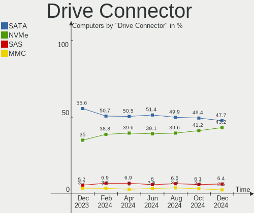
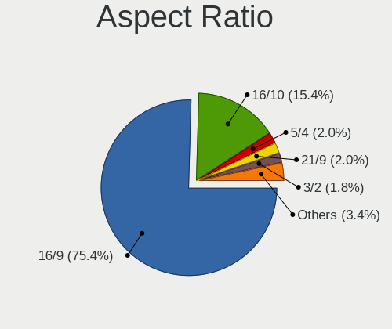
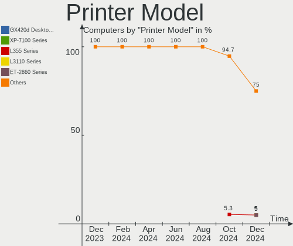

Ubuntu - Hardware Trends
------------------------

A project to identify most popular hardware characteristics and track their change
over time based on data collected by Linux users at https://Linux-Hardware.org.

Anyone can contribute to this report by the [hw-probe](https://github.com/linuxhw/hw-probe) tool:

    sudo -E hw-probe -all -upload

This is a report for all computer types. See also reports for [desktops](/Dist/Ubuntu/Desktop/README.md) and [notebooks](/Dist/Ubuntu/Notebook/README.md).

This report is for one last month. Overall report since the beginning of time: [TestCoverage](https://github.com/linuxhw/TestCoverage)

Period: Jun, 2022.

Contents
--------

* [ System ](#system)
  - [ OS                       ](#os)
  - [ OS Family                ](#os-family)
  - [ Kernel                   ](#kernel)
  - [ Kernel Family            ](#kernel-family)
  - [ Kernel Major Ver.        ](#kernel-major-ver)
  - [ Arch                     ](#arch)
  - [ DE                       ](#de)
  - [ Display Server           ](#display-server)
  - [ Display Manager          ](#display-manager)
  - [ OS Lang                  ](#os-lang)
  - [ Boot Mode                ](#boot-mode)
  - [ Filesystem               ](#filesystem)
  - [ Part. scheme             ](#part-scheme)
  - [ Dual Boot with Linux/BSD ](#dual-boot-with-linuxbsd)
  - [ Dual Boot (Win)          ](#dual-boot-win)

* [ Board ](#board)
  - [ Vendor                   ](#vendor)
  - [ Model                    ](#model)
  - [ Model Family             ](#model-family)
  - [ MFG Year                 ](#mfg-year)
  - [ Form Factor              ](#form-factor)
  - [ Secure Boot              ](#secure-boot)
  - [ Coreboot                 ](#coreboot)
  - [ RAM Size                 ](#ram-size)
  - [ RAM Used                 ](#ram-used)
  - [ Total Drives             ](#total-drives)
  - [ Has CD-ROM               ](#has-cd-rom)
  - [ Has Ethernet             ](#has-ethernet)
  - [ Has WiFi                 ](#has-wifi)
  - [ Has Bluetooth            ](#has-bluetooth)

* [ Location ](#location)
  - [ Country                  ](#country)
  - [ City                     ](#city)

* [ Drives ](#drives)
  - [ Drive Vendor             ](#drive-vendor)
  - [ Drive Model              ](#drive-model)
  - [ HDD Vendor               ](#hdd-vendor)
  - [ SSD Vendor               ](#ssd-vendor)
  - [ Drive Kind               ](#drive-kind)
  - [ Drive Connector          ](#drive-connector)
  - [ Drive Size               ](#drive-size)
  - [ Space Total              ](#space-total)
  - [ Space Used               ](#space-used)
  - [ Malfunc. Drives          ](#malfunc-drives)
  - [ Malfunc. Drive Vendor    ](#malfunc-drive-vendor)
  - [ Malfunc. HDD Vendor      ](#malfunc-hdd-vendor)
  - [ Malfunc. Drive Kind      ](#malfunc-drive-kind)
  - [ Failed Drives            ](#failed-drives)
  - [ Failed Drive Vendor      ](#failed-drive-vendor)
  - [ Drive Status             ](#drive-status)

* [ Storage controller ](#storage-controller)
  - [ Storage Vendor           ](#storage-vendor)
  - [ Storage Model            ](#storage-model)
  - [ Storage Kind             ](#storage-kind)

* [ Processor ](#processor)
  - [ CPU Vendor               ](#cpu-vendor)
  - [ CPU Model                ](#cpu-model)
  - [ CPU Model Family         ](#cpu-model-family)
  - [ CPU Cores                ](#cpu-cores)
  - [ CPU Sockets              ](#cpu-sockets)
  - [ CPU Threads              ](#cpu-threads)
  - [ CPU Op-Modes             ](#cpu-op-modes)
  - [ CPU Microcode            ](#cpu-microcode)
  - [ CPU Microarch            ](#cpu-microarch)

* [ Graphics ](#graphics)
  - [ GPU Vendor               ](#gpu-vendor)
  - [ GPU Model                ](#gpu-model)
  - [ GPU Combo                ](#gpu-combo)
  - [ GPU Driver               ](#gpu-driver)
  - [ GPU Memory               ](#gpu-memory)

* [ Monitor ](#monitor)
  - [ Monitor Vendor           ](#monitor-vendor)
  - [ Monitor Model            ](#monitor-model)
  - [ Monitor Resolution       ](#monitor-resolution)
  - [ Monitor Diagonal         ](#monitor-diagonal)
  - [ Monitor Width            ](#monitor-width)
  - [ Aspect Ratio             ](#aspect-ratio)
  - [ Monitor Area             ](#monitor-area)
  - [ Pixel Density            ](#pixel-density)
  - [ Multiple Monitors        ](#multiple-monitors)

* [ Network ](#network)
  - [ Net Controller Vendor    ](#net-controller-vendor)
  - [ Net Controller Model     ](#net-controller-model)
  - [ Wireless Vendor          ](#wireless-vendor)
  - [ Wireless Model           ](#wireless-model)
  - [ Ethernet Vendor          ](#ethernet-vendor)
  - [ Ethernet Model           ](#ethernet-model)
  - [ Net Controller Kind      ](#net-controller-kind)
  - [ Used Controller          ](#used-controller)
  - [ NICs                     ](#nics)
  - [ IPv6                     ](#ipv6)

* [ Bluetooth ](#bluetooth)
  - [ Bluetooth Vendor         ](#bluetooth-vendor)
  - [ Bluetooth Model          ](#bluetooth-model)

* [ Sound ](#sound)
  - [ Sound Vendor             ](#sound-vendor)
  - [ Sound Model              ](#sound-model)

* [ Memory ](#memory)
  - [ Memory Vendor            ](#memory-vendor)
  - [ Memory Model             ](#memory-model)
  - [ Memory Kind              ](#memory-kind)
  - [ Memory Form Factor       ](#memory-form-factor)
  - [ Memory Size              ](#memory-size)
  - [ Memory Speed             ](#memory-speed)

* [ Printers & scanners ](#printers--scanners)
  - [ Printer Vendor           ](#printer-vendor)
  - [ Printer Model            ](#printer-model)
  - [ Scanner Vendor           ](#scanner-vendor)
  - [ Scanner Model            ](#scanner-model)

* [ Camera ](#camera)
  - [ Camera Vendor            ](#camera-vendor)
  - [ Camera Model             ](#camera-model)

* [ Security ](#security)
  - [ Fingerprint Vendor       ](#fingerprint-vendor)
  - [ Fingerprint Model        ](#fingerprint-model)
  - [ Chipcard Vendor          ](#chipcard-vendor)
  - [ Chipcard Model           ](#chipcard-model)

* [ Unsupported ](#unsupported)
  - [ Unsupported Devices      ](#unsupported-devices)
  - [ Unsupported Device Types ](#unsupported-device-types)

System
------

OS
--

Installed operating systems

| Name         | Computers | Percent |
|--------------|-----------|---------|
| Ubuntu 22.04 | 570       | 55.88%  |
| Ubuntu 20.04 | 365       | 35.78%  |
| Ubuntu 18.04 | 39        | 3.82%   |
| Ubuntu 21.10 | 26        | 2.55%   |
| Ubuntu 22.10 | 7         | 0.69%   |
| Ubuntu 21.04 | 6         | 0.59%   |
| Ubuntu 16.04 | 4         | 0.39%   |
| Ubuntu 21.12 | 1         | 0.1%    |
| Ubuntu 20.10 | 1         | 0.1%    |
| Ubuntu 14.04 | 1         | 0.1%    |

OS Family
---------

OS without a version

| Name   | Computers | Percent |
|--------|-----------|---------|
| Ubuntu | 1020      | 100%    |

Kernel
------

Version of the Linux kernel

| Version                  | Computers | Percent |
|--------------------------|-----------|---------|
| 5.15.0-39-generic        | 113       | 11.08%  |
| 5.15.0-37-generic        | 107       | 10.49%  |
| 5.15.0-40-generic        | 100       | 9.8%    |
| 5.15.0-35-generic        | 97        | 9.51%   |
| 5.13.0-51-generic        | 90        | 8.82%   |
| 5.13.0-44-generic        | 84        | 8.24%   |
| 5.15.0-33-generic        | 69        | 6.76%   |
| 5.13.0-48-generic        | 60        | 5.88%   |
| 5.15.0-25-generic        | 40        | 3.92%   |
| 5.4.0-117-generic        | 26        | 2.55%   |
| 5.4.0-120-generic        | 17        | 1.67%   |
| 5.4.0-113-generic        | 17        | 1.67%   |
| 5.4.0-121-generic        | 14        | 1.37%   |
| 5.13.0-40-generic        | 9         | 0.88%   |
| 5.15.0-27-generic        | 7         | 0.69%   |
| 5.13.0-52-generic        | 7         | 0.69%   |
| 5.15.0-1011-raspi        | 6         | 0.59%   |
| 5.14.0-1042-oem          | 6         | 0.59%   |
| 5.13.0-30-generic        | 6         | 0.59%   |
| 5.14.0-1038-oem          | 5         | 0.49%   |
| 5.13.0-41-generic        | 5         | 0.49%   |
| 4.15.0-188-generic       | 5         | 0.49%   |
| 4.15.0-184-generic       | 5         | 0.49%   |
| 5.15.0-1008-raspi        | 4         | 0.39%   |
| 5.11.0-49-generic        | 4         | 0.39%   |
| 5.11.0-43-generic        | 4         | 0.39%   |
| 5.4.0-110-generic        | 3         | 0.29%   |
| 5.15.0-36-generic        | 3         | 0.29%   |
| 5.11.0-38-generic        | 3         | 0.29%   |
| 4.15.0-180-generic       | 3         | 0.29%   |
| 5.8.0-43-generic         | 2         | 0.2%    |
| 5.4.0-42-generic         | 2         | 0.2%    |
| 5.4.0-109-generic        | 2         | 0.2%    |
| 5.18.6-051806-generic    | 2         | 0.2%    |
| 5.18.3-051803-generic    | 2         | 0.2%    |
| 5.18.0-051800-generic    | 2         | 0.2%    |
| 5.17.11-051711-generic   | 2         | 0.2%    |
| 5.15.0-37-lowlatency     | 2         | 0.2%    |
| 5.15.0-30-generic        | 2         | 0.2%    |
| 5.14.0-1036-oem          | 2         | 0.2%    |
| 5.13.0-39-generic        | 2         | 0.2%    |
| 5.13.0-35-generic        | 2         | 0.2%    |
| 5.13.0-28-generic        | 2         | 0.2%    |
| 5.13.0-1029-raspi        | 2         | 0.2%    |
| 5.11.0-16-generic        | 2         | 0.2%    |
| 4.15.0-187-generic       | 2         | 0.2%    |
| 5.8.0-55-generic         | 1         | 0.1%    |
| 5.8.0-29-generic         | 1         | 0.1%    |
| 5.4.0-96-generic         | 1         | 0.1%    |
| 5.4.0-94-generic         | 1         | 0.1%    |
| 5.4.0-91-generic         | 1         | 0.1%    |
| 5.4.0-90-generic         | 1         | 0.1%    |
| 5.4.0-72-generic         | 1         | 0.1%    |
| 5.4.0-58-generic         | 1         | 0.1%    |
| 5.4.0-54-generic         | 1         | 0.1%    |
| 5.4.0-47-generic         | 1         | 0.1%    |
| 5.4.0-115-generic        | 1         | 0.1%    |
| 5.4.0-113-lowlatency     | 1         | 0.1%    |
| 5.3.0-62-generic         | 1         | 0.1%    |
| 5.19.0-051900rc3-generic | 1         | 0.1%    |

Kernel Family
-------------

Linux kernel without a distro release

| Version  | Computers | Percent |
|----------|-----------|---------|
| 5.15.0   | 555       | 54.41%  |
| 5.13.0   | 274       | 26.86%  |
| 5.4.0    | 91        | 8.92%   |
| 4.15.0   | 22        | 2.16%   |
| 5.11.0   | 20        | 1.96%   |
| 5.14.0   | 14        | 1.37%   |
| 5.8.0    | 4         | 0.39%   |
| 5.17.0   | 4         | 0.39%   |
| 5.18.6   | 3         | 0.29%   |
| 5.18.1   | 3         | 0.29%   |
| 5.18.0   | 3         | 0.29%   |
| 5.18.3   | 2         | 0.2%    |
| 5.17.11  | 2         | 0.2%    |
| 4.4.0    | 2         | 0.2%    |
| 5.3.0    | 1         | 0.1%    |
| 5.19.0   | 1         | 0.1%    |
| 5.18.4   | 1         | 0.1%    |
| 5.18.2   | 1         | 0.1%    |
| 5.17.9   | 1         | 0.1%    |
| 5.17.7   | 1         | 0.1%    |
| 5.17.6   | 1         | 0.1%    |
| 5.17.5   | 1         | 0.1%    |
| 5.17.14  | 1         | 0.1%    |
| 5.15.23  | 1         | 0.1%    |
| 5.15.13  | 1         | 0.1%    |
| 5.13.19  | 1         | 0.1%    |
| 5.11.5   | 1         | 0.1%    |
| 5.10.65  | 1         | 0.1%    |
| 5.10.61  | 1         | 0.1%    |
| 5.10.121 | 1         | 0.1%    |
| 5.10.110 | 1         | 0.1%    |
| 4.9.253  | 1         | 0.1%    |
| 4.9.140  | 1         | 0.1%    |
| 4.4.114  | 1         | 0.1%    |
| 4.19.111 | 1         | 0.1%    |

Kernel Major Ver.
-----------------

Linux kernel major version

| Version | Computers | Percent |
|---------|-----------|---------|
| 5.15    | 557       | 54.61%  |
| 5.13    | 275       | 26.96%  |
| 5.4     | 91        | 8.92%   |
| 4.15    | 22        | 2.16%   |
| 5.11    | 21        | 2.06%   |
| 5.14    | 14        | 1.37%   |
| 5.18    | 13        | 1.27%   |
| 5.17    | 11        | 1.08%   |
| 5.8     | 4         | 0.39%   |
| 5.10    | 4         | 0.39%   |
| 4.4     | 3         | 0.29%   |
| 4.9     | 2         | 0.2%    |
| 5.3     | 1         | 0.1%    |
| 5.19    | 1         | 0.1%    |
| 4.19    | 1         | 0.1%    |

Arch
----

OS architecture (x86_64, i586, etc.)

| Name    | Computers | Percent |
|---------|-----------|---------|
| x86_64  | 992       | 97.25%  |
| aarch64 | 18        | 1.76%   |
| i686    | 10        | 0.98%   |

DE
--

Desktop Environment

| Name            | Computers | Percent |
|-----------------|-----------|---------|
| GNOME           | 927       | 90.88%  |
| Unknown         | 66        | 6.47%   |
| Unity           | 11        | 1.08%   |
| X-Cinnamon      | 4         | 0.39%   |
| GNOME Flashback | 4         | 0.39%   |
| GNOME Classic   | 4         | 0.39%   |
| Enlightenment   | 2         | 0.2%    |
| Cinnamon        | 2         | 0.2%    |

Display Server
--------------

X11 or Wayland

| Name    | Computers | Percent |
|---------|-----------|---------|
| X11     | 552       | 54.12%  |
| Wayland | 414       | 40.59%  |
| Unknown | 31        | 3.04%   |
| Tty     | 23        | 2.25%   |

Display Manager
---------------

SDDM, LightDM, etc.

| Name    | Computers | Percent |
|---------|-----------|---------|
| GDM3    | 770       | 75.49%  |
| GDM     | 131       | 12.84%  |
| Unknown | 88        | 8.63%   |
| LightDM | 27        | 2.65%   |
| SDDM    | 3         | 0.29%   |
| SLiM    | 1         | 0.1%    |

OS Lang
-------

Language

| Lang        | Computers | Percent |
|-------------|-----------|---------|
| en_US       | 461       | 45.2%   |
| de_DE       | 83        | 8.14%   |
| fr_FR       | 77        | 7.55%   |
| pt_BR       | 42        | 4.12%   |
| en_GB       | 40        | 3.92%   |
| ru_RU       | 36        | 3.53%   |
| en_IN       | 30        | 2.94%   |
| es_ES       | 25        | 2.45%   |
| it_IT       | 20        | 1.96%   |
| en_AU       | 20        | 1.96%   |
| C           | 18        | 1.76%   |
| pl_PL       | 17        | 1.67%   |
| en_CA       | 13        | 1.27%   |
| nl_NL       | 11        | 1.08%   |
| zh_CN       | 7         | 0.69%   |
| sv_SE       | 7         | 0.69%   |
| pt_PT       | 7         | 0.69%   |
| es_MX       | 7         | 0.69%   |
| Unknown     | 7         | 0.69%   |
| hu_HU       | 6         | 0.59%   |
| fr_BE       | 6         | 0.59%   |
| en_ZA       | 6         | 0.59%   |
| da_DK       | 6         | 0.59%   |
| cs_CZ       | 6         | 0.59%   |
| tr_TR       | 5         | 0.49%   |
| ja_JP       | 5         | 0.49%   |
| de_CH       | 5         | 0.49%   |
| es_CO       | 3         | 0.29%   |
| es_CL       | 3         | 0.29%   |
| es_AR       | 3         | 0.29%   |
| de_AT       | 3         | 0.29%   |
| ru_UA       | 2         | 0.2%    |
| ko_KR       | 2         | 0.2%    |
| hr_HR       | 2         | 0.2%    |
| en_NZ       | 2         | 0.2%    |
| en_IL       | 2         | 0.2%    |
| en_HK       | 2         | 0.2%    |
| el_GR       | 2         | 0.2%    |
| bg_BG       | 2         | 0.2%    |
| uk_UA       | 1         | 0.1%    |
| sk_SK       | 1         | 0.1%    |
| ro_RO       | 1         | 0.1%    |
| nl_BE       | 1         | 0.1%    |
| lv_LV       | 1         | 0.1%    |
| lt_LT       | 1         | 0.1%    |
| fr_CH       | 1         | 0.1%    |
| fi_FI       | 1         | 0.1%    |
| es_VE       | 1         | 0.1%    |
| es_UY       | 1         | 0.1%    |
| es_NI       | 1         | 0.1%    |
| es_EC       | 1         | 0.1%    |
| es_DO       | 1         | 0.1%    |
| es_BO       | 1         | 0.1%    |
| en_US.UTF.8 | 1         | 0.1%    |
| en_SG       | 1         | 0.1%    |
| en_PH       | 1         | 0.1%    |
| en_IE       | 1         | 0.1%    |
| ca_ES       | 1         | 0.1%    |

Boot Mode
---------

EFI or BIOS

| Mode | Computers | Percent |
|------|-----------|---------|
| BIOS | 546       | 53.53%  |
| EFI  | 474       | 46.47%  |

Filesystem
----------

Type of filesystem

| Type    | Computers | Percent |
|---------|-----------|---------|
| Ext4    | 965       | 94.61%  |
| Overlay | 19        | 1.86%   |
| Zfs     | 18        | 1.76%   |
| Btrfs   | 11        | 1.08%   |
| Xfs     | 4         | 0.39%   |
| Ext3    | 2         | 0.2%    |
| Ext2    | 1         | 0.1%    |

Part. scheme
------------

Scheme of partitioning

| Type    | Computers | Percent |
|---------|-----------|---------|
| Unknown | 623       | 61.08%  |
| GPT     | 371       | 36.37%  |
| MBR     | 26        | 2.55%   |

Dual Boot with Linux/BSD
------------------------

Hosting more than one Linux/BSD

| Dual boot | Computers | Percent |
|-----------|-----------|---------|
| No        | 896       | 87.84%  |
| Yes       | 124       | 12.16%  |

Dual Boot (Win)
---------------

Hosting Linux and Windows

| Dual boot | Computers | Percent |
|-----------|-----------|---------|
| No        | 630       | 61.76%  |
| Yes       | 390       | 38.24%  |

Board
-----

Vendor
------

Motherboard manufacturer

| Name                           | Computers | Percent |
|--------------------------------|-----------|---------|
| Dell                           | 158       | 15.49%  |
| Lenovo                         | 147       | 14.41%  |
| ASUSTek Computer               | 146       | 14.31%  |
| Hewlett-Packard                | 138       | 13.53%  |
| MSI                            | 74        | 7.25%   |
| Gigabyte Technology            | 56        | 5.49%   |
| Acer                           | 56        | 5.49%   |
| Intel                          | 21        | 2.06%   |
| Apple                          | 18        | 1.76%   |
| Toshiba                        | 16        | 1.57%   |
| Samsung Electronics            | 16        | 1.57%   |
| ASRock                         | 14        | 1.37%   |
| Unknown                        | 13        | 1.27%   |
| Raspberry Pi Foundation        | 12        | 1.18%   |
| HUAWEI                         | 11        | 1.08%   |
| Fujitsu                        | 9         | 0.88%   |
| Alienware                      | 9         | 0.88%   |
| Microsoft                      | 7         | 0.69%   |
| Medion                         | 7         | 0.69%   |
| Sony                           | 6         | 0.59%   |
| Biostar                        | 6         | 0.59%   |
| Google                         | 5         | 0.49%   |
| Foxconn                        | 5         | 0.49%   |
| Nvidia                         | 4         | 0.39%   |
| Supermicro                     | 3         | 0.29%   |
| Razer                          | 3         | 0.29%   |
| GPU Company                    | 3         | 0.29%   |
| congatec                       | 3         | 0.29%   |
| Chuwi                          | 3         | 0.29%   |
| System76                       | 2         | 0.2%    |
| Shuttle                        | 2         | 0.2%    |
| Prestigio                      | 2         | 0.2%    |
| Positivo                       | 2         | 0.2%    |
| Panasonic                      | 2         | 0.2%    |
| Notebook                       | 2         | 0.2%    |
| Monster                        | 2         | 0.2%    |
| LG Electronics                 | 2         | 0.2%    |
| Avell High Performance         | 2         | 0.2%    |
| ZOTAC                          | 1         | 0.1%    |
| Wearnes                        | 1         | 0.1%    |
| Teclast                        | 1         | 0.1%    |
| Radxa                          | 1         | 0.1%    |
| Protectli                      | 1         | 0.1%    |
| Pegatron                       | 1         | 0.1%    |
| PCWare                         | 1         | 0.1%    |
| Packard Bell                   | 1         | 0.1%    |
| NCS-Tech                       | 1         | 0.1%    |
| Matsushita Electric Industrial | 1         | 0.1%    |
| Login Informatica              | 1         | 0.1%    |
| Jumper                         | 1         | 0.1%    |
| ITI LIMITED                    | 1         | 0.1%    |
| IPASON                         | 1         | 0.1%    |
| IP3 Tech                       | 1         | 0.1%    |
| Inventec                       | 1         | 0.1%    |
| Inter Sales A/S                | 1         | 0.1%    |
| INET                           | 1         | 0.1%    |
| IBM                            | 1         | 0.1%    |
| GPD                            | 1         | 0.1%    |
| FriendlyElec                   | 1         | 0.1%    |
| EVOO                           | 1         | 0.1%    |

Model
-----

Motherboard model

| Name                                   | Computers | Percent |
|----------------------------------------|-----------|---------|
| Unknown                                | 14        | 1.37%   |
| ASUS All Series                        | 13        | 1.27%   |
| MSI MS-7721                            | 10        | 0.98%   |
| RPi Raspberry Pi                       | 8         | 0.78%   |
| MSI MS-7817                            | 4         | 0.39%   |
| Dell OptiPlex 7010                     | 4         | 0.39%   |
| Dell Latitude E5430 non-vPro           | 4         | 0.39%   |
| ASUS PRIME A320M-K                     | 4         | 0.39%   |
| RPi Raspberry Pi 4 Model B Rev 1.4     | 3         | 0.29%   |
| Nvidia Tegra                           | 3         | 0.29%   |
| Microsoft Surface Pro 3                | 3         | 0.29%   |
| Lenovo IdeaPad 5 15ITL05 82FG          | 3         | 0.29%   |
| HUAWEI BOM-WXX9                        | 3         | 0.29%   |
| HP Pavilion Notebook                   | 3         | 0.29%   |
| Dell Precision Tower 5810              | 3         | 0.29%   |
| Dell OptiPlex 9020                     | 3         | 0.29%   |
| Dell OptiPlex 7040                     | 3         | 0.29%   |
| ASUS M5A97 R2.0                        | 3         | 0.29%   |
| Apple MacBookPro11,1                   | 3         | 0.29%   |
| Acer Swift SF314-43                    | 3         | 0.29%   |
| MSI MS-7D16                            | 2         | 0.2%    |
| MSI MS-7C52                            | 2         | 0.2%    |
| MSI MS-7C51                            | 2         | 0.2%    |
| MSI MS-7B84                            | 2         | 0.2%    |
| MSI MS-7788                            | 2         | 0.2%    |
| MSI MS-7740                            | 2         | 0.2%    |
| Lenovo ThinkPad X230 23259T0           | 2         | 0.2%    |
| Lenovo ThinkCentre M73 10AXS1UY00      | 2         | 0.2%    |
| Lenovo ThinkBook 15p Gen 2 21B1        | 2         | 0.2%    |
| Lenovo ThinkBook 15 G3 ACL 21A4        | 2         | 0.2%    |
| Lenovo IdeaPadFlex 5 14ALC05 82HU      | 2         | 0.2%    |
| Lenovo IdeaPad Gaming 3 15ACH6 82K2    | 2         | 0.2%    |
| Lenovo IdeaPad 330-15AST 81D6          | 2         | 0.2%    |
| Lenovo G50-30 80G0                     | 2         | 0.2%    |
| HUAWEI BOD-WXX9                        | 2         | 0.2%    |
| HP Z400 Workstation                    | 2         | 0.2%    |
| HP ProBook 450 G0                      | 2         | 0.2%    |
| HP Pavilion dv7                        | 2         | 0.2%    |
| HP Pavilion dm1                        | 2         | 0.2%    |
| HP Pavilion 15                         | 2         | 0.2%    |
| HP Notebook                            | 2         | 0.2%    |
| HP EliteDesk 800 G1 SFF                | 2         | 0.2%    |
| HP EliteBook 8740w                     | 2         | 0.2%    |
| HP EliteBook 850 G8 Notebook PC        | 2         | 0.2%    |
| HP EliteBook 840 G4                    | 2         | 0.2%    |
| HP EliteBook 2560p                     | 2         | 0.2%    |
| HP Compaq dc7900 Convertible Minitower | 2         | 0.2%    |
| HP 15                                  | 2         | 0.2%    |
| GPU Company GWTC116-2                  | 2         | 0.2%    |
| Gigabyte Z87X-UD3H                     | 2         | 0.2%    |
| Gigabyte GA-MA790FXT-UD5P              | 2         | 0.2%    |
| Gigabyte F2A55M-HD2                    | 2         | 0.2%    |
| Gigabyte 970A-DS3P                     | 2         | 0.2%    |
| Fujitsu LIFEBOOK E752                  | 2         | 0.2%    |
| Dell XPS 13 9380                       | 2         | 0.2%    |
| Dell OptiPlex 9010                     | 2         | 0.2%    |
| Dell OptiPlex 790                      | 2         | 0.2%    |
| Dell OptiPlex 745                      | 2         | 0.2%    |
| Dell OptiPlex 7050                     | 2         | 0.2%    |
| Dell OptiPlex 3010                     | 2         | 0.2%    |

Model Family
------------

Motherboard model prefix

| Name               | Computers | Percent |
|--------------------|-----------|---------|
| Lenovo ThinkPad    | 60        | 5.88%   |
| Dell Inspiron      | 39        | 3.82%   |
| Dell Latitude      | 38        | 3.73%   |
| Acer Aspire        | 35        | 3.43%   |
| Lenovo IdeaPad     | 29        | 2.84%   |
| Dell OptiPlex      | 27        | 2.65%   |
| HP Pavilion        | 24        | 2.35%   |
| HP EliteBook       | 20        | 1.96%   |
| HP Laptop          | 18        | 1.76%   |
| Dell Precision     | 17        | 1.67%   |
| ASUS ROG           | 16        | 1.57%   |
| HP ProBook         | 14        | 1.37%   |
| ASUS PRIME         | 14        | 1.37%   |
| Unknown            | 14        | 1.37%   |
| ASUS All           | 13        | 1.27%   |
| Toshiba Satellite  | 12        | 1.18%   |
| RPi Raspberry      | 12        | 1.18%   |
| Lenovo ThinkCentre | 12        | 1.18%   |
| Dell XPS           | 12        | 1.18%   |
| Dell Vostro        | 12        | 1.18%   |
| HP Compaq          | 11        | 1.08%   |
| ASUS VivoBook      | 11        | 1.08%   |
| MSI MS-7721        | 10        | 0.98%   |
| Lenovo ThinkBook   | 8         | 0.78%   |
| ASUS TUF           | 8         | 0.78%   |
| Acer Swift         | 8         | 0.78%   |
| Microsoft Surface  | 7         | 0.69%   |
| Fujitsu LIFEBOOK   | 6         | 0.59%   |
| Dell PowerEdge     | 6         | 0.59%   |
| ASUS ASUS          | 6         | 0.59%   |
| Lenovo Yoga        | 5         | 0.49%   |
| MSI MS-7817        | 4         | 0.39%   |
| Lenovo Legion      | 4         | 0.39%   |
| HP ENVY            | 4         | 0.39%   |
| HP EliteDesk       | 4         | 0.39%   |
| ASUS M5A97         | 4         | 0.39%   |
| ASUS CROSSHAIR     | 4         | 0.39%   |
| Alienware Aurora   | 4         | 0.39%   |
| Acer Predator      | 4         | 0.39%   |
| Razer Blade        | 3         | 0.29%   |
| Nvidia Tegra       | 3         | 0.29%   |
| Lenovo IdeaPadFlex | 3         | 0.29%   |
| HUAWEI BOM-WXX9    | 3         | 0.29%   |
| HP ZBook           | 3         | 0.29%   |
| HP Stream          | 3         | 0.29%   |
| HP Spectre         | 3         | 0.29%   |
| HP OMEN            | 3         | 0.29%   |
| HP 15              | 3         | 0.29%   |
| Gigabyte Z690      | 3         | 0.29%   |
| Gigabyte B450M     | 3         | 0.29%   |
| Gigabyte 970A-DS3P | 3         | 0.29%   |
| ASUS Zenbook       | 3         | 0.29%   |
| ASUS Pro           | 3         | 0.29%   |
| ASUS P8Z68-V       | 3         | 0.29%   |
| Apple MacBookPro11 | 3         | 0.29%   |
| Acer Veriton       | 3         | 0.29%   |
| Toshiba TECRA      | 2         | 0.2%    |
| MSI Stealth        | 2         | 0.2%    |
| MSI Prestige       | 2         | 0.2%    |
| MSI MS-7D16        | 2         | 0.2%    |

MFG Year
--------

Motherboard manufacture year

| Year    | Computers | Percent |
|---------|-----------|---------|
| 2021    | 144       | 14.12%  |
| 2020    | 103       | 10.1%   |
| 2019    | 86        | 8.43%   |
| 2012    | 77        | 7.55%   |
| 2018    | 75        | 7.35%   |
| 2013    | 73        | 7.16%   |
| 2011    | 64        | 6.27%   |
| 2016    | 61        | 5.98%   |
| 2017    | 60        | 5.88%   |
| 2014    | 60        | 5.88%   |
| 2015    | 47        | 4.61%   |
| 2010    | 43        | 4.22%   |
| 2022    | 31        | 3.04%   |
| 2008    | 30        | 2.94%   |
| 2009    | 29        | 2.84%   |
| Unknown | 17        | 1.67%   |
| 2007    | 15        | 1.47%   |
| 2006    | 3         | 0.29%   |
| 2005    | 2         | 0.2%    |

Form Factor
-----------

Physical design of the computer

| Name           | Computers | Percent |
|----------------|-----------|---------|
| Notebook       | 550       | 53.92%  |
| Desktop        | 371       | 36.37%  |
| Convertible    | 23        | 2.25%   |
| Mini pc        | 19        | 1.86%   |
| System on chip | 18        | 1.76%   |
| All in one     | 16        | 1.57%   |
| Tablet         | 12        | 1.18%   |
| Server         | 11        | 1.08%   |

Secure Boot
-----------

Enabled or disabled

| State    | Computers | Percent |
|----------|-----------|---------|
| Disabled | 899       | 88.14%  |
| Enabled  | 121       | 11.86%  |

Coreboot
--------

Have coreboot on board

| Used | Computers | Percent |
|------|-----------|---------|
| No   | 1014      | 99.41%  |
| Yes  | 6         | 0.59%   |

RAM Size
--------

Total RAM memory

| Size in GB      | Computers | Percent |
|-----------------|-----------|---------|
| 4.01-8.0        | 269       | 26.37%  |
| 16.01-24.0      | 229       | 22.45%  |
| 3.01-4.0        | 177       | 17.35%  |
| 8.01-16.0       | 145       | 14.22%  |
| 32.01-64.0      | 110       | 10.78%  |
| 64.01-256.0     | 31        | 3.04%   |
| 1.01-2.0        | 24        | 2.35%   |
| 24.01-32.0      | 18        | 1.76%   |
| 2.01-3.0        | 9         | 0.88%   |
| 0.51-1.0        | 4         | 0.39%   |
| More than 256.0 | 3         | 0.29%   |
| 0.01-0.5        | 1         | 0.1%    |

RAM Used
--------

Used RAM memory

| Used GB    | Computers | Percent |
|------------|-----------|---------|
| 1.01-2.0   | 348       | 34.12%  |
| 2.01-3.0   | 280       | 27.45%  |
| 3.01-4.0   | 151       | 14.8%   |
| 4.01-8.0   | 147       | 14.41%  |
| 8.01-16.0  | 60        | 5.88%   |
| 0.51-1.0   | 19        | 1.86%   |
| 0.01-0.5   | 11        | 1.08%   |
| 24.01-32.0 | 2         | 0.2%    |
| 16.01-24.0 | 2         | 0.2%    |

Total Drives
------------

Number of drives on board

| Drives | Computers | Percent |
|--------|-----------|---------|
| 1      | 606       | 59.41%  |
| 2      | 266       | 26.08%  |
| 3      | 76        | 7.45%   |
| 4      | 28        | 2.75%   |
| 5      | 14        | 1.37%   |
| 0      | 12        | 1.18%   |
| 6      | 6         | 0.59%   |
| 8      | 5         | 0.49%   |
| 7      | 4         | 0.39%   |
| 9      | 2         | 0.2%    |
| 10     | 1         | 0.1%    |

Has CD-ROM
----------

Has CD-ROM on board

| Presented | Computers | Percent |
|-----------|-----------|---------|
| No        | 673       | 65.98%  |
| Yes       | 347       | 34.02%  |

Has Ethernet
------------

Has Ethernet on board

| Presented | Computers | Percent |
|-----------|-----------|---------|
| Yes       | 848       | 83.14%  |
| No        | 172       | 16.86%  |

Has WiFi
--------

Has WiFi module

| Presented | Computers | Percent |
|-----------|-----------|---------|
| Yes       | 772       | 75.69%  |
| No        | 248       | 24.31%  |

Has Bluetooth
-------------

Has Bluetooth module

| Presented | Computers | Percent |
|-----------|-----------|---------|
| Yes       | 623       | 61.08%  |
| No        | 397       | 38.92%  |

Location
--------

Country
-------

Geographic location (country)

| Country      | Computers | Percent |
|--------------|-----------|---------|
| USA          | 224       | 21.96%  |
| Germany      | 101       | 9.9%    |
| France       | 81        | 7.94%   |
| Russia       | 63        | 6.18%   |
| Brazil       | 54        | 5.29%   |
| UK           | 43        | 4.22%   |
| India        | 35        | 3.43%   |
| Spain        | 23        | 2.25%   |
| Australia    | 23        | 2.25%   |
| Italy        | 22        | 2.16%   |
| Poland       | 21        | 2.06%   |
| Netherlands  | 21        | 2.06%   |
| Sweden       | 15        | 1.47%   |
| Mexico       | 12        | 1.18%   |
| Canada       | 12        | 1.18%   |
| Belgium      | 12        | 1.18%   |
| Switzerland  | 11        | 1.08%   |
| Hungary      | 10        | 0.98%   |
| Czechia      | 10        | 0.98%   |
| Argentina    | 10        | 0.98%   |
| Turkey       | 9         | 0.88%   |
| South Africa | 9         | 0.88%   |
| Portugal     | 9         | 0.88%   |
| Japan        | 8         | 0.78%   |
| Indonesia    | 8         | 0.78%   |
| Greece       | 8         | 0.78%   |
| China        | 7         | 0.69%   |
| Denmark      | 6         | 0.59%   |
| Colombia     | 6         | 0.59%   |
| Ukraine      | 5         | 0.49%   |
| Taiwan       | 5         | 0.49%   |
| South Korea  | 5         | 0.49%   |
| Romania      | 5         | 0.49%   |
| Pakistan     | 5         | 0.49%   |
| Finland      | 5         | 0.49%   |
| Chile        | 5         | 0.49%   |
| Bulgaria     | 5         | 0.49%   |
| Austria      | 5         | 0.49%   |
| Thailand     | 4         | 0.39%   |
| Singapore    | 4         | 0.39%   |
| New Zealand  | 4         | 0.39%   |
| Kazakhstan   | 4         | 0.39%   |
| Ecuador      | 4         | 0.39%   |
| Vietnam      | 3         | 0.29%   |
| Sri Lanka    | 3         | 0.29%   |
| Saudi Arabia | 3         | 0.29%   |
| Lithuania    | 3         | 0.29%   |
| Latvia       | 3         | 0.29%   |
| Israel       | 3         | 0.29%   |
| Iran         | 3         | 0.29%   |
| Egypt        | 3         | 0.29%   |
| Croatia      | 3         | 0.29%   |
| Algeria      | 3         | 0.29%   |
| Slovenia     | 2         | 0.2%    |
| Slovakia     | 2         | 0.2%    |
| Serbia       | 2         | 0.2%    |
| Nepal        | 2         | 0.2%    |
| Malta        | 2         | 0.2%    |
| Malaysia     | 2         | 0.2%    |
| Kenya        | 2         | 0.2%    |

City
----

Geographic location (city)

| City              | Computers | Percent |
|-------------------|-----------|---------|
| Cheboksary        | 23        | 2.25%   |
| Berlin            | 11        | 1.08%   |
| Sydney            | 10        | 0.98%   |
| St Petersburg     | 9         | 0.88%   |
| Paris             | 9         | 0.88%   |
| Moscow            | 7         | 0.69%   |
| Milan             | 7         | 0.69%   |
| Warsaw            | 6         | 0.59%   |
| Novosibirsk       | 6         | 0.59%   |
| Budapest          | 6         | 0.59%   |
| Vienna            | 5         | 0.49%   |
| Stuttgart         | 5         | 0.49%   |
| Prague            | 5         | 0.49%   |
| Istanbul          | 5         | 0.49%   |
| Santiago          | 4         | 0.39%   |
| Quito             | 4         | 0.39%   |
| New York          | 4         | 0.39%   |
| Nantes            | 4         | 0.39%   |
| Munich            | 4         | 0.39%   |
| Madrid            | 4         | 0.39%   |
| Jakarta           | 4         | 0.39%   |
| Houston           | 4         | 0.39%   |
| Gul'kevichi       | 4         | 0.39%   |
| Florianópolis    | 4         | 0.39%   |
| Dallas            | 4         | 0.39%   |
| Cape Town         | 4         | 0.39%   |
| Buenos Aires      | 4         | 0.39%   |
| Brussels          | 4         | 0.39%   |
| Athens            | 4         | 0.39%   |
| Amsterdam         | 4         | 0.39%   |
| Zagreb            | 3         | 0.29%   |
| Vilnius           | 3         | 0.29%   |
| Valencia          | 3         | 0.29%   |
| Thessaloniki      | 3         | 0.29%   |
| Tel Aviv          | 3         | 0.29%   |
| Taipei            | 3         | 0.29%   |
| Singapore         | 3         | 0.29%   |
| Shanghai          | 3         | 0.29%   |
| Seattle           | 3         | 0.29%   |
| San Jose          | 3         | 0.29%   |
| Osaka             | 3         | 0.29%   |
| Orlando           | 3         | 0.29%   |
| Miami             | 3         | 0.29%   |
| Melbourne         | 3         | 0.29%   |
| Manchester        | 3         | 0.29%   |
| Krakow            | 3         | 0.29%   |
| Jacksonville      | 3         | 0.29%   |
| Hyderabad         | 3         | 0.29%   |
| Helsinki          | 3         | 0.29%   |
| Hamburg           | 3         | 0.29%   |
| Gothenburg        | 3         | 0.29%   |
| Frankfurt am Main | 3         | 0.29%   |
| Duluth            | 3         | 0.29%   |
| Duisburg          | 3         | 0.29%   |
| Curitiba          | 3         | 0.29%   |
| Chennai           | 3         | 0.29%   |
| Belo Horizonte    | 3         | 0.29%   |
| Bangkok           | 3         | 0.29%   |
| Almaty            | 3         | 0.29%   |
| Yongsan-gu        | 2         | 0.2%    |

Drives
------

Drive Vendor
------------

Hard drive vendors

| Vendor                      | Computers | Drives | Percent |
|-----------------------------|-----------|--------|---------|
| WDC                         | 214       | 278    | 14.94%  |
| Samsung Electronics         | 208       | 250    | 14.53%  |
| Seagate                     | 195       | 236    | 13.62%  |
| Toshiba                     | 115       | 138    | 8.03%   |
| Kingston                    | 70        | 78     | 4.89%   |
| SanDisk                     | 67        | 71     | 4.68%   |
| Unknown                     | 57        | 63     | 3.98%   |
| Hitachi                     | 49        | 51     | 3.42%   |
| SK hynix                    | 43        | 43     | 3%      |
| Intel                       | 40        | 57     | 2.79%   |
| Crucial                     | 34        | 39     | 2.37%   |
| Micron Technology           | 27        | 27     | 1.89%   |
| HGST                        | 27        | 28     | 1.89%   |
| A-DATA Technology           | 22        | 22     | 1.54%   |
| Phison                      | 21        | 23     | 1.47%   |
| KIOXIA                      | 17        | 17     | 1.19%   |
| Unknown                     | 17        | 17     | 1.19%   |
| PNY                         | 10        | 10     | 0.7%    |
| LITEON                      | 10        | 10     | 0.7%    |
| Apple                       | 9         | 11     | 0.63%   |
| SPCC                        | 8         | 8      | 0.56%   |
| China                       | 8         | 10     | 0.56%   |
| Silicon Motion              | 7         | 8      | 0.49%   |
| Intenso                     | 7         | 7      | 0.49%   |
| Goodram                     | 7         | 8      | 0.49%   |
| Fujitsu                     | 7         | 7      | 0.49%   |
| Transcend                   | 6         | 6      | 0.42%   |
| OCZ                         | 6         | 6      | 0.42%   |
| Netac                       | 6         | 6      | 0.42%   |
| Micron/Crucial Technology   | 6         | 7      | 0.42%   |
| Team                        | 5         | 8      | 0.35%   |
| Realtek Semiconductor       | 5         | 5      | 0.35%   |
| Patriot                     | 5         | 5      | 0.35%   |
| Maxtor                      | 5         | 5      | 0.35%   |
| Plextor                     | 4         | 4      | 0.28%   |
| KingSpec                    | 4         | 4      | 0.28%   |
| Corsair                     | 4         | 4      | 0.28%   |
| BIWIN                       | 4         | 4      | 0.28%   |
| Lexar                       | 3         | 3      | 0.21%   |
| KingDian                    | 3         | 3      | 0.21%   |
| JMicron Technology          | 3         | 3      | 0.21%   |
| FORESEE                     | 3         | 3      | 0.21%   |
| ASMT                        | 3         | 4      | 0.21%   |
| XPG                         | 2         | 2      | 0.14%   |
| UMIS                        | 2         | 2      | 0.14%   |
| LITEONIT                    | 2         | 2      | 0.14%   |
| Hewlett-Packard             | 2         | 2      | 0.14%   |
| Gigabyte Technology         | 2         | 2      | 0.14%   |
| External                    | 2         | 2      | 0.14%   |
| BHT                         | 2         | 2      | 0.14%   |
| Apacer                      | 2         | 2      | 0.14%   |
| YMTC                        | 1         | 1      | 0.07%   |
| Yangtze Memory Technologies | 1         | 1      | 0.07%   |
| WDC WDS1                    | 1         | 1      | 0.07%   |
| WDC WDS                     | 1         | 1      | 0.07%   |
| WDC WDB                     | 1         | 1      | 0.07%   |
| Unknown (690)               | 1         | 1      | 0.07%   |
| Union Memory                | 1         | 1      | 0.07%   |
| TO Exter                    | 1         | 1      | 0.07%   |
| Timetec                     | 1         | 1      | 0.07%   |

Drive Model
-----------

Hard drive models

| Model                               | Computers | Percent |
|-------------------------------------|-----------|---------|
| Toshiba VT180 240GB SSD             | 23        | 1.44%   |
| Unknown                             | 17        | 1.07%   |
| Samsung NVMe SSD Drive 512GB        | 16        | 1.01%   |
| Toshiba MQ01ABD100 1TB              | 14        | 0.88%   |
| Seagate ST1000LM035-1RK172 1TB      | 14        | 0.88%   |
| Toshiba DT01ACA050 500GB            | 13        | 0.82%   |
| Unknown SD/MMC/MS PRO 128GB         | 12        | 0.75%   |
| Seagate ST500LT012-1DG142 500GB     | 11        | 0.69%   |
| Kingston SA400S37240G 240GB SSD     | 11        | 0.69%   |
| Toshiba DT01ACA100 1TB              | 10        | 0.63%   |
| Seagate ST500DM002-1BD142 500GB     | 10        | 0.63%   |
| SanDisk NVMe SSD Drive 1TB          | 10        | 0.63%   |
| Toshiba MQ04ABF100 1TB              | 9         | 0.57%   |
| Samsung SSD 850 EVO 250GB           | 9         | 0.57%   |
| HGST HTS721010A9E630 1TB            | 9         | 0.57%   |
| Seagate ST2000DM008-2FR102 2TB      | 8         | 0.5%    |
| Seagate ST1000LM024 HN-M101MBB 1TB  | 8         | 0.5%    |
| Samsung SSD 860 EVO 500GB           | 8         | 0.5%    |
| Samsung SSD 850 EVO 500GB           | 8         | 0.5%    |
| Samsung NVMe SSD Drive 256GB        | 8         | 0.5%    |
| Samsung NVMe SSD Drive 1TB          | 8         | 0.5%    |
| Unknown MMC Card  32GB              | 7         | 0.44%   |
| Seagate ST2000DM001-1ER164 2TB      | 7         | 0.44%   |
| SanDisk NVMe SSD Drive 512GB        | 7         | 0.44%   |
| Kingston SA400S37120G 120GB SSD     | 7         | 0.44%   |
| WDC WDS240G2G0A-00JH30 240GB SSD    | 6         | 0.38%   |
| WDC WD10EZEX-08WN4A0 1TB            | 6         | 0.38%   |
| Toshiba DT01ACA200 2TB              | 6         | 0.38%   |
| Seagate ST9500325AS 500GB           | 6         | 0.38%   |
| Seagate ST3500418AS 500GB           | 6         | 0.38%   |
| Seagate Expansion 1TB               | 6         | 0.38%   |
| Samsung SSD 980 1TB                 | 6         | 0.38%   |
| Samsung SSD 860 EVO 250GB           | 6         | 0.38%   |
| Kingston SV300S37A120G 120GB SSD    | 6         | 0.38%   |
| Crucial CT240BX500SSD1 240GB        | 6         | 0.38%   |
| WDC WD10SPZX-21Z10T0 1TB            | 5         | 0.31%   |
| Unknown MMC Card  64GB              | 5         | 0.31%   |
| Unknown MMC Card  128GB             | 5         | 0.31%   |
| Toshiba MQ01ABF050 500GB            | 5         | 0.31%   |
| Toshiba HDWD110 1TB                 | 5         | 0.31%   |
| Seagate ST1000DM003-1SB102 1TB      | 5         | 0.31%   |
| SanDisk NVMe SSD Drive 256GB        | 5         | 0.31%   |
| Samsung SSD 970 EVO Plus 1TB        | 5         | 0.31%   |
| Samsung SSD 870 QVO 1TB             | 5         | 0.31%   |
| Phison 311CD0512GB                  | 5         | 0.31%   |
| Micron 1100_MTFDDAV256TBN 256GB SSD | 5         | 0.31%   |
| Intel NVMe SSD Drive 512GB          | 5         | 0.31%   |
| HGST HTS541010A9E680 1TB            | 5         | 0.31%   |
| Crucial CT500MX500SSD1 500GB        | 5         | 0.31%   |
| WDC WDS500G2B0A-00SM50 500GB SSD    | 4         | 0.25%   |
| WDC WD5000LPVX-22V0TT0 500GB        | 4         | 0.25%   |
| WDC WD10EZEX-60WN4A0 1TB            | 4         | 0.25%   |
| WDC WD10EARS-00Y5B1 1TB             | 4         | 0.25%   |
| SK hynix HFM001TD3JX013N 1TB        | 4         | 0.25%   |
| Seagate ST4000DM004-2CV104 4TB      | 4         | 0.25%   |
| Seagate ST2000LM007-1R8174 2TB      | 4         | 0.25%   |
| Seagate ST1000DM010-2EP102 1TB      | 4         | 0.25%   |
| SanDisk SSD PLUS 240GB              | 4         | 0.25%   |
| Samsung SSD 980 PRO 1TB             | 4         | 0.25%   |
| Samsung SSD 970 EVO Plus 500GB      | 4         | 0.25%   |

HDD Vendor
----------

Hard disk drive vendors

| Vendor              | Computers | Drives | Percent |
|---------------------|-----------|--------|---------|
| Seagate             | 190       | 229    | 33.04%  |
| WDC                 | 169       | 221    | 29.39%  |
| Toshiba             | 84        | 91     | 14.61%  |
| Hitachi             | 49        | 51     | 8.52%   |
| HGST                | 27        | 28     | 4.7%    |
| Samsung Electronics | 18        | 21     | 3.13%   |
| Unknown             | 13        | 13     | 2.26%   |
| Fujitsu             | 7         | 7      | 1.22%   |
| Maxtor              | 5         | 5      | 0.87%   |
| ASMT                | 3         | 4      | 0.52%   |
| Apple               | 3         | 3      | 0.52%   |
| JMicron Technology  | 2         | 2      | 0.35%   |
| Intenso             | 2         | 2      | 0.35%   |
| IBM-ESXS            | 1         | 1      | 0.17%   |
| Hewlett-Packard     | 1         | 1      | 0.17%   |
| DAS                 | 1         | 3      | 0.17%   |

SSD Vendor
----------

Solid state drive vendors

| Vendor              | Computers | Drives | Percent |
|---------------------|-----------|--------|---------|
| Samsung Electronics | 88        | 102    | 19.6%   |
| Kingston            | 55        | 60     | 12.25%  |
| SanDisk             | 37        | 38     | 8.24%   |
| Crucial             | 32        | 36     | 7.13%   |
| Toshiba             | 31        | 31     | 6.9%    |
| WDC                 | 28        | 28     | 6.24%   |
| A-DATA Technology   | 19        | 19     | 4.23%   |
| Micron Technology   | 13        | 13     | 2.9%    |
| LITEON              | 10        | 10     | 2.23%   |
| SPCC                | 8         | 8      | 1.78%   |
| PNY                 | 8         | 8      | 1.78%   |
| Intel               | 8         | 11     | 1.78%   |
| Goodram             | 7         | 8      | 1.56%   |
| China               | 7         | 9      | 1.56%   |
| OCZ                 | 6         | 6      | 1.34%   |
| Apple               | 6         | 6      | 1.34%   |
| Transcend           | 5         | 5      | 1.11%   |
| SK hynix            | 5         | 5      | 1.11%   |
| Patriot             | 5         | 5      | 1.11%   |
| Netac               | 5         | 5      | 1.11%   |
| Team                | 4         | 7      | 0.89%   |
| Plextor             | 4         | 4      | 0.89%   |
| KingSpec            | 4         | 4      | 0.89%   |
| Unknown             | 4         | 4      | 0.89%   |
| Lexar               | 3         | 3      | 0.67%   |
| KingDian            | 3         | 3      | 0.67%   |
| Intenso             | 3         | 3      | 0.67%   |
| FORESEE             | 3         | 3      | 0.67%   |
| Corsair             | 3         | 3      | 0.67%   |
| BIWIN               | 3         | 3      | 0.67%   |
| Phison              | 2         | 2      | 0.45%   |
| LITEONIT            | 2         | 2      | 0.45%   |
| BHT                 | 2         | 2      | 0.45%   |
| Apacer              | 2         | 2      | 0.45%   |
| WDC WDS1            | 1         | 1      | 0.22%   |
| WDC WDS             | 1         | 1      | 0.22%   |
| WDC WDB             | 1         | 1      | 0.22%   |
| Union Memory        | 1         | 1      | 0.22%   |
| TO Exter            | 1         | 1      | 0.22%   |
| Timetec             | 1         | 1      | 0.22%   |
| Teclast             | 1         | 1      | 0.22%   |
| StoreJet            | 1         | 1      | 0.22%   |
| Protectli           | 1         | 1      | 0.22%   |
| NGFF                | 1         | 1      | 0.22%   |
| Mushkin             | 1         | 1      | 0.22%   |
| minisforum          | 1         | 1      | 0.22%   |
| Leven               | 1         | 1      | 0.22%   |
| LDLC                | 1         | 1      | 0.22%   |
| KLEVV               | 1         | 1      | 0.22%   |
| INTEL SS            | 1         | 1      | 0.22%   |
| HS-SSD-C100         | 1         | 1      | 0.22%   |
| Green House         | 1         | 1      | 0.22%   |
| Gigabyte Technology | 1         | 1      | 0.22%   |
| geonix              | 1         | 1      | 0.22%   |
| Dogfish             | 1         | 1      | 0.22%   |
| Dahua               | 1         | 1      | 0.22%   |
| Axiom               | 1         | 1      | 0.22%   |
| Argon               | 1         | 1      | 0.22%   |

Drive Kind
----------

HDD or SSD

| Kind    | Computers | Drives | Percent |
|---------|-----------|--------|---------|
| HDD     | 481       | 682    | 36.91%  |
| SSD     | 396       | 482    | 30.39%  |
| NVMe    | 349       | 412    | 26.78%  |
| MMC     | 59        | 65     | 4.53%   |
| Unknown | 18        | 21     | 1.38%   |

Drive Connector
---------------

SATA, SAS, NVMe, etc.

| Type | Computers | Drives | Percent |
|------|-----------|--------|---------|
| SATA | 712       | 1107   | 60.34%  |
| NVMe | 347       | 408    | 29.41%  |
| SAS  | 62        | 82     | 5.25%   |
| MMC  | 59        | 65     | 5%      |

Drive Size
----------

Size of hard drive

| Size in TB | Computers | Drives | Percent |
|------------|-----------|--------|---------|
| 0.01-0.5   | 527       | 665    | 57.16%  |
| 0.51-1.0   | 260       | 315    | 28.2%   |
| 1.01-2.0   | 85        | 111    | 9.22%   |
| 4.01-10.0  | 20        | 32     | 2.17%   |
| 3.01-4.0   | 18        | 26     | 1.95%   |
| 2.01-3.0   | 10        | 12     | 1.08%   |
| 10.01-20.0 | 2         | 3      | 0.22%   |

Space Total
-----------

Amount of disk space available on the file system

| Size in GB     | Computers | Percent |
|----------------|-----------|---------|
| 101-250        | 287       | 28.14%  |
| 251-500        | 270       | 26.47%  |
| 501-1000       | 158       | 15.49%  |
| 1001-2000      | 69        | 6.76%   |
| 51-100         | 58        | 5.69%   |
| More than 3000 | 52        | 5.1%    |
| 21-50          | 52        | 5.1%    |
| 1-20           | 40        | 3.92%   |
| 2001-3000      | 26        | 2.55%   |
| Unknown        | 8         | 0.78%   |

Space Used
----------

Amount of used disk space

| Used GB        | Computers | Percent |
|----------------|-----------|---------|
| 1-20           | 382       | 37.45%  |
| 21-50          | 182       | 17.84%  |
| 101-250        | 140       | 13.73%  |
| 51-100         | 135       | 13.24%  |
| 251-500        | 71        | 6.96%   |
| 501-1000       | 47        | 4.61%   |
| 1001-2000      | 26        | 2.55%   |
| 2001-3000      | 18        | 1.76%   |
| More than 3000 | 10        | 0.98%   |
| Unknown        | 8         | 0.78%   |
| 0              | 1         | 0.1%    |

Malfunc. Drives
---------------

Drive models with a malfunction

| Model                                               | Computers | Drives | Percent |
|-----------------------------------------------------|-----------|--------|---------|
| Seagate ST500DM002-1BD142 500GB                     | 2         | 2      | 3.13%   |
| HGST HTS545050A7E680 500GB                          | 2         | 2      | 3.13%   |
| WDC WDS480G2G0A-00JH30 480GB SSD                    | 1         | 1      | 1.56%   |
| WDC WD6002FZWX-00GBGB0 6TB                          | 1         | 1      | 1.56%   |
| WDC WD60 EFRX-68MYMN1 6TB                           | 1         | 1      | 1.56%   |
| WDC WD5000LPVX-80V0TT0 500GB                        | 1         | 1      | 1.56%   |
| WDC WD5000LPVX-22V0TT0 500GB                        | 1         | 1      | 1.56%   |
| WDC WD5000AAKB-00H8A0 500GB                         | 1         | 1      | 1.56%   |
| WDC WD40EFRX-68WT0N0 4TB                            | 1         | 2      | 1.56%   |
| WDC WD20EARS-00MVWB0 2TB                            | 1         | 1      | 1.56%   |
| WDC WD1600AAJS-75B4A0 160GB                         | 1         | 1      | 1.56%   |
| WDC WD10PURX-64D85Y0 1TB                            | 1         | 1      | 1.56%   |
| WDC WD10JPVX-22JC3T0 1TB                            | 1         | 1      | 1.56%   |
| WDC WD10EZEX-00WN4A0 1TB                            | 1         | 1      | 1.56%   |
| WDC WD10EARS-00Y5B1 1TB                             | 1         | 1      | 1.56%   |
| Toshiba MQ01ABD100 1TB                              | 1         | 1      | 1.56%   |
| Toshiba MK6465GSX 640GB                             | 1         | 1      | 1.56%   |
| Toshiba DT01ACA300 3TB                              | 1         | 1      | 1.56%   |
| Toshiba DT01ACA100 1TB                              | 1         | 1      | 1.56%   |
| SK hynix HFS128G3AMNM-1010A 128GB SSD               | 1         | 1      | 1.56%   |
| Seagate ST9500325AS 500GB                           | 1         | 1      | 1.56%   |
| Seagate ST9320423AS 320GB                           | 1         | 1      | 1.56%   |
| Seagate ST9320325AS 320GB                           | 1         | 1      | 1.56%   |
| Seagate ST8000DM004-2CX188 8TB                      | 1         | 2      | 1.56%   |
| Seagate ST3250410AS 250GB                           | 1         | 1      | 1.56%   |
| Seagate ST3250310AS 250GB                           | 1         | 1      | 1.56%   |
| Seagate ST3160815AS 160GB                           | 1         | 1      | 1.56%   |
| Seagate ST2000DM001-9YN164 2TB                      | 1         | 1      | 1.56%   |
| Seagate ST1000LM035-1RK172 1TB                      | 1         | 1      | 1.56%   |
| SanDisk SSD PLUS 480GB                              | 1         | 1      | 1.56%   |
| SanDisk SSD PLUS 240GB                              | 1         | 1      | 1.56%   |
| SanDisk SD9SB8W-128G-1006 128GB SSD                 | 1         | 1      | 1.56%   |
| Samsung Electronics SSD 980 PRO 2TB                 | 1         | 2      | 1.56%   |
| Samsung Electronics SSD 840 Series 250GB            | 1         | 1      | 1.56%   |
| Samsung Electronics SSD 840 EVO 120GB               | 1         | 1      | 1.56%   |
| Samsung Electronics SP1614C 160GB                   | 1         | 1      | 1.56%   |
| Samsung Electronics MZ7TE128HMGR-000H1 128GB SSD    | 1         | 1      | 1.56%   |
| OCZ VERTEX4 256GB SSD                               | 1         | 1      | 1.56%   |
| Micron Technology MTFDDAV256TBN-1AR15ABHA 256GB SSD | 1         | 1      | 1.56%   |
| Micron Technology 1100_MTFDDAV512TBN 512GB SSD      | 1         | 1      | 1.56%   |
| Micron Technology 1100 SATA 256GB SSD               | 1         | 1      | 1.56%   |
| Maxtor STM3160211AS 160GB                           | 1         | 1      | 1.56%   |
| LITEONIT LCT-128M3S 128GB SSD                       | 1         | 1      | 1.56%   |
| LDLC SSD 120GB                                      | 1         | 1      | 1.56%   |
| Kingston SV300S37A120G 120GB SSD                    | 1         | 1      | 1.56%   |
| Kingston SH103S3240G 240GB SSD                      | 1         | 1      | 1.56%   |
| JMicron Technology Tech 250GB                       | 1         | 1      | 1.56%   |
| Intel SSDPEKKW256G7 256GB                           | 1         | 1      | 1.56%   |
| Hitachi HTS727575A9E364 752GB                       | 1         | 1      | 1.56%   |
| Hitachi HTS727550A9E364 500GB                       | 1         | 1      | 1.56%   |
| Hitachi HTS725050A7E630 500GB                       | 1         | 1      | 1.56%   |
| Hitachi HTS723232A7A364 320GB                       | 1         | 1      | 1.56%   |
| Hitachi HTS547564A9E384 640GB                       | 1         | 1      | 1.56%   |
| Hitachi HDT725032VLA360 320GB                       | 1         | 1      | 1.56%   |
| Hitachi HDT721032SLA380 320GB                       | 1         | 1      | 1.56%   |
| Hitachi HDS725050KLA360 500GB                       | 1         | 1      | 1.56%   |
| Hitachi HDS721010CLA332 1TB                         | 1         | 1      | 1.56%   |
| HGST HTS545050A7E380 500GB                          | 1         | 1      | 1.56%   |
| Fujitsu MHZ2250BH G2 250GB                          | 1         | 1      | 1.56%   |
| Crucial CT480M500SSD1 480GB                         | 1         | 1      | 1.56%   |

Malfunc. Drive Vendor
---------------------

Vendors of faulty drives

| Vendor              | Computers | Drives | Percent |
|---------------------|-----------|--------|---------|
| WDC                 | 13        | 14     | 20.63%  |
| Seagate             | 10        | 12     | 15.87%  |
| Hitachi             | 9         | 9      | 14.29%  |
| Samsung Electronics | 5         | 6      | 7.94%   |
| Toshiba             | 4         | 4      | 6.35%   |
| SanDisk             | 3         | 3      | 4.76%   |
| Micron Technology   | 3         | 3      | 4.76%   |
| HGST                | 3         | 3      | 4.76%   |
| Kingston            | 2         | 2      | 3.17%   |
| Crucial             | 2         | 2      | 3.17%   |
| SK hynix            | 1         | 1      | 1.59%   |
| OCZ                 | 1         | 1      | 1.59%   |
| Maxtor              | 1         | 1      | 1.59%   |
| LITEONIT            | 1         | 1      | 1.59%   |
| LDLC                | 1         | 1      | 1.59%   |
| JMicron Technology  | 1         | 1      | 1.59%   |
| Intel               | 1         | 1      | 1.59%   |
| Fujitsu             | 1         | 1      | 1.59%   |
| A-DATA Technology   | 1         | 1      | 1.59%   |

Malfunc. HDD Vendor
-------------------

Vendors of faulty HDD drives

| Vendor              | Computers | Drives | Percent |
|---------------------|-----------|--------|---------|
| WDC                 | 12        | 13     | 29.27%  |
| Seagate             | 10        | 12     | 24.39%  |
| Hitachi             | 9         | 9      | 21.95%  |
| Toshiba             | 4         | 4      | 9.76%   |
| HGST                | 3         | 3      | 7.32%   |
| Samsung Electronics | 1         | 1      | 2.44%   |
| Maxtor              | 1         | 1      | 2.44%   |
| Fujitsu             | 1         | 1      | 2.44%   |

Malfunc. Drive Kind
-------------------

Kinds of faulty drives

| Kind    | Computers | Drives | Percent |
|---------|-----------|--------|---------|
| HDD     | 39        | 44     | 63.93%  |
| SSD     | 18        | 18     | 29.51%  |
| NVMe    | 3         | 4      | 4.92%   |
| Unknown | 1         | 1      | 1.64%   |

Failed Drives
-------------

Failed drive models

| Model                    | Computers | Drives | Percent |
|--------------------------|-----------|--------|---------|
| HGST HTS721010A9E630 1TB | 1         | 1      | 100%    |

Failed Drive Vendor
-------------------

Failed drive vendors

| Vendor | Computers | Drives | Percent |
|--------|-----------|--------|---------|
| HGST   | 1         | 1      | 100%    |

Drive Status
------------

Number of failed and malfunc. drives

| Status   | Computers | Drives | Percent |
|----------|-----------|--------|---------|
| Detected | 631       | 1029   | 59.03%  |
| Works    | 381       | 565    | 35.64%  |
| Malfunc  | 56        | 67     | 5.24%   |
| Failed   | 1         | 1      | 0.09%   |

Storage controller
------------------

Storage Vendor
--------------

Storage controller vendors

| Vendor                         | Computers | Percent |
|--------------------------------|-----------|---------|
| Intel                          | 698       | 55.09%  |
| AMD                            | 165       | 13.02%  |
| Samsung Electronics            | 118       | 9.31%   |
| SanDisk                        | 55        | 4.34%   |
| SK hynix                       | 38        | 3%      |
| Phison Electronics             | 21        | 1.66%   |
| Toshiba America Info Systems   | 18        | 1.42%   |
| Marvell Technology Group       | 18        | 1.42%   |
| Kingston Technology Company    | 17        | 1.34%   |
| Micron Technology              | 14        | 1.1%    |
| KIOXIA                         | 14        | 1.1%    |
| ASMedia Technology             | 12        | 0.95%   |
| Silicon Motion                 | 10        | 0.79%   |
| Micron/Crucial Technology      | 9         | 0.71%   |
| JMicron Technology             | 9         | 0.71%   |
| Nvidia                         | 8         | 0.63%   |
| Realtek Semiconductor          | 7         | 0.55%   |
| Broadcom / LSI                 | 6         | 0.47%   |
| Seagate Technology             | 4         | 0.32%   |
| LSI Logic / Symbios Logic      | 4         | 0.32%   |
| ADATA Technology               | 4         | 0.32%   |
| Yangtze Memory Technologies    | 2         | 0.16%   |
| VIA Technologies               | 2         | 0.16%   |
| Union Memory (Shenzhen)        | 2         | 0.16%   |
| Solid State Storage Technology | 2         | 0.16%   |
| Unknown                        | 1         | 0.08%   |
| Tekram Technology              | 1         | 0.08%   |
| Shenzhen Longsys Electronics   | 1         | 0.08%   |
| Lite-On IT Corp. / Plextor     | 1         | 0.08%   |
| Integrated Technology Express  | 1         | 0.08%   |
| HighPoint Technologies         | 1         | 0.08%   |
| Hewlett-Packard                | 1         | 0.08%   |
| Dell                           | 1         | 0.08%   |
| Biwin Storage Technology       | 1         | 0.08%   |
| Apple                          | 1         | 0.08%   |

Storage Model
-------------

Storage controller models

| Model                                                                                   | Computers | Percent |
|-----------------------------------------------------------------------------------------|-----------|---------|
| AMD FCH SATA Controller [AHCI mode]                                                     | 118       | 8.25%   |
| Intel Sunrise Point-LP SATA Controller [AHCI mode]                                      | 54        | 3.77%   |
| Intel 8 Series/C220 Series Chipset Family 6-port SATA Controller 1 [AHCI mode]          | 48        | 3.35%   |
| Samsung NVMe SSD Controller SM981/PM981/PM983                                           | 47        | 3.28%   |
| Intel 82801 Mobile SATA Controller [RAID mode]                                          | 46        | 3.21%   |
| Intel 7 Series Chipset Family 6-port SATA Controller [AHCI mode]                        | 46        | 3.21%   |
| Samsung NVMe SSD Controller 980                                                         | 39        | 2.73%   |
| Intel Volume Management Device NVMe RAID Controller                                     | 38        | 2.66%   |
| Intel 6 Series/C200 Series Chipset Family 6 port Desktop SATA AHCI Controller           | 29        | 2.03%   |
| Intel 6 Series/C200 Series Chipset Family 6 port Mobile SATA AHCI Controller            | 26        | 1.82%   |
| Intel Q170/Q150/B150/H170/H110/Z170/CM236 Chipset SATA Controller [AHCI Mode]           | 25        | 1.75%   |
| AMD SB7x0/SB8x0/SB9x0 SATA Controller [AHCI mode]                                       | 25        | 1.75%   |
| Samsung NVMe SSD Controller PM9A1/PM9A3/980PRO                                          | 24        | 1.68%   |
| Intel 7 Series/C210 Series Chipset Family 6-port SATA Controller [AHCI mode]            | 20        | 1.4%    |
| Intel 500 Series Chipset Family SATA AHCI Controller                                    | 18        | 1.26%   |
| Intel Wildcat Point-LP SATA Controller [AHCI Mode]                                      | 17        | 1.19%   |
| SK hynix Gold P31 SSD                                                                   | 16        | 1.12%   |
| Intel Tiger Lake-LP SATA Controller [AHCI mode]                                         | 16        | 1.12%   |
| AMD 400 Series Chipset SATA Controller                                                  | 16        | 1.12%   |
| Intel SATA Controller [RAID mode]                                                       | 15        | 1.05%   |
| Intel NM10/ICH7 Family SATA Controller [IDE mode]                                       | 15        | 1.05%   |
| Intel 8 Series SATA Controller 1 [AHCI mode]                                            | 15        | 1.05%   |
| Micron Non-Volatile memory controller                                                   | 14        | 0.98%   |
| KIOXIA Non-Volatile memory controller                                                   | 14        | 0.98%   |
| Intel Non-Volatile memory controller                                                    | 14        | 0.98%   |
| Intel Comet Lake SATA AHCI Controller                                                   | 14        | 0.98%   |
| Intel Celeron/Pentium Silver Processor SATA Controller                                  | 14        | 0.98%   |
| Intel Cannon Lake Mobile PCH SATA AHCI Controller                                       | 14        | 0.98%   |
| Intel 82801IBM/IEM (ICH9M/ICH9M-E) 4 port SATA Controller [AHCI mode]                   | 14        | 0.98%   |
| Intel 5 Series/3400 Series Chipset 6 port SATA AHCI Controller                          | 14        | 0.98%   |
| Intel 400 Series Chipset Family SATA AHCI Controller                                    | 14        | 0.98%   |
| SanDisk WD Blue SN550 NVMe SSD                                                          | 13        | 0.91%   |
| SanDisk WD Black SN750 / PC SN730 NVMe SSD                                              | 13        | 0.91%   |
| Intel 200 Series PCH SATA controller [AHCI mode]                                        | 13        | 0.91%   |
| Intel Cannon Point-LP SATA Controller [AHCI Mode]                                       | 12        | 0.84%   |
| Intel Cannon Lake PCH SATA AHCI Controller                                              | 12        | 0.84%   |
| Intel 6 Series/C200 Series Chipset Family Desktop SATA Controller (IDE mode, ports 4-5) | 12        | 0.84%   |
| AMD SB7x0/SB8x0/SB9x0 IDE Controller                                                    | 12        | 0.84%   |
| Intel HM170/QM170 Chipset SATA Controller [AHCI Mode]                                   | 11        | 0.77%   |
| Intel 82801HM/HEM (ICH8M/ICH8M-E) IDE Controller                                        | 11        | 0.77%   |
| Intel 82801G (ICH7 Family) IDE Controller                                               | 11        | 0.77%   |
| Intel 6 Series/C200 Series Chipset Family Desktop SATA Controller (IDE mode, ports 0-3) | 11        | 0.77%   |
| SanDisk Non-Volatile memory controller                                                  | 10        | 0.7%    |
| Phison PS5013 E13 NVMe Controller                                                       | 10        | 0.7%    |
| ASMedia ASM1062 Serial ATA Controller                                                   | 10        | 0.7%    |
| Intel Celeron N3350/Pentium N4200/Atom E3900 Series SATA AHCI Controller                | 9         | 0.63%   |
| Intel Atom Processor E3800 Series SATA AHCI Controller                                  | 9         | 0.63%   |
| Intel Alder Lake-S PCH SATA Controller [AHCI Mode]                                      | 9         | 0.63%   |
| Toshiba America Info Systems Toshiba America Info Non-Volatile memory controller        | 8         | 0.56%   |
| SK hynix BC501 NVMe Solid State Drive                                                   | 8         | 0.56%   |
| SanDisk WD PC SN810 / Black SN850 NVMe SSD                                              | 8         | 0.56%   |
| Micron/Crucial P2 NVMe PCIe SSD                                                         | 8         | 0.56%   |
| Intel SSD 660P Series                                                                   | 8         | 0.56%   |
| Intel C610/X99 series chipset 6-Port SATA Controller [AHCI mode]                        | 8         | 0.56%   |
| Intel 82801HM/HEM (ICH8M/ICH8M-E) SATA Controller [AHCI mode]                           | 8         | 0.56%   |
| Intel 5 Series/3400 Series Chipset 4 port SATA AHCI Controller                          | 8         | 0.56%   |
| AMD SB7x0/SB8x0/SB9x0 SATA Controller [IDE mode]                                        | 8         | 0.56%   |
| AMD FCH SATA Controller D                                                               | 8         | 0.56%   |
| SK hynix BC511                                                                          | 7         | 0.49%   |
| Silicon Motion SM2263EN/SM2263XT SSD Controller                                         | 7         | 0.49%   |

Storage Kind
------------

Kind of storage controller (IDE, SATA, NVMe, SAS, ...)

| Kind | Computers | Percent |
|------|-----------|---------|
| SATA | 711       | 55.55%  |
| NVMe | 346       | 27.03%  |
| RAID | 114       | 8.91%   |
| IDE  | 103       | 8.05%   |
| SCSI | 4         | 0.31%   |
| SAS  | 2         | 0.16%   |

Processor
---------

CPU Vendor
----------

Processor vendors

| Vendor | Computers | Percent |
|--------|-----------|---------|
| Intel  | 792       | 77.65%  |
| AMD    | 210       | 20.59%  |
| ARM    | 18        | 1.76%   |

CPU Model
---------

Processor models

| Model                                           | Computers | Percent |
|-------------------------------------------------|-----------|---------|
| Intel 11th Gen Core i7-1165G7 @ 2.80GHz         | 27        | 2.65%   |
| Intel 11th Gen Core i5-1135G7 @ 2.40GHz         | 19        | 1.86%   |
| ARM Processor                                   | 18        | 1.76%   |
| Intel Core i7-8550U CPU @ 1.80GHz               | 16        | 1.57%   |
| Intel Core i5-7200U CPU @ 2.50GHz               | 14        | 1.37%   |
| Intel Core i5-8250U CPU @ 1.60GHz               | 12        | 1.18%   |
| Intel Core i5-3320M CPU @ 2.60GHz               | 10        | 0.98%   |
| AMD Ryzen 5 5500U with Radeon Graphics          | 10        | 0.98%   |
| Intel Core i7-9750H CPU @ 2.60GHz               | 9         | 0.88%   |
| Intel Core i5-1035G1 CPU @ 1.00GHz              | 9         | 0.88%   |
| Intel 11th Gen Core i7-11800H @ 2.30GHz         | 9         | 0.88%   |
| AMD Ryzen 7 5800H with Radeon Graphics          | 9         | 0.88%   |
| Intel Core i5-6200U CPU @ 2.30GHz               | 8         | 0.78%   |
| Intel Core i5-5200U CPU @ 2.20GHz               | 8         | 0.78%   |
| Intel Core i5-4460 CPU @ 3.20GHz                | 8         | 0.78%   |
| Intel Core i3-2120 CPU @ 3.30GHz                | 8         | 0.78%   |
| Intel Celeron CPU N3350 @ 1.10GHz               | 8         | 0.78%   |
| Intel Core i7-8750H CPU @ 2.20GHz               | 7         | 0.69%   |
| Intel Core i7-8565U CPU @ 1.80GHz               | 7         | 0.69%   |
| Intel Core i5-10210U CPU @ 1.60GHz              | 7         | 0.69%   |
| Intel Core i5 CPU M 560 @ 2.67GHz               | 7         | 0.69%   |
| Intel Celeron N4020 CPU @ 1.10GHz               | 7         | 0.69%   |
| Intel Core i7-7700HQ CPU @ 2.80GHz              | 6         | 0.59%   |
| Intel Core i5-8265U CPU @ 1.60GHz               | 6         | 0.59%   |
| Intel Core i5-3470 CPU @ 3.20GHz                | 6         | 0.59%   |
| Intel Core i3-3217U CPU @ 1.80GHz               | 6         | 0.59%   |
| AMD Ryzen 5 3500U with Radeon Vega Mobile Gfx   | 6         | 0.59%   |
| Intel Core i7-6700 CPU @ 3.40GHz                | 5         | 0.49%   |
| Intel Core i7-2600 CPU @ 3.40GHz                | 5         | 0.49%   |
| Intel Core i7-10750H CPU @ 2.60GHz              | 5         | 0.49%   |
| Intel Core i5-6300U CPU @ 2.40GHz               | 5         | 0.49%   |
| Intel Core i5-4300U CPU @ 1.90GHz               | 5         | 0.49%   |
| Intel Core i5-2410M CPU @ 2.30GHz               | 5         | 0.49%   |
| Intel Core i3-3220 CPU @ 3.30GHz                | 5         | 0.49%   |
| Intel Core i3-3110M CPU @ 2.40GHz               | 5         | 0.49%   |
| Intel Core 2 Duo CPU E7500 @ 2.93GHz            | 5         | 0.49%   |
| AMD Ryzen 7 5700U with Radeon Graphics          | 5         | 0.49%   |
| AMD A10-7700K Radeon R7, 10 Compute Cores 4C+6G | 5         | 0.49%   |
| Intel Pentium CPU G3220 @ 3.00GHz               | 4         | 0.39%   |
| Intel Core i7-6700HQ CPU @ 2.60GHz              | 4         | 0.39%   |
| Intel Core i7-3770 CPU @ 3.40GHz                | 4         | 0.39%   |
| Intel Core i5-6500 CPU @ 3.20GHz                | 4         | 0.39%   |
| Intel Core i5-4570 CPU @ 3.20GHz                | 4         | 0.39%   |
| Intel Core i3-2310M CPU @ 2.10GHz               | 4         | 0.39%   |
| Intel Core 2 Quad CPU Q6600 @ 2.40GHz           | 4         | 0.39%   |
| Intel Core 2 Duo CPU E8400 @ 3.00GHz            | 4         | 0.39%   |
| Intel 12th Gen Core i7-12700H                   | 4         | 0.39%   |
| Intel 11th Gen Core i5-11300H @ 3.10GHz         | 4         | 0.39%   |
| AMD Ryzen 7 4700U with Radeon Graphics          | 4         | 0.39%   |
| AMD Ryzen 5 3600 6-Core Processor               | 4         | 0.39%   |
| AMD Ryzen 3 5300U with Radeon Graphics          | 4         | 0.39%   |
| Intel Pentium CPU B960 @ 2.20GHz                | 3         | 0.29%   |
| Intel Core i7-8650U CPU @ 1.90GHz               | 3         | 0.29%   |
| Intel Core i7-6600U CPU @ 2.60GHz               | 3         | 0.29%   |
| Intel Core i7-5820K CPU @ 3.30GHz               | 3         | 0.29%   |
| Intel Core i7-4790 CPU @ 3.60GHz                | 3         | 0.29%   |
| Intel Core i7-4500U CPU @ 1.80GHz               | 3         | 0.29%   |
| Intel Core i7-3770K CPU @ 3.50GHz               | 3         | 0.29%   |
| Intel Core i7-1065G7 CPU @ 1.30GHz              | 3         | 0.29%   |
| Intel Core i7-10610U CPU @ 1.80GHz              | 3         | 0.29%   |

CPU Model Family
----------------

Processor model prefix

| Model                   | Computers | Percent |
|-------------------------|-----------|---------|
| Intel Core i5           | 235       | 23.04%  |
| Intel Core i7           | 173       | 16.96%  |
| Other                   | 125       | 12.25%  |
| Intel Core i3           | 80        | 7.84%   |
| Intel Celeron           | 55        | 5.39%   |
| AMD Ryzen 5             | 47        | 4.61%   |
| AMD Ryzen 7             | 43        | 4.22%   |
| Intel Core 2 Duo        | 33        | 3.24%   |
| Intel Xeon              | 31        | 3.04%   |
| Intel Pentium           | 31        | 3.04%   |
| AMD FX                  | 20        | 1.96%   |
| Intel Pentium Dual-Core | 10        | 0.98%   |
| Intel Atom              | 10        | 0.98%   |
| AMD Ryzen 9             | 10        | 0.98%   |
| AMD Ryzen 3             | 10        | 0.98%   |
| AMD A8                  | 9         | 0.88%   |
| AMD A4                  | 9         | 0.88%   |
| AMD A10                 | 9         | 0.88%   |
| Intel Core 2 Quad       | 8         | 0.78%   |
| AMD A6                  | 8         | 0.78%   |
| AMD Ryzen 7 PRO         | 6         | 0.59%   |
| AMD E                   | 5         | 0.49%   |
| Intel Core i9           | 4         | 0.39%   |
| Intel Core 2            | 4         | 0.39%   |
| AMD E2                  | 4         | 0.39%   |
| AMD Athlon              | 4         | 0.39%   |
| Intel Pentium Silver    | 3         | 0.29%   |
| Intel Pentium Dual      | 3         | 0.29%   |
| AMD Ryzen 5 PRO         | 3         | 0.29%   |
| AMD Athlon II X2        | 3         | 0.29%   |
| Intel Xeon Silver       | 2         | 0.2%    |
| Intel Pentium 4         | 2         | 0.2%    |
| Intel Genuine           | 2         | 0.2%    |
| AMD Ryzen Threadripper  | 2         | 0.2%    |
| AMD A12                 | 2         | 0.2%    |
| Intel Pentium M         | 1         | 0.1%    |
| Intel Pentium Gold      | 1         | 0.1%    |
| Intel Celeron Dual-Core | 1         | 0.1%    |
| AMD Sempron             | 1         | 0.1%    |
| AMD Phenom II X6        | 1         | 0.1%    |
| AMD Phenom II X4        | 1         | 0.1%    |
| AMD Phenom II X2        | 1         | 0.1%    |
| AMD GX                  | 1         | 0.1%    |
| AMD E1                  | 1         | 0.1%    |
| AMD Athlon X4           | 1         | 0.1%    |
| AMD Athlon X2           | 1         | 0.1%    |
| AMD Athlon II X4        | 1         | 0.1%    |
| AMD Athlon II X3        | 1         | 0.1%    |
| AMD Athlon Dual Core    | 1         | 0.1%    |
| AMD Athlon 64 X2        | 1         | 0.1%    |

CPU Cores
---------

Number of processor cores

| Number  | Computers | Percent |
|---------|-----------|---------|
| 2       | 402       | 39.41%  |
| 4       | 373       | 36.57%  |
| 6       | 98        | 9.61%   |
| 8       | 80        | 7.84%   |
| 1       | 18        | 1.76%   |
| 12      | 17        | 1.67%   |
| 16      | 9         | 0.88%   |
| 14      | 8         | 0.78%   |
| 20      | 4         | 0.39%   |
| 10      | 4         | 0.39%   |
| 3       | 4         | 0.39%   |
| 32      | 1         | 0.1%    |
| 28      | 1         | 0.1%    |
| Unknown | 1         | 0.1%    |

CPU Sockets
-----------

Number of sockets

| Number  | Computers | Percent |
|---------|-----------|---------|
| 1       | 1007      | 98.73%  |
| 2       | 11        | 1.08%   |
| 3       | 1         | 0.1%    |
| Unknown | 1         | 0.1%    |

CPU Threads
-----------

Threads per core (Hyper-Threading)

| Number  | Computers | Percent |
|---------|-----------|---------|
| 2       | 702       | 68.82%  |
| 1       | 317       | 31.08%  |
| Unknown | 1         | 0.1%    |

CPU Op-Modes
------------

CPU Operation Modes (32-bit, 64-bit)

| Op mode        | Computers | Percent |
|----------------|-----------|---------|
| 32-bit, 64-bit | 1001      | 98.14%  |
| Unknown        | 17        | 1.67%   |
| 32-bit         | 2         | 0.2%    |

CPU Microcode
-------------

Microcode number

| Number     | Computers | Percent |
|------------|-----------|---------|
| Unknown    | 377       | 36.96%  |
| 0x306a9    | 48        | 4.71%   |
| 0x806c1    | 44        | 4.31%   |
| 0x206a7    | 42        | 4.12%   |
| 0x306c3    | 37        | 3.63%   |
| 0x1067a    | 26        | 2.55%   |
| 0x806ea    | 25        | 2.45%   |
| 0x906ea    | 23        | 2.25%   |
| 0x0a50000c | 21        | 2.06%   |
| 0x806e9    | 20        | 1.96%   |
| 0x806ec    | 18        | 1.76%   |
| 0x306d4    | 17        | 1.67%   |
| 0x506e3    | 16        | 1.57%   |
| 0x406e3    | 15        | 1.47%   |
| 0x906e9    | 14        | 1.37%   |
| 0x40651    | 14        | 1.37%   |
| 0x806d1    | 13        | 1.27%   |
| 0x20655    | 12        | 1.18%   |
| 0x906a3    | 11        | 1.08%   |
| 0x08608103 | 10        | 0.98%   |
| 0x06003106 | 9         | 0.88%   |
| 0x06000852 | 9         | 0.88%   |
| 0x706e5    | 8         | 0.78%   |
| 0x706a8    | 8         | 0.78%   |
| 0x306f2    | 7         | 0.69%   |
| 0x30678    | 7         | 0.69%   |
| 0x08701021 | 7         | 0.69%   |
| 0xa0653    | 6         | 0.59%   |
| 0x6fd      | 6         | 0.59%   |
| 0x406c4    | 6         | 0.59%   |
| 0x08108109 | 6         | 0.59%   |
| 0xa0652    | 5         | 0.49%   |
| 0x6fb      | 5         | 0.49%   |
| 0x08108102 | 5         | 0.49%   |
| 0x0800820d | 5         | 0.49%   |
| 0xa0671    | 4         | 0.39%   |
| 0x90672    | 4         | 0.39%   |
| 0x706a1    | 4         | 0.39%   |
| 0x506ca    | 4         | 0.39%   |
| 0x10676    | 4         | 0.39%   |
| 0x08600106 | 4         | 0.39%   |
| 0x08600104 | 4         | 0.39%   |
| 0x07030105 | 4         | 0.39%   |
| 0x806eb    | 3         | 0.29%   |
| 0x206d7    | 3         | 0.29%   |
| 0x0a201016 | 3         | 0.29%   |
| 0x08701013 | 3         | 0.29%   |
| 0x08600103 | 3         | 0.29%   |
| 0x06006705 | 3         | 0.29%   |
| 0x06001119 | 3         | 0.29%   |
| 0x05000119 | 3         | 0.29%   |
| 0xa0660    | 2         | 0.2%    |
| 0x906ed    | 2         | 0.2%    |
| 0x906c0    | 2         | 0.2%    |
| 0x6f6      | 2         | 0.2%    |
| 0x406f1    | 2         | 0.2%    |
| 0x306e4    | 2         | 0.2%    |
| 0x106ca    | 2         | 0.2%    |
| 0x106a5    | 2         | 0.2%    |
| 0x0a50000b | 2         | 0.2%    |

CPU Microarch
-------------

Microarchitecture

| Name             | Computers | Percent |
|------------------|-----------|---------|
| KabyLake         | 158       | 15.49%  |
| Haswell          | 87        | 8.53%   |
| IvyBridge        | 83        | 8.14%   |
| SandyBridge      | 74        | 7.25%   |
| TigerLake        | 59        | 5.78%   |
| Unknown          | 57        | 5.59%   |
| Skylake          | 55        | 5.39%   |
| Penryn           | 44        | 4.31%   |
| Zen 3            | 36        | 3.53%   |
| Zen 2            | 31        | 3.04%   |
| Westmere         | 31        | 3.04%   |
| IceLake          | 30        | 2.94%   |
| Zen+             | 27        | 2.65%   |
| CometLake        | 26        | 2.55%   |
| Piledriver       | 25        | 2.45%   |
| Silvermont       | 23        | 2.25%   |
| Core             | 23        | 2.25%   |
| Broadwell        | 23        | 2.25%   |
| Goldmont plus    | 16        | 1.57%   |
| Excavator        | 16        | 1.57%   |
| Alderlake Hybrid | 12        | 1.18%   |
| Zen              | 11        | 1.08%   |
| Steamroller      | 10        | 0.98%   |
| Nehalem          | 10        | 0.98%   |
| Puma             | 9         | 0.88%   |
| K10              | 9         | 0.88%   |
| Goldmont         | 9         | 0.88%   |
| Bobcat           | 6         | 0.59%   |
| Bonnell          | 4         | 0.39%   |
| Tremont          | 3         | 0.29%   |
| K10 Llano        | 3         | 0.29%   |
| Bulldozer        | 3         | 0.29%   |
| NetBurst         | 2         | 0.2%    |
| K8 Hammer        | 2         | 0.2%    |
| K8 & K10 hybrid  | 2         | 0.2%    |
| P6               | 1         | 0.1%    |

Graphics
--------

GPU Vendor
----------

Vendors of graphics cards

| Vendor                     | Computers | Percent |
|----------------------------|-----------|---------|
| Intel                      | 613       | 52.39%  |
| Nvidia                     | 309       | 26.41%  |
| AMD                        | 238       | 20.34%  |
| Matrox Electronics Systems | 7         | 0.6%    |
| ASPEED Technology          | 2         | 0.17%   |
| ATI Technologies           | 1         | 0.09%   |

GPU Model
---------

Graphics card models

| Model                                                                                    | Computers | Percent |
|------------------------------------------------------------------------------------------|-----------|---------|
| Intel TigerLake-LP GT2 [Iris Xe Graphics]                                                | 56        | 4.71%   |
| Intel 2nd Generation Core Processor Family Integrated Graphics Controller                | 56        | 4.71%   |
| Intel 3rd Gen Core processor Graphics Controller                                         | 45        | 3.78%   |
| Intel UHD Graphics 620                                                                   | 33        | 2.78%   |
| Intel Xeon E3-1200 v3/4th Gen Core Processor Integrated Graphics Controller              | 29        | 2.44%   |
| Intel HD Graphics 620                                                                    | 24        | 2.02%   |
| Intel Haswell-ULT Integrated Graphics Controller                                         | 21        | 1.77%   |
| AMD Cezanne                                                                              | 21        | 1.77%   |
| Intel Skylake GT2 [HD Graphics 520]                                                      | 20        | 1.68%   |
| Intel HD Graphics 530                                                                    | 20        | 1.68%   |
| Intel CoffeeLake-H GT2 [UHD Graphics 630]                                                | 20        | 1.68%   |
| AMD Lucienne                                                                             | 19        | 1.6%    |
| AMD Picasso/Raven 2 [Radeon Vega Series / Radeon Vega Mobile Series]                     | 18        | 1.51%   |
| Intel Xeon E3-1200 v2/3rd Gen Core processor Graphics Controller                         | 17        | 1.43%   |
| Intel Core Processor Integrated Graphics Controller                                      | 17        | 1.43%   |
| Intel CometLake-U GT2 [UHD Graphics]                                                     | 17        | 1.43%   |
| Intel WhiskeyLake-U GT2 [UHD Graphics 620]                                               | 16        | 1.35%   |
| Intel HD Graphics 5500                                                                   | 16        | 1.35%   |
| Intel TigerLake-H GT1 [UHD Graphics]                                                     | 14        | 1.18%   |
| Intel GeminiLake [UHD Graphics 600]                                                      | 14        | 1.18%   |
| AMD Renoir                                                                               | 14        | 1.18%   |
| Intel 4 Series Chipset Integrated Graphics Controller                                    | 13        | 1.09%   |
| Intel Atom Processor Z36xxx/Z37xxx Series Graphics & Display                             | 12        | 1.01%   |
| Intel Mobile 4 Series Chipset Integrated Graphics Controller                             | 11        | 0.93%   |
| Intel HD Graphics 630                                                                    | 11        | 0.93%   |
| Intel Atom/Celeron/Pentium Processor x5-E8000/J3xxx/N3xxx Integrated Graphics Controller | 11        | 0.93%   |
| Intel Alder Lake-P Integrated Graphics Controller                                        | 11        | 0.93%   |
| Nvidia GK208B [GeForce GT 710]                                                           | 10        | 0.84%   |
| Intel Iris Plus Graphics G1 (Ice Lake)                                                   | 10        | 0.84%   |
| Nvidia GA106M [GeForce RTX 3060 Mobile / Max-Q]                                          | 9         | 0.76%   |
| Intel HD Graphics 500                                                                    | 9         | 0.76%   |
| Intel 4th Gen Core Processor Integrated Graphics Controller                              | 9         | 0.76%   |
| AMD Ellesmere [Radeon RX 470/480/570/570X/580/580X/590]                                  | 9         | 0.76%   |
| Intel CometLake-H GT2 [UHD Graphics]                                                     | 8         | 0.67%   |
| AMD Stoney [Radeon R2/R3/R4/R5 Graphics]                                                 | 8         | 0.67%   |
| AMD Kaveri [Radeon R7 Graphics]                                                          | 8         | 0.67%   |
| Nvidia TU117M [GeForce GTX 1650 Mobile / Max-Q]                                          | 7         | 0.59%   |
| Nvidia GK208B [GeForce GT 730]                                                           | 7         | 0.59%   |
| Nvidia GA107M [GeForce RTX 3050 Mobile]                                                  | 7         | 0.59%   |
| Intel CometLake-S GT2 [UHD Graphics 630]                                                 | 7         | 0.59%   |
| Intel CoffeeLake-S GT2 [UHD Graphics 630]                                                | 7         | 0.59%   |
| AMD Raven Ridge [Radeon Vega Series / Radeon Vega Mobile Series]                         | 7         | 0.59%   |
| Nvidia GP108M [GeForce MX150]                                                            | 6         | 0.5%    |
| Nvidia GP108 [GeForce GT 1030]                                                           | 6         | 0.5%    |
| Nvidia GM206 [GeForce GTX 960]                                                           | 6         | 0.5%    |
| AMD Wani [Radeon R5/R6/R7 Graphics]                                                      | 6         | 0.5%    |
| AMD Sun XT [Radeon HD 8670A/8670M/8690M / R5 M330 / M430 / Radeon 520 Mobile]            | 6         | 0.5%    |
| AMD Mullins [Radeon R4/R5 Graphics]                                                      | 6         | 0.5%    |
| Nvidia TU117M                                                                            | 5         | 0.42%   |
| Nvidia GT218 [GeForce 210]                                                               | 5         | 0.42%   |
| Nvidia GM107M [GeForce GTX 960M]                                                         | 5         | 0.42%   |
| Nvidia GF117M [GeForce 610M/710M/810M/820M / GT 620M/625M/630M/720M]                     | 5         | 0.42%   |
| AMD Barcelo                                                                              | 5         | 0.42%   |
| AMD Baffin [Radeon RX 460/560D / Pro 450/455/460/555/555X/560/560X]                      | 5         | 0.42%   |
| Nvidia TU117 [GeForce GTX 1650]                                                          | 4         | 0.34%   |
| Nvidia GP107M [GeForce GTX 1050 Ti Mobile]                                               | 4         | 0.34%   |
| Nvidia GP107M [GeForce GTX 1050 Mobile]                                                  | 4         | 0.34%   |
| Nvidia GP106M [GeForce GTX 1060 Mobile]                                                  | 4         | 0.34%   |
| Nvidia GP104 [GeForce GTX 1070]                                                          | 4         | 0.34%   |
| Nvidia GM107 [GeForce GTX 750 Ti]                                                        | 4         | 0.34%   |

GPU Combo
---------

Combinations of graphics cards

| Name            | Computers | Percent |
|-----------------|-----------|---------|
| 1 x Intel       | 460       | 45.1%   |
| 1 x AMD         | 189       | 18.53%  |
| 1 x Nvidia      | 174       | 17.06%  |
| Intel + Nvidia  | 116       | 11.37%  |
| Intel + AMD     | 23        | 2.25%   |
| Other           | 19        | 1.86%   |
| AMD + Nvidia    | 15        | 1.47%   |
| 2 x AMD         | 11        | 1.08%   |
| 1 x Matrox      | 7         | 0.69%   |
| 2 x Nvidia      | 2         | 0.2%    |
| 1 x ASPEED      | 2         | 0.2%    |
| 2 x Intel       | 1         | 0.1%    |
| Intel + 2 x AMD | 1         | 0.1%    |

GPU Driver
----------

Free vs proprietary

| Driver      | Computers | Percent |
|-------------|-----------|---------|
| Free        | 794       | 77.84%  |
| Proprietary | 166       | 16.27%  |
| Unknown     | 60        | 5.88%   |

GPU Memory
----------

Total video memory

| Size in GB | Computers | Percent |
|------------|-----------|---------|
| Unknown    | 744       | 72.94%  |
| 0.01-0.5   | 87        | 8.53%   |
| 1.01-2.0   | 68        | 6.67%   |
| 0.51-1.0   | 41        | 4.02%   |
| 3.01-4.0   | 35        | 3.43%   |
| 7.01-8.0   | 19        | 1.86%   |
| 5.01-6.0   | 13        | 1.27%   |
| 8.01-16.0  | 7         | 0.69%   |
| 4.01-5.0   | 4         | 0.39%   |
| 24.01-32.0 | 1         | 0.1%    |
| 2.01-3.0   | 1         | 0.1%    |

Monitor
-------

Monitor Vendor
--------------

Monitor vendors

| Vendor                  | Computers | Percent |
|-------------------------|-----------|---------|
| AU Optronics            | 131       | 12.03%  |
| Samsung Electronics     | 129       | 11.85%  |
| BOE                     | 96        | 8.82%   |
| LG Display              | 92        | 8.45%   |
| Chimei Innolux          | 87        | 7.99%   |
| Dell                    | 61        | 5.6%    |
| Goldstar                | 50        | 4.59%   |
| BenQ                    | 38        | 3.49%   |
| Hewlett-Packard         | 34        | 3.12%   |
| Philips                 | 33        | 3.03%   |
| Lenovo                  | 30        | 2.75%   |
| Acer                    | 27        | 2.48%   |
| Sharp                   | 21        | 1.93%   |
| Ancor Communications    | 21        | 1.93%   |
| AOC                     | 18        | 1.65%   |
| Iiyama                  | 17        | 1.56%   |
| Chi Mei Optoelectronics | 17        | 1.56%   |
| Apple                   | 14        | 1.29%   |
| ViewSonic               | 13        | 1.19%   |
| PANDA                   | 12        | 1.1%    |
| Sony                    | 9         | 0.83%   |
| Panasonic               | 8         | 0.73%   |
| InfoVision              | 8         | 0.73%   |
| ASUSTek Computer        | 8         | 0.73%   |
| Unknown                 | 5         | 0.46%   |
| Sceptre Tech            | 5         | 0.46%   |
| LG Electronics          | 5         | 0.46%   |
| CSO                     | 5         | 0.46%   |
| Vizio                   | 4         | 0.37%   |
| MSI                     | 4         | 0.37%   |
| Gigabyte Technology     | 4         | 0.37%   |
| Eizo                    | 4         | 0.37%   |
| STA                     | 3         | 0.28%   |
| Medion                  | 3         | 0.28%   |
| Idek Iiyama             | 3         | 0.28%   |
| Fujitsu Siemens         | 3         | 0.28%   |
| CPT                     | 3         | 0.28%   |
| Belinea                 | 3         | 0.28%   |
| Unknown                 | 3         | 0.28%   |
| ___                     | 2         | 0.18%   |
| Seiko/Epson             | 2         | 0.18%   |
| Seiki                   | 2         | 0.18%   |
| MiTAC                   | 2         | 0.18%   |
| LG Philips              | 2         | 0.18%   |
| JVC                     | 2         | 0.18%   |
| Insignia                | 2         | 0.18%   |
| HannStar                | 2         | 0.18%   |
| Envision Peripherals    | 2         | 0.18%   |
| Element                 | 2         | 0.18%   |
| CHD                     | 2         | 0.18%   |
| Xiaomi                  | 1         | 0.09%   |
| Westinghouse            | 1         | 0.09%   |
| Viotek                  | 1         | 0.09%   |
| VFV                     | 1         | 0.09%   |
| Unknown (AAA)           | 1         | 0.09%   |
| TMX                     | 1         | 0.09%   |
| Sun                     | 1         | 0.09%   |
| SHC                     | 1         | 0.09%   |
| SANYO                   | 1         | 0.09%   |
| SAC                     | 1         | 0.09%   |

Monitor Model
-------------

Monitor models

| Model                                                                    | Computers | Percent |
|--------------------------------------------------------------------------|-----------|---------|
| BenQ GL2460 BNQ78CE 1920x1080 531x299mm 24.0-inch                        | 16        | 1.43%   |
| Philips 247EL PHLC084 1920x1080 521x293mm 23.5-inch                      | 8         | 0.71%   |
| AU Optronics LCD Monitor AUO38ED 1920x1080 344x193mm 15.5-inch           | 7         | 0.62%   |
| Samsung Electronics LCD Monitor SEC5441 1366x768 344x194mm 15.5-inch     | 6         | 0.54%   |
| Chimei Innolux LCD Monitor CMN15F5 1920x1080 344x193mm 15.5-inch         | 6         | 0.54%   |
| AU Optronics LCD Monitor AUO403D 1920x1080 309x174mm 14.0-inch           | 6         | 0.54%   |
| LG Display LCD Monitor LGD02DC 1366x768 344x194mm 15.5-inch              | 5         | 0.45%   |
| Goldstar ULTRAWIDE GSM59F1 2560x1080 673x284mm 28.8-inch                 | 5         | 0.45%   |
| Sharp LCD Monitor SHP14AD 3840x2160 290x170mm 13.2-inch                  | 4         | 0.36%   |
| Panasonic LCD Monitor MEI96A2 2560x1440 309x173mm 13.9-inch              | 4         | 0.36%   |
| LG Display LCD Monitor LGD046F 1920x1080 344x194mm 15.5-inch             | 4         | 0.36%   |
| Goldstar IPS FULLHD GSM5AB8 1920x1080 480x270mm 21.7-inch                | 4         | 0.36%   |
| Goldstar FULL HD GSM5B55 1920x1080 480x270mm 21.7-inch                   | 4         | 0.36%   |
| Chimei Innolux LCD Monitor CMN15DB 1366x768 344x193mm 15.5-inch          | 4         | 0.36%   |
| Chimei Innolux LCD Monitor CMN14C4 1366x768 309x173mm 13.9-inch          | 4         | 0.36%   |
| BOE LCD Monitor BOE0687 1920x1080 344x193mm 15.5-inch                    | 4         | 0.36%   |
| AU Optronics LCD Monitor AUO21ED 1920x1080 344x193mm 15.5-inch           | 4         | 0.36%   |
| Samsung Electronics S24F350 SAM0D20 1920x1080 521x293mm 23.5-inch        | 3         | 0.27%   |
| Philips PHL 243V7 PHLC155 1920x1080 527x296mm 23.8-inch                  | 3         | 0.27%   |
| Philips PHL 223V5 PHLC0CF 1920x1080 477x268mm 21.5-inch                  | 3         | 0.27%   |
| PANDA LCD Monitor NCP004D 1920x1080 344x194mm 15.5-inch                  | 3         | 0.27%   |
| Panasonic TV MEIA296 3840x2160 698x392mm 31.5-inch                       | 3         | 0.27%   |
| Hewlett-Packard 24fw HPN3545 1920x1080 527x296mm 23.8-inch               | 3         | 0.27%   |
| Goldstar HDR 4K GSM7707 3840x2160 600x340mm 27.2-inch                    | 3         | 0.27%   |
| Dell E2720H DELA15B 1920x1080 600x340mm 27.2-inch                        | 3         | 0.27%   |
| Dell 2407WFP DELA017 1920x1200 520x330mm 24.2-inch                       | 3         | 0.27%   |
| Chimei Innolux LCD Monitor CMN15DC 1366x768 340x190mm 15.3-inch          | 3         | 0.27%   |
| Chimei Innolux LCD Monitor CMN151E 1920x1080 344x193mm 15.5-inch         | 3         | 0.27%   |
| Chimei Innolux LCD Monitor CMN14D4 1920x1080 309x173mm 13.9-inch         | 3         | 0.27%   |
| Chi Mei Optoelectronics LCD Monitor CMO15A7 1366x768 344x193mm 15.5-inch | 3         | 0.27%   |
| BOE LCD Monitor BOE08D7 1920x1080 309x174mm 14.0-inch                    | 3         | 0.27%   |
| BOE LCD Monitor BOE0872 1920x1080 344x194mm 15.5-inch                    | 3         | 0.27%   |
| BOE LCD Monitor BOE06DF 1920x1080 309x173mm 13.9-inch                    | 3         | 0.27%   |
| BenQ GL2760 BNQ78D5 1920x1080 598x336mm 27.0-inch                        | 3         | 0.27%   |
| AU Optronics LCD Monitor AUO40EC 1366x768 344x193mm 15.5-inch            | 3         | 0.27%   |
| AU Optronics LCD Monitor AUO405C 1366x768 256x144mm 11.6-inch            | 3         | 0.27%   |
| AU Optronics LCD Monitor AUO28ED 1920x1080 344x193mm 15.5-inch           | 3         | 0.27%   |
| AU Optronics LCD Monitor AUO22EC 1366x768 344x193mm 15.5-inch            | 3         | 0.27%   |
| AU Optronics LCD Monitor AUO10EC 1366x768 344x193mm 15.5-inch            | 3         | 0.27%   |
| Apple Color LCD APPA020 2560x1600 286x179mm 13.3-inch                    | 3         | 0.27%   |
| AOC 24B2W1G5 AOC2402 1920x1080 527x296mm 23.8-inch                       | 3         | 0.27%   |
| Acer SB220Q ACR06AB 1920x1080 476x268mm 21.5-inch                        | 3         | 0.27%   |
| Unknown                                                                  | 3         | 0.27%   |
| STA SEMP LEDTV STA0030 1920x540 708x398mm 32.0-inch                      | 2         | 0.18%   |
| Sharp LQ156T1JW04 SHP153C 2560x1440 344x194mm 15.5-inch                  | 2         | 0.18%   |
| Sharp LCD Monitor SHP14BA 1920x1080 344x194mm 15.5-inch                  | 2         | 0.18%   |
| Sceptre Tech Sceptre C27 SPT0AD7 1920x1080 598x336mm 27.0-inch           | 2         | 0.18%   |
| Samsung Electronics SyncMaster SAM036F 1440x900 428x255mm 19.6-inch      | 2         | 0.18%   |
| Samsung Electronics S27F350 SAM0D22 1920x1080 600x340mm 27.2-inch        | 2         | 0.18%   |
| Samsung Electronics S20B300 SAM08A8 1600x900 443x249mm 20.0-inch         | 2         | 0.18%   |
| Samsung Electronics LCD Monitor SEC3542 2160x1440 254x169mm 12.0-inch    | 2         | 0.18%   |
| Samsung Electronics LCD Monitor SEC3258 1440x900 367x230mm 17.1-inch     | 2         | 0.18%   |
| Samsung Electronics LCD Monitor SEC324A 1366x768 344x194mm 15.5-inch     | 2         | 0.18%   |
| Samsung Electronics LCD Monitor SDC4156 1920x1080 294x165mm 13.3-inch    | 2         | 0.18%   |
| Samsung Electronics LCD Monitor SAM71A9 3840x2160 700x390mm 31.5-inch    | 2         | 0.18%   |
| Samsung Electronics LCD Monitor SAM0C28 1920x1080 1209x680mm 54.6-inch   | 2         | 0.18%   |
| Samsung Electronics Color LCD SDCA029 2160x1440 252x168mm 11.9-inch      | 2         | 0.18%   |
| Samsung Electronics C27F390 SAM0D32 1920x1080 598x336mm 27.0-inch        | 2         | 0.18%   |
| Philips PHL 272V8 PHLC21A 1920x1080 598x336mm 27.0-inch                  | 2         | 0.18%   |
| Philips PHL 242V8 PHLC219 1920x1080 527x296mm 23.8-inch                  | 2         | 0.18%   |

Monitor Resolution
------------------

Monitor screen resolution

| Resolution         | Computers | Percent |
|--------------------|-----------|---------|
| 1920x1080 (FHD)    | 500       | 48.17%  |
| 1366x768 (WXGA)    | 189       | 18.21%  |
| 3840x2160 (4K)     | 72        | 6.94%   |
| 2560x1440 (QHD)    | 39        | 3.76%   |
| 1600x900 (HD+)     | 36        | 3.47%   |
| 1280x1024 (SXGA)   | 27        | 2.6%    |
| 1920x1200 (WUXGA)  | 25        | 2.41%   |
| 1680x1050 (WSXGA+) | 25        | 2.41%   |
| 1440x900 (WXGA+)   | 23        | 2.22%   |
| 2560x1080          | 10        | 0.96%   |
| 1360x768           | 10        | 0.96%   |
| 3440x1440          | 9         | 0.87%   |
| Unknown            | 9         | 0.87%   |
| 2560x1600          | 8         | 0.77%   |
| 1280x800 (WXGA)    | 7         | 0.67%   |
| 3840x1080          | 6         | 0.58%   |
| 2160x1440          | 6         | 0.58%   |
| 1920x540           | 6         | 0.58%   |
| 2880x1800          | 4         | 0.39%   |
| 3840x2400          | 3         | 0.29%   |
| 1024x768 (XGA)     | 3         | 0.29%   |
| 2256x1504          | 2         | 0.19%   |
| 2048x1152          | 2         | 0.19%   |
| 1600x1200          | 2         | 0.19%   |
| 1280x720 (HD)      | 2         | 0.19%   |
| 720x480            | 1         | 0.1%    |
| 5760x2160          | 1         | 0.1%    |
| 4608x1440          | 1         | 0.1%    |
| 4480x1440          | 1         | 0.1%    |
| 3200x1800 (QHD+)   | 1         | 0.1%    |
| 3072x1920          | 1         | 0.1%    |
| 3000x2000          | 1         | 0.1%    |
| 2624x900           | 1         | 0.1%    |
| 2520x1680          | 1         | 0.1%    |
| 2288x1287          | 1         | 0.1%    |
| 2160x1350          | 1         | 0.1%    |
| 1800x1200          | 1         | 0.1%    |
| 1024x600           | 1         | 0.1%    |

Monitor Diagonal
----------------

Diagonal size in inches

| Inches  | Computers | Percent |
|---------|-----------|---------|
| 15      | 274       | 25.02%  |
| 14      | 97        | 8.86%   |
| 13      | 97        | 8.86%   |
| 27      | 86        | 7.85%   |
| 24      | 81        | 7.4%    |
| 23      | 79        | 7.21%   |
| 17      | 58        | 5.3%    |
| 21      | 56        | 5.11%   |
| Unknown | 34        | 3.11%   |
| 19      | 26        | 2.37%   |
| 31      | 20        | 1.83%   |
| 22      | 20        | 1.83%   |
| 18      | 18        | 1.64%   |
| 34      | 14        | 1.28%   |
| 20      | 14        | 1.28%   |
| 11      | 14        | 1.28%   |
| 12      | 13        | 1.19%   |
| 32      | 11        | 1%      |
| 84      | 10        | 0.91%   |
| 40      | 9         | 0.82%   |
| 16      | 8         | 0.73%   |
| 54      | 6         | 0.55%   |
| 42      | 6         | 0.55%   |
| 72      | 4         | 0.37%   |
| 25      | 4         | 0.37%   |
| 52      | 3         | 0.27%   |
| 48      | 3         | 0.27%   |
| 43      | 3         | 0.27%   |
| 37      | 3         | 0.27%   |
| 26      | 3         | 0.27%   |
| 10      | 3         | 0.27%   |
| 49      | 2         | 0.18%   |
| 39      | 2         | 0.18%   |
| 29      | 2         | 0.18%   |
| 28      | 2         | 0.18%   |
| 142     | 1         | 0.09%   |
| 100     | 1         | 0.09%   |
| 85      | 1         | 0.09%   |
| 65      | 1         | 0.09%   |
| 64      | 1         | 0.09%   |
| 61      | 1         | 0.09%   |
| 60      | 1         | 0.09%   |
| 57      | 1         | 0.09%   |
| 55      | 1         | 0.09%   |
| 47      | 1         | 0.09%   |

Monitor Width
-------------

Physical width

| Width in mm    | Computers | Percent |
|----------------|-----------|---------|
| 301-350        | 421       | 38.98%  |
| 501-600        | 237       | 21.94%  |
| 401-500        | 118       | 10.93%  |
| 201-300        | 85        | 7.87%   |
| 351-400        | 71        | 6.57%   |
| Unknown        | 34        | 3.15%   |
| 601-700        | 29        | 2.69%   |
| 701-800        | 24        | 2.22%   |
| 1001-1500      | 21        | 1.94%   |
| 1501-2000      | 15        | 1.39%   |
| 801-900        | 14        | 1.3%    |
| 901-1000       | 9         | 0.83%   |
| More than 2000 | 2         | 0.19%   |

Aspect Ratio
------------

Proportional relationship between the width and the height

| Ratio   | Computers | Percent |
|---------|-----------|---------|
| 16/9    | 782       | 81.04%  |
| 16/10   | 90        | 9.33%   |
| Unknown | 29        | 3.01%   |
| 5/4     | 24        | 2.49%   |
| 21/9    | 16        | 1.66%   |
| 3/2     | 11        | 1.14%   |
| 4/3     | 6         | 0.62%   |
| 32/9    | 5         | 0.52%   |
| 6/5     | 1         | 0.1%    |
| 1.00    | 1         | 0.1%    |

Monitor Area
------------

Area in inch²

| Area in inch² | Computers | Percent |
|----------------|-----------|---------|
| 101-110        | 275       | 25.39%  |
| 201-250        | 201       | 18.56%  |
| 81-90          | 149       | 13.76%  |
| 301-350        | 90        | 8.31%   |
| 151-200        | 52        | 4.8%    |
| 351-500        | 46        | 4.25%   |
| 71-80          | 43        | 3.97%   |
| 121-130        | 38        | 3.51%   |
| More than 1000 | 34        | 3.14%   |
| Unknown        | 34        | 3.14%   |
| 501-1000       | 27        | 2.49%   |
| 141-150        | 24        | 2.22%   |
| 251-300        | 22        | 2.03%   |
| 51-60          | 14        | 1.29%   |
| 61-70          | 13        | 1.2%    |
| 131-140        | 10        | 0.92%   |
| 111-120        | 6         | 0.55%   |
| 41-50          | 3         | 0.28%   |
| 91-100         | 2         | 0.18%   |

Pixel Density
-------------

Pixels per inch

| Density       | Computers | Percent |
|---------------|-----------|---------|
| 51-100        | 360       | 34.06%  |
| 121-160       | 288       | 27.25%  |
| 101-120       | 246       | 23.27%  |
| 161-240       | 72        | 6.81%   |
| Unknown       | 34        | 3.22%   |
| 1-50          | 29        | 2.74%   |
| More than 240 | 28        | 2.65%   |

Multiple Monitors
-----------------

Total monitors connected

| Total | Computers | Percent |
|-------|-----------|---------|
| 1     | 776       | 76.08%  |
| 2     | 158       | 15.49%  |
| 0     | 63        | 6.18%   |
| 3     | 21        | 2.06%   |
| 4     | 2         | 0.2%    |

Network
-------

Net Controller Vendor
---------------------

Controller vendors

| Vendor                            | Computers | Percent |
|-----------------------------------|-----------|---------|
| Realtek Semiconductor             | 580       | 38.8%   |
| Intel                             | 502       | 33.58%  |
| Qualcomm Atheros                  | 146       | 9.77%   |
| Broadcom                          | 71        | 4.75%   |
| Ralink                            | 23        | 1.54%   |
| MediaTek                          | 23        | 1.54%   |
| Ralink Technology                 | 15        | 1%      |
| Marvell Technology Group          | 14        | 0.94%   |
| Broadcom Limited                  | 14        | 0.94%   |
| TP-Link                           | 10        | 0.67%   |
| Samsung Electronics               | 7         | 0.47%   |
| Sierra Wireless                   | 6         | 0.4%    |
| Xiaomi                            | 5         | 0.33%   |
| Nvidia                            | 5         | 0.33%   |
| Huawei Technologies               | 5         | 0.33%   |
| ASIX Electronics                  | 5         | 0.33%   |
| Aquantia                          | 5         | 0.33%   |
| Lenovo                            | 4         | 0.27%   |
| ICS Advent                        | 4         | 0.27%   |
| DisplayLink                       | 4         | 0.27%   |
| Dell                              | 4         | 0.27%   |
| D-Link                            | 4         | 0.27%   |
| STMicroelectronics                | 2         | 0.13%   |
| Qualcomm Atheros Communications   | 2         | 0.13%   |
| Motorola PCS                      | 2         | 0.13%   |
| Encore Electronics                | 2         | 0.13%   |
| Edimax Technology                 | 2         | 0.13%   |
| Apple                             | 2         | 0.13%   |
| VIA Technologies                  | 1         | 0.07%   |
| TRENDnet                          | 1         | 0.07%   |
| Sigma Designs                     | 1         | 0.07%   |
| Sagem                             | 1         | 0.07%   |
| Realtek                           | 1         | 0.07%   |
| Quectel Wireless Solutions        | 1         | 0.07%   |
| Qualcomm                          | 1         | 0.07%   |
| QLogic                            | 1         | 0.07%   |
| OPPO Electronics                  | 1         | 0.07%   |
| OnePlus Technology (Shenzhen)     | 1         | 0.07%   |
| NetGear                           | 1         | 0.07%   |
| Microsoft                         | 1         | 0.07%   |
| Microchip Technology              | 1         | 0.07%   |
| Linksys                           | 1         | 0.07%   |
| JMicron Technology                | 1         | 0.07%   |
| IBM                               | 1         | 0.07%   |
| Hewlett-Packard                   | 1         | 0.07%   |
| Google                            | 1         | 0.07%   |
| Fibocom                           | 1         | 0.07%   |
| Ericsson Business Mobile Networks | 1         | 0.07%   |
| Compal Electronics                | 1         | 0.07%   |
| Cisco Systems                     | 1         | 0.07%   |
| Belkin Components                 | 1         | 0.07%   |
| AVM                               | 1         | 0.07%   |
| ASUSTek Computer                  | 1         | 0.07%   |
| Arduino SA                        | 1         | 0.07%   |
| Unknown                           | 1         | 0.07%   |

Net Controller Model
--------------------

Controller models

| Model                                                             | Computers | Percent |
|-------------------------------------------------------------------|-----------|---------|
| Realtek RTL8111/8168/8411 PCI Express Gigabit Ethernet Controller | 372       | 21.08%  |
| Realtek RTL810xE PCI Express Fast Ethernet controller             | 65        | 3.68%   |
| Intel Wi-Fi 6 AX201                                               | 49        | 2.78%   |
| Intel 82579LM Gigabit Network Connection (Lewisville)             | 38        | 2.15%   |
| Realtek RTL8153 Gigabit Ethernet Adapter                          | 34        | 1.93%   |
| Intel Wi-Fi 6 AX200                                               | 34        | 1.93%   |
| Intel Wireless 8265 / 8275                                        | 31        | 1.76%   |
| Qualcomm Atheros QCA9377 802.11ac Wireless Network Adapter        | 26        | 1.47%   |
| Realtek RTL8821CE 802.11ac PCIe Wireless Network Adapter          | 25        | 1.42%   |
| Realtek RTL8125 2.5GbE Controller                                 | 25        | 1.42%   |
| Intel Wireless 7265                                               | 21        | 1.19%   |
| Qualcomm Atheros QCA6174 802.11ac Wireless Network Adapter        | 19        | 1.08%   |
| Qualcomm Atheros AR9285 Wireless Network Adapter (PCI-Express)    | 19        | 1.08%   |
| Intel Wi-Fi 6 AX210/AX211/AX411 160MHz                            | 19        | 1.08%   |
| Realtek RTL8822CE 802.11ac PCIe Wireless Network Adapter          | 18        | 1.02%   |
| Qualcomm Atheros QCA9565 / AR9565 Wireless Network Adapter        | 18        | 1.02%   |
| Intel Wireless 8260                                               | 17        | 0.96%   |
| Intel I211 Gigabit Network Connection                             | 17        | 0.96%   |
| Intel Ethernet Connection I217-LM                                 | 16        | 0.91%   |
| MediaTek MT7921 802.11ax PCI Express Wireless Network Adapter     | 15        | 0.85%   |
| Intel Comet Lake PCH-LP CNVi WiFi                                 | 15        | 0.85%   |
| Intel Wireless 7260                                               | 14        | 0.79%   |
| Intel Wireless 3165                                               | 14        | 0.79%   |
| Qualcomm Atheros AR9485 Wireless Network Adapter                  | 13        | 0.74%   |
| Intel Wireless-AC 9260                                            | 13        | 0.74%   |
| Intel Centrino Advanced-N 6205 [Taylor Peak]                      | 13        | 0.74%   |
| Intel Cannon Lake PCH CNVi WiFi                                   | 13        | 0.74%   |
| Realtek RTL8822BE 802.11a/b/g/n/ac WiFi adapter                   | 12        | 0.68%   |
| Intel Comet Lake PCH CNVi WiFi                                    | 12        | 0.68%   |
| Realtek RTL8852AE 802.11ax PCIe Wireless Network Adapter          | 11        | 0.62%   |
| Realtek 802.11ac NIC                                              | 11        | 0.62%   |
| Intel Alder Lake-P PCH CNVi WiFi                                  | 11        | 0.62%   |
| Intel 82579V Gigabit Network Connection                           | 11        | 0.62%   |
| Intel 82577LM Gigabit Network Connection                          | 11        | 0.62%   |
| Realtek RTL8723BE PCIe Wireless Network Adapter                   | 10        | 0.57%   |
| Realtek RTL8188CE 802.11b/g/n WiFi Adapter                        | 10        | 0.57%   |
| Intel Tiger Lake PCH CNVi WiFi                                    | 10        | 0.57%   |
| Intel Ethernet Controller I225-V                                  | 10        | 0.57%   |
| Intel Ethernet Connection (2) I219-V                              | 10        | 0.57%   |
| Broadcom BCM4313 802.11bgn Wireless Network Adapter               | 10        | 0.57%   |
| Realtek RTL8188EE Wireless Network Adapter                        | 9         | 0.51%   |
| Qualcomm Atheros AR8151 v2.0 Gigabit Ethernet                     | 9         | 0.51%   |
| Intel Ice Lake-LP PCH CNVi WiFi                                   | 9         | 0.51%   |
| Intel Ethernet Connection I219-LM                                 | 9         | 0.51%   |
| Intel Ethernet Connection (4) I219-V                              | 9         | 0.51%   |
| Intel Ethernet Connection (4) I219-LM                             | 9         | 0.51%   |
| Realtek RTL8723DE Wireless Network Adapter                        | 8         | 0.45%   |
| Realtek Killer E3000 2.5GbE Controller                            | 8         | 0.45%   |
| Realtek 802.11n WLAN Adapter                                      | 8         | 0.45%   |
| Ralink RT3290 Wireless 802.11n 1T/1R PCIe                         | 8         | 0.45%   |
| Qualcomm Atheros AR8152 v2.0 Fast Ethernet                        | 8         | 0.45%   |
| Intel Dual Band Wireless-AC 3165 Plus Bluetooth                   | 8         | 0.45%   |
| Intel Cannon Point-LP CNVi [Wireless-AC]                          | 8         | 0.45%   |
| Ralink RT5390 Wireless 802.11n 1T/1R PCIe                         | 7         | 0.4%    |
| Intel Ethernet Connection (7) I219-V                              | 7         | 0.4%    |
| Intel Ethernet Connection (2) I219-LM                             | 7         | 0.4%    |
| Intel Centrino Advanced-N 6200                                    | 7         | 0.4%    |
| Broadcom BCM4360 802.11ac Wireless Network Adapter                | 7         | 0.4%    |
| Realtek RTL8188EUS 802.11n Wireless Network Adapter               | 6         | 0.34%   |
| Qualcomm Atheros AR9462 Wireless Network Adapter                  | 6         | 0.34%   |

Wireless Vendor
---------------

Wireless vendors

| Vendor                          | Computers | Percent |
|---------------------------------|-----------|---------|
| Intel                           | 374       | 46.23%  |
| Realtek Semiconductor           | 168       | 20.77%  |
| Qualcomm Atheros                | 117       | 14.46%  |
| Broadcom                        | 42        | 5.19%   |
| Ralink                          | 23        | 2.84%   |
| MediaTek                        | 20        | 2.47%   |
| Ralink Technology               | 15        | 1.85%   |
| TP-Link                         | 9         | 1.11%   |
| Broadcom Limited                | 8         | 0.99%   |
| Sierra Wireless                 | 6         | 0.74%   |
| Marvell Technology Group        | 4         | 0.49%   |
| D-Link                          | 4         | 0.49%   |
| Qualcomm Atheros Communications | 2         | 0.25%   |
| Encore Electronics              | 2         | 0.25%   |
| Edimax Technology               | 2         | 0.25%   |
| Dell                            | 2         | 0.25%   |
| TRENDnet                        | 1         | 0.12%   |
| Sagem                           | 1         | 0.12%   |
| Realtek                         | 1         | 0.12%   |
| Quectel Wireless Solutions      | 1         | 0.12%   |
| NetGear                         | 1         | 0.12%   |
| Microsoft                       | 1         | 0.12%   |
| Linksys                         | 1         | 0.12%   |
| Fibocom                         | 1         | 0.12%   |
| Belkin Components               | 1         | 0.12%   |
| AVM                             | 1         | 0.12%   |
| ASUSTek Computer                | 1         | 0.12%   |

Wireless Model
--------------

Wireless models

| Model                                                                   | Computers | Percent |
|-------------------------------------------------------------------------|-----------|---------|
| Intel Wi-Fi 6 AX201                                                     | 49        | 5.98%   |
| Intel Wi-Fi 6 AX200                                                     | 34        | 4.15%   |
| Intel Wireless 8265 / 8275                                              | 31        | 3.78%   |
| Qualcomm Atheros QCA9377 802.11ac Wireless Network Adapter              | 26        | 3.17%   |
| Realtek RTL8821CE 802.11ac PCIe Wireless Network Adapter                | 25        | 3.05%   |
| Intel Wireless 7265                                                     | 21        | 2.56%   |
| Qualcomm Atheros QCA6174 802.11ac Wireless Network Adapter              | 19        | 2.32%   |
| Qualcomm Atheros AR9285 Wireless Network Adapter (PCI-Express)          | 19        | 2.32%   |
| Intel Wi-Fi 6 AX210/AX211/AX411 160MHz                                  | 19        | 2.32%   |
| Realtek RTL8822CE 802.11ac PCIe Wireless Network Adapter                | 18        | 2.2%    |
| Qualcomm Atheros QCA9565 / AR9565 Wireless Network Adapter              | 18        | 2.2%    |
| Intel Wireless 8260                                                     | 17        | 2.07%   |
| MediaTek MT7921 802.11ax PCI Express Wireless Network Adapter           | 15        | 1.83%   |
| Intel Comet Lake PCH-LP CNVi WiFi                                       | 15        | 1.83%   |
| Intel Wireless 7260                                                     | 14        | 1.71%   |
| Intel Wireless 3165                                                     | 14        | 1.71%   |
| Qualcomm Atheros AR9485 Wireless Network Adapter                        | 13        | 1.59%   |
| Intel Wireless-AC 9260                                                  | 13        | 1.59%   |
| Intel Centrino Advanced-N 6205 [Taylor Peak]                            | 13        | 1.59%   |
| Intel Cannon Lake PCH CNVi WiFi                                         | 13        | 1.59%   |
| Realtek RTL8822BE 802.11a/b/g/n/ac WiFi adapter                         | 12        | 1.46%   |
| Intel Comet Lake PCH CNVi WiFi                                          | 12        | 1.46%   |
| Realtek RTL8852AE 802.11ax PCIe Wireless Network Adapter                | 11        | 1.34%   |
| Realtek 802.11ac NIC                                                    | 11        | 1.34%   |
| Intel Alder Lake-P PCH CNVi WiFi                                        | 11        | 1.34%   |
| Realtek RTL8723BE PCIe Wireless Network Adapter                         | 10        | 1.22%   |
| Realtek RTL8188CE 802.11b/g/n WiFi Adapter                              | 10        | 1.22%   |
| Intel Tiger Lake PCH CNVi WiFi                                          | 10        | 1.22%   |
| Broadcom BCM4313 802.11bgn Wireless Network Adapter                     | 10        | 1.22%   |
| Realtek RTL8188EE Wireless Network Adapter                              | 9         | 1.1%    |
| Intel Ice Lake-LP PCH CNVi WiFi                                         | 9         | 1.1%    |
| Realtek RTL8723DE Wireless Network Adapter                              | 8         | 0.98%   |
| Realtek 802.11n WLAN Adapter                                            | 8         | 0.98%   |
| Ralink RT3290 Wireless 802.11n 1T/1R PCIe                               | 8         | 0.98%   |
| Intel Dual Band Wireless-AC 3165 Plus Bluetooth                         | 8         | 0.98%   |
| Intel Cannon Point-LP CNVi [Wireless-AC]                                | 8         | 0.98%   |
| Ralink RT5390 Wireless 802.11n 1T/1R PCIe                               | 7         | 0.85%   |
| Intel Centrino Advanced-N 6200                                          | 7         | 0.85%   |
| Broadcom BCM4360 802.11ac Wireless Network Adapter                      | 7         | 0.85%   |
| Realtek RTL8188EUS 802.11n Wireless Network Adapter                     | 6         | 0.73%   |
| Qualcomm Atheros AR9462 Wireless Network Adapter                        | 6         | 0.73%   |
| Intel Dual Band Wireless-AC 3168NGW [Stone Peak]                        | 6         | 0.73%   |
| Intel Centrino Wireless-N 1000 [Condor Peak]                            | 6         | 0.73%   |
| Intel Centrino Ultimate-N 6300                                          | 6         | 0.73%   |
| Realtek RTL88x2bu [AC1200 Techkey]                                      | 5         | 0.61%   |
| Realtek RTL8821AE 802.11ac PCIe Wireless Network Adapter                | 5         | 0.61%   |
| Realtek RTL8192EU 802.11b/g/n WLAN Adapter                              | 5         | 0.61%   |
| Ralink MT7601U Wireless Adapter                                         | 5         | 0.61%   |
| Qualcomm Atheros AR928X Wireless Network Adapter (PCI-Express)          | 5         | 0.61%   |
| Intel Wireless 3160                                                     | 5         | 0.61%   |
| Intel Centrino Wireless-N 2230                                          | 5         | 0.61%   |
| Broadcom BCM43142 802.11b/g/n                                           | 5         | 0.61%   |
| Realtek RTL8188FTV 802.11b/g/n 1T1R 2.4G WLAN Adapter                   | 4         | 0.49%   |
| Ralink RT2870/RT3070 Wireless Adapter                                   | 4         | 0.49%   |
| Qualcomm Atheros AR242x / AR542x Wireless Network Adapter (PCI-Express) | 4         | 0.49%   |
| Marvell Group 88W8897 [AVASTAR] 802.11ac Wireless                       | 4         | 0.49%   |
| Intel PRO/Wireless 4965 AG or AGN [Kedron] Network Connection           | 4         | 0.49%   |
| Broadcom Limited BCM4360 802.11ac Wireless Network Adapter              | 4         | 0.49%   |
| Broadcom BCM43228 802.11a/b/g/n                                         | 4         | 0.49%   |
| Broadcom BCM4312 802.11b/g LP-PHY                                       | 4         | 0.49%   |

Ethernet Vendor
---------------

Ethernet vendors

| Vendor                        | Computers | Percent |
|-------------------------------|-----------|---------|
| Realtek Semiconductor         | 503       | 55.58%  |
| Intel                         | 252       | 27.85%  |
| Qualcomm Atheros              | 39        | 4.31%   |
| Broadcom                      | 38        | 4.2%    |
| Marvell Technology Group      | 10        | 1.1%    |
| Samsung Electronics           | 7         | 0.77%   |
| Broadcom Limited              | 6         | 0.66%   |
| Xiaomi                        | 5         | 0.55%   |
| Nvidia                        | 5         | 0.55%   |
| ASIX Electronics              | 5         | 0.55%   |
| Aquantia                      | 5         | 0.55%   |
| Lenovo                        | 4         | 0.44%   |
| ICS Advent                    | 4         | 0.44%   |
| DisplayLink                   | 4         | 0.44%   |
| MediaTek                      | 3         | 0.33%   |
| Huawei Technologies           | 3         | 0.33%   |
| Apple                         | 2         | 0.22%   |
| VIA Technologies              | 1         | 0.11%   |
| TP-Link                       | 1         | 0.11%   |
| Qualcomm                      | 1         | 0.11%   |
| QLogic                        | 1         | 0.11%   |
| OPPO Electronics              | 1         | 0.11%   |
| OnePlus Technology (Shenzhen) | 1         | 0.11%   |
| Motorola PCS                  | 1         | 0.11%   |
| JMicron Technology            | 1         | 0.11%   |
| IBM                           | 1         | 0.11%   |
| Google                        | 1         | 0.11%   |

Ethernet Model
--------------

Ethernet models

| Model                                                             | Computers | Percent |
|-------------------------------------------------------------------|-----------|---------|
| Realtek RTL8111/8168/8411 PCI Express Gigabit Ethernet Controller | 372       | 40.09%  |
| Realtek RTL810xE PCI Express Fast Ethernet controller             | 65        | 7%      |
| Intel 82579LM Gigabit Network Connection (Lewisville)             | 38        | 4.09%   |
| Realtek RTL8153 Gigabit Ethernet Adapter                          | 34        | 3.66%   |
| Realtek RTL8125 2.5GbE Controller                                 | 25        | 2.69%   |
| Intel I211 Gigabit Network Connection                             | 17        | 1.83%   |
| Intel Ethernet Connection I217-LM                                 | 16        | 1.72%   |
| Intel 82579V Gigabit Network Connection                           | 11        | 1.19%   |
| Intel 82577LM Gigabit Network Connection                          | 11        | 1.19%   |
| Intel Ethernet Controller I225-V                                  | 10        | 1.08%   |
| Intel Ethernet Connection (2) I219-V                              | 10        | 1.08%   |
| Qualcomm Atheros AR8151 v2.0 Gigabit Ethernet                     | 9         | 0.97%   |
| Intel Ethernet Connection I219-LM                                 | 9         | 0.97%   |
| Intel Ethernet Connection (4) I219-V                              | 9         | 0.97%   |
| Intel Ethernet Connection (4) I219-LM                             | 9         | 0.97%   |
| Realtek Killer E3000 2.5GbE Controller                            | 8         | 0.86%   |
| Qualcomm Atheros AR8152 v2.0 Fast Ethernet                        | 8         | 0.86%   |
| Intel Ethernet Connection (7) I219-V                              | 7         | 0.75%   |
| Intel Ethernet Connection (2) I219-LM                             | 7         | 0.75%   |
| Intel I210 Gigabit Network Connection                             | 6         | 0.65%   |
| Intel Ethernet Connection I217-V                                  | 6         | 0.65%   |
| Intel Ethernet Connection (7) I219-LM                             | 6         | 0.65%   |
| Intel 82567LM-3 Gigabit Network Connection                        | 6         | 0.65%   |
| Samsung Galaxy series, misc. (tethering mode)                     | 5         | 0.54%   |
| Marvell Group 88E8056 PCI-E Gigabit Ethernet Controller           | 5         | 0.54%   |
| Intel Ethernet Connection (3) I218-LM                             | 5         | 0.54%   |
| Intel Ethernet Connection (2) I218-V                              | 5         | 0.54%   |
| Intel Ethernet Connection (10) I219-V                             | 5         | 0.54%   |
| Intel 82574L Gigabit Network Connection                           | 5         | 0.54%   |
| Broadcom NetXtreme BCM57766 Gigabit Ethernet PCIe                 | 5         | 0.54%   |
| Broadcom NetXtreme BCM5761 Gigabit Ethernet PCIe                  | 5         | 0.54%   |
| Broadcom NetLink BCM57785 Gigabit Ethernet PCIe                   | 5         | 0.54%   |
| Xiaomi Mi/Redmi series (RNDIS)                                    | 4         | 0.43%   |
| Realtek Killer E2600 Gigabit Ethernet Controller                  | 4         | 0.43%   |
| Intel Ethernet Connection I218-LM                                 | 4         | 0.43%   |
| Intel Ethernet Connection (14) I219-V                             | 4         | 0.43%   |
| Intel Ethernet Connection (13) I219-V                             | 4         | 0.43%   |
| ICS Advent DM9601 Fast Ethernet Adapter                           | 4         | 0.43%   |
| Broadcom NetXtreme BCM5764M Gigabit Ethernet PCIe                 | 4         | 0.43%   |
| ASIX AX88179 Gigabit Ethernet                                     | 4         | 0.43%   |
| Aquantia AQC107 NBase-T/IEEE 802.3bz Ethernet Controller [AQtion] | 4         | 0.43%   |
| Qualcomm Atheros QCA8171 Gigabit Ethernet                         | 3         | 0.32%   |
| Qualcomm Atheros Killer E220x Gigabit Ethernet Controller         | 3         | 0.32%   |
| Qualcomm Atheros AR8131 Gigabit Ethernet                          | 3         | 0.32%   |
| MediaTek TECNO SPARK 3                                            | 3         | 0.32%   |
| Intel I350 Gigabit Network Connection                             | 3         | 0.32%   |
| Intel Ethernet Controller I225-LM                                 | 3         | 0.32%   |
| Intel Ethernet Connection (6) I219-V                              | 3         | 0.32%   |
| Intel Ethernet Connection (5) I219-LM                             | 3         | 0.32%   |
| Intel Ethernet Connection (13) I219-LM                            | 3         | 0.32%   |
| Broadcom NetLink BCM5784M Gigabit Ethernet PCIe                   | 3         | 0.32%   |
| Broadcom Limited BCM4401-B0 100Base-TX                            | 3         | 0.32%   |
| Samsung GT-I9070 (network tethering, USB debugging enabled)       | 2         | 0.22%   |
| Realtek RTL8152 Fast Ethernet Adapter                             | 2         | 0.22%   |
| Realtek RTL-8100/8101L/8139 PCI Fast Ethernet Adapter             | 2         | 0.22%   |
| Qualcomm Atheros Killer E2500 Gigabit Ethernet Controller         | 2         | 0.22%   |
| Qualcomm Atheros Killer E2400 Gigabit Ethernet Controller         | 2         | 0.22%   |
| Qualcomm Atheros AR8162 Fast Ethernet                             | 2         | 0.22%   |
| Qualcomm Atheros AR8132 Fast Ethernet                             | 2         | 0.22%   |
| Qualcomm Atheros AR8121/AR8113/AR8114 Gigabit or Fast Ethernet    | 2         | 0.22%   |

Net Controller Kind
-------------------

Ethernet, WiFi or modem

| Kind     | Computers | Percent |
|----------|-----------|---------|
| Ethernet | 847       | 51.77%  |
| WiFi     | 772       | 47.19%  |
| Modem    | 13        | 0.79%   |
| Unknown  | 4         | 0.24%   |

Used Controller
---------------

Currently used network controller

| Kind     | Computers | Percent |
|----------|-----------|---------|
| WiFi     | 599       | 56.78%  |
| Ethernet | 455       | 43.13%  |
| Unknown  | 1         | 0.09%   |

NICs
----

Total network controllers on board

| Total | Computers | Percent |
|-------|-----------|---------|
| 2     | 550       | 53.92%  |
| 1     | 408       | 40%     |
| 0     | 33        | 3.24%   |
| 3     | 20        | 1.96%   |
| 4     | 5         | 0.49%   |
| 10    | 1         | 0.1%    |
| 7     | 1         | 0.1%    |
| 6     | 1         | 0.1%    |
| 5     | 1         | 0.1%    |

IPv6
----

IPv6 vs IPv4

| Used | Computers | Percent |
|------|-----------|---------|
| No   | 709       | 69.51%  |
| Yes  | 311       | 30.49%  |

Bluetooth
---------

Bluetooth Vendor
----------------

Controller vendors

| Vendor                          | Computers | Percent |
|---------------------------------|-----------|---------|
| Intel                           | 314       | 50.16%  |
| Realtek Semiconductor           | 71        | 11.34%  |
| Qualcomm Atheros Communications | 51        | 8.15%   |
| IMC Networks                    | 33        | 5.27%   |
| Cambridge Silicon Radio         | 33        | 5.27%   |
| Lite-On Technology              | 18        | 2.88%   |
| Broadcom                        | 18        | 2.88%   |
| Foxconn / Hon Hai               | 15        | 2.4%    |
| Apple                           | 15        | 2.4%    |
| Dell                            | 9         | 1.44%   |
| Ralink                          | 8         | 1.28%   |
| ASUSTek Computer                | 7         | 1.12%   |
| Realtek                         | 6         | 0.96%   |
| Hewlett-Packard                 | 5         | 0.8%    |
| TP-Link                         | 3         | 0.48%   |
| Toshiba                         | 3         | 0.48%   |
| Ralink Technology               | 3         | 0.48%   |
| Marvell Semiconductor           | 3         | 0.48%   |
| Foxconn International           | 2         | 0.32%   |
| Edimax Technology               | 2         | 0.32%   |
| Dynex                           | 2         | 0.32%   |
| Mobile Action Technology        | 1         | 0.16%   |
| MediaTek                        | 1         | 0.16%   |
| Logitech                        | 1         | 0.16%   |
| Integrated System Solution      | 1         | 0.16%   |
| Alps Electric                   | 1         | 0.16%   |

Bluetooth Model
---------------

Controller models

| Model                                               | Computers | Percent |
|-----------------------------------------------------|-----------|---------|
| Intel Bluetooth wireless interface                  | 106       | 16.93%  |
| Intel Bluetooth Device                              | 99        | 15.81%  |
| Realtek Bluetooth Radio                             | 48        | 7.67%   |
| Intel AX200 Bluetooth                               | 33        | 5.27%   |
| Cambridge Silicon Radio Bluetooth Dongle (HCI mode) | 33        | 5.27%   |
| Intel Bluetooth 9460/9560 Jefferson Peak (JfP)      | 30        | 4.79%   |
| Qualcomm Atheros  Bluetooth Device                  | 25        | 3.99%   |
| Realtek  Bluetooth 4.2 Adapter                      | 19        | 3.04%   |
| Intel AX210 Bluetooth                               | 18        | 2.88%   |
| IMC Networks Bluetooth Radio                        | 16        | 2.56%   |
| Intel Wireless-AC 9260 Bluetooth Adapter            | 11        | 1.76%   |
| Ralink RT3290 Bluetooth                             | 8         | 1.28%   |
| Qualcomm Atheros AR3012 Bluetooth 4.0               | 8         | 1.28%   |
| Qualcomm Atheros AR3011 Bluetooth                   | 8         | 1.28%   |
| Lite-On Qualcomm Atheros QCA9377 Bluetooth          | 8         | 1.28%   |
| IMC Networks Wireless_Device                        | 8         | 1.28%   |
| Apple Bluetooth Host Controller                     | 8         | 1.28%   |
| Intel Centrino Bluetooth Wireless Transceiver       | 7         | 1.12%   |
| IMC Networks Bluetooth Device                       | 7         | 1.12%   |
| Foxconn / Hon Hai Bluetooth Device                  | 7         | 1.12%   |
| Realtek Bluetooth Radio                             | 6         | 0.96%   |
| Qualcomm Atheros QCA61x4 Bluetooth 4.0              | 6         | 0.96%   |
| Foxconn / Hon Hai Wireless_Device                   | 6         | 0.96%   |
| Lite-On Bluetooth Device                            | 5         | 0.8%    |
| Intel Wireless-AC 3168 Bluetooth                    | 5         | 0.8%    |
| Intel Centrino Advanced-N 6230 Bluetooth adapter    | 5         | 0.8%    |
| Broadcom BCM20702A0 Bluetooth 4.0                   | 5         | 0.8%    |
| Apple Bluetooth USB Host Controller                 | 4         | 0.64%   |
| TP-Link UB500 Adapter                               | 3         | 0.48%   |
| Realtek RTL8723B Bluetooth                          | 3         | 0.48%   |
| Lite-On Wireless_Device                             | 3         | 0.48%   |
| HP Broadcom 2070 Bluetooth Combo                    | 3         | 0.48%   |
| Dell DW375 Bluetooth Module                         | 3         | 0.48%   |
| Dell BCM20702A0 Bluetooth Module                    | 3         | 0.48%   |
| Broadcom BCM2045B (BDC-2.1)                         | 3         | 0.48%   |
| ASUS Broadcom BCM20702A0 Bluetooth                  | 3         | 0.48%   |
| Apple Built-in Bluetooth 2.0+EDR HCI                | 3         | 0.48%   |
| Ralink CSR BS8510                                   | 2         | 0.32%   |
| Qualcomm Atheros Bluetooth                          | 2         | 0.32%   |
| Marvell Bluetooth and Wireless LAN Composite Device | 2         | 0.32%   |
| Lite-On Atheros AR3012 Bluetooth                    | 2         | 0.32%   |
| HP Bluetooth 2.0 Interface [Broadcom BCM2045]       | 2         | 0.32%   |
| Foxconn International BCM43142A0 Bluetooth module   | 2         | 0.32%   |
| Edimax Bluetooth Device                             | 2         | 0.32%   |
| Dynex BCM20702A0                                    | 2         | 0.32%   |
| Dell Wireless 365 Bluetooth                         | 2         | 0.32%   |
| Broadcom HP Portable SoftSailing                    | 2         | 0.32%   |
| Broadcom Bluetooth dongle                           | 2         | 0.32%   |
| Toshiba RT Bluetooth Radio                          | 1         | 0.16%   |
| Toshiba Integrated Bluetooth HCI                    | 1         | 0.16%   |
| Toshiba BCM43142A0                                  | 1         | 0.16%   |
| Realtek RTL8822BE Bluetooth 4.2 Adapter             | 1         | 0.16%   |
| Ralink Motorola BC4 Bluetooth 3.0+HS Adapter        | 1         | 0.16%   |
| Qualcomm Atheros Bluetooth USB Host Controller      | 1         | 0.16%   |
| Qualcomm Atheros AR3012 Bluetooth                   | 1         | 0.16%   |
| Mobile Action MA-700 Bluetooth Adapter              | 1         | 0.16%   |
| MediaTek Wireless_Device                            | 1         | 0.16%   |
| Marvell Bluetooth and Wireless LAN Composite        | 1         | 0.16%   |
| Logitech BT Mini-Receiver (HCI mode)                | 1         | 0.16%   |
| Integrated System Solution Bluetooth Device         | 1         | 0.16%   |

Sound
-----

Sound Vendor
------------

Sound card vendors

| Vendor                                       | Computers | Percent |
|----------------------------------------------|-----------|---------|
| Intel                                        | 759       | 56.43%  |
| AMD                                          | 255       | 18.96%  |
| Nvidia                                       | 223       | 16.58%  |
| C-Media Electronics                          | 21        | 1.56%   |
| Logitech                                     | 9         | 0.67%   |
| GN Netcom                                    | 8         | 0.59%   |
| Texas Instruments                            | 6         | 0.45%   |
| Creative Labs                                | 6         | 0.45%   |
| Plantronics                                  | 4         | 0.3%    |
| Lenovo                                       | 4         | 0.3%    |
| SteelSeries ApS                              | 3         | 0.22%   |
| Realtek Semiconductor                        | 3         | 0.22%   |
| Razer USA                                    | 3         | 0.22%   |
| JMTek                                        | 3         | 0.22%   |
| Dell                                         | 3         | 0.22%   |
| Creative Technology                          | 3         | 0.22%   |
| ASUSTek Computer                             | 3         | 0.22%   |
| Zoran Co. Personal Media Division (Nogatech) | 2         | 0.15%   |
| TerraTec Electronic                          | 2         | 0.15%   |
| Micro Star International                     | 2         | 0.15%   |
| Xilinx                                       | 1         | 0.07%   |
| Unknown                                      | 1         | 0.07%   |
| Samson Technologies                          | 1         | 0.07%   |
| PreSonus Audio Electronics                   | 1         | 0.07%   |
| ONN                                          | 1         | 0.07%   |
| Microsoft                                    | 1         | 0.07%   |
| Medeli Electronics                           | 1         | 0.07%   |
| Kingston Technology                          | 1         | 0.07%   |
| JBL                                          | 1         | 0.07%   |
| Huawei Technologies                          | 1         | 0.07%   |
| Hewlett-Packard                              | 1         | 0.07%   |
| Giga-Byte Technology                         | 1         | 0.07%   |
| Generalplus Technology                       | 1         | 0.07%   |
| Focusrite-Novation                           | 1         | 0.07%   |
| Corsair                                      | 1         | 0.07%   |
| Cooler Master                                | 1         | 0.07%   |
| Conexant Systems                             | 1         | 0.07%   |
| Bose                                         | 1         | 0.07%   |
| Blue Microphones                             | 1         | 0.07%   |
| AVer Information                             | 1         | 0.07%   |
| Audio-Technica                               | 1         | 0.07%   |
| ATI Technologies                             | 1         | 0.07%   |
| Apple                                        | 1         | 0.07%   |

Sound Model
-----------

Sound card models

| Model                                                                      | Computers | Percent |
|----------------------------------------------------------------------------|-----------|---------|
| Intel Sunrise Point-LP HD Audio                                            | 84        | 5.33%   |
| AMD Family 17h/19h HD Audio Controller                                     | 83        | 5.27%   |
| Intel 7 Series/C216 Chipset Family High Definition Audio Controller        | 80        | 5.08%   |
| Intel 6 Series/C200 Series Chipset Family High Definition Audio Controller | 70        | 4.44%   |
| Intel Tiger Lake-LP Smart Sound Technology Audio Controller                | 59        | 3.74%   |
| AMD Renoir Radeon High Definition Audio Controller                         | 56        | 3.55%   |
| Intel 8 Series/C220 Series Chipset High Definition Audio Controller        | 51        | 3.24%   |
| Intel Xeon E3-1200 v3/4th Gen Core Processor HD Audio Controller           | 34        | 2.16%   |
| Intel Cannon Lake PCH cAVS                                                 | 34        | 2.16%   |
| AMD FCH Azalia Controller                                                  | 33        | 2.09%   |
| Intel 5 Series/3400 Series Chipset High Definition Audio                   | 32        | 2.03%   |
| AMD SBx00 Azalia (Intel HDA)                                               | 32        | 2.03%   |
| Intel 100 Series/C230 Series Chipset Family HD Audio Controller            | 31        | 1.97%   |
| AMD Raven/Raven2/Fenghuang HDMI/DP Audio Controller                        | 25        | 1.59%   |
| AMD Starship/Matisse HD Audio Controller                                   | 23        | 1.46%   |
| Nvidia Audio device                                                        | 22        | 1.4%    |
| Intel Tiger Lake-H HD Audio Controller                                     | 22        | 1.4%    |
| Intel Wildcat Point-LP High Definition Audio Controller                    | 21        | 1.33%   |
| Intel Haswell-ULT HD Audio Controller                                      | 21        | 1.33%   |
| Intel Broadwell-U Audio Controller                                         | 21        | 1.33%   |
| Intel 8 Series HD Audio Controller                                         | 21        | 1.33%   |
| Nvidia GK208 HDMI/DP Audio Controller                                      | 19        | 1.21%   |
| Intel Comet Lake PCH-LP cAVS                                               | 19        | 1.21%   |
| Intel Cannon Point-LP High Definition Audio Controller                     | 19        | 1.21%   |
| Intel 82801I (ICH9 Family) HD Audio Controller                             | 19        | 1.21%   |
| Intel NM10/ICH7 Family High Definition Audio Controller                    | 17        | 1.08%   |
| Intel 200 Series PCH HD Audio                                              | 17        | 1.08%   |
| Intel Celeron/Pentium Silver Processor High Definition Audio               | 16        | 1.02%   |
| AMD Family 15h (Models 60h-6fh) Audio Controller                           | 16        | 1.02%   |
| Intel 82801H (ICH8 Family) HD Audio Controller                             | 15        | 0.95%   |
| AMD Kabini HDMI/DP Audio                                                   | 15        | 0.95%   |
| Nvidia TU107 GeForce GTX 1650 High Definition Audio Controller             | 14        | 0.89%   |
| Nvidia GA104 High Definition Audio Controller                              | 14        | 0.89%   |
| Intel Ice Lake-LP Smart Sound Technology Audio Controller                  | 14        | 0.89%   |
| AMD Oland/Hainan/Cape Verde/Pitcairn HDMI Audio [Radeon HD 7000 Series]    | 14        | 0.89%   |
| Intel Comet Lake PCH cAVS                                                  | 13        | 0.82%   |
| Nvidia High Definition Audio Controller                                    | 12        | 0.76%   |
| Intel Alder Lake PCH-P High Definition Audio Controller                    | 12        | 0.76%   |
| AMD Family 17h (Models 00h-0fh) HD Audio Controller                        | 12        | 0.76%   |
| Nvidia GP106 High Definition Audio Controller                              | 11        | 0.7%    |
| Nvidia GM206 High Definition Audio Controller                              | 11        | 0.7%    |
| Intel Atom Processor Z36xxx/Z37xxx Series High Definition Audio Controller | 11        | 0.7%    |
| Nvidia GP107GL High Definition Audio Controller                            | 10        | 0.63%   |
| Nvidia GF119 HDMI Audio Controller                                         | 10        | 0.63%   |
| Nvidia GF108 High Definition Audio Controller                              | 10        | 0.63%   |
| Intel C610/X99 series chipset HD Audio Controller                          | 10        | 0.63%   |
| AMD Kaveri HDMI/DP Audio Controller                                        | 10        | 0.63%   |
| Intel Alder Lake-S HD Audio Controller                                     | 9         | 0.57%   |
| AMD Ellesmere HDMI Audio [Radeon RX 470/480 / 570/580/590]                 | 9         | 0.57%   |
| Nvidia TU116 High Definition Audio Controller                              | 8         | 0.51%   |
| Nvidia TU104 HD Audio Controller                                           | 8         | 0.51%   |
| Nvidia GP104 High Definition Audio Controller                              | 8         | 0.51%   |
| Intel 82801JI (ICH10 Family) HD Audio Controller                           | 8         | 0.51%   |
| AMD High Definition Audio Controller                                       | 8         | 0.51%   |
| Nvidia GK104 HDMI Audio Controller                                         | 7         | 0.44%   |
| Intel Comet Lake PCH-V cAVS                                                | 7         | 0.44%   |
| Intel CM238 HD Audio Controller                                            | 7         | 0.44%   |
| Intel Celeron N3350/Pentium N4200/Atom E3900 Series Audio Cluster          | 7         | 0.44%   |
| Intel Audio device                                                         | 7         | 0.44%   |
| AMD Baffin HDMI/DP Audio [Radeon RX 550 640SP / RX 560/560X]               | 7         | 0.44%   |

Memory
------

Memory Vendor
-------------

Memory module vendors

| Vendor                                  | Computers | Percent |
|-----------------------------------------|-----------|---------|
| Samsung Electronics                     | 131       | 21.48%  |
| SK hynix                                | 122       | 20%     |
| Micron Technology                       | 81        | 13.28%  |
| Kingston                                | 67        | 10.98%  |
| Unknown                                 | 41        | 6.72%   |
| Crucial                                 | 35        | 5.74%   |
| Corsair                                 | 34        | 5.57%   |
| G.Skill                                 | 17        | 2.79%   |
| A-DATA Technology                       | 10        | 1.64%   |
| Unknown (ABCD)                          | 8         | 1.31%   |
| Ramaxel Technology                      | 6         | 0.98%   |
| Elpida                                  | 6         | 0.98%   |
| Unknown                                 | 6         | 0.98%   |
| Team                                    | 4         | 0.66%   |
| Patriot                                 | 4         | 0.66%   |
| KETECH                                  | 4         | 0.66%   |
| Transcend                               | 3         | 0.49%   |
| Smart                                   | 3         | 0.49%   |
| PNY                                     | 3         | 0.49%   |
| Unifosa                                 | 2         | 0.33%   |
| Undefi                                  | 2         | 0.33%   |
| Nanya Technology                        | 2         | 0.33%   |
| Goodram                                 | 2         | 0.33%   |
| Unknown (768A)                          | 1         | 0.16%   |
| Unknown (000080B3802C)                  | 1         | 0.16%   |
| Silicon Power Computer & Communications | 1         | 0.16%   |
| Qumo                                    | 1         | 0.16%   |
| Neo Forza                               | 1         | 0.16%   |
| KLEVV                                   | 1         | 0.16%   |
| KingSpec                                | 1         | 0.16%   |
| Kingmax Semiconductor                   | 1         | 0.16%   |
| Kingmax                                 | 1         | 0.16%   |
| High Bridge                             | 1         | 0.16%   |
| Goldkey                                 | 1         | 0.16%   |
| EVGA                                    | 1         | 0.16%   |
| CUSO                                    | 1         | 0.16%   |
| ChangXin Memory                         | 1         | 0.16%   |
| Carry                                   | 1         | 0.16%   |
| Axiom                                   | 1         | 0.16%   |
| ASint Technology                        | 1         | 0.16%   |

Memory Model
------------

Memory module models

| Model                                                               | Computers | Percent |
|---------------------------------------------------------------------|-----------|---------|
| Samsung RAM M471A1G44AB0-CWE 8192MB SODIMM DDR4 3200MT/s            | 8         | 1.25%   |
| Unknown (ABCD) RAM 123456789012345678 2048MB SODIMM LPDDR4 2400MT/s | 7         | 1.09%   |
| Samsung RAM M471A1K43DB1-CWE 8GB SODIMM DDR4 3200MT/s               | 6         | 0.93%   |
| Unknown                                                             | 6         | 0.93%   |
| SK hynix RAM HMT351S6CFR8C-PB 4GB SODIMM DDR3 1600MT/s              | 5         | 0.78%   |
| SK hynix RAM HMA851S6AFR6N-UH 4GB SODIMM DDR4 2667MT/s              | 5         | 0.78%   |
| SK hynix RAM HMA81GS6AFR8N-UH 8GB SODIMM DDR4 2667MT/s              | 5         | 0.78%   |
| Samsung RAM M471B1G73QH0-YK0 8GB SODIMM DDR3 1600MT/s               | 5         | 0.78%   |
| Samsung RAM M471A5244CB0-CTD 4GB SODIMM DDR4 3266MT/s               | 5         | 0.78%   |
| Micron RAM 4ATF1G64HZ-3G2E1 8GB SODIMM DDR4 3200MT/s                | 5         | 0.78%   |
| Micron RAM 4ATF1G64HZ-3G2E1 8192MB Row Of Chips DDR4 3200MT/s       | 5         | 0.78%   |
| SK hynix RAM HMT41GS6BFR8A-PB 8GB SODIMM DDR3 1600MT/s              | 4         | 0.62%   |
| SK hynix RAM HMAA2GS6CJR8N-XN 16384MB SODIMM DDR4 3200MT/s          | 4         | 0.62%   |
| SK hynix RAM HMAA1GS6CJR6N-XN 8GB SODIMM DDR4 3200MT/s              | 4         | 0.62%   |
| SK hynix RAM HMA82GS6AFR8N-UH 16GB SODIMM DDR4 2667MT/s             | 4         | 0.62%   |
| Samsung RAM M471B5173QH0-YK0 4GB SODIMM DDR3 1600MT/s               | 4         | 0.62%   |
| Samsung RAM M471A1K43DB1-CTD 8GB SODIMM DDR4 2667MT/s               | 4         | 0.62%   |
| Micron RAM 8ATF1G64HZ-3G2J1 8GB SODIMM DDR4 3200MT/s                | 4         | 0.62%   |
| Micron RAM 4ATF51264HZ-2G3B1 4GB SODIMM DDR4 2400MT/s               | 4         | 0.62%   |
| SK hynix RAM HMA851S6DJR6N-XN 4GB SODIMM DDR4 3200MT/s              | 3         | 0.47%   |
| SK hynix RAM HMA81GS6DJR8N-XN 8192MB SODIMM DDR4 3200MT/s           | 3         | 0.47%   |
| SK hynix RAM HMA41GS6AFR8N-TF 8GB SODIMM DDR4 2667MT/s              | 3         | 0.47%   |
| Samsung RAM UBE3D4AA-MGCR 2GB Row Of Chips LPDDR4 4267MT/s          | 3         | 0.47%   |
| Samsung RAM M471B5173DB0-YK0 4GB SODIMM DDR3 1600MT/s               | 3         | 0.47%   |
| Samsung RAM M471B1G73DB0-YK0 8GB SODIMM DDR3 1600MT/s               | 3         | 0.47%   |
| Samsung RAM M471A5244CB0-CWE 4GB SODIMM DDR4 3200MT/s               | 3         | 0.47%   |
| Samsung RAM M471A1K43BB0-CPB 8192MB SODIMM DDR4 2133MT/s            | 3         | 0.47%   |
| Samsung RAM M471A1G44BB0-CWE 8GB SODIMM DDR4 3200MT/s               | 3         | 0.47%   |
| Samsung RAM K4A8G165WC-BCTD 4GB Row Of Chips DDR4 2667MT/s          | 3         | 0.47%   |
| Micron RAM MT52L1G32D4PG-093 8GB Row Of Chips LPDDR3 2133MT/s       | 3         | 0.47%   |
| Micron RAM 8JTF51264AZ-1G6E1 4GB DIMM DDR3 1600MT/s                 | 3         | 0.47%   |
| Micron RAM 8ATF1G64HZ-2G3B1 8GB SODIMM DDR4 2400MT/s                | 3         | 0.47%   |
| Micron RAM 4ATF51264HZ-2G6E1 4GB SODIMM DDR4 2667MT/s               | 3         | 0.47%   |
| Micron RAM 4ATF1G64HZ-3G2E2 8GB SODIMM DDR4 3200MT/s                | 3         | 0.47%   |
| Kingston RAM 99U5584-005.A00LF 4GB DIMM DDR3 1600MT/s               | 3         | 0.47%   |
| Kingston RAM 99U5471-031.A00LF 8192MB DIMM DDR3 1333MT/s            | 3         | 0.47%   |
| KETECH RAM Module 8GB DIMM DDR3 1600MT/s                            | 3         | 0.47%   |
| Corsair RAM CMK16GX4M2B3200C16 8GB DIMM DDR4 3600MT/s               | 3         | 0.47%   |
| Unknown RAM Module 8GB DIMM DDR3 1600MT/s                           | 2         | 0.31%   |
| Unknown RAM Module 8192MB DIMM DDR3 1333MT/s                        | 2         | 0.31%   |
| Unknown RAM Module 4GB SODIMM DDR3 1600MT/s                         | 2         | 0.31%   |
| Unknown RAM Module 4GB DIMM 1333MT/s                                | 2         | 0.31%   |
| Unknown RAM Module 2GB Row Of Chips LPDDR4 4267MT/s                 | 2         | 0.31%   |
| Unknown RAM Module 2GB DIMM DDR3 1333MT/s                           | 2         | 0.31%   |
| Unknown RAM Module 2GB DIMM DDR2 800MT/s                            | 2         | 0.31%   |
| Unknown RAM 1600 CL9 Series 8192MB DIMM DDR3 1066MT/s               | 2         | 0.31%   |
| Undefi RAM Module 2GB SODIMM DDR3 1866MT/s                          | 2         | 0.31%   |
| SK hynix RAM Module 4GB SODIMM DDR3 1600MT/s                        | 2         | 0.31%   |
| SK hynix RAM HMT451U6BFR8A-PB 4GB DIMM DDR3 1600MT/s                | 2         | 0.31%   |
| SK hynix RAM HMT451S6BFR8A-PB 4GB SODIMM DDR3 1600MT/s              | 2         | 0.31%   |
| SK hynix RAM HMT451S6BFR8A-PB 4096MB SODIMM DDR3 1600MT/s           | 2         | 0.31%   |
| SK hynix RAM HMT41GS6AFR8A-PB 8192MB SODIMM DDR3 1600MT/s           | 2         | 0.31%   |
| SK hynix RAM HMT351U6BFR8C-H9 4GB DIMM DDR3 1333MT/s                | 2         | 0.31%   |
| SK hynix RAM HMT351S6EFR8A-PB 4GB SODIMM DDR3 1600MT/s              | 2         | 0.31%   |
| SK hynix RAM HMT351S6CFR8A-PB 4096MB SODIMM DDR3 1600MT/s           | 2         | 0.31%   |
| SK hynix RAM HMT325S6BFR8C-H9 2GB SODIMM DDR3 1600MT/s              | 2         | 0.31%   |
| SK hynix RAM HMA851S6DJR6N-XN 4GB Row Of Chips DDR4 3200MT/s        | 2         | 0.31%   |
| SK hynix RAM HMA851S6CJR6N-XN 4096MB Row Of Chips DDR4 3200MT/s     | 2         | 0.31%   |
| SK hynix RAM HMA851S6CJR6N-VK 4GB SODIMM DDR4 2400MT/s              | 2         | 0.31%   |
| SK hynix RAM HMA82GS6DJR8N-XN 16GB SODIMM DDR4 3200MT/s             | 2         | 0.31%   |

Memory Kind
-----------

Memory module kinds

| Kind    | Computers | Percent |
|---------|-----------|---------|
| DDR4    | 269       | 51.43%  |
| DDR3    | 158       | 30.21%  |
| LPDDR4  | 42        | 8.03%   |
| Unknown | 21        | 4.02%   |
| DDR2    | 16        | 3.06%   |
| LPDDR3  | 11        | 2.1%    |
| SDRAM   | 4         | 0.76%   |
| DRAM    | 1         | 0.19%   |
| DDR     | 1         | 0.19%   |

Memory Form Factor
------------------

Physical design of the memory module

| Name         | Computers | Percent |
|--------------|-----------|---------|
| SODIMM       | 298       | 57.09%  |
| DIMM         | 169       | 32.38%  |
| Row Of Chips | 48        | 9.2%    |
| FB-DIMM      | 2         | 0.38%   |
| Chip         | 2         | 0.38%   |
| Unknown      | 2         | 0.38%   |
| RIMM         | 1         | 0.19%   |

Memory Size
-----------

Memory module size

| Size  | Computers | Percent |
|-------|-----------|---------|
| 8192  | 217       | 38.96%  |
| 4096  | 155       | 27.83%  |
| 16384 | 105       | 18.85%  |
| 2048  | 52        | 9.34%   |
| 32768 | 16        | 2.87%   |
| 1024  | 10        | 1.8%    |
| 512   | 2         | 0.36%   |

Memory Speed
------------

Memory module speed

| Speed   | Computers | Percent |
|---------|-----------|---------|
| 3200    | 116       | 20.49%  |
| 1600    | 108       | 19.08%  |
| 2667    | 82        | 14.49%  |
| 2400    | 50        | 8.83%   |
| 1333    | 32        | 5.65%   |
| 2133    | 31        | 5.48%   |
| 4267    | 17        | 3%      |
| 3600    | 13        | 2.3%    |
| 4800    | 12        | 2.12%   |
| 1867    | 10        | 1.77%   |
| 1334    | 9         | 1.59%   |
| 800     | 9         | 1.59%   |
| 1067    | 8         | 1.41%   |
| 667     | 8         | 1.41%   |
| 4266    | 5         | 0.88%   |
| 3266    | 5         | 0.88%   |
| 3733    | 4         | 0.71%   |
| 3466    | 4         | 0.71%   |
| 2666    | 4         | 0.71%   |
| Unknown | 4         | 0.71%   |
| 3000    | 3         | 0.53%   |
| 2933    | 3         | 0.53%   |
| 1866    | 3         | 0.53%   |
| 1066    | 3         | 0.53%   |
| 3533    | 2         | 0.35%   |
| 2800    | 2         | 0.35%   |
| 2048    | 2         | 0.35%   |
| 2000    | 2         | 0.35%   |
| 1800    | 2         | 0.35%   |
| 8400    | 1         | 0.18%   |
| 5600    | 1         | 0.18%   |
| 4199    | 1         | 0.18%   |
| 3500    | 1         | 0.18%   |
| 3400    | 1         | 0.18%   |
| 2733    | 1         | 0.18%   |
| 2465    | 1         | 0.18%   |
| 2134    | 1         | 0.18%   |
| 1639    | 1         | 0.18%   |
| 1258    | 1         | 0.18%   |
| 533     | 1         | 0.18%   |
| 333     | 1         | 0.18%   |
| 266     | 1         | 0.18%   |

Printers & scanners
-------------------

Printer Vendor
--------------

Printer device vendors

| Vendor              | Computers | Percent |
|---------------------|-----------|---------|
| Hewlett-Packard     | 12        | 52.17%  |
| Brother Industries  | 6         | 26.09%  |
| Seiko Epson         | 2         | 8.7%    |
| Samsung Electronics | 2         | 8.7%    |
| STMicroelectronics  | 1         | 4.35%   |

Printer Model
-------------

Printer device models

| Model                            | Computers | Percent |
|----------------------------------|-----------|---------|
| HP ENVY 4520 series              | 2         | 8.7%    |
| STMicroelectronics USB Printer P | 1         | 4.35%   |
| Seiko Epson L3150 Series         | 1         | 4.35%   |
| Seiko Epson ET-2720 Series       | 1         | 4.35%   |
| Samsung M283x Series             | 1         | 4.35%   |
| Samsung Composite Device         | 1         | 4.35%   |
| HP OfficeJet 5500 series         | 1         | 4.35%   |
| HP OfficeJet 3830 series         | 1         | 4.35%   |
| HP LaserJet M14-M17              | 1         | 4.35%   |
| HP LaserJet 1018                 | 1         | 4.35%   |
| HP LaserJet 1012                 | 1         | 4.35%   |
| HP ENVY 6000 series              | 1         | 4.35%   |
| HP DeskJet F4100 Printer series  | 1         | 4.35%   |
| HP DeskJet 3700 series           | 1         | 4.35%   |
| HP Deskjet 2050 J510             | 1         | 4.35%   |
| HP DeskJet 1110 series           | 1         | 4.35%   |
| Brother Printer                  | 1         | 4.35%   |
| Brother MFC-L2700DW              | 1         | 4.35%   |
| Brother MFC-J5335DW              | 1         | 4.35%   |
| Brother MFC-7360N                | 1         | 4.35%   |
| Brother HL-5340 series           | 1         | 4.35%   |
| Brother HL-1440 Laser Printer    | 1         | 4.35%   |

Scanner Vendor
--------------

Scanner device vendors

| Vendor             | Computers | Percent |
|--------------------|-----------|---------|
| Canon              | 5         | 71.43%  |
| Ultima Electronics | 1         | 14.29%  |
| Seiko Epson        | 1         | 14.29%  |

Scanner Model
-------------

Scanner device models

| Model                                                                                 | Computers | Percent |
|---------------------------------------------------------------------------------------|-----------|---------|
| Ultima Artec Ultima 2000 (GT6801 based)/Lifetec LT9385/ScanMagic 1200 UB Plus Scanner | 1         | 14.29%  |
| Seiko Epson GT-7700U [Perfection 1240U]                                               | 1         | 14.29%  |
| Canon CanoScan N670U/N676U/LiDE 20                                                    | 1         | 14.29%  |
| Canon CanoScan LiDE 220                                                               | 1         | 14.29%  |
| Canon CanoScan LiDE 200                                                               | 1         | 14.29%  |
| Canon CanoScan LiDE 110                                                               | 1         | 14.29%  |
| Canon CanoScan LiDE 100                                                               | 1         | 14.29%  |

Camera
------

Camera Vendor
-------------

Camera device vendors

| Vendor                                 | Computers | Percent |
|----------------------------------------|-----------|---------|
| Chicony Electronics                    | 128       | 20.71%  |
| Microdia                               | 61        | 9.87%   |
| IMC Networks                           | 50        | 8.09%   |
| Acer                                   | 49        | 7.93%   |
| Realtek Semiconductor                  | 43        | 6.96%   |
| Quanta                                 | 41        | 6.63%   |
| Logitech                               | 36        | 5.83%   |
| Sunplus Innovation Technology          | 34        | 5.5%    |
| Apple                                  | 17        | 2.75%   |
| Syntek                                 | 15        | 2.43%   |
| Suyin                                  | 15        | 2.43%   |
| Cheng Uei Precision Industry (Foxlink) | 15        | 2.43%   |
| Silicon Motion                         | 12        | 1.94%   |
| Alcor Micro                            | 9         | 1.46%   |
| Microsoft                              | 8         | 1.29%   |
| Luxvisions Innotech Limited            | 7         | 1.13%   |
| Lite-On Technology                     | 7         | 1.13%   |
| Samsung Electronics                    | 6         | 0.97%   |
| Unknown                                | 5         | 0.81%   |
| Z-Star Microelectronics                | 4         | 0.65%   |
| Sonix Technology                       | 4         | 0.65%   |
| Creative Technology                    | 4         | 0.65%   |
| Ricoh                                  | 3         | 0.49%   |
| Generalplus Technology                 | 3         | 0.49%   |
| ARC International                      | 3         | 0.49%   |
| SunplusIT                              | 2         | 0.32%   |
| Pixart Imaging                         | 2         | 0.32%   |
| OmniVision Technologies                | 2         | 0.32%   |
| MacroSilicon                           | 2         | 0.32%   |
| Lenovo                                 | 2         | 0.32%   |
| eMeet                                  | 2         | 0.32%   |
| Cubeternet                             | 2         | 0.32%   |
| Arkmicro Technologies                  | 2         | 0.32%   |
| Y Media                                | 1         | 0.16%   |
| Tobii Technology AB                    | 1         | 0.16%   |
| Primax Electronics                     | 1         | 0.16%   |
| OYT TECH                               | 1         | 0.16%   |
| OPPO Electronics                       | 1         | 0.16%   |
| Leopard Imaging                        | 1         | 0.16%   |
| KYE Systems (Mouse Systems)            | 1         | 0.16%   |
| Jieli Technology                       | 1         | 0.16%   |
| IPEVO                                  | 1         | 0.16%   |
| Intel                                  | 1         | 0.16%   |
| Importek                               | 1         | 0.16%   |
| icSpring                               | 1         | 0.16%   |
| Huawei Technologies                    | 1         | 0.16%   |
| Hewlett-Packard                        | 1         | 0.16%   |
| HD USB Camera                          | 1         | 0.16%   |
| HD Camera Manufacturer                 | 1         | 0.16%   |
| Guillemot                              | 1         | 0.16%   |
| globaloptics                           | 1         | 0.16%   |
| DigiTech                               | 1         | 0.16%   |
| AVer Information                       | 1         | 0.16%   |
| ALi                                    | 1         | 0.16%   |
| 8SSC20F27145V1SR1BX02P8                | 1         | 0.16%   |
| Unknown                                | 1         | 0.16%   |

Camera Model
------------

Camera device models

| Model                                         | Computers | Percent |
|-----------------------------------------------|-----------|---------|
| Microdia Integrated_Webcam_HD                 | 31        | 4.98%   |
| Chicony Integrated Camera                     | 28        | 4.49%   |
| IMC Networks Integrated Camera                | 19        | 3.05%   |
| Realtek Integrated_Webcam_HD                  | 17        | 2.73%   |
| Acer Integrated Camera                        | 17        | 2.73%   |
| Sunplus Integrated_Webcam_HD                  | 10        | 1.61%   |
| Chicony HP HD Camera                          | 10        | 1.61%   |
| IMC Networks USB2.0 HD UVC WebCam             | 9         | 1.44%   |
| Apple iPhone 5/5C/5S/6/SE                     | 9         | 1.44%   |
| Syntek Integrated Camera                      | 8         | 1.28%   |
| Quanta HP TrueVision HD Camera                | 8         | 1.28%   |
| Quanta HD User Facing                         | 8         | 1.28%   |
| Chicony HD WebCam                             | 8         | 1.28%   |
| Logitech HD Pro Webcam C920                   | 7         | 1.12%   |
| Chicony HP TrueVision HD Camera               | 7         | 1.12%   |
| Sunplus HD WebCam                             | 6         | 0.96%   |
| Samsung Galaxy series, misc. (MTP mode)       | 6         | 0.96%   |
| Microdia USB 2.0 Camera                       | 6         | 0.96%   |
| Logitech Webcam C270                          | 6         | 0.96%   |
| IMC Networks USB2.0 VGA UVC WebCam            | 6         | 0.96%   |
| Suyin HP Truevision HD                        | 5         | 0.8%    |
| Quanta HP Wide Vision HD Camera               | 5         | 0.8%    |
| Microdia Integrated Webcam                    | 5         | 0.8%    |
| IMC Networks HD Camera                        | 5         | 0.8%    |
| Chicony Lenovo EasyCamera                     | 5         | 0.8%    |
| Chicony HP Webcam                             | 5         | 0.8%    |
| Chicony HD User Facing                        | 5         | 0.8%    |
| Apple FaceTime HD Camera (Built-in)           | 5         | 0.8%    |
| Acer HD Camera                                | 5         | 0.8%    |
| Realtek USB Camera                            | 4         | 0.64%   |
| Realtek Lenovo EasyCamera                     | 4         | 0.64%   |
| Realtek Integrated Webcam                     | 4         | 0.64%   |
| Quanta HP HD Camera                           | 4         | 0.64%   |
| Quanta HD Camera                              | 4         | 0.64%   |
| Microdia Webcam Vitade AF                     | 4         | 0.64%   |
| IMC Networks VGA UVC WebCam                   | 4         | 0.64%   |
| Chicony VGA WebCam                            | 4         | 0.64%   |
| Chicony USB2.0 HD UVC WebCam                  | 4         | 0.64%   |
| Chicony TOSHIBA Web Camera - HD               | 4         | 0.64%   |
| Chicony FJ Camera                             | 4         | 0.64%   |
| Alcor Micro Asus Integrated Webcam            | 4         | 0.64%   |
| Acer Lenovo EasyCamera                        | 4         | 0.64%   |
| Unknown 720p HD Camera                        | 3         | 0.48%   |
| Syntek EasyCamera                             | 3         | 0.48%   |
| Sunplus HP HD Webcam [Fixed]                  | 3         | 0.48%   |
| Sunplus FHD Camera Microphone                 | 3         | 0.48%   |
| Sonix USB2.0 HD UVC WebCam                    | 3         | 0.48%   |
| Silicon Motion WebCam SC-0311139N             | 3         | 0.48%   |
| Realtek HD WebCam                             | 3         | 0.48%   |
| Quanta VGA WebCam                             | 3         | 0.48%   |
| Microsoft LifeCam Front                       | 3         | 0.48%   |
| Microdia Laptop_Integrated_Webcam_1.3M        | 3         | 0.48%   |
| Luxvisions Innotech Limited Integrated Camera | 3         | 0.48%   |
| Logitech C922 Pro Stream Webcam               | 3         | 0.48%   |
| Logitech C920 PRO HD Webcam                   | 3         | 0.48%   |
| Lite-On HP HD Webcam                          | 3         | 0.48%   |
| Chicony USB2.0 VGA UVC WebCam                 | 3         | 0.48%   |
| Chicony USB 2.0 Camera                        | 3         | 0.48%   |
| Chicony Integrated HP HD Webcam               | 3         | 0.48%   |
| Chicony Integrated Camera (1280x720@30)       | 3         | 0.48%   |

Security
--------

Fingerprint Vendor
------------------

Fingerprint sensor vendors

| Vendor                     | Computers | Percent |
|----------------------------|-----------|---------|
| Validity Sensors           | 40        | 32.26%  |
| Synaptics                  | 36        | 29.03%  |
| Shenzhen Goodix Technology | 31        | 25%     |
| AuthenTec                  | 6         | 4.84%   |
| Elan Microelectronics      | 5         | 4.03%   |
| LighTuning Technology      | 4         | 3.23%   |
| Upek                       | 2         | 1.61%   |

Fingerprint Model
-----------------

Fingerprint sensor models

| Model                                                                      | Computers | Percent |
|----------------------------------------------------------------------------|-----------|---------|
| Shenzhen Goodix  FingerPrint Device                                        | 25        | 20.16%  |
| Unknown                                                                    | 12        | 9.68%   |
| Synaptics Prometheus MIS Touch Fingerprint Reader                          | 10        | 8.06%   |
| Validity Sensors VFS5011 Fingerprint Reader                                | 5         | 4.03%   |
| Validity Sensors VFS495 Fingerprint Reader                                 | 5         | 4.03%   |
| Shenzhen Goodix Fingerprint Reader                                         | 5         | 4.03%   |
| Validity Sensors VFS7500 Touch Fingerprint Sensor                          | 4         | 3.23%   |
| Validity Sensors VFS451 Fingerprint Reader                                 | 4         | 3.23%   |
| Validity Sensors Fingerprint scanner                                       | 4         | 3.23%   |
| Synaptics  FS7604 Touch Fingerprint Sensor with PurePrint                  | 4         | 3.23%   |
| Synaptics Metallica MIS Touch Fingerprint Reader                           | 4         | 3.23%   |
| Elan ELAN:ARM-M4                                                           | 4         | 3.23%   |
| Validity Sensors VFS491                                                    | 3         | 2.42%   |
| Validity Sensors VFS471 Fingerprint Reader                                 | 3         | 2.42%   |
| Validity Sensors VFS 5011 fingerprint sensor                               | 3         | 2.42%   |
| Validity Sensors Synaptics WBDI                                            | 3         | 2.42%   |
| Validity Sensors Synaptics VFS7552 Touch Fingerprint Sensor with PurePrint | 3         | 2.42%   |
| Synaptics  VFS7552 Touch Fingerprint Sensor with PurePrint                 | 3         | 2.42%   |
| Upek Biometric Touchchip/Touchstrip Fingerprint Sensor                     | 2         | 1.61%   |
| Synaptics Metallica MOH Touch Fingerprint Reader                           | 2         | 1.61%   |
| LighTuning EgisTec Touch Fingerprint Sensor                                | 2         | 1.61%   |
| AuthenTec AES2810                                                          | 2         | 1.61%   |
| AuthenTec AES2501 Fingerprint Sensor                                       | 2         | 1.61%   |
| Validity Sensors VFS7552 Touch Fingerprint Sensor                          | 1         | 0.81%   |
| Validity Sensors VFS300 Fingerprint Reader                                 | 1         | 0.81%   |
| Validity Sensors VFS Fingerprint sensor                                    | 1         | 0.81%   |
| Synaptics  WBDI                                                            | 1         | 0.81%   |
| Shenzhen Goodix FingerPrint                                                | 1         | 0.81%   |
| LighTuning Fingerprint Reader                                              | 1         | 0.81%   |
| LighTuning ES603 Swipe Fingerprint Sensor                                  | 1         | 0.81%   |
| Elan ELAN:Fingerprint                                                      | 1         | 0.81%   |
| AuthenTec Fingerprint Sensor                                               | 1         | 0.81%   |
| AuthenTec AES2550 Fingerprint Sensor                                       | 1         | 0.81%   |

Chipcard Vendor
---------------

Chipcard module vendors

| Vendor                | Computers | Percent |
|-----------------------|-----------|---------|
| Broadcom              | 22        | 48.89%  |
| Alcor Micro           | 11        | 24.44%  |
| Upek                  | 3         | 6.67%   |
| O2 Micro              | 3         | 6.67%   |
| Gemalto (was Gemplus) | 2         | 4.44%   |
| OmniKey               | 1         | 2.22%   |
| Lenovo                | 1         | 2.22%   |
| Clay Logic            | 1         | 2.22%   |
| Aladdin R.D.          | 1         | 2.22%   |

Chipcard Model
--------------

Chipcard module models

| Model                                                                        | Computers | Percent |
|------------------------------------------------------------------------------|-----------|---------|
| Alcor Micro AU9540 Smartcard Reader                                          | 11        | 24.44%  |
| Broadcom BCM5880 Secure Applications Processor                               | 7         | 15.56%  |
| Broadcom 58200                                                               | 6         | 13.33%  |
| Broadcom BCM5880 Secure Applications Processor with fingerprint swipe sensor | 5         | 11.11%  |
| Broadcom 5880                                                                | 4         | 8.89%   |
| Upek TouchChip Fingerprint Coprocessor (WBF advanced mode)                   | 3         | 6.67%   |
| O2 Micro OZ776 CCID Smartcard Reader                                         | 3         | 6.67%   |
| OmniKey CardMan 4321                                                         | 1         | 2.22%   |
| Lenovo Integrated Smart Card Reader                                          | 1         | 2.22%   |
| Gemalto (was Gemplus) GemPC Twin SmartCard Reader                            | 1         | 2.22%   |
| Gemalto (was Gemplus) GemPC Key SmartCard Reader                             | 1         | 2.22%   |
| Clay Logic Nitrokey Pro                                                      | 1         | 2.22%   |
| Aladdin R.D. JaCarta                                                         | 1         | 2.22%   |

Unsupported
-----------

Unsupported Devices
-------------------

Total unsupported devices on board

| Total | Computers | Percent |
|-------|-----------|---------|
| 0     | 701       | 68.73%  |
| 1     | 253       | 24.8%   |
| 2     | 45        | 4.41%   |
| 3     | 11        | 1.08%   |
| 4     | 7         | 0.69%   |
| 5     | 3         | 0.29%   |

Unsupported Device Types
------------------------

Types of unsupported devices

| Type                     | Computers | Percent |
|--------------------------|-----------|---------|
| Fingerprint reader       | 122       | 30.27%  |
| Graphics card            | 89        | 22.08%  |
| Chipcard                 | 41        | 10.17%  |
| Net/wireless             | 37        | 9.18%   |
| Communication controller | 21        | 5.21%   |
| Multimedia controller    | 18        | 4.47%   |
| Camera                   | 17        | 4.22%   |
| Unassigned class         | 15        | 3.72%   |
| Bluetooth                | 15        | 3.72%   |
| Sound                    | 10        | 2.48%   |
| Storage                  | 6         | 1.49%   |
| Net/ethernet             | 5         | 1.24%   |
| Network                  | 3         | 0.74%   |
| Modem                    | 2         | 0.5%    |
| Card reader              | 2         | 0.5%    |

