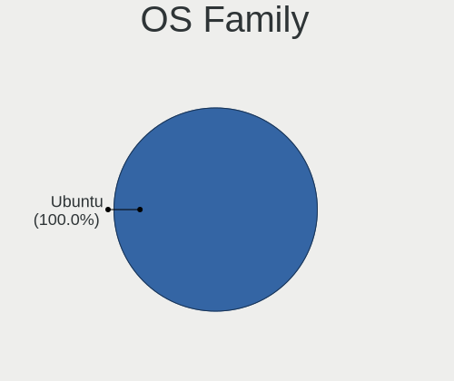
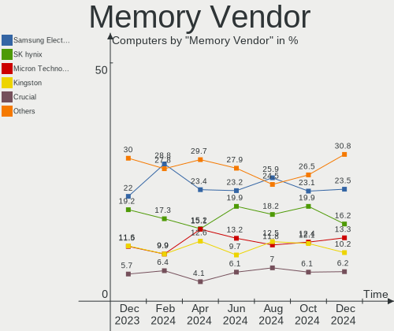

Ubuntu Hardware Trends
----------------------

A project to identify most popular hardware characteristics and track their change
over time based on data collected by Ubuntu users at https://Linux-Hardware.org.

Anyone can contribute to this report by the [hw-probe](https://github.com/linuxhw/hw-probe) tool:

    sudo -E hw-probe -all -upload

This is a report for all computer types. See also reports for [desktops](/Dist/Ubuntu/Desktop/README.md) and [notebooks](/Dist/Ubuntu/Notebook/README.md).

Full-feature report is available here: https://linux-hardware.org/?view=trends

Period: Nov, 2021.

Contents
--------

* [ System ](#system)
  - [ OS                       ](#os)
  - [ OS Family                ](#os-family)
  - [ Kernel                   ](#kernel)
  - [ Kernel Family            ](#kernel-family)
  - [ Kernel Major Ver.        ](#kernel-major-ver)
  - [ Arch                     ](#arch)
  - [ DE                       ](#de)
  - [ Display Server           ](#display-server)
  - [ Display Manager          ](#display-manager)
  - [ OS Lang                  ](#os-lang)
  - [ Boot Mode                ](#boot-mode)
  - [ Filesystem               ](#filesystem)
  - [ Part. scheme             ](#part-scheme)
  - [ Dual Boot with Linux/BSD ](#dual-boot-with-linuxbsd)
  - [ Dual Boot (Win)          ](#dual-boot-win)

* [ Board ](#board)
  - [ Vendor                   ](#vendor)
  - [ Model                    ](#model)
  - [ Model Family             ](#model-family)
  - [ MFG Year                 ](#mfg-year)
  - [ Form Factor              ](#form-factor)
  - [ Secure Boot              ](#secure-boot)
  - [ Coreboot                 ](#coreboot)
  - [ RAM Size                 ](#ram-size)
  - [ RAM Used                 ](#ram-used)
  - [ Total Drives             ](#total-drives)
  - [ Has CD-ROM               ](#has-cd-rom)
  - [ Has Ethernet             ](#has-ethernet)
  - [ Has WiFi                 ](#has-wifi)
  - [ Has Bluetooth            ](#has-bluetooth)

* [ Location ](#location)
  - [ Country                  ](#country)
  - [ City                     ](#city)

* [ Drives ](#drives)
  - [ Drive Vendor             ](#drive-vendor)
  - [ Drive Model              ](#drive-model)
  - [ HDD Vendor               ](#hdd-vendor)
  - [ SSD Vendor               ](#ssd-vendor)
  - [ Drive Kind               ](#drive-kind)
  - [ Drive Connector          ](#drive-connector)
  - [ Drive Size               ](#drive-size)
  - [ Space Total              ](#space-total)
  - [ Space Used               ](#space-used)
  - [ Malfunc. Drives          ](#malfunc-drives)
  - [ Malfunc. Drive Vendor    ](#malfunc-drive-vendor)
  - [ Malfunc. HDD Vendor      ](#malfunc-hdd-vendor)
  - [ Malfunc. Drive Kind      ](#malfunc-drive-kind)
  - [ Failed Drives            ](#failed-drives)
  - [ Failed Drive Vendor      ](#failed-drive-vendor)
  - [ Drive Status             ](#drive-status)

* [ Storage controller ](#storage-controller)
  - [ Storage Vendor           ](#storage-vendor)
  - [ Storage Model            ](#storage-model)
  - [ Storage Kind             ](#storage-kind)

* [ Processor ](#processor)
  - [ CPU Vendor               ](#cpu-vendor)
  - [ CPU Model                ](#cpu-model)
  - [ CPU Model Family         ](#cpu-model-family)
  - [ CPU Cores                ](#cpu-cores)
  - [ CPU Sockets              ](#cpu-sockets)
  - [ CPU Threads              ](#cpu-threads)
  - [ CPU Op-Modes             ](#cpu-op-modes)
  - [ CPU Microcode            ](#cpu-microcode)
  - [ CPU Microarch            ](#cpu-microarch)

* [ Graphics ](#graphics)
  - [ GPU Vendor               ](#gpu-vendor)
  - [ GPU Model                ](#gpu-model)
  - [ GPU Combo                ](#gpu-combo)
  - [ GPU Driver               ](#gpu-driver)
  - [ GPU Memory               ](#gpu-memory)

* [ Monitor ](#monitor)
  - [ Monitor Vendor           ](#monitor-vendor)
  - [ Monitor Model            ](#monitor-model)
  - [ Monitor Resolution       ](#monitor-resolution)
  - [ Monitor Diagonal         ](#monitor-diagonal)
  - [ Monitor Width            ](#monitor-width)
  - [ Aspect Ratio             ](#aspect-ratio)
  - [ Monitor Area             ](#monitor-area)
  - [ Pixel Density            ](#pixel-density)
  - [ Multiple Monitors        ](#multiple-monitors)

* [ Network ](#network)
  - [ Net Controller Vendor    ](#net-controller-vendor)
  - [ Net Controller Model     ](#net-controller-model)
  - [ Wireless Vendor          ](#wireless-vendor)
  - [ Wireless Model           ](#wireless-model)
  - [ Ethernet Vendor          ](#ethernet-vendor)
  - [ Ethernet Model           ](#ethernet-model)
  - [ Net Controller Kind      ](#net-controller-kind)
  - [ Used Controller          ](#used-controller)
  - [ NICs                     ](#nics)
  - [ IPv6                     ](#ipv6)

* [ Bluetooth ](#bluetooth)
  - [ Bluetooth Vendor         ](#bluetooth-vendor)
  - [ Bluetooth Model          ](#bluetooth-model)

* [ Sound ](#sound)
  - [ Sound Vendor             ](#sound-vendor)
  - [ Sound Model              ](#sound-model)

* [ Memory ](#memory)
  - [ Memory Vendor            ](#memory-vendor)
  - [ Memory Model             ](#memory-model)
  - [ Memory Kind              ](#memory-kind)
  - [ Memory Form Factor       ](#memory-form-factor)
  - [ Memory Size              ](#memory-size)
  - [ Memory Speed             ](#memory-speed)

* [ Printers & scanners ](#printers--scanners)
  - [ Printer Vendor           ](#printer-vendor)
  - [ Printer Model            ](#printer-model)
  - [ Scanner Vendor           ](#scanner-vendor)
  - [ Scanner Model            ](#scanner-model)

* [ Camera ](#camera)
  - [ Camera Vendor            ](#camera-vendor)
  - [ Camera Model             ](#camera-model)

* [ Security ](#security)
  - [ Fingerprint Vendor       ](#fingerprint-vendor)
  - [ Fingerprint Model        ](#fingerprint-model)
  - [ Chipcard Vendor          ](#chipcard-vendor)
  - [ Chipcard Model           ](#chipcard-model)

* [ Unsupported ](#unsupported)
  - [ Unsupported Devices      ](#unsupported-devices)
  - [ Unsupported Device Types ](#unsupported-device-types)

System
------

OS
--

Installed operating systems

| Name           | Computers | Percent |
|----------------|-----------|---------|
| Ubuntu 20.04   | 922       | 60.78%  |
| Ubuntu 21.10   | 407       | 26.83%  |
| Ubuntu 21.04   | 76        | 5.01%   |
| Ubuntu 18.04   | 74        | 4.88%   |
| Ubuntu 16.04   | 12        | 0.79%   |
| Ubuntu 20.10   | 11        | 0.73%   |
| Ubuntu 22.04   | 9         | 0.59%   |
| Ubuntu Core 18 | 2         | 0.13%   |
| Ubuntu 6       | 1         | 0.07%   |
| Ubuntu 19.10   | 1         | 0.07%   |
| Ubuntu 19.04   | 1         | 0.07%   |
| Ubuntu 12.02   | 1         | 0.07%   |

OS Family
---------

OS without a version

| Name   | Computers | Percent |
|--------|-----------|---------|
| Ubuntu | 1517      | 100%    |

Kernel
------

Version of the Linux kernel

| Version                  | Computers | Percent |
|--------------------------|-----------|---------|
| 5.11.0-40-generic        | 454       | 29.93%  |
| 5.11.0-38-generic        | 244       | 16.08%  |
| 5.13.0-21-generic        | 236       | 15.56%  |
| 5.4.0-90-generic         | 103       | 6.79%   |
| 5.13.0-20-generic        | 77        | 5.08%   |
| 5.11.0-27-generic        | 46        | 3.03%   |
| 5.4.0-89-generic         | 36        | 2.37%   |
| 5.13.0-19-generic        | 34        | 2.24%   |
| 5.13.0-22-generic        | 23        | 1.52%   |
| 5.11.0-41-generic        | 22        | 1.45%   |
| 5.11.0-37-generic        | 18        | 1.19%   |
| 4.15.0-162-generic       | 13        | 0.86%   |
| 5.4.0-42-generic         | 8         | 0.53%   |
| 5.15.2-051502-generic    | 8         | 0.53%   |
| 4.15.0-161-generic       | 8         | 0.53%   |
| 5.8.0-63-generic         | 7         | 0.46%   |
| 5.8.0-43-generic         | 7         | 0.46%   |
| 5.4.0-91-generic         | 7         | 0.46%   |
| 5.13.0-1010-raspi        | 7         | 0.46%   |
| 5.10.0-1051-oem          | 7         | 0.46%   |
| 4.15.0-142-generic       | 6         | 0.4%    |
| 5.13.0-1009-raspi        | 5         | 0.33%   |
| 5.8.0-55-generic         | 4         | 0.26%   |
| 5.4.0-88-generic         | 4         | 0.26%   |
| 5.15.4-051504-generic    | 4         | 0.26%   |
| 5.15.1-051501-generic    | 4         | 0.26%   |
| 5.11.0-36-generic        | 4         | 0.26%   |
| 4.4.0-210-generic        | 4         | 0.26%   |
| 5.4.0-90-lowlatency      | 3         | 0.2%    |
| 5.4.0-73-generic         | 3         | 0.2%    |
| 5.4.0-26-generic         | 3         | 0.2%    |
| 5.4.0-1046-raspi         | 3         | 0.2%    |
| 5.13.0-1019-oem          | 3         | 0.2%    |
| 5.10.0-1050-oem          | 3         | 0.2%    |
| 5.8.0-50-generic         | 2         | 0.13%   |
| 5.8.0-38-generic         | 2         | 0.13%   |
| 5.8.0-25-generic         | 2         | 0.13%   |
| 5.4.0-86-generic         | 2         | 0.13%   |
| 5.4.0-84-generic         | 2         | 0.13%   |
| 5.4.0-52-generic         | 2         | 0.13%   |
| 5.16.0-051600rc2-generic | 2         | 0.13%   |
| 5.15.0-051500-generic    | 2         | 0.13%   |
| 5.14.16-surface          | 2         | 0.13%   |
| 5.14.15-051415-generic   | 2         | 0.13%   |
| 5.13.0-1008-raspi        | 2         | 0.13%   |
| 5.11.0-34-generic        | 2         | 0.13%   |
| 5.11.0-25-generic        | 2         | 0.13%   |
| 5.11.0-22-generic        | 2         | 0.13%   |
| 5.11.0-18-generic        | 2         | 0.13%   |
| 5.11.0-16-generic        | 2         | 0.13%   |
| 5.11.0-1021-raspi        | 2         | 0.13%   |
| 5.9.1-050901-generic     | 1         | 0.07%   |
| 5.8.0-63-lowlatency      | 1         | 0.07%   |
| 5.8.0-59-generic         | 1         | 0.07%   |
| 5.8.0-53-generic         | 1         | 0.07%   |
| 5.8.0-48-generic         | 1         | 0.07%   |
| 5.8.0-45-generic         | 1         | 0.07%   |
| 5.8.0-41-generic         | 1         | 0.07%   |
| 5.7.1-050701-generic     | 1         | 0.07%   |
| 5.6.0-1042-oem           | 1         | 0.07%   |

Kernel Family
-------------

Linux kernel without a distro release

| Version | Computers | Percent |
|---------|-----------|---------|
| 5.11.0  | 801       | 52.8%   |
| 5.13.0  | 390       | 25.71%  |
| 5.4.0   | 185       | 12.2%   |
| 4.15.0  | 34        | 2.24%   |
| 5.8.0   | 30        | 1.98%   |
| 5.10.0  | 12        | 0.79%   |
| 5.15.2  | 8         | 0.53%   |
| 5.15.0  | 6         | 0.4%    |
| 4.4.0   | 5         | 0.33%   |
| 5.15.4  | 4         | 0.26%   |
| 5.15.1  | 4         | 0.26%   |
| 5.3.0   | 3         | 0.2%    |
| 5.16.0  | 3         | 0.2%    |
| 5.14.17 | 2         | 0.13%   |
| 5.14.16 | 2         | 0.13%   |
| 5.14.15 | 2         | 0.13%   |
| 5.9.1   | 1         | 0.07%   |
| 5.7.1   | 1         | 0.07%   |
| 5.6.0   | 1         | 0.07%   |
| 5.5.7   | 1         | 0.07%   |
| 5.4.117 | 1         | 0.07%   |
| 5.15.5  | 1         | 0.07%   |
| 5.14.6  | 1         | 0.07%   |
| 5.14.14 | 1         | 0.07%   |
| 5.14.13 | 1         | 0.07%   |
| 5.14.11 | 1         | 0.07%   |
| 5.14.10 | 1         | 0.07%   |
| 5.14.0  | 1         | 0.07%   |
| 5.13.2  | 1         | 0.07%   |
| 5.13.18 | 1         | 0.07%   |
| 5.13.14 | 1         | 0.07%   |
| 5.12.5  | 1         | 0.07%   |
| 5.11.15 | 1         | 0.07%   |
| 5.11.10 | 1         | 0.07%   |
| 5.10.77 | 1         | 0.07%   |
| 5.10.67 | 1         | 0.07%   |
| 5.10.65 | 1         | 0.07%   |
| 5.10.61 | 1         | 0.07%   |
| 5.0.0   | 1         | 0.07%   |
| 4.9.241 | 1         | 0.07%   |
| 4.9.0   | 1         | 0.07%   |
| 4.16.18 | 1         | 0.07%   |

Kernel Major Ver.
-----------------

Linux kernel major version

| Version | Computers | Percent |
|---------|-----------|---------|
| 5.11    | 803       | 52.93%  |
| 5.13    | 393       | 25.91%  |
| 5.4     | 186       | 12.26%  |
| 4.15    | 34        | 2.24%   |
| 5.8     | 30        | 1.98%   |
| 5.15    | 23        | 1.52%   |
| 5.10    | 16        | 1.05%   |
| 5.14    | 12        | 0.79%   |
| 4.4     | 5         | 0.33%   |
| 5.3     | 3         | 0.2%    |
| 5.16    | 3         | 0.2%    |
| 4.9     | 2         | 0.13%   |
| 5.9     | 1         | 0.07%   |
| 5.7     | 1         | 0.07%   |
| 5.6     | 1         | 0.07%   |
| 5.5     | 1         | 0.07%   |
| 5.12    | 1         | 0.07%   |
| 5.0     | 1         | 0.07%   |
| 4.16    | 1         | 0.07%   |

Arch
----

OS architecture (x86_64, i586, etc.)

| Name    | Computers | Percent |
|---------|-----------|---------|
| x86_64  | 1484      | 97.82%  |
| aarch64 | 19        | 1.25%   |
| i686    | 12        | 0.79%   |
| armv7l  | 2         | 0.13%   |

DE
--

Desktop Environment

| Name            | Computers | Percent |
|-----------------|-----------|---------|
| GNOME           | 1344      | 88.6%   |
| Unknown         | 121       | 7.98%   |
| Unity           | 19        | 1.25%   |
| X-Cinnamon      | 10        | 0.66%   |
| GNOME Flashback | 9         | 0.59%   |
| i3              | 4         | 0.26%   |
| Cinnamon        | 4         | 0.26%   |
| sway            | 1         | 0.07%   |
| Pantheon        | 1         | 0.07%   |
| ICEWM           | 1         | 0.07%   |
| GNOME Classic   | 1         | 0.07%   |
| Enlightenment   | 1         | 0.07%   |
| awesome         | 1         | 0.07%   |

Display Server
--------------

X11 or Wayland

| Name    | Computers | Percent |
|---------|-----------|---------|
| X11     | 1059      | 69.81%  |
| Wayland | 369       | 24.32%  |
| Unknown | 68        | 4.48%   |
| Tty     | 21        | 1.38%   |

Display Manager
---------------

SDDM, LightDM, etc.

| Name    | Computers | Percent |
|---------|-----------|---------|
| GDM3    | 960       | 63.28%  |
| GDM     | 419       | 27.62%  |
| Unknown | 78        | 5.14%   |
| LightDM | 52        | 3.43%   |
| SDDM    | 8         | 0.53%   |

OS Lang
-------

Language

| Lang    | Computers | Percent |
|---------|-----------|---------|
| en_US   | 621       | 40.94%  |
| de_DE   | 175       | 11.54%  |
| fr_FR   | 115       | 7.58%   |
| en_GB   | 73        | 4.81%   |
| it_IT   | 46        | 3.03%   |
| pt_BR   | 43        | 2.83%   |
| en_CA   | 43        | 2.83%   |
| en_IN   | 42        | 2.77%   |
| ru_RU   | 41        | 2.7%    |
| en_AU   | 29        | 1.91%   |
| es_ES   | 27        | 1.78%   |
| C       | 22        | 1.45%   |
| nl_NL   | 21        | 1.38%   |
| pl_PL   | 19        | 1.25%   |
| Unknown | 15        | 0.99%   |
| en_ZA   | 13        | 0.86%   |
| cs_CZ   | 12        | 0.79%   |
| zh_CN   | 11        | 0.73%   |
| hu_HU   | 11        | 0.73%   |
| tr_TR   | 8         | 0.53%   |
| de_AT   | 8         | 0.53%   |
| pt_PT   | 7         | 0.46%   |
| ja_JP   | 7         | 0.46%   |
| fr_CA   | 7         | 0.46%   |
| es_MX   | 7         | 0.46%   |
| es_AR   | 6         | 0.4%    |
| de_CH   | 6         | 0.4%    |
| sv_SE   | 5         | 0.33%   |
| nb_NO   | 5         | 0.33%   |
| en_IL   | 5         | 0.33%   |
| fi_FI   | 4         | 0.26%   |
| zh_TW   | 3         | 0.2%    |
| sk_SK   | 3         | 0.2%    |
| fr_BE   | 3         | 0.2%    |
| es_PE   | 3         | 0.2%    |
| en_PH   | 3         | 0.2%    |
| el_GR   | 3         | 0.2%    |
| bg_BG   | 3         | 0.2%    |
| uk_UA   | 2         | 0.13%   |
| sl_SI   | 2         | 0.13%   |
| ru_UA   | 2         | 0.13%   |
| ro_RO   | 2         | 0.13%   |
| nl_BE   | 2         | 0.13%   |
| lt_LT   | 2         | 0.13%   |
| hr_HR   | 2         | 0.13%   |
| es_DO   | 2         | 0.13%   |
| es_CO   | 2         | 0.13%   |
| es_CL   | 2         | 0.13%   |
| en_NZ   | 2         | 0.13%   |
| en_IE   | 2         | 0.13%   |
| en_HK   | 2         | 0.13%   |
| th_TH   | 1         | 0.07%   |
| my_MM   | 1         | 0.07%   |
| ko_KR   | 1         | 0.07%   |
| et_EE   | 1         | 0.07%   |
| es_VE   | 1         | 0.07%   |
| es_US   | 1         | 0.07%   |
| es_BO   | 1         | 0.07%   |
| en_ZW   | 1         | 0.07%   |
| en_SG   | 1         | 0.07%   |

Boot Mode
---------

EFI or BIOS

| Mode | Computers | Percent |
|------|-----------|---------|
| BIOS | 804       | 53%     |
| EFI  | 713       | 47%     |

Filesystem
----------

Type of filesystem

| Type    | Computers | Percent |
|---------|-----------|---------|
| Ext4    | 1425      | 93.94%  |
| Overlay | 45        | 2.97%   |
| Zfs     | 20        | 1.32%   |
| Btrfs   | 18        | 1.19%   |
| Ext3    | 4         | 0.26%   |
| Ext2    | 3         | 0.2%    |
| Xfs     | 2         | 0.13%   |

Part. scheme
------------

Scheme of partitioning

| Type    | Computers | Percent |
|---------|-----------|---------|
| Unknown | 1049      | 69.15%  |
| GPT     | 383       | 25.25%  |
| MBR     | 85        | 5.6%    |

Dual Boot with Linux/BSD
------------------------

Hosting more than one Linux/BSD

| Dual boot | Computers | Percent |
|-----------|-----------|---------|
| No        | 1316      | 86.75%  |
| Yes       | 201       | 13.25%  |

Dual Boot (Win)
---------------

Hosting Linux and Windows

| Dual boot | Computers | Percent |
|-----------|-----------|---------|
| No        | 935       | 61.63%  |
| Yes       | 582       | 38.37%  |

Board
-----

Vendor
------

Motherboard manufacturer

| Name                    | Computers | Percent |
|-------------------------|-----------|---------|
| Dell                    | 238       | 15.69%  |
| Hewlett-Packard         | 233       | 15.36%  |
| ASUSTek Computer        | 223       | 14.7%   |
| Lenovo                  | 207       | 13.65%  |
| Gigabyte Technology     | 102       | 6.72%   |
| MSI                     | 76        | 5.01%   |
| Acer                    | 74        | 4.88%   |
| ASRock                  | 48        | 3.16%   |
| Apple                   | 32        | 2.11%   |
| Toshiba                 | 23        | 1.52%   |
| Intel                   | 20        | 1.32%   |
| Raspberry Pi Foundation | 19        | 1.25%   |
| Medion                  | 17        | 1.12%   |
| Samsung Electronics     | 14        | 0.92%   |
| Unknown                 | 13        | 0.86%   |
| Packard Bell            | 12        | 0.79%   |
| Fujitsu                 | 12        | 0.79%   |
| Timi                    | 11        | 0.73%   |
| Pegatron                | 11        | 0.73%   |
| HUAWEI                  | 10        | 0.66%   |
| Supermicro              | 9         | 0.59%   |
| Notebook                | 9         | 0.59%   |
| Sony                    | 8         | 0.53%   |
| Microsoft               | 5         | 0.33%   |
| Huanan                  | 5         | 0.33%   |
| Google                  | 4         | 0.26%   |
| Fujitsu Siemens         | 4         | 0.26%   |
| ECS                     | 4         | 0.26%   |
| LG Electronics          | 3         | 0.2%    |
| EVGA                    | 3         | 0.2%    |
| Biostar                 | 3         | 0.2%    |
| AMI                     | 3         | 0.2%    |
| Alienware               | 3         | 0.2%    |
| TrekStor                | 2         | 0.13%   |
| System76                | 2         | 0.13%   |
| Shuttle                 | 2         | 0.13%   |
| Razer                   | 2         | 0.13%   |
| Positivo                | 2         | 0.13%   |
| PC Specialist           | 2         | 0.13%   |
| Panasonic               | 2         | 0.13%   |
| MouseComputer           | 2         | 0.13%   |
| Jumper                  | 2         | 0.13%   |
| IBM                     | 2         | 0.13%   |
| GPU Company             | 2         | 0.13%   |
| ZOTAC                   | 1         | 0.07%   |
| win element             | 1         | 0.07%   |
| TUXEDO                  | 1         | 0.07%   |
| SLIMBOOK                | 1         | 0.07%   |
| SIEMENS                 | 1         | 0.07%   |
| Semp Toshiba            | 1         | 0.07%   |
| Seeed Studio            | 1         | 0.07%   |
| OEM                     | 1         | 0.07%   |
| MOTILE                  | 1         | 0.07%   |
| Minix                   | 1         | 0.07%   |
| Mediacom                | 1         | 0.07%   |
| Maibenben               | 1         | 0.07%   |
| LattePanda              | 1         | 0.07%   |
| Khadas                  | 1         | 0.07%   |
| JGINYUE                 | 1         | 0.07%   |
| Jemper                  | 1         | 0.07%   |

Model
-----

Motherboard model

| Name                                 | Computers | Percent |
|--------------------------------------|-----------|---------|
| RPi Raspberry Pi                     | 19        | 1.25%   |
| Unknown                              | 18        | 1.19%   |
| ASUS All Series                      | 13        | 0.86%   |
| HP Notebook                          | 6         | 0.4%    |
| Dell OptiPlex 7010                   | 6         | 0.4%    |
| Dell Latitude 5520                   | 6         | 0.4%    |
| HP Pavilion Notebook                 | 5         | 0.33%   |
| HP 15                                | 5         | 0.33%   |
| Dell XPS 15 9500                     | 5         | 0.33%   |
| MSI MS-7D25                          | 4         | 0.26%   |
| HP Pavilion Laptop 15-eg0xxx         | 4         | 0.26%   |
| HP Pavilion g6                       | 4         | 0.26%   |
| HP Pavilion dv6                      | 4         | 0.26%   |
| HP Laptop 14-fq1xxx                  | 4         | 0.26%   |
| Dell XPS 15 9510                     | 4         | 0.26%   |
| Dell XPS 13 9310                     | 4         | 0.26%   |
| Dell Inspiron 5570                   | 4         | 0.26%   |
| Dell Inspiron 15-3567                | 4         | 0.26%   |
| ASRock A320M-HDV R4.0                | 4         | 0.26%   |
| Acer Swift SF314-42                  | 4         | 0.26%   |
| Timi RedmiBook 16                    | 3         | 0.2%    |
| MSI MS-7A38                          | 3         | 0.2%    |
| MSI MS-7641                          | 3         | 0.2%    |
| Lenovo IdeaPad 3 14ITL6 82H7         | 3         | 0.2%    |
| HP Z800 Workstation                  | 3         | 0.2%    |
| HP Pavilion Aero Laptop 13-be0xxx    | 3         | 0.2%    |
| HP ENVY x360 Convertible 15-eu0xxx   | 3         | 0.2%    |
| HP EliteBook 850 G8 Notebook PC      | 3         | 0.2%    |
| HP EliteBook 8460p                   | 3         | 0.2%    |
| Gigabyte X570 AORUS ELITE            | 3         | 0.2%    |
| Gigabyte B450M DS3H                  | 3         | 0.2%    |
| Dell XPS 15 9570                     | 3         | 0.2%    |
| Dell Vostro 3500                     | 3         | 0.2%    |
| Dell OptiPlex 9020                   | 3         | 0.2%    |
| Dell OptiPlex 390                    | 3         | 0.2%    |
| Dell Latitude E7240                  | 3         | 0.2%    |
| Dell Latitude E6410                  | 3         | 0.2%    |
| Dell Latitude 7420                   | 3         | 0.2%    |
| Dell Inspiron 1545                   | 3         | 0.2%    |
| ASUS ROG STRIX B450-F GAMING         | 3         | 0.2%    |
| ASUS PRIME A320M-K                   | 3         | 0.2%    |
| ASUS P8Z77-V LX                      | 3         | 0.2%    |
| ASUS M5A78L-M PLUS/USB3              | 3         | 0.2%    |
| ASUS CROSSHAIR VI HERO               | 3         | 0.2%    |
| ASRock X570 Pro4                     | 3         | 0.2%    |
| Apple iMac10,1                       | 3         | 0.2%    |
| Toshiba Satellite L50-B              | 2         | 0.13%   |
| Timi TM1701                          | 2         | 0.13%   |
| Timi A35S                            | 2         | 0.13%   |
| System76 Gazelle                     | 2         | 0.13%   |
| Supermicro X9DRi-LN4+/X9DR3-LN4+     | 2         | 0.13%   |
| Supermicro Super Server              | 2         | 0.13%   |
| MSI MS-7C02                          | 2         | 0.13%   |
| MSI MS-7B98                          | 2         | 0.13%   |
| MSI MS-7B54                          | 2         | 0.13%   |
| MSI MS-7821                          | 2         | 0.13%   |
| MSI MS-7721                          | 2         | 0.13%   |
| Microsoft Surface Pro 4              | 2         | 0.13%   |
| Lenovo Z50-70 20354                  | 2         | 0.13%   |
| Lenovo ThinkPad E15 Gen 2 20TD0005GE | 2         | 0.13%   |

Model Family
------------

Motherboard model prefix

| Name                    | Computers | Percent |
|-------------------------|-----------|---------|
| Lenovo ThinkPad         | 85        | 5.6%    |
| Dell Latitude           | 61        | 4.02%   |
| Dell Inspiron           | 60        | 3.96%   |
| Acer Aspire             | 49        | 3.23%   |
| Lenovo IdeaPad          | 43        | 2.83%   |
| HP Pavilion             | 43        | 2.83%   |
| HP ProBook              | 35        | 2.31%   |
| Dell XPS                | 35        | 2.31%   |
| Dell OptiPlex           | 33        | 2.18%   |
| HP EliteBook            | 32        | 2.11%   |
| ASUS PRIME              | 25        | 1.65%   |
| HP Laptop               | 23        | 1.52%   |
| Toshiba Satellite       | 20        | 1.32%   |
| HP Compaq               | 20        | 1.32%   |
| Dell Precision          | 20        | 1.32%   |
| ASUS ROG                | 20        | 1.32%   |
| RPi Raspberry           | 19        | 1.25%   |
| Unknown                 | 18        | 1.19%   |
| ASUS TUF                | 16        | 1.05%   |
| ASUS All                | 13        | 0.86%   |
| Dell Vostro             | 12        | 0.79%   |
| ASUS VivoBook           | 12        | 0.79%   |
| Acer Swift              | 12        | 0.79%   |
| HP ENVY                 | 11        | 0.73%   |
| Lenovo ThinkCentre      | 10        | 0.66%   |
| Lenovo Legion           | 10        | 0.66%   |
| Packard Bell EasyNote   | 9         | 0.59%   |
| ASUS M5A78L-M           | 9         | 0.59%   |
| Lenovo ThinkBook        | 8         | 0.53%   |
| Gigabyte X570           | 8         | 0.53%   |
| ASUS P8Z77-V            | 7         | 0.46%   |
| HP ZBook                | 6         | 0.4%    |
| HP Notebook             | 6         | 0.4%    |
| HP EliteDesk            | 6         | 0.4%    |
| Fujitsu LIFEBOOK        | 6         | 0.4%    |
| Microsoft Surface       | 5         | 0.33%   |
| Lenovo Yoga             | 5         | 0.33%   |
| HP ProLiant             | 5         | 0.33%   |
| HP 15                   | 5         | 0.33%   |
| Gigabyte B450M          | 5         | 0.33%   |
| Timi RedmiBook          | 4         | 0.26%   |
| MSI MS-7D25             | 4         | 0.26%   |
| Medion Akoya            | 4         | 0.26%   |
| HP Stream               | 4         | 0.26%   |
| HP Spectre              | 4         | 0.26%   |
| Fujitsu ESPRIMO         | 4         | 0.26%   |
| Dell PowerEdge          | 4         | 0.26%   |
| ASUS P8P67              | 4         | 0.26%   |
| ASUS P8H61-M            | 4         | 0.26%   |
| ASRock A320M-HDV        | 4         | 0.26%   |
| Apple iMac12            | 4         | 0.26%   |
| Acer Nitro              | 4         | 0.26%   |
| MSI MS-7A38             | 3         | 0.2%    |
| MSI MS-7641             | 3         | 0.2%    |
| Lenovo IdeaPadFlex      | 3         | 0.2%    |
| Lenovo IdeaCentre       | 3         | 0.2%    |
| HP Z800                 | 3         | 0.2%    |
| Gigabyte GA-78LMT-USB3  | 3         | 0.2%    |
| Gigabyte B450           | 3         | 0.2%    |
| Fujitsu Siemens ESPRIMO | 3         | 0.2%    |

MFG Year
--------

Motherboard manufacture year

| Year    | Computers | Percent |
|---------|-----------|---------|
| 2021    | 346       | 22.81%  |
| 2020    | 173       | 11.4%   |
| 2019    | 136       | 8.97%   |
| 2018    | 97        | 6.39%   |
| 2013    | 95        | 6.26%   |
| 2014    | 89        | 5.87%   |
| 2012    | 85        | 5.6%    |
| 2015    | 82        | 5.41%   |
| 2011    | 76        | 5.01%   |
| 2010    | 74        | 4.88%   |
| 2016    | 66        | 4.35%   |
| 2009    | 62        | 4.09%   |
| 2017    | 59        | 3.89%   |
| 2008    | 35        | 2.31%   |
| Unknown | 22        | 1.45%   |
| 2007    | 11        | 0.73%   |
| 2006    | 5         | 0.33%   |
| 2005    | 4         | 0.26%   |

Form Factor
-----------

Physical design of the computer

| Name           | Computers | Percent |
|----------------|-----------|---------|
| Notebook       | 816       | 53.79%  |
| Desktop        | 575       | 37.9%   |
| Convertible    | 35        | 2.31%   |
| All in one     | 23        | 1.52%   |
| System on chip | 21        | 1.38%   |
| Server         | 18        | 1.19%   |
| Tablet         | 17        | 1.12%   |
| Mini pc        | 11        | 0.73%   |
| Other          | 1         | 0.07%   |

Secure Boot
-----------

Enabled or disabled

| State    | Computers | Percent |
|----------|-----------|---------|
| Disabled | 1339      | 88.27%  |
| Enabled  | 178       | 11.73%  |

Coreboot
--------

Have coreboot on board

| Used | Computers | Percent |
|------|-----------|---------|
| No   | 1511      | 99.6%   |
| Yes  | 6         | 0.4%    |

RAM Size
--------

Total RAM memory

| Size in GB      | Computers | Percent |
|-----------------|-----------|---------|
| 4.01-8.0        | 362       | 23.86%  |
| 16.01-24.0      | 325       | 21.42%  |
| 3.01-4.0        | 287       | 18.92%  |
| 8.01-16.0       | 256       | 16.88%  |
| 32.01-64.0      | 148       | 9.76%   |
| 64.01-256.0     | 55        | 3.63%   |
| 1.01-2.0        | 42        | 2.77%   |
| 24.01-32.0      | 21        | 1.38%   |
| 2.01-3.0        | 15        | 0.99%   |
| 0.51-1.0        | 4         | 0.26%   |
| More than 256.0 | 2         | 0.13%   |

RAM Used
--------

Used RAM memory

| Used GB     | Computers | Percent |
|-------------|-----------|---------|
| 1.01-2.0    | 615       | 40.54%  |
| 2.01-3.0    | 425       | 28.02%  |
| 4.01-8.0    | 188       | 12.39%  |
| 3.01-4.0    | 175       | 11.54%  |
| 8.01-16.0   | 58        | 3.82%   |
| 0.51-1.0    | 37        | 2.44%   |
| 16.01-24.0  | 9         | 0.59%   |
| 0.01-0.5    | 5         | 0.33%   |
| 32.01-64.0  | 3         | 0.2%    |
| 24.01-32.0  | 1         | 0.07%   |
| 64.01-256.0 | 1         | 0.07%   |

Total Drives
------------

Number of drives on board

| Drives | Computers | Percent |
|--------|-----------|---------|
| 1      | 949       | 62.56%  |
| 2      | 355       | 23.4%   |
| 3      | 106       | 6.99%   |
| 4      | 47        | 3.1%    |
| 5      | 19        | 1.25%   |
| 0      | 17        | 1.12%   |
| 6      | 10        | 0.66%   |
| 11     | 3         | 0.2%    |
| 7      | 3         | 0.2%    |
| 10     | 2         | 0.13%   |
| 8      | 2         | 0.13%   |
| 87     | 1         | 0.07%   |
| 13     | 1         | 0.07%   |
| 12     | 1         | 0.07%   |
| 9      | 1         | 0.07%   |

Has CD-ROM
----------

Has CD-ROM on board

| Presented | Computers | Percent |
|-----------|-----------|---------|
| No        | 879       | 57.94%  |
| Yes       | 638       | 42.06%  |

Has Ethernet
------------

Has Ethernet on board

| Presented | Computers | Percent |
|-----------|-----------|---------|
| Yes       | 1283      | 84.57%  |
| No        | 234       | 15.43%  |

Has WiFi
--------

Has WiFi module

| Presented | Computers | Percent |
|-----------|-----------|---------|
| Yes       | 1138      | 75.02%  |
| No        | 379       | 24.98%  |

Has Bluetooth
-------------

Has Bluetooth module

| Presented | Computers | Percent |
|-----------|-----------|---------|
| Yes       | 867       | 57.15%  |
| No        | 650       | 42.85%  |

Location
--------

Country
-------

Geographic location (country)

| Country      | Computers | Percent |
|--------------|-----------|---------|
| USA          | 275       | 18.13%  |
| Germany      | 213       | 14.04%  |
| France       | 139       | 9.16%   |
| Italy        | 64        | 4.22%   |
| Russia       | 60        | 3.96%   |
| UK           | 56        | 3.69%   |
| Canada       | 49        | 3.23%   |
| Brazil       | 49        | 3.23%   |
| India        | 46        | 3.03%   |
| Netherlands  | 41        | 2.7%    |
| Australia    | 31        | 2.04%   |
| Spain        | 30        | 1.98%   |
| Poland       | 28        | 1.85%   |
| Ukraine      | 22        | 1.45%   |
| Czechia      | 20        | 1.32%   |
| Switzerland  | 19        | 1.25%   |
| Austria      | 16        | 1.05%   |
| South Africa | 15        | 0.99%   |
| Portugal     | 15        | 0.99%   |
| Belgium      | 15        | 0.99%   |
| Hungary      | 14        | 0.92%   |
| Turkey       | 12        | 0.79%   |
| Japan        | 12        | 0.79%   |
| Romania      | 11        | 0.73%   |
| Mexico       | 11        | 0.73%   |
| Greece       | 11        | 0.73%   |
| Finland      | 11        | 0.73%   |
| Sweden       | 10        | 0.66%   |
| Norway       | 10        | 0.66%   |
| China        | 10        | 0.66%   |
| Slovakia     | 9         | 0.59%   |
| Indonesia    | 9         | 0.59%   |
| Croatia      | 9         | 0.59%   |
| Argentina    | 9         | 0.59%   |
| Vietnam      | 7         | 0.46%   |
| Pakistan     | 7         | 0.46%   |
| Denmark      | 7         | 0.46%   |
| Peru         | 6         | 0.4%    |
| Israel       | 6         | 0.4%    |
| Saudi Arabia | 5         | 0.33%   |
| Colombia     | 5         | 0.33%   |
| Bulgaria     | 5         | 0.33%   |
| Bangladesh   | 5         | 0.33%   |
| UAE          | 4         | 0.26%   |
| Taiwan       | 4         | 0.26%   |
| Slovenia     | 4         | 0.26%   |
| Philippines  | 4         | 0.26%   |
| New Zealand  | 4         | 0.26%   |
| Morocco      | 4         | 0.26%   |
| Iran         | 4         | 0.26%   |
| Hong Kong    | 4         | 0.26%   |
| Chile        | 4         | 0.26%   |
| Uzbekistan   | 3         | 0.2%    |
| Tunisia      | 3         | 0.2%    |
| Thailand     | 3         | 0.2%    |
| South Korea  | 3         | 0.2%    |
| Singapore    | 3         | 0.2%    |
| Puerto Rico  | 3         | 0.2%    |
| Lithuania    | 3         | 0.2%    |
| Kenya        | 3         | 0.2%    |

City
----

Geographic location (city)

| City              | Computers | Percent |
|-------------------|-----------|---------|
| Berlin            | 31        | 2.04%   |
| Moscow            | 19        | 1.25%   |
| Paris             | 17        | 1.12%   |
| Sydney            | 11        | 0.73%   |
| Madrid            | 11        | 0.73%   |
| Amsterdam         | 11        | 0.73%   |
| Vienna            | 9         | 0.59%   |
| Prague            | 9         | 0.59%   |
| Athens            | 9         | 0.59%   |
| St Petersburg     | 8         | 0.53%   |
| Milan             | 8         | 0.53%   |
| Kyiv              | 8         | 0.53%   |
| Houston           | 8         | 0.53%   |
| Chennai           | 8         | 0.53%   |
| Brisbane          | 8         | 0.53%   |
| Bengaluru         | 8         | 0.53%   |
| Zagreb            | 7         | 0.46%   |
| Rome              | 7         | 0.46%   |
| Munich            | 7         | 0.46%   |
| Stuttgart         | 6         | 0.4%    |
| Marseille         | 6         | 0.4%    |
| Lyon              | 6         | 0.4%    |
| Lima              | 6         | 0.4%    |
| Hamburg           | 6         | 0.4%    |
| Cleveland         | 6         | 0.4%    |
| Cape Town         | 6         | 0.4%    |
| Bras?­lia         | 6         | 0.4%    |
| Warsaw            | 5         | 0.33%   |
| Turin             | 5         | 0.33%   |
| Oslo              | 5         | 0.33%   |
| Montreal          | 5         | 0.33%   |
| Johannesburg      | 5         | 0.33%   |
| Istanbul          | 5         | 0.33%   |
| Helsinki          | 5         | 0.33%   |
| Frankfurt am Main | 5         | 0.33%   |
| Denver            | 5         | 0.33%   |
| Vancouver         | 4         | 0.26%   |
| San Francisco     | 4         | 0.26%   |
| San Diego         | 4         | 0.26%   |
| Samara            | 4         | 0.26%   |
| Pittsburgh        | 4         | 0.26%   |
| Mumbai            | 4         | 0.26%   |
| Los Angeles       | 4         | 0.26%   |
| London            | 4         | 0.26%   |
| Lisbon            | 4         | 0.26%   |
| Dhaka             | 4         | 0.26%   |
| Buenos Aires      | 4         | 0.26%   |
| Bucharest         | 4         | 0.26%   |
| Bratislava        | 4         | 0.26%   |
| Barcelona         | 4         | 0.26%   |
| Zurich            | 3         | 0.2%    |
| Wroclaw           | 3         | 0.2%    |
| Washington        | 3         | 0.2%    |
| Tel Aviv          | 3         | 0.2%    |
| Tehran            | 3         | 0.2%    |
| Tashkent          | 3         | 0.2%    |
| Strasbourg        | 3         | 0.2%    |
| Springfield       | 3         | 0.2%    |
| Sofia             | 3         | 0.2%    |
| Singapore         | 3         | 0.2%    |

Drives
------

Drive Vendor
------------

Hard drive vendors

| Vendor                         | Computers | Drives | Percent |
|--------------------------------|-----------|--------|---------|
| Samsung Electronics            | 353       | 410    | 16.94%  |
| WDC                            | 344       | 421    | 16.51%  |
| Seagate                        | 328       | 464    | 15.74%  |
| Toshiba                        | 133       | 169    | 6.38%   |
| Kingston                       | 94        | 99     | 4.51%   |
| SanDisk                        | 91        | 95     | 4.37%   |
| Unknown                        | 80        | 93     | 3.84%   |
| Crucial                        | 72        | 80     | 3.45%   |
| Intel                          | 63        | 76     | 3.02%   |
| SK Hynix                       | 57        | 59     | 2.74%   |
| Hitachi                        | 52        | 64     | 2.5%    |
| Micron Technology              | 35        | 35     | 1.68%   |
| HGST                           | 34        | 43     | 1.63%   |
| A-DATA Technology              | 31        | 33     | 1.49%   |
| KIOXIA                         | 25        | 26     | 1.2%    |
| Phison                         | 17        | 19     | 0.82%   |
| LITEON                         | 13        | 13     | 0.62%   |
| PNY                            | 12        | 14     | 0.58%   |
| SPCC                           | 11        | 11     | 0.53%   |
| Intenso                        | 11        | 11     | 0.53%   |
| Silicon Motion                 | 10        | 10     | 0.48%   |
| Micron/Crucial Technology      | 10        | 11     | 0.48%   |
| Apple                          | 10        | 13     | 0.48%   |
| MAXTOR                         | 9         | 10     | 0.43%   |
| China                          | 9         | 9      | 0.43%   |
| JMicron                        | 8         | 8      | 0.38%   |
| Transcend                      | 7         | 7      | 0.34%   |
| Patriot                        | 7         | 8      | 0.34%   |
| Hewlett-Packard                | 7         | 8      | 0.34%   |
| SABRENT                        | 6         | 6      | 0.29%   |
| Fujitsu                        | 6         | 6      | 0.29%   |
| Corsair                        | 6         | 6      | 0.29%   |
| ASMT                           | 6         | 7      | 0.29%   |
| Unknown                        | 6         | 7      | 0.29%   |
| Realtek Semiconductor          | 5         | 5      | 0.24%   |
| OCZ                            | 5         | 5      | 0.24%   |
| PLEXTOR                        | 4         | 4      | 0.19%   |
| Netac                          | 4         | 4      | 0.19%   |
| LITEONIT                       | 4         | 4      | 0.19%   |
| KingSpec                       | 4         | 4      | 0.19%   |
| XPG                            | 3         | 3      | 0.14%   |
| Solid State Storage Technology | 3         | 4      | 0.14%   |
| LDLC                           | 3         | 3      | 0.14%   |
| KingFast                       | 3         | 4      | 0.14%   |
| GOODRAM                        | 3         | 3      | 0.14%   |
| YMTC                           | 2         | 2      | 0.1%    |
| Yangtze Memory Technologies    | 2         | 2      | 0.1%    |
| Verbatim                       | 2         | 2      | 0.1%    |
| Team                           | 2         | 2      | 0.1%    |
| SSSTC                          | 2         | 2      | 0.1%    |
| Phison Electronics             | 2         | 2      | 0.1%    |
| KIOXIA-EXCERIA                 | 2         | 2      | 0.1%    |
| Emtec                          | 2         | 2      | 0.1%    |
| BHT                            | 2         | 2      | 0.1%    |
| Apacer                         | 2         | 2      | 0.1%    |
| AMD                            | 2         | 2      | 0.1%    |
| XUM                            | 1         | 1      | 0.05%   |
| W800S                          | 1         | 1      | 0.05%   |
| USB3.0                         | 1         | 1      | 0.05%   |
| Union Memory (Shenzhen)        | 1         | 1      | 0.05%   |

Drive Model
-----------

Hard drive models

| Model                                  | Computers | Percent |
|----------------------------------------|-----------|---------|
| Samsung NVMe SSD Drive 512GB           | 28        | 1.23%   |
| Samsung NVMe SSD Drive 500GB           | 19        | 0.83%   |
| Unknown MMC Card  32GB                 | 18        | 0.79%   |
| Seagate ST1000LM024 HN-M101MBB 1TB     | 18        | 0.79%   |
| Kingston SA400S37240G 240GB SSD        | 18        | 0.79%   |
| Seagate ST2000DM008-2FR102 2TB         | 17        | 0.75%   |
| Seagate ST1000LM035-1RK172 1TB         | 17        | 0.75%   |
| Samsung SSD 860 EVO 500GB              | 16        | 0.7%    |
| Unknown MMC Card  64GB                 | 14        | 0.62%   |
| Seagate ST1000DM010-2EP102 1TB         | 14        | 0.62%   |
| Samsung SSD 850 EVO 500GB              | 13        | 0.57%   |
| Samsung SSD 850 EVO 250GB              | 13        | 0.57%   |
| WDC WDS500G2B0A-00SM50 500GB SSD       | 12        | 0.53%   |
| Seagate ST500DM002-1BD142 500GB        | 12        | 0.53%   |
| Samsung SSD 860 EVO 250GB              | 12        | 0.53%   |
| Crucial CT500MX500SSD1 500GB           | 12        | 0.53%   |
| Unknown SD/MMC/MS PRO 394GB            | 11        | 0.48%   |
| Toshiba MQ04ABF100 1TB                 | 11        | 0.48%   |
| Toshiba MQ01ABD100 1TB                 | 11        | 0.48%   |
| Sandisk NVMe SSD Drive 256GB           | 11        | 0.48%   |
| Samsung NVMe SSD Drive 256GB           | 11        | 0.48%   |
| Kingston SA400S37120G 120GB SSD        | 11        | 0.48%   |
| Crucial CT240BX500SSD1 240GB           | 11        | 0.48%   |
| WDC WD10EZEX-08WN4A0 1TB               | 10        | 0.44%   |
| Unknown MMC Card  128GB                | 10        | 0.44%   |
| Toshiba DT01ACA050 500GB               | 10        | 0.44%   |
| Sandisk NVMe SSD Drive 512GB           | 10        | 0.44%   |
| Kingston SV300S37A120G 120GB SSD       | 10        | 0.44%   |
| Intel NVMe SSD Drive 512GB             | 10        | 0.44%   |
| Toshiba DT01ACA100 1TB                 | 9         | 0.4%    |
| Seagate ST500LT012-1DG142 500GB        | 9         | 0.4%    |
| Seagate ST1000DM003-1CH162 1TB         | 9         | 0.4%    |
| WDC WDS240G2G0A-00JH30 240GB SSD       | 8         | 0.35%   |
| Seagate ST9500325AS 500GB              | 8         | 0.35%   |
| Seagate ST1000LM048-2E7172 1TB         | 8         | 0.35%   |
| Seagate ST1000DM003-1ER162 1TB         | 8         | 0.35%   |
| Samsung SM963 2.5" NVMe PCIe SSD 250GB | 8         | 0.35%   |
| Samsung NVMe SSD Drive 1TB             | 8         | 0.35%   |
| HGST HTS541010A9E680 1TB               | 8         | 0.35%   |
| Toshiba MQ01ABF050 500GB               | 7         | 0.31%   |
| SK Hynix NVMe SSD Drive 256GB          | 7         | 0.31%   |
| Seagate ST3500418AS 500GB              | 7         | 0.31%   |
| Seagate ST2000LM007-1R8174 2TB         | 7         | 0.31%   |
| Seagate ST2000DM006-2DM164 2TB         | 7         | 0.31%   |
| Samsung SSD 970 EVO Plus 1TB           | 7         | 0.31%   |
| Samsung SSD 970 EVO 500GB              | 7         | 0.31%   |
| Samsung SSD 870 QVO 1TB                | 7         | 0.31%   |
| Samsung SSD 860 EVO 1TB                | 7         | 0.31%   |
| Toshiba NVMe SSD Drive 512GB           | 6         | 0.26%   |
| SK Hynix NVMe SSD Drive 1024GB         | 6         | 0.26%   |
| Silicon Motion NVMe SSD Drive 512GB    | 6         | 0.26%   |
| Seagate Expansion 1TB                  | 6         | 0.26%   |
| Sandisk NVMe SSD Drive 1TB             | 6         | 0.26%   |
| Sandisk NVMe SSD Drive 1024GB          | 6         | 0.26%   |
| Micron NVMe SSD Drive 512GB            | 6         | 0.26%   |
| Kingston SA400S37480G 480GB SSD        | 6         | 0.26%   |
| Crucial CT1000MX500SSD1 1TB            | 6         | 0.26%   |
| Unknown                                | 6         | 0.26%   |
| WDC WDS120G2G0A-00JH30 120GB SSD       | 5         | 0.22%   |
| WDC WD5000LPVX-22V0TT0 500GB           | 5         | 0.22%   |

HDD Vendor
----------

Hard disk drive vendors

| Vendor              | Computers | Drives | Percent |
|---------------------|-----------|--------|---------|
| Seagate             | 322       | 452    | 37.27%  |
| WDC                 | 266       | 333    | 30.79%  |
| Toshiba             | 107       | 143    | 12.38%  |
| Hitachi             | 52        | 64     | 6.02%   |
| Samsung Electronics | 42        | 46     | 4.86%   |
| HGST                | 34        | 43     | 3.94%   |
| Unknown             | 11        | 11     | 1.27%   |
| MAXTOR              | 8         | 9      | 0.93%   |
| Fujitsu             | 6         | 6      | 0.69%   |
| ASMT                | 6         | 7      | 0.69%   |
| Hewlett-Packard     | 3         | 4      | 0.35%   |
| Intenso             | 2         | 2      | 0.23%   |
| USB3.0              | 1         | 1      | 0.12%   |
| PHD 3.0             | 1         | 1      | 0.12%   |
| MARVELL             | 1         | 1      | 0.12%   |
| LaCie               | 1         | 1      | 0.12%   |
| External            | 1         | 1      | 0.12%   |

SSD Vendor
----------

Solid state drive vendors

| Vendor              | Computers | Drives | Percent |
|---------------------|-----------|--------|---------|
| Samsung Electronics | 160       | 173    | 25.28%  |
| Kingston            | 74        | 79     | 11.69%  |
| Crucial             | 63        | 69     | 9.95%   |
| WDC                 | 54        | 55     | 8.53%   |
| SanDisk             | 49        | 53     | 7.74%   |
| Intel               | 25        | 26     | 3.95%   |
| A-DATA Technology   | 23        | 24     | 3.63%   |
| SPCC                | 11        | 11     | 1.74%   |
| PNY                 | 11        | 12     | 1.74%   |
| Micron Technology   | 11        | 11     | 1.74%   |
| LITEON              | 11        | 11     | 1.74%   |
| China               | 9         | 9      | 1.42%   |
| Transcend           | 7         | 7      | 1.11%   |
| SK Hynix            | 7         | 7      | 1.11%   |
| Intenso             | 7         | 7      | 1.11%   |
| Patriot             | 6         | 7      | 0.95%   |
| Toshiba             | 5         | 5      | 0.79%   |
| OCZ                 | 5         | 5      | 0.79%   |
| JMicron             | 5         | 5      | 0.79%   |
| Apple               | 5         | 5      | 0.79%   |
| PLEXTOR             | 4         | 4      | 0.63%   |
| LITEONIT            | 4         | 4      | 0.63%   |
| Hewlett-Packard     | 4         | 4      | 0.63%   |
| Corsair             | 4         | 4      | 0.63%   |
| Netac               | 3         | 3      | 0.47%   |
| LDLC                | 3         | 3      | 0.47%   |
| KingSpec            | 3         | 3      | 0.47%   |
| GOODRAM             | 3         | 3      | 0.47%   |
| Verbatim            | 2         | 2      | 0.32%   |
| Team                | 2         | 2      | 0.32%   |
| Seagate             | 2         | 2      | 0.32%   |
| KIOXIA-EXCERIA      | 2         | 2      | 0.32%   |
| EMTEC               | 2         | 2      | 0.32%   |
| BHT                 | 2         | 2      | 0.32%   |
| Apacer              | 2         | 2      | 0.32%   |
| AMD                 | 2         | 2      | 0.32%   |
| XUM                 | 1         | 1      | 0.16%   |
| W800S               | 1         | 1      | 0.16%   |
| TWINMOS             | 1         | 1      | 0.16%   |
| TrekStor            | 1         | 1      | 0.16%   |
| Teclast             | 1         | 1      | 0.16%   |
| TCSUNBOW            | 1         | 1      | 0.16%   |
| TAMMUZ              | 1         | 1      | 0.16%   |
| SSD                 | 1         | 1      | 0.16%   |
| SPCC Sol            | 1         | 1      | 0.16%   |
| RCESSD              | 1         | 1      | 0.16%   |
| QUMOX               | 1         | 1      | 0.16%   |
| Q200                | 1         | 2      | 0.16%   |
| PNY CS90            | 1         | 1      | 0.16%   |
| Pioneer             | 1         | 1      | 0.16%   |
| Phison              | 1         | 1      | 0.16%   |
| OWC                 | 1         | 1      | 0.16%   |
| OSCOO               | 1         | 1      | 0.16%   |
| MicroDream          | 1         | 1      | 0.16%   |
| MAXTOR              | 1         | 1      | 0.16%   |
| Lexar               | 1         | 1      | 0.16%   |
| Leven               | 1         | 1      | 0.16%   |
| LEIGU               | 1         | 1      | 0.16%   |
| KLEVV               | 1         | 1      | 0.16%   |
| KINGSTONG           | 1         | 1      | 0.16%   |

Drive Kind
----------

HDD or SSD

| Kind    | Computers | Drives | Percent |
|---------|-----------|--------|---------|
| HDD     | 740       | 1125   | 39.03%  |
| SSD     | 567       | 668    | 29.91%  |
| NVMe    | 482       | 562    | 25.42%  |
| MMC     | 73        | 81     | 3.85%   |
| Unknown | 34        | 40     | 1.79%   |

Drive Connector
---------------

SATA, SAS, NVMe, etc.

| Type | Computers | Drives | Percent |
|------|-----------|--------|---------|
| SATA | 1091      | 1731   | 62.95%  |
| NVMe | 480       | 556    | 27.7%   |
| SAS  | 89        | 108    | 5.14%   |
| MMC  | 73        | 81     | 4.21%   |

Drive Size
----------

Size of hard drive

| Size in TB | Computers | Drives | Percent |
|------------|-----------|--------|---------|
| 0.01-0.5   | 770       | 957    | 56.37%  |
| 0.51-1.0   | 402       | 469    | 29.43%  |
| 1.01-2.0   | 115       | 148    | 8.42%   |
| 3.01-4.0   | 35        | 57     | 2.56%   |
| 2.01-3.0   | 23        | 42     | 1.68%   |
| 4.01-10.0  | 16        | 27     | 1.17%   |
| 10.01-20.0 | 5         | 93     | 0.37%   |

Space Total
-----------

Amount of disk space available on the file system

| Size in GB     | Computers | Percent |
|----------------|-----------|---------|
| 101-250        | 437       | 28.81%  |
| 251-500        | 372       | 24.52%  |
| 501-1000       | 247       | 16.28%  |
| 1001-2000      | 112       | 7.38%   |
| 51-100         | 100       | 6.59%   |
| 1-20           | 71        | 4.68%   |
| 21-50          | 55        | 3.63%   |
| More than 3000 | 54        | 3.56%   |
| 2001-3000      | 51        | 3.36%   |
| Unknown        | 18        | 1.19%   |

Space Used
----------

Amount of used disk space

| Used GB        | Computers | Percent |
|----------------|-----------|---------|
| 1-20           | 613       | 40.41%  |
| 21-50          | 277       | 18.26%  |
| 101-250        | 182       | 12%     |
| 51-100         | 182       | 12%     |
| 251-500        | 100       | 6.59%   |
| 501-1000       | 77        | 5.08%   |
| 1001-2000      | 34        | 2.24%   |
| More than 3000 | 23        | 1.52%   |
| Unknown        | 18        | 1.19%   |
| 2001-3000      | 11        | 0.73%   |

Malfunc. Drives
---------------

Drive models with a malfunction

| Model                                          | Computers | Drives | Percent |
|------------------------------------------------|-----------|--------|---------|
| Kingston SV300S37A120G 120GB SSD               | 3         | 4      | 4.17%   |
| WDC WD10EADS-00M2B0 1TB                        | 2         | 2      | 2.78%   |
| SK Hynix HFS256G39TND-N210A 256GB SSD          | 2         | 2      | 2.78%   |
| Seagate ST9500325AS 500GB                      | 2         | 2      | 2.78%   |
| Seagate ST500DM002-1BC142 500GB                | 2         | 2      | 2.78%   |
| Seagate ST31500341AS 1TB                       | 2         | 4      | 2.78%   |
| LITEON CV8-8E128-HP 128GB SSD                  | 2         | 2      | 2.78%   |
| HGST HTS541010A9E680 1TB                       | 2         | 2      | 2.78%   |
| WDC WDS500G2B0B-00YS70 500GB SSD               | 1         | 1      | 1.39%   |
| WDC WD5000BEVT-22A0RT0 500GB                   | 1         | 1      | 1.39%   |
| WDC WD5000AAKS-65YGA0 500GB                    | 1         | 1      | 1.39%   |
| WDC WD5000AACS-00ZUB0 500GB                    | 1         | 1      | 1.39%   |
| WDC WD30EZRX-00DC0B0 3TB                       | 1         | 1      | 1.39%   |
| WDC WD30EFRX-68E 3TB                           | 1         | 1      | 1.39%   |
| WDC WD2500JD-22HBC0 250GB                      | 1         | 1      | 1.39%   |
| WDC WD2500HHTZ-04N21V0 250GB                   | 1         | 1      | 1.39%   |
| WDC WD2500BEKT-75A25T0 250GB                   | 1         | 1      | 1.39%   |
| WDC WD2500AAKX-083CA1 250GB                    | 1         | 1      | 1.39%   |
| WDC WD10EZEX-60ZF5A0 1TB                       | 1         | 1      | 1.39%   |
| WDC WD10EZEX-22MFCA0 1TB                       | 1         | 1      | 1.39%   |
| WDC WD10EARS-00Y5B1 1TB                        | 1         | 1      | 1.39%   |
| WDC WD1002FAEX-00Z3A0 1TB                      | 1         | 1      | 1.39%   |
| Toshiba MQ01ABD100 1TB                         | 1         | 1      | 1.39%   |
| Toshiba MK5055GSX 500GB                        | 1         | 1      | 1.39%   |
| Toshiba DT01ACA100 1TB                         | 1         | 1      | 1.39%   |
| Seagate ST9750423AS 752GB                      | 1         | 1      | 1.39%   |
| Seagate ST9320325AS 320GB                      | 1         | 1      | 1.39%   |
| Seagate ST9160821AS 160GB                      | 1         | 1      | 1.39%   |
| Seagate ST8000DM004-2CX188 8TB                 | 1         | 1      | 1.39%   |
| Seagate ST500LT032-1E9142 500GB                | 1         | 1      | 1.39%   |
| Seagate ST500LT012-9WS142 500GB                | 1         | 1      | 1.39%   |
| Seagate ST500LM021-1KJ152 500GB                | 1         | 1      | 1.39%   |
| Seagate ST4000DM004-2CV104 4TB                 | 1         | 2      | 1.39%   |
| Seagate ST3750640AS 752GB                      | 1         | 1      | 1.39%   |
| Seagate ST3500641AS 500GB                      | 1         | 1      | 1.39%   |
| Seagate ST3500320AS 500GB                      | 1         | 1      | 1.39%   |
| Seagate ST3320620AS 320GB                      | 1         | 3      | 1.39%   |
| Seagate ST3320418AS 320GB                      | 1         | 1      | 1.39%   |
| Seagate ST2000DM008-2FR102 2TB                 | 1         | 1      | 1.39%   |
| Seagate ST1000LM048-2E7172 1TB                 | 1         | 1      | 1.39%   |
| Seagate ST1000LM035-1RK172 1TB                 | 1         | 1      | 1.39%   |
| Seagate ST1000LM024 HN-M101MBB 1TB             | 1         | 1      | 1.39%   |
| Seagate ST1000LM014-1EJ164 1TB                 | 1         | 1      | 1.39%   |
| Seagate ST1000DM003-1CH162 1TB                 | 1         | 1      | 1.39%   |
| SanDisk SDSSDXPS240G 240GB                     | 1         | 1      | 1.39%   |
| SanDisk SDSSDA240G 240GB                       | 1         | 1      | 1.39%   |
| SanDisk SD8SNAT256G1002 256GB SSD              | 1         | 1      | 1.39%   |
| Samsung Electronics SSD 850 PRO 1TB            | 1         | 1      | 1.39%   |
| Samsung Electronics HM161JJ 160GB              | 1         | 1      | 1.39%   |
| Samsung Electronics HD321KJ 320GB              | 1         | 1      | 1.39%   |
| OCZ VERTEX3 120GB SSD                          | 1         | 1      | 1.39%   |
| Micron Technology 1100_MTFDDAV512TBN 512GB SSD | 1         | 1      | 1.39%   |
| MAXTOR STM3250310AS 250GB                      | 1         | 1      | 1.39%   |
| MAXTOR 6G160E0 160GB                           | 1         | 1      | 1.39%   |
| Kingston SNS4151S332GD 32GB SSD                | 1         | 1      | 1.39%   |
| Kingston SH103S3120G 120GB SSD                 | 1         | 1      | 1.39%   |
| Kingston SA400S37120G 120GB SSD                | 1         | 1      | 1.39%   |
| Intel SSDSCKKF256G8H 256GB                     | 1         | 1      | 1.39%   |
| Intel SSDPEBKF128G7 128GB                      | 1         | 1      | 1.39%   |
| Hitachi HUA722020ALA331 2TB                    | 1         | 1      | 1.39%   |

Malfunc. Drive Vendor
---------------------

Vendors of faulty drives

| Vendor              | Computers | Drives | Percent |
|---------------------|-----------|--------|---------|
| Seagate             | 25        | 30     | 35.71%  |
| WDC                 | 14        | 16     | 20%     |
| Kingston            | 6         | 7      | 8.57%   |
| Toshiba             | 3         | 3      | 4.29%   |
| SanDisk             | 3         | 3      | 4.29%   |
| Samsung Electronics | 3         | 3      | 4.29%   |
| SK Hynix            | 2         | 2      | 2.86%   |
| MAXTOR              | 2         | 2      | 2.86%   |
| LITEON              | 2         | 2      | 2.86%   |
| Intel               | 2         | 2      | 2.86%   |
| Hitachi             | 2         | 2      | 2.86%   |
| HGST                | 2         | 2      | 2.86%   |
| OCZ                 | 1         | 1      | 1.43%   |
| Micron Technology   | 1         | 1      | 1.43%   |
| Hewlett-Packard     | 1         | 1      | 1.43%   |
| ASMT                | 1         | 1      | 1.43%   |

Malfunc. HDD Vendor
-------------------

Vendors of faulty HDD drives

| Vendor              | Computers | Drives | Percent |
|---------------------|-----------|--------|---------|
| Seagate             | 25        | 30     | 48.08%  |
| WDC                 | 14        | 15     | 26.92%  |
| Toshiba             | 3         | 3      | 5.77%   |
| Samsung Electronics | 2         | 2      | 3.85%   |
| MAXTOR              | 2         | 2      | 3.85%   |
| Hitachi             | 2         | 2      | 3.85%   |
| HGST                | 2         | 2      | 3.85%   |
| Hewlett-Packard     | 1         | 1      | 1.92%   |
| ASMT                | 1         | 1      | 1.92%   |

Malfunc. Drive Kind
-------------------

Kinds of faulty drives

| Kind | Computers | Drives | Percent |
|------|-----------|--------|---------|
| HDD  | 48        | 58     | 71.64%  |
| SSD  | 18        | 19     | 26.87%  |
| NVMe | 1         | 1      | 1.49%   |

Failed Drives
-------------

Failed drive models

| Model                           | Computers | Drives | Percent |
|---------------------------------|-----------|--------|---------|
| Toshiba DT01ACA200 2TB          | 1         | 1      | 50%     |
| Seagate ST500LT012-1DG142 500GB | 1         | 1      | 50%     |

Failed Drive Vendor
-------------------

Failed drive vendors

| Vendor  | Computers | Drives | Percent |
|---------|-----------|--------|---------|
| Toshiba | 1         | 1      | 50%     |
| Seagate | 1         | 1      | 50%     |

Drive Status
------------

Number of failed and malfunc. drives

| Status   | Computers | Drives | Percent |
|----------|-----------|--------|---------|
| Detected | 1040      | 1715   | 66.24%  |
| Works    | 463       | 681    | 29.49%  |
| Malfunc  | 65        | 78     | 4.14%   |
| Failed   | 2         | 2      | 0.13%   |

Storage controller
------------------

Storage Vendor
--------------

Storage controller vendors

| Vendor                           | Computers | Percent |
|----------------------------------|-----------|---------|
| Intel                            | 1035      | 54.56%  |
| AMD                              | 258       | 13.6%   |
| Samsung Electronics              | 179       | 9.44%   |
| Sandisk                          | 69        | 3.64%   |
| SK Hynix                         | 49        | 2.58%   |
| Nvidia                           | 31        | 1.63%   |
| ASMedia Technology               | 27        | 1.42%   |
| Toshiba America Info Systems     | 25        | 1.32%   |
| Micron Technology                | 23        | 1.21%   |
| Phison Electronics               | 22        | 1.16%   |
| JMicron Technology               | 22        | 1.16%   |
| KIOXIA                           | 20        | 1.05%   |
| Kingston Technology Company      | 20        | 1.05%   |
| Micron/Crucial Technology        | 18        | 0.95%   |
| Marvell Technology Group         | 18        | 0.95%   |
| Silicon Motion                   | 12        | 0.63%   |
| LSI Logic / Symbios Logic        | 10        | 0.53%   |
| ADATA Technology                 | 9         | 0.47%   |
| Realtek Semiconductor            | 7         | 0.37%   |
| Broadcom / LSI                   | 6         | 0.32%   |
| VIA Technologies                 | 5         | 0.26%   |
| Apple                            | 5         | 0.26%   |
| Yangtze Memory Technologies      | 4         | 0.21%   |
| Solid State Storage Technology   | 4         | 0.21%   |
| Hewlett-Packard                  | 4         | 0.21%   |
| Lite-On Technology               | 3         | 0.16%   |
| Adaptec                          | 3         | 0.16%   |
| Union Memory (Shenzhen)          | 2         | 0.11%   |
| Silicon Integrated Systems [SiS] | 2         | 0.11%   |
| Silicon Image                    | 2         | 0.11%   |
| Lite-On IT Corp. / Plextor       | 1         | 0.05%   |
| Lenovo                           | 1         | 0.05%   |
| Integrated Technology Express    | 1         | 0.05%   |

Storage Model
-------------

Storage controller models

| Model                                                                                   | Computers | Percent |
|-----------------------------------------------------------------------------------------|-----------|---------|
| AMD FCH SATA Controller [AHCI mode]                                                     | 172       | 7.78%   |
| Samsung NVMe SSD Controller SM981/PM981/PM983                                           | 86        | 3.89%   |
| Intel Sunrise Point-LP SATA Controller [AHCI mode]                                      | 84        | 3.8%    |
| Intel 8 Series/C220 Series Chipset Family 6-port SATA Controller 1 [AHCI mode]          | 66        | 2.98%   |
| Intel 7 Series Chipset Family 6-port SATA Controller [AHCI mode]                        | 59        | 2.67%   |
| Intel Volume Management Device NVMe RAID Controller                                     | 56        | 2.53%   |
| Intel 82801 Mobile SATA Controller [RAID mode]                                          | 50        | 2.26%   |
| Samsung NVMe SSD Controller 980                                                         | 46        | 2.08%   |
| Intel 6 Series/C200 Series Chipset Family 6 port Mobile SATA AHCI Controller            | 42        | 1.9%    |
| AMD SB7x0/SB8x0/SB9x0 IDE Controller                                                    | 42        | 1.9%    |
| Intel Q170/Q150/B150/H170/H110/Z170/CM236 Chipset SATA Controller [AHCI Mode]           | 36        | 1.63%   |
| Intel 82801IBM/IEM (ICH9M/ICH9M-E) 4 port SATA Controller [AHCI mode]                   | 36        | 1.63%   |
| Intel 6 Series/C200 Series Chipset Family 6 port Desktop SATA AHCI Controller           | 35        | 1.58%   |
| Intel 8 Series SATA Controller 1 [AHCI mode]                                            | 33        | 1.49%   |
| Intel 7 Series/C210 Series Chipset Family 6-port SATA Controller [AHCI mode]            | 32        | 1.45%   |
| Intel SATA Controller [RAID mode]                                                       | 31        | 1.4%    |
| AMD SB7x0/SB8x0/SB9x0 SATA Controller [IDE mode]                                        | 30        | 1.36%   |
| AMD SB7x0/SB8x0/SB9x0 SATA Controller [AHCI mode]                                       | 29        | 1.31%   |
| AMD 400 Series Chipset SATA Controller                                                  | 29        | 1.31%   |
| Intel Tiger Lake-LP SATA Controller [AHCI mode]                                         | 28        | 1.27%   |
| Intel NM10/ICH7 Family SATA Controller [IDE mode]                                       | 28        | 1.27%   |
| Intel 200 Series PCH SATA controller [AHCI mode]                                        | 28        | 1.27%   |
| Intel Wildcat Point-LP SATA Controller [AHCI Mode]                                      | 27        | 1.22%   |
| Intel Comet Lake SATA AHCI Controller                                                   | 27        | 1.22%   |
| Sandisk WD Blue SN550 NVMe SSD                                                          | 24        | 1.08%   |
| Samsung NVMe SSD Controller PM9A1/PM9A3/980PRO                                          | 24        | 1.08%   |
| ASMedia ASM1062 Serial ATA Controller                                                   | 24        | 1.08%   |
| SK Hynix Gold P31 SSD                                                                   | 23        | 1.04%   |
| Micron Non-Volatile memory controller                                                   | 23        | 1.04%   |
| Intel 5 Series/3400 Series Chipset 4 port SATA AHCI Controller                          | 23        | 1.04%   |
| Intel Cannon Lake Mobile PCH SATA AHCI Controller                                       | 22        | 0.99%   |
| Intel 5 Series/3400 Series Chipset 6 port SATA AHCI Controller                          | 22        | 0.99%   |
| Intel 6 Series/C200 Series Chipset Family Desktop SATA Controller (IDE mode, ports 0-3) | 21        | 0.95%   |
| KIOXIA Non-Volatile memory controller                                                   | 20        | 0.9%    |
| Intel Atom Processor E3800 Series SATA AHCI Controller                                  | 20        | 0.9%    |
| Intel 6 Series/C200 Series Chipset Family Desktop SATA Controller (IDE mode, ports 4-5) | 20        | 0.9%    |
| Samsung NVMe SSD Controller SM961/PM961/SM963                                           | 19        | 0.86%   |
| Intel 500 Series Chipset Family SATA AHCI Controller                                    | 19        | 0.86%   |
| Sandisk WD Black SN750 / PC SN730 NVMe SSD                                              | 18        | 0.81%   |
| Intel Cannon Lake PCH SATA AHCI Controller                                              | 17        | 0.77%   |
| Intel 400 Series Chipset Family SATA AHCI Controller                                    | 17        | 0.77%   |
| Intel 82801G (ICH7 Family) IDE Controller                                               | 16        | 0.72%   |
| Intel SSD 660P Series                                                                   | 15        | 0.68%   |
| Intel Celeron/Pentium Silver Processor SATA Controller                                  | 15        | 0.68%   |
| Intel Ice Lake-LP SATA Controller [AHCI mode]                                           | 13        | 0.59%   |
| AMD FCH SATA Controller D                                                               | 13        | 0.59%   |
| SK Hynix BC511                                                                          | 12        | 0.54%   |
| Sandisk Non-Volatile memory controller                                                  | 12        | 0.54%   |
| JMicron JMB363 SATA/IDE Controller                                                      | 12        | 0.54%   |
| AMD Starship/Matisse Chipset SATA Controller [AHCI mode]                                | 12        | 0.54%   |
| Micron/Crucial P2 NVMe PCIe SSD                                                         | 11        | 0.5%    |
| Intel HM170/QM170 Chipset SATA Controller [AHCI Mode]                                   | 11        | 0.5%    |
| Intel Atom/Celeron/Pentium Processor x5-E8000/J3xxx/N3xxx Series SATA Controller        | 11        | 0.5%    |
| Intel 82801HM/HEM (ICH8M/ICH8M-E) IDE Controller                                        | 11        | 0.5%    |
| Intel 5 Series/3400 Series Chipset 4 port SATA IDE Controller                           | 11        | 0.5%    |
| Intel 5 Series/3400 Series Chipset 2 port SATA IDE Controller                           | 11        | 0.5%    |
| AMD FCH IDE Controller                                                                  | 11        | 0.5%    |
| Silicon Motion SM2263EN/SM2263XT SSD Controller                                         | 10        | 0.45%   |
| Nvidia MCP79 AHCI Controller                                                            | 10        | 0.45%   |
| Nvidia MCP61 SATA Controller                                                            | 10        | 0.45%   |

Storage Kind
------------

Kind of storage controller (IDE, SATA, NVMe, SAS, ...)

| Kind | Computers | Percent |
|------|-----------|---------|
| SATA | 1078      | 55.08%  |
| NVMe | 481       | 24.58%  |
| IDE  | 216       | 11.04%  |
| RAID | 163       | 8.33%   |
| SAS  | 12        | 0.61%   |
| SCSI | 7         | 0.36%   |

Processor
---------

CPU Vendor
----------

Processor vendors

| Vendor   | Computers | Percent |
|----------|-----------|---------|
| Intel    | 1166      | 76.86%  |
| AMD      | 330       | 21.75%  |
| ARM      | 20        | 1.32%   |
| QUALCOMM | 1         | 0.07%   |

CPU Model
---------

Processor models

| Model                                         | Computers | Percent |
|-----------------------------------------------|-----------|---------|
| Intel 11th Gen Core i7-1165G7 @ 2.80GHz       | 31        | 2.04%   |
| Intel 11th Gen Core i5-1135G7 @ 2.40GHz       | 22        | 1.45%   |
| Intel Core i5-7200U CPU @ 2.50GHz             | 18        | 1.19%   |
| ARM Processor                                 | 18        | 1.19%   |
| Intel Core i7-8550U CPU @ 1.80GHz             | 17        | 1.12%   |
| Intel Core i5-8250U CPU @ 1.60GHz             | 15        | 0.99%   |
| Intel Core i5-5200U CPU @ 2.20GHz             | 14        | 0.92%   |
| Intel Core i7-10750H CPU @ 2.60GHz            | 13        | 0.86%   |
| Intel Core i5-6300U CPU @ 2.40GHz             | 13        | 0.86%   |
| Intel Core i5-6200U CPU @ 2.30GHz             | 13        | 0.86%   |
| Intel 11th Gen Core i7-1185G7 @ 3.00GHz       | 13        | 0.86%   |
| Intel Core i7-9750H CPU @ 2.60GHz             | 12        | 0.79%   |
| Intel Core i7-8565U CPU @ 1.80GHz             | 12        | 0.79%   |
| Intel Core i7-10510U CPU @ 1.80GHz            | 12        | 0.79%   |
| Intel Core i7-3770 CPU @ 3.40GHz              | 11        | 0.73%   |
| Intel Core i5-2520M CPU @ 2.50GHz             | 11        | 0.73%   |
| Intel 11th Gen Core i7-11800H @ 2.30GHz       | 11        | 0.73%   |
| AMD Ryzen 7 5700U with Radeon Graphics        | 10        | 0.66%   |
| Intel Core i7-7700HQ CPU @ 2.80GHz            | 9         | 0.59%   |
| Intel Core i7-7500U CPU @ 2.70GHz             | 9         | 0.59%   |
| Intel Core i7-4790 CPU @ 3.60GHz              | 9         | 0.59%   |
| Intel Core i7-2600 CPU @ 3.40GHz              | 9         | 0.59%   |
| Intel Core i5-8265U CPU @ 1.60GHz             | 9         | 0.59%   |
| Intel Core i5-3470 CPU @ 3.20GHz              | 9         | 0.59%   |
| Intel Core i5-2400 CPU @ 3.10GHz              | 9         | 0.59%   |
| Intel Core i5-1035G1 CPU @ 1.00GHz            | 9         | 0.59%   |
| Intel Core i5-10210U CPU @ 1.60GHz            | 9         | 0.59%   |
| Intel Core i3-3110M CPU @ 2.40GHz             | 9         | 0.59%   |
| AMD Ryzen 5 5500U with Radeon Graphics        | 9         | 0.59%   |
| AMD Ryzen 5 4500U with Radeon Graphics        | 9         | 0.59%   |
| AMD Ryzen 5 3600 6-Core Processor             | 9         | 0.59%   |
| Intel Core i7-1065G7 CPU @ 1.30GHz            | 8         | 0.53%   |
| Intel Core i5-6500 CPU @ 3.20GHz              | 8         | 0.53%   |
| Intel Core i5 CPU M 430 @ 2.27GHz             | 8         | 0.53%   |
| Intel Atom x5-Z8350 CPU @ 1.44GHz             | 8         | 0.53%   |
| AMD Ryzen 5 5600X 6-Core Processor            | 8         | 0.53%   |
| AMD Ryzen 5 3500U with Radeon Vega Mobile Gfx | 8         | 0.53%   |
| Intel Core i5-3230M CPU @ 2.60GHz             | 7         | 0.46%   |
| Intel Core i5-3210M CPU @ 2.50GHz             | 7         | 0.46%   |
| Intel Core i3-1005G1 CPU @ 1.20GHz            | 7         | 0.46%   |
| Intel Celeron N4020 CPU @ 1.10GHz             | 7         | 0.46%   |
| AMD Ryzen 7 4700U with Radeon Graphics        | 7         | 0.46%   |
| Intel Core i9-9900K CPU @ 3.60GHz             | 6         | 0.4%    |
| Intel Core i7-8750H CPU @ 2.20GHz             | 6         | 0.4%    |
| Intel Core i7-2670QM CPU @ 2.20GHz            | 6         | 0.4%    |
| Intel Core i7-2620M CPU @ 2.70GHz             | 6         | 0.4%    |
| Intel Core i5-8400 CPU @ 2.80GHz              | 6         | 0.4%    |
| Intel Core i5-4210U CPU @ 1.70GHz             | 6         | 0.4%    |
| Intel Core i5 CPU M 520 @ 2.40GHz             | 6         | 0.4%    |
| Intel Core i5 CPU 650 @ 3.20GHz               | 6         | 0.4%    |
| Intel Core i3-2120 CPU @ 3.30GHz              | 6         | 0.4%    |
| Intel Core 2 Duo CPU E8400 @ 3.00GHz          | 6         | 0.4%    |
| Intel 11th Gen Core i7-11370H @ 3.30GHz       | 6         | 0.4%    |
| AMD Ryzen 7 4800H with Radeon Graphics        | 6         | 0.4%    |
| AMD Ryzen 7 3700X 8-Core Processor            | 6         | 0.4%    |
| Intel Core i7-7700K CPU @ 4.20GHz             | 5         | 0.33%   |
| Intel Core i7-6700HQ CPU @ 2.60GHz            | 5         | 0.33%   |
| Intel Core i7-5500U CPU @ 2.40GHz             | 5         | 0.33%   |
| Intel Core i5-10400 CPU @ 2.90GHz             | 5         | 0.33%   |
| Intel Core i3-8130U CPU @ 2.20GHz             | 5         | 0.33%   |

CPU Model Family
----------------

Processor model prefix

| Model                          | Computers | Percent |
|--------------------------------|-----------|---------|
| Intel Core i5                  | 330       | 21.75%  |
| Intel Core i7                  | 278       | 18.33%  |
| Other                          | 132       | 8.7%    |
| Intel Core i3                  | 121       | 7.98%   |
| AMD Ryzen 5                    | 79        | 5.21%   |
| Intel Celeron                  | 76        | 5.01%   |
| AMD Ryzen 7                    | 64        | 4.22%   |
| Intel Core 2 Duo               | 63        | 4.15%   |
| Intel Xeon                     | 46        | 3.03%   |
| Intel Pentium                  | 38        | 2.5%    |
| Intel Core i9                  | 18        | 1.19%   |
| AMD FX                         | 18        | 1.19%   |
| AMD A10                        | 18        | 1.19%   |
| Intel Pentium Dual-Core        | 16        | 1.05%   |
| AMD Ryzen 9                    | 16        | 1.05%   |
| Intel Core 2 Quad              | 15        | 0.99%   |
| Intel Atom                     | 13        | 0.86%   |
| AMD A6                         | 12        | 0.79%   |
| AMD Ryzen 7 PRO                | 11        | 0.73%   |
| AMD Athlon II X2               | 11        | 0.73%   |
| AMD Phenom II X4               | 10        | 0.66%   |
| AMD Athlon 64 X2               | 9         | 0.59%   |
| AMD Ryzen 3                    | 8         | 0.53%   |
| AMD Athlon II X4               | 8         | 0.53%   |
| AMD A8                         | 8         | 0.53%   |
| Intel Pentium Dual             | 7         | 0.46%   |
| AMD E1                         | 7         | 0.46%   |
| Intel Core 2                   | 6         | 0.4%    |
| AMD Phenom II X6               | 6         | 0.4%    |
| AMD A4                         | 6         | 0.4%    |
| Intel Genuine                  | 5         | 0.33%   |
| Intel Pentium D                | 4         | 0.26%   |
| AMD Athlon                     | 4         | 0.26%   |
| Intel Pentium Gold             | 3         | 0.2%    |
| Intel Pentium 4                | 3         | 0.2%    |
| Intel Core 2 Extreme           | 3         | 0.2%    |
| AMD Ryzen Threadripper         | 3         | 0.2%    |
| AMD Ryzen 5 PRO                | 3         | 0.2%    |
| AMD E                          | 3         | 0.2%    |
| Intel Xeon Platinum            | 2         | 0.13%   |
| Intel Pentium Silver           | 2         | 0.13%   |
| Intel Core m5                  | 2         | 0.13%   |
| ARM BCM                        | 2         | 0.13%   |
| AMD Sempron                    | 2         | 0.13%   |
| AMD Phenom                     | 2         | 0.13%   |
| AMD E2                         | 2         | 0.13%   |
| AMD Athlon II                  | 2         | 0.13%   |
| AMD Athlon 64                  | 2         | 0.13%   |
| QUALCOMM AArch64               | 1         | 0.07%   |
| Intel Core m7                  | 1         | 0.07%   |
| Intel Core m3                  | 1         | 0.07%   |
| Intel Core 2 Solo              | 1         | 0.07%   |
| Intel Celeron M                | 1         | 0.07%   |
| AMD Turion X2 Dual-Core Mobile | 1         | 0.07%   |
| AMD Turion II Neo              | 1         | 0.07%   |
| AMD Turion 64 X2 Mobile        | 1         | 0.07%   |
| AMD Turion 64 Mobile           | 1         | 0.07%   |
| AMD Ryzen 3 PRO                | 1         | 0.07%   |
| AMD PRO A8                     | 1         | 0.07%   |
| AMD Phenom II X2               | 1         | 0.07%   |

CPU Cores
---------

Number of processor cores

| Number | Computers | Percent |
|--------|-----------|---------|
| 2      | 594       | 39.16%  |
| 4      | 580       | 38.23%  |
| 6      | 147       | 9.69%   |
| 8      | 119       | 7.84%   |
| 1      | 22        | 1.45%   |
| 12     | 19        | 1.25%   |
| 10     | 10        | 0.66%   |
| 16     | 9         | 0.59%   |
| 3      | 7         | 0.46%   |
| 32     | 2         | 0.13%   |
| 24     | 2         | 0.13%   |
| 20     | 2         | 0.13%   |
| 36     | 1         | 0.07%   |
| 28     | 1         | 0.07%   |
| 18     | 1         | 0.07%   |
| 14     | 1         | 0.07%   |

CPU Sockets
-----------

Number of sockets

| Number | Computers | Percent |
|--------|-----------|---------|
| 1      | 1497      | 98.68%  |
| 2      | 19        | 1.25%   |
| 3      | 1         | 0.07%   |

CPU Threads
-----------

Threads per core (Hyper-Threading)

| Number | Computers | Percent |
|--------|-----------|---------|
| 2      | 1008      | 66.45%  |
| 1      | 509       | 33.55%  |

CPU Op-Modes
------------

CPU Operation Modes (32-bit, 64-bit)

| Op mode        | Computers | Percent |
|----------------|-----------|---------|
| 32-bit, 64-bit | 1500      | 98.88%  |
| Unknown        | 15        | 0.99%   |
| 32-bit         | 2         | 0.13%   |

CPU Microcode
-------------

Microcode number

| Number     | Computers | Percent |
|------------|-----------|---------|
| Unknown    | 394       | 25.97%  |
| 0x206a7    | 80        | 5.27%   |
| 0x306a9    | 75        | 4.94%   |
| 0x806c1    | 68        | 4.48%   |
| 0x306c3    | 62        | 4.09%   |
| 0x1067a    | 48        | 3.16%   |
| 0x406e3    | 35        | 2.31%   |
| 0x806ec    | 32        | 2.11%   |
| 0x806ea    | 32        | 2.11%   |
| 0x806e9    | 32        | 2.11%   |
| 0x506e3    | 31        | 2.04%   |
| 0x40651    | 31        | 2.04%   |
| 0x906ea    | 29        | 1.91%   |
| 0x306d4    | 25        | 1.65%   |
| 0x706e5    | 22        | 1.45%   |
| 0xa0652    | 21        | 1.38%   |
| 0x20655    | 21        | 1.38%   |
| 0x010000c8 | 21        | 1.38%   |
| 0x0a50000c | 19        | 1.25%   |
| 0x906e9    | 18        | 1.19%   |
| 0x806d1    | 14        | 0.92%   |
| 0x6fd      | 14        | 0.92%   |
| 0x20652    | 14        | 0.92%   |
| 0x06001119 | 14        | 0.92%   |
| 0x08600106 | 13        | 0.86%   |
| 0x906ed    | 12        | 0.79%   |
| 0x08608103 | 12        | 0.79%   |
| 0x08108102 | 12        | 0.79%   |
| 0x30678    | 11        | 0.73%   |
| 0x0800820d | 11        | 0.73%   |
| 0xa0655    | 10        | 0.66%   |
| 0x08701021 | 10        | 0.66%   |
| 0x706a8    | 9         | 0.59%   |
| 0x406c4    | 9         | 0.59%   |
| 0xa0653    | 8         | 0.53%   |
| 0x806eb    | 8         | 0.53%   |
| 0x506c9    | 8         | 0.53%   |
| 0x08108109 | 8         | 0.53%   |
| 0xa0671    | 7         | 0.46%   |
| 0x406c3    | 7         | 0.46%   |
| 0x306f2    | 7         | 0.46%   |
| 0x206d7    | 7         | 0.46%   |
| 0x10676    | 7         | 0.46%   |
| 0x0a201016 | 7         | 0.46%   |
| 0x06000852 | 7         | 0.46%   |
| 0x90672    | 6         | 0.4%    |
| 0x6fb      | 6         | 0.4%    |
| 0x106e5    | 6         | 0.4%    |
| 0x0a201009 | 6         | 0.4%    |
| 0x08701013 | 6         | 0.4%    |
| 0x08600104 | 6         | 0.4%    |
| 0x0700010f | 6         | 0.4%    |
| 0x010000db | 6         | 0.4%    |
| 0x50654    | 5         | 0.33%   |
| 0x30673    | 5         | 0.33%   |
| 0x07030105 | 5         | 0.33%   |
| 0x010000dc | 5         | 0.33%   |
| 0x6f6      | 4         | 0.26%   |
| 0x406f1    | 4         | 0.26%   |
| 0x106a5    | 4         | 0.26%   |

CPU Microarch
-------------

Microarchitecture

| Name             | Computers | Percent |
|------------------|-----------|---------|
| KabyLake         | 225       | 14.83%  |
| Haswell          | 126       | 8.31%   |
| SandyBridge      | 119       | 7.84%   |
| IvyBridge        | 103       | 6.79%   |
| Skylake          | 90        | 5.93%   |
| Penryn           | 88        | 5.8%    |
| TigerLake        | 78        | 5.14%   |
| Zen 2            | 58        | 3.82%   |
| CometLake        | 52        | 3.43%   |
| Westmere         | 51        | 3.36%   |
| Unknown          | 51        | 3.36%   |
| Zen+             | 47        | 3.1%    |
| Silvermont       | 45        | 2.97%   |
| Icelake          | 45        | 2.97%   |
| K10              | 44        | 2.9%    |
| Zen 3            | 42        | 2.77%   |
| Core             | 37        | 2.44%   |
| Broadwell        | 37        | 2.44%   |
| Piledriver       | 30        | 1.98%   |
| Zen              | 23        | 1.52%   |
| Goldmont plus    | 17        | 1.12%   |
| K8 Hammer        | 16        | 1.05%   |
| Nehalem          | 15        | 0.99%   |
| Excavator        | 14        | 0.92%   |
| Goldmont         | 10        | 0.66%   |
| Puma             | 8         | 0.53%   |
| NetBurst         | 7         | 0.46%   |
| Jaguar           | 7         | 0.46%   |
| K10 Llano        | 6         | 0.4%    |
| Steamroller      | 5         | 0.33%   |
| Bobcat           | 5         | 0.33%   |
| Bulldozer        | 4         | 0.26%   |
| Alderlake Hybrid | 4         | 0.26%   |
| Bonnell          | 3         | 0.2%    |
| P6               | 2         | 0.13%   |
| K8 & K10 hybrid  | 2         | 0.13%   |
| Tremont          | 1         | 0.07%   |

Graphics
--------

GPU Vendor
----------

Vendors of graphics cards

| Vendor                           | Computers | Percent |
|----------------------------------|-----------|---------|
| Intel                            | 902       | 50.85%  |
| Nvidia                           | 472       | 26.61%  |
| AMD                              | 377       | 21.25%  |
| Matrox Electronics Systems       | 14        | 0.79%   |
| ASPEED Technology                | 6         | 0.34%   |
| VIA Technologies                 | 1         | 0.06%   |
| Silicon Integrated Systems [SiS] | 1         | 0.06%   |
| ATI Technologies                 | 1         | 0.06%   |

GPU Model
---------

Graphics card models

| Model                                                                                    | Computers | Percent |
|------------------------------------------------------------------------------------------|-----------|---------|
| Intel 2nd Generation Core Processor Family Integrated Graphics Controller                | 89        | 4.9%    |
| Intel TigerLake-LP GT2 [Iris Xe Graphics]                                                | 75        | 4.13%   |
| Intel 3rd Gen Core processor Graphics Controller                                         | 50        | 2.75%   |
| Intel UHD Graphics 620                                                                   | 41        | 2.26%   |
| Intel Skylake GT2 [HD Graphics 520]                                                      | 39        | 2.15%   |
| Intel HD Graphics 620                                                                    | 36        | 1.98%   |
| Intel Haswell-ULT Integrated Graphics Controller                                         | 35        | 1.93%   |
| AMD Renoir                                                                               | 33        | 1.82%   |
| AMD Picasso/Raven 2 [Radeon Vega Series / Radeon Vega Mobile Series]                     | 31        | 1.71%   |
| Intel Xeon E3-1200 v3/4th Gen Core Processor Integrated Graphics Controller              | 30        | 1.65%   |
| Intel HD Graphics 5500                                                                   | 28        | 1.54%   |
| Intel Core Processor Integrated Graphics Controller                                      | 28        | 1.54%   |
| Intel Mobile 4 Series Chipset Integrated Graphics Controller                             | 27        | 1.49%   |
| Intel HD Graphics 530                                                                    | 26        | 1.43%   |
| Intel CometLake-U GT2 [UHD Graphics]                                                     | 25        | 1.38%   |
| Intel CoffeeLake-H GT2 [UHD Graphics 630]                                                | 24        | 1.32%   |
| Intel WhiskeyLake-U GT2 [UHD Graphics 620]                                               | 23        | 1.27%   |
| Intel Atom Processor Z36xxx/Z37xxx Series Graphics & Display                             | 23        | 1.27%   |
| Intel Atom/Celeron/Pentium Processor x5-E8000/J3xxx/N3xxx Integrated Graphics Controller | 22        | 1.21%   |
| Intel Xeon E3-1200 v2/3rd Gen Core processor Graphics Controller                         | 21        | 1.16%   |
| Intel CometLake-H GT2 [UHD Graphics]                                                     | 21        | 1.16%   |
| AMD Cezanne                                                                              | 20        | 1.1%    |
| Nvidia GP107 [GeForce GTX 1050 Ti]                                                       | 19        | 1.05%   |
| AMD Lucienne                                                                             | 19        | 1.05%   |
| AMD Ellesmere [Radeon RX 470/480/570/570X/580/580X/590]                                  | 18        | 0.99%   |
| Intel 4th Gen Core Processor Integrated Graphics Controller                              | 17        | 0.94%   |
| Nvidia GK208B [GeForce GT 710]                                                           | 16        | 0.88%   |
| Intel TigerLake-H GT1 [UHD Graphics]                                                     | 16        | 0.88%   |
| Intel Iris Plus Graphics G1 (Ice Lake)                                                   | 16        | 0.88%   |
| Intel GeminiLake [UHD Graphics 600]                                                      | 16        | 0.88%   |
| Intel CometLake-S GT2 [UHD Graphics 630]                                                 | 16        | 0.88%   |
| Intel 4 Series Chipset Integrated Graphics Controller                                    | 16        | 0.88%   |
| Nvidia GP108 [GeForce GT 1030]                                                           | 14        | 0.77%   |
| Intel HD Graphics 630                                                                    | 13        | 0.72%   |
| Intel CoffeeLake-S GT2 [UHD Graphics 630]                                                | 13        | 0.72%   |
| AMD Topaz XT [Radeon R7 M260/M265 / M340/M360 / M440/M445 / 530/535 / 620/625 Mobile]    | 12        | 0.66%   |
| Nvidia TU117M [GeForce MX450]                                                            | 11        | 0.61%   |
| AMD Park [Mobility Radeon HD 5430/5450/5470]                                             | 11        | 0.61%   |
| AMD Cedar [Radeon HD 5000/6000/7350/8350 Series]                                         | 11        | 0.61%   |
| Nvidia TU117M [GeForce GTX 1650 Mobile / Max-Q]                                          | 10        | 0.55%   |
| Intel 4th Generation Core Processor Family Integrated Graphics Controller                | 10        | 0.55%   |
| AMD RS780L [Radeon 3000]                                                                 | 10        | 0.55%   |
| Nvidia TU116M [GeForce GTX 1660 Ti Mobile]                                               | 9         | 0.5%    |
| Nvidia GP107M [GeForce GTX 1050 Mobile]                                                  | 9         | 0.5%    |
| Nvidia GM108M [GeForce 840M]                                                             | 9         | 0.5%    |
| Nvidia GA106M [GeForce RTX 3060 Mobile / Max-Q]                                          | 9         | 0.5%    |
| Intel Mobile GM965/GL960 Integrated Graphics Controller (secondary)                      | 9         | 0.5%    |
| Intel Mobile GM965/GL960 Integrated Graphics Controller (primary)                        | 9         | 0.5%    |
| Intel HD Graphics 500                                                                    | 9         | 0.5%    |
| Nvidia TU117M [GeForce GTX 1650 Ti Mobile]                                               | 8         | 0.44%   |
| Nvidia GM107 [GeForce GTX 750 Ti]                                                        | 8         | 0.44%   |
| Intel Iris Plus Graphics G7                                                              | 8         | 0.44%   |
| AMD Wani [Radeon R5/R6/R7 Graphics]                                                      | 8         | 0.44%   |
| Nvidia GP107M [GeForce GTX 1050 Ti Mobile]                                               | 7         | 0.39%   |
| Nvidia GP104 [GeForce GTX 1070]                                                          | 7         | 0.39%   |
| Nvidia GF117M [GeForce 610M/710M/810M/820M / GT 620M/625M/630M/720M]                     | 7         | 0.39%   |
| Intel IvyBridge GT2 [HD Graphics 4000]                                                   | 7         | 0.39%   |
| Intel Comet Lake UHD Graphics                                                            | 7         | 0.39%   |
| AMD Raven Ridge [Radeon Vega Series / Radeon Vega Mobile Series]                         | 7         | 0.39%   |
| AMD Caicos [Radeon HD 6450/7450/8450 / R5 230 OEM]                                       | 7         | 0.39%   |

GPU Combo
---------

Combinations of graphics cards

| Name               | Computers | Percent |
|--------------------|-----------|---------|
| 1 x Intel          | 649       | 42.78%  |
| 1 x AMD            | 292       | 19.25%  |
| 1 x Nvidia         | 249       | 16.41%  |
| Intel + Nvidia     | 192       | 12.66%  |
| Intel + AMD        | 47        | 3.1%    |
| Other              | 21        | 1.38%   |
| AMD + Nvidia       | 21        | 1.38%   |
| 2 x AMD            | 14        | 0.92%   |
| 1 x Matrox         | 14        | 0.92%   |
| 2 x Nvidia         | 6         | 0.4%    |
| 1 x ASPEED         | 5         | 0.33%   |
| Intel + 2 x Nvidia | 2         | 0.13%   |
| 5 x AMD            | 1         | 0.07%   |
| 2 x Intel          | 1         | 0.07%   |
| 1 x VIA            | 1         | 0.07%   |
| 1 x SiS            | 1         | 0.07%   |
| AMD + ASPEED       | 1         | 0.07%   |

GPU Driver
----------

Free vs proprietary

| Driver      | Computers | Percent |
|-------------|-----------|---------|
| Free        | 1207      | 79.56%  |
| Proprietary | 237       | 15.62%  |
| Unknown     | 73        | 4.81%   |

GPU Memory
----------

Total video memory

| Size in GB | Computers | Percent |
|------------|-----------|---------|
| Unknown    | 950       | 62.62%  |
| 1.01-2.0   | 159       | 10.48%  |
| 0.01-0.5   | 158       | 10.42%  |
| 0.51-1.0   | 90        | 5.93%   |
| 3.01-4.0   | 77        | 5.08%   |
| 7.01-8.0   | 38        | 2.5%    |
| 5.01-6.0   | 25        | 1.65%   |
| 8.01-16.0  | 13        | 0.86%   |
| 2.01-3.0   | 5         | 0.33%   |
| 24.01-32.0 | 1         | 0.07%   |
| 16.01-24.0 | 1         | 0.07%   |

Monitor
-------

Monitor Vendor
--------------

Monitor vendors

| Vendor                  | Computers | Percent |
|-------------------------|-----------|---------|
| Samsung Electronics     | 181       | 11.39%  |
| AU Optronics            | 178       | 11.2%   |
| LG Display              | 156       | 9.82%   |
| BOE                     | 137       | 8.62%   |
| Chimei Innolux          | 134       | 8.43%   |
| Dell                    | 96        | 6.04%   |
| Goldstar                | 71        | 4.47%   |
| Hewlett-Packard         | 67        | 4.22%   |
| Acer                    | 54        | 3.4%    |
| BenQ                    | 37        | 2.33%   |
| Sharp                   | 36        | 2.27%   |
| Ancor Communications    | 36        | 2.27%   |
| Philips                 | 33        | 2.08%   |
| Apple                   | 29        | 1.83%   |
| AOC                     | 27        | 1.7%    |
| Lenovo                  | 24        | 1.51%   |
| Iiyama                  | 24        | 1.51%   |
| ViewSonic               | 23        | 1.45%   |
| Sony                    | 16        | 1.01%   |
| PANDA                   | 14        | 0.88%   |
| ASUSTek Computer        | 14        | 0.88%   |
| Chi Mei Optoelectronics | 13        | 0.82%   |
| InfoVision              | 12        | 0.76%   |
| Vizio                   | 8         | 0.5%    |
| HannStar                | 8         | 0.5%    |
| NEC Computers           | 7         | 0.44%   |
| Fujitsu Siemens         | 7         | 0.44%   |
| CSO                     | 7         | 0.44%   |
| Unknown                 | 6         | 0.38%   |
| Sceptre Tech            | 6         | 0.38%   |
| Medion                  | 6         | 0.38%   |
| LG Philips              | 6         | 0.38%   |
| LG Electronics          | 6         | 0.38%   |
| Eizo                    | 6         | 0.38%   |
| Panasonic               | 5         | 0.31%   |
| Packard Bell            | 5         | 0.31%   |
| ONN                     | 4         | 0.25%   |
| Westinghouse            | 3         | 0.19%   |
| Mi                      | 3         | 0.19%   |
| CPT                     | 3         | 0.19%   |
| Compaq Computer         | 3         | 0.19%   |
| VIE                     | 2         | 0.13%   |
| Toshiba                 | 2         | 0.13%   |
| STA                     | 2         | 0.13%   |
| PZG                     | 2         | 0.13%   |
| Plain Tree Systems      | 2         | 0.13%   |
| InnoLux Display         | 2         | 0.13%   |
| IBM                     | 2         | 0.13%   |
| HUAWEI                  | 2         | 0.13%   |
| HKC                     | 2         | 0.13%   |
| Gigabyte Technology     | 2         | 0.13%   |
| CVT                     | 2         | 0.13%   |
| CTV                     | 2         | 0.13%   |
| CHE                     | 2         | 0.13%   |
| Belinea                 | 2         | 0.13%   |
| AUS                     | 2         | 0.13%   |
| Xiaomi                  | 1         | 0.06%   |
| UpStar                  | 1         | 0.06%   |
| Unknown (XXX)           | 1         | 0.06%   |
| UGD                     | 1         | 0.06%   |

Monitor Model
-------------

Monitor models

| Model                                                                    | Computers | Percent |
|--------------------------------------------------------------------------|-----------|---------|
| LG Display LCD Monitor LGD02DC 1366x768 344x194mm 15.5-inch              | 10        | 0.61%   |
| Samsung Electronics LCD Monitor SEC5441 1366x768 344x194mm 15.5-inch     | 7         | 0.43%   |
| LG Display LCD Monitor LGD060F 1920x1080 309x174mm 14.0-inch             | 7         | 0.43%   |
| Chimei Innolux LCD Monitor CMN15F5 1920x1080 344x193mm 15.5-inch         | 7         | 0.43%   |
| Chimei Innolux LCD Monitor CMN14D4 1920x1080 309x173mm 13.9-inch         | 7         | 0.43%   |
| AU Optronics LCD Monitor AUO21ED 1920x1080 344x194mm 15.5-inch           | 7         | 0.43%   |
| Samsung Electronics C27F390 SAM0D32 1920x1080 600x340mm 27.2-inch        | 6         | 0.37%   |
| LG Display LCD Monitor LGD05E5 1920x1080 344x194mm 15.5-inch             | 6         | 0.37%   |
| AU Optronics LCD Monitor AUO38ED 1920x1080 340x190mm 15.3-inch           | 6         | 0.37%   |
| AU Optronics LCD Monitor AUO21EC 1366x768 340x190mm 15.3-inch            | 6         | 0.37%   |
| Sharp LCD Monitor SHP14D1 1920x1200 336x210mm 15.6-inch                  | 5         | 0.31%   |
| Goldstar LG ULTRAWIDE GSM59F1 1920x1080 580x240mm 24.7-inch              | 5         | 0.31%   |
| Chimei Innolux LCD Monitor CMN1521 1920x1080 344x193mm 15.5-inch         | 5         | 0.31%   |
| BOE LCD Monitor BOE0893 2160x1440 296x197mm 14.0-inch                    | 5         | 0.31%   |
| AU Optronics LCD Monitor AUO3892 1920x1080 344x194mm 15.5-inch           | 5         | 0.31%   |
| Samsung Electronics LCD Monitor SDC4150 3456x2160 336x210mm 15.6-inch    | 4         | 0.24%   |
| PANDA LCD Monitor NCP002D 1920x1080 344x194mm 15.5-inch                  | 4         | 0.24%   |
| ONN ONA18HO015 ONN0101 1920x1080 698x393mm 31.5-inch                     | 4         | 0.24%   |
| LG Display LCD Monitor LGD039F 1366x768 345x194mm 15.6-inch              | 4         | 0.24%   |
| LG Display LCD Monitor LGD033A 1366x768 340x190mm 15.3-inch              | 4         | 0.24%   |
| Goldstar ULTRAWIDE GSM76F9 2560x1080 531x298mm 24.0-inch                 | 4         | 0.24%   |
| Chimei Innolux LCD Monitor CMN1735 1920x1080 382x215mm 17.3-inch         | 4         | 0.24%   |
| Chimei Innolux LCD Monitor CMN1512 1920x1080 344x193mm 15.5-inch         | 4         | 0.24%   |
| Chimei Innolux LCD Monitor CMN14D6 1366x768 309x173mm 13.9-inch          | 4         | 0.24%   |
| BOE LCD Monitor BOE08D7 1920x1080 309x174mm 14.0-inch                    | 4         | 0.24%   |
| BOE LCD Monitor BOE0687 1920x1080 344x193mm 15.5-inch                    | 4         | 0.24%   |
| AU Optronics LCD Monitor AUO26EC 1366x768 344x193mm 15.5-inch            | 4         | 0.24%   |
| AU Optronics LCD Monitor AUO106C 1366x768 277x156mm 12.5-inch            | 4         | 0.24%   |
| Sharp LCD Monitor SHP14F9 1920x1200 288x180mm 13.4-inch                  | 3         | 0.18%   |
| Sharp LCD Monitor SHP148D 3840x2160 344x194mm 15.5-inch                  | 3         | 0.18%   |
| Samsung Electronics LCD Monitor SEC544B 1600x900 382x214mm 17.2-inch     | 3         | 0.18%   |
| Samsung Electronics LCD Monitor SAM0B60 1920x1080 1060x590mm 47.8-inch   | 3         | 0.18%   |
| Samsung Electronics C24F390 SAM0D2C 1920x1080 520x290mm 23.4-inch        | 3         | 0.18%   |
| Panasonic TV MEIA296 1920x1080 1280x720mm 57.8-inch                      | 3         | 0.18%   |
| LG Display LCD Monitor LGD065A 1920x1080 344x194mm 15.5-inch             | 3         | 0.18%   |
| LG Display LCD Monitor LGD064C 1920x1080 344x194mm 15.5-inch             | 3         | 0.18%   |
| LG Display LCD Monitor LGD062E 1920x1080 344x194mm 15.5-inch             | 3         | 0.18%   |
| LG Display LCD Monitor LGD0555 2736x1824 260x173mm 12.3-inch             | 3         | 0.18%   |
| LG Display LCD Monitor LGD0521 1920x1080 309x174mm 14.0-inch             | 3         | 0.18%   |
| LG Display LCD Monitor LGD046F 1920x1080 344x194mm 15.5-inch             | 3         | 0.18%   |
| LG Display LCD Monitor LGD02F2 1366x768 344x194mm 15.5-inch              | 3         | 0.18%   |
| Lenovo LCD Monitor LEN40B1 1600x900 344x194mm 15.5-inch                  | 3         | 0.18%   |
| Goldstar IPS FULLHD GSM5AB8 1920x1080 480x270mm 21.7-inch                | 3         | 0.18%   |
| CSO LCD Monitor CSO1500 3840x2160 344x194mm 15.5-inch                    | 3         | 0.18%   |
| Chimei Innolux LCD Monitor CMN1738 1920x1080 381x214mm 17.2-inch         | 3         | 0.18%   |
| Chimei Innolux LCD Monitor CMN1733 1600x900 382x215mm 17.3-inch          | 3         | 0.18%   |
| Chimei Innolux LCD Monitor CMN1728 1600x900 382x215mm 17.3-inch          | 3         | 0.18%   |
| Chimei Innolux LCD Monitor CMN1608 1920x1080 355x199mm 16.0-inch         | 3         | 0.18%   |
| Chimei Innolux LCD Monitor CMN15E6 1366x768 344x193mm 15.5-inch          | 3         | 0.18%   |
| Chimei Innolux LCD Monitor CMN15C9 1366x768 344x193mm 15.5-inch          | 3         | 0.18%   |
| Chimei Innolux LCD Monitor CMN14C3 1366x768 309x173mm 13.9-inch          | 3         | 0.18%   |
| Chimei Innolux LCD Monitor CMN14A7 1920x1080 308x173mm 13.9-inch         | 3         | 0.18%   |
| Chimei Innolux LCD Monitor CMN1490 1366x768 309x173mm 13.9-inch          | 3         | 0.18%   |
| Chi Mei Optoelectronics LCD Monitor CMO15A7 1366x768 350x190mm 15.7-inch | 3         | 0.18%   |
| BOE LCD Monitor BOE0819 1920x1080 344x194mm 15.5-inch                    | 3         | 0.18%   |
| BOE LCD Monitor BOE0812 1920x1080 344x194mm 15.5-inch                    | 3         | 0.18%   |
| BOE LCD Monitor BOE06A9 1920x1080 344x193mm 15.5-inch                    | 3         | 0.18%   |
| BOE LCD Monitor BOE0697 1366x768 309x173mm 13.9-inch                     | 3         | 0.18%   |
| BOE LCD Monitor BOE0610 1920x1080 344x193mm 15.5-inch                    | 3         | 0.18%   |
| BenQ GW2480 BNQ78E7 1920x1080 527x296mm 23.8-inch                        | 3         | 0.18%   |

Monitor Resolution
------------------

Monitor screen resolution

| Resolution         | Computers | Percent |
|--------------------|-----------|---------|
| 1920x1080 (FHD)    | 708       | 46.09%  |
| 1366x768 (WXGA)    | 264       | 17.19%  |
| 1600x900 (HD+)     | 76        | 4.95%   |
| 3840x2160 (4K)     | 74        | 4.82%   |
| 1280x1024 (SXGA)   | 63        | 4.1%    |
| 2560x1440 (QHD)    | 61        | 3.97%   |
| 1920x1200 (WUXGA)  | 44        | 2.86%   |
| 1680x1050 (WSXGA+) | 43        | 2.8%    |
| 1440x900 (WXGA+)   | 35        | 2.28%   |
| 1280x800 (WXGA)    | 26        | 1.69%   |
| Unknown            | 19        | 1.24%   |
| 2560x1080          | 14        | 0.91%   |
| 1360x768           | 11        | 0.72%   |
| 3440x1440          | 10        | 0.65%   |
| 3840x1080          | 9         | 0.59%   |
| 2560x1600          | 9         | 0.59%   |
| 2160x1440          | 9         | 0.59%   |
| 3840x2400          | 8         | 0.52%   |
| 2736x1824          | 6         | 0.39%   |
| 1024x768 (XGA)     | 6         | 0.39%   |
| 3456x2160          | 4         | 0.26%   |
| 3200x1800 (QHD+)   | 4         | 0.26%   |
| 1920x540           | 4         | 0.26%   |
| 4480x1440          | 2         | 0.13%   |
| 3600x1080          | 2         | 0.13%   |
| 3072x1920          | 2         | 0.13%   |
| 2880x1800          | 2         | 0.13%   |
| 5760x2160          | 1         | 0.07%   |
| 5120x1440          | 1         | 0.07%   |
| 4480x1080          | 1         | 0.07%   |
| 3840x1600          | 1         | 0.07%   |
| 3840x1440          | 1         | 0.07%   |
| 3200x900           | 1         | 0.07%   |
| 3200x2000          | 1         | 0.07%   |
| 3200x1080          | 1         | 0.07%   |
| 3000x2000          | 1         | 0.07%   |
| 2400x1600          | 1         | 0.07%   |
| 2304x1440          | 1         | 0.07%   |
| 2288x1287          | 1         | 0.07%   |
| 2256x1504          | 1         | 0.07%   |
| 2048x1152          | 1         | 0.07%   |
| 1x1                | 1         | 0.07%   |
| 1920x1280          | 1         | 0.07%   |
| 1720x1440          | 1         | 0.07%   |
| 1680x945           | 1         | 0.07%   |
| 1600x1200          | 1         | 0.07%   |
| 1440x2560          | 1         | 0.07%   |
| 1280x720 (HD)      | 1         | 0.07%   |

Monitor Diagonal
----------------

Diagonal size in inches

| Inches  | Computers | Percent |
|---------|-----------|---------|
| 15      | 409       | 25.76%  |
| 13      | 145       | 9.13%   |
| 14      | 129       | 8.12%   |
| 24      | 123       | 7.75%   |
| 27      | 120       | 7.56%   |
| 17      | 100       | 6.3%    |
| 23      | 95        | 5.98%   |
| 21      | 77        | 4.85%   |
| Unknown | 59        | 3.72%   |
| 19      | 55        | 3.46%   |
| 31      | 31        | 1.95%   |
| 12      | 31        | 1.95%   |
| 22      | 28        | 1.76%   |
| 18      | 26        | 1.64%   |
| 20      | 23        | 1.45%   |
| 34      | 20        | 1.26%   |
| 11      | 14        | 0.88%   |
| 72      | 11        | 0.69%   |
| 26      | 11        | 0.69%   |
| 16      | 11        | 0.69%   |
| 32      | 10        | 0.63%   |
| 84      | 6         | 0.38%   |
| 54      | 6         | 0.38%   |
| 25      | 6         | 0.38%   |
| 28      | 5         | 0.31%   |
| 46      | 4         | 0.25%   |
| 40      | 4         | 0.25%   |
| 65      | 3         | 0.19%   |
| 49      | 3         | 0.19%   |
| 33      | 3         | 0.19%   |
| 52      | 2         | 0.13%   |
| 42      | 2         | 0.13%   |
| 39      | 2         | 0.13%   |
| 36      | 2         | 0.13%   |
| 30      | 2         | 0.13%   |
| 10      | 2         | 0.13%   |
| 142     | 1         | 0.06%   |
| 69      | 1         | 0.06%   |
| 66      | 1         | 0.06%   |
| 43      | 1         | 0.06%   |
| 41      | 1         | 0.06%   |
| 38      | 1         | 0.06%   |
| 37      | 1         | 0.06%   |
| 35      | 1         | 0.06%   |

Monitor Width
-------------

Physical width

| Width in mm    | Computers | Percent |
|----------------|-----------|---------|
| 301-350        | 631       | 40.37%  |
| 501-600        | 322       | 20.6%   |
| 401-500        | 171       | 10.94%  |
| 351-400        | 124       | 7.93%   |
| 201-300        | 119       | 7.61%   |
| Unknown        | 59        | 3.77%   |
| 601-700        | 51        | 3.26%   |
| 701-800        | 35        | 2.24%   |
| 1501-2000      | 18        | 1.15%   |
| 1001-1500      | 18        | 1.15%   |
| 801-900        | 9         | 0.58%   |
| 901-1000       | 4         | 0.26%   |
| More than 2000 | 1         | 0.06%   |
| 1-100          | 1         | 0.06%   |

Aspect Ratio
------------

Proportional relationship between the width and the height

| Ratio   | Computers | Percent |
|---------|-----------|---------|
| 16/9    | 1087      | 75.12%  |
| 16/10   | 168       | 11.61%  |
| 5/4     | 60        | 4.15%   |
| Unknown | 54        | 3.73%   |
| 3/2     | 31        | 2.14%   |
| 21/9    | 25        | 1.73%   |
| 4/3     | 10        | 0.69%   |
| 6/5     | 4         | 0.28%   |
| 32/9    | 3         | 0.21%   |
| 1.00    | 2         | 0.14%   |
| 1.96    | 1         | 0.07%   |
| 0.45    | 1         | 0.07%   |
| 0.00    | 1         | 0.07%   |

Monitor Area
------------

Area in inch²

| Area in inch² | Computers | Percent |
|----------------|-----------|---------|
| 101-110        | 413       | 26.16%  |
| 201-250        | 263       | 16.66%  |
| 81-90          | 217       | 13.74%  |
| 301-350        | 126       | 7.98%   |
| 151-200        | 102       | 6.46%   |
| 351-500        | 71        | 4.5%    |
| 71-80          | 61        | 3.86%   |
| Unknown        | 60        | 3.8%    |
| 121-130        | 57        | 3.61%   |
| 251-300        | 46        | 2.91%   |
| 141-150        | 46        | 2.91%   |
| More than 1000 | 33        | 2.09%   |
| 61-70          | 28        | 1.77%   |
| 501-1000       | 19        | 1.2%    |
| 51-60          | 14        | 0.89%   |
| 131-140        | 14        | 0.89%   |
| 111-120        | 6         | 0.38%   |
| 91-100         | 2         | 0.13%   |
| 41-50          | 1         | 0.06%   |

Pixel Density
-------------

Pixels per inch

| Density       | Computers | Percent |
|---------------|-----------|---------|
| 51-100        | 521       | 33.88%  |
| 121-160       | 418       | 27.18%  |
| 101-120       | 378       | 24.58%  |
| 161-240       | 82        | 5.33%   |
| Unknown       | 59        | 3.84%   |
| More than 240 | 42        | 2.73%   |
| 1-50          | 38        | 2.47%   |

Multiple Monitors
-----------------

Total monitors connected

| Total | Computers | Percent |
|-------|-----------|---------|
| 1     | 1197      | 78.91%  |
| 2     | 224       | 14.77%  |
| 0     | 75        | 4.94%   |
| 3     | 20        | 1.32%   |
| 6     | 1         | 0.07%   |

Network
-------

Net Controller Vendor
---------------------

Controller vendors

| Vendor                            | Computers | Percent |
|-----------------------------------|-----------|---------|
| Realtek Semiconductor             | 792       | 35.4%   |
| Intel                             | 763       | 34.11%  |
| Qualcomm Atheros                  | 240       | 10.73%  |
| Broadcom                          | 124       | 5.54%   |
| Ralink                            | 28        | 1.25%   |
| Nvidia                            | 26        | 1.16%   |
| TP-Link                           | 25        | 1.12%   |
| Marvell Technology Group          | 24        | 1.07%   |
| Ralink Technology                 | 23        | 1.03%   |
| Broadcom Limited                  | 23        | 1.03%   |
| MEDIATEK                          | 15        | 0.67%   |
| DisplayLink                       | 10        | 0.45%   |
| Lenovo                            | 8         | 0.36%   |
| ASUSTek Computer                  | 7         | 0.31%   |
| Aquantia                          | 7         | 0.31%   |
| Xiaomi                            | 6         | 0.27%   |
| JMicron Technology                | 5         | 0.22%   |
| Hewlett-Packard                   | 5         | 0.22%   |
| Dell                              | 5         | 0.22%   |
| Qualcomm                          | 4         | 0.18%   |
| NetGear                           | 4         | 0.18%   |
| Micro Star International          | 4         | 0.18%   |
| IMC Networks                      | 4         | 0.18%   |
| ICS Advent                        | 4         | 0.18%   |
| Ericsson Business Mobile Networks | 4         | 0.18%   |
| VIA Technologies                  | 3         | 0.13%   |
| Sierra Wireless                   | 3         | 0.13%   |
| OnePlus Technology (Shenzhen)     | 3         | 0.13%   |
| Microsoft                         | 3         | 0.13%   |
| Microchip Technology              | 3         | 0.13%   |
| Mellanox Technologies             | 3         | 0.13%   |
| Edimax Technology                 | 3         | 0.13%   |
| AVM                               | 3         | 0.13%   |
| ASIX Electronics                  | 3         | 0.13%   |
| Arduino SA                        | 3         | 0.13%   |
| ZyDAS                             | 2         | 0.09%   |
| Sitecom Europe                    | 2         | 0.09%   |
| Silicon Integrated Systems [SiS]  | 2         | 0.09%   |
| Samsung Electronics               | 2         | 0.09%   |
| Qualcomm Atheros Communications   | 2         | 0.09%   |
| Motorola PCS                      | 2         | 0.09%   |
| Linksys                           | 2         | 0.09%   |
| IBM                               | 2         | 0.09%   |
| Huawei Technologies               | 2         | 0.09%   |
| Google                            | 2         | 0.09%   |
| Fibocom                           | 2         | 0.09%   |
| D-Link System                     | 2         | 0.09%   |
| Wilocity                          | 1         | 0.04%   |
| Van Ooijen Technische Informatica | 1         | 0.04%   |
| U-Blox                            | 1         | 0.04%   |
| TRENDnet                          | 1         | 0.04%   |
| Toshiba                           | 1         | 0.04%   |
| Texas Instruments                 | 1         | 0.04%   |
| Tehuti Networks                   | 1         | 0.04%   |
| STMicroelectronics                | 1         | 0.04%   |
| Siemens                           | 1         | 0.04%   |
| Seeed Technology                  | 1         | 0.04%   |
| Panasonic (Matsushita)            | 1         | 0.04%   |
| OPPO Electronics                  | 1         | 0.04%   |
| Oculus VR                         | 1         | 0.04%   |

Net Controller Model
--------------------

Controller models

| Model                                                             | Computers | Percent |
|-------------------------------------------------------------------|-----------|---------|
| Realtek RTL8111/8168/8411 PCI Express Gigabit Ethernet Controller | 541       | 20.8%   |
| Realtek RTL810xE PCI Express Fast Ethernet controller             | 87        | 3.34%   |
| Intel Wi-Fi 6 AX200                                               | 62        | 2.38%   |
| Intel Wi-Fi 6 AX201                                               | 61        | 2.35%   |
| Intel 82579LM Gigabit Network Connection (Lewisville)             | 61        | 2.35%   |
| Realtek RTL8153 Gigabit Ethernet Adapter                          | 48        | 1.85%   |
| Intel Wireless 8265 / 8275                                        | 41        | 1.58%   |
| Intel Wireless 7265                                               | 36        | 1.38%   |
| Qualcomm Atheros QCA9565 / AR9565 Wireless Network Adapter        | 35        | 1.35%   |
| Realtek RTL8822CE 802.11ac PCIe Wireless Network Adapter          | 34        | 1.31%   |
| Intel I211 Gigabit Network Connection                             | 34        | 1.31%   |
| Qualcomm Atheros QCA9377 802.11ac Wireless Network Adapter        | 32        | 1.23%   |
| Realtek RTL8125 2.5GbE Controller                                 | 31        | 1.19%   |
| Intel Wireless 7260                                               | 31        | 1.19%   |
| Qualcomm Atheros AR9485 Wireless Network Adapter                  | 30        | 1.15%   |
| Intel Wireless 8260                                               | 30        | 1.15%   |
| Realtek RTL8821CE 802.11ac PCIe Wireless Network Adapter          | 27        | 1.04%   |
| Intel Ethernet Connection (2) I219-V                              | 25        | 0.96%   |
| Intel Comet Lake PCH-LP CNVi WiFi                                 | 23        | 0.88%   |
| Qualcomm Atheros QCA6174 802.11ac Wireless Network Adapter        | 22        | 0.85%   |
| Intel Wireless 3160                                               | 22        | 0.85%   |
| Qualcomm Atheros AR9285 Wireless Network Adapter (PCI-Express)    | 21        | 0.81%   |
| Intel Wireless 3165                                               | 21        | 0.81%   |
| Intel Centrino Advanced-N 6205 [Taylor Peak]                      | 21        | 0.81%   |
| Intel Ethernet Connection I217-LM                                 | 20        | 0.77%   |
| Intel Comet Lake PCH CNVi WiFi                                    | 20        | 0.77%   |
| Intel 82579V Gigabit Network Connection                           | 19        | 0.73%   |
| Broadcom BCM4313 802.11bgn Wireless Network Adapter               | 19        | 0.73%   |
| Intel Tiger Lake PCH CNVi WiFi                                    | 18        | 0.69%   |
| Intel Cannon Point-LP CNVi [Wireless-AC]                          | 18        | 0.69%   |
| Intel Cannon Lake PCH CNVi WiFi                                   | 18        | 0.69%   |
| Intel Ethernet Connection (7) I219-V                              | 16        | 0.62%   |
| Realtek RTL8723BE PCIe Wireless Network Adapter                   | 15        | 0.58%   |
| Intel Dual Band Wireless-AC 3168NGW [Stone Peak]                  | 15        | 0.58%   |
| Realtek RTL8188CE 802.11b/g/n WiFi Adapter                        | 14        | 0.54%   |
| Intel Ethernet Connection I219-LM                                 | 14        | 0.54%   |
| Qualcomm Atheros AR928X Wireless Network Adapter (PCI-Express)    | 13        | 0.5%    |
| Intel Wireless-AC 9260                                            | 13        | 0.5%    |
| Intel Ice Lake-LP PCH CNVi WiFi                                   | 13        | 0.5%    |
| Intel Ethernet Controller I225-V                                  | 13        | 0.5%    |
| Realtek RTL8852AE 802.11ax PCIe Wireless Network Adapter          | 12        | 0.46%   |
| Intel 82567LM Gigabit Network Connection                          | 12        | 0.46%   |
| Broadcom BCM43142 802.11b/g/n                                     | 12        | 0.46%   |
| Realtek 802.11ac NIC                                              | 11        | 0.42%   |
| Intel I210 Gigabit Network Connection                             | 11        | 0.42%   |
| Intel Ethernet Connection I217-V                                  | 11        | 0.42%   |
| Intel 82577LM Gigabit Network Connection                          | 11        | 0.42%   |
| Ralink MT7601U Wireless Adapter                                   | 10        | 0.38%   |
| Qualcomm Atheros AR9287 Wireless Network Adapter (PCI-Express)    | 10        | 0.38%   |
| Qualcomm Atheros AR8151 v2.0 Gigabit Ethernet                     | 10        | 0.38%   |
| Nvidia MCP61 Ethernet                                             | 10        | 0.38%   |
| Intel WiFi Link 5100                                              | 10        | 0.38%   |
| Intel Wi-Fi 6 AX210/AX211/AX411 160MHz                            | 10        | 0.38%   |
| Intel Ethernet Connection (4) I219-V                              | 10        | 0.38%   |
| Intel Ethernet Connection (2) I219-LM                             | 10        | 0.38%   |
| TP-Link AC600 wireless Realtek RTL8811AU [Archer T2U Nano]        | 9         | 0.35%   |
| Realtek RTL8188EUS 802.11n Wireless Network Adapter               | 9         | 0.35%   |
| Qualcomm Atheros AR8131 Gigabit Ethernet                          | 9         | 0.35%   |
| Nvidia MCP79 Ethernet                                             | 9         | 0.35%   |
| Intel Dual Band Wireless-AC 3165 Plus Bluetooth                   | 9         | 0.35%   |

Wireless Vendor
---------------

Wireless vendors

| Vendor                                | Computers | Percent |
|---------------------------------------|-----------|---------|
| Intel                                 | 562       | 47.27%  |
| Realtek Semiconductor                 | 196       | 16.48%  |
| Qualcomm Atheros                      | 188       | 15.81%  |
| Broadcom                              | 81        | 6.81%   |
| Ralink                                | 28        | 2.35%   |
| Ralink Technology                     | 23        | 1.93%   |
| TP-Link                               | 22        | 1.85%   |
| Broadcom Limited                      | 15        | 1.26%   |
| MEDIATEK                              | 13        | 1.09%   |
| ASUSTek Computer                      | 7         | 0.59%   |
| Qualcomm                              | 4         | 0.34%   |
| NetGear                               | 4         | 0.34%   |
| Micro Star International              | 4         | 0.34%   |
| IMC Networks                          | 4         | 0.34%   |
| Dell                                  | 4         | 0.34%   |
| Sierra Wireless                       | 3         | 0.25%   |
| Microsoft                             | 3         | 0.25%   |
| Marvell Technology Group              | 3         | 0.25%   |
| Edimax Technology                     | 3         | 0.25%   |
| AVM                                   | 3         | 0.25%   |
| ZyDAS                                 | 2         | 0.17%   |
| Sitecom Europe                        | 2         | 0.17%   |
| Qualcomm Atheros Communications       | 2         | 0.17%   |
| Linksys                               | 2         | 0.17%   |
| Fibocom                               | 2         | 0.17%   |
| Wilocity                              | 1         | 0.08%   |
| TRENDnet                              | 1         | 0.08%   |
| Panasonic (Matsushita)                | 1         | 0.08%   |
| Hewlett-Packard                       | 1         | 0.08%   |
| Gemtek                                | 1         | 0.08%   |
| D-Link System                         | 1         | 0.08%   |
| D-Link                                | 1         | 0.08%   |
| Belkin Components                     | 1         | 0.08%   |
| 802.11g Adapter [Linksys WUSB54GC v3] | 1         | 0.08%   |

Wireless Model
--------------

Wireless models

| Model                                                                   | Computers | Percent |
|-------------------------------------------------------------------------|-----------|---------|
| Intel Wi-Fi 6 AX200                                                     | 62        | 5.19%   |
| Intel Wi-Fi 6 AX201                                                     | 61        | 5.11%   |
| Intel Wireless 8265 / 8275                                              | 41        | 3.43%   |
| Intel Wireless 7265                                                     | 36        | 3.02%   |
| Qualcomm Atheros QCA9565 / AR9565 Wireless Network Adapter              | 35        | 2.93%   |
| Realtek RTL8822CE 802.11ac PCIe Wireless Network Adapter                | 34        | 2.85%   |
| Qualcomm Atheros QCA9377 802.11ac Wireless Network Adapter              | 32        | 2.68%   |
| Intel Wireless 7260                                                     | 31        | 2.6%    |
| Qualcomm Atheros AR9485 Wireless Network Adapter                        | 30        | 2.51%   |
| Intel Wireless 8260                                                     | 30        | 2.51%   |
| Realtek RTL8821CE 802.11ac PCIe Wireless Network Adapter                | 27        | 2.26%   |
| Intel Comet Lake PCH-LP CNVi WiFi                                       | 23        | 1.93%   |
| Qualcomm Atheros QCA6174 802.11ac Wireless Network Adapter              | 22        | 1.84%   |
| Intel Wireless 3160                                                     | 22        | 1.84%   |
| Qualcomm Atheros AR9285 Wireless Network Adapter (PCI-Express)          | 21        | 1.76%   |
| Intel Wireless 3165                                                     | 21        | 1.76%   |
| Intel Centrino Advanced-N 6205 [Taylor Peak]                            | 21        | 1.76%   |
| Intel Comet Lake PCH CNVi WiFi                                          | 20        | 1.68%   |
| Broadcom BCM4313 802.11bgn Wireless Network Adapter                     | 19        | 1.59%   |
| Intel Tiger Lake PCH CNVi WiFi                                          | 18        | 1.51%   |
| Intel Cannon Point-LP CNVi [Wireless-AC]                                | 18        | 1.51%   |
| Intel Cannon Lake PCH CNVi WiFi                                         | 18        | 1.51%   |
| Realtek RTL8723BE PCIe Wireless Network Adapter                         | 15        | 1.26%   |
| Intel Dual Band Wireless-AC 3168NGW [Stone Peak]                        | 15        | 1.26%   |
| Realtek RTL8188CE 802.11b/g/n WiFi Adapter                              | 14        | 1.17%   |
| Qualcomm Atheros AR928X Wireless Network Adapter (PCI-Express)          | 13        | 1.09%   |
| Intel Wireless-AC 9260                                                  | 13        | 1.09%   |
| Intel Ice Lake-LP PCH CNVi WiFi                                         | 13        | 1.09%   |
| Realtek RTL8852AE 802.11ax PCIe Wireless Network Adapter                | 12        | 1.01%   |
| Broadcom BCM43142 802.11b/g/n                                           | 12        | 1.01%   |
| Realtek 802.11ac NIC                                                    | 11        | 0.92%   |
| Ralink MT7601U Wireless Adapter                                         | 10        | 0.84%   |
| Qualcomm Atheros AR9287 Wireless Network Adapter (PCI-Express)          | 10        | 0.84%   |
| Intel WiFi Link 5100                                                    | 10        | 0.84%   |
| Intel Wi-Fi 6 AX210/AX211/AX411 160MHz                                  | 10        | 0.84%   |
| TP-Link AC600 wireless Realtek RTL8811AU [Archer T2U Nano]              | 9         | 0.75%   |
| Realtek RTL8188EUS 802.11n Wireless Network Adapter                     | 9         | 0.75%   |
| Intel Dual Band Wireless-AC 3165 Plus Bluetooth                         | 9         | 0.75%   |
| Intel Centrino Advanced-N 6200                                          | 9         | 0.75%   |
| Ralink RT3090 Wireless 802.11n 1T/1R PCIe                               | 8         | 0.67%   |
| Qualcomm Atheros AR242x / AR542x Wireless Network Adapter (PCI-Express) | 8         | 0.67%   |
| MEDIATEK Network controller                                             | 8         | 0.67%   |
| Intel Centrino Wireless-N 2230                                          | 8         | 0.67%   |
| Intel Centrino Ultimate-N 6300                                          | 8         | 0.67%   |
| Realtek RTL8822BE 802.11a/b/g/n/ac WiFi adapter                         | 7         | 0.59%   |
| Realtek RTL8188EE Wireless Network Adapter                              | 7         | 0.59%   |
| Qualcomm Atheros AR93xx Wireless Network Adapter                        | 7         | 0.59%   |
| Broadcom BCM4322 802.11a/b/g/n Wireless LAN Controller                  | 7         | 0.59%   |
| Realtek RTL88x2bu [AC1200 Techkey]                                      | 6         | 0.5%    |
| Realtek RTL8723DE Wireless Network Adapter                              | 6         | 0.5%    |
| Realtek RTL8191SEvB Wireless LAN Controller                             | 6         | 0.5%    |
| Ralink RT3290 Wireless 802.11n 1T/1R PCIe                               | 6         | 0.5%    |
| Qualcomm Atheros AR9462 Wireless Network Adapter                        | 6         | 0.5%    |
| Intel Ultimate N WiFi Link 5300                                         | 6         | 0.5%    |
| Intel PRO/Wireless 3945ABG [Golan] Network Connection                   | 6         | 0.5%    |
| Realtek RTL8821AE 802.11ac PCIe Wireless Network Adapter                | 5         | 0.42%   |
| Ralink RT2870/RT3070 Wireless Adapter                                   | 5         | 0.42%   |
| Ralink RT5390 Wireless 802.11n 1T/1R PCIe                               | 5         | 0.42%   |
| Broadcom BCM4360 802.11ac Wireless Network Adapter                      | 5         | 0.42%   |
| Broadcom BCM4331 802.11a/b/g/n                                          | 5         | 0.42%   |

Ethernet Vendor
---------------

Ethernet vendors

| Vendor                           | Computers | Percent |
|----------------------------------|-----------|---------|
| Realtek Semiconductor            | 704       | 52.23%  |
| Intel                            | 387       | 28.71%  |
| Qualcomm Atheros                 | 71        | 5.27%   |
| Broadcom                         | 58        | 4.3%    |
| Nvidia                           | 26        | 1.93%   |
| Marvell Technology Group         | 21        | 1.56%   |
| DisplayLink                      | 10        | 0.74%   |
| Lenovo                           | 8         | 0.59%   |
| Broadcom Limited                 | 8         | 0.59%   |
| Aquantia                         | 7         | 0.52%   |
| Xiaomi                           | 6         | 0.45%   |
| JMicron Technology               | 5         | 0.37%   |
| ICS Advent                       | 4         | 0.3%    |
| VIA Technologies                 | 3         | 0.22%   |
| TP-Link                          | 3         | 0.22%   |
| OnePlus Technology (Shenzhen)    | 3         | 0.22%   |
| Mellanox Technologies            | 3         | 0.22%   |
| ASIX Electronics                 | 3         | 0.22%   |
| Silicon Integrated Systems [SiS] | 2         | 0.15%   |
| Samsung Electronics              | 2         | 0.15%   |
| Motorola PCS                     | 2         | 0.15%   |
| Microchip Technology             | 2         | 0.15%   |
| MediaTek                         | 2         | 0.15%   |
| IBM                              | 2         | 0.15%   |
| Tehuti Networks                  | 1         | 0.07%   |
| National Semiconductor           | 1         | 0.07%   |
| Huawei Technologies              | 1         | 0.07%   |
| Google                           | 1         | 0.07%   |
| D-Link System                    | 1         | 0.07%   |
| Accton Technology                | 1         | 0.07%   |

Ethernet Model
--------------

Ethernet models

| Model                                                             | Computers | Percent |
|-------------------------------------------------------------------|-----------|---------|
| Realtek RTL8111/8168/8411 PCI Express Gigabit Ethernet Controller | 541       | 39.23%  |
| Realtek RTL810xE PCI Express Fast Ethernet controller             | 87        | 6.31%   |
| Intel 82579LM Gigabit Network Connection (Lewisville)             | 61        | 4.42%   |
| Realtek RTL8153 Gigabit Ethernet Adapter                          | 48        | 3.48%   |
| Intel I211 Gigabit Network Connection                             | 34        | 2.47%   |
| Realtek RTL8125 2.5GbE Controller                                 | 31        | 2.25%   |
| Intel Ethernet Connection (2) I219-V                              | 25        | 1.81%   |
| Intel Ethernet Connection I217-LM                                 | 20        | 1.45%   |
| Intel 82579V Gigabit Network Connection                           | 19        | 1.38%   |
| Intel Ethernet Connection (7) I219-V                              | 16        | 1.16%   |
| Intel Ethernet Connection I219-LM                                 | 14        | 1.02%   |
| Intel Ethernet Controller I225-V                                  | 13        | 0.94%   |
| Intel 82567LM Gigabit Network Connection                          | 12        | 0.87%   |
| Intel I210 Gigabit Network Connection                             | 11        | 0.8%    |
| Intel Ethernet Connection I217-V                                  | 11        | 0.8%    |
| Intel 82577LM Gigabit Network Connection                          | 11        | 0.8%    |
| Qualcomm Atheros AR8151 v2.0 Gigabit Ethernet                     | 10        | 0.73%   |
| Nvidia MCP61 Ethernet                                             | 10        | 0.73%   |
| Intel Ethernet Connection (4) I219-V                              | 10        | 0.73%   |
| Intel Ethernet Connection (2) I219-LM                             | 10        | 0.73%   |
| Qualcomm Atheros AR8131 Gigabit Ethernet                          | 9         | 0.65%   |
| Nvidia MCP79 Ethernet                                             | 9         | 0.65%   |
| Intel 82574L Gigabit Network Connection                           | 9         | 0.65%   |
| Qualcomm Atheros QCA8171 Gigabit Ethernet                         | 8         | 0.58%   |
| Intel Ethernet Connection (4) I219-LM                             | 8         | 0.58%   |
| Broadcom NetXtreme BCM57765 Gigabit Ethernet PCIe                 | 8         | 0.58%   |
| Qualcomm Atheros Killer E220x Gigabit Ethernet Controller         | 7         | 0.51%   |
| Qualcomm Atheros AR8161 Gigabit Ethernet                          | 7         | 0.51%   |
| Marvell Group 88E8040 PCI-E Fast Ethernet Controller              | 7         | 0.51%   |
| Intel Ethernet Connection (3) I218-LM                             | 7         | 0.51%   |
| Intel Ethernet Connection (2) I218-V                              | 7         | 0.51%   |
| Intel 82567LM-3 Gigabit Network Connection                        | 7         | 0.51%   |
| Broadcom NetLink BCM57780 Gigabit Ethernet PCIe                   | 7         | 0.51%   |
| Qualcomm Atheros QCA8172 Fast Ethernet                            | 6         | 0.44%   |
| Qualcomm Atheros AR8162 Fast Ethernet                             | 6         | 0.44%   |
| Intel Ethernet Connection I218-LM                                 | 6         | 0.44%   |
| Intel Ethernet Connection (7) I219-LM                             | 6         | 0.44%   |
| Intel Ethernet Connection (6) I219-V                              | 6         | 0.44%   |
| Broadcom NetLink BCM57785 Gigabit Ethernet PCIe                   | 6         | 0.44%   |
| Xiaomi Mi/Redmi series (RNDIS)                                    | 5         | 0.36%   |
| Realtek RTL-8100/8101L/8139 PCI Fast Ethernet Adapter             | 5         | 0.36%   |
| JMicron JMC250 PCI Express Gigabit Ethernet Controller            | 5         | 0.36%   |
| Intel Ethernet Connection (14) I219-V                             | 5         | 0.36%   |
| Intel Ethernet Connection (13) I219-V                             | 5         | 0.36%   |
| Intel Ethernet Connection (13) I219-LM                            | 5         | 0.36%   |
| Intel Ethernet Connection (11) I219-V                             | 5         | 0.36%   |
| Intel Ethernet Connection (10) I219-V                             | 5         | 0.36%   |
| DisplayLink USB3.0 Dual Video Dock                                | 5         | 0.36%   |
| Qualcomm Atheros AR8121/AR8113/AR8114 Gigabit or Fast Ethernet    | 4         | 0.29%   |
| Marvell Group 88E8057 PCI-E Gigabit Ethernet Controller           | 4         | 0.29%   |
| Intel 82578DM Gigabit Network Connection                          | 4         | 0.29%   |
| Broadcom NetXtreme BCM5764M Gigabit Ethernet PCIe                 | 4         | 0.29%   |
| TP-Link UE300 10/100/1000 LAN (ethernet mode) [Realtek RTL8153]   | 3         | 0.22%   |
| Realtek RTL8169 PCI Gigabit Ethernet Controller                   | 3         | 0.22%   |
| Qualcomm Atheros Killer E2500 Gigabit Ethernet Controller         | 3         | 0.22%   |
| Qualcomm Atheros AR8152 v2.0 Fast Ethernet                        | 3         | 0.22%   |
| OnePlus (Shenzhen) OnePlus                                        | 3         | 0.22%   |
| Lenovo USB-C Dock Ethernet                                        | 3         | 0.22%   |
| Intel I350 Gigabit Network Connection                             | 3         | 0.22%   |
| Intel Ethernet Connection (5) I219-LM                             | 3         | 0.22%   |

Net Controller Kind
-------------------

Ethernet, WiFi or modem

| Kind     | Computers | Percent |
|----------|-----------|---------|
| Ethernet | 1276      | 52.27%  |
| WiFi     | 1138      | 46.62%  |
| Modem    | 22        | 0.9%    |
| Unknown  | 5         | 0.2%    |

Used Controller
---------------

Currently used network controller

| Kind     | Computers | Percent |
|----------|-----------|---------|
| WiFi     | 965       | 55.52%  |
| Ethernet | 770       | 44.3%   |
| Modem    | 2         | 0.12%   |
| Unknown  | 1         | 0.06%   |

NICs
----

Total network controllers on board

| Total | Computers | Percent |
|-------|-----------|---------|
| 2     | 799       | 52.67%  |
| 1     | 631       | 41.6%   |
| 0     | 40        | 2.64%   |
| 3     | 33        | 2.18%   |
| 4     | 11        | 0.73%   |
| 6     | 2         | 0.13%   |
| 7     | 1         | 0.07%   |

IPv6
----

IPv6 vs IPv4

| Used | Computers | Percent |
|------|-----------|---------|
| No   | 1037      | 68.36%  |
| Yes  | 480       | 31.64%  |

Bluetooth
---------

Bluetooth Vendor
----------------

Controller vendors

| Vendor                          | Computers | Percent |
|---------------------------------|-----------|---------|
| Intel                           | 450       | 51.61%  |
| Realtek Semiconductor           | 96        | 11.01%  |
| Qualcomm Atheros Communications | 72        | 8.26%   |
| Cambridge Silicon Radio         | 48        | 5.5%    |
| Broadcom                        | 32        | 3.67%   |
| Lite-On Technology              | 30        | 3.44%   |
| IMC Networks                    | 27        | 3.1%    |
| Apple                           | 27        | 3.1%    |
| Foxconn / Hon Hai               | 20        | 2.29%   |
| Dell                            | 17        | 1.95%   |
| ASUSTek Computer                | 9         | 1.03%   |
| Hewlett-Packard                 | 7         | 0.8%    |
| Toshiba                         | 6         | 0.69%   |
| Ralink                          | 6         | 0.69%   |
| Realtek                         | 5         | 0.57%   |
| Ralink Technology               | 4         | 0.46%   |
| Micro Star International        | 4         | 0.46%   |
| Marvell Semiconductor           | 3         | 0.34%   |
| Foxconn International           | 2         | 0.23%   |
| Belkin Components               | 2         | 0.23%   |
| Mobile Action Technology        | 1         | 0.11%   |
| Integrated System Solution      | 1         | 0.11%   |
| Edimax Technology               | 1         | 0.11%   |
| Askey Computer                  | 1         | 0.11%   |
| Alps Electric                   | 1         | 0.11%   |

Bluetooth Model
---------------

Controller models

| Model                                               | Computers | Percent |
|-----------------------------------------------------|-----------|---------|
| Intel Bluetooth wireless interface                  | 168       | 19.24%  |
| Intel Bluetooth Device                              | 129       | 14.78%  |
| Realtek Bluetooth Radio                             | 72        | 8.25%   |
| Intel AX200 Bluetooth                               | 57        | 6.53%   |
| Intel Bluetooth 9460/9560 Jefferson Peak (JfP)      | 55        | 6.3%    |
| Cambridge Silicon Radio Bluetooth Dongle (HCI mode) | 48        | 5.5%    |
| Qualcomm Atheros  Bluetooth Device                  | 34        | 3.89%   |
| Intel Wireless-AC 3168 Bluetooth                    | 14        | 1.6%    |
| IMC Networks Bluetooth Radio                        | 13        | 1.49%   |
| Qualcomm Atheros AR3011 Bluetooth                   | 12        | 1.37%   |
| Intel Wireless-AC 9260 Bluetooth Adapter            | 12        | 1.37%   |
| Lite-On Bluetooth Device                            | 10        | 1.15%   |
| Apple Built-in Bluetooth 2.0+EDR HCI                | 10        | 1.15%   |
| Realtek  Bluetooth 4.2 Adapter                      | 9         | 1.03%   |
| Qualcomm Atheros QCA61x4 Bluetooth 4.0              | 9         | 1.03%   |
| Lite-On Atheros AR3012 Bluetooth                    | 9         | 1.03%   |
| Intel AX210 Bluetooth                               | 9         | 1.03%   |
| Broadcom BCM20702 Bluetooth 4.0 [ThinkPad]          | 8         | 0.92%   |
| Apple Bluetooth Host Controller                     | 8         | 0.92%   |
| HP Broadcom 2070 Bluetooth Combo                    | 7         | 0.8%    |
| Ralink RT3290 Bluetooth                             | 6         | 0.69%   |
| Qualcomm Atheros AR9462 Bluetooth                   | 6         | 0.69%   |
| Qualcomm Atheros AR3012 Bluetooth 4.0               | 6         | 0.69%   |
| Intel Centrino Advanced-N 6230 Bluetooth adapter    | 6         | 0.69%   |
| Foxconn / Hon Hai Bluetooth Device                  | 6         | 0.69%   |
| Broadcom BCM20702A0 Bluetooth 4.0                   | 6         | 0.69%   |
| Apple Bluetooth USB Host Controller                 | 6         | 0.69%   |
| Realtek 802.11n WLAN Adapter                        | 5         | 0.57%   |
| Realtek Bluetooth Radio                             | 5         | 0.57%   |
| Lite-On Qualcomm Atheros QCA9377 Bluetooth          | 5         | 0.57%   |
| IMC Networks Bluetooth Device                       | 5         | 0.57%   |
| Dell Wireless 365 Bluetooth                         | 5         | 0.57%   |
| Realtek RTL8822BE Bluetooth 4.2 Adapter             | 4         | 0.46%   |
| Realtek RTL8723B Bluetooth                          | 4         | 0.46%   |
| Micro Star International Bluetooth Device           | 4         | 0.46%   |
| ASUS Broadcom BCM20702A0 Bluetooth                  | 4         | 0.46%   |
| Toshiba Bluetooth Device                            | 3         | 0.34%   |
| Ralink Motorola BC4 Bluetooth 3.0+HS Adapter        | 3         | 0.34%   |
| Qualcomm Atheros Bluetooth                          | 3         | 0.34%   |
| Marvell Bluetooth and Wireless LAN Composite Device | 3         | 0.34%   |
| IMC Networks Wireless_Device                        | 3         | 0.34%   |
| Foxconn / Hon Hai Wireless_Device                   | 3         | 0.34%   |
| Broadcom BCM43142A0 Bluetooth 4.0                   | 3         | 0.34%   |
| Broadcom BCM2070 Bluetooth 2.1 + EDR                | 3         | 0.34%   |
| Broadcom BCM2045B (BDC-2.1)                         | 3         | 0.34%   |
| Apple Bluetooth HCI                                 | 3         | 0.34%   |
| Toshiba Integrated Bluetooth HCI                    | 2         | 0.23%   |
| Realtek RTL8821A Bluetooth                          | 2         | 0.23%   |
| Qualcomm Atheros Bluetooth USB Host Controller      | 2         | 0.23%   |
| Lite-On Wireless_Device                             | 2         | 0.23%   |
| Lite-On Bluetooth Radio                             | 2         | 0.23%   |
| IMC Networks Bluetooth USB Host Controller          | 2         | 0.23%   |
| IMC Networks Bluetooth Module                       | 2         | 0.23%   |
| IMC Networks BCM20702A0                             | 2         | 0.23%   |
| Foxconn International BCM43142A0 Bluetooth module   | 2         | 0.23%   |
| Foxconn / Hon Hai BT                                | 2         | 0.23%   |
| Foxconn / Hon Hai Broadcom BCM20702 Bluetooth       | 2         | 0.23%   |
| Foxconn / Hon Hai Bluetooth USB Host Controller     | 2         | 0.23%   |
| Foxconn / Hon Hai BCM20702A0                        | 2         | 0.23%   |
| Dell Wireless 355 Bluetooth                         | 2         | 0.23%   |

Sound
-----

Sound Vendor
------------

Sound card vendors

| Vendor                               | Computers | Percent |
|--------------------------------------|-----------|---------|
| Intel                                | 1106      | 55.33%  |
| AMD                                  | 395       | 19.76%  |
| Nvidia                               | 337       | 16.86%  |
| C-Media Electronics                  | 27        | 1.35%   |
| Creative Labs                        | 15        | 0.75%   |
| Logitech                             | 14        | 0.7%    |
| GN Netcom                            | 9         | 0.45%   |
| Realtek Semiconductor                | 7         | 0.35%   |
| Texas Instruments                    | 5         | 0.25%   |
| Sennheiser Communications            | 5         | 0.25%   |
| Lenovo                               | 5         | 0.25%   |
| Generalplus Technology               | 5         | 0.25%   |
| ASUSTek Computer                     | 5         | 0.25%   |
| VIA Technologies                     | 3         | 0.15%   |
| Tenx Technology                      | 3         | 0.15%   |
| Plantronics                          | 3         | 0.15%   |
| JMTek                                | 3         | 0.15%   |
| TerraTec Electronic                  | 2         | 0.1%    |
| SteelSeries ApS                      | 2         | 0.1%    |
| Silicon Integrated Systems [SiS]     | 2         | 0.1%    |
| SAVITECH                             | 2         | 0.1%    |
| Samson Technologies                  | 2         | 0.1%    |
| Razer USA                            | 2         | 0.1%    |
| Oculus VR                            | 2         | 0.1%    |
| Hewlett-Packard                      | 2         | 0.1%    |
| Focusrite-Novation                   | 2         | 0.1%    |
| Corsair                              | 2         | 0.1%    |
| Blue Microphones                     | 2         | 0.1%    |
| Apple                                | 2         | 0.1%    |
| Yamaha                               | 1         | 0.05%   |
| www.hirestech.com 2010 REV 1.4       | 1         | 0.05%   |
| Unknown                              | 1         | 0.05%   |
| Thesycon Systemsoftware & Consulting | 1         | 0.05%   |
| szmy-power                           | 1         | 0.05%   |
| Syntek                               | 1         | 0.05%   |
| SM900 Microphone                     | 1         | 0.05%   |
| Sennheiser electronic                | 1         | 0.05%   |
| RME                                  | 1         | 0.05%   |
| OnePlus Technology                   | 1         | 0.05%   |
| No brand                             | 1         | 0.05%   |
| Micro Star International             | 1         | 0.05%   |
| MAG Technology                       | 1         | 0.05%   |
| Kingston Technology                  | 1         | 0.05%   |
| Insignia (Best Buy)                  | 1         | 0.05%   |
| FiiO Electronics Technology          | 1         | 0.05%   |
| ELMCU                                | 1         | 0.05%   |
| Digidesign                           | 1         | 0.05%   |
| Dell                                 | 1         | 0.05%   |
| Creative Technology                  | 1         | 0.05%   |
| Cambridge Silicon Radio              | 1         | 0.05%   |
| Bose                                 | 1         | 0.05%   |
| Barco Display Systems                | 1         | 0.05%   |
| Audio-Technica                       | 1         | 0.05%   |
| ATI Technologies                     | 1         | 0.05%   |
| Astro Gaming                         | 1         | 0.05%   |
| Asahi Kasei Microsystems             | 1         | 0.05%   |
| Afatech                              | 1         | 0.05%   |

Sound Model
-----------

Sound card models

| Model                                                                                             | Computers | Percent |
|---------------------------------------------------------------------------------------------------|-----------|---------|
| Intel Sunrise Point-LP HD Audio                                                                   | 128       | 5.45%   |
| AMD Family 17h (Models 10h-1fh) HD Audio Controller                                               | 115       | 4.9%    |
| Intel 6 Series/C200 Series Chipset Family High Definition Audio Controller                        | 104       | 4.43%   |
| Intel 7 Series/C216 Chipset Family High Definition Audio Controller                               | 103       | 4.39%   |
| Intel Tiger Lake-LP Smart Sound Technology Audio Controller                                       | 78        | 3.32%   |
| Intel 8 Series/C220 Series Chipset High Definition Audio Controller                               | 69        | 2.94%   |
| AMD Renoir Radeon High Definition Audio Controller                                                | 69        | 2.94%   |
| AMD SBx00 Azalia (Intel HDA)                                                                      | 59        | 2.51%   |
| Intel Xeon E3-1200 v3/4th Gen Core Processor HD Audio Controller                                  | 55        | 2.34%   |
| Intel 5 Series/3400 Series Chipset High Definition Audio                                          | 55        | 2.34%   |
| Intel 82801I (ICH9 Family) HD Audio Controller                                                    | 52        | 2.22%   |
| AMD FCH Azalia Controller                                                                         | 44        | 1.87%   |
| Intel Cannon Lake PCH cAVS                                                                        | 42        | 1.79%   |
| Intel 100 Series/C230 Series Chipset Family HD Audio Controller                                   | 42        | 1.79%   |
| AMD Starship/Matisse HD Audio Controller                                                          | 40        | 1.7%    |
| Nvidia GP107GL High Definition Audio Controller                                                   | 37        | 1.58%   |
| Intel Haswell-ULT HD Audio Controller                                                             | 37        | 1.58%   |
| Intel 8 Series HD Audio Controller                                                                | 37        | 1.58%   |
| AMD Raven/Raven2/Fenghuang HDMI/DP Audio Controller                                               | 33        | 1.41%   |
| Intel Wildcat Point-LP High Definition Audio Controller                                           | 31        | 1.32%   |
| Intel NM10/ICH7 Family High Definition Audio Controller                                           | 31        | 1.32%   |
| Intel Comet Lake PCH cAVS                                                                         | 31        | 1.32%   |
| Intel Broadwell-U Audio Controller                                                                | 31        | 1.32%   |
| Intel Comet Lake PCH-LP cAVS                                                                      | 30        | 1.28%   |
| Intel 200 Series PCH HD Audio                                                                     | 28        | 1.19%   |
| AMD Family 17h (Models 00h-0fh) HD Audio Controller                                               | 27        | 1.15%   |
| Intel Ice Lake-LP Smart Sound Technology Audio Controller                                         | 26        | 1.11%   |
| Nvidia GK208 HDMI/DP Audio Controller                                                             | 25        | 1.07%   |
| Intel Tiger Lake-H HD Audio Controller                                                            | 24        | 1.02%   |
| Intel Cannon Point-LP High Definition Audio Controller                                            | 24        | 1.02%   |
| Nvidia GF108 High Definition Audio Controller                                                     | 23        | 0.98%   |
| AMD Cedar HDMI Audio [Radeon HD 5400/6300/7300 Series]                                            | 23        | 0.98%   |
| Intel Atom Processor Z36xxx/Z37xxx Series High Definition Audio Controller                        | 21        | 0.89%   |
| AMD Kabini HDMI/DP Audio                                                                          | 21        | 0.89%   |
| AMD Oland/Hainan/Cape Verde/Pitcairn HDMI Audio [Radeon HD 7000 Series]                           | 20        | 0.85%   |
| Nvidia TU107 GeForce GTX 1650 High Definition Audio Controller                                    | 19        | 0.81%   |
| Nvidia TU116 High Definition Audio Controller                                                     | 18        | 0.77%   |
| AMD Ellesmere HDMI Audio [Radeon RX 470/480 / 570/580/590]                                        | 18        | 0.77%   |
| Nvidia GM107 High Definition Audio Controller [GeForce 940MX]                                     | 17        | 0.72%   |
| Intel Celeron/Pentium Silver Processor High Definition Audio                                      | 17        | 0.72%   |
| Nvidia GP104 High Definition Audio Controller                                                     | 16        | 0.68%   |
| AMD Trinity HDMI Audio Controller                                                                 | 16        | 0.68%   |
| Nvidia GP106 High Definition Audio Controller                                                     | 15        | 0.64%   |
| Nvidia Audio device                                                                               | 15        | 0.64%   |
| Intel 82801H (ICH8 Family) HD Audio Controller                                                    | 15        | 0.64%   |
| Nvidia GP108 High Definition Audio Controller                                                     | 14        | 0.6%    |
| Intel Atom/Celeron/Pentium Processor x5-E8000/J3xxx/N3xxx Series High Definition Audio Controller | 14        | 0.6%    |
| AMD Family 15h (Models 60h-6fh) Audio Controller                                                  | 14        | 0.6%    |
| Intel 82801JI (ICH10 Family) HD Audio Controller                                                  | 13        | 0.55%   |
| Nvidia TU106 High Definition Audio Controller                                                     | 12        | 0.51%   |
| Nvidia GF119 HDMI Audio Controller                                                                | 12        | 0.51%   |
| Nvidia High Definition Audio Controller                                                           | 11        | 0.47%   |
| Intel CM238 HD Audio Controller                                                                   | 11        | 0.47%   |
| Intel 9 Series Chipset Family HD Audio Controller                                                 | 11        | 0.47%   |
| AMD Turks HDMI Audio [Radeon HD 6500/6600 / 6700M Series]                                         | 11        | 0.47%   |
| AMD RV710/730 HDMI Audio [Radeon HD 4000 series]                                                  | 11        | 0.47%   |
| Nvidia MCP79 High Definition Audio                                                                | 10        | 0.43%   |
| Nvidia MCP61 High Definition Audio                                                                | 10        | 0.43%   |
| Intel Comet Lake PCH-V cAVS                                                                       | 10        | 0.43%   |
| Intel Celeron N3350/Pentium N4200/Atom E3900 Series Audio Cluster                                 | 10        | 0.43%   |

Memory
------

Memory Vendor
-------------

Memory module vendors

| Vendor              | Computers | Percent |
|---------------------|-----------|---------|
| Samsung Electronics | 185       | 22.48%  |
| SK Hynix            | 147       | 17.86%  |
| Micron Technology   | 92        | 11.18%  |
| Kingston            | 80        | 9.72%   |
| Crucial             | 64        | 7.78%   |
| Unknown             | 61        | 7.41%   |
| G.Skill             | 39        | 4.74%   |
| Corsair             | 32        | 3.89%   |
| Ramaxel Technology  | 17        | 2.07%   |
| A-DATA Technology   | 14        | 1.7%    |
| Nanya Technology    | 13        | 1.58%   |
| Unknown             | 10        | 1.22%   |
| Transcend           | 9         | 1.09%   |
| ELPIDA              | 9         | 1.09%   |
| Team                | 8         | 0.97%   |
| Smart               | 8         | 0.97%   |
| Patriot             | 7         | 0.85%   |
| PNY                 | 4         | 0.49%   |
| Unknown (ABCD)      | 3         | 0.36%   |
| Unifosa             | 2         | 0.24%   |
| Neo Forza           | 2         | 0.24%   |
| Multilaser          | 2         | 0.24%   |
| Hewlett-Packard     | 2         | 0.24%   |
| atermiter           | 2         | 0.24%   |
| Apacer              | 2         | 0.24%   |
| TakeMS              | 1         | 0.12%   |
| Smart Modular       | 1         | 0.12%   |
| Silicon Power       | 1         | 0.12%   |
| SHARETRONIC         | 1         | 0.12%   |
| Qimonda             | 1         | 0.12%   |
| Goldkey             | 1         | 0.12%   |
| GEIL                | 1         | 0.12%   |
| Avant               | 1         | 0.12%   |
| 8001000080AD        | 1         | 0.12%   |

Memory Model
------------

Memory module models

| Model                                                             | Computers | Percent |
|-------------------------------------------------------------------|-----------|---------|
| Samsung RAM M471A1G44AB0-CWE 8192MB SODIMM DDR4 3200MT/s          | 18        | 2.08%   |
| SK Hynix RAM HMA81GS6AFR8N-UH 8192MB SODIMM DDR4 2667MT/s         | 13        | 1.5%    |
| Unknown                                                           | 10        | 1.15%   |
| SK Hynix RAM HMAA1GS6CJR6N-XN 8GB SODIMM DDR4 3200MT/s            | 9         | 1.04%   |
| SK Hynix RAM HMAA2GS6CJR8N-XN 16384MB SODIMM DDR4 3200MT/s        | 8         | 0.92%   |
| Micron RAM 4ATF1G64HZ-3G2E2 8192MB SODIMM DDR4 3200MT/s           | 8         | 0.92%   |
| Samsung RAM M471A1K43DB1-CWE 8GB SODIMM DDR4 3200MT/s             | 6         | 0.69%   |
| Samsung RAM M471A1G44AB0-CWE 8192MB Row Of Chips DDR4 3200MT/s    | 6         | 0.69%   |
| G.Skill RAM F4-3200C16-8GVKB 8GB DIMM DDR4 3200MT/s               | 6         | 0.69%   |
| SK Hynix RAM HMT451S6BFR8A-PB 4GB SODIMM DDR3 1600MT/s            | 5         | 0.58%   |
| SK Hynix RAM HMT41GS6BFR8A-PB 8GB SODIMM DDR3 1600MT/s            | 5         | 0.58%   |
| Samsung RAM M471B5173DB0-YK0 4GB SODIMM DDR3 1600MT/s             | 5         | 0.58%   |
| Samsung RAM M471A5244CB0-CWE 4GB Row Of Chips DDR4 3200MT/s       | 5         | 0.58%   |
| Samsung RAM M471A1K43DB1-CTD 8GB SODIMM DDR4 2667MT/s             | 5         | 0.58%   |
| Micron RAM 8ATF1G64HZ-3G2J1 8GB SODIMM DDR4 3200MT/s              | 5         | 0.58%   |
| Micron RAM 4ATF1G64HZ-3G2E1 8192MB Row Of Chips DDR4 3200MT/s     | 5         | 0.58%   |
| Unknown RAM Module 2GB SODIMM DDR2 667MT/s                        | 4         | 0.46%   |
| Unknown RAM Module 2GB Row Of Chips LPDDR4 4267MT/s               | 4         | 0.46%   |
| SK Hynix RAM HMA851S6AFR6N-UH 4096MB SODIMM DDR4 2667MT/s         | 4         | 0.46%   |
| Samsung RAM M471A5244CB0-CTD 4GB SODIMM DDR4 3266MT/s             | 4         | 0.46%   |
| Samsung RAM M471A1K43CB1-CTD 8192MB SODIMM DDR4 2667MT/s          | 4         | 0.46%   |
| Samsung RAM M471A1K43BB0-CPB 8GB SODIMM DDR4 2133MT/s             | 4         | 0.46%   |
| Micron RAM 8ATF1G64HZ-2G6E1 8GB SODIMM DDR4 2667MT/s              | 4         | 0.46%   |
| Corsair RAM CMK16GX4M2A2666C16 8GB DIMM DDR4 3200MT/s             | 4         | 0.46%   |
| Unknown RAM Module 4GB DIMM 1333MT/s                              | 3         | 0.35%   |
| Unknown RAM Module 4096MB SODIMM DDR3 1333MT/s                    | 3         | 0.35%   |
| Smart RAM SH564128FJ8NWRNSQG 4GB SODIMM DDR3 1600MT/s             | 3         | 0.35%   |
| SK Hynix RAM HMT41GS6AFR8A-PB 8GB SODIMM DDR3 1600MT/s            | 3         | 0.35%   |
| SK Hynix RAM HMT351S6CFR8C-PB 4GB SODIMM DDR3 1600MT/s            | 3         | 0.35%   |
| SK Hynix RAM HMA851S6JJR6N-VK 4GB SODIMM DDR4 2667MT/s            | 3         | 0.35%   |
| SK Hynix RAM HMA851S6DJR6N-XN 4GB SODIMM DDR4 3200MT/s            | 3         | 0.35%   |
| SK Hynix RAM HMA851S6CJR6N-VK 4096MB SODIMM DDR4 2667MT/s         | 3         | 0.35%   |
| SK Hynix RAM HMA82GS6JJR8N-VK 16GB SODIMM DDR4 2667MT/s           | 3         | 0.35%   |
| SK Hynix RAM HMA81GS6DJR8N-XN 8GB SODIMM DDR4 3200MT/s            | 3         | 0.35%   |
| Samsung RAM Module 16GB SODIMM DDR4 3200MT/s                      | 3         | 0.35%   |
| Samsung RAM M471B5273DH0-CH9 4096MB SODIMM DDR3 1334MT/s          | 3         | 0.35%   |
| Samsung RAM M471B1G73QH0-YK0 8192MB SODIMM DDR3 2667MT/s          | 3         | 0.35%   |
| Samsung RAM M471A5244CB0-CWE 4GB SODIMM DDR4 3200MT/s             | 3         | 0.35%   |
| Samsung RAM M471A5244CB0-CTD 4GB Row Of Chips DDR4 2667MT/s       | 3         | 0.35%   |
| Samsung RAM M471A2K43DB1-CTD 16384MB SODIMM DDR4 2667MT/s         | 3         | 0.35%   |
| Samsung RAM M471A1K43EB1-CWE 8192MB SODIMM DDR4 3200MT/s          | 3         | 0.35%   |
| Samsung RAM M471A1K43CB1-CRC 8GB SODIMM DDR4 2667MT/s             | 3         | 0.35%   |
| Samsung RAM M471A1K43BB1-CRC 8GB SODIMM DDR4 2667MT/s             | 3         | 0.35%   |
| Samsung RAM M471A1G44AB0-CTD 8GB SODIMM DDR4 2667MT/s             | 3         | 0.35%   |
| Ramaxel RAM RMT3170MN68F9F1600 4GB SODIMM DDR3 1600MT/s           | 3         | 0.35%   |
| Nanya RAM NT4GC64B8HG0NS-DI 4GB SODIMM DDR3 1600MT/s              | 3         | 0.35%   |
| Micron RAM 4ATF51264HZ-2G6E! 4GB SODIMM DDR4 2400MT/s             | 3         | 0.35%   |
| Crucial RAM CT16G4SFRA32A.M16FRS 16384MB SODIMM DDR4 3200MT/s     | 3         | 0.35%   |
| Corsair RAM CMK32GX4M2E3200C16 16GB DIMM DDR4 3200MT/s            | 3         | 0.35%   |
| A-DATA RAM DDR4 3200 8GB DIMM DDR4 3200MT/s                       | 3         | 0.35%   |
| Unknown RAM Module 4GB Row Of Chips LPDDR4 4267MT/s               | 2         | 0.23%   |
| Unknown RAM Module 4096MB DIMM 1333MT/s                           | 2         | 0.23%   |
| Unknown (ABCD) RAM 123456789012345678 2048MB DIMM LPDDR3 2400MT/s | 2         | 0.23%   |
| Transcend RAM TX2133KLN-8GK 4096MB DIMM DDR3 2000MT/s             | 2         | 0.23%   |
| Team RAM TEAMGROUP-SD4-3200 16384MB SODIMM DDR4 3200MT/s          | 2         | 0.23%   |
| Smart RAM SF4641G8CK8IEHLSBG 8192MB SODIMM DDR4 2667MT/s          | 2         | 0.23%   |
| SK Hynix RAM Module 8GB SODIMM DDR4 2133MT/s                      | 2         | 0.23%   |
| SK Hynix RAM Module 4GB SODIMM DDR3 1333MT/s                      | 2         | 0.23%   |
| SK Hynix RAM Module 2GB DIMM DDR3 1333MT/s                        | 2         | 0.23%   |
| SK Hynix RAM Module 16GB SODIMM DDR4 3200MT/s                     | 2         | 0.23%   |

Memory Kind
-----------

Memory module kinds

| Kind    | Computers | Percent |
|---------|-----------|---------|
| DDR4    | 401       | 56.01%  |
| DDR3    | 198       | 27.65%  |
| LPDDR4  | 41        | 5.73%   |
| DDR2    | 23        | 3.21%   |
| LPDDR3  | 21        | 2.93%   |
| Unknown | 17        | 2.37%   |
| SDRAM   | 11        | 1.54%   |
| DDR     | 4         | 0.56%   |

Memory Form Factor
------------------

Physical design of the memory module

| Name         | Computers | Percent |
|--------------|-----------|---------|
| SODIMM       | 408       | 56.82%  |
| DIMM         | 234       | 32.59%  |
| Row Of Chips | 72        | 10.03%  |
| Unknown      | 2         | 0.28%   |
| RIMM         | 1         | 0.14%   |
| Chip         | 1         | 0.14%   |

Memory Size
-----------

Memory module size

| Size  | Computers | Percent |
|-------|-----------|---------|
| 8192  | 303       | 39.45%  |
| 4096  | 196       | 25.52%  |
| 16384 | 142       | 18.49%  |
| 2048  | 81        | 10.55%  |
| 32768 | 29        | 3.78%   |
| 1024  | 16        | 2.08%   |
| 65536 | 1         | 0.13%   |

Memory Speed
------------

Memory module speed

| Speed   | Computers | Percent |
|---------|-----------|---------|
| 3200    | 173       | 22.88%  |
| 2667    | 132       | 17.46%  |
| 1600    | 129       | 17.06%  |
| 2400    | 57        | 7.54%   |
| 2133    | 51        | 6.75%   |
| 1333    | 49        | 6.48%   |
| 4267    | 23        | 3.04%   |
| 3600    | 16        | 2.12%   |
| 1867    | 13        | 1.72%   |
| 1334    | 13        | 1.72%   |
| 667     | 12        | 1.59%   |
| 1067    | 10        | 1.32%   |
| 800     | 9         | 1.19%   |
| 1066    | 8         | 1.06%   |
| 3733    | 5         | 0.66%   |
| 4199    | 4         | 0.53%   |
| 3266    | 4         | 0.53%   |
| 1866    | 4         | 0.53%   |
| 4266    | 3         | 0.4%    |
| 3400    | 3         | 0.4%    |
| 2933    | 3         | 0.4%    |
| 2666    | 3         | 0.4%    |
| 2048    | 3         | 0.4%    |
| 975     | 3         | 0.4%    |
| 400     | 3         | 0.4%    |
| Unknown | 3         | 0.4%    |
| 3533    | 2         | 0.26%   |
| 3100    | 2         | 0.26%   |
| 3000    | 2         | 0.26%   |
| 2000    | 2         | 0.26%   |
| 1639    | 2         | 0.26%   |
| 49926   | 1         | 0.13%   |
| 3800    | 1         | 0.13%   |
| 3067    | 1         | 0.13%   |
| 3007    | 1         | 0.13%   |
| 2800    | 1         | 0.13%   |
| 2465    | 1         | 0.13%   |
| 2132    | 1         | 0.13%   |
| 1648    | 1         | 0.13%   |
| 533     | 1         | 0.13%   |
| 333     | 1         | 0.13%   |

Printers & scanners
-------------------

Printer Vendor
--------------

Printer device vendors

| Vendor              | Computers | Percent |
|---------------------|-----------|---------|
| Hewlett-Packard     | 21        | 35%     |
| Brother Industries  | 12        | 20%     |
| Samsung Electronics | 9         | 15%     |
| Canon               | 9         | 15%     |
| Seiko Epson         | 3         | 5%      |
| QinHeng Electronics | 2         | 3.33%   |
| STMicroelectronics  | 1         | 1.67%   |
| Star Micronics      | 1         | 1.67%   |
| Prolific Technology | 1         | 1.67%   |
| Pantum              | 1         | 1.67%   |

Printer Model
-------------

Printer device models

| Model                                                      | Computers | Percent |
|------------------------------------------------------------|-----------|---------|
| Brother DCP-7030                                           | 3         | 5%      |
| Samsung SCX-4200 series                                    | 2         | 3.33%   |
| Samsung ML-216x Series Laser Printer                       | 2         | 3.33%   |
| QinHeng CH340S                                             | 2         | 3.33%   |
| Canon PIXMA MP495                                          | 2         | 3.33%   |
| STMicroelectronics JRSVC Printer                           | 1         | 1.67%   |
| Star Micronics IP1000 Printer USB001                       | 1         | 1.67%   |
| Seiko Epson XP-4100 Series                                 | 1         | 1.67%   |
| Seiko Epson Printer                                        | 1         | 1.67%   |
| Seiko Epson ET-4750 [WorkForce ET-4750 EcoTank All-in-One] | 1         | 1.67%   |
| Samsung SCX-3400 Series                                    | 1         | 1.67%   |
| Samsung ML-2010P Mono Laser Printer                        | 1         | 1.67%   |
| Samsung ML-1865                                            | 1         | 1.67%   |
| Samsung M2070 Series                                       | 1         | 1.67%   |
| Samsung C48x Series Color Laser Multifunction Printer      | 1         | 1.67%   |
| Prolific PL2305 Parallel Port                              | 1         | 1.67%   |
| Pantum M6500 series                                        | 1         | 1.67%   |
| HP Officejet Pro 6230                                      | 1         | 1.67%   |
| HP OfficeJet 6960                                          | 1         | 1.67%   |
| HP OfficeJet 5200 series                                   | 1         | 1.67%   |
| HP LaserJet P2055 series                                   | 1         | 1.67%   |
| HP LaserJet P1005                                          | 1         | 1.67%   |
| HP LaserJet M14-M17                                        | 1         | 1.67%   |
| HP LaserJet 1022                                           | 1         | 1.67%   |
| HP LaserJet 1018                                           | 1         | 1.67%   |
| HP ENVY Photo 7800 series                                  | 1         | 1.67%   |
| HP ENVY Photo 6200 series                                  | 1         | 1.67%   |
| HP ENVY 6000 series                                        | 1         | 1.67%   |
| HP ENVY 5000 series                                        | 1         | 1.67%   |
| HP ENVY 4520 series                                        | 1         | 1.67%   |
| HP Deskjet F2280 series                                    | 1         | 1.67%   |
| HP DeskJet D2300                                           | 1         | 1.67%   |
| HP DeskJet 5550                                            | 1         | 1.67%   |
| HP DeskJet 3940                                            | 1         | 1.67%   |
| HP DeskJet 3700 series                                     | 1         | 1.67%   |
| HP Deskjet 3050 J610 series                                | 1         | 1.67%   |
| HP DeskJet 2130 series                                     | 1         | 1.67%   |
| HP Deskjet 2050 J510                                       | 1         | 1.67%   |
| Canon TR8600 series                                        | 1         | 1.67%   |
| Canon TR4500 series                                        | 1         | 1.67%   |
| Canon PIXMA MX450 Series                                   | 1         | 1.67%   |
| Canon PIXMA MX390 Series                                   | 1         | 1.67%   |
| Canon PIXMA MP250                                          | 1         | 1.67%   |
| Canon PIXMA MG3600 Series                                  | 1         | 1.67%   |
| Canon MF731C/733C                                          | 1         | 1.67%   |
| Brother Printer                                            | 1         | 1.67%   |
| Brother MFC-J425W                                          | 1         | 1.67%   |
| Brother HL-L3270CDW series                                 | 1         | 1.67%   |
| Brother HL-L2390DW                                         | 1         | 1.67%   |
| Brother HL-L2380DW                                         | 1         | 1.67%   |
| Brother HL-3140CW series                                   | 1         | 1.67%   |
| Brother HL-2240D series                                    | 1         | 1.67%   |
| Brother HL-1430 Laser Printer                              | 1         | 1.67%   |
| Brother DCP-1600                                           | 1         | 1.67%   |

Scanner Vendor
--------------

Scanner device vendors

| Vendor          | Computers | Percent |
|-----------------|-----------|---------|
| Canon           | 10        | 71.43%  |
| Seiko Epson     | 3         | 21.43%  |
| Hewlett-Packard | 1         | 7.14%   |

Scanner Model
-------------

Scanner device models

| Model                                              | Computers | Percent |
|----------------------------------------------------|-----------|---------|
| Canon CanoScan LIDE 25                             | 2         | 14.29%  |
| Canon CanoScan LiDE 200                            | 2         | 14.29%  |
| Seiko Epson GT-X820 [Perfection V600 Photo]        | 1         | 7.14%   |
| Seiko Epson GT-9300UF [Perfection 2400 PHOTO]      | 1         | 7.14%   |
| Seiko Epson GT-8400UF [Perfection 1670/1670 PHOTO] | 1         | 7.14%   |
| HP ScanJet 4370                                    | 1         | 7.14%   |
| Canon CanoScan N1240U/LiDE 30                      | 1         | 7.14%   |
| Canon CanoScan LiDE 220                            | 1         | 7.14%   |
| Canon CanoScan LiDE 210                            | 1         | 7.14%   |
| Canon CanoScan LiDE 120                            | 1         | 7.14%   |
| Canon CanoScan 8800F                               | 1         | 7.14%   |
| Canon CanoScan 4400F                               | 1         | 7.14%   |

Camera
------

Camera Vendor
-------------

Camera device vendors

| Vendor                                 | Computers | Percent |
|----------------------------------------|-----------|---------|
| Chicony Electronics                    | 202       | 21.96%  |
| IMC Networks                           | 93        | 10.11%  |
| Microdia                               | 88        | 9.57%   |
| Realtek Semiconductor                  | 84        | 9.13%   |
| Acer                                   | 59        | 6.41%   |
| Sunplus Innovation Technology          | 58        | 6.3%    |
| Logitech                               | 51        | 5.54%   |
| Cheng Uei Precision Industry (Foxlink) | 41        | 4.46%   |
| Quanta                                 | 39        | 4.24%   |
| Apple                                  | 31        | 3.37%   |
| Syntek                                 | 17        | 1.85%   |
| Lite-On Technology                     | 17        | 1.85%   |
| Suyin                                  | 16        | 1.74%   |
| Luxvisions Innotech Limited            | 12        | 1.3%    |
| Silicon Motion                         | 11        | 1.2%    |
| Ricoh                                  | 8         | 0.87%   |
| Microsoft                              | 8         | 0.87%   |
| Lenovo                                 | 7         | 0.76%   |
| Alcor Micro                            | 6         | 0.65%   |
| Unknown                                | 4         | 0.43%   |
| ARC International                      | 4         | 0.43%   |
| Z-Star Microelectronics                | 3         | 0.33%   |
| WaveRider Communications               | 3         | 0.33%   |
| Intel                                  | 3         | 0.33%   |
| Generalplus Technology                 | 3         | 0.33%   |
| ALi                                    | 3         | 0.33%   |
| Samsung Electronics                    | 2         | 0.22%   |
| Primax Electronics                     | 2         | 0.22%   |
| Mimaki Engineering                     | 2         | 0.22%   |
| Jieli Technology                       | 2         | 0.22%   |
| Hewlett-Packard                        | 2         | 0.22%   |
| Genesys Logic                          | 2         | 0.22%   |
| GEMBIRD                                | 2         | 0.22%   |
| DLEQNA14PF8SVW                         | 2         | 0.22%   |
| DigiTech                               | 2         | 0.22%   |
| Creative Technology                    | 2         | 0.22%   |
| Aveo Technology                        | 2         | 0.22%   |
| Tobii AB                               | 1         | 0.11%   |
| SunplusIT                              | 1         | 0.11%   |
| Sunplus Technology                     | 1         | 0.11%   |
| Sonix Technology                       | 1         | 0.11%   |
| SHENZHEN Fullhan                       | 1         | 0.11%   |
| Ruision                                | 1         | 0.11%   |
| PrehKeyTec                             | 1         | 0.11%   |
| Pixart Imaging                         | 1         | 0.11%   |
| Philips (or NXP)                       | 1         | 0.11%   |
| OmniVision Technologies                | 1         | 0.11%   |
| Novatek Microelectronics               | 1         | 0.11%   |
| Nebraska Furniture Mart                | 1         | 0.11%   |
| Motorola PCS                           | 1         | 0.11%   |
| MACROSILICON                           | 1         | 0.11%   |
| KYE Systems (Mouse Systems)            | 1         | 0.11%   |
| Importek                               | 1         | 0.11%   |
| icSpring                               | 1         | 0.11%   |
| Huawei Technologies                    | 1         | 0.11%   |
| HD WEBCAM                              | 1         | 0.11%   |
| Google                                 | 1         | 0.11%   |
| Dynex                                  | 1         | 0.11%   |
| Cubeternet                             | 1         | 0.11%   |
| CKCamera                               | 1         | 0.11%   |

Camera Model
------------

Camera device models

| Model                                                          | Computers | Percent |
|----------------------------------------------------------------|-----------|---------|
| Microdia Integrated_Webcam_HD                                  | 45        | 4.87%   |
| IMC Networks Integrated Camera                                 | 38        | 4.11%   |
| Chicony Integrated Camera                                      | 36        | 3.9%    |
| Realtek Integrated_Webcam_HD                                   | 30        | 3.25%   |
| Acer Integrated Camera                                         | 25        | 2.71%   |
| Chicony HD WebCam                                              | 22        | 2.38%   |
| Sunplus Integrated_Webcam_HD                                   | 20        | 2.16%   |
| Logitech Webcam C270                                           | 18        | 1.95%   |
| Chicony HP HD Camera                                           | 16        | 1.73%   |
| IMC Networks USB2.0 HD UVC WebCam                              | 15        | 1.62%   |
| IMC Networks USB2.0 VGA UVC WebCam                             | 13        | 1.41%   |
| Quanta HD User Facing                                          | 11        | 1.19%   |
| Syntek Integrated Camera                                       | 10        | 1.08%   |
| Chicony USB 2.0 Camera                                         | 10        | 1.08%   |
| Apple iPhone 5/5C/5S/6/SE                                      | 10        | 1.08%   |
| Realtek USB Camera                                             | 9         | 0.97%   |
| Quanta HP HD Camera                                            | 9         | 0.97%   |
| Apple Built-in iSight                                          | 9         | 0.97%   |
| Realtek Integrated Webcam                                      | 8         | 0.87%   |
| Chicony USB2.0 HD UVC WebCam                                   | 8         | 0.87%   |
| Acer Lenovo EasyCamera                                         | 8         | 0.87%   |
| Logitech HD Pro Webcam C920                                    | 7         | 0.76%   |
| Lite-On HP HD Camera                                           | 7         | 0.76%   |
| Chicony HP Truevision HD camera                                | 7         | 0.76%   |
| Chicony EasyCamera                                             | 7         | 0.76%   |
| Sunplus FHD Camera Microphone                                  | 6         | 0.65%   |
| Microdia Integrated Webcam                                     | 6         | 0.65%   |
| Luxvisions Innotech Limited HP HD Camera                       | 6         | 0.65%   |
| Chicony TOSHIBA Web Camera - HD                                | 6         | 0.65%   |
| Acer EasyCamera                                                | 6         | 0.65%   |
| Syntek Lenovo EasyCamera                                       | 5         | 0.54%   |
| Realtek USB2.0 VGA UVC WebCam                                  | 5         | 0.54%   |
| Realtek Integrated Webcam HD                                   | 5         | 0.54%   |
| Quanta HP TrueVision HD Camera                                 | 5         | 0.54%   |
| Lenovo Integrated Webcam                                       | 5         | 0.54%   |
| IMC Networks HD Camera                                         | 5         | 0.54%   |
| Chicony HP Wide Vision HD Camera                               | 5         | 0.54%   |
| Chicony HP Truevision HD                                       | 5         | 0.54%   |
| Chicony HP HD Webcam                                           | 5         | 0.54%   |
| Chicony FJ Camera                                              | 5         | 0.54%   |
| Chicony Acer CrystalEye Webcam                                 | 5         | 0.54%   |
| Cheng Uei Precision Industry (Foxlink) Webcam                  | 5         | 0.54%   |
| Cheng Uei Precision Industry (Foxlink) HP TrueVision HD Camera | 5         | 0.54%   |
| Cheng Uei Precision Industry (Foxlink) HP HD Camera            | 5         | 0.54%   |
| Apple FaceTime HD Camera (Built-in)                            | 5         | 0.54%   |
| Apple FaceTime HD Camera                                       | 5         | 0.54%   |
| Acer BisonCam,NB Pro                                           | 5         | 0.54%   |
| Sunplus HP HD Webcam [Fixed]                                   | 4         | 0.43%   |
| Sunplus HD WebCam                                              | 4         | 0.43%   |
| Realtek Lenovo EasyCamera                                      | 4         | 0.43%   |
| Quanta VGA WebCam                                              | 4         | 0.43%   |
| Quanta HP Wide Vision HD Camera                                | 4         | 0.43%   |
| Microdia Webcam Vitade AF                                      | 4         | 0.43%   |
| Microdia USB 2.0 Camera                                        | 4         | 0.43%   |
| Microdia Sonix USB 2.0 Camera                                  | 4         | 0.43%   |
| Luxvisions Innotech Limited HP Wide Vision HD Camera           | 4         | 0.43%   |
| Logitech HD Webcam C525                                        | 4         | 0.43%   |
| IMC Networks XiaoMi Webcam                                     | 4         | 0.43%   |
| IMC Networks HP TrueVision HD Camera                           | 4         | 0.43%   |
| Chicony USB2.0 VGA UVC WebCam                                  | 4         | 0.43%   |

Security
--------

Fingerprint Vendor
------------------

Fingerprint sensor vendors

| Vendor                     | Computers | Percent |
|----------------------------|-----------|---------|
| Validity Sensors           | 62        | 34.07%  |
| Synaptics                  | 42        | 23.08%  |
| Shenzhen Goodix Technology | 41        | 22.53%  |
| AuthenTec                  | 12        | 6.59%   |
| LighTuning Technology      | 10        | 5.49%   |
| Upek                       | 7         | 3.85%   |
| Elan Microelectronics      | 4         | 2.2%    |
| STMicroelectronics         | 2         | 1.1%    |
| Samsung Electronics        | 2         | 1.1%    |

Fingerprint Model
-----------------

Fingerprint sensor models

| Model                                                                      | Computers | Percent |
|----------------------------------------------------------------------------|-----------|---------|
| Shenzhen Goodix  FingerPrint Device                                        | 24        | 13.19%  |
| Validity Sensors VFS495 Fingerprint Reader                                 | 17        | 9.34%   |
| Synaptics Prometheus MIS Touch Fingerprint Reader                          | 15        | 8.24%   |
| Unknown                                                                    | 14        | 7.69%   |
| Shenzhen Goodix FingerPrint                                                | 12        | 6.59%   |
| Upek Biometric Touchchip/Touchstrip Fingerprint Sensor                     | 7         | 3.85%   |
| AuthenTec AES2810                                                          | 7         | 3.85%   |
| Validity Sensors VFS451 Fingerprint Reader                                 | 6         | 3.3%    |
| Validity Sensors Synaptics WBDI                                            | 6         | 3.3%    |
| LighTuning EgisTec Touch Fingerprint Sensor                                | 6         | 3.3%    |
| Validity Sensors VFS5011 Fingerprint Reader                                | 5         | 2.75%   |
| Validity Sensors VFS 5011 fingerprint sensor                               | 5         | 2.75%   |
| Synaptics  WBDI                                                            | 5         | 2.75%   |
| Shenzhen Goodix Fingerprint Reader                                         | 5         | 2.75%   |
| Validity Sensors VFS471 Fingerprint Reader                                 | 4         | 2.2%    |
| Validity Sensors Synaptics VFS7552 Touch Fingerprint Sensor with PurePrint | 4         | 2.2%    |
| Validity Sensors Fingerprint scanner                                       | 4         | 2.2%    |
| Synaptics  FS7604 Touch Fingerprint Sensor with PurePrint                  | 4         | 2.2%    |
| Elan ELAN:Fingerprint                                                      | 4         | 2.2%    |
| Validity Sensors Synaptics VFS7552 Touch Fingerprint Sensor                | 3         | 1.65%   |
| Validity Sensors VFS7500 Touch Fingerprint Sensor                          | 2         | 1.1%    |
| Synaptics  VFS7552 Touch Fingerprint Sensor with PurePrint                 | 2         | 1.1%    |
| Synaptics Metallica MIS Touch Fingerprint Reader                           | 2         | 1.1%    |
| STMicroelectronics Fingerprint Reader                                      | 2         | 1.1%    |
| Samsung Fingerprint Sensor Device - 730B                                   | 2         | 1.1%    |
| LighTuning Fingerprint Reader                                              | 2         | 1.1%    |
| LighTuning ES603 Swipe Fingerprint Sensor                                  | 2         | 1.1%    |
| AuthenTec AES2550 Fingerprint Sensor                                       | 2         | 1.1%    |
| Validity Sensors VFS7552 Touch Fingerprint Sensor                          | 1         | 0.55%   |
| Validity Sensors VFS491                                                    | 1         | 0.55%   |
| Validity Sensors VFS300 Fingerprint Reader                                 | 1         | 0.55%   |
| Validity Sensors VFS101 Fingerprint Reader                                 | 1         | 0.55%   |
| Validity Sensors VFS Fingerprint sensor                                    | 1         | 0.55%   |
| Validity Sensors Swipe Fingerprint Sensor                                  | 1         | 0.55%   |
| AuthenTec Fingerprint Sensor                                               | 1         | 0.55%   |
| AuthenTec AES2501 Fingerprint Sensor                                       | 1         | 0.55%   |
| AuthenTec AES1600                                                          | 1         | 0.55%   |

Chipcard Vendor
---------------

Chipcard module vendors

| Vendor                    | Computers | Percent |
|---------------------------|-----------|---------|
| Broadcom                  | 39        | 48.75%  |
| Alcor Micro               | 15        | 18.75%  |
| O2 Micro                  | 7         | 8.75%   |
| Lenovo                    | 7         | 8.75%   |
| Upek                      | 5         | 6.25%   |
| Gemalto (was Gemplus)     | 2         | 2.5%    |
| SCM Microsystems          | 1         | 1.25%   |
| Hewlett-Packard           | 1         | 1.25%   |
| Cherry                    | 1         | 1.25%   |
| Aladdin Knowledge Systems | 1         | 1.25%   |
| Advanced Card Systems     | 1         | 1.25%   |

Chipcard Model
--------------

Chipcard module models

| Model                                                                        | Computers | Percent |
|------------------------------------------------------------------------------|-----------|---------|
| Broadcom 58200                                                               | 15        | 18.75%  |
| Alcor Micro AU9540 Smartcard Reader                                          | 15        | 18.75%  |
| Broadcom 5880                                                                | 10        | 12.5%   |
| Broadcom BCM5880 Secure Applications Processor                               | 8         | 10%     |
| Lenovo Integrated Smart Card Reader                                          | 7         | 8.75%   |
| O2 Micro OZ776 CCID Smartcard Reader                                         | 6         | 7.5%    |
| Broadcom BCM5880 Secure Applications Processor with fingerprint swipe sensor | 6         | 7.5%    |
| Upek TouchChip Fingerprint Coprocessor (WBF advanced mode)                   | 5         | 6.25%   |
| SCM Microsystems SCR335 SmartCard Reader                                     | 1         | 1.25%   |
| O2 Micro Oz776 SmartCard Reader                                              | 1         | 1.25%   |
| Hewlett-Packard SC Keyboard - Apollo (Liteon)                                | 1         | 1.25%   |
| Gemalto (was Gemplus) GemPC Twin SmartCard Reader                            | 1         | 1.25%   |
| Gemalto (was Gemplus) Compact Smart Card Reader Writer                       | 1         | 1.25%   |
| Cherry SmartCard Reader Keyboard KC 1000 SC                                  | 1         | 1.25%   |
| Aladdin Knowledge Systems Token JC                                           | 1         | 1.25%   |
| Advanced Card Systems ACR38 SmartCard Reader                                 | 1         | 1.25%   |

Unsupported
-----------

Unsupported Devices
-------------------

Total unsupported devices on board

| Total | Computers | Percent |
|-------|-----------|---------|
| 0     | 1056      | 69.61%  |
| 1     | 388       | 25.58%  |
| 2     | 58        | 3.82%   |
| 3     | 11        | 0.73%   |
| 4     | 2         | 0.13%   |
| 6     | 1         | 0.07%   |
| 5     | 1         | 0.07%   |

Unsupported Device Types
------------------------

Types of unsupported devices

| Type                     | Computers | Percent |
|--------------------------|-----------|---------|
| Fingerprint reader       | 181       | 33.46%  |
| Graphics card            | 115       | 21.26%  |
| Chipcard                 | 76        | 14.05%  |
| Net/wireless             | 66        | 12.2%   |
| Communication controller | 20        | 3.7%    |
| Multimedia controller    | 17        | 3.14%   |
| Unassigned class         | 15        | 2.77%   |
| Storage                  | 9         | 1.66%   |
| Bluetooth                | 9         | 1.66%   |
| Sound                    | 8         | 1.48%   |
| Card reader              | 8         | 1.48%   |
| Camera                   | 6         | 1.11%   |
| Net/ethernet             | 5         | 0.92%   |
| Storage/raid             | 1         | 0.18%   |
| Storage/nvme             | 1         | 0.18%   |
| Network                  | 1         | 0.18%   |
| Modem                    | 1         | 0.18%   |
| Flash memory             | 1         | 0.18%   |
| Dvb card                 | 1         | 0.18%   |

