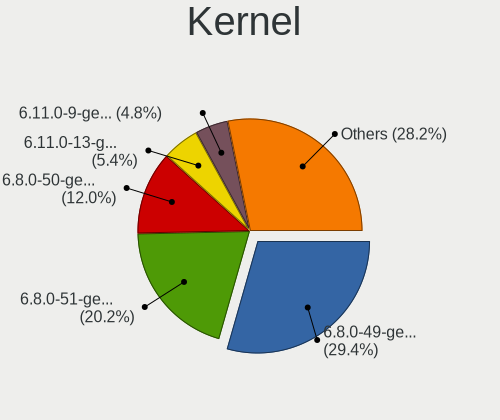
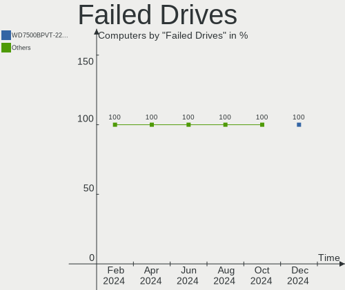
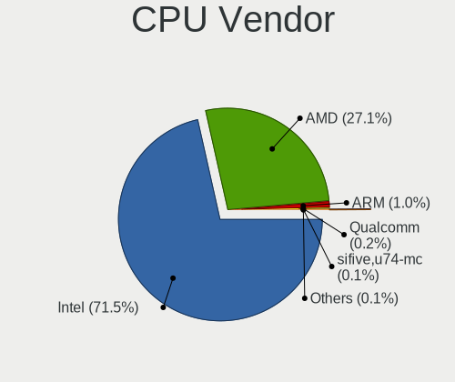
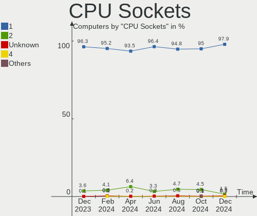
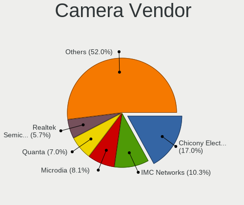
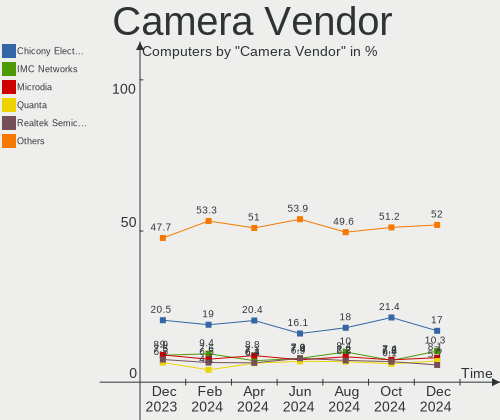
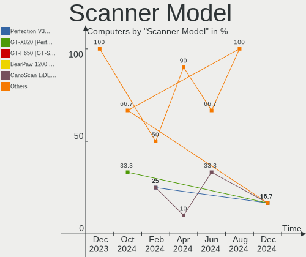

Ubuntu Hardware Trends
----------------------

A project to identify most popular hardware characteristics and track their change
over time based on data collected by Ubuntu users at https://Linux-Hardware.org.

Anyone can contribute to the study by uploading probes of their computers by
the [hw-probe](https://github.com/linuxhw/hw-probe) tool:

    sudo -E hw-probe -all -upload

This is a report for all computer types. See also reports for [desktops](/Dist/Ubuntu/Desktop/README.md) and [notebooks](/Dist/Ubuntu/Notebook/README.md).

Full-feature report is available here: https://linux-hardware.org/?view=trends

Period: May, 2021.

Contents
--------

- [ OS                       ](#os)
- [ OS Family                ](#os-family)
- [ Kernel                   ](#kernel)
- [ Kernel Family            ](#kernel-family)
- [ Kernel Major Ver.        ](#kernel-major-ver)
- [ Arch                     ](#arch)
- [ DE                       ](#de)
- [ Display Server           ](#display-server)
- [ Display Manager          ](#display-manager)
- [ OS Lang                  ](#os-lang)
- [ Boot Mode                ](#boot-mode)
- [ Filesystem               ](#filesystem)
- [ Part. scheme             ](#part-scheme)
- [ Dual Boot with Linux/BSD ](#dual-boot-with-linux/bsd)
- [ Dual Boot (Win)          ](#dual-boot-win)
- [ Country                  ](#country)
- [ City                     ](#city)
- [ Vendor                   ](#vendor)
- [ Model                    ](#model)
- [ Model Family             ](#model-family)
- [ MFG Year                 ](#mfg-year)
- [ Form Factor              ](#form-factor)
- [ Secure Boot              ](#secure-boot)
- [ Coreboot                 ](#coreboot)
- [ RAM Size                 ](#ram-size)
- [ RAM Used                 ](#ram-used)
- [ Has CD-ROM               ](#has-cd-rom)
- [ Total Drives             ](#total-drives)
- [ Has Ethernet             ](#has-ethernet)
- [ Has WiFi                 ](#has-wifi)
- [ Has Bluetooth            ](#has-bluetooth)
- [ Drive Vendor             ](#drive-vendor)
- [ Drive Model              ](#drive-model)
- [ HDD Vendor               ](#hdd-vendor)
- [ SSD Vendor               ](#ssd-vendor)
- [ Drive Kind               ](#drive-kind)
- [ Drive Connector          ](#drive-connector)
- [ Drive Size               ](#drive-size)
- [ Space Total              ](#space-total)
- [ Space Used               ](#space-used)
- [ Malfunc. Drives          ](#malfunc-drives)
- [ Malfunc. Drive Vendor    ](#malfunc-drive-vendor)
- [ Malfunc. HDD Vendor      ](#malfunc-hdd-vendor)
- [ Malfunc. Drive Kind      ](#malfunc-drive-kind)
- [ Failed Drives            ](#failed-drives)
- [ Failed Drive Vendor      ](#failed-drive-vendor)
- [ Drive Status             ](#drive-status)
- [ Storage Vendor           ](#storage-vendor)
- [ Storage Model            ](#storage-model)
- [ Storage Kind             ](#storage-kind)
- [ CPU Vendor               ](#cpu-vendor)
- [ CPU Model                ](#cpu-model)
- [ CPU Model Family         ](#cpu-model-family)
- [ CPU Cores                ](#cpu-cores)
- [ CPU Sockets              ](#cpu-sockets)
- [ CPU Threads              ](#cpu-threads)
- [ CPU Op-Modes             ](#cpu-op-modes)
- [ CPU Microcode            ](#cpu-microcode)
- [ CPU Microarch            ](#cpu-microarch)
- [ GPU Vendor               ](#gpu-vendor)
- [ GPU Model                ](#gpu-model)
- [ GPU Combo                ](#gpu-combo)
- [ GPU Driver               ](#gpu-driver)
- [ GPU Memory               ](#gpu-memory)
- [ Monitor Vendor           ](#monitor-vendor)
- [ Monitor Model            ](#monitor-model)
- [ Monitor Resolution       ](#monitor-resolution)
- [ Monitor Diagonal         ](#monitor-diagonal)
- [ Monitor Width            ](#monitor-width)
- [ Aspect Ratio             ](#aspect-ratio)
- [ Monitor Area             ](#monitor-area)
- [ Pixel Density            ](#pixel-density)
- [ Multiple Monitors        ](#multiple-monitors)
- [ Net Controller Vendor    ](#net-controller-vendor)
- [ Net Controller Model     ](#net-controller-model)
- [ Wireless Vendor          ](#wireless-vendor)
- [ Wireless Model           ](#wireless-model)
- [ Ethernet Vendor          ](#ethernet-vendor)
- [ Ethernet Model           ](#ethernet-model)
- [ Net Controller Kind      ](#net-controller-kind)
- [ Used Controller          ](#used-controller)
- [ NICs                     ](#nics)
- [ IPv6                     ](#ipv6)
- [ Memory Vendor            ](#memory-vendor)
- [ Memory Model             ](#memory-model)
- [ Memory Kind              ](#memory-kind)
- [ Memory Form Factor       ](#memory-form-factor)
- [ Memory Size              ](#memory-size)
- [ Memory Speed             ](#memory-speed)
- [ Sound Vendor             ](#sound-vendor)
- [ Sound Model              ](#sound-model)
- [ Camera Vendor            ](#camera-vendor)
- [ Camera Model             ](#camera-model)
- [ Fingerprint Vendor       ](#fingerprint-vendor)
- [ Fingerprint Model        ](#fingerprint-model)
- [ Chipcard Vendor          ](#chipcard-vendor)
- [ Chipcard Model           ](#chipcard-model)
- [ Printer Vendor           ](#printer-vendor)
- [ Printer Model            ](#printer-model)
- [ Scanner Vendor           ](#scanner-vendor)
- [ Scanner Model            ](#scanner-model)
- [ Bluetooth Vendor         ](#bluetooth-vendor)
- [ Bluetooth Model          ](#bluetooth-model)
- [ Unsupported Devices      ](#unsupported-devices)
- [ Unsupported Device Types ](#unsupported-device-types)

OS
--

Installed operating systems

| Name           | Computers | Percent |
|----------------|-----------|---------|
| Ubuntu 20.04   | 889       | 62.74%  |
| Ubuntu 21.04   | 236       | 16.65%  |
| Ubuntu 20.10   | 146       | 10.3%   |
| Ubuntu 18.04   | 114       | 8.05%   |
| Ubuntu 16.04   | 18        | 1.27%   |
| Ubuntu         | 3         | 0.21%   |
| Ubuntu 19.10   | 2         | 0.14%   |
| Ubuntu 19.04   | 2         | 0.14%   |
| Ubuntu 18.10   | 2         | 0.14%   |
| Ubuntu Core 18 | 1         | 0.07%   |
| Ubuntu 21.10   | 1         | 0.07%   |
| Ubuntu 2020    | 1         | 0.07%   |
| Ubuntu 17.04   | 1         | 0.07%   |
| Ubuntu 10      | 1         | 0.07%   |

OS Family
---------

OS without a version

| Name   | Computers | Percent |
|--------|-----------|---------|
| Ubuntu | 1417      | 100%    |

Kernel
------

Version of the Linux kernel

| Version                  | Computers | Percent |
|--------------------------|-----------|---------|
| 5.8.0-53-generic         | 370       | 26.11%  |
| 5.8.0-50-generic         | 300       | 21.17%  |
| 5.11.0-17-generic        | 112       | 7.9%    |
| 5.4.0-73-generic         | 103       | 7.27%   |
| 5.4.0-72-generic         | 86        | 6.07%   |
| 5.11.0-16-generic        | 86        | 6.07%   |
| 5.8.0-43-generic         | 50        | 3.53%   |
| 5.8.0-54-generic         | 29        | 2.05%   |
| 4.15.0-142-generic       | 24        | 1.69%   |
| 5.4.0-42-generic         | 20        | 1.41%   |
| 4.15.0-143-generic       | 17        | 1.2%    |
| 5.8.0-52-generic         | 14        | 0.99%   |
| 5.8.0-48-generic         | 11        | 0.78%   |
| 5.8.0-51-generic         | 10        | 0.71%   |
| 5.11.0-1008-raspi        | 10        | 0.71%   |
| 5.11.0-18-generic        | 9         | 0.64%   |
| 5.8.0-44-generic         | 8         | 0.56%   |
| 5.4.0-26-generic         | 6         | 0.42%   |
| 5.11.0-1007-raspi        | 6         | 0.42%   |
| 5.8.0-41-generic         | 5         | 0.35%   |
| 5.4.0-52-generic         | 5         | 0.35%   |
| 5.12.0-051200-generic    | 5         | 0.35%   |
| 5.4.0-67-generic         | 4         | 0.28%   |
| 5.4.0-56-generic         | 4         | 0.28%   |
| 5.8.0-38-generic         | 3         | 0.21%   |
| 5.8.0-25-generic         | 3         | 0.21%   |
| 5.8.0-1024-raspi         | 3         | 0.21%   |
| 5.8.0-1021-raspi         | 3         | 0.21%   |
| 5.7.1-050701-generic     | 3         | 0.21%   |
| 5.4.0-58-generic         | 3         | 0.21%   |
| 5.4.0-47-generic         | 3         | 0.21%   |
| 5.12.1-051201-generic    | 3         | 0.21%   |
| 5.8.0-49-generic         | 2         | 0.14%   |
| 5.8.0-45-generic         | 2         | 0.14%   |
| 5.4.0-70-generic         | 2         | 0.14%   |
| 5.4.0-66-generic         | 2         | 0.14%   |
| 5.4.0-59-generic         | 2         | 0.14%   |
| 5.4.0-48-generic         | 2         | 0.14%   |
| 5.3.0-46-generic         | 2         | 0.14%   |
| 5.13.0-051300rc1-generic | 2         | 0.14%   |
| 5.11.0-051100-generic    | 2         | 0.14%   |
| 5.10.0-1026-oem          | 2         | 0.14%   |
| 5.0.0-23-generic         | 2         | 0.14%   |
| 5.0.0-13-generic         | 2         | 0.14%   |
| 4.9.201-tegra            | 2         | 0.14%   |
| 4.4.0-210-generic        | 2         | 0.14%   |
| 4.16.18-pa2-2bp1         | 2         | 0.14%   |
| 4.15.0-91-generic        | 2         | 0.14%   |
| 5.9.6-050906-generic     | 1         | 0.07%   |
| 5.9.0-050900-generic     | 1         | 0.07%   |
| 5.8.5-surface            | 1         | 0.07%   |
| 5.8.0-54-lowlatency      | 1         | 0.07%   |
| 5.8.0-50-lowlatency      | 1         | 0.07%   |
| 5.8.0-42-generic         | 1         | 0.07%   |
| 5.8.0-14-generic         | 1         | 0.07%   |
| 5.8.0-1010-raspi         | 1         | 0.07%   |
| 5.6.0-7-generic          | 1         | 0.07%   |
| 5.6.0-1055-oem           | 1         | 0.07%   |
| 5.4.0-72-lowlatency      | 1         | 0.07%   |
| 5.4.0-70-lowlatency      | 1         | 0.07%   |

Kernel Family
-------------

Linux kernel without a distro release

| Version  | Computers | Percent |
|----------|-----------|---------|
| 5.8.0    | 818       | 57.73%  |
| 5.4.0    | 253       | 17.85%  |
| 5.11.0   | 229       | 16.16%  |
| 4.15.0   | 51        | 3.6%    |
| 5.12.0   | 6         | 0.42%   |
| 5.10.0   | 5         | 0.35%   |
| 5.0.0    | 5         | 0.35%   |
| 4.4.0    | 5         | 0.35%   |
| 5.3.0    | 4         | 0.28%   |
| 5.7.1    | 3         | 0.21%   |
| 5.13.0   | 3         | 0.21%   |
| 5.12.1   | 3         | 0.21%   |
| 4.18.0   | 3         | 0.21%   |
| 5.6.0    | 2         | 0.14%   |
| 4.9.201  | 2         | 0.14%   |
| 4.16.18  | 2         | 0.14%   |
| 5.9.6    | 1         | 0.07%   |
| 5.9.0    | 1         | 0.07%   |
| 5.8.5    | 1         | 0.07%   |
| 5.12.8   | 1         | 0.07%   |
| 5.12.4   | 1         | 0.07%   |
| 5.11.6   | 1         | 0.07%   |
| 5.11.22  | 1         | 0.07%   |
| 5.11.19  | 1         | 0.07%   |
| 5.11.17  | 1         | 0.07%   |
| 5.11.16  | 1         | 0.07%   |
| 5.11.15  | 1         | 0.07%   |
| 5.11.12  | 1         | 0.07%   |
| 5.11.11  | 1         | 0.07%   |
| 5.11.10  | 1         | 0.07%   |
| 5.10.26  | 1         | 0.07%   |
| 5.10.25  | 1         | 0.07%   |
| 5.10.22  | 1         | 0.07%   |
| 5.1.0    | 1         | 0.07%   |
| 4.9.140  | 1         | 0.07%   |
| 4.9.0    | 1         | 0.07%   |
| 4.14.231 | 1         | 0.07%   |
| 4.10.0   | 1         | 0.07%   |
| 3.13.0   | 1         | 0.07%   |

Kernel Major Ver.
-----------------

Linux kernel major version

| Version | Computers | Percent |
|---------|-----------|---------|
| 5.8     | 819       | 57.8%   |
| 5.4     | 253       | 17.85%  |
| 5.11    | 238       | 16.8%   |
| 4.15    | 51        | 3.6%    |
| 5.12    | 11        | 0.78%   |
| 5.10    | 8         | 0.56%   |
| 5.0     | 5         | 0.35%   |
| 4.4     | 5         | 0.35%   |
| 5.3     | 4         | 0.28%   |
| 4.9     | 4         | 0.28%   |
| 5.7     | 3         | 0.21%   |
| 5.13    | 3         | 0.21%   |
| 4.18    | 3         | 0.21%   |
| 5.9     | 2         | 0.14%   |
| 5.6     | 2         | 0.14%   |
| 4.16    | 2         | 0.14%   |
| 5.1     | 1         | 0.07%   |
| 4.14    | 1         | 0.07%   |
| 4.10    | 1         | 0.07%   |
| 3.13    | 1         | 0.07%   |

Arch
----

OS architecture (x86_64, i586, etc.)

| Name    | Computers | Percent |
|---------|-----------|---------|
| x86_64  | 1377      | 97.18%  |
| aarch64 | 28        | 1.98%   |
| i686    | 12        | 0.85%   |

DE
--

Desktop Environment

| Name            | Computers | Percent |
|-----------------|-----------|---------|
| GNOME           | 1211      | 85.46%  |
| Unknown         | 133       | 9.39%   |
| Unity           | 31        | 2.19%   |
| X-Cinnamon      | 11        | 0.78%   |
| GNOME Flashback | 11        | 0.78%   |
| openbox         | 5         | 0.35%   |
| Deepin          | 5         | 0.35%   |
| GNOME Classic   | 3         | 0.21%   |
| Cinnamon        | 3         | 0.21%   |
| enlightenment   | 2         | 0.14%   |
| Pantheon        | 1         | 0.07%   |
| i3              | 1         | 0.07%   |

Display Server
--------------

X11 or Wayland

| Name    | Computers | Percent |
|---------|-----------|---------|
| X11     | 1149      | 81.09%  |
| Wayland | 184       | 12.99%  |
| Unknown | 67        | 4.73%   |
| Tty     | 17        | 1.2%    |

Display Manager
---------------

SDDM, LightDM, etc.

| Name    | Computers | Percent |
|---------|-----------|---------|
| Unknown | 1081      | 76.29%  |
| GDM     | 316       | 22.3%   |
| TDM     | 14        | 0.99%   |
| XDM     | 3         | 0.21%   |
| SDDM    | 1         | 0.07%   |
| LightDM | 1         | 0.07%   |
| GDM3    | 1         | 0.07%   |

OS Lang
-------

Language

| Lang    | Computers | Percent |
|---------|-----------|---------|
| en_US   | 567       | 40.01%  |
| de_DE   | 143       | 10.09%  |
| fr_FR   | 101       | 7.13%   |
| en_GB   | 72        | 5.08%   |
| pt_BR   | 62        | 4.38%   |
| en_IN   | 47        | 3.32%   |
| es_ES   | 40        | 2.82%   |
| it_IT   | 39        | 2.75%   |
| en_CA   | 28        | 1.98%   |
| pl_PL   | 27        | 1.91%   |
| en_AU   | 27        | 1.91%   |
| ru_RU   | 24        | 1.69%   |
| C       | 17        | 1.2%    |
| nl_NL   | 16        | 1.13%   |
| es_AR   | 15        | 1.06%   |
| en_ZA   | 13        | 0.92%   |
| hu_HU   | 10        | 0.71%   |
| es_MX   | 10        | 0.71%   |
| es_CL   | 10        | 0.71%   |
| cs_CZ   | 9         | 0.64%   |
| zh_CN   | 8         | 0.56%   |
| sv_SE   | 8         | 0.56%   |
| Unknown | 8         | 0.56%   |
| de_AT   | 7         | 0.49%   |
| pt_PT   | 6         | 0.42%   |
| de_CH   | 6         | 0.42%   |
| ja_JP   | 5         | 0.35%   |
| fr_BE   | 5         | 0.35%   |
| es_CO   | 5         | 0.35%   |
| da_DK   | 5         | 0.35%   |
| zh_TW   | 4         | 0.28%   |
| sk_SK   | 4         | 0.28%   |
| nb_NO   | 4         | 0.28%   |
| ko_KR   | 4         | 0.28%   |
| fr_CA   | 4         | 0.28%   |
| es_UY   | 4         | 0.28%   |
| en_IL   | 4         | 0.28%   |
| en_IE   | 4         | 0.28%   |
| ca_ES   | 4         | 0.28%   |
| tr_TR   | 3         | 0.21%   |
| ro_RO   | 3         | 0.21%   |
| fi_FI   | 3         | 0.21%   |
| en_NZ   | 3         | 0.21%   |
| bg_BG   | 3         | 0.21%   |
| vi_VN   | 2         | 0.14%   |
| uk_UA   | 2         | 0.14%   |
| ru_UA   | 2         | 0.14%   |
| nl_BE   | 2         | 0.14%   |
| hr_HR   | 2         | 0.14%   |
| fr_CH   | 2         | 0.14%   |
| es_EC   | 2         | 0.14%   |
| en_SG   | 2         | 0.14%   |
| en_HK   | 2         | 0.14%   |
| sr_RS   | 1         | 0.07%   |
| sl_SI   | 1         | 0.07%   |
| es_VE   | 1         | 0.07%   |
| es_PY   | 1         | 0.07%   |
| es_CR   | 1         | 0.07%   |
| en_NG   | 1         | 0.07%   |
| de_IT   | 1         | 0.07%   |

Boot Mode
---------

EFI or BIOS

| Mode | Computers | Percent |
|------|-----------|---------|
| BIOS | 766       | 54.06%  |
| EFI  | 651       | 45.94%  |

Filesystem
----------

Type of filesystem

| Type    | Computers | Percent |
|---------|-----------|---------|
| Ext4    | 1333      | 94.07%  |
| Overlay | 35        | 2.47%   |
| Zfs     | 24        | 1.69%   |
| Btrfs   | 12        | 0.85%   |
| Ext3    | 4         | 0.28%   |
| Ext2    | 4         | 0.28%   |
| Xfs     | 3         | 0.21%   |
| Aufs    | 2         | 0.14%   |

Part. scheme
------------

Scheme of partitioning

| Type    | Computers | Percent |
|---------|-----------|---------|
| Unknown | 1063      | 75.02%  |
| GPT     | 292       | 20.61%  |
| MBR     | 62        | 4.38%   |

Dual Boot with Linux/BSD
------------------------

Hosting more than one Linux/BSD

| Dual boot | Computers | Percent |
|-----------|-----------|---------|
| No        | 1237      | 87.3%   |
| Yes       | 180       | 12.7%   |

Dual Boot (Win)
---------------

Hosting Linux and Windows

| Dual boot | Computers | Percent |
|-----------|-----------|---------|
| No        | 878       | 61.96%  |
| Yes       | 539       | 38.04%  |

Country
-------

Geographic location (country)

| Country      | Computers | Percent |
|--------------|-----------|---------|
| USA          | 231       | 16.3%   |
| Germany      | 173       | 12.21%  |
| France       | 96        | 6.77%   |
| Brazil       | 85        | 6%      |
| UK           | 60        | 4.23%   |
| Italy        | 55        | 3.88%   |
| India        | 51        | 3.6%    |
| Spain        | 45        | 3.18%   |
| Netherlands  | 41        | 2.89%   |
| Canada       | 40        | 2.82%   |
| Poland       | 38        | 2.68%   |
| Russia       | 37        | 2.61%   |
| Australia    | 28        | 1.98%   |
| Switzerland  | 24        | 1.69%   |
| Ukraine      | 23        | 1.62%   |
| Argentina    | 22        | 1.55%   |
| Czechia      | 20        | 1.41%   |
| Belgium      | 17        | 1.2%    |
| Mexico       | 16        | 1.13%   |
| Sweden       | 15        | 1.06%   |
| South Africa | 15        | 1.06%   |
| Chile        | 13        | 0.92%   |
| Austria      | 13        | 0.92%   |
| Hungary      | 12        | 0.85%   |
| Turkey       | 11        | 0.78%   |
| Denmark      | 11        | 0.78%   |
| Portugal     | 10        | 0.71%   |
| Greece       | 10        | 0.71%   |
| China        | 10        | 0.71%   |
| Slovakia     | 9         | 0.64%   |
| Romania      | 9         | 0.64%   |
| Norway       | 8         | 0.56%   |
| Japan        | 8         | 0.56%   |
| Ireland      | 7         | 0.49%   |
| Finland      | 7         | 0.49%   |
| Colombia     | 7         | 0.49%   |
| Bulgaria     | 7         | 0.49%   |
| Vietnam      | 6         | 0.42%   |
| Taiwan       | 6         | 0.42%   |
| Singapore    | 6         | 0.42%   |
| Israel       | 6         | 0.42%   |
| Uruguay      | 5         | 0.35%   |
| South Korea  | 5         | 0.35%   |
| Serbia       | 5         | 0.35%   |
| New Zealand  | 5         | 0.35%   |
| Kenya        | 5         | 0.35%   |
| Malaysia     | 4         | 0.28%   |
| Latvia       | 4         | 0.28%   |
| Costa Rica   | 4         | 0.28%   |
| Puerto Rico  | 3         | 0.21%   |
| Iran         | 3         | 0.21%   |
| Indonesia    | 3         | 0.21%   |
| Hong Kong    | 3         | 0.21%   |
| Estonia      | 3         | 0.21%   |
| Bangladesh   | 3         | 0.21%   |
| Algeria      | 3         | 0.21%   |
| Venezuela    | 2         | 0.14%   |
| UAE          | 2         | 0.14%   |
| Tunisia      | 2         | 0.14%   |
| Thailand     | 2         | 0.14%   |

City
----

Geographic location (city)

| City               | Computers | Percent |
|--------------------|-----------|---------|
| Berlin             | 14        | 0.99%   |
| Paris              | 13        | 0.92%   |
| São Paulo         | 12        | 0.85%   |
| Milan              | 11        | 0.78%   |
| Kyiv               | 11        | 0.78%   |
| Hamburg            | 10        | 0.71%   |
| Munich             | 9         | 0.64%   |
| Buenos Aires       | 9         | 0.64%   |
| Prague             | 8         | 0.56%   |
| Moscow             | 8         | 0.56%   |
| Madrid             | 8         | 0.56%   |
| London             | 8         | 0.56%   |
| Warsaw             | 7         | 0.49%   |
| St Petersburg      | 7         | 0.49%   |
| Rome               | 7         | 0.49%   |
| Vienna             | 6         | 0.42%   |
| Sydney             | 6         | 0.42%   |
| Santiago           | 6         | 0.42%   |
| Pune               | 6         | 0.42%   |
| Mexico City        | 6         | 0.42%   |
| Dublin             | 6         | 0.42%   |
| Cologne            | 6         | 0.42%   |
| Chicago            | 6         | 0.42%   |
| Barcelona          | 6         | 0.42%   |
| Zurich             | 5         | 0.35%   |
| Sofia              | 5         | 0.35%   |
| Singapore          | 5         | 0.35%   |
| Montreal           | 5         | 0.35%   |
| Hyderabad          | 5         | 0.35%   |
| Frankfurt am Main  | 5         | 0.35%   |
| Budapest           | 5         | 0.35%   |
| Athens             | 5         | 0.35%   |
| Alcalá de Henares | 5         | 0.35%   |
| Toronto            | 4         | 0.28%   |
| Stuttgart          | 4         | 0.28%   |
| Rio de Janeiro     | 4         | 0.28%   |
| Riga               | 4         | 0.28%   |
| Poznan             | 4         | 0.28%   |
| Nairobi            | 4         | 0.28%   |
| Montevideo         | 4         | 0.28%   |
| Melbourne          | 4         | 0.28%   |
| Johannesburg       | 4         | 0.28%   |
| Istanbul           | 4         | 0.28%   |
| Düsseldorf        | 4         | 0.28%   |
| Chennai            | 4         | 0.28%   |
| Bucharest          | 4         | 0.28%   |
| Zaporizhzhya       | 3         | 0.21%   |
| Tucson             | 3         | 0.21%   |
| Thessaloniki       | 3         | 0.21%   |
| Tel Aviv           | 3         | 0.21%   |
| Tallinn            | 3         | 0.21%   |
| San Diego          | 3         | 0.21%   |
| Rochester          | 3         | 0.21%   |
| Pretoria           | 3         | 0.21%   |
| New York           | 3         | 0.21%   |
| New Taipei         | 3         | 0.21%   |
| Mumbai             | 3         | 0.21%   |
| Lucknow            | 3         | 0.21%   |
| Leipzig            | 3         | 0.21%   |
| Houston            | 3         | 0.21%   |

Vendor
------

Motherboard manufacturer

| Name                    | Computers | Percent |
|-------------------------|-----------|---------|
| Dell                    | 226       | 15.95%  |
| ASUSTek Computer        | 214       | 15.1%   |
| Hewlett-Packard         | 206       | 14.54%  |
| Lenovo                  | 178       | 12.56%  |
| Gigabyte Technology     | 99        | 6.99%   |
| MSI                     | 80        | 5.65%   |
| Acer                    | 62        | 4.38%   |
| ASRock                  | 46        | 3.25%   |
| Unknown                 | 33        | 2.33%   |
| Toshiba                 | 23        | 1.62%   |
| Apple                   | 23        | 1.62%   |
| Intel                   | 20        | 1.41%   |
| Samsung Electronics     | 19        | 1.34%   |
| Medion                  | 16        | 1.13%   |
| Sony                    | 14        | 0.99%   |
| Fujitsu                 | 13        | 0.92%   |
| HUAWEI                  | 8         | 0.56%   |
| Raspberry Pi Foundation | 7         | 0.49%   |
| Biostar                 | 6         | 0.42%   |
| Alienware               | 6         | 0.42%   |
| TUXEDO                  | 5         | 0.35%   |
| Shuttle                 | 5         | 0.35%   |
| LG Electronics          | 5         | 0.35%   |
| ECS                     | 5         | 0.35%   |
| System76                | 4         | 0.28%   |
| Positivo                | 4         | 0.28%   |
| Notebook                | 4         | 0.28%   |
| Microsoft               | 4         | 0.28%   |
| Fujitsu Siemens         | 4         | 0.28%   |
| Foxconn                 | 4         | 0.28%   |
| eMachines               | 4         | 0.28%   |
| Supermicro              | 3         | 0.21%   |
| Positivo Bahia - VAIO   | 3         | 0.21%   |
| Pegatron                | 3         | 0.21%   |
| Panasonic               | 3         | 0.21%   |
| Nvidia                  | 3         | 0.21%   |
| Huanan                  | 3         | 0.21%   |
| SYWZ                    | 2         | 0.14%   |
| Standard                | 2         | 0.14%   |
| PC Specialist           | 2         | 0.14%   |
| Packard Bell            | 2         | 0.14%   |
| HPE                     | 2         | 0.14%   |
| essentielb              | 2         | 0.14%   |
| Dynabook                | 2         | 0.14%   |
| AMI                     | 2         | 0.14%   |
| whyopencomputing        | 1         | 0.07%   |
| VIT                     | 1         | 0.07%   |
| Teclast                 | 1         | 0.07%   |
| Soyo                    | 1         | 0.07%   |
| Razer                   | 1         | 0.07%   |
| Qbex                    | 1         | 0.07%   |
| Purism                  | 1         | 0.07%   |
| Phoenix/SiS             | 1         | 0.07%   |
| PCWare                  | 1         | 0.07%   |
| OEM                     | 1         | 0.07%   |
| Minix                   | 1         | 0.07%   |
| LAMINA                  | 1         | 0.07%   |
| Itautec                 | 1         | 0.07%   |
| Inventec                | 1         | 0.07%   |
| Intel Client Systems    | 1         | 0.07%   |

Model
-----

Motherboard model

| Name                                | Computers | Percent |
|-------------------------------------|-----------|---------|
| Unknown                             | 39        | 2.75%   |
| ASUS All Series                     | 16        | 1.13%   |
| HP Notebook                         | 6         | 0.42%   |
| Dell OptiPlex 3010                  | 6         | 0.42%   |
| Dell XPS 15 9500                    | 5         | 0.35%   |
| Dell XPS 15 7590                    | 5         | 0.35%   |
| ASUS TUF GAMING X570-PLUS           | 5         | 0.35%   |
| RPi Raspberry Pi 4 Model B Rev 1.4  | 4         | 0.28%   |
| MSI MS-7C02                         | 4         | 0.28%   |
| MSI MS-7B86                         | 4         | 0.28%   |
| Lenovo IdeaPad 320-15IKB 80XL       | 4         | 0.28%   |
| HP Pavilion dv6                     | 4         | 0.28%   |
| Gigabyte B75M-D3H                   | 4         | 0.28%   |
| Gigabyte B450M DS3H                 | 4         | 0.28%   |
| Gigabyte A320M-H                    | 4         | 0.28%   |
| Dell XPS 13 9310                    | 4         | 0.28%   |
| Dell Latitude 5520                  | 4         | 0.28%   |
| ASUS PRIME A320M-K                  | 4         | 0.28%   |
| ASUS P8Z77-V LX                     | 4         | 0.28%   |
| Nvidia Tegra                        | 3         | 0.21%   |
| MSI MS-7C75                         | 3         | 0.21%   |
| MSI MS-7758                         | 3         | 0.21%   |
| Lenovo Y50-70 20378                 | 3         | 0.21%   |
| Lenovo Legion Y530-15ICH 81FV       | 3         | 0.21%   |
| Lenovo G50-45 80E3                  | 3         | 0.21%   |
| Intel NUC10i5FNH                    | 3         | 0.21%   |
| HP ProBook 450 G7                   | 3         | 0.21%   |
| HP Pavilion Notebook                | 3         | 0.21%   |
| HP Pavilion Gaming Laptop 15-cx0xxx | 3         | 0.21%   |
| HP Pavilion g7                      | 3         | 0.21%   |
| HP Pavilion dv7                     | 3         | 0.21%   |
| HP Pavilion dv6700                  | 3         | 0.21%   |
| HP EliteBook 840 G2                 | 3         | 0.21%   |
| HP 250 G7 Notebook PC               | 3         | 0.21%   |
| Gigabyte Z390 UD                    | 3         | 0.21%   |
| Gigabyte H77-DS3H                   | 3         | 0.21%   |
| Dell XPS 13 9360                    | 3         | 0.21%   |
| Dell Precision 5530                 | 3         | 0.21%   |
| Dell OptiPlex 9020                  | 3         | 0.21%   |
| Dell OptiPlex 9010                  | 3         | 0.21%   |
| Dell OptiPlex 790                   | 3         | 0.21%   |
| Dell Latitude E6440                 | 3         | 0.21%   |
| Dell Latitude E6430                 | 3         | 0.21%   |
| Dell Latitude E6420                 | 3         | 0.21%   |
| Dell Latitude E6400                 | 3         | 0.21%   |
| Dell Latitude 7420                  | 3         | 0.21%   |
| Dell Latitude 5511                  | 3         | 0.21%   |
| ASUS M5A78L-M/USB3                  | 3         | 0.21%   |
| Apple MacBookPro8,1                 | 3         | 0.21%   |
| Acer Swift SF314-59                 | 3         | 0.21%   |
| Toshiba Satellite C55-A             | 2         | 0.14%   |
| SYWZ S210H Series                   | 2         | 0.14%   |
| System76 Galago Pro                 | 2         | 0.14%   |
| Samsung 340XAA/350XAA/550XAA        | 2         | 0.14%   |
| RPi Raspberry Pi 400 Rev 1.0        | 2         | 0.14%   |
| MSI MS-7C91                         | 2         | 0.14%   |
| MSI MS-7C79                         | 2         | 0.14%   |
| MSI MS-7C37                         | 2         | 0.14%   |
| MSI MS-7B89                         | 2         | 0.14%   |
| MSI MS-7A38                         | 2         | 0.14%   |

Model Family
------------

Motherboard model prefix

| Name                | Computers | Percent |
|---------------------|-----------|---------|
| Lenovo ThinkPad     | 67        | 4.73%   |
| Dell Latitude       | 58        | 4.09%   |
| Dell Inspiron       | 50        | 3.53%   |
| Lenovo IdeaPad      | 41        | 2.89%   |
| Unknown             | 39        | 2.75%   |
| Dell XPS            | 36        | 2.54%   |
| Acer Aspire         | 36        | 2.54%   |
| HP Pavilion         | 34        | 2.4%    |
| Dell OptiPlex       | 34        | 2.4%    |
| HP ProBook          | 27        | 1.91%   |
| HP EliteBook        | 27        | 1.91%   |
| Dell Precision      | 24        | 1.69%   |
| ASUS PRIME          | 23        | 1.62%   |
| HP Laptop           | 21        | 1.48%   |
| Toshiba Satellite   | 19        | 1.34%   |
| HP Compaq           | 18        | 1.27%   |
| ASUS TUF            | 17        | 1.2%    |
| ASUS ROG            | 17        | 1.2%    |
| ASUS All            | 16        | 1.13%   |
| ASUS VivoBook       | 12        | 0.85%   |
| Lenovo ThinkCentre  | 11        | 0.78%   |
| Dell Vostro         | 11        | 0.78%   |
| HP ENVY             | 9         | 0.64%   |
| HP EliteDesk        | 8         | 0.56%   |
| Acer Swift          | 8         | 0.56%   |
| RPi Raspberry       | 7         | 0.49%   |
| Lenovo Yoga         | 7         | 0.49%   |
| Lenovo Legion       | 7         | 0.49%   |
| Gigabyte B450M      | 7         | 0.49%   |
| HP ZBook            | 6         | 0.42%   |
| HP Notebook         | 6         | 0.42%   |
| ASUS M5A97          | 6         | 0.42%   |
| ASUS M5A78L-M       | 6         | 0.42%   |
| Acer TravelMate     | 6         | 0.42%   |
| HP Spectre          | 5         | 0.35%   |
| HP ProDesk          | 5         | 0.35%   |
| ASUS P8Z77-V        | 5         | 0.35%   |
| ASUS Maximus        | 5         | 0.35%   |
| Apple MacBookPro8   | 5         | 0.35%   |
| MSI MS-7C02         | 4         | 0.28%   |
| MSI MS-7B86         | 4         | 0.28%   |
| Microsoft Surface   | 4         | 0.28%   |
| Lenovo ThinkStation | 4         | 0.28%   |
| Lenovo ThinkBook    | 4         | 0.28%   |
| Lenovo IdeaCentre   | 4         | 0.28%   |
| Gigabyte X570       | 4         | 0.28%   |
| Gigabyte B75M-D3H   | 4         | 0.28%   |
| Gigabyte B450       | 4         | 0.28%   |
| Gigabyte A320M-H    | 4         | 0.28%   |
| Fujitsu LIFEBOOK    | 4         | 0.28%   |
| Fujitsu ESPRIMO     | 4         | 0.28%   |
| Dell PowerEdge      | 4         | 0.28%   |
| System76 Galago     | 3         | 0.21%   |
| Nvidia Tegra        | 3         | 0.21%   |
| MSI MS-7C75         | 3         | 0.21%   |
| MSI MS-7758         | 3         | 0.21%   |
| MSI GL73            | 3         | 0.21%   |
| Lenovo Y50-70       | 3         | 0.21%   |
| Lenovo G50-45       | 3         | 0.21%   |
| Intel NUC10i5FNH    | 3         | 0.21%   |

MFG Year
--------

Motherboard manufacture year

| Year    | Computers | Percent |
|---------|-----------|---------|
| 2020    | 264       | 18.63%  |
| 2019    | 179       | 12.63%  |
| 2021    | 136       | 9.6%    |
| 2018    | 116       | 8.19%   |
| 2014    | 97        | 6.85%   |
| 2013    | 91        | 6.42%   |
| 2011    | 77        | 5.43%   |
| 2015    | 76        | 5.36%   |
| 2012    | 75        | 5.29%   |
| 2010    | 60        | 4.23%   |
| 2017    | 53        | 3.74%   |
| 2016    | 53        | 3.74%   |
| 2009    | 46        | 3.25%   |
| 2008    | 44        | 3.11%   |
| Unknown | 29        | 2.05%   |
| 2007    | 11        | 0.78%   |
| 2006    | 5         | 0.35%   |
| 2005    | 3         | 0.21%   |
| 2004    | 2         | 0.14%   |

Form Factor
-----------

Physical design of the computer

| Name           | Computers | Percent |
|----------------|-----------|---------|
| Notebook       | 735       | 51.87%  |
| Desktop        | 567       | 40.01%  |
| Convertible    | 38        | 2.68%   |
| System on chip | 28        | 1.98%   |
| All in one     | 16        | 1.13%   |
| Mini pc        | 13        | 0.92%   |
| Server         | 11        | 0.78%   |
| Tablet         | 9         | 0.64%   |

Secure Boot
-----------

Enabled or disabled

| State    | Computers | Percent |
|----------|-----------|---------|
| Disabled | 1271      | 89.7%   |
| Enabled  | 146       | 10.3%   |

Coreboot
--------

Have coreboot on board

| Used | Computers | Percent |
|------|-----------|---------|
| No   | 1416      | 99.93%  |
| Yes  | 1         | 0.07%   |

RAM Size
--------

Total RAM memory

| Size in GB      | Computers | Percent |
|-----------------|-----------|---------|
| 4.01-8.0        | 338       | 23.85%  |
| 16.01-24.0      | 298       | 21.03%  |
| 3.01-4.0        | 278       | 19.62%  |
| 8.01-16.0       | 233       | 16.44%  |
| 32.01-64.0      | 140       | 9.88%   |
| 1.01-2.0        | 46        | 3.25%   |
| 64.01-256.0     | 41        | 2.89%   |
| 2.01-3.0        | 19        | 1.34%   |
| 24.01-32.0      | 16        | 1.13%   |
| More than 256.0 | 4         | 0.28%   |
| 0.51-1.0        | 4         | 0.28%   |

RAM Used
--------

Used RAM memory

| Used GB    | Computers | Percent |
|------------|-----------|---------|
| 1.01-2.0   | 519       | 36.63%  |
| 2.01-3.0   | 399       | 28.16%  |
| 4.01-8.0   | 196       | 13.83%  |
| 3.01-4.0   | 182       | 12.84%  |
| 8.01-16.0  | 68        | 4.8%    |
| 0.51-1.0   | 36        | 2.54%   |
| 16.01-24.0 | 7         | 0.49%   |
| 0.01-0.5   | 5         | 0.35%   |
| 24.01-32.0 | 3         | 0.21%   |
| 32.01-64.0 | 1         | 0.07%   |
| Unknown    | 1         | 0.07%   |

Has CD-ROM
----------

Has CD-ROM on board

| Presented | Computers | Percent |
|-----------|-----------|---------|
| No        | 849       | 59.92%  |
| Yes       | 568       | 40.08%  |

Total Drives
------------

Number of drives on board

| Drives | Computers | Percent |
|--------|-----------|---------|
| 1      | 856       | 60.41%  |
| 2      | 325       | 22.94%  |
| 3      | 93        | 6.56%   |
| 4      | 69        | 4.87%   |
| 5      | 28        | 1.98%   |
| 0      | 18        | 1.27%   |
| 6      | 15        | 1.06%   |
| 9      | 4         | 0.28%   |
| 8      | 3         | 0.21%   |
| 7      | 3         | 0.21%   |
| 21     | 1         | 0.07%   |
| 13     | 1         | 0.07%   |
| 10     | 1         | 0.07%   |

Has Ethernet
------------

Has Ethernet on board

| Presented | Computers | Percent |
|-----------|-----------|---------|
| Yes       | 1214      | 85.67%  |
| No        | 203       | 14.33%  |

Has WiFi
--------

Has WiFi module

| Presented | Computers | Percent |
|-----------|-----------|---------|
| Yes       | 1046      | 73.82%  |
| No        | 371       | 26.18%  |

Has Bluetooth
-------------

Has Bluetooth module

| Presented | Computers | Percent |
|-----------|-----------|---------|
| Yes       | 786       | 55.47%  |
| No        | 631       | 44.53%  |

Drive Vendor
------------

Hard drive vendors

| Vendor                    | Computers | Drives | Percent |
|---------------------------|-----------|--------|---------|
| WDC                       | 337       | 415    | 16.59%  |
| Seagate                   | 326       | 436    | 16.05%  |
| Samsung Electronics       | 316       | 373    | 15.56%  |
| Toshiba                   | 148       | 154    | 7.29%   |
| Kingston                  | 103       | 107    | 5.07%   |
| SanDisk                   | 100       | 104    | 4.92%   |
| Unknown                   | 94        | 104    | 4.63%   |
| Hitachi                   | 63        | 69     | 3.1%    |
| Crucial                   | 59        | 63     | 2.9%    |
| Intel                     | 54        | 61     | 2.66%   |
| SK Hynix                  | 47        | 47     | 2.31%   |
| HGST                      | 43        | 46     | 2.12%   |
| Micron Technology         | 30        | 32     | 1.48%   |
| A-DATA Technology         | 24        | 24     | 1.18%   |
| Phison                    | 20        | 28     | 0.98%   |
| Patriot                   | 13        | 13     | 0.64%   |
| Silicon Motion            | 12        | 13     | 0.59%   |
| MAXTOR                    | 11        | 11     | 0.54%   |
| Corsair                   | 11        | 12     | 0.54%   |
| PNY                       | 10        | 11     | 0.49%   |
| KIOXIA                    | 10        | 10     | 0.49%   |
| Intenso                   | 10        | 11     | 0.49%   |
| ASMT                      | 10        | 15     | 0.49%   |
| SPCC                      | 9         | 10     | 0.44%   |
| China                     | 9         | 9      | 0.44%   |
| LITEONIT                  | 8         | 8      | 0.39%   |
| GOODRAM                   | 7         | 7      | 0.34%   |
| Gigabyte Technology       | 7         | 7      | 0.34%   |
| Fujitsu                   | 7         | 7      | 0.34%   |
| OCZ                       | 6         | 6      | 0.3%    |
| Micron/Crucial Technology | 6         | 6      | 0.3%    |
| LITEON                    | 6         | 6      | 0.3%    |
| Apple                     | 6         | 6      | 0.3%    |
| Union Memory              | 5         | 5      | 0.25%   |
| Apacer                    | 5         | 5      | 0.25%   |
| XPG                       | 4         | 4      | 0.2%    |
| SABRENT                   | 4         | 4      | 0.2%    |
| Realtek Semiconductor     | 4         | 4      | 0.2%    |
| KingSpec                  | 4         | 4      | 0.2%    |
| JMicron                   | 4         | 4      | 0.2%    |
| Hewlett-Packard           | 4         | 6      | 0.2%    |
| Union Memory (Shenzhen)   | 3         | 3      | 0.15%   |
| Transcend                 | 3         | 3      | 0.15%   |
| Mushkin                   | 3         | 4      | 0.15%   |
| External                  | 3         | 3      | 0.15%   |
| ADATA Technology          | 3         | 3      | 0.15%   |
| XrayDisk                  | 2         | 2      | 0.1%    |
| Vaseky                    | 2         | 2      | 0.1%    |
| TO Exter                  | 2         | 2      | 0.1%    |
| Team                      | 2         | 2      | 0.1%    |
| Netac                     | 2         | 2      | 0.1%    |
| Lite-On                   | 2         | 2      | 0.1%    |
| KingDian                  | 2         | 3      | 0.1%    |
| WD MediaMax               | 1         | 1      | 0.05%   |
| VALK                      | 1         | 1      | 0.05%   |
| USB30                     | 1         | 1      | 0.05%   |
| USB3.1                    | 1         | 1      | 0.05%   |
| USB3.0                    | 1         | 1      | 0.05%   |
| USB                       | 1         | 1      | 0.05%   |
| Teclast                   | 1         | 1      | 0.05%   |

Drive Model
-----------

Hard drive models

| Model                               | Computers | Percent |
|-------------------------------------|-----------|---------|
| Samsung SSD 860 EVO 500GB           | 25        | 1.13%   |
| Kingston SA400S37240G 240GB SSD     | 22        | 1%      |
| Samsung NVMe SSD Drive 512GB        | 21        | 0.95%   |
| Seagate ST1000LM024 HN-M101MBB 1TB  | 20        | 0.91%   |
| Seagate ST1000LM035-1RK172 1TB      | 19        | 0.86%   |
| Unknown MMC Card  32GB              | 18        | 0.82%   |
| Seagate ST500DM002-1BD142 500GB     | 18        | 0.82%   |
| Toshiba MQ01ABD100 1TB              | 17        | 0.77%   |
| Seagate ST2000DM008-2FR102 2TB      | 17        | 0.77%   |
| Seagate ST1000DM010-2EP102 1TB      | 17        | 0.77%   |
| Unknown MMC Card  64GB              | 16        | 0.73%   |
| Samsung NVMe SSD Drive 1TB          | 16        | 0.73%   |
| Samsung NVMe SSD Drive 256GB        | 15        | 0.68%   |
| Kingston SA400S37120G 120GB SSD     | 15        | 0.68%   |
| Toshiba DT01ACA100 1TB              | 14        | 0.64%   |
| Samsung SSD 850 EVO 250GB           | 14        | 0.64%   |
| HGST HTS721010A9E630 1TB            | 14        | 0.64%   |
| Sandisk NVMe SSD Drive 512GB        | 12        | 0.54%   |
| Intel NVMe SSD Drive 512GB          | 12        | 0.54%   |
| SK Hynix NVMe SSD Drive 512GB       | 11        | 0.5%    |
| Seagate ST9500325AS 500GB           | 11        | 0.5%    |
| Samsung NVMe SSD Drive 500GB        | 11        | 0.5%    |
| Crucial CT1000MX500SSD1 1TB         | 11        | 0.5%    |
| WDC WDS500G2B0A-00SM50 500GB SSD    | 10        | 0.45%   |
| Unknown SD/MMC/MS PRO 8GB           | 10        | 0.45%   |
| Toshiba MQ01ABF050 500GB            | 10        | 0.45%   |
| Seagate ST1000DM003-1CH162 1TB      | 10        | 0.45%   |
| Kingston SA400S37480G 480GB SSD     | 10        | 0.45%   |
| Toshiba NVMe SSD Drive 512GB        | 9         | 0.41%   |
| Seagate ST500LM012 HN-M500MBB 500GB | 9         | 0.41%   |
| Samsung SSD 860 EVO 1TB             | 9         | 0.41%   |
| Samsung SSD 850 EVO 500GB           | 9         | 0.41%   |
| Samsung NVMe SSD Drive 250GB        | 9         | 0.41%   |
| Crucial CT500MX500SSD1 500GB        | 9         | 0.41%   |
| Unknown MMC Card  16GB              | 8         | 0.36%   |
| Unknown MMC Card  128GB             | 8         | 0.36%   |
| Seagate Expansion 2TB               | 8         | 0.36%   |
| Samsung NVMe SSD Drive 1024GB       | 8         | 0.36%   |
| WDC WDS240G2G0A-00JH30 240GB SSD    | 7         | 0.32%   |
| Seagate ST500LT012-1DG142 500GB     | 7         | 0.32%   |
| Seagate ST31000524AS 1TB            | 7         | 0.32%   |
| Seagate ST2000DM001-1ER164 2TB      | 7         | 0.32%   |
| Seagate ST1000DM003-1SB102 1TB      | 7         | 0.32%   |
| Kingston SV300S37A120G 120GB SSD    | 7         | 0.32%   |
| Crucial CT240BX500SSD1 240GB        | 7         | 0.32%   |
| WDC WD10JPVX-22JC3T0 1TB            | 6         | 0.27%   |
| Seagate ST2000DM001-1CH164 2TB      | 6         | 0.27%   |
| Seagate ST1000LX015-1U7172 1TB      | 6         | 0.27%   |
| Seagate ST1000LM048-2E7172 1TB      | 6         | 0.27%   |
| SanDisk SSD PLUS 120GB              | 6         | 0.27%   |
| SanDisk SSD PLUS 1000GB             | 6         | 0.27%   |
| Sandisk NVMe SSD Drive 500GB        | 6         | 0.27%   |
| Samsung SSD 860 EVO 250GB           | 6         | 0.27%   |
| Samsung SSD 840 EVO 120GB           | 6         | 0.27%   |
| Samsung HD103SI 1TB                 | 6         | 0.27%   |
| HGST HTS545050A7E680 500GB          | 6         | 0.27%   |
| WDC WDS100T2B0A-00SM50 1TB SSD      | 5         | 0.23%   |
| WDC WD10EZEX-08WN4A0 1TB            | 5         | 0.23%   |
| WDC WD10EARS-00Y5B1 1TB             | 5         | 0.23%   |
| Toshiba DT01ACA200 2TB              | 5         | 0.23%   |

HDD Vendor
----------

Hard disk drive vendors

| Vendor              | Computers | Drives | Percent |
|---------------------|-----------|--------|---------|
| Seagate             | 321       | 422    | 36.85%  |
| WDC                 | 271       | 333    | 31.11%  |
| Toshiba             | 108       | 114    | 12.4%   |
| Hitachi             | 63        | 69     | 7.23%   |
| HGST                | 43        | 46     | 4.94%   |
| Samsung Electronics | 34        | 40     | 3.9%    |
| MAXTOR              | 9         | 9      | 1.03%   |
| Fujitsu             | 7         | 7      | 0.8%    |
| ASMT                | 5         | 10     | 0.57%   |
| Intenso             | 3         | 4      | 0.34%   |
| Apple               | 2         | 2      | 0.23%   |
| USB3.0              | 1         | 1      | 0.11%   |
| USB                 | 1         | 1      | 0.11%   |
| Unknown             | 1         | 1      | 0.11%   |
| Synology            | 1         | 4      | 0.11%   |
| LaCie               | 1         | 1      | 0.11%   |

SSD Vendor
----------

Solid state drive vendors

| Vendor              | Computers | Drives | Percent |
|---------------------|-----------|--------|---------|
| Samsung Electronics | 157       | 179    | 24.8%   |
| Kingston            | 84        | 87     | 13.27%  |
| SanDisk             | 68        | 71     | 10.74%  |
| Crucial             | 55        | 59     | 8.69%   |
| WDC                 | 41        | 43     | 6.48%   |
| Intel               | 23        | 23     | 3.63%   |
| A-DATA Technology   | 21        | 21     | 3.32%   |
| Patriot             | 12        | 12     | 1.9%    |
| Toshiba             | 10        | 10     | 1.58%   |
| SPCC                | 9         | 10     | 1.42%   |
| SK Hynix            | 9         | 9      | 1.42%   |
| PNY                 | 9         | 10     | 1.42%   |
| Micron Technology   | 9         | 11     | 1.42%   |
| China               | 9         | 9      | 1.42%   |
| LITEONIT            | 8         | 8      | 1.26%   |
| GOODRAM             | 7         | 7      | 1.11%   |
| OCZ                 | 6         | 6      | 0.95%   |
| LITEON              | 6         | 6      | 0.95%   |
| Gigabyte Technology | 6         | 6      | 0.95%   |
| Corsair             | 6         | 6      | 0.95%   |
| Intenso             | 5         | 5      | 0.79%   |
| Unknown             | 4         | 4      | 0.63%   |
| SABRENT             | 4         | 4      | 0.63%   |
| KingSpec            | 4         | 4      | 0.63%   |
| ASMT                | 4         | 4      | 0.63%   |
| Apple               | 4         | 4      | 0.63%   |
| Apacer              | 4         | 4      | 0.63%   |
| Transcend           | 3         | 3      | 0.47%   |
| JMicron             | 3         | 3      | 0.47%   |
| Hewlett-Packard     | 3         | 3      | 0.47%   |
| Vaseky              | 2         | 2      | 0.32%   |
| TO Exter            | 2         | 2      | 0.32%   |
| Team                | 2         | 2      | 0.32%   |
| Seagate             | 2         | 2      | 0.32%   |
| Mushkin             | 2         | 2      | 0.32%   |
| Maxtor              | 2         | 2      | 0.32%   |
| KingDian            | 2         | 3      | 0.32%   |
| XrayDisk            | 1         | 1      | 0.16%   |
| VALK                | 1         | 1      | 0.16%   |
| USB30               | 1         | 1      | 0.16%   |
| Union Memory        | 1         | 1      | 0.16%   |
| Teclast             | 1         | 1      | 0.16%   |
| SuperSSpeed         | 1         | 1      | 0.16%   |
| StoreJet            | 1         | 1      | 0.16%   |
| Radeon              | 1         | 1      | 0.16%   |
| PNY USB             | 1         | 1      | 0.16%   |
| PLEXTOR             | 1         | 2      | 0.16%   |
| OWC                 | 1         | 1      | 0.16%   |
| OCZ-VERTEX3         | 1         | 1      | 0.16%   |
| NMICRO              | 1         | 1      | 0.16%   |
| Netac               | 1         | 1      | 0.16%   |
| Lenovo              | 1         | 1      | 0.16%   |
| KIOXIA-EXCERIA      | 1         | 1      | 0.16%   |
| KINGBANK            | 1         | 1      | 0.16%   |
| Integral            | 1         | 1      | 0.16%   |
| INNOVATION IT       | 1         | 1      | 0.16%   |
| Hoodisk             | 1         | 1      | 0.16%   |
| EZCOOL              | 1         | 1      | 0.16%   |
| EMTEC               | 1         | 1      | 0.16%   |
| DREVO               | 1         | 1      | 0.16%   |

Drive Kind
----------

HDD or SSD

| Kind    | Computers | Drives | Percent |
|---------|-----------|--------|---------|
| HDD     | 740       | 1064   | 40.37%  |
| SSD     | 557       | 673    | 30.39%  |
| NVMe    | 413       | 472    | 22.53%  |
| MMC     | 73        | 82     | 3.98%   |
| Unknown | 50        | 68     | 2.73%   |

Drive Connector
---------------

SATA, SAS, NVMe, etc.

| Type | Computers | Drives | Percent |
|------|-----------|--------|---------|
| SATA | 1067      | 1679   | 65.22%  |
| NVMe | 412       | 470    | 25.18%  |
| SAS  | 84        | 128    | 5.13%   |
| MMC  | 73        | 82     | 4.46%   |

Drive Size
----------

Size of hard drive

| Size in TB | Computers | Drives | Percent |
|------------|-----------|--------|---------|
| 0.01-0.5   | 758       | 970    | 55.86%  |
| 0.51-1.0   | 389       | 459    | 28.67%  |
| 1.01-2.0   | 125       | 157    | 9.21%   |
| 3.01-4.0   | 29        | 45     | 2.14%   |
| 4.01-10.0  | 27        | 46     | 1.99%   |
| 2.01-3.0   | 19        | 27     | 1.4%    |
| 10.01-20.0 | 10        | 33     | 0.74%   |

Space Total
-----------

Amount of disk space available on the file system

| Size in GB     | Computers | Percent |
|----------------|-----------|---------|
| 101-250        | 405       | 28.58%  |
| 251-500        | 355       | 25.05%  |
| 501-1000       | 226       | 15.95%  |
| 51-100         | 95        | 6.7%    |
| 1001-2000      | 85        | 6%      |
| More than 3000 | 80        | 5.65%   |
| 1-20           | 63        | 4.45%   |
| 21-50          | 56        | 3.95%   |
| 2001-3000      | 40        | 2.82%   |
| Unknown        | 12        | 0.85%   |

Space Used
----------

Amount of used disk space

| Used GB        | Computers | Percent |
|----------------|-----------|---------|
| 1-20           | 555       | 39.17%  |
| 21-50          | 258       | 18.21%  |
| 101-250        | 182       | 12.84%  |
| 51-100         | 163       | 11.5%   |
| 251-500        | 104       | 7.34%   |
| 501-1000       | 57        | 4.02%   |
| 1001-2000      | 44        | 3.11%   |
| More than 3000 | 30        | 2.12%   |
| 2001-3000      | 12        | 0.85%   |
| Unknown        | 12        | 0.85%   |

Malfunc. Drives
---------------

Drive models with a malfunction

| Model                               | Computers | Drives | Percent |
|-------------------------------------|-----------|--------|---------|
| Seagate ST31000524AS 1TB            | 2         | 2      | 2.78%   |
| Seagate ST1000LM024 HN-M101MBB 1TB  | 2         | 2      | 2.78%   |
| HGST HTS721010A9E630 1TB            | 2         | 2      | 2.78%   |
| Crucial CT240M500SSD1 240GB         | 2         | 2      | 2.78%   |
| WDC WDS240G2G0A-00JH30 240GB SSD    | 1         | 1      | 1.39%   |
| WDC WD7500BPVT-08HXZT3 752GB        | 1         | 1      | 1.39%   |
| WDC WD6400AAKS-65A7B0 640GB         | 1         | 1      | 1.39%   |
| WDC WD5000LPLX-60ZNTT1 500GB        | 1         | 1      | 1.39%   |
| WDC WD5000AAKS-00UU3A0 500GB        | 1         | 1      | 1.39%   |
| WDC WD40EFRX-68WT0N0 4TB            | 1         | 4      | 1.39%   |
| WDC WD3200BPVT-22JJ5T0 320GB        | 1         | 1      | 1.39%   |
| WDC WD10SPZX-75Z10T3 1TB            | 1         | 1      | 1.39%   |
| WDC WD10EZEX-60ZF5A0 1TB            | 1         | 1      | 1.39%   |
| WDC WD10EZEX-00BN5A0 1TB            | 1         | 1      | 1.39%   |
| WDC WD10EFRX-68FYTN0 1TB            | 1         | 1      | 1.39%   |
| WDC WD10EADS-00M2B0 1TB             | 1         | 1      | 1.39%   |
| WDC WD1001FAES-75W7A0 1TB           | 1         | 1      | 1.39%   |
| Toshiba MQ01ACF050 500GB            | 1         | 1      | 1.39%   |
| Toshiba MQ01ABD100 1TB              | 1         | 1      | 1.39%   |
| Toshiba MK6476GSX 640GB             | 1         | 1      | 1.39%   |
| Toshiba MK5076GSX 500GB             | 1         | 1      | 1.39%   |
| Toshiba MK5061GSYN 500GB            | 1         | 1      | 1.39%   |
| Toshiba MK5055GSX 500GB             | 1         | 1      | 1.39%   |
| Toshiba MK3263GSXN 320GB            | 1         | 1      | 1.39%   |
| Toshiba MK1656GSYF 160GB            | 1         | 1      | 1.39%   |
| Toshiba HDWD120 2TB                 | 1         | 1      | 1.39%   |
| SK Hynix SC308 SATA 128GB SSD       | 1         | 1      | 1.39%   |
| Seagate ST9500325AS 500GB           | 1         | 1      | 1.39%   |
| Seagate ST9250311CS 250GB           | 1         | 1      | 1.39%   |
| Seagate ST500LT012-9WS142 500GB     | 1         | 1      | 1.39%   |
| Seagate ST500LM012 HN-M500MBB 500GB | 1         | 1      | 1.39%   |
| Seagate ST500DM002-1SB10A 500GB     | 1         | 1      | 1.39%   |
| Seagate ST500DM002-1BD142 500GB     | 1         | 1      | 1.39%   |
| Seagate ST3500830AS 500GB           | 1         | 1      | 1.39%   |
| Seagate ST3500414CS 500GB           | 1         | 1      | 1.39%   |
| Seagate ST3320820AS 320GB           | 1         | 1      | 1.39%   |
| Seagate ST3320418AS 320GB           | 1         | 1      | 1.39%   |
| Seagate ST3320310CS 320GB           | 1         | 1      | 1.39%   |
| Seagate ST3250824AS 250GB           | 1         | 1      | 1.39%   |
| Seagate ST3250410AS 250GB           | 1         | 1      | 1.39%   |
| Seagate ST320LT020-9YG142 320GB     | 1         | 1      | 1.39%   |
| Seagate ST3160215A 160GB            | 1         | 1      | 1.39%   |
| Seagate ST2000DX002-2DV164 2TB      | 1         | 1      | 1.39%   |
| Seagate ST1000LX015-1U7172 1TB      | 1         | 1      | 1.39%   |
| Seagate ST1000LM014-SSHD-8GB        | 1         | 1      | 1.39%   |
| Seagate ST1000LM014-1EJ164 1TB      | 1         | 1      | 1.39%   |
| Seagate ST1000DM010-2EP102 1TB      | 1         | 1      | 1.39%   |
| Seagate ST1000DM003-1CH162 1TB      | 1         | 1      | 1.39%   |
| SanDisk SSD PLUS 480GB              | 1         | 1      | 1.39%   |
| SanDisk SDSSDHII240G 240GB          | 1         | 1      | 1.39%   |
| Samsung Electronics SP2004C 200GB   | 1         | 1      | 1.39%   |
| Samsung Electronics SP0411N 40GB    | 1         | 1      | 1.39%   |
| Samsung Electronics HD322GM 320GB   | 1         | 1      | 1.39%   |
| Samsung Electronics HD322GJ 320GB   | 1         | 1      | 1.39%   |
| OCZ VERTEX3 120GB SSD               | 1         | 1      | 1.39%   |
| MAXTOR 6L080J4 80GB                 | 1         | 1      | 1.39%   |
| Kingston SV300S37A120G 120GB SSD    | 1         | 1      | 1.39%   |
| Kingston SA400S37240G 240GB SSD     | 1         | 1      | 1.39%   |
| Kingston SA400S37120G 120GB SSD     | 1         | 1      | 1.39%   |
| Intel SSDSC2KW240H6 240GB           | 1         | 1      | 1.39%   |

Malfunc. Drive Vendor
---------------------

Vendors of faulty drives

| Vendor              | Computers | Drives | Percent |
|---------------------|-----------|--------|---------|
| Seagate             | 23        | 25     | 33.33%  |
| WDC                 | 13        | 16     | 18.84%  |
| Toshiba             | 8         | 9      | 11.59%  |
| Samsung Electronics | 4         | 4      | 5.8%    |
| Hitachi             | 4         | 5      | 5.8%    |
| Kingston            | 3         | 3      | 4.35%   |
| HGST                | 3         | 3      | 4.35%   |
| Crucial             | 3         | 3      | 4.35%   |
| SanDisk             | 2         | 2      | 2.9%    |
| SK Hynix            | 1         | 1      | 1.45%   |
| OCZ                 | 1         | 1      | 1.45%   |
| MAXTOR              | 1         | 1      | 1.45%   |
| Intel               | 1         | 1      | 1.45%   |
| Hewlett-Packard     | 1         | 1      | 1.45%   |
| Corsair             | 1         | 1      | 1.45%   |

Malfunc. HDD Vendor
-------------------

Vendors of faulty HDD drives

| Vendor              | Computers | Drives | Percent |
|---------------------|-----------|--------|---------|
| Seagate             | 23        | 25     | 41.82%  |
| WDC                 | 12        | 15     | 21.82%  |
| Toshiba             | 8         | 9      | 14.55%  |
| Samsung Electronics | 4         | 4      | 7.27%   |
| Hitachi             | 4         | 5      | 7.27%   |
| HGST                | 3         | 3      | 5.45%   |
| MAXTOR              | 1         | 1      | 1.82%   |

Malfunc. Drive Kind
-------------------

Kinds of faulty drives

| Kind | Computers | Drives | Percent |
|------|-----------|--------|---------|
| HDD  | 50        | 62     | 79.37%  |
| SSD  | 13        | 14     | 20.63%  |

Failed Drives
-------------

Failed drive models

| Model                           | Computers | Drives | Percent |
|---------------------------------|-----------|--------|---------|
| WDC WD7500BPVT-22HXZT1 752GB    | 1         | 1      | 33.33%  |
| Toshiba MQ02ABF050H 500GB       | 1         | 1      | 33.33%  |
| Seagate ST500LT012-1DG142 500GB | 1         | 1      | 33.33%  |

Failed Drive Vendor
-------------------

Failed drive vendors

| Vendor  | Computers | Drives | Percent |
|---------|-----------|--------|---------|
| WDC     | 1         | 1      | 33.33%  |
| Toshiba | 1         | 1      | 33.33%  |
| Seagate | 1         | 1      | 33.33%  |

Drive Status
------------

Number of failed and malfunc. drives

| Status   | Computers | Drives | Percent |
|----------|-----------|--------|---------|
| Detected | 1037      | 1716   | 71.03%  |
| Works    | 358       | 564    | 24.52%  |
| Malfunc  | 62        | 76     | 4.25%   |
| Failed   | 3         | 3      | 0.21%   |

Storage Vendor
--------------

Storage controller vendors

| Vendor                           | Computers | Percent |
|----------------------------------|-----------|---------|
| Intel                            | 988       | 55.95%  |
| AMD                              | 248       | 14.04%  |
| Samsung Electronics              | 147       | 8.32%   |
| Sandisk                          | 63        | 3.57%   |
| SK Hynix                         | 37        | 2.1%    |
| Toshiba America Info Systems     | 28        | 1.59%   |
| Phison Electronics               | 28        | 1.59%   |
| Nvidia                           | 24        | 1.36%   |
| ASMedia Technology               | 24        | 1.36%   |
| Marvell Technology Group         | 22        | 1.25%   |
| Micron Technology                | 21        | 1.19%   |
| JMicron Technology               | 20        | 1.13%   |
| Kingston Technology Company      | 19        | 1.08%   |
| Silicon Motion                   | 18        | 1.02%   |
| KIOXIA                           | 12        | 0.68%   |
| Micron/Crucial Technology        | 10        | 0.57%   |
| ADATA Technology                 | 10        | 0.57%   |
| VIA Technologies                 | 7         | 0.4%    |
| Union Memory (Shenzhen)          | 6         | 0.34%   |
| Silicon Integrated Systems [SiS] | 5         | 0.28%   |
| Broadcom / LSI                   | 5         | 0.28%   |
| Silicon Image                    | 4         | 0.23%   |
| Seagate Technology               | 4         | 0.23%   |
| Realtek Semiconductor            | 4         | 0.23%   |
| LSI Logic / Symbios Logic        | 4         | 0.23%   |
| Unknown                          | 1         | 0.06%   |
| Solid State Storage Technology   | 1         | 0.06%   |
| Lite-On Technology               | 1         | 0.06%   |
| Hewlett-Packard                  | 1         | 0.06%   |
| Areca Technology                 | 1         | 0.06%   |
| Advanced System Products         | 1         | 0.06%   |
| Adaptec                          | 1         | 0.06%   |
| 3ware                            | 1         | 0.06%   |

Storage Model
-------------

Storage controller models

| Model                                                                                   | Computers | Percent |
|-----------------------------------------------------------------------------------------|-----------|---------|
| AMD FCH SATA Controller [AHCI mode]                                                     | 165       | 8.04%   |
| Samsung NVMe SSD Controller SM981/PM981/PM983                                           | 82        | 4%      |
| Intel 8 Series/C220 Series Chipset Family 6-port SATA Controller 1 [AHCI mode]          | 76        | 3.71%   |
| Intel Sunrise Point-LP SATA Controller [AHCI mode]                                      | 70        | 3.41%   |
| Intel 82801 Mobile SATA Controller [RAID mode]                                          | 67        | 3.27%   |
| Intel 7 Series Chipset Family 6-port SATA Controller [AHCI mode]                        | 56        | 2.73%   |
| AMD 400 Series Chipset SATA Controller                                                  | 40        | 1.95%   |
| Intel Q170/Q150/B150/H170/H110/Z170/CM236 Chipset SATA Controller [AHCI Mode]           | 39        | 1.9%    |
| Intel 6 Series/C200 Series Chipset Family 6 port Mobile SATA AHCI Controller            | 37        | 1.8%    |
| Intel 8 Series SATA Controller 1 [AHCI mode]                                            | 36        | 1.76%   |
| Intel Cannon Lake Mobile PCH SATA AHCI Controller                                       | 35        | 1.71%   |
| Intel Comet Lake SATA AHCI Controller                                                   | 34        | 1.66%   |
| Intel 6 Series/C200 Series Chipset Family 6 port Desktop SATA AHCI Controller           | 34        | 1.66%   |
| AMD SB7x0/SB8x0/SB9x0 IDE Controller                                                    | 33        | 1.61%   |
| AMD SB7x0/SB8x0/SB9x0 SATA Controller [AHCI mode]                                       | 31        | 1.51%   |
| Intel Cannon Lake PCH SATA AHCI Controller                                              | 28        | 1.37%   |
| Intel 7 Series/C210 Series Chipset Family 6-port SATA Controller [AHCI mode]            | 28        | 1.37%   |
| Intel 5 Series/3400 Series Chipset 6 port SATA AHCI Controller                          | 28        | 1.37%   |
| Intel Volume Management Device NVMe RAID Controller                                     | 25        | 1.22%   |
| Sandisk WD Black SN750 / PC SN730 NVMe SSD                                              | 24        | 1.17%   |
| Samsung NVMe SSD Controller SM961/PM961/SM963                                           | 24        | 1.17%   |
| Intel NM10/ICH7 Family SATA Controller [IDE mode]                                       | 24        | 1.17%   |
| Intel SATA Controller [RAID mode]                                                       | 23        | 1.12%   |
| Intel 82801IBM/IEM (ICH9M/ICH9M-E) 4 port SATA Controller [AHCI mode]                   | 23        | 1.12%   |
| ASMedia ASM1062 Serial ATA Controller                                                   | 23        | 1.12%   |
| Intel 5 Series/3400 Series Chipset 4 port SATA AHCI Controller                          | 22        | 1.07%   |
| AMD SB7x0/SB8x0/SB9x0 SATA Controller [IDE mode]                                        | 22        | 1.07%   |
| Micron Non-Volatile memory controller                                                   | 21        | 1.02%   |
| Intel Wildcat Point-LP SATA Controller [AHCI Mode]                                      | 21        | 1.02%   |
| Intel 82801HM/HEM (ICH8M/ICH8M-E) IDE Controller                                        | 21        | 1.02%   |
| Intel 400 Series Chipset Family SATA AHCI Controller                                    | 21        | 1.02%   |
| Samsung NVMe Controller                                                                 | 19        | 0.93%   |
| Intel Cannon Point-LP SATA Controller [AHCI Mode]                                       | 19        | 0.93%   |
| Intel Atom Processor E3800 Series SATA AHCI Controller                                  | 19        | 0.93%   |
| Intel 82801G (ICH7 Family) IDE Controller                                               | 19        | 0.93%   |
| Sandisk WD Blue SN550 NVMe SSD                                                          | 18        | 0.88%   |
| Intel SSD 660P Series                                                                   | 17        | 0.83%   |
| Intel 82801HM/HEM (ICH8M/ICH8M-E) SATA Controller [AHCI mode]                           | 17        | 0.83%   |
| Phison E12 NVMe Controller                                                              | 16        | 0.78%   |
| Intel 200 Series PCH SATA controller [AHCI mode]                                        | 16        | 0.78%   |
| AMD Starship/Matisse Chipset SATA Controller [AHCI mode]                                | 16        | 0.78%   |
| Samsung NVMe SSD Controller PM9A1/PM9A3/980PRO                                          | 15        | 0.73%   |
| Intel Celeron/Pentium Silver Processor SATA Controller                                  | 15        | 0.73%   |
| Toshiba America Info Systems XG6 NVMe SSD Controller                                    | 14        | 0.68%   |
| JMicron JMB363 SATA/IDE Controller                                                      | 14        | 0.68%   |
| AMD FCH SATA Controller D                                                               | 14        | 0.68%   |
| SK Hynix BC511                                                                          | 13        | 0.63%   |
| Silicon Motion SM2263EN/SM2263XT SSD Controller                                         | 13        | 0.63%   |
| SK Hynix Non-Volatile memory controller                                                 | 12        | 0.59%   |
| Intel 6 Series/C200 Series Chipset Family Desktop SATA Controller (IDE mode, ports 4-5) | 12        | 0.59%   |
| Intel 6 Series/C200 Series Chipset Family Desktop SATA Controller (IDE mode, ports 0-3) | 12        | 0.59%   |
| KIOXIA Non-Volatile memory controller                                                   | 11        | 0.54%   |
| Intel C600/X79 series chipset 6-Port SATA AHCI Controller                               | 11        | 0.54%   |
| Intel Atom/Celeron/Pentium Processor x5-E8000/J3xxx/N3xxx Series SATA Controller        | 11        | 0.54%   |
| Intel Celeron N3350/Pentium N4200/Atom E3900 Series SATA AHCI Controller                | 10        | 0.49%   |
| Intel 9 Series Chipset Family SATA Controller [AHCI Mode]                               | 10        | 0.49%   |
| Intel 500 Series Chipset Family SATA AHCI Controller                                    | 9         | 0.44%   |
| AMD FCH IDE Controller                                                                  | 9         | 0.44%   |
| Nvidia MCP61 SATA Controller                                                            | 8         | 0.39%   |
| Nvidia MCP61 IDE                                                                        | 8         | 0.39%   |

Storage Kind
------------

Kind of storage controller (IDE, SATA, NVMe, SAS, ...)

| Kind | Computers | Percent |
|------|-----------|---------|
| SATA | 1034      | 57.22%  |
| NVMe | 414       | 22.91%  |
| IDE  | 207       | 11.46%  |
| RAID | 138       | 7.64%   |
| SAS  | 10        | 0.55%   |
| SCSI | 4         | 0.22%   |

CPU Vendor
----------

Processor vendors

| Vendor  | Computers | Percent |
|---------|-----------|---------|
| Intel   | 1099      | 77.56%  |
| AMD     | 290       | 20.47%  |
| ARM     | 27        | 1.91%   |
| Unknown | 1         | 0.07%   |

CPU Model
---------

Processor models

| Model                                         | Computers | Percent |
|-----------------------------------------------|-----------|---------|
| ARM Processor                                 | 27        | 1.91%   |
| Intel Core i7-10510U CPU @ 1.80GHz            | 18        | 1.27%   |
| Intel Core i5-7200U CPU @ 2.50GHz             | 18        | 1.27%   |
| Intel 11th Gen Core i7-1165G7 @ 2.80GHz       | 18        | 1.27%   |
| Intel Core i5-10210U CPU @ 1.60GHz            | 17        | 1.2%    |
| Intel Core i7-8565U CPU @ 1.80GHz             | 16        | 1.13%   |
| Intel Core i7-10750H CPU @ 2.60GHz            | 16        | 1.13%   |
| AMD Ryzen 5 3600 6-Core Processor             | 16        | 1.13%   |
| Intel Core i7-8550U CPU @ 1.80GHz             | 15        | 1.06%   |
| Intel Core i5-8265U CPU @ 1.60GHz             | 15        | 1.06%   |
| Intel Core i5-8250U CPU @ 1.60GHz             | 14        | 0.99%   |
| Intel Core i7-8750H CPU @ 2.20GHz             | 12        | 0.85%   |
| Intel Core i7-9750H CPU @ 2.60GHz             | 11        | 0.78%   |
| Intel Core i5-3470 CPU @ 3.20GHz              | 11        | 0.78%   |
| Intel Core i5-3230M CPU @ 2.60GHz             | 11        | 0.78%   |
| Intel Core i5-1035G1 CPU @ 1.00GHz            | 10        | 0.71%   |
| Intel 11th Gen Core i7-1185G7 @ 3.00GHz       | 10        | 0.71%   |
| AMD Ryzen 7 3700X 8-Core Processor            | 10        | 0.71%   |
| Intel Core i7-2600 CPU @ 3.40GHz              | 9         | 0.64%   |
| Intel Core i5-5200U CPU @ 2.20GHz             | 9         | 0.64%   |
| Intel Core i5-2520M CPU @ 2.50GHz             | 9         | 0.64%   |
| AMD Ryzen 5 3400G with Radeon Vega Graphics   | 9         | 0.64%   |
| Intel Core i7-7500U CPU @ 2.70GHz             | 8         | 0.56%   |
| Intel Core i7-4770 CPU @ 3.40GHz              | 8         | 0.56%   |
| Intel Core i5-3320M CPU @ 2.60GHz             | 8         | 0.56%   |
| Intel 11th Gen Core i5-1135G7 @ 2.40GHz       | 8         | 0.56%   |
| AMD Ryzen 5 4500U with Radeon Graphics        | 8         | 0.56%   |
| AMD FX-6300 Six-Core Processor                | 8         | 0.56%   |
| Intel Core i7-6700HQ CPU @ 2.60GHz            | 7         | 0.49%   |
| Intel Core i7-4790 CPU @ 3.60GHz              | 7         | 0.49%   |
| Intel Core i5-6200U CPU @ 2.30GHz             | 7         | 0.49%   |
| Intel Core i5-4210U CPU @ 1.70GHz             | 7         | 0.49%   |
| Intel Core i5-2400 CPU @ 3.10GHz              | 7         | 0.49%   |
| Intel Core i5-10400 CPU @ 2.90GHz             | 7         | 0.49%   |
| Intel Core 2 Duo CPU P8600 @ 2.40GHz          | 7         | 0.49%   |
| AMD Ryzen 3 3200G with Radeon Vega Graphics   | 7         | 0.49%   |
| AMD FX-8350 Eight-Core Processor              | 7         | 0.49%   |
| Intel Pentium CPU N3540 @ 2.16GHz             | 6         | 0.42%   |
| Intel Core i7-4500U CPU @ 1.80GHz             | 6         | 0.42%   |
| Intel Core i7-3630QM CPU @ 2.40GHz            | 6         | 0.42%   |
| Intel Core i7-1065G7 CPU @ 1.30GHz            | 6         | 0.42%   |
| Intel Core i5-6300U CPU @ 2.40GHz             | 6         | 0.42%   |
| Intel Core i5-3210M CPU @ 2.50GHz             | 6         | 0.42%   |
| Intel Core i5-2500K CPU @ 3.30GHz             | 6         | 0.42%   |
| Intel Core i5-2430M CPU @ 2.40GHz             | 6         | 0.42%   |
| Intel Core i5 CPU M 540 @ 2.53GHz             | 6         | 0.42%   |
| Intel Core i5 CPU M 520 @ 2.40GHz             | 6         | 0.42%   |
| Intel Core i3-4160 CPU @ 3.60GHz              | 6         | 0.42%   |
| Intel Core i3-4005U CPU @ 1.70GHz             | 6         | 0.42%   |
| Intel Core i3 CPU M 370 @ 2.40GHz             | 6         | 0.42%   |
| Intel Core i3 CPU M 330 @ 2.13GHz             | 6         | 0.42%   |
| AMD Ryzen 7 4700U with Radeon Graphics        | 6         | 0.42%   |
| AMD Ryzen 5 3500U with Radeon Vega Mobile Gfx | 6         | 0.42%   |
| AMD Ryzen 5 2600 Six-Core Processor           | 6         | 0.42%   |
| Intel Core i9-8950HK CPU @ 2.90GHz            | 5         | 0.35%   |
| Intel Core i7-9850H CPU @ 2.60GHz             | 5         | 0.35%   |
| Intel Core i7-6700K CPU @ 4.00GHz             | 5         | 0.35%   |
| Intel Core i7-6500U CPU @ 2.50GHz             | 5         | 0.35%   |
| Intel Core i7-4720HQ CPU @ 2.60GHz            | 5         | 0.35%   |
| Intel Core i7-10850H CPU @ 2.70GHz            | 5         | 0.35%   |

CPU Model Family
----------------

Processor model prefix

| Model                          | Computers | Percent |
|--------------------------------|-----------|---------|
| Intel Core i5                  | 346       | 24.42%  |
| Intel Core i7                  | 309       | 21.81%  |
| Intel Core i3                  | 107       | 7.55%   |
| Other                          | 71        | 5.01%   |
| AMD Ryzen 5                    | 65        | 4.59%   |
| Intel Core 2 Duo               | 60        | 4.23%   |
| Intel Celeron                  | 60        | 4.23%   |
| AMD Ryzen 7                    | 39        | 2.75%   |
| Intel Xeon                     | 37        | 2.61%   |
| Intel Pentium                  | 37        | 2.61%   |
| AMD FX                         | 27        | 1.91%   |
| Intel Core i9                  | 23        | 1.62%   |
| AMD Ryzen 3                    | 20        | 1.41%   |
| Intel Atom                     | 17        | 1.2%    |
| AMD A6                         | 16        | 1.13%   |
| AMD A8                         | 14        | 0.99%   |
| AMD A10                        | 14        | 0.99%   |
| Intel Pentium Dual-Core        | 13        | 0.92%   |
| Intel Pentium Dual             | 12        | 0.85%   |
| Intel Core 2 Quad              | 11        | 0.78%   |
| AMD Ryzen 9                    | 10        | 0.71%   |
| Intel Core 2                   | 7         | 0.49%   |
| AMD Athlon II X2               | 7         | 0.49%   |
| AMD A4                         | 7         | 0.49%   |
| AMD Phenom II X6               | 6         | 0.42%   |
| AMD Phenom II X4               | 6         | 0.42%   |
| AMD Athlon 64 X2               | 6         | 0.42%   |
| Intel Pentium 4                | 5         | 0.35%   |
| AMD E1                         | 5         | 0.35%   |
| AMD E                          | 5         | 0.35%   |
| AMD Ryzen 7 PRO                | 4         | 0.28%   |
| AMD Ryzen 5 PRO                | 4         | 0.28%   |
| Intel Pentium Silver           | 3         | 0.21%   |
| AMD Ryzen Threadripper         | 3         | 0.21%   |
| AMD Athlon                     | 3         | 0.21%   |
| AMD A12                        | 3         | 0.21%   |
| Intel Xeon Silver              | 2         | 0.14%   |
| Intel Pentium Gold             | 2         | 0.14%   |
| Intel Genuine                  | 2         | 0.14%   |
| Intel Core M                   | 2         | 0.14%   |
| AMD Ryzen 3 PRO                | 2         | 0.14%   |
| AMD Phenom                     | 2         | 0.14%   |
| AMD Opteron                    | 2         | 0.14%   |
| AMD Athlon Dual Core           | 2         | 0.14%   |
| Intel Pentium M                | 1         | 0.07%   |
| Intel Pentium D                | 1         | 0.07%   |
| Intel Core m3                  | 1         | 0.07%   |
| AMD V120                       | 1         | 0.07%   |
| AMD Turion X2 Dual-Core Mobile | 1         | 0.07%   |
| AMD Sempron                    | 1         | 0.07%   |
| AMD Ryzen Embedded             | 1         | 0.07%   |
| AMD PRO A10                    | 1         | 0.07%   |
| AMD GX                         | 1         | 0.07%   |
| AMD G                          | 1         | 0.07%   |
| AMD EPYC                       | 1         | 0.07%   |
| AMD C-70                       | 1         | 0.07%   |
| AMD Athlon X4                  | 1         | 0.07%   |
| AMD Athlon X2                  | 1         | 0.07%   |
| AMD Athlon II X4               | 1         | 0.07%   |
| AMD Athlon II X3               | 1         | 0.07%   |

CPU Cores
---------

Number of processor cores

| Number | Computers | Percent |
|--------|-----------|---------|
| 4      | 575       | 40.58%  |
| 2      | 537       | 37.9%   |
| 6      | 157       | 11.08%  |
| 8      | 75        | 5.29%   |
| 1      | 28        | 1.98%   |
| 10     | 11        | 0.78%   |
| 12     | 10        | 0.71%   |
| 3      | 10        | 0.71%   |
| 16     | 9         | 0.64%   |
| 24     | 2         | 0.14%   |
| 32     | 1         | 0.07%   |
| 14     | 1         | 0.07%   |
| 5      | 1         | 0.07%   |

CPU Sockets
-----------

Number of sockets

| Number | Computers | Percent |
|--------|-----------|---------|
| 1      | 1404      | 99.08%  |
| 2      | 12        | 0.85%   |
| 4      | 1         | 0.07%   |

CPU Threads
-----------

Threads per core (Hyper-Threading)

| Number | Computers | Percent |
|--------|-----------|---------|
| 2      | 929       | 65.56%  |
| 1      | 488       | 34.44%  |

CPU Op-Modes
------------

CPU Operation Modes (32-bit, 64-bit)

| Op mode        | Computers | Percent |
|----------------|-----------|---------|
| 32-bit, 64-bit | 1387      | 97.88%  |
| Unknown        | 25        | 1.76%   |
| 32-bit         | 5         | 0.35%   |

CPU Microcode
-------------

Microcode number

| Number     | Computers | Percent |
|------------|-----------|---------|
| Unknown    | 377       | 26.61%  |
| 0x306c3    | 79        | 5.58%   |
| 0x306a9    | 78        | 5.5%    |
| 0x206a7    | 68        | 4.8%    |
| 0x806ec    | 53        | 3.74%   |
| 0x906ea    | 45        | 3.18%   |
| 0x1067a    | 38        | 2.68%   |
| 0x806e9    | 32        | 2.26%   |
| 0x506e3    | 32        | 2.26%   |
| 0x806c1    | 31        | 2.19%   |
| 0x806ea    | 30        | 2.12%   |
| 0x40651    | 29        | 2.05%   |
| 0x20655    | 25        | 1.76%   |
| 0xa0652    | 21        | 1.48%   |
| 0x06000852 | 20        | 1.41%   |
| 0x6fd      | 19        | 1.34%   |
| 0x306d4    | 19        | 1.34%   |
| 0x08108109 | 19        | 1.34%   |
| 0x08701021 | 18        | 1.27%   |
| 0x406e3    | 17        | 1.2%    |
| 0x906e9    | 16        | 1.13%   |
| 0x30678    | 14        | 0.99%   |
| 0xa0655    | 13        | 0.92%   |
| 0x10676    | 13        | 0.92%   |
| 0x08600106 | 12        | 0.85%   |
| 0x906ed    | 11        | 0.78%   |
| 0x806eb    | 11        | 0.78%   |
| 0x0800820d | 11        | 0.78%   |
| 0x706e5    | 10        | 0.71%   |
| 0x6fb      | 10        | 0.71%   |
| 0x206d7    | 10        | 0.71%   |
| 0x010000c8 | 10        | 0.71%   |
| 0x20652    | 9         | 0.64%   |
| 0x08600104 | 9         | 0.64%   |
| 0x06001119 | 9         | 0.64%   |
| 0x206c2    | 8         | 0.56%   |
| 0x106e5    | 8         | 0.56%   |
| 0x06006705 | 8         | 0.56%   |
| 0xa0653    | 7         | 0.49%   |
| 0x506c9    | 7         | 0.49%   |
| 0x706a1    | 6         | 0.42%   |
| 0x406c4    | 6         | 0.42%   |
| 0x0a201009 | 6         | 0.42%   |
| 0x08701013 | 6         | 0.42%   |
| 0x07030105 | 6         | 0.42%   |
| 0x05000119 | 6         | 0.42%   |
| 0x6f6      | 5         | 0.35%   |
| 0x06003106 | 5         | 0.35%   |
| 0x906eb    | 4         | 0.28%   |
| 0x706a8    | 4         | 0.28%   |
| 0x406c3    | 4         | 0.28%   |
| 0x106a5    | 4         | 0.28%   |
| 0x08108102 | 4         | 0.28%   |
| 0x0700010f | 4         | 0.28%   |
| 0x06006118 | 4         | 0.28%   |
| 0x010000dc | 4         | 0.28%   |
| 0x906ec    | 3         | 0.21%   |
| 0x50654    | 3         | 0.21%   |
| 0x306e4    | 3         | 0.21%   |
| 0x30673    | 3         | 0.21%   |

CPU Microarch
-------------

Microarchitecture

| Name            | Computers | Percent |
|-----------------|-----------|---------|
| KabyLake        | 268       | 18.91%  |
| Haswell         | 137       | 9.67%   |
| IvyBridge       | 108       | 7.62%   |
| SandyBridge     | 104       | 7.34%   |
| Skylake         | 70        | 4.94%   |
| Zen 2           | 69        | 4.87%   |
| Penryn          | 65        | 4.59%   |
| Westmere        | 58        | 4.09%   |
| CometLake       | 57        | 4.02%   |
| Core            | 47        | 3.32%   |
| Zen+            | 44        | 3.11%   |
| Silvermont      | 44        | 3.11%   |
| Piledriver      | 41        | 2.89%   |
| TigerLake       | 37        | 2.61%   |
| Unknown         | 35        | 2.47%   |
| K10             | 28        | 1.98%   |
| Broadwell       | 26        | 1.83%   |
| Zen             | 23        | 1.62%   |
| Excavator       | 21        | 1.48%   |
| IceLake         | 19        | 1.34%   |
| Nehalem         | 16        | 1.13%   |
| Goldmont plus   | 16        | 1.13%   |
| Zen 3           | 12        | 0.85%   |
| Goldmont        | 10        | 0.71%   |
| Puma            | 9         | 0.64%   |
| K8 Hammer       | 9         | 0.64%   |
| Bobcat          | 8         | 0.56%   |
| NetBurst        | 7         | 0.49%   |
| Jaguar          | 7         | 0.49%   |
| Steamroller     | 6         | 0.42%   |
| K10 Llano       | 5         | 0.35%   |
| Bonnell         | 4         | 0.28%   |
| Bulldozer       | 3         | 0.21%   |
| P6              | 2         | 0.14%   |
| K8 & K10 hybrid | 2         | 0.14%   |

GPU Vendor
----------

Vendors of graphics cards

| Vendor                           | Computers | Percent |
|----------------------------------|-----------|---------|
| Intel                            | 865       | 52.55%  |
| Nvidia                           | 422       | 25.64%  |
| AMD                              | 339       | 20.6%   |
| Matrox Electronics Systems       | 9         | 0.55%   |
| Silicon Integrated Systems [SiS] | 4         | 0.24%   |
| VIA Technologies                 | 3         | 0.18%   |
| ASPEED Technology                | 3         | 0.18%   |
| ATI Technologies                 | 1         | 0.06%   |

GPU Model
---------

Graphics card models

| Model                                                                                    | Computers | Percent |
|------------------------------------------------------------------------------------------|-----------|---------|
| Intel 2nd Generation Core Processor Family Integrated Graphics Controller                | 68        | 4.05%   |
| Intel 3rd Gen Core processor Graphics Controller                                         | 58        | 3.46%   |
| Intel CoffeeLake-H GT2 [UHD Graphics 630]                                                | 43        | 2.56%   |
| Intel CometLake-U GT2 [UHD Graphics]                                                     | 42        | 2.5%    |
| Intel WhiskeyLake-U GT2 [UHD Graphics 620]                                               | 37        | 2.21%   |
| Intel Haswell-ULT Integrated Graphics Controller                                         | 37        | 2.21%   |
| Intel UHD Graphics 620                                                                   | 36        | 2.15%   |
| Intel TigerLake-LP GT2 [Iris Xe Graphics]                                                | 36        | 2.15%   |
| Intel HD Graphics 620                                                                    | 36        | 2.15%   |
| Intel Core Processor Integrated Graphics Controller                                      | 36        | 2.15%   |
| AMD Ellesmere [Radeon RX 470/480/570/570X/580/580X/590]                                  | 35        | 2.09%   |
| Intel CometLake-S GT2 [UHD Graphics 630]                                                 | 33        | 1.97%   |
| Intel Xeon E3-1200 v3/4th Gen Core Processor Integrated Graphics Controller              | 31        | 1.85%   |
| Intel 4th Gen Core Processor Integrated Graphics Controller                              | 30        | 1.79%   |
| Intel Xeon E3-1200 v2/3rd Gen Core processor Graphics Controller                         | 29        | 1.73%   |
| AMD Renoir                                                                               | 29        | 1.73%   |
| Intel HD Graphics 530                                                                    | 27        | 1.61%   |
| AMD Picasso                                                                              | 27        | 1.61%   |
| Intel Skylake GT2 [HD Graphics 520]                                                      | 25        | 1.49%   |
| Intel CometLake-H GT2 [UHD Graphics]                                                     | 24        | 1.43%   |
| Intel Atom/Celeron/Pentium Processor x5-E8000/J3xxx/N3xxx Integrated Graphics Controller | 23        | 1.37%   |
| Nvidia GK208B [GeForce GT 710]                                                           | 22        | 1.31%   |
| Intel Mobile 4 Series Chipset Integrated Graphics Controller                             | 21        | 1.25%   |
| Intel Atom Processor Z36xxx/Z37xxx Series Graphics & Display                             | 21        | 1.25%   |
| Intel HD Graphics 5500                                                                   | 18        | 1.07%   |
| Intel GeminiLake [UHD Graphics 600]                                                      | 14        | 0.83%   |
| Intel Mobile GM965/GL960 Integrated Graphics Controller (secondary)                      | 13        | 0.77%   |
| Intel Mobile GM965/GL960 Integrated Graphics Controller (primary)                        | 13        | 0.77%   |
| Nvidia GP107 [GeForce GTX 1050 Ti]                                                       | 12        | 0.72%   |
| AMD Raven Ridge [Radeon Vega Series / Radeon Vega Mobile Series]                         | 12        | 0.72%   |
| AMD Cedar [Radeon HD 5000/6000/7350/8350 Series]                                         | 12        | 0.72%   |
| Nvidia TU117M [GeForce GTX 1650 Ti Mobile]                                               | 11        | 0.66%   |
| Intel Iris Plus Graphics G1 (Ice Lake)                                                   | 11        | 0.66%   |
| Intel HD Graphics 630                                                                    | 11        | 0.66%   |
| AMD Wani [Radeon R5/R6/R7 Graphics]                                                      | 11        | 0.66%   |
| Intel CoffeeLake-S GT2 [UHD Graphics 630]                                                | 10        | 0.6%    |
| Intel 4th Generation Core Processor Family Integrated Graphics Controller                | 10        | 0.6%    |
| AMD Stoney [Radeon R2/R3/R4/R5 Graphics]                                                 | 10        | 0.6%    |
| Intel 82G33/G31 Express Integrated Graphics Controller                                   | 9         | 0.54%   |
| Nvidia GT218 [GeForce 210]                                                               | 8         | 0.48%   |
| Nvidia GP108M [GeForce MX150]                                                            | 8         | 0.48%   |
| Nvidia GP107M [GeForce GTX 1050 Ti Mobile]                                               | 8         | 0.48%   |
| Nvidia GM108M [GeForce 940MX]                                                            | 8         | 0.48%   |
| AMD Topaz XT [Radeon R7 M260/M265 / M340/M360 / M440/M445 / 530/535 / 620/625 Mobile]    | 8         | 0.48%   |
| AMD Mullins [Radeon R4/R5 Graphics]                                                      | 8         | 0.48%   |
| Nvidia TU116M [GeForce GTX 1660 Ti Mobile]                                               | 7         | 0.42%   |
| Nvidia GP107 [GeForce GTX 1050]                                                          | 7         | 0.42%   |
| Nvidia GP106 [GeForce GTX 1060 6GB]                                                      | 7         | 0.42%   |
| Intel Iris Plus Graphics G7                                                              | 7         | 0.42%   |
| Intel HD Graphics 500                                                                    | 7         | 0.42%   |
| Intel 4 Series Chipset Integrated Graphics Controller                                    | 7         | 0.42%   |
| AMD Navi 10 [Radeon RX 5600 OEM/5600 XT / 5700/5700 XT]                                  | 7         | 0.42%   |
| Nvidia GP108M [GeForce MX250]                                                            | 6         | 0.36%   |
| Nvidia GP107M [GeForce GTX 1050 Mobile]                                                  | 6         | 0.36%   |
| Nvidia GM107M [GeForce GTX 960M]                                                         | 6         | 0.36%   |
| Nvidia GK208B [GeForce GT 730]                                                           | 6         | 0.36%   |
| Nvidia GF117M [GeForce 610M/710M/810M/820M / GT 620M/625M/630M/720M]                     | 6         | 0.36%   |
| Nvidia GF108M [GeForce GT 620M/630M/635M/640M LE]                                        | 6         | 0.36%   |
| AMD Caicos [Radeon HD 6450/7450/8450 / R5 230 OEM]                                       | 6         | 0.36%   |
| Nvidia TU117M [GeForce GTX 1650 Mobile / Max-Q]                                          | 5         | 0.3%    |

GPU Combo
---------

Combinations of graphics cards

| Name                 | Computers | Percent |
|----------------------|-----------|---------|
| 1 x Intel            | 626       | 44.18%  |
| 1 x AMD              | 273       | 19.27%  |
| 1 x Nvidia           | 225       | 15.88%  |
| Intel + Nvidia       | 179       | 12.63%  |
| Intel + AMD          | 40        | 2.82%   |
| Other                | 28        | 1.98%   |
| AMD + Nvidia         | 13        | 0.92%   |
| 2 x AMD              | 11        | 0.78%   |
| 1 x Matrox           | 9         | 0.64%   |
| 1 x SiS              | 4         | 0.28%   |
| 1 x VIA              | 3         | 0.21%   |
| 1 x ASPEED           | 2         | 0.14%   |
| 2 x Nvidia           | 1         | 0.07%   |
| 2 x AMD + 1 x Nvidia | 1         | 0.07%   |
| Nvidia + ASPEED      | 1         | 0.07%   |
| Intel + 2 x Nvidia   | 1         | 0.07%   |

GPU Driver
----------

Free vs proprietary

| Driver      | Computers | Percent |
|-------------|-----------|---------|
| Free        | 1123      | 79.25%  |
| Proprietary | 224       | 15.81%  |
| Unknown     | 70        | 4.94%   |

GPU Memory
----------

Total video memory

| Size in GB | Computers | Percent |
|------------|-----------|---------|
| Unknown    | 853       | 60.2%   |
| 1.01-2.0   | 156       | 11.01%  |
| 0.01-0.5   | 117       | 8.26%   |
| 0.51-1.0   | 101       | 7.13%   |
| 3.01-4.0   | 93        | 6.56%   |
| 7.01-8.0   | 47        | 3.32%   |
| 5.01-6.0   | 24        | 1.69%   |
| 8.01-16.0  | 13        | 0.92%   |
| 2.01-3.0   | 12        | 0.85%   |
| 16.01-24.0 | 1         | 0.07%   |

Monitor Vendor
--------------

Monitor vendors

| Vendor                  | Computers | Percent |
|-------------------------|-----------|---------|
| Samsung Electronics     | 202       | 13.69%  |
| AU Optronics            | 166       | 11.25%  |
| Chimei Innolux          | 126       | 8.54%   |
| LG Display              | 123       | 8.34%   |
| Dell                    | 106       | 7.19%   |
| BOE                     | 101       | 6.85%   |
| Goldstar                | 76        | 5.15%   |
| Acer                    | 59        | 4%      |
| Hewlett-Packard         | 45        | 3.05%   |
| Sharp                   | 44        | 2.98%   |
| Ancor Communications    | 33        | 2.24%   |
| Philips                 | 32        | 2.17%   |
| Lenovo                  | 31        | 2.1%    |
| BenQ                    | 22        | 1.49%   |
| ViewSonic               | 21        | 1.42%   |
| Apple                   | 21        | 1.42%   |
| Sony                    | 20        | 1.36%   |
| AOC                     | 20        | 1.36%   |
| Chi Mei Optoelectronics | 19        | 1.29%   |
| Iiyama                  | 16        | 1.08%   |
| Unknown                 | 15        | 1.02%   |
| ASUSTek Computer        | 11        | 0.75%   |
| PANDA                   | 9         | 0.61%   |
| InfoVision              | 9         | 0.61%   |
| LG Electronics          | 8         | 0.54%   |
| Panasonic               | 7         | 0.47%   |
| Idek Iiyama             | 6         | 0.41%   |
| ___                     | 5         | 0.34%   |
| NEC Computers           | 5         | 0.34%   |
| HannStar                | 5         | 0.34%   |
| Medion                  | 4         | 0.27%   |
| LG Philips              | 4         | 0.27%   |
| Fujitsu Siemens         | 4         | 0.27%   |
| Vizio                   | 3         | 0.2%    |
| Toshiba                 | 3         | 0.2%    |
| Seiko/Epson             | 3         | 0.2%    |
| Sceptre Tech            | 3         | 0.2%    |
| S2-Tek                  | 3         | 0.2%    |
| ONN                     | 3         | 0.2%    |
| OEM                     | 3         | 0.2%    |
| Eizo                    | 3         | 0.2%    |
| Denver                  | 3         | 0.2%    |
| CPT                     | 3         | 0.2%    |
| Unknown (XXX)           | 2         | 0.14%   |
| SKY                     | 2         | 0.14%   |
| RTK                     | 2         | 0.14%   |
| Lenovo Group Limited    | 2         | 0.14%   |
| JDI                     | 2         | 0.14%   |
| Insignia                | 2         | 0.14%   |
| InnoLux Display         | 2         | 0.14%   |
| Hyundai ImageQuest      | 2         | 0.14%   |
| HIC                     | 2         | 0.14%   |
| Haier                   | 2         | 0.14%   |
| Envision                | 2         | 0.14%   |
| DENON                   | 2         | 0.14%   |
| AUS                     | 2         | 0.14%   |
| Zoran                   | 1         | 0.07%   |
| YTH                     | 1         | 0.07%   |
| Xiaomi                  | 1         | 0.07%   |
| WIT                     | 1         | 0.07%   |

Monitor Model
-------------

Monitor models

| Model                                                                                 | Computers | Percent |
|---------------------------------------------------------------------------------------|-----------|---------|
| Chimei Innolux LCD Monitor CMN14D4 1920x1080 309x173mm 13.9-inch                      | 10        | 0.66%   |
| Chimei Innolux LCD Monitor CMN15DB 1366x768 344x193mm 15.5-inch                       | 9         | 0.6%    |
| AU Optronics LCD Monitor AUO38ED 1920x1080 340x190mm 15.3-inch                        | 8         | 0.53%   |
| AU Optronics LCD Monitor AUO21ED 1920x1080 344x194mm 15.5-inch                        | 7         | 0.46%   |
| LG Display LCD Monitor LGD05E5 1920x1080 344x194mm 15.5-inch                          | 6         | 0.4%    |
| Goldstar IPS FULLHD GSM5AB8 1920x1080 480x270mm 21.7-inch                             | 6         | 0.4%    |
| Goldstar FULL HD GSM5B55 1920x1080 480x270mm 21.7-inch                                | 6         | 0.4%    |
| AU Optronics LCD Monitor AUO71EC 1366x768 340x190mm 15.3-inch                         | 6         | 0.4%    |
| AU Optronics LCD Monitor AUO403D 1920x1080 309x173mm 13.9-inch                        | 6         | 0.4%    |
| LG Display LCD Monitor LGD02DC 1366x768 344x194mm 15.5-inch                           | 5         | 0.33%   |
| Chimei Innolux LCD Monitor CMN1735 1920x1080 382x215mm 17.3-inch                      | 5         | 0.33%   |
| Chimei Innolux LCD Monitor CMN15E8 1920x1080 344x193mm 15.5-inch                      | 5         | 0.33%   |
| Chi Mei Optoelectronics LCD Monitor CMO15A3 1366x768 344x193mm 15.5-inch              | 5         | 0.33%   |
| BOE LCD Monitor BOE07F6 1920x1080 309x174mm 14.0-inch                                 | 5         | 0.33%   |
| BOE LCD Monitor BOE06A4 1366x768 344x194mm 15.5-inch                                  | 5         | 0.33%   |
| AU Optronics LCD Monitor AUO61ED 1920x1080 340x190mm 15.3-inch                        | 5         | 0.33%   |
| AU Optronics LCD Monitor AUO26EC 1366x768 344x193mm 15.5-inch                         | 5         | 0.33%   |
| Sharp LCD Monitor SHP1449 1920x1080 294x165mm 13.3-inch                               | 4         | 0.26%   |
| Samsung Electronics LCD Monitor SEC5441 1366x768 344x194mm 15.5-inch                  | 4         | 0.26%   |
| Samsung Electronics LCD Monitor SDC4C48 1920x1080 409x230mm 18.5-inch                 | 4         | 0.26%   |
| LG Display LCD Monitor LGD062E 1920x1080 344x194mm 15.5-inch                          | 4         | 0.26%   |
| LG Display LCD Monitor LGD02DF 1600x900 310x174mm 14.0-inch                           | 4         | 0.26%   |
| Hewlett-Packard w1907 HWP26A2 1440x900 408x255mm 18.9-inch                            | 4         | 0.26%   |
| Goldstar Ultra HD GSM5B08 3840x2160 600x340mm 27.2-inch                               | 4         | 0.26%   |
| Goldstar LG ULTRAWIDE GSM59F1 1920x1080 580x240mm 24.7-inch                           | 4         | 0.26%   |
| Dell U2412M DELA07A 1920x1200 518x324mm 24.1-inch                                     | 4         | 0.26%   |
| Chimei Innolux LCD Monitor CMN15F5 1920x1080 344x193mm 15.5-inch                      | 4         | 0.26%   |
| Chimei Innolux LCD Monitor CMN15AB 1366x768 350x190mm 15.7-inch                       | 4         | 0.26%   |
| Chimei Innolux LCD Monitor CMN14C9 1920x1080 309x173mm 13.9-inch                      | 4         | 0.26%   |
| AU Optronics LCD Monitor AUO106C 1366x768 277x156mm 12.5-inch                         | 4         | 0.26%   |
| ___ Monitor ranges (GTF): 48-62Hz V, 14-68kHz H, max dotclock 150MHz ___9000 1440x900 | 3         | 0.2%    |
| Sony Nvidia Defaul SNY05FA 1366x768 290x170mm 13.2-inch                               | 3         | 0.2%    |
| Sharp LCD Monitor SHP14FA 3840x2400 288x180mm 13.4-inch                               | 3         | 0.2%    |
| Sharp LCD Monitor SHP14D1 1920x1200 336x210mm 15.6-inch                               | 3         | 0.2%    |
| Sharp LCD Monitor SHP14D0 3840x2400 336x210mm 15.6-inch                               | 3         | 0.2%    |
| Sharp LCD Monitor SHP14BA 1920x1080 344x194mm 15.5-inch                               | 3         | 0.2%    |
| Sharp LCD Monitor SHP149A 1920x1080 344x194mm 15.5-inch                               | 3         | 0.2%    |
| Samsung Electronics S22F350 SAM0D1A 1920x1080 480x270mm 21.7-inch                     | 3         | 0.2%    |
| Samsung Electronics S22D300 SAM0B3F 1920x1080 477x268mm 21.5-inch                     | 3         | 0.2%    |
| Samsung Electronics Color LCD SDCA029 2160x1440 252x168mm 11.9-inch                   | 3         | 0.2%    |
| S2-Tek TV STK531A 1920x1080 930x530mm 42.1-inch                                       | 3         | 0.2%    |
| PANDA LCD Monitor NCP0050 1920x1080 309x174mm 14.0-inch                               | 3         | 0.2%    |
| ONN ONA18HO015 ONN0101 1920x1080 698x393mm 31.5-inch                                  | 3         | 0.2%    |
| OEM 32W_LCD_TV OEM3700 1920x1080                                                      | 3         | 0.2%    |
| Hewlett-Packard vs17 HWP2647 1280x1024 340x270mm 17.1-inch                            | 3         | 0.2%    |
| Dell U2412M DELA07B 1920x1200 518x324mm 24.1-inch                                     | 3         | 0.2%    |
| Dell U2312HM DEL4072 1920x1080 510x290mm 23.1-inch                                    | 3         | 0.2%    |
| Dell 1907FP DEL4015 1280x1024 376x301mm 19.0-inch                                     | 3         | 0.2%    |
| Chimei Innolux LCD Monitor CMN15E6 1366x768 344x193mm 15.5-inch                       | 3         | 0.2%    |
| Chimei Innolux LCD Monitor CMN15BC 1366x768 350x190mm 15.7-inch                       | 3         | 0.2%    |
| Chimei Innolux LCD Monitor CMN15B7 1366x768 340x190mm 15.3-inch                       | 3         | 0.2%    |
| Chimei Innolux LCD Monitor CMN1490 1366x768 309x173mm 13.9-inch                       | 3         | 0.2%    |
| BOE LCD Monitor BOE0869 1920x1080 344x194mm 15.5-inch                                 | 3         | 0.2%    |
| BOE LCD Monitor BOE084D 1920x1080 344x193mm 15.5-inch                                 | 3         | 0.2%    |
| BOE LCD Monitor BOE0696 1366x768 309x173mm 13.9-inch                                  | 3         | 0.2%    |
| BOE LCD Monitor BOE0672 1366x768 344x194mm 15.5-inch                                  | 3         | 0.2%    |
| AU Optronics LCD Monitor AUO48EC 1366x768 344x193mm 15.5-inch                         | 3         | 0.2%    |
| AU Optronics LCD Monitor AUO45EC 1366x768 340x190mm 15.3-inch                         | 3         | 0.2%    |
| AU Optronics LCD Monitor AUO43EC 1366x768 344x193mm 15.5-inch                         | 3         | 0.2%    |
| AU Optronics LCD Monitor AUO303C 1366x768 309x173mm 13.9-inch                         | 3         | 0.2%    |

Monitor Resolution
------------------

Monitor screen resolution

| Resolution         | Computers | Percent |
|--------------------|-----------|---------|
| 1920x1080 (FHD)    | 641       | 45.33%  |
| 1366x768 (WXGA)    | 270       | 19.09%  |
| 3840x2160 (4K)     | 80        | 5.66%   |
| 1600x900 (HD+)     | 70        | 4.95%   |
| 2560x1440 (QHD)    | 45        | 3.18%   |
| 1280x1024 (SXGA)   | 41        | 2.9%    |
| 1440x900 (WXGA+)   | 39        | 2.76%   |
| 1680x1050 (WSXGA+) | 36        | 2.55%   |
| 1280x800 (WXGA)    | 33        | 2.33%   |
| 1920x1200 (WUXGA)  | 31        | 2.19%   |
| Unknown            | 17        | 1.2%    |
| 2560x1080          | 15        | 1.06%   |
| 3440x1440          | 11        | 0.78%   |
| 1920x540           | 9         | 0.64%   |
| 1360x768           | 8         | 0.57%   |
| 3840x2400          | 7         | 0.5%    |
| 3840x1080          | 7         | 0.5%    |
| 1600x1200          | 6         | 0.42%   |
| 3200x1800 (QHD+)   | 4         | 0.28%   |
| 3000x2000          | 4         | 0.28%   |
| 1280x720 (HD)      | 4         | 0.28%   |
| 2560x1600          | 3         | 0.21%   |
| 2160x1440          | 3         | 0.21%   |
| 1280x960           | 3         | 0.21%   |
| 1024x768 (XGA)     | 3         | 0.21%   |
| 1024x600           | 3         | 0.21%   |
| 2880x1800          | 2         | 0.14%   |
| 2736x1824          | 2         | 0.14%   |
| 1920x1280          | 2         | 0.14%   |
| 1680x945           | 2         | 0.14%   |
| 7680x2160          | 1         | 0.07%   |
| 5760x1200          | 1         | 0.07%   |
| 4480x1440          | 1         | 0.07%   |
| 3520x1080          | 1         | 0.07%   |
| 3360x1200          | 1         | 0.07%   |
| 3360x1080          | 1         | 0.07%   |
| 2960x1050          | 1         | 0.07%   |
| 2880x1920          | 1         | 0.07%   |
| 2646x1024          | 1         | 0.07%   |
| 2288x1287          | 1         | 0.07%   |
| 2160x1350          | 1         | 0.07%   |
| 2048x1536          | 1         | 0.07%   |
| 1080x2160          | 1         | 0.07%   |

Monitor Diagonal
----------------

Diagonal size in inches

| Inches  | Computers | Percent |
|---------|-----------|---------|
| 15      | 366       | 24.76%  |
| 13      | 140       | 9.47%   |
| 24      | 110       | 7.44%   |
| 14      | 105       | 7.1%    |
| 27      | 103       | 6.97%   |
| 23      | 99        | 6.7%    |
| 21      | 95        | 6.43%   |
| Unknown | 81        | 5.48%   |
| 17      | 79        | 5.35%   |
| 19      | 48        | 3.25%   |
| 18      | 35        | 2.37%   |
| 12      | 28        | 1.89%   |
| 31      | 23        | 1.56%   |
| 20      | 22        | 1.49%   |
| 22      | 18        | 1.22%   |
| 34      | 17        | 1.15%   |
| 11      | 12        | 0.81%   |
| 32      | 10        | 0.68%   |
| 72      | 9         | 0.61%   |
| 84      | 8         | 0.54%   |
| 54      | 8         | 0.54%   |
| 28      | 7         | 0.47%   |
| 42      | 6         | 0.41%   |
| 40      | 6         | 0.41%   |
| 48      | 5         | 0.34%   |
| 25      | 4         | 0.27%   |
| 16      | 4         | 0.27%   |
| 55      | 3         | 0.2%    |
| 46      | 3         | 0.2%    |
| 26      | 3         | 0.2%    |
| 50      | 2         | 0.14%   |
| 49      | 2         | 0.14%   |
| 43      | 2         | 0.14%   |
| 10      | 2         | 0.14%   |
| 65      | 1         | 0.07%   |
| 64      | 1         | 0.07%   |
| 57      | 1         | 0.07%   |
| 47      | 1         | 0.07%   |
| 41      | 1         | 0.07%   |
| 39      | 1         | 0.07%   |
| 37      | 1         | 0.07%   |
| 36      | 1         | 0.07%   |
| 35      | 1         | 0.07%   |
| 33      | 1         | 0.07%   |
| 30      | 1         | 0.07%   |
| 8       | 1         | 0.07%   |
| 5       | 1         | 0.07%   |

Monitor Width
-------------

Physical width

| Width in mm | Computers | Percent |
|-------------|-----------|---------|
| 301-350     | 550       | 37.47%  |
| 501-600     | 297       | 20.23%  |
| 401-500     | 192       | 13.08%  |
| 201-300     | 114       | 7.77%   |
| 351-400     | 95        | 6.47%   |
| Unknown     | 81        | 5.52%   |
| 601-700     | 46        | 3.13%   |
| 701-800     | 29        | 1.98%   |
| 1001-1500   | 27        | 1.84%   |
| 1501-2000   | 17        | 1.16%   |
| 801-900     | 9         | 0.61%   |
| 901-1000    | 9         | 0.61%   |
| 101-200     | 1         | 0.07%   |
| 1-100       | 1         | 0.07%   |

Aspect Ratio
------------

Proportional relationship between the width and the height

| Ratio   | Computers | Percent |
|---------|-----------|---------|
| 16/9    | 1035      | 76.61%  |
| 16/10   | 142       | 10.51%  |
| Unknown | 67        | 4.96%   |
| 5/4     | 42        | 3.11%   |
| 21/9    | 23        | 1.7%    |
| 3/2     | 18        | 1.33%   |
| 4/3     | 13        | 0.96%   |
| 32/9    | 6         | 0.44%   |
| 6/5     | 4         | 0.3%    |
| 0.46    | 1         | 0.07%   |

Monitor Area
------------

Area in inch²

| Area in inch² | Computers | Percent |
|----------------|-----------|---------|
| 101-110        | 363       | 24.68%  |
| 201-250        | 253       | 17.2%   |
| 81-90          | 188       | 12.78%  |
| 151-200        | 110       | 7.48%   |
| 301-350        | 104       | 7.07%   |
| Unknown        | 81        | 5.51%   |
| 71-80          | 59        | 4.01%   |
| 351-500        | 55        | 3.74%   |
| 121-130        | 55        | 3.74%   |
| 251-300        | 44        | 2.99%   |
| 141-150        | 43        | 2.92%   |
| More than 1000 | 38        | 2.58%   |
| 501-1000       | 24        | 1.63%   |
| 61-70          | 23        | 1.56%   |
| 51-60          | 12        | 0.82%   |
| 131-140        | 8         | 0.54%   |
| 91-100         | 6         | 0.41%   |
| 41-50          | 2         | 0.14%   |
| 1-40           | 2         | 0.14%   |
| 111-120        | 1         | 0.07%   |

Pixel Density
-------------

Pixels per inch

| Density       | Computers | Percent |
|---------------|-----------|---------|
| 51-100        | 493       | 34.14%  |
| 101-120       | 387       | 26.8%   |
| 121-160       | 339       | 23.48%  |
| Unknown       | 81        | 5.61%   |
| 161-240       | 62        | 4.29%   |
| More than 240 | 44        | 3.05%   |
| 1-50          | 38        | 2.63%   |

Multiple Monitors
-----------------

Total monitors connected

| Total | Computers | Percent |
|-------|-----------|---------|
| 1     | 1130      | 79.75%  |
| 2     | 209       | 14.75%  |
| 0     | 62        | 4.38%   |
| 3     | 15        | 1.06%   |
| 4     | 1         | 0.07%   |

Net Controller Vendor
---------------------

Controller vendors

| Vendor                            | Computers | Percent |
|-----------------------------------|-----------|---------|
| Realtek Semiconductor             | 787       | 37.78%  |
| Intel                             | 687       | 32.98%  |
| Qualcomm Atheros                  | 228       | 10.95%  |
| Broadcom                          | 105       | 5.04%   |
| Marvell Technology Group          | 28        | 1.34%   |
| Ralink Technology                 | 24        | 1.15%   |
| Ralink                            | 21        | 1.01%   |
| Nvidia                            | 19        | 0.91%   |
| TP-Link                           | 18        | 0.86%   |
| Broadcom Limited                  | 18        | 0.86%   |
| Samsung Electronics               | 8         | 0.38%   |
| Qualcomm Atheros Communications   | 8         | 0.38%   |
| Ericsson Business Mobile Networks | 8         | 0.38%   |
| Dell                              | 8         | 0.38%   |
| D-Link System                     | 8         | 0.38%   |
| Edimax Technology                 | 7         | 0.34%   |
| NetGear                           | 6         | 0.29%   |
| DisplayLink                       | 6         | 0.29%   |
| Xiaomi                            | 5         | 0.24%   |
| Sierra Wireless                   | 5         | 0.24%   |
| JMicron Technology                | 5         | 0.24%   |
| IMC Networks                      | 5         | 0.24%   |
| Huawei Technologies               | 5         | 0.24%   |
| ASUSTek Computer                  | 5         | 0.24%   |
| Silicon Integrated Systems [SiS]  | 4         | 0.19%   |
| Lenovo                            | 4         | 0.19%   |
| Hewlett-Packard                   | 4         | 0.19%   |
| D-Link                            | 4         | 0.19%   |
| ASIX Electronics                  | 4         | 0.19%   |
| VIA Technologies                  | 3         | 0.14%   |
| Motorola PCS                      | 3         | 0.14%   |
| Microsoft                         | 3         | 0.14%   |
| Linksys                           | 3         | 0.14%   |
| Qualcomm                          | 2         | 0.1%    |
| Fibocom                           | 2         | 0.1%    |
| AVM                               | 2         | 0.1%    |
| Arduino SA                        | 2         | 0.1%    |
| ZyDAS                             | 1         | 0.05%   |
| U-Blox                            | 1         | 0.05%   |
| QLogic                            | 1         | 0.05%   |
| OPPO Electronics                  | 1         | 0.05%   |
| Motorola                          | 1         | 0.05%   |
| Micro Star International          | 1         | 0.05%   |
| Mellanox Technologies             | 1         | 0.05%   |
| MEDIATEK                          | 1         | 0.05%   |
| Leaflabs                          | 1         | 0.05%   |
| Intersil                          | 1         | 0.05%   |
| ICS Advent                        | 1         | 0.05%   |
| Foxconn / Hon Hai                 | 1         | 0.05%   |
| Digium                            | 1         | 0.05%   |
| BUFFALO                           | 1         | 0.05%   |
| Belkin Components                 | 1         | 0.05%   |
| Aquantia                          | 1         | 0.05%   |
| Apple                             | 1         | 0.05%   |
| Android                           | 1         | 0.05%   |
| AMD                               | 1         | 0.05%   |

Net Controller Model
--------------------

Controller models

| Model                                                                   | Computers | Percent |
|-------------------------------------------------------------------------|-----------|---------|
| Realtek RTL8111/8168/8411 PCI Express Gigabit Ethernet Controller       | 544       | 22.31%  |
| Realtek RTL810xE PCI Express Fast Ethernet controller                   | 103       | 4.22%   |
| Intel Wi-Fi 6 AX200                                                     | 77        | 3.16%   |
| Intel 82579LM Gigabit Network Connection (Lewisville)                   | 56        | 2.3%    |
| Realtek RTL8153 Gigabit Ethernet Adapter                                | 36        | 1.48%   |
| Intel Wireless 7260                                                     | 33        | 1.35%   |
| Intel Wi-Fi 6 AX201                                                     | 32        | 1.31%   |
| Realtek RTL8821CE 802.11ac PCIe Wireless Network Adapter                | 30        | 1.23%   |
| Qualcomm Atheros QCA9377 802.11ac Wireless Network Adapter              | 30        | 1.23%   |
| Qualcomm Atheros QCA6174 802.11ac Wireless Network Adapter              | 30        | 1.23%   |
| Qualcomm Atheros AR9485 Wireless Network Adapter                        | 30        | 1.23%   |
| Intel Wireless 8265 / 8275                                              | 30        | 1.23%   |
| Intel Comet Lake PCH CNVi WiFi                                          | 30        | 1.23%   |
| Intel Comet Lake PCH-LP CNVi WiFi                                       | 28        | 1.15%   |
| Intel Ethernet Connection I217-LM                                       | 27        | 1.11%   |
| Qualcomm Atheros AR9285 Wireless Network Adapter (PCI-Express)          | 26        | 1.07%   |
| Realtek RTL8125 2.5GbE Controller                                       | 25        | 1.03%   |
| Qualcomm Atheros QCA9565 / AR9565 Wireless Network Adapter              | 24        | 0.98%   |
| Intel I211 Gigabit Network Connection                                   | 23        | 0.94%   |
| Intel Ethernet Connection (2) I219-V                                    | 23        | 0.94%   |
| Intel Cannon Lake PCH CNVi WiFi                                         | 23        | 0.94%   |
| Intel Wireless 3165                                                     | 22        | 0.9%    |
| Intel Wireless 3160                                                     | 22        | 0.9%    |
| Intel Wireless 7265                                                     | 21        | 0.86%   |
| Intel Wireless-AC 9260                                                  | 18        | 0.74%   |
| Intel Wireless 8260                                                     | 18        | 0.74%   |
| Intel Centrino Advanced-N 6205 [Taylor Peak]                            | 18        | 0.74%   |
| Intel Cannon Point-LP CNVi [Wireless-AC]                                | 18        | 0.74%   |
| Broadcom BCM4313 802.11bgn Wireless Network Adapter                     | 18        | 0.74%   |
| Realtek RTL8188EUS 802.11n Wireless Network Adapter                     | 17        | 0.7%    |
| Intel 82579V Gigabit Network Connection                                 | 17        | 0.7%    |
| Realtek RTL8822CE 802.11ac PCIe Wireless Network Adapter                | 16        | 0.66%   |
| Realtek RTL8723BE PCIe Wireless Network Adapter                         | 16        | 0.66%   |
| Intel Dual Band Wireless-AC 3165 Plus Bluetooth                         | 16        | 0.66%   |
| Intel 82577LM Gigabit Network Connection                                | 15        | 0.62%   |
| Realtek RTL88x2bu [AC1200 Techkey]                                      | 14        | 0.57%   |
| Realtek RTL8822BE 802.11a/b/g/n/ac WiFi adapter                         | 14        | 0.57%   |
| Qualcomm Atheros AR8151 v2.0 Gigabit Ethernet                           | 14        | 0.57%   |
| Intel Centrino Advanced-N 6200                                          | 13        | 0.53%   |
| Intel Dual Band Wireless-AC 3168NGW [Stone Peak]                        | 12        | 0.49%   |
| Intel Ethernet Connection (6) I219-V                                    | 11        | 0.45%   |
| Intel Ethernet Connection (10) I219-V                                   | 11        | 0.45%   |
| Broadcom BCM43142 802.11b/g/n                                           | 11        | 0.45%   |
| Ralink RT3290 Wireless 802.11n 1T/1R PCIe                               | 10        | 0.41%   |
| Intel Ice Lake-LP PCH CNVi WiFi                                         | 10        | 0.41%   |
| Intel Ethernet Connection (7) I219-V                                    | 10        | 0.41%   |
| Intel Ethernet Connection (7) I219-LM                                   | 10        | 0.41%   |
| Realtek RTL8188EE Wireless Network Adapter                              | 9         | 0.37%   |
| Realtek RTL8188CE 802.11b/g/n WiFi Adapter                              | 9         | 0.37%   |
| Realtek 802.11ac NIC                                                    | 9         | 0.37%   |
| Ralink MT7601U Wireless Adapter                                         | 9         | 0.37%   |
| Qualcomm Atheros AR9287 Wireless Network Adapter (PCI-Express)          | 9         | 0.37%   |
| Intel WiFi Link 5100                                                    | 9         | 0.37%   |
| Intel Ethernet Controller I225-V                                        | 9         | 0.37%   |
| Intel Centrino Ultimate-N 6300                                          | 9         | 0.37%   |
| Realtek RTL-8100/8101L/8139 PCI Fast Ethernet Adapter                   | 8         | 0.33%   |
| Qualcomm Atheros Killer E2400 Gigabit Ethernet Controller               | 8         | 0.33%   |
| Qualcomm Atheros Killer E220x Gigabit Ethernet Controller               | 8         | 0.33%   |
| Qualcomm Atheros AR242x / AR542x Wireless Network Adapter (PCI-Express) | 8         | 0.33%   |
| Nvidia MCP61 Ethernet                                                   | 8         | 0.33%   |

Wireless Vendor
---------------

Wireless vendors

| Vendor                          | Computers | Percent |
|---------------------------------|-----------|---------|
| Intel                           | 516       | 46.82%  |
| Realtek Semiconductor           | 185       | 16.79%  |
| Qualcomm Atheros                | 181       | 16.42%  |
| Broadcom                        | 77        | 6.99%   |
| Ralink Technology               | 24        | 2.18%   |
| Ralink                          | 21        | 1.91%   |
| TP-Link                         | 16        | 1.45%   |
| Broadcom Limited                | 10        | 0.91%   |
| Qualcomm Atheros Communications | 8         | 0.73%   |
| Edimax Technology               | 7         | 0.64%   |
| Dell                            | 6         | 0.54%   |
| D-Link System                   | 6         | 0.54%   |
| Sierra Wireless                 | 5         | 0.45%   |
| NetGear                         | 5         | 0.45%   |
| IMC Networks                    | 5         | 0.45%   |
| ASUSTek Computer                | 5         | 0.45%   |
| Marvell Technology Group        | 4         | 0.36%   |
| D-Link                          | 4         | 0.36%   |
| Microsoft                       | 3         | 0.27%   |
| Linksys                         | 3         | 0.27%   |
| Qualcomm                        | 2         | 0.18%   |
| Fibocom                         | 2         | 0.18%   |
| AVM                             | 2         | 0.18%   |
| ZyDAS                           | 1         | 0.09%   |
| Micro Star International        | 1         | 0.09%   |
| Hewlett-Packard                 | 1         | 0.09%   |
| BUFFALO                         | 1         | 0.09%   |
| Belkin Components               | 1         | 0.09%   |

Wireless Model
--------------

Wireless models

| Model                                                                   | Computers | Percent |
|-------------------------------------------------------------------------|-----------|---------|
| Intel Wi-Fi 6 AX200                                                     | 77        | 6.92%   |
| Intel Wireless 7260                                                     | 33        | 2.96%   |
| Intel Wi-Fi 6 AX201                                                     | 32        | 2.88%   |
| Realtek RTL8821CE 802.11ac PCIe Wireless Network Adapter                | 30        | 2.7%    |
| Qualcomm Atheros QCA9377 802.11ac Wireless Network Adapter              | 30        | 2.7%    |
| Qualcomm Atheros QCA6174 802.11ac Wireless Network Adapter              | 30        | 2.7%    |
| Qualcomm Atheros AR9485 Wireless Network Adapter                        | 30        | 2.7%    |
| Intel Wireless 8265 / 8275                                              | 30        | 2.7%    |
| Intel Comet Lake PCH CNVi WiFi                                          | 30        | 2.7%    |
| Intel Comet Lake PCH-LP CNVi WiFi                                       | 28        | 2.52%   |
| Qualcomm Atheros AR9285 Wireless Network Adapter (PCI-Express)          | 26        | 2.34%   |
| Qualcomm Atheros QCA9565 / AR9565 Wireless Network Adapter              | 24        | 2.16%   |
| Intel Cannon Lake PCH CNVi WiFi                                         | 23        | 2.07%   |
| Intel Wireless 3165                                                     | 22        | 1.98%   |
| Intel Wireless 3160                                                     | 22        | 1.98%   |
| Intel Wireless 7265                                                     | 21        | 1.89%   |
| Intel Wireless-AC 9260                                                  | 18        | 1.62%   |
| Intel Wireless 8260                                                     | 18        | 1.62%   |
| Intel Centrino Advanced-N 6205 [Taylor Peak]                            | 18        | 1.62%   |
| Intel Cannon Point-LP CNVi [Wireless-AC]                                | 18        | 1.62%   |
| Broadcom BCM4313 802.11bgn Wireless Network Adapter                     | 18        | 1.62%   |
| Realtek RTL8188EUS 802.11n Wireless Network Adapter                     | 17        | 1.53%   |
| Realtek RTL8822CE 802.11ac PCIe Wireless Network Adapter                | 16        | 1.44%   |
| Realtek RTL8723BE PCIe Wireless Network Adapter                         | 16        | 1.44%   |
| Intel Dual Band Wireless-AC 3165 Plus Bluetooth                         | 16        | 1.44%   |
| Realtek RTL88x2bu [AC1200 Techkey]                                      | 14        | 1.26%   |
| Realtek RTL8822BE 802.11a/b/g/n/ac WiFi adapter                         | 14        | 1.26%   |
| Intel Centrino Advanced-N 6200                                          | 13        | 1.17%   |
| Intel Dual Band Wireless-AC 3168NGW [Stone Peak]                        | 12        | 1.08%   |
| Broadcom BCM43142 802.11b/g/n                                           | 11        | 0.99%   |
| Ralink RT3290 Wireless 802.11n 1T/1R PCIe                               | 10        | 0.9%    |
| Intel Ice Lake-LP PCH CNVi WiFi                                         | 10        | 0.9%    |
| Realtek RTL8188EE Wireless Network Adapter                              | 9         | 0.81%   |
| Realtek RTL8188CE 802.11b/g/n WiFi Adapter                              | 9         | 0.81%   |
| Realtek 802.11ac NIC                                                    | 9         | 0.81%   |
| Ralink MT7601U Wireless Adapter                                         | 9         | 0.81%   |
| Qualcomm Atheros AR9287 Wireless Network Adapter (PCI-Express)          | 9         | 0.81%   |
| Intel WiFi Link 5100                                                    | 9         | 0.81%   |
| Intel Centrino Ultimate-N 6300                                          | 9         | 0.81%   |
| Qualcomm Atheros AR242x / AR542x Wireless Network Adapter (PCI-Express) | 8         | 0.72%   |
| Intel PRO/Wireless 3945ABG [Golan] Network Connection                   | 8         | 0.72%   |
| Intel Centrino Wireless-N 2230                                          | 8         | 0.72%   |
| Realtek RTL8821AE 802.11ac PCIe Wireless Network Adapter                | 7         | 0.63%   |
| Qualcomm Atheros AR9462 Wireless Network Adapter                        | 7         | 0.63%   |
| Intel Centrino Advanced-N 6235                                          | 7         | 0.63%   |
| Broadcom BCM4312 802.11b/g LP-PHY                                       | 7         | 0.63%   |
| Realtek RTL8812AE 802.11ac PCIe Wireless Network Adapter                | 6         | 0.54%   |
| Realtek RTL8188CUS 802.11n WLAN Adapter                                 | 6         | 0.54%   |
| Qualcomm Atheros AR9271 802.11n                                         | 6         | 0.54%   |
| Qualcomm Atheros AR93xx Wireless Network Adapter                        | 6         | 0.54%   |
| Qualcomm Atheros AR928X Wireless Network Adapter (PCI-Express)          | 6         | 0.54%   |
| Broadcom BCM4331 802.11a/b/g/n                                          | 6         | 0.54%   |
| Broadcom BCM4322 802.11a/b/g/n Wireless LAN Controller                  | 6         | 0.54%   |
| TP-Link TL-WN823N v2/v3 [Realtek RTL8192EU]                             | 5         | 0.45%   |
| Realtek RTL8723DE Wireless Network Adapter                              | 5         | 0.45%   |
| Ralink RT5370 Wireless Adapter                                          | 5         | 0.45%   |
| Ralink RT3090 Wireless 802.11n 1T/1R PCIe                               | 5         | 0.45%   |
| Intel Gemini Lake PCH CNVi WiFi                                         | 5         | 0.45%   |
| Broadcom BCM4360 802.11ac Wireless Network Adapter                      | 5         | 0.45%   |
| Realtek RTL8191SEvB Wireless LAN Controller                             | 4         | 0.36%   |

Ethernet Vendor
---------------

Ethernet vendors

| Vendor                           | Computers | Percent |
|----------------------------------|-----------|---------|
| Realtek Semiconductor            | 718       | 56.01%  |
| Intel                            | 348       | 27.15%  |
| Qualcomm Atheros                 | 65        | 5.07%   |
| Broadcom                         | 40        | 3.12%   |
| Marvell Technology Group         | 24        | 1.87%   |
| Nvidia                           | 19        | 1.48%   |
| Samsung Electronics              | 8         | 0.62%   |
| Broadcom Limited                 | 8         | 0.62%   |
| DisplayLink                      | 6         | 0.47%   |
| Xiaomi                           | 5         | 0.39%   |
| JMicron Technology               | 5         | 0.39%   |
| Silicon Integrated Systems [SiS] | 4         | 0.31%   |
| Lenovo                           | 4         | 0.31%   |
| ASIX Electronics                 | 4         | 0.31%   |
| VIA Technologies                 | 3         | 0.23%   |
| Motorola PCS                     | 3         | 0.23%   |
| Huawei Technologies              | 3         | 0.23%   |
| Hewlett-Packard                  | 2         | 0.16%   |
| D-Link System                    | 2         | 0.16%   |
| TP-Link                          | 1         | 0.08%   |
| QLogic                           | 1         | 0.08%   |
| OPPO Electronics                 | 1         | 0.08%   |
| NetGear                          | 1         | 0.08%   |
| Mellanox Technologies            | 1         | 0.08%   |
| ICS Advent                       | 1         | 0.08%   |
| Foxconn / Hon Hai                | 1         | 0.08%   |
| Aquantia                         | 1         | 0.08%   |
| Apple                            | 1         | 0.08%   |
| Android                          | 1         | 0.08%   |
| AMD                              | 1         | 0.08%   |

Ethernet Model
--------------

Ethernet models

| Model                                                                          | Computers | Percent |
|--------------------------------------------------------------------------------|-----------|---------|
| Realtek RTL8111/8168/8411 PCI Express Gigabit Ethernet Controller              | 544       | 41.78%  |
| Realtek RTL810xE PCI Express Fast Ethernet controller                          | 103       | 7.91%   |
| Intel 82579LM Gigabit Network Connection (Lewisville)                          | 56        | 4.3%    |
| Realtek RTL8153 Gigabit Ethernet Adapter                                       | 36        | 2.76%   |
| Intel Ethernet Connection I217-LM                                              | 27        | 2.07%   |
| Realtek RTL8125 2.5GbE Controller                                              | 25        | 1.92%   |
| Intel I211 Gigabit Network Connection                                          | 23        | 1.77%   |
| Intel Ethernet Connection (2) I219-V                                           | 23        | 1.77%   |
| Intel 82579V Gigabit Network Connection                                        | 17        | 1.31%   |
| Intel 82577LM Gigabit Network Connection                                       | 15        | 1.15%   |
| Qualcomm Atheros AR8151 v2.0 Gigabit Ethernet                                  | 14        | 1.08%   |
| Intel Ethernet Connection (6) I219-V                                           | 11        | 0.84%   |
| Intel Ethernet Connection (10) I219-V                                          | 11        | 0.84%   |
| Intel Ethernet Connection (7) I219-V                                           | 10        | 0.77%   |
| Intel Ethernet Connection (7) I219-LM                                          | 10        | 0.77%   |
| Intel Ethernet Controller I225-V                                               | 9         | 0.69%   |
| Realtek RTL-8100/8101L/8139 PCI Fast Ethernet Adapter                          | 8         | 0.61%   |
| Qualcomm Atheros Killer E2400 Gigabit Ethernet Controller                      | 8         | 0.61%   |
| Qualcomm Atheros Killer E220x Gigabit Ethernet Controller                      | 8         | 0.61%   |
| Nvidia MCP61 Ethernet                                                          | 8         | 0.61%   |
| Samsung Galaxy series, misc. (tethering mode)                                  | 7         | 0.54%   |
| Intel I210 Gigabit Network Connection                                          | 7         | 0.54%   |
| Intel Ethernet Connection I219-LM                                              | 7         | 0.54%   |
| Intel Ethernet Connection I218-LM                                              | 7         | 0.54%   |
| Intel Ethernet Connection I217-V                                               | 7         | 0.54%   |
| Intel Ethernet Connection (2) I219-LM                                          | 7         | 0.54%   |
| Intel 82567LM Gigabit Network Connection                                       | 7         | 0.54%   |
| Broadcom NetXtreme BCM57765 Gigabit Ethernet PCIe                              | 7         | 0.54%   |
| Qualcomm Atheros AR8161 Gigabit Ethernet                                       | 6         | 0.46%   |
| Qualcomm Atheros AR8131 Gigabit Ethernet                                       | 6         | 0.46%   |
| Marvell Group 88E8055 PCI-E Gigabit Ethernet Controller                        | 6         | 0.46%   |
| Marvell Group 88E8040 PCI-E Fast Ethernet Controller                           | 6         | 0.46%   |
| Intel I350 Gigabit Network Connection                                          | 6         | 0.46%   |
| Intel Ethernet Connection (2) I218-V                                           | 6         | 0.46%   |
| Intel 82574L Gigabit Network Connection                                        | 6         | 0.46%   |
| Xiaomi Mi/Redmi series (RNDIS)                                                 | 5         | 0.38%   |
| Nvidia MCP79 Ethernet                                                          | 5         | 0.38%   |
| JMicron JMC250 PCI Express Gigabit Ethernet Controller                         | 5         | 0.38%   |
| Intel Ethernet Connection (4) I219-V                                           | 5         | 0.38%   |
| Intel Ethernet Connection (4) I219-LM                                          | 5         | 0.38%   |
| Intel Ethernet Connection (3) I218-LM                                          | 5         | 0.38%   |
| Intel Ethernet Connection (12) I219-V                                          | 5         | 0.38%   |
| Intel Ethernet Connection (11) I219-V                                          | 5         | 0.38%   |
| Intel Ethernet Connection (11) I219-LM                                         | 5         | 0.38%   |
| Qualcomm Atheros QCA8171 Gigabit Ethernet                                      | 4         | 0.31%   |
| Qualcomm Atheros Killer E2500 Gigabit Ethernet Controller                      | 4         | 0.31%   |
| Qualcomm Atheros AR8162 Fast Ethernet                                          | 4         | 0.31%   |
| Intel Ethernet Connection (5) I219-LM                                          | 4         | 0.31%   |
| Intel Ethernet Connection (13) I219-LM                                         | 4         | 0.31%   |
| Intel 82567LM-3 Gigabit Network Connection                                     | 4         | 0.31%   |
| DisplayLink Dell Universal Dock D6000                                          | 4         | 0.31%   |
| Broadcom NetXtreme BCM5764M Gigabit Ethernet PCIe                              | 4         | 0.31%   |
| Broadcom NetLink BCM57785 Gigabit Ethernet PCIe                                | 4         | 0.31%   |
| VIA VT6102/VT6103 [Rhine-II]                                                   | 3         | 0.23%   |
| Silicon Integrated Systems [SiS] 191 Gigabit Ethernet Adapter                  | 3         | 0.23%   |
| Realtek RTL8169 PCI Gigabit Ethernet Controller                                | 3         | 0.23%   |
| Qualcomm Atheros Attansic L1 Gigabit Ethernet                                  | 3         | 0.23%   |
| Nvidia MCP77 Ethernet                                                          | 3         | 0.23%   |
| Motorola PCS MotoE2(4G-LTE)                                                    | 3         | 0.23%   |
| Marvell Group Yukon Optima 88E8059 [PCIe Gigabit Ethernet Controller with AVB] | 3         | 0.23%   |

Net Controller Kind
-------------------

Ethernet, WiFi or modem

| Kind     | Computers | Percent |
|----------|-----------|---------|
| Ethernet | 1214      | 53.13%  |
| WiFi     | 1048      | 45.86%  |
| Modem    | 18        | 0.79%   |
| Unknown  | 5         | 0.22%   |

Used Controller
---------------

Currently used network controller

| Kind     | Computers | Percent |
|----------|-----------|---------|
| WiFi     | 843       | 53.52%  |
| Ethernet | 731       | 46.41%  |
| Modem    | 1         | 0.06%   |

NICs
----

Total network controllers on board

| Total | Computers | Percent |
|-------|-----------|---------|
| 2     | 754       | 53.21%  |
| 1     | 588       | 41.5%   |
| 0     | 39        | 2.75%   |
| 3     | 28        | 1.98%   |
| 4     | 4         | 0.28%   |
| 5     | 2         | 0.14%   |
| 8     | 1         | 0.07%   |
| 6     | 1         | 0.07%   |

IPv6
----

IPv6 vs IPv4

| Used | Computers | Percent |
|------|-----------|---------|
| No   | 1011      | 71.35%  |
| Yes  | 406       | 28.65%  |

Memory Vendor
-------------

Memory module vendors

| Vendor              | Computers | Percent |
|---------------------|-----------|---------|
| Samsung Electronics | 147       | 22.97%  |
| SK Hynix            | 112       | 17.5%   |
| Kingston            | 81        | 12.66%  |
| Unknown             | 64        | 10%     |
| Micron Technology   | 45        | 7.03%   |
| Corsair             | 38        | 5.94%   |
| Crucial             | 29        | 4.53%   |
| G.Skill             | 23        | 3.59%   |
| A-DATA Technology   | 22        | 3.44%   |
| Ramaxel Technology  | 14        | 2.19%   |
| Elpida              | 10        | 1.56%   |
| Team                | 8         | 1.25%   |
| Smart               | 7         | 1.09%   |
| Transcend           | 4         | 0.63%   |
| Nanya Technology    | 4         | 0.63%   |
| Unknown (ABCD)      | 3         | 0.47%   |
| Patriot             | 3         | 0.47%   |
| GOODRAM             | 3         | 0.47%   |
| Teikon              | 2         | 0.31%   |
| HPE                 | 2         | 0.31%   |
| Apacer              | 2         | 0.31%   |
| Wilk Elektronik     | 1         | 0.16%   |
| Vaseky              | 1         | 0.16%   |
| Unknown (F785)      | 1         | 0.16%   |
| Unknown (0x0702)    | 1         | 0.16%   |
| Unknown (09D5)      | 1         | 0.16%   |
| Undefi              | 1         | 0.16%   |
| Toshiba             | 1         | 0.16%   |
| TIMETEC             | 1         | 0.16%   |
| Thermaltake         | 1         | 0.16%   |
| Smart Brazil        | 1         | 0.16%   |
| Silicon Power       | 1         | 0.16%   |
| Sesame              | 1         | 0.16%   |
| Mushkin             | 1         | 0.16%   |
| Multilaser          | 1         | 0.16%   |
| Kingmax             | 1         | 0.16%   |
| High Bridge         | 1         | 0.16%   |
| Exceleram           | 1         | 0.16%   |

Memory Model
------------

Memory module models

| Model                                                             | Computers | Percent |
|-------------------------------------------------------------------|-----------|---------|
| SK Hynix RAM HMT351S6CFR8C-PB 4GB SODIMM DDR3 1600MT/s            | 8         | 1.16%   |
| Samsung RAM M471B5173QH0-YK0 4GB SODIMM DDR3 1600MT/s             | 8         | 1.16%   |
| Samsung RAM M471A5244CB0-CRC 4GB SODIMM DDR4 2667MT/s             | 8         | 1.16%   |
| Samsung RAM M471A2K43DB1-CWE 16384MB SODIMM DDR4 3200MT/s         | 8         | 1.16%   |
| SK Hynix RAM HMA81GS6AFR8N-UH 8GB SODIMM DDR4 2667MT/s            | 7         | 1.02%   |
| Samsung RAM M471B5273DH0-CH9 4GB SODIMM DDR3 1334MT/s             | 6         | 0.87%   |
| SK Hynix RAM HMA82GS6DJR8N-XN 16384MB SODIMM DDR4 3200MT/s        | 5         | 0.73%   |
| SK Hynix RAM HMA81GS6CJR8N-VK 8GB SODIMM DDR4 2667MT/s            | 5         | 0.73%   |
| Samsung RAM M471A5244CB0-CTD 4GB SODIMM DDR4 2667MT/s             | 5         | 0.73%   |
| Samsung RAM M471A1G44AB0-CWE 8192MB SODIMM DDR4 3200MT/s          | 5         | 0.73%   |
| SK Hynix RAM HMT351S6EFR8A-PB 4GB SODIMM DDR3 1600MT/s            | 4         | 0.58%   |
| SK Hynix RAM HMA851S6JJR6N-VK 4096MB SODIMM DDR4 2667MT/s         | 4         | 0.58%   |
| Samsung RAM M471B5173DB0-YK0 4096MB SODIMM DDR3 1600MT/s          | 4         | 0.58%   |
| Samsung RAM M471A1K43DB1-CTD 8192MB SODIMM DDR4 2667MT/s          | 4         | 0.58%   |
| Samsung RAM M471A1K43CB1-CTD 8192MB SODIMM DDR4 2667MT/s          | 4         | 0.58%   |
| Samsung RAM M471A1K43BB1-CRC 8GB SODIMM DDR4 2667MT/s             | 4         | 0.58%   |
| Ramaxel RAM RMSA3260ME78HAF-2666 8192MB SODIMM DDR4 2667MT/s      | 4         | 0.58%   |
| Micron RAM 4ATF51264HZ-2G6E1 4096MB SODIMM DDR4 2667MT/s          | 4         | 0.58%   |
| Unknown RAM Module 2048MB DIMM 1333MT/s                           | 3         | 0.44%   |
| Unknown (ABCD) RAM 123456789012345678 4GB SODIMM LPDDR4 2400MT/s  | 3         | 0.44%   |
| Team RAM TEAMGROUP-UD4-3200 8GB DIMM DDR4 3200MT/s                | 3         | 0.44%   |
| SK Hynix RAM HMAA2GS6AJR8N-XN 16GB SODIMM DDR4 3200MT/s           | 3         | 0.44%   |
| SK Hynix RAM HMA82GS6JJR8N-VK 16GB SODIMM DDR4 2667MT/s           | 3         | 0.44%   |
| SK Hynix RAM HMA82GS6DJR8N-VK 16384MB SODIMM DDR4 2667MT/s        | 3         | 0.44%   |
| Samsung RAM M471B5773DH0-CK0 2GB SODIMM DDR3 1600MT/s             | 3         | 0.44%   |
| Samsung RAM M471B1G73QH0-YK0 8GB SODIMM DDR3 1600MT/s             | 3         | 0.44%   |
| Samsung RAM M471B1G73DB0-YK0 8192MB SODIMM DDR3 1600MT/s          | 3         | 0.44%   |
| Samsung RAM M471A2K43DB1-CTD 16GB SODIMM DDR4 2667MT/s            | 3         | 0.44%   |
| Samsung RAM M471A2K43CB1-CTD 16GB SODIMM DDR4 2667MT/s            | 3         | 0.44%   |
| Samsung RAM M471A2G43AB2-CWE 16384MB SODIMM DDR4 3200MT/s         | 3         | 0.44%   |
| Samsung RAM M471A1K43CB1-CRC 8192MB SODIMM DDR4 2667MT/s          | 3         | 0.44%   |
| Ramaxel RAM RMSA3260MD78HAF-2666 8GB SODIMM DDR4 2667MT/s         | 3         | 0.44%   |
| Corsair RAM CML16GX3M2A1600C10 8192MB DIMM DDR3 1600MT/s          | 3         | 0.44%   |
| A-DATA RAM AM1U16BC4P2-B19H 4GB SODIMM DDR3 1600MT/s              | 3         | 0.44%   |
| Unknown RAM Module 8GB SODIMM DDR3 1600MT/s                       | 2         | 0.29%   |
| Unknown RAM Module 8192MB DIMM 1600MT/s                           | 2         | 0.29%   |
| Unknown RAM Module 4GB SODIMM DDR3 1600MT/s                       | 2         | 0.29%   |
| Unknown RAM Module 4GB DIMM 1333MT/s                              | 2         | 0.29%   |
| Unknown RAM Module 2GB SODIMM DDR3 1600MT/s                       | 2         | 0.29%   |
| Unknown RAM Module 2GB DIMM SDRAM                                 | 2         | 0.29%   |
| Unknown RAM Module 1GB DIMM DDR 400MT/s                           | 2         | 0.29%   |
| Unknown RAM 3600 C18 Series 16GB DIMM DDR4 2933MT/s               | 2         | 0.29%   |
| SK Hynix RAM HYMP125S64CP8-S6 2GB SODIMM DDR2 975MT/s             | 2         | 0.29%   |
| SK Hynix RAM HMT451S6BFR8A-PB 4096MB SODIMM DDR3 1600MT/s         | 2         | 0.29%   |
| SK Hynix RAM HMT41GS6AFR8A-PB 8GB SODIMM DDR3 1600MT/s            | 2         | 0.29%   |
| SK Hynix RAM HMT351S6EFR8C-PB 4096MB SODIMM DDR3 1600MT/s         | 2         | 0.29%   |
| SK Hynix RAM HMAA4GS6AJR8N-XN 32GB SODIMM DDR4 3200MT/s           | 2         | 0.29%   |
| SK Hynix RAM HMAA2GS6CJR8N-XN 16GB SODIMM DDR4 3200MT/s           | 2         | 0.29%   |
| SK Hynix RAM HMA81GS6CJR8N-XN 8192MB SODIMM DDR4 3200MT/s         | 2         | 0.29%   |
| SK Hynix RAM HMA451S6AFR8N-TF 4GB SODIMM DDR4 2133MT/s            | 2         | 0.29%   |
| SK Hynix RAM HMA41GS6AFR8N-TF 8GB SODIMM DDR4 2133MT/s            | 2         | 0.29%   |
| SK Hynix RAM HCNNNFAMBLHR-NEE 4096MB Row Of Chips LPDDR4 4267MT/s | 2         | 0.29%   |
| Samsung RAM Module 4GB SODIMM DDR3 1600MT/s                       | 2         | 0.29%   |
| Samsung RAM M471B5273CH0-CH9 4GB SODIMM DDR3 1334MT/s             | 2         | 0.29%   |
| Samsung RAM M471B5173BH0-CK0 4096MB SODIMM DDR3 1600MT/s          | 2         | 0.29%   |
| Samsung RAM M471A4G43MB1-CTD 32GB SODIMM DDR4 2667MT/s            | 2         | 0.29%   |
| Samsung RAM M471A4G43AB1-CWE 32GB SODIMM DDR4 3200MT/s            | 2         | 0.29%   |
| Samsung RAM M471A2K43BB1-CPB 16384MB SODIMM DDR4 2133MT/s         | 2         | 0.29%   |
| Samsung RAM M471A1K43DB1-CWE 8192MB SODIMM DDR4 3200MT/s          | 2         | 0.29%   |
| Samsung RAM M471A1K43BB0-CPB 8GB SODIMM DDR4 2133MT/s             | 2         | 0.29%   |

Memory Kind
-----------

Memory module kinds

| Kind    | Computers | Percent |
|---------|-----------|---------|
| DDR4    | 293       | 51.77%  |
| DDR3    | 186       | 32.86%  |
| LPDDR4  | 23        | 4.06%   |
| LPDDR3  | 18        | 3.18%   |
| DDR2    | 17        | 3%      |
| Unknown | 16        | 2.83%   |
| SDRAM   | 10        | 1.77%   |
| DDR     | 3         | 0.53%   |

Memory Form Factor
------------------

Physical design of the memory module

| Name         | Computers | Percent |
|--------------|-----------|---------|
| SODIMM       | 319       | 56.66%  |
| DIMM         | 196       | 34.81%  |
| Row Of Chips | 43        | 7.64%   |
| Chip         | 2         | 0.36%   |
| RIMM         | 1         | 0.18%   |
| FB-DIMM      | 1         | 0.18%   |
| Unknown      | 1         | 0.18%   |

Memory Size
-----------

Memory module size

| Size  | Computers | Percent |
|-------|-----------|---------|
| 8192  | 211       | 34.59%  |
| 4096  | 179       | 29.34%  |
| 16384 | 106       | 17.38%  |
| 2048  | 73        | 11.97%  |
| 32768 | 24        | 3.93%   |
| 1024  | 16        | 2.62%   |
| 512   | 1         | 0.16%   |

Memory Speed
------------

Memory module speed

| Speed   | Computers | Percent |
|---------|-----------|---------|
| 1600    | 122       | 20.33%  |
| 2667    | 110       | 18.33%  |
| 3200    | 86        | 14.33%  |
| 2400    | 48        | 8%      |
| 1333    | 47        | 7.83%   |
| 2133    | 42        | 7%      |
| 1334    | 17        | 2.83%   |
| 4267    | 15        | 2.5%    |
| 3600    | 11        | 1.83%   |
| 2666    | 11        | 1.83%   |
| 1867    | 11        | 1.83%   |
| 2933    | 9         | 1.5%    |
| Unknown | 9         | 1.5%    |
| 667     | 7         | 1.17%   |
| 3733    | 6         | 1%      |
| 533     | 6         | 1%      |
| 1067    | 5         | 0.83%   |
| 1066    | 5         | 0.83%   |
| 800     | 5         | 0.83%   |
| 1866    | 4         | 0.67%   |
| 400     | 4         | 0.67%   |
| 3000    | 3         | 0.5%    |
| 2048    | 3         | 0.5%    |
| 2000    | 2         | 0.33%   |
| 975     | 2         | 0.33%   |
| 4199    | 1         | 0.17%   |
| 4000    | 1         | 0.17%   |
| 3800    | 1         | 0.17%   |
| 3533    | 1         | 0.17%   |
| 3466    | 1         | 0.17%   |
| 3334    | 1         | 0.17%   |
| 3007    | 1         | 0.17%   |
| 2200    | 1         | 0.17%   |
| 1400    | 1         | 0.17%   |
| 333     | 1         | 0.17%   |

Sound Vendor
------------

Sound card vendors

| Vendor                               | Computers | Percent |
|--------------------------------------|-----------|---------|
| Intel                                | 1054      | 56.51%  |
| AMD                                  | 365       | 19.57%  |
| Nvidia                               | 292       | 15.66%  |
| C-Media Electronics                  | 21        | 1.13%   |
| Logitech                             | 13        | 0.7%    |
| Creative Labs                        | 11        | 0.59%   |
| VIA Technologies                     | 7         | 0.38%   |
| Realtek Semiconductor                | 7         | 0.38%   |
| Silicon Integrated Systems [SiS]     | 5         | 0.27%   |
| GN Netcom                            | 5         | 0.27%   |
| Sennheiser Communications            | 4         | 0.21%   |
| Samson Technologies                  | 4         | 0.21%   |
| Plantronics                          | 4         | 0.21%   |
| Lenovo                               | 4         | 0.21%   |
| Generalplus Technology               | 4         | 0.21%   |
| ASUSTek Computer                     | 4         | 0.21%   |
| Texas Instruments                    | 3         | 0.16%   |
| TerraTec Electronic                  | 3         | 0.16%   |
| Razer USA                            | 3         | 0.16%   |
| JMTek                                | 3         | 0.16%   |
| Dell                                 | 3         | 0.16%   |
| Blue Microphones                     | 3         | 0.16%   |
| SteelSeries ApS                      | 2         | 0.11%   |
| Numark                               | 2         | 0.11%   |
| Microsoft                            | 2         | 0.11%   |
| Ensoniq                              | 2         | 0.11%   |
| Creative Technology                  | 2         | 0.11%   |
| Yealink Network Technology           | 1         | 0.05%   |
| Toshiba                              | 1         | 0.05%   |
| Thesycon Systemsoftware & Consulting | 1         | 0.05%   |
| Roland                               | 1         | 0.05%   |
| RODE Microphones                     | 1         | 0.05%   |
| ROCCAT                               | 1         | 0.05%   |
| Razer                                | 1         | 0.05%   |
| Panasonic (Matsushita)               | 1         | 0.05%   |
| Other World Computing                | 1         | 0.05%   |
| Megawin Technology                   | 1         | 0.05%   |
| Medeli Electronics                   | 1         | 0.05%   |
| Mark of the Unicorn                  | 1         | 0.05%   |
| MAG Technology                       | 1         | 0.05%   |
| Kingston Technology                  | 1         | 0.05%   |
| JBL                                  | 1         | 0.05%   |
| Hewlett-Packard                      | 1         | 0.05%   |
| Guillemot                            | 1         | 0.05%   |
| Giga-Byte Technology                 | 1         | 0.05%   |
| Focusrite-Novation                   | 1         | 0.05%   |
| eMeet                                | 1         | 0.05%   |
| Elitegroup Computer Systems (ECS)    | 1         | 0.05%   |
| Elite Silicon                        | 1         | 0.05%   |
| EGO SYStems                          | 1         | 0.05%   |
| Compal Electronics                   | 1         | 0.05%   |
| Cambridge Silicon Radio              | 1         | 0.05%   |
| BY EDIFIER                           | 1         | 0.05%   |
| Bose                                 | 1         | 0.05%   |
| Barco Display Systems                | 1         | 0.05%   |
| Audioengine                          | 1         | 0.05%   |
| Astro Gaming                         | 1         | 0.05%   |
| Asahi Kasei Microsystems             | 1         | 0.05%   |
| Alesis                               | 1         | 0.05%   |
| AKAI Professional M.I.               | 1         | 0.05%   |

Sound Model
-----------

Sound card models

| Model                                                                                             | Computers | Percent |
|---------------------------------------------------------------------------------------------------|-----------|---------|
| Intel Sunrise Point-LP HD Audio                                                                   | 109       | 4.95%   |
| Intel 7 Series/C216 Chipset Family High Definition Audio Controller                               | 102       | 4.64%   |
| Intel 6 Series/C200 Series Chipset Family High Definition Audio Controller                        | 95        | 4.32%   |
| Intel 8 Series/C220 Series Chipset High Definition Audio Controller                               | 83        | 3.77%   |
| AMD Family 17h (Models 10h-1fh) HD Audio Controller                                               | 78        | 3.55%   |
| Intel Cannon Lake PCH cAVS                                                                        | 71        | 3.23%   |
| Intel Xeon E3-1200 v3/4th Gen Core Processor HD Audio Controller                                  | 64        | 2.91%   |
| Intel 5 Series/3400 Series Chipset High Definition Audio                                          | 60        | 2.73%   |
| AMD SBx00 Azalia (Intel HDA)                                                                      | 51        | 2.32%   |
| AMD Starship/Matisse HD Audio Controller                                                          | 47        | 2.14%   |
| AMD FCH Azalia Controller                                                                         | 46        | 2.09%   |
| Intel Comet Lake PCH-LP cAVS                                                                      | 43        | 1.95%   |
| Intel 100 Series/C230 Series Chipset Family HD Audio Controller                                   | 43        | 1.95%   |
| Intel Comet Lake PCH cAVS                                                                         | 40        | 1.82%   |
| Intel Cannon Point-LP High Definition Audio Controller                                            | 39        | 1.77%   |
| Intel 8 Series HD Audio Controller                                                                | 38        | 1.73%   |
| Intel Tiger Lake-LP Smart Sound Technology Audio Controller                                       | 37        | 1.68%   |
| Intel Haswell-ULT HD Audio Controller                                                             | 37        | 1.68%   |
| Intel 82801I (ICH9 Family) HD Audio Controller                                                    | 37        | 1.68%   |
| AMD Raven/Raven2/Fenghuang HDMI/DP Audio Controller                                               | 37        | 1.68%   |
| AMD Ellesmere HDMI Audio [Radeon RX 470/480 / 570/580/590]                                        | 35        | 1.59%   |
| Nvidia GK208 HDMI/DP Audio Controller                                                             | 32        | 1.45%   |
| AMD Renoir Radeon High Definition Audio Controller                                                | 32        | 1.45%   |
| Nvidia GP107GL High Definition Audio Controller                                                   | 31        | 1.41%   |
| Intel NM10/ICH7 Family High Definition Audio Controller                                           | 31        | 1.41%   |
| AMD Kabini HDMI/DP Audio                                                                          | 27        | 1.23%   |
| Intel 82801H (ICH8 Family) HD Audio Controller                                                    | 25        | 1.14%   |
| AMD Family 17h (Models 00h-0fh) HD Audio Controller                                               | 24        | 1.09%   |
| Intel Broadwell-U Audio Controller                                                                | 23        | 1.05%   |
| Nvidia GF108 High Definition Audio Controller                                                     | 22        | 1%      |
| Intel Wildcat Point-LP High Definition Audio Controller                                           | 21        | 0.95%   |
| AMD Family 15h (Models 60h-6fh) Audio Controller                                                  | 21        | 0.95%   |
| Nvidia TU116 High Definition Audio Controller                                                     | 20        | 0.91%   |
| Intel 200 Series PCH HD Audio                                                                     | 20        | 0.91%   |
| Intel Atom Processor Z36xxx/Z37xxx Series High Definition Audio Controller                        | 19        | 0.86%   |
| Intel Ice Lake-LP Smart Sound Technology Audio Controller                                         | 18        | 0.82%   |
| Nvidia TU106 High Definition Audio Controller                                                     | 17        | 0.77%   |
| AMD Cedar HDMI Audio [Radeon HD 5400/6300/7300 Series]                                            | 17        | 0.77%   |
| Nvidia High Definition Audio Controller                                                           | 16        | 0.73%   |
| Nvidia GP106 High Definition Audio Controller                                                     | 16        | 0.73%   |
| Intel Celeron/Pentium Silver Processor High Definition Audio                                      | 16        | 0.73%   |
| Intel Atom/Celeron/Pentium Processor x5-E8000/J3xxx/N3xxx Series High Definition Audio Controller | 14        | 0.64%   |
| Intel 82801JI (ICH10 Family) HD Audio Controller                                                  | 14        | 0.64%   |
| AMD Trinity HDMI Audio Controller                                                                 | 14        | 0.64%   |
| AMD Oland/Hainan/Cape Verde/Pitcairn HDMI Audio [Radeon HD 7000 Series]                           | 13        | 0.59%   |
| Nvidia TU107 GeForce GTX 1650 High Definition Audio Controller                                    | 12        | 0.55%   |
| Nvidia GP104 High Definition Audio Controller                                                     | 12        | 0.55%   |
| AMD Turks HDMI Audio [Radeon HD 6500/6600 / 6700M Series]                                         | 12        | 0.55%   |
| Nvidia GF119 HDMI Audio Controller                                                                | 11        | 0.5%    |
| Intel 9 Series Chipset Family HD Audio Controller                                                 | 11        | 0.5%    |
| AMD Caicos HDMI Audio [Radeon HD 6450 / 7450/8450/8490 OEM / R5 230/235/235X OEM]                 | 11        | 0.5%    |
| Nvidia GM107 High Definition Audio Controller [GeForce 940MX]                                     | 10        | 0.45%   |
| Intel Comet Lake PCH-V Smart Sound Technology Audio Controller                                    | 10        | 0.45%   |
| Intel Celeron N3350/Pentium N4200/Atom E3900 Series Audio Cluster                                 | 10        | 0.45%   |
| Intel C600/X79 series chipset High Definition Audio Controller                                    | 10        | 0.45%   |
| AMD Navi 10 HDMI Audio                                                                            | 10        | 0.45%   |
| AMD High Definition Audio Controller                                                              | 10        | 0.45%   |
| AMD Baffin HDMI/DP Audio [Radeon RX 550 640SP / RX 560/560X]                                      | 10        | 0.45%   |
| Nvidia TU104 HD Audio Controller                                                                  | 9         | 0.41%   |
| Nvidia GK104 HDMI Audio Controller                                                                | 9         | 0.41%   |

Camera Vendor
-------------

Camera device vendors

| Vendor                                 | Computers | Percent |
|----------------------------------------|-----------|---------|
| Chicony Electronics                    | 175       | 21.74%  |
| Realtek Semiconductor                  | 86        | 10.68%  |
| Microdia                               | 84        | 10.43%  |
| IMC Networks                           | 58        | 7.2%    |
| Acer                                   | 50        | 6.21%   |
| Sunplus Innovation Technology          | 38        | 4.72%   |
| Logitech                               | 38        | 4.72%   |
| Cheng Uei Precision Industry (Foxlink) | 30        | 3.73%   |
| Syntek                                 | 29        | 3.6%    |
| Apple                                  | 26        | 3.23%   |
| Quanta                                 | 24        | 2.98%   |
| Lite-On Technology                     | 24        | 2.98%   |
| Suyin                                  | 21        | 2.61%   |
| Silicon Motion                         | 14        | 1.74%   |
| Luxvisions Innotech Limited            | 11        | 1.37%   |
| Ricoh                                  | 10        | 1.24%   |
| Alcor Micro                            | 7         | 0.87%   |
| Microsoft                              | 6         | 0.75%   |
| Z-Star Microelectronics                | 4         | 0.5%    |
| Samsung Electronics                    | 4         | 0.5%    |
| OmniVision Technologies                | 4         | 0.5%    |
| Lenovo                                 | 4         | 0.5%    |
| Generalplus Technology                 | 4         | 0.5%    |
| GEMBIRD                                | 4         | 0.5%    |
| Cubeternet                             | 4         | 0.5%    |
| Unknown                                | 3         | 0.37%   |
| KYE Systems (Mouse Systems)            | 3         | 0.37%   |
| Jieli Technology                       | 3         | 0.37%   |
| ALi                                    | 3         | 0.37%   |
| Sunplus Technology                     | 2         | 0.25%   |
| Sonix Technology                       | 2         | 0.25%   |
| MACROSILICON                           | 2         | 0.25%   |
| LG Electronics                         | 2         | 0.25%   |
| Importek                               | 2         | 0.25%   |
| Huawei Technologies                    | 2         | 0.25%   |
| Creative Technology                    | 2         | 0.25%   |
| ARC International                      | 2         | 0.25%   |
| Alpha Imaging Technology               | 2         | 0.25%   |
| Xiongmai                               | 1         | 0.12%   |
| Trust                                  | 1         | 0.12%   |
| SiGma Micro                            | 1         | 0.12%   |
| Primax Electronics                     | 1         | 0.12%   |
| Pixart Imaging                         | 1         | 0.12%   |
| Philips (or NXP)                       | 1         | 0.12%   |
| Intel                                  | 1         | 0.12%   |
| Huddly                                 | 1         | 0.12%   |
| Hewlett-Packard                        | 1         | 0.12%   |
| Guillemot                              | 1         | 0.12%   |
| Genesys Logic                          | 1         | 0.12%   |
| eMPIA Technology                       | 1         | 0.12%   |
| DigiTech                               | 1         | 0.12%   |
| Blackmagic design                      | 1         | 0.12%   |
| AVerMedia Technologies                 | 1         | 0.12%   |
| 8SSC20F27114V1SR0AM1M3P                | 1         | 0.12%   |

Camera Model
------------

Camera device models

| Model                                               | Computers | Percent |
|-----------------------------------------------------|-----------|---------|
| Realtek Integrated_Webcam_HD                        | 46        | 5.71%   |
| Microdia Integrated_Webcam_HD                       | 41        | 5.09%   |
| Chicony HD WebCam                                   | 22        | 2.73%   |
| Chicony integrated camera                           | 19        | 2.36%   |
| Acer Integrated Camera                              | 16        | 1.99%   |
| Syntek Integrated Camera                            | 15        | 1.86%   |
| IMC Networks Integrated Camera                      | 15        | 1.86%   |
| IMC Networks USB2.0 HD UVC WebCam                   | 12        | 1.49%   |
| Chicony HP TrueVision HD                            | 12        | 1.49%   |
| Sunplus Integrated_Webcam_HD                        | 11        | 1.36%   |
| Quanta HD User Facing                               | 9         | 1.12%   |
| IMC Networks USB2.0 VGA UVC WebCam                  | 9         | 1.12%   |
| Chicony USB2.0 Camera                               | 9         | 1.12%   |
| Realtek USB Camera                                  | 8         | 0.99%   |
| Logitech Webcam C270                                | 8         | 0.99%   |
| Lite-On HP HD Camera                                | 8         | 0.99%   |
| Chicony TOSHIBA Web Camera - HD                     | 8         | 0.99%   |
| Chicony EasyCamera                                  | 8         | 0.99%   |
| Syntek Lenovo EasyCamera                            | 7         | 0.87%   |
| Chicony HP Wide Vision HD Camera                    | 7         | 0.87%   |
| Apple iPhone 5/5C/5S/6/SE                           | 7         | 0.87%   |
| Apple Built-in iSight                               | 7         | 0.87%   |
| Logitech HD Pro Webcam C920                         | 6         | 0.74%   |
| Chicony HP HD Webcam                                | 6         | 0.74%   |
| Cheng Uei Precision Industry (Foxlink) Webcam       | 6         | 0.74%   |
| Apple FaceTime HD Camera                            | 6         | 0.74%   |
| Acer SunplusIT Integrated Camera                    | 6         | 0.74%   |
| Syntek EasyCamera                                   | 5         | 0.62%   |
| Ricoh Sony Vaio Integrated Webcam                   | 5         | 0.62%   |
| Realtek Integrated Webcam                           | 5         | 0.62%   |
| Microdia Webcam Vitade AF                           | 5         | 0.62%   |
| Microdia Integrated Webcam                          | 5         | 0.62%   |
| Luxvisions Innotech Limited HP TrueVision HD Camera | 5         | 0.62%   |
| Chicony USB2.0 HD UVC WebCam                        | 5         | 0.62%   |
| Chicony Integrated Camera [ThinkPad]                | 5         | 0.62%   |
| Chicony HP Webcam [2 MP Macro]                      | 5         | 0.62%   |
| Acer EasyCamera                                     | 5         | 0.62%   |
| Samsung Galaxy A5 (MTP)                             | 4         | 0.5%    |
| Realtek Lenovo EasyCamera                           | 4         | 0.5%    |
| Microdia USB 2.0 Camera                             | 4         | 0.5%    |
| Microdia Integrated Webcam HD                       | 4         | 0.5%    |
| Luxvisions Innotech Limited HP HD Camera            | 4         | 0.5%    |
| Lite-On Integrated Camera                           | 4         | 0.5%    |
| IMC Networks EasyCamera                             | 4         | 0.5%    |
| Chicony USB 2.0 Camera                              | 4         | 0.5%    |
| Chicony Lenovo EasyCamera                           | 4         | 0.5%    |
| Chicony Integrated Camera (1280x720@30)             | 4         | 0.5%    |
| Chicony HP Webcam                                   | 4         | 0.5%    |
| Chicony HP HD Camera                                | 4         | 0.5%    |
| Chicony FJ Camera                                   | 4         | 0.5%    |
| Acer Lenovo EasyCamera                              | 4         | 0.5%    |
| Acer HD Webcam                                      | 4         | 0.5%    |
| Unknown USB Camera                                  | 3         | 0.37%   |
| Suyin Integrated_Webcam_HD                          | 3         | 0.37%   |
| Suyin HP Truevision HD                              | 3         | 0.37%   |
| Suyin Acer/HP Integrated Webcam [CN0314]            | 3         | 0.37%   |
| Sunplus HP TrueVision HD Camera                     | 3         | 0.37%   |
| Sunplus FHD Camera Microphone                       | 3         | 0.37%   |
| Silicon Motion WebCam SCB-1100N                     | 3         | 0.37%   |
| Silicon Motion WebCam SC-0311139N                   | 3         | 0.37%   |

Fingerprint Vendor
------------------

Fingerprint sensor vendors

| Vendor                     | Computers | Percent |
|----------------------------|-----------|---------|
| Validity Sensors           | 55        | 32.74%  |
| Synaptics                  | 52        | 30.95%  |
| Shenzhen Goodix Technology | 27        | 16.07%  |
| Upek                       | 16        | 9.52%   |
| AuthenTec                  | 7         | 4.17%   |
| LighTuning Technology      | 4         | 2.38%   |
| Elan Microelectronics      | 4         | 2.38%   |
| STMicroelectronics         | 3         | 1.79%   |

Fingerprint Model
-----------------

Fingerprint sensor models

| Model                                                                      | Computers | Percent |
|----------------------------------------------------------------------------|-----------|---------|
| Validity Sensors VFS495 Fingerprint Reader                                 | 18        | 10.71%  |
| Unknown                                                                    | 16        | 9.52%   |
| Upek Biometric Touchchip/Touchstrip Fingerprint Sensor                     | 14        | 8.33%   |
| Synaptics Prometheus MIS Touch Fingerprint Reader                          | 13        | 7.74%   |
| Shenzhen Goodix FingerPrint                                                | 10        | 5.95%   |
| Shenzhen Goodix Fingerprint Reader                                         | 9         | 5.36%   |
| Shenzhen Goodix  Fingerprint Device                                        | 8         | 4.76%   |
| Synaptics  WBDI                                                            | 6         | 3.57%   |
| Synaptics  FS7604 Touch Fingerprint Sensor with PurePrint                  | 6         | 3.57%   |
| Validity Sensors VFS5011 Fingerprint Reader                                | 5         | 2.98%   |
| Validity Sensors VFS451 Fingerprint Reader                                 | 5         | 2.98%   |
| Validity Sensors VFS7500 Touch Fingerprint Sensor                          | 4         | 2.38%   |
| Validity Sensors VFS471 Fingerprint Reader                                 | 4         | 2.38%   |
| Validity Sensors Synaptics VFS7552 Touch Fingerprint Sensor with PurePrint | 4         | 2.38%   |
| Validity Sensors Fingerprint scanner                                       | 4         | 2.38%   |
| Synaptics  VFS7552 Touch Fingerprint Sensor with PurePrint                 | 4         | 2.38%   |
| Elan ELAN:Fingerprint                                                      | 4         | 2.38%   |
| Validity Sensors Synaptics WBDI                                            | 3         | 1.79%   |
| Synaptics Metallica MIS Touch Fingerprint Reader                           | 3         | 1.79%   |
| STMicroelectronics Fingerprint Reader                                      | 3         | 1.79%   |
| Validity Sensors VFS491                                                    | 2         | 1.19%   |
| Validity Sensors VFS 5011 fingerprint sensor                               | 2         | 1.19%   |
| Upek TCS5B Fingerprint sensor                                              | 2         | 1.19%   |
| Synaptics WBDI Device                                                      | 2         | 1.19%   |
| Synaptics Metallica MOH Touch Fingerprint Reader                           | 2         | 1.19%   |
| LighTuning Fingerprint Reader                                              | 2         | 1.19%   |
| LighTuning EgisTec Touch Fingerprint Sensor                                | 2         | 1.19%   |
| AuthenTec Fingerprint Sensor                                               | 2         | 1.19%   |
| AuthenTec AES2810                                                          | 2         | 1.19%   |
| Validity Sensors VFS7552 Touch Fingerprint Sensor                          | 1         | 0.6%    |
| Validity Sensors VFS300 Fingerprint Reader                                 | 1         | 0.6%    |
| Validity Sensors VFS101 Fingerprint Reader                                 | 1         | 0.6%    |
| Validity Sensors Swipe Fingerprint Sensor                                  | 1         | 0.6%    |
| AuthenTec AES2550 Fingerprint Sensor                                       | 1         | 0.6%    |
| AuthenTec AES2501 Fingerprint Sensor                                       | 1         | 0.6%    |
| AuthenTec AES1660 Fingerprint Sensor                                       | 1         | 0.6%    |

Chipcard Vendor
---------------

Chipcard module vendors

| Vendor              | Computers | Percent |
|---------------------|-----------|---------|
| Broadcom            | 45        | 59.21%  |
| Alcor Micro         | 15        | 19.74%  |
| O2 Micro            | 5         | 6.58%   |
| Upek                | 4         | 5.26%   |
| Lenovo              | 3         | 3.95%   |
| Watchdata           | 1         | 1.32%   |
| NXP Semiconductors  | 1         | 1.32%   |
| Giesecke & Devrient | 1         | 1.32%   |
| Chicony Electronics | 1         | 1.32%   |

Chipcard Model
--------------

Chipcard module models

| Model                                                                        | Computers | Percent |
|------------------------------------------------------------------------------|-----------|---------|
| Broadcom 58200                                                               | 20        | 26.32%  |
| Alcor Micro AU9540 Smartcard Reader                                          | 15        | 19.74%  |
| Broadcom BCM5880 Secure Applications Processor                               | 10        | 13.16%  |
| Broadcom 5880                                                                | 8         | 10.53%  |
| Broadcom BCM5880 Secure Applications Processor with fingerprint swipe sensor | 7         | 9.21%   |
| O2 Micro OZ776 CCID Smartcard Reader                                         | 5         | 6.58%   |
| Upek TouchChip Fingerprint Coprocessor (WBF advanced mode)                   | 4         | 5.26%   |
| Lenovo Integrated Smart Card Reader                                          | 3         | 3.95%   |
| Watchdata USB Key                                                            | 1         | 1.32%   |
| NXP Semiconductors PR533                                                     | 1         | 1.32%   |
| Giesecke & Devrient StarSign CUT                                             | 1         | 1.32%   |
| Chicony Electronics HP Skylab USB Smartcard Keyboard                         | 1         | 1.32%   |

Printer Vendor
--------------

Printer device vendors

| Vendor              | Computers | Percent |
|---------------------|-----------|---------|
| Hewlett-Packard     | 16        | 35.56%  |
| Canon               | 8         | 17.78%  |
| Brother Industries  | 7         | 15.56%  |
| Samsung Electronics | 6         | 13.33%  |
| Seiko Epson         | 3         | 6.67%   |
| Kyocera             | 2         | 4.44%   |
| Prolific Technology | 1         | 2.22%   |
| Dymo-CoStar         | 1         | 2.22%   |
| Apple               | 1         | 2.22%   |

Printer Model
-------------

Printer device models

| Model                                                 | Computers | Percent |
|-------------------------------------------------------|-----------|---------|
| HP LaserJet M14-M17                                   | 3         | 6.67%   |
| Samsung ML-216x Series Laser Printer                  | 2         | 4.44%   |
| Seiko Epson L395 Series                               | 1         | 2.22%   |
| Seiko Epson L300 Series                               | 1         | 2.22%   |
| Seiko Epson L120 Series                               | 1         | 2.22%   |
| Samsung SCX-472x Series                               | 1         | 2.22%   |
| Samsung M2070 Series                                  | 1         | 2.22%   |
| Samsung CLP-310 Color Laser Printer                   | 1         | 2.22%   |
| Samsung C48x Series Color Laser Multifunction Printer | 1         | 2.22%   |
| Prolific PL2305 Parallel Port                         | 1         | 2.22%   |
| Kyocera FS-1100                                       | 1         | 2.22%   |
| Kyocera FS-1020D Printer                              | 1         | 2.22%   |
| HP Officejet Pro 8100                                 | 1         | 2.22%   |
| HP OfficeJet Pro 69                                   | 1         | 2.22%   |
| HP Officejet 4620 series                              | 1         | 2.22%   |
| HP LaserJet 400 colorMFP M475dn                       | 1         | 2.22%   |
| HP LaserJet 2420                                      | 1         | 2.22%   |
| HP LaserJet 1022                                      | 1         | 2.22%   |
| HP LaserJet 1020                                      | 1         | 2.22%   |
| HP LaserJet 1010                                      | 1         | 2.22%   |
| HP ENVY Pro 6400 series                               | 1         | 2.22%   |
| HP ENVY 4520 series                                   | 1         | 2.22%   |
| HP DeskJet Plus 4100 series                           | 1         | 2.22%   |
| HP DeskJet 970c/970cse                                | 1         | 2.22%   |
| HP DeskJet 3940                                       | 1         | 2.22%   |
| Dymo-CoStar DYMO LabelWriter 450 Turbo                | 1         | 2.22%   |
| Canon TS8000 series                                   | 1         | 2.22%   |
| Canon PIXMA MP240                                     | 1         | 2.22%   |
| Canon PIXMA MG5500 Series                             | 1         | 2.22%   |
| Canon MF210 Series                                    | 1         | 2.22%   |
| Canon LBP6030/6030B/6018L                             | 1         | 2.22%   |
| Canon iP7200 series                                   | 1         | 2.22%   |
| Canon iP1700                                          | 1         | 2.22%   |
| Canon G3020 series                                    | 1         | 2.22%   |
| Brother MFC-J480DW                                    | 1         | 2.22%   |
| Brother HL-5250DN Printer                             | 1         | 2.22%   |
| Brother HL-3180CDW                                    | 1         | 2.22%   |
| Brother HL-2270DW Laser Printer                       | 1         | 2.22%   |
| Brother HL-2030 Laser Printer                         | 1         | 2.22%   |
| Brother HL-1110 series                                | 1         | 2.22%   |
| Brother DCP-L2540DW                                   | 1         | 2.22%   |
| Apple Gamesir-G3v 1.00                                | 1         | 2.22%   |

Scanner Vendor
--------------

Scanner device vendors

| Vendor          | Computers | Percent |
|-----------------|-----------|---------|
| Canon           | 10        | 71.43%  |
| Seiko Epson     | 2         | 14.29%  |
| Mustek Systems  | 1         | 7.14%   |
| Hewlett-Packard | 1         | 7.14%   |

Scanner Model
-------------

Scanner device models

| Model                                                       | Computers | Percent |
|-------------------------------------------------------------|-----------|---------|
| Canon CanoScan LIDE 25                                      | 2         | 14.29%  |
| Canon CanoScan LiDE 210                                     | 2         | 14.29%  |
| Seiko Epson GT-8200U/GT-8200UF [Perfection 1650/1650 PHOTO] | 1         | 7.14%   |
| Seiko Epson GT-7700U [Perfection 1240U]                     | 1         | 7.14%   |
| Mustek Systems ScanExpress 1200 CU Plus                     | 1         | 7.14%   |
| HP ScanJet 82x0C                                            | 1         | 7.14%   |
| Canon CanoScan N1240U/LiDE 30                               | 1         | 7.14%   |
| Canon CanoScan LiDE 700F                                    | 1         | 7.14%   |
| Canon CanoScan LiDE 50/LiDE 35/LiDE 40                      | 1         | 7.14%   |
| Canon CanoScan LiDE 220                                     | 1         | 7.14%   |
| Canon CanoScan LiDE 120                                     | 1         | 7.14%   |
| Canon CanoScan 9950F                                        | 1         | 7.14%   |

Bluetooth Vendor
----------------

Controller vendors

| Vendor                          | Computers | Percent |
|---------------------------------|-----------|---------|
| Intel                           | 415       | 52.53%  |
| Realtek Semiconductor           | 76        | 9.62%   |
| Qualcomm Atheros Communications | 65        | 8.23%   |
| Cambridge Silicon Radio         | 59        | 7.47%   |
| Broadcom                        | 31        | 3.92%   |
| Apple                           | 23        | 2.91%   |
| IMC Networks                    | 19        | 2.41%   |
| Lite-On Technology              | 17        | 2.15%   |
| Foxconn / Hon Hai               | 16        | 2.03%   |
| Dell                            | 16        | 2.03%   |
| Ralink                          | 10        | 1.27%   |
| ASUSTek Computer                | 7         | 0.89%   |
| Hewlett-Packard                 | 6         | 0.76%   |
| Realtek                         | 4         | 0.51%   |
| Marvell Semiconductor           | 4         | 0.51%   |
| Foxconn International           | 4         | 0.51%   |
| Alps Electric                   | 4         | 0.51%   |
| Toshiba                         | 3         | 0.38%   |
| Ralink Technology               | 3         | 0.38%   |
| Unknown                         | 1         | 0.13%   |
| Primax Electronics              | 1         | 0.13%   |
| Micro Star International        | 1         | 0.13%   |
| Logitech                        | 1         | 0.13%   |
| Edimax Technology               | 1         | 0.13%   |
| Dynex                           | 1         | 0.13%   |
| Chicony Electronics             | 1         | 0.13%   |
| Belkin Components               | 1         | 0.13%   |

Bluetooth Model
---------------

Controller models

| Model                                                                               | Computers | Percent |
|-------------------------------------------------------------------------------------|-----------|---------|
| Intel Bluetooth Device                                                              | 153       | 19.37%  |
| Intel Bluetooth wireless interface                                                  | 90        | 11.39%  |
| Intel AX200 Bluetooth                                                               | 73        | 9.24%   |
| Cambridge Silicon Radio Bluetooth Dongle (HCI mode)                                 | 59        | 7.47%   |
| Intel Bluetooth 9460/9560 Jefferson Peak (JfP)                                      | 57        | 7.22%   |
| Realtek Bluetooth Radio                                                             | 53        | 6.71%   |
| Qualcomm Atheros  Bluetooth Device                                                  | 37        | 4.68%   |
| Intel Wireless-AC 9260 Bluetooth Adapter                                            | 17        | 2.15%   |
| Qualcomm Atheros AR3012 Bluetooth 4.0                                               | 14        | 1.77%   |
| Intel Centrino Bluetooth Wireless Transceiver                                       | 14        | 1.77%   |
| Intel Wireless-AC 3168 Bluetooth                                                    | 11        | 1.39%   |
| Ralink RT3290 Bluetooth                                                             | 10        | 1.27%   |
| Foxconn / Hon Hai Bluetooth Device                                                  | 10        | 1.27%   |
| Apple Bluetooth Host Controller                                                     | 10        | 1.27%   |
| Broadcom BCM2045B (BDC-2.1)                                                         | 9         | 1.14%   |
| Realtek RTL8821A Bluetooth                                                          | 7         | 0.89%   |
| Qualcomm Atheros AR3011 Bluetooth                                                   | 7         | 0.89%   |
| IMC Networks Bluetooth Radio                                                        | 7         | 0.89%   |
| Realtek RTL8822BE Bluetooth 4.2 Adapter                                             | 6         | 0.76%   |
| Lite-On Qualcomm Atheros QCA9377 Bluetooth                                          | 6         | 0.76%   |
| Lite-On Bluetooth Device                                                            | 6         | 0.76%   |
| Dell BCM20702A0                                                                     | 6         | 0.76%   |
| Realtek  Bluetooth 4.2 Adapter                                                      | 5         | 0.63%   |
| Qualcomm Atheros AR9462 Bluetooth                                                   | 5         | 0.63%   |
| IMC Networks Bluetooth Device                                                       | 5         | 0.63%   |
| Apple Built-in Bluetooth 2.0+EDR HCI                                                | 5         | 0.63%   |
| Apple Bluetooth USB Host Controller                                                 | 5         | 0.63%   |
| Realtek RTL8723B Bluetooth                                                          | 4         | 0.51%   |
| Realtek Bluetooth Radio                                                             | 4         | 0.51%   |
| Marvell Bluetooth and Wireless LAN Composite                                        | 4         | 0.51%   |
| HP Broadcom 2070 Bluetooth Combo                                                    | 4         | 0.51%   |
| Foxconn International BCM43142A0 Bluetooth module                                   | 4         | 0.51%   |
| Dell DW375 Bluetooth Module                                                         | 4         | 0.51%   |
| Broadcom BCM20702 Bluetooth 4.0 [ThinkPad]                                          | 4         | 0.51%   |
| Ralink Motorola BC4 Bluetooth 3.0+HS Adapter                                        | 3         | 0.38%   |
| Lite-On Atheros AR3012 Bluetooth                                                    | 3         | 0.38%   |
| Foxconn / Hon Hai BCM20702A0                                                        | 3         | 0.38%   |
| Dell Wireless 365 Bluetooth                                                         | 3         | 0.38%   |
| Broadcom BCM43142A0 Bluetooth 4.0                                                   | 3         | 0.38%   |
| ASUS Qualcomm Bluetooth 4.1                                                         | 3         | 0.38%   |
| Apple Bluetooth HCI                                                                 | 3         | 0.38%   |
| Lite-On Atheros Bluetooth                                                           | 2         | 0.25%   |
| IMC Networks Bluetooth USB Host Controller                                          | 2         | 0.25%   |
| IMC Networks BCM20702A0                                                             | 2         | 0.25%   |
| HP Bluetooth 2.0 Interface [Broadcom BCM2045]                                       | 2         | 0.25%   |
| Foxconn / Hon Hai Foxconn T77H114 BCM2070 [Single-Chip Bluetooth 2.1 + EDR Adapter] | 2         | 0.25%   |
| Dell Wireless 370 Bluetooth Mini-card                                               | 2         | 0.25%   |
| Broadcom BCM20702A0 Bluetooth 4.0                                                   | 2         | 0.25%   |
| Broadcom BCM2045B (BDC-2) [Bluetooth Controller]                                    | 2         | 0.25%   |
| ASUS Broadcom BCM20702A0 Bluetooth                                                  | 2         | 0.25%   |
| Unknown Bluetooth Device                                                            | 1         | 0.13%   |
| Toshiba RT Bluetooth Radio                                                          | 1         | 0.13%   |
| Toshiba Integrated Bluetooth HCI                                                    | 1         | 0.13%   |
| Toshiba Bluetooth Device                                                            | 1         | 0.13%   |
| Realtek RTL8723A Bluetooth                                                          | 1         | 0.13%   |
| Qualcomm Atheros Bluetooth USB Host Controller                                      | 1         | 0.13%   |
| Qualcomm Atheros AR3012 Bluetooth                                                   | 1         | 0.13%   |
| Primax Rocketfish RF-FLBTAD Bluetooth Adapter                                       | 1         | 0.13%   |
| Micro Star International Bluetooth Device                                           | 1         | 0.13%   |
| Logitech BT Mini-Receiver (HCI mode)                                                | 1         | 0.13%   |

Unsupported Devices
-------------------

Total unsupported devices on board

| Total | Computers | Percent |
|-------|-----------|---------|
| 0     | 1016      | 71.7%   |
| 1     | 336       | 23.71%  |
| 2     | 54        | 3.81%   |
| 3     | 9         | 0.64%   |
| 5     | 1         | 0.07%   |
| 4     | 1         | 0.07%   |

Unsupported Device Types
------------------------

Types of unsupported devices

| Type                     | Computers | Percent |
|--------------------------|-----------|---------|
| Fingerprint reader       | 166       | 35.85%  |
| Graphics card            | 85        | 18.36%  |
| Chipcard                 | 72        | 15.55%  |
| Net/wireless             | 68        | 14.69%  |
| Bluetooth                | 13        | 2.81%   |
| Multimedia controller    | 12        | 2.59%   |
| Unassigned class         | 11        | 2.38%   |
| Communication controller | 8         | 1.73%   |
| Storage                  | 6         | 1.3%    |
| Sound                    | 4         | 0.86%   |
| Network                  | 3         | 0.65%   |
| Net/ethernet             | 3         | 0.65%   |
| Dvb card                 | 3         | 0.65%   |
| Card reader              | 3         | 0.65%   |
| Camera                   | 3         | 0.65%   |
| Storage/raid             | 1         | 0.22%   |
| Modem                    | 1         | 0.22%   |
| Flash memory             | 1         | 0.22%   |

