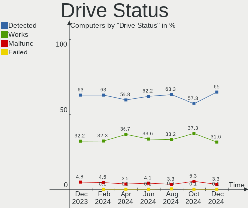
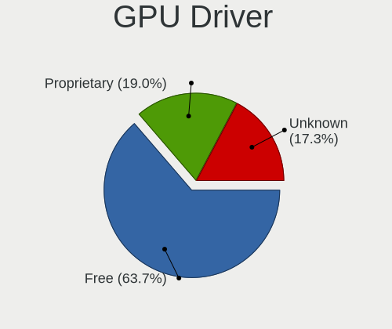

Ubuntu - Hardware Trends
------------------------

A project to identify most popular hardware characteristics and track their change
over time based on data collected by Linux users at https://Linux-Hardware.org.

Anyone can contribute to this report by the [hw-probe](https://github.com/linuxhw/hw-probe) tool:

    sudo -E hw-probe -all -upload

This is a report for all computer types. See also reports for [desktops](/Dist/Ubuntu/Desktop/README.md) and [notebooks](/Dist/Ubuntu/Notebook/README.md).

This report is for one last month. Overall report since the beginning of time: [TestDays](https://github.com/linuxhw/TestDays)

Period: Sep, 2023.

Contents
--------

* [ System ](#system)
  - [ OS                       ](#os)
  - [ OS Family                ](#os-family)
  - [ Kernel                   ](#kernel)
  - [ Kernel Family            ](#kernel-family)
  - [ Kernel Major Ver.        ](#kernel-major-ver)
  - [ Arch                     ](#arch)
  - [ DE                       ](#de)
  - [ Display Server           ](#display-server)
  - [ Display Manager          ](#display-manager)
  - [ OS Lang                  ](#os-lang)
  - [ Boot Mode                ](#boot-mode)
  - [ Filesystem               ](#filesystem)
  - [ Part. scheme             ](#part-scheme)
  - [ Dual Boot with Linux/BSD ](#dual-boot-with-linuxbsd)
  - [ Dual Boot (Win)          ](#dual-boot-win)

* [ Board ](#board)
  - [ Vendor                   ](#vendor)
  - [ Model                    ](#model)
  - [ Model Family             ](#model-family)
  - [ MFG Year                 ](#mfg-year)
  - [ Form Factor              ](#form-factor)
  - [ Secure Boot              ](#secure-boot)
  - [ Coreboot                 ](#coreboot)
  - [ RAM Size                 ](#ram-size)
  - [ RAM Used                 ](#ram-used)
  - [ Total Drives             ](#total-drives)
  - [ Has CD-ROM               ](#has-cd-rom)
  - [ Has Ethernet             ](#has-ethernet)
  - [ Has WiFi                 ](#has-wifi)
  - [ Has Bluetooth            ](#has-bluetooth)

* [ Location ](#location)
  - [ Country                  ](#country)
  - [ City                     ](#city)

* [ Drives ](#drives)
  - [ Drive Vendor             ](#drive-vendor)
  - [ Drive Model              ](#drive-model)
  - [ HDD Vendor               ](#hdd-vendor)
  - [ SSD Vendor               ](#ssd-vendor)
  - [ Drive Kind               ](#drive-kind)
  - [ Drive Connector          ](#drive-connector)
  - [ Drive Size               ](#drive-size)
  - [ Space Total              ](#space-total)
  - [ Space Used               ](#space-used)
  - [ Malfunc. Drives          ](#malfunc-drives)
  - [ Malfunc. Drive Vendor    ](#malfunc-drive-vendor)
  - [ Malfunc. HDD Vendor      ](#malfunc-hdd-vendor)
  - [ Malfunc. Drive Kind      ](#malfunc-drive-kind)
  - [ Failed Drives            ](#failed-drives)
  - [ Failed Drive Vendor      ](#failed-drive-vendor)
  - [ Drive Status             ](#drive-status)

* [ Storage controller ](#storage-controller)
  - [ Storage Vendor           ](#storage-vendor)
  - [ Storage Model            ](#storage-model)
  - [ Storage Kind             ](#storage-kind)

* [ Processor ](#processor)
  - [ CPU Vendor               ](#cpu-vendor)
  - [ CPU Model                ](#cpu-model)
  - [ CPU Model Family         ](#cpu-model-family)
  - [ CPU Cores                ](#cpu-cores)
  - [ CPU Sockets              ](#cpu-sockets)
  - [ CPU Threads              ](#cpu-threads)
  - [ CPU Op-Modes             ](#cpu-op-modes)
  - [ CPU Microcode            ](#cpu-microcode)
  - [ CPU Microarch            ](#cpu-microarch)

* [ Graphics ](#graphics)
  - [ GPU Vendor               ](#gpu-vendor)
  - [ GPU Model                ](#gpu-model)
  - [ GPU Combo                ](#gpu-combo)
  - [ GPU Driver               ](#gpu-driver)
  - [ GPU Memory               ](#gpu-memory)

* [ Monitor ](#monitor)
  - [ Monitor Vendor           ](#monitor-vendor)
  - [ Monitor Model            ](#monitor-model)
  - [ Monitor Resolution       ](#monitor-resolution)
  - [ Monitor Diagonal         ](#monitor-diagonal)
  - [ Monitor Width            ](#monitor-width)
  - [ Aspect Ratio             ](#aspect-ratio)
  - [ Monitor Area             ](#monitor-area)
  - [ Pixel Density            ](#pixel-density)
  - [ Multiple Monitors        ](#multiple-monitors)

* [ Network ](#network)
  - [ Net Controller Vendor    ](#net-controller-vendor)
  - [ Net Controller Model     ](#net-controller-model)
  - [ Wireless Vendor          ](#wireless-vendor)
  - [ Wireless Model           ](#wireless-model)
  - [ Ethernet Vendor          ](#ethernet-vendor)
  - [ Ethernet Model           ](#ethernet-model)
  - [ Net Controller Kind      ](#net-controller-kind)
  - [ Used Controller          ](#used-controller)
  - [ NICs                     ](#nics)
  - [ IPv6                     ](#ipv6)

* [ Bluetooth ](#bluetooth)
  - [ Bluetooth Vendor         ](#bluetooth-vendor)
  - [ Bluetooth Model          ](#bluetooth-model)

* [ Sound ](#sound)
  - [ Sound Vendor             ](#sound-vendor)
  - [ Sound Model              ](#sound-model)

* [ Memory ](#memory)
  - [ Memory Vendor            ](#memory-vendor)
  - [ Memory Model             ](#memory-model)
  - [ Memory Kind              ](#memory-kind)
  - [ Memory Form Factor       ](#memory-form-factor)
  - [ Memory Size              ](#memory-size)
  - [ Memory Speed             ](#memory-speed)

* [ Printers & scanners ](#printers--scanners)
  - [ Printer Vendor           ](#printer-vendor)
  - [ Printer Model            ](#printer-model)
  - [ Scanner Vendor           ](#scanner-vendor)
  - [ Scanner Model            ](#scanner-model)

* [ Camera ](#camera)
  - [ Camera Vendor            ](#camera-vendor)
  - [ Camera Model             ](#camera-model)

* [ Security ](#security)
  - [ Fingerprint Vendor       ](#fingerprint-vendor)
  - [ Fingerprint Model        ](#fingerprint-model)
  - [ Chipcard Vendor          ](#chipcard-vendor)
  - [ Chipcard Model           ](#chipcard-model)

* [ Unsupported ](#unsupported)
  - [ Unsupported Devices      ](#unsupported-devices)
  - [ Unsupported Device Types ](#unsupported-device-types)

System
------

OS
--

Installed operating systems

| Name           | Computers | Percent |
|----------------|-----------|---------|
| Ubuntu 22.04   | 799       | 67.65%  |
| Ubuntu 23.04   | 237       | 20.07%  |
| Ubuntu 20.04   | 97        | 8.21%   |
| Ubuntu 22.10   | 16        | 1.35%   |
| Ubuntu 18.04   | 15        | 1.27%   |
| Ubuntu 23.10   | 11        | 0.93%   |
| Ubuntu 21.04   | 4         | 0.34%   |
| Ubuntu Core 22 | 1         | 0.08%   |
| Ubuntu 20.10   | 1         | 0.08%   |

OS Family
---------

OS without a version

| Name   | Computers | Percent |
|--------|-----------|---------|
| Ubuntu | 1181      | 100%    |

Kernel
------

Version of the Linux kernel

| Version              | Computers | Percent |
|----------------------|-----------|---------|
| 6.2.0-32-generic     | 364       | 30.82%  |
| 6.2.0-33-generic     | 273       | 23.12%  |
| 6.2.0-31-generic     | 112       | 9.48%   |
| 5.15.0-83-generic    | 60        | 5.08%   |
| 6.2.0-26-generic     | 52        | 4.4%    |
| 5.15.0-69-generic    | 33        | 2.79%   |
| 5.15.0-84-generic    | 32        | 2.71%   |
| 5.15.0-82-generic    | 23        | 1.95%   |
| 5.19.0-46-generic    | 17        | 1.44%   |
| 6.2.0-20-generic     | 16        | 1.35%   |
| 6.2.0-34-generic     | 13        | 1.1%    |
| 6.5.1-060501-generic | 8         | 0.68%   |
| 5.19.0-50-generic    | 8         | 0.68%   |
| 5.19.0-32-generic    | 8         | 0.68%   |
| 6.5.0-5-generic      | 7         | 0.59%   |
| 5.4.0-162-generic    | 7         | 0.59%   |
| 5.4.0-156-generic    | 6         | 0.51%   |
| 5.4.0-150-generic    | 6         | 0.51%   |
| 5.15.0-79-generic    | 5         | 0.42%   |
| 6.2.0-27-generic     | 4         | 0.34%   |
| 5.4.0-159-generic    | 4         | 0.34%   |
| 4.15.0-213-generic   | 4         | 0.34%   |
| 6.5.0-1003-oem       | 3         | 0.25%   |
| 6.5.0-060500-generic | 3         | 0.25%   |
| 5.4.0-163-generic    | 3         | 0.25%   |
| 5.15.0-85-generic    | 3         | 0.25%   |
| 5.15.0-78-generic    | 3         | 0.25%   |
| 6.5.5-060505-generic | 2         | 0.17%   |
| 6.3.0-7-generic      | 2         | 0.17%   |
| 6.2.10               | 2         | 0.17%   |
| 6.2.0-25-generic     | 2         | 0.17%   |
| 6.2.0-1012-raspi     | 2         | 0.17%   |
| 6.2.0-10018-tuxedo   | 2         | 0.17%   |
| 6.2.0-060200-generic | 2         | 0.17%   |
| 5.19.0-41-generic    | 2         | 0.17%   |
| 5.17.0-1035-oem      | 2         | 0.17%   |
| 5.15.0-82-lowlatency | 2         | 0.17%   |
| 5.15.0-71-generic    | 2         | 0.17%   |
| 5.15.0-46-generic    | 2         | 0.17%   |
| 5.15.0-43-generic    | 2         | 0.17%   |

Kernel Family
-------------

Linux kernel without a distro release

| Version  | Computers | Percent |
|----------|-----------|---------|
| 6.2.0    | 847       | 71.72%  |
| 5.15.0   | 177       | 14.99%  |
| 5.19.0   | 42        | 3.56%   |
| 5.4.0    | 32        | 2.71%   |
| 6.5.0    | 13        | 1.1%    |
| 6.5.1    | 9         | 0.76%   |
| 4.15.0   | 9         | 0.76%   |
| 5.11.0   | 7         | 0.59%   |
| 5.17.0   | 4         | 0.34%   |
| 5.14.0   | 4         | 0.34%   |
| 6.5.5    | 3         | 0.25%   |
| 6.5.2    | 3         | 0.25%   |
| 6.3.0    | 3         | 0.25%   |
| 6.5.3    | 2         | 0.17%   |
| 6.4.12   | 2         | 0.17%   |
| 6.2.10   | 2         | 0.17%   |
| 6.1.55   | 2         | 0.17%   |
| 6.1.46   | 2         | 0.17%   |
| 6.1.0    | 2         | 0.17%   |
| 5.10.160 | 2         | 0.17%   |
| 6.5.4    | 1         | 0.08%   |
| 6.4.7    | 1         | 0.08%   |
| 6.4.6    | 1         | 0.08%   |
| 6.4.14   | 1         | 0.08%   |
| 6.4.0    | 1         | 0.08%   |
| 6.3.7    | 1         | 0.08%   |
| 6.2.6    | 1         | 0.08%   |
| 6.2.2    | 1         | 0.08%   |
| 6.0.0    | 1         | 0.08%   |
| 5.8.0    | 1         | 0.08%   |
| 5.19.17  | 1         | 0.08%   |
| 5.18.10  | 1         | 0.08%   |
| 5.15.23  | 1         | 0.08%   |
| 5.13.0   | 1         | 0.08%   |

Kernel Major Ver.
-----------------

Linux kernel major version

| Version | Computers | Percent |
|---------|-----------|---------|
| 6.2     | 851       | 72.06%  |
| 5.15    | 178       | 15.07%  |
| 5.19    | 43        | 3.64%   |
| 5.4     | 32        | 2.71%   |
| 6.5     | 31        | 2.62%   |
| 4.15    | 9         | 0.76%   |
| 5.11    | 7         | 0.59%   |
| 6.4     | 6         | 0.51%   |
| 6.1     | 6         | 0.51%   |
| 6.3     | 4         | 0.34%   |
| 5.17    | 4         | 0.34%   |
| 5.14    | 4         | 0.34%   |
| 5.10    | 2         | 0.17%   |
| 6.0     | 1         | 0.08%   |
| 5.8     | 1         | 0.08%   |
| 5.18    | 1         | 0.08%   |
| 5.13    | 1         | 0.08%   |

Arch
----

OS architecture (x86_64, i586, etc.)

| Name    | Computers | Percent |
|---------|-----------|---------|
| x86_64  | 1171      | 99.15%  |
| aarch64 | 8         | 0.68%   |
| i686    | 2         | 0.17%   |

DE
--

Desktop Environment

| Name            | Computers | Percent |
|-----------------|-----------|---------|
| GNOME           | 1069      | 90.52%  |
| Unknown         | 77        | 6.52%   |
| X-Cinnamon      | 15        | 1.27%   |
| GNOME Flashback | 6         | 0.51%   |
| Enlightenment   | 5         | 0.42%   |
| i3              | 3         | 0.25%   |
| GNOME Classic   | 3         | 0.25%   |
| sway            | 1         | 0.08%   |
| Cinnamon        | 1         | 0.08%   |
| awesome         | 1         | 0.08%   |

Display Server
--------------

X11 or Wayland

| Name    | Computers | Percent |
|---------|-----------|---------|
| Wayland | 678       | 57.41%  |
| X11     | 409       | 34.63%  |
| Unknown | 67        | 5.67%   |
| Tty     | 27        | 2.29%   |

Display Manager
---------------

SDDM, LightDM, etc.

| Name    | Computers | Percent |
|---------|-----------|---------|
| GDM3    | 987       | 83.57%  |
| Unknown | 125       | 10.58%  |
| GDM     | 39        | 3.3%    |
| LightDM | 27        | 2.29%   |
| SDDM    | 3         | 0.25%   |

OS Lang
-------

Language

| Lang    | Computers | Percent |
|---------|-----------|---------|
| en_US   | 524       | 44.37%  |
| de_DE   | 114       | 9.65%   |
| fr_FR   | 91        | 7.71%   |
| C       | 51        | 4.32%   |
| pt_BR   | 41        | 3.47%   |
| en_GB   | 40        | 3.39%   |
| it_IT   | 37        | 3.13%   |
| es_ES   | 30        | 2.54%   |
| ru_RU   | 29        | 2.46%   |
| en_CA   | 27        | 2.29%   |
| en_IN   | 19        | 1.61%   |
| en_AU   | 19        | 1.61%   |
| Unknown | 14        | 1.19%   |
| pl_PL   | 13        | 1.1%    |
| tr_TR   | 11        | 0.93%   |
| zh_CN   | 9         | 0.76%   |
| sv_SE   | 8         | 0.68%   |
| nl_NL   | 8         | 0.68%   |
| ja_JP   | 8         | 0.68%   |
| es_MX   | 8         | 0.68%   |
| hu_HU   | 6         | 0.51%   |
| en_PH   | 6         | 0.51%   |
| en_ZA   | 5         | 0.42%   |
| pt_PT   | 4         | 0.34%   |
| en_NZ   | 4         | 0.34%   |
| cs_CZ   | 4         | 0.34%   |
| ko_KR   | 3         | 0.25%   |
| fr_CA   | 3         | 0.25%   |
| fr_BE   | 3         | 0.25%   |
| fi_FI   | 3         | 0.25%   |
| es_AR   | 3         | 0.25%   |
| en_IL   | 3         | 0.25%   |
| ca_ES   | 3         | 0.25%   |
| zh_TW   | 2         | 0.17%   |
| nb_NO   | 2         | 0.17%   |
| es_VE   | 2         | 0.17%   |
| es_PE   | 2         | 0.17%   |
| de_AT   | 2         | 0.17%   |
| zh_HK   | 1         | 0.08%   |
| sr_RS   | 1         | 0.08%   |

Boot Mode
---------

EFI or BIOS

| Mode | Computers | Percent |
|------|-----------|---------|
| BIOS | 713       | 60.37%  |
| EFI  | 468       | 39.63%  |

Filesystem
----------

Type of filesystem

| Type    | Computers | Percent |
|---------|-----------|---------|
| Tmpfs   | 618       | 52.33%  |
| Ext4    | 473       | 40.05%  |
| Overlay | 54        | 4.57%   |
| Btrfs   | 17        | 1.44%   |
| Zfs     | 13        | 1.1%    |
| Xfs     | 6         | 0.51%   |

Part. scheme
------------

Scheme of partitioning

| Type    | Computers | Percent |
|---------|-----------|---------|
| GPT     | 954       | 80.78%  |
| MBR     | 121       | 10.25%  |
| Unknown | 106       | 8.98%   |

Dual Boot with Linux/BSD
------------------------

Hosting more than one Linux/BSD

| Dual boot | Computers | Percent |
|-----------|-----------|---------|
| No        | 1024      | 86.71%  |
| Yes       | 157       | 13.29%  |

Dual Boot (Win)
---------------

Hosting Linux and Windows

| Dual boot | Computers | Percent |
|-----------|-----------|---------|
| No        | 732       | 61.98%  |
| Yes       | 449       | 38.02%  |

Board
-----

Vendor
------

Motherboard manufacturer

| Name                                 | Computers | Percent |
|--------------------------------------|-----------|---------|
| ASUSTek Computer                     | 177       | 14.99%  |
| Lenovo                               | 169       | 14.31%  |
| Hewlett-Packard                      | 168       | 14.23%  |
| Dell                                 | 168       | 14.23%  |
| Acer                                 | 69        | 5.84%   |
| MSI                                  | 53        | 4.49%   |
| Apple                                | 47        | 3.98%   |
| Gigabyte Technology                  | 46        | 3.9%    |
| ASRock                               | 32        | 2.71%   |
| Supermicro                           | 20        | 1.69%   |
| Intel                                | 20        | 1.69%   |
| HUAWEI                               | 18        | 1.52%   |
| Samsung Electronics                  | 12        | 1.02%   |
| Unknown                              | 11        | 0.93%   |
| Toshiba                              | 10        | 0.85%   |
| Fujitsu                              | 10        | 0.85%   |
| ETegro Technologies                  | 10        | 0.85%   |
| Sony                                 | 7         | 0.59%   |
| Medion                               | 7         | 0.59%   |
| AZW                                  | 6         | 0.51%   |
| Raspberry Pi Foundation              | 5         | 0.42%   |
| Panasonic                            | 5         | 0.42%   |
| Gateway                              | 5         | 0.42%   |
| TUXEDO                               | 4         | 0.34%   |
| Notebook                             | 4         | 0.34%   |
| Google                               | 4         | 0.34%   |
| System76                             | 3         | 0.25%   |
| Pegatron                             | 3         | 0.25%   |
| Microsoft                            | 3         | 0.25%   |
| Infinix                              | 3         | 0.25%   |
| Foxconn                              | 3         | 0.25%   |
| Biostar                              | 3         | 0.25%   |
| UNOWHY                               | 2         | 0.17%   |
| Timi                                 | 2         | 0.17%   |
| Shenzhen Meigao Electronic Equipment | 2         | 0.17%   |
| Razer                                | 2         | 0.17%   |
| Positivo                             | 2         | 0.17%   |
| Huanan                               | 2         | 0.17%   |
| HOUTER                               | 2         | 0.17%   |
| HONOR                                | 2         | 0.17%   |

Model
-----

Motherboard model

| Name                               | Computers | Percent |
|------------------------------------|-----------|---------|
| Unknown                            | 13        | 1.1%    |
| ETegro Hyperion RS125 G4           | 10        | 0.85%   |
| ASUS All Series                    | 8         | 0.68%   |
| Supermicro X9DRW                   | 6         | 0.51%   |
| HP ProLiant DL360 Gen9             | 5         | 0.42%   |
| Dell PowerEdge R7625               | 5         | 0.42%   |
| Dell OptiPlex 9020                 | 5         | 0.42%   |
| Dell OptiPlex 7010                 | 5         | 0.42%   |
| HP Notebook                        | 4         | 0.34%   |
| Apple MacBookPro8,1                | 4         | 0.34%   |
| Supermicro X8DTU                   | 3         | 0.25%   |
| RPi Raspberry Pi 4 Model B Rev 1.2 | 3         | 0.25%   |
| MSI MS-7C95                        | 3         | 0.25%   |
| MSI MS-7C91                        | 3         | 0.25%   |
| Intel H61                          | 3         | 0.25%   |
| HUAWEI BOM-WXX9                    | 3         | 0.25%   |
| HP EliteBook x360 1030 G2          | 3         | 0.25%   |
| HP EliteBook 840 G8 Notebook PC    | 3         | 0.25%   |
| Gigabyte B450M DS3H                | 3         | 0.25%   |
| Dell XPS 15 7590                   | 3         | 0.25%   |
| Dell Precision M6800               | 3         | 0.25%   |
| Dell Precision 5550                | 3         | 0.25%   |
| Dell OptiPlex 790                  | 3         | 0.25%   |
| Dell Inspiron 1545                 | 3         | 0.25%   |
| ASUS X550CC                        | 3         | 0.25%   |
| Apple MacBookPro12,1               | 3         | 0.25%   |
| Acer Aspire E1-572G                | 3         | 0.25%   |
| Toshiba Satellite L855             | 2         | 0.17%   |
| Supermicro Super Server            | 2         | 0.17%   |
| Samsung 305E4A/305E5A/305E7A       | 2         | 0.17%   |
| MSI Prestige 14Evo A12M            | 2         | 0.17%   |
| MSI MS-7C94                        | 2         | 0.17%   |
| MSI MS-7B89                        | 2         | 0.17%   |
| MSI MS-7B84                        | 2         | 0.17%   |
| Lenovo ThinkCentre M83z 10C20003FR | 2         | 0.17%   |
| Lenovo ThinkBook 15 G2 ITL 20VE    | 2         | 0.17%   |
| Lenovo IdeaPadFlex 5 14ABR8 82XX   | 2         | 0.17%   |
| Lenovo IdeaPad 320-15IKB 81BG      | 2         | 0.17%   |
| Intel NUC11PAHi7                   | 2         | 0.17%   |
| HUAWEI NBLB-WAX9N                  | 2         | 0.17%   |

Model Family
------------

Motherboard model prefix

| Name               | Computers | Percent |
|--------------------|-----------|---------|
| Lenovo ThinkPad    | 77        | 6.52%   |
| Acer Aspire        | 48        | 4.06%   |
| Dell Latitude      | 40        | 3.39%   |
| HP EliteBook       | 35        | 2.96%   |
| Lenovo IdeaPad     | 34        | 2.88%   |
| Dell Inspiron      | 30        | 2.54%   |
| Dell Precision     | 29        | 2.46%   |
| ASUS ROG           | 25        | 2.12%   |
| Dell OptiPlex      | 24        | 2.03%   |
| HP ENVY            | 22        | 1.86%   |
| ASUS VivoBook      | 21        | 1.78%   |
| HP Pavilion        | 20        | 1.69%   |
| Dell XPS           | 16        | 1.35%   |
| HP Laptop          | 15        | 1.27%   |
| ASUS PRIME         | 15        | 1.27%   |
| Unknown            | 13        | 1.1%    |
| Lenovo ThinkCentre | 12        | 1.02%   |
| HP ProBook         | 12        | 1.02%   |
| Dell Vostro        | 12        | 1.02%   |
| Dell PowerEdge     | 12        | 1.02%   |
| ASUS ZenBook       | 11        | 0.93%   |
| ETegro Hyperion    | 10        | 0.85%   |
| HP Compaq          | 9         | 0.76%   |
| Lenovo Yoga        | 8         | 0.68%   |
| HP ProLiant        | 8         | 0.68%   |
| ASUS TUF           | 8         | 0.68%   |
| ASUS All           | 8         | 0.68%   |
| Lenovo Legion      | 7         | 0.59%   |
| Lenovo IdeaPadFlex | 7         | 0.59%   |
| HP ZBook           | 7         | 0.59%   |
| Acer Swift         | 7         | 0.59%   |
| Acer Nitro         | 7         | 0.59%   |
| Toshiba Satellite  | 6         | 0.51%   |
| Supermicro X9DRW   | 6         | 0.51%   |
| HP EliteDesk       | 6         | 0.51%   |
| RPi Raspberry      | 5         | 0.42%   |
| Lenovo ThinkBook   | 5         | 0.42%   |
| ASUS ASUS          | 5         | 0.42%   |
| Apple MacBookPro8  | 5         | 0.42%   |
| HP OMEN            | 4         | 0.34%   |

MFG Year
--------

Motherboard manufacture year

| Year    | Computers | Percent |
|---------|-----------|---------|
| 2022    | 129       | 10.92%  |
| 2021    | 118       | 9.99%   |
| 2020    | 113       | 9.57%   |
| 2018    | 93        | 7.87%   |
| 2013    | 85        | 7.2%    |
| 2019    | 79        | 6.69%   |
| 2023    | 75        | 6.35%   |
| 2011    | 73        | 6.18%   |
| 2012    | 72        | 6.1%    |
| 2017    | 65        | 5.5%    |
| 2014    | 59        | 5%      |
| 2015    | 51        | 4.32%   |
| 2016    | 47        | 3.98%   |
| 2009    | 40        | 3.39%   |
| 2010    | 39        | 3.3%    |
| 2008    | 19        | 1.61%   |
| 2007    | 14        | 1.19%   |
| Unknown | 9         | 0.76%   |
| 2005    | 1         | 0.08%   |

Form Factor
-----------

Physical design of the computer

| Name           | Computers | Percent |
|----------------|-----------|---------|
| Notebook       | 658       | 55.72%  |
| Desktop        | 371       | 31.41%  |
| Server         | 50        | 4.23%   |
| Convertible    | 46        | 3.9%    |
| Mini pc        | 23        | 1.95%   |
| All in one     | 17        | 1.44%   |
| System on chip | 8         | 0.68%   |
| Tablet         | 8         | 0.68%   |

Secure Boot
-----------

Enabled or disabled

| State    | Computers | Percent |
|----------|-----------|---------|
| Disabled | 1074      | 90.94%  |
| Enabled  | 107       | 9.06%   |

Coreboot
--------

Have coreboot on board

| Used | Computers | Percent |
|------|-----------|---------|
| No   | 1175      | 99.49%  |
| Yes  | 6         | 0.51%   |

RAM Size
--------

Total RAM memory

| Size in GB      | Computers | Percent |
|-----------------|-----------|---------|
| 16.01-24.0      | 285       | 24.13%  |
| 4.01-8.0        | 284       | 24.05%  |
| 8.01-16.0       | 202       | 17.1%   |
| 3.01-4.0        | 137       | 11.6%   |
| 32.01-64.0      | 131       | 11.09%  |
| 64.01-256.0     | 70        | 5.93%   |
| 24.01-32.0      | 41        | 3.47%   |
| 1.01-2.0        | 12        | 1.02%   |
| 2.01-3.0        | 11        | 0.93%   |
| More than 256.0 | 8         | 0.68%   |

RAM Used
--------

Used RAM memory

| Used GB         | Computers | Percent |
|-----------------|-----------|---------|
| 2.01-3.0        | 352       | 29.81%  |
| 1.01-2.0        | 325       | 27.52%  |
| 4.01-8.0        | 210       | 17.78%  |
| 3.01-4.0        | 189       | 16%     |
| 8.01-16.0       | 66        | 5.59%   |
| 0.51-1.0        | 13        | 1.1%    |
| 16.01-24.0      | 11        | 0.93%   |
| 24.01-32.0      | 6         | 0.51%   |
| More than 256.0 | 3         | 0.25%   |
| 0.01-0.5        | 3         | 0.25%   |
| 64.01-256.0     | 2         | 0.17%   |
| 32.01-64.0      | 1         | 0.08%   |

Total Drives
------------

Number of drives on board

| Drives | Computers | Percent |
|--------|-----------|---------|
| 1      | 745       | 63.08%  |
| 2      | 285       | 24.13%  |
| 3      | 86        | 7.28%   |
| 4      | 24        | 2.03%   |
| 5      | 11        | 0.93%   |
| 11     | 7         | 0.59%   |
| 6      | 5         | 0.42%   |
| 17     | 4         | 0.34%   |
| 9      | 4         | 0.34%   |
| 7      | 4         | 0.34%   |
| 0      | 4         | 0.34%   |
| 10     | 2         | 0.17%   |

Has CD-ROM
----------

Has CD-ROM on board

| Presented | Computers | Percent |
|-----------|-----------|---------|
| No        | 831       | 70.36%  |
| Yes       | 350       | 29.64%  |

Has Ethernet
------------

Has Ethernet on board

| Presented | Computers | Percent |
|-----------|-----------|---------|
| Yes       | 974       | 82.47%  |
| No        | 207       | 17.53%  |

Has WiFi
--------

Has WiFi module

| Presented | Computers | Percent |
|-----------|-----------|---------|
| Yes       | 918       | 77.73%  |
| No        | 263       | 22.27%  |

Has Bluetooth
-------------

Has Bluetooth module

| Presented | Computers | Percent |
|-----------|-----------|---------|
| Yes       | 771       | 65.28%  |
| No        | 410       | 34.72%  |

Location
--------

Country
-------

Geographic location (country)

| Country      | Computers | Percent |
|--------------|-----------|---------|
| USA          | 218       | 18.46%  |
| Germany      | 121       | 10.25%  |
| France       | 93        | 7.87%   |
| Russia       | 83        | 7.03%   |
| Brazil       | 53        | 4.49%   |
| Italy        | 49        | 4.15%   |
| Canada       | 43        | 3.64%   |
| Spain        | 37        | 3.13%   |
| UK           | 31        | 2.62%   |
| India        | 29        | 2.46%   |
| Poland       | 24        | 2.03%   |
| Australia    | 21        | 1.78%   |
| Turkey       | 19        | 1.61%   |
| Netherlands  | 16        | 1.35%   |
| Mexico       | 15        | 1.27%   |
| China        | 15        | 1.27%   |
| Hungary      | 14        | 1.19%   |
| Thailand     | 12        | 1.02%   |
| Japan        | 12        | 1.02%   |
| Austria      | 12        | 1.02%   |
| Argentina    | 12        | 1.02%   |
| Czechia      | 11        | 0.93%   |
| Belgium      | 11        | 0.93%   |
| Switzerland  | 10        | 0.85%   |
| Sweden       | 10        | 0.85%   |
| Finland      | 10        | 0.85%   |
| Norway       | 9         | 0.76%   |
| Portugal     | 8         | 0.68%   |
| Pakistan     | 8         | 0.68%   |
| South Korea  | 7         | 0.59%   |
| Philippines  | 7         | 0.59%   |
| Israel       | 7         | 0.59%   |
| Slovakia     | 6         | 0.51%   |
| Romania      | 6         | 0.51%   |
| New Zealand  | 6         | 0.51%   |
| Bulgaria     | 6         | 0.51%   |
| South Africa | 5         | 0.42%   |
| Morocco      | 5         | 0.42%   |
| Colombia     | 5         | 0.42%   |
| Chile        | 5         | 0.42%   |

City
----

Geographic location (city)

| City             | Computers | Percent |
|------------------|-----------|---------|
| Moscow           | 54        | 4.57%   |
| Sao Paulo        | 12        | 1.02%   |
| Warsaw           | 9         | 0.76%   |
| Paris            | 9         | 0.76%   |
| Berlin           | 9         | 0.76%   |
| St Petersburg    | 8         | 0.68%   |
| Valenciennes     | 7         | 0.59%   |
| Rome             | 7         | 0.59%   |
| Los Angeles      | 7         | 0.59%   |
| Istanbul         | 7         | 0.59%   |
| Helsinki         | 7         | 0.59%   |
| Vienna           | 6         | 0.51%   |
| Madrid           | 6         | 0.51%   |
| London           | 6         | 0.51%   |
| Houston          | 6         | 0.51%   |
| Hamburg          | 6         | 0.51%   |
| Budapest         | 6         | 0.51%   |
| Barcelona        | 6         | 0.51%   |
| Tokyo            | 5         | 0.42%   |
| Sydney           | 5         | 0.42%   |
| Seattle          | 5         | 0.42%   |
| Prague           | 5         | 0.42%   |
| Melbourne        | 5         | 0.42%   |
| Hat Yai          | 5         | 0.42%   |
| Champs-sur-Marne | 5         | 0.42%   |
| Calgary          | 5         | 0.42%   |
| Zurich           | 4         | 0.34%   |
| Wroclaw          | 4         | 0.34%   |
| Stuttgart        | 4         | 0.34%   |
| Singapore        | 4         | 0.34%   |
| Shanghai         | 4         | 0.34%   |
| Rochester        | 4         | 0.34%   |
| New York         | 4         | 0.34%   |
| Munich           | 4         | 0.34%   |
| Mumbai           | 4         | 0.34%   |
| Milan            | 4         | 0.34%   |
| Kosekoy          | 4         | 0.34%   |
| Essen            | 4         | 0.34%   |
| Dallas           | 4         | 0.34%   |
| Chicago          | 4         | 0.34%   |

Drives
------

Drive Vendor
------------

Hard drive vendors

| Vendor                       | Computers | Drives | Percent |
|------------------------------|-----------|--------|---------|
| Samsung Electronics          | 244       | 293    | 15.12%  |
| WDC                          | 184       | 223    | 11.4%   |
| Seagate                      | 174       | 218    | 10.78%  |
| SanDisk                      | 108       | 114    | 6.69%   |
| Toshiba                      | 80        | 86     | 4.96%   |
| Kingston                     | 71        | 76     | 4.4%    |
| SK hynix                     | 67        | 127    | 4.15%   |
| Intel                        | 57        | 61     | 3.53%   |
| Unknown                      | 54        | 61     | 3.35%   |
| Crucial                      | 54        | 55     | 3.35%   |
| Micron Technology            | 50        | 58     | 3.1%    |
| Hitachi                      | 40        | 42     | 2.48%   |
| KIOXIA                       | 26        | 26     | 1.61%   |
| Fujitsu                      | 26        | 57     | 1.61%   |
| Apple                        | 25        | 26     | 1.55%   |
| China                        | 23        | 23     | 1.43%   |
| HGST                         | 22        | 29     | 1.36%   |
| Kingston Technology Company  | 19        | 19     | 1.18%   |
| A-DATA Technology            | 19        | 20     | 1.18%   |
| Silicon Motion               | 17        | 17     | 1.05%   |
| Phison Electronics           | 13        | 14     | 0.81%   |
| Micron/Crucial Technology    | 13        | 13     | 0.81%   |
| Unknown                      | 11        | 11     | 0.68%   |
| Hewlett-Packard              | 10        | 24     | 0.62%   |
| Phison                       | 9         | 10     | 0.56%   |
| Transcend                    | 8         | 8      | 0.5%    |
| SPCC                         | 8         | 9      | 0.5%    |
| PNY                          | 8         | 8      | 0.5%    |
| LITEON                       | 8         | 8      | 0.5%    |
| Intenso                      | 8         | 13     | 0.5%    |
| ADATA Technology             | 8         | 9      | 0.5%    |
| Patriot                      | 7         | 7      | 0.43%   |
| Lexar                        | 6         | 6      | 0.37%   |
| JMicron Technology           | 6         | 6      | 0.37%   |
| Shenzhen Longsys Electronics | 5         | 5      | 0.31%   |
| OCZ                          | 5         | 5      | 0.31%   |
| Gigabyte Technology          | 5         | 5      | 0.31%   |
| FORESEE                      | 5         | 5      | 0.31%   |
| UMIS                         | 4         | 4      | 0.25%   |
| SSSTC                        | 4         | 4      | 0.25%   |

Drive Model
-----------

Hard drive models

| Model                                                 | Computers | Percent |
|-------------------------------------------------------|-----------|---------|
| Samsung NVMe SSD Controller SM981/PM981/PM983 256GB   | 30        | 1.73%   |
| Samsung NVMe SSD Controller PM9A1/PM9A3/980PRO 1TB    | 16        | 0.92%   |
| Fujitsu MBE2147RC 147GB                               | 15        | 0.86%   |
| Kingston SA400S37240G 240GB SSD                       | 14        | 0.81%   |
| Samsung SSD 860 EVO 500GB                             | 13        | 0.75%   |
| Seagate ST1000LM035-1RK172 1TB                        | 12        | 0.69%   |
| Sandisk WD Blue SN550 NVMe SSD 512GB                  | 12        | 0.69%   |
| Unknown MMC Card  64GB                                | 11        | 0.63%   |
| Kingston SA400S37480G 480GB SSD                       | 11        | 0.63%   |
| Unknown                                               | 11        | 0.63%   |
| Micron/Crucial P2 NVMe PCIe SSD 1TB                   | 10        | 0.58%   |
| Silicon Motion SM2263EN/SM2263XT SSD Controller 512GB | 9         | 0.52%   |
| Samsung SSD 850 EVO 250GB                             | 9         | 0.52%   |
| Unknown MMC Card  128GB                               | 8         | 0.46%   |
| Toshiba MQ04ABF100 1TB                                | 8         | 0.46%   |
| Seagate ST2000DM008-2FR102 2TB                        | 8         | 0.46%   |
| Crucial CT1000MX500SSD1 1TB                           | 8         | 0.46%   |
| Toshiba DT01ACA100 1TB                                | 7         | 0.4%    |
| Samsung SSD 980 PRO 2TB                               | 7         | 0.4%    |
| Samsung SSD 870 QVO 1TB                               | 7         | 0.4%    |
| Kingston Company SNV2S1000G 1TB                       | 7         | 0.4%    |
| Crucial CT480BX500SSD1 480GB                          | 7         | 0.4%    |
| SK hynix HFM512GD3JX013N 512GB                        | 6         | 0.35%   |
| Seagate ST9500325AS 500GB                             | 6         | 0.35%   |
| Seagate ST1000LM024 HN-M101MBB 1TB                    | 6         | 0.35%   |
| SanDisk NVMe SSD Drive 1TB                            | 6         | 0.35%   |
| Samsung SSD 850 EVO 500GB                             | 6         | 0.35%   |
| Samsung NVMe SSD Controller SM961/PM961/SM963 500GB   | 6         | 0.35%   |
| Kingston SA400S37960G 960GB SSD                       | 6         | 0.35%   |
| JMicron Generic 240GB                                 | 6         | 0.35%   |
| Intel SSDPEKNW512G8 512GB                             | 6         | 0.35%   |
| Intel SSDPEKNU512GZ 512GB                             | 6         | 0.35%   |
| Intel SSD 660P Series 1024GB                          | 6         | 0.35%   |
| Fujitsu MBA3147RC 147GB                               | 6         | 0.35%   |
| Crucial CT250MX500SSD1 250GB                          | 6         | 0.35%   |
| Crucial CT240BX500SSD1 240GB                          | 6         | 0.35%   |
| WDC WD10EZEX-60WN4A0 1TB                              | 5         | 0.29%   |
| Unknown MMC Card  32GB                                | 5         | 0.29%   |
| Seagate ST3500418AS 500GB                             | 5         | 0.29%   |
| Seagate ST1000DM010-2EP102 1TB                        | 5         | 0.29%   |

HDD Vendor
----------

Hard disk drive vendors

| Vendor              | Computers | Drives | Percent |
|---------------------|-----------|--------|---------|
| Seagate             | 169       | 212    | 34.21%  |
| WDC                 | 143       | 177    | 28.95%  |
| Toshiba             | 61        | 66     | 12.35%  |
| Hitachi             | 40        | 42     | 8.1%    |
| Fujitsu             | 26        | 57     | 5.26%   |
| HGST                | 22        | 29     | 4.45%   |
| Samsung Electronics | 14        | 15     | 2.83%   |
| Apple               | 5         | 5      | 1.01%   |
| Unknown             | 4         | 4      | 0.81%   |
| SABRENT             | 3         | 4      | 0.61%   |
| Hewlett-Packard     | 3         | 7      | 0.61%   |
| Initio              | 1         | 1      | 0.2%    |
| IBM-ESXS            | 1         | 6      | 0.2%    |
| HPE                 | 1         | 2      | 0.2%    |
| Unknown             | 1         | 1      | 0.2%    |

SSD Vendor
----------

Solid state drive vendors

| Vendor              | Computers | Drives | Percent |
|---------------------|-----------|--------|---------|
| Samsung Electronics | 92        | 109    | 18.51%  |
| Kingston            | 54        | 57     | 10.87%  |
| SanDisk             | 49        | 51     | 9.86%   |
| Crucial             | 46        | 47     | 9.26%   |
| WDC                 | 24        | 25     | 4.83%   |
| China               | 23        | 23     | 4.63%   |
| SK hynix            | 15        | 75     | 3.02%   |
| A-DATA Technology   | 14        | 15     | 2.82%   |
| Micron Technology   | 13        | 21     | 2.62%   |
| Apple               | 12        | 12     | 2.41%   |
| Toshiba             | 10        | 10     | 2.01%   |
| Intel               | 9         | 9      | 1.81%   |
| PNY                 | 8         | 8      | 1.61%   |
| LITEON              | 8         | 8      | 1.61%   |
| Transcend           | 7         | 7      | 1.41%   |
| Patriot             | 7         | 7      | 1.41%   |
| SPCC                | 6         | 7      | 1.21%   |
| JMicron Technology  | 6         | 6      | 1.21%   |
| Intenso             | 6         | 11     | 1.21%   |
| Hewlett-Packard     | 6         | 16     | 1.21%   |
| OCZ                 | 5         | 5      | 1.01%   |
| Lexar               | 5         | 5      | 1.01%   |
| Gigabyte Technology | 5         | 5      | 1.01%   |
| GOODRAM             | 4         | 5      | 0.8%    |
| Netac               | 3         | 3      | 0.6%    |
| KingSpec            | 3         | 3      | 0.6%    |
| Dogfish             | 3         | 3      | 0.6%    |
| Apacer              | 3         | 4      | 0.6%    |
| Team                | 2         | 2      | 0.4%    |
| Phison              | 2         | 2      | 0.4%    |
| NGFF                | 2         | 2      | 0.4%    |
| KIOXIA-EXCERIA      | 2         | 5      | 0.4%    |
| KingDian            | 2         | 2      | 0.4%    |
| GLOWAY              | 2         | 2      | 0.4%    |
| ASMT                | 2         | 3      | 0.4%    |
| AirDisk             | 2         | 2      | 0.4%    |
| Unknown             | 2         | 2      | 0.4%    |
| Zebronics           | 1         | 1      | 0.2%    |
| XUM                 | 1         | 1      | 0.2%    |
| Wodposit            | 1         | 1      | 0.2%    |

Drive Kind
----------

HDD or SSD

| Kind    | Computers | Drives | Percent |
|---------|-----------|--------|---------|
| NVMe    | 515       | 593    | 34.89%  |
| SSD     | 450       | 612    | 30.49%  |
| HDD     | 430       | 628    | 29.13%  |
| MMC     | 51        | 56     | 3.46%   |
| Unknown | 30        | 33     | 2.03%   |

Drive Connector
---------------

SATA, SAS, NVMe, etc.

| Type | Computers | Drives | Percent |
|------|-----------|--------|---------|
| SATA | 713       | 1159   | 52.47%  |
| NVMe | 515       | 593    | 37.9%   |
| SAS  | 80        | 114    | 5.89%   |
| MMC  | 51        | 56     | 3.75%   |

Drive Size
----------

Size of hard drive

| Size in TB | Computers | Drives | Percent |
|------------|-----------|--------|---------|
| 0.01-0.5   | 517       | 676    | 56.88%  |
| 0.51-1.0   | 258       | 311    | 28.38%  |
| 1.01-2.0   | 70        | 90     | 7.7%    |
| 3.01-4.0   | 25        | 98     | 2.75%   |
| 4.01-10.0  | 23        | 33     | 2.53%   |
| 2.01-3.0   | 12        | 21     | 1.32%   |
| 10.01-20.0 | 4         | 11     | 0.44%   |

Space Total
-----------

Amount of disk space available on the file system

| Size in GB     | Computers | Percent |
|----------------|-----------|---------|
| 101-250        | 316       | 26.76%  |
| 251-500        | 310       | 26.25%  |
| 501-1000       | 200       | 16.93%  |
| 51-100         | 76        | 6.44%   |
| 1001-2000      | 75        | 6.35%   |
| More than 3000 | 52        | 4.4%    |
| Unknown        | 48        | 4.06%   |
| 1-20           | 45        | 3.81%   |
| 2001-3000      | 32        | 2.71%   |
| 21-50          | 27        | 2.29%   |

Space Used
----------

Amount of used disk space

| Used GB        | Computers | Percent |
|----------------|-----------|---------|
| 1-20           | 354       | 29.97%  |
| 21-50          | 260       | 22.02%  |
| 51-100         | 162       | 13.72%  |
| 101-250        | 156       | 13.21%  |
| 251-500        | 97        | 8.21%   |
| 501-1000       | 48        | 4.06%   |
| Unknown        | 48        | 4.06%   |
| 1001-2000      | 28        | 2.37%   |
| More than 3000 | 21        | 1.78%   |
| 2001-3000      | 7         | 0.59%   |

Malfunc. Drives
---------------

Drive models with a malfunction

| Model                                 | Computers | Drives | Percent |
|---------------------------------------|-----------|--------|---------|
| Toshiba MQ04ABF100 1TB                | 2         | 2      | 3.51%   |
| Seagate ST500LM021-1KJ152 500GB       | 2         | 2      | 3.51%   |
| WDC WDS240G2G0A-00JH30 240GB SSD      | 1         | 1      | 1.75%   |
| WDC WD6400AACS-00G8B1 640GB           | 1         | 1      | 1.75%   |
| WDC WD5000BPVT-22HXZT1 500GB          | 1         | 1      | 1.75%   |
| WDC WD5000AAKX-001CA0 500GB           | 1         | 1      | 1.75%   |
| WDC WD3200BEKT-60V5T1 320GB           | 1         | 1      | 1.75%   |
| WDC WD30EFRX-68EUZN0 3TB              | 1         | 1      | 1.75%   |
| WDC WD2500BEVT-22A23T0 208GB          | 1         | 1      | 1.75%   |
| WDC WD20EARS-00MVWB0 2TB              | 1         | 1      | 1.75%   |
| WDC WD10SPZX-75Z10T1 1TB              | 1         | 1      | 1.75%   |
| WDC WD10EZEX-21WN4A0 1TB              | 1         | 1      | 1.75%   |
| WDC WD10EZEX-21M2NA0 1TB              | 1         | 1      | 1.75%   |
| WDC WD10EZEX-00WN4A0 1TB              | 1         | 1      | 1.75%   |
| WDC WD1001FALS-00J7B1 1TB             | 1         | 1      | 1.75%   |
| WDC WD Green 2.5 240GB                | 1         | 1      | 1.75%   |
| WDC WD Blue SA510 M.2 2280 1000GB SSD | 1         | 1      | 1.75%   |
| Toshiba MQ01ABD064 640GB              | 1         | 1      | 1.75%   |
| Toshiba MQ01ABD050 500GB              | 1         | 1      | 1.75%   |
| SSSTC CA6-8D2048-Q11 NVMe 2048GB      | 1         | 1      | 1.75%   |
| SPCC M.2 PCIe SSD 512GB               | 1         | 1      | 1.75%   |
| SK hynix HFS256G39TND-N210A 256GB SSD | 1         | 1      | 1.75%   |
| Seagate ST9500325AS 500GB             | 1         | 1      | 1.75%   |
| Seagate ST500VT000-1DK142 500GB       | 1         | 1      | 1.75%   |
| Seagate ST500LT012-9WS142 500GB       | 1         | 1      | 1.75%   |
| Seagate ST500DM002-1BD142 500GB       | 1         | 1      | 1.75%   |
| Seagate ST3500414CS 500GB             | 1         | 1      | 1.75%   |
| Seagate ST31000528AS 1TB              | 1         | 1      | 1.75%   |
| Seagate ST2000DM008-2FR102 2TB        | 1         | 1      | 1.75%   |
| Seagate ST2000DM001-9YN164 2TB        | 1         | 1      | 1.75%   |
| Seagate ST14000NM0018-2H4101 14TB     | 1         | 1      | 1.75%   |
| Seagate ST1000NM0011 1TB              | 1         | 2      | 1.75%   |
| Seagate ST1000LM014-SSHD-8GB          | 1         | 1      | 1.75%   |
| Seagate ST1000DM003-1CH162 1TB        | 1         | 2      | 1.75%   |
| SanDisk SSD PLUS 240GB                | 1         | 1      | 1.75%   |
| SanDisk SSD PLUS 120GB                | 1         | 1      | 1.75%   |
| Samsung Electronics SSD 960 EVO 500GB | 1         | 1      | 1.75%   |
| Samsung Electronics SSD 870 EVO 500GB | 1         | 1      | 1.75%   |
| Samsung Electronics SSD 840 EVO 500GB | 1         | 1      | 1.75%   |
| Samsung Electronics HD502HI 500GB     | 1         | 1      | 1.75%   |

Malfunc. Drive Vendor
---------------------

Vendors of faulty drives

| Vendor              | Computers | Drives | Percent |
|---------------------|-----------|--------|---------|
| WDC                 | 15        | 15     | 26.32%  |
| Seagate             | 14        | 16     | 24.56%  |
| Samsung Electronics | 5         | 5      | 8.77%   |
| Toshiba             | 4         | 4      | 7.02%   |
| SanDisk             | 2         | 2      | 3.51%   |
| Micron Technology   | 2         | 2      | 3.51%   |
| Intel               | 2         | 2      | 3.51%   |
| Hitachi             | 2         | 3      | 3.51%   |
| HGST                | 2         | 2      | 3.51%   |
| Crucial             | 2         | 2      | 3.51%   |
| SSSTC               | 1         | 1      | 1.75%   |
| SPCC                | 1         | 1      | 1.75%   |
| SK hynix            | 1         | 1      | 1.75%   |
| Patriot             | 1         | 1      | 1.75%   |
| OCZ                 | 1         | 1      | 1.75%   |
| Lenovo              | 1         | 1      | 1.75%   |
| Apple               | 1         | 1      | 1.75%   |

Malfunc. HDD Vendor
-------------------

Vendors of faulty HDD drives

| Vendor              | Computers | Drives | Percent |
|---------------------|-----------|--------|---------|
| Seagate             | 14        | 16     | 38.89%  |
| WDC                 | 12        | 12     | 33.33%  |
| Toshiba             | 4         | 4      | 11.11%  |
| Samsung Electronics | 2         | 2      | 5.56%   |
| Hitachi             | 2         | 3      | 5.56%   |
| HGST                | 2         | 2      | 5.56%   |

Malfunc. Drive Kind
-------------------

Kinds of faulty drives

| Kind | Computers | Drives | Percent |
|------|-----------|--------|---------|
| HDD  | 35        | 39     | 62.5%   |
| SSD  | 16        | 16     | 28.57%  |
| NVMe | 5         | 5      | 8.93%   |

Failed Drives
-------------

Failed drive models

| Model                             | Computers | Drives | Percent |
|-----------------------------------|-----------|--------|---------|
| Samsung Electronics SSD 980 500GB | 1         | 1      | 50%     |
| A-DATA Technology SX8200PNP 256GB | 1         | 1      | 50%     |

Failed Drive Vendor
-------------------

Failed drive vendors

| Vendor              | Computers | Drives | Percent |
|---------------------|-----------|--------|---------|
| Samsung Electronics | 1         | 1      | 50%     |
| A-DATA Technology   | 1         | 1      | 50%     |

Drive Status
------------

Number of failed and malfunc. drives

| Status   | Computers | Drives | Percent |
|----------|-----------|--------|---------|
| Detected | 761       | 1189   | 61.27%  |
| Works    | 425       | 671    | 34.22%  |
| Malfunc  | 54        | 60     | 4.35%   |
| Failed   | 2         | 2      | 0.16%   |

Storage controller
------------------

Storage Vendor
--------------

Storage controller vendors

| Vendor                                  | Computers | Percent |
|-----------------------------------------|-----------|---------|
| Intel                                   | 758       | 48.59%  |
| AMD                                     | 179       | 11.47%  |
| Samsung Electronics                     | 154       | 9.87%   |
| SanDisk                                 | 82        | 5.26%   |
| SK hynix                                | 52        | 3.33%   |
| Micron Technology                       | 37        | 2.37%   |
| Kingston Technology Company             | 36        | 2.31%   |
| KIOXIA                                  | 26        | 1.67%   |
| Phison Electronics                      | 23        | 1.47%   |
| ASMedia Technology                      | 21        | 1.35%   |
| Silicon Motion                          | 20        | 1.28%   |
| Micron/Crucial Technology               | 20        | 1.28%   |
| LSI Logic / Symbios Logic               | 20        | 1.28%   |
| Nvidia                                  | 18        | 1.15%   |
| Toshiba America Info Systems            | 13        | 0.83%   |
| JMicron Technology                      | 12        | 0.77%   |
| Broadcom / LSI                          | 12        | 0.77%   |
| ADATA Technology                        | 12        | 0.77%   |
| Shenzhen Longsys Electronics            | 10        | 0.64%   |
| Marvell Technology Group                | 9         | 0.58%   |
| Apple                                   | 9         | 0.58%   |
| Hewlett-Packard                         | 8         | 0.51%   |
| MAXIO Technology (Hangzhou)             | 5         | 0.32%   |
| Union Memory (Shenzhen)                 | 4         | 0.26%   |
| Solid State Storage Technology          | 4         | 0.26%   |
| Realtek Semiconductor                   | 3         | 0.19%   |
| Seagate Technology                      | 2         | 0.13%   |
| Adaptec                                 | 2         | 0.13%   |
| Yangtze Memory Technologies             | 1         | 0.06%   |
| VIA Technologies                        | 1         | 0.06%   |
| Transcend                               | 1         | 0.06%   |
| Solidigm                                | 1         | 0.06%   |
| Silicon Image                           | 1         | 0.06%   |
| Shenzhen Unionmemory Information System | 1         | 0.06%   |
| Netac Technology                        | 1         | 0.06%   |
| Lenovo                                  | 1         | 0.06%   |
| Unknown                                 | 1         | 0.06%   |

Storage Model
-------------

Storage controller models

| Model                                                                          | Computers | Percent |
|--------------------------------------------------------------------------------|-----------|---------|
| AMD FCH SATA Controller [AHCI mode]                                            | 122       | 7%      |
| Intel Volume Management Device NVMe RAID Controller                            | 59        | 3.39%   |
| Samsung NVMe SSD Controller SM981/PM981/PM983                                  | 56        | 3.21%   |
| Intel Sunrise Point-LP SATA Controller [AHCI mode]                             | 51        | 2.93%   |
| Intel 8 Series/C220 Series Chipset Family 6-port SATA Controller 1 [AHCI mode] | 49        | 2.81%   |
| Intel 7 Series Chipset Family 6-port SATA Controller [AHCI mode]               | 41        | 2.35%   |
| Intel 82801 Mobile SATA Controller [RAID mode]                                 | 40        | 2.3%    |
| Samsung NVMe SSD Controller PM9A1/PM9A3/980PRO                                 | 36        | 2.07%   |
| Intel 6 Series/C200 Series Chipset Family 6 port Mobile SATA AHCI Controller   | 34        | 1.95%   |
| Samsung NVMe SSD Controller 980                                                | 30        | 1.72%   |
| Intel 6 Series/C200 Series Chipset Family 6 port Desktop SATA AHCI Controller  | 28        | 1.61%   |
| Intel Celeron/Pentium Silver Processor SATA Controller                         | 26        | 1.49%   |
| Intel 8 Series SATA Controller 1 [AHCI mode]                                   | 26        | 1.49%   |
| AMD 500 Series Chipset SATA Controller                                         | 26        | 1.49%   |
| SK hynix Gold P31/BC711/PC711 NVMe Solid State Drive                           | 25        | 1.44%   |
| Intel Tiger Lake-LP SATA Controller                                            | 22        | 1.26%   |
| ASMedia ASM1062 Serial ATA Controller                                          | 21        | 1.21%   |
| Intel SATA Controller [RAID mode]                                              | 20        | 1.15%   |
| Intel Q170/Q150/B150/H170/H110/Z170/CM236 Chipset SATA Controller [AHCI Mode]  | 19        | 1.09%   |
| Intel 200 Series PCH SATA controller [AHCI mode]                               | 19        | 1.09%   |
| Intel Wildcat Point-LP SATA Controller [AHCI Mode]                             | 18        | 1.03%   |
| Intel SSD 670p Series [Keystone Harbor]                                        | 18        | 1.03%   |
| Intel 7 Series/C210 Series Chipset Family 6-port SATA Controller [AHCI mode]   | 18        | 1.03%   |
| AMD 400 Series Chipset SATA Controller                                         | 18        | 1.03%   |
| SanDisk WD Blue SN550 NVMe SSD                                                 | 17        | 0.98%   |
| Intel Cannon Lake Mobile PCH SATA AHCI Controller                              | 17        | 0.98%   |
| Intel Comet Lake SATA AHCI Controller                                          | 16        | 0.92%   |
| Intel C602 chipset 4-Port SATA Storage Control Unit                            | 16        | 0.92%   |
| Samsung NVMe SSD Controller SM961/PM961/SM963                                  | 15        | 0.86%   |
| KIOXIA NVMe SSD Controller BG4 (DRAM-less)                                     | 15        | 0.86%   |
| Intel SSD 660P Series                                                          | 15        | 0.86%   |
| Intel 5 Series/3400 Series Chipset 4 port SATA AHCI Controller                 | 15        | 0.86%   |
| AMD SB7x0/SB8x0/SB9x0 SATA Controller [AHCI mode]                              | 15        | 0.86%   |
| Kingston Company Company Non-Volatile memory controller                        | 14        | 0.8%    |
| Intel Cannon Lake PCH SATA AHCI Controller                                     | 14        | 0.8%    |
| Intel 5 Series/3400 Series Chipset 6 port SATA AHCI Controller                 | 13        | 0.75%   |
| Silicon Motion SM2263EN/SM2263XT (DRAM-less) NVMe SSD Controllers              | 12        | 0.69%   |
| Micron/Crucial P2 [Nick P2] / P3 / P3 Plus NVMe PCIe SSD (DRAM-less)           | 12        | 0.69%   |
| SanDisk WD Black SN750 / PC SN730 NVMe SSD                                     | 11        | 0.63%   |
| Micron 2450 NVMe SSD [HendrixV] (DRAM-less)                                    | 11        | 0.63%   |

Storage Kind
------------

Kind of storage controller (IDE, SATA, NVMe, SAS, ...)

| Kind | Computers | Percent |
|------|-----------|---------|
| SATA | 769       | 49.17%  |
| NVMe | 516       | 32.99%  |
| RAID | 154       | 9.85%   |
| IDE  | 93        | 5.95%   |
| SAS  | 27        | 1.73%   |
| SCSI | 5         | 0.32%   |

Processor
---------

CPU Vendor
----------

Processor vendors

| Vendor       | Computers | Percent |
|--------------|-----------|---------|
| Intel        | 917       | 77.65%  |
| AMD          | 255       | 21.59%  |
| ARM          | 8         | 0.68%   |
| CentaurHauls | 1         | 0.08%   |

CPU Model
---------

Processor models

| Model                                   | Computers | Percent |
|-----------------------------------------|-----------|---------|
| Intel 11th Gen Core i7-1165G7 @ 2.80GHz | 24        | 2.03%   |
| Intel 11th Gen Core i5-1135G7 @ 2.40GHz | 18        | 1.52%   |
| Intel Core i5-8250U CPU @ 1.60GHz       | 16        | 1.35%   |
| Intel Xeon CPU E5-2620 v2 @ 2.10GHz     | 11        | 0.93%   |
| AMD Ryzen 7 5700U with Radeon Graphics  | 11        | 0.93%   |
| Intel Core i7-9750H CPU @ 2.60GHz       | 10        | 0.85%   |
| Intel Core i5-7200U CPU @ 2.50GHz       | 10        | 0.85%   |
| Intel Core i5-6200U CPU @ 2.30GHz       | 10        | 0.85%   |
| Intel Core i7-8550U CPU @ 1.80GHz       | 9         | 0.76%   |
| Intel Core i7-10750H CPU @ 2.60GHz      | 8         | 0.68%   |
| Intel Core i7-10510U CPU @ 1.80GHz      | 8         | 0.68%   |
| Intel Core i5-2520M CPU @ 2.50GHz       | 8         | 0.68%   |
| Intel Core i5-10210U CPU @ 1.60GHz      | 8         | 0.68%   |
| Intel 12th Gen Core i7-12700H           | 8         | 0.68%   |
| Intel 11th Gen Core i3-1115G4 @ 3.00GHz | 8         | 0.68%   |
| ARM Processor                           | 8         | 0.68%   |
| AMD Ryzen 5 5500U with Radeon Graphics  | 8         | 0.68%   |
| AMD Ryzen 5 3600 6-Core Processor       | 8         | 0.68%   |
| Intel Xeon CPU E5-2680 v4 @ 2.40GHz     | 7         | 0.59%   |
| Intel Core i7-3770 CPU @ 3.40GHz        | 7         | 0.59%   |
| Intel Core i5-7300U CPU @ 2.60GHz       | 7         | 0.59%   |
| Intel Core i5-4590 CPU @ 3.30GHz        | 7         | 0.59%   |
| Intel 12th Gen Core i5-1235U            | 7         | 0.59%   |
| AMD Ryzen 7 5825U with Radeon Graphics  | 7         | 0.59%   |
| AMD Ryzen 5 5600G with Radeon Graphics  | 7         | 0.59%   |
| Intel Core i7-8650U CPU @ 1.90GHz       | 6         | 0.51%   |
| Intel Core i7-2600 CPU @ 3.40GHz        | 6         | 0.51%   |
| Intel Core i5-8265U CPU @ 1.60GHz       | 6         | 0.51%   |
| Intel Core i5-6300U CPU @ 2.40GHz       | 6         | 0.51%   |
| Intel Core i5-5300U CPU @ 2.30GHz       | 6         | 0.51%   |
| Intel Core i3-4030U CPU @ 1.90GHz       | 6         | 0.51%   |
| Intel Celeron N4000 CPU @ 1.10GHz       | 6         | 0.51%   |
| Intel 13th Gen Core i7-13700H           | 6         | 0.51%   |
| AMD Ryzen 7 4700U with Radeon Graphics  | 6         | 0.51%   |
| AMD Ryzen 5 5600X 6-Core Processor      | 6         | 0.51%   |
| AMD Ryzen 5 5600H with Radeon Graphics  | 6         | 0.51%   |
| Intel Core i7-8750H CPU @ 2.20GHz       | 5         | 0.42%   |
| Intel Core i7-6700HQ CPU @ 2.60GHz      | 5         | 0.42%   |
| Intel Core i7-4510U CPU @ 2.00GHz       | 5         | 0.42%   |
| Intel Core i5-3470 CPU @ 3.20GHz        | 5         | 0.42%   |

CPU Model Family
----------------

Processor model prefix

| Model                   | Computers | Percent |
|-------------------------|-----------|---------|
| Intel Core i5           | 251       | 21.25%  |
| Intel Core i7           | 201       | 17.02%  |
| Other                   | 181       | 15.33%  |
| Intel Core i3           | 81        | 6.86%   |
| AMD Ryzen 5             | 73        | 6.18%   |
| Intel Xeon              | 69        | 5.84%   |
| AMD Ryzen 7             | 68        | 5.76%   |
| Intel Celeron           | 58        | 4.91%   |
| Intel Core 2 Duo        | 29        | 2.46%   |
| AMD Ryzen 9             | 23        | 1.95%   |
| Intel Pentium           | 19        | 1.61%   |
| AMD FX                  | 11        | 0.93%   |
| AMD Ryzen 3             | 10        | 0.85%   |
| AMD A10                 | 8         | 0.68%   |
| Intel Pentium Silver    | 7         | 0.59%   |
| Intel Atom              | 7         | 0.59%   |
| AMD A8                  | 7         | 0.59%   |
| AMD A6                  | 7         | 0.59%   |
| Intel Pentium Dual-Core | 6         | 0.51%   |
| AMD EPYC                | 6         | 0.51%   |
| Intel Core 2 Quad       | 4         | 0.34%   |
| AMD Ryzen 7 PRO         | 4         | 0.34%   |
| Intel Xeon Gold         | 3         | 0.25%   |
| Intel Core i9           | 3         | 0.25%   |
| AMD Turion 64 X2 Mobile | 3         | 0.25%   |
| AMD Ryzen Threadripper  | 3         | 0.25%   |
| AMD Ryzen 5 PRO         | 3         | 0.25%   |
| AMD Athlon 64 X2        | 3         | 0.25%   |
| AMD Athlon              | 3         | 0.25%   |
| AMD A4                  | 3         | 0.25%   |
| Intel Xeon Silver       | 2         | 0.17%   |
| Intel Pentium Dual      | 2         | 0.17%   |
| Intel Genuine           | 2         | 0.17%   |
| AMD Phenom II X6        | 2         | 0.17%   |
| AMD Phenom II X4        | 2         | 0.17%   |
| AMD Athlon X4           | 2         | 0.17%   |
| AMD Athlon II X2        | 2         | 0.17%   |
| Intel Xeon Platinum     | 1         | 0.08%   |
| Intel Pentium 4         | 1         | 0.08%   |
| Intel Core 2 Extreme    | 1         | 0.08%   |

CPU Cores
---------

Number of processor cores

| Number  | Computers | Percent |
|---------|-----------|---------|
| 4       | 394       | 33.36%  |
| 2       | 367       | 31.08%  |
| 6       | 136       | 11.52%  |
| 8       | 108       | 9.14%   |
| 12      | 49        | 4.15%   |
| 14      | 30        | 2.54%   |
| 10      | 28        | 2.37%   |
| 16      | 20        | 1.69%   |
| 24      | 10        | 0.85%   |
| 28      | 7         | 0.59%   |
| 1       | 6         | 0.51%   |
| 128     | 5         | 0.42%   |
| 3       | 4         | 0.34%   |
| Unknown | 4         | 0.34%   |
| 44      | 3         | 0.25%   |
| 40      | 3         | 0.25%   |
| 20      | 3         | 0.25%   |
| 52      | 1         | 0.08%   |
| 48      | 1         | 0.08%   |
| 36      | 1         | 0.08%   |
| 32      | 1         | 0.08%   |

CPU Sockets
-----------

Number of sockets

| Number  | Computers | Percent |
|---------|-----------|---------|
| 1       | 1118      | 94.67%  |
| 2       | 57        | 4.83%   |
| Unknown | 4         | 0.34%   |
| 4       | 1         | 0.08%   |
| 3       | 1         | 0.08%   |

CPU Threads
-----------

Threads per core (Hyper-Threading)

| Number  | Computers | Percent |
|---------|-----------|---------|
| 2       | 863       | 73.07%  |
| 1       | 314       | 26.59%  |
| Unknown | 4         | 0.34%   |

CPU Op-Modes
------------

CPU Operation Modes (32-bit, 64-bit)

| Op mode        | Computers | Percent |
|----------------|-----------|---------|
| 32-bit, 64-bit | 1180      | 99.92%  |
| 32-bit         | 1         | 0.08%   |

CPU Microcode
-------------

Microcode number

| Number     | Computers | Percent |
|------------|-----------|---------|
| Unknown    | 888       | 75.19%  |
| 0x0a50000d | 18        | 1.52%   |
| 0x306e4    | 17        | 1.44%   |
| 0x206a7    | 17        | 1.44%   |
| 0x0a50000c | 15        | 1.27%   |
| 0x0a601203 | 13        | 1.1%    |
| 0x406f1    | 11        | 0.93%   |
| 0x08608103 | 11        | 0.93%   |
| 0x306c3    | 10        | 0.85%   |
| 0x306a9    | 10        | 0.85%   |
| 0x206c2    | 8         | 0.68%   |
| 0x08600106 | 8         | 0.68%   |
| 0x40651    | 7         | 0.59%   |
| 0xb06a2    | 6         | 0.51%   |
| 0x806c1    | 5         | 0.42%   |
| 0x0a20120a | 5         | 0.42%   |
| 0x08701021 | 5         | 0.42%   |
| 0x08108109 | 5         | 0.42%   |
| 0xa0652    | 4         | 0.34%   |
| 0x906ea    | 4         | 0.34%   |
| 0x906a4    | 4         | 0.34%   |
| 0x806ea    | 4         | 0.34%   |
| 0x30678    | 4         | 0.34%   |
| 0x0a101116 | 4         | 0.34%   |
| 0x0800820d | 4         | 0.34%   |
| 0x03000027 | 4         | 0.34%   |
| 0xb0671    | 3         | 0.25%   |
| 0x806ec    | 3         | 0.25%   |
| 0x406e3    | 3         | 0.25%   |
| 0x206d7    | 3         | 0.25%   |
| 0x1067a    | 3         | 0.25%   |
| 0x0a404102 | 3         | 0.25%   |
| 0xa0653    | 2         | 0.17%   |
| 0x906e9    | 2         | 0.17%   |
| 0x906a3    | 2         | 0.17%   |
| 0x90675    | 2         | 0.17%   |
| 0x806eb    | 2         | 0.17%   |
| 0x806d1    | 2         | 0.17%   |
| 0x20655    | 2         | 0.17%   |
| 0x106e5    | 2         | 0.17%   |

CPU Microarch
-------------

Microarchitecture

| Name             | Computers | Percent |
|------------------|-----------|---------|
| KabyLake         | 177       | 14.99%  |
| Unknown          | 114       | 9.65%   |
| Haswell          | 97        | 8.21%   |
| SandyBridge      | 88        | 7.45%   |
| IvyBridge        | 88        | 7.45%   |
| Zen 3            | 66        | 5.59%   |
| TigerLake        | 63        | 5.33%   |
| Alderlake Hybrid | 60        | 5.08%   |
| Skylake          | 59        | 5%      |
| Westmere         | 38        | 3.22%   |
| Broadwell        | 37        | 3.13%   |
| Zen 2            | 36        | 3.05%   |
| Penryn           | 33        | 2.79%   |
| Goldmont plus    | 28        | 2.37%   |
| CometLake        | 26        | 2.2%    |
| Zen+             | 23        | 1.95%   |
| Icelake          | 23        | 1.95%   |
| Silvermont       | 19        | 1.61%   |
| Piledriver       | 17        | 1.44%   |
| Nehalem          | 11        | 0.93%   |
| K10              | 11        | 0.93%   |
| Excavator        | 11        | 0.93%   |
| Core             | 11        | 0.93%   |
| Zen              | 8         | 0.68%   |
| Goldmont         | 7         | 0.59%   |
| Steamroller      | 6         | 0.51%   |
| K8 Hammer        | 6         | 0.51%   |
| K10 Llano        | 5         | 0.42%   |
| Tremont          | 3         | 0.25%   |
| Jaguar           | 3         | 0.25%   |
| Puma             | 2         | 0.17%   |
| NetBurst         | 1         | 0.08%   |
| K8 & K10 hybrid  | 1         | 0.08%   |
| Bulldozer        | 1         | 0.08%   |
| Bonnell          | 1         | 0.08%   |
| Bobcat           | 1         | 0.08%   |

Graphics
--------

GPU Vendor
----------

Vendors of graphics cards

| Vendor                     | Computers | Percent |
|----------------------------|-----------|---------|
| Intel                      | 714       | 50.71%  |
| Nvidia                     | 346       | 24.57%  |
| AMD                        | 293       | 20.81%  |
| Matrox Electronics Systems | 34        | 2.41%   |
| ASPEED Technology          | 20        | 1.42%   |
| Zhaoxin                    | 1         | 0.07%   |

GPU Model
---------

Graphics card models

| Model                                                                       | Computers | Percent |
|-----------------------------------------------------------------------------|-----------|---------|
| Intel 2nd Generation Core Processor Family Integrated Graphics Controller   | 63        | 4.41%   |
| Intel TigerLake-LP GT2 [Iris Xe Graphics]                                   | 54        | 3.78%   |
| Intel UHD Graphics 620                                                      | 39        | 2.73%   |
| Intel 3rd Gen Core processor Graphics Controller                            | 37        | 2.59%   |
| AMD Cezanne [Radeon Vega Series / Radeon Vega Mobile Series]                | 29        | 2.03%   |
| Intel Haswell-ULT Integrated Graphics Controller                            | 28        | 1.96%   |
| Intel Alder Lake-P Integrated Graphics Controller                           | 25        | 1.75%   |
| Intel HD Graphics 620                                                       | 24        | 1.68%   |
| Intel CoffeeLake-H GT2 [UHD Graphics 630]                                   | 24        | 1.68%   |
| Intel GeminiLake [UHD Graphics 600]                                         | 23        | 1.61%   |
| Intel Skylake GT2 [HD Graphics 520]                                         | 22        | 1.54%   |
| Intel CometLake-U GT2 [UHD Graphics]                                        | 21        | 1.47%   |
| AMD Lucienne                                                                | 21        | 1.47%   |
| Intel Xeon E3-1200 v3/4th Gen Core Processor Integrated Graphics Controller | 20        | 1.4%    |
| Intel Raptor Lake-P [Iris Xe Graphics]                                      | 20        | 1.4%    |
| Intel HD Graphics 530                                                       | 20        | 1.4%    |
| ASPEED Technology ASPEED Graphics Family                                    | 20        | 1.4%    |
| Intel WhiskeyLake-U GT2 [UHD Graphics 620]                                  | 18        | 1.26%   |
| Intel Core Processor Integrated Graphics Controller                         | 18        | 1.26%   |
| AMD Renoir                                                                  | 18        | 1.26%   |
| AMD Barcelo                                                                 | 18        | 1.26%   |
| AMD Raphael                                                                 | 17        | 1.19%   |
| Intel Xeon E3-1200 v2/3rd Gen Core processor Graphics Controller            | 16        | 1.12%   |
| Intel HD Graphics 5500                                                      | 16        | 1.12%   |
| Intel 4th Gen Core Processor Integrated Graphics Controller                 | 16        | 1.12%   |
| AMD Ellesmere [Radeon RX 470/480/570/570X/580/580X/590]                     | 16        | 1.12%   |
| Intel Alder Lake-UP3 GT2 [Iris Xe Graphics]                                 | 14        | 0.98%   |
| AMD Picasso/Raven 2 [Radeon Vega Series / Radeon Vega Mobile Series]        | 13        | 0.91%   |
| Intel CoffeeLake-S GT2 [UHD Graphics 630]                                   | 12        | 0.84%   |
| Nvidia TU117M [GeForce GTX 1650 Mobile / Max-Q]                             | 11        | 0.77%   |
| Intel TigerLake-H GT1 [UHD Graphics]                                        | 11        | 0.77%   |
| Intel CometLake-H GT2 [UHD Graphics]                                        | 11        | 0.77%   |
| Intel Atom Processor Z36xxx/Z37xxx Series Graphics & Display                | 11        | 0.77%   |
| Matrox Electronics Systems G200eR2                                          | 10        | 0.7%    |
| Intel Mobile 4 Series Chipset Integrated Graphics Controller                | 10        | 0.7%    |
| Nvidia GA107M [GeForce RTX 3050 Mobile]                                     | 9         | 0.63%   |
| Matrox Electronics Systems MGA G200eW WPCM450                               | 9         | 0.63%   |
| Intel Tiger Lake-LP GT2 [UHD Graphics G4]                                   | 9         | 0.63%   |
| Nvidia GA106M [GeForce RTX 3060 Mobile / Max-Q]                             | 8         | 0.56%   |
| Intel JasperLake [UHD Graphics]                                             | 8         | 0.56%   |

GPU Combo
---------

Combinations of graphics cards

| Name               | Computers | Percent |
|--------------------|-----------|---------|
| 1 x Intel          | 515       | 43.61%  |
| 1 x AMD            | 227       | 19.22%  |
| Intel + Nvidia     | 159       | 13.46%  |
| 1 x Nvidia         | 149       | 12.62%  |
| 1 x Matrox         | 32        | 2.71%   |
| AMD + Nvidia       | 30        | 2.54%   |
| Intel + AMD        | 21        | 1.78%   |
| 1 x ASPEED         | 16        | 1.35%   |
| Other              | 10        | 0.85%   |
| 2 x AMD            | 10        | 0.85%   |
| 2 x Nvidia         | 2         | 0.17%   |
| 2 x Intel          | 2         | 0.17%   |
| Nvidia + ASPEED    | 2         | 0.17%   |
| 1 x Zhaoxin        | 1         | 0.08%   |
| Nvidia + Matrox    | 1         | 0.08%   |
| Intel + 2 x Nvidia | 1         | 0.08%   |
| Intel + ASPEED     | 1         | 0.08%   |
| AMD + Matrox       | 1         | 0.08%   |
| AMD + ASPEED       | 1         | 0.08%   |

GPU Driver
----------

Free vs proprietary

| Driver      | Computers | Percent |
|-------------|-----------|---------|
| Free        | 914       | 77.39%  |
| Proprietary | 194       | 16.43%  |
| Unknown     | 73        | 6.18%   |

GPU Memory
----------

Total video memory

| Size in GB | Computers | Percent |
|------------|-----------|---------|
| Unknown    | 957       | 81.03%  |
| 0.01-0.5   | 75        | 6.35%   |
| 1.01-2.0   | 58        | 4.91%   |
| 0.51-1.0   | 28        | 2.37%   |
| 3.01-4.0   | 23        | 1.95%   |
| 7.01-8.0   | 20        | 1.69%   |
| 5.01-6.0   | 7         | 0.59%   |
| 8.01-16.0  | 7         | 0.59%   |
| 16.01-24.0 | 4         | 0.34%   |
| 2.01-3.0   | 2         | 0.17%   |

Monitor
-------

Monitor Vendor
--------------

Monitor vendors

| Vendor                  | Computers | Percent |
|-------------------------|-----------|---------|
| AU Optronics            | 161       | 12.65%  |
| Samsung Electronics     | 160       | 12.57%  |
| BOE                     | 128       | 10.05%  |
| Chimei Innolux          | 116       | 9.11%   |
| LG Display              | 98        | 7.7%    |
| Goldstar                | 70        | 5.5%    |
| Dell                    | 61        | 4.79%   |
| Hewlett-Packard         | 51        | 4.01%   |
| Apple                   | 40        | 3.14%   |
| Acer                    | 36        | 2.83%   |
| Sharp                   | 25        | 1.96%   |
| Lenovo                  | 24        | 1.89%   |
| Ancor Communications    | 24        | 1.89%   |
| BenQ                    | 23        | 1.81%   |
| AOC                     | 21        | 1.65%   |
| Iiyama                  | 19        | 1.49%   |
| Philips                 | 17        | 1.34%   |
| PANDA                   | 14        | 1.1%    |
| InfoVision              | 14        | 1.1%    |
| ASUSTek Computer        | 14        | 1.1%    |
| ViewSonic               | 13        | 1.02%   |
| Sony                    | 12        | 0.94%   |
| Chi Mei Optoelectronics | 12        | 0.94%   |
| CSO                     | 7         | 0.55%   |
| Vizio                   | 6         | 0.47%   |
| Fujitsu Siemens         | 6         | 0.47%   |
| Sceptre Tech            | 5         | 0.39%   |
| Panasonic               | 5         | 0.39%   |
| HKC                     | 4         | 0.31%   |
| MSI                     | 3         | 0.24%   |
| Medion                  | 3         | 0.24%   |
| HUAWEI                  | 3         | 0.24%   |
| Hitachi                 | 3         | 0.24%   |
| HannStar                | 3         | 0.24%   |
| VIE                     | 2         | 0.16%   |
| Vestel Elektronik       | 2         | 0.16%   |
| Unknown (XXX)           | 2         | 0.16%   |
| SGT                     | 2         | 0.16%   |
| Seiki                   | 2         | 0.16%   |
| RTK                     | 2         | 0.16%   |

Monitor Model
-------------

Monitor models

| Model                                                                    | Computers | Percent |
|--------------------------------------------------------------------------|-----------|---------|
| Chimei Innolux LCD Monitor CMN14D4 1920x1080 309x173mm 13.9-inch         | 10        | 0.77%   |
| Chimei Innolux LCD Monitor CMN15F5 1920x1080 344x193mm 15.5-inch         | 8         | 0.61%   |
| AU Optronics LCD Monitor AUO38ED 1920x1080 344x193mm 15.5-inch           | 7         | 0.54%   |
| AU Optronics LCD Monitor AUO22EC 1366x768 344x193mm 15.5-inch            | 6         | 0.46%   |
| Samsung Electronics U28E590 SAM0C4D 3840x2160 610x350mm 27.7-inch        | 5         | 0.38%   |
| Goldstar FULL HD GSM5B55 1920x1080 480x270mm 21.7-inch                   | 5         | 0.38%   |
| Chimei Innolux LCD Monitor CMN15E8 1920x1080 344x193mm 15.5-inch         | 5         | 0.38%   |
| BOE LCD Monitor BOE0872 1920x1080 344x194mm 15.5-inch                    | 5         | 0.38%   |
| Apple iMac APPA012 1920x1080 475x267mm 21.5-inch                         | 5         | 0.38%   |
| Samsung Electronics S24F350 SAM0D20 1920x1080 521x293mm 23.5-inch        | 4         | 0.31%   |
| Samsung Electronics LCD Monitor SDC4161 1920x1080 344x194mm 15.5-inch    | 4         | 0.31%   |
| Samsung Electronics C24F390 SAM0D2C 1920x1080 521x293mm 23.5-inch        | 4         | 0.31%   |
| Lenovo LCD Monitor LEN40B1 1600x900 345x194mm 15.6-inch                  | 4         | 0.31%   |
| Goldstar HDR 4K GSM7706 3840x2160 600x340mm 27.2-inch                    | 4         | 0.31%   |
| Chimei Innolux LCD Monitor CMN14D5 1920x1080 309x173mm 13.9-inch         | 4         | 0.31%   |
| BOE LCD Monitor BOE0672 1366x768 344x194mm 15.5-inch                     | 4         | 0.31%   |
| AU Optronics LCD Monitor AUO47EC 1366x768 344x193mm 15.5-inch            | 4         | 0.31%   |
| AU Optronics LCD Monitor AUO403D 1920x1080 309x173mm 13.9-inch           | 4         | 0.31%   |
| AU Optronics LCD Monitor AUO10EC 1366x768 344x193mm 15.5-inch            | 4         | 0.31%   |
| AOC 24V2W1G5 AOC2402 1920x1080 527x296mm 23.8-inch                       | 4         | 0.31%   |
| Samsung Electronics LF24T35 SAM707D 1920x1080 528x297mm 23.9-inch        | 3         | 0.23%   |
| Samsung Electronics LCD Monitor SEC544B 1600x900 382x215mm 17.3-inch     | 3         | 0.23%   |
| Samsung Electronics LCD Monitor SEC5441 1366x768 344x194mm 15.5-inch     | 3         | 0.23%   |
| Samsung Electronics LCD Monitor SDCA029 3840x2160 344x194mm 15.5-inch    | 3         | 0.23%   |
| Samsung Electronics LCD Monitor SDC4158 1920x1080 294x165mm 13.3-inch    | 3         | 0.23%   |
| PANDA LCD Monitor NCP004F 1920x1080 309x174mm 14.0-inch                  | 3         | 0.23%   |
| LG Display LCD Monitor LGD046F 1920x1080 345x194mm 15.6-inch             | 3         | 0.23%   |
| LG Display LCD Monitor LGD02DC 1366x768 344x194mm 15.5-inch              | 3         | 0.23%   |
| Goldstar HDR 4K GSM7707 3840x2160 600x340mm 27.2-inch                    | 3         | 0.23%   |
| Chimei Innolux LCD Monitor CMN1618 1920x1200 344x215mm 16.0-inch         | 3         | 0.23%   |
| Chimei Innolux LCD Monitor CMN15E7 1920x1080 344x193mm 15.5-inch         | 3         | 0.23%   |
| Chimei Innolux LCD Monitor CMN15DB 1366x768 344x193mm 15.5-inch          | 3         | 0.23%   |
| Chimei Innolux LCD Monitor CMN14A3 1600x900 309x174mm 14.0-inch          | 3         | 0.23%   |
| Chi Mei Optoelectronics LCD Monitor CMO15A7 1366x768 344x193mm 15.5-inch | 3         | 0.23%   |
| BOE LCD Monitor BOE0A56 1920x1080 344x194mm 15.5-inch                    | 3         | 0.23%   |
| BOE LCD Monitor BOE0A35 1920x1200 302x189mm 14.0-inch                    | 3         | 0.23%   |
| BOE LCD Monitor BOE08A8 1920x1080 344x194mm 15.5-inch                    | 3         | 0.23%   |
| BOE LCD Monitor BOE0893 2160x1440 296x197mm 14.0-inch                    | 3         | 0.23%   |
| BOE LCD Monitor BOE0877 1920x1080 309x173mm 13.9-inch                    | 3         | 0.23%   |
| BOE LCD Monitor BOE084E 1920x1080 382x215mm 17.3-inch                    | 3         | 0.23%   |

Monitor Resolution
------------------

Monitor screen resolution

| Resolution         | Computers | Percent |
|--------------------|-----------|---------|
| 1920x1080 (FHD)    | 549       | 45.15%  |
| 1366x768 (WXGA)    | 180       | 14.8%   |
| 3840x2160 (4K)     | 91        | 7.48%   |
| 2560x1440 (QHD)    | 59        | 4.85%   |
| 1600x900 (HD+)     | 53        | 4.36%   |
| 1920x1200 (WUXGA)  | 49        | 4.03%   |
| 1680x1050 (WSXGA+) | 31        | 2.55%   |
| 1280x1024 (SXGA)   | 30        | 2.47%   |
| 2560x1600          | 24        | 1.97%   |
| 1440x900 (WXGA+)   | 22        | 1.81%   |
| 1280x800 (WXGA)    | 19        | 1.56%   |
| 3840x1080          | 12        | 0.99%   |
| 3440x1440          | 12        | 0.99%   |
| 2880x1800          | 12        | 0.99%   |
| 3840x2400          | 8         | 0.66%   |
| 2560x1080          | 7         | 0.58%   |
| 2160x1440          | 7         | 0.58%   |
| 1920x1280          | 7         | 0.58%   |
| 1360x768           | 6         | 0.49%   |
| Unknown            | 4         | 0.33%   |
| 2880x1620          | 3         | 0.25%   |
| 2736x1824          | 3         | 0.25%   |
| 1920x540           | 3         | 0.25%   |
| 1024x768 (XGA)     | 3         | 0.25%   |
| 3840x1600          | 2         | 0.16%   |
| 3456x2160          | 2         | 0.16%   |
| 3072x1920          | 2         | 0.16%   |
| 2256x1504          | 2         | 0.16%   |
| 4240x1440          | 1         | 0.08%   |
| 3840x1100          | 1         | 0.08%   |
| 3600x1080          | 1         | 0.08%   |
| 3300x2200          | 1         | 0.08%   |
| 3200x2000          | 1         | 0.08%   |
| 3200x1800 (QHD+)   | 1         | 0.08%   |
| 3000x2000          | 1         | 0.08%   |
| 2880x1920          | 1         | 0.08%   |
| 2240x1400          | 1         | 0.08%   |
| 2048x1152          | 1         | 0.08%   |
| 1600x1200          | 1         | 0.08%   |
| 1400x1050          | 1         | 0.08%   |

Monitor Diagonal
----------------

Diagonal size in inches

| Inches  | Computers | Percent |
|---------|-----------|---------|
| 15      | 297       | 23.29%  |
| 13      | 139       | 10.9%   |
| 14      | 117       | 9.18%   |
| 27      | 100       | 7.84%   |
| 24      | 92        | 7.22%   |
| 23      | 80        | 6.27%   |
| 17      | 80        | 6.27%   |
| 21      | 65        | 5.1%    |
| 31      | 36        | 2.82%   |
| 16      | 32        | 2.51%   |
| 19      | 31        | 2.43%   |
| Unknown | 23        | 1.8%    |
| 12      | 22        | 1.73%   |
| 22      | 21        | 1.65%   |
| 20      | 19        | 1.49%   |
| 34      | 18        | 1.41%   |
| 84      | 11        | 0.86%   |
| 18      | 10        | 0.78%   |
| 72      | 9         | 0.71%   |
| 11      | 8         | 0.63%   |
| 49      | 7         | 0.55%   |
| 54      | 6         | 0.47%   |
| 48      | 5         | 0.39%   |
| 40      | 5         | 0.39%   |
| 32      | 5         | 0.39%   |
| 28      | 4         | 0.31%   |
| 25      | 4         | 0.31%   |
| 52      | 3         | 0.24%   |
| 46      | 3         | 0.24%   |
| 26      | 3         | 0.24%   |
| 10      | 3         | 0.24%   |
| 65      | 2         | 0.16%   |
| 60      | 2         | 0.16%   |
| 43      | 2         | 0.16%   |
| 37      | 2         | 0.16%   |
| 74      | 1         | 0.08%   |
| 69      | 1         | 0.08%   |
| 59      | 1         | 0.08%   |
| 58      | 1         | 0.08%   |
| 55      | 1         | 0.08%   |

Monitor Width
-------------

Physical width

| Width in mm | Computers | Percent |
|-------------|-----------|---------|
| 301-350     | 506       | 40.29%  |
| 501-600     | 247       | 19.67%  |
| 401-500     | 131       | 10.43%  |
| 201-300     | 114       | 9.08%   |
| 351-400     | 88        | 7.01%   |
| 601-700     | 59        | 4.7%    |
| 1001-1500   | 31        | 2.47%   |
| 701-800     | 24        | 1.91%   |
| Unknown     | 23        | 1.83%   |
| 1501-2000   | 22        | 1.75%   |
| 801-900     | 8         | 0.64%   |
| 901-1000    | 3         | 0.24%   |

Aspect Ratio
------------

Proportional relationship between the width and the height

| Ratio   | Computers | Percent |
|---------|-----------|---------|
| 16/9    | 855       | 75%     |
| 16/10   | 179       | 15.7%   |
| 5/4     | 28        | 2.46%   |
| 3/2     | 24        | 2.11%   |
| 21/9    | 21        | 1.84%   |
| Unknown | 15        | 1.32%   |
| 32/9    | 10        | 0.88%   |
| 4/3     | 5         | 0.44%   |
| 6/5     | 1         | 0.09%   |
| 3.40    | 1         | 0.09%   |
| 2.00    | 1         | 0.09%   |

Monitor Area
------------

Area in inch

| Area in inch | Computers | Percent |
|----------------|-----------|---------|
| 101-110        | 294       | 23.3%   |
| 201-250        | 199       | 15.77%  |
| 81-90          | 196       | 15.53%  |
| 301-350        | 100       | 7.92%   |
| 151-200        | 71        | 5.63%   |
| 351-500        | 65        | 5.15%   |
| 121-130        | 61        | 4.83%   |
| 71-80          | 59        | 4.68%   |
| More than 1000 | 39        | 3.09%   |
| 251-300        | 34        | 2.69%   |
| 111-120        | 34        | 2.69%   |
| 501-1000       | 24        | 1.9%    |
| Unknown        | 23        | 1.82%   |
| 141-150        | 22        | 1.74%   |
| 61-70          | 20        | 1.58%   |
| 51-60          | 10        | 0.79%   |
| 91-100         | 5         | 0.4%    |
| 131-140        | 4         | 0.32%   |
| 41-50          | 2         | 0.16%   |

Pixel Density
-------------

Pixels per inch

| Density       | Computers | Percent |
|---------------|-----------|---------|
| 51-100        | 381       | 30.85%  |
| 121-160       | 354       | 28.66%  |
| 101-120       | 274       | 22.19%  |
| 161-240       | 136       | 11.01%  |
| More than 240 | 34        | 2.75%   |
| 1-50          | 33        | 2.67%   |
| Unknown       | 23        | 1.86%   |

Multiple Monitors
-----------------

Total monitors connected

| Total | Computers | Percent |
|-------|-----------|---------|
| 1     | 865       | 73.24%  |
| 2     | 196       | 16.6%   |
| 0     | 95        | 8.04%   |
| 3     | 23        | 1.95%   |
| 4     | 2         | 0.17%   |

Network
-------

Net Controller Vendor
---------------------

Controller vendors

| Vendor                            | Computers | Percent |
|-----------------------------------|-----------|---------|
| Intel                             | 617       | 35.14%  |
| Realtek Semiconductor             | 596       | 33.94%  |
| Qualcomm Atheros                  | 141       | 8.03%   |
| Broadcom                          | 104       | 5.92%   |
| MediaTek                          | 59        | 3.36%   |
| TP-Link                           | 24        | 1.37%   |
| ASIX Electronics                  | 22        | 1.25%   |
| Broadcom Limited                  | 21        | 1.2%    |
| Nvidia                            | 16        | 0.91%   |
| Ralink Technology                 | 14        | 0.8%    |
| Marvell Technology Group          | 12        | 0.68%   |
| Ralink                            | 11        | 0.63%   |
| Dell                              | 11        | 0.63%   |
| Xiaomi                            | 8         | 0.46%   |
| Samsung Electronics               | 7         | 0.4%    |
| Sierra Wireless                   | 6         | 0.34%   |
| Qualcomm Atheros Communications   | 6         | 0.34%   |
| Aquantia                          | 6         | 0.34%   |
| Hewlett-Packard                   | 5         | 0.28%   |
| Lenovo                            | 4         | 0.23%   |
| Google                            | 4         | 0.23%   |
| DisplayLink                       | 4         | 0.23%   |
| D-Link System                     | 4         | 0.23%   |
| ASUSTek Computer                  | 4         | 0.23%   |
| Qualcomm                          | 3         | 0.17%   |
| Huawei Technologies               | 3         | 0.17%   |
| Ericsson Business Mobile Networks | 3         | 0.17%   |
| D-Link                            | 3         | 0.17%   |
| Apple                             | 3         | 0.17%   |
| ZyXEL Communications              | 2         | 0.11%   |
| QinHeng Electronics               | 2         | 0.11%   |
| OPPO Electronics                  | 2         | 0.11%   |
| Mellanox Technologies             | 2         | 0.11%   |
| AVM                               | 2         | 0.11%   |
| American Megatrends               | 2         | 0.11%   |
| ZTE WCDMA Technologies MSM        | 1         | 0.06%   |
| VIA Technologies                  | 1         | 0.06%   |
| U-Blox                            | 1         | 0.06%   |
| STMicroelectronics                | 1         | 0.06%   |
| Spreadtrum Communications         | 1         | 0.06%   |

Net Controller Model
--------------------

Controller models

| Model                                                             | Computers | Percent |
|-------------------------------------------------------------------|-----------|---------|
| Realtek RTL8111/8168/8411 PCI Express Gigabit Ethernet Controller | 377       | 18.13%  |
| Realtek RTL810xE PCI Express Fast Ethernet controller             | 50        | 2.4%    |
| Realtek RTL8153 Gigabit Ethernet Adapter                          | 49        | 2.36%   |
| Intel Wi-Fi 6 AX201                                               | 47        | 2.26%   |
| Intel 82579LM Gigabit Network Connection (Lewisville)             | 44        | 2.12%   |
| Intel Wireless 8265 / 8275                                        | 42        | 2.02%   |
| Realtek RTL8125 2.5GbE Controller                                 | 38        | 1.83%   |
| Intel Alder Lake-P PCH CNVi WiFi                                  | 38        | 1.83%   |
| Intel Wi-Fi 6 AX200                                               | 35        | 1.68%   |
| Realtek RTL8822CE 802.11ac PCIe Wireless Network Adapter          | 33        | 1.59%   |
| Qualcomm Atheros AR9485 Wireless Network Adapter                  | 27        | 1.3%    |
| Qualcomm Atheros QCA9377 802.11ac Wireless Network Adapter        | 26        | 1.25%   |
| Intel Ethernet Connection I217-LM                                 | 26        | 1.25%   |
| Intel Wireless 7265                                               | 24        | 1.15%   |
| ASIX AX88179 Gigabit Ethernet                                     | 22        | 1.06%   |
| Realtek RTL8821CE 802.11ac PCIe Wireless Network Adapter          | 21        | 1.01%   |
| MediaTek MT7921 802.11ax PCI Express Wireless Network Adapter     | 21        | 1.01%   |
| Intel Wi-Fi 6 AX210/AX211/AX411 160MHz                            | 21        | 1.01%   |
| Intel Ethernet Controller I225-V                                  | 21        | 1.01%   |
| Intel Wireless 7260                                               | 19        | 0.91%   |
| Intel I211 Gigabit Network Connection                             | 19        | 0.91%   |
| Realtek RTL8852BE PCIe 802.11ax Wireless Network Controller       | 18        | 0.87%   |
| Intel Comet Lake PCH-LP CNVi WiFi                                 | 18        | 0.87%   |
| Qualcomm Atheros QCA6174 802.11ac Wireless Network Adapter        | 17        | 0.82%   |
| MediaTek MT7922 802.11ax PCI Express Wireless Network Adapter     | 17        | 0.82%   |
| Intel Raptor Lake PCH CNVi WiFi                                   | 17        | 0.82%   |
| Intel I350 Gigabit Network Connection                             | 17        | 0.82%   |
| Intel Wireless 8260                                               | 16        | 0.77%   |
| Qualcomm Atheros QCA9565 / AR9565 Wireless Network Adapter        | 15        | 0.72%   |
| Intel Comet Lake PCH CNVi WiFi                                    | 15        | 0.72%   |
| Intel Centrino Advanced-N 6205 [Taylor Peak]                      | 15        | 0.72%   |
| Intel Cannon Lake PCH CNVi WiFi                                   | 15        | 0.72%   |
| Intel Dual Band Wireless-AC 3168NGW [Stone Peak]                  | 14        | 0.67%   |
| Qualcomm Atheros AR9285 Wireless Network Adapter (PCI-Express)    | 13        | 0.63%   |
| Intel Ethernet Connection (4) I219-LM                             | 12        | 0.58%   |
| Intel Wireless 3165                                               | 11        | 0.53%   |
| Intel Tiger Lake PCH CNVi WiFi                                    | 11        | 0.53%   |
| Realtek RTL8852AE 802.11ax PCIe Wireless Network Adapter          | 10        | 0.48%   |
| Realtek RTL8822BE 802.11a/b/g/n/ac WiFi adapter                   | 10        | 0.48%   |
| MediaTek MT7921K (RZ608) Wi-Fi 6E 80MHz                           | 10        | 0.48%   |

Wireless Vendor
---------------

Wireless vendors

| Vendor                          | Computers | Percent |
|---------------------------------|-----------|---------|
| Intel                           | 453       | 47.09%  |
| Realtek Semiconductor           | 165       | 17.15%  |
| Qualcomm Atheros                | 122       | 12.68%  |
| MediaTek                        | 58        | 6.03%   |
| Broadcom                        | 58        | 6.03%   |
| TP-Link                         | 21        | 2.18%   |
| Broadcom Limited                | 16        | 1.66%   |
| Ralink Technology               | 14        | 1.46%   |
| Ralink                          | 11        | 1.14%   |
| Sierra Wireless                 | 6         | 0.62%   |
| Qualcomm Atheros Communications | 6         | 0.62%   |
| Dell                            | 5         | 0.52%   |
| D-Link System                   | 4         | 0.42%   |
| ASUSTek Computer                | 4         | 0.42%   |
| D-Link                          | 3         | 0.31%   |
| ZyXEL Communications            | 2         | 0.21%   |
| Hewlett-Packard                 | 2         | 0.21%   |
| AVM                             | 2         | 0.21%   |
| Sitecom Europe                  | 1         | 0.1%    |
| Qualcomm Technologies           | 1         | 0.1%    |
| Qualcomm                        | 1         | 0.1%    |
| Marvell Technology Group        | 1         | 0.1%    |
| Gemtek                          | 1         | 0.1%    |
| Fujitsu Siemens Computers       | 1         | 0.1%    |
| Fibocom                         | 1         | 0.1%    |
| Edimax Technology               | 1         | 0.1%    |
| BUFFALO                         | 1         | 0.1%    |
| Belkin Components               | 1         | 0.1%    |

Wireless Model
--------------

Wireless models

| Model                                                          | Computers | Percent |
|----------------------------------------------------------------|-----------|---------|
| Intel Wi-Fi 6 AX201                                            | 47        | 4.86%   |
| Intel Wireless 8265 / 8275                                     | 42        | 4.34%   |
| Intel Alder Lake-P PCH CNVi WiFi                               | 38        | 3.93%   |
| Intel Wi-Fi 6 AX200                                            | 35        | 3.62%   |
| Realtek RTL8822CE 802.11ac PCIe Wireless Network Adapter       | 33        | 3.41%   |
| Qualcomm Atheros AR9485 Wireless Network Adapter               | 27        | 2.79%   |
| Qualcomm Atheros QCA9377 802.11ac Wireless Network Adapter     | 26        | 2.69%   |
| Intel Wireless 7265                                            | 24        | 2.48%   |
| Realtek RTL8821CE 802.11ac PCIe Wireless Network Adapter       | 21        | 2.17%   |
| MediaTek MT7921 802.11ax PCI Express Wireless Network Adapter  | 21        | 2.17%   |
| Intel Wi-Fi 6 AX210/AX211/AX411 160MHz                         | 21        | 2.17%   |
| Intel Wireless 7260                                            | 19        | 1.96%   |
| Realtek RTL8852BE PCIe 802.11ax Wireless Network Controller    | 18        | 1.86%   |
| Intel Comet Lake PCH-LP CNVi WiFi                              | 18        | 1.86%   |
| Qualcomm Atheros QCA6174 802.11ac Wireless Network Adapter     | 17        | 1.76%   |
| MediaTek MT7922 802.11ax PCI Express Wireless Network Adapter  | 17        | 1.76%   |
| Intel Wireless 8260                                            | 16        | 1.65%   |
| Intel Raptor Lake PCH CNVi WiFi                                | 16        | 1.65%   |
| Qualcomm Atheros QCA9565 / AR9565 Wireless Network Adapter     | 15        | 1.55%   |
| Intel Comet Lake PCH CNVi WiFi                                 | 15        | 1.55%   |
| Intel Centrino Advanced-N 6205 [Taylor Peak]                   | 15        | 1.55%   |
| Intel Cannon Lake PCH CNVi WiFi                                | 15        | 1.55%   |
| Intel Dual Band Wireless-AC 3168NGW [Stone Peak]               | 14        | 1.45%   |
| Qualcomm Atheros AR9285 Wireless Network Adapter (PCI-Express) | 13        | 1.34%   |
| Intel Wireless 3165                                            | 11        | 1.14%   |
| Intel Tiger Lake PCH CNVi WiFi                                 | 11        | 1.14%   |
| Realtek RTL8852AE 802.11ax PCIe Wireless Network Adapter       | 10        | 1.03%   |
| Realtek RTL8822BE 802.11a/b/g/n/ac WiFi adapter                | 10        | 1.03%   |
| MediaTek MT7921K (RZ608) Wi-Fi 6E 80MHz                        | 10        | 1.03%   |
| Intel Ice Lake-LP PCH CNVi WiFi                                | 10        | 1.03%   |
| Intel Cannon Point-LP CNVi [Wireless-AC]                       | 10        | 1.03%   |
| Realtek RTL8723BE PCIe Wireless Network Adapter                | 9         | 0.93%   |
| Intel Wireless-AC 9260                                         | 9         | 0.93%   |
| Broadcom BCM4360 802.11ac Wireless Network Adapter             | 9         | 0.93%   |
| Realtek RTL8188CE 802.11b/g/n WiFi Adapter                     | 8         | 0.83%   |
| Intel Wireless 3160                                            | 8         | 0.83%   |
| Intel 700 Series Chipset Family Wi-Fi                          | 8         | 0.83%   |
| Broadcom BCM4331 802.11a/b/g/n                                 | 8         | 0.83%   |
| Broadcom BCM4313 802.11bgn Wireless Network Adapter            | 8         | 0.83%   |
| Intel Dual Band Wireless-AC 3165 Plus Bluetooth                | 7         | 0.72%   |

Ethernet Vendor
---------------

Ethernet vendors

| Vendor                     | Computers | Percent |
|----------------------------|-----------|---------|
| Realtek Semiconductor      | 518       | 49.24%  |
| Intel                      | 321       | 30.51%  |
| Broadcom                   | 62        | 5.89%   |
| Qualcomm Atheros           | 34        | 3.23%   |
| ASIX Electronics           | 22        | 2.09%   |
| Nvidia                     | 16        | 1.52%   |
| Marvell Technology Group   | 11        | 1.05%   |
| Xiaomi                     | 8         | 0.76%   |
| Samsung Electronics        | 7         | 0.67%   |
| Aquantia                   | 6         | 0.57%   |
| Dell                       | 5         | 0.48%   |
| Broadcom Limited           | 5         | 0.48%   |
| Lenovo                     | 4         | 0.38%   |
| Google                     | 4         | 0.38%   |
| DisplayLink                | 4         | 0.38%   |
| TP-Link                    | 3         | 0.29%   |
| Apple                      | 3         | 0.29%   |
| OPPO Electronics           | 2         | 0.19%   |
| Huawei Technologies        | 2         | 0.19%   |
| American Megatrends        | 2         | 0.19%   |
| ZTE WCDMA Technologies MSM | 1         | 0.1%    |
| VIA Technologies           | 1         | 0.1%    |
| Spreadtrum Communications  | 1         | 0.1%    |
| Qualcomm                   | 1         | 0.1%    |
| MUCSE                      | 1         | 0.1%    |
| Motorola PCS               | 1         | 0.1%    |
| Mellanox Technologies      | 1         | 0.1%    |
| MediaTek                   | 1         | 0.1%    |
| Insyde Software            | 1         | 0.1%    |
| ICS Advent                 | 1         | 0.1%    |
| Hewlett-Packard            | 1         | 0.1%    |
| Emulex                     | 1         | 0.1%    |
| Compal Electronics         | 1         | 0.1%    |

Ethernet Model
--------------

Ethernet models

| Model                                                             | Computers | Percent |
|-------------------------------------------------------------------|-----------|---------|
| Realtek RTL8111/8168/8411 PCI Express Gigabit Ethernet Controller | 377       | 34.49%  |
| Realtek RTL810xE PCI Express Fast Ethernet controller             | 50        | 4.57%   |
| Realtek RTL8153 Gigabit Ethernet Adapter                          | 49        | 4.48%   |
| Intel 82579LM Gigabit Network Connection (Lewisville)             | 44        | 4.03%   |
| Realtek RTL8125 2.5GbE Controller                                 | 38        | 3.48%   |
| Intel Ethernet Connection I217-LM                                 | 26        | 2.38%   |
| ASIX AX88179 Gigabit Ethernet                                     | 22        | 2.01%   |
| Intel Ethernet Controller I225-V                                  | 21        | 1.92%   |
| Intel I211 Gigabit Network Connection                             | 19        | 1.74%   |
| Intel I350 Gigabit Network Connection                             | 17        | 1.56%   |
| Intel Ethernet Connection (4) I219-LM                             | 12        | 1.1%    |
| Intel Ethernet Connection I219-LM                                 | 9         | 0.82%   |
| Intel Ethernet Connection (7) I219-V                              | 9         | 0.82%   |
| Intel Ethernet Connection (3) I218-LM                             | 9         | 0.82%   |
| Intel Ethernet Connection (2) I219-V                              | 9         | 0.82%   |
| Broadcom NetXtreme BCM57765 Gigabit Ethernet PCIe                 | 9         | 0.82%   |
| Xiaomi Mi/Redmi series (RNDIS)                                    | 8         | 0.73%   |
| Qualcomm Atheros AR8161 Gigabit Ethernet                          | 8         | 0.73%   |
| Qualcomm Atheros AR8151 v2.0 Gigabit Ethernet                     | 8         | 0.73%   |
| Intel Ethernet Connection (4) I219-V                              | 8         | 0.73%   |
| Broadcom NetXtreme BCM5720 Gigabit Ethernet PCIe                  | 8         | 0.73%   |
| Intel Ethernet Connection I217-V                                  | 7         | 0.64%   |
| Intel Ethernet Connection (7) I219-LM                             | 7         | 0.64%   |
| Intel Ethernet Connection (2) I219-LM                             | 7         | 0.64%   |
| Intel Ethernet Connection (13) I219-V                             | 7         | 0.64%   |
| Intel 82579V Gigabit Network Connection                           | 7         | 0.64%   |
| Intel 82574L Gigabit Network Connection                           | 7         | 0.64%   |
| Broadcom NetXtreme BCM57766 Gigabit Ethernet PCIe                 | 7         | 0.64%   |
| Nvidia MCP79 Ethernet                                             | 6         | 0.55%   |
| Intel Ethernet Controller I226-V                                  | 6         | 0.55%   |
| Intel 82577LM Gigabit Network Connection                          | 6         | 0.55%   |
| Broadcom NetXtreme BCM57786 Gigabit Ethernet PCIe                 | 6         | 0.55%   |
| Broadcom NetXtreme BCM5719 Gigabit Ethernet PCIe                  | 6         | 0.55%   |
| Broadcom NetLink BCM57780 Gigabit Ethernet PCIe                   | 6         | 0.55%   |
| Nvidia MCP61 Ethernet                                             | 5         | 0.46%   |
| Intel Ethernet Controller 10-Gigabit X540-AT2                     | 5         | 0.46%   |
| Intel Ethernet Connection (6) I219-LM                             | 5         | 0.46%   |
| Intel Ethernet Connection (16) I219-V                             | 5         | 0.46%   |
| Intel 82576 Gigabit Network Connection                            | 5         | 0.46%   |
| Dell iDRAC Virtual NIC                                            | 5         | 0.46%   |

Net Controller Kind
-------------------

Ethernet, WiFi or modem

| Kind     | Computers | Percent |
|----------|-----------|---------|
| Ethernet | 970       | 50.89%  |
| WiFi     | 916       | 48.06%  |
| Modem    | 14        | 0.73%   |
| Unknown  | 6         | 0.31%   |

Used Controller
---------------

Currently used network controller

| Kind     | Computers | Percent |
|----------|-----------|---------|
| WiFi     | 701       | 58.08%  |
| Ethernet | 506       | 41.92%  |

NICs
----

Total network controllers on board

| Total | Computers | Percent |
|-------|-----------|---------|
| 2     | 626       | 53.01%  |
| 1     | 487       | 41.24%  |
| 3     | 25        | 2.12%   |
| 0     | 16        | 1.35%   |
| 4     | 15        | 1.27%   |
| 8     | 8         | 0.68%   |
| 6     | 2         | 0.17%   |
| 5     | 2         | 0.17%   |

IPv6
----

IPv6 vs IPv4

| Used | Computers | Percent |
|------|-----------|---------|
| No   | 827       | 70.03%  |
| Yes  | 354       | 29.97%  |

Bluetooth
---------

Bluetooth Vendor
----------------

Controller vendors

| Vendor                          | Computers | Percent |
|---------------------------------|-----------|---------|
| Intel                           | 385       | 49.3%   |
| Realtek Semiconductor           | 89        | 11.4%   |
| Apple                           | 40        | 5.12%   |
| IMC Networks                    | 39        | 4.99%   |
| Qualcomm Atheros Communications | 38        | 4.87%   |
| Foxconn / Hon Hai               | 33        | 4.23%   |
| Lite-On Technology              | 29        | 3.71%   |
| Cambridge Silicon Radio         | 24        | 3.07%   |
| Broadcom                        | 23        | 2.94%   |
| Dell                            | 13        | 1.66%   |
| MediaTek                        | 12        | 1.54%   |
| ASUSTek Computer                | 11        | 1.41%   |
| Realtek                         | 10        | 1.28%   |
| Hewlett-Packard                 | 6         | 0.77%   |
| TP-Link                         | 5         | 0.64%   |
| Ralink                          | 4         | 0.51%   |
| Alps Electric                   | 3         | 0.38%   |
| Toshiba                         | 2         | 0.26%   |
| Opticis                         | 2         | 0.26%   |
| Edimax Technology               | 2         | 0.26%   |
| Belkin Components               | 2         | 0.26%   |
| Askey Computer                  | 2         | 0.26%   |
| Unknown                         | 2         | 0.26%   |
| Micro Star International        | 1         | 0.13%   |
| Marvell Semiconductor           | 1         | 0.13%   |
| Integrated System Solution      | 1         | 0.13%   |
| Dynex                           | 1         | 0.13%   |
| D-Link                          | 1         | 0.13%   |

Bluetooth Model
---------------

Controller models

| Model                                               | Computers | Percent |
|-----------------------------------------------------|-----------|---------|
| Intel Bluetooth wireless interface                  | 114       | 14.56%  |
| Intel AX201 Bluetooth                               | 88        | 11.24%  |
| Realtek Bluetooth Radio                             | 72        | 9.2%    |
| Intel Bluetooth 9460/9560 Jefferson Peak (JfP)      | 53        | 6.77%   |
| Intel Bluetooth Device                              | 51        | 6.51%   |
| Intel AX200 Bluetooth                               | 33        | 4.21%   |
| Cambridge Silicon Radio Bluetooth Dongle (HCI mode) | 24        | 3.07%   |
| Apple Bluetooth Host Controller                     | 23        | 2.94%   |
| Qualcomm Atheros  Bluetooth Device                  | 20        | 2.55%   |
| Intel AX210 Bluetooth                               | 19        | 2.43%   |
| IMC Networks Wireless_Device                        | 16        | 2.04%   |
| Intel Wireless-AC 3168 Bluetooth                    | 14        | 1.79%   |
| IMC Networks Bluetooth Radio                        | 14        | 1.79%   |
| MediaTek Wireless_Device                            | 12        | 1.53%   |
| Realtek  Bluetooth 4.2 Adapter                      | 10        | 1.28%   |
| Realtek Bluetooth Radio                             | 10        | 1.28%   |
| Lite-On Qualcomm Atheros QCA9377 Bluetooth          | 9         | 1.15%   |
| Foxconn / Hon Hai Wireless_Device                   | 9         | 1.15%   |
| Lite-On Bluetooth Device                            | 8         | 1.02%   |
| Foxconn / Hon Hai MediaTek Bluetooth Adapter        | 8         | 1.02%   |
| Apple Built-in Bluetooth 2.0+EDR HCI                | 8         | 1.02%   |
| IMC Networks Bluetooth Device                       | 7         | 0.89%   |
| Apple Bluetooth USB Host Controller                 | 7         | 0.89%   |
| Lite-On Atheros AR3012 Bluetooth                    | 6         | 0.77%   |
| Intel Wireless-AC 9260 Bluetooth Adapter            | 6         | 0.77%   |
| Intel Centrino Bluetooth Wireless Transceiver       | 6         | 0.77%   |
| Foxconn / Hon Hai Bluetooth Device                  | 6         | 0.77%   |
| Dell DW375 Bluetooth Module                         | 6         | 0.77%   |
| Broadcom BCM2045B (BDC-2.1)                         | 6         | 0.77%   |
| TP-Link UB5A Adapter                                | 5         | 0.64%   |
| Qualcomm Atheros QCA61x4 Bluetooth 4.0              | 5         | 0.64%   |
| ASUS Bluetooth Radio                                | 5         | 0.64%   |
| Ralink RT3290 Bluetooth                             | 4         | 0.51%   |
| Qualcomm Atheros AR3012 Bluetooth 4.0               | 4         | 0.51%   |
| Lite-On Wireless_Device                             | 4         | 0.51%   |
| HP Broadcom 2070 Bluetooth Combo                    | 4         | 0.51%   |
| Foxconn / Hon Hai Bluetooth USB Host Controller     | 4         | 0.51%   |
| Broadcom BCM20702A0 Bluetooth 4.0                   | 4         | 0.51%   |
| Realtek RTL8822BE Bluetooth 4.2 Adapter             | 3         | 0.38%   |
| Qualcomm Atheros AR3011 Bluetooth                   | 3         | 0.38%   |

Sound
-----

Sound Vendor
------------

Sound card vendors

| Vendor                                       | Computers | Percent |
|----------------------------------------------|-----------|---------|
| Intel                                        | 853       | 54.57%  |
| AMD                                          | 304       | 19.45%  |
| Nvidia                                       | 255       | 16.31%  |
| Logitech                                     | 12        | 0.77%   |
| C-Media Electronics                          | 10        | 0.64%   |
| Apple                                        | 9         | 0.58%   |
| Realtek Semiconductor                        | 8         | 0.51%   |
| ASUSTek Computer                             | 8         | 0.51%   |
| Hewlett-Packard                              | 7         | 0.45%   |
| Generalplus Technology                       | 7         | 0.45%   |
| Plantronics                                  | 6         | 0.38%   |
| Focusrite-Novation                           | 6         | 0.38%   |
| Zoran Co. Personal Media Division (Nogatech) | 4         | 0.26%   |
| SteelSeries ApS                              | 4         | 0.26%   |
| Sony                                         | 4         | 0.26%   |
| Lenovo                                       | 4         | 0.26%   |
| Kingston Technology                          | 4         | 0.26%   |
| JMTek                                        | 4         | 0.26%   |
| GN Netcom                                    | 4         | 0.26%   |
| Creative Labs                                | 4         | 0.26%   |
| Texas Instruments                            | 3         | 0.19%   |
| Razer USA                                    | 3         | 0.19%   |
| Micro Star International                     | 3         | 0.19%   |
| VIA Technologies                             | 2         | 0.13%   |
| Turtle Beach                                 | 2         | 0.13%   |
| Sennheiser Communications                    | 2         | 0.13%   |
| Schiit Audio                                 | 2         | 0.13%   |
| Samsung Electronics                          | 2         | 0.13%   |
| ROCCAT                                       | 2         | 0.13%   |
| KTMicro                                      | 2         | 0.13%   |
| Jieli Technology                             | 2         | 0.13%   |
| DCMT Technology                              | 2         | 0.13%   |
| Creative Technology                          | 2         | 0.13%   |
| Zhaoxin                                      | 1         | 0.06%   |
| Yamaha                                       | 1         | 0.06%   |
| Thesycon Systemsoftware & Consulting         | 1         | 0.06%   |
| Syntek                                       | 1         | 0.06%   |
| SAVITECH                                     | 1         | 0.06%   |
| Samson Technologies                          | 1         | 0.06%   |
| PreSonus Audio Electronics                   | 1         | 0.06%   |

Sound Model
-----------

Sound card models

| Model                                                                      | Computers | Percent |
|----------------------------------------------------------------------------|-----------|---------|
| AMD Family 17h/19h HD Audio Controller                                     | 126       | 6.8%    |
| Intel Sunrise Point-LP HD Audio                                            | 93        | 5.02%   |
| AMD Renoir Radeon High Definition Audio Controller                         | 86        | 4.64%   |
| Intel 6 Series/C200 Series Chipset Family High Definition Audio Controller | 78        | 4.21%   |
| Intel 7 Series/C216 Chipset Family High Definition Audio Controller        | 71        | 3.83%   |
| Intel Tiger Lake-LP Smart Sound Technology Audio Controller                | 63        | 3.4%    |
| Intel 8 Series/C220 Series Chipset High Definition Audio Controller        | 60        | 3.24%   |
| Intel Alder Lake PCH-P High Definition Audio Controller                    | 45        | 2.43%   |
| Intel Cannon Lake PCH cAVS                                                 | 41        | 2.21%   |
| Intel Xeon E3-1200 v3/4th Gen Core Processor HD Audio Controller           | 40        | 2.16%   |
| Nvidia Audio device                                                        | 32        | 1.73%   |
| AMD Starship/Matisse HD Audio Controller                                   | 32        | 1.73%   |
| Intel 5 Series/3400 Series Chipset High Definition Audio                   | 31        | 1.67%   |
| Intel Haswell-ULT HD Audio Controller                                      | 28        | 1.51%   |
| Intel Celeron/Pentium Silver Processor High Definition Audio               | 28        | 1.51%   |
| Intel 8 Series HD Audio Controller                                         | 28        | 1.51%   |
| Intel 100 Series/C230 Series Chipset Family HD Audio Controller            | 27        | 1.46%   |
| AMD Rembrandt Radeon High Definition Audio Controller                      | 27        | 1.46%   |
| Intel Wildcat Point-LP High Definition Audio Controller                    | 24        | 1.3%    |
| Intel Broadwell-U Audio Controller                                         | 24        | 1.3%    |
| AMD FCH Azalia Controller                                                  | 23        | 1.24%   |
| Intel Raptor Lake-P/U/H cAVS                                               | 22        | 1.19%   |
| Intel Comet Lake PCH-LP cAVS                                               | 22        | 1.19%   |
| Intel Cannon Point-LP High Definition Audio Controller                     | 21        | 1.13%   |
| Intel 82801I (ICH9 Family) HD Audio Controller                             | 20        | 1.08%   |
| Intel 200 Series PCH HD Audio                                              | 20        | 1.08%   |
| Intel Comet Lake PCH cAVS                                                  | 18        | 0.97%   |
| AMD SBx00 Azalia (Intel HDA)                                               | 17        | 0.92%   |
| AMD Ellesmere HDMI Audio [Radeon RX 470/480 / 570/580/590]                 | 17        | 0.92%   |
| Nvidia GA106 High Definition Audio Controller                              | 16        | 0.86%   |
| AMD Navi 21/23 HDMI/DP Audio Controller                                    | 16        | 0.86%   |
| Nvidia GK208 HDMI/DP Audio Controller                                      | 15        | 0.81%   |
| Nvidia GK107 HDMI Audio Controller                                         | 15        | 0.81%   |
| AMD Raven/Raven2/Fenghuang HDMI/DP Audio Controller                        | 15        | 0.81%   |
| Nvidia GF108 High Definition Audio Controller                              | 14        | 0.76%   |
| AMD Oland/Hainan/Cape Verde/Pitcairn HDMI Audio [Radeon HD 7000 Series]    | 14        | 0.76%   |
| AMD Family 17h (Models 00h-0fh) HD Audio Controller                        | 14        | 0.76%   |
| Nvidia TU116 High Definition Audio Controller                              | 13        | 0.7%    |
| Nvidia GP107GL High Definition Audio Controller                            | 13        | 0.7%    |
| Intel Ice Lake-LP Smart Sound Technology Audio Controller                  | 13        | 0.7%    |

Memory
------

Memory Vendor
-------------

Memory module vendors

| Vendor                       | Computers | Percent |
|------------------------------|-----------|---------|
| Samsung Electronics          | 172       | 24.36%  |
| SK hynix                     | 135       | 19.12%  |
| Micron Technology            | 100       | 14.16%  |
| Kingston                     | 77        | 10.91%  |
| Crucial                      | 38        | 5.38%   |
| Unknown                      | 29        | 4.11%   |
| G.Skill                      | 25        | 3.54%   |
| Corsair                      | 24        | 3.4%    |
| A-DATA Technology            | 17        | 2.41%   |
| Unknown (ABCD)               | 12        | 1.7%    |
| Ramaxel Technology           | 11        | 1.56%   |
| Unknown                      | 7         | 0.99%   |
| Hewlett-Packard              | 6         | 0.85%   |
| Elpida                       | 6         | 0.85%   |
| Nanya Technology             | 5         | 0.71%   |
| Transcend                    | 3         | 0.42%   |
| Team                         | 3         | 0.42%   |
| Patriot                      | 3         | 0.42%   |
| Silicon Power                | 2         | 0.28%   |
| Hikvision                    | 2         | 0.28%   |
| Goldkey                      | 2         | 0.28%   |
| ff                           | 2         | 0.28%   |
| ChangXin Memory              | 2         | 0.28%   |
| ASint Technology             | 2         | 0.28%   |
| Apacer                       | 2         | 0.28%   |
| 4ea5                         | 2         | 0.28%   |
| Wodposit                     | 1         | 0.14%   |
| Unknown (0x1636)             | 1         | 0.14%   |
| Unknown (0x0E9D)             | 1         | 0.14%   |
| Unknown (0x0DD5)             | 1         | 0.14%   |
| Unknown (0x0C26)             | 1         | 0.14%   |
| Unknown (0x00FFFFFFFFFFFFFF) | 1         | 0.14%   |
| Timetec                      | 1         | 0.14%   |
| SpecTek Incorporated         | 1         | 0.14%   |
| Smart                        | 1         | 0.14%   |
| PUSKILL                      | 1         | 0.14%   |
| Patriot Memory               | 1         | 0.14%   |
| Lexar                        | 1         | 0.14%   |
| KingFast                     | 1         | 0.14%   |
| Innodisk                     | 1         | 0.14%   |

Memory Model
------------

Memory module models

| Model                                                            | Computers | Percent |
|------------------------------------------------------------------|-----------|---------|
| Samsung RAM M471A1G44AB0-CWE 8GB SODIMM DDR4 3200MT/s            | 12        | 1.6%    |
| Unknown (ABCD) RAM 123456789012345678 1GB SODIMM LPDDR4 2400MT/s | 9         | 1.2%    |
| Micron RAM 8ATF1G64HZ-3G2R1 8GB SODIMM DDR4 3200MT/s             | 7         | 0.93%   |
| Micron RAM 4ATF51264HZ-3G2J1 4GB SODIMM DDR4 3200MT/s            | 7         | 0.93%   |
| Unknown                                                          | 7         | 0.93%   |
| SK hynix RAM HMAA1GS6CJR6N-XN 8GB SODIMM DDR4 3200MT/s           | 6         | 0.8%    |
| SK hynix RAM Module 4GB SODIMM DDR3 1600MT/s                     | 5         | 0.67%   |
| SK hynix RAM HMCG94AEBRA109N 64GB DIMM 4800MT/s                  | 5         | 0.67%   |
| SK hynix RAM HMA81GS6CJR8N-VK 8GB SODIMM DDR4 2667MT/s           | 5         | 0.67%   |
| Samsung RAM M471A1K43EB1-CWE 8GB SODIMM DDR4 3200MT/s            | 5         | 0.67%   |
| Samsung RAM M471A1K43CB1-CRC 8GB SODIMM DDR4 2667MT/s            | 5         | 0.67%   |
| Samsung RAM M471A1G44BB0-CWE 8GB SODIMM DDR4 3200MT/s            | 5         | 0.67%   |
| Samsung RAM M471A1G44AB0-CWE 8GB Row Of Chips DDR4 3200MT/s      | 5         | 0.67%   |
| Samsung RAM M425R2GA3BB0-CQKOL 16GB SODIMM DDR5 4800MT/s         | 5         | 0.67%   |
| Micron RAM 4ATF1G64HZ-3G2F1 8GB SODIMM DDR4 3200MT/s             | 5         | 0.67%   |
| Kingston RAM 9965442-018.B00LF 8GB DIMM DDR3 1333MT/s            | 5         | 0.67%   |
| SK hynix RAM Module 16GB SODIMM DDR4 3200MT/s                    | 4         | 0.53%   |
| SK hynix RAM HMT351S6CFR8C-PB 4GB SODIMM DDR3 1600MT/s           | 4         | 0.53%   |
| SK hynix RAM HMA851S6AFR6N-UH 4GB SODIMM DDR4 2667MT/s           | 4         | 0.53%   |
| Samsung RAM M471B5273DH0-CH9 4GB SODIMM DDR3 1334MT/s            | 4         | 0.53%   |
| Samsung RAM M471B1G73EB0-YK0 8GB SODIMM DDR3 1600MT/s            | 4         | 0.53%   |
| Samsung RAM M471A5244CB0-CWE 4GB SODIMM DDR4 3200MT/s            | 4         | 0.53%   |
| Samsung RAM M471A4G43AB1-CWE 32GB SODIMM DDR4 3200MT/s           | 4         | 0.53%   |
| Samsung RAM M471A2G43AB2-CWE 16GB SODIMM DDR4 3200MT/s           | 4         | 0.53%   |
| Samsung RAM M471A1K43DB1-CTD 8GB SODIMM DDR4 2667MT/s            | 4         | 0.53%   |
| Samsung RAM M393B5170EH1-CH9 4GB DIMM 1333MT/s                   | 4         | 0.53%   |
| Micron RAM 8ATF1G64HZ-3G2J1 8GB SODIMM DDR4 3200MT/s             | 4         | 0.53%   |
| Micron RAM 4ATF1G64HZ-3G2E1 8GB SODIMM DDR4 3200MT/s             | 4         | 0.53%   |
| Kingston RAM 9965442-025.B00LF 8GB DIMM DDR3 1333MT/s            | 4         | 0.53%   |
| Unknown (ABCD) RAM 123456789012345678 4GB DIMM LPDDR4 2400MT/s   | 3         | 0.4%    |
| SK hynix RAM HMT451S6BFR8A-PB 4GB SODIMM DDR3 1600MT/s           | 3         | 0.4%    |
| SK hynix RAM HMT41GS6BFR8A-PB 8GB SODIMM DDR3 1600MT/s           | 3         | 0.4%    |
| SK hynix RAM HMT351S6EFR8A-PB 4GB SODIMM DDR3 1600MT/s           | 3         | 0.4%    |
| SK hynix RAM HMAA1GS6CJR6N-XN 8GB Row Of Chips DDR4 3200MT/s     | 3         | 0.4%    |
| SK hynix RAM HMA81GS6AFR8N-UH 8GB SODIMM DDR4 2667MT/s           | 3         | 0.4%    |
| SK hynix RAM H9HCNNNCPMMLXR-NEE 2GB Row Of Chips LPDDR4 4267MT/s | 3         | 0.4%    |
| Samsung RAM Module 8GB SODIMM DDR4 2133MT/s                      | 3         | 0.4%    |
| Samsung RAM M471B5173DB0-YK0 4GB SODIMM DDR3 1600MT/s            | 3         | 0.4%    |
| Samsung RAM M471B1G73QH0-YK0 8GB SODIMM DDR3 1867MT/s            | 3         | 0.4%    |
| Samsung RAM M471B1G73DB0-YK0 8GB SODIMM DDR3 1600MT/s            | 3         | 0.4%    |

Memory Kind
-----------

Memory module kinds

| Kind    | Computers | Percent |
|---------|-----------|---------|
| DDR4    | 290       | 47.62%  |
| DDR3    | 161       | 26.44%  |
| LPDDR4  | 53        | 8.7%    |
| DDR5    | 42        | 6.9%    |
| Unknown | 17        | 2.79%   |
| LPDDR3  | 16        | 2.63%   |
| LPDDR5  | 15        | 2.46%   |
| DDR2    | 12        | 1.97%   |
| SDRAM   | 2         | 0.33%   |
| DDR     | 1         | 0.16%   |

Memory Form Factor
------------------

Physical design of the memory module

| Name            | Computers | Percent |
|-----------------|-----------|---------|
| SODIMM          | 347       | 56.7%   |
| DIMM            | 175       | 28.59%  |
| Row Of Chips    | 82        | 13.4%   |
| Unknown         | 4         | 0.65%   |
| Chip            | 2         | 0.33%   |
| RIMM            | 1         | 0.16%   |
| Proprietary Car | 1         | 0.16%   |

Memory Size
-----------

Memory module size

| Size  | Computers | Percent |
|-------|-----------|---------|
| 8192  | 275       | 41.98%  |
| 4096  | 144       | 21.98%  |
| 16384 | 129       | 19.69%  |
| 32768 | 43        | 6.56%   |
| 2048  | 39        | 5.95%   |
| 1024  | 16        | 2.44%   |
| 65536 | 7         | 1.07%   |
| 49152 | 1         | 0.15%   |
| 6144  | 1         | 0.15%   |

Memory Speed
------------

Memory module speed

| Speed   | Computers | Percent |
|---------|-----------|---------|
| 3200    | 151       | 23.41%  |
| 1600    | 100       | 15.5%   |
| 2667    | 80        | 12.4%   |
| 2400    | 46        | 7.13%   |
| 1333    | 43        | 6.67%   |
| 4800    | 33        | 5.12%   |
| 2133    | 31        | 4.81%   |
| 4267    | 24        | 3.72%   |
| 6400    | 20        | 3.1%    |
| 1334    | 14        | 2.17%   |
| 3600    | 12        | 1.86%   |
| 1867    | 8         | 1.24%   |
| 5600    | 6         | 0.93%   |
| 800     | 6         | 0.93%   |
| 667     | 6         | 0.93%   |
| 4266    | 5         | 0.78%   |
| 1800    | 5         | 0.78%   |
| 3733    | 4         | 0.62%   |
| 3266    | 4         | 0.62%   |
| 2933    | 4         | 0.62%   |
| Unknown | 4         | 0.62%   |
| 2666    | 3         | 0.47%   |
| 1866    | 3         | 0.47%   |
| 6000    | 2         | 0.31%   |
| 5200    | 2         | 0.31%   |
| 3800    | 2         | 0.31%   |
| 3666    | 2         | 0.31%   |
| 2134    | 2         | 0.31%   |
| 1067    | 2         | 0.31%   |
| 975     | 2         | 0.31%   |
| 49926   | 1         | 0.16%   |
| 8400    | 1         | 0.16%   |
| 7000    | 1         | 0.16%   |
| 5800    | 1         | 0.16%   |
| 3933    | 1         | 0.16%   |
| 3866    | 1         | 0.16%   |
| 3533    | 1         | 0.16%   |
| 3400    | 1         | 0.16%   |
| 3151    | 1         | 0.16%   |
| 3007    | 1         | 0.16%   |

Printers & scanners
-------------------

Printer Vendor
--------------

Printer device vendors

| Vendor              | Computers | Percent |
|---------------------|-----------|---------|
| Hewlett-Packard     | 10        | 33.33%  |
| Brother Industries  | 8         | 26.67%  |
| Canon               | 3         | 10%     |
| Seiko Epson         | 2         | 6.67%   |
| Samsung Electronics | 2         | 6.67%   |
| Xerox               | 1         | 3.33%   |
| Pantum              | 1         | 3.33%   |
| Kyocera             | 1         | 3.33%   |
| Dymo-CoStar         | 1         | 3.33%   |
| Dell                | 1         | 3.33%   |

Printer Model
-------------

Printer device models

| Model                           | Computers | Percent |
|---------------------------------|-----------|---------|
| Xerox WorkCentre 3325           | 1         | 3.33%   |
| Seiko Epson XP-2200 Series      | 1         | 3.33%   |
| Seiko Epson ET-8550 Series      | 1         | 3.33%   |
| Samsung ML-2250 Series          | 1         | 3.33%   |
| Samsung C1860 Series            | 1         | 3.33%   |
| Pantum P2200 series             | 1         | 3.33%   |
| Kyocera ECOSYS P2040dn          | 1         | 3.33%   |
| HP Smart Tank 510 series        | 1         | 3.33%   |
| HP OfficeJet Pro 9010 series    | 1         | 3.33%   |
| HP OfficeJet 5200 series        | 1         | 3.33%   |
| HP LaserJet Pro M12a            | 1         | 3.33%   |
| HP ENVY Inspire 7200 series     | 1         | 3.33%   |
| HP ENVY 4520 series             | 1         | 3.33%   |
| HP DeskJet F300 series          | 1         | 3.33%   |
| HP DeskJet 5440                 | 1         | 3.33%   |
| HP DeskJet 2700 series          | 1         | 3.33%   |
| HP Deskjet 2050 J510            | 1         | 3.33%   |
| Dymo-CoStar LabelWriter 400     | 1         | 3.33%   |
| Dell B1160 Mono Laser Printer   | 1         | 3.33%   |
| Canon TS6300 series             | 1         | 3.33%   |
| Canon TS5300 series             | 1         | 3.33%   |
| Canon PIXMA MG2500 Series       | 1         | 3.33%   |
| Brother QL-570 Label Printer    | 1         | 3.33%   |
| Brother MFC-J6530DW             | 1         | 3.33%   |
| Brother MFC-J4540DW             | 1         | 3.33%   |
| Brother HL-L5000D series        | 1         | 3.33%   |
| Brother HL-L2350DW series       | 1         | 3.33%   |
| Brother HL-52x0 series          | 1         | 3.33%   |
| Brother HL-2270DW Laser Printer | 1         | 3.33%   |
| Brother FAX-2940                | 1         | 3.33%   |

Scanner Vendor
--------------

Scanner device vendors

| Vendor      | Computers | Percent |
|-------------|-----------|---------|
| Canon       | 4         | 80%     |
| Seiko Epson | 1         | 20%     |

Scanner Model
-------------

Scanner device models

| Model                                   | Computers | Percent |
|-----------------------------------------|-----------|---------|
| Canon CanoScan N670U/N676U/LiDE 20      | 2         | 40%     |
| Seiko Epson GT-7700U [Perfection 1240U] | 1         | 20%     |
| Canon CanoScan LIDE 25                  | 1         | 20%     |
| Canon CanoScan LiDE 100                 | 1         | 20%     |

Camera
------

Camera Vendor
-------------

Camera device vendors

| Vendor                                 | Computers | Percent |
|----------------------------------------|-----------|---------|
| Chicony Electronics                    | 147       | 19.97%  |
| Microdia                               | 72        | 9.78%   |
| IMC Networks                           | 62        | 8.42%   |
| Quanta                                 | 48        | 6.52%   |
| Realtek Semiconductor                  | 41        | 5.57%   |
| Logitech                               | 41        | 5.57%   |
| Bison Electronics                      | 40        | 5.43%   |
| Sunplus Innovation Technology          | 37        | 5.03%   |
| Apple                                  | 32        | 4.35%   |
| Cheng Uei Precision Industry (Foxlink) | 25        | 3.4%    |
| Syntek                                 | 20        | 2.72%   |
| Luxvisions Innotech Limited            | 20        | 2.72%   |
| Lite-On Technology                     | 20        | 2.72%   |
| Acer                                   | 15        | 2.04%   |
| Suyin                                  | 14        | 1.9%    |
| Sonix Technology                       | 9         | 1.22%   |
| Silicon Motion                         | 9         | 1.22%   |
| Samsung Electronics                    | 9         | 1.22%   |
| Ricoh                                  | 9         | 1.22%   |
| SunplusIT                              | 8         | 1.09%   |
| Z-Star Microelectronics                | 7         | 0.95%   |
| Alcor Micro                            | 5         | 0.68%   |
| Lenovo                                 | 3         | 0.41%   |
| Generalplus Technology                 | 3         | 0.41%   |
| ALi                                    | 3         | 0.41%   |
| Shinetech                              | 2         | 0.27%   |
| ShineOptics                            | 2         | 0.27%   |
| Microsoft                              | 2         | 0.27%   |
| Jieli Technology                       | 2         | 0.27%   |
| Importek                               | 2         | 0.27%   |
| icSpring                               | 2         | 0.27%   |
| Cubeternet                             | 2         | 0.27%   |
| webcamvendor                           | 1         | 0.14%   |
| WaveRider Communications               | 1         | 0.14%   |
| Trust                                  | 1         | 0.14%   |
| Shine-optics                           | 1         | 0.14%   |
| SHENZHEN EMEET TECHNOLOGY              | 1         | 0.14%   |
| Razer USA                              | 1         | 0.14%   |
| OmniVision Technologies                | 1         | 0.14%   |
| MacroSilicon                           | 1         | 0.14%   |

Camera Model
------------

Camera device models

| Model                                               | Computers | Percent |
|-----------------------------------------------------|-----------|---------|
| Chicony Integrated Camera                           | 36        | 4.86%   |
| Microdia Integrated_Webcam_HD                       | 30        | 4.05%   |
| IMC Networks USB2.0 HD UVC WebCam                   | 27        | 3.64%   |
| Syntek Integrated Camera                            | 15        | 2.02%   |
| Sunplus Integrated_Webcam_HD                        | 15        | 2.02%   |
| Realtek Integrated_Webcam_HD                        | 14        | 1.89%   |
| Logitech HD Pro Webcam C920                         | 13        | 1.75%   |
| IMC Networks Integrated Camera                      | 13        | 1.75%   |
| Chicony HD WebCam                                   | 13        | 1.75%   |
| Apple FaceTime HD Camera (Built-in)                 | 13        | 1.75%   |
| Bison Integrated Camera                             | 11        | 1.48%   |
| Microdia USB 2.0 Camera                             | 10        | 1.35%   |
| Samsung Galaxy series, misc. (MTP mode)             | 9         | 1.21%   |
| Quanta HD User Facing                               | 9         | 1.21%   |
| Chicony HP TrueVision HD Camera                     | 9         | 1.21%   |
| Chicony HP HD Camera                                | 9         | 1.21%   |
| Logitech Webcam C270                                | 8         | 1.08%   |
| Luxvisions Innotech Limited HP HD Camera            | 7         | 0.94%   |
| Lite-On Integrated Camera                           | 7         | 0.94%   |
| Quanta ov9734_techfront_camera                      | 6         | 0.81%   |
| Chicony USB2.0 HD UVC WebCam                        | 6         | 0.81%   |
| Chicony USB2.0 Camera                               | 6         | 0.81%   |
| Chicony HP Wide Vision HD Camera                    | 6         | 0.81%   |
| Bison SunplusIT Integrated Camera                   | 6         | 0.81%   |
| Apple FaceTime HD Camera                            | 6         | 0.81%   |
| Apple Built-in iSight                               | 6         | 0.81%   |
| Acer Integrated Camera                              | 6         | 0.81%   |
| Suyin HP Truevision HD                              | 5         | 0.67%   |
| Sonix USB2.0 HD UVC WebCam                          | 5         | 0.67%   |
| Quanta VGA WebCam                                   | 5         | 0.67%   |
| Luxvisions Innotech Limited Integrated Camera       | 5         | 0.67%   |
| Bison Lenovo EasyCamera                             | 5         | 0.67%   |
| Bison HD Webcam                                     | 5         | 0.67%   |
| Apple iPhone 5/5C/5S/6/SE/7/8/X/XR                  | 5         | 0.67%   |
| Ricoh Laptop_Integrated_Webcam_FHD                  | 4         | 0.54%   |
| Realtek USB Camera                                  | 4         | 0.54%   |
| Microdia Webcam Vitade AF                           | 4         | 0.54%   |
| Microdia Sonix USB 2.0 Camera                       | 4         | 0.54%   |
| Microdia Laptop_Integrated_Webcam_HD                | 4         | 0.54%   |
| Luxvisions Innotech Limited HP TrueVision HD Camera | 4         | 0.54%   |

Security
--------

Fingerprint Vendor
------------------

Fingerprint sensor vendors

| Vendor                             | Computers | Percent |
|------------------------------------|-----------|---------|
| Synaptics                          | 51        | 34.69%  |
| Validity Sensors                   | 43        | 29.25%  |
| Shenzhen Goodix Technology         | 24        | 16.33%  |
| Elan Microelectronics              | 7         | 4.76%   |
| Upek                               | 5         | 3.4%    |
| LighTuning Technology              | 5         | 3.4%    |
| Realtek USB2.0 Finger Print Bridge | 4         | 2.72%   |
| AuthenTec                          | 4         | 2.72%   |
| STMicroelectronics                 | 1         | 0.68%   |
| Samsung Electronics                | 1         | 0.68%   |
| HOLTEK                             | 1         | 0.68%   |
| GDMicroelectronics                 | 1         | 0.68%   |

Fingerprint Model
-----------------

Fingerprint sensor models

| Model                                                                      | Computers | Percent |
|----------------------------------------------------------------------------|-----------|---------|
| Shenzhen Goodix  FingerPrint Device                                        | 14        | 9.52%   |
| Validity Sensors VFS495 Fingerprint Reader                                 | 10        | 6.8%    |
| Synaptics Prometheus MIS Touch Fingerprint Reader                          | 10        | 6.8%    |
| Synaptics FS7604 Touch Fingerprint Sensor with PurePrint                   | 8         | 5.44%   |
| Shenzhen Goodix Fingerprint Reader                                         | 7         | 4.76%   |
| Validity Sensors VFS 5011 fingerprint sensor                               | 6         | 4.08%   |
| Validity Sensors Synaptics VFS7552 Touch Fingerprint Sensor                | 5         | 3.4%    |
| Upek Biometric Touchchip/Touchstrip Fingerprint Sensor                     | 5         | 3.4%    |
| Synaptics WBDI                                                             | 5         | 3.4%    |
| Synaptics Metallica MOH Touch Fingerprint Reader                           | 5         | 3.4%    |
| Validity Sensors VFS491                                                    | 4         | 2.72%   |
| Validity Sensors Swipe Fingerprint Sensor                                  | 4         | 2.72%   |
| Synaptics UWP WBDI Device                                                  | 4         | 2.72%   |
| Synaptics UWP WBDI                                                         | 4         | 2.72%   |
| Realtek USB2.0 Finger Print Bridge FocalTech Fingerprint Device            | 4         | 2.72%   |
| Elan ELAN:Fingerprint                                                      | 4         | 2.72%   |
| Validity Sensors VFS471 Fingerprint Reader                                 | 3         | 2.04%   |
| Synaptics WBDI Fingerprint Reader USB 086                                  | 3         | 2.04%   |
| Synaptics  WBDI                                                            | 3         | 2.04%   |
| Synaptics Metallica MIS Touch Fingerprint Reader                           | 3         | 2.04%   |
| Shenzhen Goodix FingerPrint                                                | 3         | 2.04%   |
| Elan ELAN:ARM-M4                                                           | 3         | 2.04%   |
| Validity Sensors VFS7500 Touch Fingerprint Sensor                          | 2         | 1.36%   |
| Validity Sensors VFS5011 Fingerprint Reader                                | 2         | 1.36%   |
| Validity Sensors Synaptics WBDI                                            | 2         | 1.36%   |
| Validity Sensors Synaptics VFS7552 Touch Fingerprint Sensor with PurePrint | 2         | 1.36%   |
| Synaptics  FS7604 Touch Fingerprint Sensor with PurePrint                  | 2         | 1.36%   |
| LighTuning Fingerprint Sensor                                              | 2         | 1.36%   |
| LighTuning ES603 Swipe Fingerprint Sensor                                  | 2         | 1.36%   |
| AuthenTec AES2810                                                          | 2         | 1.36%   |
| Unknown                                                                    | 2         | 1.36%   |
| Validity Sensors VFS451 Fingerprint Reader                                 | 1         | 0.68%   |
| Validity Sensors VFS301 Fingerprint Reader                                 | 1         | 0.68%   |
| Validity Sensors Fingerprint scanner                                       | 1         | 0.68%   |
| Synaptics Fingerprint scanner                                              | 1         | 0.68%   |
| Synaptics Fingerprint reader [HP G6]                                       | 1         | 0.68%   |
| STMicroelectronics Fingerprint Reader                                      | 1         | 0.68%   |
| Samsung Fingerprint Device                                                 | 1         | 0.68%   |
| LighTuning EgisTec Touch Fingerprint Sensor                                | 1         | 0.68%   |
| HOLTEK FocalTech Fingerprint Device                                        | 1         | 0.68%   |

Chipcard Vendor
---------------

Chipcard module vendors

| Vendor                | Computers | Percent |
|-----------------------|-----------|---------|
| Broadcom              | 33        | 52.38%  |
| Alcor Micro           | 20        | 31.75%  |
| SCM Microsystems      | 2         | 3.17%   |
| O2 Micro              | 2         | 3.17%   |
| Upek                  | 1         | 1.59%   |
| Realtek Semiconductor | 1         | 1.59%   |
| OmniKey               | 1         | 1.59%   |
| Lenovo                | 1         | 1.59%   |
| Gemalto (was Gemplus) | 1         | 1.59%   |
| Advanced Card Systems | 1         | 1.59%   |

Chipcard Model
--------------

Chipcard module models

| Model                                                                        | Computers | Percent |
|------------------------------------------------------------------------------|-----------|---------|
| Alcor Micro AU9540 Smartcard Reader                                          | 20        | 31.75%  |
| Broadcom BCM5880 Secure Applications Processor                               | 11        | 17.46%  |
| Broadcom 5880                                                                | 9         | 14.29%  |
| Broadcom 58200                                                               | 7         | 11.11%  |
| Broadcom BCM5880 Secure Applications Processor with fingerprint swipe sensor | 6         | 9.52%   |
| O2 Micro OZ776 CCID Smartcard Reader                                         | 2         | 3.17%   |
| Upek TouchChip Fingerprint Coprocessor (WBF advanced mode)                   | 1         | 1.59%   |
| SCM Microsystems SCR35xx USB Smart Card Reader                               | 1         | 1.59%   |
| SCM Microsystems SCR331-LC1 / SCR3310 SmartCard Reader                       | 1         | 1.59%   |
| Realtek Semiconductor Smart Card Reader Interface                            | 1         | 1.59%   |
| OmniKey CardMan 3121 (HID Technologies)                                      | 1         | 1.59%   |
| Lenovo Integrated Smart Card Reader                                          | 1         | 1.59%   |
| Gemalto (was Gemplus) Compact Smart Card Reader Writer                       | 1         | 1.59%   |
| Advanced Card Systems ACR38 SmartCard Reader                                 | 1         | 1.59%   |

Unsupported
-----------

Unsupported Devices
-------------------

Total unsupported devices on board

| Total | Computers | Percent |
|-------|-----------|---------|
| 0     | 772       | 65.37%  |
| 1     | 309       | 26.16%  |
| 2     | 61        | 5.17%   |
| 3     | 26        | 2.2%    |
| 4     | 8         | 0.68%   |
| 6     | 4         | 0.34%   |
| 5     | 1         | 0.08%   |

Unsupported Device Types
------------------------

Types of unsupported devices

| Type                     | Computers | Percent |
|--------------------------|-----------|---------|
| Fingerprint reader       | 144       | 27.75%  |
| Graphics card            | 129       | 24.86%  |
| Chipcard                 | 61        | 11.75%  |
| Communication controller | 39        | 7.51%   |
| Net/wireless             | 36        | 6.94%   |
| Multimedia controller    | 26        | 5.01%   |
| Unassigned class         | 23        | 4.43%   |
| Camera                   | 18        | 3.47%   |
| Sound                    | 13        | 2.5%    |
| Storage                  | 9         | 1.73%   |
| Bluetooth                | 8         | 1.54%   |
| Net/ethernet             | 6         | 1.16%   |
| Storage/raid             | 3         | 0.58%   |
| Network                  | 1         | 0.19%   |
| Modem                    | 1         | 0.19%   |
| Dvb card                 | 1         | 0.19%   |
| Card reader              | 1         | 0.19%   |

