Ubuntu - Hardware Trends (Desktops)
-----------------------------------

A project to identify most popular hardware characteristics and track their change
over time based on data collected by Linux users at https://Linux-Hardware.org.

Anyone can contribute to this report by the [hw-probe](https://github.com/linuxhw/hw-probe) tool:

    sudo -E hw-probe -all -upload

This report is for one last month. Overall report since the beginning of time: [TestDays](https://github.com/linuxhw/TestDays)

Period: Dec, 2025.

Contents
--------

* [ System ](#system)
  - [ OS                       ](#os)
  - [ OS Family                ](#os-family)
  - [ Kernel                   ](#kernel)
  - [ Kernel Family            ](#kernel-family)
  - [ Kernel Major Ver.        ](#kernel-major-ver)
  - [ Arch                     ](#arch)
  - [ DE                       ](#de)
  - [ Display Server           ](#display-server)
  - [ Display Manager          ](#display-manager)
  - [ OS Lang                  ](#os-lang)
  - [ Boot Mode                ](#boot-mode)
  - [ Filesystem               ](#filesystem)
  - [ Part. scheme             ](#part-scheme)
  - [ Dual Boot with Linux/BSD ](#dual-boot-with-linuxbsd)
  - [ Dual Boot (Win)          ](#dual-boot-win)

* [ Board ](#board)
  - [ Vendor                   ](#vendor)
  - [ Model                    ](#model)
  - [ Model Family             ](#model-family)
  - [ MFG Year                 ](#mfg-year)
  - [ Form Factor              ](#form-factor)
  - [ Secure Boot              ](#secure-boot)
  - [ Coreboot                 ](#coreboot)
  - [ RAM Size                 ](#ram-size)
  - [ RAM Used                 ](#ram-used)
  - [ Total Drives             ](#total-drives)
  - [ Has CD-ROM               ](#has-cd-rom)
  - [ Has Ethernet             ](#has-ethernet)
  - [ Has WiFi                 ](#has-wifi)
  - [ Has Bluetooth            ](#has-bluetooth)

* [ Location ](#location)
  - [ Country                  ](#country)
  - [ City                     ](#city)

* [ Drives ](#drives)
  - [ Drive Vendor             ](#drive-vendor)
  - [ Drive Model              ](#drive-model)
  - [ HDD Vendor               ](#hdd-vendor)
  - [ SSD Vendor               ](#ssd-vendor)
  - [ Drive Kind               ](#drive-kind)
  - [ Drive Connector          ](#drive-connector)
  - [ Drive Size               ](#drive-size)
  - [ Space Total              ](#space-total)
  - [ Space Used               ](#space-used)
  - [ Malfunc. Drives          ](#malfunc-drives)
  - [ Malfunc. Drive Vendor    ](#malfunc-drive-vendor)
  - [ Malfunc. HDD Vendor      ](#malfunc-hdd-vendor)
  - [ Malfunc. Drive Kind      ](#malfunc-drive-kind)
  - [ Failed Drives            ](#failed-drives)
  - [ Failed Drive Vendor      ](#failed-drive-vendor)
  - [ Drive Status             ](#drive-status)

* [ Storage controller ](#storage-controller)
  - [ Storage Vendor           ](#storage-vendor)
  - [ Storage Model            ](#storage-model)
  - [ Storage Kind             ](#storage-kind)

* [ Processor ](#processor)
  - [ CPU Vendor               ](#cpu-vendor)
  - [ CPU Model                ](#cpu-model)
  - [ CPU Model Family         ](#cpu-model-family)
  - [ CPU Cores                ](#cpu-cores)
  - [ CPU Sockets              ](#cpu-sockets)
  - [ CPU Threads              ](#cpu-threads)
  - [ CPU Op-Modes             ](#cpu-op-modes)
  - [ CPU Microcode            ](#cpu-microcode)
  - [ CPU Microarch            ](#cpu-microarch)

* [ Graphics ](#graphics)
  - [ GPU Vendor               ](#gpu-vendor)
  - [ GPU Model                ](#gpu-model)
  - [ GPU Combo                ](#gpu-combo)
  - [ GPU Driver               ](#gpu-driver)
  - [ GPU Memory               ](#gpu-memory)

* [ Monitor ](#monitor)
  - [ Monitor Vendor           ](#monitor-vendor)
  - [ Monitor Model            ](#monitor-model)
  - [ Monitor Resolution       ](#monitor-resolution)
  - [ Monitor Diagonal         ](#monitor-diagonal)
  - [ Monitor Width            ](#monitor-width)
  - [ Aspect Ratio             ](#aspect-ratio)
  - [ Monitor Area             ](#monitor-area)
  - [ Pixel Density            ](#pixel-density)
  - [ Multiple Monitors        ](#multiple-monitors)

* [ Network ](#network)
  - [ Net Controller Vendor    ](#net-controller-vendor)
  - [ Net Controller Model     ](#net-controller-model)
  - [ Wireless Vendor          ](#wireless-vendor)
  - [ Wireless Model           ](#wireless-model)
  - [ Ethernet Vendor          ](#ethernet-vendor)
  - [ Ethernet Model           ](#ethernet-model)
  - [ Net Controller Kind      ](#net-controller-kind)
  - [ Used Controller          ](#used-controller)
  - [ NICs                     ](#nics)
  - [ IPv6                     ](#ipv6)

* [ Bluetooth ](#bluetooth)
  - [ Bluetooth Vendor         ](#bluetooth-vendor)
  - [ Bluetooth Model          ](#bluetooth-model)

* [ Sound ](#sound)
  - [ Sound Vendor             ](#sound-vendor)
  - [ Sound Model              ](#sound-model)

* [ Memory ](#memory)
  - [ Memory Vendor            ](#memory-vendor)
  - [ Memory Model             ](#memory-model)
  - [ Memory Kind              ](#memory-kind)
  - [ Memory Form Factor       ](#memory-form-factor)
  - [ Memory Size              ](#memory-size)
  - [ Memory Speed             ](#memory-speed)

* [ Printers & scanners ](#printers--scanners)
  - [ Printer Vendor           ](#printer-vendor)
  - [ Printer Model            ](#printer-model)
  - [ Scanner Vendor           ](#scanner-vendor)
  - [ Scanner Model            ](#scanner-model)

* [ Camera ](#camera)
  - [ Camera Vendor            ](#camera-vendor)
  - [ Camera Model             ](#camera-model)

* [ Security ](#security)
  - [ Fingerprint Vendor       ](#fingerprint-vendor)
  - [ Fingerprint Model        ](#fingerprint-model)
  - [ Chipcard Vendor          ](#chipcard-vendor)
  - [ Chipcard Model           ](#chipcard-model)

* [ Unsupported ](#unsupported)
  - [ Unsupported Devices      ](#unsupported-devices)
  - [ Unsupported Device Types ](#unsupported-device-types)

System
------

OS
--

Installed operating systems

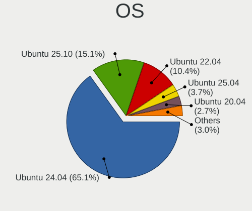

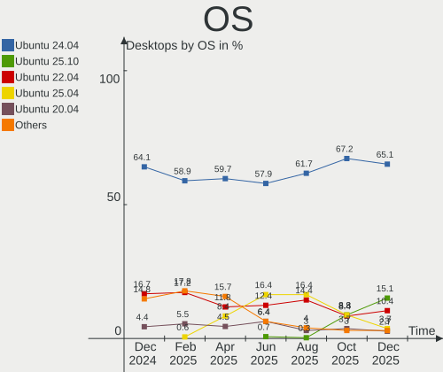

| Name         | Desktops | Percent |
|--------------|----------|---------|
| Ubuntu 24.04 | 194      | 65.1%   |
| Ubuntu 25.10 | 45       | 15.1%   |
| Ubuntu 22.04 | 31       | 10.4%   |
| Ubuntu 25.04 | 11       | 3.69%   |
| Ubuntu 20.04 | 8        | 2.68%   |
| Ubuntu 26.04 | 5        | 1.68%   |
| Ubuntu 24.10 | 2        | 0.67%   |
| Ubuntu 18.04 | 1        | 0.34%   |
| Ubuntu 1.3.2 | 1        | 0.34%   |

OS Family
---------

OS without a version

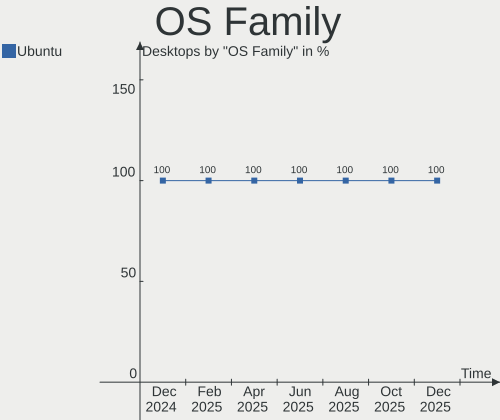

| Name   | Desktops | Percent |
|--------|----------|---------|
| Ubuntu | 298      | 100%    |

Kernel
------

Version of the Linux kernel

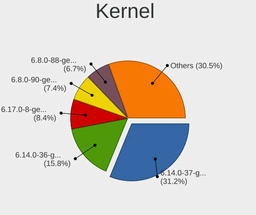

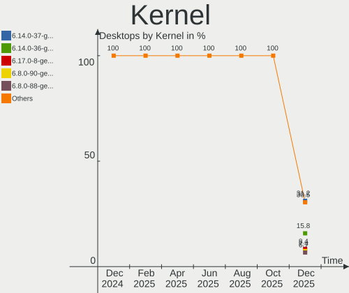

| Version               | Desktops | Percent |
|-----------------------|----------|---------|
| 6.14.0-37-generic     | 93       | 31.21%  |
| 6.14.0-36-generic     | 47       | 15.77%  |
| 6.17.0-8-generic      | 25       | 8.39%   |
| 6.8.0-90-generic      | 22       | 7.38%   |
| 6.8.0-88-generic      | 20       | 6.71%   |
| 6.14.0-27-generic     | 15       | 5.03%   |
| 6.17.0-7-generic      | 12       | 4.03%   |
| 6.8.0-87-generic      | 8        | 2.68%   |
| 5.15.0-153-generic    | 6        | 2.01%   |
| 5.15.0-139-generic    | 6        | 2.01%   |
| 6.17.0-6-generic      | 5        | 1.68%   |
| 6.17.0-5-generic      | 5        | 1.68%   |
| 6.8.0-71-generic      | 2        | 0.67%   |
| 6.18.0-061800-generic | 2        | 0.67%   |
| 6.11.0-26-generic     | 2        | 0.67%   |
| 5.15.0-164-generic    | 2        | 0.67%   |
| 6.8.0-88-lowlatency   | 1        | 0.34%   |
| 6.8.0-86-generic      | 1        | 0.34%   |
| 6.8.0-85-generic      | 1        | 0.34%   |
| 6.8.0-63-generic      | 1        | 0.34%   |
| 6.8.0-55-generic      | 1        | 0.34%   |
| 6.8.0-52-generic      | 1        | 0.34%   |
| 6.8.0-47-generic      | 1        | 0.34%   |
| 6.5.0-35-generic      | 1        | 0.34%   |
| 6.5.0-18-generic      | 1        | 0.34%   |
| 6.18.1-061801-generic | 1        | 0.34%   |
| 6.18.0-8-generic      | 1        | 0.34%   |
| 6.15.9                | 1        | 0.34%   |
| 6.14.7-061407-generic | 1        | 0.34%   |
| 6.14.0-29-generic     | 1        | 0.34%   |
| 6.14.0-1018-oem       | 1        | 0.34%   |
| 6.11.0-8-generic      | 1        | 0.34%   |
| 6.11.0-17-generic     | 1        | 0.34%   |
| 5.4.0-216-generic     | 1        | 0.34%   |
| 5.4.0-146-generic     | 1        | 0.34%   |
| 5.4.0-139-generic     | 1        | 0.34%   |
| 5.19.0-38-generic     | 1        | 0.34%   |
| 5.15.0-69-generic     | 1        | 0.34%   |
| 5.15.0-53-generic     | 1        | 0.34%   |
| 5.15.0-163-generic    | 1        | 0.34%   |

Kernel Family
-------------

Linux kernel without a distro release

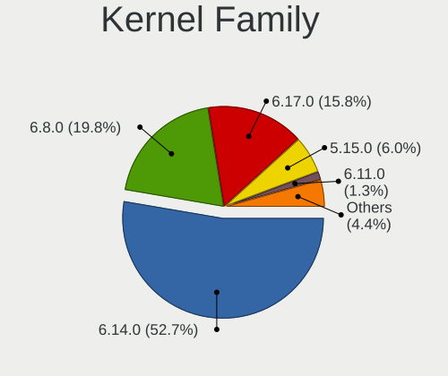

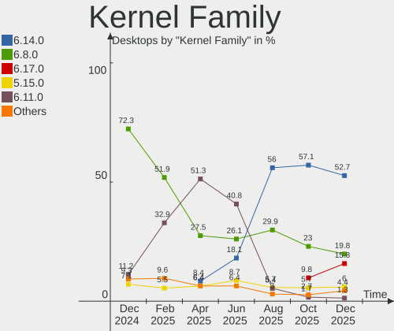

| Version | Desktops | Percent |
|---------|----------|---------|
| 6.14.0  | 157      | 52.68%  |
| 6.8.0   | 59       | 19.8%   |
| 6.17.0  | 47       | 15.77%  |
| 5.15.0  | 18       | 6.04%   |
| 6.11.0  | 4        | 1.34%   |
| 6.18.0  | 3        | 1.01%   |
| 5.4.0   | 3        | 1.01%   |
| 6.5.0   | 2        | 0.67%   |
| 6.18.1  | 1        | 0.34%   |
| 6.15.9  | 1        | 0.34%   |
| 6.14.7  | 1        | 0.34%   |
| 5.19.0  | 1        | 0.34%   |
| 4.15.0  | 1        | 0.34%   |

Kernel Major Ver.
-----------------

Linux kernel major version

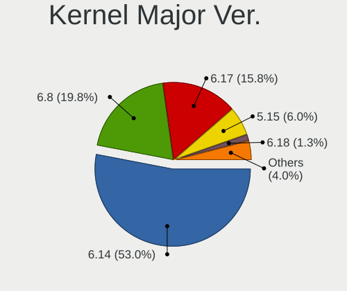

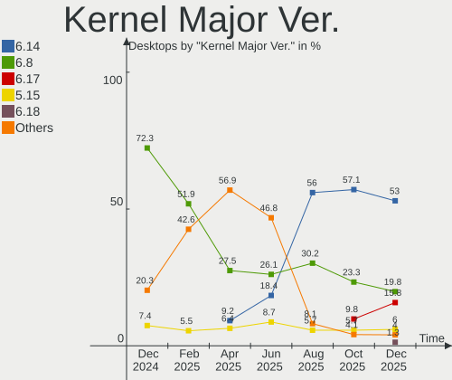

| Version | Desktops | Percent |
|---------|----------|---------|
| 6.14    | 158      | 53.02%  |
| 6.8     | 59       | 19.8%   |
| 6.17    | 47       | 15.77%  |
| 5.15    | 18       | 6.04%   |
| 6.18    | 4        | 1.34%   |
| 6.11    | 4        | 1.34%   |
| 5.4     | 3        | 1.01%   |
| 6.5     | 2        | 0.67%   |
| 6.15    | 1        | 0.34%   |
| 5.19    | 1        | 0.34%   |
| 4.15    | 1        | 0.34%   |

Arch
----

OS architecture (x86_64, i586, etc.)

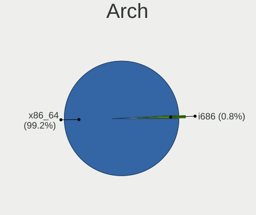

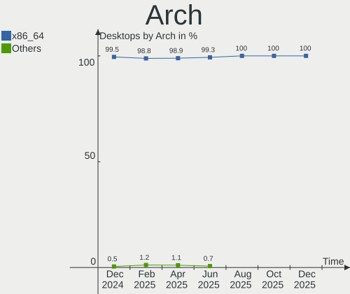

| Name   | Desktops | Percent |
|--------|----------|---------|
| x86_64 | 298      | 100%    |

DE
--

Desktop Environment

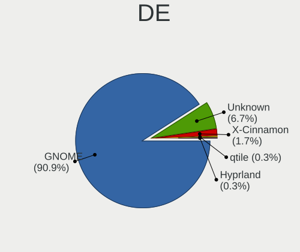

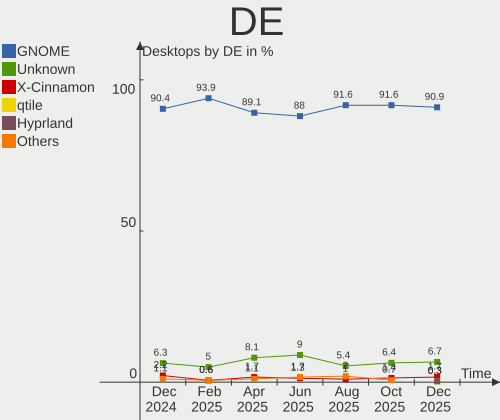

| Name       | Desktops | Percent |
|------------|----------|---------|
| GNOME      | 271      | 90.94%  |
| Unknown    | 20       | 6.71%   |
| X-Cinnamon | 5        | 1.68%   |
| qtile      | 1        | 0.34%   |
| Hyprland   | 1        | 0.34%   |

Display Server
--------------

X11 or Wayland

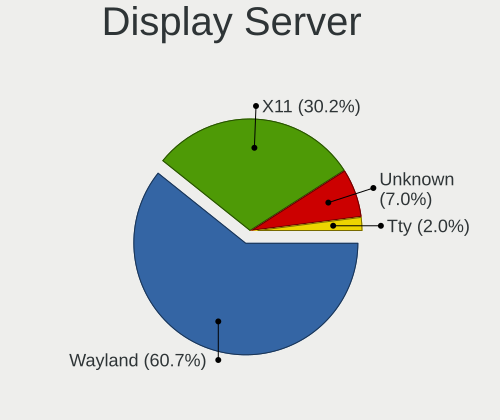

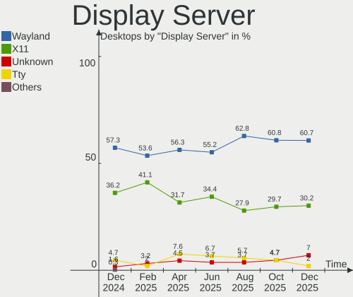

| Name    | Desktops | Percent |
|---------|----------|---------|
| Wayland | 181      | 60.74%  |
| X11     | 90       | 30.2%   |
| Unknown | 21       | 7.05%   |
| Tty     | 6        | 2.01%   |

Display Manager
---------------

SDDM, LightDM, etc.

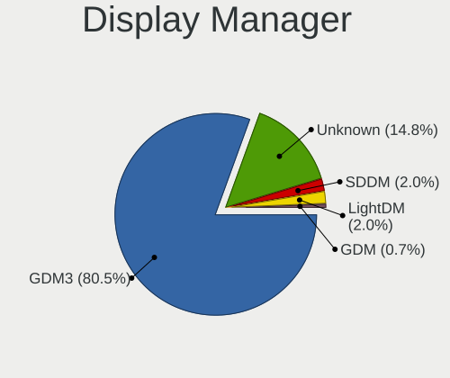

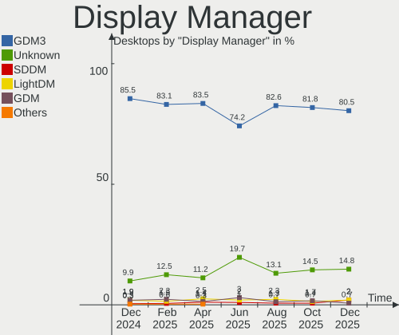

| Name    | Desktops | Percent |
|---------|----------|---------|
| GDM3    | 240      | 80.54%  |
| Unknown | 44       | 14.77%  |
| SDDM    | 6        | 2.01%   |
| LightDM | 6        | 2.01%   |
| GDM     | 2        | 0.67%   |

OS Lang
-------

Language

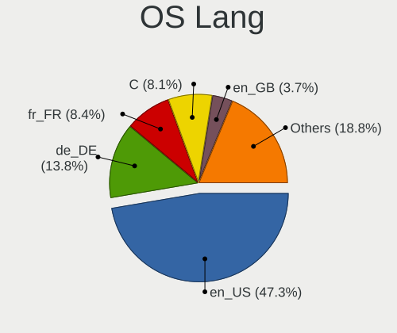

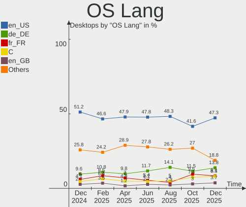

| Lang    | Desktops | Percent |
|---------|----------|---------|
| en_US   | 141      | 47.32%  |
| de_DE   | 41       | 13.76%  |
| fr_FR   | 25       | 8.39%   |
| C       | 24       | 8.05%   |
| en_GB   | 11       | 3.69%   |
| pt_BR   | 9        | 3.02%   |
| it_IT   | 7        | 2.35%   |
| ru_RU   | 5        | 1.68%   |
| zh_CN   | 4        | 1.34%   |
| nl_NL   | 3        | 1.01%   |
| es_ES   | 3        | 1.01%   |
| cs_CZ   | 3        | 1.01%   |
| Unknown | 3        | 1.01%   |
| pl_PL   | 2        | 0.67%   |
| hu_HU   | 2        | 0.67%   |
| en_IN   | 2        | 0.67%   |
| en_AU   | 2        | 0.67%   |
| de_AT   | 2        | 0.67%   |
| th_TH   | 1        | 0.34%   |
| pt_PT   | 1        | 0.34%   |
| fr_CA   | 1        | 0.34%   |
| es_SV   | 1        | 0.34%   |
| en_PH   | 1        | 0.34%   |
| en_NZ   | 1        | 0.34%   |
| en_CA   | 1        | 0.34%   |
| el_GR   | 1        | 0.34%   |
| da_DK   | 1        | 0.34%   |

Boot Mode
---------

EFI or BIOS

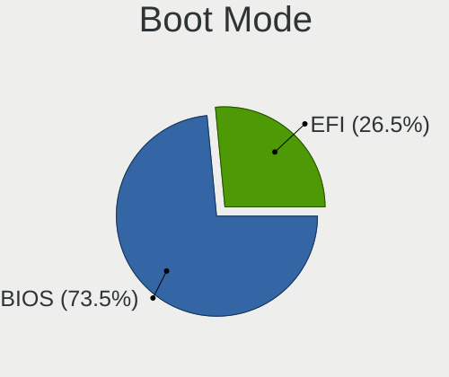

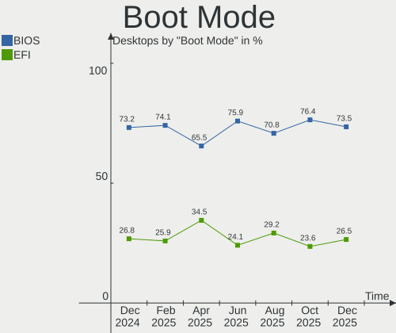

| Mode | Desktops | Percent |
|------|----------|---------|
| BIOS | 219      | 73.49%  |
| EFI  | 79       | 26.51%  |

Filesystem
----------

Type of filesystem

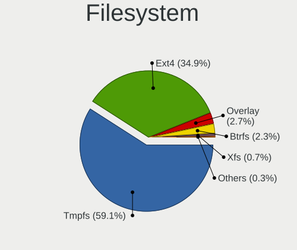

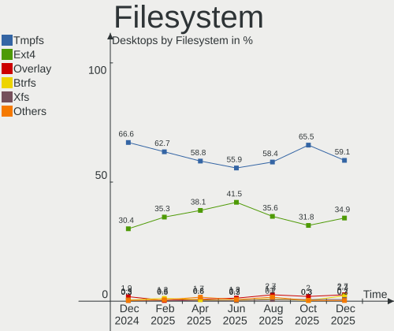

| Type    | Desktops | Percent |
|---------|----------|---------|
| Tmpfs   | 176      | 59.06%  |
| Ext4    | 104      | 34.9%   |
| Overlay | 8        | 2.68%   |
| Btrfs   | 7        | 2.35%   |
| Xfs     | 2        | 0.67%   |
| Zfs     | 1        | 0.34%   |

Part. scheme
------------

Scheme of partitioning

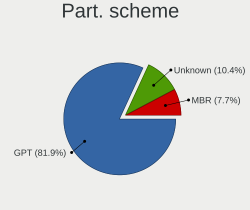

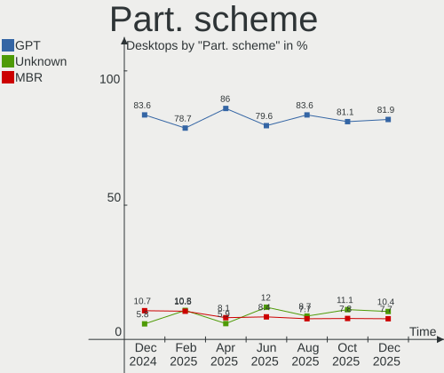

| Type    | Desktops | Percent |
|---------|----------|---------|
| GPT     | 244      | 81.88%  |
| Unknown | 31       | 10.4%   |
| MBR     | 23       | 7.72%   |

Dual Boot with Linux/BSD
------------------------

Hosting more than one Linux/BSD

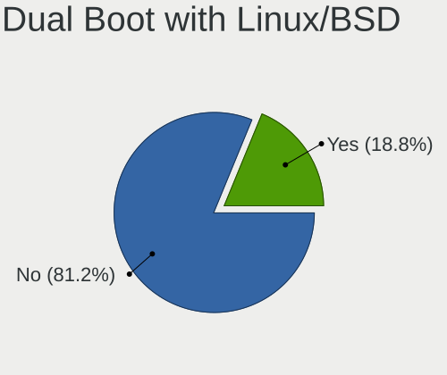

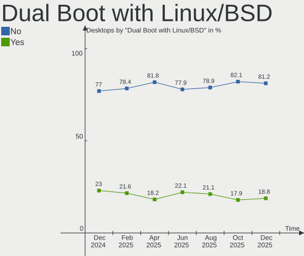

| Dual boot | Desktops | Percent |
|-----------|----------|---------|
| No        | 242      | 81.21%  |
| Yes       | 56       | 18.79%  |

Dual Boot (Win)
---------------

Hosting Linux and Windows

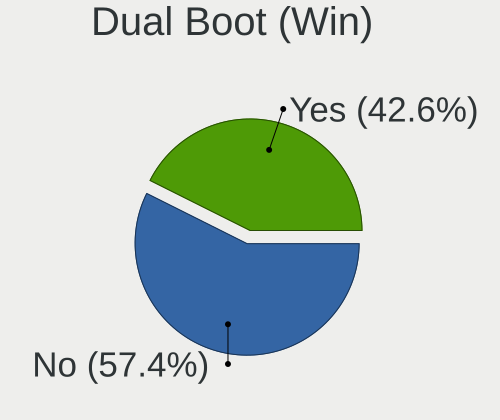

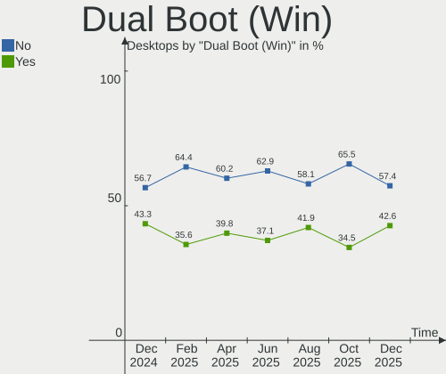

| Dual boot | Desktops | Percent |
|-----------|----------|---------|
| No        | 171      | 57.38%  |
| Yes       | 127      | 42.62%  |

Board
-----

Vendor
------

Motherboard manufacturer

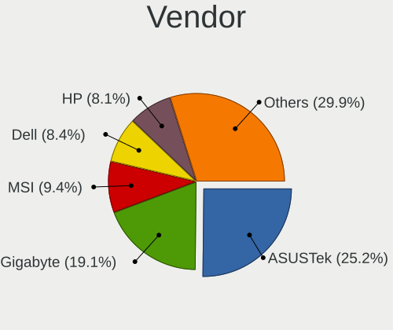

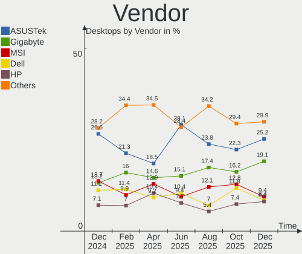

| Name                | Desktops | Percent |
|---------------------|----------|---------|
| ASUSTek Computer    | 75       | 25.17%  |
| Gigabyte Technology | 57       | 19.13%  |
| MSI                 | 28       | 9.4%    |
| Dell                | 25       | 8.39%   |
| Hewlett-Packard     | 24       | 8.05%   |
| ASRock              | 17       | 5.7%    |
| Lenovo              | 8        | 2.68%   |
| Intel               | 8        | 2.68%   |
| Fujitsu             | 8        | 2.68%   |
| Acer                | 6        | 2.01%   |
| Inspur              | 5        | 1.68%   |
| Biostar             | 4        | 1.34%   |
| Unknown             | 4        | 1.34%   |
| Supermicro          | 3        | 1.01%   |
| Medion              | 3        | 1.01%   |
| Huanan              | 3        | 1.01%   |
| Pegatron            | 2        | 0.67%   |
| AZW                 | 2        | 0.67%   |
| AMI                 | 2        | 0.67%   |
| ZRD                 | 1        | 0.34%   |
| WeiBu               | 1        | 0.34%   |
| TianBei             | 1        | 0.34%   |
| Quanta              | 1        | 0.34%   |
| PELADN              | 1        | 0.34%   |
| Packard Bell        | 1        | 0.34%   |
| LinuxContainers     | 1        | 0.34%   |
| KaiTian             | 1        | 0.34%   |
| HC Technology.      | 1        | 0.34%   |
| Google              | 1        | 0.34%   |
| GEEKOM              | 1        | 0.34%   |
| Fusionstor          | 1        | 0.34%   |
| By O.E.M.           | 1        | 0.34%   |
| Alienware           | 1        | 0.34%   |

Model
-----

Motherboard model

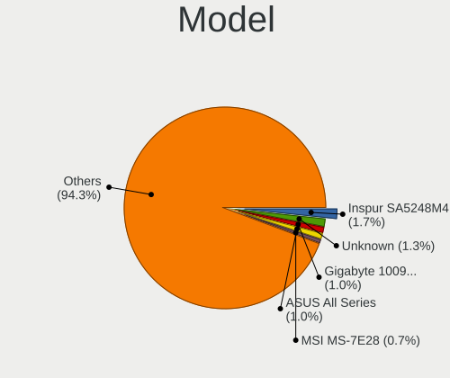

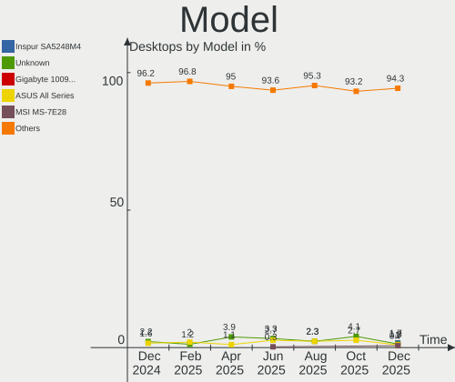

| Name                                | Desktops | Percent |
|-------------------------------------|----------|---------|
| Inspur SA5248M4                     | 5        | 1.68%   |
| Unknown                             | 4        | 1.34%   |
| Gigabyte 1009707_2120234            | 3        | 1.01%   |
| ASUS All Series                     | 3        | 1.01%   |
| MSI MS-7E28                         | 2        | 0.67%   |
| MSI MS-7C95                         | 2        | 0.67%   |
| MSI MS-7C91                         | 2        | 0.67%   |
| Intel H61                           | 2        | 0.67%   |
| Huanan X99-F8D PLUS V1.32           | 2        | 0.67%   |
| HP Z420 Workstation                 | 2        | 0.67%   |
| HP Compaq Pro 6300 SFF              | 2        | 0.67%   |
| HP Compaq Elite 8300 CMT            | 2        | 0.67%   |
| Gigabyte X870E AORUS MASTER         | 2        | 0.67%   |
| Gigabyte X570 I AORUS PRO WIFI      | 2        | 0.67%   |
| Gigabyte 970A-DS3P                  | 2        | 0.67%   |
| Dell OptiPlex 5040                  | 2        | 0.67%   |
| Dell OptiPlex 3020                  | 2        | 0.67%   |
| AZW MINI S                          | 2        | 0.67%   |
| ASUS X870 AYW GAMING WIFI W         | 2        | 0.67%   |
| ASUS ROG STRIX X870E-H GAMING WIFI7 | 2        | 0.67%   |
| ASUS ROG CROSSHAIR X870E HERO       | 2        | 0.67%   |
| ASUS ProArt X870E-CREATOR WIFI      | 2        | 0.67%   |
| ASUS PRIME B450M-A                  | 2        | 0.67%   |
| ASUS PRIME B450-PLUS                | 2        | 0.67%   |
| ASUS M5A78L-M/USB3                  | 2        | 0.67%   |
| ZRD H618D3G V10                     | 1        | 0.34%   |
| WeiBu BREN7P                        | 1        | 0.34%   |
| TianBei WTR PRO                     | 1        | 0.34%   |
| Supermicro X8SIL                    | 1        | 0.34%   |
| Supermicro W100                     | 1        | 0.34%   |
| Supermicro SYS-6018R-TDW            | 1        | 0.34%   |
| Quanta Touchsmart 610-1280qd        | 1        | 0.34%   |
| PELADN WI-6                         | 1        | 0.34%   |
| Pegatron HPE-380t                   | 1        | 0.34%   |
| Pegatron h8-1110                    | 1        | 0.34%   |
| Packard Bell IMEDIA S2185           | 1        | 0.34%   |
| MSI MS-7E56                         | 1        | 0.34%   |
| MSI MS-7E32                         | 1        | 0.34%   |
| MSI MS-7E13                         | 1        | 0.34%   |
| MSI MS-7D91                         | 1        | 0.34%   |

Model Family
------------

Motherboard model prefix

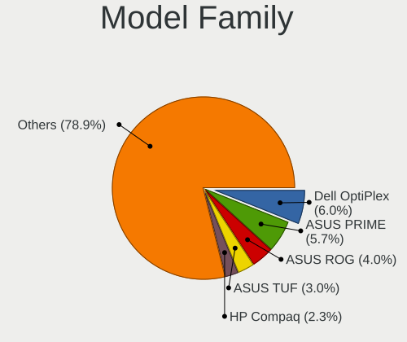

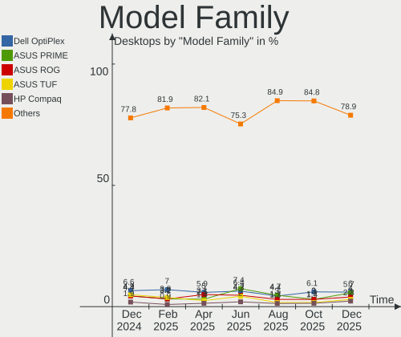

| Name                | Desktops | Percent |
|---------------------|----------|---------|
| Dell OptiPlex       | 18       | 6.04%   |
| ASUS PRIME          | 17       | 5.7%    |
| ASUS ROG            | 12       | 4.03%   |
| ASUS TUF            | 9        | 3.02%   |
| HP Compaq           | 7        | 2.35%   |
| Inspur SA5248M4     | 5        | 1.68%   |
| HP ProDesk          | 5        | 1.68%   |
| Gigabyte X570       | 5        | 1.68%   |
| Fujitsu ESPRIMO     | 5        | 1.68%   |
| Lenovo ThinkCentre  | 4        | 1.34%   |
| Gigabyte X870E      | 4        | 1.34%   |
| Dell Precision      | 4        | 1.34%   |
| Acer Aspire         | 4        | 1.34%   |
| Unknown             | 4        | 1.34%   |
| Gigabyte Z790       | 3        | 1.01%   |
| Gigabyte 1009707    | 3        | 1.01%   |
| ASUS ProArt         | 3        | 1.01%   |
| ASUS All            | 3        | 1.01%   |
| MSI MS-7E28         | 2        | 0.67%   |
| MSI MS-7C95         | 2        | 0.67%   |
| MSI MS-7C91         | 2        | 0.67%   |
| Lenovo ThinkStation | 2        | 0.67%   |
| Intel H61           | 2        | 0.67%   |
| Huanan X99-F8D      | 2        | 0.67%   |
| HP Z420             | 2        | 0.67%   |
| HP Pavilion         | 2        | 0.67%   |
| HP EliteDesk        | 2        | 0.67%   |
| Gigabyte B760M      | 2        | 0.67%   |
| Gigabyte B650       | 2        | 0.67%   |
| Gigabyte 970A-DS3P  | 2        | 0.67%   |
| AZW MINI            | 2        | 0.67%   |
| ASUS X870           | 2        | 0.67%   |
| ASUS STRIX          | 2        | 0.67%   |
| ASUS P5KPL-AM       | 2        | 0.67%   |
| ASUS M5A78L-M       | 2        | 0.67%   |
| Acer Veriton        | 2        | 0.67%   |
| ZRD H618D3G         | 1        | 0.34%   |
| WeiBu BREN7P        | 1        | 0.34%   |
| TianBei WTR         | 1        | 0.34%   |
| Supermicro X8SIL    | 1        | 0.34%   |

MFG Year
--------

Motherboard manufacture year

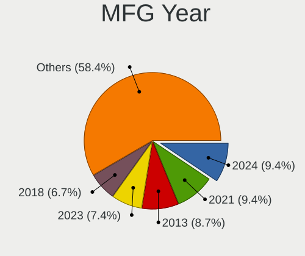

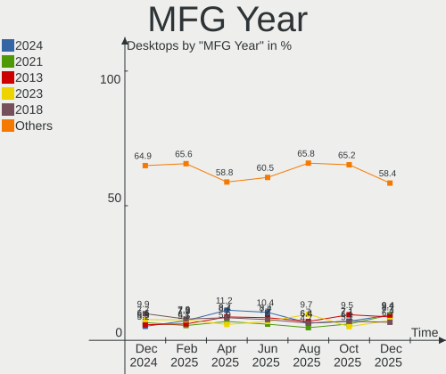

| Year | Desktops | Percent |
|------|----------|---------|
| 2024 | 28       | 9.4%    |
| 2021 | 28       | 9.4%    |
| 2013 | 26       | 8.72%   |
| 2023 | 22       | 7.38%   |
| 2018 | 20       | 6.71%   |
| 2017 | 20       | 6.71%   |
| 2012 | 20       | 6.71%   |
| 2025 | 19       | 6.38%   |
| 2019 | 18       | 6.04%   |
| 2022 | 16       | 5.37%   |
| 2020 | 15       | 5.03%   |
| 2011 | 15       | 5.03%   |
| 2014 | 14       | 4.7%    |
| 2015 | 12       | 4.03%   |
| 2016 | 9        | 3.02%   |
| 2009 | 9        | 3.02%   |
| 2008 | 4        | 1.34%   |
| 2010 | 3        | 1.01%   |

Form Factor
-----------

Physical design of the computer

| Name    | Desktops | Percent |
|---------|----------|---------|
| Desktop | 298      | 100%    |

Secure Boot
-----------

Enabled or disabled

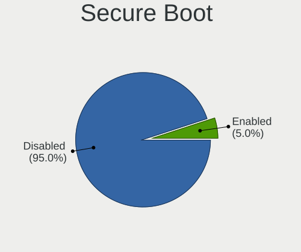

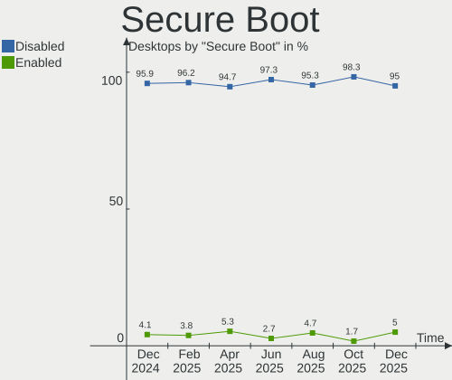

| State    | Desktops | Percent |
|----------|----------|---------|
| Disabled | 283      | 94.97%  |
| Enabled  | 15       | 5.03%   |

Coreboot
--------

Have coreboot on board

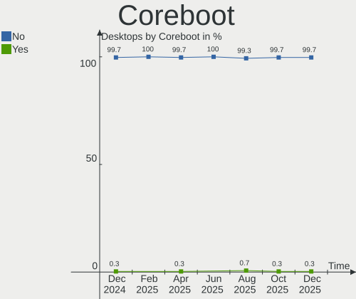

| Used | Desktops | Percent |
|------|----------|---------|
| No   | 297      | 99.66%  |
| Yes  | 1        | 0.34%   |

RAM Size
--------

Total RAM memory

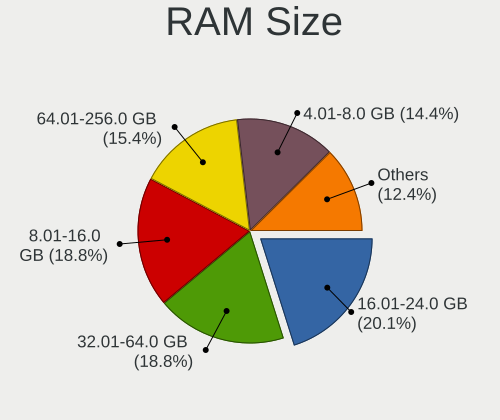

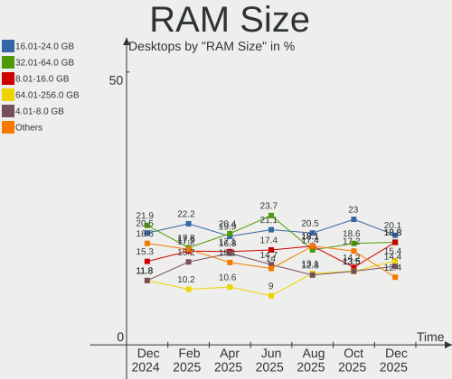

| Size in GB      | Desktops | Percent |
|-----------------|----------|---------|
| 16.01-24.0      | 60       | 20.13%  |
| 32.01-64.0      | 56       | 18.79%  |
| 8.01-16.0       | 56       | 18.79%  |
| 64.01-256.0     | 46       | 15.44%  |
| 4.01-8.0        | 43       | 14.43%  |
| 24.01-32.0      | 19       | 6.38%   |
| 3.01-4.0        | 14       | 4.7%    |
| More than 256.0 | 2        | 0.67%   |
| 2.01-3.0        | 2        | 0.67%   |

RAM Used
--------

Used RAM memory

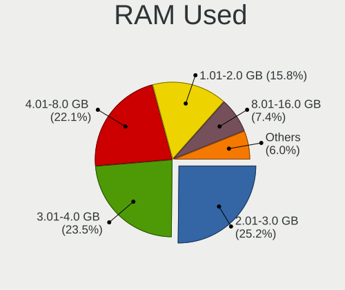

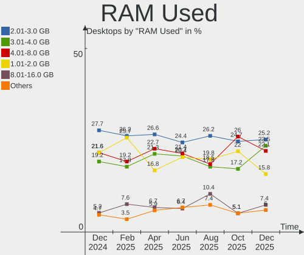

| Used GB     | Desktops | Percent |
|-------------|----------|---------|
| 2.01-3.0    | 75       | 25.17%  |
| 3.01-4.0    | 70       | 23.49%  |
| 4.01-8.0    | 66       | 22.15%  |
| 1.01-2.0    | 47       | 15.77%  |
| 8.01-16.0   | 22       | 7.38%   |
| 16.01-24.0  | 5        | 1.68%   |
| 0.51-1.0    | 5        | 1.68%   |
| 32.01-64.0  | 3        | 1.01%   |
| 24.01-32.0  | 3        | 1.01%   |
| 64.01-256.0 | 2        | 0.67%   |

Total Drives
------------

Number of drives on board

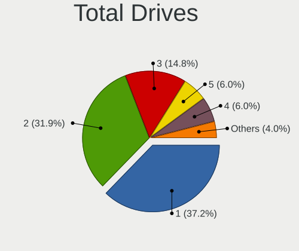

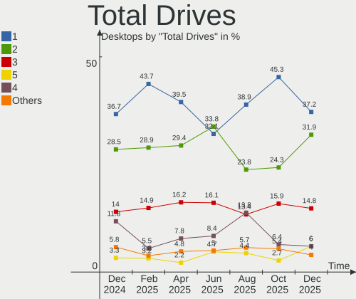

| Drives | Desktops | Percent |
|--------|----------|---------|
| 1      | 111      | 37.25%  |
| 2      | 95       | 31.88%  |
| 3      | 44       | 14.77%  |
| 5      | 18       | 6.04%   |
| 4      | 18       | 6.04%   |
| 6      | 4        | 1.34%   |
| 8      | 3        | 1.01%   |
| 14     | 1        | 0.34%   |
| 12     | 1        | 0.34%   |
| 9      | 1        | 0.34%   |
| 7      | 1        | 0.34%   |
| 0      | 1        | 0.34%   |

Has CD-ROM
----------

Has CD-ROM on board

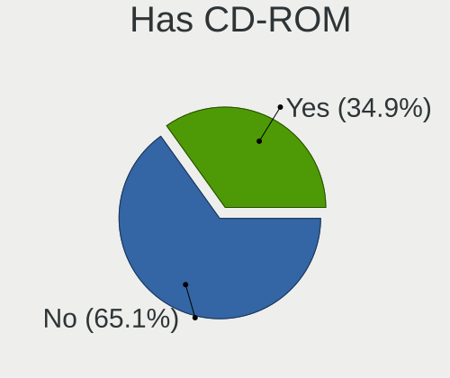

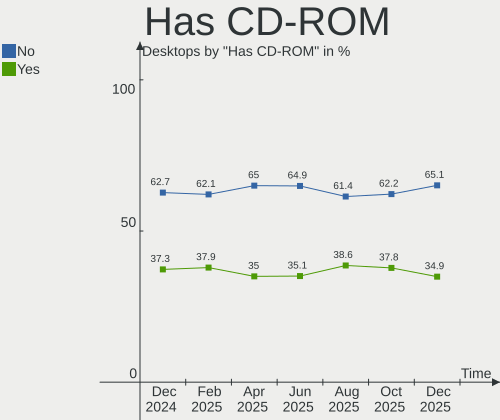

| Presented | Desktops | Percent |
|-----------|----------|---------|
| No        | 194      | 65.1%   |
| Yes       | 104      | 34.9%   |

Has Ethernet
------------

Has Ethernet on board

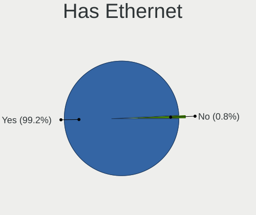

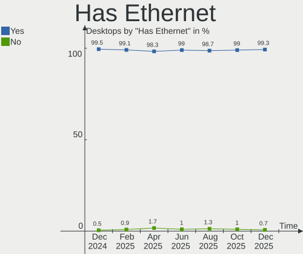

| Presented | Desktops | Percent |
|-----------|----------|---------|
| Yes       | 296      | 99.33%  |
| No        | 2        | 0.67%   |

Has WiFi
--------

Has WiFi module

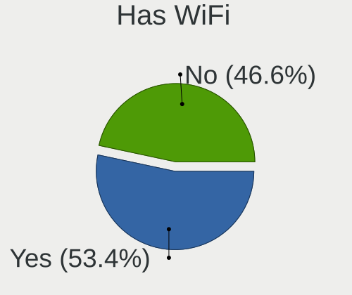

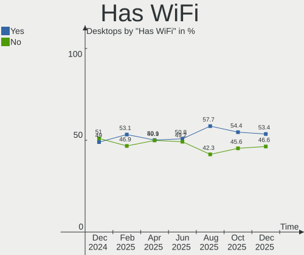

| Presented | Desktops | Percent |
|-----------|----------|---------|
| Yes       | 159      | 53.36%  |
| No        | 139      | 46.64%  |

Has Bluetooth
-------------

Has Bluetooth module

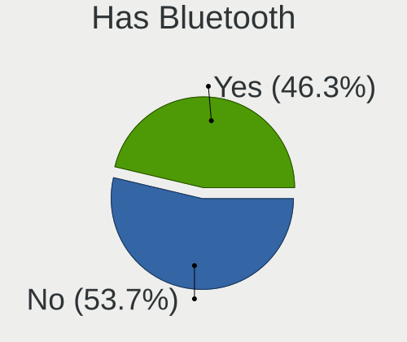

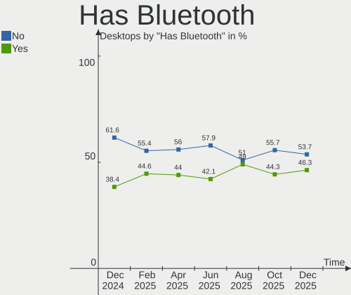

| Presented | Desktops | Percent |
|-----------|----------|---------|
| No        | 160      | 53.69%  |
| Yes       | 138      | 46.31%  |

Location
--------

Country
-------

Geographic location (country)

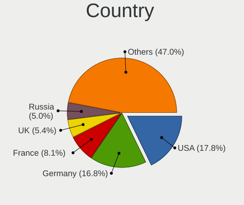

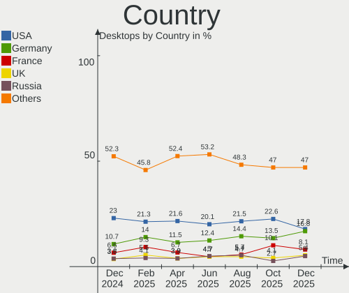

| Country      | Desktops | Percent |
|--------------|----------|---------|
| USA          | 53       | 17.79%  |
| Germany      | 50       | 16.78%  |
| France       | 24       | 8.05%   |
| UK           | 16       | 5.37%   |
| Russia       | 15       | 5.03%   |
| Brazil       | 14       | 4.7%    |
| Canada       | 11       | 3.69%   |
| Italy        | 10       | 3.36%   |
| Netherlands  | 9        | 3.02%   |
| Australia    | 9        | 3.02%   |
| Poland       | 7        | 2.35%   |
| India        | 7        | 2.35%   |
| China        | 6        | 2.01%   |
| Austria      | 6        | 2.01%   |
| Switzerland  | 5        | 1.68%   |
| Finland      | 5        | 1.68%   |
| Greece       | 4        | 1.34%   |
| Norway       | 3        | 1.01%   |
| Iran         | 3        | 1.01%   |
| Indonesia    | 3        | 1.01%   |
| Hungary      | 3        | 1.01%   |
| Czechia      | 3        | 1.01%   |
| Algeria      | 3        | 1.01%   |
| Turkey       | 2        | 0.67%   |
| Sweden       | 2        | 0.67%   |
| South Africa | 2        | 0.67%   |
| Portugal     | 2        | 0.67%   |
| Denmark      | 2        | 0.67%   |
| Vietnam      | 1        | 0.34%   |
| Uruguay      | 1        | 0.34%   |
| Thailand     | 1        | 0.34%   |
| Slovenia     | 1        | 0.34%   |
| Serbia       | 1        | 0.34%   |
| Saudi Arabia | 1        | 0.34%   |
| Romania      | 1        | 0.34%   |
| Philippines  | 1        | 0.34%   |
| Peru         | 1        | 0.34%   |
| New Zealand  | 1        | 0.34%   |
| Mexico       | 1        | 0.34%   |
| Japan        | 1        | 0.34%   |

City
----

Geographic location (city)

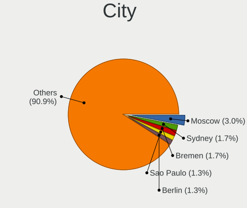

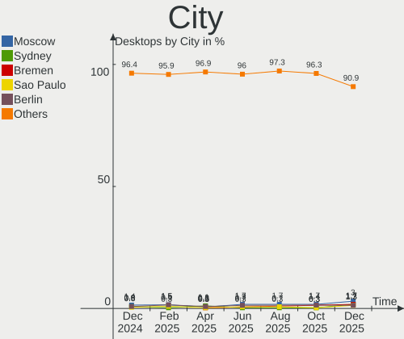

| City                   | Desktops | Percent |
|------------------------|----------|---------|
| Moscow                 | 9        | 3.02%   |
| Sydney                 | 5        | 1.68%   |
| Bremen                 | 5        | 1.68%   |
| Sao Paulo              | 4        | 1.34%   |
| Berlin                 | 4        | 1.34%   |
| Weingarten             | 3        | 1.01%   |
| Vienna                 | 3        | 1.01%   |
| St Petersburg          | 3        | 1.01%   |
| Athens                 | 3        | 1.01%   |
| Wiesbaden              | 2        | 0.67%   |
| Udine                  | 2        | 0.67%   |
| Shanghai               | 2        | 0.67%   |
| Seattle                | 2        | 0.67%   |
| Portland               | 2        | 0.67%   |
| Perth                  | 2        | 0.67%   |
| Paris                  | 2        | 0.67%   |
| Munich                 | 2        | 0.67%   |
| Marseille              | 2        | 0.67%   |
| Los Angeles            | 2        | 0.67%   |
| Leiden                 | 2        | 0.67%   |
| Krakow                 | 2        | 0.67%   |
| Hengelo                | 2        | 0.67%   |
| Calgary                | 2        | 0.67%   |
| Budapest               | 2        | 0.67%   |
| Beijing                | 2        | 0.67%   |
| Atlanta                | 2        | 0.67%   |
| Zwoenitz               | 1        | 0.34%   |
| Zurich                 | 1        | 0.34%   |
| Yerevan                | 1        | 0.34%   |
| Yekaterinburg          | 1        | 0.34%   |
| Winnenden              | 1        | 0.34%   |
| Wildeshausen           | 1        | 0.34%   |
| West Jordan            | 1        | 0.34%   |
| West Bromwich          | 1        | 0.34%   |
| Warsaw                 | 1        | 0.34%   |
| Wantage                | 1        | 0.34%   |
| Walton on Thames       | 1        | 0.34%   |
| Virginia               | 1        | 0.34%   |
| Villingen-Schwenningen | 1        | 0.34%   |
| Ventura                | 1        | 0.34%   |

Drives
------

Drive Vendor
------------

Hard drive vendors

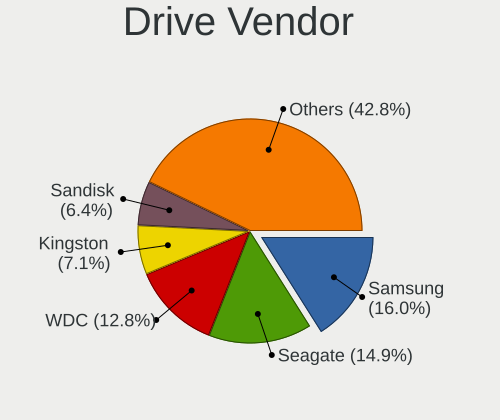

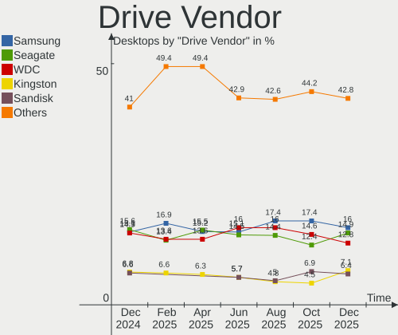

| Vendor                       | Desktops | Drives | Percent |
|------------------------------|----------|--------|---------|
| Samsung Electronics          | 88       | 133    | 16.03%  |
| Seagate                      | 82       | 116    | 14.94%  |
| WDC                          | 70       | 84     | 12.75%  |
| Kingston                     | 39       | 50     | 7.1%    |
| Sandisk                      | 35       | 44     | 6.38%   |
| Toshiba                      | 24       | 25     | 4.37%   |
| Crucial                      | 20       | 20     | 3.64%   |
| Intel                        | 11       | 16     | 2%      |
| Micron/Crucial Technology    | 10       | 14     | 1.82%   |
| SK hynix                     | 7        | 7      | 1.28%   |
| Micron Technology            | 7        | 8      | 1.28%   |
| Intenso                      | 7        | 8      | 1.28%   |
| A-DATA Technology            | 7        | 8      | 1.28%   |
| Realtek Semiconductor        | 6        | 6      | 1.09%   |
| PNY                          | 6        | 7      | 1.09%   |
| Phison Electronics           | 6        | 6      | 1.09%   |
| MAXIO Technology (Hangzhou)  | 6        | 7      | 1.09%   |
| KingSpec                     | 6        | 7      | 1.09%   |
| Hitachi                      | 6        | 7      | 1.09%   |
| China                        | 5        | 6      | 0.91%   |
| Unknown                      | 5        | 5      | 0.91%   |
| Unknown                      | 4        | 4      | 0.73%   |
| Silicon Motion               | 4        | 4      | 0.73%   |
| GOODRAM                      | 4        | 4      | 0.73%   |
| Shenzhen Longsys Electronics | 3        | 4      | 0.55%   |
| Lexar                        | 3        | 3      | 0.55%   |
| JMicron Technology           | 3        | 3      | 0.55%   |
| Gigabyte Technology          | 3        | 4      | 0.55%   |
| AMD                          | 3        | 4      | 0.55%   |
| ADATA Technology             | 3        | 3      | 0.55%   |
| XrayDisk                     | 2        | 2      | 0.36%   |
| Team                         | 2        | 2      | 0.36%   |
| SPCC                         | 2        | 2      | 0.36%   |
| Patriot                      | 2        | 2      | 0.36%   |
| Netac                        | 2        | 2      | 0.36%   |
| KIOXIA-EXCERIA               | 2        | 2      | 0.36%   |
| Kingston Technology Company  | 2        | 2      | 0.36%   |
| Integral                     | 2        | 2      | 0.36%   |
| Hewlett-Packard              | 2        | 2      | 0.36%   |
| ZHITAI                       | 1        | 1      | 0.18%   |

Drive Model
-----------

Hard drive models

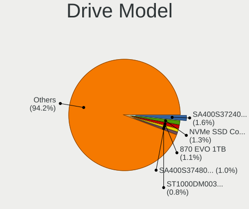

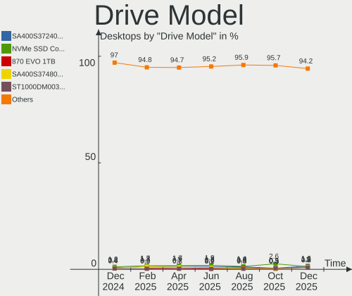

| Model                                                              | Desktops | Percent |
|--------------------------------------------------------------------|----------|---------|
| Kingston SA400S37240G 240GB SSD                                    | 10       | 1.6%    |
| Samsung NVMe SSD Controller SM981/PM981/PM983 1TB                  | 8        | 1.28%   |
| Samsung SSD 870 EVO 1TB                                            | 7        | 1.12%   |
| Kingston SA400S37480G 480GB SSD                                    | 6        | 0.96%   |
| Seagate ST1000DM003-1SB102 1TB                                     | 5        | 0.8%    |
| Samsung SSD 850 EVO 250GB                                          | 5        | 0.8%    |
| Unknown                                                            | 5        | 0.8%    |
| Toshiba DT01ACA100 1TB                                             | 4        | 0.64%   |
| Silicon Motion SM2263EN/SM2263XT SSD Controller 512GB              | 4        | 0.64%   |
| Seagate ST500DM002-1BD142 500GB                                    | 4        | 0.64%   |
| Seagate ST4000DM004-2CV104 4TB                                     | 4        | 0.64%   |
| Seagate ST2000DM008-2UB102 2TB                                     | 4        | 0.64%   |
| Samsung SSD 990 PRO 2TB                                            | 4        | 0.64%   |
| Samsung SSD 980 1TB                                                | 4        | 0.64%   |
| Crucial CT1000BX500SSD1 1TB                                        | 4        | 0.64%   |
| WDC WD10EZEX-08WN4A0 1TB                                           | 3        | 0.48%   |
| Unknown SD/MMC/MS PRO 2GB                                          | 3        | 0.48%   |
| Seagate ST8000DM004-2U9188 8TB                                     | 3        | 0.48%   |
| Seagate ST2000DM001-1CH164 2TB                                     | 3        | 0.48%   |
| Seagate ST1000DM010-2EP102 1TB                                     | 3        | 0.48%   |
| Seagate ST1000DM003-1ER162 1TB                                     | 3        | 0.48%   |
| Seagate ST1000DM003-1CH162 1TB                                     | 3        | 0.48%   |
| SanDisk SSD PLUS 1000GB                                            | 3        | 0.48%   |
| SanDisk NVMe SSD Drive 2TB                                         | 3        | 0.48%   |
| Samsung SSD 990 PRO 4TB                                            | 3        | 0.48%   |
| Samsung SSD 990 PRO 1TB                                            | 3        | 0.48%   |
| Samsung SSD 980 500GB                                              | 3        | 0.48%   |
| Samsung SSD 9100 PRO 2TB                                           | 3        | 0.48%   |
| Samsung SSD 870 QVO 4TB                                            | 3        | 0.48%   |
| Samsung SSD 870 EVO 500GB                                          | 3        | 0.48%   |
| Samsung SSD 860 EVO 1TB                                            | 3        | 0.48%   |
| Samsung NVMe SSD Controller SM961/PM961/SM963 1024GB               | 3        | 0.48%   |
| MAXIO (Hangzhou) NVMe SSD Controller MAP1202 2TB                   | 3        | 0.48%   |
| Kingston SFYRD2000G 2TB                                            | 3        | 0.48%   |
| JMicron Generic 320GB                                              | 3        | 0.48%   |
| Intel SSDSC2KB960G8 960GB                                          | 3        | 0.48%   |
| Intel SSDSC2BB480G7 480GB                                          | 3        | 0.48%   |
| ADATA XPG SX8200 Pro PCIe Gen3x4 M.2 2280 Solid State Drive 1024GB | 3        | 0.48%   |
| XrayDisk 1TB SSD                                                   | 2        | 0.32%   |
| WDC WDS500G2B0A-00SM50 500GB                                       | 2        | 0.32%   |

HDD Vendor
----------

Hard disk drive vendors

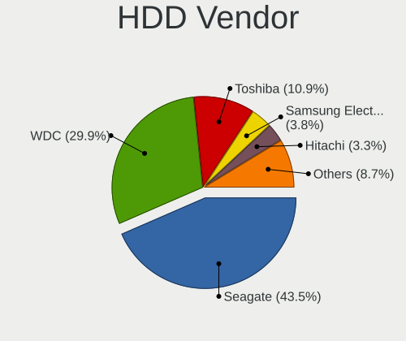

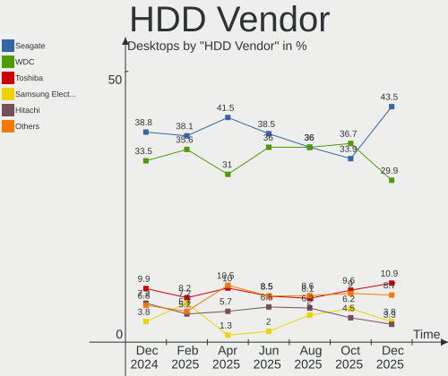

| Vendor              | Desktops | Drives | Percent |
|---------------------|----------|--------|---------|
| Seagate             | 80       | 114    | 43.48%  |
| WDC                 | 55       | 64     | 29.89%  |
| Toshiba             | 20       | 21     | 10.87%  |
| Samsung Electronics | 7        | 8      | 3.8%    |
| Hitachi             | 6        | 7      | 3.26%   |
| Unknown             | 3        | 3      | 1.63%   |
| JMicron Technology  | 3        | 3      | 1.63%   |
| USB 3.1             | 1        | 1      | 0.54%   |
| SSK                 | 1        | 1      | 0.54%   |
| PRO-T5              | 1        | 1      | 0.54%   |
| Intenso             | 1        | 1      | 0.54%   |
| HPE                 | 1        | 4      | 0.54%   |
| Hewlett-Packard     | 1        | 1      | 0.54%   |
| ExcelStor           | 1        | 1      | 0.54%   |
| BR                  | 1        | 1      | 0.54%   |
| ASMedia             | 1        | 1      | 0.54%   |
| Apple               | 1        | 1      | 0.54%   |

SSD Vendor
----------

Solid state drive vendors

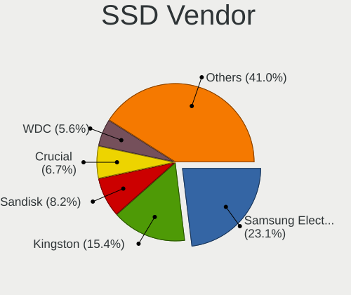

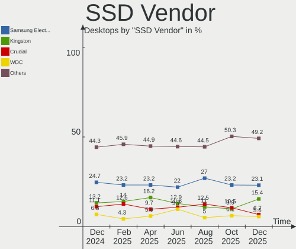

| Vendor              | Desktops | Drives | Percent |
|---------------------|----------|--------|---------|
| Samsung Electronics | 45       | 56     | 23.08%  |
| Kingston            | 30       | 34     | 15.38%  |
| Sandisk             | 16       | 19     | 8.21%   |
| Crucial             | 13       | 13     | 6.67%   |
| WDC                 | 11       | 15     | 5.64%   |
| Intel               | 9        | 14     | 4.62%   |
| PNY                 | 6        | 7      | 3.08%   |
| Micron Technology   | 5        | 6      | 2.56%   |
| Intenso             | 5        | 5      | 2.56%   |
| A-DATA Technology   | 5        | 6      | 2.56%   |
| KingSpec            | 4        | 4      | 2.05%   |
| GOODRAM             | 4        | 4      | 2.05%   |
| China               | 3        | 4      | 1.54%   |
| Unknown             | 3        | 3      | 1.54%   |
| XrayDisk            | 2        | 2      | 1.03%   |
| SPCC                | 2        | 2      | 1.03%   |
| SK hynix            | 2        | 2      | 1.03%   |
| Patriot             | 2        | 2      | 1.03%   |
| Lexar               | 2        | 2      | 1.03%   |
| Integral            | 2        | 2      | 1.03%   |
| AMD                 | 2        | 2      | 1.03%   |
| Transcend           | 1        | 1      | 0.51%   |
| Toshiba             | 1        | 1      | 0.51%   |
| SOLIDIGM            | 1        | 1      | 0.51%   |
| Seagate             | 1        | 1      | 0.51%   |
| Rogueware           | 1        | 1      | 0.51%   |
| Netac               | 1        | 1      | 0.51%   |
| LITEON              | 1        | 1      | 0.51%   |
| KIOXIA-EXCERIA      | 1        | 1      | 0.51%   |
| INNOVATION IT       | 1        | 1      | 0.51%   |
| HGST                | 1        | 1      | 0.51%   |
| Hewlett-Packard     | 1        | 1      | 0.51%   |
| GL                  | 1        | 1      | 0.51%   |
| Gigabyte Technology | 1        | 1      | 0.51%   |
| Fanxiang            | 1        | 1      | 0.51%   |
| EVM                 | 1        | 1      | 0.51%   |
| Emtec               | 1        | 1      | 0.51%   |
| EDILOCA             | 1        | 1      | 0.51%   |
| Dahua               | 1        | 1      | 0.51%   |
| CONSISTENT          | 1        | 1      | 0.51%   |

Drive Kind
----------

HDD or SSD

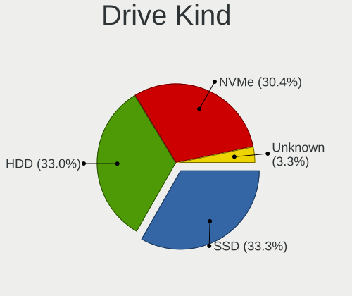

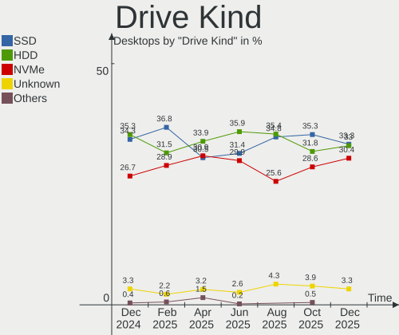

| Kind    | Desktops | Drives | Percent |
|---------|----------|--------|---------|
| SSD     | 151      | 226    | 33.26%  |
| HDD     | 150      | 233    | 33.04%  |
| NVMe    | 138      | 214    | 30.4%   |
| Unknown | 15       | 15     | 3.3%    |

Drive Connector
---------------

SATA, SAS, NVMe, etc.

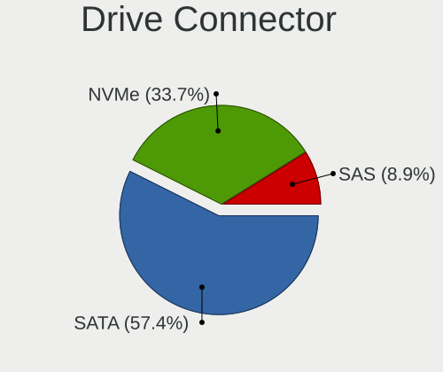

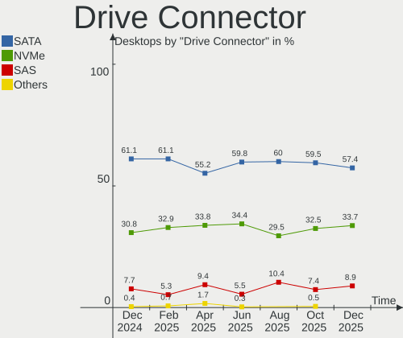

| Type | Desktops | Drives | Percent |
|------|----------|--------|---------|
| SATA | 233      | 435    | 57.39%  |
| NVMe | 137      | 212    | 33.74%  |
| SAS  | 36       | 41     | 8.87%   |

Drive Size
----------

Size of hard drive

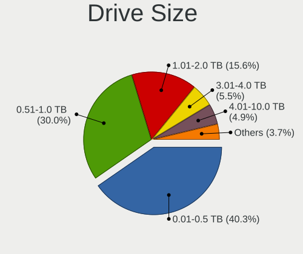

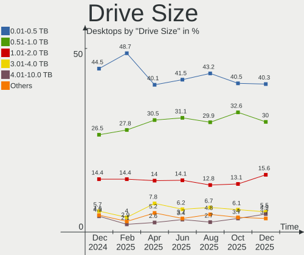

| Size in TB | Desktops | Drives | Percent |
|------------|----------|--------|---------|
| 0.01-0.5   | 140      | 195    | 40.35%  |
| 0.51-1.0   | 104      | 133    | 29.97%  |
| 1.01-2.0   | 54       | 58     | 15.56%  |
| 3.01-4.0   | 19       | 29     | 5.48%   |
| 4.01-10.0  | 17       | 27     | 4.9%    |
| 2.01-3.0   | 8        | 8      | 2.31%   |
| 10.01-20.0 | 5        | 9      | 1.44%   |

Space Total
-----------

Amount of disk space available on the file system

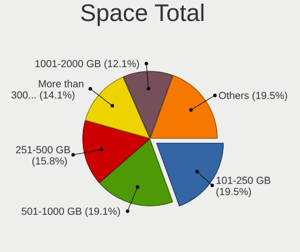

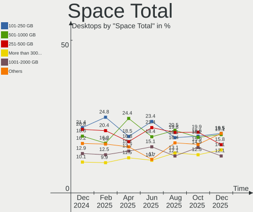

| Size in GB     | Desktops | Percent |
|----------------|----------|---------|
| 101-250        | 58       | 19.46%  |
| 501-1000       | 57       | 19.13%  |
| 251-500        | 47       | 15.77%  |
| More than 3000 | 42       | 14.09%  |
| 1001-2000      | 36       | 12.08%  |
| 2001-3000      | 23       | 7.72%   |
| 1-20           | 13       | 4.36%   |
| 51-100         | 9        | 3.02%   |
| Unknown        | 9        | 3.02%   |
| 21-50          | 4        | 1.34%   |

Space Used
----------

Amount of used disk space

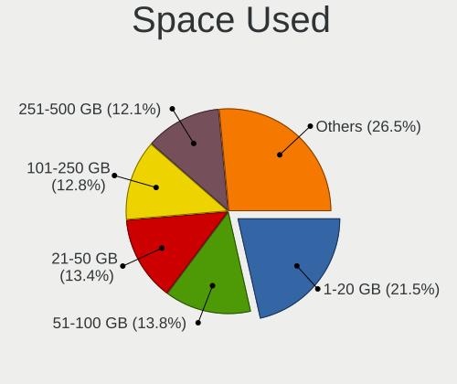

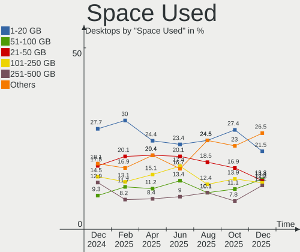

| Used GB        | Desktops | Percent |
|----------------|----------|---------|
| 1-20           | 64       | 21.48%  |
| 51-100         | 41       | 13.76%  |
| 21-50          | 40       | 13.42%  |
| 101-250        | 38       | 12.75%  |
| 251-500        | 36       | 12.08%  |
| 501-1000       | 29       | 9.73%   |
| 1001-2000      | 17       | 5.7%    |
| More than 3000 | 15       | 5.03%   |
| 2001-3000      | 9        | 3.02%   |
| Unknown        | 9        | 3.02%   |

Malfunc. Drives
---------------

Drive models with a malfunction

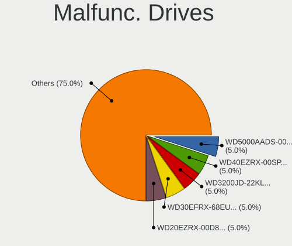

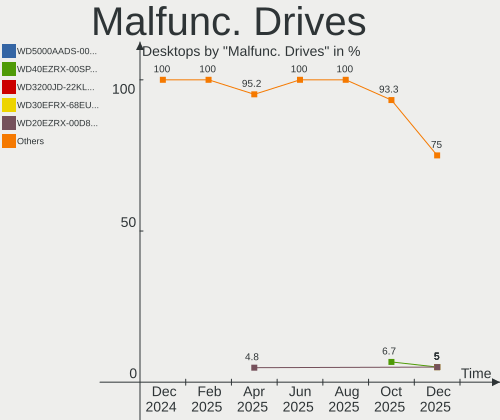

| Model                              | Desktops | Drives | Percent |
|------------------------------------|----------|--------|---------|
| WDC WD5000AADS-00S9B0 500GB        | 1        | 1      | 5%      |
| WDC WD40EZRX-00SPEB0 4TB           | 1        | 1      | 5%      |
| WDC WD3200JD-22KLB0 320GB          | 1        | 1      | 5%      |
| WDC WD30EFRX-68EUZN0 3TB           | 1        | 1      | 5%      |
| WDC WD20EZRX-00D8PB0 2TB           | 1        | 1      | 5%      |
| WDC WD10EFRX-68FYTN0 1TB           | 1        | 1      | 5%      |
| WDC WD10EADS-00M2B0 1TB            | 1        | 1      | 5%      |
| Toshiba MQ01ABD100V 1TB            | 1        | 1      | 5%      |
| Seagate ST98823AS 80GB             | 1        | 1      | 5%      |
| Seagate ST500DM002-1BD142 500GB    | 1        | 1      | 5%      |
| Seagate ST3500312CS 500GB          | 1        | 1      | 5%      |
| Seagate ST18000VE002-3BS101 18TB   | 1        | 1      | 5%      |
| Seagate ST1000LM024 HN-M101MBB 1TB | 1        | 1      | 5%      |
| Samsung Electronics HD160JJ 160GB  | 1        | 1      | 5%      |
| Kingston SHFS37A120G 120GB SSD     | 1        | 1      | 5%      |
| Intel SSDSC2CT120A3 120GB          | 1        | 2      | 5%      |
| Intel SSDSC2BB800G7 800GB          | 1        | 1      | 5%      |
| Hitachi HTS547575A9E384 752GB      | 1        | 1      | 5%      |
| Hitachi HDS723020BLE640 2TB        | 1        | 2      | 5%      |
| Crucial CT1000MX500SSD1 1TB        | 1        | 1      | 5%      |

Malfunc. Drive Vendor
---------------------

Vendors of faulty drives

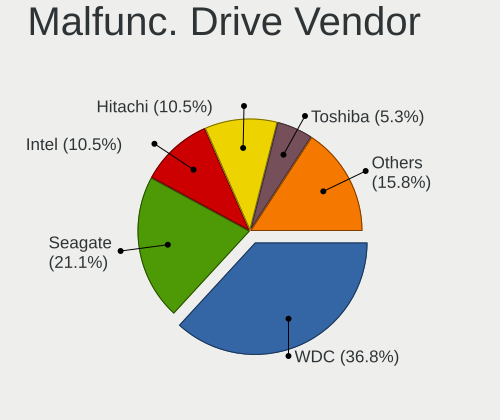

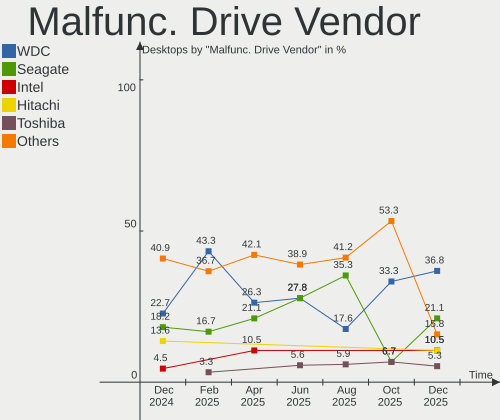

| Vendor              | Desktops | Drives | Percent |
|---------------------|----------|--------|---------|
| WDC                 | 7        | 7      | 36.84%  |
| Seagate             | 4        | 5      | 21.05%  |
| Intel               | 2        | 3      | 10.53%  |
| Hitachi             | 2        | 3      | 10.53%  |
| Toshiba             | 1        | 1      | 5.26%   |
| Samsung Electronics | 1        | 1      | 5.26%   |
| Kingston            | 1        | 1      | 5.26%   |
| Crucial             | 1        | 1      | 5.26%   |

Malfunc. HDD Vendor
-------------------

Vendors of faulty HDD drives

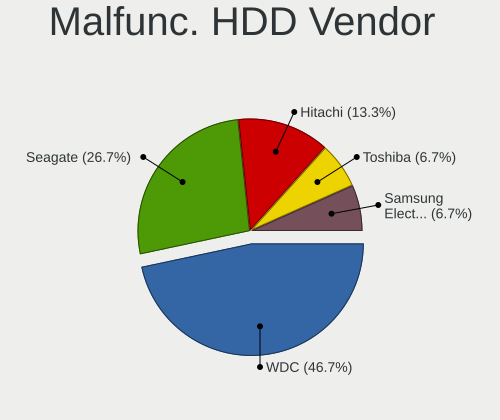

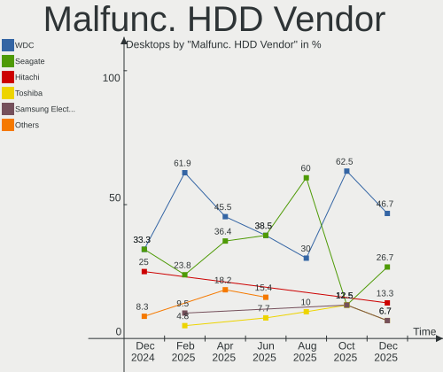

| Vendor              | Desktops | Drives | Percent |
|---------------------|----------|--------|---------|
| WDC                 | 7        | 7      | 46.67%  |
| Seagate             | 4        | 5      | 26.67%  |
| Hitachi             | 2        | 3      | 13.33%  |
| Toshiba             | 1        | 1      | 6.67%   |
| Samsung Electronics | 1        | 1      | 6.67%   |

Malfunc. Drive Kind
-------------------

Kinds of faulty drives

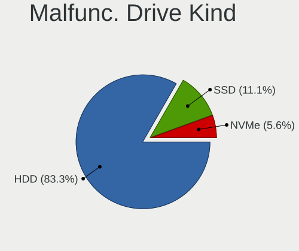

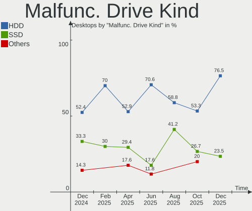

| Kind | Desktops | Drives | Percent |
|------|----------|--------|---------|
| HDD  | 13       | 17     | 76.47%  |
| SSD  | 4        | 5      | 23.53%  |

Failed Drives
-------------

Failed drive models

Zero info for selected period =(

Failed Drive Vendor
-------------------

Failed drive vendors

Zero info for selected period =(

Drive Status
------------

Number of failed and malfunc. drives

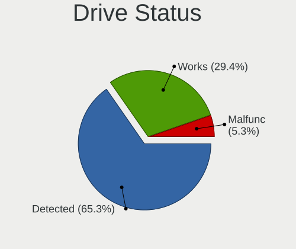

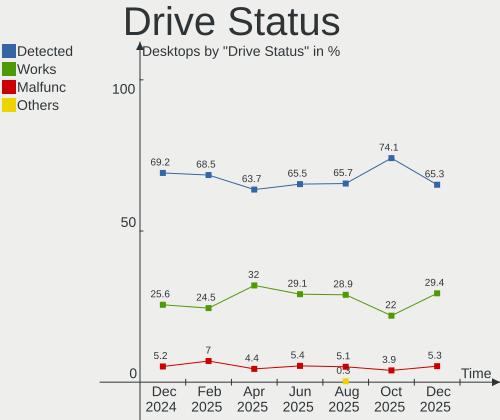

| Status   | Desktops | Drives | Percent |
|----------|----------|--------|---------|
| Detected | 209      | 456    | 65.31%  |
| Works    | 94       | 210    | 29.38%  |
| Malfunc  | 17       | 22     | 5.31%   |

Storage controller
------------------

Storage Vendor
--------------

Storage controller vendors

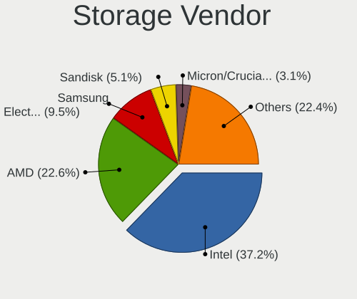

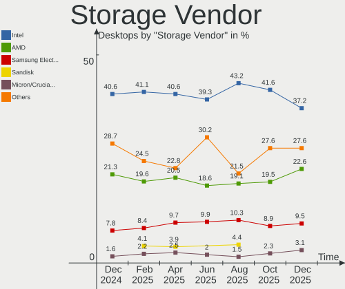

| Vendor                         | Desktops | Percent |
|--------------------------------|----------|---------|
| Intel                          | 181      | 37.24%  |
| AMD                            | 110      | 22.63%  |
| Samsung Electronics            | 46       | 9.47%   |
| Sandisk                        | 25       | 5.14%   |
| Micron/Crucial Technology      | 15       | 3.09%   |
| Kingston Technology Company    | 13       | 2.67%   |
| Phison Electronics             | 11       | 2.26%   |
| MAXIO Technology (Hangzhou)    | 11       | 2.26%   |
| ASMedia Technology             | 11       | 2.26%   |
| Realtek Semiconductor          | 8        | 1.65%   |
| Silicon Motion                 | 6        | 1.23%   |
| Marvell Technology Group       | 6        | 1.23%   |
| SK hynix                       | 5        | 1.03%   |
| Shenzhen Longsys Electronics   | 4        | 0.82%   |
| Micron Technology              | 4        | 0.82%   |
| ADATA Technology               | 4        | 0.82%   |
| JMicron Technology             | 3        | 0.62%   |
| Broadcom / LSI                 | 3        | 0.62%   |
| Yangtze Memory Technologies    | 2        | 0.41%   |
| Toshiba America Info Systems   | 2        | 0.41%   |
| LSI Logic / Symbios Logic      | 2        | 0.41%   |
| KIOXIA                         | 2        | 0.41%   |
| Biwin Storage Technology       | 2        | 0.41%   |
| Zhaoxin                        | 1        | 0.21%   |
| Solid State Storage Technology | 1        | 0.21%   |
| Silicon Image                  | 1        | 0.21%   |
| Shenzhen Wodposit Electronics  | 1        | 0.21%   |
| Red Hat                        | 1        | 0.21%   |
| OCZ Technology Group           | 1        | 0.21%   |
| Nvidia                         | 1        | 0.21%   |
| Hosin Global Electronics       | 1        | 0.21%   |
| Hewlett-Packard                | 1        | 0.21%   |
| Adaptec                        | 1        | 0.21%   |

Storage Model
-------------

Storage controller models

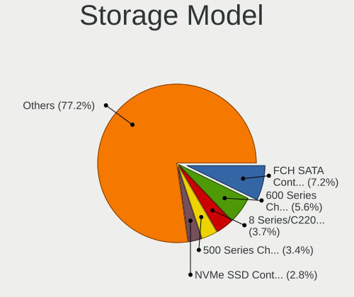

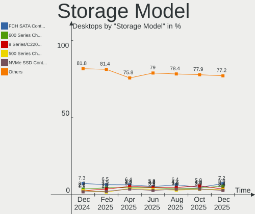

| Model                                                                                   | Desktops | Percent |
|-----------------------------------------------------------------------------------------|----------|---------|
| AMD FCH SATA Controller [AHCI mode]                                                     | 41       | 7.23%   |
| AMD 600 Series Chipset SATA Controller                                                  | 32       | 5.64%   |
| Intel 8 Series/C220 Series Chipset Family 6-port SATA Controller 1 [AHCI mode]          | 21       | 3.7%    |
| AMD 500 Series Chipset SATA Controller                                                  | 19       | 3.35%   |
| Samsung NVMe SSD Controller SM981/PM981/PM983                                           | 16       | 2.82%   |
| Intel SATA Controller [RAID Mode]                                                       | 16       | 2.82%   |
| Intel Cannon Lake PCH SATA AHCI Controller                                              | 16       | 2.82%   |
| Intel 200 Series PCH SATA controller [AHCI mode]                                        | 16       | 2.82%   |
| Intel Alder Lake-S PCH SATA Controller [AHCI Mode]                                      | 12       | 2.12%   |
| AMD 400 Series Chipset SATA Controller                                                  | 12       | 2.12%   |
| Samsung NVMe SSD Controller S4LV008[Pascal]                                             | 11       | 1.94%   |
| Intel Raptor Lake SATA AHCI Controller                                                  | 11       | 1.94%   |
| Intel 7 Series/C210 Series Chipset Family 6-port SATA Controller [AHCI mode]            | 11       | 1.94%   |
| Intel C610/X99 series chipset 6-Port SATA Controller [AHCI mode]                        | 10       | 1.76%   |
| Intel 500 Series Chipset Family SATA AHCI Controller                                    | 10       | 1.76%   |
| ASMedia ASM1061/ASM1062 Serial ATA Controller                                           | 10       | 1.76%   |
| Intel C610/X99 series chipset sSATA Controller [AHCI mode]                              | 9        | 1.59%   |
| Intel 6 Series/C200 Series Chipset Family Desktop SATA Controller (IDE mode, ports 4-5) | 9        | 1.59%   |
| Intel 6 Series/C200 Series Chipset Family Desktop SATA Controller (IDE mode, ports 0-3) | 9        | 1.59%   |
| Intel 6 Series/C200 Series Chipset Family 6 port Desktop SATA AHCI Controller           | 9        | 1.59%   |
| Intel Q170/Q150/B150/H170/H110/Z170/CM236 Chipset SATA Controller [AHCI Mode]           | 8        | 1.41%   |
| AMD SB7x0/SB8x0/SB9x0 SATA Controller [AHCI mode]                                       | 8        | 1.41%   |
| Samsung NVMe SSD Controller 980 (DRAM-less)                                             | 7        | 1.23%   |
| AMD SB7x0/SB8x0/SB9x0 IDE Controller                                                    | 7        | 1.23%   |
| Samsung NVMe SSD Controller PM9C1a (DRAM-less)                                          | 6        | 1.06%   |
| MAXIO (Hangzhou) NVMe SSD Controller MAP1602 (DRAM-less)                                | 6        | 1.06%   |
| MAXIO (Hangzhou) NVMe SSD Controller MAP1202 (DRAM-less)                                | 6        | 1.06%   |
| Silicon Motion SM2263EN/SM2263XT (DRAM-less) NVMe SSD Controllers                       | 5        | 0.88%   |
| Realtek RTS5765DL NVMe SSD Controller (DRAM-less)                                       | 5        | 0.88%   |
| Kingston Company KC3000/FURY Renegade NVMe SSD [E18]                                    | 5        | 0.88%   |
| AMD SB7x0/SB8x0/SB9x0 SATA Controller [IDE mode]                                        | 5        | 0.88%   |
| Samsung NVMe SSD Controller PM9A1/PM9A3/980PRO                                          | 4        | 0.71%   |
| Phison E16 PCIe4 NVMe Controller                                                        | 4        | 0.71%   |
| Intel RST Volume Management Device Controller                                           | 4        | 0.71%   |
| AMD 300 Series Chipset SATA Controller                                                  | 4        | 0.71%   |
| Shenzhen Longsys Lexar NM790 / Patriot Viper VP4300 Lite NVMe SSD (DRAM-less)           | 3        | 0.53%   |
| SanDisk WD SN560/SN740/SN770/SN5000 NVMe SSD                                            | 3        | 0.53%   |
| SanDisk WD PC SN810 / Black SN850 NVMe SSD                                              | 3        | 0.53%   |
| Sandisk WD PC SN8050S / WD_BLACK SN8100 NVMe SSD                                        | 3        | 0.53%   |
| SanDisk WD Green SN350 240GB (DRAM-less) / SN560E NVMe SSD                              | 3        | 0.53%   |

Storage Kind
------------

Kind of storage controller (IDE, SATA, NVMe, SAS, ...)

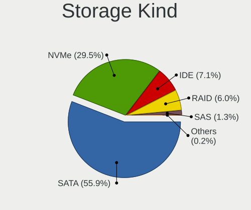

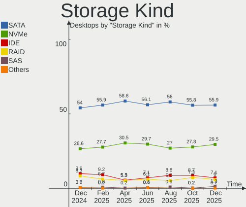

| Kind | Desktops | Percent |
|------|----------|---------|
| SATA | 260      | 55.91%  |
| NVMe | 137      | 29.46%  |
| IDE  | 33       | 7.1%    |
| RAID | 28       | 6.02%   |
| SAS  | 6        | 1.29%   |
| SCSI | 1        | 0.22%   |

Processor
---------

CPU Vendor
----------

Processor vendors

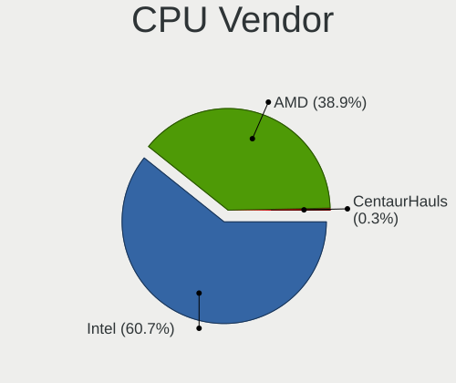

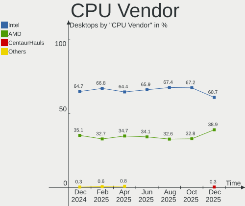

| Vendor       | Desktops | Percent |
|--------------|----------|---------|
| Intel        | 181      | 60.74%  |
| AMD          | 116      | 38.93%  |
| CentaurHauls | 1        | 0.34%   |

CPU Model
---------

Processor models

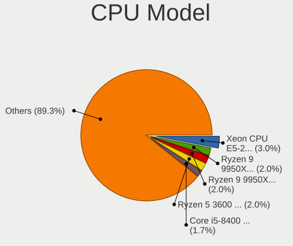

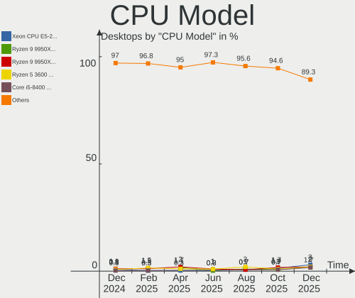

| Model                                  | Desktops | Percent |
|----------------------------------------|----------|---------|
| Intel Xeon CPU E5-2680 v4 @ 2.40GHz    | 9        | 3.02%   |
| AMD Ryzen 9 9950X3D 16-Core Processor  | 6        | 2.01%   |
| AMD Ryzen 9 9950X 16-Core Processor    | 6        | 2.01%   |
| AMD Ryzen 5 3600 6-Core Processor      | 6        | 2.01%   |
| Intel Core i5-8400 CPU @ 2.80GHz       | 5        | 1.68%   |
| AMD Ryzen 7 9800X3D 8-Core Processor   | 5        | 1.68%   |
| AMD Ryzen 7 5700X 8-Core Processor     | 5        | 1.68%   |
| Intel Core i9-14900K                   | 4        | 1.34%   |
| Intel Core i7-3770 CPU @ 3.40GHz       | 4        | 1.34%   |
| Intel Core i5-6500 CPU @ 3.20GHz       | 4        | 1.34%   |
| Intel Core i3-8100 CPU @ 3.60GHz       | 4        | 1.34%   |
| Intel Core i3-3220 CPU @ 3.30GHz       | 4        | 1.34%   |
| AMD Ryzen 7 5800X 8-Core Processor     | 4        | 1.34%   |
| AMD Ryzen 5 5600G with Radeon Graphics | 4        | 1.34%   |
| Intel Core i7-4790 CPU @ 3.60GHz       | 3        | 1.01%   |
| Intel Core i7-2600 CPU @ 3.40GHz       | 3        | 1.01%   |
| Intel Core i5-6600 CPU @ 3.30GHz       | 3        | 1.01%   |
| Intel Core i5-4460 CPU @ 3.20GHz       | 3        | 1.01%   |
| Intel Core i5-3470 CPU @ 3.20GHz       | 3        | 1.01%   |
| Intel Core i5-2400 CPU @ 3.10GHz       | 3        | 1.01%   |
| Intel Core i5-10400F CPU @ 2.90GHz     | 3        | 1.01%   |
| Intel Core i3-6100 CPU @ 3.70GHz       | 3        | 1.01%   |
| Intel Core i3-4150 CPU @ 3.50GHz       | 3        | 1.01%   |
| Intel 13th Gen Core i5-13600KF         | 3        | 1.01%   |
| Intel 12th Gen Core i9-12900KF         | 3        | 1.01%   |
| AMD Ryzen 9 5950X 16-Core Processor    | 3        | 1.01%   |
| AMD Ryzen 7 5825U with Radeon Graphics | 3        | 1.01%   |
| AMD Ryzen 7 5700G with Radeon Graphics | 3        | 1.01%   |
| AMD FX-8350 Eight-Core Processor       | 3        | 1.01%   |
| Intel Pentium CPU G4400 @ 3.30GHz      | 2        | 0.67%   |
| Intel N100                             | 2        | 0.67%   |
| Intel Core Ultra 7 265K                | 2        | 0.67%   |
| Intel Core i7-7700 CPU @ 3.60GHz       | 2        | 0.67%   |
| Intel Core i7-6700 CPU @ 3.40GHz       | 2        | 0.67%   |
| Intel Core i7-4770 CPU @ 3.40GHz       | 2        | 0.67%   |
| Intel Core i7-2600K CPU @ 3.40GHz      | 2        | 0.67%   |
| Intel Core i5-9500 CPU @ 3.00GHz       | 2        | 0.67%   |
| Intel Core i5-8500 CPU @ 3.00GHz       | 2        | 0.67%   |
| Intel Core i5-4670 CPU @ 3.40GHz       | 2        | 0.67%   |
| Intel Core i5-4570 CPU @ 3.20GHz       | 2        | 0.67%   |

CPU Model Family
----------------

Processor model prefix

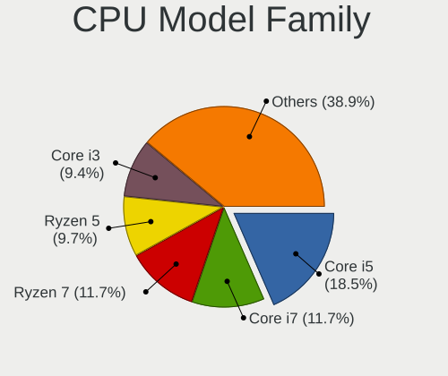

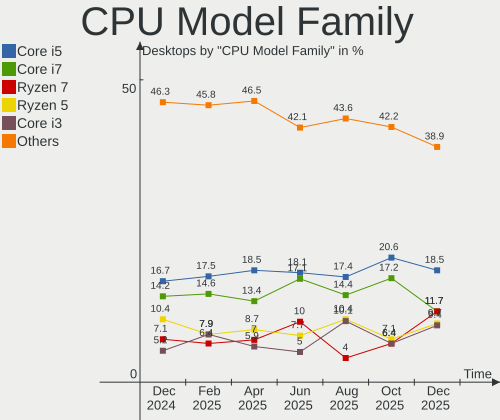

| Model                   | Desktops | Percent |
|-------------------------|----------|---------|
| Intel Core i5           | 55       | 18.46%  |
| Intel Core i7           | 35       | 11.74%  |
| AMD Ryzen 7             | 35       | 11.74%  |
| AMD Ryzen 5             | 29       | 9.73%   |
| Intel Core i3           | 28       | 9.4%    |
| Other                   | 24       | 8.05%   |
| AMD Ryzen 9             | 21       | 7.05%   |
| Intel Xeon              | 20       | 6.71%   |
| AMD FX                  | 6        | 2.01%   |
| Intel Pentium           | 5        | 1.68%   |
| Intel Core i9           | 5        | 1.68%   |
| AMD Ryzen Threadripper  | 5        | 1.68%   |
| Intel Core 2 Duo        | 3        | 1.01%   |
| Intel Celeron           | 3        | 1.01%   |
| AMD A8                  | 3        | 1.01%   |
| AMD A4                  | 3        | 1.01%   |
| Intel Pentium Dual-Core | 2        | 0.67%   |
| Intel Core              | 2        | 0.67%   |
| AMD Athlon II X4        | 2        | 0.67%   |
| AMD Athlon              | 2        | 0.67%   |
| Intel Core 2 Quad       | 1        | 0.34%   |
| AMD Ryzen 3             | 1        | 0.34%   |
| AMD PRO A8              | 1        | 0.34%   |
| AMD Phenom II X6        | 1        | 0.34%   |
| AMD Phenom II X4        | 1        | 0.34%   |
| AMD Phenom II X2        | 1        | 0.34%   |
| AMD E1                  | 1        | 0.34%   |
| AMD E                   | 1        | 0.34%   |
| AMD Athlon II X2        | 1        | 0.34%   |
| AMD A10                 | 1        | 0.34%   |

CPU Cores
---------

Number of processor cores

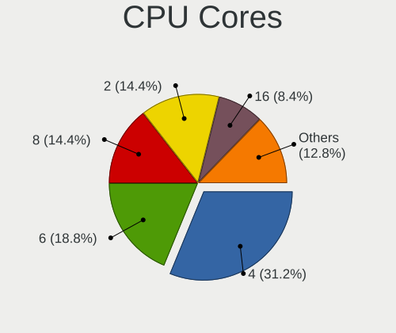

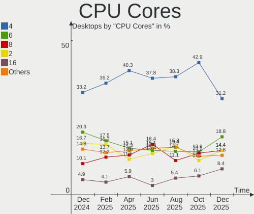

| Number | Desktops | Percent |
|--------|----------|---------|
| 4      | 93       | 31.21%  |
| 6      | 56       | 18.79%  |
| 8      | 43       | 14.43%  |
| 2      | 43       | 14.43%  |
| 16     | 25       | 8.39%   |
| 28     | 8        | 2.68%   |
| 10     | 7        | 2.35%   |
| 24     | 6        | 2.01%   |
| 12     | 6        | 2.01%   |
| 14     | 5        | 1.68%   |
| 20     | 4        | 1.34%   |
| 32     | 1        | 0.34%   |
| 1      | 1        | 0.34%   |

CPU Sockets
-----------

Number of sockets

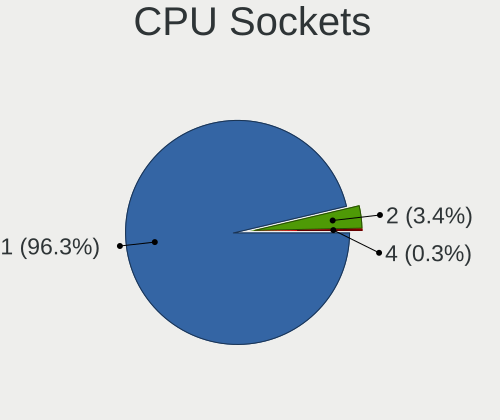

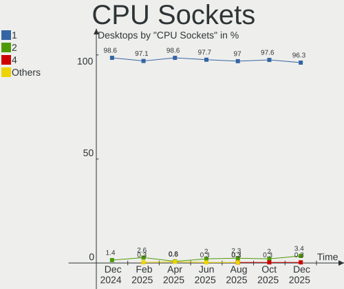

| Number | Desktops | Percent |
|--------|----------|---------|
| 1      | 287      | 96.31%  |
| 2      | 10       | 3.36%   |
| 4      | 1        | 0.34%   |

CPU Threads
-----------

Threads per core (Hyper-Threading)

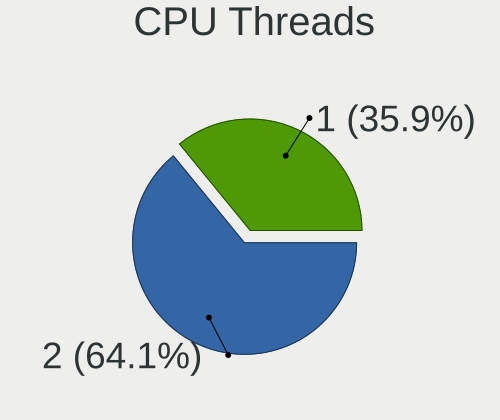

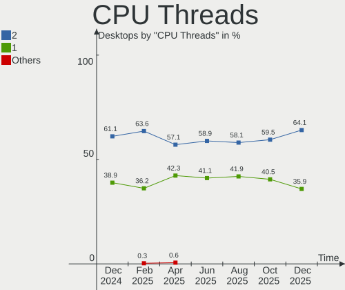

| Number | Desktops | Percent |
|--------|----------|---------|
| 2      | 191      | 64.09%  |
| 1      | 107      | 35.91%  |

CPU Op-Modes
------------

CPU Operation Modes (32-bit, 64-bit)

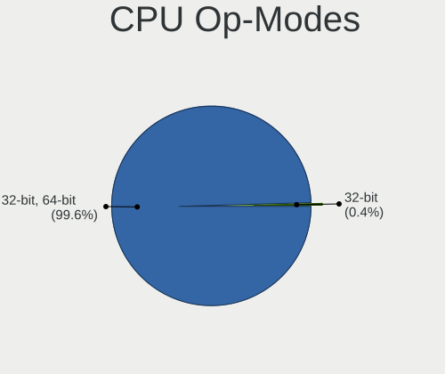

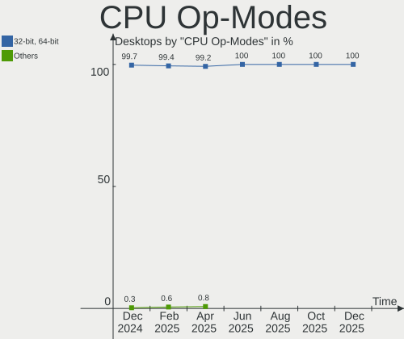

| Op mode        | Desktops | Percent |
|----------------|----------|---------|
| 32-bit, 64-bit | 298      | 100%    |

CPU Microcode
-------------

Microcode number

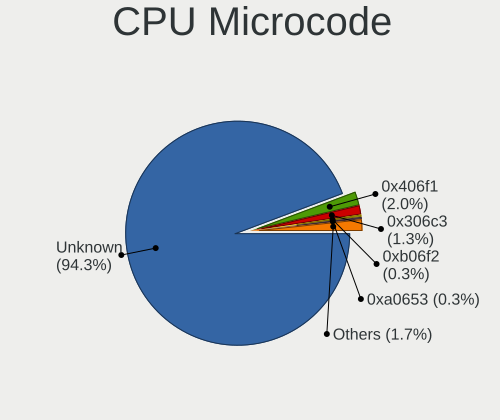

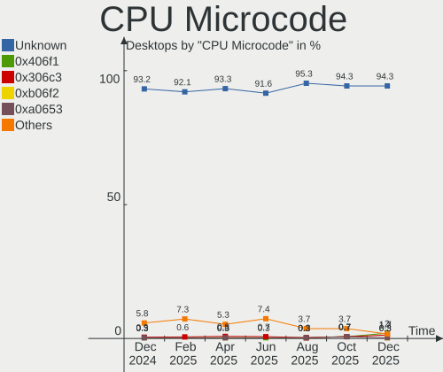

| Number     | Desktops | Percent |
|------------|----------|---------|
| Unknown    | 281      | 94.3%   |
| 0x406f1    | 6        | 2.01%   |
| 0x306c3    | 4        | 1.34%   |
| 0xb06f2    | 1        | 0.34%   |
| 0xa0653    | 1        | 0.34%   |
| 0x906e9    | 1        | 0.34%   |
| 0x706e5    | 1        | 0.34%   |
| 0x1067a    | 1        | 0.34%   |
| 0x06001119 | 1        | 0.34%   |
| 0x010000db | 1        | 0.34%   |

CPU Microarch
-------------

Microarchitecture

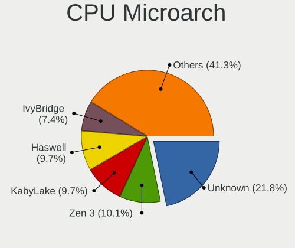

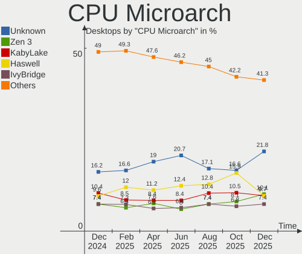

| Name             | Desktops | Percent |
|------------------|----------|---------|
| Unknown          | 65       | 21.81%  |
| Zen 3            | 30       | 10.07%  |
| KabyLake         | 29       | 9.73%   |
| Haswell          | 29       | 9.73%   |
| IvyBridge        | 22       | 7.38%   |
| SandyBridge      | 16       | 5.37%   |
| Zen 2            | 15       | 5.03%   |
| Skylake          | 15       | 5.03%   |
| Broadwell        | 12       | 4.03%   |
| Piledriver       | 11       | 3.69%   |
| CometLake        | 8        | 2.68%   |
| Zen+             | 7        | 2.35%   |
| Nehalem          | 6        | 2.01%   |
| K10              | 6        | 2.01%   |
| Penryn           | 5        | 1.68%   |
| Zen              | 4        | 1.34%   |
| Alderlake Hybrid | 4        | 1.34%   |
| Steamroller      | 2        | 0.67%   |
| Icelake          | 2        | 0.67%   |
| Westmere         | 1        | 0.34%   |
| Tremont          | 1        | 0.34%   |
| Silvermont       | 1        | 0.34%   |
| Puma             | 1        | 0.34%   |
| Lunarlake Hybrid | 1        | 0.34%   |
| K8 Hammer        | 1        | 0.34%   |
| Jaguar           | 1        | 0.34%   |
| Gracemont        | 1        | 0.34%   |
| Excavator        | 1        | 0.34%   |
| Core             | 1        | 0.34%   |

Graphics
--------

GPU Vendor
----------

Vendors of graphics cards

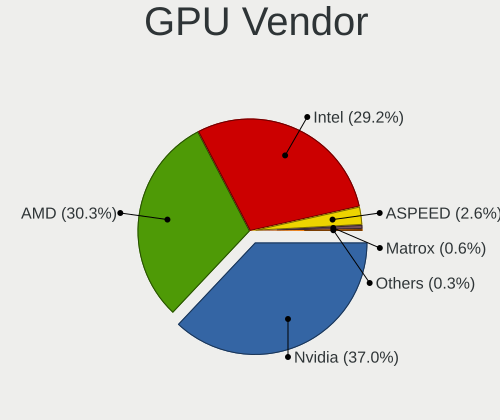

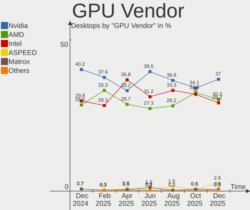

| Vendor                     | Desktops | Percent |
|----------------------------|----------|---------|
| Nvidia                     | 127      | 37.03%  |
| AMD                        | 104      | 30.32%  |
| Intel                      | 100      | 29.15%  |
| ASPEED Technology          | 9        | 2.62%   |
| Matrox Electronics Systems | 2        | 0.58%   |
| Glenfly Tech               | 1        | 0.29%   |

GPU Model
---------

Graphics card models

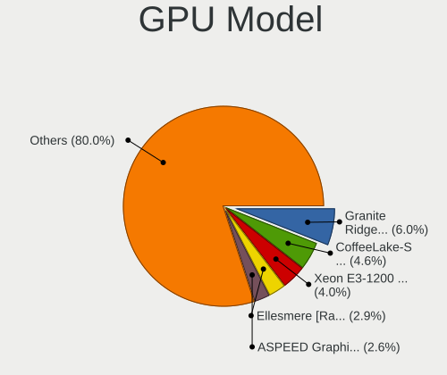

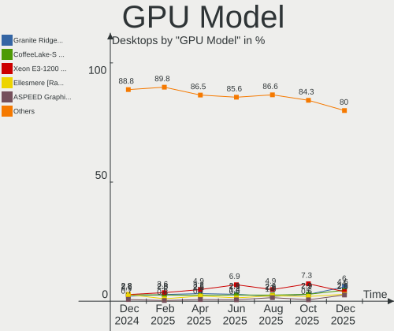

| Model                                                                       | Desktops | Percent |
|-----------------------------------------------------------------------------|----------|---------|
| AMD Granite Ridge [Radeon Graphics]                                         | 21       | 6%      |
| Intel CoffeeLake-S GT2 [UHD Graphics 630]                                   | 16       | 4.57%   |
| Intel Xeon E3-1200 v3/4th Gen Core Processor Integrated Graphics Controller | 14       | 4%      |
| AMD Ellesmere [Radeon RX 470/480/570/570X/580/580X/590]                     | 10       | 2.86%   |
| ASPEED Technology ASPEED Graphics Family                                    | 9        | 2.57%   |
| Intel Skylake-S GT2 [HD Graphics 530]                                       | 8        | 2.29%   |
| Intel 2nd Generation Core Processor Family Integrated Graphics Controller   | 8        | 2.29%   |
| Intel Xeon E3-1200 v2/3rd Gen Core processor Graphics Controller            | 7        | 2%      |
| Nvidia TU117 [GeForce GTX 1650]                                             | 6        | 1.71%   |
| Nvidia GB203 [GeForce RTX 5080]                                             | 6        | 1.71%   |
| Nvidia GP107 [GeForce GTX 1050 Ti]                                          | 5        | 1.43%   |
| Nvidia AD107 [GeForce RTX 4060]                                             | 5        | 1.43%   |
| Intel Raptor Lake-S GT1 [UHD Graphics 770]                                  | 5        | 1.43%   |
| AMD Polaris 20 XL [Radeon RX 580 2048SP]                                    | 5        | 1.43%   |
| Nvidia GP102 [GeForce GTX 1080 Ti]                                          | 4        | 1.14%   |
| Nvidia GK208B [GeForce GT 710]                                              | 4        | 1.14%   |
| Nvidia AD104 [GeForce RTX 4070]                                             | 4        | 1.14%   |
| Intel Kaby Lake-S GT2 [HD Graphics 630]                                     | 4        | 1.14%   |
| Intel Alder Lake-S GT1 [UHD Graphics 730]                                   | 4        | 1.14%   |
| Intel 4th Generation Core Processor Family Integrated Graphics Controller   | 4        | 1.14%   |
| AMD Raphael                                                                 | 4        | 1.14%   |
| AMD Cezanne [Radeon Vega Series / Radeon Vega Mobile Series]                | 4        | 1.14%   |
| Nvidia GT218 [GeForce 210]                                                  | 3        | 0.86%   |
| Nvidia GP108 [GeForce GT 1030]                                              | 3        | 0.86%   |
| Nvidia GP106 [GeForce GTX 1060 6GB]                                         | 3        | 0.86%   |
| Nvidia GB206 [GeForce RTX 5060]                                             | 3        | 0.86%   |
| Nvidia GB205 [GeForce RTX 5070]                                             | 3        | 0.86%   |
| Nvidia GB203 [GeForce RTX 5070 Ti]                                          | 3        | 0.86%   |
| Nvidia GA102 [GeForce RTX 3090]                                             | 3        | 0.86%   |
| Nvidia AD106 [GeForce RTX 4060 Ti]                                          | 3        | 0.86%   |
| Intel IvyBridge GT2 [HD Graphics 4000]                                      | 3        | 0.86%   |
| Intel CometLake-S GT2 [UHD Graphics 630]                                    | 3        | 0.86%   |
| Intel Alder Lake-N [UHD Graphics]                                           | 3        | 0.86%   |
| AMD Navi 23 [Radeon RX 6600/6600 XT/6600M]                                  | 3        | 0.86%   |
| AMD Lexa PRO [Radeon 540/540X/550/550X / RX 540X/550/550X]                  | 3        | 0.86%   |
| AMD Barcelo                                                                 | 3        | 0.86%   |
| Nvidia TU116 [GeForce GTX 1660 SUPER]                                       | 2        | 0.57%   |
| Nvidia GP104 [GeForce GTX 1080]                                             | 2        | 0.57%   |
| Nvidia GP104 [GeForce GTX 1070]                                             | 2        | 0.57%   |
| Nvidia GM206 [GeForce GTX 960]                                              | 2        | 0.57%   |

GPU Combo
---------

Combinations of graphics cards

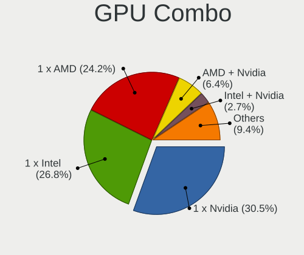

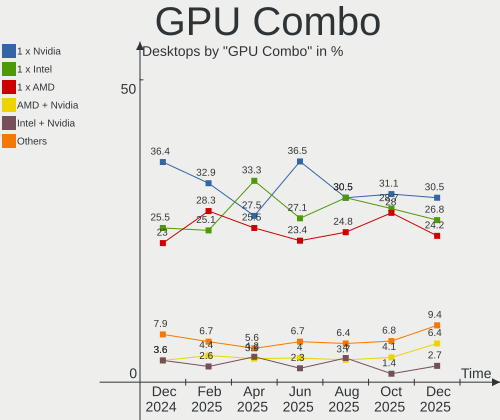

| Name                     | Desktops | Percent |
|--------------------------|----------|---------|
| 1 x Nvidia               | 91       | 30.54%  |
| 1 x Intel                | 80       | 26.85%  |
| 1 x AMD                  | 72       | 24.16%  |
| AMD + Nvidia             | 19       | 6.38%   |
| Intel + Nvidia           | 8        | 2.68%   |
| 2 x AMD                  | 6        | 2.01%   |
| 1 x ASPEED               | 6        | 2.01%   |
| Intel + AMD              | 4        | 1.34%   |
| 2 x Nvidia               | 2        | 0.67%   |
| Nvidia + ASPEED          | 2        | 0.67%   |
| 1 x Matrox               | 2        | 0.67%   |
| 4 x AMD                  | 1        | 0.34%   |
| 2 x Intel                | 1        | 0.34%   |
| Intel + 2 x Nvidia       | 1        | 0.34%   |
| Intel + AMD + 1 x Nvidia | 1        | 0.34%   |
| 1 x Glenfly Tech         | 1        | 0.34%   |
| AMD + ASPEED             | 1        | 0.34%   |

GPU Driver
----------

Free vs proprietary

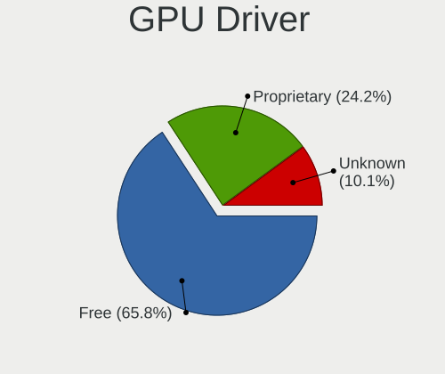

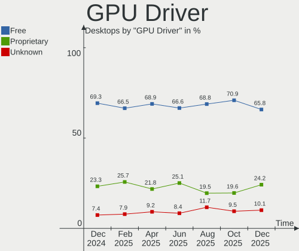

| Driver      | Desktops | Percent |
|-------------|----------|---------|
| Free        | 196      | 65.77%  |
| Proprietary | 72       | 24.16%  |
| Unknown     | 30       | 10.07%  |

GPU Memory
----------

Total video memory

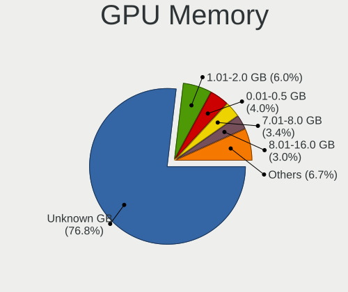

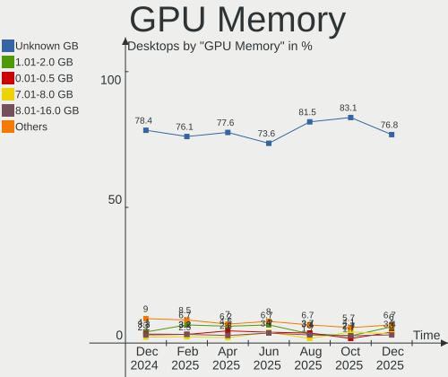

| Size in GB     | Desktops | Percent |
|----------------|----------|---------|
| Unknown        | 229      | 76.85%  |
| 1.01-2.0       | 18       | 6.04%   |
| 0.01-0.5       | 12       | 4.03%   |
| 7.01-8.0       | 10       | 3.36%   |
| 8.01-16.0      | 9        | 3.02%   |
| 3.01-4.0       | 7        | 2.35%   |
| 0.51-1.0       | 7        | 2.35%   |
| 16.01-24.0     | 2        | 0.67%   |
| More than 64.0 | 1        | 0.34%   |
| 32.01-64.0     | 1        | 0.34%   |
| 5.01-6.0       | 1        | 0.34%   |
| 2.01-3.0       | 1        | 0.34%   |

Monitor
-------

Monitor Vendor
--------------

Monitor vendors

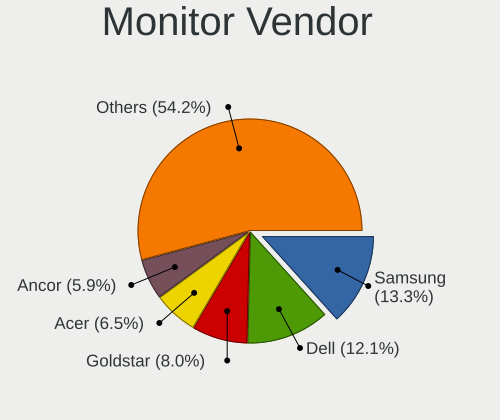

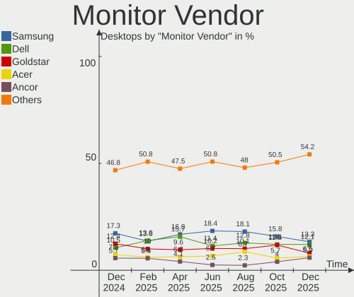

| Vendor               | Desktops | Percent |
|----------------------|----------|---------|
| Samsung Electronics  | 43       | 13.31%  |
| Dell                 | 39       | 12.07%  |
| Goldstar             | 26       | 8.05%   |
| Acer                 | 21       | 6.5%    |
| Ancor Communications | 19       | 5.88%   |
| BenQ                 | 16       | 4.95%   |
| Hewlett-Packard      | 14       | 4.33%   |
| AOC                  | 13       | 4.02%   |
| ViewSonic            | 12       | 3.72%   |
| ASUSTek Computer     | 10       | 3.1%    |
| Philips              | 8        | 2.48%   |
| MSI                  | 7        | 2.17%   |
| Lenovo               | 7        | 2.17%   |
| Iiyama               | 7        | 2.17%   |
| Sony                 | 6        | 1.86%   |
| Unknown              | 4        | 1.24%   |
| Mi                   | 4        | 1.24%   |
| Medion               | 4        | 1.24%   |
| HannStar             | 4        | 1.24%   |
| Fujitsu Siemens      | 4        | 1.24%   |
| NEC Computers        | 3        | 0.93%   |
| Eizo                 | 3        | 0.93%   |
| Unknown (XXX)        | 2        | 0.62%   |
| SKG                  | 2        | 0.62%   |
| Sceptre Tech         | 2        | 0.62%   |
| ONN                  | 2        | 0.62%   |
| Hitachi              | 2        | 0.62%   |
| Gigabyte Technology  | 2        | 0.62%   |
| Compal               | 2        | 0.62%   |
| WES                  | 1        | 0.31%   |
| VIZTA                | 1        | 0.31%   |
| Vizio                | 1        | 0.31%   |
| Viotek               | 1        | 0.31%   |
| VIE                  | 1        | 0.31%   |
| Vestel Elektronik    | 1        | 0.31%   |
| Unknown (BBC)        | 1        | 0.31%   |
| STD                  | 1        | 0.31%   |
| SGT                  | 1        | 0.31%   |
| SAC                  | 1        | 0.31%   |
| Pioneer              | 1        | 0.31%   |

Monitor Model
-------------

Monitor models

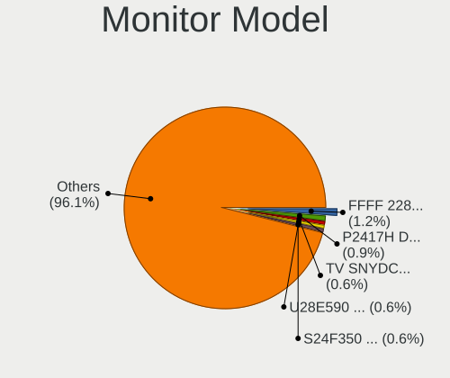

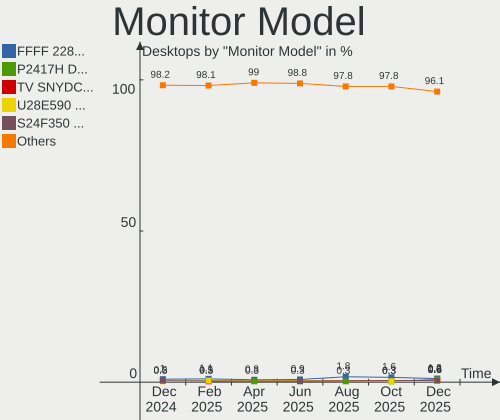

| Model                                                                  | Desktops | Percent |
|------------------------------------------------------------------------|----------|---------|
| Unknown LCD Monitor FFFF 2288x1287 2550x2550mm 142.0-inch              | 4        | 1.2%    |
| Dell P2417H DELA0DB 1920x1080 527x296mm 23.8-inch                      | 3        | 0.9%    |
| Sony TV SNYDC02 1920x1080 708x398mm 32.0-inch                          | 2        | 0.6%    |
| Samsung Electronics U28E590 SAM0C4D 3840x2160 607x345mm 27.5-inch      | 2        | 0.6%    |
| Samsung Electronics S24F350 SAM0D20 1920x1080 521x293mm 23.5-inch      | 2        | 0.6%    |
| Samsung Electronics LU28R55 SAM1017 3840x2160 632x360mm 28.6-inch      | 2        | 0.6%    |
| Samsung Electronics C27F390 SAM0D33 1920x1080 598x336mm 27.0-inch      | 2        | 0.6%    |
| MSI MD272XP MSI50B1 1920x1080 600x330mm 27.0-inch                      | 2        | 0.6%    |
| Lenovo LEN L201p LEN2468 1600x1200 400x300mm 19.7-inch                 | 2        | 0.6%    |
| Hewlett-Packard 24o HPN337C 1920x1080 531x299mm 24.0-inch              | 2        | 0.6%    |
| Eizo EV2456 ENC2796 1920x1080 519x324mm 24.1-inch                      | 2        | 0.6%    |
| Dell U2723QE DEL4278 3840x2160 597x336mm 27.0-inch                     | 2        | 0.6%    |
| Dell P2422H DELA1C5 1920x1080 527x296mm 23.8-inch                      | 2        | 0.6%    |
| BenQ GW2270 BNQ78DB 1920x1080 476x268mm 21.5-inch                      | 2        | 0.6%    |
| AOC 32G1WG4 AOC3201 1920x1080 697x392mm 31.5-inch                      | 2        | 0.6%    |
| Ancor Communications ASUS PB287Q ACI28A3 3840x2160 621x341mm 27.9-inch | 2        | 0.6%    |
| Acer HA270 ACR0584 1920x1080 598x336mm 27.0-inch                       | 2        | 0.6%    |
| WES WD50UC4300 WES0030 3840x2160 708x398mm 32.0-inch                   | 1        | 0.3%    |
| VIZTA HDMI JRY2380 1920x1080 530x290mm 23.8-inch                       | 1        | 0.3%    |
| Vizio D55-F2 VIZ1035 3840x2160 1209x680mm 54.6-inch                    | 1        | 0.3%    |
| Viotek GNV30CB VTK3000 2560x1080 690x291mm 29.5-inch                   | 1        | 0.3%    |
| ViewSonic VX3276-QHD VSCE635 2560x1440 698x393mm 31.5-inch             | 1        | 0.3%    |
| ViewSonic VX2718 Series VSC4D3B 1920x1080 598x336mm 27.0-inch          | 1        | 0.3%    |
| ViewSonic VX2703 SERIES VSCF62B 1920x1080 597x336mm 27.0-inch          | 1        | 0.3%    |
| ViewSonic VX2255wm-2 VSC9B1F 1680x1050 474x296mm 22.0-inch             | 1        | 0.3%    |
| ViewSonic VX2235wm VSC591E 1680x1050 474x296mm 22.0-inch               | 1        | 0.3%    |
| ViewSonic VX1937 SERIES VSC2D24 1440x900 410x260mm 19.1-inch           | 1        | 0.3%    |
| ViewSonic VA2708-UHD VSCFD40 3840x2160 598x336mm 27.0-inch             | 1        | 0.3%    |
| ViewSonic VA2465 SERIES VSCB730 1920x1080 521x293mm 23.5-inch          | 1        | 0.3%    |
| ViewSonic VA2231 Series VSCBB25 1920x1080 477x268mm 21.5-inch          | 1        | 0.3%    |
| ViewSonic VA2215 100Hz VSC623F 1920x1080 479x260mm 21.5-inch           | 1        | 0.3%    |
| ViewSonic VA2213w VSC3422 1920x1080 477x268mm 21.5-inch                | 1        | 0.3%    |
| ViewSonic VA2037 SERIES VSCCC2C 1600x900 432x240mm 19.5-inch           | 1        | 0.3%    |
| ViewSonic LCD Monitor VX1937 SERIES 1440x900                           | 1        | 0.3%    |
| VIE RE24BDB VIE0238 1920x1080 527x296mm 23.8-inch                      | 1        | 0.3%    |
| Vestel Elektronik 40UHD_LCD_TV VES3700 3840x2160 880x500mm 39.8-inch   | 1        | 0.3%    |
| Unknown (XXX) Union TV XXX2841 1920x1080 1209x680mm 54.6-inch          | 1        | 0.3%    |
| Unknown (XXX) Beyond TV XXX9221 1920x1080 1209x680mm 54.6-inch         | 1        | 0.3%    |
| Unknown (BBC) HDP-V104 BBC0104 3840x2160 344x195mm 15.6-inch           | 1        | 0.3%    |
| STD LED STD2145 1680x1050 470x300mm 22.0-inch                          | 1        | 0.3%    |

Monitor Resolution
------------------

Monitor screen resolution

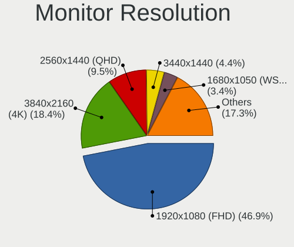

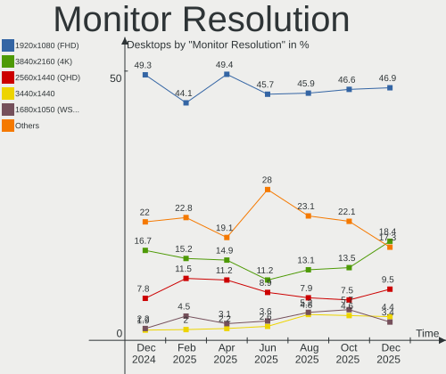

| Resolution         | Desktops | Percent |
|--------------------|----------|---------|
| 1920x1080 (FHD)    | 138      | 46.94%  |
| 3840x2160 (4K)     | 54       | 18.37%  |
| 2560x1440 (QHD)    | 28       | 9.52%   |
| 3440x1440          | 13       | 4.42%   |
| 1680x1050 (WSXGA+) | 10       | 3.4%    |
| 1280x1024 (SXGA)   | 7        | 2.38%   |
| 1920x1200 (WUXGA)  | 6        | 2.04%   |
| 1440x900 (WXGA+)   | 6        | 2.04%   |
| 1366x768 (WXGA)    | 6        | 2.04%   |
| 2560x1080          | 5        | 1.7%    |
| 2288x1287          | 5        | 1.7%    |
| 1600x900 (HD+)     | 4        | 1.36%   |
| 1920x540           | 3        | 1.02%   |
| 1600x1200          | 3        | 1.02%   |
| 3840x1080          | 1        | 0.34%   |
| 2560x2880          | 1        | 0.34%   |
| 2560x1600          | 1        | 0.34%   |
| 2048x1152          | 1        | 0.34%   |
| 1400x1050          | 1        | 0.34%   |
| 1024x768 (XGA)     | 1        | 0.34%   |

Monitor Diagonal
----------------

Diagonal size in inches

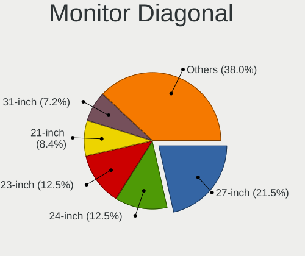

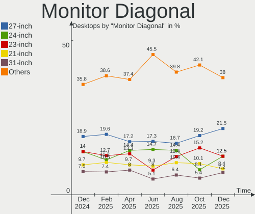

| Inches  | Desktops | Percent |
|---------|----------|---------|
| 27      | 69       | 21.5%   |
| 24      | 40       | 12.46%  |
| 23      | 40       | 12.46%  |
| 21      | 27       | 8.41%   |
| 31      | 23       | 7.17%   |
| 19      | 18       | 5.61%   |
| 34      | 14       | 4.36%   |
| Unknown | 9        | 2.8%    |
| 32      | 8        | 2.49%   |
| 22      | 8        | 2.49%   |
| 18      | 7        | 2.18%   |
| 84      | 5        | 1.56%   |
| 25      | 5        | 1.56%   |
| 20      | 5        | 1.56%   |
| 142     | 4        | 1.25%   |
| 46      | 4        | 1.25%   |
| 28      | 4        | 1.25%   |
| 15      | 4        | 1.25%   |
| 72      | 3        | 0.93%   |
| 48      | 3        | 0.93%   |
| 42      | 3        | 0.93%   |
| 26      | 3        | 0.93%   |
| 63      | 2        | 0.62%   |
| 54      | 2        | 0.62%   |
| 40      | 2        | 0.62%   |
| 29      | 2        | 0.62%   |
| 85      | 1        | 0.31%   |
| 74      | 1        | 0.31%   |
| 64      | 1        | 0.31%   |
| 57      | 1        | 0.31%   |
| 49      | 1        | 0.31%   |
| 39      | 1        | 0.31%   |
| 17      | 1        | 0.31%   |

Monitor Width
-------------

Physical width

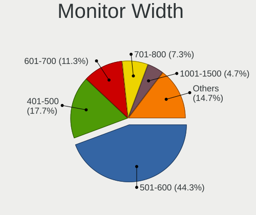

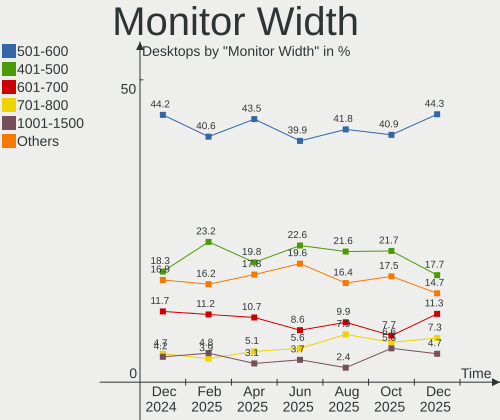

| Width in mm    | Desktops | Percent |
|----------------|----------|---------|
| 501-600        | 133      | 44.33%  |
| 401-500        | 53       | 17.67%  |
| 601-700        | 34       | 11.33%  |
| 701-800        | 22       | 7.33%   |
| 1001-1500      | 14       | 4.67%   |
| 351-400        | 10       | 3.33%   |
| 1501-2000      | 10       | 3.33%   |
| Unknown        | 9        | 3%      |
| 301-350        | 5        | 1.67%   |
| 901-1000       | 5        | 1.67%   |
| More than 2000 | 4        | 1.33%   |
| 801-900        | 1        | 0.33%   |

Aspect Ratio
------------

Proportional relationship between the width and the height

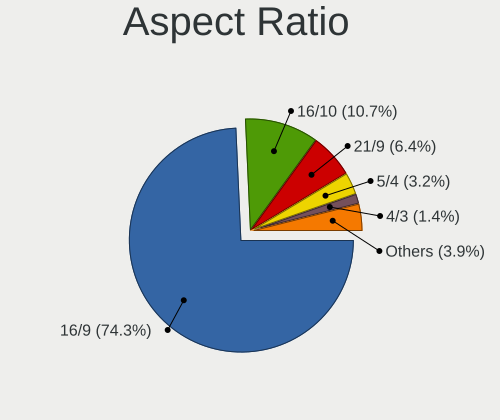

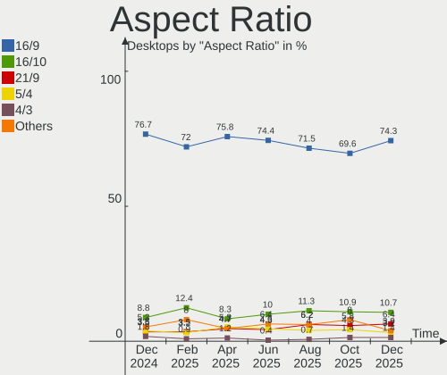

| Ratio   | Desktops | Percent |
|---------|----------|---------|
| 16/9    | 208      | 74.29%  |
| 16/10   | 30       | 10.71%  |
| 21/9    | 18       | 6.43%   |
| 5/4     | 9        | 3.21%   |
| 4/3     | 4        | 1.43%   |
| 1.00    | 4        | 1.43%   |
| Unknown | 3        | 1.07%   |
| 32/9    | 1        | 0.36%   |
| 3/2     | 1        | 0.36%   |
| 1.96    | 1        | 0.36%   |
| 0.89    | 1        | 0.36%   |

Monitor Area
------------

Area in inch²

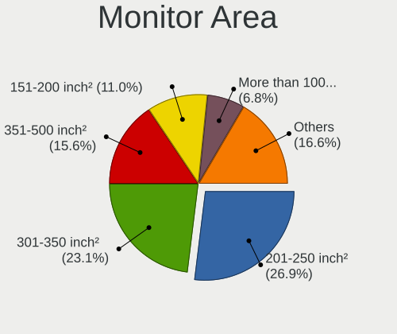

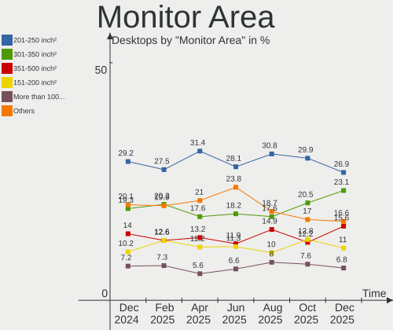

| Area in inch² | Desktops | Percent |
|----------------|----------|---------|
| 201-250        | 83       | 26.95%  |
| 301-350        | 71       | 23.05%  |
| 351-500        | 48       | 15.58%  |
| 151-200        | 34       | 11.04%  |
| More than 1000 | 21       | 6.82%   |
| 251-300        | 19       | 6.17%   |
| 501-1000       | 12       | 3.9%    |
| Unknown        | 9        | 2.92%   |
| 141-150        | 7        | 2.27%   |
| 101-110        | 3        | 0.97%   |
| 111-120        | 1        | 0.32%   |

Pixel Density
-------------

Pixels per inch

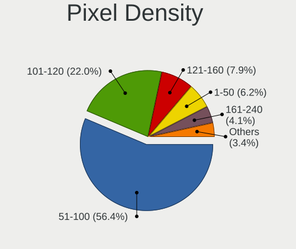

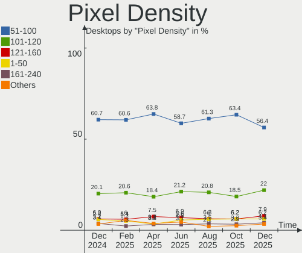

| Density       | Desktops | Percent |
|---------------|----------|---------|
| 51-100        | 164      | 56.36%  |
| 101-120       | 64       | 21.99%  |
| 121-160       | 23       | 7.9%    |
| 1-50          | 18       | 6.19%   |
| 161-240       | 12       | 4.12%   |
| Unknown       | 9        | 3.09%   |
| More than 240 | 1        | 0.34%   |

Multiple Monitors
-----------------

Total monitors connected

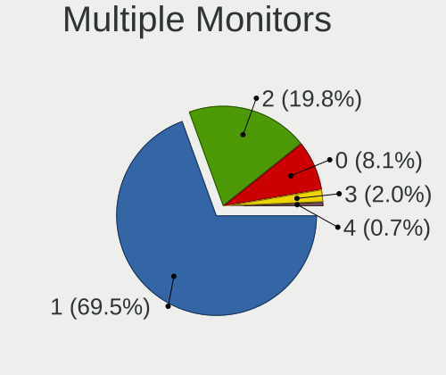

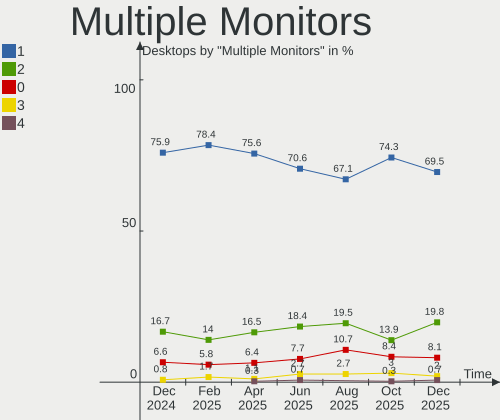

| Total | Desktops | Percent |
|-------|----------|---------|
| 1     | 207      | 69.46%  |
| 2     | 59       | 19.8%   |
| 0     | 24       | 8.05%   |
| 3     | 6        | 2.01%   |
| 4     | 2        | 0.67%   |

Network
-------

Net Controller Vendor
---------------------

Controller vendors

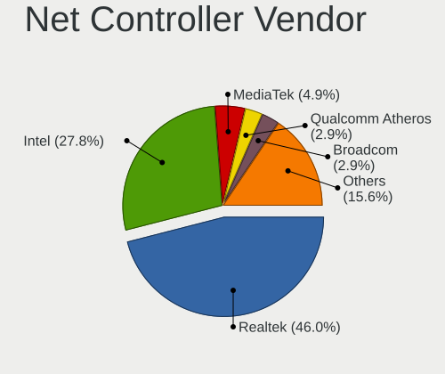

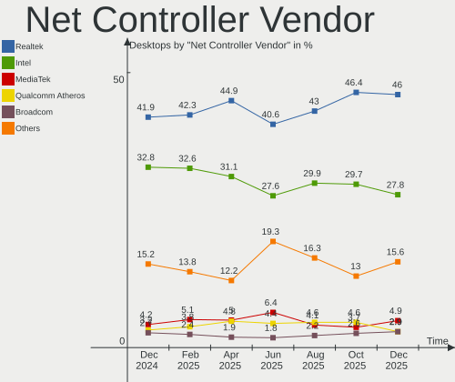

| Vendor                          | Desktops | Percent |
|---------------------------------|----------|---------|
| Realtek Semiconductor           | 207      | 46%     |
| Intel                           | 125      | 27.78%  |
| MediaTek                        | 22       | 4.89%   |
| Qualcomm Atheros                | 13       | 2.89%   |
| Broadcom                        | 13       | 2.89%   |
| TP-Link                         | 12       | 2.67%   |
| Aquantia                        | 9        | 2%      |
| Qualcomm Technologies           | 5        | 1.11%   |
| Ralink                          | 4        | 0.89%   |
| Qualcomm Atheros Communications | 3        | 0.67%   |
| D-Link                          | 3        | 0.67%   |
| Xiaomi                          | 2        | 0.44%   |
| Samsung Electronics             | 2        | 0.44%   |
| Ralink Technology               | 2        | 0.44%   |
| MicroPython                     | 2        | 0.44%   |
| Edimax Technology               | 2        | 0.44%   |
| AVM                             | 2        | 0.44%   |
| ZyDAS                           | 1        | 0.22%   |
| TMS                             | 1        | 0.22%   |
| Sigma Designs                   | 1        | 0.22%   |
| QinHeng Electronics             | 1        | 0.22%   |
| Nvidia                          | 1        | 0.22%   |
| NetGear                         | 1        | 0.22%   |
| Netchip Technology              | 1        | 0.22%   |
| Marvell Technology Group        | 1        | 0.22%   |
| Linux Foundation                | 1        | 0.22%   |
| Linksys                         | 1        | 0.22%   |
| Insyde Software                 | 1        | 0.22%   |
| IMC Networks                    | 1        | 0.22%   |
| Google                          | 1        | 0.22%   |
| Cisco Systems                   | 1        | 0.22%   |
| Bose                            | 1        | 0.22%   |
| Belkin Components               | 1        | 0.22%   |
| ASUSTek Computer                | 1        | 0.22%   |
| ASIX Electronics                | 1        | 0.22%   |
| American Megatrends             | 1        | 0.22%   |
| aicsemi                         | 1        | 0.22%   |
| 3Com                            | 1        | 0.22%   |
| Unknown                         | 1        | 0.22%   |

Net Controller Model
--------------------

Controller models

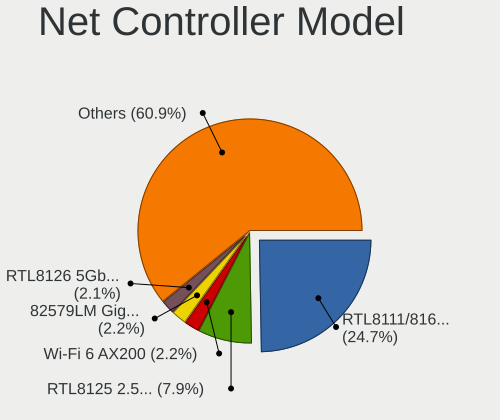

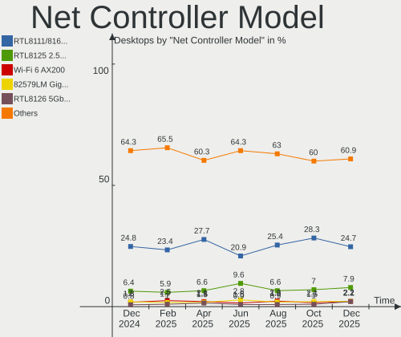

| Model                                                                           | Desktops | Percent |
|---------------------------------------------------------------------------------|----------|---------|
| Realtek RTL8111/8168/8211/8411 PCI Express Gigabit Ethernet Controller          | 132      | 24.72%  |
| Realtek RTL8125 2.5GbE Controller                                               | 42       | 7.87%   |
| Intel Wi-Fi 6 AX200                                                             | 12       | 2.25%   |
| Intel 82579LM Gigabit Network Connection (Lewisville)                           | 12       | 2.25%   |
| Realtek RTL8126 5GbE Controller                                                 | 11       | 2.06%   |
| Intel Wi-Fi 6E(802.11ax) AX210/AX1675* 2x2 [Typhoon Peak]                       | 11       | 2.06%   |
| Intel I211 Gigabit Network Connection                                           | 10       | 1.87%   |
| Intel 82599ES 10-Gigabit SFI/SFP+ Network Connection                            | 10       | 1.87%   |
| Realtek 802.11ac NIC                                                            | 9        | 1.69%   |
| Intel Ethernet Controller I226-V                                                | 9        | 1.69%   |
| Intel Ethernet Controller I225-V                                                | 9        | 1.69%   |
| Intel Ethernet Connection (2) I219-V                                            | 9        | 1.69%   |
| Realtek RTL8852BE PCIe 802.11ax Wireless Network Controller                     | 8        | 1.5%    |
| Realtek RTL810xE PCI Express Fast Ethernet controller                           | 7        | 1.31%   |
| Intel Ethernet Connection I217-LM                                               | 7        | 1.31%   |
| Realtek RTL8821CE 802.11ac PCIe Wireless Network Adapter                        | 6        | 1.12%   |
| MediaTek MT7927 802.11be 320MHz 2x2 PCIe Wireless Network Adapter [Filogic 380] | 6        | 1.12%   |
| Qualcomm WCN785x Wi-Fi 7(802.11be) 320MHz 2x2 [FastConnect 7800]                | 5        | 0.94%   |
| MediaTek MT7902 802.11ax PCIe Wireless Network Adapter [Filogic 310]            | 5        | 0.94%   |
| Realtek RTL8922AE 802.11be PCIe Wireless Network Adapter                        | 4        | 0.75%   |
| Intel Wi-Fi 5(802.11ac) Wireless-AC 9x6x [Thunder Peak]                         | 4        | 0.75%   |
| Intel I210 Gigabit Network Connection                                           | 4        | 0.75%   |
| Intel Ethernet Connection (7) I219-V                                            | 4        | 0.75%   |
| Intel Ethernet Connection (14) I219-V                                           | 4        | 0.75%   |
| Intel Dual Band Wireless-AC 3168NGW [Stone Peak]                                | 4        | 0.75%   |
| Intel 82574L Gigabit Network Connection                                         | 4        | 0.75%   |
| Intel 700 Series Chipset CNVi WiFi                                              | 4        | 0.75%   |
| TP-Link AC600 wireless Realtek RTL8811AU [Archer T2U Nano]                      | 3        | 0.56%   |
| Realtek RTL88x2bu [AC1200 Techkey]                                              | 3        | 0.56%   |
| Realtek RTL8822CE 802.11ac PCIe Wireless Network Adapter                        | 3        | 0.56%   |
| Realtek RTL8188FTV 802.11b/g/n 1T1R 2.4G WLAN Adapter                           | 3        | 0.56%   |
| Realtek RTL8188EUS 802.11n Wireless Network Adapter                             | 3        | 0.56%   |
| Realtek RTL8153 Gigabit Ethernet Adapter                                        | 3        | 0.56%   |
| Qualcomm Atheros Killer E220x Gigabit Ethernet Controller                       | 3        | 0.56%   |
| Qualcomm Atheros AR9271 802.11n                                                 | 3        | 0.56%   |
| MediaTek Network controller                                                     | 3        | 0.56%   |
| Intel Wireless 7265                                                             | 3        | 0.56%   |
| Intel Ethernet Connection (7) I219-LM                                           | 3        | 0.56%   |
| Broadcom BCM4360 802.11ac Dual Band Wireless Network Adapter                    | 3        | 0.56%   |
| Aquantia AQtion AQC113CS NBase-T/IEEE 802.3an Ethernet Controller [Antigua 10G] | 3        | 0.56%   |

Wireless Vendor
---------------

Wireless vendors

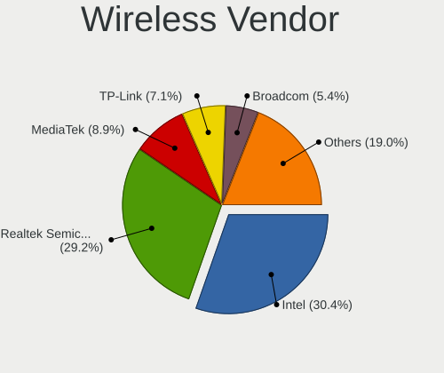

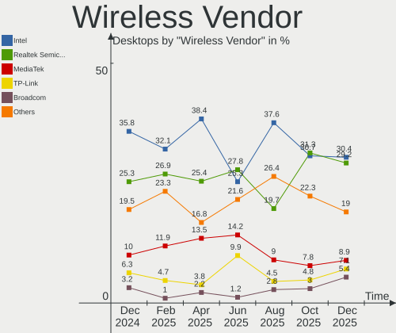

| Vendor                          | Desktops | Percent |
|---------------------------------|----------|---------|
| Intel                           | 51       | 30.36%  |
| Realtek Semiconductor           | 49       | 29.17%  |
| MediaTek                        | 15       | 8.93%   |
| TP-Link                         | 12       | 7.14%   |
| Broadcom                        | 9        | 5.36%   |
| Qualcomm Atheros                | 6        | 3.57%   |
| Ralink                          | 4        | 2.38%   |
| Qualcomm Technologies           | 4        | 2.38%   |
| Qualcomm Atheros Communications | 3        | 1.79%   |
| D-Link                          | 3        | 1.79%   |
| Ralink Technology               | 2        | 1.19%   |
| Edimax Technology               | 2        | 1.19%   |
| AVM                             | 2        | 1.19%   |
| ZyDAS                           | 1        | 0.6%    |
| NetGear                         | 1        | 0.6%    |
| Linksys                         | 1        | 0.6%    |
| IMC Networks                    | 1        | 0.6%    |
| Belkin Components               | 1        | 0.6%    |
| ASUSTek Computer                | 1        | 0.6%    |

Wireless Model
--------------

Wireless models

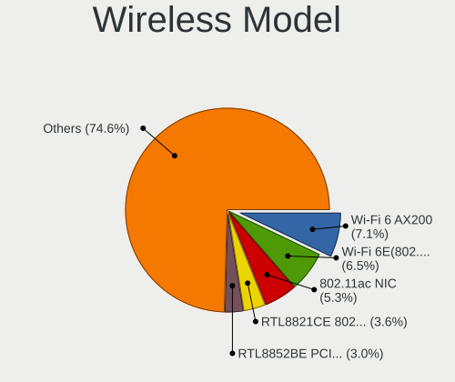

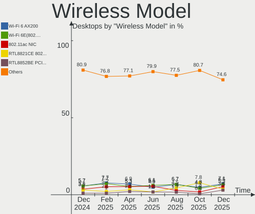

| Model                                                                           | Desktops | Percent |
|---------------------------------------------------------------------------------|----------|---------|
| Intel Wi-Fi 6 AX200                                                             | 12       | 7.1%    |
| Intel Wi-Fi 6E(802.11ax) AX210/AX1675* 2x2 [Typhoon Peak]                       | 11       | 6.51%   |
| Realtek 802.11ac NIC                                                            | 9        | 5.33%   |
| Realtek RTL8821CE 802.11ac PCIe Wireless Network Adapter                        | 6        | 3.55%   |
| Realtek RTL8852BE PCIe 802.11ax Wireless Network Controller                     | 5        | 2.96%   |
| MediaTek MT7902 802.11ax PCIe Wireless Network Adapter [Filogic 310]            | 5        | 2.96%   |
| Qualcomm WCN785x Wi-Fi 7(802.11be) 320MHz 2x2 [FastConnect 7800]                | 4        | 2.37%   |
| MediaTek MT7927 802.11be 320MHz 2x2 PCIe Wireless Network Adapter [Filogic 380] | 4        | 2.37%   |
| Intel Wi-Fi 5(802.11ac) Wireless-AC 9x6x [Thunder Peak]                         | 4        | 2.37%   |
| Intel Dual Band Wireless-AC 3168NGW [Stone Peak]                                | 4        | 2.37%   |
| Intel 700 Series Chipset CNVi WiFi                                              | 4        | 2.37%   |
| TP-Link AC600 wireless Realtek RTL8811AU [Archer T2U Nano]                      | 3        | 1.78%   |
| Realtek RTL8922AE 802.11be PCIe Wireless Network Adapter                        | 3        | 1.78%   |
| Realtek RTL88x2bu [AC1200 Techkey]                                              | 3        | 1.78%   |
| Realtek RTL8822CE 802.11ac PCIe Wireless Network Adapter                        | 3        | 1.78%   |
| Realtek RTL8188FTV 802.11b/g/n 1T1R 2.4G WLAN Adapter                           | 3        | 1.78%   |
| Realtek RTL8188EUS 802.11n Wireless Network Adapter                             | 3        | 1.78%   |
| Qualcomm Atheros AR9271 802.11n                                                 | 3        | 1.78%   |
| Intel Wireless 7265                                                             | 3        | 1.78%   |
| Broadcom BCM4360 802.11ac Dual Band Wireless Network Adapter                    | 3        | 1.78%   |
| TP-Link TL-WN823N v2/v3 [Realtek RTL8192EU]                                     | 2        | 1.18%   |
| TP-Link TL-WN821N v5/v6 [RTL8192EU]                                             | 2        | 1.18%   |
| TP-Link 802.11ac NIC                                                            | 2        | 1.18%   |
| Realtek RTL8821AE 802.11ac PCIe Wireless Network Adapter                        | 2        | 1.18%   |
| Realtek RTL8188ETV Wireless LAN 802.11n Network Adapter                         | 2        | 1.18%   |
| Realtek RTL8188CUS 802.11n WLAN Adapter                                         | 2        | 1.18%   |
| Ralink RT3290 Wireless 802.11n 1T/1R PCIe                                       | 2        | 1.18%   |
| Qualcomm Atheros QCA9565 / AR9565 Wireless Network Adapter                      | 2        | 1.18%   |
| Qualcomm Atheros AR9287 Wireless Network Adapter (PCI-Express)                  | 2        | 1.18%   |
| MediaTek MT7921K (RZ608) Wi-Fi 6E 80MHz                                         | 2        | 1.18%   |
| Intel Wireless 8260                                                             | 2        | 1.18%   |
| Intel Tiger Lake PCH CNVi WiFi                                                  | 2        | 1.18%   |
| Intel Alder Lake-N PCH CNVi WiFi                                                | 2        | 1.18%   |
| D-Link DWA-131 Wireless N Nano Adapter (Rev. E1) [Realtek RTL8192EU]            | 2        | 1.18%   |
| ZyDAS ZD1211 802.11g                                                            | 1        | 0.59%   |
| TP-Link TL-WN722N v2/v3 [Realtek RTL8188EUS]                                    | 1        | 0.59%   |
| TP-Link Archer T1U 802.11a/n/ac Wireless Adapter [MediaTek MT7610U]             | 1        | 0.59%   |
| TP-Link 802.11ac WLAN Adapter                                                   | 1        | 0.59%   |
| Realtek RTL8852CE PCIe 802.11ax Wireless Network Controller                     | 1        | 0.59%   |
| Realtek RTL8851BE PCIe 802.11ax Wireless Network Controller                     | 1        | 0.59%   |

Ethernet Vendor
---------------

Ethernet vendors

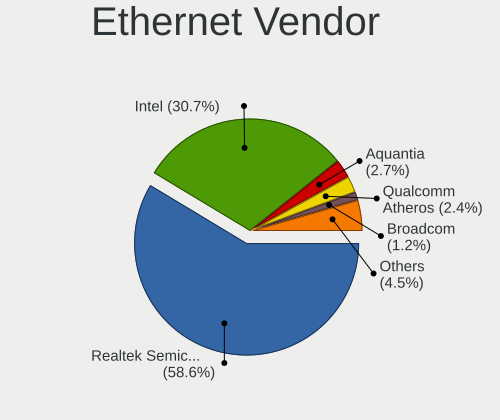

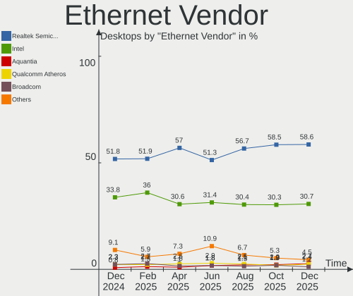

| Vendor                   | Desktops | Percent |
|--------------------------|----------|---------|
| Realtek Semiconductor    | 197      | 58.63%  |
| Intel                    | 103      | 30.65%  |
| Aquantia                 | 9        | 2.68%   |
| Qualcomm Atheros         | 8        | 2.38%   |
| Broadcom                 | 4        | 1.19%   |
| Xiaomi                   | 2        | 0.6%    |
| Samsung Electronics      | 2        | 0.6%    |
| MediaTek                 | 2        | 0.6%    |
| Qualcomm Technologies    | 1        | 0.3%    |
| Nvidia                   | 1        | 0.3%    |
| Netchip Technology       | 1        | 0.3%    |
| Marvell Technology Group | 1        | 0.3%    |
| Insyde Software          | 1        | 0.3%    |
| Google                   | 1        | 0.3%    |
| ASIX Electronics         | 1        | 0.3%    |
| American Megatrends      | 1        | 0.3%    |
| 3Com                     | 1        | 0.3%    |

Ethernet Model
--------------

Ethernet models

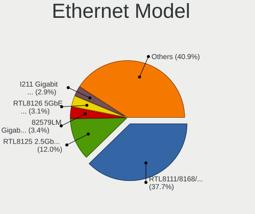

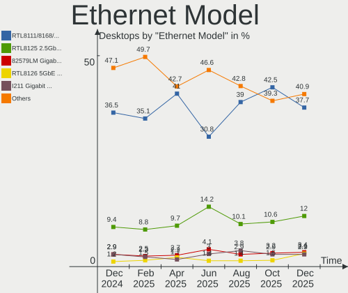

| Model                                                                             | Desktops | Percent |
|-----------------------------------------------------------------------------------|----------|---------|
| Realtek RTL8111/8168/8211/8411 PCI Express Gigabit Ethernet Controller            | 132      | 37.71%  |
| Realtek RTL8125 2.5GbE Controller                                                 | 42       | 12%     |
| Intel 82579LM Gigabit Network Connection (Lewisville)                             | 12       | 3.43%   |
| Realtek RTL8126 5GbE Controller                                                   | 11       | 3.14%   |
| Intel I211 Gigabit Network Connection                                             | 10       | 2.86%   |
| Intel 82599ES 10-Gigabit SFI/SFP+ Network Connection                              | 10       | 2.86%   |
| Intel Ethernet Controller I226-V                                                  | 9        | 2.57%   |
| Intel Ethernet Controller I225-V                                                  | 9        | 2.57%   |
| Intel Ethernet Connection (2) I219-V                                              | 9        | 2.57%   |
| Realtek RTL810xE PCI Express Fast Ethernet controller                             | 7        | 2%      |
| Intel Ethernet Connection I217-LM                                                 | 7        | 2%      |
| Intel I210 Gigabit Network Connection                                             | 4        | 1.14%   |
| Intel Ethernet Connection (7) I219-V                                              | 4        | 1.14%   |
| Intel Ethernet Connection (14) I219-V                                             | 4        | 1.14%   |
| Intel 82574L Gigabit Network Connection                                           | 4        | 1.14%   |
| Realtek RTL8852BE PCIe 802.11ax Wireless Network Controller                       | 3        | 0.86%   |
| Realtek RTL8153 Gigabit Ethernet Adapter                                          | 3        | 0.86%   |
| Qualcomm Atheros Killer E220x Gigabit Ethernet Controller                         | 3        | 0.86%   |
| Intel Ethernet Connection (7) I219-LM                                             | 3        | 0.86%   |
| Aquantia AQtion AQC113CS NBase-T/IEEE 802.3an Ethernet Controller [Antigua 10G]   | 3        | 0.86%   |
| Aquantia AQC113C NBase-T/IEEE 802.3an Ethernet Controller [Marvell Scalable mGig] | 3        | 0.86%   |
| Samsung Galaxy series, misc. (tethering mode)                                     | 2        | 0.57%   |
| Qualcomm Atheros Killer E2500 Gigabit Ethernet Controller                         | 2        | 0.57%   |
| Qualcomm Atheros AR8151 v2.0 Gigabit Ethernet                                     | 2        | 0.57%   |
| Intel Ethernet Controller X550                                                    | 2        | 0.57%   |
| Intel Ethernet Connection I217-V                                                  | 2        | 0.57%   |
| Intel Ethernet Connection (5) I219-LM                                             | 2        | 0.57%   |
| Intel Ethernet Connection (2) I219-LM                                             | 2        | 0.57%   |
| Intel Ethernet Connection (2) I218-V                                              | 2        | 0.57%   |
| Intel Ethernet Connection (2) I218-LM                                             | 2        | 0.57%   |
| Intel 82579V Gigabit Network Connection                                           | 2        | 0.57%   |
| Intel 82578DM Gigabit Network Connection                                          | 2        | 0.57%   |
| Intel 82567V-2 Gigabit Network Connection                                         | 2        | 0.57%   |
| Broadcom NetLink BCM57780 Gigabit Ethernet PCIe                                   | 2        | 0.57%   |
| Xiaomi Mi/Redmi series (RNDIS)                                                    | 1        | 0.29%   |
| Xiaomi Mi/Redmi series (RNDIS + ADB)                                              | 1        | 0.29%   |
| Realtek RTL8922AE 802.11be PCIe Wireless Network Adapter                          | 1        | 0.29%   |
| Realtek RTL8169 PCI Gigabit Ethernet Controller                                   | 1        | 0.29%   |
| Realtek Killer E5000 5GbE Controller                                              | 1        | 0.29%   |
| Realtek Killer E3000 2.5GbE Controller                                            | 1        | 0.29%   |

Net Controller Kind
-------------------

Ethernet, WiFi or modem

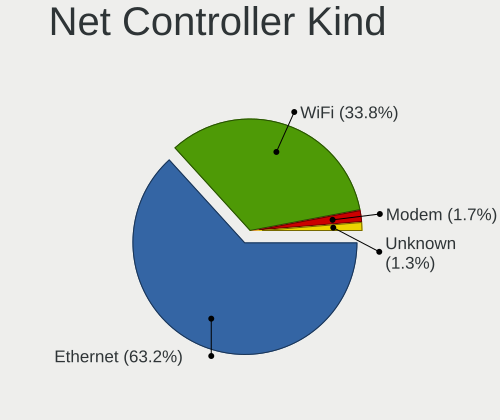

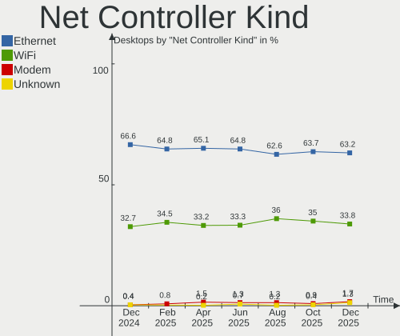

| Kind     | Desktops | Percent |
|----------|----------|---------|
| Ethernet | 296      | 63.25%  |
| WiFi     | 158      | 33.76%  |
| Modem    | 8        | 1.71%   |
| Unknown  | 6        | 1.28%   |

Used Controller
---------------

Currently used network controller

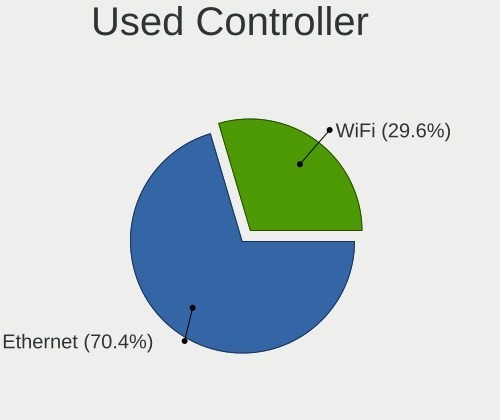

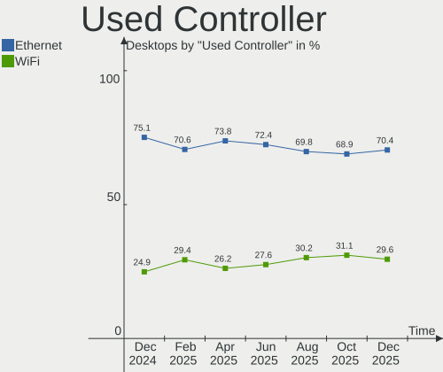

| Kind     | Desktops | Percent |
|----------|----------|---------|
| Ethernet | 212      | 70.43%  |
| WiFi     | 89       | 29.57%  |

NICs
----

Total network controllers on board

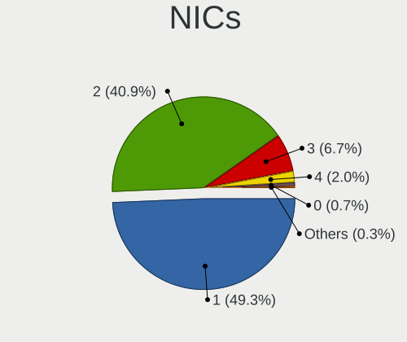

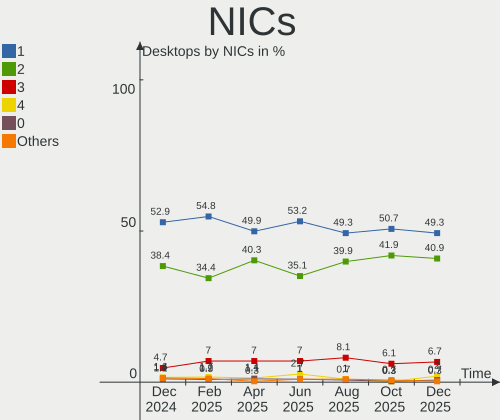

| Total | Desktops | Percent |
|-------|----------|---------|
| 1     | 147      | 49.33%  |
| 2     | 122      | 40.94%  |
| 3     | 20       | 6.71%   |
| 4     | 6        | 2.01%   |
| 0     | 2        | 0.67%   |
| 5     | 1        | 0.34%   |

IPv6
----

IPv6 vs IPv4

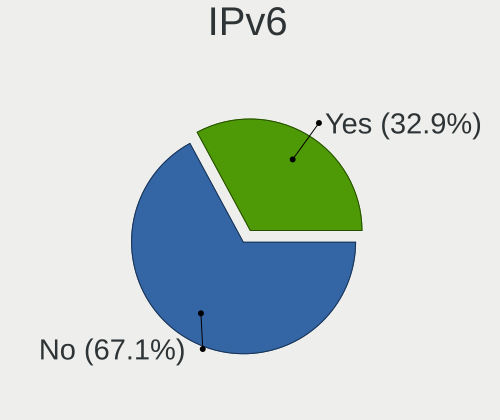

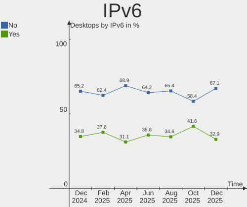

| Used | Desktops | Percent |
|------|----------|---------|
| No   | 200      | 67.11%  |
| Yes  | 98       | 32.89%  |

Bluetooth
---------

Bluetooth Vendor
----------------

Controller vendors

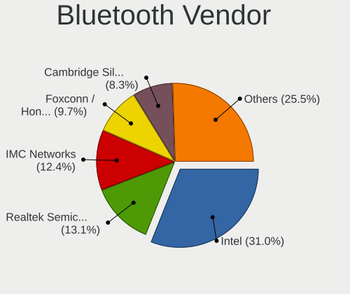

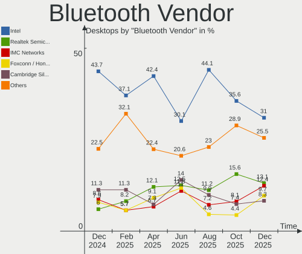

| Vendor                          | Desktops | Percent |
|---------------------------------|----------|---------|
| Intel                           | 45       | 31.03%  |
| Realtek Semiconductor           | 19       | 13.1%   |
| IMC Networks                    | 18       | 12.41%  |
| Foxconn / Hon Hai               | 14       | 9.66%   |
| Cambridge Silicon Radio         | 12       | 8.28%   |
| TP-Link                         | 7        | 4.83%   |
| ASUSTek Computer                | 7        | 4.83%   |
| Unknown                         | 5        | 3.45%   |
| MediaTek                        | 3        | 2.07%   |
| Broadcom                        | 3        | 2.07%   |
| Realtek                         | 2        | 1.38%   |
| Ralink                          | 2        | 1.38%   |
| Qualcomm Atheros Communications | 2        | 1.38%   |
| Lite-On Technology              | 2        | 1.38%   |
| Micro Star International        | 1        | 0.69%   |
| Integrated System Solution      | 1        | 0.69%   |
| Apple                           | 1        | 0.69%   |
| Actions                         | 1        | 0.69%   |

Bluetooth Model
---------------

Controller models

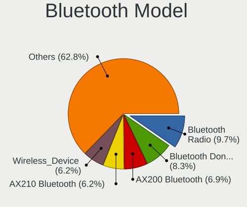

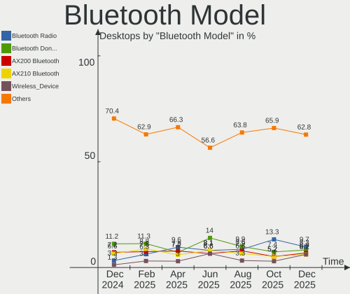

| Model                                                    | Desktops | Percent |
|----------------------------------------------------------|----------|---------|
| Realtek Bluetooth Radio                                  | 14       | 9.66%   |
| Cambridge Silicon Radio Bluetooth Dongle (HCI mode)      | 12       | 8.28%   |
| Intel AX200 Bluetooth                                    | 10       | 6.9%    |
| Intel AX210 Bluetooth                                    | 9        | 6.21%   |
| IMC Networks Wireless_Device                             | 9        | 6.21%   |
| IMC Networks Bluetooth Radio                             | 9        | 6.21%   |
| Foxconn / Hon Hai Wireless_Device                        | 9        | 6.21%   |
| TP-Link TP-T@- UB500 Adapter                             | 7        | 4.83%   |
| Intel Bluetooth wireless interface                       | 7        | 4.83%   |
| Intel Bluetooth Device                                   | 6        | 4.14%   |
| Intel AX201 Bluetooth                                    | 6        | 4.14%   |
| Foxconn / Hon Hai Bluetooth Device                       | 5        | 3.45%   |
| ASUS ASUS USB-BT500                                      | 5        | 3.45%   |
| Unknown                                                  | 5        | 3.45%   |
| Realtek  Bluetooth 4.2 Adapter                           | 3        | 2.07%   |
| MediaTek Wireless_Device                                 | 3        | 2.07%   |
| Intel Wireless-AC 9260 Bluetooth Adapter                 | 3        | 2.07%   |
| Realtek Bluetooth Radio                                  | 2        | 1.38%   |
| Ralink RT3290 Bluetooth                                  | 2        | 1.38%   |
| Intel Wireless-AC 3168 Bluetooth                         | 2        | 1.38%   |
| Intel Bluetooth 9460/9560 Jefferson Peak (JfP)           | 2        | 1.38%   |
| Realtek Bluetooth 5.4 Radio                              | 1        | 0.69%   |
| Realtek 802.11ac WLAN Adapter                            | 1        | 0.69%   |
| Qualcomm Atheros  Bluetooth Device                       | 1        | 0.69%   |
| Qualcomm Atheros AR3011 Bluetooth                        | 1        | 0.69%   |
| Micro Star International MS-6970 BToes Bluetooth adapter | 1        | 0.69%   |
| Lite-On Bluetooth Device                                 | 1        | 0.69%   |
| Lite-On Atheros AR3012 Bluetooth                         | 1        | 0.69%   |
| Integrated System Solution KY-BT100 Bluetooth Adapter    | 1        | 0.69%   |
| Broadcom HP Bluethunder                                  | 1        | 0.69%   |
| Broadcom BCM43142 Bluetooth 4.0                          | 1        | 0.69%   |
| Broadcom BCM20702A0 Bluetooth 4.0                        | 1        | 0.69%   |
| ASUS Bluetooth Radio                                     | 1        | 0.69%   |
| ASUS BCM20702A0                                          | 1        | 0.69%   |
| Apple Bluetooth USB Host Controller                      | 1        | 0.69%   |
| Actions general adapter                                  | 1        | 0.69%   |

Sound
-----

Sound Vendor
------------

Sound card vendors

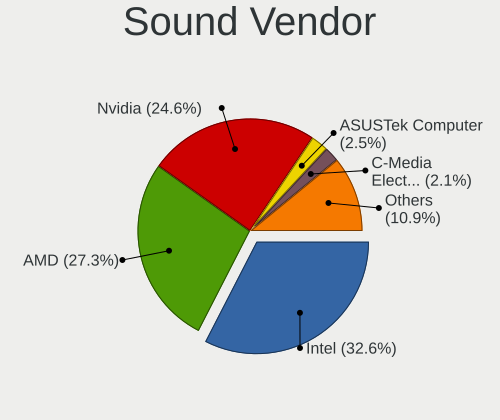

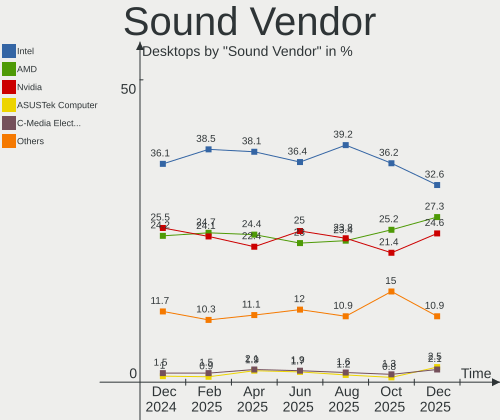

| Vendor                                       | Desktops | Percent |
|----------------------------------------------|----------|---------|
| Intel                                        | 167      | 32.55%  |
| AMD                                          | 140      | 27.29%  |
| Nvidia                                       | 126      | 24.56%  |
| ASUSTek Computer                             | 13       | 2.53%   |
| C-Media Electronics                          | 11       | 2.14%   |
| Logitech                                     | 6        | 1.17%   |
| Generalplus Technology                       | 4        | 0.78%   |
| Razer USA                                    | 3        | 0.58%   |
| JMTek                                        | 3        | 0.58%   |
| Creative Labs                                | 3        | 0.58%   |
| Texas Instruments                            | 2        | 0.39%   |
| Tenx Technology                              | 2        | 0.39%   |
| Realtek Semiconductor                        | 2        | 0.39%   |
| Plantronics                                  | 2        | 0.39%   |
| Micro Star International                     | 2        | 0.39%   |
| Giga-Byte Technology                         | 2        | 0.39%   |
| Zoran Co. Personal Media Division (Nogatech) | 1        | 0.19%   |
| Zhaoxin                                      | 1        | 0.19%   |
| Walmart                                      | 1        | 0.19%   |
| Trust International                          | 1        | 0.19%   |
| SteelSeries ApS                              | 1        | 0.19%   |
| Roland                                       | 1        | 0.19%   |
| Red Hat                                      | 1        | 0.19%   |
| Pimax                                        | 1        | 0.19%   |
| ONN                                          | 1        | 0.19%   |
| NZXT                                         | 1        | 0.19%   |
| Nordic Semiconductor ASA                     | 1        | 0.19%   |
| M-Audio                                      | 1        | 0.19%   |
| Kingston Technology                          | 1        | 0.19%   |
| Jieli Technology                             | 1        | 0.19%   |
| JBL                                          | 1        | 0.19%   |
| GYROCOM C&C                                  | 1        | 0.19%   |
| Goldvish                                     | 1        | 0.19%   |
| GN Netcom                                    | 1        | 0.19%   |
| Glenfly Tech                                 | 1        | 0.19%   |
| Focusrite-Novation                           | 1        | 0.19%   |
| Creative Technology                          | 1        | 0.19%   |
| Conexant Systems                             | 1        | 0.19%   |
| Blue Microphones                             | 1        | 0.19%   |
| Audioengine                                  | 1        | 0.19%   |

Sound Model
-----------

Sound card models

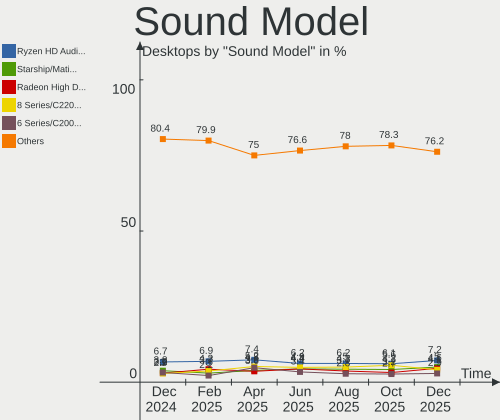

| Model                                                                      | Desktops | Percent |
|----------------------------------------------------------------------------|----------|---------|
| AMD Ryzen HD Audio Controller                                              | 44       | 7.17%   |
| AMD Starship/Matisse HD Audio Controller                                   | 31       | 5.05%   |
| AMD Radeon High Definition Audio Controller                                | 28       | 4.56%   |
| Intel 8 Series/C220 Series Chipset High Definition Audio Controller        | 25       | 4.07%   |
| Intel 6 Series/C200 Series Chipset Family High Definition Audio Controller | 18       | 2.93%   |
| Intel Xeon E3-1200 v3/4th Gen Core Processor HD Audio Controller           | 17       | 2.77%   |
| Intel Cannon Lake PCH cAVS                                                 | 16       | 2.61%   |
| Intel 7 Series/C216 Chipset Family High Definition Audio Controller        | 16       | 2.61%   |
| Intel 200 Series PCH HD Audio                                              | 16       | 2.61%   |
| AMD Ellesmere HDMI Audio [Radeon RX 470/480 / 570/580/590]                 | 16       | 2.61%   |
| AMD Renoir/Cezanne HDMI/DP Audio Controller                                | 15       | 2.44%   |
| AMD SBx00 Azalia (Intel HDA)                                               | 12       | 1.95%   |
| Intel Raptor Lake High Definition Audio Controller                         | 11       | 1.79%   |
| Intel Alder Lake-S HD Audio Controller                                     | 11       | 1.79%   |
| ASUSTek Computer USB Audio                                                 | 11       | 1.79%   |
| Nvidia GB203 High Definition Audio Controller                              | 9        | 1.47%   |
| Intel 100 Series/C230 Series Chipset Family HD Audio Controller            | 9        | 1.47%   |
| AMD FCH Azalia Controller                                                  | 9        | 1.47%   |
| Nvidia TU107 GeForce GTX 1650 High Definition Audio Controller             | 8        | 1.3%    |
| Nvidia GK208 HDMI/DP Audio Controller                                      | 7        | 1.14%   |
| AMD Navi 21/23 HDMI/DP Audio Controller                                    | 7        | 1.14%   |
| AMD Family 17h (Models 00h-0fh) HD Audio Controller                        | 7        | 1.14%   |
| Nvidia GP107GL High Definition Audio Controller                            | 6        | 0.98%   |
| Nvidia GF119 HDMI Audio Controller                                         | 6        | 0.98%   |
| Nvidia GA104 High Definition Audio Controller                              | 6        | 0.98%   |
| Nvidia GA102 High Definition Audio Controller                              | 6        | 0.98%   |
| Nvidia AD104 High Definition Audio Controller                              | 6        | 0.98%   |
| Intel Smart Sound Technology (SST) Audio Controller                        | 6        | 0.98%   |
| Intel C610/X99 series chipset HD Audio Controller                          | 6        | 0.98%   |
| Nvidia High Definition Audio Controller                                    | 5        | 0.81%   |
| Nvidia GB206 High Definition Audio Controller                              | 5        | 0.81%   |
| Nvidia AD107 High Definition Audio Controller                              | 5        | 0.81%   |
| Nvidia AD106M High Definition Audio Controller                             | 5        | 0.81%   |
| AMD Navi 31 HDMI/DP Audio                                                  | 5        | 0.81%   |
| Nvidia TU116 High Definition Audio Controller                              | 4        | 0.65%   |
| Nvidia GP104 High Definition Audio Controller                              | 4        | 0.65%   |
| Nvidia GP102 HDMI Audio Controller                                         | 4        | 0.65%   |
| Nvidia GK107 HDMI Audio Controller                                         | 4        | 0.65%   |
| Nvidia GB202 High Definition Audio Controller                              | 4        | 0.65%   |
| Nvidia GA106 High Definition Audio Controller                              | 4        | 0.65%   |

Memory
------

Memory Vendor
-------------

Memory module vendors

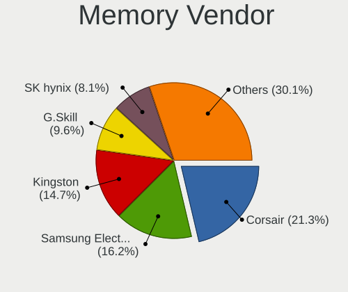

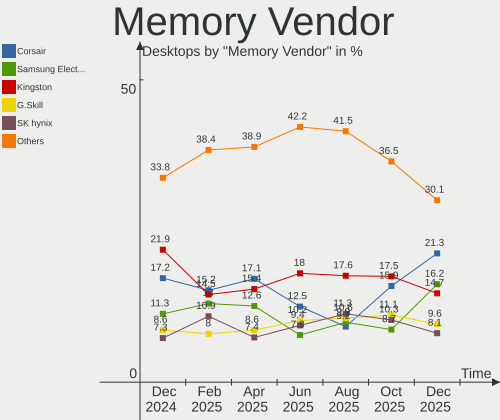

| Vendor                 | Desktops | Percent |
|------------------------|----------|---------|
| Corsair                | 29       | 21.32%  |
| Samsung Electronics    | 22       | 16.18%  |
| Kingston               | 20       | 14.71%  |
| G.Skill                | 13       | 9.56%   |
| SK hynix               | 11       | 8.09%   |
| Crucial                | 6        | 4.41%   |
| Unknown                | 5        | 3.68%   |
| Micron Technology      | 5        | 3.68%   |
| A-DATA Technology      | 5        | 3.68%   |
| Unknown                | 4        | 2.94%   |
| Nanya Technology       | 2        | 1.47%   |
| Lexar                  | 2        | 1.47%   |
| Wodposit               | 1        | 0.74%   |
| Unknown (0x0E9D)       | 1        | 0.74%   |
| Unknown (000080B30080) | 1        | 0.74%   |
| Transcend              | 1        | 0.74%   |
| Ramaxel Technology     | 1        | 0.74%   |
| QEMU                   | 1        | 0.74%   |
| KingFast               | 1        | 0.74%   |
| Hewlett-Packard        | 1        | 0.74%   |
| GeIL                   | 1        | 0.74%   |
| Avant                  | 1        | 0.74%   |
| Asgard                 | 1        | 0.74%   |
| Acer                   | 1        | 0.74%   |

Memory Model
------------

Memory module models

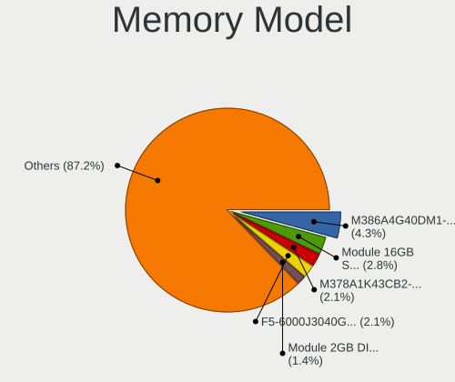

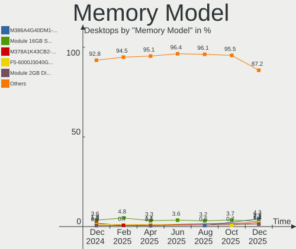

| Model                                                               | Desktops | Percent |
|---------------------------------------------------------------------|----------|---------|
| Samsung RAM M386A4G40DM1-CRC 32GB DIMM DDR4 2400MT/s                | 6        | 4.26%   |
| Unknown                                                             | 4        | 2.84%   |
| Samsung RAM M378A1K43CB2-CTD 8GB DIMM DDR4 3266MT/s                 | 3        | 2.13%   |
| G.Skill RAM F5-6000J3040G32G 32GB DIMM DDR5 6200MT/s                | 3        | 2.13%   |
| Unknown RAM Module 2GB DIMM DDR2 800MT/s                            | 2        | 1.42%   |
| Nanya RAM NT2GC64B88B0NF-CG 2GB DIMM DDR3 1333MT/s                  | 2        | 1.42%   |
| Lexar RAM LD4S16G32C22ST 16GB SODIMM DDR4 3200MT/s                  | 2        | 1.42%   |
| Kingston RAM KF3200C16D4/8GX 8GiB DIMM DDR4 3600MT/s                | 2        | 1.42%   |
| Kingston RAM KF3200C16D4/16GX 16GB DIMM DDR4 3733MT/s               | 2        | 1.42%   |
| Corsair RAM CMC5X32G3B60C38A2 32GB DIMM DDR5 4800MT/s               | 2        | 1.42%   |
| A-DATA RAM DDR4 3200 16GB DIMM DDR4 3600MT/s                        | 2        | 1.42%   |
| Wodposit RAM WPBH26D408SWA-8G 8GB SODIMM DDR4 2667MT/s              | 1        | 0.71%   |
| Unknown RAM Module 4GB DIMM DDR3 1333MT/s                           | 1        | 0.71%   |
| Unknown RAM Module 4GB DIMM 1600MT/s                                | 1        | 0.71%   |
| Unknown RAM Module 2GB DIMM DDR3 1333MT/s                           | 1        | 0.71%   |
| Unknown (0x0E9D) RAM KINSOTIN8GB2666MHZ 8GB SODIMM DDR4 2667MT/s    | 1        | 0.71%   |
| Unknown (000080B30080) RAM DDR4 NB 8G 2666 8GB SODIMM DDR4 2667MT/s | 1        | 0.71%   |
| Transcend RAM JM1600KLH-4G 4GB DIMM DDR3 1600MT/s                   | 1        | 0.71%   |
| SK hynix RAM Module 8GB DIMM DDR3 1600MT/s                          | 1        | 0.71%   |
| SK hynix RAM Module 8192MB DIMM DDR3 1600MT/s                       | 1        | 0.71%   |
| SK hynix RAM HMT451U6AFR8C-PB 4GB DIMM DDR3 1600MT/s                | 1        | 0.71%   |
| SK hynix RAM HMT41GU6BFR8A-PB 8GB DIMM DDR3 1600MT/s                | 1        | 0.71%   |
| SK hynix RAM HMT351U6CFR8C-PB 4GB DIMM DDR3 1600MT/s                | 1        | 0.71%   |
| SK hynix RAM HMAA4GR7CJR8N-XN 32GB DIMM DDR4 3200MT/s               | 1        | 0.71%   |
| SK hynix RAM HMA81GS6CJR8N-VK 8GB SODIMM DDR4 2667MT/s              | 1        | 0.71%   |
| SK hynix RAM HMA81GR7AFR8N-UH 8GB RIMM DDR4 2400MT/s                | 1        | 0.71%   |
| SK hynix RAM HMA451U6AFR8N-TF 4GB DIMM DDR4 2133MT/s                | 1        | 0.71%   |
| SK hynix RAM HMA451R7MFR8N-TF 4GB DIMM DDR4 2133MT/s                | 1        | 0.71%   |
| SK hynix RAM HMA42GR7MFR4N-TF 16GB DIMM DDR4 3200MT/s               | 1        | 0.71%   |
| Samsung RAM MT53D512M64D4RQ-046 6144MB Row Of Chips LPDDR4 3733MT/s | 1        | 0.71%   |
| Samsung RAM Module 8GB DIMM DDR4 2133MT/s                           | 1        | 0.71%   |
| Samsung RAM Module 16GB DIMM DDR4 2667MT/s                          | 1        | 0.71%   |
| Samsung RAM M471B1G73QH0-YK0 8GB SODIMM DDR3 1600MT/s               | 1        | 0.71%   |
| Samsung RAM M471B1G73EB0-YK0 8192MB SODIMM DDR3 1600MT/s            | 1        | 0.71%   |
| Samsung RAM M471A1K43CB1-CWE 16GB SODIMM DDR4 3200MT/s              | 1        | 0.71%   |
| Samsung RAM M471A1G44CB0-CWE 8GB SODIMM DDR4 3200MT/s               | 1        | 0.71%   |
| Samsung RAM M393A4K40CB2-CTD 32GB DIMM DDR4 2667MT/s                | 1        | 0.71%   |
| Samsung RAM M393A2G40EB1-CPB 16GB DIMM DDR4 2133MT/s                | 1        | 0.71%   |
| Samsung RAM M391B5773CH0-YH9 2GB DIMM DDR3 1333MT/s                 | 1        | 0.71%   |
| Samsung RAM M386A4G40EM2-CRC 32GB DIMM DDR4 2400MT/s                | 1        | 0.71%   |

Memory Kind
-----------

Memory module kinds

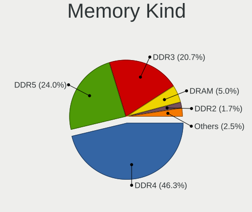

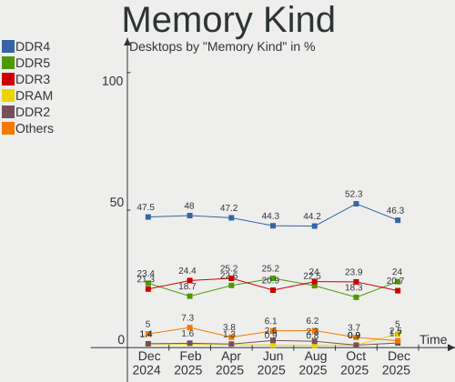

| Kind    | Desktops | Percent |
|---------|----------|---------|
| DDR4    | 56       | 46.28%  |
| DDR5    | 29       | 23.97%  |
| DDR3    | 25       | 20.66%  |
| DRAM    | 6        | 4.96%   |
| DDR2    | 2        | 1.65%   |
| RAM     | 1        | 0.83%   |
| LPDDR4  | 1        | 0.83%   |
| Unknown | 1        | 0.83%   |

Memory Form Factor
------------------

Physical design of the memory module

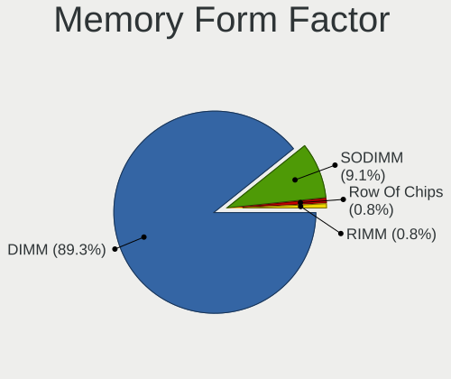

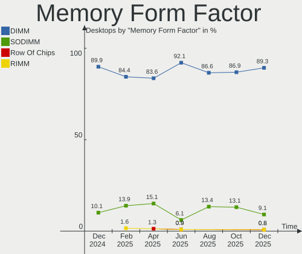

| Name         | Desktops | Percent |
|--------------|----------|---------|
| DIMM         | 108      | 89.26%  |
| SODIMM       | 11       | 9.09%   |
| Row Of Chips | 1        | 0.83%   |
| RIMM         | 1        | 0.83%   |

Memory Size
-----------

Memory module size

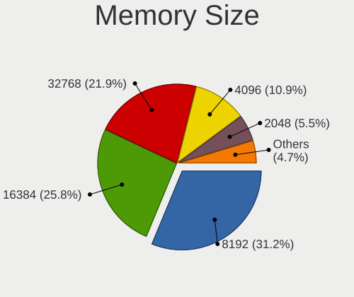

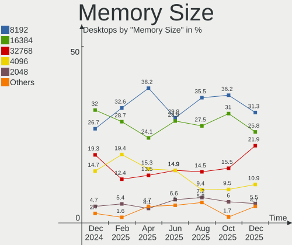

| Size  | Desktops | Percent |
|-------|----------|---------|
| 8192  | 40       | 31.25%  |
| 16384 | 33       | 25.78%  |
| 32768 | 28       | 21.88%  |
| 4096  | 14       | 10.94%  |
| 2048  | 7        | 5.47%   |
| 65536 | 2        | 1.56%   |
| 49152 | 2        | 1.56%   |
| 24576 | 1        | 0.78%   |
| 10240 | 1        | 0.78%   |

Memory Speed
------------

Memory module speed

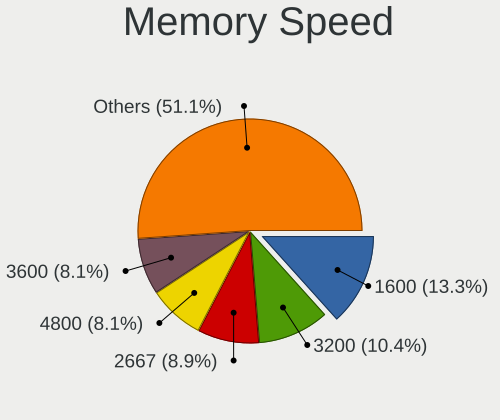

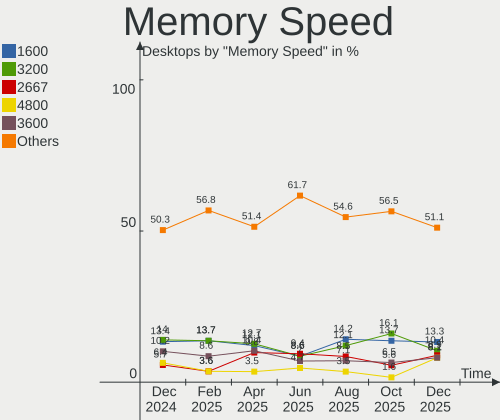

| Speed   | Desktops | Percent |
|---------|----------|---------|
| 1600    | 18       | 13.33%  |
| 3200    | 14       | 10.37%  |
| 2667    | 12       | 8.89%   |
| 4800    | 11       | 8.15%   |
| 3600    | 11       | 8.15%   |
| 2400    | 10       | 7.41%   |
| 2133    | 8        | 5.93%   |
| 1333    | 7        | 5.19%   |
| 6000    | 5        | 3.7%    |
| 3733    | 5        | 3.7%    |
| 6200    | 4        | 2.96%   |
| 5600    | 4        | 2.96%   |
| 3800    | 4        | 2.96%   |
| 6400    | 3        | 2.22%   |
| 3266    | 3        | 2.22%   |
| 1800    | 2        | 1.48%   |
| 800     | 2        | 1.48%   |
| 6600    | 1        | 0.74%   |
| 5200    | 1        | 0.74%   |
| 3866    | 1        | 0.74%   |
| 3500    | 1        | 0.74%   |
| 3466    | 1        | 0.74%   |
| 3400    | 1        | 0.74%   |
| 3151    | 1        | 0.74%   |
| 2933    | 1        | 0.74%   |
| 2800    | 1        | 0.74%   |
| 2666    | 1        | 0.74%   |
| 1867    | 1        | 0.74%   |
| Unknown | 1        | 0.74%   |

Printers & scanners
-------------------

Printer Vendor
--------------

Printer device vendors

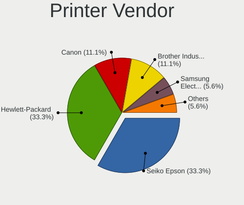

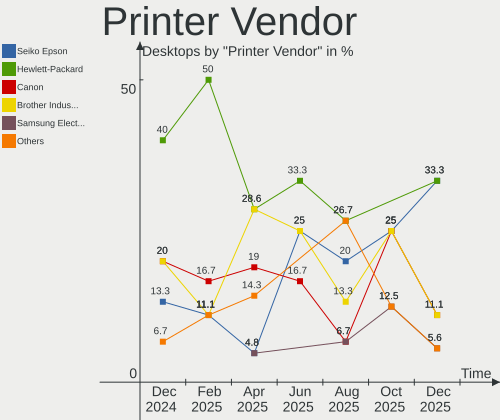

| Vendor              | Desktops | Percent |
|---------------------|----------|---------|
| Seiko Epson         | 6        | 33.33%  |
| Hewlett-Packard     | 6        | 33.33%  |
| Canon               | 2        | 11.11%  |
| Brother Industries  | 2        | 11.11%  |
| Samsung Electronics | 1        | 5.56%   |
| Fuji Xerox          | 1        | 5.56%   |

Printer Model
-------------

Printer device models

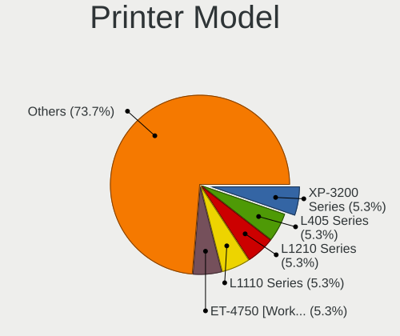

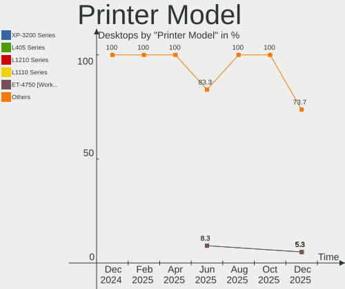

| Model                                                      | Desktops | Percent |
|------------------------------------------------------------|----------|---------|
| Seiko Epson XP-3200 Series                                 | 1        | 5.26%   |
| Seiko Epson L405 Series                                    | 1        | 5.26%   |
| Seiko Epson L1210 Series                                   | 1        | 5.26%   |
| Seiko Epson L1110 Series                                   | 1        | 5.26%   |
| Seiko Epson ET-4750 [WorkForce ET-4750 EcoTank All-in-One] | 1        | 5.26%   |
| Seiko Epson ET-2800 Series                                 | 1        | 5.26%   |
| Seiko Epson ET-2710 Series                                 | 1        | 5.26%   |
| Samsung SCX-3200 Series                                    | 1        | 5.26%   |
| HP PhotoSmart 7350                                         | 1        | 5.26%   |
| HP LaserJet M402dn                                         | 1        | 5.26%   |
| HP LaserJet M109-M112                                      | 1        | 5.26%   |
| HP LaserJet 400 M401dne                                    | 1        | 5.26%   |
| HP DeskJet 2700 series                                     | 1        | 5.26%   |
| HP DeskJet 2130 series                                     | 1        | 5.26%   |
| Fuji Xerox DocuPrint CP105 b                               | 1        | 5.26%   |
| Canon MF4010 series                                        | 1        | 5.26%   |
| Canon LiDE 400                                             | 1        | 5.26%   |
| Brother Printer                                            | 1        | 5.26%   |
| Brother HL-L2340D series                                   | 1        | 5.26%   |

Scanner Vendor
--------------

Scanner device vendors

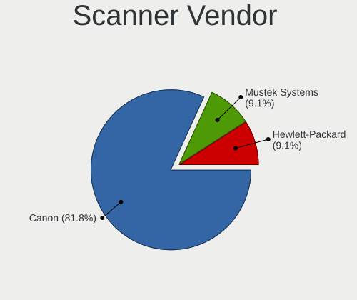

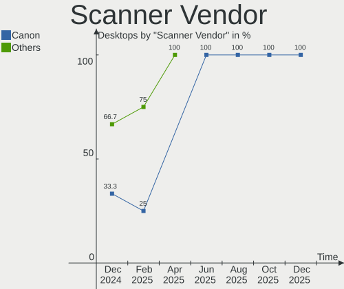

| Vendor | Desktops | Percent |
|--------|----------|---------|
| Canon  | 2        | 100%    |

Scanner Model
-------------

Scanner device models

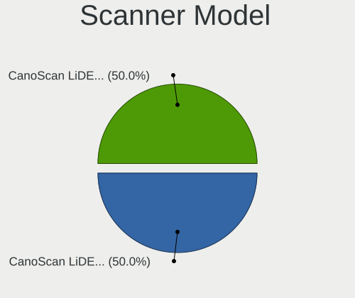

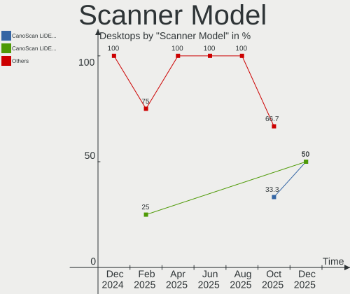

| Model                   | Desktops | Percent |
|-------------------------|----------|---------|
| Canon CanoScan LiDE 220 | 1        | 50%     |
| Canon CanoScan LiDE 110 | 1        | 50%     |

Camera
------

Camera Vendor
-------------

Camera device vendors

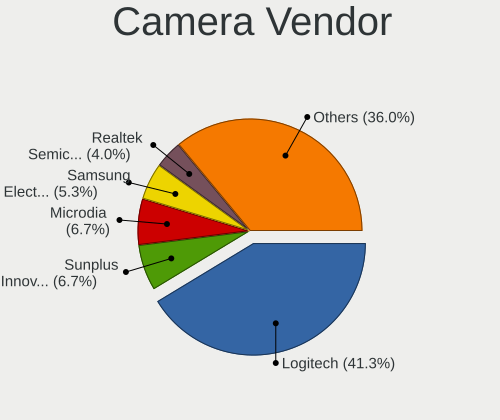

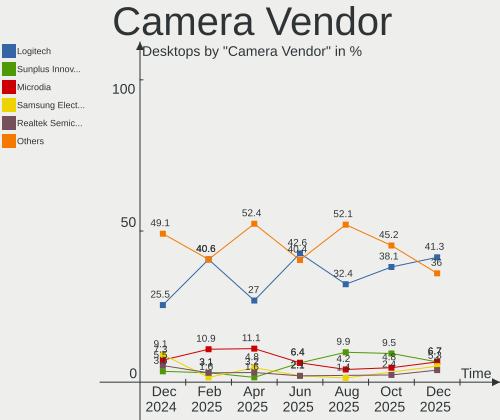

| Vendor                        | Desktops | Percent |
|-------------------------------|----------|---------|
| Logitech                      | 31       | 41.33%  |
| Sunplus Innovation Technology | 5        | 6.67%   |
| Microdia                      | 5        | 6.67%   |
| Samsung Electronics           | 4        | 5.33%   |
| Realtek Semiconductor         | 3        | 4%      |
| Microsoft                     | 3        | 4%      |
| Chicony Electronics           | 3        | 4%      |
| MacroSilicon                  | 2        | 2.67%   |
| ARC International             | 2        | 2.67%   |
| A4Tech                        | 2        | 2.67%   |
| webcamvendor                  | 1        | 1.33%   |
| webcam                        | 1        | 1.33%   |
| Sunplus IT                    | 1        | 1.33%   |
| Sonix Technology              | 1        | 1.33%   |
| Shenzhen e-loam Technology    | 1        | 1.33%   |
| OPPO Electronics              | 1        | 1.33%   |
| Jieli Technology              | 1        | 1.33%   |
| icSpring                      | 1        | 1.33%   |
| Hewlett-Packard               | 1        | 1.33%   |
| Generalplus Technology        | 1        | 1.33%   |
| eYs3d Technology              | 1        | 1.33%   |
| Elgato Systems                | 1        | 1.33%   |
| Cubeternet                    | 1        | 1.33%   |
| Bison Electronics             | 1        | 1.33%   |
| Apple                         | 1        | 1.33%   |

Camera Model
------------

Camera device models

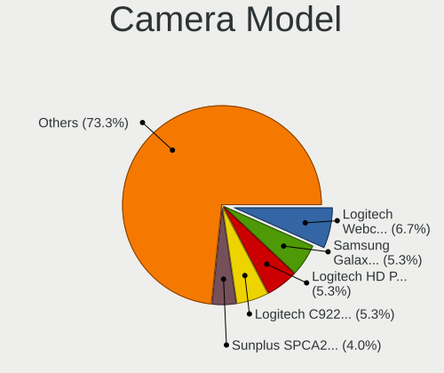

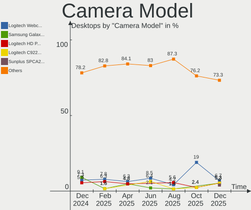

| Model                                         | Desktops | Percent |
|-----------------------------------------------|----------|---------|
| Logitech Webcam C270                          | 5        | 6.67%   |
| Samsung Galaxy series, misc. (MTP mode)       | 4        | 5.33%   |
| Logitech HD Pro Webcam C920                   | 4        | 5.33%   |
| Logitech C922 Pro Stream Webcam               | 4        | 5.33%   |
| Sunplus SPCA2281 Web Camera                   | 3        | 4%      |
| Microdia USB 2.0 Camera                       | 2        | 2.67%   |
| Logitech HD Webcam C910                       | 2        | 2.67%   |
| Logitech CrystalCam                           | 2        | 2.67%   |
| Logitech C920 PRO HD Webcam                   | 2        | 2.67%   |
| Logitech BRIO Ultra HD Webcam                 | 2        | 2.67%   |
| ARC International Camera                      | 2        | 2.67%   |
| webcamvendor NexiGo N60 FHD Webcam            | 1        | 1.33%   |
| webcam webcam                                 | 1        | 1.33%   |
| Sunplus IT USB CAM2                           | 1        | 1.33%   |
| Sunplus WebCamera                             | 1        | 1.33%   |
| Sunplus iContact Camera Pro                   | 1        | 1.33%   |
| Sonix GENERAL WEBCAM                          | 1        | 1.33%   |
| Shenzhen e-loam S1850                         | 1        | 1.33%   |
| Realtek Thronmax Stream Go Pro Webcam         | 1        | 1.33%   |
| Realtek HP 1.0MP High Definition Webcam       | 1        | 1.33%   |
| Realtek FULL HD 1080P Webcam                  | 1        | 1.33%   |
| OPPO Oppo N1                                  | 1        | 1.33%   |
| Microsoft Microsoft LifeCam Cinema            | 1        | 1.33%   |
| Microsoft LifeCam VX-800                      | 1        | 1.33%   |
| Microsoft LifeCam Studio                      | 1        | 1.33%   |
| Microdia Sonix USB 2.0 Camera                 | 1        | 1.33%   |
| Microdia CyberTrack H7                        | 1        | 1.33%   |
| Microdia Camera                               | 1        | 1.33%   |
| MacroSilicon MS210x Video Grabber [EasierCAP] | 1        | 1.33%   |
| Logitech Webcam C310                          | 1        | 1.33%   |
| Logitech Webcam C250                          | 1        | 1.33%   |
| Logitech Webcam C210                          | 1        | 1.33%   |
| Logitech Webcam C200                          | 1        | 1.33%   |
| Logitech QuickCam Pro 9000                    | 1        | 1.33%   |
| Logitech QuickCam E 3500                      | 1        | 1.33%   |
| Logitech Logitech Webcam C925e                | 1        | 1.33%   |
| Logitech HD Webcam C525                       | 1        | 1.33%   |
| Logitech HD Webcam C510                       | 1        | 1.33%   |
| Logitech Brio 101                             | 1        | 1.33%   |
| Jieli USB PHY 2.0                             | 1        | 1.33%   |

Security
--------

Fingerprint Vendor
------------------

Fingerprint sensor vendors

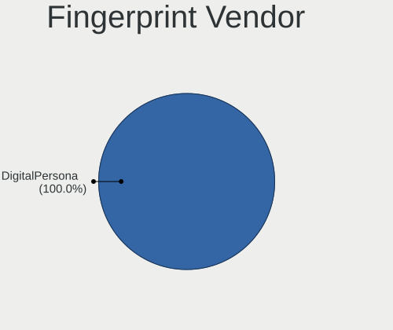

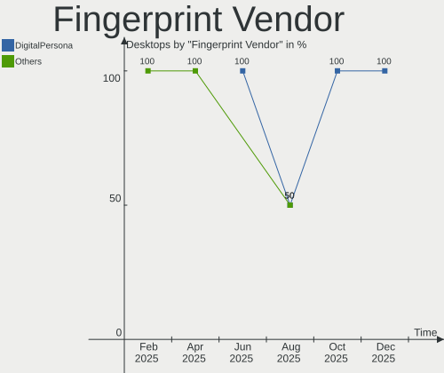

| Vendor         | Desktops | Percent |
|----------------|----------|---------|
| DigitalPersona | 1        | 100%    |

Fingerprint Model
-----------------

Fingerprint sensor models

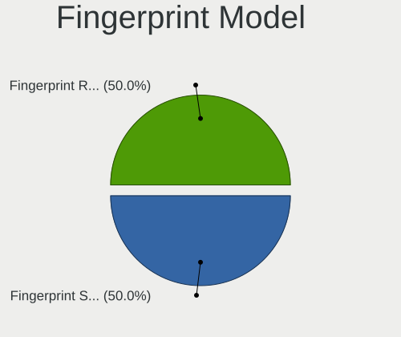

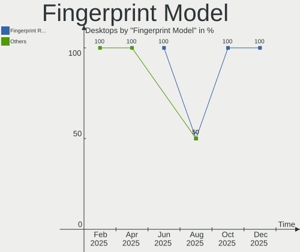

| Model                             | Desktops | Percent |
|-----------------------------------|----------|---------|
| DigitalPersona Fingerprint Reader | 1        | 100%    |

Chipcard Vendor
---------------

Chipcard module vendors

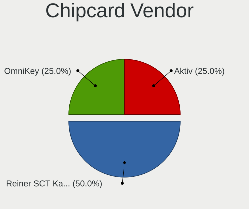

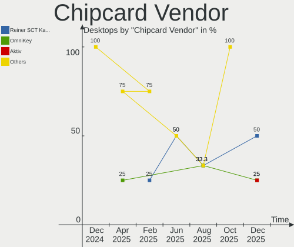

| Vendor                   | Desktops | Percent |
|--------------------------|----------|---------|
| Reiner SCT Kartensysteme | 2        | 50%     |
| OmniKey                  | 1        | 25%     |
| Aktiv                    | 1        | 25%     |

Chipcard Model
--------------

Chipcard module models

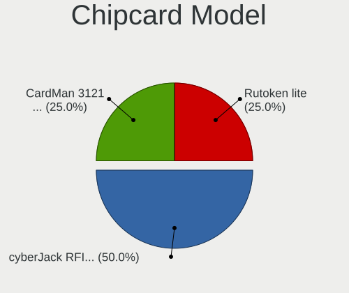

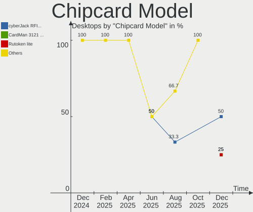

| Model                                                                      | Desktops | Percent |
|----------------------------------------------------------------------------|----------|---------|
| Reiner SCT Kartensysteme cyberJack RFID basis contactless smartcard reader | 2        | 50%     |
| OmniKey CardMan 3121 (HID Technologies)                                    | 1        | 25%     |
| Aktiv Rutoken lite                                                         | 1        | 25%     |

Unsupported
-----------

Unsupported Devices
-------------------

Total unsupported devices on board

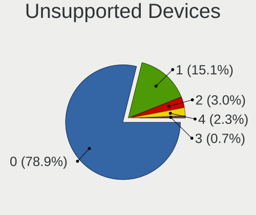

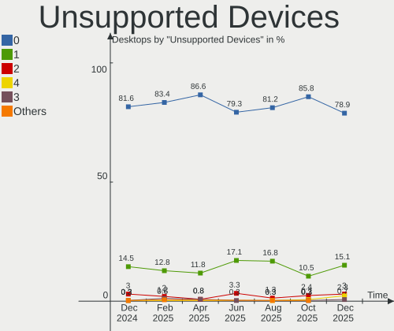

| Total | Desktops | Percent |
|-------|----------|---------|
| 0     | 235      | 78.86%  |
| 1     | 45       | 15.1%   |
| 2     | 9        | 3.02%   |
| 4     | 7        | 2.35%   |
| 3     | 2        | 0.67%   |

Unsupported Device Types
------------------------

Types of unsupported devices

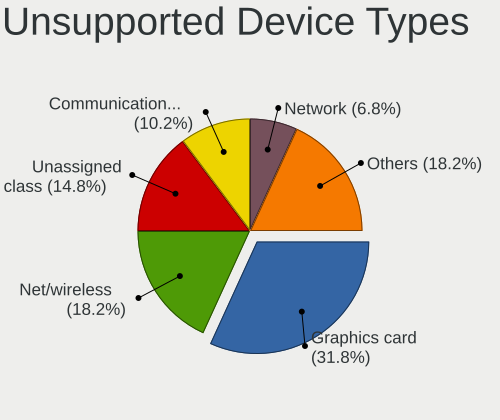

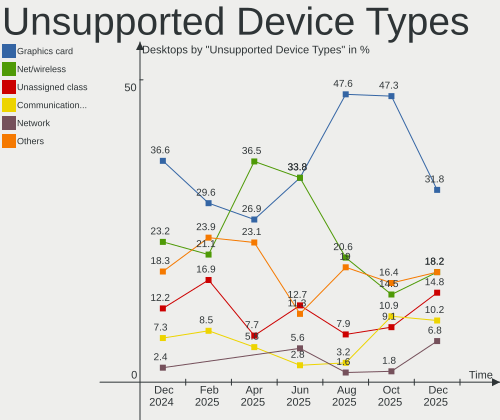

| Type                     | Desktops | Percent |
|--------------------------|----------|---------|
| Graphics card            | 28       | 31.82%  |
| Net/wireless             | 16       | 18.18%  |
| Unassigned class         | 13       | 14.77%  |
| Communication controller | 9        | 10.23%  |
| Network                  | 6        | 6.82%   |
| Chipcard                 | 4        | 4.55%   |
| Bluetooth                | 3        | 3.41%   |
| Storage/raid             | 2        | 2.27%   |
| Sound                    | 2        | 2.27%   |
| Net/ethernet             | 2        | 2.27%   |
| Multimedia controller    | 1        | 1.14%   |
| Fingerprint reader       | 1        | 1.14%   |
| Card reader              | 1        | 1.14%   |

